# Docker
**MySQL 部署 + Nginx 部署 + docker 自定义镜像 + DockerCompose 项目实战**

docker - 快速构建、运行、管理应用的工具

为什么要使用 docker ？

+ 为了方便部署，那么我们先回顾一下传统的部署方式有多麻烦
+ eg：MySQL
  + 查看系统环境：命令查看本机 Linux 系统版本
  + 下载 MySQL 安装包
  + 解压安装包到指定目录
  + 卸载系统自带的 MariaDB（MySQL）
  + 安装 MySQL
  + 安装失败的话要安装依赖
  + 查看安装完成后的安装包
  + 初始化 MySQL 服务
  + 启动 MySQL 服务
  + 验证
+ 整个过程中，命令太多记不住、安装包太多不知道去哪里下、安装步骤太复杂容易出错！！！
+ 而 docker 安装只需要打开控制台，输入一条命令，就能实现一键部署


注：本课程需要一定的 Linux 基础


## 快速入门

### 1. 部署 MySQL

**本教程 linux 基于 Rockey Linux 9.5 版本**

#### 安装 Docker

##### 精简版命令

```bash
yum install -y yum-utils
 
yum-config-manager --add-repo https://mirrors.aliyun.com/docker-ce/linux/centos/docker-ce.repo
 
yum install -y docker-ce
 
systemctl enable docker --now
 
mkdir -p /etc/docker
 
tee /etc/docker/daemon.json <<-'EOF'
{
  "registry-mirrors": [
    "https://registry.docker-cn.com",
    "http://hub-mirror.c.163.com",
    "https://docker.mirrors.ustc.edu.cn"
  ]
}
EOF
 
 
systemctl daemon-reload
 
systemctl restart docker
 
docker version
 
docker info
 
docker run hello-world
```

##### 详细操作过程

+ 安装必要的包

```bash
[root@localhost ~]# yum install -y yum-utils
```

+ 添加 docker-ce repo

```bash
[root@localhost ~]# yum-config-manager --add-repo https://mirrors.aliyun.com/docker-ce/linux/centos/docker-ce.repo
```

+ 安装 docker-ce

```bash
[root@localhost ~]# yum install -y docker-ce
```

+ 设置开机自动启动 docker 及启动 docker

```bash
[root@localhost ~]# systemctl enable docker --now
```

+ 配置国内镜像加速，这里配置三个镜像加速地址，根据需要可以添加更多镜像地址

```bash
[root@localhost ~]# mkdir -p /etc/docker
[root@localhost ~]# tee /etc/docker/daemon.json <<-'EOF'
{
  "registry-mirrors": [
    "https://registry.docker-cn.com",
    "http://hub-mirror.c.163.com",
    "https://docker.mirrors.ustc.edu.cn"
  ]
}
EOF
```

+ 重新加载配置及重启 docker

```bash
[root@localhost ~]# systemctl daemon-reload
[root@localhost ~]# systemctl restart docker
```

+ 查看 docker 版本信息

```bash
[root@localhost ~]# docker version
```

+ 查看 docker 信息

```bash
[root@localhost ~]# docker info
```

+ 验证 docker 是否可用
  + 下载一个 “hello-world” 测试镜像并在容器中运行它，当容器运行时，它会打印确认消息并退出

```bash
[root@localhost ~]# docker run hello-world
```

##### 卸载 docker

+ 卸载 docker 命令

```bash
[root@localhost ~]# yum remove -y docker-ce
```

+ 删除docker相关文件
  + 主机上的镜像、容器、卷或自定义配置文件不会自动删除，使用如下命令删除所有的镜像、容器和卷

```bash
[root@localhost ~]# rm -rf /var/lib/docker
[root@localhost ~]# rm -rf /var/lib/containerd
```

##### yum

+ 没安装 yum 的话

```bash
[root@localhost ~]# yum install -y yum-utils
```

##### 启动和校验

+ 查看 Docker 版本

```bash
[root@localhost ~]# docker -v
```

+ 启动 Docker

```bash
[root@localhost ~]# systemctl start docker
```

+ 停止 Docker

```bash
[root@localhost ~]# systemctl stop docker
```

+ 重启

```bash
[root@localhost ~]# systemctl restart docker
```

+ 设置开机自启

```bash
[root@localhost ~]# systemctl enable docker
```

+ 执行 docker ps 命令，如果不报错，说明安装启动成功

```bash
[root@localhost ~]# docker ps
```

##### 配置镜像加速

这里以阿里云镜像加速为例

###### 1. 注册阿里云账号

首先访问阿里云网站：https://www.aliyun.com/
注册一个账号

###### 2. 开通镜像服务

在首页的产品中，找到阿里云的**容器镜像服务**：


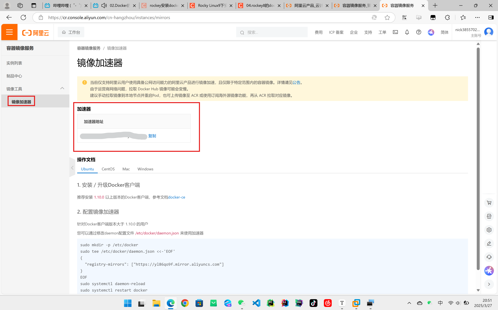

```bash
sudo mkdir -p /etc/docker
sudo tee /etc/docker/daemon.json <<-'EOF'
{
  "registry-mirrors": [
   	"https://hub-mirror.c.163.com",
    "https://mirror.baidubce.com",
    "https://docker.mirrors.ustc.edu.cn",
    "https://registry.docker-cn.com"]
}
EOF
sudo systemctl daemon-reload
sudo systemctl restart docker
```

常见的国内 Docker 镜像源

```
{
  "registry-mirrors": [
    "https://hub-mirror.c.163.com",
    "https://mirror.baidubce.com",
    "https://docker.mirrors.ustc.edu.cn",
    "https://registry.docker-cn.com"
  ]
}
```


-----------------------------


#### 部署 MySQL

先停掉虚拟机中的 MySQL，确保你的虚拟机已经安装 Docker，且网络开通的情况下，执行下面命令即可安装 MySQL：

```bash
docker run -d \
	--name mysql \
	-p 3306:3306 \
	-e TZ=Asia/Shanghai \
	mysql
```

ps：\ 是换行符

如果报错

```
Unable to find image 'mysql:latest' locally docker: Error response from daemon: Get "https://registry-1.docker.io/v2/": net/http: request canceled while waiting for connection (Client.Timeout exceeded while awaiting headers)
```

将镜像加速地址改为

```
 "registry-mirrors": [
        "http://hub-mirror.c.163.com",
        "https://mirrors.tuna.tsinghua.edu.cn",
        "http://mirrors.sohu.com",
        "https://ustc-edu-cn.mirror.aliyuncs.com",
        "https://ccr.ccs.tencentyun.com",
        "https://docker.m.daocloud.io",
        "https://docker.awsl9527.cn"
      ]
```

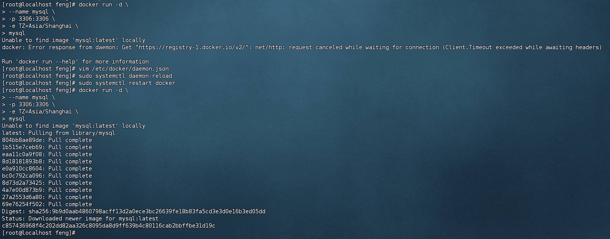

这样我们就安装成功了

那么我们就来思考，docker 到底做了什么？

##### docker 做了什么？

+ Unable to find image 'mysql:latest' locally
  + 我在本地找不到 MySQL 的最新版本

+ 然后就是咔咔一顿下载
  + 下载了一个安装好的 MySQL

##### 镜像和容器

当我们利用 Docker 安装应用时，Docker 会自动搜索并下载应用**镜像（image）**。镜像不仅包含应用本身，还包含应用运行所需要的环境、配置、系统函数库。Docker 会在运行镜像时创建一个隔离环境，称为**容器（container）**

可以用 `docker ps` 查看是否连接成功

发现连不上的可以
+ 用 Windows 的终端连
+ 把防火墙和 seilnux 关掉


那 docker 要搜索和下载这些镜像从哪来

**镜像仓库**：存储和管理镜像的平台，Docker 官方维护了一个公共仓库：https://hub.docker.com/

ps：进不去的可能要用魔法

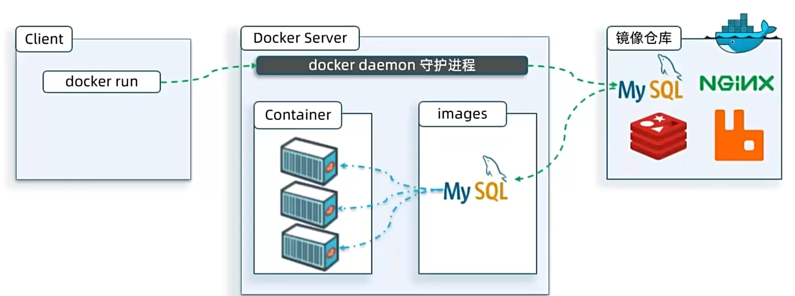


----------------------------------


### 2. 命令解读

```bash
docker run -d \
	--name mysql \
	-p 3306:3306 \
	-e TZ=Asia/Shanghai \
	-e MYSQL_ROOT_PASSWORD=123 \
	mysql
```

+ `docker run`：创建并运行一个容器，`-d` 是让容器在后台运行
+ `--name mysql`：给容器起个名字，必须唯一
+ `-p 3306:3306`：设置端口映射
  + 前面是宿主机端口，后面是容器内端口
  + 可以把服务器主机的3306端口跟 msql 容器的3306端口做一个映射，那么当我们去访问这台外部机器的3306端口时，docker 就会把这个请求转到容器内的3306端口，这样就相当于间接地访问到容器

+ `-e KEY=VALUE`：是设置环境变量
  + 不同的镜像它不一样，因为这个环境变量将来是由这个镜像内部在去执行运行容器的时候去用到的，因此它是由这个镜像来决定的（查看镜像的文档说明【dockerhub】）

+ `mysql`：指定运行镜像的名字

#### 镜像命名规范

+ 镜像名称一般分两部分组成：`[repository]:[tag]`
  + 其中 repository 就是镜像名
  + tag 是镜像的版本

+ 在没指定 tag 时，默认是 `latest`，代表最新版本的镜像


#### 总结

docker run 命令中的常见参数：

+ `-d`：容器后台运行
+ `--name`：给容器命名
+ `-e`：环境变量
+ `-p`：宿主机端口映射到容器内端口

镜像名称结构：

+ `Repository:TAG`


-----------------------------


## Docker 基础

### 1. 常见命令

Docker 最常见的命令就是操作镜像、容器的命令，详见官方文档：[Docker 文档](https://docs.docker.com/)

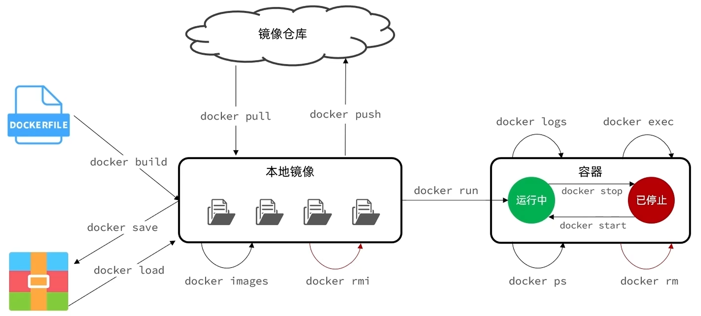

+ `docker pull`：单独要下载
+ `docker images`：查看所有的本地镜像
+ `docker rmi`：删除镜像
+ `docker build`：打包构建镜像
+ `docker save`：保存镜像到本地（变成一个压缩文件）
+ `docker load`：把压缩文件加载到他这个镜像当中
+ `docker push`：把镜像推到镜像仓库
+ `docker run`：创建并运行容器
+ `docker stop`：停止容器（停止的是容器内部的进程，容器还是在的）
+ `docker start`：启动容器内部的进程
+ `docker ps`：查看当前容器的运行状态
+ `docker rm`：删除容器
+ `docker logs`：查看容器运行的日志
+ `docker exec`：执行一些命令进入到容器的内部（因为容器是隔离空间，本来是没有办法去访问它的）


还有很多其他命令将来用到再查就行，全部的命令就要查看官方文档了

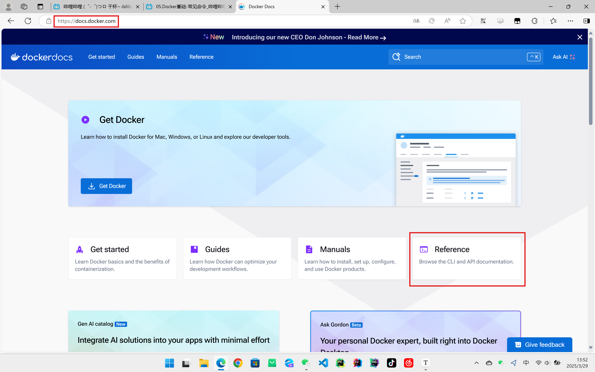

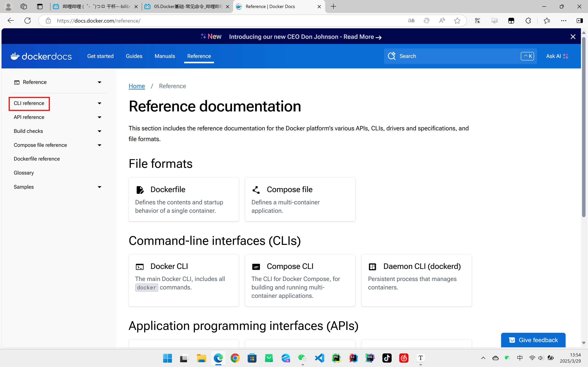

ps：知道有这个命令就可以了，后续工作中实际用到都是找 AI 生成完整的执行流程

#### 案例

> 查看 DockerHub，拉取 Nginx 镜像，创建并运行 Nginx 容器
> 
> 需求：
> + 在 DockerHub 中搜索 Nginx 镜像，查看镜像的名称
> 拉取 Nginx 镜像
> 查看本地镜像列表
> 创建并运行 Nginx 容器
> 查看容器
> 停止容器
> 再次启动容器
> 进入 Nginx 容器
> 删除容器
> 

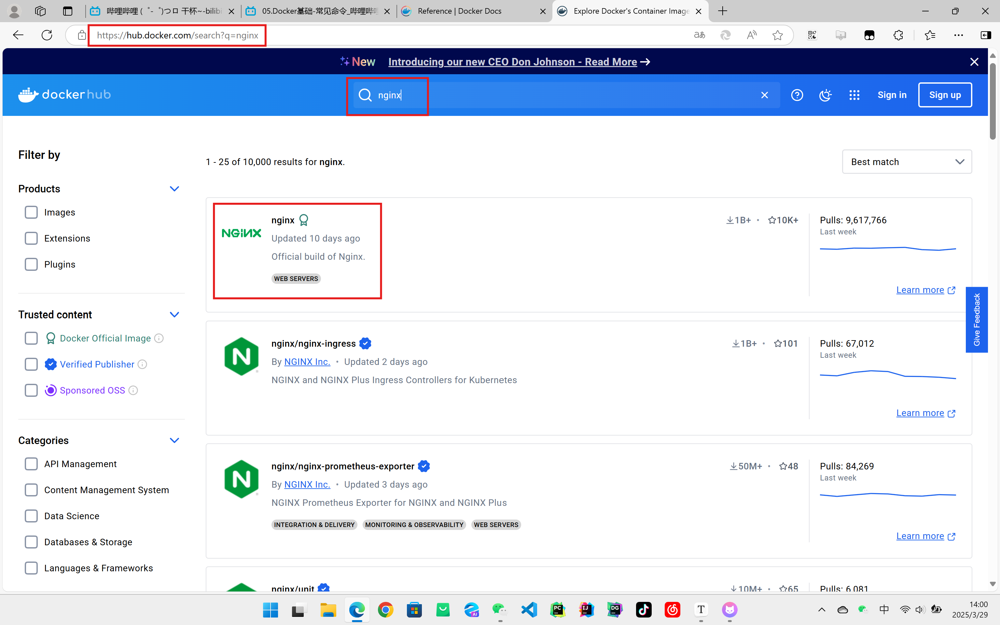


```bash
# 拉取nginx镜像
docker pull nginx

# 查看本地镜像列表
docker images

# --help参看save参数怎么写
docker save --help

# 把镜像保存到本地，-o指定文件名称
docker save -o nginx.tar nginx:latest

# 删除镜像
docker rmi nginx:latest

# 查看本地镜像列表
docker images

# 读取文件
docker load --help

# -i表示要读哪个文件 -q表示要不要输出
docker load -i nginx.tar

# 查看本地镜像列表
docker images

# 创建并运行镜像
docker run -d --name nginx -p 80:80 nginx

# 查看容器的状态
docker ps

# 也可以加格式化方式访问，格式会更加清爽
docker ps -format "table {{.ID}}\t{{.Image}}\t{{.Ports}}\t{{.Status}}\t{{.Names}}"

# 停掉容器
docker stop nginx

# 默认情况下是查看运行中的容器，加上-a就是查看所有容器
docker ps -format "table {{.ID}}\t{{.Image}}\t{{.Ports}}\t{{.Status}}\t{{.Names}}" -a

# 启动容器
docker start nginx

# 查看容器的状态
docker ps

# 查看日志
docker logs nginx

# 查看日志，加上-f会一直查看这个日志不停
docker logs -f nginx

# 进入容器内部，-it就是添加可输入终端
docker exec -it nginx bash

# 退出
exit

# 停掉容器
docker stop nginx

# 删除容器，如果后面加上-f就是强制删除
docker rm nginx
```


补：小知识点【命令的别名】

简化 `docker ps -format "table {{.ID}}\t{{.Image}}\t{{.Ports}}\t{{.Status}}\t{{.Names}}"`

ps：每个人开发习惯不一样，了解了解就行

```bash
# 编辑这个文件
vi ~/.bashrc

# 保存修改内容
:wq

# 让它生效
source ~/.bashrc
```


------------------------------


### 2. 数据卷

#### 案例1 - 利用 Nginx 容器部署静态资源

> 需求：
>
> + 创建 Nginx 容器，修改 nginx 容器内的 html 目录下的 index.html 文件，查看变化
> + 将静态资源部署到 nginx 的 html 目录

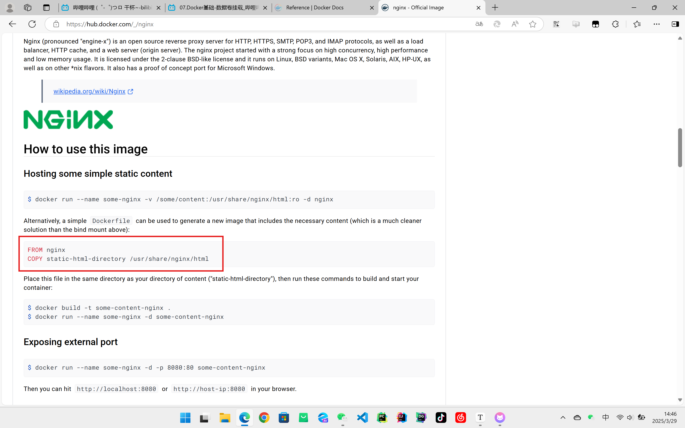

```bash
# 连接 nginx 容器
docker exec -it nginx bash

# 进入指定目录
cd /usr/share/nginx/html

# 查看目录列表
ls

# 对他进行修改
vi index.html
```

然后就发现没有 vi 命令，为什么呢？

因为 docker 的镜像只包含当前镜像所对应的这个应用运行必备的系统函数

所以我们就会发现一个事情，我们想在容器内修改文件非常困难

那要怎么解决，就用**数据卷**

#### 数据卷

**数据卷（volume）**是一个虚拟目录，是**容器内目录**与**宿主机目录**之间映射的桥梁

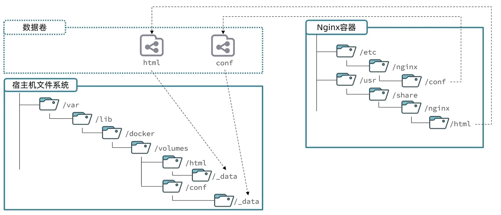

+ 映射是双向的，你在 Nginx 目录下进行修改，宿主机下也会跟着修改，反之同理

| 命令                  | 说明                 | 文档地址                                                     |
| --------------------- | -------------------- | ------------------------------------------------------------ |
| docker volume create  | 创建数据卷           | [docker volume create](https://docs.docker.com/reference/cli/docker/volume/create/) |
| docker volume ls      | 查看所有数据卷       | [docker volume ls](https://docs.docker.com/reference/cli/docker/volume/ls/) |
| docker volume rm      | 删除指定数据卷       | [docker volume rm](https://docs.docker.com/reference/cli/docker/volume/rm/) |
| docker volume inspect | 查看某个数据卷的详情 | [docker volume inspect](https://docs.docker.com/reference/cli/docker/volume/inspect/) |
| docker volume prune   | 清除数据卷           | [docker volume prune](https://docs.docker.com/reference/cli/docker/volume/prune/) |

再回到上面那个需求

提示：
+ 在执行 docker run 命令时，使用 `-v 数据卷:容器内目录` 可以完成数据卷挂载
  + 挂载动作一定是在 docker run 的时候去执行的，如果这个容器已经创建了是没有办法再去做挂载的

+ 当创建容器时，如果挂载了数据卷且数据卷不存在，会自动创建数据卷

```bash
# 删除原有的nginx容器
docker rm -f nginx

# 创建并运行新的容器
docker run -d --name nginx -p 80:80 -v html:/usr/share/nginx/html nginx

# 查看数据卷有没有创建
docker volume ls

# 展示卷的详细信息
docker volume inspect html

# 进入数据卷目录
cd /var/lib/docker/volumes/html/_data
ll

# 后续可以用vi命令修改也可以用shell客户端修改

# 进入nginx容器
docker exec -it nginx bash

# 进入指定目录并查看内容
cd /usr/share/nginx/html/
ls
```

#### 总结

什么是数据卷？

+ 数据卷是一个虚拟目录，它将宿主机目录映射到容器内目录，方便我们操作容器内文件，或者方便迁移容器产生的数据

如何挂载数据卷？

+ 在创建容器时，利用 `-v 数据卷名:容器内目录` 完成挂载
+ 容器创建时，如果发现挂载的数据卷不存在时，会自动创建

数据卷的常见命令有哪些？

+ docker volume ls：查看数据卷
+ docker volume rm：删除数据卷
+ docker volume inspect：查看数据卷详情
+ docker volume prune：删除未使用的数据卷


-----------------------------------


#### 其他与容器目录挂载的方式

##### 案例2 - mysql 容器的数据挂载

> 需求：
> + 查看 mysql 容器，判断是否有数据卷挂载
>
> + 基于宿主机目录实现 MySQL 数据目录、配置文件、初始化脚本的挂载（查阅官方镜像文档）
>   + 1. 挂载 /root/mysql/data 到容器内的 /var/lib/mysql 目录
>   + 2. 挂载 /root/mysql/init 到容器内的 /docker-entrypoint-initdb.d 目录，携带 SQL 脚本
>   + 3. 挂载 /root/mysql/conf 到容器内的 /etc/mysql/conf.d 目录，携带配置文件
>
> 

提示：

+ 在执行 docker run 命令时，使用 `-v 本地目录:容器内目录` 可以完成本地目录挂载
+ 本地目录必须以 "/" 或 "./" 开头，如果直接以名称开头，会被识别为数据卷而非本地目录
  + -v mysql:/var/lib/mysql 会被识别为一个数据卷叫 mysql
  + -v ./mysql:/var/lib/mysql 会被识别为当前目录下的 mysql 目录

mysql 配置文件地址

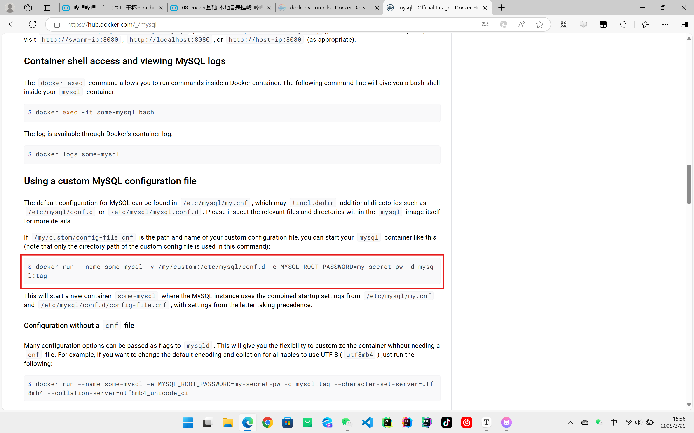

初始化脚本

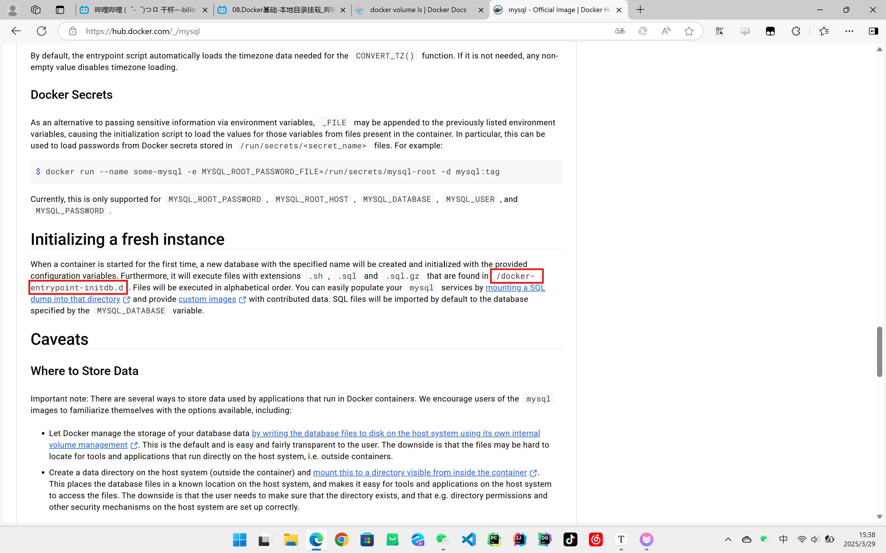

放数据的

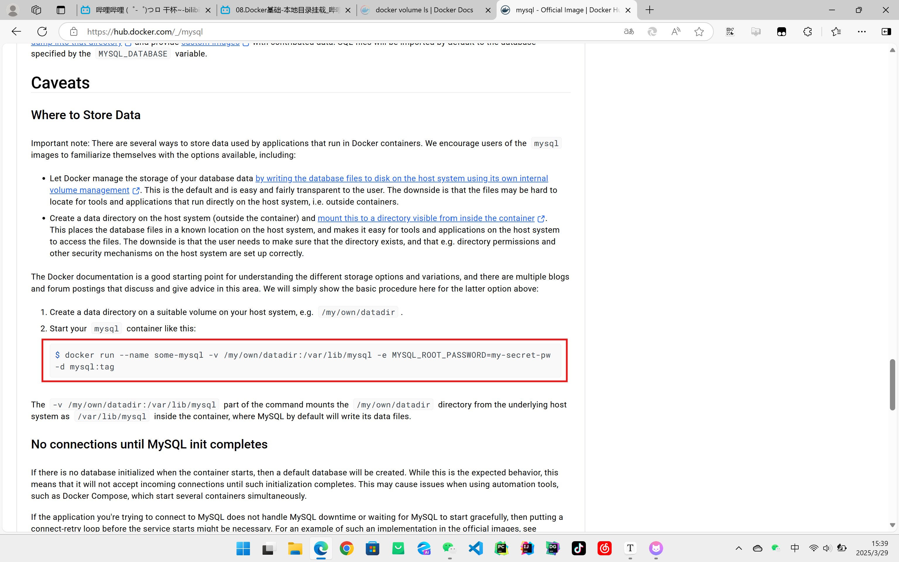


```bash
# 查看某个容器详情
docker inspect mysql
# 发现容器内部自己有数据卷，这是由于容器运行自动创建的卷，叫做匿名卷

# 查看数据卷
docker volume ls

# 进入指定目录
cd /var/lib/docker/volumes/匿名卷名/_data

# 删掉旧的mysql容器
docker rm -f mysql

# 数据卷还在，数据依然还在
docker volume ls

# 回到root
cd ~
pwd

# 创建一个mysql目录
mkdir mysql
cd mysql/
mkdir data
mkdir conf
mkdir init

# 放入config目录、init脚本

# 创建并运行容器
docker run -d \
	--name mysql \
	-p 3306:3306 \
	-e TZ=Asia/Shanghai \
	-e MYSQL_ROOT_PASSWORD=123 \
	-v /root/mysql/data:/var/lib/mysql \
	-v /root/mysql/init:/docker-entrypoint-initdb.d \
	-v /root/mysql/conf:/etc/mysql/conf.d  \
	mysql
```


-----------------------------


### 3. 自定义镜像

镜像就是包含了应用程序、程序运行的系统函数库、运行配置等文件的文件包。构建镜像的过程其实就是把上述文件打包的过程

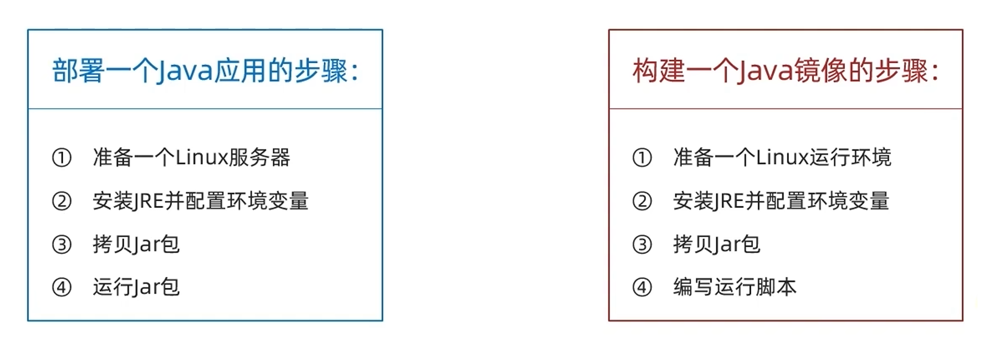

**入口（Entrypoint）**：镜像运行入口，一般是程序启动的脚本和参数

**层（Layer）**：添加安装包、依赖、配置等，每次操作都形成新的一层

**基础镜像（BaseImage）**：应用依赖的系统函数库、环境、配置、文件等

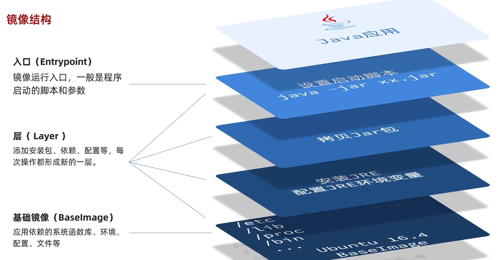

#### Dockerfile

**Dockerfile** 就是一个文本文件，其中包含一个个的**指令（Instruction）**，用指令来说明要执行什么操作来构建镜像。将来 Docker 可以根据 Dockerfile 帮我们构建镜像。常见指令如下：

| 指令       | 说明                                           | 实例                                                         |
| ---------- | ---------------------------------------------- | ------------------------------------------------------------ |
| FROM       | 指定基础镜像                                   | FROM centos:6                                                |
| ENV        | 设置环境变量，可在后面指令使用                 | ENV key value                                                |
| COPY       | 拷贝本地文件到镜像的指定目录                   | COPY ./jrell.tar.gz /tmp                                     |
| RUN        | 执行 Linux 的 shell 命令，一般是安装过程的命令 | RUN tar -zxvf /tmp/jrell.tar.gz && && EXPORTS path=/tmp/jrell:$path |
| EXPOSE     | 指定容器运行时监听的端口，是给镜像使用者看的   | EXPOSE 8080                                                  |
| ENTRYPOINT | 镜像中应用的启动命令，容器运行时调用           | ENTRYPOINT java -jar xx.jar                                  |

更新详细语法说明，请参考官方文档：[Dockerfile reference | Docker Docs](https://docs.docker.com/reference/dockerfile/)

+ 一个小 demo
  + 我们可以基于 Ubuntu 基础镜像，利用 Dockerfile 描述镜像结构

```bash
# 指定基础镜像
FROM ubuntu: 16.04

# 配置环境变量，JDK的安装目录、容器内时区
ENV JAVA_DIR=/usr/local

# 拷贝jdk和java项目的包
COPY ./jdk8.tar.gz $JAVA_DIR/ 
COPY ./docker-demo.jar /tmp/app.jar 

# 安装JDK
RUN cd $JAVA_DIR \ && tar -xf ./jdk8.tar.gz \ && mv ./jdk1.8.0_144 ./java8

# 配置环境变量
ENV JAVA_HOME=$JAVA_DIR/java8
ENV PATH=SPATH: $JAVA_HOME/bin

# 入口，java项目的启动命令
ENTRYPOINT ["java", "-jar", "/app.jar"] 
```

+ 也有可以直接基于 JDK 为基础镜像，省略前面的步骤

```bash
# 基础镜像
FROM openjdk:11.0-jre-buster

# 拷贝jar包
COPY docker-demo.jar /app.jar

# 入口
ENTRYPOINT ["java", "-jar", "/app.jar"] 
```

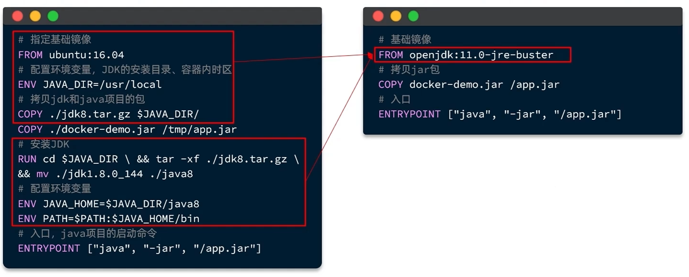

所以 Dockerfile 里面的指令根本不用记

当编写好了 Dockerfile，可以利用下面命令来构建镜像：

```bash
docker build -t myImage:1.0 .
```

+ `-t`：是给镜像起名，格式依然是 repository:tag 的格式，不指定 tag 时，默认为 latest
+ `.`：是 Dockerfile 所在目录，如果就在当前目录，则指定为 "."

#### 总结

镜像的结构是什么？

+ 镜像中包含了应用程序所需要的运行环境、函数库、配置、以及应用本身等各种文件，这些文件分层打包而成

Dockerfile 是做什么的？

+ Dockerfile 就是利用固定的指令来描述镜像的结构和构建过程，这样 Docker才可以以此来构建镜像

构建镜像的命令什么？

+ docker build -t 镜像名 Dockerfile目录


--------------------------------


### 4. 容器网络

默认情况下，所有容器都是以 bridge 方式连接到 Docker 的一个虚拟网桥上：

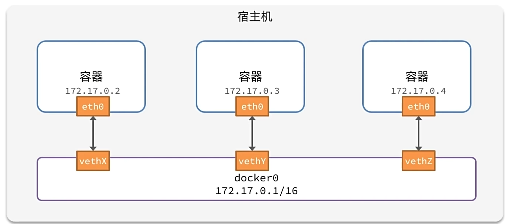

+ 但是这个 IP 地址是 docker 网桥给你分配的，现在假设我们的这个服务重新启动或者在重启的过程中有其他容器也启动了，那么你的 IP 地址有可能被别人占有

#### 网络

加入自定义网络的容器才能通过容器名互相访问，Docker 的网络操作命令如下：

| 命令                      | 说明                     | 文档地址                                                     |
| ------------------------- | ------------------------ | ------------------------------------------------------------ |
| docker network create     | 创建一个网络             | [docker network create](https://docs.docker.com/reference/cli/docker/network/create/) |
| docker network ls         | 查看所有网络             | [docker network ls](https://docs.docker.com/reference/cli/docker/network/ls/) |
| docker network rm         | 删除指定网络             | [docker network rm](https://docs.docker.com/reference/cli/docker/network/rm/) |
| docker network prune      | 清除未使用的网络         | [docker network prune](https://docs.docker.com/reference/cli/docker/network/prune/) |
| docker network connect    | 使指定容器连接加入某网络 | [docker network connect](https://docs.docker.com/reference/cli/docker/network/connect/) |
| docker network disconnect | 使指定容器离开某网络     | [docker network disconnect](https://docs.docker.com/reference/cli/docker/network/disconnect/) |
| docker network inspect    | 查看网络详细信息         | [docker network inspect](https://docs.docker.com/reference/cli/docker/network/inspect/) |

```bash
# 查看所有网络
docker network ls

# 创建网络
docker network create itfeng

# 查看所有网络
docker network ls

# 查看网桥
ip addr

# 加入容器
docker network connect itfeng mysql

# 查看mysql容器
docker inspect mysql

# 让容器创建的时候就连接
docker run -d --name nginx -p 80:80 -network itfeng nginx

# 查看mysql容器
docker inspect mysql

docker exec -it nginx bash
ping mysql
```


----------------------------------------


## 项目部署


### DockerCompose

Docker Compose 通过一个单独的 **docker-compose.yml** 模板文件（YAML 格式）来定义一组相关联的应用容器，帮助我们实现**多个相互关联的 Docker 容器的快速部署**

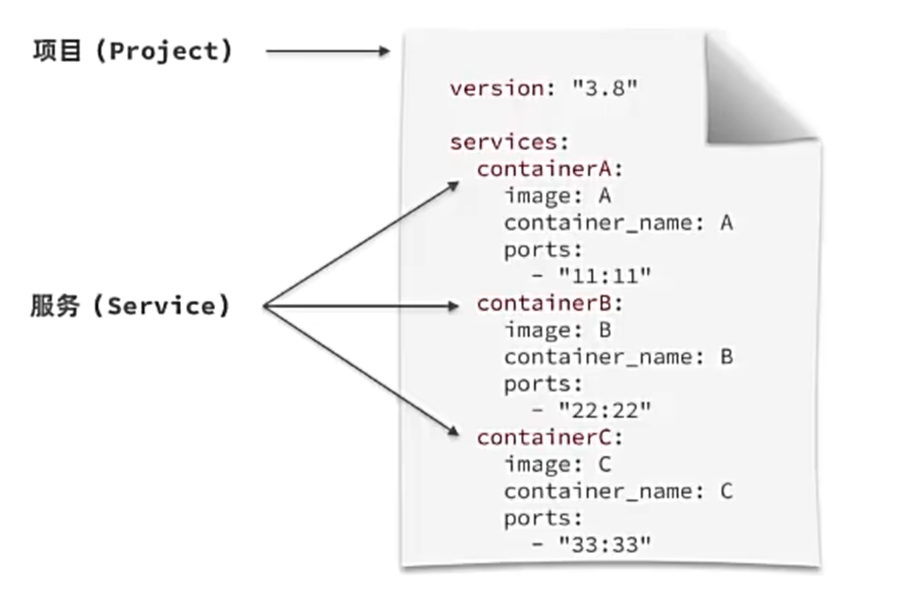

+ docker run 描述容器部署

```bash
docker run -d \
	--name mysql \
	-p 3306:3306 \
	-e TZ=Asia/Shanghai \
	-e MYSQL_ROOT_PASSWORD=123 \
	-v /root/mysql/data:/var/lib/mysql \
	-v /root/mysql/init:/docker-entrypoint-initdb.d \
	-v /root/mysql/conf:/etc/mysql/conf.d  \
	--network hmall
	mysql
```

+ docker compose 描述容器部署

```bash
version: "3.8"
services:
	mysql:
		image: mysql
		container_name:mysql
		ports:
			- "3306:3306"
		environment:
			TZ: Asia/Shanghai
			MYSQL_ROOT_PASSWORD=123
		volumes:
			- "./mysql/conf:/etc/mysql/conf.d"
			- "./mysql/data:/var/lib/mysql"
			- "./mysql/init:/docker-entrypoint-initdb.d"
			- hmall
```

docker Compose 的命令格式如下：

```bash
docker compose [OPTIONS] [COMMAND]
```

<table>
    <tr><!-- 第一行 -->
        <td>
            类型
        </td>
        <td>
            参数或指令
        </td>
        <td>
            说明
        </td>
    </tr>
    <tr><!-- 第二行 -->
        <td rowspan="2">Options</td>
        <td>
            -f
        </td>
        <td>
            指定 compose 文件的路径和名称
        </td>
    </tr>
    <tr>
        <td>
            -p
        </td>
        <td>
            指定 project 名称
        </td>
    </tr>
    <tr>
        <td rowspan="9">Commands</td>
        <td>
            up
        </td>
        <td>
            创建并启动所有 service 容器
        </td>
    </tr>
    <tr>
        <td>
            down
        </td>
        <td>
            停止并移除所有容器、网络
        </td>
    </tr>
    <tr>
        <td>
            ps
        </td>
        <td>
            列出所有启动的容器
        </td>
    </tr>
    <tr>
        <td>
            logs
        </td>
        <td>
            查看指定容器的日志
        </td>
    </tr>
    <tr>
        <td>
            stop
        </td>
        <td>
            停止容器
        </td>
    </tr>
    <tr>
        <td>
            start
        </td>
        <td>
            启动容器
        </td>
    </tr>
    <tr>
        <td>
            restart
        </td>
        <td>
            重启容器
        </td>
    </tr>
    <tr>
        <td>
            top
        </td>
        <td>
            查看运行的进程
        </td>
    </tr>
    <tr>
        <td>
            exec
        </td>
        <td>
            在指定的运行中的容器中执行命令
        </td>
    </tr>
</table>


```bash
docker compose up -d

docker compose ps
```


-------------------------------

