# Git

Git 分布式版本控制工具

# 1. 目标

+ 了解 Git 基本概念
+ 能够概述 Git 工作流程
+ 能够使用 Git 常用命令
+ 熟悉 Git 代码托管服务
+ 能够使用 idea 操作 Git


------------------------------------


# 2. 概述

## 2.1 开发中的实际场景

eg：备份、代码还原、协同开发、追溯问题代码的编写人和编写时间

## 2.2 版本控制器的方式

+ 集中式版本控制工具
  + 集中式版本控制工具，版本库是集中存放在中央服务器的，组里每个人工作时从中央服务器下载代码，是必须联网才能工作，局域网或互联网。个人修改后然后提交到中央版本库
  + 举例：SVN 和 CVS
+ 分布式版本控制工具
  + 分布式版本控制系统没有“中央服务器”，每个人的电脑上都是一个完整的版本库，这样工作的时候，无需联网了，因为版本库就在你自己的电脑上。多人协作只需要各自的修改推送给对方，就能互相看到对方的修改了
  + 举例：Git

## 2.3 SVN（集中式版本控制工具）

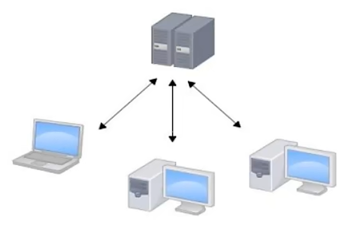

## 2.4 Git

Git 是分布式的，Git 不需要有中心服务器，我们每台电脑拥有的东西都是一样的。我们使用 Git 并且有个中心服务器，仅仅是为了方便交换大家的修改，但是这个服务器的地位和我们每个人的 PC 是一样的。我们可以把它当作一个开发者的 PC 就可以就是为了大家代码容易交流不关机的。没有它大家一样可以工作，只不过“交换”修改不方便而已

Git 是一个开源的分布式版本控制系统，可以有效、高速地处理从很小到非常大的项目版本管理。Git 是 Linus Torvalds 为了帮助管理 Linux 内核开发而开发的一个开放源码的版本控制软件

同生活中的许多伟大事物一样，Git 诞生于一个极富纷争大举创新的年代。Linux 内核开源项目有着为数众多的参与者。绝大多数的 Linux 内核维护工作都花在了提交补丁和保存归档的繁琐事务上（1991 - 2002年间）。到2002年，整个项目组开始启用一个专有的分布式控制系统 BitKeeper 来管理和维护代码

到了2005年，开发 BitKeeper 的商业公司同 Linux 内核开源社区的合作关系结束，他们收回了 Linux 内核社区免费使用 BitKeeper  的权利。这就迫使 Linux 开源社区（特别是 Linux 的缔造者 Linus Torvalds）基于使用 BitKeeper 时的经验教训，开发出自己的版本系统，他们对新的系统订了若干目标：

+ 速度
+ 简单的设计
+ 对非线性开发模式的潜力支持（允许成千上万个并行开发的分支）
+ 完全分布式
+ 有能力高效管理类似 Linux 内核一样的超大规模项目（速度和数据量）

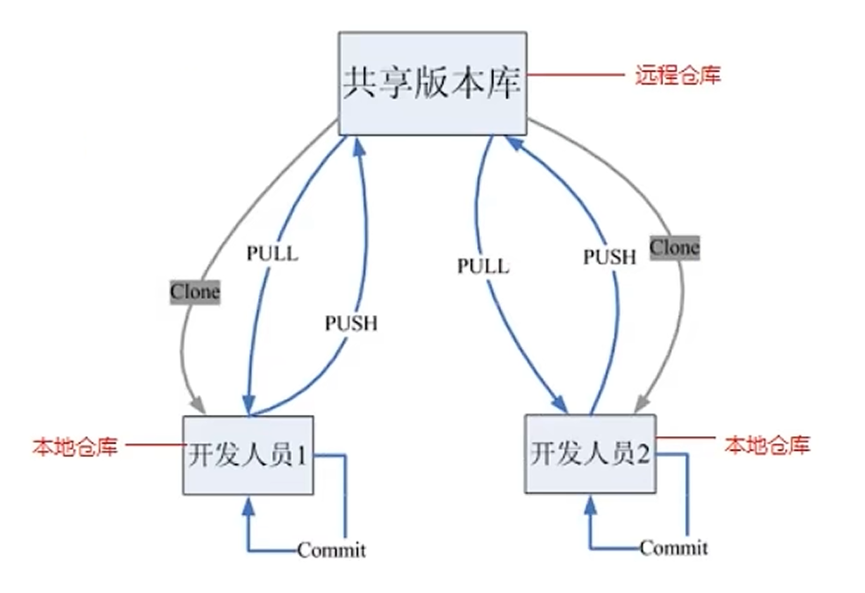

## 2.5 Git 工作流程图

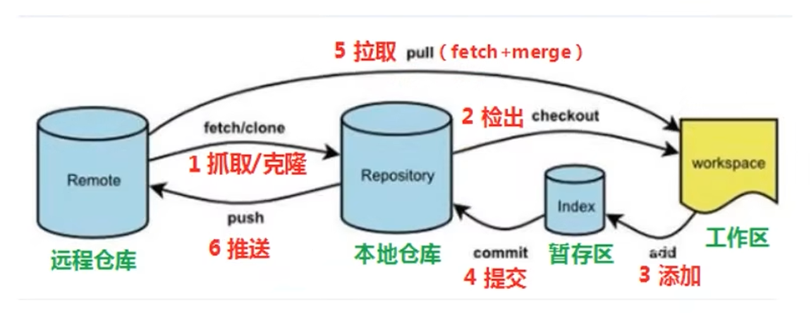

命令如下：

1. `clone`（克隆）：从远程仓库中克隆代码到本地仓库
2. `checkout`（检出）：从本地仓库中检出一个仓库分支然后进行修订
3. `add`（添加）：在提交前先将代码提交到暂存区
4. `commit`（提交）：提交到本地仓库。本地仓库中保存修改的各个历史版本
5. `fetch`（抓取）：从远程库，抓取到本地仓库，不进行任何的合并动作，一般操作比较少
6. `pull`（拉取）：从远程库拉到本地库，自动进行合并（merge），然后放到工作区，相当于 fetch + merge
7. `push`（推送）：修改完成后，需要和团队成员共享代码时，将代码推送到远程仓库


-------------------------------


# 3. Git 安装与常用命令

本教程里的 git 命令例子都是在 Git Bash 中演示的，会用到一些基本的 Linux 命令，为此提前举例：
+ `ls` / `ll`	     查看当前目录
+ `cat` 		    查看文件内容
+ `touch`		  创建文件
+ `vi`			vi 编辑器（使用 vi 编辑器是为了方便展示效果，也可以用记事本、editPlus、notPad++ 等其他编辑器）

## 3.1 Git 环境配置
### 3.1.1 下载与安装

下载地址：https://git-scm.com/download

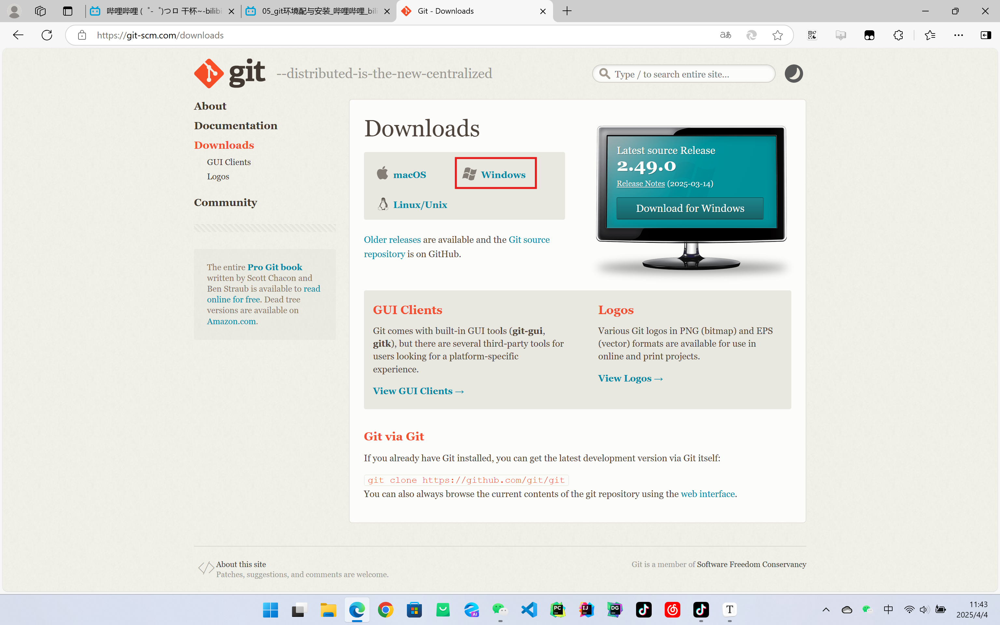

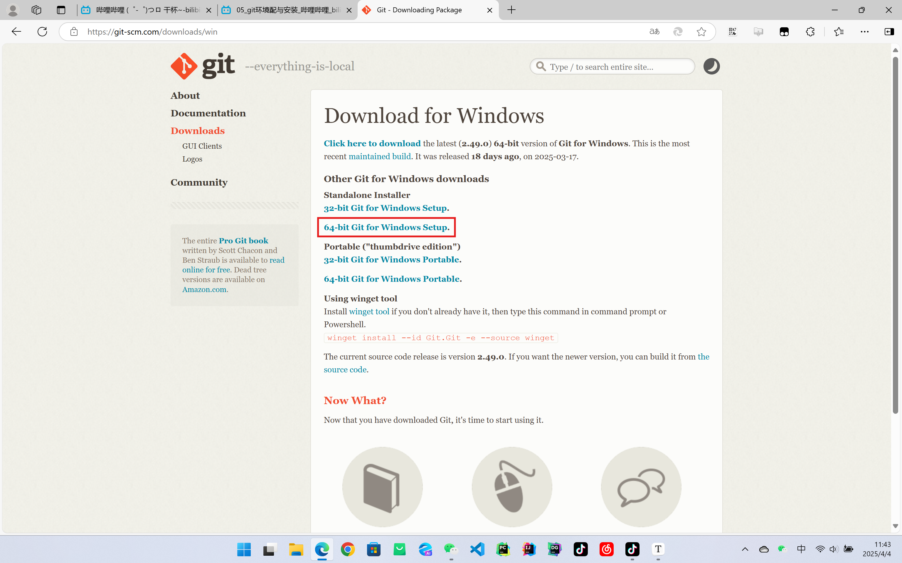

安装过程就是傻瓜式安装（一直点 Next 即可【安装路径可以自行修改】）

安装完后在电脑桌面（也可以是其他目录）点击右键，如果能够看到如下两个菜单则说明安装成功

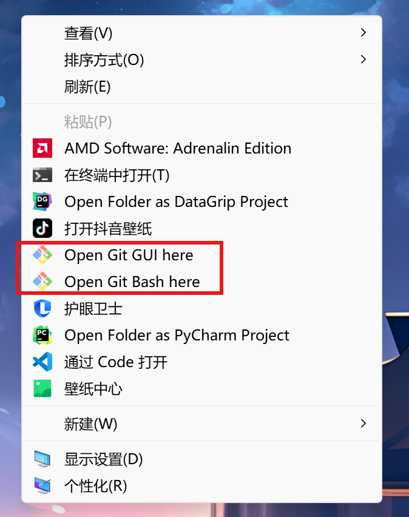

备注：
Git GUI：Git 提供的图形界面工具
Git Bash：Git 提供的命令行工具
当安装 Git 后首先要做的事情是设置用户名称和 email 地址。这是非常重要的，因为每次 Git 提交都会使用该用户的信息

### 3.1.2 基本配置

1. 打开 Git Bash
2. 设置用户信息

```bash
git config --global user.name "用户名"
git config --global user.email "邮箱"
```

​	查看配置信息

```bash
git config --global user.name
git config --global user.email
```

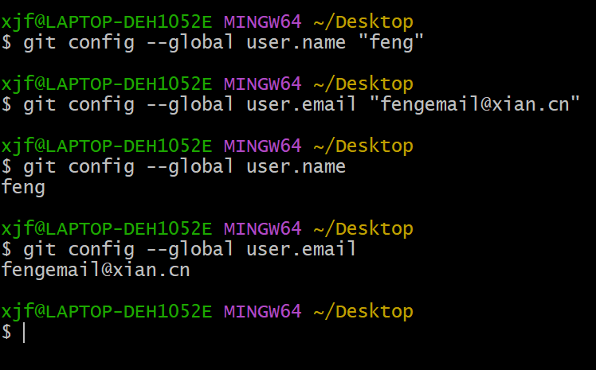

### 3.1.3 为常用指令配置别名（可选）

有些常用的指令参数非常多，每次都要输入好多参数，我们可以使用别名

1. 打开用户目录，创建 `.bashrc` 文件

部分 windows 系统不允许用户创建点号开头的文件，可以打开 gitBash，执行 `touch ~/.bashrc`


2. 在 `.bashrc` 文件中输入如下内容：

```bash
# 用于输出git提交日志
alias git-log='git log --pretty=oneline --all --graph --abbrev-commit'
# 用于输出当前目录所有文件及基本信息
alias ll='ls -al'
```


ps：如果 Windows 看不到隐藏文件

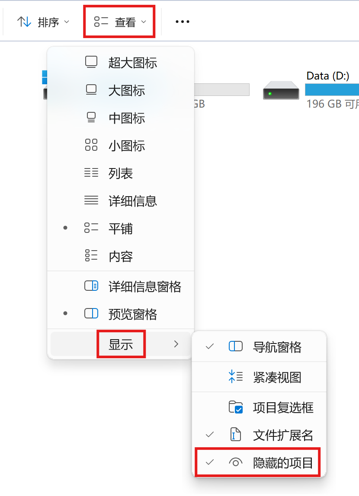

### 3.1.4 解决 GitBash 乱码问题

这个可配可不配，不配的话往里面输入汉字可能会乱码

1. 打开 GitBash 执行下面命令

```bash
git config --global core.quotepath false
```

2. ${git_home}/etc/bash.bashrc	文件最后加入下面两行

+ git_home 就是你的 Git 安装在哪

```bash
export LANG="zh_CN.UTF-8"
export LC_ALL="zh_CN.UTF-8"
```


---------------------------------------


## 3.2 获取本地仓库

要使用 Git 对我们的代码进行版本控制，首先需要获得本地仓库

1. 在电脑的任意位置创建一个空目录（例如 test）作为我们的本地 Git 仓库
2. 进入这个目录中，点击右键打开 Git bash 窗口
3. 执行命令 git init
4. 如果创建成功后可在文件夹下看到隐藏的 .git 目录

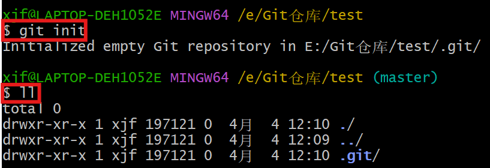


--------------------------


## 3.3 基础操作命令

Git 工作目录对于文件的**修改**（增加、删除、更新）会存在几个状态，这些**修改**的状态会随着我们执行 Git 的命令而发生变化

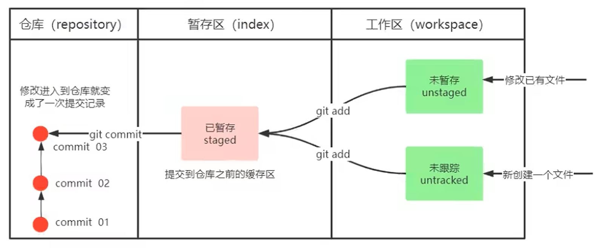

+ 从无到有我们创建一个文件就叫做**未跟踪**，意思就是这个文件虽然你创建了，但是它和 Git 没关系。所以你要告诉 Git 这个文件创建好了，你来替我管理它，发出这个指令后，就变成**已暂存**状态（指令：`git add`）
+ 修改已有文件就会变成**未暂存**状态，同样通过 `git add` 放到暂存区

使用命令来控制这些状态之间的转换：

1. `git add`		（工作区 --> 暂存区）
2. `git commit`	  （暂存区 --> 本地仓库）

#### 演示

```bash
# 创建一个文件
touch file01.txt

# 查看文件状态
git status

# 添加到暂存区（. 为通配符表示添加所有文件）
git add .

# 查看文件状态
git status

# 添加到工作区（-m "add file01 表示给它取个名字"）
git commit -m "add file01"

# 查看文件状态
git status

# 查看日志
git log

# 修改文件内容
vi file01.txt

# 查看文件状态
git status

# 添加到暂存区
git add .

# 查看文件状态
git status

# 添加到工作区
git commit -m "update file01"

# 查看日志
git log
```


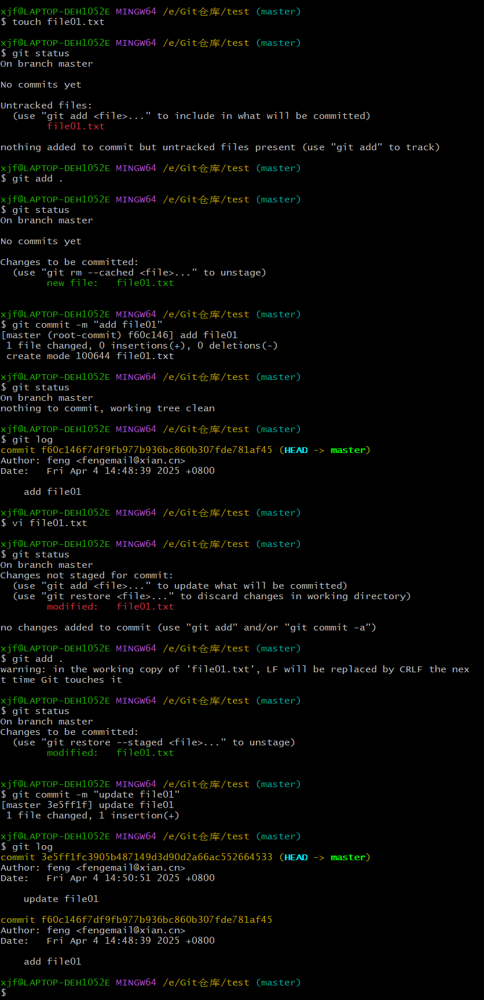

### 3.3.1 查看修改的状态（status）

+ 作用：查看修改的状态（暂存区、工作区）
+ 命令形式：`git status`

### 3.3.2 添加工作区到暂存区（add）

+ 作用：添加工作区一个或多个文件的修改到暂存区
+ 命令形式：`git add 单个文件名 | 通配符`
  + 将所有修改加入暂存区：`git add .`

### 3.3.3 提交暂存区到本地仓库（commit）

+ 作用：提交暂存区内容到本地仓库的当前分支
+ 命令形式：`git commit -m "注释内容"`

### 3.3.4 查看提交日志

在 3.1.3 中配置的别名 `git-log` 就包含了这些参数，所以后续可以直接使用指令 `git-log`

+ 作用：查看提交记录
+ 命令形式：`git log [option]`
  + options
    + `--all`			  显示所有分支
    + `--pretty=oneline`      将提交信息显示为一行
    + `--abbrev-commit`        使得输出的 commitID 更简短
    + `--graph`		      以图的形式显示
      + 如果是 Mac 可以加上 `--decorate` 效果是一样的

### 3.3.5 版本回退

+ 作用：版本切换
+ 命令形式：`git reset --hard commitID`
  + commitID 可以使用 `git-log` 或 `git log` 指令查看
+ 如何查看已删除的记录？
  + `git reflog`
  + 这个指令可以看到已经删除的提交记录

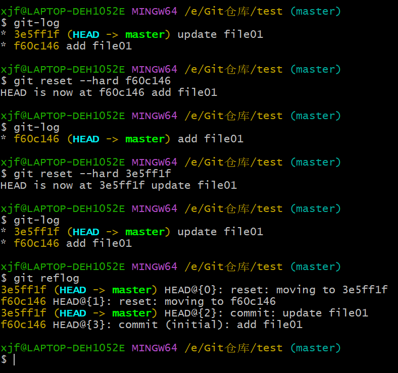

### 3.3.6 添加文件至忽略列表

一般我们总会有些文件无需纳入 Git 的管理，也不希望它们总出现在未跟踪文件列表。通常都是自动生成的文件，比如日志文件，或者编译过程中创建的临时文件等。在这种情况下，我们可以在工作目录中创建一个名为 **.gitignore** 的文件（文件名固定），列出要忽略的文件模式。下面是一个示例：

```
# no .a files
*.a
# but do track lib.a, even though you're ignoring .a files above
!lib.a
# only ignore the TODO file in the current directory, not subdir/TODO
/TODO
# ignore all files in the build/ directory
build/
# ignore doc/notes.txt, but not doc/sever/arch.txt
doc/*.txt
# ignore all .pdf files in the doc/ directory
doc/**/*.pdf
```

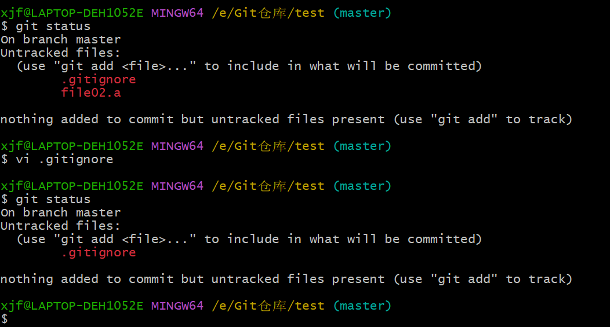

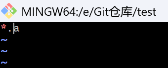

### 练习：基础操作

```bash
#################仓库初始化##################
# 创建目录（git_test01）并在目录下打开gitbash
略
# 初始化git仓库
git init

################创建文件并提交###############
# 目录下创建文件file01.txt
touch file01.txt
# 将修改加入暂存区
git add .
# 将修改提交到本地仓库，提交记录内容为：commit 001
git commit -m "commit 001"
# 查看日志
git log

################修改文件并提交################
# 修改file01的内容未：count=1
vi file01.txt
# 将修改加入暂存区
git add .
# 将修改提交到本地仓库，提交记录内容为：update file01
git commit -m "update file01"
# 查看日志
git log
# 以精简的方式显示提交记录
git-log

###############将最后一次修改还原##############
# 查看提交记录
git-log
# 找到倒数第2次提交的commitID
略
# 版本回退
git reset commitID --hard "commitID"
```


--------------------------------


## 3.4 分支

几乎所有的版本控制系统都是以某种形式支持分支。使用分支意味着你可以把你的工作从开发主线上分离开来进行重大的 Bug 修改、开发新的功能，以免影响开发主线（可以理解为克隆一个当前时刻的自己）

ps：git-log 中显示的 `HEAD ->` 表示当前处于哪个分支

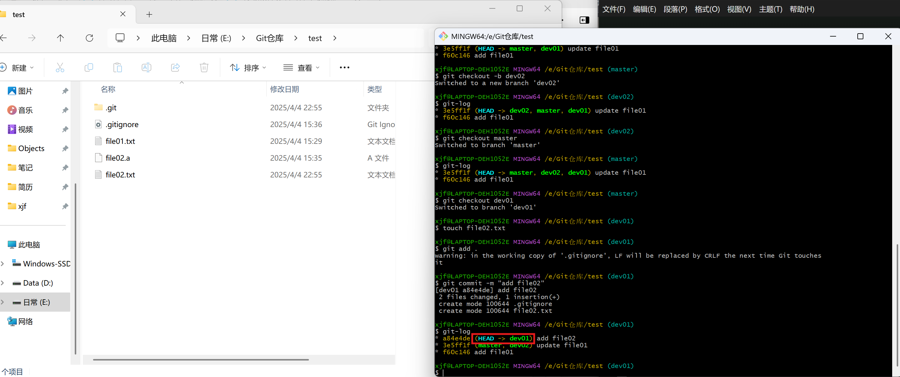

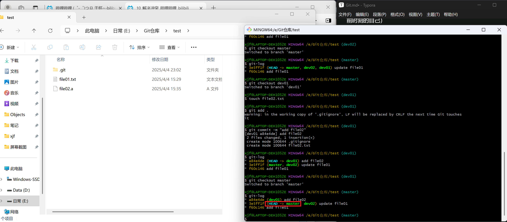

### 3.4.1 查看本地开发

+ 命令：`git branch`

### 3.4.2 创建本地分支

+ 命令：`git branch 分支名`

### 3.4.3 切换分支（checkout）

+ 命令：`git checkout 分支名`

我们还可以直接切换到一个不存在的分支（创建并切换）

+ 命令：`git checkout -b 分支名`

### 3.4.4 合并分支（merge）

一个分支上的提交可以合并到另一个分支（一般在开发中都是创建一个其它的分支来写代码，写完再将其它的分支合并到 **master** 上面）

+ 命令：`git merge 分支名称`

### 3.4.5 删除分支

**不能删除当前分支，只能删除其他分支**

+ `git branch -d 分支名`	删除分支时，需要做各种检查
+ `git branch -D 分支名`	不做任何检查，强制删除

### 3.4.6 解决冲突

当两个分支上对文件的修改可能存在冲突，例如同时修改了同一个文件的同一行，这时就需要手动解决冲突，解决冲突步骤如下：

1. 处理文件中冲突的地方
2. 将解决完冲突的文件加入暂存区（add）
3. 提交到仓库（commit）

#### 演示

```bash
# 创建一个分支
git checkout -b dev
# 查看日志
git-log
# 在记事本中修改file01.txt文件内容
略
# 查看修改状态
git status
# 提交
git add .
git commit -m "update file01 count-2"
# 查看日志
git-log
# 切换到master分支
git checkout master
# 在记事本中修改file01.txt文件内容（与第一次修改不同）
略
# 提交
git add .
git commit -m "update file01 count-3"
# 查看日志
git-log
# 合并分支（会显示有冲突，自动合并失败）
git merge dev
# 打开file01.txt将内容改为想到修改成的内容
略
# 提交（退出用:wq）
git add .
git commit
# 查看日志
git-log
```

### 3.4.7 开发中分支使用原则与流程

几乎所有的版本控制系统都是以某种形式支持分支。使用分支意味着你可以把你的工作从开发主线上分离开进行重大的 Bug 修改、开发新的功能，以免影响开发主线

在开发中，一般有如下分支使用原则与流程：

+ **master**（生产）分支
  + 线上分支，主分支，中小规模项目作为线上运行的应用对应的分支
+ **develop**（开发）分支
  + 是从 master 创建的分支，一般作为开发部门的主要开发分支，如果没有其他开发不同期上线要求，都可以在此版本进行开发，阶段开发完成后，需要是合并到 master 分支，准备上线
+ **feature/xxxx** 分支
  + 从 develop 创建的分支，一般是同期并行开发，但不同期上线时创建的分支，分支上研发任务完成后合并到 develop 分支
+ **hotfix/xxxx** 分支
  + 从 master 派生的分支，一般作为线上 bug 修复使用，修复完成后需要合并到 master、test、develop 分支
+ 还有一些其他分支，在此不再详述，例如 **test** 分支（用于代码测试）、**pre** 分支（预上线分支）等等

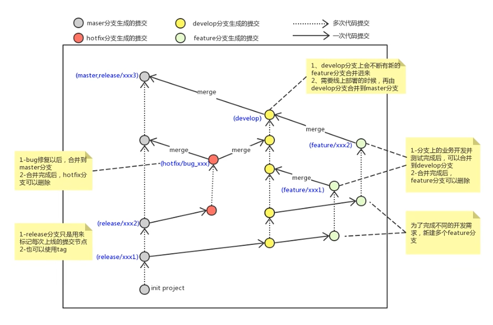

#### 练习：分支操作

```bash
##########创建并切换到dev01分支，在dev01分支提交###########
# master创建分支dev01
git branch dev01
# master切换到dev01
git checkout dev01
# dev01创建文件file02.txt
touch file02.txt
# dev01将修改加入到暂存区并提交到仓库，提交记录内容为：add file02 on dev
git add .
git commit -m "add file02 on dev"
# dev01以精简的方式显示提交记录
git-log

##########切换到master分支，将dev01合并到master分支##########
# dev01切换到master
git checkout master
# master合并dev01到master分支
git merge dev01
# master以精简的方式显示提交记录
git-log
# master查看文件变化（目录下也出现了file02.txt）【直接看文件】
略

############删除dev01分支############
# master删除dev01分支
git branch -d dev01
# master以精简的方式显示提交记录
git-log
```

## 3.5 快进模式

如果当前的分支和另一个分支没有内容上的差异，就是说当前分支的每一个提交（commit）都已经存在另一个分支里了，Git 就会执行一个“快速向前”（fast forward）操作；Git 不创建任何新的提交（commit），只是将当前分支指向合并进来的分支


--------------------------------------------------


# 4. 远程仓库

## 4.1 常用的托管服务（远程仓库）

前面我们已经知道了 Git 中存在两种类型的仓库，即本地仓库和远程仓库。那么我们如何搭建 Git 远程仓库呢？我们可以借助互联网上提供的一些代码托管服务来实现，其中比较常用的有 GitHub、码云、GitLab 等

Github（地址：https://github.com/）是一个面向开源及私有软件项目的托管平台，因为只支持 Git 作为唯一版本库格式进行托管，故名 GitHub

码云（地址：https://gitee.com/）是国内的一个代码托管平台，由于服务器在国内，所以相比于 GitHub，码云速度会更快

GitLab（地址：https://about.gitlab.com/）是一个用于仓库管理系统的开源项目，使用 Git 作为代码管理工具，并在此基础上搭建起来的 web 服务，一般用于在企业、学校等内部网络搭建 git 私服

## 4.2 GitHub 注册

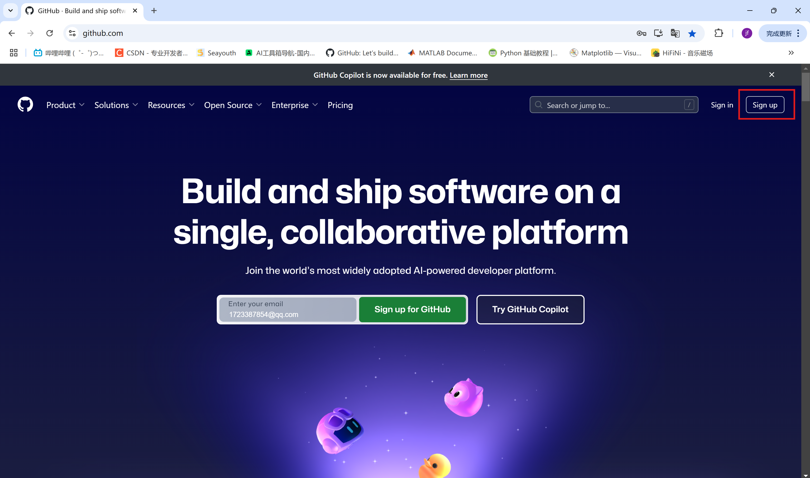

按步骤完成注册即可

## 4.3 创建远程仓库

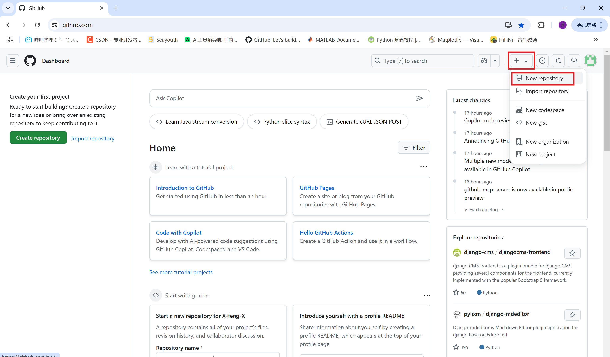

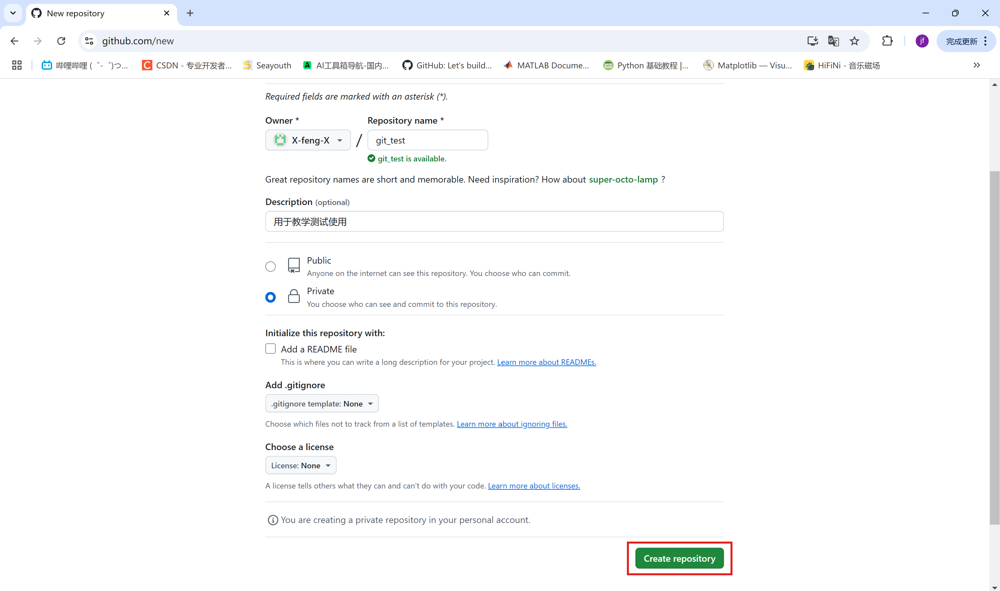

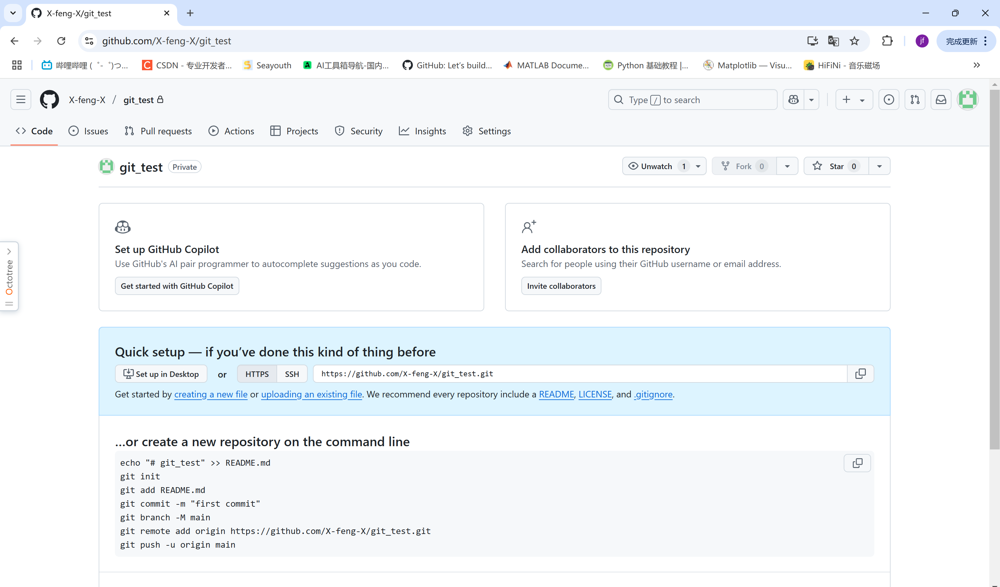

接下来我们就要把我们的代码推上来，但是我们要想想怎么证明当前操作的人就是本人，有两种方案：

+ 输入用户名和密码
+ 公私钥对

## 4.4 配置 SSH 公钥

+ 生成 SSH 公钥
  + `ssh-keygen -t rsa`
  + 不断回车
    + 如果公钥已经存在，则自动覆盖

+ GitHub 设置账户共公钥
  + 获取公钥
    + `cat ~/.ssh/id_rsa.pub`

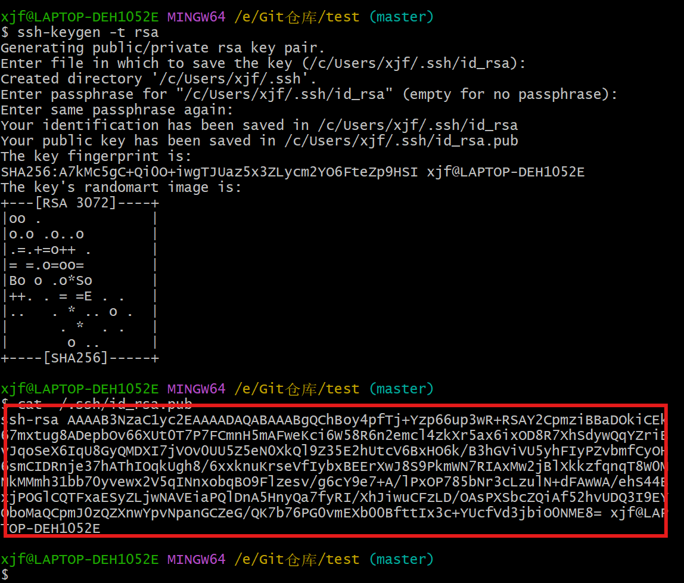

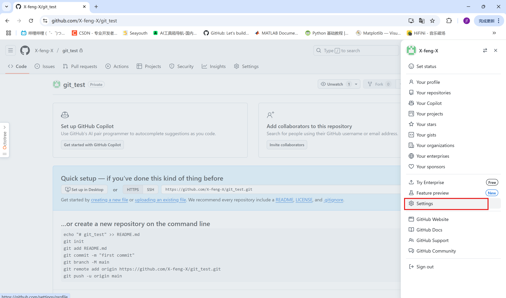

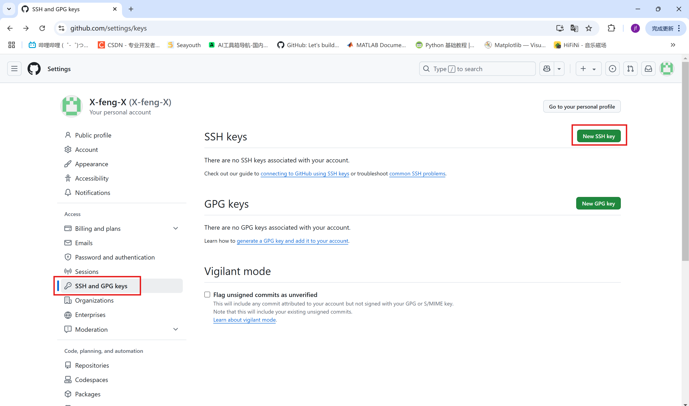

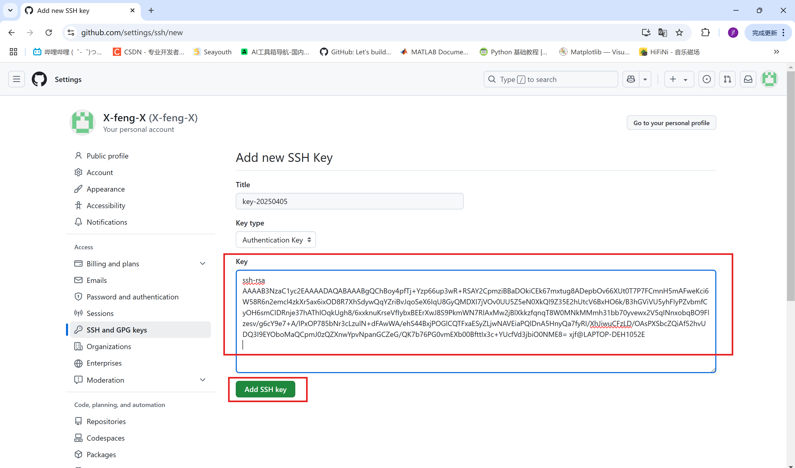

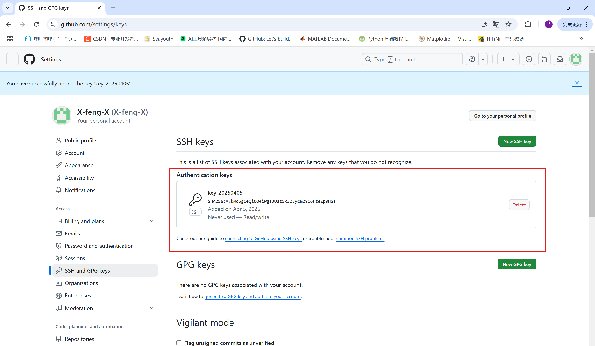

+ 验证是否配置成功
  + `ssh -T git@github.com`

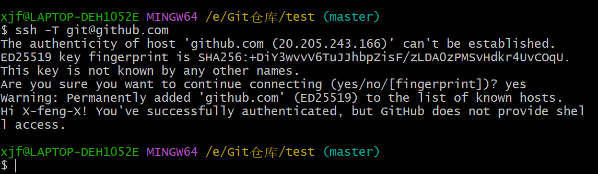

## 4.5 操作远程仓库

### 4.5.1 添加远程仓库

此操作是先初始化本地库，然后与已创建的远程库进行对接

+ 命令：`git remote add <远端名称> <仓库路径>`
  + 远端名称：默认是 origin，取决于远端服务器设置
  + 仓库路径，从远端服务器获取此 URL
  + 例如：$ git remote add origin git@github.com:X-feng-X/git_test.git


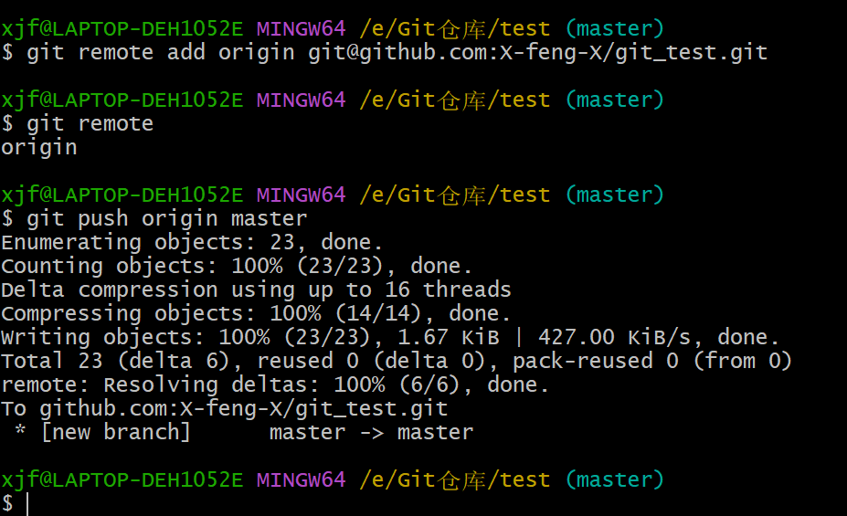

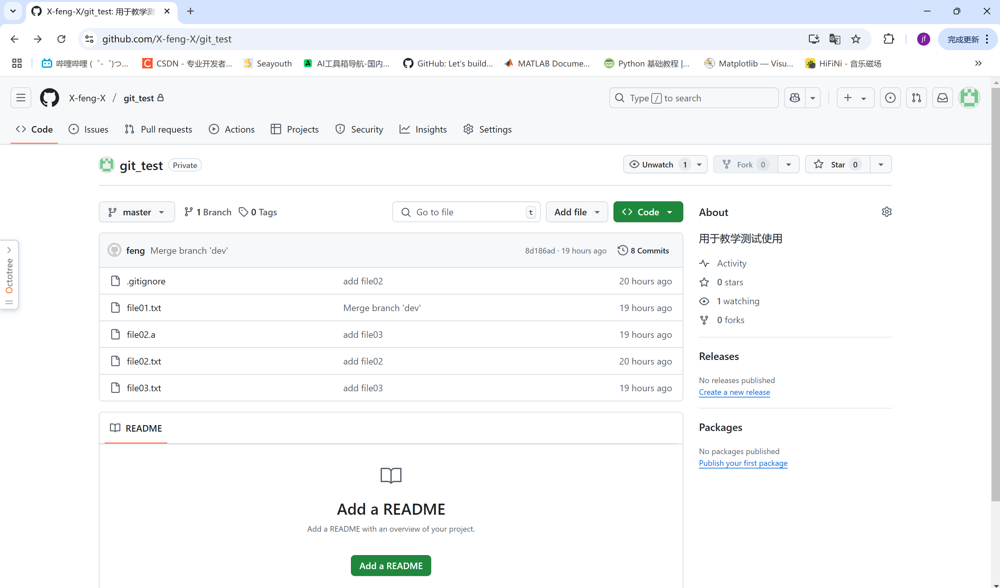

### 4.5.2 查看远程仓库

+ 命令：`git remove`

### 4.5.3 推送到远程仓库

+ 命令：`git push [-f] [--set-upstream] [远端名称 [本地分支名][:远端分支名]]`
  + 如果远程分支名和本地分支名相同，则可以只写本地分支
    + `git push origin master`
  + `-f` 表示强制覆盖
  + `--set-upstream` 推送到远端的同时并且建立起和远端分支的关联关系
    + `git push --set-upstream origin master`
  + 如果**当前分支已经和远端分支关联**，则可以省略分支名和远端名
    + `git push` 将 master 分支推送到已关联的远程分支

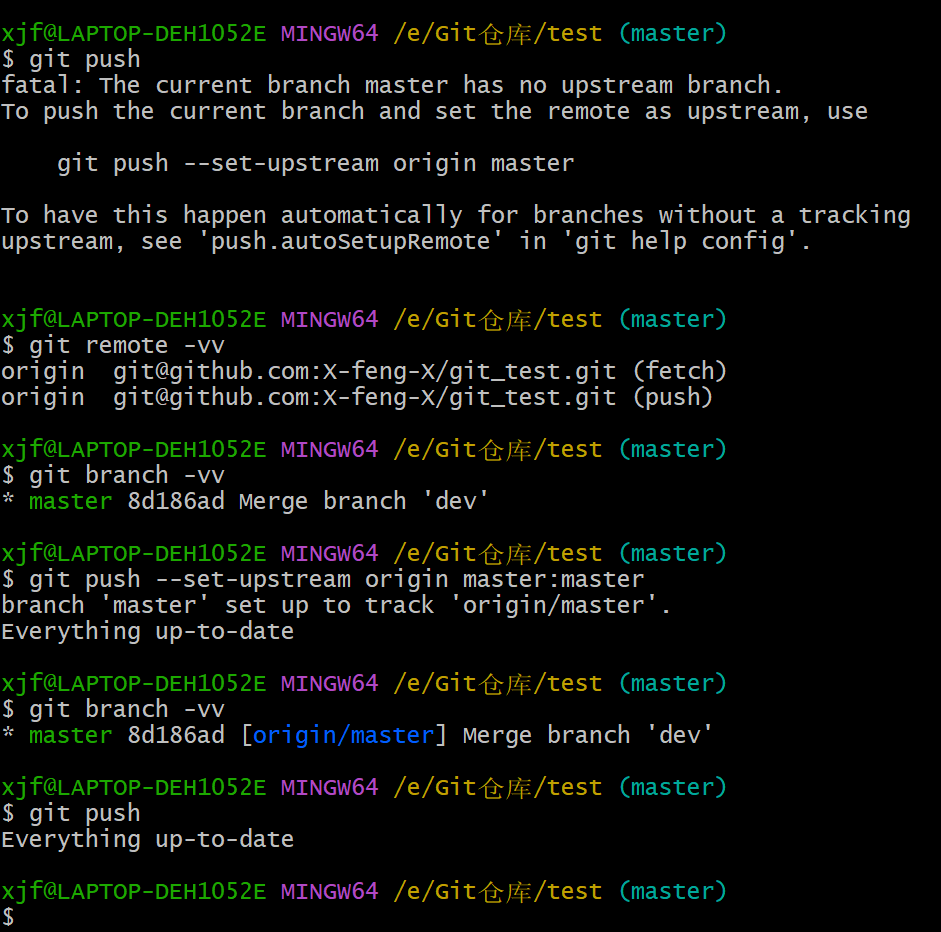

### 4.5.4 本地分支与远程分支的关联关系

+ 查看关联关系我们可以使用 `git branch -vv` 命令

### 4.5.5 从远程仓库克隆

如果已经有一个远端仓库，我们可以直接 clone 到本地

+ 命令：`git clone <仓库名称> [本地目录]`
  + 本地目录可以省略，会自动生成一个目录

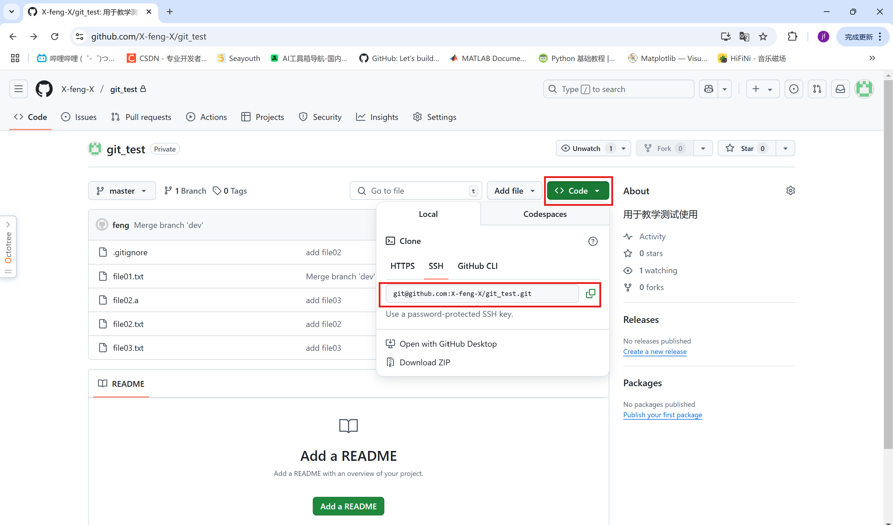

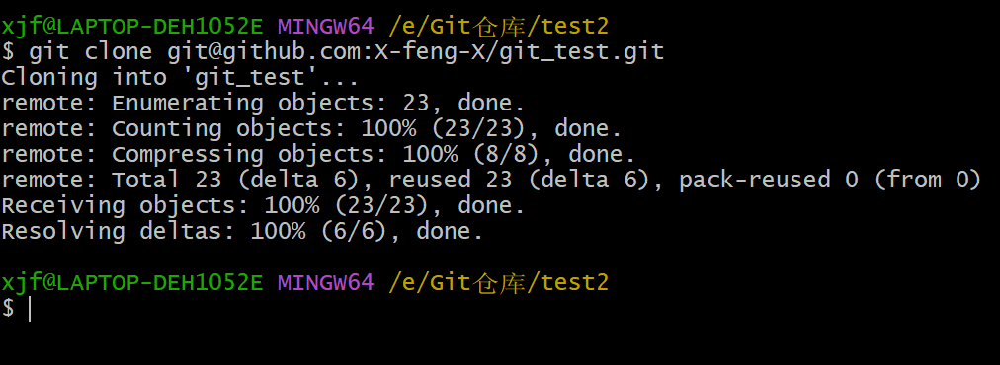

### 4.5.6 从远程仓库抓取和拉取

远程分支和本地的分支一样，我们可以进行 merge 操作，只是需要先把远端仓库里的更新都下载到本地，再进行操作

+ 抓取命令：`git fetch [remote name] [branch name]`
  + **抓取指令就是将仓库里的更新都抓取到本地，不会进行合并**
  + 如果不指定远端名称和分支名，则抓取所有分支
+ 拉取命令：`git pull [remote name] [branch name]`
  + **拉取指令就是将远端仓库的修改拉到本地并自动进行合并，等同于 fetch + merge**
  + 如果不指定远端名称和分支名，则抓取所有并更新当前分支

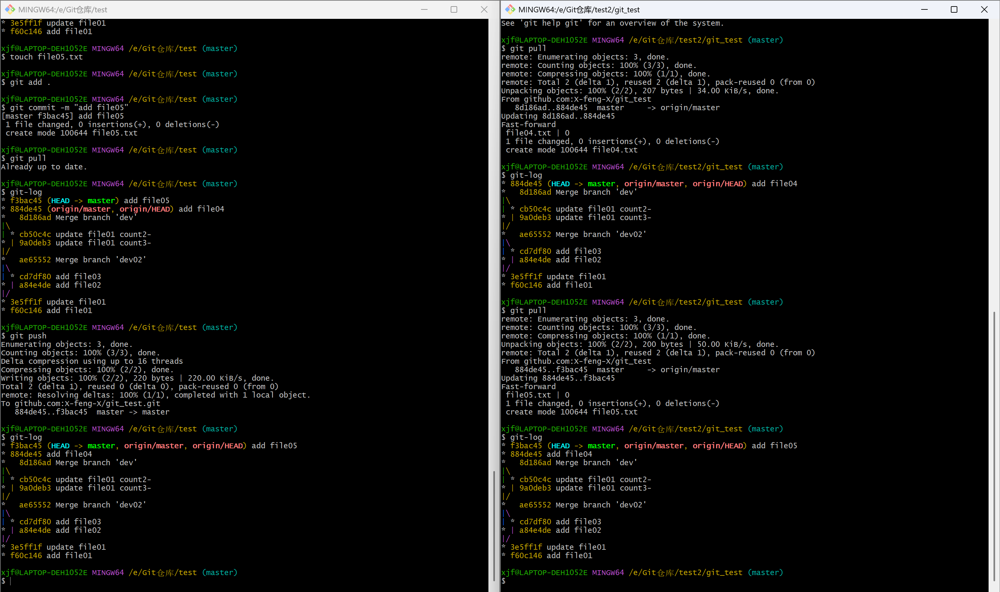

### 4.5.7 解决合并冲突

在一段时间，A、B 用户修改了同一个文件，且修改了同一行位置的代码，此时会发生合并冲突

A 用户在本地修改代码后优先推送到远程仓库，此时 B 用户在本地修订代码，提交到本地仓库后，也需要推送到远程仓库，此时 B 用户晚于 A 用户，**故需要先拉取远程仓库的提交，经过合并后才能推送到远端分支**，如下图所示

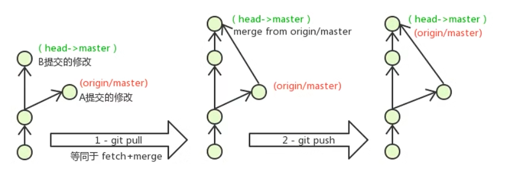

在 B 用户拉取代码时，因为 A、B 用户同一段时间修改了同一个文件的相同位置代码，故会发生冲突

**远程分支也是分支，所以合并时冲突的解决方式也和解决本地分支冲突方式相同**

```bash
########将本地仓库有推送到远程仓库########
# git_test01添加到远程仓库
git remote add origin git@github.com/**/**.git
# git_test01将master分支推送到远程仓库，并与远程仓库的master分支绑定关联关系
git push --set-upstream origin master

########将远程仓库克隆到本地########
# 将远程仓库克隆到本地git_test02目录下
git clone git@github.com/**/**.git git_test02
# git_test02以精简的方式显示提交记录
git-log

########将本地修改推送到远程仓库########
# git_test01创建文件file03.txt
touch file03.txt
# git_test01将修改加入暂存区并提交到仓库，提交记录内容为：add file03
git add .
git commit -m "add file03"
# git_test01将master分支的修改推送到远程仓库
git push origin master

########将远程仓库的修改更新到本地########
# git_test02将远程仓库修改再拉取到本地
git pull
# 以精简的方式显示提交记录
git-log
# 查看文件变化（目录下也出现了file03.txt）
略
```

# 5. 在 Idea 中使用 Git

## 5.1 在 Idea 中配置 Git

安装好 Intellij IDEA 后，如果 Git 安装在默认路径下，那么 idea 会自动找到 git 的位置，如果更改了 Git 的安装位置则需要手动配置下 Git 的路径。选择 File -> Settings 打开设置窗口，找到 Version Control 下的 git 选项

点击 Test 按钮可自动寻找（寻找不成功就手动配置）

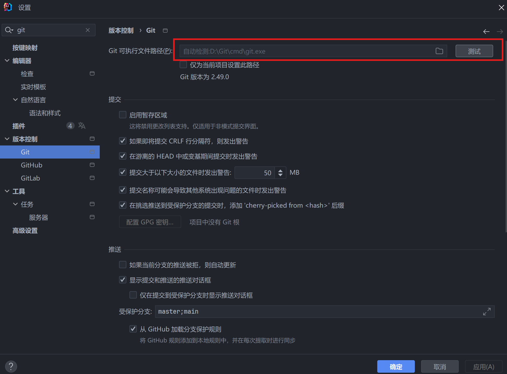

## 5.2 在 Idea 中操作 Git

场景：本地已经有一个项目，但是并不是 git 项目，我们需要将这个放到 GitHub 的仓库里，和其他开发人员继续一起协作开发

### 5.2.1 创建项目远程仓库（参照4.3）


### 5.2.2 初始化本地仓库

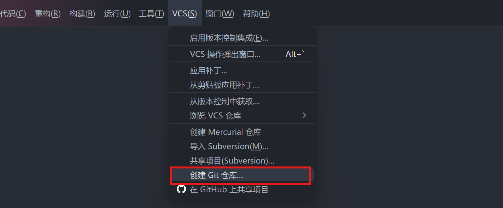

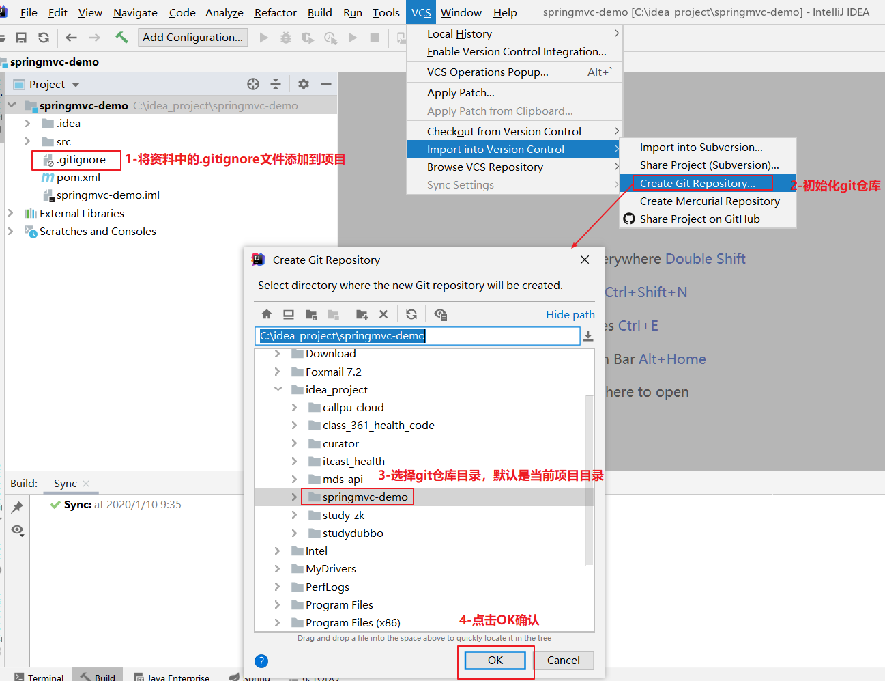

### 5.2.3 设置远程仓库

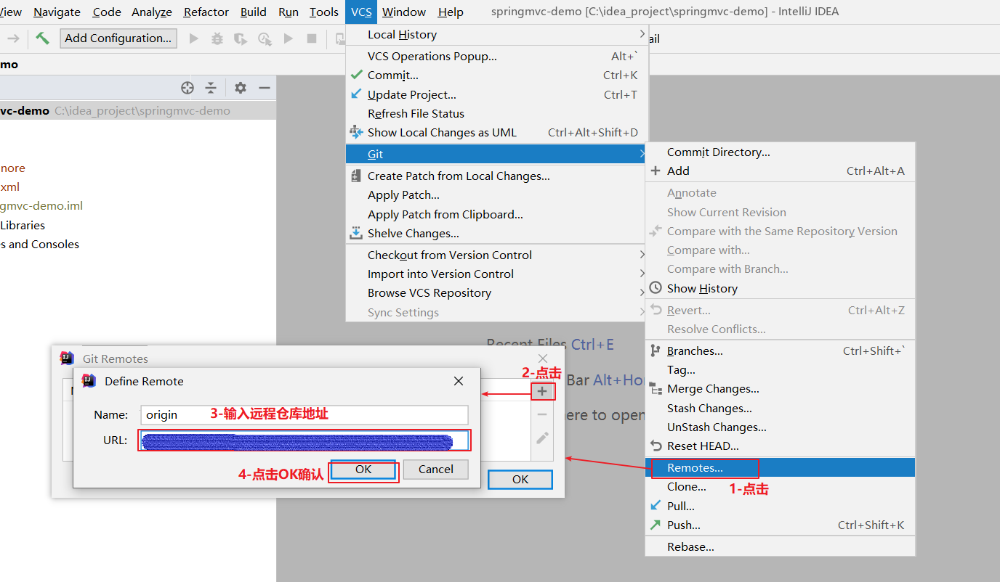

### 5.2.4 提交到本地仓库

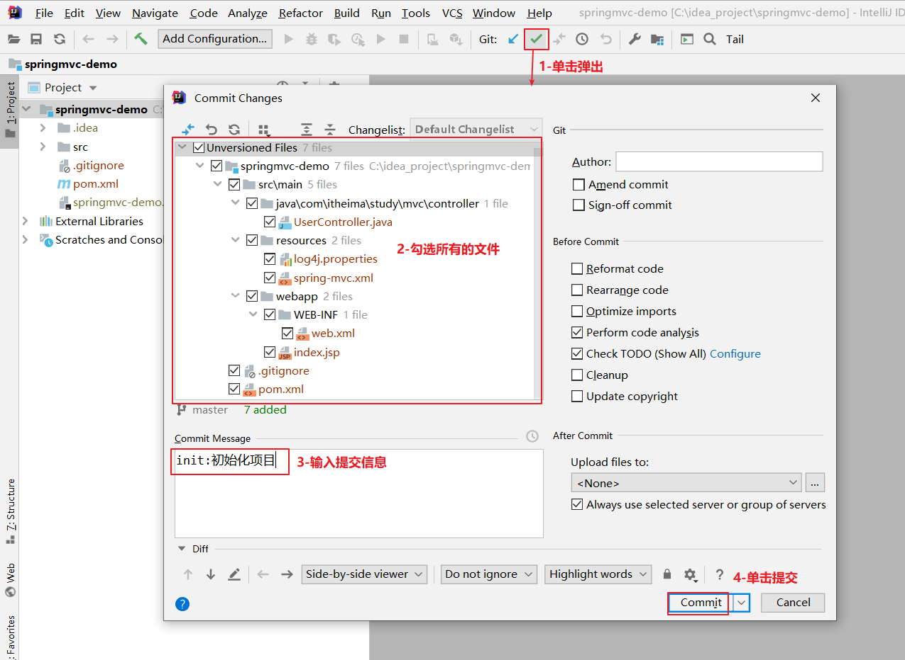

### 5.2.5 推送到远程仓库

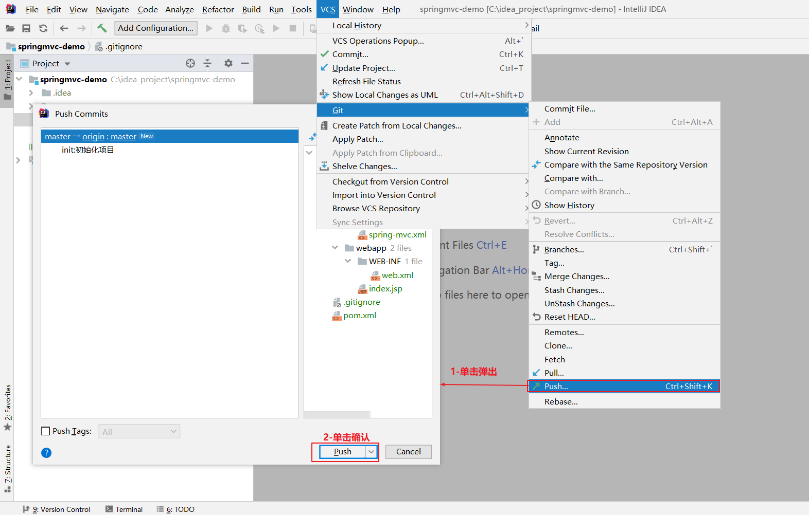

### 5.2.6 克隆远程仓库到本地

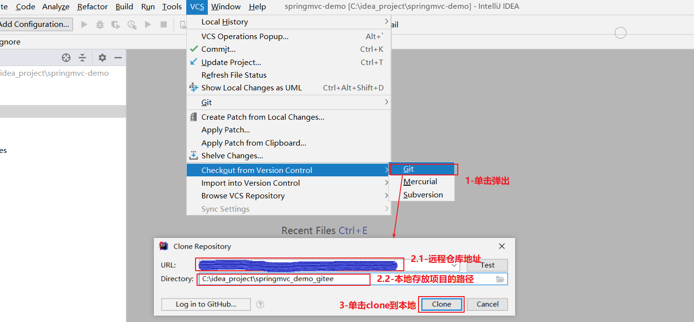

### 5.2.7 创建分支

+ 最常规的方式

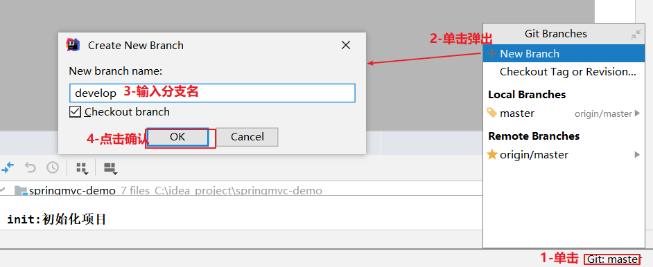

+ 最 nb 的方式

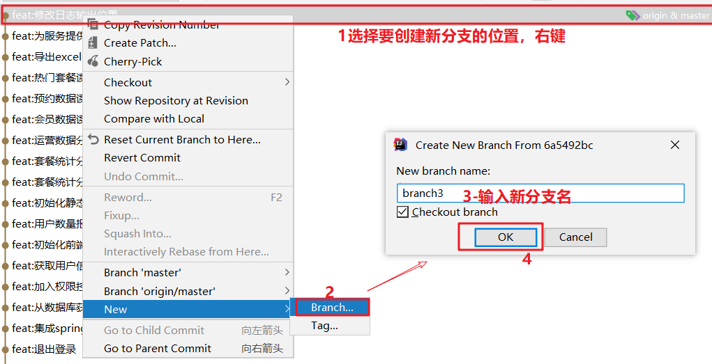

### 5.2.8 切换分支及其他分支相关操作

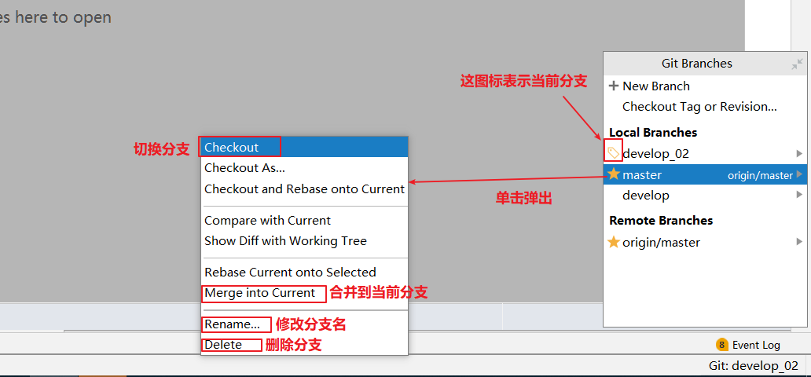

### 5.2.9 解决冲突

1. 执行 merge 或 pull 操作时，可能发生冲突

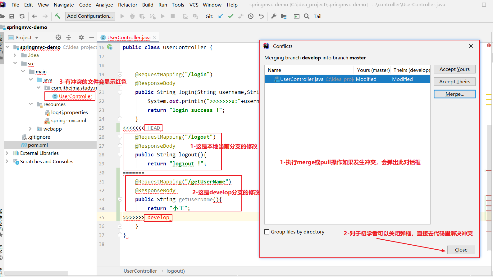

2. 冲突解决后加入暂存区
3. 提交到本地仓库
4. 推送到远程仓库

## 5.3 IDEA 常用 Git 操作入口

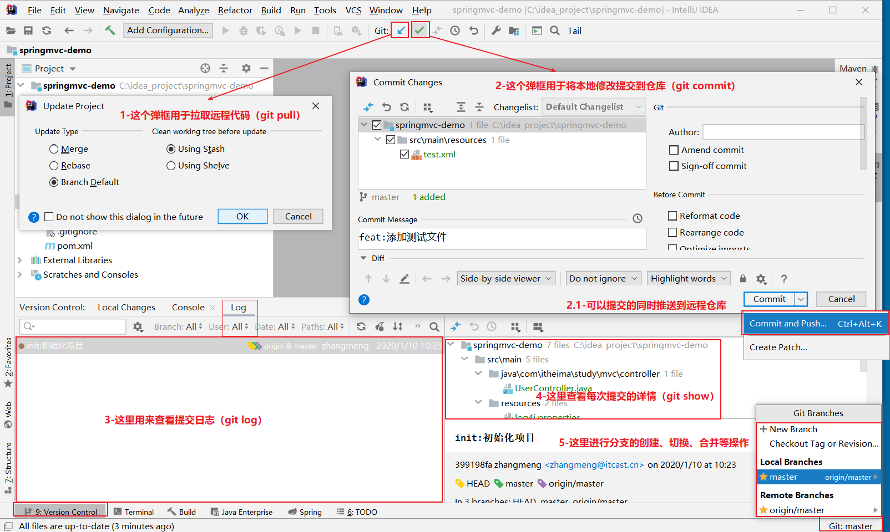

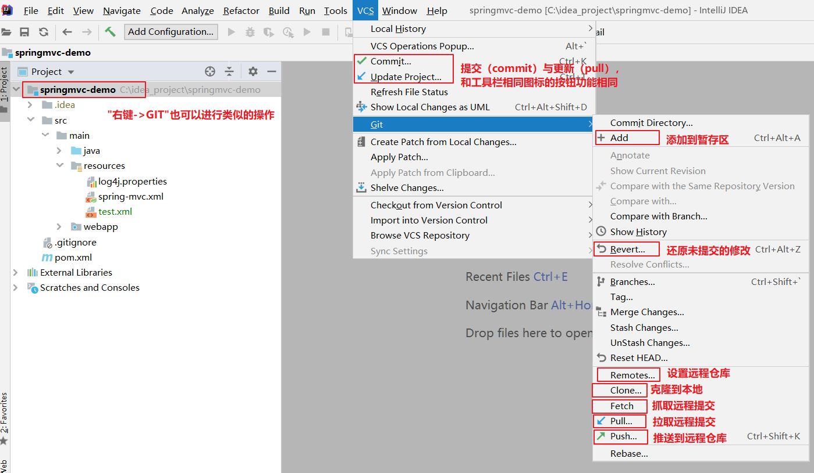

## 附：几条铁令

1. **切换分支前先提交本地的修改**
2. 代码及时提交，提交过了就不会丢
3. 遇到任何问题都不要删除文件目录

## 附：将 IDEA 集成 GitBash 作为 Terminal

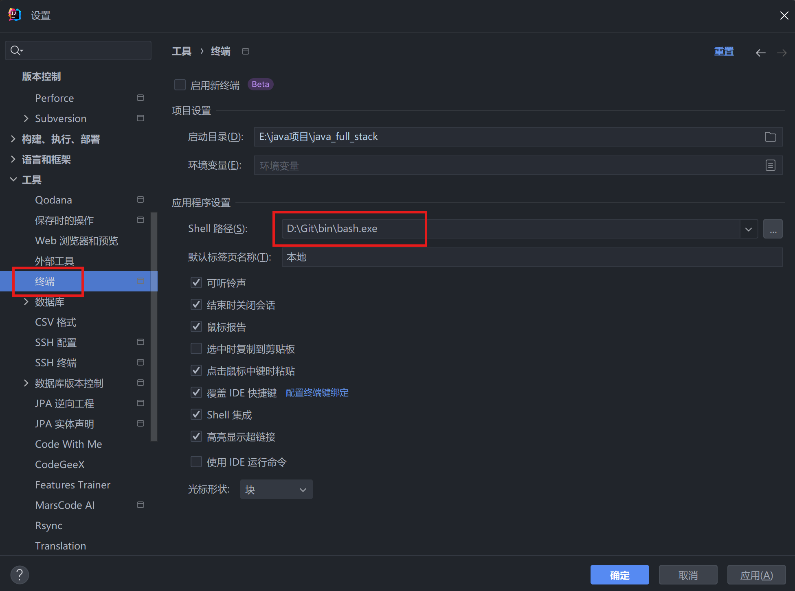


-------------------------------------------
