# **JavaSE（善用 Ctrl + F）**

# Java 基础

## 一、Java 入门
### 01 Java快速入门
#### 1. Java 是什么？能干什么？
##### 1.1 Java 背景知识
+ Java 是美国 sun 公司（Stanford University Network）在1995年推出的一门计算机高级编程语言
+ Java 早期称为 Oak（橡树），后期改名为 Java
+ Java 之父：詹姆斯·高斯林（James Gosling）
+ 2009年 sun 公司被 Oracle 公司收购


##### 1.2 Java 能做什么？
+ 桌面应用开发
  + 各种税务管理软件，IDEA
+ 企业级应用开发
  + 微服务，大型互联网应用
+ 移动应用开发
  + Android，医疗设备
+ 服务器系统
  + 应用的后台
+ 大数据开发
  + hadoop
+ 游戏开发
  + 我的世界 MineCraft

##### 1.3 Java 技术体系

| 技术体系                                       | 说明                             |
| :--------------------------------------------- | -------------------------------- |
| **Java SE（Java Standard Edition）：标准版**   | Java技术的核心和基础             |
| **Java EE（Java Enterprise Edition）：企业版** | 企业级应用开发的一套**解决方案** |
| Java ME（Java Micro Edition）：小型版          | 针对移动设备应用的**解决方案**   |


----------------------------------------


#### 2. 如何使用 Java（搭建 Java 开发环境）
+ Java 的产品叫 JDK（Java Development Kit：Java 开发者工具包），**必须安装 JDK 才能使用 Java**

JDK 的发展史

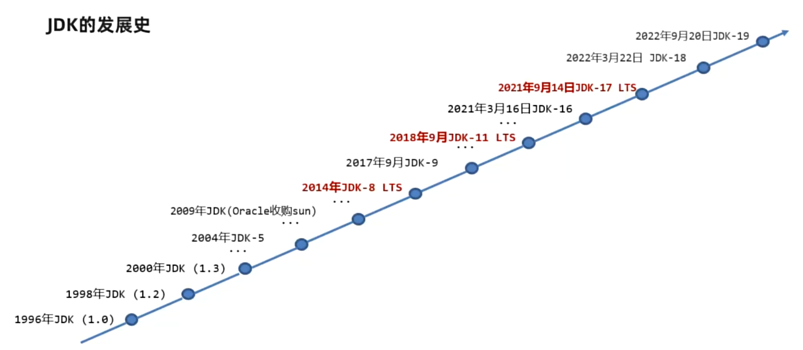

ps：LTS：long-term support 长期支持版

##### 2.1 如何获取 JDK
+ 通过 Oracle 官方网站获取
+ http://www.oracle.com
+ 注意：针对不同操作系统，下载对应的安装包

##### 2.2 如何安装 JDK
+ 傻瓜式安装，直接下一步...
+ 注意1：安装路径中不要包含中文和空格
+ 注意2：所有的开发工具最好安装到统一目录

##### 2.3 如何验证 JDK 是否安装成功
1. 打开命令行窗口；
+ 按下 **Win+R**，在运行输入框中输入 **cmd**，敲回车

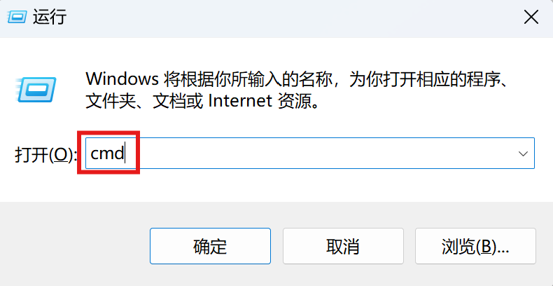

2. 看 Java、Javac 是否可用；

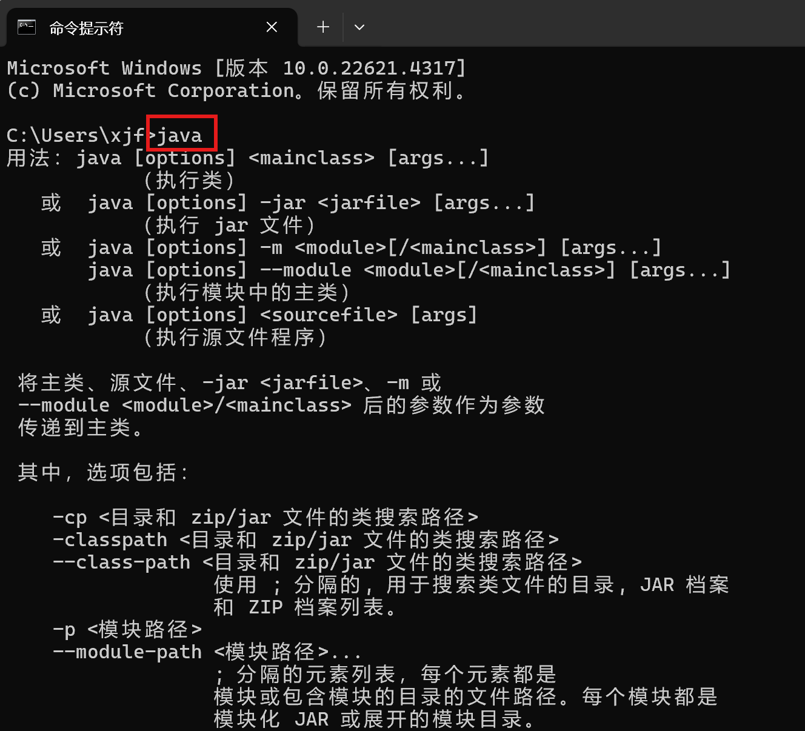

3. 检查 Java、Javac 的版本号；

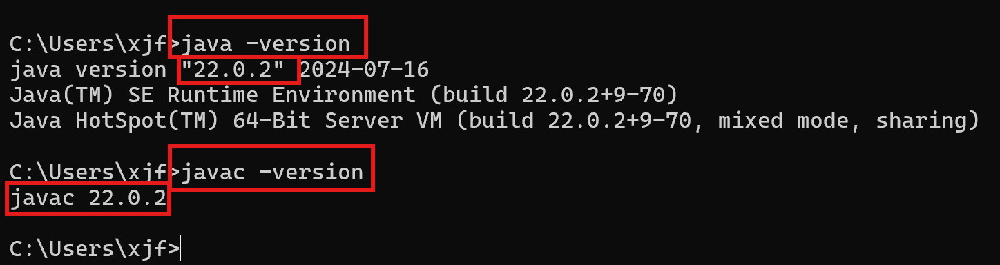


**前置知识：了解 JDK 中的 Java、Javac 的基本作用**

说明：将来我们写好的 **Java 程序**都是**高级语言**，**计算机底层是硬件不能识别这些语言**，**必须先通过 javac 编译工具进行翻译**，然后再通过 **java 执行工具执行**才可以驱动机器干活


---------------------------------------


#### 3. 掌握 DOS 窗口常见命令

| 常用命令 | 作用                                                         |
| -------- | ------------------------------------------------------------ |
| D:       | 切换到某个盘下：D: , C:                                      |
| dir      | 查看当前路径下的文件信息                                     |
| cd       | 进入单级目录：cd itheima <br>进入多级目录：cd D:\itheima\JavaSE\第一天 <br>回退到上一级目录：cd .. <br>回退到盘符根目录：cd \ |
| cls      | 清屏                                                         |


-----------------------------------------


#### 4. 开发HellowWorld 程序
##### 4.1 Java 程序开发的三个步骤
+ 开发 Java 程序，需要三个步骤：**编写代码**，**编译代码**，**运行代码**

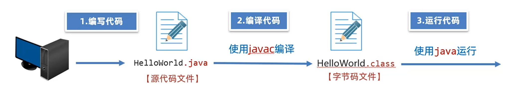

注意事项：
+ 第一个 java 程序建议使用记事本书写
+ 建议代码文件名全英文，首字母大写，满足驼峰模式，源代码文件的**后缀必须是.java**

##### 4.2 编写代码
+ 第一个程序的代码如下：

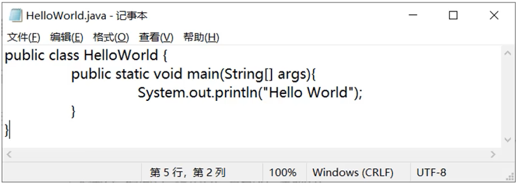

**注意：文件名必须与代码中的类名一致**
**保存文件：ctrl + s**

##### 4.3 编译代码、运行代码
1. 编译：javac 文件名.java
范例：`javac HelloWorld.java`


2. 运行：java 类名
范例：`java HelloWorld`

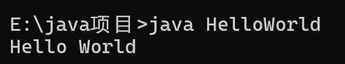


##### 总结
1. 开发一个 Java 程序要经历那些步骤？
+ 编写、编译（javac）、运行（java）
2. Java 代码编写有什么基本要求？
+ 文件名的后缀必须是 **java** 结尾
+ **文件名必须与代码的类名称一致**
+ 必须使用**英文模式**下的符号


--------------------------------


#### 5. HelloWorld 程序常见问题
##### 5.1 HelloWorld 案例常见错误
###### 5.1.1 Windows 的文件扩展名没有勾选

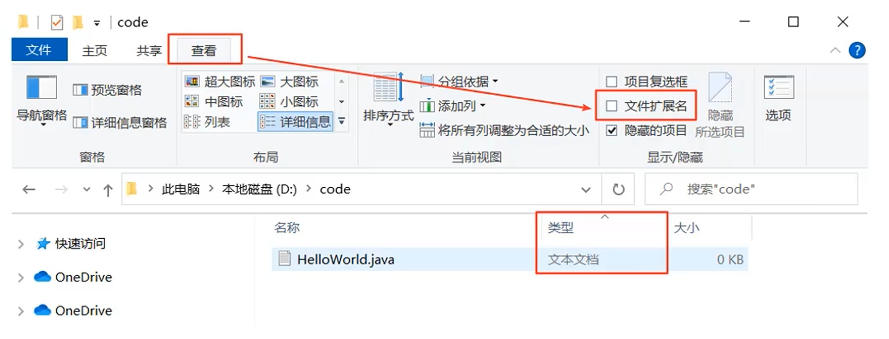

解决方案：必须勾选文件扩展名，再新建 Java 文件

###### 5.1.2 代码写对了，但是忘记保存了

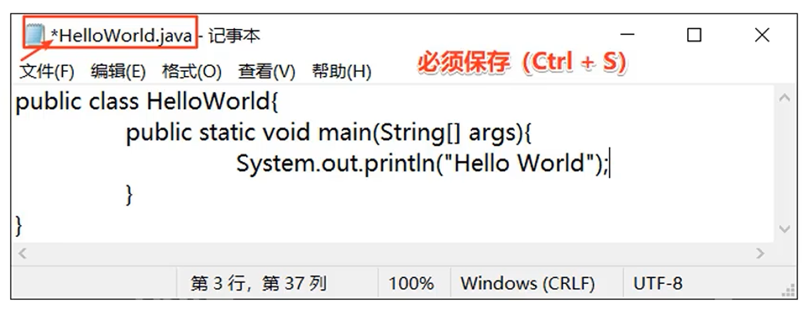

必须要 **Ctrl + s**

###### 5.1.3 文件名和类名不一致

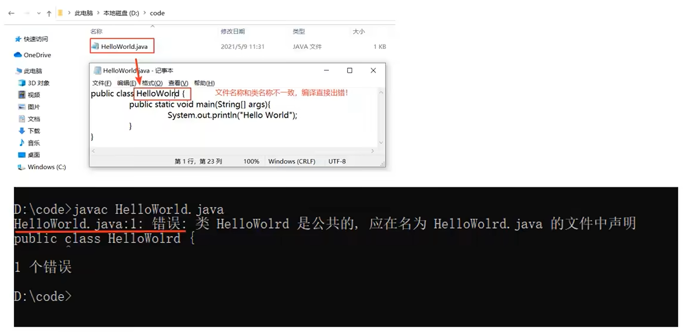

###### 5.1.4 大小写错误，单词拼写错误，存在中文符号，找不到 main 方法

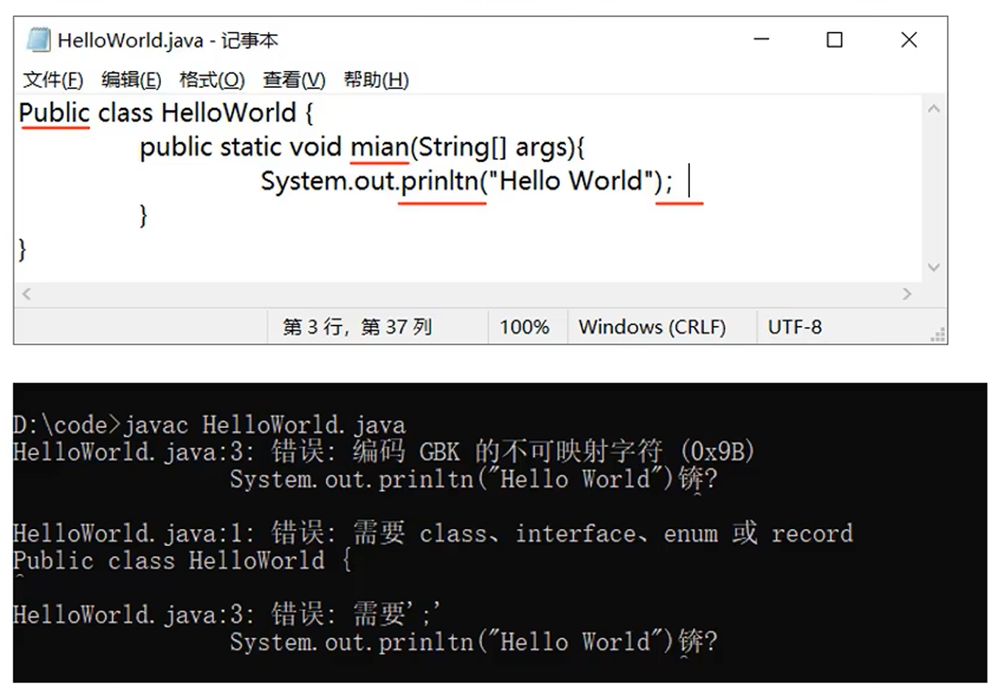

###### 5.1.5 括号不配对

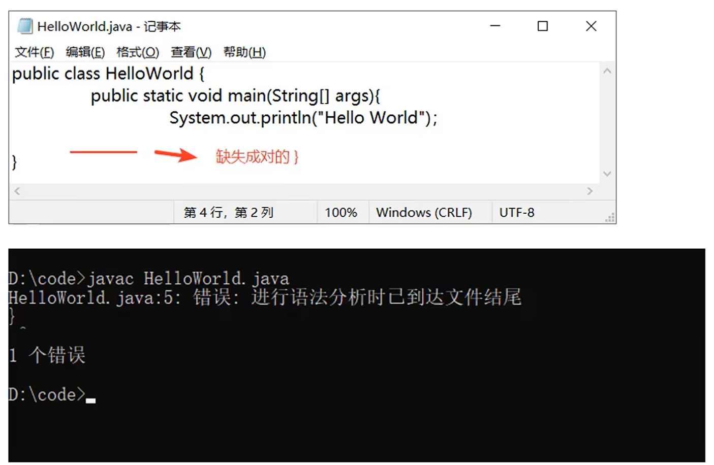

###### 5.1.6 编译、执行使用不当

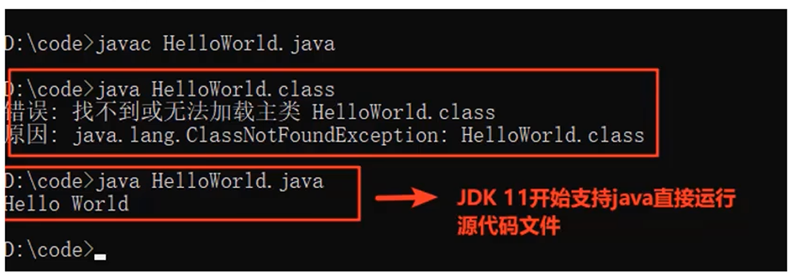


----------------------------


#### 6. 补充知识：Java 程序的执行原理
##### 6.1 计算机能认识的机器语言长什么样子？
+ 机器语言：00011100 00110101 ......
+ 计算机底层都是硬件电器，可以通过不通电和通电，表示0、1

##### 6.2 使用机器语言编程来实现呼吸灯效果

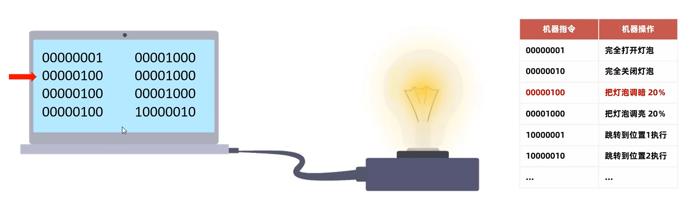

##### 6.3 编程语言发展历程
+ 机器语言
+ 汇编语言
+ 高级语言

##### 6.4 为什么学习高级编程语言？
+ 更简单：使用接近人类自己的语言书写，翻译器再将其翻译成计算机能理解的机器指令

##### 总结
1. Java 程序的执行原理是什么样的？
+ 不管是什么样的高级编程语言，最终都是翻译成计算机底层可以识别的机器语言
2. 机器语言是由说明组成的啊？
+ **0和1**

##### 6.5 BUG
+ 原意是臭虫或者虫子，现在用来代指在电脑系统或者程序中隐藏的一些问题或者漏洞


--------------------------------


#### 7. 补充知识：JDK 的组成、跨平台原理
##### 7.1 JDK 的组成

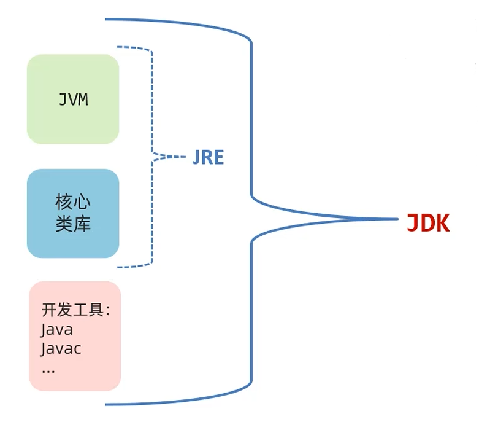

+ **JVM（Java Virtual Machine）**：Java 虚拟机，真正运行 Java 程序的地方
+ 核心类库：Java 自己写好的程序，给程序员自己的程序调用的
+ **JRE（Java Development Kit）**：Java 开发工具包（包括上面所有）

##### 7.2 Java 的跨平台、工作原理
+ 一次编译、处处可用
  + 因为 sun 公司针对不同的系统平台都贴心的给我们写好了对应的 jvm 虚拟机

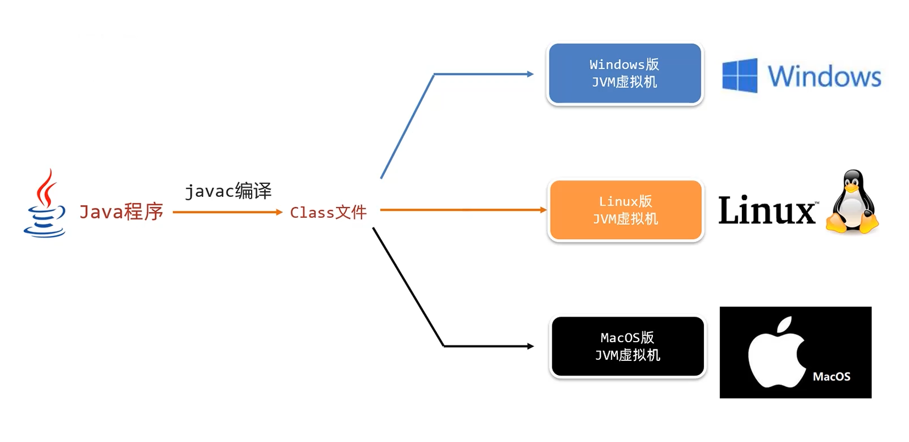

##### 总结
1. JDK 有哪些组成啊？
+ **JVM 虚拟机**：真正运行 Java 程序的地方
+ 核心类库：Java 自己写好的一些程序，给咱们的程序员用的
+ 开发工具：javac、java、...


2. Java 的跨平台是什么含义，Java 如何实现跨平台的？
+ 一次编译、处处可用
+ 我们的程序只需要开发一次，就可以在各种安装了 JVM 的系统平台上运行


---------------------


#### 8. 补充知识：JDK 安装后 Path 和 Java_home 环境变量
##### 8.1 Path 环境变量
+ Path 环境变量用于记住程序路径，方便在命令行窗口的任意目录启动程序
  + 举例：在命令行窗口的任意目录下启动 QQ
  + path 环境变量位置在：我的电脑 -> 属性 -> 高级系统设置 -> 高级 -> 环境变量

##### 8.2 Path 环境变量的原理
+ 当我们在 Path 中配置某个程序路径后，启动命令行窗口时，是如何去找该程序的

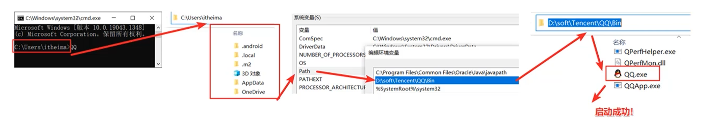

##### 8.3 为 java、javac 配置 Path 的注意事项
+ 目前较新的 JDK 安装时会自动配置 javac、java 程序的路径到 Path 环境变量中去，因此，javac、java可以直接使用
+ 注意：以前的老版本的 JDK 在安装的是没有自动配置 Path 环境变量的，**此时必需要自己配置 Path 环境变量**
  + 把 java 程序中的 **bin** 包路径放进去即可

##### 8.4 重新配置了环境变量后，必须要检测是否配置成功
+ 打开命令行窗口，输入 `javac -version` 及 `java -version` 分别看版本提示

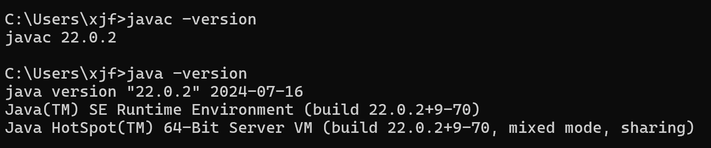

##### 8.5 配置 Java_home 环境变量
+ **JAVA_HOME**：告诉操作系统 JDK 安装在了哪个位置==（将来其他技术要通过这个环境变量找 JDK）==

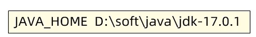

  + 注意：较新版本的 JDK 只是自动配置了 Path，没有自动配置 JAVA_HOME

推荐：Path `%JAVA_HOME%\bin`
不推荐：Path `D:\soft\java\jdk-17.01\bin`

##### 总结
1. 什么是 Path 环境变量？
+ Path 环境变量用于配置程序的路径
+ 方便我们在命令行窗口的任意目录启动程序


2. JDK 安装时，环境变量需要注意什么？
+ 较新版本的 JDK 会自动配置 PATH 环境变量，较老的 JDK 版本则不会
+ 建议还是自己配置一下“Path”、“JAVA_HOME”


------------------------------------


### 02 IDEA 开发工具的使用
#### **1. Intellij IDEA 开发工具概述、安装**
之前的开发工具存在一些问题
+ 文本编辑工具：记事本、NotePad++、EditPlus、sublime...编写代码时没有错误提醒、没有智能代码提醒、需要自己进行编译、执行，功能不够强大

##### 1.1 集成开发环境（IDE，Integrated Development Environment）
+ 把代码编写，编译，执行等多种功能综合到一起的开发工具，可以进行代码智能提示，错误提醒，项目管理等等
+ 常见的 Java IDE 工具有：Eclipse、MyEclipse、**Intellij IDEA**、Jbuilder、NetBeans等

##### 1.2 Intellij IDEA 简介
+ Intellij IDEA 一般简称 IDEA ，在代码错误提醒，智能代码补全等多方面表现的都非常优秀，是进行 Java 开发时，很多企业首选的开发工具


##### 1.3 IDEA 的下载、安装
若是为就业学习推荐下载企业版，具体过程 b 站上搜，一大堆


----------------------------------


#### **2. 使用 IDEA 编写第一个 Java 程序**
##### 2.1 IDEA 管理 Java 程序的结构
+ project（项目、工程）
+ module（模块）
+ package（包）
+ class（类）

这么划分是为了便于我们管理项目代码

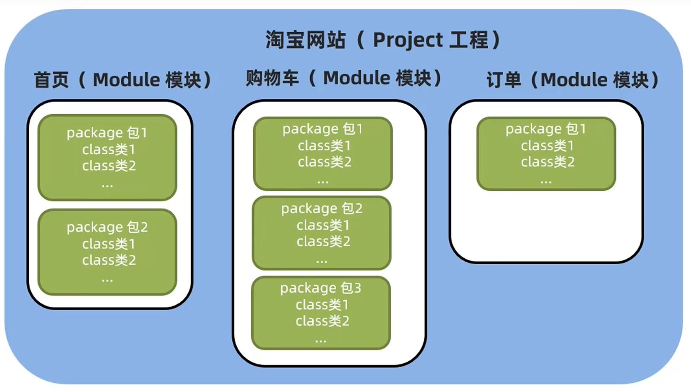

##### 2.2 使用 idea 开发第一个 Java 程序的步骤：
1. 创建工程 new Project（空工程）

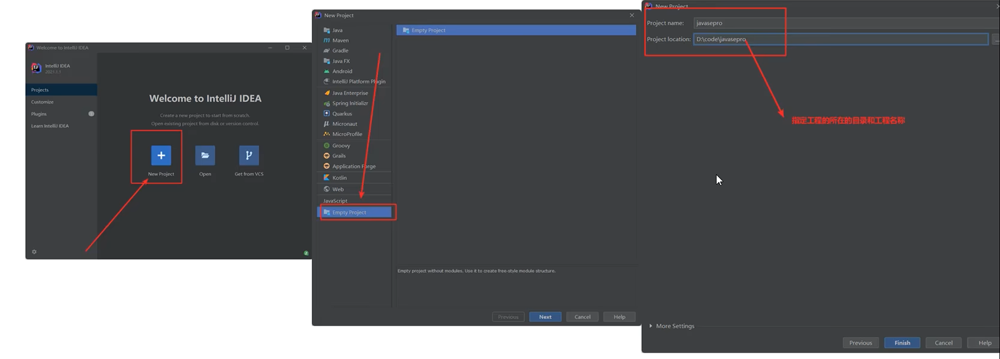

2. 创建模块 new Module

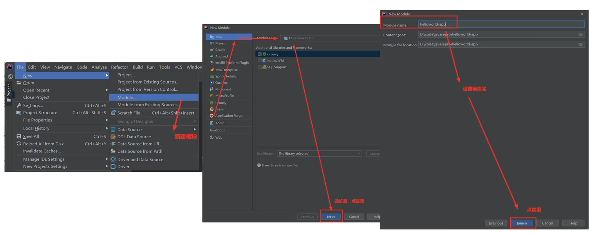

3. 创建包 new Package

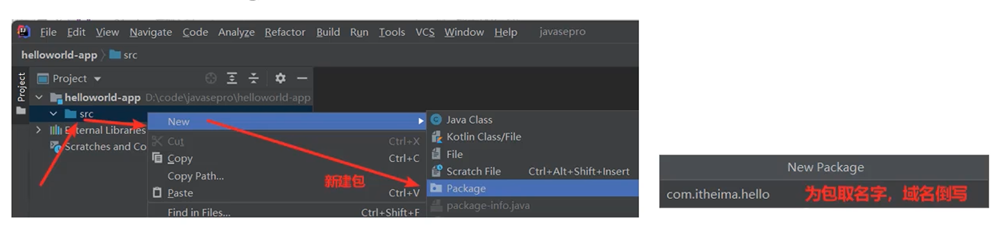

4. 创建类

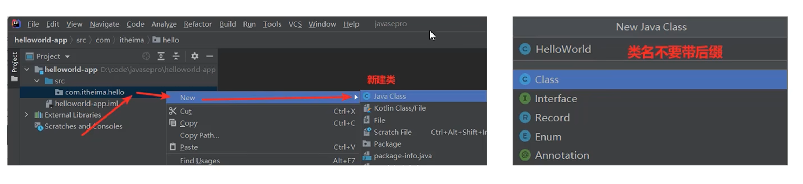

5. 编写代码、并启动


##### 2.3 编写代码
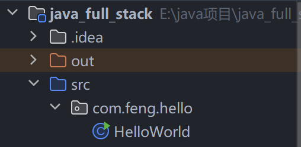

```java
package com.feng.hello;

public class HelloWorld {
    public static void main(String[] args) {
        System.out.println("Hello World");
    }
}

```

##### 总结
1. 使用 idea 开发 java 程序的步骤是什么？
+ **project** -> **module** -> **package** -> **class**
+ project 中可以创建多个 module
+ module 中可以创建多个 package
+ package 中可以创建多个 class

2.创建都用哪个关键字？ 
+ New project / module / package / class

3. idea 中的 java 程序是自动编译和执行的，那编译后的 class 文件在哪里？
+ 在工程路径下的一个 **out 文件夹**里


-----------------------------------------


#### **3. IDEA 字体、主题、背景色设置、快捷键操作**
##### 3.1 IDEA 中设置主题、字体
+ 主题配置

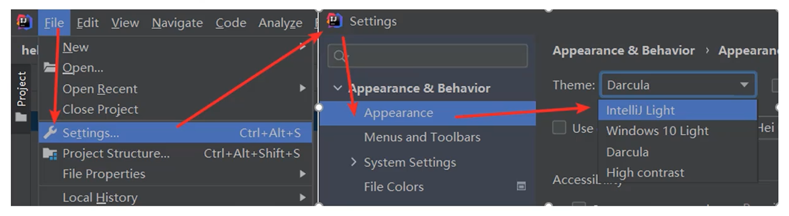


+ 字体配置

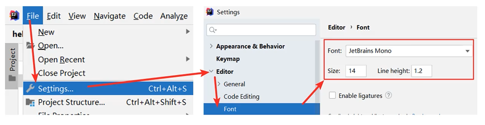

+ IDEA 背景色设置


##### 3.2 IDEA 常用快捷键
+ 组合几个键一起按下完成某件事，可以提高开发效率

|             快捷键               | 功能效果                           |
| -------------------------------- | ---------------------------------- |
| main/psvm、sout、...             | 快速键入相关代码                   |
| Ctrl + D                         | 复制当前行数据到下一行             |
| Ctrl + Y                         | 删除所在行，建议用 Ctrl + X        |
| Ctrl + ALT + L                   | 格式化代码                         |
| ALT + Shift + ↑，ALT + Shift + ↓ | 上下移动当前代码                   |
| Ctrl + /，Ctrl + Shift + /       | 对代码进行注释（讲注释的时候再说） |


------------------------------------


#### **4. IDEA 的其他常见操作**
1. 删除类文件
2. 修改类名称
3. 修改模块
4. **导入模块**
5. 删除模块（了解）
6. 打开工程
7. 关闭工程


---------------------------------------------


### 03 Java 基础语法
#### **1. 注释**
##### 1.1 定义
什么是注释
+ 注释是写在程序中对代码进行解释说明的文字，方便自己和其他人查看，以便理解程序的

##### 1.2 注释有哪些
+ **单行注释**
```java
// 注释内容，只能写一行
```

+ **多行注释**
```java
/*
	注释内容1
	注释内容2
*/
```

+ **文档注释**：
  文档注释的内容是可以提取到一个程序说明文档中去的
```java
/**
	注释内容
	注释内容
*/
```

##### 1.3 注释的特点
+ **注释不影响程序的执行**

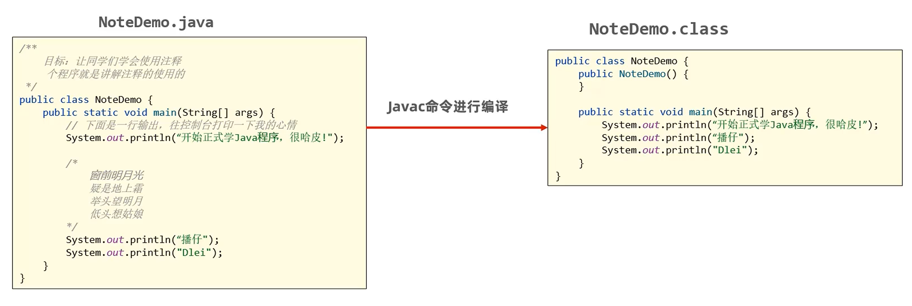

##### 1.4 多学一招

| 快捷键进行注释   | 功能效果                     |
| ---------------- | ---------------------------- |
| Ctrl + /         | 单行注释（对当前行进行注释） |
| Ctrl + Shift + / | 对选中的代码进行多行注释     |


##### 总结
1. 注释是什么？
+ 写在程序中对程序进行解释说明的文字

2. Java 程序中书写注释的方式有几种，各自有什么不同
+ 单行注释：`//`
+ 多行注释：`/* */`
+ 文档注释：`/** */`

3. 注释有什么特点？
+ 不影响程序的执行，编译后的 class 文件中已经没有注释了

4. 注释的快捷键是怎么用的？
+ Ctrl + / 单行注释（对当前行进行注释）
+ Ctrl +Shift + / 对选中的代码进行多行注释


==**写注释是一个利人利己的好习惯！！！**==


-------------------------------------------


#### **2. 字面量**
##### 2.1 定义
+ 计算机是用来处理数据的，字面量就是告诉程序员：**数据在计算机中的书写格式**

常用数据：

| 常用数据 | 生活中的写法 | 程序中的写法             | 说明                                           |
| -------- | ------------ | ------------------------ | ---------------------------------------------- |
| 整数     | 666，-88     | 666, -88                 | 写法一致                                       |
| 小数     | 13.14，-5.21 | 13.14, -5.21             | 写法一致                                       |
| 字符     | A，0，我     | 'A', '0', '我'           | **程序中必须使用单引号，有且仅有一个字符**     |
| 字符串   | 我嘞个雷     | "HelloWorld", "我嘞个雷" | **程序中必须使用双引号，内容可有可无**         |
| 布尔值   | 真、假       | true, false              | **只有两个值：true：代表真，false：代表假**    |
| 空值     |              | 值是：null               | 一个特殊的值，空值（后面会讲解作用，暂时不管） |


##### 代码实现
```java
package a_java入门.c_Literal;

public class LiteralDemo {
    public static void main(String[] args) {
        // 目标：需要同学们掌握常见数据在程序中的书写格式
        // 1. 整数
        System.out.println(666);

        // 2. 小数
        System.out.println(99.5);

        // 3. 字符：必须要用单引号闻起来，有且仅有一个字符
        System.out.println('a');
        System.out.println('0');
        System.out.println('中');
        System.out.println(' '); // 空字符

        // 特殊的字符：\n 代表换行的意思  \t 代表的是一个Tab
        System.out.println('中');
        System.out.println('\n');
        System.out.println('国');
        System.out.println('\t');

        // 4. 字符串：必须用双引号围起来，里面的内容其实可以随意
        System.out.println("我爱你中国abc");
        System.out.println("");
        System.out.println("   ");
        System.out.println("我");

        // 5. 布尔值：只有2个值 true false
        System.out.println(true);
        System.out.println(false);
    }
}

```

##### 总结
1. 字面量这个知识是告诉同学们什么？
+ 数据在程序中的书写格式

2. 字符、字符串在程序中的书写格式有什么要求？
+ 字符必须用单引号围起来，有且仅能一个字符
+ 字符串必须用双引号围起来

3. 几个常见的特殊值的书写格式？
+ true、false、null、\n、\t


-----------------------------------------


#### **3. 变量**
##### 3.1 定义
+ 变量是用来记住程序要处理的数据的

变量的定义格式

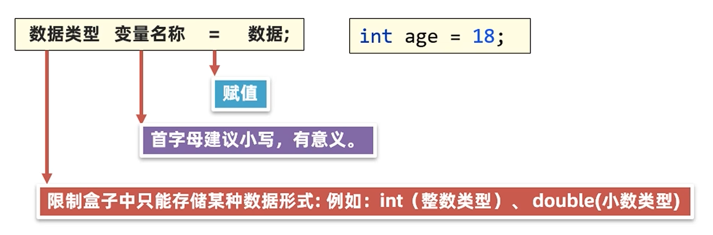


##### 3.2 为什么要用变量？
+ 使用变量记要处理的数据，编写的代码更灵活，管理代码更方便

##### 3.3 变量在计算机中的执行原理
变量就是内存中的一块区域，可以理解为一个盒子，用来装一个数据的！

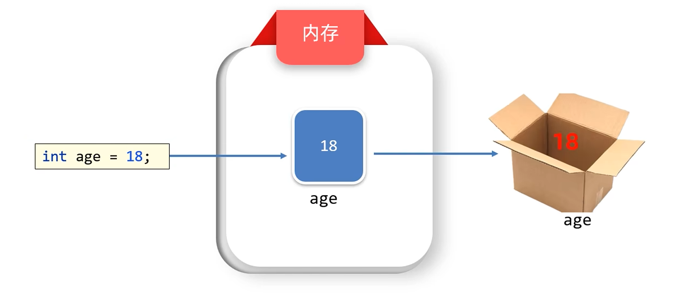

##### 3.4 变量有啥特点？
+ 变量中的数据是可以被替换的
```java
int age2 = 18;
System.out.println(age2);

age2 = 19; // 赋值：从右边往左边执行
System.out.println(age2);

age2 = age2 + 1;
System.out.println(age2);
```

##### 3.5 变量有啥应用场景？
+ 写程序对数据进行数据处理就很方便了
```java
// 5. 需求：钱包有9.5元，收到了10元红包，又发出去了5元红包，请输出各阶段钱包的情况
double money = 9.5;
System.out.println(money);
        
// 收红包10元
money = money + 10;
System.out.println(money);
        
// 发出去5元
money = money - 5;
System.out.println(money);
```

##### 代码实现
```java
package a_java入门.d_variable;

public class VariableDemo1 {
    public static void main(String[] args) {
        // 目标：认识变量，掌握使用变量的好处，变量的特点，应用场景
        // 1. 定义一个整形变量记住一个整数
        // 数据类型 变量名 = 数据;
        // 注意：=在Java中是赋值的意思，从右往左看
        int age = 23;
        System.out.println(age);

        // 2. 记住一个人的成绩
        double score = 99.5;
        System.out.println(score);

        System.out.println("--------------------------------------");

        // 3. 使用变量的好处：便于扩展和维护
        int number = 666; // 万一有一天要将666改为888，直接在这改一个地方就行
        System.out.println(number);
        System.out.println(number);
        System.out.println(number);
        System.out.println(number);
        System.out.println(number);
        System.out.println(number);

        System.out.println("--------------------------------------");

        // 4. 变量的特点：里面装的数据可以被替换
        int age2 = 18;
        System.out.println(age2);

        age2 = 19; // 赋值：从右边往左边执行
        System.out.println(age2);

        age2 = age2 + 1;
        System.out.println(age2);

        System.out.println("--------------------------------------");

        // 5. 需求：钱包有9.5元，收到了10元红包，又发出去了5元红包，请输出各阶段钱包的情况
        double money = 9.5;
        System.out.println(money);

        // 收红包10元
        money = money + 10;
        System.out.println(money);

        // 发出去5元
        money = money - 5;
        System.out.println(money);

    }
}

```

##### 总结
1. 变量是什么，变量的完整定义格式是什么样的？
+ 用来存储一个数据的，本质是内存中的一块区域
+ **数据结构 变量名称 = 数据**

2. 为啥要用变量，变量有啥好处？
+ 使用变量记要处理的数据，编写的代码更灵活，管理代码更方便

3. 变量有什么特点？基于这个特点，变量有啥应用场景？
+ 变量里装的数据可以被替换


-----------------------------------


#### **4. 变量使用注意事项**
##### 4.1 使用变量的几个注意事项
+ 变量要先声明才能使用
+ 变量是什么类型，就应该用来装什么类型的数据，否则报错
+ 变量是从定义开始到 "}" 截止的范围有效；且同一个范围内，定义的多个变量，它们的名称不能一样
+ 变量定义的时候可以不赋初始值；但在使用时，变量里必须有值否则报错

##### 代码实现
```java
package a_java入门.d_variable;

public class VariableDemo2 {
    public static void main(String[] args) {
        // 目标：搞清楚使用变量的几点注意事项
        // 1. 变量要先声明才能使用
        int age = 18;
        System.out.println(age);

        // 2. 变量是什么类型，就应该用来装什么类型的数据，否则报错
        //age = 9.8;

        // 3. 变量是从定义开始到 "}" 截止的范围有效；且同一个范围内，定义的多个变量，它们的名称不能一样
        {
            int a = 19;
            // int a = 23;
            System.out.println(a);
        }
        // System.out.println(a);
        System.out.println(age);
        int a = 23;
        // int age = 25;

        //4. 变量定义的时候可以不赋初始值；但在使用时，变量里必须有值否则报错
        int number;
        number = 100;
        System.out.println(number);
    }
}

```

##### 总结
使用变量时有那些注意点？

+ 变量要先声明，才能使用
+ 变量是什么类型，就应该用来装什么类型的数据
+ 变量存在访问范围，同一个范围内，多个变量的名字不能一样
+ 变量定义时可以不赋初始值；但在使用时，变量里必须有值


-------------------------------------------


#### **5. 关键字、标识符**
##### 5.1 关键字
+ Java 语言自己用到的一些词，有特殊作用的，我们称之为关键字，如：public、class、int、double、...
+ **注意：关键字是 java 用了的，我们就不能用来作为：类名、变量名，否则会报错！**


注意：关键字很多，不用刻意去记

##### 5.2 标识符
+ 标识符就是名字，我们写程序时会起一些名字，如类名、变量名等等都是标识符

标识符的要求
+ 基本组成：由数字、字母、下划线（_）和美元符（$）等组成
+ 强制要求：**不能以数字开头**、不能用**关键字作为名字**、且是区分大小写的

标识符的建议规范
+ 变量名称：满足标识符规则，同时建议用英文、有意义、首字母小写，满足“驼峰模式”，例如：`int studyNumber = 59;`
+ 类名称：满足标识符规则，建议全英文、有意义、首字母大写，满足“驼峰模式”，例如：`HelloWorld, Student`

##### 总结
1. 什么是关键字？
+ 关键字就是 Java 自己要用到的词，并且有特殊含义的一些词
+ **我们就不能用来做为：类名、变量名，否则会报错**

2. 什么是标识符
+ 标识符就是名字
+ 标识符的规则：由数字、字母、下划线、美元符等组成，**且不能数字开头**，不能用关键字做为名字


------------------------------------


### 总结

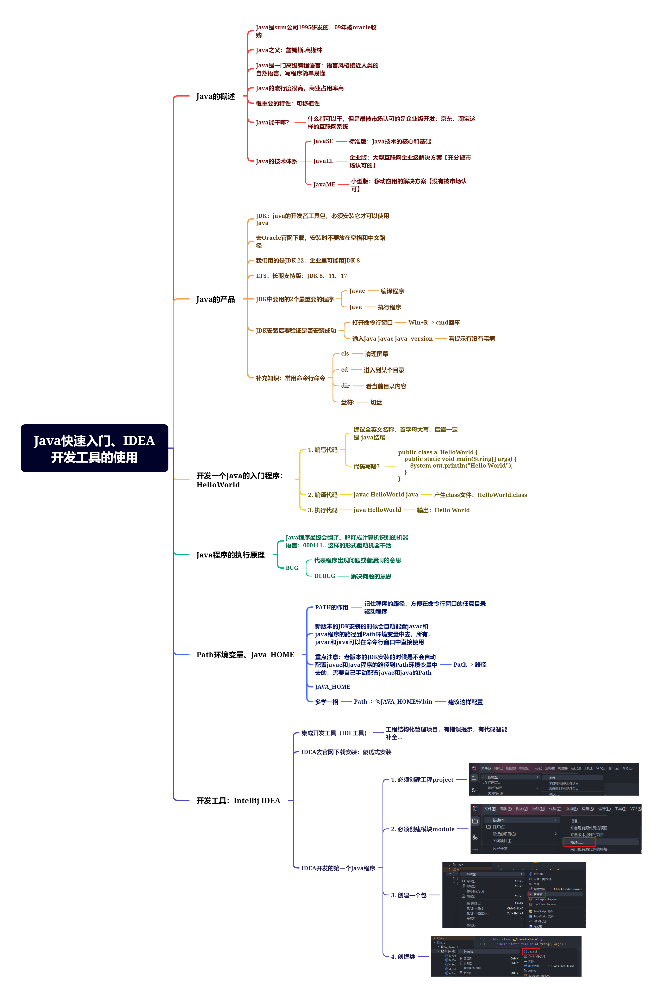


---------------------------------------------


## 二、Java 语法
### 01 变量详解
#### 1. 变量里的数据在计算机中的存储原理
##### 1.1 二进制
+ **只有0、1**，按照**逢2进1**的方式表示数据：

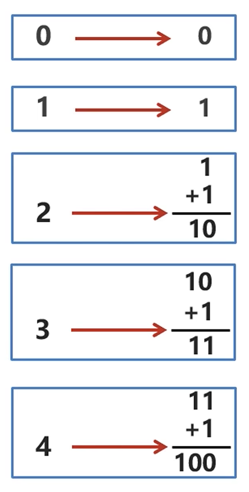

##### 1.2 十进制转二进制的算法
+ 除二取余法

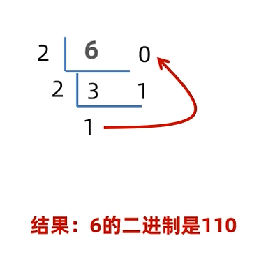                             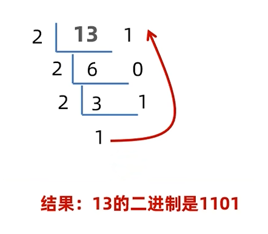


##### 1.3 计算机中表示数据的最小单元

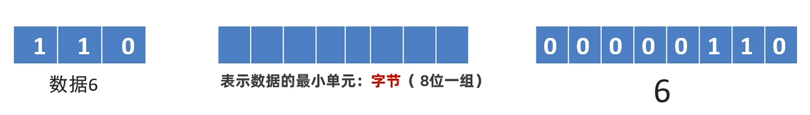

+ 计算机中表示数据的最小单位：一个**字节（byte，简称B，是使用8个二进制组成的）**
+ 字节中的那个二进制位就成为  **位（bit，简称b），1B = 8b**

##### 总结
1. 数据在计算机底层都是怎么存储的？
+ 都是采用二进制：使用0、1，按照逢2进1的规则表示数据来存储

2. 如何快速的算出一个数据的二进制形式？
+ 除二取余法

3. 计算机底层表示数据的最小单位是什么？
+ 字节，一个字节等于8个二进制位：1B = 8b

##### 1.4 字符在计算机中是如何存储的呢？
+ **ASCII 编码表**：即美国信息交换标准编码，规定了现代英语、数字字符、和其他西欧字符对应的数字编号

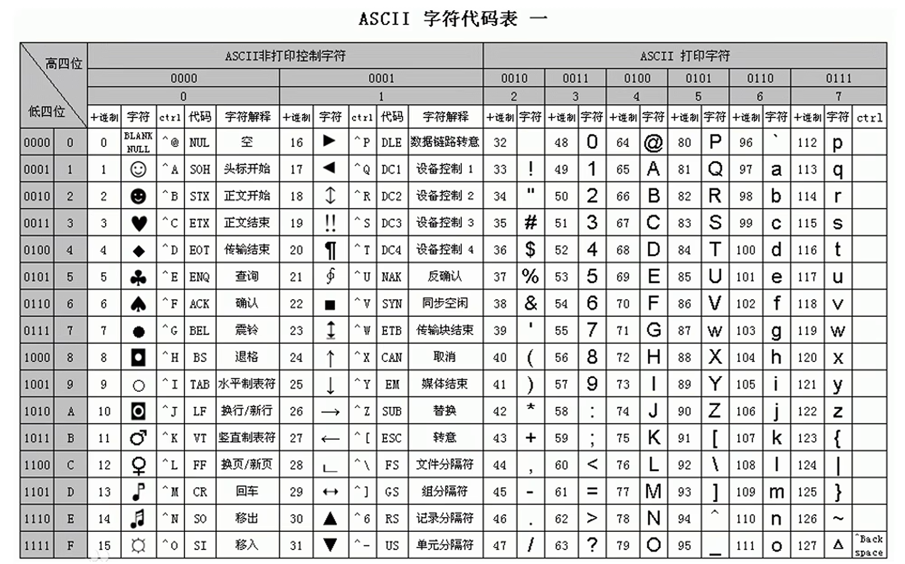

```java
package b_java语法.a_ASCII;

public class a_ASCIIDemo1 {
    public static void main(String[] args) {
        // 目标：掌握ASCII编码表的编码特点
        System.out.println('a' + 10); // 97 + 10 = 107
        System.out.println('A' + 10); // 65 + 10 = 75
        System.out.println('0' + 10); // 48 + 10 = 58
    }
}

```

##### 1.5 图片数据 - 彩色图
+ 图片就是无数个像素点组成的
+ 每个像素点的数据：用0~255 * 255 * 255表示其颜色
  + 本质上也是存二进制

##### 1.6 声音数据
+ 存储波形图 -> 将波形图映射到一个坐标上

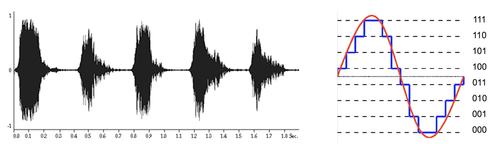

##### 总结
1. 字符数据在计算机中是怎么存储的？
+ 字符存的是 ascii 码表中对应的数字的二进制形式
+ 字符 ’A‘ 对应的数字是65
+ 字符 ’a‘ 对应的数字是97
+ 字符 ‘0’ 对应的数字是48

2. 图片和音视频等文件的数据是怎么存储的？
+ 也是采用二进制进行存储的


##### 1.7 十进制转二进制的算法
+ 十进制转二进制：**除二取余法**

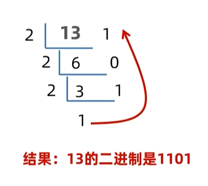

+ 二进制转十进制

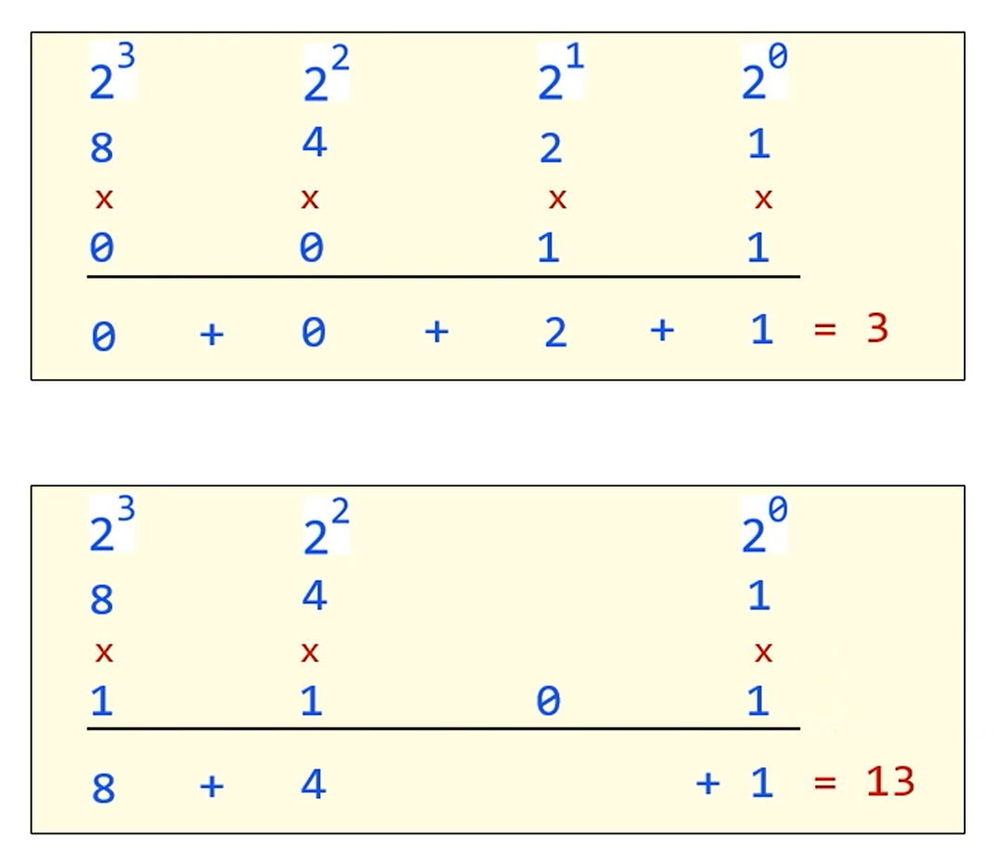


##### 1.8 八进制、十六进制介绍
+ 为了便于观察和表示二进制，推出了八进制和十六进制
+ **都是先转换为二进制再转换为十进制**

  + 每3位二进制作为一个单元，最小数是0，最大数是7，共八个数字，这就是**八进制**
  
  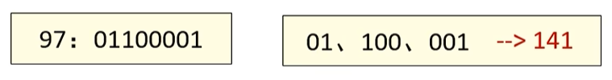

  + 每4位二进制作为一个单元，最小数是0，最大数是15，共16个数字，依次用：0~9 A B C D E F 表示就是**十六进制**
  
  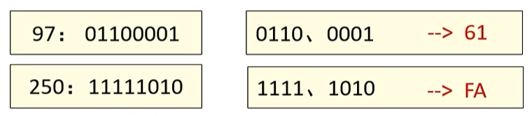

注意：Java 程序中支持书写**二进制**、**八进制**、**十六进制**的数据，分别需要以 **0B或者0b**、**0**、**0X或者0x**开头

```java
package b_java语法.a_ASCII;

public class a_ASCIIDemo1 {
    public static void main(String[] args) {
        // 二进制 八进制 十六进制在程序中的写法
        int a1 = 0B01100001; // 0B开头的数据是二进制
        System.out.println(a1);

        int a2 = 0141; // 0开头的数据是八进制
        System.out.println(a2);

        int a3 = 0XFA; // 0X开头的数据是十六进制
        System.out.println(a3);
    }
}

```

##### 1.9 计算机的数据单位
+ 计算机表示数据的最小组成单位：**字节，1B=8b**
+ 在 B 的基础上，计算机发展出了 KB、MB、GB、TB、... 这些数据单位

|    转换表    |
| :----------: |
|   1B = 8b    |
| 1KB = 1024B  |
| 1MB = 1024KB |
| 1GB = 1024MB |
| 1TB = 1024GB |

##### 总结
1. 二进制如何计算成十进制？

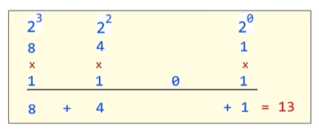

2. 二进制如何计算成八进制？
+ 每3位二进制作为一个单元，最小数是0，最大数是7，0-7有8个数字

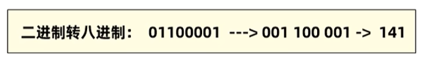

3. 二进制如何计算成十六进制？
+ 每4位二进制作为一个单位，最小数是0，最大数是15
+ 0-15有16个数字，依次用：0~9 A B C D E F 代表

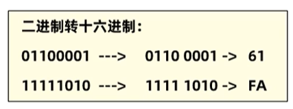


4. 数据大小的单位换算是怎么样的？

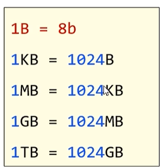


--------------------------------------


#### 2. 数据类型
**数据类型 变量名称 = 初始值;**
规定变量只能存储什么类型的数据

##### 2.1 数据类型的分类
+ 基本数据类型：**4大类8种**

<table>
	<thead>
		<tr>
			<th colspan="2">数据类型</th>
			<th>内存占用（字节数）</th>
			<th>数据范围</th>
		</tr>
	</thead>
	<tbody>
		<tr>
			<td rowspan="4">整形</td>
			<td>byte</td>
			<td>1</td>
			<td>-128~127</td>
		</tr>
		<tr>
			<td>short</td>
			<td>2</td>
			<td>-32768~32767</td>
		</tr>
		<tr>
			<td>int（默认）</td>
			<td>4</td>
			<td>-2147483648~2147483648（10位数，大概21亿多）</td>
		</tr>
		<tr>
			<td>long</td>
			<td>8</td>
			<td>-9223372036854775808~9223372036854775808（19位数）</td>
		</tr>
		<tr>
			<td rowspan="2">浮点型（小数）</td>
			<td>float</td>
			<td>4</td>
			<td>-1.401298 E -45 到 3.4028235 E +38</td>
		</tr>
		<tr>
			<td>double（默认）</td>
			<td>8</td>
			<td>4.9000000 E -324 到 1.797693 E +308</td>
		</tr>
		<tr>
			<td>字符型</td>
			<td>char</td>
			<td>2</td>
			<td>0-65535</td>
		</tr>
		<tr>
			<td>布尔型</td>
			<td>boolean</td>
			<td>1</td>
			<td>true，false</td>
		</tr>
	</tbody>
</table>


##### 代码演示
```java
package b_java语法.a_ASCII;

public class b_VariableDemo2 {
    public static void main(String[] args) {
        // 目标：掌握常见的基本数据类型的使用
        // 1. byte short int long
        byte a = 127; // -128 - 17
        // byte a2 = 128; // 越界了

        short s = 13244;
        // short s1 = 91412; //越界了

        int i = 314135;

        // 注意：随便写一个整形字面量默认是int类型，145436354164354虽然没有超过long的范围，但是超过了本身int类型的范围
        // 如果希望随便写一个整形字面量默认是long类型的，需要在后面加上L / l
        long lg = 145436354164354L;

        //2. float double
        // 注意：随便写小数字面量，默认是double，如果希望小数float，后面加F / f
        float f = 3.14F; // float在开发中少见

        double d = 56.45;

        // 3. char 字符型
        char ch = 'a';
        char ch2 = '中';

        // 4. boolean
        boolean flag = true;
        boolean flag2 = false;

        // 拓展一种引用数据类型，后面要用
        // String 称之为字符串类型，定义的变量可以用于记住一个字符串数据
        String name = "张三";
        System.out.println(name);
    }
}

```

##### 总结
1. 数据类型分为几种？
+ 基本数据类型：4大类8种
  + byte short **int（默认）** long 整形
  + float **double（默认）** 浮点型
  + char 字符型
  + boolean 布尔型
+ 引用数据类型：String

2. 随便写的整数、小数字面量，他们默认是什么类型？
+ 23，默认是 **int** 类型，加上 L/l 就是 long 类型的数据了
+ 23.8，默认是 **double** 类型，加上 F/f 就是 float 类型了


-----------------------------------------


### 02 类型转换
+ 在我们的开发种存在某种类型的变量赋值给另一种类型的变量
+ 存在不同类型的数据一起运算


#### 1. 自动类型转换
##### 1.1 定义
+ **类型范围小**的变量，可以**直接赋值**给**类型范围大**的变量
  + 比如 byte 类型的变量可以直接赋值给 int 类型的变量

##### 1.2 自动类型转换在计算机中的执行原理

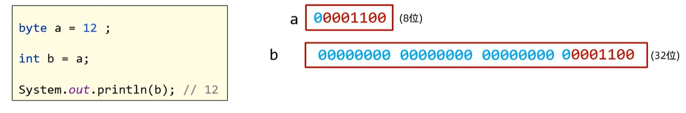

##### 1.3 自动类型转换的其他形式

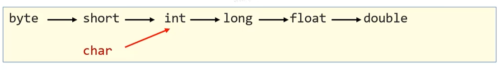

##### 代码实现
```java
package b_java语法;

public class c_TypeConversionDemo1 {
    public static void main(String[] args) {
        // 目标：理解自动类型转换机制
        byte a = 12;
        int b = a; // 发生了自动类型转换
        System.out.println(a);
        System.out.println(b);

        int c = 100;
        double d = c; // 发生了自动类型转换
        System.out.println(c);

        char ch = 'a'; // 占两个字节
        int i = ch; // 占四个字节  发生了自动类型转换
        System.out.println(i);
    }
}

```

##### 总结
1. 为什么要进行类型转换？
+ 存在不同类型的变量赋值给其他类型的变量

2. 什么是自动类型转换？
+ 类型范围小的变量，可以直接赋值给类型范围大的变量


-------------------------------------


#### 2. 表达式的自动类型转换
+ 在开发中会有不同类型的变量或者数据一起运算
+ 最终运算出的数据的类型是什么？

##### 2.1 定义
+ 在表达式中，小范围类型的变量，会自动转换成表达式中较大范围的类型，再参与运算

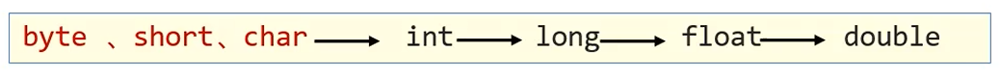

注意事项：
+ 表达式的最终结果类型由表达式中的**最高类型决定**
+ **在表达式中，byte、short、char** 是**直接转换成 int** 类型参与运算的
  + 防止运算后数据超出原本类型的范围

##### 代码实现

```java
package b_java语法;

public class d_TypeConversionDemo2 {
    public static void main(String[] args) {
        // 目标：掌握表达式的自动类型转换机制
        byte a = 10;
        int b = 20;
        long c = 30;
        long rs = a + b + c;
        System.out.println(rs);

        double rs2 = a + b +1.0;
        System.out.println(rs2);

        byte i = 10;
        short j = 30;
        int rs3 = i + j;
        System.out.println(rs3);

        // 面试笔试题
        byte b1 = 110;
        byte b2 = 80;
        int b3 = b1 + b2;
        System.out.println(b3);
    }
}

```

##### 总结
1. 表达式的自动类型转换是什么样的？
+ 小范围的类型会自动转换成大范围的类型运算

2. 表达式的最终结果类型是由谁决定的？
+ 最终类型由表达式中的最高类型决定

3. 表达式有哪些类型转换是需要注意的？
+ byte short char 是直接转换成 int 类型参与运算的


------------------------------


#### 3. 强制类型转换
大范围类型的变量 -> 小范围类型的变量

##### 3.1 引入
**类型范围大**的数据或者变量，直接**赋值**给**类型范围小**的变量，会报错

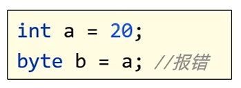

##### 3.2 强制类型转换
+ 强行将类型范围大的变量、数据赋值给类型范围小的变量
```
数据类型 变量2 = (数据类型) 变量1、数据
```


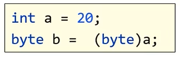

##### 3.3 强制类型转换在计算机中的执行原理

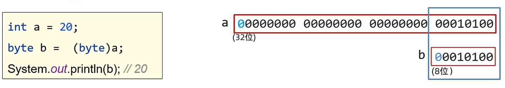

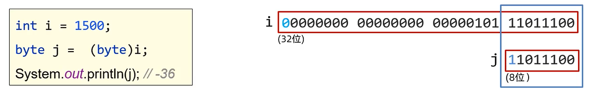

注意事项：
+ 强制类型转换**可能造成数据（丢失）溢出**
+ 浮点型强制转成整形，**直接丢掉小数部分，保留整数部分返回**

##### 代码实现
```java
package b_java语法;

public class e_TypeConversionDemo3 {
    public static void main(String[] args) {
        // 目标：掌握强制类型转换
        int a = 20;
        byte b = (byte) a; // 快捷键：ALT + ENTER  强制类型转换
        System.out.println(a);
        System.out.println(b);

        int i = 1500;
        byte j = (byte) i;
        System.out.println(j);

        double d = 99.5;
        int m = (int) d; // 强制类型转换
        System.out.println(m); // 丢掉小数部分，保留整数部分
    }
}

```

##### 总结
1. 什么是强制类型转换？
+ 默认情况下，大范围类型的变量直接赋值给小范围类型的变量会报错
+ 可以强行将范围大的变量、数据赋值给类型范围小的变量
```
数据类型 变量2 = (数据类型) 变量1、数据
```

2. 强制类型转换有哪些需要注意的？
+ 可能出现数据丢失
+ 小数强制转换成整数是直接截断小数保留整数


--------------------------------------


### 03 运算符
对变量、字面量进行运算的符号
#### 1. 基本的算术运算符、+符号做连接符
##### 1.1 基本的算术运算符

| 符号  | 作用 | 说明                                                        |
| ----- | ---- | ----------------------------------------------------------- |
| +     | 加   | 参考小学一年级                                              |
| -     | 减   | 参考小学一年级                                              |
| ***** | 乘   | 参考小学二年级，与 "✖" 相同                                 |
| **/** | 除   | 与 "➗" 相同，**注意：在 java 中两个整数相除的结果还是整数** |
| **%** | 取余 | 获取的是两个数据做除法的**余数**                            |

##### 1.2 "**+**" 符号可以做连接符
+ "**+**" 符号与**字符串运算**的时候是用作**连接符**的，其结果依然是一个字符串
```
"abc" + 5 ---> "abc5"
```
+ 遇到 "**+**" 符号，**能算则算，不能算就在一起**

##### 代码实现
```java
package b_java语法;

public class f_OperaterDemo1 {
    public static void main(String[] args) {
        // 目标：掌握基本的算术运算符的使用
        int a = 10;
        int b = 2;
        System.out.println(a + b);
        System.out.println(a - b);
        System.out.println(a * b); // 20
        System.out.println(a / b); // 5
        System.out.println(5 / 2); // 2.5 ==> 2
        System.out.println(5.0 / 2); // 2.5
        int i = 5;
        int j =2;
        System.out.println(1.0 * 1 / j); // 2.5

        System.out.println(a % b); // 0
        System.out.println(3 % 2); // 1

        System.out.println("----------------------------------------");

        // 目标2：掌握使用+符号做连接符的情况
        int a2 = 5;
        System.out.println("abc" + a2); // "abc5"
        System.out.println(a2 + 5); // 10
        System.out.println("wlgsg" + a2 + 'a'); // wlgsg5a
        System.out.println(a2 + 'a' + "wlgsg"); // 5 + 97 + "wlgsg" = 102wlgsg
    }
}

```

##### 总结
1. 算术运算符有哪些？
+ +、-、*****、**/**、**%**

2. / 需要注意什么，为什么？
+ 如果两个整数做除法，其结果一定是整数，因为最高类型是整数

3. +除了做基本算术运算符，还有哪些功能？
+ 与字符串做+运算时会被当做**链接符**，其结果还是字符串
+ 识别技巧：能算则算，不能算就在一起


------------------------------------------


#### 2. 自增自减运算符
##### 1. 定义

| 符号         | 作用                                        |
| ------------ | ------------------------------------------- |
| 自增：**++** | 放在某个变量前面或者后面，对变量自身的值加1 |
| 自减：**--** | 放在某个变量前面或者后面，对变量自身的值减1 |

**注意：++、-- 只能操作变量，不能操作字面量**

##### 2. 自增自减的使用注意事项
+ ++、-- 如果不是单独使用（**如在表达式中、或者同时有其他操作**），放在变量前后会存在明显区别
  + 放在变量的**前面**，先对变量进行+1、-1，再对变量的值进行运算
  ```java
  int a = 10;
  int res = ++a;
  ```
  + 放在变量的**后面**，先拿变量的值进行运算，再对变量的值进行+1、-1
  ```java
  int b = 10;
  int res = b++;
  ```
  
##### 代码演示
```java
package b_java语法;

public class g_OperaterDemo2 {
    public static void main(String[] args) {
        // 目标：掌握自增自减运算符的使用
        int a = 10;
        a++; // a = a + 1
        System.out.println(a); // 11

        a--; // a = a - 1
        System.out.println(a); // 10

        System.out.println("------------------------------");

        int i = 10;
        int res = ++i; // 先加后用
        System.out.println(res); // 11
        System.out.println(i); // 11

        int j = 10;
        int res2 = j++;
        System.out.println(res2); // 10
        System.out.println(j); // 11
    }
}

```

##### 总结
1. 自增、自减运算符是什么，有什么作用，需要注意什么？
+ ++、--；对当前变量值+1、-1
+ 只能操作变量，不能操作字面量

2. 自增、自减运算符放在变量前后有区别吗？
+ 如果单独使用放前放后是没有区别的
+ 非单独使用：放在变量前，先进行变量自增/自减，再使用变量


##### 3. 自增、自减拓展案例
```java
package b_java语法;

public class h_OperatorDemo3 {
    public static void main(String[] args) {
        int m = 5;
        int n = 3;
        // m 5 6 5 4
        // n 3 4
        //            6  -  5  +  5  -  4  +  4
        int result = ++m - --m + m-- - ++n + n-- + 3;
        System.out.println(result); // 9
        System.out.println(m); // 4
        System.out.println(n); // 3
    }
}

```


------------------------------


#### 3. 赋值运算符
##### 3.1 基本赋值运算符
+ 就是 "**=**"，从右往左看
```java
int a = 10; // 先看"="右边，把数据10赋值给左边的变量a存储
```

##### 3.2 扩展赋值运算符

| 符号 | 用法 | 作用       | 底层代码形式             |
| ---- | ---- | ---------- | ------------------------ |
| +=   | a+=b | 加后赋值   | a = **(a的类型)**(a + b) |
| -=   | a-=b | 减后赋值   | a = **(a的类型)**(a - b) |
| *=   | a*=b | 乘后赋值   | a = **(a的类型)**(a * b) |
| /=   | a/=b | 除后赋值   | a = **(a的类型)**(a / b) |
| %=   | a%=b | 取余侯赋值 | a = **(a的类型)**(a % b) |


##### 代码实现
```java
package b_java语法;

public class i_OperatorDemo4 {
    public static void main(String[] args) {
        // 目标：掌握扩展赋值运算符的使用
        // +=
        // 需求：收红包
        double a = 9.5;
        double b = 520;
        a += b; // a = (double)(a + b);
        System.out.println(a); // 529.5

        // -= 需求：发红包
        double i = 600;
        double j = 520;
        i -= j; // i = (double)(i - j)
        System.out.println(i); // 80.0

        int m = 10;
        int n = 5;
        m *= n; // 等价形式：m = (int)(m * n)
        System.out.println(m); // 50
        m /= n; // 等价形式：m = (int)(m / n)
        System.out.println(m); // 10
        m %= n; // 等价形式：m = (int)(m % n)
        System.out.println(m); // 0

        System.out.println("-------------------------------------------");

        byte x = 10;
        byte y = 30;
        // x = x + y; // 编译报错，x、y会自动转为int，不能相加后传入一个byte中
        x += y; // 等价形式x = (byte) (x + y);
        System.out.println(x); // 40
    }
}

```

##### 总结
1. 赋值运算符有哪些？
+ 基本的赋值运算符：=（从右往左看）
+ 扩展的赋值运算符：+=、-=、*=、/=、%=

2. 扩展赋值运算符的作用是什么？有什么特点
+ +=可以实现数据的累加，把别人的数据加给自己
+ 扩展的赋值运算符自带强制类型转换


------------------------------------


#### 4. 关系运算符

| 符号 | 例子   | 作用                          | 结果                            |
| ---- | ------ | ----------------------------- | ------------------------------- |
| >    | a > b  | 判断 a 是否**大于** b         | 成立返回 true、不成立返回 false |
| >=   | a >= b | 判断 a 是否**大于或者等于** b | 成立返回 true、不成立返回 false |
| <    | a < b  | 判断 a 是否**小于** b         | 成立返回 true、不成立返回 false |
| <=   | a <= b | 判断 a 是否**小于或者等于** b | 成立返回 true、不成立返回 false |
| ==   | a == b | 判断 a 是否**等于** b         | 成立返回 true、不成立返回 false |
| !=   | a != b | 判断 a 是否**不等于** b       | 成立返回 true、不成立返回 false |


+ 判断数据是否满足条件，最终会返回一个判断的结果，这个结果是布尔类型的值：true 或者 false

**注意“在 java 中判断是否相等一定是 " == " ，千万不要把 " == " 误写成 "="**

##### 代码实现
```java
package b_java语法;

public class j_OperatorDemo5 {
    public static void main(String[] args) {
        // 目标：掌握关系运算符的基本使用
        int a = 10;
        int b = 5;
        boolean res = a > b;
        System.out.println(res); // true

        System.out.println(a >= b); // true 要么a大于b，或者a等于b
        System.out.println(2 >= 2); // true
        System.out.println(a < b); // false
        System.out.println(a <= b); // false
        System.out.println(2 <= 2); // true
        System.out.println(a == b); // false
        System.out.println(5 == 5); // true
        // System.out.println(a = b); // 5 注意了：判断是否相等一定是用 ==，= 是用来赋值的
        System.out.println(a != b); // true
        System.out.println(10 != 10); // false
    }
}

```


---------------------------------------


#### 5. 逻辑运算符
+ 把多个条件放在一起运算，最终返回布尔类型的值：true、false

| 符号 | 叫法     | 例子           | 运算逻辑                                                     |
| ---- | -------- | -------------- | ------------------------------------------------------------ |
| &    | 逻辑与   | 2 > 1 & 3 > 2  | **多个条件必须都是 true，结果才是 true**；有一个是 false，结果就是 false |
| \|   | 逻辑或   | 2 > 1 \| 3 < 5 | **多个条件中只要有一个是 true，结果就是 true**               |
| !    | 逻辑非   | !(2 > 1)       | 就是取反：你真我假，你假我真。!true == false、!false == true |
| ^    | 逻辑异或 | 2 > 1 ^ 3 > 1  | 前后条件的结果相同，就直接返回 false，前后条件的结果不同，才返回 true |


| 符号 | 叫法   | 例子             | 运算逻辑                                                     |
| ---- | ------ | ---------------- | ------------------------------------------------------------ |
| &&   | 短路与 | 2 > 10 && 3 > 2  | 判断结果与 "&" 一样，过程不同：**左边为 false，右边则不执行** |
| \|\| | 短路或 | 2 > 1 \|\| 3 < 5 | 判断结果与 "\|" 一样，过程不同：**左边为 true，右边则不执行** |


注意：在 java 中，"&"、"|"：无论左边是 false 还是 true，**右边都要执行**

==由于 &&、|| 运算效率更高，在开发中用的更多==


##### 代码实现
```java
package b_java语法;

public class k_OperatorDemo6 {
    public static void main(String[] args) {
        // 目标：掌握逻辑运算符的使用
        // 需求：要求手机必须满足尺寸大于等于6.95，且内存必须大于等于8
        double size = 6.8;
        int storage = 16;
        // 1. & 前后的条件的结果必须都是true，结果才是true
        boolean res = size >= 6.95 & storage >= 8;
        System.out.println(res); // false

        // 需求2：要求手机要么满足尺寸大于等于6.95，要么内存必须大于等于8
        // 2. | 只要多个条件中有一个是true，结果就是true
        boolean res2 = size >= 6.95 | storage >= 8;
        System.out.println(res2); // true

        // 3. !取反的意思
        System.out.println(!true); // false
        System.out.println(!false); // true
        System.out.println(!(2 > 1)); // false

        // 4. ^ 前后条件的结果相同时返回false，不同时返回true
        System.out.println(true ^ true); // false
        System.out.println(false ^ false); // false
        System.out.println(true ^ false); // true
        System.out.println(false ^ true); // true

        // 5. && 左边为false，右边不执行
        int i = 10;
        int j = 20;
        System.out.println(i > 100 && ++j > 99); // false
        System.out.println(j); // 20

        // 6. || 左边为true，右边就不执行
        int m = 10;
        int n = 30;
        System.out.println(m > 3 || ++n > 40); // true
        System.out.println(n); // 30
    }

}

```

##### 总结
1. 逻辑运算符有哪些，有什么特点？
+ &：有一个为 false、结果是 false
+ &&：一个为 false、结果就是 false，**但前一个为 false，后一个条件不执行了**
+ |：有一个为 true、结果是 true
+ ||：一个为 true、结果是 true，**但前一个为 true，后一个条件不执行了**
+ !：!false=true、!true=false
+ ^：相同是 false、不同是 true

**注意：在实际开发中，常用的逻辑运算符还是：&&、||、!**


------------------------------------


#### 6. 三元运算符、运算符的优先级
##### 6.1 三元运算符介绍
+ 格式：`条件表达式 ? 值1 : 值2;`
+ 执行流程：首先计算**关系表达式的值**，如果值为 **true**，返回**值1**，如果为 **false**，返回**值2**

##### 6.2 运算优先级
+ 在表达式中，哪个运算符先执行后执行是要看优先级的，例如 “*、/” 的优先级高于 ”+、-“

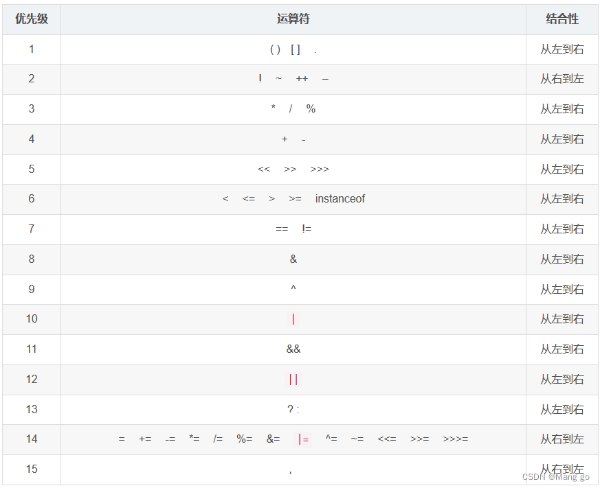

##### 代码实现
```java
package b_java语法;

public class l_OPeratorDemo7 {
    public static void main(String[] args) {
        // 目标：掌握三元运算符的基本使用
        double score = 98.5;
        String res = score >= 60 ? "成绩及格" : "成绩不及格";
        System.out.println(res); // 成绩及格

        // 需求2：找出2个整数中的较大值，并输出
        int a = 99;
        int b = 167;
        int max = a > b ? a : b;
        System.out.println(max); // 167

        // 需求3：找3个整数中的较大值
        int i = 10;
        int j = 45;
        int k = 34;

        // 找出2个整数中的较大值
        int temp = i > j ? i : j;
        // 找出temp与k中的较大值
        int max2 = temp > k ? temp : k;
        System.out.println(max2); // 45

        System.out.println(10 > 3 || 10 > 3 && 10 < 3); // true
        System.out.println((10 > 3 || 10 > 3) && 10 < 3); // false
    }
}

```


-----------------------------------------


### 04 API 介绍、Scanner：获取用户键盘输入的数据
API（Application Programming Interface：应用程序编程接口）
+ Java 写好的程序，咱们程序员可以直接拿来调用
+ Java 为自己写好的程序提供了相应的 **程序使用说明书（API 文档）**
  + 网址：https://www.oracle.com/cn/java/technologies/downloads/

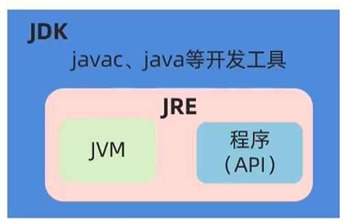


> 需求：
> + 请在程序中，提示用户通过键盘输入自己的姓名、年龄，并能在程序中收到这些数据，怎么解决？


使用 Scanner 接收用户键盘输入的数据，需要三个步骤：
1. 导包：告诉程序去 JDK 的哪个包中找扫描器技术
2. 抄代码：代表得到键盘扫描器对象（东西）
3. 抄代码：等待接收用户输入的数据

注意：
+ System、String 在 JDK 中的 Java.lang 包下
+ lang 包不需要我们导包，是默认的包

#### 代码实现

```java
package b_java语法;

import java.util.Scanner;

public class m_ScannerDemo1 {
    public static void main(String[] args) {
        // 1. 导包：一般不需要我们自己做，idea工具会自动帮我们导包的
        // 2. 抄写代码：得到一个键盘扫描器对象（东西）
        Scanner sc = new Scanner(System.in);

        // 3. 开始调用sc的功能，来接收用户键盘输入的数据
        System.out.println("请您输入您的年龄：");
        int age = sc.nextInt(); // 执行到这儿，会开始等待用户输入一个整数，直到用户按了回车键，才会拿到数据
        System.out.println("您的年龄是：" + age);

        System.out.println("请输入您的名字：");
        String name = sc.next(); // 执行到这儿，会开始等待用户输入一个字符串，直到用户按了回车键，才会拿到数据
        System.out.println(name + "欢迎您进入系统~~~");
    }
}

```

#### 总结
1. API 是什么？API 文档是什么？
+ Application Programming Interface，应用程序编程接口：Java 写好的程序，咱们可以直接调用
+ Java 提供的程序使用说明书

2. Java 程序中如何实现接收用户键盘输入的数据？
+ 使用 Java 提供的 Scanner 来完成，步骤如下
+ 1. 导包：import java.util.Scanner
+ 2. 抄代码得到扫描器对象：Scanner sc = new Scanner(System.in);
+ 3. 抄代码等待接收用户输入的数据：
  + int age = sc.nextInt();
  + String name = sc.next();


------------------------------------


### 总结

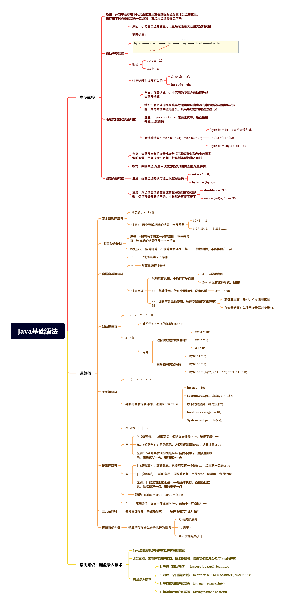


----------------------------


## 三、程序流程控制
程序中最经典的三种执行顺序：
+ **顺序结构**：自上而下的执行代码
  + 代码本身就是，默认的
+ **分支结构**：根据条件，选择对应代码执行
  + if、switch
+ **循环结构**：控制某段代码重复执行
  + for、while、do-while


### 1. 分支结构：if、switch、switch 穿透性
#### 1.1 if 分支
+ 根据条件（真或假）来决定执行某段代码

##### 1.1.1 if 分支的三种形式
第一种：
```java
if (条件表达式) {
	代码;
}
```

执行流程：
+ 首先判断条件表达式的结果，如果**为 true 执行语句体**，**为 false 就不执行语句体**

注意事项：
+ if 语句种，**如果大括号控制的只有一行代码，则大括号可以省略不写

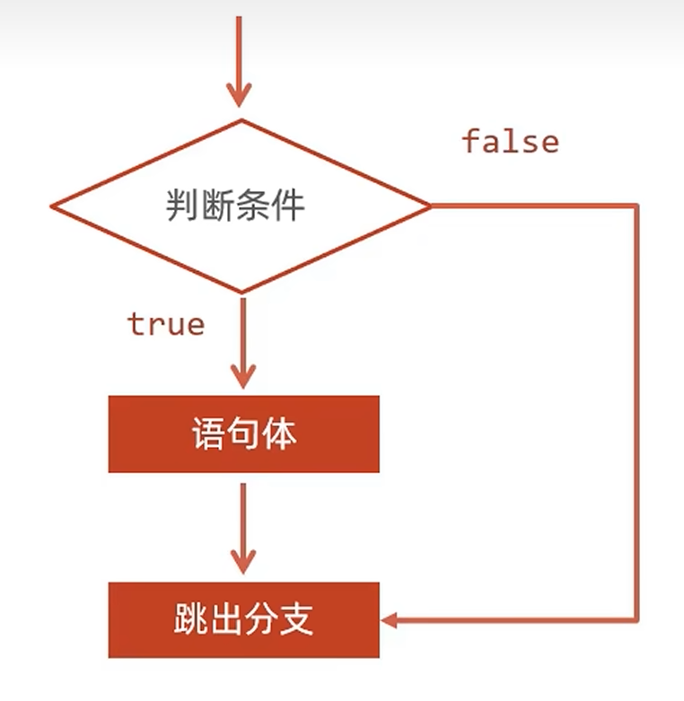


第二种：
```java
if (条件表达式) {
	代码1;
} else {
	代码2;
}
```

执行流程：
+ 首先判断条件表达式的结果，如果**为 true 执行语句体1**，**为 false 就执行语句体2**

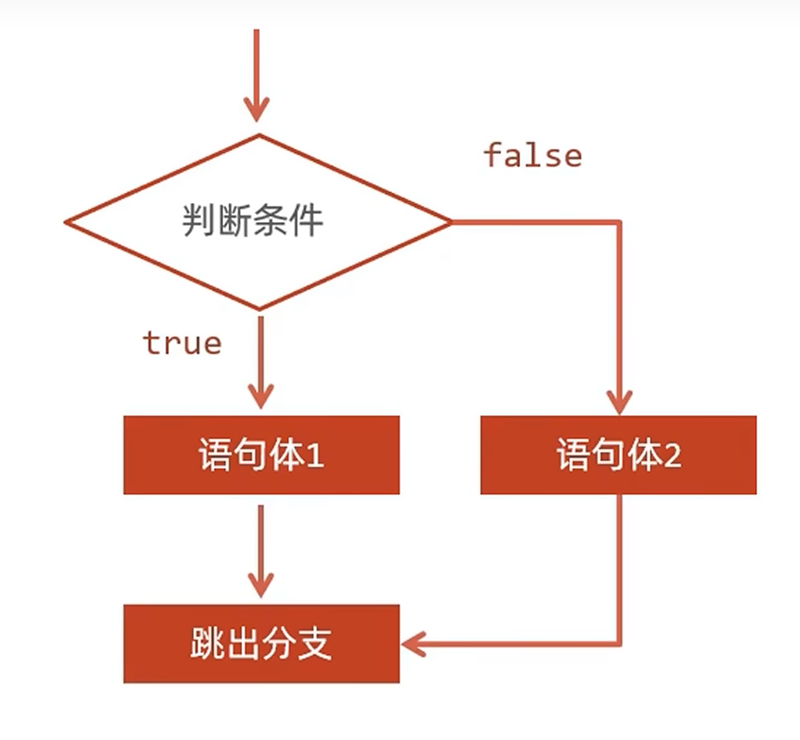


第三种：
```java
if (条件表达式1){
	代码1;
} else if (条件表达式2){
	代码2;
} else if (条件表达式3){
	代码3;
}
...
else {
	代码n;
}
```

执行流程：
+ 先**判断条件1**的值，如果为 true 则执行语句体1，分支结束；如果为 false 则判断条件2的值
+ 如果值为 true 就执行语句体2，分支结束；如果为 false 则**判断条件3**的值
+ ...
+ 如果没有任何条件为 true，就执行 else 分支的语句体 n+1

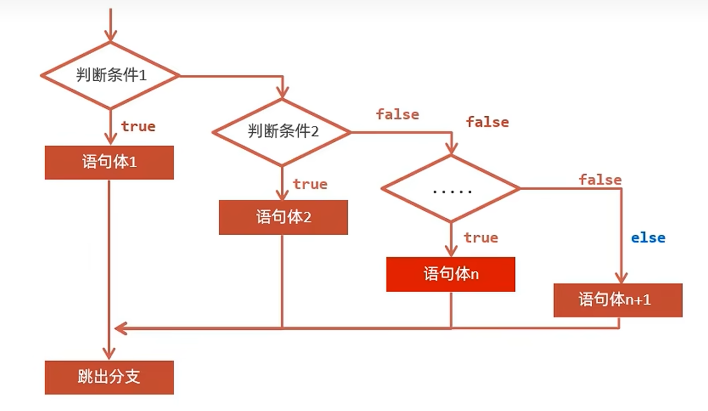


##### 总结
1. if 分支是什么？
+ 可以根据条件，选择执行某段程序

2. if 分支的写法有几种，各有什么特点？

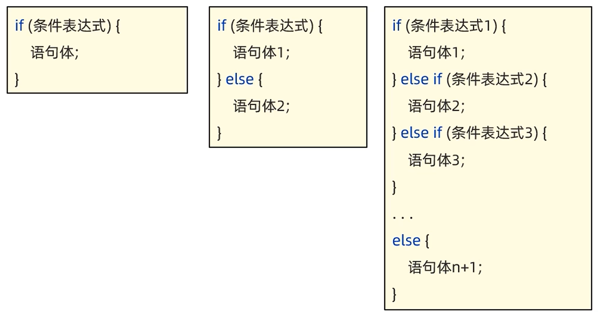


##### 多学一招
+ if(条件){}，()后不能跟 ";" 否则{}中的代码将不受if的控制了
+ 如果 if 语句的{}中只有一行代码的情况，{}可以省略不写（**但是不推荐省略**）


-------------------------------------


#### 1.2 switch 分支
##### 1.2.1 定义
+ 是通过比较值来决定执行哪条分支
```java
switch(表达式){
	case 值1:
		执行代码...;
		break;
	case 值2:
		执行代码...;
		break;
	...
	case 值n-1:
		执行代码...;
		break;
	default:
		执行代码n;
}
```
##### 1.2.2 switch 分支的执行流程
1. 先执行表达式的值，再拿着这个值去与 case 后的值进行匹配
2. 与哪个 case 后的值匹配为 true 就执行哪个 case 块的代码，遇到 **break** 就跳出 switch 分支
3. 如果全部 case 后的值与之匹配都是 false ，则执行 default 的代码

##### 1.2.3 switch 分支的导学案例：电子备忘录
> 周一：埋头苦干，解决 bug
> 周二：请求大牛程序员帮忙
> 周三：今晚啤酒、龙虾、小烧烤
> 周四：主动帮助新来的女程序员解决 bug
> 周五：今晚吃鸡
> 周六：与王婆介绍的小芳相亲
> 周日：郁郁寡欢、准备上班

```java
package c_流程控制;

public class b_SwitchDemo2 {
    public static void main(String[] args) {
        // 周一：埋头苦干，解决 bug
        // 周二：请求大牛程序员帮忙
        // 周三：今晚啤酒、龙虾、小烧烤
        // 周四：主动帮助新来的女程序员解决 bug
        // 周五：今晚吃鸡
        // 周六：与王婆介绍的小芳相亲
        // 周日：郁郁寡欢、准备上班

        String week = "周三";
        switch (week) {
            case "周一":
                System.out.println("埋头苦干，解决 bug");
                break;
            case "周二":
                System.out.println("请求大牛程序员帮忙");
                break;
            case "周三":
                System.out.println("今晚啤酒、龙虾、小烧烤");
                break;
            case "周四":
                System.out.println("主动帮助新来的女程序员解决 bug");
                break;
            case "周五":
                System.out.println("今晚吃鸡");
                break;
            case "周六":
                System.out.println("与王婆介绍的小芳相亲");
                break;
            case "周日":
                System.out.println("郁郁寡欢、准备上班");
                break;
            default:
                System.out.println("您输入的星期信息肯定是不存在的~~~");
                break;
        }
    }
    
}

```

##### 1.2.4 if、switch 的比较，以及各自适合什么业务场景？
+ if 在功能上远远强大于 switch
+ 当前条件是区间的时候，应该使用 if 分支结构
+ 当条件是与一个一个的值比较的时候，switch 分支更合适：格式良好，性能较好，代码优雅


##### 总结
1. switch 分支的格式、执行流程是怎么样的？


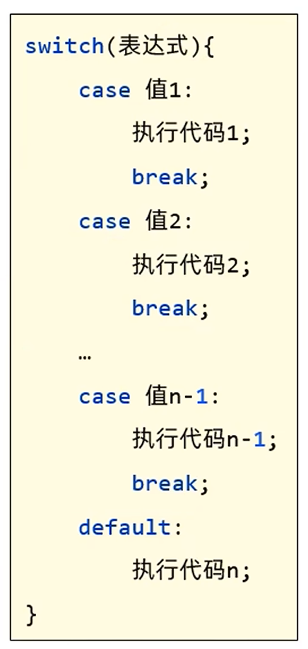

2. if、switch 的比较，各自适合什么业务场景？

+ if 其实在功能上远远强大于 switch
+ if 适合做条件是区间判断的情况
+ switch 适合做：条件是比较值的情况、代码优雅、性能较好


##### 1.2.5 switch 使用时的注意事项
1. 表达式类型**只能是 byte、short、int、char**、JDK5开始枚举，JDK7开始支持 String、**不支持 double、float、long**
2. case 给出的值不允许重复，且只能是字面量，不能是变量
3. 正常使用 switch 的时候，不要忘记写 break，否则会出现穿透现象

##### 代码演示
```java
package c_流程控制;

public class c_SwitchDemo3 {

    public static void main(String[] args) {
        // 目标：搞清楚switch使用时的几点注意事项
        // 1. 表达式类型只能是 byte、short、int、char、JDK5开始枚举，JDK7开始支持 String、不支持 double、float、long
        int a = 10;
        double b = 0.1;
        double b2 = 0.2;
        double c = b + b2; // 0.30000000000000004 -> 在Java中浮点型运算有这种精度问题
        System.out.println(c);
        switch (a) {
        }
        // 2. case 给出的值不允许重复，且只能是字面量，不能是变量
        int i = 20;
        int d = 15;
        switch (i) {
            case 10:

                break;
            // case d:

            //     break;
            case 20:

                break;
        }
        // 3. 正常使用 switch 的时候，不要忘记写 break，否则会出现穿透现象
        String week = "周三";
        switch (week) {
            case "周一":
                System.out.println("埋头苦干，解决 bug");
                break;
            case "周二":
                System.out.println("请求大牛程序员帮忙");
            // break;
            case "周三":
                System.out.println("今晚啤酒、龙虾、小烧烤");
            // break;
            case "周四":
                System.out.println("主动帮助新来的女程序员解决 bug");
                break;
            case "周五":
                System.out.println("今晚吃鸡");
                break;
            case "周六":
                System.out.println("与王婆介绍的小芳相亲");
                break;
            case "周日":
                System.out.println("郁郁寡欢、准备上班");
                break;
            default:
                System.out.println("您输入的星期信息肯定是不存在的~~~");
                break;
        } // 今晚啤酒、龙虾、小烧烤 主动帮助新来的女程序员解决 bug
    }

}

```

##### 多学一招
+ 当存在多个 case 分支的代码相同时，可以把相同的代码放到一个 case 模块中，其他的 case 块都通过穿透性穿透到该case 块执行代码即可，这样可以简化代码

案例：
> 周一：埋头苦干，解决 bug
> 周二：请求大牛程序员帮忙
> 周三：请求大牛程序员帮忙
> 周四：请求大牛程序员帮忙
> 周五：自己整理代码
> 周六：打游戏
> 周日：打游戏

```java
package c_流程控制;

public class d_SwitchDemo4 {

    public static void main(String[] args) {
        String week = "周日";
        switch (week) {
            case "周一":
                System.out.println("埋头苦干，解决 bug");
                break;
            case "周二":
            case "周三":
            case "周四":
                System.out.println("请求大牛程序员帮忙");
                break;
            case "周五":
                System.out.println("自己整理代码");
                break;
            case "周六":
            case "周日":
                System.out.println("打游戏");
                break;
            default:
                System.out.println("您输入的星期信息肯定是不存在的~~~");
                break;
        }
    }

}

```

##### 总结
1. 使用 switch 时有哪些注意事项？
+ 表达式类型**只能是 byte、short、int、char**、JDK5开始枚举，JDK7开始支持 String、**不支持 double、float、long**
+ case 给出的值不允许重复，且只能是字面量，不能是变量
+ 正常使用 switch 的时候，不要忘记写 break，否则会出现穿透现象

2. switch 穿透性能解决什么问题？
+ 存在多个 case 分支的代码相同时，可以把相同的代码放到一个 case 模块中，其他的 case 块都通过穿透性穿透到该case 块执行代码即可，这样可以简化代码


--------------------------------------


### 2. 循环结构：for 循环、for 循环案例
#### 2.1 for 循环
##### 2.1.1 定义
+ 控制一段代码反复执行很多次

for 循环格式
```java
for(初始化语句; 循环条件; 迭代语句) {
	循环体语句(重复执行的代码);
}
```

##### 代码演示
```java
package c_流程控制;

public class e_ForDemo1 {

    public static void main(String[] args) {
        // 目标：需要掌握for循环的书写格式，并理解其运行流程
        // 需求：打印多行Hello World
        /**
         * 流程： 首先会执行初始化语句：int i = 0; i = 0，判断循环条件 0 <
         * 3，返回true，计算机会进入循环中执行输出第一行Hello World，接着执行迭代语句i++ i = 1，判断循环条件 1 <
         * 3，返回true，计算机会进入循环中执行输出第一行Hello World，接着执行迭代语句i++ i = 2，判断循环条件 2 <
         * 3，返回true，计算机会进入循环中执行输出第一行Hello World，接着执行迭代语句i++ i = 3，判断循环条件 3 <
         * 3，返回false，循环就会立即结束
         */
        for (int i = 0; i < 3; i++) {
            // i = 0 1 2
            System.out.println("Hello World"); // 打印3行
        }

        System.out.println("---------------------------------------");
        for (int i = 1; i <= 5; i++) {
            System.out.println("Hello World2"); // 打印5行
        }

        System.out.println("----------------------------------------");
        for (int i = 1; i <= 10; i += 2) {
            // 1 3 5 7 9
            System.out.println("Hello World3"); // 打印五行
        }
    }
}

```

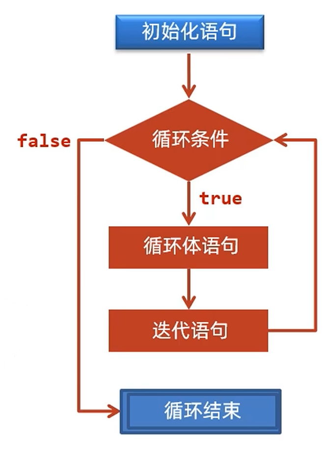

##### 2.1.2 for 循环在开发中的常见应用场景
减少代码的重复编写、灵活的控制程序的执行

##### 总结
1. for 循环格式和执行流程是什么样的？

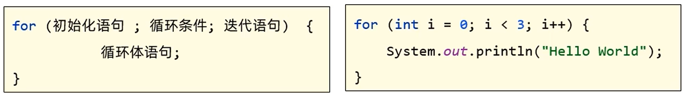

2. for 循环的常见应用场景？
+ 减少代码的重复编写，灵活的控制程序的执行 

##### 2.1.3 for 循环的其他常见应用场景
+ 案例1：求和
> 求1-5之间的数据和，并把求和结果在控制台输出

+ 案例2：求奇数和
> 求1-10之间的奇数和，并把求和结果在控制台输出
```java
package c_流程控制;

public class f_ForDemo2 {

    public static void main(String[] args) {
        // 目标：掌握使用for循环批量产生数据
        for (int i = 1; i <= 100; i++) {
            System.out.println(i); // 1~100
        }

        System.out.println("----------------------------");

        // 目标：打印1~5的数据和
        // 2. 定义一个变量用于求和
        int sum = 0;

        // 1. 定义一个循环，先产生1-5，这5个数
        for (int i = 1; i <= 5; i++) {
            sum += i; // sum = sum + i
        }
        System.out.println("1-5的数据和" + sum); // 15

        System.out.println("----------------------------------");

        // 目标：打印1~100的奇数和
        // 2. 定义一个变量用于求和
        int sum1 = 0;

        // 1. 定义一个循环产生1-100之间的奇数
        for (int i = 1; i <= 100; i += 2) {
            // i = 1 3 5 7 9 ...
            sum1 += i;
        }
        System.out.println("1-100之间的奇数和" + sum1); // 2500

        System.out.println("----------------------------------");

        // 2. 定义一个变量用于累加奇数求和
        int sum2 = 0;

        // 1. 定义循环产生的1-100之间的每个数据
        for (int i = 1; i <= 100; i++) {
            // i = 1 2 3 4 5 6 ... 99 100
            // 2. 使用一个if分支，判断i此时记住的数据是否是奇数，是奇数我们才累加给一个变量
            if (i % 2 == 1) {
                // i = 1 3 5 7 9 ... 99
                sum2 += i;
            }
        }
        System.out.println("1-100之间的奇数和：" + sum2); // 2500
    }
}

```


-------------------------------------------


#### 2.2 while 循环
##### 2.2.1 定义
```java
初始化语句;
while (循环条件) {
	循环体语句(被重复执行的代码);
	迭代语句;
}
```


##### 2.2.2 示例
```java
package c_流程控制;

public class g_WhileDemo1 {

    public static void main(String[] args) {
        // 目标：掌握while循环的书写格式，以及理解其执行流程
        // 需求：打印多行Hello World
        int i = 0;
        while (i < 3) {
            // i = 0 1 2 
            System.out.println("Hello World");
            i++;
        }
    }
}

```
执行流程：
1. 循环一开始，执行 int i = 0 一次
2. 此时 i=0，接着计算机执行循环条件语句：0 < 3 返回 true，计算机就进到循环体中执行，输出：Hello World，然后执行迭代语句 i++
3. 此时 i=1，接着计算机执行循环条件语句：1 < 3 返回 true，计算机就进到循环体中执行，输出：Hello World，然后执行迭代语句 i++
4. 此时 i=2，接着计算机执行循环条件语句：2 < 3 返回 true，计算机就进到循环体中执行，输出：Hello World，然后执行迭代语句 i++
5. 此时 i=3，然后判断循环条件：3 < 3 返回 false，循环立即结束！


##### 总结
1. while 循环的格式，执行流程是怎么样的？

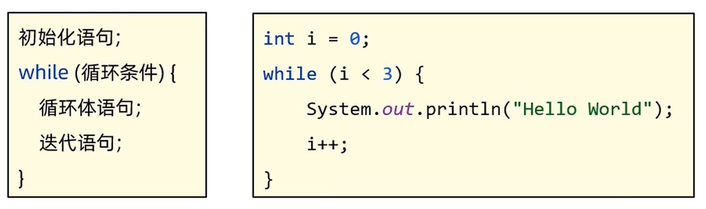

2. while 和 for 有什么区别？什么时候用 for，什么时候用 while？
+ 功能上是完全一样的，for 能解决的 while 也能解决，反之亦然
+ **使用规范：知道循环几次：使用 for；不知道循环几次建议使用：while**


##### 案例：珠穆朗玛峰
> 需求：世界最高峰珠穆朗玛峰高度是：8848.86米=8848860毫米，假如我有一张足够大的纸，它的厚度是0.1毫米。请问：该纸张折叠多少次，可以折成珠穆朗玛峰的高度？
> 

+ 分析：一开始不知道要循环多少次则使用 while
  + 1. 定义变量存储珠穆朗玛峰的高度、纸张的高度
  + 2. 使用 while 循环来控制纸张折叠，循环条件是（纸张厚度 < 山峰高度），循环每执行一次，就表示纸张折叠一次，并把纸张厚度变为原来的两倍
  + 3. 循坏外定义计数变量 count，循环每折叠一次纸张，让 count 变量+1


+ 解
```java
package c_流程控制;

public class h_WhileTest4 {

    public static void main(String[] args) {
        // 目标：使用while循环解决问题，并理解什么情况下使用while、for
        // 1. 定义变量记住珠穆朗玛峰的高度和纸张的高度
        double peakHeight = 8848860;
        double paperThickness = 0.1;

        // 3. 定义一个变量count用于记住纸张折叠了多少次
        int count = 0;

        // 2. 定义while循环控制纸张开始折叠
        while (paperThickness < peakHeight) {
            // 把纸张进行折叠，把纸张的厚度变成原来的2倍
            paperThickness = paperThickness * 2;
            count++;
        }
        System.out.println("需要折叠多少次：" + count); // 27
        System.out.println("最终纸张的厚度是：" + paperThickness); // 1.34217728E7
    }
}

```


--------------------------


#### 2.3 do-while 循环

##### 2.3.1 定义
```java
初始化语句;
do {
	循环体语句;
	迭代语句;
} while (循环条件);
```


##### 2.3.2 特点
do-while 循环特点：
+ **先执行后判断**

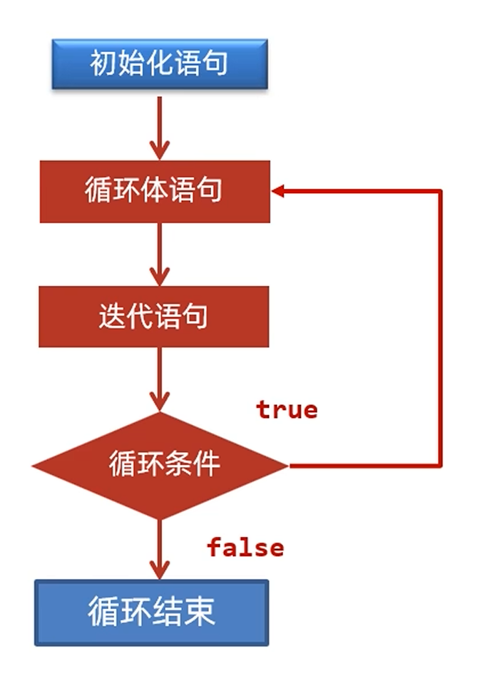


---------------------------------------------


#### 三种循环的区别小结
+ for 循环和 while 循环（先判断后执行）；do ... while（先执行后判断）
+ for 循环和 while 循环的执行流程是一模一样的，功能上无区别，for 能做的 while 也能做，反之亦然
+ 使用规范：如果已知循环次数建议使用 for 循环，如果不清楚要循环多少次建议使用 while 循环
+ 其他区别：for 循环中，控制循环的变量只能在循环中使用（**临时变量**）。while 循环中，控制循环的变量在循环后还可以继续使用


```java
package c_流程控制;

public class j_DorWhileDemo1 {

    public static void main(String[] args) {
        for (int i = 0; i < 3; i++) {
            System.out.println("Hello World");
        }
        // System.out.println(i); // 报错
        for (int i = 0; i < 3; i++) {
            System.out.println("Hello World");
        }

        int m = 0;
        while (m < 3) {
            System.out.println("Hello World1");
            m++;
        }
        System.out.println(m); // 3
    }
}

```


-----------------------------------------


#### 2.4 死循环

##### 2.4.1 定义
+ 可以一直执行下去的一种循环，如果没有干预不会停下来

##### 2.4.2 死循环的写法
+ 第一种
```java
for ( ; ; ) {
	System.out.println("Hello World");
}
```

+ 第二种（**经典写法**）
```java
while (true) {
	System.out.println("Hello World");
}
```

+ 第三种
```java
do {
	System.out.println("Hello World");
} while (true);
```

##### 2.4.3 应用场景
+ 做服务器程序

##### 代码实现
```java
package c_流程控制;

public class k_EndLessLoopDemo6 {
    public static void main(String[] args) {
        // 目标：掌握死循环的写法
        // for (;;) {
        //     System.out.println("Hello World1");
        // }
        
        while (true) {
            System.out.println("Hello World2");
        }

        // do { 
        //     System.out.println("Hello World");
        // } while (true);
    }
}

```


---------------------------------


#### 2.5 循环嵌套

##### 2.5.1 定义
+ 循环中又包含循环

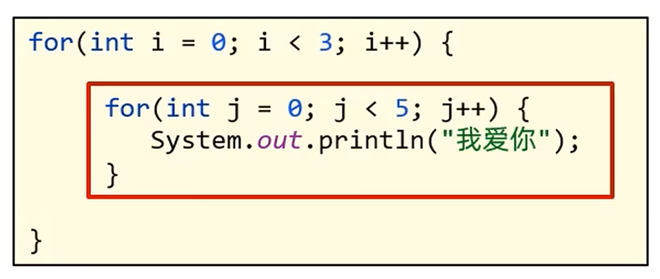


##### 2.5.2 循环嵌套的特点
+ 外部循环每循环一次，内部循环会全部执行完一轮

##### 代码实现
```java
package c_流程控制;

public class l_LoopNestedDemo7 {

    public static void main(String[] args) {
        // 目标：循环嵌套的执行流程
        // 场景：假如你有老婆，你犯错了，你老婆罚你说3天，每天5句我爱你
        for (int i = 1; i <= 3; i++) {
            // i = 1 2 3 
            for (int j = 1; j <= 5; j++) {
                System.out.println("我爱你：" + i);
            }
            System.out.println("-------------------------");
        }

        /**
         ****
         ****
         ****
         */
        for (int i = 1; i <= 3; i++) {
            // i = 1 2 3
            // 定义一个循环控制每行打印多少列星星
            for (int j = 1; j <= 4; j++) {
                System.out.print("*");
            }
            System.out.println(); // 换行
        }
    }
}

```


------------------------------------


### 3. 跳转关键字：break、continue

#### 3.1 定义
+ **break**：跳出并结束当前所在的循环的执行
+ **continue**：用于跳出当前循环的当次执行，直接进入循环的下一次执行

注意事项：
+ break 只能用于结束所在循环，或者结束所在 switch 分支的执行
+ continue 只能在循环中进行使用

#### 代码演示
```java
package c_流程控制;

public class m_BreakAndContinueDemo8 {

    public static void main(String[] args) {
        // 目标：掌握break和continue的作用
        // 1. break：跳出并结束当前所在循环中的执行
        // 场景：假如你又有老婆了，你犯错了，你老婆罚你说5句我爱你
        // 说到第三句的时候心软了，让你别再说了
        for (int i = 1; i <= 5; i++) {
            System.out.println("我爱你：" + i);
            if (i == 3) {
                // 说明已经说完了第三句了，心软了
                break; // 跳出并结束当前所在循环的执行
            }
        }

        // 2. continue：跳出当前循环的当次执行，直接进入循环的下一次执行
        // 场景：假如你有老婆，你犯错了，你老婆罚你洗碗5天
        // 第三天的时候，你表现很好，第三天不用洗碗，但是不解恨，第四天还是要继续的
        for (int i = 1; i <= 5; i++) {
            if (i == 3) {
                // 已经到了第三天，第三天不用洗碗
                continue;
            }
            System.out.println("洗碗：" + i);
        }
    }
}

```


---------------------------------


### 4. 随机数 Random、Random 案例
#### 4.1 Random
+ 作用：**生成随机数**

##### 4.1.1 得到0-9的随机数的实现步骤
1. 导包：告诉程序去 JDK 的哪个包中找 Random
2. 写一行代码拿到随机数对象
3. 调用随机数的功能获取0-9之间的随机数（包前不包后）

注意：
+ nextInt(n) 功能只能生成：**0 至 n-1 之间的随机数，不包含 n**

##### 4.1.2 Random 生成指定区域随机数
+ 技巧：减加法

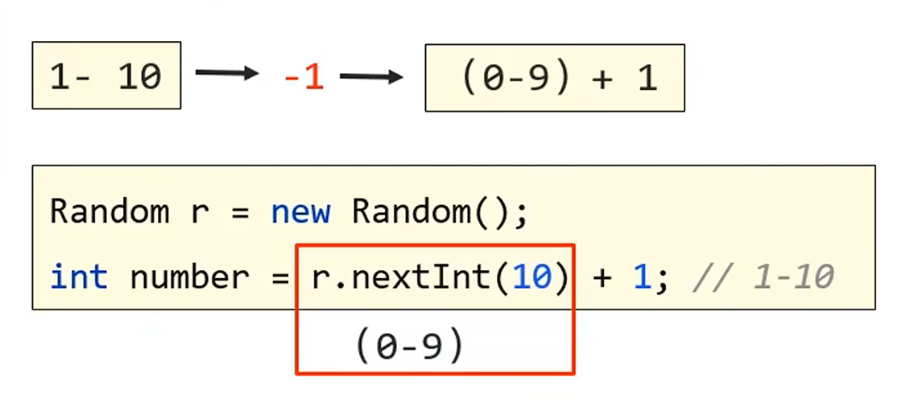

+ java 自带功能
```java
nextInt(下限, 上限+1);
```


##### 代码演示
```java
package d_random;

import java.util.Random;

public class a_RandomDemo1 {

    public static void main(String[] args) {
        // 目标：掌握使用Random生成随机数的步骤
        // 1. 导包
        // 2. 创建一个Random对象，用于生成随机数
        Random r = new Random();
        // 3. 调用Random提供的功能：nextInt得到的随机数
        for (int i = 1; i <= 20; i++) {
            int data = r.nextInt(10); // 0-9
            System.out.println(data);
        }

        System.out.println("-------------------------");

        for (int i = 1; i <= 20; i++) {
            // 生成：1-10之间的随机数
            // 1-10 => -1 => (0 - 9) + 1
            int data2 = r.nextInt(10) + 1;
            System.out.println(data2);
        }

        System.out.println("------------------------------");

        for (int i = 1; i <= 20; i++) {
            // 生成：3-17之间的随机数
            // 3 - 17 => -3 => (0 - 14)
            int data2 = r.nextInt(15) + 3;
            System.out.println(data2);
        }
    }
}

```

##### 总结
1. Random 生成随机数需要几步？
+ 导包：`import java.util.Random;`
+ `Random r = new Random();`
+ `int number = r.nextInt(10);`

2. 如何生成 65 - 91 之间的随机数？
+ 65 - 91 => -65 => ( 0 - 26 ) + 65


##### 案例：猜数字游戏
> 需求：
> + 随机生成一个1-100之间的数据，提示用户猜测，猜大提示过大，猜小提示过小，直到猜中结束游戏
> 

分析：
1. 先随机生成一个1-100之间的数据
2. 定义一个死循环让用户可以一直猜测
3. 在死循环里，每次都提示用户输入一个猜测的数字，猜大提示过大，猜小提示过小，猜中则结束游戏

##### 代码实现
```java
package d_random;

import java.util.Random;
import java.util.Scanner;

public class b_RandomTest2 {

    public static void main(String[] args) {
        // 1. 随机产生一个1-100之间的数据，做为中奖号码
        Random r = new Random();
        int luckNumber = r.nextInt(100) + 1;

        // 2. 定义一个死循环，让用户不断的猜测数据
        Scanner sc = new Scanner(System.in);
        while (true) {
            // 提示用户猜测
            System.out.println("请您输入您猜测的数据：");
            int guessNumber = sc.nextInt();

            // 3. 判断用户猜测的数字与幸运号码的大小情况
            if (guessNumber > luckNumber) {
                System.out.println("您猜测的数字过大~~~");
            } else if (guessNumber < luckNumber) {
                System.out.println("您猜测的数字过小~~~");
            } else {
                System.out.println("恭喜您，猜测成功了，可以买单了");
                break; // 结束游戏
            }
        }
    }
}

```


-----------------------------------


### 总结

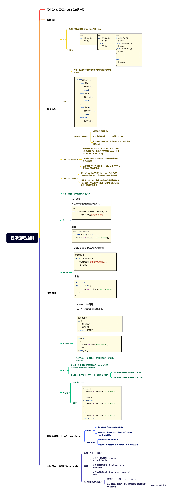


--------------------------------


## 四、数组

### 1. 认识数组
+ **数组**就是一个容器，**用来存储一批同种类型的数据**

+ 例子：
```java
// 20, 10, 80, 60, 90
int[] arr = {20, 10, 80, 60, 90};

// 张三, 李四, 王五
String[] names = {"张三", "李四", "王五"};
```

Java 中有变量，为什么还要用数组？
+ eg：在一组名单中随机点名的话，根据以往方法可能要定义几十上百个变量，会使得代码繁琐、实现需求复杂。而用数组的话代码简洁、逻辑清晰

+ 结论：遇到批量数据的存储和操作时，数组比变量更合适


----------------------------------------------


### 2. 数组的定义和访问
#### 2.1 静态初始化数组
+ 定义数组的时候直接给数组赋值

静态初始化数组的格式：
```java
// 完整格式
数据类型[] 数组名 = new 数据类型[]{元素1, 元素2, 元素3, ...};
int[] ages = new int[]{12, 24, 36};
double[] scores = new double[]{89.9, 99.5, 59.5, 88.0};
```

```java
// 简化格式
数据类型[] 数组名 = {元素1, 元素2, 元素3, ...};
int[] ages = {12, 24, 36};
```

注意：
+ ”**数据类型[] 数组名**“ 也可以写成 ”**数据类型 数组名[]**“
+ 什么类型的数组只能存放什么类型的数据


+ 数组在计算机中的基本原理
  + 在计算机遇到代码之后，现在内存中开辟一块变量空间，暂时先不装东西。元素部分又开辟一个区域，每个元素各分为一块来存储数据，而这块区域是有自己的一个地址的，每个元素都有自己的编号（索引），然后将这个地址交给数组变量来存储

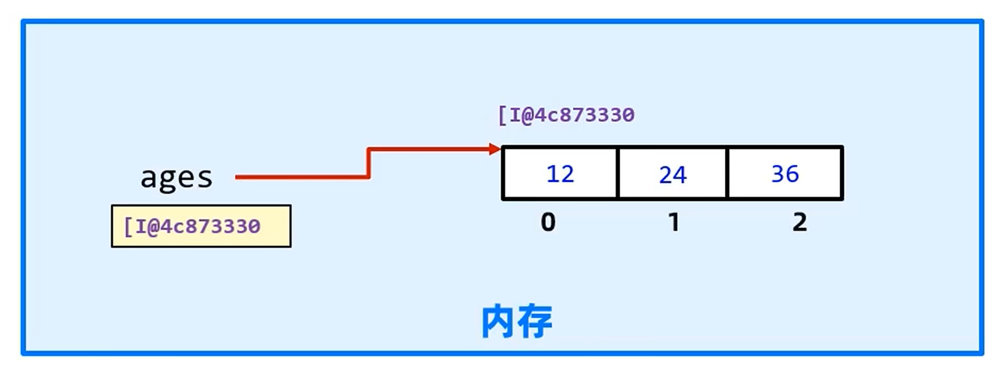

**注意：数组变量名中存储的是数组在内存中的地址，数组是一种引用数据类型**


+ 代码演示
```java
package e_ArrayApp;

public class a_ArrayDemo1 {

    public static void main(String[] args) {
        // 目标：掌握数组的定义方式一：静态初始化数组

        // 1. 数据类型[] 数组名 = new 数据类型[]{元素1, 元素2, 元素3, ...};
        int[] ages = new int[]{12, 24, 36};
        double[] scores = new double[]{89.9, 99.5, 59.5, 88};
        System.out.println(ages);
        System.out.println(scores);

        // 2. 简化写法
        // 数据类型[] 数组名 = {元素1, 元素2, 元素3, ...};
        int[] ages2 = {12, 24, 36};
        double[] scores2 = {89.9, 99.5, 59.5, 88};

        // 3. 数据类型[] 数组名 也可以写成 数据类型 数组名[]
        int ages3[] = {12, 24, 36};
        double scores3[] = {89.9, 99.5, 59.5, 88};
    }
}

```


+ 总结
1. 数组的静态初始化的写法和特点是什么样的？

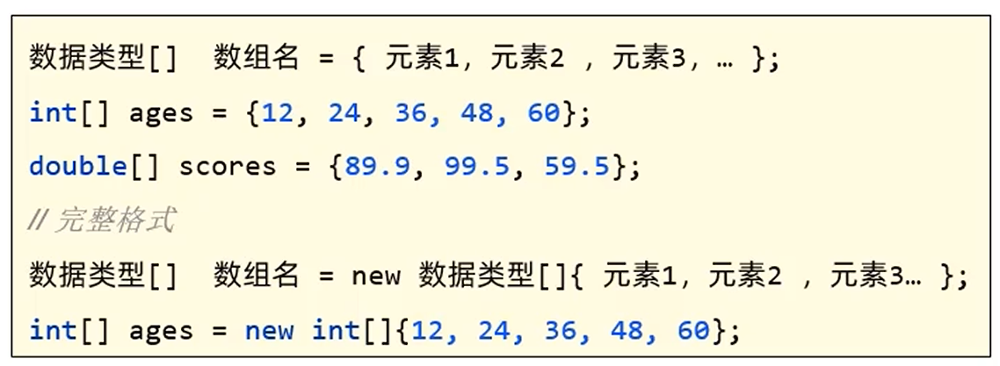

2. 定义数组我们说了哪几个注意点？
+ 什么类型的数组必须存放什么类型的数据
+ **数据类型[] 数组名**   也可以写成   **数据类型 数组名[]**

3. 数组是属于什么类型，数组变量名中存储的是什么？
+ 引用数据类型，存储的数组在内存中的地址信息


-----------------------------------------


##### 2.1.1 数组的访问
###### 2.1.1 定义
```java
数组名[索引]
```

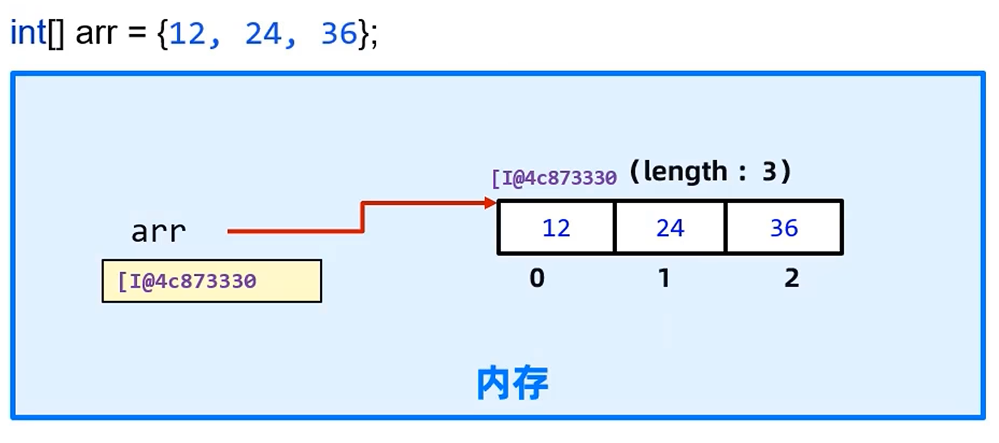


+ 数组的长度属性：**length**
```java
// 获取数组的长度（就是数组元素的个数）
System.out.println(arr.length);
```

+ 数组的最大索引怎么表示？
```java
数组名.length - 1 // 前提：元素个数大于0
```

###### 代码实现
```java
package e_ArrayApp;

public class b_ArrayDemo {

    public static void main(String[] args) {
        // 目标：掌握数组的访问
        int[] arr = {12, 24, 36};

        // 1. 访问数组的全部数据
        System.out.println(arr[0]); // 12
        System.out.println(arr[1]); // 24
        System.out.println(arr[2]); // 36

        // 2. 修改数组中的数据
        arr[0] = 66;
        arr[2] = 100;
        System.out.println(arr[0]); // 66
        System.out.println(arr[1]); // 24
        System.out.println(arr[2]); // 100

        // 3. 访问数组的元素个数：数组名.length
        System.out.println(arr.length); // 3

        // 技巧：获取数组的最大索引：arr.length - 1（前提是数组中存在数据）
        System.out.println(arr.length - 1); // 2
    }
}

```

###### 总结
1. 如何访问数组的元素？
```java
数组名[索引]
```

2. 如何访问数组的长度？
+ **数组名称.length**

3. 数组的最大索引是多少？
```java
数组名.length - 1 // 前提：元素个数大于0
```

4. 如果访问数组时，使用的索引超过了数组的最大索引会出什么问题？
+ 执行程序时会出 bug，出现一个索引越界的异常提示


------------------------------------------


##### 2.1.2 数组的遍历

###### 2.1.2.1 定义
+ 遍历：就是一个一个数据的访问
+ 数组遍历：就是把数组的每个数据都取一遍出来

快速方法：
+ 数组名.fori + Tab

###### 代码演示
```java
package e_arrayapp;

public class c_ArrayDemo3 {

    public static void main(String[] args) {
        // 目标：掌握数组的遍历
        int[] ages = {12, 24, 36};

        // System.out.println(ages[0]); // 12
        // System.out.println(ages[1]); // 24
        // System.out.println(ages[2]); // 36
        for (int i = 0; i < ages.length; i++) {
            // i = 0 1 2
            System.out.println(ages[i]); // 12 24 36
        }
    }
}

```

###### 总结
1. 什么是遍历？
+ 一个一个的访问一遍容器中的数据

2. 如何遍历数组？
  ```java
  int[] ages = {20, 30, 40, 50};
  for (int i = 0; i < ages.length; i++) {
      // i = 0 1 2
      System.out.println(ages[i]); // 12 24 36
  }
  ```


--------------------------------------------


##### 案例
> 需求：
> + 某部门5名员工的销售额分别是：16、26、36、6、100，请计算出他们部门的总销售额
> 

+ 分析：
1. 把这5个数据拿到程序中去 ---> 使用数组
  ```java
  int[] money = {16, 26, 36, 6, 100};
  ```
2. 遍历数组中的每一个数据，然后在外面定义求和变量把他们累加起来


###### 代码实现
```java
package e_arrayapp;

public class d_ArrayTest4 {

    public static void main(String[] args) {
        // 目标：完成对数据的元素求和
        // 1. 定义一个数组存储5名员工的销售额
        int[] money = { 16, 26, 36, 6, 100 };

        // 3. 定义一个变量用于累加求和
        int count = 0;
        // 2. 遍历这个数组中的每个数据

        for (int i = 0; i < money.length; i++) {
            // i = 0 1 2 3 4
            count += money[i];
        }
        System.out.println("员工的销售额：" + count); // 184
    }
}

```


---------------------------------------


#### 2.2 动态初始化数组

##### 2.2.1 定义
数组的动态初始化：
+ 定义数组时先不存入具体的元素值，**只确定数组存储的数据类型和数组的长度**

数组的动态初始化格式：
```java
数据类型[] 数组名 = new 数据类型[长度];
int[] arr = new int[3];
```

```java
// 后赋值
arr[0] = 10;
System.out.println(arr[0]); // 10
```

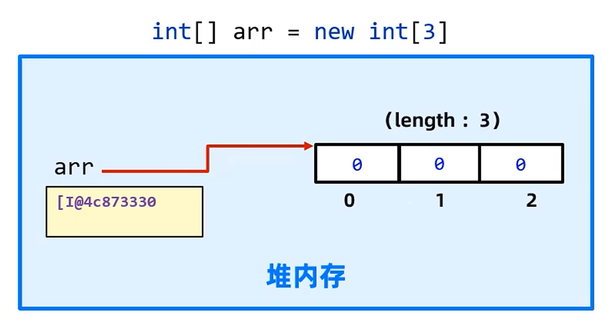

+ 在内存中分配一个变量空间，在这个变量里面存储的还是数组对象的地址，这个数组对象里面，一开始会存一些所谓的默认值，后期再往这个里面进行赋值


注意：
+ 静态初始化和动态初始化数组的写法是独立的，不可以混用

##### 2.2.2 动态初始化数组元素默认值规则

<table>
    <thead>
        <tr>
        	<th>数据类型</th>
            <th>明细</th>
            <th>默认值</th>
        </tr>
    </thead>
    <tbody>
    	<tr>
        	<td rowspan="3" style="line-height: 59px;">基本类型</td>
            <td>byte、short、char、int、long</td>
            <td>0</td>
        </tr>
        <tr>
        	<td>float、double</td>
            <td>0.0</td>
        </tr>
        <tr>
        	<td>boolean</td>
            <td>false</td>
        </tr>
        <tr>
        	<td>引用类型</td>
            <td>类、接口、数组、String</td>
            <td>null</td>
        </tr>
    </tbody>
</table>


##### 代码实现
```java
package e_arrayapp;

public class e_ArrayDemo5 {

    public static void main(String[] args) {
        // 目标：掌握定义数组的方式二：动态初始化数组
        // 1. 数据类型[] 数组名 = new 数据类型[长度];
        int[] ages = new int[3]; // ages = [0, 0, 0]

        System.out.println(ages[0]); // 0
        System.out.println(ages[1]); // 0
        System.out.println(ages[2]); // 0

        ages[0] = 12;
        ages[1] = 18;
        ages[2] = 32;

        System.out.println(ages[0]); // 12
        System.out.println(ages[1]); // 18
        System.out.println(ages[2]); // 32

        System.out.println("------------------------");

        char[] chars = new char[3]; // [0, 0, 0]
        System.out.println((int) chars[0]); // 0
        System.out.println((int) chars[2]); // 0

        double[] scores = new double[80];
        System.out.println(scores[0]); // 0.0
        System.out.println(scores[79]); // 0.0

        boolean[] flags = new boolean[100];
        System.out.println(flags[0]); // false
        System.out.println(flags[99]); // false

        String[] names = new String[80];
        System.out.println(names[0]); // null
        System.out.println(names[79]); // null
    }
}

```

##### 总结
1. 动态数组的写法是什么样的？有什么特点？
```java
数据类型[] 数组名 = new 数据类型[长度];
int[] ages = new int[4];
```

2. 动态初始化数组后元素的默认值是什么样的？
+ byte、short、int、char、long 类型数组的元素默认值都是**0**
+ float、double 类型数组元素的默认值都是**0.0**
+ boolean 类型数组的元素默认值是 **false**，String 类型数组的元素的默认值是 **null**

3. 两种数组定义的方法各自适合什么业务场景？
+ 动态初始化：适合开始不确定具体元素值，只知道元素个数的业务场景
+ 静态初始化：适合一开始就知道要存入哪些元素值的业务场景


--------------------------------


##### 案例

> 需求：
> + 某歌唱比赛，需要开发一个系统：可以录入6名评委的打分，录入完毕后立即输出平均分做为选手得分
> 

+ 分析：
1. 6名评委的打分是后期录入的，一开始不知道具体的分数，因此定义一个动态初始化的数组存分数
  ```java
  double[] scores = new double[6];
  ```
2. 遍历数组中的每个位置，每次提示用户录入一个评委的分数，并存入数组对应的位置
3. 遍历数组中的每一个元素进行求和最终算出平均分打印出来即可

###### 代码实现
```java
package e_arrayapp;

import java.util.Scanner;

public class f_ArrayTest6 {

    public static void main(String[] args) {
        // 目标：完成评委打分的案例
        // 1. 定义一个动态初始化的数组，负责存储6个评委的打分
        double[] scores = new double[6];

        Scanner sc = new Scanner(System.in);

        // 2. 遍历数组中的每个位置，录入评委的分数，存入数组中去
        for (int i = 0; i < scores.length; i++) {
            // i = 0 1 2 3 4 5 6
            System.out.println("请您输入当前第" + (i + 1) + "评委的分数");
            double score = sc.nextDouble();
            scores[i] = score;
        }

        // 3. 遍历数组中的每个元素进行求和
        double sum = 0;
        for (int i = 0; i < scores.length; i++) {
            sum += scores[i];
        }
        System.out.println("选手最终得分是：" + sum / scores.length);
    }
}

```


--------------------------------------


### 3. 数组在计算机中的执行原理
#### 3.1 数组的执行原理，Java 程序的执行原理

前面我们知道，程序都是在计算机中的内存中执行的，那么 Java  程序编译后会产生一个 class 文件，然后这个 class 文件是提取到内存中正在运行的虚拟机里面去执行的。那么 Java 为了便于虚拟机执行这个 Java 程序，它将虚拟机中的这块内存区域进行了划分

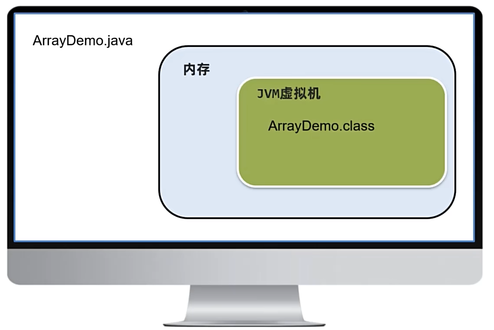


##### 3.1.1 Java 内存分配介绍
+ **方法区**
+ **栈**
+ **堆**
+ 本地方法栈
+ 程序计数器

##### 3.1.2 方法区
+ 定义：放我们编译以后的 class 文件的，也就是字节码文件

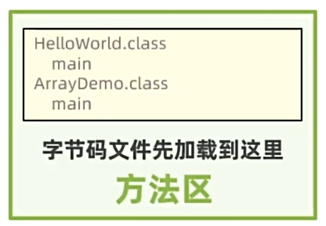


##### 3.1.3  栈
+ 定义：方法运行时所进入的内存，由于变量是在方法里面的，所以变量也在这块区域里

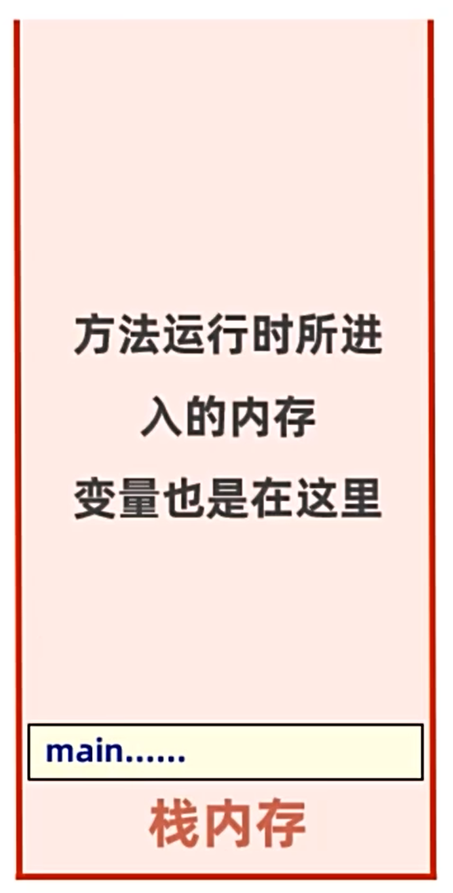


##### 3.1.4 堆
+ 定义：堆里面放的都是 new 出来的东西，它会在这块堆内存中开辟空间并产生地址，比如之前用的数组就是放在队里面的

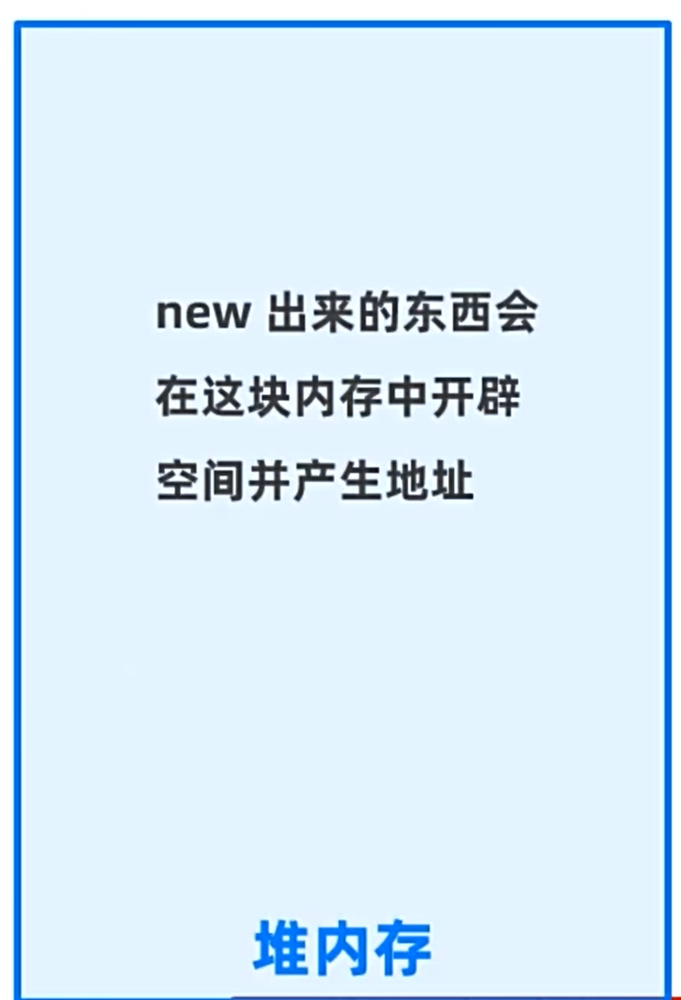


ps：堆和栈在数据结构中应用广泛，具体可见 [数据结构与算法](../../数据结构与算法/数据结构与算法.md)


##### 3.1.5 数组在计算机中的执行原理
把程序的 class 文件提取到方法区里面来，这里面会有一个 main 方法。接着它会把这个 main 方法加载到我们的栈里面来执行，接着它就会正式执行 main 方法的第一行代码，代码中基本类型变量就会在栈里面开辟空间。如果执行创建数组，就会先在栈里面开辟一个变量空间，一开始变量里面并没有存数据，紧接着执行等号右边的代码（new 一个数组对象），在堆内存中开辟一块空间，这块空间会分成 n 块等分的区域每个元素也有自己的索引，并且也会有一个地址，然后把这个地址赋值给左边的这个变量，再由变量指向这个数组对象

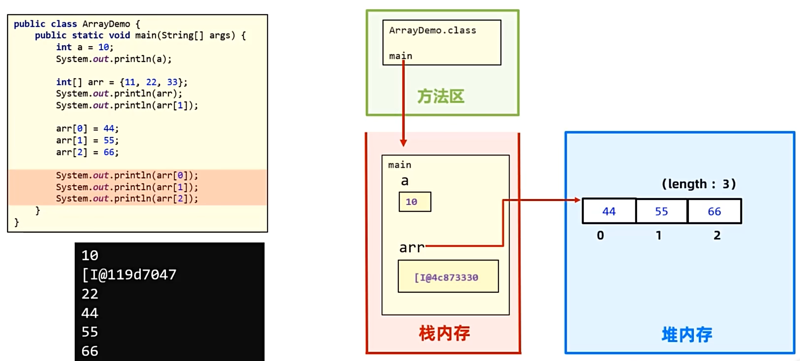


##### 总结
1. 运行一个 Java 程序，主要看 JVM 中包含的哪几部分内存区域？
+ 方法区
+ 栈内存
+ 堆内存

2. 简单说说 int a = 20;   int[] arr = new int[3] 这两行代码的执行原理？
+ a 是变量，直接放在栈中，a 变量存储的数据就是20这个值
+ new int[3] 是创建一个数组对象，会在堆内存中开辟区域存储3个整数
+ arr 是变量，在栈中，arr 中存储的是数组对象在堆内存中的地址值


--------------------------------------------


#### 3.2 多个变量指向同一个数组的问题

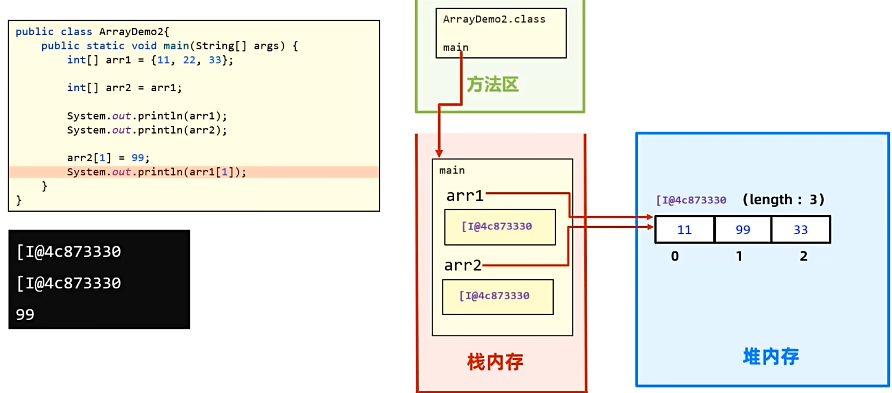

##### 3.2.1 使用数组时常见的一个问题
+ 如果某个数组变量存储的地址是 null，那么该变量将不再指向任何数组对象

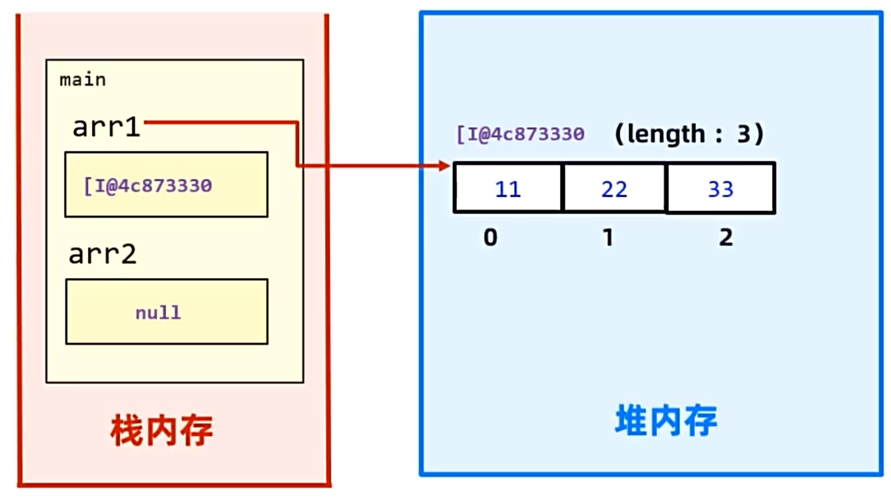

```java
arr2 = null; // 把null赋值给arr2

System.out.println(arr2); // null

System.out.println(arr2[0]); // 会出异常
System.out.println(arr2.length); // 会出异常
```

##### 代码实现
```java
package f_memory;

public class b_ArrayDemo2 {

    public static void main(String[] args) {
        // 目标：认识多个变量指向同一个数组对象的形式，并掌握其注意事项
        int[] arr1 = {11, 22, 33};

        // 把int类型的数组变量arr1赋值给int类型的数组变量arr2
        int[] arr2 = arr1;

        System.out.println(arr1); // [I@5caf905d
        System.out.println(arr2); // [I@5caf905d

        arr2[1] = 99;
        System.out.println(arr1[1]); // 99

        arr2 = null; // 拿到的数组变量中存储的值是null
        System.out.println(arr2);

        // System.out.println(arr2[0]);
        System.out.println(arr2.length);
    }
}

```

##### 总结
1. 多个数组变量，指向同一个数组对象的原因是什么？需要注意什么？
+ 多个数组变量中存储的是同一个数组对象的地址
+ 多个变量修改的都是同一个数组对象中的数据

2. 如果某个数组变量中存储的 null，代表什么意思？需要注意什么？
+ 代表这个数组变量没有指向数组对象
+ 可以输出这个变量，但不能用这个数组变量去访问数据或者访问数组长度，会报空指针异常：**NullPointerException**


-------------------------------------


### 专项训练：数组常见案例
#### 数组求最值
##### 分析
实现步骤：
+ 把数据拿到程序中去，用数组装起来
```java
int[] socres = {15, 9000, 10000, 20000, 9500, -5};
```
+ 定义一个变量用于记录最终的最大值
```java
int[] max = socres[0]; // 建议存储数组的第一个元素值作为参照 
```
+ 从第二个位置开始：遍历数组的数据，如果遍历的当前数据大于 max 变量存储的数据，则替换变量存储的数据为当前数据
+ 循环结束后输出 max 变量即可

##### 代码实现
```java
package g_demo;

public class a_Test1 {

    public static void main(String[] args) {
        // 目标：掌握数组元素求最值
        // 1. 把数据拿到程序中来，用数组装起来
        int[] scores = {15, 9000, 10000, 20000, 9500, -5};

        // 2. 定义一个变量用于最终记住最大值
        int max = scores[0];

        // 3. 从数组的第二个位置开始遍历
        for (int i = 0; i < scores.length; i++) {
            // i = 1 2 3 4 5
            // 判断一个当前遍历的这个数据，是否大于最大值变量max存储的数据，如果大于当前遍历的数据需要赋值给max
            if (scores[i] > max) {
                max = scores[i];
            }
        }
        System.out.println("最大数据是：" + max); // 20000
    }
}

```

##### 总结
1. 求数组中的元素最大值，我们是如何实现的？
+ 把数据拿到程序中去，用数组装起来
+ 定义一个变量 max 用于记录最大值，max 变量默认存储了第一个元素值作为参照物
+ 从第二个位置开始遍历数组的数据，如果当前元素大于变量存储的数据，则替换变量存储的值为该元素
+ 循环结束后输出 max 变量即可


------------------------------------------


#### 数组反转
##### 需求 - 分析
> 需求：
> + 某个数组有5个数据：10，20，30，40，50，请将这个数组中的数据进行反转
> [10, 20, 30, 40, 50]   反转后   [50, 40, 30, 20, 10]
> 

分析：
+ 数组的反转操作实际上就是：依次前后交换数据即可实现

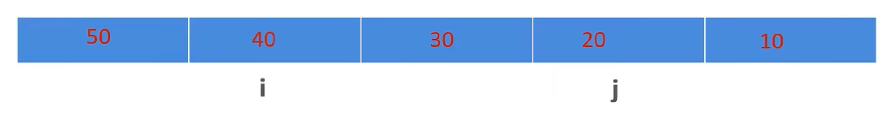

##### 代码实现
```java
package g_demo;

public class b_Test2 {

    public static void main(String[] args) {
        // 目标：完成数组反转
        // 1. 准备一个数组
        int[] arr = {10, 20, 30, 40, 50};

        // 2. 定义一个循环，设计2个变量，一个在前，一个在后
        for (int i = 0, j = arr.length - 1; i < j; i++, j--) {
            // arr[i]   arr[j]
            // 交换
            // 1. 定义一个临时变量记住后一个位置处的值
            int temp = arr[j];
            // 2. 把前一个位置处的值赋值给后一个位置
            arr[j] = arr[i];
            // 3. 把临时变量中记住的后一个位置处的值赋值给前一个位置
            arr[i] = temp;
        }

        // 3. 遍历数组中的每个数据，看是否反转成功了
        for (int i = 0; i < arr.length; i++) {
            System.out.print(arr[i] + " "); // 50 40 30 20 10 
        }
    }
}

```

##### 总结
1. 我们如何完成数组的反转的？
+ 使用 for 循环，控制让数组的前后位置的元素，依次交换

2. 数组如何实现前后元素交换的？
+ 定义一个临时变量记住后一个位置处的元素值
+ 再把前一个位置处的元素，赋值给后一个位置处
+ 最后把临时变量记住的后一个位置的值赋值给前一个位置处


---------------------------------------


#### 随机排名

> 需求：
> + 某公司的开发部门有5名开发人员，要进行项目进展汇报演讲，现在采取随机排名后进行汇报。请依次录入5名员工的工号，然后展示出一组随机的排名顺序
> 
> 测试用例：[22, 33, 35, 13, 88] ---> [13, 35, 88, 33, 22]
> 

分析：
+ 在程序中录入5名员工的工号存储起来 ---> 使用动态初始化数组的方式
+ 依次遍历数组中的每个数据
+ 每遍历到一个数据，都随机一个索引值出来，让当前数据与该索引位置处的数据进行交换

##### 代码实现
```java
package g_demo;

import java.util.Random;
import java.util.Scanner;

public class c_Test3 {

    public static void main(String[] args) {
        // 目标：完成随机排名
        // 1. 定义一个动态初始化的数组用于存储5名员工的工号
        int[] codes = new int[5];
        // [0, 0, 0, 0, 0]
        //  0  1  2  3  4

        // 2. 提示用户录入5名员工的工号
        Scanner sc = new Scanner(System.in);
        for (int i = 0; i < codes.length; i++) {
            // i = 0 1 2 3 4
            System.out.println("请您输入当前第" + (i + 1) + "员工的工号");
            int code = sc.nextInt();
            codes[i] = code;
        }

        // 3. 打乱数组中的元素排序
        Random r = new Random();
        for (int i = 0; i < codes.length; i++) {
            // codes[i]
            // 每遍历到一个数据，都随机一个数组索引范围内的值，然后让当前遍历的数据与索引位置处的值交换
            int index = r.nextInt(codes.length); // 0 - 4
            // 定义一个临时变量记住index位置处的值
            int temp = codes[index];
            // 把i位置处的值赋值给index位置处
            codes[index] = codes[i];
            // 把index位置原来的值赋值给i位置处
            codes[i] = temp;
        }

        // 4. 遍历数组中的工号输出即可
        for (int i = 0; i < codes.length; i++) {
            System.out.print(codes[i] + " ");
        }
    }
}

```

##### 总结
1. 我们是如何实现随即排名的？
+ 定义一个动态初始化的数组用于录入员工的工号
+ 遍历数组中的每个元素
+ 每遍历到一个数据，都随机一个索引值出来，让当前数据与索引位置出的数据进行交换


---------------------------------


### 补充知识：Debug 工具的使用
+ IDEA（大部分 IDE 都有）自带的断点调试工具，可以控制代码从断点一行一行的执行，然后详细观看程序执行的情况


DEBUG 工具基本使用步骤
1. 在需要控制的代码左侧，点击一下，形成断点
2. 选择使用 DEBUG 方式启动程序，启动后程序会在断点暂停
3. 控制代码一行一行的往下执行


断点：

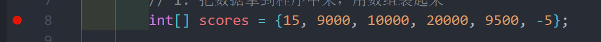

用 Debug：

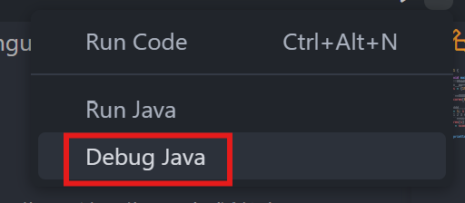

点击按钮，实现不同效果：


----------------------------------------


### 总结

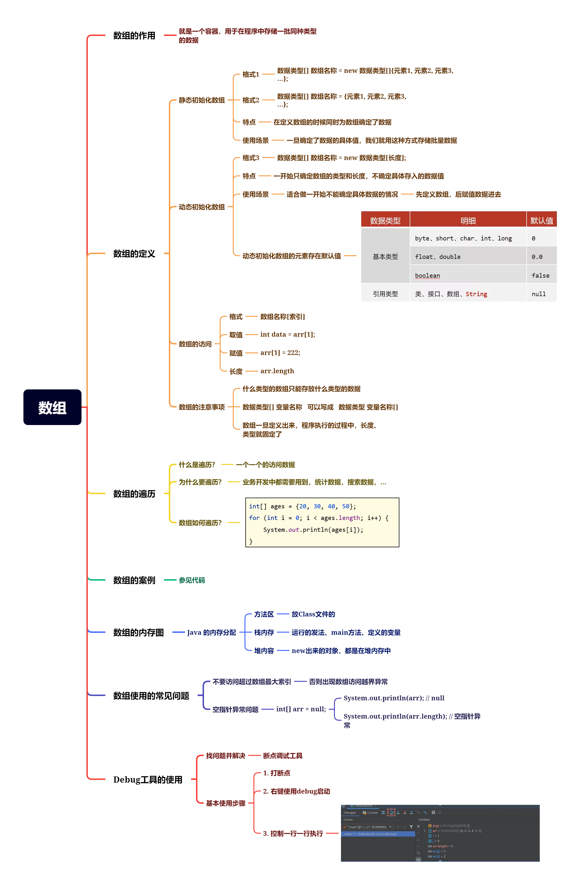


----------------------------


## 五、方法

### 1. 方法的定义
+ 方法是一种语法结构，它可以把一段代码封装成一个功能，以便重复调用

#### 1.1 方法的完整格式
```java
修饰符 返回值类型 方法名(形参类型){
	方法体代码(需要执行的功能代码)
	return 返回值;
}
```


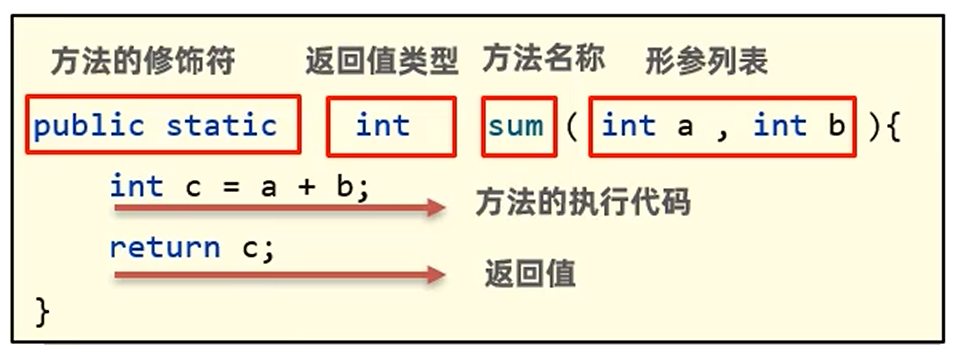


#### 1.2 方法如何执行？

+ 方法定义之后，必须调用才能跑起来，调用格式：`方法名(...);`

```java
int rs = sum(10, 20);
System.out.println(rs);
```

#### 1.3 方法调用流程 - Debug

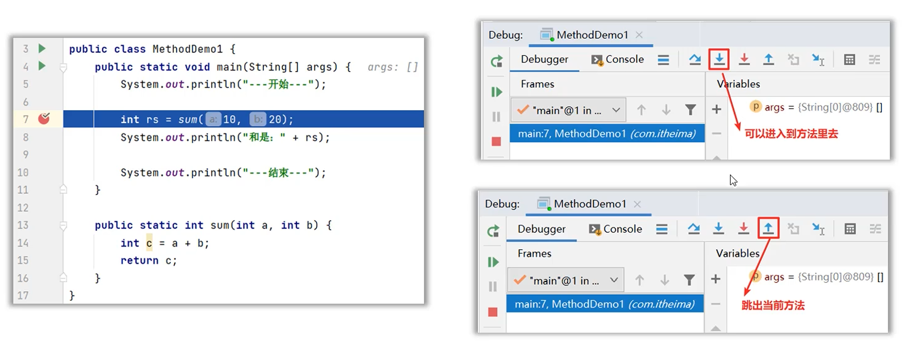


#### 1.4 方法定义时几个注意点
+ 方法的修饰符：暂时都使用 `public static` 修饰
+ **方法申明了具体的返回值类型，内部必须使用 return 返回对应类型的数据**
+ 形参列表可以有多个，甚至可以没有；如果有多个形参，多个形参必须用 **, ** 隔开，且不能给初始化值


#### 1.5 使用方法的好处是？
+ 提高了代码的复用性，提高了开发效率
+ 让程序的逻辑更清晰


#### 代码演示
```java
package h_define;

public class a_MethodDemo1 {

    public static void main(String[] args) {
        // 目标：掌握定义方法的完整格式，搞清楚使用方法的好处
        // 需求：假如现在有很多程序员需要进行2个整数求和的操作

        // 1. 李工
        int rs = sum(10, 20);
        System.out.println("和是：" + rs); // 30

        // 2. 张工
        int rs2 = sum(30, 20);
        System.out.println("和是：" + rs2); // 50
    }

    public static int sum(int a, int b) {
        int c = a + b;
        return c;
    }
}

```

#### 总结
1. 什么是方法？
+ 方法是一种语法结构，它可以把一段代码封装成一个功能，以便重复使用

2. 方法的完整格式是什么样的？
  ```java
  修饰符 返回值类型 方法名(形参类型){
	  方法体代码(需要执行的功能代码)
	  return 返回值;
  }
  ```

3. 方法要执行必须怎么办？
+ 必须进行调用；调用格式：`方法名称(...);`

4. 使用方法有什么好处？
+ 提高代码的复用性，提高开发效率，使程序逻辑更清晰


-----------------------------------


### 2. 方法的其他形式
+ 方法定义时：需要按照方法解决的实际业务需求，来设计合理的方法形式解决问题

```java
修饰符 返回值类型 方法名(形参列表){
	方法体代码(需要执行的功能代码);
	return 返回值;
}
```

1. 方法是否需要接收数据处理？
2. 方法是否需要返回数据？

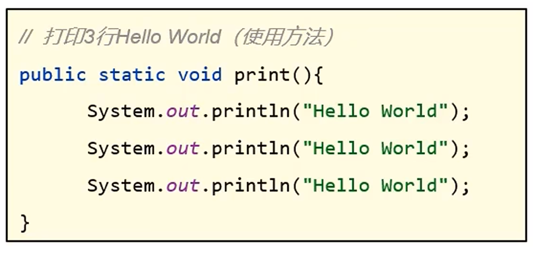

注意事项：
+ 如果方法不需要返回数据，返回值类型必须申明成 **void（无返回值申明）**，此时方法内部不可以使用 return 返回数据
+ 方法如果不需要接收数据，则不需要定义形参，且调用方法时也不可以传数据给方法了
+ 没有参数且没有返回值类型（void）申明的方法，称为**无参数、无返回值的方法**，依次类推

#### 代码实现
```java
package h_define;

public class b_MethodDemo2 {

    public static void main(String[] args) {
        // 目标：掌握按照方法解决的实际业务需求不同，设计出合理的方法形式来解决问题
        // 需求：打印多行行Hello World
        printHelloWorld(3);

        System.out.println("-------------------------------");

        printHelloWorld(6);
    }

    /**
     * 无参数，无返回值的方法
     */
    public static void printHelloWorld(int n) {
        for (int i = 1; i <= n; i++) {
            System.out.println("Hello World");
        }
    }
}

```

#### 总结
1. 如果方法不需要接收数据处理，不需要返回数据，应该怎么办，要注意什么？
+ 方法不需要接收数据，则形参列表可以不写；方法不需要返回数据，则申明返回值类型为 void
+ 方法没有申明返回值类型（**void**），内部不能使用 return 返回数据
+ 方法如果没有形参列表，调用的时候则不能传入参数，否则报错


--------------------------------


### 3. 方法使用时的常见问题

+ 方法在类中的位置放前后无所谓，但一个方法不能定义在另外一个方法里面
+ 方法的返回值类型写 **void（无返回申明）时**，方法内不能使用 return 返回数据，如果方法的返回值类型写了具体类型，方法内部则必须使用 return 返回对应类型的数据
+ return 语句的下面，不能编写代码，属于无效代码，执行不到这儿
+ 方法不调用就不会执行，调用方法时，传给方法的数据，必须严格匹配方法的参数情况
+ **调用有返回值的方法，有3种方式：1、可以定义变量接收结果 2、或者直接输出调用 3、甚至直接调用**
+ **调用无返回值的方法，只有1种方式：1、只能直接调用**

#### 代码实现
```java
package h_define;

public class c_MethodProblemDemo3 {

    public static void main(String[] args) {
        // 目标：搞清楚使用方法时的几个常见问题
        // 1. 方法在类中的位置放前后无所谓，但一个方法不能定义在另外一个方法里面
        printHelloWorld();

        // 2. 方法的返回值类型写void（无返回申明）时，方法内不能使用 return返回数据，如果方法的返回值类型写了具体类型，方法内部则必须使用 return 返回对应类型的数据
        // 3. return 语句的下面，不能编写代码，属于无效代码，执行不到这儿
        // 4. 方法不调用就不会执行，调用方法时，传给方法的数据，必须严格匹配方法的参数情况
        printHelloWorld();
        // int rs = sum(10, 20);
        // System.out.println(rs); // 30

        // 5. 调用有返回值的方法，有3种方式：1、可以定义变量接收结果 2、或者直接输出调用 3、甚至直接调用
        int rs = sum(10, 20);
        System.out.println(rs); // 30

        // 直接输出调用
        System.out.println(sum(10, 90)); // 100

        // 直接调用
        sum(100, 200);

        // 6. 调用无返回值的方法，只有1种方式：1、只能直接调用
        printHelloWorld();
    }

    public static void printHelloWorld() {
        for (int i = 1; i <= 3; i++) {
            System.out.println("Hello World");
        }
    }

    public static int sum(int a, int b) {
        int c = a + b;
        return c;
        // System.out.println("Hello World");
    }
}

```


-------------------------------


### 4. 方法的案例

#### 4.1 设计方法的技巧，主要关注三方面：
1. 方法是否需要接收数据进行处理？
+ 要接收就要设计形参列表，不需要接收就不用设计形参列表?

2. 方法是否需要返回数据？
+ 如果方法需要返回数据就需要在方法的返回值类型这里为其声明数据的具体类型

3. 方法要处理的业务（编程能力）

#### 4.2 案例1

计算 1-n 的和
> 需求：
> + 求 1-n 的和
> 

分析：
1. 方法是否需要接收数据进行处理？**需要接收 n 的值，因此形参声明为：int n**
2. 方法是否需要返回数据？**需要返回1-n的求和结果，因此返回值类型声明为 int**
3. 方法内部的业务：完成1-n的和并返回

##### 代码实现
```java
package h_define;

public class d_MethodTest4 {
    public static void main(String[] args) {
        // 目标：掌握设计方法的技巧
        int rs = add(5);
        System.out.println("1-5的和是：" + rs); // 15
        
        int rs2 = add(100);
        System.out.println("1-100的和是：" + rs); // 5050
    }

    public static int add(int n) {
        int sum = 0;
        for (int i = 1; i <= n; i++) {
            // i = 1 2 3 ... n
            sum += i;
        }
        return sum;
    }
}

```

#### 4.3 案例2

判断一个整数是奇数还是偶数
> 需求：
> + 判断一个整数是奇数还是偶数，并把判断的结果输出出来
> 

分析：
1. 方法是否需要接收数据进行处理？**需要接收一个整数来判断，因此形参声明为：int number**
2. 方法是否需要返回数据？**方法内部判断完后直接输出结果即可，无需返回，因此返回值类型声明为：void**
3. 方法的内部业务：通过 if 语句判断 number 是奇数还是偶数，并输出结果

##### 代码实现
```java
package h_define;

public class e_MethodTest5 {

    public static void main(String[] args) {
        // 目标：掌握设计方法的技巧
        judge(10); // 是一个偶数！
        judge(7); // 是一个奇数！
    }

    public static void judge(int number) {
        if (number % 2 == 0) {
            System.out.println("是一个偶数！");
        } else {
            System.out.println("是一个奇数！");
        }
    }
}

```

#### 总结
1. 定义方法重点关注的是哪几点？
+ 方法是否需要接收数据？也就是是否需要定义形参列表
+ 方法是否需要返回数据？也就是是否需要声明具体的返回值类型

2. 如何设计方法完成1-n的求和？
  ```java
  public static int sum(int n) {
      int sum = 0;
      for(int i = 1; i <= n; i++) {
          sum += i;
      }
      return sum;
  }
  ```

3. 我们是如何设计方法来判断一个整数是奇数还是偶数的？
  ```java
  public static void judge(int number) {
      if(number % 2 == 0) {
          System.out.println(number + "这是一个偶数！");
          System.out.println(number + "这是一个奇数！");
      }
  }
  ```


----------------------------


### 5. 方法在计算机中的执行原理

+ 方法被调用的时候，是进入到**栈内存**中运行

+ **栈：先进后出**的一种容器


#### 5.1 案例1

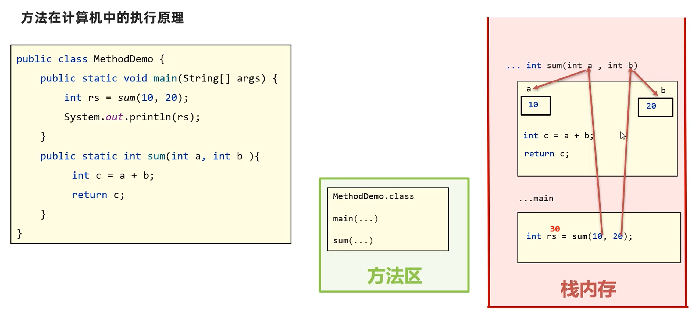


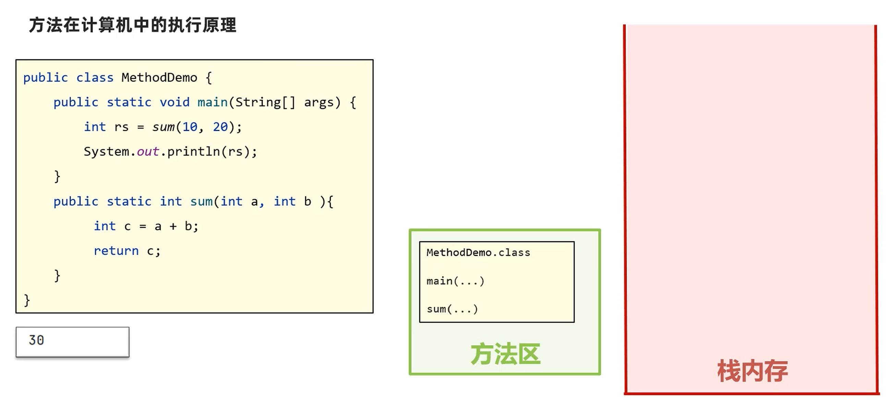

#### 5.2 案例2

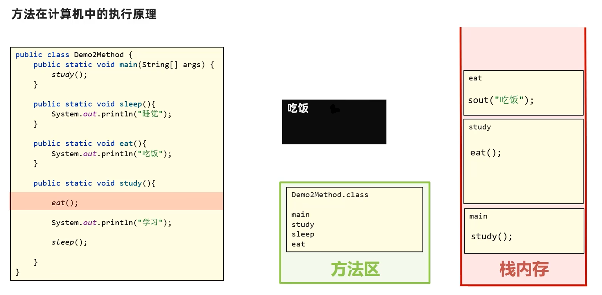

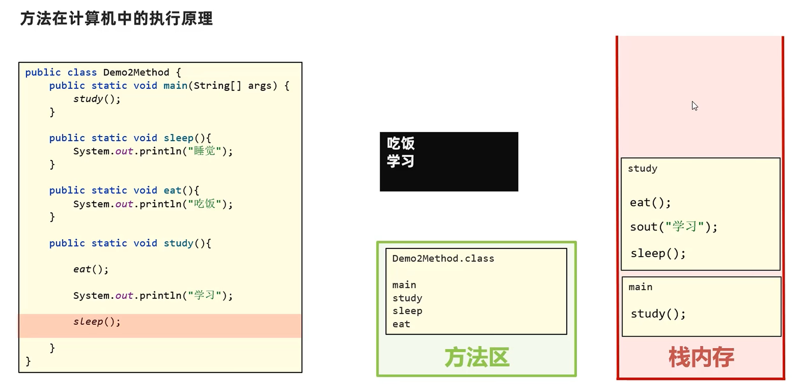

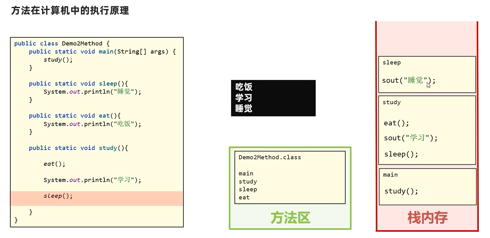

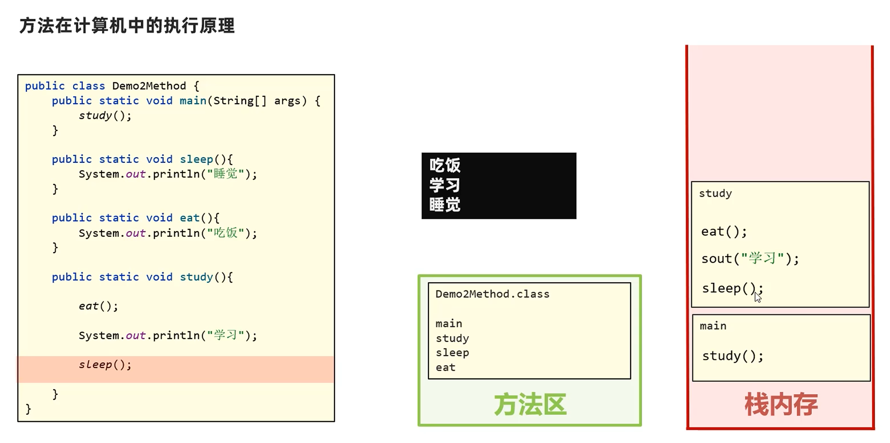

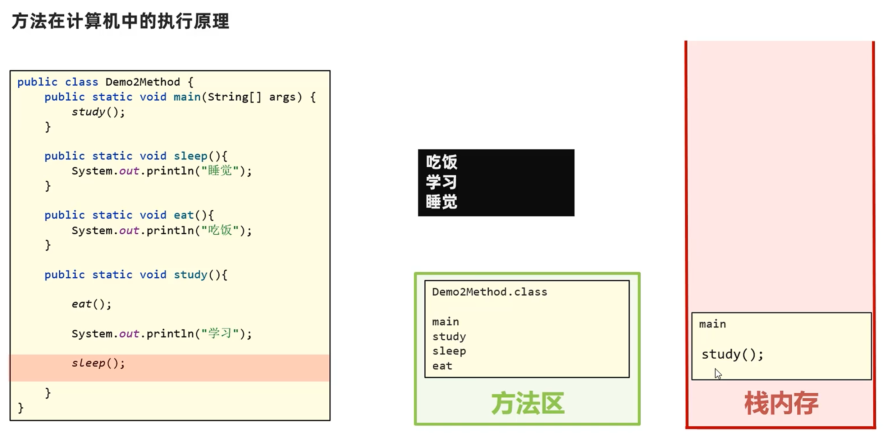

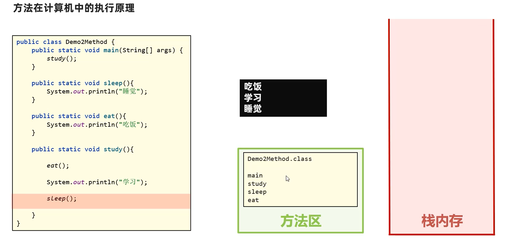


#### 总结
1. 方法的运行区域在哪里？
+ 栈内存

2. 栈有什么特点？方法为什么要在栈中运行自己？
+  先进后出
+  保证一个方法调用另一个方法，可以回来


--------------------------


### 6. Java 的参数传递机制
#### 6.1 基本类型的参数传递
Java 的参数传递机制都是：**值传递**
+ 所谓值传递：指的是在传输实参给方法的形参的时候，**传输的是实参变量中存储的值的副本**
+ 实参：在方法内部定义的变量
+ 形参：定义方法时“**(...)**”中所声明的参数

##### 6.1.1 代码解释
```java
package i_parameter;

public class a_MethodDemo1 {

    public static void main(String[] args) {
        // 目标：理解方法的参数传递机制：值传递
        int a = 10;
        change(a);
        System.out.println("change3：" + a); // 10
    }

    public static void change(int a) {
        System.out.println("change1：" + a); // 10
        a = 20;
        System.out.println("change2：" + a); // 20
    }
}

```

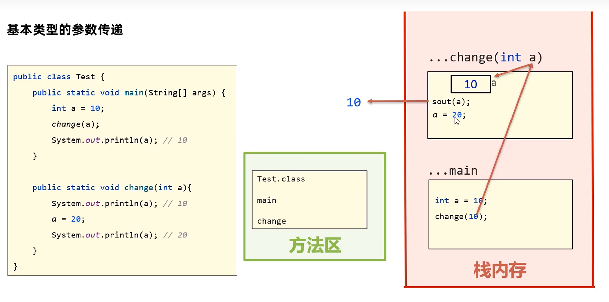

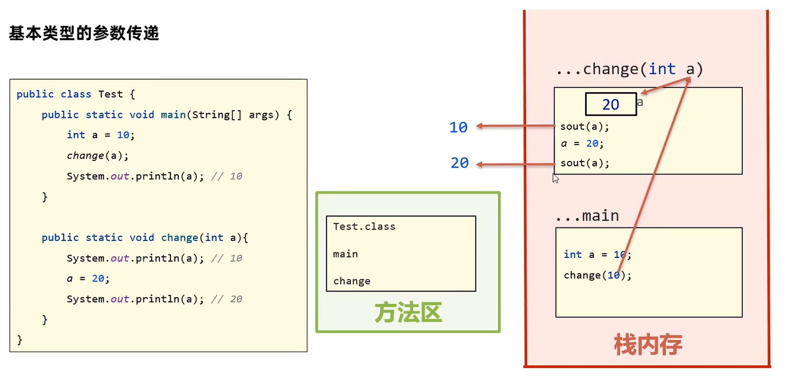

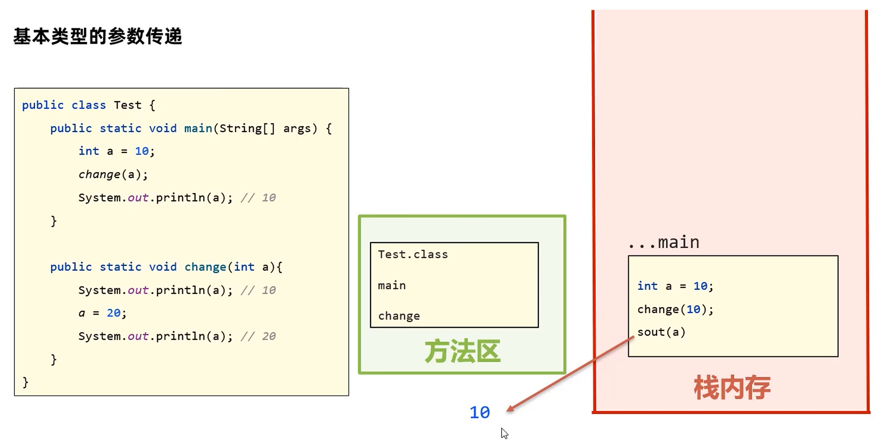

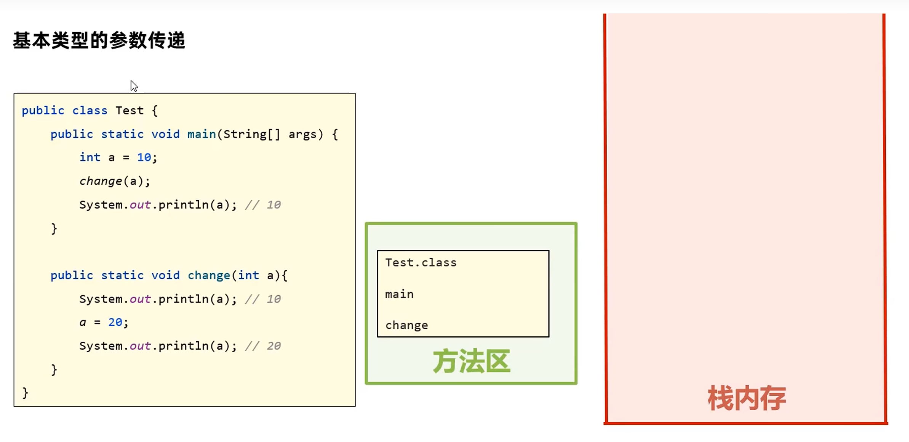


##### 总结
1. Java 的参数传递机制是什么样的？
+ 值传递，传输的是实参存储的值的副本
+ 实参：在方法内部定义的变量
+ 形参：以方法为例，就是方法定义时的变量


-------------------------------------------


#### 6.2 引用类型的参数传递

##### 6.2.1 案例
```java
package i_parameter;

public class b_MethodDemo2 {

    public static void main(String[] args) {
        // 目标：理解引用类型的参数传递机制：值传递的
        int[] arrs = {10, 20, 30};
        change(arrs);
        System.out.println("main：" + arrs[1]); // 222
    }

    public static void change(int[] arrs) {
        System.out.println("方法内1：" + arrs[1]); // 20
        arrs[1] = 222;
        System.out.println("方法内2：" + arrs[1]); // 222
    }
}

```

+ 原理图：

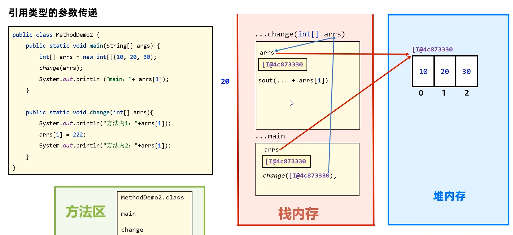

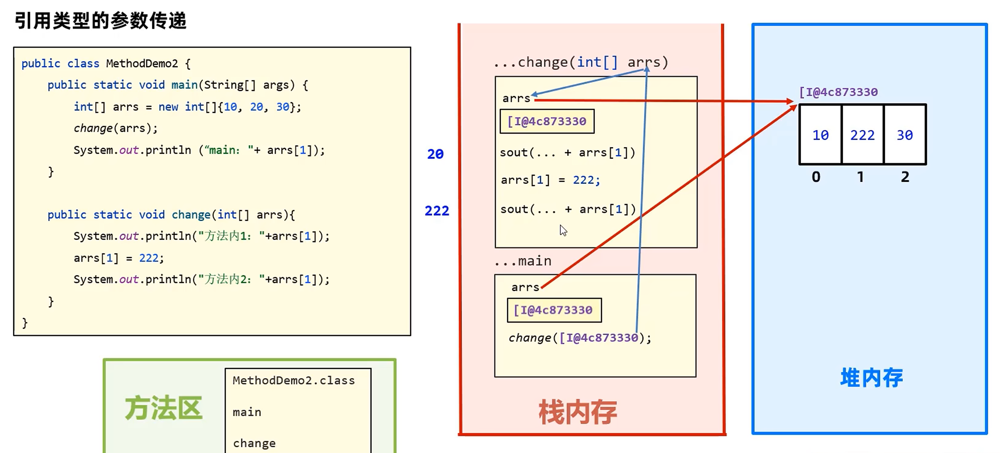

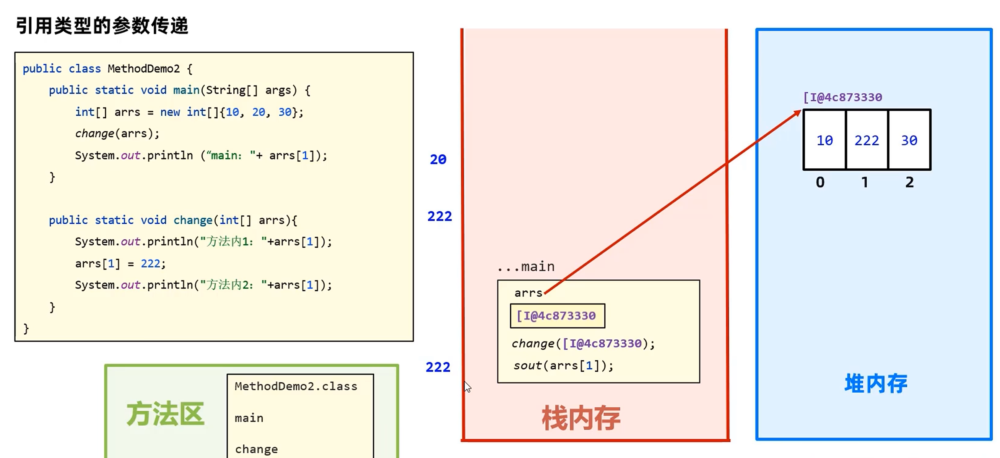

##### 总结
1. 基本类型和引用类型的参数在传递的时候有什么不同？
+ 都是值传递
+ 基本类型的参数传输存储的数据值
+ 引用类型的参数传输存储的地址值


------------------------


#### 6.3 参数传递的案例

##### 案例1
> 需求：
> + 输出一个 int 类型的数组内容，要求输出格式为：[11, 22, 33, 44, 55]
> 

分析：
1. 方法是否需要接收数据进行处理？**需要接收一个int 类型的数组，因此形参声明为：int[] arr**
2. 方法是否需要返回数据？**方法内部直接输出数组内容即可，无需返回，因此返回值类型声明为：void**
3. 方法内部的业务：遍历数组，并输出相应的内容。

###### 代码实现
```java
package i_parameter;

public class c_MethodTest3 {

    public static void main(String[] args) {
        // 目标：完成打印int类型的数组内容
        int[] arr = {10, 30, 50, 70};
        printArray(arr); // [10, 30, 50, 70]

        int[] arr2 = null;
        printArray(arr2);

        int[] arr3 = {};
        printArray(arr3); // []
    }

    public static void printArray(int[] arr) {

        if (arr == null) {
            System.out.println(arr); // null
            return; // 跳出当前方法
        }

        System.out.print("[");
        // 遍历接到的数组元素
        for (int i = 0; i < arr.length; i++) {
            // if (i == arr.length - 1) {
            //     System.out.print(arr[i]);
            // } else {
            //     System.out.print(arr[i] + ", ");
            // }
            System.out.print(i == arr.length - 1 ? arr[i] : arr[i] + ", ");
        }
        System.out.println("]");
    }
}

```


##### 案例2

比较两个 int 类型的数组是否一样，返回 true 或者 false

> 需求：
> + 如果两个 int 类型的数组，元素个数、元素顺序和内容是一样的我们就认为这2个数组是一摸一样的
> ```java
> 例如：如下两个数组是一样的
> int[] arrs = {10, 20, 30};
> int[] arrs = {10, 20, 30};
> ```
> 

分析：
1. 方法是否需要接收数据进行处理？**需要接收两个 int 类型的数组，因此，形参声明为：int[] arr1, int[] arr2**
2. 方法是否需要返回数据？**方法判断完后需要返回：true、false，因此，返回值类型声明为 boolean 类型**
3. 方法内部的业务：判断两个数组内容是否一样。

###### 代码实现
```java
package i_parameter;

public class d_MethodTest4 {

    public static void main(String[] args) {
        // 目标：完成判断两个int类型的数组是否一样
        int[] arr1 = null;
        int[] arr2 = null;
        System.out.println(equals(arr1, arr2)); // true
        int[] arr3 = {10, 20, 30};
        System.out.println(equals(arr1, arr3)); // false
        int[] arr4 = {10, 20, 30, 40};
        System.out.println(equals(arr3, arr4)); // false
        int[] arr5 = {10, 21, 30};
        System.out.println(equals(arr3, arr5)); // false
        int[] arr6 = {10, 21, 30};
        System.out.println(equals(arr5, arr6)); // true
    }

    public static boolean equals(int[] arr1, int[] arr2) {
        // 1. 判断arr1和arr2是否都是null
        if (arr1 == null && arr2 == null) {
            return true; // 相等的
        }

        // 2. 判断arr1是null，或者arr2是null
        if (arr1 == null || arr2 == null) {
            return false; // 不相等
        }

        // 3. 判断2个数组的长度是否一样，如果长度不一样，直接返回false
        if (arr1.length != arr2.length) {
            return false; // 不相等
        }

        // 4. 两个数组的长度是一样的，接着比较它们的内容是否一样
        for (int i = 0; i < arr1.length; i++) {
            // 判断当前位置2个数组的元素是否不一样，不一样直接返回false
            if (arr1[i] != arr2[i]) {
                return false; // 不相等
            }
        }
        return true; // 两个数组是一样的
    }
}

```


------------------------------------


### 7. 方法重载

#### 7.1 定义

方法重载
+ **一个类中**， 出现**多个方法的名称相同**，但它们的**形参列表是不同的**，那么这些方法就称为**方法重载了**

#### 7.2 注意事项

方法重载的注意事项
+ **一个类中，只要一些方法的名称相同、形参列表不同**，那么它们就是方法重载了，其它的都不管（如：修饰符、返回值类型是否一样都无所谓）
+ 形参列表不同指的是：形参的**个数、类型、顺序**不同，不关心形参的名称

#### 7.3 应用场景

方法重载的应用场景
+ 开发中我们经常需要为处理一类业务，提供多种方案，此时用方法重载来设计是很专业的

#### 代码演示
```java
package j_overload;

public class a_MethodOverLoadDemo1 {

    public static void main(String[] args) {
        // 目标：认识方法重载，并掌握其应用场景
        test(); // ===test1===
        test(100); // ===test2===100
    }

    public static void test() {
        System.out.println("===test1===");
    }

    public static void test(int a) {
        System.out.println("===test2===" + a);
    }

    void test(double a) {

    }

    void test(double a, int b) {

    }
    
    void test(int b, double a) {
        
    }

    int test(int a, int b) {
        return a + b;
    }
}

```

#### 案例
> 开发武器系统，功能要求如下：
> 1. 可以默认发一枚武器
> 2. 可以指定地区发射一枚武器
> 3. 可以指定地区发射多枚武器
> 

##### 代码实现
```java
package j_overload;

public class b_MethodTest2 {

    public static void main(String[] args) {
        // 目标：掌握方法重载的应用场景
        fire(); // 发射了1枚武器给岛国
        fire("米国"); // 发射了1枚武器给米国
        fire("米国", 999); // 发射了999枚武器给米国
    }

    public static void fire() {
        fire("岛国");
    }

    public static void fire(String country) {
        fire(country, 1);
    }

    public static void fire(String country, int number) {
        System.out.println("发射了" + number + "枚武器给" + country);
    }
}

```

#### 总结
1. 什么是方法重载？
+ 一个类中，**多个方法的名称相同**，但它们**形参列表不同**

2. 方法重载需要注意什么？
+ 一个类中，只要一些方法的名称相同、形参列表不同，那么它们就是方法重载了，其它的都不管（如：修饰符、返回值类型是否一样都无所谓）
+ **形参列表不同指的是：形参的个数、类型、顺序不同，不关心形参的名称**

3. 方法重载有啥应用场景？
+ 开发中我们经常需要为处理一类业务，提供多种解决方案，此时方法重载来设计是很专业的


--------------------------------


### 补充知识：方法中独特使用 return 关键字

#### return 关键字在方法中单独使用
+ `return;` 可以在无返回值的方法中，作用是：立即跳出并**结束当前方法的执行**


#### 代码演示
```java
package k_returndemo;

public class a_ReturnDemo1 {

    public static void main(String[] args) {
        // 目标：掌握return单独使用：return; 在无返回值方法中的作用：跳出并立即结束当前方法的执行
        System.out.println("程序开始。。。");
        chu(10, 0);
        System.out.println("程序结束。。。");
    }

    public static void chu(int a, int b) {
        if (b == 0) {
            System.out.println("您的数据有问题不能除0~~~");
            return; // 跳出并结束当前方法的执行
        }
        int c = a / b;
        System.out.println("除法结果是：" + c);
    }
}

```

#### 总结
1. 在无返回值的方法中，如果要直接跳出并结束当前方法的执行，怎么解决？
+ `return;` 跳出并立即结束所在方法的执行
+ `break;` 跳出并结束当前所在循环的执行
+ `continue;` 结束当前所在循环的当次执行，进入下一次执行


-------------------------------------------


### 总结

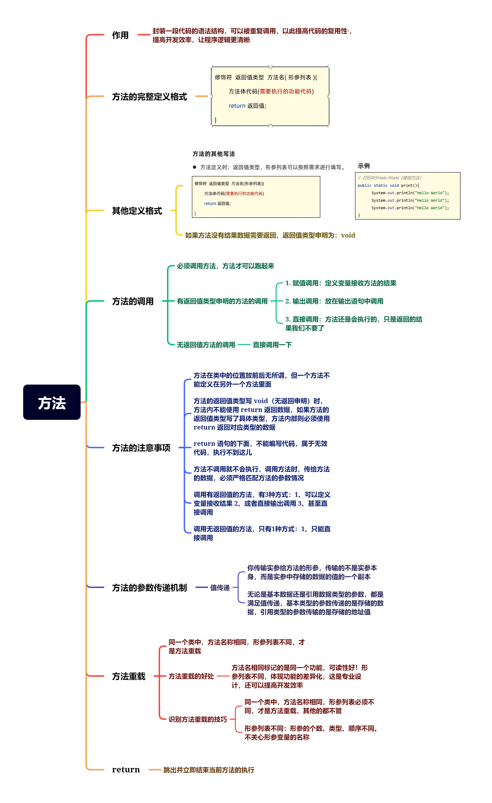


----------------------------------------------


## 专题课 - 编程案例

+ 目的1：复习前面学过的编程知识，能够利用所学的知识解决问题
  + 变量、数组
  + 运算符：+ - * / 、== >= 、&& 、|| 、!
  + 程序流程控制：if、switch；for、while、死循环 ...
  + 跳转关键字：break、continue、return
  + 方法

+ 目的2：积攒代码量，以训练并提升编程能力、编程思维
  + 编程思维：使用所学的编程技术解决问题的思维方式和编写代码实现出来的能力
  + 提升编程思维和编程能力的建议
    + 编程思维、编程能力不是一朝一夕形成的，需要大量思考、练习和时间的沉淀
    + 具体措施：前期，建议先模仿；后期，自然而然就能创新了；勤于练习代码，勤于思考，熟能生巧

### 案例一：买飞机票
> 需求：
> 用户购买机票时，机票原价会按照淡季、旺季，头等舱还是经济舱的情况进行相应的优惠，优惠方案如下：
> + 5-10月为旺季，头等舱9折，经济舱8.5折；
> + 11月到来年4月为淡季，头等舱7折，经济舱6.5折；
> 
> 请开发程序计算出用户当前机票的优惠价
> 

分析：
+ 方法是否需要接收数据？**需要接收机票原价、当前月份、舱位类型**
+ 方法是否需要返回数据？**需要返回计算出的机票优惠价**
+ 方法内部：先使用 if 判断月份是旺季还是淡季，然后使用 switch 分支判断是头等舱还是经济舱

#### 代码实现
```java
package l_caseexercise;

public class a_Test1 {

    public static void main(String[] args) {
        // 目标：完成买飞机票的案例
        double price = calculate(1000, 8, "经济舱");
        double price2 = calculate(1000, 11, "头等舱");
        System.out.println("优惠价是：" + price); // 优惠价是：850.0
        System.out.println("优惠价是：" + price2); // 优惠价是：700.0
    }

    public static double calculate(double price, int month, String type) {
        // 1. 判断当前月份是淡季还是旺季
        if (month >= 5 && month <= 10) {
            // 旺季
            // 2. 判断舱位类型
            switch (type) {
                case "头等舱":
                    price *= 0.9;//price = price * 0.9;
                    break;
                case "经济舱":
                    price *= 0.85;
                    break;
            }
        } else {
            // 淡季
            switch (type) {
                case "头等舱":
                    price *= 0.7;//price = price * 0.7;
                    break;
                case "经济舱":
                    price *= 0.65;
                    break;
            }
        }
        return price;
    }
}

```

#### 总结
1. 遇到需要通过判断数据在哪个区间，来决定执行哪个业务，应该用什么实现？
+ 应该使用 if 分支结构实现

2. 遇到需要通过判断数据匹配哪个值，来决定执行哪个业务，应该用什么实现？
+ 应该使用 switch 分支结构实现


---------------------------------


### 案例二：开发验证码
> 需求：
> 开发一个程序，可以生成指定位数的验证码，每位可以是数字、大小写字母
> 

分析：
+ 方法是否需要接收数据？**需要接收一个整数，控制生成验证码的位数**
+ 方法是否需要返回数据？**需要返回生成的验证码**
+ 方法内部的业务：使用 for 循环依次生成每位随机字符，并使用一个 String 类型的变量把每个字符连接起来，最后返回该变量即可

#### 代码实现
```java
package l_caseexercise;

import java.util.Random;

public class b_Test2 {

    public static void main(String[] args) {
        // 目标：完成生成随机验证码
        System.out.println(createCode(5)); // mdaI0（随机的）
    }

    public static String createCode(int n) {
        // 1. 定义一个for循环用于控制产生多少位随机字符
        Random r = new Random();
        // 3. 定义一个String类型的变量用于记录产生的每位随机字符
        String code = "";
        for (int i = 1; i <= n; i++) {
            // i = 1 2 3 ... n
            // 2. 为每个位置生成随机字符，可能是数字、大小写字母
            // 思路：随机一个0 1 2之间的数字出来，0代表随机一个数字字符，1、2代表随机大写字母、小写字母
            int type = r.nextInt(3); // 0 1 2
            switch (type) {
                case 0:
                    // 随机一个数字字符
                    code += r.nextInt(10); // 0 - 9 code = code + 8
                    break;
                case 1:
                    // 随机一个大写字符 A 65   Z 65+25
                    char ch1 = (char) (r.nextInt(26) + 65);
                    code += ch1;
                    break;
                case 2:
                    // 随机一个小写字符 a 97   z 97+25
                    char ch2 = (char) (r.nextInt(26) + 97);
                    code += ch2;
                    break;
            }
        }
        return code;
    }
}

```

#### 总结
1. 随机验证码的核心实现逻辑是如何进行的？
+ 定义一个 for 循环，循环 n 次
+ 随机生成0 | 1 | 2的数据，依次代表当前要生成的字符是：数字、大写字母、小写字母
+ 把0、1、2交给 switch 生成对应类型的随机字符
+ 在循环外定义一个 String 类型的变量用来连接生成的随机字符
+ 循环结束后，返回 String 类型的变量即是生成的随机验证码


------------------------------------


### 案例三：评委打分

> 需求：
> 在唱歌比赛中，可能有多名评委要给选手打分，分数是【0-100】之间的整数。选手最后得分为：去掉最高分、最低分后剩余分数的平均数，请编写程序能够录入多名评委的分数，并算出选手的最终得分
> 

分析：
+ 方法是否需要接收数据进行处理？**需要接收评委的人数**
+ 方法是否需要返回数据？**需要返回计算出的选手最终得分**
+ 方法内部的业务：定义数组，录入评委的分数存入到数组中，接着，我们就需要遍历数组中的分数，计算出总分，并找出最高分、最低分，最后按照这些数据算出选手最终得分并返回即可


#### 代码演示
```java
package l_caseexercise;

import java.util.Scanner;

public class c_Test3 {

    public static void main(String[] args) {
        // 目标：完成评委打分案例
        System.out.println("当前选手得分是：" + getAverageScore(6)); // 当前选手得分是：82.5
    }

    public static double getAverageScore(int number) {
        // 1. 定义一个动态初始化的数组，负责后期存入评委的打分
        int[] scores = new int[number];

        // 2. 遍历数组的每个位置，依次录入评委的分数
        Scanner sc = new Scanner(System.in);
        for (int i = 0; i < scores.length; i++) {
            System.out.println("请您录入第" + (i + 1) + "个评委的分数：");
            int score = sc.nextInt();
            scores[i] = score;
        }

        // 3. 从数组中计算出总分，找出最高分、最低分
        int sum = 0; // 求总分用的变量
        int max = scores[0]; // 求最大值
        int min = scores[0]; // 求最小值

        // 遍历数组找出这些数据
        for (int i = 0; i < scores.length; i++) {
            int score = scores[i];
            // 求和
            sum += score;
            // 求最大值
            if (score > max) {
                max = score;
            }
            // 求最小值
            if (score < min) {
                max = score;
            }
        }
        // 4. 计算出平均分并返回
        return 1.0 * (sum - max - min) / (number - 2);
    }
}

```

#### 总结
1. 如何实现评委打分案例？
+ 定义一个动态初始化的数组，用于录入评委打分
+ 提前定义三个变量用来记住数组中的最大值、最小值、总和
+ 遍历数组中的每个数据，依次找出最大值、最小值、总和
+ 遍历结束后，按照计算规则算出选手的最终得分，并返回即可


----------------------------------


### 案例四：数字加密

> 需求：
> 某系统的数字密码是一个四位数，如1983，为了安全，需要加密后再传输，加密规则是：对密码中的每位数都加5，再对10求余，最后将所有数字顺序反转，得到一串加密后的新数，请设计出满足本需求的加密程序
> 示例：1983 -> 8346
> 

分析：
+ 方法是否需要接收数据进行处理？**需要接收四位数字密码，进行加密处理**
+ 方法是否需要返回数据？**需要返回加密后的结果**
+ 方法内部的业务：将四位数拆分成一个一个的数字，存入到数组中去，遍历数组中的每个数字，按照题目需求进行加密！最后，再把加密后的数字拼接起来返回即可！

#### 代码实现
```java
package l_caseexercise;

public class d_Test4 {

    public static void main(String[] args) {
        // 目标：完成数字加密程序的开发
        System.out.println("加密后的结果是：" + encrypt(1983)); // 加密后的结果是：8436
    }

    public static String encrypt(int number) {
        // 1. 把这个密码拆分成一个一个的数字，才可以对其进行加密
        int[] numbers = split(number);

        // 2. 遍历这个数组中的每个数字，对其进行加密处理
        for (int i = 0; i < numbers.length; i++) {
            numbers[i] = (numbers[i] + 5) % 10;
        }

        // 3. 对数组反转，把对数组进行反转的操作交给一个独立的方法来完成
        reverse(numbers);

        // 4. 把这些加密的数字拼接起来做为加密后的结果返回即可
        String data = "";
        for (int i = 0; i < numbers.length; i++) {
            data += numbers[i];
        }
        return data;
    }

    public static void reverse(int[] numbers) {
        // 反转数组
        for (int i = 0; i <= (numbers.length / 2); i++) {
            int temp = numbers[numbers.length - i - 1];
            numbers[numbers.length - i - 1] = numbers[i];
            numbers[i] = temp;
        }
    }

    public static int[] split(int number) {
        int[] numbers = new int[4];
        numbers[0] = number / 1000;
        numbers[1] = (number / 100) % 10;
        numbers[2] = (number / 10) % 10;
        numbers[3] = number % 10;
        return numbers;
    }
}

```

#### 总结
1. 回顾数组元素的反转、交换是如何完成的？
+ 反转数组，就是对数组中的元素，按照前后位置，依次交换数据

2. 如果一个方法里要做的事比较多，我们在开发中一般会怎么做？
+ 一般会把多个事情拆成多个方法去完成，也就是独立功能独立成一个方法


-----------------------------------


### 案例五：数组拷贝

> 需求：
> 请把一个整型数组，例如存了数据：11, 22, 33，拷贝成一个一摸一样的新数组出来
> 

分析：
+ 方法是否需要接收数据进行处理？** 需要接受一个整型数组（原数组）**
+ 方法是否需要返回数据？**需要返回一个新的、一摸一样的整型数组**
+ 方法内部的业务：创建一个长度一样的整型数组做为新数组，并把原数组的元素对应位置赋值给新数组，最终返回新数组即可

#### 代码实现
```java
package l_caseexercise;

public class e_Test5 {
    public static void main(String[] args) {
        // 目标：掌握数组拷贝
        int[] arr = {11, 22, 33};
        int[] arr2 = copy(arr);
        printArray(arr2); // [11, 22, 33]

        // 注意：这个不是拷贝数组，叫把数组变量赋值给另一个数组变量
//        int[] arr3 = arr;
//        arr3[1] = 666;
//        System.out.println(arr[1]); // 666

        arr2[1] = 666;
        System.out.println(arr[1]); // 22
    }

    public static void printArray(int[] arr){
        System.out.print("[");
        for (int i = 0; i < arr.length; i++) {
            System.out.print(i == arr.length - 1 ? arr[i] : arr[i] + ", ");
        }
        System.out.println("]");
    }

    public static int[] copy(int[] arr){
        // 1. 创建一个长度一样的整型数组出来
        int[] arr2 = new int[arr.length];

        // 2. 把原数组的元素值对应位置赋值给新数组
        for (int i = 0; i < arr.length; i++) {
            arr2[i] = arr[i];
        }

        return arr2;
    }
}

```

#### 总结
1. 数组的拷贝是什么意思？
+ 创建出一个与原数组一摸一样的数组


-----------------------------------


### 案例六：抢红包

> 需求：
> 一个大V直播时发起了抢红包活动，分别有：9、666、188、520、99999五个红包。请模拟粉丝来抽奖，按照先来先得，随机抽取，抽完为止，注意：一个红包只能被抽一次，先抽或后抽哪一个红包是随机的，示例如下（不一定是下面的顺序）：
>
> 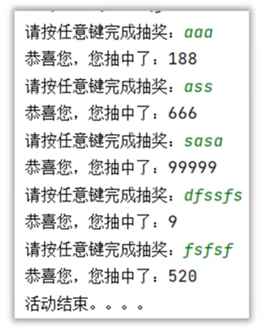
> 

分析：
+ 方法是否需要接收数据进行处理？**需要一个数组，里面是5个金额，表示5个红包**
+ 方法是否需要返回数据？**不需要**


+ 方法内部完成本需求的方案：
  + 第一种：写个 for 循环控制抽奖5次，每次抽奖，都从数组中随机找出一个金额，如果该金额不是0，则代表抽中，接着用0替换该位置处的金额，然后继续下一个粉丝的抽奖；如果抽中的金额发现是0，代表该位置处的红包之前被别人抽走了，则从新数组中随机找出一个金额，继续判断！直至抽中的金额不是0！
  + 第二种：先把数组里面的5个金额打乱，打乱后的顺序就认为是中间顺序；接着，写个 for 循环，执行5次，每次都提示抽奖；每次抽奖，都依次取出数组中的每个位置处的金额做为中奖金额即可
    + 具体就是，遍历数组，遍历第一个数的时候随机一个索引，把第一个数据和随机的索引位置数据交换，以此类推

#### 代码演示

+ 第一种（性能差）
```java
package l_caseexercise;

import java.util.Random;
import java.util.Scanner;

public class f_Test6 {
    public static void main(String[] args) {
        // 目标：完成抢红包案例的开发
        int[] moneys = {9, 666, 188, 520, 99999};
        start(moneys);
    }

    public static void start(int[] moneys){
        Scanner sc = new Scanner(System.in);
        Random r = new Random();
        // 1. 定义一个for循环，控制抽奖5次
        for (int i = 1; i <= 5; i++) {
            // 2. 提示粉丝抽奖
            System.out.println("请您输入任意内容进行抽奖：");
            sc.next(); // 等待用户输入内容，按了回车才会往下走

            // 3. 为当前这个粉丝找一个随机的红包出来
            while (true) {
                int index = r.nextInt(moneys.length);
                int money = moneys[index];

                // 4. 判断这个红包是否不为0
                if (money != 0) {
                    System.out.println("恭喜您，您抽中的红包：" + money);
                    moneys[index] = 0;
                    break; // 结束这次抽奖
                }
            }
        }
        System.out.println("活动结束！");
    }
}

```

#### 总结
1. 抢红包的实现方案有几种，哪种方式可能更好一些？
+ 第一种：每次抽奖都从数组总，随机找出一个金额，如果该金额不是0，就输出该金额，然后用0替换该位置的处的金额；如果该位置就是0，则重复上一步操作
+ 第二种：打乱奖金的顺序，再依次发给粉丝
  + 遍历数组中的每个位置，每遍历到一个位置，都随机一个索引值出来，让当前位置与该索引位置处的数据进行交换


--------------------------------------------


### 案例七：找素数

> 需求：
> 判断 101-200 之间有多少个素数，并输出所有素数
> 说明：除了1和它本身以外，不能被其他正整数整除，就叫**素数**
> 比如：3、7就是素数，而9、21等等不是素数
> 

分析：
+ 方法是否需要接收数据进行处理？** 需要接收101以及200，以便找该区间中的素数**
+ 方法是否需要返回数据？** 需要返回找到的素数个数**
+ 方法内部的实现逻辑：使用 for 循环来产生如101到200之间的每个数；每拿到一个数，判断该数是否是素数；判断规则是“从2开始遍历到该数的一半的数据，看是否有数据可以整除它，有则不是素数，没有则是素数；根据判定的结果来决定是否输出这个数据（是素数则输出）；最后还需要统计素数的个数并返回

#### 拓展知识点、

在外部循环前加上`OUT:`表示**为外部循环指定标签**，后面可以用`continue OUT;`**结束外部循环的当次执行**


#### 代码实现

##### 第一种

```java
package l_caseexercise;

public class g_Test7 {
    public static void main(String[] args) {
        // 目标：完成找素数
        System.out.println("当前素数的个数是：" + search(101, 200)); // 当前素数的个数是：21
    }

    public static int search(int start, int end){
        int count = 0; // 统计素数的个数
        // 1. 定义一个for循环，找到101到200之间的每个数据
        for (int i = start; i <= end; i++) {
            // 信号位思想
            boolean flag = true; // 假设的意思，默认认为当前i记住的数据是素数


            // 2. 判断当前i记住的数据是否是素数
            for (int j = 2; j <= i / 2; j++) {
                if (i % j == 0) {
                    // i当前记住的这个数据不是素数
                    flag = false;
                    break;
                }
            }
            // 3. 根据判定的结果决定是否输出i当前记住的数据：是素数才输出展示
            if (flag) {
                System.out.println(i);
                count++;
            }
        }
        return count;
    }
}

```

##### 第二种（简化版）

```java
package l_caseexercise;

public class g_Test7pro {
    public static void main(String[] args) {
        // 目标：完成找素数
        int count = 0; // 统计素数的个数
        // 1. 定义一个for循环，找到101到200之间的每个数据
        OUT: // 为外部循环指定标签
        for (int i = 101; i <= 200; i++) {
            // 2. 拦截判断该数是否是素数
            for (int j = 2; j <= i / 2; j++) {
                if (i % j == 0) {
                    // 这个数肯定不是素数，不能打印
                    continue OUT; // 结束外部循环的当次执行
                }
            }
            count++;
            System.out.println(i);
        }
        System.out.println("个数是：" + count);
    }
}

```

##### 第三种（更简单的）
```java
package l_caseexercise;

public class g_Test7tour {
    public static void main(String[] args) {
        for (int i = 101; i <= 200; i++) {
            // i = 101 102 103 ... 199 200
            // i遍历到的当前数据是否是素数，是则输出，不是则不输出
            if (check(i)) {
                System.out.println(i);
            }
        }
    }

    
    public static boolean check(int data){
        for (int i = 2; i <= data / 2; i++) {
            if (data % i == 0) {
                return false; // 不是素数
            }
        }
        return true; // 是素数
    }
}

```

#### 总结
1. 本次案例中是如何确定出该数是素数的，具体如何实现？
+ 定义了 flag 标记位
+ 遍历2到该数的一半的数据去判断是否有整除的数据，有则改变 flag 标记位的状态


-------------------------------------


### 案例八：打印九九乘法表、三角形

#### 打印九九乘法表

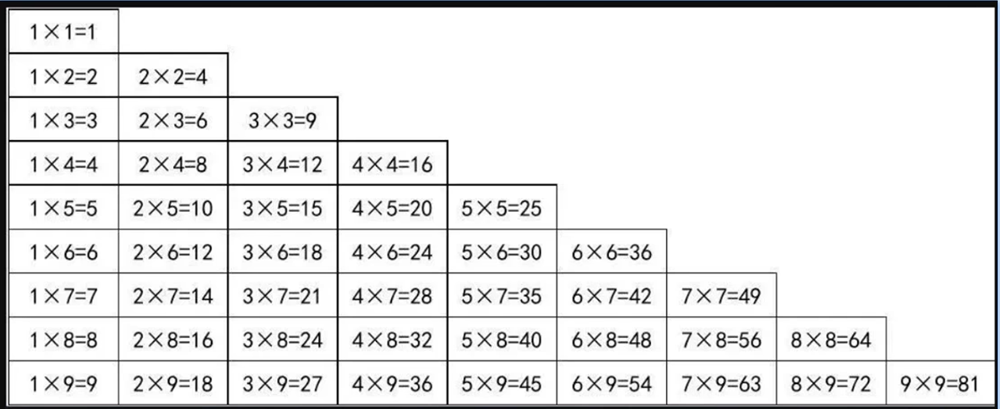

##### 代码实现
```java
package l_caseexercise;

public class h_Test8 {
    public static void main(String[] args) {
        // 1. 定义一个for循环控制打印多少行
        for (int i = 1; i <= 9; i++) {
            // i = 1 2 3 4 5 6 7 8 9
            // 2. 定义一个内部循环控制每行打印多少列
            for (int j = 1; j <= i; j++) {
                // i 行   j 列
                System.out.print(j + "x" + i + "=" + (j * i) + "\t");
            }
            System.out.println(); // 换行
        }
    }
}

```

#### 打印三角形

##### 代码实现

```java
package l_caseexercise;

/**
      *
     ***
    *****
   *******

 本质：计算机本质只能打印行，所以按照行思考
 先找规律，再写程序
 行(i)     先打空格(n-i)    再打星星(2i - 1)     换行
 1            3             1
 2            2             3
 3            1             5
 4            0             7

 */

public class i_Test9 {
    public static void main(String[] args) {
        // 1. 先定义一个循环控制打印多少行
        int n = 10;
        for (int i = 1; i <= n; i++) {
            // 2. 按照打印多少个空格
            for (int j = 1; j <= (n - i); j++) {
                System.out.print(" ");
            }

            // 3. 控制打印多少个星星
            for (int j = 1; j <= (2 * i - 1); j++) {
                System.out.print(j % 2 == 0 ?" ": "*");
            }
            // 4. 换行
            System.out.println();
        }
    }
}

```


---------------------------------------


### 案例九：模拟双色球【拓展案例】

#### 第一步：业务分析、用户投注一组号码

+ 双色球业务介绍：
  + 投注号码由6个红色球号码和一个蓝色球号码组成。红色球号码从1 - 33中选择；蓝色球号码从1 - 16中选择

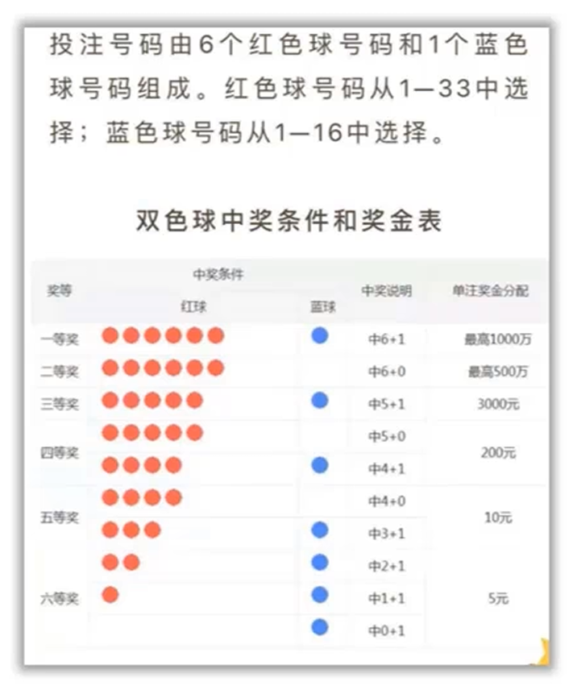

+ 总体实现步骤分析：

```java
public class Test8 {
	public static void main(String[] args) {
		int[] userNumbers = userSelectNumbers();
		int[] luckNumbers = createLuckNumbers();
		judge(userNumbers, luckNumbers);
	}
	
	/** 1. 用于让用户投注一组号码（前6个是红球，最后1个是蓝球），并返回用户投注的号码 */
	public static int[] userSelectNumbers(){...}
	
	/** 2. 系统随机一组中奖号码（前6个是红球，最后1个是蓝球），并返回这组中奖号码 */
	public static int[] createLuckNumbers(){...}
	
	/** 3. 传入两组号码，用来判断用户投注号码的中奖情况，并输出 */
	public static void judge(int[] userNumbers, int[] luckNumber){...}
}

```

+ **注意：6个红球号码的范围是1 - 33之间，且不能重复；1个蓝球号码的范围在：1 - 16之间**

##### 代码实现

```java
package l_caseexercise;

import java.util.Scanner;

public class j_Test10 {
    public static void main(String[] args) {
        // 目标：完成双色球系统的开发
        int[] userNumbers = userSelectNumbers();
        printArray(userNumbers);
    }

    public static void printArray(int[] arr){
        System.out.print("[");
        for (int i = 0; i < arr.length; i++) {
            System.out.print(i == arr.length - 1 ? arr[i] : arr[i] + ", ");
        }
        System.out.print("]");
    }

    /**
     * 1. 设计一个方法，用于让用户投注一组号码并返回（前6个是红球号码，最后1个是蓝球号码）
     */
    public static int[] userSelectNumbers() {
        // 2. 创建一个整型数组，用于存储用户投注的7个号码（前6个是红球号码，最后1个是蓝球号码）
        int[] numbers = new int[7];
        // numbers = [0, 0, 0, 0, 0, 0, 0]
        //            0  1  2  3  4  5  6

        Scanner sc = new Scanner(System.in);
        // 3. 遍历前6个位置，让用户依次投注6个红球号码，存入
        for (int i = 0; i < numbers.length - 1; i++) {
            // i = 0 1 2 3 4 5

            while (true) {
                // 4. 开始让用户为当前位置投注一个红球号码（1 - 33之间，不能重复）
                System.out.println("请您输出第" + (i + 1) + "个红球号码（1 - 33之间，不能重复）");
                int number = sc.nextInt();

                // 5. 先判断用户输入的红球号码是否在1-33之间
                if (number < 1 || number > 33) {
                    System.out.println("对不起，您输入的红球号码不在1-33之间，请确认！");
                } else {
                    // 号码是在1-33之间了，接着还要继续判断这个号码是否重复，不重复才可以使用
                    if (exist(numbers, number)) {
                        // number当前这个红球号码重复了
                        System.out.println("对不起，您当前输入的红球号码前面选择过，重复了，请确认");
                    } else {
                        // number记住的这个号码没有重复了，就可以使用了
                        numbers[i] = number;
                        break; // 结束当次投注，结束了当前死循环
                    }
                }
            }
        }

        // 6. 投注最后一个蓝球号码
        while (true) {
            System.out.println("请您输入最后1个蓝球号码（1-16）：");
            int number = sc.nextInt();
            if (number < 1 || number > 16) {
                System.out.println("对不起，您输入的蓝球号码范围不对！");
            } else {
                numbers[6] = number;
                break; // 蓝球号码录入成功，结束死循环
            }
        }

        return numbers;
    }

    private static boolean exist(int[] numbers, int number) {
        // 需求：判断number这个数字是否在numbers数组中存在
        for (int i = 0; i < numbers.length; i++) {
            if (numbers[i] == 0) {
                break;
            }
            if (numbers[i] == number){
                return true;
            }
        }
        return false;
    }
}

```

##### 总结

1. 本次案例中是如何去保证用户投注的6个红球号码不重复的？
+ 每次用户投注一个红球号码后，都去调用一个方法来判断这个号码是否已经选择过，如果选择过，让用户重新选号【死循环】


#### 第二步：随机生成一组中奖号码

##### 代码实现
```java
package l_caseexercise;

import java.util.Random;
import java.util.Scanner;

public class j_Test10 {
    public static void main(String[] args) {
        // 目标：完成双色球系统的开发
        int[] luckNumbers = createLuckNumbers();
        printArray(luckNumbers);
    }


    /**
     * 2. 设计一个方法：随机一组中奖号码出来（6个红球号码，1个蓝球号码）
     */
    public static int[] createLuckNumbers(){
        // 1. 创建一个整型数组，用于存储这7个号码
        int[] numbers = new int[7];

        Random r = new Random();
        // 2. 遍历前6个位置处，依次随机一个红球号码存入（1-33不重复）
        for (int i = 0; i < numbers.length; i++) {
            // i = 0 1 2 3 4 5

            while (true) {
                // 3. 为当前位置随机一个红球号码出来存入 1 - 33 ==> -1 ==> (0, 32)
                int number = r.nextInt(33) + 1;

                // 4. 判断这个号码是否之前出现过（红球号码不重复）
                if (!exist(numbers, number)) {
                    // number不重复
                    numbers[i] = number;
                    break; // 结束死循环，代表找到了当前这个位置的一个不重复的红球号码了
                }
            }
        }

        // 5. 录入一个蓝球号码
        numbers[6] = r.nextInt(16) + 1;
        return numbers;
    }
}

```

##### 总结
1. 本次案例中是如何去保证随机的6个中奖的红球号码不重复的？
+ 每次随机一个1-33之间的红球号码后，都去调用一个方法来判断这个号码是否已经出现过，如果出现过，让用户重新选号


#### 第三步：判断中奖情况
##### 总结
1. 本次案例中是如何去统计用户投注的红球的命中数量的？
+ 遍历用户选择的每个红球号码，每遍历一个红球号码时，都去遍历中奖号码数组中的全部红球号码，看当前选的红球号码是否在中奖号码中存在，存在则红球命中数量加1

#### 代码实现

```java
package l_caseexercise;

import java.util.Random;
import java.util.Scanner;

public class j_Test10 {
    public static void main(String[] args) {
        // 目标：完成双色球系统的开发
        int[] userNumbers = userSelectNumbers();
        System.out.println("您投注的号码：");
        printArray(userNumbers);

        int[] luckNumbers = createLuckNumbers();
        System.out.println("中奖的号码");
        printArray(luckNumbers);

        judge(userNumbers, luckNumbers);

    }

    public static void printArray(int[] arr){
        System.out.print("[");
        for (int i = 0; i < arr.length; i++) {
            System.out.print(i == arr.length - 1 ? arr[i] : arr[i] + ", ");
        }
        System.out.print("]");
    }

    /**
     * 1. 设计一个方法，用于让用户投注一组号码并返回（前6个是红球号码，最后1个是蓝球号码）
     */
    public static int[] userSelectNumbers() {
        // 2. 创建一个整型数组，用于存储用户投注的7个号码（前6个是红球号码，最后1个是蓝球号码）
        int[] numbers = new int[7];
        // numbers = [0, 0, 0, 0, 0, 0, 0]
        //            0  1  2  3  4  5  6

        Scanner sc = new Scanner(System.in);
        // 3. 遍历前6个位置，让用户依次投注6个红球号码，存入
        for (int i = 0; i < numbers.length - 1; i++) {
            // i = 0 1 2 3 4 5

            while (true) {
                // 4. 开始让用户为当前位置投注一个红球号码（1 - 33之间，不能重复）
                System.out.println("请您输出第" + (i + 1) + "个红球号码（1 - 33之间，不能重复）");
                int number = sc.nextInt();

                // 5. 先判断用户输入的红球号码是否在1-33之间
                if (number < 1 || number > 33) {
                    System.out.println("对不起，您输入的红球号码不在1-33之间，请确认！");
                } else {
                    // 号码是在1-33之间了，接着还要继续判断这个号码是否重复，不重复才可以使用
                    if (exist(numbers, number)) {
                        // number当前这个红球号码重复了
                        System.out.println("对不起，您当前输入的红球号码前面选择过，重复了，请确认");
                    } else {
                        // number记住的这个号码没有重复了，就可以使用了
                        numbers[i] = number;
                        break; // 结束当次投注，结束了当前死循环
                    }
                }
            }
        }

        // 6. 投注最后一个蓝球号码
        while (true) {
            System.out.println("请您输入最后1个蓝球号码（1-16）：");
            int number = sc.nextInt();
            if (number < 1 || number > 16) {
                System.out.println("对不起，您输入的蓝球号码范围不对！");
            } else {
                numbers[6] = number;
                break; // 蓝球号码录入成功，结束死循环
            }
        }

        return numbers;
    }

    private static boolean exist(int[] numbers, int number) {
        // 需求：判断number这个数字是否在numbers数组中存在
        for (int i = 0; i < numbers.length; i++) {
            if (numbers[i] == 0) {
                break;
            }
            if (numbers[i] == number){
                return true;
            }
        }
        return false;
    }

    /**
     * 2. 设计一个方法：随机一组中奖号码出来（6个红球号码，1个蓝球号码）
     */
    public static int[] createLuckNumbers() {
        // 1. 创建一个整型数组，用于存储这7个号码
        int[] numbers = new int[7];

        Random r = new Random();
        // 2. 遍历前6个位置处，依次随机一个红球号码存入（1-33不重复）
        for (int i = 0; i < numbers.length; i++) {
            // i = 0 1 2 3 4 5

            while (true) {
                // 3. 为当前位置随机一个红球号码出来存入 1 - 33 ==> -1 ==> (0, 32)
                int number = r.nextInt(33) + 1;

                // 4. 判断这个号码是否之前出现过（红球号码不重复）
                if (!exist(numbers, number)) {
                    // number不重复
                    numbers[i] = number;
                    break; // 结束死循环，代表找到了当前这个位置的一个不重复的红球号码了
                }
            }
        }

        // 5. 录入一个蓝球号码
        numbers[6] = r.nextInt(16) + 1;
        return numbers;
    }

    /**
     * 3. 设计一个方法，用于判断用户的中奖情况
     */
    public static void judge(int[] userNumbers, int[] luckNumbers) {
        // 1. 分别定义两个变量用于记住红球命中了几个以及蓝球命中了几个
        int redCount = 0;
        int blueCount = 0;

        // 先判断红球命中的数量
        // 遍历用户投注的号码的前6个红球
        for (int i = 0; i < userNumbers.length - 1; i++) {
            // 开始遍历中奖号码的前6个红球号码，看用户当前选择的这个号码是否命中了
            for (int j = 0; j < luckNumbers.length - 1; j++) {
                if (userNumbers[i] == luckNumbers[j]){
                    redCount++;
                    break;
                }
            }
        }

        // 2. 判断蓝球是否命中
        blueCount = userNumbers[6] == luckNumbers[6] ? 1 : 0;

        System.out.println("您命中的红球数量是：" + redCount);
        System.out.println("您命中的蓝球数量是：" + blueCount);

        // 3. 判断中奖详情，并输出结果
        if (redCount == 6 && blueCount == 1) {
            System.out.println("恭喜您，中奖1000万，可以开始享受人生了~~~");
        } else if (redCount == 6 && blueCount == 0) {
            System.out.println("恭喜您，中奖500万，可以稍微开始享受人生了~~~");
        } else if (redCount == 5 && blueCount == 1) {
            System.out.println("恭喜您，中奖3000元，可以出去吃顿小龙虾了~");
        } else if (redCount == 5 && blueCount == 0 || redCount == 4 && blueCount == 1) {
            System.out.println("恭喜您，中了小奖，200元~");
        } else if (redCount == 4 && blueCount == 0 || redCount == 3 && blueCount == 1) {
            System.out.println("中了10元~");
        } else if (redCount < 3 && blueCount == 1) {
            System.out.println("中了5元~");
        }else {
            System.out.println("感谢您对福利事业做出的巨大贡献~~~");
        }
    }
}

```


---------------------------------------------


## 六、面向对象编程基础

==写程序的道路==

### 1. 面向对象编程快速入门

计算机的本质是用来处理数据的，我们用变量、数组等形式来把数据拿到程序中去

+ 面向对象编程
  + 开发一个一个的对象，把数据交给对象，再调用对象的方法来完成对数据的处理

#### 代码实现
> 需求：
>
> 
> 


+ Student.java

```java
package m_oop;

public class Student {
    String name;
    double chinese;
    double math;

    public void printTotalScore(){
        System.out.println(name + "的总成绩是：" + (chinese + math));
    }

    public void printAverageScore(){
        System.out.println(name + "的平均成绩是：" + (chinese + math) / 2.0);
    }
}

```

+ Test.java

```java
package m_oop;

public class Test {
    public static void main(String[] args) {
        // 目标：面向对象编程快速入门
        // 1. 创建一个学生对象，封装播妞的数据
        Student s1 = new Student(); // 同一个包下可以自动去访问【类本身可以做为一个类型】
        s1.name = "播妞"; // 可以理解为属性
        s1.chinese = 100;
        s1.math = 100;
        s1.printTotalScore(); // 播妞的总成绩是：200.0
        s1.printAverageScore(); // 播妞的平均成绩是：100.0

        // 2. 再创建一个学生对象，封装播仔的数据
        Student s2 = new Student();
        s2.name = "播仔";
        s2.chinese = 59;
        s2.math = 100;
        s2.printTotalScore(); // 播仔的总成绩是：159.0
        s2.printAverageScore(); // 播仔的平均成绩是：79.5
    }
}

```


--------------------------------------


### 2. 深刻认识面向对象

#### 2.1 面向对象编程的好处？

在祖师爷（詹姆斯·高斯林）看来**万物皆对象**

eg：
+ 汽车的数据找汽车对象处理
+ 手机的数据找手机对象处理
+ 学生的数据找学生对象处理

所有一句话总结就是，面向对象编程**符合人类思维习惯，编程更简单、更直观**


#### 2.2 程序中的对象到底是个啥？
~~温馨提示：Java 语言长久以来，一直没有人能把面向对象讲得直观且具体，方便初学者理解，所以可以选择自己认为更好的理解思路，这里仅供参考~~

+ **对象**本质上**是一种特殊的数据结构**
+ 类似于现实中一张表格，表格具体张什么样就要看对象张什么样
  + 创建（new）一个对象时，相当于在计算机里创建了一张表，把数据给到这个对象相当于填了这张表，调用这个对象的方法时处理的就是这个对象的数据了

#### 2.3 对象是怎么出来的？

+ class 也就是**类**，也**称为对象的设计图**（或者**对象的模板**）
  + 我们开头写的那个类就是来设计这个表的
  + class 后面跟名字，就是用来说用来设计一个什么对象（也就是设计一个什么表）
  + class 里面设计一些**变量**，变量就是表里面一些字段，字段用来**描述对象要处理什么数据**
  + class 里面设计一些**方法**，这些方法用来说明**对数据进行怎样的处理**

#### 总结
1. 面向对象编程有啥好处？
+ 凡是找对象的编程套路，更加符合人类的思维习惯，编程也会更直观

2. 对象是啥？如何得到？
+ 对象就是一种特殊的数据结构

  ```java
  public class 类名{
  	1. 变量，用来说明对象可以处理什么数据
  	2. 方法，描述对象有什么功能，也就是可以对数据进行什么样的处理
  	...
  }
  ```

+ 对象是用类 new 出来的，有了类就可以创建出对象

  ```java
  类名 对象名 = new 类名();
  ```

3. 面向对象编程这种套路是咋回事？
+ 祖师爷认为万物皆对象，谁的数据谁处理


------------------------------------


### 3. 对象在计算机中的执行原理

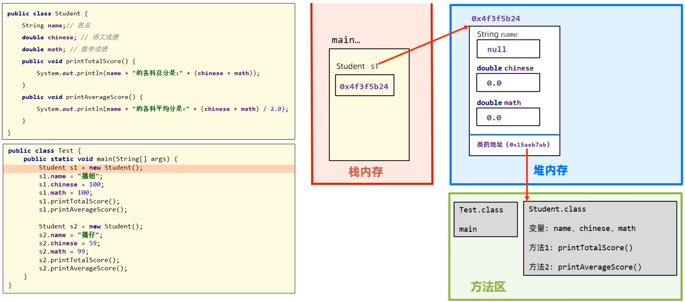

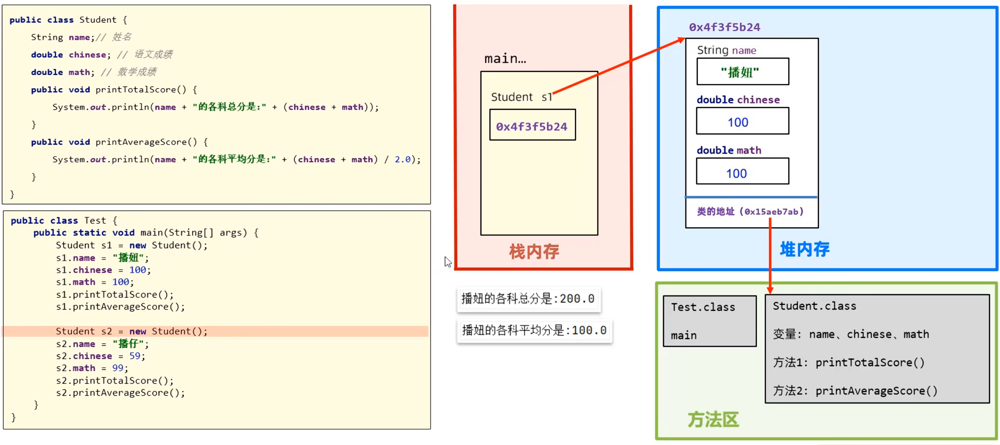

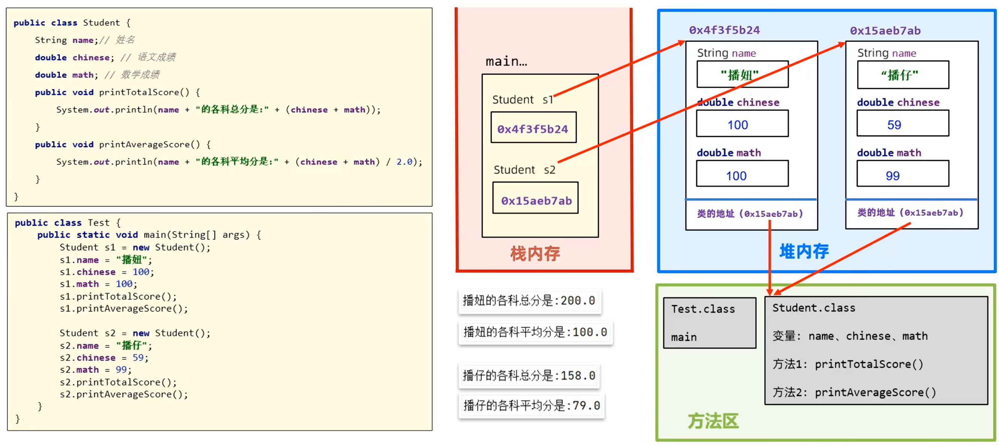

#### 总结
1. 对现在计算机中的执行原理是怎么回事？

+ `Student s1 = new Student();`
+ 每次 new Student()，就是在堆内存中开辟一块内存区域代表一个学生对象
+ s1 变量里面记住的是学生对象的地址

#### 多学一招
1. 如何识别引用类型的变量？

+ `Student s1 = new Student();`
+ s1 变量中存储的是对象的地址，因此变量 s1 也称为引用类型的变量


----------------------------


### 4. 类和对象的一些注意事项

+ 类名建议用英文单词，首字母大写，满足驼峰模式，且要有意义，比如：Student、Car、...
+ 类中定义的变量也称之为成员变量（对象的属性），类中定义的方法也称之为成员方法（对象的行为）【每个对象都有一份属于自己的成员变量】
+ 成员变量本身存在默认值，在定义成员变量时一般来说不需要赋初始值（没有意义）
  ```java
  修饰符 数据类型 变量名称 = 值;
  ```

<table>
    <tr>
    	<td>数据类型</td>
        <td>明细</td>
        <td>默认值</td>
    </tr>
    <tr>
        <td rowspan="3">基本类型</td>
        <td>byte、short、char、int、long</td>
        <td>0</td>
    </tr>
    <tr>
    	<td>float、double</td>
        <td>0.0</td>
    </tr>
    <tr>
    	<td>boolean</td>
        <td>false</td>
    </tr>
    <tr>
    	<td>引用类型</td>
        <td>数组、String</td>
        <td>null</td>
    </tr>
</table>

+ 一个代码文件中，可以写多个 class 类，但只能一个用 public 修饰，且 public 修饰的类名必须成为代码文件名
+ 对象与对象之间的数据不会相互影响，但多个变量指向同一个对象时就会相互影响了

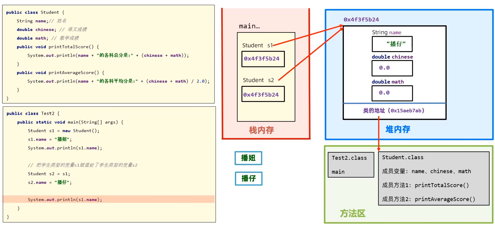


+ 如果某个对象没有一个变量引用它，则该对象无法被操作了，该对象会成为所谓的垃圾对象
  + Java 存在自动垃圾回收机制，会自动清楚掉垃圾对象，程序员不用操心

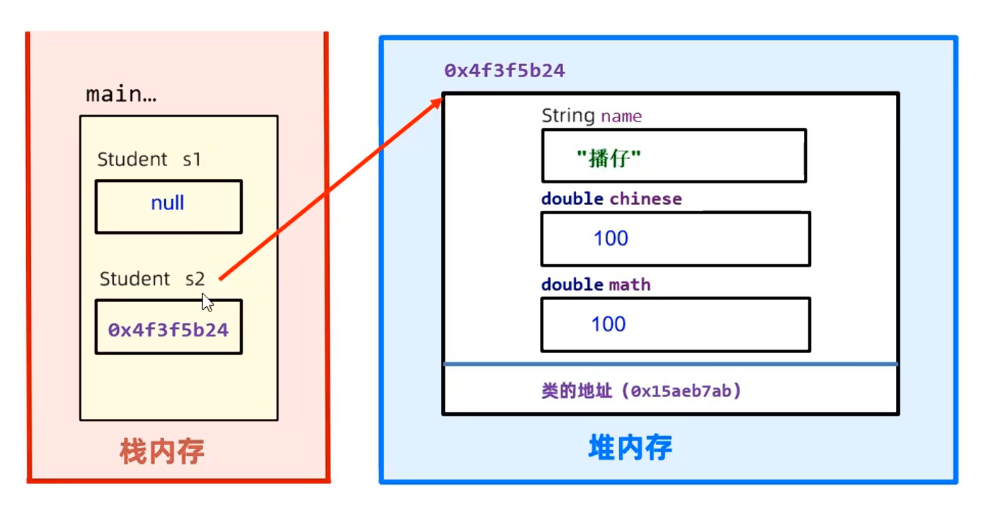


-----------------------------------


### 5. this

（如果学过 python 的话，this 类似于 python 中的 self）

#### 5.1 this 是什么

+ this 就是一个变量，可以用在方法中，**来拿到当前对象**

#### 5.2 this 的执行原理

+ 简单来说就是 this 能记住对象创建的这个表的地址

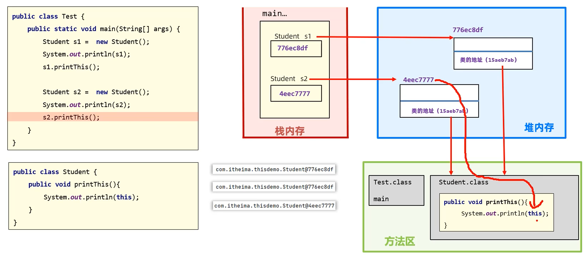

#### 5.3 this 有啥引用场景

+ this 主要用来**解决：变量名称冲突问题**

#### 代码实现

+ Test.java

```java
package n_thisdemo;

public class Test {
    public static void main(String[] args) {
        // 目标：认识this，拿捏this的应用场景
        Student s1 = new Student();
        System.out.println(s1); // n_thisdemo.Student@b4c966a
        s1.printTest(); // n_thisdemo.Student@b4c966a

        System.out.println("------------------");

        Student s2 = new Student();
        System.out.println(s2); // n_thisdemo.Student@2f4d3709
        s2.printTest(); // n_thisdemo.Student@2f4d3709

        Student s3 = new Student();
        s3.score = 325;
        s3.printPass(250); // 恭喜您，您成功考入了哈佛大学了~~~
    }
}

```

+ Student.java

```java
package n_thisdemo;

public class Student {
    double score;

    public void printTest() {
        System.out.println(this);
    }

    public void printPass(double score) {
        if(this.score > score){
            System.out.println("恭喜您，您成功考入了哈佛大学了~~~");
        }else {
            System.out.println("落选了~");
        }
    }
}

```

#### 总结

1. this 关键字是什么？
+ this 就是一个变量，可以用在方法中，用来拿到当前对象；哪个对象调用方法，this 就指向哪个对象，也就是拿到哪个对象

2. this 关键字在实际开发中常用来干啥？
+ 用来解决对象的成员变量与方法内部变量的名称一样时，导致访问冲突问题的


------------------------------------


### 6. 构造器

可以类比 python 构造函数（init）

#### 6.1 构造器是什么样子？

+ 构造器是一种特殊的方法，特殊之处在于名字必须与所在类的名字一模一样，而且不能写返回值类型
+ 只要参数列表不一样就可以写多个构造器

```java
public class Student {
    /** 构造器 */
    public Student() {
        ...
    }
}
```

#### 6.2 构造器有什么特点？

+ 创建对象时，对象会去调用构造器

```java
Student s = new Student();
```

#### 6.3 构造器的常见应用场景

+ 创建对象时，同时完成对对象成员变量（属性）的初始化赋值

#### 6.4 构造器的注意事项

+ 类在设计时，如果不写构造器，Java 是会为类自动生成一个无参数构造器的
+ 一旦定义了有参数构造器，Java 就不会帮我们的类自动生成无参数构造器了，此时就建议自己手写一个无参数构造器出来了

#### 代码实现

+ Student.java

```java
package o_constructor;

public class Student {
    String name;
    double score;

    // 无参数构造器
    public Student() {
        System.out.println("无参数构造器被触发执行了~~~");

    }

    // 有参数构造器
    public Student(String name, double score) {
        System.out.println("有参数构造器被触发执行了~~~");
        this.name = name;
        this.score = score;
    }
}

```

+ Teacher.java

```java
package o_constructor;

public class Teacher {
    public Teacher() {
    }

    public Teacher(String name) {

    }
}

```

+ Test.java

```java
package o_constructor;

public class Test {
    public static void main(String[] args) {
        // 目标：认识构造器，并掌握构造器的特点、应用场景、注意事项
        Student s = new Student("Feng", 99);

        Student s1 = new Student();
        s1.name = "张三";
        s1.score = 100;

        Student s2 = new Student("李四", 59); // 有参数构造器被触发执行了~~~
        System.out.println(s2.name); // 李四
        System.out.println(s2.score); // 59.0

        Teacher t = new Teacher(); // 这里明明没有写构造器，但是这里可以调，就说明，我们在设计这个老师类的时候如果你没有写构造器，Java会自动帮我们生成一个无参的构造器
        Teacher t1 = new Teacher("王五");
    }
}

```

#### 总结

1. 构造器长什么样子?

```java
public class Student {
    /** 构造器 */
    public Student() {
        ...
    }
}
```

2. 构造器在哪里调用，我们常用它来干嘛？

+ 对象创建时，我们可以指定对象去调用哪个构造器执行
+ 构造器常用于完成对象初始化（常用的应用场景是完成对象的成员变量的初始化赋值）

3. 构造器在使用时，有哪两个注意事项

+ 类在设计时，如果不写构造器，Java 会为类自动生成一个无参构造器
+ 一旦定义了有参构造器，Java 就不会帮我们的类生成无参构造器了，此时就建议自己手动写一个无参构造器出来了


-------------------------------


### 7. 封装

面向对象三大特征：封装、继承、多态

#### 7.1 什么是封装？

+ 就是用类设计对象处理某一个事物的数据时，应该把要处理的数据，以及处理这些数据的方法设计到一个对象中去

```java
public class Student {
    String name; // 姓名
    double chinese; // 语文成绩
    double math; // 数学成绩
    
    public void printTotalScore() {
        System.out.println(name + "同学的各科总分是：" + (chinese + math));
    }
    
    public void printAverageScore() {
        System.out.println(name + "各同学的各科平均分是：" + (chinese + math) / 2.0);
    }
}
```

封装设计规范：**合理隐藏、合理暴露**

什么意思呢？

+ 比如一个汽车里面有很多元器件，发动机、优先、悬挂等等，但汽车的设计者不会把这些全部暴露给你，把汽车的内部元器件都隐藏起来，外部只会暴露一些用户需要的成员给你，比如方向盘、启动按钮等等

#### 代码实现

+ Student.java

```java
package p_encapsulation;

public class Student {
    private double score;

    public void setScore(double score) {
        if (score >= 0 && score <= 100) {
            this.score = score;
        } else {
            System.out.println("数据非法~~~");
        }
    }

    public double getScore() {
        return score;
    }

    public void printPass() {
        System.out.println(score >= 60 ? "成绩及格" : "成绩不及格");
    }
}

```

+ Test.java

```java
package p_encapsulation;

public class Test {
    public static void main(String[] args) {
        // 目标：掌握封装的设计规范：合理隐藏、合理暴露
        Student s1 = new Student();
        s1.setScore(99);
        System.out.println(s1.getScore()); // 99.0
    }
}

```

#### 总结

1. 什么是封装？

+ 就是用类设计对象处理某一个事物的数据时，应该把要处理的数据，以及处理这些数据的方法，设计到一个对象中去

2. 封装的设计规范是什么样的？

+ **合理隐藏、合理暴露**

3. 代码层面如何控对象的成员公开或隐藏？

+ 公开成员，可以使用 `public` （公开）进行修饰
+ 隐藏成员，使用 `private` （私有，隐藏）进行修饰


------------------------------------


### 8. 实体 JavaBean

#### 8.1 什么是实体类？

+ 就是一种特殊形式的类

1. 这个类中的成员变量都要私有，并且要对外提供相应的 `getXxx`、`steXxx` 方法

2. 类中必须要有一个公共的无参的构造器

#### 8.2 实体类有什么应用场景？

我们在开发一个 Java 类时如果发现一个类承载的职责过多，也就是一个类里面即封装了存取数据相关的方法，又封装了处理数据相关的业务方法的时候。我们通常会对这些职责进行拆分，数据存储相关的方法交给一个 Java 类来处理，把数据处理相关的业务方法挪给另一个 Java 类中去管理，以实现数据和数据处理相分离

+ 实体类只负责数据存取，而对数据的处理交给其他类来完成，以实现数据和数据业务处理相分离

#### 代码实现

+ Student.java

```java
package q_javabean;

public class Student {
    // 1. 必须私有成员变量，并为每个成员变量提供get、set方法
    private String name;
    private double score;

    // 2. 必须为类提供一个公开的无参数构造器

    public Student() {
    }

    public Student(String name, double score) {
        this.name = name;
        this.score = score;
    }

    public String getName() {
        return name;
    }

    public void setName(String name) {
        this.name = name;
    }

    public double getScore() {
        return score;
    }

    public void setScore(double score) {
        this.score = score;
    }
}

```

+ StudentOperator.java

```java
package q_javabean;

public class StudentOperator {
    private Student student;

    public StudentOperator(Student student) {
        this.student = student;
    }

    public void printPass() {
        if (student.getScore() >= 60) {
            System.out.println(student.getName() + "学生成绩及格");
        } else {
            System.out.println(student.getName() + "学生成绩不及格");
        }
    }
}

```

+ Test.java

```java
package q_javabean;

public class Test {
    public static void main(String[] args) {
        // 目标：掌握实体类的书写要求、特点、应用场景
        Student s1 = new Student();
        s1.setName("张三");
        s1.setScore(99);
        System.out.println(s1.getName()); // 张三
        System.out.println(s1.getScore()); // 99.0

        StudentOperator operator = new StudentOperator(s1);
        operator.printPass(); // 张三学生成绩及格
    }
}

```

#### 总结

1. 什么是实体类？有啥特点？

+ 成员变量必须私有，且为他们提供 get、set 方法；必须有无参数构造器
+ 仅仅只是一个用来保存数据的 java 类，可以用它创建对象，保存某个事物的数据

2. 实体类有啥应用场景？

+ 实体类对应的是软件开发里现在比较流行的开发方式，数据和数据的业务处理相分离


--------------------------------------------


### 9. 面向对象编程综合案例

#### 模仿电影信息系统

> 需求：
>
> + 展示系统中的全部电影（每部电影展示：名称、价格）
> + 允许用户根据电影编号（id）查询出某个电影的详细信息

#### 代码实现

+ Movie.java

```java
package r_demo;

public class Movie {
    private int id;
    private String name;
    private double price;

    public String getName() {
        return name;
    }

    public void setName(String name) {
        name = name;
    }

    private double score;
    private String director;
    private String actor;
    private String info;

    public Movie() {
    }

    public Movie(int id, String name, double price, double score, String director, String actor, String info) {
        this.id = id;
        this.name = name;
        this.price = price;
        this.score = score;
        this.director = director;
        this.actor = actor;
        this.info = info;
    }

    public int getId() {
        return id;
    }

    public void setId(int id) {
        this.id = id;
    }

    public double getPrice() {
        return price;
    }

    public void setPrice(double price) {
        this.price = price;
    }

    public double getScore() {
        return score;
    }

    public void setScore(double score) {
        this.score = score;
    }

    public String getDirector() {
        return director;
    }

    public void setDirector(String director) {
        this.director = director;
    }

    public String getActor() {
        return actor;
    }

    public void setActor(String actor) {
        this.actor = actor;
    }

    public String getInfo() {
        return info;
    }

    public void setInfo(String info) {
        this.info = info;
    }
}

```

+ MovieOperator.java

```java
package r_demo;

public class MovieOperator {
    private Movie[] movies;
    public MovieOperator(Movie[] movies){
        this.movies = movies;
    }

    // 1. 展示系统全部电影信息
    public void printAllMovie(){
        System.out.println("--------系统全部电影信息如下------");
        for (int i = 0; i < movies.length; i++){
            Movie m = movies[i];
            System.out.println("编号：" + m.getId());
            System.out.println("名称：" + m.getName());
            System.out.println("价格：" + m.getPrice());
            System.out.println("-------------------------");
        }
    }

    // 2. 根据电影的编号查询出该电影的详细信息并展示
    public void searchMovieById(int id){
        for (int i = 0; i < movies.length; i++){
            Movie m = movies[i];
            if (m.getId() == id){
                System.out.println("该电影详情如下：");
                System.out.println("编号：" + m.getId());
                System.out.println("名称：" + m.getName());
                System.out.println("价格：" + m.getPrice());
                System.out.println("得分：" + m.getScore());
                System.out.println("导演：" + m.getDirector());
                System.out.println("主演：" + m.getActor());
                System.out.println("其他信息：" + m.getInfo());
                return; // 已经找到电影详细，没有必要再执行了
            }
        }
        System.out.println("没有该电影信息~~~");
    }
}

```

+ Test.java

```java
package r_demo;

import java.util.Scanner;

/**
 * 目标：完成电影信息展示功能：根据电影id查询该电影详情
 * 电影数据：
 * 1, "水门桥", 38.9, 9.8, "徐克", "吴京", "12万人想看"
 * 2, "出拳吧", 39, 7.8, "唐晓白", "田雨", "3.5万人想看"
 * 3, "月球陨落", 42, 7.9, "罗兰", "贝瑞", "17.9万人想看"
 * 4, "一点就到家", 35, 8.7, "徐安宇", "刘昊然", "10.8万人想看"
 */
public class Test {
    public static void main(String[] args) {
        // 1. 设计一个电影类
        // 2. 设计一个电影的操作类
        // 3. 准备全部电影信息
        Movie[] movies = new Movie[4];
        movies[0] = new Movie(1, "水门桥", 38.9, 9.8, "徐克", "吴京", "12万人想看");
        movies[1] = new Movie(2, "出拳吧", 39, 7.8, "唐晓白", "田雨", "3.5万人想看");
        movies[2] = new Movie(3, "月球陨落", 42, 7.9, "罗兰", "贝瑞", "17.9万人想看");
        movies[3] = new Movie(4, "一点就到家", 35, 8.7, "徐安宇", "刘昊然", "10.8万人想看");
        // 4. 创建一个电影操作类的对象，接收电影数据，并对其进行业务处理
        MovieOperator operator = new MovieOperator(movies);
//        operator.printAllMovie();
//        operator.searchMovieById(3);

        Scanner sc = new Scanner(System.in);
        while (true) {
            System.out.println("==电影信息系统==");
            System.out.println("1. 查询全部电影信息");
            System.out.println("2. 根据id查询某个电影的详细信息展示");
            System.out.println("请您输入操作命令：");

            int command = sc.nextInt();
            switch (command) {
                case 1:
                    // 展示全部电影信息
                    operator.printAllMovie();
                    break;
                case 2:
                    // 根据id查询某个电影的详细信息
                    System.out.println("请您输入要查询的电影id：");
                    int id = sc.nextInt();
                    operator.searchMovieById(id);
                    break;
                default:
                    System.out.println("您输入的命令有问题~~~");
            }
        }
    }
}

```


-------------------------------------------


### 10. 补充知识：成员变量、局部变量的区别

| 区别         | 成员变量（对象的属性，Field） | 局部变量                                   |
| ------------ | ----------------------------- | ------------------------------------------ |
| 类中位置不同 | 类中，方法外                  | 常见于方法中                               |
| 初始化值不同 | 有默认值，不需要初始化赋值    | 没有默认值，使用之前必须完成赋值           |
| 内存位置不同 | 堆内存                        | 栈内存                                     |
| 作用域不同   | 整个对象                      | 在所归属的大括号中                         |
| 生命周期不同 | 与对象共存亡                  | 随着方法的调用而生，随着方法的运行结束而亡 |
| 作用域       |                               | 在所归属的大括号中                         |


-----------------------------------------


### 总结

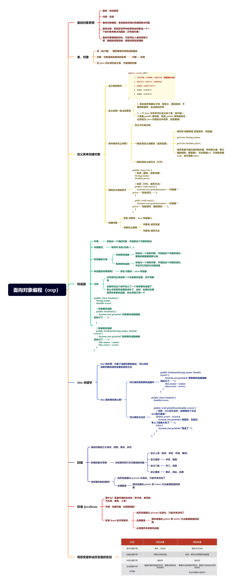


----------------------------------------------


## 七、常用 API

API（全称 Application Programming Interface：应用程序编程接口）

就是别人写好的一些代码，给咱们程序员直接拿去调用即可解决问题的

+ Java 提供了哪些 API 给咱们使用呢？
  + API 文档

+ 为什么要先学习包？
  + 包是分门别类管理程序的
  + **别人写好的程序通常都在别人的包里面！**

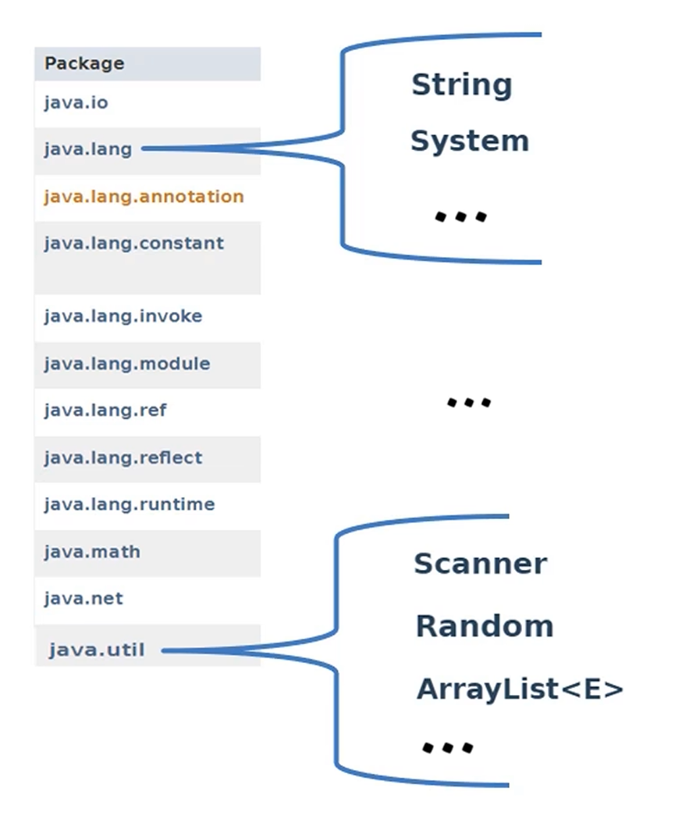

### 1. 包

什么是包？
+ 包是用来分门别类地管理各种不同程序的，类似于文件夹，建包有利于程序的管理和维护
+ 建包的语法格式：
  + Idea 会帮我们自动建


```java
package com.itfeng.javabean;
public class Student {
    
}
```


**在自己程序中调用其他包下的程序的注意事项**

+ 如果当前程序中，要调用自己所在包下的其他程序，可以直接调用（**同一个包下的类，互相可以直接调用**）
+ 如果当前程序中，要调用其他包下的程序，则必须在当前程序中导包，才可以访问！**导包格式：`import 包名.类名;`**
+ 如果当前程序中，要调用 Java 提供的程序，也需要先导包才可以使用；但是 Java.lang 包下的程序是不需要我们导包的，可以直接使用
+ 如果当前程序中，要调用多个不同包下的程序，而这些程序名正好一样，此时默认只能导入一个程序，另一个程序必须带包名访问

#### 代码演示

+ s_pkg.itcast.Demo1.java

```java
package s_pkg.itcast;

public class Demo1 {
    public void print() {
        System.out.println("Hello World2");
    }
}

```

+ s_pkg.itcast.Demo2.java

```java
package s_pkg.itcast;

public class Demo2 {
    public void print() {
        System.out.println("itcast");
    }
}

```

+ s_pkg.itfeng.Demo2.java

```java
package s_pkg.itfeng;

public class Demo2 {
    public void print() {
        System.out.println("itfeng");
    }
}

```

+ s_pkg.Demo.java

```java
package s_pkg;

public class Demo {
    public void print() {
        System.out.println("Hello World");
    }
}

```

+ s_pkg.Test.java

```java
package s_pkg;

import s_pkg.itcast.Demo1;
import s_pkg.itfeng.Demo2;

import java.util.Random;
import java.util.Scanner;

public class Test {
    public static void main(String[] args) {
        // 1. 同一个包下的程序，可以直接访问
        Demo d = new Demo();
        d.print(); // Hello World

        // 2. 访问其他包下的程序，必须导包才可以访问
        Demo1 d2 = new Demo1();
        d2.print(); // Hello World2

        // 3. 自己的程序中调用Java提供的程序，也需要先导包才可以使用；但是Java.lang包下的程序是不需要我们导包的，可以直接使用
        Scanner sc = new Scanner(System.in);
        String s = "Feng";
        Random r = new Random();


        // 4. 访问多个不同包下的程序，而这些程序名正好一样，此时默认只能导入一个程序，另一个程序必须带包名访问
        Demo2 d3 = new Demo2();
        d3.print(); // itfeng

        s_pkg.itcast.Demo2 d4 = new s_pkg.itcast.Demo2();
        d4.print(); // itcast
    }
}

```


------------------------------


### 2. String

#### 2.1 String 概述

`java.lang.String` 代表字符串

对字符串处理的步骤：
1. 创建对象
2. 封装字符串数据
3. 调用 String 的方法

+ 方式一：Java 程序中的所有字符串文字（例如 "abc"）都为此类的对象

```java
String name = "张三";
String schoolName = "FengSchool";
```

+ 方式二：调用 String 类的构造器初始化字符串对象（字符串拼接）

| 构造器                         | 说明                                   |
| ------------------------------ | -------------------------------------- |
| public String()                | 创建一个空白字符串，不含有任何内容     |
| public String(String original) | 根据传入的字符串内容，来创建字符串对象 |
| public String(char[] chars)    | 根据字符串数组的内容，来创建字符串对象 |
| public String(byte[] bytes)    | 根据字节数组的内容，来创建字符串对象   |

##### 代码演示

```java
package t_string;

public class StringDemo1 {
    public static void main(String[] args) {
        // 目标：掌握创建String对象，并封装要处理的字符串的两种方式
        // 1. 直接双引号得到字符串对象，并封装字符串数据
        String name = "itfeng";
        System.out.println(name); // itfeng

        // 2. new String创建字符串对象，并调用构造器初始化字符串
        String rs1 = new String();
        System.out.println(rs1); // ""

        String rs2 = new String("itfeng"); // 不太推荐
        System.out.println(rs2); // itfeng

        char[] chars = {'a', '哈', '嘿'};
        String rs3 = new String(chars); // a哈嘿
        System.out.println(rs3);

        byte[] bytes = {97, 98, 99};
        String rs4 = new String(bytes);
        System.out.println(rs4); // abc
    }
}

```

##### 总结

1. String 是什么，可以做什么？

+ 代表字符串，可以用来创建对象封装字符串数据，并对其进行处理

2. String 类创建对象封装字符串数据的方式有几种？

+ 方式一：直接使用双引号 `"..."`
+ 方式二：new String 类，调用构造器初始化字符串对象


-----------------------------------


#### 2.2 String 的常用方法

| 方法名                                                       | 说明                                                     |
| ------------------------------------------------------------ | -------------------------------------------------------- |
| public int length()                                          | 获取字符串的长度返回（就是字符个数）                     |
| public char charAt(int index)                                | 获取某个索引位置处的字符返回                             |
| public char[] toCharArray():                                 | 将当前字符串转换成字符数组返回                           |
| public boolean equals(Object anObject)                       | 判断当前字符串与另一个字符串的内容一样，一样返回 true    |
| public boolean equalsIgnoreCase(String anotherString)        | 判断当前字符串与另一个字符串的内容是否一样（忽略大小写） |
| public String substring(int beginIndex, int endIndex)        | 根据开始和结束索引进行截取，得到新的字符串（包前不包后） |
| public String substring(int beginIndex)                      | 从传入的索引处截取，截取到末尾，得到新的字符串返回       |
| public String replace(CharSequence target, CharSequence replacement) | 使用新值，将字符串中的旧值替换，得到新的字符串           |
| public boolean (CharSequence s)                              | 判断字符串中是否包含了某个字符串                         |
| public boolean startsWith(String prefix)                     | 判断字符串是否以某个字符串内容开头，开头返回 true，反之  |
| public String[] split(String regex)                          | 把字符串按照某个字符串内部分割，并返回字符串数组回来     |

##### 代码演示

```java
package t_string;

public class StringDemo2 {
    public static void main(String[] args) {
        // 目标：快速熟悉String提供的处理字符串的常用方法
        String s = "FengJava";
        // 1. 获取字符串的长度
        System.out.println(s.length()); // 8

        // 2. 提取字符串中某个索引位置处的字符
        char c = s.charAt(1);
        System.out.println(c); // e

        // 字符串的遍历
        for (int i = 0; i < s.length(); i++) {
            char ch = s.charAt(i);
            System.out.println(ch);
        }

        System.out.println("----------------------------");

        // 3. 把字符串转换成字符数组，再进行遍历
        char[] chars = s.toCharArray();
        for (int i = 0; i < chars.length; i++) {
            System.out.println(chars[i]);
        }

        // 4. 判断字符串内容，内容一样就返回true
        String s1 = new String("feng");
        String s2 = new String("feng");
        System.out.println(s1.equals(s2)); // true

        // 5. 忽略大小写比较字符串内容
        String c1 = "34AeFG";
        String c2 = "34aEfg";
        System.out.println(c1.equals(c2)); // false
        System.out.println(c1.equalsIgnoreCase(c2)); // true

        // 6. 截取字符串内容（包前不包后）
        String s3 = "Java是最好的编程语言之一";
        String rs = s3.substring(0, 8);
        System.out.println(rs); // Java是最好的

        // 7. 从当前索引位置一直获取到字符串的末尾
        String rs2 = s3.substring(5);
        System.out.println(rs2); // 最好的编程语言之一

        // 8. 把字符串中的某个内容替换成新内容，并返回新的字符串对象给我们
        String info = "这个电影简直就是个垃圾，垃圾电影";
        String rs3 = info.replace("垃圾", "**");
        System.out.println(rs3); // 这个电影简直就是个**，**电影

        // 9. 判断字符串中是否包含某个关键字
        String info2 = "Java是最好的编程语言之一，我爱Java，Java不爱我！";
        System.out.println(info2.contains("Java")); // true
        System.out.println(info2.contains("java")); // false

        // 10. 判断字符串是否以某个字符串开头
        String rs4 = "张三丰";
        System.out.println(rs4.startsWith("张")); // true
        System.out.println(rs4.startsWith("张三")); // true

        // 11. 把字符串按照某个指定内容分割成多个字符串，放到一个字符串数组中返回给我们
        String rs5 = "张无忌，周芷若，殷素素，赵敏";
        String[] names = rs5.split("，");
        for (int i = 0; i < names.length; i++) {
            System.out.println(names[i]);
        }
    }
}

```


------------------------


#### 2.3 String 使用时的注意事项

##### 第一点

+ String 对象的内容不可改变，被称为不可变字符串对象

但是：

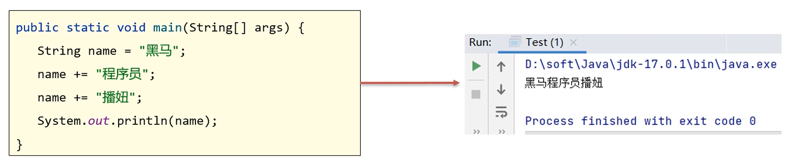

name 指向的字符串对象确实变了啊，那为什么还说 String 的对象都是不可变字符串对象？

看执行流程：

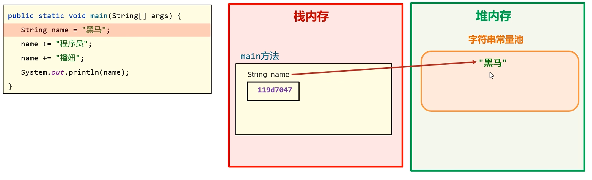

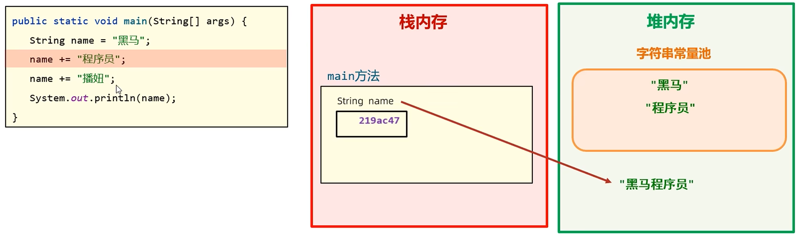

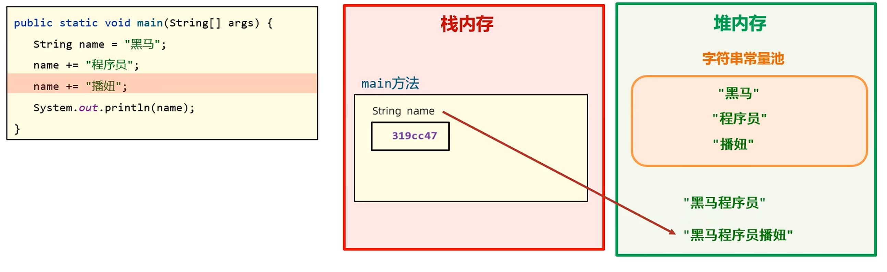

**结论：每次试图改变字符串对象实际上是新产生了新的字符串对象，变量每次都是指向了新的字符串对象，之前字符串对象的内容确实是没有改变的，因此说 String 的对象是不可变的**

+ 其实就是地址不会发生变化


##### 第二点

+ 只要是以 "..." 方式写出的字符串对象，会存储到字符串常量池，且相同内容的字符串只能存储一份
  + Java 为什么这么设计？
    + 节约内存


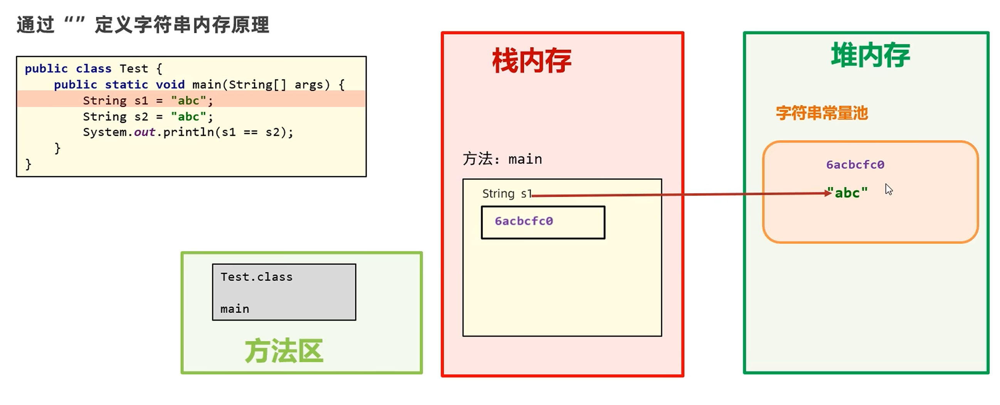

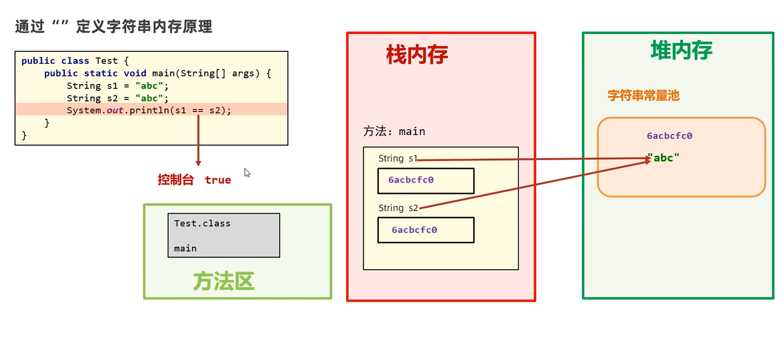

+ 但通过 new 方式创建字符串对象，每 new 以此都会产生一个新的对象放在堆内存中

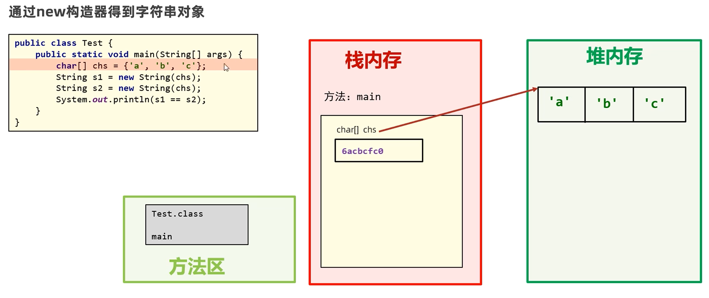

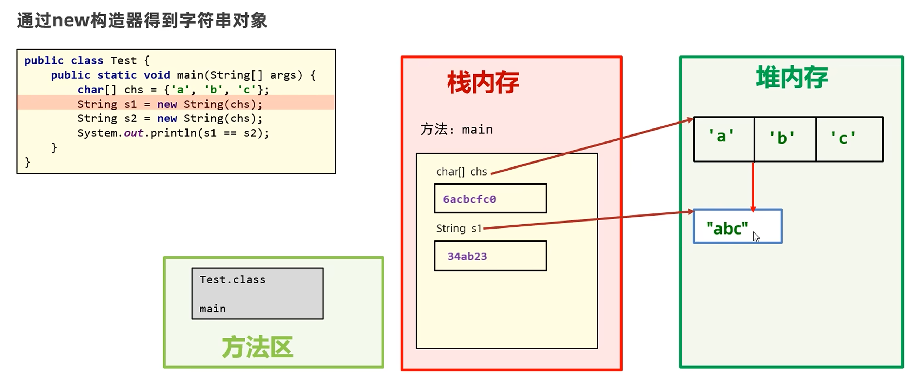

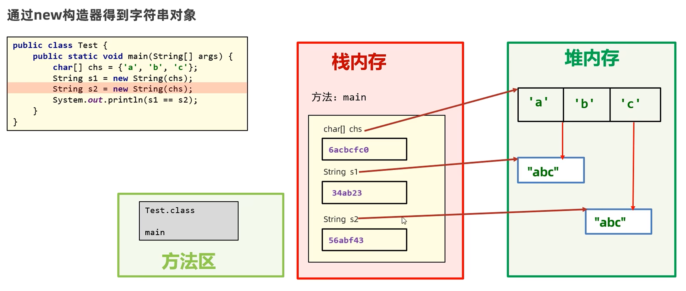

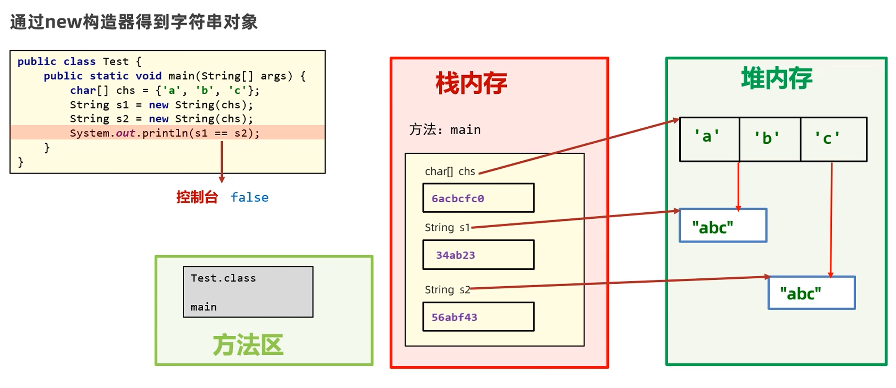


###### 代码演示

```java
package t_string;

public class StringDemo3 {
    public static void main(String[] args) {
        // 1. 只要是以双引号给出的字符串对象，存储在常量池中，而且内容相同时只会存储一份
        String s1 = "abc";
        String s2 = "abc";
        System.out.println(s1 == s2); // true

        // 2. new String创建字符串对象，每次new出来的收拾一个新对象，放在堆内存中
        char[] chars = {'a', 'b', 'c'};
        String a1 = new String(chars);
        String a2 = new String(chars);
        System.out.println(a1 == a2); // false
    }
}
```

##### 总结

1. String 有哪几点注意事项？

+ String 是不可变字符串对象
+ 只要是以 "..." 方式写出的字符串对象，会存储到字符串常量池，且相同内容的字符串只存储一份
+ 但通过 new 方式创建字符串对象，每 new 以此都会产生一个新的对象放在堆内存中

##### 题目

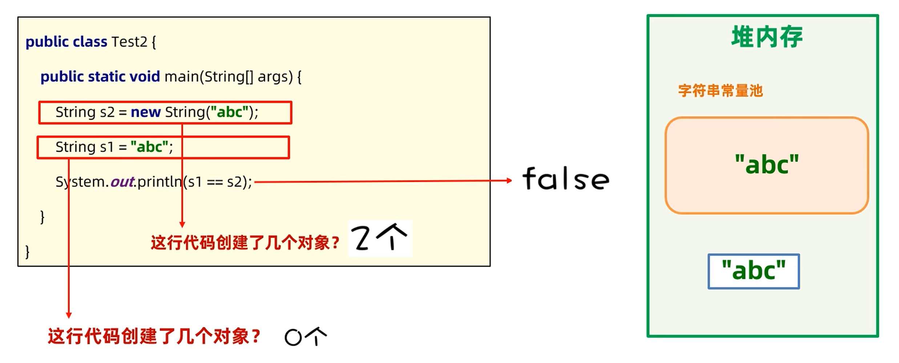

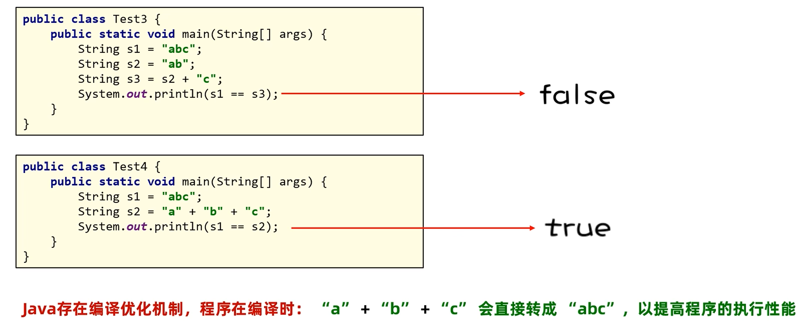


-----------------------


#### 2.4 String 的应用案例

##### 2.4.1 案例一

> 需求
>
> + 系统正确的登录名和密码是：itfeng/123456，请在控制台开发一个登录页面，接收用户输入的登录名和密码，判断用户是否登录成功，登录成功后展示：“欢迎进入系统！”，即可停止程序
> + 注意：要求最多给用户三次登录机会

步骤：

1. 开发登录页面，提示用户通过键盘输入登录名和密码
1. 设计一个登录方法，对用户的登录名和密码进行正确性认证
1. 根据登录方法返回的认证结果，判断用户是否登陆成功
1. 使用循环控制登录界面最多显示3次

+ 代码实现

```java
package t_string;

import java.util.Scanner;

/**
 * 目标：完成用户的登录案例
 */

public class StringTest4 {
    public static void main(String[] args) {
        // 1. 开发登录页面，提示用户通过键盘输入登录名和密码
        for (int i = 0; i < 3; i++) {
            Scanner sc = new Scanner(System.in);
            System.out.println("请您输入登录名称：");
            String loginName = sc.next();
            System.out.println("请您输入登录密码：");
            String passWord = sc.next();

            // 5. 开始调用登录方法，判断是否登录成功
            boolean rs = login(loginName, passWord);
            if (rs) {
                System.out.println("恭喜您，欢迎进入系统~~~");
                break;
            } else {
                System.out.println("登录名或者密码错误，请您确认~~~");
            }
        }
    }

    /**
     * 2. 开发一个登录方法，接收用户的登录名和密码，返回认证的结果
     */
    public static boolean login(String loginName, String passWord) {
        // 3. 准备一份系统正确的登录名和密码
        String okLoginName = "itfeng";
        String okPassWord = "123456";

        // 4. 开始真是判断用户是否登录成功
//        if (okLoginName.equals(loginName) && okPassWord.equals(passWord)) {
//            // 登录成功的
//            return true;
//        } else {
//            return false;
//        }
        return (okLoginName.equals(loginName) && okPassWord.equals(passWord));
    }
}

```

+ 总结

1. 字符串的比较使用 `==` 比较好吗？为什么？什么时候使用 `==` ？

+ 不好，对于字符串对象的比较，`==` 比较的是地址，容易出业务 bug
+ 基本数据类型的变量或者值应该使用 `==` 比较

2. 开发中比较字符串推荐使用什么方式比较？

+ 使用 String 提供的 `equals` 方法，它只关心字符串内容一样就返回 true

##### 2.4.2 案例二

> 需求
>
> + 实现随机产生验证码，验证码的每位可能是数字、大写字母、小写字母

分析：

1. 设计一个方法，该方法接收一个整型参数，最终要返回对应位数的随机验证码
2. 方法内定义2个字符串变量：1个用来记住生成的验证码，1个用来记住要用到的全部字符
3. 定义 for 循环控制生成多少位随机字符，每次得到一个字符范围内的随机索引，根据索引提取该字符，把该字符交给 code 变量连接起来，循环结束后，在循环外返回code即可
4. 主程序中，调用该方法即可得到随机验证码了

+ 代码实现

```java
package t_string;

import java.util.Random;

public class StringTest5 {
    public static void main(String[] args) {
        System.out.println(createCode(4));
        System.out.println(createCode(6));

    }

    /**
     * 1. 设计一个方法，返回指定位数的验证码
     * */
    public static String createCode(int n){
        // 2. 定义2个变量，一个是记住最终产生的随机验证码，一个是记住可能用到的全部字符
        String code = "";
        String data = "abcdefghijklmnopqrstuvwxyz1234567890";

        Random r = new Random();
        // 3. 开始定义一个循环产生每位随机字符
        for (int i = 0; i < n; i++) {
            // 4. 随机一个字符范围内的索引
            int index = r.nextInt(data.length());
            code += data.charAt(index); // code = code + 字符
        }
        // 6. 返回code即可
        return code;
    }
}
```


----------------------------


### 3. ArrayList

#### 3.1 ArrayList 快速入门

什么是集合？

+ 集合是一种容器，用来装数据的，类似于数组


有数组，为什么还要学习集合？

+ 数组定义完成并启动后，**长度就固定了**，对于经常要增删元素的业务场景数组是不太合适的
+ 集合大小可变，开发中用的更多

ArrayList：
1. 会提供创建容器对象的方式
2. 会提供相应的方法对容器进行操作（增删改查）
+ 添加数据
+ 删除某个数据
+ 修改某个数据
+ 获取某个数据

ArrayList<E>

+ 是用的最多、最常见的一种集合

| 构造器             | 说明                 |
| ------------------ | -------------------- |
| public ArrayList() | 创建一个空的集合对象 |

| 常用方法名                            | 说明                                   |
| ------------------------------------- | -------------------------------------- |
| public boolean add(E e)               | 将指定的元素添加到此集合的末尾         |
| public void add(int index, E element) | 在此集合中的指定位置插入指定的元素     |
| public E get(int index)               | 返回指定索引处的元素                   |
| public int size()                     | 返回集合中的元素的个数                 |
| public E remove(int index)            | 删除指定索引处的元素，返回被删除的元素 |
| public boolean remove(Object o)       | 删除指定的元素，返回删除是否成功       |
| public E set(int index, E element)    | 修改指定索引处的元素，返回被修改的元素 |

##### 代码演示

```java
package u_arraylist;

import java.util.ArrayList;

/**
 * 目标：要求掌握如何创建ArrayList集合的对象，并熟悉ArrayList提供的常用方法
 */

public class ArrayListDemo1 {
    public static void main(String[] args) {
        // 1. 创建一个ArrayList的集合对象
        ArrayList list = new ArrayList();
        // 从jdk 1.7开始才支持
//        ArrayList<String> list = new ArrayList();
        list.add("feng");
        list.add(666);
        list.add(99.5);
        list.add("张三");
        list.add("feng");
        System.out.println(list); // [feng, 666, 99.5, 张三, feng]

        // 2. 在集合中的某个索引位置处添加一个数据
        list.add(1, "MySQL");
        System.out.println(list); // [feng, MySQL, 666, 99.5, 张三, feng]

        // 3. 根据索引获取集合中某个索引位置处的值
        System.out.println(list.get(1)); // MySQL

        // 4. 获取集合的大小（返回集合中存储的元素个数）
        System.out.println(list.size()); // 6

        // 5. 根据索引删除集合中的某个元素值，会返回被删除的元素值给我们
        System.out.println(list.remove(1)); // MySQL
        System.out.println(list); // [feng, 666, 99.5, 张三, feng]

        // 6. 直接删除某个元素值，删除成功会返回true，反之
        System.out.println(list.remove("张三")); // true
        System.out.println(list); // [feng, 666, 99.5, feng]
        // 默认删除的是第一次出现的数据
        System.out.println(list.remove("feng")); // true
        System.out.println(list); // [666, 99.5, feng]

        // 7. 修改某个索引位置处的数据，修改后会返回原来的值给我们
        System.out.println(list.set(1, "itfeng")); // 99.5
        System.out.println(list); // [666, itfeng, feng]
    }
}
```

##### 总结

1. 集合是什么，有什么特点？

+ 一种容器，用来存储数据的
+ 集合的大小可变


2. ArrayList 是什么？怎么使用？

+ 是集合中最常用的一种，ArrayList 是泛型类，可以约束存储的数据类型
+ 创建对象，调用无参数构造器初始化对象：`public ArrayList();`
+ 调用相应的增删改查数据的方法

3. ArrayList 提供了哪些常用方法？
| 常用方法名                            | 说明                                   |
| ------------------------------------- | -------------------------------------- |
| public boolean add(E e)               | 将指定的元素添加到此集合的末尾         |
| public void add(int index, E element) | 在此集合中的指定位置插入指定的元素     |
| public E get(int index)               | 返回指定索引处的元素                   |
| public int size()                     | 返回集合中的元素的个数                 |
| public E remove(int index)            | 删除指定索引处的元素，返回被删除的元素 |
| public boolean remove(Object o)       | 删除指定的元素，返回删除是否成功       |
| public E set(int index, E element)    | 修改指定索引处的元素，返回被修改的元素 |


----------------------------------


#### 3.2 ArrayList 应用案例

> 需求：
>
> + 现在假设购物车中存储了如下这些商品：Java 入门，宁夏枸杞，黑枸杞，人字拖，特技枸杞，枸杞子。现在用户不想买枸杞，选择了批量删除，请完成该需求

分析：

1. 后台使用 ArrayList 集合表示购物车，存储这些商品名
2. 遍历集合中的每个数据，只要这个数据包含了 "枸杞" 则删除它
3. 输出集合看是否已经成功删除了全部枸杞数据了

##### 代码实现

```java
package u_arraylist;

import java.util.ArrayList;

/**
 * 目标：掌握从集合容器中找数据并删除的技巧
 */

public class ArrayListDemo2 {
    public static void main(String[] args) {
        ArrayList<String> list = new ArrayList();
        list.add("Java入门");
        list.add("宁夏枸杞");
        list.add("黑枸杞");
        list.add("人字拖");
        list.add("特级枸杞");
        list.add("枸杞子");
        System.out.println(list); // [Java入门, 宁夏枸杞, 黑枸杞, 人字拖, 特级枸杞, 枸杞子]

        // 2. 开始完成需求：从集合中找出包含枸杞的数据并删除它
//        for (int i = 0; i < list.size(); i++) {
//            // 取出当前遍历到的数据
//            String ele = list.get(i);
//            // 判断这个数据中包含枸杞
//            if (ele.contains("枸杞")){
//                // 直接从集合中删除该数据
//                list.remove(ele);
//            }
//        }
//        System.out.println(list); // [Java入门, 黑枸杞, 人字拖, 枸杞子]

        // 方式一：每次删除一个数据后，就让i往左退一步
//        for (int i = 0; i < list.size(); i++) {
//            // 取出当前遍历到的数据
//            String ele = list.get(i);
//            // 判断这个数据中包含枸杞
//            if (ele.contains("枸杞")) {
//                // 直接从集合中删除该数据
//                list.remove(ele);
//                i--;
//            }
//        }
//        System.out.println(list); // [Java入门, 人字拖]
        
        // 方式二：从集合的后面倒着遍历并删除
        for (int i = list.size() - 1; i >= 0; i--) {
            // 取出当前遍历到的数据
            String ele = list.get(i);
            // 判断这个数据中包含枸杞
            if (ele.contains("枸杞")) {
                // 直接从集合中删除该数据
                list.remove(ele);
            }
        }
        System.out.println(list); // [Java入门, 人字拖]
    }
}

```

##### 总结

1. 从集合中遍历元素，并筛选出元素删除它，应该如何操作才能不出 bug？

+ 方式一：每次删除一个数据后，索引 - 1
+ 方式二：从集合后面遍历然后删除，可以避免漏掉元素


-------------------------------


#### ArrayList 综合案例

模仿外面系统中的商家系统

> 需求：
>
> + 完成菜品的上架、以及菜品信息浏览功能

目标：

+ 使用所学的 ArrayList 集合结合面向对象编程实现以上2个需求

##### 代码实现

+ Food.java
```java
package u_arraylist;

public class Food {
    private String name;
    private double price;
    private String desc; // 描述

    public Food() {
    }

    public Food(String name, double price, String desc) {
        this.name = name;
        this.price = price;
        this.desc = desc;
    }

    public String getName() {
        return name;
    }

    public void setName(String name) {
        this.name = name;
    }

    public double getPrice() {
        return price;
    }

    public void setPrice(double price) {
        this.price = price;
    }

    public String getDesc() {
        return desc;
    }

    public void setDesc(String desc) {
        this.desc = desc;
    }
}

```

+ FoodOperator.java

```java
package u_arraylist;

import java.util.ArrayList;
import java.util.Scanner;

/**
 * 菜品操作类：负责上架和浏览功能的实现
 */

public class FoodOperator {
    // 1. 定义一个ArrayList集合对象，负责存储菜品对象的信息
    private ArrayList<Food> foodList = new ArrayList<>();
    // foodList = []

    // 2. 开发功能：上架菜品功能
    public void addFood() {
        // 3. 创建一个菜品对象，封装上架的菜品信息
        Food f = new Food();

        // 4. 录入菜品信息进去
        Scanner sc = new Scanner(System.in);
        System.out.println("请您输入该菜品名称：");
        String name = sc.next();
        f.setName(name);

        System.out.println("请您输入该菜品价格：");
        double price = sc.nextDouble();
        f.setPrice(price);

        System.out.println("请您输入该菜品描述：");
        String desc = sc.next();
        f.setDesc(desc);

        // 5. 把菜品对象存入到集合中去
        foodList.add(f);
        System.out.println("上架成功！");
    }

    // 6. 展示菜品
    public void showAllFood() {
        if (foodList.size() == 0) {
            System.out.println("什么菜品都没有，先去上架");
            return;
        }
        for (int i = 0; i < foodList.size(); i++) {
            Food f = foodList.get(i);
            System.out.println(f.getName());
            System.out.println(f.getPrice());
            System.out.println(f.getDesc());
            System.out.println("---------------------");
        }
    }

    // 负责展示操作界面
    public void start() {
        while (true) {
            System.out.println("请选择功能");
            System.out.println("1. 上架菜品");
            System.out.println("2. 展示菜品");
            System.out.println("3. 退出");

            Scanner sc = new Scanner(System.in);
            System.out.println("请选择您的操作：");
            String command = sc.next();
            switch (command) {
                case "1":
                    addFood();
                    break;
                case "2":
                    showAllFood();
                    break;
                case "3":
                    System.out.println("下次再来哦~~~");
                    return; // 干掉方法
                default:
                    System.out.println("您输入的命令不存在！");
            }
        }
    }
}

```

+ ArrayListTest3.java

```java
package u_arraylist;

import java.util.ArrayList;

public class ArrayListTest3 {
    public static void main(String[] args) {
        // 目标：完成拓展案例：商家菜品上架操作
        // 1. 设计一个菜品类，负责创建菜品对象，封装菜品数据
        // 2. 设计一个菜品操作类FoodOperator，负责完成对菜品的业务实现：上架，浏览信息
        FoodOperator operator = new FoodOperator();
        operator.start();
    }
}

```


---------------------------------


### 总结

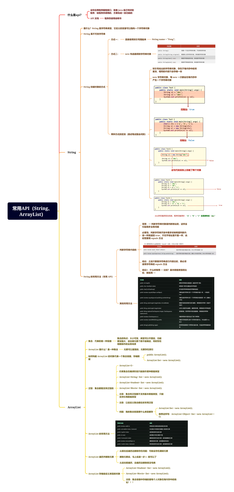


----------------------------------


## 八、项目实战 - ATM 系统

+ 技术选型

1. 面向对象编程 - 每个账户都是一个账户对象；所以需要设计账户类 Account，用于创建账户对象封装账户信息。ATM 同样是一个对象，需要设计 ATM 类，代表 ATM 管理系统，负责对账户的处理
2. 使用集合容器 - ATM管理类中需要提供一个容器用于存储系统全部账户对象的信息，我们选 ArrayList 集合
3. 程序流程控制 - 需要结合分支、循环、跳转关键字等程序流程控制的知识，用来控制系统的业务流程
4. 使用常见 API - 登录信息的内容比较、数据的分析、处理等都需要常用 API 来解决，如使用 String

### 1. 系统架构的搭建

1. 定义一个账户类 Account，至少需要包含（卡号、姓名、性别、密码、余额、每次取现额度）
2. 定义一个 ATM 类，用来代表 ATM 系统，负责提供所有的业务需求，比如：展示 ATM 的系统欢迎页、开通账户、转账......
3. 定义一个测试类 Test，负责对我们开发的 ATM 系统进行测试

#### 系统欢迎页设计

+ 在 ATM 类中设计一个方法 start()，方法里负责展示欢迎界面

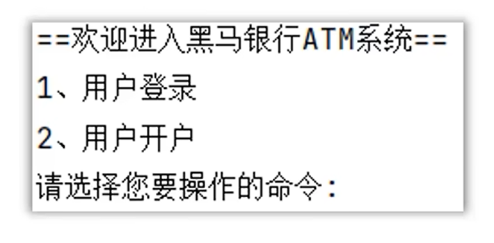

#### 总结

1. 咱们 ATM 系统的架构是怎么样的？

+ 定义了一个账户类 Account，定义系统关心的账户信息
+ 定义了一个 ATM 类，代表 ATM 系统，负责处理账户相关的业务需求
+ 定义了一个 Test 类，负责测试系统：创建 ATM 对象代表 ATM 系统并启动

2. ATM 类中使用什么来存储系统全部用户的账户信息？

```java
private ArrayList<Account> accounts = new ArrayList<>();
```


-----------------------------


### 2. 用户开户功能

+ 就是新增一个账户，也就是往系统的账户集合中添加一个账户对象

#### 账户的要求

+ 用户信息包含：姓名、性别、密码、每次取现额度、卡号
+ **注意：卡号由系统生成，要求是8位的数字组成的（且卡号不能重复）**

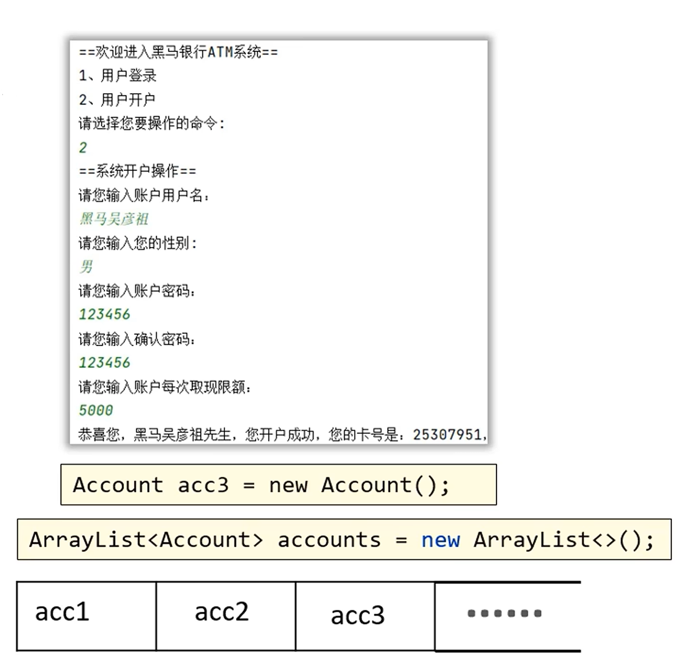

##### 总结

1. 开户功能的实现需要哪几步操作？

+ 定义一个开户方法：createAccount
+ 在方法里创建一个 Account 账户对象，负责封装用户的账户信息（姓名、性别、密码、卡号等等）
+ 卡号需要由系统自动生成（**卡号要求是8位的数字组成的，且不能重复**）
+ 把账户对象存入到账户集合中去
+ 提示开户成功

#### 为新开户的账户生成一个新卡号

+ 新卡号要求是一个8位的数字，且不能与其他账户对象的卡号重复
+ 新卡号得到后，需要赋值给当前账户对象

##### 总结

1. 账户的新卡号是如何生成的？

+ 定义了一个方法：createCardId()，用来返回一个不重复的新卡号
+ 方法里，使用循环生成了8个随机的数字连起来作为卡号

+ 接着判断该卡号是否与其他账户的卡号重复
+ 根据该卡号去账户集合中查询账户对象，如果没有查询到账户对象，该卡号不重复，即可返回
+ 如果查询到了账户对象，则使用循环重复以上（2、3、4）步操作


----------------------------------


### 3. 用户登录功能

1. 如果系统没有任何账户对象则不允许登录
2. 让用户输入卡号，先判断卡号是否正确，如果不正确要给出提示
3. 如果卡号正确，再让用户输入账户密码，如果密码不正确要给出提示，如果密码也正确，则给出登录成功的提示

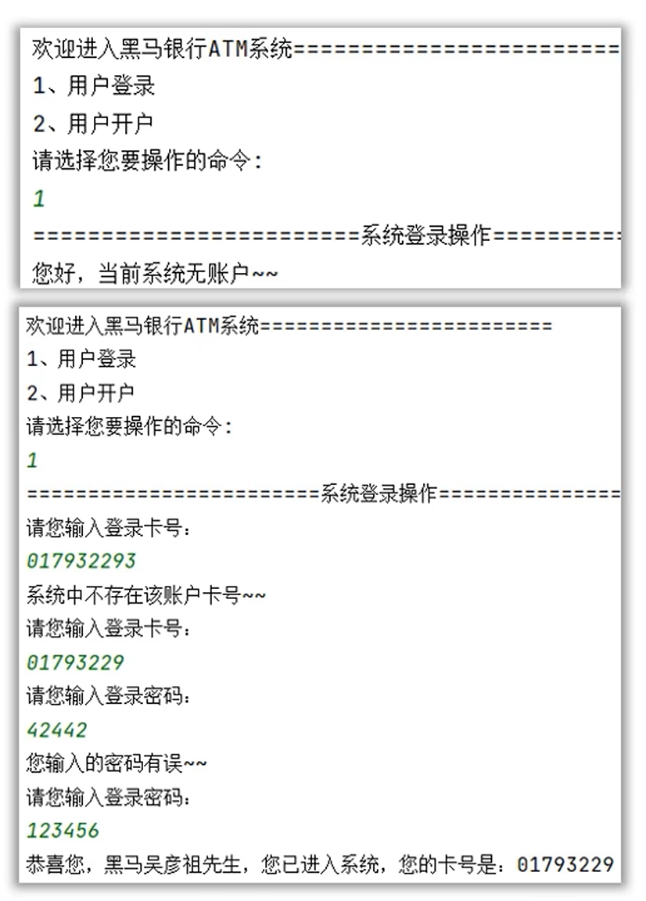

#### 总结

1. 登录功能如何实现？

+ 设计一个登陆方法：login，负责完成用户的登录
+ 方法里：如果系统无任何账户对象，直接结束登录操作
+ 有账户对象，则让用户输入卡号，根据卡号去账户集合中查询账户对象
+ 如果没有找到账户对象，说明登录卡号不存在，提示继续输入卡号
+ 如果找到了账户对象，说明卡号存在，继续输入密码
+ 如果密码不正确，提示继续输入密码
+ 如果密码也正确，则登录成功，并给出相应的提示


--------------------


### 4. 操作页展示、查询账户、退出账户

1. 用户登录成功后，需要进入用户操作页
2. 查询就是直接展示当前登陆成功的用户的账户信息
3. 退出账户就是回到欢迎页面

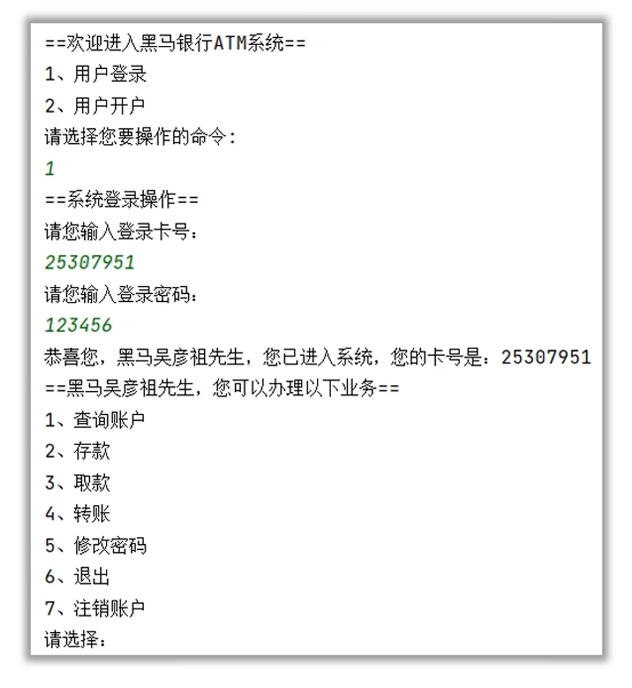


----------------


### 5. 存款、取款功能实现

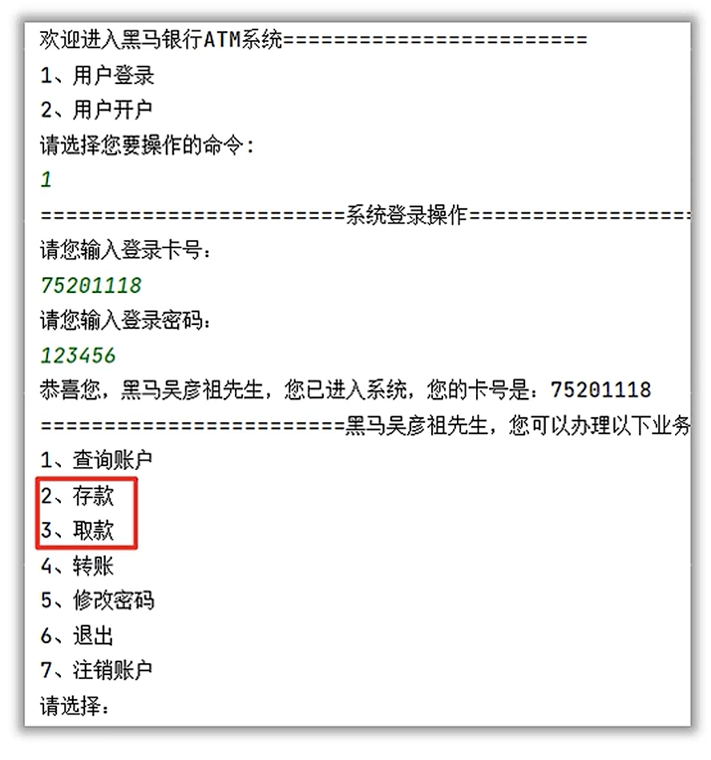

#### 用户存款功能

+ 就是用户为自己的账户存钱，存钱后更新账户的余额即可

#### 用户取款功能

+ 就是从自己的账户中取钱，取钱的要求：

1. 需要先判断账户的余额是否 >= 100元，如果够，就让用户输入取款金额
2. 需要判断取款金额是否超过了当次限额，以及余额是否足够

#### 总结

1. 存款、取款是如何去实现账户余额的更新的？

+ 使用当前账户对象的 setMoney 方法完成金额的修改


----------------------------


### 6. 用户转账功能

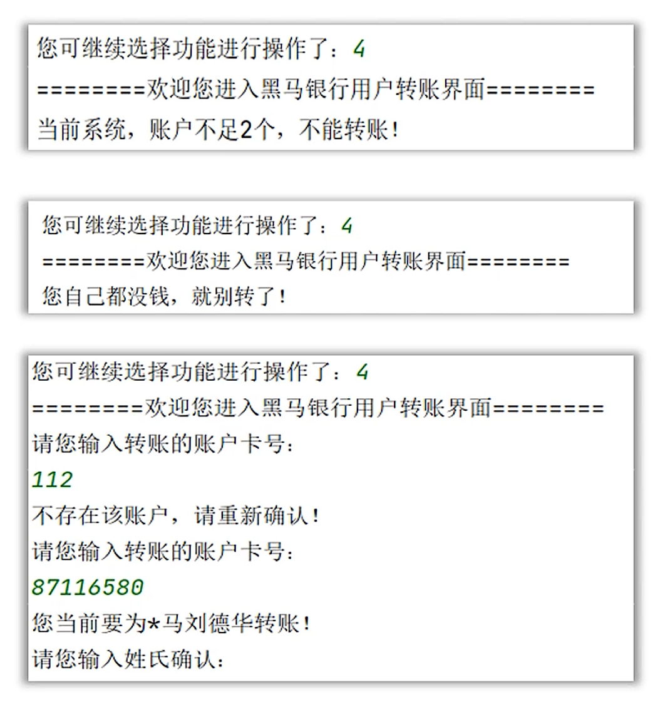

+ 把钱转给别人，转账前需要判断：

1. 自己账户是否有钱，系统中是否有其他账户
2. 接下来让用户输入对方卡号，判断对方账户是否存在，账户如果存在，还需要认证对方账户的户主姓氏


----------------------------------


### 7. 销户功能实现

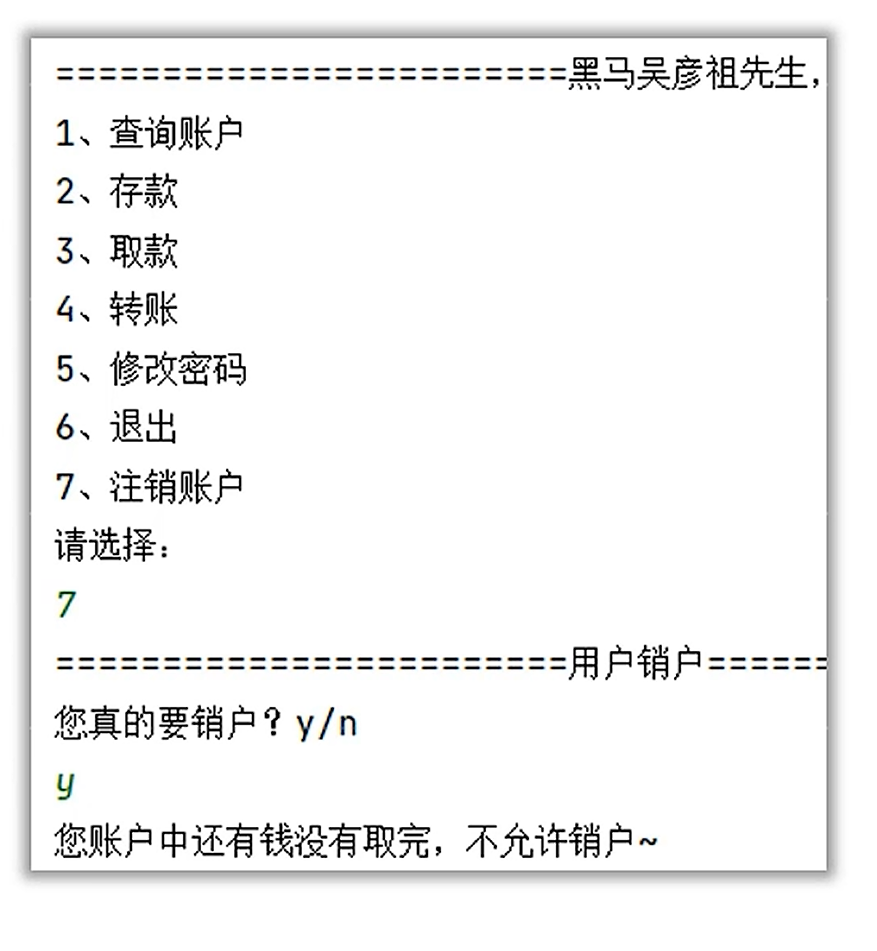

+ 销户就是从系统中删除当前账户，销户的要求：

1. 首先要询问用户是否确定销户，如果不确定，则回到操作界面
2. 如果确定，要判断用户的账户中是否有钱，有则不允许销户，并回到操作界面
3. 如果没钱，则完成销户，并回到欢迎页


-----------------


### 8. 用户密码修改

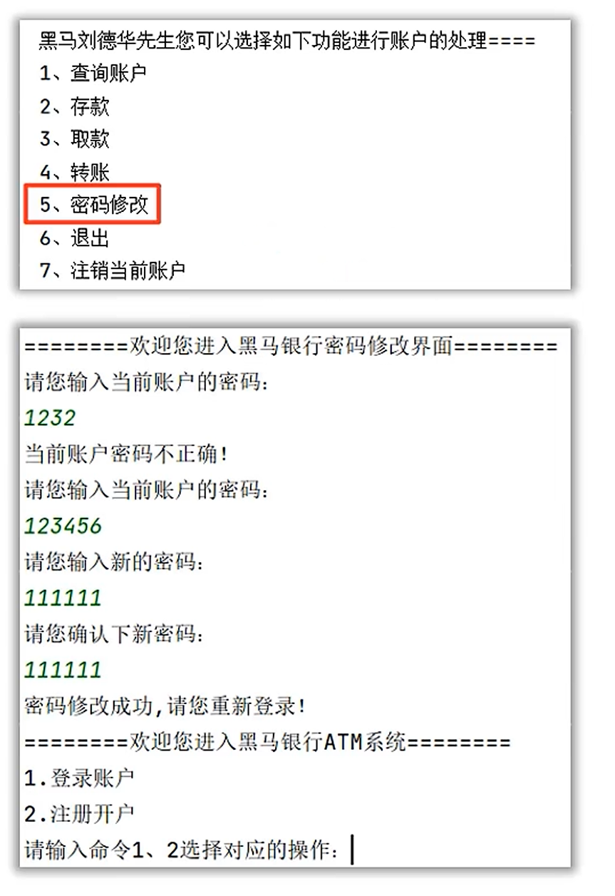

+ 就是更改账户的密码，修改密码的要求：

1. 需要先认证用户当前的密码
2. 认证通过后，需要让用户输入2次新密码
3. 两次密码一样，则更新账户密码，并回到欢迎界面


### 代码实现

+ Account.java

```java
package v_ATM;

public class Account {
    private String cardId;
    private String userName;
    private char sex;
    private String passWord;
    private double money;
    private double limit; // 限额

    public Account() {
    }

    public Account(String cardId, String userName, char sex, String passWord, double money, double limit) {
        this.cardId = cardId;
        this.userName = userName;
        this.sex = sex;
        this.passWord = passWord;
        this.money = money;
        this.limit = limit;
    }

    public String getCardId() {
        return cardId;
    }

    public void setCardId(String cardId) {
        this.cardId = cardId;
    }

    public String getUserName() {
        return userName + (sex == '男' ? "先生" : "女士");
    }

    public void setUserName(String userName) {
        this.userName = userName;
    }

    public char getSex() {
        return sex;
    }

    public void setSex(char sex) {
        this.sex = sex;
    }

    public String getPassWord() {
        return passWord;
    }

    public void setPassWord(String passWord) {
        this.passWord = passWord;
    }

    public double getMoney() {
        return money;
    }

    public void setMoney(double money) {
        this.money = money;
    }

    public double getLimit() {
        return limit;
    }

    public void setLimit(double limit) {
        this.limit = limit;
    }
}

```

+ ATM.java

```java
package v_ATM;

import java.util.ArrayList;
import java.util.Random;
import java.util.Scanner;

public class ATM {
    private ArrayList<Account> accounts = new ArrayList<>();
    private Scanner sc = new Scanner(System.in);
    private Account loginAcc; // 记住登陆后的用户账户

    /**
     * 启动ATM系统，展示欢迎界面
     */
    public void start() {
        while (true) {
            System.out.println("===欢迎您进入到了ATM系统===");
            System.out.println("1、用户登录");
            System.out.println("2、用户开户");
            System.out.println("请选择：");
            int command = sc.nextInt();
            switch (command) {
                case 1:
                    // 用户登录
                    break;
                case 2:
                    // 用户开户
                    createAccount();
                    break;
                default:
                    System.out.println("没有该操作~~~");
            }
        }
    }

    /**
     * 完后用户的登录操作
     */
    private void login() {
        System.out.println("===系统登录===");
        // 1. 判断系统中是否存在账户对象，存在才能登录，如果不存在，我们直接结束登录操作
        if (accounts.size() == 0) {
            System.out.println("当前系统中无任何账户，请先开户再来登录");
            return; // 跳出登录操作
        }

        // 2. 系统中存在账户对象，可以开始进行登录操作了
        while (true) {
            System.out.println("请您输入您的卡号：");
            String cardId = sc.next();
            // 3. 判断这个卡号是否存在
            Account acc = getAccountByCardId(cardId);
            if (acc == null) {
                // 说明这个卡号不存在
                System.out.println("您输入的登录卡号不存在，请确认~~~");

            } else {
                while (true) {
                    // 卡号存在了，接着让用户输入密码
                    System.out.println("请您输入登录密码：");
                    String passWord = sc.next();
                    // 4. 判断密码是否正确
                    if (acc.getPassWord().equals(passWord)) {
                        loginAcc = acc;
                        // 密码增强了，登录成功了
                        System.out.println("恭喜您，" + acc.getUserName() + "，您成功登录了系统，您的卡号是：" + acc.getCardId());
                        // 展示登陆后的操作界面
                        showUserCommand();
                        return; // 跳出并结束当前登录方法
                    } else {
                        System.out.println("您输入的密码不正确，请确认~~~");

                    }
                }
            }
        }
    }

    /**
     * 展示登陆后的操作界面
     */
    private void showUserCommand() {
        while (true) {
            System.out.println("===" + loginAcc.getUserName() + "您可以选择如下功能进行账户的处理===");
            System.out.println("1、查询账户");
            System.out.println("2、存款");
            System.out.println("3、取款");
            System.out.println("4、转账");
            System.out.println("5、修改密码");
            System.out.println("6、退出登录");
            System.out.println("7、注销当前账户");
            int command = sc.nextInt();
            switch (command) {
                case 1:
                    // 查询当前账户
                    showLoginAccount();
                    break;
                case 2:
                    // 存款
                    depositMoney();
                    break;
                case 3:
                    // 取款
                    drawMoney();
                    break;
                case 4:
                    // 转账
                    transferMoney();
                    break;
                case 5:
                    // 修改密码
                    updatePassWord();
                    return;
                case 6:
                    // 退出登录
                    System.out.println(loginAcc.getUserName() + "您退出系统成功！");
                    return; // 跳出并结束当前方法
                case 7:
                    // 注销当前账户
                    if (deleteAccount()) {
                        // 销户成功了，回到欢迎界面
                        return;
                    }
                    break;
                default:
                    System.out.println("您当前选择的操作是不存在的，请确认~~~");
            }
        }
    }

    /**
     * 账户密码修改
     */
    private void updatePassWord() {
        System.out.println("===账户密码修改操作===");
        while (true) {
            // 1. 提醒用户认证当前密码
            System.out.println("请您输入当前账户的密码：");
            String passWord = sc.next();

            // 2. 认证当前密码是否正确
            if (loginAcc.getPassWord().equals(passWord)){
                // 认证通过
                while (true) {
                    // 3. 真正开始修改密码了
                    System.out.println("请您输入新密码：");
                    String newPassWord = sc.next();

                    System.out.println("请您再次输入密码：");
                    String okPassWord = sc.next();

                    // 4. 判断2次密码是否一致
                    if (okPassWord.equals(newPassWord)){
                        // 可以真正开始修改密码了
                        loginAcc.setPassWord(okPassWord);
                        System.out.println("恭喜您，您的密码修改成功~~~");
                        return;
                    }else {
                        System.out.println("您输入的两次密码不一致~~~");
                    }
                }
            }else {
                System.out.println("您当前输入的密码不正确~~~");
            }
        }
    }

    /**
     * 销户操作
     */
    private boolean deleteAccount() {
        System.out.println("===进行销户操作===");
        // 1. 问问用户是否确定要销户
        System.out.println("请问您确定要销户吗？y/n");
        String command = sc.next();
        switch (command) {
            case "y":
                // 确实要销户
                // 2. 判断用户的账户中是否有钱
                if (loginAcc.getMoney() == 0) {
                    // 真销户了
                    accounts.remove(loginAcc);
                    System.out.println("您好，您的账户已经成功销户~~~");
                    return true;
                } else {
                    System.out.println("对不起，您的账户中存钱金额，不允许销户~~~");
                    return false;
                }
            default:
                System.out.println("好的，您的账户保留！！！");
                return false;
        }
    }

    /**
     * 转账
     */
    private void transferMoney() {
        System.out.println("===用户转账===");
        // 1. 判断系统中是否存在其他账户
        if (accounts.size() < 2) {
            System.out.println("当前系统中只有您一个账户，无法为其他账户转账~~~");
            return;
        }

        // 2. 判断自己的账户中是否有钱
        if (loginAcc.getMoney() == 0) {
            System.out.println("您自己都没钱，就别转了~~~");
            return;
        }

        while (true) {
            // 3. 正式开始转账了
            System.out.println("请您输入对方的卡号：");
            String cardId = sc.next();

            // 4. 判断这个卡号是否正确
            Account acc = getAccountByCardId(cardId);
            if (acc == null) {
                System.out.println("您输入的对方的卡号不存在~~~");
            } else {
                // 对方的账户存在，继续让用户认证姓氏
                String name = "*" + acc.getUserName().substring(1);
                System.out.println("请您输入【" + name + "】姓氏");
                String preName = sc.next();
                // 5. 判断这个姓氏是否正确
                if (acc.getUserName().startsWith(preName)) {
                    // 认证通过了：真正转账了
                    while (true) {
                        System.out.println("请您输入要转账给对方的金额：");
                        double money = sc.nextDouble();
                        // 6. 判断这个金额是否没有超过自己的金额
                        if (loginAcc.getMoney() >= money) {
                            // 转给对方了
                            // 更新自己的账户余额
                            loginAcc.setMoney(loginAcc.getMoney() - money);
                            // 更新对方的账户余额
                            acc.setMoney(acc.getMoney() + money);
                            return; // 跳出转账方法
                        } else {
                            System.out.println("您余额不足，无法给对方转这么多钱，最多可转：" + loginAcc.getMoney());
                        }
                    }
                } else {
                    System.out.println("对不起，您认证的姓氏有问题~~~");
                }
            }
        }
    }

    /**
     * 取钱
     */
    private void drawMoney() {
        System.out.println("===取钱操作===");
        // 1. 判断账户余额是否达到了100元，如果不够100元，就不让用户取钱了
        if (loginAcc.getMoney() < 100) {
            System.out.println("您的账户余额不足100元，不允许取钱");
            return;
        }

        // 2. 让用户输入取款金额
        while (true) {
            System.out.println("请您输入取款金额：");
            double money = sc.nextDouble();

            // 3. 判断账户余额是否足够
            if (loginAcc.getMoney() >= money) {
                // 账户中的余额是足够的
                // 4. 判断当前取款金额是否超过每次限额
                if (money > loginAcc.getLimit()) {
                    System.out.println("您当前取款金额超过了每次限额，您每次最多可取：" + loginAcc.getLimit());
                } else {
                    // 代表可以开始取钱了，更新当前账户的余额即可
                    loginAcc.setMoney(loginAcc.getMoney() - money);
                    System.out.println("您取款：" + money + "成功，取款后您的余额为：" + loginAcc.getMoney());
                    break;
                }
            } else {
                System.out.println("余额不足，您的账户中的余额是：" + loginAcc.getMoney());
            }
        }
    }

    /**
     * 存钱
     */
    private void depositMoney() {
        System.out.println("===存钱操作===");
        System.out.println("请您输入存款金额：");
        double money = sc.nextDouble();

        // 要更新当前账户的余额
        loginAcc.setMoney(loginAcc.getMoney() + money);
        System.out.println("恭喜您，您存钱：" + money + "成功，存钱后余额为：" + loginAcc.getMoney());
    }

    /**
     * 展示当前登录的账户信息
     */
    private void showLoginAccount() {
        System.out.println("===当前您的账户信息如下===");
        System.out.println("卡号：" + loginAcc.getCardId());
        System.out.println("户主：" + loginAcc.getUserName());
        System.out.println("性别：" + loginAcc.getSex());
        System.out.println("余额：" + loginAcc.getMoney());
        System.out.println("每次取现额度：" + loginAcc.getLimit());
    }


    /**
     * 完后用户开户操作
     */
    private void createAccount() {
        System.out.println("===系统开户操作===");
        // 1. 创建一个账户对象，用于封装用户的开户信息
        Account acc = new Account();

        // 2. 需要用户输入自己的开户信息，赋值给账户对象
        System.out.println("请您输入您的账户名称：");
        String name = sc.next();
        acc.setUserName(name);

        while (true) {
            System.out.println("请您输入您的性别：");
            char sex = sc.next().charAt(0);
            if (sex == '男' || sex == '女') {
                acc.setSex(sex);
                break;
            } else {
                System.out.println("您输入的性别有误~~~");
            }
        }

        while (true) {
            System.out.println("请您输入您的账户密码：");
            String passWord = sc.next();
            System.out.println("请您输入您的确认密码：");
            String okPassWord = sc.next();
            // 判断2次密码是否一样
            if (passWord.equals(okPassWord)) {
                acc.setPassWord(passWord);
                break;
            } else {
                System.out.println("您输入的2次密码不一致，请您确认~~~");
            }
        }

        System.out.println("请您输入您的取现额度：");
        double limit = sc.nextDouble();
        acc.setLimit(limit);

        // 重点：我们需要为这个账户生成一个卡号（由系统自动生成，8位数字表示，不能与其他账户的卡号重复）
        String newCardId = createCardId();
        acc.setCardId(newCardId);

        // 3. 吧这个账户对象，存入到账户集合中去
        accounts.add(acc);
        System.out.println("恭喜你" + acc.getUserName() + "开户成功，您的卡号是：" + acc.getCardId());
    }

    /**
     * 返回一个八位数字的卡号，而且这个卡号不能与其他账户的卡号重复
     */
    private String createCardId() {
        while (true) {
            // 1. 定义一个String类型的变量记住8位数字作为一个卡号
            String cardId = "";
            // 2. 使用循环，循环8次，每次产生一个随机数给cardId连接起来
            Random r = new Random();
            for (int i = 0; i < 8; i++) {
                int data = r.nextInt(10); // 0 - 9
                cardId += data;
            }
            // 3. 判断cardId中记住的卡号，是否与其他账户的卡号重复了，没有重复，才可以做为一个新卡号返回
            Account acc = getAccountByCardId(cardId);
            if (acc == null) {
                // 说明cardId没有找到账户对象，因此cardId没有与其他账户的卡号重复，可以返回它做为一个新卡号
                return cardId;
            }
        }
    }

    /**
     * 根据卡号查询账户对象返回
     */
    private Account getAccountByCardId(String cardId) {
        // 遍历全部的账户对象
        for (int i = 0; i < accounts.size(); i++) {
            Account acc = accounts.get(i);
            // 判断这个账户对象acc中的卡号是否是我们要找的卡号
            if (acc.getCardId().equals(cardId)) {
                return acc;
            }
        }
        return null; // 查无此账户
    }
}

```

+ Test.java

```java
package v_ATM;

public class Test {
    public static void main(String[] args) {
        // 1. 创建一个ATM对象，代表ATM系统
        ATM atm = new ATM();

        // 2. 调用ATM对象的start方法，启动系统
        atm.start();
    }
}

```


那么基础篇就结束了

**完结撒花！**


---------------------------------------------

