# Java 进阶

## 一、面向对象高级

### 1. static（静态）

#### 1.1 static 修饰成员变量

##### 1.1.1 static

+ 叫静态，可以修饰成员变量、成员方法

成员变量按照有无 static 修饰，分为两种：
+ **类变量**：有 static 修饰，属于类，在计算机里只有一份，**会被类的全部对象共享**
+ **实例变量（对象的变量）**：无 static 修饰，**属于每个对象的**

```java
public class Student {
	// 类变量
	static String name;
	
	// 实例变量（对象的变量）
	int age;
}
```

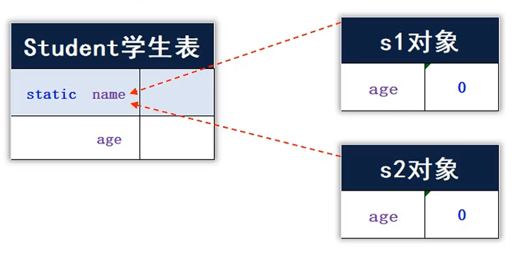

+ 把学生类看成一张学生表，可以创建出学生对象 s1 和 s2，age 没有 static 修饰，所以是对象的变量，也就是每个学生对象中都有一个自己的 age。
+ 而成员变量 name 有 static 修饰，就是类变量，就是说它只属于当前这个类自己持有，不属于对象，也就是说无论我们用这个类创建出了多少个学生对象，这些学生对象中都不会持有这个类变量 name

类变量访问方法

```java
类名.类变量（推荐）
对象.类变量（不推荐）
```

实例变量访问方法

```java
对象.实例变量
```


##### 1.1.2 成员变量的执行原理

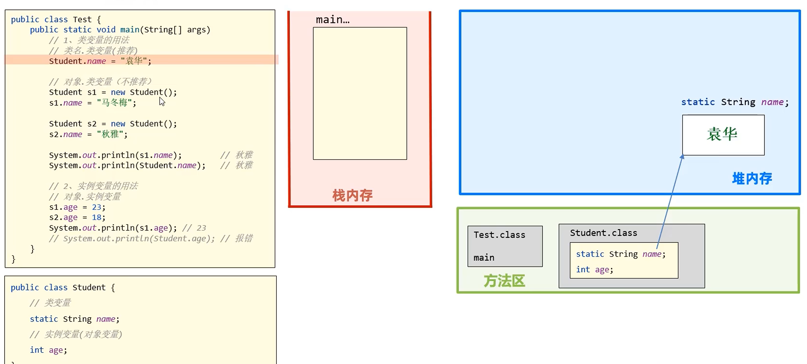

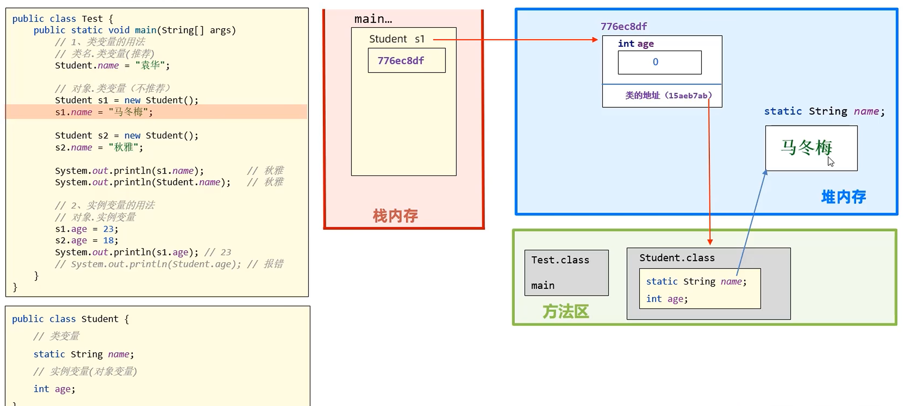

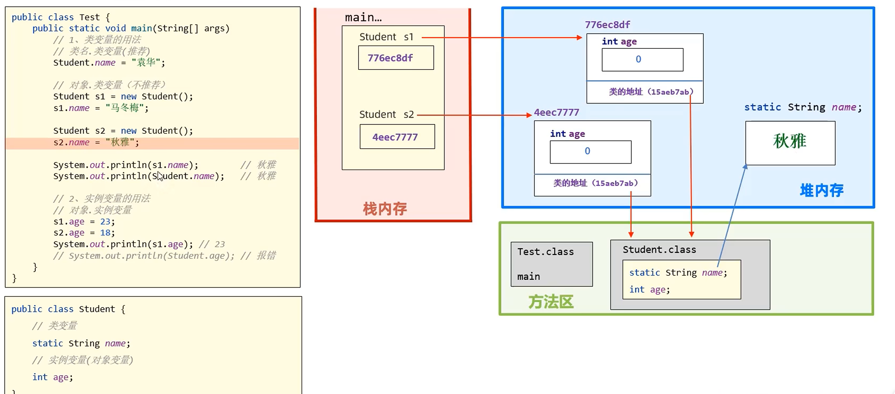

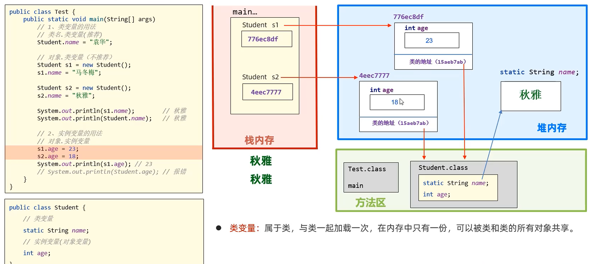

##### 总结

1. static 是什么？

+ 叫静态，可以修饰成员变量、成员方法

2. static 修饰的成员变量叫什么？怎么使用？有啥特点？

+ 类变量（静态成员变量）
```java
类名.类变量（推荐）
对象.类变量（不推荐）
```
+ 属于类，与类一起加载一次，在内存中只有一份，会被类的所有对象共享


3. 无 static 修饰的成员变量叫什么？怎么使用？有啥特点？
+ 实例变量（对象变量）
```java
对象.实例变量
```
+ 属于对象，每个对象中都有一份


--------------------------------------


#### 1.2 static 修饰成员变量的应用场景

##### 类变量的应用场景

+ 在开发中，如果某个数据只需要一份，且希望能够被共享（访问、修改），则该数据可以定义成类变量来记住

##### 案例：

+ 系统启动后，要求用户类可以记住自己创建了多少个用户对象了


+ User.java

```java
package Advanced.a_static.d1_staticdemo;

public class User {
    // 类变量
    public static int number; // public是让它对外完全公开和暴露的

    public User() {
//        User.number++;
        // 注意：在同一个类中，访问自己类的类变量，才可以省略类名不写
        number++;
    }
}

```

+ Test2.java

```java
package Advanced.a_static.d1_staticdemo;

public class Test2 {
    public static void main(String[] args) {
        // 目标：通过案例理解类变量的应用场景
        User u1 = new User();
        User u2 = new User();
        User u3 = new User();
        User u4 = new User();

        System.out.println(User.number); // 4
    }
}

```

##### 总结

1. 成员变量有几种？各自在什么情况下定义？

+ 类变量：数据只需要一份，且需要被共享时（访问，修改）
+ 实例变量：每个对象都要有一份，数据各不同（如：name、score、age）

2. 访问自己类中的类变量，是否可以省略类名不写？

+ 可以的
+ 注意：在某个类中访问其他类里的类变量，必须带类名访问


--------------------------


#### 1.3 static 修饰成员方法

##### 1.3.1 成员方法的分类

+ **类方法**：有 static 修饰的成员方法，属于类

```java
public static void printHelloWorld() {
	System.out.println("Hello World!");
	System.out.println("Hello World!");
}
```
```java
类名.类方法（推荐）
对象名.类方法（不推荐）
```

+ **实例方法**：无 static 修饰的成员方法，属于对象

```java
public void printPass() {
	...
}
```
```java
对象.实例方法
```

##### 1.3.2 成员方法的执行原理

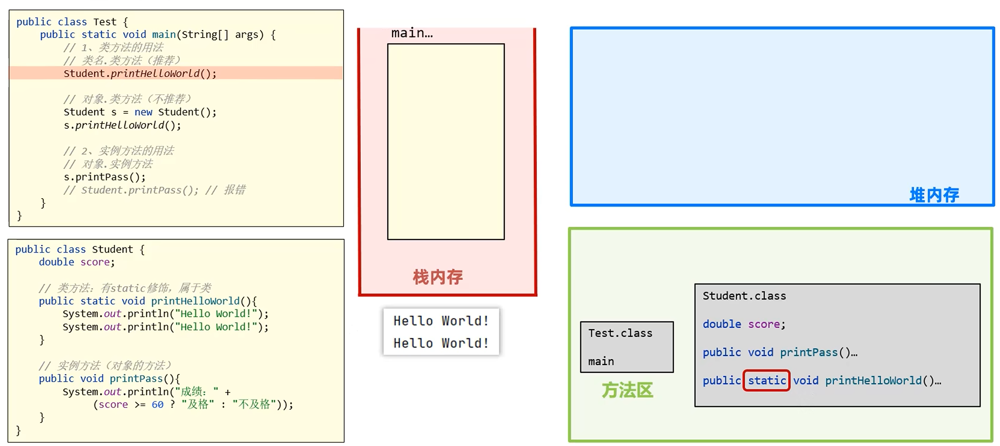

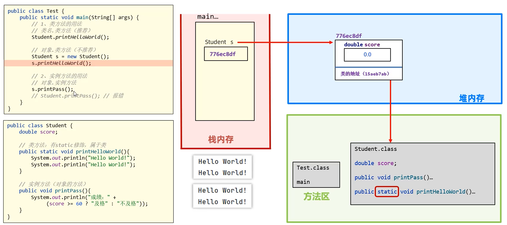

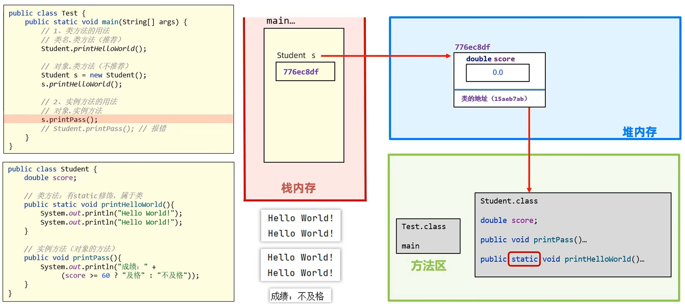

##### 代码演示

+ Student.java

```java
package Advanced.a_static.d2_static_method;

public class Student {
    double score;

    // 类方法
    public static void printHelloWorld() {
        System.out.println("Hello World!");
        System.out.println("Hello World!");
    }

    // 实例方法（对象的方法）
    public void printPass() {
        System.out.println("成绩：" + (score >= 60 ? "及格" : "不及格"));
    }
}

```

+ Test.java

```java
package Advanced.a_static.d2_static_method;

public class Test {
    public static void main(String[] args) {
        // 目标：掌握有无static修饰方法的用法
        // 1. 类方法的用法
        // 类名.类方法（推荐）
        Student.printHelloWorld();

        // 对象.类方法（不推荐）
        Student s = new Student();
        s.printHelloWorld();

        // 2. 实例方法的用法
        // 对象.实例方法
        s.printPass();
    }
}

```

##### 总结

1. static 修饰的成员方法叫什么？如何使用？

+ **类方法**（静态方法）
+ 属于类，可以直接用类名访问，也可以用对象访问

```java
类名.类方法（推荐）
对象名.类方法（不推荐）
```

2. 无 static 修饰的成员方法叫什么？如何使用？

+ **实例方法**（对象的方法）
+ 属于对象，只能用对象访问

```java
对象.实例方法
```


------------------------------------------


#### 补充知识：搞懂 mian 方法

```java
public class Test {
	public static void main(String[] args) {
		...
	}
}
```

1. main 方法是啥方法？

+ 类方法
  + 因为有 static

2. main 方法咋就能直接跑起来？

+ 我们用 Java 命令执行这个 Test 程序的时候，虚拟机其实会用这个 Test 类直接去点这个 main 方法来触发这个 main 方法的执行
+ 为什么可以用类名直接去点这个 main 方法执行呢？因为 main 方法也是类方法

3. 参数 `String[] args` 是什么？

+ 当我们来执行这个 main 方法的时候实际上我们可以送一些数据给这个参数接收的，这个参数它是一个 String 类型的数组，它可以接一些数据，然后让你这个 main 方法里面的程序来使用这些数据

4. 怎么在执行 main 方法的时候把数据传给这个参数（String[] args）呢？

+ 在调用 java 命令执行时，直接跟在文件名后面


-----------------------------------


#### 1.4 static 修饰成员方法的应用场景

##### 1.4.1 类方法的常见应用场景

+ 类方法最常见的应用场景是做工具类

##### 1.4.2 工具类是什么？

+ 工具类中的方法都是一些类方法，每个方法都是用来完成一个功能的，工具类是给开发人员共同使用的

##### 1.4.3 使用类方法来设计工具类有啥好处？

+ 提高了代码复用；调用方便，提高了开发效率

```java
public class XxxxUtil {
	public static void xxx() {
		...
	}
	public static boolean xxxx(String email) {
	...
	}
	public static String xxxxx(int n) {
	...
	}
	...
}
```

##### 案例

> 需求：
> + 某系统的登录界面需要开发并展示四位随机的验证码，系统的注册界面需要开发并展示六位的随机验证码
> 

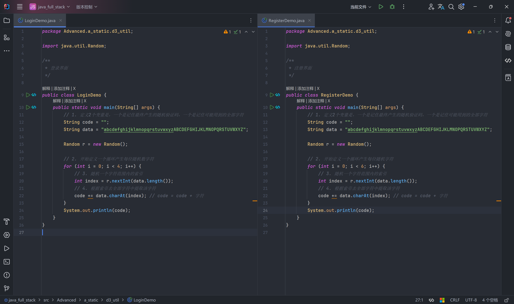

这两套程序的代码几乎一模一样，存在大量重复代码，这时我们就可以使用类方法设计一个工具类让这两个程序来调用，这样就优化好这个结构了

###### 代码实现

+ MyUtil.java

```java
package Advanced.a_static.d3_util;

import java.util.Random;

public class MyUtil {
    
    private MyUtil() {
    }

    public static String createCode(int n) {
        // 1. 定义2个变量是，一个是记住最终产生的随机验证码，一个是记住可能用到的全部字符
        String code = "";
        String data = "abcdefghijklmnopqrstuvwxyzABCDEFGHIJKLMNOPQRSTUVWXYZ";

        Random r = new Random();

        // 2. 开始定义一个循环产生每位随机数字符
        for (int i = 0; i < 4; i++) {
            // 3. 随机一个字符范围内的索引
            int index = r.nextInt(data.length());
            // 4. 根据索引去全部字符中提取该字符
            code += data.charAt(index); // code = code + 字符
        }
        return code;
    }
}

```

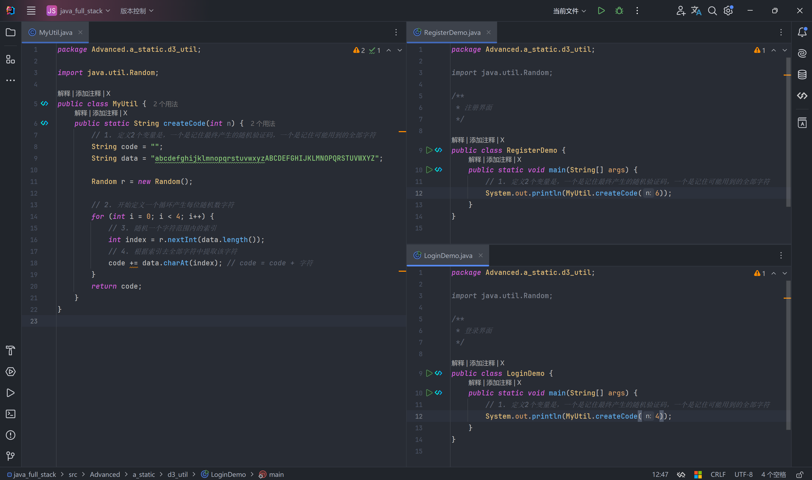

+ 为什么工具类中的方法要用类方法，而不是实例方法？

  + 实例方法需要创建对象来调用，此时对象只是为了调用方法，对象占内存，这样会浪费内存


##### 多学一招

+ **工具类没有创建对象的需求，建议将工具类的构造器进行私有**

##### 总结

1. 类方法有啥应用场景？

+ 可以用来设计工具类

2. 工具类是什么，有什么好处？

+ 工具类中的方法都是类方法，每个类方法都是用来完成一个功能的
+ 提高了代码的复用性；调用方便，提高了开发效率

3. 为什么工具类要用类方法，而不是实例方法？

+ 实例方法需要创建对象来调用，会浪费内存

4. 工具类定义时有什么要求？

+ 工具类不需要创建对象，建议将工具类的构造器私有化


-----------------------------------


#### 1.5 static 的注意事项

+ 类方法中可以直接访问类的成员，不可以直接访问实例成员
+ 实例方法既可以直接访问类成员，也可以直接访问实例成员
+ 实例方法中可以出现 this 关键字，类方法中不可以出现 this 关键字的

##### 代码演示

```java
package Advanced.a_static.d4_static_attention;

public class Student {
    static String schoolName; // 类变量
    double score; // 实例变量

    // 1. 类方法中可以直接访问类的成员，不可以直接访问实例成员
    public static void printHelloWorld() {
        // 注意：同一个类中，访问类成员可以省略类名不写
        schoolName = "Feng";
        Student.printHelloWorld2();

//        System.out.println(score); // 会报错
//        printPass(); // 会报错

//        System.out.println(this); // 会报错
    }

    // 类方法
    public static void printHelloWorld2() {

    }

    // 2. 实例方法中既可以直接访问类成员，也可以直接访问实例成员
    // 实例方法
    // 3. 实例方法中可以出现this关键字，类方法中不可以出现this关键字
    public void printPass() {
        schoolName = "Feng2";
        printHelloWorld2();

        System.out.println(score);
        printPass2();

        System.out.println(this); // 哪个对象调用它的实例方法 this就会指向哪个对象
    }

    // 实例方法
    public void printPass2() {

    }
}

```


-----------------------------------


#### 1.6 static 的应用知识：代码块

##### 1.6.1 代码块概述

+ 代码块是类的的5大成分之一（成员变量、构造器、方法、**代码块**、内部类）

代码块分为两种：

+ 静态代码块：
  + 格式：`static {}`
  + 特点：类加载时自动执行，由于类只会加载一次，所以静态代码块也只会执行一次
  + 作用：完成类的初识化，例如：对类变量的初始化赋值

+ 实例代码块：
  + 格式：`{}`
  + 特点：每次创建对象时，执行实例代码块，并在构造器前执行
  + 作用：和构造器一样，都是用来完成对象的初始化的，例如：对实例对象变量进行初始化赋值

##### 代码演示

+ Student.java

```java
package Advanced.a_static.d5_block;

public class Student {
    static int number = 80;
    static String schoolName;

    // 静态代码块
    static {
        System.out.println("静态代码块执行了");
        schoolName = "Feng";
    }


    // 实例代码块
    {
        System.out.println("实例代码块执行了~~~");
        System.out.println("有人创建了对象" + this);
    }

    public Student() {
        System.out.println("无参数构造器执行了~~~");
    }

    public Student(String name) {
        System.out.println("有参数构造器执行了~~~");
    }
}

```

+ Test.java

```java
package Advanced.a_static.d5_block;

public class Test {
    public static void main(String[] args) {
        // 目标：认识两种代码块，了解他们的特点和基本作用
        System.out.println(Student.number); // 静态代码块执行了 80
        System.out.println(Student.number); // 80
        System.out.println(Student.number); // 80

        System.out.println(Student.schoolName); // Feng

        System.out.println("-----------------------");
        Student s1 = new Student(); // 实例代码块执行了~~~ 有人创建了对象Advanced.a_static.d5_block.Student@b4c966a 无参数构造器执行了~~~
        Student s2 = new Student("张三"); // 实例代码块执行了~~~ 有人创建了对象Advanced.a_static.d5_block.Student@1d81eb93 有参数构造器执行了~~~
    }
}

```


-----------------------------


#### 1.7 static 的应用知识：单例设计模块

##### 1.7.1 什么是设计模式（Design pattern）？

+ 一个问题通常有 n 种解法，其中肯定有一种解法是最优的，这个最优的解法被人总结出来了，称之为**设计模式**
+ 设计模式有20多种，对应20多种软件开发中会遇到的问题

###### 1.7.1.2 单例设计模式（饿汉式单例）

+ 确保一个类只有一个对象

写法

+ 把类的构造器私有
+ 定义一个类变量记住类的一个对象
+ 定义一个类方法，返回对象

代码实现

+ A.java

```java
package Advanced.a_static.d6_singleInstance;

public class A {
    // 2.定义一个类变量记住类的对象
    private static A a = new A();

    // 1. 必须私有类的构造器
    // 使得外面不能创建对象
    private A() {

    }

    // 3. 定义一个类方法返回类的对象
    public static A getObject() {
        return a;
    }
}

```

+ Test1.java

```java
package Advanced.a_static.d6_singleInstance;

public class Test1 {
    public static void main(String[] args) {
        // 目标：掌握单例设计模式的写法
        A a1 = A.getObject();
        A a2 = A.getObject();
        System.out.println(a1); // Advanced.a_static.d6_singleInstance.A@b4c966a
        System.out.println(a2); // Advanced.a_static.d6_singleInstance.A@b4c966a
    }
}

```

###### 1.7.1.3 单例模式的应用场景和好处

+ Runtime 类
  + 程序的运行环境，Java 程序执行的时候只有一套运行环境，因此 Runtime 它也只需要一个对象就可以代表你那个唯一的运行环境
+ 任务管理器
  + 无论启动多少次任务管理器，其窗口对象始终只有一个

###### 1.7.1.4 单例设计模式的实现方式很多

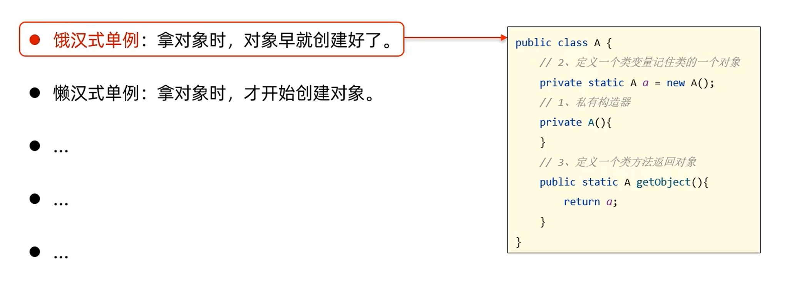

###### 总结

1. 什么是设计模式，设计模式主要学什么？单例模式解决了上面问题

+ 设计模式就是具体问题的最优解决方案
+ 解决了什么问题？怎么写？
+ 确保一个类只有一个对象

2. 单例怎么写？饿汉式单例的特点是什么？

+ 把类的构造器私有；定义一个类变量存储类的一个对象；提供一个类方法返回对象
+ 在获取类对象时，对象已经创建好了

3. 单例有啥应用场景，有啥好处？

+ 任务管理器对象、获取运行时对象
+ 在这些业务场景下，使用单例模式，可以避免浪费内存


----------------------------------------------


##### 1.7.2 懒汉式单例设计模式

+ 拿对象时，才开始创建对象

写法

+ 把类的构造器私有
+ 定义一个类变量用于存储对象
+ 提供一个类方法，保证返回的是同一个对象

代码实现

+ B.java

```java
package Advanced.a_static.d6_singleInstance;

public class B {
    // 2. 定义一个类变量，用于存储这个类的一个对象
    private static B b;

    // 1. 把类的构造器私有
    private B() {

    }

    // 3. 定义一个类方法，这个方法要保证第一次调用时才创建一个对象，后面调用时都会用这同一个对象返回
    public static B getInstance() {
        if (b == null) {
            System.out.println("第一次创建对象~~~");
            b = new B();
        }
        return b;
    }
}

```

+ Test2.java

```java
package Advanced.a_static.d6_singleInstance;

/**
 * 目标：掌握懒汉式单例的写法
 */

public class Test2 {
    public static void main(String[] args) {
        B b1 = B.getInstance(); // 第一次拿对象
        B b2 = B.getInstance();

        System.out.println(b1 == b2); // true
    }
}

```


---------------------------------------


### 2. 面向对象三大特征之二：继承

#### 2.1 继承的快速入门

##### 2.1.1 认识继承、特点

###### 2.1.1.1 什么是继承？

+ Java 中提供了一个关键字 `extends`，用这个关键字，可以让一个类和另一个类建立起父子关系

```java
public class B extends A {
    
}
```

+ A 类称之为父类（基类或超类）
+ B 类称之为子类（派生类）

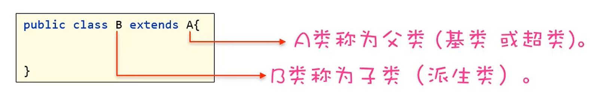

###### 2.1.1.2 继承的特点

+ 子类能继承父类的非私有成员（成员变量、成员方法）

继承后对象的创建

+ 子类的对象是由子类、父类共同完成的

###### 2.1.1.3 继承的执行原理

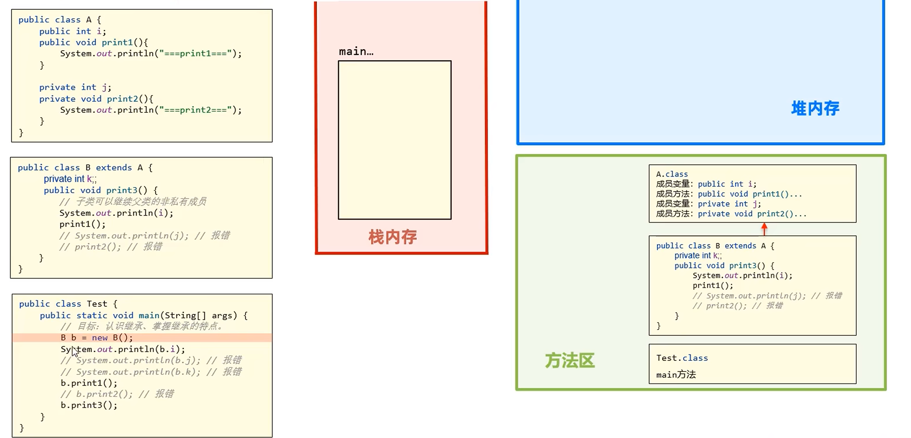

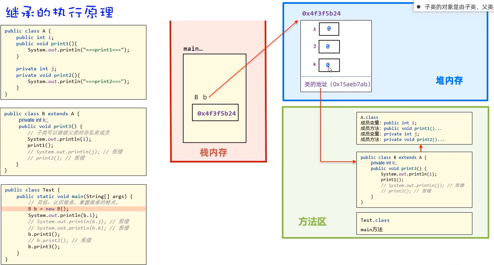

+ 子类对象实际上是由子父类这两张设计图共同创建出来的

###### 代码实现

+ A.java

```java
package Advanced.b_extends.d7_extends;

// 父类
public class A {
    // 公开成员
    public int i;

    public void print1() {
        System.out.println("===print1===");
    }

    // 私有成员
    private int j;

    private void print2() {
        System.out.println("===print2===");
    }
}

```

+ B.java

```java
package Advanced.b_extends.d7_extends;

// 子类
public class B extends A {
    // 子类是可以继承父类的非私有成员
    public void print3() {
        System.out.println(i);
        print1();

//        System.out.println(j); // 报错
//        print2(); // 报错
    }
}

```

+ Test.java

```java
package Advanced.b_extends.d7_extends;

public class Test {
    public static void main(String[] args) {
        // 目标：认识继承、掌握继承的特点
        B b = new B();
        System.out.println(b.i); // 0
//        System.out.println(b.j); // 报错

        b.print1();
//        b.print2(); // 报错
        b.print3();
    }
}

```

###### 总结

1. 什么是继承？继承后有啥特点？

+ 继承就是用 `extends` 关键字，让一个类和另一个类建立起一种父子关系
+ 子类可以继承父类非私有的成员

2. 带继承关系的类，Java 会怎么创建它的对象？对象创建出来后，可以直接访问哪些成员？

+ 带继承关系的类，Java 会用类和其父类，这多张设计图来一起创建类的对象
+ 对象能直接访问什么成员，是由子父类这多张设计图共同决定的，这多张设计图对外暴露了什么成员，对象就可以访问什么成员


-------------------------------


##### 2.1.2 继承的好处、应用场景

###### 2.1.2.1 使用继承有啥好处？

+ 减少重复代码的编写

> 需求：
> Feng 的员工管理系统种
> 需要处理讲师、咨询师的数据
> **讲师**的数据有：姓名、具备的技能
> **咨询师**的数据有：姓名、解答问题的总人数
> 

代码实现

+ People.java

```java
package Advanced.b_extends.d8_extends_application;

public class People {
    private String name;

    public String getName() {
        return name;
    }

    public void setName(String name) {
        this.name = name;
    }
}

```


+ Teacher.java

```java
package Advanced.b_extends.d8_extends_application;

public class Teacher extends People {
    private String skill;

    public String getSkill() {
        return skill;
    }

    public void setSkill(String skill) {
        this.skill = skill;
    }

    public void printInfo() {
        System.out.println(getName() + "具备的技能" + skill);
    }
}

```


+ Test.java

```java
package Advanced.b_extends.d8_extends_application;

public class Test {
    public static void main(String[] args) {
        // 目标：搞清楚继承的好处
        Teacher t = new Teacher();
        t.setName("张三");
        t.setSkill("Java、Spring");
        System.out.println(t.getName()); // 张三
        System.out.println(t.getSkill()); // Java、Spring
        t.printInfo(); // 张三具备的技能Java、Spring
    }
}

```

###### 总结

1. 使用继承有啥好处？

+ 减少了重复代码的编写，提高了代码的复用性


-----------------------------------


#### 2.2 继承相关的注意事项

##### 2.2.1 权限修饰符

###### 2.2.1.1 什么是权限修饰符？

+ 就是用来限制类中的成员（成员变量、成员方法、构造器、代码块...）能够被访问的范围

###### 2.2.1.2 权限修饰符有几种？各自的作用是什么？

| 修饰符    | 在本类中 | 同一个包下的其他类里 | 任意包下的子类里 | 任意包下的任意类里 |
| --------- | -------- | -------------------- | ---------------- | ------------------ |
| private   | √        |                      |                  |                    |
| 缺省      | √        | √                    |                  |                    |
| protected | √        | √                    | √                |                    |
| public    | √        | √                    | √                | √                  |

**private < 缺省 < protected < public**

###### 代码演示

+ d9_modifer.Fu.java

```java
package Advanced.b_extends.d9_modifer;

public class Fu {
    // 1. 私有：只能在本类中访问
    private void privateMethod(){
        System.out.println("===private===");
    }

    // 2. 缺省：本类，同一个包下的类
    void method(){
        System.out.println("===缺省===");
    }

    // 3. protected：本类，同一个包下的类，任意包下的子类
    protected void protectedMethod(){
        System.out.println("===protected===");
    }

    // 4. public：本类，同一个包下的类，任意包下的子类，任意包下的任意类
    public void publicMethod(){
        System.out.println("===public===");
    }

    public void test(){
        privateMethod();
        method();
        privateMethod();
        publicMethod();
    }
}

```

+ d9_modifer.Demo.java

```java
package Advanced.b_extends.d9_modifer;

public class Demo {
    public static void main(String[] args) {
        // 目标：掌握不同权限修饰符的作用
        Fu f = new Fu();
//        f.privateMethod(); // 报错
        f.method();
        f.protectedMethod();
        f.publicMethod();
    }
}

```

+ d10_modifer.Zi.java

```java
package Advanced.b_extends.d10_modifer;

import Advanced.b_extends.d9_modifer.Fu;

public class Zi extends Fu {
    public void test() {
//        privateMethod(); // 报错
//        method(); // 报错
        protectedMethod();
        publicMethod();
    }
}

```

+ d10_modifer.Demo2.java

```java
package Advanced.b_extends.d10_modifer;

import Advanced.b_extends.d9_modifer.Fu;

public class Demo2 {
    public static void main(String[] args) {
        Fu f = new Fu();
//        f.privateMethod(); // 报错
//        f.method(); // 报错
//        f.protectedMethod(); // 报错
        f.publicMethod();

        Zi zi = new Zi();
//        zi.protectedMethod(); // 报错
    }
}

```


------------------------------


##### 2.2.2 单继承、Object 类

###### 2.2.2.1 单继承

Java 是**单继承的**，Java 中的类**不支持多继承**，但是**支持多层继承**

单继承：指的是一个类只能继承一个直接父类

###### 2.2.2.2 为何 Java 中的类不支持多继承

反证法：

+ 假设 Java 中的类支持多继承，现在有两个类，一个 A 中有一个 method 方法里面打印 "aaa"，一个 B 中有一个 method 方法里面打印 "bbb"
+ 再定义一个 C 类同时继承 A 和 B，那么 C 调用 method 方法时就不知道调用谁的方法了

###### 2.2.2.3 Object 类

+ Object 类是 Java 所有类的祖宗类。我们写的任意一个类，其实都是 Object 的子类或者子孙类

###### 代码演示

```java
package Advanced.b_extends.d11_extends_feature;

public class Test {
    public static void main(String[] args) {
        // 目标：掌握继承的两个注意事项
        // 1. Java是单继承的：一个类只能继承一个直接父类；Java中的类不支持多继承，但支持多层继承
        // 2. Object类是Java中所有类的祖宗
        A a = new A();

        B b = new B();
    }
}

class A {
} // extends Object{}

class B extends A {
}

//class C extends B, A{} // 报错

class D extends B {
}

```

###### 总结

1. 继承相关的两个注意事项？

+ Java 是单继承的：一个类只能继承一个直接父类；Java 中的类不支持多继承，但是支持多层继承

+ Object 类是 Java 中所有类的祖宗


------------------------


##### 2.2.3 方法重写

###### 2.2.3.1 认识方法重写

什么是方法重写？

+ 当子类觉得父类中的某个方法不好用，或者无法满足自己的需求时，**子类可以重写一个方法名称、参数列表一样的方法**，去覆盖父类的这个方法，这就是方法重写
+ 注意：重写后，方法的访问，Java 会遵循就近原则

方法重写的其他注意事项

+ 重写小技巧：使用 **Override 注解**，他可以指定 Java 编译器，检查我们方法重写的格式是否正确，代码可读性也会更好
+ 子类重写父类方法时，访问权限必须大于或者等于父类该方法的权限**（public > protected > 缺省）**
+ 重写的方法返回值类型，必须与被重写方法的返回值类型一样，或者范围更小
+ 私有方法、静态方法不能被重写，如果重写会报错的

代码演示

+ A.java

```java
package Advanced.b_extends.d12_extends_override;

public class A {
    public void print1() {
        System.out.println("111");
    }

    public void print2(int a, int b) {
        System.out.println("111111");
    }
}

```

+ B.java

```java
package Advanced.b_extends.d12_extends_override;

public class B extends A {
    // 方法重写
    @Override // 安全，可读性好
    public void print1() {
        System.out.println("666");
    }

    // 方法重写
    @Override
    public void print2(int a, int b) {
        System.out.println("666666");
    }
}

```

+ Test.java

```java
package Advanced.b_extends.d12_extends_override;

public class Test {
    public static void main(String[] args) {
        // 目标：认识方法重写，掌握方法重写的常见应用场景
        B b = new B();
        b.print1(); // 666
        b.print2(2, 3); // 666666
    }
}

```


###### 2.2.3.2 方法重写的应用场景

+ 子类重写 Object 类的 `toString()` 方法，以便返回对象的内容

代码演示

+ Student.java

```java
package Advanced.b_extends.d12_extends_override;

public class Student {
    private String name;
    private int age;

    public Student() {
    }

    public Student(String name, int age) {
        this.name = name;
        this.age = age;
    }

    public String getName() {
        return name;
    }

    public void setName(String name) {
        this.name = name;
    }

    public int getAge() {
        return age;
    }

    public void setAge(int age) {
        this.age = age;
    }

    @Override
    public String toString() {
        return "Student{" +
                "name='" + name + '\'' +
                ", age=" + age +
                '}';
    }
}

```

+ Test.java

```java
package Advanced.b_extends.d12_extends_override;

import java.util.ArrayList;

public class Test {
    public static void main(String[] args) {
        // 目标：认识方法重写，掌握方法重写的常见应用场景
        B b = new B();
        b.print1(); // 666
        b.print2(2, 3); // 666666

        System.out.println("----------------------------");

        Student s = new Student("张三", 19);
        System.out.println(s.toString()); // Advanced.b_extends.d12_extends_override.Student@4e50df2e   Student{name=张三,age=19}
        System.out.println(s); // Advanced.b_extends.d12_extends_override.Student@4e50df2e   Student{name=张三,age=19}

        ArrayList list = new ArrayList();
        list.add("java");
        System.out.println(list); // [java]   说明ArrayList类中把Object类里面的toString方法进行了重写
    }
}

```

###### 总结

1. 方法重写是什么？

+ 子类写了一个**方法名称、形参列表与父类某个方法一样**的方法去覆盖父类的该方法

2. 重写方法有哪些注意事项？

+ 建议加上：`@Override` 注解，可以校验重写是否正确，同时可读性好
+ 子类重写父类方法时，访问权限必须大于或者等于父类被重写的方法的权限
+ 重写的方法返回值类型，必须与被重写方法的返回值类型一样，或者范围更小
+ 私有方法、静态方法不能被重写

3. 方法重写有啥应用场景？

+ 当子类觉得父类的方法不好用，或者不满足自己的需求时，就可以用方法重写


----------------------


##### 2.2.4 子类中访问其他成员的特点

1. 在子类方法中访问其他成员（成员变量、成员方法），是依照**就近原则**的

+ 先子类局部范围找
+ 然后子类成员范围找
+ 然后父类成员范围找，如果父类范围还没有找到则报错

2. 如果父类中，出现了重名的成员，会优先使用子类的，如果此时一定要在子类中使用父类的怎么办？

+ 可以通过 `super` 关键字，指定访问父类的成员：`super.父类成员变量/父类成员方法`

代码演示

+ F.java

```java
package Advanced.b_extends.d13_extends_visit;

public class F {
    String name = "父类名字";

    public void print1() {
        System.out.println("===父类的print1方法执行===");
    }
}

```

+ Z.java

```java
package Advanced.b_extends.d13_extends_visit;

public class Z extends F {
    String name = "子类名称";

    public void showName() {
        String name = "局部名称";
        System.out.println(name);
        System.out.println(this.name);
        System.out.println(super.name);
    }

    @Override
    public void print1() {
        System.out.println("===子类的print1方法执行了===");
    }

    public void showMethod() {
        print1(); // 子类的
        super.print1(); // 父类的
    }
}

```

+ Test.java

```java
package Advanced.b_extends.d13_extends_visit;

public class Test {
    public static void main(String[] args) {
        // 目标：掌握子类中访问其他成员的特点：就近原则
        Z z = new Z();
        z.showName(); // 局部名称 子类名称 父类名字
        z.showMethod(); // ===子类的print1方法执行了=== ===父类的print1方法执行===
    }
}

```


------------------------------


##### 2.2.5 子类构造器的特点

###### 2.2.5.1 认识子类构造器的特点

子类构造器的特点：

+ 子类的全部构造器，都会先调用父类的构造器，再执行自己

子类构造器是如何实现调用父类构造器的：

+ 默认情况下，子类全部构造器的第一行代码都是 `super();` （写不写都有），它会调用父类的无参数构造器
+ 如果父类没有无参数构造器，则我们必须在子类构造器的第一行手写 `super(...);` ，指定去调用父类的有参数构造器

代码演示

```java
package Advanced.b_extends.d14_extends_constructor;

class F {
//    public F() {
//        System.out.println("===父类F的无参数构造器执行了===");
//    }

    public F(String name, int age) {

    }
}

class Z extends F {
    public Z() {
//        super(); // 默认存在的
        super("张三",17);
        System.out.println("===子类Z的无参数构造器执行了===");
    }

    public Z(String name) {
//        super(); // 默认存在的
        super("张三",17);
        System.out.println("===子类Z的有参数构造器执行了===");
    }
}

public class Test {
    public static void main(String[] args) {
        // 目标：先认识子类构造器的特点，再掌握这个特点的常见应用场景
        Z z = new Z(); // ===父类F的无参数构造器执行了=== ===子类Z的无参数构造器执行了===
        Z z2 = new Z("张三"); // ===父类F的无参数构造器执行了=== ===子类Z的有参数构造器执行了===
    }
}

```


###### 2.2.5.1 常见的应用场景

搞清楚子类构造器为什么要调用父类的构造器，有啥应用场景？

+ 在继承情况下，由于处理对象数据的构造器拆到了多个类里面去了，所以对象要通过调用这多个构造器才能把对象的数据处理完整

运行过程

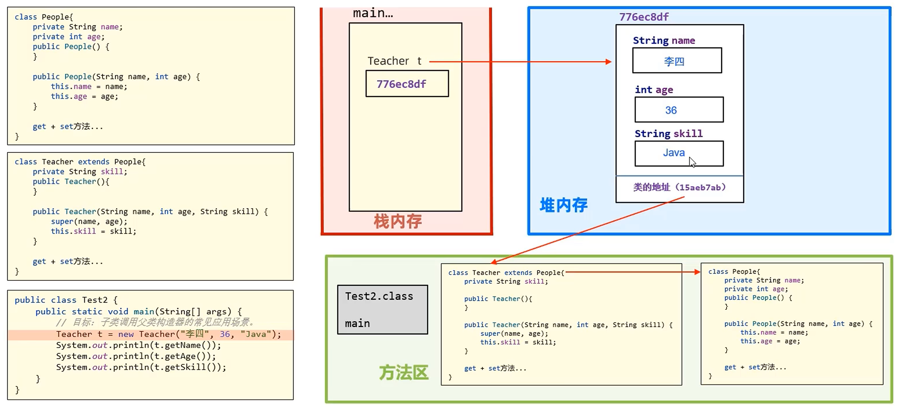

+ 子类构造器可以通过父类构造器，把对象中包含父类这部分的数据先初始化赋值，再回来把对象里包含子类这部分的数据也进行初始化赋值

代码演示

```java
package Advanced.b_extends.d14_extends_constructor;

public class Test2 {
    public static void main(String[] args) {
        // 目标：搞清楚子类构造器为什么要调用父类的构造器，有啥应用场景
        Teacher t = new Teacher("李四", 36, "Java");
        System.out.println(t.getName()); // 李四
        System.out.println(t.getAge()); // 36
        System.out.println(t.getSkill()); // Java
    }
}

class Teacher extends People {
    private String skill;

    public Teacher(String name, int age, String skill) {
        super(name, age);
        this.skill = skill;
    }

    public String getSkill() {
        return skill;
    }

    public void setSkill(String skill) {
        this.skill = skill;
    }
}

class People {
    private String name;
    private int age;

    public People() {
    }

    public People(String name, int age) {
        this.name = name;
        this.age = age;
    }

    public String getName() {
        return name;
    }

    public void setName(String name) {
        this.name = name;
    }

    public int getAge() {
        return age;
    }

    public void setAge(int age) {
        this.age = age;
    }
}

```


###### 补充知识：this(...) 调用兄弟构造器

+ 任意类的构造器中，是可以通过 `this(...)` 去调用该类的其他构造器的

this(...) 和 super(...) 使用时的注意事项：

+ this(...)、super(...) 都只能放在构造器的第一行，因此，有了 this(...) 就不能写 super(...) 了，反之亦然

代码演示

```java
package Advanced.b_extends.d14_extends_constructor;

public class Test3 {
    public static void main(String[] args) {
        // 目标：掌握在类的构造器中，通过this(...)调用兄弟构造器的作用
        Student s1 = new Student("李四", 26, "家里蹲大学");

        // 需求：如果学生没有填写学校，那么学校默认就是Feng
        Student s2 = new Student("张三", 28);
        System.out.println(s2.getName()); // 张三
        System.out.println(s2.getAge()); // 28
        System.out.println(s2.getSchoolName()); // Feng
    }
}

class Student {
    private String name;
    private int age;
    private String schoolName;

    public Student() {
    }

    public Student(String name, int age) {
        this(name, age, "Feng");
    }

    public Student(String name, int age, String schoolName) {
        this.name = name;
        this.age = age;
        this.schoolName = schoolName;
    }

    public String getName() {
        return name;
    }

    public void setName(String name) {
        this.name = name;
    }

    public int getAge() {
        return age;
    }

    public void setAge(int age) {
        this.age = age;
    }

    public String getSchoolName() {
        return schoolName;
    }

    public void setSchoolName(String schoolName) {
        this.schoolName = schoolName;
    }
}

```


-------------------------


##### 2.2.6 注意事项小结

1. 子类构造器有啥特点？

+ 子类中的全部构造器，都必须先调用父类的构造器，再执行自己

2. super(...) 调用父类有参数构造器的常见场景是什么？

+ 为对象中包含父类这部分的成员变量进行赋值

3. this(...) 的作用是什么？

+ 在构造器中调用本类的其他构造器

4. this(...) 和 super(...) 的使用需要注意什么？

+ 都必须放在构造器的第一行


----------------------


### 3. 面向对象的三大特征之三：多态

#### 3.1 认识多态

##### 3.1.1 什么是多态？

+ 多态是在**继承/实现**情况下的一种现象，表现为：对象多态、行为多态

##### 3.1.2 多态的具体代码实现

```java
People p1 = new Student();
p1.run();

People p2 = new Teacher();
p2.run();
```

##### 3.1.3 多态的前提

+ 有**继承/实现**关系；存在父类引用子类对象；**存在方法重写**

##### 3.1.4 多态的一个注意事项

+ 多态是对象、行为的多态，Java 中的属性（成员变量）不谈多态

##### 代码演示

+ People.java

```java
package Advanced.c_polymorphism.d1_polymorphism;

// 父类
public class People {
    public String name = "父类People的名称";

    public void run() {
        System.out.println("人可以跑~~~");
    }
}

```

+ Student.java

```java
package Advanced.c_polymorphism.d1_polymorphism;

public class Student extends People {
    public String name = "子类Student的名称";

    @Override
    public void run() {
        System.out.println("学生跑得贼快~~~");
    }
}

```

+ Teacher.java

```java
package Advanced.c_polymorphism.d1_polymorphism;

public class Teacher extends People {
    public String name = "子类Teacher的名称";

    @Override
    public void run() {
        System.out.println("老师跑的气喘吁吁~~~");
    }
}

```

+ Test.java

```java
package Advanced.c_polymorphism.d1_polymorphism;

public class Test {
    public static void main(String[] args) {
        // 目标：认识多态：对象多态、行为多态
        // 1. 对象多态
        People p1 = new Teacher();
        // 行为多态：识别技巧：编译看左边，运行看右边
        p1.run(); // 老师跑的气喘吁吁~~~
        // 注意：对于变量：编译看左边，运行看左边
        System.out.println(p1.name); // 父类People的名称

        People p2 = new Student();
        // 行为多态：识别技巧：编译看左边，运行看右边
        p2.run(); // 学生跑得贼快~~~
        System.out.println(p2.name); // 父类People的名称
    }
}

```


-------------------


#### 3.2 使用多态的好处

##### 3.2.1 使用多态的好处

+ 在多态形势下，右边对象是解耦合的，更便于扩展和维护
  + 解耦合：比如说我们在开发系统时，希望把这个系统中的每个模块拆分成一个一个的服务，可以随时的对接，这样更容易扩展和维护，这就是解耦合

+ 定义方法时，使用父类类型的形参，可以接收一切子类对象，扩展性更强、更便利

##### 3.2.2 多态下会产生的一个问题，怎么解决？

+ 多态下不能使用子类的独有功能

##### 代码演示

+ People.java

```java
package Advanced.c_polymorphism.d2_polymorphism;

// 父类
public class People {
    public String name = "父类People的名称";

    public void run() {
        System.out.println("人可以跑~~~");
    }
}

```

+ Student.java

```java
package Advanced.c_polymorphism.d2_polymorphism;

public class Student extends People {
    public String name = "子类Student的名称";

    @Override
    public void run() {
        System.out.println("学生跑得贼快~~~");
    }

    public void test() {
        System.out.println("学生需要考试~~~");
    }
}

```

+ Teacher.java

```java
package Advanced.c_polymorphism.d2_polymorphism;

public class Teacher extends People {
    public String name = "子类Teacher的名称";

    @Override
    public void run() {
        System.out.println("老师跑的气喘吁吁~~~");
    }

    public void test() {
        System.out.println("老师需要教知识~~~");
    }
}

```

+ Test.java

```java
package Advanced.c_polymorphism.d2_polymorphism;

public class Test {
    public static void main(String[] args) {
        // 目标：理解多态的好处
        // 好处1：可以实现解耦合，右边对象可以随时切换，后续业务随之改变
        People p1 = new Student();
        p1.run();
//        p1.test(); // 多态下存在的问题，无法直接调用子类的独有功能

        Student s = new Student();
        go(s);

        Teacher t = new Teacher();
        go(s);
    }

    // 好处2：可以使用父类类型的变量作为形参，可以接收一切子类对象
    public static void go(People p) {

    }
}

```

##### 总结

1. 使用多态有什么好处？存在什么问题？

+ **可以解耦合，扩展性更强；使用父类类型的变量作为方法的形参时，可以接收一切子类对象**
+ 多态下不能直接调用子类的独有方法


-------------------------


#### 3.3 多态下的类型转换问题

##### 3.3.1 类型转换

+ 自动类型转换：`父类 变量名 = new 子类();`
  + eg：`People p = new Teacher();`

+ 强制类型转换：`子类 变量名 = (子类) 父类变量`
  + eg：`Teacher t = (Teacher) p;`

##### 3.3.2 强制类型转换的一个注意事项

+ 存在继承/实现关系就可以在编译阶段进行强制类型转换，编译阶段不会报错
+ 运行时，如果发现对象的真实类型与**强转后的类型不同，就会报类型转换异常（ClassCastException）的错误出来**

```java
People p = new Teahcer();

Student s = (Student) p; // java.lang.ClassCastException
```

##### 3.3.3 强转前，Java 建议：

+ 使用 `instanceof` 关键字，判断当前对象的真实类型，再进行强转

```java
p instanceof Student
```

##### 代码演示

+ People.java

```java
package Advanced.c_polymorphism.d2_polymorphism;

// 父类
public class People {
    public String name = "父类People的名称";

    public void run() {
        System.out.println("人可以跑~~~");
    }
}

```

+ Student.java

```java
package Advanced.c_polymorphism.d2_polymorphism;

public class Student extends People {
    public String name = "子类Student的名称";

    @Override
    public void run() {
        System.out.println("学生跑得贼快~~~");
    }

    public void test() {
        System.out.println("学生需要考试~~~");
    }
}

```

+ Teacher.java

```java
package Advanced.c_polymorphism.d2_polymorphism;

public class Teacher extends People {
    public String name = "子类Teacher的名称";

    @Override
    public void run() {
        System.out.println("老师跑的气喘吁吁~~~");
    }

    public void teach() {
        System.out.println("老师需要教知识~~~");
    }
}

```

+ Test.java

```java
package Advanced.c_polymorphism.d2_polymorphism;

public class Test {
    public static void main(String[] args) {
        // 目标：理解多态的好处
        // 好处1：可以实现解耦合，右边对象可以随时切换，后续业务随之改变
        People p1 = new Student();
        p1.run();
//        p1.test(); // 多态下存在的问题，无法直接调用子类的独有功能

        // 强制类型转换
        Student s1 = (Student) p1;
        s1.test(); // 学生需要考试~~~

        // 强制类型转换可能存在的问题，编译阶段有继续或者实现关系就可以强制转换，但是运行时可能出现类型转换异常
//        Teacher t1 = (Teacher) p1; // 运行时出现了：ClassCastException

        if (p1 instanceof Student) {
            Student s2 = (Student) p1;
            s2.test(); // 学生需要考试~~~
        } else {
            Teacher t2 = (Teacher) p1;
            t2.teach();
        }

        System.out.println("------------------------------");
        // 好处2：可以使用父类类型的变量作为形参，可以接收一切子类对象
        Student s = new Student();
        go(s); // 学生跑得贼快~~~ 学生需要考试~~~

        Teacher t = new Teacher();
        go(t); // 老师跑的气喘吁吁~~~ 老师需要教知识~~~
    }

    // 好处2：可以使用父类类型的变量作为形参，可以接收一切子类对象
    public static void go(People p) {
        p.run();
        if (p instanceof Student) {
            Student s2 = (Student) p;
            s2.test();
        } else if (p instanceof Teacher) {
            Teacher t2 = (Teacher) p;
            t2.teach();
        }
    }
}

```

##### 总结

1. 类型转换有几种形式？能解决什么问题？

+ 自动类型转换、强制类型转换
+ 可以把对象转换成其真正的类型，从而解决了多态下不能调用子类独有方法的问题

2. 强制类型转换需要注意什么？

+ 存在继承/实现时，就可以进行强制类型转换，编译阶段不会报错
+ 但是，运行时，如果发现对象的真是类型与**强转后的类型不同会报错**（ClassCastException）

3. 强制类型转换前，Java 建议我们做什么事情？

+ 使用 `instanceof` 判断当前对象的真是类型：**对象 instanceof 类型**


-----------------------


### 4. final

#### 4.1 认识 final

+ final 关键字是最终的意思，可以修饰（类、方法、变量）
+ 修饰类：该类被称为最终类，特点是不能被修饰了
+ 修饰方法：该方法被称为最终方法，特点是不能被重写了
+ 修饰变量：该变量只能被赋值一次

##### 4.1.1 final 修饰变量的注意事项

+ final 修饰基本类型的变量，变量存储的**数据**不能被改变
+ final 修饰引用类型的变量，变量存储的**地址**不能被改变，但地址所指向对象的内容是可以被改变的

##### 代码演示

```java
package Advanced.d_final;

import Advanced.c_polymorphism.d2_polymorphism.Teacher;

public class Test {
    /**
     * 常量：public static final 修饰的成员变量，建议名称全部大写，多个单词下划线连接
     */
    public static final String SCHOOL_NAME = "FENG";

    private final String name = "张三"; // 这种用法没有意义，知道就行

    public static void main(String[] args) {
        // 目标：认识final的作用
        // 3. final可以修饰变量：总规则：有且仅能赋值一次
        /** 变量：
         一、局部变量
         二、成员变量
            1. 静态成员变量
            2. 实例成员变量
         */
        final int a;
        a = 12;
//        a = 13; // 第二次赋值，出错了

        final int[] arr = {11, 22, 33};
//        arr = null;
        arr[1] = 22;

//        SCHOOL_NAME = "feng"; // 第二次赋值，出错了
        Test t = new Test();
//        t.name = "李四"; // 第二次赋值，出错了
    }

    public static void buy(final double z){
//        z = 0.1; // 第二次赋值，出错了
    }
}

// 1. final修饰类，类不能被继承了
final class A {
}
//class B extends A{} // 报错

// 2. final修饰方法，方法不能被重写了
class C {
    public final void test() {

    }
}

class D extends C {
//    @Override
//    public void test() {} // 报错
}

```


-------------------------------------


#### 4.2 补充知识：常量详解

##### 4.2.1 常量

+ 使用了 `static final` 修饰的成员变量就称为常量
+ 作用：通常用于记录系统的配置信息

```java
public class Constant {
    public static final String SCHOOL_NAME = "FengSchool";
}
```

**注意：常量名的命名规范：建议使用大写英文单词，多个单词使用下划线连接起来**

##### 4.2.2 使用常量记录系统配置信息的优势、执行原理

+ 代码可读性更好，可维护性也更好
+ 程序编译后，常量会被 “宏替换”：出现常量的地方全部会被替换成其记住的字面量，这样可以保证使用常量和直接用字面量的性能是一样的

##### 代码演示

```java
package Advanced.d_final;

public class Test2 {
    public static final String SCHOOL_NAME = "Feng";

    public static void main(String[] args) {
        // 目标：认识常量
        System.out.println(SCHOOL_NAME);
        System.out.println(SCHOOL_NAME);
        System.out.println(SCHOOL_NAME);
        System.out.println(SCHOOL_NAME);
        System.out.println(SCHOOL_NAME);
        System.out.println(SCHOOL_NAME);
    }
}

```


------------------------


### 5. 抽象类

#### 5.1 认识抽象类

##### 5.1.1什么是抽象类？

+ 在 Java 中有一个关键字叫：`abstract`，它就是抽象的意思，可以用它修饰类、成员方法
+ **abstract** 修饰类，这个类就是抽象类；修饰方法，这个方法就是抽象方法

```java
abstract class 类名 {
    abstract 返回值类型 方法名称(形参列表);
}
```

```java
public abstract class A {
    // 抽象方法：必须abstract修饰，只有方法签名，不能有方法体
    public abstract void test();
}
```

##### 5.1.2 抽象类的注意事项、特点

+ 抽象类中不一定有抽象方法，有抽象方法的类一定是抽象类
+ 类该有的成员（成员变量、方法、构造器）抽象类都可以有
+ **抽象类最主要的特点**：抽象类不能创建对象，仅作为一种特殊的父类，让子类继承并实现
+ 一个类继承抽象类，必须重写抽象类的全部抽象方法，否则这个类也必须定义成抽象类

##### 代码实现

+ A.java

```java
package Advanced.e_abstract;

// 抽象类
public abstract class A {
    private String name;
    public static String schoolName;

    public A() {
    }

    public A(String name) {
        this.name = name;
    }

    // 抽象方法：必须用abstract修饰，只有方法签名，一定不能有方法体
    public abstract void run();

    public String getName() {
        return name;
    }

    public void setName(String name) {
        this.name = name;
    }
}

```

+ B.java

```java
package Advanced.e_abstract;

// 一个类继承了抽象类，必须重写完抽象类的全部抽象方法，否则自己也要是抽象类
public class B extends A {
    @Override
    public void run() {

    }
}

```

+ Test.java

```java
package Advanced.e_abstract;

public class Test {
    public static void main(String[] args) {
        // 目标：认识抽象类和其特点
        // 注意：抽象类不能创建对象
//        A a = new A();
    }
}

```

##### 总结

1. 抽象类、抽象方法是什么样的？

+ 都是用 abstract 修饰的；抽象方法只有方法签名，不能写方法体

2. 抽象类有哪些注意事项和特点？

+ 抽象类中可以不写抽象方法，但有抽象方法的类一定是抽象类
+ 类有的成员（成员变量、方法、构造器）抽象类都具备
+ 抽象类不能创建对象，仅作为一种特殊的父类，让子类继承并实现
+ 一个类继承抽象类，必须重写抽象类的全部抽象方法，否则这个类也必须定义成抽象类


-------------------------


#### 5.2 使用抽象类的好处

+ 父类知道每个子类都要做某个行为，但每个子类要做的情况不一样，父类就定义成抽象方法，交给子类去重写去实现，**我们设计这样的抽象类，就是为了更好的支持多态**

> 需求：
>
> 某宠物游戏，需要管理猫、狗的数据。
>
> 猫的数据有：名字；行为是：喵喵喵的叫~
>
> 狗的数据有：名字；行为是：汪汪汪的叫~
>
> 请用面向对象编程设计该程序

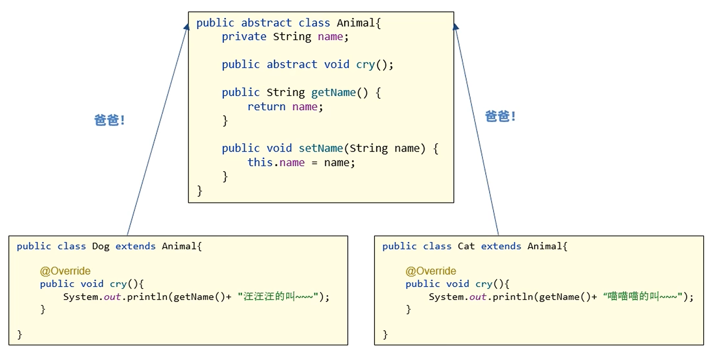

##### 代码实现

+ Animal.java

```java
package Advanced.e_abstract.abstract2;

public abstract class Animal {
    private String name;

    public abstract void cry();

    public String getName() {
        return name;
    }

    public void setName(String name) {
        this.name = name;
    }
}

```

+ Cat.java

```java
package Advanced.e_abstract.abstract2;

public class Cat extends Animal {
    @Override
    public void cry() {
        System.out.println(getName() + "喵喵喵的叫~");
    }
}

```

+ Dog.java

```java
package Advanced.e_abstract.abstract2;

public class Dog extends Animal {
    @Override
    public void cry() {
        System.out.println(getName() + "汪汪汪的叫~");
    }
}

```

+ Test.java

```java
package Advanced.e_abstract.abstract2;

public class Test {
    public static void main(String[] args) {
        // 目标：掌握抽象类的好处
        Animal a = new Cat();
        a.setName("叮当猫");
        a.cry(); // 叮当猫喵喵喵的叫~
    }
}

```

##### 总结

1. 抽象类的好处是什么？

+ 父类知道每个子类都要做某个行为，但每个子类要做的情况不一样，父类就定义成抽象方法，交给子类去重写是西安，**我们设计这样的抽象类，就是为了更好的支持多态**


---------------------------------


#### 5.3 抽象类的常见应用场景：模板方法设计模式

##### 5.3.1 模板方法设计模式解决了什么问题？

+ 解决方法中存在重复代码的问题

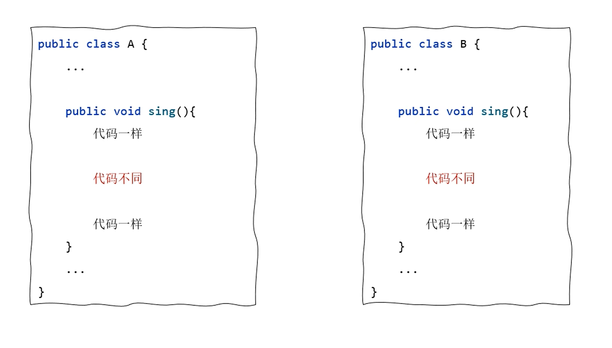

##### 5.3.2 模板方法设计模式的写法

+ 定义一个抽象类

+ 在里面定义2个方法
  + **一个是模板方法：把相同代码放里面去**
  + 一个是抽象方法：**具体实现交给子类完成**

##### 多学一招：建议使用 final 关键字修饰模板方法，为什么？

+ 模板方法是给对象直接使用的，不能被子类重写
+ 一旦子类重写了模板方法，模板方法就失效了

##### 代码实现

+ People.java

```java
package Advanced.e_abstract.abstract_template;

public abstract class People {
    /**
     * 设计模板方法设计模式
     * 1. 定义一个模板方法出来
     */
    public final void write() {
        System.out.println("\t\t\t\t\t《我的爸爸》");
        System.out.println("\t\t我的爸爸好啊，nb啊，来看看我的爸爸有多nb");
        // 2. 模板方法并不清楚正文部分到底应该怎么写，但是它知道子类肯定要写
        System.out.println(writeMain());
        System.out.println("有这样的爸爸太好了！");
    }

    // 3. 设计一个抽象方法写正文，具体的实现交给子类完成
    public abstract String writeMain();
}

```

+ Student.java

```java
package Advanced.e_abstract.abstract_template;

public class Student extends People {
    @Override
    public String writeMain() {
        return "我的爸爸特别牛，开车都不看红绿灯的，下辈子还要做他的儿子~~~";
    }
}

```

+ Teacher.java

```java
package Advanced.e_abstract.abstract_template;

public class Teacher extends People {
    @Override
    public String writeMain() {
        return "我的爸爸也挺好的，让我站在这别走，他去买个橘子~~~";
    }
}

```

+ Test.java

```java
package Advanced.e_abstract.abstract_template;

public class Test {
    public static void main(String[] args) {
        // 目标：搞清楚抽象类的应用场景之一：经常用来设计模板方法设计模式
        // 场景：学生、老师都要写一篇作文：我的爸爸
        // 第一段是一样的
        // 正文部分自由发挥
        // 最后一段也是一样的
        Teacher t = new Teacher();
        t.write();

        Student s = new Student();
        s.write();
    }
}

```

##### 总结

1. 模板方法设计模式解决了什么问题？

+ 解决方法中存在重复代码的问题

2. 模板方法设计模式应该怎么写？

+ 定义一个抽象类
+ 在里面定义2个方法，一个是模板方法：放相同的代码里，一个是抽象方法：具体实现交给子类完成

3. 模板方法建议使用什么关键字修饰？为什么？

+ 建议使用 final 关键字修饰模板方法


-----------------------


### 6. 接口

#### 6.1 接口概述

##### 6.1.1 认识接口

+ Java 提供了一个关键字 interface，用这个关键字我们可以定义出一个特殊的结构：接口

```java
public interface 接口名 {
    // 成员变量（常量）
    // 成员方法（抽象方法）
}
```

+ 注意：接口不能创建对象；接口是用来被类**实现（implements）**的，实现接口的类称为**实现类**

```java
修饰符 class 实现类 implements 接口1, 接口2, 接口3, ...{
    
}
```

+ **一个类可以实现多个接口（接口可以理解成干爹）**，实现类实现多个接口，必须重写完全部接口的全部抽象方法，否则实现类需要定义成抽象类

###### 代码演示

+ A.java

```java
package Advanced.f_interface;

public interface A {
    // 成员变量（常量）
    String SCHOOL_NAME = "Feng";

    // 成员方法（抽象方法）
    void test();
}

```

+ B.java

```java
package Advanced.f_interface;

public interface B {
    void testb1();

    void testb2();
}

```

+ C.java

```java
package Advanced.f_interface;

public interface C {
    void testc1();

    void testc2();
}

```

+ D.java

```java
package Advanced.f_interface;

// 实现类
public class D implements B, C {

    @Override
    public void testb1() {

    }

    @Override
    public void testb2() {

    }

    @Override
    public void testc1() {

    }

    @Override
    public void testc2() {

    }
}

```

+ Test.java

```java
package Advanced.f_interface;

public class Test {
    public static void main(String[] args) {
        // 目标：认识接口
        System.out.println(A.SCHOOL_NAME); // Feng

//        A a = new A(); // 报错

        D d = new D();
        d.testb1();
    }
}

```

##### 6.1.2 接口的好处

+ 弥补了类单继承的不足，一个类同时可以实现多个接口
+ 让程序可以面向接口编程，这样程序员就可以灵活方便的切换各种业务实现

###### 代码演示

```java
package Advanced.f_interface.interface2;

public class Test {
    public static void main(String[] args) {
        // 目标：搞清楚使用接口的好处
        Driver s = new A();
        s.driver();

        Driver d = new B();
        d.driver();
    }
}

class B implements Driver {
    @Override
    public void driver() {

    }
}

class A extends Student implements Driver, Singer {
    @Override
    public void driver() {

    }

    @Override
    public void sing() {

    }
}

class Student {

}

interface Driver {
    void driver();
}

interface Singer {
    void sing();
}

```

##### 总结

1. 使用接口有啥好处，第一个好处是什么？

+ 可以解决类单继承的问题，通过接口，我们可以让一个类有一个亲爹的同时，还可以找多个干爹去扩展自己的功能

2. 为什么我们要通过接口，也就是去找干爹，来扩展自己的功能呢？

+ 因为通过接口去找干爹，别人通过你 implements 的接口，就可以显性的知道你是谁，从而也就可以放心的把你当作谁来用了

3. 使用接口的第二个好处是什么？

+ 一个类我们所可以实现多个接口，同样，一个接口也可以被多个类实现的。这样做的好处是我们的程序就可以面向接口编程了，这样我们程序员就可以很方便的灵活切换各种业务实现了


--------------------------


#### 6.2 接口的综合案例

> 需求：
>
> 请设计一个班级学生的信息管理模块：学生的数据有：姓名、性别、成绩
>
> 功能1：要求打印出全班学生的信息；
>
> 功能2：要求打印出全班学生的平均成绩
>
> ------------------
>
> 注意！以上功能的业务实现是有多套方案的，比如：
>
> 第一套方案：能打印出班级全部学生的信息；能打印出班级全部学生的平均分
>
> 第二套方案：能打印出班级全部学生的信息（**包含男女人数**）；能打印出班级全部学生的平均分（**要求是去掉最高分、最低分**）
>
> **要求：系统可以支持灵活的切换这些实现方案**

##### 代码实现

+ Student.java

```java
package Advanced.f_interface.interface_demo;

public class Student {
    private String name;
    private char sex;
    private double score;

    public Student() {
    }

    public Student(String name, char sex, double score) {
        this.name = name;
        this.sex = sex;
        this.score = score;
    }

    public String getName() {
        return name;
    }

    public void setName(String name) {
        this.name = name;
    }

    public char getSex() {
        return sex;
    }

    public void setSex(char sex) {
        this.sex = sex;
    }

    public double getScore() {
        return score;
    }

    public void setScore(double score) {
        this.score = score;
    }
}

```

+ ClassManager.java

```java
package Advanced.f_interface.interface_demo;

import java.util.ArrayList;

public class ClassManager {
    private ArrayList<Student> students = new ArrayList<>();
    private StudentOperator studentOperator = new StudentOperatorImpl2();

    public ClassManager() {
        students.add(new Student("张三", '男', 99));
        students.add(new Student("李四", '女', 100));
        students.add(new Student("王五", '男', 80));
        students.add(new Student("周六", '女', 60));
    }

    // 打印全班全部学生的信息
    public void printInfo() {
        studentOperator.printAllInfo(students);
    }

    // 打印全班全部学生的平均分
    public void printScore() {
        studentOperator.printAverageScore(students);
    }
}

```

+ StudentOperator.java

```java
package Advanced.f_interface.interface_demo;

import java.util.ArrayList;

public interface StudentOperator {
    void printAllInfo(ArrayList<Student> students);

    void printAverageScore(ArrayList<Student> students);
}

```

+ StudentOperatorImpl1.java

```java
package Advanced.f_interface.interface_demo;

import java.util.ArrayList;

public class StudentOperatorImpl1 implements StudentOperator {
    @Override
    public void printAllInfo(ArrayList<Student> students) {
        System.out.println("-----------------全班全部学生信息如下-------------------");
        for (int i = 0; i < students.size(); i++) {
            Student s = students.get(i);
            System.out.println("姓名：" + s.getName() + "，" + "性别：" + s.getSex() + "，" + "成绩：" + s.getScore());
        }
        System.out.println("-----------------------------");
    }

    @Override
    public void printAverageScore(ArrayList<Student> students) {
        double allScore = 0.0;
        for (int i = 0; i < students.size(); i++) {
            Student s = students.get(i);
            allScore += s.getScore();
        }
        System.out.println("平均分：" + (allScore) / students.size());
    }
}

```

+ StudentOperatorImpl2.java

```java
package Advanced.f_interface.interface_demo;

import java.util.ArrayList;

public class StudentOperatorImpl2 implements StudentOperator {
    @Override
    public void printAllInfo(ArrayList<Student> students) {
        System.out.println("-----------------全班全部学生信息如下-------------------");
        int count1 = 0;
        int count2 = 0;
        for (int i = 0; i < students.size(); i++) {
            Student s = students.get(i);
            System.out.println("姓名：" + s.getName() + "，" + "性别：" + s.getSex() + "，" + "成绩：" + s.getScore());
            if (s.getSex() == '男') {
                count1++;
            } else {
                count2++;
            }
        }
        System.out.println("男生人数是：" + count1 + "，" + " 女生人数是：" + count2);
        System.out.println("班级总人数：" + students.size());
        System.out.println("-----------------------------");
    }

    @Override
    public void printAverageScore(ArrayList<Student> students) {
        double allScore = 0.0;
        double max = students.get(0).getScore();
        double min = students.get(0).getScore();
        for (int i = 0; i < students.size(); i++) {
            Student s = students.get(i);
            if (s.getSex() > max) max = s.getScore();
            if (s.getSex() < min) min = s.getScore();
            allScore += s.getScore();
        }
        System.out.println("学生最高分是：" + max);
        System.out.println("学生最低分是：" + min);
        System.out.println("平均分：" + (allScore - max - min) / (students.size() - 2));
    }
}

```

+ Test.java

```java
package Advanced.f_interface.interface_demo;

public class Test {
    public static void main(String[] args) {
        // 目标：完成班级学生信息管理的案例
        ClassManager clazz = new ClassManager();
        clazz.printInfo();
        clazz.printScore();
    }
}
```


-------------------------------------


#### 6.3 接口的其他细节：JDK8开始，接口中新增的三种方法

1. 默认方法：必须使用 `default` 修饰，默认会被 public 修饰
2. 私有方法：必须使用 `private` 修饰（JDK9开始才支持）
3. 静态方法：必须使用 `static` 修饰

##### JDK8开始，接口中为啥要新增这些方法？

+ 增强了接口的能力，更便于项目的扩展和维护

##### 代码实现

+ A.java

```java
package Advanced.f_interface.interface_jdk8;

public interface A {
    /**
     * 1. 默认方法：必须使用default修饰，默认会被public修饰
     * 实例方法：对象的方法，必须使用实现类的对象来访问
     */
    default void test1() {
        System.out.println("==默认方法==");
        test2();
    }

    /**
     * 2. 私有方法：必须使用private修饰（JDK9开始才支持）
     * 实例方法：对象的方法
     */
    private void test2() {
        System.out.println("==私有方法==");
    }

    /**
     * 3. 静态方法：必须使用static修饰
     */
    static void test3() {
        System.out.println("==静态方法==");
    }
}

```

+ B.java

```java
package Advanced.f_interface.interface_jdk8;

public class B implements A {
}

```

+ Test.java

```java
package Advanced.f_interface.interface_jdk8;

public class Test {
    public static void main(String[] args) {
        // 目标：掌握接口新增的三种方法形式
        B b = new B();
        b.test1();
//        b.test2(); // 报错
        A.test3();
    }
}

```

##### 总结

1. JDK8开始，接口中新增了哪些方法？

+ 默认方法：使用 default 修饰，使用实现类的对象调用
+ 静态方法：static 修饰，必须用当前接口名调用
+ 私有方法：private 修饰，JDK9开始才的，只能在接口内部被调用
+ 他们都会默认被 public 修饰

2. JDK8开始，接口中为啥要新增这些方法？

+ 增强了接口的能力，更便于项目的扩展和维护


--------------------------------


#### 6.4 接口的其他细节：接口的多继承、使用接口的注意事项

##### 6.4.1 接口的多继承

+ 一个接口可以同时继承多个接口

```java
public interface C extends B, A {
    
}
```

##### 6.4.2 接口多继承的作用

+ 便于实现类去实现

###### 代码演示

```java
package Advanced.f_interface.interface_attention;

public class Test {
    public static void main(String[] args) {
        // 目标：理解接口的多继承
    }
}

interface A {
    void test1();
}

interface B {
    void test2();
}

interface C {
}

// 接口是多继承的
interface D extends C, B, A {
}

class E implements D {
    @Override
    public void test1() {

    }

    @Override
    public void test2() {

    }
}

```

##### 6.4.3 接口其他注意事项（了解）

1. 一个接口继承多个接口，如果多个接口中存在方法签名冲突，则此时不支持多继承
2. 一个类实现多个接口，如果多个接口中存在方法签名冲突，则此时不支持多实现
3. 一个类继承了父类，又同时实现了接口，父类中和接口中有同名的默认方法，实现类会优先用父类的
4. 一个类实现了多个接口，多个接口中存在同名的默认方法，可以不冲突，这个类重写该方法即可

###### 代码演示

```java
package Advanced.f_interface.interface_attention;

import Advanced.b_extends.d13_extends_visit.Z;

public class Test2 {
    public static void main(String[] args) {
        // 目标：了解使用接口的几点注意事项

        Zi zi = new Zi();
        zi.run(); // ===父类的run方法执行了===
    }
}

// 1. 一个接口继承多个接口，如果多个接口中存在方法签名冲突，则此时不支持多继承
interface I {
    void test1();
}

interface J {
    String test1();
}
//interface K extends I, J{} // 报错

// 2. 一个类实现多个接口，如果多个接口中存在方法签名冲突，则此时不支持多实现
//class E implements I, J{} // 报错

// 3. 一个类继承了父类，又同时实现了接口，父类中和接口中有同名的默认方法，实现类会优先用父类的
class Fu {
    public void run() {
        System.out.println("===父类的run方法执行了===");
    }
}

interface IT {
    default void run() {
        System.out.println("===接口IT的run方法执行了===");
    }
}

class Zi extends Fu implements IT {
}

// 4. 一个类实现了多个接口，多个接口中存在同名的默认方法，可以不冲突，这个类重写该方法即可
interface IT1 {
    default void test() {
        System.out.println("IT1");
    }
}

interface IT2 {
    default void test() {
        System.out.println("IT2");
    }
}

class N implements IT1, IT2 {
    @Override
    public void test() {
        System.out.println("自己的");
    }
}

```


----------------------


### 7. 内部类

+ 是类中的五大成分之一（成员变量、方法、构造器、**内部类**、代码块），**如果一个类定义在另一个类的内部，这个类就是内部类**

#### 7.1 内部类概述、成员内部类

+ 如果一个类定义在另一个类的内部，这个类就是内部类
+ 场景：当一个类的内部，包含了一个完整的事物，且这个事物没有必要单独设计时，就可以把这个事物设计成内部类

```java
public class Car {
    // 内部类
    public class Engine {
        
    }
}
```

##### 7.1.1 成员内部类

+ 就是类中的一个普通成员，类似前面我们学过的普通的成员变量、成员方法

```java
public class Outer {
    // 成员内部类
    public class Inner {
        
    }
}
```

注意：JDK16之前，成员内部类中不能定义静态成员，JDK16开始也可以定义静态成员了

##### 7.1.2 创建对象的格式

```java
外部类名.内部类名 对象名 = new 外部类(...).new 内部类(...);
Outer.Inner in = new Outer().new Inner();
```

##### 7.1.3 成员内部类中访问其他成员的特点

1. 和前面学过的实例方法一样，成员内部类的实例方法中，同样可以直接访问外部类的实例成员、静态成员
2. 可以在成员内部类的实例方法中，拿到当前外部类对象，格式是：`外部类名.this`

##### 代码演示

+ Outer.java

```java
package Advanced.g_inner_class.inner_class1;

public class Outer {
    private int age = 99;
    public static String a;

    // 成员内部类
    public class Inner {
        private String name;
        public static String schoolName; // jdk16开始才支持定义静态成员的
        private int age = 88;

        public void test() {
            System.out.println(age);
            System.out.println(a);

            int age = 66;
            System.out.println(age); // 66
            System.out.println(this.age); // 88
            System.out.println(Outer.this.age); // 99
        }

        public String getName() {
            return name;
        }

        public void setName(String name) {
            this.name = name;
        }
    }

    public void test2() {
        System.out.println(age);
        System.out.println(a);
    }
}

```

+ Test.java

```java
package Advanced.g_inner_class.inner_class1;

public class Test {
    public static void main(String[] args) {
        // 目标：了解成员内部类和其特点
        Outer.Inner in = new Outer().new Inner();
        in.test();
    }
}

```

##### 总结

1. 成员内部类是什么？如何创建其对象？

+ 就是类中的一个普通成员，类似前面我们学过的普通的成员变量、成员方法
+ 外部类名.内部类名 对象名 = new 外部类(...).new 内部类(...);

2. 成员内部类的实例方法中，访问其他成员有啥特点？

+ 可以直接访问外部类的实例成员、静态成员
+ 可以拿到当前外部类对象，格式是：`外部类名.this`


-----------------------------


#### 7.2 静态内部类

##### 7.2.1 什么是静态内部类？

+ 有 static 修饰的内部类，属于外部类直接持有

```java
public class Outer {
    // 静态内部类
    public static class Inner {
        
    }
}
```

##### 7.2.2 创建对象的格式

```java
外部类名.内部类名 对象名 = new 外部类.内部类(...);
Outer.Inner in = new Outer.Inner();
```

##### 7.2.3 静态内部类中访问外部类成员的特点

+ 可以直接访问外部类的静态成员，不可以直接访问外部类的实例成员

##### 代码实现

+ Outer.java

```java
package Advanced.g_inner_class.inner_class2;

public class Outer {
    private int age;
    public static String schoolName;

    // 静态内部类
    public static class Inner {
        private String name;
        public static int a;

        public void test() {
            System.out.println(schoolName);
//        System.out.println(age); // 报错
        }

        public String getName() {
            return name;
        }

        public void setName(String name) {
            this.name = name;
        }
    }

    public static void test2() {
        System.out.println(schoolName);
//        System.out.println(age); // 报错
    }
}

```

+ Test.java

```java
package Advanced.g_inner_class.inner_class2;

public class Test {
    public static void main(String[] args) {
        // 目标：了解静态内部类
        Outer.Inner in = new Outer.Inner();
        in.test();
    }
}

```

##### 总结

1. 什么是静态内部类？如何创建对象？有啥特点？

+ 有 static 修饰的内部类
+ 外部类名.内部类名 对象名 = new 外部类.内部类(...);
+ 可以直接访问外部类的静态成员，不可以直接访问外部类的实例成员


--------------------------------------


#### 7.3 局部内部类

+ 局部内部类是定义在方法中、代码块中、构造器等执行体中

```java
public class Test {
    public static void main(String[] args) {
    }

    public static void go() {
        class A {

        }

        abstract class B {

        }

        interface C {

        }
    }
}
```

==鸡肋语法，看看就好==


------------------


#### 7.4 匿名内部类

##### 7.4.1 认识匿名内部类

###### 匿名内部类

+ 这是一种特殊的局部内部类；所谓匿名：指的是程序员不需要为这个类声明名字

```java
new 类或接口(参数值...) {
    类体(一般是方法重写);
};
```

```java
new Animal() {
    @Override
    public void cry() { 
    }
};
```

+ **特点**：匿名内部类本质就是一个子类，并会立即创建出一个子类对象
+ **作用**：用于更方便的创建一个子类对象

###### 代码演示

```java
package Advanced.g_inner_class.inner_class3;

import Advanced.e_abstract.abstract2.Cat;

public class Test {
    public static void main(String[] args) {
        // 目标：认识匿名内部类，并掌握其作用
//        Animal a = new Cat();
//        a.cry();

        // 1. 把这个匿名内部类编译成一个子类，然后立即创建一个子类对象出来
        Animal a = new Animal() {
            @Override
            public void cry() {
                System.out.println("喵喵喵的叫~~~");
            }
        };
        a.cry();
    }
}

//class Cat extends Animal{
//    @Override
//    public void cry() {
//        System.out.println("喵喵喵的叫~~~");
//    }
//}

abstract class Animal {
    public abstract void cry();
}

```


------------------------------


##### 7.4.2 匿名内部类的常见使用场景

+ **通常作为一个参数传输给方法**

###### 代码演示

```java
package Advanced.g_inner_class.inner_class3;

public class Test2 {
    public static void main(String[] args) {
        // 目标：掌握匿名的场景使用场景
//        Swimming s1 = new Swimming(){
//            @Override
//            public void swim() {
//                System.out.println("狗游泳飞快~~~");
//            }
//        };
//        go(s1);

        go(new Swimming() {
            @Override
            public void swim() {
                System.out.println("狗游泳飞快~~~");
            }
        });
    }

    // 设计一个方法，可以接收swimming接口的一切实现类对象进来参加游泳比赛
    public static void go(Swimming s) {
        System.out.println("开始-----------------------");
        s.swim();
    }
}


// 猫和狗都要参加游泳比赛
interface Swimming {
    void swim();
}

```

##### 总结

1. 匿名内部类的书写格式是什么样的？

```java
new 类或接口(参数值...) {
    类体(一般是方法重写);
};
```

```java
new Animal() {
    @Override
    public void cry() { 
    }
};
```

2. 匿名内部类有啥特点？

+ 匿名内部类本质就是一个子类，并会立即创建出一个子类对象

3. 匿名内部类有啥作用、应用场景？

+ 可以更方便的创建出一个子类对象
+ **匿名内部类通常作为一个参数传输给方法**


--------------------------


### 8. 枚举

#### 8.1 认识枚举

+ 枚举是一种特殊类

##### 8.1.1 枚举类的格式

```java
修饰符 enum 枚举类名 {
    名称1, 名称2, ...;
	其他成员...
}
```

注意：

+ 枚举类中的第一行，只能写一些合法的标识符（名称），多个名称用逗号隔开
+ **这些名称，本质是常量，每个常量都会记住枚举类的一个对象**

##### 8.1.2 枚举类的特点

```java
package Advanced.h_enum;

public enum A {
    // 注意：枚举类的第一行必须罗列的是枚举对象的名字
    X, Y ,Z;

    private String name;

    public String getName() {
        return name;
    }

    public void setName(String name) {
        this.name = name;
    }
}

```

```java
Compiled from "A.java"
public final class Advanced.h_enum.A extends java.lang.Enum<Advanced.h_enum.A> {
  public static final Advanced.h_enum.A X;
  public static final Advanced.h_enum.A Y;
  public static final Advanced.h_enum.A Z;
  public static Advanced.h_enum.A[] values();
  public static Advanced.h_enum.A valueOf(java.lang.String);
  public java.lang.String getName();
  public void setName(java.lang.String);
  static {};
}
```

+ **枚举类的第一行只能罗列一些名称，这些名称都是常量，并且每个常量记住的都是枚举类的一个对象**
+ 枚举类的构造器都是私有的（写不写都只能是私有的），因此，枚举类对外不能创建对象
+ 枚举都是最终类，不可以被继承
+ 枚举类中，从第二行开始，可以定义类的其他各种成员
+ 编译器为枚举类新增了几个方法，并且枚举类都是继承：java.lang.Enum 类的，从 enum 类也会继承到一些方法

##### 代码演示

+ A.java

```java
package Advanced.h_enum;

public enum A {
    // 注意：枚举类的第一行必须罗列的是枚举对象的名字
    X, Y, Z;

    private String name;

    public String getName() {
        return name;
    }

    public void setName(String name) {
        this.name = name;
    }
}

```

+ B.java

```java
package Advanced.h_enum;

// 拓展：抽象枚举
public enum B {
    X() {
        @Override
        public void go() {
        }
    }, Y("张三") {
        @Override
        public void go() {
            System.out.println(getName() + "在跑~~~");
        }
    };

    private String name;

    B() {
    }

    B(String name) {
        this.name = name;
    }

    public abstract void go();

    public String getName() {
        return name;
    }

    public void setName(String name) {
        this.name = name;
    }
}

```

+ Test.java

```java
package Advanced.h_enum;

public class Test {
    public static void main(String[] args) {
        // 目标：认识枚举
        A a1 = A.X;
        System.out.println(a1);

        // 1. 枚举类的构造器是私有的，不能对外创建对象
//        A a = new A(); // 报错

        // 2. 枚举类的第一行都是常量，记住的是枚举类的对象
        A a2 = A.Y;

        // 3. 枚举类提供一些额外的API
        A[] as = A.values(); // 拿到全部对象
        A a3 = A.valueOf("Z"); // 根据常量名得到枚举对象
        System.out.println(a3.name()); // Z
        System.out.println(a3.ordinal()); // 索引 2

        System.out.println("-----------------------------");

        B y = B.Y;
        y.go(); // 张三在跑~~~
    }
}

```

##### 多学一招：使用枚举类实现单例设计模式

```java
public enum C {
    X; // 单例
}
```


-------------------------------


#### 8.2 枚举的常见应用场景

+ **用来表示一组信息，然后作为参数进行传输**


选择定义一个一个的常量表示一组信息，并作为参数传输

+ 参数值不受约束

选择定义枚举表示一组信息，并作为参数传输

+ 代码可读性好，参数值得到了约束，对使用者更友好，建议使用

##### 代码演示

+ Constant.java

```java
package Advanced.h_enum.enum2;

public class Constant {
    public static final int BOY = 0;
    public static final int GIRL = 1;
}

```

+ Constant2.java

```java
package Advanced.h_enum.enum2;

public enum Constant2 {
    BOY, GIRL;
}

```

+ Test.java

```java
package Advanced.h_enum.enum2;

public class Test {

    public static void main(String[] args) {
        // 目标：掌握枚举的应用场景：做信息标志和分类
//        check(1);
//        check(Constant.BOY);

        check(Constant2.BOY);
    }

    public static void check(Constant2 sex) {
        switch (sex) {
            case BOY:
                System.out.println("展示一些美女图、游戏信息~~~");
                break;
            case GIRL:
                System.out.println("展示一些帅哥图~~~");
                break;
        }
    }

//    public static void check(int sex) {
//        switch (sex){
//            case Constant.BOY:
//                System.out.println("展示一些美女图、游戏信息~~~");
//                break;
//            case Constant.GIRL:
//                System.out.println("展示一些帅哥图~~~");
//                break;
//        }
//    }
    
}

```


----------------------


### 9. 泛型

#### 9.1 认识泛型

+ 定义类、接口、方法时，**同时声明了一个或者多个类型变量（如：<E>）**，称为泛型类、泛型接口、泛型方法，它们统称为泛型

```java
public class ArrayList<E>{
    ...
}
```

+ 作用：泛型提供了在编译阶段约束所能操作的数据类型，并自动进行检查的能力！**这样可以避免强制类型转换，及其可能出现的异常**
+ **泛型的本质：把具体的数据类型作为参数传给类型变量**（看源码）

##### 代码演示

```java
package Advanced.i_generics;

import java.util.ArrayList;

public class Test1 {
    public static void main(String[] args) {
        // 目标：认识泛型
        ArrayList list = new ArrayList();
        list.add("java1");
        list.add("java2");
        list.add("java3");
        list.add(new Cat());

        for (int i = 0; i < list.size(); i++) {
            String e = (String) list.get(i);
            System.out.println(e);
        }

        System.out.println("---------------------------------");

        ArrayList<String> list1 = new ArrayList<>();
        list1.add("java1");
        list1.add("java2");
        list1.add("java3");
//        list1.add(new Cat()); // 报错

        for (int i = 0; i < list1.size(); i++) {
            String e = list1.get(i);
            System.out.println(e);
        }
    }
}

class Cat {

}

```


-----------------------


#### 9.2 泛型类

```java
修饰符 class 类名<类型变量, 类型变量, ...>{
    
}
```

```java
public class ArrayList<E>{
    ...
}
```

注意：类型变量建议用大写的英文字母，常用的有：**E、T、K、V** 等

##### 代码演示

+ MyArrayList.java

```java
package Advanced.i_generics.generics_class;

// 泛型类
public class MyArrayList<E> {
    private Object[] arr = new Object[10];
    private int size; // 记录当前位置

    public boolean add(E e) {
        arr[size++] = e;
        return true;
    }

    public E get(int index) {
        return (E) arr[index];
    }
}

```

+ MyClass2.java

```java
package Advanced.i_generics.generics_class;

public class MyClass2<E, T> {
    public void put(E e, T t) {
    }
}

```

+ Animal.java

```java
package Advanced.i_generics.generics_class;

public class Animal {
}

```

+ Cat.java

```java
package Advanced.i_generics.generics_class;

public class Cat extends Animal {
}

```

+ Dog.java

```java
package Advanced.i_generics.generics_class;

public class Dog extends Animal{
}

```

+ MyClass3.java

```java
package Advanced.i_generics.generics_class;

public class MyClass3 <E extends Animal>{
}

```

+ Test.java

```java
package Advanced.i_generics.generics_class;

public class Test {
    public static void main(String[] args) {
        // 目标：掌握泛型类的定义和使用
        MyArrayList<String> list = new MyArrayList<>();
        list.add("java1");
        list.add("java2");
        list.add("java3");
        String ele = list.get(1);
        System.out.println(ele); // java2

        MyClass2<Cat, String> c2 = new MyClass2<>();

        MyClass3<Animal> c3 = new MyClass3<>();
        MyClass3<Dog> c4 = new MyClass3<>();
    }
}

```


----------------------------


#### 9.3 泛型接口

```java
修饰符 interface 接口名<类型变量, 类型变量, ...> {
    
}
```

```java
public interface A<E> {
    ...
}
```

+ 注意：类型变量建议用大写的英文字母，常用的有：**E、T、K、V** 等

泛型接口就是给实现类实现的，实现类在实现泛型接口的时候可以声明一个数据类型上来，然后实现类重写的这些方法都将是针对于该类型的操作了

##### 代码演示

+ Student.java

```java
package Advanced.i_generics.generics_interface;

public class Student {
}

```

+ Teacher.java

```java
package Advanced.i_generics.generics_interface;

public class Teacher {
}

```

+ Data.java

```java
package Advanced.i_generics.generics_interface;

import java.util.ArrayList;

// 泛型接口
public interface Data<T> {
    void add(T t);

    ArrayList<T> getByName(String name);
}

```

+ StudentData.java

```java
package Advanced.i_generics.generics_interface;

import java.util.ArrayList;

public class StudentData implements Data<Student> {
    @Override
    public void add(Student student) {

    }

    @Override
    public ArrayList<Student> getByName(String name) {
        return null;
    }
}

```

+ TeacherData.java

```java
package Advanced.i_generics.generics_interface;

import java.util.ArrayList;

public class TeacherData implements Data<Teacher> {
    @Override
    public void add(Teacher teacher) {

    }

    @Override
    public ArrayList<Teacher> getByName(String name) {
        return null;
    }
}

```

+ Test.java

```java
package Advanced.i_generics.generics_interface;

public class Test {
    public static void main(String[] args) {
        // 目标：掌握泛型接口的定义和使用
        // 场景：系统需要处理学生和老师的数据，需要提供2个功能：保存对象数据、根据名称查询数据

    }
}

```


---------------------------


#### 9.4 泛型方法、泛型通配符、上下限

```java
修饰符 <类型变量, 类型变量, ...> 返回值类型 方法名(形参列表) {
    
}
```

```java
public static <T> void test(T t) {
    
}
```

##### 9.4.1 通配符

+ 就是 `?` ，可以在 “使用泛型” 的时候代表一切类型；E T K V 是在定义泛型的时候使用

##### 9.4.2 上下限

+ 泛型上限：`? extends Car` ------ ? 能接收的必须是 Car 或者其子类
+ 泛型下限：`? super Car` ------ ? 能接收的必须是 Car 或者其父类

##### 代码演示

+ Car.java

```java
package Advanced.i_generics.generics_method;

public class Car {
}

```

+ BMW.java

```java
package Advanced.i_generics.generics_method;

public class BMW extends Car{
}

```

+ BENZ.java

```java
package Advanced.i_generics.generics_method;

public class BENZ extends Car{
}

```

+ Dog.java

```java
package Advanced.i_generics.generics_method;

public class Dog {
}

```

+ Test.java

```java
package Advanced.i_generics.generics_method;

import java.util.ArrayList;

public class Test {
    public static void main(String[] args) {
        // 目标：掌握泛型方法的定义和使用
        String rs = test("java");
        System.out.println(rs);

        Dog d = test(new Dog());
        System.out.println(d);

        // 需求：所有的汽车可以一起参加比赛
        ArrayList<Car> cars = new ArrayList<>();
        cars.add(new BMW());
        cars.add(new BENZ());
        go(cars);

        ArrayList<BMW> bmws = new ArrayList<>();
        bmws.add(new BMW());
        bmws.add(new BMW());
        go(bmws);

        ArrayList<BENZ> benzs = new ArrayList<>();
        benzs.add(new BENZ());
        benzs.add(new BENZ());
        go(benzs);

//        ArrayList<Dog> dogs = new ArrayList<>();
//        dogs.add(new Dog());
//        dogs.add(new Dog());
//        go(dogs); // 报错
    }

    // ? 通配符，在使用泛型的时候可以代表一切类型     ? extends Car 称为上限继承     ? super Car 称为下限继承
    public static void go(ArrayList<? extends Car> cars) {

    }

//    public static <T extends Car> void go(ArrayList<T> cars){
//
//    }

    // 泛型方法
    public static <T> T test(T t) {
        return t;
    }
}

```


-----------------------------


#### 9.5 泛型擦除问题、包装类介绍

+ 泛型是工作在编译阶段的，一旦程序编译成 class 文件，class 文件中就不存在泛型了，这就是泛型擦除
+ 泛型不支持基本数据类型，只能支持对象类型（引用数据类型）

##### 代码演示

```java
package Advanced.i_generics.generics_attention;

import java.util.ArrayList;

public class Test {
    public static void main(String[] args) {
        // 目标：理解泛型的注意事项
        // 1. 泛型是工作在编译阶段的，一旦程序编译成 class 文件，class 文件中就不存在泛型了，这就是泛型擦除
        ArrayList<String> list = new ArrayList<>();
        list.add("java1");
        list.add("java2");
        list.add("java3");
        String rs = list.get(2);
        System.out.println(rs);

        // 2. 泛型不支持基本数据类型，只能支持对象类型（引用数据类型）
//        ArrayList<int> list1 = new ArrayList<>(); // 报错
//        ArrayList<double> list2 = new ArrayList<>(); // 报错
        ArrayList<Integer> list1 = new ArrayList<>();
        list1.add(12);

        ArrayList<Double> list2 = new ArrayList<>();
        list2.add(23.3);
    }
}

```


-------------------


### 10. 常用 API

#### 10.1 API 概述

##### 10.1.1 什么是 API ？

+ API（Application Programming interface）：应用程序编程接口
+ **就是 Java 帮我们已经写好一些程序，如：类、方法等，我们直接拿过来用就可以解决一些问题**

##### 10.1.2 常用 API

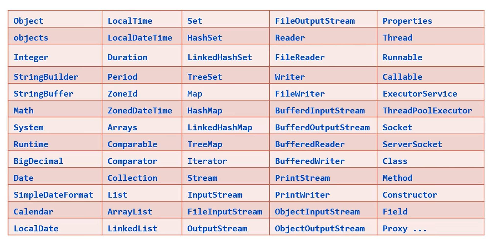


-------------------------------


#### 10.2 Object 类

##### 10.2.1 Object 类的作用：

+ Object 类是 Java 中所有类的祖宗类，因此，Java 中所有类的对象都可以直接使用 Object 类中提供的一些方法

##### 10.2.2 Object 类的常见方法

| 方法名称                            | 说明                     |
| ----------------------------------- | ------------------------ |
| public String **toString()**        | 返回对象的字符串表示形式 |
| public boolean **equals(Object o)** | 判断两个对象是否相等     |
| protected Object **clone()**        | 对象克隆                 |

toString 存在的意义：toString() 方法存在的意义就是为了被子类重写，以便返回对象具体的内容

equals 存在的意义：直接比较两个对象的地址是否相同完全可以用 “==” 替代 equals，equals 存在的意义就是为了被子类重写，以便子类自己来定制比较规则（比如比较对象内容）

##### 代码演示

+ Student.java

```java
package Advanced.j_api_object.api_object;

import java.util.Objects;

public class Student {
    private String name;
    private int age;

    public Student() {
    }

    public Student(String name, int age) {
        this.name = name;
        this.age = age;
    }

    // 重写equals方法，比较两个对象的内容一样就返true
    // 比较者：s2 == this
    // 被比较者：s1 == o
    @Override
    public boolean equals(Object o) {
        // 1. 判断两个对象是否地址一样，一样直接返回true
        if (this == o) return true;
        // 2. 判读o是null直接返回false，或者比较者的类型与被比较者的类型不一样，直接返回false
        if (o == null || getClass() != o.getClass()) return false;
        // 3. o不是null，且o一定是学生类型的对象，开始比较内容
        Student student = (Student) o;
        return age == student.age && Objects.equals(name, student.name);
    }

    @Override
    public String toString() {
        return "Student{" +
                "name='" + name + '\'' +
                ", age=" + age +
                '}';
    }

    public String getName() {
        return name;
    }

    public void setName(String name) {
        this.name = name;
    }

    public int getAge() {
        return age;
    }

    public void setAge(int age) {
        this.age = age;
    }
}

```

+ Test.java

```java
package Advanced.j_api_object.api_object;

public class Test {
    public static void main(String[] args) {
        // 目标：掌握Object类提供的常用方法
        Student s1 = new Student("张三", 23);
//        System.out.println(s1.toString());
        System.out.println(s1); // Student{name='张三', age=23}

        Student s2 = new Student("张三", 23);
        System.out.println(s2.equals(s1)); // true
        System.out.println(s2 == s1); // false
    }
}

```

##### 总结

1. Object 中 toString 方法的作用是什么？存在的意义是什么？

+ 基本作用：返回对象的字符串形式
+ 存在的意义：让子类重写，以便返回子类对象的内容

2. Object 中 equals 方法的作用是什么？存在的意义是什么？

+ 基本作用：默认是比较两个对象的地址是否相等
+ 存在的意义：让子类重写，以便用于比较对象的内容是否相同

##### 10.2.3 Object 类提供的对象克隆方法

| 方法名                       | 说明     |
| ---------------------------- | -------- |
| protected Object **clone()** | 对象克隆 |

+ 当某个对象调用这个方法时，这个方法会复制一个一模一样的新对象返回

###### 浅克隆

+ 拷贝出的新对象，与原对象中的数据一模一样（**应用类型拷贝的只是地址**）

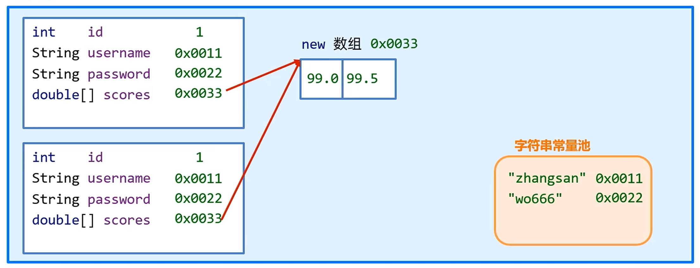

###### 深克隆

+ 对象中基本类型的数据直接拷贝
+ 对象中的字符串数据拷贝的还是地址
+ 对象中还包含的其他对象，不会拷贝地址，会创建新对象

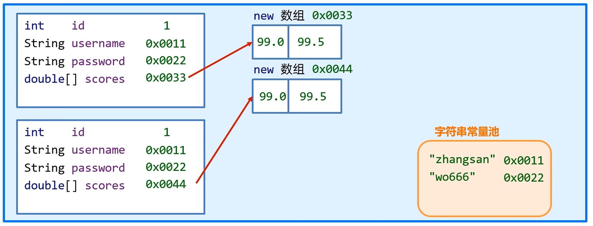

###### 代码实现

+ User.java

```java
package Advanced.j_api_object.api_object;

// Cloneable是一个标记接口
// 可以理解为是一种规则
public class User implements Cloneable {
    private int id; // 编号
    private String username; // 用户名
    private String password; // 密码
    private double[] scores; // 分数

    public User() {
    }

    public User(int id, String username, String password, double[] scores) {
        this.id = id;
        this.username = username;
        this.password = password;
        this.scores = scores;
    }

    @Override
    protected Object clone() throws CloneNotSupportedException {
        // super去调用父类Object中的clone方法
        User u2 = (User) super.clone();
        u2.scores = u2.scores.clone();
        return u2;
    }

    public int getId() {
        return id;
    }

    public void setId(int id) {
        this.id = id;
    }

    public String getUsername() {
        return username;
    }

    public void setUsername(String username) {
        this.username = username;
    }

    public String getPassword() {
        return password;
    }

    public void setPassword(String password) {
        this.password = password;
    }

    public double[] getScores() {
        return scores;
    }

    public void setScores(double[] scores) {
        this.scores = scores;
    }
}

```

+ Test.java

```java
package Advanced.j_api_object.api_object;

public class Test2 {
    public static void main(String[] args) throws CloneNotSupportedException {
        // 目标：掌握Object类提供的对象克隆的方法
        // 1. protected Object clone()：对象克隆

        User u1 = new User(1, "zhangsan", "wo666", new double[]{99.0, 99.5});

        User u2 = (User) u1.clone();
        System.out.println(u1.getId()); // 1
        System.out.println(u1.getUsername()); // zhangsan
        System.out.println(u1.getPassword()); // wo666
        System.out.println(u1.getScores()); // [D@b4c966a

        System.out.println(u2.getId()); // 1
        System.out.println(u2.getUsername()); // zhangsan
        System.out.println(u2.getPassword()); // wo666
        System.out.println(u2.getScores()); // [D@2f4d3709
    }
}

```

###### 总结

1. 什么是对象克隆？

+ 当某个对象调用 clone 方法时，会复制一个一模一样的新对象返回

2. 什么是浅克隆？

+ 拷贝出的新对象，与原对象中的数据一模一样（**应用类型拷贝的只是地址**）

3. 什么是深克隆？

+ 对象中基本类型的数据直接拷贝
+ 对象中的字符串数据拷贝的还是地址
+ 对象中还包含的其他对象，不会拷贝地址，会创建新对象


---------------------------------


#### 10.3 Objects

+ Objects 是一个工具类，提供了很多操作对象的静态方法给我们使用

| 方法名称                                             | 说明                                               |
| ---------------------------------------------------- | -------------------------------------------------- |
| public static boolean **equals(Object a, Object b)** | 先做非空判断，再比较两个对象                       |
| public static boolean **isNull(Objetc obj)**         | 判断对象是否为 null，为 null 则返回 true，反之     |
| public static boolean **nonNull(Object obj)**        | 判断对象是否不为 null，不为 null 则返回 true，反之 |

源码分析

```java
public static boolean equals(Object a, Object b) {
    return (a == b) || (a != null && a.equals(b));
}
```

##### 代码演示

```java
package Advanced.j_api_object.api_objects;

import java.util.Objects;

public class Test {
    public static void main(String[] args) {
        // 目标：掌握Objects类提供的常用方法
        String s1 = null;
        String s2 = "itfeng";

//        System.out.println(s1.equals(s2)); // 报空指针异常
        System.out.println(Objects.equals(s1, s2)); // false

        System.out.println(Objects.isNull(s1)); // true
        System.out.println(Objects.isNull(s2)); // false

        System.out.println(Objects.nonNull(s1)); // false
        System.out.println(Objects.nonNull(s2)); // true
    }
}

```


-----------------------------


#### 10.4 包装类

+ 包装类就是把基本类型的数据包装成对象

| 基本数据类型 | 对应的包装类（引用数据类型） |
| ------------ | ---------------------------- |
| byte         | Byte                         |
| short        | Short                        |
| **int**      | **Integer**                  |
| long         | Long                         |
| **char**     | **Character**                |
| float        | Float                        |
| double       | Double                       |
| boolean      | Boolean                      |

| 基本类型的数据包装成对象的方案        |
| ------------------------------------- |
| public Integer(int value)：**已过时** |
| public static Integer valueOf(int i)  |

**自动装箱**：基本数据类型可以自动转换为包装类型

**自动拆箱**：包装类型可以自动转换为基本数据类型

##### 10.4.1 包装类的其他常见操作

+ 可以把基本类型的数据转换成字符串类型

```java
public static String toString(double d)
public String toString()
```

+ 可以把字符串类型的**数值**转换成数值本身对应的数据类型

```java
public static int parseint(String s)
public static Integer valueOf(String s)
```

##### 代码演示

```java
package Advanced.k_package.integer;

import java.util.ArrayList;

public class Test {
    public static void main(String[] args) {
        // 目标：掌握包装类的使用
//        Integer a1 = new Integer(12); // 过时
        Integer a2 = Integer.valueOf(12);
        System.out.println(a2); // 12

        // 自动装箱：可以自动把基本类型的数据转换成对象
        Integer a3 = 12;

        // 自动拆箱：可以自动把包装类型的对象转换成对应的基本数据类型
        int a4 = a3;

        // 泛型和集合不支持基本数据类型，只能支持引用数据类型
//        ArrayList<int> list = new ArrayList<>(); // 报错
        ArrayList<Integer> list = new ArrayList<>();
        list.add(12); // 自动装箱
        list.add(13); // 自动装箱

        int rs = list.get(1); // 自动拆箱
        System.out.println("--------------------------------");

        // 1. 把基本类型的数据转换成字符串类型
        Integer a = 23;
        String rs1 = Integer.toString(a);
        System.out.println(rs1 + 1); // 231

        String rs2 = a.toString();
        System.out.println(rs2 + 1); // 231

        String rs3 = a + "";
        System.out.println(rs3 + 1); // 231

        // 2. 把字符串类型的数值转换成数值本身对应的数据类型
        String ageStr = "29";
//        int ageI = Integer.parseInt(ageStr);
        int ageI = Integer.valueOf(ageStr);
        System.out.println(ageI + 1); // 30

        String scoreStr = "99.5";
//        double score = Double.parseDouble(scoreStr);
        double score = Double.valueOf(scoreStr);
        System.out.println(score + 0.5); // 100.0

    }
}

```

##### 总结

1. 为什么要有包装类，包装类有哪些？

+ 包装类就是把基本类型的数据包装成对象
+ 泛型和集合不支持基本数据类型，只能支持引用数据类型
+ Byte、Short、Integer、Long、Character、Float、Double、Boolean

2. 包装类提供了哪些常见的功能？

+ 可以把基本类型的数据转换成字符串类型
+ 可以把字符串类型的**数值**转换成数值本身对应的数据类型


----------------------------


#### 10.5 StringBuilder、StringBuffer

##### 10.5.1 StringBuilder

+ StringBuilder 代表可变字符串对象，**相当于是一个容器**，它里面装的字符串是可以改变的，**就是用来操作字符串的**
+ 好处：**StringBuilder 比 String 更适合做字符串的修改操作，效率会更高，代码也会更简洁**

| 构造器                               | 说明                                           |
| ------------------------------------ | ---------------------------------------------- |
| public **StringBuilder()**           | 创建一个空白的可变的字符串对象，不包含任何内容 |
| public **StringBuilder(String str)** | 创建一个指定字符串内容的可变字符串对象         |

| 方法名称                                  | 说明                                                     |
| ----------------------------------------- | -------------------------------------------------------- |
| public StringBuilder **append(任意类型)** | 添加数据并返回 StringBuilder 对象本身                    |
| public StringBuilder reverse()            | 将对象的内容反转                                         |
| public int length()                       | 返回对象内容长度                                         |
| public String **toString()**              | 通过 toString() 就可以实现把 StringBuilder 转换成 String |

+ 代码演示

```java
package Advanced.l_stringBuilder;

public class Test1 {
    public static void main(String[] args) {
        // 目标：搞清楚StringBuilder的用法和作用
//        StringBuilder s = new StringBuilder();
        StringBuilder s = new StringBuilder("itfeng");

        // 1. 拼接内容
        s.append(12);
        s.append("FENG");
        s.append(true);

        // 支持链式编程
        s.append(666).append("FENG2").append(666);

        // 2. 反转操作
        s.reverse();

        System.out.println(s); // 6662GNEF666eurtGNEF21gnefti

        // 3. 返回字符串的长度
        System.out.println(s.length()); // 27

        // 4. 把StringBuilder对象又转换成String类型
        String rs = s.toString();
        System.out.println(rs); // 6662GNEF666eurtGNEF21gnefti
    }
}

```

###### 为啥操作字符串建议使用 StringBuilder，而不是原来学过的 String？ 

+ 因为使用 String 频繁操作字符串的话，比如拼接、修改等，效率是比较低的，而使用 StringBuilder 来频繁操作字符串的话效率非常高
+ **对于字符串相关的操作，如频繁的拼接、修改等，建议用 StringBuilder，效率更高！**
+ **注意：如果操作字符串较少，或者不需要操作，以及定义字符串变量，还是建议用 String**

代码演示

```java
package Advanced.l_stringBuilder;

public class Test2 {
    public static void main(String[] args) {
        // 目标：掌握StringBuilder的好处
        // 需求：拼接100万次abc
        // 先用String测试看看性能
//        String rs = "";
//        for (int i = 1; i < 1000000; i++) {
//            rs = rs + "abc";
//        }
//        System.out.println(rs);

        // 使用StringBuilder演示
        StringBuilder sb = new StringBuilder();
        for (int i = 1; i < 1000000; i++) {
            sb.append("abc");
        }
        System.out.println(sb);
    }
}

```

###### 案例

> 需求：
>
> 设计一个方法，用于返回任意整型数组的内容，要求返回的数组内容格式如：`[11, 22, 33]`

分析：

+ 方法是否需要接收数据？   **需要接收整型数组**
+ 方法是否需要返回数据？   **需要返回拼接后的结果**
+ 方法内部：遍历数组的数据，把遍历到的数据都拼接起来，此时使用 StringBuilder 来完成拼接

代码实现

```java
package Advanced.l_stringBuilder;

public class Test3 {
    public static void main(String[] args) {
        // 目标：完成遍历数组内容，并拼接成指定格式的案例
        System.out.println(getArrayData(new int[]{11, 22, 33}));
    }

    public static String getArrayData(int[] arr) {
        // 1. 判断arr是否为null
        if (arr == null) {
            return null;
        }

        // 2. arr数组对象存在。arr = [11, 22, 33]
        StringBuilder sb = new StringBuilder();
        sb.append("[");
        for (int i = 0; i < arr.length; i++) {
            if (i == arr.length - 1) {
                sb.append(arr[i]);
            } else {
                sb.append(arr[i]).append(", ");
            }
        }
        sb.append("]");

        return sb.toString();
    }
}

```

##### 10.5.2 StringBuffer 与 StringBuilder

注意：

+ StringBuffer 的用法与 StringBuilder 是一模一样的
+ 但 StringBuilder 是线程不安全的，StringBuffer 是线程安全的


--------------------------------


#### 10.6 StringJoiner

+ JDK8开始才有的，跟 StringBulider 一样也是用来操作字符串的，也可以看成是一个容器，创建之后里面的内容是可变的
+ 好处：不仅能提高字符串的操作效率，**并且在有些场景下使用它操作字符串，代码会更简洁**

| 构造器                                            | 说明                                                         |
| ------------------------------------------------- | ------------------------------------------------------------ |
| public StringJoiner(间隔符号)                     | 创建一个 StringJoiner 对象，指定拼接时的间隔符号             |
| public StringJoiner(间隔符号, 开始符号, 结束符号) | 创建一个 StringJoiner 对象，指定拼接时的间隔符号、开始符号、结束符号 |

| 方法名称                             | 说明                                         |
| ------------------------------------ | -------------------------------------------- |
| public StringJoiner add (添加的内容) | 添加数据，并返回对象本身                     |
| public int length()                  | 返回长度（字符出现的个数）                   |
| public String toString()             | 返回一个字符串（该字符串就是拼接之后的结果） |

##### 代码演示

```java
package Advanced.m_stringjoiner;

import java.util.StringJoiner;

public class Test {
    public static void main(String[] args) {
        // 目标：掌握StringJoiner的使用
//        StringJoiner s = new StringJoiner(", "); // 间隔符
        StringJoiner s = new StringJoiner(", ", "[", "]"); // 间隔符
        s.add("java1");
        s.add("java2");
        s.add("java3");
        System.out.println(s); // [java1, java2, java3]

        System.out.println(getArrayData(new int[]{11, 22, 33})); // [11, 22, 33]
    }

    public static String getArrayData(int[] arr) {
        // 1. 判断arr是否为null
        if (arr == null) {
            return null;
        }

        // 2. arr数组对象存在。arr = [11, 22, 33]
        StringJoiner s = new StringJoiner(", ", "[", "]");
        for (int i = 0; i < arr.length; i++) {
            s.add(arr[i] + "");
        }
        return s.toString();
    }
}

```

##### 总结

1. StringJoiner 是啥？使用它有什么好处？

+ 跟 StringBulider 一样也是用来操作字符串的，也可以看成是一个容器，创建之后里面的内容是可变的
+ 好处：不仅能提高字符串的操作效率，**并且在有些场景下使用它操作字符串，代码会更简洁**


----------------------------------


## 二、常用 API（二）

### 1. Math、System、Runtime

#### 1.1 Math

+ 代表数学，是一个工具类，里面提供的都是对数据进行操作的一些静态方法

##### 1.1.1 Math 类提供的常见方法

| 方法名                                       | 说明                                        |
| -------------------------------------------- | ------------------------------------------- |
| public static int abs(int a)                 | 获取参数绝对值                              |
| public static double ceil(double a)          | 向上取整                                    |
| public static double floor(double a)         | 向下取整                                    |
| public static int round(float a)             | 四舍五入                                    |
| public static int max(int a, int b)          | 获取两个 int 值中的较大值                   |
| public static double pow(double a, double b) | 返回 a 的 b 次幂的值                        |
| public static double random()                | 返回值为 double 的随机值，范围为 [0.0, 1.0) |

##### 代码演示

```java
package Advanced.n_MathSystemRuntime;

public class MathTest {
    public static void main(String[] args) {
        // 目标：了解Math类提供的常见方法
        // 1. public static int abs(int a)：取绝对值（拿到的结果一定是正数）
        System.out.println(Math.abs(-12)); // 12
        System.out.println(Math.abs(123)); // 123
        System.out.println(Math.abs(-3.14)); // -3.14

        // 2. public static double ceil(double a)：向上取整
        System.out.println(Math.ceil(4.0000001)); // 5.0
        System.out.println(Math.ceil(4.0)); // 4.0

        // 3. public static double floor(double a)：向下取整
        System.out.println(Math.floor(4.999999999999999)); // 4.0
        System.out.println(Math.floor(4.0)); // 4.0

        // 4. public static int round(float a)：四舍五入
        System.out.println(Math.round(3.49999)); // 3
        System.out.println(Math.round(3.50001)); // 4

        // 5. public static int max(int a, int b)：取较大值
        //    public static int min(int a, int b)：取较小值
        System.out.println(Math.max(10, 20)); // 20
        System.out.println(Math.min(10, 20)); // 10

        // 6. public static double pow(double a, double b)：取次方
        System.out.println(Math.pow(2, 3)); // 8.0
        System.out.println(Math.pow(3, 3)); // 9.0

        // 7. public static double random()：取随机数 [0.0, 1.0)（包前不包后）
        System.out.println(Math.random()); // 0.8957106643199547
    }
}

```


---------------------------------


#### 1.2 System

+ System 代表程序所在的系统，也是一个工具类

##### 1.2.1 System 类提供的常见方法

| 方法名                                 | 说明                                   |
| -------------------------------------- | -------------------------------------- |
| public static void exit(int status)    | 终止当前运行的 Java 虚拟机             |
| public static long currentTimeMillis() | 返回当前系统的时间毫秒值形式（时间戳） |

##### 1.2.2 时间毫秒值

+ 指的是从1970年1月1日 00:00:00 走到此刻的总的毫秒数，应该是很大的。1s  = 1000ms
+ 1970年1月1日，算是c语言的生日

##### 代码演示

```java
package Advanced.n_MathSystemRuntime;

public class SystemTest {
    public static void main(String[] args) {
        // 目标：了解System的常见方法
        // 1. public static void exit(int status)
        // 终止当前运行的 Java 虚拟机
        // 该参数用作状态diamagnetic；按照惯例，非零状态代码表示异常终止
//        System.exit(0); // 人为的终止虚拟机（不要使用）
        System.out.println("--------------------");

        // 2. public static long currentTimeMillis()
        // 获取当前系统的时间毫秒值形式
        // 返回的是long类型的时间毫秒值：指的是从 1970-1-1 0:0:0 开始走到此时此刻的总的毫秒值：1s = 1000ms
        long time = System.currentTimeMillis();
        System.out.println(time);

        for (int i = 0; i < 1000000; i++) {
            System.out.println("输出了：" + i);
        }

        long time2 = System.currentTimeMillis();
        System.out.println((time2 - time) / 1000.0 + "s");
    }
}

```


-----------------------------------


#### 1.3 Runtime

+ 代表程序所在的运行环境
+ Runtime 是一个单例类

##### 1.3.1 Runtime 类提供的常见方法

| 方法名                              | 说明                                     |
| ----------------------------------- | ---------------------------------------- |
| public static Runtime getRuntime()  | 返回与当前 Java 应用程序关联的运行时对象 |
| public void exit(int status)        | 终止当前运行的虚拟机                     |
| public int availableProcessors()    | 返回 Java 虚拟机可用的处理器数           |
| public long totalMemory()           | 返回 Java 虚拟机中的内存总量             |
| public long freeMemory()            | 返回 Java 虚拟机中的可用内存             |
| public Process exec(String command) | 启动某个程序，并返回代表该程序的对象     |

##### 代码演示

```java
package Advanced.n_MathSystemRuntime;

import java.io.IOException;

/**
 * 目标：了解Runtime的几个常见方法
 */
public class RuntimeTest {
    public static void main(String[] args) throws IOException, InterruptedException {

        // 1. public static Runtime getRuntime() 返回与当前 Java 应用程序关联的运行时对象
        Runtime r = Runtime.getRuntime();
        // 2. public void exit(int status) 终止当前运行的虚拟机
//        r.exit(0);

        // 3. public int availableProcessors() 返回 Java 虚拟机可用的处理器数
        System.out.println(r.availableProcessors());

        // 4. public long totalMemory() 返回 Java 虚拟机中的内存总量
        System.out.println(r.totalMemory() / 1024.0 / 1024.0 + "MB"); // 1024 = 1K   1024 * 1024 = 1M

        // 5. public long freeMemory() 返回 Java 虚拟机中的可用内存
        System.out.println(r.freeMemory() / 1024.0 / 1024.0 + "MB");

        // 6. public Process exec(String command) 启动某个程序，并返回代表该程序的对象
//        r.exec("\"D:\\wangyiyunyinle\\cloudmusic.exe\"");
        Process p = r.exec("\"D:\\wangyiyunyinle\\cloudmusic.exe\"");
        Thread.sleep(5000); // 让程序在这里暂停5s再往下走
        p.destroy(); // 关闭程序
    }
}

```


----------------------------------


### 2. BigDecimal

+ 用于解决浮点型运算时，出现结果失真的问题
  + 浮点型运算时，直接 + - * / 可能会出现运算结果失真


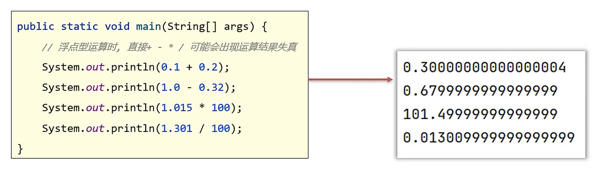

#### 2.1 BigDecimal 的常见构造器、常用方法

| 构造器                                                   | 说明                        |
| -------------------------------------------------------- | --------------------------- |
| public BigDecimal(double val)   **注意：不推荐使用这个** | 将 double 转换成 BigDecimal |
| public BigDecimal(String val)                            | 把 String 转成 BigDecimal   |

| 方法名                                                       | 说明                              |
| ------------------------------------------------------------ | --------------------------------- |
| **public static BigDecimal valueOf(double val)**             | **转换一个 double 成 BigDecimal** |
| public BigDecimal add(BigDecimal b)                          | 加法                              |
| public BigDecimal subtract(BigDecimal b)                     | 减法                              |
| public BigDecimal multiply(BigDecimal b)                     | 乘法                              |
| public BigDecimal divide(BigDecimal b)                       | 除法                              |
| public BigDecimal divide（另一个 BigDecimal 对象，精确几位，舍入模式） | 除法，可以控制精确到小数几位      |
| public double doubleValue()                                  | 将 BigDecimal 转换成 double       |

#### 代码演示

```java
package Advanced.o_bigDecimal;

import java.math.BigDecimal;
import java.math.RoundingMode;

public class BigDecimalDemo1 {
    public static void main(String[] args) {
        // 目标：掌握BigDecimal的使用，解决小数运算失真的问题
        double a = 0.1;
        double b = 0.2;
        double c = a + b;
        System.out.println(c); // 0.30000000000000004
        System.out.println("-----------------------------");

        // 1. 把他们变成字符串封装成BigDecimal对象来运算
//        BigDecimal a1 = new BigDecimal(Double.toString(a));
//        BigDecimal b1 = new BigDecimal(Double.toString(b));
        // 推荐用以下方式：把小数转换成字符串再得到BigDecimal对象来使用（更简洁）
        BigDecimal a1 = BigDecimal.valueOf(a);
        BigDecimal b1 = BigDecimal.valueOf(b);

        BigDecimal c1 = a1.add(b1); // 0.3
        BigDecimal c2 = a1.subtract(b1); // -0.1
        BigDecimal c3 = a1.multiply(b1); // 0.02
        BigDecimal c4 = a1.divide(b1); // 0.5

        BigDecimal i = BigDecimal.valueOf(0.1);
        BigDecimal j = BigDecimal.valueOf(0.3);
        BigDecimal k = i.divide(j, 2, RoundingMode.HALF_UP); // 除法
        System.out.println(k); // 0.33

        // 把BigDecimal对象转换成double类型的数据
        double rs = k.doubleValue();
        System.out.println(rs); // 0.33
    }
}

```

#### 总结

1. BigDecimal 的作用是什么？

+ 解决浮点型运算时，出现结果失真的问题

2. 应该如何把浮点型转换成 BigDecimal 的对象？

+ `BigDecimal b1 = BigDecimal.valueOf(0.1)`


---------------------------


### 3. JDK8之前传统的日期、时间

#### 3.1 Date

+ 代表的是日期和时间

| 构造器                 | 说明                                             |
| ---------------------- | ------------------------------------------------ |
| public Date()          | 创建一个 Date 对象，代表的是系统当前此刻日期时间 |
| public Date(long time) | 把时间毫秒值转换成 Date 日期对象                 |

| 常见方法                       | 说明                                              |
| ------------------------------ | ------------------------------------------------- |
| public long getTime()          | 返回从1970年1月1日 00:00:00  走到此刻的总的毫秒数 |
| public void setTime(long time) | 设置日期对象的时间为当前时间毫秒值对应的时间      |

##### 代码演示

```java
package Advanced.p_time;

import java.util.Date;

public class Test1Date {
    public static void main(String[] args) {
        // 目标：掌握Date日期类的使用
        // 1. 创建一个Date的对象：代表系统当前的时间信息
        Date d = new Date();
        System.out.println(d); // Sun May 11 14:06:14 CST 2025

        // 2. 拿到时间毫秒值
        long time = d.getTime();
        System.out.println(time); // 1746943574251

        // 3. 把时间毫秒值转换成日期对象：2s之后的时间是多少
        time += 2 * 1000;
        Date d2 = new Date(time);
        System.out.println(d2); // Sun May 11 14:06:16 CST 2025

        // 4. 直接把日期对象的时间通过setTime方法进行修改
        Date d3 = new Date();
        d3.setTime(time);
        System.out.println(d3); // Sun May 11 14:06:16 CST 2025
    }
}

```

##### 总结

1. 日期对象如何创建，如何获取时间毫秒值？

+ `Date d = new Date();`
+ `long time = d.getTime();`

2. 时间毫秒值怎么转成日期对象？

+ `Date d2 = new Date(time);`
+ `Date d3 = new Date();
   d3.setTime(time);`


----------------------------


#### 3.2 SimpleDateFormat

+ 代表简单日期格式化，可以用来把日期对象、时间毫秒值格式化成我们想要的形式

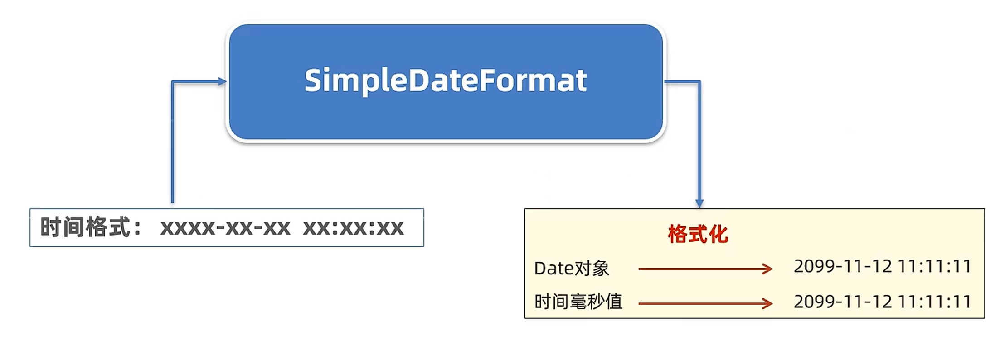

| 常见构造器                                  | 说明                                     |
| ------------------------------------------- | ---------------------------------------- |
| public **SimpleDateFormat(String pattern)** | 创建简单日期格式化对象，并封装时间的格式 |

| 格式化时间的方法                            | 说明                                |
| ------------------------------------------- | ----------------------------------- |
| public final String **format(Date date)**   | 将日期格式化成日期/时间字符串       |
| public final String **format(Object time)** | 将时间毫秒值格式化成日期/时间字符串 |

##### 3.2.1 时间格式的常见符号


##### 3.2.2 SimpleDateFormat 解析字符串时间成为日期对象

+ 如何将字符串对象解析成日期对象

| 解析方法                             | 说明                       |
| ------------------------------------ | -------------------------- |
| public Date **parse(String source)** | 把字符串时间解析成日期对象 |

##### 代码演示

```java
package Advanced.p_time;

import java.text.ParseException;
import java.text.SimpleDateFormat;
import java.util.Date;

public class Test2SimpleDateFormat {
    public static void main(String[] args) throws ParseException {
        // 目标：掌握SimpleDateFormat的使用
        // 1. 准备一些时间
        Date d = new Date();
        System.out.println(d); // Sun May 11 14:20:04 CST 2025

        long time = d.getTime();
        System.out.println(time); // 1746944404021

        // 2. 格式化日期对象和时间毫秒值
        SimpleDateFormat sdf = new SimpleDateFormat("yyyy年MM月dd日 HH:mm:ss EEE a");

        String rs = sdf.format(d);
        String rs2 = sdf.format(time);
        System.out.println(rs); // 2025年05月11日 14:20:04 周日 下午
        System.out.println(rs2); // 2025年05月11日 14:20:04 周日 下午

        System.out.println("---------------------------------");

        // 目标：掌握SimpleDateFormat解析字符串时间成为日期对象
        String dateStr = "2022-12-12 12:12:11";
        // 1. 创建简单日期格式化对象，指定的时间格式必须与被解析的时间格式一模一样，否则会出bug
        SimpleDateFormat sdf2 = new SimpleDateFormat("yyyy-MM-dd HH:mm:ss");
        Date d2 = sdf2.parse(dateStr);

        System.out.println(d2); // Mon Dec 12 12:12:11 CST 2022
    }
}

```

##### 总结

1. SimpleDateFormat 代表什么，有什么作用？

+ 代表简单日期格式化，可以用来把日期对象、时间毫秒值格式化成我们想要的形式

2. SimpleDateFormat 的对象如何创建？

+ `SimpleDateFormat sdf = new SimpleDateFormat("yyyy年MM月dd日 HH:mm:ss EEE a");`

3. SimpleDateFormat 格式化，以及解析时间的方法是哪些？

+ `String rs = sdf.format(d);`
+ `Date d2 = sdf2.parse(dateStr);`


--------------------------


#### 案例联系：秒杀活动

> 需求：
>
> 秒杀开始时间：2023年11月11日 00:00:00
>
> 秒杀结束时间：2023年11月11日 00:10:00
>
> + 小贾下单并付款的时间为：2023年11月11日 00:01:18
> + 小皮下单并付款的时间为：2023年11月11日 00:10:51
> + 请用代码说明这两位同学有没有参加上秒杀活动？

##### 代码实现

```java
package Advanced.p_time;

import java.text.ParseException;
import java.text.SimpleDateFormat;
import java.util.Date;

public class Test3 {
    public static void main(String[] args) throws ParseException {
        // 目标：完成秒杀案例
        // 1. 把开始时间、结束时间、小贾下单时间、小皮下单时间拿到程序中来
        String start = "2023年11月11日 00:00:00";
        String end = "2023年11月11日 00:10:00";
        String xj = "2023年11月11日 00:01:18";
        String xp = "2023年11月11日 00:10:51";

        // 2. 把字符串的时间解析成日期对象
        SimpleDateFormat sdf = new SimpleDateFormat("yyyy年MM月dd日 HH:mm:ss");
        Date startDt = sdf.parse(start);
        Date endDt = sdf.parse(end);
        Date xjDt = sdf.parse(xj);
        Date xpDt = sdf.parse(xp);

        // 3. 开始判断小皮和小贾是否秒杀成功了
        // 把日期对象转换成时间毫秒值来计算
        long startTime = startDt.getTime();
        long endTime = endDt.getTime();
        long xjTime = xjDt.getTime();
        long xpTime = xpDt.getTime();

        if (xjTime >= startTime && xjTime <= endTime) {
            System.out.println("小贾您秒杀成功了~~~");
        } else {
            System.out.println("小贾您秒杀失败了~~~");
        }

        if (xpTime >= startTime && xpTime <= endTime) {
            System.out.println("小皮您秒杀成功了~~~");
        } else {
            System.out.println("小皮您秒杀失败了~~~");
        }
    }
}

```


--------------------------------


#### 3.3 Calendar

+ 代表的是系统此刻时间对应的日历
+ 通过它可以单独获取、修改时间中的年、月、日、时、分、秒等

##### 3.3.1 Calendar 日历类的常见方法

| 方法名                                 | 说明                        |
| -------------------------------------- | --------------------------- |
| public static Calendar getInstance()   | 获取当前日历对象            |
| public int get(int field)              | 获取日历中的某个信息        |
| public final Deta getTime()            | 获取日期对象                |
| public long getTimeInMillis()          | 获取时间毫秒值              |
| public void set(int field, int value)  | 修改日历中的某个信息        |
| public void add(int field, int amount) | 为某个信息增加/减少指定的值 |

**注意：Calendar 是可变对象，一旦修改后其对象本身表示的时间将产生变化**

##### 代码演示

```java
package Advanced.p_time;

import java.util.Calendar;
import java.util.Date;

public class Test4Calendar {
    public static void main(String[] args) {
        // 目标：掌握Calendar的使用和特点
        // 1. 得到系统此刻时间对应的日历对象
        Calendar now = Calendar.getInstance();
        System.out.println(now);

        // 2. 获取日历中的某个信息
        int year = now.get(Calendar.YEAR);
        System.out.println(year);

        int days = now.get(Calendar.DAY_OF_YEAR);
        System.out.println(days);

        // 3. 拿到日历中记录的日期对象
        Date d = now.getTime();
        System.out.println(d);

        // 4. 拿到时间毫秒值
        long time = now.getTimeInMillis();
        System.out.println(time);

        // 5. 修改日历中的某个信息
        now.set(Calendar.MONTH, 9); // 修改月份为10月份
        now.set(Calendar.DAY_OF_YEAR, 125); // 修改成一年中的第125天
        System.out.println(now);

        // 6. 为某个信息增加或者减少多少
        now.add(Calendar.DAY_OF_YEAR, 100);
        now.add(Calendar.DAY_OF_YEAR, -10);
        now.add(Calendar.DAY_OF_MONTH, 6);
        now.add(Calendar.HOUR, 12);
        System.out.println(now);
    }
}

```

##### 总结

1. Calendar 的对象，我们是如何获取的？

+ `Calendar now = Calendar.getInstance();`


----------------------------


### 4. JDK8开始新增的日期、时间

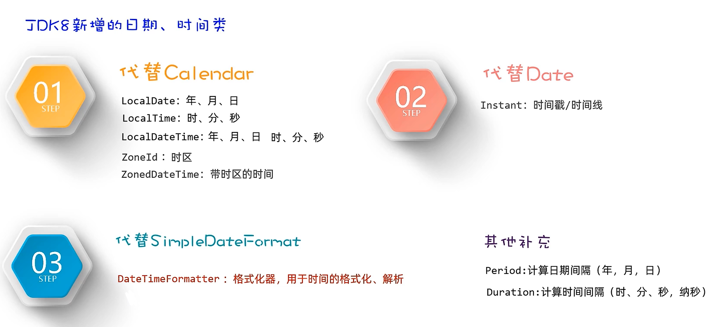

#### 4.1 LocalDate、LocalTime、LocalDateTime

+ LocalDate：代表本地日期（年、月、日、星期）
+ LocalTime：代表本地时间（时、分、秒、纳秒）
+ **LocalDateTime：代表本地日期、时间（年、月、日、星期、时、分、秒、纳秒）**

##### 4.1.1 它们获取对象的方案

| 方法名                                               | 示例                                                         |
| ---------------------------------------------------- | ------------------------------------------------------------ |
| public static Xxxx now()：获取系统当前时间对应的对象 | LocalDate ld = LocalDate.now();<br />LocalTime lt = LocalTime.now();<br />LocalDateTime ldt = LocalDateTime.now(); |
| public static Xxxx of(...)：获取指定时间的对象       | LocalDate localDate1 = LocalDate.of(2099, 11, 11);<br />LocalTime localTime1 = LocalTime.of(9, 8, 59);<br />LocalDateTime localDateTime1 = LocalDateTime.of(2025, 11, 16, 14, 30, 01); |

##### 4.1.2 LocalDate 的常用 API（都是处理年、月、日、星期相关的）

| 方法名                          | 说明                                     |
| ------------------------------- | ---------------------------------------- |
| public int getYear()            | 获取年                                   |
| public int getMonthValue()      | 获取月份（1-12）                         |
| public int getDayOfMonth()      | 获取日                                   |
| public int getDayOfYear()       | 获取当前是一年中的第几天                 |
| public DayOfWeek getDayOfWeek() | 获取星期几：ld.getDayOfWeek().getValue() |

| 方法名                                             | 说明                                     |
| -------------------------------------------------- | ---------------------------------------- |
| withYear、withMonth、withDayOfMonth、withDayOfYear | 直接**修改**某个信息，**返回新日期对象** |
| plusYears、plusMonths、plusDays、plusWeeks         | 把某个信息**加多少**，**返回新日期对象** |
| minusYears、minusMonths、minusDays、minusWeeks     | 把某个信息**减多少**，**返回新日期对象** |
| equals isBefore isAfter                            | 判断两个日期对象，是否相等，在前还是在后 |

##### 4.1.3 LocalTime 的常用 API（都是处理时、分、秒、纳秒相关的）

| 方法名                 | 说明     |
| ---------------------- | -------- |
| public int getHour()   | 获取小时 |
| public int getMinute() | 获取分   |
| public int getSecond() | 获取秒   |
| public int getNano()   | 获取纳秒 |

| 方法名                                             | 说明                                     |
| -------------------------------------------------- | ---------------------------------------- |
| withYear、withMonth、withDayOfMonth、withDayOfYear | 直接**修改**某个信息，**返回新日期对象** |
| plusYears、plusMonths、plusDays、plusWeeks         | 把某个信息**加多少**，**返回新日期对象** |
| minusYears、minusMonths、minusDays、minusWeeks     | 把某个信息**减多少**，**返回新日期对象** |
| equals isBefore isAfter                            | 判断两个日期对象，是否相等，在前还是在后 |

##### 4.1.4 LocalDateTime 的常用 API（可以处理年、月、日、星期、时、分、秒、纳秒等信息）

| 方法名                                                       | 说明                                               |
| ------------------------------------------------------------ | -------------------------------------------------- |
| getYear、getMonthValue、getDayOfMonth、getDayOfYear、getDayOfWeek、getHour、getMinute、getSecond、getNano | **获取年月日、时分秒、纳秒等**                     |
| withYear withMonth withDayOfMonth withDayOfYear withHour withMinute withSecond withNano | **修改**某个信息，**返回新日期对象**               |
| plusYears plusMonths plusDays plusHours plusMinutes plusSeconds plusNanos | 把某个信息**加多少**，**返回新日期对象**           |
| minusYears、minusMonths、minusDays、minusWeeksminusYears minusMonths minusDays minusHours minusMinutes minusSeconds minusNanos | 把某个信息把某个信息**减多少**，**返回新日期对象** |
| equals isBefore isAfter                                      | 判断两个日期对象，是否相等，在前还是在后           |

##### 代码演示

+ LocalDate

```java
package Advanced.q_jdk8_time;

import java.time.LocalDate;

public class Test1_LocalDate {
    public static void main(String[] args) {
        // 0. 获取本地日期对象
        LocalDate ld = LocalDate.now(); // 年 月 日
        System.out.println(ld); // 2025-05-11

        // 1. 获取日期对象中的信息
        int year = ld.getYear(); // 年
        int month = ld.getMonthValue(); // 月（1-12）
        int day = ld.getDayOfMonth(); // 日
        int dayOfYear = ld.getDayOfYear(); // 一年中的第几天
        int dayOfWeek = ld.getDayOfWeek().getValue(); // 星期几
        System.out.println(year); // 2025
        System.out.println(day); // 11
        System.out.println(dayOfWeek); // 7

        // 2. 直接修改某个信息：withYear、withMonth、withDayOfMonth、withDayOfYear
        LocalDate ld2 = ld.withYear(2099);
        LocalDate ld3 = ld.withMonth(12);
        System.out.println(ld2); // 2099-05-11
        System.out.println(ld3); // 2025-12-11
        System.out.println(ld); // 2025-05-11

        // 3. 把某个信息加多少：plusYears、plusMonths、plusDays、plusWeeks
        LocalDate ld4 = ld.plusYears(2);
        LocalDate ld5 = ld.plusMonths(2);

        // 4. 把某个信息减多少，minusYears、minusMonths、minusDays、minusWeeks
        LocalDate ld6 = ld.minusYears(2);
        LocalDate ld7 = ld.minusMonths(2);

        // 5. 获取指定日期的LocalDate对象：public static LocalDate of(int year, int month, int dayOfMonth);
        LocalDate ld8 = LocalDate.of(2099, 12, 12);
        LocalDate ld9 = LocalDate.of(2099, 12, 12);

        // 6. 判断2个日期对象，是否相等，在前还是在后：equals isBefore isAfter
        System.out.println(ld8.equals(ld9)); // true
        System.out.println(ld8.isAfter(ld)); // true
        System.out.println(ld8.isBefore(ld)); // false
    }
}

```

+ LocalTime

```java
package Advanced.q_jdk8_time;

import java.time.LocalTime;

public class Test2_LocalTime {
    public static void main(String[] args) {
        // 0. 获取本地时间对象
        LocalTime lt = LocalTime.now(); // 时 分 秒 纳秒 不可变的
        System.out.println(lt);

        // 1. 获取时间中的信息
        int hour = lt.getHour(); // 时
        int minute = lt.getMinute(); // 分
        int second = lt.getSecond(); // 秒
        int nano = lt.getNano(); // 纳秒

        // 2. 修改时间：withHour()、withMinute()、withSecond()、withNano()
        LocalTime lt3 = lt.withHour(10);
        LocalTime lt4 = lt.withMinute(10);
        LocalTime lt5 = lt.withSecond(10);
        LocalTime lt6 = lt.withNano(10);

        // 3. 加多少：plusHours()、plusMinutes()、plusSeconds()、plusNanos()
        LocalTime lt7 = lt.plusHours(10);
        LocalTime lt8 = lt.plusMinutes(10);
        LocalTime lt9 = lt.plusSeconds(10);
        LocalTime lt10 = lt.plusNanos(10);

        // 4. 减多少：minusHours()、minusMinutes()、minusSeconds()、minusNanos()
        LocalTime lt11 = lt.minusHours(10);
        LocalTime lt12 = lt.minusMinutes(10);
        LocalTime lt13 = lt.minusSeconds(10);
        LocalTime lt14 = lt.minusNanos(10);

        // 5. 获取指定时间的LocalTime对象
        LocalTime lt15 = LocalTime.of(12, 12, 12);
        LocalTime lt16 = LocalTime.of(12, 12, 12);

        // 6. 判断2个时间对象，是否相等，在前还是在后：equals()、isAfter()、isBefore()
        System.out.println(lt15.equals(lt16)); // true
        System.out.println(lt15.isAfter(lt)); // false
        System.out.println(lt15.isBefore(lt)); // true
    }
}

```

+ LocalDateTime

```java
package Advanced.q_jdk8_time;

import java.time.LocalDate;
import java.time.LocalDateTime;
import java.time.LocalTime;

public class Test3_LocalDateTime {
    public static void main(String[] args) {
        // 0. 获取本地日期和时间对象
        LocalDateTime ldt = LocalDateTime.now(); // 年 月 日 时 分 秒 纳秒
        System.out.println(ldt);

        // 1. 可以获取日期和时间的全部信息
        int year = ldt.getYear(); // 年
        int month = ldt.getMonthValue(); // 月
        int dayOfMonth = ldt.getDayOfMonth(); // 日
        int dayOfYear = ldt.getDayOfYear(); // 一年中的第几天
        int dayOfWeek = ldt.getDayOfWeek().getValue(); // 星期几
        int hour = ldt.getHour(); // 时
        int minute = ldt.getMinute(); // 分
        int second = ldt.getSecond(); // 秒
        int nano = ldt.getNano(); // 纳秒

        // 2. 修改日期和时间
        // withYear() withMonth() withDayOfMonth() withDayOfYear() withHour()
        // withMinute() withSecond() withNano()
        LocalDateTime ldt2 = ldt.withYear(2029); // 修改年份
        LocalDateTime ldt3 = ldt.withMinute(59); // 修改分钟

        // 3. 加多少
        // plusYears() plusMonths() plusDays() plusHours() plusMinutes() plusSeconds() plusNanos()
        LocalDateTime ldt4 = ldt.plusYears(2); // 加2年
        LocalDateTime ldt5 = ldt.plusMinutes(3); // 加3分钟

        // 4. 减多少
        // minusYears() minusMonths() minusDays() minusHours() minusMinutes() minusSeconds() minusNanos()
        LocalDateTime ldt6 = ldt.minusYears(2); // 减2年
        LocalDateTime ldt7 = ldt.minusMinutes(3); // 减3分钟

        // 5. 获取指定日期和时间的LocalDateTime对象
        // public static LocalDateTime of(int year, int month, int dayOfMonth, int hour, int minute, int second, int nanoOfSecond)
        LocalDateTime ldt8 = LocalDateTime.of(2029, 12, 12, 12, 12, 12, 12); // 指定日期和时间
        LocalDateTime ldt9 = LocalDateTime.of(2029, 12, 12, 12, 12, 12, 12); // 指定日期和时间

        // 6. 判断2个日期、时间对象是否相等，在前还是在后：equals()、isAfter()、isBefore()
        System.out.println(ldt9.equals(ldt8));
        System.out.println(ldt9.isAfter(ldt));
        System.out.println(ldt9.isBefore(ldt));

        // 7. 可以把LocalDateTime转换成LocalDate、LocalTime对象
        // public LocalDate toLocalDate()
        // public LocalTime toLocalTime()
        // public static LocalDateTime of(LocalDate date, LocalTime time)
        LocalDate ld = ldt.toLocalDate();
        LocalTime lt = ldt.toLocalTime();
        LocalDateTime ldt10 = LocalDateTime.of(ld, lt);
    }
}

```


----------------------------------


#### 4.2 ZoneId、ZonedDateTime

##### 4.2.1 什么是时区？

+ 由于世界各个国家与地区的经度不同，各地区的时间也有所不同，因此会划分为不同的时区

+ ZoneId：代表时区 Id

##### 4.2.2 ZoneId 时区的常见方法

| 方法名                                          | 说明                        |
| ----------------------------------------------- | --------------------------- |
| public static Set<String> getAvailableZoneIds() | 获取 Java 支持的全部时区 Id |
| public static ZoneId systemDefault()            | 获取系统默认的时区          |
| public static ZoneId of(String zoneId)          | 获取一个指定的时区          |

##### 4.2.3 ZonedDateTime 带时区时间的常见方法

| 方法名                                                       | 说明                             |
| ------------------------------------------------------------ | -------------------------------- |
| public static ZonedDateTime now()                            | 获取当前时区的 ZoneDateTime 对象 |
| public static ZonedDateTime now(ZoneId zone)                 | 获取指定时区的 ZoneDateTime 对象 |
| getYear、getMonthValue、getDayOfMonth、getDayOfYear、getDayOfWeek、getHour、getMinute、getSecond、getNano | 获取年月日、时分秒、纳秒等       |
| public ZonedDateTime withXxx(时间)                           | 修改时间系列的方法               |
| public ZonedDateTime minusXxx(时间)                          | 减少时间系统的方法               |
| public ZonedDateTime plusXxx(时间)                           | 增加时间系列的方法               |

##### 代码演示

```java
package Advanced.q_jdk8_time;

import java.time.Clock;
import java.time.ZoneId;
import java.time.ZonedDateTime;
import java.util.Calendar;
import java.util.Set;
import java.util.TimeZone;

public class Test4_ZoneId_ZonedDDateTime {
    public static void main(String[] args) {
        // 目标：了解时区和带时区的时间
        // 1. ZoneId的常见方法
        // public static ZoneId systemDefault()：获取系统默认的时区
        ZoneId zoneId = ZoneId.systemDefault();
        System.out.println(zoneId.getId()); // Asia/Shanghai
        System.out.println(zoneId); // Asia/Shanghai

        // public static Set<String> getAvailableZoneIds()：获取Java支持的全部时区Id
        System.out.println(ZoneId.getAvailableZoneIds());

        // public static ZoneId of(String zoneId)：把某个时区id封装成ZoneId对象 获取一个指定的时区
        ZoneId zoneId1 = ZoneId.of("America/New_York");

        // 2. ZonedDateTime：带时区的时间
        // public static ZonedDateTime now(ZoneId zone)：获取某个时区的ZoneDateTime对象
        ZonedDateTime now = ZonedDateTime.now(zoneId1);
        System.out.println(now); // 2025-05-11T04:21:34.207441400-04:00[America/New_York]

        // 世界标准时间
        ZonedDateTime now1 = ZonedDateTime.now(Clock.systemUTC()); // 世界标准时间
        System.out.println(now1); // 2025-05-11T08:22:41.237561800Z

        // public static ZonedDateTime now()：获取系统默认时区的ZonedDateTime对象
        ZonedDateTime now2 = ZonedDateTime.now();
        System.out.println(now2); // 2025-05-11T16:23:40.800469300+08:00[Asia/Shanghai]

//        Calendar instance = Calendar.getInstance(TimeZone.getTimeZone(zoneId1));
    }
}

```


------------------------


#### 4.3 Instant（时间戳）

**Instant 时间线上的某个时刻/时间戳**

+ 通过获取 Instant 的对象可以拿到此刻的时间，该时间由两部分组成：从1970-01-01 00:00:00 开始走到此刻的**总秒数** + **不够1秒的纳秒数**

| 方法名                              | 说明                                     |
| ----------------------------------- | ---------------------------------------- |
| public static Instant now()         | 获取当前时间的 Instant 对象（标准时间）  |
| public long getEpochSecond()        | 获取从1970-01-01T00:00:00 开始记录的秒数 |
| public int getNano()                | 从时间线开始，获取从第二个开始的纳秒数   |
| plusMillis plusSeconds plusNanos    | 判断系列的方法                           |
| minusMillis minusSeconds minusNanos | 减少时间系列的方法                       |
| equals、isBefore、isAfter           | 增加时间系列的方法                       |

+ **作用：可以用来记录代码的执行时间，或用于记录用户操作某个事件的时间点**

##### 代码演示

```java
package Advanced.q_jdk8_time;

import java.time.Instant;

/**
 * 目标：掌握Instant的使用
 */
public class Test5_Instant {
    public static void main(String[] args) {
        // 1. 创建Instant的对象，获取此刻时间信息
        Instant now = Instant.now(); // 不可变对象

        // 2. 获取总秒数
        long second = now.getEpochSecond();
        System.out.println(second); // 1746952773

        // 3. 不够1秒的纳秒数
        int nano = now.getNano();
        System.out.println(nano); // 279966900

        System.out.println(now); // 2025-05-11T08:39:53.498946300Z

        Instant instant = now.plusNanos(111);

        // Instant 对象的作用，做代码的性能分析，或者记录用户的操作时间点
        Instant now1 = Instant.now();
        // 代码执行。。。
        Instant now2 = Instant.now();
    }
}

```


--------------------------


#### 4.4 DateTimeFormatter

+ 传统 SimpleDateFormat 线程不安全

+ 格式化器，用于时间的格式化、解析

| 方法名                                                  | 说明             |
| ------------------------------------------------------- | ---------------- |
| public static DateTimeFormatter **ofPattern(时间格式)** | 获取格式化器对象 |
| public String **format(时间对象)**                      | 格式化时间       |

##### 4.4.1 LocalDateTime 提供的格式化、解析时间的方法

| 方法名                                                       | 说明       |
| ------------------------------------------------------------ | ---------- |
| public String **format(DateTimeFormatter formatter)**        | 格式化时间 |
| public static LocalDateTime **parse(CharSequence text, DateTimeFormatter formatter)** | 解析时间   |

##### 代码演示

```java
package Advanced.q_jdk8_time;

import java.time.LocalDateTime;
import java.time.format.DateTimeFormatter;

/**
 * 目标：掌握JDK8新增的DateTimeFormatter格式化器的用法
 */
public class Test6_DateTimeFormatter {
    public static void main(String[] args) {
        // 1. 创建一个日期时间格式化器对象出来
        DateTimeFormatter formatter = DateTimeFormatter.ofPattern("yyyy年MM月dd日 HH:mm:ss");

        // 2. 对时间进行格式化
        LocalDateTime now = LocalDateTime.now();
        System.out.println(now); // 2025-05-11T16:54:28.812763800

        String rs = formatter.format(now); // 正向格式化
        System.out.println(rs); // 2025年05月11日 16:54:28

        // 3. 格式化时间，其实还有一种方案
        String rs2 = now.format(formatter); // 反向格式化
        System.out.println(rs2); // 2025年05月11日 16:54:28

        // 4. 解析时间：解析时间一般使用LocalDateTime提供的解析方法来判断
        String dateStr = "2029年12月12日 12:12:11";
        LocalDateTime ldt = LocalDateTime.parse(dateStr, formatter);
        System.out.println(ldt); // 2029-12-12T12:12:11
    }
}

```


------------------------------


#### 4.5 Duration、Period

+ Period：计算日期间隔（年、月、日）

+ Duration：计算时间间隔（时、分、秒、纳秒）

##### 4.5.1 Period（一段时期）

+ 可以用于计算两个 LocalDate 对象相差的年数、月数、天数

| 方法名                                                       | 说明                              |
| ------------------------------------------------------------ | --------------------------------- |
| public static Period between(LocalDate start, LocalDate end) | 传入2个日期对象，得到 Period 对象 |
| public int getYears()                                        | 计算隔几年，并返回                |
| public int getMonths()                                       | 计算隔几个月，并返回              |
| public int getDays()                                         | 计算隔多少天，并返回              |

###### 代码演示

```java
package Advanced.q_jdk8_time;

import java.time.LocalDate;
import java.time.Period;

/**
 * 目标：掌握Period的作用：计算两个日期相差的年数、月数、天数
 */
public class Test7_Period {
    public static void main(String[] args) {
        LocalDate start = LocalDate.of(2029, 8, 10);
        LocalDate end = LocalDate.of(2029, 12, 15);

        // 1. 创建Period对象，封装两个日期对象
        Period period = Period.between(start, end);

        // 2. 通过Period对象获取两个日期对象相差的信息
        System.out.println(period.getYears()); // 0
        System.out.println(period.getMonths()); // 4
        System.out.println(period.getDays()); // 5
    }
}
```

##### 4.5.2 Duration（持续时间）

+ 可以用于计算两个**时间对象相差的天数、小时数、分数、秒数、纳秒数**；支持 LocalTime、LocalDateTime、Instant 等时间

| 方法名                                                       | 说明                                |
| ------------------------------------------------------------ | ----------------------------------- |
| public static Duration between(开始时间对象1, 截止时间对象2) | 传入2个时间对象，得到 Duration 对象 |
| public long toDays()                                         | 计算隔多少天，并返回                |
| public long toHours()                                        | 计算隔多少小时，并返回              |
| public long toMinutes()                                      | 计算隔多少分，并返回                |
| public long toSeconds()                                      | 计算隔多少秒，并返回                |
| public long toMillis()                                       | 计算隔多少毫秒，并返回              |
| public long toNanos()                                        | 计算隔多少纳秒，并返回              |

###### 代码演示

```java
package Advanced.q_jdk8_time;

import java.time.Duration;
import java.time.LocalDateTime;

public class Test8_Duration {
    public static void main(String[] args) {
        LocalDateTime start = LocalDateTime.of(2025, 11, 11, 11, 10, 10);
        LocalDateTime end = LocalDateTime.of(2025, 11, 11, 11, 11, 11);
        // 1. 得到Duration对象
        Duration duration = Duration.between(start, end);

        // 2. 获取两个时间对象间隔的信息
        System.out.println(duration.toDays()); // 间隔多少天
        System.out.println(duration.toHours()); // 间隔多少小时
        System.out.println(duration.toMinutes()); // 间隔多少分
        System.out.println(duration.toSeconds()); // 间隔多少秒
        System.out.println(duration.toMillis()); // 间隔多少毫秒
        System.out.println(duration.toNanos()); // 间隔多少纳秒
    }
}
```

##### 总结

1. Period 有啥作用？

+ 可以用于计算两个 LocalDate 对象相差的年数、月数、天数

2. Duration 有啥作用？

+ 可以用于计算两个时间对象相差的天数、小时数、分数、秒数、纳秒数，支持 LocalTime、LocalDateTime、Instant 等时间


---------------------------


### 5. Arrays

+ 用来操作数组的一个工具类

| 方法名                                                       | 说明                             |
| ------------------------------------------------------------ | -------------------------------- |
| public static String toString(类型[] arr)                    | 返回数组的内容                   |
| public static 类型[] copyOfRange(类型[] arr, 起始索引, 结束索引) | 拷贝数组（指定范围）             |
| public static copyOf(类型[] arr, int newLength)              | 拷贝数组【常用于数组扩容】       |
| public static setAll(double[] array, IntToDoubleFunction generator) | 把数组中的原数据改为新数据       |
| public static void sort(类型[] arr)                          | 对数组进行排序（默认是升序排序） |

+ 代码演示

```java
package Advanced.r_arrays;

import java.util.Arrays;
import java.util.function.IntToDoubleFunction;

/**
 * 目标：掌握Arrays类的常用方法
 */
public class ArraysTest1 {
    public static void main(String[] args) {
        // 1. public static String toString(类型[] arr)：返回数组的内容
        int[] arr = {10, 20, 30, 40, 50, 60};
        System.out.println(Arrays.toString(arr)); // [10, 20, 30, 40, 50, 60]

        // 2. public static 类型[] copyOfRange(类型[] arr, 起始索引, 结束索引)：拷贝数组（指定范围）
        int[] arr2 = Arrays.copyOfRange(arr, 1, 4);
        System.out.println(Arrays.toString(arr2)); // [20, 30, 40]

        // 3. public static copyOf(类型[] arr, int newLength)：拷贝数组
        int[] arr3 = Arrays.copyOf(arr, 10); // [10, 20, 30, 40, 50, 60, 0, 0, 0, 0]
        System.out.println(Arrays.toString(arr3));

        // 4. public static setAll(double[] array, IntToDoubleFunction generator)：把数组中的原数据改为新数据
        double[] price = {99.8, 128, 100};
        // 把所有的价格都打八折，然后又存进去
        Arrays.setAll(price, new IntToDoubleFunction() {
            @Override
            public double applyAsDouble(int value) {
                return price[value] * 0.8;
            }
        });
        System.out.println(Arrays.toString(price)); // [79.84, 102.4, 80.0]

        // 5. public static void sort(类型[] arr)：对数组进行排序（默认是升序排序）
        Arrays.sort(price);
        System.out.println(Arrays.toString(price)); // [79.84, 80.0, 102.4]
    }
}

```

#### 5.1 如果数组中存储的是对象，如何排序？

方式一：**让该对象的类实现 Comparable（比较规则）接口，然后重写 compareTo 方法，自己来制定比较规则**

方式二：**使用下面这个 sort 方法，创建 Comparable 比较器接口的匿名内部类对象，然后自己指定比较规则**

```java
public static <T> void sort(T[] arr, Comparator<? super T> c) // 对数组进行排序（支持自定义排序规则）
```

#### 代码演示

+ Student.java

```java
package Advanced.r_arrays;

public class Student implements Comparable<Student> {
    private String name;
    private double height;
    private int age;

    // 制定比较规则
    // 比较者：this   被比较者：o
    @Override
    public int compareTo(Student o) {
        // 约定1：认为左边对象 大于 右边对象，请您返回正整数
        // 约定2：认为左边对象 小于 右边对象，请您返回负整数
        // 约定3：认为左边对象 等于 右边对象，请您返回0
        // 按照年龄升序排序
//        if (this.age > o.age){
//            return 1;
//        } else if (this.age < o.age) {
//            return -1;
//        }
//        return 0;
        // return this.age - o.age; // 升序
        return o.age - this.age; // 降序
    }

    public Student() {
    }

    public Student(String name, double height, int age) {
        this.name = name;
        this.height = height;
        this.age = age;
    }

    public String getName() {
        return name;
    }

    public void setName(String name) {
        this.name = name;
    }

    public double getHeight() {
        return height;
    }

    public void setHeight(double height) {
        this.height = height;
    }

    public int getAge() {
        return age;
    }

    public void setAge(int age) {
        this.age = age;
    }

    @Override
    public String toString() {
        return "Student{" +
                "name='" + name + '\'' +
                ", height=" + height +
                ", age=" + age +
                '}';
    }
}

```

+ ArraysTest2.java

```java
package Advanced.r_arrays;

import java.util.Arrays;
import java.util.Comparator;

public class ArraysTest2 {
    public static void main(String[] args) {
        // 目标：掌握如何对数组中的对象进行排序
        Student[] students = new Student[4];
        students[0] = new Student("蜘蛛精", 169.5, 23);
        students[1] = new Student("紫霞", 163.8, 26);
        students[2] = new Student("紫霞", 163.8, 26);
        students[3] = new Student("至尊宝", 167.5, 24);

        // 1. public static void sort(类型[] arr)：对数组进行排序
        Arrays.sort(students);
        System.out.println(Arrays.toString(students));

        // 2. public static <T> void sort(T[], arr, Comparator<? super T> c)
        // 参数一：需要排序的数组
        // 参数二：Comparator比较器对象（用来制定对象的比较规则）
        Arrays.sort(students, new Comparator<Student>() {
            @Override
            public int compare(Student o1, Student o2) {
                // 制定比较规则：左边o1，右边o2
//                if (o1.getHeight() > o2.getHeight()) {
//                    return 1;
//                } else if (o1.getHeight() < o2.getHeight()) {
//                    return -1;
//                }
//                return 0;

//                return Double.compare(o1.getHeight(), o2.getHeight()); // 升序
                return Double.compare(o2.getHeight(), o1.getHeight()); // 降序
            }
        });
        System.out.println(Arrays.toString(students));
    }
}

```


---------------------------


### 6. JDK8新特性：Lambda 表达式

#### 6.1 认识 Lambda 表达式

+ Lambda 表达式是 JDK8 开始新增的一种语法形式；**作用：用于简化匿名内部类的代码写法**

##### 6.1.1 格式

```java
(被重写方法的形参列表) -> {
    被重写方法的方法体代码
}
```

**注意：Lambda 表达式只能简化函数式接口的匿名内部类！！！**

##### 6.1.2 什么是函数式接口？

+ 有且仅有一个抽象方法的接口
+ 注意：将来我们见到的大部分函数式接口，上面都可能会有一个 `@FunctionalInterface` 的注解，有该注解的接口就必定是函数式接口

##### 代码演示

+ LambdaTest1.java

```java
package Advanced.s_lambda;

public class LambdaTest1 {
    public static void main(String[] args) {
        // 目标：认识Lambda表达式
//        Animal a = new Animal(){
//            @Override
//            public void run() {
//                System.out.println("狗跑的贼快");
//            }
//        };
//        a.run();
//    }

        // 注意：Lambda表达式并不是说能简化全部匿名内部类的写法，只能简化函数式接口的匿名内部类
        // 错误的代码
//    Animal a = () ->{
//        System.out.println("狗跑的贼快");
//    }
//        a.run();

//        Swimming s = new Swimming(){
//            @Override
//            public void swim() {
//                System.out.println("学生快乐的游泳");
//            }
//        };
//        s.swim();

        Swimming s = () ->{
            System.out.println("学生快乐的游泳");
        };
        s.swim(); // 学生快乐的游泳
    }
}

interface Swimming{
    void swim();
}

abstract class Animal{
    public abstract void run();
}

```

+ LambdaTest2.java

```java
package Advanced.s_lambda;

import Advanced.r_arrays.Student;

import java.util.Arrays;
import java.util.Comparator;
import java.util.function.IntToDoubleFunction;

public class LambdaTest2 {

    public static void main(String[] args) {
        // 目标：掌握Lambda简化函数式接口
        double[] price = {99.8, 128, 100};
//        Arrays.setAll(price, new IntToDoubleFunction() {
//            @Override
//            public double applyAsDouble(int value) {
//                return price[value] * 0.8;
//            }
//        });

        Arrays.setAll(price, (int value) -> {
            return price[value] * 0.8;
        });

        Student[] students = new Student[4];
        students[0] = new Student("蜘蛛精", 169.5, 23);
        students[1] = new Student("紫霞", 163.8, 26);
        students[2] = new Student("紫霞", 163.8, 26);
        students[3] = new Student("至尊宝", 167.5, 24);

        Arrays.sort(students);
        System.out.println(Arrays.toString(students));

//        Arrays.sort(students, new Comparator<Student>() {
//            @Override
//            public int compare(Student o1, Student o2) {
//                return Double.compare(o2.getHeight(), o1.getHeight()); // 降序
//            }
//        });

        Arrays.sort(students, (Student o1, Student o2) -> {
            return Double.compare(o2.getHeight(), o1.getHeight()); // 降序
        });

        System.out.println(Arrays.toString(students));
    }
}

```


----------------------------------------


#### 6.2 Lambda 表达式的省略规则

+ **参数形式可以省略不写**
+ **如果只有一个参数**，参数类型可以省略，同时 `()` 也可以省略
+ 如果 Lambda 表达式中的**方法体代码只有一行代码**，可以省略大括号不写，同时要省略分号！此时，如果这行代码是 return 语句，也必须去掉 return不写

##### 代码演示

```java
package Advanced.s_lambda;

import Advanced.r_arrays.Student;

import java.util.Arrays;
import java.util.Comparator;
import java.util.function.IntToDoubleFunction;

public class LambdaTest2 {

    public static void main(String[] args) {
        // 目标：掌握Lambda简化函数式接口
        double[] price = {99.8, 128, 100};
//        Arrays.setAll(price, new IntToDoubleFunction() {
//            @Override
//            public double applyAsDouble(int value) {
//                return price[value] * 0.8;
//            }
//        });

//        Arrays.setAll(price, (int value) -> {
//            return price[value] * 0.8;
//        });

//        Arrays.setAll(price, (value) -> {
//            return price[value] * 0.8;
//        });

//        Arrays.setAll(price, value -> {
//            return price[value] * 0.8;
//        });

        Arrays.setAll(price, value -> price[value] * 0.8);

        Student[] students = new Student[4];
        students[0] = new Student("蜘蛛精", 169.5, 23);
        students[1] = new Student("紫霞", 163.8, 26);
        students[2] = new Student("紫霞", 163.8, 26);
        students[3] = new Student("至尊宝", 167.5, 24);

        Arrays.sort(students);
        System.out.println(Arrays.toString(students));

//        Arrays.sort(students, new Comparator<Student>() {
//            @Override
//            public int compare(Student o1, Student o2) {
//                return Double.compare(o2.getHeight(), o1.getHeight()); // 降序
//            }
//        });

//        Arrays.sort(students, (Student o1, Student o2) -> {
//            return Double.compare(o2.getHeight(), o1.getHeight()); // 降序
//        });
//
//        Arrays.sort(students, (o1, o2) -> {
//            return Double.compare(o2.getHeight(), o1.getHeight()); // 降序
//        });

//        Arrays.sort(students, (o1, o2) -> {
//            return Double.compare(o2.getHeight(), o1.getHeight()); // 降序
//        });

        Arrays.sort(students, (o1, o2) -> Double.compare(o2.getHeight(), o1.getHeight()));

        System.out.println(Arrays.toString(students));
    }
}

```


-----------------------------


### 7. JDK8新特性：方法引用

#### 7.1 静态方法的引用

+ `类名::静态方法`

##### 7.1.1 使用场景

+ 如果某个 Lambda 表达式里只是调用一个静态方法，并且前后参数的形式一致，就可以使用静态方法引用

##### 代码演示

+ CompareByData.java

```java
package Advanced.t_method_references;

import Advanced.r_arrays.Student;

public class CompareByData {
    public static int compareByAge(Student o1, Student o2) {
        return o1.getAge() - o2.getAge(); // 升序
    }
}

```

+ Test.java

```java
package Advanced.t_method_references;

import Advanced.r_arrays.Student;

import java.util.Arrays;
import java.util.Comparator;

public class Test {
    public static void main(String[] args) {
        Student[] students = new Student[4];
        students[0] = new Student("蜘蛛精", 169.5, 23);
        students[1] = new Student("紫霞", 163.8, 26);
        students[2] = new Student("紫霞", 163.8, 26);
        students[3] = new Student("至尊宝", 167.5, 24);

        // 原始写法：对数组中的学生对象，按照年龄升序排序
//        Arrays.sort(students, new Comparator<Student>() {
//            @Override
//            public int compare(Student o1, Student o2) {
//                return Double.compare(o2.getHeight(), o1.getHeight()); // 降序
//            }
//        });

        // 使用Lambda简化后的形式
//        Arrays.sort(students, (o1, o2) -> o1.getAge() - o2.getAge());

//        Arrays.sort(students, (o1, o2) -> CompareByData.compareByAge(o1, o2));

        // 静态方法引用
        Arrays.sort(students, CompareByData::compareByAge);


        System.out.println(Arrays.toString(students));
    }
}

```


----------------------------------


#### 7.2 实例方法的引用

+ `对象名::实例方法`

##### 7.2.1 使用场景

+ 如果某个 Lambda 表达式里只是调用一个实例方法，并且前后参数的形式一致，就可以使用实例方法引用

##### 代码演示

+ CompareByData.java

```java
package Advanced.t_method_references;

import Advanced.r_arrays.Student;

public class CompareByData {
    public int compareByAgeDesc(Student o1, Student o2){
        return o2.getAge() - o1.getAge(); // 降序
    }
}

```

+ Test.java

```java
package Advanced.t_method_references;

import Advanced.r_arrays.Student;

import java.util.Arrays;
import java.util.Comparator;

public class Test {
    public static void main(String[] args) {
        Student[] students = new Student[4];
        students[0] = new Student("蜘蛛精", 169.5, 23);
        students[1] = new Student("紫霞", 163.8, 26);
        students[2] = new Student("紫霞", 163.8, 26);
        students[3] = new Student("至尊宝", 167.5, 24);
        
//        Arrays.sort(students, (o1, o2) -> o2.getAge() - o1.getAge());
        CompareByData compare = new CompareByData();

//        Arrays.sort(students, (o1, o2) -> compare.compareByAgeDesc(o1, o2));

        // 实例方法引用
        Arrays.sort(students, compare::compareByAgeDesc);


        System.out.println(Arrays.toString(students));
    }
}

```


--------------------------


#### 7.3 特定类型方法的引用

+ `类型::方法`

##### 7.3.1 使用场景

+ 如果某个 Lambda 表达式里只是调用一个实例方法，并且前面参数列表中第一个参数是作为方法的主调，后面的所有参数都是作为该实例方法的入参的，则此时就可以使用特定类型的方法引用

##### 代码演示

```java
package Advanced.t_method_references;

import java.util.Arrays;
import java.util.Comparator;

/**
 * 目标：掌握特定类型的方法引用
 */
public class Test2 {
    public static void main(String[] args) {
        String[] names = {"boby", "angela", "Andy", "dlei", "caocao", "Babo", "jack", "Cici"};

        // 进行排序（默认是按照字符串的首字符编号进行升序排序的）
//        Arrays.sort(names);

        // 要求忽略首字符大小写进行排序
//        Arrays.sort(names, new Comparator<String>() {
//            @Override
//            public int compare(String o1, String o2) {
//                // 制定比较规则
//                return o1.compareToIgnoreCase(o2);
//            }
//        });

//        Arrays.sort(names, (o1, o2) -> o1.compareToIgnoreCase(o2));

        // 特定类型的方法引用
        Arrays.sort(names, String::compareToIgnoreCase);

        System.out.println(Arrays.toString(names));
    }
}

```


-----------------------------------


#### 7.4 构造器引用

+ `类名::new`

##### 7.4.1 使用场景

+ 如果某个 Lambda 表达式里只是在创建对象，并且前后参数情况一致，就可以使用构造器引用

##### 代码演示

```java
package Advanced.t_method_references;

/**
 * 目标：构造器引用（理解语法）
 */
public class Test3 {
    public static void main(String[] args) {
        // 1. 创建这个接口的匿名内部类对象
//        CreateCar cc = new CreateCar(){
//            @Override
//            public Car create(String name, double price) {
//                return new Car(name, price);
//            }
//        };

//        CreateCar cc = (name, price) -> new Car(name, price);

        // 构造器引用
        CreateCar cc = Car::new;

        Car c = cc.create("奔驰", 49.9);
        System.out.println(c);
    }
}

interface CreateCar {
    Car create(String name, double price);
}

```


---------------------------------------------


## 三、算法、正则、异常

### 1. 常见算法

#### 1.1 简单认识算法

##### 1.1.1 什么是算法？

+ 解决某个实际问题的过程和方法

##### 1.1.2 为什么要学习算法？

+ 编程思维
+ 面试


-------------------------


#### 1.2 排序算法

学习算法的技巧：

1. 先搞清楚算法的流程
2. 直接去推敲如何写代码

##### 1.2.1 冒泡排序

+ 每次从数组中找出最大值放在数组的后面去

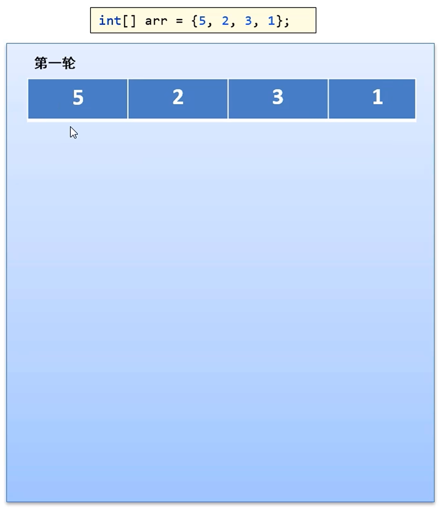


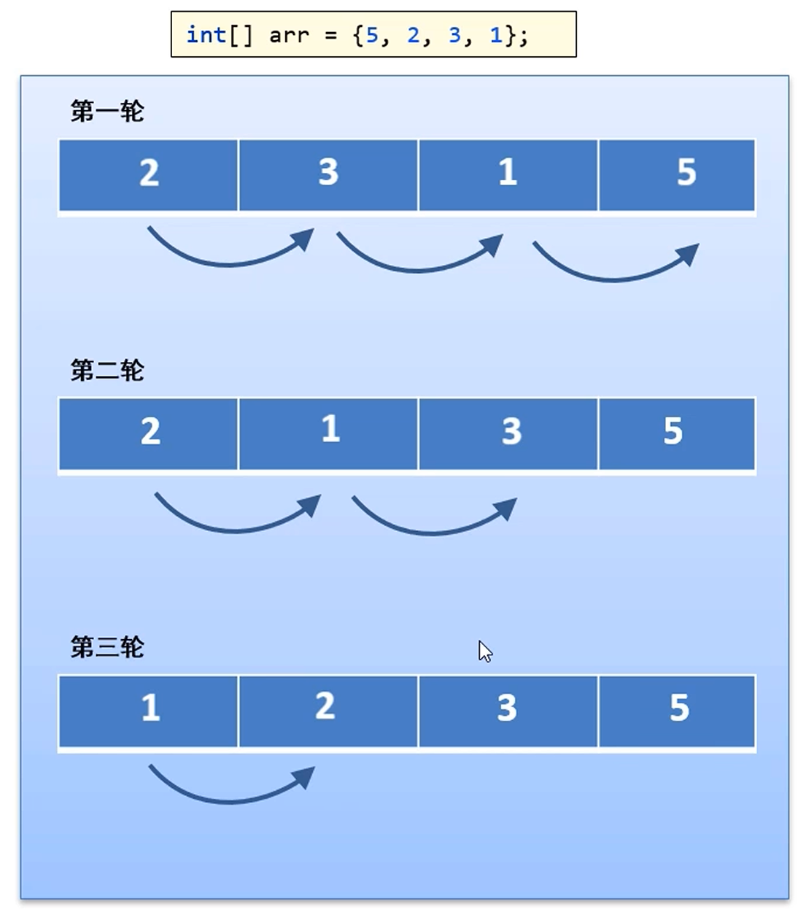

###### 1.2.1.1 实现冒泡排序的关键步骤分析

+ 确定总共需要做几轮：**数组的长度 - 1**
+ 每轮比较几次：

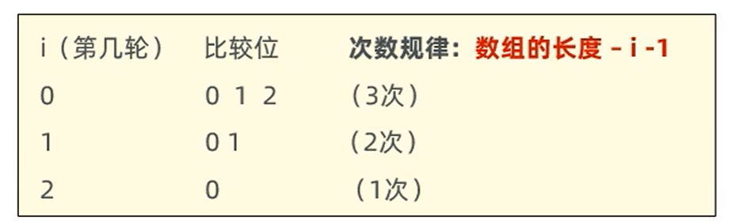

+ 当前位置大于后一个位置则交换数据

###### 代码实现

```java
package Advanced.b_algorithm;

import java.util.Arrays;

/**
 * 目标：掌握冒泡排序的编写
 */
public class 冒泡排序 {
    public static void main(String[] args) {
        // 1. 准备一个数组
        int[] arr = {5, 2, 3, 1};

        // 2.定义一个循环控制排几轮
        for (int i = 0; i < arr.length; i++) {
            // 3. 定义一个循环控制比较几轮
            for (int j = 0; j < arr.length - i - 1; j++) {
                // 判断当前位置的元素值，是否大于后一个位置处的元素值，如果大则交换
                if (arr[j] > arr[j + 1]) {
                    int temp = arr[j + 1];
                    arr[j + 1] = arr[j];
                    arr[j] = temp;
                }
            }
        }
        System.out.println(Arrays.toString(arr)); // [1, 2, 3, 5]
    }
}

```


---------------------------------


##### 1.2.2 选择排序

+ 每轮选择当前位置，开始找出后面的较小值与该位置交换

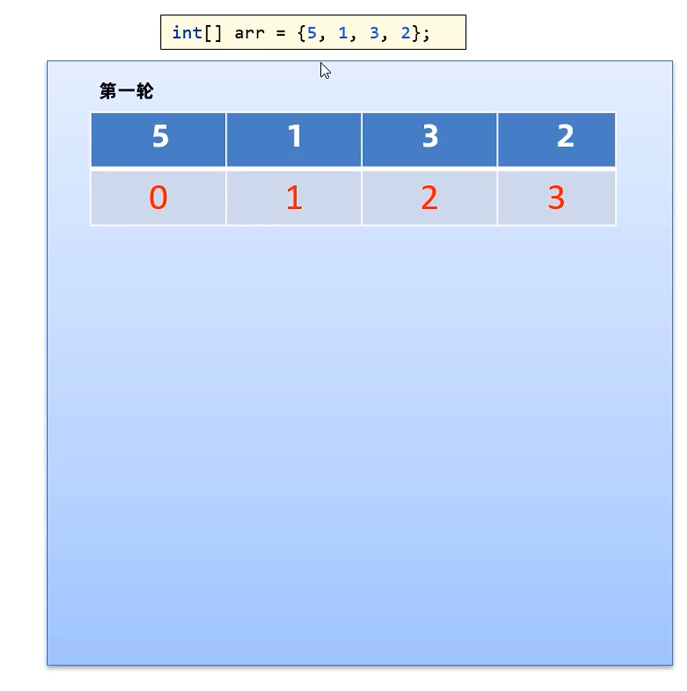

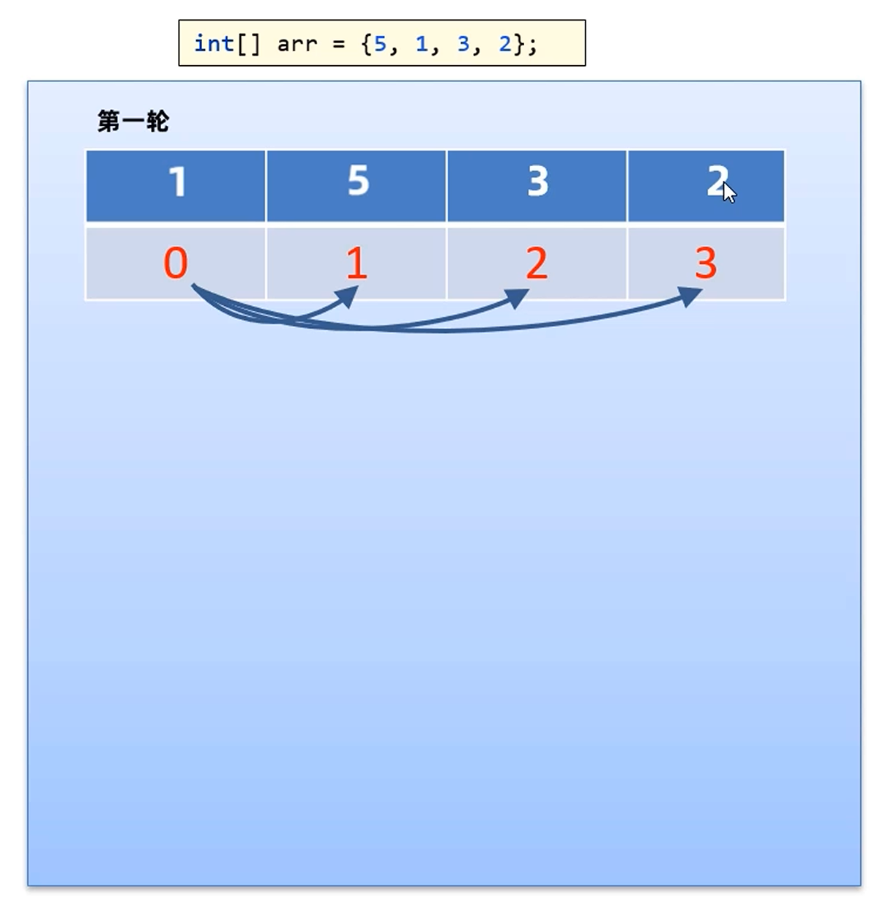

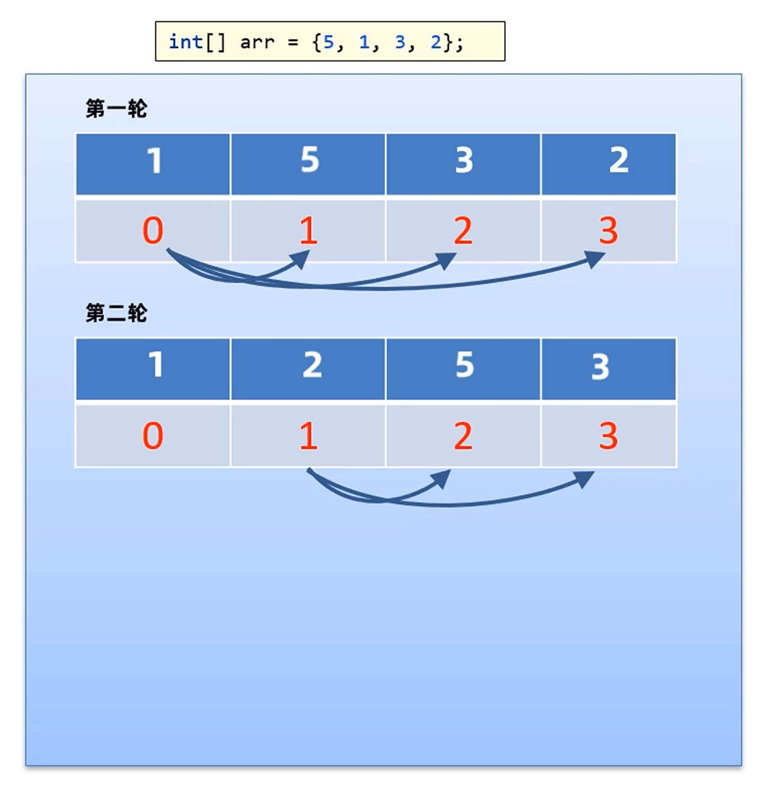

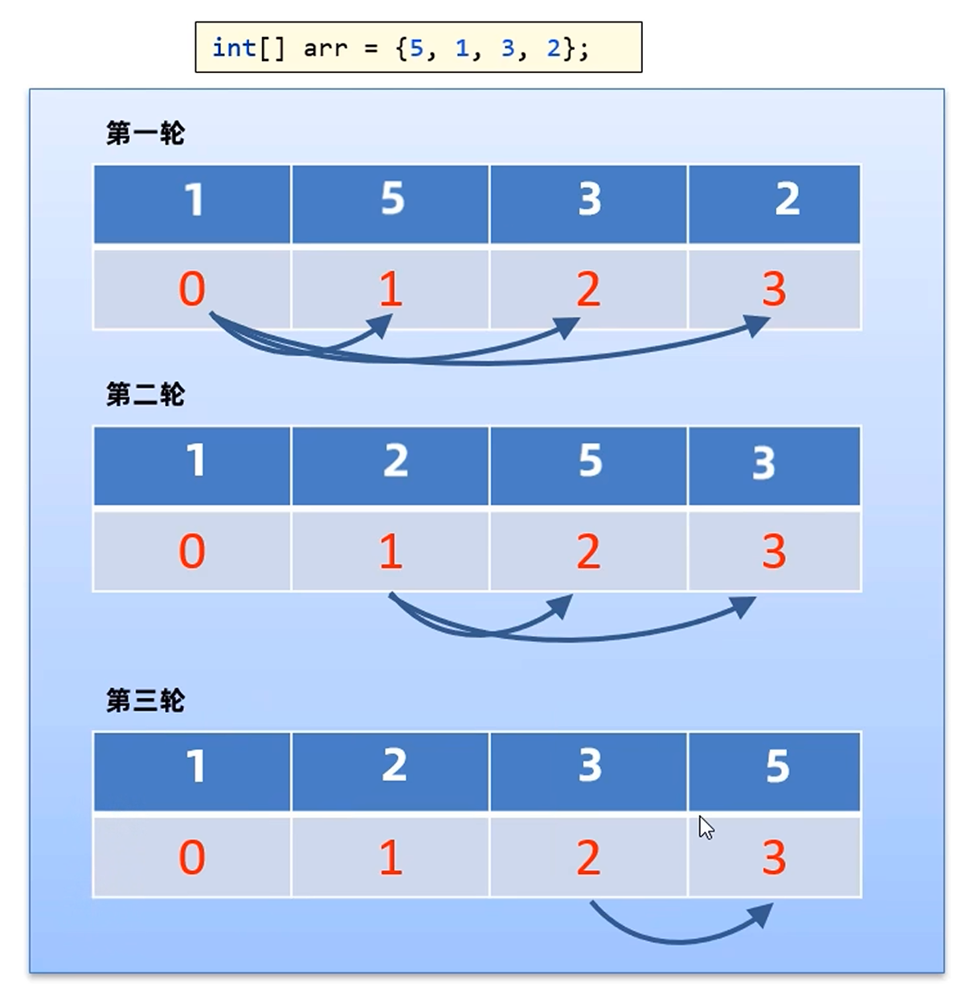

###### 1.2.2.1 选择排序的关键

+ 确定总共需要选择几轮：**数组的长度 - 1**
+ 控制每轮从以前位置为基准，与后面元素选择几次

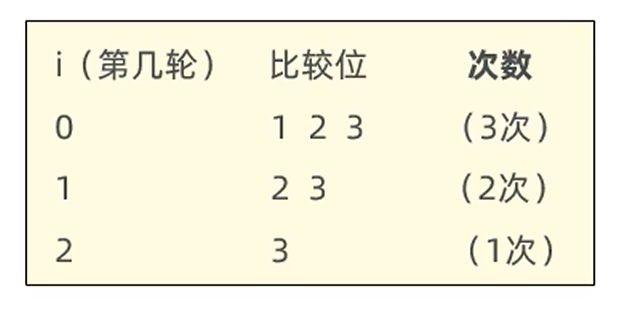

###### 代码实现

```java
package Advanced.b_algorithm;

import java.util.Arrays;

/**
 * 目标：掌握选择排序
 */
public class 选择排序 {
    public static void main(String[] args) {
        // 1. 准备好一个数组
        int[] arr = {5, 1, 3, 2};

        // 2. 控制选择几轮
        for (int i = 0; i < arr.length - 1; i++) {
            // 3. 控制每轮选择几次
            for (int j = i + 1; j < arr.length; j++) {
                // 判断当前位置是否大于后面位置处的元素值，若大于则交换
                if (arr[i] > arr[j]) {
                    int temp = arr[i];
                    arr[i] = arr[j];
                    arr[j] = temp;
                }
            }
        }
        System.out.println(Arrays.toString(arr)); // [1, 2, 3, 5]
    }
}

```

+ 优化

```java
package Advanced.b_algorithm;

import java.util.Arrays;

/**
 * 目标：掌握选择排序
 */
public class 选择排序 {
    public static void main(String[] args) {
        // 1. 准备好一个数组
        int[] arr = {5, 1, 3, 2};

        // 2. 控制选择几轮
        for (int i = 0; i < arr.length - 1; i++) {
            int minIndex = i;
            // 3. 控制每轮选择几次
            for (int j = i + 1; j < arr.length; j++) {
                // 判断当前位置是否大于后面位置处的元素值，若大于则交换
                if (arr[minIndex] > arr[j]) {
                    minIndex = j;
                }
            }
            // 决定是否交换
            if (i != minIndex) {
                int temp = arr[i];
                arr[i] = arr[minIndex];
                arr[minIndex] = temp;
            }
        }
        System.out.println(Arrays.toString(arr)); // [1, 2, 3, 5]
    }
}

```


-----------------------------


#### 1.3 查找算法

##### 1.3.1 基本查找/顺序查找

就是暴力一个一个循环查找

**注意：在数据量特别大的时候，基本查找这种从前往后挨个找的形式，性能是很差的！**

##### 1.3.2 二分查找（折半查找）

**前提条件**：数组中的数据必须是有序的

**核心思想**：每次排除一半的数据，查询数据的性能明显提高极多

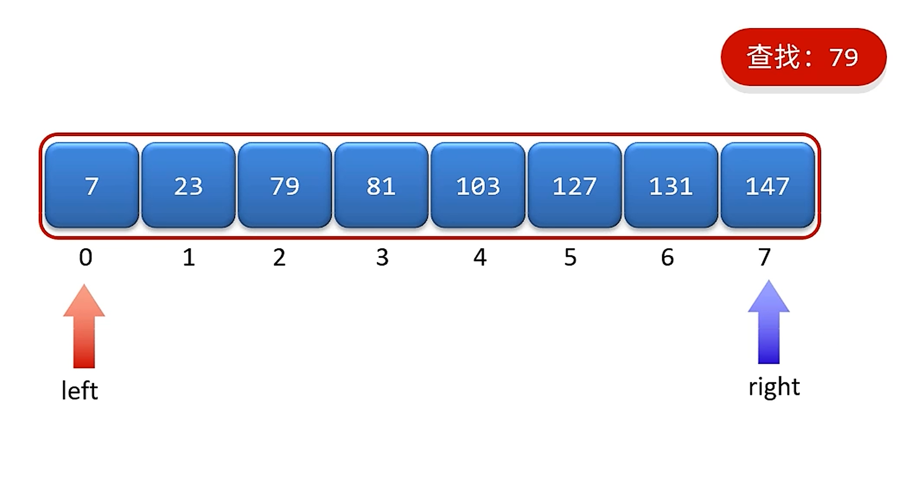

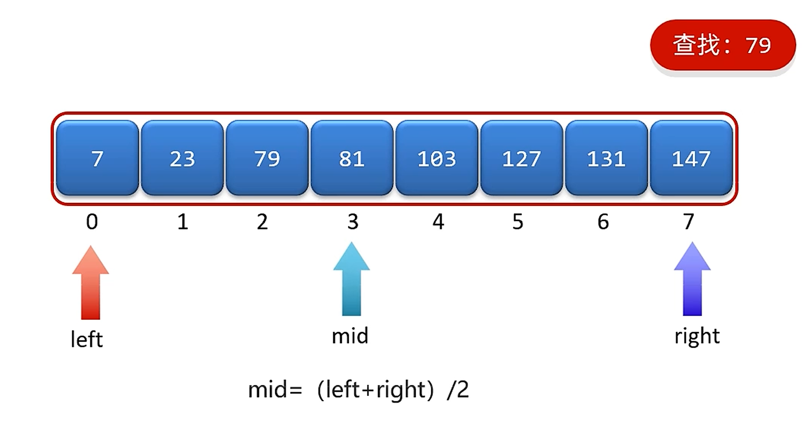

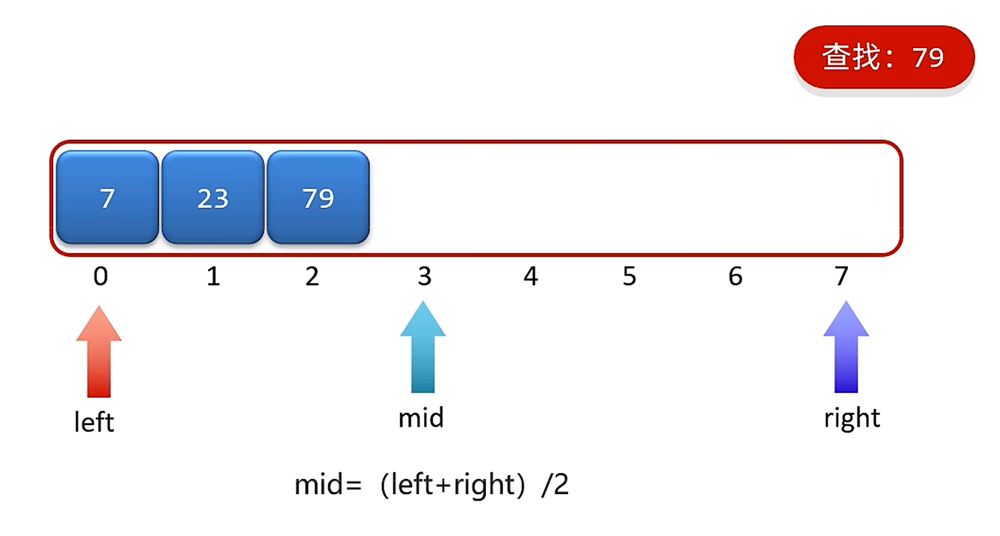


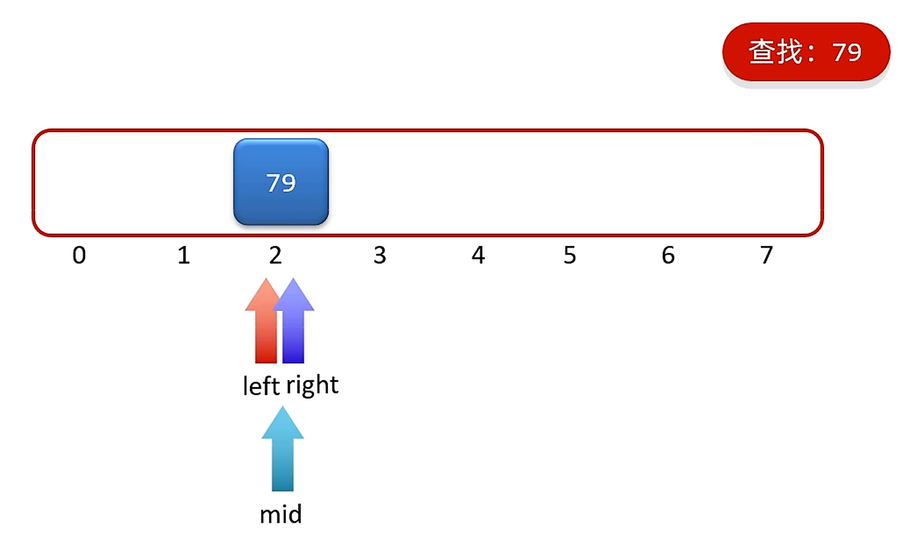

**二分查找正常的折半条件应该是开始位置 left <= 结束位置 right**

###### 代码实现

```java
package Advanced.b_algorithm;

import java.util.Arrays;

/**
 * 目标：掌握二分查找
 */
public class 二分查找 {
    public static void main(String[] args) {
        // 1. 准备号一个数组
        int[] arr = {7, 23, 79, 81, 103, 127, 131, 147};

        System.out.println(binarySearch(arr, 81)); // 3

        System.out.println(Arrays.binarySearch(arr, 81)); // 3
    }

    public static int binarySearch(int[] arr, int data) {
        // 1. 定义两个变量，一个站在左边位置，一个站在右边位置
        int left = 0;
        int right = arr.length - 1;

        // 2. 定义一个循环控制折半
        while (left <= right) {
            // 3. 每次折半，都算出中间位置处的索引
            int middle = (left + right) / 2;
            // 4. 判断当前要找的元素值，与中间位置处的元素值的大小情况
            if (data < arr[middle]) {
                // 往左走，截止位置（右边位置） = 中间位置 - 1
                right = middle - 1;
            } else if (data > arr[middle]) {
                // 往右边找，起始位置（左边位置） = 中间位置 + 1
            } else {
                // 中间位置处的元素值，正好等于我们要找的元素值
                return middle;
            }
        }
        return -1; // -1特殊结果，就代表没有找到数据，数组中不存在该数据
    }
}

```


------------------------


### 2. 正则表达式

#### 2.1 概述、初体验

+ 就是由一些特定的字符组成，代表的是一个规则

作用一：用来校验数据格式是否合法

作用二：在一段文本中查找满足要求的内容

使用正则表达式校验数据，你的代码风格会非常的简单、便捷

```java
package Advanced.c_regex;

/**
 * 目标：体验一下使用正则表达式来校验数据格式的合法性
 * 需求：校验QQ号是否正确：要求全部是数字，长度是（6-20）之间，不能以0开头
 */
public class RegexTest1 {
    public static void main(String[] args) {
        System.out.println(checkQQ(null)); // false
        System.out.println(checkQQ("123456789")); // true
        System.out.println(checkQQ("21478fadf15")); // false

        System.out.println("------------------------");

        System.out.println(checkQQ1(null)); // false
        System.out.println(checkQQ1("123456789")); // true
        System.out.println(checkQQ1("21478fadf15")); // false
    }

    public static boolean checkQQ1(String qq) {
        return qq != null && qq.matches("[1-9]\\d{5,19}");
    }

    public static boolean checkQQ(String qq) {
        // 1. 判断qq号码是否为null
        if (qq == null || qq.startsWith("0") || qq.length() < 6 || qq.length() > 20) {
            return false;
        }

        // 2. qq至少不是null，不是以0开头，满足6-20之间的长度
        // 判断qq号码中是否都是数字
        for (int i = 0; i < qq.length(); i++) {
            // 根据索引提取当前位置处的字符
            char ch = qq.charAt(i);
            // 判断ch记住的字符，如果不是数字，qq号就不合法
            if (ch < '0' || ch > '9') {
                return false;
            }
        }

        // 3. 说明qq号肯定是合法的
        return true;
    }
}
```


------------------------


#### 2.2 书写规则

String 提供了一个匹配正则表达式的方法

`public boolean matches(String regex)` 判断字符串是否匹配正则表达式，匹配返回 true，不匹配返回 false

##### 2.2.1 正则表达式的书写规则

| 字符类（只能匹配单个字符） | 说明                                    |
| -------------------------- | --------------------------------------- |
| `[abc]`                    | 只能是 a，b 或 c                        |
| `[^abc]`                   | 除了 a，b，c 之外的任何字符             |
| `[a-zA-Z]`                 | a 到 z，A 到 z，包括（范围）            |
| `[a-d[m-p]]`               | a 到 d，或 m 到 p                       |
| `[a-z&&[def]]`             | d，e 或 f（交集）                       |
| `[a-z&&[^bc]]`             | a 到 z，除了 b 和 c（等同于 `[ad-z]`）  |
| `[a-z&&[^m-p]]`            | a 到 z，除了 m到 p（等同于 `[a-lq-z]`） |

| 预定义字符（只能匹配单个字符） | 说明                   |
| ------------------------------ | ---------------------- |
| `.`                            | 任何字符               |
| `\d`                           | 一个数字：`[0-9]`      |
| `\D`                           | 非数字：`[^0-9]`       |
| `\s`                           | 一个空白字符           |
| `\S`                           | 非空白字符：`[^\s]`    |
| `\w`                           | `[a-zA-Z_0-9]`         |
| `\W`                           | `[^\w]` 一个非单词字符 |

| 数量词   | 说明                    |
| -------- | ----------------------- |
| `X?`     | X，一次或0次            |
| `X*`     | X，零次或多次           |
| `X+`     | X，一次或多次           |
| `X{n}`   | X，正好 n 次            |
| `X{n, }` | X，至少 n 次            |
| `X{n,m}` | X，至少 n 但不超过 m 次 |

##### 2.2.2 其他几个常用的符号

`(?i)` ：忽略大小写

`|` ：或

`()` ：分组

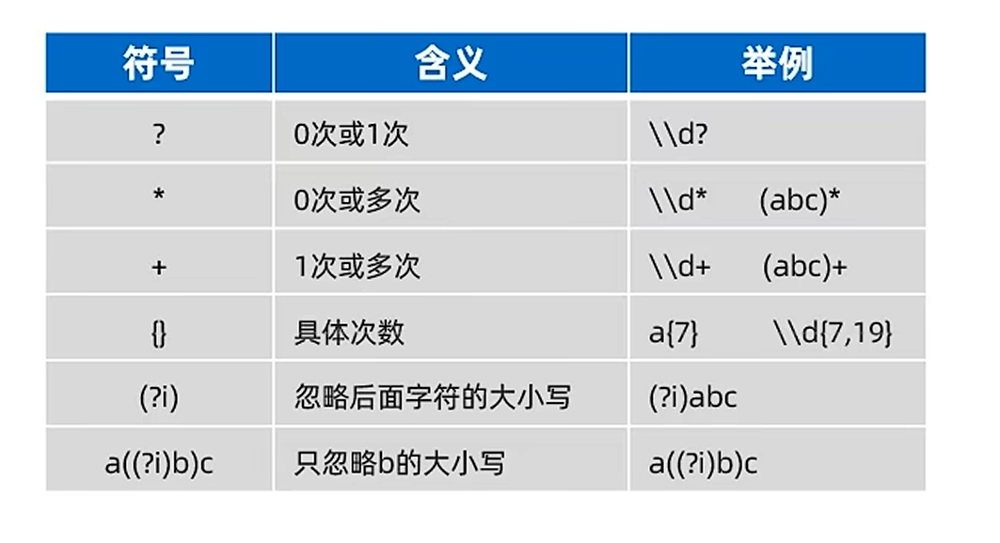

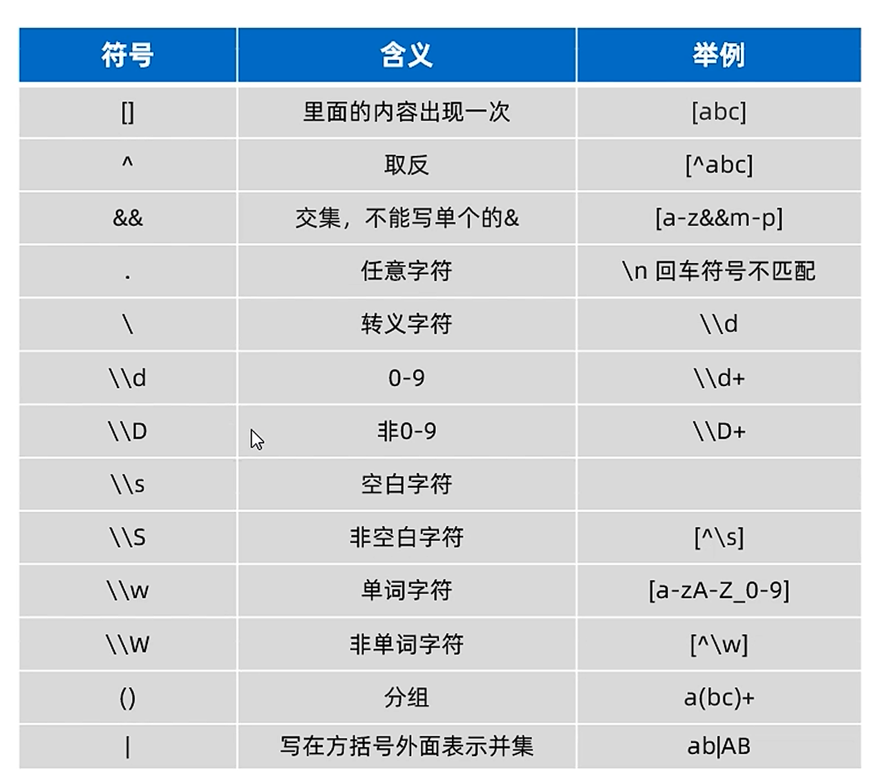


----------------------------


#### 2.3 应用案例

> 需求：
>
> 校验用户输入的电话、邮箱、时间是否合法

##### 代码演示

```java
package Advanced.c_regex;

import java.util.Scanner;

/**
 * 目标：校验用户输入的电话、邮箱、时间是否合法
 */
public class RegexTest3 {
    public static void main(String[] args) {
        checkPhone();
    }

    public static void checkPhone() {
        while (true) {
            System.out.println("请您输入您的电话号码（手机|座机）：");
            Scanner sc = new Scanner(System.in);
            String phone = sc.nextLine();

            if (phone.matches("(1[3-9]\\d{9})|(0\\d{2,7}-?[1-9]\\d{4,19})")) {
                System.out.println("您输入的号码格式正确~~~");
                break;
            } else {
                System.out.println("您输入的号码格式不正确");
            }
        }
    }

    public static void checkEmail() {
        while (true) {
            System.out.println("请您输入您的邮箱：");
            Scanner sc = new Scanner(System.in);
            String phone = sc.nextLine();

            if (phone.matches("\\w{2,}@\\w{2,20}(\\.\\w{2,10}){1,2}")) {
                System.out.println("您输入的邮箱格式正确~~~");
                break;
            } else {
                System.out.println("您输入的邮箱格式不正确");
            }
        }
    }
}

```


-------------------------------


#### 2.4 用于查找信息

在一段文本中查找满足要求的内容

> 需求：
>
> 请把下面文本中的电话、邮箱、座机号码、热线都爬取出来
>
> 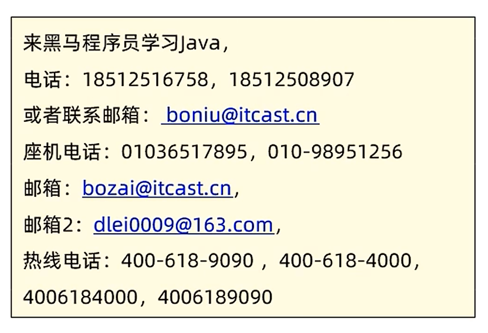

##### 代码实现

```java
package Advanced.c_regex;

import java.util.regex.Matcher;
import java.util.regex.Pattern;

/**
 * 目标：掌握使用正则表达式查找内容
 */
public class RegexTest4 {
    public static void main(String[] args) {
        method1();
    }

    // 需求1：从一下内容中爬取出：手机、邮箱、座机、400电话等信息
    public static void method1() {
        String data = "来黑马程序员学习Java，\n" +
                "电话：1866668888，18699997777，\n" +
                "或者联系邮箱：boniu@itcast.cn，\n" +
                "座机电话：01036517895，010-98951256\n" +
                "邮箱：bozai@itcast.cn，\n" +
                "邮箱：dlei0009@163.com，\n" +
                "热线电话：400-618-9090，400-618-4000，400618400，4006189090";
        // 1. 定义爬取规则
        String regex = "(1[3-9]\\d{9})|(0\\d{2,7}-?[1-9]\\d{4,19})|(\\w{2,}@\\w{2,20}(\\.\\w{2,10}){1,2})" + "|(400-?\\d{3,7}-?\\d{3,7})";
        // 2. 把正则表达式封装成一个Pattern对象
        Pattern pattern = Pattern.compile(regex);
        // 3. 通过pattern对象去获取查找内容的匹配器对象
        Matcher matcher = pattern.matcher(data);
        // 4. 定义一个循环开始爬取信息
        while (matcher.find()) {
            String rs = matcher.group();
            System.out.println(rs);
        }
    }
}

```


------------------------


#### 2.5 用于搜索替换、分割内容

正则表达式用于**搜索替换、分割内容**，需要结合 String 提供的如下方法完成：

| 方法名                                                    | 说明                                                       |
| --------------------------------------------------------- | ---------------------------------------------------------- |
| public String **replaceAll(String regex, String newStr)** | 按照正则表达式匹配的内容进行替换                           |
| public String[] **split(String regex)**                   | 按照正则表达式匹配的内容进行分割字符串，返回一个字符串数组 |

##### 代码演示

```java
package Advanced.c_regex;

import java.util.Arrays;

/**
 * 目标：掌握使用正则表达式做搜索替换、内容分割
 */
public class RegexTest5 {
    public static void main(String[] args) {
        // 1. public String replaceAll(String regex, String newStr)：按照正则表达式匹配的内容进行替换
        // 需求1：请把 古力娜扎ai888迪丽热巴999aa5566马尔扎哈fbbfsfs42425卡尔扎巴，中间的非中文字符替换成 ”-“
        String s1 = "古力娜扎ai888迪丽热巴999aa5566马尔扎哈fbbfsfs42425卡尔扎巴";
        System.out.println(s1.replaceAll("\\w+", "-")); // 古力娜扎-迪丽热巴-马尔扎哈-卡尔扎巴

        // 需求2（拓展）：某语言系统，收到一个口吃的人说”我我我喜欢编编编编编编程！“，需要优化成”我喜欢编程“
        String s2 = "我我我喜欢编编编编编编程！";
        /**
         * (.)一组，匹配任意字符的
         * \\1：为这个组声明一个组号：1号
         * +：声明必须是重复的字
         * $1：可以去到第1组代表的那个重复的字
         */
        System.out.println(s2.replaceAll("(.)\\1+", "$1")); // 我喜欢编程！

        // 2. public String[] split(String regex)：按照正则表达式的内容进行分割字符串，返回一个字符串数组
        // 需求1：请把 古力娜扎ai888迪丽热巴999aa5566马尔扎哈fbbfsfs42425卡尔扎巴 中的人名获取出来
        String s3 = "古力娜扎ai888迪丽热巴999aa5566马尔扎哈fbbfsfs42425卡尔扎巴";
        String[] names = s3.split("\\w+");
        System.out.println(Arrays.toString(names)); // [古力娜扎, 迪丽热巴, 马尔扎哈, 卡尔扎巴]
    }
}

```


-----------------------------


### 3. 异常

#### 3.1 认识异常

##### 3.1.1 什么是异常？

异常就是代表程序出现的问题

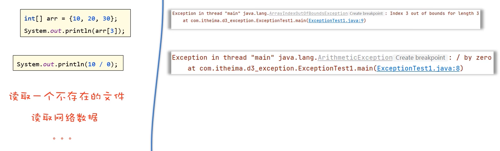

##### 3.1.2 异常的体系

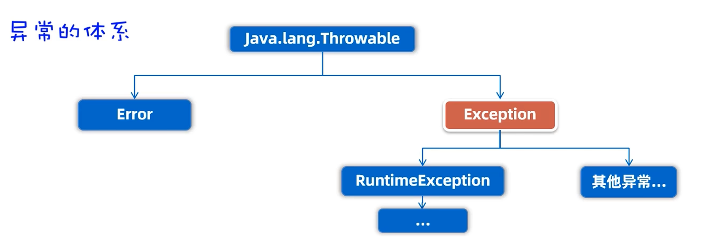

**Error**：代表的系统级别错误（属于严重问题），也就是说系统一旦出现问题，sun 公司会把这些问题封装成 Error 对象给出来，说白了，Error 是给 sun 公司自己用的，不是给我们程序员用的，因此我们开发人员不用管它

**Exception**：叫异常，它代表的才是我们程序员可能出现的问题，所以，我们程序员通常会用 Exception 以及它的孩子来封装程序出现的问题

+ **运行时异常**：RuntimeException 及其子类，编译阶段不会出现错误提醒，运行时出现异常（如：数组索引越界异常）
+ **编译时异常**：编译阶段就会出现错误提醒的（如：日期解析异常）

##### 3.1.3 抛出异常（throws）

+ 在方法上使用 throws 关键字，可以将方法内部出现的异常抛出去给调用者处理

```java
方法 throws 异常1, 异常2, 异常3...{
    ...
}
```

##### 3.1.4 捕获异常（try...catch）

+ 直接捕获程序出现的异常

```java
try{
    // 监视可能出现异常的代码！
} catch (异常类型1 变量) {
    // 处理异常
} catch (异常类型2 变量) {
    // 处理异常
}...
```

##### 代码演示

```java
package Advanced.d_exception;

import java.text.ParseException;
import java.text.SimpleDateFormat;
import java.util.Date;

/**
 * 目标：认识异常
 */
public class ExceptionTest1 {
    public static void main(String[] args) throws ParseException {
//        Integer.valueOf("abc");

//        int[] arr = {11,22,33};
//        System.out.println(arr[5]);

//        try {
        SimpleDateFormat sdf = new SimpleDateFormat("yyyy-MM-dd HH:mm:ss");
        Date d = sdf.parse("2023-11-11 10:24");
        System.out.println(d);
//        } catch (ParseException e) {
//            e.printStackTrace();
//        }
    }
}

```


----------------------------


#### 3.2 自定义异常

+ Java 无法为这个世界上全部的问题都提供异常类来代表，如果企业自己的某种问题，想通过异常来表示，以便用异常来管理该问题，那就需要自己来定义异常类了

##### 3.2.1 自定义异常的种类

###### 自定义运行时异常

+ 定义一个异常类继承 RuntimeException
+ 重写构造器
+ 通过 `throw new 异常类(xxx)` 来创建异常对象并抛出
+ 编译阶段不报错，提醒不强烈，运行时才可能出现！！！

###### 自定义编译时异常

+ 定义一个异常类继承 Exception
+ 重写构造器
+ 通过 `throw new 异常类(xxx)` 来创建异常对象并抛出
+ 编译阶段就报错，提醒更加强烈！

##### 3.2.2 异常有什么作用？

1. 异常是用来查询系统 Bug 的关键参考信息
2. 异常可以作为方法内部的一种特殊返回值，以便通知上层调用者底层的执行情况

##### 代码演示

+ AgeIllegalRuntimeException.java

```java
package Advanced.d_exception;

// 1. 必须让这个类继承自RuntimeException，才能成为一个运行时异常类
public class AgeIllegalRuntimeException extends RuntimeException {
    public AgeIllegalRuntimeException() {
    }

    public AgeIllegalRuntimeException(String message) {
        super(message);
    }
}

```

+ AgeIllegalException.java

```java
package Advanced.d_exception;

// 1. 必须让这个类继承自Exception，才能成为一个编译时异常类
public class AgeIllegalException extends Exception {
    public AgeIllegalException() {
    }

    public AgeIllegalException(String message) {
        super(message);
    }
}

```

+ ExceptionTest2.java

```java
package Advanced.d_exception;

/**
 * 目标：掌握自定义异常，以及异常的作用
 */
public class ExceptionTest2 {
    public static void main(String[] args) {
        // 需求：保存一个合法的年龄
        try {
            saveAge(160);
            System.out.println("底层执行成功！");
        } catch (Exception e) {
            e.printStackTrace();
            System.out.println("底层出现了bug！");
        }

        try {
            saveAge2(195);
            System.out.println("saveAge2底层执行是成功的！");
        } catch (AgeIllegalException e) {
            e.printStackTrace();
            System.out.println("saveAge2底层执行是出现bug的！");
        }
    }

    public static void saveAge(int age) {
        if (age > 0 && age < 150) {
            System.out.println("年龄被成功保存：" + age);
        } else {
            // 用一个异常对象封装这个问题
            // throw 抛出去这个异常对象
            throw new AgeIllegalRuntimeException("/age is illegal, your age is " + age);
        }
    }

    public static void saveAge2(int age) throws AgeIllegalException {
        if (age > 0 && age < 150) {
            System.out.println("年龄被成功保存：" + age);
        } else {
            // 用一个异常对象封装这个问题
            // throw 抛出去这个异常对象
            // throws 用在方法上，抛出方法内部的异常
            throw new AgeIllegalException("/age is illegal, your age is " + age);
        }
    }
}

```


-------------------------------


#### 3.3 异常的处理

##### 3.3.1 开发中对于异常的常见处理方式

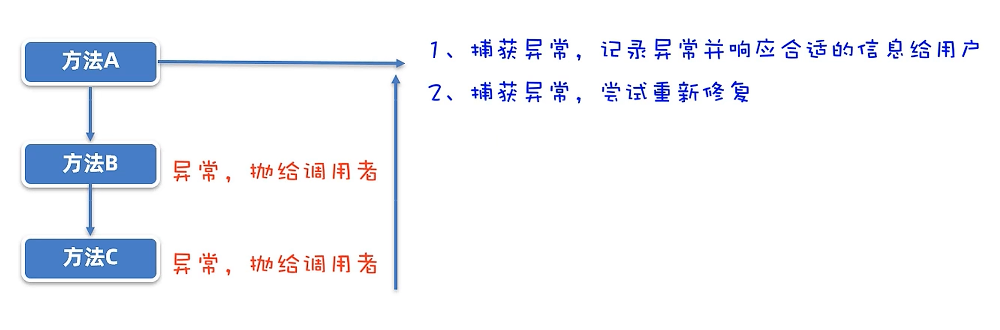

##### 3.3.2 抛出异常（throws）

+ 在方法上使用 throws 关键字，可以将方法内部出现的异常抛出去给调用者处理

```java
方法 throws 异常1, 异常2, 异常3...{
    ...
}
```

```java
// 推荐方式
方法 throws Exception{
}
// Exception代表可以捕获一切异常
```


##### 3.3.3 捕获异常（try...catch）

+ 直接捕获程序出现的异常

```java
try{
    // 监视可能出现异常的代码！
} catch (异常类型1 变量) {
    // 处理异常
} catch (异常类型2 变量) {
    // 处理异常
}...
```

```java
// 推荐方式
try {
    // 可能出现异常的代码！
} catch (Exception e) {
    e.printStackTrace(); // 直接打印异常对象的信息
}
// Exception代表可以捕获一切异常
```

##### 代码演示

+ ExceptionTest3_2.java

```java
package Advanced.d_exception;

import java.io.FileInputStream;
import java.io.FileNotFoundException;
import java.text.ParseException;
import java.text.SimpleDateFormat;
import java.util.Date;

/**
 * 目标：异常的处理
 */
public class ExceptionTest3_2 {
    public static void main(String[] args) {
        try {
            test1();
        } catch (Exception e) {
            System.out.println("您要找的文件不存在！");
            e.printStackTrace(); // 打印出这个异常对象的信息，记录下来
        }
    }

    public static void test1() throws Exception {
        SimpleDateFormat sdf = new SimpleDateFormat("yyyy-MM-dd HH:mm:ss");
        Date d = sdf.parse("2023-11-11 10:24:11");
        System.out.println(d);
        test2();
    }

    public static void test2() throws Exception {
        // 读取文件的
        FileInputStream is = new FileInputStream("D:/meinv.png");
    }
}

```

+ ExceptionTest4.java

```java
package Advanced.d_exception;

import java.util.Scanner;

/**
 * 目标：掌握异常的处理方式：捕获异常，尝试修复
 */
public class ExceptionTest4 {
    public static void main(String[] args) {
        // 需求：调用一个方法，让用户输入一个合适的价格返回为止
        // 尝试修复
        while (true) {
            try {
                System.out.println(getMoney());
                break;
            } catch (Exception e) {
                System.out.println("请您输入合法的数字！！！");
            }
        }
    }

    public static double getMoney() {
        Scanner scanner = new Scanner(System.in);
        while (true) {
            System.out.println("请您输出合适的价格：");
            double money = scanner.nextDouble();
            if (money >= 0) {
                return money;
            } else {
                System.out.println("您输入的价格是不合适的！");
            }
        }
    }
}

```


---------------------------------------------


## 四、集合框架

### 1. 集合概述

**集合是一种容器**，用来装数据的，类似于数组，但**集合的大小可变，开发中也非常常用**

#### 1.1 集合体系结构

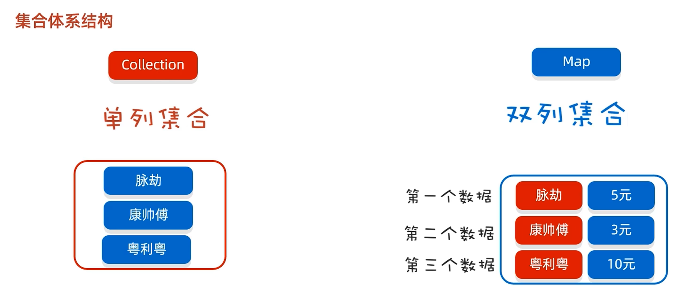

+ Collection 代表单列集合，每个元素（数据）只包含一个值
+ Map 代表双列集合，每个元素包含两个值（键值对）

#### 1.2 Collection 集合体系

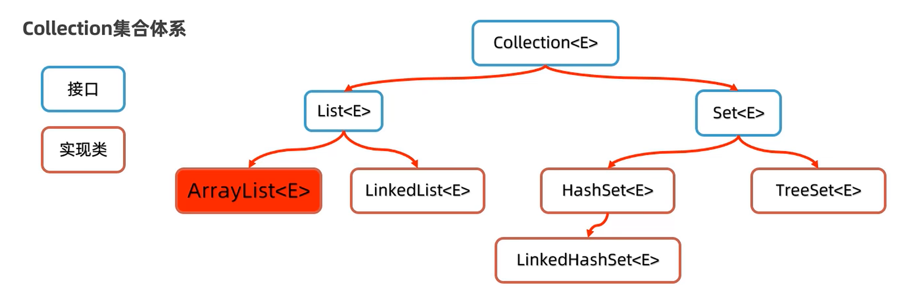

#### 1.3 Collection 集合特点

+ **List 系列集合**：添加的元素是有序、可重复、有索引
  + ArrayList、LinekdList：有序、可重复、有索引
+ **Set 系列集合**：添加的元素是无序、不重复、无索引
  + HashSet：无序、不重复、无索引
  + LinkedHashSet：**有序**、不重复、无索引
  + TreeSet：**按照大小默认升序排序**、不重复、无索引

##### 代码演示

```java
package Advanced.e_collection.d1_collection;

import java.util.ArrayList;
import java.util.HashSet;

/**
 * 目标：认识Collection体系的特点
 */
public class CollectionTest1 {
    public static void main(String[] args) {
        // 简单确认一下Collection集合的特点
        ArrayList<String> list = new ArrayList<>(); // 有序、可重复、有索引
        list.add("java1");
        list.add("java2");
        list.add("java1");
        list.add("java2");
        System.out.println(list); // [java1, java2, java1, java2]

        HashSet<String> set = new HashSet<>(); // 无序、不重复、无索引
        set.add("java1");
        set.add("java2");
        set.add("java1");
        set.add("java2");
        set.add("java3");
        System.out.println(set); // [java3, java2, java1]
    }
}

```


-----------------------------------------------


### 2. Collection 的常用方法

+ Collection 是单列集合的祖宗，它规定的方法（功能）是全部单列集合都会继承的

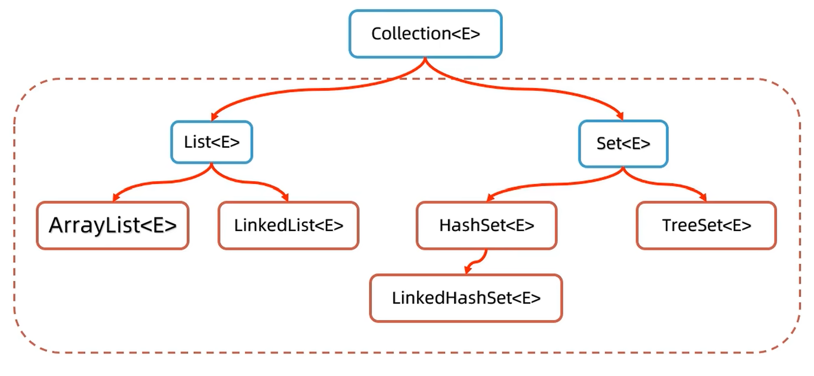

#### 2.1 常用方法

| 方法名                              | 说明                                                 |
| ----------------------------------- | ---------------------------------------------------- |
| public boolean add(E e)             | 添加元素，添加成功返回 true                          |
| public void clear()                 | 清空集合的元素                                       |
| public boolean isEmpty()            | 判断集合是否为空，是空返回 true                      |
| public int size()                   | 获取集合的大小                                       |
| public boolean contains(Object obj) | 判断集合中是否包含某个元素                           |
| public boolean remove(E e)          | 删除某个元素：如果有多个重复元素默认删除前面的第一个 |
| public Object[] toArray()           | 把集合准换成数组                                     |

##### 代码演示

```java
package Advanced.e_collection.d1_collection;

import java.util.ArrayList;
import java.util.Arrays;
import java.util.Collection;

public class CollectionTest2API {
    public static void main(String[] args) {
        Collection<String> c = new ArrayList<>(); // 多态写法
        // 1. public boolean add(E e)：添加元素，添加成功返回true
        c.add("java1");
        c.add("java1");
        c.add("java2");
        c.add("java2");
        c.add("java3");
        System.out.println(c); // [java1, java1, java2, java2, java3]

        // 2. public void clear()：清空集合的元素
        c.clear();
        System.out.println(c); // []

        // 3. public boolean isEmpty()：判断集合是否为空，是空返回true
        System.out.println(c.isEmpty()); // true

        // 4. public int size()：获取集合的大小
        System.out.println(c.size()); // 0

        // 5. public boolean contains(Object obj)：判断集合中是否包含某个元素
        System.out.println(c.contains("java1"));
        System.out.println(c.contains("Java1"));

        // 6. public boolean remove(E e)：删除某个元素：如果有多个重复元素默认删除前面的第一个
        System.out.println(c.remove("java1"));
        System.out.println(c);

        // 7. public Object[] toArray()：把集合准换成数组
        Object[] arr = c.toArray();
        System.out.println(Arrays.toString(arr));

        // 非要转成String类型的数组
        String[] arr2 = c.toArray(new String[c.size()]);
        System.out.println(Arrays.toString(arr2));

        System.out.println("--------------------------------------------------------");

        // 把一个集合的全部数据导入到另一个集合中去
        Collection<String> c1 = new ArrayList<>();
        c1.add("java1");
        c1.add("java2");
        Collection<String> c2 = new ArrayList<>();
        c2.add("java3");
        c2.add("java4");
        c1.addAll(c2); // 把c2集合的全部数据导入到c1集合中去
        System.out.println(c1); // [java1, java2, java3, java4]
        System.out.println(c2); // [java3, java4]
    }
}

```


---------------------------------


### 3. Collection 的遍历方式

#### 3.1 迭代器

##### 3.1.1 迭代器概述

+ **迭代器是用来遍历集合的专用方式**（数组没有迭代器），在 Java 中迭代器的代表是 **Iterator**

##### 3.1.2 Collection 集合获取迭代器的方法

| 方法名称                   | 说明                                                         |
| -------------------------- | ------------------------------------------------------------ |
| Iterator<E> **iterator()** | 返回集合中的迭代器对象，该迭代器对象默认指向当前集合的第一个元素 |

##### 3.1.3 Iterator 迭代器中的常用方法

| 方法名称          | 说明                                                        |
| ----------------- | ----------------------------------------------------------- |
| boolean hsaNext() | 询问当前位置是否有元素存在，存在返回 true，不存在返回 false |
| E next()          | 获取当前位置的元素，并同时将迭代器对象指向下一个元素处      |

##### 代码演示

```java
package Advanced.e_collection.d2_collection_traverse;

import java.util.ArrayList;
import java.util.Collection;
import java.util.Iterator;

/**
 * 目标：Collection集合的遍历方式一：使用迭代器Iterator遍历
 */
public class CollectionDemo1 {
    public static void main(String[] args) {
        Collection<String> c = new ArrayList<>();
        c.add("赵敏");
        c.add("小昭");
        c.add("素素");
        c.add("灭绝");
        System.out.println(c); // [赵敏, 小昭, 素素, 灭绝]

        // 使用迭代器遍历集合
        // 1. 从集合对象中获取迭代器对象
        Iterator<String> it = c.iterator();
//        System.out.println(it.next()); // 赵敏
//        System.out.println(it.next()); // 小昭
//        System.out.println(it.next()); // 素素
//        System.out.println(it.next()); // 灭绝
//        System.out.println(it.next()); // 报错

        // 2. 我们应该使用循环结合迭代器遍历集合
        while (it.hasNext()) {
            String ele = it.next();
            System.out.println(ele);
        }
    }
}

```

##### 总结

1. 如何获取集合的迭代器？迭代器遍历集合的代码具体怎么写？

+ `Iterator<String> it = c.iterator();`

+ ```java
  while (it.hasNext()) {
      String ele = it.next();
      System.out.println(ele);
  } 
  ```

2. 通过迭代器获取集合的元素，如果取元素越界会出现什么异常？

+ NoSuchElementException


-------------------------------


#### 3.2 增强 for

##### 3.2.1 格式

```java
for (元素的数据类型 变量名 : 数组或者集合) {
    
}
```

+ 增强 for 可以用来遍历集合或者数组
+ 增强 for 遍历集合，本质就是迭代器遍历集合的简化写法

##### 代码演示

```java
package Advanced.e_collection.d2_collection_traverse;

import java.util.ArrayList;
import java.util.Collection;

/**
 * 目标：Collection集合的遍历方式二：增强for
 */
public class CollectionDemo2 {
    public static void main(String[] args) {
        Collection<String> c = new ArrayList<>();
        c.add("赵敏");
        c.add("小昭");
        c.add("素素");
        c.add("灭绝");
        System.out.println(c); // [赵敏, 小昭, 素素, 灭绝]

        // 使用增强for遍历集合或者数组
        for (String ele : c) {
            System.out.println(ele);
        }

        String[] names = {"张三", "李四", "王五"};
        for (String name : names) {
            System.out.println(name);
        }
    }
}

```


----------------------------------


#### 3.3 lambda 表达式

##### 3.3.1 Lambda 表达式遍历集合

+ 得益于 JDK8 开始的新技术 Lambda 表达式，提供了一种更简单、更直接的方式来遍历集合

需要使用 Collection 的如下方法来完成

| 方法名称                                         | 说明                 |
| ------------------------------------------------ | -------------------- |
| default void forEach(Consumer<? super T> action) | 结合 lambda 遍历集合 |

##### 代码演示

```java
package Advanced.e_collection.d2_collection_traverse;

import java.util.ArrayList;
import java.util.Collection;
import java.util.function.Consumer;

/**
 * 目标：Collection集合的遍历方式三：JDK8开始新增的Lambda表达式
 */
public class CollectionDemo3 {
    public static void main(String[] args) {
        Collection<String> c = new ArrayList<>();
        c.add("赵敏");
        c.add("小昭");
        c.add("素素");
        c.add("灭绝");
        System.out.println(c); // [赵敏, 小昭, 素素, 灭绝]

        // default void forEach(Consumer<? super T> action)：结合Lambda表达式遍历集合
//        c.forEach(new Consumer<String>() {
//            @Override
//            public void accept(String s) {
//                System.out.println(s);
//            }
//        });
//
//        c.forEach((String s) -> {
//            System.out.println(s);
//        });
//
//        c.forEach((s) -> {
//            System.out.println(s);
//        });
//
//        c.forEach(s -> System.out.println(s));

        c.forEach(System.out::println);
    }
}

```


---------------------


#### 案例：遍历集合中的自定义对象

> 需求：
>
> + 展示多部电影信息
>
> 分析：
>
> 1. 每部电影都是一个对象，多部电影要使用集合装起来
> 2. 遍历集合中的3个电影对象，输出每部电影的详情信息

##### 代码实现

```java
package Advanced.e_collection.d2_collection_traverse;

import java.util.ArrayList;
import java.util.Collection;

/**
 * 目标：完成电影信息的展示
 * new Movie("《肖申克的救赎》", 9.7, "罗宾斯")
 * new Movie("《霸王别姬》", 9.6, "张国荣、张丰毅")
 * new Movie("《阿甘正传》", 9.5, "汤姆.汉克斯")
 */
public class CollectionTest4 {
    public static void main(String[] args) {
        // 1. 创建一个集合容器负责存储多部电影对象
        Collection<Movie> movies = new ArrayList<>();

        movies.add(new Movie("《肖申克的救赎》", 9.7, "罗宾斯"));
        movies.add(new Movie("《霸王别姬》", 9.6, "张国荣、张丰毅"));
        movies.add(new Movie("《阿甘正传》", 9.5, "汤姆.汉克斯"));
        System.out.println(movies); // 集合的存储对象存的并不是元素本身，而是元素的地址，通过元素地址到栈里面获取元素

        for (Movie movie : movies) {
            System.out.println("电影名：" + movie.getName());
            System.out.println("评分：" + movie.getScore());
            System.out.println("主演：" + movie.getActor());
            System.out.println("---------------------------------------");
        }
    }
}

```

##### 集合存储对象的原理

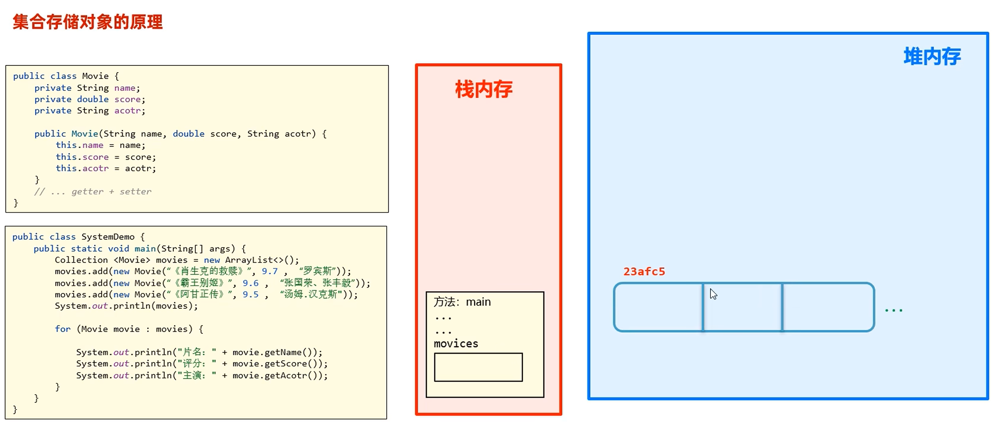

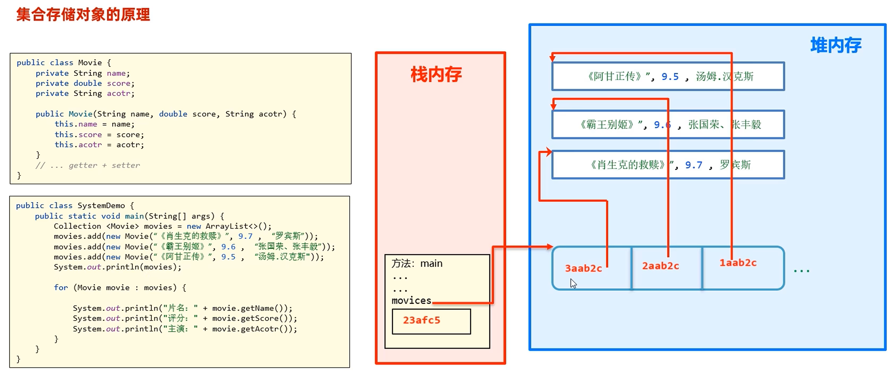

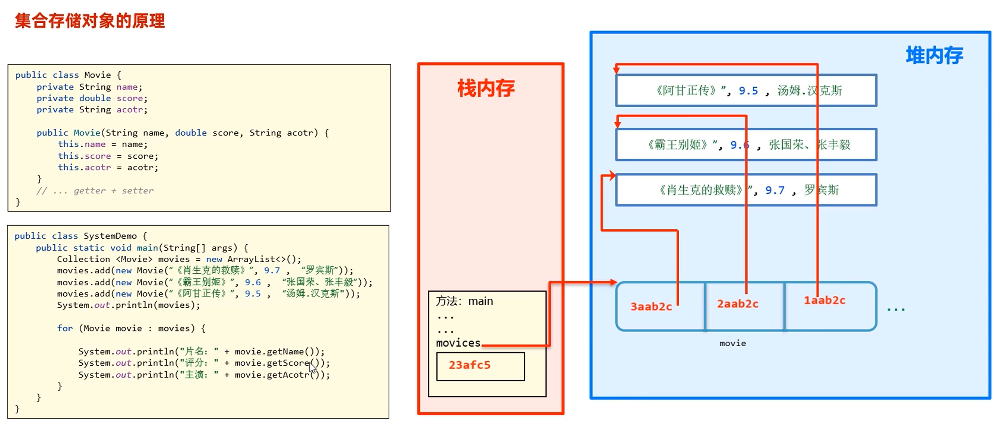

##### 总结

1. 集合中存储的是元素的什么信息？

+ **集合中存储的是元素对象的地址**


-------------------------------


### 4. List 集合

#### 4.1 特点、特有方法

##### 4.1.1 List 集合的特有方法

+ List 集合因为支持索引，所以多了很多与索引相关的方法，当然，Collection 的功能 List 也都继承了

| 方法名称                       | 说明                                   |
| ------------------------------ | -------------------------------------- |
| void add(int index, E element) | 在此集合中的指定位置插入指定的元素     |
| E remove(int index)            | 删除指定索引处的元素，返回被删除的元素 |
| E set(int index, E element)    | 修改指定索引处的元素，返回被修改的元素 |
| E get(int index)               | 返回指定索引处的元素                   |

##### 代码演示

```java
package Advanced.e_collection.d3_collection_list;

import java.util.ArrayList;
import java.util.List;

/**
 * 目标：掌握List系列集合的特点，以及其提供的特有方法
 */
public class ListTest1 {
    public static void main(String[] args) {
        // 1. 创建一个ArrayList集合对象（有序、可重复、有索引）
        List<String> list = new ArrayList<>(); // 一行经典代码
        list.add("蜘蛛精");
        list.add("至尊宝");
        list.add("至尊宝");
        list.add("牛夫人");
        System.out.println(list); // [蜘蛛精, 至尊宝, 至尊宝, 牛夫人]

        // 2. public void add(int index, E element)：在某个索引位置插入元素
        list.add(2, "紫霞仙子");
        System.out.println(list); // [蜘蛛精, 至尊宝, 紫霞仙子, 至尊宝, 牛夫人]

        // 3. public E remove(int index)：删除指定索引处的元素，返回被删除的元素
        System.out.println(list.remove(2)); // 紫霞仙子
        System.out.println(list); // [蜘蛛精, 至尊宝, 至尊宝, 牛夫人]

        // 4. public E get(int index)：返回指定索引处的元素
        System.out.println(list.get(3)); // 牛夫人

        // 5. public E set(int index, E element)：修改指定索引处的元素，返回被修改的元素
        System.out.println(list.set(3, "牛魔王")); // 牛夫人
        System.out.println(list); // [蜘蛛精, 至尊宝, 至尊宝, 牛魔王]
    }
}

```

##### 总结

1. List 系列集合的特点是什么？

+ 有序、可重复、有索引

2. List 提供了哪些独有的方法？

+ set、get


--------------------------------


#### 4.2 遍历方式

##### 4.2.1 List 集合支持的遍历方式

1. **for 循环**（因为 List 集合有索引）
2. 迭代器
3. 增强 for 循环
4. Lambda 表达式

##### 代码演示

```java
package Advanced.e_collection.d3_collection_list;

import java.util.ArrayList;
import java.util.Iterator;
import java.util.List;

public class ListTest2 {
    public static void main(String[] args) {
        List<String> list = new ArrayList<>(); // 一行经典代码
        list.add("糖宝宝");
        list.add("蜘蛛精");
        list.add("至尊宝");

        // 1. for循环
        for (int i = 0; i < list.size(); i++) {
            String s = list.get(i);
            System.out.println(s);
        }

        // 2. 迭代器
        Iterator<String> it = list.iterator();
        while (it.hasNext()) {
            System.out.println(it.next());
        }

        // 3. 增强for循环（foreach遍历）
        for (String s : list) {
            System.out.println(s);
        }

        // 4. JDK1.8开始之后的Lambda表达式
        list.forEach(s -> {
            System.out.println(s);
        });
    }
}

```


-------------------------


#### 4.3 ArrayList 集合的底层原理

ArrayList 和 LinkedList 底层采用的**数据结构**不同，应用场景不同

数据结构：存储、组织数据的方式

##### 4.3.1 ArrayList 集合的底层原理

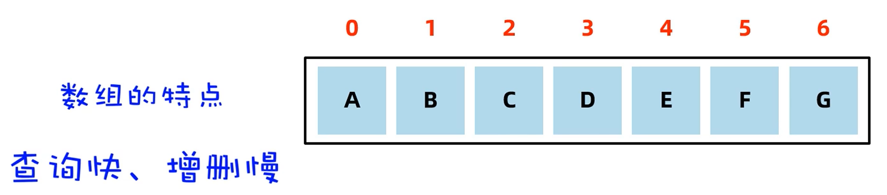

+ 基于**数组**实现的

  + **查询速度快**（注意：是根据索引查询数据快）：查询数据通过地址值和索引定位，查询任意数据耗时相同

  + **删除效率低**：可能需要把后面很多的数据进行前移

  + **添加效率极低**：可能需要把后面很多的数据后移，再添加元素；或者也可能需要进行数组的扩容

1. 利用无参构造器创建的集合，会在底层创建一个默认长度为0的数组
2. 添加第一个元素时，底层会创建一个新的长度为10的数组
3. 存满时，会扩容1.5倍
4. 如果一次添加多个元素，1.5倍还放不下，则新创建数组的长度以实际为准

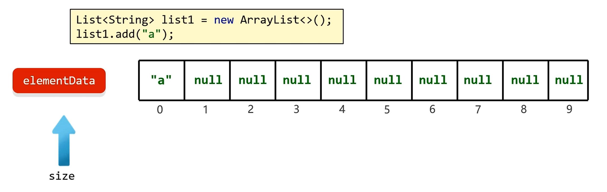

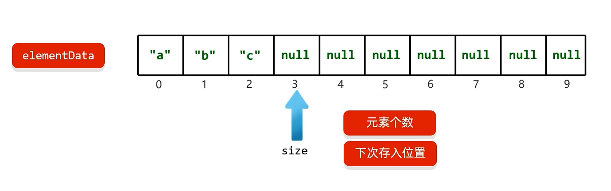

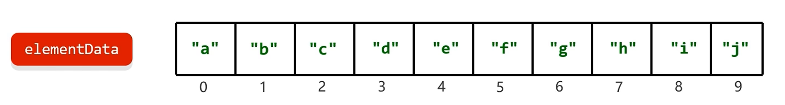

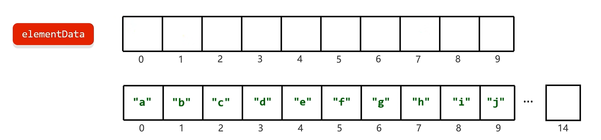

##### 4.3.2 ArrayList 集合适合的应用场景

1. ArrayList 适合：根据索引查询数据，比如根据随机索引取数据（高效）！或者数据量不是很大时！
2. ArrayList 不适合：数据量大的同时，又要频繁的进行增删操作


-----------------------------


#### 4.4 LinkedList 集合的底层原理

+ 基于**双链表**实现的
+ 特点：查询慢。增删相对较快，**但对首尾元素进行增删改查的速度是极快的**

##### 4.4.1 什么是链表？有啥特点？

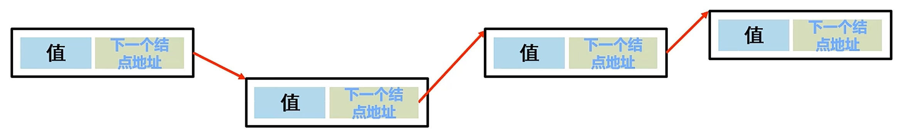

+ 链表中的结点是独立的对象，在内存中是不连续的，每个结点包含数据值和下一个结点的地址

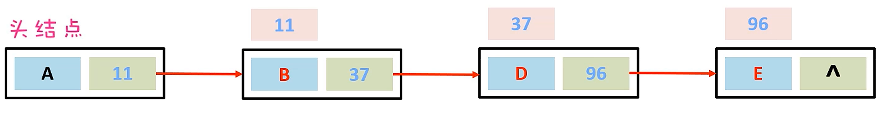

+ 链表的特点1：查询慢，无论查询哪个数据都要从头开始找
+ 链表的特点2：链表的增删相对快

###### 双向链表

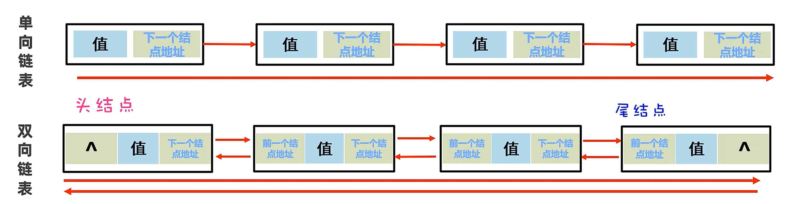

+ 特点：查询慢，增删相对较快，**但对首尾元素进行增删改查的速度是极快的**

##### 4.4.2 LinkedList 新增了：很多首尾操作的特有方法

| 方法名称                  | 说明                             |
| ------------------------- | -------------------------------- |
| public void addFirst(E e) | 在该列表开头插入指定的元素       |
| public void addLast(E e)  | 将指定的元素追加到此列表的末尾   |
| public E getFirst()       | 返回此列表中的第一个元素         |
| public E getLast()        | 返回此列表中的最后一个元素       |
| public E removeFirst()    | 从此列表中删除并返回第一个元素   |
| public E removeLast()     | 从此列表中删除并返回最后一个元素 |

##### 4.4.3 LinkedList 的应用场景之一：可以用来设计队列

队列的特点：**先进先出，后进后出**

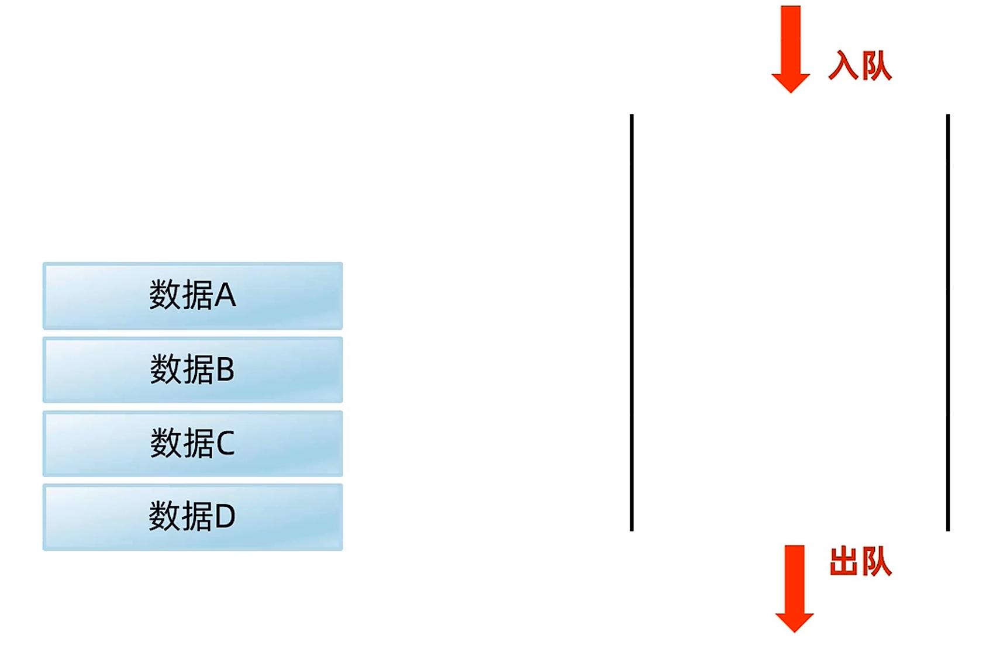

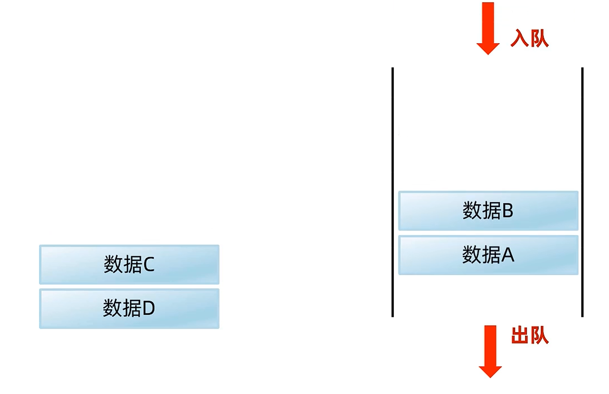

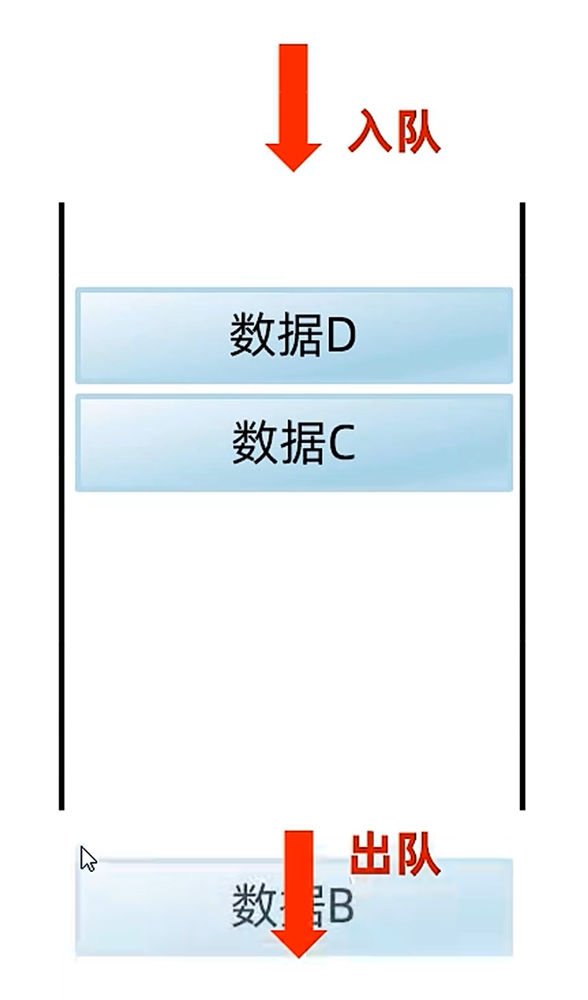

只是在首尾增删元素，用 LinkedList 来实现很合适

###### 代码实现

```java
package Advanced.e_collection.d3_collection_list;

import java.util.LinkedList;

/**
 * 目标：掌握LinkedList集合的使用
 */
public class ListTest3 {
    public static void main(String[] args) {
        // 1. 创建一个队列
        LinkedList<String> queue = new LinkedList<>();
        queue.addLast("第1号人");
        queue.addLast("第2号人");
        queue.addLast("第3号人");
        queue.addLast("第4号人");
        System.out.println(queue); // [第1号人, 第2号人, 第3号人, 第4号人]

        // 出队
        System.out.println(queue.removeFirst()); // 第1号人
        System.out.println(queue.removeFirst()); // 第2号人
        System.out.println(queue.removeFirst()); // 第3号人
        System.out.println(queue); // [第4号人]
    }
}
```

##### 4.4.4 LinkedList 的应用场景之一：可以用来设计栈

栈的特点：**后进后出，先进后出**

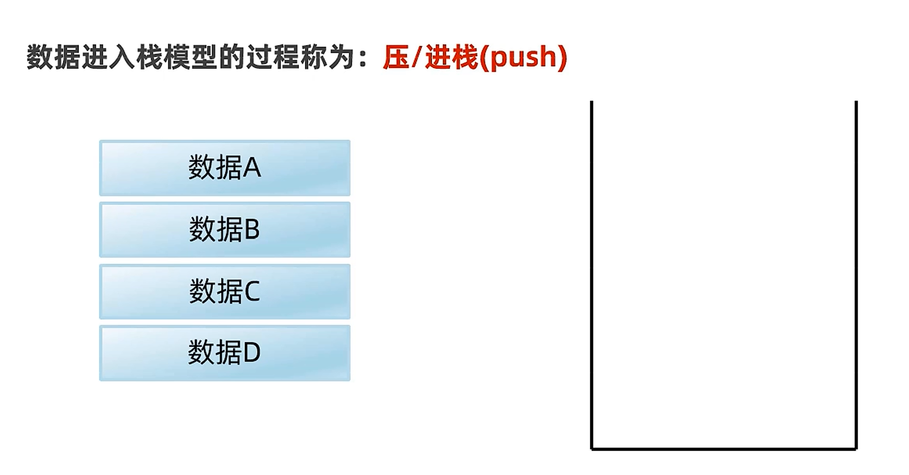

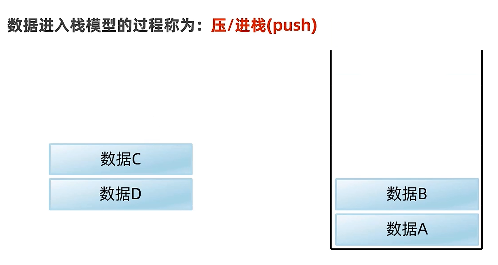

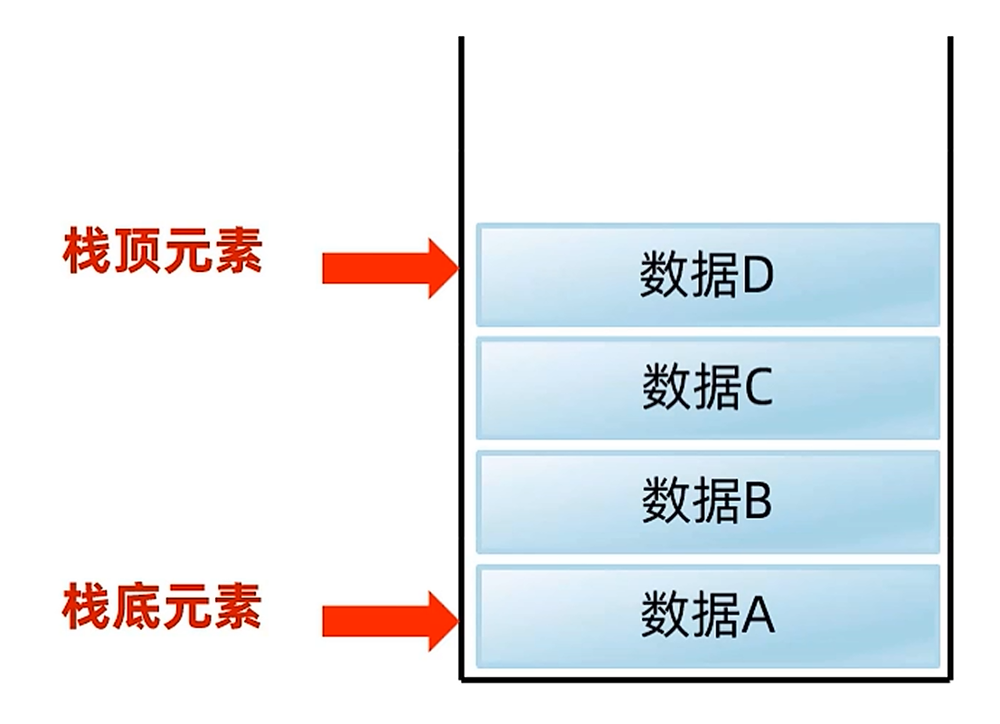

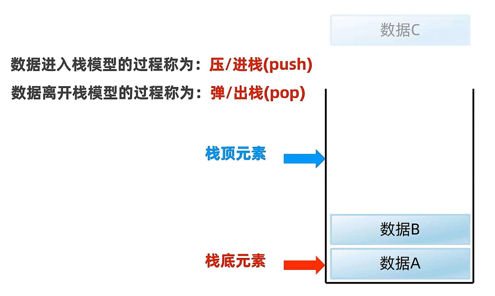

只是在首部增删元素，用 LinkedList 来实现很合适

###### 代码演示

```java
package Advanced.e_collection.d3_collection_list;

import java.util.LinkedList;

/**
 * 目标：掌握LinkedList集合的使用
 */
public class ListTest3 {
    public static void main(String[] args) {
        // 2. 创建一个栈对象
        LinkedList<String> stack = new LinkedList<>();
        // 进栈
        stack.push("第1颗子弹");
        stack.push("第2颗子弹");
        stack.push("第3颗子弹");
        stack.push("第4颗子弹");
        System.out.println(stack); // [第4颗子弹, 第3颗子弹, 第2颗子弹, 第1颗子弹]
        // 出栈
        System.out.println(stack.pop()); // 第4颗子弹
        System.out.println(stack.pop()); // 第3颗子弹
        System.out.println(stack); // [第2颗子弹, 第1颗子弹]
    }
}
```


---------------------------------------


### 5. Set 集合

#### 5.1 特点

Set 系列集合特点：**无序**：添加数据的顺序和获取出的数据顺序不一致；**不重复**；**无索引**；

+ HashSet：无序、不重复、无索引
+ LinkedHashSet：**有序**、不重复、无索引
+ TreeSet：**排序**、不重复、无索引

注意：

**Set 要用到的常用方法，基本上就是 Collection 提供的！！！自己几乎没有额外新增一些常用功能！**

##### 代码演示

```java
package Advanced.e_collection.d4_collection_set;

import java.util.HashSet;
import java.util.LinkedHashSet;
import java.util.Set;
import java.util.TreeSet;

/**
 * 目标：整体了解一下Set系列集合的特点
 */
public class SetTest1 {
    public static void main(String[] args) {
        // 1. 创建一个Set集合的对象
        Set<Integer> set = new HashSet<>(); // 创建了一个HashSet的集合对象，一行经典代码 无序、不重复、无索引
        set.add(666);
        set.add(555);
        set.add(555);
        set.add(888);
        set.add(888);
        set.add(777);
        set.add(777);
        System.out.println(set); // [888, 777, 666, 555]

        System.out.println("-------------------------------");

        Set<Integer> set2 = new LinkedHashSet<>(); // 有序、不重复、无索引
        set2.add(666);
        set2.add(555);
        set2.add(555);
        set2.add(888);
        set2.add(888);
        set2.add(777);
        set2.add(777);
        System.out.println(set2); // [666, 555, 888, 777]

        System.out.println("-------------------------------");

        Set<Integer> set3 = new TreeSet<>(); // 可排序、不重复、无索引
        set3.add(666);
        set3.add(555);
        set3.add(555);
        set3.add(888);
        set3.add(888);
        set3.add(777);
        set3.add(777);
        System.out.println(set3); // [555, 666, 777, 888]
    }
}

```


---------------------------------


#### 5.2 HashSet 集合的底层原理

##### 5.2.1 哈希值

+ 就是一个 int 类型的**数值**，**Java 中每个对象都有一个哈希值**
+ Java 中的所有对象，都可以调用 Object 类提供的 hashCode 方法，返回该对象自己的哈希值

```java
public int hashCode(); // 返回对象的哈希码值
```

###### 对象哈希值的特点

+ 同一个对象多次调用 hashCode() 方法返回的哈希值是相同的
+ **不同的对象，它们的哈希值一般不相同，但也有可能会相同（哈希碰撞）**

###### 代码演示

```java
package Advanced.e_collection.d4_collection_set;

/**
 * 目标：了解一下哈希值
 */
public class SetTest2 {
    public static void main(String[] args) {
        Student s1 = new Student("蜘蛛精", 25, 169.5);
        Student s2 = new Student("紫霞", 22, 166.5);
        System.out.println(s1.hashCode()); // 189568618
        System.out.println(s1.hashCode()); // 189568618
        System.out.println(s2.hashCode()); // 793589513

        String str1 = new String("abc");
        String str2 = new String("acD");
        // 这里例子是故意设计的，是为了演示哈希碰撞，实际中并不会这么容易就撞,感兴趣的朋友可以去阅读String的hashCode()源码，就能明白为什么这两个会撞了
        System.out.println(str1.hashCode()); // 96354
        System.out.println(str2.hashCode()); // 96354
    }
}
```

##### 5.2.2 HashSet 集合的底层原理

+ 基于**哈希表**实现
+ 哈希表是一种增删改查数据，性能都较好的数据结构

###### 哈希表

+ JDK8 之前，哈希表 = 数组 + 链表
+ JDK8 之后，哈希表 = 数组 + 链表 + 红黑树

##### 5.2.3 JDK8 之前 HashSet 集合的底层原理，基于哈希表：数组 + 链表

1. 创建一个默认长度为16的数组，默认加载因子为0.75，数组名为 table
2. 使用元素的**哈希值**对**数组的长度求余**计算出应存入的位置
3. 判断当前位置是否为 null，如果是 null 直接存入
4. **如果不为 null，表示有元素，则调用 equals 方法比较**；相等，则不存；不相等，则存入数组

+ JDK8 之前，新元素存入数组，占老元素位置，老元素挂下面
+ JDK8 开始之后，新元素直接挂在老元素下面

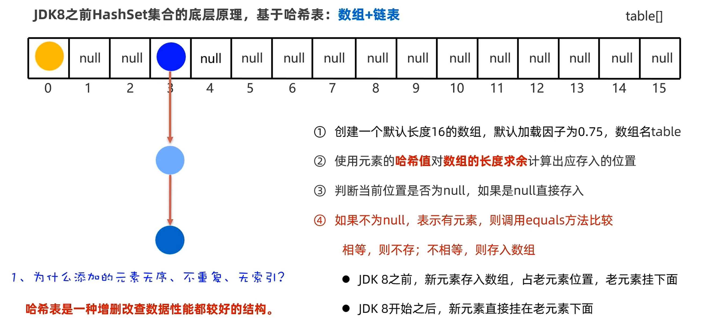

##### 5.2.4 JDK8 开始 HashSet 集合的底层原理，基于哈希表：数组 + 链表 + 红黑树

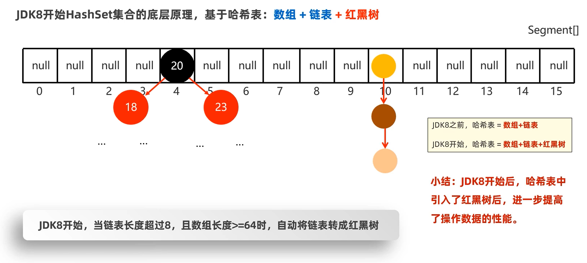

JDK8 开始，**当链表长度超过8**，且**数组长度 >= 64**时，**自动将链表转成红黑树**

##### 5.2.5 了解一下数据结构（树）

###### 普通二叉树

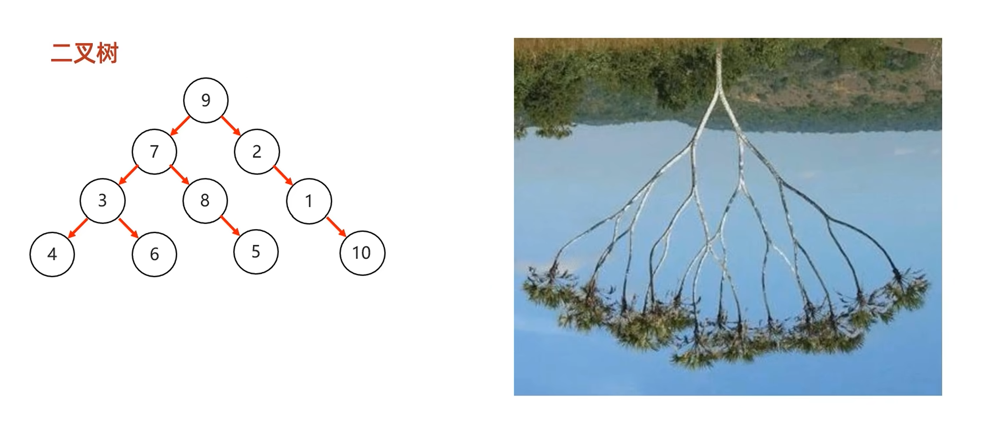

+ 度：每一个节点的子节点数量
  + 二叉树中，任意节点的度 <= 2
+ 树高：数的总层数
+ 根节点：最顶层的节点
+ 左子节点
+ 右子节点
+ 左子树
+ 右子树

###### 二叉查找树

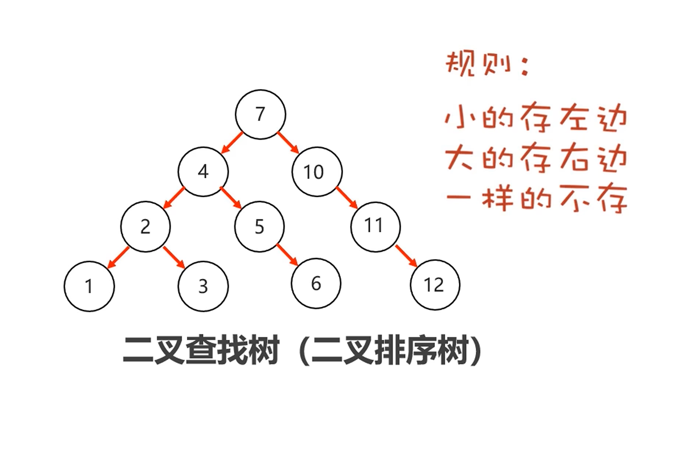

二叉查找树存在的问题：

+ **当数据已经是排好序的，导致查询的性能与单链表一样，查询速度变慢**

###### 平衡二叉树

+ 在满足二叉查找树的大小规则下，让树尽可能矮小，以此提高查数据的性能

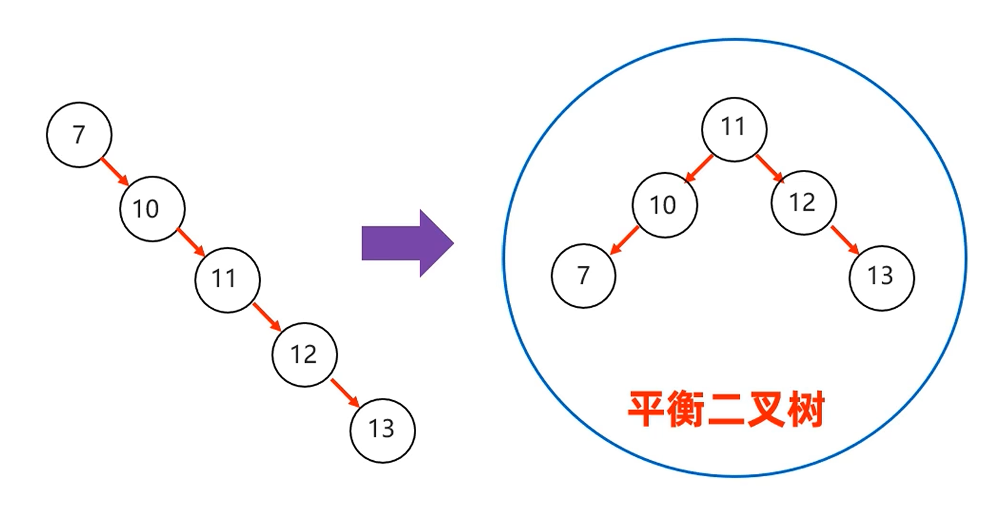

###### 红黑树

+ 就是可以自平衡的二叉树
+ **红黑树是一种增删改查数据性能相对都较好的结构**

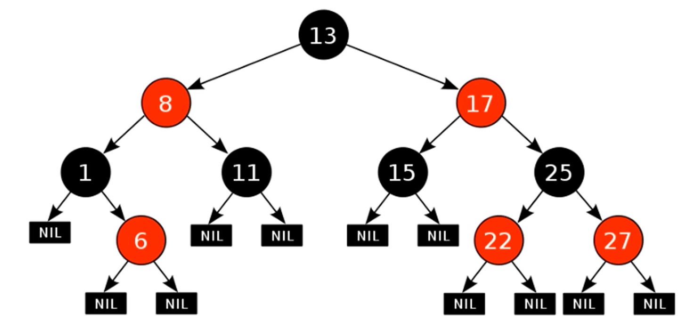

##### 5.2.6 深入理解 HashSet 集合去重复的机制

HashSet 集合默认不能对内容一样的两个不同对象去重复

+ 比如内容一样的两个学生对象存入到 HashSet 集合中去，HashSet 集合是不能去重复的！

**如果希望 Set 集合认为2个内容一样的对象是重复的，必须重写对象的 hashCode() 和 equals() 方法**

###### 代码演示

+ Student.java

```java
package Advanced.e_collection.d4_collection_set;

import java.util.Objects;

public class Student {
    private String name;
    private int age;
    private double height;

    public Student() {
    }

    public Student(String name, int age, double height) {
        this.name = name;
        this.age = age;
        this.height = height;
    }

    // 只要两个对象内容一样就返回true
    @Override
    public boolean equals(Object o) {
        if (this == o) return true;
        if (o == null || getClass() != o.getClass()) return false;
        Student student = (Student) o;
        return age == student.age && Double.compare(height, student.height) == 0 && Objects.equals(name, student.name);
    }

    // 只要两个对象内容一样，返回的哈希值就是一样的
    @Override
    public int hashCode() {
        return Objects.hash(name, age, height);
    }

    public String getName() {
        return name;
    }

    public void setName(String name) {
        this.name = name;
    }

    public int getAge() {
        return age;
    }

    public void setAge(int age) {
        this.age = age;
    }

    public double getHeight() {
        return height;
    }

    public void setHeight(double height) {
        this.height = height;
    }

    @Override
    public String toString() {
        return "Student{" +
                "name='" + name + '\'' +
                ", age=" + age +
                ", height=" + height +
                '}';
    }
}

```

+ SetTest3.java

```java
package Advanced.e_collection.d4_collection_set;

import java.util.HashSet;
import java.util.Set;

/**
 * 目标：自定义的类型的对象，比如两个内容一样的学生对象，如果让HashSet集合能够去重复
 */
public class SetTest3 {
    public static void main(String[] args) {
        Set<Student> students = new HashSet<>();
        Student s1 = new Student("至尊宝", 28, 169.6);
        Student s2 = new Student("蜘蛛精", 23, 169.6);
        Student s3 = new Student("蜘蛛精", 23, 169.6);
        System.out.println(s2.hashCode()); // 573521603
        System.out.println(s3.hashCode()); // 573521603
        Student s4 = new Student("牛魔王", 48, 169.6);
        students.add(s1);
        students.add(s2);
        students.add(s3);
        students.add(s4);
        System.out.println(students); // [Student{name='至尊宝', age=28, height=169.6}, Student{name='蜘蛛精', age=23, height=169.6}, Student{name='牛魔王', age=48, height=169.6}]
    }
}

```


--------------------------


#### 5.3 LinkedHashSet 集合的底层原理

+ **有序**、不重复、无索引

##### 5.3.1 LinkedHashSet 底层原理

+ 依然是基于哈希表**（数组、链表、红黑树）**实现的
+ 但是，它的每个元素都额外的多了一**个双链表**的机制记录它前后元素的位置

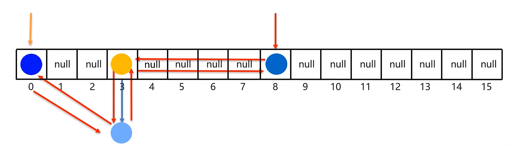

因为有双链表机制记住它前一个元素的地址和下一个元素的地址，所以能实现它有序这个特点


-----------------------------


#### 5.4 TreeSet 集合

+ 特点：不重复、无索引、**可排序（默认升序排序，按照元素的大小，由小到大排序）**

+ **底层是基于红黑树实现的排序**

注意：

+ 对于数值类型：Integer、Double，默认按照数值本身的大小进行升序排序
+ 对于字符串类型：默认按照首字符的编号升序排序
+ **对于自定义类型如 Student 对象，TreeSet 默认是无法直接排序的**

##### 5.4.1 自定义排序规则

+ TreeSet 集合存储自定义类型的对象时，必须指定排序规则，支持如下两种方式来指定比较规则

###### 方式一

+ 让自定义的类（如学生类）**实现 Comparable 接口**，重写里面的 **compareTo** 方法**来指定比较规则**

###### 方式二

+ **通过调用 TreeSet 集合有参构造器，可以设置 Comparator 对象（比较器对象，用于指定比较规则）**

```java
public TreeSet(Comparator<? super E> comparator)
```

###### 两种方式中，关于返回值的规则：

+ 如果认为第一个元素 > 第二个元素 返回正整数即可
+ 如果认为第一个元素 < 第二个元素 返回负整数即可
+ 如果如果认为第一个元素 = 第二个元素 返回0即可，此时 TreeSet 集合只会保留一个元素，认为两者重复

**注意：如果类本身有实现 Comparable 接口，TreeSet 集合同时也自带比较器，默认使用集合自带的比较器排序**

##### 代码演示

+ Student.java

```java
package Advanced.e_collection.d4_collection_set;

import java.util.Objects;

public class Student implements Comparable<Student> {
    private String name;
    private int age;
    private double height;

    @Override
    public int compareTo(Student o) {
        // 如果认为左边对象大于右边对象返回正整数
        // 如果认为左边对象小于右边对象返回负整数
        // 如果认为左边对象等于右边对象返回0
        // 需求：按照年龄排序
        return this.age - o.age;
    }

    public Student() {
    }

    public Student(String name, int age, double height) {
        this.name = name;
        this.age = age;
        this.height = height;
    }

    // 只要两个对象内容一样就返回true
    @Override
    public boolean equals(Object o) {
        if (this == o) return true;
        if (o == null || getClass() != o.getClass()) return false;
        Student student = (Student) o;
        return age == student.age && Double.compare(height, student.height) == 0 && Objects.equals(name, student.name);
    }

    // 只要两个对象内容一样，返回的哈希值就是一样的
    @Override
    public int hashCode() {
        return Objects.hash(name, age, height);
    }

    public String getName() {
        return name;
    }

    public void setName(String name) {
        this.name = name;
    }

    public int getAge() {
        return age;
    }

    public void setAge(int age) {
        this.age = age;
    }

    public double getHeight() {
        return height;
    }

    public void setHeight(double height) {
        this.height = height;
    }

    @Override
    public String toString() {
        return "Student{" +
                "name='" + name + '\'' +
                ", age=" + age +
                ", height=" + height +
                '}';
    }
}

```

+ SetTest4.java

```java
package Advanced.e_collection.d4_collection_set;

import java.util.Comparator;
import java.util.Set;
import java.util.TreeSet;

/**
 * 目标：掌握TreeSet集合的使用
 */
public class SetTest4 {
    public static void main(String[] args) {
        Set<Integer> set1 = new TreeSet<>();
        set1.add(6);
        set1.add(5);
        set1.add(5);
        set1.add(7);
        System.out.println(set1); // [5, 6, 7]

        // 就近选择自己自带的比较器对象进行排序
//        Set<Student> students = new TreeSet<>(new Comparator<Student>() {
//            @Override
//            public int compare(Student o1, Student o2) {
//                // 需求：按照身高升序排序
//                return Double.compare(o1.getHeight(), o2.getHeight());
//            }
//        });

        Set<Student> students = new TreeSet<>((o1, o2) -> Double.compare(o1.getHeight(), o2.getHeight()));
        students.add(new Student("蜘蛛精", 23, 169.7));
        students.add(new Student("紫霞", 22, 169.8));
        students.add(new Student("至尊宝", 26, 165.5));
        students.add(new Student("牛魔王", 22, 183.5));
        System.out.println(students);
    }
}

```


---------------------------


### 总结

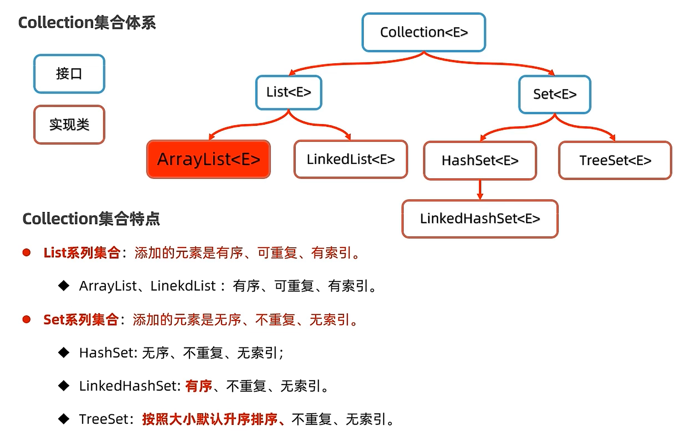

1. 如果希望记住元素的添加顺序，需要存储重复的元素，**又要频繁的根据索引查询数据**？

+ 用 ArrayList 集合（有序、可重复、有索引），底层基于数组的**（常用）**

2. 如果希望记住元素的添加顺序，**且增删首尾数据的情况较多**？

+ 用 LinkedList 集合（有序、可重复、有索引），底层基于双链表实现的

3. 如果不在意元素顺序，**也没有重复元素需要存储，只希望增删改查都快**？

+ 用 HashSet 集合（无序、不重复、无索引），底层基于哈希表实现的**（常用）**

4. 如果希望记住元素的添加顺序，也没有重复元素需要存储，且希望增删改查都快？

+ 用 LinkedHashSet 集合（**有序**、不重复、无索引），底层基于哈希表和双链表

5. 如果要对元素进行排序，也没有重复元素需要存储？且希望增删改查都快？

+ 用 TreeSet 集合，基于红黑树实现


----------------------------------


### 6. 注意事项：集合的并发修改异常问题

+ 使用迭代器遍历集合时，又同时在删除集合中的数据，程序就会出现并发修改异常的错误
+ 由于增强 for 循环遍历集合就是迭代器遍历集合的简化写法，因此，使用增强 for 循环遍历集合，又在同时删除集合中的数据时，程序也会出现并发修改异常的错误

#### 怎么保证遍历集合同时删除数据时不出 bug？

+ 使用迭代器遍历集合，**但用迭代器自己的删除方法删除数据即可**
+ 如果能用 for 循环遍历时：**可以倒着遍历并删除；或者从前往后遍历，但删除元素后做 `i--` 操作**

#### 代码演示

```java
package Advanced.e_collection.d5_collection_exception;

import java.util.ArrayList;
import java.util.Iterator;
import java.util.List;

/**
 * 目标：理解集合的并发修改异常问题，并解决
 */
public class Collection_exception {
    public static void main(String[] args) {
        List<String> list = new ArrayList<>();
        list.add("王麻子");
        list.add("小李子");
        list.add("李爱花");
        list.add("张全蛋");
        list.add("晓李");
        list.add("李玉刚");
        System.out.println(list); // [王麻子, 小李子, 李爱花, 张全蛋, 晓李, 李玉刚]

        // 需求：找出集合中全部带“李”的名字，并从集合中删除
//        Iterator<String> it = list.iterator();
//        while (it.hasNext()) {
//            String name = it.next();
//            if (name.contains("李")) {
//                list.remove(name);
//            }
//        }
//        System.out.println(list); // 报错

        // 使用for循环遍历集合并删除集合中带李字的名字
//        for (int i = 0; i < list.size(); i++) {
//            String name = list.get(i);
//            if (name.contains("李")){
//                list.remove(name);
//            }
//        }
//        System.out.println(list);

        System.out.println("------------------------------------");

        // 怎么解决呢？
        // 使用for循环遍历集合并删除集合中带李字的名字
//        for (int i = 0; i < list.size(); i++) {
//            String name = list.get(i);
//            if (name.contains("李")){
//                list.remove(name);
//                i--;
//            }
//        }
//        System.out.println(list); // [王麻子, 张全蛋]
        // 倒着删除也是可以的

        // 需求：找出集合中全部带“李”的名字，并从集合中删除
        Iterator<String> it = list.iterator();
        while (it.hasNext()) {
            String name = it.next();
            if (name.contains("李")) {
//                list.remove(name); // 并发修改异常的错误
                it.remove(); // 删除迭代器当前遍历到的数据，没删除一个数据后，相当于也在底层做了i--
            }
        }
        System.out.println(list); // [王麻子, 张全蛋]

        // 使用增强for循环遍历集合并删除数据，没有办法解决bug
//        for (String name : list) {
//            if (name.contains("李")) {
//                list.remove(name);
//            }
//        }
//        System.out.println(list); // 报错

        // Lambda表达式也不行
//        list.forEach(name ->{
//            if (name.contains("李")){
//                list.remove(name);
//            }
//        });
//        System.out.println(list); // 报错
    }
}

```


--------------------------------------


### 7. Collection 的其他相关知识

#### 7.1 前置知识：可变参数

+ 就是一种特殊形参，定义在方法、构造器的形参列表里，格式是：`数据类型... 参数名称;`

##### 7.1.1 可变参数的特点和好处

+ 特点：可以不传数据给它；可以传一个或者同时传多个数据给它；也可以传一个数组给它
+ 好处：常常用来灵活的接收数据

##### 7.1.2 可变参数的注意事项

+ **可变参数在方法内部就是一个数组**
+ 一个形参列表中可变参数只能有一个
+ 可变参数必须放在形参列表的最后面

##### 代码演示

```java
package Advanced.f_parameter.d1_parameter;

import java.util.Arrays;

/**
 * 目标：认识可变参数，掌握其作用
 */
public class ParamTest {
    public static void main(String[] args) {
        // 特点：
        test(); // 不传数据
        test(10); // 传输一个数据
        test(10, 20, 30); // 传输多个数据
        test(new int[]{10, 20, 30, 40}); // 传输一个数组
    }

    // 注意事项1：一个形参列表中，只能有一个可变参数
    // 注意事项2：可变参数必须放在形参列表的最后面
    public static void test(int... nums) {
        // 可变参数在方法内部，本质就是一个数组
        System.out.println(nums.length); // 长度属性是数组专有的
        System.out.println(Arrays.toString(nums));
        System.out.println("---------------------------------------");
    }
}

```


----------------------------------


#### 7.2 Collections

+ 是一个用来操作集合的工具类

##### 7.2.1 Collections 提供的常用静态方法

| 方法名称                                                     | 说明                                                 |
| ------------------------------------------------------------ | ---------------------------------------------------- |
| public static <T> boolean **addAll(Collection<? super T> c, T... elements)** | 给集合批量添加元素                                   |
| public static void **shuffle(List<?> list)**                 | 打乱 List 集合中的元素顺序                           |
| public static <T> void **sort(List<T> list)**                | 对 List 集合中的元素进行升序排序                     |
| public static <T> void **sort(List<T> list, Comparator<? super T> c)** | 对 List 集合中元素，按照比较器对象指定的规则进行排序 |

##### 7.2.2 Collections 只能支持对 List 集合进行排序

###### 排序方式1

| 方法名称                                      | 说明                               |
| --------------------------------------------- | ---------------------------------- |
| public static <T> void sort(**List<T> list**) | 对 List 集合中元素按照默认规则排序 |

注意：本方法可以直接对自定义类型的 List 集合排序，但自定义类型必须实现了 Comparable 接口，指定了比较规则才可以

###### 排序方式2

| 方法名称                                                     | 说明                                                 |
| ------------------------------------------------------------ | ---------------------------------------------------- |
| public static <T> void sort(**List<T> list, Comparator<? super T> c**) | 对 List 集合中元素，按照比较器对象指定的规则进行排序 |

##### 代码演示

```java
package Advanced.g_collections;

import java.util.ArrayList;
import java.util.Collections;
import java.util.Comparator;
import java.util.List;

/**
 * mb：掌握Collections集合工具类的使用
 */
public class CollectionsTest1 {
    public static void main(String[] args) {
        // 1. public static <T> boolean addAll(Collection<? super T> c, T... elements)：给集合批量添加元素
        List<String> names = new ArrayList<>();
        Collections.addAll(names, "张三", "王五", "李四", "张麻子");
        System.out.println(names); // [张三, 王五, 李四, 张麻子]

        // 2. public static void shuffle(List<?> list)：打乱 List 集合中的元素顺序
        Collections.shuffle(names);
        System.out.println(names); // [王五, 李四, 张三, 张麻子]

        // 3. public static <T> void sort(List<T> list)：对 List 集合中的元素进行升序排序
        List<Integer> list = new ArrayList<>();
        list.add(3);
        list.add(5);
        list.add(2);
        Collections.sort(list);
        System.out.println(list); // [2, 3, 5]

        List<Student> students = new ArrayList<>();
        students.add(new Student("蜘蛛精", 23, 169.7));
        students.add(new Student("紫霞", 22, 169.8));
        students.add(new Student("至尊宝", 26, 165.5));
        students.add(new Student("牛魔王", 22, 183.5));
//        Collections.sort(students);
//        System.out.println(students);

        // 4. public static <T> void sort(List<T> list, Comparator<? super T> c)：对 List 集合中元素，按照比较器对象指定的规则进行排序
        Collections.sort(students, new Comparator<Student>() {
            @Override
            public int compare(Student o1, Student o2) {
                return Double.compare(o1.getHeight(), o2.getHeight());
            }
        });
        System.out.println(students);
    }
}

```


-----------------------------


#### 综合案例：斗地主游戏

> 分析业务需求：
>
> + 总共有54张牌
> + 点数："3", "4", "5", "6", "7", "8", "9", "10", "J", "Q", "K", "A", "2"
> + 花色："♠", "♥", "♣", "♦"
> + 大小王："👲", "🃏"
> + 斗地主：发51张牌，剩下3张作为底牌

分析实现

+ 在启动游戏房间的时候，应该提前准备好54张牌
+ 接着，需要完成洗牌、发牌、对牌排序、看牌

##### 代码实现

+ Card.java

```java
package Advanced.g_collections.d2_collections_test;

public class Card {
    private String number;
    private String color;
    // 每张牌是存在大小的
    private int size; // 0 1 2 ...

    public Card() {
    }

    public Card(String number, String color, int size) {
        this.number = number;
        this.color = color;
        this.size = size;
    }

    public String getNumber() {
        return number;
    }

    public void setNumber(String number) {
        this.number = number;
    }

    public String getColor() {
        return color;
    }

    public void setColor(String color) {
        this.color = color;
    }

    public int getSize() {
        return size;
    }

    public void setSize(int size) {
        this.size = size;
    }

    @Override
    public String toString() {
        return color + number;
    }
}

```

+ Room.java

```java
package Advanced.g_collections.d2_collections_test;

import java.util.ArrayList;
import java.util.Collections;
import java.util.Comparator;
import java.util.List;

public class Room {
    // 必须有一副牌
    private List<Card> allCards = new ArrayList<>();

    public Room() {
        // 1. 做出54张牌，存入到集合allCards
        // a、点数：个数确定了，类型确定
        String[] numbers = {"3", "4", "5", "6", "7", "8", "9", "10", "J", "Q", "K", "A", "2"};
        // b、花色：个数确定了，类型确定
        String[] colors = {"♠", "♥", "♣", "♦"};
        int size = 0; // 表示每张牌的大小
        // c、遍历点数，再遍历花色，组织牌
        for (String number : numbers) {
            size++;
            for (String color : colors) {
                // 得到一张牌
                Card c = new Card(number, color, size);
                allCards.add(c); // 存入了牌
            }
        }
        // 单独存入大小王的
        Card c1 = new Card("", "🃏", ++size);
        Card c2 = new Card("", "👲", ++size);
        Collections.addAll(allCards, c1, c2);
        System.out.println("新牌：" + allCards);

    }

    /**
     * 游戏启动
     */
    public void start() {
        // 1. 洗牌：allCards
        Collections.shuffle(allCards);
        System.out.println("洗牌后" + allCards);

        // 2. 发牌：首先肯定要定义三个玩家。
        List<Card> linHuChong = new ArrayList<>();
        List<Card> jiuMoZhi = new ArrayList<>();
        List<Card> renYingYing = new ArrayList<>();
        // 正式发牌给这三个玩家，依次发出51张牌，剩余三张作为底牌
        for (int i = 0; i < allCards.size() - 3; i++) {
            Card c = allCards.get(i);
            // 判断牌发给谁
            if (i % 3 == 0) {
                // 请啊冲接牌
                linHuChong.add(c);
            } else if (i % 3 == 1) {
                // 请啊鸠接牌
                jiuMoZhi.add(c);
            } else if (i % 3 == 2) {
                // 请盈盈接牌
                renYingYing.add(c);
            }
        }

        // 3. 对三个玩家的牌进行排序
        sortCards(linHuChong);
        sortCards(jiuMoZhi);
        sortCards(renYingYing);
        // 4. 看牌
        System.out.println("啊冲：" + linHuChong);
        System.out.println("啊鸠：" + jiuMoZhi);
        System.out.println("盈盈：" + renYingYing);
        List<Card> lastThreeCards = allCards.subList(allCards.size() - 3, allCards.size()); // 51 52 53
        System.out.println("底牌：" + lastThreeCards);
        jiuMoZhi.addAll(lastThreeCards);
        sortCards(jiuMoZhi);
        System.out.println("啊鸠抢到地主后" + jiuMoZhi);
    }

    /**
     * 集中进行排序
     *
     * @param cards
     */
    private void sortCards(List<Card> cards) {
        Collections.sort(cards, new Comparator<Card>() {
            @Override
            public int compare(Card o1, Card o2) {
                return o1.getSize() - o2.getSize(); // 升序
            }
        });
    }
}

```

+ GameDemo.java

```java
package Advanced.g_collections.d2_collections_test;

/**
 * 目标：斗地主游戏的案例开发
 * 分析业务需求：
 * 总共有54张牌
 * 点数："3", "4", "5", "6", "7", "8", "9", "10", "J", "Q", "K", "A", "2"
 * 花色："♠", "♥", "♣", "♦"
 * 大小王："👲", "🃏"
 * 斗地主：发51张牌，剩下3张作为底牌
 */
public class GameDemo {
    public static void main(String[] args) {
        // 1. 牌类
        // 2. 房间
        Room m = new Room();
        // 3. 启动游戏
        m.start();
    }
}

```


----------------------------------


### 8. Map 集合（键值对集合）

#### 8.1 概述

+ Map 集合称为双列集合，格式：`{key1=value1,  key2=value2, key3=value3, ...}` ，一次需要存一对数据做为一个元素
+ Map 集合的每个元素 "key=value" 称为一个键值对/键值对对象/一个 Entry 对象，Map 集合也被叫做 ”**键值对集合**“
+ Map 集合的所有键是不允许重复的，但值可以重复，键和值是一一对应的，每一个键只能找到自己对应的值


##### 8.1.1 Map 集合在什么业务场景下使用

+ 购物车
  + {商品1=2, 商品2=3, 商品3=2, 商品4=3}

**需要存储一一对应的数据时**，就可以考虑使用 Map 集合来做

##### 8.1.2 Map 集合体系

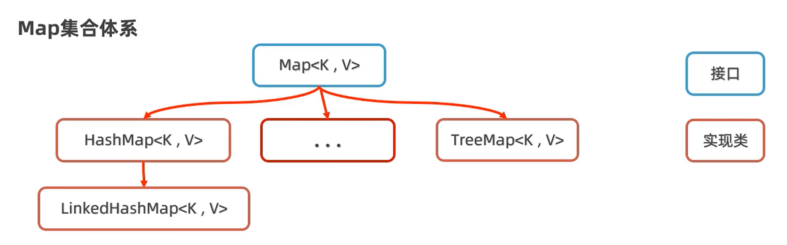

##### 8.1.3 Map 集合体系的特点

**注意：Map 系列集合的特点都是由键决定的，值只是一个附属品，值是不做要求的**

+ HashMap（由键决定特点）：无序、不重复、无索引；**（用的最多）**
+ LinkedHashMap（由键决定特点）：由键决定的特点：**有序**、不重复、无索引
+ TreeMap（由键决定特点）：**按照大小默认升序排序**、不重复、无索引

##### 代码演示

```java
package Advanced.h_map.d1_map;

import java.util.HashMap;
import java.util.LinkedHashMap;
import java.util.Map;
import java.util.TreeMap;

/**
 * 目标：掌握Map集合的特点
 */
public class MapTest1 {
    public static void main(String[] args) {
        Map<String, Integer> map = new HashMap<>(); // 一行经典代码 按照键 无序、不重复、无索引
        map.put("手表", 100);
        map.put("手表", 220); // 后面重复的数据会覆盖前面的数据（键）
        map.put("手机", 2);
        map.put("Java", 2);
        map.put(null, null);
        System.out.println(map); // {null=null, 手表=220, Java=2, 手机=2}

        System.out.println("--------------------------------------");

        Map<String, Integer> map2 = new LinkedHashMap<>(); // 有序、不重复、无索引
        map2.put("手表", 100);
        map2.put("手表", 220); // 后面重复的数据会覆盖前面的数据（键）
        map2.put("手机", 2);
        map2.put("Java", 2);
        map2.put(null, null);
        System.out.println(map2); // {手表=220, 手机=2, Java=2, null=null}

        Map<Integer, String> map1 = new TreeMap<>(); // 可排序、不重复、无索引
        map1.put(23, "Java");
        map1.put(23, "MySQL");
        map1.put(19, "李四");
        map1.put(20, "王五");
        System.out.println(map1); // {19=李四, 20=王五, 23=MySQL}
    }
}

```


-----------------------------


#### 8.2 常用方法

+ Map 是双列集合的祖宗，它的功能是全部双列集合都可以继承过来使用的

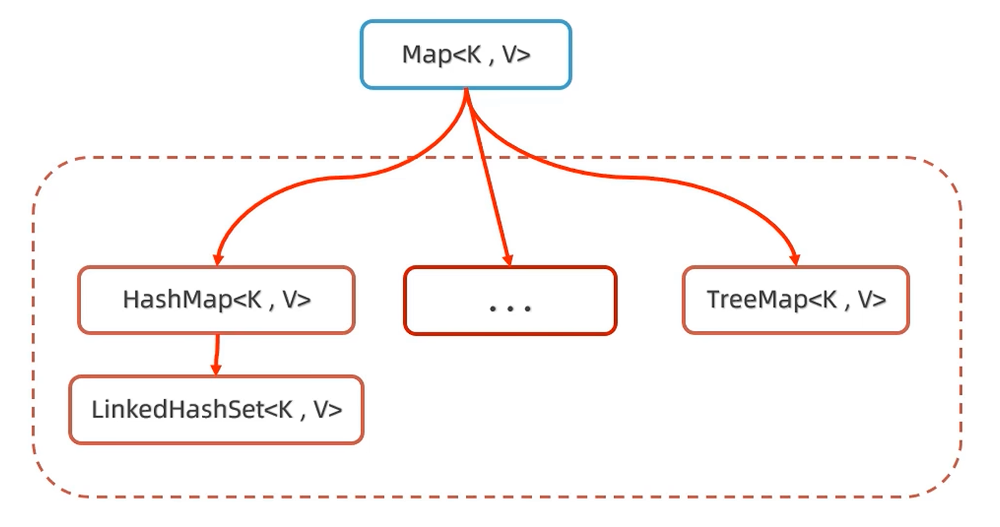

##### 8.2.1 Map 的常用方法如下：

| 方法名称                                   | 说明                                     |
| ------------------------------------------ | ---------------------------------------- |
| public V put(K key, V value)               | 添加元素                                 |
| public int size()                          | 获取集合的大小                           |
| public void clear()                        | 清空集合                                 |
| public boolean isEmpty()                   | 判断集合是否为空，为空返回 true，反之    |
| public V get(Object key)                   | 根据键获取对应值                         |
| public V remove(Object key)                | 根据键删除整个元素（删除键会返回键的值） |
| public boolean containsKey(object key)     | 判断是否包含某个键，包含返回 true，反之  |
| public boolean containsValue(Object value) | 判断是否包含某个值                       |
| public Set<K> keySet()                     | 获取 Map 集合的全部键                    |
| public Collection<V> values()              | 获取 Map 集合的全部值                    |

##### 代码演示

```java
package Advanced.h_map.d1_map;

import java.util.Collection;
import java.util.HashMap;
import java.util.Map;
import java.util.Set;

public class MapTest2 {
    public static void main(String[] args) {
        // 1. 添加元素：无序、不重复、无索引
        Map<String, Integer> map = new HashMap<>();
        map.put("手表", 100);
        map.put("手表", 220);
        map.put("手机", 2);
        map.put("Java", 2);
        map.put(null, null);
        System.out.println(map); // {null=null, 手表=220, Java=2, 手机=2}

        // 2. public int size()：获取集合的大小
        System.out.println(map.size()); // 4

        // 3. public void clear()：清空集合
//        map.clear();
        System.out.println(map); // {}

        // 4. public boolean isEmpty()：判断集合是否为空，为空返回true，反之
        System.out.println(map.isEmpty()); // false

        // 5. public V get(Object key)：根据键获取对应值
        int v1 = map.get("手表");
        System.out.println(v1); // 220
        System.out.println(map.get("手机")); // 2
        System.out.println(map.get("张三")); // null

        // 6. public V remove(Object key)：根据键删除整个元素（删除键会返回键的值）
        System.out.println(map.remove("手表")); // 220
        System.out.println(map); // {null=null, Java=2, 手机=2}

        // 7. public boolean containsKey(object key)：判断是否包含某个键，包含返回true，反之
        System.out.println(map.containsKey("手表")); // false
        System.out.println(map.containsKey("java")); // false
        System.out.println(map.containsKey("Java")); // true

        // 8. public boolean containsValue(Object value)：判断是否包含某个值
        System.out.println(map.containsValue(2)); // true
        System.out.println(map.containsValue("2")); // false

        // 9. public Set<K> keySet()：获取Map集合的全部键
        Set<String> keys = map.keySet();
        System.out.println(keys); // [null, Java, 手机]

        // 10. public Collection<V> values()：获取Map集合的全部值
        Collection<Integer> values = map.values();
        System.out.println(values); // [null, 2, 2]

        // 11. 把其他Map集合的数据倒入到自己集合中去（拓展）
        Map<String, Integer> map1 = new HashMap<>();
        map1.put("java1", 10);
        map1.put("java2", 20);
        Map<String, Integer> map2 = new HashMap<>();
        map2.put("java3", 10);
        map2.put("java2", 222);
        map1.putAll(map2); // putAll：把map2集合中的元素全部导入一份到map1集合中去
        System.out.println(map1); // {java3=10, java2=222, java1=10}
        System.out.println(map2); // {java3=10, java2=222}
    }
}

```


------------------------------


#### 8.3 遍历方式

+ 01键找值：先获取 Map 集合全部的键，再通过遍历键来找值
+ 02键值对：把 “键值对” 看成一个整体进行遍历（难度较大）
+ 03Lambda：JDK1.8 开始之后的新技术（非常的简单）

##### 8.3.1 键找值

+ 先获取 Map 集合全部的键，再通过遍历键来找值

需要用到 Map 的如下方法：

| 方法名称                 | 说明                 |
| ------------------------ | -------------------- |
| public Set<K> keySet()   | 获取所有键的集合     |
| public V get(Object key) | 根据键获取其对应的值 |

###### 代码演示

```java
package Advanced.h_map.d2_map_traverse;

import java.util.HashMap;
import java.util.Map;
import java.util.Set;

/**
 * 目标：掌握Map集合的遍历方式1：键找值
 */
public class MapTest1 {
    public static void main(String[] args) {
        // 准备一个Map集合
        Map<String, Double> map = new HashMap<>();
        map.put("蜘蛛精", 162.5);
        map.put("蜘蛛精", 169.8);
        map.put("紫霞", 165.8);
        map.put("至尊宝", 169.5);
        map.put("牛魔王", 183.6);
        System.out.println(map); // {蜘蛛精=169.8, 牛魔王=183.6, 至尊宝=169.5, 紫霞=165.8}

        // 1. 获取Map集合的全部键
        Set<String> keys = map.keySet();
        System.out.println(keys); // [蜘蛛精, 牛魔王, 至尊宝, 紫霞]
        // 2. 遍历全部的键，根据键获取其对应的值
        for (String key : keys) {
            // 根据键获取对应的值
            double value = map.get(key);
            System.out.println(key + " ===> " + value);
        }
    }
}
```

##### 8.3.2 键值对

+ 把 “键值对” 看成一个整体进行遍历（难度较大）

| Map 提供的方法                  | 说明                     |
| ------------------------------- | ------------------------ |
| Set<Map.Entry<K, V>> entrySet() | 获取所有 “键值对” 的集合 |

| Map.Entry 提供的方法 | 说明   |
| -------------------- | ------ |
| K getKey()           | 获取键 |
| V getValue()         | 获取值 |

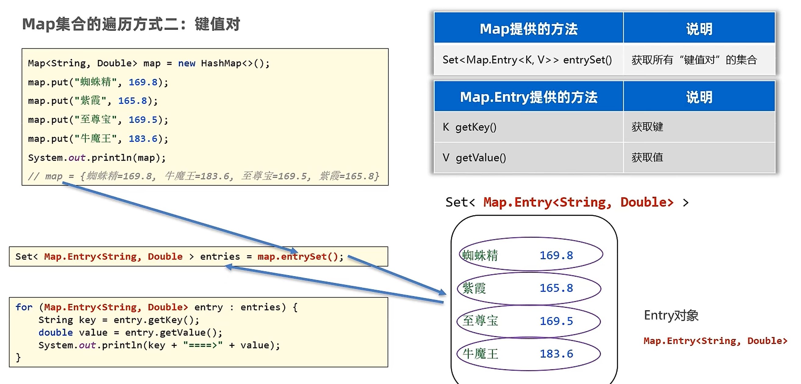

###### 代码演示

```java
package Advanced.h_map.d2_map_traverse;

import java.util.HashMap;
import java.util.Map;
import java.util.Set;

/**
 * 目标：掌握Map集合的第二种遍历方式：键值对
 */
public class MapTest2 {
    public static void main(String[] args) {
        Map<String, Double> map = new HashMap<>();
        map.put("蜘蛛精", 162.5);
        map.put("蜘蛛精", 169.8);
        map.put("紫霞", 165.8);
        map.put("至尊宝", 169.5);
        map.put("牛魔王", 183.6);
        System.out.println(map); // {蜘蛛精=169.8, 牛魔王=183.6, 至尊宝=169.5, 紫霞=165.8}

        // 1. 调用Map集合提供的entrySet方法，把Map集合转换成键值对类型的Set集合
        Set<Map.Entry<String, Double>> entries = map.entrySet();
        for (Map.Entry<String, Double> entry : entries) {
            String key = entry.getKey();
            Double value = entry.getValue();
            System.out.println(key + " ---> " + value);
        }
    }
}
```

##### 8.3.3 Lambda

+ JDK1.8 开始之后的新技术（非常的简单）

+ 需要用到 Map 的如下方法

| 方法名称                                                     | 说明                      |
| ------------------------------------------------------------ | ------------------------- |
| default void forEach(BiConsumer<? super K, ? super V> action) | 结合 lambda 遍历 Map 集合 |

###### 代码演示

```java
package Advanced.h_map.d2_map_traverse;

import java.util.HashMap;
import java.util.Map;
import java.util.function.BiConsumer;

/**
 * 目标：掌握Map集合的第三种遍历方式：Lambda
 */
public class MapTest3 {
    public static void main(String[] args) {
        Map<String, Double> map = new HashMap<>();
        map.put("蜘蛛精", 162.5);
        map.put("蜘蛛精", 169.8);
        map.put("紫霞", 165.8);
        map.put("至尊宝", 169.5);
        map.put("牛魔王", 183.6);
        System.out.println(map); // {蜘蛛精=169.8, 牛魔王=183.6, 至尊宝=169.5, 紫霞=165.8}

//        map.forEach(new BiConsumer<String, Double>() {
//            @Override
//            public void accept(String k, Double v) {
//                System.out.println(k + " ---> " + v);
//            }
//        });

        map.forEach((k, v) -> {
            System.out.println(k + " ---> " + v);
        });
    }
}
```

##### Map 集合的案例 - 统计投票人数

> 需求：
>
> + 某个班级80名学生，现在需要组织秋游活动，班长提供了四个景点依次是（A、B、C、D），每个学生只能选择一个景点，请统计出最终哪个景点想去的人数最多

分析

+ 将80个学生选择的数据拿到程序中去，[A, A, B, A, B, C, D, ...]
+ 准备一个 Map 集合用于存储统计的结果，**Map<String, Integer>，键是景点，值代表投票数量**
+ 遍历80个学生选择的景点，每遍历一个景点，就看 Map 集合中是否存在该景点，不存在存入 **“景点=1”**，存在则其对应值+1

###### 代码实现

```java
package Advanced.h_map.d2_map_traverse;

import java.util.*;

/**
 * 目标：完成Map集合的案例，统计投票人数
 */
public class MapDemo4 {
    public static void main(String[] args) {
        // 1. 把80个学生选择的景点数据拿到程序中来
        List<String> data = new ArrayList<>();
        String[] selects = {"A", "B", "C", "D"};
        Random r = new Random();
        for (int i = 1; i <= 80; i++) {
            // 每次模拟一个学生选择一个景点，存入到集合中去
            int index = r.nextInt(4);
            data.add(selects[index]);
        }
        System.out.println(data);

        // 2. 统计每个景点的投票人数
        // 准备一个Map集合用于统计最终的结果
        Map<String, Integer> result = new HashMap<>();
        // 3. 开始遍历80个景点数据
        for (String s : data) {
            // 问问Map集合中是否存在该景点
            if (result.containsKey(s)) {
                // 说明这个景点之前统计过， 其值+1 存入到Map集合种
                result.put(s, result.get(s) + 1);
            } else {
                // 说明这个景点是第一次统计，存入景点1
                result.put(s, 1);
            }
        }
        System.out.println(result);
    }
}

```


-------------------------------


#### 8.4 HashMap

+ 无序、不重复、无索引；**（用的最多）**

##### 8.4.1 HashMap 集合的底层原理

+ HashMap 跟 HashSet 的底层原理是一模一样的，都是基于哈希表实现的

**实际上：原来学的 Set 系列集合的底层就是基于 Map 实现的，只是 Set 集合中的元素只要键数据，不要值数据而已**

```java
public HashSet() {
    map = new HashMap<>();
}
```

##### 8.4.2 哈希表

+ JDK8 之前，哈希表 = 数组 + 链表
+ JDK8 开始，哈希表 = 数组 + 链表 + **红黑树**
+ 哈希表是一种增删改查数据，性能都较好的数据结构

##### 代码演示

+ Student.java

```java
package Advanced.h_map.d3_map_impl;

import java.util.Objects;

public class Student {
    private String name;
    private int age;
    private double height;

    public Student() {
    }

    public Student(String name, int age, double height) {
        this.name = name;
        this.age = age;
        this.height = height;
    }

    @Override
    public boolean equals(Object o) {
        if (this == o) return true;
        if (o == null || getClass() != o.getClass()) return false;
        Student student = (Student) o;
        return age == student.age && Double.compare(height, student.height) == 0 && Objects.equals(name, student.name);
    }

    @Override
    public int hashCode() {
        return Objects.hash(name, age, height);
    }

    public String getName() {
        return name;
    }

    public void setName(String name) {
        this.name = name;
    }

    public int getAge() {
        return age;
    }

    public void setAge(int age) {
        this.age = age;
    }

    public double getHeight() {
        return height;
    }

    public void setHeight(double height) {
        this.height = height;
    }

    @Override
    public String toString() {
        return "Student{" +
                "name='" + name + '\'' +
                ", age=" + age +
                ", height=" + height +
                '}';
    }
}

```

+ Test1HashMap.java

```java
package Advanced.h_map.d3_map_impl;

import java.util.HashMap;
import java.util.Map;

/**
 * 目标：掌握Map集合下的实现类：HashMap集合的底层原理
 */
public class Test1HashMap {
    public static void main(String[] args) {
        Map<Student, String> map = new HashMap<>();
        map.put(new Student("蜘蛛精", 25, 168.5), "盘丝洞");
        map.put(new Student("蜘蛛精", 25, 168.5), "水帘洞");
        map.put(new Student("至尊宝", 23, 163.5), "水帘洞");
        map.put(new Student("牛魔王", 28, 183.5), "牛头山");
        System.out.println(map);
    }
}

```

##### 总结

+ HashMap 集合是一种增删改查数据，性能都较好的集合
+ 但是它是无序，不能重复，没有索引支持的（由键决定特点）
+ HashMap 的键依赖 hashCode 方法和 equals 方法保证**键的唯一**【Alt + Insert 后选择重写 hashCode 方法和 equals 方法】
+ 如果键存储的是自定义类型的对象，可以通过重写 hashCode 和 equals 方法，这样可以保证多个对象内容一样时，HashMap 集合就能认为是重复的


---------------------------


#### 8.5 LinkedHashMap

+ **有序**、不重复、无索引

##### 8.5.1 LinkedHashMap 的底层原理

+ 底层数据结构依然是基于哈希表实现的，只是每个键值对元素又额外的多了一个双链表的机制记录元素顺序（**保证有序**）

**实际上：原来学习的 LinkedHashSet 集合的底层原理就是 LinkedHashMap**


-----------------------------


#### 8.6 TreeMap

+ **按照键的大小默认升序排序**、不重复、无索引
+ 原理：TreeMap 跟 TreeSet 集合的底层原理是一样的，都是基于红黑树实现的排序

##### 8.6.1 TreeMap 集合同样也支持两种方式来指定排序规则

+ 让类实现 Comparable 接口，重写比较规则
+ TreeMap 集合有一个有参构造器，支持创建 Comparator 比较器对象，以便用来指定比较规则

##### 代码演示

+ Student.java

```java
package Advanced.h_map.d3_map_impl;

import java.util.Objects;

public class Student implements Comparable<Student> {
    private String name;
    private int age;
    private double height;

    @Override
    public int compareTo(Student o) {
        return this.age - o.age;
    }

    public Student() {
    }

    public Student(String name, int age, double height) {
        this.name = name;
        this.age = age;
        this.height = height;
    }

    @Override
    public boolean equals(Object o) {
        if (this == o) return true;
        if (o == null || getClass() != o.getClass()) return false;
        Student student = (Student) o;
        return age == student.age && Double.compare(height, student.height) == 0 && Objects.equals(name, student.name);
    }

    @Override
    public int hashCode() {
        return Objects.hash(name, age, height);
    }

    public String getName() {
        return name;
    }

    public void setName(String name) {
        this.name = name;
    }

    public int getAge() {
        return age;
    }

    public void setAge(int age) {
        this.age = age;
    }

    public double getHeight() {
        return height;
    }

    public void setHeight(double height) {
        this.height = height;
    }

    @Override
    public String toString() {
        return "Student{" +
                "name='" + name + '\'' +
                ", age=" + age +
                ", height=" + height +
                '}';
    }
}

```

+ Test3TreeMap.java

```java
package Advanced.h_map.d3_map_impl;

import java.util.Comparator;
import java.util.Map;
import java.util.TreeMap;

/**
 * 目标：掌握TreeMap集合的使用
 */
public class Test3TreeMap {
    public static void main(String[] args) {
        Map<Student, String> map = new TreeMap<>(new Comparator<Student>() {
            @Override
            public int compare(Student o1, Student o2) {
                return Double.compare(o2.getHeight(), o1.getHeight());
            }
        });
        map.put(new Student("蜘蛛精", 25, 168.5), "盘丝洞");
        map.put(new Student("蜘蛛精", 25, 168.5), "水帘洞");
        map.put(new Student("至尊宝", 23, 163.5), "水帘洞");
        map.put(new Student("牛魔王", 28, 183.5), "牛头山");
        System.out.println(map);
    }
}

```


-----------------------------


#### 8.7 补充知识：集合的嵌套

+ 指的是集合中的元素又是一个集合

> 需求：
>
> + 要求是再程序中记住如下省份和其对应的城市信息，记录成功后，要求可以查询出湖北省的城市信息
>
> 江苏省=南京市, 扬州市, 苏州市, 无锡市, 常州市
>
> 湖北省=武汉市, 孝感市, 十堰市, 宜昌市, 鄂州市
>
> 河北省=石家庄市, 唐山市, 邢台市, 保定市, 张家口市 

分析：

+ 定义一个 Map 集合，键用表示省份名曾，值表示城市名称，注意：城市会有多个
+ 根据 “湖北省” 这个键获取对应的值展示即可

##### 代码实现

```java
package Advanced.h_map.d4_collection_nesting;

import java.util.*;

/**
 * 目标：理解集合的嵌套
 * 江苏省=南京市, 扬州市, 苏州市, 无锡市, 常州市
 * 湖北省=武汉市, 孝感市, 十堰市, 宜昌市, 鄂州市
 * 河北省=石家庄市, 唐山市, 邢台市, 保定市, 张家口市
 */
public class Test {
    public static void main(String[] args) {
        // 1. 定义一个Map集合存储全部的省份信息，和其对应的城市信息
        Map<String, List<String>> map = new HashMap<>();
        List<String> cities1 = new ArrayList<>();
        Collections.addAll(cities1, "南京市", "扬州市", "苏州市", "无锡市", "常州市");
        map.put("江苏省", cities1);

        List<String> cities2 = new ArrayList<>();
        Collections.addAll(cities2, "武汉市", "孝感市", "十堰市", "宜昌市", "鄂州市");
        map.put("湖北省", cities2);

        List<String> cities3 = new ArrayList<>();
        Collections.addAll(cities3, "石家庄市", "唐山市", "邢台市", "保定市", "张家口市");
        map.put("河北省", cities3);


        System.out.println(map);

        List<String> cities = map.get("湖北省");
        for (String city : cities) {
            System.out.println(city);
        }

        map.forEach((p, c) -> {
            System.out.println(p + " ---> " + c);
        });
    }
}

```


-------------------------------------------------


### 9. Stream 流

#### 9.1 认识 Stream

+ 也叫 Stream 流，是 JDK8 开始新增的一套 API（java.util.stream.*），**可以用于操作集合或者数组的数据**
+ 优势：**Stream 流大量的结合了 Lambda 的语法风格来编程**，提供了一种更加强大，更加简单的方式操作集合或者数组中的数据，**代码更简洁，可读性更好**

##### 9.1.1 体验 Stream 流

> 需求：
>
> ```java
> List<String> list = new ArrayList();
> list.add("张无忌");
> list.add("周芷若");
> list.add("赵敏");
> list.add("张强");
> list.add("张三丰");
> ```
>
> + 把集合中所有以 “张” 开头，且是3个字的元素存储到一个新的集合

###### 代码实现

```java
package Advanced.i_stream;

import java.util.ArrayList;
import java.util.List;
import java.util.stream.Collectors;

/**
 * 目标：初步体验Stream流的方便与快捷
 */
public class StreamTest1 {
    public static void main(String[] args) {
        List<String> names = new ArrayList<>();
        names.add("张无忌");
        names.add("周芷若");
        names.add("赵敏");
        names.add("张强");
        names.add("张三丰");
        System.out.println(names); // [张无忌, 周芷若, 赵敏, 张强, 张三丰]

        List<String> list = new ArrayList<>();
        for (String name : names) {
            if (name.startsWith("张") && name.length() == 3) {
                list.add(name);
            }
        }
        System.out.println(list); // [张无忌, 张三丰]

        // 开始用Stream流来解决这个问题
        List<String> list2 = names.stream().filter(s -> s.startsWith("张")).filter(a -> a.length() == 3).collect(Collectors.toList());
        System.out.println(list2); // [张无忌, 张三丰]
    }
}
```

##### 9.1.2 Stream 流的使用步骤

+ 获取 Stream 流：Stream 流代表一条流水线，并能与数据源建立连接
+ 调用流水线的各种方法对数据进行处理、计算（过滤、排序、去重、...）
+ 获取处理的结果，遍历、统计、收集到一个新集合中返回


------------------------


#### 9.2 Stream 的常用方法

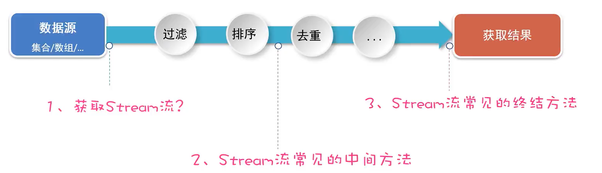

##### 9.2.1 获取 Stream 流？

+ 获取 **集合** 的 Stream 流

| Collection 提供的如下方法      | 说明                         |
| ------------------------------ | ---------------------------- |
| default **Stream<E> stream()** | 获取当前集合对象的 Stream 流 |

+ 获取 **数组** 的 Stream 流

| Arrays 类提供的如下方法                           | 说明                     |
| ------------------------------------------------- | ------------------------ |
| public static <T> Stream<T> **stream(T[] array)** | 获取当前数组的 Stream 流 |

| Stream 类提供的如下方法                         | 说明                         |
| ----------------------------------------------- | ---------------------------- |
| public static <T> Stream<T> **of(T... values)** | 获取当前接收数据的 Stream 流 |

###### 代码演示

```java
package Advanced.i_stream;

import java.util.*;
import java.util.stream.Stream;

public class StreamTest2 {
    public static void main(String[] args) {
        // 1. 如何获取List集合的Stream流？
        List<String> names = new ArrayList<>();
        Collections.addAll(names, "张无忌", "周芷若", "赵敏", "张强", "张三丰");
        Stream<String> stream = names.stream();

        // 2. 如何获取Set集合的Stream流？
        Set<String> set = new HashSet<>();
        Collections.addAll(set, "刘德华", "张曼玉", "蜘蛛精", "马德", "德玛西亚");
        Stream<String> stream1 = set.stream();
        stream1.filter(s -> s.contains("德")).forEach(s -> System.out.println(s));

        // 3. 如何获取Map集合的Stream流？
        Map<String, Double> map = new HashMap<>();
        map.put("古力娜扎", 172.3);
        map.put("迪丽热巴", 168.3);
        map.put("马尔扎哈", 166.3);
        map.put("卡尔扎巴", 168.3);
        Set<String> keys = map.keySet();
        Stream<String> ks = keys.stream();

        Collection<Double> values = map.values();
        Stream<Double> vs = values.stream();

        Set<Map.Entry<String, Double>> entries = map.entrySet();
        Stream<Map.Entry<String, Double>> kvs = entries.stream();
        kvs.filter(e -> e.getKey().contains("巴")).forEach(e -> System.out.println(e.getKey() + " ---> " + e.getValue()));

        // 4. 如何获取数组的Stream流？
        String[] names2 = {"张翠山", "东方不败", "唐大山", "独孤求败"};
        Stream<String> s1 = Arrays.stream(names2);
        Stream<String> s2 = Stream.of(names2);
    }
}

```


----------------------------------------


##### 9.2.2 Stream 流常见的中间方法

+ 中间方法指的是调用完成后会返回新的 Stream 流，可以继续使用（支持链式编程）

| Stream 提供的常见中间方法                                    | 说明                             |
| ------------------------------------------------------------ | -------------------------------- |
| Stream<T> **filter**(Predicate<? super T> predicate)         | 用于对流中的数据进行过滤         |
| Stream<T> **sorted**()                                       | 对元素进行升序排序               |
| Stream<T> **sorted**(Comparator<? super T> comparator)       | 按照指定规则排序                 |
| Stream<T> **limit**(long maxSize)                            | 获取前几个元素                   |
| Stream<T> **skip**(long n)                                   | 跳过前几个元素                   |
| Stream<T> **distinct**()                                     | 去除流中重复的元素               |
| <R> Stream<R> **map**(Function<? super T, ? extends R> mapper) | 对元素进行加工，并返回对应的新流 |
| static <T> Stream<T> **concat**(Stream a, Stream b)          | 合并 a 和 b 两个流为一个流       |

###### 代码演示

+ Student.java

```java
package Advanced.i_stream;

import java.util.Objects;

public class Student implements Comparable<Student> {
    private String name;
    private int age;
    private double height;

    @Override
    public int compareTo(Student o) {
        return this.age - o.age;
    }

    public Student() {
    }

    public Student(String name, int age, double height) {
        this.name = name;
        this.age = age;
        this.height = height;
    }

    @Override
    public boolean equals(Object o) {
        if (this == o) return true;
        if (o == null || getClass() != o.getClass()) return false;
        Student student = (Student) o;
        return age == student.age && Double.compare(height, student.height) == 0 && Objects.equals(name, student.name);
    }

    @Override
    public int hashCode() {
        return Objects.hash(name, age, height);
    }

    public String getName() {
        return name;
    }

    public void setName(String name) {
        this.name = name;
    }

    public int getAge() {
        return age;
    }

    public void setAge(int age) {
        this.age = age;
    }

    public double getHeight() {
        return height;
    }

    public void setHeight(double height) {
        this.height = height;
    }

    @Override
    public String toString() {
        return "Student{" +
                "name='" + name + '\'' +
                ", age=" + age +
                ", height=" + height +
                '}';
    }
}

```

+ StreamTest3.java

```java
package Advanced.i_stream;

import java.util.ArrayList;
import java.util.Collections;
import java.util.List;
import java.util.stream.Stream;

/**
 * 目标：掌握Stream流提供的常见中间方法
 */
public class StreamTest3 {
    public static void main(String[] args) {
        List<Double> scores = new ArrayList<>();
        Collections.addAll(scores, 88.5, 100.0, 60.0, 99.0, 9.5, 99.6, 25.0);
        // 需求1：找出成绩大于等于60分的数据，并升序后，再输出
        scores.stream().filter(s -> s >= 60).sorted().forEach(s -> System.out.println(s));

        List<Student> students = new ArrayList<>();
        Student s1 = new Student("蜘蛛精", 26, 172.5);
        Student s2 = new Student("蜘蛛精", 26, 172.5);
        Student s3 = new Student("紫霞", 23, 167.6);
        Student s4 = new Student("白晶晶", 25, 169.0);
        Student s5 = new Student("牛魔王", 35, 183.3);
        Student s6 = new Student("牛夫人", 34, 168.5);
        Collections.addAll(students, s1, s2, s3, s4, s5, s6);

        // 需求2：找出年龄大于等于23，且年龄小于等于30岁的学生，并按照年龄降序输出
        students.stream().filter(s -> s.getAge() >= 23 && s.getAge() <= 30)
                .sorted(((o1, o2) -> o2.getAge() - o1.getAge()))
                .forEach(s -> System.out.println(s));

        // 需求3：取出身高最高的前3名学生，并输出。
        students.stream().sorted(((o1, o2) -> Double.compare(o2.getHeight(), o1.getHeight())))
                .limit(3).forEach(System.out::println);

        System.out.println("------------------------------------");

        // 需求4：取出身高倒数的2名学生，并输出。
        students.stream().sorted(((o1, o2) -> Double.compare(o2.getHeight(), o1.getHeight())))
                .skip(students.size() - 2).forEach(System.out::println);

        // 需求5：找出身高超过168的学生叫什么名字，要求去除重复的名字，再输出。
        students.stream().filter(s -> s.getHeight() > 168).map(s -> s.getName())
                .distinct().forEach(System.out::println);

        // distinct去重复，自定义类型的对象（希望内容一样就认为重复，重写hasCode、equals）
        students.stream().filter(s -> s.getHeight() > 168)
                .distinct().forEach(System.out::println);

        Stream<String> st1 = Stream.of("张三", "李四");
        Stream<String> st2 = Stream.of("张三2", "李四2", "王五");
        Stream<String> allSt = Stream.concat(st1, st2);
        allSt.forEach(System.out::println);
    }
}

```


----------------------------------------------


##### 9.2.3 Stream 流常见的终结方法

+ 终结方法指的是调用完成后，不会返回新的 Stream 了，没法继续使用流了

| Stream 提供的常用终结方法                         | 说明                       |
| ------------------------------------------------- | -------------------------- |
| void forEach(Consumer action)                     | 对此流运算后的元素执行遍历 |
| long count()                                      | 统计此流运算后的元素个数   |
| Optional<T> max(Comparator<? super T> comparator) | 获取此流运算后的最大值元素 |
| Optional<T> min(Comparator<? super T> comparator) | 获取此流运算后的最小值元素 |

+ **收集 Stream 流**：就是把 Stream 流操作后的结果转回到集合或者数组中去返回
+ Stream 流：方便操作集合/数组的**手段**；集合/数组：才是开发中的**目的**

| Stream 提供的常用终结方法      | 说明                                     |
| ------------------------------ | ---------------------------------------- |
| R collect(Collector collector) | 把流处理后的结果收集到一个指定的集合中去 |
| Object[] toArray()             | 把流处理后的结果收集到一个数组中去       |

| Collectors 工具类提供了具体的收集方式                        | 说明                     |
| ------------------------------------------------------------ | ------------------------ |
| public static <T> Collector toList()                         | 把元素收集到 List 集合中 |
| public static <T> Collector toSet()                          | 把元素收集到 Set 集合中  |
| public static Collector toMap(Function keyMapper, Function valueMapper) | 把元素收集到 Map 集合中  |

###### 代码演示

```java
package Advanced.i_stream;

import java.util.*;
import java.util.stream.Collectors;

public class StreamTest4 {
    public static void main(String[] args) {
        List<Student> students = new ArrayList<>();
        Student s1 = new Student("蜘蛛精", 26, 172.5);
        Student s2 = new Student("蜘蛛精", 26, 172.5);
        Student s3 = new Student("紫霞", 23, 167.6);
        Student s4 = new Student("白晶晶", 25, 169.0);
        Student s5 = new Student("牛魔王", 35, 183.3);
        Student s6 = new Student("牛夫人", 34, 168.5);
        Collections.addAll(students, s1, s2, s3, s4, s5, s6);
        // 需求1：请计算出身高超过168的学生有几人。
        long size = students.stream().filter(s -> s.getHeight() > 168).count();
        System.out.println(size); // 5

        // 需求2：请找出身高最高的学生对象，并输出。
        Student s = students.stream().max((o1, o2) -> Double.compare(o1.getHeight(), o2.getHeight())).get();
        System.out.println(s); // Student{name='牛魔王', age=35, height=183.3}

        //需求3：请找出身高最矮的学生对象，并输出。
        Student ss = students.stream().min((o1, o2) -> Double.compare(o1.getHeight(), o2.getHeight())).get();
        System.out.println(ss); // SStudent{name='紫霞', age=23, height=167.6}

        //需求4：请找出身高超过170的学生对象，并放到一个新集合中去返回。
        // 流只能收集一次
        List<Student> students1 = students.stream().filter(a -> a.getHeight() > 170).collect(Collectors.toList());
        System.out.println(students1);

        Set<Student> students2 = students.stream().filter(a -> a.getHeight() > 170).collect(Collectors.toSet());
        System.out.println(students2);

        // 需求5：请找出身高超过170的学生对象，并把学生对象的名字和身高，存入到一个Map集合返回。
        Map<String, Double> map = students.stream().filter(a -> a.getHeight() > 170)
                .distinct().collect(Collectors.toMap(a -> a.getName(), a -> a.getHeight()));
        System.out.println(map); // {蜘蛛精=172.5, 牛魔王=183.3}

        Student[] arr = students.stream().filter(a -> a.getHeight() > 170).toArray(len -> new Student[len]);
        System.out.println(Arrays.toString(arr));
    }
}

```


-------------------------------


## 五、IO 流

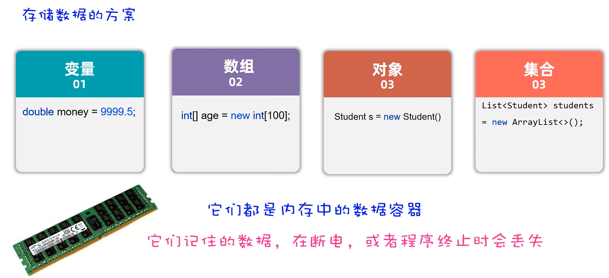

有些数据想长久保存起来，咋整？

+ 文件是非常重要的存储方式，在计算机硬盘中
+ 即便断电，或者程序终止了，存储在硬盘文件中的数据也不会丢失

File：代表文本

+ File 是 java.io. 包下的类，File 类的对象，用于代表当前操作系统的文件（可以是**文件、或文件夹**）
  + 获取文件信息（大小、文件名、修改时间）
  + 判断文件的类型
  + 创建文件/文件夹
  + 删除文件/文件夹

注意：File 类只能对文件本身进行操作，**不能读写文件里面存储的数据**

IO 流：读写数据

+ 用于读写数据的（可以读写文件，或网络中的数据）


### 1. File

#### 1.1 创建对象

| 构造器                                   | 说明                                           |
| ---------------------------------------- | ---------------------------------------------- |
| public **File(String pathname)**         | 根据文件路径创建文件对象                       |
| public File(String parent, String child) | 根据父路径和子路径名字创建文件对象             |
| public File(File parent, String child)   | 根据父路径对应文件对象和子路径名字创建文件对象 |

注意：

+ File 对象既可以代表文件、也可以代表文件夹
+ File 封装的对象仅仅是一个路径名，这个路径可以是存在的，也允许是不存在的

##### 1.1.1 绝对路径、相对路径

+ 绝对路径：冲盘符开始

```java
File file1 = new File("D:\\itfeng\\a.txt")
```

+ 相对路径：不带盘符，**默认直接到当前工程下的目录寻找文件

```java
File file3 = new File("模块名\\a.txt")
```

##### 代码演示

```java
package Advanced.j_file;

import java.io.File;

/**
 * 目标：掌握File创建对象，代表具体文件的方案
 */
public class FIleTest1 {
    public static void main(String[] args) {
        // 1. 创建一个File对象，指代某个具体的文件
        // 路径分隔符
//        File f1 = new File("E:/壁纸/java.jpg");
        File f1 = new File("E:\\壁纸\\java.jpg");
//        File f1 = new File("E:" + File.separator + "壁纸" + File.separator + "java.jpg");
        System.out.println(f1.length()); // 13438（字节大小）

        File f2 = new File("E:\\壁纸");
        System.out.println(f2.length()); // 4096（文件夹本身的大小）

        // 注意：File对象可以指代一个不存在的文件路径
        File f3 = new File("D:\\壁纸\\aaa.txt");
        System.out.println(f3.length()); // 0
        System.out.println(f3.exists()); // false

        // 我现在要定位的文件是在模块中，应该怎么定位？
        // 绝对路径，带盘符的
//        File f4 = new File("E:\\java项目\\java_full_stack\\src\\Advanced\\j_file\\itfeng.txt");
        // 相对路径（重点）：不带盘符，默认是直接去工程下寻找文件的
        File f4 = new File("src\\Advanced\\j_file\\itfeng.txt");
        System.out.println(f4.length()); // 3
    }
}

```


----------------------


#### 1.2 常用方法1：判断文件类型、获取文件信息

| 方法名称                        | 说明                                                        |
| ------------------------------- | ----------------------------------------------------------- |
| public boolean exists()         | 判断当前文件对象，对应的文件路径是否存在，存在返回 true     |
| public boolean isFile()         | 判断当前文件对象指代的是否是文件，是文件返回 true，反之     |
| public boolean isDirectory()    | 判断当前文件对象指代的是否是文件夹，是文件夹返回 true，反之 |
| public String getName()         | 获取文件的名称（包含后缀）                                  |
| public long length()            | 获取文件的大小，返回字节个数                                |
| public long lastModified()      | 获取文件的最后修改时间                                      |
| public String getPath()         | 获取创建文件对象时，使用的路径                              |
| public String getAbsolutePath() | 获取绝对路径                                                |

##### 代码演示

```java
package Advanced.j_file;

import java.io.File;
import java.text.SimpleDateFormat;

/**
 * 目标：掌握File提供的判断文件类型，获取文件信息功能
 */
public class FileTest2 {
    public static void main(String[] args) {
        // 1.创建文件对象，指代某个文件
        File f1 = new File("src\\Advanced\\j_file\\itfeng.txt");

        // 2、public boolean exists()：判断当前文件对象，对应的文件路径是否存在，存在返回true.
        System.out.println(f1.exists()); // true

        // 3、public boolean isFile()：判断当前文件对象指代的是否是文件，是文件返回true，反之。
        System.out.println(f1.isFile()); // true

        // 4、public boolean isDirectory():判断当前文件对象指代的是否是文件夹，是文件夹返回true,反之。
        System.out.println(f1.isDirectory()); // false

        // 5.public String getName():获取文件的名称（包含后缀）
        System.out.println(f1.getName()); // itfeng.txt

        // 6.public long length():获取文件的大小，返回字节个数
        System.out.println(f1.length()); // 3

        // 7.public long lastModified():获取文件的最后修改时间。
        long time = f1.lastModified();
        SimpleDateFormat sdf = new SimpleDateFormat("yyyy/MM/dd HH:mm:ss");
        System.out.println(sdf.format(time)); // 2025/05/18 16:52:36

        // 8.public String getPath():获取创建文件对象时，使用的路径
        File f2 = new File("D:\\壁纸\\aaa.txt");
        File f3 = new File("src\\Advanced\\j_file\\itfeng.txt");
        System.out.println(f2.getPath()); // D:\壁纸\aaa.txt
        System.out.println(f3.getPath()); // src\Advanced\j_file\itfeng.txt

        // 9.public String getAbsolutePath():获取绝对路径
        System.out.println(f2.getAbsoluteFile()); // D:\壁纸\aaa.txt
        System.out.println(f3.getAbsoluteFile()); // E:\java项目\java_full_stack\src\Advanced\j_file\itfeng.txt
    }
}

```


----------------------


#### 1.3 常用方法2：创建文件、删除文件

##### 1.3.1 File 类创建文件的功能

| 方法名称                       | 说明                 |
| ------------------------------ | -------------------- |
| public boolean createNewFile() | 创建一个新的空的文件 |
| public boolean mkdir()         | 只能创建一级文件夹   |
| public boolean mkdirs()        | 可以创建多级文件夹   |

##### 1.3.2 File 类删除文件的功能

| 方法名称                | 说明               |
| ----------------------- | ------------------ |
| public boolean delete() | 删除文件、空文件夹 |

注意：**delete 方法默认只能删除文件和空文件夹**，删除后的文件不会进入回收站

##### 代码演示

```java
package Advanced.j_file;

import java.io.File;
import java.io.IOException;

/**
 * 目标：掌握File创建和删除文件相关的方法
 */
public class FileTest3 {
    public static void main(String[] args) throws Exception {
        // 1、public boolean createNewFile()：创建一个新文件（文件内容为空），创建成功返回true,反之
        File f1 = new File("E:/壁纸/itfeng.txt");
        System.out.println(f1.createNewFile()); // true

        // 2、public boolean mkdir()：用于创建文件夹，注意：只能创建一级文件夹
        File f2 = new File("E:/壁纸/aaa");
        System.out.println(f2.mkdir()); // true

        // 3、public boolean mkdirs()：用于创建文件夹，注意：可以创建多级文件夹
        File f3 = new File("E:/壁纸/aaa/bbb/ccc/ddd/eee/fff/ggg");
        System.out.println(f3.mkdirs()); // true

        // 4、public boolean delete()：删除文件，或者空文件，注意：不能删除非空文件夹
        System.out.println(f1.delete()); // true
        System.out.println(f2.delete()); // false
    }
}
```


-------------------


#### 1.4 常用方法3：遍历文件夹

##### 1.4.1 File 类提供的遍历文件夹的功能

| 方法名称                  | 说明                                                         |
| ------------------------- | ------------------------------------------------------------ |
| public String[] list()    | 获取当前目录下所有的“一级文件名称”到一个字符串数组中返回     |
| public File[] listFiles() | 获取当前目录下所有的“一级文件对象”到一个文件对象数组中去返回（重点） |

##### 1.4.2 使用 listFiles 方法时的注意事项

+ 当主调是文件，或者路径不存在时，返回 null
+ 当主调是空文件夹时，返回一个长度为0的数组
+ **当主调是一个有内容的文件夹时，将里面所有一级文件和文件夹的路径放在 File 数组中返回**
+ 当主调是一个文件夹，且里面有隐藏文件时，将里面所有文件和文件夹的路径放在 File 数组中返回，包含隐藏文件
+ 当主调是一个文件夹，但是没有权限访问该文件夹时，返回 null

##### 代码演示

```java
package Advanced.j_file;

import java.io.File;

/**
 * 目标：掌握File提供的遍历文件夹的方法
 */
public class FileTest4 {
    public static void main(String[] args) {
        // 1. public String[] list()：获取当前目录下所有的“一级文件名称”到一个字符串数组中去返回
        File f1 = new File("E:\\壁纸");
        String[] names = f1.list();
        for (String name : names) {
            System.out.println(name);
        }

        // 2. public File[] listFiles()：获取当前目录下所有的“一级文件对象”到一个文件对象数组中去返回（重点）
        File[] files = f1.listFiles();
        for (File file : files) {
            System.out.println(file.getAbsolutePath());
        }

        File f = new File("E:\\壁纸\\java.jpg");
        File[] files1 = f.listFiles();
        System.out.println(files1); // null

        File f2 = new File("E:\\壁纸\\aaa");
        File[] files2 = f2.listFiles();
        System.out.println(files2);
    }
}

```


----------------------------


### 2. 前置知识：方法递归

#### 2.1 认识递归的形式

##### 2.1.1 什么是方法递归？

+ 递归是一种算法，在程序设计语言中广泛应用
+ 从形式上说：方法调用自身的形式称为方法递归（recursion）

##### 2.1.2 递归的形式

+ 直接递归：方法自己调用自己
+ 间接递归：方法调用其他方法，其他方法又回调方法自己

##### 2.1.3 使用方法递归时需要注意的问题：

+ 递归如果没有控制好终止，会出现递归死循环，导致栈内存溢出错误

##### 代码演示

```java
package Advanced.k_recursion;

/**
 * 目标：认识一下递归的形式
 */
public class RecursionTest1 {
    public static void main(String[] args) {
        test1();
    }

    // 直接方法递归
    public static void test1() {
        System.out.println("---test1---");
        test1(); // 直接方法递归
    }

    // 间接方法递归
    public static void test2() {
        System.out.println("---test2---");
        test3(); // 直接方法递归
    }

    public static void test3() {
        test2();
    }
}

```


-------------------------------


#### 2.2 应用、执行流程、算法思想

##### 2.2.1 案例 - 计算 n 的阶乘

> 案例 - 计算 n 的阶乘
>
> 需求：
>
> + 计算 n 的阶乘，5的阶乘=1 * 2 * 3 * 4 * 5；6的阶乘=1 * 2 * 3 * 4 * 5 * 6

分析：

1. 加入我们认为存在一个公式是 f(n) = 1 * 2 * 3 * 4 * 5 * 6 * 7 * ...(n-1) * n；
2. 那么公式等价形式就是：f(n) = f(n-1) * n
3. 如果求的是 1 - 5 的阶乘，那么我们手工应该如何应用上述公式计算

+ f(5) = f(4) * 5
+ f(4) = f(3) * 4
+ f(3) = f(2) * 3
+ f(2) = f(1) * 2
+ f(1) = 1

###### 代码实现

```java
package Advanced.k_recursion;

/**
 * 目标：掌握递归的应用，执行流程和算法思想
 */
public class RecursionTest2 {
    public static void main(String[] args) {
        System.out.println("5的阶乘是：" + f(5)); // 5的阶乘是：120
    }

    public static int f(int n) {
        // 终结点
        if (n == 1) {
            return 1;
        } else {
            return f(n - 1) * n;
        }
    }
}
```

##### 2.2.2 递归求阶乘的执行流程

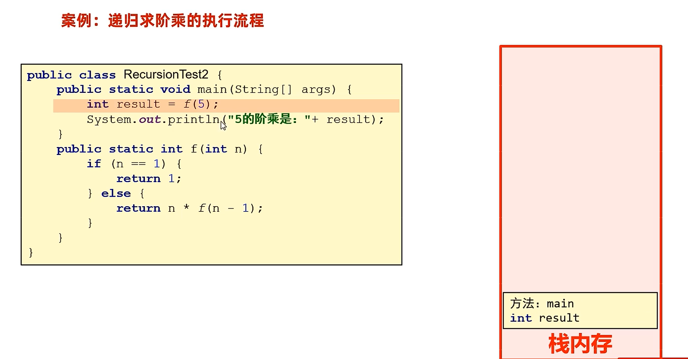

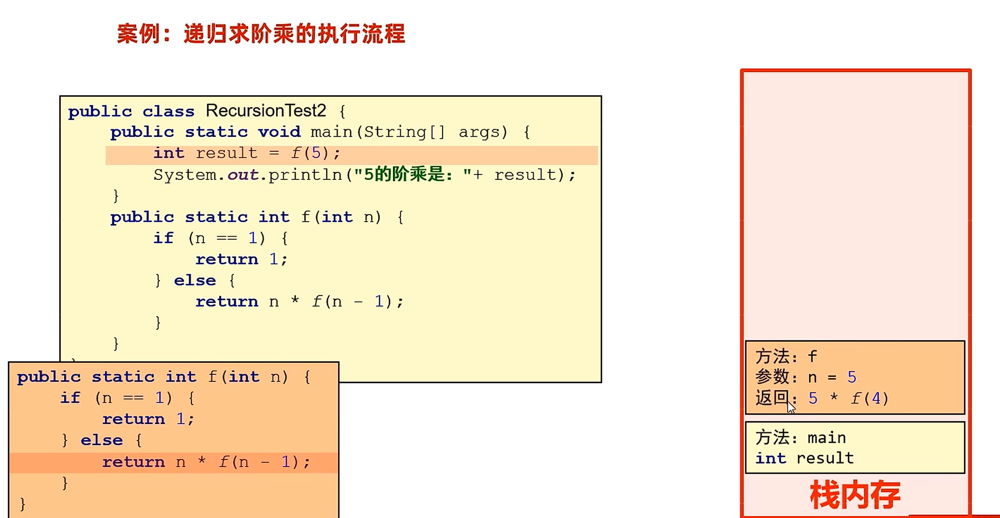

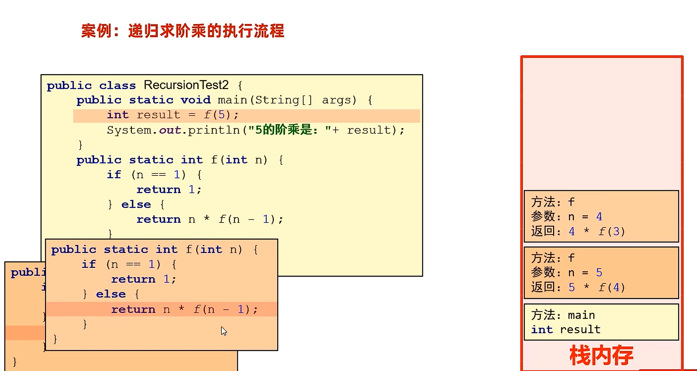

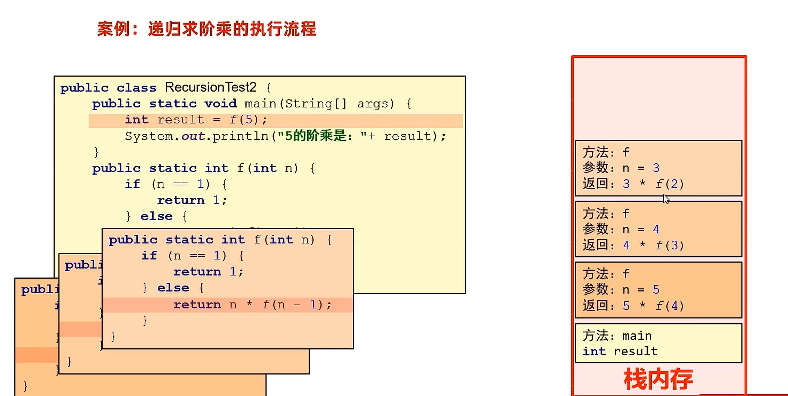

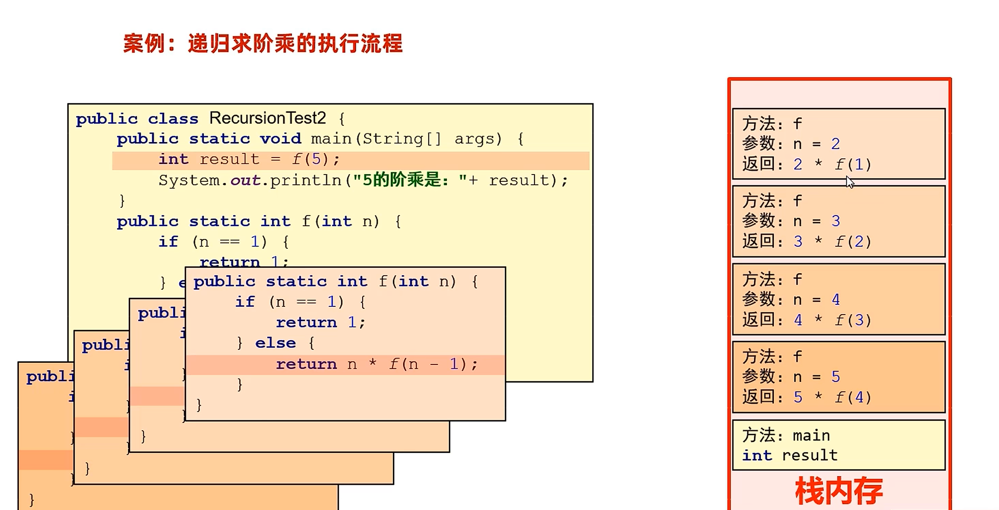

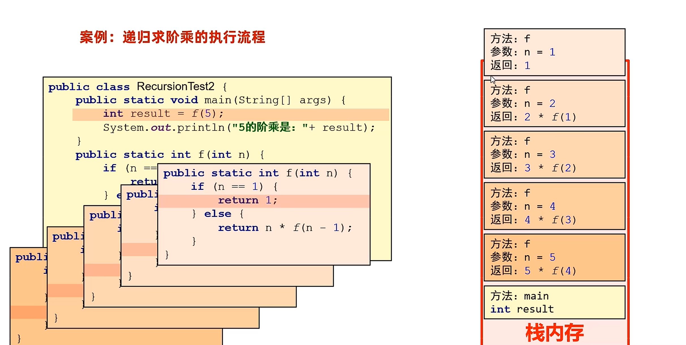

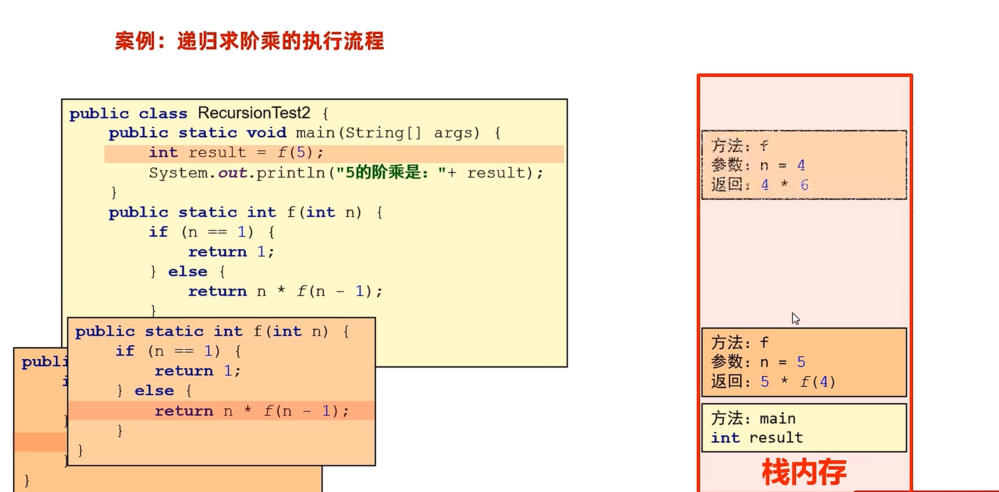

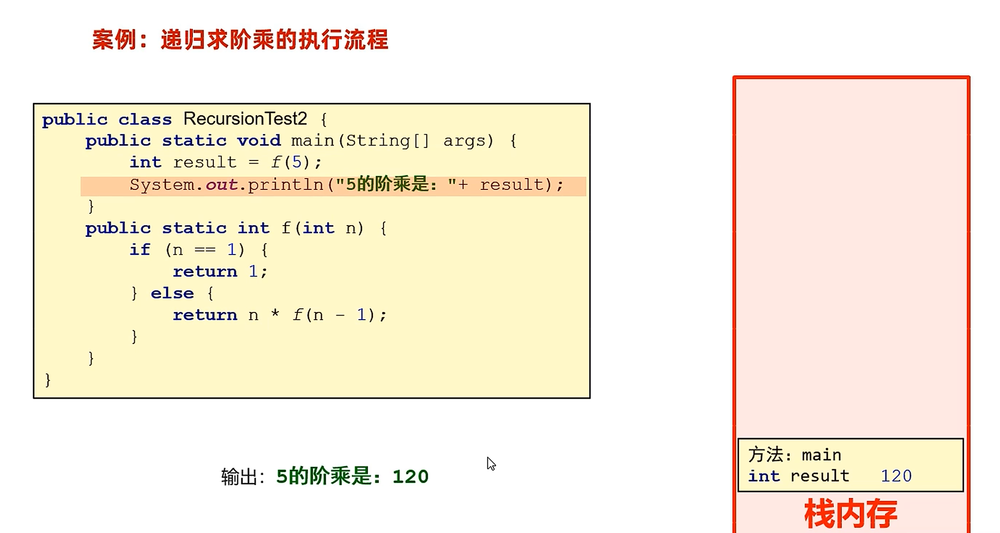

##### 2.2.3 递归算法三要素

+ **递归的公式**
+ **递归的终结点**
+ **递归的方向必须走向终结点**


------------------------------


#### 2.3 其他应用：文件搜索

##### 2.3.1 案例：文件搜索

> 需求：
>
> + 从 D: 盘中，搜索 ”QQ.exe“ 这个文件，找到后直接输出其位置

分析：

1. 先找出 D: 盘下的所有一级文件对象
2. 遍历全部一级文件对象，判断是否是文件
3. 如果是文件，判断是否是自己想要的
4. 如果是文件夹，需要继续进入到该文件夹，重复上述过程

###### 代码实现

```java
package Advanced.k_recursion;

import java.io.File;
import java.io.IOException;

/**
 * 目标：掌握文件搜索的实现
 */
public class RecursionTest3 {
    public static void main(String[] args) throws Exception {
        searchFile(new File("D:/"), "QQ.exe");
    }

    /**
     * 去目录下搜索某个文件
     *
     * @param dir      目录
     * @param fileName 需要搜索的文件名称
     */
    public static void searchFile(File dir, String fileName) throws Exception {
        // 1. 把非法的情况都拦截住
        if (dir == null || !dir.exists() || dir.isFile()) {
            return; // 代表无法搜索
        }

        // 2. dir 不是null，存在，一定是目录对象
        // 获取当前目录下的全部一级文件对象
        File[] files = dir.listFiles();

        // 3. 判断当前目录下是否存在一级文件对象，以及是否可以拿到一级文件对象
        if (files != null && files.length > 0) {
            // 4. 遍历全部一级文件对象
            for (File f : files) {
                // 5. 判断文件是否是文件，还是文件夹
                if (f.isFile()) {
                    // 是文件，判断这个文件名是否是我们要找的
                    if (f.getName().contains(fileName)) {
                        System.out.println("找到了：" + f.getAbsolutePath());
                        Runtime runtime = Runtime.getRuntime();
                        runtime.exec(f.getAbsolutePath());
                    }
                } else {
                    // 是文件夹，继续重复这个过程（递归）
                    searchFile(f, fileName);
                }
            }
        }
    }
}

```


-------------------------


### 3. 前置知识：字符集

#### 3.1 常见字符集介绍

##### 3.1.1 标准 ASCII 字符集

+ ASCII（American Standard Code for Information Interchange）：美国信息交换标准代码，包括了英文、符号等
+ **标准 ASCII 使用1个字节存储一个字符**，首位是0，总共可表示128字符，对美国佬来说完全够用

##### 3.1.2 GBK（汉字内码扩展规范，国标）

+ 汉字编码字符集，包含了2万多个汉字等字符，**GBK 中一个中文字符编码成两个字节的形式存储**
+ 注意：GBK 兼容了 ASCII 字符集
+ GBK 规定：汉字的第一个字节的第一位必须是1

##### 3.1.3 Unicode 字符集（统一码，也叫万国码）

+ Unicode 是国际组织制定的，可以容纳世界上所有文字、符号的字符集

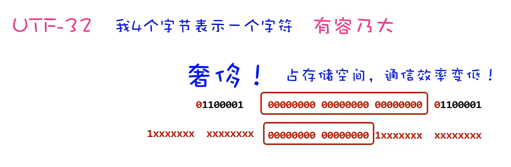

##### 3.1.4 UTF - 8

+ 是 Unicode 字符集的一种编码方式，采取可变长编码方案，共分四个长度区：1个字节、2个字节、3个字节、4个字节

+ **英文字符、数字等只占1个字节（兼容标准 ASCII 编码），汉字字符占用3个字节**

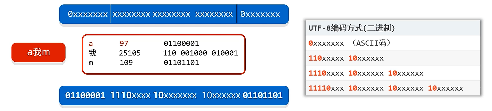

注意：技术人员在开发时都应该使用 UTF-8 编码！

+ 字符编码时使用的字符集，和解码时使用的字符集必须一致，**否则会出现乱码**
+ 英文、数字一般不会乱码，因为很多字符集都兼容了 ASCII 编码


-------------------------------


#### 3.2 字符集的编码、解码操作

##### 3.2.1 Java 代码完成对字符的编码

| String 提供了如下方法               | 说明                                                         |
| ----------------------------------- | ------------------------------------------------------------ |
| byte[] getBytes()                   | 使用平台的默认字符集将该 String 编码为一系列字节，将结果存储到新的字节数组中 |
| byte[] getBytes(String charsetName) | 使用指定的字符集将该 String 编码为一系列字节，将结果存储到新的字节数组中 |

##### 3.2.2 Java 代码完成对字符的解码

| String 提供了如下方法 |   说明   |
| ---- | ---- |
| String(byte[] bytes) | 通过使用平台的默认字符集解码指定的字节数组来构造新的 String |
| String(byte[] bytes, String charsetName) | 通过指定的字符集解码指定的字节数组来构造新的 String |

##### 代码演示

```java
package Advanced.l_charset;

import java.io.UnsupportedEncodingException;
import java.lang.reflect.Array;
import java.util.Arrays;

/**
 * 目标：掌握如何使用Java完成对字符的编码和解码
 */
public class Test {
    public static void main(String[] args) throws Exception {
        // 1. 编码
        String data = "a我b";
        byte[] bytes = data.getBytes(); // 默认是按照平台字符集（UTF-8）进行编码的
        System.out.println(Arrays.toString(bytes)); // [97, -26, -120, -111, 98]

        // 按照指定字符集进行编码
        byte[] bytes1 = data.getBytes("GBK");
        System.out.println(Arrays.toString(bytes1)); // [97, -50, -46, 98]

        // 2. 解码
        String s1 = new String(bytes); // 默认是按照平台字符集（UTF-8）进行解码的
        System.out.println(s1); // a我b

        String s2 = new String(bytes1);
        System.out.println(s2); // a��b
    }
}

```


----------------------


### 4. IO 流

输入输出流，读写数据的

I 指 Input，称为输入流：**负责把数据读取到内存中去**

#### 4.1 IO 流的分类

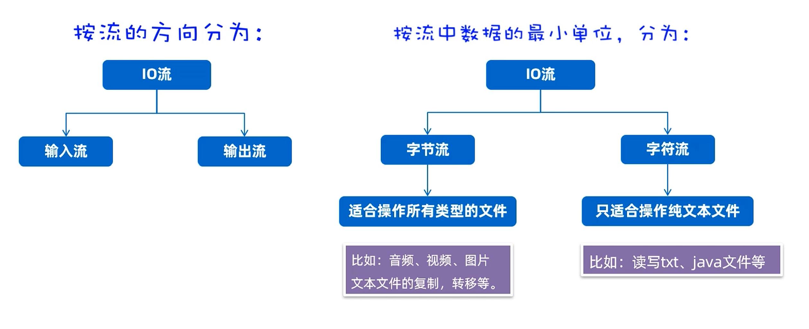

#### 4.2 IO 流总体来看就有四大流

##### 4.2.1 字节输入流

+ 把网络中的数据或者是磁盘文件中的数据以一个一个字节的形式读到程序中来

##### 4.2.2 字节输出流

+ 把内存中的数据以一个一个的字节的形式写出到磁盘文件或网络中去

##### 4.2.3 字符输入流

+ 把网络中的数据或者是磁盘文件中的数据以一个一个字符的形式读到程序中来

##### 4.2.4 字符输出流

+ 把内存中的数据以一个一个的字符的形式写出到磁盘文件或网络中去

#### 4.3 IO 流的体系

+ Java.io 包下

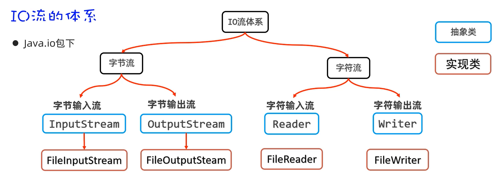


--------------------------


### 5. IO 流 - 字节流

#### 5.1 文件字节输入流：每次读取一个字节

FileInputStream（文件字节输入流）

+ 作用：以内存为基准，可以把磁盘文件中的数据以字节的形式读入到内存中去

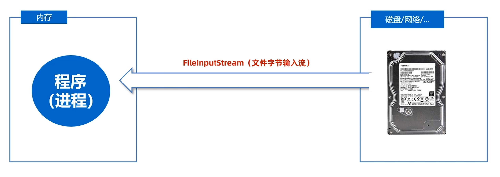

| 构造器                                      | 说明                           |
| ------------------------------------------- | ------------------------------ |
| public **FileInputStream(File file)**       | 创建字节输入流管道与源文件接通 |
| public **FileInputStream(String pathname)** | 创建字节输入流管道与源文件接通 |

| 方法名称                           | 说明                                                         |
| ---------------------------------- | ------------------------------------------------------------ |
| public int **read()**              | 每次读取一个字节返回，如果发现没有数据可读会返回-1           |
| public int **read(byte[] buffer)** | 每次用一个字节数组去读取数据，返回字节数组读取了多少个字节，如果发现没有数据可读会返回-1 |

注意事项：

+ 使用 FileInputStream 每次读取一个字节，读取性能较差，并且读取汉字输出会乱码

##### 代码演示

```java
package Advanced.m_byte_stream;

import java.io.File;
import java.io.FileInputStream;
import java.io.FileNotFoundException;
import java.io.InputStream;

/**
 * 目标：掌握文件字节输入流，每次读取一个字节
 */
public class FileInputStreamTest1 {
    public static void main(String[] args) throws Exception {
        // 1. 创建文件字节输入流管道，与源文件接通
//        InputStream is = new FileInputStream(new File("src\\Advanced\\m_byte_stream\\itfeng01.txt"));
        // 简化写法，推荐使用
        InputStream is = new FileInputStream("src\\Advanced\\m_byte_stream\\itfeng01.txt");

        // 2. 开始读取文件的字节数据
        // public int read()：每次读取一个字节返回，如果没有数据了，返回-1
//        int b1 = is.read();
//        System.out.println(b1); // 97
//        System.out.println((char) b1); // a
//
//        int b2 = is.read();
//        System.out.println(b2); // 98
//        System.out.println((char) b2); // b
//
//        int b3 = is.read();
//        System.out.println(b3); // -1

        // 3. 使用循环改造上述代码
        int b; // 用于记住读取的字节
        while ((b = is.read()) != -1) {
            System.out.print((char) b);
        }

        // 读取数据的性能很差
        // 读取汉字输出会乱码（无法避免）
        // 流使用完毕之后，必须关闭，释放系统资源
        is.close();
    }
}

```


-------------------------


#### 5.2 文件字节输入流：每次读取多个字节

| 方法名称                           | 说明                                                         |
| ---------------------------------- | ------------------------------------------------------------ |
| public int **read()**              | 每次读取一个字节返回，如果发现没有数据可读会返回-1           |
| public int **read(byte[] buffer)** | 每次用一个字节数组去读取数据，返回字节数组读取了多少个字节，如果发现没有数据可读会返回-1 |

注意事项：使用 FIleInputStream 每次读取多个字节，读取性能得到了提升，当读取汉字输出还是会乱码


------------------------------


#### 5.3 文件字节输入流：一次读取完全部字节

+ 方式一：自己定义一个字节数组与被读取的文件大小一样，然会使用该字节数组，一次读完文件的全部字符

| 发明名称                           | 说明                                                         |
| ---------------------------------- | ------------------------------------------------------------ |
| public int **read byte[] buffer)** | 每次用一个字节数组去读取，返回字节数组读取了多少字节，如果发现没有数据可读会返回-1 |

+ 方式二：Java 官方为 InputStream 提供了如下方法，可以直接把文件的全部字节读取到一个字节数组中返回

| 方法名称                                        | 说明                                                         |
| ----------------------------------------------- | ------------------------------------------------------------ |
| public byte[] readAllBytes() throws IOException | 直接将当前字节输入流对应的文件对象的字节数据装到一个字节数组返回 |


##### 代码演示

```java
package Advanced.m_byte_stream;

import java.io.File;
import java.io.FileInputStream;
import java.io.FileNotFoundException;
import java.io.InputStream;

/**
 * 目标：使用文件字节输入流一次读取完文件的全部字节
 */
public class FileInputStreamTest3 {
    public static void main(String[] args) throws Exception {
        // 1. 一次性读取完文件的全部字节到一个字节数组中去
        // 创建一个字节输入流管道与源文件接通
        InputStream is = new FileInputStream("src\\Advanced\\m_byte_stream\\itfeng03.txt");

        // 2. 准备一个直接数组，大小与文件的大小正好一样大
//        File f = new File("src\\Advanced\\m_byte_stream\\itfeng03.txt");
//        long size = f.length();
//        byte[] buffer = new byte[(int) size];
//
//        int len = is.read(buffer);
//        System.out.println(new String(buffer));
//
//        System.out.println(size); // 505
//        System.out.println(len); // 505

        byte[] buffer = is.readAllBytes();
        System.out.println(new String(buffer));
    }
}

```

1. 直接把文件数据全部读取到一个字节数组可以避免乱码，是否存在问题？

+ 如果文件过大，创建的字节数组也会过大，可能引起内存溢出

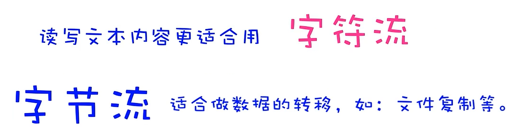


-----------------------


#### 5.4 文件字节输出流：写字节出去

+ 作用：以内存为基准，把内存中的数据以字节的形式写出到文件中去

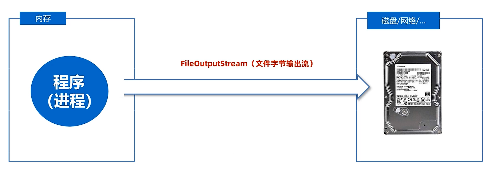

| 构造器                                                   | 说明                                            |
| -------------------------------------------------------- | ----------------------------------------------- |
| public FileOutputStream(File file)                       | 创建字节输出流管道与源文件对象接通              |
| public FileOutputStream(String filepath)                 | 创建字节输出流管道与源文件路径接通              |
| public FileOutputStream(File file, boolean append)       | 创建字节输出流管道与源文件对象接通， 可追加数据 |
| public FileOutputStream(String filepath, boolean append) | 创建字节输出流管道与源文件路径接通，可追加数据  |

| 方法名称                                           | 说明                       |
| -------------------------------------------------- | -------------------------- |
| public void write(int a)                           | 写一个字节出去             |
| public void write(byte[] buffer)                   | 写一个字节数组出去         |
| public void write(byte[] buffer, int pos, int len) | 写一个字节数组的一部分出去 |
| public void close() throws IOException             | 关闭流                     |

##### 代码演示

```java
package Advanced.m_byte_stream;

import java.io.FileNotFoundException;
import java.io.FileOutputStream;
import java.io.OutputStream;

/**
 * 目标：掌握文件字节输出流FileOutputStream的使用
 */
public class FileOutputStreamTest4 {
    public static void main(String[] args) throws Exception {
        // 1. 创建一个字节输出流管道与目标文件接通
        // 覆盖管道，覆盖之前的数据
//        OutputStream os = new FileOutputStream("src/Advanced/m_byte_stream/itfeng04out.txt");

        // 追加数据的管道
        OutputStream os = new FileOutputStream("src/Advanced/m_byte_stream/itfeng04out.txt", true);

        // 2. 开始写字节数据出去了
        os.write(97); // 97就是一个字节，代表a
        os.write('b'); // 'b'也是一个字节
//        os.write('锋'); // 默认只能写出去一个字节
        byte[] bytes = "我爱你中国abc".getBytes();
        os.write(bytes);

        os.write(bytes, 0, 15);

        // 换行符
        os.write("\r\n".getBytes());

        os.close(); // 关闭流
    }
}

```


--------------------------


#### 案例：文件复制

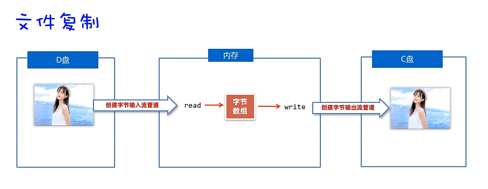

##### 代码实现

```java
package Advanced.m_byte_stream;

import java.io.*;

/**
 * 目标：使用字节流完成对文件的复制操作
 */
public class CopyTest5 {
    public static void main(String[] args) throws Exception {
        // 需求：复制照片
        // 1. 创建一个字节输入流管道与源文件接通
        InputStream is = new FileInputStream("E:/壁纸/java.jpg");
        // 2. 创建一个字节输出流管道与目标文件接通
        OutputStream os = new FileOutputStream("E:/学习/java.jpg");
        // 3. 创建一个字节数组，负责转移字节数据
        byte[] buffer = new byte[1024]; // 1KB
        // 4. 从字节输入流中读取字节数据，写出去到字节输出流中，读多少写出去多少
        int len; // 记住每次读取了多少个字节
        while ((len = is.read(buffer)) != -1) {
            os.write(buffer, 0, len);
        }
        os.close();
        is.close();
        System.out.println("复制完成！！！");
    }
}

```

**字节流非常适合做一切文件的复制操作**

+ 任何文件的底层都是字节，字节流做复制，是一字不漏的转移完全部字节，只要复制后的文件格式一致就没问题


-----------------------


### 6. IO 流 - 资源释放的方式

#### 6.1 try-catch-finally

```java
try {
    ...
    ...
} catch (IOException e) {
    e.printStackTrace();
} finally {
    
}
```

+ finally 代码区的特点：无论 try 中的程序是正常执行了，还是出现了异常，最后都一定会执行 finally 区，**除法 JVM 终止**
+ **作用：一般用于在程序执行完成后进行资源的释放操作（专业级做法）**

```java
package Advanced.n_resource;

/**
 * 目标：认识try-catch-finally
 */
public class Test1 {
    public static void main(String[] args) {
        try {
            System.out.println(10 / 2);
            return; // 跳出方法的执行
        } catch (Exception e) {
            e.printStackTrace();
        } finally {
            System.out.println("===finally执行了一次===");
        }
    }

    public static int chu(int a, int b) {
        try {
            return a / b;
        } catch (Exception e) {
            e.printStackTrace();
            return -1; // 代表的是出现异常
        } finally {
            // 千万不要在finally中返回数据
//            return 111;
        }
    }
}
```

```java
package Advanced.n_resource;

import java.io.*;

/**
 * 目标：掌握释放资源的方式
 */
public class Test2 {
    public static void main(String[] args) {
        InputStream is = null;
        OutputStream os = null;
        try {
            // 1. 创建一个字节输入流管道与源文件接通
            is = new FileInputStream("E:/壁纸/java.jpg");
            // 2. 创建一个字节输出流管道与目标文件接通
            os = new FileOutputStream("E:/学习/java.jpg");

            System.out.println(10 / 0);

            // 3. 创建一个字节数组，负责转移字节数据
            byte[] buffer = new byte[1024]; // 1KB
            // 4. 从字节输入流中读取字节数据，写出去到字节输出流中，读多少写出去多少
            int len; // 记住每次读取了多少个字节
            while ((len = is.read(buffer)) != -1) {
                os.write(buffer, 0, len);
            }

            System.out.println("复制完成！！！");
        } catch (IOException e) {
            e.printStackTrace();
        } finally {
            // 释放资源的操作
            try {
                if (os != null) os.close();
            } catch (IOException e) {
                e.printStackTrace();
            }
            try {
                if (is != null) is.close();
            } catch (IOException e) {
                e.printStackTrace();
            }
        }
    }
}

```


-----------------------------


#### 6.2 try-with-resource

JDK7 开始提供了更简单的资源释放方案：try-with-resource

```java
try(定义资源1;定义资源2;...) {
    可能出现异常的代码;
} catch(异常类名 变量名) {
    异常的处理代码;
}
```

**该资源使用完毕后，会自动调用其 close() 方法，完成对资源的释放！**

+ `()` 中只能放置资源，否则报错
+ 什么是资源呢？
+ 资源一般指的是最终实现了 AutoCloseable 接口

```java
public abstract class InputStream implements Closeable{}

public abstract class OutputStream implements Closeable, Flushable{}

public interface Closeable extends AutoCloseable{}
```

##### 代码演示

```java
package Advanced.n_resource;

import java.io.*;

public class Test3 {
    public static void main(String[] args) {
        try (
                // 1. 创建一个字节输入流管道与源文件接通
                InputStream is = new FileInputStream("E:/壁纸/java.jpg");
                // 2. 创建一个字节输出流管道与目标文件接通
                OutputStream os = new FileOutputStream("E:/学习/java.jpg");

                // 注意：这里只能放置资源对象（流对象）
//                int age = 21;
                // 什么是资源呢？资源都是会去实现AutoCloseable接口。资源都会有一个close方法。并且资源放到这里后
                // 用完之后，会被自动调用其close方法完成资源的释放操作
        ) {
            System.out.println(10 / 0);

            // 3. 创建一个字节数组，负责转移字节数据
            byte[] buffer = new byte[1024]; // 1KB
            // 4. 从字节输入流中读取字节数据，写出去到字节输出流中，读多少写出去多少
            int len; // 记住每次读取了多少个字节
            while ((len = is.read(buffer)) != -1) {
                os.write(buffer, 0, len);
            }

            System.out.println("复制完成！！！");
        } catch (IOException e) {
            e.printStackTrace();
        }
    }
}

```


------------------------


### 7. IO 流 - 字符流

适合读写文本文件内容

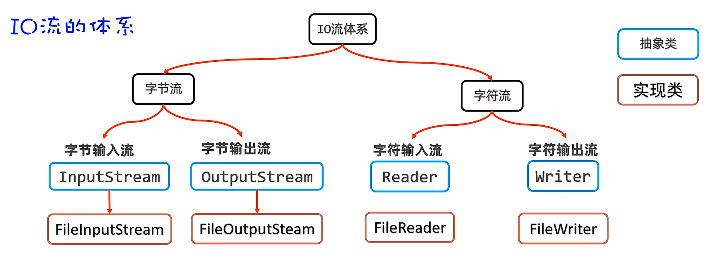

#### 7.1 文件字符输入流 - 读字符数据进来

FileReader（文件字符输入流）

+ 作用：以内存为基准，可以把文件中的数据以字符的形式读入到内存中去

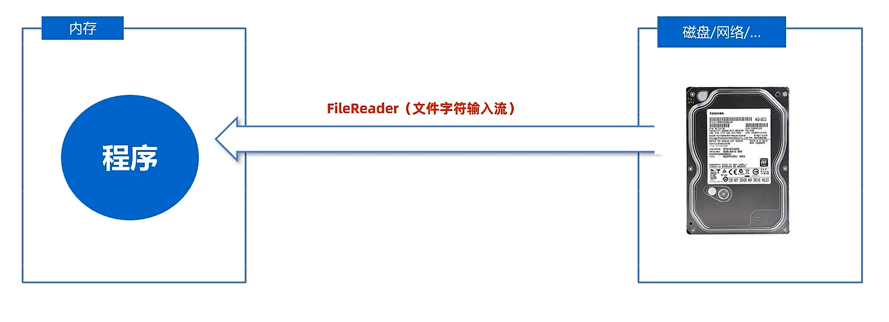

| 构造器                                 | 说明                           |
| -------------------------------------- | ------------------------------ |
| public **FileReader(File file)**       | 创建字符输入流管道与源文件接通 |
| public **FileReader(String pathname)** | 创建字符输入流管道与源文件接通 |

| 方法名称                           | 说明                                                         |
| ---------------------------------- | ------------------------------------------------------------ |
| public int **read()**              | 每次读取一个字符返回，如果发现没有数据可读会返回-1           |
| public int **read(char[] buffer)** | 每次用一个字符数组去读取数据，返回字符数组读取了多少个字符，如果发现没有数据可读会返回-1 |

##### 代码演示

```java
package Advanced.o_cahr_stream;

import java.io.FileReader;
import java.io.Reader;

/**
 * 目标：掌握文件字符输入流每次读取一个字符
 */
public class FileReaderTest1 {
    public static void main(String[] args) {
        try (
                // 1. 创建一个文件字符输入流管道与源文件接通
                Reader fr = new FileReader("src\\Advanced\\o_cahr_stream\\itfeng01.txt");
        ) {
            // 2. 读取文本文件的内容
//            int c; // 记住每次读取的字符编号
//            while ((c = fr.read()) != -1) {
//                System.out.print((char) c);
//            }
            // 每次读取一个字符的形式，性能肯定是比较差的

            // 3. 每次读取多个字符
            char[] buffer = new char[3];
            int len; // 记住每次读取了多少个字符
            while ((len = fr.read(buffer)) != -1) {
                System.out.print(new String(buffer, 0, len));
            }
            // 性能是比较不错的
        } catch (Exception e) {
            e.printStackTrace();
        }
    }
}

```


-------------------------------


#### 7.2 文件字符输出流 - 写字符数据出去

+ 作用：以内存为基准，把内存中的数据以字符的形式写出到文件中去

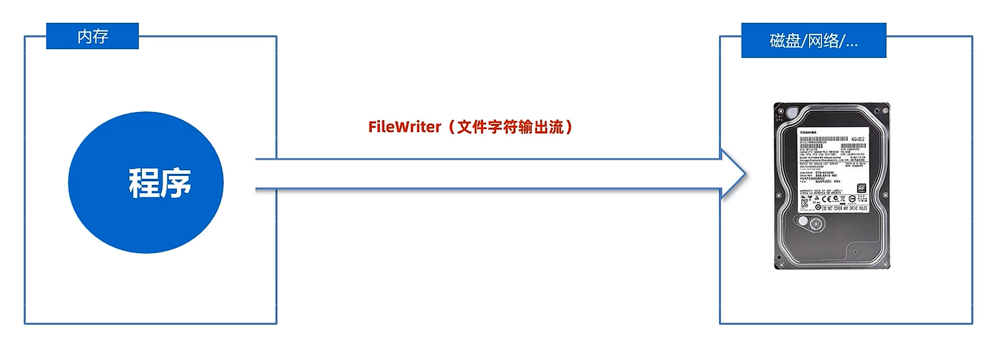

| 构造器                                             | 说明                                            |
| -------------------------------------------------- | ----------------------------------------------- |
| public FielWriter(File file)                       | 创建字节输出流管道与源文件对象接通              |
| public FileWriter(String filepath)                 | 创建字节输出流管道与源文件路径接通              |
| public FileWriter(File file, boolean append)       | 创建字节输出流管道与源文件对象接通， 可追加数据 |
| public FileWriter(String filepath, boolean append) | 创建字节输出流管道与源文件路径接通， 可追加数据 |

| 方法名称                                    | 说明                 |
| ------------------------------------------- | -------------------- |
| void write(int c)                           | 写一个字符           |
| void write(String str)                      | 写一个字符串         |
| void write(String str, int off, int len)    | 写一个字符串的一部分 |
| void write(char[] buffer)                   | 写入一个字符数组     |
| void write(char[] buffer, int off, int len) | 写入字符数组的一部分 |

##### 7.2.1 字符输出流使用时的注意事项

+ **字符输出流写出数据后，必须刷新流，或者关闭流**，写出去的数据才能生效

| 方法名称                               | 说明                                                 |
| -------------------------------------- | ---------------------------------------------------- |
| public void flush() throws IOException | 刷新流，就是将内存中缓存的数据立即写到文件中去生效！ |
| public void close() throws IOException | 关闭流的操作，**包含了刷新！**                       |

字节流、字符流的使用场景小结：

+ 字节流适合做一切文件数据的拷贝（音视频、文本）；字节流不适合读取中文内容输出
+ 字符流适合做文本文件的操作（读、写）

##### 代码演示

```java
package Advanced.o_cahr_stream;

import java.io.FileWriter;
import java.io.IOException;
import java.io.Writer;

/**
 * 目标：掌握文件字符输出流，写字符数据出去
 */
public class FileWriterTest2 {
    public static void main(String[] args) {
        try (
                // 0. 创建一个文件字符输出流管道与目标文件接通
                // 覆盖管道
//                Writer fw = new FileWriter("src/Advanced/o_cahr_stream/itfeng02.txt");

                // 追加数据的管道
                Writer fw = new FileWriter("src/Advanced/o_cahr_stream/itfeng02.txt", true);
        ) {
            // 1. void write(int c)：写一个字符
            fw.write('a');
            fw.write(97);
            fw.write('锋'); // 写一个字符出去
            fw.write("\r\n");

            // 2. void write(String str)：写一个字符串
            fw.write("我爱你中国abc");
            fw.write("\r\n");

            // 3. void write(String str, int off, int len)：写一个字符串的一部分
            fw.write("我爱你中国abc", 0, 5);
            fw.write("\r\n");

            // 4. void write(char[] buffer)：写入一个字符数组
            char[] buffer = {'n', 'b', 'a', 'b', 'c'};
            fw.write(buffer);
            fw.write("\r\n");

            // 5. void write(char[] buffer, int off, int len)：写入字符数组的一部分
            fw.write(buffer, 0, 2);
            fw.write("\r\n");
        } catch (Exception e) {
            e.printStackTrace();
        }

    }
}

```

```java
package Advanced.o_cahr_stream;

import java.io.FileWriter;
import java.io.Writer;

/**
 * 目标：搞清楚字符输出流使用时的注意事项
 */
public class FileWriterTest3 {
    public static void main(String[] args) throws Exception {
        Writer fw = new FileWriter("src/Advanced/o_cahr_stream/itfeng03.txt");

        // 写字符数据出去
        fw.write('a');
        fw.write('b');
        fw.write('c');
        fw.write('d');
        fw.write("\r\n");

        fw.write("我爱你中国");
        fw.write("\r\n");
        fw.write("我爱你中国");

//        fw.flush(); // 刷新流
//        fw.write("张三");
//        fw.flush();

        fw.close(); // 关闭流，关闭流包含刷新操作
    }
}

```


---------------------------------


### 8. IO 流 - 缓冲流

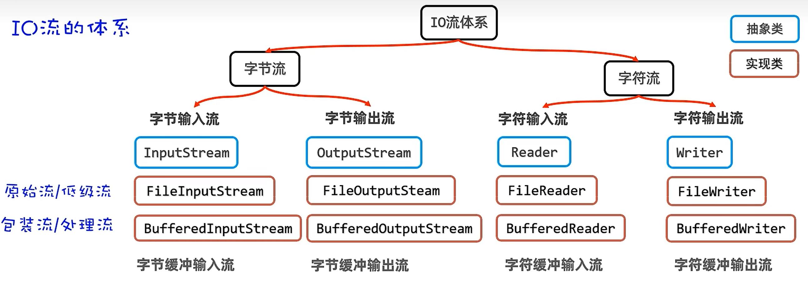

对原始流进行包装，以提高原始流读写数据的性能

#### 8.1 字节缓冲流

+ 提高字节流读写数据的性能
+ **原理：字节缓冲输入流**自带了**8KB缓冲池**；**字节缓冲输出流**也自带了**8KB缓冲池**


| 构造器                                       | 说明                                                         |
| -------------------------------------------- | ------------------------------------------------------------ |
| public BufferedInputStream(InputStream is)   | 把低级的字节输入流包装成一个高级的缓冲字节输入流，从而提高读数据的性能 |
| public BufferedOutputStream(OutputStream os) | 把低级的字节输出流包装成一个高级的缓存字节输出流，从而提高写数据的性能 |

##### 代码演示

```java
package Advanced.p_buffered_stream;

import java.io.*;

/**
 * 目标：掌握字节缓冲流的作用
 */
public class BufferedInputStreamTest1 {
    public static void main(String[] args) {
        try (
                InputStream is = new FileInputStream("src/Advanced/o_cahr_stream/itfeng03.txt");
                // 1. 定义一个字节缓冲输入流包装原始的字节输入流
                InputStream bis = new BufferedInputStream(is, 8192 * 2);

                OutputStream os = new FileOutputStream("src/Advanced/p_buffered_stream/itfeng03.txt");
                // 2. 定义一个字节缓冲输出流包装原始的字节输出流
                OutputStream bos = new BufferedOutputStream(os, 8192 * 2);
        ) {

            byte[] buffer = new byte[1024];
            int len;
            while ((len = bis.read(buffer)) != -1) {
                bos.write(buffer, 0, len);
            }
            System.out.println("复制完成！！！");

        } catch (Exception e) {
            e.printStackTrace();
        }
    }
}

```


------------------------------


#### 8.2 字符缓冲流

##### 8.2.1 BufferedReader（字符缓冲输入流）

+ **作用：自带8K（8192）的字符缓冲池， 可以提高字符输入流读取字符数据的性能**

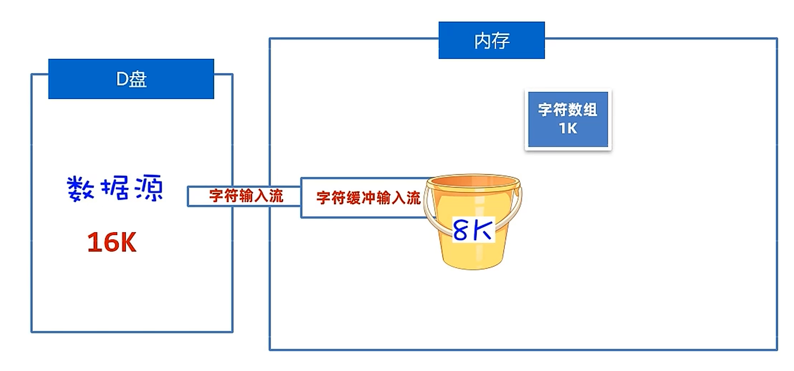

| 构造器                          | 说明                                                         |
| ------------------------------- | ------------------------------------------------------------ |
| public BufferedReader(Reader r) | 把低级的字符输入流包装成字符缓冲流输入流管道，从而提高字符输入流读取字符数据的性能 |

###### 字符缓冲输入流新增的功能：按照行读取字符

| 方法                     | 说明                                              |
| ------------------------ | ------------------------------------------------- |
| public String readLine() | 读取一行数据返回，如果没有数据可读了，会返回 null |

###### 代码演示

```java
package Advanced.p_buffered_stream;

import java.io.BufferedReader;
import java.io.FileReader;
import java.io.Reader;

/**
 * 目标：掌握字符缓冲输入流的用法
 */
public class BufferedReaderTest2 {
    public static void main(String[] args) {
        try (
                Reader fr = new FileReader("src\\Advanced\\p_buffered_stream\\itfeng01.txt");
                // 创建一个字符缓冲输入流包装原始的字符输入流
                BufferedReader br = new BufferedReader(fr);
        ) {
//            char[] buffer = new char[3];
//            int len; // 记住每次读取了多少个字符
//            while ((len = br.read(buffer)) != -1) {
//                System.out.print(new String(buffer, 0, len));
//            }

//            System.out.println(br.readLine());
//            System.out.println(br.readLine());
//            System.out.println(br.readLine());
//            System.out.println(br.readLine());

            String line; // 记住每次读取的一行数据
            while ((line = br.readLine()) != null) {
                System.out.println(line);
            }
        } catch (Exception e) {
            e.printStackTrace();
        }
    }
}

```


--------------------------------


##### 8.2.2 BufferedWriter（字符缓冲输出流）

+ **作用：自带8K的字符缓冲池，可以提高字符输出流写字符数据的性能**

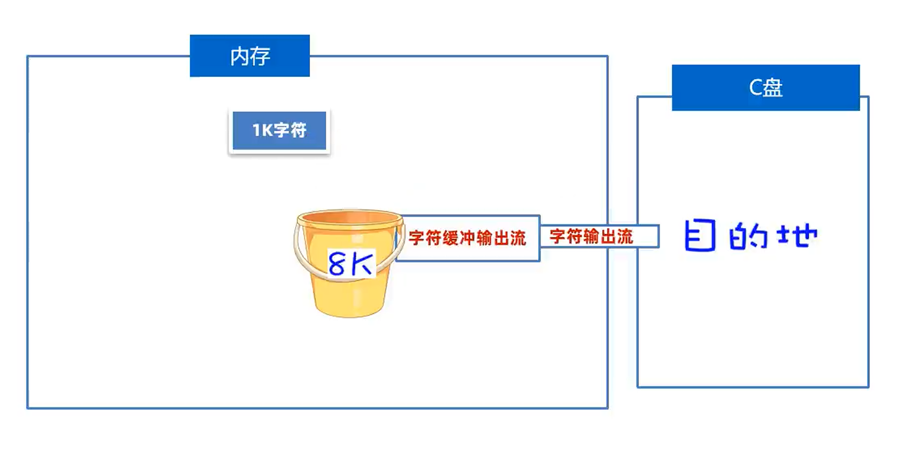

| 构造器                          | 说明                                                         |
| ------------------------------- | ------------------------------------------------------------ |
| public BufferedWriter(Writer r) | 把低级的字符输出流包装成一个高级的缓冲字符输出流管道，从而提高字符输出流写数据的性能 |

###### 字符缓冲输出流新增的功能：换行

| 方法                  | 说明 |
| --------------------- | ---- |
| public void newLine() | 换行 |

###### 代码演示

```java
package Advanced.p_buffered_stream;

import java.io.*;

public class BufferedWriterTest3 {
    public static void main(String[] args) throws Exception {
        try (
                Writer fw = new FileWriter("src/Advanced/p_buffered_stream/itfeng03.txt");
                // 创建一个字符输出流管道包装原始的字符输出流
                BufferedWriter bw = new BufferedWriter(fw);
        ) {

            bw.write('a');
            bw.write('b');
            bw.write('c');
            bw.write('d');
            bw.write("\r\n");

            bw.write("我爱你中国");
            bw.write("\r\n");
        } catch (Exception e) {
            e.printStackTrace();
        }
    }
}

```


----------------------------


#### 8.3 原始流、缓冲流的性能分析【重点】

> 测试用例：
>
> + 分别使用原始的字节流，以及字节缓冲流复制一个很大的视频
>
> 测试步骤：
>
> 1. 使用低级的字节流按照一个一个字节的形式复制文件
> 2. 使用低级的字节流按照字节数组的形式复制文件
> 3. 使用高级的缓冲字节流按照一个一个字节的形式复制文件
> 4. 使用高级的缓冲字节流按照字节数组的形式复制文件

##### 代码实现

```java
package Advanced.p_buffered_stream;

import java.io.*;

/**
 * 目标：观察原始流和缓冲流的性能
 */
public class TimeTest4 {
    // 复制的视频路径
    private static final String SRC_FILE = "D:\\000 - Python全栈\\Python全栈开发\\day01-61\\day01\\视频\\20200910_1.课程介绍【华中科教】.mp4";
    // 复制到哪个目的地
    private static final String DEST_FILE = "E:\\学习\\";

    public static void main(String[] args) {
//        copy01(); // 低级字节流一个一个字节的复制，慢的一批，直接淘汰
        copy02();
        copy03();
        copy04(); // 缓冲流按照一个一个直接数组的形式复制，速度极快，推荐使用！
    }

    private static void copy01() {
        long startTime = System.currentTimeMillis();
        try (
                InputStream is = new FileInputStream(SRC_FILE);

                OutputStream os = new FileOutputStream(DEST_FILE + "1.avi");
        ) {
            int b;
            while ((b = is.read()) != -1) {
                os.write(b);
            }
            System.out.println("复制完成！！！");

        } catch (Exception e) {
            e.printStackTrace();
        }
        long endTime = System.currentTimeMillis();
        System.out.println("低级字节流一个一个字节复制耗时：" + (endTime - startTime) / 1000.0 + "s");
    }

    private static void copy02() {
        long startTime = System.currentTimeMillis();
        try (
                InputStream is = new FileInputStream(SRC_FILE);

                OutputStream os = new FileOutputStream(DEST_FILE + "2.avi");
        ) {
            byte[] buffer = new byte[1024 * 8]; // 8KB
            int len;
            while ((len = is.read(buffer)) != -1) {
                os.write(buffer, 0, len);
            }
            System.out.println("复制完成！！！");

        } catch (Exception e) {
            e.printStackTrace();
        }
        long endTime = System.currentTimeMillis();
        System.out.println("低级字节流使用字节数组复制耗时：" + (endTime - startTime) / 1000.0 + "s");
    }


    private static void copy03() {
        long startTime = System.currentTimeMillis();
        try (
                InputStream is = new FileInputStream(SRC_FILE);

                InputStream bis = new BufferedInputStream(is);

                OutputStream os = new FileOutputStream(DEST_FILE + "3.avi");

                OutputStream bos = new BufferedOutputStream(os);
        ) {
            int b;
            while ((b = bis.read()) != -1) {
                bos.write(b);
            }
            System.out.println("复制完成！！！");

        } catch (Exception e) {
            e.printStackTrace();
        }
        long endTime = System.currentTimeMillis();
        System.out.println("缓冲流一个一个字节复制耗时：" + (endTime - startTime) / 1000.0 + "s");
    }

    private static void copy04() {
        long startTime = System.currentTimeMillis();
        try (
                InputStream is = new FileInputStream(SRC_FILE);

                InputStream bis = new BufferedInputStream(is);

                OutputStream os = new FileOutputStream(DEST_FILE + "4.avi");

                OutputStream bos = new BufferedOutputStream(os);
        ) {
            byte[] buffer = new byte[1024 * 8]; // 8KB
            int len;
            while ((len = bis.read(buffer)) != -1) {
                bos.write(buffer, 0, len);
            }
            System.out.println("复制完成！！！");

        } catch (Exception e) {
            e.printStackTrace();
        }
        long endTime = System.currentTimeMillis();
        System.out.println("缓冲流使用字节数组复制耗时：" + (endTime - startTime) / 1000.0 + "s");
    }
}

```


---------------------------------------


### 9. IO 流 - 转换流

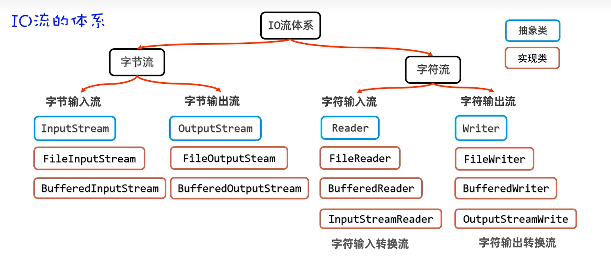

#### 9.1 引出问题：不同编码读取时会乱码

如果**代码编码**和被读取的**文本文件的编码是一致的**，使用**字符流读取**文本文件时**不会出现乱码**

如果**代码编码**和被读取的**文本文件的编码是不一致的**，使用**字符流读取**文本文件时**会出现乱码**

##### 代码演示

```java
package Advanced.q_transform_stream;

import java.io.BufferedReader;
import java.io.FileNotFoundException;
import java.io.FileReader;
import java.io.Reader;

/**
 * 目标：掌握不同编码读取乱码的问题
 */
public class Test1 {
    public static void main(String[] args) {
        try (
                // 1. 创建一个文件字符输入流与源文件接通
                // 代码编码：UTF-8
                // 要是文本文件不是UTF-8编码就有可能乱码
                Reader fr = new FileReader("src\\Advanced\\q_transform_stream\\itfeng01.txt");
                // 2. 把文件字符输入流包装成缓冲字符输入流
                BufferedReader br = new BufferedReader(fr);
        ) {
            String line;
            while ((line = br.readLine()) != null) {
                System.out.println(line);
            }
        } catch (Exception e) {
            e.printStackTrace();
        }
    }
}

```


---------------------------


#### 9.2 字符输入转换流

InputStreamReader（字符输入转换流）

+ 解决不同编码时，字符流读取文本内容乱码的问题
+ **解决思路：先获取文件的原始字节流，再将其按真实的字符集编码转成字符输入流，这样字符输入流中的字符就不会乱码了**

| 构造器                                                       | 说明                                                         |
| ------------------------------------------------------------ | ------------------------------------------------------------ |
| public InputStreamReader(InputStream is)                     | 把原始的字节输入流，按照代码默认编码转成字符输入流（与直接用 FileReader 的效果一样） |
| public **InputStreamReader(InputStream is, String charset)** | 把原始的字节输入流，按照指定字符集编码转成字符输入流（重点） |

##### 代码演示

```java
package Advanced.q_transform_stream;

import java.io.*;

/**
 * 目标：掌握字符输入流的作用
 */
public class InputStreamReaderTeat2 {
    public static void main(String[] args) {
        try (
                // 1. 得到文件的原始字节流（GBK的字节流形式）
                InputStream is = new FileInputStream("src\\Advanced\\q_transform_stream\\itfeng02.txt");
                // 2. 把原始的字节输入流按照指定的字符集编码转换成字符输入流
                Reader isr = new InputStreamReader(is, "GBK");
                // 3. 把字符输入流包装成缓冲字符输入流
                BufferedReader br = new BufferedReader(isr);
        ) {
            String line;
            while ((line = br.readLine()) != null) {
                System.out.println(line);
            }
        } catch (Exception e) {
            e.printStackTrace();
        }

    }
}

```


--------------------------------


#### 9.3 字符输出转换流

需要控制写出去的字符使用什么字符集编码，该咋整？

1. 调用 String 提供的 getBytes 方法解决？

```java
String data = "我爱你中国abc";
byte[] bytes = data.getBytes("GBK");
```

2. **使用 “字符输出转换流“ 实现**

OutputStreamWriter 字符输出转换流

+ 作用：可以控制写出去的字符使用什么字符集编码
+ **解决思路：获取字节输出流，再按照指定的字符集编码将其转换成字符输出流，以后写出去的字符就会用该字符集编码了**

| 构造器                                                       | 说明                                                         |
| ------------------------------------------------------------ | ------------------------------------------------------------ |
| public OutputStreamWriter(OutputStream os)                   | 可以把原始的字节输出流，按照代码默认编码转换成字符输出流     |
| public **OutputStreamWriter(OutputStream os, String charset)** | 可以把原始的字节输出流，按照指定编码转换成字符输出流（重点） |

##### 代码演示

```java
package Advanced.q_transform_stream;

import java.io.*;

/**
 * 目标：掌握字符输出转换流的作用
 */
public class OutputStreamWriterTest3 {
    public static void main(String[] args) {
        // 指定写出去的字符编码
        try (
                // 1. 创建一个文件字节输出流
                OutputStream os = new FileOutputStream("src\\Advanced\\q_transform_stream\\itfeng03.txt");
                // 2. 把原始的字节输出流，按照指定的字符集编码转换成字符输出转换流
                Writer osw = new OutputStreamWriter(os, "GBK");
                // 3. 把字符输出流包装成缓冲字符输出流
                BufferedWriter bw = new BufferedWriter(osw);
        ) {
            bw.write("我是中国人abc");
            bw.write("我爱你中国123");

        } catch (Exception e) {
            e.printStackTrace();
        }
    }
}

```


--------------------------------------


### 10. IO 流 - 打印流

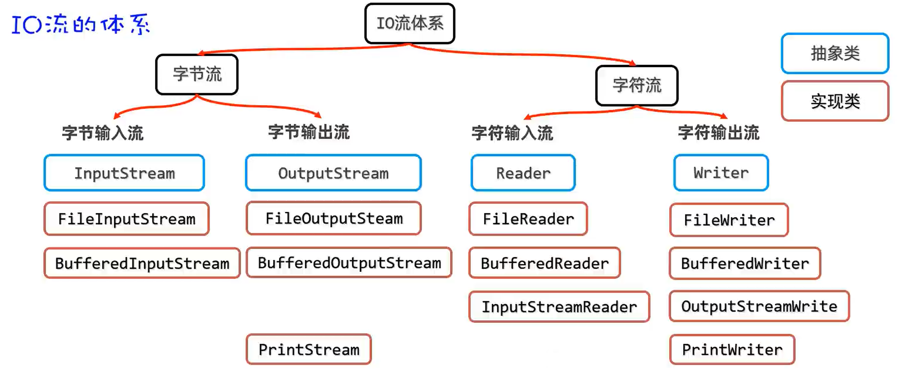

#### 10.1 谁代表打印流？

PrintStream / PrintWriter（打印流）

+ **作用：打印流可以实现更方便、更高效的打印数据出去，能实现打印啥出去就是啥出去**

##### 10.1.1 PrintStream 提供的打印数据的方案

| 构造器                                                       | 说明                                     |
| ------------------------------------------------------------ | ---------------------------------------- |
| public **PrintStream**(OutputStream/File/**String**)         | 打印流直接通向字节输出流/文件/文件路径   |
| public PrintStream(String fileName, Charset charset)         | 可以指定写出去的字符编码                 |
| public PrintStream(OutputStream out, boolean autoFlush)      | 可以指定实现自动刷新                     |
| public PrintStream(OutputStream out, boolean autoFlush, String encoding) | 可以指定实现自动刷新，并可指定字符的编码 |

| 方法                                       | 说明                       |
| ------------------------------------------ | -------------------------- |
| public void **println(Xxx xx)**            | 打印任意类型的数据出去     |
| public void write(int/byte[]/byte[]一部分) | 可以支持写**字节**数据出去 |

##### 10.1.2 PrintWriter 提供的打印数据的方案

| 构造器                                                       | 说明                                     |
| ------------------------------------------------------------ | ---------------------------------------- |
| public **PrintWriter**(OutputStream/Writer/File/**String**)  | 打印流字节通向字节输出流/文件/文件路径   |
| public PrintWriter(String fileName, Charset cahrset)         | 可以指定写出去的字符编码                 |
| public PrintWriter(OutputStream out/Writer, boolean autoFlush) | 可以指定实现自动刷新                     |
| public PrintWriter(OutputStream out/Writer, boolean autoFlush, String encoding) | 可以指定实现自动刷新，并可指定字符的编码 |

| 方法                                     | 说明                       |
| ---------------------------------------- | -------------------------- |
| public void **println(Xxx xx)**          | 打印任意类型的数据出去     |
| public void write(int/String/char[]/...) | 可以支持写**字符**数据出去 |

##### 10.1.3 PrintStream 和 PrintWriter 的区别

+ 打印数据的功能上是一模一样的：**都是使用方便，性能高效（核心优势）**
+ PrintStream 继承自字节输出流 OutputStream，因此支持写字节数据的方法
+ PrintWriter 继承自字节输出流 Writer，因此支持写字符数据出去

##### 代码演示

```java
package Advanced.r_printstream;

import java.io.FileNotFoundException;
import java.io.FileOutputStream;
import java.io.PrintStream;
import java.io.PrintWriter;
import java.nio.charset.Charset;

/**
 * 目标：掌握打印流，PrintStream/PrintWriter的用法
 */
public class PrintTest1 {
    public static void main(String[] args) {
        try (
                // 1. 创建一个打印流管道
//                PrintStream ps = new PrintStream("src/Advanced/r_printstream/itfeng01.txt", Charset.forName("GBK"));

//                PrintStream ps = new PrintStream("src/Advanced/r_printstream/itfeng01.txt");

                PrintWriter ps = new PrintWriter(new FileOutputStream("src/Advanced/r_printstream/itfeng01.txt", true));
        ) {
            ps.println(97);
            ps.println('a');
            ps.println("我爱你中国abc");
            ps.println(true);
            ps.println(99.5);

//            ps.write(97); // 'a'
        } catch (Exception e) {
            e.printStackTrace();
        }

    }
}

```


----------------------------------


#### 10.2 打印流有啥用？怎么用？

输出语句的重定向

+ **可以把输出语句和打印位置改到某个文件中去**

```java
PrintStream ps = new PrintStream("文件地址");
System.setOut(ps);
```

##### 代码演示

```java
package Advanced.r_printstream;

import java.io.FileNotFoundException;
import java.io.PrintStream;

/**
 * 目标：了解下输出语句的重定向
 */
public class PrintTest2 {
    public static void main(String[] args) {
        System.out.println("老骥伏枥");
        System.out.println("志在千里");

        try (
                PrintStream ps = new PrintStream("src\\Advanced\\r_printstream\\itfeng01.txt");
        ) {
            // 把系统默认的打印流对象改成自己设置的打印流
            System.setOut(ps);

            System.out.println("壮士暮年");
            System.out.println("壮心不已");
        } catch (Exception e) {
            e.printStackTrace();
        }
    }
}

```


-----------------------------------------


### 11. IO 流 - 数据流

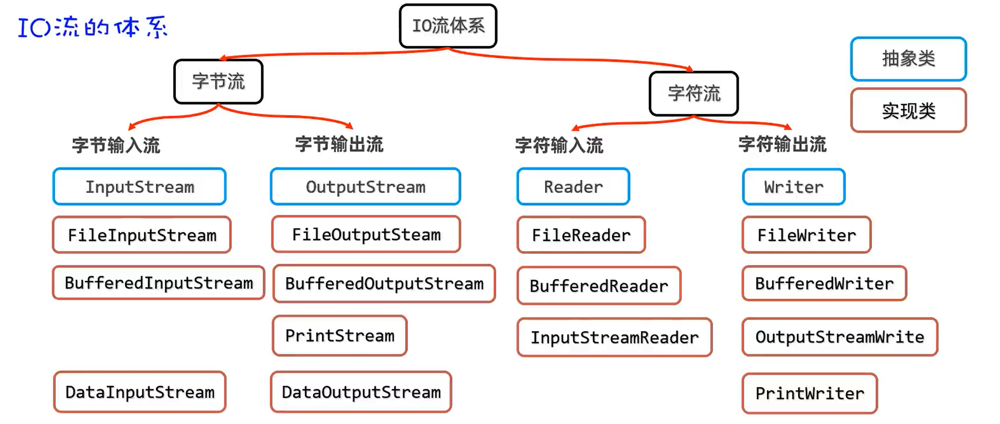

#### 11.1 DataOutputStream（数据输出流）

+ 允许把数据和其类型一并写出去

| 构造器                                        | 说明                                 |
| --------------------------------------------- | ------------------------------------ |
| public **DataOutputStream(OutputStream out)** | 创建新数据输出流包装基础的字节输出流 |

| 方法                                                         | 说明                                                    |
| ------------------------------------------------------------ | ------------------------------------------------------- |
| public final void writeByte(int v) throws IOException        | 将 **byte 类型的数据**写入基础的字节输出流              |
| public final void **writeInt(int v)** throws IOException     | 将 **int 类型的数据**写入基础的字节输出流               |
| public final void **writeDouble(Double v)** throws IOException | 将 **double 类型的数据**写入基础的字节输出流            |
| public final void **writeUTF(String str)** throws IOException | 将**字符串数据以 UTF-8 编码成字节**写入基础的字节输出流 |
| public void write(int/byte[]/byte[]一部分)                   | **支持写**字节数据出去                                  |

##### 代码演示

```java
package Advanced.s_other_stream.d1_data_stream;

import java.io.DataOutputStream;
import java.io.FileOutputStream;

/**
 * 目标：数据输出流
 */
public class DataOutputStreamTest1 {
    public static void main(String[] args) {
        try (
                // 1. 创建一个新数据输出流包装低级的字节输出流
                DataOutputStream dos = new DataOutputStream(new FileOutputStream("src\\Advanced\\s_other_stream\\d1_data_stream\\itfeng01.txt"));
        ) {
            dos.writeInt(97);
            dos.writeDouble(99.5);
            dos.writeBoolean(true);
            dos.writeUTF("哈哈哈哈哈666");
        } catch (Exception e) {
            e.printStackTrace();
        }
    }
}

```

#### 11.2 DataInputStream（数据输入流）

+ 用于读取数据输出流写出去的数据

| 构造器                                     | 说明                                 |
| ------------------------------------------ | ------------------------------------ |
| public **DataInputStream(InputStream is)** | 创建新数据输入流包装基础的字节输入流 |

| 方法                                                    | 说明                        |
| ------------------------------------------------------- | --------------------------- |
| public final byte readByte() throws IOException         | 读取字节数据返回            |
| public final int **readInt()** throws IOException       | 读取 int 类型的数据返回     |
| public final double **readDouble()** throws IOException | 读取 double 类型的数据返回  |
| public final String **readUTF()** throws IOException    | 读取字符串数据（UTF-8）返回 |
| public int readInt()/read(byte[])                       | **支持读**字节数据进来      |

##### 代码演示

```java
package Advanced.s_other_stream.d1_data_stream;

import java.io.DataInputStream;
import java.io.FileInputStream;
import java.io.FileNotFoundException;

/**
 * 目标：使用数据输入流读取特定类型的数据
 */
public class DataInputStreamTest2 {
    public static void main(String[] args) {
        try (
                DataInputStream dis = new DataInputStream(new FileInputStream("src\\Advanced\\s_other_stream\\d1_data_stream\\itfeng01.txt"));
        ) {
            int i = dis.readInt();
            System.out.println(i);

            double d = dis.readDouble();
            System.out.println(d);

            boolean b = dis.readBoolean();
            System.out.println(b);

            String rs = dis.readUTF();
            System.out.println(rs);
        } catch (Exception e) {
            e.printStackTrace();
        }
    }
}

```


-------------------------------


### 12. IO 流 - 序列化流

对象序列化：把 Java 对象写入到文件中去

对象饭序列化：把文件里的 Java 对象读出来

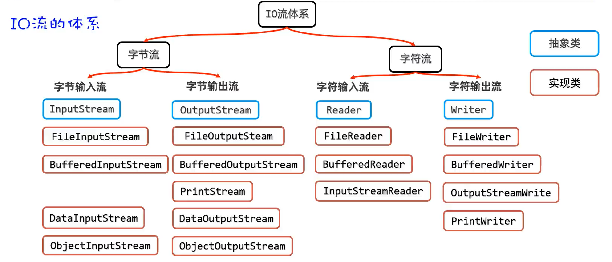

#### 12.1 ObjectOutputStream（对象字节输出流）

+ 可以把 Java 对象进行序列化：把 Java 对象存入到文件中去

| 构造器                                          | 说明                                     |
| ----------------------------------------------- | ---------------------------------------- |
| public **ObjectOutputStream(OutputStream out)** | 创建对象字节输出流，包装基础的字节输出流 |

| 方法                                                         | 说明         |
| ------------------------------------------------------------ | ------------ |
| public final void **writeObject(Object o)** throws IOException | 把对象写出去 |

**注意**：对象如果要参与序列化，必须实现序列化接口（java.io.Serializable）

#### 12.2 ObjectInputStream（对象字节输入流）

+ 可以把 Java 对象进行反序列化：把存储在文件中的 Java 对象读入到内存中来

| 构造器                                       | 说明                                     |
| -------------------------------------------- | ---------------------------------------- |
| public **ObjectInputStream(InputStream is)** | 创建对象字节输入流，包装基础的字节输入流 |

| 方法                             | 说明                             |
| -------------------------------- | -------------------------------- |
| public final Object readObject() | 把存储在文件中的 Java 对象读出来 |

如果要一次序列化多个对象，咋整？

+ 用一个 ArrayList 集合存储多个对象，然会直接对集合进行序列化即可
+ **注意：ArrayList 集合已经实现了序列化接口！**

#### 代码演示

+ User.java

```java
package Advanced.s_other_stream.d2_object_stream;

import java.io.Serializable;

// 注意：对象如果需要序列化，必须实现序列化接口
public class User implements Serializable {
    private String loginName;
    private String userName;
    private int age;
    // transient这个成员变量将不参与序列化
    private transient String passWord;

    public User() {
    }

    public User(String loginName, String userName, int age, String passWord) {
        this.loginName = loginName;
        this.userName = userName;
        this.age = age;
        this.passWord = passWord;
    }

    public String getLoginName() {
        return loginName;
    }

    public void setLoginName(String loginName) {
        this.loginName = loginName;
    }

    public String getUserName() {
        return userName;
    }

    public void setUserName(String userName) {
        this.userName = userName;
    }

    public int getAge() {
        return age;
    }

    public void setAge(int age) {
        this.age = age;
    }

    public String getPassWord() {
        return passWord;
    }

    public void setPassWord(String passWord) {
        this.passWord = passWord;
    }

    @Override
    public String toString() {
        return "User{" +
                "loginName='" + loginName + '\'' +
                ", userName='" + userName + '\'' +
                ", age=" + age +
                ", passWord='" + passWord + '\'' +
                '}';
    }
}

```

+ Test1ObjectOutputStream.java

```java
package Advanced.s_other_stream.d2_object_stream;

import java.io.FileOutputStream;
import java.io.IOException;
import java.io.ObjectOutputStream;

/**
 * 目标：掌握对象字节输出流的使用，序列化对象
 */
public class Test1ObjectOutputStream {
    public static void main(String[] args) {
        try (
                // 2. 创建一个对象字节输出流包装原始的字节输出流
                ObjectOutputStream oos = new ObjectOutputStream(new FileOutputStream("src\\Advanced\\s_other_stream\\d2_object_stream\\itfeng11out.txt"));
        ) {
            // 1. 创建一个Java对象
            User u = new User("admin", "张三", 32, "666888xyz");
            // 3. 序列化对象到文件中去
            oos.writeObject(u);
            System.out.println("序列化对象成功！！！");
        } catch (Exception e) {
            e.printStackTrace();
        }

    }
}

```

+ Test2ObjectInputStream.java

```java
package Advanced.s_other_stream.d2_object_stream;

import java.io.FileInputStream;
import java.io.ObjectInputStream;

/**
 * 目标：掌握对象字节输入流的使用，反序列化对象
 */
public class Test2ObjectInputStream {
    public static void main(String[] args) {
        try (
                // 1. 创建一个对象字节输入流管道，包装低级的字节输入流与源文件接通
                ObjectInputStream ois = new ObjectInputStream(new FileInputStream("src\\Advanced\\s_other_stream\\d2_object_stream\\itfeng11out.txt"));
        ) {
            User u = (User) ois.readObject();
            System.out.println(u);
        } catch (Exception e) {
            e.printStackTrace();
        }
    }
}

```


-----------------------------------


### 补充知识：IO 框架

什么是框架？

+ 解决某类问题，编写的一套类、接口等，可以理解成一个半成品，大多框架都是第三方研发的
+ 好处：在框架的基础上开发，可以得到优秀的软件架构，并能提高开发效率
+ 框架的形式：一般是把类、接口等编译成 class 形式，再压缩成一个 .jar 结尾的文件发行出去

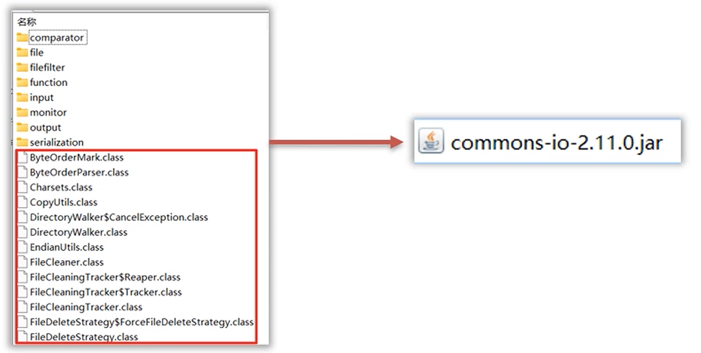

什么是 IO 框架？

+ 封装了 Java 提供的对文件、数据进行操作的代码，对外提供了更简单的方式来对文件进行操作，对数据进行读写等

#### Commons-io

+ Commons-io 是 apache 开源基金组织提供的一组有关 IO 操作的小框架，目的是提高 IO 流的开发效率

| FileUtils 类提供的部分方法展示                               | 说明       |
| ------------------------------------------------------------ | ---------- |
| public static void **copyFile**(File srcFile, File destFile) | 复制文件   |
| public static void **copyDirectory**(File srcDir, File destDir) | 复制文件夹 |
| public static void **deleteDirectory**(File directory)       | 删除文件夹 |
| public static String **readFileToString**(File file, String encoding) | 读数据     |
| public static void **writeStringToFile**(File file, String data, String charname, boolean append) | 写数据     |

| IOUtils 类提供的部分方法展示                                 | 说明     |
| ------------------------------------------------------------ | -------- |
| public static int **copy**(InputStream inputStream, OutputStream outputStream) | 复制文件 |
| public static int **copy**(Reader reader, Writer writer)     | 复制文件 |
| public static void **write**(String data, OutputStream output, String charsetName) | 写数据   |

#### 导入 commons-io.jar 框架到项目中去

1. 在项目中创建一个文件夹：lib
2. 将 commons-io-xx.xx.jar 文件复制到 lib 文件夹
3. 在 jar 文件上点右键，选择 Add as Library -> 点击 OK
4. 在类中导包使用

#### 代码演示

```java
package Advanced.s_other_stream.d3_CommonsIO;

import org.apache.commons.io.FileUtils;

import java.io.File;
import java.nio.file.Files;
import java.nio.file.Path;

/**
 * 目标：使用CommonsIO框架进行IO相关的操作
 */
public class CommonsIOTest1 {
    public static void main(String[] args) throws Exception {
        FileUtils.copyFile(new File("src\\Advanced\\s_other_stream\\d2_object_stream\\itfeng11out.txt"), new File("src\\Advanced\\s_other_stream\\d3_CommonsIO\\a.txt")); // 拷贝文件
        FileUtils.copyDirectory(new File("E:\\壁纸\\杂物"), new File("E:\\hhh")); // 拷贝文件夹
        FileUtils.deleteDirectory(new File("E:\\hhh")); // 删除文件夹

        // Java提供的原生的一行代码搞定
        Files.copy(Path.of("src\\Advanced\\s_other_stream\\d2_object_stream\\itfeng11out.txt"), Path.of("src\\Advanced\\s_other_stream\\d3_CommonsIO\\a.txt")); // 复制文件
        System.out.println(Files.readString(Path.of("src\\Advanced\\s_other_stream\\d2_object_stream\\itfeng11out.txt"))); // 读取文件内容
    }
}

```


------------------------------------


## 六、特殊文本文件、日志技术

### 1. 概述

特殊文件

+ `.properties` 结尾的文件我们就称为属性文件
+ `.xml` 结尾的 XML 文件

日志技术

+ 把程序运行的信息，记录到文件中，方便程序员定位 bug、并了解程序的执行情况等

#### 1.1 为什么要用这些特殊文件

+ 存储有关系的数据，作为系统的配置文件（比如存储多个用户的：用户名、密码、家乡、性别）
+ 作为信息进行传输

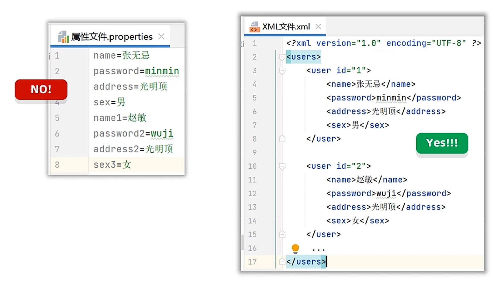


-------------------------------------


### 2. 特殊文件：Properties 属性文件

#### 2.1 特点、作用

1. 都只能是键值对
2. 键不能重复
3. 文件后缀一般是 `.properties` 结尾的

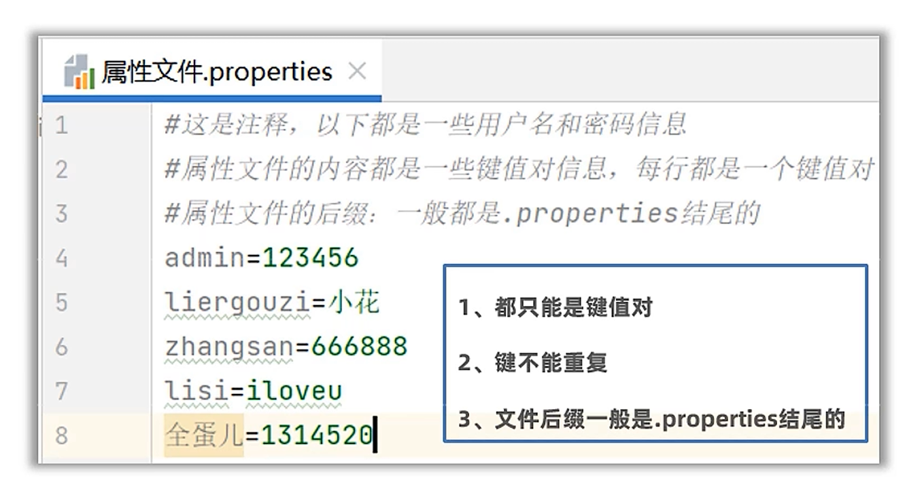

#### 2.2 使用程序读取它们里面的数据

使用 Map 集合的 Properties

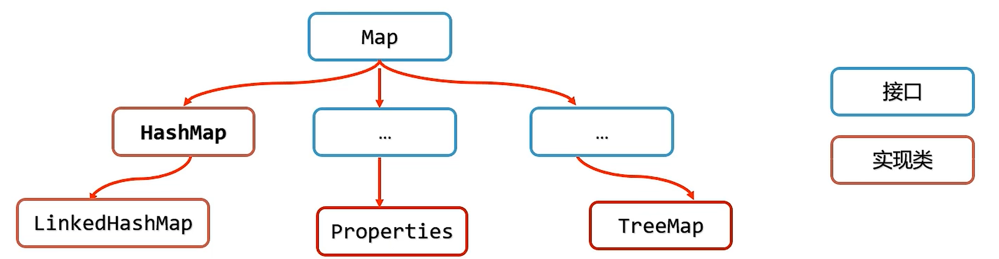

##### 2.2.1 **Properties**

+ 是一个 Map 集合（键值对集合），但是我们一般不会当集合使用
+ **核心作用：Properties 是用来代表属性文件的，通过 Properties 可以读写属性文件里的内容**

##### 2.2.2 使用 Properties 读取属性文件里的键值对数据

| 构造器              | 说明                                   |
| ------------------- | -------------------------------------- |
| public Properties() | 用于构建 Properties 集合对象（空容器） |

| 常用方法                                     | 说明                                           |
| -------------------------------------------- | ---------------------------------------------- |
| public void **load(InputStream is)**         | 通过字节输入流，读取属性文件里的键值对数据     |
| public void **load(Reader reader)**          | 通过字节输入流，读取属性文件里的键值对数据     |
| public String **getProperty(String key)**    | 根据键获取值（其实就是 get 方法的效果）        |
| public **Set<String> stringPropertyNames()** | 获取全部键的集合（其实就是 ketSet 方法的效果） |

###### 代码演示

```java
package Advanced.t_properties;

import java.io.FileNotFoundException;
import java.io.FileReader;
import java.util.Properties;
import java.util.Set;

/**
 * 目标：掌握使用Properties类读取属性文件中的键值对信息
 */
public class PropertiesTest1 {
    public static void main(String[] args) throws Exception {
        // 1. 创建一个Properties的对象出来（键值对集合，空容器）
        Properties properties = new Properties();
        System.out.println(properties); // {}

        // 2. 开始加载属性文件中的键值对数据到properties对象中去
        properties.load(new FileReader("src\\Advanced\\t_properties\\user.properties"));
        System.out.println(properties); // {admin=123456, 周芷若=wuji, 赵敏=wuji, 张无忌=minmin}

        // 3. 根据键取值
        System.out.println(properties.getProperty("赵敏")); // wuji
        System.out.println(properties.getProperty("张无忌")); // minmin

        // 4. 遍历全部的键和值
        Set<String> keys = properties.stringPropertyNames();
        for (String key : keys) {
            String value = properties.getProperty(key);
            System.out.println(key + " ---> " + value);
        }

        properties.forEach((k, v) -> {
            System.out.println(k + " ---> " + v);
        });
    }
}
```

##### 2.2.3 使用 Properties 把键值对数据写出到属性文件里去

| 构造器              | 说明                                   |
| ------------------- | -------------------------------------- |
| public Properties() | 用于构建 Properties 集合对象（空容器） |

| 常用方法                                                | 说明                                           |
| ------------------------------------------------------- | ---------------------------------------------- |
| public Object **setProperty(String key, String value)** | 保存键值对数据到 Properties 对象中去           |
| public void **store(OutputStream os, String comments)** | 把键值对数据，通过字节输出流写出到属性文件里去 |
| public void **store(Writer w, String comments)**        | 把键值对数据，通过字符输出流写出到属性文件里去 |

###### 代码演示

```java
package Advanced.t_properties;

import java.io.FileWriter;
import java.util.Properties;

/**
 * 目标：掌握把键值对数据存入到属性文件中去
 */
public class PropertiesTest2 {
    public static void main(String[] args) throws Exception {
        // 1. 创建Properties对象出来，先用它存储一些键值对数据
        Properties properties = new Properties();
        properties.setProperty("张无忌", "minmin");
        properties.setProperty("殷素素", "cuishan");
        properties.setProperty("张翠山", "susu");

        // 2. 把properties对象中的键值对数据存入到属性文件中去
        properties.store(new FileWriter("src\\Advanced\\t_properties\\users2.properties"), "i save many users!");
    }
}
```


------------------------------------


### 3. 特殊文件：XML 文件

#### 3.1 概述

XML（全称 EXtensible Markup Language，可扩展标记语言）

+ 本质上是一种数据的格式，可以用来存储复杂的数据结构，和数据关系
+ **应用场景**：经常用来作为系统的配置文件；或者作为一种特殊的数据结构，在网络中进行传输

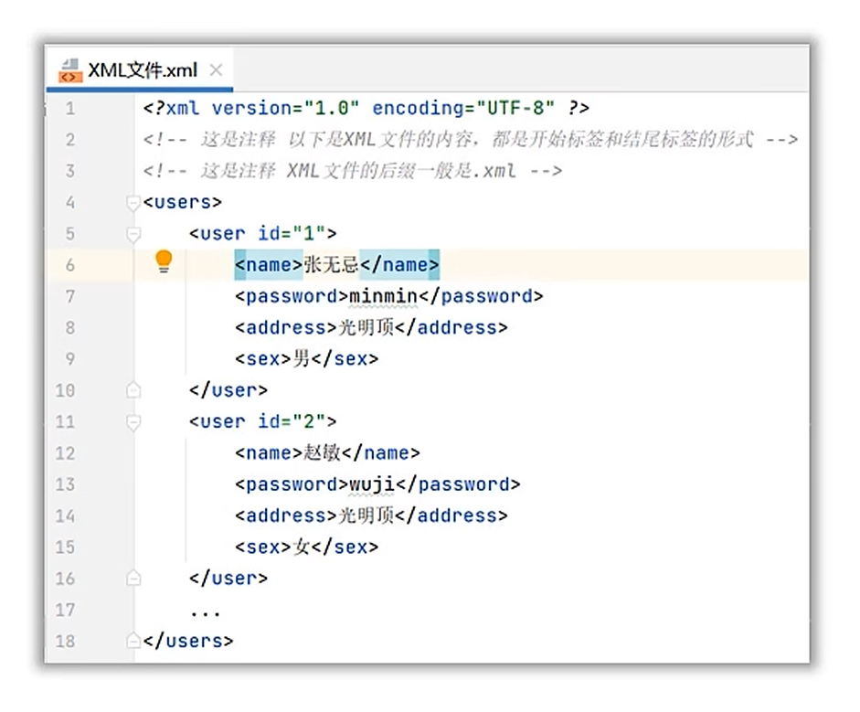

##### 3.1.1 XML 的特点

+ XML 中的 `<标签名>` 称为一个标签或一个元素，一般是成对出现的
+ XML 中的标签名可以自己定义（可扩展），但必须要正确的嵌套
+ XML 中只能有一个根标签
+ XML 中的标签可以有属性
+ 如果一个文件中放置的是 XML 格式的数据，这个文件就是 XML 文件，**后缀一般要写成 .xml**

##### 3.1.2 XML 的创建

+ 就是创建一个 XML 类型的文件，要求文件的后缀必须使用 xml，如 hello_world.xml

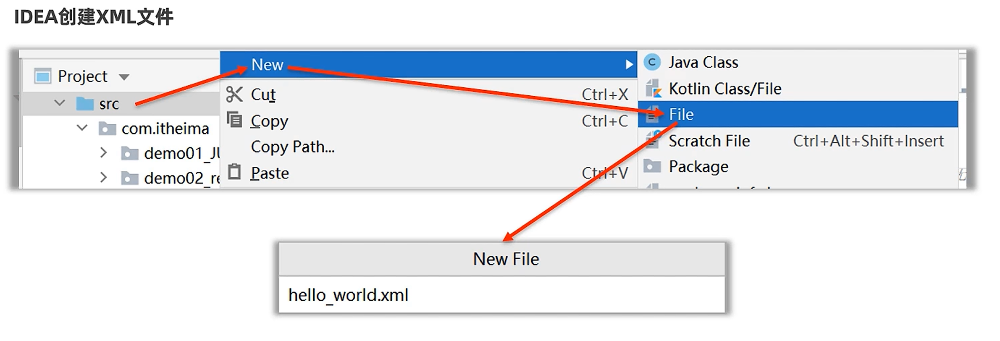

##### 3.1.3 XML 的语法规则

+ XML 文件的后缀名为：**xml**，文档声明必须是**第一行

```xml
<?xml version="1.0" encoding="UTF-8" ?>
version：XML默认的版本号码、该属性必须存在的
encoding：本XML文件的编码
```

+ XML 中可以定义注释信息：**<!-- 注释内容 -->**
+ **XML 中书写 `<`、`&` 等，可能会出现冲突、导致报错，此时可以用如下特殊字符替代**

```
&lt;	<	小于
&gt;	>	大于
&amp;	&	和号
&apos;	'	单引号
&quot;	"	引号
```

+ XML 中可以写一个叫 CDATA 的数据区：**`<![CDATA[...内容...]]>`，里面的内容可以随便写**

##### 代码演示

```xml
<?xml version="1.0" encoding="UTF-8" ?>
<!-- 注释：以上抬头声明必须放在第一行，必须有 -->
<!--根标签只能有一个-->
<users>
    <user id="1" desc="第一个用户">
        <name>张无忌</name>
        <sex>男</sex>
        <地址>光明顶</地址>
        <password>minmin</password>
        <data>3 &lt; 2 &amp;&amp; 5 &gt; 4</data>
        <data1>
            <![CDATA[
                3 < 2 && 5 > 4
            ]]>
        </data1>
    </user>
    <people>很多人</people>
    <user id="2">
        <name>敏敏</name>
        <sex>女</sex>
        <地址>光明顶</地址>
        <password>wuji</password>
    </user>
</users>
```


----------------------------------


#### 3.2 读取 XML 文件中的数据

##### 3.2.1 解析 XML 文件

+ 使用程序读取 XML 文件中的数据

注意：程序员并不需要自己写原始的 IO 流代码来解析 XML，难度较大！也相当繁琐！

其实，有很多开源的，好用的，解析 XML 的框架，**最知名的是：Dom4j（第三方研发的）**

##### 3.2.2 DOM4J 解析 XML 文件的思想：文档对象模型

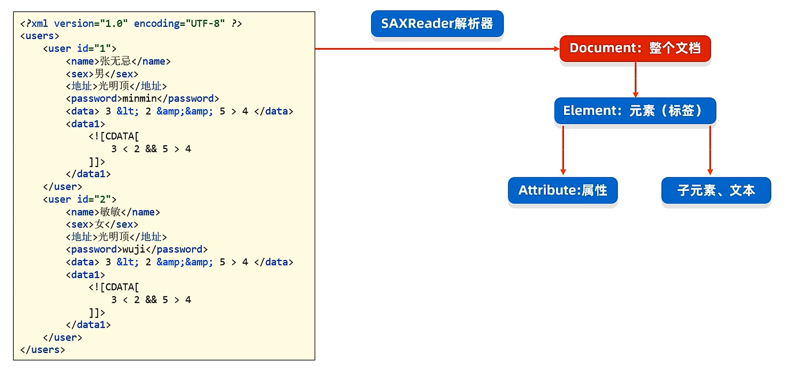

##### 3.2.3 Dom4j 解析 XML - 得到 Document 对象

+ SAXReader：Dom4j 提供的解析器，可以认为是代表整个 Dom4j 框架

| 构造器/方法                          | 说明                          |
| ------------------------------------ | ----------------------------- |
| public SAXReader()                   | 构建 Dom4j 的解析器对象       |
| public Document read(String url)     | 把 XML 文件读成 Document 对象 |
| public Document read(InputStream is) | 通过字节输入流读取 XML 文件   |

+ Document

| 方法名                   | 说明           |
| ------------------------ | -------------- |
| Element getRootElement() | 获取根元素对象 |

##### 3.2.4 Element 提供的方法

| 方法名                                      | 说明                                                         |
| ------------------------------------------- | ------------------------------------------------------------ |
| public String getName()                     | 得到元素名字                                                 |
| public List<Element> elements()             | 得到当前元素下所有子元素                                     |
| public List<Elenment> elements(String name) | 得到当前元素下指定名字的子元素返回集合                       |
| public Element element(String name)         | 得到当前元素下指定名字的子元素，如果有很多名字相同的返回第一个 |
| publi String attributeValue(String name)    | 通过属性名直接得到属性值                                     |
| public String elementText(子元素名)         | 得到指定名称的子元素的文本                                   |
| public String getText()                     | 得到文本                                                     |

##### 代码演示

```java
package Advanced.u_xml;

import org.dom4j.Attribute;
import org.dom4j.Document;
import org.dom4j.Element;
import org.dom4j.io.SAXReader;

import java.util.List;


/**
 * 目标：掌握使用Dom4j框架解析XML文件
 */
public class Dom4jTest1 {
    public static void main(String[] args) throws Exception {
        // 1. 创建一个Dom4j框架提供的解析器对象
        SAXReader saxReader = new SAXReader();

        // 2. 使用saxReader对象把需要解析的XML文件读成一个Document对象
        Document document = saxReader.read("src\\Advanced\\u_xml\\helloworld.xml");

        // 3. 从文档对象中解析XML文件的全部数据了
        Element root = document.getRootElement();
        System.out.println(root.getName()); // users

        // 4. 获取根元素下的全部一级子元素
//        List<Element> elements = root.elements();
        List<Element> elements = root.elements("user");
        for (Element element : elements) {
            System.out.println(element.getName());
        }

        // 5. 获取当前元素下的某个子元素
        Element people = root.element("people");
        System.out.println(people.getText()); // 很多人

        // 如果下面有很多子元素uer，默认获取第一个
        Element user = root.element("user");
        System.out.println(user.elementText("name")); // 张无忌

        // 6. 获取元素的属性信息
        System.out.println(user.attributeValue("id")); // 1
        Attribute id = user.attribute("id");
        System.out.println(id.getName()); // id
        System.out.println(id.getValue()); // 1

        List<Attribute> attributes = user.attributes();
        for (Attribute attribute : attributes) {
            System.out.println(attribute.getName() + "=" + attribute.getValue());
        }

        // 7. 如何获取全部的文本内容：获取当前元素下的子元素文本值
        System.out.println(user.elementText("name")); // 张无忌
        System.out.println(user.elementText("地址")); // 光明顶
        System.out.println(user.elementText("password")); // minmin

        Element data = user.element("data");
        System.out.println(data.getText()); // 3 < 2 && 5 > 4
        System.out.println(data.getTextTrim()); // 取出文本去掉前后空格
    }
}
```

##### 3.2.5 把数据写出到 XML 文件中

+ 推荐直接把程序里的数据拼接成 XML 格式，然后用 IO 流写出去

###### 代码演示

```java
package Advanced.u_xml;

import java.io.BufferedWriter;
import java.io.FileWriter;
import java.io.IOException;

/**
 * 目标：如何使用程序把数据写出到XML文件中去
 * <?xml version="1.0" encoding="UTF-8" ?>
 * <book>
 * <name>从入门到精通</name>
 * <author>dlei</author>
 * <price>999.9</price>
 * </book>
 */
public class Dom4jTest2 {
    public static void main(String[] args) {
        // 1. 使用一个StringBuilder对象来拼接XML格式的数据
        StringBuilder sb = new StringBuilder();
        sb.append("<?xml version=\"1.0\" encoding=\"UTF-8\" ?>\r\n");
        sb.append("<book>\r\n");
        sb.append("\t<name>").append("从入门到跑路").append("</name>\r\n");
        sb.append("\t<author>").append("dlei").append("</author>\r\n");
        sb.append("\t<price>").append(999.99).append("</price>\r\n");
        sb.append("</book>");

        try (
                BufferedWriter bw = new BufferedWriter(new FileWriter("src\\Advanced\\u_xml\\book.xml"));
        ) {
            bw.write(sb.toString());
        } catch (Exception e) {
            e.printStackTrace();
        }
    }
}
```


--------------------------------


#### 补充知识：约束 XML 文件的编写

+ 就是限制 XML 文件只能按照某种格式进行书写

##### 约束文档

+ 专门用来限制 xml 书写格式的文档，比如：限制标签、属性应该怎么写

##### 约束文档的分类

+ **DTD 文档**
  + 不能约束具体的数据类型
+ Schema 文档


--------------------------------


### 4. 日志技术

#### 4.1 概述

+ 就好比生活中的日记，可以记录你生活中的点点滴滴
+ 程序中的日志，通常就是一个文件，里面记录的是程序运行过程中的各种信息

##### 4.1.1 日志技术

+ 可以将系统执行的信息，方便的记录到指定的位置（控制台、文件中、数据库中）
+ 可以随时以开关的形式控制日志的启停，无需侵入到源代码中进行修改


----------------------------------


#### 4.2 日志技术体系、Logback 日志框架的概述

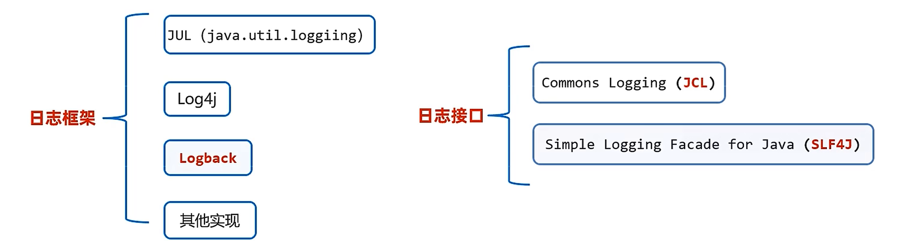

+ **日志框架**：牛人或者第三方公司已经做好的实现代码，后来者直接可以拿去使用
+ **日志接口**：设计日志框架的一套标准，日志框架需要实现这些接口
+ 注意1：因为对 Commons Logging 接口不满意，有人就搞了 SLF4J；因为对 Log4j 的性能不满意，有人就搞了 Logback
+ 注意2：**LogBack** 是基于 **slf4j** 的日志规范实现的框架

Logback 日志框架官方网站：https://logback.qos.ch/index.html

Logback 日志框架有以下几个模块

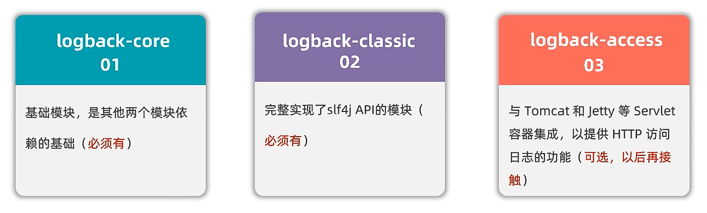

想使用 Logback 日志框架，至少需要在项目中整合如下三个模块

+ **slf4j-api：日志接口**
+ logback-core
+ logback-classic


-----------------------------


#### 4.3 Logback 快速入门

> 需求：
>
> + 使用 Logback 日志框架，记录系统的运行信息
>
> 实现步骤：
>
> 1. 导入 Logback 框架到项目中去
> 2. 将 Logback 框架的核心配置文件 **logback.xml** 直接拷贝到 src 目录下（必须是 src 下）
> 3. 创建 Logback 框架提供的 Logger 对象，然后用 Logger 对象调用其提供的方法就可以记录系统的日志信息
>
> ```java
> public static final Logger LOGGER = LoggerFactory.getLogger("类名");
> ```

##### 代码演示

```java
package Advanced.v_log;

import org.slf4j.LoggerFactory;
import org.slf4j.Logger;

/**
 * 目标：掌握LogBack日志框架的使用
 */
public class LogBackTest {
    // 创建一个Logger日志对象
    public static final Logger LOGGER = (Logger) LoggerFactory.getLogger("LogBackTest");

    public static void main(String[] args) {
        try {
            LOGGER.info("chu法方法开始执行~~~");
            chu(10, 0);
            LOGGER.info("chu法方法执行成功~~~");
        } catch (Exception e) {
            LOGGER.error("chu法方法执行失败了，出现了bug~~~");
        }
    }

    public static void chu(int a, int b) {
        LOGGER.debug("参数a：" + a);
        LOGGER.debug("参数b：" + b);
        int c = a / b;
        LOGGER.info("结果是：" + c);
    }
}

```

##### 4.3.1 核心配置文件 logback.xml

+ 对 Logback 日志框架进行控制的

日志的输出位置、输出格式的设置

+ 通常可以设置2个输出日志的位置：**一个是控制台、一个是系统文件中**

```xml
<appender name="CONSOLE" class="ch.qos.logback.core.ConsoleAppender">
```

```xml
<appender name="FILE" class="ch.qos.logback.core.rolling.RollongFileAppender">
```

开启日志（ALL），取消日志（OFF）

```xml
<root level="ALL">
    <appender-ref ref="CONSOLE" />
    <appender-ref ref="FILE" />
</root>
```


----------------------------------


#### 4.4 Logback 设置日志级别

##### 4.4.1 什么是日志级别？

+ 日志级别指的是日志信息的类型，日志都会分级别，常见的日志级别如下（**优先级依次升高**）：

| 日志级别 | 说明                                                         |
| -------- | ------------------------------------------------------------ |
| trace    | 追踪，指明程序运行轨迹                                       |
| debug    | 调试，实际应用中一般将其作为最低级别，而 trace 则很少使用    |
| info     | 输出重要的运行信息，数据连接、网络连接、IO 操作等等，使用较多 |
| warn     | 警告信息，可能会发生问题，使用较多                           |
| error    | 错误信息，使用较多                                           |

```xml
<root level="info">
    <appender-ref ref="CONSOLE" />
    <appender-ref ref="FILE" />
</root>
```

+ 只有日志的级别是**大于或等于核心配置文件配置的日志级别**，才会被记录，否则不记录


-------------------------------------


## 七、多线程

### 1. 概述

#### 1.1 什么是线程？

+ 线程（Thread）是一个程序内部的一条执行流程

```java
public static void main(String[] args) {
    // 代码...
    for(int i = 0; i < 10; i++) {
        System.out.println(i);
    }
    // 代码...
}
```

+ 程序中如果只有一条执行流程，那这个程序就是单线程的程序

#### 1.2 多线程是什么？

+ 多线程是指从软硬件上实现的多条执行流程的技术（多条线程由 CPU 负责调度执行）


-------------------------------


### 2. 多线程的创建

#### 2.1 方式一：继承 Thread 类

1. 定义一个子类 MyThread 继承线程类 java.lang.Thread，重写 run() 方法
2. 创建 MyThread 类的对象
3. 调用线程对象的 start() 方法启动线程（启动后还是执行 run 方法的）

##### 2.1.1 方式一优缺点：

+ 优点：编码简单
+ 缺点：线程类已经继承 Thread，无法继承其他类，不利于功能的扩展

##### 多线程的注意事项

1. 启动线程必须调用 start 方法，不是调用 run 方法

+ 直接调用 run 方法会当成普通方法执行，此时相当于还是单线程执行
+ 只有调用 start 方法才是启动一个新的线程执行

2. 不要把主线程任务放在启动子线程之前

+ 这样主线程一直是先跑完的，相当于是一个单线程的效果了

##### 代码演示

+ MyThread.java

```java
package Advanced.w_thread.d1_create_thread;

/**
 * 1. 让子类继承Thread线程类
 */
public class MyThread extends Thread {
    // 2. 必须重写Thread类的run方法
    @Override
    public void run() {
        // 描述线程的执行任务
        for (int i = 1; i <= 5; i++) {
            System.out.println("子线程MyThread线程输出：" + i);
        }
    }
}

```

+ ThreadTest1.java

```java
package Advanced.w_thread.d1_create_thread;

/**
 * 目标：掌握线程的创建方式一：继承Thread类
 */
public class ThreadTest1 {
    // main方法是由一条默认的主线程负责执行
    public static void main(String[] args) {
        // 3. 创建MyThread线程类的对象代表一个线程
        Thread t = new MyThread();
        // 4. 启动线程（自动执行run方法的）
        t.start(); // main线程 t线程

        for (int i = 1; i <= 5; i++) {
            System.out.println("主线程main输出：" + i);
        }
    }
}

```


----------------------------


#### 2.2 方式二：实现 Runnable 接口

1. 定义一个线程任务类 MyRunnable 实现 Runnable 接口，重写 run() 方法
2. 创建 MyRunnable 任务对象
3. 把 MyRunnable 任务对象交给 Thread 处理

| Thread 类提供的构造器          | 说明                           |
| ------------------------------ | ------------------------------ |
| public Thread(Runnable target) | 封装 Runnable 对象成为线程对象 |

4. 调用线程对象的 start() 方法启动线程

##### 2.2.1 方式二的优缺点

+ 优点：任务类只是实现接口，可以继承其他类、实现其他接口，扩展性强
+ 缺点：需要多一个 Runnable 对象

##### 代码实现

+ MyRunnable.java

```java
package Advanced.w_thread.d1_create_thread;

/**
 * 1. 定义一个任务类，实现Runnable接口
 */
public class MyRunnable implements Runnable {
    // 2. 重写Runnable的run方法
    @Override
    public void run() {
        // 线程要执行的任务
        for (int i = 1; i <= 5; i++) {
            System.out.println("子线程输出：===》" + i);
        }
    }
}

```

+ ThreadTest2.java

```java
package Advanced.w_thread.d1_create_thread;

/**
 * 目标：掌握多线程的创建方式二：实现Runnable接口
 */
public class ThreadTest2 {
    public static void main(String[] args) {
        // 3. 创建任务对象
        Runnable target = new MyRunnable();
        // 4. 把任务对象交给一个线程对象出来
        // public Thread(Runnable target)
        new Thread(target).start();

        for (int i = 1; i <= 5; i++) {
            System.out.println("主线程main输出：===》" + i);
        }
    }
}

```

##### 2.2.2 线程创建方式二的匿名内部类写法

1. 可以创建 Runnable 的匿名内部类对象
2. 再交给 Thread 线程对象
3. 再调用线程对象的 start() 启动线程

###### 代码实现

```java
package Advanced.w_thread.d1_create_thread;

/**
 * 目标：掌握多线程创建方式二的匿名内部类写法
 */
public class ThreadTest2_2 {
    public static void main(String[] args) {
        // 1. 直接创建Runnable接口的匿名内部类形式（任务对象）
        Runnable target = new Runnable() {
            @Override
            public void run() {
                for (int i = 1; i <= 5; i++) {
                    System.out.println("子线程1输出：" + i);
                }
            }
        };
        new Thread(target).start();

        // 简化形式1：
        new Thread(new Runnable() {
            @Override
            public void run() {
                for (int i = 1; i <= 5; i++) {
                    System.out.println("子线程2输出：" + i);
                }
            }
        }).start();

        // 简化形式2：
        new Thread(() -> {
            for (int i = 1; i <= 5; i++) {
                System.out.println("子线程3输出：" + i);
            }
        }).start();

        for (int i = 1; i <= 5; i++) {
            System.out.println("主线程main输出：" + i);
        }
    }
}

```


----------------------------------


#### 2.3 方式三：实现 Callable 接口

前两种线程创建方式都存在的一个问题

+ 假如线程执行完毕后有一些数据需要返回，他们重写的 run 方法均不能直接返回结果

怎么解决这个问题？

+ JDK5.0 提供了 Callable 接口和 FutureTask 类来实现（多线程的第三种创建方式）
+ **这种方式最大的优点：可以返回线程执行完毕后的结果**

##### 2.3.1 多线程的第三种创建方式：利用 Callable 接口、FutureTask 类来实现

1. 创建任务对象

+ 定义一个类实现 Callable 接口，重写 call 方法，封装要做的事情，和要返回的数据
+ 把 Callable 类型的对象封装成 FutureTask（线程任务对象）

2. 把线程任务对象交给 Thread 对象
3. 调用 Thread 对象的 start 方法启动线程
4. 线程执行完毕后，通过 FutureTask 对象的 get 方法去获取线程任务执行的结果

##### 2.3.2 FutureTask 的 API

| FutureTask 提供的构造器            | 说明                                   |
| ---------------------------------- | -------------------------------------- |
| public FutureTask<>(Callable call) | 把 Callable 对象封装成 FutureTask 对象 |

| FutureTask 提供的方法           | 说明                             |
| ------------------------------- | -------------------------------- |
| public V get() throws Exception | 获取线程执行 call 方法返回的结果 |

##### 2.3.3 线程创建方式三的优缺点

+ 优点：线程任务类只是实现接口，可以继续继承类和实现接口，扩展性强；**可以在线程执行完毕后去获取线程执行的结果**
+ 缺点：编码复杂一点

##### 代码演示

+ MyCallable.java

```java
package Advanced.w_thread.d1_create_thread;

import java.util.concurrent.Callable;

/**
 * 1. 让这个类实现Callable接口
 */
public class MyCallable implements Callable<String> {
    private int n;

    public MyCallable(int n) {
        this.n = n;
    }

    // 2. 重写call方法
    @Override
    public String call() throws Exception {
        // 描述线程的任务，返回线程执行返回后的结果
        // 需求：求1-n的和返回
        int sum = 0;
        for (int i = 1; i <= n; i++) {
            sum += i;
        }
        return "线程求出了1-" + n + "的和是：" + sum;
    }
}

```

+ ThreadTest3.java

```java
package Advanced.w_thread.d1_create_thread;

import java.util.concurrent.Callable;
import java.util.concurrent.FutureTask;

/**
 * 目标：掌握线程的创建方式三：实现Callable接口
 */
public class ThreadTest3 {
    public static void main(String[] args) throws Exception {
        // 3. 创建一个Callable的对象
        Callable<String> call = new MyCallable(100);
        // 4. 把Callable的对象封装成一个FutureTask对象（任务对象）
        // 未来任务对象的作用？
        // 1. 是一个任务对象，实现了Runnable对象
        // 2. 可以在线程执行完毕之后，用未来对象调用get方法获取线程执行完毕的结果
        FutureTask<String> f1 = new FutureTask<>(call);
        // 5. 把任务对象交给一个Thread对象
        new Thread(f1).start();

        Callable<String> call2 = new MyCallable(200);
        FutureTask<String> f2 = new FutureTask<>(call2);
        new Thread(f2).start();

        // 6. 获取线程执行完毕后返回的结果
        // 注意：如果执行到这，假如上面的线程还没有执行完毕
        // 这里的代码会暂停，等待上面线程执行完毕后才会获取结果
        String rs = f1.get();
        System.out.println(rs); // 线程求出了1-100的和是：5050

        String rs2 = f2.get();
        System.out.println(rs2); // 线程求出了1-200的和是：20100
    }
}

```


---------------------------------------


### 3. Thread 的常用方法

| Thread 提供的常用方法                        | 说明                                           |
| -------------------------------------------- | ---------------------------------------------- |
| public void run()                            | 线程的任务方法                                 |
| public void start()                          | 启动线程                                       |
| public String **getName()**                  | 获取当前线程的名称，线程名称默认是 Thread-索引 |
| public void **setName(String name)**         | 为线程设置名称                                 |
| public **static** Thread **currentThread()** | 获取当前执行的线程对象                         |
| public **static** void **sleep(long time)**  | 让当前执行的线程休眠多少毫秒后，再继续执行     |
| public final void join()...                  | 让调用当前这个方法的线程先执行完！             |

| Thread 提供的常见构造器                     | 说明                                           |
| ------------------------------------------- | ---------------------------------------------- |
| public Thread(String name)                  | 可以为当前线程指定名称                         |
| public Thread(Runnable target)              | 封装 Runnable 对象成为线程对象                 |
| public Thread(Runnable target, String name) | 封装 Runnable 对象成为线程对象，并指定线程名称 |

#### 3.1 Thread 其他方法的说明

+  Thread 类还提供了诸如：yield、interrupt、守护线程、线程优先级等线程的控制方法，在开发中很少使用，这些方法会后续需要用到的时候再讲解

#### 代码演示

+ MyThread.java

```java
package Advanced.w_thread.d2_thread_api;

public class MyThread extends Thread {
    public MyThread(String name) {
        super(name); // 为当前线程设置名字了
    }

    @Override
    public void run() {
        Thread t = Thread.currentThread();
        for (int i = 1; i <= 3; i++) {
            System.out.println(t.getName() + "子线程输出：" + i);
        }
    }
}

```

+ ThreadTest1.java

```java
package Advanced.w_thread.d2_thread_api;

/**
 * 目标：掌握Thread的常用方法
 */
public class ThreadTest1 {
    public static void main(String[] args) {
        Thread t1 = new MyThread("1号线程");
        t1.start();
        System.out.println(t1.getName());

        Thread t2 = new MyThread("2号线程");
        t2.start();
        System.out.println(t2.getName());

        // 主线程对象的名字
        // 哪个线程执行它，它就会得到哪个线程对象
        Thread m = Thread.currentThread();
        m.setName("最牛的线程");
        System.out.println(m.getName()); // 最牛的线程

        for (int i = 1; i <= 5; i++) {
            System.out.println(m.getName() + "线程输出：" + i);
        }
    }
}

```

+ ThreadTest2.java

```java
package Advanced.w_thread.d2_thread_api;

/**
 * 目标：掌握sleep方法，join方法的作用
 */
public class ThreadTest2 {
    public static void main(String[] args) throws Exception {
        for (int i = 1; i <= 5; i++) {
            System.out.println(i);
            // 休眠5s
            if (i == 3) {
                // 会让当前执行的线程暂停5秒，再继续执行
                Thread.sleep(5000);
            }
        }

        // join方法作用：让当前调用这个方法的线程先执行完
        Thread t1 = new MyThread("1号线程");
        t1.start();
        t1.join();

        Thread t2 = new MyThread("2号线程");
        t2.start();
        t2.join();

        Thread t3 = new MyThread("3号线程");
        t3.start();
        t3.join();
    }
}

```


-------------------------


### 4. 线程安全

#### 4.1 什么是线程安全问题

+ **多个线程，同时操作同一个共享资源**的时候，可能会出现业务安全问题

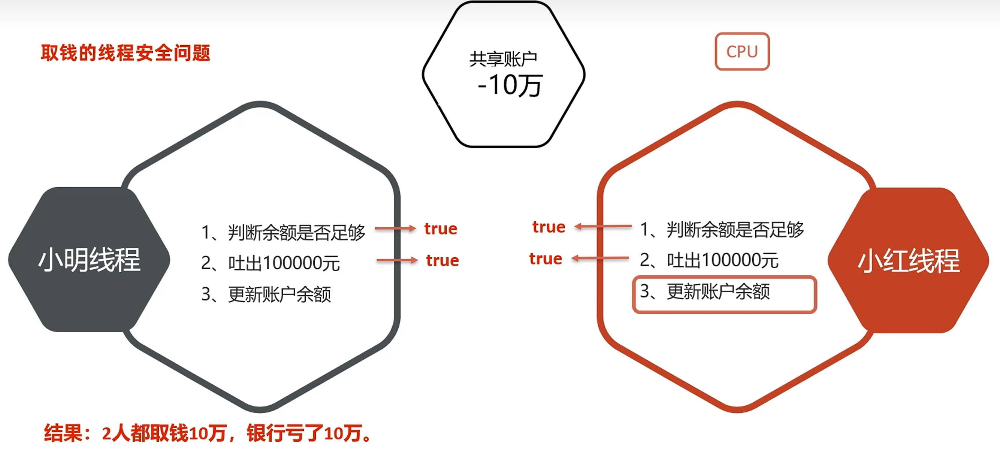

##### 总结

1. 线程安全问题出现的原因？

+ 存在多个线程在同时执行
+ 同时访问一个共享资源
+ 存在修改该共享资源


------------------------------


#### 4.2 用程序模拟线程安全问题

> 需求：
>
> + 小明和小红是一对夫妻，他们有一个共同的账户，余额是10万元，模拟2人同时去取钱10万
>
> 分析：
>
> 1. 需要提供一个账户类，接着创建一个账户对象代表2个人的共享账户
> 2. 需要定义一个线程类（用于创建两个线程，分别代表小明和小红）
> 3. 创建2个线程，传入同一个账户对象给2个线程处理
> 4. 启动2个线程，同时去同一个账户对象中取钱10万

##### 代码实现

+ Account.java

```java
package Advanced.w_thread.d3_thread_safe;

public class Account {
    private String cardId; // 卡号
    private double money; // 余额

    public Account() {
    }

    public Account(String cardId, double money) {
        this.cardId = cardId;
        this.money = money;
    }

    public String getCardId() {
        return cardId;
    }

    public void setCardId(String cardId) {
        this.cardId = cardId;
    }

    public double getMoney() {
        return money;
    }

    public void setMoney(double money) {
        this.money = money;
    }

    // 小明、小红同时过来的
    public void drawMoney(double money) {
        // 先搞清楚是谁来取钱
        String name = Thread.currentThread().getName();
        // 1. 判断余额是否足够
        if (this.money >= money) {
            System.out.println(name + "来取钱" + money + "成功~");
            this.money -= money;
            System.out.println(name + "来取钱后，余额剩余：" + this.money);
        } else {
            System.out.println(name + "来取钱，余额不足~");
        }
    }
}

```

+ DrawThread.java

```java
package Advanced.w_thread.d3_thread_safe;

public class DrawThread extends Thread {
    private Account acc;

    public DrawThread(Account acc, String name) {
        super(name);
        this.acc = acc;
    }

    @Override
    public void run() {
        // 取钱（小明、小红）
        acc.drawMoney(100000);
    }
}

```

+ ThreadTest.java

```java
package Advanced.w_thread.d3_thread_safe;

/**
 * 目标：模拟线程安全问题
 */
public class ThreadTest {
    public static void main(String[] args) {
        // 1. 创建一个账户对象，代表两个人的共享账户
        Account acc = new Account("ICBC-110", 100000);
        // 2. 创建两个线程，分别代表小明、小红，再去同一个账户对象中取钱10万
        new DrawThread(acc, "小明").start(); // 小明
        new DrawThread(acc, "小红").start(); // 小红
    }
}

```

##### 总结

1. 线程安全问题发生的原因是什么？

+ 多个线程，同时访问同一个共享资源，且存在修改该资源


--------------------------


### 5. 线程同步

+ 解决线程安全问题的方案

#### 5.1 同步思想概述

+ 让多个线程实现先后依次访问共享资源，这样就解决了安全问题

##### 5.1.1 线程同步的常见方案

+ **加锁**：每次只允许一个线程加锁，加锁后才能进入访问，访问完毕后自动解锁，然后其他线程才能再加锁进来

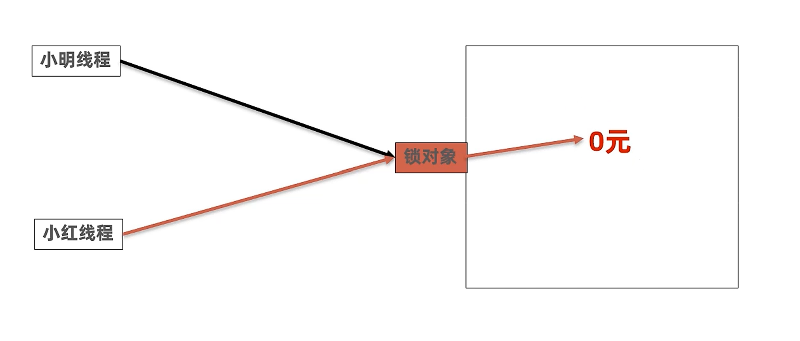

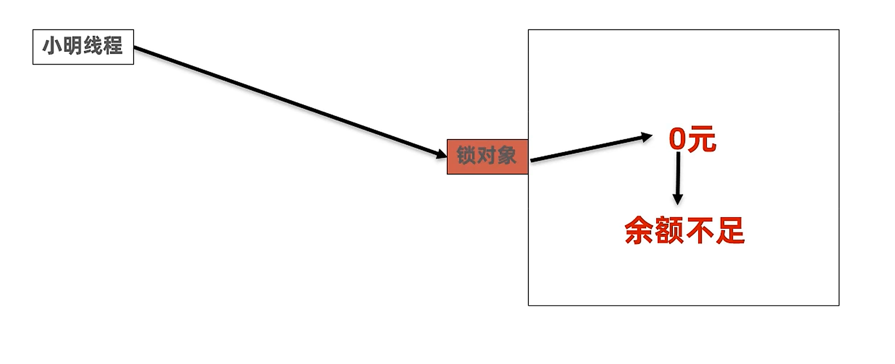


--------------------------


#### 5.2 方式一：同步代码块

+ **作用**：把访问共享资源的核心代码给上锁，以此保证线程安全

```java
synchronized(同步锁) {
	访问共享资源的核心代码
}
```

+ **原理**：每次只允许一个线程加锁后进入，执行完毕后自动解锁，其他线程才可以进来执行

##### 5.2.1 同步锁的注意事项

+ 对于当前同时执行的线程来说，同步锁必须是同一把（**同一个对象**），否则会出 bug

锁对象随便选择一个唯一的对象好不好呢？

+ 不好，会影响其他无关线程的执行

##### 5.2.2 锁对象的使用规范

+ **建议使用共享资源作为锁对象**，对于实例方法建议使用 **this** 作为锁对象
+ 对于静态方法建议使用**字节码（类名.class）**对象作为锁对象

##### 代码演示

+ Account.java

```java
package Advanced.w_thread.d4_synchronized_code;

public class Account {
    private String cardId; // 卡号
    private double money; // 余额

    public Account() {
    }

    public Account(String cardId, double money) {
        this.cardId = cardId;
        this.money = money;
    }

    public String getCardId() {
        return cardId;
    }

    public void setCardId(String cardId) {
        this.cardId = cardId;
    }

    public double getMoney() {
        return money;
    }

    public void setMoney(double money) {
        this.money = money;
    }

    public static void test() {
        synchronized (Account.class) {

        }
    }

    // 小明、小红同时过来的
    public void drawMoney(double money) {
        // 先搞清楚是谁来取钱
        String name = Thread.currentThread().getName();
        // 1. 判断余额是否足够
        // this正好代表共享资源
        synchronized (this) {
            if (this.money >= money) {
                System.out.println(name + "来取钱" + money + "成功~");
                this.money -= money;
                System.out.println(name + "来取钱后，余额剩余：" + this.money);
            } else {
                System.out.println(name + "来取钱，余额不足~");
            }
        }
    }
}
```

+ DrawThread.java

```java
package Advanced.w_thread.d4_synchronized_code;

public class DrawThread extends Thread {
    private Account acc;

    public DrawThread(Account acc, String name) {
        super(name);
        this.acc = acc;
    }

    @Override
    public void run() {
        // 取钱（小明、小红）
        acc.drawMoney(100000);
    }
}
```

+ ThreadTest.java

```java
package Advanced.w_thread.d4_synchronized_code;

/**
 * 目标：模拟线程安全问题
 */
public class ThreadTest {
    public static void main(String[] args) {
        Account acc = new Account("ICBC-110", 100000);
        new DrawThread(acc, "小明").start(); // 小明
        new DrawThread(acc, "小红").start(); // 小红

        Account acc1 = new Account("ICBC-112", 100000);
        new DrawThread(acc1, "小黑").start(); // 小黑
        new DrawThread(acc1, "小白").start(); // 小白
    }
}

```


-------------------------


#### 5.3 方式二：同步方法

+ **作用**：把访问共享资源的核心方法给上锁，以此保证线程安全

```java
修饰符 synchronized 返回值类型 方法名称(形参列表) {
    操作共享资源的代码
}
```

+ **原理**：每次只能一个线程进入，执行完毕以后自动解锁，其他线程才可以进来执行

##### 5.3.1 同步方法底层原理

+ 同步方法其实底层也是有隐式锁对象的，只是锁的范围是整个方法代码
+ 如果方法是实例方法：同步方法默认用 **this** 作为锁对象
+ 如果方法是静态方法：同步方法默认用 **类名.class** 作为锁对象

##### 5.3.2 是同步代码块好还是同步方法好一点？

+ 范围上：同步代码块锁的范围更小（性能更好），同步方法锁的范围更大
+ 可读性：同步方法更好

##### 代码演示

+ Account.java

```java
package Advanced.w_thread.d5_synchronized_method;

public class Account {
    private String cardId; // 卡号
    private double money; // 余额

    public Account() {
    }

    public Account(String cardId, double money) {
        this.cardId = cardId;
        this.money = money;
    }

    public String getCardId() {
        return cardId;
    }

    public void setCardId(String cardId) {
        this.cardId = cardId;
    }

    public double getMoney() {
        return money;
    }

    public void setMoney(double money) {
        this.money = money;
    }

    // 小明、小红同时过来的
    // 同步方法
    public synchronized void drawMoney(double money) {
        // 先搞清楚是谁来取钱
        String name = Thread.currentThread().getName();
        // 1. 判断余额是否足够
        if (this.money >= money) {
            System.out.println(name + "来取钱" + money + "成功~");
            this.money -= money;
            System.out.println(name + "来取钱后，余额剩余：" + this.money);
        } else {
            System.out.println(name + "来取钱，余额不足~");
        }
    }
}

```


-------------------------------


#### 5.4 方式三：Lock 锁

+ Lock 锁是 JDK5 开始提供的一个新的锁定操作，通过它可以创建出锁对象进行加锁和解锁，更灵活、更方便、更强大
+ Lock 是接口，不能直接实例化，可以采用它的实现类 ReentrantLock 来构建 Lock 锁对象

| 构造器                 | 说明                     |
| ---------------------- | ------------------------ |
| public ReentrantLock() | 获得 Lock 锁的实现类对象 |

##### 5.4.1 Lock 的常用方法

| 方法名称      | 说明   |
| ------------- | ------ |
| void lock()   | 获得锁 |
| void unlock() | 释放锁 |

##### 代码演示

+ Account.java

```java
package Advanced.w_thread.d6_synchronized_lock;

import java.util.concurrent.locks.Lock;
import java.util.concurrent.locks.ReentrantLock;

public class Account {
    private String cardId; // 卡号
    private double money; // 余额
    // 创建了一个锁对象
    private final Lock lk = new ReentrantLock();

    public Account() {
    }

    public Account(String cardId, double money) {
        this.cardId = cardId;
        this.money = money;
    }

    public String getCardId() {
        return cardId;
    }

    public void setCardId(String cardId) {
        this.cardId = cardId;
    }

    public double getMoney() {
        return money;
    }

    public void setMoney(double money) {
        this.money = money;
    }

    // 小明、小红同时过来的
    public void drawMoney(double money) {
        // 先搞清楚是谁来取钱
        String name = Thread.currentThread().getName();
        lk.lock(); // 加锁
        try {
            // 1. 判断余额是否足够
            if (this.money >= money) {
                System.out.println(name + "来取钱" + money + "成功~");
                this.money -= money;
                System.out.println(name + "来取钱后，余额剩余：" + this.money);
            } else {
                System.out.println(name + "来取钱，余额不足~");
            }
        } catch (Exception e) {
            e.printStackTrace();
        } finally {
            lk.unlock(); // 解锁
        }
    }
}

```


-------------------------


### 6. 线程通信【了解】

#### 6.1 什么是线程通信？

+ 当多个线程共同操作共享的资源时，线程间通过某种方式互相告知自己的状态，以相互协调，并避免无效的资源争夺

#### 6.2 线程通信的常见模型（生产者与消费者模型）

+ 生产者线程负责生产数据
+ 消费者线程负责消费生产者生产的数据
+ **注意：生产者生产完数据应该等待自己，通知消费者消费；消费者消费完数据也应该等待自己，再通知生产者生产**

#### 6.3 Object 类的等待和唤醒方法

| 方法名称         | 说明                                                         |
| ---------------- | ------------------------------------------------------------ |
| void wait()      | 让当前线程等待并释放所占锁，直到另一个线程调用 notify() 方法或 notifyAll() 方法 |
| void notify()    | 唤醒正在等待的单个线程                                       |
| void notifyAll() | 唤醒正在等待的所有线程                                       |

注意：

+ 上述方法应该使用当前同步锁对象进行调用


---------------------------


### 7. 线程池

#### 7.1 认识线程池

+ 线程池就是一个可以**复用线程的技术**

##### 7.1.1 不使用线程池的问题

+ 用户每发起一个请求，后台就需要创建一个新线程来处理，下次新任务来了肯定又要创建新线程处理的，**而创建新线程的开销是很大的，并且请求过多时，肯定会产生大量的线程出来**，这样会严重影响系统的性能

##### 7.1.2 线程池的工作原理

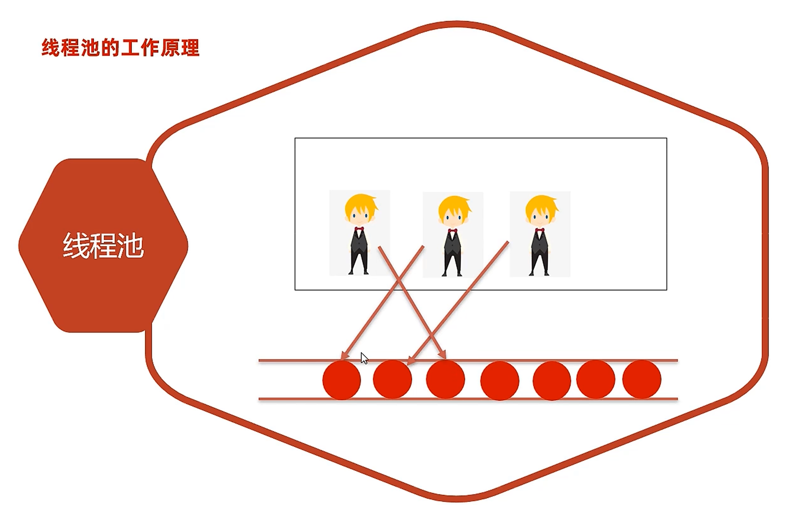

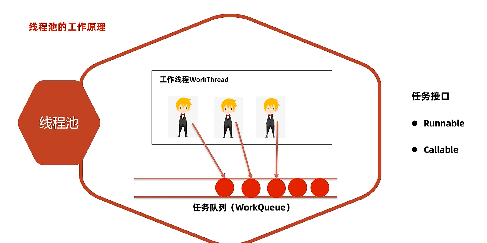


----------------------------


#### 7.2 如何创建线程池

##### 7.2.1 谁代表线程池？

+ JDK5.0 起提供了代表线程池的接口：ExecutorService

##### 7.2.2 如何得到线程池对象？

+ 方式一：使用 ExecutorService 的实现类 ThreadPoolExecutor 自创建一个线程池对象

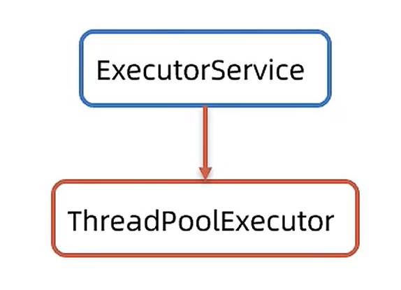

+ 方式二：使用 Executor（线程池的工具类）调用方法返回不同特点的线程池对象

##### 7.2.3 ThreadPoolExecutor

```java
public ThreadPoolExecutor(int corePoolSize, int maximumPoolSize, long keepAliveTime, TimeUnit unit, BlockingQueue<Runnable> workQueue, ThreadFactory threadFactory, RejectedExecutionHandler handler)
```

+ 参数一：corePoolSize：指定线程池的核心线程的数量
+ 参数二：maximumPoolSize：指定线程池的最大线程数量
+ 参数三：keepAliveTime：指定临时线程的存活时间
+ 参数四：unit：指定临时线程存活的时间单位（秒、分、时、天）
+ 参数五：workQueue：指定线程池的任务队列
+ 参数六：threadFactory：指定线程池的线程工厂
+ 参数七：handler：指定线程池的任务拒绝策略（线程都在忙，任务队列也满了的时候，新任务来了该怎么处理）

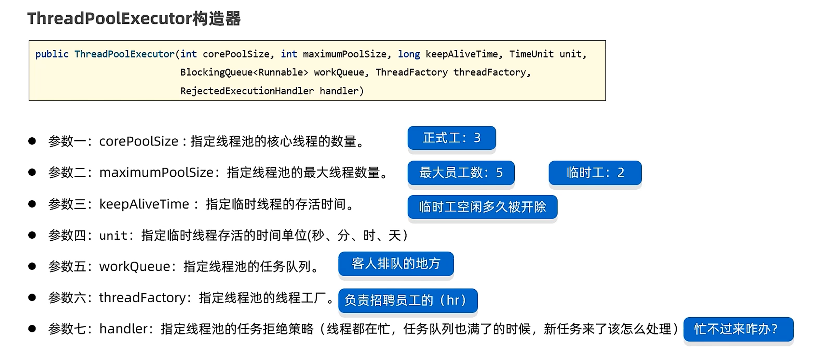

##### 7.2.4 线程池的注意事项

1. 临时线程什么时候创建？

+ 新任务提交时发现核心任务都在忙，任务队列也满了，并且还可以创建临时线程，此时才会创建临时线程

2. 什么时候会开始拒绝新任务？

+ 核心线程和临时线程都在忙，任务队列也满了，新的任务过来的时候才会开始拒绝任务

##### 代码演示

```java
package Advanced.w_thread.d7_thrad_pool;

import java.util.concurrent.*;

/**
 * 目标：掌握线程池的创建
 */
public class ThreadPoolTest1 {
    public static void main(String[] args) {
        // 1. 通过ThreadPoolExecutor创建一个线程池对象
        /*public ThreadPoolExecutor(int corePoolSize,
                                    int maximumPoolSize,
                                    long keepAliveTime,
                                    TimeUnit unit,
                                    BlockingQueue<Runnable> workQueue,
                                    ThreadFactory threadFactory,
                                    RejectedExecutionHandler handler) { */
        ExecutorService pool = new ThreadPoolExecutor(3, 5, 8, TimeUnit.SECONDS, new ArrayBlockingQueue<>(4), Executors.defaultThreadFactory(), new ThreadPoolExecutor.AbortPolicy());
    }
}

```


------------------------------


#### 7.3 线程池处理 Runnable 任务

##### 7.3.1 ExecutorService 的常用方法

| 方法名称                           | 说明                                                         |
| ---------------------------------- | ------------------------------------------------------------ |
| **void execute(Runnable command)** | 执行 Runnable 任务                                           |
| Future<T> submit(Callable<T> task) | 执行 Callable 任务，返回未来任务对象，用于获取线程返回的结果 |
| void shutdown()                    | 等全部任务执行完毕后，再关闭线程池                           |
| List<Runnable> shutdownNow()       | 立刻关闭线程池，停止正在执行的任务，并返回队列中未执行的任务 |

##### 7.3.2 新任务拒绝策略

| 策略                                   | 详解                                                         |
| -------------------------------------- | ------------------------------------------------------------ |
| ThreadPoolExecutor.AbortPolicy         | 丢弃任务并抛出 RejectedExecutionException 异常。**是默认的策略** |
| ThreadPoolExecutor.DiscardPolicy       | 丢弃任务，但是不抛出异常，这是不推荐的做法                   |
| ThreadPoolExecutor.DiscardOldestPolicy | 抛弃队列中等待最久的任务，然后把当前任务加入到队列中         |
| ThreadPoolExecutor.CallerRunPolicy     | 由主线程负责调用任务的 run() 方法从而绕过线程池直接执行      |

##### 代码演示

+ MyRunnable.java

```java
package Advanced.w_thread.d7_thrad_pool;

public class MyRunnable implements Runnable {
    @Override
    public void run() {
        // 任务是干啥的？
        System.out.println(Thread.currentThread().getName() + "===输出666===");
        try {
            Thread.sleep(Integer.MAX_VALUE);
        } catch (InterruptedException e) {
            e.printStackTrace();
        }
    }
}

```

+ ThreadPoolTest1.java

```java
package Advanced.w_thread.d7_thrad_pool;

import java.util.concurrent.*;

/**
 * 目标：掌握线程池的创建
 */
public class ThreadPoolTest1 {
    public static void main(String[] args) {
        // 1. 通过ThreadPoolExecutor创建一个线程池对象
        ExecutorService pool = new ThreadPoolExecutor(3, 5, 8, TimeUnit.SECONDS, new ArrayBlockingQueue<>(4), Executors.defaultThreadFactory(), new ThreadPoolExecutor.AbortPolicy());

        Runnable target = new MyRunnable();
        pool.execute(target); // 线程池会自动创建一个新线程，自动处理这个任务，自动执行
        pool.execute(target); // 线程池会自动创建一个新线程，自动处理这个任务，自动执行
        pool.execute(target); // 线程池会自动创建一个新线程，自动处理这个任务，自动执行
        pool.execute(target);
        pool.execute(target);
        pool.execute(target);
        pool.execute(target);
        // 到了临时线程的创建时机了
        pool.execute(target);
        pool.execute(target);
        // 到了新任务的拒绝时机了
        pool.execute(target);
//        pool.shutdown(); // 等着线程池的任务全部执行完毕后，再关闭线程池
//        pool.shutdownNow(); // 立即关闭线程池，不管任务是否执行完毕
    }
}

```


-------------------------------


#### 7.4 线程池处理 Callable 任务

| 方法名称                               | 说明                                                         |
| -------------------------------------- | ------------------------------------------------------------ |
| void execute(Runnable command)         | 执行任务/命令，没有返回值，一般用来执行 Runnable 任务        |
| **Future<T> submit(Callable<T> task)** | 执行任务，返回未来任务对象获取线程结果，一般拿来执行 Callable 任务 |
| void shutdown()                        | 等任务执行完毕后关闭线程池                                   |
| List<Runnable> shutdownNow()           | 立刻关闭，停止正在执行的任务，并返回队列中未执行的任务       |

##### 代码演示

+ MyCallable.java

```java
package Advanced.w_thread.d7_thrad_pool;

import java.util.concurrent.Callable;

/**
 * 1. 让这个类实现Callable接口
 */
public class MyCallable implements Callable<String> {
    private int n;

    public MyCallable(int n) {
        this.n = n;
    }

    // 2. 重写call方法
    @Override
    public String call() throws Exception {
        // 描述线程的任务，返回线程执行返回后的结果
        // 需求：求1-n的和返回
        int sum = 0;
        for (int i = 1; i <= n; i++) {
            sum += i;
        }
        return Thread.currentThread().getName() + "求出了1-" + n + "的和是：" + sum;
    }
}

```

+ ThreadPoolTest2.java

```java
package Advanced.w_thread.d7_thrad_pool;

import java.util.concurrent.*;

/**
 * 目标：掌握线程池的构建
 */
public class ThreadPoolTest2 {
    public static void main(String[] args) throws Exception {
        // 1. 通过ThreadPoolExecutor创建一个线程池对象
        ExecutorService pool = new ThreadPoolExecutor(3, 5, 8, TimeUnit.SECONDS, new ArrayBlockingQueue<>(4), Executors.defaultThreadFactory(), new ThreadPoolExecutor.AbortPolicy());

        // 2. 使用线程处理Callable任务
        Future<String> f1 = pool.submit(new MyCallable(100));
        Future<String> f2 = pool.submit(new MyCallable(200));
        Future<String> f3 = pool.submit(new MyCallable(300));
        Future<String> f4 = pool.submit(new MyCallable(400));

        System.out.println(f1.get());
        System.out.println(f2.get());
        System.out.println(f3.get());
        System.out.println(f4.get());
    }
}

```


------------------------------------------


#### 7.5 Executors 工具类实现线程池

**Executors**

+ 是一个线程池的工具类，提供了很多静态方法用于返回不同特点的线程池对象

| 方法名称                                                     | 说明                                                         |
| ------------------------------------------------------------ | ------------------------------------------------------------ |
| **public static ExecutorService newFixedThreadPool(int nThreads)** | 创建固定线程数量的线程池，如果某个线程因为执行异常而结束，那么线程池会补充一个新线程替代它 |
| public static ExecutorService newSingleThreadExecutor()      | 创建只有一个线程的线程池对象，如果该线程出现异常而结束，那么线程池会补充一个新线程 |
| public static ExecutorService newCachedThreadPool()          | 线程数量随着任务增加而增加，如果线程任务执行完毕且空闲了60s则会被回收掉 |
| public static ScheduledExecutorService newScheduledThreadPool(int corePoolSize) | 创建一个线程池，可以实现在给定的延迟后运行任务，或者定期执行任务 |

注意：这些方法的底层，都是通过线程池的实现类 ThreadPoolExecutor 创建的线程池对象

##### Executors 使用可能存在的陷阱

+ 大型并发系统环境中使用 Executors 如果不注意可能会出现系统风险

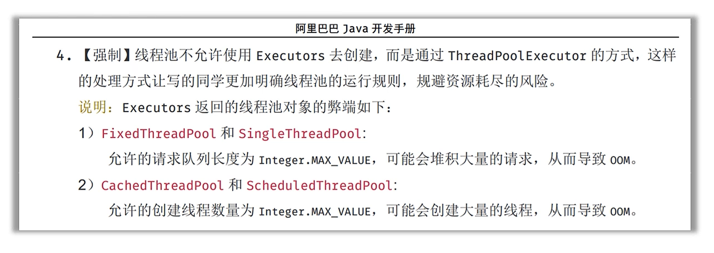

##### 代码演示

```java
package Advanced.w_thread.d7_thrad_pool;

import java.util.concurrent.*;

/**
 * 目标：掌握线程池的构建
 */
public class ThreadPoolTest3 {
    public static void main(String[] args) throws Exception {
        // 1. 通过ThreadPoolExecutor创建一个线程池对象
//        ExecutorService pool = new ThreadPoolExecutor(3, 5, 8, TimeUnit.SECONDS, new ArrayBlockingQueue<>(4), Executors.defaultThreadFactory(), new ThreadPoolExecutor.AbortPolicy());

        // 1-2 通过Executors创建一个线程池对象
        ExecutorService pool = Executors.newFixedThreadPool(17);
        // 核心线程数量到底配置多少呢？？？
        // 计算密集型的任务：核心线程数量 = CPU的核数 + 1
        // IO密集型的任务：核心线程数量 = CPU核数 * 2

        // 2. 使用线程处理Callable任务
        Future<String> f1 = pool.submit(new MyCallable(100));
        Future<String> f2 = pool.submit(new MyCallable(200));
        Future<String> f3 = pool.submit(new MyCallable(300));
        Future<String> f4 = pool.submit(new MyCallable(400));

        System.out.println(f1.get());
        System.out.println(f2.get());
        System.out.println(f3.get());
        System.out.println(f4.get());
    }
}

```


--------------------------


### 8. 其它细节知识：并发、并行

#### 8.1 进程

+ 正在运行的程序（软件）就是一个独立的进程
+ 线程是属于进程的，一个进程中可以同时运行很多个线程
+ **进程中的多个线程其实是并发和并行执行的**

#### 8.2 并发的含义

+ 进程中的线程是由 CPU 负责调度执行的，但 CPU 能同时处理线程的数量有限，为了保证全部线程都能往前执行，CPU 会轮询为系统的每个线程服务，由于 CPU 切换的速度很快，给我们的感觉这些线程在同时执行，这就是并发

#### 8.3 并行的理解

+ 在同一个时刻上，同时有多个线程在被 CPU 调度执行

#### 8.4 多线程到底是怎么在执行的？

+ **并发和并行同时进行的！**


---------------------


### 9. 其它细节知识：线程的生命周期

+ 也就是线程从生到死的过程中，经历的各种状态及状态转换
+ 理解线程这些状态有利于提升并发编程的理解能力

#### 9.1 Java 线程的状态

+ Java 总共定义了6种状态
+ 6种状态都定义在 Thread 类的内部枚举类中

```java
public class Thread {
    ...
    public enum State {
        NEW,
        RUNNABLE,
        BLOCKED,
        WAITING,
        TIMED_WAITING,
        TERMINATED;
    }
    ...
}
```

#### 9.2 线程的6种状态互相转换

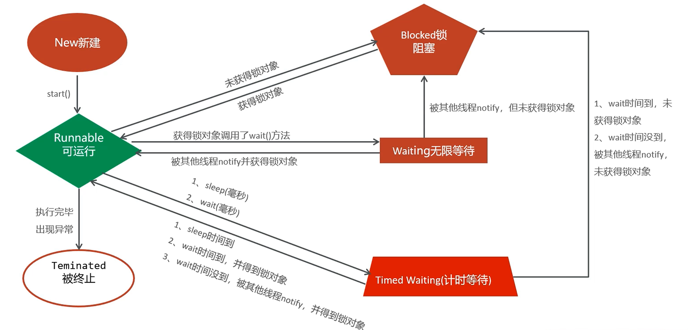

| 线程状态                  | 说明                                                         |
| ------------------------- | ------------------------------------------------------------ |
| NEW（新建）               | 线程刚被创建，但是并未启动                                   |
| Runnable（可运行）        | 线程已经调用了 start()，等待 CPU 调度                        |
| Blocked（锁阻塞）         | 线程在执行的时候未竞争到锁对象，则该线程进入 Blocked 状态    |
| Waiting（无限等待）       | 一个线程进入 Waiting 状态，另一个线程调用 notify 或者 notifyAll 方法才能够唤醒 |
| Timed Waiting（计时等待） | 同 Waiting 状态，有几个方法（sleep，wait）有超时参数，调用他们将进入 Timed Waiting 状态 |
| Teminated（被终止）       | 因为 run 方法正常退出而死亡，或者因为没有捕获的异常终止了 run 方法而死亡 |


---------------------------------


### 10. 原子操作

#### 10.1 什么是原子操作

定义：不可中断的一个或一系列操作

+ 原子操作是指在执行过程中不会被其他线程中断的操作。它要么全部执行成功，要么全部不执行，不存在中间状态。原子操作可以保证数据的一致性和**线程安全性**（无需加锁）

#### 10.2 常用原子类及方法

+ Atomic 包提供了针对 boolea、int 和 long 三种基本数据类型的原子操作类：`AtomicBoolean`、`AtomicInteger`、`AtomicLong`

##### 10.2.1 compareAndSet() 方法

+ 将 value 更新从预期值更新为指定值；成功返回 true，否则返回 false

```java
public final boolean compareAndSet(int expect, int update) {
    return unsafe.compareAndSwapInt(this, valueOffset, expect, update);
}
```

##### 10.2.2 实用方法

###### 返回旧值

```java
public final int getAndIncrement()  // 原子自增
public final int getAndDecrement() // 原子自减
public final int getAndAdd(int delta)  // 原子增加指定值
public final int getAndSet(int newValue) // 原子更新为指定值
```

###### 返回新值

```java
public final int incrementAndGet() // 自增并返回新值（i++）
public final int decrementAndGet() // 自减并返回新值（i--）
public final int addAndGet(int delta) // 增加delta并返回结果
```

##### 10.2.3 基本类型

+ `AtomicBoolean`、`AtomicInteger`、`AtomicLong`

```java
AtomicInteger count = new AtomicInteger(0);

// 自增并返回新值 (++i)
int newVal = count.incrementAndGet(); 

// 将当前值-1，然后返回更新后的值
int newVal2 = count.decrementAndGet();

// 自减并返回旧值 (i--)
int oldVal = count.getAndDecrement();

// 原子加法
count.addAndGet(10);  // 增加10并返回结果

// CAS 操作
boolean updated = count.compareAndSet(expect, update); 
```

##### 10.2.4 引用类型

+ `AtomicReference<T>`

```java
AtomicReference<String> ref = new AtomicReference<>("A");

// 更新引用
ref.compareAndSet("A", "B"); // 当前值为"A"则更新为"B"
```

##### 10.2.5 数组类型

+ `AtomicIntegerArray`、`AtomicLongArray`

```java
AtomicIntegerArray array = new AtomicIntegerArray(10);

// 设置第5个元素为20
array.set(4, 20); 

// 原子更新第5个元素
array.getAndAdd(4, 5); // 旧值+5
```

##### 10.2.6 字段更新器

+ `AtomicIntegerFieldUpdater`

```java
class Counter {
    volatile int value; // 必须 volatile
}

Counter obj = new Counter();
AtomicIntegerFieldUpdater<Counter> updater = 
    AtomicIntegerFieldUpdater.newUpdater(Counter.class, "value");

updater.incrementAndGet(obj); // 原子自增
```


--------------------------------------


## 八、网络编程

+ 可以让设备中的程序与网络上其他设备中的程序进行数据交互（实现网络通信的）

Java 提供了哪些网络编程的解决方案

+ java.net.* 包下提供了网络编程的解决方案

### 1. 网络通信三要素

+ 基本的通信架构有2种形式：CS 架构（Client 客户端 / Server 服务端）、BS 架构（Browser 浏览器 / Server 服务端）

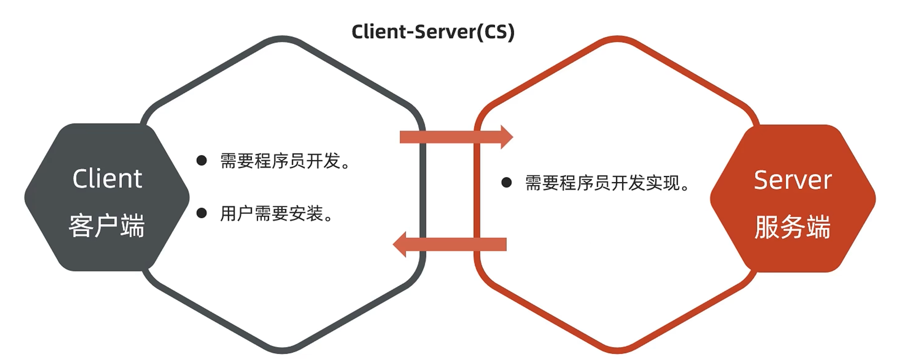

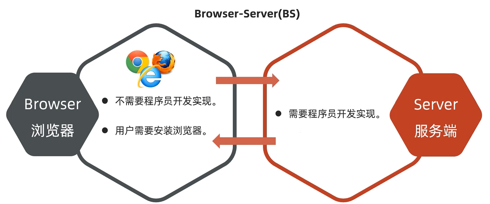

无论是 CS 架构，还是 BS 架构的软件都必须依赖网络编程！

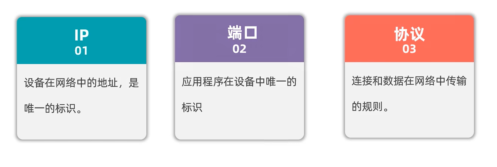

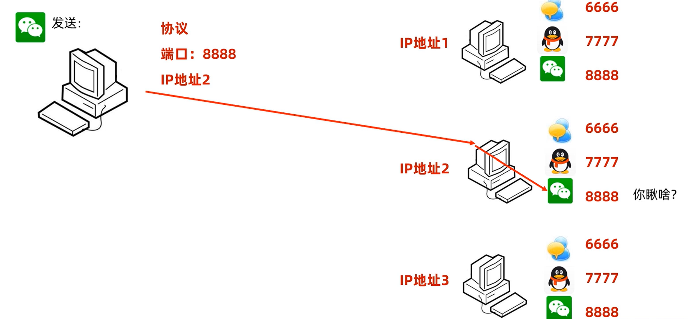

#### 1.1 IP 地址

+ IP（Internet Protocol）：全称 “互联网协议地址” ，是分配给上网设备的唯一标志
+ IP 地址有两种形式：IPv4、IPv6

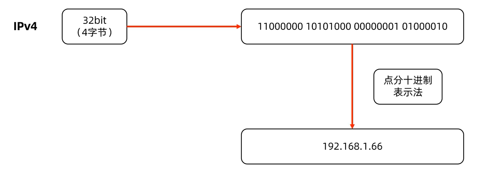

#### 1.1.1 IPv6 地址

+ IPv6：共128位，号称可以为地球每一粒沙子编号
+ IPv6 分为8端表示，每段每四位编码成一个十六进制位表示，数之间用冒号 `:` 分开

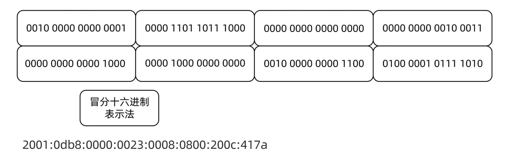

#### 1.1.2 IP 域名

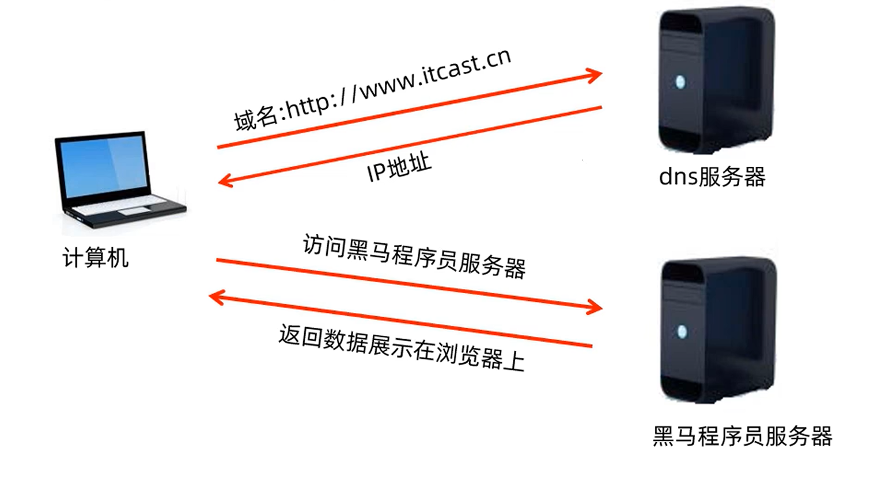

如果你的电脑是第一次访问这个域名，电脑中没有这个域名对应的 ip 的话，就会把这个域名发给你的运营商的服务器，运营商的服务器再去互联网上找这个域名的 ip，最后把真实的 ip 响应到你电脑的 dns 服务器里

##### 1.1.3 公网 IP、内网 IP

+ 公网 IP：是可以连接互联网的 IP 地址；内网 IP：也叫局域网 IP，只能组织机构内部使用
+ 192.168. 开头的就是常见的局域网地址，范围即为192.168.0.0 -- 192.168.255.255，专门为组织机构内部使用

##### 1.1.5 特殊 IP 地址

+ 127.0.0.1、localhost：代表本机 IP，只会寻找当前所在的主机

##### 1.1.6 IP 常用命令

+ `ipconfig`：查看本机 IP 地址
+ `ping IP地址`：检查网络是否连通

##### 1.1.7 InetAddress

+ 代表 IP 地址

###### InetAddresss 的常用方法

| 名称                                             | 说明                                               |
| ------------------------------------------------ | -------------------------------------------------- |
| public static InetAddress getLocalHost()         | 获取本机 IP，会以一个 inetAddress 的对象返回       |
| public static InetAddress getByName(String host) | 根据 ip 地址或者域名，返回一个 inetAddress 对象    |
| public String getHostName()                      | 获取该 ip 地址对象对应的主机名                     |
| public String getHostAdress()                    | 获取该 ip 地址对象中的 ip 地址信息                 |
| public boolean isReachable(int timeout)          | 在指定毫秒内，判断主机与该 ip 对应的主机是否能连通 |

###### 代码演示

```java
package Advanced.x_network_communication.d1_ip;

import java.net.InetAddress;

/**
 * 目标：掌握InetAddress类的使用
 */
public class InetAddressTest {
    public static void main(String[] args) throws Exception {
        // 1. 获取本机IP地址对象
        InetAddress ip1 = InetAddress.getLoopbackAddress();
        System.out.println(ip1.getHostName()); // localhost
        System.out.println(ip1.getHostAddress()); // 127.0.0.1

        // 2. 获取指定IP或者域名的IP地址对象
        InetAddress ip2 = InetAddress.getByName("www.baidu.com");
        System.out.println(ip2.getHostName()); // www.baidu.com
        System.out.println(ip2.getHostAddress());

        System.out.println(ip2.isReachable(6000)); // true
    }
}

```


------------------------------


#### 1.2 端口号

+ 标记正在计算机设备上运行的应用程序的，被规定为一个16位的二进制，范围是0~65535

##### 1.2.1 分类

+ 周知端口：0~1023，被预先定义的知名应用和占用（如：HTTP 占用 80，FTP 占用 21）
+ **注册端口**：1024~49151，分配给用户进程或某些应用程序
+ 动态端口：49152到65535，之所以称为动态端口，是因为它一般不固定分配某种进程，而是动态分配

**注意：我们自己开发的程序一般选择注册端口，且一个设备中不能出现两个程序的端口号一样，否则出错**


---------------------------------------


#### 1.3 协议

+ 网络上的通信设备，实现规定的连接规则，以及传输数据的规则被称为网络通信协议

##### 1.3.1 开放式网络互联标准：OSI 网络参考模型

+ OSI 网络参考模型：全球网络互联标准
+ TCP/IP 网络模型：事实上的国际标准

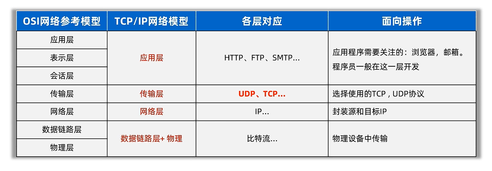

<table>
    <thead>
    <tr>
    	<th>OSI 网络参考模型</th>
        <th>TCP/IP 网络模型</th>
        <th>各层对应</th>
        <th>面向操作</th>
    </tr>
    </thead>
    <tbody>
    	<tr>
        	<td>应用层</td>
            <td rowspan="3">应用层</td>
            <td rowspan="3">HTTP、FTP、SMTP...</td>
            <td rowspan="3">应用程序需要关注的：浏览器、邮箱。程序员一般在这一层开发</td>
        </tr>
        <tr>
        	<td>表示层</td>
        </tr>
        <tr>
        	<td>会话层</td>
        </tr>
        <tr>
        	<td>传输层</td>
            <td>传输层</td>
            <td>UDP、TCP...</td>
            <td>选择使用的 TCP、UDP 协议</td>
        </tr>
        <tr>
        	<td>网络层</td>
            <td>网络层</td>
            <td>IP...</td>
            <td>封装源和目标 IP</td>
        </tr>
        <tr>
        	<td>数据链路层</td>
            <td rowspan="2">数据链路层+物理</td>
            <td rowspan="2">比特流...</td>
            <td rowspan="2">物理设备中传输</td>
        </tr>
        <tr>
        	<td>物理层</td>
        </tr>
    </tbody>
</table>


##### 1.3.2 传输层的2个通信协议

+ UDP（User Datagram Protocol）：用户数据报协议；TCP（Transmission Control Protocol）：传输控制协议

###### UDP 协议

+ **特点：无连接、不可靠通信**
+ 不事先建立连接，数据按照包发，一包数据包含：自己的 IP、程序端口、目的地 IP、程序端口和数据（限制在 64KB 内）等
+ 发送方不管对方是否在线，数据在中间丢失也不管，如果接收方收到数据也不返回确认，故是不可靠的
+ 通信效率高，可以用于语音通话、视频直播

###### TCP 协议

+ **特点：面向连接、可靠通信**
+ TCP 的最终目的：要保证在不可靠的信道上实现可靠的传输
+ TCP 主要有三个步骤实现可靠传输：三次握手建立连接，传输数据进行确认，四次挥手断开连接
+ 通信效率相对不高，用于网页、文件下载、支付

TCP 协议：三次握手建立可靠连接

+ **可靠连接：确定**通信双方，收发消息都是正常无问题的！（全双工）

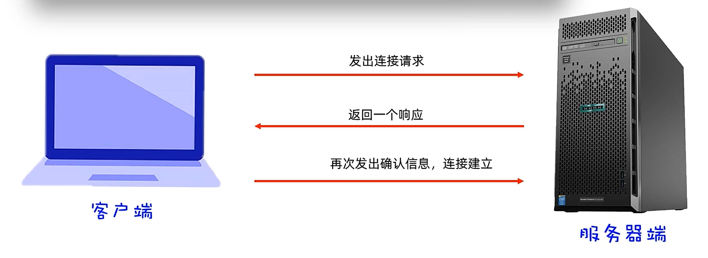

+ **传输数据会进行确认，以保证数据传输的可靠性**

TCP 协议：四次握手断开连接

+ **目的：确保双方数据的收发都已经完成！**

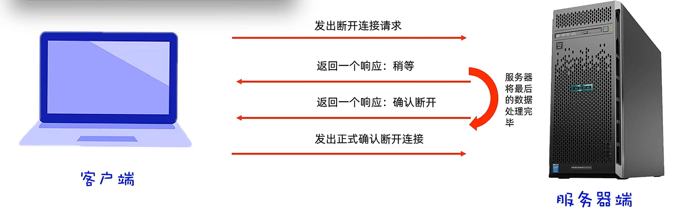


---------------------------------


### 2. UDP 通信 - 快速入门

#### 2.1 UDP 通信

+ **特点：无连接、不可靠通信**
+ 不事先建立连接；发送端每次把要发送的数据（限制在 64KB 内）、接收端 IP，等信息封装成一个数据包，发出去就不管了
+ Java 提供了一个 **java.net.DatagramSocket 类**来实现 UDP 通信

#### 2.2 DatagramSocket：用于创建客户端、服务端

| 构造器                          | 说明                                                   |
| ------------------------------- | ------------------------------------------------------ |
| public DatagramSocket()         | 创建**客户端**的 Socket 对象，系统会随机分配一个端口号 |
| public DatagramSocket(int port) | 创建**服务端**的 Socket 对象，并指定端口号             |

| 方法                                      | 说明               |
| ----------------------------------------- | ------------------ |
| public void **send(DatagramPacket dp)**   | 发送数据包         |
| public void **receive(DatagramPacket p)** | 使用数据包接收数据 |

#### 2.3 DatagramPacket：创建数据包

| 构造器                                                       | 说明                         |
| ------------------------------------------------------------ | ---------------------------- |
| public DatagramPacket(byte[] buf, int length, InetAddress address, int port) | 创建**发出去的数据包对象**   |
| public DatagramPacket(byte[] buf, int length)                | 创建**用来接收数据的数据包** |

| 方法                       | 说明                             |
| -------------------------- | -------------------------------- |
| public int **getLength()** | 获取数据包，实际接收到的字节个数 |

#### 2.3 使用 UDP 通信实现：发送消息、接收消息

##### 客户端实现步骤

1. 创建 DatagramSocket 对象（客户端对象）-> 扔韭菜的人
2. 创建 DatagramPacket 对象封装需要发送的数据（数据包对象）-> 韭菜盘子
3. 使用 DatagramSocket 对象的 send 方法，传入 DatagramPacket 对象 -> 开始抛出韭菜
4. 释放资源

##### 服务端实现步骤

1. 创建 DatagramSocket 对象并指定端口（服务端对象）-> 接韭菜的人
2. 创建 DatagramPacket 对象接收数据（数据包对象）-> 韭菜盘子
3. 使用 DatagramSocket 对象的 receive 方法，传入 DatagramPacket 对象 -> 开始接收韭菜
4. 释放资源

##### 代码实现

+ Client.java

```java
package Advanced.x_network_communication.d2_upd1;

import java.net.DatagramPacket;
import java.net.DatagramSocket;
import java.net.InetAddress;

/**
 * 目标：完成UDP通信快速入门：实现1发1收
 */
public class Client {
    public static void main(String[] args) throws Exception {
        // 1. 创建客户端对象
        DatagramSocket socket = new DatagramSocket(7777);

        // 2. 创建数据包对象封装要发出去的数据
        // 参数一：封装要发出去的数据
        // 参数二：发送出去的数据大小（字节个数）
        // 参数三：服务端的IP地址（找到服务端主机）
        // 参数四：服务端程序的端口
        byte[] bytes = "我是快乐的客户端，我爱你abc".getBytes();
        DatagramPacket packet = new DatagramPacket(bytes, bytes.length, InetAddress.getLocalHost(), 6666);

        // 3. 开始正式发送这个数据包的数据出去了
        socket.send(packet);

        System.out.println("客户端数据发送完毕~~~");
        socket.close(); // 释放资源
    }
}

```

+ Server.java

```java
package Advanced.x_network_communication.d2_upd1;

import java.net.DatagramPacket;
import java.net.DatagramSocket;

/**
 * 目标：完成UDP通信快速入门-服务端开发
 */
public class Server {
    public static void main(String[] args) throws Exception {
        System.out.println("---服务端启动---");
        // 1. 创建一个服务端对象 注册端口
        DatagramSocket socket = new DatagramSocket(6666);

        // 2. 创建一个数据包对象，用于接收数据的
        byte[] buffer = new byte[1024 * 64]; // 64KB
        DatagramPacket packet = new DatagramPacket(buffer, buffer.length);

        // 3. 开始正式使用数据包来接收客户端发来的数据
        socket.receive(packet);

        // 4. 从字节数组中，把接收到的数据字节打印出来
        // 接收多少就倒出多少
        // 获取本次数据包接受了多少数据
        int len = packet.getLength();

        String rs = new String(buffer, 0, len);
        System.out.println(rs);

        System.out.println(packet.getAddress().getHostAddress());
        System.out.println(packet.getPort());

        socket.close(); // 释放资源
    }
}

```


---------------------------------------


### 3. UDP 通信 - 多发多收

#### 程序多开


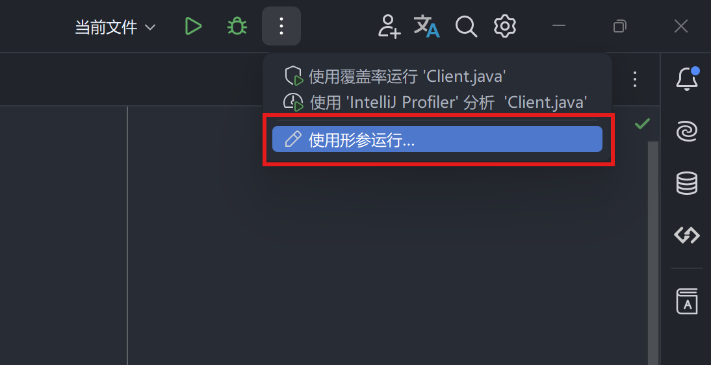

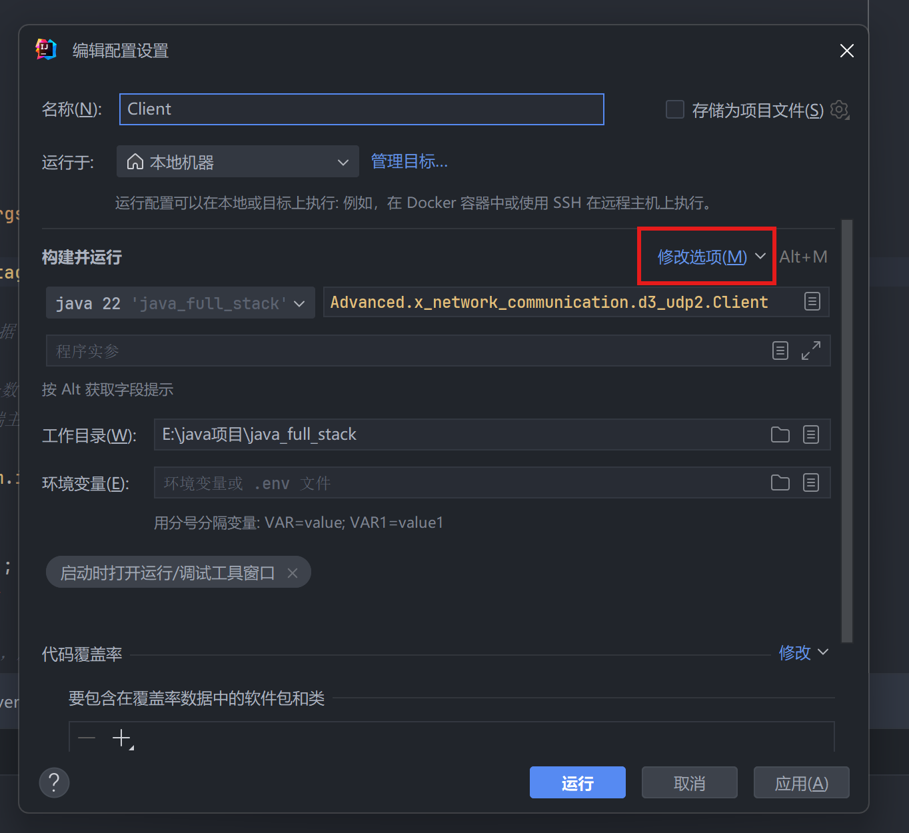

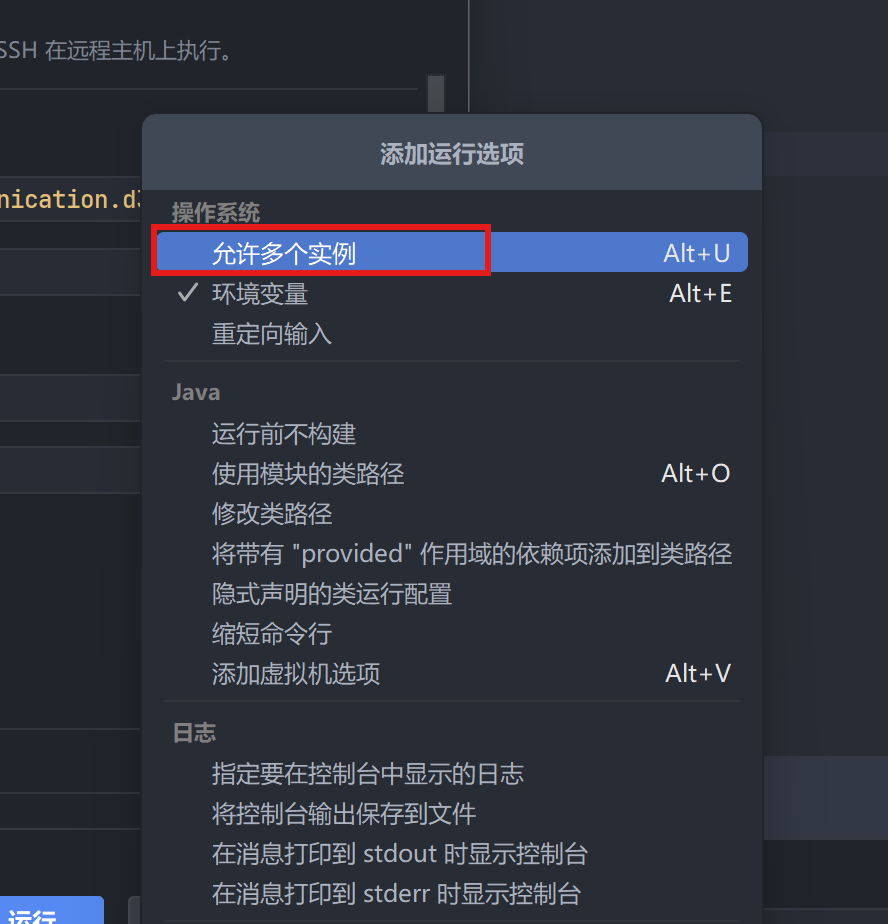

#### 代码演示

+ Client.java

```java
package Advanced.x_network_communication.d3_udp2;

import java.net.DatagramPacket;
import java.net.DatagramSocket;
import java.net.InetAddress;
import java.util.Scanner;

/**
 * 目标：完成UDP通信快速入门：实现1发1收
 */
public class Client {
    public static void main(String[] args) throws Exception {
        // 1. 创建客户端对象
        DatagramSocket socket = new DatagramSocket();

        // 2. 创建数据包对象封装要发出去的数据
        // 参数一：封装要发出去的数据
        // 参数二：发送出去的数据大小（字节个数）
        // 参数三：服务端的IP地址（找到服务端主机）
        // 参数四：服务端程序的端口
        Scanner sc = new Scanner(System.in);

        while (true) {
            System.out.println("请说：");
            String msg = sc.nextLine();

            // 一旦发现用户输入的是exit命令，就退出客户端
            if ("exit".equals(msg)) {
                System.out.println("欢迎下次光临！退出成功！");
                socket.close(); // 释放资源
                break; // 跳出死循环
            }

            byte[] bytes = msg.getBytes();
            DatagramPacket packet = new DatagramPacket(bytes, bytes.length, InetAddress.getLocalHost(), 6666);

            // 3. 开始正式发送这个数据包的数据出去了
            socket.send(packet);
        }
    }
}

```

+ Server.java

```java
package Advanced.x_network_communication.d3_udp2;

import java.net.DatagramPacket;
import java.net.DatagramSocket;

/**
 * 目标：完成UDP通信快速入门-服务端开发
 */
public class Server {
    public static void main(String[] args) throws Exception {
        System.out.println("---服务端启动---");
        // 1. 创建一个服务端对象 注册端口
        DatagramSocket socket = new DatagramSocket(6666);

        // 2. 创建一个数据包对象，用于接收数据的
        byte[] buffer = new byte[1024 * 64]; // 64KB
        DatagramPacket packet = new DatagramPacket(buffer, buffer.length);

        while (true) {
            // 3. 开始正式使用数据包来接收客户端发来的数据
            socket.receive(packet);

            // 4. 从字节数组中，把接收到的数据字节打印出来
            // 接收多少就倒出多少
            // 获取本次数据包接受了多少数据
            int len = packet.getLength();

            String rs = new String(buffer, 0, len);
            System.out.println(rs);

            System.out.println(packet.getAddress().getHostAddress());
            System.out.println(packet.getPort());
            System.out.println("--------------------------");
        }
    }
}

```


-----------------------------


### 4. TCP 通信 - 快速入门

#### 4.1 TCP 通信

+ **特点：面向连接、可靠通信**
+ 通信双方事先会采用 “三次握手” 方式建立可靠连接，实现端到端的通信；底层能保证数据成功传给服务端
+ Java 提供了一个 **java.net.Socket 类**来实现 TCP 通信

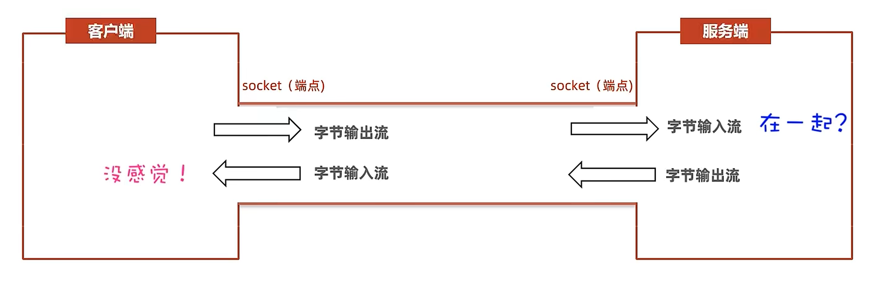

#### 4.2 TCP 通信之 - 客户端开发

+ 客户端程序就是通过 java.net 包下的 Socket 类来实现的

| 构造器                               | 说明                                                         |
| ------------------------------------ | ------------------------------------------------------------ |
| public Socket(String host, int port) | 根据指定的服务器 ip、端口号请求与服务端建立连接，连接通过，就获得了客户端的 socket |

| 方法                                  | 说明               |
| ------------------------------------- | ------------------ |
| public OutputStream getOutputStream() | 获得字节输出流对象 |
| public InputStream getInputStream     | 获得字节输入流对象 |

##### 客户端实现步骤

1. 创建客户端的 Socket 对象，请求与服务端的连接
2. 使用 socket 对象调用 getOutputStream() 方法得到字节输出流
3. 使用字节输出流完成数据的发送
4. 释放资源：关闭 socket 管道

#### 4.3 TCP 通信 - 服务端程序的开发

+ 服务端是通过 **java.net** 包下的 **ServerSocket** 类来实现的

##### ServerSocket

| 构造器                        | 说明                 |
| ----------------------------- | -------------------- |
| public ServerSocket(int port) | 位服务端程序注册端口 |

| 方法                   | 说明                                                         |
| ---------------------- | ------------------------------------------------------------ |
| public Socket accept() | 阻塞等待客户端的连接请求，一旦与某个客户端成功连接，则返回服务端这边的 Socket 对象 |

##### 服务端实现步骤

1. 创建 ServerSocket 对象，注册服务端端口
2. 调用 ServerSocket 对象的 accept() 方法，等待客户端的连接，并得到 Socket 管道对象
3. 通过 Socket 对象调用 getInputStream() 方法得到字节输入流、完成数据的接收
4. 释放资源：关闭 socket 管道

#### 代码演示

+ Client.java

```java
package Advanced.x_network_communication.d4_tcp1;

import java.io.DataOutputStream;
import java.io.OutputStream;
import java.net.Socket;

/**
 * 目标：完成TCP通信快速入门 - 客户端开发：实现1发1收
 */
public class Client {
    public static void main(String[] args) throws Exception {
        // 1. 创建Socket对象，并同时请求与服务端程序的连接
        Socket socket = new Socket("127.0.0.1", 8888);

        // 2. 从Socket通信管道中得到一个字节输出流，用来发数据给服务端程序
        OutputStream os = socket.getOutputStream();

        // 3. 把低级的字节输出流包装成数据输出流
        DataOutputStream dos = new DataOutputStream(os);

        // 4. 开始写数据出去了
        dos.writeUTF("在一起，好吗？");
        dos.close();

        socket.close(); // 释放连接资源
    }
}

```

+ Server.java

```java
package Advanced.x_network_communication.d4_tcp1;

import java.io.DataInputStream;
import java.io.InputStream;
import java.net.ServerSocket;
import java.net.Socket;

/**
 * 目标：完成TCP通信快速入门 - 服务端开发，实现1发1收
 */
public class Server {
    public static void main(String[] args) throws Exception {
        System.out.println("---服务端启动成功---");
        // 1. 创建ServerSocket的对象，同时为服务端注册端口
        ServerSocket serverSocket = new ServerSocket(8888);

        // 2. 使用serverSocket对象，调用一个accept方法，等待客户端的连接请求
        Socket socket = serverSocket.accept();

        // 3. 从socket通信管道中得到一个字节输入流
        InputStream is = socket.getInputStream();

        // 4. 把原始的字节输入流包装成数据输入流
        DataInputStream dis = new DataInputStream(is);

        // 5. 使用数据输入流读取客户端发送过来的消息
        String rs = dis.readUTF();
        System.out.println(rs);
        // 其实我们也可以获取客户端的IP地址
        System.out.println(socket.getRemoteSocketAddress());

        dis.close();
        socket.close();
    }
}

```


---------------------------------------


### 5. TCP 通信 - 多发多收

1. 客户端使用死循环，让用户不断输入消息
2. 服务端也使用是虚幻，控制服务端收完消息，继续等待接收下一个消息

#### 代码实现

+ Client.java

```java
package Advanced.x_network_communication.d5_tcp2;

import java.io.DataOutputStream;
import java.io.OutputStream;
import java.net.Socket;
import java.util.Scanner;

/**
 * 目标：完成TCP通信快速入门 - 客户端开发：实现1发1收
 */
public class Client {
    public static void main(String[] args) throws Exception {
        // 1. 创建Socket对象，并同时请求与服务端程序的连接
        Socket socket = new Socket("127.0.0.1", 8888);

        // 2. 从Socket通信管道中得到一个字节输出流，用来发数据给服务端程序
        OutputStream os = socket.getOutputStream();

        // 3. 把低级的字节输出流包装成数据输出流
        DataOutputStream dos = new DataOutputStream(os);

        Scanner sc = new Scanner(System.in);
        while (true) {
            System.out.println("请说：");
            String msg = sc.nextLine();

            // 一旦用户输入了exit，就退出客户端程序
            if ("exit".equals(msg)) {
                System.out.println("欢迎您下次光临！退出成功");
                dos.close();
                socket.close();
                break;
            }

            // 4. 开始写数据出去了
            dos.writeUTF(msg);
            dos.flush(); // 刷新
        }
    }
}

```

+ Server.java

```java
package Advanced.x_network_communication.d5_tcp2;

import java.io.DataInputStream;
import java.io.IOException;
import java.io.InputStream;
import java.net.ServerSocket;
import java.net.Socket;

/**
 * 目标：完成TCP通信快速入门 - 服务端开发，实现1发1收
 */
public class Server {
    public static void main(String[] args) throws Exception {
        System.out.println("---服务端启动成功---");
        // 1. 创建ServerSocket的对象，同时为服务端注册端口
        ServerSocket serverSocket = new ServerSocket(8888);

        // 2. 使用serverSocket对象，调用一个accept方法，等待客户端的连接请求
        Socket socket = serverSocket.accept();

        // 3. 从socket通信管道中得到一个字节输入流
        InputStream is = socket.getInputStream();

        // 4. 把原始的字节输入流包装成数据输入流
        DataInputStream dis = new DataInputStream(is);

        while (true) {
            try {
                // 5. 使用数据输入流读取客户端发送过来的消息
                String rs = dis.readUTF();
                System.out.println(rs);
            } catch (IOException e) {
                System.out.println(socket.getRemoteSocketAddress() + "离线了！");
                dis.close();
                socket.close();
                break;
            }
        }
    }
}

```


-------------------------------------


### 6. TCP 通信 - 同时接收多个客户端

目前我们开发的服务端程序，是否可以支持与多个客户端同时通信？

+ 不可以的
+ 因为服务端现在只有一个主线程，只能处理一个客户端的消息

#### 6.1 TCP 通信 - 支持与多个客户端同时通信

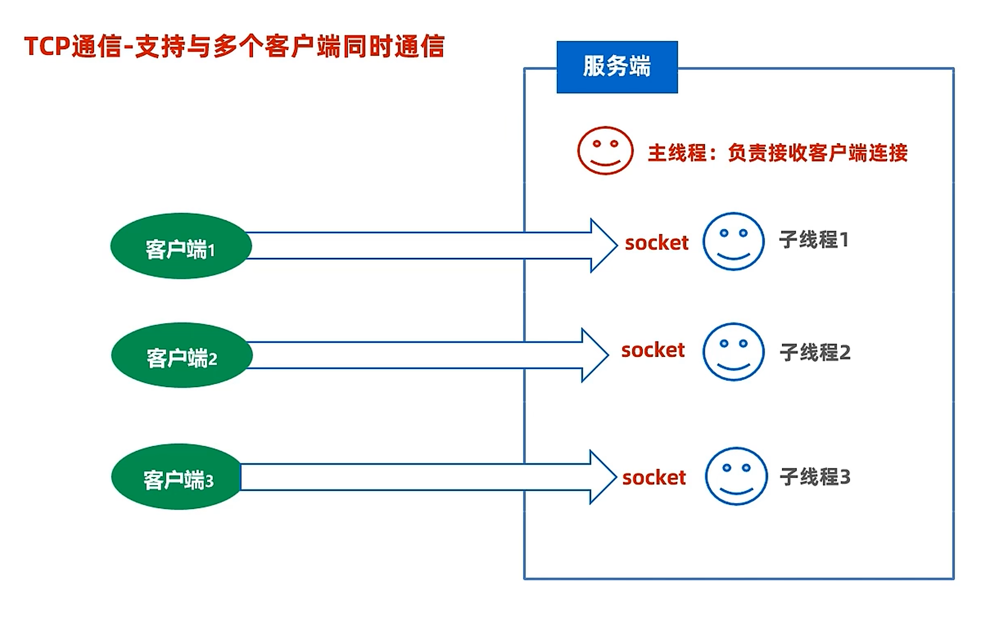

#### 代码实现

+ Client.java

```java
package Advanced.x_network_communication.d6_tcp3;

import java.io.DataOutputStream;
import java.io.OutputStream;
import java.net.Socket;
import java.util.Scanner;

/**
 * 目标：完成TCP通信快速入门 - 客户端开发：实现1发1收
 */
public class Client {
    public static void main(String[] args) throws Exception {
        // 1. 创建Socket对象，并同时请求与服务端程序的连接
        Socket socket = new Socket("127.0.0.1", 8888);

        // 2. 从Socket通信管道中得到一个字节输出流，用来发数据给服务端程序
        OutputStream os = socket.getOutputStream();

        // 3. 把低级的字节输出流包装成数据输出流
        DataOutputStream dos = new DataOutputStream(os);

        Scanner sc = new Scanner(System.in);
        while (true) {
            System.out.println("请说：");
            String msg = sc.nextLine();

            // 一旦用户输入了exit，就退出客户端程序
            if ("exit".equals(msg)) {
                System.out.println("欢迎您下次光临！退出成功");
                dos.close();
                socket.close();
                break;
            }

            // 4. 开始写数据出去了
            dos.writeUTF(msg);
            dos.flush(); // 刷新
        }
    }
}

```

+ Server.java

```java
package Advanced.x_network_communication.d6_tcp3;

import java.net.ServerSocket;
import java.net.Socket;

/**
 * 目标：完成TCP通信快速入门 - 服务端开发，实现1发1收
 */
public class Server {
    public static void main(String[] args) throws Exception {
        System.out.println("---服务端启动成功---");
        // 1. 创建ServerSocket的对象，同时为服务端注册端口
        ServerSocket serverSocket = new ServerSocket(8888);

        while (true) {
            // 2. 使用serverSocket对象，调用一个accept方法，等待客户端的连接请求
            Socket socket = serverSocket.accept();

            System.out.println("有人上线了：" + socket.getRemoteSocketAddress());

            // 3. 把这个客户端对应的socket通信管道，交给一个独立的线程负责处理
            new ServerReaderThread(socket).start();
        }
    }
}

```

+ ServerReaderThread.java

```java
package Advanced.x_network_communication.d6_tcp3;

import java.io.DataInputStream;
import java.io.InputStream;
import java.net.Socket;

public class ServerReaderThread extends Thread {
    private Socket socket;

    public ServerReaderThread(Socket socket) {
        this.socket = socket;
    }

    @Override
    public void run() {
        try {
            InputStream is = socket.getInputStream();
            DataInputStream dis = new DataInputStream(is);
            while (true) {
                try {
                    String msg = dis.readUTF();
                    System.out.println(msg);
                } catch (Exception e) {
                    System.out.println("有人下线了：" + socket.getRemoteSocketAddress());
                    dis.close();
                    socket.close();
                    break;
                }
            }
        } catch (Exception e) {
            e.printStackTrace();
        }
    }
}

```


-----------------------------


### 7. TCP 通信 - 综合案例

#### 7.1 即时通信 - 群聊

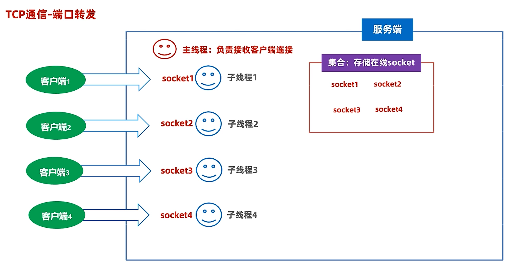

##### 代码实现

+ Client.java

```java
package Advanced.x_network_communication.d7_tcp7;

import java.io.DataOutputStream;
import java.io.OutputStream;
import java.net.Socket;
import java.util.Scanner;

/**
 * 目标：完成TCP通信快速入门 - 客户端开发：实现1发1收
 */
public class Client {
    public static void main(String[] args) throws Exception {
        // 1. 创建Socket对象，并同时请求与服务端程序的连接
        Socket socket = new Socket("127.0.0.1", 8888);

        // 创建一个独立的线程，负责随时从socket中接收服务端发送过来的消息
        new ClientReaderThread(socket).start();

        // 2. 从Socket通信管道中得到一个字节输出流，用来发数据给服务端程序
        OutputStream os = socket.getOutputStream();

        // 3. 把低级的字节输出流包装成数据输出流
        DataOutputStream dos = new DataOutputStream(os);

        Scanner sc = new Scanner(System.in);
        while (true) {
            System.out.println("请说：");
            String msg = sc.nextLine();

            // 一旦用户输入了exit，就退出客户端程序
            if ("exit".equals(msg)) {
                System.out.println("欢迎您下次光临！退出成功");
                dos.close();
                socket.close();
                break;
            }

            // 4. 开始写数据出去了
            dos.writeUTF(msg);
            dos.flush(); // 刷新
        }
    }
}

```

+ ClientReaderThread.java

```java
package Advanced.x_network_communication.d7_tcp7;

import java.io.DataInputStream;
import java.io.InputStream;
import java.net.Socket;

public class ClientReaderThread extends Thread {

    private Socket socket;

    public ClientReaderThread(Socket socket) {
        this.socket = socket;
    }


    @Override
    public void run() {
        try {
            InputStream is = socket.getInputStream();
            DataInputStream dis = new DataInputStream(is);
            while (true) {
                try {
                    String msg = dis.readUTF();
                    System.out.println(msg);
                } catch (Exception e) {
                    System.out.println("自己下线了：" + socket.getRemoteSocketAddress());
                    dis.close();
                    socket.close();
                    break;
                }
            }
        } catch (Exception e) {
            e.printStackTrace();
        }
    }
}

```

+ Server.java

```java
package Advanced.x_network_communication.d7_tcp7;

import java.net.ServerSocket;
import java.net.Socket;
import java.util.ArrayList;
import java.util.List;

/**
 * 目标：完成TCP通信快速入门 - 服务端开发，实现1发1收
 */
public class Server {
    public static List<Socket> onLineSockets = new ArrayList<>();

    public static void main(String[] args) throws Exception {
        System.out.println("---服务端启动成功---");
        // 1. 创建ServerSocket的对象，同时为服务端注册端口
        ServerSocket serverSocket = new ServerSocket(8888);

        while (true) {
            // 2. 使用serverSocket对象，调用一个accept方法，等待客户端的连接请求
            Socket socket = serverSocket.accept();
            onLineSockets.add(socket);

            System.out.println("有人上线了：" + socket.getRemoteSocketAddress());

            // 3. 把这个客户端对应的socket通信管道，交给一个独立的线程负责处理
            new ServerReaderThread(socket).start();
        }
    }
}

```

+ ServerReaderThread.java

```java
package Advanced.x_network_communication.d7_tcp7;

import java.io.DataInputStream;
import java.io.DataOutputStream;
import java.io.InputStream;
import java.io.OutputStream;
import java.net.Socket;

public class ServerReaderThread extends Thread {
    private Socket socket;

    public ServerReaderThread(Socket socket) {
        this.socket = socket;
    }

    @Override
    public void run() {
        try {
            InputStream is = socket.getInputStream();
            DataInputStream dis = new DataInputStream(is);
            while (true) {
                try {
                    String msg = dis.readUTF();
                    System.out.println(msg);
                    // 把这个消息分发给全部客户端进行接收
                    sendMsgToAll(msg);
                } catch (Exception e) {
                    System.out.println("有人下线了：" + socket.getRemoteSocketAddress());
                    Server.onLineSockets.remove(socket);
                    dis.close();
                    socket.close();
                    break;
                }
            }
        } catch (Exception e) {
            e.printStackTrace();
        }
    }

    private void sendMsgToAll(String msg) throws Exception {
        // 发送给全部在线的socket管道接收
        for (Socket onLineSocket : Server.onLineSockets) {
            OutputStream os = onLineSocket.getOutputStream();
            DataOutputStream dos = new DataOutputStream(os);
            dos.writeUTF(msg);
            dos.flush();
        }
    }
}

```


--------------------------


#### 7.2 实现一个简易版的 BS 架构

> 需求：
>
> 要求从浏览器中访问服务器，并立即让服务器相应一个很简单的页面给浏览器展示，网页内容是 “feng666”

##### 7.2.1 BS 架构的基本原理

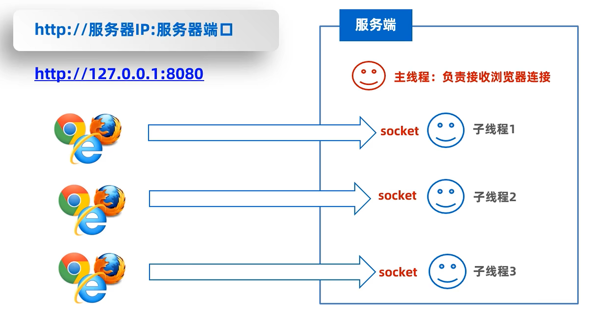

**注意：服务器必须给浏览器响应 HTTP 协议规定的数据格式，否则浏览器不识别返回的数据**

+ HTTP 协议规定：响应给浏览器的数据格式必须满足如下格式

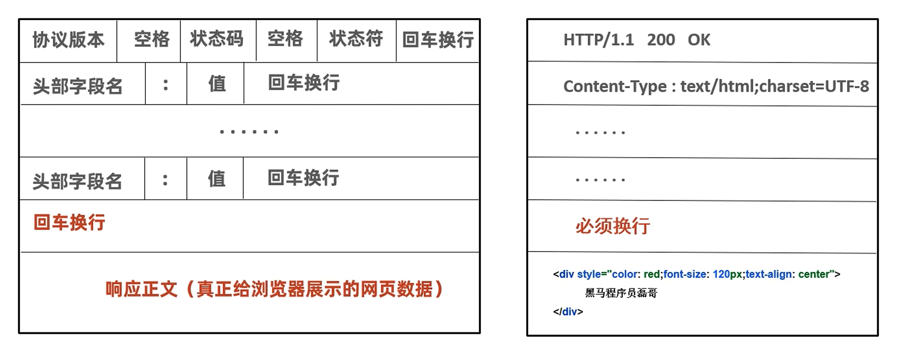

##### 代码实现

+ ServerReaderThread.java

```java
package Advanced.x_network_communication.d8_tcp5;

import java.io.OutputStream;
import java.io.PrintStream;
import java.net.Socket;

public class ServerReaderThread extends Thread {
    private Socket socket;

    public ServerReaderThread(Socket socket) {
        this.socket = socket;
    }

    @Override
    public void run() {
        // 立即响应一个网页内容：“feng666” 给浏览器展示
        try {
            OutputStream os = socket.getOutputStream();
            PrintStream ps = new PrintStream(os);
            ps.println("HTTP/1.1 200 OK");
            ps.println("Content-Type:text/html;charset=UTF-8");
            ps.println(); // 必须换行
            ps.println("<div style='color:red;fontt-size:120px;text-align:center'>feng666</div>");
            ps.close();

            socket.close();
        } catch (Exception e) {
            e.printStackTrace();
        }
    }
}

```

+ Server.java

```java
package Advanced.x_network_communication.d8_tcp5;

import java.net.ServerSocket;
import java.net.Socket;

/**
 * 目标：完成BS架构案例
 */
public class Server {
    public static void main(String[] args) throws Exception {
        System.out.println("---服务端启动成功---");
        // 1. 创建ServerSocket的对象，同时为服务端注册端口
        ServerSocket serverSocket = new ServerSocket(8080);

        while (true) {
            // 2. 使用serverSocket对象，调用一个accept方法，等待客户端的连接请求
            Socket socket = serverSocket.accept();

            System.out.println("有人上线了：" + socket.getRemoteSocketAddress());

            // 3. 把这个客户端对应的socket通信管道，交给一个独立的线程负责处理
            new ServerReaderThread(socket).start();
        }

    }
}

```

##### 拓展知识

每次请求都开一个线程，在高并发时，容易宕机！

所以要使用线程池进行优化

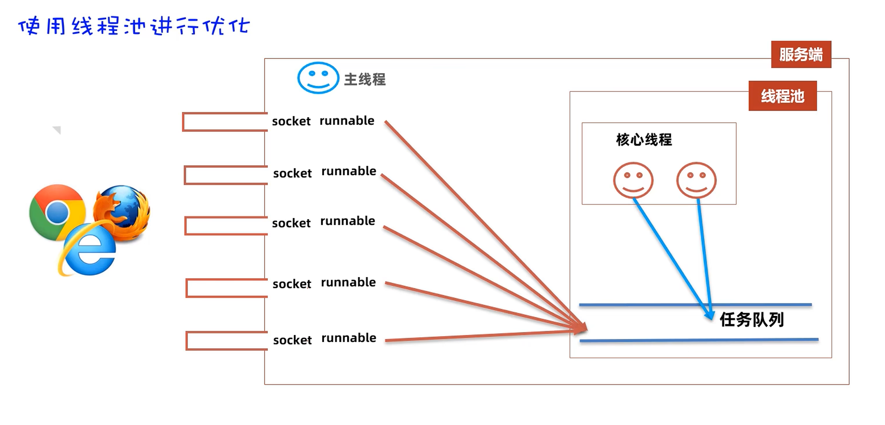

##### 代码实现

+ ServerReaderRunnable.java

```java
package Advanced.x_network_communication.d9_tcp6;

import java.io.OutputStream;
import java.io.PrintStream;
import java.net.Socket;

public class ServerReaderRunnable implements Runnable {
    private Socket socket;

    public ServerReaderRunnable(Socket socket) {
        this.socket = socket;
    }

    @Override
    public void run() {
        // 立即响应一个网页内容：“feng666” 给浏览器展示
        try {
            OutputStream os = socket.getOutputStream();
            PrintStream ps = new PrintStream(os);
            ps.println("HTTP/1.1 200 OK");
            ps.println("Content-Type:text/html;charset=UTF-8");
            ps.println(); // 必须换行
            ps.println("<div style='color:red;fontt-size:120px;text-align:center'>feng666</div>");
            ps.close();

            socket.close();
        } catch (Exception e) {
            e.printStackTrace();
        }
    }
}

```

+ Server.java

```java
package Advanced.x_network_communication.d9_tcp6;

import java.net.ServerSocket;
import java.net.Socket;
import java.util.concurrent.ArrayBlockingQueue;
import java.util.concurrent.Executors;
import java.util.concurrent.ThreadPoolExecutor;
import java.util.concurrent.TimeUnit;

/**
 * 目标：完成BS架构案例
 */
public class Server {
    public static void main(String[] args) throws Exception {
        System.out.println("---服务端启动成功---");
        // 1. 创建ServerSocket的对象，同时为服务端注册端口
        ServerSocket serverSocket = new ServerSocket(8080);

        // 创建出一个线程池，负责处理通信管道的任务
        ThreadPoolExecutor pool = new ThreadPoolExecutor(16 * 2, 16 * 2, 0, TimeUnit.SECONDS, new ArrayBlockingQueue<>(8), Executors.defaultThreadFactory(), new ThreadPoolExecutor.AbortPolicy());

        while (true) {
            // 2. 使用serverSocket对象，调用一个accept方法，等待客户端的连接请求
            Socket socket = serverSocket.accept();

            System.out.println("有人上线了：" + socket.getRemoteSocketAddress());

            // 3. 把这个客户端对应的socket通信管道，交给一个独立的线程负责处理
            pool.execute(new ServerReaderRunnable(socket));
        }
    }
}

```


--------------------


## 九、Java 高级技术

### 1. 单元测试


#### 1.1 概述、Junit 框架快速入门

+ 就是针对最小的功能单元（方法），编写测试代码对其进行正确性测试

我们之前是如何进行单元测试的？有啥问题？

+ 只能在 main 方法编写测试代码，去调用其他方法进行测试
+ 无法实现自动化测试，一个方法测试失败，可能影响其他方法的测试
+ 无法得到测试的报告，需要程序员自己去观察测试是否成功

##### 1.1.1 Junit 单元测试框架

+ 可以用来对方法进行测试，它是第三方公司开源出来的（很多开发工具已经集成了 Junit 框架，比如 IDEA）

###### 优点

+ 可以灵活的编写测试代码，可以针对某个方法执行测试，也支持一键完成对全部方法的自动化测试，且各自独立
+ 不需要程序员去分析测试的结果，会自动生成测试报告出来

###### 具体步骤

1. 将 Junit 框架的 jar 包导入到项目中（注意：IDEA 集成了 Junit 框架，不需要我们自己手动导入了）
2. 为需要测试的业务类，定义对应的测试类，并为每个业务方法，编写对应的测试方法（必须：公共、无参、无返回值）
3. **测试方法上必须声明 @Test 注解**，然后在测试方法中，编写代码调用被测试的业务方法进行测试
4. **开始测试**：选中测试方法，右键选择 “Junit运行” ，如果测试通过则是绿色；如果测试失败，则是红色

##### 代码演示

+ StringUtil.java

```java
package Advanced.y_java_high.d1_junit;

/**
 * 字符串工具类
 */
public class StringUtil {
    public static void printNumber(String name) {
        if (name == null) {
            System.out.println(0);
            return; // 停掉方法
        }
        System.out.println("名字的长度是：" + name.length());
    }

    /**
     * 求字符串的最大索引
     */
    public static int getMaxIndex(String data) {
        if (data == null) {
            return -1;
        }
        return data.length() - 1;
    }
}
```

+ StringUtilTest.java

```java
package Advanced.y_java_high.d1_junit;

import org.junit.Assert;
import org.junit.Test;

/**
 * 测试类
 */
public class StringUtilTest {
    @Test
    public void testPrintNumber() {
        StringUtil.printNumber("admin");
        StringUtil.printNumber(null);
    }

    @Test
    public void testGetMaxIndex() {
        int index1 = StringUtil.getMaxIndex(null);
        System.out.println(index1);

        int index2 = StringUtil.getMaxIndex("admin");
        System.out.println(index2);

        // 断言机制：程序员可以通过预测业务方法的结果
        Assert.assertEquals("方法内部有bug！", 4, index2);
    }
}

```


-------------------------------


#### 1.2 Junit 框架快速入门

##### 1.2.1 Junit 单元测试框架的常见注解（Junit 4.xxxx 版本）

| 注解         | 说明                                                         |
| ------------ | ------------------------------------------------------------ |
| @Test        | 测试类中的方法必须有它修饰才能成为测试方法，才能启动执行     |
| @Before      | 用来修饰一个实例方法，该方法会在每一个测试方法执行之前执行一次 |
| @After       | 用来修饰一个实例方法，该方法会在每一个测试方法执行之后执行一次 |
| @BeforeClass | 用来修饰一个静态方法，该方法会在所有测试方法之前只执行一次   |
| @AfterClass  | 用来修饰一个静态方法，该方法会在所有测试方法之后只执行一次   |

+ 在测试方法执行前执行的方法，常用于：初始化资源
+ 在测试方法执行完后再执行的方法，常用于：释放资源

##### 1.2.1 Junit 单元测试框架的常见注解（Junit 4.xxxx 版本）

| 注解        | 说明                                                         |
| ----------- | ------------------------------------------------------------ |
| @Test       | 测试类中的方法必须有它修饰才能成为测试方法，才能启动执行     |
| @BeforeEach | 用来修饰一个实例方法，该方法会在每一个测试方法执行之前执行一次 |
| @AfterEach  | 用来修饰一个实例方法，该方法会在每一个测试方法执行之后执行一次 |
| @BeforeAll  | 用来修饰一个静态方法，该方法会在所有测试方法之前只执行一次   |
| @AfterAll   | 用来修饰一个静态方法，该方法会在所有测试方法之后只执行一次   |


##### 代码演示

```java
package Advanced.y_java_high.d1_junit;

import org.junit.*;

import java.net.Socket;

/**
 * 测试类
 */
public class StringUtilTest {
    private Socket socket;

    @Before
    public void test1() {
        System.out.println("---> test1 Before 执行了----------------");
        socket = new Socket(); // 连接
    }

    @BeforeClass
    public static void test11() {
        System.out.println("---> test11 BeforeClass 执行了----------------");
    }

    @After
    public void test2() {
        System.out.println("---> test2 After 执行了----------------");
        socket.close();
    }

    @AfterClass
    public static void test22() {
        System.out.println("---> test22 AfterClass 执行了----------------");
    }

    @Test
    public void testPrintNumber() {
        StringUtil.printNumber("admin");
        StringUtil.printNumber(null);
    }

    @Test
    public void testGetMaxIndex() {
        int index1 = StringUtil.getMaxIndex(null);
        System.out.println(index1);

        int index2 = StringUtil.getMaxIndex("admin");
        System.out.println(index2);

        // 断言机制：程序员可以通过预测业务方法的结果
        Assert.assertEquals("方法内部有bug！", 4, index2);
    }
}

```


--------------------------------


### 2. 反射

#### 2.1 认识反射、获取类

反射（Reflection）

+ 反射就是：加载类，并允许以编程的方式解剖类中的各种成分（成员变量、方法、构造器等）

1. 反射第一步：加载类，获取类的字节码：Class 对象
2. 获取类的构造器：Constructor 对象
3. 获取类的成员变量：Field 对象
4. 获取类的成员方法：Method 对象

##### 2.1.1 获取类


获取 Class 对象的三种方式

+ `Class c1 = 类名.class`
+ 调用 Class 提供方法：`public static Class forName(String package);`
+ Object 提供的方法：
  + `public Class getClass();`
  + `Class c3 = 对象.getClass();`

###### 代码演示

```java
package Advanced.y_java_high.d2_reflect;

/**
 * 目标：获取Class对象
 */
public class Test1Class {
    public static void main(String[] args) throws Exception {
        Class c1 = Student.class;
        System.out.println(c1.getName()); // Advanced.y_java_high.d2_reflect.Student（全类名）
        System.out.println(c1.getSimpleName()); // Student（简名）

        Class c2 = Class.forName("Advanced.y_java_high.d2_reflect.Student");
        System.out.println(c1 == c2); // true

        Student s = new Student();
        Class c3 = s.getClass();
        System.out.println(c3 == c2); // true
    }
}

```


-----------------------


#### 2.2 获取类的构造器

+ Class 提供了从类中获取构造器的方法

| 方法                                                         | 说明                                       |
| ------------------------------------------------------------ | ------------------------------------------ |
| Constructor<?>[] getConstructors()                           | 获取全部构造器（只能获取 public 修饰的）   |
| Constructor<?>[] getDeclaredConstructors()                   | 获取全部构造器（只要存在就能拿到）【推荐】 |
| Constructor<T> getConstructor(Class<?>... parameterTypes)    | 获取某个构造器（只能获取 public 修饰的）   |
| Constructor<T> getDeclaredConstructor(Class<?>... parameterTypes) | 获取某个构造器（只要存在就能拿到）【推荐】 |

获取类构造器的作用：**依然是初始化对象返回**

| Constructor 提供的方法                  | 说明                                                         |
| --------------------------------------- | ------------------------------------------------------------ |
| T newInstance(Object... initargs)       | 调用此构造器对象表示的构造器，并传入参数，完成对象的初始化并返回 |
| public void setAccessible(boolean flag) | 设置为 true，表示禁止检查访问控制（暴力反射）                |

##### 代码演示

+ Cat.java

```java
package Advanced.y_java_high.d2_reflect;

public class Cat {
    private String name;
    private int age;

    private Cat() {
        System.out.println("无参数构造器执行了");
    }

    public Cat(String name, int age) {
        this.name = name;
        this.age = age;
    }

    public String getName() {
        return name;
    }

    public void setName(String name) {
        this.name = name;
    }

    public int getAge() {
        return age;
    }

    public void setAge(int age) {
        this.age = age;
    }

    @Override
    public String toString() {
        return "Cat{" +
                "name='" + name + '\'' +
                ", age=" + age +
                '}';
    }
}

```

+ Test2Constructor.java

```java
package Advanced.y_java_high.d2_reflect;

import org.junit.Test;

import java.lang.reflect.Constructor;

/**
 * 目标：掌握获取类的构造器，并对其进行操作
 */
public class Test2Constructor {
    @Test
    public void testGetConstructors() {
        // 1. 反射第一步：必须先得到这个类的Class对象
        Class c = Cat.class;
        // 2. 获取类的全部构造器
        Constructor[] constructors = c.getDeclaredConstructors();
        // 3. 遍历数组中的每个构造器对象
        for (Constructor constructor : constructors) {
            System.out.println(constructor.getName() + "--->" + constructor.getParameterCount());
        }
    }

    @Test
    public void testGetConstructor() throws Exception {
        // 1. 反射第一步：必须先得到这个类的Class对象
        Class c = Cat.class;
        // 2. 获取某个构造器：无参构造器
//        Constructor constructor = c.getConstructor();
        Constructor constructor1 = c.getDeclaredConstructor();
        System.out.println(constructor1.getName() + "--->" + constructor1.getParameterCount());
        constructor1.setAccessible(true); // 禁止检查访问权限
        Cat cat = (Cat) constructor1.newInstance();
        System.out.println(cat);

        // 3. 获取有参数构造器
        Constructor constructor2 = c.getDeclaredConstructor(String.class, int.class);
        System.out.println(constructor2.getName() + "--->" + constructor2.getParameterCount());
        constructor1.setAccessible(true); // 禁止检查访问权限
        Cat cat2 = (Cat) constructor2.newInstance("叮当猫", 3);
        System.out.println(cat2);
    }
}

```


---------------------------


#### 2.3 获取类的成员变量

+ Class 提供了从类中获取成员变量的方法

| 方法                                       | 说明                                           |
| ------------------------------------------ | ---------------------------------------------- |
| public Field[] getFields()                 | 获取类的全部成员变量（只能获取 public 修饰的） |
| public Field[] getDeclaredFields()         | 获取类的全部成员变量（只要存在就能拿到）       |
| public Field getField(String name)         | 获取类的某个成员变量（只能获取 public 修饰的） |
| public Field getDeclaredField(String name) | 获取类的某个成员变量（只要存在就能拿到）       |

获取到成员变量的作用：**依然是赋值、取值**

| 方法                                    | 说明                                          |
| --------------------------------------- | --------------------------------------------- |
| void set(Object obj, Object value)      | 赋值                                          |
| Object get(Object obj)                  | 取值                                          |
| public void setAccessible(boolean flag) | 设置为 true，表示禁止检查访问控制（暴力反射） |

##### 代码演示

```java
package Advanced.y_java_high.d2_reflect;

import org.junit.Test;

import java.lang.reflect.Field;

/**
 * 目标：掌握获取类的成员变量，并对其进行操作
 */
public class Test3Field {
    @Test
    public void testGetFields() throws Exception {
        // 1. 反射第一步：必须是先得到类的Class对象
        Class c = Cat.class;
        // 2. 获取类的全部成员变量
        Field[] fields = c.getDeclaredFields();
        // 3. 遍历这个成员变量数组
        for (Field field : fields) {
            System.out.println(field.getName() + " ---> " + field.getType());
        }

        // 4. 定位某个成员变量
        Field fName = c.getDeclaredField("name");
        System.out.println(fName.getName() + " ---> " + fName.getType());

        Field fAge = c.getDeclaredField("age");
        System.out.println(fAge.getName() + " ---> " + fAge.getType());

        // 赋值
        Cat cat = new Cat();
        fName.setAccessible(true); // 禁止访问控制权限
        fName.set(cat, "加菲猫");
        System.out.println(cat);

        // 取值
        String name = (String) fName.get(cat);
        System.out.println(name);
    }
}

```


---------------------------------


#### 2.4 获取类的成员方法

+ Class 提供了从类中获取成员方法的 API

| 方法                                                         | 说明                                           |
| ------------------------------------------------------------ | ---------------------------------------------- |
| Method[] getMethods()                                        | 获取类的全部成员方法（只能获取 public 修饰的） |
| Method[] getDeclaredMethods()                                | 获取类的全部成员方法（只要存在就能拿到）       |
| Method getMethod(String name, Class<?>... parameterTypes)    | 获取类的某个成员方法（只能获取 public 修饰的） |
| Method getDeclaredMethod(String name, Class<?>... parameterTypes) | 获取类的某个成员方法（只要存在就能拿到）       |

成员方法的作用：**依然是执行**

| Method 提供的方法                                | 说明                                          |
| ------------------------------------------------ | --------------------------------------------- |
| public Object invoke(Object obj, Object... args) | 触发某个对象的该方法执行                      |
| public void setAccessible(boolean flag)          | 设置为 true，表示禁止检查访问控制（暴力反射） |

##### 代码演示

```java
package Advanced.y_java_high.d2_reflect;

import org.junit.Test;

import java.lang.reflect.Method;

/**
 * 目标：掌握获取类的成员方法，并对其进行操作
 */
public class Test3Method {
    @Test
    public void testGetMethods() throws Exception {
        // 1. 反射第一步：先得到Class对象
        Class c = Cat.class;

        // 2. 获取类的全部成员方法
        Method[] methods = c.getDeclaredMethods();

        // 3. 遍历这个数组中的每个方法对象
        for (Method method : methods) {
            System.out.println(method.getName() + " ---> " + method.getParameterCount() + " ---> " + method.getReturnType());
        }

        // 4. 获取某个方法对象
        Method run = c.getDeclaredMethod("run");// 拿run方法，无参数的
        System.out.println(run.getName() + " ---> " + run.getParameterCount() + " ---> " + run.getReturnType());

        Method eat = c.getDeclaredMethod("eat", String.class);
        System.out.println(eat.getName() + " ---> " + eat.getParameterCount() + " ---> " + eat.getReturnType());

        Cat cat = new Cat();
        run.setAccessible(true); // 禁止检查访问权限
        Object rs = run.invoke(cat);// 调用无参数的run方法，用cat对象触发调用的
        System.out.println(rs);

        eat.setAccessible(true); // 禁止检查访问权限
        String rs2 = (String) eat.invoke(cat, "鱼儿");
        System.out.println(rs2);
    }
}

```


---------------------------------------


#### 2.5 作用、应用场景

##### 2.5.1 反射的作用

+ 基本作用：可以得到一个类的全部成分然后操作
+ 可以破坏封装性
+ **最重要的用途是：适合做 Java 的框架，基本上，主流的框架都会基于反射设计出一些通用的功能**

 ##### 2.5.2 应用场景

> 使用反射做一个简易版的框架
>
> 需求：
>
> + 对于任意一个对象，该框架都可以把对象的字段名和对应的值，保存到文件中去
>
> 实现步骤
>
> 1. 定义一个方法，可以接收任意对象
> 2. 每收到一个对象后，使用反射获取该对象的 Class 对象，然后获取全部的成员变量
> 3. 遍历成员变量，然后提取成员变量在该对象中的具体值
> 4. 把成员变量名、和其值，写出到文件中去即可

###### 代码实现

+ Student.java

```java
package Advanced.y_java_high.d2_reflect;

public class Student {
    private String name;
    private int age;
    private char sex;
    private double height;
    private String hobby;

    public Student() {
    }

    public Student(String name, int age, char sex, double height, String hobby) {
        this.name = name;
        this.age = age;
        this.sex = sex;
        this.height = height;
        this.hobby = hobby;
    }

    public String getName() {
        return name;
    }

    public void setName(String name) {
        this.name = name;
    }

    public int getAge() {
        return age;
    }

    public void setAge(int age) {
        this.age = age;
    }

    public char getSex() {
        return sex;
    }

    public void setSex(char sex) {
        this.sex = sex;
    }

    public double getHeight() {
        return height;
    }

    public void setHeight(double height) {
        this.height = height;
    }

    public String getHobby() {
        return hobby;
    }

    public void setHobby(String hobby) {
        this.hobby = hobby;
    }
}

```

+ Teacher.java

```java
package Advanced.y_java_high.d2_reflect;

public class Teacher {
    private String name;
    private double salary;

    public Teacher() {
    }

    public Teacher(String name, double salary) {
        this.name = name;
        this.salary = salary;
    }

    public String getName() {
        return name;
    }

    public void setName(String name) {
        this.name = name;
    }

    public double getSalary() {
        return salary;
    }

    public void setSalary(double salary) {
        this.salary = salary;
    }
}

```

+ ObjectFrame.java

```java
package Advanced.y_java_high.d2_reflect;

import java.io.FileOutputStream;
import java.io.PrintStream;
import java.lang.reflect.Field;

public class ObjectFrame {
    // 目标：保存任意对象的字段和其数据到文件中去
    public static void saveObject(Object obj) throws Exception {
        PrintStream ps = new PrintStream(new FileOutputStream("src\\Advanced\\y_java_high\\d2_reflect\\data.txt", true));
        // obj是任意对象，到底有多少个字段要保存
        Class c = obj.getClass();
        String cName = c.getSimpleName();
        ps.println("-----------------" + cName + "------------------");
        // 2. 从这个类中提取它的全部成员变量
        Field[] fields = c.getDeclaredFields();
        // 3. 遍历每个成员变量
        for (Field field : fields) {
            // 4. 拿到成员变量的名字
            String name = field.getName();
            // 5. 拿到这个成员变量在对象中的数据
            field.setAccessible(true); // 禁止检查访问控制
            String value = field.get(obj) + ""; // 当你将任何类型的对象与字符串进行连接时，Java会自动调用该对象的 toString() 方法来获取其字符串表示
            ps.println(name + "=" + value);
        }
        ps.close();
    }
}

```

+ Test5Frame.java

```java
package Advanced.y_java_high.d2_reflect;

import org.junit.Test;

/**
 * 目标：使用反射技术，设计一个保存对象的简易版框架
 */
public class Test5Frame {
    @Test
    public void save() throws Exception {
        Student s1 = new Student("吴彦祖", 45, '男', 185.3, "");
        Teacher t1 = new Teacher("波妞", 999.9);

        // 需求：把任意对象的字段名和其对应的值等信息，保存到文件中去
        ObjectFrame.saveObject(s1);
        ObjectFrame.saveObject(t1);
    }
}

```


-----------------------------------------


### 3. 注解

#### 3.1 概述、自定义注解

##### 3.1.1 注解（Annotation）

+ 就是 Java 代码里的特殊标记，比如：@Override、@Test 等，作用是：让其他程序根据注解信息来决定怎么执行该程序
+ 注意：注解可以用在类上、构造器上、方法上、成员变量上、参数上等位置处

##### 3.1.2 自定义注解

+ 就是自己定义注解

```java
public @interface 注解名称 {
    public 属性类型 属性名() default 默认值;
}
```

###### 特殊属性名：value

+ 如果注解中只有一个 value 属性，使用注解时，value 名称可以不写

###### 注解的原理

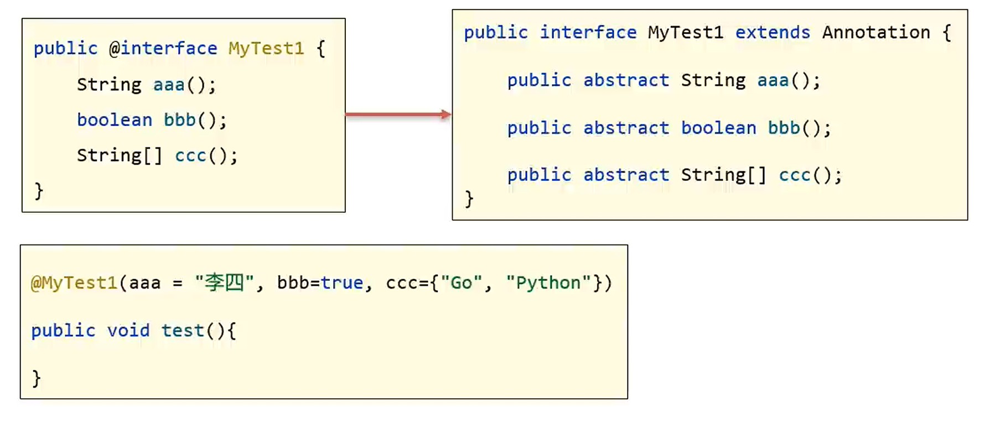

+ 注解本质是一个接口，Java 中所有注解都是继承了 Annotation 接口的
+ @注解(...)：其实就是一个实现类对象，实现了该注解以及 Annotation 接口

##### 代码演示

+ MyTest1.java

```java
package Advanced.y_java_high.d3_annotation;

/**
 * 自定义注解
 */
public @interface MyTest1 {
    String aaa();

    boolean bbb() default true;

    String[] ccc();
}

```

+ MyTest2.java

```java
package Advanced.y_java_high.d3_annotation;

public @interface MyTest2 {
    String value(); // 特殊属性
}

```

+ AnnotationTest1.java

```java
package Advanced.y_java_high.d3_annotation;

@MyTest1(aaa = "牛魔王", ccc = {"HTML", "Java"})
//@MyTest2(value = "孙悟空")
@MyTest2("孙悟空")
public class AnnotationTest1 {
    @MyTest1(aaa = "铁扇公主", bbb = false, ccc = {"Python", "前端", "Java"})
    public void test1() {
    }

    public static void main(String[] args) {

    }
}

```


-----------------------------------


#### 3.2 元注解

+ 指的是：修饰注解的注解

```java
@Retention(RetentionPolicy.RUNTIME)

@Target({ElementType.METHOD})

public @interface Test {
    
}
```

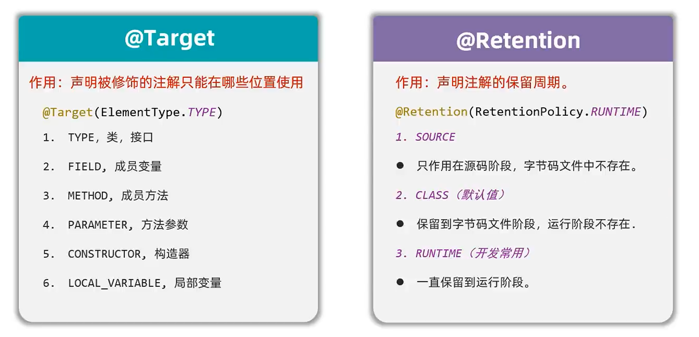

##### 代码演示

+ MyTest3.java

```java
package Advanced.y_java_high.d3_annotation;

import java.lang.annotation.ElementType;
import java.lang.annotation.Retention;
import java.lang.annotation.RetentionPolicy;
import java.lang.annotation.Target;

@Target({ElementType.TYPE, ElementType.METHOD}) // 当前被修饰的注解只能用在类上
@Retention(RetentionPolicy.RUNTIME) // 控制下面的注解一直保留到运行时
public @interface MyTest3 {
}

```

+ AnnotationTest2.java

```java
package Advanced.y_java_high.d3_annotation;

import org.junit.Test;

/**
 * 目标：认识元注解，搞清楚元注解的作用
 */
@MyTest3
public class AnnotationTest2 {
    //    @MyTest3 // 报错
    private String name;

    @MyTest3
    @Test
    public void test() {

    }
}

```


-------------------------


#### 3.3 注解的解析

##### 3.3.1 什么是注解的解析？

+ 就是判断类上、方法上、成员变量上是否存在注解，并把注解里的内容给解析出来

##### 3.3.2 如何解析注解？

+ 指导思想：要解析谁上面的注解，就应该先拿到谁
+ 比如要解析类上面的注解，则应该先获取该类的 Class 对象，再通过 Class 对象解析其上面的注解
+ 比如要解析成员方法上的注解，则应该获取到该成员方法的 Method 对象，再通过 Method 对象解析其上面的注解
+ Class、Method、Field、Constructor，都实现了 AnnotatedElement 接口，它们都拥有解析注解的能力

| AnnotatedElement 接口提供了解析注解的方法                    | 说明                           |
| ------------------------------------------------------------ | ------------------------------ |
| public Annotation[] getDeclaredAnnotations()                 | 获取当前对象上面的注解         |
| public T getDeclaredAnnotation(Class<T> annotationClass)     | 获取指定的注解对象             |
| public boolean isAnnotationPresent(Class<Annotation> annotationClass) | 判断当前对象上是否存在某个注解 |

> 需求：
>
> 1. 定义注解 MyTest4，要求如下：
>
> + 包含属性：String value()
> + 包含属性：double aaa()，默认值为100
> + 包含属性：String[] bbb()
> + 限制注解使用的位置：类和成员方法上
> + 指定注解的有效范围：一直到运行时
>
> 2. 定义一个类叫：Demo，在类中定义一个 test1 方法，并在该类和其方法上使用 MyTest4 注解
> 3. 定义 AnnotationTest3 测试类，解析 Demo 类中的全部注解

##### 代码实现

+ MyTest4.java

```java
package Advanced.y_java_high.d3_annotation;

import java.lang.annotation.ElementType;
import java.lang.annotation.Retention;
import java.lang.annotation.RetentionPolicy;
import java.lang.annotation.Target;

@Target({ElementType.TYPE, ElementType.METHOD})
@Retention(RetentionPolicy.RUNTIME)
public @interface MyTest4 {
    String value();

    double aaa() default 100;

    String[] bbb();
}

```

+ Demo.java

```java
package Advanced.y_java_high.d3_annotation;

@MyTest4(value = "蜘蛛精", aaa = 99.5, bbb = {"张三", "李四"})
public class Demo {
    @MyTest4(value = "孙悟空", aaa = 199.1, bbb = {"王五", "周六"})
    public void test1() {

    }
}

```

+ AnnotationTest3.java

```java
package Advanced.y_java_high.d3_annotation;

import org.junit.Test;

import java.lang.reflect.Method;
import java.util.Arrays;

/**
 * 目标：掌握注解的解析
 */
public class AnnotationTest3 {
    @Test
    public void parseClass() {
        // 1. 先得到Class对象
        Class c = Demo.class;
        // 2. 解析类上的注解
        // 判断类上是否包含了某个注解
        if (c.isAnnotationPresent(MyTest4.class)) {
            MyTest4 myTest4 = (MyTest4) c.getDeclaredAnnotation(MyTest4.class);
            System.out.println(myTest4.value());
            System.out.println(myTest4.aaa());
            System.out.println(Arrays.toString(myTest4.bbb()));
        }
    }

    @Test
    public void parseMethod() throws Exception {
        // 1. 先得到Class对象
        Class c = Demo.class;
        Method m = c.getDeclaredMethod("test1");
        // 2. 解析类上的注解
        // 判断类上是否包含了某个注解
        if (m.isAnnotationPresent(MyTest4.class)) {
            MyTest4 myTest4 = (MyTest4) c.getDeclaredAnnotation(MyTest4.class);
            System.out.println(myTest4.value());
            System.out.println(myTest4.aaa());
            System.out.println(Arrays.toString(myTest4.bbb()));
        }
    }
}

```


----------------------------------


#### 3.4 应用场景

> 模拟 Junit 框架
>
> 需求：
>
> + 定义若干个方法，只要加了 MyTest 注解，就会触发该方法执行
>
> 分析
>
> 1. 定义一个自定义注解 MyTest，只能注解方法，存活范围是一直都在
> 2. 定义若干个方法，部分方法加上 @MyTest 注解修饰，部分方法不加
> 3. 模拟一个 junit 程序，可以触发加了 @MyTest 注解的方法执行

##### 代码实现

+ MyTest.java

```java
package Advanced.y_java_high.d3_annotation;

import java.lang.annotation.ElementType;
import java.lang.annotation.Retention;
import java.lang.annotation.RetentionPolicy;
import java.lang.annotation.Target;

@Target(ElementType.METHOD) // 注解只能注解方法
@Retention(RetentionPolicy.RUNTIME) // 让当前注解可以一直存活着
public @interface MyTest {
}

```

+ AnnotationTest4.java

```java
package Advanced.y_java_high.d3_annotation;

import java.lang.reflect.Method;

/**
 * 目标：模拟Junit框架的设计
 */
public class AnnotationTest4 {
    //    @MyTest
    public void test1() {
        System.out.println("===test1===");
    }

    @MyTest
    public void test2() {
        System.out.println("===test2===");
    }

    //    @MyTest
    public void test3() {
        System.out.println("===test3===");
    }

    @MyTest
    public void test4() {
        System.out.println("===test4===");
    }

    public static void main(String[] args) throws Exception {
        AnnotationTest4 a = new AnnotationTest4();
        // 启动程序
        // 1. 得到Class对象
        Class c = AnnotationTest4.class;
        // 2. 提取这个类中的全部成员方法
        Method[] methods = c.getDeclaredMethods();
        // 3. 遍历这个数组中的每个方法，看方法上是否存在@MyTest注解，存在触发该方法执行
        for (Method method : methods) {
            if (method.isAnnotationPresent(MyTest.class)) {
                // 说明当前方法上是存在@MyTest，触发当前方法执行
                method.invoke(a);
            }
        }
    }
}

```


------------------------------------


### 4. 动态代理

#### 4.1 概述、快速入门

程序为什么需要代理？代理长什么样？

+ 对象如果嫌自己身上干的事太多的话，可以通过代理来转移部分职责
+ 对象有什么方法想被代理，代理就一定要有对应的方法

##### 如何为 Java 对象创建一个代理对象

+ java.lang.reflect.Proxy 类：提供了为对象产生代理对象的方法

```java
public static Object newProxyInstance(ClassLoader loader, Class<?>[] interfaces, InvocationHandler h)
参数1：用于指定一个类加载器
参数2：指定生成的代理长什么样子，也就是有哪些方法
参数3：指定生成的代理对象要干什么事情
```

##### 代码演示

+ Star.java

```java
package Advanced.y_java_high.d4_proxy;

public interface Star {
    String sing(String name);

    void dance();
}

```

+ BigStar.java

```java
package Advanced.y_java_high.d4_proxy;

public class BigStar implements Star {
    private String name;

    public BigStar(String name) {
        this.name = name;
    }

    public String sing(String name) {
        System.out.println(this.name + "正在唱：" + name);
        return "谢谢！";
    }

    public void dance() {
        System.out.println(this.name + "正在跳舞");
    }
}

```

+ ProxyUtil.java

```java
package Advanced.y_java_high.d4_proxy;

import java.lang.reflect.InvocationHandler;
import java.lang.reflect.Method;
import java.lang.reflect.Proxy;

public class ProxyUtil {
    public static Star createProxy(BigStar bigStar) {
        /*
        public static Object newProxyInstance(ClassLoader loader,
                  Class<?>[] interfaces,
                  InvocationHandler h)
                  参数1：用于指定一个类加载器
                  参数2：指定生成的代理长什么样子，也就是有哪些方法
                  参数3：指定生成的代理对象要干什么事情
         */

        Star starProxy = (Star) Proxy.newProxyInstance(ProxyUtil.class.getClassLoader(),
                new Class[]{Star.class}, new InvocationHandler() {
                    @Override // 回调方法
                    public Object invoke(Object proxy, Method method, Object[] args) throws Throwable {
                        // 代理对象要做的事情，会在这里写代码
                        if (method.getName().equals("sing")) {
                            System.out.println("准备话筒，收钱20万");
                        } else if (method.getName().equals("dance")) {
                            System.out.println("准备场地，收钱1000万");
                        }
                        return method.invoke(bigStar, args);
                    }
                });
        return starProxy;
    }
}

```

+ Test.java

```java
package Advanced.y_java_high.d4_proxy;

public class Test {
    public static void main(String[] args) {
        BigStar s = new BigStar("杨超越");
        Star starProxy = ProxyUtil.createProxy(s);

        String rs = starProxy.sing("好日子");
        System.out.println(rs);

        starProxy.dance();
    }
}

```


----------------------------------------


#### 4.2 应用案例、使用代理的好处

> 场景
>
> + 某系统有一个用户管理类，包含用户登录、删除用户、查询用户等功能，系统要求统计每个功能的执行耗时情况，以便后期观察程序性能
>
> 需求：
>
> + 现在,某个初级程序员已经开发好了该模块，请观察该模块的代码，找出目前存在的问题，并对其进行改造

##### 代码实现

```java
package Advanced.y_java_high.d5_proxy2;


import java.lang.reflect.InvocationHandler;
import java.lang.reflect.Method;
import java.lang.reflect.Proxy;

public class ProxyUtil {
    public static UserService createPoxy(UserService userService) {
        UserService userServiceProxy = (UserService) Proxy.newProxyInstance(ProxyUtil.class.getClassLoader(), new Class[]{UserService.class}, new InvocationHandler() {
            @Override
            public Object invoke(Object proxy, Method method, Object[] args) throws Throwable {

                if (method.getName().equals("login") || method.getName().equals("deleteUsers") || method.getName().equals("selectUsers")) {
                    long startTime = System.currentTimeMillis();

                    Object rs = method.invoke(userService, args);

                    long endTime = System.currentTimeMillis();
                    System.out.println(method.getName() + "方法执行耗时：" + (endTime - startTime) / 1000.0 + "s");
                    return rs;
                } else {
                    Object rs = method.invoke(userService, args);
                    return rs;
                }
            }
        });
        return userServiceProxy;
    }
}

```


-------------------------------------------


==完结撒花！！！==
