# Maven

什么是 maven？

Maven 是 apache 旗下的一个开源项目，是一款用于管理和构建 java 项目的工具


+ Apache 软件基金会，成立于1999年7月，是目前世界上最大的最受欢迎的开源软件基金会，也是一个专门为支持开源项目而生的非盈利性组织

  官网：[Welcome to The Apache Software Foundation](https://apache.org/)

Maven 的作用？

+ 依赖管理：方便快捷的管理项目依赖的资源（jar 包），避免版本冲突问题
+ 统一项目结构：提供标准、统一的项目结构

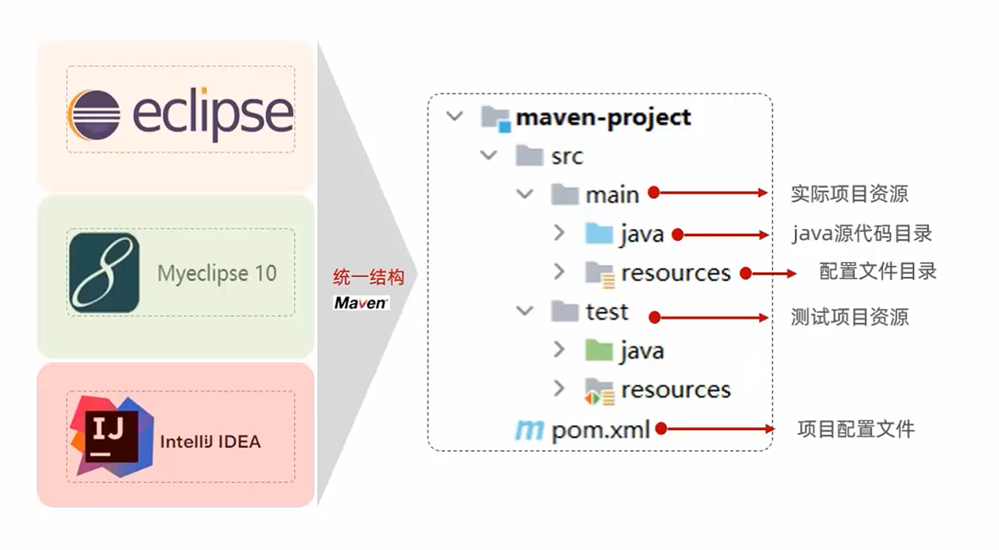

+ 项目构建：标准跨平台（Linux、Windows、MaxOS）的自动化项目构建方式

## 一、概述

### 1. 介绍

+ Apache Maven 是一个项目管理和构建工具，它基于项目对象模型（POM）的概念，通过一小段描述信息来管理项目的构建
+ 作用：
  + 方便的依赖管理
  + 统一的项目构建
  + 标准的项目构建流程

Maven 的模型

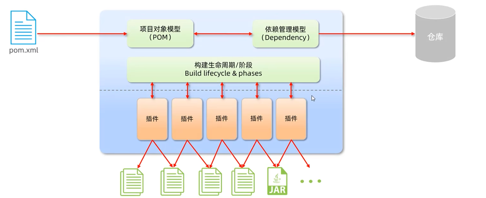

仓库：用于存储资源，管理各种 jar 包

+ 本地仓库：自己计算机上的一个目录
+ 中央仓库：由 Maven 团队维护的全球唯一的。仓库地址：[Central Repository:](https://repo1.maven.org/maven2/)
+ 远程仓库（私服）：一般由公司团队搭建的私有仓库

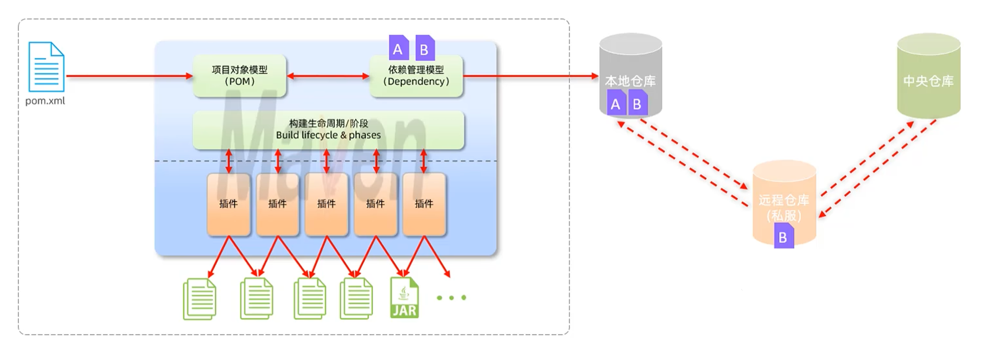


-------------------------------------


### 2. 安装

+ 安装步骤：

1. 解压安装包：[Download Apache Maven – Maven](https://maven.apache.org/download.cgi)

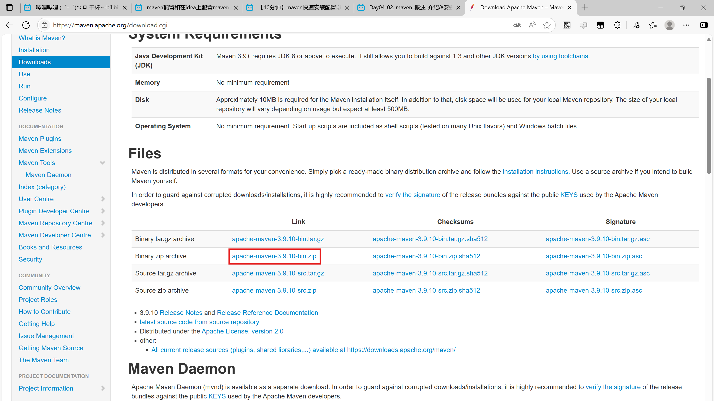

2. 配置本地仓库：修改 conf/settings.xml 中的 <localRepository> 为一个制定目录

```xml
<localRepository>E:\develop\apache-maven-3.6.1\mvn_repo</localRepository>
```

3. 配置阿里云私服：修改 conf/settings.xml 中的 <mirrors> 标签，为其添加如下子标签：

```xml
<mirror>
    <id>alimaven</id>
    <name>aliyun maven</name>
    <url>http://maven.aliyun.com/nexus/content/groups/public/</url>
    <mirrorOF>central</mirrorOF>
</mirror>
```

4. 配置环境变量：MAVEN_HOME 为 maven 的解压目录，并将其 bin 目录加入到 PATH 环境变量

配置本地仓库

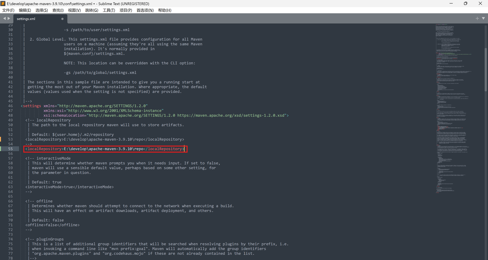

配置阿里云镜像

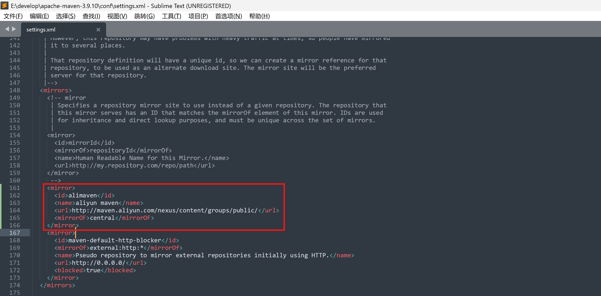

配置环境变量

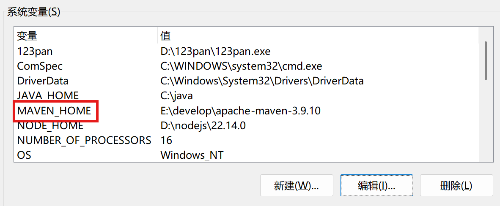

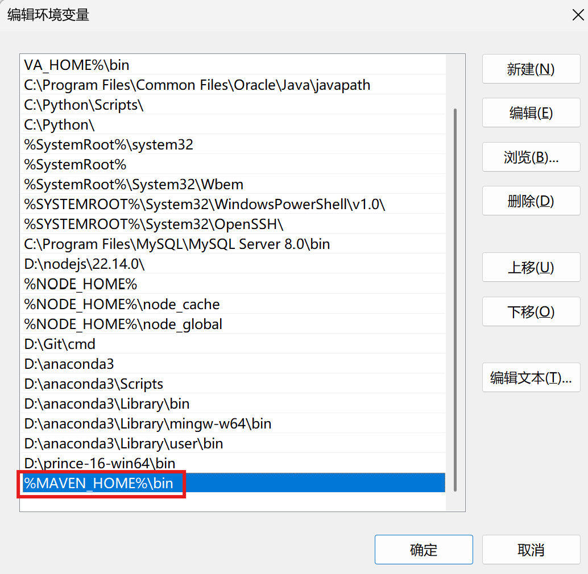

+ 测试

```cmd
mvn -v
```

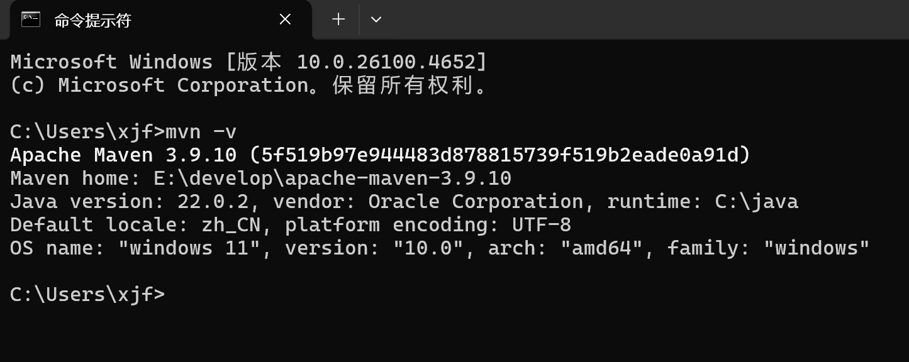


--------------------------


## 二、IDEA 集成 Maven

### 1. 配置 Maven 环境

#### 1.1 配置 Maven 环境（当前工程）

+ 选择 IDEA 中 File --> Settings --> Build,Execution,Deployment --> Build Tools --> Maven
+ 设置 IDEA 使用本地安装的 Maven，并修改配置文件及本地仓库地址

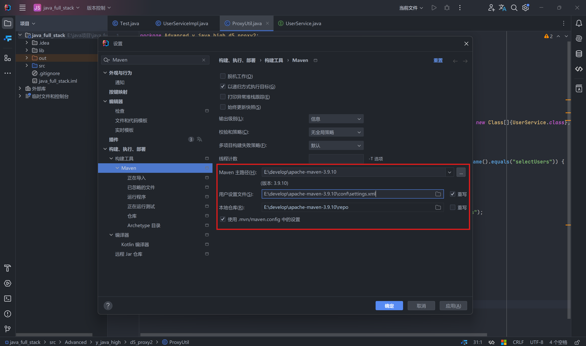

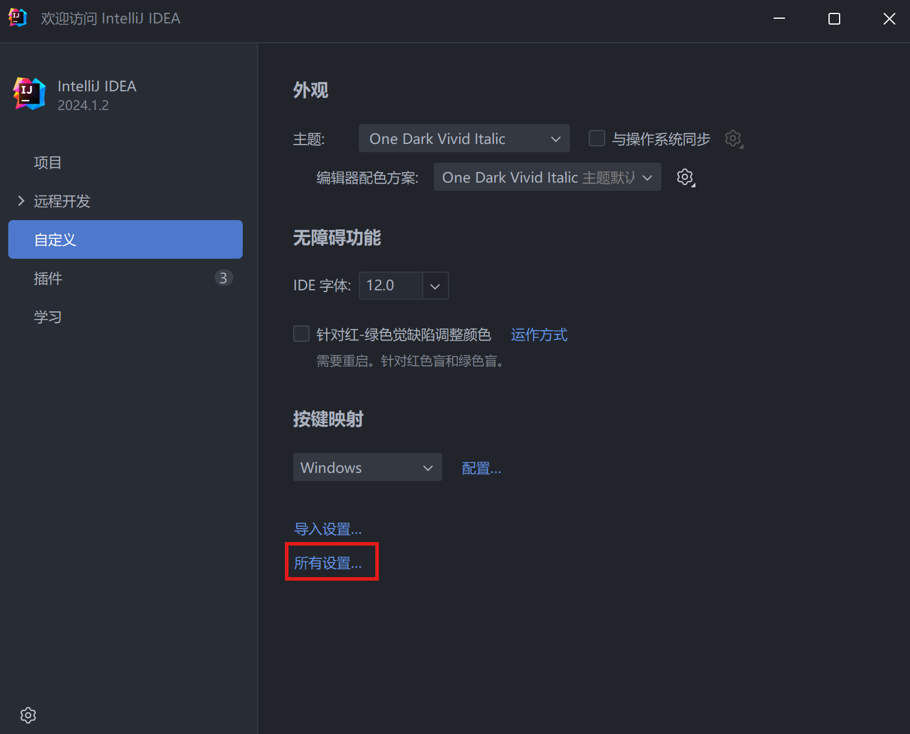


### 2. 创建 Maven 项目

1. 创建模块，选择 Maven，点击 Next
2. 填写模块名称，坐标信息，点击 finish，创建完成
3. 编写 HelloWorld，并运行

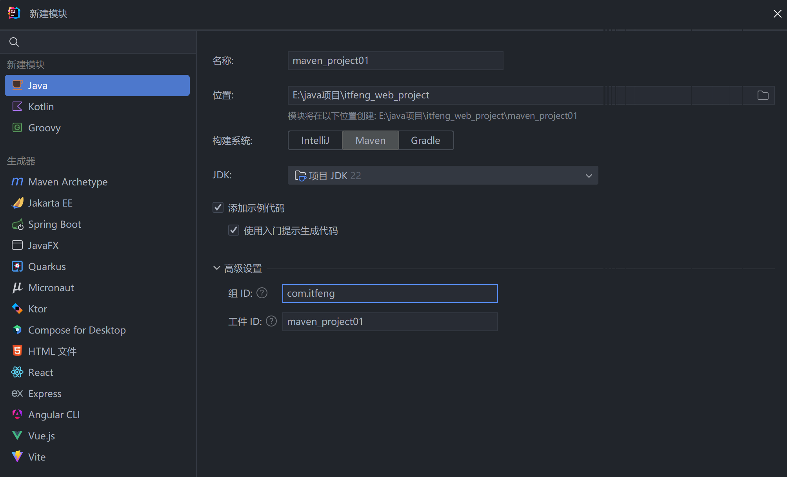

#### 2.1 Maven 坐标

+ 什么是坐标？
  + Maven 中的坐标是**资源的唯一标识，通过该坐标可以唯一定位资源位置**
  + 使用坐标来定义项目或引入项目中需要的依赖
+ Maven 坐标主要组成
  + groupId：定义当前 Maven 项目隶属组织名称（通常是域名反写，例如：com.itfeng）
  + artifactId：定义当前 Maven 项目名称（通常是模块名称，例如：order-service、goods-service）
  + version：定义当前项目版本号

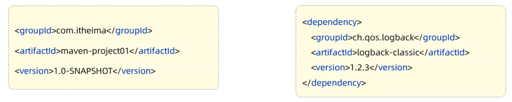


### 3. 导入 Maven 项目

方式一：打开 IDEA，选择右侧 Maven 面板，点击 **+** 号，选中对应项目的 pom.xml 文件，双击即可

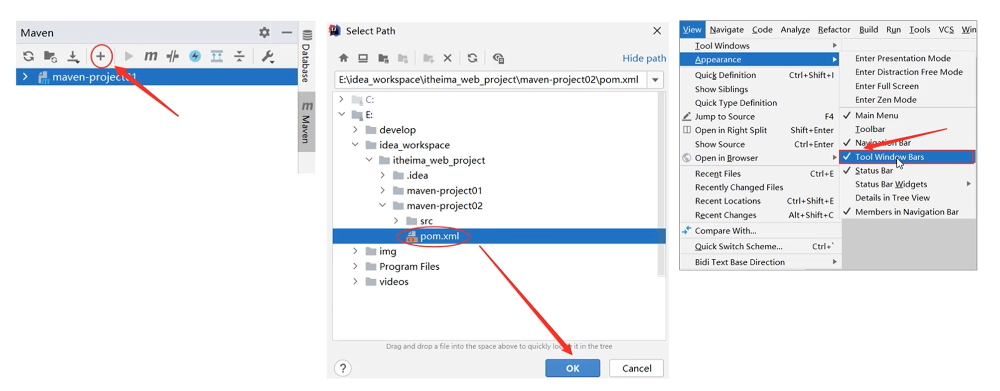

方式二：打开 IDEA，点击 File，选择 Project Structure（项目结构），点击 **+** 号，选择 Import Module，选中对应项目的 pom.xml 文件，双击即可


-----------------------------


## 三、依赖管理

### 1. 依赖配置

+ 依赖：指当前项目运行所需要的 jar 包，一个项目中可以引入多个依赖
+ 配置：

1. 在 pom.xml 中编写 **<dependencies>** 标签
2. 在 **<dependencies>** 标签中，使用 **<dependency>** 引入坐标
3. 定义坐标的 **groupld，artifactId，version**
4. 点击刷新按钮，引入最新加入的坐标

寻找依赖的网站：[Maven Repository: Search/Browse/Explore](https://mvnrepository.com/)

```xml
<dependencies>
    <dependency>
        <groupId>ch.qos.logback</groupId>
        <artifactId>logback-classic</artifactId>
        <version>1.5.18</version>
    </dependency>
</dependencies>
```

注意：

+ 如果引入的依赖，在本地仓库不存在，将会链接远程仓库/中央仓库，然后下载依赖
+ 如果不知道依赖的坐标信息，可以到 [Maven Repository: Search/Browse/Explore](https://mvnrepository.com/) 中搜索


### 2. 依赖传递

+ 依赖具有传递性
  + 直接依赖：在当前项目中通过依赖配置建立的依赖关系
  + 间接依赖：被依赖的资源如果依赖其他资源，当前项目间接依赖其他资源

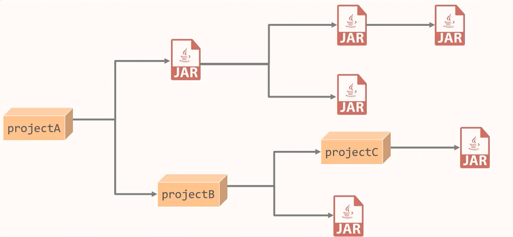

+ 排除依赖
  + 排除依赖指主动断开依赖的资源，被排除的资源无需制定版本

```xml
<dependencies>
    <dependency>
        <groupId>com.itfeng</groupId>
        <artifactId>maven-projectB</artifactId>
        <version>1.0-SNAPSHOT</version>
    </dependency>
    <exclusions>
    	<exclusion>
        	<groupId>junit</groupId>
            <artifactId>junit</artifactId>
        </exclusion>
    </exclusions>
</dependencies>
```


### 3. 依赖范围

依赖的 jar 包，默认情况下，可以在任何地方使用。可以通过 <scope>...</scope> 设置其作用范围

作用范围：

+ 主程序范围有效（main 文件夹范围内）
+ 测试程序范围有效（test 文件夹范围内）
+ 是否参与打包运行（package 指令范围内）

```xml
<dependency>
	<groupId>junit</groupId>
    <artifactId>junit</artifactId>
    <version>4.10</version>
    <scope>test</scope>
</dependency>
```

| scope 值        | 主程序 | 测试程序 | 打包（运行） | 范例        |
| --------------- | ------ | -------- | ------------ | ----------- |
| compile（默认） | Y      | Y        | Y            | log4j       |
| test            | -      | Y        | -            | junit       |
| provided        | Y      | Y        | -            | servlet-api |
| runtime         | -      | Y        | Y            | jdbc 驱动   |


### 4. 生命周期

Maven 的生命周期就是为了对所有的 maven 项目构建过程进行抽象和统一

Maven 中有3套**相互独立**的生命周期：

+ clean：清理工作
+ default：核心工作，如：编译、测试、打包、安装、部署等
+ site：生成报告、发布站点等

每套生命周期包含一些阶段（phase），阶段是有顺序的，后面的阶段依赖于前面的阶段

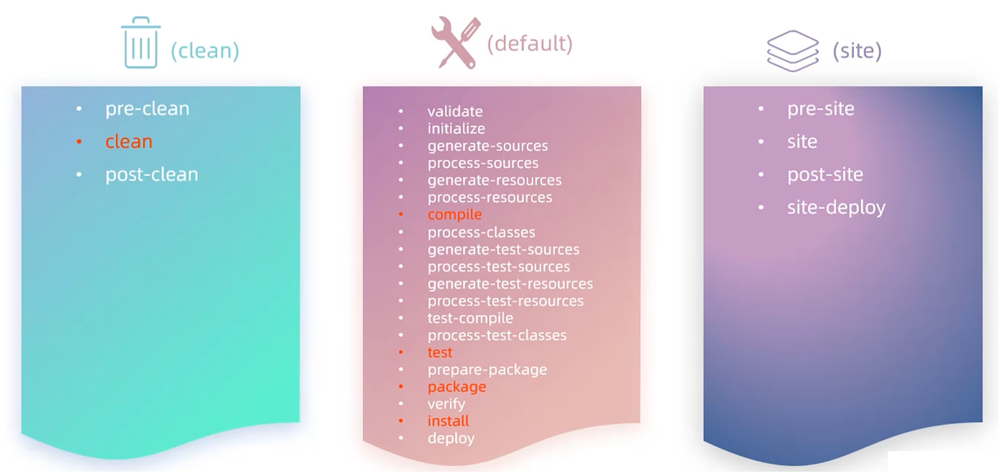

+ clean：移除上一次构建生成的文件
+ compile：编译项目源代码
+ test：使用合适的单元测试框架运行测试（junit）
+ package：将编译后的文件打包，如：jar、war 等
+ install：安装项目到本地仓库

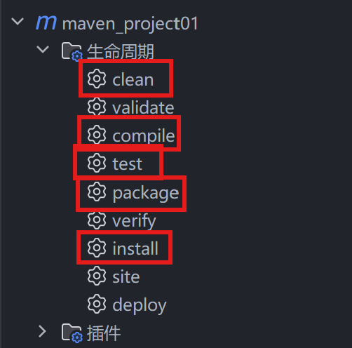

注意：在同一套生命周期中，当运行后面的阶段，前面的阶段都会运行

执行制定生命周期的两种方式：

+ 在 IDEA 中，右侧的 maven 工具栏，选中对应的生命周期，双击执行
+ 在命令行中，通过命令执行
  + `mvn clean`


---------------------------


## 四、maven 高级

### 1. 分模块涉及与开发

+ 为什么？**将项目按照功能拆分成若干个子模块**，方便项目的管理维护、扩展，也方便模块间的相互调用，资源共享

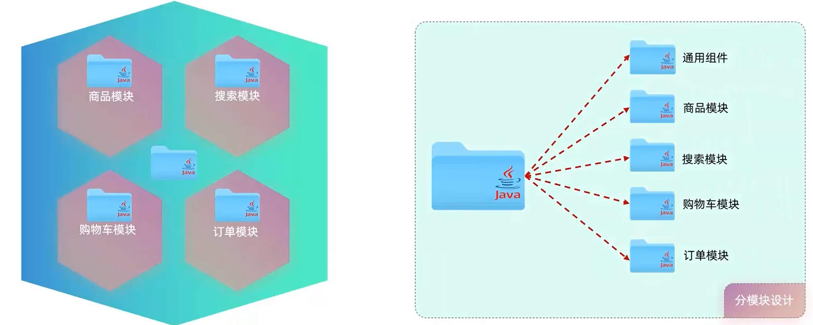

#### 1.1 分模块开发

+ 创建 maven 模块 tlias-pojo，存放实体类
+ 创建 maven 模块 tlias-utils，存放相关工具类

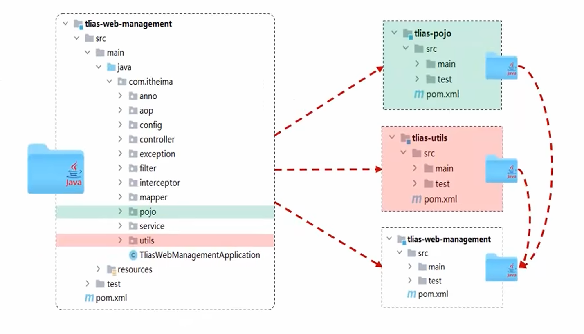

注意事项：

+ 分模块开发需要先针对模块功能进行涉及，再进行编码。不会先将工程开发完毕，然后进行拆分


------------------


### 2. 继承与聚合

#### 2.1 继承

##### 2.1.1 继承关系

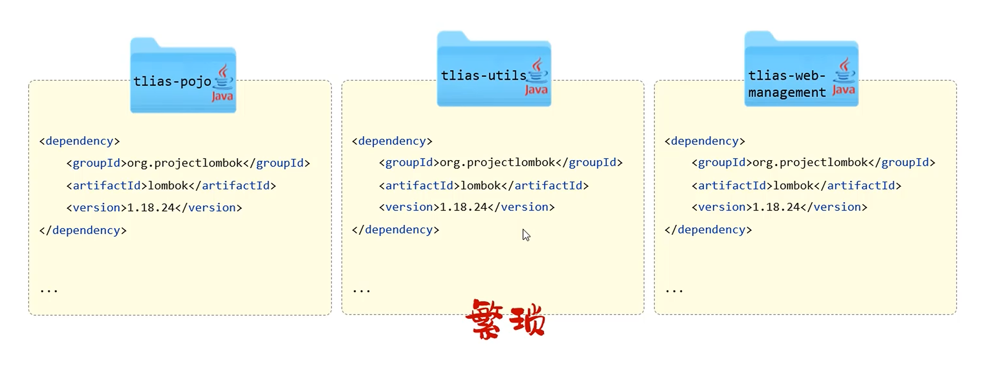

+ 概念：**继承**描述的是两个工程间的关系，与 java 中的继承相似，子工程可以继承父工程中的配置信息，常见于依赖关系的继承
+ 作用：简化依赖配置、统一管理依赖
+ 实现：`<parent>父工程坐标</parent>`

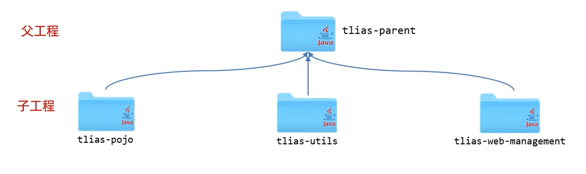

###### 继承关系实现

1. 创建 maven 模块 tlias-parent，该工程为**父工程**，设置**打包方式 pom**（默认 jar）【`<packaging>pom</packaging>`】

+ jar：普通模块打包，springboot 项目基本都是 jar 包（内嵌 tomcat 运行）
+ war：普通 web 程序打包，需要部署在外部的 tomcat 服务器中运行
+ pom：父工程或聚合工程，该模块不写代码，仅进行依赖管理

2. 在**子工程**的 pom.xml 文件中，配置继承关系
3. 在**父工程**中配置各个工程共有的依赖（子工程会自动继承父工程的依赖）

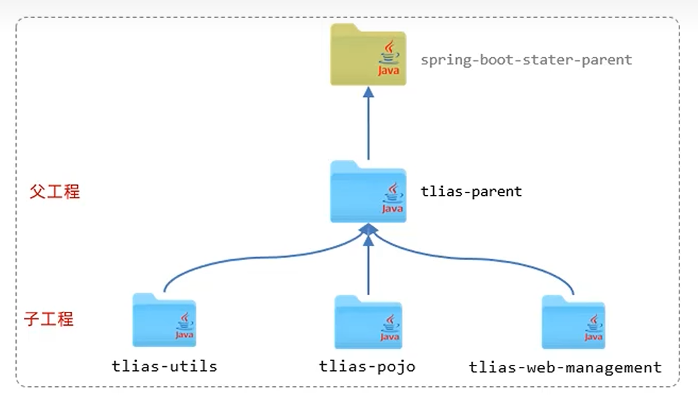

+ 父工程

```xml
<parent>
    <groupId>org.springframework.boot</groupId>
    <artifactId>spring-boot-starter-parent</artifactId>
    <version>2.7.5</version>
    <relativePath/> <!-- lookup parent from repository -->
</parent>

<groupId>com.itheima</groupId>
<artifactId>tlias-parent</artifactId>
<version>1.0-SNAPSHOT</version>
<packaging>pom</packaging>
```

+ 子工程

```xml
<parent>
    <groupId>com.itheima</groupId>
    <artifactId>tlias-parent</artifactId>
    <version>1.0-SNAPSHOT</version>
    <relativePath>../tlias-parent/pom.xml</relativePath>
</parent>
```

注意事项：

+ 在子工程中，配置了继承关系之后，坐标中的 groupId 是可以省略的，因为会自动继承父工程的
+ relativePath 指定父工程的 pom 文件的相对位置（如果不指定，将从本地仓库 / 远程仓库查找该工程）
+ 若父子工程都配置了同一个依赖的不同版本，以子工程的为准


##### 2.1.2 版本锁定

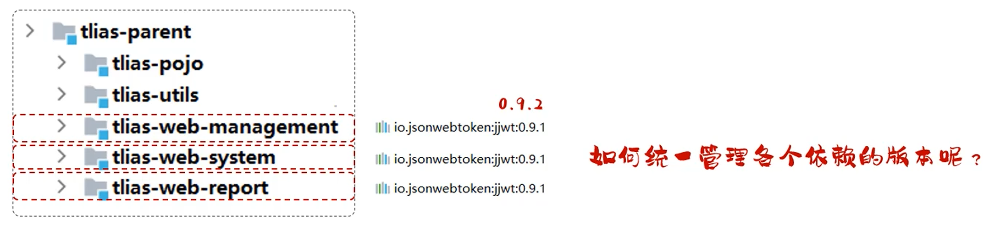

+ 在 maven 中，可以在父工程的 pom 文件中通过 `<dependencyManagement>` 来统一管理依赖版本

```xml
<!--统一管理依赖版本-->
<dependencyManagement>
    <dependencies>
        <!--JWT令牌-->
        <dependency>
            <groupId>io.jsonwebtoken</groupId>
            <artifactId>jjwt</artifactId>
            <version>${jjwt.version}</version>
        </dependency>

        <!--阿里云OSS-->
        <dependency>
            <groupId>com.aliyun.oss</groupId>
            <artifactId>aliyun-sdk-oss</artifactId>
            <version>${aliyun.oss.version}</version>
        </dependency>
        <dependency>
            <groupId>javax.xml.bind</groupId>
            <artifactId>jaxb-api</artifactId>
            <version>${jaxb.version}</version>
        </dependency>
        <dependency>
            <groupId>javax.activation</groupId>
            <artifactId>activation</artifactId>
            <version>${activation.version}</version>
        </dependency>
        <!-- no more than 2.3.3-->
        <dependency>
            <groupId>org.glassfish.jaxb</groupId>
            <artifactId>jaxb-runtime</artifactId>
            <version>${jaxb.runtime.version}</version>
        </dependency>
    </dependencies>
</dependencyManagement>
```

注意事项：

+ 子工程引入依赖时，无需指定 `<version>` 版本号，父工程统一管理。变更依赖版本，只需在父工程中统一变更

###### 自定义属性 / 引用属性

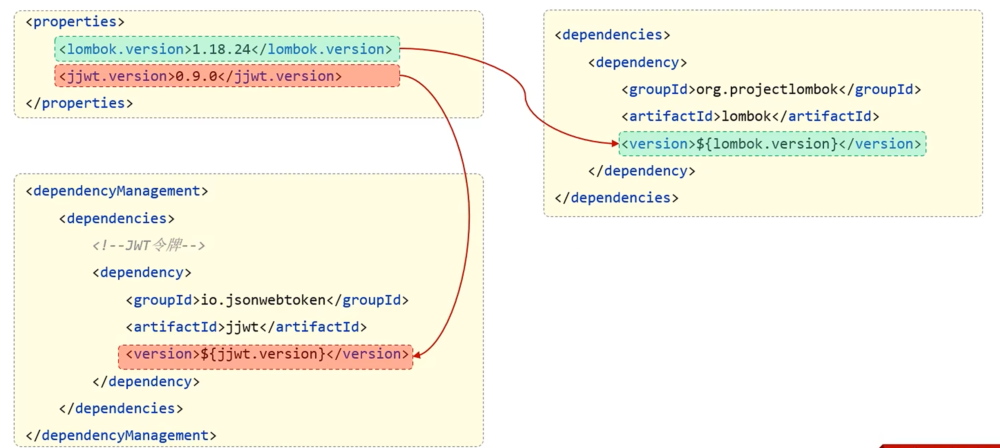

```xml
<properties>
	<lombok.version>1.18.24</lombok.version>
    <jjwt.version>0.9.0</jjwt.version>
</properties>
```

`<dependencyManagement>` 与 `<dependencies>` 的区别是什么？

+ `<dependencies>` 是直接依赖，在父工程配置了依赖，子工程会直接继承下来
+ `<dependencyManagement>` 是统一管理依赖版本，不会直接依赖，还需要在子工程中引入所需依赖（无需指定版本）


--------------------------------


#### 2.2 聚合

+ 将多个模块组织成一个整体，同时进行项目的构建

聚合工程

+ 一个不具有业务功能的 “空” 工程（有且仅有一个 pom 文件）【父工程】

作用

+ 快速构建项目（无需根据依赖关系手动构建，直接在聚合工程上构建即可）

##### 实现

+ maven 中可以通过 `<modules>` 设置当前聚合工程所包含的子模块名称

```xml
<!--聚合其他模块-->
<modules>
    <module>../tlias-pojo</module>
    <module>../tlias-utils</module>
    <module>../tlias-web-management</module>
</modules>
```


------------------


### 3. 私服

#### 3.1 介绍

+ 私服是一种特殊的远程仓库，它是架设在局域网内的仓库服务，用来代理位于外部的中央仓库，用于解决团队内部的资源共享与资源同步问题

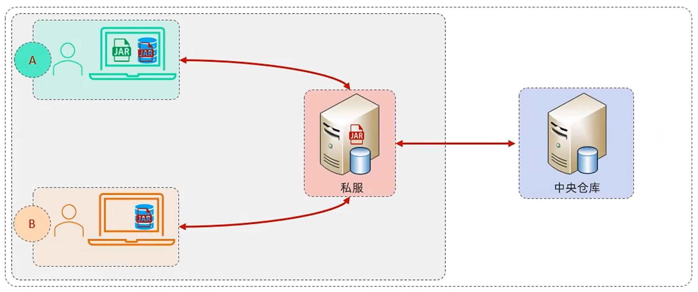

+ 依赖查找顺序：
  + 本地仓库
  + 私服
  + 中央仓库

注意事项

+ 私服在企业项目开发中，一个项目 / 公司，只需要一台即可（无需我们自己搭建，会使用即可）

#### 3.2 资源上传与下载

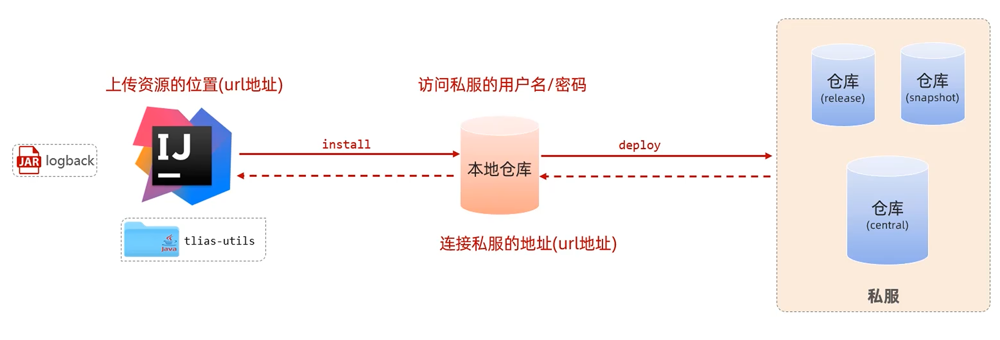

+ central 仓库：中央仓库，存储的是从中央仓库下载下来的 jar 包
+ 上面两个仓库存放的都是项目组内部共享的资源

项目版本：

+ RELEASE（发行版本）：功能趋于稳定，当更新停止，可以用于发行的版本，存储在私服中的 RELEASE 仓库中
+ SNAPSHOT（快照版本）：功能不稳定，尚处于开发中的版本，即快照版本，存储在私服的 SNAPSHOT 仓库中

1. 设置私服的访问用户名 / 密码（settings.xml 中的 servers 中配置）
```xml
<server>
	<id>maven-releases</id>
	<username>admin</username>
	<password>admin</password>
</server>
<server>
    <id>maven-snapshots</id>
    <username>admin</username>
    <password>admin</password>
</server>
```

2. IDEA 的 maven 工程的 pom 文件中配置上传（发布）地址

```xml
<distributionManagement>
    <!-- release版本的发布地址 -->
    <repository>
        <id>maven-releases</id>
        <url>http://192.168.150.101:8081/repository/maven-releases/</url>
    </repository>

    <!-- snapshot版本的发布地址 -->
    <snapshotRepository>
        <id>maven-snapshots</id>
        <url>http://192.168.150.101:8081/repository/maven-snapshots/</url>
    </snapshotRepository>
</distributionManagement>
```

3. 设置私服依赖下载的仓库组地址（settings.xml 中的 mirrors、profiles 中配置）

```xml
<mirror>
    <id>maven-public</id>
    <mirrorOf>*</mirrorOf>
    <url>http://192.168.150.101:8081/repository/maven-public/</url>
</mirror>
```


------------------


#### 私服配置文档

##### 私服配置说明

访问私服：http://192.168.150.101:8081

访问密码：admin/admin

使用私服，需要在maven的settings.xml配置文件中，做如下配置：

1. 需要在 **servers** 标签中，配置访问私服的个人凭证(访问的用户名和密码)

   ```xml
   <server>
       <id>maven-releases</id>
       <username>admin</username>
       <password>admin</password>
   </server>
       
   <server>
       <id>maven-snapshots</id>
       <username>admin</username>
       <password>admin</password>
   </server>
   ```

   

2. 在 **mirrors** 中只配置我们自己私服的连接地址(如果之前配置过阿里云，需要直接替换掉)

   ```xml
   <mirror>
       <id>maven-public</id>
       <mirrorOf>*</mirrorOf>
       <url>http://192.168.150.101:8081/repository/maven-public/</url>
   </mirror>
   ```

   

3. 需要在 **profiles** 中，增加如下配置，来指定snapshot快照版本的依赖，依然允许使用

   ```xml
   <profile>
       <id>allow-snapshots</id>
           <activation>
           	<activeByDefault>true</activeByDefault>
           </activation>
       <repositories>
           <repository>
               <id>maven-public</id>
               <url>http://192.168.150.101:8081/repository/maven-public/</url>
               <releases>
               	<enabled>true</enabled>
               </releases>
               <snapshots>
               	<enabled>true</enabled>
               </snapshots>
           </repository>
       </repositories>
   </profile>
   ```

   

4. 如果需要上传自己的项目到私服上，需要在项目的pom.xml文件中，增加如下配置，来配置项目发布的地址(也就是私服的地址)

   ```xml
   <distributionManagement>
       <!-- release版本的发布地址 -->
       <repository>
           <id>maven-releases</id>
           <url>http://192.168.150.101:8081/repository/maven-releases/</url>
       </repository>
       
       <!-- snapshot版本的发布地址 -->
       <snapshotRepository>
           <id>maven-snapshots</id>
           <url>http://192.168.150.101:8081/repository/maven-snapshots/</url>
       </snapshotRepository>
   </distributionManagement>
   ```

   

5. 发布项目，直接运行 deploy 生命周期即可 (发布时，建议跳过单元测试)


##### 启动本地私服

1. 解压： apache-maven-nexus.zip

2. 进入目录： apache-maven-nexus\nexus-3.39.0-01\bin

3. 启动服务：双击 start.bat 
4. 访问服务：localhost:8081
5. 私服配置说明：将上述配置私服信息的 192.168.150.101 改为 localhost 


-------------------


