# Mybatis

什么是 Mybatis？


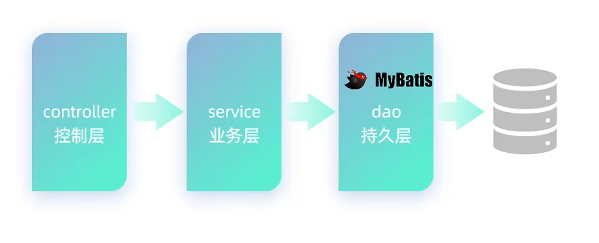

+ MyBatis 是一款优秀的 **持久层** 框架，用于简化 JDBC 的开发
+ MyBatis 本是 Apache 的一个开源项目 IBatis，2010 年这个项目由 apache 迁移到了 google code，并且改名为 MyBatis。2013年11月迁移到 Github
+ 官网：[MyBatis中文网](https://mybatis.net.cn/)

## 一、Mybatis 入门

### 1. 快速入门

> 案例：使用 Mybatis 查询所有用户数据

+ mysql

```sql
select * from user;
```

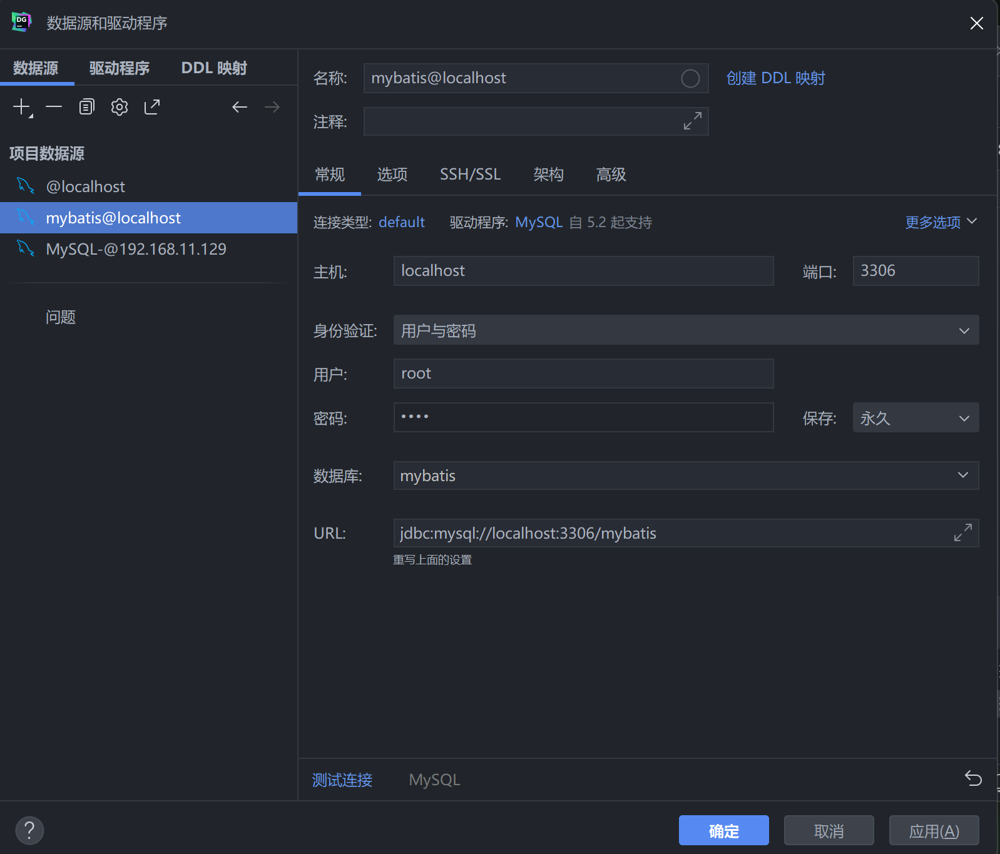

+ Mybatis

1. 准备工作（创建 springboot 工程、数据库表 user、实体类 User）
2. 引入 Mybatis 的相关依赖，配置 Mybatis
3. 编写 SQL 语句（注解 / XML）

```properties
# 驱动类名称
spring.datasource.driver-class-name=com.mysql.cj.jdbc.Driver
# 数据库连接的url
spring.datasource.url=jdbc:mysql://localhost:3306/mybatis
# 连接数据库的用户名
spring.datasource.username=root
# 连接数据库的密码
spring.datasource.password=1234
```

**具体内容要改成自己的！！！**

在 application.properties 中


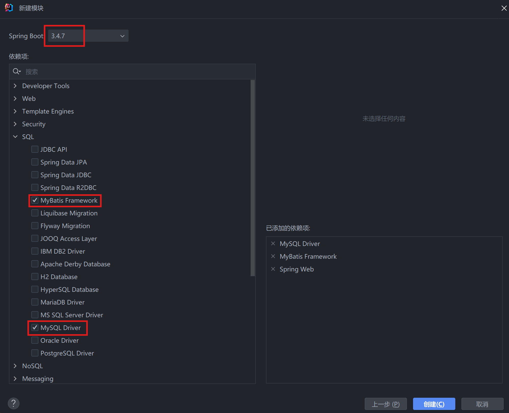

+ 建表

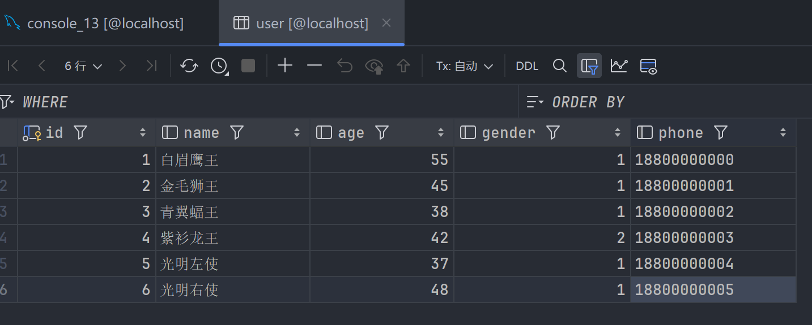

+ com.itfeng/pojo/User.java

```java
package com.itfeng.pojo;

public class User {

    private Integer id;
    private String name;
    private Short age;
    private Short gender;
    private String phone;

    public User() {
    }

    public User(Integer id, String name, Short age, Short gender, String phone) {
        this.id = id;
        this.name = name;
        this.age = age;
        this.gender = gender;
        this.phone = phone;
    }

    public Integer getId() {
        return id;
    }

    public void setId(Integer id) {
        this.id = id;
    }

    public String getName() {
        return name;
    }

    public void setName(String name) {
        this.name = name;
    }

    public Short getAge() {
        return age;
    }

    public void setAge(Short age) {
        this.age = age;
    }

    public Short getGender() {
        return gender;
    }

    public void setGender(Short gender) {
        this.gender = gender;
    }

    public String getPhone() {
        return phone;
    }

    public void setPhone(String phone) {
        this.phone = phone;
    }

    @Override
    public String toString() {
        return "User{" +
                "id=" + id +
                ", name='" + name + '\'' +
                ", age=" + age +
                ", gender=" + gender +
                ", phone='" + phone + '\'' +
                '}';
    }
}
```

+ com.itfeng/mapper/UserMapper.java

```java
package com.itfeng.mapper;


import com.itfeng.pojo.User;
import org.apache.ibatis.annotations.Mapper;
import org.apache.ibatis.annotations.Select;

import java.util.List;

@Mapper // 在运行时，会自动生成该接口的实现类对象（代理对象），并且将该对象交给IOC容器管理
public interface UserMapper {

    // 查询全部用户信息
    @Select("select * from user")
    public List<User> list();
}
```

+ application.properties

```properties
spring.application.name=springboot-mybatis-quickstart2
# 驱动类名称
spring.datasource.driver-class-name=com.mysql.cj.jdbc.Driver
# 数据库连接的url
spring.datasource.url=jdbc:mysql://localhost:3306/mybatis
# 连接数据库的用户名
spring.datasource.username=root
# 连接数据库的密码
spring.datasource.password=1234
```

+ SpringbootMybatisQuickstartApplicationTests.java

```java
package com.itfeng;

import com.itfeng.mapper.UserMapper;
import com.itfeng.pojo.User;
import org.junit.jupiter.api.Test;
import org.springframework.beans.factory.annotation.Autowired;
import org.springframework.boot.test.context.SpringBootTest;

import java.util.List;

@SpringBootTest // springboot整合单元测试的注解
class SpringbootMybatisQuickstartApplicationTests {

    @Autowired
    private UserMapper userMapper;

    @Test
    public void testListUser() {
       List<User> userList = userMapper.list();
       userList.stream().forEach(user -> {
          System.out.println(user);
       });
    }
}
```


#### 配置 SQL 提示

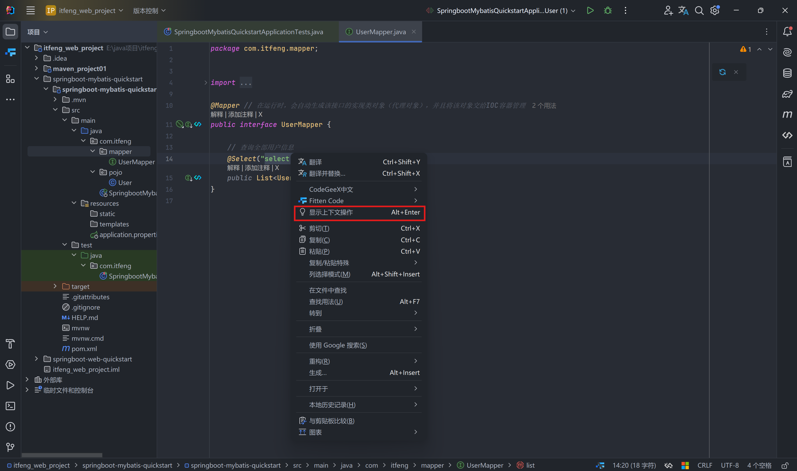

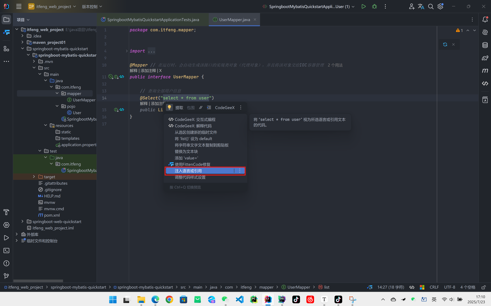

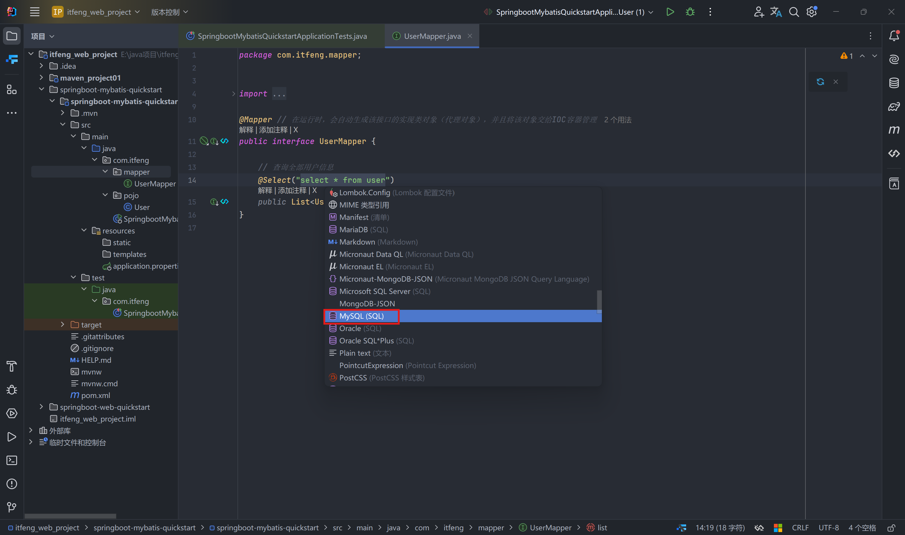

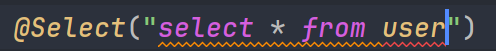

+ 产生原因：IDEA 和数据库没有建立连接，不识别信息
+ 解决方式：在 IDEA 中配置 MySQL 数据库连接

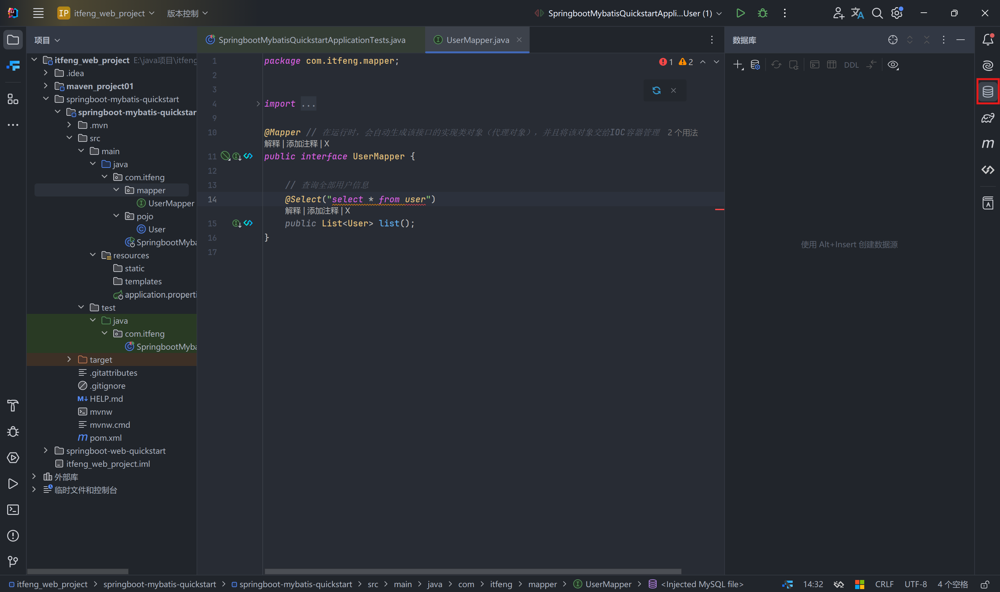

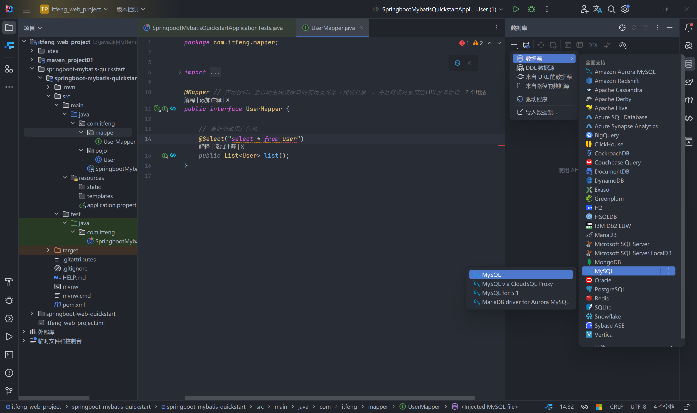

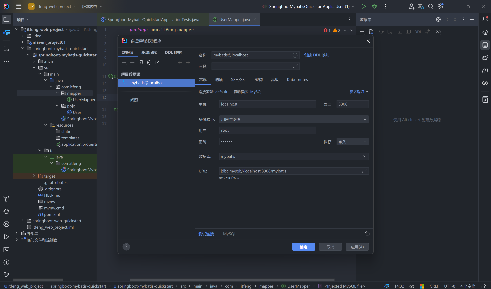


--------------------------------


### 2. JDBC 介绍

+ JDBC：（Java DataBase Connectivity），就是使用 Java 语言操作关系型数据库的一套 API

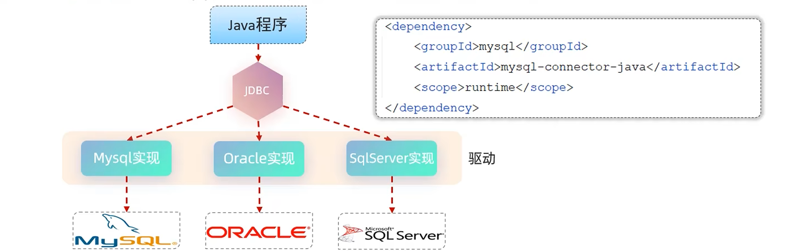

本质：

+ sun 公司官方定义的一套操作所有关系型数据库的规范，即接口
+ 各个数据库厂商去实现这套接口，提供数据库**驱动 jar 包**
+ 我们可以使用这套接口（JDBC）编程，真正执行的代码时驱动 jar 包中的实现类

步骤：

1. 注册驱动
2. 获取连接对象
3. 获取执行 SQL 的对象 Statement，执行 SQL，返回结果
4. 封装结果数据
5. 释放资源

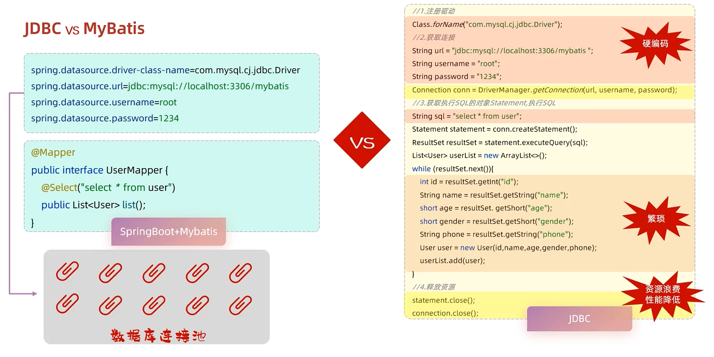


-------------------------------


### 3. 数据库连接池

+ **数据库连接池**是一个容器，负责分配、管理数据库连接（Connection）
+ 它允许应用程序重复使用一个现有的数据库连接，而不是再重新建立一个
+ 释放空闲时间超过最大空闲时间的连接，来避免因为没有释放连接而引起的数据库连接遗漏

优势：

+ 资源重用
+ 提升系统响应速度
+ 避免数据库连接遗漏

实现：

+ 标准接口：DataSource
  + 官方（sun）提供的数据库连接池接口，由第三方组织实现此接口
  + 功能：获取连接   `Connection getConnection() throws SQLException;`
+ 常见产品：


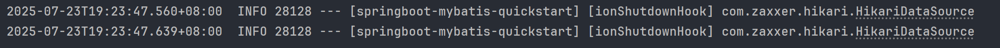

+ Druid（德鲁伊）
  + Druid 连接池是阿里巴巴开源的数据库连接池项目
  + 功能强大，性能优秀，是 Java 语言最好的数据库连接池之一

切换 Druid 数据库连接池

+ 官网：[Spring Boot 整合 Druid 指南-阿里云开发者社区](https://developer.aliyun.com/article/1157595)
+ [GitHub - alibaba/druid: 阿里云计算平台DataWorks(https://help.aliyun.com/document_detail/137663.html) 团队出品，为监控而生的数据库连接池](https://github.com/alibaba/druid)

```xml
<!--引入druid数据源-->
<dependency>
    <groupId>com.alibaba</groupId>
    <artifactId>druid-spring-boot-starter</artifactId>
    <version>1.2.6</version>
</dependency>
```

```xml
<!--引入druid数据源-->
<dependency>
    <groupId>com.alibaba</groupId>
    <artifactId>druid-spring-boot-3-starter</artifactId>
    <version>1.2.20</version>
</dependency>
```


---------------------------------------


### 4. lombok

在之前的代码中实体类中的代码十分臃肿，而 lombok 技术就是来解决这个问题的

+ Lombok 是一个实用的 Java 类库，能通过注解的形式自动生成构造器、getter / setter、equals、hashcode、toString 等方法，并可以自动化生成日志变量，简化 java 开发、提高效率

| 注解                    | 作用                                                         |
| ----------------------- | ------------------------------------------------------------ |
| @Getter/@Setter         | 为所有的属性提供 get / set 方法                              |
| @ToString               | 会给类自动生成易阅读的 toString 方法                         |
| @EqualsAndHashCode      | 根据类所拥有的非静态字段自动重写 equals 方法和 hashCode 方法 |
| **@Data**               | 提供了更综合的生成代码功能（@Getter + @Setter + @ToString + @EqualsAndHashCode） |
| **@NoArgsConstructor**  | 为实体类生成无参的构造器方法（无参构造）                     |
| **@AllArgsConstructor** | 为实体类生成除了 static 修饰的字段之外带有各参数的构造器方法（全参构造） |

lombok 依赖

```xml
<dependency>
    <groupId>org.projectlombok</groupId>
    <artifactId>lombok</artifactId>
</dependency>
```

注意事项：Lombok 会在编译时，自动生成对应的 java 代码。我们使用 lombok 时，还需要安装一个 lombok 的插件（idea 自带）

+ User.java

```java
package com.itfeng.pojo;

import lombok.*;

//@Getter
//@Setter
//@ToString
//@EqualsAndHashCode

@Data
@NoArgsConstructor // 无参构造
@AllArgsConstructor // 全参构造
public class User {

    private Integer id;
    private String name;
    private Short age;
    private Short gender;
    private String phone;
}
```


---------------------------


## 二、Mybatis 基础增删改查

### 1. 准备

+ 准备数据库表 emp
+ 创建一个新的 springboot 工程，选择引入的起步依赖（mybatis、mysql 驱动、lombok）
+ application.properties 中引入数据库连接信息
+ 创建对应的实体类 Emp（实体类属性采用驼峰命名）
+ 准备 Mapper 接口 EmpMapper

SQL 脚本

```sql
create table user(
     id int unsigned primary key auto_increment comment 'ID',
     name varchar(100) comment '姓名',
     age tinyint unsigned comment '年龄',
     gender tinyint unsigned comment '性别, 1:男, 2:女',
     phone varchar(11) comment '手机号'
) comment '用户表';

insert into user(id, name, age, gender, phone) VALUES (null,'白眉鹰王',55,'1','18800000000');
insert into user(id, name, age, gender, phone) VALUES (null,'金毛狮王',45,'1','18800000001');
insert into user(id, name, age, gender, phone) VALUES (null,'青翼蝠王',38,'1','18800000002');
insert into user(id, name, age, gender, phone) VALUES (null,'紫衫龙王',42,'2','18800000003');
insert into user(id, name, age, gender, phone) VALUES (null,'光明左使',37,'1','18800000004');
insert into user(id, name, age, gender, phone) VALUES (null,'光明右使',48,'1','18800000005');

-- 部门管理
create table dept(
     id int unsigned primary key auto_increment comment '主键ID',
     name varchar(10) not null unique comment '部门名称',
     create_time datetime not null comment '创建时间',
     update_time datetime not null comment '修改时间'
) comment '部门表';

insert into dept (id, name, create_time, update_time) values(1,'学工部',now(),now()),(2,'教研部',now(),now()),(3,'咨询部',now(),now()), (4,'就业部',now(),now()),(5,'人事部',now(),now());

-- 员工管理
create table emp (
     id int unsigned primary key auto_increment comment 'ID',
     username varchar(20) not null unique comment '用户名',
     password varchar(32) default '123456' comment '密码',
     name varchar(10) not null comment '姓名',
     gender tinyint unsigned not null comment '性别, 说明: 1 男, 2 女',
     image varchar(300) comment '图像',
     job tinyint unsigned comment '职位, 说明: 1 班主任,2 讲师, 3 学工主管, 4 教研主管, 5 咨询师',
     entrydate date comment '入职时间',
     dept_id int unsigned comment '部门ID',
     create_time datetime not null comment '创建时间',
     update_time datetime not null comment '修改时间'
) comment '员工表';

INSERT INTO emp(id, username, password, name, gender, image, job, entrydate,dept_id, create_time, update_time) VALUES
    (1,'jinyong','123456','金庸',1,'1.jpg',4,'2000-01-01',2,now(),now()),
    (2,'zhangwuji','123456','张无忌',1,'2.jpg',2,'2015-01-01',2,now(),now()),
    (3,'yangxiao','123456','杨逍',1,'3.jpg',2,'2008-05-01',2,now(),now()),
    (4,'weiyixiao','123456','韦一笑',1,'4.jpg',2,'2007-01-01',2,now(),now()),
    (5,'changyuchun','123456','常遇春',1,'5.jpg',2,'2012-12-05',2,now(),now()),
    (6,'xiaozhao','123456','小昭',2,'6.jpg',3,'2013-09-05',1,now(),now()),
    (7,'jixiaofu','123456','纪晓芙',2,'7.jpg',1,'2005-08-01',1,now(),now()),
    (8,'zhouzhiruo','123456','周芷若',2,'8.jpg',1,'2014-11-09',1,now(),now()),
    (9,'dingminjun','123456','丁敏君',2,'9.jpg',1,'2011-03-11',1,now(),now()),
    (10,'zhaomin','123456','赵敏',2,'10.jpg',1,'2013-09-05',1,now(),now()),
    (11,'luzhangke','123456','鹿杖客',1,'11.jpg',5,'2007-02-01',3,now(),now()),
    (12,'hebiweng','123456','鹤笔翁',1,'12.jpg',5,'2008-08-18',3,now(),now()),
    (13,'fangdongbai','123456','方东白',1,'13.jpg',5,'2012-11-01',3,now(),now()),
    (14,'zhangsanfeng','123456','张三丰',1,'14.jpg',2,'2002-08-01',2,now(),now()),
    (15,'yulianzhou','123456','俞莲舟',1,'15.jpg',2,'2011-05-01',2,now(),now()),
    (16,'songyuanqiao','123456','宋远桥',1,'16.jpg',2,'2010-01-01',2,now(),now()),
    (17,'chenyouliang','123456','陈友谅',1,'17.jpg',NULL,'2015-03-21',NULL,now(),now());
```

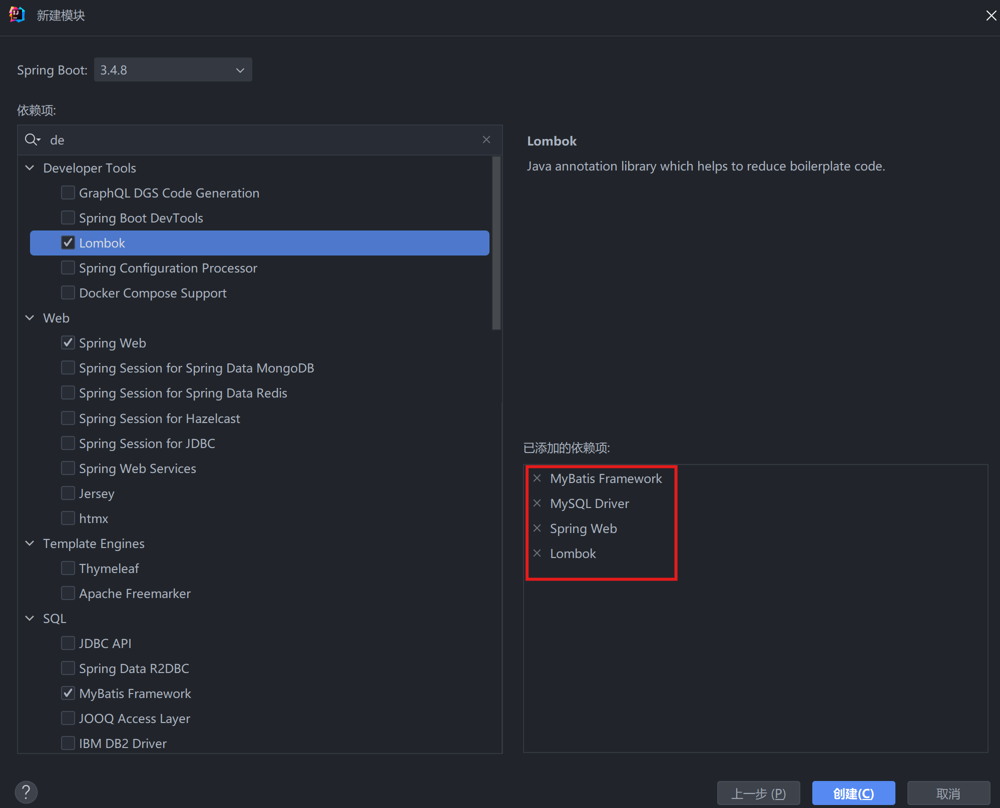

application.properties

```properties
spring.application.name=springboot-mybatis-crud
# 驱动类名称
spring.datasource.driver-class-name=com.mysql.cj.jdbc.Driver
# 数据库连接的url
spring.datasource.url=jdbc:mysql://localhost:3306/mybatis
# 连接数据库的用户名
spring.datasource.username=root
# 连接数据库的密码
spring.datasource.password=1234
```


-------------------------


### 2. 删除

#### 2.1 代码演示

+ SQL 语句

```sql
delete from emp where id = 17;
```

+ 接口方法

```java
@Delete("delete from emp where id = #{id}")
public void delete(Integer id);
```

注意事项：如果 mapper 接口方法形参只有一个普通类型的形参，`#{...}` 里面的属性名可以随便写，如：#{id}、#{value}

+ mapper/EmpMapper.java

```java
package com.itfeng.mapper;

import org.apache.ibatis.annotations.Delete;
import org.apache.ibatis.annotations.Mapper;

@Mapper
public interface EmpMapper {

    // 根据ID删除数据
    @Delete("delete from emp where id = #{id}")
    public void delete(Integer id);
//    public int delete(Integer id);
}
```

+ SpringbootMybatisCrudApplication.java

```java
package com.itfeng;

import com.itfeng.mapper.EmpMapper;
import org.junit.jupiter.api.Test;
import org.springframework.beans.factory.annotation.Autowired;
import org.springframework.boot.test.context.SpringBootTest;

@SpringBootTest
class SpringbootMybatisCrudApplicationTests {

    @Autowired
    private EmpMapper empMapper;

    @Test
    public void testDelete() {
       empMapper.delete(17);
//     int delete = empMapper.delete(17);
//     System.out.println(delete);
    }
}
```

#### 2.2 日志输出

+ 可以在 application.properties 中，打开 mybatis 的日志，并指定输出到控制台

```properties
# 指定mybatis输出日志的位置，输出控制台
mybatis.configuration.log-impl=org.apache.ibatis.logging.stdout.StdOutImpl
```

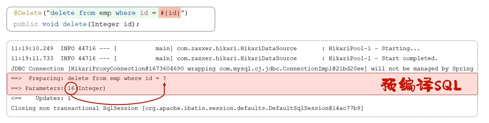

#### 2.3 预编译 SQL

优势：

+ 性能更高
+ 更安全（防止 SQL 注入）

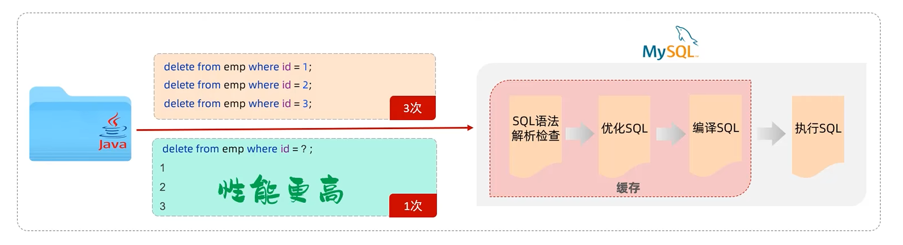

#### 2.4 SQL 注入

+ **SQL 注入**是通过操作输入的数据来修改事先定义好的 SQL 语句；以达到执行代码对服务器进行**攻击**的方法

比如我们可以在系统登录页面的账号、密码输入栏输入 SQL 语句，改变原有的 SQL 语句作用 达成不知道账号密码也能登录成功的效果

而预编译的 SQL 不管输入什么样的字符串，它会把整个字符串作为一个参数传递给输入栏

使用 `#{}` 最终生成的就是预编译的 sql 语句

`#{...}`：

+ 执行 SQL 时，会将 `#{...}` 替换为 `?`，生成预编译 SQL，会自动设置参数值
+ 使用时机：参数传递，都使用 `#{...}`

`${...}`：

+ 拼接 SQL。直接将参数拼接在 SQL 语句中，存在 SQL 注入问题
+ 使用时机：如果对表名、列表进行动态设置时使用


-------------------------


### 3. 插入

#### 3.1 代码演示

+ SQL 语句

```sql
insert into emp(username, name, gender, image, job, entrydate, dept_id, create_time, update_time)
values ('Tom', '汤姆', 1, '1.jpg', 1, '2005-01-01', 1, now(), now());
```

+ 接口方法：

```java
@Insert("insert into emp(username, name, gender, image, job, entrydate, dept_id, create_time, update_time)\n" +
        "values (#{username}, #{name}, #{gender}, #{image}, #{job}, #{entrydate}, #{deptId}, #{createTime}, #{updateTime});")
public void insert(Emp emp);
```

+ mapper/EmpMapper.java

```java
package com.itfeng.mapper;

import com.itfeng.pojo.Emp;
import org.apache.ibatis.annotations.Delete;
import org.apache.ibatis.annotations.Insert;
import org.apache.ibatis.annotations.Mapper;

@Mapper
public interface EmpMapper {
    // 新增员工
    @Insert("insert into emp(username, name, gender, image, job, entrydate, dept_id, create_time, update_time)\n" +
            "values (#{username}, #{name}, #{gender}, #{image}, #{job}, #{entrydate}, #{deptId}, #{createTime}, #{updateTime});")
    public void insert(Emp emp);
}
```

+ SpringbootMybatisCrudApplication.java

```java
package com.itfeng;

import com.itfeng.mapper.EmpMapper;
import com.itfeng.pojo.Emp;
import org.junit.jupiter.api.Test;
import org.springframework.beans.factory.annotation.Autowired;
import org.springframework.boot.test.context.SpringBootTest;

import java.time.LocalDate;
import java.time.LocalDateTime;

@SpringBootTest
class SpringbootMybatisCrudApplicationTests {

    @Autowired
    private EmpMapper empMapper;
    
    @Test
    public void testInsert(){
       // 构造员工对象
       Emp emp = new Emp();
       emp.setUsername("Tom");
       emp.setName("汤姆");
       emp.setImage("1.jpg");
       emp.setGender((short)1);
       emp.setJob((short)1);
       emp.setEntrydate(LocalDate.of(2000, 1, 1));
       emp.setDeptId(1);
       emp.setCreateTime(LocalDateTime.now());
       emp.setUpdateTime(LocalDateTime.now());

       // 执行新增员工信息操作
       empMapper.insert(emp);
    }
}
```

如果在 Emp 实体类中用了 `@Data` 但是测试时 setter 报错的直接手动创建 getter / setter

#### 3.2 新增（主键返回）

+ 描述：在数据添加成功后，需要获取插入数据库数据的主键。如：添加套餐数据时，还需要维护套餐菜品关系表数据
+ 实现

```java
@Options(useGeneratedKeys = true, keyProperty = "id")
@Insert("insert into emp(username, name, gender, image, job, entrydate, dept_id, create_time, update_time)\n" +
        "values (#{username}, #{name}, #{gender}, #{image}, #{job}, #{entrydate}, #{deptId}, #{createTime}, #{updateTime});")
public void insert(Emp emp);
```

+ SpringbootMybatisCrudApplication.java

```java
public void testInsert(){
    // 构造员工对象
    Emp emp = new Emp();
    emp.setUsername("Tom2");
    emp.setName("汤姆2");
    emp.setImage("1.jpg");
    emp.setGender((short)1);
    emp.setJob((short)1);
    emp.setEntrydate(LocalDate.of(2000, 1, 1));
    emp.setDeptId(1);
    emp.setCreateTime(LocalDateTime.now());
    emp.setUpdateTime(LocalDateTime.now());

    // 执行新增员工信息操作
    empMapper.insert(emp);
    System.out.println(emp.getId());
}
```


-------------------------


### 4. 更新

#### 4.1 实现

+ SQL 语句（根据 ID 更新员工信息）

```sql
update emp
set username    = 'Tom1',
    name        = '汤姆1',
    gender      = 1,
    image       = '1.jpg',
    job         = 1,
    entrydate   = '2012-01-01',
    dept_id     = 2,
    update_time = now()
where id = 18;
```

+ 接口方法

```java
@Update("update emp set username = #{username}, name = #{name}, gender = #{gender}, image = #{image}, job = #{job}, entrydate = #{entrydate}, dept_id = #{deptId}, update_time = #{updateTime} where id = #{id};")
public void update(Emp emp);
```

+ mapper/EmpMapper.java

```java
package com.itfeng.mapper;

import com.itfeng.pojo.Emp;
import org.apache.ibatis.annotations.*;

@Mapper
public interface EmpMapper {
    // 更新数据
    @Update("update emp set username = #{username}, name = #{name}, gender = #{gender}, image = #{image}, job = #{job}, entrydate = #{entrydate}, dept_id = #{deptId}, update_time = #{updateTime} where id = #{id};")
    public void update(Emp emp);
}
```

+ SpringbootMybatisCrudApplication.java

```java
package com.itfeng;

import com.itfeng.mapper.EmpMapper;
import com.itfeng.pojo.Emp;
import org.junit.jupiter.api.Test;
import org.springframework.beans.factory.annotation.Autowired;
import org.springframework.boot.test.context.SpringBootTest;

import java.time.LocalDate;
import java.time.LocalDateTime;

@SpringBootTest
class SpringbootMybatisCrudApplicationTests {

    @Autowired
    private EmpMapper empMapper;
    
    // 更新员工
    @Test
    public void testUpdate() {
        // 构造员工对象
        Emp emp = new Emp();
        emp.setId(18);
        emp.setUsername("Tom1");
        emp.setName("汤姆1");
        emp.setImage("1.jpg");
        emp.setGender((short) 1);
        emp.setJob((short) 1);
        emp.setEntrydate(LocalDate.of(2000, 1, 1));
        emp.setDeptId(1);
        emp.setUpdateTime(LocalDateTime.now());

        // 执行更新员工操作
        empMapper.update(emp);
    }
}
```


-------------------------


### 5. 查询

#### 5.1 实现

+ SQL 语句

```sql
select * from emp where id = 20;
```

+ 接口方法

```java
@Select("select * from emp where id = #{id};")
public Emp getById(Integer id);
```

+ mapper/EmpMapper.java

```java
package com.itfeng.mapper;

import com.itfeng.pojo.Emp;
import org.apache.ibatis.annotations.*;

@Mapper
public interface EmpMapper {
    // 根据ID查询员工
    @Select("select * from emp where id = #{id};")
    public Emp getById(Integer id);
}
```

+ SpringbootMybatisCrudApplication.java

```java
package com.itfeng;

import com.itfeng.mapper.EmpMapper;
import com.itfeng.pojo.Emp;
import org.junit.jupiter.api.Test;
import org.springframework.beans.factory.annotation.Autowired;
import org.springframework.boot.test.context.SpringBootTest;

import java.time.LocalDate;
import java.time.LocalDateTime;

@SpringBootTest
class SpringbootMybatisCrudApplicationTests {

    @Autowired
    private EmpMapper empMapper;

    // 根据ID查询员工
    @Test
    public void testGetById() {
        Emp emp = empMapper.getById(20);
        System.out.println(emp);
    }
}
```

#### 5.2 数据封装

+ 实体类属性名和数据库表查询返回的字段名一致，mybatis 会自动封装
+ 如果实体类属性名和数据库表查询返回的字段名不一致，不能自动封装

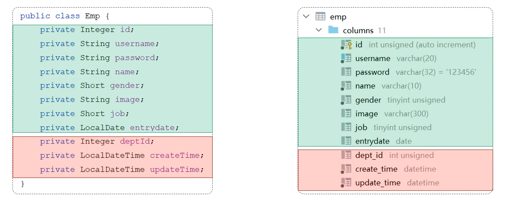

+ 起别名：给字段起别名，让别名与实体类属性一致

```java
 方案一：给字段起别名，让别名与实体类属性一致
@Select("select id, username, password, name, gender, image, job, entrydate, dept_id deptId, create_time createTime, update_time updateTime from emp where id = #{id};")
public Emp getById(Integer id);
```

+ 手动结果映射：通过@Results，@Result注解手动映射封装

```java
// 方案二：通过@Results，@Result注解手动映射封装
@Results({
        @Result(column = "dept_id", property = "deptId"),
        @Result(column = "create_time", property = "createTime"),
        @Result(column = "update_time", property = "updateTime")
})
@Select("select * from emp where id = #{id};")
public Emp getById(Integer id);
```

**重点**

+ **开启驼峰命名**：开启 mybatis 的驼峰命名自动映射开关

```properties
# 方案三：开启mybatis的驼峰命名自动映射开关
mybatis.configuration.map-underscore-to-camel-case=true
```

#### 5.3 查询（条件查询）

+ SQL 语句

不安全

```sql
select * from emp where name like '%张%' and gender = 1 and entrydate between '2010-01-01' and '2020-01-01' order by update_time desc ;
```

安全

```sql
select *
from emp
where name like concat('%', '张', '%')
  and gender = 1
  and entrydate between '2010-01-01' and '2020-01-01'
order by update_time desc;
```

+ 接口方法

```java
@Select("select * from emp where name like concat('%', #{name}, '%') and gender = #{gender} and entrydate between #{begin} and #{end} order by update_time desc ;")
public List<Emp> list(String name, Short gender, LocalDate begin, LocalDate end);
```

+ mapper/EmpMapper.java

```java
package com.itfeng.mapper;

import com.itfeng.pojo.Emp;
import org.apache.ibatis.annotations.*;

import java.time.LocalDate;
import java.util.List;

@Mapper
public interface EmpMapper {

    // 条件查询员工
    @Select("select * from emp where name like concat('%', #{name}, '%') and gender = #{gender} and entrydate between #{begin} and #{end} order by update_time desc ;")
    public List<Emp> list(String name, Short gender, LocalDate begin, LocalDate end);
}
```

+ SpringbootMybatisCrudApplication.java

```java
package com.itfeng;

import com.itfeng.mapper.EmpMapper;
import com.itfeng.pojo.Emp;
import org.junit.jupiter.api.Test;
import org.springframework.beans.factory.annotation.Autowired;
import org.springframework.boot.test.context.SpringBootTest;

import java.time.LocalDate;
import java.time.LocalDateTime;
import java.util.List;

@SpringBootTest
class SpringbootMybatisCrudApplicationTests {

    @Autowired
    private EmpMapper empMapper;

    // 根据条件查询员工
    @Test
    public void testList() {
        List<Emp> empList = empMapper.list("张", (short) 1, LocalDate.of(2010, 1, 1), LocalDate.of(2020, 1, 1));
        System.out.println(empList);
    }
}
```

#### 5.4 参数名说明

+ 在 springBoot 的**2.x 版本**

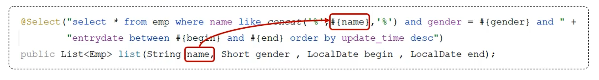

+ 在 springBoot 的**1.x 版本** / 单独使用 mybatis

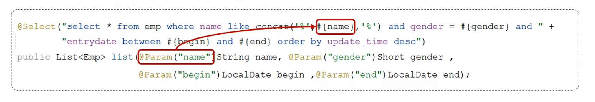

因为编译后文件为：

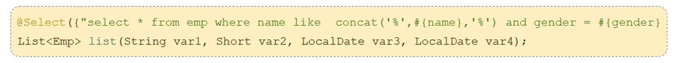

无法对应参数名称


----------------------------


## 三、XML 映射文件

规范

+ XML 映射文件的名称与 Mapper 接口名称一致，并且将 XML 映射文件和 Mapper 接口放置在相同包下**（同包同名）**
+ XML 映射文件的 namespace 属性为 Mapper 接口全限定名一致
+ XML 映射文件中的 sql 语句的 id 与 Mapper 接口中的方法名一致，并保持返回类型一致

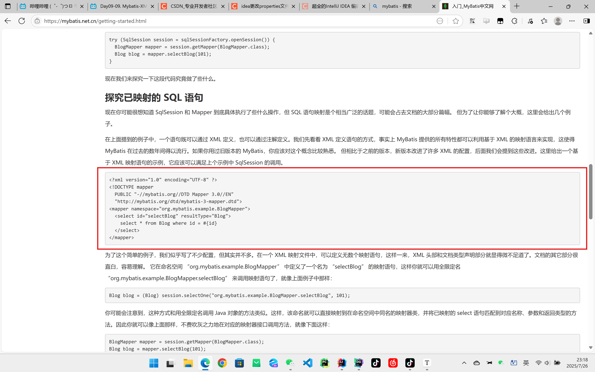

```xml
<?xml version="1.0" encoding="UTF-8" ?>
<!DOCTYPE mapper
  PUBLIC "-//mybatis.org//DTD Mapper 3.0//EN"
  "http://mybatis.org/dtd/mybatis-3-mapper.dtd">
```

+ Mapper 接口

```java
public interface EmpMapper {
    public List<Emp> list(String name, Short gender, LocalDate begin, LocalDate end);
}
```

+ XML 映射文件

```xml
<mapper namespace="com.itfeng.mapper.EmpMapper">

<!--    resultType：单条记录所封装的类型-->
    <select id="list" resultType="com.itfeng.pojo.Emp">
        select *
        from emp
        where name like concat('%', #{name}, '%')
          and gender = #{gender}
          and entrydate between #{begin} and #{end}
        order by update_time desc;
    </select>
    
</mapper>
```

### IDEA 插件

+ **MybatisX** 是一款基于 IDEA 的快速开发 Mybatis 的插件，为**效率**而生
+ 安装：

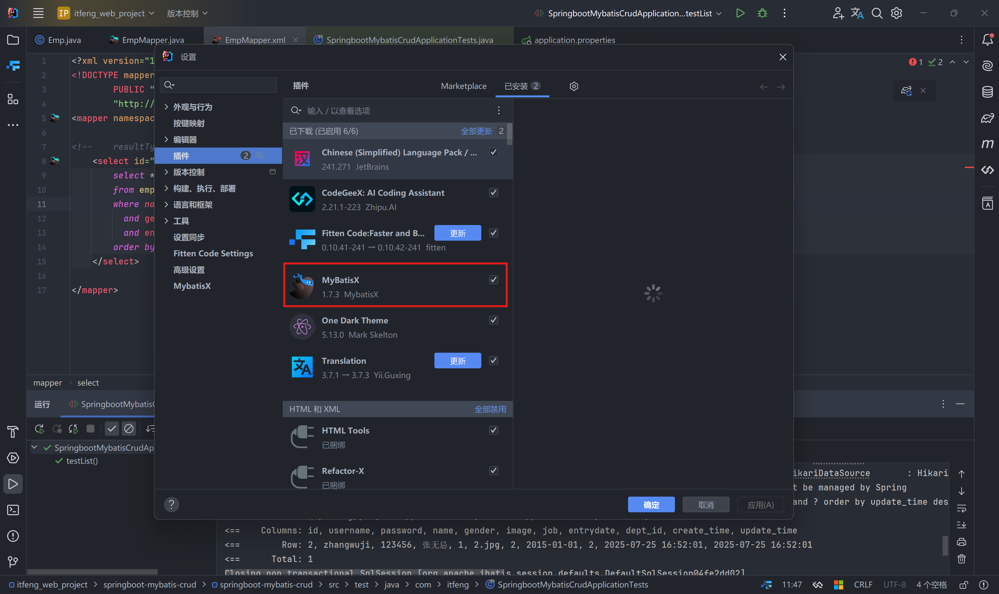

### 用注解还是 XML 映射文件呢？

使用 Mybatis 的注解，主要是来完成一些简单的增删改查功能。如果需要实现复杂的 SQL 功能，建议使用 XML 来配置映射语句

+ 官网：[入门_MyBatis中文网](https://mybatis.net.cn/getting-started.html)


-------------------------


## 四、Mybatis 动态 SQL

动态 SQL

+ 随着用户的输入或外部条件的变化而变化的 SQL 语句，我们称为 **动态 SQL**

### 1. 动态 SQL - if

+ <if>：用于判断条件是否成立。使用 test 属性进行叫天判断，如果条件为 true，则拼接 SQL

```xml
<if test="name != null">
	name like concat('%', #{name}, '%')
</if>
```

+ <where>：where 元素只会在子元素有内容的情况下才插入 where 子句。而且会自动去除子句的开头的 and 或 or

#### 代码演示

+ resources/com/itfeng/mapper/EmpMapper.xml

```xml
<?xml version="1.0" encoding="UTF-8" ?>
<!DOCTYPE mapper
        PUBLIC "-//mybatis.org//DTD Mapper 3.0//EN"
        "http://mybatis.org/dtd/mybatis-3-mapper.dtd">
<mapper namespace="com.itfeng.mapper.EmpMapper">

<!--    resultType：单条记录所封装的类型-->
    <select id="list" resultType="com.itfeng.pojo.Emp">
        select *
        from emp
        <where> <!-- 1. 根据里面的子标签动态的判断里面的条件，如果里面所有的条件都不成立，就不会生成where关键字   2. 自动去除掉条件前面多余的and或者是or -->
            <if test="name != null">
                name like concat('%', #{name}, '%')
            </if>
            <if test="gender != null">
                and gender = #{gender}
            </if>
            <if test="begin != null and end != null">
                and entrydate between #{begin} and #{end}
            </if>
        </where>
        order by update_time desc;
    </select>
    
</mapper>
```

+ SpringbootMybatisCrudApplicationTest.java

```java
package com.itfeng;

import com.itfeng.mapper.EmpMapper;
import com.itfeng.pojo.Emp;
import org.junit.jupiter.api.Test;
import org.springframework.beans.factory.annotation.Autowired;
import org.springframework.boot.test.context.SpringBootTest;

import java.time.LocalDate;
import java.time.LocalDateTime;
import java.util.List;

@SpringBootTest
class SpringbootMybatisCrudApplicationTests {

    @Autowired
    private EmpMapper empMapper;

    // 根据条件查询员工
    @Test
    public void testList() {
//        List<Emp> empList = empMapper.list("张", (short) 1, LocalDate.of(2010, 1, 1), LocalDate.of(2020, 1, 1));
        List<Emp> empList = empMapper.list(null, (short)1, null, null);
        System.out.println(empList);
    }
}
```

#### 案例

> 完善更新员工功能，修改为动态更新员工数据信息
>
> 需求：
>
> + 动态更新员工信息，如果更新时传递有值，则更新；如果更新时没有传递值，则不更新
>
> 解决方法：
>
> + 动态 SQL

+ <set>：动态地在行首插入 SET 关键字，并会删掉额外的逗号（用在 update 语句中）


+ resources/com/itfeng/mapper/EmpMapper.xml

```xml
<?xml version="1.0" encoding="UTF-8" ?>
<!DOCTYPE mapper
        PUBLIC "-//mybatis.org//DTD Mapper 3.0//EN"
        "http://mybatis.org/dtd/mybatis-3-mapper.dtd">
<mapper namespace="com.itfeng.mapper.EmpMapper">
    <update id="update2">
        update emp
        <set>
            <if test="username != null">username = #{username},</if>
            <if test="name != null">name = #{name},</if>
            <if test="gender != null">gender = #{gender},</if>
            <if test="image != null">image = #{image},</if>
            <if test="job != null">job = #{job},</if>
            <if test="entrydate != null">entrydate = #{entrydate},</if>
            <if test="deptId != null">dept_id = #{deptId},</if>
            <if test="updateTime != null">update_time = #{updateTime}</if>
        </set>
        where id = #{id};
    </update>

</mapper>
```

+ SpringbootMybatisCrudApplicationTests.java

```java
package com.itfeng;

import com.itfeng.mapper.EmpMapper;
import com.itfeng.pojo.Emp;
import org.junit.jupiter.api.Test;
import org.springframework.beans.factory.annotation.Autowired;
import org.springframework.boot.test.context.SpringBootTest;

import java.time.LocalDate;
import java.time.LocalDateTime;
import java.util.List;

@SpringBootTest
class SpringbootMybatisCrudApplicationTests {

    @Autowired
    private EmpMapper empMapper;

    @Test
    public void testUpdate2() {
        // 构建员工对象
        Emp emp = new Emp();
        emp.setId(20);
        emp.setUsername("Tom222");
//        emp.setName("汤姆222");
//        emp.setImage("1.jpg");
//        emp.setGender((short) 1);
//        emp.setUpdateTime(LocalDateTime.now());

        // 执行更新员工操作
        empMapper.update2(emp);
    }
}
```

#### 小结

1. <if>

+ 用于判断条件是否成立，如果条件为 true，则拼接 SQL
+ 形式：<if test="name != null">...</if>

2. <where>

+ where 元素只会在子元素有内容的情况下才会插入 where 子句，而且会自动去除子句的开头的 and 或 or

3. <set>

+ 动态地在行首插入 set 关键字，并会删除额外的逗号（用在 update 语句中）


-----------------------


### 2. 动态 SQL - foreach

#### 2.1 实现

+ SQL 语句

```sql
delete from emp where id in(18, 19, 20);
```

+ 接口方法

```java
public void deleteByIds(List<Integer> ids);
```

+ XML 映射文件

```xml
<delete id="deleteByIds">
    delete from emp where id in
    <foreach collection="ids" item="id" separator="," open="(" close=")">
        #{id}
    </foreach>
</delete>
```

参数：

+ **collection**：集合名称
+ **item**：集合遍历出来的元素 / 项
+ **separator**：每一次遍历使用的分隔符
+ **open**：遍历开始前拼接的片段
+ **close**：遍历结束后拼接的片段

#### 2.2 代码演示

+ resources/com/itfeng/mapper/EmpMapper.xml

```xml
<?xml version="1.0" encoding="UTF-8" ?>
<!DOCTYPE mapper
        PUBLIC "-//mybatis.org//DTD Mapper 3.0//EN"
        "http://mybatis.org/dtd/mybatis-3-mapper.dtd">
<mapper namespace="com.itfeng.mapper.EmpMapper">

    <!--
        collection：遍历的集合
        item：遍历出来的元素
        separator：分隔符
        open：遍历开始前拼接的SQL片段
        close：遍历结束后拼接的SQL片段
    -->
    <delete id="deleteByIds">
        delete from emp where id in
        <foreach collection="ids" item="id" separator="," open="(" close=")">
            #{id}
        </foreach>
    </delete>

</mapper>
```

+ SpringbootMybatisCrudApplicationTests.java

```java
package com.itfeng.mapper;

import com.itfeng.pojo.Emp;
import org.apache.ibatis.annotations.*;

import java.time.LocalDate;
import java.util.List;

@Mapper
public interface EmpMapper {
    // 批量删除员工
    public void deleteByIds(List<Integer> ids);
}
```

+ SpringbootMybatisCrudApplicationTest.java

```java
package com.itfeng;

import com.itfeng.mapper.EmpMapper;
import com.itfeng.pojo.Emp;
import org.junit.jupiter.api.Test;
import org.springframework.beans.factory.annotation.Autowired;
import org.springframework.boot.test.context.SpringBootTest;

import java.lang.reflect.Array;
import java.time.LocalDate;
import java.time.LocalDateTime;
import java.util.Arrays;
import java.util.List;

@SpringBootTest
class SpringbootMybatisCrudApplicationTests {

    @Autowired
    private EmpMapper empMapper;

    // 批量删除员工 - 13，14，15
    @Test
    public void testDeleteByIds(){
        List<Integer> ids = Arrays.asList(13, 14, 15);
        empMapper.deleteByIds(ids);
    }
}
```


--------------------------


### 3. 动态 SQL - <sql><include>

#### 3.1 SQL 片段

+ <sql>：定义可重复用的 SQL 片段
+ <include>：通过属性 refid，指定包含的 sql 片段

```xml
<sql id="commonSelect">
    select id,
           username,
           password,
           name,
           gender,
           image,
           job,
           entrydate,
           dept_id,
           create_time,
           update_time
    from emp
</sql>

<!--    resultType：单条记录所封装的类型-->
<select id="list" resultType="com.itfeng.pojo.Emp">
    <include refid="commonSelect"/>
    <where> <!-- 1. 根据里面的子标签动态的判断里面的条件，如果里面所有的条件都不成立，就不会生成where关键字   2. 自动去除掉条件前面多余的and或者是or -->
        <if test="name != null">
            name like concat('%', #{name}, '%')
        </if>
        <if test="gender != null">
            and gender = #{gender}
        </if>
        <if test="begin != null and end != null">
            and entrydate between #{begin} and #{end}
        </if>
    </where>
    order by update_time desc;
</select>
```


-------------------


### 总结

1. XML 映射文件

+ 映射配置文件名与 Mapper 接口名一致，且放在相同的包下（同包同名）
+ 映射配置文件的 namespace 属性与 Mapper 接口的全类名一致
+ XML 映射文件中 sql 语句的 id 与 Mapper 接口中的方法名一致

2. 动态 SQL

+ <if>
+ <where>
+ <set>
+ <foreach>
+ <sql>
+ <include>


------------------------------


## 五、补充

### 1. 操作事务

`@Transactional` 是 Spring 框架中用于**声明式事务管理**的核心注解。它提供了一种简洁的方式管理数据库事务，无需手动编写事务控制代码

#### 1.1 核心作用

将方法 / 类标记成**事务性操作**，确保方法内的多个数据库操作作为一个原子单元执行

+ 全部成功：自动提交事务
+ 任何失败：自动回滚所有操作

#### 1.2 事务传播行为（Propagation）

控制事务的作用范围，默认为 `REQUIRED`

```java
@Transactional(propagation = Propagation.REQUIRED)
```

- **REQUIRED**（默认）：存在事务则加入，无则新建
- **REQUIRES_NEW**：始终新建事务，暂停当前事务（若有）
- **SUPPORTS**：存在事务则加入，无则以非事务执行
- **MANDATORY**：必须存在事务，否则抛异常
- **NESTED**：嵌套事务（部分数据库支持）
- **NEVER**：必须在非事务环境执行，否则抛异常
- **NOT_SUPPORTED**：非事务执行，暂停当前事务

#### 1.3 隔离级别（Isolation）

控制事务并发问题，默认为数据库默认级别

```java
@Transactional(isolation = Isolation.READ_COMMITTED)
```

- **DEFAULT**：使用数据库默认
- **READ_UNCOMMITTED**：可能脏读
- **READ_COMMITTED**：防脏读（最常用）
- **REPEATABLE_READ**：防脏读+不可重复读
- **SERIALIZABLE**：最高隔离（性能最低）

#### 1.4 回滚规则（Rollback）

指定触发回滚的异常类型

```java
@Transactional(rollbackFor = Exception.class) // 所有异常回滚
@Transactional(noRollbackFor = BusinessException.class) // 特定异常不回滚
```

- **默认**：仅对 `RuntimeException` 和 `Error` 回滚
- **重要**：受检异常（Checked Exception）默认**不回滚**

#### 1.5 其他关键属性

| 属性       | 作用                             | 默认值       |
| :--------- | :------------------------------- | :----------- |
| `timeout`  | 事务超时时间（秒）               | -1（无限制） |
| `readOnly` | 是否只读事务（优化性能）         | false        |
| `value`    | 指定事务管理器（多数据源时使用） | ""           |

#### 1.6 性能优化建议

1. 只读查询使用 `@Transactional(readOnly = true)`
2. 设置合理超时：`@Transactional(timeout = 5)`
3. 避免在事务中进行远程调用等阻塞操作
4. 按需选择最低隔离级别（如 `READ_COMMITTED`）


---------------------------------


### 2. 在 YAML 配置文件中启用 MyBatis 的 SQL 日志输出到控制台

#### 2.1 配置 MyBatis 日志实现

```yaml
mybatis:
  configuration:
    log-impl: org.apache.ibatis.logging.stdout.StdOutImpl
```

这个配置会让 MyBatis 使用内置的标准输出日志实现，直接将 SQL 语句和参数输出到控制台

#### 2.2 通过日志框架配置（更灵活）

```yaml
logging:
  level:
    # 设置 MyBatis mapper 接口的包路径为 DEBUG 级别
    com.qmx.homework.mapper: DEBUG
    
    # 或者设置更通用的 MyBatis 日志记录器
    org.mybatis: DEBUG
    
    # JDBC 相关日志（可选）
    java.sql: DEBUG
    java.sql.Connection: DEBUG
    java.sql.Statement: DEBUG
    java.sql.PreparedStatement: DEBUG
```

+ 效果对比

| 配置方式       | 日志输出示例                                                 | 特点                         |
| :------------- | :----------------------------------------------------------- | :--------------------------- |
| **StdOutImpl** | `==> Preparing: SELECT * FROM user WHERE id = ?` `==> Parameters: 1(Integer)` | 简洁直接，只显示 SQL 和参数  |
| **日志框架**   | `DEBUG 12345 --- [nio-8080-exec-1] c.q.h.m.UserMapper.selectUser` `DEBUG 12345 --- [nio-8080-exec-1] jdbc.sqltiming : SELECT * FROM user WHERE id = 1` | 包含时间戳、线程信息等上下文 |

#### 2.3 高级配置（Logback 示例）

如果需要更详细的日志控制，可以在 `logback-spring.xml` 中添加：

```xml
<configuration>
    <!-- 控制台输出 -->
    <appender name="CONSOLE" class="ch.qos.logback.core.ConsoleAppender">
        <encoder>
            <pattern>%d{HH:mm:ss.SSS} [%thread] %-5level %logger{36} - %msg%n</pattern>
        </encoder>
    </appender>
    
    <!-- MyBatis SQL 日志 -->
    <logger name="com.qmx.homework.mapper" level="DEBUG"/>
    <logger name="java.sql" level="DEBUG"/>
    
    <root level="INFO">
        <appender-ref ref="CONSOLE"/>
    </root>
</configuration>
```

#### 注意事项

1. 日志级别选择

+ `DEBUG`：显示 SQL 语句和参数
+ `TRACE`：显示更详细的执行细节（如结果集处理）

2. 生产环境

```yaml
# 生产环境建议关闭 SQL 日志
logging:
  level:
    java.sql: WARN
    org.mybatis: WARN
```

3. IDEA 增强

在 Intellij IDEA 中可以启用内置的数据库日志

```properties
# 显示执行时间
spring.jpa.properties.hibernate.generate_statistics=true
```

4. 日志过多问题

如果输出太多日志，可以只监控特定 Mapper

```yaml
logging:
  level:
    com.qmx.homework.mapper.UserMapper: DEBUG
```


