# SpringBootWeb

Spring

+ 官网：[Spring | Home](https://spring.io/)
+ Spring 发展到今天已经形成了一种开发生态圈，Spring 提供了若干个子项目，每个项目用于完成特定的功能

Spring 全家桶

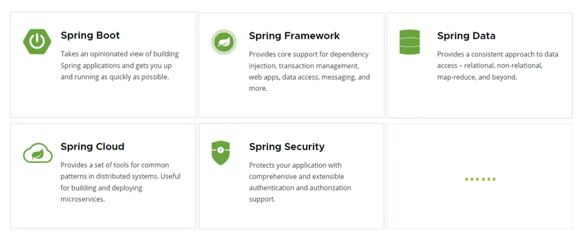

SpringBoot

+ SpringBoot 可以帮助我们非常快速的构建应用程序、简化开发、提高效率

## 一、SpringBootWeb 入门

> 需求：使用 SpringBoot 开发一个 web 应用，浏览器发起请求 /hello 后，给浏览器返回字符串 "Hello World~"
>
> 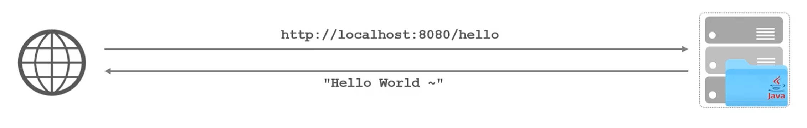

步骤：

1. 创建 springboot 工程，并勾选 web 开发相关依赖
2. 定义 HelloController 类，添加方法 Hello，并添加注解
3. 运行测试

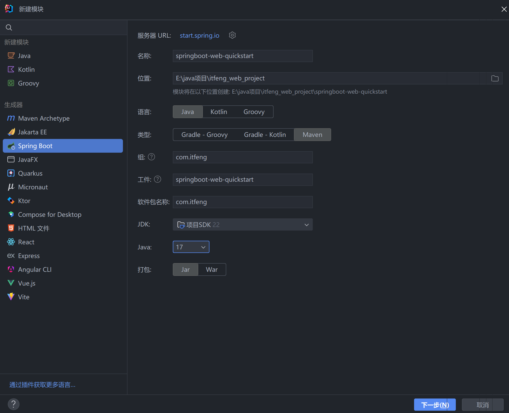

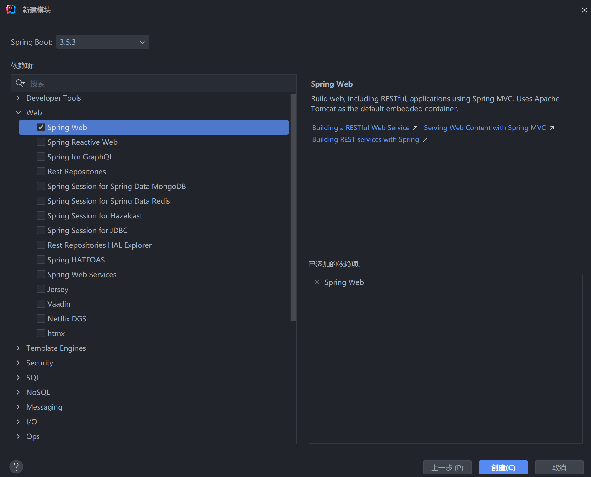

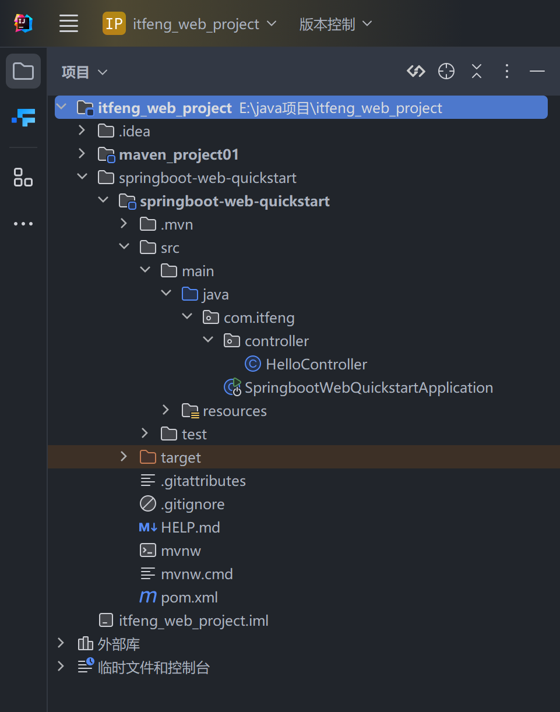

+ HelloController.java

```java
package com.itfeng.controller;

import org.springframework.web.bind.annotation.RequestMapping;
import org.springframework.web.bind.annotation.RestController;

// 请求处理类
@RestController
public class HelloController {
    @RequestMapping("/hello")
    public String hello(){
        System.out.println("Hello World~");
        return "Hello World~";
    }
}

```

+ 运行效果

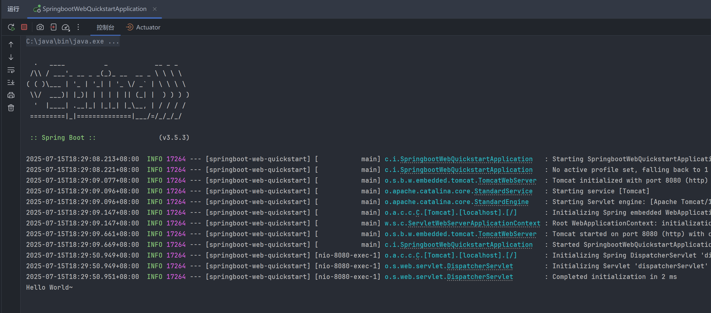

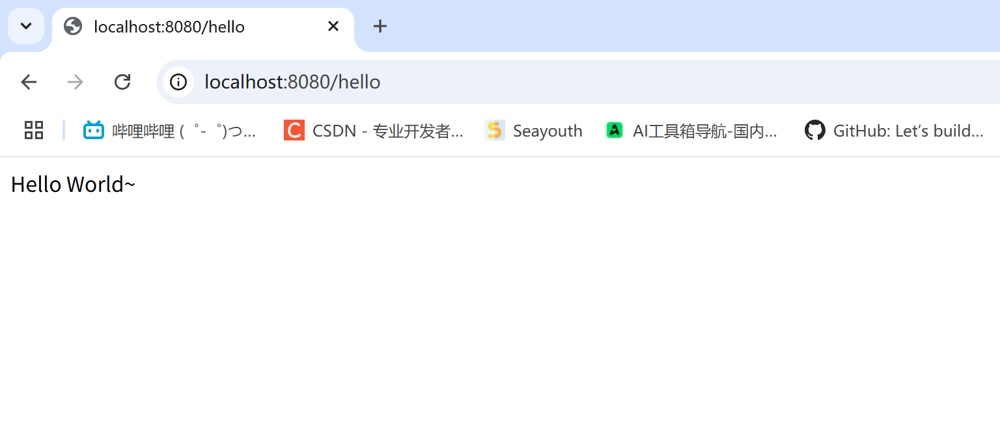


---------------------------


## 二、HTTP 协议

### 1. HTTP - 概述

HTTP

+ 概念：Hyper Text Transfer Protocol，超文本传输协议，规定了浏览器和服务器之间数据传输的规则


+ 特点：

1. 基于 TCP 协议：面向连接、安全
2. 基于请求-响应模型的：一次请求对应一次响应
3. HTTP 协议是无状态的协议：对于事务处理没有记忆能力。每次请求-响应都是独立的

+ 缺点：多次请求间不能共享数据
+ 优点：速度快


### 2. HTTP - 请求协议

HTTP - 请求数据的格式

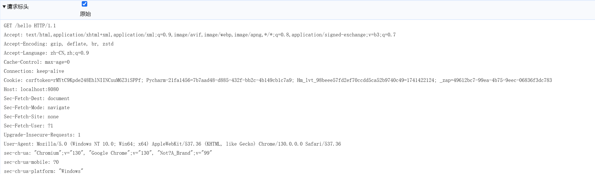

+ 请求行：请求数据第一行（请求方式、资源路径、协议）
+ 请求头：从第二行开始，格式 `key: value`

| 请求头          | 含义                                                         |
| --------------- | ------------------------------------------------------------ |
| Host            | 请求的主机名                                                 |
| User-Agent      | 浏览器版本，例如 Chrome 浏览器的标识类似 Mozilla/5.0 ... Chrome/79，IE 浏览器的标识类似 Mozilla/5.0（Windows NT...）like Gecko |
| Accept          | 表示浏览器能接收的资源类型，如 `text/*`，`image/*` 或者 `*/*` 表示所有 |
| Accept-Language | 表示浏览器偏好的语言，服务器可以据此返回不同语言的网页       |
| Accept-Encoding | 表示浏览器可以支持的压缩类型，例如 gzip，deflate 等          |
| Content-Type    | 请求主体的数据类型                                           |
| Contenet-Length | 请求主体的大小（单位：字节）                                 |

+ 请求体：POST 请求，存放请求参数

**请求方式 - GET**：请求参数在请求行中，如：/brand/findAll?name=OPPO&status=1。GET 请求大小是有限制的

**请求方式 - POST**：请求参数在请求体中，POST 请求大小是没有限制的

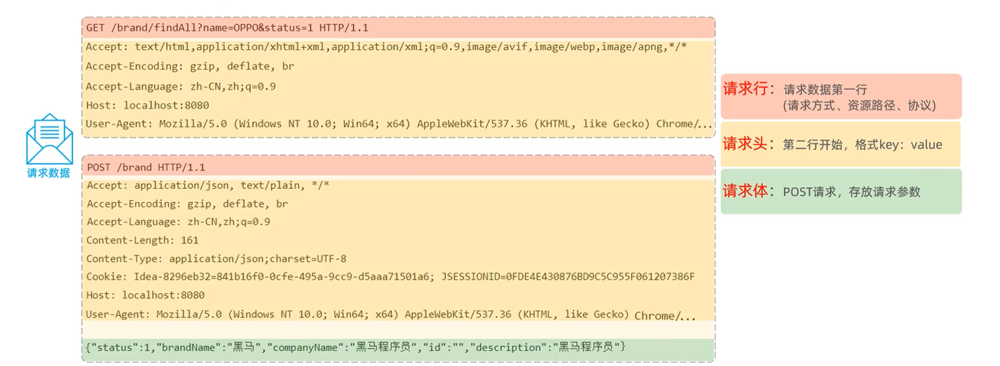


### 3. HTTP - 响应协议

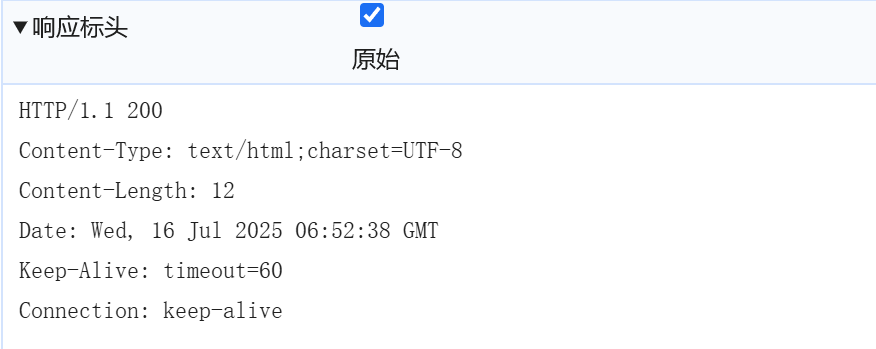

+ 响应行：响应数据第一行（协议、状态码、描述）
+ 响应头：第二行开始，格式 `key: value`
+ 响应体：最后一部分，存放响应数据

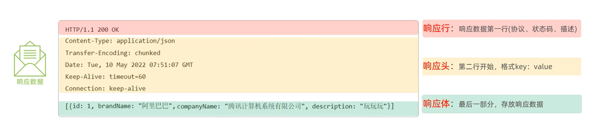

| 响应状态码 | 含义                                                         |
| ---------- | ------------------------------------------------------------ |
| 1xx        | 响应中-临时状态码，表示请求已经接收，告诉客户端应该继续请求或者如果它已经完成则忽略它 |
| 2xx        | 成功-表示请求已经被成功接收，处理已完成                      |
| 3xx        | 重定向-重定向到其他地方，让客户端再发起一次请求以完成整个处理 |
| 4xx        | 客户端错误-处理发生错误，责任在客户端。如：请求了不存在的资源、客户端未被授权、禁止访问等 |
| 5xx        | 服务器错误-处理发生错误，责任在服务端。如：程序抛出异常等    |

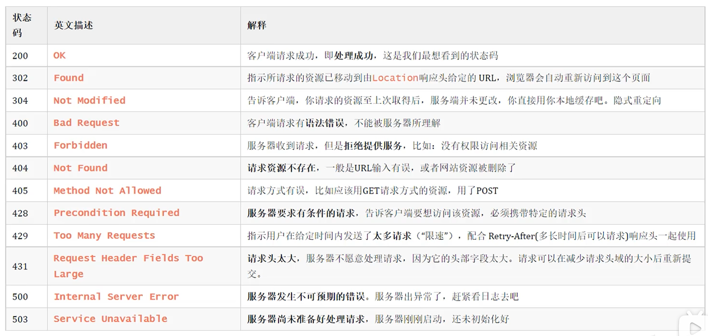

| 常见的响应头     | 含义                                                       |
| ---------------- | ---------------------------------------------------------- |
| Content-Type     | 表示该响应内容的类型，例如：text/html，application/json    |
| Content-Length   | 表示该响应内容的长度（字节数）                             |
| Content-Encoding | 表示该响应压缩算法，例如：gzip                             |
| Cache-Control    | 指示客户端如何缓存，例如 max-age=300 表示可以最多缓存300秒 |
| Set-Cookie       | 告诉浏览器为当前页面所在的域设置 cookie                    |


### 4. HTTP - 协议解析

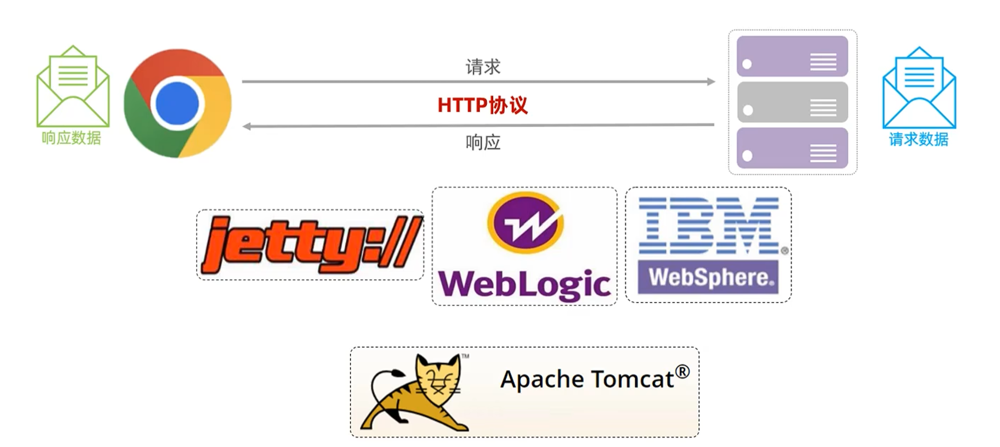


---------------------


## 三、Web 服务器 - Tomcat

Web 服务器是一个软件程序，对 HTTP 协议的操作进行封装，使得程序员不必直接对协议进行操作，让 Web 开发更加便捷。主要功能是 “提供网上信息浏览服务”

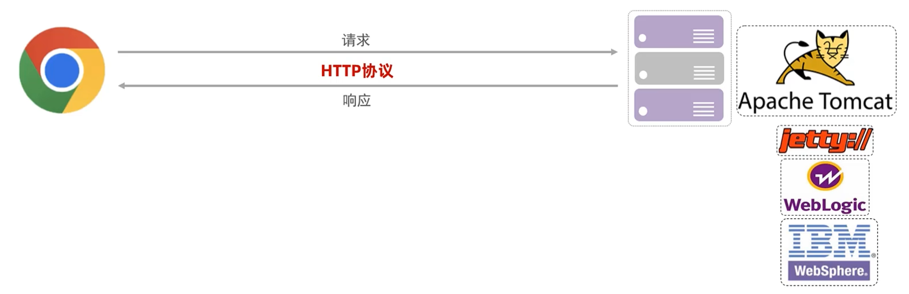

### 1. 简介

Tomcat

+ 概念：Tomcat 是 Apache 软件基金会一个核心项目，是一个开源免费的轻量级 Web 服务器，支持 Servlet/JSP 少量 JavaEE 规范
+ JavaEE：Java Enterprise Edition，Java 企业版。指 Java 企业级开发的技术规范总和。包含13项技术规范：JDBC、JNDI、EJB、RMI、JSP、Servlet、XML、JMS、Java IDL、JTS、JTA、JavaMail、JAF
+ Tomcat 也被称为 Web 容器、Servlet 容器。Servlet 程序需要依赖于 Tomcat 才能运行
+ 官网：[Apache Tomcat® - Welcome!](https://tomcat.apache.org/)


### 2. 基本使用

**本节 Tomcat 不用下载，SpringBoot 已经内置 Tomcat**

#### 2.1 下载、安装

+ 下载：官网下载，地址：[Apache Tomcat® - Apache Tomcat 11 Software Downloads](https://tomcat.apache.org/download-11.cgi)

+ 安装：绿色版，直接解压即可

+ 卸载：直接删除目录即可

+ 启动：双击：bin\startup.bat

  + 控制台中文乱码：修改 conf / logging.properties

  ```
  java.util.logging.ConsoleHandler.level = FINE
  java.util.logging.ConsoleHandler.formatter = org.apache.juli.OneLineFormatter
  java.util.logging.ConsoleHandler.encoding = GBK
  ```

+ 关闭：

  + 直接×掉运行窗口：强制关闭
  + bin\shutdown：正常关闭
  + Ctrl+C：正常关闭

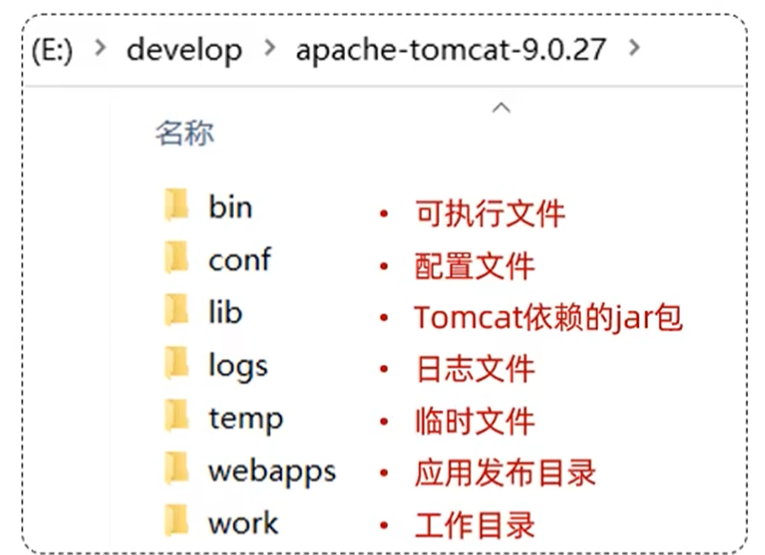

#### 2.2 常见问题

+ 启动窗口一闪而过：检查 JAVA_HOME 环境变量是否配置正确
+ 端口号冲突：找到对应程序，将其关闭掉

配置 Tomcat 端口号（conf/server.xml）

```xml
<Connector port="8080" protocol="HTTP/1.1"
           connectionTimeout="20000"
           redirectPort="8443" />
```

+ HTTP 协议默认端口号为80，如果将 Tomcat 端口号改为80，则讲台访问 Tomcat 时，将不用输入端口号

#### 2.3 Tomcat 部署项目

+ 将项目放置到 webapps 目录下，即部署完成


### 3. 入门程序解析

官方提供的 SpringBoot 的模板

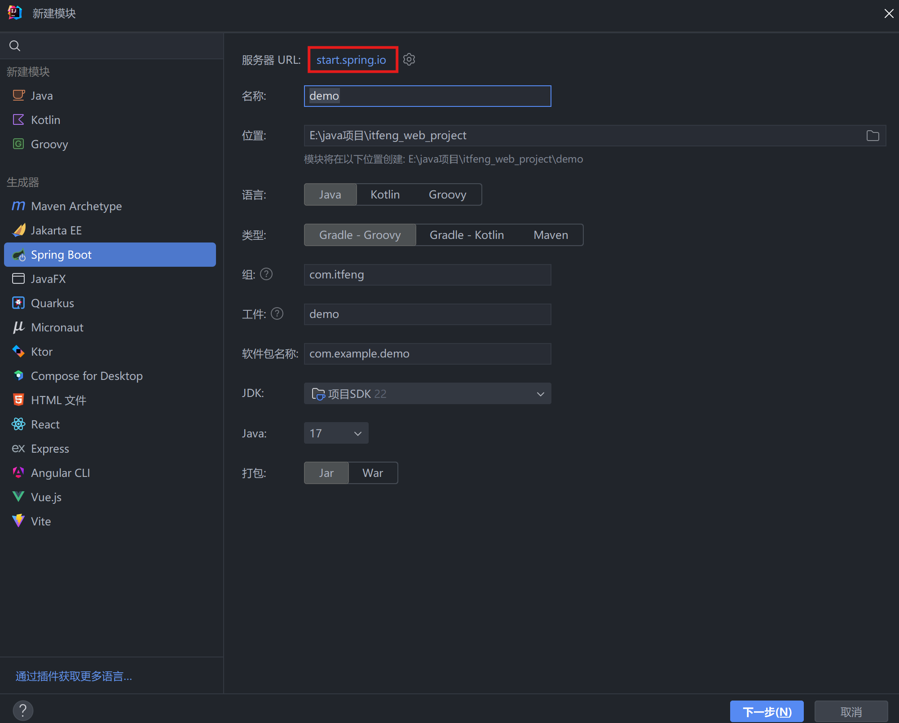

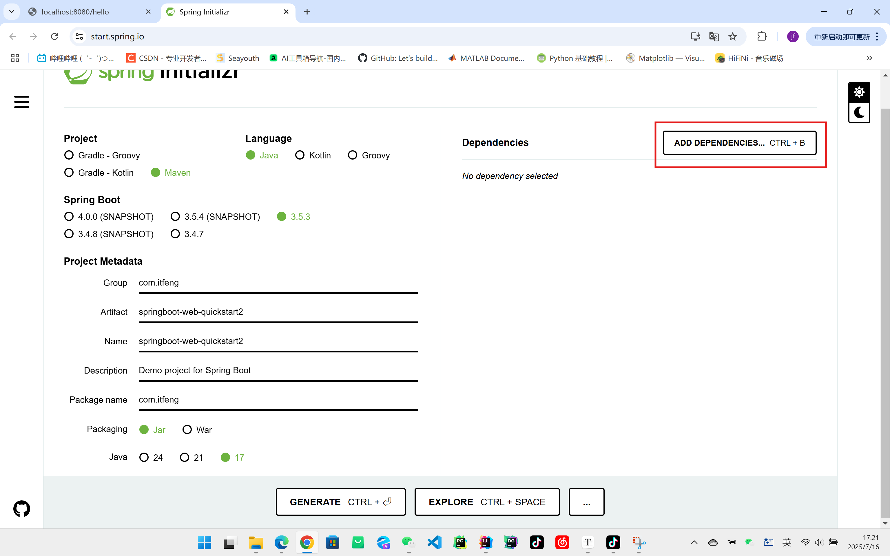

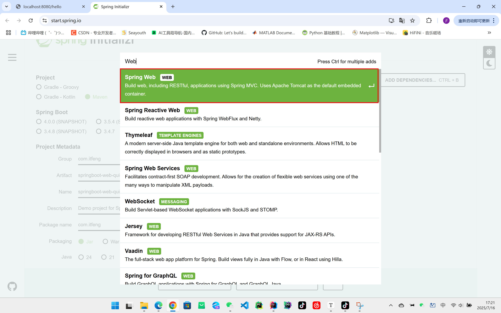

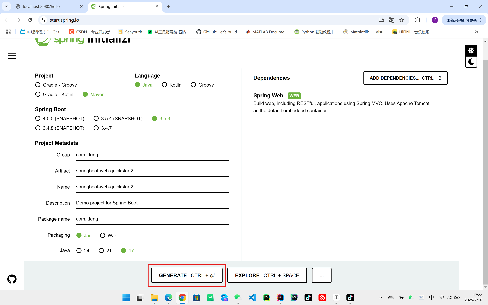

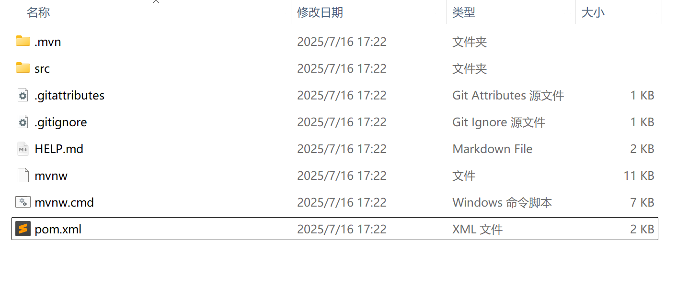

所以在创建 Spring 项目的时候是要联网的

提供的依赖

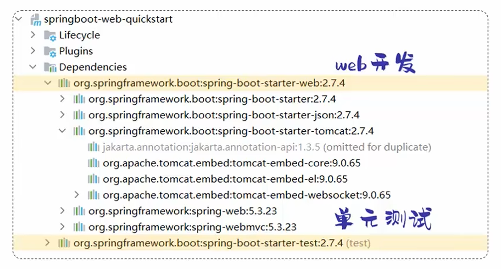

起步依赖：

+ spring-boot-starter-web：包含了 web 应用开发所需要的常见依赖
+ spring-boot-starter-test：包含了单元测试所需要的常见依赖
+ 官方提供的 starter：[Build Systems :: Spring Boot](https://docs.spring.io/spring-boot/reference/using/build-systems.html#using.build-systems.starters)

在 SpringBoot 的 Web 开发环境当中已经将 Tomcat 集成进来了，所以我们在启动 SpringBoot 项目的过程当中，会自动的将内部的 Tomcat 服务器启动起来（内嵌 Tomcat）


----------------------------------


## 四、请求响应


+ 请求（HttpServletRequest）：获取请求数据
+ 响应（HttpServletResponse）：设置响应数据
+ BS 架构：Browser / Server，浏览器 / 服务架构模式。客户端只需要浏览器。应用程序的逻辑和数据都存储在服务端（维护方便 体验一般）
+ CS 架构：Client / Server，客户端 / 服务器架构模式（开发、维护麻烦 但体验不错）

### 1. 请求

#### 1.1 Postman

Postman 是一款功能强大的网页调试与发送网页 HTTP 请求的 Chrome 插件

作用：常用于进行接口测试


创建一个工作空间


#### 1.2 简单参数

+ 原始方式
  + 在原始的 web 程序中，获取请求参数，需要通过 HttpServletRequest 对象手动获取

```java
@RequestMapping("/simpleParam")
public String simpleParam(HttpServletRequest request){
    String name = request.getParameter("name");
    String ageStr = request.getParameter("age");
    int age = Integer.parseInt(ageStr);
    System.out.println(name + ":" + age);
    return "OK";
}
```

这种方式做个了解即可，这种方式比较繁琐、而且需要进行手动类型转换

+ SpringBoot 方式
  + 简单参数：参数名与形参变量名相同，定义形参即可接收参数

```java
@RequestMapping("/simpleParam")
public String simpleParam(String name, Integer age){
    System.out.println(name + ":" + age);
    return "OK";
}
```

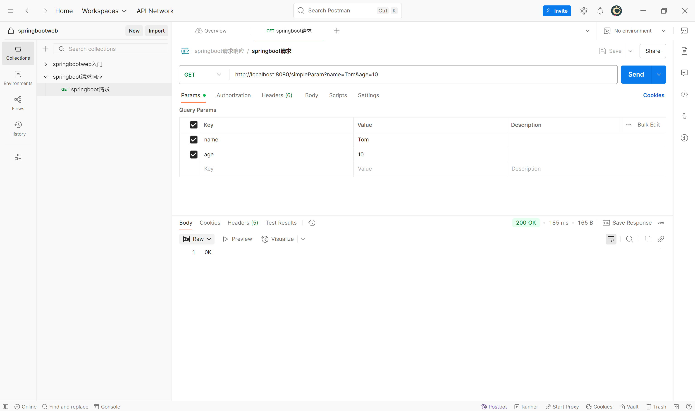

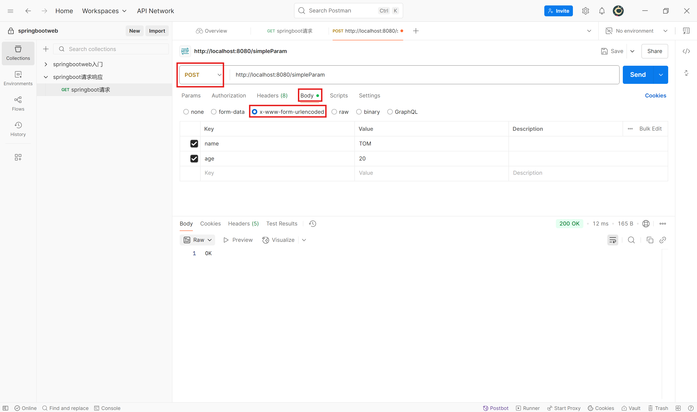

+ 如果方法形参名称与请求参数名称不匹配，可以使用 `@RequestParam` 完成映射

```java
@RequestMapping("/simpleParam")
public String simpleParam(@RequestParam(name = "name")String username, Integer age){
    System.out.println(name + ":" + age);
    return "OK";
}
```

+ 注意：`@RequestParam` 中的 required 属性默认为 true，代表该请求参数必须传递，如果不传递将报错。如果该参数是可选的，可以将 required 属性设置为 false

```java
@RequestMapping("/simpleParam")
public String simpleParam(@RequestParam(name = "name", required = false)String username, Integer age){
    System.out.println(name + ":" + age);
    return "OK";
}
```

##### 小结

1. 原始方式获取请求阐述

+ Controller 方法信长中声明 HttpServletRequest 对象
+ 调用对象的 getParameter(参数名)

2. SpringBoot 中接收简单参数

+ 请求参数名与方法形参变量名相同
+ 会自动进行类型转换

3. @RequestParam 注解

+ 方法形参名称与请求参数名称不匹配，通过该注解完成映射
+ 该注解的 required 属性默认是 true，代表请求参数必须传递


---------------------------------


#### 1.3 实体参数

##### 1.3.1 简单实体对象

+ 请求参数名与形参对象属性名相同，定义 POJO 接收即可

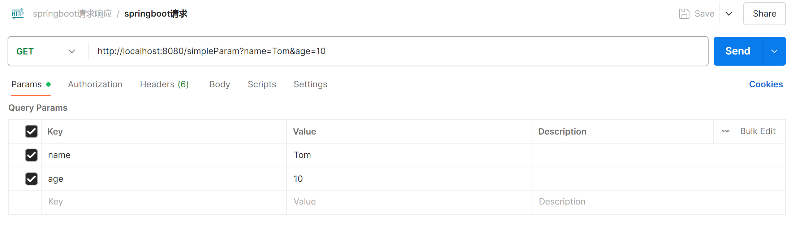

但是如果前端传递很多参数时，通过简单参数这种接收方式就比较繁琐了，而且不便于后期的维护

所以我们就考虑，将所有的请求参数都封装到一个实体类中

+ pojo/User.java

```java
package com.itfeng.pojo;

public class User {
    private String name;
    private Integer age;
    
    public String getName() {
        return name;
    }

    public void setName(String name) {
        this.name = name;
    }

    public Integer getAge() {
        return age;
    }

    public void setAge(Integer age) {
        this.age = age;
    }

    @Override
    public String toString() {
        return "User{" +
                "name='" + name + '\'' +
                ", age=" + age +
                '}';
    }
}

```

+ comtroller/RequestController.java

```java
@RequestMapping("/simplePojo")
public String simplePojo(User user){
    System.out.println(user);
    return "OK";
}
```


##### 1.3.2 复杂实体对象

+  请求参数名与形参对象属性名相同，按照对象层次结构关系即可接收嵌套 POJO 属性参数

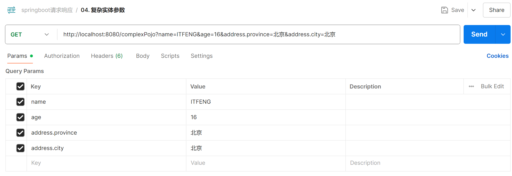

+ pojo/Address.java

```java
package com.itfeng.pojo;

public class Address {
    private String province;
    private String city;

    public String getProvince() {
        return province;
    }

    public void setProvince(String province) {
        this.province = province;
    }

    public String getCity() {
        return city;
    }

    public void setCity(String city) {
        this.city = city;
    }

    @Override
    public String toString() {
        return "Address{" +
                "province='" + province + '\'' +
                ", city='" + city + '\'' +
                '}';
    }
}

```

+ pojo/User.java

```java
package com.itfeng.pojo;

public class User {
    private String name;
    private Integer age;

    private Address address;

    public String getName() {
        return name;
    }

    public void setName(String name) {
        this.name = name;
    }

    public Integer getAge() {
        return age;
    }

    public void setAge(Integer age) {
        this.age = age;
    }

    public Address getAddress() {
        return address;
    }

    public void setAddress(Address address) {
        this.address = address;
    }

    @Override
    public String toString() {
        return "User{" +
                "name='" + name + '\'' +
                ", age=" + age +
                ", address=" + address +
                '}';
    }
}

```

+ controller/RequestController.java

```java
@RequestMapping("/complexPojo")
public String complexPojo(User user){
    System.out.println(user);
    return "OK";
}

```

##### 小结

1. 实体对象参数

+ 规则：请求参数名与形参对象属性名相同，即可直接通过 POJO 接收


----------------------------------------


#### 1.4 数组集合参数

##### 1.4.1 数组参数

+ 请求参数名与形参数组名称相同且请求参数为多个，定义数组类型形参即可接收参数

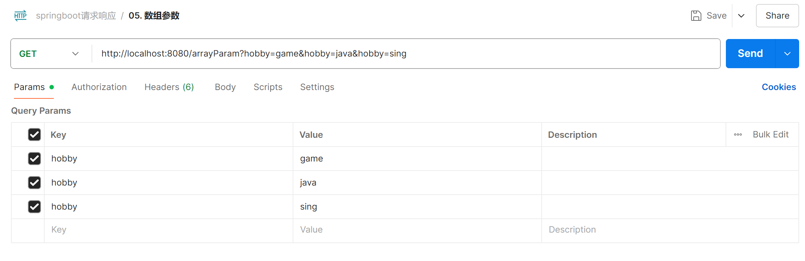

```java
@RequestMapping("/arrayParam")
public String arrayParam(String[] hobby){
    System.out.println(Arrays.toString(hobby));
    return "OK";
}
```

##### 1.4.2 集合参数

+ 请求参数名与形参集合名称相同且请求参数为多个 `@RequestParam` 绑定参数关系

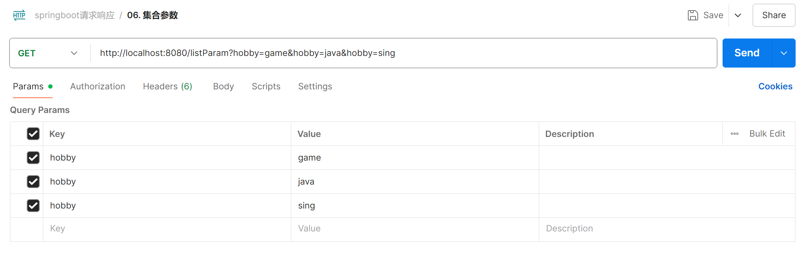

```java
@RequestMapping("/listParam")
public String listParam(@RequestParam List<String> hobby){
    System.out.println(hobby);
    return "OK";
}

```

##### 小结

1. 数组集合参数

+ 数组：请求参数名与形参中数组变量名相同，可以直接使用数组封装
+ 集合：请求参数名与形参中集合变量名相同，通过 `@RequestParam` 绑定参数关系


--------------------------


#### 1.5 日期参数

+ 日期参数：使用 `@DataTimeFormat` 注解完成日期参数格式转换

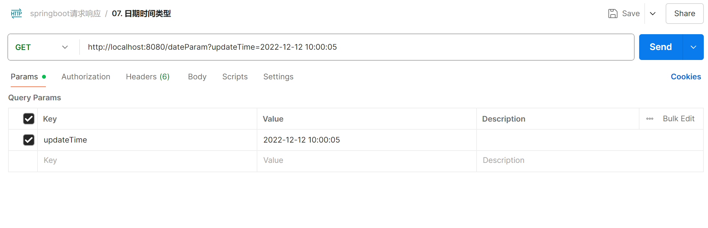

```java
@RequestMapping("/dateParam")
public String dateParam(@DateTimeFormat(pattern = "yyyy-MM-dd HH:mm:ss") LocalDateTime updateTime) {
    System.out.println(updateTime);
    return "OK";
}

```


#### 1.6 Json 参数

+ JSON 参数：JSON 数据**键名**与形参对象**属性名**相同，定义 POJO 类型形参即可接收参数，需要使用 `@RequestBody` 标识

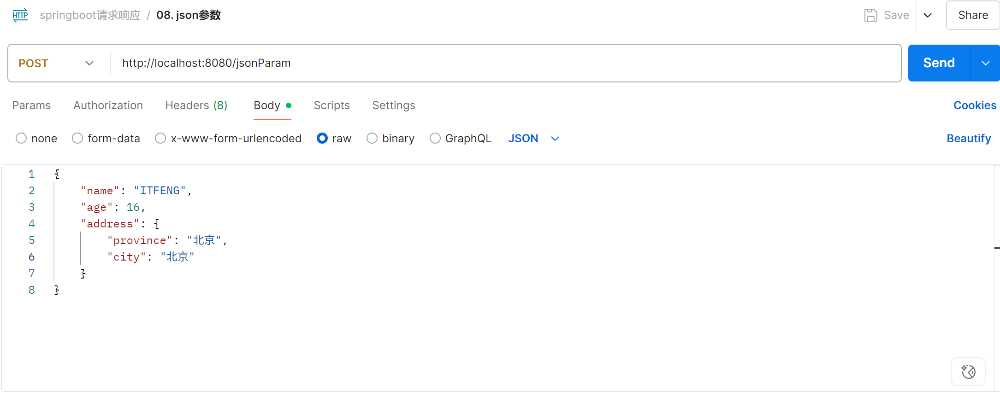

```java
@RequestMapping("/jsonParam")
public String jsonParam(@RequestBody User user) {
    System.out.println(user);
    return "OK";
}

```


-------------------------


#### 1.7 路径参数

+ 路径参数：通过请求 URL 直接传递参数，使用 `{...}` 来标识该路径参数，需要使用 `@PathVariable` 获取路径参数


```java
@RequestMapping("/path/{id}")
public String pathParam(@PathVariable Integer id) {
    System.out.println(id);
    return "OK";
}

```

多个路径参数

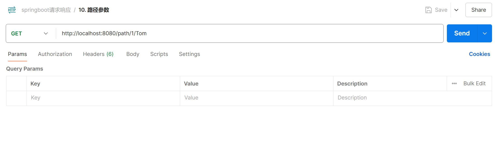

```java
@RequestMapping("/path/{id}/{name}")
public String pathParam2(@PathVariable Integer id, @PathVariable String name) {
    System.out.println(id);
    System.out.println(name);
    return "OK";
}

```


-----------------------------------


#### 1.8 请求参数校验

##### 1.8.1 校验常用注解

+ 空和非空检查

`@NotBlank`、`NotEmpty`、`@Null`、`@NotNull`

+ 数值检查

`@DecimalMax(value)`、`@DecimalMin(value)`、`@Positive`、`@PositiveOrZero`、`@Max(value)`、`@Min(value)`、`@NegativeOrZero`、`@Range(max, min)`

+ Boolean 值检查

`@AssertTrue`、`@AssertFlase`

+ 长度检查

`@Size(max, min)`

+ 其他检查

`@SEmail`、`@Pattern(value)`

+ `@Validated`
+ `BindingResult` 作为校验结果绑定返回

##### 1.8.2 代码实现

1. 引入 starter

```xml
<dependency>
	<groupId>org.springframework.boot</groupId>
    <artifactId>spring-boot-starter-validation</artifactId>
</dependency>
```

2. 实体添加校验注解

```java
@NotEmpty(message = "姓名不能为空")
@Size(min = 1, max = 10, message = "姓名长度需大于1小于10")
private String name;

@NotNull(message = "年龄不能为空")
@Range(min = 0, max = 120, message = "年龄大小需大于0小于120")
private Integer age;
```

3. controller 方法入参添加 `@validated` 和 `BindingResult`

```java
public void saveUser(@Validated @RequestBody User user,
                    BindingResult result) {
    
    if (result.hasErrors()) {
        throw new RuntimeException(result.getFieldError().getDefaultMessage())
    }
}
```


----------------------------


#### 总结

1. 简单参数

+ 定义方法形参，请求参数名与形参变量名一直
+ 如果不一致，通过 `@RequestParam` 手动映射

2. 实体参数

+ 请求参数名，与实体对象的属性名一致，会自动接收封装

3. 数组集合参数

+ 数组：请求参数名与数组名一致，直接封装
+ 集合：请求参数名与集合名一致，`@RequestParam` 绑定关系

4. 日期参数

+ `DateTimeFormat`

5. JSON 参数

+ `@RequestBody`

6. 路径参数

+ `@PathVaribale`


--------------------------------


### 2. 响应

`@ResponseBody`

+ 类型：**方法注解、类注解**
+ 位置：Controller 方法上 / 类上
+ 作用：
+ 说明：@RestController = @Controller + @ResponseBody

代码演示

```java
package com.itfeng.controller;

import com.itfeng.pojo.Address;
import org.springframework.web.bind.annotation.RequestMapping;
import org.springframework.web.bind.annotation.RestController;

import java.util.ArrayList;
import java.util.List;

/**
 * 测试响应数据
 */
@RestController
public class ResponseController {

    @RequestMapping("/hello")
    public String hello(){
        System.out.println("Hello World~");
        return "Hello World";
    }

    @RequestMapping("/getAddr")
    public Address getAddr(){
        Address addr = new Address();
        addr.setProvince("广东");
        addr.setCity("深圳");
        return addr;
    }

    @RequestMapping("/listAddr")
    public List<Address> listAddr(){
        List<Address> list = new ArrayList<>();

        Address addr = new Address();
        addr.setProvince("广东");
        addr.setCity("深圳");

        Address addr2 = new Address();
        addr2.setProvince("陕西");
        addr2.setCity("西安");

        list.add(addr);
        list.add(addr2);
        return list;
    }
}

```

统一响应结果

```java
public class Result{
    // 响应码，1代表成功；0代表失败
    private Integer code;
    // 提示信息
    private String msg;
    // 返回的数据
    private Object data;
    // ...
}
```

```java
package com.itfeng.controller;

import com.itfeng.pojo.Address;
import com.itfeng.pojo.Result;
import org.springframework.web.bind.annotation.RequestMapping;
import org.springframework.web.bind.annotation.RestController;

import java.util.ArrayList;
import java.util.List;

/**
 * 测试响应数据
 */
@RestController
public class ResponseController {

    @RequestMapping("/hello")
    public Result hello(){
        System.out.println("Hello World~");
//        return new Result(1, "success", "Hello World~");
    return Result.success("Hello World~");
    }

    @RequestMapping("/getAddr")
    public Result getAddr(){
        Address addr = new Address();
        addr.setProvince("广东");
        addr.setCity("深圳");
        return Result.success(addr);
    }

    @RequestMapping("/listAddr")
    public Result listAddr(){
        List<Address> list = new ArrayList<>();

        Address addr = new Address();
        addr.setProvince("广东");
        addr.setCity("深圳");

        Address addr2 = new Address();
        addr2.setProvince("陕西");
        addr2.setCity("西安");

        list.add(addr);
        list.add(addr2);
        return Result.success(list);
    }
}

```

#### 小结

1. @ResponseBody

+ 位置：Controller 类上 / 方法上
+ 作用：将方法返回值直接响应，如果返回值类型是 `实体对象/集合` ，将会转换为 JSON 格式响应

2. 统一响应结果

+ Result（code、msg、data）

#### 案例

> 加载并解析 emp.xml 文件中的数据，完成数据处理，并在页面展示
>
> 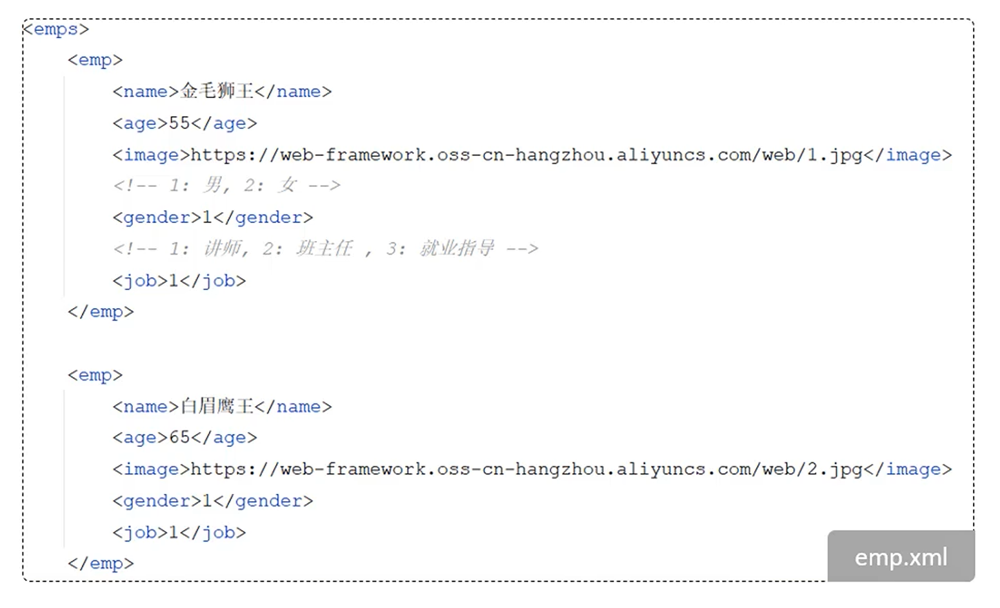

+ 在 pom.xml 文件中引入 dom4j 的依赖，用于解析 XML 文件
+ 引入解析 XML 的工具类 XMLParseUtils、对应的实体类 Emp、XML 文件 emp.xml
+ 引入静态页面文件，放在 resources 下的 static 目录下
+ 编写 Controller 程序，处理请求，响应数据

SpringBoot 项目的静态资源（html、css、js 等前端资源）默认存放目录为：classpath:/static、classpath:/public、classpath:/resources

##### 代码实现

+ utils/XmlParserUtils.java

```java
package com.itfeng.utils;

import org.dom4j.Document;
import org.dom4j.Element;
import org.dom4j.io.SAXReader;

import java.io.File;
import java.lang.reflect.Constructor;
import java.util.ArrayList;

import java.util.List;

public class XmlParserUtils {

    public static <T> List<T> parse(String file, Class<T> targetClass) {
        ArrayList<T> list = new ArrayList<>(); // 封装解析出来的数据
        try {
            // 1. 获取一个解析器对象
            SAXReader saxReader = new SAXReader();
            // 2. 利用解析器把xml文件加载到内存中，并返回一个文档对象
            Document document = saxReader.read(new File(file));
            // 3. 获取到根标签
            Element rootElement = document.getRootElement();
            // 4. 通过根标签来获取user标签
            List<Element> elements = rootElement.elements("emp");

            // 5. 遍历集合，得到每一个user标签
            for (Element element : elements) {
                // 获取name属性
                String name = element.element("name").getText();
                // 获取age属性
                String age = element.element("age").getText();
                // 获取image属性
                String image = element.element("image").getText();
                // 获取gender属性
                String gender = element.element("gender").getText();
                // 获取job属性
                String job = element.element("job").getText();

                // 组装数据
                Constructor<T> constructor = targetClass.getDeclaredConstructor(String.class, Integer.class, String.class, String.class, String.class);
                constructor.setAccessible(true);
                T object = constructor.newInstance(name, Integer.parseInt(age), image, gender, job);

                list.add(object);
            }

        } catch (Exception e) {
            e.printStackTrace();
        }
        return list;
    }
}

```

+ controller/EmpController.java

```java
package com.itfeng.controller;

import com.itfeng.pojo.Emp;
import com.itfeng.pojo.Result;
import com.itfeng.utils.XmlParserUtils;
import org.springframework.web.bind.annotation.RequestMapping;
import org.springframework.web.bind.annotation.RestController;

import java.util.List;

@RestController
public class EmpController {

    @RequestMapping("/listEmp")
    public Result list() {
        // 1. 加载并解析xml文件
        String file = this.getClass().getClassLoader().getResource("emp.xml").getFile(); // 用于获取类路径下资源文件emp.xml的绝对路径
        System.out.println(file);
        List<Emp> empList = XmlParserUtils.parse(file, Emp.class);

        // 2. 对数据进行转换处理
        empList.stream().forEach(emp -> {
            // 处理 gender 1：男，2：女
            String gender = emp.getGender();
            if ("1".equals(gender)) {
                emp.setGender("男");
            } else if ("2".equals(gender)) {
                emp.setGender("女");
            }

            // 处理job - 1：讲师，2：班主任，3：就业指导
            String job = emp.getJob();
            if ("1".equals(job)) {
                emp.setGender("讲师");
            } else if ("2".equals(job)) {
                emp.setGender("班主任");
            } else if ("3".equals(job)) {
                emp.equals("就业指导");
            }
        });

        // 3. 响应数据
        return Result.success(empList);
    }
}

```


---------------------------------


### 3. 分成解耦

要符合单一职责原则：尽量让每一个接口类或者方法的职责更加单一，也就是一个类或者一个方法就只做一个事情

#### 3.1 三层架构


+ controller：控制层，接收前端发送的请求，对请求进行处理，并响应数据
+ service：业务逻辑层，处理具体的业务逻辑
+ dao：数据访问层（Data Access Object）（持久层），负责数据访问操作，包括数据的增、删、改、查

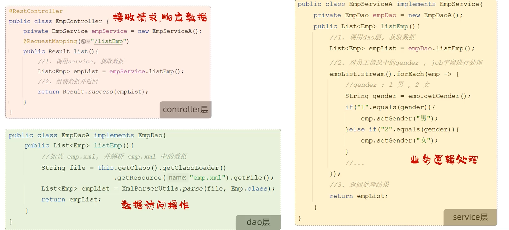

##### 代码演示

+ dao/EmpDao.java

```java
package com.itfeng.dao;

import com.itfeng.pojo.Emp;

import java.util.List;

public interface EmpDao {
    // 获取员工列表数据
    public List<Emp> listEmp();
}
```

+ dao/impl/EmpDaoA.java

```java
package com.itfeng.dao.impl;

import com.itfeng.dao.EmpDao;
import com.itfeng.pojo.Emp;
import com.itfeng.utils.XmlParserUtils;

import java.util.List;

public class EmpDaoA implements EmpDao {
    @Override
    public List<Emp> listEmp() {
        // 1. 加载并解析xml文件
        String file = this.getClass().getClassLoader().getResource("emp.xml").getFile(); // 用于获取类路径下资源文件emp.xml的绝对路径
        System.out.println(file);
        List<Emp> empList = XmlParserUtils.parse(file, Emp.class);
        return empList;
    }
}
```

+ service/EmpService.java

```java
package com.itfeng.service;

import com.itfeng.pojo.Emp;

import java.util.List;

public interface EmpService {
    // 获取员工泪飙
    public List<Emp> listEmp();
}
```

+ service/impl/EmpServiceA.java

```java
package com.itfeng.service.impl;

import com.itfeng.dao.EmpDao;
import com.itfeng.dao.impl.EmpDaoA;
import com.itfeng.pojo.Emp;
import com.itfeng.service.EmpService;

import java.util.List;

public class EmpServiceA implements EmpService {
    private EmpDao empDao = new EmpDaoA();

    @Override
    public List<Emp> listEmp() {
        // 1. 调用dao，获取数据
        List<Emp> empList = empDao.listEmp();
        // 2. 对数据进行转换处理
        empList.stream().forEach(emp -> {
            // 处理 gender 1：男，2：女
            String gender = emp.getGender();
            if ("1".equals(gender)) {
                emp.setGender("男");
            } else if ("2".equals(gender)) {
                emp.setGender("女");
            }

            // 处理job - 1：讲师，2：班主任，3：就业指导
            String job = emp.getJob();
            if ("1".equals(job)) {
                emp.setGender("讲师");
            } else if ("2".equals(job)) {
                emp.setGender("班主任");
            } else if ("3".equals(job)) {
                emp.equals("就业指导");
            }
        });
        return empList;
    }
}
```

+ controller/EmpController.java

```java
package com.itfeng.controller;

import com.itfeng.pojo.Emp;
import com.itfeng.pojo.Result;
import com.itfeng.service.EmpService;
import com.itfeng.service.impl.EmpServiceA;
import com.itfeng.utils.XmlParserUtils;
import org.springframework.web.bind.annotation.RequestMapping;
import org.springframework.web.bind.annotation.RestController;

import java.util.List;

@RestController
public class EmpController {
    private EmpService empService = new EmpServiceA();


    @RequestMapping("/listEmp")
    public Result list() {
        // 1. 调用service，获取数据
        List<Emp> empList = empService.listEmp();
        // 3. 响应数据
        return Result.success(empList);
    }
}
```


-----------------------------


#### 3.2 分层解耦

+ 内聚：软件中各个功能模块内部的功能联系
+ 耦合：衡量软件中各个层 / 模块之间的依赖、关联的程度
+ 软件设计原则：高内聚低耦合

我们在上一节的代码中 controller 层和 service 层就耦合了，那么我们如何解决这个问题呢？

+ 我们将实现类创建出的对象放在容器当中，当 controller 要运行的时候就可以去容器当中查找 实现类类型的对象

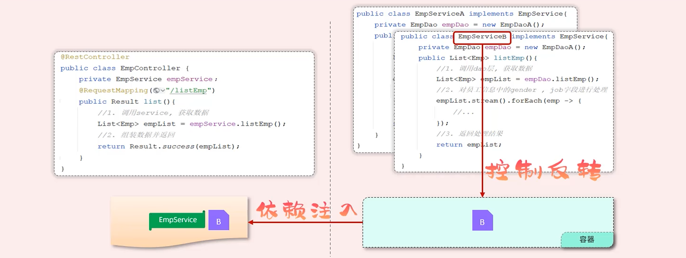

**控制反转**：Inversion Of Control，简称 IOC。对象的创建控制权由程序自身转移到外部（容器），这种思想称为控制反转

**依赖注入**：Dependency Injection，简称 DI。容器为应用程序提供运行时，所依赖的资源，称之为依赖注入

**Bean 对象**：IOC 容器中创建、管理的对象，称之为 bean


----------------------


#### 3.3 IOC & DI 入门

1. Service 层及 Dao 层的实现类，交给 IOC 容器管理

+ 用 `@Componment` 注解来将当前类交给 IOC 容器管理，成为 IOC 容器中的 bean

2. 为 Controller 及 Service 注入运行时，依赖的对象

+ 用 `@Autowired` 在运行时，IOC 容器会提供该类型的 bean 对象，并赋值给该变量 - 依赖注入

3. 运行测试

##### 代码演示

+ service/impl/EmpServiceA.java

```java
package com.itfeng.service.impl;

import com.itfeng.dao.EmpDao;
import com.itfeng.dao.impl.EmpDaoA;
import com.itfeng.pojo.Emp;
import com.itfeng.service.EmpService;
import org.springframework.beans.factory.annotation.Autowired;
import org.springframework.stereotype.Component;

import java.util.List;

@Component // 将当前类交给IOC容器管理，成为IOC容器中的bean
public class EmpServiceA implements EmpService {

    @Autowired // 运行时，IOC容器会提供该类型的bean对象，并赋值给该变量 - 依赖注入
    private EmpDao empDao;

    @Override
    public List<Emp> listEmp() {
        // 1. 调用dao，获取数据
        List<Emp> empList = empDao.listEmp();
        // 2. 对数据进行转换处理
        empList.stream().forEach(emp -> {
            // 处理 gender 1：男，2：女
            String gender = emp.getGender();
            if ("1".equals(gender)) {
                emp.setGender("男");
            } else if ("2".equals(gender)) {
                emp.setGender("女");
            }

            // 处理job - 1：讲师，2：班主任，3：就业指导
            String job = emp.getJob();
            if ("1".equals(job)) {
                emp.setGender("讲师");
            } else if ("2".equals(job)) {
                emp.setGender("班主任");
            } else if ("3".equals(job)) {
                emp.equals("就业指导");
            }
        });
        return empList;
    }
}
```

+ dao/impl/EmpDaoA.java

```java
package com.itfeng.dao.impl;

import com.itfeng.dao.EmpDao;
import com.itfeng.pojo.Emp;
import com.itfeng.utils.XmlParserUtils;
import org.springframework.stereotype.Component;

import java.util.List;

@Component // 将当前类交给IOC容器管理，成为IOC容器中的bean
public class EmpDaoA implements EmpDao {
    @Override
    public List<Emp> listEmp() {
        // 1. 加载并解析xml文件
        String file = this.getClass().getClassLoader().getResource("emp.xml").getFile(); // 用于获取类路径下资源文件emp.xml的绝对路径
        System.out.println(file);
        List<Emp> empList = XmlParserUtils.parse(file, Emp.class);
        return empList;
    }
}
```

+ controller/EmpController.java

```java
package com.itfeng.controller;

import com.itfeng.pojo.Emp;
import com.itfeng.pojo.Result;
import com.itfeng.service.EmpService;
import com.itfeng.service.impl.EmpServiceA;
import com.itfeng.utils.XmlParserUtils;
import org.springframework.beans.factory.annotation.Autowired;
import org.springframework.web.bind.annotation.RequestMapping;
import org.springframework.web.bind.annotation.RestController;

import java.util.List;

@RestController
public class EmpController {

    @Autowired // 运行时，IOC容器会提供该类型的bean对象，并赋值给该变量 - 依赖注入
    private EmpService empService;


    @RequestMapping("/listEmp")
    public Result list() {
        // 1. 调用service，获取数据
        List<Emp> empList = empService.listEmp();
        // 3. 响应数据
        return Result.success(empList);
    }
}
```


----------------------------


#### 3.4 IOC 详解

##### 3.4.1 Bean 的声明

要把某个对象交给 IOC 容器管理，需要在对应的类上加上如下注解之一：

| 注解        | 说明                  | 位置                                              |
| ----------- | --------------------- | ------------------------------------------------- |
| @Component  | 声明 bean 的基础注解  | 不属于一下三类时，用此注解                        |
| @Controller | @Component 的衍生注解 | 标注在控制器类上                                  |
| @Service    | @Component 的衍生注解 | 标注在业务类上                                    |
| @Repository | @Component 的衍生注解 | 标注在数据访问类上（由于与 mybatis 整合，用的少） |

注意事项：

+ 声明 bean 的时候，可以通过 value 属性指定 bean 的名字，如果没有指定，默认为**类名首字母小写**
+ 使用以上四个注解都可以声明 bean，但是在 springboot 集成 web 开发中，声明控制器 bean 只能用 `@Controller`

##### 3.4.2 Bean 组件扫描

+ 前面声明 bean 的四大注解，要想生效，还需要被组件扫描注解 `@ComponentScan` 扫描
+ `@ComponentScan` 注解虽然没有显式配置，但是实际上以及包含在了启动类声明注解 `@SpringBootApplication` 中，默认扫描的范围是**启动类所在包及其子包**

```java
package com.itfeng;

import org.springframework.boot.SpringApplication;
import org.springframework.boot.autoconfigure.SpringBootApplication;
import org.springframework.context.annotation.ComponentScan;

@ComponentScan({"dao", "com.itfeng"})
@SpringBootApplication
public class SpringbootWebQuickstartApplication {

    public static void main(String[] args) {
        SpringApplication.run(SpringbootWebQuickstartApplication.class, args);
    }

}
```

##### 小结

1. 声明 bean 的注解

+ @Component、@Controller、@Service、@Repository
+ @SpringBootApplication 具有包扫描作用，默认扫描当前包及其子包


---------------------


#### 3.5 DI 详解

##### 3.5.1 Bean 注入

+ `@Autowired` 注解，默认是按照**类型**进行，如果存在多个相同类型的 bean，将会报出如下错误

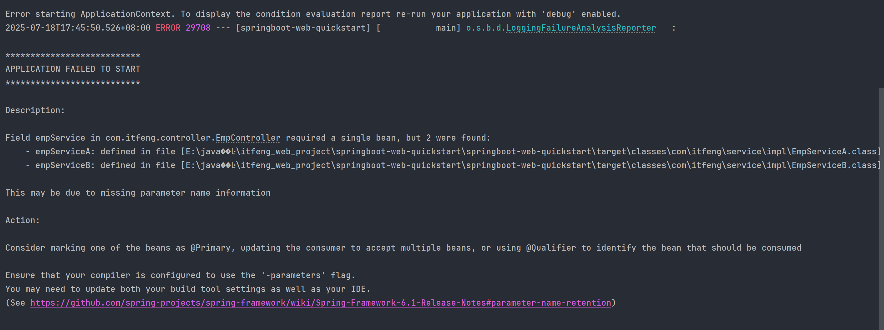

+ 通过以下几种方案来解决：

  + @Primary

  ```java
  @Primary
  @Service
  public class EmpServiceA implements EmpService{
  }
  ```

  + @Qualifier

  ```java
  @RestController
  public class EmpController{
      @Autowired
      @Qualifier("empServiceA")
      private EmpService empService;
  }
  ```

  + @Resource

  ```java
  @RestController
  public class EmpController{
      @Resource(name = "empServiceB")
      private EmpService empService;
  }
  ```

##### 小结

1. 依赖注入的注解

+ `@Autowired`：默认按照类型自动装配
+ 如果同类型的 bean 存在多个：
  + `@Primary`
  + `@Autowired` + `@Qualifier("bean 的名称")`
  + `@Resource(name = "bean 的名称")`

2. @Resource 与 @Autowired 的区别

+ @Autowired 是 spring 框架提供的注解，而 @Resource 是 JDK 提供的注解
+ @Autowired 默认是按照类型注入，而 @Resource 默认是按照名称注入


---------------------------------


#### 3.6 AOP 面向切面编程

+ 面向切面编程，通过预编程方式和运行期动态代理实现程序功能的统一维护的一种技术，利用 AOP 可以对业务逻辑的各个部分进行隔离，从而使得**业务逻辑各部分之间的耦合度降低，提高程序的可重用性**，例如日志、事务、权限、缓存、性能监控等

+ 切面（Aspect）：通常是一个类，用来定义切点和通知
+ 连接点（JoinPoint）：能够被拦截的地方，每个成员方法都可以称之为连接点
+ 切点（Pointcut）：具体定位的连接点，也就是具体定位到某一个方法就称之为切点
+ 通知（Advice）：在某个特定的 Pointcut 切点上需要执行的动作，如日志记录，权限验证等具体要引用切入点的代码，分为5类

##### 3.6.1 Pointcut 表达式（execution）

匹配方法切入点，可以匹配方法、类、包

使用方式：`execution(modifier? ret-type declaring-type?name-pattern(param-pattern) throws-pattren?)`

+ modifier：匹配修饰符，public，private 等，省略时匹配任意修饰符
+ ret-type：匹配返回类型，使用 * 匹配任意类型
+ declaring-type：匹配目标类，... 匹配包及其子包的所有类
+ name-pattern：匹配方法名称，* 匹配任意方法
+ param-pattern：匹配参数类型和数量，() 皮皮额没有参数的方法，(..) 匹配有任意数量参数的方法
+ throws-pattern：匹配抛出异常类型，省略时匹配任意类型

```java
//定义切面
@Aspect
@Component
public class UserAspect {
    //定义切点
    @Pointcut("execution(* com.example.demo.controller.UserController.* (..))")
    public void pointcut(){};
}
```

```java
//匹配UserController类中的所有方法
execution(* com.example.demo.controller.UserController.* (..))
```


+ 前置通知：`@Before`
+ 后置通知：`@After`
+ 正常返回通知：`@AfterReturning`
+ 异常返回通知：`@AfterThrowing`
+ 环绕通知：`@Around`


------------------------------


## 补充

### 1. @Builder注解

#### 1.1 什么是 @Builder

`@Builder` 是 Lombok 提供的一种注解，用于简化构建对象的过程。通过在类上添加 `@Builder` 注解，可以自动生成一个建造者模式相关的代码，使得对象的构建更加简洁和易读

#### 1.2 使用场景，为什么要用 @Builder

在实际项目中，我们经常遇到以下痛点：

+ 构造函数参数过多，容易出错：尤其是多个参数类型相同，顺序容易混淆

+ Setter 方法写法繁琐，不能保证对象不可变性

+ 希望以更语义化、可读性强的方式初始化对象

使用 @Builder 可以完美解决以上问题，使代码更加优雅、健壮

#### 1.3 基本用法示例

```java
import lombok.Builder;
import lombok.ToString;
 
@Builder
@ToString
public class User {
    private String username;
    private String email;
    private int age;
}
 
public class Main {
    public static void main(String[] args) {
        User user = User.builder()
                        .username("jack")
                        .email("jack@example.com")
                        .age(30)
                        .build();
 
        System.out.println(user);
    }
}
```

+ 输出

```java
User(username=jack, email=jack@example.com, age=30)
```


我们可以使用生成的建造者模式来创建 `Person` 对象，如下所示：

```java
@Builder
public class Person {
    private String name;
    private int age;
    private String address;
}

Person person = Person.builder()
                      .name("张三")
                      .age(25)
                      .address("北京")
                      .build();
```

通过使用 `@Builder` 注解，我们不再需要手动编写繁琐的构造器或者使用多个 setter 方法来设置属性值，而是通过链式调用建造者模式中的方法进行对象的构建


--------------------------------------------


### 2. PO、BO、VO 赋值转换

java 后端代码中，经常会涉及到各种属性基本相同对象的转换过程，常见的如 PO、BO、VO 等。通常，后端开发规范中，会要求 PO 对象只能应用在 DAO 层，BO 对象应用在 service 层，VO 对象应用在 web 层

+ 数据持久化（PO）：数据从数据库中取出或存入数据库，通常通过 DAO 进行操作
+ 业务逻辑（DO 和 BO）：DO 代表领域模型中的核心对象，包含业务逻辑，BO 是 PO 和 DO 的组合，封装业务操作
+ 数据传输（DTO）：DTO 用于跨层或跨系统传递数据，封装了跨层调用所需的字段
+ 数据展示（VO）：VO 是展示层使用的对象，主要用于格式化和展示数据
+ 请求与响应（req 和 rsp）：req 是客户端请求对象，rsp 是服务器响应对象，用于前后端或服务间的通信
+ POJO（Plain Old Java Object）：简单的 Java 对象，是一个特定类型的类，没有任何限制或附加条件，可以用于表示各种数据

需要注意的是，这些缩写词的具体定义可能因项目而异，因此在具体项目中应该根据团队约定和实际需求来使用


-------------------


## 五、配置优先级

### 1. 配置

+ SpringBoot 中支持的三种配置格式的配置文件

```properties
server.port=8081
```

```yml
server:
  port: 8082
```

```yaml
server: 
  port: 8083
```

优先级：properties > yml >yaml

注意事项：虽然 springboot 支持多种格式配置文件，但是在项目开发时，推荐统一使用一种格式的配置**（yml 是主流）**

+ SpringBoot 除了支持配置文件属性配置，还支持 **Java 系统属性**和**命令行参数**的方式进行属性配置

  + Java 系统属性

  ```cmd
  -Dserver.prot=9000
  ```

  + 命令行参数

  ```cmd
  --server.port=10010
  ```

项目打包之后如何如何指定 java 系统属性和命令行参数

1. 执行 maven 打包指令 package
2. 执行 java 指令，运行 jar 包

```cmd
java -Dserver.port=9000 -jar tlias-web-management-0.0.1-SNAPSHOT.jar --server.port=10010
```

注意事项：SpringBoot 项目进行打包时，需要引入插件 **spring-boot-maven-plugin**（基于网骨架创建项目，会自动添加该插件）

优先级（低 -> 高）：

+ application.yaml（忽略）
+ application.yml
+ application.properties
+ java 系统属性（-Dxxx=xxx）
+ 命令行参数（--xxx=xxx）


--------------------


## 六、Bean 管理

### 1. 获取 bean

+ 默认情况下，Spring 项目启动时，会把 bean 都创建好放在 IOC 容器中，如果想要主动获取这些 bean，可以通过如下方式：
  + 根据 name 获取 bean：`Object getBean(String name)`【声明一个 bean 对象没有指定名称，默认是类名首字母小写】
  + 根据类型获取 bean：`<T> T getBean(Class<T> requiredType)`
  + 根据 name 获取 bean（带类型转换）：`<T> T getBean(String name, Class<T> requiredType)`

注意事项

+ 【Spring 项目启动时，会把其中的 bean 都创建好】还会受到作用域及延迟初始化影响，这里主要针对于默认的**单例非延迟加载**的 bean 而言

#### 代码演示

```java
@SpringBootTest
class SpringbootWebConfig2ApplicationTests {

    @Autowired
    private ApplicationContext applicationContext; // IOC容器对象

    //获取bean对象
    @Test
    public void testGetBean() {
        //根据bean的名称获取
        DeptController bean1 = (DeptController) applicationContext.getBean("deptController");
        System.out.println(bean1);

        //根据bean的类型获取
        DeptController bean2 = applicationContext.getBean(DeptController.class);
        System.out.println(bean2);

        //根据bean的名称 及 类型获取
        DeptController bean3 = applicationContext.getBean("deptController", DeptController.class);
        System.out.println(bean3);
    }
```


--------------------


### 2. bean 作用域

+ Spring 支持五种作用域，后三种在 web 环境才生效

| 作用域        | 说明                                             |
| ------------- | ------------------------------------------------ |
| **singleton** | 容器内同名称的 bean 只有一个实例（单例）（默认） |
| **prototype** | 每次使用该 bean 时会创建新的实例（非单例）       |
| request       | 每个请求范围内会创造新的实例（web 环境中）       |
| session       | 每个会话范围内会创建新的实例（web 环境中）       |
| application   | 每个应用范围内会创建新的实例（web 环境中）       |


+ 可以通过 `@Scope` 注解来进行配置作用域
+ `@Lazy` 表示延迟初始化，加上这个注解之后这个 bean 就会延迟初始化，延迟到第一次使用的时候

```java
//@Lazy
@Scope("prototype")
@RestController
@RequestMapping("/depts")
public class DeptController {
}
```

注意事项：

+ 默认 singleton 的 bean，在容器启动时被创建，可以使用 `@Lazy` 注解来延迟初始化（延迟到第一次使用时）
+ prototype 的 bean，每一次使用该 bean 的时候都会创建一个新的实例
+ 实际开发当中，绝大部分的 Bean 是单例的，也就是说绝大部分 Bean 不需要配置 scope 属性


---------------------------


### 3. 第三方 bean

声明第三方的类时因为其是只读的，所以不能直接加上 @Component

`@Bean`

+ 如果要管理的 bean 对象来自第三方（不是自定义的），是无法用 @Component 及衍生注解声明 bean 的，就需要用到 @Bean 注解

注意事项：

+ 通过 @Bean 注解的 name 或 value 属性可以声明 bean 名称，如果不指定，默认 bean 的名称就是方法名
+ 如果第三方 bean 需要依赖其它 bean 对象，直接在 bean 定义方法中设置形参即可，容器会根据类型自动装配

#### 代码演示

+ config/CommonConfig.java

```java
package com.itheima.config;

import com.itheima.service.DeptService;
import org.dom4j.io.SAXReader;
import org.springframework.context.annotation.Bean;
import org.springframework.context.annotation.Configuration;

@Configuration // 配置类
public class CommonConfig {
    // 声明第三方bean
    @Bean // 将当前方法的返回值对象交给IOC容器管理，成为IOC容器的bean对象
          // 通过@Bean注解的name/value属性指定bean名称，如果未指定，默认是方法名
    public SAXReader saxReader(DeptService deptService) {
        System.out.println(deptService);
        return new SAXReader();
    }
}
```

+ 测试类

```java
@Autowired
private SAXReader saxReader;

//第三方bean的管理
@Test
public void testThirdBean() throws Exception {
    
    // SAXReader saxReader = new SAXReader();

    Document document = saxReader.read(this.getClass().getClassLoader().getResource("1.xml"));
    Element rootElement = document.getRootElement();
    String name = rootElement.element("name").getText();
    String age = rootElement.element("age").getText();

    System.out.println(name + " : " + age);
}
```


------------------


## 七、SpringBoot 原理

#### 1. 起步依赖

+ 原理就是 maven 的依赖传递


#### 2. 自动配置

+ SpringBoot 的自动配置就是当 spring 容器启动后，一些配置类、bean 对象就自动存入到了 IOC 容器中，不需要我们去手动声明，从而简化了开发，省去了繁琐的配置步骤

##### 2.1 自动配置原理

@SpringBootApplication 只能扫描当前包及其子包，所以引入第三方提供的依赖不生效

+ 方案一：@ComponentScan 组件扫描

```java
@ComponentScan({"com.example", "com.itfeng"})
@SpringBootApplication
public class SpringbootWebConfig2Application {
}
```

使用繁琐、性能低

+ 方案二：@Import 导入。使用 `@Import` 导入的类会被 Spring 加载到 IOC 容器中，导入形式主要有以下几种
  + 导入 普通类
  + 导入 配置类
  + 导入 ImportSelector 接口实现类
  + `@EnableXxxx` 注解，封装 @Import 注解


+ EnableHeaderConfig.java

```java
package com.example;

import org.springframework.context.annotation.Import;
import java.lang.annotation.ElementType;
import java.lang.annotation.Retention;
import java.lang.annotation.RetentionPolicy;
import java.lang.annotation.Target;

@Retention(RetentionPolicy.RUNTIME)
@Target(ElementType.TYPE)
@Import(MyImportSelector.class)
public @interface EnableHeaderConfig {
}
```

+ SpringbootWebConfig2Application.java

```java
package com.itheima;

import com.example.EnableHeaderConfig;
import com.example.HeaderConfig;
import com.example.MyImportSelector;
import com.example.TokenParser;
import org.dom4j.io.SAXReader;
import org.springframework.boot.SpringApplication;
import org.springframework.boot.autoconfigure.SpringBootApplication;
import org.springframework.context.annotation.Bean;
import org.springframework.context.annotation.ComponentScan;
import org.springframework.context.annotation.Import;

//@ComponentScan({"com.example", "com.itheima"})

//@Import((TokenParser.class)) // 导入普通类，交给IOC容器管理
//@Import((HeaderConfig.class)) // 导入配置类，交给IOC容器管理
//@Import({MyImportSelector.class}) // 导入ImportSelector接口实现类

@EnableHeaderConfig
@SpringBootApplication
public class SpringbootWebConfig2Application {

    public static void main(String[] args) {
        SpringApplication.run(SpringbootWebConfig2Application.class, args);
    }

    // 声明第三方bean
//    @Bean // 将当前方法的返回值对象交给IOC容器管理，成为IOC容器的bean对象
    public SAXReader saxReader() {
        return new SAXReader();
    }
}
```

###### 源码跟踪

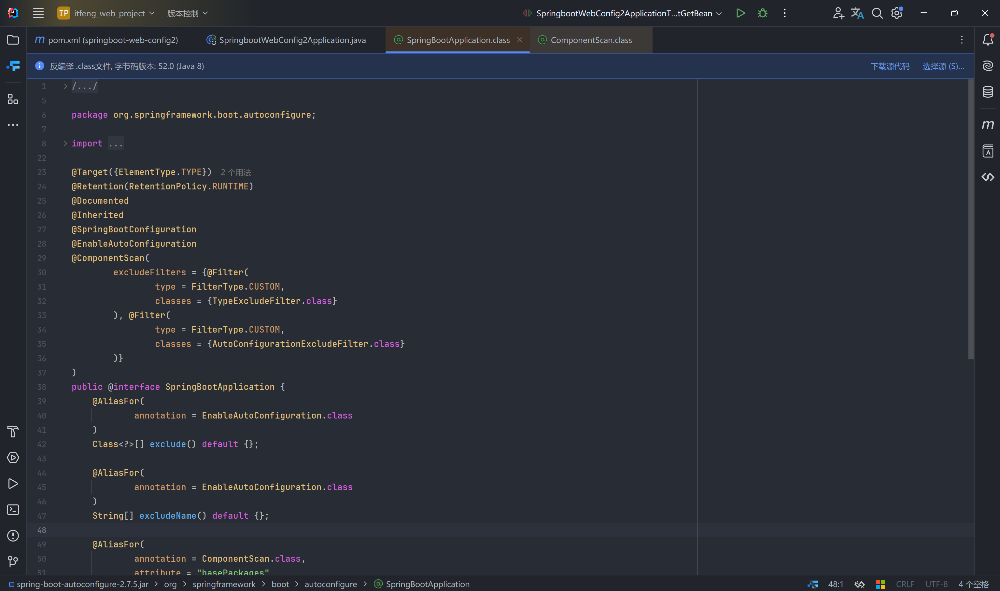

SpringBootApplication 的源码中，前四个注解是定义注解的。

+ @SpringBootConfiguration 声明其也为一个配置类（里面有 @Configuration）

+ @ComponentScan 进行组件扫描（包扫描）

+ @EnableAutoConfiguration：SpringBoot 实现自动化配置的核心注解
  + 在这个注解中封装了一个 @Import 注解，这个注解中指定了一个接口的实现类

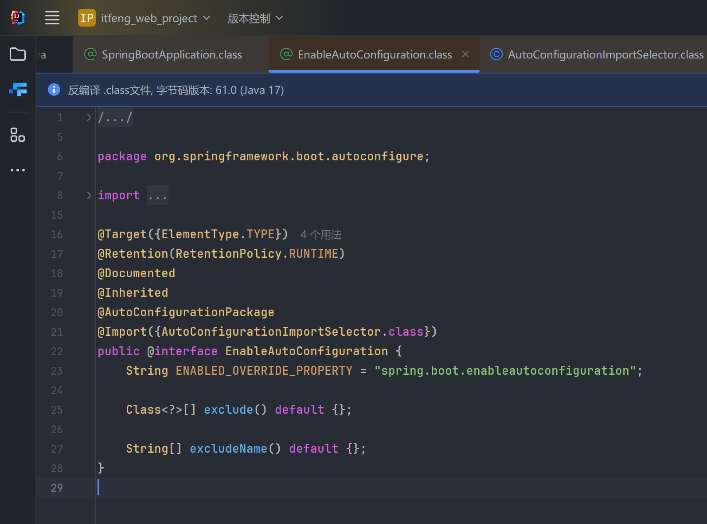

+ 这个是实现类是实现了一个方法（selectImports）这个方法的返回值是一个 String 类型的数组，其中封装了要导入 SpringAOC 容器的类的全类名，其中加载了两个文件

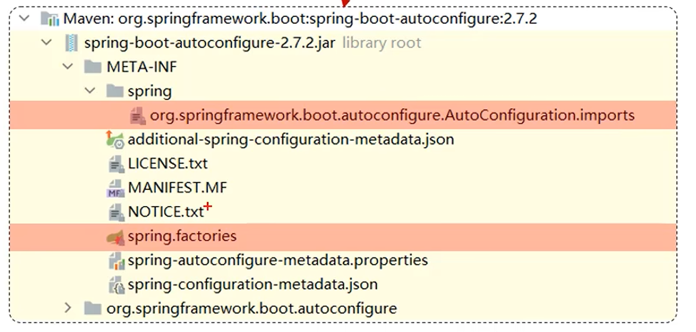

Spring3.0 后，spring.factories 就会被废除，后面直接定义在 AutoConfiguration 中

这个配置类中定义的就是配置类的全类名，我们就可以通过 @Bean 注解来声明一个一个的 bean 对象，最终，springboot 在启动时就会加载这个配置文件中配置的配置类，然后将这些配置类的信息封装到 String 类型的数组中，通过 @Import 将配置类全部加载到 Spring 的 IOC 容器中

不是所有的类都注入容器中，会通过 @ConditionalOnMissingBean 条件筛选

###### @Conditional

+ 作用：按照一定的条件进行判断，在满足给定条件后才会注册对应的 bean 对象到 Spring IOC 容器中
+ 位置：方法、类
+ @Conditional 本身是一个父注解，派生出大量的子注解：
  + `@ConditionalOnClass`：判断环境中是否有对应字节码文件，才注册 bean 到 IOC 容器
  + `@ConditionalOnMissingBean`：判断环境中没有对应的 bean（类型或名称），才注册 bean 到 IOC 容器
  + `@ConditionalOnProperty`：判断配置文件中有对应属性和值，才注册 bean 到 IOC 容器

```java
@ConditionalOnClass(name = "io.jsonwebtoken.Jwts") // 环境中是否存在指定的这个类，存在才会将该bean注入到IOC容器中
public HeaderParser headerParser() {
    return new HeaderParser();
}
```

```java
@ConditionalOnMissingBean // 不存在该类型（HeaderParser）的bean，才会将该bean加入IOC容器 --- 指定类型（value属性）或名称（name属性）
public HeaderParser headerParser() {
    return new HeaderParser();
}
```

```java
@ConditionalOnProperty(name = "name",havingValue = "itfeng") // 配置文件中存在指定的属性与值，才会将该bean注入到IOC容器中
public HeaderParser headerParser() {
    return new HeaderParser();
}
```


##### 2.2 案例（自定义 starter）

> 场景
>
> + 在实际开发中，经常会定义一些公共组件，提供给各个项目团队使用。而在 SpringBoot 的项目中，一般会将这些公共组件封装为 SpringBoot 的 starter

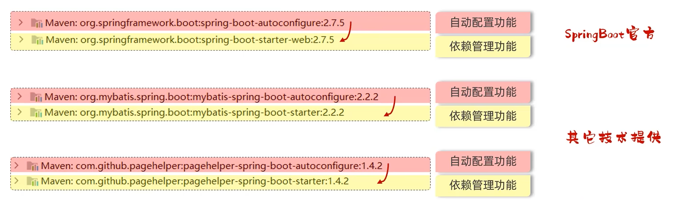

###### 案例

> 需求
>
> + 需求：自定义 aliyun-oss-spring-boot-starter，完成阿里云 OSS 操作工具类 AliyunOSSUtils 的自动配置
> + 目标：引入起步依赖之后，要想使用阿里云 OSS，注入 AliyunOSSUtils 直接使用即可

步骤

+ 创建 aliyun-oss-spring-boot-starter 模块
+ 创建 aliyun-oss-spring-boot-autoconfigure 模块，在 starter 中引入该模块
+ 在 aliyun-oss-spring-boot-autoconfigure 模块中的定义自动配置功能，并定义自动配置文件 META-INF/spring/xxxx.imports

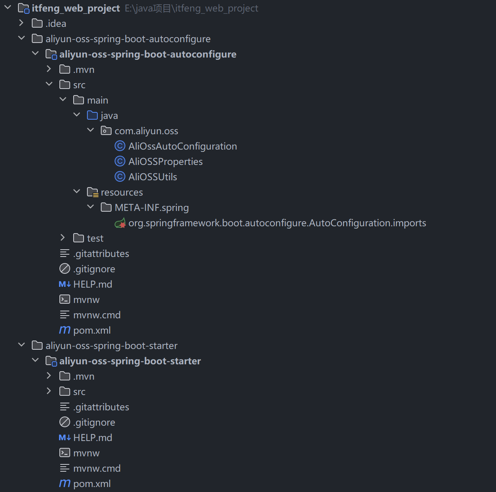

+ AliOSSProperties.java

```java
package com.aliyun.oss;

import org.springframework.boot.context.properties.ConfigurationProperties;

@ConfigurationProperties(prefix="aliyun.oss")
public class AliOSSProperties {
    private String endpoint;
    private String bucketName;
    private String region;

    public String getEndpoint() {
        return endpoint;
    }

    public void setEndpoint(String endpoint) {
        this.endpoint = endpoint;
    }

    public String getBucketName() {
        return bucketName;
    }

    public void setBucketName(String bucketName) {
        this.bucketName = bucketName;
    }

    public String getRegion() {
        return region;
    }

    public void setRegion(String region) {
        this.region = region;
    }
}
```

+ AliOssAutoConfiguration.java

```java
package com.aliyun.oss;

import org.springframework.boot.context.properties.EnableConfigurationProperties;
import org.springframework.context.annotation.Bean;
import org.springframework.context.annotation.Configuration;

@Configuration // 配置类
@EnableConfigurationProperties(AliOSSProperties.class)
public class AliOssAutoConfiguration {

    @Bean
    public AliOSSUtils aliOSSUtils(AliOSSProperties aliOSSProperties) {
        AliOSSUtils aliOSSUtils = new AliOSSUtils();
        aliOSSUtils.setAliOSSProperties(aliOSSProperties);
        return aliOSSUtils;
    }
}
```

+ AliOSSutils.java

```java
package com.aliyun.oss;

import com.aliyun.oss.common.auth.CredentialsProviderFactory;
import com.aliyun.oss.common.auth.EnvironmentVariableCredentialsProvider;
import com.aliyun.oss.common.comm.SignVersion;
import com.aliyun.oss.model.PutObjectRequest;
import com.aliyun.oss.model.PutObjectResult;
import org.springframework.web.multipart.MultipartFile;

import java.io.InputStream;
import java.util.UUID;

public class AliOSSUtils {
    //    // Endpoint以华东1（杭州）为例，其它Region请按实际情况填写。
//    @Value("${aliyun.oss.endpoint}")
//    private String endpoint;
//
//    // 填写Bucket名称，例如examplebucket。
//    @Value("${aliyun.oss.bucketName}")
//    private String bucketName;
//
//    // 填写Bucket所在地域。以华东1（杭州）为例，Region填写为cn-hangzhou。
//    @Value("${aliyun.oss.region}")
//    private String region = "cn-hangzhou";

    private AliOSSProperties aliOSSProperties;

    public AliOSSProperties getAliOSSProperties() {
        return aliOSSProperties;
    }

    public void setAliOSSProperties(AliOSSProperties aliOSSProperties) {
        this.aliOSSProperties = aliOSSProperties;
    }

    /**
     * 实现上传图片到OSS
     *
     * @param file
     * @return
     * @throws Exception
     */
    public String upload(MultipartFile file) throws Exception {

        // 获取阿里云OSS参数
        String endpoint = aliOSSProperties.getEndpoint();
        String bucketName = aliOSSProperties.getBucketName();
        String region = aliOSSProperties.getRegion();

        // 避免文件覆盖
        String originalFilename = file.getOriginalFilename();
        String fileName = UUID.randomUUID().toString() + originalFilename.substring(originalFilename.lastIndexOf("."));

        // 从环境变量中获取访问凭证。运行本代码示例之前，请确保已设置环境变量OSS_ACCESS_KEY_ID和OSS_ACCESS_KEY_SECRET。
        EnvironmentVariableCredentialsProvider credentialsProvider = CredentialsProviderFactory.newEnvironmentVariableCredentialsProvider();

        // 创建OSSClient实例。
        // 当OSSClient实例不再使用时，调用shutdown方法以释放资源。
        ClientBuilderConfiguration clientBuilderConfiguration = new ClientBuilderConfiguration();
        clientBuilderConfiguration.setSignatureVersion(SignVersion.V4);
        OSS ossClient = OSSClientBuilder.create()
                .endpoint(endpoint)
                .credentialsProvider(credentialsProvider)
                .clientConfiguration(clientBuilderConfiguration)
                .region(region)
                .build();

        try {
            // 使用MultipartFile的getInputStream()方法获取输入流
            InputStream inputStream = file.getInputStream();
            // 创建PutObjectRequest对象。
            PutObjectRequest putObjectRequest = new PutObjectRequest(bucketName, fileName, inputStream);
            // 创建PutObject请求。
            PutObjectResult result = ossClient.putObject(putObjectRequest);
        } catch (OSSException oe) {
            System.out.println("Caught an OSSException, which means your request made it to OSS, "
                    + "but was rejected with an error response for some reason.");
            System.out.println("Error Message:" + oe.getErrorMessage());
            System.out.println("Error Code:" + oe.getErrorCode());
            System.out.println("Request ID:" + oe.getRequestId());
            System.out.println("Host ID:" + oe.getHostId());
        } catch (ClientException ce) {
            System.out.println("Caught an ClientException, which means the client encountered "
                    + "a serious internal problem while trying to communicate with OSS, "
                    + "such as not being able to access the network.");
            System.out.println("Error Message:" + ce.getMessage());
        } finally {
            if (ossClient != null) {
                ossClient.shutdown();
            }
        }
        //文件访问路径
        String url = endpoint.split("//")[0] + "//" + bucketName + "." + endpoint.split("//")[1] + "/" + fileName;
        return url;// 把上传到oss的路径返回
    }
}
```


-------------------------

 

## 总结


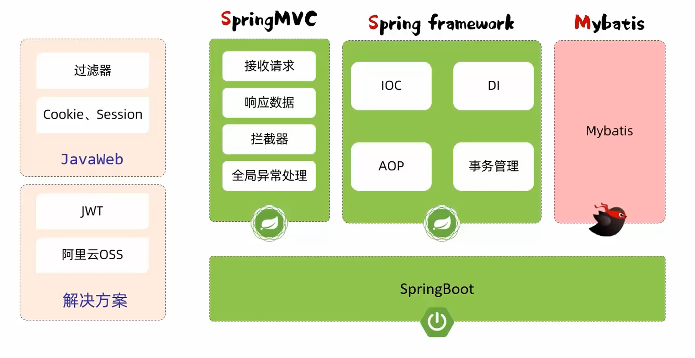


-------------------

