# Linux（精简版）

什么是 Linux ？
+ Linux 是一套免费使用和只有传播的**操作系统**

为什么要学习 Linux ？
+ 企业用人要求

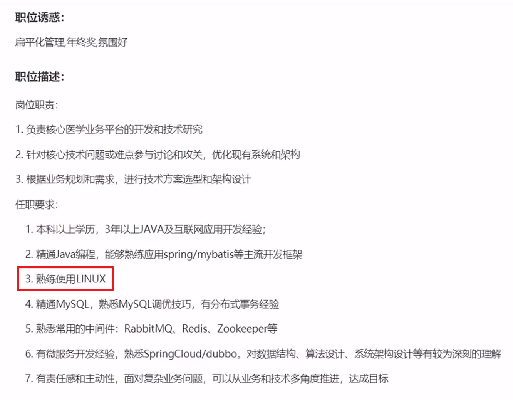

+ 个人发展要求
  + 在开发过程中可能会使用到很多中间件，比如MySQL、redis、MQ 等等。这些中间件大多也需要安装在 Linux 服务器上去运行的。我们作为开发人员需要远程连接并进行操作

学完后能干什么？
+ 环境搭建：Linux 安装、远程连接
+ 常用命令：文件、目录拷贝、移动打包、压缩、文本编辑
+ 安装软件：文件上传、jdk、tomcat、mysql
+ 项目部署：Java 应用、Python 应用、日志查看、系统管理、用户权限


-------------------------------------


## 一、Linux 简介

### 1. 不同应用领域的主流操作系统

+ 桌面操作系统
  + Windows（用户数量最多）
  + Mac OS（操作体验好，办工人士首选）
  + Linux（用户数量少）

+ 服务器操作系统
  + UNIX（安全、稳定、付费）
  + Linux（安全、稳定、免费、占用率很高）
  + Windows Server（付费、占有率低）

+ 移动设备操作系统
  + Android（基于 Linux、开源，主要用于智能手机、平板电脑和智能电视）
  + iOS（苹果公司开发、不开源，用于苹果公司的产品，例如：iPhone、iPad）

+ 嵌入式操作系统
  + Linux（机顶盒、路由器、交换机）


------------------------------


### 2. Linux 发展历史

+ 时间：1991年
+ 地点：芬兰赫尔辛基大学
+ 人物：Linus Torvalds（21岁）
+ 语言：C语言、汇编语言
+ logo：企鹅
+ 特点：免费、开源、多用户、多任务


---------------------------------


### 3. Linux 系统版本

Linux 系统分为**内核版**和**发行版**

+ 内核版
  + 由 Linux Torvalds 及其团队开发、维护
  + 免费、开源
  + 负责控制硬件

+ 发行版
  + 基于 Linux 内核版进行拓展
  + 由各个 Linux 厂商开发、维护
  + 有收费版本和免费版本

#### Linux 系统版本 - 发行版

Linux 系统发行版：

+ Ubuntu：以桌面应用为主
+ RedHat：应用最广泛、收费
+ CentOS：RedHat 的社区版、免费
+ openSUSE：对个人完全免费、图形界面华丽
+ Fedora：功能完备、快速更新、免费
+ 红旗 Linux：北京中科红旗软件技术有限公司开发

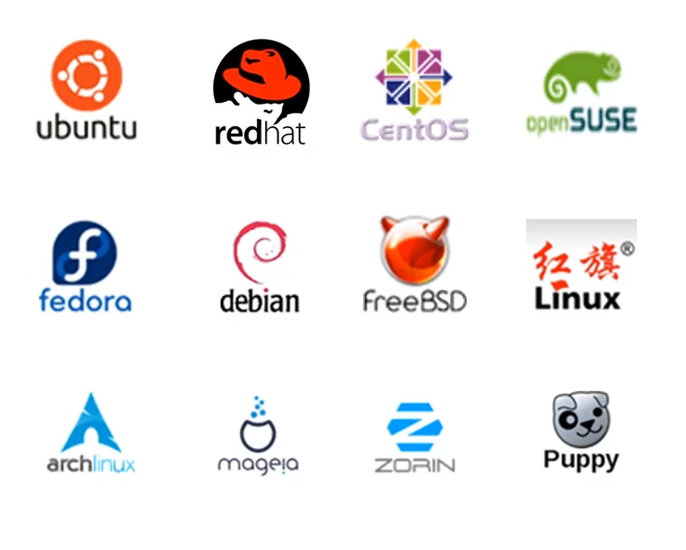


---------------------------------


## 二、Linux 安装

### 1. 安装方式介绍

+ 物理机安装：直接将操作系统安装到服务器硬件上
+ 虚拟机安装：通过虚拟机软件安装

**虚拟机**（Virtual Machine）指通过**软件**模拟的具有完整硬件系统功能、运行在完全隔离环境中的完整计算机系统【通过虚拟机软件来模拟计算机硬件】

+ **VMWare**
+ VirtualBox
+ VMLite WorkStation
+ Qemu
+ HopeddotVOS


### 2. 安装 Linux

+ VMWare：

https://blog.csdn.net/qq_74731410/article/details/135824895?ops_request_misc=%257B%2522request%255Fid%2522%253A%252282febe6c3b086e0f02756365b77cd6c7%2522%252C%2522scm%2522%253A%252220140713.130102334..%2522%257D&request_id=82febe6c3b086e0f02756365b77cd6c7&biz_id=0&utm_medium=distribute.pc_search_result.none-task-blog-2~all~top_click~default-2-135824895-null-null.142^v101^pc_search_result_base3&utm_term=vmware17%E4%B8%8B%E8%BD%BD%E5%AE%89%E8%A3%85%E5%8C%85&spm=1018.2226.3001.4187

+ Rocky Linux：

  + 官网网址https://rockylinux.org/zh-CN/download

https://blog.csdn.net/ziqibit/article/details/132723747?ops_request_misc=%257B%2522request%255Fid%2522%253A%25227d74550c825ff719b05f5e97bc8db1ca%2522%252C%2522scm%2522%253A%252220140713.130102334..%2522%257D&request_id=7d74550c825ff719b05f5e97bc8db1ca&biz_id=0&utm_medium=distribute.pc_search_result.none-task-blog-2~all~top_positive~default-1-132723747-null-null.142^v101^pc_search_result_base3&utm_term=rockylinux%E5%AE%89%E8%A3%85&spm=1018.2226.3001.4187


https://blog.csdn.net/weixin_42173947/article/details/142533149?ops_request_misc=&request_id=&biz_id=102&utm_term=rockylinux%E5%AE%89%E8%A3%85&utm_medium=distribute.pc_search_result.none-task-blog-2~all~sobaiduweb~default-1-142533149.142^v101^pc_search_result_base3&spm=1018.2226.3001.4187

[CentOS继任者的最新版本：Rocky Linux 9.3安装_哔哩哔哩_bilibili](https://www.bilibili.com/video/BV1qC4y1k7TX/?spm_id_from=333.1007.top_right_bar_window_history.content.click&vd_source=fdf20c2c97faa5cea39c1a74aea25a7d)


### 3. 网卡设置

+ centOS 的

由于启动服务器时未加载网卡，导致 IP 地址初始化失败

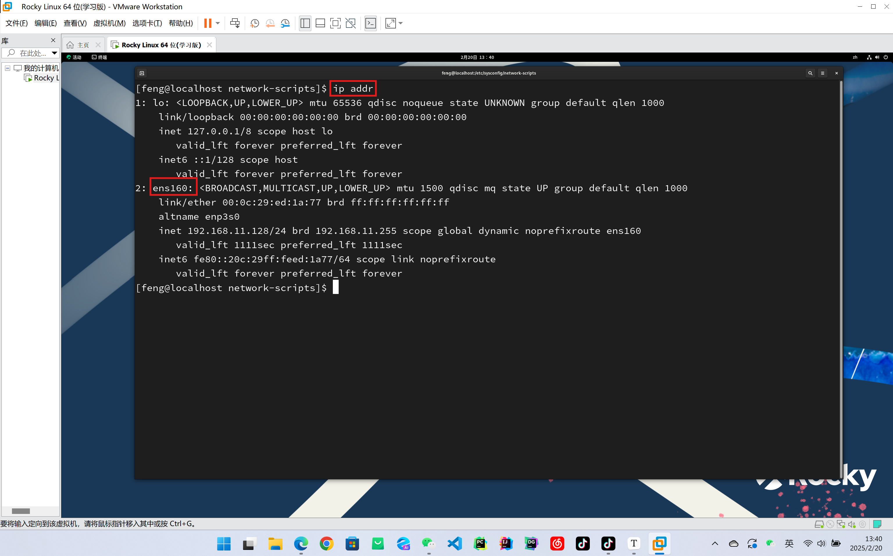

修改网络初始化配置，设定网卡在系统启动时初始化

> cd /				        进入根目录
> cd etc				    进入 etc 目录
> cd sysconfig			  进入 sysconfig 目录
> cd network-scripts		进入 network-scripts
> vi ifcfg-ens160		      编辑 ifcfg-ens160 文件


> i							 进入编辑状态
> 光标						   移动光标
> <ESC> → :wq → <ENTER>		保存退出

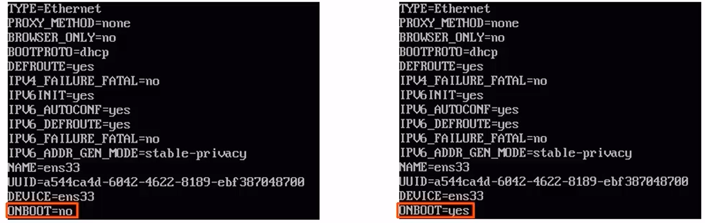


+ Rocky 的

[Rocky9-Linux系统教程-网卡配置_哔哩哔哩_bilibili](https://www.bilibili.com/video/BV1MmbweDEvg/?spm_id_from=333.337.search-card.all.click&vd_source=fdf20c2c97faa5cea39c1a74aea25a7d)

[Linux Centos7 Rocky网卡配置-CSDN博客](https://blog.csdn.net/lemon310/article/details/143835637?ops_request_misc=%7B%22request%5Fid%22%3A%220b8d87e1cf8a99413950b388b589f511%22%2C%22scm%22%3A%2220140713.130102334..%22%7D&request_id=0b8d87e1cf8a99413950b388b589f511&biz_id=0&utm_medium=distribute.pc_search_result.none-task-blog-2~all~sobaiduend~default-2-143835637-null-null.142^v101^pc_search_result_base3&utm_term=rockylinux网卡配置&spm=1018.2226.3001.4187)

[Rocky Linux9.x修改网卡配置文件_rockylinux重启网卡-CSDN博客](https://blog.csdn.net/weixin_62752367/article/details/135980671?ops_request_misc=%7B%22request%5Fid%22%3A%220b8d87e1cf8a99413950b388b589f511%22%2C%22scm%22%3A%2220140713.130102334..%22%7D&request_id=0b8d87e1cf8a99413950b388b589f511&biz_id=0&utm_medium=distribute.pc_search_result.none-task-blog-2~all~baidu_landing_v2~default-7-135980671-null-null.142^v101^pc_search_result_base3&utm_term=rockylinux网卡配置&spm=1018.2226.3001.4187)

```
vi /etc/NetworkManager/system-connections/ens160.nmconnection
```

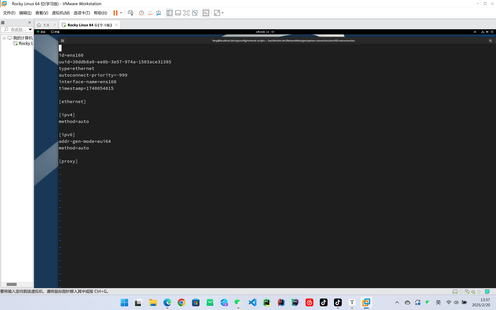

+ 切换到管理员用户：`su`


### 4. 安装 SSH 连接工具

SSH（Secure Shell），建立在应用层基础上的安全协议

常用的 SSH 连接工具

+ putty
+ secureCRT
+ xshell
+ finalshell

通过 SSH 连接工具就可以实现从本地连接到远程的 Linux 服务器


#### 使用 FinalShell 连接到 Linux

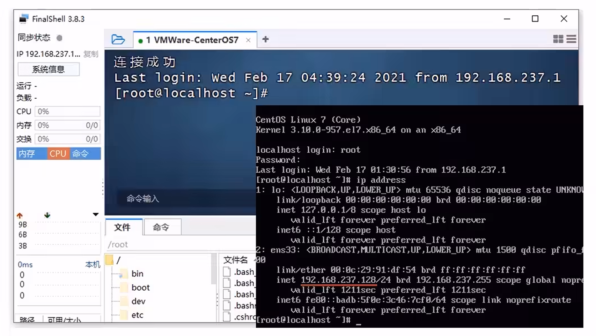


### 5. Linux 和 Windows 目录结构对比

Linux 系统中的目录

+ / 是所有目录的顶点
+ 目录结构像是一棵倒挂的树

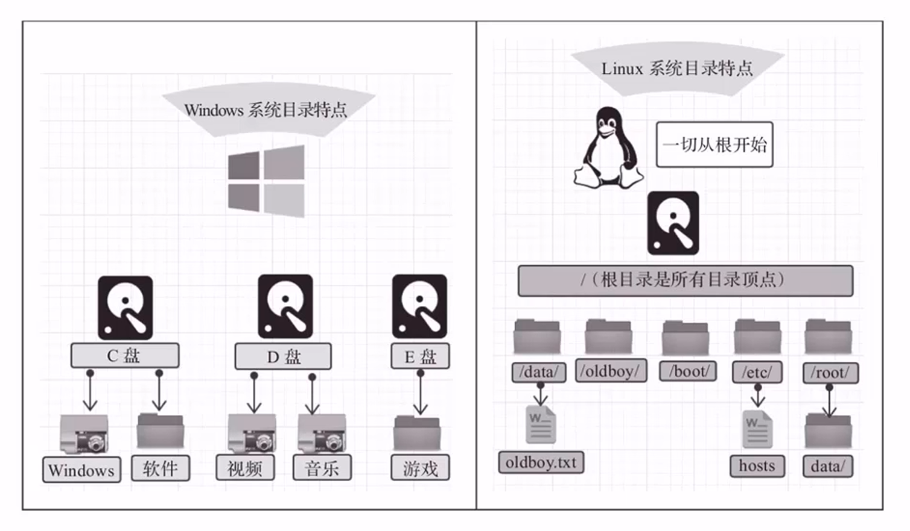

#### Linux 目录介绍

+ bin 存放二进制可执行文件
+ boot 存放系统引导时使用的各种文件
+ dev 存放设备文件
+ etc 存放系统配置文件
+ home 存放系统用户的文件
+ lib 存放程序运行所需的共享库和内核模块
+ opt 额外安装的可选应用程序包所放置的位置
+ root 超级用户目录
+ sbin 存放二进制可执行文件，只用 root 用户才能访问
+ tmp 存放临时文件
+ usr 存放系统应用程序
+ var 存放运行时需要改变数据的文件，例如日志文件

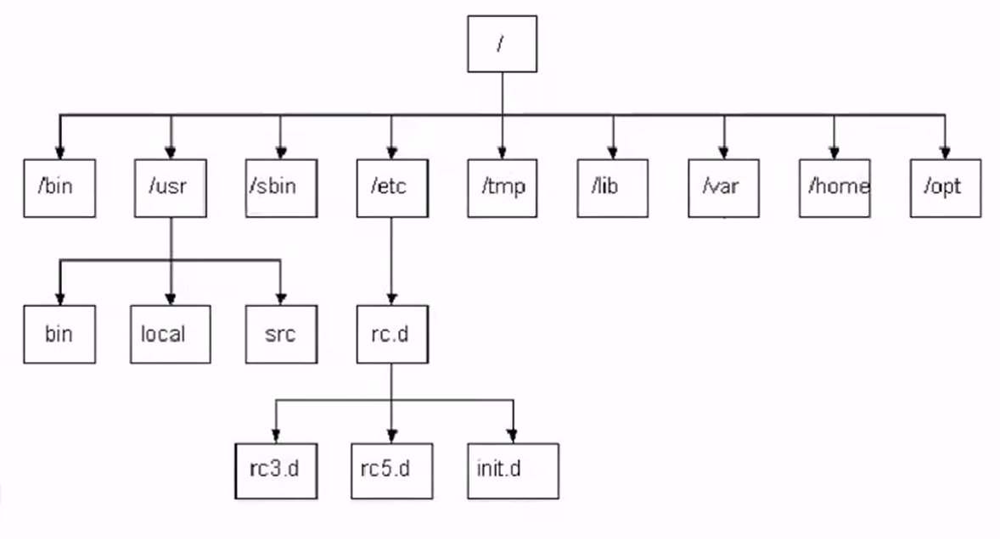


-----------------------------------


## 三、Linux 常用命令

### 1. Linux 命令初体验

+ 几个常用命令

| 序号 | 命令           | 对应英文             | 作用                     |
| ---- | -------------- | -------------------- | ------------------------ |
| 1    | ls             | list                 | 查看当前目录下的内容     |
| 2    | pwd            | print work directory | 查看当前所在的目录       |
| 3    | cd [目录名]    | change directory     | 切换目录                 |
| 4    | touch [文件名] | touch                | 如果文件不存在，新建目录 |
| 5    | mkdir [目录名] | make directory       | 创建目录                 |
| 6    | rm [文件名]    | remove               | 删除指定文件             |

注意事项：

+ 在执行 Linux 命令时，提示信息如果显示为乱码，如下：

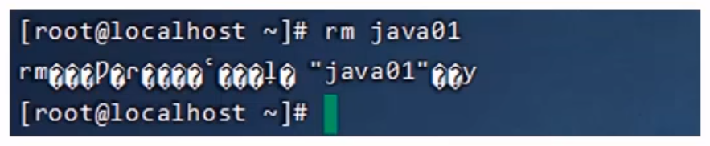

+ 这是由于编码问题导致，只需要修改 Linux 的编码即可，命令如下：

```
echo 'LANG="en_US.UTF-7"' >> /etc/profilesource /etc/profile
```

#### 1.1 Linux 命令使用技巧

+ Tab 键自动补全
+ 连续两次 Tab 键，给出操作提示
+ 使用上下箭头快速调出曾经使用过的命令
+ 使用 clear 命令或者 Ctrl+ 快捷键实现清屏

#### 1.2 Linux 命令格式

**command [-options] [parameter]**

说明：

+ command：命名名
+ [-options]：选项，可用来对命令进行控制，也可以省略
+ [parameter]：传给命令的参数，可以是零个、一个或者多个

注意：
[] 代表可选
命令名、选项、参数之间有空格进行分隔

#### 代码演示

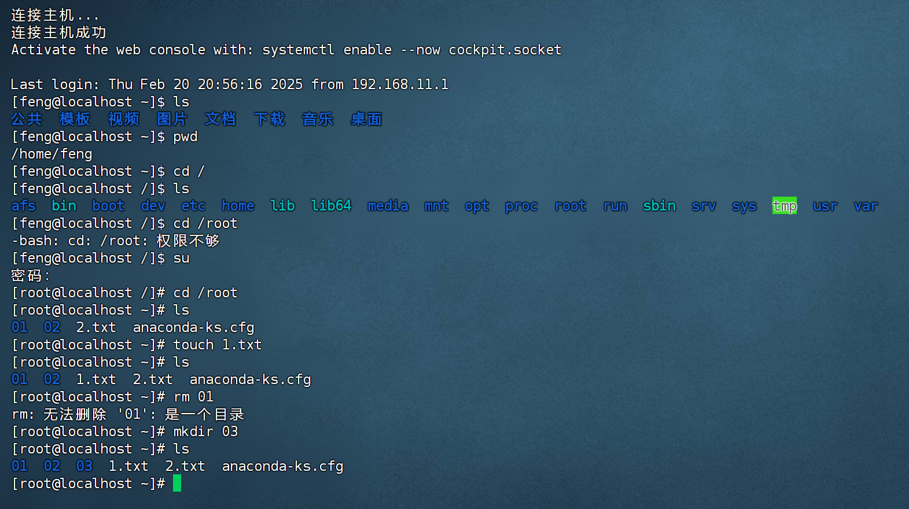

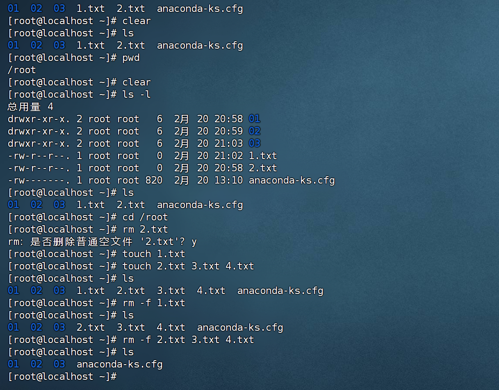


----------------------------------


### 2. 文件目录操作命令

#### 2.1 ls

作用：显示指定目录下的内容
语法：**ls [-al] [dir]**

说明：
+ -a 显示所有文件目录（. 开头的隐藏文件也会列出）
+ -l 除文件名称外，同时将文件形态（d 表示目录，- 表示文件）、权限、拥有者、文件大小等信息详细列出

注意：
由于我们使用 ls 命令时经常需要加入 -l 选项，所以 Linux 为 ls -l 命令提供了一种简写方式，即 **ll**


---------------------------------


#### 2.2 cd

作用：用于切换工作目录，即进入指定目录
语法：**cd [dirName]**

特殊说明：
+ ~ 表示用户的 home 目录
+ . 表示目前所在的目录
+ .. 表示目前目录位置的上级目录

举例：
+ cd ..			      切换到当前目录的上级目录
+ cd ~			     切换到用户的 home 目录
+ cd /usr/local		切换到 /usr/local 目录


---------------------------------


#### 2.3 cat

作用：用于显示文件内容
语法：cat [-n] fileName

说明：
+ -n：由1开始对所有输出的行数编号

举例：
+ cat /etc/profile		查看 /etc 目录下的 profile 文件内容

#### 代码演示

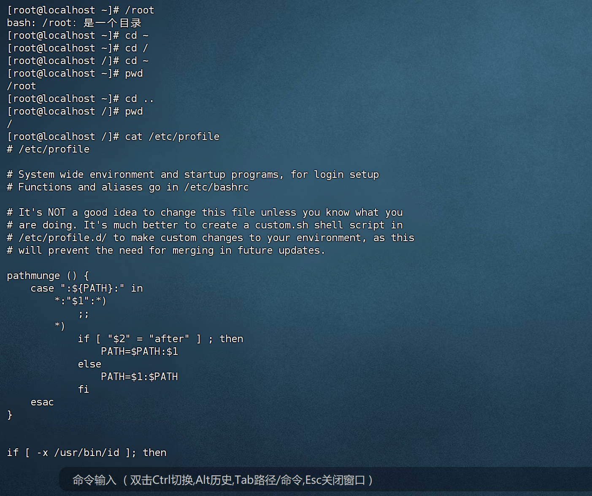


------------------------------------


#### 2.4 more

作用：以分页的形式显示文件内容
语法：**more fileName**

操作说明：
+ 回车键			   向下滚动一行
+ 空格键			   向下滚动一屏
+ b				    返回上一屏
+ q 或者 Ctrl+C		退出 more


举例：
+ more /etc/profile		以分页方式显示 /etc 目录下的 profile 文件内容


--------------------------------


#### 2.5 tail

作用：查看文件末尾的内容
语法：**tail [-f] fileName**

说明：
+ -f：动态读取文件

举例：
+ tail /etc/profile			 显示 /etc 目录下的 profile 文件末尾10行的内容
+ tail -20 /etc/profile		  显示 /etc 目录下的 profile 文件末尾20行的内容
+ tail -f /itcast/my.log		 动态读取 /itcast 目录下的 my.log 文件末尾内容并显示


---------------------------------


#### 2.6 mkdir

作用：创建目录
语法：**mkdir [-p] dirName**

说明：
+ -p：确保目录名称存在，不存在的就创建一个。通过此项目，可以实现多层目录同时创建

举例：
+ mkdir itcast			    在当前目录下，建立一个名为 itcast 的子目录
+ mkdir -p itcast/test		在工作目录下的 itcast 目录中建立一个名为 test 的子目录，若 itcast 目录不存在，则建立一个


--------------------------------


#### 2.7 rmdir

作用：删除空目录
语法：**rmdir [-p] dirName**

说明：
+ -p：当子目录被删除后使父目录为空目录的话，则一并删除

举例：
+ rmdir itcast				  删除名为 itcast 的空目录
+ rmdir -p itcast/test		      删除 itcast 目录中名为 test 的子目录，若 test 目录删除后 itcast 目录变为空目录，则也被删除
+ rmdir itcast*				删除名称以 itcast 开始的空目录


-------------------------------


#### 2.8 rm

作用：删除文件或者目录
语法：**rm [-rf] name**

说明：
+ -r：将目录及目录中所有文件（目录）逐一删除，即递归删除
+ -f：无需确认，直接删除

举例：
+ rm -r itcast/		   删除名为 itcast 的目录和目录中所有文件，删除前需确认
+ rm -rf itcast/		  无需确认，直接删除名为 itcast 的目录和目录中的所有文件
+ rm -f hello.txt		无需确认，直接删除 hello.txt 文件


---------------------------------------


### 3. 拷贝移动命令

#### 3.1 cp

作用：用于复制文件或目录
语法：**cp [-r] source dest**

说明：
+ -r：如果复制的是目录需要使用此选项，此时将复制该目录下的所有的子目录和文件

举例：
+ cp hello.txt itcast/			将 hello.txt 复制到 itcast 目录中
+ cp hello.txt ./hi.txt			将 hello.txt 复制到当前目录，并改名为 hi.txt
+ cp -r itcast/ ./itheima/		  将 itcast 目录和目录下所有文件复制到 itheima 目录下
+ cp -r itcast/* ./itheima/		 将 itcast 目录下所有文件复制到 itheima 目录下


-------------------------------


#### 3.2 mv

作用：为文件或目录改名、或将文件或目录移动到其它位置
语法：**mv source dest**

举例：
+ mv hello.txt hi.txt				    将 hello.txt 改名为 hi.txt
+ mv hi.txt itheima/				   将文件 hi.txt 移动到 itheima 目录中
+ mv hi.txt itheima/hello.txt		      将 hi.txt 移动到 itheima 目录中，并改名为 hello.txt
+ mv itcast/ itheima/				 如果 itheima 目录不存在，将 itcast目录改名为 itheima
+ mv itcast/ itheima/				 如果 itheima 目录存在，将 itcast 目录移动到 itheima 目录中


----------------------------------------


### 4. 打包压缩命令

#### 4.1 tar

作用：对文件进行打包、解包、压缩、解压
语法：**tar [-zcxvf] fileName [files]**
包文件后缀为 **.tar** 表示只是完成了打包，并没有压缩
包文件后缀为 **.tar.gz** 表示打包的同时还进行了压缩

说明：
+ -z：z 代表的是 gzip，通过 gzip 命令处理文件，gzip 可以对文件压缩或者解压
+ -c：c 代表的是 create，即创建新的包文件
+ -x：x 代表的是 extract，实现从包文件中还原文件
+ -v：v 代表的是 verbose，显示命令的执行过程
+ -f：f 代表的是 file，用于指定包文件的名称

常用组合：
+ **-cvf**：打包
+ **-zcvf**：打包同时又压缩
+ **-xvf**：解包 【.tar】
+ **-zxvf**：解压 【.tar.gz】

举例：
打包
+ tar -cvf hello.tar ./*						   将当前目录下所有文件打包，打包后的文件名为 hello.tar
+ tar -zcvf hello .tar.gz ./*					    将当前目录下所有文件打包后压缩，打包后的文件名为 hello.tar.gz

解包
+ tar -xvf hello.tar					   	     将 hello.tar 文件进行解包，并将解包后的文件放到当前目录
+ **tar -zxvf hello.tar.gz**					       将 hello.tar.gz 文件进行解压，并将解压后的文件放在当前目录
+ **tar -zxvf hello.tar.gz -C /usr/local**			 将 hello.tar.gz 文件进行解压，并将解压后的文件放在 /usr/local 目录


--------------------------------


### 5. 文本编辑命令

#### 5.1 vi / vim

作用：vi 命令是 Linux 系统提供的一个文本编辑工具，可以对文件内容进行编辑，类似于 Windows 中的记事本
语法：**vi fileName**

说明：
1. vim 是从 vi 发展来的一个功能更加强大的文本编辑工具，在编辑文件时可以对文本内容进行着色，方便我们对文件进行编辑处理，所以实际工作中 vim 更加常用
2. 要使用 vim 命令，需要我们自己完成安装。可以使用下面的命令来完成安装：
```
yum install vim
```


----------------------------


#### 5.2 vim

作用：对文件内容进行编辑，vim 其实就是一个文本编辑器
语法：**vim fileName**

说明：
1. 在使用 vim 命令编辑文件时，如果指定的文件存在则直接打开此文件。如果指定的文件不存在则新建文件
2. vim 在进行文本编辑时共分为三种模式，分别是命令模式（Command mode），插入模式（Insert mode）和底行模式（Last line mode）。这三种模式之间可以相互切换。我们在使用 vim 时一定要注意我们当前所处的是哪种模式

针对 vim 中的三种模式说明如下：

1. 命令模式

+ 命令模式下可以查看文件内容、移动光标（上下左右箭头、gg、G）
+ 通过 vim 命令打开文件后，默认进入命令模式
+ 另外两种模式需要首先进入命令模式，才能进入彼此

2. 插入模式

+ 插入模式下可以对文件内容进行编辑
+ 在命令模式下按下 [**i, a, o**] 任意一个，可以进入插入模式。进入插入模式后，下方会出现 [insert] 字样
+ 在插入模式下按下 **ESC** 键，回到命令模式

3. 底行模式

+ 底行模式下可以通过命令对文件内容进行查找、显示行号、退出等操作
+ 在命令模式下按下 [**:, /**] 任意一个，可以进入底行模式
+ 通过 / 方式进入底行模式后，可以对文本内容进行查找
+ 通过 : 方式进入底行模式后，可以输入 **wq**（保存并退出）、**q!**（不保存退出）、**set nu**（显示行号）


----------------------------------


### 6. 查找命令

#### 6.1 find

作用：在指定目录下查找文件
语法：**find dirName -option fileeName**

举例：
+ find . -name "*.java"			 在当前目录及其子目录下查找 .java 结尾文件
+ find /itcast -name "*.java"		在 /itcast 目录及其子目录下查找 .java 结尾的文件


--------------------------------


#### 6.2 grep

作用：从指定文件中查找指定的文本内容
语法：**grep word fileName**

举例：
+ grep Hello HelloWorld.java		       查找 HelloWorld.java 种出现的 Hello 字符串的位置
+ grep hello *.java					查找当前目录中所有 .java 结尾的文件中包含 hello 字符串的位置


-----------------------------------


## 四、Linux 软件安装

#### 1. 软件安装方式

+ 二进制发布包安装
  + 软件已经针对具体平台编译打包发布，只要解压，修改配置即可

+ rpm 安装
  + 软件已经按照 redhat 的包管理规范进行打包，使用 rpm 命令进行安装，不能自行解决库依赖问题

+ yum 安装
  + 一种在线安装方式，本质上还是 rpm 安装，自动下载安装包并安装，安装过程中自动解决库依赖问题

+ 源码编译安装
  + 软件以源码工程的形式发布，需要自己编译打包


-----------------------------------------------


#### 2. 安装 jdk

操作步骤：
1. 使用 FinalShell 自带的上传工具将 jdk 的二进制发布包上传到 Linux
2. 解压安装包，命令为 `tar -zxvf 安装包名称 -C /usr/local`
3. 配置环境变量，使用 vim 命令修改 /etc/profile 文件，在文件末尾加入如下配置
```
JAVA_HOME=/usr/local/jdk.8.0_171
PATH=$JAVA_HOME/bin:$PATH
```

4. 重新加载 profile 文件，使更改的配置立即生效，命令为 `source /etc/profile`
5. 检查安装是否成功，命令为 `java -version`

验证 Tomcat 启动是否成功，有多种方式：
+ 查看启动日志

  ```
  more /usr/local/apache-tomcat-7.0.57/logs/catalina.out
  tail -50 /usr/local/apache-tomcat-7.0.57/logs/catalina.out
  ```

+ 查看进程 `pa -ef | grep tomcat`

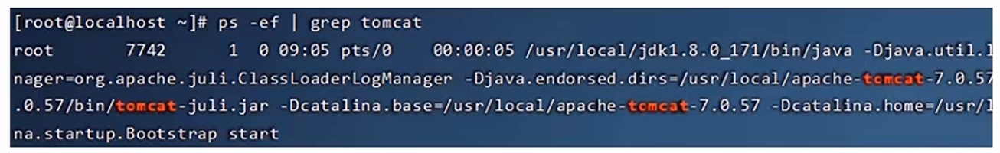

注意：
+ **ps** 命令是 Linux 下非常强大的进程查看命令，通过 **ps-ef** 可以查看当前运行的所有进程的详细信息
+ ”**|**“ 在 Linux 中称为管道符，可以将前一个命令的结果输出给后一个命令作为输入
+ 使用 ps 命令查看进程时，经常配合管道符和查找命令 grep 一起使用，来查看特定进程

防火墙操作：
+ 查看防火墙状态（systemctl status firewalld、firewall-cmd --state）
+ 暂时关闭防火墙（systemctl stop firewalld）
+ 永久关闭防火墙（systemctl disable firewalld）
+ 开启防火墙（systemctl start firewalld）
+ 开放指定端口（firewall-cmd --zone=public --add-port=8080/tcp --permanent）
+ 关闭指定端口（firewall-cmd --zone=public --remove-port=8080/tcp --permanent）
+ 立即生效（firewall-cmd --reload）
+ 查看开放的端口（firewall-cmd --zone=public --list-ports）

注意：
1. systemctl 是管理 Linux 中服务的命令，可以对服务进行启动、停止、重启、查看状态等操作
2. firewall-cmd 是 Linux 中专门用于控制防火墙的命令
3. 为了保证系统的安全，服务器的防火墙不建议关闭

停止 Tomcat 服务的方式：
+ 运行 Tomcat 的 bin 目录中提供的停止服务的脚本文件 `shutdown.sh`
```
sh shutdowm.sh
./shutdown.sh
```

+ 结束 Tomcat 进程
  + 查看 Tomcat 进程，获得进程 id
  + 执行命令结束进程 `kill -9 7742`


----------------------------


#### 3. 安装 Tomcat

操作步骤：
1. 使用 FinalShell 自带的上传工具将 Tomcat 的二进制发布包上传到 Linux
2. 解压压缩包，命令为 `tar -zxvf 压缩包名称 -C /usr/local`
3. 进入 Tomcat 的 bin 目录启动服务，命令为 `sh startup.sh` 或者 `./startup.sh`

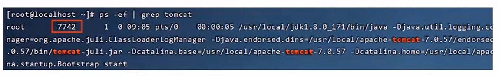

注意：
kill 命令是 Linux 提供的用于结束进程的命令，-9表示强制结束


-----------------------------------------------


## 五、项目部署

