# Linux

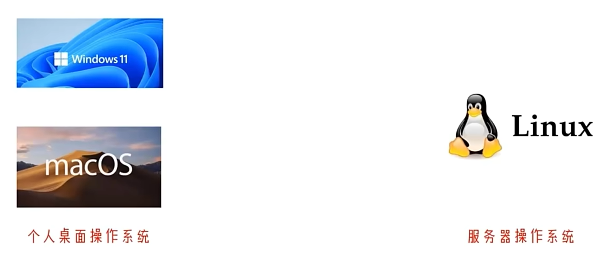

## 第一章、初识 Linux

### 1. 操作系统概述

我们所熟悉的计算机是由：硬件和软件组成的
+ 硬件：计算机系统中由电子，机械光电元件等组成的各种物理装置得的总称
+ 软件：是用户和计算机硬件之间的接口和桥梁，用户通过软件与计算机进行交流

而操作系统，就是软件的一类

一个完整的计算机：

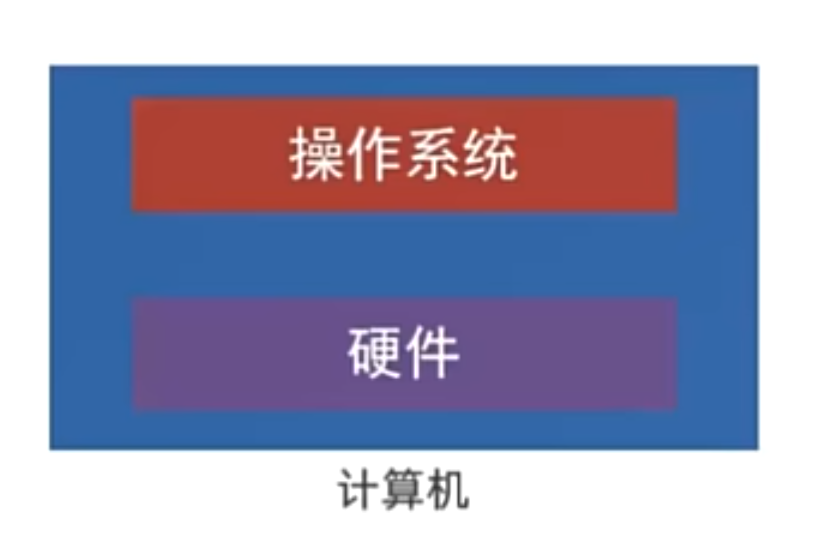

**操作系统**

+ 操作系统是计算机软件的一种，它主要负责：
  + 作为用户与计算机硬件之间的桥梁，调度和管理计算机硬件进行工作
  + 而计算机，如果没有操作系统，就是一堆无法使用的塑料而已


当计算机拥有了操作系统，就相当于拥有了灵魂，操作系统可以：
+ 调度 CPU 进行工作
+ 调度内存进行工作
+ 调度硬盘进行数据存储
+ 调度网卡进行网络通讯
+ 调度音响发出声音
+ 调度打印机打印内容
+ ...

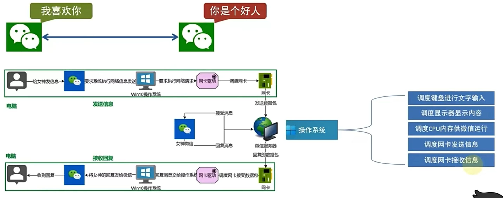

用户使用操作系统，操作系统安排硬件干活


**常见的操作系统**

+ 个人电脑
  + Windows
  + Linux
  + macOS

+ 移动设备
  + 安卓
  + IOS
  + HarmonyOS

#### 总结

1. 计算机是由哪两个主要部分组成？
+ 硬件和软件

2. 操作系统是什么？有什么用？
+ 操作系统是软件的一类

3. 常见的操作系统有哪些？
+ PC 端：Windows、Linux、MacOS
+ 移动端：Android、IOS、鸿蒙系统


--------------------------------


### 2. 初识 Linux

Linux 创始人：林纳斯 托瓦兹

Linux 诞生于1991年，作者上大学期间

因为创始人在上大学期间经常需要浏览新闻和处理邮件，发现现有的操作系统不好用，于是他决心自己写一个保护环境下的操作系统，这就是 Linux 的原型，当时他21岁，后来经过全世界网友的支持，现在能够兼容多种硬件，称为最为流行的服务器操作系统之一

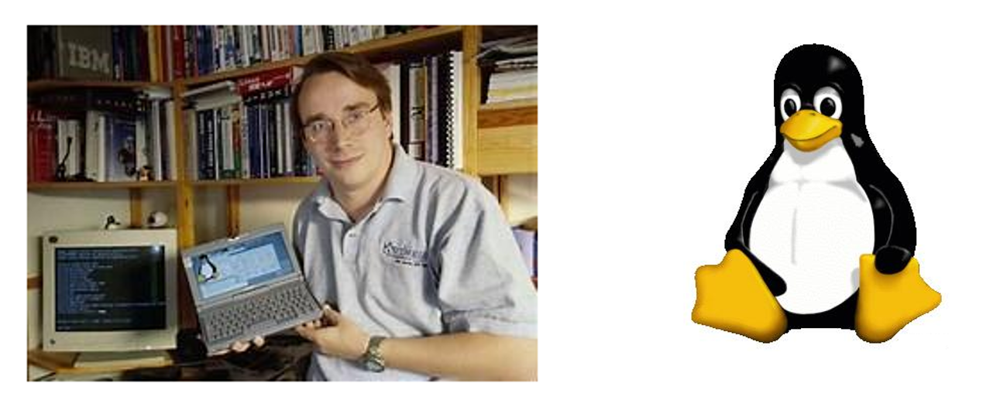


#### 2.1 Linux 内核

Linux 系统的组成如下：

+ Linux 系统内核
+ 系统级应用程序

两部分组成

+ 内核提供系统最核心的功能，如：调度 CPU、调度内存、调度文件系统、调度网络通讯、调度 IO 等
+ 系统级应用程序，可以理解为出厂自带程序，可供用户快速上手操作系统，如：文件管理器、任务管理器、图片查看、音乐播放等
+ 比如，播放音乐，无论用户使用自带音乐播放器或是自行安装的第三方播放器，均是由播放器程序，调用内核提供的相关功能，由内核调度调度 CPU 解码、音响发声等

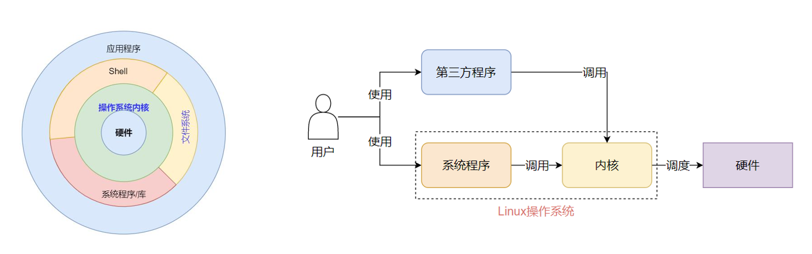


#### 2.2 Linux 内核

可以看出，内核是 Linux 操作系统最核心的所在，系统级应用程序只是锦上添花

Linux 内核是免费开源的，任何人都可以下载内核源码并查看且修改

可以通过：https://www.kernel.org 去下载 Linux 内核

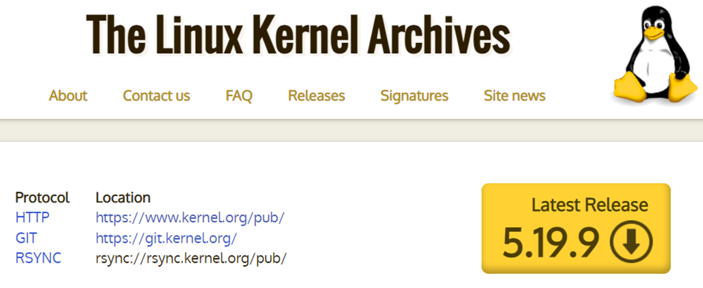


#### 2.3 Linux 发行版

内核是免费、开源的，这也就代表了：

+ 任何人都可以获得并修改内核，并且自行集成系统级程序
+ 提供了内核+系统级程序的完整封装，称之为 Linux 发行版

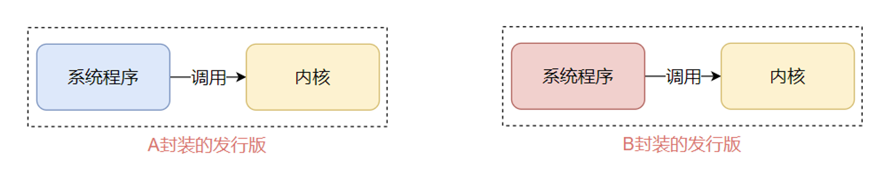


任何人都可以封装 Linux，目前市面上有非常多的 Linux 发行版、常用的、知名的如下：

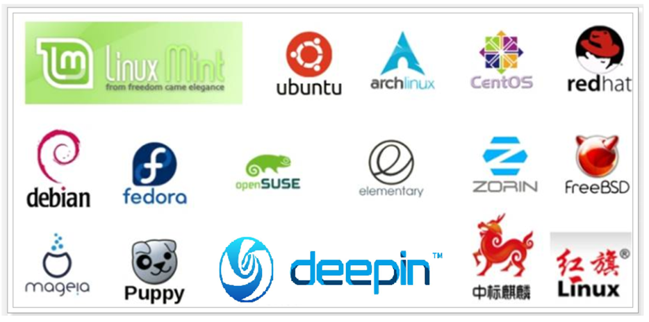

本课程将基于：

+ **主要**基于 CentOS 操作系统进行讲解
+ **辅助**讲解 Ubuntu 系统的相关知识

不同的发行版

+ 基础命令100%是相同的
+ 部分操作不同（如软件安装）


#### 总结

1. Linux 的诞生

+ Linux 由林纳斯 托瓦兹在1991年创立并发展至今成为服务器操作系统领域的核心系统

2. 什么是 Linux 系统的内核

+ 内核提供了 Linux 系统的主要功能，如硬件调度管理的能力
+ Linux 内核是免费开源的，任何人都可以查看内核的源代码，甚至是贡献源代码

3. 什么是 Linux 系统发行版

+ 内核无法被用户直接使用，需要配合应用程序才能被用户使用
+ 在内核之上，封装系统级应用程序，组合在一起就称之为 Linux 发行版


------------------------------------


### 3. 虚拟机介绍

学习 Linux 系统，就需要有一个可用的 Linux 系统

我们需要借助虚拟机来获得可用的 Linux 系统环境进行学习

那么，什么是虚拟机？

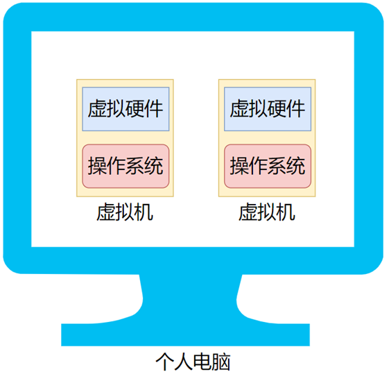

借助虚拟化技术，我们可以在系统中，通过软件：模拟计算机硬件，并给虚拟硬件安装真实的操作系统

这样，就可以在电脑中，虚拟出一个完整的电脑


#### 总结

1. 什么是虚拟机？

+ 通过虚拟化技术，在电脑内，虚拟出计算机硬件，并给虚拟的硬件安装操作系统，即可得到一台虚拟的电脑，称之为虚拟机

2. 为什么要使用虚拟机？

+ 学习Linux系统，需要有Linux系统环境
+ 我们不能给自己电脑重装系统为 Linux，所以通过虚拟机的形式，得到可以用的 Linux 系统环境，供后续学习使用


-----------------------


### 4. 安装 VMware Workstation 虚拟化软件

我们可以通过提供虚拟化的软件来获得虚拟机


选用 VMware WorkStation 软件来提供虚拟机

1. 下载 VMware Pro17 安装压缩包

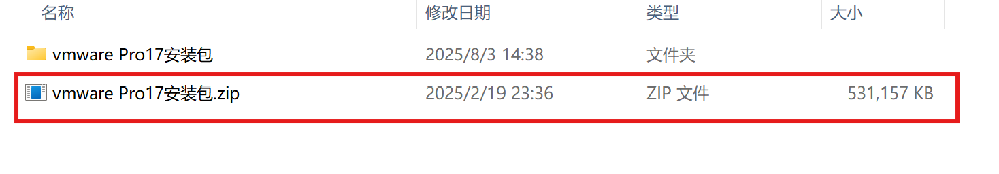

2. 解压压缩包，打开安装包

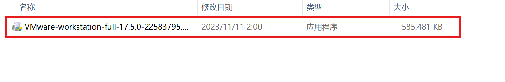

3. 跟随安装引导完成安装（傻瓜式安装）

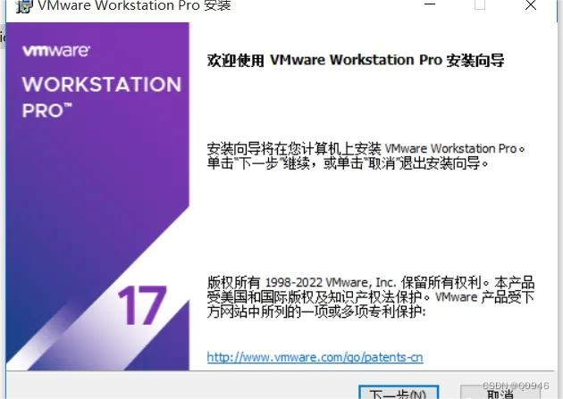

此步建议安装位置改为 C 盘以外盘符

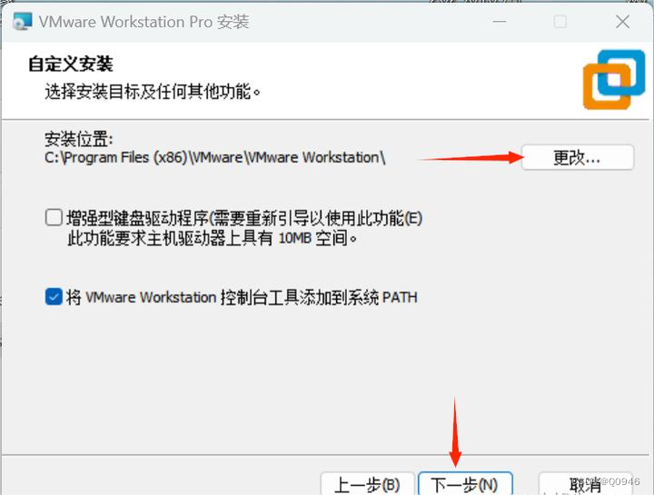

4. 点击许可证，输入许可证密钥

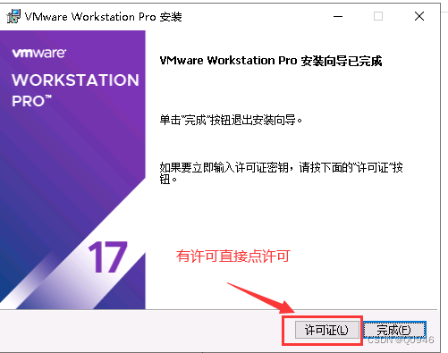

以下为网上搜集到的许可证：

```txt
MC60H-DWHD5-H80U9-6V85M-8280D（亲测有效）
JUO9O-6039P-08409-8J0QH-2YR7F
4A4RR-813DK-M81A9-4U35H-06KND
NZ4RR-FTK5H-H81C1-Q30QH-1V2LA
JU090-6039P-08409-8J0QH-2YR7F
4Y09U-AJK97-089Z0-A3054-83KLA
4C21U-2KK9Q-M8130-4V2QH-CF810
MC60H-DWHD5-H80U9-6V85M-8280D
ZA30U-DXF84-4850Q-UMMXZ-W6K8F
AC590-2XW97-48EFZ-TZPQE-MYHEA
YF39K-DLFE5-H856Z-6NWZE-XQ2XD
AC15R-FNZ16-H8DWQ-WFPNV-M28E2
CZ1J8-A0D82-489LZ-ZMZQT-P3KX6
YA11K-6YE8H-H89ZZ-EXM59-Y6AR0
```

5. 检查虚拟网卡有没有安装成功

设置 -> 网络和 Internet -> 高级网络设置

或者 win+r，输入 `ncpa.cpl`


确保这俩存在


------------------------


### 5. VMware Workstation 中安装 CentOS7 Linux 操作系统

首先，我们需要下载操作系统的安装文件，本次使用的是 CentOS7.6 版本

[Index of /7.6.1810/isos/x86_64](https://vault.centos.org/7.6.1810/isos/x86_64/)

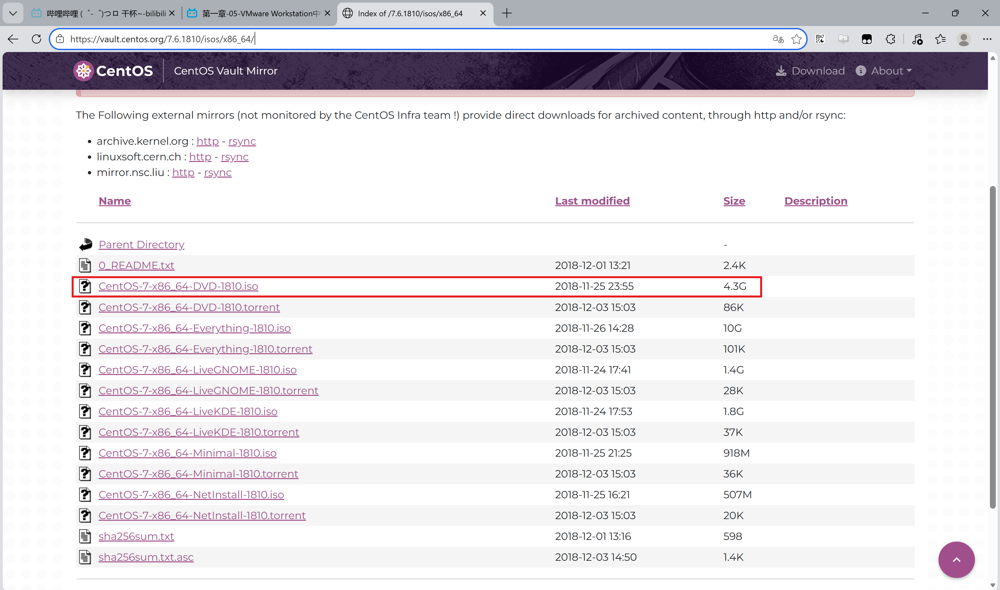

+ 或者直接用链接下载：

https://vault.centos.org/7.6.1810/isos/x86_64/CentOS-7-x86_64-DVD-1810.iso


#### 5.1 新建虚拟机

1. 新建虚拟机

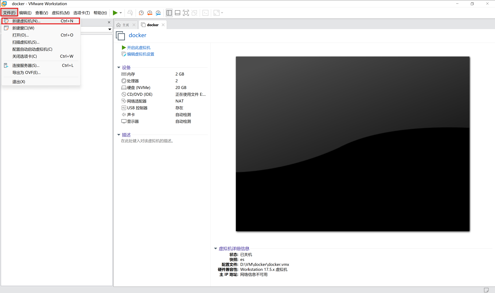

2. 选择 “典型”，自定义可设置更多内容

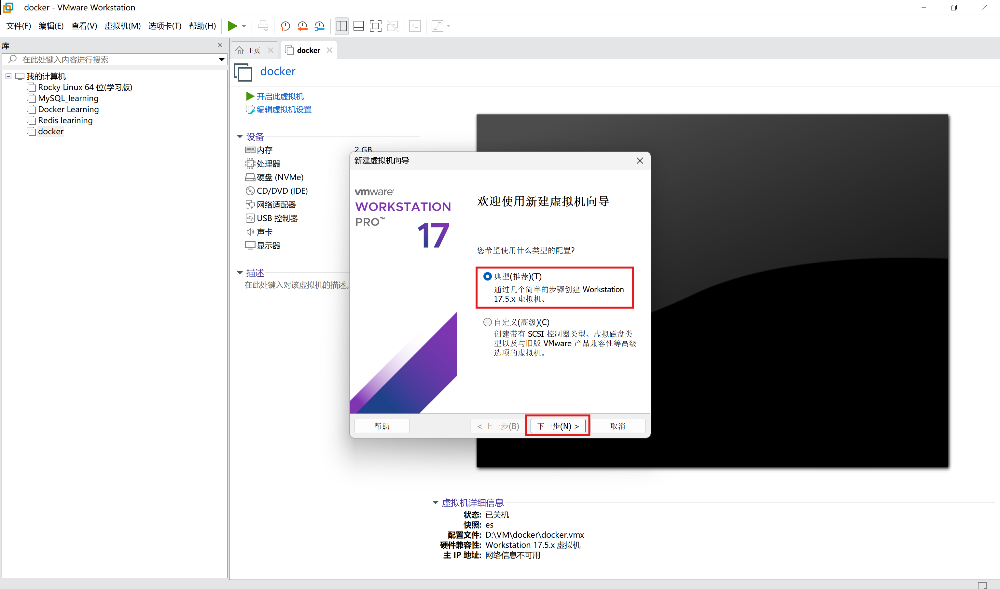

3. 选择内核路径

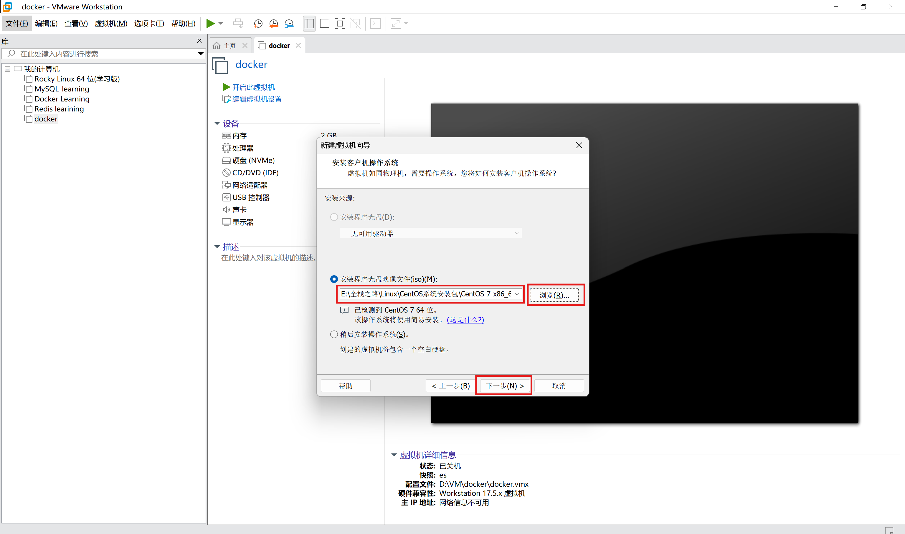

4. 设置用户名和密码

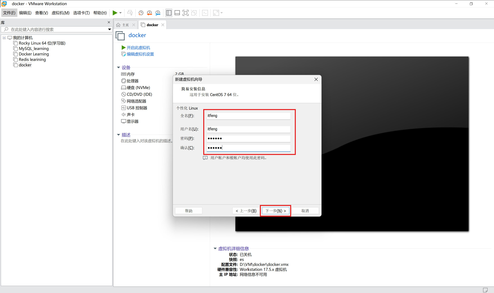

5. 选择虚拟机安装位置

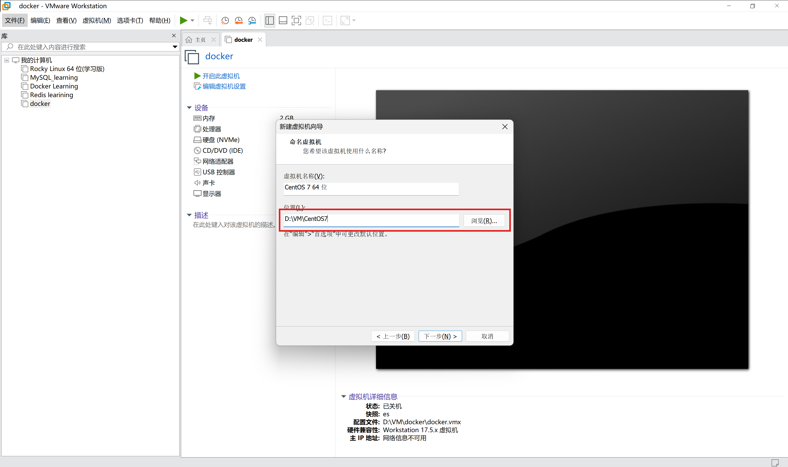

6. 设置磁盘大小

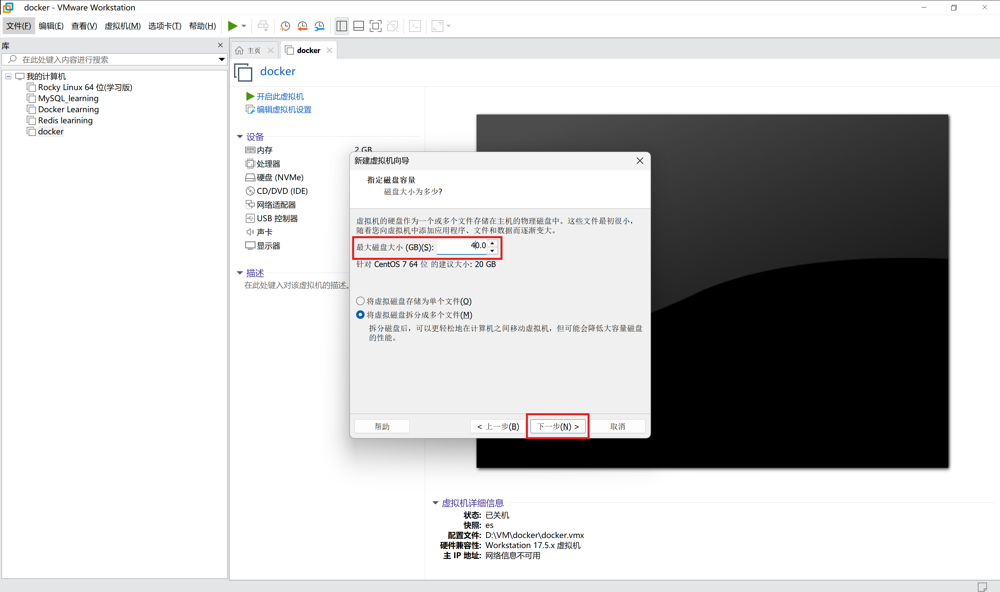

20GB 确实太小了，后面部署很多东西会不够用的

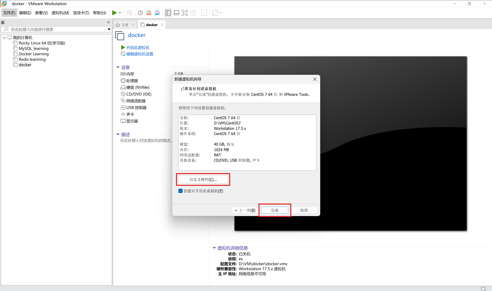

更多详细设置可以在 **自定义硬件** 设置

7. 等待安装完成

然后就等着它自动安装重启，大概要下十几分钟吧

（这玩意好慢啊，之前用 Rocky 一下就装完了）

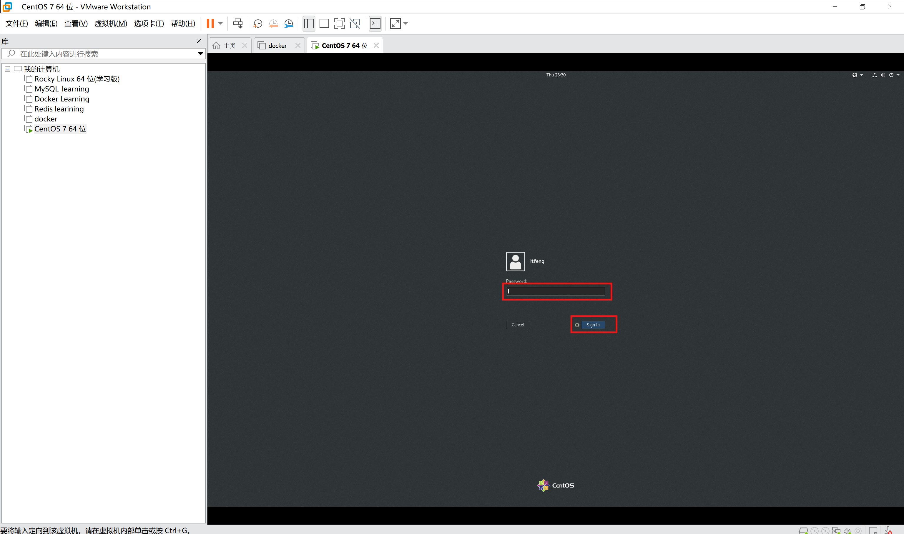

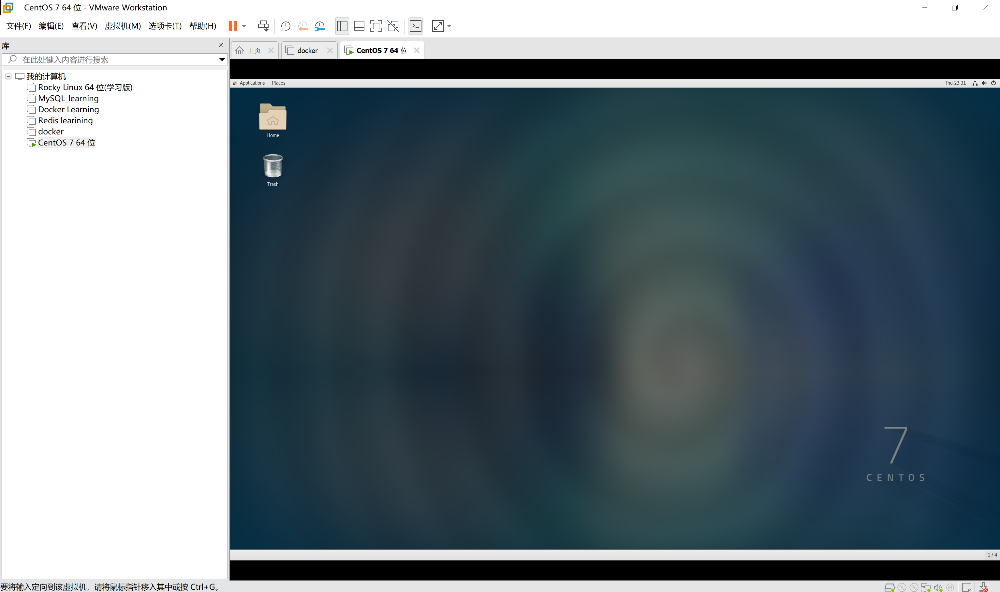

emmm，这可视化界面也不如 Rocky 好看


--------------------------


### 6. MacOS 安装 VMware Fusion 并安装虚拟机

额，我是 Windows，跳了跳了，自己搜吧~


-----------------------------


### 7. 远程连接 Linux 系统

#### 7.1 图形化、命令行

对于操作系统的使用，有2种使用形式：

+ 图形化页面使用操作系统
+ 以命令的形式使用操作系统

不论是 Windows 还是 Linux 亦或是 MacOS 系统，都是支持这两种使用形式

+ 图形化：使用操作系统提供的图形化页面，以获得图形化反馈的形式去使用操作系统
+ 命令行：使用操作系统提供的各类命令，以获得字符反馈的形式去使用操作系统


尽管图形化是大多数人使用计算机的第一选择，但是在 Linux 操作系统上，这个选择被反转了

无论是企业开发抑或是个人开发，使用 Linux 操作系统，多数都是使用的命令行

这是因为：

+ Linux 从诞生至今，在图形化页面的优化上，并未重点发力。所以 Linux 操作系统的图形化页面：不好用、不稳定
+ 在开发中，使用命令行形式，效率更高，更加直观，并且资源占用低，程序运行更稳定


#### 7.2 FinalShell

我们使用 VMware 可以得到 Linux 虚拟机，但是在 VMware 中操作 Linux 的命令行页面不太方便，主要是：

+ 内容的复制、粘贴跨越 VMware 不方便
+ 文件的上传、下载跨越 VMware 不方便
+ 也就是和 Linux 系统的各类交互，跨越 VMware 不方便

我们可以通过第三方软件，FinalShell，远程连接到 Linux 操作系统上

并通过 FinalShell 去操作 Linux 系统

这样各类操作都会十分的方便


FinalShell 的下载地址为：

Windows：

http://www.hostbuf.com/downloads/finalshell_install.exe

Mac：

http://www.hostbuf.com/downloads/finalshell_install.pkg

下载完成后双击打开安装（傻瓜式安装）


#### 7.3 连接

在 VMware 中右键屏幕，选择 Open Terminal，打开命令行

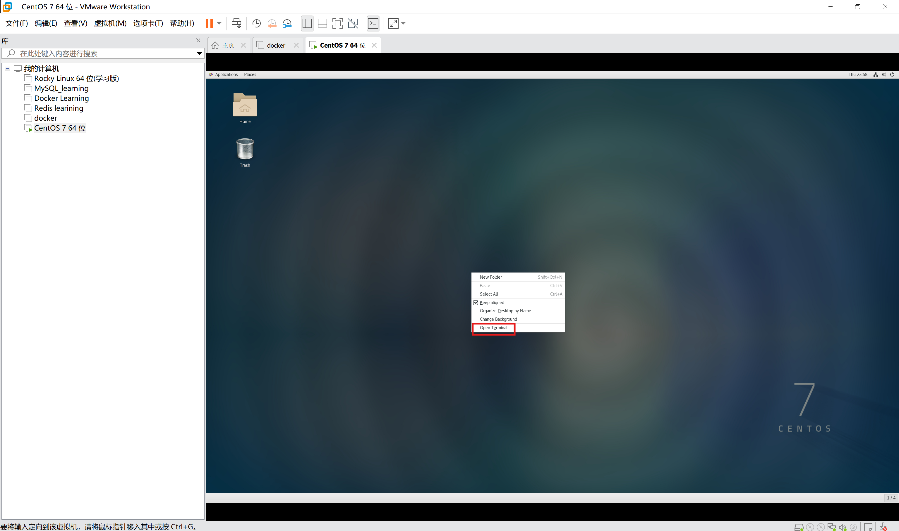

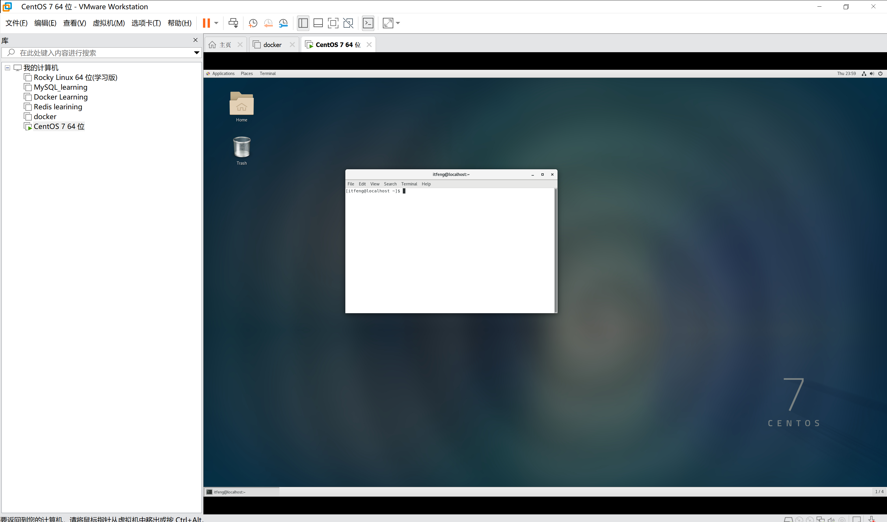

输入 `ifconfig`，找到虚拟机 IP 地址

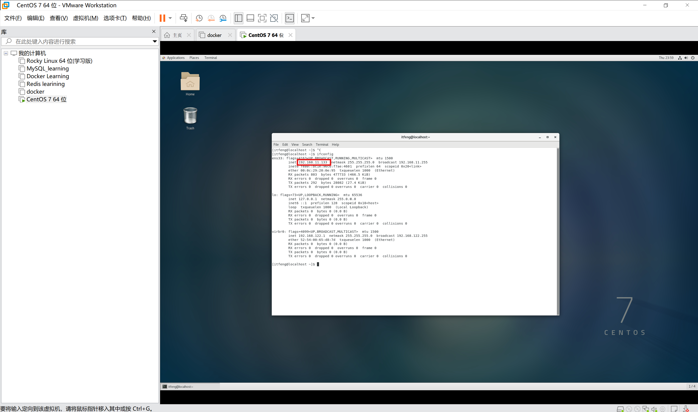

我这用 MobaXterm 连接

（我感觉这玩意比 FinalShell 好用）- （我的 RGB：33-60-74）

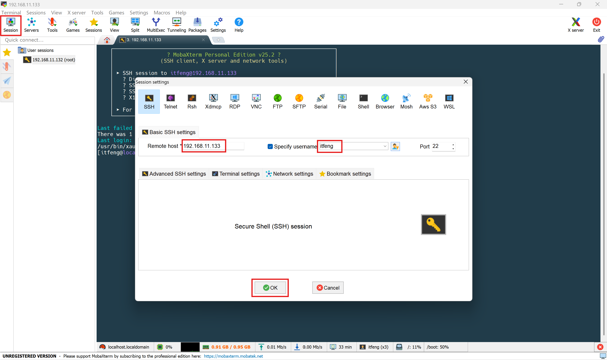

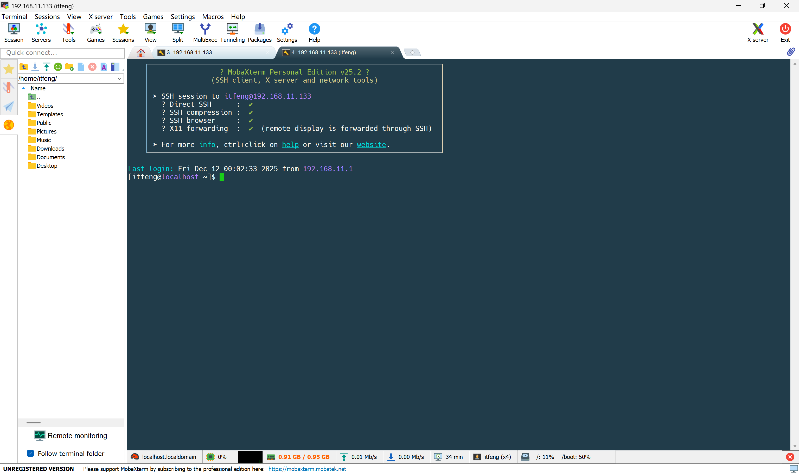

<strong><font color="red">注意</font></strong>：Linux 虚拟机如果重启，有可能，发生 IP 改变

如果改变 IP 需要在 FinalShell 中修改连接的 IP 地址

后面会讲解如何固定 IP 地址不发生改变


#### 总结

1. 什么是图形化操作，什么是命令行操作？

+ 图形化操作是指使用操作系统附带的图形化页面，以图形化的窗口形式获得操作反馈，从而对操作系统进行操作、使用
+ 命令行操作是指使用各种命令，以文字字符的形式获得操作反馈，从而对操作系统进行操作、使用

2. 为什么 Linux 操作系统要选择命令行形式呢？

+ Linux 操作系统的图形化页面不好用且不稳定
+ 使用命令行的形式操作更加高效且稳定资源占用低
+ 企业和开发者都选择命令行，所以我们也学习命令行

3. 为什么使用 FinalShell 连接 Linux 去使用

+ 操作 Linux 系统中间跨越 VMware 窗口会导致交互不太方便
+ 我们只需要使用命令行无需使用图形化，所以通过命令行远程连接使用即可

4. 如何查看 Linux 的 IP 地址并远程连接呢

+ 在Linux操作系统中，桌面空白右键点击：open in terminal
+ 输入 `ifconfig`，即可看到 IP 地址
+ 在 FinalShell 中配置好 IP 地址，账号密码后即可连接成功


----------------------------


### 8. 拓展 - WSL（Windows Subsystem for Linux）

WSL 作为 Windows10 系统带来的全新特性，正在逐步颠覆开发人员既有的选择

+ 传统方式获取 Linux 操作系统环境，是安装完整的虚拟机，如 VMware
+ 使用 WSL，可以以非常轻量化的方式，得到 Linux 系统环境

目前，开发者正在逐步抛弃以虚拟机的形式获取 Linux 系统环境，而在逐步拥抱 WSL 环境


#### 8.1 什么是 WSL

WSL：Windows Subsystem for Linux，是用于 Windows 系统之上的 Linux 子系统

作用很简单，可以在 Windows 系统中获得 Linux 系统环境，并完全直连计算机硬件，无需通过虚拟机虚拟硬件

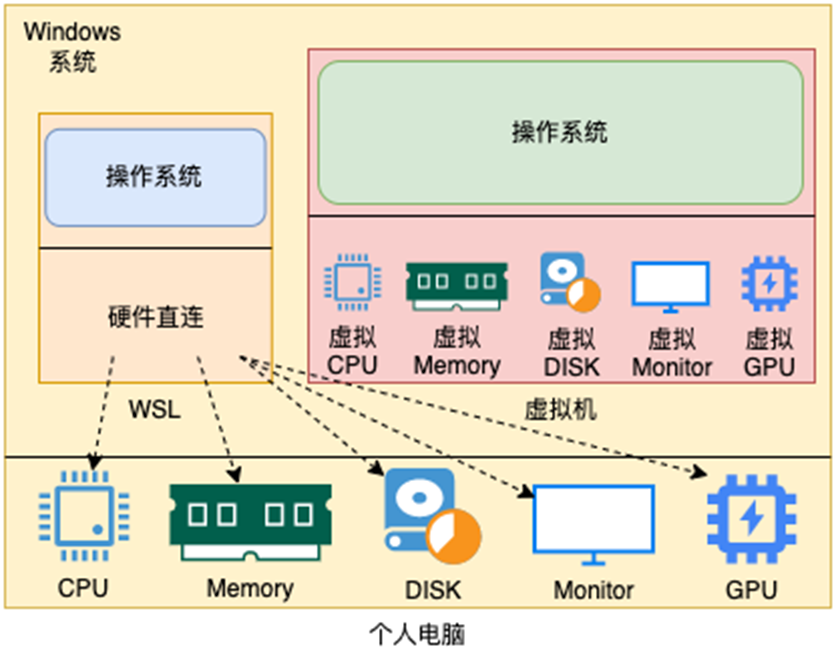

简而言之：

Windows10 的 WSL 功能，可以无需单独虚拟一套硬件设备

就可以直接使用主机的物理硬件，构建 Linux 操作系统

并不会影响 Windows 系统本身的运行


#### 8.2 WSL 部署

+ WSL 是 Windows10 自带功能，需要开启，无需下载

我这是 Win11：在控制面板 -> 程序 -> 程序和功能 -> 启用或关闭 Windows 功能

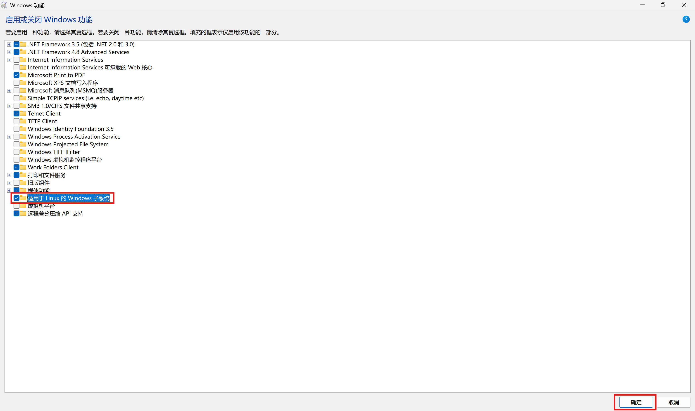

+ 打开 Windows 应用商店

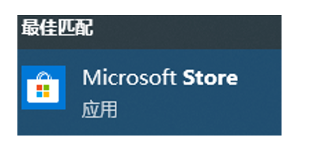

+ 搜索 Ubuntu

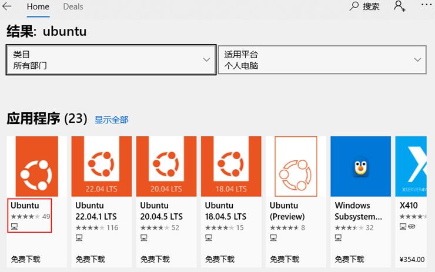

+ 点击获取并安装

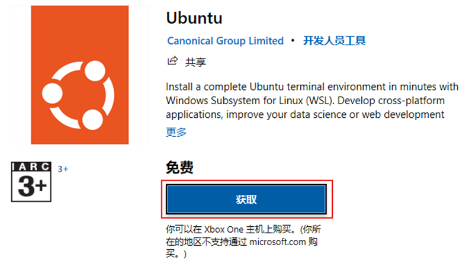

+ 点击启动

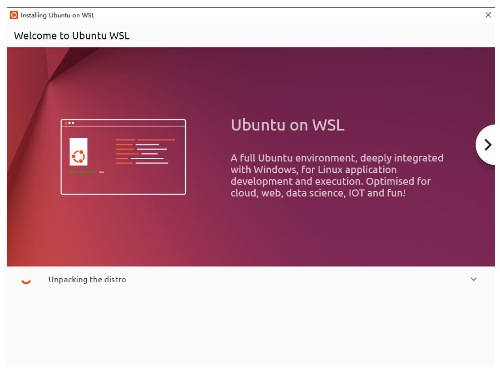

+ 输入用户名用以创建一个用户：

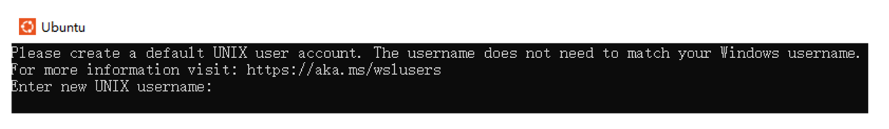

+ 输入两次密码确认（注意，输入密码没有反馈，不用理会，正常输入即可）

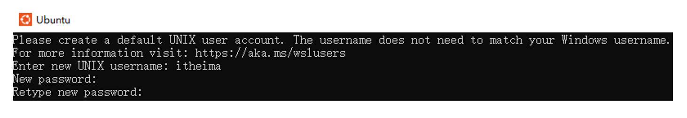

+ 至此，得到了一个可用的 Ubuntu 操作系统环境

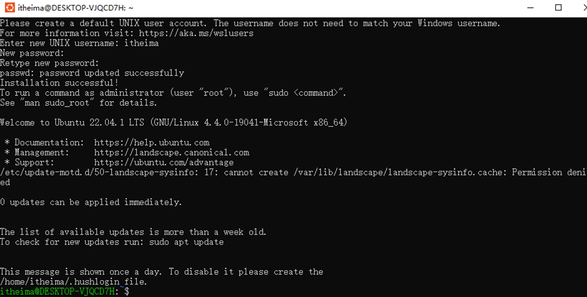


#### 8.3 安装 Windows Terminal 软件

Ubuntu 自带的终端窗口软件不太好用，我们可以使用微软推出的：Windows Terminal 软件

在应用商店中搜索 terminal 关键字，找到 Windows Terminal 软件下载并安装

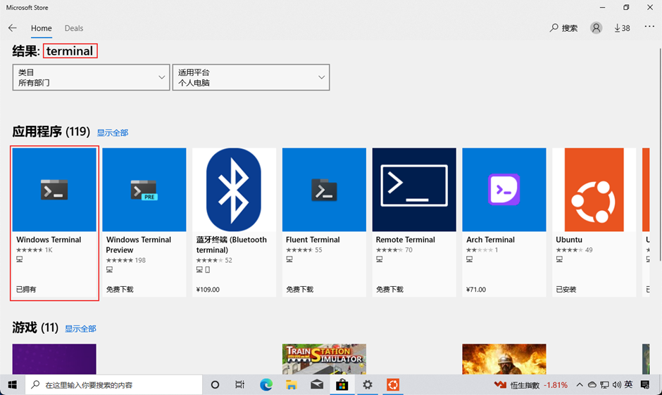

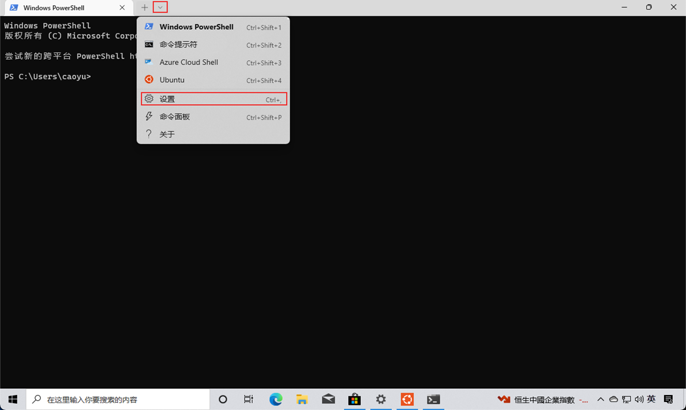

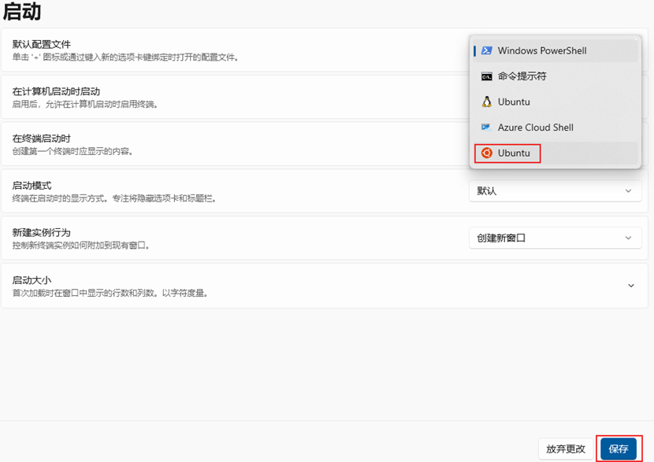

再次打开 Windows Terminal 软件，即默认使用 Ubuntu 系统了（WSL）

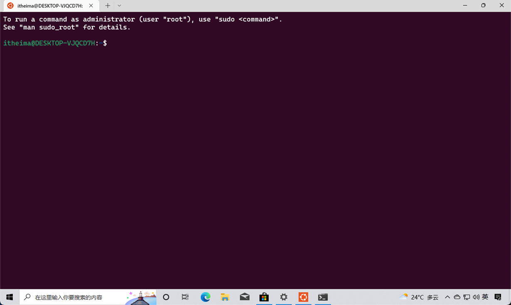


-----------------------------


### 9. 拓展 - 虚拟机快照

在学习阶段我们无法避免的可能损坏 Linux 操作系统

如果损坏的话，重新安装一个 Linux 操作系统就会十分麻烦

VMware 虚拟机（Workstation 和 Fusion）支持为虚拟机制作快照

通过快照将当前虚拟机的状态保存下来，在以后可以通过快照恢复虚拟机到保存的状态

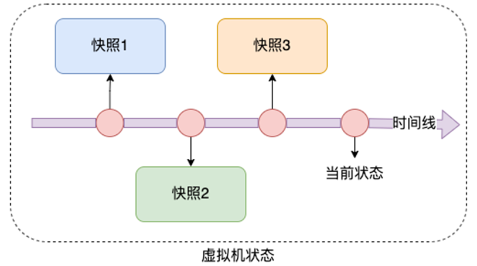


1. 确保虚拟机关机

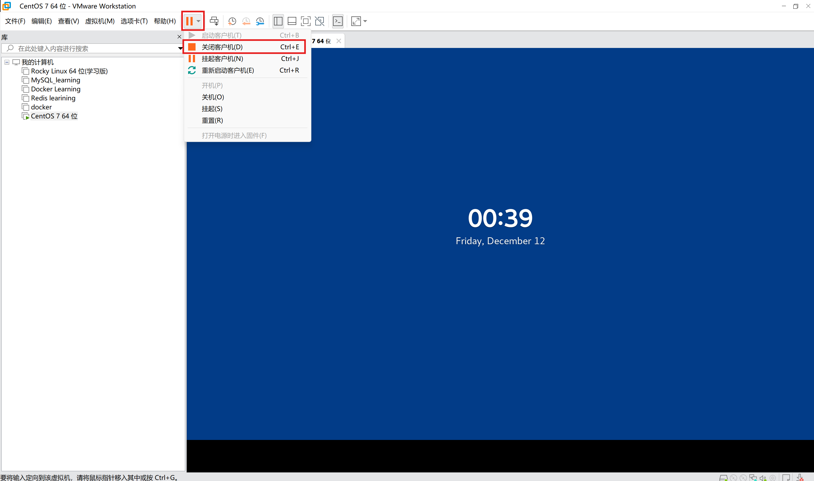

2. 拍摄快照

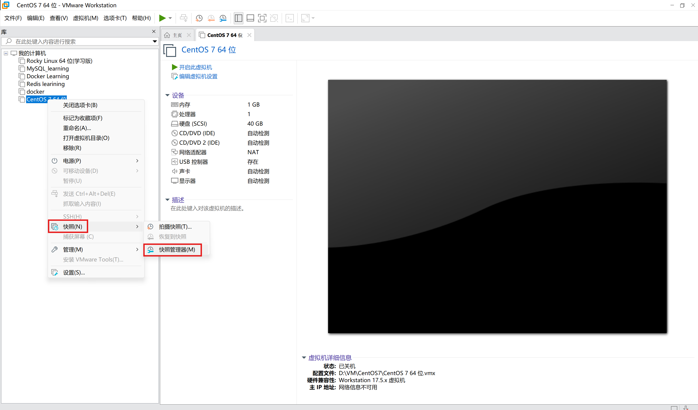

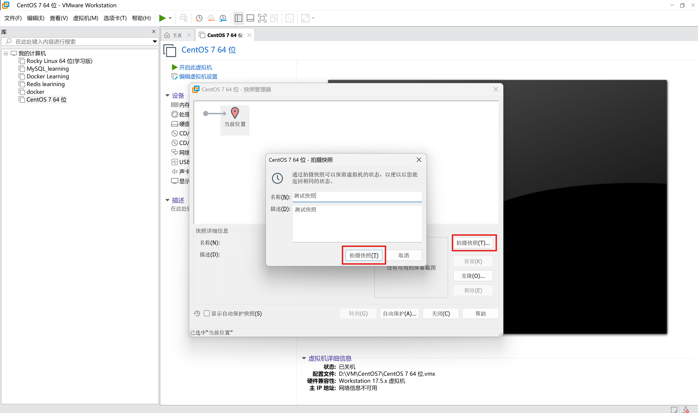

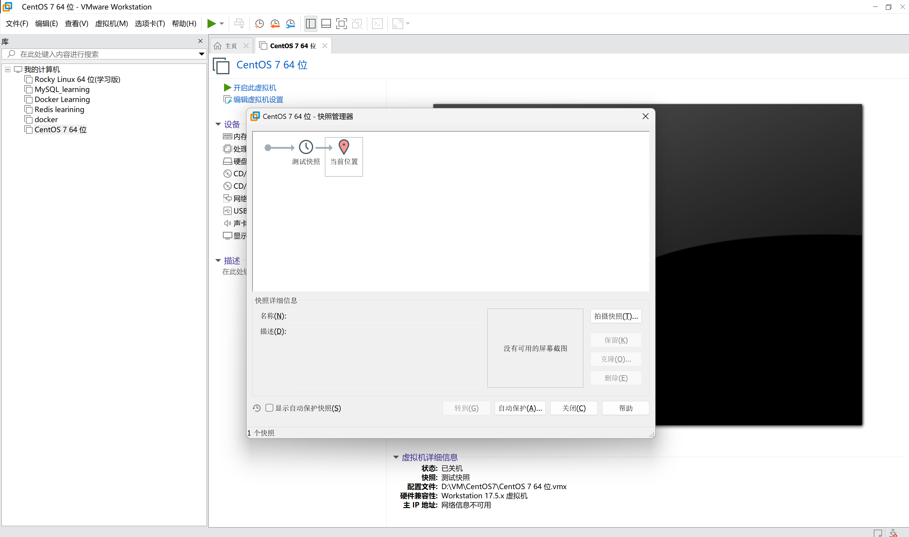


#### 总结

1. 快照有什么作用？

+ 快照可以保存虚拟机的状态，当虚拟机出现问题的时候，可以通过预先制作的快照恢复到制作时候的状态，用作备份用

2. VMware Workstation 和 VMware Fusion 都支持制作快照去使用


-------------------------------------------


## 第二章、Linux 基础命令

### 1. Linux 的目录结构

Linux 的目录结构是一个树型结构

WIndows 系统可以拥有多个盘符，如 C 盘、D 盘、E 盘

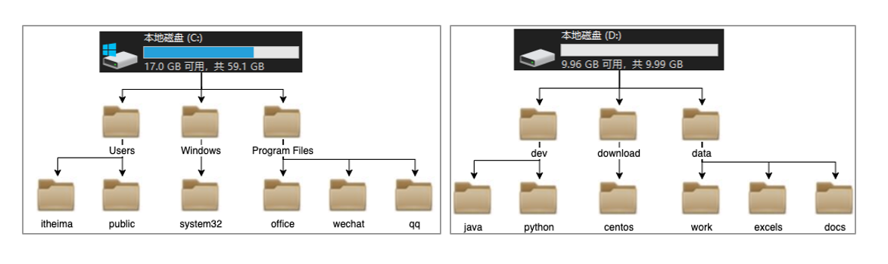

Linux 没有盘符这个概念，只有一个根目录 `/`，所有文件都在它下面

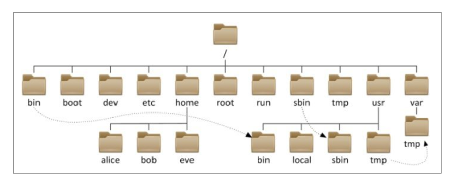


#### 1.1 Linux 路径的描述方式

+ 在 Linux 系统中，路径之间的层级关系，使用：`/` 来表示
+ 在 Windows 系统中，路径之间的层级关系，使用：`\` 来表示

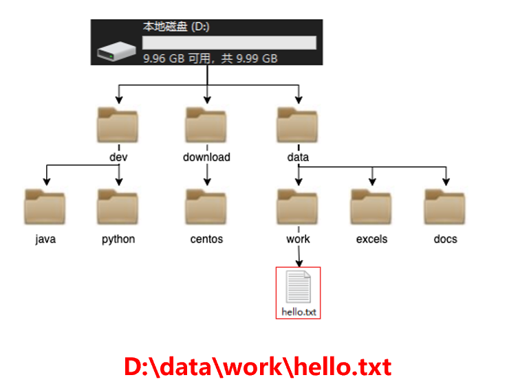

注意：

+ `D:` 表示 D 盘
+ `\` 表示层级关系

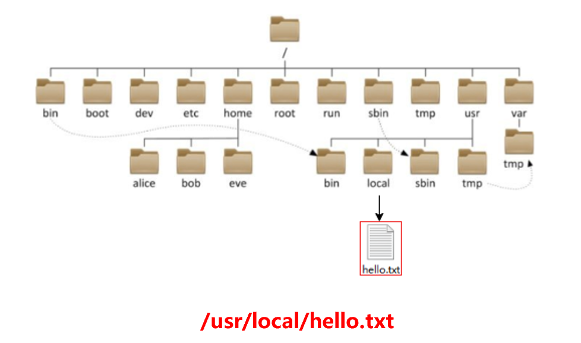

注意：

+ 开头的 `/` 表示根目录
+ 后面的 `/` 表示层级关系


#### 总结

1. Linux 操作系统的目录结构


Linux 只有一个顶级目录，称之为：根目录

Windows 系统有多个顶级目录，即各个盘符

2. `/` 在 Linux 系统中表示

+ 出现在开头的 `/` 表示：根目录

+ 出现在后面的 `/` 表示：层次关系


------------


### 2. Linux 命令入门

#### 2.1 什么是命令、命令行

学习 Linux，本质上是学习在命令行下熟练使用 Linux 的各类命令。

+ 命令行：即 Linux 终端（Terminal），是一种命令提示符页面。以纯“字符”的形式操作系统,可以使用各种字符化命令对系统发出操作指令
+ 命令：即 Linux 程序。一个命令就是一个 Linux 的程序。命令没有图形化页面,可以在命令行（终端中）提供字符化的反馈


#### 2.2 Linux 命令基础格式

无论是什么命令，用于什么用途，在 Linux 中，命令有其通用的格式：

```shell
command [-options] [parameter]
```

+ `command`： 命令本身
+ `-options`：[可选，非必填] 命令的一些选项，可以通过选项控制命令的行为细节
+ `parameter`：[可选，非必填] 命令的参数，多数用于命令的指向目标等

语法中的 `[]`，表示可选的意思

实例：

+ `ls -l /home/itheima`，ls 是命令本身，-l 是选项，/home/itheima 是参数
  + 意思是以列表的形式，显示 /home/itheima  目录内的内容
+ `cp -r test1 test2`，cp 是命令本身，-r 是选项，test1 和 test2 是参数
  + 意思是复制文件夹 test1 成为 test2


#### 2.3 ls 命令

ls 命令的作用是列出目录下的内容，语法细节如下：

```shell
ls [-a -l -h] [Linux路径]
```

+ `-a -l -h` 是**可选**的选项
+ Linux 路径是此命令**可选**的参数

当不适用选项和参数，直接使用 ls 命令本体，表示：以平铺形式，列出当前工作目录下的内容

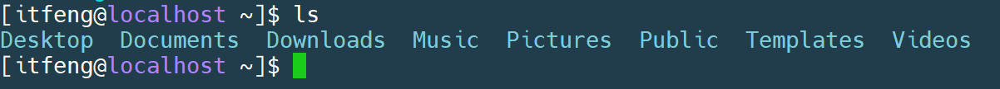


#### 2.4 HOME 目录和工作目录

直接输入 ls 命令，表示列出当前工作目录下的内容，当前工作目录是？

Linux 系统的命令行终端，在启动的时候，默认会加载：

+ 当前登录用户的 HOME 目录作为当前工作目录，所以 ls 命令列出的是 HOME 目录的内容
+ HOME 目录：每个 Linux 操作用户在 Linux 系统的个人账户目录，路径在：/home/用户名
  + 如，图中的 Linux 用户是 itheima，其 HOME 目录是：/home/itheima
  + Windows 系统和 Linux 系统，均设有用户的 HOME 目录，如图：

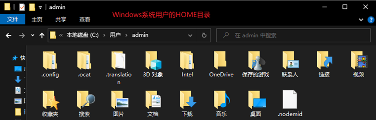

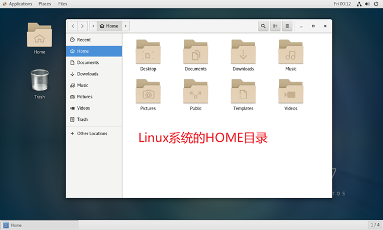


#### 2.5 ls 命令的参数

刚刚展示了，直接使用 ls 命令，并未使用选项和参数

```shell
ls [-a -l -h] [Linux路径]
```

那么 ls 的选项和参数具体有什么作用呢？首先我们先来看参数

+ 当 ls 不使用参数，表示列出：当前工作目录的内容，即用户的 HOME 目录
+ 当使用参数，ls 命令的参数表示：指定一个 Linux 路径，列出指定路径的内容

如：

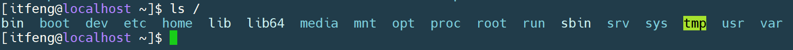


#### 2.6 ls 命令的 -a 选项

如下语法，ls 命令是可以使用选项的

```shell
ls [-a -l -h] [Linux路径]
```

+ `-a` 选项，表示：all 的意思，即列出全部文件（包含隐藏的文件 / 文件夹）

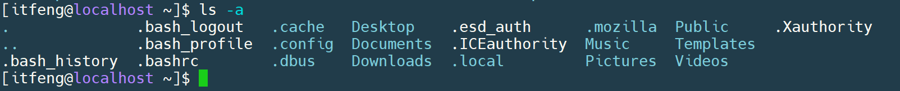

可以看出，`ls -a` 对比 `ls` 列出的内容更多了

+ 图中以 `.` 开头的，表示是 Linux 系统的隐藏文件 / 文件夹（只要以 `.` 开头，就能自动隐藏）
+ 只有通过 -a 选项，才能看到这些隐藏的文件 / 文件夹


#### 2.7 ls 命令的 -l 选项

```shell
ls [-a -l -h] [Linux路径]
```

+ `-l` 选项，表示：以列表（竖向排列）的形式展示内容，并展示更多信息

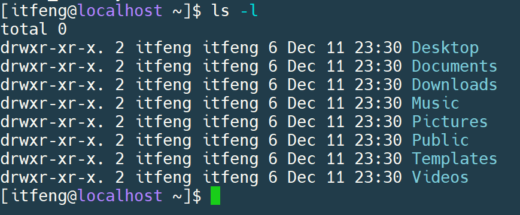


#### 2.8 ls 命令选项的组合使用

语法中的选项是可以组合使用的，比如学习的 `-a` 和 `-l` 可以组合应用

写法：

+ `ls -l -a`
+ `ls -la`
+ `ls -al`

上述的三种写法，都是一样的，表示同时应用 `-l` 和 `-a` 的功能

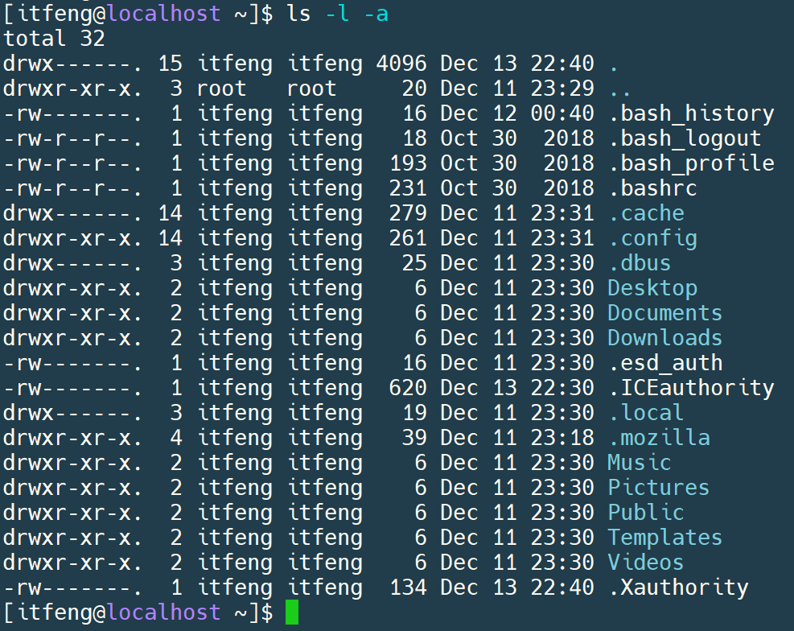

除了选项本身可以组合以外，选项和参数也可以一起使用

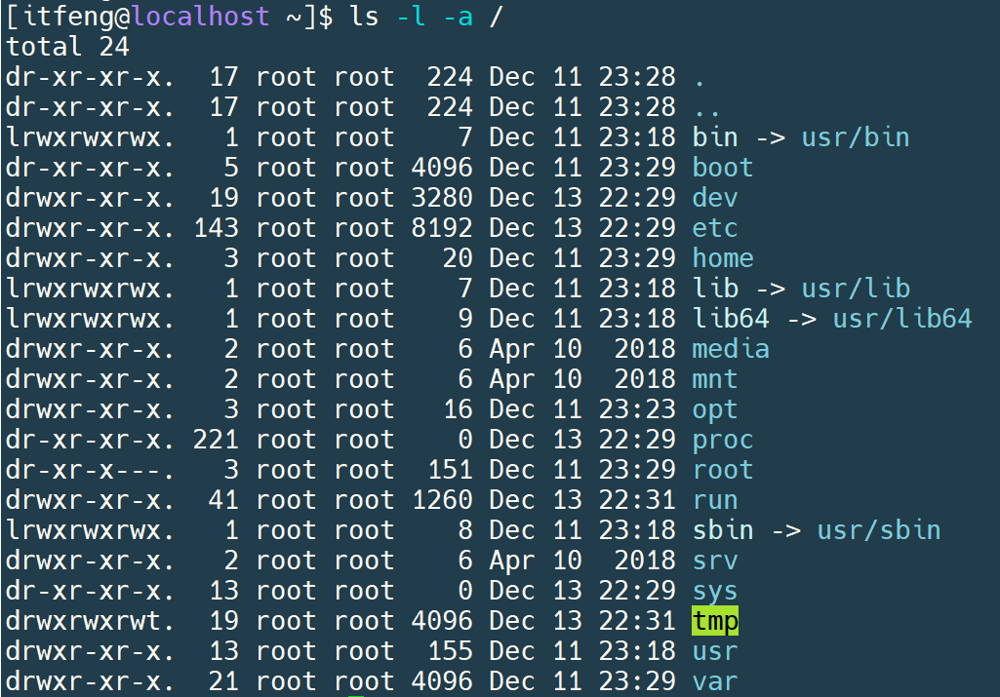


#### 2.9 ls 命令的 -h 选项

```shell
ls [-a -l -h] [Linux路径]
```

+ `-h` 表示以易于阅读的形式，列出文件大小，如 K、M、G
+ `-h` 选项必须要搭配 `-l` 一起使用

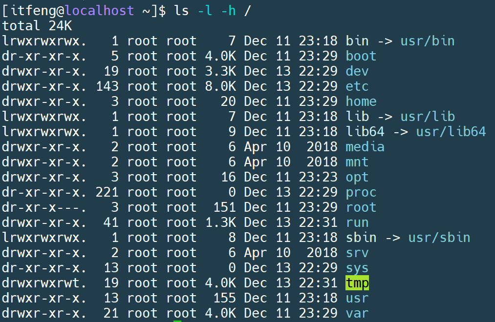


-------------


### 3. 目录切换相关命令（cd / pwd）

#### 3.1 cd 切换工作目录

当 Linux 终端（命令行）打开的时候，会默认以用户的 HOME 目录作为当前的工作目录

我们可以通过 cd 命令，更改当前所在的工作目录

cd 命令来自英文：**C**hange **D**irectory

语法：

```shell
cd [Linux路径]
```

+ cd 命令无需选项，只有参数，表示要切换到哪个目录下
+ cd 命令直接执行，不写参数，表示回到用的的 HOME 目录

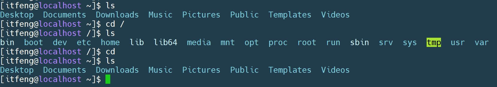


#### 3.2 pwd 查看当前工作目录

通过 ls 来验证当前的工作目录，其实是不恰当的

我们可以通过 pwd 命令，来查看当前所在的工作目录

pwd 命令来自：**P**rint **W**ork **D**irectory

语法：

```shell
pwd
```

+ pwd 命令，无选项，无参数，直接输入 pwd 即可

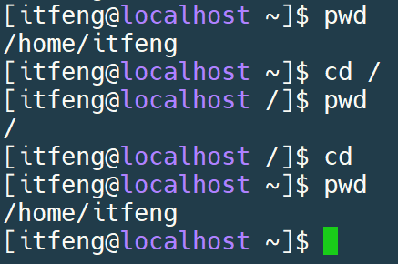


#### 总结

1. cd 命令的作用

+ cd 命令来自英文：**C**hange **D**irectory
+ cd 命令可以切换当前工作目录，语法是：`cd [Linux路径]`
  + 没有选项，只有参数，表示目标路径
  + 使用参数，切换到指定路径
  + 不使用参数，切换工作目录到当前用户的 HOME


2. pwd 命令的作用

+ pwd 命令来自英文：**P**rint **W**ork **D**irectory
+ pwd 命令，没有选项，没有参数，直接使用即可
+ 作用是：输出当前所在的工作目录


----


### 4. 相对路径、绝对路径和特殊路径符

#### 4.1 相对路径和绝对路径

+ `cd /home/itfeng/Desktop`   绝对路径写法

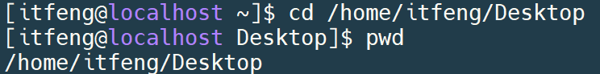

+ `cd Desktop`   相对路径写法

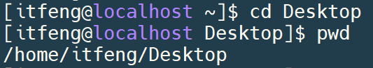

绝对路径：以**根目录为起点**，描述路径的一种写法，路径描述以 `/` 开头

相对路径：以**当前目录为起点**，描述路径的一种写法，路径描述无需以 `/` 开头


#### 4.2 特殊路径符

特殊路径符：

+ `.`：表示当前目录，比如 `cd ./Desktop` 表示切换到当前目录下的 Desktop 目录内，和 `cd Desktop` 效果一致
+ `..`：表示上一级目录，比如：`cd ..` 即可切换到上一级目录，`cd ../..` 切换到上二级的目录
+ `~`：表示 HOME 目录，比如：`cd ~` 即可切换到 HOME 目录或 `cd ~/Desktop`，切换到 HOME 内的 Desktop 目录


#### 总结

1. 相对路径和绝对路径

+ 绝对路径：以根目录做起点，描述路径的方式，路径以 `/` 开头
+ 相对路径：以当前目录做起点，描述路径的方式，路径不需以 `/` 开头
+ 如无特殊需求，后续学习中，将经常使用相对路径表示

2. 特殊路径符有哪些？

+ `.` 表示当前目录，比如 `cd .` 或 `cd ./Desktop`
+ `..` 表示上一级目录，比如：`cd ..` 或 `cd ../..`
+ `~` 表示用户的 HOME 目录，比如：`cd ~` 或 `cd ~/Desktop`


---


### 5. 创建目录命令（mkdir）

通过 mkdir 命令可以创建新的目录（文件夹）

mkdir 来自英文：**M**a**k**e **Dir**ectory

语法：

```shell
mkdir [-p] Linux路径
```

+ 参数**必填**，表示 Linux 路径，即要创建的文件夹的路径，相对路径或绝对路径均可
+ `-p` 选项可选，表示自动创建不存在的父目录，适用于创建连续多层级的目录

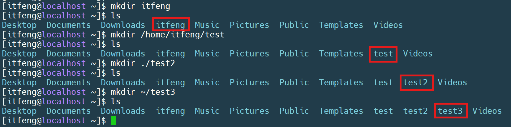


#### 5.1 mkdir -p 选项

如果想要一次性创建多个层级的目录，如下图

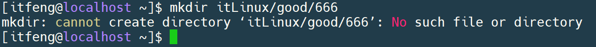

会报错，因为上级目录 itLinux 和 good 并不存在，所以无法创建 666 目录

可以通过 `-p` 选项，将一整个链条都创建完成

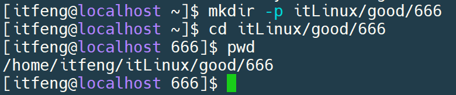

<strong><font color="red">注意</font></strong>：

+ 创建文件夹需要修改权限，请确保操作均在 HOME 目录内，不要在 HOME 外操作
+ 涉及到权限问题，HOME 外无法成功


#### 总结

1. mkdir 命令的语法和功能

+ mkdir 用以创建新的目录（文件夹）
+ 语法：`mkdir [-p] Linux路径`
+ 参数**必填**，表示要创建的目录的路径，相对、绝对、特殊路径符都可以使用

2. -p 选项的作用

+ **可选**，表示自动创建不存在的父目录，适用于创建连续多层级的目录


-------


### 6. 文件操作命令 part1（touch、cat、more）

#### 6.1 touch 创建文件

可以通过 touch 命令创建文件

语法：

```shell
touch Linux路径
```

+ touch 命令无选项，参数必填，表示要创建的文件路径，相对、绝对、特殊路径符均可使用

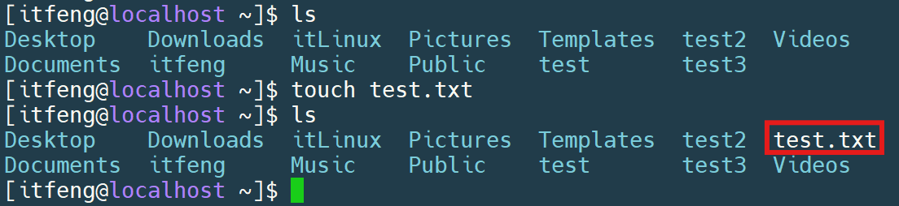


#### 6.2 cat 命令 查看文件内容

有了文件后，我们可以通过 cat 命令查看文件的内容

不过，现在我们还未学习 vi 编辑器，无法向文件内编辑内容，所以我们先通过图像化手动向文件内添加内容，以测试 cat 命令

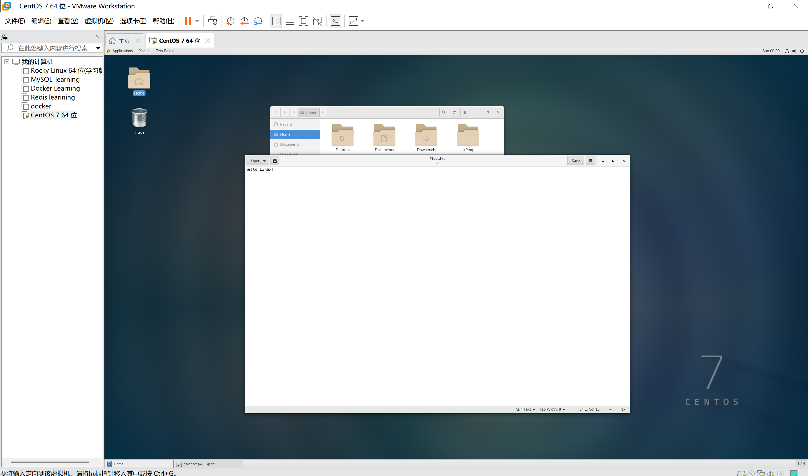

准备好文件内容后，可以通过 cat 查看内容

语法：

```shell
cat Linux路径
```

+ cat 同样没有选项，只有必填参数，参数表示：被查看的文件路径，相对、绝对、特殊路径符都可以使用


#### 6.3 more 命令查看文件内容

more 命令同样可以查看文件内容，同 cat 不同的是：

+ cat 是直接将内容全部显示出来
+ more 支持翻页，如果文件内容过多，可以一页页的展示（通过空格翻页，通过 q 退出查看，b 键是上一页）

语法：

```shell
more Linux路径
```

+ 同样没有选项，只有必填参数，参数表示：被查看的文件路径，相对、绝对、特殊路径符都可以使用


#### 总结

1. touch 命令

+ 用于创建一个新的文件
+ 语法：`touch Linux路径`
+ 参数**必填**，表示要创建的文件的路径，相对、绝对、特殊路径符都可以使用

2. cat 命令

+ 用于查看文件内容
+ 语法：`cat Linux路径`
+ 参数**必填**，表示要查看的文件的路径，相对、绝对、特殊路径符都可以使用

3. more 命令

+ 用于查看文件内容，可翻页查看
+ 语法：`more Linux路径`
+ 参数**必填**，表示要查看的文件的路径，相对、绝对、特殊路径符都可以使用
+ 使用空格进行翻页，使用 q 退出查看


------


### 7. 文件操作命令 part2（cp、mv）

#### 7.1 cp 命令复制文件文件夹

cp 命令可以用于复制文件 / 文件夹，cp 命令来自英文单词：**c**o**p**y

语法：

```shell
cp [-r] 参数1 参数2
```

+ **-r** 选项，可选，用于复制文件夹使用，表示递归
+ 参数1，Linux 路径，表示被复制的文件或文件夹
+ 参数2，Linux 路径，表示要复制去的地方

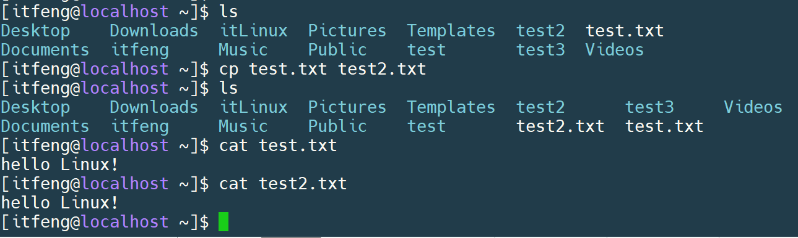


#### 7.2 mv 移动文件或文件夹

mv 命令可以用于移动文件 / 文件夹，mv 命令来自英文单词：**m**o**v**e

语法：

```shell
mv 参数1 参数2
```

+ 参数1，Linux 路径，表示被移动的文件或文件夹
+ 参数2，Linux 路径，表示要移动去的地方，如果目标不存在，则进行改名，确保目标存在

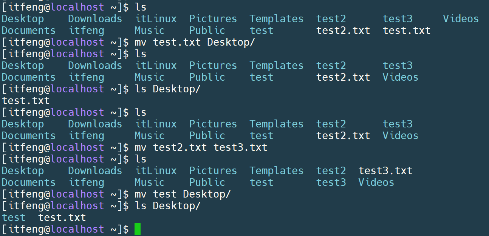


#### 7.3 rm 删除文件、文件夹

rm 命令可用于删除文件、文件夹

rm 命令来自英文单词：**r**e**m**ove

语法：

```shell
rm [-r -f] 参数1 参数2 ...... 参数N
```

+ 同 cp 命令一样，`-r` 选项用于删除文件夹
+ `-f` 表示 force，强制删除（不会弹出提示确认信息）
  + 普通用户删除内容不会弹出提示，只有 root 管理员用户删除内容会有提示
  + 所以一般普通用户不会用到 `-f` 选项
+ 参数1、参数2、......、参数N 表示要删除的文件或文件夹路径，按照空格隔开

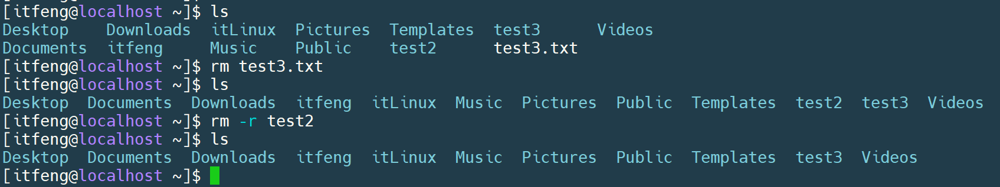


#### 7.4 rm 删除文件、文件夹 - 通配符

rm 命令支持通配符 `*`，用来做模糊匹配

+ 符号 `*` 表示通配符，即匹配任意内容（包括空），示例：
+ `test*`，表示匹配任何以 test 开头的内容
+ `*test`，表示匹配任何以 test 结尾的内容
+ `*test*`，表示匹配任何包含 test 的内容

演示：

+ 删除所有以 test 开头的文件或文件夹

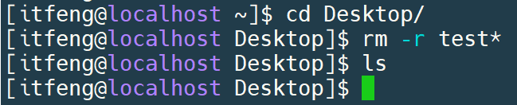


#### 总结

1. cp 命令

+ 用于复制文件或文件夹
+ 语法：`cp [-r] 参数1 参数2`
+ `-r` 选项，可选，用于复制文件夹使用，表示递归
+ 参数1，Linux 路径，表示被复制的文件或文件夹
+ 参数2，Linux 路径，表示要复制去的地方

2. mv 命令

+ 用于查看文件内容
+ 语法：`mv 参数1 参数2`
+ 参数1，Linux 路径，表示被移动的文件或文件夹
+ 参数2，Linux 路径，表示要移动去的地方，如果目标不存在，则进行改名，确保目标存在

3. rm 命令

+ 用于复制文件或文件夹
+ 语法：`rm [-r -f] 参数1 参数2 ...... 参数N`
+ `-r` 选项，可选，文件夹删除
+ `-f` 选项，可选，用于强制删除（不提示，一般用于`root`用户）
+ 参数，表示被删除的文件或文件夹路径，支持多个，空格隔开
+ 参数也支持通配符 `*`，用以做模糊匹配


-------


### 8. 查找命令（which、find）

#### 8.1 which 命令

我们在前面学习的 Linux 命令，其实它们的本体就是一个个的二进制可执行程序。

和 Windows 系统中的 `.exe` 文件，是一个意思。

我们可以通过 which 命令，查看所使用的一系列命令的程序文件存放在哪里

语法：

```shell
which 要查找的命令
```

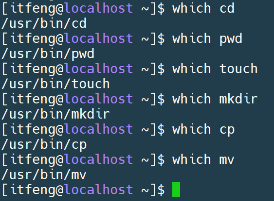


#### 8.2 find 命令 - 按文件名查找文件

我们可以通过 find 命令去搜索指定的文件

语法：

```shell
find 起始路径 -name "被查找文件名"
```

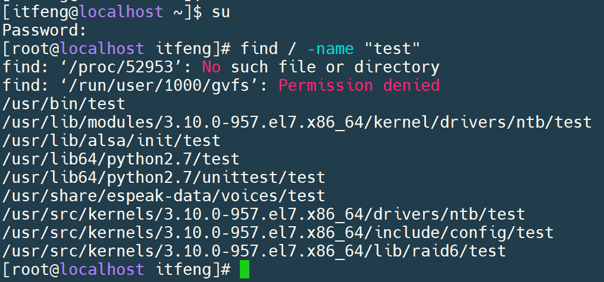


#### 8.3 find 命令 - 通配符

根据语法：`find 起始路径 -name "被查找文件名"`

被查找文件名，支持使用通配符 `*` 来做模糊查询

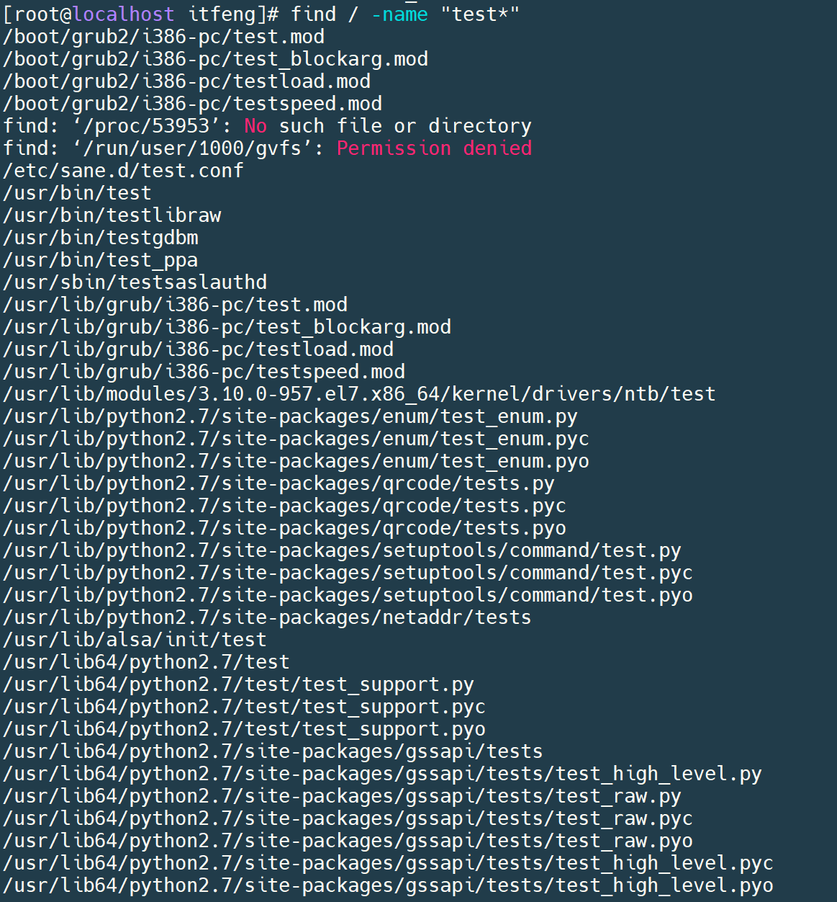


#### 8.4 find 命令 - 按文件大小查找文件

语法：

```shell
find 起始路径 -size +|-n[kMG]
```

+ `+`、`-` 表示大于和小于
+ `n` 表示大小数字
+ `KMG` 表示大小单位，k（小写字母）表示 kb，M 表示 MB，G 表示 GB

示例：

+ 查找小于 10KB 的文件： `find / -size -10k`
+ 查找大于 100MB 的文件：`find / -size +100M`
+ 查找大于 1GB 的文件：`find / -size +1G`


#### 总结

1. which 命令

+ 查找命令的程序文件
+ 语法：`which 要查找的命令`
+ 无需选项，只需要参数表示查找哪个命令

2. find 命令

+ 用于查找指定的文件
+ 按文件名查找：`find 起始路径 -name "被查找文件名"`
  + 支持通配符
+ 按文件大小查找：`find 起始路径 -size +|-n[kMG]`


-----


### 9. grep、wc 和管道符

#### 9.1 grep 命令

可以通过 grep 命令，从文件中通过关键字过滤文件行

语法：

```shell
grep [-n] 关键字 文件路径
```

+ 选项 `-n`，可选，表示在结果中显示匹配的行的行号
+ 参数，关键字，必填，表示过滤的关键字，带有空格或其它特殊符号，建议使用 `""` 将关键字包围起来
+ 参数，文件路径，必填，表示要过滤内容的文件路径，**可作为内容输入端口**


创建 test.txt

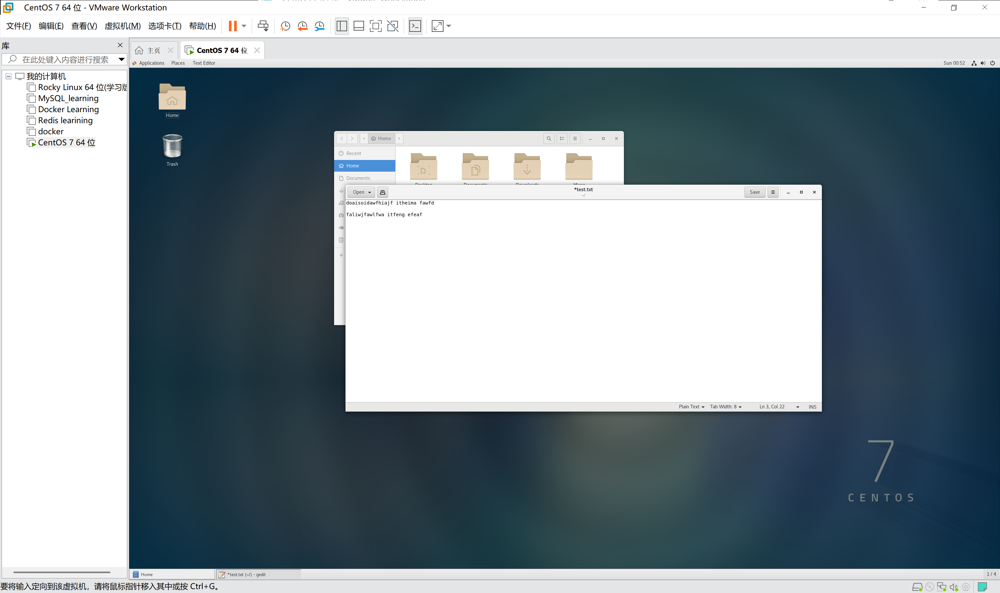

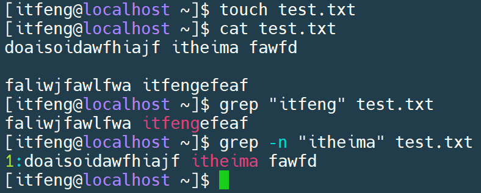


#### 9.2 wc 命令做数量统计

可以通过 wc 命令统计文件的行数、单词数量等

语法：

```shell
wc [-c -m -l -w] 文件路径
```

+ 选项，`-c`，统计 bytes 数量
+ 选项，`-m`，统计字符数量
+ 选项，`-l`，统计行数
+ 选项，`-w`，统计单词数量
+ 参数，文件路径，被统计的文件，**可作为内容输入端口**

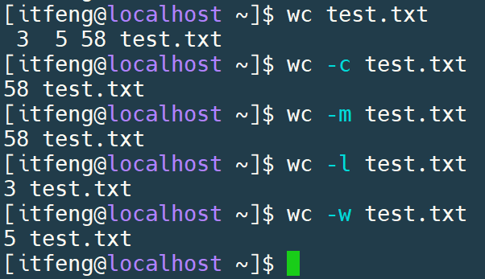


#### 9.3 管道符

管道符：`|`

管道符的含义是：将管道符左边命令的结果，作为右边命令的输入

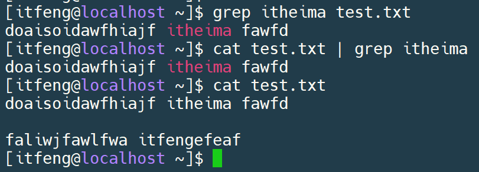

可以嵌套


#### 总结

1. grep 命令

+ 从文件中通过关键字过滤文件行
+ 语法：`grep [-n] 关键字 文件路径`
+ 选项 `-n`，可选，表示在结果中显示匹配的行的行号
+ 参数，关键字，必填，表示过滤的关键字，建议使用 `""` 将关键字包围起来
+ 参数，文件路径，必填，表示要过滤内容的文件路径，可作为管道符的输入

2. wc 命令

+ 命令统计文件的行数、单词数量、字节数、字符数等
+ 语法：`wc [-c -m -l -w] 文件路径`
+ 不带选项默认统计：行数、单词数、字节数
+ `-c` 字节数、`-m` 字符数、`-l` 行数、`-w` 单词数
+ 参数，被统计的文件路径，可作为管道符的输入

3. 管道符 `|`

+ 将管道符左边命令的结果，作为右边命令的输入


------


### 10. echo 和重定向符

#### 10.1 echo 命令

可以使用 echo 命令在命令行内输出指定内容

语法：

```shell
echo 输出的内容
```

+ 无需选项，只有一个参数，表示要输出的内容，复杂内容可以用 `""` 包围

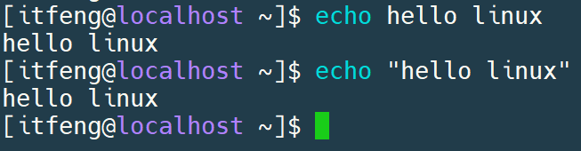


#### 10.2 反引号

`echo pwd` 本意是想，输出当前的工作路径，但是 pwd 会被作为普通字符输出

我们可以通过将命令用反引号（通常也称之为飘号）**`** 将其包围

被包围的内容，会被作为命令执行，而非普通字符

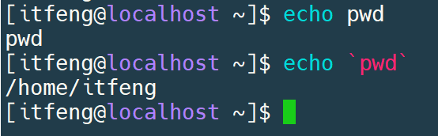


#### 10.3 重定向符

+ `>`，将左侧命令的结果，**覆盖**写入到符号右侧指定文件中
+ `>>`，将左侧命令的结果，**追加**写入到符号右侧指定的文件中

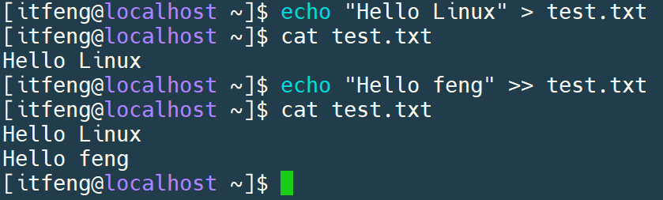


#### 10.4 tail 命令

使用 tail 命令，可以查看文件尾部内容，跟踪文件的最新更改，语法如下：

```shell
tail [-f -num] Linux路径
```

+ 参数，Linux 路径，表示被跟踪的文件路径
+ 选项，`-f`，表示持续跟踪
+ 选项，`-num`，表示，查看尾部多少行，不填默认10行


#### 总结

1. echo 命令

+ 可以使用 echo 命令在命令行内输出指定内容
+ 语法：`echo 输出的内容`
+ 无需选项，只有一个参数，表示要输出的内容，复杂内容可以用 `""` 包围

2. **`** 反引号符

+ 被 **`** 包围的内容，会被作为命令执行，而非普通字符

3. 重定向符

+ `>`，将左侧命令的结果，覆盖写入到符号右侧指定的文件中
+ `>>`，将左侧命令的结果，追加写入到符号右侧指定的文件中

4. tail 命令

+ 查看文件尾部内容，并可以持续跟踪
+ 语法：`tail [-f -num] Linux路径`
+ `-f`：持续跟踪，`-num`：启动的时候查看尾部多少行，默认10
+ Linux 路径，表示被查看的文件


--------


### 11. vi 编辑器

#### 11.1 vi / vim 编辑器

vi / vim 是 visual interface 的简称，是 Linux 中最经典的文本编辑器

同图形化界面中的文本编辑器一样，vi 是命令行下对文本文件进行编辑的绝佳选择

vim 是 vi 的加强版本，兼容 vi 的所有指令，不仅能编辑文本，而且还具有 shell 程序编程功能，可以不同颜色的字体来辨别语法的正确性，极大方便了程序的设计和编辑性


#### 11.2 vi / vim 编辑器的三种工作模式

**命令**模式（Command mode）

+ 命令模式下，所敲的按键编辑器都理解为命令，以命令驱动执行不同的功能
+ 此模式下，不能自由进行文本编辑

**输入**模式（Insert mode）

+ 也就是所谓的编辑模式、插入模式
+ 在命令模式下按下 `i`、`a`、`o` 任意一个，可以进入插入模式。进入插入模式后，下方会出现 `insert` 字样
+ 在插入模式下按下 **ESC** 键，回到命令模式
+ 此模式下，可以对文件内容进行自由编辑

**底线命令**模式（Last line mode）

+ 以 `:` 开始，通常用于文件的保存、退出
+ 在命令模式下按下 `:`、` /` 任意一个，可以进入底行模式
+ 通过 : 方式进入底行模式后，可以输入 `wq`（保存并退出）、`q!`（不保存退出）、`set nu`（显示行号）


+ 如果文件路径表示的文件**不存在**，那么此命令会用于**编辑新文件**
+ 如果文件路径表示的文件**存在**，那么此命令用于**编辑已有文件**


#### 11.3 命令模式快捷键

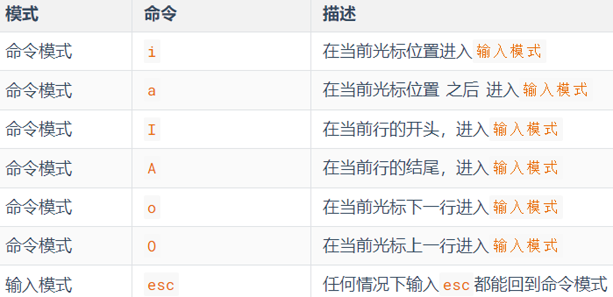

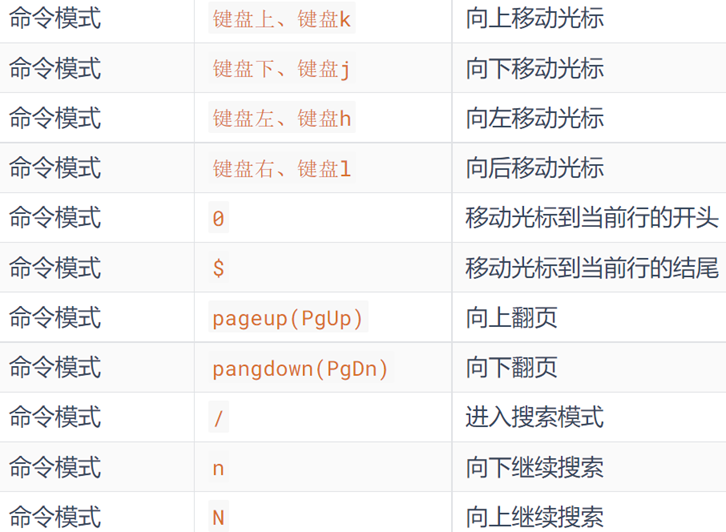

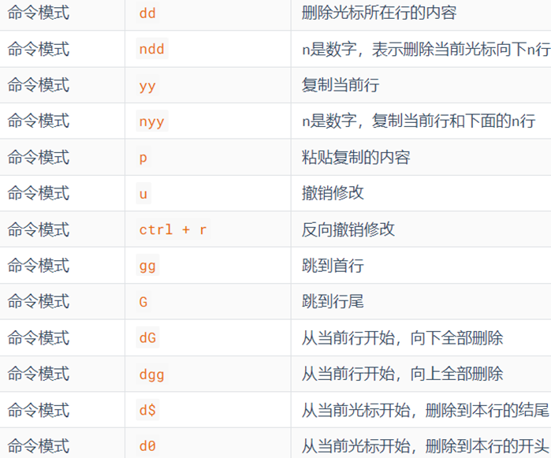


#### 11.4 底线命令模式

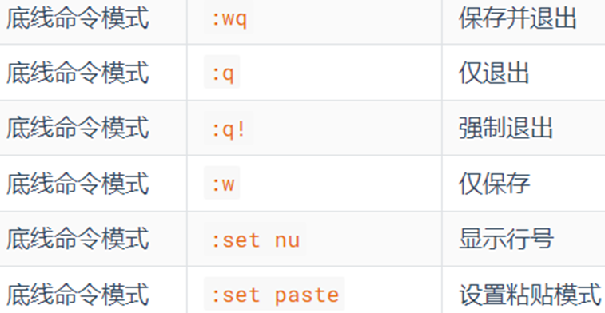


#### 总结

1. 什么是 vi / vim 编辑器

+ vi \ vim编辑器，就是命令行模式下的文本编辑器，用来编辑文件
+ vim 是 vi 的升级版，一般用 vim 即可，包含全部 vi 功能

2. 基础命令

```shell
vi 文件路径
```

```shell
vim 文件路径
```

3. 运行模式

+ 命令模式，默认的模式，可以通过键盘快捷键控制文件内容
+ 输入模式，通过命令模式进入，可以输入内容进行编辑，按 esc 退回命令模式
+ 底线命令模式，通过命令模式进入，可以对文件进行保存、关闭等操作


-------------------------------


## 第三章、Linux 权限管控

### 1. 认识 root 用户

#### 1.1 root 用户（超级管理员）

无论是 Windows、MacOS、Linux 均采用多用户的管理模式进行权限管理

+ 在 Linux 系统中，拥有最大权限的账户名为：root（超级管理员）
+ 而在前期，我们一致使用的账户是普通的用户：itfeng


root 用户拥有最大的系统操作权限，而普通用户在许多地方的权限是受限的

+ 使用普通用户在根目录下创建文件夹

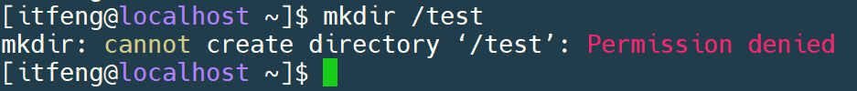

+ 切换到 root 用户后

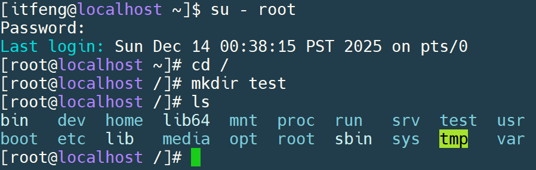

+ 普通用户的权限，一般在其 HOME 目录内是不受限的
+ 一旦出了 HOME 目录，大多数地方，普通用户仅有只读和执行权限，无修改权限


#### 1.2 su 和 exit 命令

su 命令就是用于账户切换的系统命令，其来源英语单词：**S**witch **U**ser

语法：

```shell
su [-] [用户名]
```

+ `-` 符号是可选的，表示是否在切换用户后加载环境变量，**建议带上**
+ 参数：用户名，表示要切换的用户，用户名也可以忽略，省略表示切换到 root
+ **切换到用户后，可以通过 exit 命令退回上一个用户，也可以使用快捷键：ctrl + d**
+ 使用普通用户，切换到其它用户**需要输入密码**，如切换到 root 用户
+ 使用 root 用户切换到其它用户，**无需密码**，可以直接切换


#### 1.3 sudo 命令

我们不建议长期使用 root 用户，避免带来系统损坏

我们可以使用 sudo 命令，为普通的命令授权，临时以 root 身份执行

语法：

```shell
sudo 其它命令
```

+ 在其它命令之前，带上 sudo，即可为这一条命令临时赋予 root 授权
+ 但是并不是所有的用户，都有权力使用 sudo，我们**需要为普通用户配置 sudo 认证**


#### 1.4 为普通用户配置 sudo 认证

+ 切换到 root 用户，执行 visudo 命令，会自动通过 vi 编辑器打开：/etc/sudoers
+ 在文件的最后添加
  + 其中最后的 NOPASSWD:ALL 表示使用 sudo 命令，无需输入密码（中间的大段空格为 Tab 键）

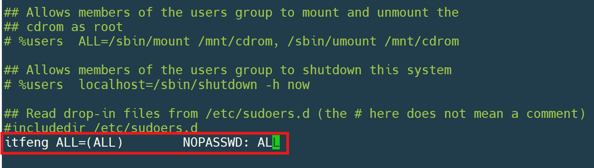

+ 最后通过 wq 保存


#### 总结

1. Linux 系统的超级管理员用户是：root 用户
2. su 命令

+ 可以切换用户，语法：`su [-] [用户名]`
+ `-` 表示切换后加载环境变量，建议带上
+ 用户可以省略，省略默认切换到 root

3. sudo 命令

+ 可以让一条普通命令带有 root 权限，语法：`sudo 其它命令`
+ 需要以 root 用户执行 visudo 命令，增加配置方可让普通用户有 sudo 命令的执行权限


------------


### 2. 用户、用户组管理

#### 2.1 用户、用户组

Linux 系统中可以：

+ 配置多个用户
+ 配置多个用户组
+ 用户可以加入多个用户组中


Linux 中关于权限的管控级别有2个级别，分别是：

+ 针对用户的权限控制
+ 针对用户组的权限控制

比如，针对某文件，可以控制用户的权限，也可以控制用户组的权限


#### 2.2 用户组管理

**以下命令需 root 用户执行**

+ 创建用户组

```shell
groupadd 用户组名
```

+ 删除用户组

```shell
groupdel 用户组名
```


#### 2.3 用户管理

**以下命令需 root 用户执行**

创建用户

```shell
useradd [-g -d] 用户名
```

+ 选项：`-g` 指定用户的组，不指定 `-g`，会创建同名组并自动加入，指定 `-g` 需要组已经存在，如已存在同名组，必须使用 `-g`
+ 选项：`-d` 指定用户 HOME 路径，不指定，HOME 路径默认在：/home/用户名

删除用户

```shell
userdel [-r] 用户名
```

+ 选项：`-r`，删除用户的 HOME 目录，不使用 `-r`，删除用户时，HOME 目录保留

查看用户所属组

```shell
id [用户名]
```

+ 参数：用户名，被查看的用户，如果不提供则查看自身

修改用户所属组

```shell
usermod -aG 用户组 用户名
```

+ 将指定用户加入指定用户组


#### 2.4 getent

使用 getent 命令，可以查看当前系统中有哪些用户

语法：

```shell
getent password
```

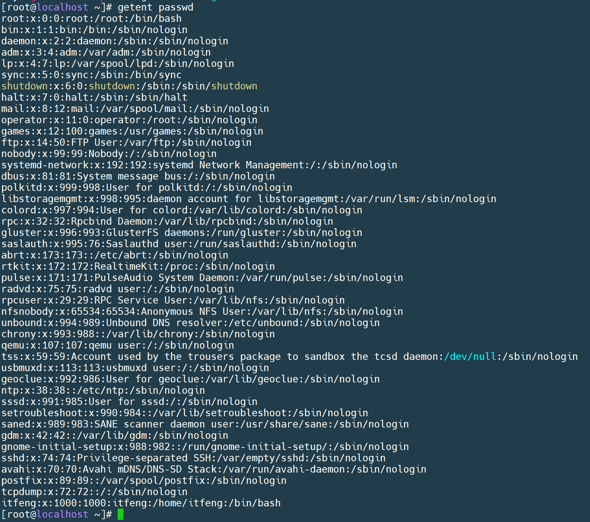

共有7份信息，分别是：

```shell
用户名:密码（x）:用户ID:描述信息（无用）:HOME目录:执行终端（默认bash）
```

使用 getent 命令，同样可以查看当前系统中有哪些用户组

语法：

```shell
getent group
```

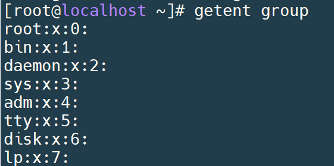

包含3份信息：

```shell
组名称:组认证（显示为x）:组ID
```


#### 总结

1. Linux 用户管理模式

+ Linux 可以支持多用户、多用户组、用户加入多个组
+ Linux 权限管控的单元是用户级别和用户组级别

2. 用户、用户组相关管理命令

+ groupadd 添加组、groupdel 删除组
+ useradd 添加用户、userdel 删除用户
+ usermod 修改用户组、id 命令查看用户信息
+ getent passwd 查看系统全部用户信息
+ getent group 查看系统全部组信息


--------


### 3. 查看权限控制

#### 3.1 认知权限信息

通过 `ls -l` 可以以列表形式查看内容，并显示权限细节

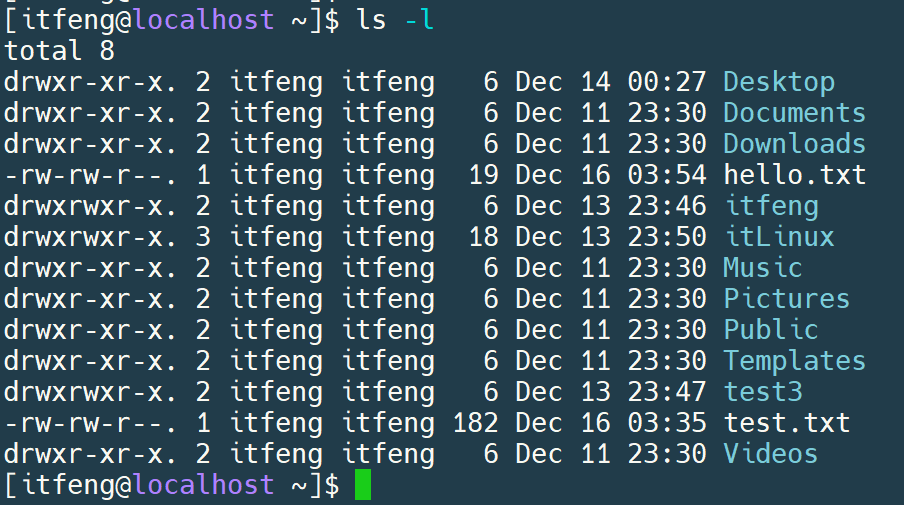

+ 序号1，表示文件、文件夹的权限控制信息
+ 序号2，表示文件、文件夹所属用户
+ 序号3，表示文件、文件夹所属用户组


让我们来解析一下序号1，权限细节

权限细节总共分为10个槽位

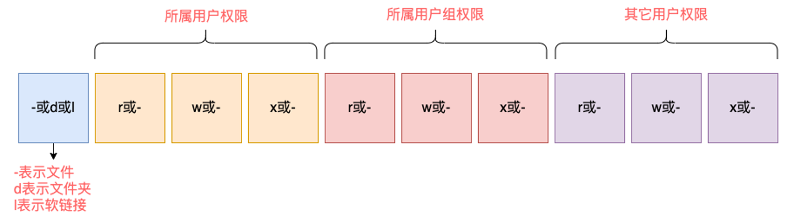

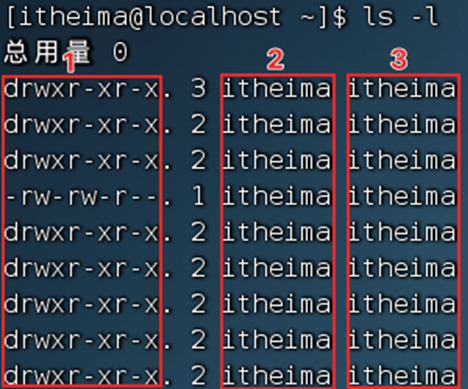

举例：`drwxr-xr-x`，表示：

+ 这是一个文件夹，首字母 d 表示
+ 所属用户的权限是：有 r 有 w 有 x，rwx
+ 所属用户组的权限是：有 r 无 w 有 x，r-x （`-` 表示无此权限）
+ 其它用户的权限是：有 r 无 w 有 x，r-x


#### 3.2 rwx

+ `r` 表示读权限
+ `w` 表示写权限
+ `x` 表示执行权限

针对文件、文件夹的不同，rwx 的含义有细微差别

+ `r`，针对文件可以查看文件内容
  + 针对文件夹，可以查看文件夹内容，如 ls 命令
+ `w`，针对文件表示可以修改此文件
  + 针对文件夹，可以在文件夹内：创建、删除、改名等操作
+ `x`，针对文件表示可以将文件作为程序执行
  + 针对文件夹，表示可以更改工作目录到此文件夹，即 cd 进入


----


### 4. 修改权限控制 - chmod

#### 4.1 chmod 命令

我们可以使用 chmod 命令，修改文件、文件夹的权限信息

**注意，只有文件、文件夹的所属用户或 root 用户可以修改**

语法：

```shell
chmod [-R] 权限 文件或文件夹
```

+ 选项：`-R`，对文件夹内的全部内容应用同样的操作

示例：

+ `chmod u=rwx,g=rx,o=x hello.txt`，将文件权限修改为：rwxr-x--x
  + 其中：u 表示 user 所属用户权限，g 表示 group 组权限，o 表示 other 其它用户权限
+ `chmod -R u=rwx,g=rx,o=x test`，将文件夹 test 以及文件夹内全部内容权限设置为：rwxr-x--x

除此之外，还有快捷写法：`chmod 751 hello.txt`

+ 将 hello.txt`的权限修改为751


#### 4.2 权限的数字序号

权限可以用3位数字来代表，第一位数字表示用户权限，第二位表示用户组权限，第三位表示其它用户权限

数字的细节如下：`r` 记为4，`w` 记为2，`x` 记为1，可以有：

+ 0：无任何权限， 即 ---
+ 1：仅有 x 权限， 即 --x
+ 2：仅有 w 权限 即 -w-
+ 3：有 w 和 x 权限 即 -wx
+ 4：仅有 r 权限 即 r--
+ 5：有 r 和 x 权限 即 r-x
+ 6：有 r 和 w 权限 即 rw-
+ 7：有全部权限 即 rwx

所以751表示：rwx（7）r-x（5）--x（1）


#### 总结

1. chmod 命令

+ 功能，修改文件、文件夹的权限细节
+ 限制，只能是文件、文件夹的所属用户或 root 有权修改
+ 语法：`chmod [-R] 权限 文件或文件夹`
+ 选项：`-R`，对文件夹内的全部内容应用同样规则

2. 权限的数字序号

+ `r` 代表4，`w` 代表2，`x` 代表1
+ rwx 的相互组合可以得到从0到7的8种权限组合
+ 如7代表：rwx，5代表：r-x，1代表：--x


---


### 5. 修改权限控制 - chown

#### 5.1 chown 命令

**普通用户无法修改所属为其它用户或组，所以此命令只适用于 root 用户执行**

语法：

```shell
chown [-R] [用户][:][用户组] 文件或文件夹
```

+ 选项，`-R`，同 chmod，对文件夹内全部内容应用相同规则

+ 选项，用户，修改所属用户

+ 选项，用户组，修改所属用户组

+ `:` 用于分隔用户和用户组

示例：

+ `chown root hello.txt`，将 hello.txt 所属用户修改为 root
+ `chown :root hello.txt`，将 hello.txt 所属用户组修改为 root
+ `chown root:itheima hello.txt`，将 hello.txt 所属用户修改为 root，用户组修改为 itheima
+ `chown -R root test`，将文件夹 test 的所属用户修改为 root 并对文件夹内全部内容应用同样规则


#### 总结

chown 命令

+ 功能，修改文件、文件夹的所属用户、组
+ 限制，只可 root 执行
+ 语法：`chown [-R] [用户][:][用户组] 文件或文件夹`
+ 选项，`-R`，同 chmod，对文件夹内全部内容应用相同规则
+ 选项，用户，修改所属用户
+ 选项，用户组，修改所属用户组
+ `:` 用于分隔用户和用户组


-----------------------------


## 第四章、Linux 实用操作

### 1. 各类小技巧（快捷键）

#### 1.1 ctrl + c 强制停止

+ Linux 某些层序的运行，如果想要强制停止它，可以使用快捷键 ctrl + c

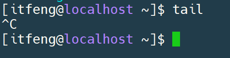

+ 命令输入错误，也可以通过快捷键 ctrl + c，退出当前输入，重新输入

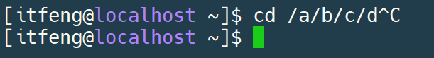


#### 1.2 ctrl + d 退出或登出

+ 可以通过快捷键：ctrl + d，退出账户的登录

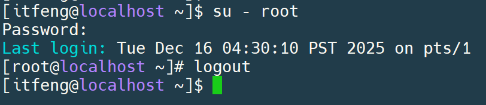

+ 或者退出某些特定程序的专属页面

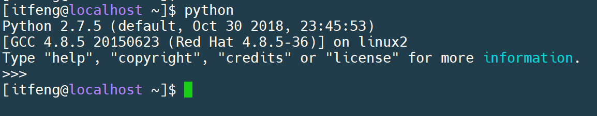

ps：不能用于退出 vi / vim


#### 1.3 历史命令搜索

+ 可以通过 history 命令，查看历史输入过的命令

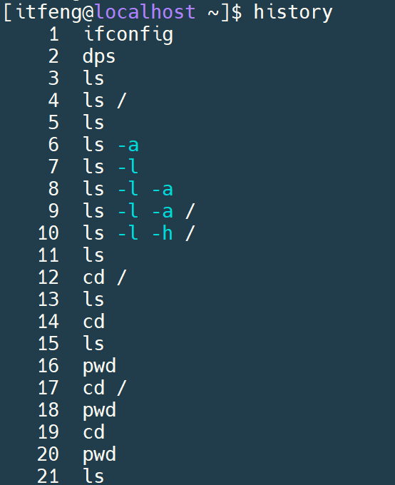

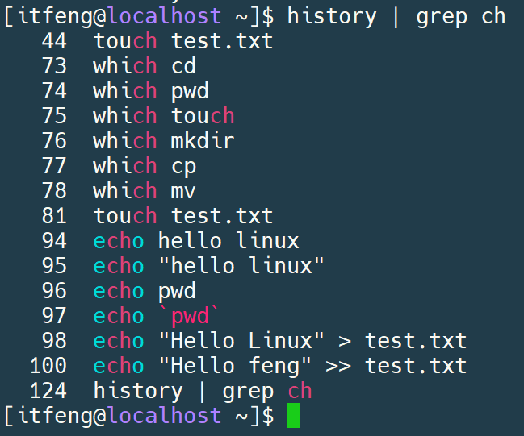

+ 可以通过 `!` 命令前缀，自动执行上一次匹配前缀的命令

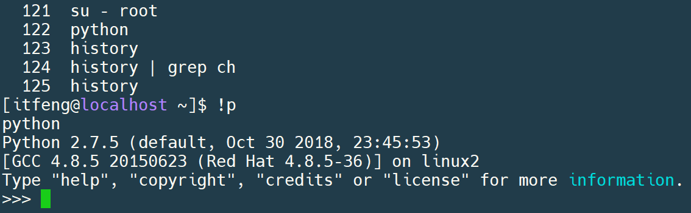

+ 可以通过快捷键：ctrl + r，输入内容去匹配历史命令

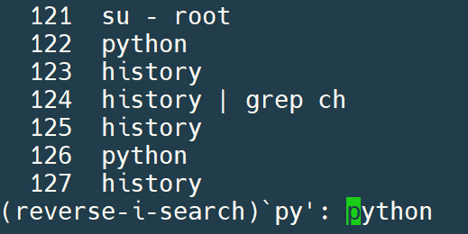

如果搜索到的内容是你需要的，那么：

+ 回车键可以直接执行
+ 键盘左右键，可以得到此命令（不执行）


#### 1.4 光标移动快捷键

+ ctrl + a，跳到命令开头
+ ctrl + e，跳到命令结尾
+ ctrl + 键盘左键，向左跳一个单词
+ ctrl + 键盘右键，向右跳一个单词


#### 1.5 清屏

+ 通过快捷键 ctrl + l，可以清空终端内容
+ 或通过命令 clear 得到同样效果


#### 总结

1. ctrl + c 强制停止
2. ctrl + d 退出登出
3. history 查看历史命令
4. !命令前缀，自动匹配上一个命令
5. ctrl + r，搜索历史命令
6. ctrl + a | e，光标移动到命令开始或结束
7. ctrl + ← | →，左右跳单词
8. ctrl + l 或 clear命令 清屏


----


### 2. 软件安装

#### 2.1 Linux 系统的应用商店

操作系统安装软件有多种方式，一般分为：

+ 下载安装包自行安装
  + 如 win 系统使用 exe 文件、msi 文件等
  + 如 mac 系统使用 dmg 文件、pkg 文件等
+ 系统的应用商店内安装
  + 如 win 系统有 Microsoft Store 商店
  + 如 mac 系统有 AppStore 商店

Linux 系统同样支持这两种方式


#### 2.2 yum 命令

yum：RPM 包软件管理器（.rpm），用于自动化安装配置 Linux 软件，并可以自动解决依赖问题

语法：

```shell
yum [-y] [install | remove | search] 软件名称
```

+ 选项：`-y`，自动确认，无需手动确认安装或卸载过程
+ install：安装
+ remove：卸载
+ search：搜索

**yum 命令需要 root 权限**

**yum 命令需要联网**

+ `yum [-y] install wget`，通过 yum 命令安装 wget 程序


+ `yum [-y] remove wget`，通过 yum 命令卸载 wget 命令
+ `yum search wget`，通过 yum 命令，搜索是否有 wget 安装包

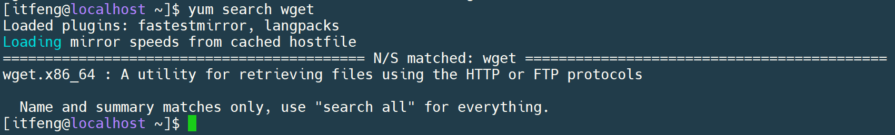

无法联网的就用国内镜像源

1. **备份原有源配置文件：**

```shell
sudo mv /etc/yum.repos.d/CentOS-Base.repo /etc/yum.repos.d/CentOS-Base.repo.backup
```

2. **下载国内源配置文件：**

```shell
curl -o /etc/yum.repos.d/CentOS-Base.repo http://mirrors.aliyun.com/repo/Centos-7.repo
```

```shell
sudo wget -O /etc/yum.repos.d/CentOS-Base.repo http://mirrors.aliyun.com/repo/Centos-7.repo
```

或者使用网易（163）的源：

```shell
sudo wget -O /etc/yum.repos.d/CentOS-Base.repo http://mirrors.163.com/.help/CentOS7-Base-163.repo
```

清华大学 CentOS 7 源：

```shell
sudo wget -O /etc/yum.repos.d/CentOS-Base.repo https://mirrors.tuna.tsinghua.edu.cn/centos/7/os/x86_64/
```

3. **清理 yum 缓存并生成新缓存**：

```shell
sudo yum clean all
sudo yum makecache fast
```

4. **验证更改**： 检查 YUM 源是否已经更换成功，可以通过列出可用的软件包仓库：

```shell
sudo yum repolist
```


<strong><font color="red">注意：</font></strong>

如果以上方法还是不行报错的，就先去看 ip 地址和主机名那节，配置完固定 ip 应该就可以了！！！


#### 2.3 apt 命令 - 扩展

前面学习的各类 Linux 命令，都是通用的。 但是软件安装，CentOS 系统和 Ubuntu 是使用不同的包管理器。

CentOS 使用 yum 管理器，Ubuntu 使用 apt 管理器

通过前面学习的 WSL 环境，我们可以得到 Ubuntu 运行环境。

语法：

```shell
apt [-y] [install | remove | search] 软件名称
```

用法和 yum 一致，同样需要 root 权限

+ apt install wget，安装 wget
+ apt remove wget，移除 wget
+ apt search wget，搜索 wget


#### 总结

1. 在 CentOS 系统中，使用 yum 命令联网管理软件安装

+ yum 语法：`yum [-y] [install | remove | search] 软件名称`

2. 在 Ubuntu 系统中，使用 apt 命令联网管理软件安装

+ apt 语法：`apt [-y] [install | remove | search] 软件名称`


-----


### 3. systemctl

#### 3.1 systemctl 命令

Linux 系统很多软件（内置或第三方）均支持使用systemctl 命令控制：启动、停止、开机自启

能够被 systemctl 管理的软件，一般也称之为：服务

语法：

```shell
systemctl start | shop | status | enable | disable 服务名
```

+ start 启动
+ stop 关闭
+ status 查看状态
+ enable 开启开机自启
+ disable 关闭开机自启

系统内置的服务比较多，比如：

+ NetworkManager，主网络服务
+ network，副网络服务
+ firewalld，防火墙服务
+ sshd，ssh 服务（FinalShell 远程登录 Linux 使用的就是这个服务）

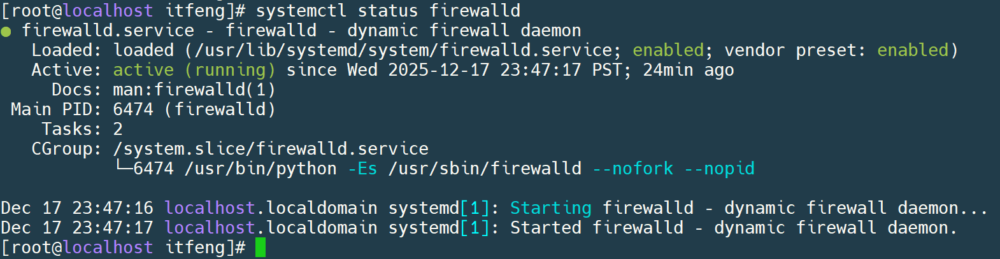

除了内置的服务以外，部分第三方软件安装后也可以以 systemctl 进行控制

+ `yum install -y ntp`，安装 ntp 软件

可以通过 ntpd 服务名，配合 systemctl 进行控制

+ `yum install -y httpd`，安装 apache 服务器软件

可以通过 httpd 服务名，配合 systemctl 进行控制

**部分软件安装后没有自动集成到 systemctl 中，我们可以手动添加**


#### 总结

1. systemctl 命令的作用是？

+ 可以控制软件（服务）的启动、关闭、开机自启动
  + 系统内置服务均可被 systemctl 控制
  + 第三方软件，如果自动注册了可以被 systemctl 控制
  + 第三方软件，如果没有自动注册，可以手动注册（后续学习）

2. 语法

```shell
systemctl start | shop | status | enable | disable 服务名
```


-----


### 4. 软连接

#### 4.1 ln 命令创建软连接

在系统中创建软链接，可以将文件、文件夹链接到其它位置

类似 Windows 系统中的《快捷方式》

语法：

```shell
ln -s 参数1 参数2
```

+ `-s` 选项，创建软连接
+ 参数1：被链接的文件或文件夹
+ 参数2：要链接去的目的地

实例：

+ `ln -s /etc/yum.conf ~/yum.conf`
+ `ln -s /etc/yum ~/yum`

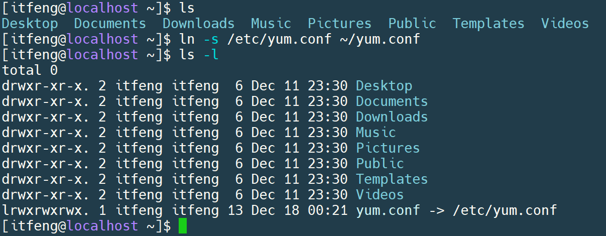 


#### 总结

1. 什么是软连接？

+ 可以将文件、文件夹链接到其它位置
+ 链接只是一个指向，并不是物理移动，类似 Windows 系统的快捷方式

2. 软连接的使用语法

```shell
ln -s 参数1 参数2
```

+ `-s` 选项，创建软连接
+ 参数1：被链接的文件或文件夹
+ 参数2：要链接去的目的地


-----


### 5. 日期、时区

#### 5.1 date 命令

通过 date 命令可以在命令行中查看系统的时间

语法：

```shell
date [-d] [+格式化字符串]
```

+ `-d` 按照给定的字符串显示日期，一般用于日期计算
+ 格式化字符串：通过特定的字符串标记，来控制显示的日期格式
  + **%Y  年**
  + **%y  年份后两位数字 (00..99)**
  + **%m  月份 (01..12)**
  + **%d  日 (01..31)**
  + **%H**  **小时** **(00..23)**
  + **%M**  **分钟** **(00..59)**
  + **%S  秒 (00..60)**
  + **%s  自 1970-01-01 00:00:00 UTC** **到现在的秒数**

+ 使用 date 命令本体，无选项，直接查看时间

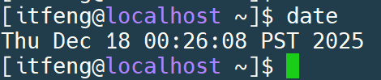

可以看到这个格式非常的不习惯。我们可以通过格式化字符串自定义显示格式

+ 按照2022-01-01的格式显示日期

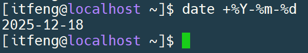

+ 按照2022-01-01 10:00:00的格式显示日期

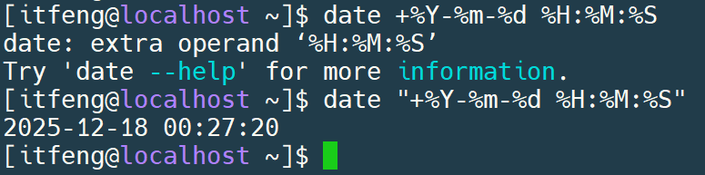

如上，由于中间带有空格，所以使用双引号包围格式化字符串，作为整体


#### 5.2 date 命令进行日期加减

+ `-d` 选项，可以按照给定的字符串显示日期，一般用于日期计算

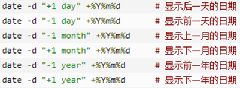

+ 其中支持的时间标记为：
  + **year 年**
  + **month 月**
  + **day 天**
  + **hour 小时**
  + **minute 分钟**
  + **second 秒**

+ `-d` 选项可以和 格式化字符串配合一起使用哦

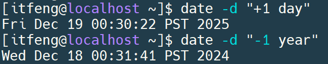

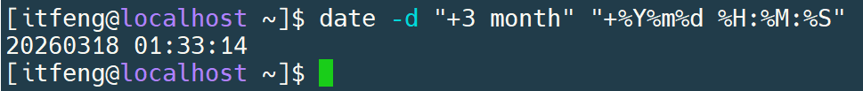


#### 5.3 修改 Linux 时区

细心的同学可能会发现，通过 date 查看的日期时间是不准确的，这是因为：系统默认时区非中国的东八区

**使用 root 权限，执行如下命令**，修改时区为东八区时区

```shell
rm -f /etc/localtime
sudo ln -s /usr/share/zoneinfo/Asia/Shanghai /etc/localtime
```

将系统自带的 localtime 文件删除，并将 /usr/share/zoneinfo/Asia/Shanghai 文件链接为 localtime 文件即可

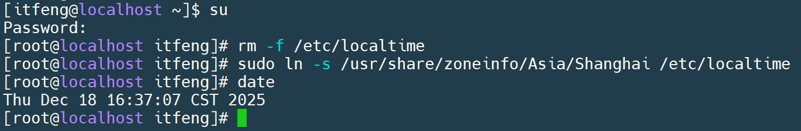


#### 5.4 ntp 程序

我们可以通过 ntp 程序自动校准系统时间

安装 ntp：`yum -y install ntp`

启动并设置开机自启：

+ `systemctl start ntpd`
+ `systemctl enable ntpd`

当 ntpd 启动后会定期的帮助我们**联网**校准系统的时间

+ 也可以手动校准（**需 root 权限**）：`ntpdate -u ntp.aliyun.com`

通过阿里云提供的服务网址配合 ntpdate（安装 ntp 后会附带这个命令）命令自动校准


#### 总结

1. date 命令的作用和用法

+ date 命令可以查看日期时间，并可以格式化显示形式以及做日期计算
+ 语法：

```shell
date [-d] [+格式化字符串]
```

2. 如何修改 Linux 时区

```shell
rm -f /etc/localtime
sudo ln -s /usr/share/zoneinfo/Asia/Shanghai /etc/localtime
```

3. ntp 的作用

+ 可以自动联网同步时间，也可以通过 `ntpdate -u ntp.aliyun.com` 手动校准时间


--------


### 6. IP 地址、主机名

#### 6.1 IP 和主机名

##### 6.1.1 IP 地址

每一台联网的电脑都会有一个地址，用于和其它计算机进行通讯

IP 地址主要有2个版本，V4 版本和 V6 版本（V6 很少用，课程暂不涉及）

IPv4 版本的地址格式是：a.b.c.d，其中 abcd 表示0~255的数字，如 192.168.88.101 就是一个标准的IP地址

可以通过命令：`ifconfig`，查看本机的 ip 地址，如无法使用 ifconfig 命令，可以安装：`yum -y install net-tools`

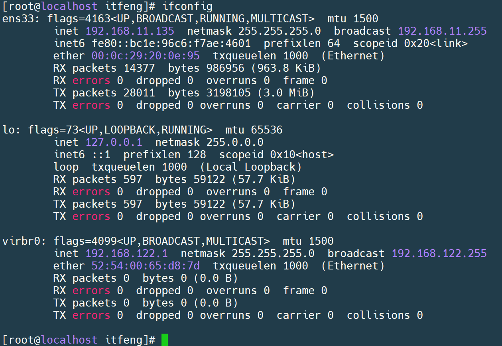


##### 6.1.2 特殊 IP 地址

除了标准的 IP 地址以外，还有几个特殊的 IP 地址需要我们了解：

+ **127.0.0.1**，这个IP地址用于指代本机

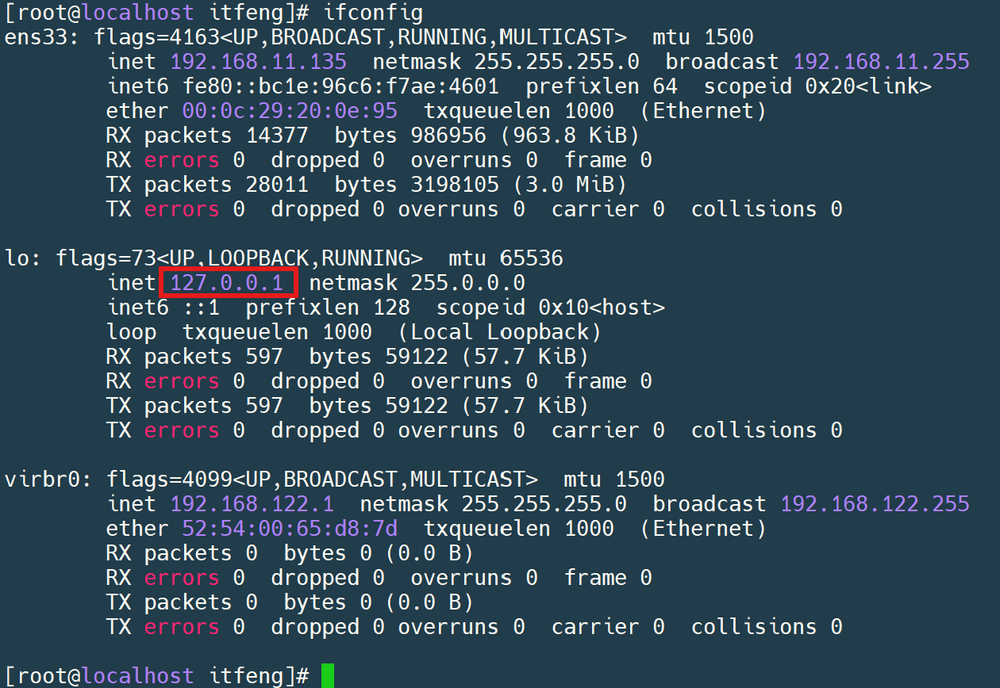

+ **0.0.0.0**，特殊 IP 地址
  + 可以用于指代本机
  + 可以在端口绑定中用来确定绑定关系（后续讲解）
  + 在一些 IP 地址限制中，表示所有 IP 的意思，如放行规则设置为 0.0.0.0，表示允许任意 IP 访问


##### 6.1.3 主机名

每一台电脑除了对外联络地址（IP 地址）以外，也可以有一个名字，称之为主机名

无论是 Windows 或 Linux 系统，都可以给系统设置主机名

+ Windows 系统主机名

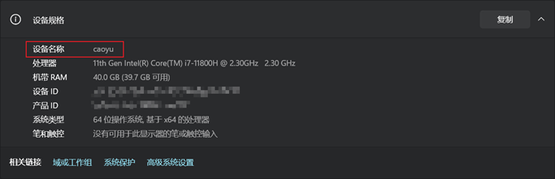

+ Linux系统主机名

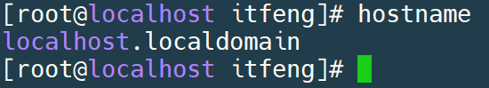


##### 6.1.4 在 Linux 修改主机名

+ 可以使用命令：`hostname` 查看主机名


+ 可以使用命令：`hostnamectl set-hostname 主机名`，修改主机名（需 root）

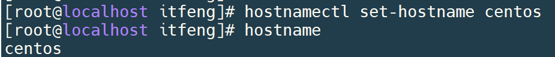

+ 重新登陆 FinalShell 即可看到主机名已经正确显示

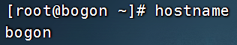


##### 6.1.5 域名解析

IP 地址实在是难以记忆，有没有什么办法可以通过主机名或替代的字符地址去代替数字化的 IP 地址呢？

实际上，我们一直都是通过字符化的地址去访问服务器，很少指定 IP 地址

比如，我们在浏览器内打开：www.baidu.com，会打开百度的网址

其中，www.baidu.com，是百度的网址，我们称之为：域名

访问 www.baidu.com 的流程如下：

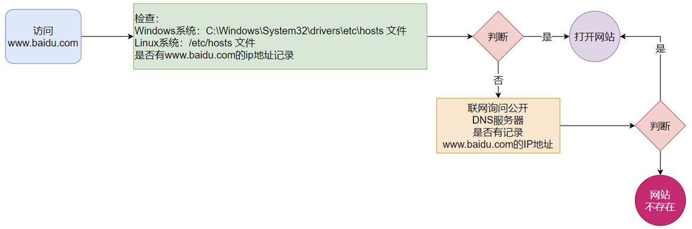

即：

+ 先查看本机的记录（私人地址本）
  + **Windows 看：C:\Windows\System32\drivers\etc\hosts**
  + **Linux 看：/etc/hosts**

+ 再联网去 DNS 服务器（如114.114.114.114，8.8.8.8等）询问


##### 6.1.6 配置主机名映射

比如，我们 FinalShell 是通过 IP 地址连接到的 Linux 服务器，那有没有可能通过域名（主机名）连接呢？

可以，我们只需要在 Windows 系统的：C:\Windows\System32\drivers\etc\hosts 文件中配置记录即可

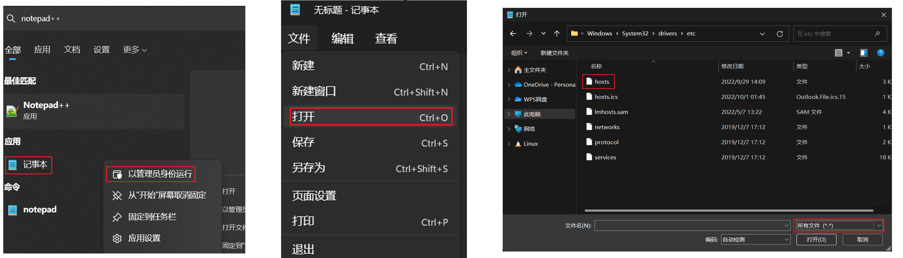

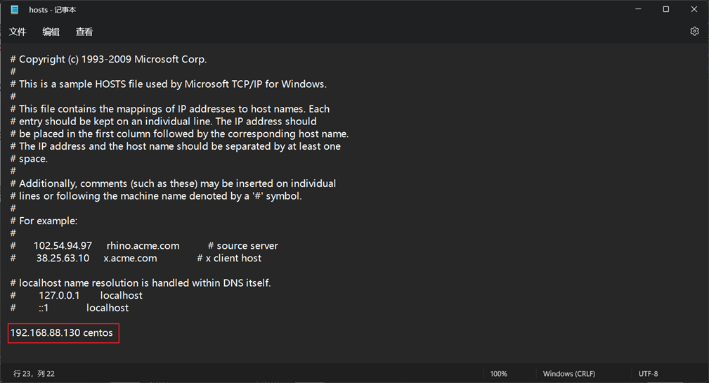

FinalShell 中：

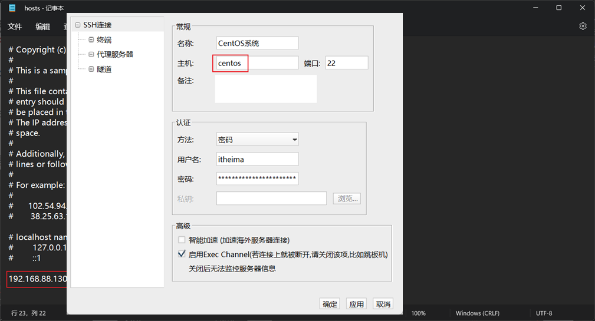


##### 总结

1. 什么是IP地址，有什么作用？

+ IP 地址是联网计算机的网络地址，用于在网络中进行定位
+ 格式是：a.b.c.d，其中 abcd 是0~255的数字
+ 特殊IP有：127.0.0.1，本地回环 IP，表示本机
+ 0.0.0.0：也可表示本机，也可以在一些白名单中表示任意 IP

2. 什么是主机名？

+ 主机名就是主机的名称，用于标识一个计算机

3. 什么是域名解析（主机名映射）

+ 可以通过主机名找到对应计算机的 IP 地址，这就是主机名映射（域名解析）
+ 先通过系统本地的记录去查找，如果找不到就联网去公开 DNS 服务器去查找


#### 6.2 为什么需要固定 IP

##### 6.2.1 为什么需要固定 IP

当前我们虚拟机的 Linux 操作系统，其 IP 地址是通过 DHCP 服务获取的。

DHCP：动态获取 IP 地址，即每次重启设备后都会获取一次，可能导致 IP 地址频繁变更

原因1：办公电脑 IP 地址变化无所谓，但是我们要远程连接到 Linux 系统，如果 IP 地址经常变化我们就要频繁修改适配很麻烦

原因2：在刚刚我们配置了虚拟机 IP 地址和主机名的映射，如果 IP 频繁更改，我们也需要频繁更新映射关系

综上所述，我们需要 IP 地址固定下来，不要变化了


##### 6.2.2 在 VMware Workstation 中配置固定 IP

配置固定 IP 需要2个大步骤：

1.在 VMware Workstation（或Fusion）中配置 IP 地址网关和网段（IP 地址的范围）

2.在 Linux 系统中手动修改配置文件，固定 IP

首先让我们，先进行第一步，跟随图片进行操作

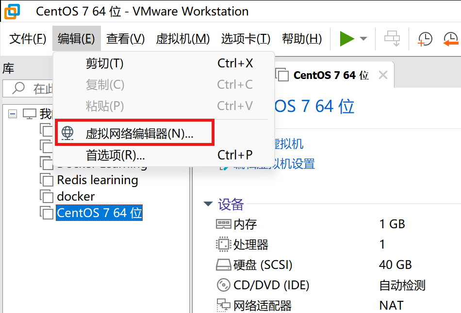

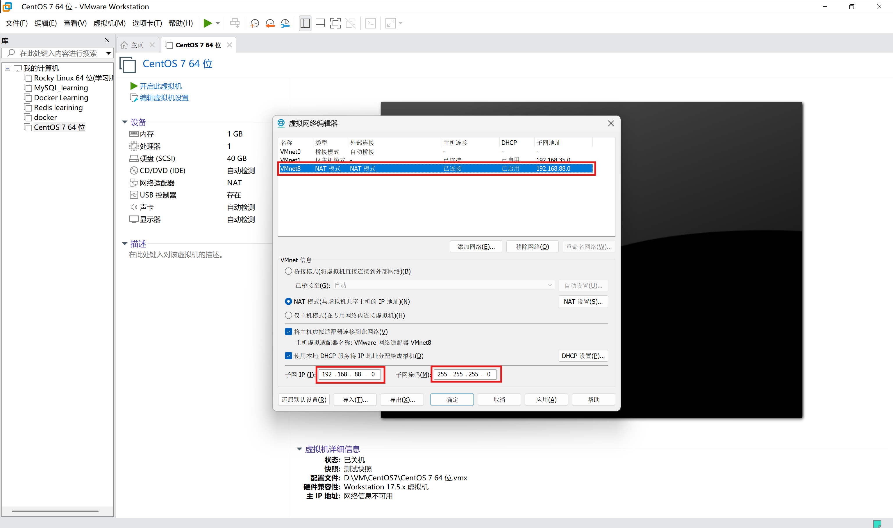

点击 NAT 设置

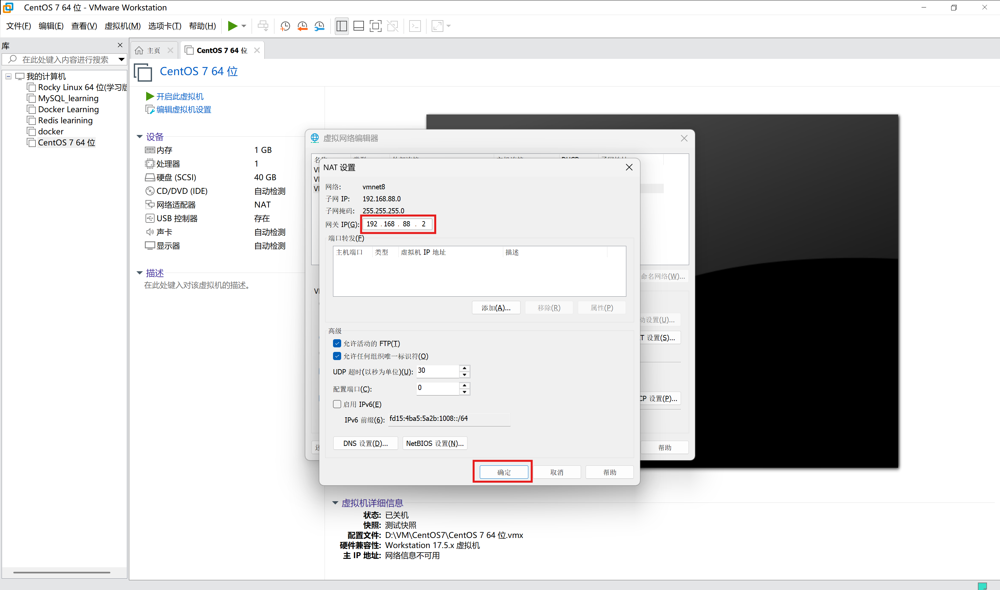


现在进行第二步，在Linux系统中修改固定 IP

+ 使用 vim 编辑 /etc/sysconfig/network-scripts/ifcfg-ens33 文件，填入如下内容

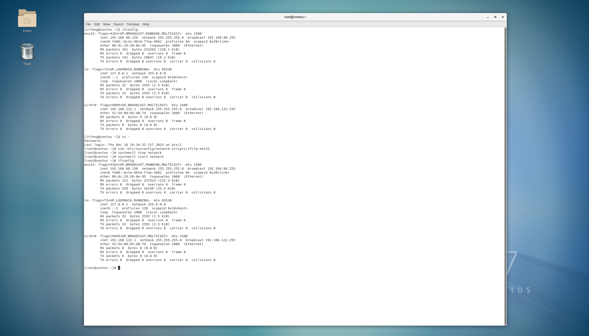

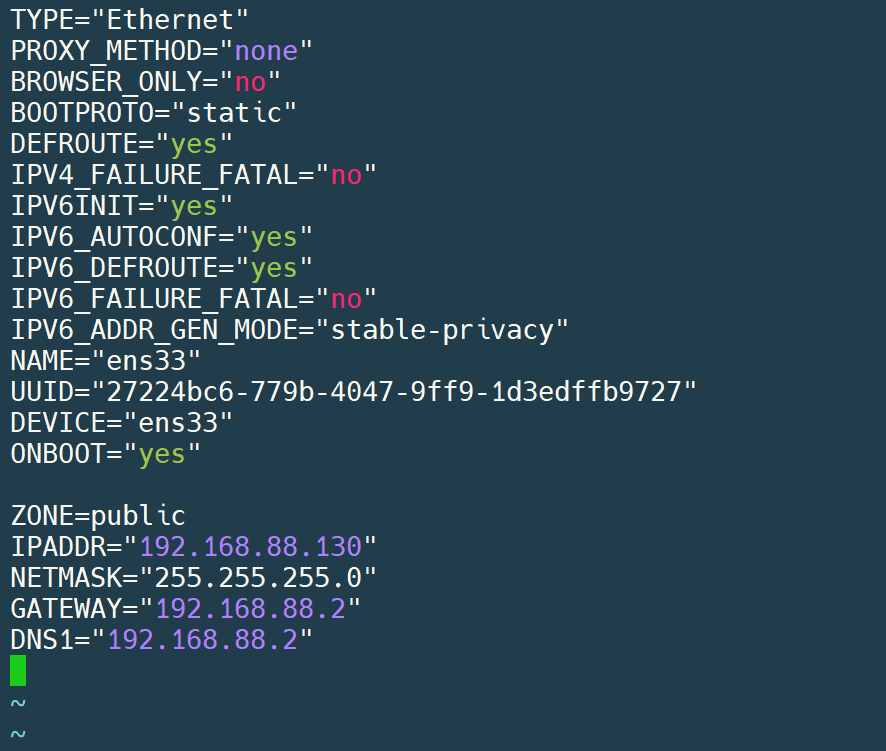

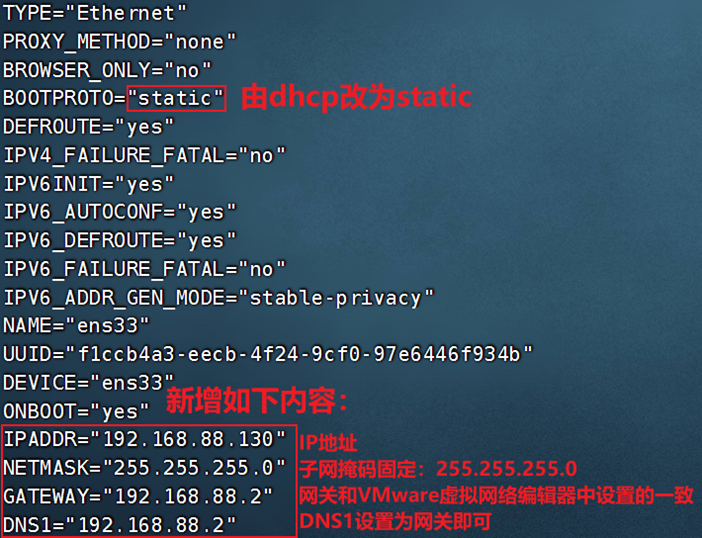

+ 执行：systemctl restart network 重启网卡，执行 ifconfig 即可看到 ip 地址固定为 192.168.88.130 了


------


### 7. 网络传输

#### 7.1 ping 命令

可以通过 ping 命令，检查指定的网络服务器是否是可联通状态

语法：

```shell
ping [-c num] ip或主机名
```

+ 选项：`-c`，检查的次数，不使用 `-c` 选项，将无限次数持续检查
+ 参数：ip 或主机名，被检查的服务器的 ip 地址或主机名地址

示例：

+ 检查到 baidu.com 是否联通

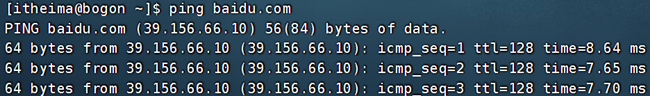

+ 检查到 39.156.66.10 是否联通，并检查3次

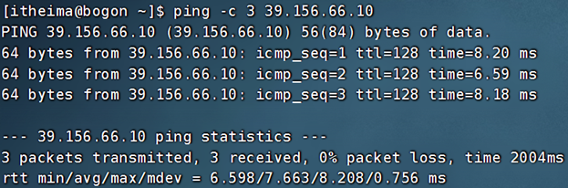


#### 7.2 wget 命令

wget 是非交互式的文件下载器，可以在命令行内下载网络文件

语法：

```shell
wget [-b] url
```

+ 选项：`-b`，可选，后台下载，会将日志写入到当前工作目录的 wget-log 文件
+ 参数：url，下载连接

示例：

+ 下载 apache-hadoop 3.3.0 版本：`wget http://archive.apache.org/dist/hadoop/common/hadoop-3.3.0/hadoop-3.3.0.tar.gz`

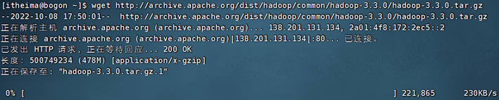

+ 在后台下载：`wget -b http://archive.apache.org/dist/hadoop/common/hadoop-3.3.0/hadoop-3.3.0.tar.gz`
+ 通过 tail 命令可以监控后台下载进度：tail -f wget-log

<strong><font color="red">注意</font></strong>：无论下载是否完成，都会生成要下载的文件，如果下载未完成，请及时清理未完成的不可用文件


#### 7.3 curl 命令

curl 可以发送 http 网络请求，可用于：下载文件、获取信息等

语法：

```shell
curl [-O] url
```

+ 选项：`-O`，用于下载文件，当 url 是下载链接时，可以使用此选项保存文件
+ 参数：url，要发起请求的网络地址


#### 总结

1. 使用 ping 命令可以测试到某服务器是否可联通

+ 语法：`ping [-c num] ip或主机名`
+ 选项：`-c`，测试的次数

2. 使用 wget 命令可以进行网络文件下载

+ 语法：`wget [-b] url`
+ 选项：`-b`，后台下载

3. 使用 curl 命令可以发起网络请求

+ 语法：`curl [-O] url`
+ 选项：`-O`，用于下载使用


#### 7.4 端口

端口，是设备与外界通讯交流的出入口。端口可以分为：物理端口和虚拟端口两类

+ 物理端口：又可称之为接口，是可见的端口，如 USB 接口，RJ45 网口，HDMI 接口等
+ 虚拟端口：是指计算机内部的端口，是不可见的，是用来操作系统和外部进行交互使用的

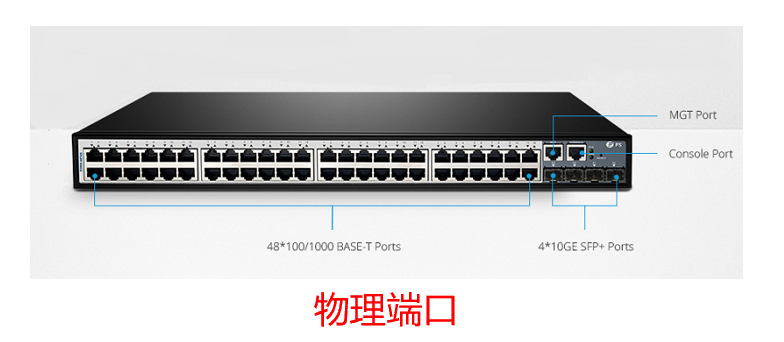

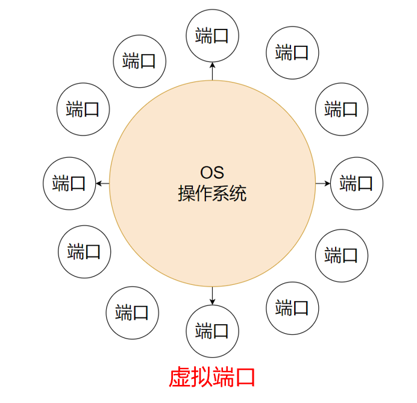


#### 7.5 端口（虚拟）

物理端口我们日常生活中经常见到，也能知晓它的作用

但是虚拟端口，有什么用？为什么需要它呢？

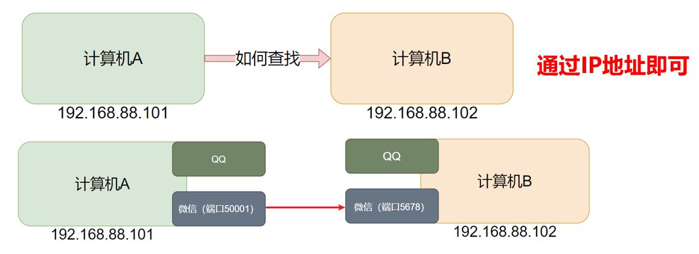

计算机程序之间的通讯，通过 IP 只能锁定计算机，但是无法锁定具体的程序

通过端口可以锁定计算机上具体的程序，确保程序之间进行沟通

IP 地址相当于小区地址，在小区内可以有许多住户（程序），而门牌号（端口）就是各个住户（程序）的联系地址


Linux 系统是一个超大号小区，可以支持65535个端口，这6万多个端口分为3类进行使用：

+ 公认端口：1~1023，通常用于一些系统内置或知名程序的预留使用，如 SSH 服务的22端口，HTTPS 服务的443端口

非特殊需要，不要占用这个范围的端口

+ 注册端口：1024~49151，通常可以随意使用，用于松散的绑定一些程序 \ 服务
+ 动态端口：49152~65535，通常不会固定绑定程序，而是当程序对外进行网络链接时，用于临时使用

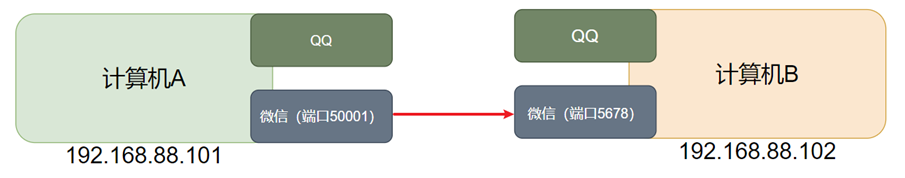

如图中，计算机 A 的微信连接计算机B的微信，A 使用的50001即动态端口，临时找一个端口作为出口

计算机 B 的微信使用端口5678，即注册端口，长期绑定此端口等待别人连接

**PS**：上述微信的端口仅为演示，具体微信的端口使用非图中示意


#### 7.6 查看端口占用

可以通过 Linux 命令去查看端口的占用情况

+ 使用 nmap 命令，安装 nmap：`yum -y install nmap`

语法：

```shell
nmap 被查看的IP地址
```


可以看到，本机（127.0.0.1）上有5个端口现在被程序占用了

其中：

+ 22端口，一般是 SSH 服务使用，即 FinalShell 远程连接 Linux 所使用的端口


可以通过 netstat 命令，查看指定端口的占用情况

语法：

```shell
netstat -anp | grep 端口号
```

安装 netstat：`yum -y install net-tools`


如图，可以看到当前系统6000端口被程序（进程号7174）占用了

其中，0.0.0.0:6000，表示端口绑定在0.0.0.0这个IP地址上，表示允许外部访问


可以看到，当前系统12345端口，无人使用哦


#### 总结

1. 什么是端口？

+ 端口是指计算机和外部交互的出入口，可以分为物理端口和虚拟端口
  + 物理端口：USB、HDMI、DP、VGA、RJ45 等
  + 虚拟端口：操作系统和外部交互的出入口

+ IP 只能确定计算机，通过端口才能锁定要交互的程序

2. 端口的划分

+ 公认端口：1~1023，用于系统内置或常用知名软件绑定使用
+ 注册端口：1024~49151，用于松散绑定使用（用户自定义）
+ 动态端口：49152~65535，用于临时使用（多用于出口）

3. 查看端口占用

+ `nmap IP地址`，查看指定 IP 的对外暴露端口
+ `netstat -anp | grep 端口号`，查看本机指定端口号的占用情况


------


### 8. 进程管理

#### 8.1 进程

程序运行在操作系统中，是被操作系统所管理的。

为管理运行的程序，每一个程序在运行的时候，便被操作系统注册为系统中的一个：进程

并会为每一个进程都分配一个独有的：进程 ID（进程号）

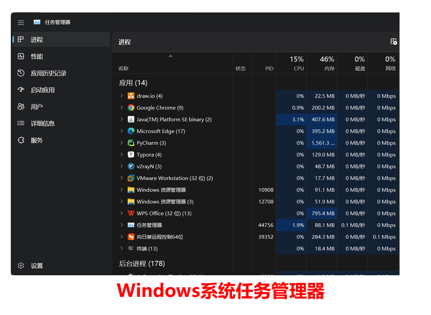

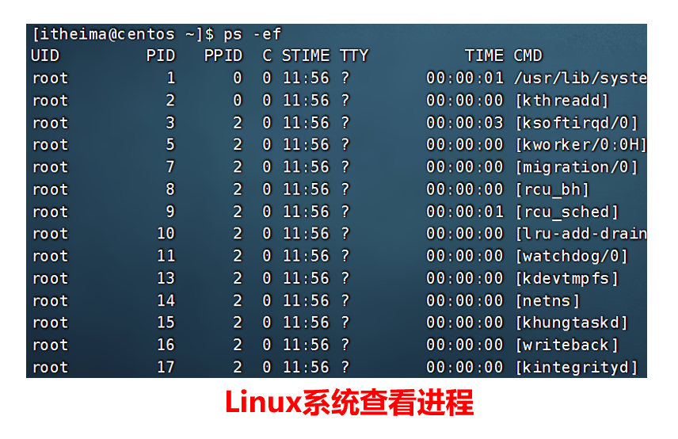


#### 8.2 查看进程

可以通过 ps 命令查看 Linux 系统中的进程信息

语法：

```shell
ps [-e -f]
```

选项：`-e`，显示出全部的进程

选项：`-f`，以完全格式化的形式展示信息（展示全部信息）

一般来说，固定用法就是： `ps -ef` 列出全部进程的全部信息

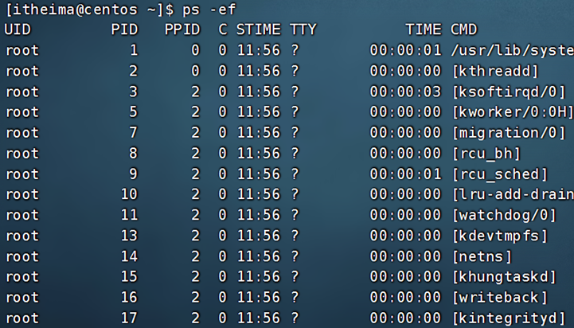

从左到右分别是：

+ UID：进程所属的用户 ID
+ PID：进程的进程号 ID
+ PPID：进程的父 ID（启动此进程的其它进程）
+ C：此进程的 CPU 占用率（百分比）
+ STIME：进程的启动时间
+ TTY：启动此进程的终端序号，如显示？表示非终端启动
+ TIME：进程占用CPU的时间
+ CMD：进程对应的名称或启动路径或启动命令


+ 在 FinalShell 中，执行命令：tail，可以看到，此命令一直阻塞在那里
+ 在 FinalShell 中，复制一个标签页，执行：ps -ef 找出 tail 这个程序的进程信息
+ 问题：是否会发现，列出的信息太多，无法准确的找到或很麻烦怎么办？

我们可以使用管道符配合 grep 来进行过滤，如：

`ps -ef | grep tail`，即可准确的找到 tail 命令的信息

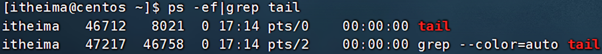

+ 过滤不仅仅过滤名称，进程号，用户 ID 等等，都可以被 grep 过滤哦
+ 如：`ps -ef | grep 30001`，过滤带有30001关键字的进程信息（一般指代过滤30001进程号）


#### 8.3 关闭进程

在 Windows 系统中，可以通过任务管理器选择进程后，点击结束进程从而关闭它

同样，在 Linux 中，可以通过 kill 命令关闭进程。

语法：

```shell
kill [-9] 进程ID
```

选项：-9，表示强制关闭进程。不使用此选项会向进程发送信号要求其关闭，但是否关闭看进程自身的处理机制

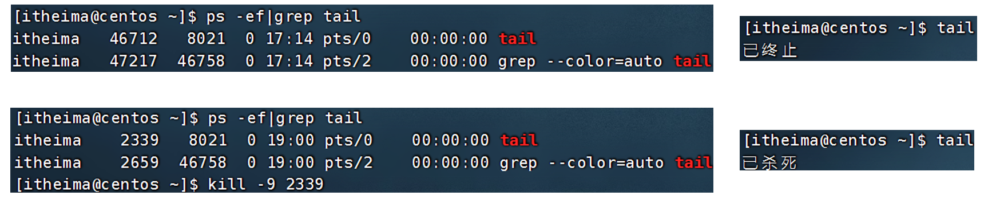


#### 总结

1. 什么是进程？

+ 进程是指程序在操作系统内运行后被注册为系统内的一个进程，并拥有独立的进程 ID（进程号）

2. 管理进程的命令

+ `ps -ef` 查看进程信息
+ `ps -ef | grep 关键字` 过滤指定关键字进程信息
+ `kill [-9] 进程号` 关闭指定进程号的进程


-----


### 9. 主机状态

#### 9.1 查看系统资源占用

+ 可以通过 top 命令查看 CPU、内存使用情况，类似Windows 的任务管理器
+ 默认**每5秒刷新**一次，语法：**直接输入 top 即可，按 q 或 ctrl + c 退出**

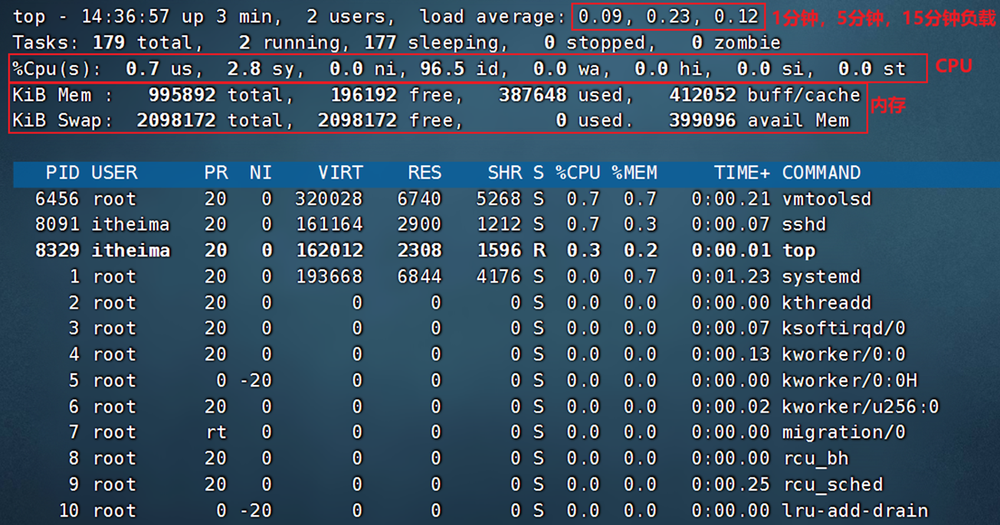


#### 9.2 top 命令内容详解

+ 第一行：


top：命令名称，14:39:58：当前系统时间，up 6 min：启动了6分钟，2 users：2个用户登录，load：1、5、15分钟负载

+ 第二行：


Tasks：175个进程，1 running：1个进程子在运行，174 sleeping：174个进程睡眠，0个停止进程，0个僵尸进程

+ 第三行：

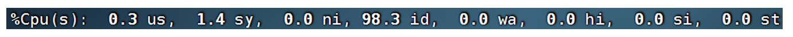

%Cpu(s)：CPU 使用率，us：用户 CPU 使用率，sy：系统 CPU 使用率，ni：高优先级进程占用 CPU 时间百分比，id：空闲 CPU 率，wa：IO 等待 CPU 占用率，hi：CPU 硬件中断率，si：CPU 软件中断率，st：强制等待占用 CPU 率

+ 第四、五行：

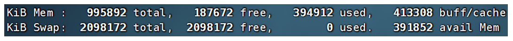

Kib Mem：物理内存，total：总量，free：空闲，used：使用，buff/cache：buff 和 cache占用

KibSwap：虚拟内存（交换空间），total：总量，free：空闲，used：使用，buff/cache：buff 和 cache 占用


+ PID：进程 id
+ USER：进程所属用户
+ PR：进程优先级，越小越高
+ NI：负值表示高优先级，正表示低优先级 VIRT：进程使用虚拟内存，单位 KB
+ RES：进程使用物理内存，单位KB
+ SHR：进程使用共享内存，单位KB
+ S：进程状态（S 休眠，R 运行，Z 僵死状态，N 负数优先级，I 空闲状态）
+ %CPU：进程占用 CPU 率
+ %MEM：进程占用内存率
+ TIME+：进程使用 CPU 时间总计，单位10毫秒
+ COMMAND：进程的命令或名称或程序文件路径

top命令也支持选项：

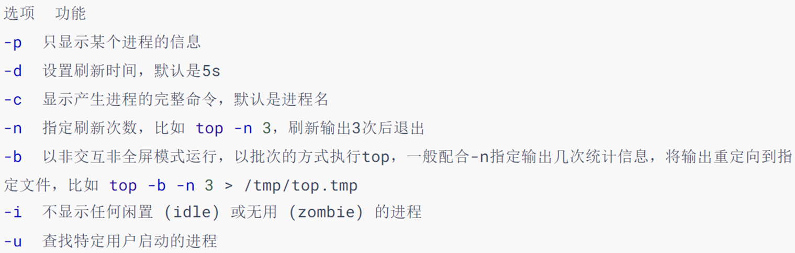


#### 9.3 top 交互式选项

当 top 以交互式运行（非 -b 选项启动），可以用以下交互式命令进行控制

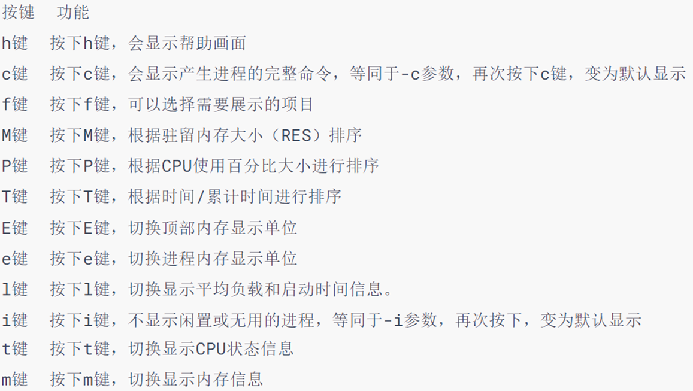


#### 9.4 磁盘信息监控

+ 使用 df 命令，可以查看硬盘的使用情况

语法：

```shell
df [-h]
```

选项：`-h`，以更加人性化的单位显示

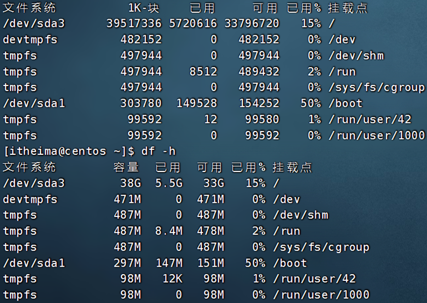


+ 可以使用 iostat 查看 CPU、磁盘的相关信息

语法：

```shell
iostat [-x] [num1] [num2]
```

+ 选项：`-x`，显示更多信息

+ num1：数字，刷新间隔，num2：数字，刷新几次

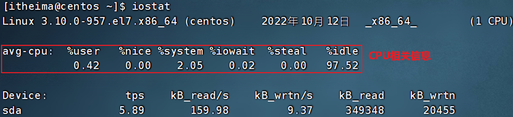

tps：该设备每秒的传输次数（Indicate the number of transfers per second that were issued to the device.）。"一次传输" 意思是 "一次 I/O 请求"。多个逻辑请求可能会被合并为 "一次 I/O 请求"。"一次传输" 请求的大小是未知的。

+ 使用 iostat 的 `-x` 选项，可以显示更多信息

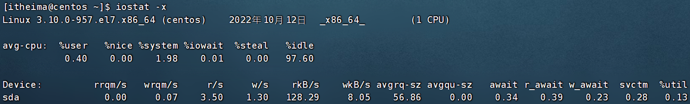

rrqm/s： 每秒这个设备相关的读取请求有多少被Merge了（当系统调用需要读取数据的时候，VFS将请求发到各个FS，如果FS发现不同的读取请求读取的是相同Block的数据，FS会将这个请求合并Merge, 提高IO利用率, 避免重复调用）；

wrqm/s： 每秒这个设备相关的写入请求有多少被Merge了。
rsec/s： 每秒读取的扇区数；sectors
wsec/： 每秒写入的扇区数。
**rKB/s： 每秒发送到设备的读取请求数**
**wKB/s： 每秒发送到设备的写入请求数**
avgrq-sz  平均请求扇区的大小
avgqu-sz  平均请求队列的长度。毫无疑问，队列长度越短越好
await：  每一个IO请求的处理的平均时间（单位是微秒毫秒）
svctm   表示平均每次设备I/O操作的服务时间（以毫秒为单位）
**%util：  磁盘利用率**


#### 9.5 网络状态监控

+ 可以使用 sar 命令查看网络的相关统计（sar命令非常复杂，这里仅简单用于统计网络）

语法：

```shell
sar -n DEV num1 num2
```

选项：`-n`，查看网络，DEV 表示查看网络接口

num1：刷新间隔（不填就查看一次结束），num2：查看次数（不填无限次数）

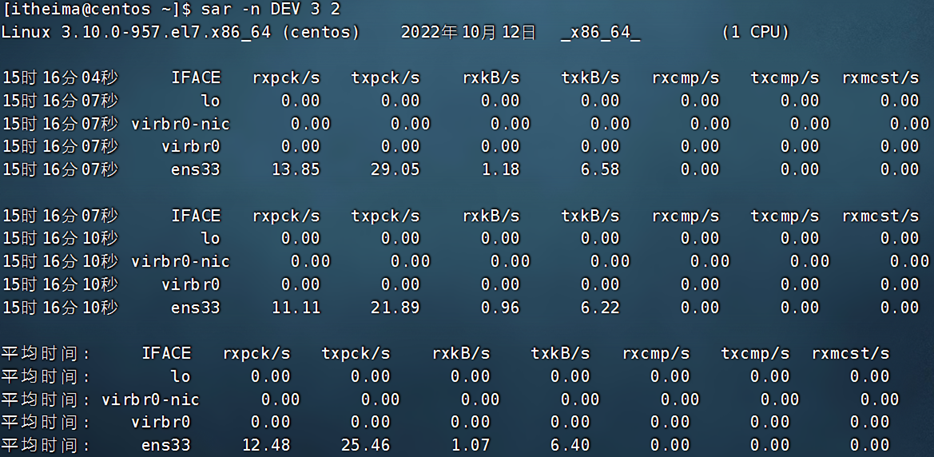

如图，查看2次，隔3秒刷新一次，并最终汇总平均记录

信息解读：

+ IFACE 本地网卡接口的名称
+ rxpck/s 每秒钟接受的数据包
+ txpck/s 每秒钟发送的数据包
+ rxKB/S 每秒钟接受的数据包大小，单位为 KB
+ txKB/S 每秒钟发送的数据包大小，单位为 KB
+ rxcmp/s 每秒钟接受的压缩数据包
+ txcmp/s 每秒钟发送的压缩包
+ rxmcst/s 每秒钟接收的多播数据包


#### 总结

1. 使用 top 命令可以：

+ 类似 Windows 任务管理器
+ 查看 CPU、内存、进程的信息

2. 使用 df 命令可以：

+ 查看磁盘使用率

3. 使用 iostat 可以：

+ 查看磁盘速率等信息

4. 使用 sar -n DEV 命令可以：

+ 查看网络情况


--------


### 10. 环境变量

#### 10.1 环境变量

在讲解 which 命令的时候，我们知道使用的一系列命令其实本质上就是一个个的可执行程序

比如，cd 命令的本体就是：/usr/bin/cd 这个程序文件


环境变量是操作系统（Windows、Linux、Mac）在运行的时候，记录的一些关键性信息，用以辅助系统运行

在 Linux 系统中执行：env 命令即可查看当前系统中记录的环境变量

环境变量是一种 KeyValue 型结构，即名称和值，如下图：

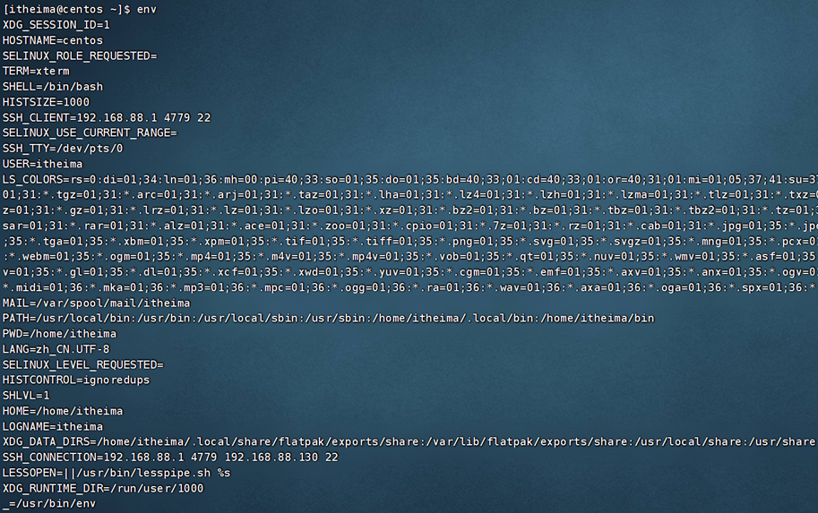


#### 10.2 环境变量：PATH

在前面提出的问题中，我们说无论当前工作目录是什么，都能执行 /usr/bin/cd 这个程序，这个就是借助环境变量中：PATH 这个项目的值来做到的

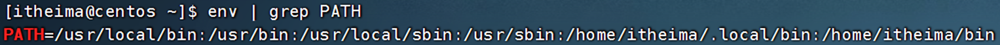

PATH 记录了系统执行任何命令的搜索路径，如上图记录了（路径之间以:隔开）：

+ /usr/local/bin
+ /usr/bin
+ /usr/local/sbin
+ /usr/sbin
+ /home/itheima/.local/bin
+ /home/itheima/bin

当执行任何命令，都会按照顺序，从上述路径中搜索要执行的程序的本体

比如执行cd命令，就从第二个目录/usr/bin中搜索到了cd命令，并执行


#### 10.3 $ 符号

在 Linux 系统中，$ 符号被用于取”变量”的值

环境变量记录的信息，除了给操作系统自己使用外，如果我们想要取用，也可以使用

取得环境变量的值就可以通过语法：`$环境变量名` 来取得

比如：`echo $PATH`

就可以取得 PATH 这个环境变量的值，并通过 echo 语句输出出来


又或者：`echo ${PATH}ABC`

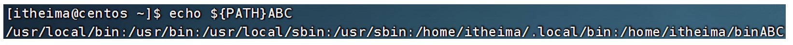

当和其它内容混合在一起的时候，可以通过 `{}` 来标注取的变量是谁


#### 10.4 自行设置环境变量

Linux 环境变量可以用户自行设置，其中分为：

+ 临时设置，语法：`export 变量名=变量值`

+ 永久生效
  + 针对当前用户生效，配置在当前用户的： ~/.bashrc 文件中
  + 针对所有用户生效，配置在系统的： /etc/profile 文件中

+ 并通过语法：`source 配置文件`，进行立刻生效，或重新登录 FinalShell 生效


环境变量 PATH 这个项目里面记录了系统执行命令的搜索路径

这些搜索路径我们也可以自行添加到 PATH 中去

测试：

+ 在当前 HOME 目录内创建文件夹，myenv，在文件夹内创建文件 mkhaha
+ 通过 vim 编辑器，在 mkhaha 文件内填入：echo 哈哈哈哈哈

完成上述操作后，随意切换工作目录，执行 mkhaha 命令尝试一下，会发现无法执行

+ 修改PATH的值

临时修改 PATH：`export PATH=$PATH:/home/itheima/myenv`，再次执行 mkhaha，无论在哪里都能执行了

或将 export PATH=$PATH:/home/itheima/myenv，填入用户环境变量文件或系统环境变量文件中去


#### 总结

1. 什么是环境变量？

环境变量是一组信息记录，类型是 KeyValue 型（名称=值），用于操作系统运行的时候记录关键信息

2. 通过 env 命令可以查看当前系统配置的环境变量信息
3. 通过 $ 符号，可以取出环境变量的值
4. 什么是 PATH，作用是？

+ 环境变量PATH会记录一组目录，目录之间用:隔开。这里记录的是命令的搜索路径，当执行命令会从记录中记录的目录中挨个搜索要执行的命令并执行
+ 可以通过修改这个项目的值，加入自定义的命令搜索路径
+ 如 export PATH=$PATH:自定义路径

5. 如何修改环境变量？

+ 临时生效：`export 名称=值`
+ 永久生效：
  + 针对用户：~/.bashrc 文件中配置
  + 针对全部用户：/etc/profile 文件中配置
  + 配置完成，可以通过 source 命令立刻生效


------


### 11. 上传、下载

#### 11.1 上传、下载

我们可以通过 FinalShell 工具，方便的和虚拟机进行数据交换

在 FinalShell 软件的下方窗体中，提供了 Linux 的文件系统视图，可以方便的：

+ 浏览文件系统，找到合适的文件，右键点击下载，即可传输到本地电脑
+ 浏览文件系统，找到合适的目录，将本地电脑的文件拓展进入，即可方便的上传数据到 Linux 中

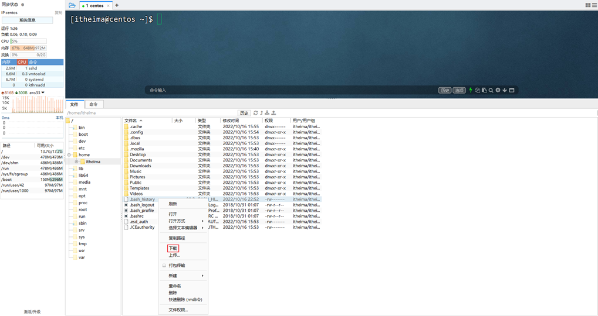


#### 11.2 rz、sz 命令

当然，除了通过 FinalShell 的下方窗体进行文件的传输以外，也可以通过 rz、sz 命令进行文件传输。

rz、sz 命令需要安装，可以通过：`yum -y install lrzsz`，即可安装。

+ rz 命令，进行上传，语法：直接输入 rz 即可

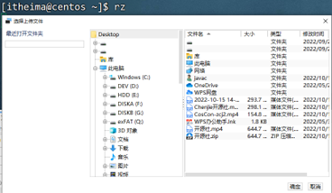

+ sz 命令进行下载，语法：sz 要下载的文件

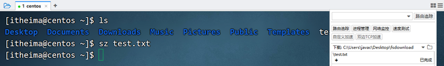

文件会自动下载到桌面的：fsdownload 文件夹中。

<strong><font color="red">注意</font></strong>，rz、sz 命令需要终端软件支持才可正常运行

FinalShell、SecureCRT、XShell 等常用终端软件均支持此操作


#### 总结

1. 如何使用 FinalShell 对 Linux 系统进行上传下载操作？


2. rz、sz 命令

+ 通过 `yum -y install lrzsz` 可以安装此命令
+ rz 进行文件上传
+ sz 文件，进行文件下载


--------


### 12. 压缩、解压

#### 12.1 压缩格式

市面上有非常多的压缩格式

+ zip 格式：Linux、Windows、MacOS，常用
+ 7zip：Windows 系统常用
+ rar：Windows 系统常用
+ tar：Linux、MacOS 常用
+ gzip：Linux、MacOS 常用

在 Windows 系统中常用的软件如：winrar、bandizip 等软件，都支持各类常见的压缩格式，这里不多做讨论

我们现在要学习，如何在 Linux 系统中操作：tar、gzip、zip 这三种压缩格式

完成文件的压缩、解压操作


#### 12.2 tar 命令

Linux 和 Mac 系统常用有2种压缩格式，后缀名分别是：

+ `.tar`，称之为 tarball，归档文件，即简单的将文件组装到一个 `.tar`的文件内，并没有太多文件体积的减少，仅仅是简单的封装
+ `.gz`，也常见为 .tar.gz，gzip 格式压缩文件，即使用 gzip 压缩算法将文件压缩到一个文件内，可以极大的减少压缩后的体积

针对这两种格式，使用 tar 命令均可以进行压缩和解压缩的操作

语法：

```shell
tar [-c -v -x -f -z -C] 参数1 参数2 ... 参数N
```

+ `-c`，创建压缩文件，用于压缩模式
+ `-v`，显示压缩、解压过程，用于查看进度
+ `-x`，解压模式
+ `-f`，要创建的文件，或要解压的文件，-f 选项必须在所有选项中位置处于最后一个
+ `-z`，gzip 模式，不使用 -z 就是普通的 tarball 格式
+ `-C`，选择解压的目的地，用于解压模式


#### 12.3 tar 命令压缩

tar 的常用组合为：

+ `tar -cvf test.tar 1.txt 2.txt 3.txt`

将 1.txt 2.txt 3.txt 压缩到 test.tar 文件内

+ `tar -zcvf test.tar.gz 1.txt 2.txt 3.txt`

将 1.txt 2.txt 3.txt 压缩到 test.tar.gz 文件内，使用 gzip 模式

<strong><font color="red">注意</font></strong>：

+ `-z` 选项如果使用的话，一般处于选项位第一个
+ `-f` 选项，**必须**在选项位最后一个


#### 12.3 tar 解压

常用的 tar 解压组合有

+ `tar -xvf test.tar`

解压 test.tar，将文件解压至当前目录

+ `tar -xvf test.tar -C /home/itheima`

解压 test.tar，将文件解压至指定目录（/home/itheima）

+ `tar -zxvf test.tar.gz -C /home/itheima`

以 Gzip 模式解压 test.tar.gz，将文件解压至指定目录（/home/itheima）

<strong><font color="red">注意</font></strong>：

+ `-f` 选项，必须在选项组合体的最后一位
+ `-z` 选项，建议在开头位置
+ `-C` 选项单独使用，和解压所需的其它参数分开


#### 12.4 zip 命令压缩文件

可以使用 zip 命令，压缩文件为 zip 压缩包

语法：

```shell
zip [-r] 参数1 参数2 ... 参数N
```

+ `-r`，被压缩的包含文件夹的时候，需要使用 -r 选项，和 rm、cp 等命令的 -r 效果一致

示例：

+ `zip test.zip a.txt b.txt c.txt`

将 a.txt b.txt c.txt 压缩到 test.zip 文件内

+ `zip -r test.zip test itheima a.txt`

将 test、itheima 两个文件夹和 a.txt 文件，压缩到 test.zip 文件内


#### 12.5 unzip 命令解压文件

使用 unzip 命令，可以方便的解压 zip 压缩包

语法：

```shell
unzip [-d] 参数
```

+ `-d`，指定要解压去的位置，同 tar 的 -C 选项
+ 参数，被解压的 zip 压缩包文件

示例：

+ `unzip test.zip`，将`test.zip`解压到当前目录
+ `unzip test.zip -d /home/itheima`，将 test.zip 解压到指定文件夹内（/home/itheima）


#### 总结

1. Linux 系统常用的压缩格式有：

+ tar 格式，归档文件，简单的将文件整合到一个文件内，无压缩效果
+ gzip 格式，gzip 压缩文件，不仅能整合到一个文件，同时有体积压缩效果

2. tar 命令

`tar [-z -x -v -c -f -C] 参数...`

+ `-c`，创建压缩文件、`-v`，查看压缩 \ 解压过程、`-x`，解压模式
+ `-f`，指定压缩 \ 解压的文件，`-z`，gzip 模式，`-C`，指定解压的路径
+ `-z` 在选项组建议在开头，`-f` 在选项组内必须在尾部，`-C` 单独使用

3. zip 命令

`zip [-r] 参数...`

+ `-r`，压缩文件夹使用

4. unzip 命令

`unzip [-d] 参数`

+ `-d`，指定解压去的目录


------------------------------


## 第五章、实战软件部署


----------------------------------


## 第六章、脚本 & 自动化


----------------------------


## 第七章、项目实战


-------------------------------


## 第八章、云平台技术


------------