# 苍穹外卖

## 一、项目概述、环境搭建

### 1. 软件开发整体介绍

#### 1.1 软件开发流程


#### 1.2 角色分工

+ 项目经理：对整个项目负责，任务分配、把控进度
+ 产品经理：进行需求调研，输出需求调研文档、产品原型等
+ UI 设计师：根据产品原型输出界面效果图
+ 架构师：项目整体架构设计、技术选型等
+ 开发工程师：代码实现
+ 测试工程师：编写测试用例，输出测试报告
+ 运维工程师：软件环境搭建、项目上线


#### 1.3 软件环境

+ 开发环境（development）：开发人员在开发阶段使用的环境，一般外部用户无法访问
+ 测试环境（testing）：专门给测试人员使用的环境，用于测试项目，一般外部用户无法访问
+ 生产环境（production）：即线上环境，正式提供对外服务的环境


-----------------------


### 2. 苍穹外卖项目介绍

#### 2.1 项目介绍

定位：专门为餐饮企业（餐厅、饭店）定制的一款软件产品

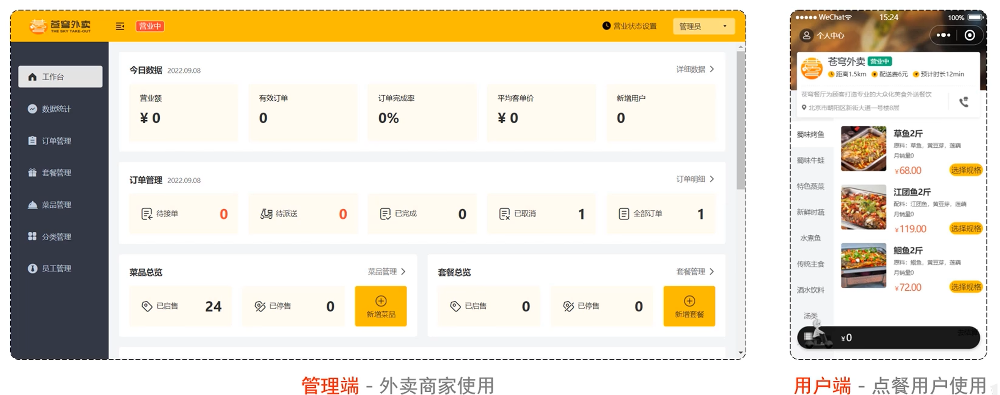

功能架构：体现项目中的业务功能模块

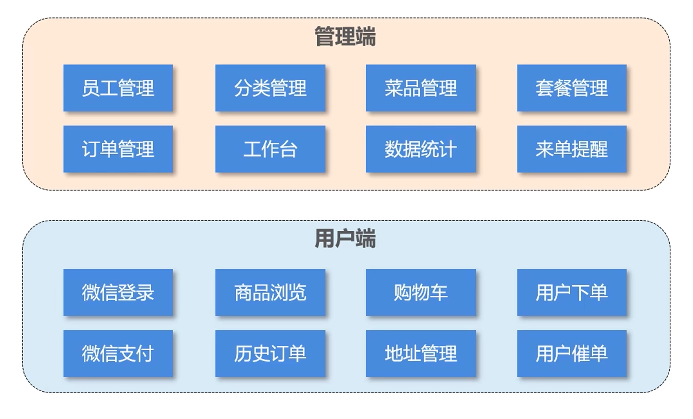


#### 2.2 产品原型

产品原型：用于展示项目的业务功能，一般由产品经理进行设计

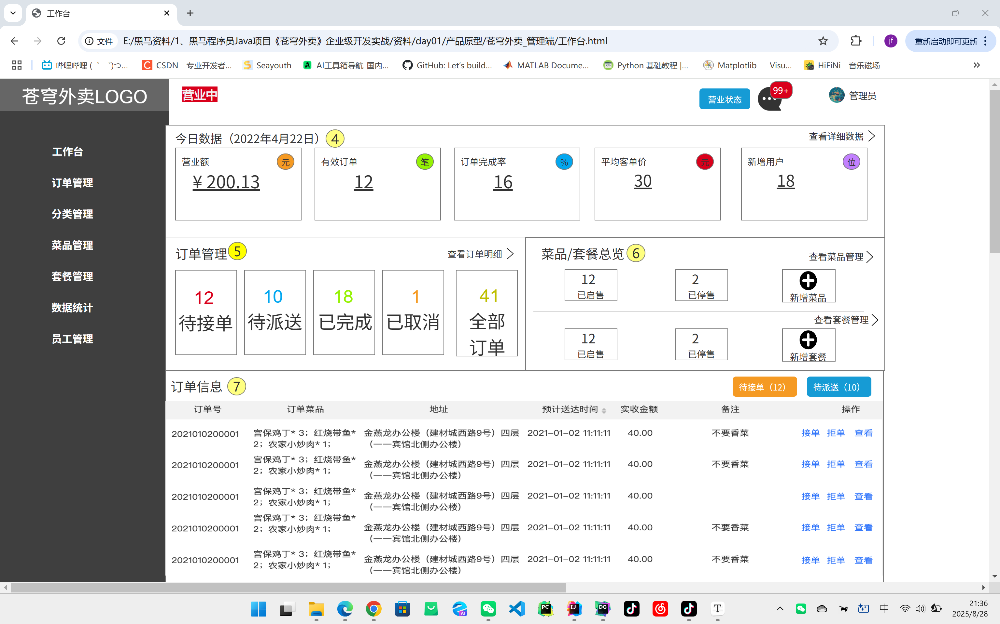


#### 2.3 技术选型

技术选型：展示项目中使用到的技术框架和中间件等

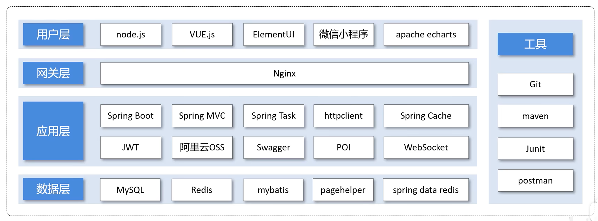


-----------------------


### 3. 开发环境搭建

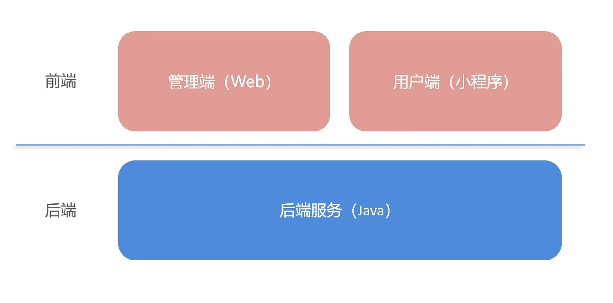

#### 3.1 前端环境搭建

前端工程基于 **nginx** 运行

启动 nginx：双击 **nginx.exe** 即可启动 nginx 服务，访问端口号为80

**在无中文目录下！！！**

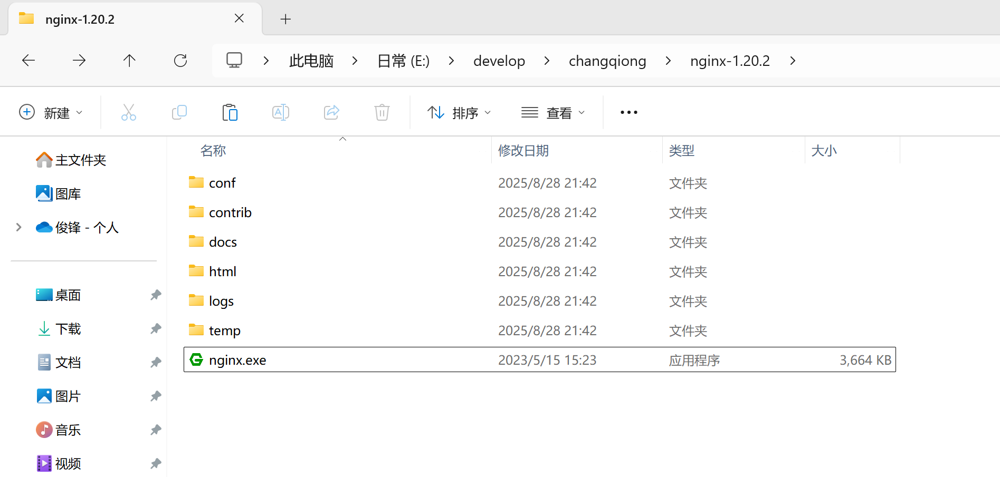

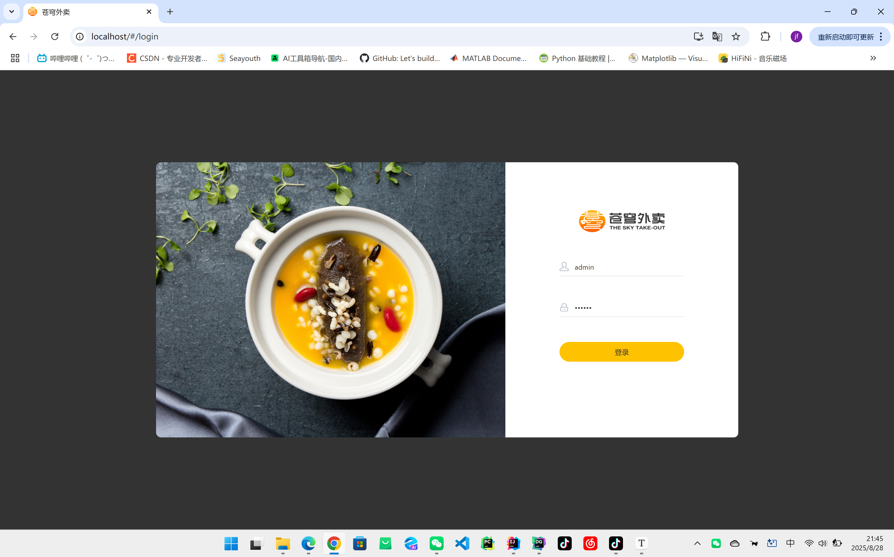


#### 3.2 后端环境搭建

后端工程基于 **maven** 进行项目构建，并且进行**分模块**开发

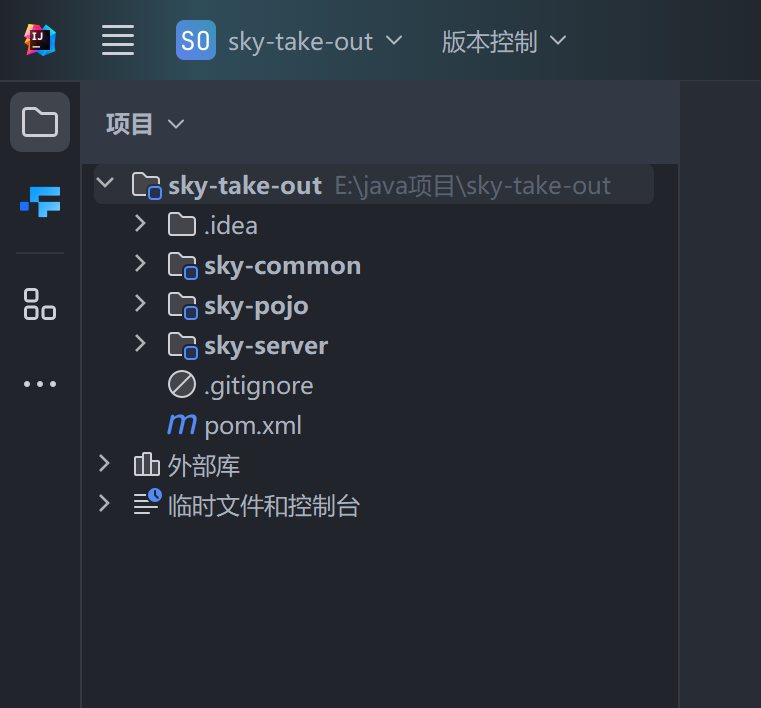

| 序号 | 名称         | 说明                                                         |
| ---- | ------------ | ------------------------------------------------------------ |
| 1    | sky-take-out | maven 父工程，同意管理依赖版本，聚合其他子模块               |
| 2    | sky-common   | 子模块，存放公共类，例如：工具类、常量类、异常类等           |
| 3    | sky-pojo     | 子模块，存放实体类、VO、DTO 等                               |
| 4    | sky-server   | 子模块，后端服务，存放配置文件、Controller、Service、Mapper 等 |

**sky-common** 子模块中存放的是一些公共类，可用供其他模块使用

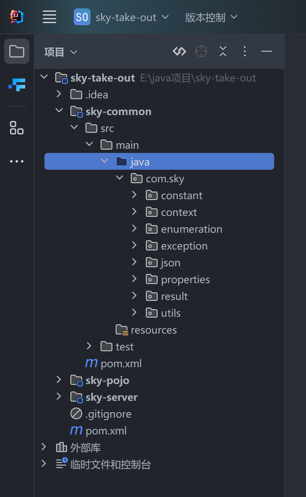

**sky-pojo** 子模块中存放的是一些 entity、DTO、VO

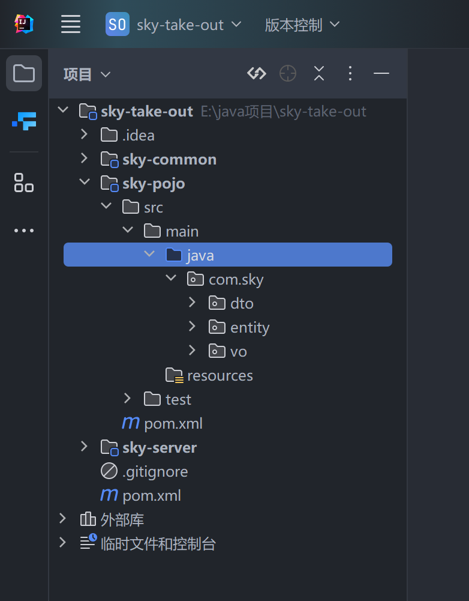

| 名称   | 说明                                              |
| ------ | ------------------------------------------------- |
| Entity | 实体，通常和数据库中的表对应                      |
| DTO    | 数据传输对象，通常用于程序中各层之间传递数据      |
| VO     | 视图对象，为前端展示数据提供的对象                |
| POJO   | 普通 Java 对象，只有属性和对应的 getter 和 setter |


**sky-server** 子模块中存放的是配置文件、配置类、拦截器、controller、service、mapper、启动类等

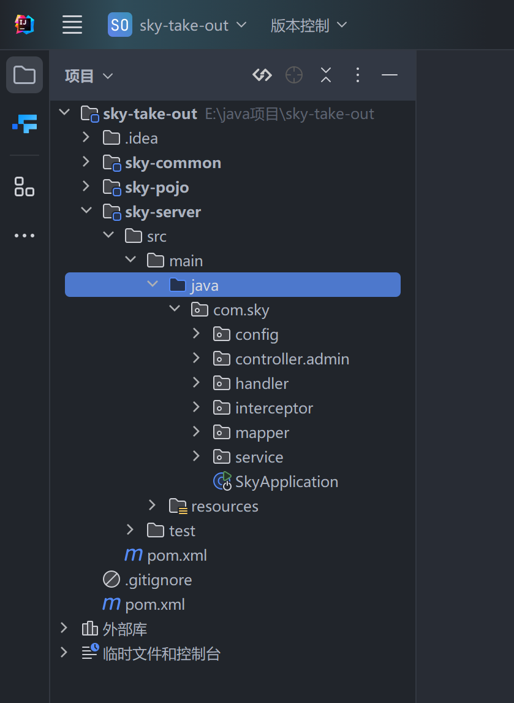

##### 3.2.1 使用 Git 进行版本控制

使用 Git 进行项目的版本控制，具体操作：

+ 创建 Git 本地仓库
+ 创建 Git 远程仓库
+ 将本地文件推送到 Git 远程仓库

`.gitignore` git 管理代码时的忽略文件

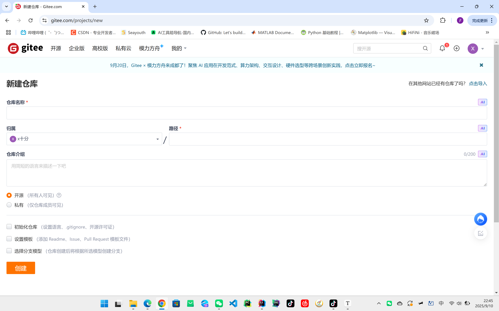

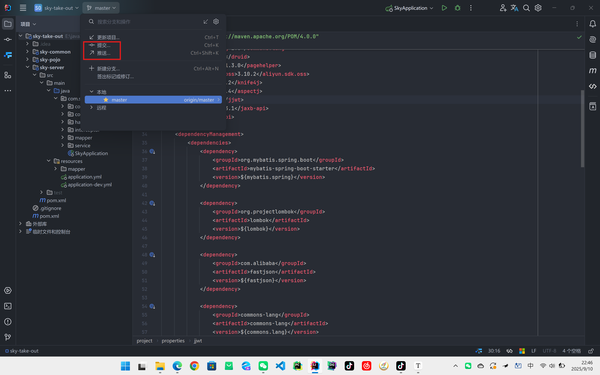


--------------------


##### 3.2.2 数据库环境搭建

通过数据库建表语句创建数据库结构

+ sql 语句

```sql
CREATE DATABASE  IF NOT EXISTS `sky_take_out` ;
USE `sky_take_out`;

DROP TABLE IF EXISTS `address_book`;
CREATE TABLE `address_book` (
                                `id` bigint NOT NULL AUTO_INCREMENT COMMENT '主键',
                                `user_id` bigint NOT NULL COMMENT '用户id',
                                `consignee` varchar(50) COLLATE utf8_bin DEFAULT NULL COMMENT '收货人',
                                `sex` varchar(2) COLLATE utf8_bin DEFAULT NULL COMMENT '性别',
                                `phone` varchar(11) COLLATE utf8_bin NOT NULL COMMENT '手机号',
                                `province_code` varchar(12) CHARACTER SET utf8mb4  DEFAULT NULL COMMENT '省级区划编号',
                                `province_name` varchar(32) CHARACTER SET utf8mb4  DEFAULT NULL COMMENT '省级名称',
                                `city_code` varchar(12) CHARACTER SET utf8mb4  DEFAULT NULL COMMENT '市级区划编号',
                                `city_name` varchar(32) CHARACTER SET utf8mb4  DEFAULT NULL COMMENT '市级名称',
                                `district_code` varchar(12) CHARACTER SET utf8mb4  DEFAULT NULL COMMENT '区级区划编号',
                                `district_name` varchar(32) CHARACTER SET utf8mb4  DEFAULT NULL COMMENT '区级名称',
                                `detail` varchar(200) CHARACTER SET utf8mb4  DEFAULT NULL COMMENT '详细地址',
                                `label` varchar(100) CHARACTER SET utf8mb4  DEFAULT NULL COMMENT '标签',
                                `is_default` tinyint(1) NOT NULL DEFAULT '0' COMMENT '默认 0 否 1是',
                                PRIMARY KEY (`id`)
) ENGINE=InnoDB AUTO_INCREMENT=2 DEFAULT CHARSET=utf8mb3 COLLATE=utf8_bin COMMENT='地址簿';

DROP TABLE IF EXISTS `category`;
CREATE TABLE `category` (
                            `id` bigint NOT NULL AUTO_INCREMENT COMMENT '主键',
                            `type` int DEFAULT NULL COMMENT '类型   1 菜品分类 2 套餐分类',
                            `name` varchar(32) COLLATE utf8_bin NOT NULL COMMENT '分类名称',
                            `sort` int NOT NULL DEFAULT '0' COMMENT '顺序',
                            `status` int DEFAULT NULL COMMENT '分类状态 0:禁用，1:启用',
                            `create_time` datetime DEFAULT NULL COMMENT '创建时间',
                            `update_time` datetime DEFAULT NULL COMMENT '更新时间',
                            `create_user` bigint DEFAULT NULL COMMENT '创建人',
                            `update_user` bigint DEFAULT NULL COMMENT '修改人',
                            PRIMARY KEY (`id`),
                            UNIQUE KEY `idx_category_name` (`name`)
) ENGINE=InnoDB AUTO_INCREMENT=23 DEFAULT CHARSET=utf8mb3 COLLATE=utf8_bin COMMENT='菜品及套餐分类';

INSERT INTO `category` VALUES (11,1,'酒水饮料',10,1,'2022-06-09 22:09:18','2022-06-09 22:09:18',1,1);
INSERT INTO `category` VALUES (12,1,'传统主食',9,1,'2022-06-09 22:09:32','2022-06-09 22:18:53',1,1);
INSERT INTO `category` VALUES (13,2,'人气套餐',12,1,'2022-06-09 22:11:38','2022-06-10 11:04:40',1,1);
INSERT INTO `category` VALUES (15,2,'商务套餐',13,1,'2022-06-09 22:14:10','2022-06-10 11:04:48',1,1);
INSERT INTO `category` VALUES (16,1,'蜀味烤鱼',4,1,'2022-06-09 22:15:37','2022-08-31 14:27:25',1,1);
INSERT INTO `category` VALUES (17,1,'蜀味牛蛙',5,1,'2022-06-09 22:16:14','2022-08-31 14:39:44',1,1);
INSERT INTO `category` VALUES (18,1,'特色蒸菜',6,1,'2022-06-09 22:17:42','2022-06-09 22:17:42',1,1);
INSERT INTO `category` VALUES (19,1,'新鲜时蔬',7,1,'2022-06-09 22:18:12','2022-06-09 22:18:28',1,1);
INSERT INTO `category` VALUES (20,1,'水煮鱼',8,1,'2022-06-09 22:22:29','2022-06-09 22:23:45',1,1);
INSERT INTO `category` VALUES (21,1,'汤类',11,1,'2022-06-10 10:51:47','2022-06-10 10:51:47',1,1);

DROP TABLE IF EXISTS `dish`;
CREATE TABLE `dish` (
                        `id` bigint NOT NULL AUTO_INCREMENT COMMENT '主键',
                        `name` varchar(32) COLLATE utf8_bin NOT NULL COMMENT '菜品名称',
                        `category_id` bigint NOT NULL COMMENT '菜品分类id',
                        `price` decimal(10,2) DEFAULT NULL COMMENT '菜品价格',
                        `image` varchar(255) COLLATE utf8_bin DEFAULT NULL COMMENT '图片',
                        `description` varchar(255) COLLATE utf8_bin DEFAULT NULL COMMENT '描述信息',
                        `status` int DEFAULT '1' COMMENT '0 停售 1 起售',
                        `create_time` datetime DEFAULT NULL COMMENT '创建时间',
                        `update_time` datetime DEFAULT NULL COMMENT '更新时间',
                        `create_user` bigint DEFAULT NULL COMMENT '创建人',
                        `update_user` bigint DEFAULT NULL COMMENT '修改人',
                        PRIMARY KEY (`id`),
                        UNIQUE KEY `idx_dish_name` (`name`)
) ENGINE=InnoDB AUTO_INCREMENT=70 DEFAULT CHARSET=utf8mb3 COLLATE=utf8_bin COMMENT='菜品';

INSERT INTO `dish` VALUES (46,'王老吉',11,6.00,'https://sky-itcast.oss-cn-beijing.aliyuncs.com/41bfcacf-7ad4-4927-8b26-df366553a94c.png','',1,'2022-06-09 22:40:47','2022-06-09 22:40:47',1,1);
INSERT INTO `dish` VALUES (47,'北冰洋',11,4.00,'https://sky-itcast.oss-cn-beijing.aliyuncs.com/4451d4be-89a2-4939-9c69-3a87151cb979.png','还是小时候的味道',1,'2022-06-10 09:18:49','2022-06-10 09:18:49',1,1);
INSERT INTO `dish` VALUES (48,'雪花啤酒',11,4.00,'https://sky-itcast.oss-cn-beijing.aliyuncs.com/bf8cbfc1-04d2-40e8-9826-061ee41ab87c.png','',1,'2022-06-10 09:22:54','2022-06-10 09:22:54',1,1);
INSERT INTO `dish` VALUES (49,'米饭',12,2.00,'https://sky-itcast.oss-cn-beijing.aliyuncs.com/76752350-2121-44d2-b477-10791c23a8ec.png','精选五常大米',1,'2022-06-10 09:30:17','2022-06-10 09:30:17',1,1);
INSERT INTO `dish` VALUES (50,'馒头',12,1.00,'https://sky-itcast.oss-cn-beijing.aliyuncs.com/475cc599-8661-4899-8f9e-121dd8ef7d02.png','优质面粉',1,'2022-06-10 09:34:28','2022-06-10 09:34:28',1,1);
INSERT INTO `dish` VALUES (51,'老坛酸菜鱼',20,56.00,'https://sky-itcast.oss-cn-beijing.aliyuncs.com/4a9cefba-6a74-467e-9fde-6e687ea725d7.png','原料：汤，草鱼，酸菜',1,'2022-06-10 09:40:51','2022-06-10 09:40:51',1,1);
INSERT INTO `dish` VALUES (52,'经典酸菜鮰鱼',20,66.00,'https://sky-itcast.oss-cn-beijing.aliyuncs.com/5260ff39-986c-4a97-8850-2ec8c7583efc.png','原料：酸菜，江团，鮰鱼',1,'2022-06-10 09:46:02','2022-06-10 09:46:02',1,1);
INSERT INTO `dish` VALUES (53,'蜀味水煮草鱼',20,38.00,'https://sky-itcast.oss-cn-beijing.aliyuncs.com/a6953d5a-4c18-4b30-9319-4926ee77261f.png','原料：草鱼，汤',1,'2022-06-10 09:48:37','2022-06-10 09:48:37',1,1);
INSERT INTO `dish` VALUES (54,'清炒小油菜',19,18.00,'https://sky-itcast.oss-cn-beijing.aliyuncs.com/3613d38e-5614-41c2-90ed-ff175bf50716.png','原料：小油菜',1,'2022-06-10 09:51:46','2022-06-10 09:51:46',1,1);
INSERT INTO `dish` VALUES (55,'蒜蓉娃娃菜',19,18.00,'https://sky-itcast.oss-cn-beijing.aliyuncs.com/4879ed66-3860-4b28-ba14-306ac025fdec.png','原料：蒜，娃娃菜',1,'2022-06-10 09:53:37','2022-06-10 09:53:37',1,1);
INSERT INTO `dish` VALUES (56,'清炒西兰花',19,18.00,'https://sky-itcast.oss-cn-beijing.aliyuncs.com/e9ec4ba4-4b22-4fc8-9be0-4946e6aeb937.png','原料：西兰花',1,'2022-06-10 09:55:44','2022-06-10 09:55:44',1,1);
INSERT INTO `dish` VALUES (57,'炝炒圆白菜',19,18.00,'https://sky-itcast.oss-cn-beijing.aliyuncs.com/22f59feb-0d44-430e-a6cd-6a49f27453ca.png','原料：圆白菜',1,'2022-06-10 09:58:35','2022-06-10 09:58:35',1,1);
INSERT INTO `dish` VALUES (58,'清蒸鲈鱼',18,98.00,'https://sky-itcast.oss-cn-beijing.aliyuncs.com/c18b5c67-3b71-466c-a75a-e63c6449f21c.png','原料：鲈鱼',1,'2022-06-10 10:12:28','2022-06-10 10:12:28',1,1);
INSERT INTO `dish` VALUES (59,'东坡肘子',18,138.00,'https://sky-itcast.oss-cn-beijing.aliyuncs.com/a80a4b8c-c93e-4f43-ac8a-856b0d5cc451.png','原料：猪肘棒',1,'2022-06-10 10:24:03','2022-06-10 10:24:03',1,1);
INSERT INTO `dish` VALUES (60,'梅菜扣肉',18,58.00,'https://sky-itcast.oss-cn-beijing.aliyuncs.com/6080b118-e30a-4577-aab4-45042e3f88be.png','原料：猪肉，梅菜',1,'2022-06-10 10:26:03','2022-06-10 10:26:03',1,1);
INSERT INTO `dish` VALUES (61,'剁椒鱼头',18,66.00,'https://sky-itcast.oss-cn-beijing.aliyuncs.com/13da832f-ef2c-484d-8370-5934a1045a06.png','原料：鲢鱼，剁椒',1,'2022-06-10 10:28:54','2022-06-10 10:28:54',1,1);
INSERT INTO `dish` VALUES (62,'金汤酸菜牛蛙',17,88.00,'https://sky-itcast.oss-cn-beijing.aliyuncs.com/7694a5d8-7938-4e9d-8b9e-2075983a2e38.png','原料：鲜活牛蛙，酸菜',1,'2022-06-10 10:33:05','2022-06-10 10:33:05',1,1);
INSERT INTO `dish` VALUES (63,'香锅牛蛙',17,88.00,'https://sky-itcast.oss-cn-beijing.aliyuncs.com/f5ac8455-4793-450c-97ba-173795c34626.png','配料：鲜活牛蛙，莲藕，青笋',1,'2022-06-10 10:35:40','2022-06-10 10:35:40',1,1);
INSERT INTO `dish` VALUES (64,'馋嘴牛蛙',17,88.00,'https://sky-itcast.oss-cn-beijing.aliyuncs.com/7a55b845-1f2b-41fa-9486-76d187ee9ee1.png','配料：鲜活牛蛙，丝瓜，黄豆芽',1,'2022-06-10 10:37:52','2022-06-10 10:37:52',1,1);
INSERT INTO `dish` VALUES (65,'草鱼2斤',16,68.00,'https://sky-itcast.oss-cn-beijing.aliyuncs.com/b544d3ba-a1ae-4d20-a860-81cb5dec9e03.png','原料：草鱼，黄豆芽，莲藕',1,'2022-06-10 10:41:08','2022-06-10 10:41:08',1,1);
INSERT INTO `dish` VALUES (66,'江团鱼2斤',16,119.00,'https://sky-itcast.oss-cn-beijing.aliyuncs.com/a101a1e9-8f8b-47b2-afa4-1abd47ea0a87.png','配料：江团鱼，黄豆芽，莲藕',1,'2022-06-10 10:42:42','2022-06-10 10:42:42',1,1);
INSERT INTO `dish` VALUES (67,'鮰鱼2斤',16,72.00,'https://sky-itcast.oss-cn-beijing.aliyuncs.com/8cfcc576-4b66-4a09-ac68-ad5b273c2590.png','原料：鮰鱼，黄豆芽，莲藕',1,'2022-06-10 10:43:56','2022-06-10 10:43:56',1,1);
INSERT INTO `dish` VALUES (68,'鸡蛋汤',21,4.00,'https://sky-itcast.oss-cn-beijing.aliyuncs.com/c09a0ee8-9d19-428d-81b9-746221824113.png','配料：鸡蛋，紫菜',1,'2022-06-10 10:54:25','2022-06-10 10:54:25',1,1);
INSERT INTO `dish` VALUES (69,'平菇豆腐汤',21,6.00,'https://sky-itcast.oss-cn-beijing.aliyuncs.com/16d0a3d6-2253-4cfc-9b49-bf7bd9eb2ad2.png','配料：豆腐，平菇',1,'2022-06-10 10:55:02','2022-06-10 10:55:02',1,1);

DROP TABLE IF EXISTS `dish_flavor`;
CREATE TABLE `dish_flavor` (
                               `id` bigint NOT NULL AUTO_INCREMENT COMMENT '主键',
                               `dish_id` bigint NOT NULL COMMENT '菜品',
                               `name` varchar(32) COLLATE utf8_bin DEFAULT NULL COMMENT '口味名称',
                               `value` varchar(255) COLLATE utf8_bin DEFAULT NULL COMMENT '口味数据list',
                               PRIMARY KEY (`id`)
) ENGINE=InnoDB AUTO_INCREMENT=104 DEFAULT CHARSET=utf8mb3 COLLATE=utf8_bin COMMENT='菜品口味关系表';

INSERT INTO `dish_flavor` VALUES (40,10,'甜味','[\"无糖\",\"少糖\",\"半糖\",\"多糖\",\"全糖\"]');
INSERT INTO `dish_flavor` VALUES (41,7,'忌口','[\"不要葱\",\"不要蒜\",\"不要香菜\",\"不要辣\"]');
INSERT INTO `dish_flavor` VALUES (42,7,'温度','[\"热饮\",\"常温\",\"去冰\",\"少冰\",\"多冰\"]');
INSERT INTO `dish_flavor` VALUES (45,6,'忌口','[\"不要葱\",\"不要蒜\",\"不要香菜\",\"不要辣\"]');
INSERT INTO `dish_flavor` VALUES (46,6,'辣度','[\"不辣\",\"微辣\",\"中辣\",\"重辣\"]');
INSERT INTO `dish_flavor` VALUES (47,5,'辣度','[\"不辣\",\"微辣\",\"中辣\",\"重辣\"]');
INSERT INTO `dish_flavor` VALUES (48,5,'甜味','[\"无糖\",\"少糖\",\"半糖\",\"多糖\",\"全糖\"]');
INSERT INTO `dish_flavor` VALUES (49,2,'甜味','[\"无糖\",\"少糖\",\"半糖\",\"多糖\",\"全糖\"]');
INSERT INTO `dish_flavor` VALUES (50,4,'甜味','[\"无糖\",\"少糖\",\"半糖\",\"多糖\",\"全糖\"]');
INSERT INTO `dish_flavor` VALUES (51,3,'甜味','[\"无糖\",\"少糖\",\"半糖\",\"多糖\",\"全糖\"]');
INSERT INTO `dish_flavor` VALUES (52,3,'忌口','[\"不要葱\",\"不要蒜\",\"不要香菜\",\"不要辣\"]');
INSERT INTO `dish_flavor` VALUES (86,52,'忌口','[\"不要葱\",\"不要蒜\",\"不要香菜\",\"不要辣\"]');
INSERT INTO `dish_flavor` VALUES (87,52,'辣度','[\"不辣\",\"微辣\",\"中辣\",\"重辣\"]');
INSERT INTO `dish_flavor` VALUES (88,51,'忌口','[\"不要葱\",\"不要蒜\",\"不要香菜\",\"不要辣\"]');
INSERT INTO `dish_flavor` VALUES (89,51,'辣度','[\"不辣\",\"微辣\",\"中辣\",\"重辣\"]');
INSERT INTO `dish_flavor` VALUES (92,53,'忌口','[\"不要葱\",\"不要蒜\",\"不要香菜\",\"不要辣\"]');
INSERT INTO `dish_flavor` VALUES (93,53,'辣度','[\"不辣\",\"微辣\",\"中辣\",\"重辣\"]');
INSERT INTO `dish_flavor` VALUES (94,54,'忌口','[\"不要葱\",\"不要蒜\",\"不要香菜\"]');
INSERT INTO `dish_flavor` VALUES (95,56,'忌口','[\"不要葱\",\"不要蒜\",\"不要香菜\",\"不要辣\"]');
INSERT INTO `dish_flavor` VALUES (96,57,'忌口','[\"不要葱\",\"不要蒜\",\"不要香菜\",\"不要辣\"]');
INSERT INTO `dish_flavor` VALUES (97,60,'忌口','[\"不要葱\",\"不要蒜\",\"不要香菜\",\"不要辣\"]');
INSERT INTO `dish_flavor` VALUES (101,66,'辣度','[\"不辣\",\"微辣\",\"中辣\",\"重辣\"]');
INSERT INTO `dish_flavor` VALUES (102,67,'辣度','[\"不辣\",\"微辣\",\"中辣\",\"重辣\"]');
INSERT INTO `dish_flavor` VALUES (103,65,'辣度','[\"不辣\",\"微辣\",\"中辣\",\"重辣\"]');

DROP TABLE IF EXISTS `employee`;
CREATE TABLE `employee` (
                            `id` bigint NOT NULL AUTO_INCREMENT COMMENT '主键',
                            `name` varchar(32) COLLATE utf8_bin NOT NULL COMMENT '姓名',
                            `username` varchar(32) COLLATE utf8_bin NOT NULL COMMENT '用户名',
                            `password` varchar(64) COLLATE utf8_bin NOT NULL COMMENT '密码',
                            `phone` varchar(11) COLLATE utf8_bin NOT NULL COMMENT '手机号',
                            `sex` varchar(2) COLLATE utf8_bin NOT NULL COMMENT '性别',
                            `id_number` varchar(18) COLLATE utf8_bin NOT NULL COMMENT '身份证号',
                            `status` int NOT NULL DEFAULT '1' COMMENT '状态 0:禁用，1:启用',
                            `create_time` datetime DEFAULT NULL COMMENT '创建时间',
                            `update_time` datetime DEFAULT NULL COMMENT '更新时间',
                            `create_user` bigint DEFAULT NULL COMMENT '创建人',
                            `update_user` bigint DEFAULT NULL COMMENT '修改人',
                            PRIMARY KEY (`id`),
                            UNIQUE KEY `idx_username` (`username`)
) ENGINE=InnoDB AUTO_INCREMENT=2 DEFAULT CHARSET=utf8mb3 COLLATE=utf8_bin COMMENT='员工信息';

INSERT INTO `employee` VALUES (1,'管理员','admin','123456','13812312312','1','110101199001010047',1,'2022-02-15 15:51:20','2022-02-17 09:16:20',10,1);

DROP TABLE IF EXISTS `order_detail`;
CREATE TABLE `order_detail` (
                                `id` bigint NOT NULL AUTO_INCREMENT COMMENT '主键',
                                `name` varchar(32) COLLATE utf8_bin DEFAULT NULL COMMENT '名字',
                                `image` varchar(255) COLLATE utf8_bin DEFAULT NULL COMMENT '图片',
                                `order_id` bigint NOT NULL COMMENT '订单id',
                                `dish_id` bigint DEFAULT NULL COMMENT '菜品id',
                                `setmeal_id` bigint DEFAULT NULL COMMENT '套餐id',
                                `dish_flavor` varchar(50) COLLATE utf8_bin DEFAULT NULL COMMENT '口味',
                                `number` int NOT NULL DEFAULT '1' COMMENT '数量',
                                `amount` decimal(10,2) NOT NULL COMMENT '金额',
                                PRIMARY KEY (`id`)
) ENGINE=InnoDB AUTO_INCREMENT=5 DEFAULT CHARSET=utf8mb3 COLLATE=utf8_bin COMMENT='订单明细表';

DROP TABLE IF EXISTS `orders`;
CREATE TABLE `orders` (
                          `id` bigint NOT NULL AUTO_INCREMENT COMMENT '主键',
                          `number` varchar(50) COLLATE utf8_bin DEFAULT NULL COMMENT '订单号',
                          `status` int NOT NULL DEFAULT '1' COMMENT '订单状态 1待付款 2待接单 3已接单 4派送中 5已完成 6已取消 7退款',
                          `user_id` bigint NOT NULL COMMENT '下单用户',
                          `address_book_id` bigint NOT NULL COMMENT '地址id',
                          `order_time` datetime NOT NULL COMMENT '下单时间',
                          `checkout_time` datetime DEFAULT NULL COMMENT '结账时间',
                          `pay_method` int NOT NULL DEFAULT '1' COMMENT '支付方式 1微信,2支付宝',
                          `pay_status` tinyint NOT NULL DEFAULT '0' COMMENT '支付状态 0未支付 1已支付 2退款',
                          `amount` decimal(10,2) NOT NULL COMMENT '实收金额',
                          `remark` varchar(100) COLLATE utf8_bin DEFAULT NULL COMMENT '备注',
                          `phone` varchar(11) COLLATE utf8_bin DEFAULT NULL COMMENT '手机号',
                          `address` varchar(255) COLLATE utf8_bin DEFAULT NULL COMMENT '地址',
                          `user_name` varchar(32) COLLATE utf8_bin DEFAULT NULL COMMENT '用户名称',
                          `consignee` varchar(32) COLLATE utf8_bin DEFAULT NULL COMMENT '收货人',
                          `cancel_reason` varchar(255) COLLATE utf8_bin DEFAULT NULL COMMENT '订单取消原因',
                          `rejection_reason` varchar(255) COLLATE utf8_bin DEFAULT NULL COMMENT '订单拒绝原因',
                          `cancel_time` datetime DEFAULT NULL COMMENT '订单取消时间',
                          `estimated_delivery_time` datetime DEFAULT NULL COMMENT '预计送达时间',
                          `delivery_status` tinyint(1) NOT NULL DEFAULT '1' COMMENT '配送状态  1立即送出  0选择具体时间',
                          `delivery_time` datetime DEFAULT NULL COMMENT '送达时间',
                          `pack_amount` int DEFAULT NULL COMMENT '打包费',
                          `tableware_number` int DEFAULT NULL COMMENT '餐具数量',
                          `tableware_status` tinyint(1) NOT NULL DEFAULT '1' COMMENT '餐具数量状态  1按餐量提供  0选择具体数量',
                          PRIMARY KEY (`id`)
) ENGINE=InnoDB AUTO_INCREMENT=4 DEFAULT CHARSET=utf8mb3 COLLATE=utf8_bin COMMENT='订单表';

DROP TABLE IF EXISTS `setmeal`;
CREATE TABLE `setmeal` (
                           `id` bigint NOT NULL AUTO_INCREMENT COMMENT '主键',
                           `category_id` bigint NOT NULL COMMENT '菜品分类id',
                           `name` varchar(32) COLLATE utf8_bin NOT NULL COMMENT '套餐名称',
                           `price` decimal(10,2) NOT NULL COMMENT '套餐价格',
                           `status` int DEFAULT '1' COMMENT '售卖状态 0:停售 1:起售',
                           `description` varchar(255) COLLATE utf8_bin DEFAULT NULL COMMENT '描述信息',
                           `image` varchar(255) COLLATE utf8_bin DEFAULT NULL COMMENT '图片',
                           `create_time` datetime DEFAULT NULL COMMENT '创建时间',
                           `update_time` datetime DEFAULT NULL COMMENT '更新时间',
                           `create_user` bigint DEFAULT NULL COMMENT '创建人',
                           `update_user` bigint DEFAULT NULL COMMENT '修改人',
                           PRIMARY KEY (`id`),
                           UNIQUE KEY `idx_setmeal_name` (`name`)
) ENGINE=InnoDB AUTO_INCREMENT=32 DEFAULT CHARSET=utf8mb3 COLLATE=utf8_bin COMMENT='套餐';

DROP TABLE IF EXISTS `setmeal_dish`;
CREATE TABLE `setmeal_dish` (
                                `id` bigint NOT NULL AUTO_INCREMENT COMMENT '主键',
                                `setmeal_id` bigint DEFAULT NULL COMMENT '套餐id',
                                `dish_id` bigint DEFAULT NULL COMMENT '菜品id',
                                `name` varchar(32) COLLATE utf8_bin DEFAULT NULL COMMENT '菜品名称 （冗余字段）',
                                `price` decimal(10,2) DEFAULT NULL COMMENT '菜品单价（冗余字段）',
                                `copies` int DEFAULT NULL COMMENT '菜品份数',
                                PRIMARY KEY (`id`)
) ENGINE=InnoDB AUTO_INCREMENT=47 DEFAULT CHARSET=utf8mb3 COLLATE=utf8_bin COMMENT='套餐菜品关系';

DROP TABLE IF EXISTS `shopping_cart`;
CREATE TABLE `shopping_cart` (
                                 `id` bigint NOT NULL AUTO_INCREMENT COMMENT '主键',
                                 `name` varchar(32) COLLATE utf8_bin DEFAULT NULL COMMENT '商品名称',
                                 `image` varchar(255) COLLATE utf8_bin DEFAULT NULL COMMENT '图片',
                                 `user_id` bigint NOT NULL COMMENT '主键',
                                 `dish_id` bigint DEFAULT NULL COMMENT '菜品id',
                                 `setmeal_id` bigint DEFAULT NULL COMMENT '套餐id',
                                 `dish_flavor` varchar(50) COLLATE utf8_bin DEFAULT NULL COMMENT '口味',
                                 `number` int NOT NULL DEFAULT '1' COMMENT '数量',
                                 `amount` decimal(10,2) NOT NULL COMMENT '金额',
                                 `create_time` datetime DEFAULT NULL COMMENT '创建时间',
                                 PRIMARY KEY (`id`)
) ENGINE=InnoDB AUTO_INCREMENT=9 DEFAULT CHARSET=utf8mb3 COLLATE=utf8_bin COMMENT='购物车';

DROP TABLE IF EXISTS `user`;
CREATE TABLE `user` (
                        `id` bigint NOT NULL AUTO_INCREMENT COMMENT '主键',
                        `openid` varchar(45) COLLATE utf8_bin DEFAULT NULL COMMENT '微信用户唯一标识',
                        `name` varchar(32) COLLATE utf8_bin DEFAULT NULL COMMENT '姓名',
                        `phone` varchar(11) COLLATE utf8_bin DEFAULT NULL COMMENT '手机号',
                        `sex` varchar(2) COLLATE utf8_bin DEFAULT NULL COMMENT '性别',
                        `id_number` varchar(18) COLLATE utf8_bin DEFAULT NULL COMMENT '身份证号',
                        `avatar` varchar(500) COLLATE utf8_bin DEFAULT NULL COMMENT '头像',
                        `create_time` datetime DEFAULT NULL,
                        PRIMARY KEY (`id`)
) ENGINE=InnoDB AUTO_INCREMENT=4 DEFAULT CHARSET=utf8mb3 COLLATE=utf8_bin COMMENT='用户信息';
```

| 序号 | 数据表名      | 中文名称       |
| ---- | ------------- | -------------- |
| 1    | employee      | 员工表         |
| 2    | category      | 分类表         |
| 3    | dish          | 菜品表         |
| 4    | dish_flavor   | 菜品口味表     |
| 5    | setmeal       | 套餐表         |
| 6    | setmeal_dish  | 套餐菜品关系表 |
| 7    | user          | 用户表         |
| 8    | address_book  | 地址表         |
| 9    | shopping_cart | 购物车表       |
| 10   | orders        | 订单表         |
| 11   | order_detail  | 订单明细表     |

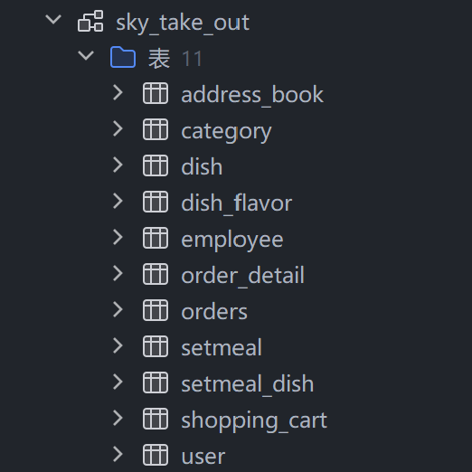


--------------


##### 3.2.3 前后端联调

后端的初始工程中已经实现了登录功能，直接进行前后端联调测试即可

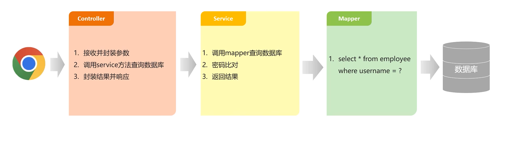

注：可以通过断点调试跟踪后端程序的执行过程

###### 前端发送的请求，是如何请求到后端服务的？

nginx 反向代理，就是将前端发送的动态请求由 nginx 转发到后端服务器

+ nginx 反向代理的好处：
  + 提高访问速度
  + 进行负载均衡（就是把大量的请求按照我们指定的方式均衡的分配给集群中的每台服务器）
  + 保证后端服务安全

+ nginx 反向代理的配置方式：

  + nginx.conf

  ```conf
  server{
  	listen 80;
  	server_name localhost;
  	
  	location /api/{
  		proxy_pass http://localhost:8080/admin/; # 反向代理
  	}
  }
  ```


+ nginx 负载均衡的配置方式：

  ```conf
  upstream webservers{
  	server 192.168.100.128:8080;
  	server 192.168.100.129:8080;
  }
  
  server{
  	listen 80;
  	server_name localhost;
  	
  	location /api/{
  		proxy_pass http://webservers/admin/; # 负载均衡
  	}
  }
  ```

+ nginx 负载均衡策略：

| 名称       | 说明                                                       |
| ---------- | ---------------------------------------------------------- |
| 轮询       | 默认方式                                                   |
| weight     | 权重方式，默认为1，权重越高，被分配的客户端请求就越多      |
| ip_hash    | 依据 ip 分配方式，这样每个访客可以固定访问一个后端服务     |
| least_conn | 依据最少连接方式，把请求优先分配给连接数少的后端服务       |
| url_hash   | 依据 url 分配方式，这样相同的 url 会被分配到同一个后端服务 |
| fair       | 依据响应时间方式，响应时间短的服务将会被优先分配           |


-------------------


#### 3.3 完善登录功能

问题：员工表中的密码是明文存储，安全性太低

思路：

1. 将密码加密后存储，提高安全性
2. 使用 MD5 加密方式对明文密码加密

+ **MD5 信息摘要算法**（英文：MD5 Message-Digest Algorithm），一种被广泛使用的**密码散列函数**，可以产出一个128位（16字节）的散列值（hash value），用于确保信息传输完整一致。MD5 由美国密码学家**罗纳德·李维斯特**（Ronaid Linn Rivest）设计，于1992年公开，用以取代 **MD4** 算法。这套算法的程序在 RFC 1321 标准中被加以规范。1996年后该算法被证实存在弱点，可以加以破解，对于需要高度安全性的数据，专家一般建议改用其他算法，如 SHA-2.2004年，证实 MD5 算法无法防止碰撞（collision），因此不适用于安全性认证，如 **SSL** 公开密钥认证或是**数字签名**等用途

##### 3.3.1 完善登录功能

1. 修改数据库中明文密码，改为 MD5 加密后的铭文
2. 修改 Java 代码，前端提交的密码进行 MD5 加密后再跟数据库中密码比对

```java
// 对前端传过来的明文密码进行md5加密处理
password = DigestUtils.md5DigestAsHex(password.getBytes());
if (!password.equals(employee.getPassword())) {
    //密码错误
    throw new PasswordErrorException(MessageConstant.PASSWORD_ERROR);
}
```


--------------------


### 4. 导入接口文档

#### 4.1 前后端分离开发流程

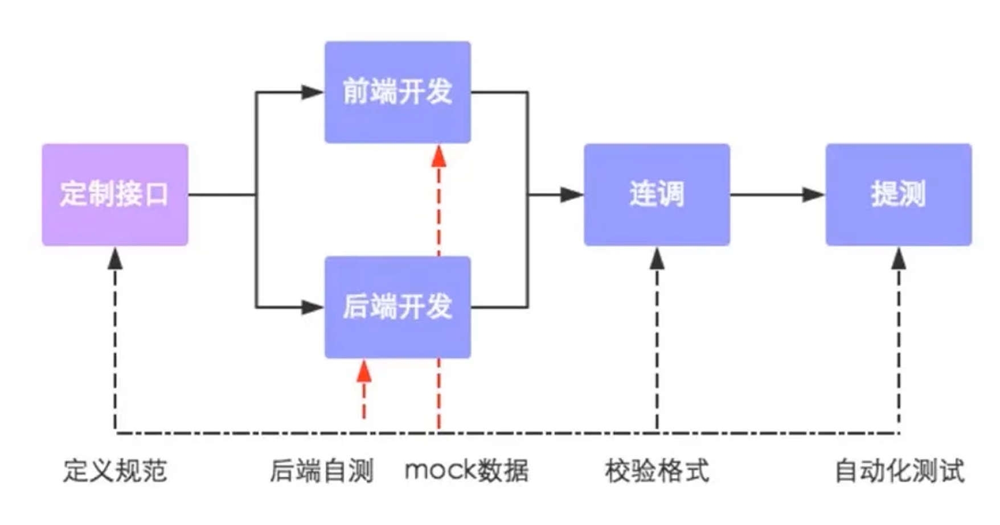

可用 apifox 导入 yapi 文件

官网：[Apifox - API 文档、调试、Mock、测试一体化协作平台。拥有接口文档管理、接口调试、Mock、自动化测试等功能，接口开发、测试、联调效率，提升 10 倍。最好用的接口文档管理工具，接口自动化测试工具。](https://apifox.com/?utm_source=bing&utm_medium=sem&utm_campaign=高转化词-产品&utm_content=Swagger&utm_term=swagger&msclkid=0a40133415d41e77a4d67be0c9313c05)


#### 4.2 操作步骤

测试接口可以使用 postman


-----------------


### 5. Swagger

#### 5.1 介绍

使用 Swagger 你只需要按照它的规范去定义接口及接口相关的信息，就可以做到生成接口文档，以及**在线接口调试**页面

官网：[Swagger 文档 | Swagger Docs - Swagger 中文](https://swagger.org.cn/docs/)

Knife4j 是为 Java MVC 框架集成 Swagger 生成 Api 文档的增强解决方案

```xml
<dependency>
	<groupId>com.github.xiaoymin</groupId>
    <artifactId>knife4j-spring-boot-starter></artifactId>
    <version>3.0.2</version>
</dependency>
```


#### 5.2 使用方式

1. 导入 knife4j 的 maven 坐标
2. 在配置类中加入 knife4j 相关配置
3. 设置静态资源映射，否则接口文档页面无法访问

```java
/**
 * 通过knife4j生成接口文档
 * @return
 */
@Bean
public Docket docket() {
    ApiInfo apiInfo = new ApiInfoBuilder()
            .title("苍穹外卖项目接口文档")
            .version("2.0")
            .description("苍穹外卖项目接口文档")
            .build();
    Docket docket = new Docket(DocumentationType.SWAGGER_2)
            .apiInfo(apiInfo)
            .select()
            // 指定生成接口需要扫描的包
            .apis(RequestHandlerSelectors.basePackage("com.sky.controller"))
            .paths(PathSelectors.any())
            .build();
    return docket;
}
```

```java
/**
 * 设置静态资源映射
 * @param registry
 */
protected void addResourceHandlers(ResourceHandlerRegistry registry) {
    registry.addResourceHandler("/doc.html").addResourceLocations("classpath:/META-INF/resources/");
    registry.addResourceHandler("/webjars/**").addResourceLocations("classpath:/META-INF/resources/webjars/");
}
```

注意：方法名称不能更改，这是重写了 WebMvcConfigurationSupport 中的 addResourceHandlers 方法

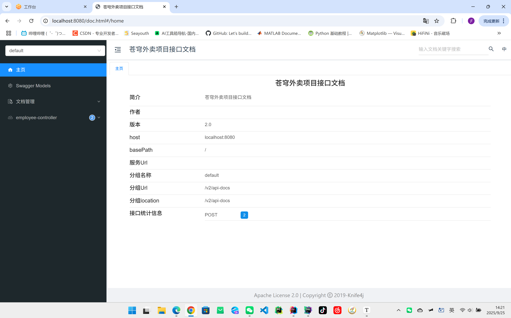


#### 5.3 常用注解

通过注解可以控制生成的接口文档，使接口文档拥有更好的可读性，常用注解如下：

| 注解              | 说明                                                     |
| ----------------- | -------------------------------------------------------- |
| @Api              | 用在类上，例如 Controller，表示对类的说明                |
| @ApiModel         | 用在类上，例如 entity、DTO、VO                           |
| @ApiModelProperty | 用在属性上，描述属性信息                                 |
| @ApiOperation     | 用在方法上，例如 Controller 的方法，说明方法的用途、作用 |


-----------------------


## 二、员工管理、分类管理

### 1. 新增员工

#### 1.1 需求分析和设计

+ 账号必须是唯一的
+ 手机号为合法的11位手机号码
+ 身份证为合法的18位身份证号码
+ 密码默认为123456

##### 1.1.1 接口设计

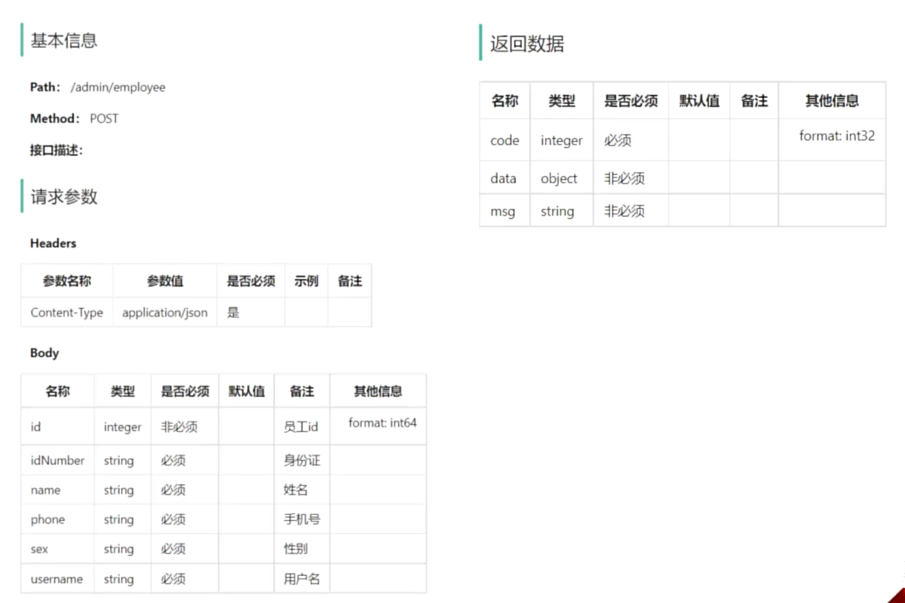

本项目约定：

+ **管理端**发出的请求，统一使用 **/admin** 作为前缀
+ **用户端**发送的请求，统一使用 **/user** 作为前缀

数据库表设计（employee 表【员工表】）：

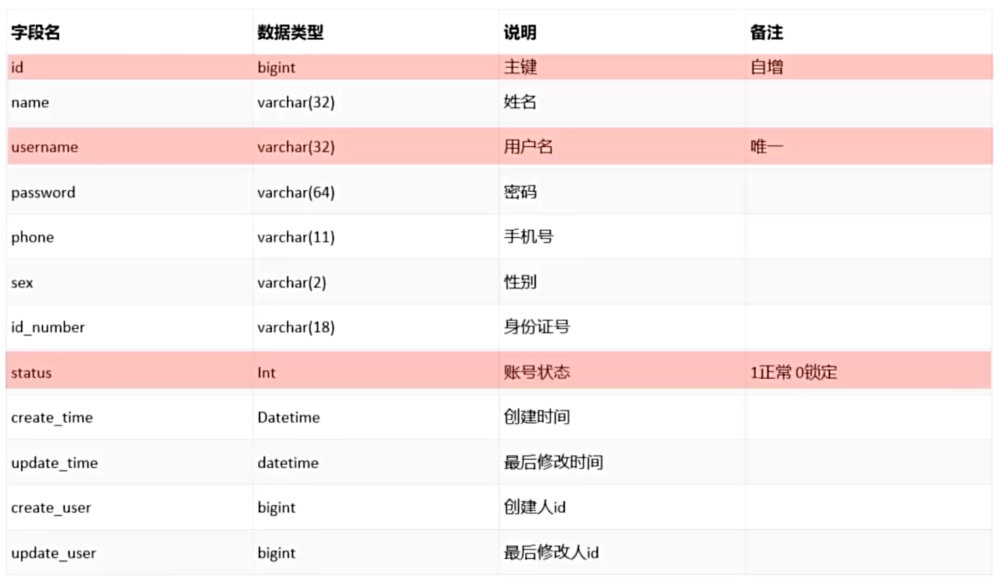


#### 1.2 代码开发

根据新增员工接口设计对应的 DTO

注意：当前端提交的数据和实体类中对应的属性差别比较大时，建议使用 DTO 来封装数据

+ EmployeeController.java

```java
/**
 * 新增员工
 * @param employeeDTO
 * @return
 */
@PostMapping
@ApiOperation("新增员工")
public Result save(@RequestBody EmployeeDTO employeeDTO) {
    log.info("新增员工：{}", employeeDTO);
    employeeService.save(employeeDTO);
    return Result.success();
}
```

+ EmployeeService.java

```java
/**
 * 新增员工
 * @param employeeDTO
 */
void save(EmployeeDTO employeeDTO);
```

+ EmployeeServiceImpl.java

```java
/**
 * 新增员工
 *
 * @param employeeDTO
 */
@Override
public void save(EmployeeDTO employeeDTO) {
    Employee employee = new Employee();

    // 对象属性拷贝
    BeanUtils.copyProperties(employeeDTO, employee);

    // 设置账号的状态，默认正常状态 1表示正常 0表示锁定（通过常量类来引用）
    employee.setStatus(StatusConstant.ENABLE);

    // 设置密码，默认密码123456（通过常量类来引用）
    employee.setPassword(DigestUtils.md5DigestAsHex(PasswordConstant.DEFAULT_PASSWORD.getBytes()));

    // 设置当前记录的创建时间和修改时间
    employee.setCreateTime(LocalDateTime.now());
    employee.setUpdateTime(LocalDateTime.now());

    // 设置当前创建人id和修改人id
    // TODO 后期需要改为当前登录用户的id
    employee.setCreateUser(10L);
    employee.setUpdateUser(10L);

    employeeMapper.insert(employee);
}
```

+ EmployeeMapper.java

```java
/**
 * 插入员工数据
 *
 * @param employee
 */
@Insert("insert into employee(name, username, password, phone, sex, id_number, create_time, update_time, create_user, update_user, status) " +
        "values" +
        "(#{name}, #{username}, #{password}, #{phone}, #{sex}, #{idNumber}, #{createTime}, #{updateTime}, #{createUser}, #{updateUser}, #{status})")
void insert(Employee employee);
```


#### 1.3 功能测试

功能测试方式：

+ 通过接口文档测试
+ 通过前后端联调测试

注意：由于开发阶段前端和后端时并行开发的，后端完成某个功能后，此时前端对应的功能可能还没有开发完成，导致无法进行前后端联调测试。所以在开发阶段，后端测试主要以接口文档测试为主

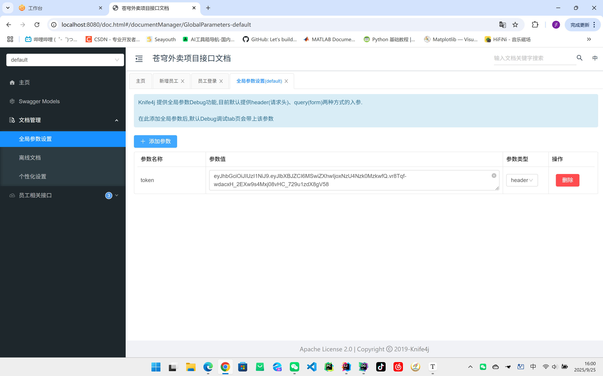


#### 1.4 代码完善

程序存在的问题：

+ 录入的用户名已存在，抛出异常后没有处理
+ 新增员工时，创建人 id 和修改人 id 设置为了固定值


##### 1.4.1 异常处理

+ GlobalExceptionHandler.java

```java
/**
 * 处理SQL异常
 *
 * @param ex
 * @return
 */
@ExceptionHandler
public Result exceptionHandler(SQLIntegrityConstraintViolationException ex) {
    // Duplicate entry 'zhangsan' for key 'employee.idx_username'
    String message = ex.getMessage();
    if (message.contains("Duplicate entry")) {
        String[] split = message.split(" ");
        String username = split[2];
        String msg = username + MessageConstant.ALREADY_EXISTS;
        return Result.error(msg);
    } else {
        return Result.error(MessageConstant.UNKNOWN_ERROR);
    }
}
```

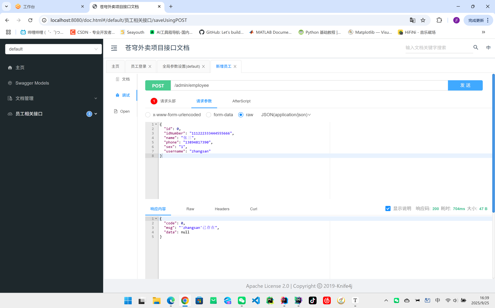


##### 1.4.2 设置为固定值

针对第二个问题，需要通过某种方式动态获取当前登录员工的 id：


员工登录成功后会生成 JWT 令牌并响应给前端：

```java
//登录成功后，生成jwt令牌
Map<String, Object> claims = new HashMap<>();
claims.put(JwtClaimsConstant.EMP_ID, employee.getId());
String token = JwtUtil.createJWT(
        jwtProperties.getAdminSecretKey(),
        jwtProperties.getAdminTtl(),
        claims);
```

后续请求中，前端会携带 JWT 令牌，通过 JWT 令牌可以解析出当前登录员工 id：

```java
//2、校验令牌
try {
    log.info("jwt校验:{}", token);
    Claims claims = JwtUtil.parseJWT(jwtProperties.getAdminSecretKey(), token);
    Long empId = Long.valueOf(claims.get(JwtClaimsConstant.EMP_ID).toString());
    log.info("当前员工id：", empId);
    //3、通过，放行
    return true;
} catch (Exception ex) {
    //4、不通过，响应401状态码
    response.setStatus(401);
    return false;
}
```

**那么，解析出登录员工 id 后，如何传递给 Service 的 save 方法？**

###### ThreadLocal

**ThreadLocal** 并不是一个 Thread，而是 Thread 的局部变量

ThreadLocal 为每个线程提供单独一份存储空间，具有线程隔离的效果，只有在线程内才能获取到对应的值，线程外则不能访问

ThreadLocal 常用方法：

+ `public void set(T value)`   设置当前线程的线程局部变量的值
+ `public T get()`   返回当前线程对应的线程局部变量的值
+ `public void remove()`   移除当前线程的线程局部变量

工具类

+ BaseContext.java

```java
package com.sky.context;

public class BaseContext {

    public static ThreadLocal<Long> threadLocal = new ThreadLocal<>();

    public static void setCurrentId(Long id) {
        threadLocal.set(id);
    }

    public static Long getCurrentId() {
        return threadLocal.get();
    }

    public static void removeCurrentId() {
        threadLocal.remove();
    }

}
```

+ JwtTokenAdminInterceptor.java

```java
public boolean preHandle(HttpServletRequest request, HttpServletResponse response, Object handler) throws Exception {
    //判断当前拦截到的是Controller的方法还是其他资源
    if (!(handler instanceof HandlerMethod)) {
        //当前拦截到的不是动态方法，直接放行
        return true;
    }

    //1、从请求头中获取令牌
    String token = request.getHeader(jwtProperties.getAdminTokenName());

    //2、校验令牌
    try {
        log.info("jwt校验:{}", token);
        Claims claims = JwtUtil.parseJWT(jwtProperties.getAdminSecretKey(), token);
        Long empId = Long.valueOf(claims.get(JwtClaimsConstant.EMP_ID).toString());
        log.info("当前员工id：", empId);
        BaseContext.setCurrentId(empId);
        //3、通过，放行
        return true;
    } catch (Exception ex) {
        //4、不通过，响应401状态码
        response.setStatus(401);
        return false;
    }
}
```

+ EmployeeServiceImpl.java

```java
public void save(EmployeeDTO employeeDTO) {
    Employee employee = new Employee();

    // 对象属性拷贝
    BeanUtils.copyProperties(employeeDTO, employee);

    // 设置账号的状态，默认正常状态 1表示正常 0表示锁定（通过常量类来引用）
    employee.setStatus(StatusConstant.ENABLE);

    // 设置密码，默认密码123456（通过常量类来引用）
    employee.setPassword(DigestUtils.md5DigestAsHex(PasswordConstant.DEFAULT_PASSWORD.getBytes()));

    // 设置当前记录的创建时间和修改时间
    employee.setCreateTime(LocalDateTime.now());
    employee.setUpdateTime(LocalDateTime.now());

    // 设置当前创建人id和修改人id
    // TODO 后期需要改为当前登录用户的id
    employee.setCreateUser(BaseContext.getCurrentId());
    employee.setUpdateUser(BaseContext.getCurrentId());

    employeeMapper.insert(employee);
}
```


--------------------------------


### 2. 员工分页查询

#### 2.1 需求分析和设计

业务规则：

+ 根据页码展示员工信息
+ 每页展示10条数据
+ 分页查询时可以根据需要，输入员工姓名进行查询

##### 2.1.1 接口设计

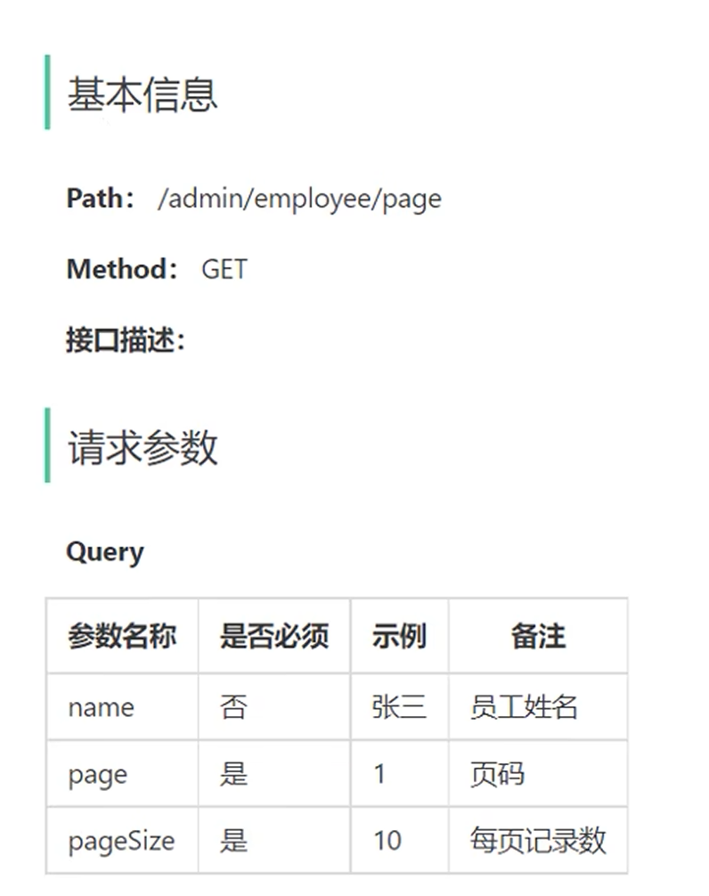

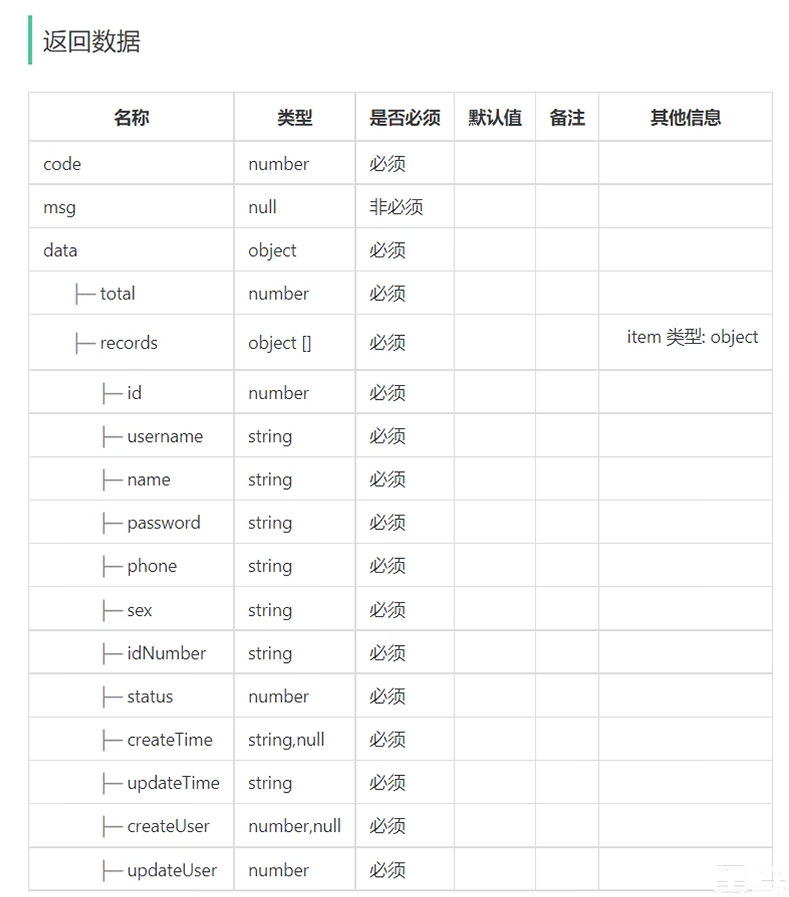


#### 2.2 代码开发

根据分页查询接口设计对应的 DTO

```java
@Data
public class EmployeePageQueryDTO implements Serializable {

    //员工姓名
    private String name;

    //页码
    private int page;

    //每页显示记录数
    private int pageSize;

}
```

后面所有的分页查询，统一都封装成 PageResult 对象

```java
/**
 * 封装分页查询结果
 */
@Data
@AllArgsConstructor
@NoArgsConstructor
public class PageResult implements Serializable {

    private long total; //总记录数

    private List records; //当前页数据集合

}
```

员工信息分页查询后端返回的对象类型为：Result<PageResult>

+ EmployeeController.java

```java
/**
 * 员工分页查询
 *
 * @param employeePageQueryDTO
 * @return
 */
@GetMapping("/page")
@ApiOperation("员工分页查询")
public Result<PageResult> page(EmployeePageQueryDTO employeePageQueryDTO) {
    log.info("员工分页查询，参数为：{}", employeePageQueryDTO);
    PageResult pageResult = employeeService.pageQuery(employeePageQueryDTO);
    return Result.success(pageResult);
}
```

+ EmployeeServiceImpl.java

```java
/**
 * 分页查询
 *
 * @param employeePageQueryDTO
 * @return
 */
@Override
public PageResult pageQuery(EmployeePageQueryDTO employeePageQueryDTO) {
    // 开始分页查询（pagehelper底层是基于mybatis得拦截器来实现，就是把我们后边的一条sql进行一个动态的拼接，动态的把limit关键字拼进去）
    // startPage将page（包含页码和尺寸）存储到存储空间里面去了（ThreadLocal()）
    PageHelper.startPage(employeePageQueryDTO.getPage(), employeePageQueryDTO.getPageSize());

    Page<Employee> page = employeeMapper.pageQuery(employeePageQueryDTO);

    long total = page.getTotal();
    List<Employee> records = page.getResult();

    return new PageResult(total, records);
}
```

+ EmployeeMapper.xml

```xml
<?xml version="1.0" encoding="UTF-8" ?>
<!DOCTYPE mapper PUBLIC "-//mybatis.org//DTD Mapper 3.0//EN"
        "http://mybatis.org/dtd/mybatis-3-mapper.dtd" >
<mapper namespace="com.sky.mapper.EmployeeMapper">
    <select id="pageQuery" resultType="com.sky.entity.Employee">
        select * from employee
        <where>
            <if test="name != null and name != ''">
                and name like concat('%', #{name}, '%')
            </if>
        </where>
        order by create_time desc
    </select>
</mapper>
```


#### 2.3 功能测试

可以通过接口文档进行测试，也可以进行前后端联调测试

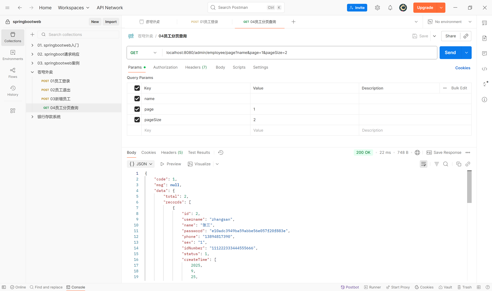

最后操作时间字段展示有问题

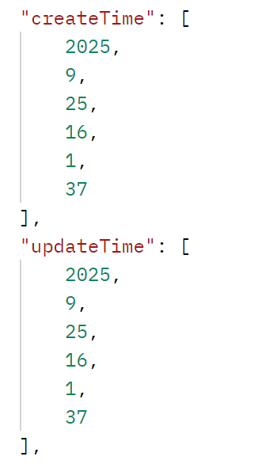


#### 2.4 代码完善

解决方式：

+ 方式一：在属性上加入注解，对日期进行格式化

```java
@JsonFormat(pattern = "yyyy-MM-dd HH:mm:ss")
private LocalDateTime updateTime;
```

+ 方式二：在 WebMvcConfiguration 中扩展 Spring MVC 的消息转换器，统一对日期类型进行格式化处理

对象转换器

```java
package com.sky.json;

import com.fasterxml.jackson.databind.DeserializationFeature;
import com.fasterxml.jackson.databind.ObjectMapper;
import com.fasterxml.jackson.databind.module.SimpleModule;
import com.fasterxml.jackson.datatype.jsr310.deser.LocalDateDeserializer;
import com.fasterxml.jackson.datatype.jsr310.deser.LocalDateTimeDeserializer;
import com.fasterxml.jackson.datatype.jsr310.deser.LocalTimeDeserializer;
import com.fasterxml.jackson.datatype.jsr310.ser.LocalDateSerializer;
import com.fasterxml.jackson.datatype.jsr310.ser.LocalDateTimeSerializer;
import com.fasterxml.jackson.datatype.jsr310.ser.LocalTimeSerializer;

import java.time.LocalDate;
import java.time.LocalDateTime;
import java.time.LocalTime;
import java.time.format.DateTimeFormatter;

import static com.fasterxml.jackson.databind.DeserializationFeature.FAIL_ON_UNKNOWN_PROPERTIES;

/**
 * 对象映射器:基于jackson将Java对象转为json，或者将json转为Java对象
 * 将JSON解析为Java对象的过程称为 [从JSON反序列化Java对象]
 * 从Java对象生成JSON的过程称为 [序列化Java对象到JSON]
 */
public class JacksonObjectMapper extends ObjectMapper {

    public static final String DEFAULT_DATE_FORMAT = "yyyy-MM-dd";
    //public static final String DEFAULT_DATE_TIME_FORMAT = "yyyy-MM-dd HH:mm:ss";
    public static final String DEFAULT_DATE_TIME_FORMAT = "yyyy-MM-dd HH:mm";
    public static final String DEFAULT_TIME_FORMAT = "HH:mm:ss";

    public JacksonObjectMapper() {
        super();
        //收到未知属性时不报异常
        this.configure(FAIL_ON_UNKNOWN_PROPERTIES, false);

        //反序列化时，属性不存在的兼容处理
        this.getDeserializationConfig().withoutFeatures(DeserializationFeature.FAIL_ON_UNKNOWN_PROPERTIES);

        SimpleModule simpleModule = new SimpleModule()
                .addDeserializer(LocalDateTime.class, new LocalDateTimeDeserializer(DateTimeFormatter.ofPattern(DEFAULT_DATE_TIME_FORMAT)))
                .addDeserializer(LocalDate.class, new LocalDateDeserializer(DateTimeFormatter.ofPattern(DEFAULT_DATE_FORMAT)))
                .addDeserializer(LocalTime.class, new LocalTimeDeserializer(DateTimeFormatter.ofPattern(DEFAULT_TIME_FORMAT)))
                .addSerializer(LocalDateTime.class, new LocalDateTimeSerializer(DateTimeFormatter.ofPattern(DEFAULT_DATE_TIME_FORMAT)))
                .addSerializer(LocalDate.class, new LocalDateSerializer(DateTimeFormatter.ofPattern(DEFAULT_DATE_FORMAT)))
                .addSerializer(LocalTime.class, new LocalTimeSerializer(DateTimeFormatter.ofPattern(DEFAULT_TIME_FORMAT)));

        //注册功能模块 例如，可以添加自定义序列化器和反序列化器
        this.registerModule(simpleModule);
    }
}
```

消息转换器

+ WebMvcConfiguration.java

```java
/**
 * 扩展Spring MVC框架的消息转换器
 *
 * @param converters
 */
@Override
protected void extendMessageConverters(List<HttpMessageConverter<?>> converters) {
    log.info("扩展消息转换器...");
    // 创建一个消息转换器对象
    MappingJackson2HttpMessageConverter converter = new MappingJackson2HttpMessageConverter();
    // 需要为消息转换器设置一个对象转换器，对象转换器可以将Java对象序列化为json数据
    converter.setObjectMapper(new JacksonObjectMapper());
    // 将自己的消息转换器加入容器中【0表示我们自己的消息转换器排在第一位优先使用】
    converters.add(0, converter);
}
```


-----------------------------


### 3. 启用禁用员工账号

#### 3.1 需求分析和设计

业务规则：

+ 可以对状态为 “启用” 的员工账号进行 “禁用” 操作
+ 可以对状态为 “禁用” 的员工账号进行 “启用” 操作
+ 状态为 “禁用” 的员工账号不能登录系统

##### 3.1.1 接口设计

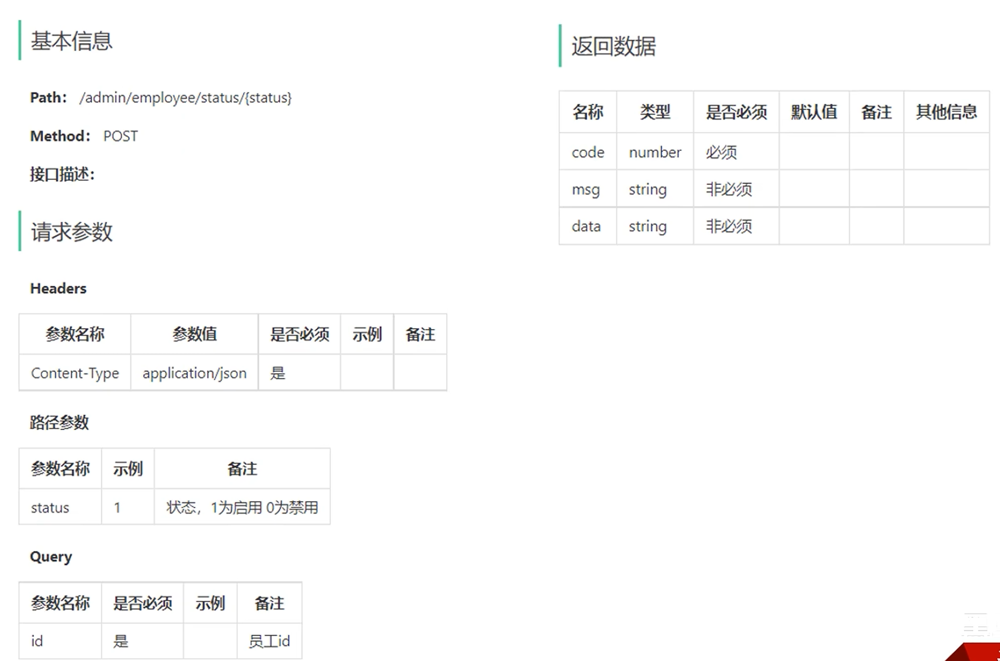


#### 3.2 代码开发

+ EmployeeController.java

```java
/**
 * 启用禁用员工账号
 *
 * @param status
 * @param id
 * @return
 */
@PostMapping("/status/{status}")
@ApiOperation("启用禁用员工账号")
public Result startOrStop(@PathVariable Integer status, Long id) {
    log.info("启用禁用员工账号：{}、{}", status, id);
    employeeService.startOrStop(status, id);
    return Result.success();
}
```

+ EmployeeServiceImpl.java

```java
    /**
     * 启用禁用员工账号
     *
     * @param status
     * @param id
     */
    @Override
    public void startOrStop(Integer status, Long id) {

//        Employee employee = new Employee();
//        employee.setStatus(status);
//        employee.setId(id);

        Employee employee = Employee.builder()
                .status(status)
                .id(id)
                .build();

        employeeMapper.update(employee);
    }
```

+ EmployeeMapper.xml

```xml
<update id="update" parameterType="Employee">
    update employee
    <set>
        <if test="name != null">name = #{name},</if>
        <if test="username != null">username = #{username},</if>
        <if test="password != null">password = #{password},</if>
        <if test="phone != null">phone = #{phone},</if>
        <if test="sex != null">sex = #{sex},</if>
        <if test="idNumber != null">id_Number = #{idNumber},</if>
        <if test="updateTime != null">update_Time = #{updateTime},</if>
        <if test="updateUser != null">update_User = #{updateUser},</if>
        <if test="status != null">status = #{status},</if>
    </set>
    <where>
        id = #{id}
    </where>
</update>
```


#### 3.3 功能测试

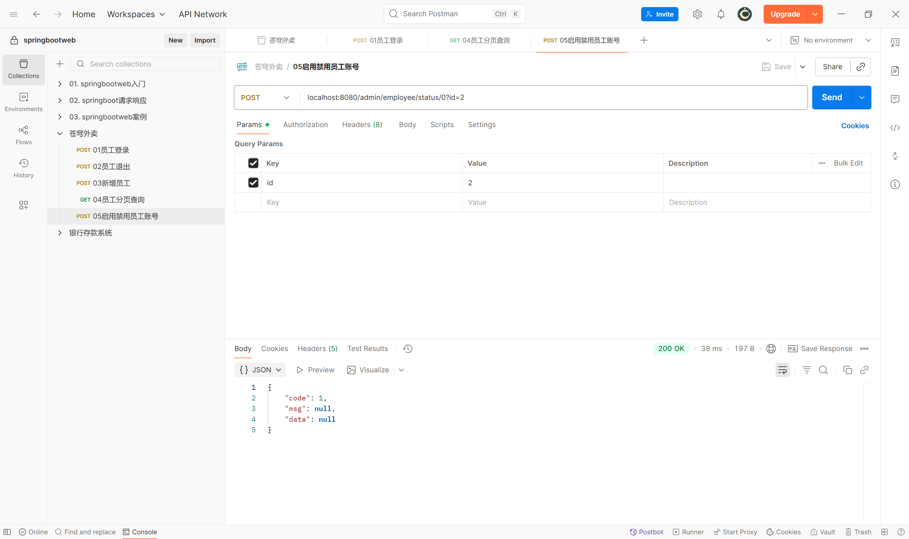


----------------------------------


### 4. 编辑员工

#### 4.1 需求分析和设计

编辑员工功能涉及到两个接口：

+ 根据 id 查询员工信息
+ 编辑员工信息

##### 4.1.1 接口设计

+ 根据 id 查询员工信息

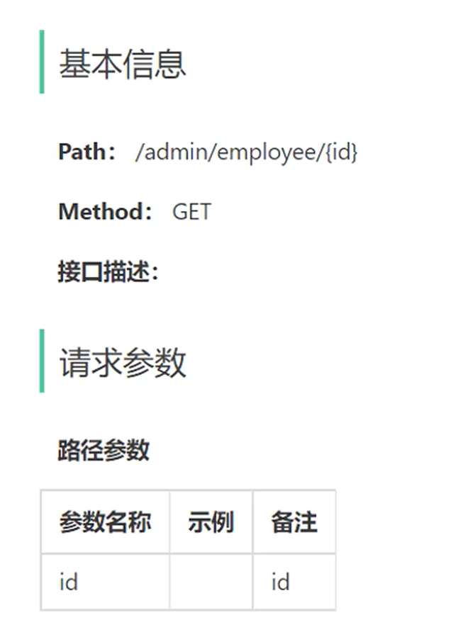

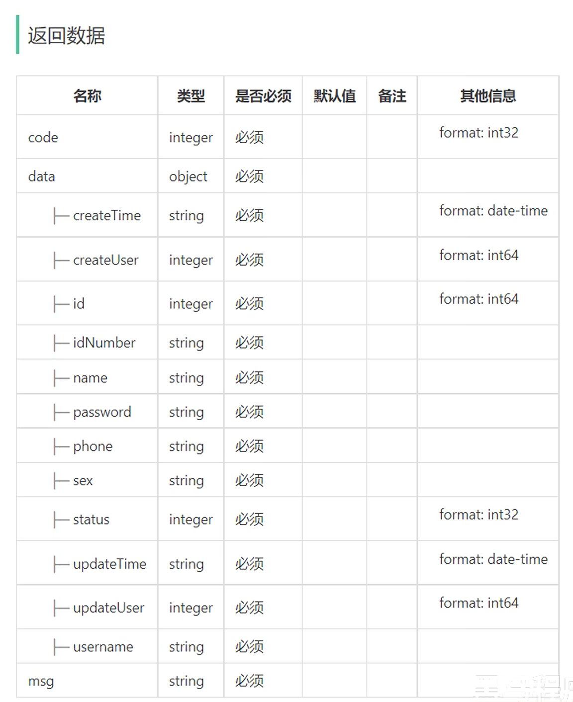

+ 编辑员工信息

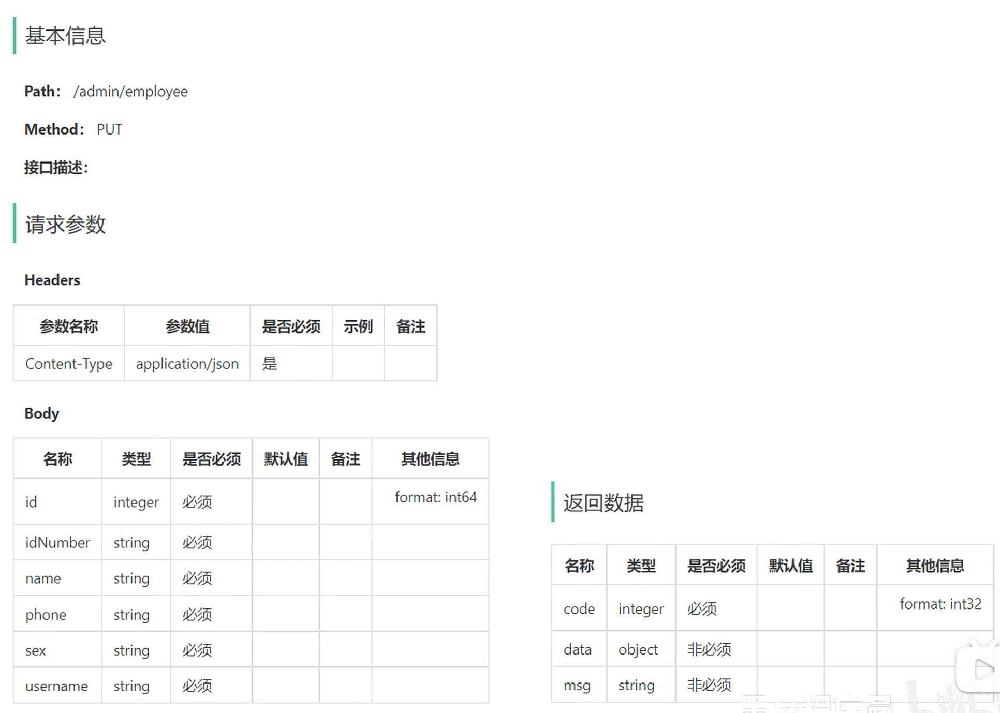


#### 4.2 代码开发

##### 4.2.1 根据 id 查询员工信息

+ EmployeeController.java

```java
/**
 * 根据id查询员工信息
 *
 * @param id
 * @return
 */
@GetMapping("/{id}")
@ApiOperation("根据id查询员工信息")
public Result<Employee> getById(@PathVariable Long id) {
    Employee employee = employeeService.getById(id);
    return Result.success(employee);
}
```

+ EmployeeServiceImpl.java

```java
/**
 * 根据id查询员工
 *
 * @param id
 * @return
 */
@Override
public Employee getById(Long id) {
    Employee employee = employeeMapper.getById(id);
    employee.setPassword("****");
    return employee;
}
```

+ EmployeeMapper.java

```java
/**
 * 根据id查询员工
 *
 * @param id
 * @return
 */
@Select("select * from employee where id = #{id}")
Employee getById(Long id);
```


##### 4.2.2 编辑员工信息

+ EmployeeController.java

```java
/**
 * 编辑员工信息
 *
 * @param employeeDTO
 * @return
 */
@PutMapping
@ApiOperation("编辑员工信息")
public Result update(@RequestBody EmployeeDTO employeeDTO) {
    log.info("编辑员工信息：{}", employeeDTO);
    employeeService.update(employeeDTO);
    return Result.success();
}
```

+ EmployeeServiceImpl.java

```java
/**
 * 编辑员工信息
 *
 * @param employeeDTO
 */
@Override
public void update(EmployeeDTO employeeDTO) {
    Employee employee = new Employee();
    BeanUtils.copyProperties(employeeDTO ,employee);

    employee.setUpdateTime(LocalDateTime.now());
    employee.setUpdateUser(BaseContext.getCurrentId());

    employeeMapper.update(employee);
}
```


#### 4.3 功能测试

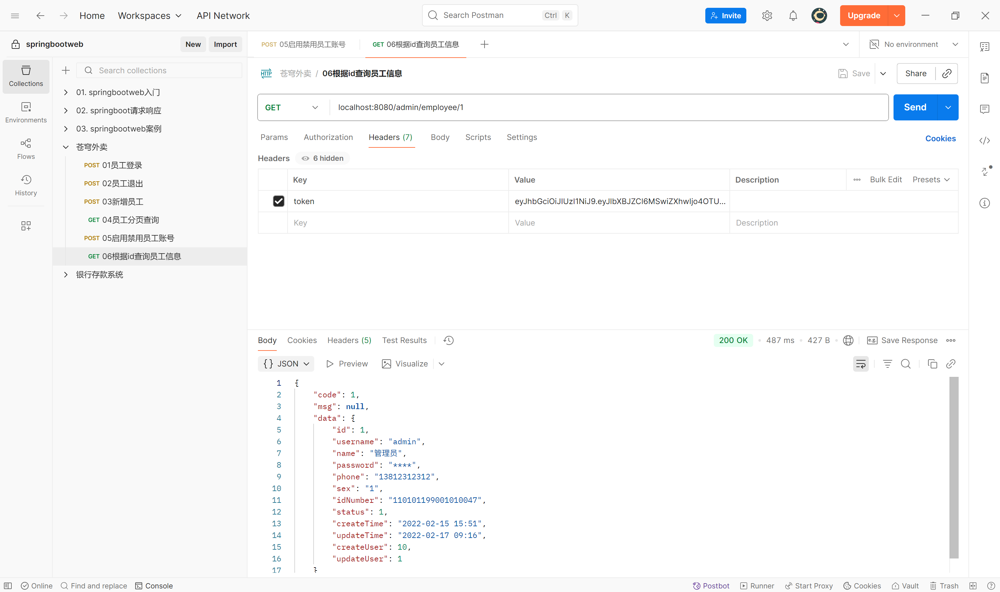

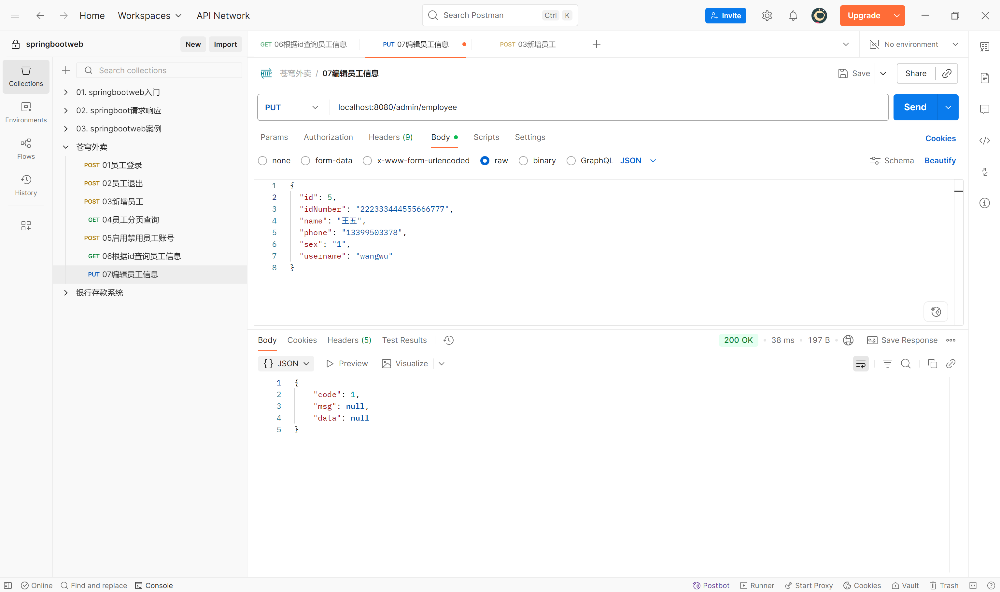


-------------------------------


### 5. 导入分类模块功能代码

#### 5.1 需求分析和设计

业务规则：

+ 分类名称必须是**唯一**的
+ 分类按照类型可以分为**菜品分类**和**套餐分类**
+ 新添加的分类状态默认为 **”禁用“**

接口设计：

+ 新增分类
+ 分类分页查询
+ 根据 id 删除分类
+ 修改分类
+ 启用禁用分类
+ 根据类型查询分类

##### 5.1.1 数据库表设计

category 表

| 字段名      | 数据类型    | 说明          | 备注                |
| ----------- | ----------- | ------------- | ------------------- |
| id          | bigint      | 主键          | 自增                |
| name        | varchar(32) | 分类名称      | 唯一                |
| type        | int         | 分类类型      | 1菜品分类 2套餐分类 |
| sort        | int         | 排序字段      | 用于分类数据的排序  |
| status      | int         | 状态          | 1启用 0禁用         |
| create_time | datetime    | 创建时间      |                     |
| update_time | datetime    | 最后修改时间  |                     |
| create_user | bigint      | 创建人 id     |                     |
| update_user | bigint      | 最后修改人 id |                     |


#### 5.2 代码导入

很简单的，可以参照前面自己写


#### 5.3 功能测试

+ 前后端联调

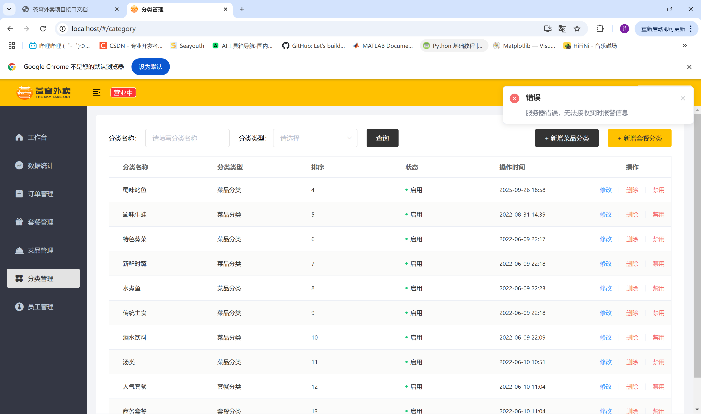


------------------------------


## 三、菜品管理

### 1. 公共字段自动填充

#### 1.1 问题分析

业务表中的公共字段：

| 序号 | 字段名      | 含义      | 数据类型 |
| ---- | ----------- | --------- | -------- |
| 1    | create_time | 创建时间  | datetime |
| 2    | create_user | 创建人 id | bigint   |
| 3    | update_time | 修改时间  | datetime |
| 4    | update_user | 修改人 id | bigint   |


#### 1.2 实现思路

+ 创建时间和创建人对应的操作类型为 insert
+ 修改时间和修改人对应的操作类型为 insert、update

实现

+ 自定义注解 AutoFill，用于标识需要进行公共字段自动填充的方法
+ 自定义切面类 AutoFillAspect，统一拦截加入了 AutoFill 注解的方法，通过反射为公共字段赋值
+ 在 Mapper 的方法上加入 AutoFill 注解

技术点：枚举、注解、AOP、反射


#### 1.3 代码开发

+ AutoFill.java

```java
package com.sky.annotation;

import com.sky.enumeration.OperationType;

import java.lang.annotation.ElementType;
import java.lang.annotation.Retention;
import java.lang.annotation.RetentionPolicy;
import java.lang.annotation.Target;

/**
 * 自定义注解，用于标识某个方法需要进行公共字段自动填充处理
 */
@Target(ElementType.METHOD)
@Retention(RetentionPolicy.RUNTIME)
public @interface AutoFill {
    // 数据库操作类型：UPDATE INSERT
    OperationType value();
}
```

+ AutoFillAspect.java

```java
package com.sky.aspect;

import com.sky.annotation.AutoFill;
import com.sky.constant.AutoFillConstant;
import com.sky.context.BaseContext;
import com.sky.enumeration.OperationType;
import lombok.extern.slf4j.Slf4j;
import org.aspectj.lang.JoinPoint;
import org.aspectj.lang.annotation.Aspect;
import org.aspectj.lang.annotation.Before;
import org.aspectj.lang.annotation.Pointcut;
import org.aspectj.lang.reflect.MethodSignature;
import org.springframework.stereotype.Component;

import java.lang.reflect.Method;
import java.time.LocalDateTime;


/**
 * 自定义切面，实现公共字段自动填充处理逻辑
 */
@Aspect // 让它是一个切面
@Component
@Slf4j
public class AutoFillAspect {

    /**
     * 切入点
     */
    @Pointcut("execution(* com.sky.mapper.*.*(..)) && @annotation(com.sky.annotation.AutoFill))")
    // 直接annotation会扫描全部，影响效率，加上execution就会只扫描mp里面带AutoFill注解的方法
    public void autoFillPointCut() {
    }

    /**
     * 前置通知，在通知中进行公共字段的赋值
     */
    @Before("autoFillPointCut()")
    public void autoFill(JoinPoint joinPoint) {
        log.info("开始进行公共字段自动填充...");

        // 获取到当前被拦截的方法上的数据库操作类型
        MethodSignature signature = (MethodSignature) joinPoint.getSignature(); // 方法签名对象
        AutoFill autoFill = signature.getMethod().getAnnotation(AutoFill.class); // 获得方法上的注解对象
        OperationType operationType = autoFill.value(); // 获得数据库操作类型

        // 获取到当前被拦截的方法的参数 -- 实体对象
        Object[] args = joinPoint.getArgs(); // 获得所有的参数
        if (args == null || args.length == 0) {
            return;
        }

        Object entity = args[0]; // 获取指定实体对象

        // 准备赋值的数据
        LocalDateTime now = LocalDateTime.now();
        Long currentId = BaseContext.getCurrentId();

        // 根据当前不同的操作类型，为对应的属性通过反射来赋值
        if (operationType == OperationType.INSERT) {
            // 为4个公共字段赋值
            try {
                Method setCreateTime = entity.getClass().getDeclaredMethod(AutoFillConstant.SET_CREATE_TIME, LocalDateTime.class);
                Method setCreateUser = entity.getClass().getDeclaredMethod(AutoFillConstant.SET_CREATE_USER, Long.class);
                Method setUpdateTime = entity.getClass().getDeclaredMethod(AutoFillConstant.SET_UPDATE_TIME, LocalDateTime.class);
                Method setUpdateUser = entity.getClass().getDeclaredMethod(AutoFillConstant.SET_UPDATE_USER, Long.class);

                // 通过反射为对象属性赋值
                setCreateTime.invoke(entity, now);
                setCreateUser.invoke(entity, currentId);
                setUpdateTime.invoke(entity, now);
                setUpdateUser.invoke(entity, currentId);
            } catch (Exception e) {
                e.printStackTrace();
            }

        } else if (operationType == OperationType.UPDATE) {
            // 为2个公共字段赋值
            try {
                Method setUpdateTime = entity.getClass().getDeclaredMethod(AutoFillConstant.SET_UPDATE_TIME, LocalDateTime.class);
                Method setUpdateUser = entity.getClass().getDeclaredMethod(AutoFillConstant.SET_UPDATE_USER, Long.class);

                // 通过反射为对象属性赋值
                setUpdateTime.invoke(entity, now);
                setUpdateUser.invoke(entity, currentId);
            } catch (Exception e) {
                e.printStackTrace();
            }
        }
    }

}
```


#### 1.4 功能测试

直接前后端联调即可


-----------------------


### 2. 新增菜品

#### 2.1 需求分析和设计

业务规则：

+ 菜品名称必须是唯一的
+ 菜品必须属于某个分类下，不能单独存在
+ 新增菜品时可以根据情况选择菜品的口味
+ 每个菜品必须对应一张图片

接口设计

+ 根据类型查询分类（已完成）
+ 文件上传
+ 新增菜品

##### 2.1.1 根据类型查询分类

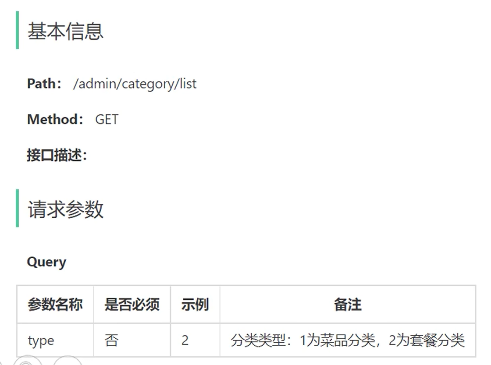


##### 2.1.2 文件上传

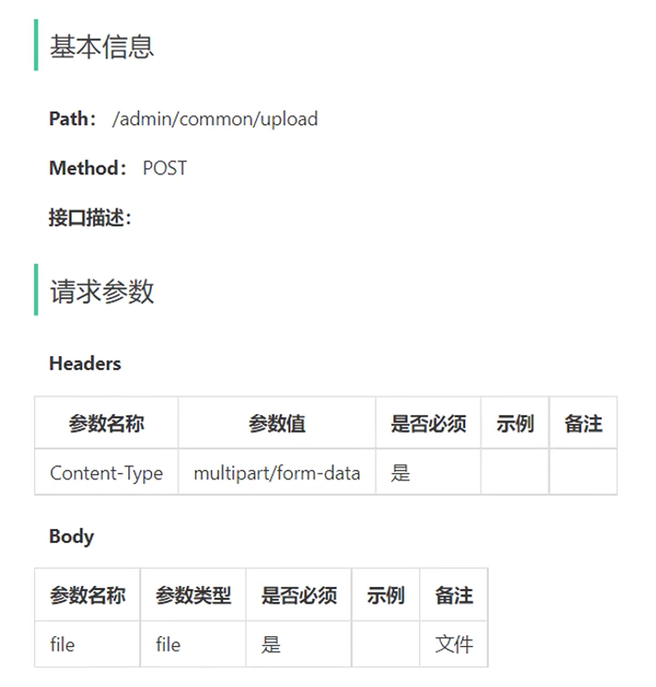

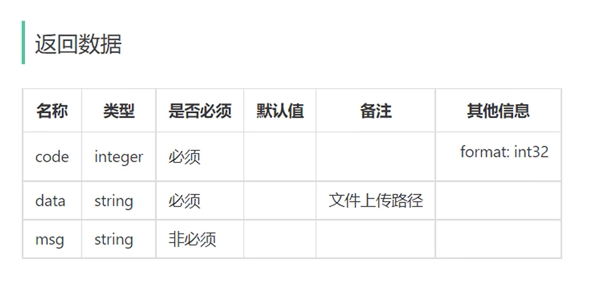

##### 2.1.3 新增菜品

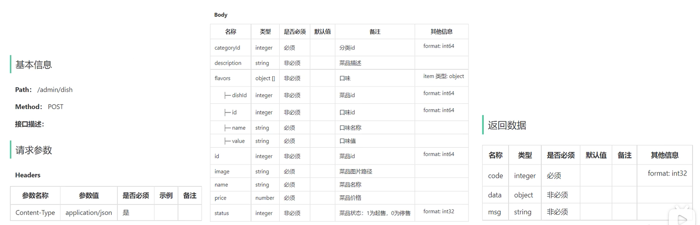

##### 2.1.4 数据库设计（dish 菜品表和 dish_flavor 口味表）

| 字段名      | 数据类型       | 说明          | 备注        |
| ----------- | -------------- | ------------- | ----------- |
| id          | bigint         | 主键          | 自增        |
| namee       | varchar(32)    | 菜品名称      | 唯一        |
| category_id | bigint         | 分类 id       | 逻辑外键    |
| price       | decimal(10, 2) | 菜品价格      |             |
| image       | varchar(255)   | 图片路径      |             |
| description | varchar(255)   | 菜品描述      |             |
| status      | int            | 售卖状态      | 1起售 0停售 |
| create_time | datetime       | 创建时间      |             |
| update_time | datetime       | 最后修改时间  |             |
| create_user | bigint         | 创建人 id     |             |
| update_user | bigint         | 最后修改人 id |             |

| 字段名  | 数据类型     | 说明     | 备注     |
| ------- | ------------ | -------- | -------- |
| id      | bigint       | 主键     | 自增     |
| dish_id | bigint       | 菜品 id  | 逻辑外键 |
| name    | varchar(32)  | 口味名称 |          |
| value   | varchar(255) | 口味值   |          |


#### 2.2 代码开发

##### 2.2.1 文件上传接口


```yml
alioss:
  endpoint: oss-cn-beijing.aliyuncs.com
  access-key-id: 
  access-key-secret: 
  bucket-name: sky-itfeng
```

==注意==：在创建 AccessKey 时使用 RAM 用户，用那个的 ID 和 secret ！！！！！！！！！！！！！！！！！

+ AliOssProperties.java

配置属性类：读取配置文件的配置项，把它封装为 java 对象

```java
package com.sky.properties;

import lombok.Data;
import org.springframework.boot.context.properties.ConfigurationProperties;
import org.springframework.stereotype.Component;

@Component
@ConfigurationProperties(prefix = "sky.alioss")
@Data
public class AliOssProperties {

    private String endpoint;
    private String accessKeyId;
    private String accessKeySecret;
    private String bucketName;

}
```

+ AliOssUtil.java

工具类

```java
package com.sky.utils;

import com.aliyun.oss.ClientException;
import com.aliyun.oss.OSS;
import com.aliyun.oss.OSSClientBuilder;
import com.aliyun.oss.OSSException;
import lombok.AllArgsConstructor;
import lombok.Data;
import lombok.extern.slf4j.Slf4j;
import java.io.ByteArrayInputStream;

@Data
@AllArgsConstructor
@Slf4j
public class AliOssUtil {

    private String endpoint;
    private String accessKeyId;
    private String accessKeySecret;
    private String bucketName;

    /**
     * 文件上传
     *
     * @param bytes
     * @param objectName
     * @return
     */
    public String upload(byte[] bytes, String objectName) {

        // 创建OSSClient实例。
        OSS ossClient = new OSSClientBuilder().build(endpoint, accessKeyId, accessKeySecret);

        try {
            // 创建PutObject请求。
            ossClient.putObject(bucketName, objectName, new ByteArrayInputStream(bytes));
        } catch (OSSException oe) {
            System.out.println("Caught an OSSException, which means your request made it to OSS, "
                    + "but was rejected with an error response for some reason.");
            System.out.println("Error Message:" + oe.getErrorMessage());
            System.out.println("Error Code:" + oe.getErrorCode());
            System.out.println("Request ID:" + oe.getRequestId());
            System.out.println("Host ID:" + oe.getHostId());
        } catch (ClientException ce) {
            System.out.println("Caught an ClientException, which means the client encountered "
                    + "a serious internal problem while trying to communicate with OSS, "
                    + "such as not being able to access the network.");
            System.out.println("Error Message:" + ce.getMessage());
        } finally {
            if (ossClient != null) {
                ossClient.shutdown();
            }
        }

        //文件访问路径规则 https://BucketName.Endpoint/ObjectName
        StringBuilder stringBuilder = new StringBuilder("https://");
        stringBuilder
                .append(bucketName)
                .append(".")
                .append(endpoint)
                .append("/")
                .append(objectName);

        log.info("文件上传到:{}", stringBuilder.toString());

        return stringBuilder.toString();
    }
}
```

+ CommonController.java

```java
package com.sky.controller.admin;

import com.sky.constant.MessageConstant;
import com.sky.result.Result;
import com.sky.utils.AliOssUtil;
import io.swagger.annotations.Api;
import io.swagger.annotations.ApiOperation;
import lombok.extern.slf4j.Slf4j;
import org.springframework.beans.factory.annotation.Autowired;
import org.springframework.web.bind.annotation.PostMapping;
import org.springframework.web.bind.annotation.RequestMapping;
import org.springframework.web.bind.annotation.RestController;
import org.springframework.web.multipart.MultipartFile;

import java.io.IOException;
import java.util.UUID;

/**
 * 通用接口
 */
@RestController
@RequestMapping("/admin/common")
@Api(tags = "通用接口")
@Slf4j
public class CommonController {

    @Autowired
    private AliOssUtil aliOssUtil;

    /**
     * 文件上传
     *
     * @param file
     * @return
     */
    @PostMapping("/upload")
    @ApiOperation("文件上传")
    public Result<String> upload(MultipartFile file) {
        log.info("文件上传：{}", file);

        try {
            // 原始文件名
            String originalFilename = file.getOriginalFilename();
            // 截取原始文件名的后缀（从点开始截）
            String extension = originalFilename.substring(originalFilename.lastIndexOf("."));
            // 构造新文件名称，防止重名覆盖
            String objectName = UUID.randomUUID().toString() + extension;

            // 文件的请求路径
            String filePath = aliOssUtil.upload(file.getBytes(), objectName);
            return Result.success(filePath);
        } catch (IOException e) {
            log.error("文件上传失败：{}", e);
        }

        return Result.error(MessageConstant.UPLOAD_FAILED);
    }
}
```


#### 2.3 功能测试

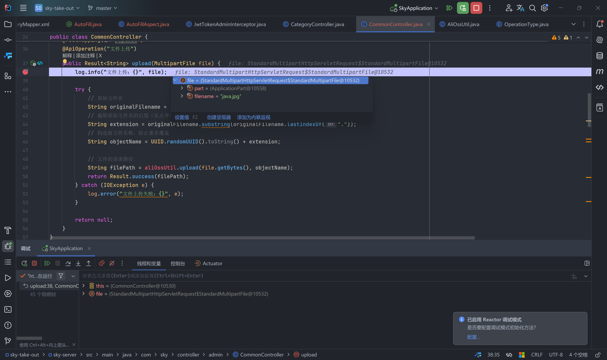

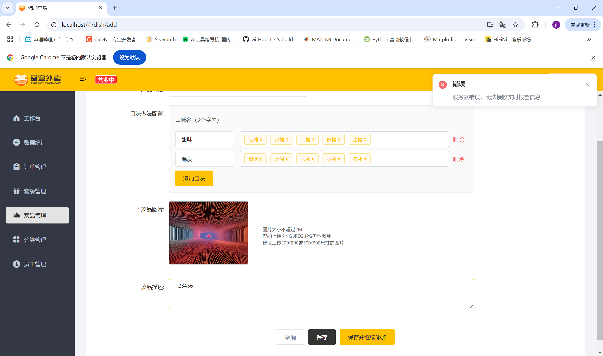


------------------------


### 3. 菜品分页查询

#### 3.1 需求分析和设计

业务规则：

+ 根据页码展示菜品信息
+ 每页展示10条数据
+ 分页查询时可以根据需要输入菜品名称、菜品分类、菜品状态进行查询

##### 3.1.1 接口设计


#### 3.2 代码开发

根据菜品分页查询接口定义设计对应的 DTO

```java
@Data
public class DishPageQueryDTO implements Serializable {

    private int page;

    private int pageSize;

    private String name;

    //分类id
    private Integer categoryId;

    //状态 0表示禁用 1表示启用
    private Integer status;

}
```

根据菜品分页查询接口定义设计对应的 VO：

```java
@Data
@Builder
@NoArgsConstructor
@AllArgsConstructor
public class DishVO implements Serializable {

    private Long id;
    //菜品名称
    private String name;
    //菜品分类id
    private Long categoryId;
    //菜品价格
    private BigDecimal price;
    //图片
    private String image;
    //描述信息
    private String description;
    //0 停售 1 起售
    private Integer status;
    //更新时间
    private LocalDateTime updateTime;
    //分类名称
    private String categoryName;
    //菜品关联的口味
    private List<DishFlavor> flavors = new ArrayList<>();

    //private Integer copies;
}
```

+ DishController.java

```java
/**
 * 菜品分页查询
 *
 * @param dishPageQueryDTO
 * @return
 */
@GetMapping("/page")
@ApiOperation("菜品分页查询")
public Result<PageResult> page(DishPageQueryDTO dishPageQueryDTO) {
    log.info("菜品分页查询：{}", dishPageQueryDTO);
    PageResult pageResult = dishService.pageQuery(dishPageQueryDTO);
    return Result.success(pageResult);
}
```

+ DishServiceImpl.java

```java
/**
 * 菜品分页查询
 *
 * @param dishPageQueryDTO
 * @return
 */
@Override
public PageResult pageQuery(DishPageQueryDTO dishPageQueryDTO) {
    PageHelper.startPage(dishPageQueryDTO.getPage(), dishPageQueryDTO.getPageSize());

    Page<DishVO> page = dishMapper.pageQuery(dishPageQueryDTO);

    return new PageResult(page.getTotal(), page.getResult());
}
```

+ DishMapper.xml

```xml
<select id="pageQuery" resultType="com.sky.vo.DishVO">
    select d.*, c.name as categoryName
    from dish d
    left outer join category c on d.category_id = c.id
    <where>
        <if test="name != null">
            and d.name like concat('%', #{name}, '%')
        </if>
        <if test="categoryId != null">
            and d.category_id like concat('%', #{categoryId}, '%')
        </if>
        <if test="status != null">
            and d.status like concat('%', #{status}, '%')
        </if>
    </where>
    order by d.create_time desc
</select>
```


#### 3.3 功能测试

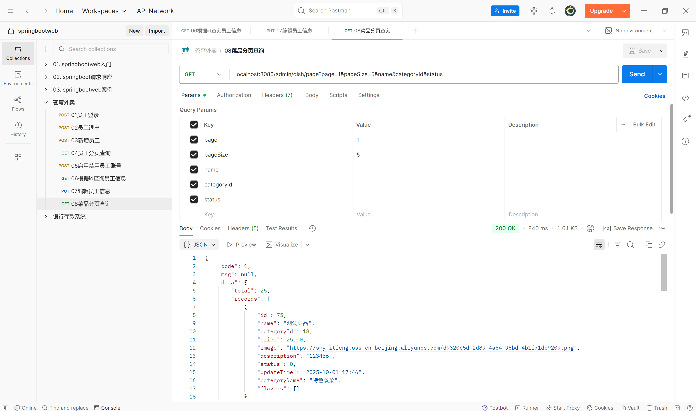


----------------------


### 4. 删除菜品

#### 4.1 需求分析和设计

业务规则：

+ 可以一次删除一个菜品，也可以批量删除菜品
+ 起售中的菜品不能删除
+ 被套餐关联的菜品不能删除
+ 删除菜品后，关联的口味数据也需要删除掉

##### 4.1.1 接口设计

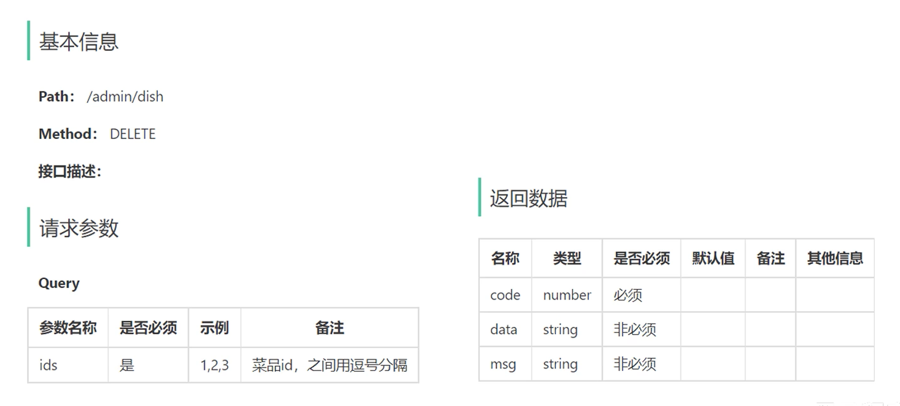

##### 4.1.2 数据库设计


#### 4.2 代码开发

+ DishController.java

```java
/**
 * 菜品批量删除
 *
 * @param ids
 * @return
 */
@DeleteMapping()
@ApiOperation("菜品批量删除")
public Result delete(@RequestParam List<Long> ids) {
    log.info("菜品批量删除：{}", ids);
    dishService.deleteBatch(ids);
    return Result.success();
}
```

+ DishServiceImpl.java

```java
/**
 * 菜品批量删除
 *
 * @param ids
 */
@Transactional
@Override
public void deleteBatch(List<Long> ids) {
    // 判断当前菜品是否能够删除 -- 是否存在起售中的菜品
    for (Long id : ids) {
        Dish dish = dishMapper.getById(id);
        if (dish.getStatus() == StatusConstant.ENABLE) {
            // 当前菜品处于起售中，不能删除
            throw new DeletionNotAllowedException(MessageConstant.DISH_ON_SALE);
        }
    }

    // 判断当前菜品是否能够删除 -- 是否被套餐关联了
    List<Long> setmealIds = setmealDishMapper.getSetmealIdsByDishIds(ids);
    if (setmealIds != null && setmealIds.size() > 0) {
        // 当前菜品被套餐关联了，不能删除
        throw new DeletionNotAllowedException(MessageConstant.DISH_BE_RELATED_BY_SETMEAL);
    }

    // 删除菜品表中的菜品数据
    /*for (Long id : ids) {
        dishMapper.deleteById(id);
        // 删除菜品关联的口味数据
        dishFlavorMapper.deleteByDishId(id);
    }*/

    // 根据菜品id集合批量删除菜品数据
    dishMapper.deleteByIds(ids);

    // 根据菜品id集合批量删除关联的口味数据
    dishFlavorMapper.deleteByDishIds(ids);
}
```

+ DishFlavorMapper.xml

```xml
<delete id="deleteByDishIds">
    delete
    from dish_flavor
    where id in
    <foreach collection="dishIds" separator="," open="(" close=")" item="dishId">
        #{dishId}
    </foreach>
</delete>
```

+ DishMapper.xml

```xml
<delete id="deleteByIds">
    delete
    from dish
    where id in
    <foreach collection="ids" item="id" open="(" close=")" separator=",">
        #{id}
    </foreach>
</delete>
```


#### 4.3 功能测试

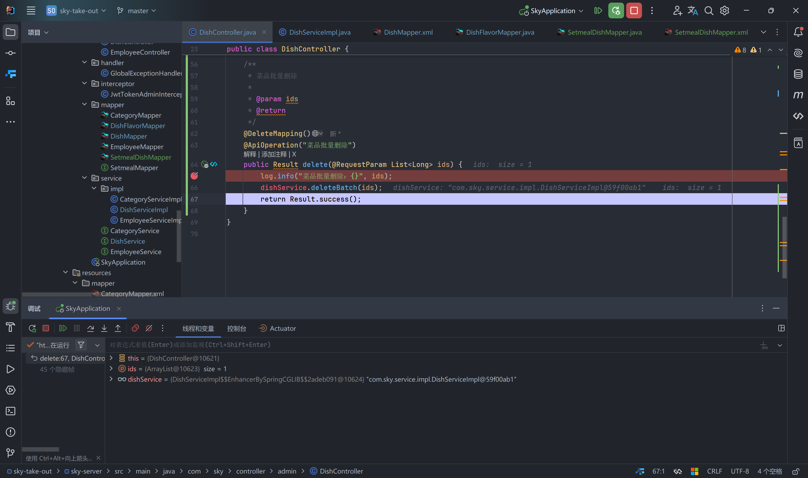

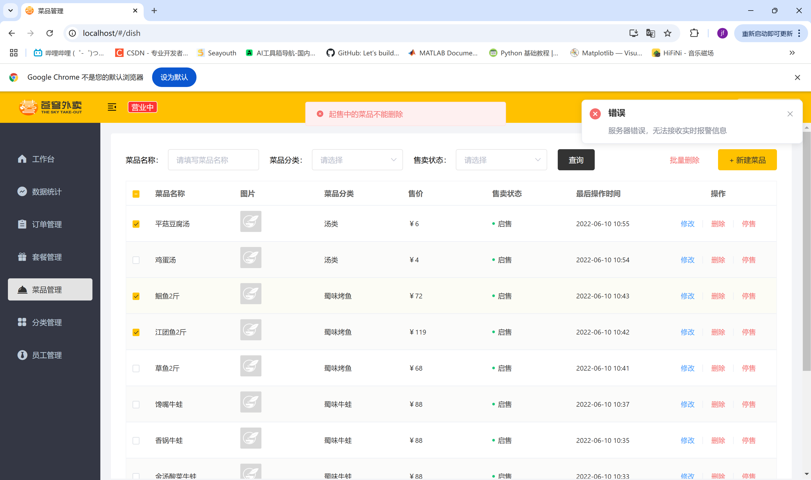


----------------------------


### 5. 修改菜品

#### 5.1 需求分析和设计

接口设计：

+ 根据 id 查询菜品
+ 根据类型查询分类（已实现）
+ 文件上传（已实现）
+ 修改菜品

##### 5.1.1 根据 id 查询菜品


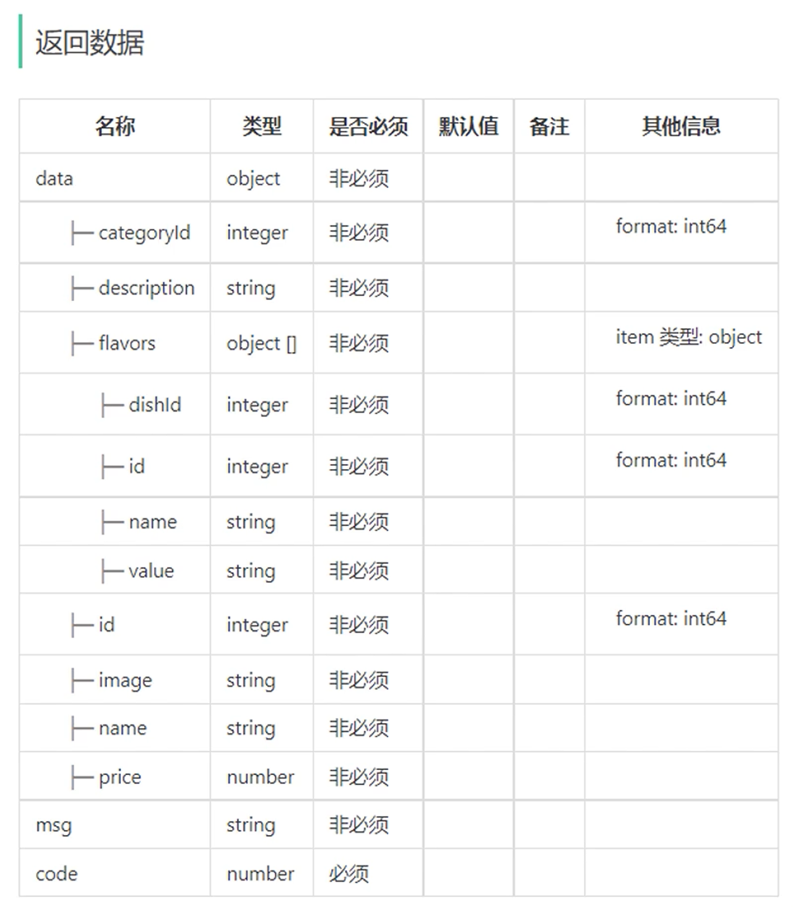

##### 5.1.2 修改菜品

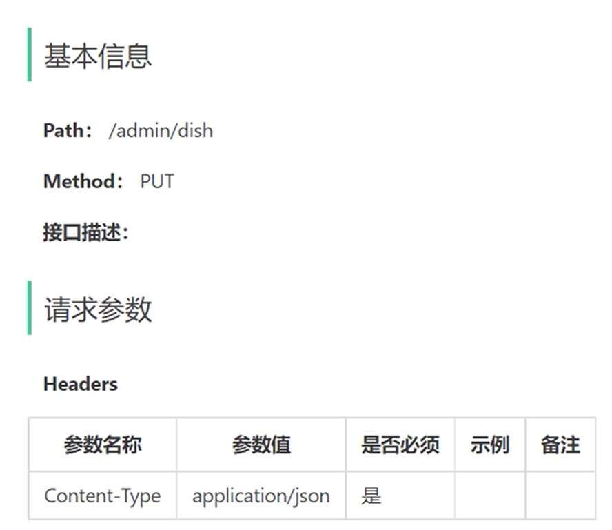

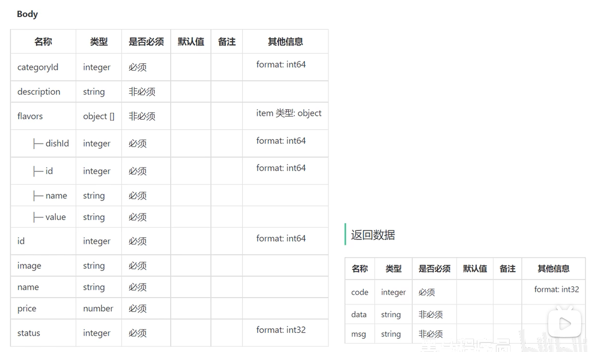


#### 5.2 代码开发

+ DishController.java

```java
/**
 * 修改菜品
 *
 * @param dishDTO
 * @return
 */
@PutMapping
@ApiOperation("修改菜品")
public Result update(@RequestBody DishDTO dishDTO) {
    log.info("修改菜品：{}", dishDTO);
    dishService.updateWithFlavor(dishDTO);
    return Result.success();
}
```

+ DishServiceImpl.java

```java
/**
 * 根据id修改菜品基本信息和对应的口味信息
 *
 * @param dishDTO
 */
@Override
public void updateWithFlavor(DishDTO dishDTO) {
    Dish dish = new Dish();
    BeanUtils.copyProperties(dishDTO, dish);

    // 修改菜品表基本信息
    dishMapper.update(dish);

    // 删除现有的口味数据
    dishFlavorMapper.deleteByDishId(dishDTO.getId());

    // 重新插入口味数据
    List<DishFlavor> flavors = dishDTO.getFlavors();
    if (flavors != null && flavors.size() > 0) {
        flavors.forEach(dishFlavor -> {
            dishFlavor.setDishId(dishDTO.getId());
        });
        // 向口味表插入n条数据
        dishFlavorMapper.insertBatch(flavors);
    }
}
```

+ DishMapper.xml

```xml
<update id="update">
    update dish
    <set>
        <if test="name != null">name = #{name},</if>
        <if test="categoryId != null">category_id = #{category_id},</if>
        <if test="price != null">price = #{price},</if>
        <if test="image != null">image = #{image},</if>
        <if test="description != null">description = #{description},</if>
        <if test="status != null">status = #{status},</if>
        <if test="updateTime != null">updateTime = #{updateTime},</if>
        <if test="updateUser != null">updateUser = #{updateUser},</if>
    </set>
    where id = #{id}
</update>
```


#### 5.3 功能测试

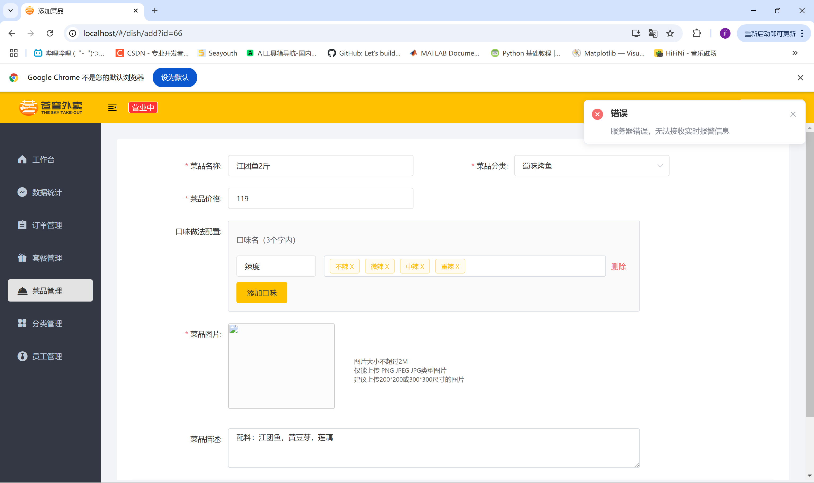


-----------------


## 四、套餐管理

### 1. 新增套餐

#### 1.1 需求分析和设计

业务规则：

- 套餐名称唯一
- 套餐必须属于某个分类
- 套餐必须包含菜品
- 名称、分类、价格、图片为必填项
- 添加菜品窗口需要根据分类类型来展示菜品
- 新增的套餐默认为停售状态

接口设计（共涉及到4个接口）：

- 根据类型查询分类（已完成）
- 根据分类id查询菜品
- 图片上传（已完成）
- 新增套餐


数据库设计：

setmeal 表为套餐表，用于存储套餐的信息。具体表结构如下：

| 字段名      | 数据类型      | 说明         | 备注        |
| ----------- | ------------- | ------------ | ----------- |
| id          | bigint        | 主键         | 自增        |
| name        | varchar(32)   | 套餐名称     | 唯一        |
| category_id | bigint        | 分类id       | 逻辑外键    |
| price       | decimal(10,2) | 套餐价格     |             |
| image       | varchar(255)  | 图片路径     |             |
| description | varchar(255)  | 套餐描述     |             |
| status      | int           | 售卖状态     | 1起售 0停售 |
| create_time | datetime      | 创建时间     |             |
| update_time | datetime      | 最后修改时间 |             |
| create_user | bigint        | 创建人id     |             |
| update_user | bigint        | 最后修改人id |             |

setmeal_dish 表为套餐菜品关系表，用于存储套餐和菜品的关联关系。具体表结构如下：

| 字段名     | 数据类型      | 说明     | 备注     |
| ---------- | ------------- | -------- | -------- |
| id         | bigint        | 主键     | 自增     |
| setmeal_id | bigint        | 套餐id   | 逻辑外键 |
| dish_id    | bigint        | 菜品id   | 逻辑外键 |
| name       | varchar(32)   | 菜品名称 | 冗余字段 |
| price      | decimal(10,2) | 菜品单价 | 冗余字段 |
| copies     | int           | 菜品份数 |          |

#### 1.2 代码实现

+ DishController

~~~java
/**
     * 根据分类id查询菜品
     * @param categoryId
     * @return
*/
@GetMapping("/list")
@ApiOperation("根据分类id查询菜品")
public Result<List<Dish>> list(Long categoryId){
    List<Dish> list = dishService.list(categoryId);
    return Result.success(list);
}
~~~

+ DishService

~~~java
/**
     * 根据分类id查询菜品
     * @param categoryId
     * @return
*/
List<Dish> list(Long categoryId);
~~~

+ DishServiceImpl

~~~java
/**
     * 根据分类id查询菜品
     * @param categoryId
     * @return
*/
public List<Dish> list(Long categoryId) {
    Dish dish = Dish.builder()
        .categoryId(categoryId)
        .status(StatusConstant.ENABLE)
        .build();
    return dishMapper.list(dish);
}
~~~

+ DishMapper

~~~java
/**
     * 动态条件查询菜品
     * @param dish
     * @return
*/
List<Dish> list(Dish dish);
~~~

+ DishMapper.xml

~~~xml
<select id="list" resultType="Dish" parameterType="Dish">
    select * from dish
    <where>
        <if test="name != null">
            and name like concat('%',#{name},'%')
        </if>
        <if test="categoryId != null">
            and category_id = #{categoryId}
        </if>
        <if test="status != null">
            and status = #{status}
        </if>
    </where>
    order by create_time desc
</select>
~~~

+ SetmealController

~~~java
/**
 * 套餐管理
 */
@RestController
@RequestMapping("/admin/setmeal")
@Api(tags = "套餐相关接口")
@Slf4j
public class SetmealController {

    @Autowired
    private SetmealService setmealService;

    /**
     * 新增套餐
     * @param setmealDTO
     * @return
     */
    @PostMapping
    @ApiOperation("新增套餐")
    public Result save(@RequestBody SetmealDTO setmealDTO) {
        setmealService.saveWithDish(setmealDTO);
        return Result.success();
    }
}
~~~

+ SetmealService

~~~java
public interface SetmealService {

    /**
     * 新增套餐，同时需要保存套餐和菜品的关联关系
     * @param setmealDTO
     */
    void saveWithDish(SetmealDTO setmealDTO);
}
~~~

+ SetmealServiceImpl

~~~java
/**
 * 套餐业务实现
 */
@Service
@Slf4j
public class SetmealServiceImpl implements SetmealService {

    @Autowired
    private SetmealMapper setmealMapper;
    @Autowired
    private SetmealDishMapper setmealDishMapper;
    @Autowired
    private DishMapper dishMapper;

    /**
     * 新增套餐，同时需要保存套餐和菜品的关联关系
     * @param setmealDTO
     */
    @Transactional
    public void saveWithDish(SetmealDTO setmealDTO) {
        Setmeal setmeal = new Setmeal();
        BeanUtils.copyProperties(setmealDTO, setmeal);

        //向套餐表插入数据
        setmealMapper.insert(setmeal);

        //获取生成的套餐id
        Long setmealId = setmeal.getId();

        List<SetmealDish> setmealDishes = setmealDTO.getSetmealDishes();
        setmealDishes.forEach(setmealDish -> {
            setmealDish.setSetmealId(setmealId);
        });

        //保存套餐和菜品的关联关系
        setmealDishMapper.insertBatch(setmealDishes);
    }
}
~~~

+ SetmealMapper

~~~java
/**
     * 新增套餐
     * @param setmeal
*/
@AutoFill(OperationType.INSERT)
void insert(Setmeal setmeal);
~~~

+ SetmealMapper.xml

~~~xml
<insert id="insert" parameterType="Setmeal" useGeneratedKeys="true" keyProperty="id">
    insert into setmeal
    (category_id, name, price, status, description, image, create_time, update_time, create_user, update_user)
    values (#{categoryId}, #{name}, #{price}, #{status}, #{description}, #{image}, #{createTime}, #{updateTime},
    #{createUser}, #{updateUser})
</insert>
~~~

+ SetmealDishMapper

~~~java
/**
     * 批量保存套餐和菜品的关联关系
     * @param setmealDishes
*/
void insertBatch(List<SetmealDish> setmealDishes);
~~~

+ SetmealDishMapper.xml

~~~xml
<insert id="insertBatch" parameterType="list">
    insert into setmeal_dish
    (setmeal_id,dish_id,name,price,copies)
    values
    <foreach collection="setmealDishes" item="sd" separator=",">
        (#{sd.setmealId},#{sd.dishId},#{sd.name},#{sd.price},#{sd.copies})
    </foreach>
</insert>
~~~

#### 1.3 功能测试

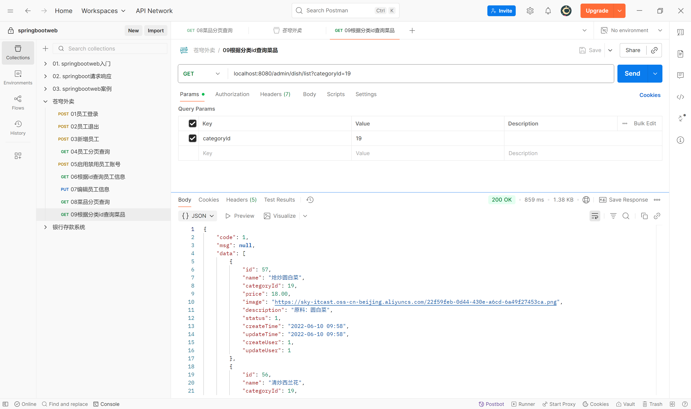

新增套餐直接前后端联调


------------------------------


### 2. 套餐分页查询

#### 2.1 需求分析和设计

业务规则：

- 根据页码进行分页展示
- 每页展示10条数据
- 可以根据需要，按照套餐名称、分类、售卖状态进行查询

接口设计：


#### 2.2 代码实现

+ SetmealController

~~~java
/**
     * 分页查询
     * @param setmealPageQueryDTO
     * @return
*/
@GetMapping("/page")
@ApiOperation("分页查询")
public Result<PageResult> page(SetmealPageQueryDTO setmealPageQueryDTO) {
    PageResult pageResult = setmealService.pageQuery(setmealPageQueryDTO);
    return Result.success(pageResult);
}
~~~

#### 2.2.2 SetmealService

~~~java
/**
     * 分页查询
     * @param setmealPageQueryDTO
     * @return
*/
PageResult pageQuery(SetmealPageQueryDTO setmealPageQueryDTO);
~~~

+ SetmealServiceImpl

~~~java
/**
     * 分页查询
     * @param setmealPageQueryDTO
     * @return
*/
public PageResult pageQuery(SetmealPageQueryDTO setmealPageQueryDTO) {
    int pageNum = setmealPageQueryDTO.getPage();
    int pageSize = setmealPageQueryDTO.getPageSize();

    PageHelper.startPage(pageNum, pageSize);
    Page<SetmealVO> page = setmealMapper.pageQuery(setmealPageQueryDTO);
    return new PageResult(page.getTotal(), page.getResult());
}
~~~

+ SetmealMapper

~~~java
/**
     * 分页查询
     * @param setmealPageQueryDTO
     * @return
*/
Page<SetmealVO> pageQuery(SetmealPageQueryDTO setmealPageQueryDTO);
~~~

+ SetmealMapper.xml

~~~xml
<select id="pageQuery" resultType="com.sky.vo.SetmealVO">
    select
    	s.*,c.name categoryName
    from
    	setmeal s
    left join
    	category c
    on
    	s.category_id = c.id
    <where>
        <if test="name != null">
            and s.name like concat('%',#{name},'%')
        </if>
        <if test="status != null">
            and s.status = #{status}
        </if>
        <if test="categoryId != null">
            and s.category_id = #{categoryId}
        </if>
    </where>
    order by s.create_time desc
</select>
~~~


#### 2.3 功能测试

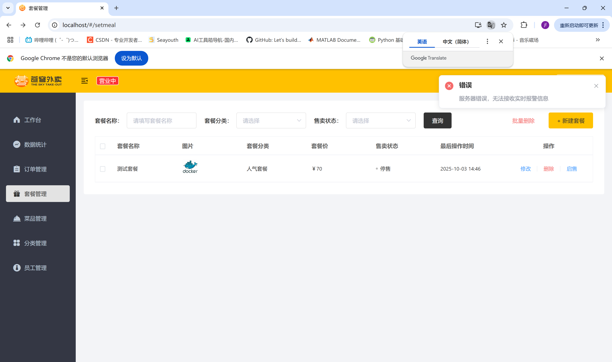


-------------------------


### 3. 删除套餐

#### 3.1 需求分析和设计

业务规则：

- 可以一次删除一个套餐，也可以批量删除套餐
- 起售中的套餐不能删除

接口设计：


#### 3.2 代码实现

+ SetmealController

~~~java
/**
     * 批量删除套餐
     * @param ids
     * @return
*/
@DeleteMapping
@ApiOperation("批量删除套餐")
public Result delete(@RequestParam List<Long> ids){
    setmealService.deleteBatch(ids);
    return Result.success();
}
~~~

+ SetmealService

~~~java
/**
     * 批量删除套餐
     * @param ids
*/
void deleteBatch(List<Long> ids);
~~~

+ SetmealServiceImpl

~~~java
/**
     * 批量删除套餐
     * @param ids
*/
@Transactional
public void deleteBatch(List<Long> ids) {
    ids.forEach(id -> {
        Setmeal setmeal = setmealMapper.getById(id);
        if(StatusConstant.ENABLE == setmeal.getStatus()){
            //起售中的套餐不能删除
            throw new DeletionNotAllowedException(MessageConstant.SETMEAL_ON_SALE);
        }
    });

    ids.forEach(setmealId -> {
        //删除套餐表中的数据
        setmealMapper.deleteById(setmealId);
        //删除套餐菜品关系表中的数据
        setmealDishMapper.deleteBySetmealId(setmealId);
    });
}
~~~

+ SetmealMapper

~~~java
/**
     * 根据id查询套餐
     * @param id
     * @return
*/
@Select("select * from setmeal where id = #{id}")
Setmeal getById(Long id);

/**
     * 根据id删除套餐
     * @param setmealId
*/
@Delete("delete from setmeal where id = #{id}")
void deleteById(Long setmealId);
~~~

+ SetmealDishMapper

~~~java
/**
     * 根据套餐id删除套餐和菜品的关联关系
     * @param setmealId
*/
@Delete("delete from setmeal_dish where setmeal_id = #{setmealId}")
void deleteBySetmealId(Long setmealId);
~~~


#### 3.3 功能测试


------------------------------------


### 4. 修改套餐

#### 4.1 需求分析和设计

接口设计（共涉及到5个接口）：

- 根据id查询套餐
- 根据类型查询分类（已完成）
- 根据分类id查询菜品（已完成）
- 图片上传（已完成）
- 修改套餐


#### 4.2 代码实现

+ SetmealController

~~~java
/**
     * 根据id查询套餐，用于修改页面回显数据
     *
     * @param id
     * @return
*/
@GetMapping("/{id}")
@ApiOperation("根据id查询套餐")
public Result<SetmealVO> getById(@PathVariable Long id) {
    SetmealVO setmealVO = setmealService.getByIdWithDish(id);
    return Result.success(setmealVO);
}

/**
     * 修改套餐
     *
     * @param setmealDTO
     * @return
*/
@PutMapping
@ApiOperation("修改套餐")
public Result update(@RequestBody SetmealDTO setmealDTO) {
    setmealService.update(setmealDTO);
    return Result.success();
}
~~~

+ SetmealService

~~~java
/**
     * 根据id查询套餐和关联的菜品数据
     * @param id
     * @return
*/
SetmealVO getByIdWithDish(Long id);

/**
     * 修改套餐
     * @param setmealDTO
*/
void update(SetmealDTO setmealDTO);
~~~

+ SetmealServiceImpl

~~~java
/**
     * 根据id查询套餐和套餐菜品关系
     *
     * @param id
     * @return
*/
public SetmealVO getByIdWithDish(Long id) {
    Setmeal setmeal = setmealMapper.getById(id);
    List<SetmealDish> setmealDishes = setmealDishMapper.getBySetmealId(id);

    SetmealVO setmealVO = new SetmealVO();
    BeanUtils.copyProperties(setmeal, setmealVO);
    setmealVO.setSetmealDishes(setmealDishes);
    
    return setmealVO;
}

/**
     * 修改套餐
     *
     * @param setmealDTO
*/
@Transactional
public void update(SetmealDTO setmealDTO) {
    Setmeal setmeal = new Setmeal();
    BeanUtils.copyProperties(setmealDTO, setmeal);

    //1、修改套餐表，执行update
    setmealMapper.update(setmeal);

    //套餐id
    Long setmealId = setmealDTO.getId();

    //2、删除套餐和菜品的关联关系，操作setmeal_dish表，执行delete
    setmealDishMapper.deleteBySetmealId(setmealId);

    List<SetmealDish> setmealDishes = setmealDTO.getSetmealDishes();
    setmealDishes.forEach(setmealDish -> {
        setmealDish.setSetmealId(setmealId);
    });
    //3、重新插入套餐和菜品的关联关系，操作setmeal_dish表，执行insert
    setmealDishMapper.insertBatch(setmealDishes);
}
~~~

+ SetmealDishMapper

~~~java
	/**
     * 根据套餐id查询套餐和菜品的关联关系
     * @param setmealId
     * @return
     */
    @Select("select * from setmeal_dish where setmeal_id = #{setmealId}")
    List<SetmealDish> getBySetmealId(Long setmealId);
~~~

+ SetmealMapper.xml

```xml
<update id="update" parameterType="setmeal">
    update setmeal
    <set>
        <if test="name != null">
            name = #{name},
        </if>
        <if test="price != null">
            price = #{price},
        </if>
        <if test="status != null">
            status = #{status},
        </if>
        <if test="description != null">
            description = #{description},
        </if>
        <if test="image != null">
            image = #{image},
        </if>
        <if test="updateTime != null">
            update_time = #{updateTime},
        </if>
        <if test="updateUser != null">
            update_user = #{updateUser}
        </if>
    </set>
    where id = #{id}
</update>
```


#### 4.3 功能测试

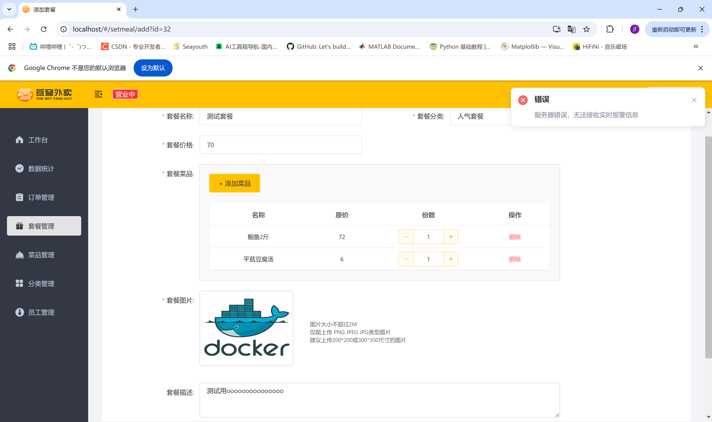


--------------------------


### 5. 起售停售套餐

#### 5.1 需求分析和设计

业务规则：

- 可以对状态为起售的套餐进行停售操作，可以对状态为停售的套餐进行起售操作
- 起售的套餐可以展示在用户端，停售的套餐不能展示在用户端
- 起售套餐时，如果套餐内包含停售的菜品，则不能起售

接口设计：


#### 5.2 代码实现

+ SetmealController

~~~java
/**
     * 套餐起售停售
     * @param status
     * @param id
     * @return
*/
@PostMapping("/status/{status}")
@ApiOperation("套餐起售停售")
public Result startOrStop(@PathVariable Integer status, Long id) {
    setmealService.startOrStop(status, id);
    return Result.success();
}
~~~

+ SetmealService

~~~java
/**
     * 套餐起售、停售
     * @param status
     * @param id
*/
void startOrStop(Integer status, Long id);
~~~

+ SetmealServiceImpl

~~~java
/**
     * 套餐起售、停售
     * @param status
     * @param id
*/
public void startOrStop(Integer status, Long id) {
    //起售套餐时，判断套餐内是否有停售菜品，有停售菜品提示"套餐内包含未启售菜品，无法启售"
    if(status == StatusConstant.ENABLE){
        //select a.* from dish a left join setmeal_dish b on a.id = b.dish_id where b.setmeal_id = ?
        List<Dish> dishList = dishMapper.getBySetmealId(id);
        if(dishList != null && dishList.size() > 0){
            dishList.forEach(dish -> {
                if(StatusConstant.DISABLE == dish.getStatus()){
                    throw new SetmealEnableFailedException(MessageConstant.SETMEAL_ENABLE_FAILED);
                }
            });
        }
    }

    Setmeal setmeal = Setmeal.builder()
        .id(id)
        .status(status)
        .build();
    setmealMapper.update(setmeal);
}
~~~

+ DishMapper

~~~java
/**
     * 根据套餐id查询菜品
     * @param setmealId
     * @return
*/
@Select("select a.* from dish a left join setmeal_dish b on a.id = b.dish_id where b.setmeal_id = #{setmealId}")
List<Dish> getBySetmealId(Long setmealId);
~~~


#### 5.3 功能测试


---------------------------------------------


## 五、店铺营业状态设置

### 1. Redis 入门


#### 1.1 Redis 简介

Redis 是一个基于**内存**的 key-value 结构数据库

MySQL 存在磁盘上，通过二维表方式存储

+ 基于内存存储，读写性能高
+ 适合存储热点数据（热点商品、资讯、新闻）
+ 企业应用广泛

官网：[Redis中文网](https://www.redis.net.cn/)


#### 1.2 Redis 下载与安装

Redis 安装包分为 Windows 版和 Linux 版

Windows：[GitHub - redis-windows/redis-windows: Redis 6.0.20 6.2.18 7.0.15 7.2.8 7.4.3 8.0.0 for Windows](https://github.com/redis-windows/redis-windows)

Redis 的 Windows 版属于绿色软件，直接解压即可使用，解压后目录结构如下


#### 1.3 Redis 服务启动与停止

+ 启动


按 Ctrl + c 停止

+ 客户端连接


#### 1.4 图形化界面

+ Another Redis Desktop Manager

官网：[Another Redis Desktop Manager | 更快、更好、更稳定的Redis桌面(GUI)管理客户端，兼容Windows、Mac、Linux，性能出众，轻松加载海量键值](https://goanother.com/cn/)


注意：要把 redis 启动起来，要不然连不上


----------------------------


### 2. Redis 数据类型

#### 2.1 5种常用数据类型介绍

Redis 存储的是 key-value 结构的数据，其中 key 是字符串类型，value 有5种常用的数据类型

+ 字符串 string
+ 哈希 hash
+ 列表 list
+ 集合 set
+ 有序集合 sorted set / zset


#### 2.2 各种数据类型的特点


+ 字符串（string）：普通字符串，Redis 中最简单的数据类型
+ 哈希（hash）：也叫散列，类似于 Java 中的 HashMap 结构
+ 列表（list）：按照插入顺序排序，可以有重复元素，类似于 Java 中的 LinkedList
+ 集合（set）：无序集合，没有重复元素，类似于 Java 中的 HashSet
+ 有序集合（sorted set / zset）：集合中每个元素关联一个分数（score），根据分数升序排序，没有重复元素


------------------------------


### 3. Redis 常用命令

#### 3.1 字符串操作命令

Redis 字符串类型常用命令

| 命令                    | 作用                                                  |
| ----------------------- | ----------------------------------------------------- |
| SET key value           | 设置指定 key 的值                                     |
| Get key                 | 获取指定 key 的值                                     |
| SELEX key seconds value | 设置指定 key 的值，并将 key 的过期时间设为 seconds 秒 |
| SETNX key value         | 只有在 key 不存在时设置 key 的值                      |


#### 3.2 哈希操作命令

Redis hash 是一个 string 类型的 field 和 value 的映射表，hash 特别适合用于存储对象，常用命令

| 命令                 | 作用                                       |
| -------------------- | ------------------------------------------ |
| HSET key field value | 将哈希表 key 中的字段 field 的值设为 value |
| HGET key field       | 获取存储在哈希表中指定字段的值             |
| HDEL key field       | 删除存储在哈希表中的指定字段               |
| HKEYS key            | 获取哈希表中所有字段                       |
| HVALS key            | 获取哈希表中所有值                         |


#### 3.3 列表操作命令

Redis 列表是简单的字符串列表，按照插入顺序排序，常用命令

| 命令                      | 作用                         |
| ------------------------- | ---------------------------- |
| LPUSH key value1 [value2] | 将一个或多个值插入到列表头部 |
| LRANGE key start stop     | 获取列表指定范围内的元素     |
| RPOP key                  | 移除并获取列表最后一个元素   |
| LLEN key                  | 获取列表长度                 |


#### 3.4 集合操作命令

Redis set 是 string 类型的无序集合。集合成员是唯一的，集合中不能出现重复的数据，常用命令：

| 命令                       | 作用                     |
| -------------------------- | ------------------------ |
| SADD key member1 [member2] | 向集合添加一个或多个成员 |
| SMEMBERS key               | 返回集合中的所有成员     |
| SCARD key                  | 获取集合的成员数         |
| SINTER key1 [key2]         | 返回给定所有集合的交集   |
| SUNION key1 [key2]         | 返回所有给定集合的并集   |
| SREM key member1 [member2] | 删除集合中一个或多个成员 |


#### 3.5 有序集合操作命令

Redis 有序集合是 string 类型元素的集合，且不允许有重复成员。每个元素都会关联一个 double 类型的分数。常用命令：

| 命令                                     | 作用                                         |
| ---------------------------------------- | -------------------------------------------- |
| ZADD key score1 member1 [score2 member2] | 向有序集合添加一个或多个成员                 |
| ZRANGE key start stop [WITHSCORES]       | 通过索引区间返回有序集合中指定区间内的成员   |
| ZINCRBY key increment member             | 有序集合中对指定成员的分数加上增量 increment |
| ZREM key member [member ...]             | 移除有序集合中的一个或多个成员               |


#### 3.6 通用命令

Redis 的通用命令是不分数据类型的，都可以使用的命令：

| 命令         | 作用                                  |
| ------------ | ------------------------------------- |
| KEYS pattern | 查找所有符合给定模式（pattern）的 key |
| EXISTS key   | 检查给定 key 是否存在                 |
| TYPE key     | 返回 key 所储存的值的类型             |
| DEL key      | 该命令用于在 key 存在时删除 key       |


---------------------------


### 4. 在 Java 中操作 Redis

#### 4.1 Redis 的 Java 客户端

Redis 的 Java 客户端很多，常用的几种：

+ Jedis
+ Lettuce
+ Spring Data Redis

Spring Data Redis 是 Spring 的一部分，对 Redis 底层开发包进行了高度封装

在 Spring 项目中，可以使用 Spring Data Redis 来简化操作


----------------------------


#### 4.2 Spring Data Redis 使用方式

操作步骤：

1. 导入 Spring Data Redis 的 maven 坐标
2. 配置 Redis 数据源
3. 编写配置类，创建 Redis Template 对象
4. 通过 Redis Template 对象操作 Redis

```xml
<dependency>
	<groupId>org.springframework.boot</groupId>
    <artifactId>spring-boot-starter-data-redis</artifactId>
</dependency>
```

```yml
spring:
  redis:
    host: localhost
    port: 6379
    password: 123456
```

友情提示：新版本的redis中，在yml文件的password中加上双引号！！！！！！

+ RedisConfiguration.java

```java
package com.sky.config;

import lombok.extern.slf4j.Slf4j;
import org.springframework.context.annotation.Bean;
import org.springframework.context.annotation.Configuration;
import org.springframework.data.redis.connection.RedisConnectionFactory;
import org.springframework.data.redis.core.RedisTemplate;
import org.springframework.data.redis.serializer.StringRedisSerializer;

@Configuration
@Slf4j
public class RedisConfiguration {

    @Bean
    public RedisTemplate redisTemplate(RedisConnectionFactory redisConnectionFactory) {

        log.info("开始创建redis模板对象。。。");
        // 设置redis连接工厂对象
        RedisTemplate redisTemplate = new RedisTemplate();
        redisTemplate.setConnectionFactory(redisConnectionFactory);

        // 设置redis key的序列化器
        redisTemplate.setKeySerializer(new StringRedisSerializer());
        return redisTemplate;
    }
}
```

##### 4.2.1 操作 string 类型数据

```java
/**
 * 操作字符串类型的数据
 */
@Test
public void testString() {
    // set get setex setnx
    redisTemplate.opsForValue().set("city", "北京");
    Object city = redisTemplate.opsForValue().get("city");
    System.out.println(city);
    redisTemplate.opsForValue().set("code", "1234", 3, TimeUnit.MINUTES);
    redisTemplate.opsForValue().setIfAbsent("lock", "1");
    redisTemplate.opsForValue().setIfAbsent("lock", "2");
}
```


`redisTemplate.setKeySerializer(new StringRedisSerializer());` 在配置类中这行代码使得 key 得到序列化，所以不会显示乱码，而 value 没有序列化，会显示乱码


##### 4.2.2 操作 hash 类型数据

```java
/**
 * 操作哈希类型的数据
 */
@Test
public void testHash() {
    // hset hget hkeys hvals
    HashOperations hashOperations = redisTemplate.opsForHash();

    hashOperations.put("100", "name", "tom");
    hashOperations.put("100", "age", "20");

    String name = (String) hashOperations.get("100", "name");
    System.out.println(name);

    Set keys = hashOperations.keys("100");
    System.out.println(keys);

    List values = hashOperations.values("100");
    System.out.println(values);

    hashOperations.delete("100", "age");
}
```


##### 4.2.3 操作 list 类型数据

```java
/**
 * 操作列表类型的数据
 */
@Test
public void testList() {
    // lpush lrange rpop llen
    ListOperations listOperations = redisTemplate.opsForList();

    listOperations.leftPushAll("mylist", "a", "b", "c");
    listOperations.leftPush("mylist", "d");

    List mylist = listOperations.range("mylist", 0, -1);
    System.out.println(mylist);

    listOperations.rightPop("mylist");

    Long size = listOperations.size("mylist");
    System.out.println(size);
}
```


##### 4.2.4 操作 set 类型数据

```java
/**
 * 操作集合类型的数据
 */
@Test
public void testSet() {
    // sadd smembers scard sinter sunion srem
    SetOperations setOperations = redisTemplate.opsForSet();

    setOperations.add("set1", "a", "b", "c", "d");
    setOperations.add("set2", "a", "b", "x", "y");

    Set members = setOperations.members("set1");
    System.out.println(members);

    Long size = setOperations.size("set1");
    System.out.println(size);

    Set intersect = setOperations.intersect("set1", "set2");
    System.out.println(intersect);

    Set union = setOperations.union("set1", "set2");
    System.out.println(union);

    setOperations.remove("set1", "a", "b");
}
```


##### 4.2.5 操作 zset 类型数据

```java
/**
 * 操作有序集合类型的数据
 */
@Test
public void testZset() {
    // zadd zrange zincrby zrem
    ZSetOperations zSetOperations = redisTemplate.opsForZSet();

    zSetOperations.add("zset1", "a", 10);
    zSetOperations.add("zset1", "b", 12);
    zSetOperations.add("zset1", "c", 9);

    Set zset1 = zSetOperations.range("zset1", 0, -1);
    System.out.println(zset1);

    zSetOperations.incrementScore("zset1", "c", 10);

    zSetOperations.remove("zset1", "a", "b");
}
```


##### 4.2.6 通用命令操作

```java
/**
 * 通用命令操作
 */
@Test
public void testCommon() {
    // keys exists type del
    Set keys = redisTemplate.keys("*");
    System.out.println(keys);

    Boolean name = redisTemplate.hasKey("name");
    Boolean set1 = redisTemplate.hasKey("set1");

    for (Object key : keys) {
        DataType type = redisTemplate.type(key);
        System.out.println(type.name());
    }

    redisTemplate.delete("mylist");
}
```


---------------------------


### 5. 店铺营业状态设置

#### 5.1 需求分析和设计

接口设计：

+ 设置营业状态
+ 管理端查询营业状态
+ 用户端查询营业状态


本项目约定：

+ **管理端**发出的请求，统一使用 **/admin** 作为前缀
+ **用户端**发出的请求，统一使用 **/user** 作为前缀


营业状态数据存储方式：基于 Redis 的字符串来进行存储


约定：**1**表示营业 **0**表示打烊


#### 5.2 代码开发

+ admin/ShopController.java

```java
package com.sky.controller.admin;

import com.sky.result.Result;
import io.swagger.annotations.Api;
import io.swagger.annotations.ApiOperation;
import lombok.extern.slf4j.Slf4j;
import org.springframework.beans.factory.annotation.Autowired;
import org.springframework.data.redis.core.RedisTemplate;
import org.springframework.web.bind.annotation.*;

@RestController("adminShopController")
@RequestMapping("/admin/shop")
@Api(tags = "店铺相关接口")
@Slf4j
public class ShopController {

    public static final String KEY = "SHOP_STATUS";

    @Autowired
    private RedisTemplate redisTemplate;

    /**
     * 设置店铺的营业状态
     *
     * @param status
     * @return
     */
    @PutMapping("/{status}")
    @ApiOperation("设置店铺的营业状态")
    public Result setStatus(@PathVariable Integer status) {
        log.info("设置店铺的营业状态为：{}", status == 1 ? "营业中" : "打烊中");
        redisTemplate.opsForValue().set(KEY, status);
        return Result.success();
    }

    /**
     * 获取店铺的营业状态
     *
     * @return
     */
    @GetMapping("/status")
    @ApiOperation("获取店铺的营业状态")
    public Result<Integer> getStatus() {
        Integer status = (Integer) redisTemplate.opsForValue().get(KEY);
        log.info("获取店铺的营业状态为：{}", status == 1 ? "营业中" : "打烊中");
        return Result.success(status);
    }
}
```

+ user/ShopController.java

```java
package com.sky.controller.user;

import com.sky.result.Result;
import io.swagger.annotations.Api;
import io.swagger.annotations.ApiOperation;
import lombok.extern.slf4j.Slf4j;
import org.springframework.beans.factory.annotation.Autowired;
import org.springframework.data.redis.core.RedisTemplate;
import org.springframework.web.bind.annotation.GetMapping;
import org.springframework.web.bind.annotation.PutMapping;
import org.springframework.web.bind.annotation.RequestMapping;
import org.springframework.web.bind.annotation.RestController;

@RestController("userShopController")
@RequestMapping("/user/shop")
@Api(tags = "店铺相关接口")
@Slf4j
public class ShopController {

    public static final String KEY = "SHOP_STATUS";

    @Autowired
    private RedisTemplate redisTemplate;

    /**
     * 获取店铺的营业状态
     *
     * @return
     */
    @GetMapping("/status")
    @ApiOperation("获取店铺的营业状态")
    public Result<Integer> getStatus() {
        Integer status = (Integer) redisTemplate.opsForValue().get(KEY);
        log.info("获取店铺的营业状态为：{}", status == 1 ? "营业中" : "打烊中");
        return Result.success(status);
    }
}
```


#### 5.3 功能测试


------------------------------------------


## 六、微信登录、商品浏览

### 1. HttpClient

#### 1.1 介绍

+ HttpClient 是 Apache Jakarta Common 下的子项目，可以用来提供高效的、最新的、功能丰富的支持 HTTP 协议的客户端编程工具包，并且它支持 HTTP 协议最新的版本和建议

```xml
<dependency>
	<groupId>org.apache.httpcomponents</groupId>
    <artifactId>httpclient</artifactId>
    <version>4.5.13</version>
</dependency>
```

核心 API：

+ HttpClient
+ HttpClients
+ CloseableHttpClient
+ HttpGet
+ HttpPost

发送请求步骤：

+ 创建 HttpClient 对象
+ 创建 Http 请求对象
+ 调用 HttpClient 的 execute 方法发送请求


#### 1.2 入门案例

##### 1.2.1 发送 GET 请求

```java
/**
 * 测试通过httpclient发送GET方式的请求
 */
@Test
public void testGET() throws IOException {
    // 创建httpclient对象
    CloseableHttpClient httpClient = HttpClients.createDefault();

    // 创建请求对象
    HttpGet httpGet = new HttpGet("http://localhost:8080/user/shop/status");

    // 发送请求
    CloseableHttpResponse response = httpClient.execute(httpGet);

    // 获取服务的返回的状态码
    int statusCode = response.getStatusLine().getStatusCode();
    System.out.println("服务端返回的状态码为：" + statusCode);

    HttpEntity entity = response.getEntity();
    String body = EntityUtils.toString(entity);
    System.out.println("服务的返回的数据为：" + body);

    // 关闭资源
    response.close();
    httpClient.close();
}
```

注意：测试时要保证项目提前启动好了

##### 1.2.2 发送 POST 请求

```java
/**
 * 测试通过httpclient发送POST方式的请求
 */
@Test
public void testPOST() throws IOException {
    // 创建httpclient对象
    CloseableHttpClient httpClient = HttpClients.createDefault();

    // 创建请求对象
    HttpPost httpPost = new HttpPost("http://localhost:8080/admin/employee/login");

    JSONObject jsonObject = new JSONObject();
    jsonObject.put("username", "admin");
    jsonObject.put("password", "123456");

    StringEntity entity = new StringEntity(jsonObject.toString());
    // 指定请求的编码方式
    entity.setContentEncoding("utf-8");
    // 数据格式
    entity.setContentType("application/json");
    httpPost.setEntity(entity);

    // 发送请求
    CloseableHttpResponse response = httpClient.execute(httpPost);

    // 解析返回结果
    int statusCode = response.getStatusLine().getStatusCode();
    System.out.println("服务端返回的状态码为：" + statusCode);

    HttpEntity entity1 = response.getEntity();
    String body = EntityUtils.toString(entity1);
    System.out.println("服务的返回的数据为：" + body);

    // 关闭资源
    response.close();
    httpClient.close();
}
```

##### 1.2.3 封装为工具类

```java
package com.sky.utils;

import com.alibaba.fastjson.JSONObject;
import org.apache.http.NameValuePair;
import org.apache.http.client.config.RequestConfig;
import org.apache.http.client.entity.UrlEncodedFormEntity;
import org.apache.http.client.methods.CloseableHttpResponse;
import org.apache.http.client.methods.HttpGet;
import org.apache.http.client.methods.HttpPost;
import org.apache.http.client.utils.URIBuilder;
import org.apache.http.entity.StringEntity;
import org.apache.http.impl.client.CloseableHttpClient;
import org.apache.http.impl.client.HttpClients;
import org.apache.http.message.BasicNameValuePair;
import org.apache.http.util.EntityUtils;

import java.io.IOException;
import java.net.URI;
import java.util.ArrayList;
import java.util.List;
import java.util.Map;

/**
 * Http工具类
 */
public class HttpClientUtil {

    static final  int TIMEOUT_MSEC = 5 * 1000;

    /**
     * 发送GET方式请求
     * @param url
     * @param paramMap
     * @return
     */
    public static String doGet(String url,Map<String,String> paramMap){
        // 创建Httpclient对象
        CloseableHttpClient httpClient = HttpClients.createDefault();

        String result = "";
        CloseableHttpResponse response = null;

        try{
            URIBuilder builder = new URIBuilder(url);
            if(paramMap != null){
                for (String key : paramMap.keySet()) {
                    builder.addParameter(key,paramMap.get(key));
                }
            }
            URI uri = builder.build();

            //创建GET请求
            HttpGet httpGet = new HttpGet(uri);

            //发送请求
            response = httpClient.execute(httpGet);

            //判断响应状态
            if(response.getStatusLine().getStatusCode() == 200){
                result = EntityUtils.toString(response.getEntity(),"UTF-8");
            }
        }catch (Exception e){
            e.printStackTrace();
        }finally {
            try {
                response.close();
                httpClient.close();
            } catch (IOException e) {
                e.printStackTrace();
            }
        }

        return result;
    }

    /**
     * 发送POST方式请求
     * @param url
     * @param paramMap
     * @return
     * @throws IOException
     */
    public static String doPost(String url, Map<String, String> paramMap) throws IOException {
        // 创建Httpclient对象
        CloseableHttpClient httpClient = HttpClients.createDefault();
        CloseableHttpResponse response = null;
        String resultString = "";

        try {
            // 创建Http Post请求
            HttpPost httpPost = new HttpPost(url);

            // 创建参数列表
            if (paramMap != null) {
                List<NameValuePair> paramList = new ArrayList();
                for (Map.Entry<String, String> param : paramMap.entrySet()) {
                    paramList.add(new BasicNameValuePair(param.getKey(), param.getValue()));
                }
                // 模拟表单
                UrlEncodedFormEntity entity = new UrlEncodedFormEntity(paramList);
                httpPost.setEntity(entity);
            }

            httpPost.setConfig(builderRequestConfig());

            // 执行http请求
            response = httpClient.execute(httpPost);

            resultString = EntityUtils.toString(response.getEntity(), "UTF-8");
        } catch (Exception e) {
            throw e;
        } finally {
            try {
                response.close();
            } catch (IOException e) {
                e.printStackTrace();
            }
        }

        return resultString;
    }

    /**
     * 发送POST方式请求
     * @param url
     * @param paramMap
     * @return
     * @throws IOException
     */
    public static String doPost4Json(String url, Map<String, String> paramMap) throws IOException {
        // 创建Httpclient对象
        CloseableHttpClient httpClient = HttpClients.createDefault();
        CloseableHttpResponse response = null;
        String resultString = "";

        try {
            // 创建Http Post请求
            HttpPost httpPost = new HttpPost(url);

            if (paramMap != null) {
                //构造json格式数据
                JSONObject jsonObject = new JSONObject();
                for (Map.Entry<String, String> param : paramMap.entrySet()) {
                    jsonObject.put(param.getKey(),param.getValue());
                }
                StringEntity entity = new StringEntity(jsonObject.toString(),"utf-8");
                //设置请求编码
                entity.setContentEncoding("utf-8");
                //设置数据类型
                entity.setContentType("application/json");
                httpPost.setEntity(entity);
            }

            httpPost.setConfig(builderRequestConfig());

            // 执行http请求
            response = httpClient.execute(httpPost);

            resultString = EntityUtils.toString(response.getEntity(), "UTF-8");
        } catch (Exception e) {
            throw e;
        } finally {
            try {
                response.close();
            } catch (IOException e) {
                e.printStackTrace();
            }
        }

        return resultString;
    }
    private static RequestConfig builderRequestConfig() {
        return RequestConfig.custom()
                .setConnectTimeout(TIMEOUT_MSEC)
                .setConnectionRequestTimeout(TIMEOUT_MSEC)
                .setSocketTimeout(TIMEOUT_MSEC).build();
    }

}
```


-------------------------


### 2. 微信小程序开发

#### 2.1 介绍

官网：[公众号](https://mp.weixin.qq.com/cgi-bin/wx)


#### 2.2 准备工作

开发微信小程序之前需要做如下准备工作：

+ 注册小程序
+ 完善小程序信息
+ 下载开发者工具：[下载 / 稳定版更新日志](https://developers.weixin.qq.com/miniprogram/dev/devtools/stable.html)


#### 2.3 入门案例

操作步骤：

+ 了解小程序目录结构
+ 编写小程序代码
+ 编译小程序

##### 2.3.1 了解小程序目录结构

小程序包含一个描述整体程序的 app 和多个描述各自页面的 page

一个小程序主体部分由三个文件组成，必须放在项目的根目录，如下

| 文件     | 必需 | 作用             |
| -------- | ---- | ---------------- |
| app.js   | 是   | 小程序逻辑       |
| app.json | 是   | 小程序公共配置   |
| app.wxss | 否   | 小程序公共样式表 |


一个小程序页面由四个文件组成：

| 文件类型 | 必需 | 作用       |
| -------- | ---- | ---------- |
| js       | 是   | 页面逻辑   |
| wxml     | 是   | 页面结构   |
| json     | 否   | 页面配置   |
| wxss     | 否   | 页面样式表 |


##### 2.3.2 获取用户昵称和头像

+ index.wxml

```xml
<!--index.wxml-->
<navigation-bar title="Weixin" back="{{false}}" color="black" background="#FFF"></navigation-bar>
<scroll-view class="scrollarea" scroll-y type="list">
  <view class="container">
    <view>
      {{msg}}
    </view>

    <view>
      <button bindtap="getUserInfo" type="default">获取用户信息</button>

      昵称：{{nickName}}
      <image style="width: 100px;height:100px" src="{{url}}"></image>
    </view>
  </view>
</scroll-view>
```

+ index.js

```javascript
// index.js
Page({
  data: {
    msg: 'hello world',
    nickName: '',
    url: ''
  },

  // 获取微信用户的头像和昵称
  getUserInfo() {
    wx.getUserProfile({
      desc: '获取用户信息',
      success: (res) => {
        console.log(res.userInfo)
        // 为数据赋值
        this.setData({
          nickName: res.userInfo.nickName,
          url: res.userInfo.avatarUrl
        })
      }
    })
  }

})

```

##### 2.3.3 获取微信用户授权码

+ index.wxml

```xml
    <view>
      <button bindtap="wxLogin" type="warn">微信登录</button>
      授权码：{{code}}
    </view>
```

+ index.js

```javascript
  // 微信登录，获取微信用户的授权码
  wxLogin() {
    wx.login({
      success: (res) => {
        console.log(res.code)
        this.setData({
          code: res.code
        })
      },
    })
  }
```

##### 2.3.4 发送请求

+ index.wxml

```xml
    <view>
      <button bind:tap="sendRequest" type="default">发送请求</button>
    </view>
```

+ index.js

```javascript
  // 发送请求
  sendRequest() {
    wx.request({
      url: 'http://localhost:8080/user/shop/status',
      method: 'GET',
      success: (res) => {
        console.log(res.data)
      }
    })
  }
```


##### 2.3.5 发布小程序


后续要提交审核成为线上版本


-----------------------------------


### 3. 微信登录

#### 3.1 导入小程序代码


#### 3.2 微信登录流程

参考文档：[开放能力 / 用户信息 / 小程序登录](https://developers.weixin.qq.com/miniprogram/dev/framework/open-ability/login.html)


#### 3.3 需求分析和设计

业务规则：

+ 基于微信登录实现小程序的登录功能
+ 如果是新用户需要自动完成注册

##### 3.3.1 接口设计


##### 3.3.2 数据库设计

+ user 表

| 字段名      | 数据类型     | 说明               | 备注 |
| ----------- | ------------ | ------------------ | ---- |
| id          | bigint       | 主键               |      |
| openid      | varchar(45)  | 微信用户的唯一标识 |      |
| name        | varchar(32)  | 用户姓名           |      |
| phone       | varchar(11)  | 手机号             |      |
| sex         | varchar(2)   | 性别               |      |
| id_number   | varchar(18)  | 身份证号           |      |
| avatar      | varchar(500) | 微信用户头像路径   |      |
| create_time | datetime     | 注册时间           |      |


#### 3.4 代码开发

+ 配置微信登录所需配置项：

```yml
  wechat:
  	appid: ${sky.wechat.appid}
  	secret: ${sky.wechat.secret}
```

```yml
  wechat:
  	appid: ******************
  	secret: 8a5aec72ec22b515b81dbf7371a73d16
```

+ 配置为微信用户生成 jwt 令牌时使用的配置项：

```yml
    # 设置jwt签名加密时使用的秘钥
    user-secret-key: itheima
    # 设置jwt过期时间
    user-ttl: 7200000000000
    # 设置前端传递过来的令牌名称
    user-token-name: authentication
```

+ UserLoginDTO.java

```java
package com.sky.dto;

import lombok.Data;

import java.io.Serializable;

/**
 * C端用户登录
 */
@Data
public class UserLoginDTO implements Serializable {

    private String code;

} 
```

+ UserLoginVO.java

```java
package com.sky.vo;

import lombok.AllArgsConstructor;
import lombok.Builder;
import lombok.Data;
import lombok.NoArgsConstructor;

import java.io.Serializable;

@Data
@Builder
@NoArgsConstructor
@AllArgsConstructor
public class UserLoginVO implements Serializable {

    private Long id;
    private String openid;
    private String token;

}
```

+ UserController.java

```java
package com.sky.controller.user;

import com.sky.constant.JwtClaimsConstant;
import com.sky.dto.UserLoginDTO;
import com.sky.entity.User;
import com.sky.properties.JwtProperties;
import com.sky.result.Result;
import com.sky.service.UserService;
import com.sky.utils.JwtUtil;
import com.sky.vo.UserLoginVO;
import io.swagger.annotations.Api;
import io.swagger.annotations.ApiOperation;
import lombok.extern.slf4j.Slf4j;
import org.springframework.beans.factory.annotation.Autowired;
import org.springframework.web.bind.annotation.PostMapping;
import org.springframework.web.bind.annotation.RequestBody;
import org.springframework.web.bind.annotation.RequestMapping;
import org.springframework.web.bind.annotation.RestController;

import java.util.HashMap;

@RestController
@RequestMapping("/user/user")
@Api(tags = "C端用户相关接口")
@Slf4j
public class UserController {

    @Autowired
    private UserService userService;
    @Autowired
    private JwtProperties jwtProperties;

    /**
     * 微信登录
     *
     * @param userLoginDTO
     * @return
     */
    @PostMapping("/login")
    @ApiOperation("微信登录")
    public Result<UserLoginVO> login(@RequestBody UserLoginDTO userLoginDTO) {
        log.info("微信用户登录：{}", userLoginDTO.getCode());

        // 微信登录
        User user = userService.wxlogin(userLoginDTO);

        // 为微信用户生成jwt令牌
        HashMap<String, Object> claims = new HashMap<>();
        claims.put(JwtClaimsConstant.USER_ID, user.getId());

        String token = JwtUtil.createJWT(jwtProperties.getUserSecretKey(), jwtProperties.getUserTtl(), claims);

        UserLoginVO userLoginVO = UserLoginVO.builder()
                .id(user.getId())
                .openid(user.getOpenid())
                .token(token)
                .build();

        return Result.success(userLoginVO);
    }

}
```

+ UserServiceImpl.java

```java
package com.sky.service.impl;

import com.alibaba.fastjson.JSON;
import com.alibaba.fastjson.JSONObject;
import com.sky.constant.MessageConstant;
import com.sky.dto.UserLoginDTO;
import com.sky.entity.User;
import com.sky.exception.LoginFailedException;
import com.sky.mapper.UserMapper;
import com.sky.properties.WeChatProperties;
import com.sky.service.UserService;
import com.sky.utils.HttpClientUtil;
import lombok.extern.slf4j.Slf4j;
import org.springframework.beans.factory.annotation.Autowired;
import org.springframework.beans.factory.annotation.Qualifier;
import org.springframework.stereotype.Service;

import java.time.LocalDateTime;
import java.util.HashMap;

@Service
@Slf4j
public class UserServiceImpl implements UserService {

    // 微信服务接口地址
    public static final String WX_LOGIN = "https://api.weixin.qq.com/sns/jscode2session";

    @Autowired
    private WeChatProperties weChatProperties;
    @Autowired
    private UserMapper userMapper;

    /**
     * 微信登录
     *
     * @param userLoginDTO
     * @return
     */
    @Override
    public User wxlogin(UserLoginDTO userLoginDTO) {

        String openid = getOpenid(userLoginDTO.getCode());

        // 判断openid是否为空，如果为空标识失败，抛出业务异常
        if (openid == null) {
            throw new LoginFailedException(MessageConstant.LOGIN_FAILED);
        }

        // 判断当前用户是否为新用户
        User user = userMapper.getByOpenid(openid);

        // 如果是新用户，自动完成注册
        if (user == null) {
            user = User.builder()
                    .openid(openid)
                    .createTime(LocalDateTime.now())
                    .build();

            userMapper.insert(user);
        }

        // 返回这个用户对象
        return user;
    }

    /**
     * 调用微信接口服务，获取微信用户的openid
     *
     * @param code
     * @return
     */
    private String getOpenid(String code) {
        // 调用微信接口服务，获得当前微信用户的openid
        HashMap<String, String> map = new HashMap<>();
        map.put("appid", weChatProperties.getAppid());
        map.put("secret", weChatProperties.getSecret());
        map.put("js_code", code);
        map.put("grant_type", "authorization_code");
        String json = HttpClientUtil.doGet(WX_LOGIN, map);

        JSONObject jsonObject = JSON.parseObject(json);
        String openid = jsonObject.getString("openid");

        return openid;
    }
}
```

+ UserMapper.java

```java
package com.sky.mapper;

import com.sky.entity.User;
import org.apache.ibatis.annotations.Mapper;
import org.apache.ibatis.annotations.Select;

@Mapper
public interface UserMapper {

    /**
     * 根据openid查询用户
     *
     * @param openid
     * @return
     */
    @Select("select  * from user where openid = #{openid}")
    User getByOpenid(String openid);

    /**
     * 插入数据
     *
     * @param user
     */
    void insert(User user);
}
```

+ UserMapper.xml

```xml
<?xml version="1.0" encoding="UTF-8" ?>
<!DOCTYPE mapper PUBLIC "-//mybatis.org//DTD Mapper 3.0//EN"
        "http://mybatis.org/dtd/mybatis-3-mapper.dtd" >
<mapper namespace="com.sky.mapper.UserMapper">

    <insert id="insert" useGeneratedKeys="true" keyProperty="id"> <!-- 获取生成的主键值 -->
        insert into user (openid, name, phone, sex, id_number, avatar, create_time)
        values (#{openid}, #{name}, #{phone}, #{sex}, #{idNumber}, #{avatar}, #{createTime})
    </insert>

</mapper>
```


#### 3.5 功能测试

大于等于 2.27.1 版本的访问，将不会弹出这个允许登录框。版本在右上角详情-本地设置里面


+ 用户登录 jwt 校验拦截器

```java
package com.sky.interceptor;

import com.sky.constant.JwtClaimsConstant;
import com.sky.context.BaseContext;
import com.sky.properties.JwtProperties;
import com.sky.utils.JwtUtil;
import io.jsonwebtoken.Claims;
import lombok.extern.slf4j.Slf4j;
import org.springframework.beans.factory.annotation.Autowired;
import org.springframework.stereotype.Component;
import org.springframework.web.method.HandlerMethod;
import org.springframework.web.servlet.HandlerInterceptor;

import javax.servlet.http.HttpServletRequest;
import javax.servlet.http.HttpServletResponse;

/**
 * jwt令牌校验的拦截器
 */
@Component
@Slf4j
public class JwtTokenUserInterceptor implements HandlerInterceptor {

    @Autowired
    private JwtProperties jwtProperties;

    /**
     * 校验jwt
     *
     * @param request
     * @param response
     * @param handler
     * @return
     * @throws Exception
     */
    public boolean preHandle(HttpServletRequest request, HttpServletResponse response, Object handler) throws Exception {
        //判断当前拦截到的是Controller的方法还是其他资源
        if (!(handler instanceof HandlerMethod)) {
            //当前拦截到的不是动态方法，直接放行
            return true;
        }

        //1、从请求头中获取令牌
        String token = request.getHeader(jwtProperties.getUserTokenName());

        //2、校验令牌
        try {
            log.info("jwt校验:{}", token);
            Claims claims = JwtUtil.parseJWT(jwtProperties.getUserSecretKey(), token);
            Long userId = Long.valueOf(claims.get(JwtClaimsConstant.USER_ID).toString());
            log.info("当前用户id：", userId);
            BaseContext.setCurrentId(userId);
            //3、通过，放行
            return true;
        } catch (Exception ex) {
            //4、不通过，响应401状态码
            response.setStatus(401);
            return false;
        }
    }
}
```

+ WebMvcConfiguration.java

```java
/**
 * 注册自定义拦截器
 *
 * @param registry
 */
protected void addInterceptors(InterceptorRegistry registry) {
    log.info("开始注册自定义拦截器...");
    registry.addInterceptor(jwtTokenAdminInterceptor)
            .addPathPatterns("/admin/**")
            .excludePathPatterns("/admin/employee/login");

    registry.addInterceptor(jwtTokenUserInterceptor)
            .addPathPatterns("/user/**")
            .excludePathPatterns("/user/user/login")
            .excludePathPatterns("/user/shop/status");
}
```


-----------------------


### 4. 导入商品浏览功能代码

#### 4.1 需求分析和设计

接口设计：

+ 查询分类
+ 根据分类 id 查询菜品
+ 根据分类 id 查询套餐
+ 根据套餐 id 查询包含的菜品

##### 4.1.1 查询分类


##### 4.1.2 根据分类 id 查询菜品


##### 4.1.3 根据分类 id 查询套餐


##### 4.1.4 根据套餐 id 查询包含的菜品


#### 4.2 代码导入

基本就是 CRUD 自己写吧


#### 4.3 功能测试


-------------------------------------


## 七、缓存商品、购物车

### 1. 缓存菜品

#### 1.1. 问题说明

用户端小程序展示的菜品数据都是通过查询数据库获得，如果用户端访问类比较大，数据库访问压力随之增大


结果：系统响应慢、用户体验差


#### 1.2 实现思路

通过 Redis 来缓存菜品数据，减少数据库查询操作


缓存逻辑分析：

+ 每个分类下的菜品保存一份缓存数据

+ 数据中菜品数据有变更时清理缓存数据


#### 1.3 代码开发

+ user/DishController.java

```java
/**
 * 根据分类id查询菜品
 *
 * @param categoryId
 * @return
 */
@GetMapping("/list")
@ApiOperation("根据分类id查询菜品")
public Result<List<DishVO>> list(Long categoryId) {

    // 构造redis中的key，规则：dish_分类id
    String key = "dish_" + categoryId;

    // 查询redis中是否存在菜品数据
    List<DishVO> list = (List<DishVO>) redisTemplate.opsForValue().get(key);
    if (list != null && list.size() > 0) {
        // 如果存在，直接返回，无需查询数据库
        return Result.success(list);
    }


    Dish dish = new Dish();
    dish.setCategoryId(categoryId);
    dish.setStatus(StatusConstant.ENABLE); // 查询起售中的菜品

    // 如果不存在，查询数据库，将查询到的数据放入redis中
    list = dishService.listWithFlavor(dish);
    redisTemplate.opsForValue().set(key, list);

    return Result.success(list);
}
```

+ admin/DishController.java

```java
private void cleanCache(String pattern) {
    Set keys = redisTemplate.keys(pattern);
    redisTemplate.delete(keys);
}
```


#### 1.4 功能测试


------------------------


### 2. 缓存套餐

#### 2.1 Spring Cache

Spring Cache 是一个框架，实现了基于**注解**的缓存功能，只需要简单地加一个注解，就能实现缓存功能

Spring Cache 提供了一层抽象，底层可以切换不同的缓存实现，例如：

+ EHCache
+ Caffeine
+ Redis

```xml
<dependency>
	<groupId>org.springframework.boot</groupId>
    <artifactId>spring-boot-starter-cache</artifactId>
    <version>2.7.3</version>
</dependency>
```

常用注解：

| 注解           | 说明                                                         |
| -------------- | ------------------------------------------------------------ |
| @EnableCaching | 开启缓存注解功能，通常加在启动类上                           |
| @Cacheable     | 在方法执行前先查询缓存中是否有数据，如果有数据，则直接返回缓存数据；如果没有缓存数据，调用方法并将方法返回值放到缓存中 |
| @CachePut      | 将方法的返回值放到缓存中                                     |
| @CacheEvict    | 将一条或多条数据从缓存中删除                                 |


#### 2.2 实现思路

具体的实现思路如下：

+ 导入 Spring Cache 和 Redis 相关 maven 坐标
+ 在启动类上加入 `@EnableCaching` 注解，开启缓存注解功能
+ 在用户端接口 SetmealController 的 **list** 方法上加入 `@Cacheable` 注解
+ 在管理端接口 SetmealController 的 **svae、delete、update、startOrStop** 等方法上加入 `@CacheEvict` 注解


#### 2.3 代码开发

+ admin/SetmealController.java

```java
/**
 * 批量删除套餐
 *
 * @param ids
 * @return
 */
@DeleteMapping
@ApiOperation("批量删除套餐")
@CacheEvict(cacheNames = "setmealCache", allEntries = true)
public Result delete(@RequestParam List<Long> ids) {
    setmealService.deleteBatch(ids);
    return Result.success();
}
```

+ user/SetmealController.java

```java
/**
 * 条件查询
 *
 * @param categoryId
 * @return
 */
@GetMapping("/list")
@ApiOperation("根据分类id查询套餐")
@Cacheable(cacheNames="setmealCache", key = "#categoryId")
public Result<List<Setmeal>> list(Long categoryId) {
    Setmeal setmeal = new Setmeal();
    setmeal.setCategoryId(categoryId);
    setmeal.setStatus(StatusConstant.ENABLE);

    List<Setmeal> list = setmealService.list(setmeal);
    return Result.success(list);
}
```


#### 2.4 功能测试


--------------------------------


### 3. 添加购物车

#### 3.1 需求分析和设计

用于暂时存放所选商品

##### 3.1.1 接口设计

+ 请求方式：POST
+ 请求路径：/user/shoppingCart/add
+ 请求参数：套餐 id、菜品 id、口味
+ 返回结果：code、data、msg


##### 3.1.2 数据库设计

+ 作用：暂时存放所选商品的地方
+ 选的什么商品
+ 每个商品都买了几个
+ 不同用户的购物车需要区分开


shopping_cart 表：

| 字段名      | 数据类型       | 说明         | 备注     |
| ----------- | -------------- | ------------ | -------- |
| id          | bigint         | 主键         | 自增     |
| name        | varchar(32)    | 商品名称     | 冗余字段 |
| image       | varchar(255)   | 商品图片路径 | 冗余字段 |
| user_id     | bigint         | 用户 id      | 逻辑外键 |
| dish_id     | bigint         | 菜品 id      | 逻辑外键 |
| setmeal_id  | bigint         | 套餐 id      | 逻辑外键 |
| dish_flavor | varchar(50)    | 菜品口味     |          |
| number      | int            | 商品数量     |          |
| amount      | decimal(10, 2) | 商品单价     | 冗余字段 |
| create_time | datetime       | 创建时间     |          |

冗余字段可以增加查询速度，但是不能大量使用，应当比较稳定，且不能经常变化


#### 3.2 代码开发

+ ShoppingCartDTO.java

```java
package com.sky.dto;

import lombok.Data;
import java.io.Serializable;

@Data
public class ShoppingCartDTO implements Serializable {

    private Long dishId;
    private Long setmealId;
    private String dishFlavor;

}
```

+ ShoppingCartController.java

```java
package com.sky.controller.user;

import com.sky.dto.ShoppingCartDTO;
import com.sky.result.Result;
import com.sky.service.ShoppingCartService;
import io.swagger.annotations.Api;
import io.swagger.annotations.ApiOperation;
import lombok.extern.slf4j.Slf4j;
import org.springframework.beans.factory.annotation.Autowired;
import org.springframework.web.bind.annotation.PostMapping;
import org.springframework.web.bind.annotation.RequestBody;
import org.springframework.web.bind.annotation.RequestMapping;
import org.springframework.web.bind.annotation.RestController;

@RestController
@RequestMapping("/user/shoppingCart")
@Slf4j
@Api(tags = "C端购物车相关接口")
public class ShoppingCartController {

    @Autowired
    private ShoppingCartService shoppingCartService;

    /**
     * 添加购物车
     *
     * @param shoppingCartDTO
     * @return
     */
    @PostMapping("/add")
    @ApiOperation("添加购物车")
    public Result add(@RequestBody ShoppingCartDTO shoppingCartDTO) {
        log.info("添加购物车，商品信息为：{}", shoppingCartDTO);
        shoppingCartService.addShoppingCart(shoppingCartDTO);
        return Result.success();
    }
}
```

+ ShoppingCartServiceImpl.java

```java
package com.sky.service.impl;

import com.sky.context.BaseContext;
import com.sky.dto.ShoppingCartDTO;
import com.sky.entity.Dish;
import com.sky.entity.Setmeal;
import com.sky.entity.ShoppingCart;
import com.sky.mapper.DishMapper;
import com.sky.mapper.SetmealMapper;
import com.sky.mapper.ShoppingCartMapper;
import com.sky.service.ShoppingCartService;
import org.springframework.beans.BeanUtils;
import org.springframework.beans.factory.annotation.Autowired;
import org.springframework.stereotype.Service;

import java.time.LocalDateTime;
import java.util.List;

@Service
public class ShoppingCartServiceImpl implements ShoppingCartService {

    @Autowired
    private ShoppingCartMapper shoppingCartMapper;
    @Autowired
    private DishMapper dishMapper;
    @Autowired
    private SetmealMapper setmealMapper;

    /**
     * 添加购物车
     *
     * @param shoppingCartDTO
     */
    @Override
    public void addShoppingCart(ShoppingCartDTO shoppingCartDTO) {
        // 判断当前加入到购物车中的商品是否已经存在了
        ShoppingCart shoppingCart = new ShoppingCart();
        BeanUtils.copyProperties(shoppingCartDTO, shoppingCart);
        Long userId = BaseContext.getCurrentId();
        shoppingCart.setUserId(userId);

        List<ShoppingCart> list = shoppingCartMapper.list(shoppingCart);

        // 如果已经存在了，只需要将数量加一
        if (list != null && list.size() > 0) {
            ShoppingCart cart = list.get(0);
            cart.setNumber(cart.getNumber() + 1);
            shoppingCartMapper.updateNumberById(cart);
        } else {
            // 如果不存在，需要插入一条购物车数据

            // 判断本次添加到购物车的是菜品还是套餐
            Long dishId = shoppingCartDTO.getDishId();
            if (dishId != null) {
                // 本次添加到购物车的是菜品
                Dish dish = dishMapper.getById(dishId);
                shoppingCart.setName(dish.getName());
                shoppingCart.setImage(dish.getImage());
                shoppingCart.setAmount(dish.getPrice());

            } else {
                // 本次添加到购物车的是套餐
                Long setmealId = shoppingCart.getSetmealId();

                Setmeal setmeal = setmealMapper.getById(setmealId);
                shoppingCart.setName(setmeal.getName());
                shoppingCart.setImage(setmeal.getImage());
                shoppingCart.setAmount(setmeal.getPrice());

            }
            shoppingCart.setNumber(1);
            shoppingCart.setCreateTime(LocalDateTime.now());
            shoppingCartMapper.insert(shoppingCart);
        }

    }
}
```

+ ShoppingCartMapper.java

```java
package com.sky.mapper;

import com.sky.entity.ShoppingCart;
import org.apache.ibatis.annotations.Insert;
import org.apache.ibatis.annotations.Mapper;
import org.apache.ibatis.annotations.Update;

import java.util.List;

@Mapper
public interface ShoppingCartMapper {

    /**
     * 动态条件查询
     * @param shoppingCart
     * @return
     */
    List<ShoppingCart> list(ShoppingCart shoppingCart);

    /**
     * 根据id修改商品数量
     * @param shoppingCart
     */
    @Update("update shopping_cart set number = #{number} where id = #{id}")
    void updateNumberById(ShoppingCart shoppingCart);

    @Insert("insert into shopping_cart(name, image, user_id, dish_id, setmeal_id, dish_flavor, amount, create_time) " +
            "VALUES (#{name},#{image}, #{userId}, #{dishId}, #{setmealId}, #{dishFlavor}, #{amount}, #{createTime})")
    void insert(ShoppingCart shoppingCart);
}
```

+ ShoppingCartMapper.xml

```xml
<?xml version="1.0" encoding="UTF-8" ?>
<!DOCTYPE mapper PUBLIC "-//mybatis.org//DTD Mapper 3.0//EN"
        "http://mybatis.org/dtd/mybatis-3-mapper.dtd" >
<mapper namespace="com.sky.mapper.ShoppingCartMapper">
    
    <select id="list" resultType="com.sky.entity.ShoppingCart">
        select * from shopping_cart
        <where>
            <if test="userId != null">
                and user_id = #{userId}
            </if>
            <if test="setmealId != null">
                and setmeal_id = #{setmealId}
            </if>
            <if test="dishId != null">
                and dish_id = #{dishId}
            </if>
            <if test="dishFlavor != null">
                and dish_flavor = #{dishFlavor}
            </if>
        </where>
    </select>

</mapper>
```


#### 3.3 功能测试


-----------------------------------------


### 4. 查看购物车

#### 4.1 需求分析和设计


#### 4.2 代码开发

+ ShoppingCartController.java

```java
/**
 * 查看购物车
 *
 * @return
 */
@GetMapping("/list")
@ApiOperation("查看购物车")
public Result<List<ShoppingCart>> list() {
    List<ShoppingCart> list = shoppingCartService.showShoppingCart();
    return Result.success(list);
}
```

+ ShoppingCartServiceImpl.java

```java
/**
 * 查看购物车
 *
 * @return
 */
@Override
public List<ShoppingCart> showShoppingCart() {
    // 获取当前微信用户id
    Long userId = BaseContext.getCurrentId();
    ShoppingCart shoppingCart = ShoppingCart.builder()
            .userId(userId)
            .build();
    List<ShoppingCart> list = shoppingCartMapper.list(shoppingCart);
    return list;
}
```


#### 4.3 功能测试


----------------------


### 5. 清空购物车

#### 5.1 需求分析和设计


#### 5.2 代码开发

+ ShoppingCartController.java

```java
/**
 * 清空购物车
 *
 * @return
 */
@DeleteMapping("/clean")
@ApiOperation("清空购物车")
public Result clean() {
    shoppingCartService.cleanShoppingCart();
    return Result.success();
}
```

+ ShoppingCartServiceImpl.java

```java
/**
 * 清空购物车
 */
@Override
public void cleanShoppingCart() {
    // 获取当前微信用户id
    Long userId = BaseContext.getCurrentId();
    shoppingCartMapper.deleteByUserId(userId);
}
```

+ ShoppingCartMapper.java

```java
/**
 * 根据用户id删除购物车数据
 *
 * @param userId
 */
@Delete("delete from shopping_cart where user_id  = #{userId}")
void deleteByUserId(Long userId);
```


#### 5.3 功能测试


--------------------------


## 八、用户下单、订单支付

### 1. 导入地址簿功能代码

#### 1.1 需求分析和设计

业务功能：

+ 查询地址列表
+ 新增地址
+ 修改地址
+ 删除地址
+ 设置默认地址
+ 查询默认地址

##### 1.1.1 新增地址


##### 1.1.2 查询登录用户所有地址


##### 1.1.3 查询默认地址


##### 1.1.4 修改地址


##### 1.1.5 根据 id 删除地址


##### 1.1.6 根据 id 查询地址


##### 1.1.7 设置默认地址


##### 1.1.8 数据库设计

+ address_book 表


#### 1.2 代码导入

自己导


#### 1.3 功能测试


---------------------------


### 2. 用户下单

#### 2.1 需求分析和设计

用户下单业务说明：

在电商系统中，用户是通过下单的方式通知商家，用户已经购买了商品，需要商家进行备货和发货

用户下单后会产生订单相关数据，订单数据需要能够体现如下信息：

+ 买的哪些商品？
+ 每个商品数量是多少？
+ 订单总金额是多少？
+ 收货地址是哪？
+ 哪个用户下的单？
+ 用户手机号是多少？

##### 2.1.1 接口设计（分析）

+ 请求方式：POST
+ 请求路径：/user/order/submit
+ 参数：
  + 地址簿 id
  + 配送状态（立即送出、选择送出时间）
  + 打包费
  + 总金额
  + 备注
  + 餐具数量

支付页面返回数据：

+ 下单时间
+ 订单总金额
+ 订单号
+ 订单 id


##### 2.1.2 数据库设计

+ 订单表 orders
+ 订单明细表 order_detail

订单表和订单明细表的关系：**一对多**

###### 订单表 orders


###### 订单明细表 order_detail


#### 2.2 代码开发

根据用户下单接口的参数设计 DTO：

```java
package com.sky.dto;

import com.fasterxml.jackson.annotation.JsonFormat;
import lombok.Data;

import java.io.Serializable;
import java.math.BigDecimal;
import java.time.LocalDateTime;

@Data
public class OrdersSubmitDTO implements Serializable {
    //地址簿id
    private Long addressBookId;
    //付款方式
    private int payMethod;
    //备注
    private String remark;
    //预计送达时间
    @JsonFormat(shape = JsonFormat.Shape.STRING, pattern = "yyyy-MM-dd HH:mm:ss")
    private LocalDateTime estimatedDeliveryTime;
    //配送状态  1立即送出  0选择具体时间
    private Integer deliveryStatus;
    //餐具数量
    private Integer tablewareNumber;
    //餐具数量状态  1按餐量提供  0选择具体数量
    private Integer tablewareStatus;
    //打包费
    private Integer packAmount;
    //总金额
    private BigDecimal amount;
}
```

根据用户下单接口的返回结果设计 VO：

```java
package com.sky.vo;

import lombok.AllArgsConstructor;
import lombok.Builder;
import lombok.Data;
import lombok.NoArgsConstructor;

import java.io.Serializable;
import java.math.BigDecimal;
import java.time.LocalDateTime;

@Data
@Builder
@NoArgsConstructor
@AllArgsConstructor
public class OrderSubmitVO implements Serializable {
    //订单id
    private Long id;
    //订单号
    private String orderNumber;
    //订单金额
    private BigDecimal orderAmount;
    //下单时间
    private LocalDateTime orderTime;
}
```

+ OrderController.java

```java
package com.sky.controller.user;

import com.sky.dto.OrdersSubmitDTO;
import com.sky.result.Result;
import com.sky.service.OrderService;
import com.sky.vo.OrderSubmitVO;
import io.swagger.annotations.Api;
import io.swagger.annotations.ApiOperation;
import lombok.extern.slf4j.Slf4j;
import org.springframework.beans.factory.annotation.Autowired;
import org.springframework.web.bind.annotation.PostMapping;
import org.springframework.web.bind.annotation.RequestBody;
import org.springframework.web.bind.annotation.RequestMapping;
import org.springframework.web.bind.annotation.RestController;

@RestController("userOrderController")
@RequestMapping("/user/order")
@Api(tags = "用户端订单相关接口")
@Slf4j
public class OrderController {

    @Autowired
    private OrderService orderService;

    /**
     * 用户下单
     *
     * @param ordersSubmitDTO
     * @return
     */
    @PostMapping("/submit")
    @ApiOperation("用户下单")
    public Result<OrderSubmitVO> submit(@RequestBody OrdersSubmitDTO ordersSubmitDTO) {
        log.info("用户下单，参数为：{}", ordersSubmitDTO);
        OrderSubmitVO orderSubmitVO = orderService.submitOrder(ordersSubmitDTO);
        return Result.success(orderSubmitVO);
    }
}
```

+ OrderServiceImpl.java

```java
package com.sky.service.impl;

import com.sky.constant.MessageConstant;
import com.sky.context.BaseContext;
import com.sky.dto.OrdersSubmitDTO;
import com.sky.entity.AddressBook;
import com.sky.entity.OrderDetail;
import com.sky.entity.Orders;
import com.sky.entity.ShoppingCart;
import com.sky.exception.AddressBookBusinessException;
import com.sky.exception.ShoppingCartBusinessException;
import com.sky.mapper.AddressBookMapper;
import com.sky.mapper.OrderDetailMapper;
import com.sky.mapper.OrderMapper;
import com.sky.mapper.ShoppingCartMapper;
import com.sky.service.OrderService;
import com.sky.vo.OrderSubmitVO;
import org.springframework.beans.BeanUtils;
import org.springframework.beans.factory.annotation.Autowired;
import org.springframework.stereotype.Service;
import org.springframework.transaction.annotation.Transactional;

import java.time.LocalDateTime;
import java.util.ArrayList;
import java.util.List;

@Service
public class OrderServiceImpl implements OrderService {

    @Autowired
    private OrderMapper orderMapper;
    @Autowired
    private OrderDetailMapper orderDetailMapper;
    @Autowired
    private AddressBookMapper addressBookMapper;
    @Autowired
    private ShoppingCartMapper shoppingCartMapper;

    /**
     * 用户下单
     *
     * @param ordersSubmitDTO
     * @return
     */
    @Transactional
    @Override
    public OrderSubmitVO submitOrder(OrdersSubmitDTO ordersSubmitDTO) {

        // 1. 处理各种业务异常（地址簿为空、购物车数据为空）
        AddressBook addressBook = addressBookMapper.getById(ordersSubmitDTO.getAddressBookId());
        if (addressBook == null) {
            // 抛出业务异常
            throw new AddressBookBusinessException(MessageConstant.ADDRESS_BOOK_IS_NULL);
        }

        ShoppingCart shoppingCart = new ShoppingCart();

        // 查询当前用户的购物车数据
        Long userId = BaseContext.getCurrentId();
        shoppingCart.setUserId(userId);
        List<ShoppingCart> shoppingCartList = shoppingCartMapper.list(shoppingCart);

        if (shoppingCartList == null || shoppingCartList.size() == 0) {
            // 抛出业务异常
            throw new ShoppingCartBusinessException(MessageConstant.SHOPPING_CART_IS_NULL);
        }

        // 2. 向订单表插入1条数据
        Orders orders = new Orders();
        BeanUtils.copyProperties(ordersSubmitDTO, orders);
        orders.setOrderTime(LocalDateTime.now());
        orders.setPayStatus(Orders.UN_PAID);
        orders.setStatus(Orders.PENDING_PAYMENT);
        orders.setNumber(String.valueOf(System.currentTimeMillis()));
        orders.setPhone(addressBook.getPhone());
        orders.setConsignee(addressBook.getConsignee());
        orders.setUserId(userId);

        orderMapper.insert(orders);

        List<OrderDetail> orderDetailList = new ArrayList<>();
        // 3. 向订单明细表插入n条数据
        for (ShoppingCart cart : shoppingCartList) {
            OrderDetail orderDetail = new OrderDetail(); // 订单明细
            BeanUtils.copyProperties(cart, orderDetail);
            orderDetail.setOrderId(orders.getId()); // 设置当前订单明细关联的订单id
            orderDetailList.add(orderDetail);
        }

        orderDetailMapper.insertBatch(orderDetailList);

        // 4. 清空当前用户的购物车数据
        shoppingCartMapper.deleteById(userId);

        // 5. 封装VO返回结果
        OrderSubmitVO orderSubmitVO = OrderSubmitVO.builder()
                .id(orders.getId())
                .orderTime(orders.getOrderTime())
                .orderNumber(orders.getNumber())
                .orderAmount(orders.getAmount())
                .build();

        return orderSubmitVO;
    }
}
```

+ OrderDetailMapper.java

```java
package com.sky.mapper;

import com.sky.entity.OrderDetail;
import org.apache.ibatis.annotations.Mapper;

import java.util.List;

@Mapper
public interface OrderDetailMapper {

    /**
     * 批量插画入订单明细数据
     *
     * @param orderDetailList
     */
    void insertBatch(List<OrderDetail> orderDetailList);
}
```

+ OrderMapper.xml

```xml
<?xml version="1.0" encoding="UTF-8" ?>
<!DOCTYPE mapper PUBLIC "-//mybatis.org//DTD Mapper 3.0//EN"
        "http://mybatis.org/dtd/mybatis-3-mapper.dtd" >
<mapper namespace="com.sky.mapper.OrderMapper">

<insert id="insert" useGeneratedKeys="true" keyProperty="id">
    insert into orders(number, status, user_id, address_book_id, order_time, checkout_time, pay_method, pay_status,
                       amount, remark, phone, address, user_name, consignee, cancel_reason, rejection_reason,
                       cancel_time, estimated_delivery_time, delivery_status, delivery_time, pack_amount,
                       tableware_number, tableware_status)
    values (#{number}, #{status}, #{userId}, #{addressBookId}, #{orderTime}, #{checkoutTime}, #{payMethod},
            #{payStatus}, #{amount}, #{remark}, #{phone}, #{address}, #{userName}, #{consignee}, #{cancelReason},
            #{rejectionReason}, #{cancelTime}, #{estimatedDeliveryTime}, #{deliveryStatus}, #{deliveryTime},
            #{packAmount}, #{tablewareNumber}, #{tablewareStatus})
</insert>

</mapper>
```

+ OrderDetailMapper.xml

```xml
<?xml version="1.0" encoding="UTF-8" ?>
<!DOCTYPE mapper PUBLIC "-//mybatis.org//DTD Mapper 3.0//EN"
        "http://mybatis.org/dtd/mybatis-3-mapper.dtd" >
<mapper namespace="com.sky.mapper.OrderDetailMapper">

    <insert id="insertBatch">
        insert into order_detail(name, image, order_id, dish_id, setmeal_id, dish_flavor,number, amount)
        VALUES
        <foreach collection="orderDetailList" item="od" separator=",">
            (#{od.name}, #{od.image}, #{od.orderId}, #{od.dishId}, #{od.setmealId}, #{od.dishFlavor},#{od.number}, #{od.amount})
        </foreach>
    </insert>
</mapper>
```


#### 2.3 功能测试


--------------------------------


### 3. 订单支付

#### 3.1 微信支付介绍


参考：[产品介绍_JSAPI支付|微信支付商户文档中心](https://pay.weixin.qq.com/doc/v3/merchant/4012062524)


微信小程序支付时序图：


+ 调用微信后台的接口地址


##### 3.1.1 JSAPI 下单

商户系统调用该接口在微信支付服务后台生成**预支付交易单**

+ 适用对象：直连商户

+ 请求 URL：https://api.mch.weixin.qq.com/v3/pay/transactions/jsapi

+ 请求方式：POST

返回参数


文档：[JSAPI/小程序下单_小程序支付|微信支付商户文档中心](https://pay.weixin.qq.com/doc/v3/merchant/4012791897)

##### 3.1.2 微信小程序调起支付

通过 JSAPI 下单接口获取到发起支付的必要参数 prepay_id，然后使用微信支付提供的小程序方法调起小程序支付


文档：[小程序调起支付_小程序支付|微信支付商户文档中心](https://pay.weixin.qq.com/doc/v3/merchant/4012791898)


-----------------------------


#### 3.2 微信支付准备工作

在时序图中有调用微信下单接口，那调用过程如何保证数据安全？

+ 获取微信支付平台证书、商户私钥文件

微信后台如何调用到商户系统？

+ 获取临时域名：支付成功后微信服务通过该域名回调我们的程序
  + 用**内网穿透**工具


-----------------------------


#### 3.3 代码导入

+ application.yml

```yml
  wechat:
    appid: ${sky.wechat.appid}
    secret: ${sky.wechat.secret}
    mchid: ${sky.wechat.mchid}
    mchSerialNo: ${sky.wechat.mchSerialNo}
    privateKeyFilePath: ${sky.wechat.privateKeyFilePath}
    apiV3Key: ${sky.wechat.apiV3Key}
    weChatPayCertFilePath: ${sky.wechat.weChatPayCertFilePath}
    notifyUrl: ${sky.wechat.notifyUrl}
    refundNotifyUrl: ${sky.wechat.refundNotifyUrl}
```

+ WeChatProperties.java

```java
package com.sky.properties;

import lombok.Data;
import org.springframework.beans.factory.annotation.Value;
import org.springframework.boot.context.properties.ConfigurationProperties;
import org.springframework.stereotype.Component;

@Component
@ConfigurationProperties(prefix = "sky.wechat")
@Data
public class WeChatProperties {

    private String appid; //小程序的appid
    private String secret; //小程序的秘钥
    private String mchid; //商户号
    private String mchSerialNo; //商户API证书的证书序列号
    private String privateKeyFilePath; //商户私钥文件
    private String apiV3Key; //证书解密的密钥
    private String weChatPayCertFilePath; //平台证书
    private String notifyUrl; //支付成功的回调地址
    private String refundNotifyUrl; //退款成功的回调地址

}
```

+ OrderController.java

```java
/**
 * 订单支付
 *
 * @param ordersPaymentDTO
 * @return
 */
@PutMapping("/payment")
@ApiOperation("订单支付")
public Result<OrderPaymentVO> payment(@RequestBody OrdersPaymentDTO ordersPaymentDTO) throws Exception {
    log.info("订单支付：{}", ordersPaymentDTO);
    OrderPaymentVO orderPaymentVO = orderService.payment(ordersPaymentDTO);
    log.info("生成预支付交易单：{}", orderPaymentVO);
    return Result.success(orderPaymentVO);
}
```

+ OrderServiceImpl.java

```java
/**
 * 订单支付
 *
 * @param ordersPaymentDTO
 * @return
 */
public OrderPaymentVO payment(OrdersPaymentDTO ordersPaymentDTO) throws Exception {
    // 当前登录用户id
    Long userId = BaseContext.getCurrentId();
    User user = userMapper.getById(userId);

    //调用微信支付接口，生成预支付交易单
    JSONObject jsonObject = weChatPayUtil.pay(
            ordersPaymentDTO.getOrderNumber(), //商户订单号
            new BigDecimal(0.01), //支付金额，单位 元
            "苍穹外卖订单", //商品描述
            user.getOpenid() //微信用户的openid
    );

    if (jsonObject.getString("code") != null && jsonObject.getString("code").equals("ORDERPAID")) {
        throw new OrderBusinessException("该订单已支付");
    }

    OrderPaymentVO vo = jsonObject.toJavaObject(OrderPaymentVO.class);
    vo.setPackageStr(jsonObject.getString("package"));

    return vo;
}

/**
 * 支付成功，修改订单状态
 *
 * @param outTradeNo
 */
public void paySuccess(String outTradeNo) {

    // 根据订单号查询订单
    Orders ordersDB = orderMapper.getByNumber(outTradeNo);

    // 根据订单id更新订单的状态、支付方式、支付状态、结账时间
    Orders orders = Orders.builder()
            .id(ordersDB.getId())
            .status(Orders.TO_BE_CONFIRMED)
            .payStatus(Orders.PAID)
            .checkoutTime(LocalDateTime.now())
            .build();

    orderMapper.update(orders);
}
```

+ OrderMapper.java

```java
/**
 * 根据订单号查询订单
 *
 * @param orderNumber
 */
@Select("select * from orders where number = #{orderNumber}")
Orders getByNumber(String orderNumber);

/**
 * 修改订单信息
 *
 * @param orders
 */
void update(Orders orders);
```

+ OrderMapper.xml

```xml
<update id="update" parameterType="com.sky.entity.Orders">
    update orders
    <set>
        <if test="cancelReason != null and cancelReason!='' ">
            cancel_reason=#{cancelReason},
        </if>
        <if test="rejectionReason != null and rejectionReason!='' ">
            rejection_reason=#{rejectionReason},
        </if>
        <if test="cancelTime != null">
            cancel_time=#{cancelTime},
        </if>
        <if test="payStatus != null">
            pay_status=#{payStatus},
        </if>
        <if test="payMethod != null">
            pay_method=#{payMethod},
        </if>
        <if test="checkoutTime != null">
            checkout_time=#{checkoutTime},
        </if>
        <if test="status != null">
            status = #{status},
        </if>
        <if test="deliveryTime != null">
            delivery_time = #{deliveryTime}
        </if>
    </set>
    where id = #{id}
</update>
```

+ notify/PayNotifyController.java

```java
package com.sky.controller.notify;

import com.alibaba.druid.support.json.JSONUtils;
import com.alibaba.fastjson.JSON;
import com.alibaba.fastjson.JSONObject;
import com.sky.properties.WeChatProperties;
import com.sky.service.OrderService;
import com.wechat.pay.contrib.apache.httpclient.util.AesUtil;
import lombok.extern.slf4j.Slf4j;
import org.apache.http.entity.ContentType;
import org.springframework.beans.factory.annotation.Autowired;
import org.springframework.web.bind.annotation.RequestMapping;
import org.springframework.web.bind.annotation.RestController;
import javax.servlet.http.HttpServletRequest;
import javax.servlet.http.HttpServletResponse;
import java.io.BufferedReader;
import java.nio.charset.StandardCharsets;
import java.util.HashMap;

/**
 * 支付回调相关接口
 */
@RestController
@RequestMapping("/notify")
@Slf4j
public class PayNotifyController {
    @Autowired
    private OrderService orderService;
    @Autowired
    private WeChatProperties weChatProperties;

    /**
     * 支付成功回调
     *
     * @param request
     */
    @RequestMapping("/paySuccess")
    public void paySuccessNotify(HttpServletRequest request, HttpServletResponse response) throws Exception {
        //读取数据
        String body = readData(request);
        log.info("支付成功回调：{}", body);

        //数据解密
        String plainText = decryptData(body);
        log.info("解密后的文本：{}", plainText);

        JSONObject jsonObject = JSON.parseObject(plainText);
        String outTradeNo = jsonObject.getString("out_trade_no");//商户平台订单号
        String transactionId = jsonObject.getString("transaction_id");//微信支付交易号

        log.info("商户平台订单号：{}", outTradeNo);
        log.info("微信支付交易号：{}", transactionId);

        //业务处理，修改订单状态、来单提醒
        orderService.paySuccess(outTradeNo);

        //给微信响应
        responseToWeixin(response);
    }

    /**
     * 读取数据
     *
     * @param request
     * @return
     * @throws Exception
     */
    private String readData(HttpServletRequest request) throws Exception {
        BufferedReader reader = request.getReader();
        StringBuilder result = new StringBuilder();
        String line = null;
        while ((line = reader.readLine()) != null) {
            if (result.length() > 0) {
                result.append("\n");
            }
            result.append(line);
        }
        return result.toString();
    }

    /**
     * 数据解密
     *
     * @param body
     * @return
     * @throws Exception
     */
    private String decryptData(String body) throws Exception {
        JSONObject resultObject = JSON.parseObject(body);
        JSONObject resource = resultObject.getJSONObject("resource");
        String ciphertext = resource.getString("ciphertext");
        String nonce = resource.getString("nonce");
        String associatedData = resource.getString("associated_data");

        AesUtil aesUtil = new AesUtil(weChatProperties.getApiV3Key().getBytes(StandardCharsets.UTF_8));
        //密文解密
        String plainText = aesUtil.decryptToString(associatedData.getBytes(StandardCharsets.UTF_8),
                nonce.getBytes(StandardCharsets.UTF_8),
                ciphertext);

        return plainText;
    }

    /**
     * 给微信响应
     * @param response
     */
    private void responseToWeixin(HttpServletResponse response) throws Exception{
        response.setStatus(200);
        HashMap<Object, Object> map = new HashMap<>();
        map.put("code", "SUCCESS");
        map.put("message", "SUCCESS");
        response.setHeader("Content-type", ContentType.APPLICATION_JSON.toString());
        response.getOutputStream().write(JSONUtils.toJSONString(map).getBytes(StandardCharsets.UTF_8));
        response.flushBuffer();
    }
}
```


-------------------------


#### 3.4 功能测试

没有营业执照实现不了


---------------------------------------------


## 十、订单状态定时处理、来单提醒和客户催单

### 1. Spring Task

#### 1.1 介绍

Spring Task 是 Spring 框架提供的任务调度工具，可以按照约定的时间自动执行某个代码逻辑

+ 定位：定时任务框架

+ 作用：定时自动执行某段 Java 代码

+ 应用场景：
  + 信用卡每月还款提醒
  + 银行贷款每月还款提醒
  + 火车票售票系统处理未支付订单
  + 入职纪念日为用户发送通知

**只要是需要定时处理的场景都可以使用 Spring Task**


#### 1.2 cron 表达式

cron 表达式其实就是一个字符串，通过 cron 表达式可以**定义任务触发的时间**

构成规则：分为6或7个域，由空格分隔开，每个域代表一个含义

每个域的含义分别为：秒、分钟、小时、日、月、周、年（可选）

+ eg：2022年10月12日上午9点整 对应的 cron 表达式为：
  + `0 0 9 12 10 ? 2022`

cron 表达式在线生成器：[Cron - 在线Cron表达式生成器](https://cron.ciding.cc/)

[在线Cron表达式生成器-奇Q工具网](https://qqe2.com/dev/cron)


#### 1.3 入门案例

Spring Task 使用步骤：

1. 导入 maven 坐标 spring-context
2. 启动类添加注解 `@EnableScheduling` 开启任务调度
3. 自定义定时任务类

```java
package com.sky.task;

import lombok.extern.slf4j.Slf4j;
import org.springframework.scheduling.annotation.Scheduled;
import org.springframework.stereotype.Component;

import java.util.Date;

/**
 * 自定义定时任务类
 */
@Component
@Slf4j
public class MyTask {

    /**
     * 定时任务 每隔5秒触发一次
     */
    @Scheduled(cron = "0/5 * * * * ?")
    public void executeTask(){
        log.info("定时任务开始执行：{}", new Date());
    }
}
```


--------------------------


### 2. 订单状态定时处理

#### 2.1 需求分析

用户下单后可能存在的情况：

+ 下单后未支付，订单一直处于 “**待支付**” 状态
+ 用户收货后管理端未点击完成按钮，订单一直处于 “**派送中**” 状态

对于上面两种情况需要通过**定时任务**来修改订单状态，具体逻辑为：

+ 通过定时任务**每分钟检查一次**是否存在支付超时订单（下单后超过15分钟仍未支付则判定为支付超时订单），如果存在则修改订单状态为 “已取消”
+ 通过定时任务**每天凌晨4点检查一次**是否存在 “派送中” 的订单，如果存在则修改订单状态为 “已完成”


#### 2.2 代码开发

+ task/OrderTask.java

```java
package com.sky.task;

import com.sky.entity.Orders;
import com.sky.mapper.OrderMapper;
import lombok.extern.slf4j.Slf4j;
import org.springframework.beans.factory.annotation.Autowired;
import org.springframework.scheduling.annotation.Scheduled;
import org.springframework.stereotype.Component;

import java.time.LocalDateTime;
import java.util.List;

/**
 * 定时任务类，定时处理订单状态
 */
@Component
@Slf4j
public class OrderTask {

    @Autowired
    private OrderMapper orderMapper;

    /**
     * 处理超时订单的方法
     */
    @Scheduled(cron = "0 * * * * ?") // 每分钟触发一次
    public void processTimeoutOrder() {
        log.info("定时处理超时订单：{}", LocalDateTime.now());

        LocalDateTime time = LocalDateTime.now().plusMinutes(-15);

        List<Orders> ordersList = orderMapper.getByStatusAndOrderTimeLT(Orders.PENDING_PAYMENT, time);

        if (ordersList != null && ordersList.size() > 0) {
            for (Orders orders : ordersList) {
                orders.setStatus(Orders.CANCELLED);
                orders.setCancelReason("订单超时，自动取消");
                orders.setCancelTime(LocalDateTime.now());
                orderMapper.update(orders);
            }
        }
    }

    /**
     * 处理一直处于派送中状态的订单
     */
    @Scheduled(cron = "0 0 1 * * ?") // 每天凌晨1点触发一次
    public void processDeliveryOrder() {
        log.info("定时处理一直处于派送中状态的订单：{}", LocalDateTime.now());

        LocalDateTime time = LocalDateTime.now().plusMinutes(-60);

        List<Orders> ordersList = orderMapper.getByStatusAndOrderTimeLT(Orders.DELIVERY_IN_PROGRESS, time);

        if (ordersList != null && ordersList.size() > 0) {
            for (Orders orders : ordersList) {
                orders.setStatus(Orders.COMPLETED);
                orderMapper.update(orders);
            }
        }
    }
}
```

+ OrderMapper.java

```java
/**
 * 根据订单状态和下单时间查询订单
 *
 * @param status
 * @param orderTime
 * @return
 */
@Select("select * from orders where status = #{status} and order_time < #{orderTime}")
List<Orders> getByStatusAndOrderTimeLT(Integer status, LocalDateTime orderTime);
```


#### 2.3 功能测试


------------------------------


### 3. WebSocket

#### 3.1 介绍

WebSocket 是基于 TCP 的一种新的**网络协议**。它实现了浏览器与服务器全双工通信 -- 浏览器和服务器只需要完成一次握手，两者之间就可以创建**持久性**的连接，并进行**双向**数据传输


HTTP 协议和 WebSocket 协议对比：

+ HTTP 是**短链接**
+ WebSocket 是**长连接**
+ HTTP 通信是**单向**的，基于请求响应模式
+ WebSocket 支持**双向**通信
+ HTTP 和 WebSocket 底层都是 TCP 连接

应用场景：

+ 视频弹幕
+ 网页聊天
+ 体育实况更新
+ 股票基金报价实时更新


#### 3.2 入门案例

实现步骤：

1. 直接使用 websocket.html 页面作为 WebSocket 客户端
2. 导入 WebSocket 的 maven 坐标
3. 导入 WebSocket 服务端组件 WebSocketServer，用于和客户端通信
4. 导入配置类 WebSocketConfiguration，注册 WebSocket 的服务端组件
5. 导入定时任务类 WebSocketTask，定时向客户端推送数据

+ pom.xml

```xml
<dependency>
    <groupId>org.springframework.boot</groupId>
    <artifactId>spring-boot-starter-websocket</artifactId>
</dependency>
```

+ WebSocketServer.java

```java
package com.sky.websocket;

import org.springframework.stereotype.Component;
import javax.websocket.OnClose;
import javax.websocket.OnMessage;
import javax.websocket.OnOpen;
import javax.websocket.Session;
import javax.websocket.server.PathParam;
import javax.websocket.server.ServerEndpoint;
import java.util.Collection;
import java.util.HashMap;
import java.util.Map;

/**
 * WebSocket服务
 */
@Component
@ServerEndpoint("/ws/{sid}")
public class WebSocketServer {

    //存放会话对象
    private static Map<String, Session> sessionMap = new HashMap();

    /**
     * 连接建立成功调用的方法
     */
    @OnOpen
    public void onOpen(Session session, @PathParam("sid") String sid) {
        System.out.println("客户端：" + sid + "建立连接");
        sessionMap.put(sid, session);
    }

    /**
     * 收到客户端消息后调用的方法
     *
     * @param message 客户端发送过来的消息
     */
    @OnMessage
    public void onMessage(String message, @PathParam("sid") String sid) {
        System.out.println("收到来自客户端：" + sid + "的信息:" + message);
    }

    /**
     * 连接关闭调用的方法
     *
     * @param sid
     */
    @OnClose
    public void onClose(@PathParam("sid") String sid) {
        System.out.println("连接断开:" + sid);
        sessionMap.remove(sid);
    }

    /**
     * 群发
     *
     * @param message
     */
    public void sendToAllClient(String message) {
        Collection<Session> sessions = sessionMap.values();
        for (Session session : sessions) {
            try {
                //服务器向客户端发送消息
                session.getBasicRemote().sendText(message);
            } catch (Exception e) {
                e.printStackTrace();
            }
        }
    }

}
```

+ WebSocketConfiguration.java

```java
package com.sky.config;

import org.springframework.context.annotation.Bean;
import org.springframework.context.annotation.Configuration;
import org.springframework.web.socket.server.standard.ServerEndpointExporter;

/**
 * WebSocket配置类，用于注册WebSocket的Bean
 */
@Configuration
public class WebSocketConfiguration {

    @Bean
    public ServerEndpointExporter serverEndpointExporter() {
        return new ServerEndpointExporter();
    }

}
```


-------------------------


### 4. 来单提醒

#### 4.1 需求分析和设计

用户下单并且支付成功后，需要第一时间通知外卖商家。通知的形式有如下两种：

+ 语音播报
+ 弹出提示框

设计：

+ 通过 WebSocket 实现管理端页面和服务保持长连接状态
+ 当客户支付后，调用 WebSocket 的相关 API 实现服务端向客户端推送消息
+ 客户端浏览器解析服务端推送的消息，判断是来单提醒还是客户催单，进行相应的消息提示和语音播报
+ 约定服务端发送给客户端浏览器的数据格式为 JSON，字段包括：type，orderId，content
  + type 为消息类型，1为来单提醒 2为客户催单
  + orderId 为订单 id
  + content 为消息内容


#### 4.2 代码开发

前端已写好 WebSocket 连接的 js 代码


+ OrderServiceImpl.java 的支付成功，修改订单状态方法中加入

```java
// 通过websocket向客户端浏览器推送消息
Map map = new HashMap<>();
map.put("type", 1); // 1表示来单提醒 2表示客户催单
map.put("orderId", ordersDB.getId());
map.put("content", "订单号：" + outTradeNo);

String json = JSON.toJSONString(map);
webSocketServer.sendToAllClient(json);
```


#### 4.3 功能测试

略

跳过微信支付

```java
微信支付如何跳过

1.微信小程序端/pages/pay/index.js注销

      (0, _api.paymentOrder)(params).then(function (res) {

         if (res.code === 1) {

           // wx.requestPayment({

           //  nonceStr: res.data.nonceStr,

           //  package: res.data.packageStr,

           //  paySign: res.data.paySign,

           //  timeStamp: res.data.timeStamp,

           //  signType: res.data.signType,

           //  success:function(res){

           //    wx.showModal({

           //      title: '提示',

           //      content: '支付成功',

           //      success:function(){

           //        uni.redirectTo({url: '/pages/success/index?orderId=' + _this.orderId });

           //      }

           //    })

           //    console.log('支付成功!')

           //  }

           // })

           uni.redirectTo({url: '/pages/success/index?orderId=' + _this.orderId });

2.后端orderserviceImpl的payment中注销

     // 当前登录用户id

       Long userId = BaseContext.getCurrentId();

       User user = userMapper.getById(userId);


       //调用微信支付接口，生成预支付交易单

//       JSONObject jsonObject = weChatPayUtil.pay(

//               ordersPaymentDTO.getOrderNumber(), //商户订单号

//               new BigDecimal(0.01), //支付金额，单位 元

//               "苍穹外卖订单", //商品描述

//               user.getOpenid() //微信用户的openid

//       );

//

//       if (jsonObject.getString("code") != null && jsonObject.getString("code").equals("ORDERPAID")) {

//           throw new OrderBusinessException("该订单已支付");

//       }

       JSONObject jsonObject = new JSONObject();

       jsonObject.put("code", "ORDERPAID");


       OrderPaymentVO vo = jsonObject.toJavaObject(OrderPaymentVO.class);

       vo.setPackageStr(jsonObject.getString("package"));

       //为替代微信支付成功后的数据库订单状态更新，多定义一个方法进行修改


       Integer OrderPaidStatus = Orders.PAID; //支付状态，已支付


       Integer OrderStatus = Orders.TO_BE_CONFIRMED; //订单状态，待接单


       //发现没有将支付时间 check_out属性赋值，所以在这里更新


       LocalDateTime check_out_time = LocalDateTime.now();


       String orderNumber = ordersPaymentDTO.getOrderNumber();

       Orders orders = orderMapper.getByNumber(orderNumber);

       orderMapper.updateStatus(OrderStatus, OrderPaidStatus, check_out_time,orders.getId());

       return vo;

3.编写mapper

@Update("update orders set status = #{orderStatus},pay_status = #{orderPaidStatus} ,checkout_time = #{check_out_time} where id = #{id}")

   void updateStatus(Integer orderStatus, Integer orderPaidStatus, LocalDateTime check_out_time, Long id);
```


---------------------------


### 5. 客户催单

#### 5.1 需求分析和设计

用户在小程序中点击催单按钮后，需要第一时间通知外卖商家。通知的形式有如下两种：

+ 语言播报
+ 弹出提示框

设计：

+ 通过 WebSocket 实现管理端页面和服务保持长连接状态
+ 当客户支付后，调用 WebSocket 的相关 API 实现服务端向客户端推送消息
+ 客户端浏览器解析服务端推送的消息，判断是来单提醒还是客户催单，进行相应的消息提示和语音播报
+ 约定服务端发送给客户端浏览器的数据格式为 JSON，字段包括：type，orderId，content
  + type 为消息类型，1为来单提醒 2为客户催单
  + orderId 为订单 id
  + content 为消息内容


#### 5.2 代码开发

+ OrderController.java

```java
/**
 * 客户催单
 *
 * @param id
 * @return
 */
@GetMapping("/reminder/{id}")
@ApiOperation("客户催单")
public Result reminder(@PathVariable("id") Long id) {
    orderService.reminder(id);
    return Result.success();
}
```

+ OrderServiceImpl.java

```java
/**
 * 客户催单
 *
 * @param id
 */
@Override
public void reminder(Long id) {
    // 根据id查询订单
    Orders ordersDB = orderMapper.getById(id);

    // 校验订单是否存在，并且状态为4
    if (ordersDB == null) {
        throw new OrderBusinessException(MessageConstant.ORDER_STATUS_ERROR);
    }

    Map map = new HashMap<>();
    map.put("type", 2); // 1表示来单提醒 2表示客户催单
    map.put("orderId", id);
    map.put("content", "订单号：" + ordersDB.getNumber());

    // 通过WebSocket向客户端浏览器推送消息
    webSocketServer.sendToAllClient(JSON.toJSONString(map));
}
```


#### 5.3 功能测试

略


-------------------------


## 十一、数据统计 - 图形报表

### 1. Apache ECharts

#### 1.1 介绍

Apache ECharts 是一款基于 Javascript 的数据可视化图标库，提供直观，生动，可交互，可个性化定制的数据可视化图标

官网地址：[Apache ECharts](https://echarts.apache.org/zh/index.html)

通过直观的图表来展示**数据**


#### 1.2 入门案例

快速入门：[快速上手 - 使用手册 - Apache ECharts](https://echarts.apache.org/handbook/zh/get-started/)

总结：使用 Echarts，重点在于研究当前图标所需的**数据格式**。通常是需要后端提供符合格式要求的动态数据，然后响应给前端来展示图表


------------------------------


### 2. 营业额统计

#### 2.1 需求分许和设计

业务规则：

+ 营业额指订单状态为已完成的订单金额合计
+ 基于可视化报表的折线图展示营业额数据，x 轴为日期，y 轴为营业额
+ 根据时间选择区间，展示每天的营业额数据

接口设计：


#### 2.2 代码开发

根据接口定义设计对应的 VO：

```java
package com.sky.vo;

import lombok.AllArgsConstructor;
import lombok.Builder;
import lombok.Data;
import lombok.NoArgsConstructor;

import java.io.Serializable;

@Data
@Builder
@NoArgsConstructor
@AllArgsConstructor
public class TurnoverReportVO implements Serializable {

    //日期，以逗号分隔，例如：2022-10-01,2022-10-02,2022-10-03
    private String dateList;

    //营业额，以逗号分隔，例如：406.0,1520.0,75.0
    private String turnoverList;

}
```

+ ReportController.java

```java
package com.sky.controller.admin;

import com.sky.result.Result;
import com.sky.service.ReportService;
import com.sky.vo.TurnoverReportVO;
import io.swagger.annotations.Api;
import io.swagger.annotations.ApiOperation;
import lombok.extern.slf4j.Slf4j;
import org.springframework.beans.factory.annotation.Autowired;
import org.springframework.format.annotation.DateTimeFormat;
import org.springframework.web.bind.annotation.GetMapping;
import org.springframework.web.bind.annotation.RequestMapping;
import org.springframework.web.bind.annotation.RestController;

import java.time.LocalDate;

/**
 * 数据统计相关接口
 */
@RestController
@RequestMapping("/admin/report")
@Api(tags = "数据统计相关接口")
@Slf4j
public class ReportController {

    @Autowired
    private ReportService reportService;

    /**
     * 营业额统计
     *
     * @param begin
     * @param end
     * @return
     */
    @GetMapping("/turnoverStatistics")
    @ApiOperation("营业额统计")
    public Result<TurnoverReportVO> turnoverStatistics(
            @DateTimeFormat(pattern = "yyyy-MM-dd") LocalDate begin,
            @DateTimeFormat(pattern = "yyyy-MM-dd") LocalDate end
    ) {
        log.info("营业额数据统计：{}、{}", begin, end);
        return Result.success(reportService.getTurnoverStatistics(begin, end));
    }
}
```

+ ReportServiceImpl.java

```java
package com.sky.service.impl;

import com.sky.entity.Orders;
import com.sky.mapper.OrderMapper;
import com.sky.service.ReportService;
import com.sky.vo.TurnoverReportVO;
import lombok.extern.slf4j.Slf4j;
import org.apache.commons.lang3.StringUtils;
import org.springframework.beans.factory.annotation.Autowired;
import org.springframework.stereotype.Service;

import java.time.LocalDate;
import java.time.LocalDateTime;
import java.time.LocalTime;
import java.util.ArrayList;
import java.util.HashMap;
import java.util.List;
import java.util.Map;

@Service
@Slf4j
public class ReportServiceImpl implements ReportService {

    @Autowired
    private OrderMapper orderMapper;

    /**
     * 统计指定时间区间内的营业额数据
     *
     * @param begin
     * @param end
     * @return
     */
    @Override
    public TurnoverReportVO getTurnoverStatistics(LocalDate begin, LocalDate end) {
        // 当前集合用于存放从begin到end范围内的每天的日期
        List<LocalDate> dateList = new ArrayList<>();

        dateList.add(begin);

        while (!begin.equals(end)) {
            // 日期计算，计算指定日期的后一天对应的日期
            begin = begin.plusDays(1);
            dateList.add(begin);
        }

        // 存放每天的营业额
        List<Double> turnoverList = new ArrayList<>();
        for (LocalDate date : dateList) {
            // 查询date日期对应的营业额数据，营业额是指：状态为”已完成“的订单金额合计
            LocalDateTime beginTime = LocalDateTime.of(date, LocalTime.MIN);
            LocalDateTime endTime = LocalDateTime.of(date, LocalTime.MAX);

            Map map = new HashMap<>();
            map.put("begin", beginTime);
            map.put("end", endTime);
            map.put("status", Orders.COMPLETED);
            Double turnover = orderMapper.sumByMap(map);
            turnover = turnover == null ? 0.0 : turnover;
            turnoverList.add(turnover);
        }

        return TurnoverReportVO
                .builder()
                .dateList(StringUtils.join(dateList, ","))
                .turnoverList(StringUtils.join(turnoverList, ","))
                .build();
    }
}
```

+ OrderMapper.xml

```xml
<select id="sumByMap" resultType="java.lang.Double">
    select sum(amount) from orders
    <where>
        <if test="begin != null">
            and order_time &gt; #{begin}
        </if>
        <if test="end != null">
            and order_time &lt; #{end}
        </if>
        <if test="status != null">
            and status = #{status}
        </if>
    </where>
</select>
```


#### 2.3 功能测试


------------------------------


### 3. 用户统计

#### 3.1 需求分析和设计

业务规则：

+ 基于可视化报表的折线图展示用户数据，x 轴为日期，y 轴为用户数
+ 根据时间选择区间，展示每天的用户总量和新增用户量数据

接口设计：


#### 3.2 代码开发

根据用户统计接口的返回结果设计 VO：

```java
package com.sky.vo;

import lombok.AllArgsConstructor;
import lombok.Builder;
import lombok.Data;
import lombok.NoArgsConstructor;

import java.io.Serializable;

@Data
@Builder
@NoArgsConstructor
@AllArgsConstructor
public class UserReportVO implements Serializable {

    //日期，以逗号分隔，例如：2022-10-01,2022-10-02,2022-10-03
    private String dateList;

    //用户总量，以逗号分隔，例如：200,210,220
    private String totalUserList;

    //新增用户，以逗号分隔，例如：20,21,10
    private String newUserList;

}
```

+ ReportController.java

```java
/**
 * 用户统计
 *
 * @param begin
 * @param end
 * @return
 */
@GetMapping("/userStatistics")
@ApiOperation("用户统计")
public Result<UserReportVO> userStatistics(
        @DateTimeFormat(pattern = "yyyy-MM-dd") LocalDate begin,
        @DateTimeFormat(pattern = "yyyy-MM-dd") LocalDate end
) {
    log.info("用户数据统计：{}、{}", begin, end);
    return Result.success(reportService.getUserStatistics(begin, end));
}
```

+ ReportServiceImpl.java

```java
/**
 * 统计指定时间区间内的用户数据
 *
 * @param begin
 * @param end
 * @return
 */
@Override
public UserReportVO getUserStatistics(LocalDate begin, LocalDate end) {
    // 存放从begin到end之间每天对应的日期
    List<LocalDate> dateList = new ArrayList<>();

    dateList.add(begin);

    while (!begin.equals(end)) {
        begin = begin.plusDays(1);
        dateList.add(begin);
    }

    // 存放每天新用户数量
    List<Integer> newUserList = new ArrayList<>();
    // 存放每天的总用户数量
    List<Integer> totalUserList = new ArrayList<>();

    for (LocalDate date : dateList) {
        LocalDateTime beginTime = LocalDateTime.of(date, LocalTime.MIN);
        LocalDateTime endTime = LocalDateTime.of(date, LocalTime.MAX);

        Map map = new HashMap<>();
        map.put("end", endTime);

        // 总用户数量
        Integer totalUser = userMapper.countByMap(map);

        map.put("begin", beginTime);
        // 新增用户数量
        Integer newUser = userMapper.countByMap(map);

        totalUserList.add(totalUser);
        newUserList.add(newUser);
    }

    // 封装结果数据
    return UserReportVO
            .builder()
            .dateList(StringUtils.join(dateList, ","))
            .totalUserList(StringUtils.join(totalUserList, ","))
            .newUserList(StringUtils.join(newUserList, ","))
            .build();
}
```

+ UserMapper.xml

```xml
<select id="countByMap" resultType="java.lang.Integer">
    select count(id) from user
    <where>
        <if test="begin != null">
            and create_time &gt; #{begin}
        </if>
        <if test="end != null">
            and create_time &lt; #{end}
        </if>
    </where>
</select>
```


#### 3.3 功能测试


--------------------------


### 4. 订单统计

#### 4.1 需求分析和设计

业务规则：

+ 有效订单指状态为 ”已完成“ 的订单
+ 基于可视化报表的折线图展示订单数据，x 轴为日期，y 轴为订单数量
+ 根据时间选择区间，展示每天的订单总数和有效订单数
+ 展示所选时间区间内的有效订单数、总订单数、订单完成率，订单完成率 = 有效订单数 / 总订单数 * 100%

接口设计：


#### 4.2 代码开发

根据订单统计接口的返回结果设计 VO：

```java
package com.sky.vo;

import lombok.AllArgsConstructor;
import lombok.Builder;
import lombok.Data;
import lombok.NoArgsConstructor;

import java.io.Serializable;

@Data
@Builder
@NoArgsConstructor
@AllArgsConstructor
public class OrderReportVO implements Serializable {

    //日期，以逗号分隔，例如：2022-10-01,2022-10-02,2022-10-03
    private String dateList;

    //每日订单数，以逗号分隔，例如：260,210,215
    private String orderCountList;

    //每日有效订单数，以逗号分隔，例如：20,21,10
    private String validOrderCountList;

    //订单总数
    private Integer totalOrderCount;

    //有效订单数
    private Integer validOrderCount;

    //订单完成率
    private Double orderCompletionRate;

}
```

+ ReportController.java

```java
/**
 * 订单统计
 *
 * @param begin
 * @param end
 * @return
 */
@GetMapping("/ordersStatistics")
@ApiOperation("用户统计")
public Result<OrderReportVO> ordersStatistics(
        @DateTimeFormat(pattern = "yyyy-MM-dd") LocalDate begin,
        @DateTimeFormat(pattern = "yyyy-MM-dd") LocalDate end
) {
    log.info("订单数据统计：{}、{}", begin, end);
    return Result.success(reportService.getOrderStatistics(begin, end));
}
```

+ ReportServiceImpl.java

```java
/**
 * 统计指定时间区间内的订单数据
 *
 * @param begin
 * @param end
 * @return
 */
@Override
public OrderReportVO getOrderStatistics(LocalDate begin, LocalDate end) {
    // 存放从begin到end之间每天对应的日期
    List<LocalDate> dateList = new ArrayList<>();

    dateList.add(begin);

    while (!begin.equals(end)) {
        begin = begin.plusDays(1);
        dateList.add(begin);
    }

    // 存放每天的订单总数
    List<Integer> orderCountList = new ArrayList<>();
    // 存放每天的有效订单数
    List<Integer> validOrderCountList = new ArrayList<>();

    // 遍历dateList集合，查询每天的有效订单数和订单总数
    for (LocalDate date : dateList) {
        // 查询每天的订单总数
        LocalDateTime beginTime = LocalDateTime.of(date, LocalTime.MIN);
        LocalDateTime endTime = LocalDateTime.of(date, LocalTime.MAX);
        Integer orderCount = getOrderCount(beginTime, endTime, null);

        // 查询每天的有效订单数
        Integer validOrderCount = getOrderCount(beginTime, endTime, Orders.COMPLETED);

        orderCountList.add(orderCount);
        validOrderCountList.add(validOrderCount);
    }

    // 计算时间区间内的订单总数量
    Integer totalOrderCount = orderCountList.stream().reduce(Integer::sum).get();

    // 计算时间区间内的有效订单数量
    Integer validOrderCount = validOrderCountList.stream().reduce(Integer::sum).get();

    // 计算订单完成率
    Double orderCompletionRate = 0.0;
    if (totalOrderCount != 0) {
        // 计算订单完成率
        orderCompletionRate = (validOrderCount.doubleValue() / totalOrderCount);
    }

    return OrderReportVO.builder()
            .dateList(StringUtils.join(dateList, ","))
            .orderCountList(StringUtils.join(orderCountList, ","))
            .validOrderCountList(StringUtils.join(validOrderCountList, ","))
            .totalOrderCount(totalOrderCount)
            .validOrderCount(validOrderCount)
            .orderCompletionRate(orderCompletionRate)
            .build();
}

/**
 * 根据条件统计订单数量
 *
 * @param begin
 * @param end
 * @param status
 * @return
 */
private Integer getOrderCount(LocalDateTime begin, LocalDateTime end, Integer status) {
    Map map = new HashMap<>();
    map.put("begin", begin);
    map.put("end", end);
    map.put("status", status);

    return orderMapper.countByMap(map);
}
```

+ OrderMapper.xml

```xml
<select id="countByMap" resultType="java.lang.Integer">
    select count(id) from orders
    <where>
        <if test="begin != null">
            and order_time &gt; #{begin}
        </if>
        <if test="end != null">
            and order_time &lt; #{end}
        </if>
        <if test="status != null">
            and status = #{status}
        </if>
    </where>
</select>
```


#### 4.3 功能测试


-------------------------


### 5. 销量排名 Top10

#### 5.1 需求分析和设计

业务规则：

+ 根据时间选择区间，展示销量前10的商品（包括菜品和套餐）
+ 基于可视化报表的柱状图降序展示商品销量
+ 此处的销量为商品销售的份数

接口设计：


#### 5.2 代码开发

根据销量排名接口的返回结果设计 VO：

```java
package com.sky.vo;

import lombok.AllArgsConstructor;
import lombok.Builder;
import lombok.Data;
import lombok.NoArgsConstructor;

import java.io.Serializable;

@Data
@Builder
@NoArgsConstructor
@AllArgsConstructor
public class SalesTop10ReportVO implements Serializable {

    //商品名称列表，以逗号分隔，例如：鱼香肉丝,宫保鸡丁,水煮鱼
    private String nameList;

    //销量列表，以逗号分隔，例如：260,215,200
    private String numberList;

}
```

+ ReportController.java

```java
/**
 * 销量排名top10
 *
 * @param begin
 * @param end
 * @return
 */
@GetMapping("/top10")
@ApiOperation("销量排名top10")
public Result<SalesTop10ReportVO> top10(
        @DateTimeFormat(pattern = "yyyy-MM-dd") LocalDate begin,
        @DateTimeFormat(pattern = "yyyy-MM-dd") LocalDate end
) {
    log.info("销量排名top10：{}、{}", begin, end);
    return Result.success(reportService.getSalesTop10(begin, end));
}
```

+ ReportServiceImpl.java

```java
/**
 * 统计指定时间区间内的销量排行top10
 *
 * @param begin
 * @param end
 * @return
 */
@Override
public SalesTop10ReportVO getSalesTop10(LocalDate begin, LocalDate end) {
    LocalDateTime beginTime = LocalDateTime.of(begin, LocalTime.MIN);
    LocalDateTime endTime = LocalDateTime.of(end, LocalTime.MAX);

    List<GoodsSalesDTO> salesTop10 = orderMapper.getSalesTop10(beginTime, endTime);
    List<String> names = salesTop10.stream().map(GoodsSalesDTO::getName).collect(Collectors.toList());
    String nameList = StringUtils.join(names, ",");

    List<Integer> numbers = salesTop10.stream().map(GoodsSalesDTO::getNumber).collect(Collectors.toList());
    String numberList = StringUtils.join(numbers, ",");

    // 封装返回结果数据
    return SalesTop10ReportVO
            .builder()
            .nameList(nameList)
            .numberList(numberList)
            .build();
}
```

+ OrderMapper.xml

```xml
<select id="getSalesTop10" resultType="com.sky.dto.GoodsSalesDTO">
    select od.name, sum(od.number) number
    from order_detail od, orders o
    where od.order_id = o.id and o.status = 5
    <if test="begin != null">
        and o.order_time &gt; #{begin}
    </if>
    <if test="end != null">
        and o.order_time &lt; #{end}
    </if>
    group by od.name
    order by number desc
    limit 0, 10
</select>
```


#### 5.3 功能测试


------------------------


## 十二、数据统计 - Excel 报表

### 1. 工作台

工作台是系统运营的数据看板，并提供快捷操作入口，可以有效提高商家的工作效率

工作台展示的数据：

+ 今日数据
+ 订单管理
+ 菜品总览
+ 套餐总览
+ 订单信息

名词解释：

+ 营业额：已完成订单的总金额
+ 有效订单：已完成订单的数量
+ 订单完成率：有效订单数 / 总订单数 * 100%
+ 平均客单价：营业额 / 有效订单数
+ 新增用户：新增用户的数量

接口设计：

+ 今日数据接口
+ 订单管理接口
+ 菜品总览接口
+ 套餐总览接口
+ 订单搜索（已完成）
+ 各个状态的订单数量统计（已完成）

#### 1.1 今日数据接口


#### 1.2 订单管理接口


#### 1.3 菜品总览接口


#### 1.4 套餐总览


---------------------------------


### 2. Apache POI

#### 2.1 介绍

Apache POI 是一个处理 Miscrosoft Office 各种文件格式的开源项目。简单来说就是，我们可以使用 POI 在 Java 程序中对 Miscrosoft Office 各种文件进行读写操作

一般情况下，POI 都是用于操作 Excel 文件


Apache POI 的应用场景：

+ 银行网银系统导出交易明细
+ 各种业务系统导出 Excel 报表
+ 批量导入业务数据


#### 2.2 入门案例

+ pom.xml

```xml
<!-- poi -->
<dependency>
    <groupId>org.apache.poi</groupId>
    <artifactId>poi</artifactId>
</dependency>
<dependency>
    <groupId>org.apache.poi</groupId>
    <artifactId>poi-ooxml</artifactId>
</dependency>
```

```java
package com.sky.test;

import org.apache.poi.xssf.usermodel.XSSFRow;
import org.apache.poi.xssf.usermodel.XSSFSheet;
import org.apache.poi.xssf.usermodel.XSSFWorkbook;

import java.io.File;
import java.io.FileInputStream;
import java.io.FileNotFoundException;
import java.io.FileOutputStream;

/**
 * 使用POI操作Excel文件
 */
public class POITest {

    /**
     * 通过POI创建Excel文件并写入文件内容
     */
    public static void write() throws Exception {
        // 在内存中创建一个Excel文件
        XSSFWorkbook excel = new XSSFWorkbook();
        // 在Excel文件中创建一个Sheet页
        XSSFSheet sheet = excel.createSheet("info");
        // 在Sheet页中创建行对象，rownum从0开始
        XSSFRow row = sheet.createRow(1);
        // 创建单元格并且写入内容
        row.createCell(1).setCellValue("姓名");
        row.createCell(2).setCellValue("城市");

        // 创建一个新行
        row = sheet.createRow(2);
        row.createCell(1).setCellValue("张三");
        row.createCell(2).setCellValue("北京");
        row = sheet.createRow(3);
        row.createCell(1).setCellValue("李四");
        row.createCell(2).setCellValue("南京");

        // 通过输出流将内存中的Excel文件写入到磁盘
        FileOutputStream out = new FileOutputStream(new File("D:\\info.xlsx"));
        excel.write(out);

        // 关闭资源
        out.close();
        excel.close();
    }

    /**
     * 通过POI读取Excel文件中的内容
     */
    public static void read() throws Exception {
        // 读取磁盘上已经存在的excel文件
        FileInputStream in = new FileInputStream(new File("D:\\info.xlsx"));
        XSSFWorkbook excel = new XSSFWorkbook(in);
        // 读取Excel文件中的第一个Sheet页
        XSSFSheet sheet = excel.getSheetAt(0);

        // 获取Sheet页中最后一行的行号
        int lastRowNum = sheet.getLastRowNum();

        for (int i = 1; i <= lastRowNum; i++) {
            // 获得某一行
            XSSFRow row = sheet.getRow(i);
            // 获得单元格对象
            String cellValue1 = row.getCell(1).getStringCellValue();
            String cellValue2 = row.getCell(2).getStringCellValue();
            System.out.println(cellValue1 + " " + cellValue2);
        }

        // 关闭资源
        in.close();
        excel.close();
    }

    public static void main(String[] args) throws Exception {
        write();
    }
}
```


--------------------


### 3. 导出运营数据 Excel 报表

#### 3.1 需求分析和设计

业务规则：

+ 导出 Excel 形式的报表文件
+ 导出最近30天的运营数据

接口设计：


注意：当前接口没有返回数据，因为报表导出功能本质上是文件下载，服务端会通过输出流将 Excel 文件下载到客户端浏览器


#### 3.2 代码开发

实现步骤：

1. 设计 Excel 模板文件
2. 查询近30天的运营数据
3. 将查询到的运营数据写入模板文件
4. 通过输出流将 Excel 文件下载到客户端浏览器

+ ReportController.java

```java
/**
 * 导出运营数据报表
 *
 * @param response
 */
@GetMapping("/export")
@ApiOperation("导出运营数据报表")
public void export(HttpServletResponse response) {
    reportService.exportBusinessData(response);
}
```

+ ReportServiceImpl.java

```java
/**
 * 导出运营数据报表
 *
 * @param response
 */
@Override
public void exportBusinessData(HttpServletResponse response) {
    // 1. 查询数据库，获取营业数据
    LocalDate dateBegin = LocalDate.now().minusDays(30);
    LocalDate dateEnd = LocalDate.now().minusDays(1);

    // 查询概览数据
    BusinessDataVO businessDataVO = workspaceService.getBusinessData(LocalDateTime.of(dateBegin, LocalTime.MIN), LocalDateTime.of(dateEnd, LocalTime.MAX));

    // 2. 通过POI将数据写入到Excel文件中
    InputStream in = this.getClass().getClassLoader().getResourceAsStream("template/运营数据报表模板.xlsx");

    try {
        // 基于模板文件创建一个新的Excel文件
        XSSFWorkbook excel = new XSSFWorkbook(in);

        // 获取表格文件的Sheet页
        XSSFSheet sheet = excel.getSheet("Sheet1");

        // 填充数据 -- 时间
        sheet.getRow(1).getCell(1).setCellValue("时间：" + dateBegin + "至" + dateEnd);

        // 获得第4行
        XSSFRow row = sheet.getRow(3);
        row.getCell(2).setCellValue(businessDataVO.getTurnover());
        row.getCell(4).setCellValue(businessDataVO.getOrderCompletionRate());
        row.getCell(6).setCellValue(businessDataVO.getNewUsers());

        // 获得第5行
        row = sheet.getRow(4);
        row.getCell(2).setCellValue(businessDataVO.getValidOrderCount());
        row.getCell(4).setCellValue(businessDataVO.getUnitPrice());


        // 填充明细数据
        for (int i = 0; i < 30; i++) {
            LocalDate date = dateBegin.plusDays(i);
            // 查询某一天的营业数据
            workspaceService.getBusinessData(LocalDateTime.of(date, LocalTime.MIN), LocalDateTime.of(date, LocalTime.MAX));

            // 获得某一行
            row = sheet.getRow(7 + i);
            row.getCell(1).setCellValue(date.toString());
            row.getCell(2).setCellValue(businessDataVO.getTurnover());
            row.getCell(3).setCellValue(businessDataVO.getValidOrderCount());
            row.getCell(4).setCellValue(businessDataVO.getOrderCompletionRate());
            row.getCell(5).setCellValue(businessDataVO.getUnitPrice());
            row.getCell(6).setCellValue(businessDataVO.getNewUsers());
        }

        // 3. 通过输出流将Excel文件下载到客户端浏览器
        ServletOutputStream out = response.getOutputStream();
        excel.write(out);

        // 关闭资源
        out.close();
        excel.close();
    } catch (IOException e) {
        e.printStackTrace();
    }

}
```


#### 3.3 功能测试


--------------------------------------
