# 黑马点评

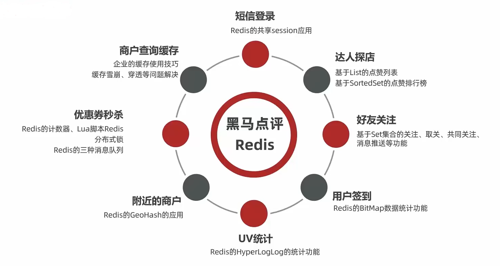

## 一、短信登录

### 1. 导入黑马点评项目

#### 1.1 导入数据库

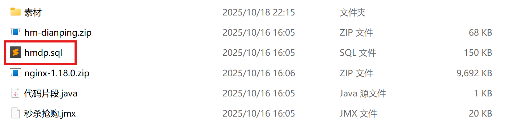

其中的表有：

+ tb_user：用户表
+ tb_user_info：用户详情表
+ tb_shop：商户信息表
+ tb_shop_type：商户类型表
+ tb_blog：用户日记表（达人探店日记）
+ tb_follow：用户关注表
+ tb_voucher：优惠卷表
+ tb_voucher_order：优惠卷的订单表

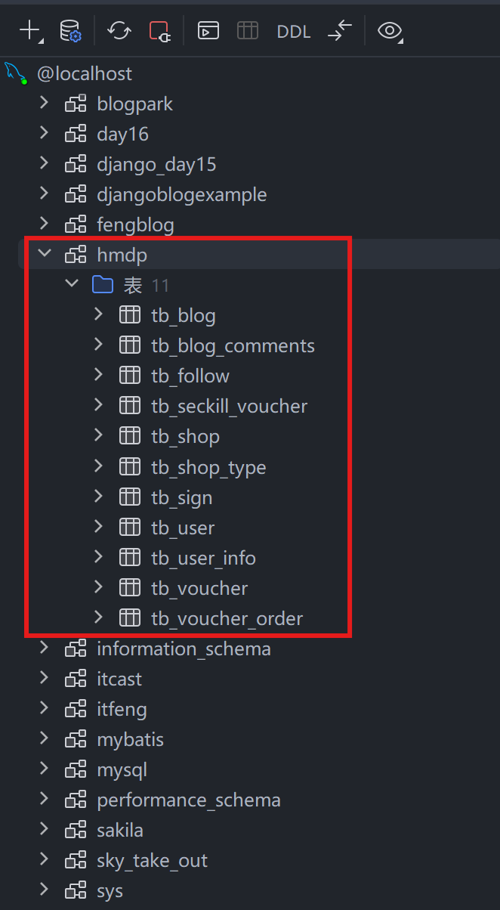

注意：MySQL 的版本采用 5.7 及以上版本

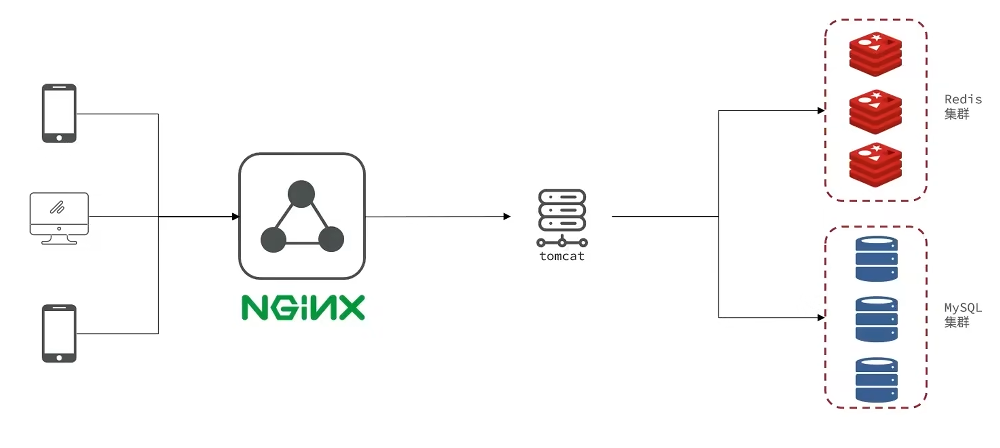

#### 1.2 导入后端项目

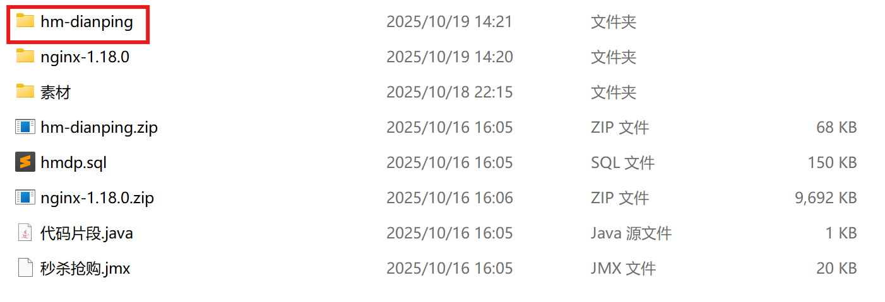

将其复制到 idea 工作空间，然后利用 idea 打开即可：

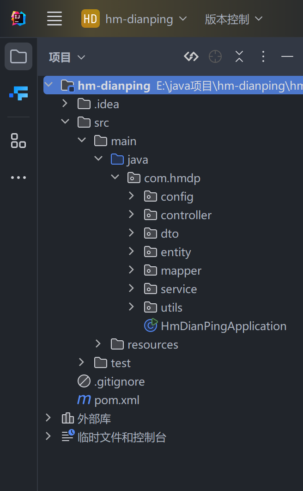

启动不了，报错缺少 qualid 字段的，将 lombok 改为：

```xml
<dependency>
    <groupId>org.projectlombok</groupId>
    <artifactId>lombok</artifactId>
    <version>1.18.30</version>
</dependency>
```

启动项目后，在浏览器访问：http://localhost:8081/shop-type/list，如果可以看到数据则证明运行没有问题

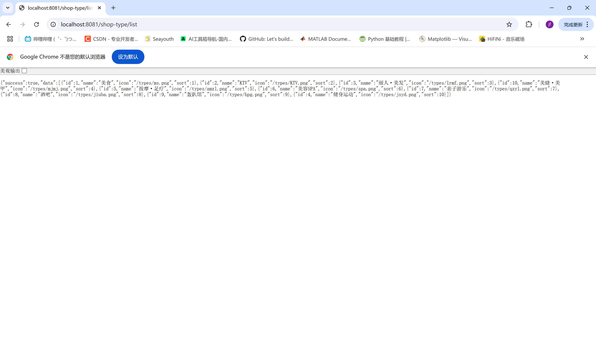

注意：不要忘了修改 application.yaml 文件中的 mysql、redis 地址信息


#### 1.3 导入前端项目

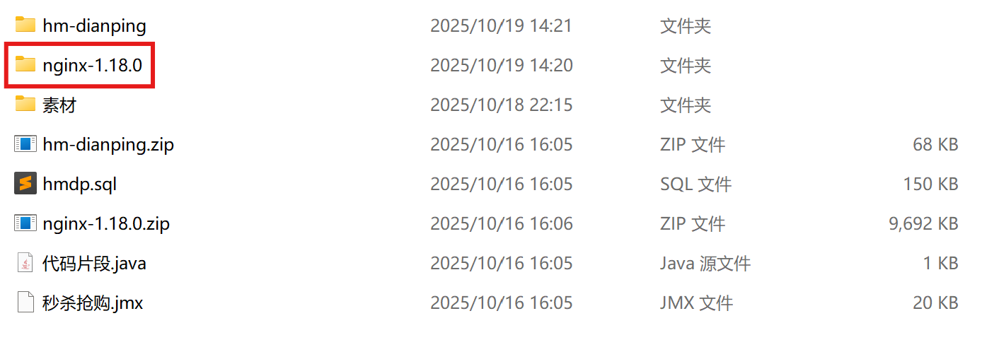

将其复制到任意目录，要确保该目录中不包含中文、特殊字符和空格

然后点击 nginx.exe 即可

或者在 nginx 所在目录下打开一个 CMD 窗口，输入命令：

```cmd
start nginx.exe
```

打开 Chrome 浏览器，在空白页面点击鼠标右键，选择检查，即可打开开发者工具

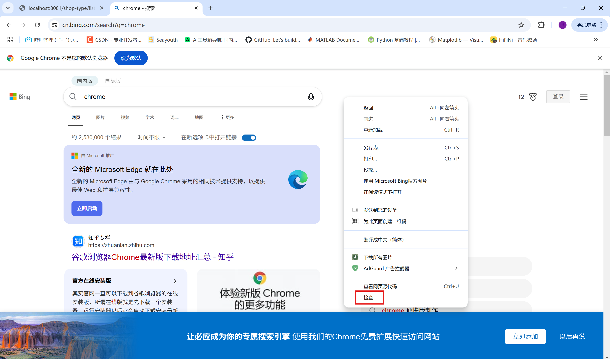

然后打开手机模式

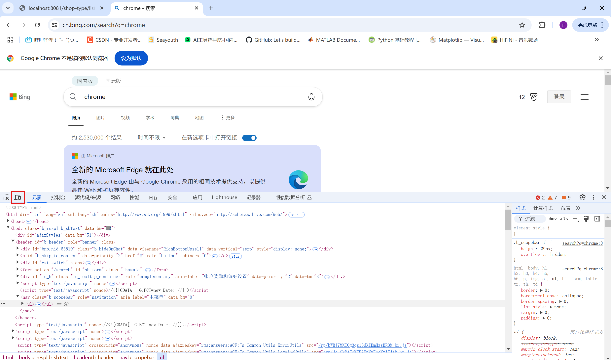

然后访问：http://127.0.0.1:8080，即可看到页面

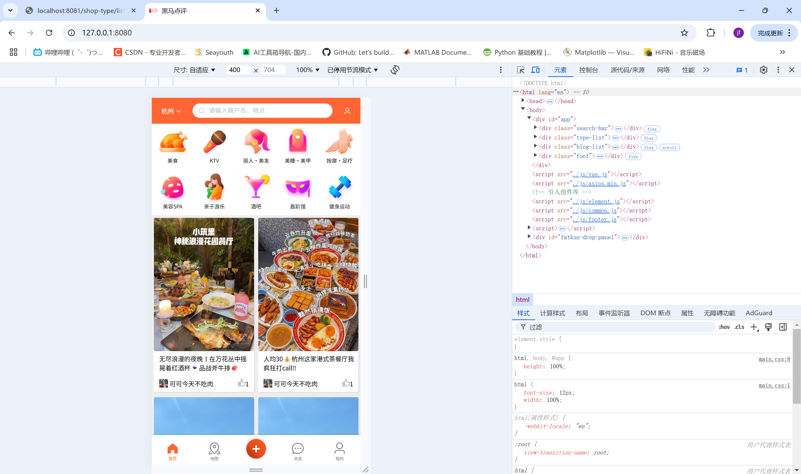


----------------


### 2. 基于 Session 实现登录

业务流程：

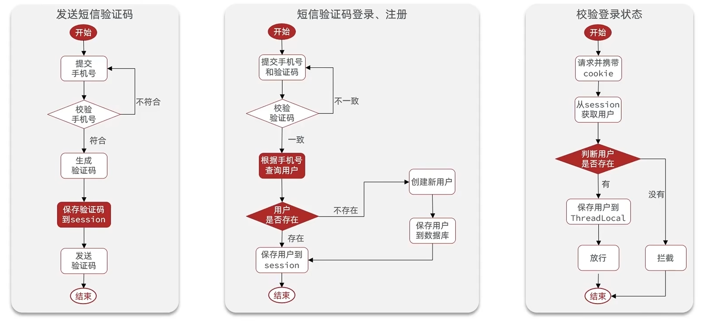

现在，在实际开发中，基本都是 token 实现的，这个 session 理解就行，token 登录的例子参照苍穹外卖

#### 2.1 发送短信验证码

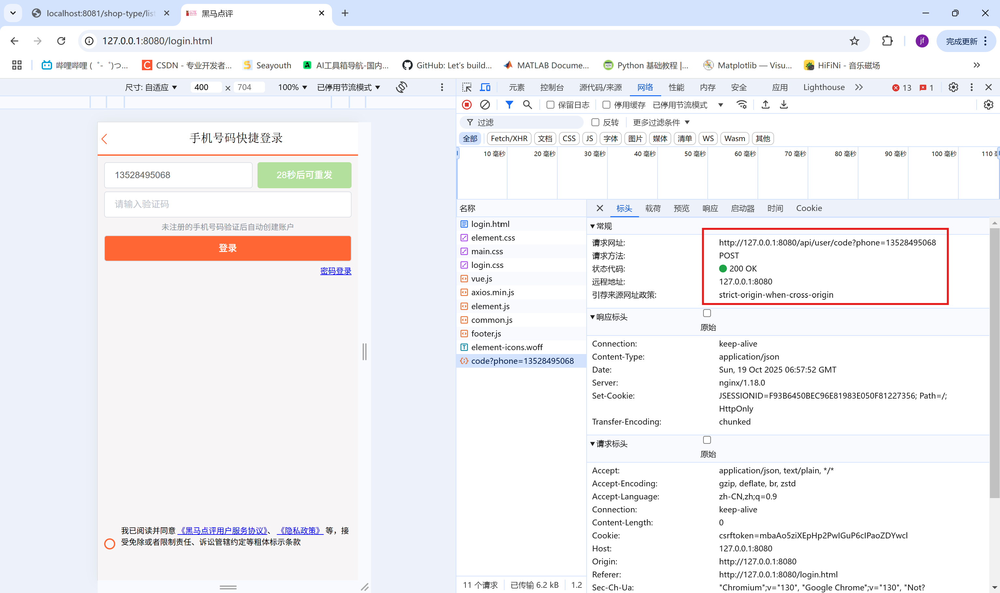

|          | 说明            |
| -------- | --------------- |
| 请求方式 | POST            |
| 请求路径 | /user/code      |
| 请求参数 | phone，电话号码 |
| 返回值   | 无              |

##### 代码实现

+ UserController.java

```java
/**
 * 发送手机验证码
 */
@PostMapping("code")
public Result sendCode(@RequestParam("phone") String phone, HttpSession session) {
    // 发送短信验证码并保存验证码
    return  userService.sendCode(phone, session);

}
```

+ UserServiceImpl.java

```java
@Override
public Result sendCode(String phone, HttpSession session) {
    // 1. 校验手机号
    if (RegexUtils.isPhoneInvalid(phone)) {
        // 2. 如果不符合，返回错误信息
        return Result.fail("手机号格式错误！");
    }

    // 3. 符合，生成验证码
    String code = RandomUtil.randomNumbers(6);

    // 4. 保存验证码到session
    session.setAttribute("code", code);

    // 5. 发送验证码
    // 发送验证码要去调用第三方的一些平台，比如说阿里云的短信平台去实现
    log.debug("发送短信验证码成功，验证码：{}", code);

    // 返回ok
    return Result.ok();
}
```


--------------


#### 2.2 短信验证码登录

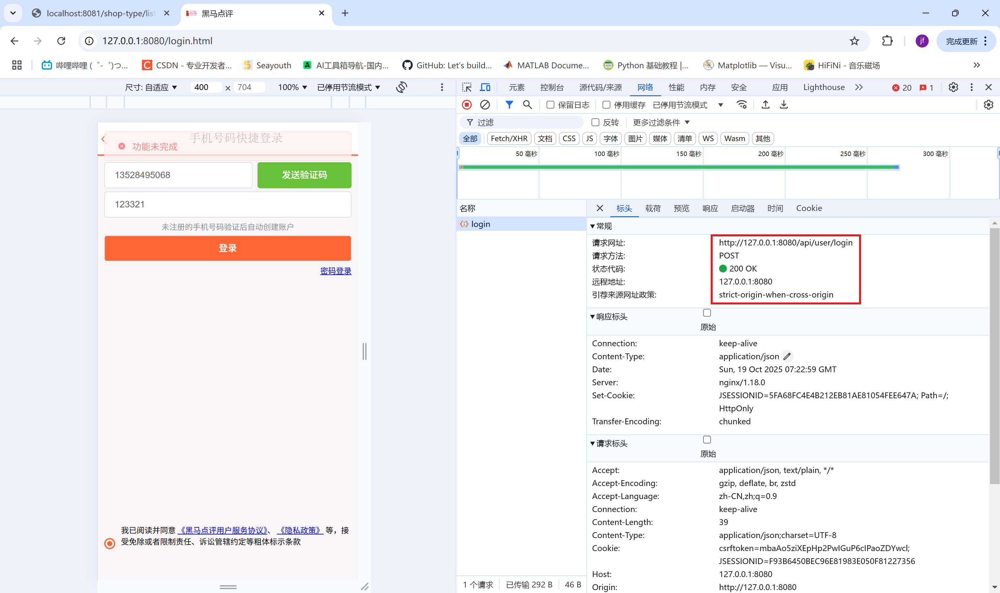

|          | 说明                          |
| -------- | ----------------------------- |
| 请求方式 | POST                          |
| 请求路径 | /user/login                   |
| 请求参数 | phone: 电话号码；code: 验证码 |
| 返回值   | 无                            |

##### 代码实现

+ UserController.java

```java
/**
 * 登录功能
 * @param loginForm 登录参数，包含手机号、验证码；或者手机号、密码
 */
@PostMapping("/login")
public Result login(@RequestBody LoginFormDTO loginForm, HttpSession session){
    // 实现登录功能
    return userService.login(loginForm, session);
}
```

+ UserServiceImpl.java

```java
/**
 * 登录功能
 *
 * @param loginForm
 * @param session
 * @return
 */
@Override
public Result login(LoginFormDTO loginForm, HttpSession session) {
    // 1. 校验手机号
    String phone = loginForm.getPhone();
    if (RegexUtils.isPhoneInvalid(phone)) {
        // 2. 如果不符合，返回错误信息
        return Result.fail("手机号格式错误！");
    }

    // 2.校验验证码
    Object cacheCode = session.getAttribute("code");
    String code = loginForm.getCode();
    if (cacheCode == null || !cacheCode.toString().equals(code)) {
        // 3. 不一致，报错
        return Result.fail("验证码错误");
    }

    // 4. 一致，根据手机号查询用户
    User user = query().eq("phone", phone).one();// 方法继承了ServiceImpl，这是mybatisplus提供的，可以帮助我们实现单表的增删改查

    // 5. 判断用户是否存在
    if (user == null) {
        // 6. 不存在，创建新用户并保存
        user = createUserWithPhone(phone);
    }

    // 7. 保存用户信息到session中
    session.setAttribute("user", user);

    return null;
}

private User createUserWithPhone(String phone) {
    // 1. 创建用户
    User user = new User();
    user.setPhone(phone);
    user.setNickName(SystemConstants.USER_NICK_NAME_PREFIX + RandomUtil.randomString(10));
    // 2. 保存用户
    save(user);
    return user;
}
```

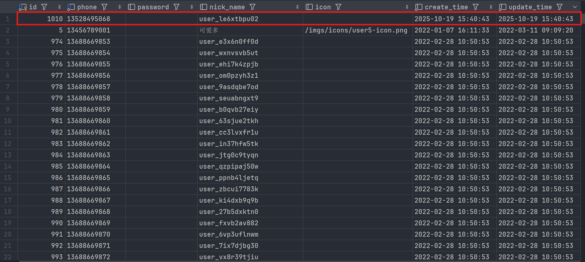


---------------


#### 2.3 登录校验功能

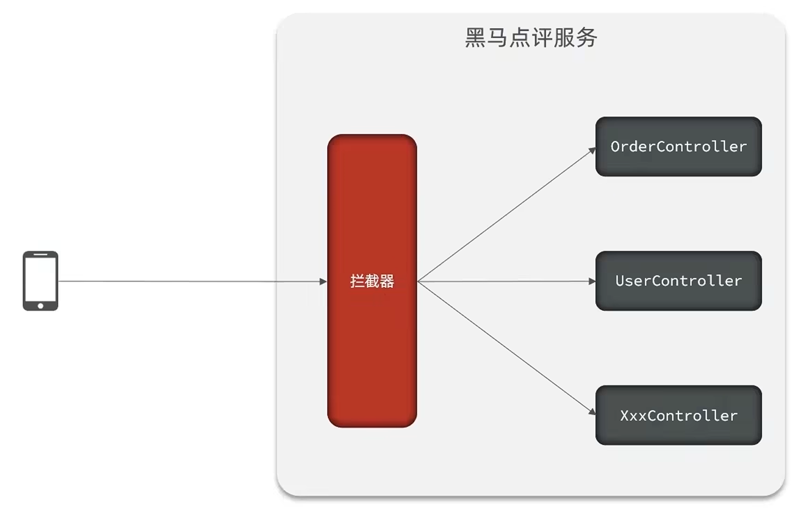 

过滤器是 tomcat 实现的，拦截器是 springmvc 实现的，过滤器的功能拦截器也能做到，且拦截器的功能更全，一般都是用拦截器

##### 代码实现

+ utils/LoginInterceptor.java

```java
package com.hmdp.utils;

import com.hmdp.entity.User;
import org.springframework.web.servlet.HandlerInterceptor;

import javax.servlet.http.HttpServletRequest;
import javax.servlet.http.HttpServletResponse;
import javax.servlet.http.HttpSession;

public class LoginInterceptor implements HandlerInterceptor {
    @Override
    public boolean preHandle(HttpServletRequest request, HttpServletResponse response, Object handler) throws Exception {
        // 1. 获取session
        HttpSession session = request.getSession();

        // 2. 获取session中的用户
        Object user = session.getAttribute("user");

        // 3. 判断用户是否存在
        if (user == null) {
            // 4. 不存在，拦截，返回401状态码
            response.setStatus(401);
            return false;
        }

        // 5. 存在，保存用户信息到 ThreadLocal
        UserHolder.saveUser((User) user);

        // 6. 放行
        return true;
    }

    @Override
    public void afterCompletion(HttpServletRequest request, HttpServletResponse response, Object handler, Exception ex) throws Exception {
        // 移除用户
        UserHolder.removeUser();
    }
}
```

+ config/MvcConfig.java

```java
package com.hmdp.config;

import com.hmdp.utils.LoginInterceptor;
import org.springframework.context.annotation.Configuration;
import org.springframework.web.servlet.config.annotation.InterceptorRegistry;
import org.springframework.web.servlet.config.annotation.WebMvcConfigurer;

@Configuration
public class MvcConfig implements WebMvcConfigurer {
    @Override
    public void addInterceptors(InterceptorRegistry registry) {
        registry.addInterceptor(new LoginInterceptor())
                .excludePathPatterns(
                        "/shop/**",
                        "/voucher/**",
                        "/shop-type/**",
                        "/upload/**",
                        "/blog/hot",
                        "/user/code",
                        "/user/login"
                );
    }
}
```

+ UserController.java

```java
@GetMapping("/me")
public Result me(){
    // 获取当前登录的用户并返回
    User user = UserHolder.getUser();
    return Result.ok(user);
}
```

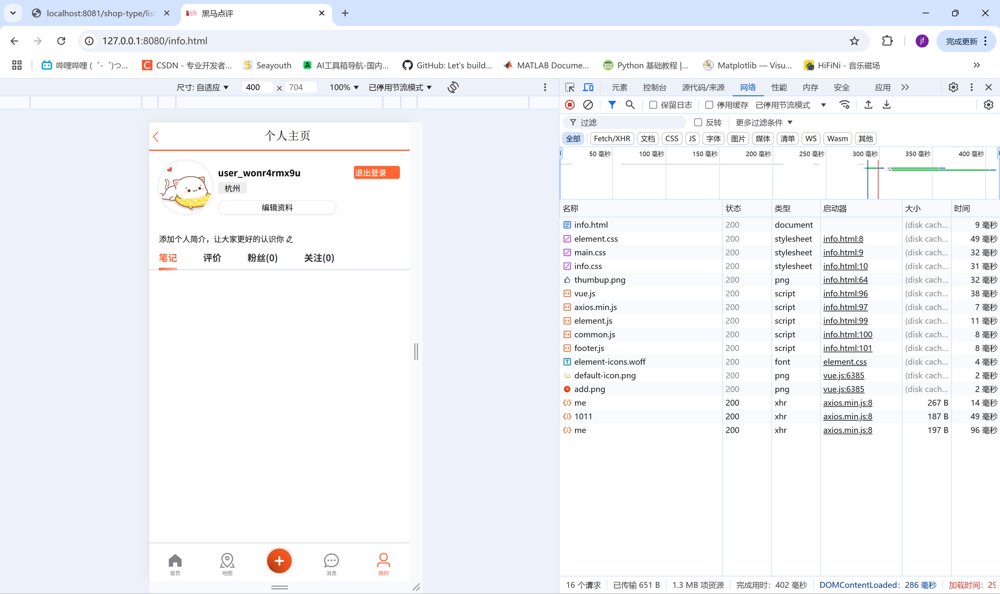

注意：这个前端写的有点问题，登陆后不会自动跳转到用户页面，要返回上一页后再点击用户界面


------------------


### 3. 集群的 session 共享问题

**session 共享问题**：多台 Tomcat 并不共享 session 存储空间，当请求切换到不同 tomcat 服务时导致数据丢失的问题

session 的替代方案应该满足：

+ 数据共享
+ 内存存储
+ key、value 结构


------------------


### 4. 基于 Redis 实现共享 session 登录

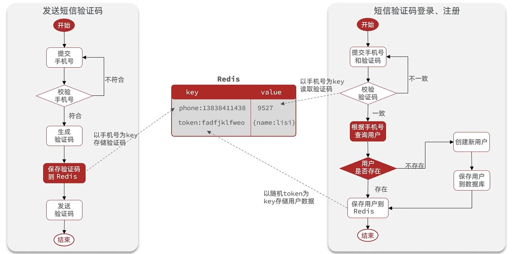

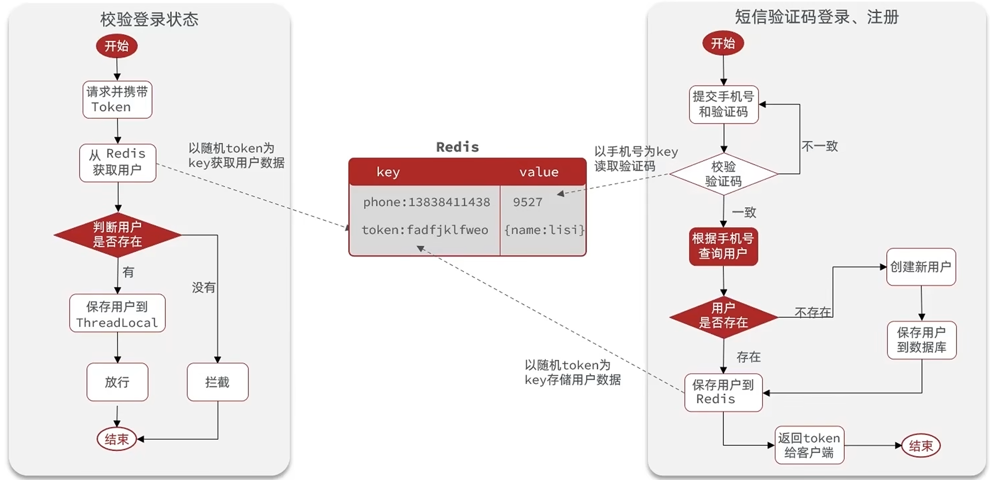

#### 代码开发

+ UserServiceImpl.java

```java
/**
 * 登录功能
 *
 * @param loginForm
 * @param session
 * @return
 */
@Override
public Result login(LoginFormDTO loginForm, HttpSession session) {
    // 1. 校验手机号
    String phone = loginForm.getPhone();
    if (RegexUtils.isPhoneInvalid(phone)) {
        // 2. 如果不符合，返回错误信息
        return Result.fail("手机号格式错误！");
    }

    // 3.从redis获取验证码并校验验证码
    String cacheCode = stringRedisTemplate.opsForValue().get(RedisConstants.LOGIN_CODE_KEY + phone);
    String code = loginForm.getCode();
    if (cacheCode == null || !cacheCode.equals(code)) {
        // 3. 不一致，报错
        return Result.fail("验证码错误");
    }

    // 4. 一致，根据手机号查询用户
    User user = query().eq("phone", phone).one();// 方法继承了ServiceImpl，这是mybatisplus提供的，可以帮助我们实现单表的增删改查

    // 5. 判断用户是否存在
    if (user == null) {
        // 6. 不存在，创建新用户并保存
        user = createUserWithPhone(phone);
    }

    // 7. 保存用户信息到redis中
    // 7.1 随机生成token，作为登录令牌
    String token = UUID.randomUUID().toString(true);
    // 7.2 将User对象转为HashMap存储
    UserDTO userDTO = BeanUtil.copyProperties(user, UserDTO.class);
    Map<String, Object> userMap = BeanUtil.beanToMap(userDTO, new HashMap<>(),
            CopyOptions.create()
                    .setIgnoreNullValue(true)
                    .setFieldValueEditor((fieldName, fieldValue) -> fieldValue.toString()));
     /*
        beanToMap方法将对象转换为Map
        new HashMap<>()指定了目标Map类型
        CopyOptions配置了转换规则：
        setIgnoreNullValue(true)：忽略null值的属性
        setFieldValueEditor：对字段值进行编辑，这里将所有字段值转换为字符串
     */
    // 7.3 存储
    stringRedisTemplate.opsForHash().putAll(RedisConstants.LOGIN_USER_KEY + token, userMap);
    // 7.4 设置token有效期
    stringRedisTemplate.expire(RedisConstants.LOGIN_USER_KEY + token, RedisConstants.LOGIN_CODE_TTL, TimeUnit.DAYS);

    // 8. 返回token
    return Result.ok(token);
}
```

+ MvcConfig.java

```java
package com.hmdp.config;

import com.hmdp.utils.LoginInterceptor;
import org.springframework.beans.factory.annotation.Autowired;
import org.springframework.context.annotation.Configuration;
import org.springframework.web.servlet.config.annotation.InterceptorRegistry;
import org.springframework.web.servlet.config.annotation.WebMvcConfigurer;

@Configuration
public class MvcConfig implements WebMvcConfigurer {

    @Autowired
    private LoginInterceptor loginInterceptor;

    @Override
    public void addInterceptors(InterceptorRegistry registry) {
        registry.addInterceptor(loginInterceptor)
                .excludePathPatterns(
                        "/shop/**",
                        "/voucher/**",
                        "/shop-type/**",
                        "/upload/**",
                        "/blog/hot",
                        "/user/code",
                        "/user/login"
                );
    }
}
```

+ LoginInterceptor.java

```java
package com.hmdp.utils;

import cn.hutool.core.bean.BeanUtil;
import cn.hutool.core.util.StrUtil;
import com.hmdp.dto.UserDTO;
import org.springframework.beans.factory.annotation.Autowired;
import org.springframework.data.redis.core.StringRedisTemplate;
import org.springframework.stereotype.Component;
import org.springframework.web.servlet.HandlerInterceptor;

import javax.servlet.http.HttpServletRequest;
import javax.servlet.http.HttpServletResponse;
import java.util.Map;
import java.util.concurrent.TimeUnit;


@Component
public class LoginInterceptor implements HandlerInterceptor {

    @Autowired
    private StringRedisTemplate stringRedisTemplate;

    @Override
    public boolean preHandle(HttpServletRequest request, HttpServletResponse response, Object handler) throws Exception {
        // 1. 获取请求头中的token
        String token = request.getHeader("authorization");
        if (StrUtil.isBlank(token)) {
            // 不存在，拦截，返回401状态码
            response.setStatus(401);
            return false;
        }

        // 2. 基于token获取redis中的用户
        String key = RedisConstants.LOGIN_USER_KEY + token;
        Map<Object, Object> userMap = stringRedisTemplate.opsForHash().entries(key);

        // 3. 判断用户是否存在
        if (userMap.isEmpty()) {
            // 4. 不存在，拦截，返回401状态码
            response.setStatus(401);
            return false;
        }
        // 5. 将查询到的Hash数据转为UserDTO对象
        UserDTO userDTO = BeanUtil.fillBeanWithMap(userMap, new UserDTO(), false);

        // 6. 存在，保存用户信息到 ThreadLocal
        UserHolder.saveUser(userDTO);

        // 7. 刷新token有效期
        stringRedisTemplate.expire(key, RedisConstants.LOGIN_CODE_TTL, TimeUnit.DAYS);

        // 8. 放行
        return true;
    }

    @Override
    public void afterCompletion(HttpServletRequest request, HttpServletResponse response, Object handler, Exception ex) throws Exception {
        // 移除用户
        UserHolder.removeUser();
    }
}
```


#### 功能测试

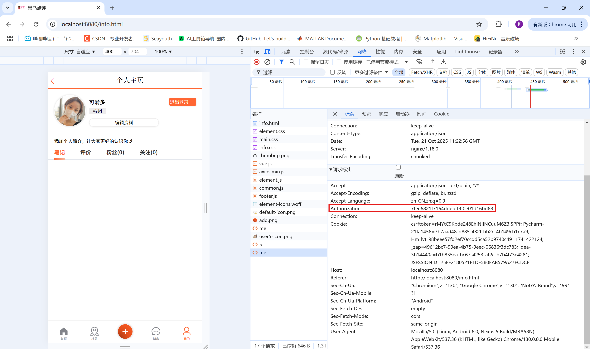


#### 总结

Redis 代替 session 需要考虑的问题：

+ 选择合适的数据结构
+ 选择合适的 key
+ 选择合适的存储粒度


-------------------------------------------


### 5. 解决状态登录刷新的问题

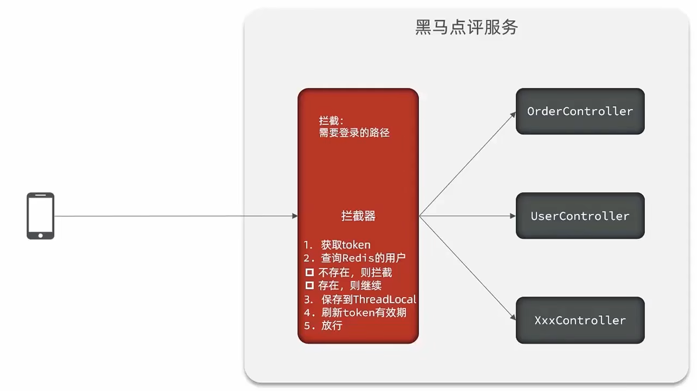

但是现在这个拦截器不能真正达成只要用户一直在访问就不会过期，因为这个拦截器拦截的不是一切路径，当我们一直访问不需要登录的页面，到时间后就会过期

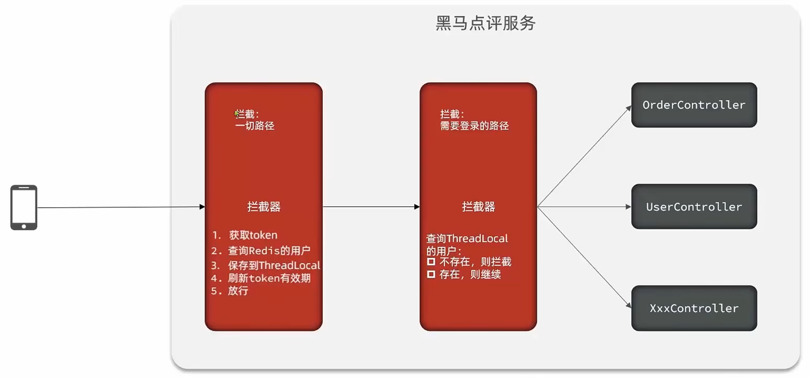


#### 代码开发

+ RefreshTokenInterceptor.java

```java
package com.hmdp.utils;

import cn.hutool.core.bean.BeanUtil;
import cn.hutool.core.util.StrUtil;
import com.hmdp.dto.UserDTO;
import org.springframework.beans.factory.annotation.Autowired;
import org.springframework.data.redis.core.StringRedisTemplate;
import org.springframework.stereotype.Component;
import org.springframework.web.servlet.HandlerInterceptor;

import javax.servlet.http.HttpServletRequest;
import javax.servlet.http.HttpServletResponse;
import java.util.Map;
import java.util.concurrent.TimeUnit;

@Component
public class RefreshTokenInterceptor implements HandlerInterceptor {

    @Autowired
    private StringRedisTemplate stringRedisTemplate;

    @Override
    public boolean preHandle(HttpServletRequest request, HttpServletResponse response, Object handler) throws Exception {
        // 1. 获取请求头中的token
        String token = request.getHeader("authorization");
        if (StrUtil.isBlank(token)) {
            return true;
        }

        // 2. 基于token获取redis中的用户
        String key = RedisConstants.LOGIN_USER_KEY + token;
        Map<Object, Object> userMap = stringRedisTemplate.opsForHash().entries(key);

        // 3. 判断用户是否存在
        if (userMap.isEmpty()) {
            return true;
        }
        // 5. 将查询到的Hash数据转为UserDTO对象
        UserDTO userDTO = BeanUtil.fillBeanWithMap(userMap, new UserDTO(), false);

        // 6. 存在，保存用户信息到 ThreadLocal
        UserHolder.saveUser(userDTO);

        // 7. 刷新token有效期
        stringRedisTemplate.expire(key, RedisConstants.LOGIN_CODE_TTL, TimeUnit.DAYS);

        // 8. 放行
        return true;
    }

    @Override
    public void afterCompletion(HttpServletRequest request, HttpServletResponse response, Object handler, Exception ex) throws Exception {
        // 移除用户
        UserHolder.removeUser();
    }
}
```

+ LoginInterceptor.java

```java
package com.hmdp.utils;

import org.springframework.stereotype.Component;
import org.springframework.web.servlet.HandlerInterceptor;

import javax.servlet.http.HttpServletRequest;
import javax.servlet.http.HttpServletResponse;


@Component
public class LoginInterceptor implements HandlerInterceptor {

    @Override
    public boolean preHandle(HttpServletRequest request, HttpServletResponse response, Object handler) throws Exception {
        // 1. 判断是否需要拦截（ThreadLocal中是否有用户）
        if (UserHolder.getUser() == null) {
            // 没有，需要拦截，设置状态码
            response.setStatus(401);
            // 拦截
            return false;
        }
        // 由用户，则放行
        return true;
    }
}
```

+ MvcConfig.java

```java
package com.hmdp.config;

import com.hmdp.utils.LoginInterceptor;
import com.hmdp.utils.RefreshTokenInterceptor;
import org.springframework.beans.factory.annotation.Autowired;
import org.springframework.context.annotation.Configuration;
import org.springframework.web.servlet.config.annotation.InterceptorRegistry;
import org.springframework.web.servlet.config.annotation.WebMvcConfigurer;

@Configuration
public class MvcConfig implements WebMvcConfigurer {

    @Autowired
    private LoginInterceptor loginInterceptor;
    @Autowired
    private RefreshTokenInterceptor refreshTokenInterceptor;

    @Override
    public void addInterceptors(InterceptorRegistry registry) {
        // 登录拦截器
        registry.addInterceptor(loginInterceptor)
                .excludePathPatterns(
                        "/shop/**",
                        "/voucher/**",
                        "/shop-type/**",
                        "/upload/**",
                        "/blog/hot",
                        "/user/code",
                        "/user/login"
                ).order(1);

        // token刷新拦截器
        registry.addInterceptor(refreshTokenInterceptor)
                .addPathPatterns(
                        "/**"
                ).order(0); // order() 用于指定那个拦截器先执行（值越小越先执行）
    }
}
```


------------------------------


## 二、商户查询缓存

### 1. 什么是缓存

**缓存**就是数据交换的缓冲区（称作 Cache），是存储数据的临时地方，一般读写性能较高

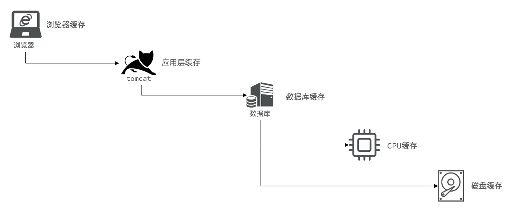

+ 浏览器缓存：一般为不变的静态文件 html、css、js 文件等
+ 应用层缓存：我们创建一个 Map 然后把从数据库拿到的数据放到这个 Map 里面，后面再来读取的时候就能减少数据库的查询效率（一般用 redis）
+ 数据库缓存：比如索引


----------------------


### 2. 添加 Redis 缓存

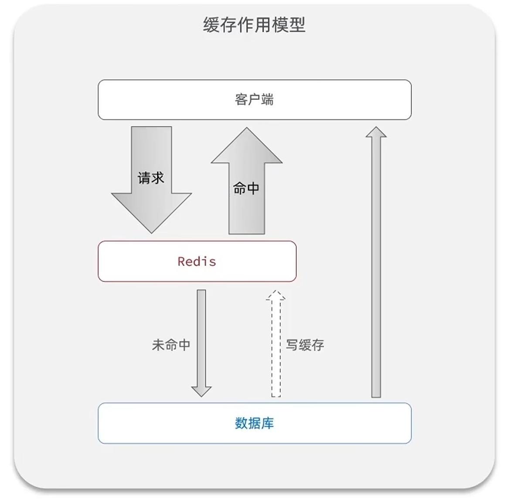

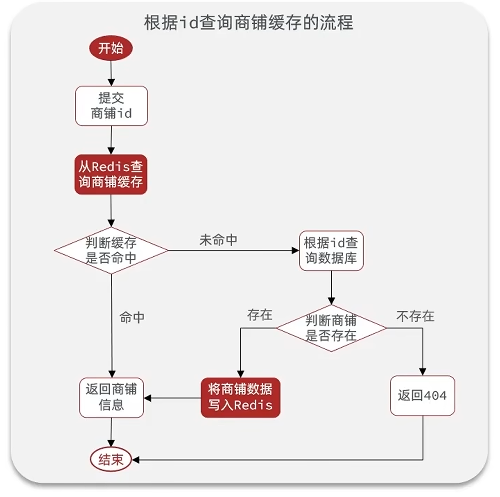


#### 代码开发

+ ShopController.java

```java
/**
 * 根据id查询商铺信息
 * @param id 商铺id
 * @return 商铺详情数据
 */
@GetMapping("/{id}")
public Result queryShopById(@PathVariable("id") Long id) {
    return shopService.queryById(id);
}
```

+ ShopServiceImpl.java

```java
package com.hmdp.service.impl;

import cn.hutool.core.util.StrUtil;
import cn.hutool.json.JSONUtil;
import com.hmdp.dto.Result;
import com.hmdp.entity.Shop;
import com.hmdp.mapper.ShopMapper;
import com.hmdp.service.IShopService;
import com.baomidou.mybatisplus.extension.service.impl.ServiceImpl;
import com.hmdp.utils.RedisConstants;
import org.springframework.beans.factory.annotation.Autowired;
import org.springframework.data.redis.core.StringRedisTemplate;
import org.springframework.stereotype.Service;

import javax.annotation.Resource;

/**
 * <p>
 * 服务实现类
 * </p>
 *
 * @author 虎哥
 * @since 2021-12-22
 */
@Service
public class ShopServiceImpl extends ServiceImpl<ShopMapper, Shop> implements IShopService {

    @Autowired
    private StringRedisTemplate stringRedisTemplate;

    @Override
    public Result queryById(Long id) {
        String key = RedisConstants.CACHE_SHOP_KEY + id;
        // 1. 从redis查询商铺缓存
        String shopJson = stringRedisTemplate.opsForValue().get(key);

        // 2. 判断是否存在
        if (StrUtil.isNotBlank(shopJson)) {
            // 3. 存在，直接返回
            Shop shop = JSONUtil.toBean(shopJson, Shop.class);
            return Result.ok(shop);
        }

        // 4. 不存在，根据id查询数据库
        Shop shop = getById(id);

        // 5. 不存在，返回错误
        if (shop == null) {
            return Result.fail("店铺不存在！");
        }

        // 6. 存在，写入reids
        stringRedisTemplate.opsForValue().set(key, JSONUtil.toJsonStr(shop));

        // 7. 返回
        return Result.ok(shop);
    }
}
```


------------------


### 3. 缓存更新策略

|          | 内存淘汰                                                     | 超时剔除                                                     | 主动更新                                   |
| -------- | ------------------------------------------------------------ | ------------------------------------------------------------ | ------------------------------------------ |
| 说明     | 不用自己维护，利用 Redis 的内存淘汰机制，当内存不足时自动淘汰部分数据，下次查询时更新缓存 | 给缓存数据添加 TTL 时间，到期后自动删除数据，下次查询时更新缓存 | 编写业务逻辑，在修改数据库的同时，更新缓存 |
| 一致性   | 差                                                           | 一般                                                         | 好                                         |
| 维护成本 | 无                                                           | 低                                                           | 高                                         |

业务场景：

+ 低一致性需求：使用内存淘汰机制。例如店铺类型的查询缓存
+ 高一致性需求：主动更新，并以超时剔除作为兜底方案。例如店铺详情查询的缓存

#### 3.1 主动更新策略

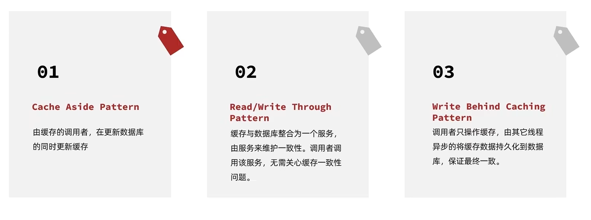

一般企业用的最多的是方案一

操作缓存和数据库时有三个问题需要考虑：

1. 删除缓存还是更新缓存？

+ 更新缓存：每次更新数据库都更新缓存，无效写操作较多
+ 删除缓存：更新数据库时让缓存失效，查询时再更新缓存（**用这个**）

2. 如何保证缓存与数据库的操作的同时成功或失败？

+ 单体系统，将缓存与数据库操作放在一个事务
+ 分布式系统，利用 TCC 等分布式事务方案

3. 先操作缓存还是先操作数据库？

+ 都有可能发生线程安全问题
+ 先操作数据库，再删除缓存发生安全问题的概率较小

#### 总结

缓存更新策略的最佳实践方案：

1. 低一致性需求：使用 Redis 自带的内存淘汰机制
2. 高一致性需求：主动更新，并以超时剔除作为兜底方案
   + 读操作：
     + 缓存命中则直接返回
     + 缓存未命中则查询数据库，并写入缓存，设定超时实践
   + 写操作：
     + 先写数据库，然后再删除缓存
     + 要确保数据库与缓存操作的原子性


#### 案例

> 修改 ShopController 中的业务逻辑，满足下面的需求：
>
> 1. 根据 id 查询店铺时，如果缓存未命中，则查询数据，将数据库结果写入缓存，并设置超时实践
> 2. 根据 id 修改店铺时，先修改数据库，再删除缓存

+ ShopController.java

```java
/**
 * 更新商铺信息
 * @param shop 商铺数据
 * @return 无
 */
@PutMapping
public Result updateShop(@RequestBody Shop shop) {
    // 写入数据库
    return shopService.update(shop);
}
```

+ ShopServiceImpl.java

```java
@Override
@Transactional
public Result update(Shop shop) {
    Long id = shop.getId();
    if (id == null) {
        return Result.fail("店铺id不能为空");
    }
    // 1. 更新数据库
    updateById(shop);

    // 2. 删除缓存
    stringRedisTemplate.delete(RedisConstants.CACHE_SHOP_KEY + id);

    return Result.ok();
}
```


-------------------------


### 4. 缓存穿透

**缓存穿透**是指客户端请求的数据在缓存中和数据库中都不存在，这样缓存永远不会生效，这些请求都会打到数据库

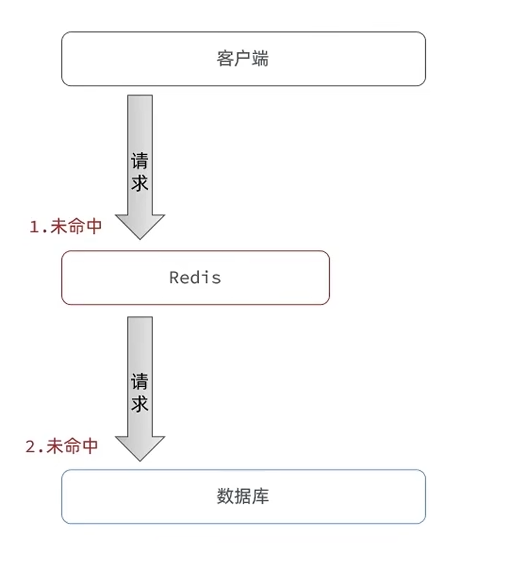

如果有不怀好意的人，会整无数的线程，并发的来向一个不存在的数据发起请求，这样所有的请求都会到达我们的数据库，很有可能把我们的数据库搞垮了

常见的解决方案有两种：

+ 缓存空对象
  + 优点：实现简单，维护方便
  + 缺点：
    + 额外的内存消耗
    + 可能造成短期的不一致

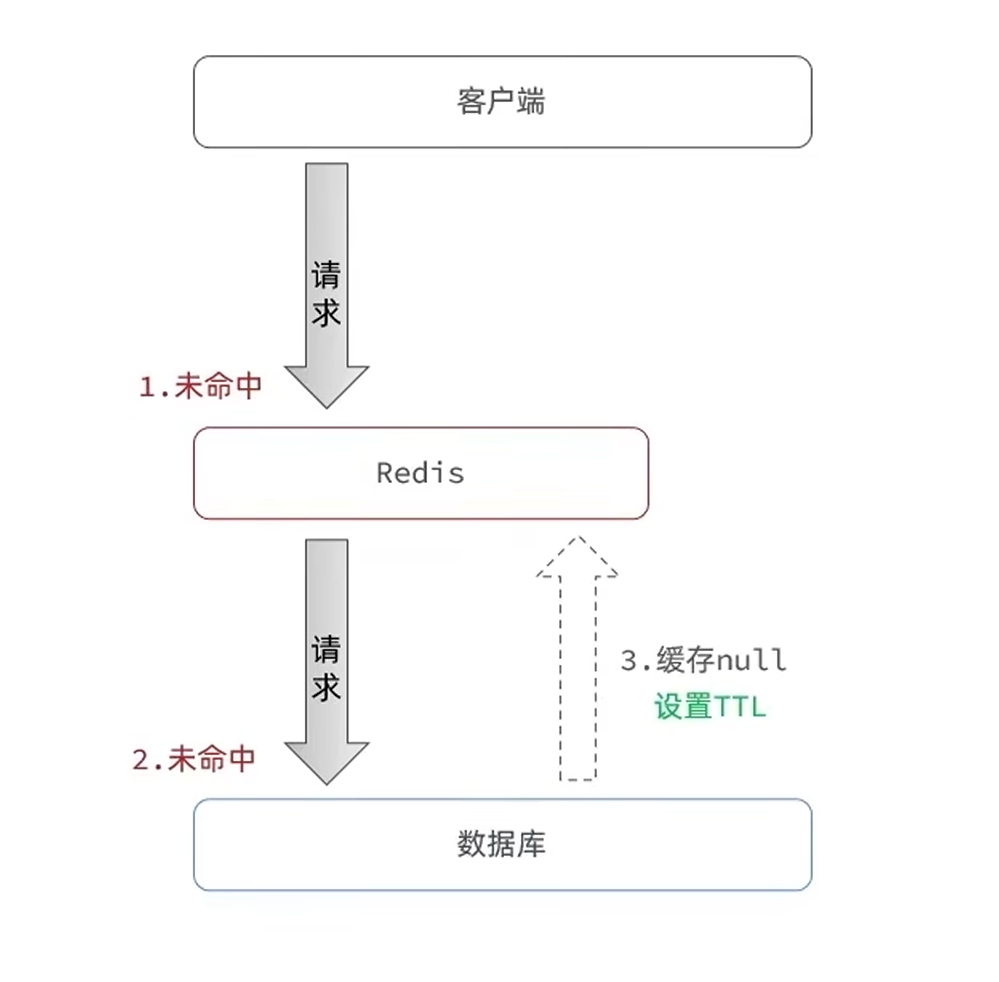


+ 布隆过滤

  原理可以简单理解成一个 byte 数组，里面存的是二进制位。当我们要判断数据库中的数据是否存在的时候，不是真的把数据存储到布隆过滤器，而是把这些数据基于某一种哈希算法，计算出哈希值，然后将这些哈希值转化为二进制位，保存到布隆过滤器里面。后面判断数据是否存在的时候，其实就是判断对应的那个位置是0还是1。它的存在与否是一种概率上的统计，并不是真的百分百的准确

  + 优点：内存占用较少，没有多余 key
  + 缺点：
    + 实现复杂
    + 存在误判可能

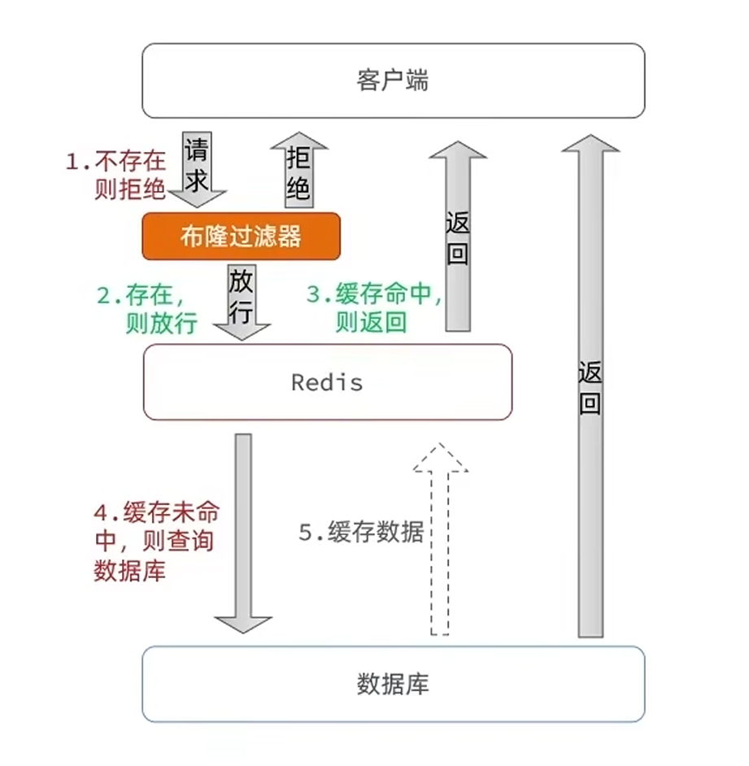


#### 代码开发

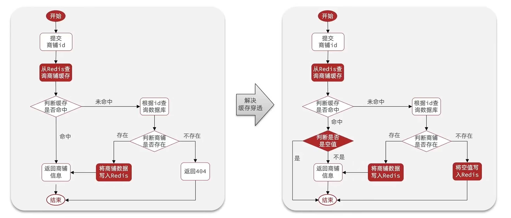

+ ShopServiceImpl.java

```java
@Override
public Result queryById(Long id) {
    String key = RedisConstants.CACHE_SHOP_KEY + id;
    // 1. 从redis查询商铺缓存
    String shopJson = stringRedisTemplate.opsForValue().get(key);

    // 2. 判断是否存在
    if (StrUtil.isNotBlank(shopJson)) {
        // 3. 存在，直接返回
        Shop shop = JSONUtil.toBean(shopJson, Shop.class);
        return Result.ok(shop);
    }
    // 判断命中的是否是空值
    if (shopJson != null) {
        // 返回一个错误信息
        return Result.fail("店铺信息不存在！");
    }

    // 4. 不存在，根据id查询数据库
    Shop shop = getById(id);

    // 5. 不存在，返回错误
    if (shop == null) {
        // 将空值写入redis
        stringRedisTemplate.opsForValue().set(key, "", RedisConstants.CACHE_NULL_TTL, TimeUnit.MINUTES);
        // 返回错误信息
        return Result.fail("店铺不存在！");
    }

    // 6. 存在，写入reids
    stringRedisTemplate.opsForValue().set(key, JSONUtil.toJsonStr(shop), RedisConstants.CACHE_SHOP_TTL, TimeUnit.MINUTES);

    // 7. 返回
    return Result.ok(shop);
}
```

#### 总结

缓存穿透产生的原因是什么？

+ 用户请求的数据在缓存中和数据库中都不存在，不断发起这样的请求，给数据库带来巨大压力

缓存穿透的解决方案有哪些？

+ 缓存 null 值
+ 布隆过滤
+ 增加 id 的复杂度，避免被猜测 id 规律
+ 做好数据的基础格式校验
+ 加强用户权限校验
+ 做好热点参数的限流


----------------------


### 5. 缓存雪崩

**缓存雪崩**是指在同一时段大量的缓存 key 同时失效或者 Redis 服务宕机，导致大量请求到达数据库，带来巨大压力

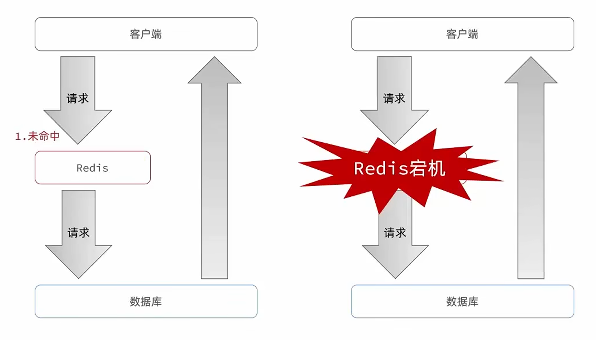

解决方案：

+ 给不同的 key 的 TTL 添加随机值
+ 利用 Redis 集群提高服务的可用性
+ 给缓存业务添加降级限流策略
+ 给业务添加多级缓存（在多个层面建立缓存）


-------------------------


### 6. 缓存击穿

**缓存击穿问题**也叫热点 key 问题，就是一个被**高并发访问**并且**缓存重建业务较复杂**的 key 突然失效，无数的请求访问会在瞬间给数据库带来巨大的冲击

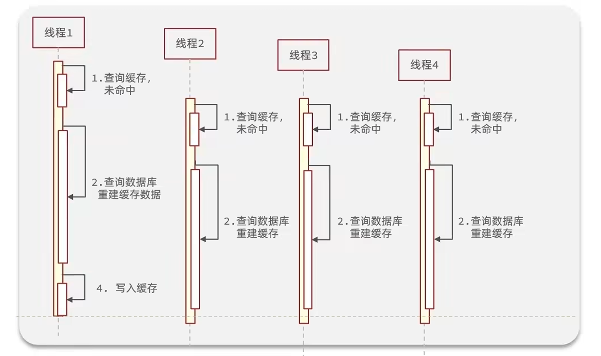

常见的解决方案有两种：

+ 互斥锁


+ 逻辑过期

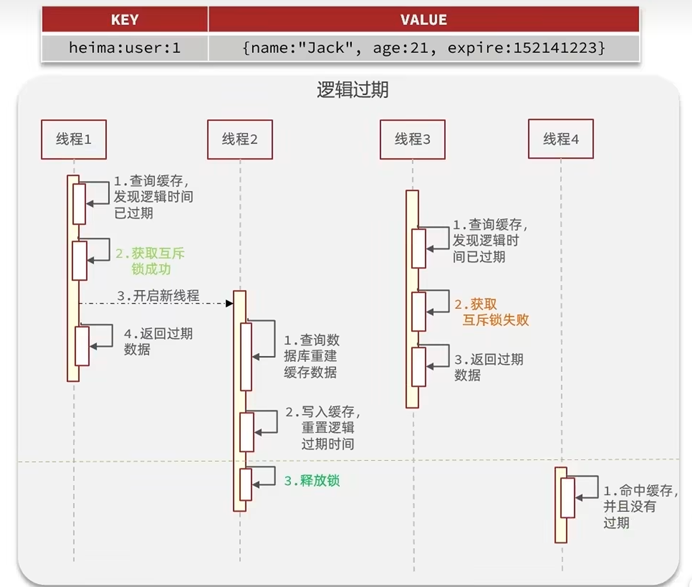


| 解决方案 | 优点                                                   | 缺点                                                 |
| -------- | ------------------------------------------------------ | ---------------------------------------------------- |
| 互斥锁   | - 没有额外的内存消耗<br />- 保证一致性<br />- 实现简单 | - 线程需要等待，性能受影响<br />- 可能有死锁风险     |
| 逻辑过期 | - 线程无需等待，性能较好                               | - 不保证一致性<br />- 有额外内存消耗<br />- 实现复杂 |


#### 案例：基于互斥锁方式解决缓存击穿问题

>需求：修改根据 id 查询商铺的业务，基于互斥锁方式来解决缓存击穿问题
>
>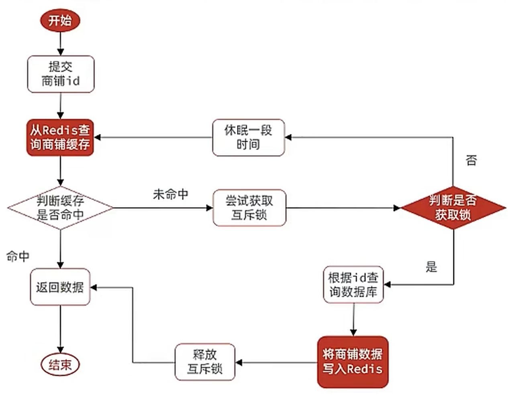

+ ShopServiceImpl.java

```java
package com.hmdp.service.impl;

import cn.hutool.core.util.BooleanUtil;
import cn.hutool.core.util.StrUtil;
import cn.hutool.json.JSONUtil;
import com.hmdp.dto.Result;
import com.hmdp.entity.Shop;
import com.hmdp.mapper.ShopMapper;
import com.hmdp.service.IShopService;
import com.baomidou.mybatisplus.extension.service.impl.ServiceImpl;
import com.hmdp.utils.RedisConstants;
import org.springframework.beans.factory.annotation.Autowired;
import org.springframework.data.redis.core.StringRedisTemplate;
import org.springframework.stereotype.Service;
import org.springframework.transaction.annotation.Transactional;

import javax.annotation.Resource;
import java.util.concurrent.TimeUnit;

/**
 * <p>
 * 服务实现类
 * </p>
 *
 * @author 虎哥
 * @since 2021-12-22
 */
@Service
public class ShopServiceImpl extends ServiceImpl<ShopMapper, Shop> implements IShopService {

    @Autowired
    private StringRedisTemplate stringRedisTemplate;

    @Override
    public Result queryById(Long id) {
        // 缓存穿透
//        Shop shop = queryWithPassThrough(id);

        // 互斥锁解决缓存击穿
        Shop shop = queryWithMutex(id);
        if (shop == null) {
            return Result.fail("店铺不存在");
        }

        // 7. 返回
        return Result.ok(shop);
    }

    /**
     * 封装缓存击穿
     *
     * @param id
     * @return
     */
    public Shop queryWithMutex(Long id) {
        String key = RedisConstants.CACHE_SHOP_KEY + id;
        // 1. 从redis查询商铺缓存
        String shopJson = stringRedisTemplate.opsForValue().get(key);

        // 2. 判断是否存在
        if (StrUtil.isNotBlank(shopJson)) {
            // 3. 存在，直接返回
            Shop shop = JSONUtil.toBean(shopJson, Shop.class);
            return shop;
        }
        // 判断命中的是否是空值
        if (shopJson != null) {
            // 返回一个错误信息
            return null;
        }

        // 4. 实现缓存重建
        // 4.1 获取互斥锁
        String lockKey = "lock:shop:" + id;
        Shop shop = null;
        try {
            boolean isLock = tryLock(lockKey);
            // 4.2 判断是否获取成功
            if (!isLock) {
                // 4.3 失败，则休眠并重试
                Thread.sleep(50);
                return queryWithMutex(id); // 重试（作递归）
            }
            // 4.4 成功，再次检测redis，缓存是否存在，做二次检查，否则根据id查询数据库
            String shopJson1 = stringRedisTemplate.opsForValue().get(key);

            if (StrUtil.isNotBlank(shopJson1)) {
                Shop shop1 = JSONUtil.toBean(shopJson1, Shop.class);
                return shop1;
            }
            shop = getById(id);

            // 5. 不存在，返回错误
            if (shop == null) {
                // 将空值写入redis
                stringRedisTemplate.opsForValue().set(key, "", RedisConstants.CACHE_NULL_TTL, TimeUnit.MINUTES);
                // 返回错误信息
                return null;
            }

            // 6. 存在，写入reids
            stringRedisTemplate.opsForValue().set(key, JSONUtil.toJsonStr(shop), RedisConstants.CACHE_SHOP_TTL, TimeUnit.MINUTES);
        } catch (InterruptedException e) {
            throw new RuntimeException(e);
        } finally {
            // 7. 释放互斥锁
            unlock(lockKey);
        }

        // 8. 返回
        return shop;
    }

    /**
     * 封装缓存穿透
     *
     * @param id
     * @return
     */
    public Shop queryWithPassThrough(Long id) {
        String key = RedisConstants.CACHE_SHOP_KEY + id;
        // 1. 从redis查询商铺缓存
        String shopJson = stringRedisTemplate.opsForValue().get(key);

        // 2. 判断是否存在
        if (StrUtil.isNotBlank(shopJson)) {
            // 3. 存在，直接返回
            Shop shop = JSONUtil.toBean(shopJson, Shop.class);
            return shop;
        }
        // 判断命中的是否是空值
        if (shopJson != null) {
            // 返回一个错误信息
            return null;
        }

        // 4. 不存在，根据id查询数据库
        Shop shop = getById(id);

        // 5. 不存在，返回错误
        if (shop == null) {
            // 将空值写入redis
            stringRedisTemplate.opsForValue().set(key, "", RedisConstants.CACHE_NULL_TTL, TimeUnit.MINUTES);
            // 返回错误信息
            return null;
        }

        // 6. 存在，写入reids
        stringRedisTemplate.opsForValue().set(key, JSONUtil.toJsonStr(shop), RedisConstants.CACHE_SHOP_TTL, TimeUnit.MINUTES);

        // 7. 返回
        return shop;
    }

    /**
     * 获取锁
     *
     * @param key
     * @return
     */
    private boolean tryLock(String key) {
        Boolean flag = stringRedisTemplate.opsForValue().setIfAbsent(key, "1", 10, TimeUnit.SECONDS);
        return BooleanUtil.isTrue(flag); // 直接返回会做拆箱，过程中有可能出现空指针
    }

    /**
     * 释放锁
     *
     * @param key
     */
    private void unlock(String key) {
        stringRedisTemplate.delete(key);
    }

    @Override
    @Transactional
    public Result update(Shop shop) {
        Long id = shop.getId();
        if (id == null) {
            return Result.fail("店铺id不能为空");
        }
        // 1. 更新数据库
        updateById(shop);

        // 2. 删除缓存
        stringRedisTemplate.delete(RedisConstants.CACHE_SHOP_KEY + id);

        return Result.ok();
    }
}
```


##### 功能测试

用 apifox 测试，高并发零延迟1000次

只有一次查数据库行为

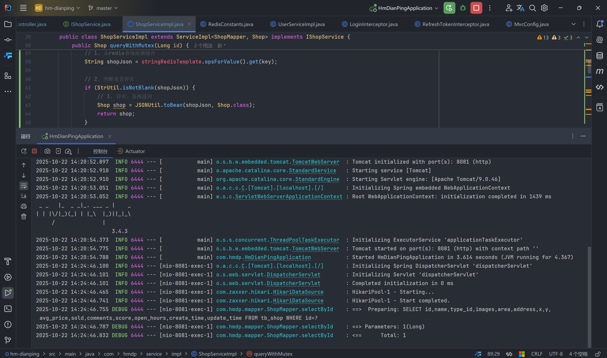


#### 案例：基于逻辑过期方式解决缓存击穿问题

>需求：修改根据 id 查询商铺的业务，基于逻辑过期方式来解决缓存击穿问题
>
>热点 key 会提前放进缓存中
>
>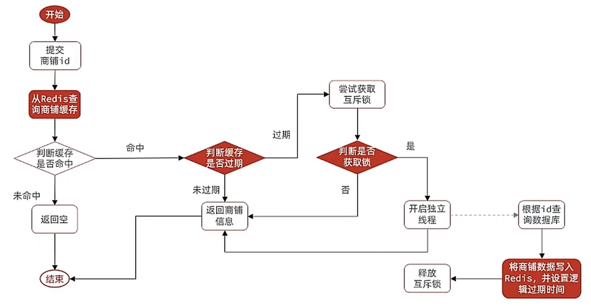

+ ShopServiceImpl.java

```java
/**
 * 线程池
 */
private static final ExecutorService CACHE_REBUILD_EXECUTOR = Executors.newFixedThreadPool(10);

/**
 * 封装缓存击穿（逻辑过期）
 *
 * @param id
 * @return
 */
public Shop queryWithLogicalExpire(Long id) {
    String key = RedisConstants.CACHE_SHOP_KEY + id;
    // 1. 从redis查询商铺缓存
    String shopJson = stringRedisTemplate.opsForValue().get(key);

    // 2. 判断是否存在
    if (StrUtil.isBlank(shopJson)) {
        // 3. 存在，直接返回
        return null;
    }
    // 4. 命中，需要先把json序列化为对象
    RedisData redisData = JSONUtil.toBean(shopJson, RedisData.class);
    JSONObject data = (JSONObject) redisData.getData();
    Shop shop = JSONUtil.toBean(data, Shop.class);
    LocalDateTime expireTime = redisData.getExpireTime();

    // 5. 判断是否过期
    if (expireTime.isAfter(LocalDateTime.now())) {
        // 5.1 未过期，直接返回店铺信息
        return shop;
    }
    // 5.2 已过期，需要缓存重建
    // 6. 缓存重建
    // 6.1 获取互斥锁
    String lockKey = RedisConstants.LOCK_SHOP_KEY + id;
    boolean isLock = tryLock(lockKey);

    // 6.2 判断是否获取锁成功
    if (isLock) {
        // 6.3 成功，再次检测redis缓存是否过期，做DoubleCheck，如果存在则无需重建缓存，反之，开启独立线程，实现缓存创建
        LocalDateTime expireTime1 = redisData.getExpireTime();
        if (expireTime1.isAfter(LocalDateTime.now())) {
            return shop;
        }
        CACHE_REBUILD_EXECUTOR.submit(() -> {
            try {
                // 重建缓存
                this.saveShop2Redis(id, 1800L);
            } catch (Exception e) {
                throw new RuntimeException(e);
            } finally {
                // 释放锁
                unlock(lockKey);
            }
        });
    }
    // 6.4 失败，返回过期的商铺信息
    return shop;
}


/**
 * 保存封装过期时间后的实体类进redis（重建缓存）
 *
 * @param id
 * @param expireSeconds
 */
public void saveShop2Redis(Long id, Long expireSeconds) throws InterruptedException {
    // 1. 查询店铺数据
    Shop shop = getById(id);
    Thread.sleep(200);

    // 2. 封装逻辑过期时间
    RedisData redisData = new RedisData();
    redisData.setData(shop);
    redisData.setExpireTime(LocalDateTime.now().plusSeconds(expireSeconds));

    // 3. 写入Redis
    stringRedisTemplate.opsForValue().set(RedisConstants.CACHE_SHOP_KEY + id, JSONUtil.toJsonStr(redisData));

}
```


---------------------


### 7. 缓存工具封装

> 基于 StringRedisTemplate 封装一个缓存工具类，满足下列需求：
>
> 方法1：将任意 Java 对象序列化为 json 并存储在 string 类型的 key 中，并且可以设置 TTL 过 期时间
>
> 方法2：将任意 Java 对象序列化为 json 并存储在 string 类型的 key 中，并且可以设置逻辑过期时间，用于处理缓存击穿问题
>
> 方法3：根据指定的 key 查询缓存，并反序列化为指定类型，利用缓存空值的方式解决缓存穿透问题
>
> 方法4：根据指定的 key 查询缓存，并反序列化为指定类型，需要利用逻辑过期解决缓存击穿问题

+ CacheClient.java

```java
package com.hmdp.utils;

import cn.hutool.core.util.BooleanUtil;
import cn.hutool.core.util.StrUtil;
import cn.hutool.json.JSONObject;
import cn.hutool.json.JSONUtil;
import lombok.extern.slf4j.Slf4j;
import org.springframework.beans.factory.annotation.Autowired;
import org.springframework.data.redis.core.StringRedisTemplate;
import org.springframework.stereotype.Component;

import java.time.LocalDateTime;
import java.util.concurrent.ExecutorService;
import java.util.concurrent.Executors;
import java.util.concurrent.TimeUnit;
import java.util.function.Function;

/**
 * 缓存工具类
 */
@Component
@Slf4j
public class CacheClient {

    @Autowired
    private StringRedisTemplate stringRedisTemplate;

    /**
     * 将任意 Java 对象序列化为 json 并存储在 string 类型的 key 中，并且可以设置 TTL 过期时间
     *
     * @param key
     * @param value
     * @param time
     * @param unit
     */
    public void set(String key, Object value, Long time, TimeUnit unit) {
        stringRedisTemplate.opsForValue().set(key, JSONUtil.toJsonStr(value), time, unit);
    }

    /**
     * 将任意 Java 对象序列化为 json 并存储在 string 类型的 key 中，并且可以设置逻辑过期时间，用于处理缓存击穿问题
     *
     * @param key
     * @param value
     * @param time
     * @param unit
     */
    public void setWithLogicalExpire(String key, Object value, Long time, TimeUnit unit) {
        // 设置逻辑过期
        RedisData redisData = new RedisData();
        redisData.setData(value);
        redisData.setExpireTime(LocalDateTime.now().plusSeconds(unit.toSeconds(time)));

        // 写入Redis
        stringRedisTemplate.opsForValue().set(key, JSONUtil.toJsonStr(redisData));
    }

    /**
     * 根据指定的 key 查询缓存，并反序列化为指定类型，利用缓存空值的方式解决缓存穿透问题
     *
     * @param keyPrefix
     * @param id
     * @param type
     * @param dbFallback 指定调用的方法和其参数与返回值，因为参数与返回值不确定类型，用泛型表示
     * @param time
     * @param unit
     * @param <R>
     * @param <ID>
     * @return
     */
    public <R, ID> R queryWithPassThrough(
            String keyPrefix, ID id, Class<R> type, Function<ID, R> dbFallback, Long time, TimeUnit unit) {
        String key = keyPrefix + id;
        // 1. 从redis查询商铺缓存
        String json = stringRedisTemplate.opsForValue().get(key);

        // 2. 判断是否存在
        if (StrUtil.isNotBlank(json)) {
            // 3. 存在，直接返回
            return JSONUtil.toBean(json, type);
        }
        // 判断命中的是否是空值
        if (json != null) {
            // 返回一个错误信息
            return null;
        }

        // 4. 不存在，根据id查询数据库
        R r = dbFallback.apply(id);

        // 5. 不存在，返回错误
        if (r == null) {
            // 将空值写入redis
            stringRedisTemplate.opsForValue().set(key, "", RedisConstants.CACHE_NULL_TTL, TimeUnit.MINUTES);
            // 返回错误信息
            return null;
        }

        // 6. 存在，写入redis
        this.set(key, r, time, unit);

        // 7. 返回
        return r;
    }

    /**
     * 线程池
     */
    private static final ExecutorService CACHE_REBUILD_EXECUTOR = Executors.newFixedThreadPool(10);

    /**
     * 根据指定的 key 查询缓存，并反序列化为指定类型，需要利用逻辑过期解决缓存击穿问题
     *
     * @param keyPrefix
     * @param id
     * @param type
     * @param dbFallback
     * @param time
     * @param unit
     * @param <R>
     * @param <ID>
     * @return
     */
    public <R, ID> R queryWithLogicalExpire(
            String keyPrefix, ID id, Class<R> type, Function<ID, R> dbFallback, Long time, TimeUnit unit) {
        String key = keyPrefix + id;
        // 1. 从redis查询商铺缓存
        String json = stringRedisTemplate.opsForValue().get(key);

        // 2. 判断是否存在
        if (StrUtil.isBlank(json)) {
            // 3. 存在，直接返回
            return null;
        }
        // 4. 命中，需要先把json序列化为对象
        RedisData redisData = JSONUtil.toBean(json, RedisData.class);
        JSONObject data = (JSONObject) redisData.getData();
        R r = JSONUtil.toBean(data, type);
        LocalDateTime expireTime = redisData.getExpireTime();

        // 5. 判断是否过期
        if (expireTime.isAfter(LocalDateTime.now())) {
            // 5.1 未过期，直接返回店铺信息
            return r;
        }
        // 5.2 已过期，需要缓存重建
        // 6. 缓存重建
        // 6.1 获取互斥锁
        String lockKey = RedisConstants.LOCK_SHOP_KEY + id;
        boolean isLock = tryLock(lockKey);

        // 6.2 判断是否获取锁成功
        if (isLock) {
            // 6.3 成功，再次检测redis缓存是否过期，做DoubleCheck，如果存在则无需重建缓存，反之，开启独立线程，实现缓存创建
            LocalDateTime expireTime1 = redisData.getExpireTime();
            if (expireTime1.isAfter(LocalDateTime.now())) {
                return r;
            }
            CACHE_REBUILD_EXECUTOR.submit(() -> {
                try {
                    // 重建缓存
                    // 查询数据库
                    R r1 = dbFallback.apply(id);
                    // 写入redis
                    this.setWithLogicalExpire(key, r1, time, unit);
                } catch (Exception e) {
                    throw new RuntimeException(e);
                } finally {
                    // 释放锁
                    unlock(lockKey);
                }
            });
        }
        // 6.4 失败，返回过期的商铺信息
        return r;
    }

    /**
     * 获取锁
     *
     * @param key
     * @return
     */
    private boolean tryLock(String key) {
        Boolean flag = stringRedisTemplate.opsForValue().setIfAbsent(key, "1", 10, TimeUnit.SECONDS);
        return BooleanUtil.isTrue(flag); // 直接返回会做拆箱，过程中有可能出现空指针
    }

    /**
     * 释放锁
     *
     * @param key
     */
    private void unlock(String key) {
        stringRedisTemplate.delete(key);
    }
}
```

+ ShopServiceImpl.java

```java
@Override
public Result queryById(Long id) {
    // 缓存穿透
//    Shop shop = cacheClient.queryWithPassThrough(RedisConstants.CACHE_SHOP_KEY, id, Shop.class, this::getById, RedisConstants.CACHE_SHOP_TTL, TimeUnit.MINUTES);
     // 互斥锁解决缓存击穿
//    Shop shop = queryWithMutex(id);

    // 逻辑过期解决缓存击穿
    Shop shop = cacheClient
                .queryWithLogicalExpire(RedisConstants.CACHE_SHOP_KEY, id, Shop.class, this::getById, RedisConstants.CACHE_SHOP_TTL, TimeUnit.MINUTES);

    if (shop == null) {
        return Result.fail("店铺不存在");
    }

    // 7. 返回
    return Result.ok(shop);
}
```


----------------------


## 三、优惠卷秒杀

### 1. 全局唯一 ID

每个店铺都可以发布优惠卷


当用户抢购时，就会生成订单并保存到 tb_voucher_order 这张表中，而订单表如果使用数据库自增 ID 就存在一些问题：

+ id 的规律性太明显
+ 受单表数据量的限制

#### 1.1 全局 ID 生成器

全局 ID 生成器，是一种在分布式系统下用来生成全局唯一 ID 的工具，一般要满足下列特性：

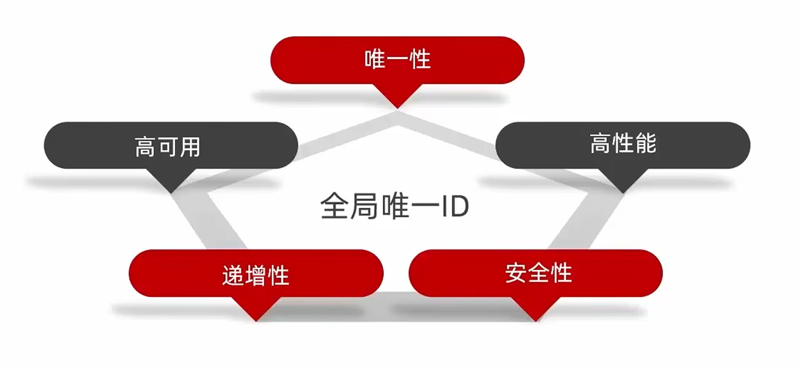

为了增加 ID 的安全性，我们可以不直接使用 Redis 自增的数值，而是拼接一些其它信息：

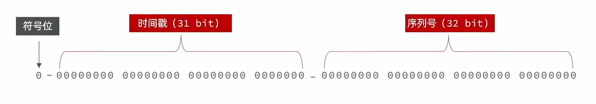

ID 的组成部分：

+ 符号位：1 bit，永远为0
+ 时间戳：31 bit，以秒为单位，可以使用69年
+ 序列号：32 bit，秒内的计数器，支持每秒产生2^32个不同 ID


##### 代码开发

+ RedisWorker.java

```java
package com.hmdp.utils;

import org.springframework.beans.factory.annotation.Autowired;
import org.springframework.data.redis.core.StringRedisTemplate;
import org.springframework.stereotype.Component;

import java.time.LocalDateTime;
import java.time.ZoneOffset;
import java.time.format.DateTimeFormatter;


/**
 * 基于redis的id生成器
 */
@Component
public class RedisIdWorker {

    /**
     * 开始时间戳
     */
    private static final long BEGIN_TIMESTAMP = 1640995200L;
    /**
     * 序列号位数
     */
    private static final int COUNT_BITS = 32;

    @Autowired
    private StringRedisTemplate stringRedisTemplate;

    public long nextId(String keyPrefix) {
        // 1. 生成时间戳
        LocalDateTime now = LocalDateTime.now();
        long nowSecond = now.toEpochSecond(ZoneOffset.UTC);
        long timestamp = nowSecond - BEGIN_TIMESTAMP;

        // 2. 生成序列号
        // 2.1 获取当前日期，精确到天
        String date = now.format(DateTimeFormatter.ofPattern("yyyy:MM:dd"));
        // 2.2 自增长
        Long count = stringRedisTemplate.opsForValue().increment("icr:" + keyPrefix + ":" + date);

        // 3. 拼接并返回
        return timestamp << COUNT_BITS | count;
        /*
            << : 左移运算符
            | : 按位或运算符
            << (左移运算符) 和 | (按位或运算符) 是专门用于二进制位运算的运算符
            这些运算符在十进制系统中是没有意义的，所以是二进制运算
            
            // 第一步：时间戳左移32位
            timestamp << COUNT_BITS
            // 1000 << 32
            // 结果：1000后面跟上32个0
            // 二进制形式：1111101000 00000000000000000000000000000000
            
            // 第二步：与序列号进行或运算
            (timestamp << COUNT_BITS) | count
            // 1111101000 00000000000000000000000000000000
            // |
            // 0000000000 00000000000000000000000000000101
            // =
            // 1111101000 00000000000000000000000000000101

         */
    }
}
```

+ 测试

```java
private ExecutorService es = Executors.newFixedThreadPool(500);

@Test
void testIdWorker() throws InterruptedException {
    /*
        创建一个计数器，初始值为300
        用于等待所有线程执行完成
        每当一个线程完成任务，调用countDown()使计数减1
        主线程调用await()会阻塞，直到计数器变为0
     */
    CountDownLatch latch = new CountDownLatch(300);

    /*
        每个任务会生成100个ID
        每生成一个ID就打印出来
        任务完成后调用latch.countDown()
     */
    Runnable task = () -> {
        for (int i = 0; i < 100; i++) {
            long id = redisIdWorker.nextId("order");
            System.out.println("id = " + id);
        }
        latch.countDown();
    };

    long begin = System.currentTimeMillis();
    for (int i = 0; i < 300; i++) {
        es.submit(task); // 提交300个任务到线程池
    }
    latch.await();
    long end = System.currentTimeMillis();

    System.out.println("time = " + (end - begin));
    /*
        总共提交300个任务
        每个任务生成100个ID
        总共会生成30000个ID
        最多同时运行500个线程
     */
}
```

#### 总结

全局唯一 ID 生成策略：

+ UUID
+ Redis 自增
+ snowflake 算法（雪花算法）
+ 数据库自增

Redis 自增 ID 策略：

+ 每天一个 key，方便统计订单量
+ ID 构造是 时间戳 + 计数器


-------------------------------


### 2. 实现优惠卷下单

每个店铺都可以发布优惠卷，分为平价卷和特价卷。平价卷可以任意购买，而特价卷需要秒杀抢购：


表关系如下：

+ tb_voucher：优惠卷的基本信息、优惠金额、使用规则等
+ tb_seckill_voucher：优惠卷的库存、开始抢购时间、结束抢购时间。特价优惠卷才需要填写这些信息


在 VoucherController 中提供了一个接口，可以添加秒杀优惠卷：

```java
/**
 * 新增秒杀券
 * @param voucher 优惠券信息，包含秒杀信息
 * @return 优惠券id
 */
@PostMapping("seckill")
public Result addSeckillVoucher(@RequestBody Voucher voucher) {
    voucherService.addSeckillVoucher(voucher);
    return Result.ok(voucher.getId());
}
```

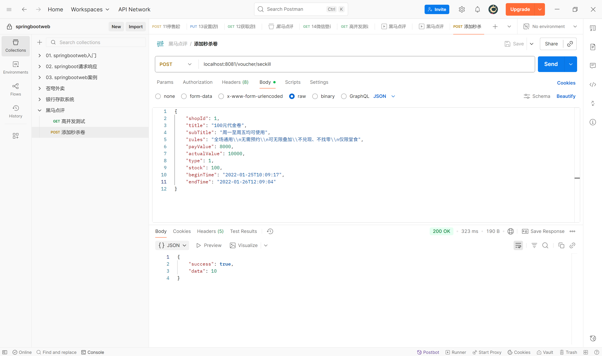

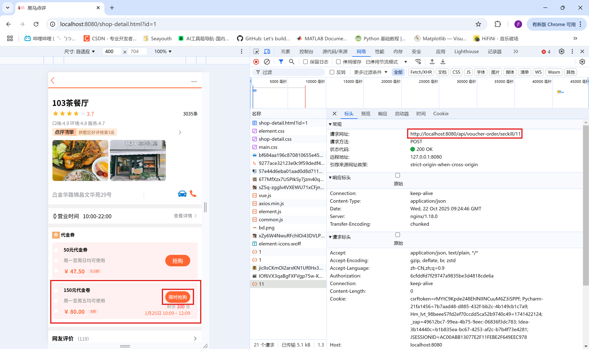

|          | 说明                        |
| -------- | --------------------------- |
| 请求方式 | POST                        |
| 请求路径 | /voucher-order/seckill/{id} |
| 请求参数 | id，优惠卷 id               |
| 返回值   | 订单 id                     |


#### 案例：实现优惠卷秒杀的下单功能

>下单时需要判断两点：
>
>+ 秒杀是否开始或结束，如果尚未开始或已经结束则无法下单
>+ 库存是否充足，不足则无法下单
>
>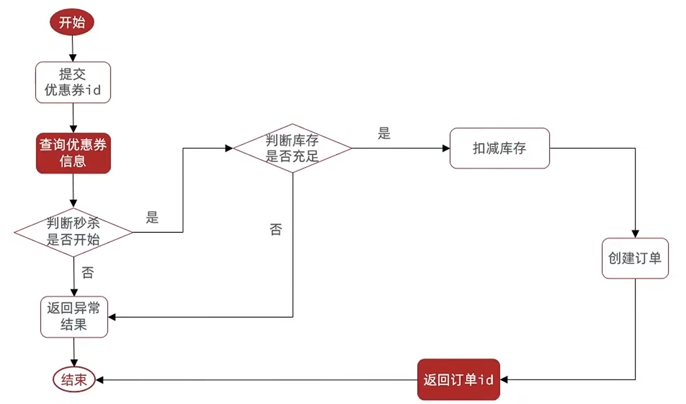

##### 代码开发

+ VoucherOrderServiceImpl.java

```java
package com.hmdp.service.impl;

import com.hmdp.dto.Result;
import com.hmdp.entity.SeckillVoucher;
import com.hmdp.entity.VoucherOrder;
import com.hmdp.mapper.VoucherOrderMapper;
import com.hmdp.service.ISeckillVoucherService;
import com.hmdp.service.IVoucherOrderService;
import com.baomidou.mybatisplus.extension.service.impl.ServiceImpl;
import com.hmdp.utils.RedisIdWorker;
import com.hmdp.utils.UserHolder;
import org.springframework.beans.factory.annotation.Autowired;
import org.springframework.stereotype.Service;
import org.springframework.transaction.annotation.Transactional;

import java.time.LocalDateTime;

/**
 * <p>
 * 服务实现类
 * </p>
 *
 * @author 虎哥
 * @since 2021-12-22
 */
@Service
public class VoucherOrderServiceImpl extends ServiceImpl<VoucherOrderMapper, VoucherOrder> implements IVoucherOrderService {

    @Autowired
    private ISeckillVoucherService iSeckillVoucherService;
    @Autowired
    private RedisIdWorker redisIdWorker;

    /**
     * 优惠卷秒杀的下单功能
     *
     * @param voucherId
     * @return
     */
    @Override
    @Transactional
    public Result seckillVoucher(Long voucherId) {
        // 1. 查询优惠卷
        SeckillVoucher voucher = iSeckillVoucherService.getById(voucherId);

        // 2. 判断秒杀是否开始
        if (voucher.getBeginTime().isAfter(LocalDateTime.now())) {
            // 尚未开始
            return Result.fail("秒杀尚未开始！");
        }

        // 3. 判断秒杀是否已经结束
        if (voucher.getEndTime().isBefore(LocalDateTime.now())) {
            // 尚未开始
            return Result.fail("秒杀已经结束！");
        }

        // 4. 判断库存是否充足
        if (voucher.getStock() < 1) {
            // 库存不足
            return Result.fail("库存不足！");
        }

        // 5. 扣减库存
        boolean success = iSeckillVoucherService.update()
                .setSql("stock = stock -1")
                .eq("voucher_id", voucherId).update();
        if (!success) {
            // 扣减失败
            return Result.fail("库存不足！");
        }

        // 6. 创建订单
        VoucherOrder voucherOrder = new VoucherOrder();
        // 6.1 订单id
        long orderId = redisIdWorker.nextId("order");
        voucherOrder.setId(orderId);

        // 6.2 用户id
        Long userId = UserHolder.getUser().getId();
        voucherOrder.setUserId(userId);

        // 6.3 代金卷id
        voucherOrder.setVoucherId(voucherId);
        save(voucherOrder);

        // 7. 返回订单id
        return Result.ok(orderId);
    }
}
```


##### 功能测试

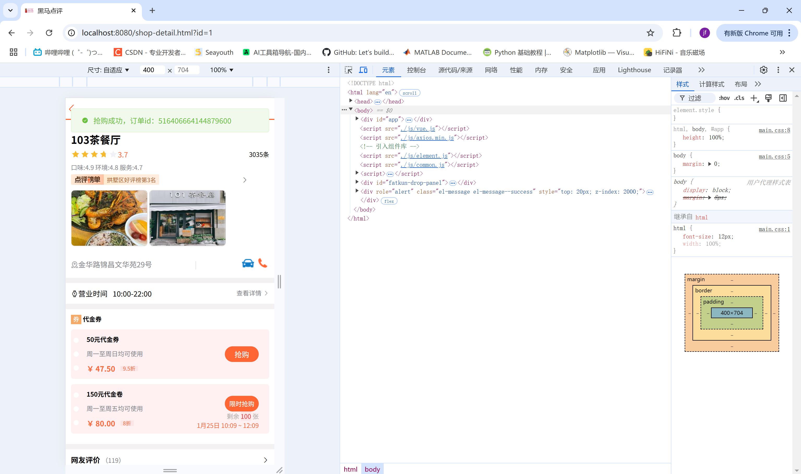


------------------------


### 3. 超卖问题

在高并发场景下，可能你发起200个请求，库存只有100个，但是执行完成后会出现，成功的请求为109个，数据库库存值会变为-9这种情况

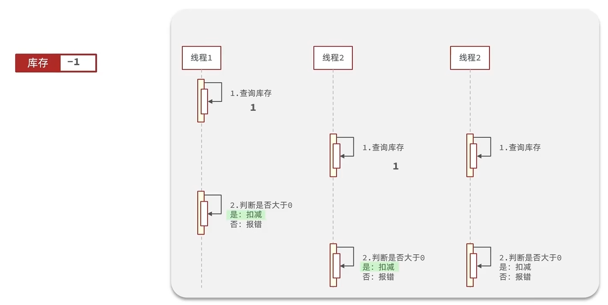

超卖问题是典型的多线程安全问题，针对这一问题的常见解决方案就是加锁：


#### 3.1 乐观锁

乐观锁的关键是判断之前查询得到的数据是否有被修改过，常见的方式有两种：

+ 版本号法

每当数据被修改，版本号就会加一

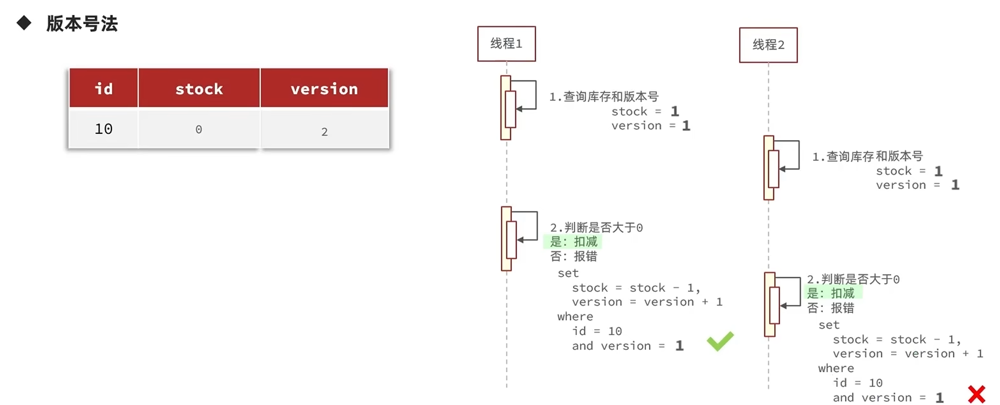

+ CAS 法

利用库存来代替版本，比较这个数据有没有发生变化

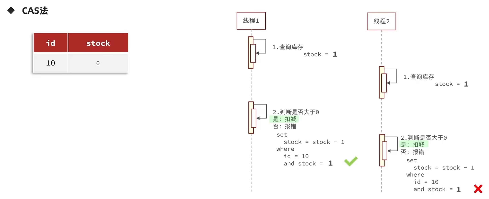

#### 代码开发

+ 在 VoucherOrderServiceImpl.java 中修改

```java
// 5. 扣减库存
boolean success = iSeckillVoucherService.update()
        .setSql("stock = stock -1") // set stock = stock - 1
        .eq("voucher_id", voucherId)
        .gt("stock", 0) // where id = ? and stock > 0
        .update();
```

#### 总结

超卖这样的线程安全问题，解决方案有哪些？

1. 悲观锁：添加同步锁，让线程串行执行
   + 优点：简单粗暴
   + 缺点：性能一般

2. 乐观锁：不加锁，在更新时判断是否有其它线程在修改
   + 优点：性能好
   + 缺点：存在成功率低的问题

ps：可以用分段锁的方式，比如有100个库存，把这100个库存分到10张表中，用户可以去多张表里面分别去抢


-------------------


### 4. 一人一单

需求：修改秒杀业务，要求同一个优惠卷，一个用户只能下一单

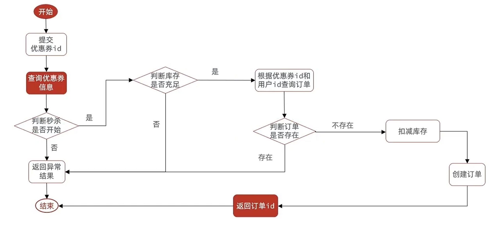

#### 代码开发

+ VoucherOrderServiceImpl.java

```java
package com.hmdp.service.impl;

import com.hmdp.dto.Result;
import com.hmdp.entity.SeckillVoucher;
import com.hmdp.entity.VoucherOrder;
import com.hmdp.mapper.VoucherOrderMapper;
import com.hmdp.service.ISeckillVoucherService;
import com.hmdp.service.IVoucherOrderService;
import com.baomidou.mybatisplus.extension.service.impl.ServiceImpl;
import com.hmdp.utils.RedisIdWorker;
import com.hmdp.utils.UserHolder;
import org.springframework.aop.framework.AopContext;
import org.springframework.beans.factory.annotation.Autowired;
import org.springframework.stereotype.Service;
import org.springframework.transaction.annotation.Transactional;

import java.time.LocalDateTime;

/**
 * <p>
 * 服务实现类
 * </p>
 *
 * @author 虎哥
 * @since 2021-12-22
 */
@Service
public class VoucherOrderServiceImpl extends ServiceImpl<VoucherOrderMapper, VoucherOrder> implements IVoucherOrderService {

    @Autowired
    private ISeckillVoucherService iSeckillVoucherService;
    @Autowired
    private RedisIdWorker redisIdWorker;
    @Autowired
    private IVoucherOrderService iVoucherOrderService;

    /**
     * 优惠卷秒杀的下单功能
     *
     * @param voucherId
     * @return
     */
    @Override
    public Result seckillVoucher(Long voucherId) {
        // 1. 查询优惠卷
        SeckillVoucher voucher = iSeckillVoucherService.getById(voucherId);

        // 2. 判断秒杀是否开始
        if (voucher.getBeginTime().isAfter(LocalDateTime.now())) {
            // 尚未开始
            return Result.fail("秒杀尚未开始！");
        }

        // 3. 判断秒杀是否已经结束
        if (voucher.getEndTime().isBefore(LocalDateTime.now())) {
            // 尚未开始
            return Result.fail("秒杀已经结束！");
        }

        // 4. 判断库存是否充足
        if (voucher.getStock() < 1) {
            // 库存不足
            return Result.fail("库存不足！");
        }

        Long userId = UserHolder.getUser().getId();
        synchronized (userId.toString().intern()) { // intern()方法作用是返回字符串的规范表示，就是去字符串常量池里去找一找，和值一样的字符串的地址返回
            // 获取代理对象（事务）
            IVoucherOrderService proxy = (IVoucherOrderService) AopContext.currentProxy(); // 拿到当前对象的代理对象
            return proxy.createVoucherOrder(voucherId); // 事务要想生效是因为spring对当前这个类做了动态代理，拿到了他的代理对象，用它来做的动态代理
//            return iVoucherOrderService.createVoucherOrder(voucherId); // 第二种方法，自己注入自己
        }
    }

    /**
     * 封装方法以加悲观锁
     *
     * @param voucherId
     * @return
     */
    @Transactional
    public Result createVoucherOrder(Long voucherId) {
        // 5. 一人一单
        Long userId = UserHolder.getUser().getId();

        // 5.1 查询订单
        int count = query().eq("user_id", userId).eq("voucher_id", voucherId).count();

        // 5.2 判断是否存在
        if (count > 0) {
            // 用户已经购买过
            return Result.fail("用户已经购买过一次！");
        }

        // 6. 扣减库存
        boolean success = iSeckillVoucherService.update()
                .setSql("stock = stock -1") // set stock = stock - 1
                .eq("voucher_id", voucherId)
                .gt("stock", 0) // where id = ? and stock > 0
                .update();
        if (!success) {
            // 扣减失败
            return Result.fail("库存不足！");
        }
        // 7. 创建订单
        VoucherOrder voucherOrder = new VoucherOrder();
        // 7.1 订单id
        long orderId = redisIdWorker.nextId("order");
        voucherOrder.setId(orderId);

        // 7.2 用户id
        voucherOrder.setUserId(userId);

        // 7.3 代金卷id
        voucherOrder.setVoucherId(voucherId);
        save(voucherOrder);

        // 8. 返回
        return Result.ok(voucherId);
    }
}
```

+ 启动类加入

```java
@EnableAspectJAutoProxy(exposeProxy = true) // 暴露代理对象
```

+ pom.xml

```xml
<dependency>
    <groupId>org.aspectj</groupId>
    <artifactId>aspectjweaver</artifactId>
</dependency>
```


#### 4.1 一人一单的并发安全问题

通过加锁可以解决在单机情况下的一人一单安全问题，但是在集群模式下就不行了

1. 我们将服务启动两份，端口分别为8081和8082：


2. 然后修改 nginx 的 conf 目录下的 nginx.conf 文件，配置反向代理和负载均衡：

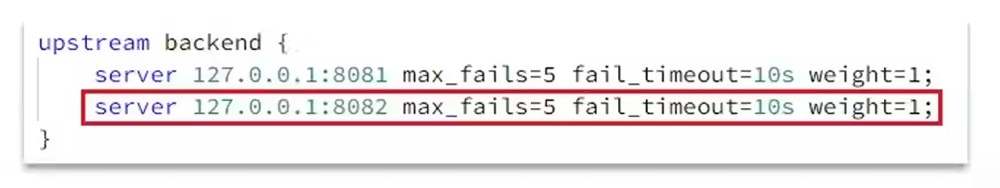

现在，用户请求会在这两个节点上负载均衡，再次测试下是否存在线程安全问题

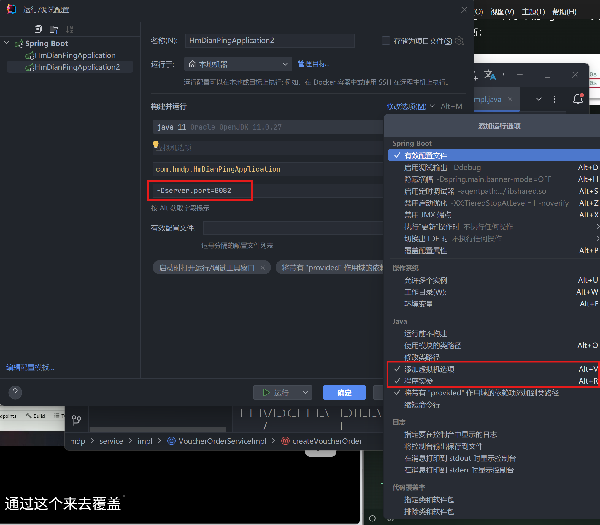

视频这个命令运行不了的用下面这个

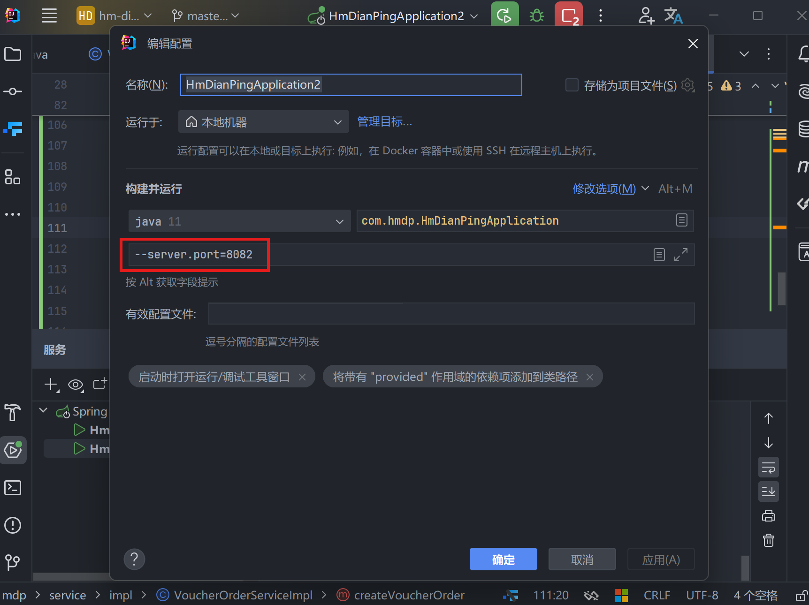

重新加载 nginx 配置文件

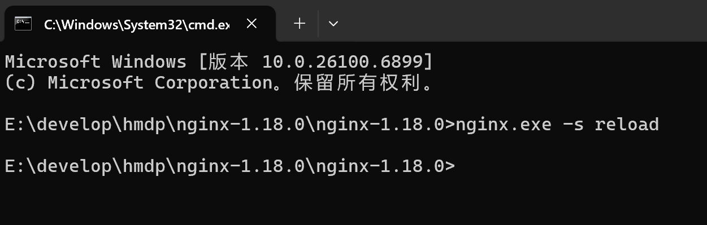

对着这个发起两次请求

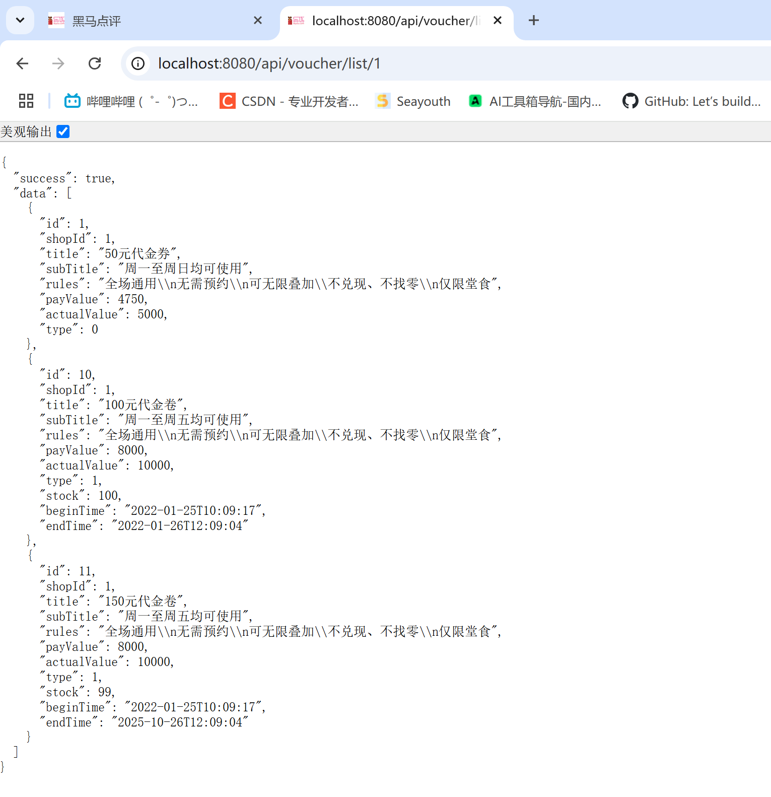

会发现两个服务都会各有一个请求

后面用 postman 发两个请求，就会发现两个请求都会查到 count = 0 又发生了并发安全问题

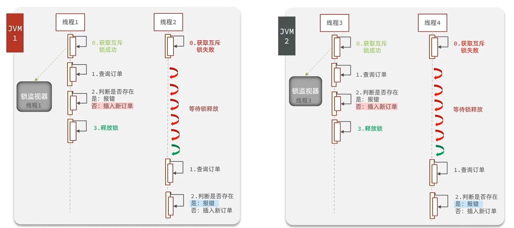

+ 产生问题的原因是，在集群模式下或者有一些是在分布式的系统下，有多个 JVM 的存在，每个 JVM 里都有自己的锁，导致每一个锁都可以有一个线程获取（每一个锁都获取了一个线程），于是就出现了并行运行
  + 所以我们就要想办法让多个 JVM 只能使用同一把锁


---------------------------


### 5. 分布式锁

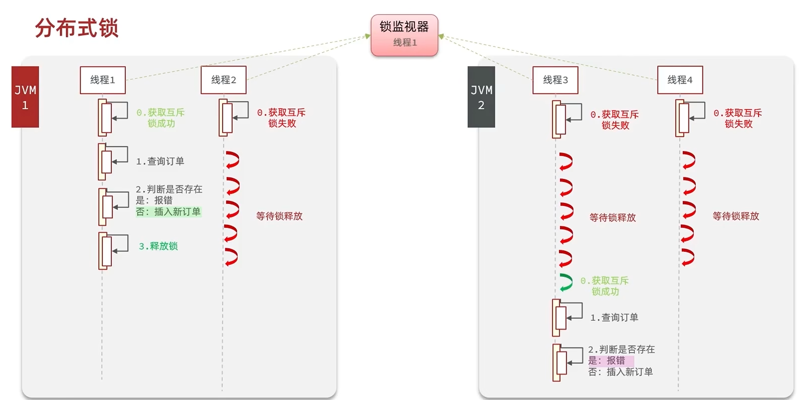

**分布式锁**：满足分布式系统或集群模式下多进程可见并且互斥的锁


分布式锁的核心是实现多进程之间互斥，而满足这一点的方式有很多，常见的有三种：

|        | MySQL                       | Redis                     | Zookeeper                        |
| ------ | --------------------------- | ------------------------- | -------------------------------- |
| 互斥   | 利用 mysql 本身的互斥锁机制 | 利用 setnx 这样的互斥命令 | 利用节点的唯一性和有序性实现互斥 |
| 高可用 | 好                          | 好                        | 好                               |
| 高性能 | 一般                        | 好                        | 一般                             |
| 安全性 | 断开连接，自动释放锁        | 利用锁超时时间，到期释放  | 临时节点，断开连接自动释放       |


#### 5.1 基于 Redis 的分布式锁

实现分布式锁时需要实现的两个基本方法：

+ 获取锁

  + 互斥：确保只能有一个线程获取锁

  ```bash
  # 添加锁，NX是互斥，EX是设置超时时间
  SET lock thread1 EX 10 NX
  ```

+ 释放锁

  + 手动释放
  + 超时释放：获取锁时添加一个超时时间

  ```bash
  # 释放锁，删除即可
  DEL lock
  ```

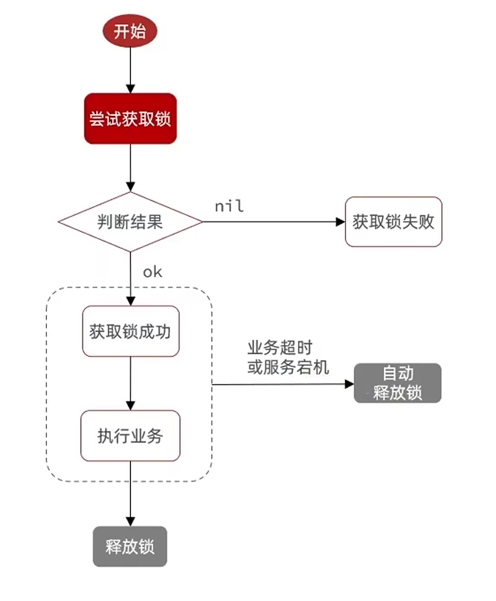


#### 案例：基于 Redis 实现分布式锁初级版本

>需求：定义一个类，实现下面接口，利用 Redis 实现分布式锁功能
>
>```java
>public interface ILock {
>	/**
>	 * 尝试获取锁
>	 * @param timeoutSec 锁持有的超时时间，过期后自动释放
>	 * @return true代表获取锁成功；false代表获取锁失败
>	 */
>	boolean tryLock(long timeoutSec);
>	
>	/**
>	 * 释放锁
>	 */
>	void unlock();
>}
>```

+ SimpleRedisLock.java

```java
package com.hmdp.utils;

import org.springframework.data.redis.core.StringRedisTemplate;

import java.util.concurrent.TimeUnit;

public class SimpleRedisLock implements ILock {

    private String name;
    private StringRedisTemplate stringRedisTemplate;

    public SimpleRedisLock(String name, StringRedisTemplate stringRedisTemplate) {
        this.name = name;
        this.stringRedisTemplate = stringRedisTemplate;
    }

    private static final String KEY_PREFIX = "lock:";

    @Override
    public boolean tryLock(long timeoutSec) {
        // 获取线程标识（告诉我哪个线程拿到锁了）
        long threadId = Thread.currentThread().getId();

        // 获取锁
        Boolean success = stringRedisTemplate.opsForValue()
                .setIfAbsent(KEY_PREFIX + name, threadId + "", timeoutSec, TimeUnit.SECONDS);
        return Boolean.TRUE.equals(success);
    }

    @Override
    public void unlock() {
        // 释放锁
        stringRedisTemplate.delete(KEY_PREFIX + name);
    }
}
```

+ 在 VoucherOrderServiceImpl.java 中修改

```java
        Long userId = UserHolder.getUser().getId();
        // 创建锁对象
        SimpleRedisLock lock = new SimpleRedisLock("order:" + userId, stringRedisTemplate);
        // 获取锁
        boolean isLock = lock.tryLock(1200);
        // 判断是否获取锁成功
        if (!isLock) {
            // 获取锁失败，返回错误或重试
            return Result.fail("不允许重复下单");

        }
        try {
            // 获取代理对象（事务）
            IVoucherOrderService proxy = (IVoucherOrderService) AopContext.currentProxy(); // 拿到当前对象的代理对象
            return proxy.createVoucherOrder(voucherId); // 事务要想生效是因为spring对当前这个类做了动态代理，拿到了他的代理对象，用它来做的动态代理
//            return iVoucherOrderService.createVoucherOrder(voucherId); // 第二种方法，自己注入自己
        }finally {
            // 释放锁
            lock.unlock();
        }
```


#### 5.2 极端情况

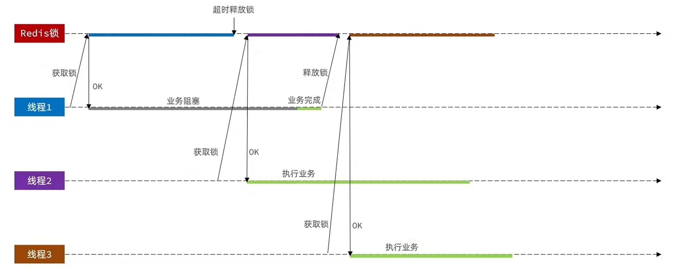

要想解决这个问题关键在于，在释放锁的时候做一个判断，判断一下锁的标识是否一致

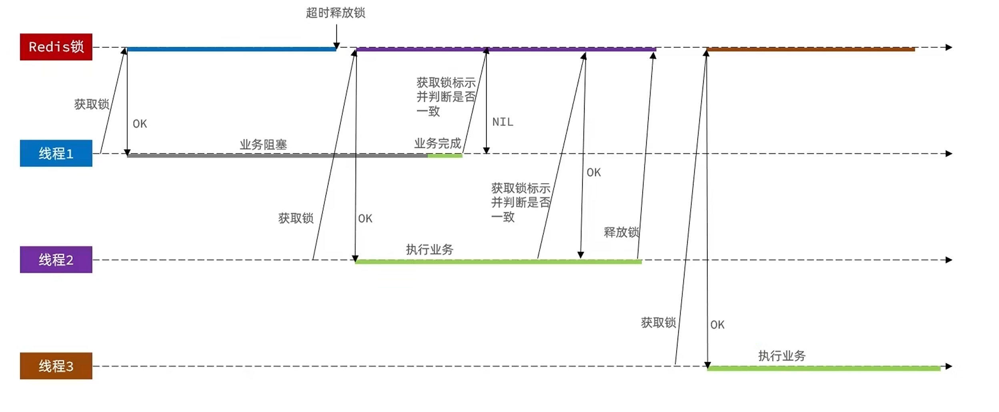

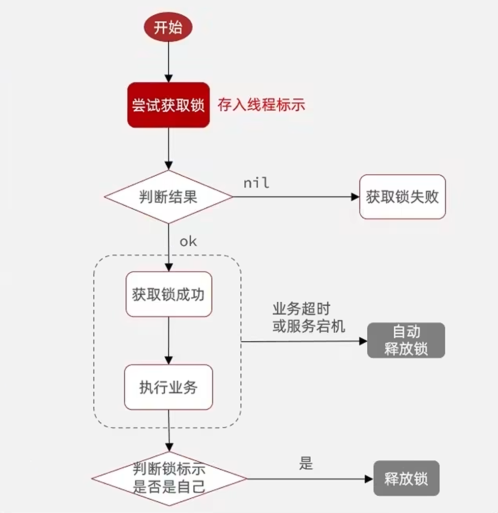

#### 案例：改进 Redis 的分布式锁

> 需求：修改之前的分布式锁实现，满足：
>
> 1. 在获取锁时存入线程标识（可以用 UUID 表示）
> 2. 在释放锁时先获取锁中的线程标识，判断是否与当前线程标识一致
>    + 如果一致则释放锁
>    + 如果不一致则不释放锁

+ SimpleRedisLock.java

```java
package com.hmdp.utils;

import cn.hutool.core.lang.UUID;
import org.springframework.data.redis.core.StringRedisTemplate;

import java.util.concurrent.TimeUnit;

public class SimpleRedisLock implements ILock {

    private String name;
    private StringRedisTemplate stringRedisTemplate;

    public SimpleRedisLock(String name, StringRedisTemplate stringRedisTemplate) {
        this.name = name;
        this.stringRedisTemplate = stringRedisTemplate;
    }

    private static final String KEY_PREFIX = "lock:";
    private static final String ID_PREFIX = UUID.randomUUID().toString(true) + "-";

    @Override
    public boolean tryLock(long timeoutSec) {
        // 获取线程标识（告诉我哪个线程拿到锁了）
        String threadId = ID_PREFIX + Thread.currentThread().getId();

        // 获取锁
        Boolean success = stringRedisTemplate.opsForValue()
                .setIfAbsent(KEY_PREFIX + name, threadId, timeoutSec, TimeUnit.SECONDS);
        return Boolean.TRUE.equals(success);
    }

    @Override
    public void unlock() {
        // 获取线程标识
        String threadId = ID_PREFIX + Thread.currentThread().getId();

        // 获取锁中的标识
        String id = stringRedisTemplate.opsForValue().get(KEY_PREFIX + name);

        // 判断标识是否一致
        if (threadId.equals(id)) {
            // 释放锁
            stringRedisTemplate.delete(KEY_PREFIX + name);
        }
    }
}
```


#### 5.3 极端情况2.0

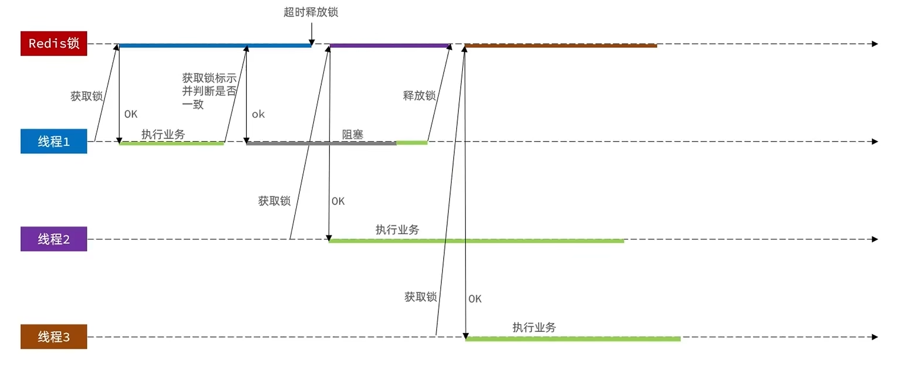

要想避免这个问题的发生，必须确保判断锁标识的动作和释放锁的动作得成一个原子性的操作，也就是说一起执行，不能出现间隔


#### 5.3 Redis 的 Lua 脚本

**可以在 IDEA 中安装 EmmyLua 插件**

Redis 提供了 Lua 脚本功能，在一个脚本中编写多条 Redis 命令，确保多条命令执行时的原子性。Lua 是一种编程语言，它的基本语法可以参考网站：[Lua 教程 | 菜鸟教程](https://www.runoob.com/lua/lua-tutorial.html)

这里重点介绍 Redis 提供的调用函数，语法如下：

```lua
# 执行redis命令
redis.call('命令名称', 'key', '其它参数', ...)
```

例如，我们要执行 set name jack，则脚本是这样的：

```lua
# 执行set name jack
redis.call('set', 'name', 'jack')
```

例如，我们要先执行 set name Rose，再执行 get name，则脚本如下：

```lua
# 先执行 set name Rose
redis.call('set', 'name', 'jack')
# 再执行 get name
local name = redis.call('get', 'name')
# 返回
return name
```

写好脚本以后，需要用 Redis 命令来调用脚本，调用脚本的常见命令如下：

```bash
127.0.0.1:6379> help @scripting

EVAL script numkeys key [key ...] arg [arg ...]
summary: Execute a Lua script server side
since: 2.6.0
```

例如，我们要执行 `redis.call('set', 'name', 'jack')` 这个脚本，语法如下：

```bash
# 调用脚本
EVAL "return redis.call('set', 'name', 'jack')" 0
```

+ `0` 是脚本需要的 key 类型的参数个数

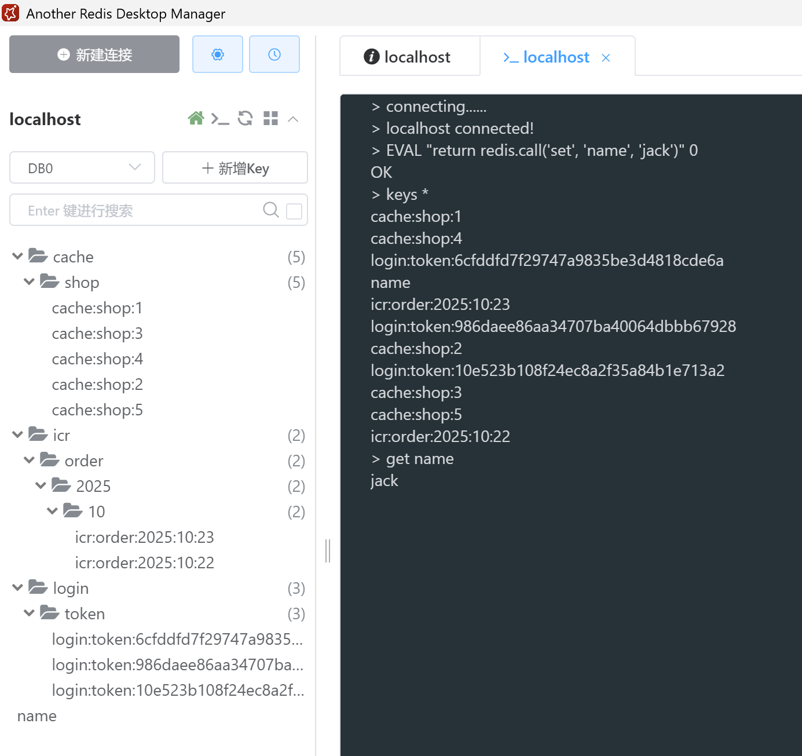

如果脚本中的 key、value 不想写死，可以作为参数传递。key 类型参数会放入 KEYS 数组，其它的参数会放入 ARGV 数组，在脚本中可以从 KEYS 和 ARGV 数组获取这些参数：

```bash
# 调用脚本
EVAL "return redis.call('set', KEYS[1], ARGV[1])" 1 name Rose
```

+ **Lua 语言中数组的角标中1开始**

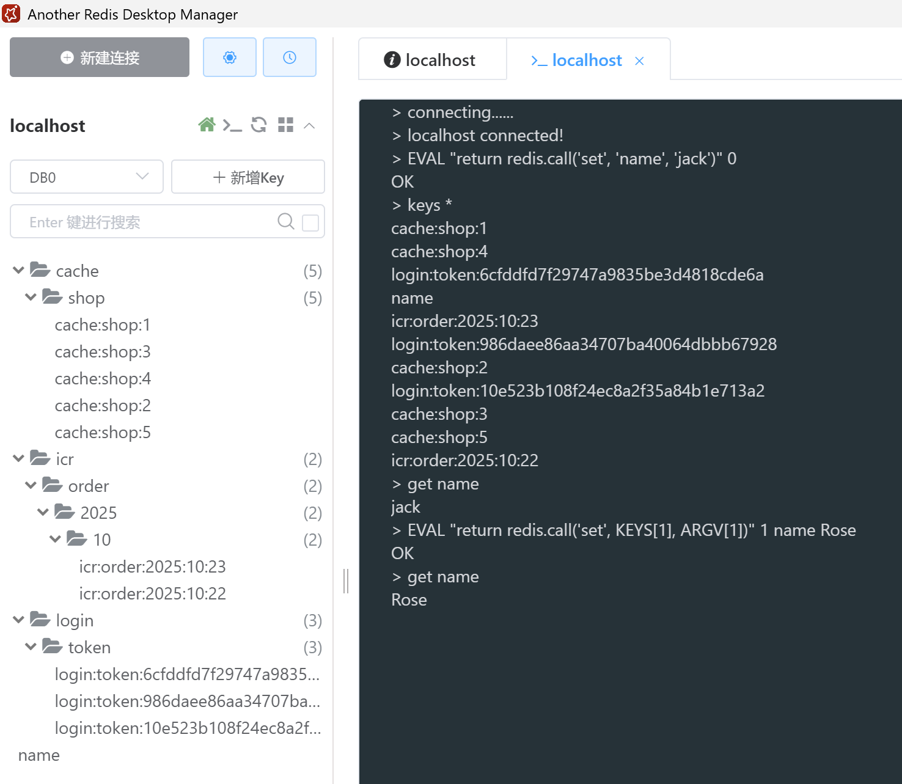

> 基于 Redis 的分布式锁
>
> 释放锁的业务流程是这样的：
>
> 1. 获取锁中的线程标识
> 2. 判断是否与指定的标识（当前线程标识）一致
> 3. 如果一致则释放锁（删除）
> 4. 如果不一致则什么都不管

```Lua
-- 获取锁中的线程标识 get key
local id = redis.call('get', KEYS[1])
-- 比较线程标识与锁中的标识是否一致
if(id == ARGV[1]) then
    -- 释放锁 del key
    return = redis.call('del', KEYS[1])
end
return 0
```


#### 5.4 再次改进 Redis 的分布式锁 - 超时释放导致的误删问题

> 需求：基于 Lua 脚本实现分布式锁的释放锁逻辑
>
> 提示：RedisTemplate 调用 Lua 脚本的 API 如下：
>
> ```java
> @Override
> public <T> T execute(RedisScript<T>) script, List<K> keys, Objetc... args) {
> 	return scriptExecutor.execute(script, keys, args);
> }
> ```
>
> 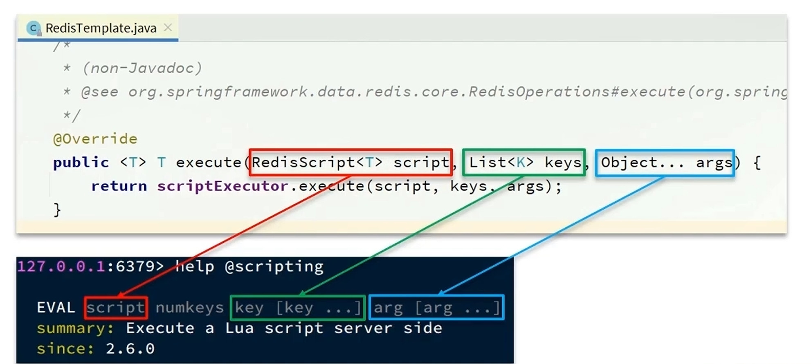

+ SimpleRedisLock.java

```java
private static final DefaultRedisScript<Long> UNLOCK_SCRIPT;

static {
    UNLOCK_SCRIPT = new DefaultRedisScript<>();
    UNLOCK_SCRIPT.setLocation(new ClassPathResource("unlock.lua")); // 设置脚本位置, ClassPathResource()默认回去ClassPath下找
    UNLOCK_SCRIPT.setResultType(Long.class); // 配置返回值
}
```


```java
@Override
public void unlock() {
    // 调用lua脚本
    stringRedisTemplate.execute(
            UNLOCK_SCRIPT,
            Collections.singletonList(KEY_PREFIX + name),
            ID_PREFIX + Thread.currentThread().getId());
}
```

#### 总结

基于 Redis 的分布式锁实现思路：

+ 利用 set nx ex 获取锁，并设置过期时间，保存线程标识
+ 释放锁时先判断线程标识是否与自己一致，一致则删除锁

特性：

+ 利用 set nx 满足互斥性
+ 利用 set ex 保证故障时锁依然能释放，避免死锁，提高安全性
+ 利用 Redis 集群保证高可用和高并发特性


#### 5.5 基于 Redis 的分布式锁优化

基于 setnx 实现的分布式锁存在下面的问题：

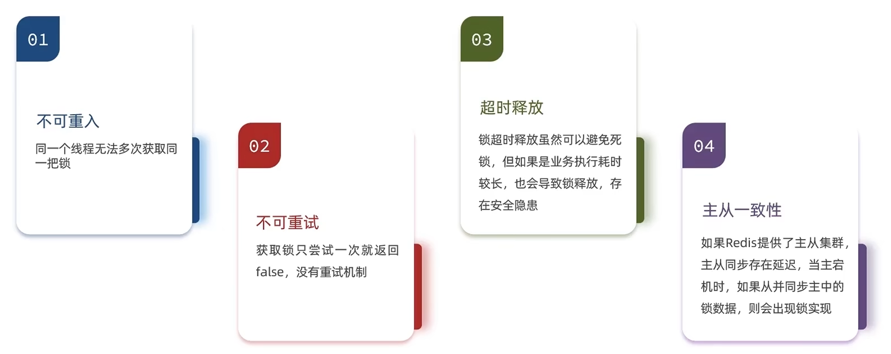

1. 不可重入
   + 同一个线程无法多次获取同一把锁
2. 不可重试
   + 获取锁只尝试一次就返回 false，没有重试机制
3. 超时释放
   + 锁超时释放虽然可以避免死锁，但如果是业务执行耗时较长，也会导致锁释放，存在安全隐患
4. 主从一致性
   + 如果 Redis 提供了主从集群，主从同步存在延迟，当主宕机时，如果从并同步主中的锁机制，则会出现锁实现


#### 5.6 Redisson

Redisson 是一个在 Redis 的基础上实现了的 Java 驻内存数据网络（In-Memory Data Grid）。它不仅提供了一系列的分布式的 Java 常用对象，还提供了许多分布式服务，其中就包含了各种分布式锁的实现

官网地址：[Redisson | Valkey & Redis Java client. Ultimate Real-Time Data Platform](https://redisson.org/)

GitHub 地址：[redisson/redisson: Redisson - Valkey & Redis Java client. Real-Time Data Platform. Sync/Async/RxJava/Reactive API. Over 50 Valkey and Redis based Java objects and services: Set, Multimap, SortedSet, Map, List, Queue, Deque, Semaphore, Lock, AtomicLong, Map Reduce, Bloom filter, Spring, Tomcat, Scheduler, JCache API, Hibernate, RPC, local cache..](https://github.com/redisson/redisson)

所以说在企业环境下没有必要自己去实现锁

##### 5.6.1 Redisson 入门

1. 引入依赖

```xml
<!--redisson-->
<dependency>
    <groupId>org.redisson</groupId>
    <artifactId>redisson</artifactId>
    <version>3.28.0</version>
</dependency>
```

2. 配置 Redisson 客户端

```java
package com.hmdp.config;

import org.redisson.Redisson;
import org.redisson.api.RedissonClient;
import org.redisson.config.Config;
import org.springframework.context.annotation.Bean;
import org.springframework.context.annotation.Configuration;

@Configuration
public class RedissonConfig {

    @Bean
    public RedissonClient redissonClient() {
        // 配置类
        Config config = new Config();
        // 添加Redis地址，这里添加了单点的地址，也可以使用config.useClusterServers()添加集群地址
        config.useSingleServer().setAddress("localhost:8080").setPassword("123321");
        // 创建RedissonClient对象
        return Redisson.create(config);
    }
}
```

3. 使用 Redisson 的分布式锁

```java
@Autowired
private RedissonClient redissonClient;

@Test
void testRedisson() throw InterruptedException {
    // 获取锁（可重入），指定锁的名称
    RLock lock = redissonClient.getLock("anyLock");
	// 尝试获取锁，参数分别是：获取锁的最大等待时间（期间会重试），锁自动释放时间，时间单位
    boolean isLock = lock.tryLock(1, 10, TimeUnit.SECONDS);
    // 判断释放锁获取成功
    if(isLock) {
        try {
            System.out.println("执行业务");
        } finally {
            // 释放锁
            lock.unlock();
        }
    }
}
```


##### 5.6.2 Redisson 可重入锁原理

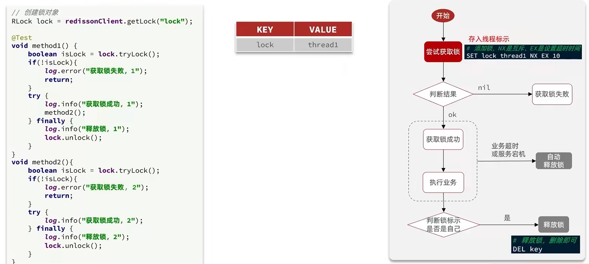

要想实现可重入锁，可以参考 JDK 里面提供的 ReentrantLock

其实所谓的可重入无非就是在获取锁的时候，当我判断这个锁已经有人的情况下，那我会看一下获取锁的是不是我自己，也就是是不是同一个线程，如果是，我也会让他获取锁。ReentrantLock 在这多做一件事，就是有一个计数器，去记录重录的次数，就是说总共获取了几次，在 release 释放锁的时候会-1。

那么实现可重入锁，每次有线程结束时，计数器减一，且当值为0时即为所有线程结束，可以删除锁

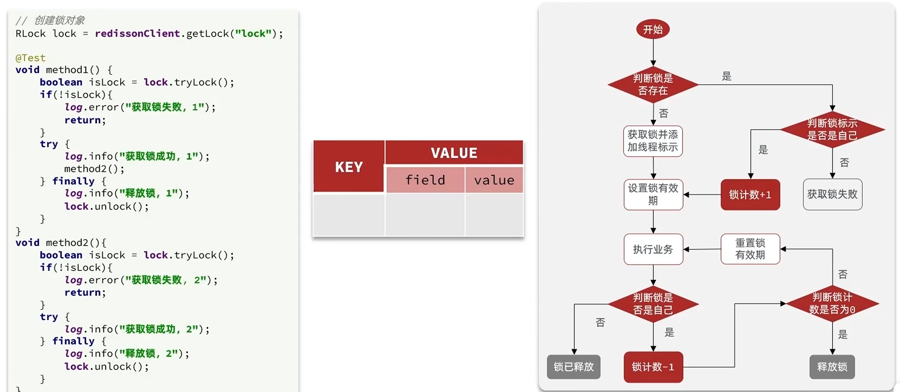

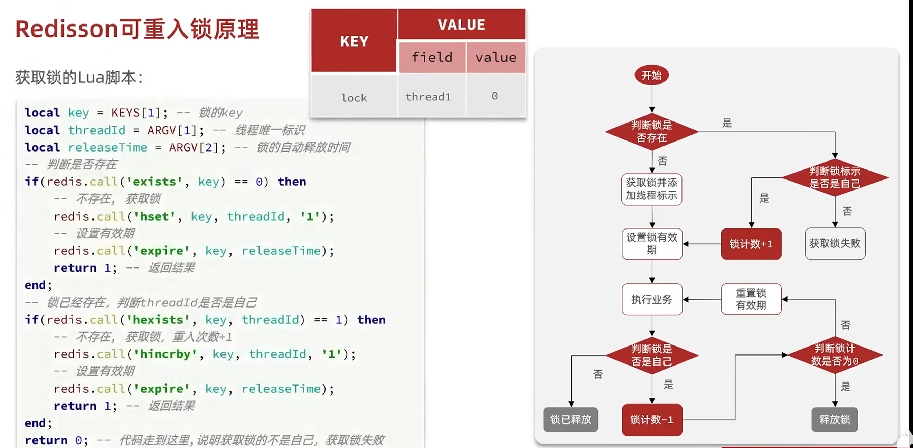

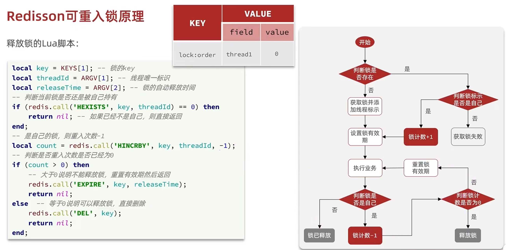


`tryLock()` 有三个参数

+ `long waitTime`：加了这个参数后，他在第一次获取锁失败以后就不会立即返回了，而是在等待时间内，不断去尝试，如果在这个时间结束了还没有获取成功，才会返回一个 false
+ `long leaseTime`：锁自动失效释放的一个时间（默认时间为30秒）
+ `TimeUnit unit`：时间的单位

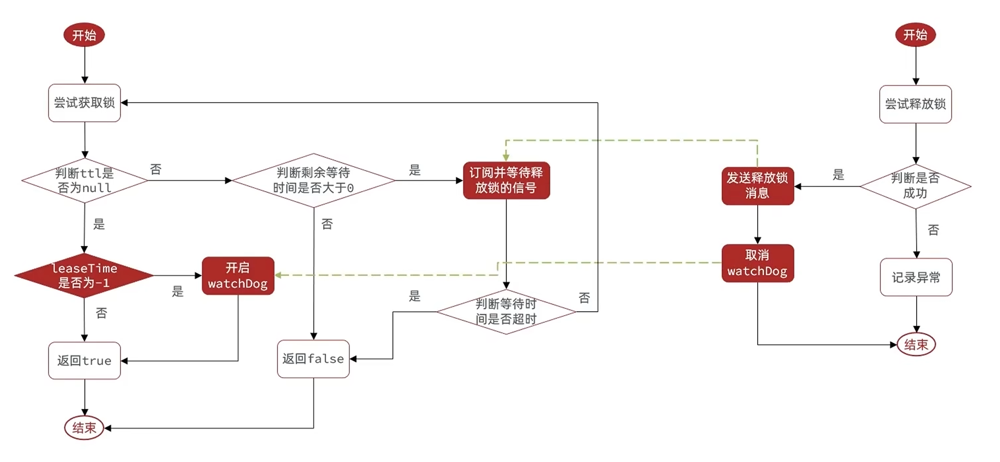


##### 总结

Redisson 分布式锁原理：

+ **可重入**：利用 hash 结构记录线程 id 和重入次数
+ **可重试**：利用信号量和 PubSub 功能实现等待、唤醒，获取锁失败的重试机制
+ **超时续约**：利用 watchDog（看门狗），每个一段时间（releaseTime / 3），重置超时时间


##### 5.6.3 Redisson 分布式锁主从一致性问题

主从一致性导致的锁失效问题

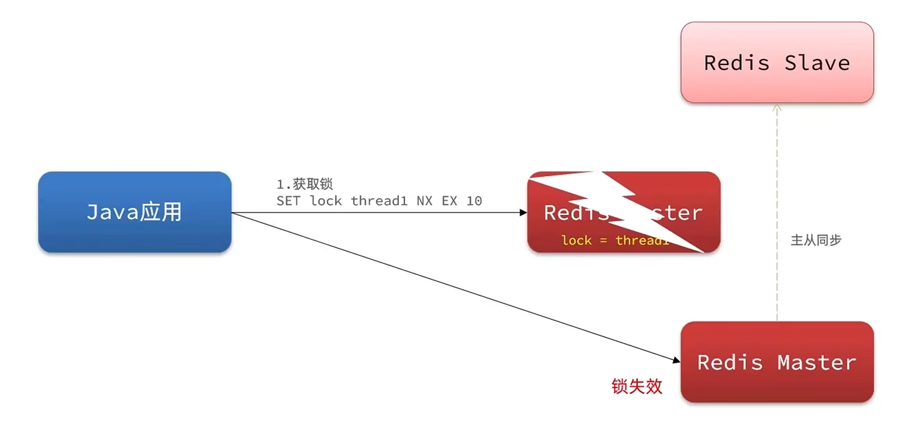

联锁

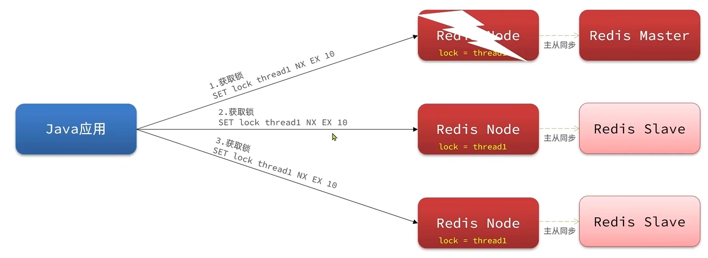

`redis-server.exe --port 6380` 启动 Redis 可实现多开！！！


###### 代码测试

```java
package com.hmdp;

import lombok.extern.slf4j.Slf4j;
import org.junit.jupiter.api.BeforeEach;
import org.junit.jupiter.api.Test;
import org.redisson.api.RLock;
import org.redisson.api.RedissonClient;
import org.springframework.beans.factory.annotation.Autowired;
import org.springframework.boot.test.context.SpringBootTest;

import java.util.concurrent.TimeUnit;

@Slf4j
@SpringBootTest
public class RedissonTest {

    @Autowired
    private RedissonClient redissonClient;
    @Autowired
    private RedissonClient redissonClient2;
    @Autowired
    private RedissonClient redissonClient3;

    private RLock lock;

    @BeforeEach
    void setup(){
        RLock lock1 = redissonClient.getLock("order");
        RLock lock2 = redissonClient2.getLock("order");
        RLock lock3 = redissonClient3.getLock("order");

        // 创建联锁 multiLock
        lock = redissonClient.getMultiLock(lock1, lock2, lock3);
    }

    @Test
    void  method1() throws InterruptedException{
        // 尝试获取锁
        boolean isLock = lock.tryLock(1L, TimeUnit.SECONDS);
        if (!isLock){
            log.error("获取锁失败 ... 1");
            return;
        }
        try {
            log.info("获取锁成功 ... 1");
            method2();
            log.info("开始执行业务 ... 1");
        } finally {
            log.warn("准备释放锁 ... 1");
            lock.unlock();
        }
    }

    void method2(){
        // 尝试获取锁
        boolean isLock = lock.tryLock();
        if (!isLock){
            log.error("获取锁失败 ... 2");
            return;
        }
        try {
            log.info("获取锁成功 ... 2");
            log.info("开始执行业务 ... 2");
        } finally {
            log.warn("准备释放锁 ... 2");
            lock.unlock();
        }
    }
}
```

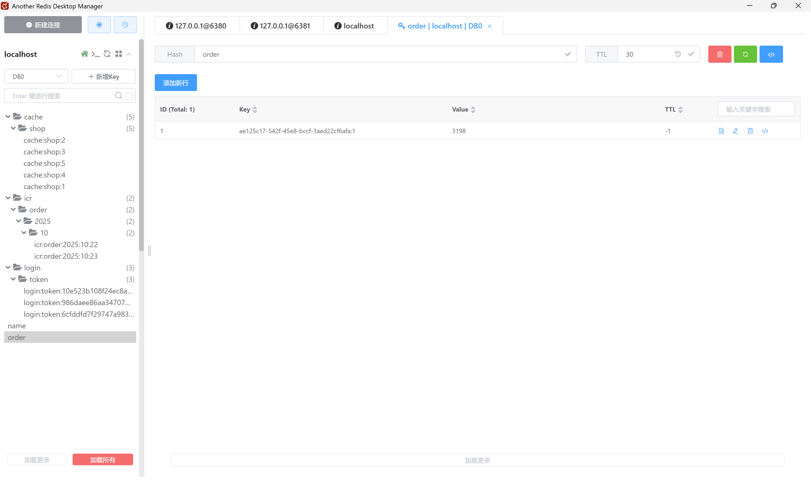


#### 总结

1. 不可重入 Redis 分布式锁：

+ 原理：利用 setnx 的互斥性；利用 ex 避免死锁；释放锁时判断线程标识
+ 缺陷：不可重入、无法重试、锁超时失效

2. 可重入的 Redis 分布式锁

+ 原理：利用 hash 结构，记录线程标识和重入次数；利用 watchDog 延续锁时间；利用信号量控制锁重试等待
+ 缺陷：redis 宕机引起锁失效问题

3. Redisson 的 multiLock

+ 原理：多个独立的 Redis 节点，必须在所有节点都获取重入锁，才算获取锁成功


-----------------


### 6. Redis 优化秒杀

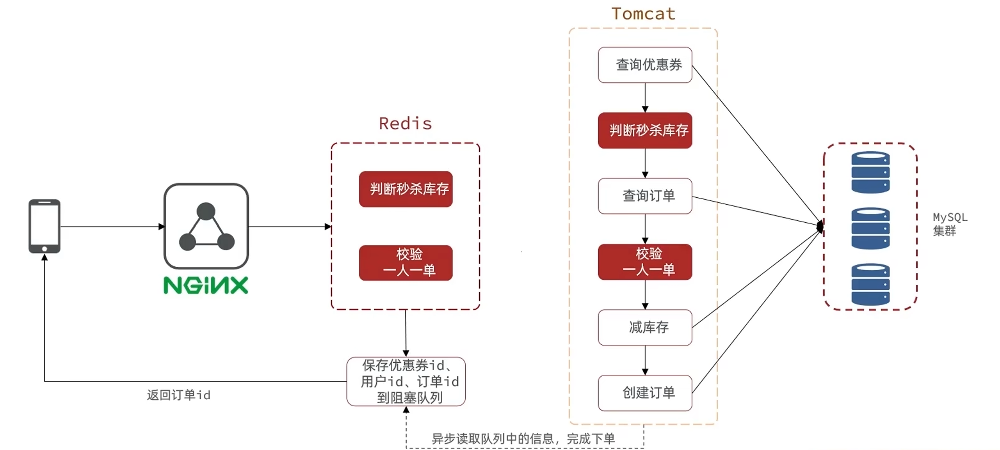

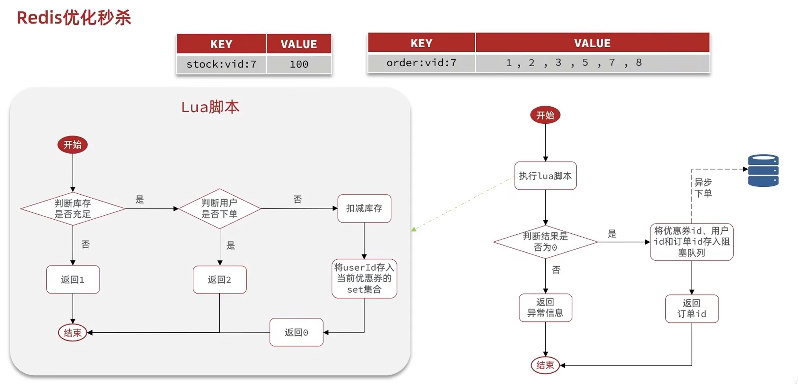


#### 案例：改进秒杀业务，提高并发性能

> 需求：
>
> 1. 新增秒杀优惠卷的同时，将优惠卷信息保存到 Redis 中
> 2. 基于 Lua 脚本，判断秒杀库存、一人一单，决定用户是否抢购成功
> 3. 如果抢购成功，将优惠卷 id 和用户 id 封装后存入阻塞队列
> 4. 开启线程任务，不断从阻塞队列中获取信息，实现异步下单功能

+ resources/seckill.lua

```lua
-- 1. 参数列表
-- 1.1 优惠卷id
local voucherId = ARGV[1]
-- 1.2 用户id
local userId = ARGV[2]

-- 2. 数据key
-- 2.1 库存key
local stockKey = 'seckill:stock:' .. voucherId
-- 2.2 订单key
local stockKey = 'seckill:stock:' .. voucherId

-- 3. 脚本业务
-- 3.1 判断库存是否充足 get stockKey
if (tonumber(redis.call('get', stockKey)) <= 0) then
    -- 3.2 库存不足，返回1
    return 1
end
-- 3.2 判断用户是否下单 SISMEMBER orderKey userId
if (redis.call('sismember', orderKey, userId) == 1) then
    -- 3.3 存在，说明是重复下单，返回2
    return 2
end
-- 3.4 扣库存 incrby stockKey -1
redis.call('incrby', stockKey, -1)
-- 3.5 下单（保存用户） sadd orderKey userId
redis.call('sadd', orderKey, userId)
return 0
```

+ VoucherOrderServiceImpl.java

```java
package com.hmdp.service.impl;

import com.hmdp.dto.Result;
import com.hmdp.entity.VoucherOrder;
import com.hmdp.mapper.VoucherOrderMapper;
import com.hmdp.service.ISeckillVoucherService;
import com.hmdp.service.IVoucherOrderService;
import com.baomidou.mybatisplus.extension.service.impl.ServiceImpl;
import com.hmdp.utils.RedisIdWorker;
import com.hmdp.utils.UserHolder;
import lombok.extern.slf4j.Slf4j;
import org.redisson.api.RLock;
import org.redisson.api.RedissonClient;
import org.springframework.aop.framework.AopContext;
import org.springframework.beans.factory.annotation.Autowired;
import org.springframework.core.io.ClassPathResource;
import org.springframework.data.redis.core.StringRedisTemplate;
import org.springframework.data.redis.core.script.DefaultRedisScript;
import org.springframework.stereotype.Service;
import org.springframework.transaction.annotation.Transactional;

import javax.annotation.PostConstruct;
import java.util.Collections;
import java.util.concurrent.ArrayBlockingQueue;
import java.util.concurrent.BlockingQueue;
import java.util.concurrent.ExecutorService;
import java.util.concurrent.Executors;

/**
 * <p>
 * 服务实现类
 * </p>
 *
 * @author 虎哥
 * @since 2021-12-22
 */
@Slf4j
@Service
public class VoucherOrderServiceImpl extends ServiceImpl<VoucherOrderMapper, VoucherOrder> implements IVoucherOrderService {

    @Autowired
    private ISeckillVoucherService iSeckillVoucherService;
    @Autowired
    private RedisIdWorker redisIdWorker;
    @Autowired
    private IVoucherOrderService iVoucherOrderService;
    @Autowired
    private StringRedisTemplate stringRedisTemplate;
    @Autowired
    private RedissonClient redissonClient;

    private static final DefaultRedisScript<Long> SECKILL_SCRIPTE;

    static {
        SECKILL_SCRIPTE = new DefaultRedisScript<>();
        SECKILL_SCRIPTE.setLocation(new ClassPathResource("seckill.lua")); // 设置脚本位置, ClassPathResource()默认回去ClassPath下找
        SECKILL_SCRIPTE.setResultType(Long.class); // 配置返回值
    }

    private BlockingQueue<VoucherOrder> orderTasks = new ArrayBlockingQueue<>(1024 * 1024); // 阻塞队列：当一个线程尝试从这个队列里获取元素的时候，如果它没有元素，那么这个线程就会被阻塞，直到队列中有元素才会被唤醒并且获取元素
    private static final ExecutorService SECKILL_ORDER_EXECUTOR = Executors.newSingleThreadExecutor();

    @PostConstruct // 在当前类初始化完毕以后来去执行
    private void init() {
        SECKILL_ORDER_EXECUTOR.submit(new VoucherOrderHandler());
    }

    private IVoucherOrderService proxy;

    private class VoucherOrderHandler implements Runnable {

        @Override
        public void run() {
            while (true) {

                try {
                    // 1. 获取队列中的订单信息
                    VoucherOrder voucherOrder = orderTasks.take();
                    // 2. 创建订单
                    handleVoucherOrder(voucherOrder);
                } catch (InterruptedException e) {
                    log.error("处理订单异常", e);
                }

            }
        }
    }


    /**
     * 优惠卷秒杀的下单功能
     *
     * @param voucherId
     * @return
     */
    @Override

    public Result seckillVoucher(Long voucherId) {
        // 获取用户
        Long userId = UserHolder.getUser().getId();
        // 1. 执行lua脚本
        Long result = stringRedisTemplate.execute(
                SECKILL_SCRIPTE,
                Collections.emptyList(), // 表示空集合
                voucherId.toString(), userId.toString()
        );

        // 2. 判断结果是否为0
        int r = result.intValue();
        if (r != 0) {
            // 2.1 不为0，代表没有购买资格
            return Result.fail(r == 1 ? "库存不足" : "不能重复下单");
        }

        // 2.2 为0，有购买资格，把下单信息保存到阻塞队列// 7. 创建订单
        VoucherOrder voucherOrder = new VoucherOrder();
        // 2.3 订单id
        long orderId = redisIdWorker.nextId("order");
        voucherOrder.setId(orderId);
        // 2.4 用户id
        voucherOrder.setUserId(userId);
        // 2.5 代金卷id
        voucherOrder.setVoucherId(voucherId);
        save(voucherOrder);
        // 2.6 放入阻塞队列
        orderTasks.add(voucherOrder);

        // 3. 获取代理对象
        proxy = (IVoucherOrderService) AopContext.currentProxy(); // 拿到当前对象的代理对象

        // 4. 返回订单id
        return Result.ok(0);
    }

    /**
     * 释放锁
     *
     * @param voucherOrder
     */
    private void handleVoucherOrder(VoucherOrder voucherOrder) {
        // 1. 获取用户
        Long userId = voucherOrder.getUserId();
        // 2. 创建锁对象
        RLock lock = redissonClient.getLock("lock:order:" + userId);
        // 3. 获取锁
        boolean isLock = lock.tryLock();
        // 4. 判断是否获取锁成功
        if (!isLock) {
            // 获取锁失败，返回错误或重试
            log.info("不允许重复下单");
            return;

        }
        try {
            // 获取代理对象（事务）
            proxy.createVoucherOrder(voucherOrder); // 事务要想生效是因为spring对当前这个类做了动态代理，拿到了他的代理对象，用它来做的动态代理
        } finally {
            // 释放锁
            lock.unlock();
        }
    }


    /**
     * 封装方法以加悲观锁
     *
     * @param voucherOrder
     */
    @Transactional
    public void createVoucherOrder(VoucherOrder voucherOrder) {
        // 5. 一人一单
        Long userId = voucherOrder.getUserId();

        // 5.1 查询订单
        int count = query().eq("user_id", userId).eq("voucher_id", voucherOrder.getVoucherId()).count();

        // 5.2 判断是否存在
        if (count > 0) {
            // 用户已经购买过
            log.error("用户已经购买过一次！");
            return;
        }

        // 6. 扣减库存
        boolean success = iSeckillVoucherService.update()
                .setSql("stock = stock -1") // set stock = stock - 1
                .eq("voucher_id", voucherOrder.getVoucherId())
                .gt("stock", 0) // where id = ? and stock > 0
                .update();
        if (!success) {
            // 扣减失败
            log.info("库存不足!");
            return;
        }
        // 7. 创建订单
        save(voucherOrder);

    }
}
```

#### 总结

秒杀优化的思路是什么？

1. 先利用 Redis 完成库存余量、一人一单判断，完成签单业务
2. 再见下单业务放入阻塞队列，利用独立线程异步下单

基于阻塞队列的异步秒杀存在哪些问题？

+ 内存限制问题
+ 数据安全问题


-----------------------


### 7. Redis 消息队列实现异步秒杀

基于 JVM 的阻塞队列会存在两个问题

+ JVM 的内存限制问题，在高并发情况下有可能超出 JVM 阻塞队列的上限
+ JVM 内存没有持久化机制，服务重启或者宕机时，阻塞队列中的所有订单都会丢失


**消息队列**（**M**essage **Q**ueue），字面意思就是存放消息的队列。最简单的消息队列包括3个角色：

+ 消息队列：存放和管理消息，也被成为消息代理（Message Broker）
+ 生产者：发送消息到消息队列
+ 消费者：从消息队列获取消息并处理消息


Redis 提供了三种不同的方式来实现消息队列：

+ list 结构：基于 List 结构模拟消息队列
+ PubSub：基本的点对点消息模型
+ Stream：比较完善的消息队列模型


#### 7.1 基于 List 结构模拟消息队列

**消息队列**（**M**essage **Q**ueue），字面意思就是存放消息的队列。而 Redis 的 list 数据结构是一个双向链表，很容易模拟出队列效果

队列是入口和出口不在一边，因此我们可以利用：LPUSH 结合 RPOP、或者 RPUSH 结合 LPOP 来实现

不过要注意的是，当队列中没有消息时 RPOP 或者 LPOP 操作会返回 null，并不像 JVM 的阻塞队列那样会阻塞并等待消息

因此这里应该使用 **BRPOP** 或者 **BLPOP** 来实现阻塞效果

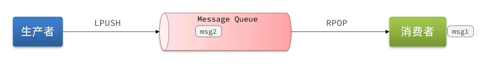

##### 总结

基于 List 的消息队列有哪些优缺点？

优点：

+ 利用 Redis 存储，不受限于 JVM 内存上限
+ 基于 Redis 的持久化机制，数据安全性有保证
+ 可以满足消息的有序性

缺点：

+ 无法避免消息丢失
+ 只支持单消费者


#### 7.2 基于 PubSub 的消息队列

**PubSub（发布订阅）**是 Redis 2.0 版本引入的消息传递模型。顾名思义，消费者可以订阅一个或多个 channel（频道），生产者向对应 channel 发送消息后，所有订阅者都能收到相关消息（天生就是阻塞式的 ）

+ `SUBSCRIBE channel [channel]`：订阅一个或多个频道
+ `PUBLISH channel msg`：向一个频道发送消息
+ `PSUBSCRIBE pattern [pattern]`：订阅与 pattern（通配符） 格式匹配的所有频道

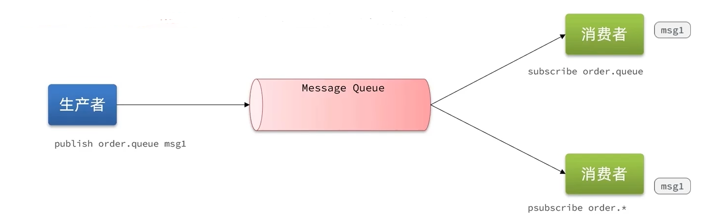

##### 总结

基于 PubSub 的消息队列有哪些优缺点？

优点：

+ 采用发布订阅模型，支持多生产、多消费

缺点：

+ 不支持数据持久化
+ 无法避免消息丢失
+ 消息堆积有上限，超出时数据丢失


#### 7.3 基于 Stream 的消息队列

Stream 是 Redis 5.0 引入的一种新数据类型，可以实现一个功能非常完善的消息队列

发送的命令：

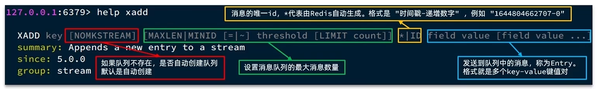

例如：

```bash
# 创建名为 users 的队列，并向其中发送一个消息，内容是：{name=jack, age=21}，并且使用Redis自动生成ID
XADD users * name jack age 21
```

读取消息的方式之一：XREAD

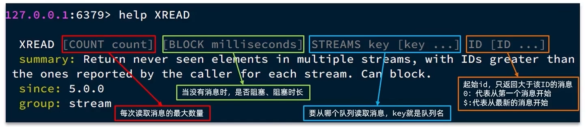

例如，使用 XREAD 读取第一个消息：

```bash
XREAD COUNT 1 STREAMS users 0
```

XREAD 阻塞方式，读取最新的消息：

```bash
XREAD COUNT 1 BLOCK 1000 STREAMS users $
```

在业务开发中，我们可以循环的调用 XREAD 阻塞方式来查询最新消息，从而实现持续监听队列的效果，伪代码如下：

```java
while(true) {
    // 尝试读取队列中的消息，最多阻塞2秒
    Object msg = redis.execute("XREAD COUNT 1 BLOCK 2000 STREAMS users $");
    if(msg == null) {
        continue;
    }
    // 处理消息
    handleMessage(msg);
}
```

注意：当我们指定起始 ID 为 $ 时，代表读取最新的消息，如果我们处理第一条消息的过程中，又有超过1条以上的消息到达队列，则下次获取时也只能获取到最新的一条，会出现**漏读消息**的问题

##### 总结

STREAM 类型消息队列的 XREAD 命令特点：

+ 消息可回溯（消息读完以后不消失，永久的保存在我们的队列中）
+ 一个消息可以被多个消费者读取
+ 可以阻塞读取
+ 有消息漏读的风险


#### 7.4 基于 Stream 的消息队列 - 消费者组

**消费者组（Consumer Group）**：将多个消费者划分到一个组中，监听同一个队列。具备下列特点：

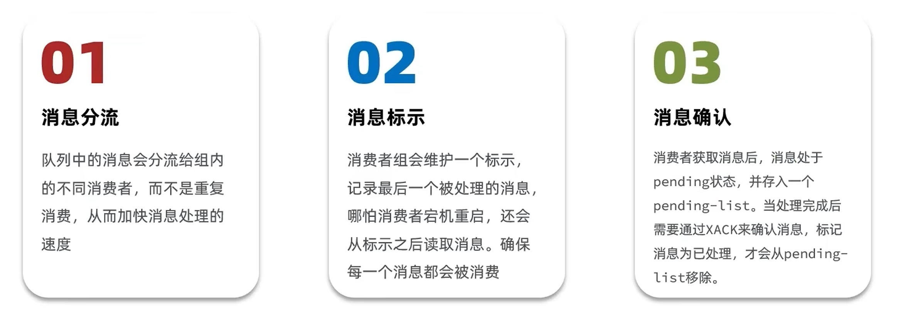

创建消费者组：

```bash
XGROUP CREATE key groupName ID [MKSTREAM]
```

+ `key`：队列名称
+ `groupName`：消费者组名称
+ `ID`：起始 ID 标示，`$` 代表队列中最后一个消息，`0` 则代表队列中第一个消息
+ `MKSTREAM`：队列不存在时自动创建队列

其它常见命令：

```bash
# 删除指定的消费者组
XGROUP DESTORY key groupname

# 给指定的消费者组添加消费者
XGROUP CREATECONSUMER key groupname consumername

# 删除消费者组中的指定消费者
DESTORY DELCONSUMER key groupname consumername
```

从消费者组读取消息：

```bash
XREADGROUP GROUP group consumer [COUNT count] [BLOCK milliseconds] [NOACK] STREAMS key [key ...] ID [ID ...]
```

+ `group`：消费组名称
+ `consumer`：消费者名称，如果消费者不存在，会自动创建一个消费者
+ `count`：本次查询的最大数量
+ `BLOCK milliseconds`：当没有消息时最长等待时间
+ `NOACK`：无需手动 ACK，获取到消息后自动确认（不建议设置）
+ `ID`：获取消息的起始 ID
  + ">"：从下一个未消费的消息开始
  + 其它：根据指定 id 从 pending-list 中获取已消费但未确认的消息，例如0，是从 pending-list 中的第一个消息开始

消费者监听消息的基本思路：

```java
while(true) {
	// 尝试监听队列，使用阻塞模式，最长等待2000毫秒
    Object msg = redis.call("XREADGROUP GROUP g1 c1 COUNT 1 BLOCK 2000 STREAMS s1 >");
    if(msg == null) { // null说明没有消息，继续下一次
    	continue;
    }
	try {
		// 处理消息，完成后一定要ACK
        handleMessage(msg);
	} catch(Exception e) {
		while(true) {
			Object msg = redis.calL("XREADGROUP GROUP g1 c1 COUNT 1 STREAMS s1 0");
			if(msg == null) { // null说明没有异常消息，所有消息都已确认，结束循环
				break;
			}
			try {
				// 说明有异常消息，再次处理
				handleMessage(msg);
			} catch(Exception e) {
				// 再次出现异常，记录日志，继续循环
				continue;
            }
        }
    }
}
```

##### 总结

STREAM 类型消息队列的 XREADGROUP 命令特点：

+ 消息可回溯
+ 可以多消费者争抢消息，加快消费速度
+ 可以阻塞读取
+ 没有消息漏读的风险
+ 有消息确认机制，保证消息至少被消费一次


#### 总结

|              | List                                     | PubSub             | Stream                                                 |
| ------------ | ---------------------------------------- | ------------------ | ------------------------------------------------------ |
| 消息持久化   | 支持                                     | 不支持             | 支持                                                   |
| 阻塞读取     | 支持                                     | 支持               | 支持                                                   |
| 消息堆积处理 | 受限于内存空间，可以利用多消费者加快处理 | 受限于消费者缓冲区 | 受限于队列长度，可以利用消费者组提高消费速度，减少堆积 |
| 消息确认机制 | 不支持                                   | 不支持             | 支持                                                   |
| 消息回溯     | 不支持                                   | 不支持             | 支持                                                   |


#### 案例：基于 Redis 的 Stream 结构作为消息队列，实现异步秒杀下单

> 需求：
>
> 1. 创建一个 Stream 类型的消息队列，名为 stream.orders
> 2. 修改之前的秒杀下单 Lua 脚本，在认定有抢购资格后，直接向 stream.orders 中添加消息，内容包含 voucherId、userId、orderId
> 3. 项目启动时，开启一个线程任务，尝试获取 stream.orders 中的消息，完成下单

+ 预先在 redis 中执行这两条

```bash
XADD stream.orders * key value
```

```bash
XGROUP CREATE stream.orders g1 $
```

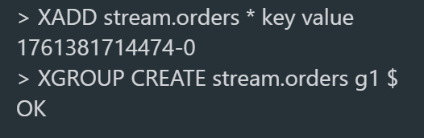

+ seckill.lua

```lua
-- 1. 参数列表
-- 1.1 优惠卷id
local voucherId = ARGV[1]
-- 1.2 用户id
local userId = ARGV[2]
-- 1.3 订单id
local orderId = ARGV[3]

-- 2. 数据key
-- 2.1 库存key
local stockKey = 'seckill:stock:' .. voucherId
-- 2.2 订单key
local stockKey = 'seckill:stock:' .. voucherId

-- 3. 脚本业务
-- 3.1 判断库存是否充足 get stockKey
if (tonumber(redis.call('get', stockKey)) <= 0) then
    -- 3.2 库存不足，返回1
    return 1
end
-- 3.2 判断用户是否下单 SISMEMBER orderKey userId
if (redis.call('sismember', orderKey, userId) == 1) then
    -- 3.3 存在，说明是重复下单，返回2
    return 2
end
-- 3.4 扣库存 incrby stockKey -1
redis.call('incrby', stockKey, -1)
-- 3.5 下单（保存用户） sadd orderKey userId
redis.call('sadd', orderKey, userId)
-- 3.6 发送消息到队列中，XADD stream.orders * k1 v1 k2 v2
redis.call('xadd', 'stream.orders', '*', 'userId', userId, 'voucherId', voucherId, 'id', orderId)

return 0
```

+ VoucherOrderServiceImpl.java

```java
private class VoucherOrderHandler implements Runnable {
    String queueName = "stream.orders";

    @Override
    public void run() {
        // 初始化消费者组
        try {
            // 创建消费者组，如果组已经存在则忽略错误
            stringRedisTemplate.opsForStream().createGroup(queueName, "g1");
        } catch (Exception e) {
            log.warn("消费者组 g1 已存在，跳过创建");
        }
        while (true) {
            try {
                // 1. 获取消息队列中的订单信息 XREADGROUP GROUP g1 c1 COUNT 1 BLOCK 2000 STREAMS stream.orders >
                List<MapRecord<String, Object, Object>> list = stringRedisTemplate.opsForStream().read(
                        Consumer.from("g1", "c1"),
                        StreamReadOptions.empty().count(1).block(Duration.ofSeconds(2)),
                        StreamOffset.create(queueName, ReadOffset.lastConsumed())
                );

                // 2. 判断消息获取是否成功
                if (list == null || list.isEmpty()) {
                    // 2.1 如果获取失败，说明没有消息，继续下一次循环
                    continue;
                }
                // 3. 解析消息中的订单信息
                MapRecord<String, Object, Object> record = list.get(0);
                Map<Object, Object> value = record.getValue();
                VoucherOrder voucherOrder = BeanUtil.fillBeanWithMap(value, new VoucherOrder(), true);

                // 4. 如果获取成功，可以下单
                handleVoucherOrder(voucherOrder);
                // 5. ACK确认 SACK stream.orders g1 id
                stringRedisTemplate.opsForStream().acknowledge(queueName, "g1", record.getId());

            } catch (Exception e) {
                log.error("处理订单异常", e);
                handlePendingList();
            }
        }
    }

    /**
     * 处理异常，循环ACK确认
     */
    private void handlePendingList() {
        while (true) {
            try {
                // 1. 获取pending-list中的订单信息 XREADGROUP GROUP g1 c1 COUNT 1 STREAMS stream.orders 0
                List<MapRecord<String, Object, Object>> list = stringRedisTemplate.opsForStream().read(
                        Consumer.from("g1", "c1"),
                        StreamReadOptions.empty().count(1).block(Duration.ofSeconds(2)),
                        StreamOffset.create(queueName, ReadOffset.from("0"))
                );

                // 2. 判断消息获取是否成功
                if (list == null || list.isEmpty()) {
                    // 如果获取失败，说明pending-list没有异常消息，结束循环
                    break;
                }
                // 3. 解析消息中的订单信息
                MapRecord<String, Object, Object> record = list.get(0);
                Map<Object, Object> value = record.getValue();
                VoucherOrder voucherOrder = BeanUtil.fillBeanWithMap(value, new VoucherOrder(), true);

                // 4. 如果获取成功，可以下单
                handleVoucherOrder(voucherOrder);
                // 5. ACK确认 SACK stream.orders g1 id
                stringRedisTemplate.opsForStream().acknowledge(queueName, "g1", record.getId());

            } catch (Exception e) {
                log.error("处理订单异常", e);
                try {
                    Thread.sleep(20);
                } catch (InterruptedException ex) {
                    ex.printStackTrace();
                }
            }
        }
    }
}
```


**如果一直跳报错就把 Redisson 的另外两个 Redis 服务的配置给关了！！！**


-----------------------


## 四、达人探店

### 1. 发布探店笔记

探店笔记类似点评网站的平价，往往是图文结合。对应的表有两个：

+ tb_blog：探店笔记表，包含笔记中的标题、文字、图片等
+ tb_blog_comments：其他用户对探店笔记的评价


原项目已经有了，就是 CRUD，不做过多赘述

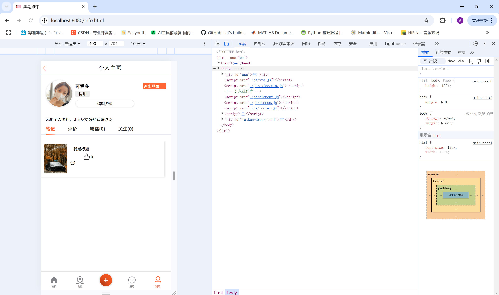


#### 案例：实现查看发布探店笔记的接口

> 需求：点击首页的探店笔记，会进入详情页面，实现该页面的查询接口

|          | 说明                         |
| -------- | ---------------------------- |
| 请求方式 | GET                          |
| 请求路径 | /blog/{id}                   |
| 请求参数 | id: blog 的 id               |
| 返回值   | Blog: 笔记信息，包含用户信息 |

+ BlogServiceImpl.java

```java
package com.hmdp.service.impl;

import com.baomidou.mybatisplus.extension.plugins.pagination.Page;
import com.hmdp.dto.Result;
import com.hmdp.entity.Blog;
import com.hmdp.entity.User;
import com.hmdp.mapper.BlogMapper;
import com.hmdp.service.IBlogService;
import com.baomidou.mybatisplus.extension.service.impl.ServiceImpl;
import com.hmdp.service.IUserService;
import com.hmdp.utils.SystemConstants;
import org.springframework.stereotype.Service;

import javax.annotation.Resource;
import java.util.List;

/**
 * <p>
 * 服务实现类
 * </p>
 *
 * @author 虎哥
 * @since 2021-12-22
 */
@Service
public class BlogServiceImpl extends ServiceImpl<BlogMapper, Blog> implements IBlogService {

    @Resource
    private IUserService userService;

    @Override
    public Result queryHotBlog(Integer current) {
        // 根据用户查询
        Page<Blog> page = query()
                .orderByDesc("liked")
                .page(new Page<>(current, SystemConstants.MAX_PAGE_SIZE));
        // 获取当前页数据
        List<Blog> records = page.getRecords();
        // 查询用户
        records.forEach(this::queryBlogUser);
        return Result.ok(records);
    }

    @Override
    public Result queryBlogById(Long id) {
        // 1. 查询blog
        Blog blog = getById(id);
        if (blog == null) {
            return Result.fail("笔记不存在！");
        }

        // 2. 查询blog有关的用户
        queryBlogUser(blog);
        return Result.ok(blog);
    }

    private void queryBlogUser(Blog blog) {
        Long userId = blog.getUserId();
        User user = userService.getById(userId);
        blog.setName(user.getNickName());
        blog.setIcon(user.getIcon());
    }
}
```


--------------------


### 2. 点赞

>需求：
>
>+ 同一个用户只能点赞一次，再次点击则取消点赞
>+ 如果当前用户已经点赞，则点赞按钮高亮显示（前端已实现，判断字段 Blog 类的 isLike 属性）
>
>实现步骤：
>
>1. 给 Blog 类中添加一个 isLike 字段，标示是否被当前用户点赞
>2. 修改点赞功能，利用 Redis 的 set 集合判断是否点赞过，未点赞过则点赞数+1，已点赞过则点赞数-1
>3. 修改根据 id 查询 Blog 的业务，判断当前登录用户是否点赞过，赋值给 isLike 字段
>4. 修改分页查询 Blog 业务，判断当前登录用户是否点赞过，赋值给 isLike 字段

+ BlogServiceImpl.java

```java
package com.hmdp.service.impl;

import cn.hutool.core.util.BooleanUtil;
import com.baomidou.mybatisplus.extension.plugins.pagination.Page;
import com.hmdp.dto.Result;
import com.hmdp.entity.Blog;
import com.hmdp.entity.User;
import com.hmdp.mapper.BlogMapper;
import com.hmdp.service.IBlogService;
import com.baomidou.mybatisplus.extension.service.impl.ServiceImpl;
import com.hmdp.service.IUserService;
import com.hmdp.utils.SystemConstants;
import com.hmdp.utils.UserHolder;
import org.springframework.beans.factory.annotation.Autowired;
import org.springframework.data.redis.core.StringRedisTemplate;
import org.springframework.stereotype.Service;

import javax.annotation.Resource;
import java.util.List;

/**
 * <p>
 * 服务实现类
 * </p>
 *
 * @author 虎哥
 * @since 2021-12-22
 */
@Service
public class BlogServiceImpl extends ServiceImpl<BlogMapper, Blog> implements IBlogService {

    @Resource
    private IUserService userService;
    @Autowired
    private StringRedisTemplate stringRedisTemplate;

    @Override
    public Result queryHotBlog(Integer current) {
        // 根据用户查询
        Page<Blog> page = query()
                .orderByDesc("liked")
                .page(new Page<>(current, SystemConstants.MAX_PAGE_SIZE));
        // 获取当前页数据
        List<Blog> records = page.getRecords();
        // 查询用户
        records.forEach(blog -> {
            this.queryBlogUser(blog);
            this.isBlogLiked(blog);
        });
        return Result.ok(records);
    }

    @Override
    public Result queryBlogById(Long id) {
        // 1. 查询blog
        Blog blog = getById(id);
        if (blog == null) {
            return Result.fail("笔记不存在！");
        }

        // 2. 查询blog有关的用户
        queryBlogUser(blog);
        // 3. 查询blog是否被点赞
        isBlogLiked(blog);
        return Result.ok(blog);
    }

    private void isBlogLiked(Blog blog) {
        // 1. 获取登录用户
        Long userId = UserHolder.getUser().getId();
        // 2. 判断当前登录用户是否已经点赞
        String key = "blog:liked:" + blog.getId();
        Boolean isMember = stringRedisTemplate.opsForSet().isMember(key, userId.toString());
        blog.setIsLike(BooleanUtil.isTrue(isMember));
    }

    private void queryBlogUser(Blog blog) {
        Long userId = blog.getUserId();
        User user = userService.getById(userId);
        blog.setName(user.getNickName());
        blog.setIcon(user.getIcon());
    }

    /**
     * 点赞功能
     *
     * @param id
     * @return
     */
    @Override
    public Result likeBlog(Long id) {
        // 1. 获取登录用户
        Long userId = UserHolder.getUser().getId();
        // 2. 判断当前登录用户是否已经点赞
        String key = "blog:liked:" + id;
        Boolean isMember = stringRedisTemplate.opsForSet().isMember(key, userId.toString());
        if (BooleanUtil.isFalse(isMember)) {
            // 3. 如果未点赞，可以点赞
            // 3.1 数据库点赞数+1
            boolean isSuccess = update().setSql("liked = liked + 1").eq("id", id).update();
            // 3.2 保存用户到Redis的set集合
            if (isSuccess) {
                stringRedisTemplate.opsForSet().add(key, userId.toString());
            }
        } else {
            // 4. 如果已点赞，取消点赞
            // 4.1 数据库点赞数-1
            boolean isSuccess = update().setSql("liked = liked - 1").eq("id", id).update();
            // 4.2 把用户从Redis的set集合移除
            if (isSuccess) {
                stringRedisTemplate.opsForSet().remove(key, userId.toString());
            }
        }
        return null;
    }
}
```


--------------------------


### 3. 点赞排行榜

在探店笔记的详情页面，应该把给该笔记点赞的人显示出来，比如最早点赞的 TOP5，形成点赞排行榜：

|          | 说明                                           |
| -------- | ---------------------------------------------- |
| 请求方式 | GET                                            |
| 请求路径 | /blog/likes/{id}                               |
| 请求参数 | id: blog 的 id                                 |
| 返回值   | List<UserDTO> 给这个把笔记点赞的 TopN 用户集合 |

> 需求：按照点赞时间先后排序，返回 Top5 的用户
>
> |          | List                 | Set          | SortedSet         |
> | -------- | -------------------- | ------------ | ----------------- |
> | 排序方式 | 按添加顺序排序       | 无法排序     | 根据 score 值排序 |
> | 唯一性   | 不唯一               | 唯一         | 唯一              |
> | 查找方式 | 按索引查找或首尾查找 | 根据元素查找 | 根据元素查找      |

+ BlogServiceImpl.java

```java
package com.hmdp.service.impl;

import cn.hutool.core.bean.BeanUtil;
import cn.hutool.core.util.StrUtil;
import com.baomidou.mybatisplus.extension.plugins.pagination.Page;
import com.hmdp.dto.Result;
import com.hmdp.dto.UserDTO;
import com.hmdp.entity.Blog;
import com.hmdp.entity.User;
import com.hmdp.mapper.BlogMapper;
import com.hmdp.service.IBlogService;
import com.baomidou.mybatisplus.extension.service.impl.ServiceImpl;
import com.hmdp.service.IUserService;
import com.hmdp.utils.RedisConstants;
import com.hmdp.utils.SystemConstants;
import com.hmdp.utils.UserHolder;
import org.springframework.beans.factory.annotation.Autowired;
import org.springframework.data.redis.core.StringRedisTemplate;
import org.springframework.stereotype.Service;

import javax.annotation.Resource;
import java.util.Collections;
import java.util.List;
import java.util.Set;
import java.util.stream.Collectors;

/**
 * <p>
 * 服务实现类
 * </p>
 *
 * @author 虎哥
 * @since 2021-12-22
 */
@Service
public class BlogServiceImpl extends ServiceImpl<BlogMapper, Blog> implements IBlogService {

    @Resource
    private IUserService userService;
    @Autowired
    private StringRedisTemplate stringRedisTemplate;

    @Override
    public Result queryHotBlog(Integer current) {
        // 根据用户查询
        Page<Blog> page = query()
                .orderByDesc("liked")
                .page(new Page<>(current, SystemConstants.MAX_PAGE_SIZE));
        // 获取当前页数据
        List<Blog> records = page.getRecords();
        // 查询用户
        records.forEach(blog -> {
            this.queryBlogUser(blog);
            this.isBlogLiked(blog);
        });
        return Result.ok(records);
    }

    @Override
    public Result queryBlogById(Long id) {
        // 1. 查询blog
        Blog blog = getById(id);
        if (blog == null) {
            return Result.fail("笔记不存在！");
        }

        // 2. 查询blog有关的用户
        queryBlogUser(blog);
        // 3. 查询blog是否被点赞
        isBlogLiked(blog);
        return Result.ok(blog);
    }

    /**
     * 判断当前登录用户是否点赞
     *
     * @param blog
     */
    private void isBlogLiked(Blog blog) {
        // 1. 获取登录用户
        UserDTO user = UserHolder.getUser();
        if (user == null) {
            // 用户未登录，无需查询是否点赞
            return;
        }
        Long userId = UserHolder.getUser().getId();
        // 2. 判断当前登录用户是否已经点赞
        String key = "blog:liked:" + blog.getId();
        Double score = stringRedisTemplate.opsForZSet().score(key, userId.toString());
        blog.setIsLike(score != null);
    }

    private void queryBlogUser(Blog blog) {
        Long userId = blog.getUserId();
        User user = userService.getById(userId);
        blog.setName(user.getNickName());
        blog.setIcon(user.getIcon());
    }

    /**
     * 点赞功能
     *
     * @param id
     * @return
     */
    @Override
    public Result likeBlog(Long id) {
        // 1. 获取登录用户
        Long userId = UserHolder.getUser().getId();
        // 2. 判断当前登录用户是否已经点赞
        String key = RedisConstants.BLOG_LIKED_KEY + id;
        Double score = stringRedisTemplate.opsForZSet().score(key, userId.toString());
        if (score == null) {
            // 3. 如果未点赞，可以点赞
            // 3.1 数据库点赞数+1
            boolean isSuccess = update().setSql("liked = liked + 1").eq("id", id).update();
            // 3.2 保存用户到Redis的set集合 zadd key value score
            if (isSuccess) {
                stringRedisTemplate.opsForZSet().add(key, userId.toString(), System.currentTimeMillis());
            }
        } else {
            // 4. 如果已点赞，取消点赞
            // 4.1 数据库点赞数-1
            boolean isSuccess = update().setSql("liked = liked - 1").eq("id", id).update();
            // 4.2 把用户从Redis的set集合移除
            if (isSuccess) {
                stringRedisTemplate.opsForZSet().remove(key, userId.toString());
            }
        }
        return null;
    }

    /**
     * 点赞排行榜
     *
     * @param id
     * @return
     */
    @Override
    public Result queryBlogByLikes(Long id) {
        String key = RedisConstants.BLOG_LIKED_KEY + id;
        // 1. 查询Top5的点赞用户 zrange key 0 4
        Set<String> top5 = stringRedisTemplate.opsForZSet().range(key, 0, 4);
        if (top5 == null || top5.isEmpty()) {
            return Result.ok(Collections.emptyList());
        }
        // 2. 解析出其中的用户id
        List<Long> ids = top5.stream().map(Long::valueOf).collect(Collectors.toList()); //使用map方法将每个元素转换为对应的Long类型，并使用collect方法将结果收集到一个List中。
        String idStr = StrUtil.join(",", ids);
        // 3. 根据用户id查询用户
        List<UserDTO> userDTOS = userService.query()
                .in("id", ids)
                .last("ORDER BY FIELD(id, " + idStr + ")").list()
                .stream()
                .map(user -> BeanUtil.copyProperties(user, UserDTO.class))
                .collect(Collectors.toList());
        // 4. 返回
        return Result.ok(userDTOS);
    }
}
```


不知道是不是前端的问题，他这个刷新不是异步的，要手动刷新网页


--------------------------


## 五、达人探店

### 1. 关注和取关

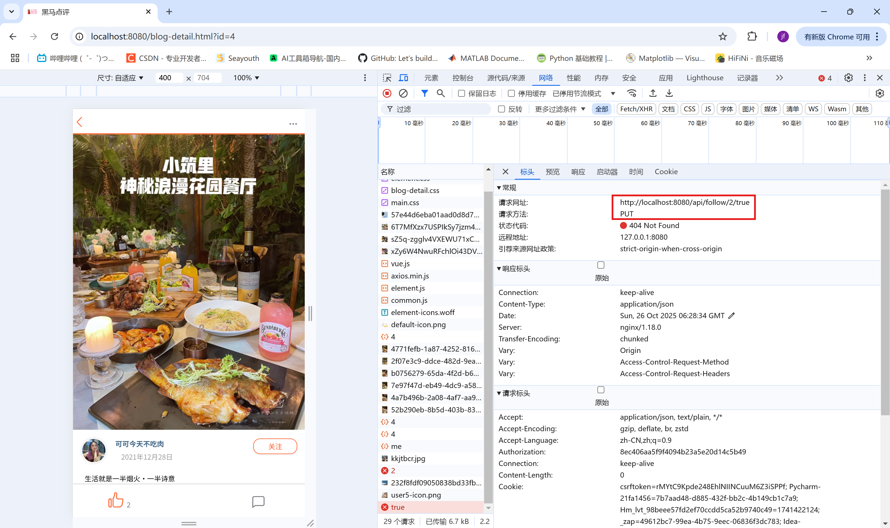

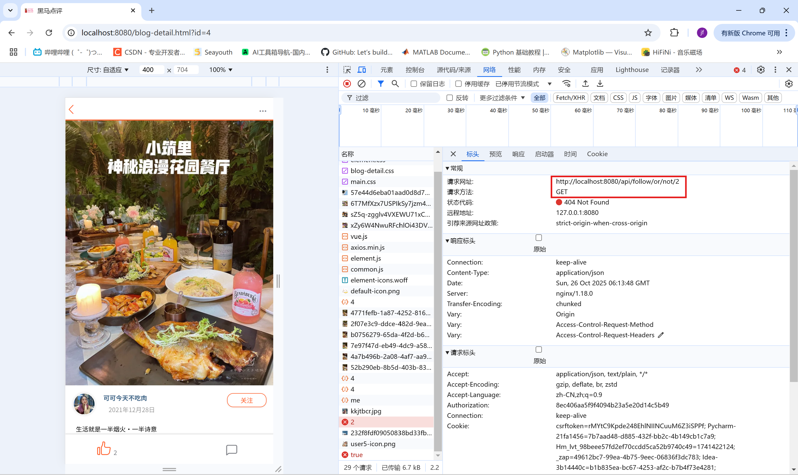

> 需求：基于该表数据结构，实现两个接口：
>
> 1. 关注和取关接口
> 2. 判断是否关注的接口
>
> 关注是 User 之间的关系，是博主与粉丝的关系，数据库中有一张 **tb_follow** 表来标示：
>
> 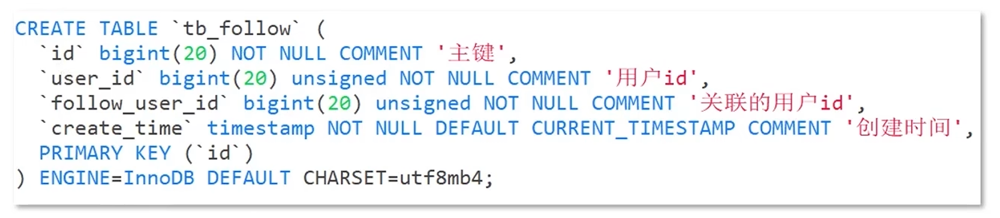
>
> 注意：这里需要把主键修改为自增长，简化开发

#### 代码开发

+ FollowController.java

```java
package com.hmdp.controller;


import com.hmdp.dto.Result;
import com.hmdp.entity.Follow;
import com.hmdp.service.IFollowService;
import org.springframework.beans.factory.annotation.Autowired;
import org.springframework.web.bind.annotation.*;

/**
 * <p>
 * 前端控制器
 * </p>
 *
 * @author 虎哥
 * @since 2021-12-22
 */
@RestController
@RequestMapping("/follow")
public class FollowController {

    @Autowired
    private IFollowService followService;

    /**
     * 关注和取关
     *
     * @param followUserId
     * @param isFollow
     * @return
     */
    @PutMapping("/{id}/{isFollow}")
    public Result follow(@PathVariable("id") Long followUserId, @PathVariable("isFollow") Boolean isFollow) {
        return followService.follow(followUserId, isFollow);
    }

    /**
     * 判断是否关注
     *
     * @param followUserId
     * @return
     */
    @GetMapping("/or/not/{id}")
    public Result follow(@PathVariable("id") Long followUserId) {
        return followService.isFollow(followUserId);
    }
}
```

+ FollowServiceImpl.java

```java
package com.hmdp.service.impl;

import com.baomidou.mybatisplus.core.conditions.query.QueryWrapper;
import com.hmdp.dto.Result;
import com.hmdp.entity.Follow;
import com.hmdp.mapper.FollowMapper;
import com.hmdp.service.IFollowService;
import com.baomidou.mybatisplus.extension.service.impl.ServiceImpl;
import com.hmdp.utils.UserHolder;
import org.springframework.stereotype.Service;

/**
 * <p>
 * 服务实现类
 * </p>
 *
 * @author 虎哥
 * @since 2021-12-22
 */
@Service
public class FollowServiceImpl extends ServiceImpl<FollowMapper, Follow> implements IFollowService {

    /**
     * 关注和取关
     *
     * @param followUserId
     * @param isFollow
     * @return
     */
    @Override
    public Result follow(Long followUserId, Boolean isFollow) {
        // 1. 获取登录用户
        Long userId = UserHolder.getUser().getId();

        // 1. 判断到底是关注还是取关
        if (isFollow) {
            // 2. 关注，新增数据
            Follow follow = new Follow();
            follow.setUserId(userId);
            follow.setFollowUserId(followUserId);
            save(follow);
        } else {
            // 3. 取关，删除 delete from tb_follow where user_id = ? and follow_user_id = ?
            remove(new QueryWrapper<Follow>()
                    .eq("user_id", userId)
                    .eq("follow_user_id", followUserId));

        }
        return Result.ok();
    }

    @Override
    public Result isFollow(Long followUserId) {
        // 1. 获取登录用户
        Long userId = UserHolder.getUser().getId();
        // 2. 查询是否关注 select count(*) form tb_follow where user_id = ? and follow_user_id = ?
        Integer count = query().eq("user_id", userId)
                .eq("follow_user_id", followUserId).count();
        // 3. 判断
        return Result.ok(count > 0);
    }
}
```


#### 功能测试

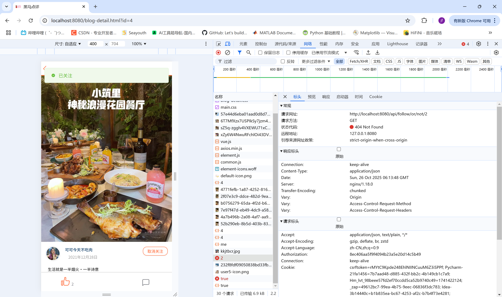


---------------------------


### 2. 共同关注

#### 2.1 博主个人主页

博主个人首页依赖两个接口：

1. 根据 id 查询 user 信息：

```java
// UserController 根据id查询用户

@GetMapping("/{id}")
public Result queryUserById(@PathVariable("id") Long userId){
	// 查询详情
	User user = userService.getById(userId);
	if (user == null) {
		return Result.ok();
	}
	UserDTO userDTO = BeanUtil.copyProperties(user, UserDTO.class);
	// 返回
	return Result.ok(userDTO);
}
```

2. 根据 id 查询博主的探店笔记：

```java
// BlogController
@GetMapping("/of/user")
public Result queryBlogByUserId(
		@RequestParam(value = "current", defaultValue = "1") Integer current,
		@RequestParam("id") Long id) {
	// 根据用户查询
	Page<Blog> page = blogService.query()
			.eq("user_id", id).page(new Page<>(current, SystemConstants.MAX_PAGE_SIZE));
	// 获取当前页数据
	List<Blog> records = page.getRecords();
	return Result.ok(records);
}
```

#### 3.2 共同关注

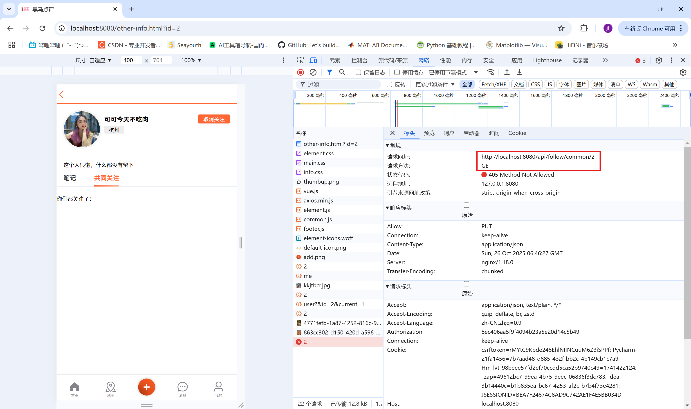

> 需求：
>
> 利用 Redis 中恰当的数据结构，实现共同关注功能。在博主个人页面展示出当前用户与博主的共同好友

+ FollowServiceImpl.java

```java
/**
 * 关注和取关
 *
 * @param followUserId
 * @param isFollow
 * @return
 */
@Override
public Result follow(Long followUserId, Boolean isFollow) {
    // 1. 获取登录用户
    Long userId = UserHolder.getUser().getId();
    String key = "follows:" + userId;

    // 1. 判断到底是关注还是取关
    if (isFollow) {
        // 2. 关注，新增数据
        Follow follow = new Follow();
        follow.setUserId(userId);
        follow.setFollowUserId(followUserId);
        boolean isSuccess = save(follow);
        if (isSuccess) {
            // 把关注用户的id，放入redis的set集合 sadd userId followUserId
            stringRedisTemplate.opsForSet().add(key, followUserId.toString());
        }
    } else {
        // 3. 取关，删除 delete from tb_follow where user_id = ? and follow_user_id = ?
        boolean isSuccess = remove(new QueryWrapper<Follow>()
                .eq("user_id", userId)
                .eq("follow_user_id", followUserId));
        if (isSuccess) {
            // 把关注的用户id从redis集合中移除
            stringRedisTemplate.opsForSet().remove(key, followUserId.toString());
        }
    }
    return Result.ok();
}
```

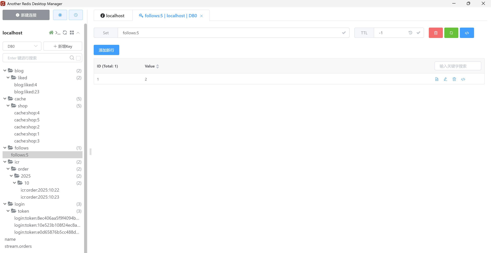


|          | 说明                            |
| -------- | ------------------------------- |
| 请求方式 | GET                             |
| 请求路径 | /follow/common/{id}             |
| 请求参数 | id: 目标用户 id                 |
| 返回值   | List<UserDTO>: 两个共同关注的人 |

+ FollowController.java

```java
/**
 * 查询共同关注的人
 *
 * @param id
 * @return
 */
@GetMapping("/common/{id}")
public Result followCommons(@PathVariable("id") Long id) {
    return followService.followCommons(id);
}
```

+ FollowServiceImpl.java

```java
@Override
public Result followCommons(Long id) {
    // 1. 获取当前用户
    Long userId = UserHolder.getUser().getId();
    String key = "follows:" + userId;
    // 2. 求交集
    String key2 = "follows:" + id;
    Set<String> intersect = stringRedisTemplate.opsForSet().intersect(key, key2);
    if (intersect == null || intersect.isEmpty()) {
        // 无交集
        return Result.ok(Collections.emptyList());
    }
    // 3. 解析id集合
    List<Long> ids = intersect.stream().map(Long::valueOf).collect(Collectors.toList());
    // 4. 查询用户
    List<UserDTO> users = userService.listByIds(ids)
            .stream()
            .map(user -> BeanUtil.copyProperties(user, UserDTO.class))
            .collect(Collectors.toList());
    return Result.ok(users);
}
```


----------------


### 3. 关注推送

关注推送也叫做 Feed 流，直译为**投喂**。为用户持续的提供“沉浸式”的体验，通过无限下拉刷新获取新的信息

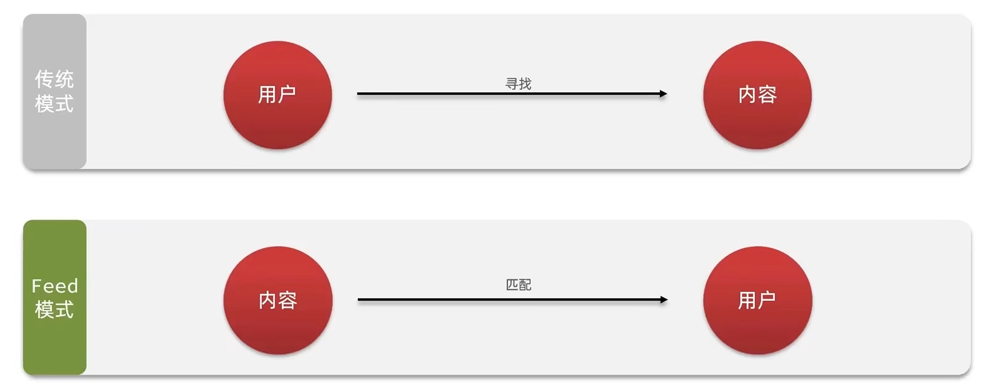

Feed 流产品有两种常见模式：

+ **Timeline**：不做内容筛选，简单的按照内容发布时间排序，常用于好友或关注。例如朋友圈
  + 优点：信息全面，不会有缺失。并且实现也相对简单
  + 缺点：信息噪音较多，用户不一定感兴趣，内容获取效率低
+ **智能排序**：利用智能算法屏蔽掉违规的、用户不感兴趣的内容。推送用户感兴趣信息来吸引用户
  + 优点：投喂用户感兴趣信息，用户粘度很高，容易沉迷
  + 如果算法不准确，可能起到反作用

本例中的个人页面，是基于关注的好友来做 Feed 流，因此采用 Timeline 的模式。该模式的实现方案有三种：

1. 拉模式
2. 推模式
3. 推拉结合

#### 3.1 Feed 流的实现方案

**拉模式**：也叫做读扩散

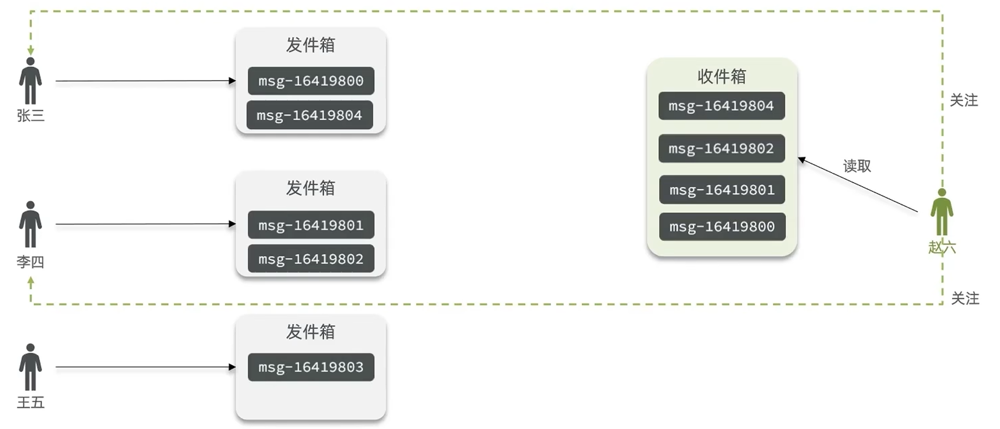

+ 优点：节省内存空间（消息只保存了一份在发件人的发件箱里面）
+ 缺点：延迟高（每次读消息都要重新拉去发件箱的消息重新再做排序）


**推模式**：也叫做写扩散

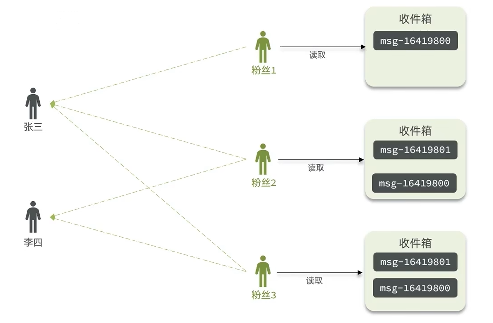

+ 优点：延时低
+ 缺点：内存占用高


**推拉结合模式**：也叫做读写混合，兼具推和拉两种模式的优点

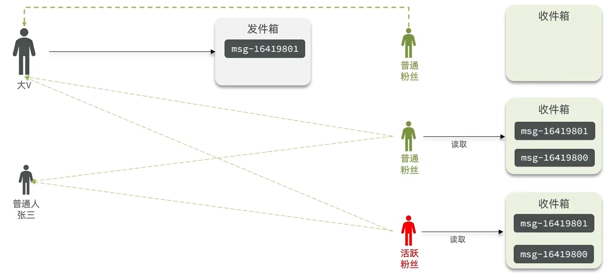


|              | 拉模式   | 推模式                         | 推拉结合               |
| ------------ | -------- | ------------------------------ | ---------------------- |
| 写比例       | 低       | 高                             | 中                     |
| 读比例       | 高       | 低                             | 中                     |
| 用户读取延迟 | 高       | 低                             | 低                     |
| 实现难度     | 复杂     | 简单                           | 很复杂                 |
| 使用场景     | 很少使用 | 用户量少（千万以下）、没有大 V | 过千万的用户量，有大 V |


#### 案例：基于推模式实现关注推送功能

>需求：
>
>1. 修改新增探店笔记的业务，在保存 blog 到数据库的同时，推送到粉丝的收件箱
>2. 收件箱满足可以根据时间戳排序，必须用 Redis 的数据结构实现
>3. 查询收件箱数据时，可以实现分页查询

**Feed 流的分页问题**

Feed 流中的数据会不断更新，所以数据的角标也在变化，因此不能采用传统的分页模式

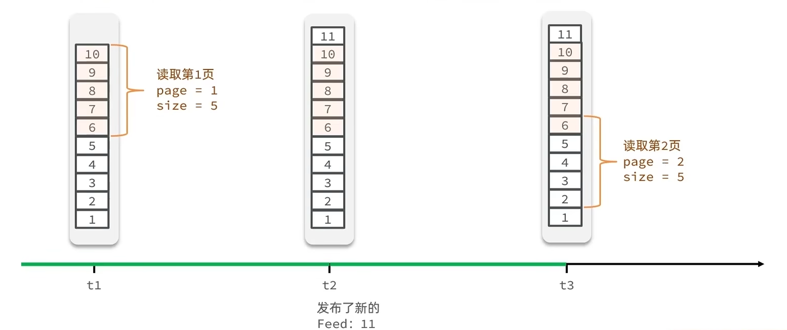

所以要采取滚动分页模式

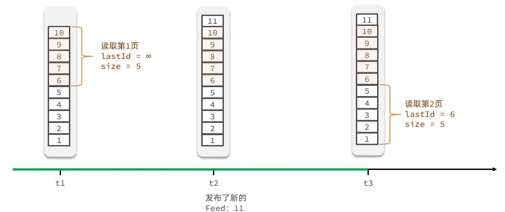

```java
/**
 * 推送功能
 *
 * @param blog
 * @return
 */
@Override
public Result saveBlog(Blog blog) {
    // 1. 获取登录用户
    UserDTO user = UserHolder.getUser();
    blog.setUserId(user.getId());
    // 2. 保存探店博文到数据库
    boolean isSuccess = save(blog);
    if (!isSuccess) {
        return Result.fail("新增笔记失败！");
    }
    // 3. 查询笔记作者的所有粉丝 select * from tb_follow where follow_user_id = ?
    List<Follow> follows = followService.query().eq("follow_user_id", user.getId()).list();
    // 4. 推送笔记id给所有粉丝
    for (Follow follow : follows) {
        // 4.1 获取粉丝id
        Long userId = follow.getUserId();
        // 4.2 推送
        String key = "feed:" + userId;
        stringRedisTemplate.opsForZSet().add(key, blog.getId().toString(), System.currentTimeMillis());
    }
    // 3. 返回id
    return Result.ok(blog.getId());
}
```


#### 案例：实现关注页面的分页查询

> 需求：
>
> 在个人主页的 “关注” 卡片中，查询并展示推送的 Blog 信息
>
> 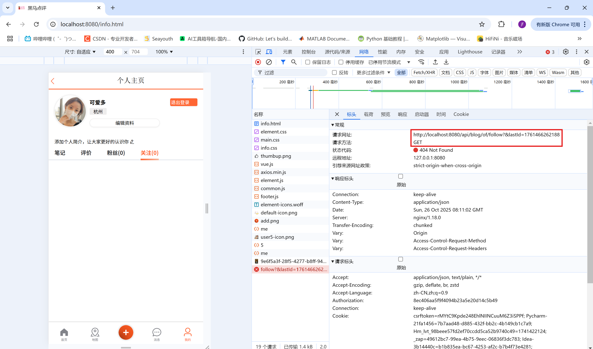
>
> |          | 说明                                                         |
> | -------- | ------------------------------------------------------------ |
> | 请求方式 | GET                                                          |
> | 请求路径 | /blog/of/follow                                              |
> | 请求参数 | lastId: 上一次查询的最小时间戳<br />offset: 偏移量           |
> | 返回值   | List<Blog>: 小于指定时间戳的笔记集合<br />minTime: 本次查询的推送的最小时间戳<br />offset: 偏移量 |

滚动分页查询参数：

+ max：当前时间戳   |   上一次查询最小值
+ min：0
+ offset：0   |   在上一次的结果中，与最小值一样的元素的个数
+ count：和前端确定好的

##### 代码开发

+ BlogServiceImpl.java

```java
/**
 * 实现分页查询
 *
 * @param max
 * @param offset
 * @return
 */
@Override
public Result queryBlogOfFollow(Long max, Integer offset) {
    // 1. 获取当前用户
    Long userId = UserHolder.getUser().getId();
    // 2. 查询收件箱 ZREVRANGEBYSCORE key Max Min LIMIT offset count
    String key = RedisConstants.FEED_KEY + userId;
    Set<ZSetOperations.TypedTuple<String>> typedTuples = stringRedisTemplate.opsForZSet()
            .reverseRangeByScoreWithScores(key, 0, max, offset, 3);
    // 3. 非空判断
    if (typedTuples == null || typedTuples.isEmpty()) {
        return Result.ok();
    }
    // 4. 解析数据：blogId、minTime（时间戳）、offset
    List<Long> ids = new ArrayList<>(typedTuples.size());
    long minTime = 0;
    int os = 1;
    for (ZSetOperations.TypedTuple<String> tuple : typedTuples) {
        // 4.1 获取id
        ids.add(Long.valueOf(tuple.getValue()));

        // 4.2 获取分数
        long time = tuple.getScore().longValue();
        if (time == minTime) {
            os++;
        } else {
            minTime = time;
            os = 1;
        }

    }
    // 5. 根据id查询blog
    String idStr = StrUtil.join(",", ids);
    List<Blog> blogs = query().in("id", ids)
            .last("ORDER BY FIELD(id, " + idStr + ")")
            .list();

    for (Blog blog : blogs) {
        // 5.1 查询blog有关的用户
        queryBlogUser(blog);
        // 5.2 查询blog是否被点赞
        isBlogLiked(blog);
    }

    // 6. 封装并返回
    ScrollResult r = new ScrollResult();
    r.setList(blogs);
    r.setOffset(os);
    r.setMinTime(minTime);

    return null;
}
```


--------------------------


## 六、附近商户

### 1. GEO 数据结构

GEO 就是 Geolocation 的简写形式，代表地理坐标。Redis 在3.2版本中加入了对 GEO 的支持，允许存储地理坐标信息，帮助外卖根据经纬度来检索数据。常见的命令有：

+ `GEOADD`：添加一个地理空间信息，包含：经度（longitude）、纬度（latitude）、值（member）
+ `GEODIST`：计算指定的两个点之间的距离并返回
+ `GEOHASH`：将指定 member 的坐标转为 hash 字符串形式并返回
+ `GEOPOS`：返回指定 member 的坐标
+ `GEORADIUS`：指定圆心、半径，找到该圆内包含的所有 member，并按照与圆心之间的距离排序后返回。6.2以后已废弃
+ `GEOSEARCH`：在指定范围内搜索 member，并按照与指定点之间的举例排序后返回。范围可以是圆形或矩形。6.2新功能
+ `GEOSEARCHSTORE`：与 GEOSEARCH 功能一致，不过可以把结果存储到一个指定的 key。6.2新功能


#### 案例：练习 Redis 的 GEO 功能

> 需求：
>
> 1. 添加下面几条数据：
>    - 北京南站（116.378248 39.865275）
>    - 北京站（116.42803 39.903738）
>    - 北京西站（116.322287 39.893729）
> 2. 计算北京西站到北京站的举例
> 3. 搜索天安门（116.397904 39.909005）附近10km 内的所有火车站，并按照举例升序排序

```bash
GEOADD g1 116.378248 39.865275 bjn 116.42803 39.903738 bjz 116.322287 39.893729 bjx
```

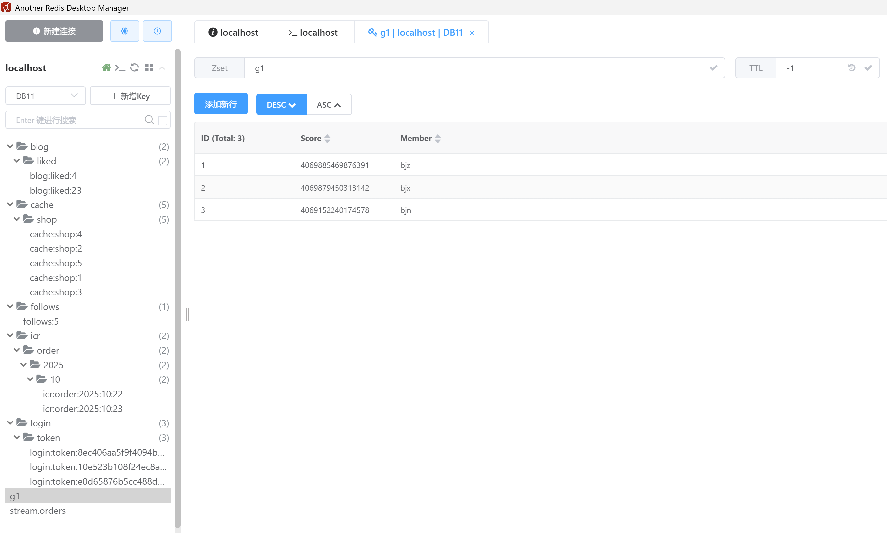

```bash
GEODIST g1 bjz bjx km
```

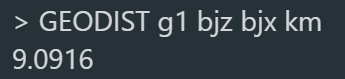

```bash
GEOSEARCH g1 FROMLONLAT 116.397904 39.909005 BYRADIUS 10 km WITHDIST
```

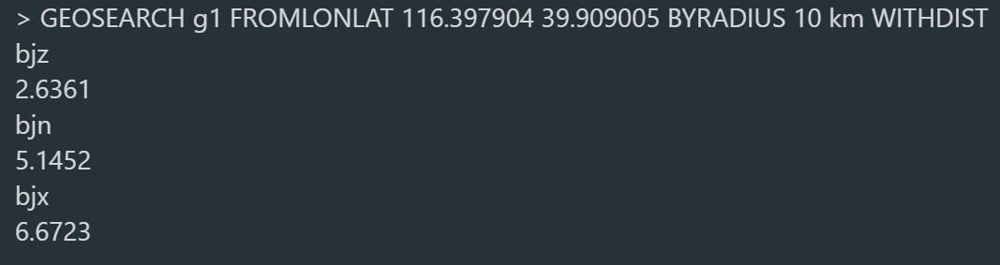

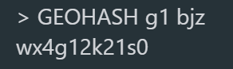


------------------------


### 2. 附近商户搜索

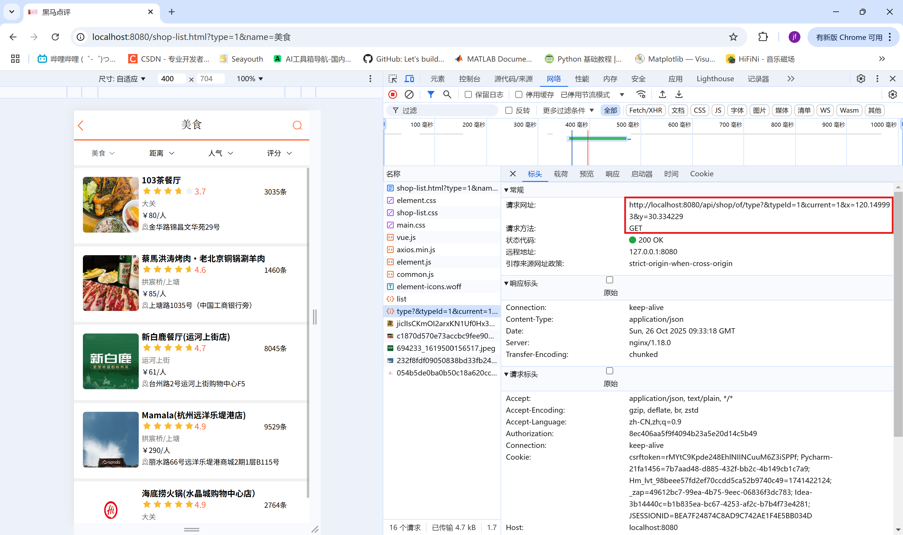

|          | 说明                                                         |
| -------- | ------------------------------------------------------------ |
| 请求方式 | GET                                                          |
| 请求路径 | /shop/of/type                                                |
| 请求参数 | typeId: 商户类型<br />current: 页码，滚动类型<br />x: 经度<br />y: 纬度 |
| 返回值   | List<Shop>: 符合要求的商户信息                               |

按照商户类型做分组，类型相同的商户作为同一组，以 typeId 为 key 存入同一个 GEO 集合中即可

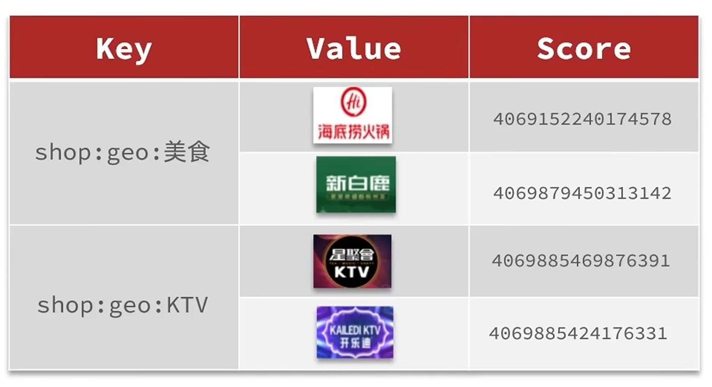

+ 加载所有店铺数据到 Redis

```java
    /**
     * 加载店铺信息
     */
    @Test
    void loadShopData() {
        // 1. 查询店铺信息
        List<Shop> list = shopService.list();
        // 2. 把店铺分组，按照typeId分组，typeId一致的放到一个集合
        Map<Long, List<Shop>> map = list.stream()
                .collect(Collectors.groupingBy(Shop::getTypeId));
        // 3. 分批完成写入Redis
        for (Map.Entry<Long, List<Shop>> entry : map.entrySet()) {
            // 3.1 获取类型id
            Long typeId = entry.getKey();
            String key = "shop:geo:" + typeId;
            // 3.2 获取同类型的店铺的集合
            List<Shop> value = entry.getValue();
            List<RedisGeoCommands.GeoLocation<String>> locations = new ArrayList<>(value.size());
            // 3.3 写入redis GEOADD key 经度 纬度 member
            for (Shop shop : value) {
//                stringRedisTemplate.opsForGeo().add(key, new Point(shop.getX(), shop.getY()), shop.getId().toString());
                locations.add(new RedisGeoCommands.GeoLocation<>(
                        shop.getId().toString(),
                        new Point(shop.getX(), shop.getY())
                ));
            }
            stringRedisTemplate.opsForGeo().add(key, locations);
        }
    }
```


SpringDataRedis 的 2.3.9 版本并不支持 Redis 6.2 提供的 GEOSEARCH 命令，因此我们需要提升其版本，修改自己的 POM 文件：

```xml
<dependency>
    <groupId>org.springframework.data</groupId>
    <artifactId>spring-data-redis</artifactId>
    <version>2.6.2</version>
</dependency>

<dependency>
    <groupId>io.lettuce</groupId>
    <artifactId>lettuce-core</artifactId>
    <version>6.1.9.RELEASE</version>
</dependency>
```


+ ShopServiceImpl.java

```java
/**
 * 附近商户搜索
 *
 * @param typeId
 * @param current 第几页
 * @param x
 * @param y
 * @return
 */
@Override
public Result queryShopByType(Integer typeId, Integer current, Double x, Double y) {
    // 1. 判断是否需要根据坐标查询
    if (x == null || y == null) {
        // 不需要坐标查询，按数据库查询
        Page<Shop> page = query()
                .eq("type_id", typeId)
                .page(new Page<>(current, SystemConstants.DEFAULT_PAGE_SIZE));
        // 返回数据
        return Result.ok(page.getRecords());
    }
    // 2. 计算分页参数
    int from = (current - 1) * SystemConstants.DEFAULT_PAGE_SIZE;
    int end = current * SystemConstants.DEFAULT_PAGE_SIZE;

    // 3. 查询redis，按照距离排序、分页。结果：shopId、distance
    String key = RedisConstants.SHOP_GEO_KEY + typeId;
    GeoResults<RedisGeoCommands.GeoLocation<String>> results = stringRedisTemplate.opsForGeo() // GEOSEARCH BYLONLAT x y BYRADIUS 10 WITHDISTANCE
            .search(
                    key,
                    GeoReference.fromCoordinate(x, y),
                    new Distance(5000),
                    RedisGeoCommands.GeoSearchCommandArgs.newGeoSearchArgs().includeDistance().limit(end)
            );
    // 4. 解析出id
    if (results == null) {
        return Result.ok(Collections.emptyList());
    }
    List<GeoResult<RedisGeoCommands.GeoLocation<String>>> list = results.getContent();
    if (list.size() <= from){
        // 没有下一页了，结束
        return Result.ok(Collections.emptyList());
    }
    // 4.1 截取 from ~ end的部分
    List<Long> ids = new ArrayList<>(list.size());
    Map<String, Distance> distanceMap = new HashMap<>(list.size());
    list.stream().skip(from).forEach(result -> {
        // 4.2 获取店铺id
        String shopIdStr = result.getContent().getName();
        ids.add(Long.valueOf(shopIdStr));
        // 4.3 获取距离
        Distance distance = result.getDistance();
        distanceMap.put(shopIdStr, distance);
    });
    // 5. 根据id查询Shop
    String idStr = StrUtil.join(",", ids);
    List<Shop> shops = query().in("id", ids)
            .last("ORDER BY FIELD(id, " + idStr + ")")
            .list();
    for (Shop shop : shops) {
        shop.setDistance(distanceMap.get(shop.getId().toString()).getValue());
    }

    // 6. 返回
    return Result.ok(shops);
}
```

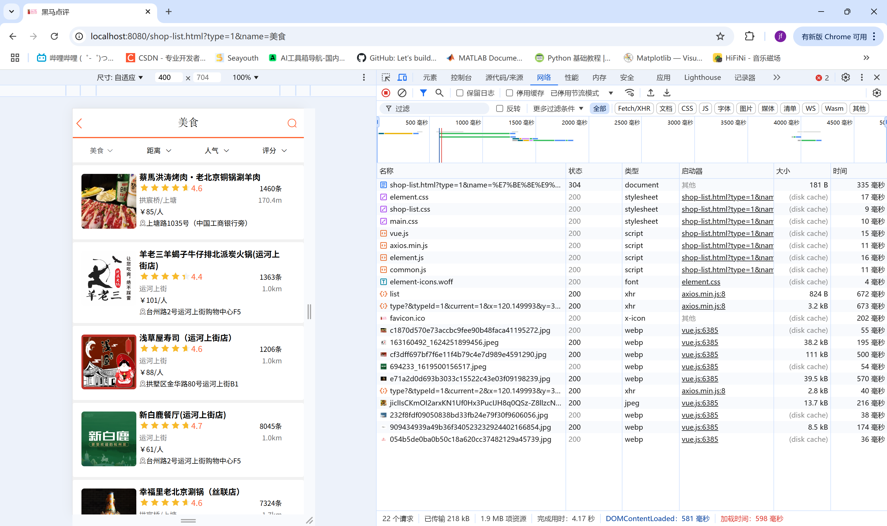


--------------------


## 七、用户签到

### 1. BitMap 用法

加入我们用一张表来存储用户签到信息，其结构应该如下：

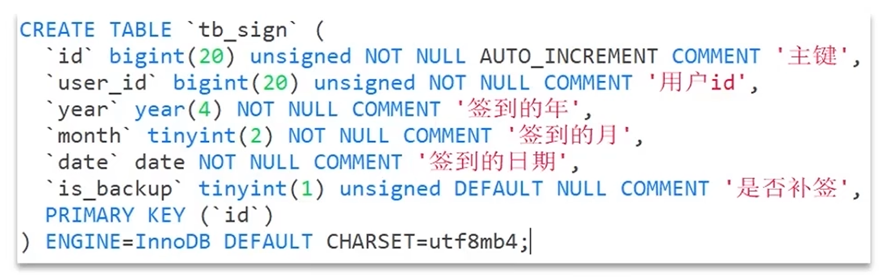

假如有1000万用户，平均每人每年签到次数为10次，则这张表一年的数据量就是1亿条

每签到一次需要使用（8 + 8 + 1 + 1 + 3 + 1）共22字节的内存，一个月则最多需要600多字节


我们按月来统计用户签到信息，签到记录为1，未签到则记录为0

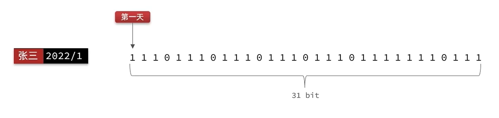

把每一个 bit 位对应每月的每一天，形成了映射关系。用0和1标示业务状态，这种思路就称为**位图（BitMap）**

**Redis 中**是利用 string 类型数据结构实现 **BitMap**，因此最大上限为512M，转换为 bit 则是 2^32 个 bit 位

BitMap 的操作命令有：

`SETBIT key offset value`：向指定位置（offset）存入一个0或1

`GETBIT key offset`：获取指定位置（offset）的 bit 值

`BITCOUNT key [start] [end]`：统计 BitMap 中值为1的 bit 位的数量

`BITFIELD`：操作（查询、修改、自增）BitMap 中 bit 数组中的指定位置（offset）的值

`BITFIELD_RO`：获取 BitMap 中的 bit 数组，并以十进制形式返回

`BITOP operation destkey key [key ...]`：将多个 BitMap 的结果做位运算（与、或、异或）

`BITPOS key bit [start] [end]`：查找 bit 数组中指定范围内第一个0或1出现的位置

**在图形化工具中如果 value 显示乱码，则使用 Binary 格式查看**


-----------------


### 2. 签到功能

> 需求：实现签到接口，将当前用户当天签到信息保存到 Redis 中
>
> |          | 说明       |
> | -------- | ---------- |
> | 请求方式 | POST       |
> | 请求路径 | /user/sign |
> | 请求参数 | 无         |
> | 返回值   | 无         |
>
> 提示：因为 BitMap 底层是基于 String 数据结构，因此其操作也都封装在字符串相关操作中了
>
> 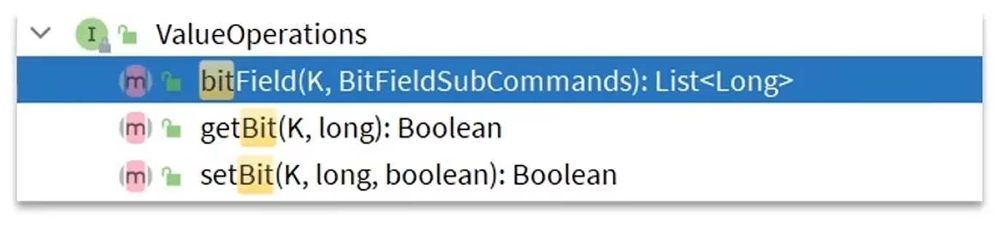

+ UserServiceImpl.java

```java
/**
 * 签到功能
 *
 * @return
 */
@Override
public Result sign() {
    // 1. 获取当前登录的用户
    Long userId = UserHolder.getUser().getId();
    // 2. 获取日期
    LocalDateTime now = LocalDateTime.now();
    // 3. 拼接key
    String keySuffix = now.format(DateTimeFormatter.ofPattern(":yyyyMM"));
    String key = RedisConstants.USER_SIGN_KEY + userId + keySuffix;
    // 4. 获取今天是本月的第几天
    int dayOfMonth = now.getDayOfMonth();
    // 5. 写入Redis SETBIT key offset 1
    stringRedisTemplate.opsForValue().setBit(key, dayOfMonth - 1, true);
    return Result.ok();
}
```


----------------


### 3. 签到统计

**问题1**：什么叫做连续签到天数？

从最后一次签到开始**向前**统计，直到遇到**第一次**未签到为止，计算中的签到次数，就是连续签到的天数

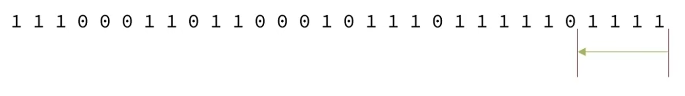

**问题2**”：如何得到本月到今天为止的所有签到数据？

```bash
BITFIELD key GET u[dayOfMonth] 0
```

**问题3**：如何从后向前遍历每个 bit 位？

与 1 做与运算，就能得到最后一个 bit 位
随后右移1位，下一个 bit 位就成为了最后一个 bit 位

#### 案例：实现签到统计功能

> 需求：实现下面接口，统计当前用户截止当前时间在本月的连续签到天数
>
> |          | 说明             |
> | -------- | ---------------- |
> | 请求方式 | GET              |
> | 请求路径 | /user/sign/count |
> | 请求参数 | 无               |
> | 返回值   | 连续签到天数     |

+ UserServiceImpl.java

```java
/**
 * 签到统计功能
 *
 * @return
 */
@Override
public Result signCount() {
    // 1. 获取当前登录的用户
    Long userId = UserHolder.getUser().getId();
    // 2. 获取日期
    LocalDateTime now = LocalDateTime.now();
    // 3. 拼接key
    String keySuffix = now.format(DateTimeFormatter.ofPattern(":yyyyMM"));
    String key = RedisConstants.USER_SIGN_KEY + userId + keySuffix;
    // 4. 获取今天是本月的第几天
    int dayOfMonth = now.getDayOfMonth();
    // 5. 获取本月截止今天为止所有的签到记录，返回的是一个十进制的数字 BITFIELD sign:202510 GET u28 0
    List<Long> result = stringRedisTemplate.opsForValue().bitField(
            key,
            BitFieldSubCommands.create()
                    .get(BitFieldSubCommands.BitFieldType.unsigned(dayOfMonth)).valueAt(0)
    );
    if (result == null || result.isEmpty()) {
        // 没有任何签到结果
        return Result.ok(0);
    }
    Long num = result.get(0);
    if (num == null || num == 0) {
        return Result.ok(0);
    }
    // 6. 循环遍历
    int count = 0;
    while (true) {
        // 6.1 让这个数字与1做与运算，得到数字的最后一个bit位 // 判断这个bit位是否为0
        if ((num & 1) == 0) {
            // 如果为0，说明未签到，结束
            break;
        } else {
            // 如果不为0，说明已签到，计数器+1
            count++;
        }
        // 把数字右移一位，抛弃最后一个bit位，继续下一个bit位
        num >>>= 1;
    }
    return Result.ok(count);
}
```


------------------------


## 八、UV 统计

### 1. HyperLogLog 用法

首先我们搞懂两个概念：

+ **UV**：全称 **U**nique **V**isitor，也叫独立访客量，是指通过互联网访问、浏览这个网页的自然人。1天内同一个用户多次访问该网站，只记录1次
+ **PV**：全称 **P**age **V**iew，也叫页面访问量或者点击量，用户每访问网站的一个页面，记录1次 PV，用户多次打开页面，则记录多次 PV。往往用来衡量网站的流量

UV 统计在服务器端做会比较麻烦，因为要判断该用户是否已经统计过了，需要将统计过的用户信息保存。但是如果每个访问的用户都保存到 Redis 中，数据量会非常恐怖

#### 1.1 HyperLogLog 用法

Hyperloglog（HLL）是从 Loglog 算法派生的概率算法，用于确定非常大的集合的技术，而不需要存储其所有值。相关算法原理可以参考：[LogLog基数估计算法学习与实现分析_loglog算法-CSDN博客](https://blog.csdn.net/Revivedsun/article/details/103624131)

Redis 中的 HLL 是基于 string 结构实现的，单个 HLL 的内存永远小于16kb，内存占用低的令人发指！作为代价，其测量结果是概率性的，有小于0.81%的误差。不过对于 UV 统计来说，这完全可以忽略

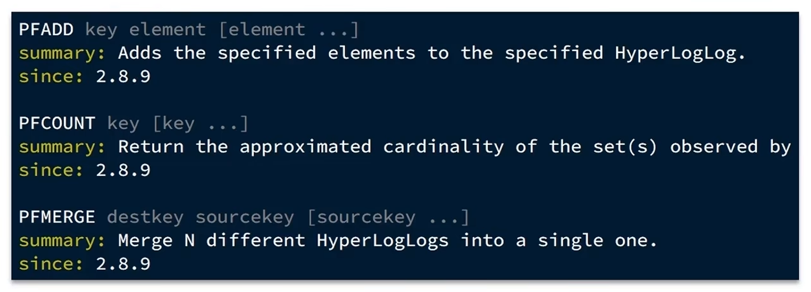


------------------


### 2. 实现 UV 统计

我们直接利用单元测试，向 HyperLogLog 中添加100万条数据，看看内存占用和统计效果如何

```java
@Test
void testHyperLogLog() {

    String[] values = new String[1000];
    int j = 0;
    for (int i = 0; i < 1000000; i++) {
        j = i % 1000;
        values[j] = "user_" + i;
        if (j == 999) {
            // 发送到Redis
            stringRedisTemplate.opsForHyperLogLog().add("hl2", values);
        }
    }
    // 统计数量
    Long count = stringRedisTemplate.opsForHyperLogLog().size("hl2");
    System.out.println(count);
}
```


-----------------

