# 微服务开发与实战

**微服务**是一种软件架构风格，它是以专注于单一职责的很多小型项目为基础，组合出复杂的大型应用

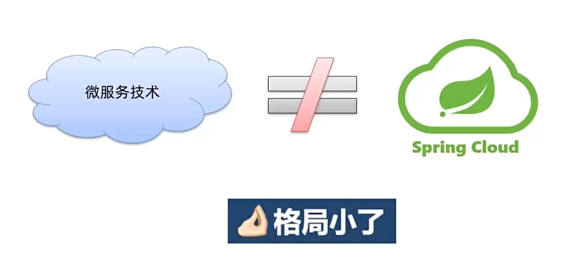

**微服务技术栈**

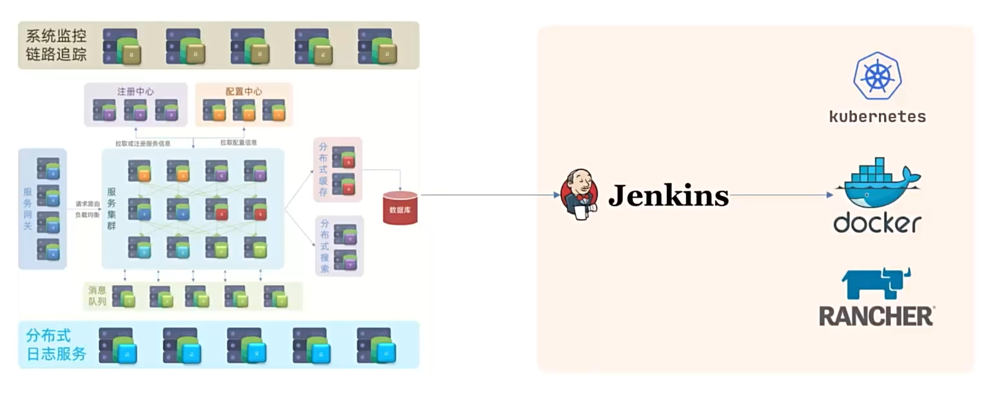

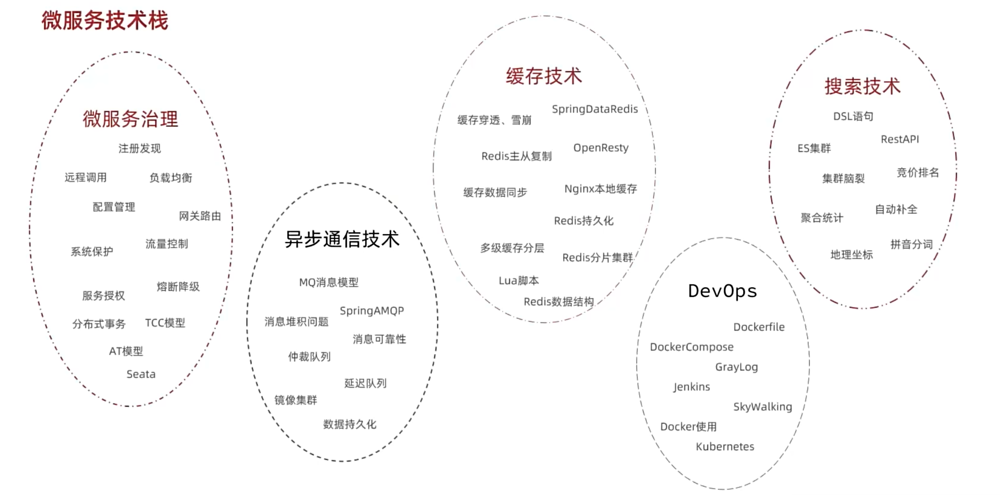


## 一、MybatisPlus

### 1. 快速入门

#### 1.1 入门案例

> 需求：
>
> 基于资料提供的项目，实现下列功能：
>
> 1. 新增用户功能
> 2. 根据 id 查询用户
> 3. 根据 id 批量查询用户
> 4. 根据 id 更新用户
> 5. 根据 id 删除用户

1. 引入 MybatisPlus 的起步依赖

MyBatisPlus 官方提供了 starter，其中集成了 Mybatis 和 MybatisPlus 的所有功能，并且实现了自动装配效果

因此我们可以用 MybatisPlus 的 starter 代替 Mybatis 的 starter：

```xml
<!-- MybatisPlus -->
<dependency>
    <groupId>com.baomidou</groupId>
    <artifactId>mybatis-plus-boot-starter</artifactId>
    <version>3.5.3.1</version>
</dependency>
```

2. 定义 Mapper

自定义的 Mapper 继承 MybatisPlus 提供的 BaseMapper 接口：

```java
public interface UserMapper extands BaseMapper<User> {
}
```


##### 总结

使用 MybatisPlus 的基本步骤：

1. 引入 MybatisPlus 依赖，代替 Mybatis 依赖
2. 定义 Mapper 接口并继承 BaseMapper


----------


#### 1.2 常见注解

**MyBatisPlus** 通过扫描实体类，并基于反射获取实体类信息作为数据库表信息

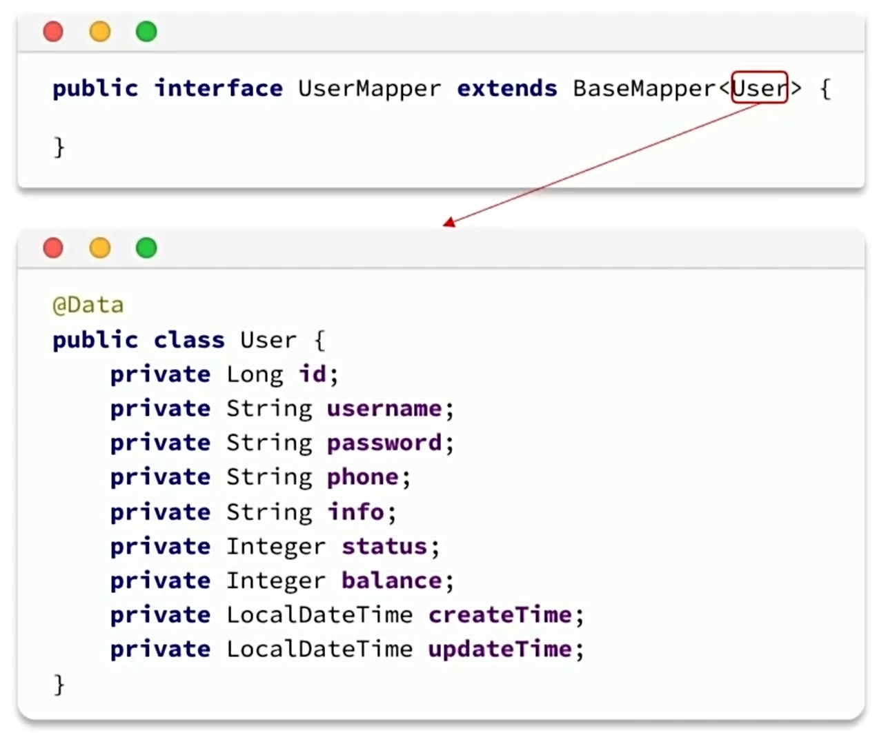

+ 类名驼峰转下划线作为表名
+ 名为 id 的字段作为主键
+ 变量名驼峰转下划线作为表的字段名


MybatisPlus 中比较常用的几个注解如下：

+ `@TableName`：用来指定表名
+ `@TableId`：用来指定表中的主键字段信息
  + `IdType` 枚举：
    + AUTO：数据库自增长
    + INPUT：通过 set 方法自行输入
    + ASSIGN_ID：分配 ID，接口 IdentifierGenerator 的方法 nextId 来生成 id，默认实现类为 DefaultIdentifierGenerator 雪花算法
+ `@TableField`：用来指定表中的普通字段信息
  + 成员变量名与数据库字段名不一致
  + 成员变量名以 is 开头，且是布尔值
  + 成员变量名与数据库关键字冲突
  + 成员变量不是数据库字段

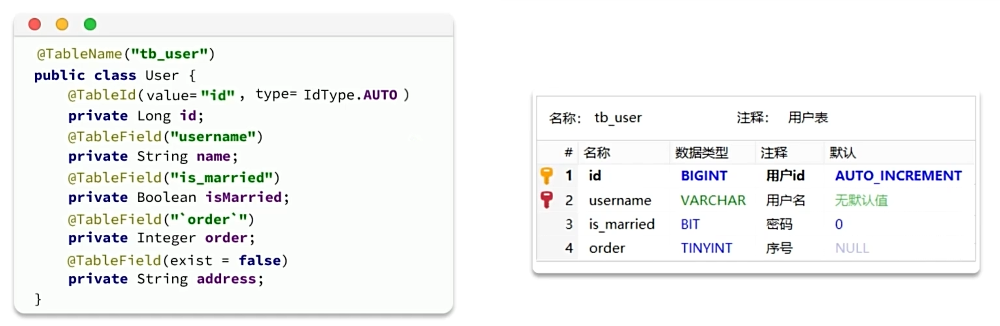


##### 总结

MybatisPlus 是如何获取实现 CRUD 的数据库表信息的？

+ 默认以类名驼峰转下划线作为表名
+ 默认把名为 id 的字段作为主键
+ 默认把变量名驼峰转下划线作为表的字段名

MybatisPlus 的常用注解有哪些？

+ `@TableName`：用来指定表名
+ `@TableId`：用来指定表中的主键字段信息
+ `@TableField`：用来指定表中的普通字段信息

IdType 的常见类型有哪些？

+ AUTO、ASSIGN_ID、INPUT

使用 `@TableField` 的常见场景是？

+ 成员变量名与数据库字段名不一致
+ 成员变量名以 is 开头，且是布尔值
+ 成员变量名与数据库关键字冲突
+ 成员变量不是数据库字段


---------------


#### 1.3 常见配置

**MyBatisPlus** 的配置项继承了 MyBatis 原生配置和一些自己特有的配置。例如：

```yml
mybatis-plus:
  type-aliases-package: com.itheima.mp.domain.po # 别名扫描包
  mapper-locations: "classpath *: /mapper/ ** / *. xml"# Mapper.xml文件地址,默认值
  configuration:
    map-underscore-to-camel-case: true #是否开启下划线和驼峰的映射
    cache-enabled: false # 是否开启二级缓存
  global-config:
    db-config:
      id-type: assign_id # id为雪花算法生成
      update-strategy: not_null #更新策略:只更新非空字段
```

具体可参考官方文档：[配置 | MyBatis-Plus](https://baomidou.com/getting-started/config/)


##### 总结

MyBatisPlus 使用的基本流程是什么？

1. 引入起步依赖
2. 自定义 Mapper 基础 BaseMapper
3. 在实体类上添加注解声明 表信息
4. 在 application.yml 中根据需要添加配置


---------------


### 2. 核心功能

#### 2.1 条件构造器

**MyBatisPlus** 支持各种复杂的 where 条件，可以满足日常开发的所有需求

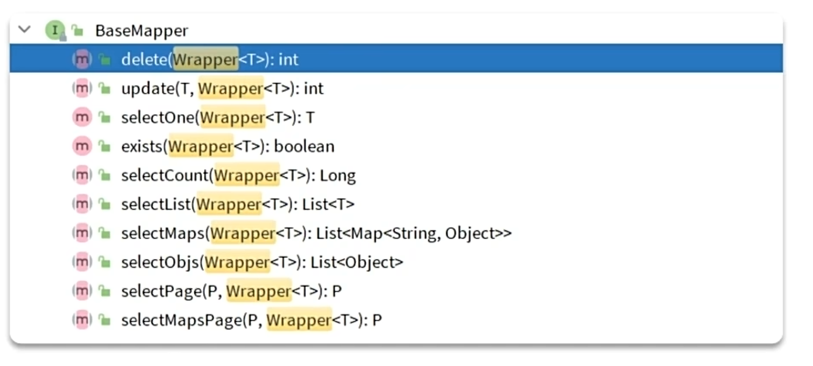

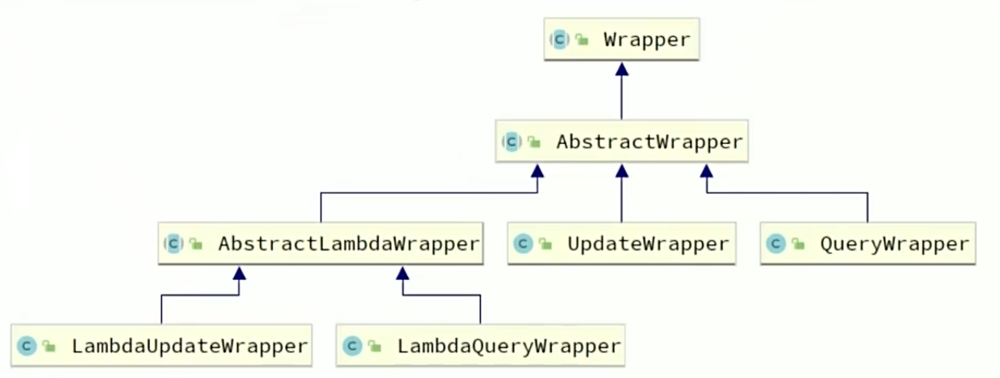


##### 案例：基于 QueryWrapper 的查询

> 需求：
>
> 1. 查询出名字中带 o 的，存款大于等于1000元的人的 id、username、balance 字段
>
> ```sql
> SELECT id, username, info, balance
> FROM user
> WHERE username LIKE ? AND balance >= ?
> ```
>
> 2. 更新用户名为 jack 的用户的余额为2000
>
> ```sql
> UPDATE user
> 	SET balance = 2000
> 	WHERE (username = "jack")
> ```

```java
@Test
void testQueryWrapper() {
    // 1. 构建查询条件
    QueryWrapper<User> wrapper = new QueryWrapper<User>()
            .select("id", "username", "info", "balance")
            .like("username", "o")
            .ge("balance", 1000);

    // 2. 查询
    List<User> users = userMapper.selectList(wrapper);
    users.forEach(System.out::println);
}
```

```java
@Test
void testUpdateByQueryWrapper() {
    // 1. 要更新的数据
    User user = new User();
    user.setBalance(2000);
    // 2. 更新的条件
    QueryWrapper<User> wrapper = new QueryWrapper<User>().eq("username", "jack");
    // 3. 自行更新
    userMapper.update(user, wrapper);
}
```


##### 案例：基于 UpdateWrapper 的更新

> 需求：
>
> 更新 id 为1，2，4的用户的余额，扣200
>
> ```sql
> UPDATE user
> 	SET balance = balance - 200
> 	WHERE id in (1, 2, 4)
> ```

```java
@Test
void testUpdateByUpdateWrapper() {
    List<Long> ids = List.of(1L, 2L, 3L);
    UpdateWrapper<User> wrapper = new UpdateWrapper<User>()
            .setSql("balance = balance - 200")
            .in("id", ids);
    userMapper.update(null, wrapper);
}
```


+ LambdaQueryWrapper

```java
@Test
void testLambdaQueryWrapper() {
    // 1. 构建查询条件
    LambdaQueryWrapper<User> wrapper = new LambdaQueryWrapper<User>()
            .select(User::getId, User::getUsername, User::getInfo, User::getBalance)
            .like(User::getUsername, "o")
            .ge(User::getBalance, 1000);

    // 2. 查询
    List<User> users = userMapper.selectList(wrapper);
    users.forEach(System.out::println);
}
```


##### 总结

条件构造器的用法：

+ `QueryWrapper` 和 `LambdaQueryWrapper` 通常用来构建 select、delete、update 的 where 条件部分
+ `UpdateWrapper` 和 `LambdaUpdateWrapper` 通常只有在 set 语句比较特殊才使用
+ 尽量使用 `LambdaQueryWrapper` 和 `LambdaUpdateWrapper`，避免硬编码


----------


#### 2.2 自定义 SQL

我们可以利用 MyBatisPlus 的 Wrapper 来光谱将复杂的 where 条件，然后自己定义 SQL 语句中剩下的部分

##### 案例：自定义 SQL

> 需求：
>
> 将 id 在指定范围的用户（例如1、2、4）的余额扣减指定值
>
> ```xml
> <update id="updateBalanceByIds">
> 	UPDATE user
>     SET balance = balance - #{amount}
>     WHERE id IN
>     <foreach collection="ids" separator="," item="id" open="(" close=")">
>     	#{id}
>     </foreach>
> </update>
> ```

我们可以利用 MyBatisPlus 的 Wrapper 来构建复杂的 where 条件，然后自己定义 SQL 语句中剩下的部分

1. 基于 Wrapper 构建 where 条件

```java
List<Long> ids = List.of(1L, 2L, 4L);
int amount = 200;
// 1. 构造条件
LambdaQueryWrapper<User> wrapper = new LambdaQueryWrapper<User>()
        .in(User::getId, ids);
// 2. 自定义SQL方法调用
userMapper.updateBalanceByIds(wrapper, wrapper);
```

2. 在 mapper 方法参数中用 Params 注解声明 Wrapper 变量名称，**必须是 ew**

```java
void updateBalanceByIds(@Param("ew") LambdaQueryWrapper<User> wrapper, @Param("amount") int amount);
```

3. 自定义 SQL，并使用 Wrapper 条件

```xml
<update id="updateBalanceByIds">
	UPDATE tb_user SET balance = balance - #{amount} ${ew.customSqlSegment}
</update>
```


+ UserMapperTest.java

```java
@Test
void testCustomSqlUpdate() {
    // 1. 更新条件
    List<Long> ids = List.of(1L, 2L, 4L);
    int amount = 200;
    // 2. 定义条件
    LambdaQueryWrapper<User> wrapper = new LambdaQueryWrapper<User>()
            .in(User::getId, ids);
    // 3. 调用自定义SQL方法
    userMapper.updateBalanceByIds(wrapper, amount);
}
```

+ UserMapper.java

```java
void updateBalanceByIds(@Param("ew") LambdaQueryWrapper<User> wrapper, @Param("amount") int amount);
```

+ UserMapper.xml

```xml
<update id="updateBalanceByIds">
    UPDATE user SET balance = balance - #{amount} ${ew.customSqlSegment}
</update>
```


----------------


#### 2.3 Service 接口

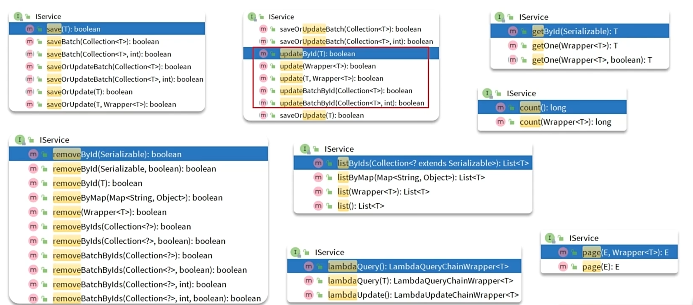


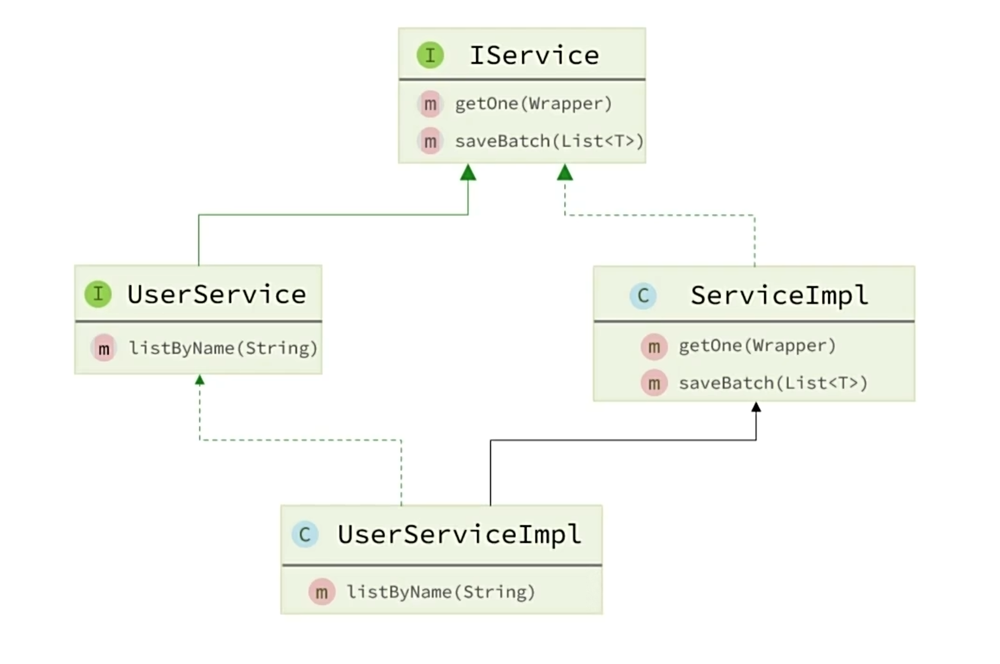

+ 我们的自定义接口需要去继承 service 接口
+ 我们的是实现类需要去继承它写的实现类


##### 代码实现

+ IUserService.java

```java
package com.itheima.mp.service;

import com.baomidou.mybatisplus.extension.service.IService;
import com.itheima.mp.domain.po.User;

public interface IUserService extends IService<User> {
}
```

+ UserServiceImpl.java

```java
package com.itheima.mp.service.impl;

import com.baomidou.mybatisplus.extension.service.impl.ServiceImpl;
import com.itheima.mp.domain.po.User;
import com.itheima.mp.mapper.UserMapper;
import com.itheima.mp.service.IUserService;
import org.springframework.stereotype.Service;

@Service
public class UserServiceImpl extends ServiceImpl<UserMapper, User> implements IUserService {
}
```

+ IUserServiceTest.java

```java
package com.itheima.mp.service;

import com.itheima.mp.domain.po.User;
import org.junit.jupiter.api.Test;
import org.springframework.beans.factory.annotation.Autowired;
import org.springframework.boot.test.context.SpringBootTest;

import java.time.LocalDateTime;
import java.util.List;

import static org.junit.jupiter.api.Assertions.*;

@SpringBootTest
class IUserServiceTest {

    @Autowired
    private IUserService userService;

    @Test
    void testInsert() {
        User user = new User();
//        user.setId(5L);
        user.setUsername("Lucy");
        user.setPassword("123");
        user.setPhone("18688990011");
        user.setBalance(200);
        user.setInfo("{\"age\": 24, \"intro\": \"英文老师\", \"gender\": \"female\"}");
        user.setCreateTime(LocalDateTime.now());
        user.setUpdateTime(LocalDateTime.now());

        userService.save(user);
    }

    @Test
    void testQuery() {
        List<User> users = userService.listByIds(List.of(1L, 2L, 4L));
        users.forEach(System.out::println);
    }
}
```


##### 总结

MP 的 Service 接口使用流程是怎么样的？

+ 自定义 Service 接口继承 IService 接口

```java
public interface IUserService extends IService<User> {}
```

+ 自定义 Service 实现类，实现自定义接口并继承 ServiceImpl 类

```java
public class UserServiceImpl extends ServiceImpl<UserMapper, User> implements IUserService {
}
```


##### 案例：基于 Restful 风格实现下列接口

> 需求：
>
> 基于 Restful 风格实现下面的接口：
>
> | 编号 | 接口             | 请求方式 | 请求路径                      | 请求参数              | 返回值       |
> | ---- | ---------------- | -------- | ----------------------------- | --------------------- | ------------ |
> | 1    | 新增用户         | POST     | /users                        | 用户表实体            | 无           |
> | 2    | 删除用户         | DELETE   | /users/{id}                   | 用户 id               | 无           |
> | 3    | 根据 id 查询用户 | GET      | /users/{id}                   | 用户 id               | 用户 VO      |
> | 4    | 根据 id 批量查询 | GET      | /users                        | 用户 id 集合          | 用户 VO 集合 |
> | 5    | 根据 id 扣减金额 | PUT      | /users/{id}/deduction/{money} | 用户 id<br />扣减金额 | 无           |

+ UserController.java

```java
package com.itheima.mp.controller;

import cn.hutool.core.bean.BeanUtil;
import com.itheima.mp.domain.dto.UserFormDTO;
import com.itheima.mp.domain.po.User;
import com.itheima.mp.domain.vo.UserVO;
import com.itheima.mp.service.IUserService;
import io.swagger.annotations.Api;
import io.swagger.annotations.ApiOperation;
import io.swagger.annotations.ApiParam;
import lombok.RequiredArgsConstructor;
import org.springframework.web.bind.annotation.*;

import java.util.List;

@Api(tags = "用户管理接口")
@RequestMapping("/users")
@RestController
@RequiredArgsConstructor // 必备的构造函数
public class UserController {

    private final IUserService userService;

    @ApiOperation("新增用户接口")
    @PostMapping
    public void saveUser(@RequestBody UserFormDTO userFormDTO) {
        // 1. 把DTO拷贝到PO
        User user = BeanUtil.copyProperties(userFormDTO, User.class);
        // 2. 新增
        userService.save(user);
    }

    @ApiOperation("删除用户接口")
    @DeleteMapping("/{id}")
    public void deleteUser(@ApiParam("用户id") @PathVariable("id") Long id) {
        userService.removeById(id);
    }

    @ApiOperation("根据id查询用户接口")
    @GetMapping("/{id}")
    public UserVO getUserById(@ApiParam("用户id") @PathVariable("id") Long id) {
        // 1. 查询用户PO
        User user = userService.getById(id);
        // 2. 把PO拷贝到VO
        return BeanUtil.copyProperties(user, UserVO.class);
    }

    @ApiOperation("根据id批量查询用户接口")
    @GetMapping
    public List<UserVO> getUserByIds(@ApiParam("用户id") @RequestParam("ids") List<Long> ids) {
        // 1. 查询用户PO
        List<User> users = userService.listByIds(ids);
        // 2. 把PO拷贝到VO
        return BeanUtil.copyToList(users, UserVO.class);
    }

    @ApiOperation("扣减用户余额接口")
    @DeleteMapping("/{id}/deduction/{money}")
    public void deductionMoneyById(
            @ApiParam("用户id") @PathVariable("id") Long id,
            @ApiParam("扣减的金额") @PathVariable("money") Integer money
    ) {
        userService.deductBalance(id, money);
    }
}
```

+ UserServiceImpl.java

```java
package com.itheima.mp.service.impl;

import com.baomidou.mybatisplus.extension.service.impl.ServiceImpl;
import com.itheima.mp.domain.po.User;
import com.itheima.mp.mapper.UserMapper;
import com.itheima.mp.service.IUserService;
import org.springframework.stereotype.Service;

@Service
public class UserServiceImpl extends ServiceImpl<UserMapper, User> implements IUserService {

    /**
     * 根据 id 扣减金额
     *
     * @param id
     * @param money
     */
    @Override
    public void deductBalance(Long id, Integer money) {
        // 1. 查询用户
        User user = getById(id);
        // 2. 校验用户状态
        if (user == null || user.getStatus() == 2) {
            throw new RuntimeException("用户状态异常！");
        }
        // 3. 校验余额是否充足
        if (user.getBalance() < money) {
            throw new RuntimeException("用户余额不足~");
        }
        // 4. 扣减余额 update user set balance = balance - ?
        baseMapper.deductBalance(id, money);
    }
}
```

+ UserMapper.java

```java
@Update("UPDATE user SET balance = balance - #{money} WHERE id = #{id}")
void deductBalance(@Param("id") Long id, @Param("money") Integer money);
```


不能满足功能和规则的时候就用自定义的 service 和 mapper！！！


##### 案例：IService 的 Lambda 查询

> 需求：
>
> 实现一个根据复杂条件查询用户的接口，查询条件如下：
>
> + name：用户名关键字，可以为空
> + status：用户状态，可以为空
> + minBalance：最小余额，可以为空
> + maxBalance：最大余额，可以为空

+ UserController.java

```java
@ApiOperation("根据复杂条件查询用户接口")
@GetMapping("/list")
public List<UserVO> queryUsers(@RequestBody UserQuery query) {
    // 1. 查询用户PO
    List<User> users = userService.queryUsers(
            query.getName(), query.getStatus(), query.getMaxBalance(), query.getMinBalance());
    // 2. 把PO拷贝到VO
    return BeanUtil.copyToList(users, UserVO.class);
}
```

+ UserServiceImpl.java

```java
/**
 * 根据复杂条件查询用户接口
 *
 * @param name
 * @param status
 * @param maxBalance
 * @param minBalance
 * @return
 */
@Override
public List<User> queryUsers(String name, Integer status, Integer maxBalance, Integer minBalance) {
    return lambdaQuery()
            .like(name != null, User::getUsername, name)
            .like(name != null, User::getStatus, status)
            .ge(name != null, User::getBalance, minBalance)
            .le(name != null, User::getBalance, maxBalance)
            .list();

}
```


##### 案例：IService 的 Lambda 更新

> 需求：
>
> 改造根据 id 修改用户余额的接口，要求如下：
>
> 1. 完成对用户状态校验
> 2. 完成对用户余额校验
> 3. 如果扣减后余额为0，则将用户 status 修改为冻结状态（2）

+ UserServiceImpl.java

```java
/**
 * 根据 id 扣减金额
 *
 * @param id
 * @param money
 */
@Override
@Transactional
public void deductBalance(Long id, Integer money) {
    // 1. 查询用户
    User user = getById(id);
    // 2. 校验用户状态
    if (user == null || user.getStatus() == 2) {
        throw new RuntimeException("用户状态异常！");
    }
    // 3. 校验余额是否充足
    if (user.getBalance() < money) {
        throw new RuntimeException("用户余额不足~");
    }
    // 4. 扣减余额 update user set balance = balance - ?
    int remainBalance = user.getBalance() - money;
    lambdaUpdate()
            .set(User::getBalance, remainBalance)
            .set(remainBalance == 0, User::getStatus, 2)
            .eq(User::getId, id)
            .eq(User::getBalance, user.getBalance()) // 乐观锁
            .update();
}
```


##### 案例：IService 批量新增

>需求：批量插入10万条用户数据，并作出对比：
>
>+ 普通 for 循环插入
>+ IService 的批量插入
>+ 开启 `rewriteBatchedStatements=true` 参数

```yml
spring:
  datasource:
    url: jdbc:mysql://localhost:3306/mp?rewriteBatchedStatements=true
```

批处理方案：

+ 普通 for 循环逐条插入速度极差，不推荐
+ MP 的批量新增，基于预编译的批处理，性能不错
+ 配置 jdbc 参数，开 rewriteBatchedStatements，性能最好


-------------


### 3. 扩展功能

#### 3.1 代码生成

参考文档：[Mybatis X 插件 | MyBatis-Plus](https://baomidou.com/guides/mybatis-x/)

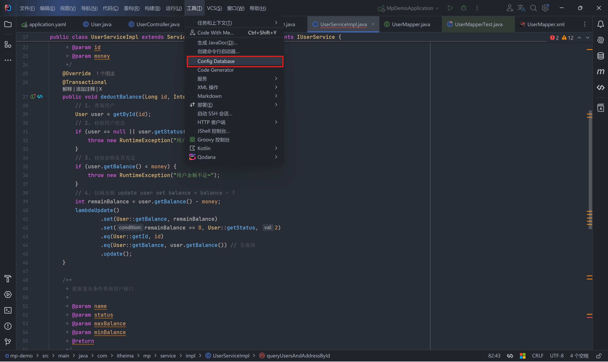

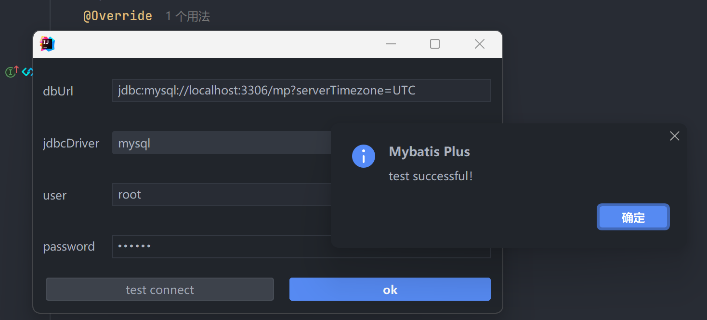

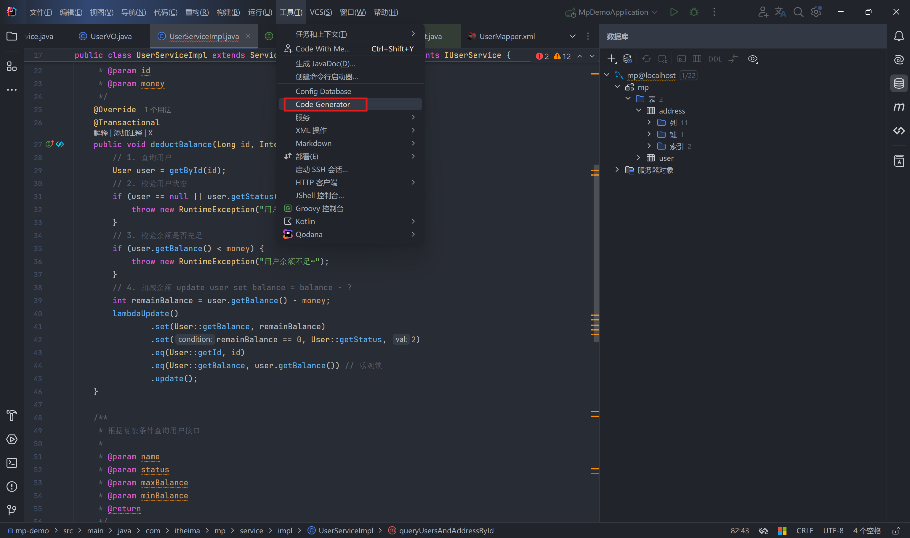

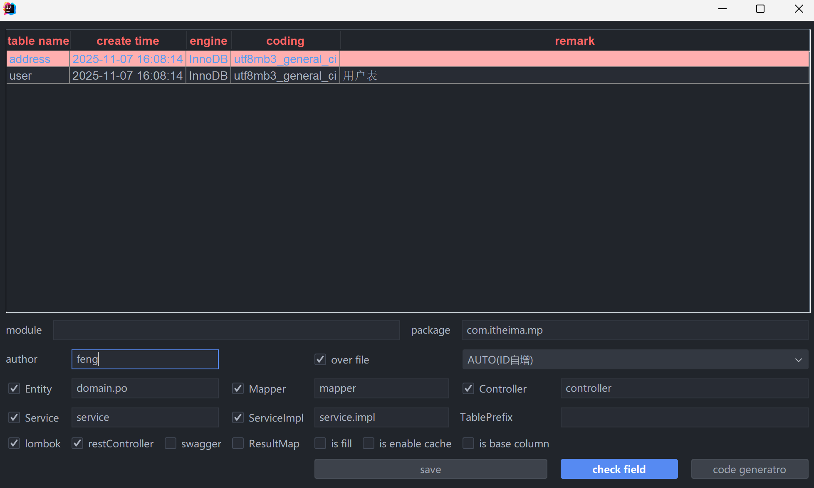

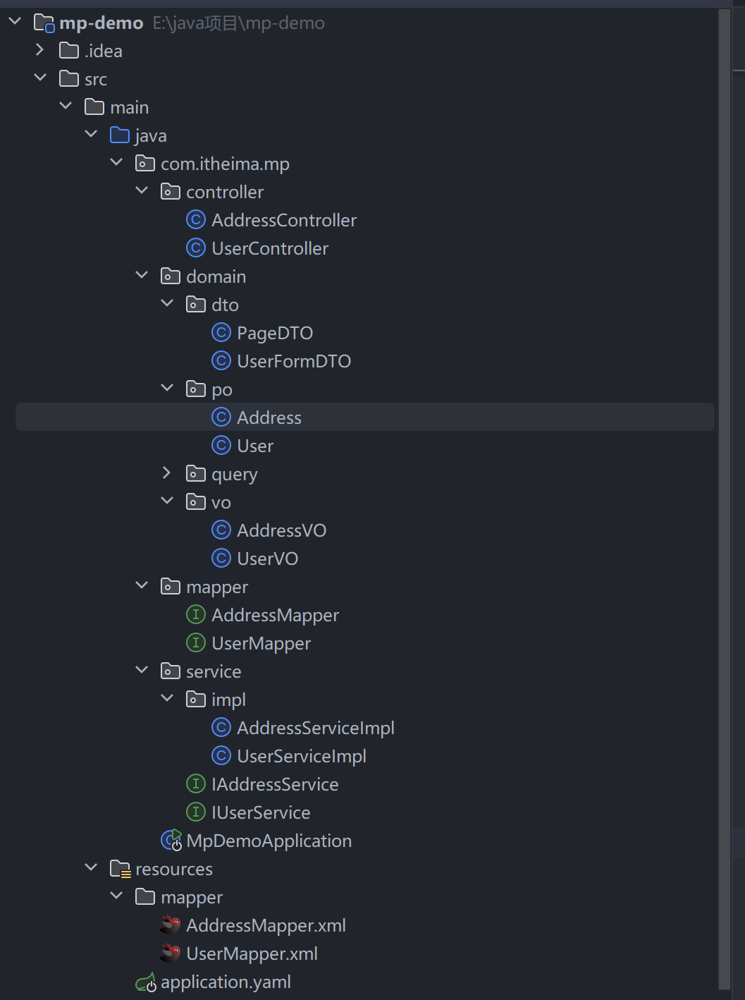


-----------


#### 3.2 静态工具

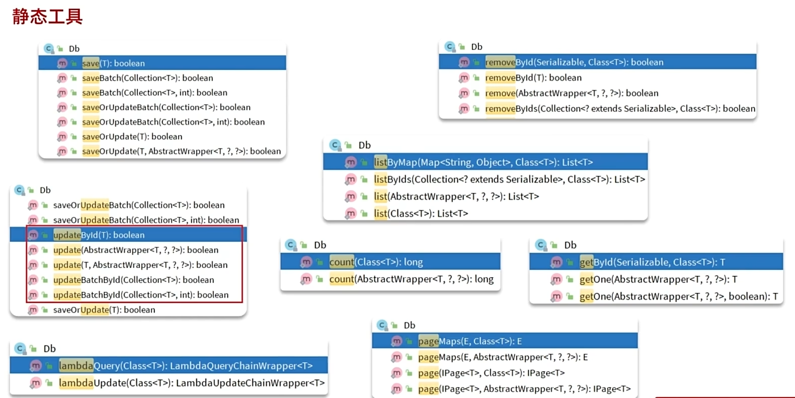


##### 案例：静态工具查询

> 需求：
>
> 1. 改造根据 id 查询用户的接口，查询用户的同时，查询出用户对应的所有地址
> 2. 改造根据 id 批量查询用户的接口，查询用户的同时，查询出用户对应的所有地址
> 3. 实现根据用户 id 查询收货地址功能，需要验证用户状态，冻结用户抛出异常

+ UserController.java

```java
@ApiOperation("根据id查询用户接口")
@GetMapping("/{id}")
public UserVO getUserById(@ApiParam("用户id") @PathVariable("id") Long id) {
    return userService.queryUserAndAddressById(id);
}

@ApiOperation("根据id批量查询用户接口")
@GetMapping
public List<UserVO> queryUserByIds(@ApiParam("用户id集合") @RequestParam("ids") List<Long> ids) {
    return userService.queryUserAndAddressByIds(ids);
}
```

+ UserServiceImpl.java

```java
/**
 * 查询用户的同时，查询出用户对应的所有地址
 *
 * @param id
 * @return
 */
@Override
public UserVO queryUserAndAddressById(Long id) {
    // 1. 查询用户
    User user = getById(id);
    if (user == null || user.getStatus() == 2) {
        throw new RuntimeException("用户状态异常！");
    }
    // 2. 查询地址
    List<Address> addresses = Db.lambdaQuery(Address.class).eq(Address::getUserId, id).list();
    // 3. 封装VO
    // 3.1 转User的PO为VO
    UserVO userVO = BeanUtil.copyProperties(user, UserVO.class);
    // 3.2 转地址VO
    if (CollUtil.isNotEmpty(addresses)) {
        userVO.setAddresses(BeanUtil.copyToList(addresses, AddressVO.class)); // 集合的转换用copyToList
        // 这里list和set可以是这个顺序，因为UserVo vo=....相当于在堆中new了一个空间，list记录的是vo这个对象的地址，后续对vo的修改都会影响到list中的存储的，忘记了可以回顾一下
    }
    return userVO;
}
```

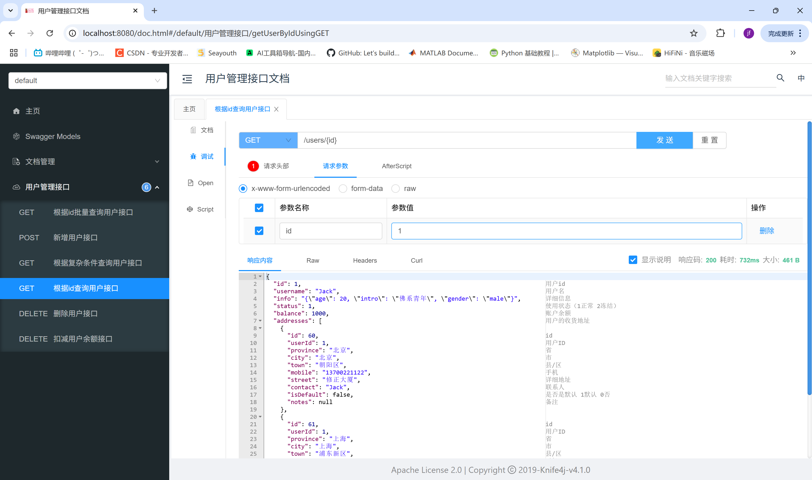

+ UserServiceImpl.java

```java
/**
 * 批量查询用户的接口，查询用户的同时，查询出用户对应的所有地址
 *
 * @param ids
 * @return
 */
@Override
public List<UserVO> queryUserAndAddressByIds(List<Long> ids) {
    // 1. 查询用户
    List<User> users = listByIds(ids);
    if (CollUtil.isEmpty(users)) {
        return Collections.emptyList();
    }
    // 2. 查询地址
    // 2.1 获取用户id集合
    List<Long> userIds = users.stream().map(User::getId).collect(Collectors.toList());
    // 2.2 根据用户id查询地址
    List<Address> addresses = Db.lambdaQuery(Address.class).in(Address::getUserId, userIds).list();
    // 2.3 转换地址VO
    List<AddressVO> addressVOList = BeanUtil.copyToList(addresses, AddressVO.class);
    // 2.4 梳理地址集合分组处理，相同用户的放入一个集合中
    Map<Long, List<AddressVO>> addressMap = new HashMap<>(0);
    if (CollUtil.isNotEmpty(addressVOList)) {
        addressMap = addressVOList.stream().collect(Collectors.groupingBy(AddressVO::getUserId));
    }

    // 3. 转换VO返回
    List<UserVO> list = new ArrayList<>(users.size());
    for (User user : users) {
        // 3.1 转换User的PO为VO
        UserVO vo = BeanUtil.copyProperties(user, UserVO.class);
        list.add(vo);
        // 3.2 转换地址VO
        vo.setAddresses(addressMap.get(user.getId()));
    }
    return list;
}
```

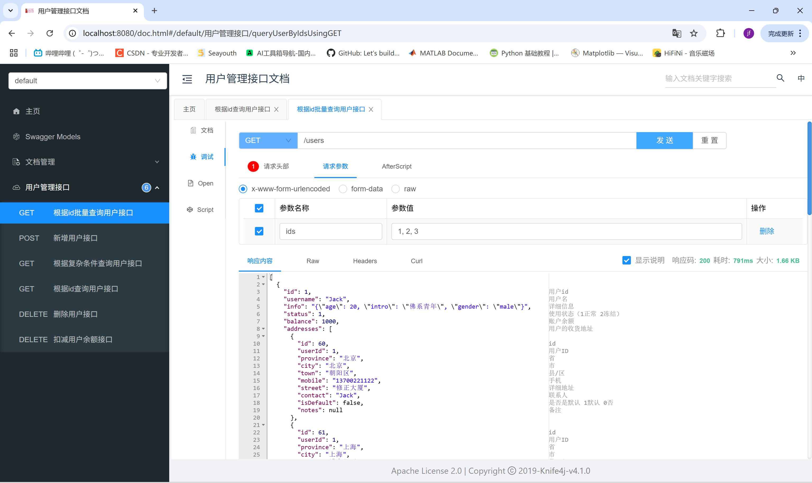

多个 service 之间会出现循环依赖（相互调用），出现时，建议使用 Db 静态工具去调用


----------------


#### 3.3 逻辑删除

**逻辑删除**就是基于代码逻辑模拟删除效果，但并不会真正删除数据。思路如下：

+ 在表中添加一个字段标记数据是否被删除
+ 当删除数据时把标记置为1
+ 查询时只查询标记为0的数据


例如逻辑删除字段为 deleted：

+ 删除操作：

```sql
UPDATE user SET deleted = 1 WHERE id = 1 AND deleted = 0
```

+ 查询操作：

```sql
SELECT * FROM user WHERE deleted = 0
```


**MybatisPlus** 提供了逻辑删除功能，**无需改变方法调用的方式**，而是在底层帮我们自动修改 CRUD 的语句。我们要做的就是在 application.yaml 文件中配置逻辑删除的字段名称和值即可：

```yaml
mybatis-plus:
  global-config:
    db-config:
      logic-delete-field: deleted # 全局逻辑删除的实体字段名，字段类型可以是boolean、integer
      logic-delete-value: 1 # 逻辑已删除值（默认为1）
      logic-not-delete-value: 0 # 逻辑未删除值（默认为0）
```

<strong><font color='red'>注意</font></strong>：逻辑删除本身也有自己的问题，比如：

+ 会导致数据库表垃圾数据越来越多，影响查询效率
+ SQL 中全都需要对逻辑删除字段做判断，影响查询效率

因此，不太推荐采用逻辑删除功能，如果数据不能删除，可以采用把数据迁移到其它表的办法


-----------------


#### 3.4 枚举处理器

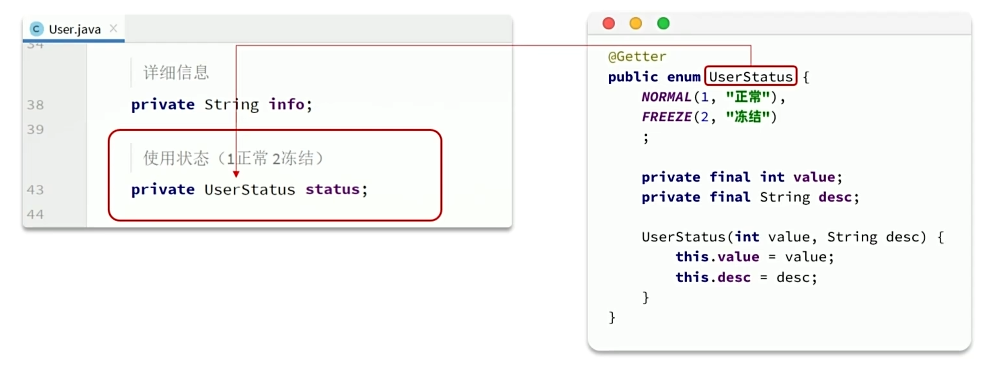

但是，在数据库中的类型为 INT 所以要进行类型转换

mp 提供了一个注解叫 `@EunmValue`，把它加到枚举里对应字段的值上面

```java
package com.itheima.mp.enums;

import com.baomidou.mybatisplus.annotation.EnumValue;
import com.fasterxml.jackson.annotation.JsonValue;
import lombok.Getter;

@Getter
public enum UserStatus {
    NORMAL(1, "正常"),
    FROZEN(2, "冻结"),
    ;
    @EnumValue
    @JsonValue // 标记枚举里面的值到底把谁进行返回
    private final int value;
    private final String desc;

    UserStatus(int value, String desc) {
        this.value = value;
        this.desc = desc;
    }
}
```

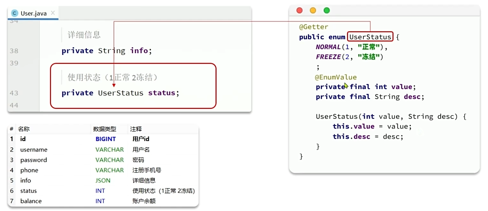

第二件事就是让我们这个枚举处理器生效

在 application.yml 中配置全局枚举处理器：

```yaml
mybatis-plus:
  configuration:
    default-enum-type-handler: com.baomidou.mybatisplus.core.handlers.MybatisEnumTypeHandler
```


##### 总结

1. 如何实现 PO 类的枚举类型变量与数据库字段的转换？

+ 给枚举中的与数据库对应 value 值添加 `@EnumValue` 注解

```java
@EnumValue
private final int value;
@JsonValue
private final String desc;
```

2. 在配置文件中配置统一的枚举处理，实现类型转换

```yaml
mybatis-plus:
  configuration:
    default-enum-type-handler: com.baomidou.mybatisplus.core.handlers.MybatisEnumTypeHandler
```


-----------------


#### 3.5 JSON 处理器

数据库中 user 表中有一个 json 类型的字段：

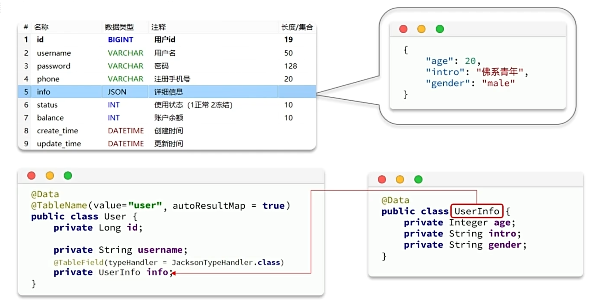

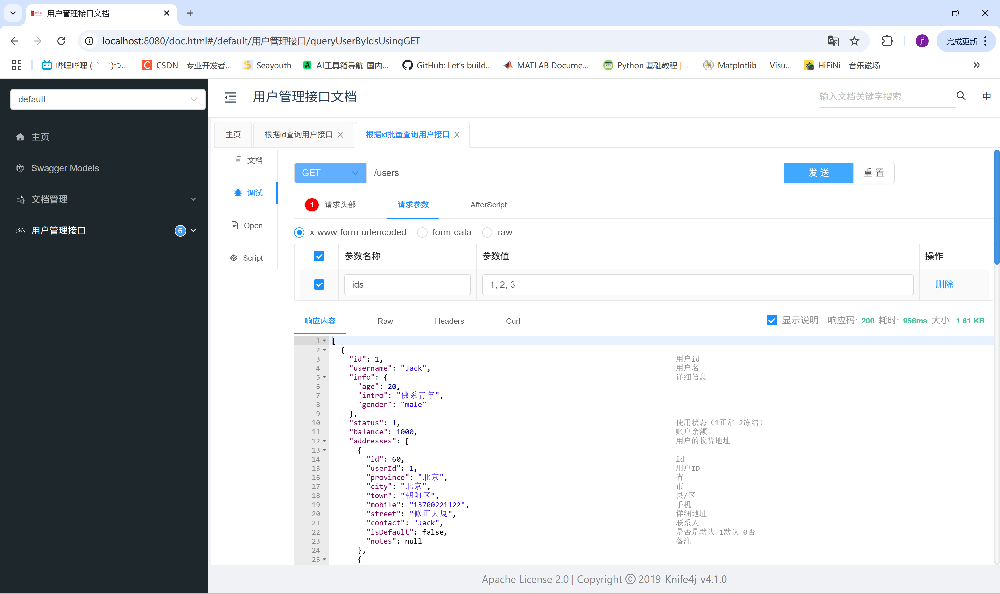


--------------


### 4. 插件功能

MyBatisPlus 提供的内置拦截器有下面这些：

| 序号 | 拦截器                           |                 描述                 |
| ---- | -------------------------------- | :----------------------------------: |
| 1    | TenantLineInnerInterceptor       |              多租户插件              |
| 2    | DynamicTableNameInnerInterceptor |             动态表名插件             |
| 3    | PaginationInnerInterceptor       |               分页插件               |
| 4    | OptimisticLockerInnerInterceptor |              乐观锁插件              |
| 5    | IllegalSQLInnerInterceptor       | SQL 性能规范插件，检测并拦截垃圾 SQL |
| 6    | BlockAttackInnerInterceptor      |       防止全表更新和删除的插件       |


#### 4.1 分页插件

首先，要在配置类中注册 MyBatisPlus 核心插件，同时添加分页插件：

```java
@Configuration
public class MyBatisConfig {

    @Bean
    public MybatisPlusInterceptor mybatisPlusInterceptor() {
        MybatisPlusInterceptor interceptor = new MybatisPlusInterceptor();
        // 1. 创建分页插件
        PaginationInnerInterceptor paginationInnerInterceptor = new PaginationInnerInterceptor(DbType.MYSQL);
        paginationInnerInterceptor.setMaxLimit(1000L); // 配置分页查询上限
        // 2. 添加分页插件
        interceptor.addInnerInterceptor(paginationInnerInterceptor);
        return interceptor;
    }
}
```

接着，就可以使用分页的 API 了：

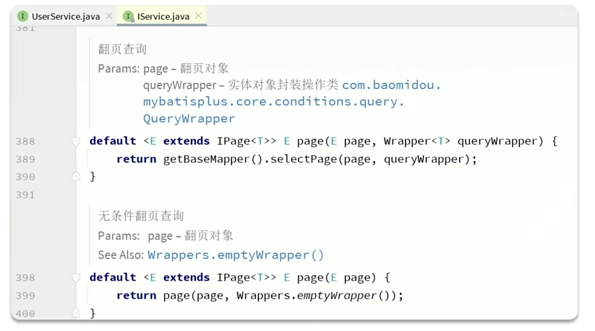

```java
@Test
void testPageQuery() {
    int pageNo = 1, pageSize = 2;
    // 1. 准备分页条件
    // 1.1 分页条件
    Page<User> page = Page.of(pageNo, pageSize);
    // 1.2 排序条件
    page.addOrder(new OrderItem("balance", true));
    page.addOrder(new OrderItem("id", true));

    // 2. 分页查询
    Page<User> p = userService.page(page);

    // 3. 解析
    long total = p.getTotal(); // 总条数
    System.out.println("total = " + total);
    long pages = p.getPages(); // 总页数
    System.out.println("pages = " + pages);
    List<User> users = p.getRecords(); // 分页的数据
    users.forEach(System.out::println);
}
```


--------------


#### 4.2 通用分页实体

##### 案例：简单分页查询案例

> 需求：
>
> 遵循下面的接口规范，编写一个 UserController 接口，实现 User 的分页查询
>
> | 参数     | 说明                                                         |
> | -------- | ------------------------------------------------------------ |
> | 请求方式 | GET                                                          |
> | 请求路径 | /users/page                                                  |
> | 请求参数 | 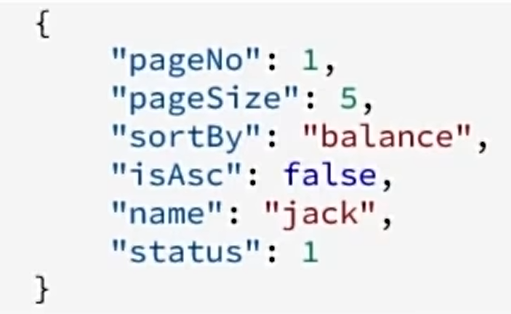 |
> | 返回值   | 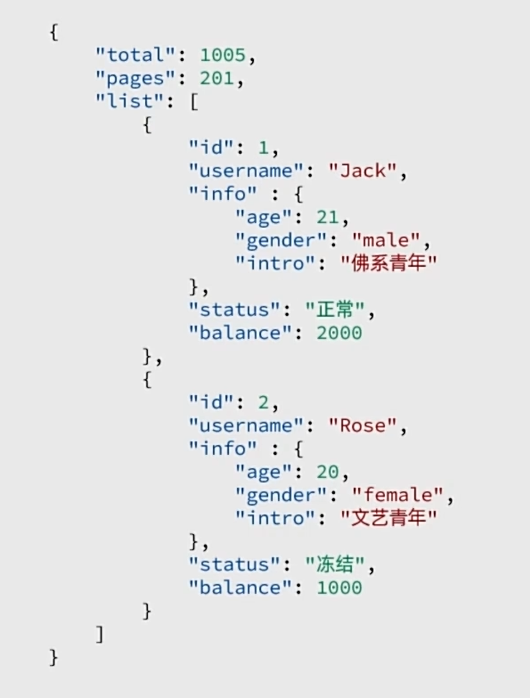 |
> | 特殊说明 | 如果排序字段为空，默认按照更新时间排序<br />排序字段不为空，则按照排序字段排序 |
>
> 

+ PageQuery.java

```java
package com.itheima.mp.domain.query;

import com.baomidou.mybatisplus.core.metadata.OrderItem;
import com.baomidou.mybatisplus.extension.plugins.pagination.Page;
import lombok.Data;

@Data
public class PageQuery {
    private Integer pageNo;
    private Integer pageSize;
    private String sortBy;
    private Boolean isAsc;

    public <T>  Page<T> toMpPage(OrderItem ... orders){
        // 1.分页条件
        Page<T> p = Page.of(pageNo, pageSize);
        // 2.排序条件
        // 2.1.先看前端有没有传排序字段
        if (sortBy != null) {
            p.addOrder(new OrderItem(sortBy, isAsc));
            return p;
        }
        // 2.2.再看有没有手动指定排序字段
        if(orders != null){
            p.addOrder(orders);
        }
        return p;
    }

    public <T> Page<T> toMpPage(String defaultSortBy, boolean isAsc){
        return this.toMpPage(new OrderItem(defaultSortBy, isAsc));
    }

    public <T> Page<T> toMpPageDefaultSortByCreateTimeDesc() {
        return toMpPage("create_time", false);
    }

    public <T> Page<T> toMpPageDefaultSortByUpdateTimeDesc() {
        return toMpPage("update_time", false);
    }
}
```

+ PageDTO.java

```java
package com.itheima.mp.domain.dto;

import cn.hutool.core.bean.BeanUtil;
import com.baomidou.mybatisplus.extension.plugins.pagination.Page;
import lombok.AllArgsConstructor;
import lombok.Data;
import lombok.NoArgsConstructor;

import java.util.Collections;
import java.util.List;
import java.util.function.Function;
import java.util.stream.Collectors;

@Data
@NoArgsConstructor
@AllArgsConstructor
public class PageDTO<V> {
    private Long total;
    private Long pages;
    private List<V> list;

    /**
     * 返回空分页结果
     * @param p MybatisPlus的分页结果
     * @param <V> 目标VO类型
     * @param <P> 原始PO类型
     * @return VO的分页对象
     */
    public static <V, P> PageDTO<V> empty(Page<P> p){
        return new PageDTO<>(p.getTotal(), p.getPages(), Collections.emptyList());
    }

    /**
     * 将MybatisPlus分页结果转为 VO分页结果
     * @param p MybatisPlus的分页结果
     * @param voClass 目标VO类型的字节码
     * @param <V> 目标VO类型
     * @param <P> 原始PO类型
     * @return VO的分页对象
     */
    public static <V, P> PageDTO<V> of(Page<P> p, Class<V> voClass) {
        // 1.非空校验
        List<P> records = p.getRecords();
        if (records == null || records.size() <= 0) {
            // 无数据，返回空结果
            return empty(p);
        }
        // 2.数据转换
        List<V> vos = BeanUtil.copyToList(records, voClass);
        // 3.封装返回
        return new PageDTO<>(p.getTotal(), p.getPages(), vos);
    }

    /**
     * 将MybatisPlus分页结果转为 VO分页结果，允许用户自定义PO到VO的转换方式
     * @param p MybatisPlus的分页结果
     * @param convertor PO到VO的转换函数
     * @param <V> 目标VO类型
     * @param <P> 原始PO类型
     * @return VO的分页对象
     */
    public static <V, P> PageDTO<V> of(Page<P> p, Function<P, V> convertor) {
        // 1.非空校验
        List<P> records = p.getRecords();
        if (records == null || records.size() <= 0) {
            // 无数据，返回空结果
            return empty(p);
        }
        // 2.数据转换
        List<V> vos = records.stream().map(convertor).collect(Collectors.toList());
        // 3.封装返回
        return new PageDTO<>(p.getTotal(), p.getPages(), vos);
    }
}
```

+ UserSeviceImpl.java

```java
/**
 * 根据分页条件查询用户接口
 *
 * @param query
 * @return
 */
@Override
public PageDTO<UserVO> queryUsersPage(UserQuery query) {
    String name = query.getName();
    Integer status = query.getStatus();
    // 1. 构建查询条件
    // 1.1 分页条件
    Page<User> page = Page.of(query.getPageNo(), query.getPageSize());
    // 1.2 排序条件
    if (StrUtil.isNotBlank(query.getSortBy())) {
        // 不为空
        page.addOrder(new OrderItem(query.getSortBy(), query.getIsAsc()));
    } else {
        // 为空，默认按照更新时间排序
        page.addOrder(new OrderItem("update_time", false));
    }
    // 2. 分页查询
    Page<User> p = lambdaQuery()
            .like(name != null, User::getUsername, name)
            .like(name != null, User::getStatus, status)
            .page(page);
    // 3. 封装VO结果
    PageDTO<UserVO> dto = new PageDTO<>();
    // 3.1 总条数
    dto.setTotal(p.getTotal());
    // 3.2 总页数
    dto.setPages(p.getPages());
    // 3.3 当前页数据
    List<User> records = p.getRecords();
    if (CollUtil.isEmpty(records)) {
        dto.setList(Collections.emptyList());
        return dto;
    }
    // 3.4 拷贝user的vo
    List<UserVO> vos = BeanUtil.copyToList(records, UserVO.class);
    dto.setList(vos);

    // 4. 返回
    return dto;
}
```

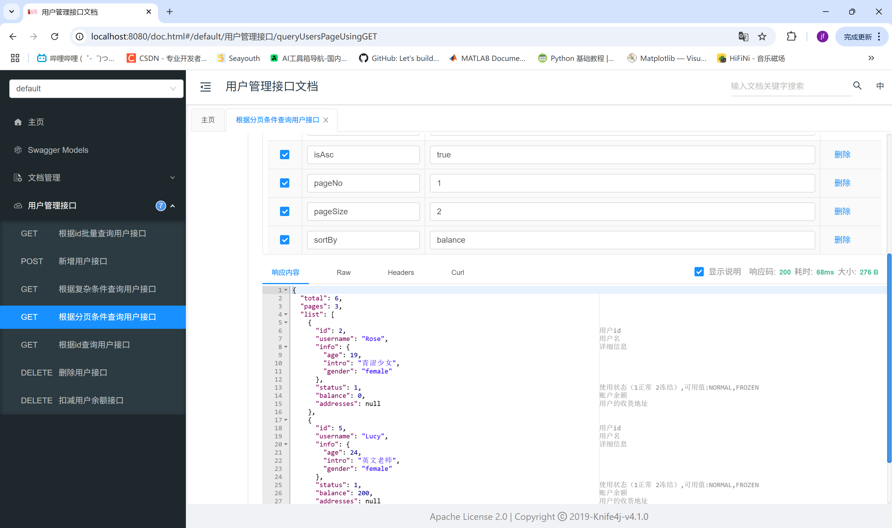


##### 案例：通用分页实体

> 需求：
>
> + 在 PageQuery 中定义方法，将 PageQuery 对象转为 MyBatisPlus 中的 Page 对象
> + 在 PageDTO 中定义方法，将 MyBatisPlus 中的 Page 结果转为 PageDTO 结果

+ PageQuery.java

```java
package com.itheima.mp.domain.query;

import cn.hutool.core.util.StrUtil;
import com.baomidou.mybatisplus.core.metadata.OrderItem;
import com.baomidou.mybatisplus.extension.plugins.pagination.Page;
import io.swagger.annotations.ApiModelProperty;
import lombok.Data;

@Data
public class PageQuery {
    @ApiModelProperty("页码")
    private Integer pageNo = 1;
    @ApiModelProperty("页码")
    private Integer pageSize = 5;
    @ApiModelProperty("排序字段")
    private String sortBy;
    @ApiModelProperty("是否升序")
    private Boolean isAsc = true;

    public <T> Page<T> toMpPage(OrderItem... items) {
        // 1.分页条件
        Page<T> page = Page.of(pageNo, pageSize);
        // 2. 排序条件
        if (StrUtil.isNotBlank(sortBy)) {
            // 不为空
            page.addOrder(new OrderItem(sortBy, isAsc));
        } else if (items != null) {
            // 为空，默认排序
            page.addOrder(items);
        }
        return page;
    }

    public <T> Page<T> toMpPage(String defaultSortBy, boolean isAsc) {
        return this.toMpPage(new OrderItem(defaultSortBy, isAsc));
    }

    public <T> Page<T> toMpPageDefaultSortByCreateTimeDesc() {
        return toMpPage("create_time", false);
    }

    public <T> Page<T> toMpPageDefaultSortByUpdateTimeDesc() {
        return toMpPage("update_time", false);
    }
}
```

+ PageDTO.java

```java
package com.itheima.mp.domain.dto;

import cn.hutool.core.bean.BeanUtil;
import cn.hutool.core.collection.CollUtil;
import com.baomidou.mybatisplus.extension.plugins.pagination.Page;
import lombok.AllArgsConstructor;
import lombok.Data;
import lombok.NoArgsConstructor;

import java.util.Collections;
import java.util.List;
import java.util.function.Function;
import java.util.stream.Collectors;

@Data
@NoArgsConstructor
@AllArgsConstructor
public class PageDTO<V> {
    private Long total;
    private Long pages;
    private List<V> list;

    /**
     * 返回空分页结果
     *
     * @param p   MybatisPlus的分页结果
     * @param <V> 目标VO类型
     * @param <P> 原始PO类型
     * @return VO的分页对象
     */
    public static <V, P> PageDTO<V> empty(Page<P> p) {
        return new PageDTO<>(p.getTotal(), p.getPages(), Collections.emptyList());
    }

    /**
     * 将MybatisPlus分页结果转为 VO分页结果
     */
    public static <PO, VO> PageDTO<VO> of(Page<PO> p, Class<VO> clazz) {
        PageDTO<VO> dto = new PageDTO<>();
        // 1. 总条数
        dto.setTotal(p.getTotal());
        // 2. 总页数
        dto.setPages(p.getPages());
        // 3. 当前页数据
        List<PO> records = p.getRecords();
        if (CollUtil.isEmpty(records)) {
            dto.setList(Collections.emptyList());
            return dto;
        }
        // 4. 拷贝user的VO
        dto.setList(BeanUtil.copyToList(records, clazz));
        // 5. 返回
        return dto;
    }

    /**
     * 将MybatisPlus分页结果转为 VO分页结果，允许用户自定义PO到VO的转换方式
     */
    public static <PO, VO> PageDTO<VO> of(Page<PO> p, Function<PO, VO> convertor) {
        PageDTO<VO> dto = new PageDTO<>();
        // 1. 总条数
        dto.setTotal(p.getTotal());
        // 2. 总页数
        dto.setPages(p.getPages());
        // 3. 当前页数据
        List<PO> records = p.getRecords();
        if (CollUtil.isEmpty(records)) {
            dto.setList(Collections.emptyList());
            return dto;
        }
        // 4. 拷贝user的VO
        dto.setList(records.stream().map(convertor).collect(Collectors.toList()));
        // 5. 返回
        return dto;
    }
}
```

+ UserServiceImpl.java

```java
/**
 * 根据分页条件查询用户接口
 *
 * @param query
 * @return
 */
@Override
public PageDTO<UserVO> queryUsersPage(UserQuery query) {
    String name = query.getName();
    Integer status = query.getStatus();
    // 1. 构建查询条件
    Page<User> page = query.toMpPageDefaultSortByUpdateTimeDesc();

    // 2. 分页查询
    Page<User> p = lambdaQuery()
            .like(name != null, User::getUsername, name)
            .like(name != null, User::getStatus, status)
            .page(page);

    // 3. 封装VO结果
    return PageDTO.of(p, user -> {
        // 1. 拷贝基础属性
        UserVO vo = BeanUtil.copyProperties(user, UserVO.class);
        // 2. 处理特殊逻辑
        vo.setUsername(vo.getUsername().substring(0, vo.getUsername().length() - 2) + "**");
        return vo;
    });
}
```


------------


## 二、Docker

快速构建、运行、管理应用的工具

### 1. 快速入门

#### 1.1 安装 docker

##### 1.1.1 卸载老版本的 docker

```shell
yum remove docker \
    docker-client \
    docker-client-latest \
    docker-common \
    docker-latest \
    docker-latest-logrotate \
    docker-logrotate \
    docker-engine \
    docker-selinux 
```


##### 1.1.2 配置 Docker 的 yum 库

首先要安装一个 yum 工具

```Bash
sudo yum install -y yum-utils device-mapper-persistent-data lvm2
```

安装成功后，执行命令，配置 Docker 的 yum 源（已更新为阿里云源）：

```Bash
sudo yum-config-manager --add-repo https://mirrors.aliyun.com/docker-ce/linux/centos/docker-ce.repo

sudo sed -i 's+download.docker.com+mirrors.aliyun.com/docker-ce+' /etc/yum.repos.d/docker-ce.repo
```

+ 不行就用清华的：

```bash
sudo yum-config-manager --add-repo https://mirrors.tuna.tsinghua.edu.cn/docker-ce/linux/centos/docker-ce.repo
```

更新 yum，建立缓存

```Bash
sudo yum makecache fast

# 或者使用
sudo yum clean all && sudo yum makecache
```


##### 1.1.3 安装 Docker

```bash
sudo yum install docker-ce docker-ce-cli containerd.io
```


##### 1.1.4 启动和校验

```bash
# 启动Docker
systemctl start docker

# 停止Docker
systemctl stop docker

# 重启
systemctl restart docker

# 设置开机自启
systemctl enable docker

# 执行docker ps命令，如果不报错，说明安装启动成功
docker ps
```


##### 1.1.5 配置镜像加速

镜像地址可能会变更，如果失效可以百度找最新的docker镜像。

配置镜像步骤如下：

```Bash
# 创建目录
mkdir -p /etc/docker

# 复制内容
tee /etc/docker/daemon.json <<-'EOF'
{
    "registry-mirrors": [
        "http://hub-mirror.c.163.com",
        "https://mirrors.tuna.tsinghua.edu.cn",
        "http://mirrors.sohu.com",
        "https://ustc-edu-cn.mirror.aliyuncs.com",
        "https://ccr.ccs.tencentyun.com",
        "https://docker.m.daocloud.io",
        "https://docker.awsl9527.cn"
    ]
}
EOF

# 重新加载配置
systemctl daemon-reload

# 重启Docker
systemctl restart docker
```


---------


#### 1.2 部署 MySQL

先停掉虚拟机中的 MySQL，确保你的虚拟机已经安装 Docker，且网络开通的情况下，执行下面命令即可安装 MySQL

```powershell
docker run -d \
  --name mysql \
  -p 3306:3306 \
  -e TZ=Asia/Shanghai \
  -e MYSQL_ROOT_PASSWORD=123 \
  mysql
```

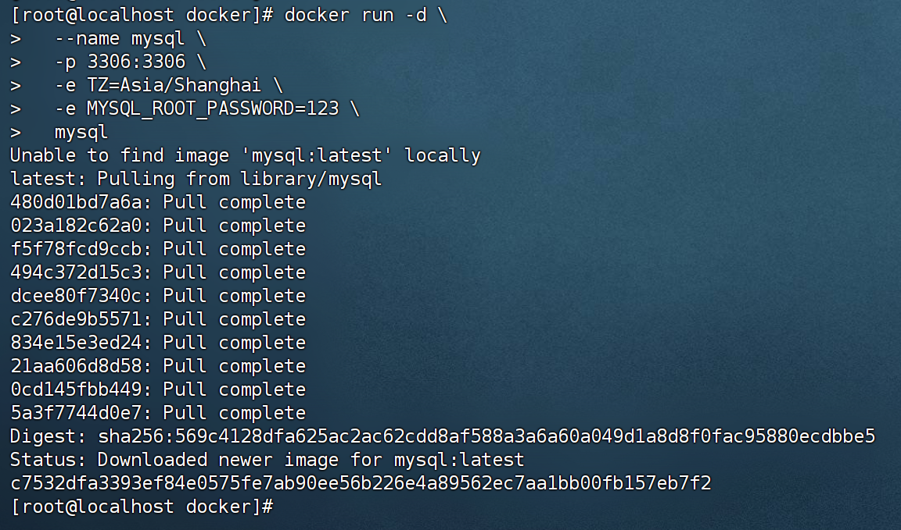

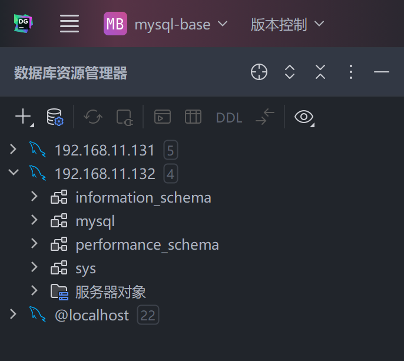

#### 镜像和容器

当我们利用 Docker 安装应用时，Docker 会自动搜索并下载应用**镜像（image）**。镜像不仅包含应用本身，还包含应用运行所需要的环境、配置、系统函数库。Docker 会在运行镜像时创建一个隔离环境，称为**容器（container）**

**镜像仓库**：存储和管理镜像的平台，Docker 官方维护了一个公共仓库：[Docker Hub Container Image Library | App Containerization](https://hub.docker.com/)

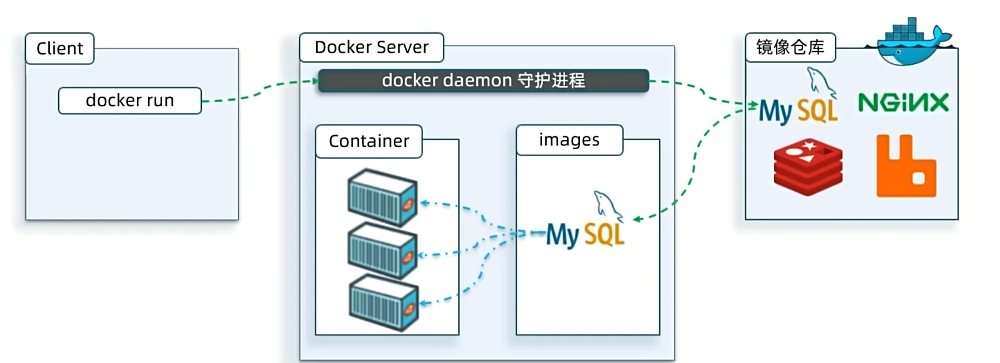


-----------------


#### 1.3 命令解读

```powershell
docker run -d \
  --name mysql \
  -p 3306:3306 \
  -e TZ=Asia/Shanghai \
  -e MYSQL_ROOT_PASSWORD=123 \
  mysql
```

+ **docker run**：创建并运行一个容器，**-d** 是让容器在后台运行
+ **--name mysql**：给容器起一个名字，必须唯一
+ **-p 3306:3306**：设置端口映射
+ **-e KEY=VALUE**：是设置环境变量

##### 1.3.1 镜像命名规范

+ 镜像名称一般分两部分组成：`[repository]:[tag]`
  + 其中 repository 就是镜像名
  + tag 是镜像的版本
+ 在没有指定 tag 时，默认是 latest，代表最新版本的镜像


##### 总结

docker run 命令中的常见参数：

+ **-d**：让容器后台运行
+ **--name**：给容器命名
+ **-e**：环境变量
+ **-p**：宿主机映射到容器内端口

镜像名称结构：

+ `Repository:TAG`


------------


### 2. Docker 部署

#### 2.1 常见命令

Docker 最常见的命令就是操作镜像、容器的命令，详见官方文档：[Docker Docs](https://docs.docker.com/)

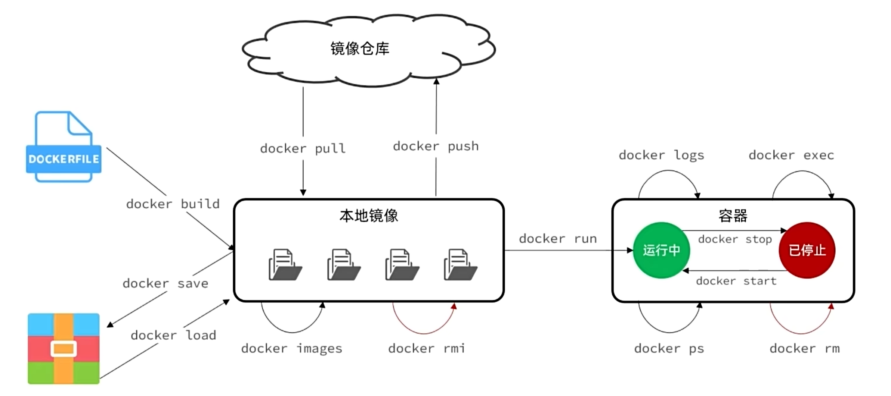


##### 案例：查看 DockerHub，拉取 Nginx 镜像，创建并运行 Nginx 容器

> 需求：
>
> + 在 DockerHub 中搜索 Nginx 镜像，查看镜像的名称
> + 拉取 Nginx 镜像
> + 查看本地镜像列表
> + 创建并运行 Nginx 容器
> + 查看容器
> + 停止容器
> + 再次启动容器
> + 进入 Nginx 容器
> + 删除容器

```bash
# 拉取镜像
docker pull nginx

# 查看本地镜像列表
docker images

# 把镜像保存到本地
docker save -o nginx.tar nginx:latest

# 删除镜像
docker rmi nginx:latest

# 读取
docker load -i nginx.tar

# 再看一下就发现nginx回来了
docker images

# 运行
docker run -d --name nginx -p 80:80 nginx

# 查看容器状态
docker ps
# 也可以加格式化方式访问，格式会更加清晰
docker ps --format "table {{.ID}}\t{{.Image}}\t{{.Ports}}\t{{.Status}}\t{{.Names}}"

# 停掉容器
docker stop nginx

# 再次查看（运行中的容器）
docker ps --format "table {{.ID}}\t{{.Image}}\t{{.Ports}}\t{{.Status}}\t{{.Names}}"
# 查看（所有容器）
docker ps --format "table {{.ID}}\t{{.Image}}\t{{.Ports}}\t{{.Status}}\t{{.Names}}" -a

# 查看日志
docker logs nginx
# 一直查看日志
docker logs -f nginx

# 进入容器内部
docker exec -it nginx bash
# 退出
exit

# 删除容器
docker rm mysql2
# 强制删除
docker rm mysql2 -f
```


##### 命令的别名

```bash
# 进入文件
vi ~/.bashrc

# 改完后让其生效
source ~/.bashrc
```


--------


#### 2.2 数据卷

**数据卷（volume）**是一个虚拟目录，是**容器内目录**与**宿主机目录**之间映射的桥梁

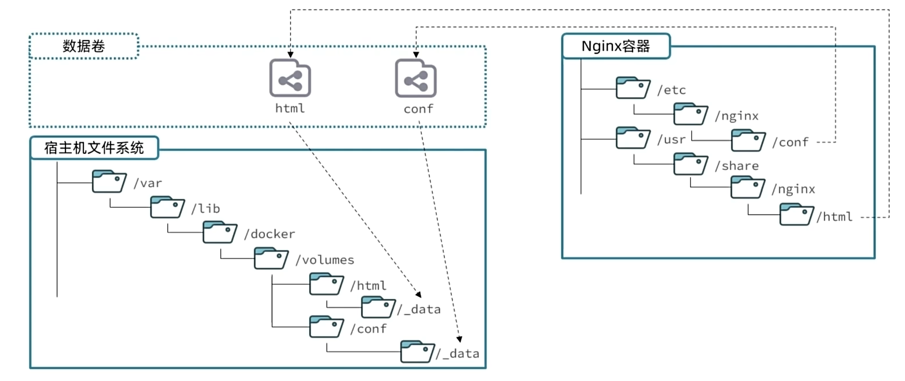

| 命令                  | 说明                 |
| --------------------- | -------------------- |
| docker volume create  | 创建数据卷           |
| docker volume ls      | 查看所有数据卷       |
| docker volume rm      | 删除指定数据卷       |
| docker volume inspect | 查看某个数据卷的详情 |
| docker volume prune   | 清除数据卷           |


##### 案例：利用 Nginx 容器部署静态资源

> 需求：
>
> + 创建 Nginx 容器，修改 nginx 容器内的 html 目录下的 index.html 文件，查看变化
> + 将静态资源部署到 nginx 的 html 目录
>
> 提示：
>
> + 在执行 docker run 命令时，使用 **-v 数据卷:容器内目录** 可以完成数据卷挂载（如果容器已经创建了是没有办法去做挂载的）
> + 当创建容器时，如果挂载了数据卷且数据卷不存在，会自动创建数据卷

```bash
# 删除nginx容器
docker rm -f nginx

# 创建新的容器
docker run -d --name nginx -p 80:80 -v html:/usr/share/nginx/html nginx

# 看一看容器
docker ps

# 查看所有数据卷
docker volume ls

# 查看卷的详细信息
docker volume inspect html

# 查看/var/lib/docker/volumes/html/_data目录
ll /var/lib/docker/volumes/html/_data

# 进入该目录，并修改index.html内容
cd /var/lib/docker/volumes/html/_data
vi index.html

# 打开页面，查看效果

# 进入容器内部，查看/usr/share/nginx/html目录内的文件是否变化
docker exec -it nginx bash
```


##### 总结

什么是数据卷？

+ 数据卷是一个虚拟目录，它将宿主机目录映射到容器目录，方便我们操作容器内文件，或者方便迁移容器产生的数据

如何挂载数据卷？

+ 在创建容器时，利用 `-v 数据卷名:容器内目录` 完成挂载
+ 容器创建时，如果发现挂载的数据卷不存在时，会自动创建

数据卷的常见命令有哪些？

+ `docker volume ls`：查看数据卷
+ `docker volume rm`：删除数据卷
+ `docker volume inspect`：查看数据卷详情
+ `docker volume prune`：删除未使用的数据卷


##### 案例2：mysql 容器的数据挂载

> 需求：
>
> + 查看 mysql 容器，判断是否有数据卷挂载
> + 基于宿主机目录实现 MySQL 数据目录、配置文件、初始化脚本的挂载
>   1. 挂载 /root/mysql/data 到容器内的 /var/lib/mysql 目录
>   2. 挂载 /root/mysql/init 到容器内的 /docker-entrypoint-initdb.d 目录
>   3. 挂载 /root/mysql/conf 到容器内的 /etc/mysql/conf.d 目录
>
> 提示：
>
> + 在执行 docker run 命令时，使用 `-v 本地目录:容器内目录` 可以完成本地目录挂载
> + 本地目录必须以 ”**/**“ 或 ”**./**“ 开头，如果直接以名称开头，会被识别为数据卷而非本地目录
>   + `-v mysql:/var/lib/mysql` 会被识别为一个数据卷叫mysql
>   + `-v ./mysql:/var/lib/mysql` 会被识别为当前目录下的 mysql 目录

```bash
# 查看有没有数据卷
docker inspect nginx
docker inspect mysql

# 看所有数据卷
docker volume ls

# 删除mysql容器
docker rm -f mysql

# 查看卷会发现卷还在
docker volume ls

# 创建目录
mkdir mysql
cd mysql/
mkdir data
mkdir conf
mkdir init

# 查看容器
dps -a

# 创建（启动）容器
docker run -d \
  --name mysql \
  -p 3306:3306 \
  -e TZ=Asia/Shanghai \
  -e MYSQL_ROOT_PASSWORD=123 \
  -v /root/mysql/data:/var/lib/mysql \
  -v /root/mysql/init:/docker-entrypoint-initdb.d \
  -v /root/mysql/conf:/etc/mysql/conf.d \
  mysql
```


-----------------


#### 2.3 自定义镜像

镜像就是包含了应用程序、程序运行的系统函数库、运行配置等文件的文件包。构建镜像的过程其实就是把上述文件打包的过程

部署一个 Java 应用的步骤：

1. 准备一个 Linux 服务器
2. 安装 JRE 并配置环境变量
3. 拷贝 jar 包
4. 运行 jar 包

构建一个 Java 镜像的步骤：

1. 准备一个 Linux 运行环境
2. 安装 JRE 并配置环境变量
3. 拷贝 jar 包
4. 编写运行脚本

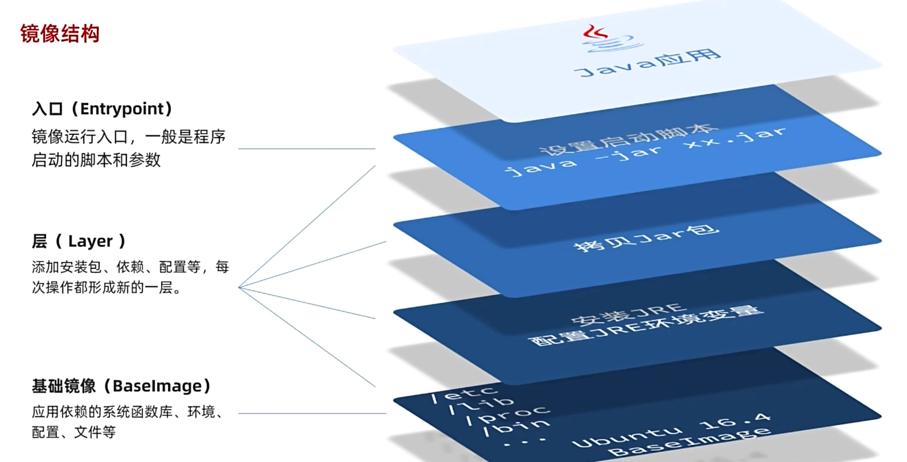


##### 2.3.1 Dockerfile

**Dockerfile** 就是一个文本文件，其中包含一个个的**指令（Instruction）**，用指令来说明要执行什么操作来构建镜像。将来 Docker 可以根据 Dockerfile 帮我们构建镜像。常见指令如下：

| 指令       | 说明                                           | 示例                                                         |
| ---------- | ---------------------------------------------- | ------------------------------------------------------------ |
| FROM       | 指定基础镜像                                   | FROM centos:6                                                |
| ENV        | 设置环境变量，可在后面指令使用                 | ENV key value                                                |
| COPY       | 拷贝本地文件到镜像的指定目录                   | COPY ./jrell.tar.gz /tmp                                     |
| RUN        | 执行 Linux 的 shell 命令，一般是安装过程的命令 | RUN tar -zxvf /tmp/jrell.tar.gz && EXPORTS path=/tmp/jrell:$path |
| EXPOSE     | 指定容器运行时监听的端口，是给镜像使用者看的   | EXPOSE 8080                                                  |
| ENTRYPOINT | 镜像中应用的启动命令，容器运行时调用           | ENTRYPOINT java -jar xx.jar                                  |


我们可以基于 Ubuntu 基础镜像，利用 Dockerfile 描述镜像结构

```dockerfile
# 指定基础镜像
FROM ubuntu:16.04
# 配置环境变量，JDK的安装目录、容器内时区
ENV JAVA_DIR=/usr/local
# 拷贝jdk和java项目的包
COPY ./jdk8.tar.gz $JAVA_DIR/
COPY ./docker-demo.jar /tmp/app.jar
# 安装JDK
RUN cd $JAVA_DIR \ && tar -xf ./jdk8.tar.gz \
&& mv ./jdk1.8.0_144 ./java8
# 配置环境变量
ENV JAVA_HOME=$JAVA_DIR/java8
ENV PATH=$PATH:$JAVA_HOME/bin
# 入口，java项目的启动命令
ENTRYPOINT ["java", "-jar", "/app.jar"]
```

也可以直接基于 JDK 为基础镜像，省略前面的步骤：

```dockerfile
# 基础镜像
FROM openjdk:11.0-jre-buster
# 拷贝jar包
COPY docker-demo.jar /app.jar
# 入口
ENTRYPOINT ["java", "-jar", "/app.jar"]
```

当编写好了 Dockerfile，可以利用下面命令来构建镜像：

```bash
docker build -t myImage:1.0 .
```

+ `-t`：是给镜像起名，格式依然是 `repository:tag` 的格式，不指定 tag 时，默认为 latest
+ `.`：是指定 Dockerfile 所在目录，如果就在当前目录，则指定为 `.`

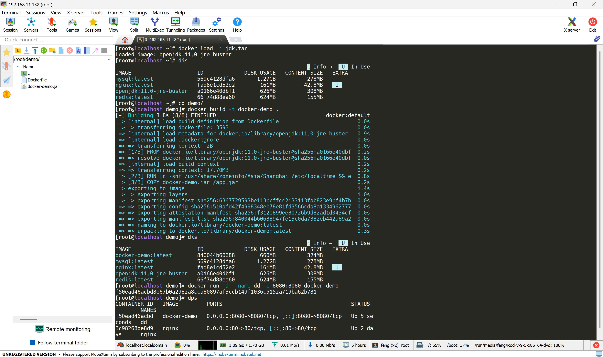

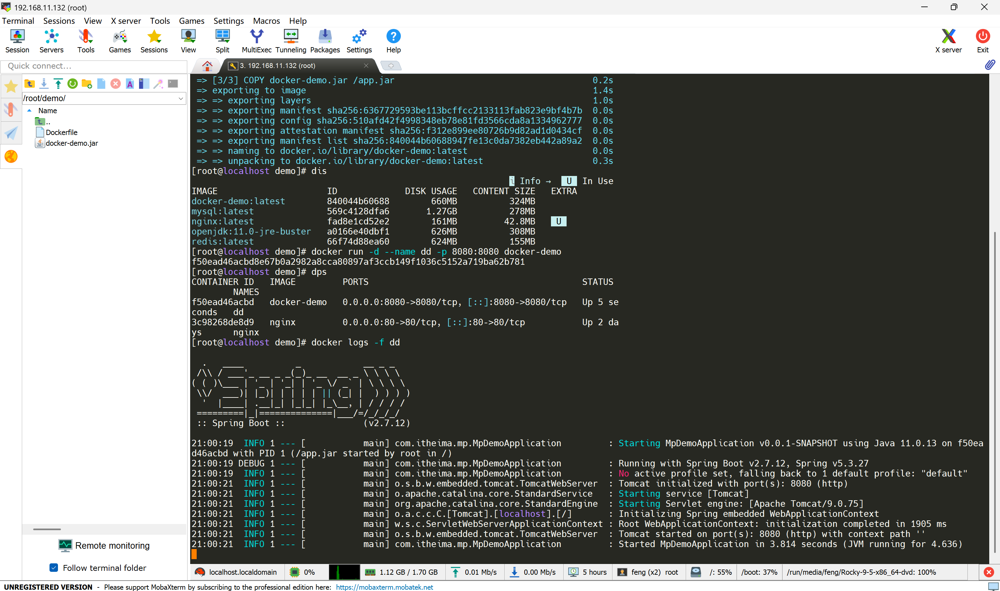


##### 总结

镜像的结构是怎样的？

+ 镜像中包含了应用程序所需要的运行环境、函数库、配置、以及应用本身等各种文件，这些文件分层打包而成

Dockerfile 是做什么的？

+ Dockerfile 就是利用固定的指令来描述镜像的结构和构建过程，这样 Docker 才可以依次来构建镜像

构建镜像的命令是什么？

+ `docker build -t 镜像名 Dockerfile目录`


------


#### 2.4 容器网络

`docker inspect mysql`：查看 mysql 容器

默认情况下，所有容器都是以 bridge 方式连接到 Docker 的一个虚拟网桥上：

其实在我们安装 docker 的那一刻，docker 就会在你的虚拟机里创建一张虚拟的网卡，网卡名字默认叫 `docker0`，它的地址是一个范围

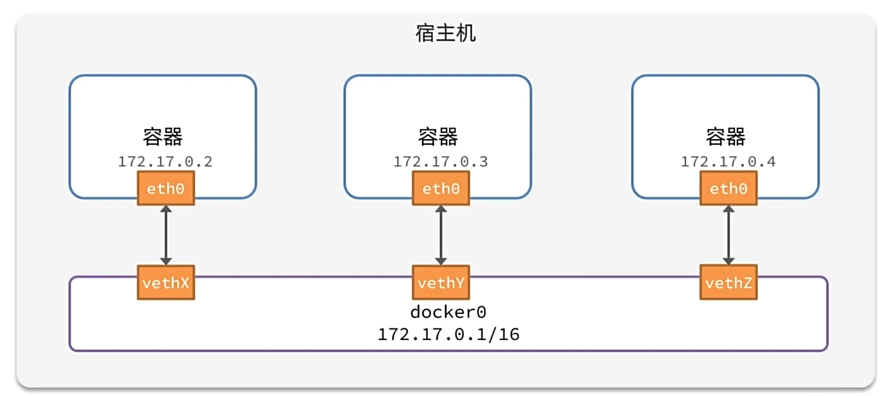

服务器重启分配的 ip 地址可能会变化


##### 2.4.1 网络

加入自定义网络的容器才可以通过容器名互相访问，Docker 的网络操作命令如下：

| 命令                      | 说明                     |
| ------------------------- | ------------------------ |
| docker network create     | 创建一个网络             |
| docker network ls         | 查看所有网络             |
| docker network rm         | 删除指定网络             |
| docker network prune      | 清楚未使用的网络         |
| docker network connect    | 使指定容器连接加入某网络 |
| docker network discounect | 使指定容器连接离开某网络 |
| docker network inspect    | 查看网络详细信息         |


```bash
# 创建网络itfeng
docker network create itfeng

# 查看网络
docker network ls

# 将mysql加入itfeng网络
docker network connect itfeng mysql

# 创建dd时加入网络
docker run -d --name dd -p 8080:8080 --network itfeng docker-demo

# 进入dd容器
docker exec -it dd bash

# 测试连接
ping mysql
```


--------------


### 3. 项目部署

#### 3.1 部署 Java 应用

> 需求：
>
> 将资料提供的 hmall 项目打包为镜像并部署，镜像名 hmall
>
> 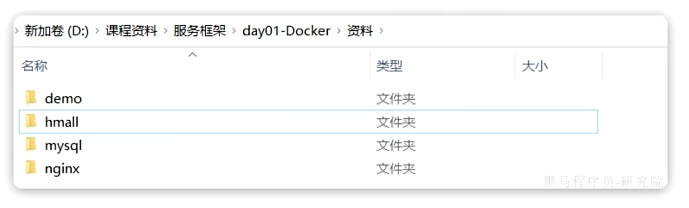

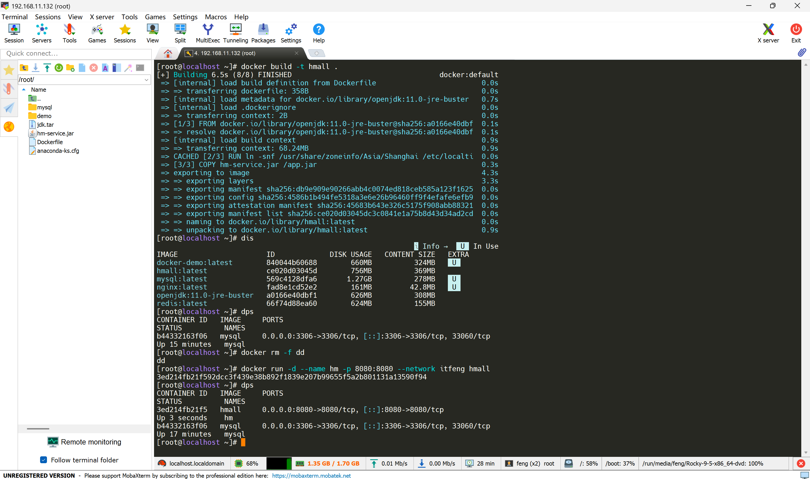

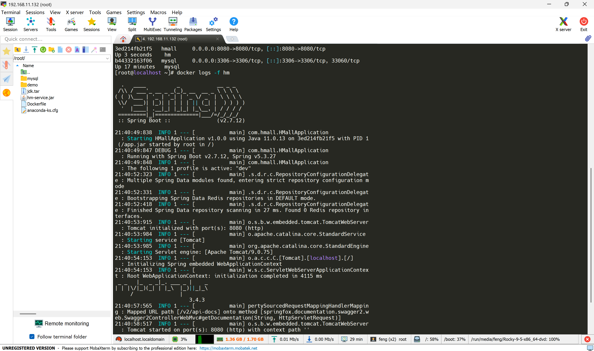


-----------


#### 3.2 部署前端

> 需求：
>
> 创建一个新的 nginx 容器，将资料提供的 nginx.conf、html 目录与容器挂载
>
> 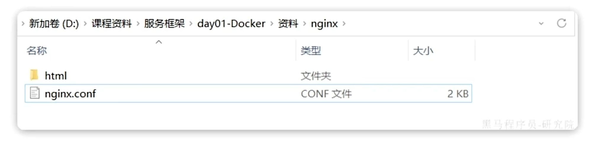

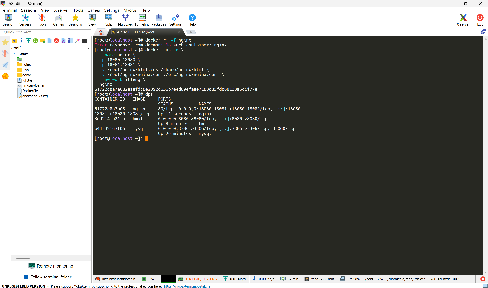


-------------


#### 3.3 DockerCompose

##### 3.3.1 基本语法


Docker Compose 通过一个单独的 **docker-compose.yml** 模板文件（YAML 格式）来定义一组相关联的应用容器，帮助我们实现**多个相互关联的 Docker 容器的快速部署**

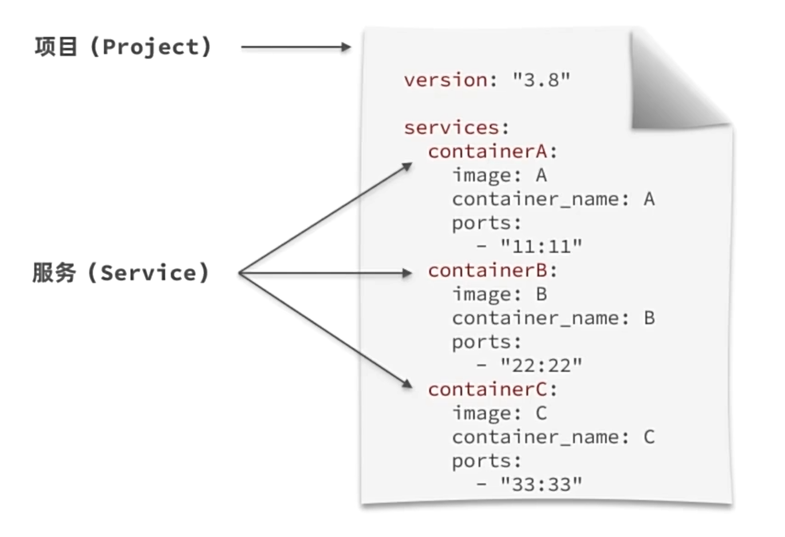


举例来说，用docker run部署MySQL的命令如下：

```Bash
docker run -d \
  --name mysql \
  -p 3306:3306 \
  -e TZ=Asia/Shanghai \
  -e MYSQL_ROOT_PASSWORD=123 \
  -v ./mysql/data:/var/lib/mysql \
  -v ./mysql/conf:/etc/mysql/conf.d \
  -v ./mysql/init:/docker-entrypoint-initdb.d \
  --network hmall
  mysql
```

如果用`docker-compose.yml`文件来定义，就是这样：

```YAML
version: "3.8"

services:
  mysql:
    image: mysql
    container_name: mysql
    ports:
      - "3306:3306"
    environment:
      TZ: Asia/Shanghai
      MYSQL_ROOT_PASSWORD: 123
    volumes:
      - "./mysql/conf:/etc/mysql/conf.d"
      - "./mysql/data:/var/lib/mysql"
    networks:
      - new
networks:
  new:
    name: hmall
```


黑马商城部署文件：

```YAML
version: "3.8"

services:
  mysql:
    image: mysql
    container_name: mysql
    ports:
      - "3306:3306"
    environment:
      TZ: Asia/Shanghai
      MYSQL_ROOT_PASSWORD: 123
    volumes:
      - "./mysql/conf:/etc/mysql/conf.d"
      - "./mysql/data:/var/lib/mysql"
      - "./mysql/init:/docker-entrypoint-initdb.d"
    networks:
      - hm-net
  hmall:
    build: 
      context: .
      dockerfile: Dockerfile
    container_name: hmall
    ports:
      - "8080:8080"
    networks:
      - hm-net
    depends_on:
      - mysql
  nginx:
    image: nginx
    container_name: nginx
    ports:
      - "18080:18080"
      - "18081:18081"
    volumes:
      - "./nginx/nginx.conf:/etc/nginx/nginx.conf"
      - "./nginx/html:/usr/share/nginx/html"
    depends_on:
      - hmall
    networks:
      - hm-net
networks:
  hm-net:
    name: hmall
```


##### 3.3.2 基础命令

编写好 docker-compose.yml 文件，就可以部署项目了。常见的命令：

https://docs.docker.com/compose/reference/

基本语法如下：

```Bash
docker compose [OPTIONS] [COMMAND]
```

其中，OPTIONS 和 COMMAND 都是可选参数，比较常见的有：

<table border="1" cellpadding="6" cellspacing="0">   <thead>     <tr>       <th>类型</th>       <th>参数或指令</th>       <th>说明</th>     </tr>   </thead>   <tbody>     <!-- Options部分 -->     <tr>       <td rowspan="2">Options</td>       <td>-f</td>       <td>指定compose文件的路径和名称</td>     </tr>     <tr>       <td>-p</td>       <td>指定project名称。project就是当前compose文件中设置的多个service的集合，是逻辑概念</td>     </tr>      <!-- Commands部分 -->     <tr>       <td rowspan="9">Commands</td>       <td>up</td>       <td>创建并启动所有service容器</td>     </tr>     <tr>       <td>down</td>       <td>停止并移除所有容器、网络</td>     </tr>     <tr>       <td>ps</td>       <td>列出所有启动的容器</td>     </tr>     <tr>       <td>logs</td>       <td>查看指定容器的日志</td>     </tr>     <tr>       <td>stop</td>       <td>停止容器</td>     </tr>     <tr>       <td>start</td>       <td>启动容器</td>     </tr>     <tr>       <td>restart</td>       <td>重启容器</td>     </tr>     <tr>       <td>top</td>       <td>查看运行的进程</td>     </tr>     <tr>       <td>exec</td>       <td>在指定的运行中容器中执行命令</td>     </tr>   </tbody> </table>


+ 演示：

```Bash
# 1.进入root目录
cd /root

# 2.删除旧容器
docker rm -f $(docker ps -qa)

# 3.删除hmall镜像
docker rmi hmall

# 4.清空MySQL数据
rm -rf mysql/data

# 5.启动所有, -d 参数是后台启动
docker compose up -d
# 结果：
[+] Building 15.5s (8/8) FINISHED
 => [internal] load build definition from Dockerfile                                    0.0s
 => => transferring dockerfile: 358B                                                    0.0s
 => [internal] load .dockerignore                                                       0.0s
 => => transferring context: 2B                                                         0.0s
 => [internal] load metadata for docker.io/library/openjdk:11.0-jre-buster             15.4s
 => [1/3] FROM docker.io/library/openjdk:11.0-jre-buster@sha256:3546a17e6fb4ff4fa681c3  0.0s
 => [internal] load build context                                                       0.0s
 => => transferring context: 98B                                                        0.0s
 => CACHED [2/3] RUN ln -snf /usr/share/zoneinfo/Asia/Shanghai /etc/localtime && echo   0.0s
 => CACHED [3/3] COPY hm-service.jar /app.jar                                           0.0s
 => exporting to image                                                                  0.0s
 => => exporting layers                                                                 0.0s
 => => writing image sha256:32eebee16acde22550232f2eb80c69d2ce813ed099640e4cfed2193f71  0.0s
 => => naming to docker.io/library/root-hmall                                           0.0s
[+] Running 4/4
 ✔ Network hmall    Created                                                             0.2s
 ✔ Container mysql  Started                                                             0.5s
 ✔ Container hmall  Started                                                             0.9s
 ✔ Container nginx  Started                                                             1.5s

# 6.查看镜像
docker compose images
# 结果
CONTAINER           REPOSITORY          TAG                 IMAGE ID            SIZE
hmall               root-hmall          latest              32eebee16acd        362MB
mysql               mysql               latest              3218b38490ce        516MB
nginx               nginx               latest              605c77e624dd        141MB

# 7.查看容器
docker compose ps
# 结果
NAME                IMAGE               COMMAND                  SERVICE             CREATED             STATUS              PORTS
hmall               root-hmall          "java -jar /app.jar"     hmall               54 seconds ago      Up 52 seconds       0.0.0.0:8080->8080/tcp, :::8080->8080/tcp
mysql               mysql               "docker-entrypoint.s…"   mysql               54 seconds ago      Up 53 seconds       0.0.0.0:3306->3306/tcp, :::3306->3306/tcp, 33060/tcp
nginx               nginx               "/docker-entrypoint.…"   nginx               54 seconds ago      Up 52 seconds       80/tcp, 0.0.0.0:18080-18081->18080-18081/tcp, :::18080-18081->18080-18081/tcp
```


-------------------


## 三、微服务01

### 0. 导入黑马商城项目

#### 0.1 安装 MySQL

如果虚拟机中已经有了黑马商城项目及 MySQL 数据库了，可以先将整个项目移除。使用下面的命令：

```bash
cd /root

# 移除所有的docker目录相关的容器网络等等
docker compose down
```

我们将其复制到虚拟机的 `/root` 目录。如果 `/root` 下已经存在 `mysql` 目录则删除旧的，如果不存在则直接复制本地的：

然后创建一个通用网络：

```Bash
docker network create hm-net
```

使用下面的命令来安装MySQL：

```Bash
docker run -d \
  --name mysql \
  -p 3306:3306 \
  -e TZ=Asia/Shanghai \
  -e MYSQL_ROOT_PASSWORD=123 \
  -v /root/mysql/data:/var/lib/mysql \
  -v /root/mysql/conf:/etc/mysql/conf.d \
  -v /root/mysql/init:/docker-entrypoint-initdb.d \
  --network hm-net\
  mysql
```

此时，通过命令查看mysql容器：

```Bash
docker ps
```

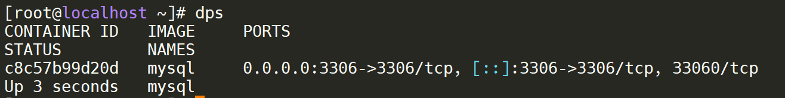

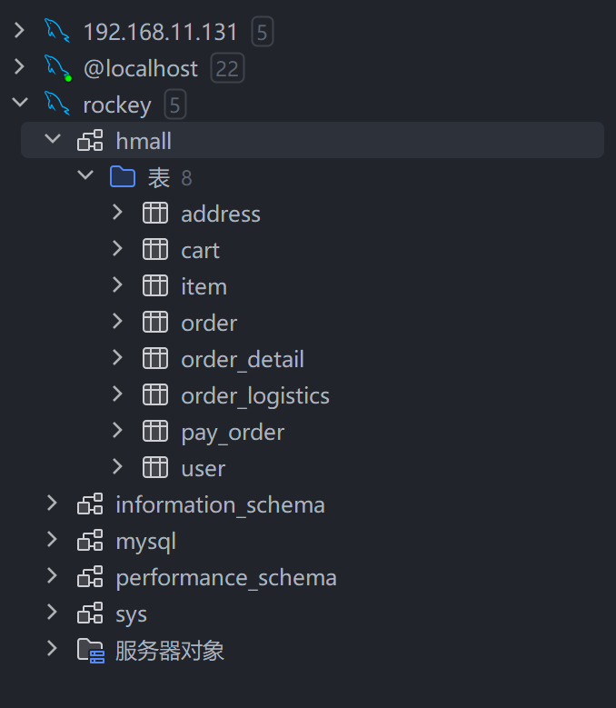

这里如果在数据库中没有 hmall 就将原本的 mysql 镜像删除重装！！！


#### 0.2 后端

直接将项目拷贝到代码开发空间里

更改 application-local.yaml 中的虚拟机 IP 地址

按下 `ALT` + `8` 键打开 services 窗口，新增一个启动项：

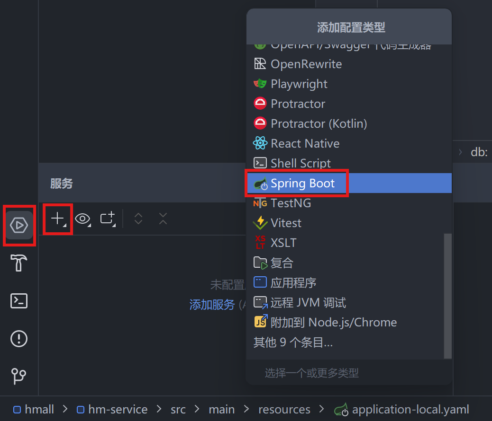

我们还需要对这个启动项做简单配置，在 `HMallApplication` 上点击鼠标右键，会弹出窗口，然后选择 `Edit Configuration`：

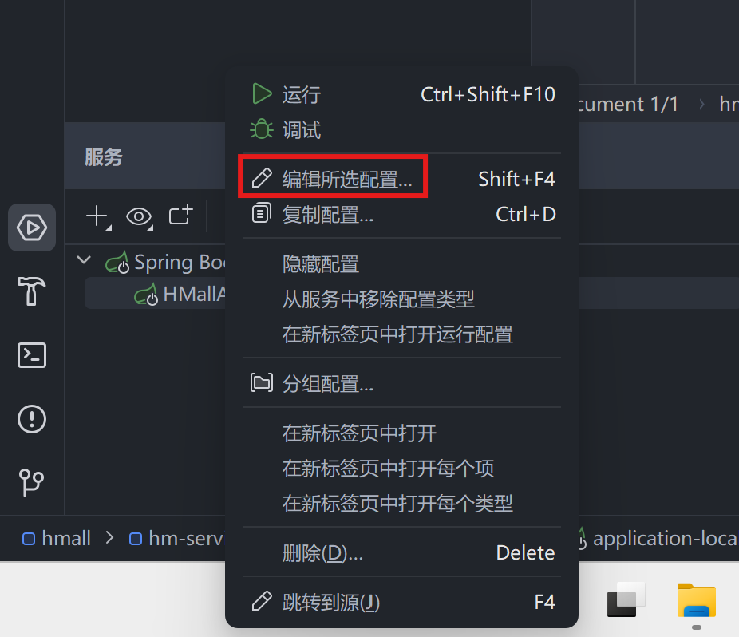

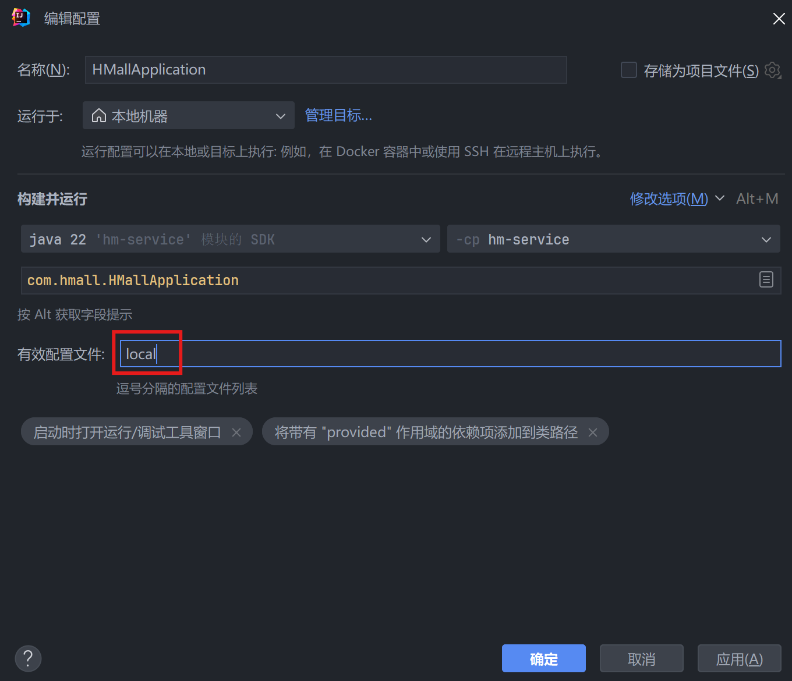

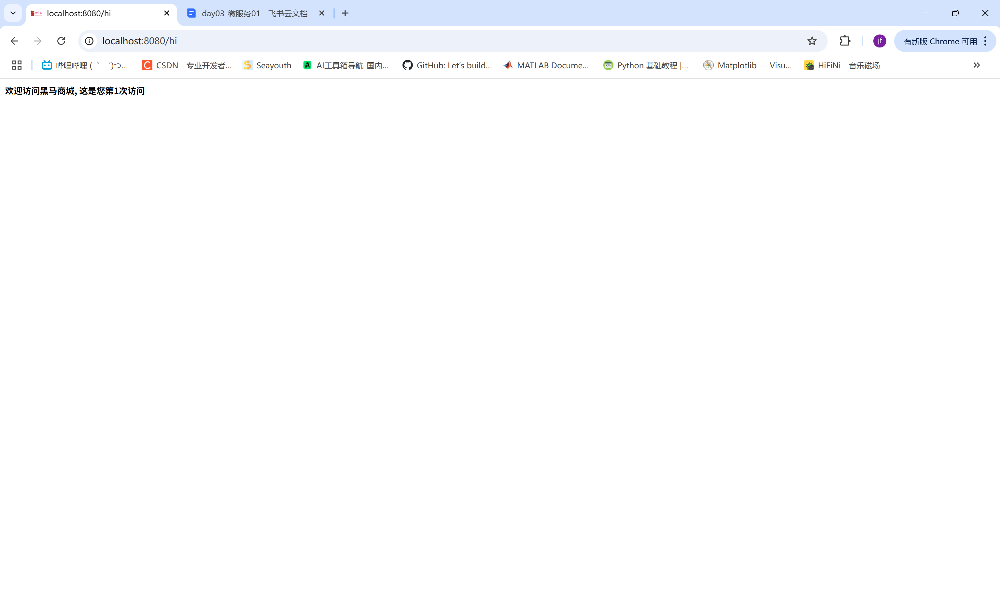

如果 Lombok 版本报错，就将其版本改为 `1.18.30`


#### 0.3 前端

在课前资料中还提供了一个hmall-nginx的目录：


其中就是一个 nginx 程序以及我们的前端代码，直接在 windows 下将其复制到一个**非中文、不包含特殊字符的目录**下。然后进入 hmall-nginx 后，利用 cmd 启动即可：

```PowerShell
# 启动nginx
start nginx.exe
# 停止
nginx.exe -s stop
# 重新加载配置
nginx.exe -s reload
# 重启
nginx.exe -s restart
```


----------------------


### 1. 认识微服务

#### 1.1 单体架构

**单体架构：**将业务的所有功能集中在一个项目中开发，打成一个包部署

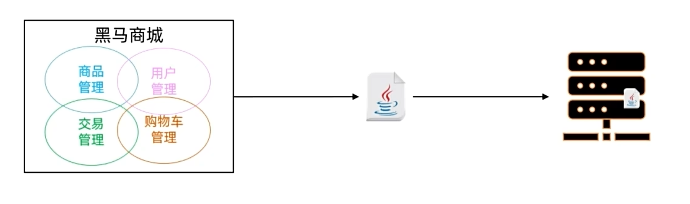

**优点：**

+ 架构简单
+ 部署成本低

**缺点：**

+ 团队协作成本高
+ 系统发布效率低
+ 系统可用性差

总结：单体架构适合开发功能相对简单，规模较小的项目


---------------


#### 1.2 微服务

**微服务**架构，是服务化思想指导下的一套最佳实践架构方案。服务化，就是把单体架构中的功能模块拆分为多个独立项目

+ 粒度小
+ 团队自治
+ 服务自治

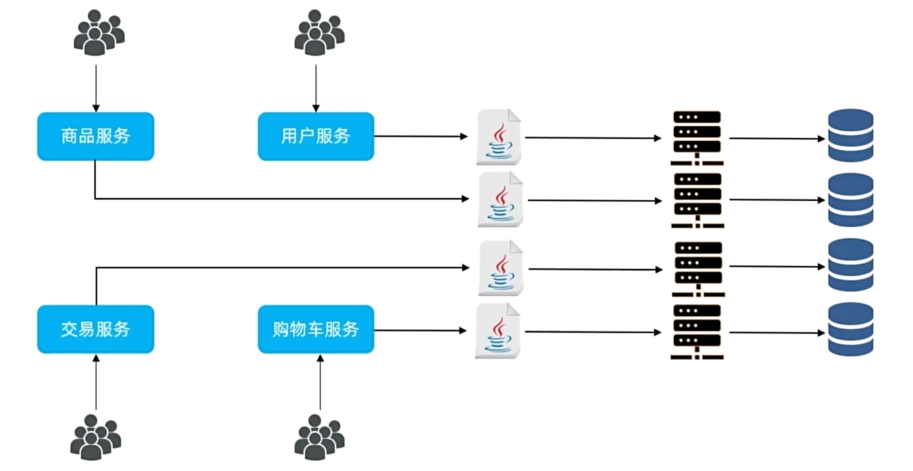


-----------


#### 1.3 SpringCloud

SpringCloud 是目前国内使用最广泛的微服务框架。官网地址：[Spring Cloud](https://spring.io/projects/spring-cloud)

SpringCloud 集成了各种微服务功能组件，并基于 SpringBoot 实现了这些组件的自动装配，从而提供了良好的开箱即用体验：

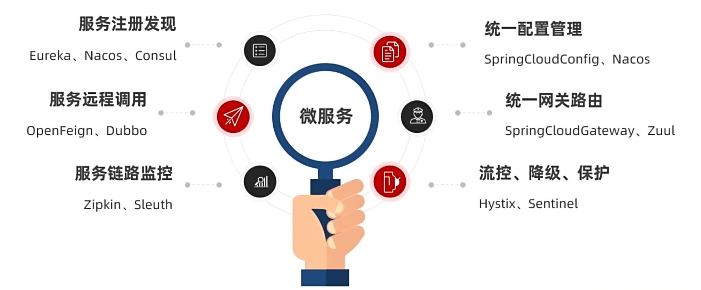

但是对于 SpringBoot 的版本也有要求：

| SpringCloud 版本                                             | SpringBoot 版本                       |
| ------------------------------------------------------------ | ------------------------------------- |
| [2025.0.x](https://github.com/spring-cloud/spring-cloud-release/wiki/Spring-Cloud-2025.0-Release-Notes) aka Northfields | 3.5.x                                 |
| [2024.0.x](https://github.com/spring-cloud/spring-cloud-release/wiki/Spring-Cloud-2024.0-Release-Notes) aka Moorgate | 3.4.x                                 |
| [2023.0.x](https://github.com/spring-cloud/spring-cloud-release/wiki/Spring-Cloud-2023.0-Release-Notes) aka Leyton | 3.3.x, 3.2.x                          |
| [2022.0.x](https://github.com/spring-cloud/spring-cloud-release/wiki/Spring-Cloud-2022.0-Release-Notes) aka Kilburn | 3.0.x, 3.1.x (Starting with 2022.0.3) |
| [2021.0.x](https://github.com/spring-cloud/spring-cloud-release/wiki/Spring-Cloud-2021.0-Release-Notes) aka Jubilee | 2.6.x, 2.7.x (Starting with 2021.0.3) |
| [2020.0.x](https://github.com/spring-cloud/spring-cloud-release/wiki/Spring-Cloud-2020.0-Release-Notes) aka Ilford | 2.4.x, 2.5.x (Starting with 2020.0.3) |
| [Hoxton](https://github.com/spring-cloud/spring-cloud-release/wiki/Spring-Cloud-Hoxton-Release-Notes) | 2.2.x, 2.3.x (Starting with SR5)      |
| [Greenwich](https://github.com/spring-projects/spring-cloud/wiki/Spring-Cloud-Greenwich-Release-Notes) | 2.1.x                                 |
| [Finchley](https://github.com/spring-projects/spring-cloud/wiki/Spring-Cloud-Finchley-Release-Notes) | 2.0.x                                 |
| [Edgware](https://github.com/spring-projects/spring-cloud/wiki/Spring-Cloud-Edgware-Release-Notes) | 1.5.x                                 |
| [Dalston](https://github.com/spring-projects/spring-cloud/wiki/Spring-Cloud-Dalston-Release-Notes) | 1.5.x                                 |


------------------------------


### 2. 微服务拆分

#### 2.1 熟悉黑马商城

首先，我们需要熟悉黑马商城项目的基本结构：


大家可以直接启动该项目，测试效果。不过，需要修改数据库连接参数，在application-local.yaml中：

```YAML
hm:
  db:
    host: 192.168.150.101 # 修改为你自己的虚拟机IP地址
    pw: 123 # 修改为docker中的MySQL密码
```

同时配置启动项激活的是local环境：


业务逻辑和实现，自己看，把前置知识都学过了的基本都能看懂

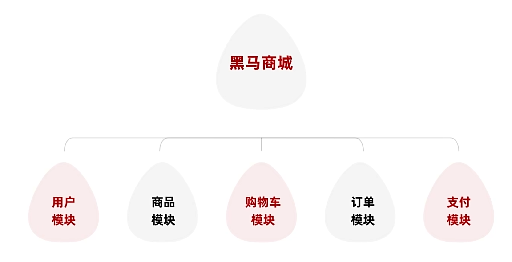


---------------


#### 2.2 服务拆分原则

思考：**什么时候拆分**？

+ **创业型项目：**先采用单体架构，快速开发，快速试错。随着规模扩大，逐渐拆分
+ **确定的大型项目：**资金充足，目标明确，可以直接选择微服务架构，避免后续拆分的麻烦


思考：**怎么拆分？**

从拆分目标来说，要做到：

+ **高内聚：**每个微服务的职责要尽量单一，包含的业务相互关联度高、完整度高
+ **低耦合：**每个微服务的功能要相对独立，尽量减少对其它微服务的依赖

从拆分方式来说，一般包含两种方式：

+ **纵向拆分：**按照业务模块来拆分
+ **横向拆分：**抽取公共服务，提高复用性


----------


#### 2.3 拆分服务

工程结构有两种：

+ 独立 Project（大型）
+ Maven 聚合（中小型）


##### 案例：拆分服务

> 需求：
>
> + 将 hm-service 中与商品管理相关功能拆分到一个微服务 module 中，命名为 item-service
> + 将 hm-service 中与购物车有关功能拆分到一个微服务 module 中，命名为 cart-service

###### 商品管理

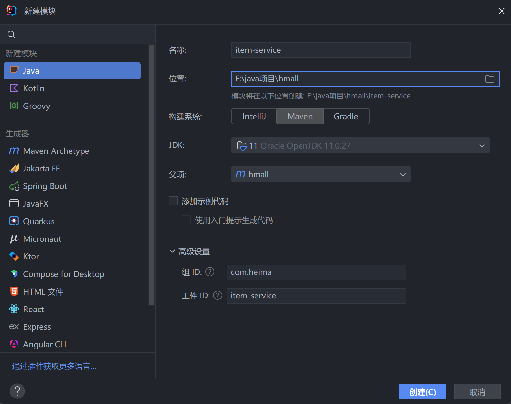

+ pom.xml (item-service)

```xml
<?xml version="1.0" encoding="UTF-8"?>
<project xmlns="http://maven.apache.org/POM/4.0.0"
         xmlns:xsi="http://www.w3.org/2001/XMLSchema-instance"
         xsi:schemaLocation="http://maven.apache.org/POM/4.0.0 http://maven.apache.org/xsd/maven-4.0.0.xsd">
    <modelVersion>4.0.0</modelVersion>
    <parent>
        <groupId>com.heima</groupId>
        <artifactId>hmall</artifactId>
        <version>1.0.0</version>
    </parent>

    <artifactId>item-service</artifactId>

    <properties>
        <maven.compiler.source>22</maven.compiler.source>
        <maven.compiler.target>22</maven.compiler.target>
        <project.build.sourceEncoding>UTF-8</project.build.sourceEncoding>
    </properties>

    <dependencies>
        <!--common-->
        <dependency>
            <groupId>com.heima</groupId>
            <artifactId>hm-common</artifactId>
            <version>1.0.0</version>
        </dependency>
        <!--web-->
        <dependency>
            <groupId>org.springframework.boot</groupId>
            <artifactId>spring-boot-starter-web</artifactId>
        </dependency>
        <!--数据库-->
        <dependency>
            <groupId>mysql</groupId>
            <artifactId>mysql-connector-java</artifactId>
        </dependency>
        <!--mybatis-->
        <dependency>
            <groupId>com.baomidou</groupId>
            <artifactId>mybatis-plus-boot-starter</artifactId>
        </dependency>
    </dependencies>
    <build>
        <finalName>${project.artifactId}</finalName>
        <plugins>
            <!--springboot编译打包插件-->
            <plugin>
                <groupId>org.springframework.boot</groupId>
                <artifactId>spring-boot-maven-plugin</artifactId>
            </plugin>
        </plugins>
    </build>
</project>
```

+ 创建目录结构


+ 导入 SQL 脚本，分离出 hm-item 的 database

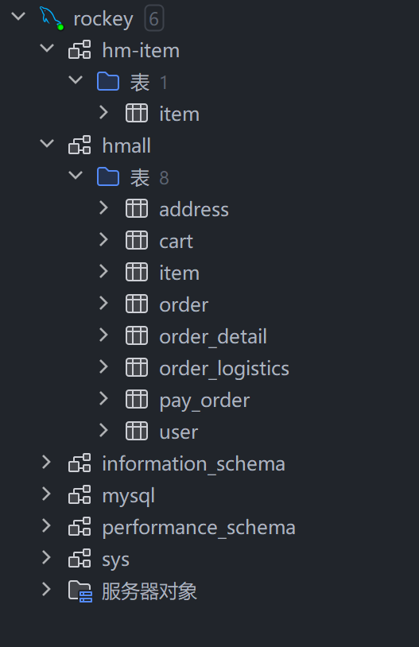

+ 修改配置文件 application.yaml

```yaml
server:
  port: 8081
spring:
  application:
    name: item-service # 微服务名称
  profiles:
    active: dev
  datasource:
    url: jdbc:mysql://${hm.db.host}:3306/hm-item?useUnicode=true&characterEncoding=UTF-8&autoReconnect=true&serverTimezone=Asia/Shanghai
    driver-class-name: com.mysql.cj.jdbc.Driver
    username: root
    password: ${hm.db.pw}
mybatis-plus:
  configuration:
    default-enum-type-handler: com.baomidou.mybatisplus.core.handlers.MybatisEnumTypeHandler
  global-config:
    db-config:
      update-strategy: not_null
      id-type: auto
logging:
  level:
    com.hmall: debug
  pattern:
    dateformat: HH:mm:ss:SSS
  file:
    path: "logs/${spring.application.name}"
knife4j:
  enable: true
  openapi:
    title: 黑马商城商品管理接口文档
    description: "黑马商城商品管理接口文档"
    email: zhanghuyi@itcast.cn
    concat: 虎哥
    url: https://www.itcast.cn
    version: v1.0.0
    group:
      default:
        group-name: default
        api-rule: package
        api-rule-resources:
          - com.hmall.item.controller
```

+ 导入对应的 Java 类

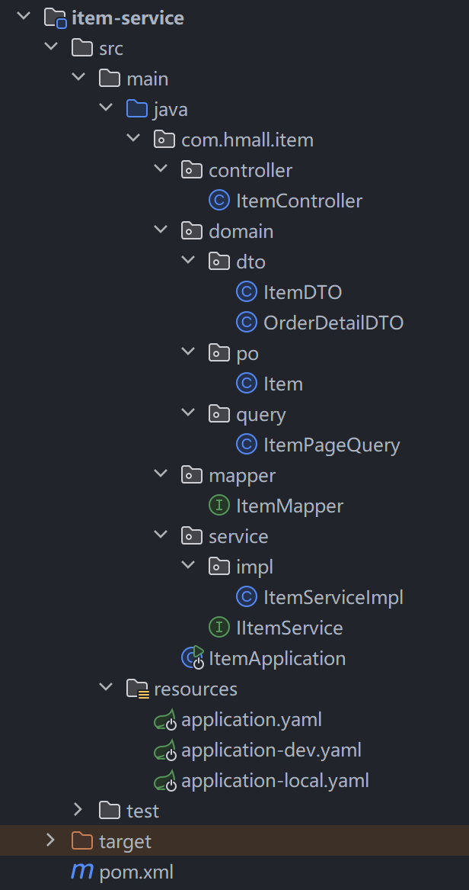

+ 测试

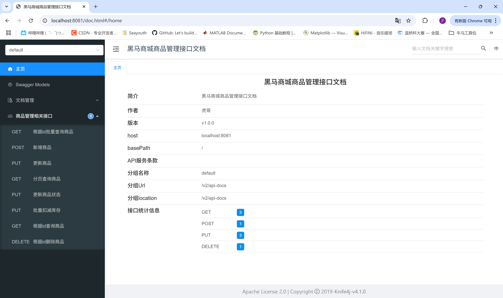


###### 购物车

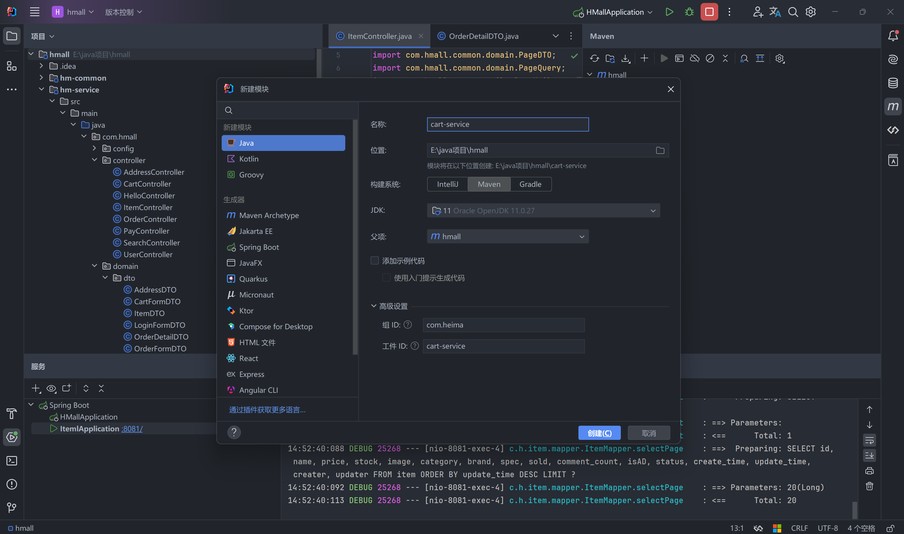

+ pom.xml (cart-service)

```xml
<?xml version="1.0" encoding="UTF-8"?>
<project xmlns="http://maven.apache.org/POM/4.0.0"
         xmlns:xsi="http://www.w3.org/2001/XMLSchema-instance"
         xsi:schemaLocation="http://maven.apache.org/POM/4.0.0 http://maven.apache.org/xsd/maven-4.0.0.xsd">
    <modelVersion>4.0.0</modelVersion>
    <parent>
        <groupId>com.heima</groupId>
        <artifactId>hmall</artifactId>
        <version>1.0.0</version>
    </parent>

    <artifactId>cart-service</artifactId>

    <properties>
        <maven.compiler.source>22</maven.compiler.source>
        <maven.compiler.target>22</maven.compiler.target>
        <project.build.sourceEncoding>UTF-8</project.build.sourceEncoding>
    </properties>
    <dependencies>
        <!--common-->
        <dependency>
            <groupId>com.heima</groupId>
            <artifactId>hm-common</artifactId>
            <version>1.0.0</version>
        </dependency>
        <!--web-->
        <dependency>
            <groupId>org.springframework.boot</groupId>
            <artifactId>spring-boot-starter-web</artifactId>
        </dependency>
        <!--数据库-->
        <dependency>
            <groupId>mysql</groupId>
            <artifactId>mysql-connector-java</artifactId>
        </dependency>
        <!--mybatis-->
        <dependency>
            <groupId>com.baomidou</groupId>
            <artifactId>mybatis-plus-boot-starter</artifactId>
        </dependency>
    </dependencies>
    <build>
        <finalName>${project.artifactId}</finalName>
        <plugins>
            <!--springboot编译打包插件-->
            <plugin>
                <groupId>org.springframework.boot</groupId>
                <artifactId>spring-boot-maven-plugin</artifactId>
            </plugin>
        </plugins>
    </build>
</project>
```

+ 导入 SQL 脚本，分离出 hm-cart 的 database

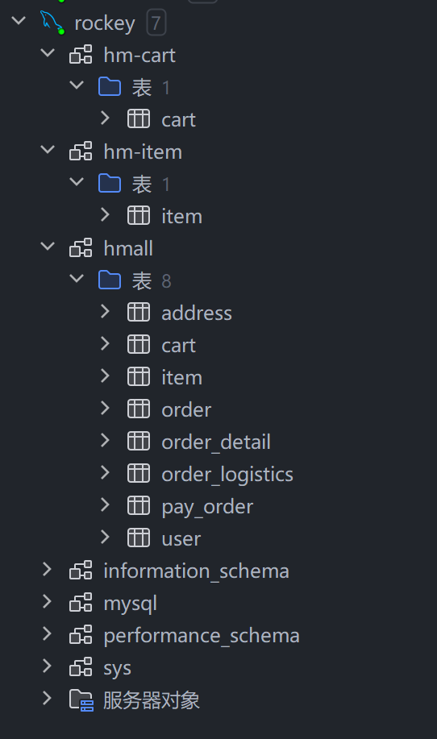

+ application.yaml

```yaml
server:
  port: 8082
spring:
  application:
    name: cart-service # 微服务名称
  profiles:
    active: dev
  datasource:
    url: jdbc:mysql://${hm.db.host}:3306/hm-cart?useUnicode=true&characterEncoding=UTF-8&autoReconnect=true&serverTimezone=Asia/Shanghai
    driver-class-name: com.mysql.cj.jdbc.Driver
    username: root
    password: ${hm.db.pw}
mybatis-plus:
  configuration:
    default-enum-type-handler: com.baomidou.mybatisplus.core.handlers.MybatisEnumTypeHandler
  global-config:
    db-config:
      update-strategy: not_null
      id-type: auto
logging:
  level:
    com.hmall: debug
  pattern:
    dateformat: HH:mm:ss:SSS
  file:
    path: "logs/${spring.application.name}"
knife4j:
  enable: true
  openapi:
    title: 黑马商城购物车接口文档
    description: "黑马商城购物车接口文档"
    email: zhanghuyi@itcast.cn
    concat: 虎哥
    url: https://www.itcast.cn
    version: v1.0.0
    group:
      default:
        group-name: default
        api-rule: package
        api-rule-resources:
          - com.hmall.cart.controller
```

+ 拆分

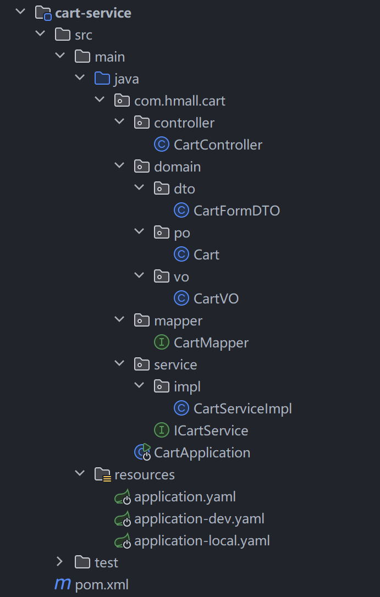


----------


#### 2.4 服务调用

在拆分过程中会遇到一个问题

在查询购物车列表的时候会有一个需求，不仅仅要查出购物车中的商品信息，同时还要查到购物车当中的这些商品的最新价格和状态信息，跟购物车上面的快照进行对比

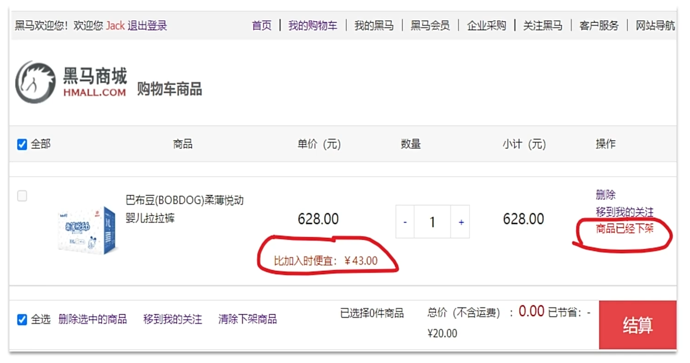

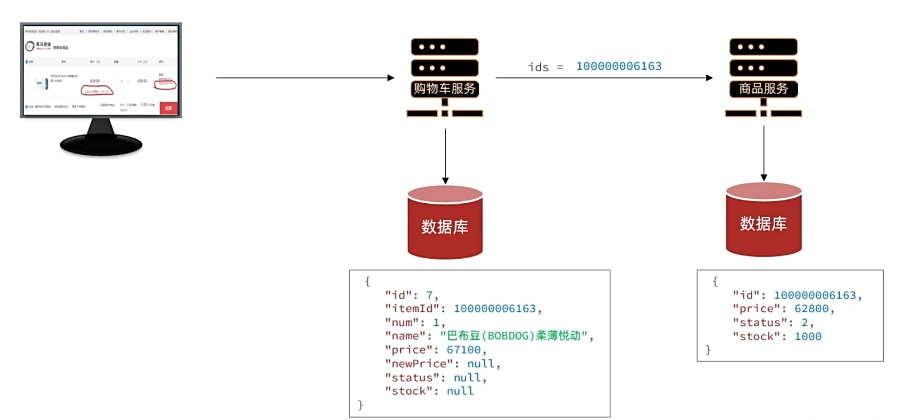


Spring 给我们提供了一个 RestTemplate 工具，可以方便的实现 Http 请求的发送。使用步骤如下1：

1. 注入 RestTemplate 到 Spring 容器

```java
@Bean
public RestTemplate restTemplate() {
    return new RestTemplate();
}
```

2. 发起远程调用

```java
public <T> ResponseEntity<T> exchange(
	String url, // 请求路径
    HttpMethod method, // 请求方式
    @Nullable HttpEntity<?> requestEntity, // 请求实体，可以为空
    Class<T> responseType, // 返回值类型
    Map<String, ?> urlVariables // 请求参数
)
```


+ CartServiceImpl.java

```java
 private void handleCartItems(List<CartVO> vos) {
        // 1.获取商品id
        Set<Long> itemIds = vos.stream().map(CartVO::getItemId).collect(Collectors.toSet());
        // 2.查询商品
//        List<ItemDTO> items = itemService.queryItemByIds(itemIds);

        // 2.1 利用RestTemplate发起http请求，得到http的响应
        ResponseEntity<List<ItemDTO>> response = restTemplate.exchange(
                "http://localhost:8081/items?ids={ids}",
                HttpMethod.GET,
                null,
                new ParameterizedTypeReference<List<ItemDTO>>() {
                },
                Map.of("ids", CollUtil.join(itemIds, ","))
        );
        // 2.2 解析响应
        if (!response.getStatusCode().is2xxSuccessful()) { // 判断请求是否成功
            // 查询失败，直接结束
            return;
        }
        List<ItemDTO> items = response.getBody();

        if (CollUtils.isEmpty(items)) {
            return;
        }
        // 3.转为 id 到 item的map
        Map<Long, ItemDTO> itemMap = items.stream().collect(Collectors.toMap(ItemDTO::getId, Function.identity()));
        // 4.写入vo
        for (CartVO v : vos) {
            ItemDTO item = itemMap.get(v.getItemId());
            if (item == null) {
                continue;
            }
            v.setNewPrice(item.getPrice());
            v.setStatus(item.getStatus());
            v.setStock(item.getStock());
        }
    }
```


-------------


#### 总结

什么时候拆分微服务？

+ 初创型公司或项目尽量采用单体项目，快速试错。随着项目发展到达一定规模再做拆分

如何拆分微服务？

+ 目标：高内聚、低耦合
+ 方式：纵向拆分、横向拆分

拆分后碰到的第一个问题是什么，如何解决？

+ 拆分后，某些数据在不同服务，无法直接调用本地方法查询数据
+ 利用 RestTemplate 发送 Http 请求，实现远程调用


-----------


### 3. 服务治理

**服务远程调用时存在的问题**

在实际部署的时候，有可能我们的商品服务压力比较大，这时候，我们为了去扛住更高的一个并发的请求压力，往往会把一个服务部署多份，也就是创建多个容器同时去启动、接收请求，就可以形成一个负载均衡的集群（多实例部署）

但是我们的 IP 地址照上面写法就写死了，而且如果我们原本的服务挂了，新启动的可能端口又变了

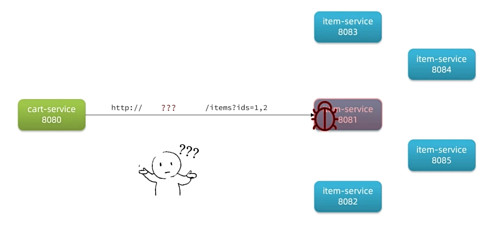


#### 3.1 注册中心原理

在大型微服务项目中，服务提供者的数量会非常多，为了管理这些服务就引入了**注册中心**的概念。注册中心、服务提供者、服务消费者三者间关系如下：


##### 总结

服务治理中的三个角色分别是什么？

+ 服务提供者：暴露服务接口，供其它服务调用
+ 服务消费者：调用其它服务提供的接口
+ 注册中心：记录并监控微服务各实例状态，推送服务变更信息

消费者如何直到提供者的地址？

+ 服务提供者会在启动时注册自己信息到注册中心，消费者可以从注册中心订阅和拉取服务信息

消费者如何得知服务状态变更？

+ 服务提供者通过心跳机制向注册中心报告自己的健康状态，当心跳异常时注册中心会见异常服务剔除，并通知订阅了该服务的消费者

当提供者有多个实例时，消费者该选择哪一个？

+ 消费者可以通过负载均衡算法，从多个实例中选择一个


------------


#### 3.2 Nacos 注册中心

Nacos 是目前国内企业中占比最多的注册中心组件。它是阿里巴巴的产品，目前已经加入 SpringCloudAlibaba 中

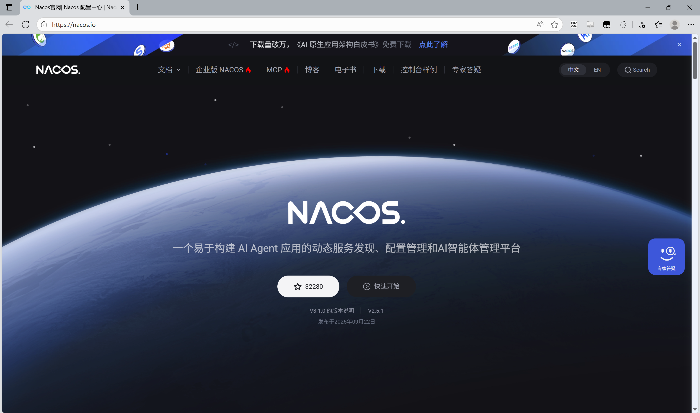

我们基于 Docker 来部署 Nacos 的注册中心，首先我们要准备 MySQL 数据库表，用来存储 Nacos 的数据。由于是 Docker 部署，所以大家需要将资料中的 SQL 文件导入到你 **Docker 中的 MySQL 容器**中：


最终表结构如下：


然后，找到课前资料下的nacos文件夹：


其中的 `nacos/custom.env` 文件中，有一个 MYSQL_SERVICE_HOST 也就是 mysql 地址，需要修改为你自己的虚拟机 IP 地址：


然后，将课前资料中的 `nacos` 目录上传至虚拟机的 `/root` 目录。

进入 root 目录，然后执行下面的 docker 命令：

```PowerShell
docker run -d \
--name nacos \
--env-file ./nacos/custom.env \
-p 8848:8848 \
-p 9848:9848 \
-p 9849:9849 \
--restart=always \
--network hm-net
nacos/nacos-server:v2.1.0-slim
```

启动完成后，访问下面地址：http://192.168.150.101:8848/nacos/，注意将`192.168.150.101`替换为你自己的虚拟机IP地址。

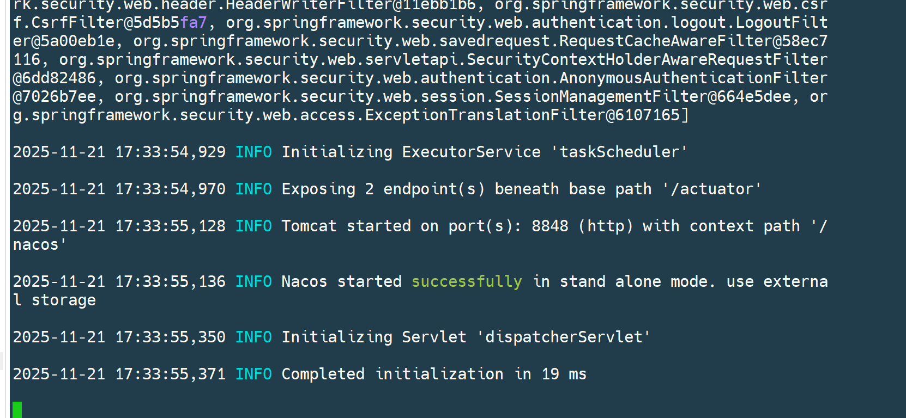

+ 要看到 `successfully`

首次访问会跳转到登录页，**账号密码都是 nacos**


将 mysql 放到 docker 网络当中。启动 nacos 的时候将 nacos 放到同一个网络当中。同时将 .env 文件里的 IP 换为 mysql 容器名（一般就叫 mysql 或者生成的名字）


----------------


#### 3.3 服务注册

服务注册步骤如下：

1. 引入 nacos discovery 依赖：

```xml
<!--nacos 服务注册发现-->
<dependency>
	<groupId>com.alibaba.cloud</groupId>
    <artifactId>spring-cloud-starter-alibaba-nacos-discovery</artifactId>
</dependency>
```

2. 配置 Nacos 地址：

```yaml
spring:
  application:
    name: item-service # 服务名称
  cloud:
    nacos:
      server-addr: 192.168.150.101:8848 # nacos地址
```


复制一个并启动

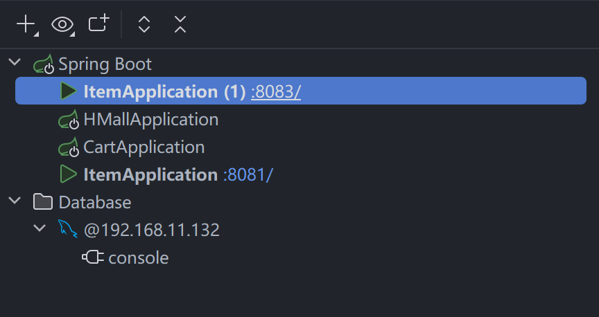


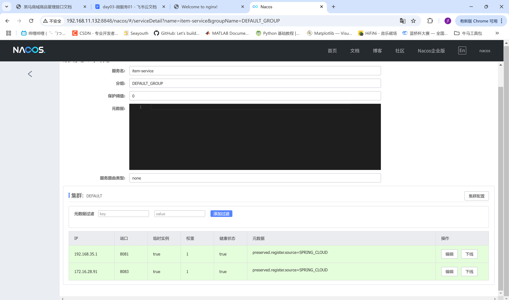


-------------------


#### 3.4 服务发现

**消费者**需要连接 nacos 以拉取和订阅服务，因此服务发现的前两步与服务注册是一样的，后面再加上服务调用即可：

1. 引入 nacos discovery 依赖
2. 配置 nacos 地址
3. 服务发现

```java
private final DiscoveryClient discoveryClient;

private void handleCartItems(List<CartVO> vos) {
    // 1. 根据服务名称，拉取服务的实例列表
    List<ServiceInstance> instances = discoveryClient.getInstances("item-service");
    // 2. 负载均衡，挑选一个实例
    ServiceInstance instance = instances.get(RandomUtil.randomInt(instances.size()));
    // 3. 获取实例的IP和端口
    URI uri = instance.getUri();
    // ... 略
}
```


+ CartServiceImpl.java

```java
 private void handleCartItems(List<CartVO> vos) {
        // 1.获取商品id
        Set<Long> itemIds = vos.stream().map(CartVO::getItemId).collect(Collectors.toSet());
        // 2.查询商品
//        List<ItemDTO> items = itemService.queryItemByIds(itemIds);

        // 2.1 根据服务的名称获取服务列表
        List<ServiceInstance> instances = discoveryClient.getInstances("item-service");
        if (CollUtils.isEmpty(instances)) {
            return;
        }
        // 2.2 手写负载均衡，从实例列表中挑选一个实例
        ServiceInstance instance = instances.get(RandomUtil.randomInt(instances.size()));
        // 2.3 利用RestTemplate发起http请求，得到http的响应
        ResponseEntity<List<ItemDTO>> response = restTemplate.exchange(
                instance.getUri() + "/items?ids={ids}",
                HttpMethod.GET,
                null,
                new ParameterizedTypeReference<List<ItemDTO>>() {
                },
                Map.of("ids", CollUtil.join(itemIds, ","))
        );
        // 2.2 解析响应
        if (!response.getStatusCode().is2xxSuccessful()) { // 判断请求是否成功
            // 查询失败，直接结束
            return;
        }
        List<ItemDTO> items = response.getBody();

        if (CollUtils.isEmpty(items)) {
            return;
        }
        // 3.转为 id 到 item的map
        Map<Long, ItemDTO> itemMap = items.stream().collect(Collectors.toMap(ItemDTO::getId, Function.identity()));
        // 4.写入vo
        for (CartVO v : vos) {
            ItemDTO item = itemMap.get(v.getItemId());
            if (item == null) {
                continue;
            }
            v.setNewPrice(item.getPrice());
            v.setStatus(item.getStatus());
            v.setStock(item.getStock());
        }
    }
```


-----------------------


### 4. OpenFeign

#### 4.1 快速入门

OpenFeign 是一个声明式的 http 客户端，是 SpringCloud 在 Eureka 公司开源的 Feign 基础上改造而来的。官方地址：[OpenFeign/feign: Feign makes writing java http clients easier](https://github.com/OpenFeign/feign)

其作用就是基于 SpringMVC 的常见注解，帮我们优雅的实现 http 请求的发送

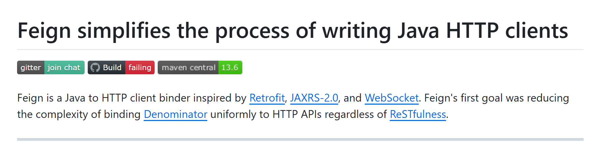

原本代码干的事

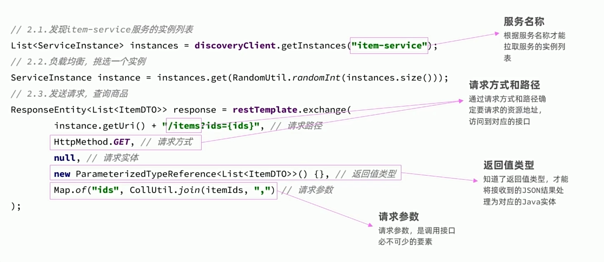

所以我们要想办法让他变得简单

OpenFeign 已经被 SpringCloud 自动装配，实现起来非常简单：

1. 引入依赖，包括 OpenFeign 和负载均衡组件 SpringCloudLoadBalancer

```XML
  <!--openFeign-->
  <dependency>
      <groupId>org.springframework.cloud</groupId>
      <artifactId>spring-cloud-starter-openfeign</artifactId>
  </dependency>
  <!--负载均衡器-->
  <dependency>
      <groupId>org.springframework.cloud</groupId>
      <artifactId>spring-cloud-starter-loadbalancer</artifactId>
  </dependency>
```

2. 通过 `@EnableFeignClients` 注解，启用 OpenFeign 功能

```java
@EnableFeignClients
@SpringBootApplication
public class CartApplication {
    // ... 略
}
```

3. 编写 FeignClient

```java
@FeignClient(value = "item-service")
public interface ItemClient {
    
    @GetMapping("/items")
    List<ItemDTO> queryItemByIds(@RequestParam("ids") Collection<Long> ids);
}
```

4. 使用 FeignClient，实现远程调用

```java
List<ItemDTO> items = itemClient.queryItemByIds(List.of(1, 2, 3));
```


+ CartApplication.java

```java
package com.hmall.cart;

import org.mybatis.spring.annotation.MapperScan;
import org.springframework.boot.SpringApplication;
import org.springframework.boot.autoconfigure.SpringBootApplication;
import org.springframework.cloud.openfeign.EnableFeignClients;
import org.springframework.context.annotation.Bean;
import org.springframework.web.client.RestTemplate;

@EnableFeignClients
@MapperScan("com.hmall.cart.mapper")
@SpringBootApplication
public class CartApplication {
    public static void main(String[] args) {
        SpringApplication.run(CartApplication.class, args);
    }

    @Bean
    public RestTemplate restTemplate() {
        return new RestTemplate();
    }
}
```

+ client/ItemClient.java

```java
package com.hmall.cart.client;

import com.hmall.cart.domain.dto.ItemDTO;
import org.springframework.cloud.openfeign.FeignClient;
import org.springframework.web.bind.annotation.GetMapping;
import org.springframework.web.bind.annotation.RequestParam;

import java.util.Collection;
import java.util.List;

@FeignClient("item-service")
public interface ItemClient {
    @GetMapping("/items")
    List<ItemDTO> queryItemByIds(@RequestParam("ids") Collection<Long> ids);
}
```

+ CartServiceImpl.java

```java
private void handleCartItems(List<CartVO> vos) {
    // 1.获取商品id
    Set<Long> itemIds = vos.stream().map(CartVO::getItemId).collect(Collectors.toSet());

    List<ItemDTO> items = itemClient.queryItemByIds(itemIds);

    if (CollUtils.isEmpty(items)) {
        return;
    }
    // 3.转为 id 到 item的map
    Map<Long, ItemDTO> itemMap = items.stream().collect(Collectors.toMap(ItemDTO::getId, Function.identity()));
    // 4.写入vo
    for (CartVO v : vos) {
        ItemDTO item = itemMap.get(v.getItemId());
        if (item == null) {
            continue;
        }
        v.setNewPrice(item.getPrice());
        v.setStatus(item.getStatus());
        v.setStock(item.getStock());
    }
}
```


-------------


#### 4.2 连接池

OpenFeign 对 Http 请求做了优雅的伪装，不过其底层发起 http 请求，依赖于其它的框架。这些框架可以自己选择，包括以下三种

+ **HttpURLConnection：**默认实现，不支持连接池
+ **Apache HttpClient：**支持连接池
+ **OKHttp：**支持连接池

具体源码可以参考 **FeignBlockingLoadBalanceClient** 类中的 **delegate** 成员变量

OpenFeign 整合 OKHttp 的步骤如下：

1. 引入依赖

```XML
<!--OK http 的依赖 -->
<dependency>
  <groupId>io.github.openfeign</groupId>
  <artifactId>feign-okhttp</artifactId>
</dependency>
```

2. 开启连接池功能

```YAML
feign:
  okhttp:
    enabled: true # 开启OKHttp功能
```


----------------


#### 4.3 最佳实践

我们在多个模块中去编写 client，代码会重复，而且将来修改起来不方便

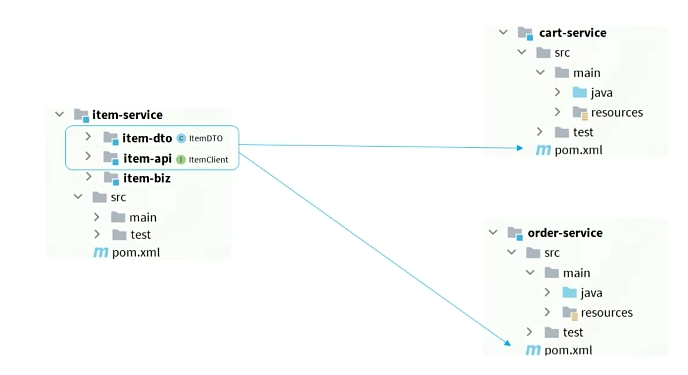

这种实现是非常好的一种方案，但是项目结构会变复杂

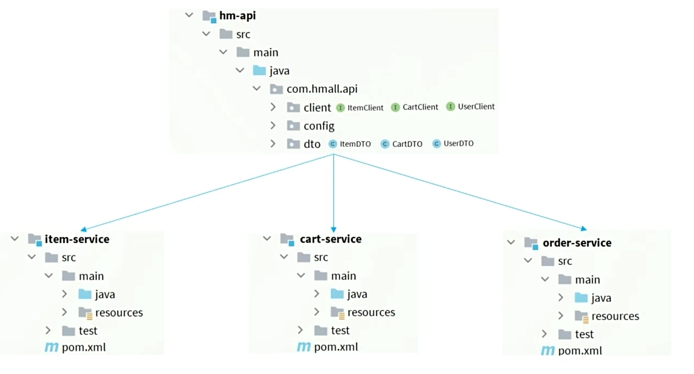

这种的耦合度会稍微高一点


当定义的 FeignClient 不在 SpringBootApplication 的扫描包范围时，这些 FeignClient 无法使用。有两种方式解决：

方式一：指定 FeignClient 所在包

```java
@EnableFeignClients(basePackages = "com.hmall.api.clients")
```

方式二：指定 FeignClient 字节码

```java
@EnableFeignClients(clients = {UserClient.class})
```


-------------


#### 4. 日志

OpenFeign 只会在 FeignClient 所在包的日志级别为 **DEBUG** 时，才会输出日志。而且其日志级别有4级：

+ **NONE：**不记录任何日志信息，这是默认值
+ **BASIC：**仅记录请求的方法，URL 以及响应状态码和执行时间
+ **HEADERS：**在 BASIC 的基础上，额外记录了请求和相应的头信息
+ **FULL：**记录所有请求和响应的明细，包括头信息、请求体、元数据

由于 Feign 默认的日志级别就是 NONE，所以默认我们看不到请求日志

要自定义日志级别需要声明一个类型为 Logger.Level 的 Bean，在其中定义日志级别：

```java
public class DefaultFeignConfig {
    @Bean
    public Logger.Level feignLogLevel() {
        return Logger.Level.FULL;
    }
}
```

但此时这个 Bean 并未生效，要想配置某个 FeignClient 的日志，可以在 `@FeignClient` 注解中声明：

```java
@FeignClient(value = "item-service", configuration = DefaultFeignConfig.class)
```

如果想要**全局配置**，让所有 FeignClient 都按照这个日志配置，则需要在 `@EnableFeignClients` 注解中声明：

```java
@EnableFeignClients(defaultConfiguration = DefaultFeignConfig.class)
```


---------------


#### 总结

如何利用 OpenFeign 实现远程调用？

+ 引入 OpenFeign 和 SpringCloudLoadBalancer 依赖
+ 利用 `@EnableFeignClients` 注解开启 OpenFeign 功能
+ 编写 FeignClient

如何配置 OpenFeign 的连接池？

+ 引入 http 客户端依赖，例如 OKHttp、HttpClient
+ 配置 yaml 文件，打开 OpenFeign 连接池开关

OpenFeign 使用的最佳实践方式是什么？

+ 由服务提供者编写独立 module，将 FeignClient 及 DTO 抽取

如何配置 OpenFeign 输出日志的级别？

+ 声明类型为 Logger.Level 的 Bean
+ 在 `@FeignClient` 或 `@EnableFeignClient` 注解上使用


--------------------


## 四、微服务02

网关及配置管理

**网关**：就是网络的关口，负责请求的路由、转发、身份校验


在 SpringCloud 中网关的实现包括两种：

**Spring Cloud Gateway**（主流）

+ Spring 官方出品
+ 基于 WebFlux 响应式编程
+ 无需调优即可获取优异性能

**Netfilx Zuul**

+ Netfilx 出品
+ 基于 Servlet 的阻塞式编程
+ 需要调优才能获得与 SpringCloudGateway 类似的性能


-------------


### 1. 网关路由

#### 1.1 快速入门

1. 创建新模块
2. 引入网关依赖
3. 编写启动类
4. 配置路由规则

路由配置基本语法

```yaml
spring:
  cloud:
    gateway:
      routes:
        - id: item # 路由规则id，自定义，唯一
          uri: lb://item-service # 路由目标微服务，lb代表负载均衡
          predicates: # 路由断言，判断请求是否符合规则，符合则路由到目标
            - Path=/items/** # 以请求路径做判断，以/items开头则符合
        - id: xx
          uri: lb://xx-service
          predicates:
            - Path=/xx/**
```


+ 创建新的模块

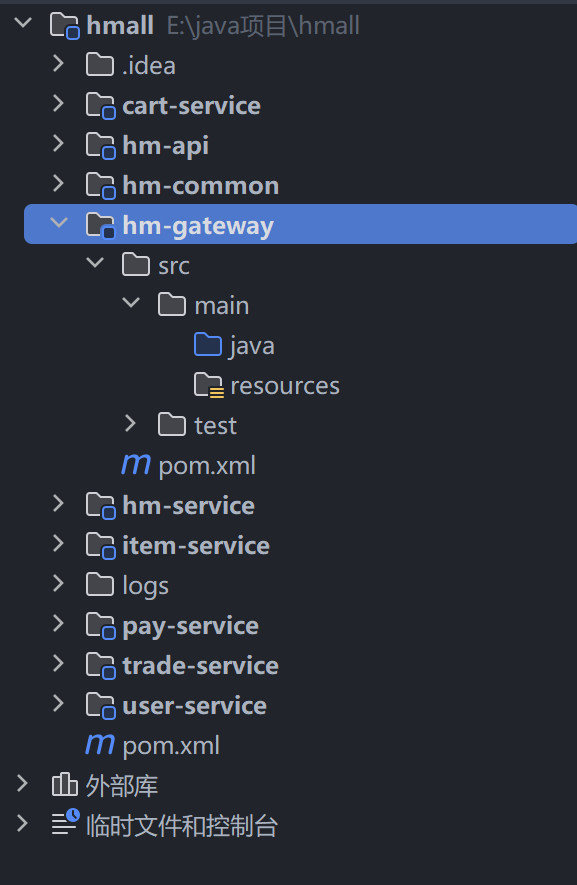

+ 引入依赖

```XML
<?xml version="1.0" encoding="UTF-8"?>
<project xmlns="http://maven.apache.org/POM/4.0.0"
         xmlns:xsi="http://www.w3.org/2001/XMLSchema-instance"
         xsi:schemaLocation="http://maven.apache.org/POM/4.0.0 http://maven.apache.org/xsd/maven-4.0.0.xsd">
    <modelVersion>4.0.0</modelVersion>
    <parent>
        <groupId>com.heima</groupId>
        <artifactId>hmall</artifactId>
        <version>1.0.0</version>
    </parent>

    <artifactId>hm-gateway</artifactId>

    <properties>
        <maven.compiler.source>22</maven.compiler.source>
        <maven.compiler.target>22</maven.compiler.target>
        <project.build.sourceEncoding>UTF-8</project.build.sourceEncoding>
    </properties>
    <dependencies>
        <!--common-->
        <dependency>
            <groupId>com.heima</groupId>
            <artifactId>hm-common</artifactId>
            <version>1.0.0</version>
        </dependency>
        <!--网关-->
        <dependency>
            <groupId>org.springframework.cloud</groupId>
            <artifactId>spring-cloud-starter-gateway</artifactId>
        </dependency>
        <!--nacos discovery-->
        <dependency>
            <groupId>com.alibaba.cloud</groupId>
            <artifactId>spring-cloud-starter-alibaba-nacos-discovery</artifactId>
        </dependency>
        <!--负载均衡-->
        <dependency>
            <groupId>org.springframework.cloud</groupId>
            <artifactId>spring-cloud-starter-loadbalancer</artifactId>
        </dependency>
    </dependencies>
    <build>
        <finalName>${project.artifactId}</finalName>
        <plugins>
            <plugin>
                <groupId>org.springframework.boot</groupId>
                <artifactId>spring-boot-maven-plugin</artifactId>
            </plugin>
        </plugins>
    </build>
</project>
```

+ 编写 application.yaml

```yaml
server:
  port: 8080
spring:
  application:
    name: gateway
  cloud:
    nacos:
      server-addr: 192.168.11.132:8848
    gateway:
      routes:
        - id: item-service
          uri: lb://item-service
          predicates:
            - Path=/items/**,/search/**
        - id: user-service
          uri: lb://user-service
          predicates:
            - Path=/users/**,/address/**
```

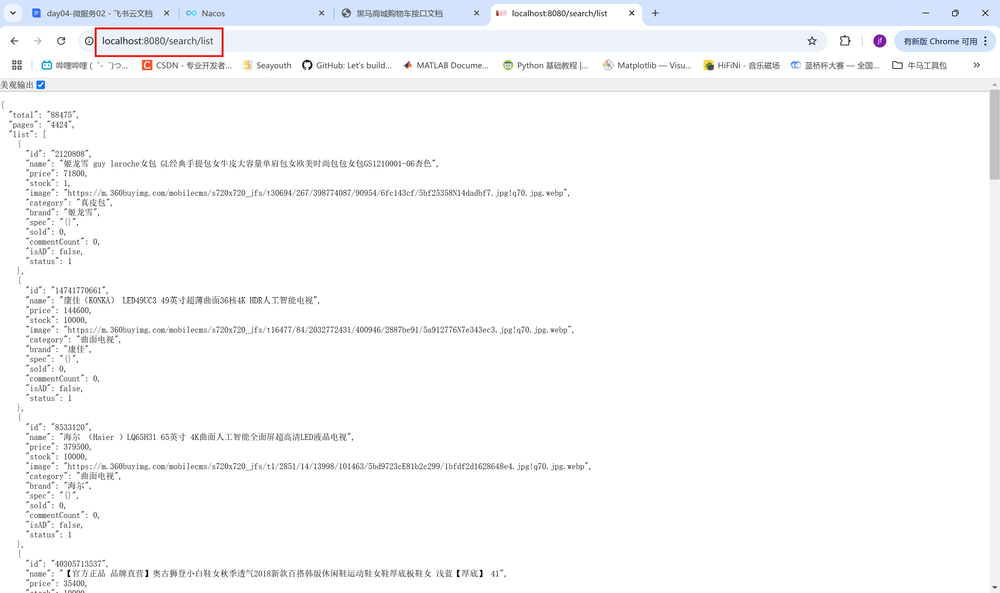


-----


#### 1.2 路由属性

**网关路由**对应的 Java 类型是 RouteDefinition，其中常见的属性有：

+ id：路由唯一标示
+ uri：路由目标地址
+ **predicates：**路由断言，判断请求是否符合当前路由
+ **filters：**路由过滤器，对请求或响应做特殊处理


##### 1.2.1 路由断言

Spring 提供了 12种基本的 **RoutePredicateFactory** 实现：

| **名称**               | **说明**                       | **示例**                                                     |
| :--------------------- | :----------------------------- | :----------------------------------------------------------- |
| After                  | 是某个时间点后的请求           | `- After=2037-01-20T17:42:47.789-07:00[America/Denver]`      |
| Before                 | 是某个时间点之前的请求         | `- Before=2031-04-13T15:14:47.433+08:00[Asia/Shanghai] `     |
| Between                | 是某两个时间点之前的请求       | `- Between=2037-01-20T17:42:47.789-07:00[America/Denver], 2037-01-21T17:42:47.789-07:00[America/Denver]` |
| Cookie                 | 请求必须包含某些cookie         | `- Cookie=chocolate, ch.p`                                   |
| Header                 | 请求必须包含某些header         | `- Header=X-Request-Id, \d+`                                 |
| Host                   | 请求必须是访问某个host（域名） | `- Host=**.somehost.org,**.anotherhost.org`                  |
| Method                 | 请求方式必须是指定方式         | `- Method=GET,POST`                                          |
| Path                   | 请求路径必须符合指定规则       | `- Path=/red/{segment},/blue/**`                             |
| Query                  | 请求参数必须包含指定参数       | `- Query=name, Jack或者- Query=name`                         |
| RemoteAddr             | 请求者的ip必须是指定范围       | `- RemoteAddr=192.168.1.1/24`                                |
| weight                 | 权重处理                       | ` - Weight=group1, 2`                                        |
| XForwarded Remote Addr | 基于请求的来源 IP 做判断       | `- XForwardedRemoteAddr=192.168.1.1/24`                      |


##### 1.2.2 路由过滤器

网关中提供了33种路由过滤器，每种过滤器都有独特的作用

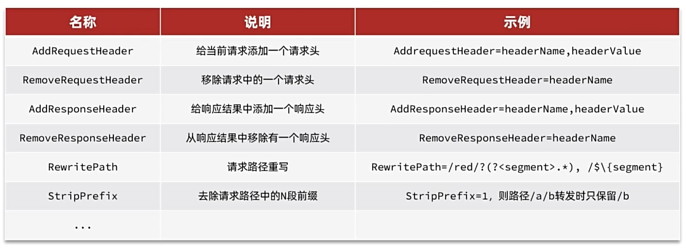

在官网可查看更多过滤器用法


-------------


### 2. 网关登录校验

+ 如何在网关转发之前做登录校验？
+ 网关如何将用户信息传递给微服务？
+ 如何在微服务之间传递用户信息？

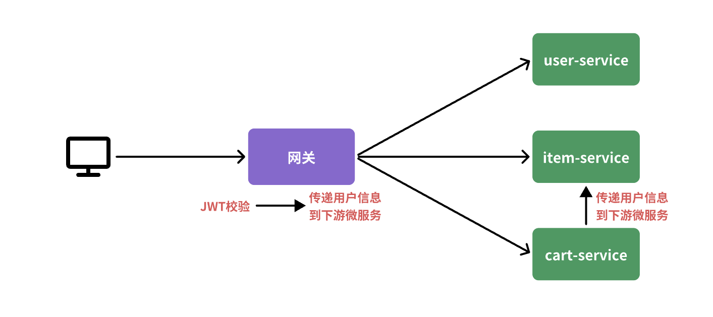


#### 2.1 网关请求处理流程

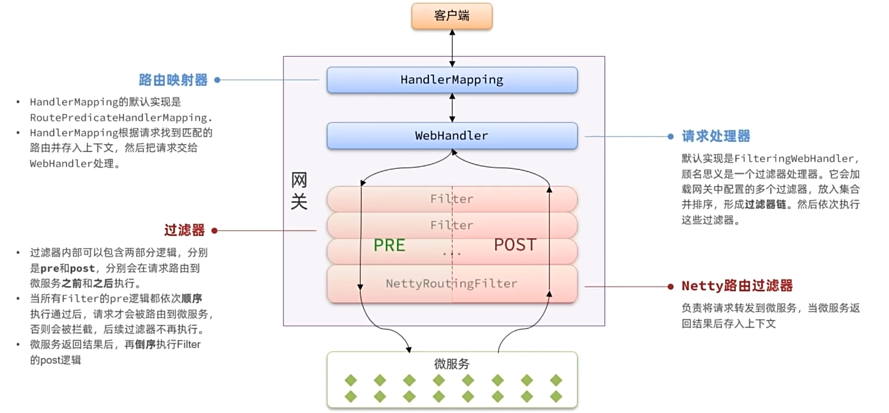

1. 客户端请求进入网关后由 `HandlerMapping` 对请求做判断，找到与当前请求匹配的路由规则（**`Route`**），然后将请求交给 `WebHandler` 去处理。
2. `WebHandler` 则会加载当前路由下需要执行的过滤器链（**`Filter chain`**），然后按照顺序逐一执行过滤器（后面称为 **`Filter`**）。
3. 图中 `Filter` 被虚线分为左右两部分，是因为 `Filter` 内部的逻辑分为 `pre` 和 `post` 两部分，分别会在请求路由到微服务**之前**和**之后**被执行。
4. 只有所有 `Filter` 的 `pre` 逻辑都依次顺序执行通过后，请求才会被路由到微服务。
5. 微服务返回结果后，再倒序执行 `Filter` 的 `post` 逻辑。
6. 最终把响应结果返回。


------------------


#### 2.2 自定义过滤器

网关过滤器有两种，分别是：

+ GatewayFilter：路由过滤器，作用于任意指定的路由；默认不生效，要配置到路由后生效
+ GlobalFilter：全局过滤器，作用范围是所有路由；声明后自动生效

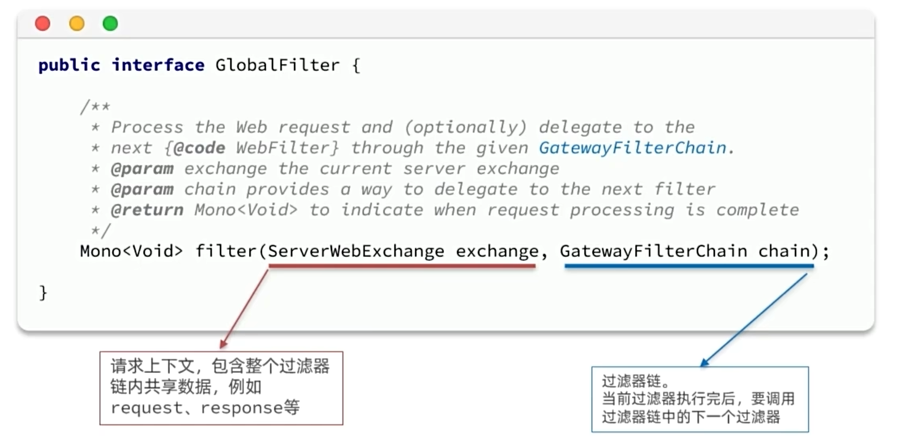


自定义 GlobalFilter 比较简单，直接实现 GlobalFilter 接口即可：

```java
package com.hmall.gateway.filters;

import lombok.extern.apachecommons.CommonsLog;
import org.springframework.cloud.gateway.filter.GatewayFilterChain;
import org.springframework.cloud.gateway.filter.GlobalFilter;
import org.springframework.core.Ordered;
import org.springframework.http.HttpHeaders;
import org.springframework.http.server.reactive.ServerHttpRequest;
import org.springframework.web.server.ServerWebExchange;
import reactor.core.publisher.Mono;

@CommonsLog
public class MyGlobalFilter implements GlobalFilter, Ordered {
    @Override
    public Mono<Void> filter(ServerWebExchange exchange, GatewayFilterChain chain) {
        // TODO 模拟登录校验逻辑
        // 1. 获取请求
        ServerHttpRequest request = exchange.getRequest();
        // 2. 过滤器业务处理
        HttpHeaders headers = request.getHeaders();
        System.out.println("headers = " + headers);
        // 3. 放行
        return chain.filter(exchange);
    }

    // 定义过滤器执行顺序
    @Override
    public int getOrder() {
        // 过滤器执行顺序，值越小，优先级越高
        return 0;
    }
}
```


------------


#### 2.3 实现登录校验

> 需求：
>
> 在网关中基于过滤器实现登录校验功能
>
> 提示：黑马商城是基于 JWT 实现的登录校验，目前相关功能在 hm-service 模块。我们可以将其中的 JWT 工具拷贝到 gateway 模块，然后基于 GlobalFilter 来实现登录校验

+ application.yaml

```yaml
server:
  port: 8080
spring:
  application:
    name: gateway
  cloud:
    nacos:
      server-addr: 192.168.11.132:8848
    gateway:
      routes:
        - id: item-service
          uri: lb://item-service
          predicates:
            - Path=/items/**,/search/**
        - id: user-service
          uri: lb://user-service
          predicates:
            - Path=/users/**,/address/**
        - id: cart-service
          uri: lb://cart-service
          predicates:
            - Path=/carts/**
      default-filters:
        - AddRequestHeader=truth, anyone long-press like button will be rich
        - PrintAny=1,2,3

hm:
  jwt:
    location: classpath:hmall.jks
    alias: hmall
    password: hmall123
    tokenTTL: 30m
  auth:
    excludePaths:
      - /search/**
      - /users/login
      - /items/**
      - /hi
```

+ config/AuthProperties.java

```java
package com.hmall.gateway.config;

import lombok.Data;
import org.springframework.boot.context.properties.ConfigurationProperties;
import org.springframework.stereotype.Component;

import java.util.List;

@Data
@Component
@ConfigurationProperties(prefix = "hm.auth")
public class AuthProperties {
    private List<String> includePaths;
    private List<String> excludePaths;
}
```

+ config/JwtProperties.java

```java
package com.hmall.gateway.config;

import lombok.Data;
import org.springframework.boot.context.properties.ConfigurationProperties;
import org.springframework.core.io.Resource;

import java.time.Duration;

@Data
@ConfigurationProperties(prefix = "hm.jwt")
public class JwtProperties {
    private Resource location;
    private String password;
    private String alias;
    private Duration tokenTTL = Duration.ofMinutes(10);
}
```

+ config/SecurityConfig.java

```java
package com.hmall.gateway.config;

import org.springframework.boot.context.properties.EnableConfigurationProperties;
import org.springframework.context.annotation.Bean;
import org.springframework.context.annotation.Configuration;
import org.springframework.security.crypto.bcrypt.BCryptPasswordEncoder;
import org.springframework.security.crypto.password.PasswordEncoder;
import org.springframework.security.rsa.crypto.KeyStoreKeyFactory;

import java.security.KeyPair;

@Configuration
@EnableConfigurationProperties(JwtProperties.class)
public class SecurityConfig {

    @Bean
    public PasswordEncoder passwordEncoder(){
        return new BCryptPasswordEncoder();
    }

    @Bean
    public KeyPair keyPair(JwtProperties properties){
        // 获取秘钥工厂
        KeyStoreKeyFactory keyStoreKeyFactory =
                new KeyStoreKeyFactory(
                        properties.getLocation(),
                        properties.getPassword().toCharArray());
        //读取钥匙对
        return keyStoreKeyFactory.getKeyPair(
                properties.getAlias(),
                properties.getPassword().toCharArray());
    }
}
```

+ utils/JwtTool.java

```java
package com.hmall.gateway.utils;

import cn.hutool.core.exceptions.ValidateException;
import cn.hutool.jwt.JWT;
import cn.hutool.jwt.JWTValidator;
import cn.hutool.jwt.signers.JWTSigner;
import cn.hutool.jwt.signers.JWTSignerUtil;
import com.hmall.common.exception.UnauthorizedException;
import org.springframework.stereotype.Component;

import java.security.KeyPair;
import java.time.Duration;
import java.util.Date;

@Component
public class JwtTool {
    private final JWTSigner jwtSigner;

    public JwtTool(KeyPair keyPair) {
        this.jwtSigner = JWTSignerUtil.createSigner("rs256", keyPair);
    }

    /**
     * 创建 access-token
     */
    public String createToken(Long userId, Duration ttl) {
        // 1.生成jws
        return JWT.create()
                .setPayload("user", userId)
                .setExpiresAt(new Date(System.currentTimeMillis() + ttl.toMillis()))
                .setSigner(jwtSigner)
                .sign();
    }

    /**
     * 解析token
     *
     * @param token token
     * @return 解析刷新token得到的用户信息
     */
    public Long parseToken(String token) {
        // 1.校验token是否为空
        if (token == null) {
            throw new UnauthorizedException("未登录");
        }
        // 2.校验并解析jwt
        JWT jwt;
        try {
            jwt = JWT.of(token).setSigner(jwtSigner);
        } catch (Exception e) {
            throw new UnauthorizedException("无效的token", e);
        }
        // 2.校验jwt是否有效
        if (!jwt.verify()) {
            // 验证失败
            throw new UnauthorizedException("无效的token");
        }
        // 3.校验是否过期
        try {
            JWTValidator.of(jwt).validateDate();
        } catch (ValidateException e) {
            throw new UnauthorizedException("token已经过期");
        }
        // 4.数据格式校验
        Object userPayload = jwt.getPayload("user");
        if (userPayload == null) {
            // 数据为空
            throw new UnauthorizedException("无效的token");
        }

        // 5.数据解析
        try {
            return Long.valueOf(userPayload.toString());
        } catch (RuntimeException e) {
            // 数据格式有误
            throw new UnauthorizedException("无效的token");
        }
    }
}
```

+ filters/AuthGlobalFilter.java

```java
package com.hmall.gateway.filters;

import cn.hutool.core.text.AntPathMatcher;
import com.hmall.common.exception.UnauthorizedException;
import com.hmall.gateway.config.AuthProperties;
import com.hmall.gateway.utils.JwtTool;
import lombok.RequiredArgsConstructor;
import org.springframework.cloud.gateway.filter.GatewayFilterChain;
import org.springframework.cloud.gateway.filter.GlobalFilter;
import org.springframework.core.Ordered;
import org.springframework.http.HttpStatus;
import org.springframework.http.server.reactive.ServerHttpRequest;
import org.springframework.http.server.reactive.ServerHttpResponse;
import org.springframework.stereotype.Component;
import org.springframework.web.server.ServerWebExchange;
import reactor.core.publisher.Mono;

import java.util.List;

@Component
@RequiredArgsConstructor
public class AuthGlobalFilter implements GlobalFilter, Ordered {

    private final AuthProperties authProperties;

    private final JwtTool jwtTool;

    private final AntPathMatcher antPathMatcher = new AntPathMatcher(); // AntPathMatcher是Spring的Bean不能注入

    @Override
    public Mono<Void> filter(ServerWebExchange exchange, GatewayFilterChain chain) {
        // 1. 获取request
        ServerHttpRequest request = exchange.getRequest();
        // 2. 判断是否需要做拦截
        if (isExclude(request.getPath().toString())) {
            // 放行
            return chain.filter(exchange);
        }
        // 3. 获取token
        String token = null;
        List<String> headers = request.getHeaders().get("authorization");
        if (headers != null && !headers.isEmpty()) {
            token = headers.get(0);
        }
        // 4. 校验并解析token
        Long userId = null;
        try {
            userId = jwtTool.parseToken(token);
        } catch (UnauthorizedException e) {
            // 拦截，设置响应状态码为401
            ServerHttpResponse response = exchange.getResponse();
            response.setStatusCode(HttpStatus.UNAUTHORIZED);
            return response.setComplete(); // 表示完结了
        }
        // 5. 传递用户信息
        System.out.println("userId = " + userId);
        // 6. 放行
        return chain.filter(exchange);
    }

    private boolean isExclude(String path) {
        for (String pathPattern : authProperties.getExcludePaths()) {
            if (antPathMatcher.match(pathPattern, path)) {
                return true;
            }
        }
        return false;
    }

    @Override
    public int getOrder() {
        return 0;
    }
}
```


-----------


#### 2.4 网关传递用户

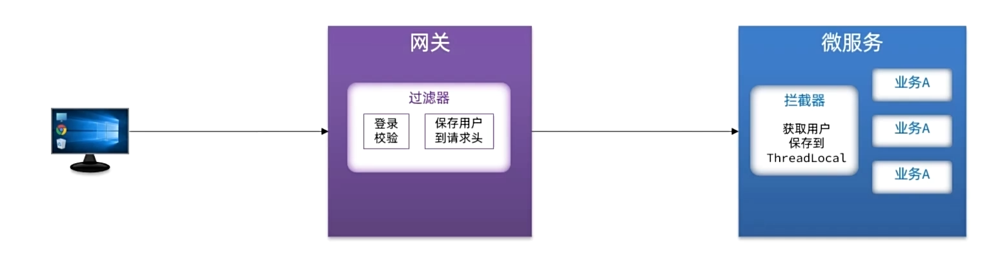

##### 步骤一：在网关的登录校验过滤器种，把获取到的用户写入请求头

>需求：
>
>修改 gateway 模块中的登录校验拦截器，在校验成功后保存用户到下游请求的请求头中
>
>提示：要修改转发到微服务的请求，需要用到 **ServerWebExchange** 类提供的 API，示例如下：
>
>```java
>exchange.mutate() // mutate就是对下游请求做更改
>    .request(builder -> builder.header("user-info", userInfo))
>    .build();
>```

+ AuthGlobalFilter.java

```java
@Override
public Mono<Void> filter(ServerWebExchange exchange, GatewayFilterChain chain) {
    // 1. 获取request
    ServerHttpRequest request = exchange.getRequest();
    // 2. 判断是否需要做拦截
    if (isExclude(request.getPath().toString())) {
        // 放行
        return chain.filter(exchange);
    }
    // 3. 获取token
    String token = null;
    List<String> headers = request.getHeaders().get("authorization");
    if (headers != null && !headers.isEmpty()) {
        token = headers.get(0);
    }
    // 4. 校验并解析token
    Long userId = null;
    try {
        userId = jwtTool.parseToken(token);
    } catch (UnauthorizedException e) {
        // 拦截，设置响应状态码为401
        ServerHttpResponse response = exchange.getResponse();
        response.setStatusCode(HttpStatus.UNAUTHORIZED);
        return response.setComplete(); // 表示完结了
    }
    // 5. 传递用户信息
    String userInfo = userId.toString();
    ServerWebExchange swe = exchange.mutate()
            .request(builder -> builder.header("user-info", userInfo))
            .build();
    // 6. 放行
    return chain.filter(swe);
}
```


##### 步骤二：在 hm-common 中编写 SpringMVC 拦截器，获取登录用户

> 需求：
>
> 由于每个微服务都可能有获取登录用户的需求，因此我们直接在 hm-common 模块定义拦截器，这样微服务只需要引入依赖即可生效，无需重复编写

+ Interceptor/UserInfoInterceptor.java

```java
package com.hmall.common.interceptors;

import cn.hutool.core.util.StrUtil;
import com.hmall.common.utils.UserContext;
import org.springframework.web.servlet.HandlerInterceptor;

import javax.servlet.http.HttpServletRequest;
import javax.servlet.http.HttpServletResponse;

/**
 * 拦截器：获取用户信息
 */
public class UserInfoInterceptor implements HandlerInterceptor {
    @Override
    public boolean preHandle(HttpServletRequest request, HttpServletResponse response, Object handler) throws Exception {
        // 1. 获取登录用户信息
        String userInfo = request.getHeader("user-info");
        // 2. 判断是否获取了用户，如果有，存入ThreadLocal
        if (StrUtil.isNotBlank(userInfo)) { // isNotBlank能判断是否为null，还能判断是否为空字符串
            UserContext.setUser(Long.valueOf(userInfo));
        }
        // 3. 放行
        return true;
    }

    @Override
    public void afterCompletion(HttpServletRequest request, HttpServletResponse response, Object handler, Exception ex) throws Exception {
        // 清理用户
        UserContext.removeUser();
    }
}
```

+ config/MvcConfig.java

```java
package com.hmall.common.config;

import com.hmall.common.interceptors.UserInfoInterceptor;
import org.springframework.context.annotation.Configuration;
import org.springframework.web.servlet.config.annotation.InterceptorRegistry;
import org.springframework.web.servlet.config.annotation.WebMvcConfigurer;

@Configuration
public class MvcConfig implements WebMvcConfigurer {

    /**
     * 注册拦截器
     *
     * @param registry
     */
    @Override
    public void addInterceptors(InterceptorRegistry registry) {
        registry.addInterceptor(new UserInfoInterceptor()); // 默认拦截所有路径
    }
}
```

微服务不同包不一样，会扫描不到

所以要用到 SpringBoot 自动装配原理，在不同包下的扫不到的配置类要想生效，就必须在 resource 目录下的 META-INF 下定义一个文件去记录这些配置类

+ META-INF/spring.factories

```factories
org.springframework.boot.autoconfigure.EnableAutoConfiguration=\
  com.hmall.common.config.MyBatisConfig,\
  com.hmall.common.config.MvcConfig, \
  com.hmall.common.config.JsonConfig
```

让 MvcConfig 只在微服务里生效，在网关不生效（因为网关底层不是 SpringMVC 那一套，是一种非阻塞式的响应式编程，基于的是 WebFlux，不然会报错）

+ MvcConfig.java

```java
package com.hmall.common.config;

import com.hmall.common.interceptors.UserInfoInterceptor;
import org.springframework.boot.autoconfigure.condition.ConditionalOnClass;
import org.springframework.context.annotation.Configuration;
import org.springframework.web.servlet.DispatcherServlet;
import org.springframework.web.servlet.config.annotation.InterceptorRegistry;
import org.springframework.web.servlet.config.annotation.WebMvcConfigurer;

@Configuration
@ConditionalOnClass(DispatcherServlet.class) // 判断一个类是否存在，DispatcherServlet是MVC的核心API
public class MvcConfig implements WebMvcConfigurer {

    /**
     * 注册拦截器
     *
     * @param registry
     */
    @Override
    public void addInterceptors(InterceptorRegistry registry) {
        registry.addInterceptor(new UserInfoInterceptor()); // 默认拦截所有路径
    }
}
```


+ 功能测试

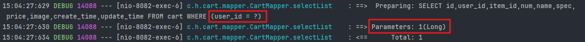


---------------


#### 2.5 OpenFeign 传递用户

微服务项目中的很多业务要多个微服务共同合作完成，而这个过程中也需要传递登录用户信息，例如：

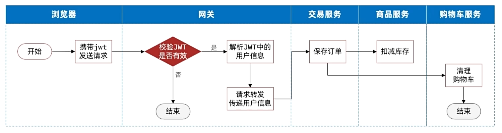


现在微服务之间接口的调用是没有做请求头处理的，所以，如果有接口是通过其它接口调用，但是此接口需要用到请求头信息（用户 ID）的话，就无法取到请求头信息


OpenFeign 中提供了一个拦截器接口，所有由 OpenFeign 发起的请求都会先调用拦截器处理请求：

```java
public interface RequestInterceptor {

  /**
   * Called for every request. 
   * Add data using methods on the supplied {@link RequestTemplate}.
   */
  void apply(RequestTemplate template);
}
```

其中的 RequestTemplate 类中提供了一些方法可以让我们修改请求头：

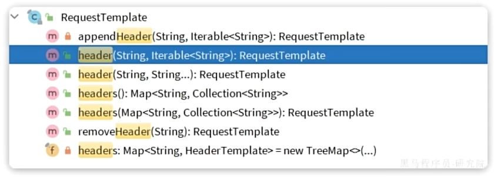

+ config/DefaultFeignConfig.java

```java
package com.hmall.api.config;

import com.hmall.common.utils.UserContext;
import feign.Logger;
import feign.RequestInterceptor;
import feign.RequestTemplate;
import org.springframework.context.annotation.Bean;

public class DefaultFeignConfig {

    /**
     * 设置日志等级
     *
     * @return
     */
    @Bean
    public Logger.Level feignLoggerLevel() {
        return Logger.Level.FULL;
    }

    /**
     * 通过匿名内部类方式声明拦截器
     */
    @Bean
    public RequestInterceptor userInfoInterceptor() {
        return new RequestInterceptor() {
            @Override
            public void apply(RequestTemplate requestTemplate) {
                Long userId = UserContext.getUser();
                if (userId != null) {
                    requestTemplate.header("user-info", userId.toString());
                }
            }
        };
    }
}
```

有个前提是，这个配置类想要生效，要在对应启动类上加配置

```java
@EnableFeignClients(basePackages = "com.hmall.api.clients", defaultConfiguration = DefaultFeignConfig.class)
@MapperScan("com.hmall.trade.mapper")
@SpringBootApplication
public class TradeApplication {
    public static void main(String[] args) {
        SpringApplication.run(TradeApplication.class, args);
    }
}
```


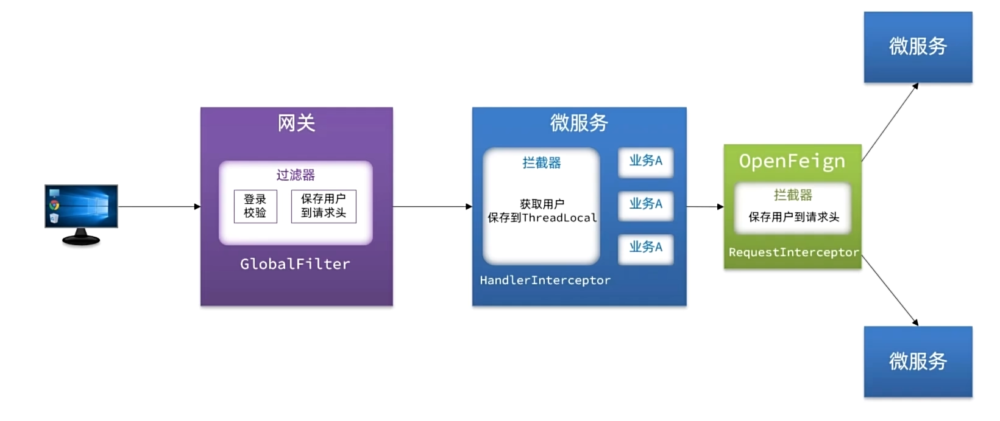


-----------------


### 3. 配置管理

+ 微服务重复配置过多，维护成本高（MySQL 数据库配置、日志配置、swagger 接口文档配置）
+ 业务配置经常变动，每次修改都需要重启服务
+ 网关路由配置写死，如果变更要重启网关


#### 3.1 配置共享

##### 步骤一：添加配置到 Nacos

> 添加一些共享配置到 Nacos 中，包括：Jdbc、MybatisPlus、日志、Swagger、OpenFeign 等配置
>
> 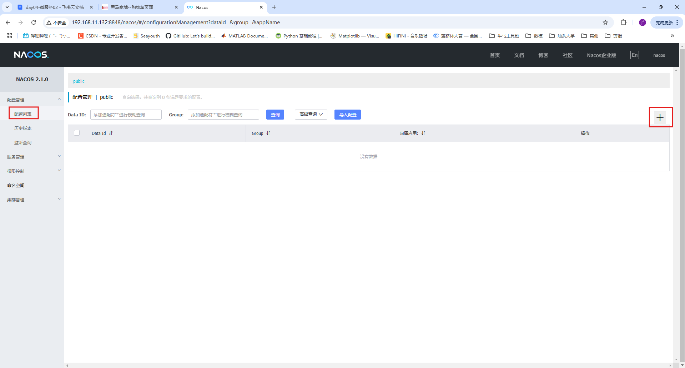
>
> 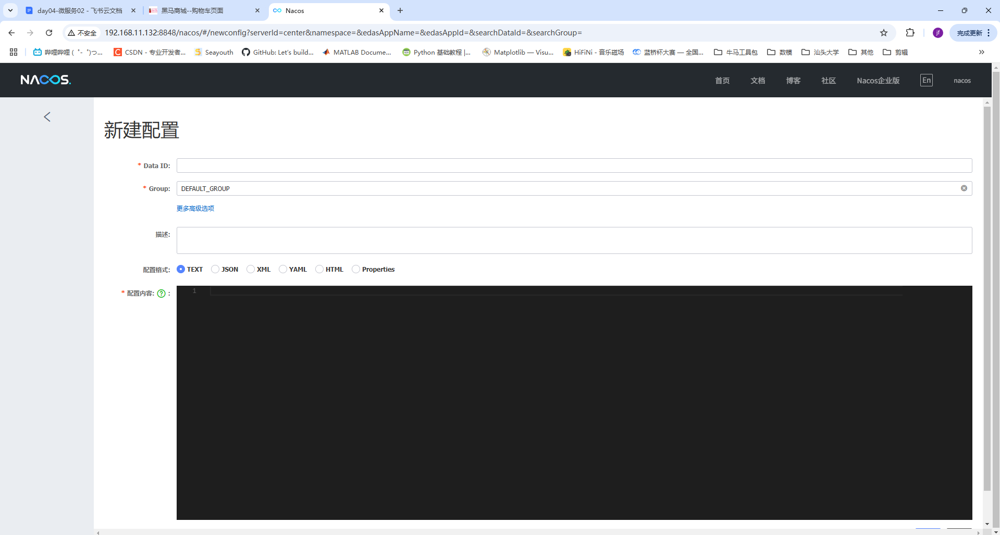

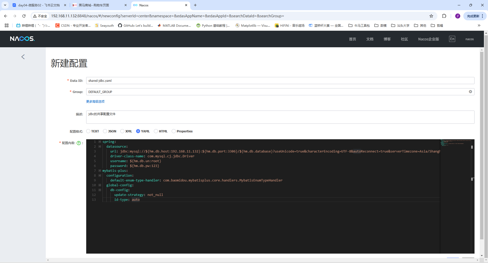

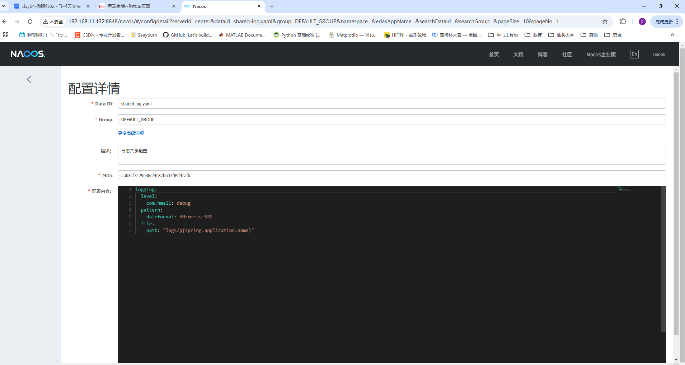

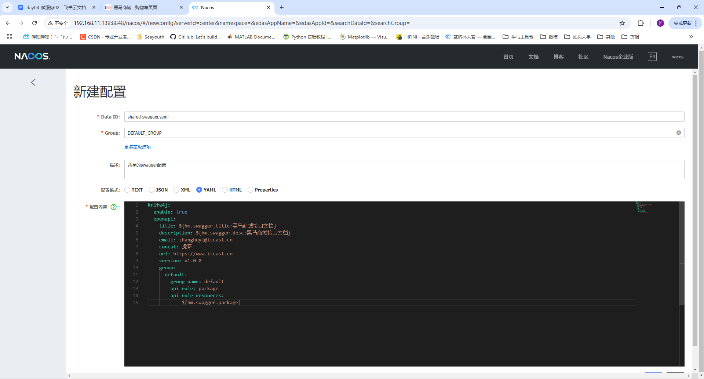


##### 步骤二：拉取共享配置

> 基于 NacosConfig 拉取共享配置代替微服务的本地配置
>
> 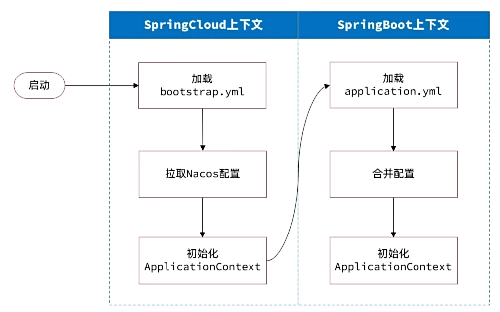

1. 引入依赖

```XML
  <!--nacos配置管理-->
  <dependency>
      <groupId>com.alibaba.cloud</groupId>
      <artifactId>spring-cloud-starter-alibaba-nacos-config</artifactId>
  </dependency>
  <!--读取bootstrap文件-->
  <dependency>
      <groupId>org.springframework.cloud</groupId>
      <artifactId>spring-cloud-starter-bootstrap</artifactId>
  </dependency>
```

2. 新建 bootstrap.yaml

```YAML
spring:
  application:
    name: cart-service # 服务名称
  profiles:
    active: dev # 启动的运行环境
  cloud:
    nacos:
      server-addr: 192.168.150.101 # nacos地址
      config:
        file-extension: yaml # 文件后缀名
        shared-configs: # 共享配置
          - dataId: shared-jdbc.yaml # 共享mybatis配置
          - dataId: shared-log.yaml # 共享日志配置
          - dataId: shared-swagger.yaml # 共享日志配置
```

+ application.yaml

```java
server:
  port: 8082

feign:
  okhttp:
    enabled: true
hm:
  db:
    database: hm-cart
  swagger:
    title: "黑马商城购物车服务接口文档"
    package: com.hmall.cart.controller
```


-------------


#### 3.2 配置热更新

**配置热更新：**当修改配置文件中的配置时，微服务**无需重启**即可使配置生效

**前提条件：**

1. nacos 中要有一个与微服务名有关的配置文件

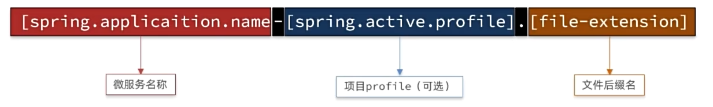

2. 微服务中要以特定方式读取需要热更新的配置属性

```java
@Data
@Component
@ConfigurationProperties(prefix = "hm.cart")
public class CartProperties {
    private Integer maxAmount;
}
```

```java
@Data
@RefreshScope // 标记出这里的属性是需要热更新的
public class CartProperties {
    @Value("${hm.cart.maxItems}")
    private int maxItems;
}
```


##### 案例：实现购物车添加商品上限的配置热更新

> 需求：
>
> 购物车的限定数量目前是写死在业务中的，将其改为读取配置文件属性，并将配置交给 Nacos 管理，实现热更新
>
> 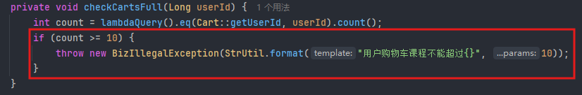

+ config/CartProperties.java

```java
package com.hmall.cart.config;

import lombok.Data;
import org.springframework.boot.context.properties.ConfigurationProperties;
import org.springframework.stereotype.Component;

@Data
@Component
@ConfigurationProperties(prefix = "hm.cart")
public class CartProperties {
    private Integer maxItems;
}
```

+ CartServiceImpl.java

```java
private void checkCartsFull(Long userId) {
    int count = lambdaQuery().eq(Cart::getUserId, userId).count();
    if (count >= cartProperties.getMaxItems()) {
        throw new BizIllegalException(StrUtil.format("用户购物车课程不能超过{}", cartProperties.getMaxItems()));
    }
}
```

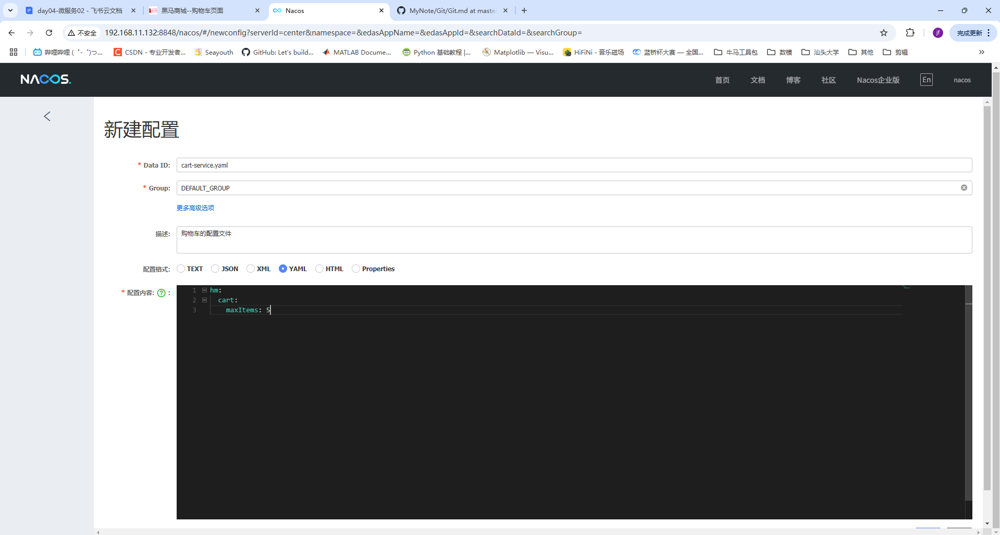


以后改数量就可以直接在 nacos 里改，而且不用重启

没生效的可能是把配置文件放到共享配置里了，不要跟上一课搞混了，这个热更新只需要在 nacos 里配的跟服务名一样就能自己加载了


--------------


#### 3.3 动态路由

网关的路由配置全部是在项目启动时由 `org.springframework.cloud.gateway.route.CompositeRouteDefinitionLocator` 在项目启动的时候加载，并且一经加载就会缓存到内存中的路由表内（一个 Map），不会改变。也不会监听路由变更，所以，我们无法利用上节课学习的配置热更新来实现路由更新

要实现**动态路由**首先要将路由配置保存到 Nacos，当 Nacos 中的路由配置变更时，推送最新配置到网关，实时更新网关中的路由信息 

我们需要完成两件事情：

1. 监听 Nacos 配置变更的消息
2. 当配置变更时，将最新的路由信息更新到网关路由表


##### 3.3.1 监听 Nacos 配置

监听 Nacos 配置变更可以参考官方文档：[Java SDK](https://nacos.io/zh-cn/docs/sdk.html)

```java
package com.hmall.gateway.routers;

import com.alibaba.cloud.nacos.NacosConfigManager;
import com.alibaba.nacos.api.config.listener.Listener;
import com.alibaba.nacos.api.exception.NacosException;
import lombok.RequiredArgsConstructor;
import lombok.extern.slf4j.Slf4j;
import org.springframework.stereotype.Component;

import javax.annotation.PostConstruct;
import java.util.concurrent.Executor;

/**
 * 动态路由加载器
 */
@Slf4j
@Component
@RequiredArgsConstructor
public class DynamicRouteLoader {

    private final NacosConfigManager nacosConfigManager;

    private final String dataId = "gateway-routes.json";

    private final String group = "DEFAULT_GROUP";

    @PostConstruct // 在Bean初始化之后执行
    public void initRouteConfigListener() throws NacosException {
        // 1. 项目启动时，先拉取一次配置，并且添加配置监听器
        String configInfo = nacosConfigManager.getConfigService()
                .getConfigAndSignListener(dataId, group, 5000, new Listener() {
                    @Override
                    public Executor getExecutor() {
                        return null;
                    }

                    @Override
                    public void receiveConfigInfo(String configInfo) {
                        // 2. 监听到配置变更，需要去更新路由表
                        updateConfigInfo(configInfo);

                    }
                });
        // 3. 第一次读取到配置，也需要更新到路由表
        updateConfigInfo(configInfo);
    }

    public void updateConfigInfo(String configInfo) {

    }
}
```


##### 3.3.2 更新路由表

监听到路由信息后，可以利用 **RouteDefinitionWriter** 来更新路由表：

```Java
package org.springframework.cloud.gateway.route;

import reactor.core.publisher.Mono;

/**
 * @author Spencer Gibb
 */
public interface RouteDefinitionWriter {
        /**
         * 更新路由到路由表，如果路由id重复，则会覆盖旧的路由
         */
        Mono<Void> save(Mono<RouteDefinition> route);
        /**
         * 根据路由id删除某个路由
         */
        Mono<Void> delete(Mono<String> routeId);

}
```


##### 3.3.3 路由配置语法

为方便解析从 Nacos 读取到的路由配置，推荐使用 json 格式的路由配置，模板如下：

```JSON
{
  "id": "item",
  "predicates": [{
    "name": "Path",
    "args": {"_genkey_0":"/items/**", "_genkey_1":"/search/**"}
  }],
  "filters": [],
  "uri": "lb://item-service"
}
```

以上JSON配置就等同于：

```YAML
spring:
  cloud:
    gateway:
      routes:
        - id: item
          uri: lb://item-service
          predicates:
            - Path=/items/**,/search/**
```


完整实现

+ DynamicRouteLoader.java

```java
package com.hmall.gateway.routers;

import cn.hutool.json.JSONUtil;
import com.alibaba.cloud.nacos.NacosConfigManager;
import com.alibaba.nacos.api.config.listener.Listener;
import com.alibaba.nacos.api.exception.NacosException;
import lombok.RequiredArgsConstructor;
import lombok.extern.slf4j.Slf4j;
import org.springframework.cloud.gateway.route.RouteDefinition;
import org.springframework.cloud.gateway.route.RouteDefinitionWriter;
import org.springframework.stereotype.Component;
import reactor.core.publisher.Mono;

import javax.annotation.PostConstruct;
import java.util.HashSet;
import java.util.List;
import java.util.Set;
import java.util.concurrent.Executor;

/**
 * 动态路由加载器
 */
@Slf4j
@Component
@RequiredArgsConstructor
public class DynamicRouteLoader {

    private final NacosConfigManager nacosConfigManager;
    private final RouteDefinitionWriter writer;

    private final String dataId = "gateway-routes.json";

    private final String group = "DEFAULT_GROUP";

    private final Set<String> routeIds = new HashSet<>();

    @PostConstruct // 在Bean初始化之后执行
    public void initRouteConfigListener() throws NacosException {
        // 1. 项目启动时，先拉取一次配置，并且添加配置监听器
        String configInfo = nacosConfigManager.getConfigService()
                .getConfigAndSignListener(dataId, group, 5000, new Listener() {
                    @Override
                    public Executor getExecutor() {
                        return null;
                    }

                    @Override
                    public void receiveConfigInfo(String configInfo) {
                        // 2. 监听到配置变更，需要去更新路由表
                        updateConfigInfo(configInfo);

                    }
                });
        // 3. 第一次读取到配置，也需要更新到路由表
        updateConfigInfo(configInfo);
    }

    public void updateConfigInfo(String configInfo) {
        log.debug("监听到路由配置信息：{}" + configInfo);
        // 1. 解析配置信息，转为RouteDefinition
        List<RouteDefinition> routeDefinitions = JSONUtil.toList(configInfo, RouteDefinition.class);
        // 2. 删除旧的路由表
        for (String routeId : routeIds) {
            writer.delete(Mono.just(routeId)).subscribe();
        }
        routeIds.clear();

        // 3. 更新路由表
        for (RouteDefinition routeDefinition : routeDefinitions) {
            // 3.1 更新路由表
            writer.save(Mono.just(routeDefinition)).subscribe();
            // 3.2 记录路由id，便于下一次更新时删除
            routeIds.add(routeDefinition.getId());
        }
    }
}
```

+ Nacos 配置

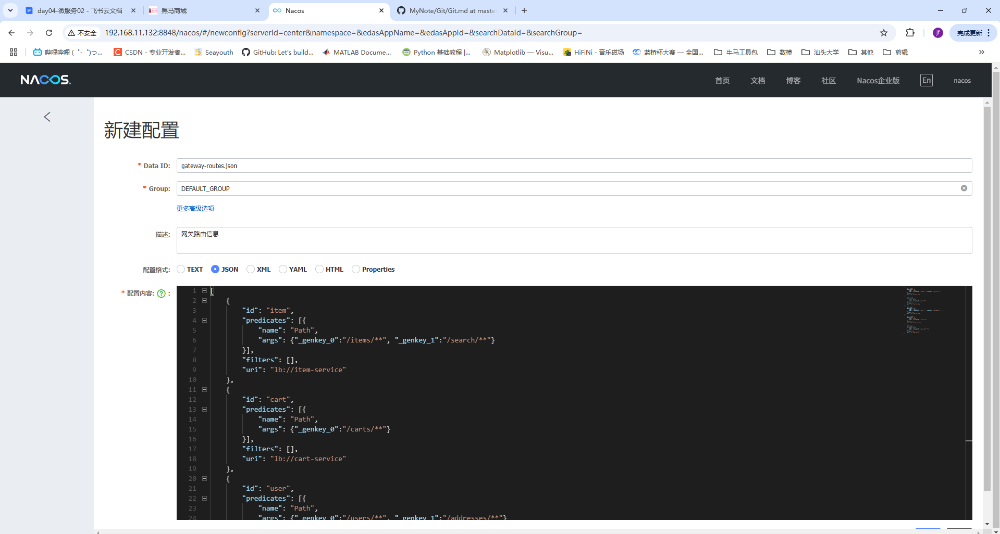

```JSON
[
    {
        "id": "item",
        "predicates": [{
            "name": "Path",
            "args": {"_genkey_0":"/items/**", "_genkey_1":"/search/**"}
        }],
        "filters": [],
        "uri": "lb://item-service"
    },
    {
        "id": "cart",
        "predicates": [{
            "name": "Path",
            "args": {"_genkey_0":"/carts/**"}
        }],
        "filters": [],
        "uri": "lb://cart-service"
    },
    {
        "id": "user",
        "predicates": [{
            "name": "Path",
            "args": {"_genkey_0":"/users/**", "_genkey_1":"/addresses/**"}
        }],
        "filters": [],
        "uri": "lb://user-service"
    },
    {
        "id": "trade",
        "predicates": [{
            "name": "Path",
            "args": {"_genkey_0":"/orders/**"}
        }],
        "filters": [],
        "uri": "lb://trade-service"
    },
    {
        "id": "pay",
        "predicates": [{
            "name": "Path",
            "args": {"_genkey_0":"/pay-orders/**"}
        }],
        "filters": [],
        "uri": "lb://pay-service"
    }
]
```


-------------


## 五、服务包含和分布式事务

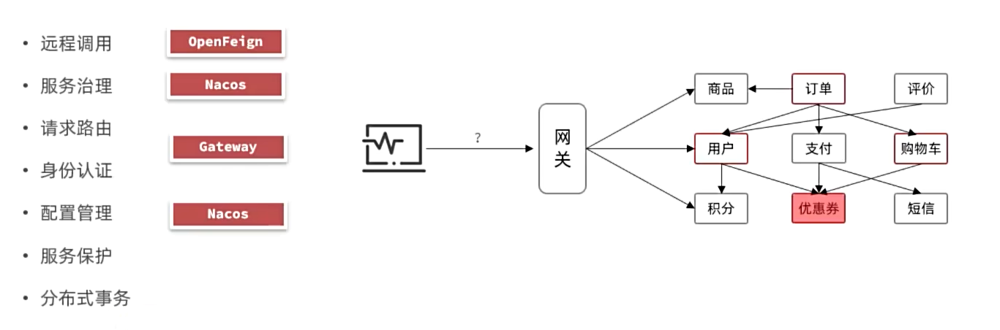


### 1. 雪崩问题

#### 1.1 雪崩问题

微服务调用链路中的某个服务故障，引起整个链路中的所有微服务都不可用，这就是雪崩

还是查询购物车的业务，假如商品服务业务并发较高，占用过多 Tomcat 连接。可能会导致商品服务的所有接口响应时间增加，延迟变高，甚至是长时间阻塞直至查询失败。

此时查询购物车业务需要查询并等待商品查询结果，从而导致查询购物车列表业务的响应时间也变长，甚至也阻塞直至无法访问。而此时如果查询购物车的请求较多，可能导致购物车服务的 Tomcat 连接占用较多，所有接口的响应时间都会增加，整个服务性能很差， 甚至不可用。

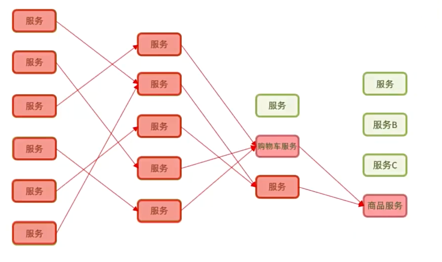

##### 总结

雪崩问题产生的原因是什么？

+ 微服务相互调用，服务提供者出现故障或堵塞
+ 服务调用者没有做好异常处理，导致自身故障
+ 调用链中的所有服务级联失败，导致整个集群故障

解决问题的思路有哪些？

+ 尽量避免服务出现故障或者阻塞
  + 保证代码的健壮性
  + 保证网络畅通
  + 能应对较高的并发请求


-------------


#### 1.2 解决方案

##### 1.2.1 服务保护方案 - 请求限流

请求限流：限制访问微服务的请求的并发量，避免服务因流量激增出现故障


##### 1.2.2 服务保护方案 - 线程隔离

线程隔离：也叫做舱壁模式，模拟船舱隔板的防水原理。通过限定每隔业务能使用的线程数量而将故障业务隔离，避免故障扩散

为了避免某个接口故障或压力过大导致整个服务不可用，我们可以限定每个接口可以使用的资源范围，也就是将其“隔离”起来

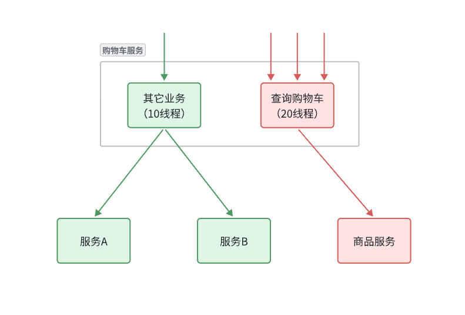


##### 1.2.3 服务保护方案 - 服务熔断

服务熔断：由**断路器**统计请求的异常比例或慢调用比例，如果超出阈值则会**熔断**改业务，则拦截改接口的请求

熔断期间，所有请求快速失败，全都走 fallback（备选方案） 逻辑

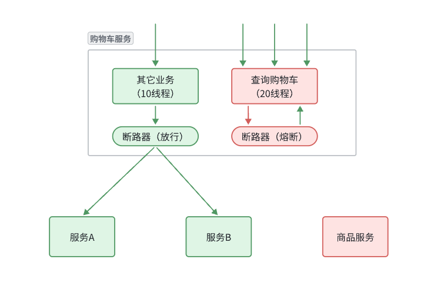


##### 总结

解决雪崩问题的常见方案有哪些？

+ **请求限流：**限制流量再服务可以处理的范围，避免因突发流量而故障
+ **线程隔离：**控制业务可用的线程数量，将故障隔离在一定范围
+ **服务熔断：**将异常比例过高的接口断开，拒绝所有请求，直接走 fallbakc
+ **失败处理：**定义 fallback 逻辑，让业务失败时不再抛出异常，而是返回默认数据或友好提示


-------------------------------------


#### 1.3 服务保护技术

|          | Sentinel                                       | Hystrix                      |
| -------- | ---------------------------------------------- | ---------------------------- |
| 线程隔离 | 信号量隔离                                     | 线程池隔离 / 信号量隔离      |
| 熔断策略 | 基于慢调用比例或者异常比例                     | 基于异常比率                 |
| 限流     | 基于 QPS、支持流量整形                         | 有限的支持                   |
| Fallback | 支持                                           | 支持                         |
| 控制台   | 开箱即用，可配置规则、查看秒级监控、机器发现等 | 不完善                       |
| 配置方式 | 基于控制台，重启后失效                         | 基于注解或配置文件，永久生效 |


-------------


### 2. Sentinel

#### 2.1 初识 Sentinel

Sentinel 是阿里巴巴开源的一款微服务流量控制组件。官网地址：[home | Sentinel](https://sentinelguard.io/zh-cn/index.html)

##### 2.1.1 安装

1. 下载 jar 包

下载地址：[Releases · alibaba/Sentinel · GitHub](https://github.com/alibaba/Sentinel/releases)

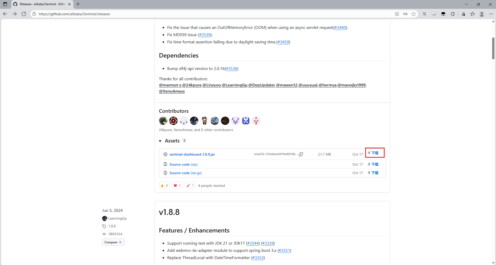


2. 运行

将 jar 包放在任意非中文、不包含特殊字符的目录下，重命名为 `sentinel-dashboard.jar`：

然后运行如下命令启动控制台：

```Shell
java -Dserver.port=8090 -Dcsp.sentinel.dashboard.server=localhost:8090 -Dproject.name=sentinel-dashboard -jar sentinel-dashboard.jar
```

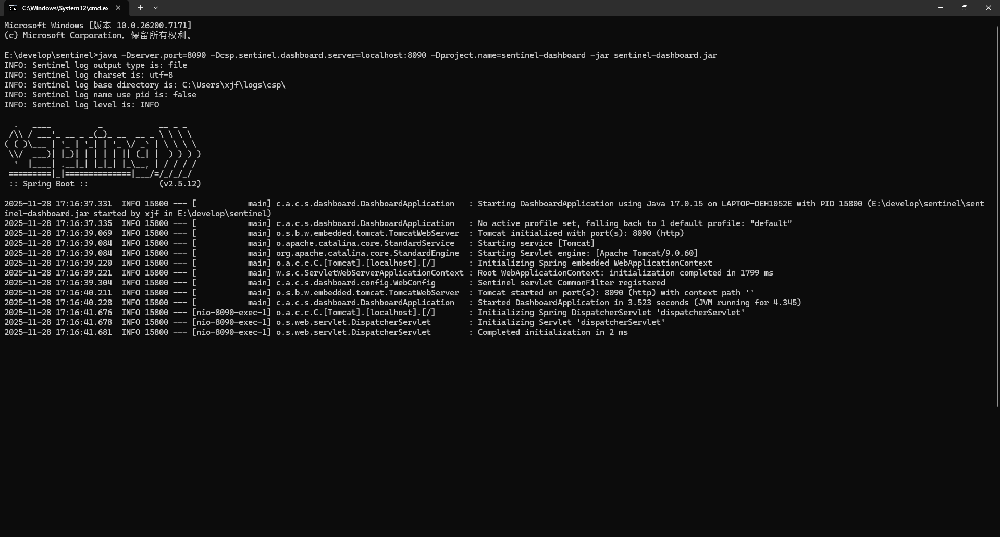


3. 访问


用户和密码默认为：sentinel

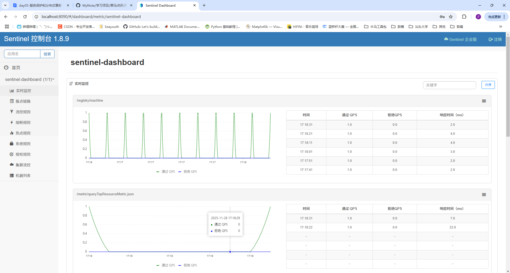


##### 2.1.2 微服务整合

我们在`cart-service`模块中整合sentinel，连接`sentinel-dashboard`控制台，步骤如下：

1. 引入sentinel依赖

```XML
<!--sentinel-->
<dependency>
    <groupId>com.alibaba.cloud</groupId> 
    <artifactId>spring-cloud-starter-alibaba-sentinel</artifactId>
</dependency>
```


2. 配置控制台

修改application.yaml文件，添加下面内容：

```YAML
spring:
  cloud: 
    sentinel:
      transport:
        dashboard: localhost:8090
```


3. 访问 `cart-service` 的任意端点

重启 `cart-service`，然后访问查询购物车接口，sentinel 的客户端就会将服务访问的信息提交到 `sentinel-dashboard` 控制台。并展示出统计信息：

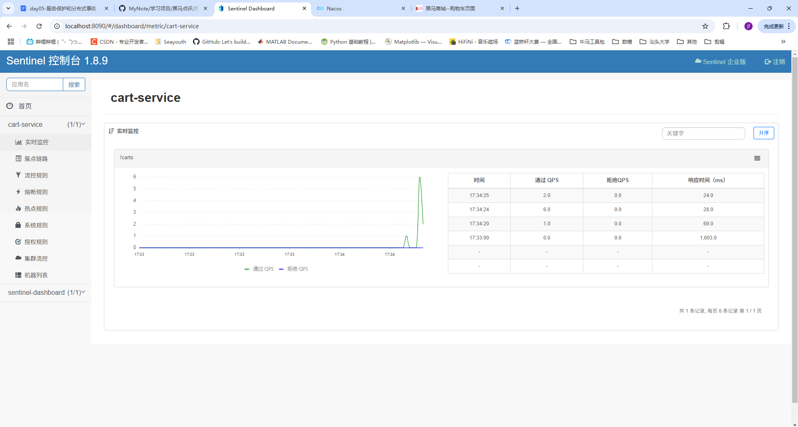


##### 2.1.3 簇点链路

**簇点链路**，就是单机调用链路。是一次请求进入服务后经过的每一个被 Sentinel 监控的资源链。默认 Sentinel 会监控 SpringMVC 的每一个 Endpoint（http 接口）。限流、熔断等都是针对簇点链路中的**资源**设置的。而资源名默认就是接口的请求路径：

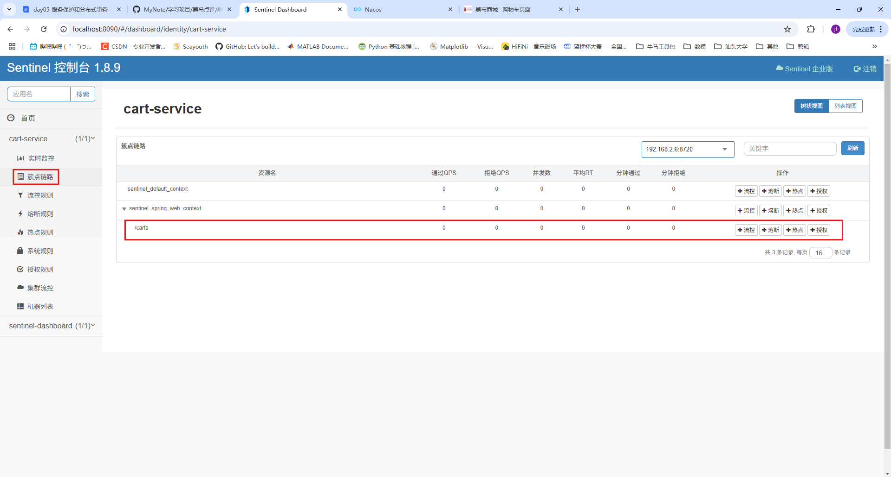


Restful 风格的 API 请求路径一般都相同，导致簇点资源名称重复。因此我们需要修改配置，把**请求方式+请求路径**作为簇点资源名称：

```YAML
spring:
  cloud:
    sentinel:
      transport:
        dashboard: localhost:8090
 
```


----------


#### 2.2 请求限流

在簇点链路后面点击流控按钮，即可对其做限流配置

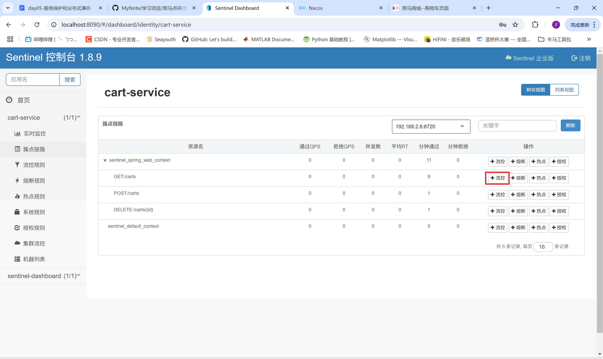

QPS：每秒钟请求的数量

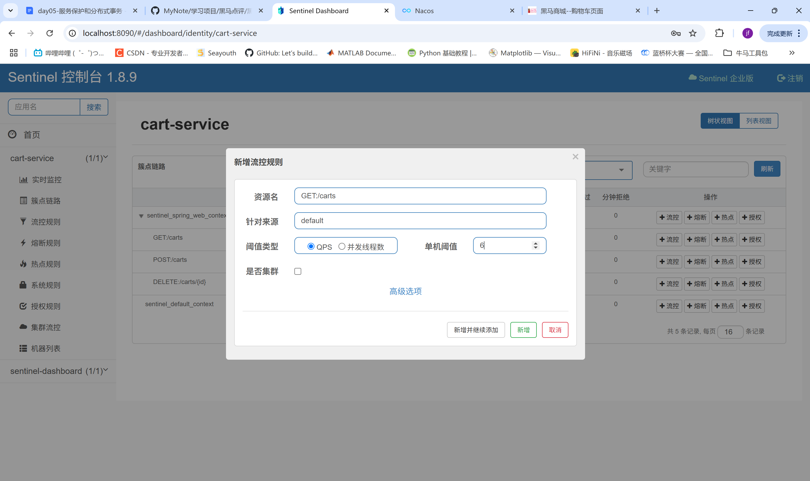


+ 并发测试

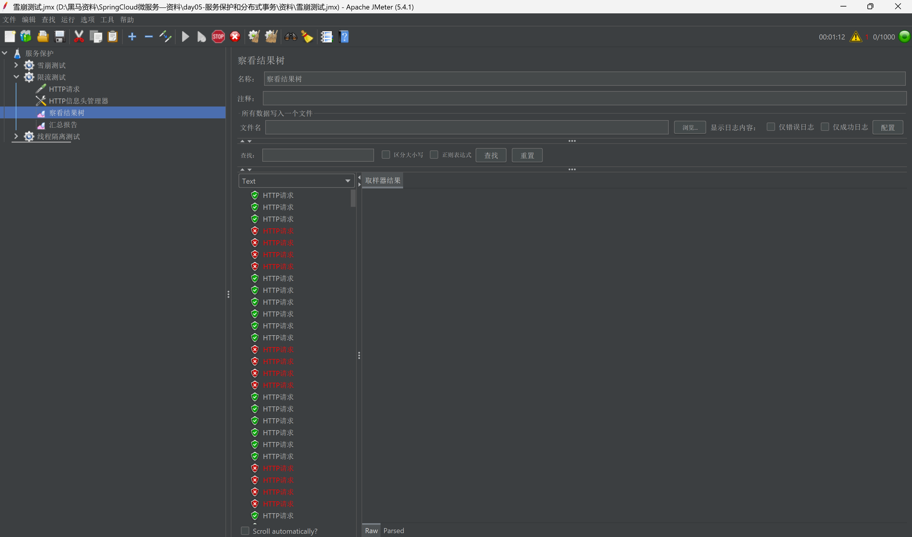

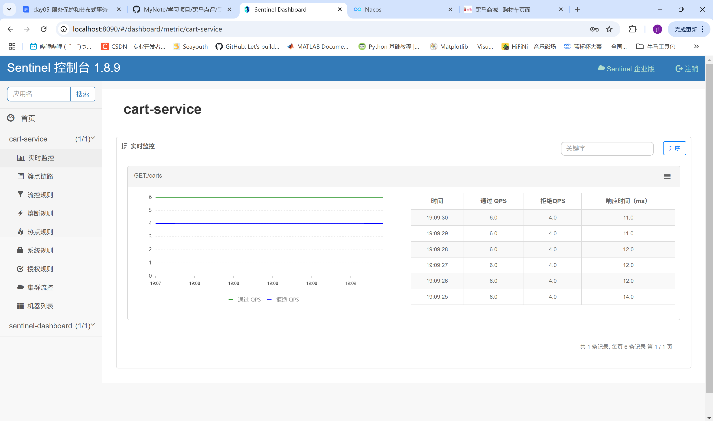


-------------


#### 2.3 线程隔离

当商品服务出现阻塞或者故障时，调用商品服务得购物车可能因此而被拖慢，甚至资源耗尽。所以必须限制购物车服务中查询商品这个业务的可用线程数，实现线程隔离

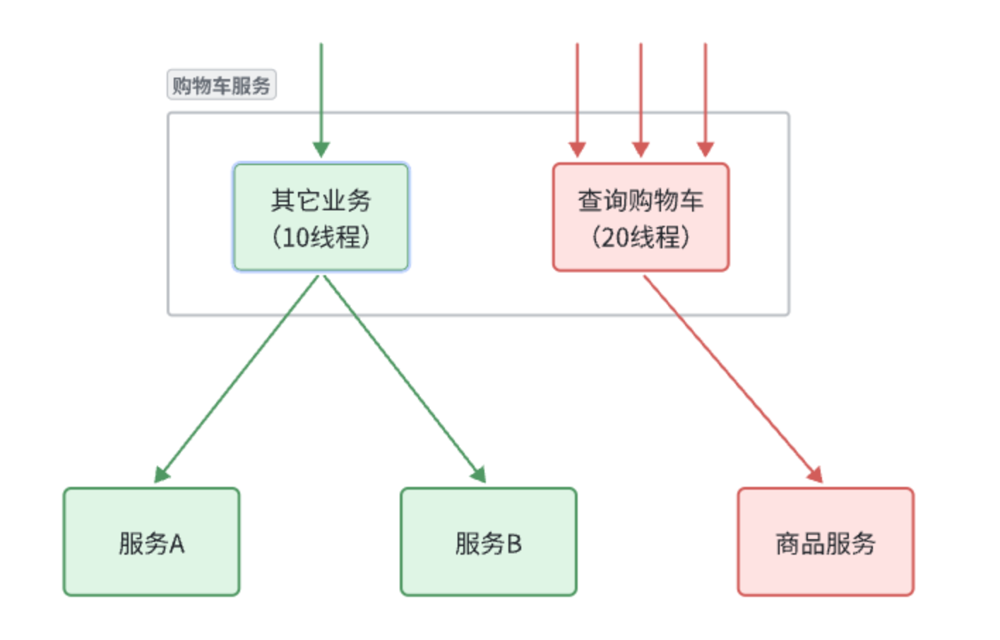


在 sentinel 控制台中，会出现 Feign 接口的簇点资源，点击后面的流控按钮，即可配置线程隔离：


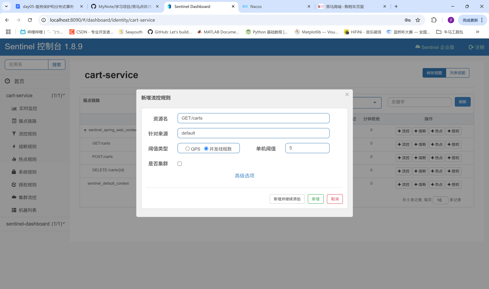


----------------


#### 2.4 Fallback

1. 将 FeignClient 作为 Sentinel 的簇点资源：

```YAML
feign:
  sentinel:
    enabled: true # 开启feign对sentinel的支持
```

2. FeignClient 的 Fallback 有两种配置方式：

+ 方式一：FallbackClass，无法对远程调用的异常做处理
+ 方式二：FallbackFactory，可以对远程调用的异常做处理，通常都会选择这种


##### 案例：给 FeignClient 编写 Fallback 逻辑

假如我们有一个 FeignClient 如下：

```java
@FeignClient(value = "userservice")
public interface UserClient {
    @GetMapping("/user/{id}")
    User findById(@PathVariable("id") Long id);
}
```

为其编写 Fallback 逻辑

+ 步骤一：自定义类，实现 FallbackFactory，编写对某个 FeignClient 的 Fallback 逻辑：

```java
@slf4j
public class UserClientFallbackFactory implements FallbackFactory<UserClient> {
	@Override
	public UserClient create(Throwable throwable) {
		// 创建UserClient接口实现类,实现其中的方法,编写失败降级的处理逻辑
		return new UserClient() {
			@Override
			public User findById(Long id) {
				// 记录异常信息,可以返回空或抛出异常
				log.error("查询用户失败”,throwable);
				return null;
			}
		};
	}
}
```

+ 步骤二：将刚刚定义的 UserClientFallbackFactory 注册为一个 Bean：

```java
@Bean
public UserClientFallbackFactory userClientFallback() {
    return new UserClientFallbackFactory();
}
```

+ 步骤三：在 UserClient 接口中使用 UserClientFallbackFactory：

```java
@FeignClient(value = "userservice", fallbackFactory = UserClientFallbackFactory.class)
public interface UserClient {
    
    @GetMapping("/user/{id}")
    User findById(@PathVariable("id") Long id);
}
```

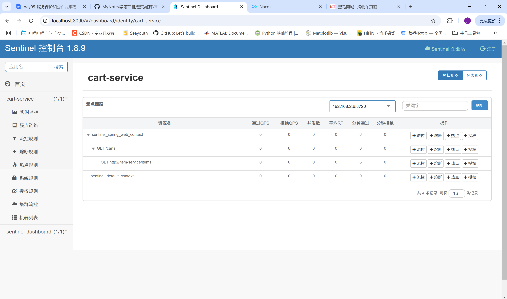


---------------


#### 2.5 服务熔断

熔断是解决雪崩问题的重要手段。思路是由**断路器**统计服务调用的异常比例、慢请求比例，如果超出阈值则会**熔断**该服务。即拦截访问该服务的一切请求；而当服务恢复时，断路器会放行访问该服务的请求

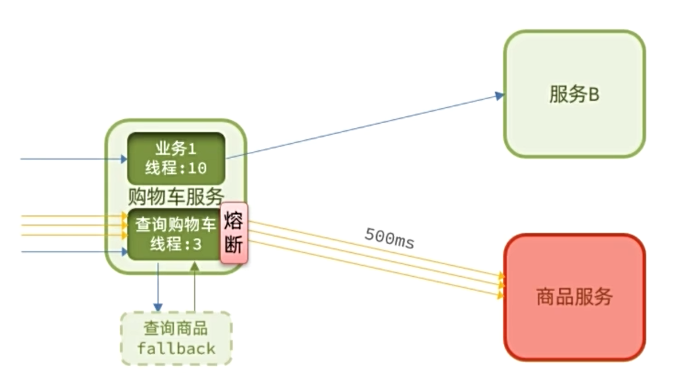

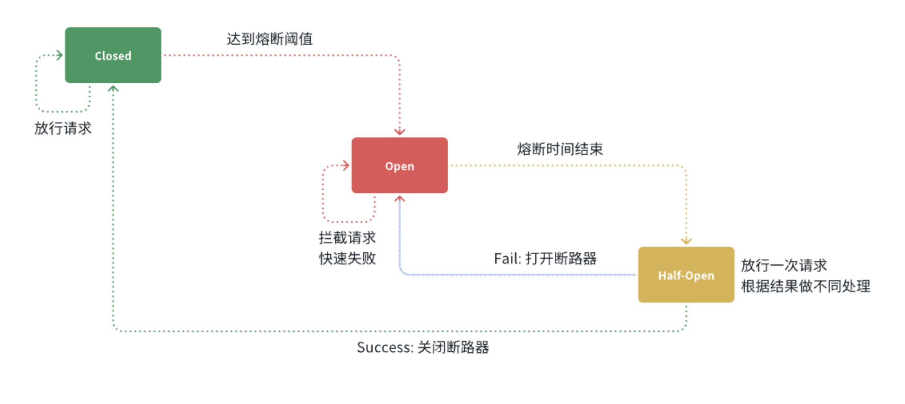


点击控制台中簇点资源后的熔断按钮，即可配置熔断策略：

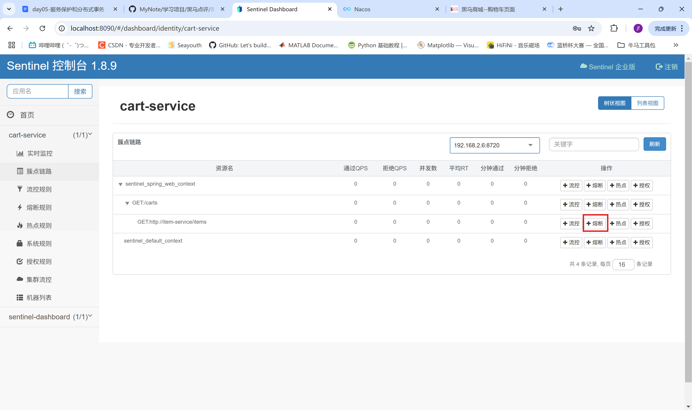

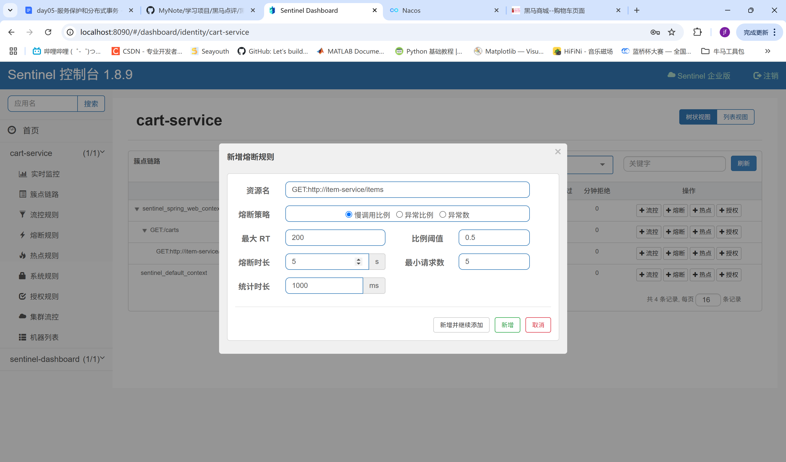


--------------------


### 3. 分布式事务

下单业务，前端请求首先进入订单服务，创建订单并写入数据库。然后订单服务调用购物车服务和库存服务：

+ 购物车服务负责清理购物车信息
+ 库存服务负责扣减商品库存

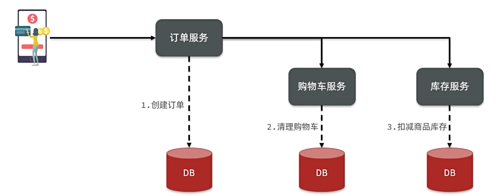

在分布式系统中，如果一个业务需要多个服务合作完成，而且每一个服务都有事务，多个事务必须同时成功或失败，这样的事务就是**分布式事务**。其中的每个服务的事务就是一个**分子事务**。整个业务称为**全局事务**

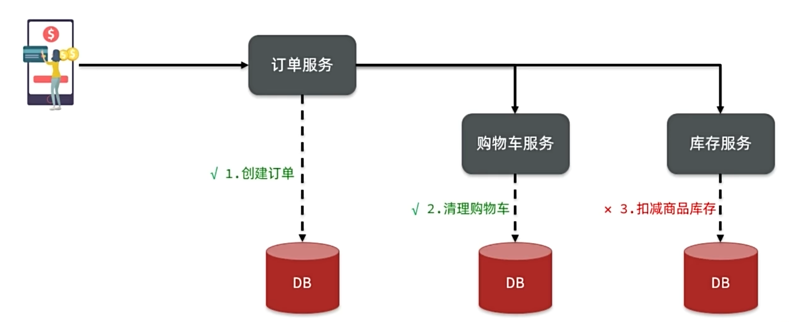


#### 3.1 初识 Seata

Seata 是2019年1月份蚂蚁金服和阿里巴巴共同开源的分布式事务解决方案。致力于提供高性能和简单易用的分布式事务服务，为用户打造一站式的分布式解决方案。

官网地址：[Apache Seata](https://seata.apache.org/zh-cn/)，其中的文档、博客中提供了大量的使用说明、源码分析

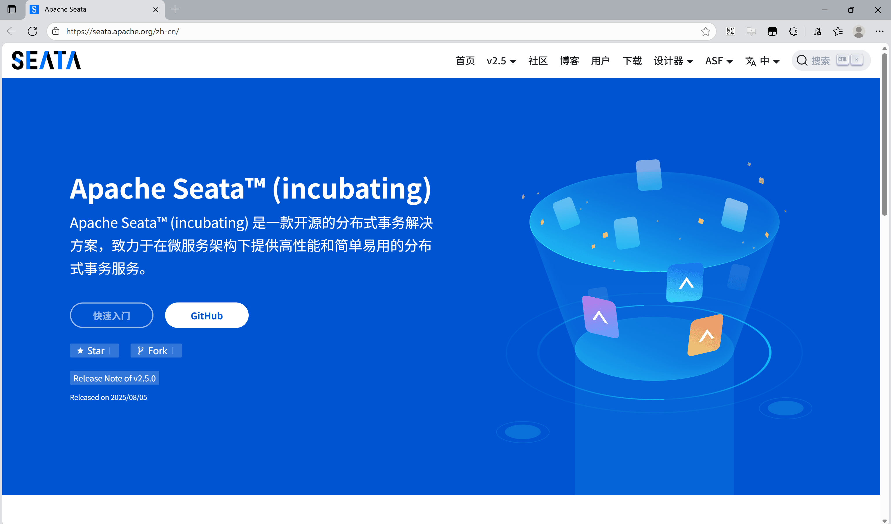


##### 3.1.1 分布式事务解决思路

解决分布式事务，各个子事务之间必须能感知到彼此的事务状态，才能保证状态一致

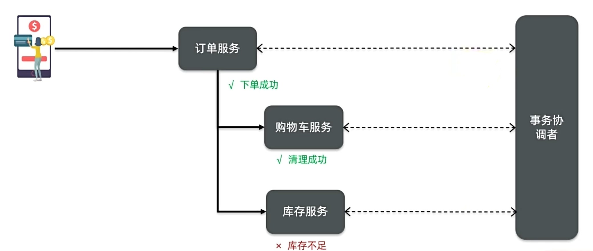


##### 3.1.2 Seata 架构

Seata 事务管理中有三个重要的角色：

+ **TC（Transaction Coordinator）- 事务协调者：**维护全局和分支事务的状态，协调全局事务提交和回滚
+ **TM（Transaction Manager）- 事务管理器：**定义全局事务的范围、开始全局事务、提交或回滚全局事务
+ **RM（Resource Manager）- 资源管理器：**管理分支事务，与 TC 交谈以注册分支事务和报告分支事务的状态


-----------------


#### 3.2 部署 TC 服务

##### 3.2.1 准备数据库表

Seata支持多种存储模式，但考虑到持久化的需要，我们一般选择基于数据库存储

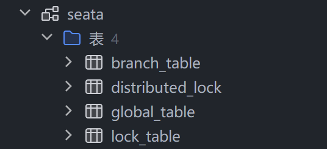


##### 3.2.2 准备配置文件

将整个 seata 文件夹拷贝到虚拟机的 /root 目录

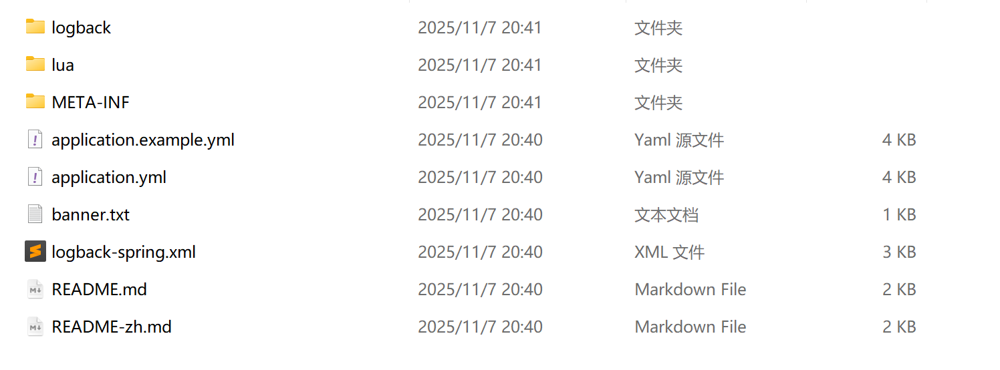


##### 3.2.3 Docker 部署

需要注意，要确保 nacos、mysql 都在 hm-net 网络中。如果某个容器不再 hm-net 网络，可以参考下面的命令将某容器加入指定网络：

```Shell
docker network connect [网络名] [容器名]
```

在虚拟机的`/root`目录执行下面的命令：

```Shell
docker run --name seata \
-p 8099:8099 \
-p 7099:7099 \
-e SEATA_IP=192.168.11.132 \
-v ./seata:/seata-server/resources \
--privileged=true \
--network hm-net \
-d \
seataio/seata-server:1.5.2
```

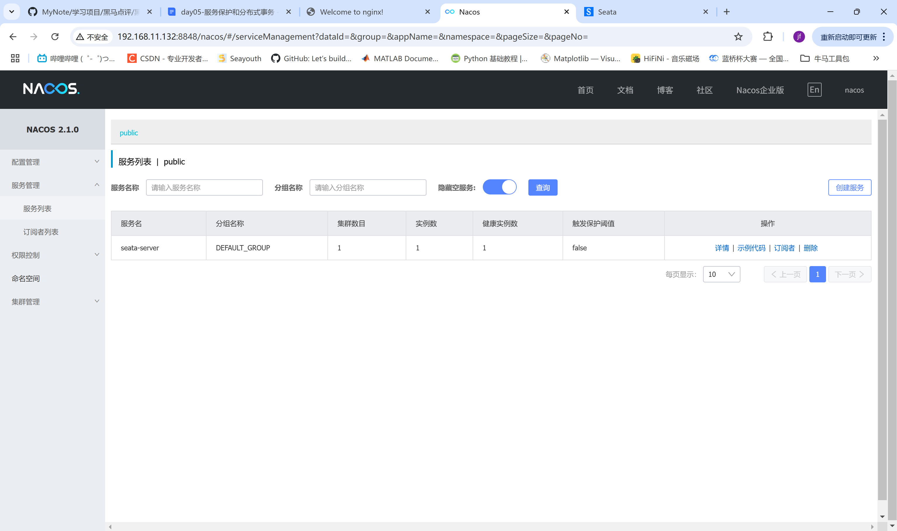

访问不了的话就重启一下 nacos

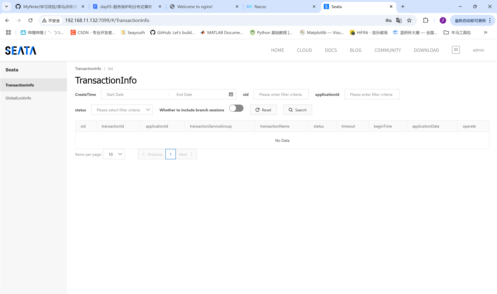


-------------


#### 3.3 微服务集成 Seata

首先，要在项目中引入 Seata 依赖：

```XML
<!--统一配置管理-->
  <dependency>
      <groupId>com.alibaba.cloud</groupId>
      <artifactId>spring-cloud-starter-alibaba-nacos-config</artifactId>
  </dependency>
  <!--读取bootstrap文件-->
  <dependency>
      <groupId>org.springframework.cloud</groupId>
      <artifactId>spring-cloud-starter-bootstrap</artifactId>
  </dependency>
  <!--seata-->
  <dependency>
      <groupId>com.alibaba.cloud</groupId>
      <artifactId>spring-cloud-starter-alibaba-seata</artifactId>
  </dependency>
```

然后，在 application.yml 中添加配置，让微服务找到 TC 服务地址：

```YAML
seata:
  registry: # TC服务注册中心的配置，微服务根据这些信息去注册中心获取tc服务地址
    type: nacos # 注册中心类型 nacos
    nacos:
      server-addr: 192.168.11.132:8848 # nacos地址
      namespace: "" # namespace（服务名），默认为空
      group: DEFAULT_GROUP # 分组，默认是DEFAULT_GROUP
      application: seata-server # seata服务名称
      username: nacos
      password: nacos
  tx-service-group: hmall # 事务组名称（也就是集群）
  service:
    vgroup-mapping: # 事务组与tc集群的映射关系
      hmall: "default"
```

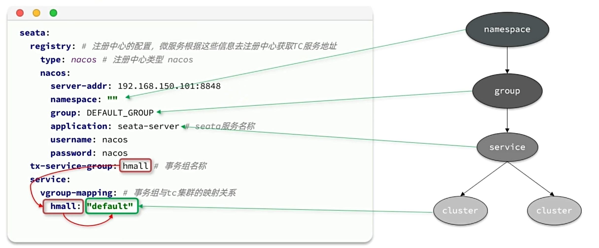


-----------------


#### 3.4 XA 模式

XA 规范 是 X/Open 组织定义的分布式事务处理（DTP，Distributed Transaction Processing）标准，XA 规范 描述了全局的 TM 与局部的 RM 之间的接口，几乎所有主流的关系型数据库都对 XA 规范 提供了支持。Seata 的 XA 模式如下：

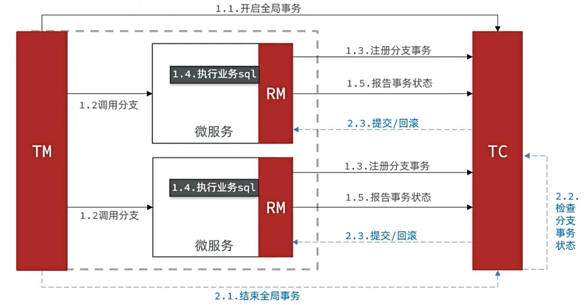

一阶段的工作：

1. RM 注册分支事务到 TC
2. RM 执行分支业务 sql 但不提交
3. RM 报告执行状态到 TC

二阶段的工作：

+ TC 检测各分支事务执行状态
  + 如果都成功，通知所有 RM 提交事务
  + 如果有失败，通知所有 RM 回滚事务
+ RM 接收 TC 指令，提交或回滚事务

##### 总结

XA 模式的优点是什么？

+ 事务的强一致性，满足 ACID 原则
+ 常用的数据库都支持，实现简单，并且没有代码侵入

XA 模式的缺点是什么？

+ 因为一阶段需要锁定数据库资源，等待二阶段结束才能释放，性能较差
+ 依赖关系型数据库实现事务


##### 3.4.1 实现 XA 模式

Seata 的 starter 已经完成了 XA 模式的自动装配，实现非常简单，步骤如下：

1. 修改 application.yml 文件（每个参与事务的微服务），开启 XA 模式：

```YAML
seata:
  data-source-proxy-mode: XA
```


2. 给发起全局事务的入口方法添加 `@GlobalTransactional` 注解，本例中是 OrderServiceImpl 中的 create 方法：

```java
@Override
@GlobalTransactional
public Long createOrder(OrderFormDTO order) {
    // 创建订单 ... 略
    // 清理购物车 ... 略
    // 扣减库存 ... 略
    return order.getId();
}
```

3. 重启服务并测试


---------


#### 3.5 AT 模式

Seata 主推的是 AT 模式，AT 模式同样是分阶段提交的事务模型，不过却弥补了 XA 模型中资源锁定周期过长的缺陷

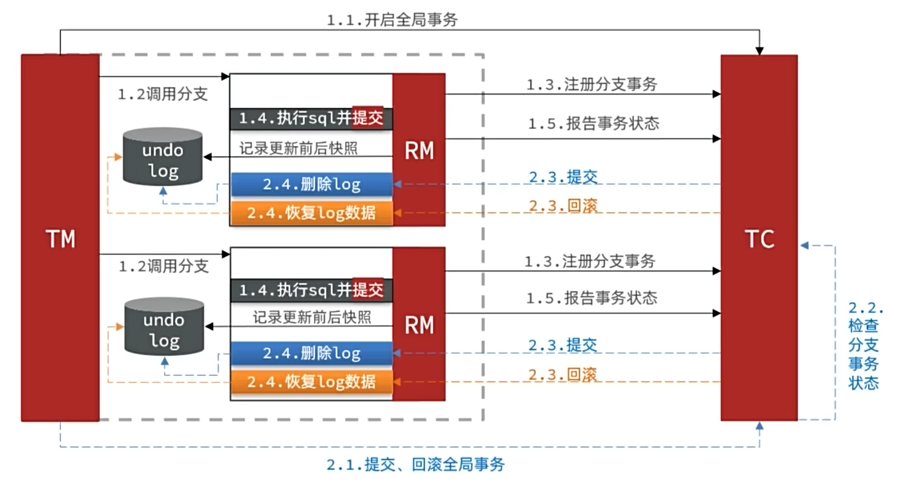

阶段一 RM 的工作：

+ 注册分支事务
+ **记录 undo-log（数据快照）**
+ 执行业务 sql 并**提交**
+ 报告事务状态

阶段二提交时 RM 的工作：

+ 删除 undo-log 即可

阶段二回滚时 RM 的工作：

+ 根据 undo-log 恢复数据到更新前


##### 3.5.1 实现

首先添加表 undo-log（数据快照）

每个微服务需要自己的快照，所以每个架构（database）下都要有 undo-log表！！！

```sql
-- for AT mode you must to init this sql for you business database. the seata server not need it.
CREATE TABLE IF NOT EXISTS `undo_log`
(
    `branch_id`     BIGINT       NOT NULL COMMENT 'branch transaction id',
    `xid`           VARCHAR(128) NOT NULL COMMENT 'global transaction id',
    `context`       VARCHAR(128) NOT NULL COMMENT 'undo_log context,such as serialization',
    `rollback_info` LONGBLOB     NOT NULL COMMENT 'rollback info',
    `log_status`    INT(11)      NOT NULL COMMENT '0:normal status,1:defense status',
    `log_created`   DATETIME(6)  NOT NULL COMMENT 'create datetime',
    `log_modified`  DATETIME(6)  NOT NULL COMMENT 'modify datetime',
    UNIQUE KEY `ux_undo_log` (`xid`, `branch_id`)
) ENGINE = InnoDB
  AUTO_INCREMENT = 1
  DEFAULT CHARSET = utf8mb4 COMMENT ='AT transaction mode undo table';
```

然后，修改 application.yml 文件，将事务模式修改为 AT 模式：

不填的话默认是 AT

```yaml
seata:
  data-source-proxy-mode: AT # 开启数据源代理的AT模式
```

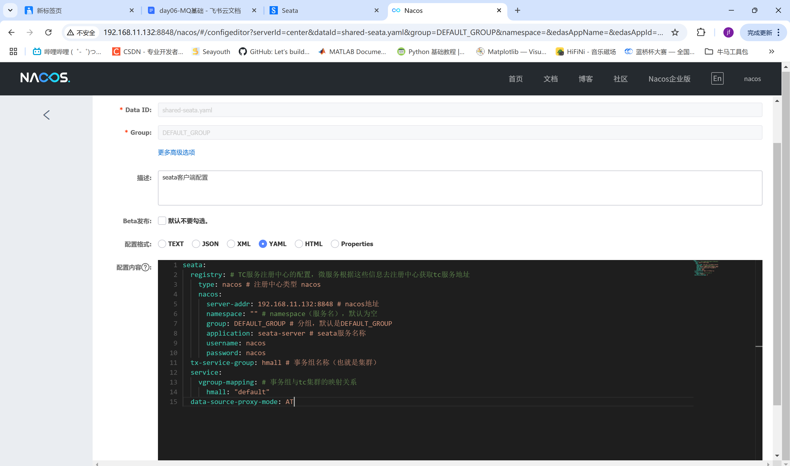


--------------


#### 总结

简述 AT 模式与 XA 模式最大的区别是什么？

+ XA 模式一阶段不提交事务，锁定资源；AT 模式一阶段直接提交，不锁定资源
+ XA 模式依赖数据库机制实现回滚；AT 模式利用数据快照实现数据回滚
+ XA 模式强一致；AT 模式最终一致

要根据业务场景去取舍


----------------


## 六、MQ 基础

高性能的异步通讯组件


解读：

- 同步通讯：就如同打视频电话，双方的交互都是实时的。因此同一时刻你只能跟一个人打视频电话。
- 异步通讯：就如同发微信聊天，双方的交互不是实时的，你不需要立刻给对方回应。因此你可以多线操作，同时跟多人聊天。

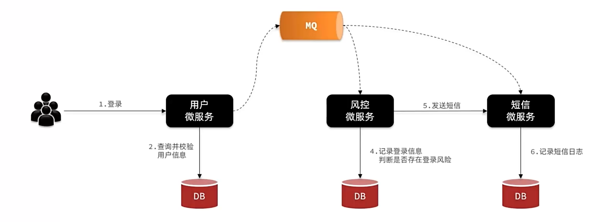


### 1. 初识 MQ

#### 1.1 同步调用

我们以黑马商城的余额支付为例：

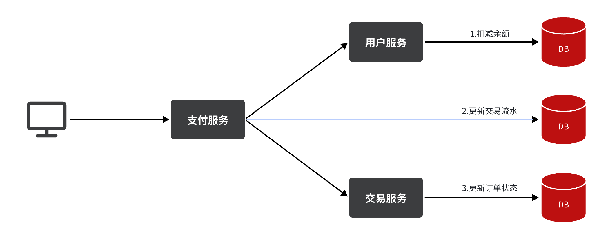

某些电商项目中，还会有积分或金币的概念。假如产品经理提出需求，用户支付成功后，给用户以积分奖励或者返还金币，你怎么办？是不是要在上述业务中再加入积分业务、返还金币业务？

。。。

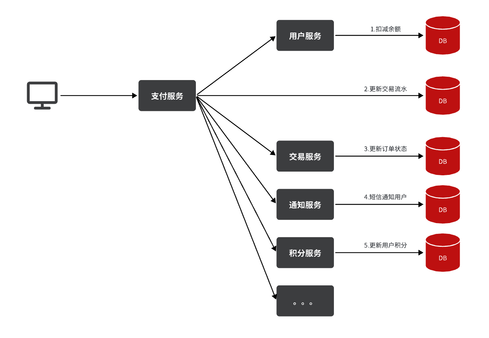

+ 拓展性差
+ 性能下降
+ 级联失败

##### 总结

同步调用的优势是什么？

+ 时效性强，等待到结果后才返回

同步调用的问题是什么？

+ 拓展性差
+ 性能下降
+ 级联失败问题


------------


#### 1.2 异步调用

异步调用通常是基于消息通知的方式，包含三个角色：

+ 消息发送者：投递消息的人，就是原来的**调用者**
+ 消息接收者：接收和处理消息的人，就是原来的**服务提供者**
+ 消息代理：管理、暂存、转发消息，你可以把它理解成微信服务器


支付服务不在同步调用业务关联度低的服务，而是发送消息通知到 Broker（消息代理）

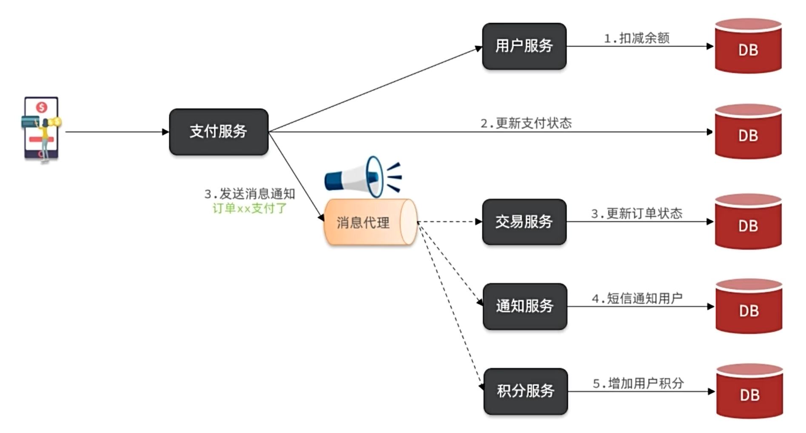

具备下列优势：

+ 解除耦合，拓展性强
+ 无需等待，性能好
+ 故障隔离
+ 缓存消息，流量削锋填谷


##### 总结

异步调用的优势是什么？

+ 耦合度低，拓展性强
+ 异步调用，无需等待，性能好
+ 故障隔离，下游服务器故障不影响上游业务
+ 缓存消息，流量削锋填谷

异步调用的问题是什么？

+ 不能立即得到调用结果，时效性差
+ 不确定下游业务执行是否成功
+ 业务安全依赖于 Broker 的可靠性


---------


#### 1.3 MQ 技术选型

MQ（**M**essage**Q**ueue），中文是消息队列，字面来看就是存放消息的队列。也就是异步调用中的 Broker

|            | RabbitMQ                | ActiveMQ                       | RocketMQ   | Kafka      |
| ---------- | ----------------------- | ------------------------------ | ---------- | ---------- |
| 公司/社区  | Rabbit                  | Apache                         | 阿里       | Apache     |
| 开发语言   | Erlang                  | Java                           | Java       | Scala&Java |
| 协议支持   | AMQP，XMPP，SMTP，STOMP | OpenWire,STOMP，REST,XMPP,AMQP | 自定义协议 | 自定义协议 |
| 可用性     | 高                      | 一般                           | 高         | 高         |
| 单机吞吐量 | 一般                    | 差                             | 高         | 非常高     |
| 消息延迟   | 微秒级                  | 毫秒级                         | 毫秒级     | 毫秒以内   |
| 消息可靠性 | 高                      | 一般                           | 高         | 一般       |


--------------


### 2. RabbitMQ

RabbitMQ是基于Erlang语言开发的开源消息通信中间件，官网地址：[RabbitMQ: One broker to queue them all | RabbitMQ](https://www.rabbitmq.com/)

#### 2.1 安装部署

我们同样基于Docker来安装RabbitMQ，使用下面的命令即可：

```Shell
docker run \
 -e RABBITMQ_DEFAULT_USER=itheima \
 -e RABBITMQ_DEFAULT_PASS=123321 \
 -v mq-plugins:/plugins \
 --name mq \
 --hostname mq \
 -p 15672:15672 \
 -p 5672:5672 \
 --network hm-net\
 -d \
 rabbitmq:3.8-management
```

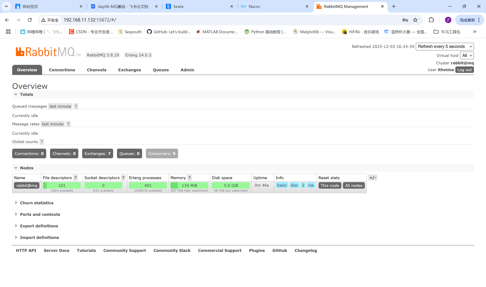


##### 2.1.1 基本介绍

RabbitMQ 的整体架构及核心概念：

+ virtual-host：虚拟主机，起到数据隔离的作用
+ publisher：消息发送者
+ consumer：消息的消费者
+ queue：队列，存储消息
+ exchange：交换机，负责路由消息


-------------


#### 2.2 快速入门

> 需求：
>
> 在 RabbitMQ 的控制台完成下列操作：
>
> + 新建队列 hello.queue1 和 hello.queue2
> + 向默认的 amp.fanout 交换机发送一条消息
> + 查看消息是否到达 hello.queue1 和 hello.queue2
> + 总结规律

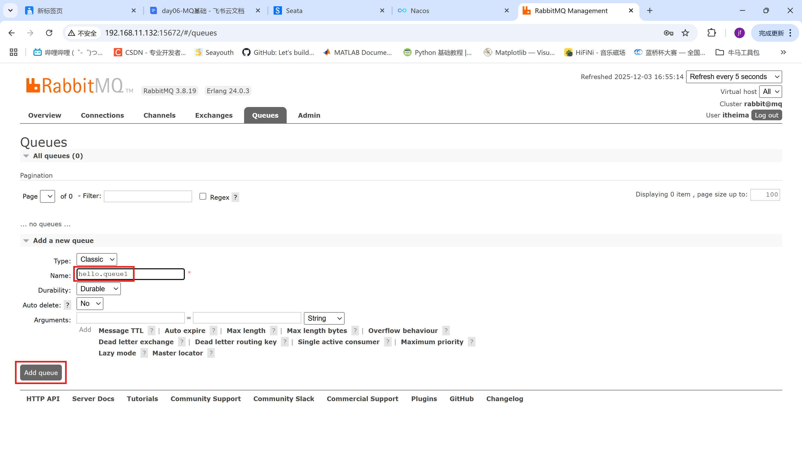

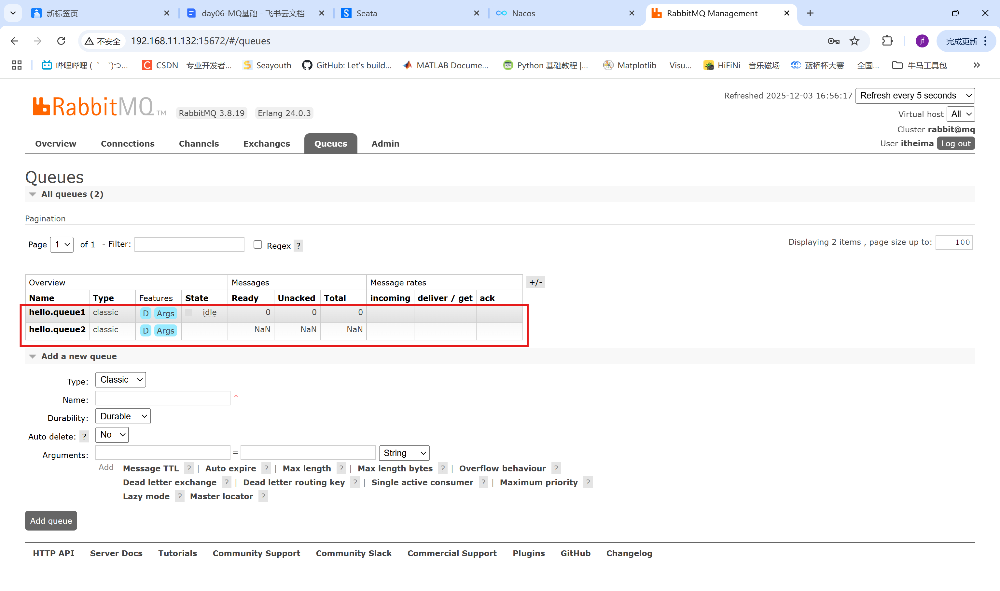

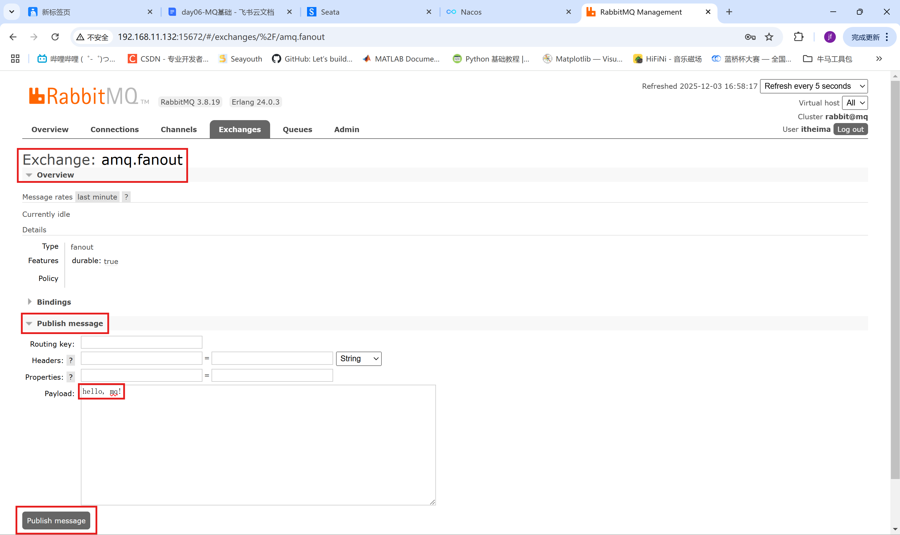

我们会发现队列没有收到，因为路由失败了，消息丢失了

现在的交换机和队列之间没有关系，不知道要给哪个队列

所以我们要让交换机和队列之间建立关系

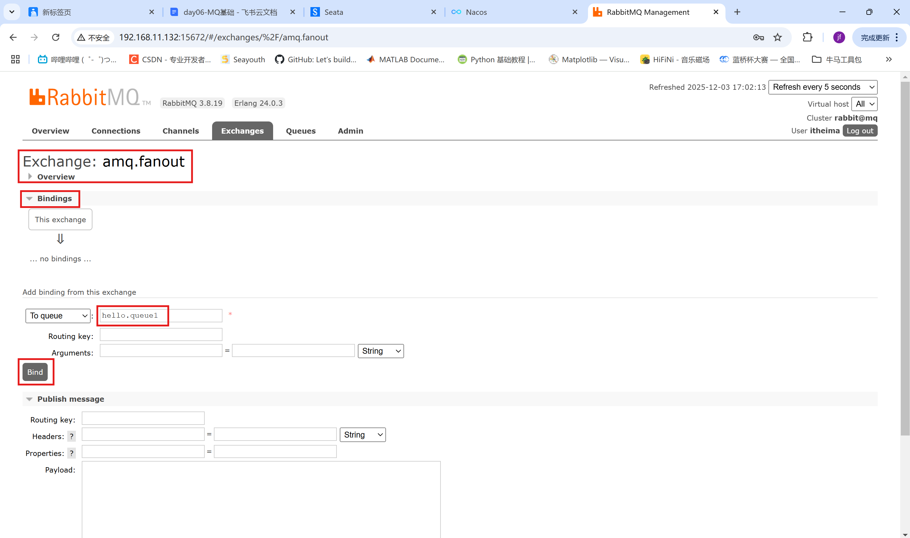

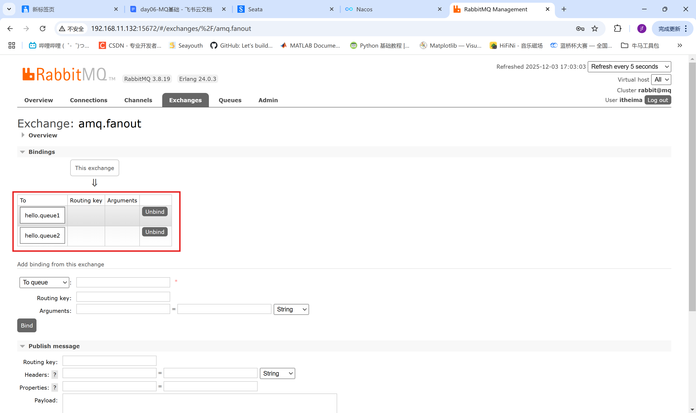

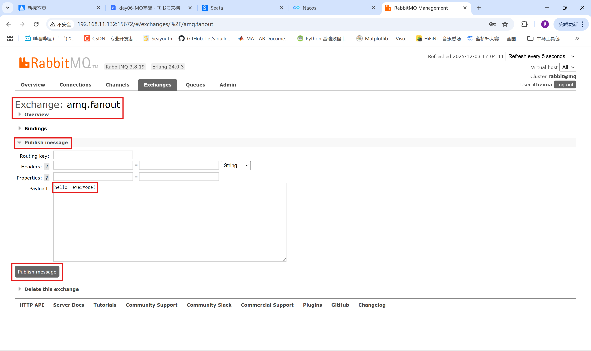

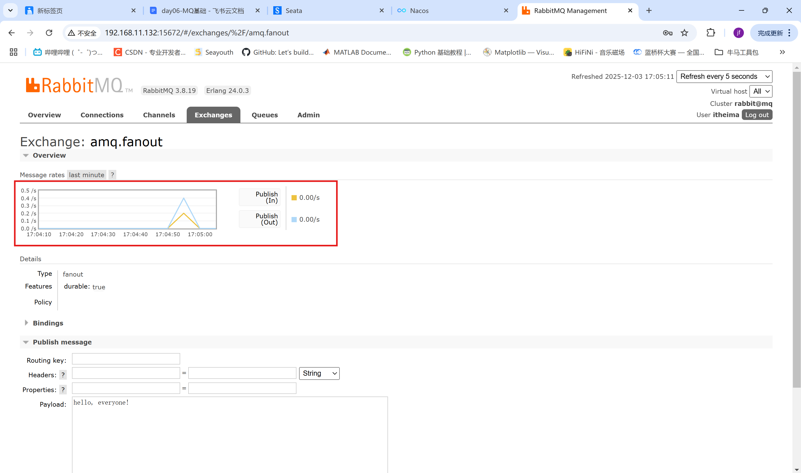

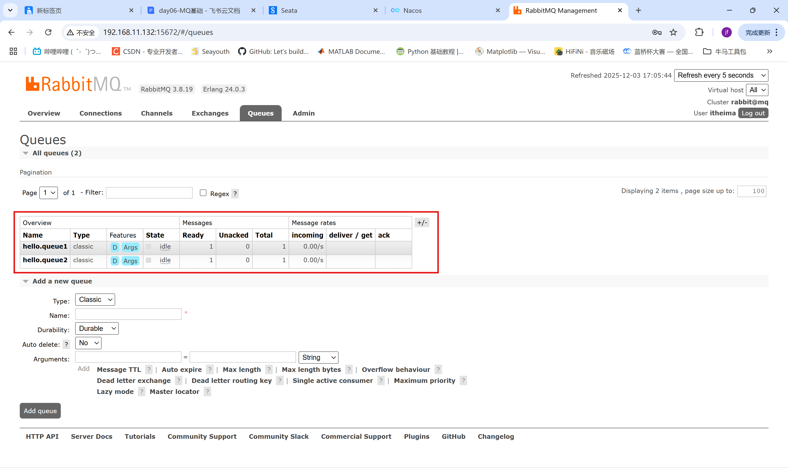

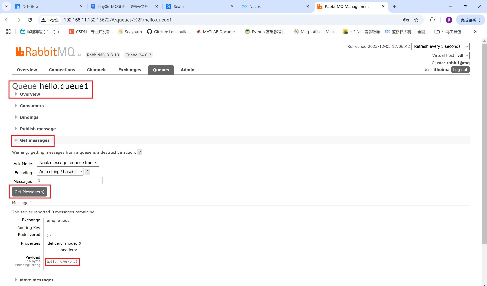


##### 总结

消息发送的注意事项有哪些？

+ 交换机只能路由消息，无法存储消息
+ 交换机只会路由消息给与其绑定的队列，因此队列必须与交换机绑定


----------


#### 2.3 数据隔离

> 需求：
>
> 在 RabbitMQ 的控制台完成下列操作：
>
> + 新建一个用户 hmall
> + 为 hmall 用户创建一个 virtual host（虚拟主机）
> + 测试不同 virtual host 之间的数据隔离现象

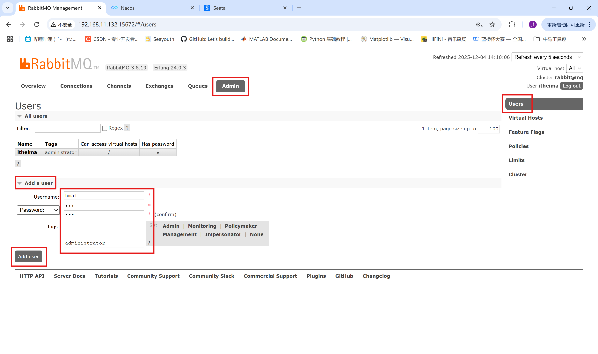

我们会发现新建的用户是没有分配任何虚拟主机的权限的


我们先退出登录：

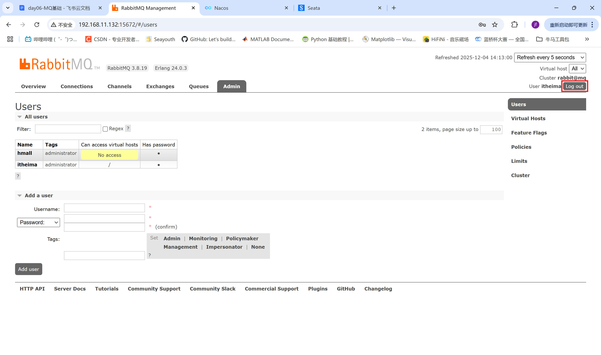

登录刚刚创建的用户

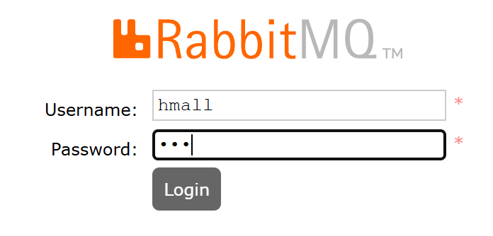

为这个用户创建虚拟主机


可以看到不同用户的虚拟主机有着不同的交换机

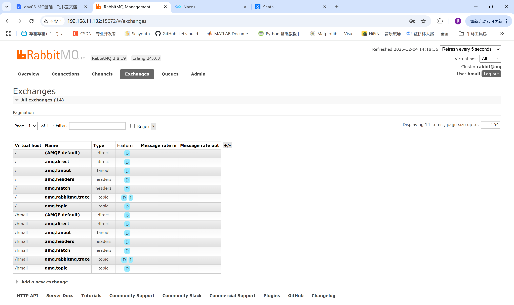

可看出数据是隔离的


----------------


### 3. Java 客户端

#### 3.1 快速入门

SpringAMQP 的官方地址：[Spring AMQP](https://spring.io/projects/spring-amqp)

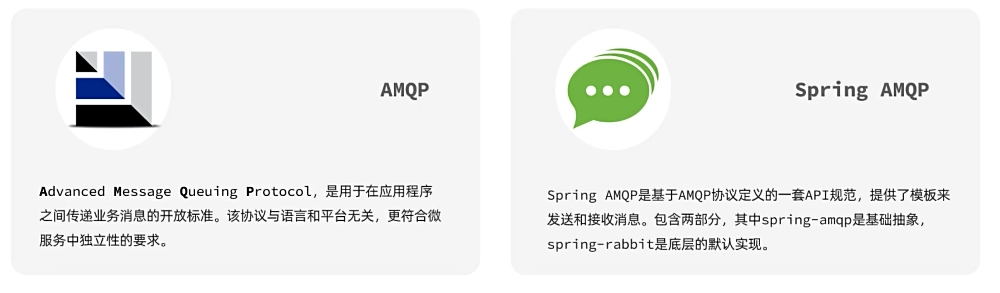


> 需求如下：
>
> + 利用控制台创建队列 simple.queue
> + 在 publisher 服务中，利用 SpringAMQP 直接向 simple.queue 发送消息
> + 在 consumer 服务中，利用 SpringAMQP 编写消费者，监听 simple.queue 队列
>
> 

创建队列

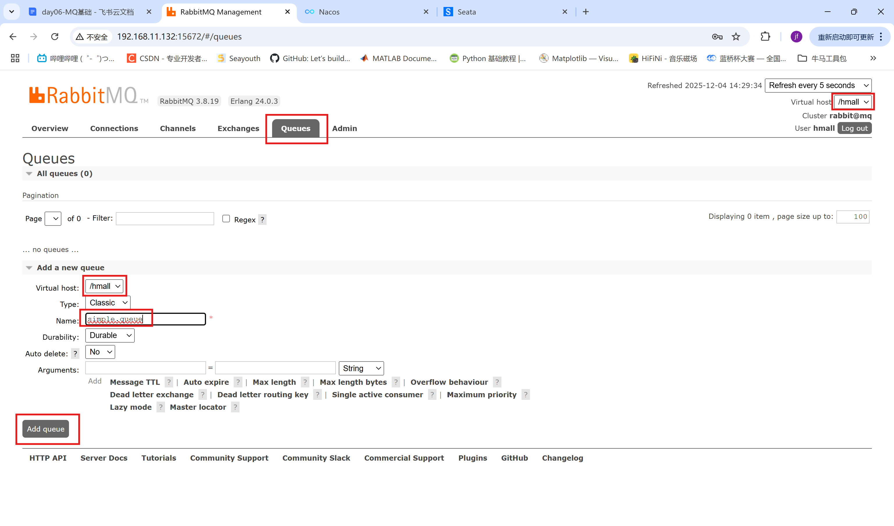

1. 引入 spring-amqp 依赖

在父工程中引入 spring-amqp 依赖，这样 publisher 和 consumer 服务都可以使用：

```xml
<!--AMQP依赖，包含RabbitMQ-->
<dependency>
    <groupId>org.springframework.boot</groupId>
    <artifactId>spring-boot-starter-amqp</artifactId>
</dependency>
```

2. 配置 RabbitMQ 服务端信息

在每个微服务中引入 MQ 服务端信息，这样微服务才能连接到 RabbitMQ

```YAML
spring:
  rabbitmq:
    host: 192.168.11.132 # 你的虚拟机IP
    port: 5672 # 端口（固定的）
    virtual-host: /hmall # 虚拟主机
    username: hmall # 用户名
    password: 123 # 密码
```

3. 发送消息

SpringAMQP 提供了 RabbitTemplate 工具类，方便我们发送消息。发送消息代码如下：

```java
package com.itheima.publisher;

import org.junit.jupiter.api.Test;
import org.springframework.amqp.rabbit.core.RabbitTemplate;
import org.springframework.beans.factory.annotation.Autowired;
import org.springframework.boot.test.context.SpringBootTest;

import static org.junit.jupiter.api.Assertions.*;

@SpringBootTest
class SpringAmqpTest {

    @Autowired
    private RabbitTemplate rabbitTemplate;

    @Test
    public void testSimpleQueue() {
        // 1. 队列名
        String queueName = "simple.queue";
        // 2. 消息
        String message = "hello, spring amqp!";
        // 3. 发送消息
        rabbitTemplate.convertAndSend(queueName, message);
    }
}
```

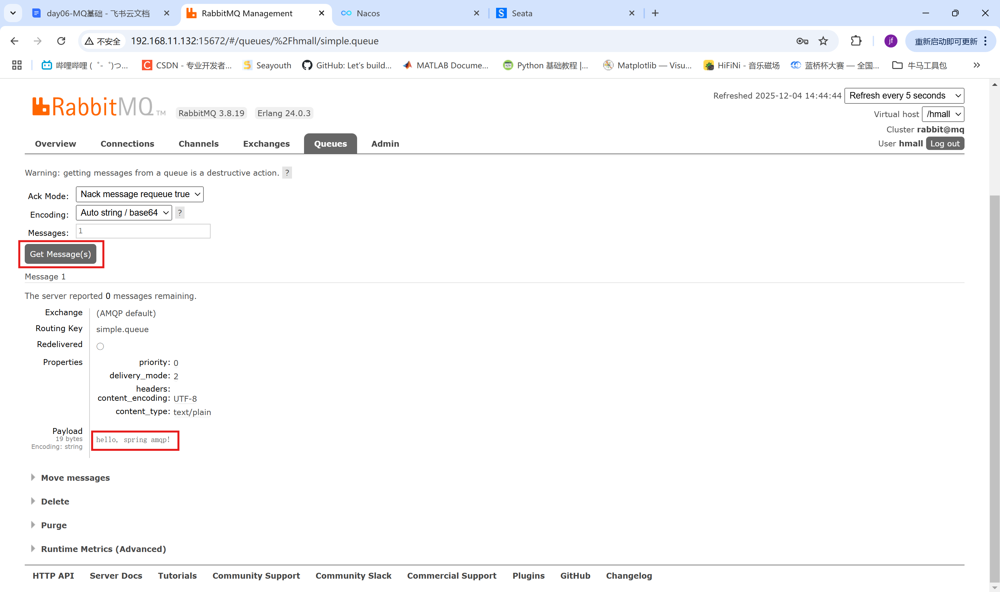

4. 接收消息

SpringAMQP 提供声明式的消息监听，我们只需要通过**注解**在方法上声明要监听的队列名称，将来 SpringAMQP 就会把消息传递给当前方法：

```java
package com.itheima.consumer.mq;

import lombok.extern.slf4j.Slf4j;
import org.springframework.amqp.rabbit.annotation.RabbitListener;
import org.springframework.stereotype.Component;

@Slf4j
@Component
public class SpringRabbitListener {

    @RabbitListener(queues = "simple.queue")
    public void listenSimpleQueue(String message) {
        log.info("监听到simple.queue的消息：【{}】", message);
    }
}
```

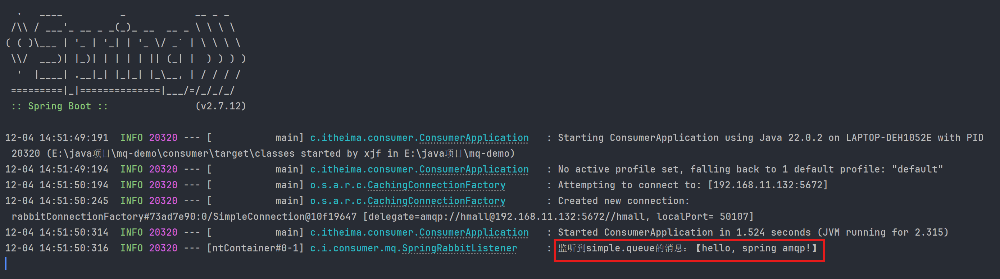


##### 总结

SpringAMQP 如何收发消息？

1. 引入 spring-boot-starter-amqp 依赖
2. 配置 rabbitmq 服务端信息
3. 利用 RabbitTemplate 发送消息
4. 利用 `@RabbitListener` 注解声明要监听的队列，监听消息


------------


#### 3.2 WorkQueue

Work queues，任务模型。简单来说就是**让多个消费者绑定到一个队列，共同消费队列中的消息**

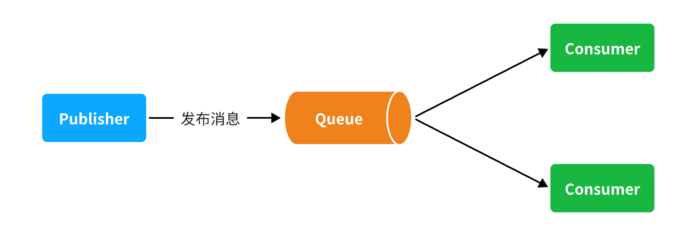


##### 案例：模拟 WorkQueue，实现一个队列绑定多个消费者

> 基本思路如下：
>
> 1. 在 RabbitMQ 的控制台创建一个队列，名为 work.queue
> 2. 在 publisher 服务中定义测试方法，发送50条消息到 work.queue
> 3. 在 consumer 服务中定义两个消息监听者，都监听 work.queue 队列
> 4. 消费者1每秒处理40条消息，消费者2每秒处理5条消息

创建队列

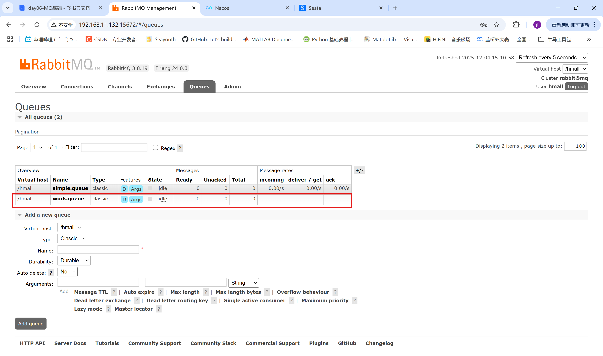

+ consumer/SpringRabbitListener.java

```java
@RabbitListener(queues = "work.queue")
public void listenWorkQueue1(String message) {
    System.out.println("消费者1接收到消息：" + message + "," + LocalTime.now());
}

@RabbitListener(queues = "work.queue")
public void listenWorkQueue2(String message) {
    System.err.println("消费者2。。。。。。。。接收到消息：" + message + "," + LocalTime.now());
}
```

+ publisher/SpringAmqpTest.java

```java
@Test
public void testWorkQueue() {
    // 1. 队列名
    String queueName = "work.queue";
    for (int i = 1; i <= 50; i++) {
        // 2. 消息
        String message = "hello, spring amqp!_" + i;
        // 3. 发送消息
        rabbitTemplate.convertAndSend(queueName, message);
    }
}
```

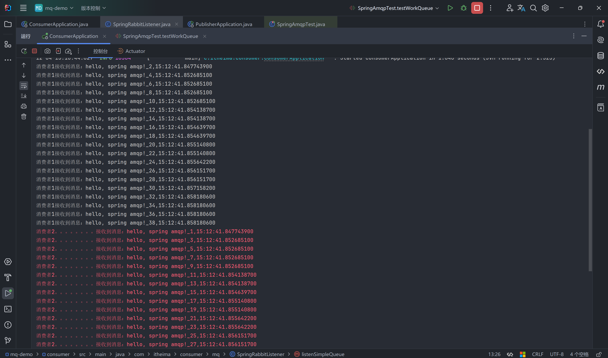


模拟真实情况下服务器性能不同，处理消息速度不同

```java
@RabbitListener(queues = "work.queue")
public void listenWorkQueue1(String message) throws InterruptedException {
    System.out.println("消费者1接收到消息：" + message + "," + LocalTime.now());
    Thread.sleep(25);
}

@RabbitListener(queues = "work.queue")
public void listenWorkQueue2(String message) throws InterruptedException {
    System.err.println("消费者2。。。。。。。。接收到消息：" + message + "," + LocalTime.now());
    Thread.sleep(200);
}
```

结果还是均匀分配

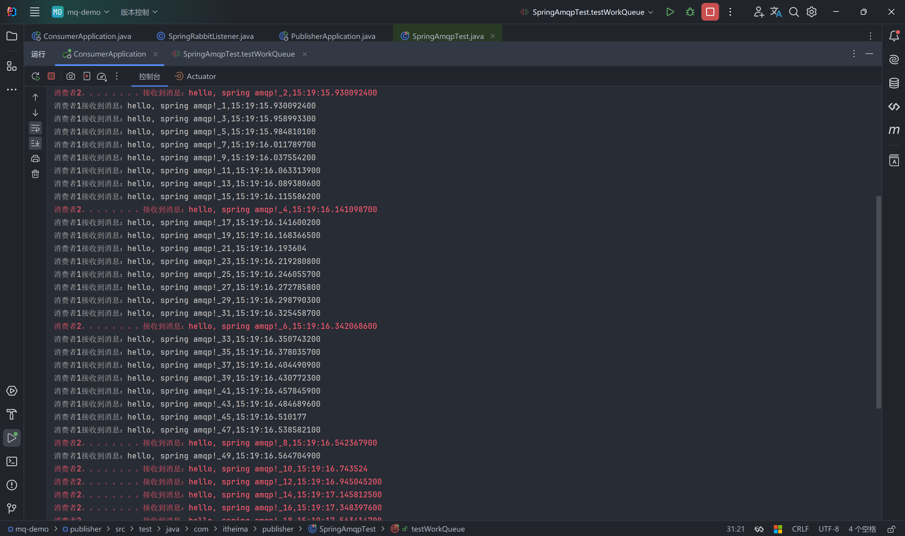


##### 3.2.1 消费者消息推送限制

默认情况下，RabbitMQ 会见消息依次轮询投递给绑定在队列上的每一个消费者。但这并没有考虑到消费者是否已经处理完消息，可能出现消息堆积

因此我们需要修改 application.yml，设置 preFetch 值为1，确保同一时刻最多投递给消费者1条消息：

```YAML
spring:
  rabbitmq:
    listener:
      simple:
        prefetch: 1 # 每次只能获取一条消息，处理完成才能获取下一个消息
```

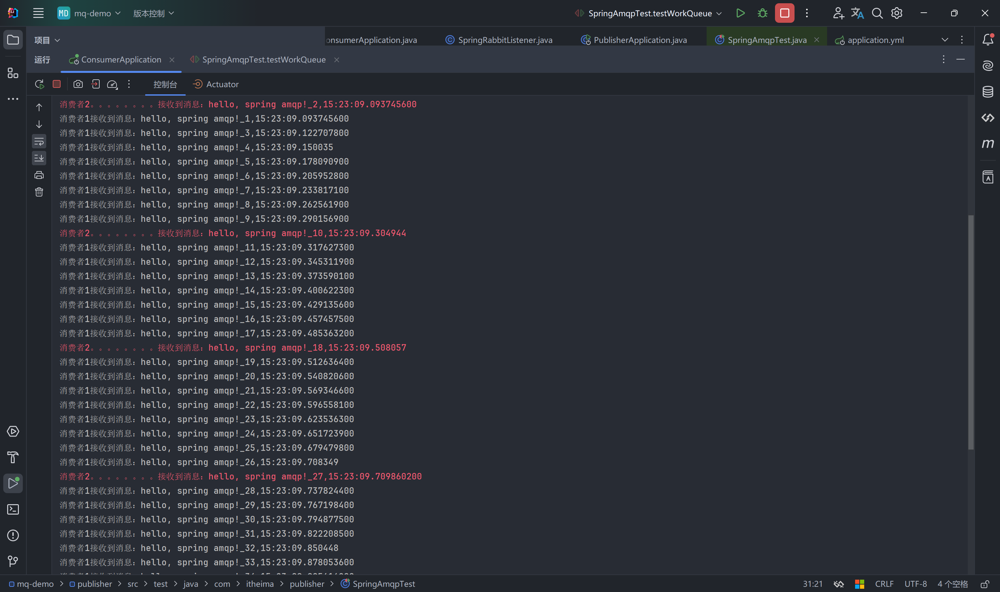


##### 总结

Work 模型的使用：

+ 多个消费者绑定到一个队列，可以加快消息处理速度
+ 同一条消息只会被一个消费者处理
+ 通过设置 prefetch 来控制消费者预取的消息数量，处理完一条再处理下一条，实现能者多劳


------------


#### 3.3 Fanout 交换机

交换机的作用主要是**接收**发送者发送的消息，并将消息**路由**到与其绑定的队列

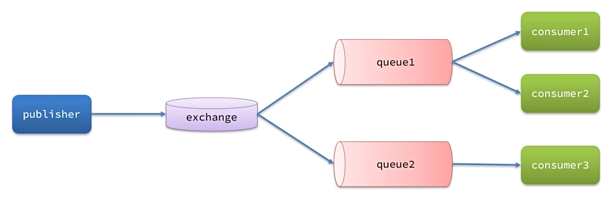

常见交换机的类型有以下三种：

+ Fanout：广播
+ Direct：定向
+ Topic：话题


Fanout Exchange 会将接收到的消息路由到每一个跟其绑定的 queue，所以也叫广播模式


##### 案例：利用 SpringAMQP 演示 FanoutExchange 的使用

> 实现思路如下：
>
> 1. 在 RabbitMQ 控制台中，声明队列 fanout.queue1 和 fanout.queue2
> 2. 在 RabbitMQ 控制台中，声明交换机 hmall.fanout，将两个队列与其绑定
> 3. 在 consumer 服务中，编写两个消费者方法，分别监听 fanout.queue1 和 fanout.queue2
> 4. 在 publisher 中编写测试方法，向 hmall.fanout 发送消息
>
> 

创建队列

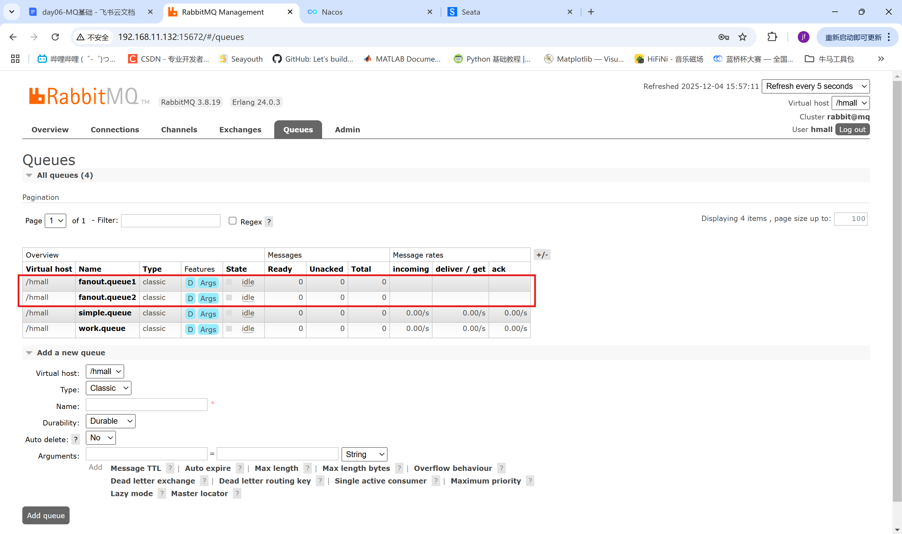

添加交换机

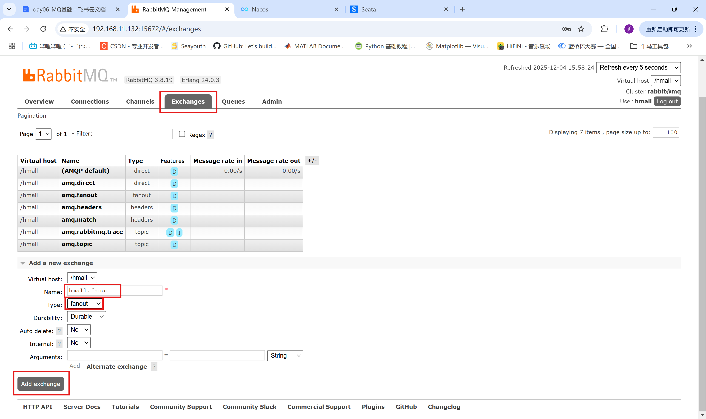

绑定队列

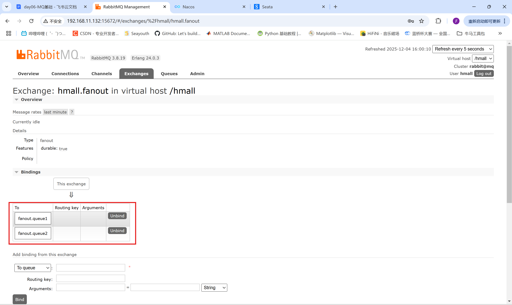

+ SpringRabbitListener.java

```java
@RabbitListener(queues = "fanout.queue1")
public void listenFanoutQueue1(String message) {
    log.info("消费者1监听到fanout.queue1的消息：【{}】", message);
}

@RabbitListener(queues = "fanout.queue2")
public void listenFanoutQueue2(String message) {
    log.info("消费者2监听到fanout.queue2的消息：【{}】", message);
}
```

+ SpringAmqpTest.java

```java
    @Test
    public void testFanoutQueue() {
        // 1. 队列名
        String exchangeName = "hmall.fanout";
        // 2. 消息
        String message = "hello, everyone!";
        // 3. 发送消息，参数分别是：交换机名称，RoutingKey（暂时为空），消息
        rabbitTemplate.convertAndSend(exchangeName, "", message);
    }
```

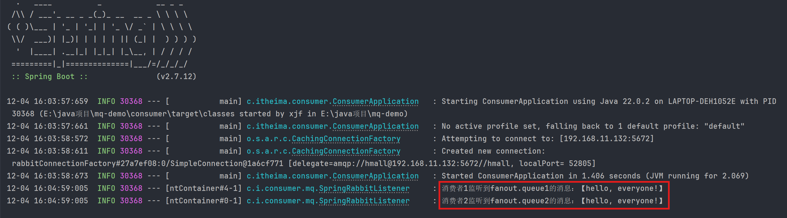


##### 总结

交换机的作用是什么？

+ 接收 publisher 发送的消息
+ 将消息按照规则路由到与之绑定的队列
+ FanoutExchange 会将消息路由到每个绑定的队列

发送消息到交换机的 API 是怎样的？

```java
    @Test
    public void testFanoutQueue() {
        // 1. 队列名
        String exchangeName = "hmall.fanout";
        // 2. 消息
        String message = "hello, everyone!";
        // 3. 发送消息，参数分别是：交换机名称，RoutingKey（暂时为空），消息
        rabbitTemplate.convertAndSend(exchangeName, "", message);
    }
```


---------------


#### 3.4 Direct 交换机

Direct Exchange 会将接收到的消息根据规则路由到指定的 Queue，因此称为**定向**路由

+ 每一个 Queue 都与 Exchange 设置一个 BindingKey
+ 发布者发送消息时，指定消息的 RoutingKey
+ Exchange 将消息路由到 BindingKey 与消息 RoutingKey 一致的队列


##### 案例：利用 SpringAMQP 演示 DirectExchange 的使用

> 需求如下：
>
> 1. 在 RabbitMQ 控制台中，声明队列 direct.queue1 和 direct.queue2
> 2. 在 RabbitMQ 控制台中，声明交换机 hmall.direct，将这两个队列与其绑定
> 3. 在 consumer 服务中，编写两个消费者方法，分别监听 direct.queue1 和 direct.queue2
> 4. 在 publisher 中编写测试方法，利用不同的 RoutingKey 向 hmall.direct 发送消息
>
> 

创建队列


新建交换机

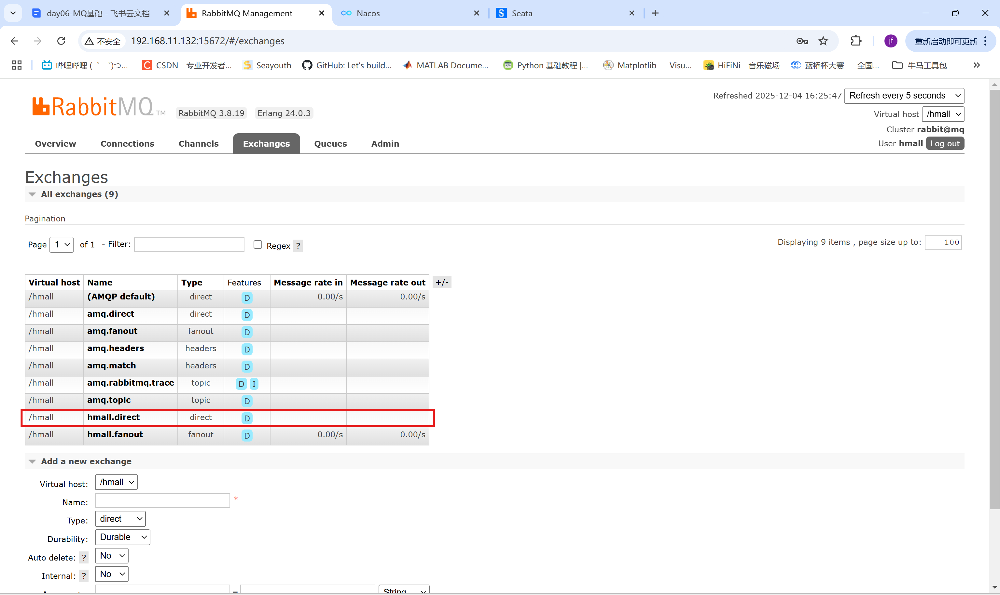

绑定队列

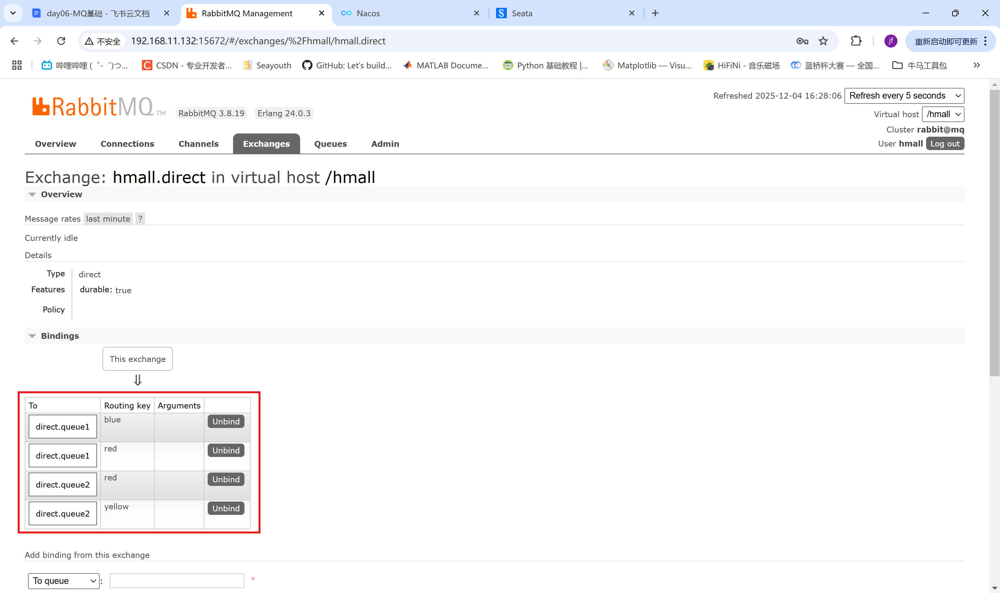

+ SpringRabbitListener.java

```java
@RabbitListener(queues = "direct.queue1")
public void listenDirectQueue1(String message) {
    log.info("消费者1监听到direct.queue1的消息：【{}】", message);
}

@RabbitListener(queues = "direct.queue2")
public void listenDirectQueue2(String message) {
    log.info("消费者2监听到direct.queue2的消息：【{}】", message);
}
```

+ SpringAmqpTest.java

```java
@Test
public void testDirectQueue() {
    // 1. 队列名
    String exchangeName = "hmall.direct";
    // 2. 消息
    String message = "蓝色, everyone!";
    // 3. 发送消息，参数分别是：交换机名称，RoutingKey（暂时为空），消息
    rabbitTemplate.convertAndSend(exchangeName, "blue", message);
}
```


##### 总结

描述下 Direct 交换机与 Fanout 交换机的差异？

+ Fanout 交换机将消息路由给每一个与之绑定的队列
+ Direct 交换机根据 RoutingKey 判断路由给哪个队列
+ 如果多个队列具有相同 RoutingKey，则于 Fanout 功能类似


------------------


#### 3.5 Topic 交换机

TopicExchange 也是基于 RoutingKey 做消息路由，但是 routingKey 通常是多个单词的组合，并且以 `.` 分割

Queue 与 Exchange 指定 BindingKey 时可以使用通配符：

+ `#` ：代指0个或多个单词
+ `*` ：代指一个单词


假如此时publisher发送的消息使用的`RoutingKey`共有四种：

- `china.news `代表有中国的新闻消息；
- `china.weather` 代表中国的天气消息；
- `japan.news` 则代表日本新闻
- `japan.weather` 代表日本的天气消息；

解释：

- `topic.queue1`：绑定的是 `china.#` ，凡是以  `china.` 开头的 `routing key` 都会被匹配到，包括：
  - `china.news`
  - `china.weather`
- `topic.queue2`：绑定的是 `#.news` ，凡是以  `.news` 结尾的 `routing key` 都会被匹配。包括:
  - `china.news`
  - `japan.news`


##### 案例：利用 SpringAMQP 演示 DirectExchange 的使用

> 需求如下：
>
> 1. 在 RabbitMQ 控制台中，声明队列 topic.queue1 和 topic.queue2
> 2. 在 RabbitMQ 控制台中，声明交换机 hmall.topic，将两个队列与其绑定
> 3. 在 consumer 服务中，编写两个消费者方法，分别监听 topic.queue1 和 topic.queue2
> 4. 在 publisher 中编写测试方法，利用不同的 RoutingKey 向 hmall.topic 发送消息
>
> 

创建队列

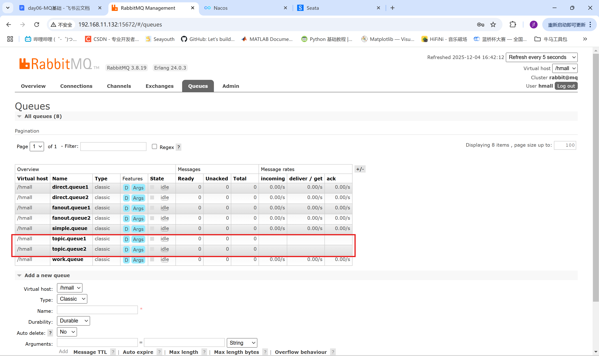

创建交换机

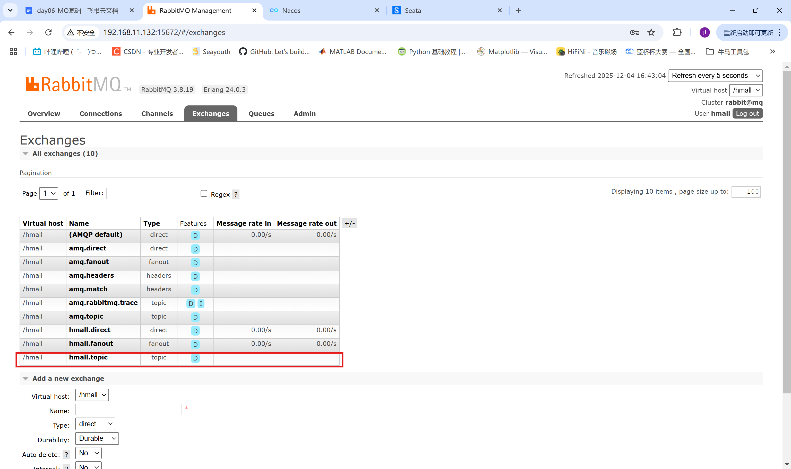

绑定队列

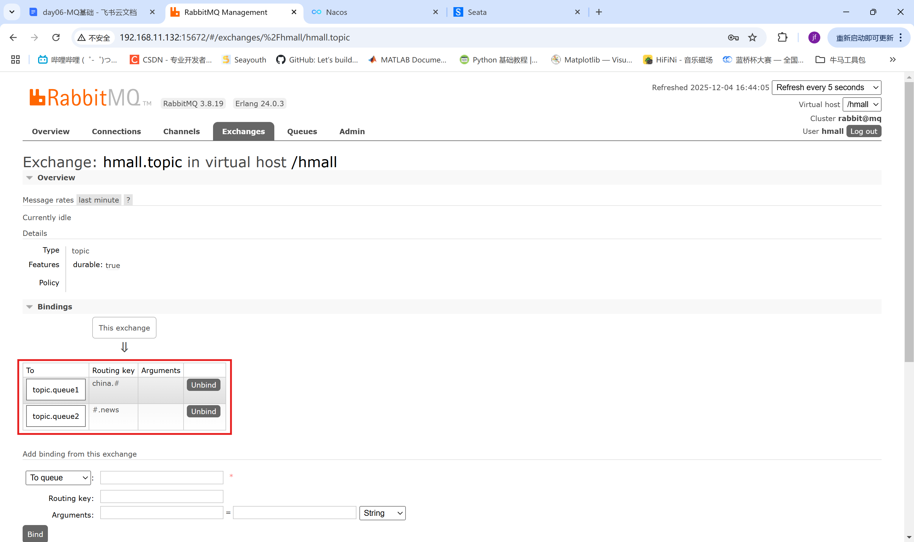

+ SpringRabbitListener.java

```java
@RabbitListener(queues = "topic.queue1")
public void listenTopicQueue1(String message) {
    log.info("消费者1监听到topic.queue1的消息：【{}】", message);
}

@RabbitListener(queues = "topic.queue2")
public void listenTopicQueue2(String message) {
    log.info("消费者2监听到topic.queue2的消息：【{}】", message);
}
```

+ SpringAmqpTest.java

```java
@Test
public void testTopicQueue() {
    // 1. 队列名
    String exchangeName = "hmall.topic";
    // 2. 消息
    String message = "hhhhhh, everyone!";
    // 3. 发送消息，参数分别是：交换机名称，RoutingKey（暂时为空），消息
    rabbitTemplate.convertAndSend(exchangeName, "china.news", message);
}
```

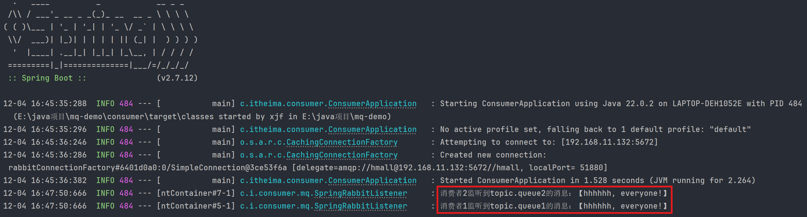


##### 总结

描述下 Topic 交换机相比 Direct 交换机的差异？

+ Topic 的 RoutingKey 和 bindingKey 可以是多个单词，以 `.` 分割
+ Topic 交换机与队列绑定时的 bindingKey 可以指定通配符
+ `#` ：代指0个或多个单词
+ `*` ：代指一个单词


---------------


#### 3.6 声明队列交换机

SpringAMQP 提供了几个类，用来声明队列、交换机及其绑定关系：

+ Queue：用于声明队列，可以用工厂类 QueueBuilder 构建
+ Exchange：用于声明交换机，可以用工厂类 ExchangeBuilder 构建
+ Binding：用于声明队列和交换机的绑定关系，可以用工厂类 BindingBuilder 构建

SpringAMQP 还提供了一个 Exchange 接口，来表示所有不同类型的交换机：


例如，声明一个 Fanout 类型的交换机，并且创建队列与其绑定：

```java
@Configuration
public class FanoutConfig {
	// 声明FanoutExchange交换机
    @Bean
    public FanoutExchange fanoutExchange(){
        return new FanoutExchange("hmall.fanout");
    }

	// 声明第1个队列
    @Bean
    public Queue fanoutQueue1(){
        return new Queue("fanout.queue1");
    }

	// 绑定队列1和交换机
    @Bean
    public Binding bindingQueue1(Queue fanoutQueue1, FanoutExchange fanoutExchange){
        return BindingBuilder.bind(fanoutQueue1).to(fanoutExchange);
    }

	// 第2个队列
    @Bean
    public Queue fanoutQueue2(){
        return new Queue("fanout.queue2");
    }

	// 绑定队列和交换机
    @Bean
    public Binding bindingQueue2(Queue fanoutQueue2, FanoutExchange fanoutExchange){
        return BindingBuilder.bind(fanoutQueue2).to(fanoutExchange);
    }
}
```

或者用 builder 方式：

```java
@Configuration
public class FanoutConfig {
	// 声明FanoutExchange交换机
    @Bean
    public FanoutExchange fanoutExchange(){
        return ExchangeBuilder
            .fanoutExchange("hmall.fanout").build();
    }

	// 声明第1个队列
    @Bean
    public Queue fanoutQueue1(){
        return QueueBuilder
            .durable("fanout.queue1").build();
    }
}
```


一般在 consumer 中编写


因为如果绑定 direct 或 topic 交换机类型时，声明 bindingKey 太麻烦（要多次编写 Bean）

SpringAMQP 还提供了基于 `@RabbitListener` 注解来声明队列和交换机的方式：

```java
@RabbitListener(bindings = @QueueBinding(
    value = @Queue(name = "direct.queue1"),
    exchange = @Exchange(name = "hmall.direct", type = ExchangeTypes.DIRECT),
    key = {"red", "blue"}
))
public void listenDirectQueue1(String msg){
    System.out.println("消费者1接收到direct.queue1的消息：【" + msg + "】");
}
```


----------------


#### 3.7 消息转换器

> 需求：
>
> 测试利用 SpringAMQP 发送对象类型的消息
>
> 1. 声明一个队列，名为 object.queue
> 2. 编写单元测试，向队列中直接发送一条消息，消息类型为 Map
> 3. 在控制台查看消息，总结能发现的问题
>
> ```java
> // 准备消息
> Map<String,Object> msg = new HashMap<>();
> msg.put("name", "柳岩");
> msg.put("age", 21);
> ```

发送消息后查看控制台：


可以看到消息格式非常不友好


Spring 对消息对象的处理是由 org.springframework.amqp.support.converter.MessageConverter 来处理的。而模式实现是 SimpleMessageConverter，基于 JDK 的 ObjectOutputStream 完成序列化

存在下列问题：

+ JDK 的序列化有安全风险
+ JDK 序列化的消息太大
+ JDK 序列化的消息可读性差

建议采用 JSON 序列化代替默认的 JDK 序列化，要做两件事情：

在 publisher 和 consumer 中都要引入 jackson 依赖：

```XML
<dependency>
    <groupId>com.fasterxml.jackson.core</groupId>
    <artifactId>jackson-databind</artifactId>
</dependency>
```

在 publisher 和 consumer 中都要配置 MessageConverter：

```Java
@Bean
public MessageConverter messageConverter(){
    return jackson2JsonMessageConverter;
}
```

在配置类把这玩意加进去就行了


--------------


### 4. 业务改造

> 需求：
>
> 改造余额支付功能，不在同步调用交易服务的 OpenFeign 接口，而是采用异步 MQ 通知交易服务更新订单状态
>
> 

+ trade 模块引入依赖

```xml
<!--amqp-->
<dependency>
    <groupId>org.springframework.boot</groupId>
    <artifactId>spring-boot-starter-amqp</artifactId>
</dependency>
```

+ 在 trade 和 pay 模块中加入配置

```yml
spring:
  rabbitmq:
    host: 192.168.11.132
    port: 5672
    virtual-host: /hmall
    username: hmall
    password: 123
```

也可以抽取到 nacos 共享配置

+ 在 hm-common 模块加入消息转换器

```java
package com.hmall.common.config;

import org.springframework.amqp.support.converter.Jackson2JsonMessageConverter;
import org.springframework.amqp.support.converter.MessageConverter;
import org.springframework.context.annotation.Bean;
import org.springframework.context.annotation.Configuration;

@Configuration
public class MqConfig {

    @Bean
    public MessageConverter messageConverter() {
        return new Jackson2JsonMessageConverter();
    }
}
```

+ 同时配置使其生效

```
org.springframework.boot.autoconfigure.EnableAutoConfiguration=\
  com.hmall.common.config.MyBatisConfig,\
  com.hmall.common.config.MvcConfig, \
  com.hmall.common.config.JsonConfig, \
  com.hmall.common.config.MvcConfig
```

+ trade-service 模块中

```java
package com.hmall.trade.listener;

import com.hmall.trade.service.IOrderService;
import lombok.RequiredArgsConstructor;
import org.springframework.amqp.rabbit.annotation.Exchange;
import org.springframework.amqp.rabbit.annotation.Queue;
import org.springframework.amqp.rabbit.annotation.QueueBinding;
import org.springframework.amqp.rabbit.annotation.RabbitListener;
import org.springframework.stereotype.Component;

@Component
@RequiredArgsConstructor
public class PayStatusListener {

    private final IOrderService orderService;

    @RabbitListener(bindings = @QueueBinding(
            value = @Queue(name = "trade.pay.success", durable = "true"),
            exchange = @Exchange(name = "pay.direct"),
            key = "pay.success"
    ))
    public void listenPaySuccess(Long orderId) {
        orderService.markOrderPaySuccess(orderId);
    }
}
```

+ pay-service 模块下 PayOrderServiceImpl.java

```java
 // TODO 5.修改订单状态
//        tradeClient.markOrderPaySuccess(po.getBizOrderNo());
        try {
            rabbitTemplate.convertAndSend("pay.direct", "pay.success", po.getBizOrderNo());
        } catch (AmqpException e) {
            log.error("发送支付状态通知失败，订单id：{}", po.getBizOrderNo(), e);
        }
```


-----------------------


## 七、MQ 高级

**消息可靠性问题**

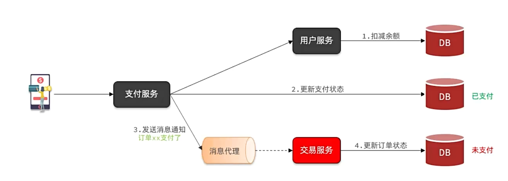

我们要解决消息丢失问题，保证 MQ 的可靠性，就必须从3个方面入手：

- 确保生产者一定把消息发送到 MQ
- 确保 MQ 不会将消息弄丢
- 确保消费者一定要处理消息


### 1. 发送者的可靠性

#### 1.1 发送者重连

有的时候由于网络波动，可能会出现发送者连接 MQ 失败的情况。通过配置我们可以开启连接失败后的重连机制：

```YAML
spring:
  rabbitmq:
    connection-timeout: 1s # 设置MQ的连接超时时间
    template:
      retry:
        enabled: true # 开启超时重试机制
        initial-interval: 1000ms # 失败后的初始等待时间
        multiplier: 1 # 失败后下次的等待时长倍数，下次等待时长 = initial-interval * multiplier
        max-attempts: 3 # 最大重试次数
```

<font color="red">注意：</font>

+ 当网络不稳定的时候，利用重试机制可以有效提高消息发送的成功率。不过 SpringAMQP 提供的重试机制是**阻塞式**的重试，也就是说多次重试等待的过程中，当前线程是被阻塞的，会影响业务性能
+ 如果对于业务性能有要求，建议**禁用**重试机制。如果一定要使用，请合理配置等待时长和重试次数，当然也可以考虑使用**异步**线程来执行发送消息的代码


-----------------


#### 1.2 发送者确认

SpringAMQP 提供了 **Publisher Confirm** 和 **Piblisher Ruturn** 两种确认机制。开启确认机制后，当发送者发送消息给 MQ 后，MQ 会返回确认结果给发送者。返回的结果有以下几种情况：

+ 消息投递到了 MQ，但是路由失败。此时会通过 PublisherReturn 返回路由异常原因，然后返回 **ACK**，告知投递成功
+ 临时消息投递到了 MQ，并且入队成功，返回 **ACK**，告知投递成功
+ 持久化消息投递到了 MQ，并且入队完成持久化，返回 **ACK**，告知投递成功
+ 其他情况都会返回 **NACK**，告知投递失败


##### 1.2.1 SpringAMQP 实现发送者确认

1. 在 publisher 这个微服务的 application.yml 中添加配置：

```YAML
spring:
  rabbitmq:
    publisher-confirm-type: correlated # 开启publisher confirm机制，并设置confirm类型
    publisher-returns: true # 开启publisher return机制
```

配置说明：

+ 这里 `publisher-confirm-type` 有三种模式可选：
  + `none`：关闭 confirm 机制
  + `simple`：同步阻塞等待 MQ 的回执消息
  + `correlated`：MQ 异步回调方式返回回执消息（常用）


2. 每个 RabbitTemplate 只能配置一个 ReturnCallback，因此需要在项目启动过程中配置（也就是说我们不需要在每次发消息前去设置 ReturnCallback，而是在项目启动的时候配置一次就可以了）：

```Java
package com.itheima.publisher.config;

import lombok.AllArgsConstructor;
import lombok.extern.slf4j.Slf4j;
import org.springframework.amqp.core.ReturnedMessage;
import org.springframework.amqp.rabbit.core.RabbitTemplate;
import org.springframework.context.annotation.Configuration;

import javax.annotation.PostConstruct;

@Slf4j
@AllArgsConstructor
@Configuration
public class MqConfig {
    private final RabbitTemplate rabbitTemplate;

    @PostConstruct // 这个Bean初始化完了以后，这个成员变量注入进来以后再去执行
    public void init(){
        rabbitTemplate.setReturnsCallback(new RabbitTemplate.ReturnsCallback() {
            @Override
            public void returnedMessage(ReturnedMessage returned) {
                log.error("触发return callback,");
                log.debug("exchange: {}", returned.getExchange());
                log.debug("routingKey: {}", returned.getRoutingKey());
                log.debug("message: {}", returned.getMessage());
                log.debug("replyCode: {}", returned.getReplyCode());
                log.debug("replyText: {}", returned.getReplyText());
            }
        });
    }
}
```


3. 发送消息，指定消息 ID、消息 ConfirmCallback

```Java
@Test
void testPublisherConfirm() {
    // 1.创建CorrelationData
    CorrelationData cd = new CorrelationData();
    // 2.给Future添加ConfirmCallback
    cd.getFuture().addCallback(new ListenableFutureCallback<CorrelationData.Confirm>() {
        @Override
        public void onFailure(Throwable ex) {
            // 2.1.Future发生异常时的处理逻辑，基本不会触发
            log.error("send message fail", ex);
        }
        @Override
        public void onSuccess(CorrelationData.Confirm result) {
            // 2.2.Future接收到回执的处理逻辑，参数中的result就是回执内容
            if(result.isAck()){ // result.isAck()，boolean类型，true代表ack回执，false 代表 nack回执
                log.debug("发送消息成功，收到 ack!");
            }else{ // result.getReason()，String类型，返回nack时的异常描述
                log.error("发送消息失败，收到 nack, reason : {}", result.getReason());
            }
        }
    });
    // 3.发送消息
    rabbitTemplate.convertAndSend("hmall.direct", "q", "hello", cd);
}
```

```java
@Test
public void testConfirmCallback() {
    // 0. 创建correlationData
    CorrelationData cd = new CorrelationData(UUID.randomUUID().toString());
    cd.getFuture().addCallback(new ListenableFutureCallback<CorrelationData.Confirm>() {
        @Override
        public void onFailure(Throwable ex) {
            log.error("spring amqp 处理确认结果异常", ex);
        }

        @Override
        public void onSuccess(CorrelationData.Confirm result) {
            // 判断是否成功
            if (result.isAck()) {
                log.info("收到ConfirmCallback ack，消息发送成功！");
            } else {
                log.error("收到收到ConfirmCallback nack，消息发送失败！{}", result.getReason());
            }
        }
    });
    // 1. 队列名
    String exchangeName = "hmall.direct";
    // 2. 消息
    String message = "蓝色, everyone!";
    // 3. 发送消息，参数分别是：交换机名称，RoutingKey（暂时为空），消息
    rabbitTemplate.convertAndSend(exchangeName, "blue", message, cd);
}
```


发送者确认的这种机制，由于需要去跟 MQ 进行一个通信和确认，所以它会大大影响消息发送的一个效率，所以通常情况下是不建议大家去开启的，以为大多数情况下，默认的这种消息发送它出现异常的概率是极低的


------------------


### 2. MQ 的可靠性

在默认情况下，RabbitMQ 会将接收到的信息保存在内存中以降低消息收发的延迟。这样会导致两个问题：

+ 一旦 MQ 宕机，内存中的消息会丢失
+ 内存空间有限，当消费者故障或处理过慢时，会导致消息积压，引发 MQ 阻塞


#### 2.1 数据持久化

RabbitMQ 实现数据持久化包括3个方面：

+ 交换机持久化


+ 队列持久化


+ 消息持久化


默认情况下都是持久的，我们不需要去做什么额外的处理


-------------


#### 2.2 Lazy Queue

从 RabbitMQ 的3.6.0版本开始，就增加了 Lazy Queue 的概念，也就是**惰性队列**

惰性队列的特征如下：

+ 接收到消息后直接存入磁盘，不再存储到内存
+ 消费者要消费消息时才会从磁盘中读取并加载到内存（可以提前缓存部分消息到内存，最多2048条）

在3.12版本后，所有队列都是 Lazy Queue 模式，无法更改


要设置一个队列为惰性队列，只需要在什么队列时，指定 x-queue-mode 属性为 lazy 即可：


+ 声明 Bean 的方式

```Java
@Bean
public Queue lazyQueue(){
    return QueueBuilder
            .durable("lazy.queue")
            .lazy() // 开启Lazy模式
            .build();
}
```

+ 注解的方式

```Java
@RabbitListener(queuesToDeclare = @Queue(
        name = "lazy.queue",
        durable = "true",
        arguments = @Argument(name = "x-queue-mode", value = "lazy")
))
public void listenLazyQueue(String msg){
    log.info("接收到 lazy.queue的消息：{}", msg);
}
```


并发能力会比持久化模式更高

推荐平时都采用 Lazy Queue 这种方式


-------------


#### 总结

RabbitMQ 如何保证消息的可靠性

+ 首先通过配置可以让交换机、队列、以及发送的消息都持久化。这样队列中的消息会持久化到磁盘，MQ 重启消息依然存在
+ RabbitMQ 在3.6版本引入了 LazyQueue，并且在3.12版本后会称为队列的默认模式。LazyQueue 会将所有消息都持久化
+ 开启持久化和生产者确认时，RabbitMQ 只有消息持久化完成后才会给生产者返回 ACK 回执


-----------------


### 3. 消费者的可靠性

#### 3.1 消费者确认机制

消费者确认机制（Consumer Acknowledgement）是为了确认消费者是否成功处理消息。当消费者处理消息结束后，应该向 RabbitMQ 发送一个回执，告知 RabbitMQ 自己消息处理状态：

+ **ack**：成功处理消息，RabbitMQ 从队列中删除该消息
+ **nack**：消息处理失败，RabbitMQ 需要再次投递消息
+ **reject**：消息处理失败并拒绝该消息，RabbitMQ 从队列中删除该消息

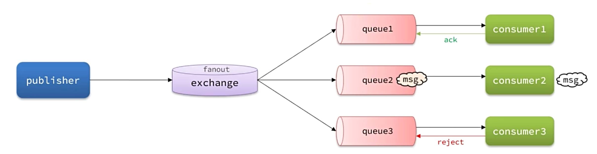


SpringAMQP 已经实现了消息确认功能。并允许我们通过配置文件选择 ACK 处理方式，有三种方式：

+ **none**：不处理。即消息投递给消费者后立刻 **ack**，消息会立刻从 MQ 删除。非常不安全，不建议使用
+ **manual**：手动模式。需要自己在业务代码中调用 api，发送 **ack** 或 **reject**，存在业务入侵，但更灵活
+ **auto**：自动模式。SpringAMQP 利用 AOP 对我们的消息处理逻辑做了环绕增强，当业务正常执行时则自动返回 **ack**，当业务出现异常时，根据异常判断返回不同结果：
  + 如果业务异常，会自动返回 **nack**
  + 如果是消息处理或校验异常，自动返回 **reject**

```YAML
spring:
  rabbitmq:
    listener:
      simple:
        acknowledge-mode: none # none，关闭ack；manual，手动ack；auto，自动ack
```


---------------


#### 3.2 失败重试策略

SpringAMQP 提供了消费者失败重试机制，在消费者出现异常时利用本地重试，而不是无限的 requeue 到 mq。我们可以通过在 application.yaml 文件中添加配置来开启重试机制：

```YAML
spring:
  rabbitmq:
    listener:
      simple:
        retry:
          enabled: true # 开启消费者失败重试
          initial-interval: 1000ms # 初识的失败等待时长为1秒
          multiplier: 1 # 失败的等待时长倍数，下次等待时长 = multiplier * last-interval
          max-attempts: 3 # 最大重试次数
          stateless: true # true无状态；false有状态。如果业务中包含事务，这里改为false
```


在开启重试模式后，重试次数耗尽，如果消息依然失败，则需要有 MessageRecover 接口来处理，它包含三种不同的实现：

+ RejectAndDontRequeueRecoverer：重试耗尽后，直接 reject，丢弃消息。默认就是这种方式
+ ImmediateRequeueMessageRecoverer：重试耗尽后，返回 nack，消息重新入队
+ RepublishMessageRecoverer：重试耗尽后，将失败消息投递到指定的交换机

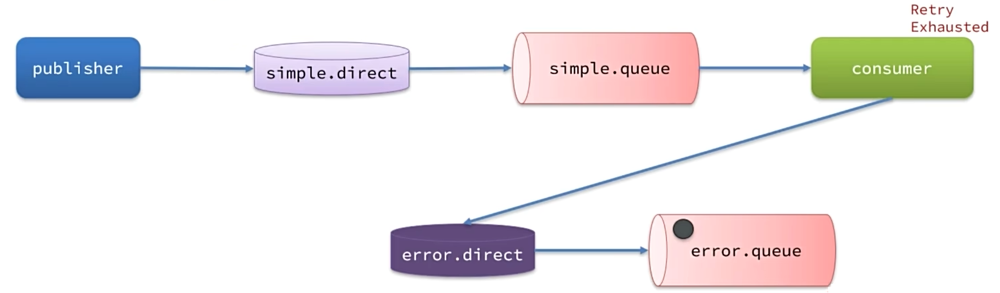


将失败处理策略改为 RepublishMessageRecoverer：

1. 首先，定义接收失败消息的交换机、队列及其绑定关系

```Java
@Bean
public DirectExchange errorMessageExchange(){
    return new DirectExchange("error.direct");
}
@Bean
public Queue errorQueue(){
    return new Queue("error.queue", true);
}
@Bean
public Binding errorBinding(Queue errorQueue, DirectExchange errorMessageExchange){
    return BindingBuilder.bind(errorQueue).to(errorMessageExchange).with("error");
}
```

2. 然后，定义 RepublishMessageRecoverer：

```Java
@Bean
public MessageRecoverer republishMessageRecoverer(RabbitTemplate rabbitTemplate){
    return new RepublishMessageRecoverer(rabbitTemplate, "error.direct", "error");
}
```


##### 总结

如何开启消费者重试机制？

```yml
spring:
  rabbitmq:
    listener:
      simple:
        retry:
          enabled: true # 开启消费者失败重试
          initial-interval: 1000ms # 初识的失败等待时长为1秒
          multiplier: 1 # 失败的等待时长倍数，下次等待时长 = multiplier * last-interval
          max-attempts: 3 # 最大重试次数
          stateless: true # true无状态；false有状态。如果业务中包含事务，这里改为false
```

如何配置失败重试处理策略？

```java
@Bean
public MessageRecoverer republishMessageRecoverer(RabbitTemplate rabbitTemplate){
    return new RepublishMessageRecoverer(rabbitTemplate, "error.direct", "error");
}
```


----------------


#### 3.3 业务幂等性

**幂等**是一个数学概念，用函数表达式来描述是这样的：$f(x) = f(f(x))$。在程序开发中，则是指同一个业务，执行一次或多次业务状态的影响是一致的

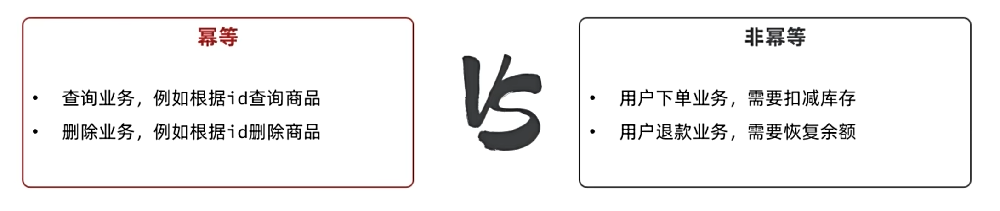


##### 3.3.1 唯一消息 id

方案一，是给每个消息都设置一个**唯一 id**，利用 id 区分是否是重复消息：

1. 每一条消息都生成一个唯一的 id，与消息一起投递给消费者
2. 消费者接收到消息后处理自己的业务，业务处理成功后将消息 ID 保存到数据库
3. 如果下次又收到相同消息，去数据库查询判断是否存在，存在则为重复消息放弃处理

```Java
@Bean
public MessageConverter messageConverter(){
    // 1.定义消息转换器
    Jackson2JsonMessageConverter jjmc = new Jackson2JsonMessageConverter();
    // 2.配置自动创建消息id，用于识别不同消息，也可以在业务中基于ID判断是否是重复消息
    jjmc.setCreateMessageIds(true);
    return jjmc;
}
```

```java
@RabbitListener(queues = "simple.queue")
public void listenSimpleQueue(Message message) {
    log.info("监听到simple.queue的消息：ID：【{}】", message.getMessageProperties().getMessageId());
    log.info("监听到simple.queue的消息：【{}】", new String(message.getBody()));
}
```


##### 3.3.2 业务判断

方案二，是结合业务逻辑，基于业务本身做判断。以我们的余额支付业务为例：

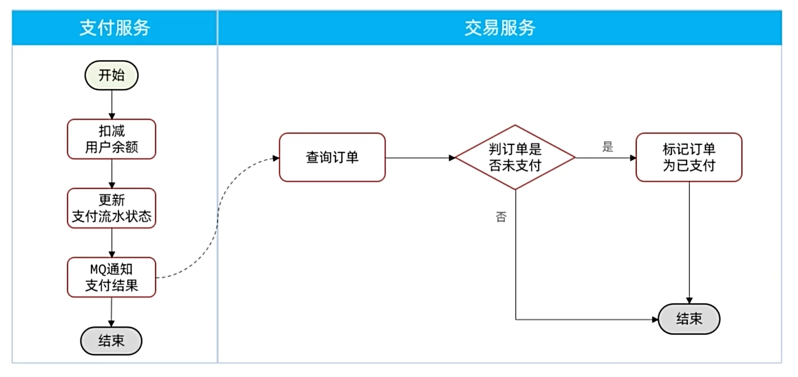

```java
public void listenPaySuccess(Long orderId) {
    // 1. 查询订单
    Order order = orderService.getById(orderId);
    // 2. 判断订单状态，是否为未支付
    if (order == null || order.getStatus() != 1) {
        // 不做处理
        return;
    }
    // 3. 标记订单状态为已支付
    orderService.markOrderPaySuccess(orderId);
}
```


如何保证支付服务与交易服务之间的订单状态一致性？

+ 首先，支付服务会在用户支付成功以后利用 MQ 消息通知交易服务，完成订单状态同步
+ 其次，为了保证 MQ 消息的可靠性，我们采用了生产者确认机制、消费者确认、消费者失败重试等策略，确保消息投递和处理的可靠性。同时也开启了 MQ 的持久化，避免因服务宕机导致消息丢失
+ 最后，我们还在交易服务更新订单状态时做了业务幂等判断，避免因消息重复消费导致订单状态异常

如果交易服务消息处理失败，有没有什么兜底方案？

+ 延迟消息


------------------


### 4. 延迟消息

**延迟消息：**发送者发送消息时指定一个时间，消费者不会立刻收到消息，而是在指定时间之后才收到消息

**延迟任务：**设置在一定时间之后才执行的任务

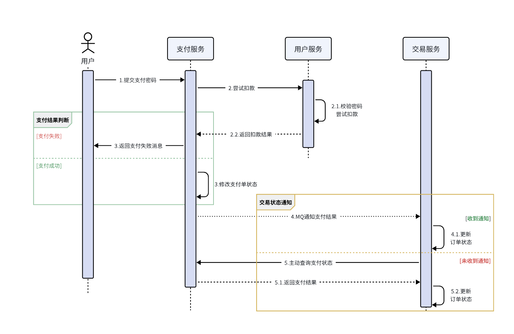


#### 4.1 死信交换机

当一个队列中的消息满足下列情况之一时，就会成为**死信（dead letter）：**

+ 消费者使用 basic.reject 或 basic.nack 声明消费失败，并且消息的 requeue 参数设置为 false
+ 消息是一个 过期消息（达到了队列或消息本身设置的过期时间），超时无人消费
+ 要投递的队列消息堆积满了，最早的消息可能成为死信

如果队列通过 dead-letter-exchange 属性指定了一个交换机，那么该队列中的死信就会投递到这个交换机中。这个交换机称为**死信交换机**（Dead Letter Exchange，简称 DLX）

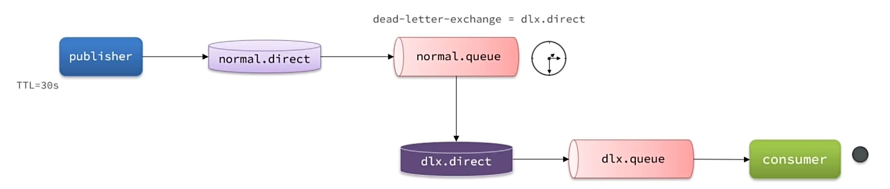


+ SpringRabbitListener.java

```java
@RabbitListener(bindings = @QueueBinding(
        value = @Queue(name = "dlx.queue", durable = "true"),
        exchange = @Exchange(name = "dlx.direct", type = ExchangeTypes.DIRECT),
        key = {"hi"}
))
public void listenDlxQueue(String message) {
    log.info("消费者监听到dlx.queue的消息：【{}】", message);
}
```

+ NormalConfiguration.java

```java
package com.itheima.consumer.config;

import org.springframework.amqp.core.*;
import org.springframework.context.annotation.Bean;

public class NormalConfiguration {
    @Bean
    public DirectExchange normalExchange() {
        return new DirectExchange("normal.direct");
    }

    @Bean
    public Queue normalQueue() {
        return QueueBuilder.durable("normal.queue").deadLetterExchange("dlx.direct").build();
    }

    @Bean
    public Binding normalExchangeBinding(Queue normalQueue, DirectExchange normalExchange) {
        return BindingBuilder.bind(normalQueue).to(normalExchange).with("hi");
    }
}
```

+ 发送消息（带过期时间）

```java
@Test
void testSendDelayMessage() {
    rabbitTemplate.convertAndSend("normal.direct", "hi", "hello", message -> {
        message.getMessageProperties().setExpiration("10000");
        return message;
    });
}
```


----------------


#### 4.2 延迟消息插件

这个插件可以将普通交换机改造为支持延迟消息功能的交换机，当消息投递到交换机后可以暂存一定时间，到期后再投递到队列


官方文档：https://www.rabbitmq.com/blog/2015/04/16/scheduling-messages-with-rabbitmq

下载地址：https://github.com/rabbitmq/rabbitmq-delayed-message-exchange


##### 4.2.1 安装

因为我们是基于Docker安装，所以需要先查看RabbitMQ的插件目录对应的数据卷。

```Shell
docker volume inspect mq-plugins
```

结果如下：

```JSON
[
    {
        "CreatedAt": "2024-06-19T09:22:59+08:00",
        "Driver": "local",
        "Labels": null,
        "Mountpoint": "/var/lib/docker/volumes/mq-plugins/_data",
        "Name": "mq-plugins",
        "Options": null,
        "Scope": "local"
    }
]
```

插件目录被挂载到了 `/var/lib/docker/volumes/mq-plugins/_data` 这个目录，我们上传插件到该目录下

接下来执行命令，安装插件：

```Shell
docker exec -it mq rabbitmq-plugins enable rabbitmq_delayed_message_exchange
```

+ 注意：容器名不一样的话要改

运行结果如下：


##### 4.2.2 声明交换机

这个插件可以将普通交换机改造为支持延迟消息功能的交换机，当消息投递到交换机后可以暂存一定时间，到期后再投递到队列

```Java
@RabbitListener(bindings = @QueueBinding(
        value = @Queue(name = "delay.queue", durable = "true"),
        exchange = @Exchange(name = "delay.direct", delayed = "true"),
        key = "delay"
))
public void listenDelayMessage(String msg){
    log.info("接收到delay.queue的延迟消息：{}", msg);
}
```

基于 `@Bean` 的方式：

```Java
package com.itheima.consumer.config;

import lombok.extern.slf4j.Slf4j;
import org.springframework.amqp.core.*;
import org.springframework.context.annotation.Bean;
import org.springframework.context.annotation.Configuration;

@Slf4j
@Configuration
public class DelayExchangeConfig {

    @Bean
    public DirectExchange delayExchange(){
        return ExchangeBuilder
                .directExchange("delay.direct") // 指定交换机类型和名称
                .delayed() // 设置delay的属性为true
                .durable(true) // 持久化
                .build();
    }

    @Bean
    public Queue delayedQueue(){
        return new Queue("delay.queue");
    }
    
    @Bean
    public Binding delayQueueBinding(){
        return BindingBuilder.bind(delayedQueue()).to(delayExchange()).with("delay");
    }
}
```


##### 4.2.3 发送延迟消息

发送消息时，必须通过 x-delay 属性设定延迟时间：

```Java
@Test
void testPublisherDelayMessage() {
    // 1.创建消息
    String message = "hello, delayed message";
    // 2.发送消息，利用消息后置处理器添加消息头
    rabbitTemplate.convertAndSend("delay.direct", "delay", message, new MessagePostProcessor() {
        @Override
        public Message postProcessMessage(Message message) throws AmqpException {
            // 添加延迟消息属性
            message.getMessageProperties().setDelay(5000);
            return message;
        }
    });
}
```


---------------


#### 4.3 取消超时订单

用户下单完成后，发送15分钟延迟消息，在15分钟后接收消息，检查支付状态：

+ 已支付：更新订单状态为已支付
+ 未支付：更新订单状态为关闭订单，恢复商品库存

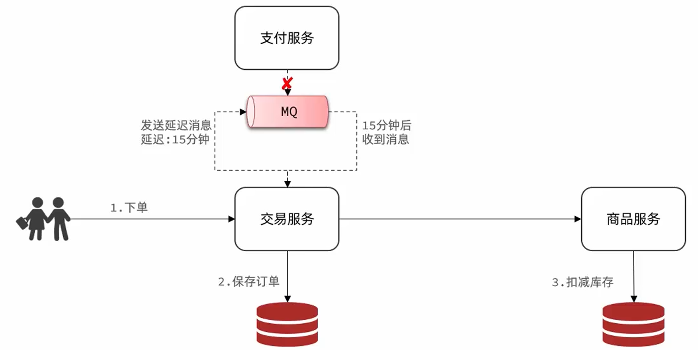

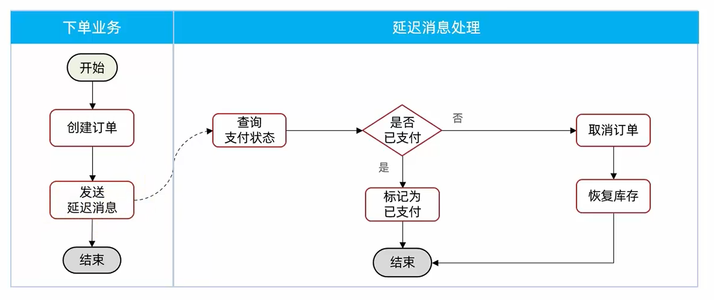

+ OrderServiceImpl.java

```java
// 5. 发送延迟消息，检测订单支付状态
rabbitTemplate.convertAndSend(
        MQConstants.DELAY_EXCHANGE_NAME,
        MQConstants.DELAY_ORDER_KEY,
        order.getId(),
        message -> {
            message.getMessageProperties().setDelay(150000);
            return message;
        });

return order.getId();
```

+ OrderDelayMessageListener.java

```java
package com.hmall.trade.listener;

import com.hmall.api.clients.PayClient;
import com.hmall.api.dto.PayOrderDTO;
import com.hmall.trade.constants.MQConstants;
import com.hmall.trade.domain.po.Order;
import com.hmall.trade.service.IOrderService;
import lombok.RequiredArgsConstructor;
import org.springframework.amqp.rabbit.annotation.Exchange;
import org.springframework.amqp.rabbit.annotation.Queue;
import org.springframework.amqp.rabbit.annotation.QueueBinding;
import org.springframework.amqp.rabbit.annotation.RabbitListener;
import org.springframework.stereotype.Component;

@Component
@RequiredArgsConstructor
public class OrderDelayMessageListener {

    private final IOrderService orderService;
    private final PayClient payClient;

    @RabbitListener(bindings = @QueueBinding(
            value = @Queue(name = MQConstants.DELAY_ORDER_QUEUE_NAME),
            exchange = @Exchange(name = MQConstants.DELAY_EXCHANGE_NAME, delayed = "true"),
            key = MQConstants.DELAY_ORDER_KEY
    ))
    public void listenOrderDelayMessage(Long orderId) {
        // 1. 查询订单
        Order order = orderService.getById(orderId);
        // 2. 检测订单状态， 判断是否已支付
        if (order == null || order.getStatus() != 1) {
            // 订单不存在或者已经支付
            return;
        }
        // 3. 未支付，需要查询支付流水状态
        PayOrderDTO payOrder = payClient.queryPayOrderByBizOrderNo(orderId);
        // 4. 判断是否支付
        if (payOrder != null && payOrder.getStatus() == 3) {
            // 4.1 已支付，标记订单状态为已支付
            orderService.markOrderPaySuccess(orderId);
        } else {
            // 4.2 未支付，取消订单，恢复库存
            orderService.cancelOrder(orderId);
        }
    }
}
```


-------------------


## 八、Elasticsearch

高性能分布式搜索引擎

黑马商城的商品表中仅仅有不到9万条数据，基于数据库查询时，搜索接口的表现如图：


改为基于搜索引擎后，查询表现如下：


+ 搜索引擎技术排名：

1. Elasticsearch：开源的分布式搜索引擎
2. Splunk：商业项目
3. Solr：Apache 的开源搜索引擎


### 1. 初识 elasticsearch

#### 1.1 认识和安装

Lucene 是一个 Java 语言的搜索引擎类库，是 Apache 公司的顶级项目，由 DougCutting 于1999年研发，官网地址：[Apache Lucene - Welcome to Apache Lucene](https://lucene.apache.org/)

Lucene 的优势：

+ 易扩展
+ 高性能（基于倒排索引）


+ 2004年 Shay Banon 基于 Lucene 开发了 Compass
+ 2010 年 Shay Banon 重写了 Compass，取名为 Elasticsearch
+ 官网地址：[Elasticsearch：官方分布式搜索和分析引擎 | Elastic](https://www.elastic.co/cn/elasticsearch)，目前最新版本是：8.x.x
+ elasticsearch:
  + 支持分布式，可水平扩展
  + 提供 Restful 接口，可被任何语言调用

elasticsearch 结合 kibana、Logstash、Beats，是一整套技术栈，被叫做 ELK。被广泛应用在日志数据分析、实时监控等领域

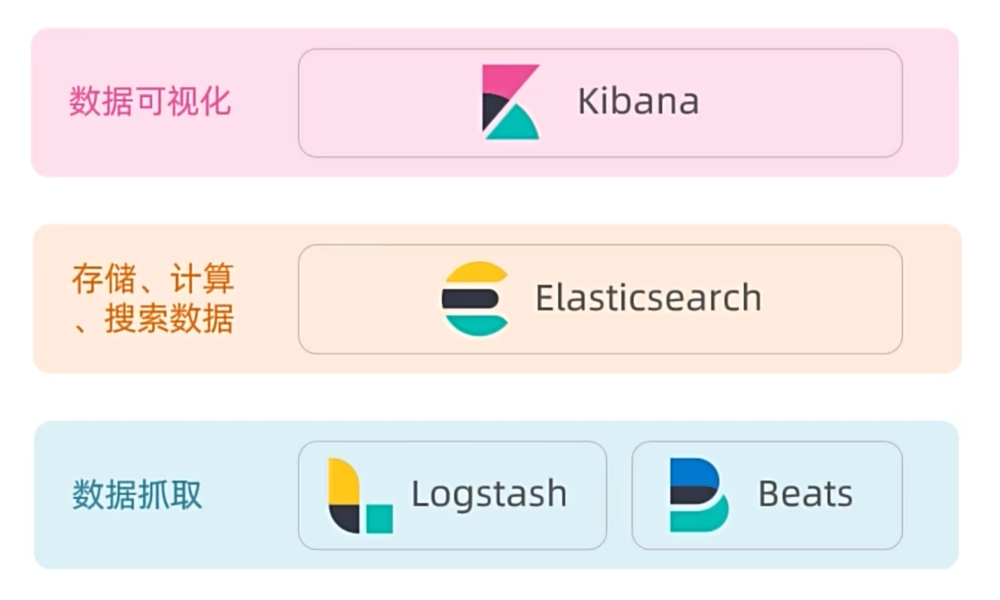


##### 1.1.1 安装 elasticsearch

通过下面的 Docker 命令即可安装单机版本的 elasticsearch：

```Bash
docker run -d \
  --name es \
  -e "ES_JAVA_OPTS=-Xms512m -Xmx512m" \
  -e "discovery.type=single-node" \
  -v es-data:/usr/share/elasticsearch/data \
  -v es-plugins:/usr/share/elasticsearch/plugins \
  --privileged \
  --network hm-net \
  -p 9200:9200 \
  -p 9300:9300 \
  elasticsearch:7.12.1
```

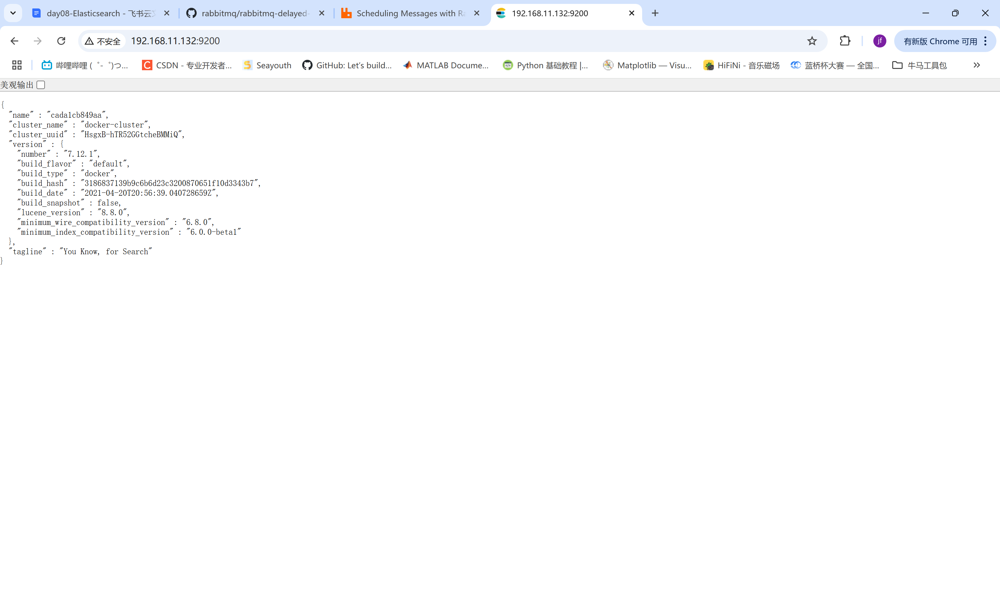


##### 1.1.2 安装 Kibana

通过下面的 Docker 命令，即可部署 Kibana：

```Bash
docker run -d \
--name kibana \
-e ELASTICSEARCH_HOSTS=http://es:9200 \
--network=hm-net \
-p 5601:5601  \
kibana:7.12.1
```

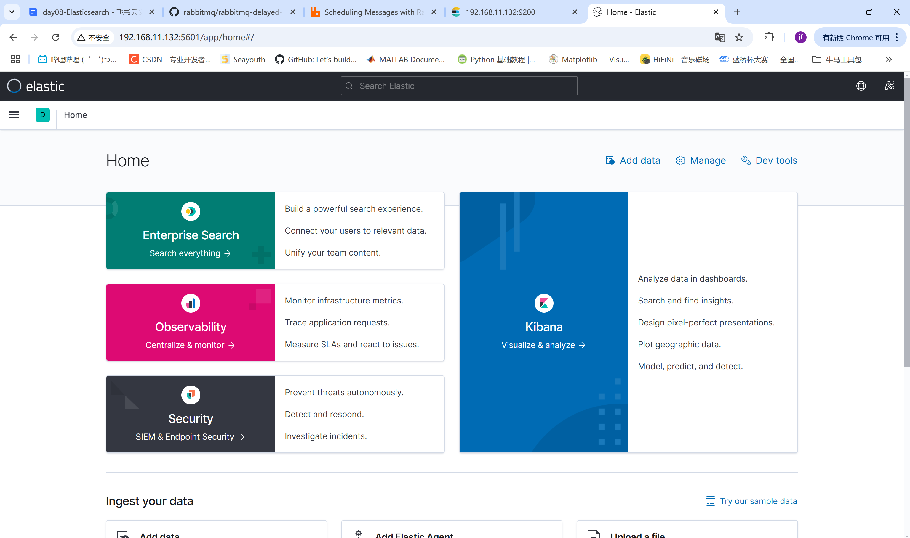


-------------


#### 1.2 倒排索引

传统数据（如 MySQL）采用正向索引，例如给下表（tb_goods）中的 id 创建索引：

那搜索的大概流程如图：


elasticsearch 采用倒排索引：

+ 文档（document）：每条数据就是一个文档
+ 词条（term）：文档按照语义分成的词语

倒排索引的**搜索流程**如下（以搜索"华为手机"为例），如图：


##### 总结

什么是文档和词条？

+ 每一条数据就是一个文档
+ 对文档中的内容分词，得到的词语就是词条

什么是正向索引？

+ 基于文档 id 创建索引。根据 id 查询快，但是查询词条时必须先找到文档，而后判断是否包含词条

什么是倒排索引？

+ 对文档内容分词，对词条创建索引，并记录词条所在文档的 id，查询时先根据词条查询到文档 id，而后根据文档 id 查询文档


--------------


#### 1.3 IK 分词器

中文分词往往需要根据语义分析，比较复杂，这就需要用到中文分词器，例如 **IK 分词器**。IK 分词器是林良益在2006年开源发布的，其采用的正向迭代最细粒度切分算法一直沿用至今。

只要把分词器放入 elasticsearch 的插件目录即可：

首先，查看之前安装的Elasticsearch容器的plugins数据卷目录：

```Shell
docker volume inspect es-plugins
```

然后上传至虚拟机的 `/var/lib/docker/volumes/es-plugins/_data` 这个目录：


最后，重启es容器：

```Shell
docker restart es
```


在 Kibana 的 DevTools 中可以使用下面的语法来测试 IK 分词器：

```JSON
POST /_analyze
{
  "analyzer": "standard",
  "text": "黑马程序员学习java太棒了"
}
```

语法说明：

+ `POST`：请求方式
+ `/_analyze`：请求路径，这里省略了 http://192.168.11.132:9200，由 kibana 帮我们补充
+ 请求参数，json 风格：
  + `analyzer`：分词器类型，这里是默认的 standard 分词器
  + `text`：要分词的内容


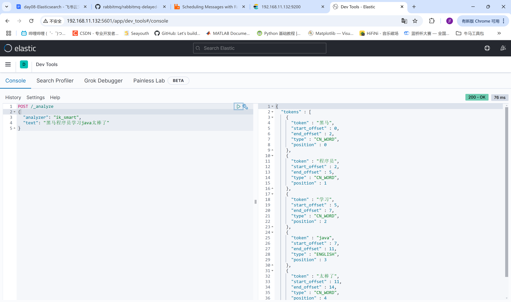

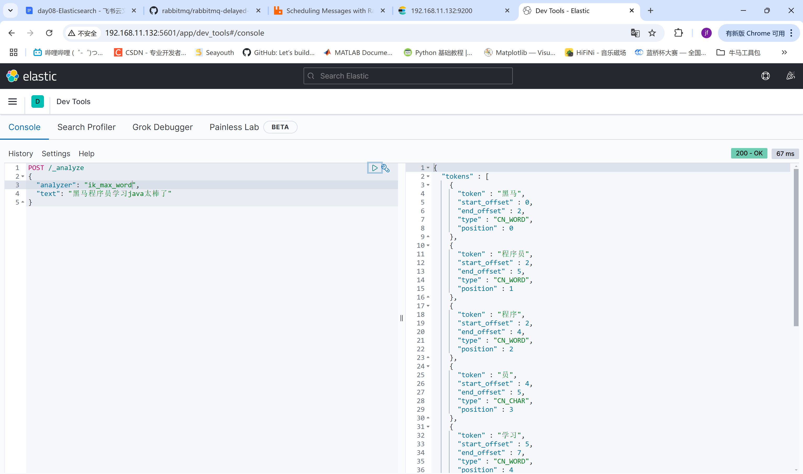


IK 分词器允许我们配置拓展词典来增加自定义的词库：

1. 打开 IK 分词器 config 目录：


注意，如果采用在线安装的通过，默认是没有 config 目录的，需要把课前资料提供的 ik 下的 config 上传至对应目录。

2. 在 IKAnalyzer.cfg.xml 配置文件内容添加：

```XML
<?xml version="1.0" encoding="UTF-8"?>
<!DOCTYPE properties SYSTEM "http://java.sun.com/dtd/properties.dtd">
<properties>
        <comment>IK Analyzer 扩展配置</comment>
        <!--用户可以在这里配置自己的扩展字典 *** 添加扩展词典-->
        <entry key="ext_dict">ext.dic</entry>
</properties>
```

3. 在IK分词器的 config 目录新建一个 `ext.dic`，可以参考 config 目录下复制一个配置文件进行修改

```Plain
传智播客
泰裤辣
```

4. 重启 elasticsearch

```Shell
docker restart es

# 查看 日志
docker logs -f elasticsearch
```


##### 总结

分词器的作用是什么？

+ 创建倒排索引时，对文档分词
+ 用户搜索时，对输入的内容分词

IK 分词器有几种模式？

+ `ik_smart`：智能切分，粗粒度
+ `ik_max_word`：最细切分，细粒度 IK 分词器

如何扩展分词器词库中的词条？

+ 利用 config 目录的 IkAnalyzer.cfg.xml 文件添加拓展词典
+ 在词典中添加拓展词条


------------------


#### 1.4 基础概念

elasticsearch 中的文档数据会被序列化为 json 格式后存储在 elasticsearch 中

索引（index）：相同类型的文档的集合（可以称为索引库，以便与 MySQL 的索引做区分）

映射（mapping）：索引中文档的字段约束信息，类似表的结构约束

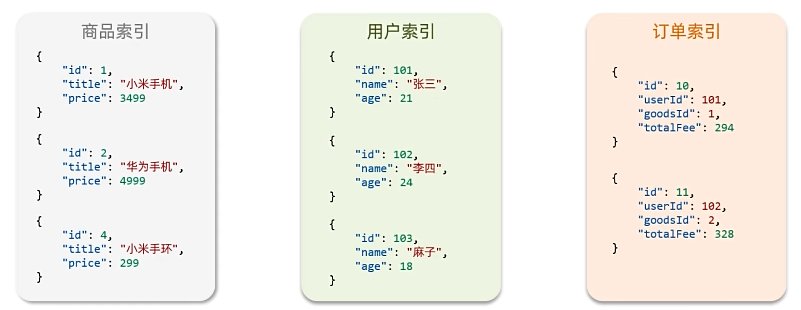


| **MySQL** | **Elasticsearch** | **说明**                                                     |
| :-------- | :---------------- | :----------------------------------------------------------- |
| Table     | Index             | 索引（index），就是文档的集合，类似数据库的表（table）       |
| Row       | Document          | 文档（Document），就是一条条的数据，类似数据库中的行（Row），文档都是 JSON 格式 |
| Column    | Field             | 字段（Field），就是 JSON 文档中的字段，类似数据库中的列（Column） |
| Schema    | Mapping           | Mapping（映射）是索引中文档的约束，例如字段类型约束。类似数据库的表结构（Schema） |
| SQL       | DSL               | DSL 是 elasticsearch 提供的 JSON 风格的请求语句，用来操作 elasticsearch，实现 CRUD |


-----------------


### 2. 索引库操作

#### 2.1 Mapping 映射属性

mapping 是对索引库中文档的约束，常见的 mapping 属性包括：

+ type：字段数据类型，常见的简单类型有：
  + 字符串：text（可分词的文本）、keyword（精确值，例如：品牌、国家、ip 地址）
  + 数值：long、integer、short、byte、double、float
  + 布尔：boolean
  + 日期：date
  + 对象：object
+ index：是否创建索引，默认为 true
+ analyzer：使用哪种分词器
+ properties：该字段的子字段

例如下面的json文档：

```JSON
{
    "age": 21,
    "weight": 52.1,
    "isMarried": false,
    "info": "黑马程序员Java讲师",
    "email": "zy@itcast.cn",
    "score": [99.1, 99.5, 98.9],
    "name": {
        "firstName": "云",
        "lastName": "赵"
    }
}
```

对应的每个字段映射（Mapping）：

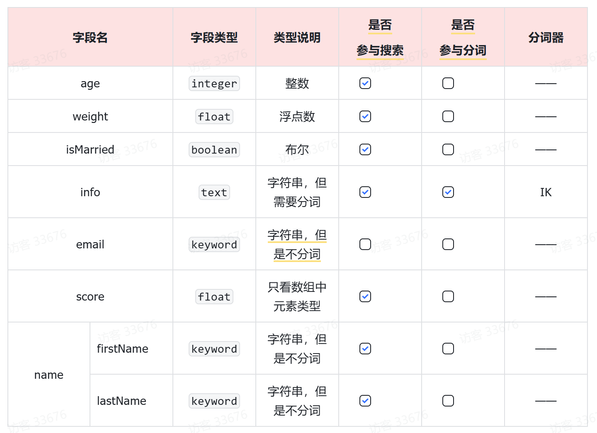


--------------


#### 2.2 索引库操作

Elasticsearch 提供的所有 API 都是 Restful 接口，遵循 Restful 的基本规范

##### 2.2.1 创建索引库

创建索引库和 mapping 的请求语法如下：

```JSON
PUT /索引库名称
{
  "mappings": {
    "properties": {
      "字段名":{
        "type": "text",
        "analyzer": "ik_smart"
      },
      "字段名2":{
        "type": "keyword",
        "index": "false"
      },
      "字段名3":{
        "properties": {
          "子字段": {
            "type": "keyword"
          }
        }
      },
      // ...略
    }
  }
}
```

示例：

```JSON
# PUT /heima
{
  "mappings": {
    "properties": {
      "info":{
        "type": "text",
        "analyzer": "ik_smart"
      },
      "email":{
        "type": "keyword",
        "index": "false"
      },
      "name":{
        "properties": {
          "firstName": {
            "type": "keyword"
          }
        }
      }
    }
  }
}
```


##### 2.2.2 查询索引库

查看索引库语法：

```Plain
GET /索引库名
```

示例：

```Plain
GET /heima
```


##### 2.2.3 删除索引库

删除索引库语法：

```Plain
DELETE /索引库名
```

示例：

```Plain
DELETE /heima
```


##### 2.2.4 新增索引库字段

索引库和 mapping 一旦创建无法修改，但是可以添加新的字段，语法如下：

```JSON
PUT /索引库名/_mapping
{
  "properties": {
    "新字段名":{
      "type": "integer"
    }
  }
}
```

示例：

```JSON
PUT /heima/_mapping
{
  "properties": {
    "age":{
      "type": "integer"
    }
  }
}
```


##### 总结

索引库操作有哪些？

+ 创建索引库：PUT /索引库名
+ 查询索引库：GET /索引库名
+ 删除索引库：DELETE /索引库名
+ 添加字段：PUT /索引库名/_mapping


---------------------


### 3. 文档操作

#### 3.1 文档 CRUD

##### 3.1.1 新增文档

新增文档的请求格式如下：

```JSON
POST /索引库名/_doc/文档id
{
    "字段1": "值1",
    "字段2": "值2",
    "字段3": {
        "子属性1": "值3",
        "子属性2": "值4"
    },
    // ...
}
```

示例：

```JSON
POST /heima/_doc/1
{
    "info": "黑马程序员Java讲师",
    "email": "zy@itcast.cn",
    "name": {
        "firstName": "云",
        "lastName": "赵"
    }
}
```


##### 3.1.2 查询文档

根据 rest 风格，新增是 post，查询应该是 get，不过查询一般都需要条件，这里我们把文档 id 带上

语法：

```JSON
GET /{索引库名称}/_doc/{id}
```

示例：

```JavaScript
GET /heima/_doc/1
```


##### 3.1.3 删除文档

删除使用DELETE请求，同样，需要根据id进行删除：

语法：

```JavaScript
DELETE /{索引库名}/_doc/id值
```

示例：

```JSON
DELETE /heima/_doc/1
```


##### 3.1.4 修改文档

方式一：全量修改，会删除旧文档，添加新文档

```JSON
PUT /{索引库名}/_doc/文档id
{
    "字段1": "值1",
    "字段2": "值2",
    // ... 略
}
```

示例：

```JSON
PUT /heima/_doc/1
{
    "info": "黑马程序员高级Java讲师",
    "email": "zy@itcast.cn",
    "name": {
        "firstName": "云",
        "lastName": "赵"
    }
}
```


方式二：增量修改，修改指定字段值

```JSON
POST /{索引库名}/_update/文档id
{
    "doc": {
         "字段名": "新的值",
    }
}
```

示例：

```JSON
POST /heima/_update/1
{
  "doc": {
    "email": "ZhaoYun@itcast.cn"
  }
}
```


##### 总结

文档操作有哪些？

+ 创建文档：`POST /索引库名/_doc/文档id {json文档}`
+ 查询文档：`GET /索引库名/_doc/文档id`
+ 删除文档：`DELETE /索引库名/_doc/文档id`
+ 修改文档：
  + 全量修改：`PUT /索引库名/_doc/文档id {json文档}`
  + 增量修改：`POST /索引库名/_update/文档id {"doc":{字段}}`


-------------


#### 3.2 批量处理

Elasticsearch 中允许通过一次请求中携带多次文档操作，也就是批量处理，语法格式如下：

```Java
POST _bulk
{ "index" : { "_index" : "test", "_id" : "1" } }
{ "field1" : "value1" }
{ "delete" : { "_index" : "test", "_id" : "2" } }
{ "create" : { "_index" : "test", "_id" : "3" } }
{ "field1" : "value3" }
{ "update" : {"_id" : "1", "_index" : "test"} }
{ "doc" : {"field2" : "value2"} }
```

其中：

- `index` 代表新增操作
  - `_index`：指定索引库名
  - `_id` 指定要操作的文档 id
  - `{ "field1" : "value1" }`：则是要新增的文档内容
- `delete` 代表删除操作
  - `_index`：指定索引库名
  - `_id`指定要操作的文档 id
- `update` 代表更新操作
  - `_index`：指定索引库名
  - `_id` 指定要操作的文档 id
  - `{ "doc" : {"field2" : "value2"} }`：要更新的文档字段

示例，批量新增：

```Java
POST /_bulk
{"index": {"_index":"heima", "_id": "3"}}
{"info": "黑马程序员C++讲师", "email": "ww@itcast.cn", "name":{"firstName": "五", "lastName":"王"}}
{"index": {"_index":"heima", "_id": "4"}}
{"info": "黑马程序员前端讲师", "email": "zhangsan@itcast.cn", "name":{"firstName": "三", "lastName":"张"}}
```

批量删除：

```Java
POST /_bulk
{"delete":{"_index":"heima", "_id": "3"}}
{"delete":{"_index":"heima", "_id": "4"}}
```


-----------------


### 4. JavaRestClient

#### 4.1 客户端初始化

Elasticsearch 目前最新版本是8.0，其 Java 客户端有很大变化。不过大多数企业使用的还是8以下版本，所以我们选择使用早期 JavaRestClient 客户端来学习。官方文档地址：[Elasticsearch clients | Elastic Docs](https://www.elastic.co/docs/reference/elasticsearch-clients)

1. 引入 es 的 RestHighLevelClient 依赖：

```XML
<dependency>
    <groupId>org.elasticsearch.client</groupId>
    <artifactId>elasticsearch-rest-high-level-client</artifactId>
</dependency>
```

2. 因为 SpringBoot 默认的 ES 版本是 7.17.0，所以我们需要覆盖默认的 ES 版本：

```XML
  <properties>
      <maven.compiler.source>11</maven.compiler.source>
      <maven.compiler.target>11</maven.compiler.target>
      <elasticsearch.version>7.12.1</elasticsearch.version>
  </properties>
```

3. 初始化 RestHighLevelClient：

```Java
RestHighLevelClient client = new RestHighLevelClient(RestClient.builder(
        HttpHost.create("http://192.168.150.101:9200")
));
```

示例：

```java
package com.hmall.item.es;

import org.apache.http.HttpHost;
import org.elasticsearch.client.RestClient;
import org.elasticsearch.client.RestHighLevelClient;
import org.junit.jupiter.api.AfterEach;
import org.junit.jupiter.api.BeforeEach;
import org.junit.jupiter.api.Test;

import java.io.IOException;

public class ElasticTest {

    private RestHighLevelClient client;

    @Test
    void testConnection(){
        System.out.println("client = " + client);
    }

    @BeforeEach
    void setUp() {
        client = new RestHighLevelClient(RestClient.builder(
                HttpHost.create("http://192.168.11.132:9200")
        ));
    }

    @AfterEach
    void tearDown() throws IOException {
        if (client != null) {
            client.close();
        }
    }
}
```


---------------


#### 4.2 商品表 Mapping 映射

我们要实现商品搜索，那么索引库的字段肯定要满足页面搜索的需求：

```json
# 商品索引库
PUT /hmall
{
  "mappings": {
    "properties": {
      "id": {
        "type": "keyword"
      },
      "name": {
        "type": "text",
        "analyzer": "ik_smart"
      },
      "price": {
        "type": "integer"
      },
      "image": {
        "type": "keyword",
        "index": false
      },
      "category": {
        "type": "keyword"
      },
      "brand": {
        "type": "keyword"
      },
      "sold": {
        "type": "integer"
      },
      "commentCount": {
        "type": "integer",
        "index": false
      },
      "isAB": {
        "type": "boolean"
      },
      "updateTime": {
        "type": "date"
      }
    }
  }
}
```


------------------


#### 4.3 索引库操作

创建索引库的 JavaAPI 与 Restful 接口 API 对比：


##### 4.3.1 删除索引库

```Java
@Test
void testDeleteIndex() throws IOException {
    // 1.创建Request对象
    DeleteIndexRequest request = new DeleteIndexRequest("items");
    // 2.发送请求
    client.indices().delete(request, RequestOptions.DEFAULT);
}
```


##### 4.3.2 查询索引库信息

```java
@Test
void testExistHotelIndex() throws IOException {
    // 1.创建Request对象
    GetIndexRequest request = new GetIndexRequest("items");
    // 2.发送请求
    client.indices().get(request, RequestOptions.DEFAULT);
}
```


示例：

```java
package com.hmall.item.es;

import org.apache.http.HttpHost;
import org.elasticsearch.action.admin.indices.delete.DeleteIndexRequest;
import org.elasticsearch.action.index.IndexRequest;
import org.elasticsearch.client.RequestOptions;
import org.elasticsearch.client.RestClient;
import org.elasticsearch.client.RestHighLevelClient;
import org.elasticsearch.client.indices.CreateIndexRequest;
import org.elasticsearch.client.indices.GetIndexRequest;
import org.elasticsearch.common.xcontent.XContentType;
import org.junit.jupiter.api.AfterEach;
import org.junit.jupiter.api.BeforeEach;
import org.junit.jupiter.api.Test;

import java.io.IOException;

public class ElasticTest {

    private RestHighLevelClient client;

    @Test
    void testConnection() {
        System.out.println("client = " + client);
    }

    /**
     * 创建索引库
     */
    @Test
    void testCreateIndex() throws IOException {
        // 1. 准备Request对象
        CreateIndexRequest request = new CreateIndexRequest("items");
        // 2. 准备请求参数
        request.source(MAPPING_TEMPLATE, XContentType.JSON);
        // 3. 发送请求
        client.indices().create(request, RequestOptions.DEFAULT);
    }

    /**
     * 判断索引库存不存在
     */
    @Test
    void testGetIndex() throws IOException {
        // 1. 准备Request对象
        GetIndexRequest request = new GetIndexRequest("items");
        // 2. 发送请求
        boolean exists = client.indices().exists(request, RequestOptions.DEFAULT);
        System.out.println("exists = " + exists);
    }

    /**
     * 删除索引库
     */
    @Test
    void testDeleteIndex() throws IOException {
        // 1. 准备Request对象
        DeleteIndexRequest request = new DeleteIndexRequest("items");
        // 2. 发送请求
        client.indices().delete(request, RequestOptions.DEFAULT);
    }

    @BeforeEach
    void setUp() {
        client = new RestHighLevelClient(RestClient.builder(
                HttpHost.create("http://192.168.11.132:9200")
        ));
    }

    @AfterEach
    void tearDown() throws IOException {
        if (client != null) {
            client.close();
        }
    }

    private static final String MAPPING_TEMPLATE = "{\n" +
            "  \"mappings\": {\n" +
            "    \"properties\": {\n" +
            "      \"id\": {\n" +
            "        \"type\": \"keyword\"\n" +
            "      },\n" +
            "      \"name\": {\n" +
            "        \"type\": \"text\",\n" +
            "        \"analyzer\": \"ik_smart\"\n" +
            "      },\n" +
            "      \"price\": {\n" +
            "        \"type\": \"integer\"\n" +
            "      },\n" +
            "      \"image\": {\n" +
            "        \"type\": \"keyword\",\n" +
            "        \"index\": false\n" +
            "      },\n" +
            "      \"category\": {\n" +
            "        \"type\": \"keyword\"\n" +
            "      },\n" +
            "      \"brand\": {\n" +
            "        \"type\": \"keyword\"\n" +
            "      },\n" +
            "      \"sold\": {\n" +
            "        \"type\": \"integer\"\n" +
            "      },\n" +
            "      \"commentCount\": {\n" +
            "        \"type\": \"integer\",\n" +
            "        \"index\": false\n" +
            "      },\n" +
            "      \"isAB\": {\n" +
            "        \"type\": \"boolean\"\n" +
            "      },\n" +
            "      \"updateTime\": {\n" +
            "        \"type\": \"date\"\n" +
            "      }\n" +
            "    }\n" +
            "  }\n" +
            "}\n";
}
```


##### 总结

索引库操作的基本步骤：

1. 创建 XxxIndexRequest。Xxx 是 Create、Get、Delete
2. 准备请求参数（Create 时需要）
3. 发送请求。调用 `RestHighLevelClient.indices().xxx()` 方法，xxx 是 create、get(exists)、delete


-----------------


#### 4.4 文档操作

##### 4.4.1 新增文档

新增文档的 JavaAPI 如下：


+ 示例（新增文档）

```java
package com.hmall.item.es;

import cn.hutool.core.bean.BeanUtil;
import cn.hutool.json.JSONUtil;
import com.hmall.item.domain.po.Item;
import com.hmall.item.domain.po.ItemDoc;
import com.hmall.item.service.IItemService;
import org.apache.http.HttpHost;
import org.elasticsearch.action.admin.indices.delete.DeleteIndexRequest;
import org.elasticsearch.action.index.IndexRequest;
import org.elasticsearch.client.RequestOptions;
import org.elasticsearch.client.RestClient;
import org.elasticsearch.client.RestHighLevelClient;
import org.elasticsearch.client.indices.CreateIndexRequest;
import org.elasticsearch.client.indices.GetIndexRequest;
import org.elasticsearch.common.xcontent.XContentType;
import org.junit.jupiter.api.AfterEach;
import org.junit.jupiter.api.BeforeEach;
import org.junit.jupiter.api.Test;
import org.springframework.beans.factory.annotation.Autowired;
import org.springframework.boot.test.context.SpringBootTest;

import java.io.IOException;

@SpringBootTest(properties = "spring.profiles.active=local")
public class ElasticDocumentTest {

    private RestHighLevelClient client;
    @Autowired
    private IItemService itemService;

    @Test
    void testConnection() {
        System.out.println("client = " + client);
    }

    /**
     * 新增文档
     */
    @Test
    void testIndexDoc() throws IOException {
        // 0. 准备文档数据
        // 0.1 根据id查询数据库数据
        Item item = itemService.getById(100000011127L);
        // 0.2 把数据库数据转为文档数据
        ItemDoc itemDoc = BeanUtil.copyProperties(item, ItemDoc.class);
        // 1. 准备Request
        IndexRequest request = new IndexRequest("items").id(itemDoc.getId());
        // 2. 准备请求参数
        request.source(JSONUtil.toJsonStr(itemDoc), XContentType.JSON);
        // 3. 发送请求
        client.index(request, RequestOptions.DEFAULT);
    }

    @BeforeEach
    void setUp() {
        client = new RestHighLevelClient(RestClient.builder(
                HttpHost.create("http://192.168.11.132:9200")
        ));
    }

    @AfterEach
    void tearDown() throws IOException {
        if (client != null) {
            client.close();
        }
    }
}
```


##### 4.4.2 删除文档

删除文档的 JavaAPI 如下：

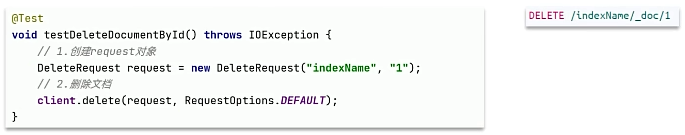

示例：

```java
@Test
void testDeleteDoc() throws IOException {
    // 1. 准备Request
    DeleteRequest request = new DeleteRequest("items", "100000011127");
    // 2. 发送请求
   client.delete(request, RequestOptions.DEFAULT);
}
```


##### 4.4.3 查询文档

查询文档包含查询和解析响应结果两部分。对应的 JavaAPI 如下：


示例：

```java
@Test
void testGetDoc() throws IOException {
    // 1. 准备Request
    GetRequest request = new GetRequest("items", "100000011127");
    // 2. 发送请求
    GetResponse response = client.get(request, RequestOptions.DEFAULT);
    // 3. 解析响应结果
    String json = response.getSourceAsString();
    ItemDoc doc = JSONUtil.toBean(json, ItemDoc.class);
    System.out.println("doc = " + doc);
}
```


##### 4.4.4 修改文档

修改文档数据有两种方式：

+ 方式一：全量更新。再次写入 id 一样的文档，就会删除旧文档，添加新文档。与新增的 JavaAPI 一致
+ 方式二：局部更新。只更新指定部分字段


示例：

```java
@Test
void testUpdateDoc() throws IOException {
    // 1. 准备Request
    UpdateRequest request = new UpdateRequest("items", "100000011127");
    // 2. 准备请求参数
    request.doc(
            "price", 25600
    );
    // 3. 发送请求
    client.update(request, RequestOptions.DEFAULT);
}
```


##### 总结

文档操作的基本步骤：

- 初始化 `RestHighLevelClient`
- 创建 XxxRequest。XXX 是 `Index`、`Get`、`Update`、`Delete`、`Bulk`
- 准备参数（`Index`、`Update`、`Bulk` 时需要）
- 发送请求。调用 `RestHighLevelClient.xxx()` 方法，xxx 是 `index`、`get`、`update`、`delete`、`bulk`
- 解析结果（`Get` 时需要）


----------------


#### 4.5 批处理

批处理代码流程与之前类似，只不过构建请求会用到一个名为 BulkRequest 来封装普通的 CRUD 请求：


批处理的 API 示例：

```Java
@Test
void testBulk() throws IOException {
    // 1.创建Request
    BulkRequest request = new BulkRequest();
    // 2.准备请求参数
    request.add(new IndexRequest("items").id("1").source("json doc1", XContentType.JSON));
    request.add(new IndexRequest("items").id("2").source("json doc2", XContentType.JSON));
    // 3.发送请求
    client.bulk(request, RequestOptions.DEFAULT);
}
```


示例：

```java
/**
 * 批量新增
 */
@Test
void testBulkDoc() throws IOException {
    int pageNo = 1, pageSize = 500;
    while (true) {
        // 0. 准备文档数据
        Page<Item> page = itemService.lambdaQuery()
                .eq(Item::getStatus, 1)
                .page(Page.of(pageNo, pageSize));
        List<Item> records = page.getRecords();
        if (records == null || records.isEmpty()) {
            return;
        }

        // 1. 准备Request
        BulkRequest request = new BulkRequest();
        // 2. 准备请求参数
        for (Item item : records) {
            request.add(new IndexRequest("items")
                    .id(item.getId().toString())
                    .source(JSONUtil.toJsonStr(BeanUtil.copyProperties(item, ItemDoc.class)), XContentType.JSON));
        }
        // 3. 发送请求
        client.bulk(request, RequestOptions.DEFAULT);
        // 5. 翻页
        pageNo++;
    }
}
```


-----------------


### 5. DSL 查询

Elasticsearch 提供了 DSL（[Query DSL | Elasticsearch Guide 7.12 | Elastic](https://www.elastic.co/guide/en/elasticsearch/reference/7.12/query-dsl.html)）查询，就是以 JSON 格式来定义查询条件

DSL 查询可以分为两大类：

+ **叶子查询（Leaf query clauses）**：一般是在特定的字段里查询特定值，属于简单查询，很少单独使用
+ **复合查询（Compound query clauses）**：以逻辑方式组合多个叶子查询或者更改叶子查询的行为方式

在查询以后，还可以对查询的结果做处理，包括：

+ **排序**：按照1个或多个字段值做排序
+ **分页**：根据 from 和 size 做分页，类似 MySQL
+ **高亮**：对搜索结果中的关键字添加特殊样式，使其更加醒目
+ **聚合**：对搜索结果做数据统计以形成报表


#### 5.1 快速入门

基于 DSL 的查询语法如下：

```JSON
GET /{索引库名}/_search
{
  "query": {
    "查询类型": {
      "查询条件": "条件值"
    }
  }
}
```

示例：

```JSON
// 查询所有
GET /items/_search
{
  "query": {
    "match_all": {
      
    }
  }
}
```


-------------


#### 5.2 叶子查询

叶子查询还可以进一步细分，常见的有：

+ **全文检索（full text）**查询：利用分词器对用户输入内容分词，然后去词条列表中匹配。例如：
  + match_query
  + multi_match_query
+ **精确查询**：不对用户输入内容分词，直接精确匹配，一般是查找 keyword、数值、日期、布尔等类型。例如：
  + ids
  + range
  + term
+ **地理（geo）查询**：用于搜索地理位置，搜索方式很多，例如：
  + geo_distance
  + geo_bounding_box


##### 5.2.1 全文检索查询

**match 查询**：全文检索查询的一种，会对用户输入内容分词，然后去倒排索引库检索，语法：

```JSON
GET /{索引库名}/_search
{
  "query": {
    "match": {
      "字段名": "搜索条件"
    }
  }
}
```

示例：


**multi_match**：与 match 查询类似，只不过允许同时查询多个字段，语法：

```JSON
GET /{索引库名}/_search
{
  "query": {
    "multi_match": {
      "query": "搜索条件",
      "fields": ["字段1", "字段2"]
    }
  }
}
```

示例：


##### 5.2.2 精确查询

**精确查询**，英文是 Term-level query，顾名思义，词条级别的查询。也就是说不会对用户输入的搜索条件再分词，而是作为一个词条，与搜索的字段内容精确值匹配

因此推荐查找 keyword、数值、日期、boolean 类型的字段。例如 id、price、城市、地名、人名等作为一个整体才有含义的字段

```JSON
GET /{索引库名}/_search
{
  "query": {
    "term": {
      "字段名": {
        "value": "搜索条件"
      }
    }
  }
}
```

示例：


当你输入的搜索条件不是词条，而是短语时，由于不做分词，你反而搜索不到：


再来看下 `range` 查询，语法如下：

```JSON
GET /{索引库名}/_search
{
  "query": {
    "range": {
      "字段名": {
        "gte": {最小值},
        "lte": {最大值}
      }
    }
  }
}
```

`range` 是范围查询，对于范围筛选的关键字有：

- `gte`：大于等于
- `gt`：大于
- `lte`：小于等于
- `lt`：小于

示例：


##### 总结

match 和 multi_match 的区别是什么？

+ match：根据一个字段查询
+ multi_match：根据多个字段查询，参与查询字段越多，查询性能越差

精确查询常见的有哪些？

+ term 查询：根据词条精确匹配，一般搜索 keyword 类型、数值类型、布尔类型、日期类型字段
+ range 查询：根据数值范围查询，可以是数值、日期的范围


--------------


#### 5.3 复合查询

复合查询大致可以分为两类：

+ 第一类：基于逻辑运算组合叶子查询，实现组合条件，例如：
  + bool
+ 第二类：基于某种算法修改查询时的文档相关性算分，从而改变文档排名。例如：
  + function_score
  + dis_max


布尔查询是一个或多个查询子句的组合。子查询的组合方式有：

+ `must`：必须匹配每个子查询，类似 “与”
+ `should`：选择性匹配子查询，类似 “或”
+ `must_not`：必须不匹配，不参与算分，类似 “非”
+ `filter`：必须匹配，不参与算分

bool 查询的语法如下：

```JSON
GET /items/_search
{
  "query": {
    "bool": {
      "must": [
        {"match": {"name": "手机"}}
      ],
      "should": [
        {"term": {"brand": { "value": "vivo" }}},
        {"term": {"brand": { "value": "小米" }}}
      ],
      "must_not": [
        {"range": {"price": {"gte": 2500}}}
      ],
      "filter": [
        {"range": {"price": {"lte": 1000}}}
      ]
    }
  }
}
```


##### 案例：符合查询

> 需求：
>
> 我们需要搜索 “智能手机”，但品牌必须是华为，价格必须是900~1599

```json
GET /items/_search
{
  "query": {
    "match_all": {}
  }
}

GET /items/_search
{
  "query": {
    "bool": {
      "must": [
        {
          "match": {
            "name": "智能手机"
          }
        }
      ],
      "filter": [
        {
          "term": {
            "brand": "华为"
          }
        },
        {
          "range": {
            "price": {
              "gte": 90000,
              "lte": 159900
            }
          }
        }
      ]
    }
  }
}

```


---------------


#### 5.4 排序和分页

##### 5.4.1 排序

elasticsearch 支持对搜索[结果排序](https://www.elastic.co/guide/en/elasticsearch/reference/7.12/sort-search-results.html)，默认是根据相关度算分（_score）来排序，也可以指定字段排序。可以排序字段类型有：keyword 类型、数值类型、地理坐标类型、日期类型等

```JSON
GET /indexName/_search
{
  "query": {
    "match_all": {}
  },
  "sort": [
    {
      "排序字段": {
        "order": "排序方式asc和desc"
      }
    }
  ]
}
```


###### 案例：实现排序功能

> 需求：
>
> 搜索商品，按照销量排序，销量一样则按照价格升序

```json
GET /items/_search
{
  "query": {
    "match_all": {}
  },
  "sort": [
    {
      "sold": "desc"
    },
    {
      "price": "asc"
    }
  ]
}
```


##### 5.4.2 分页

elasticsearch 默认情况下只返回 top10 的数据。而如果要查询更多数据就需要修改分页参数了。elasticsearch 中通过修改 from、size 参数来控制要返回的分页结果：

+ `from`：从第几个文档开始
+ `size`：总共查询几个文档

```JSON
GET /items/_search
{
  "query": {
    "match_all": {}
  },
  "from": 0, // 分页开始的位置，默认为0
  "size": 10,  // 每页文档数量，默认10
  "sort": [
    {
      "price": {
        "order": "desc"
      }
    }
  ]
}
```


###### 案例：实现排序和分页功能

> 需求：
>
> 搜索商品，查询出销量排名前10的商品，销量一样时按照价格升序

```json
// 排序分页查询
GET /items/_search
{
  "query": {
    "match_all": {}
  },
  "sort": [
    {
      "sold": "desc"
    },
    {
      "price": "asc"
    }
  ],
  "from": 0,
  "size": 10
}
```


#### 5.4.3 深度分页问题

elasticsearch 的数据一般会采用分片存储，也就是把一个索引中的数据分为 N 份，存储到不同节点上。查询数据时需要汇总各个分片的数据

假如我们要查询第100页数据，每页查10条：

```json
GET /hotel/_search
{
    "from": 990,
    "size": 10
}
```

实现思路：

1. 对数据排序
2. 找出第990~1000名

从语句来分析，要查询第990~1000名的数据。

从实现思路来分析，肯定是将所有数据排序，找出前1000名，截取其中的990 ~ 1000的部分。但问题来了，我们如何才能找到所有数据中的前1000名呢？

要知道每一片的数据都不一样，第1片上的第900 ~ 1000，在另1个节点上并不一定依然是900 ~ 1000名。所以我们只能在每一个分片上都找出排名前1000的数据，然后汇总到一起，重新排序，才能找出整个索引库中真正的前1000名，此时截取990 ~ 1000的数据即可。

如图：


针对深度分页，ES 提供了两种解决方案

+ search after：分页时需要排序，原理是从上一次的排序值开始，查询下一页数据。官方推荐使用的方式
+ scroll：原理将排序数据形成快照，保存在内存。官方已经不推荐使用


search after 模式：

+ 有点：没有查询上限，支持深度分页
+ 缺点：只能向后逐页查询，不能随机翻页
+ 场景：数据迁移、手机滚动查询


-----------------


#### 5.5 高亮显示

**高亮显示：**就是在搜索结果中把搜索关键字突出显示

我们在百度，京东搜索时，关键字会变成红色，比较醒目，这叫高亮显示：


```JSON
GET /{索引库名}/_search
{
  "query": {
    "match": {
      "搜索字段": "搜索关键字"
    }
  },
  "highlight": {
    "fields": {
      "高亮字段名称": {
        "pre_tags": "<em>",
        "post_tags": "</em>"
      }
    }
  }
}
```

示例：

```json
GET /items/_search
{
  "query": {
    "match": {
      "name": "脱脂牛奶"
    }
  },
  "highlight": {
    "fields": {
      "name": {
        "pre_tags": "<em>",
        "post_tags": "</em>"
      }
    }
  }
}
```


---------------


#### 总结

搜索的完整语法：

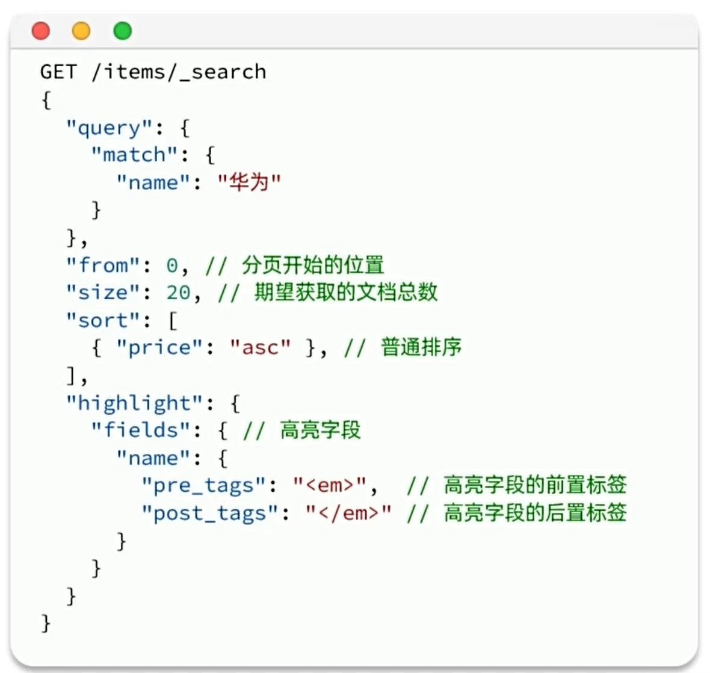


-----------------


### 6. JavaRestClient 查询

#### 6.1 快速入门

数据搜索的 Java 代码我们分为两部分：

+ 构建并发起请求
+ 解析查询结果

首先以`match_all`查询为例，其DSL和JavaAPI的对比如图：


解析查询结果的 API：


示例：

```java
@Test
void testMatchAll() throws IOException {
    // 1. 创建request对象
    SearchRequest request = new SearchRequest("items");
    // 2. 配置request参数
    request.source()
            .query(QueryBuilders.matchAllQuery());
    // 3. 发送请求
    SearchResponse response = client.search(request, RequestOptions.DEFAULT);

    // 4. 解析结果
    SearchHits searchHits = response.getHits();
    // 4.1 总条数
    long total = searchHits.getTotalHits().value;
    System.out.println("total = " + total);
    // 4.2 命中的数据
    SearchHit[] hits = searchHits.getHits();
    for (SearchHit hit : hits) {
        // 4.2.1 获取source结果
        String json = hit.getSourceAsString();
        // 4.2.2 转为ItemDoc
        ItemDoc doc = JSONUtil.toBean(json, ItemDoc.class);

        System.out.println("doc = " + doc);
    }
}
```


----------------


#### 6.2 构建查询条件

在 JavaRestAPI 中，所有类型的 query 查询条件都是由 QueryBuilders 来构建的：


##### 6.2.1 叶子查询

全文检索的查询条件构造 API 如下：

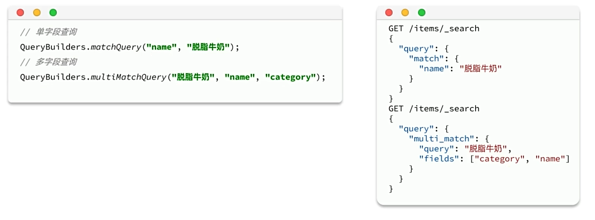


精确查询的查询条件构造 API 如下：

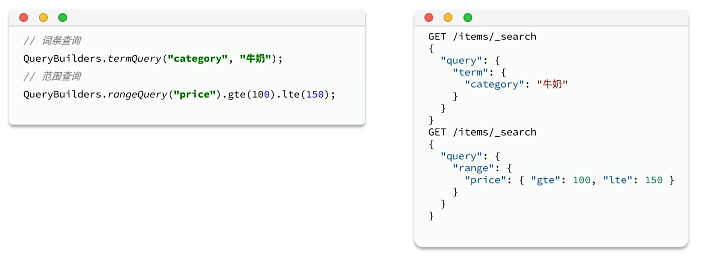


##### 6.2.2 复合查询

布尔查询的查询条件构造 API 如下：


##### 案例：构建复杂查询条件的搜索

> 需求：
>
> 利用 JavaRestClient 实现搜索功能，条件如下：
>
> + 搜索关键字为脱脂牛奶
> + 品牌必须为德亚
> + 价格必须低于300

```java
@Test
void testSearch() throws IOException {
    // 1. 创建request对象
    SearchRequest request = new SearchRequest("items");
    // 2. 配置request参数
    request.source().query(
            QueryBuilders.boolQuery()
                    .must(QueryBuilders.matchQuery("name", "脱脂牛奶"))
                    .filter(QueryBuilders.termQuery("brand", "德亚"))
                    .filter(QueryBuilders.rangeQuery("price").lt(30000))
    );
    // 3. 发送请求
    SearchResponse response = client.search(request, RequestOptions.DEFAULT);

    // 4. 解析结果
    parseResponseResult(response);
}
```


-----------


#### 6.3 排序和分页

与 query 类似，排序和分页参数都是基于 `request.source()` 来设置：


```java
@Test
void testSortAndPage() throws IOException {
    // 0. 前端传递的分页参数
    int pageNo = 1, pageSize = 5;

    // 1. 创建request对象
    SearchRequest request = new SearchRequest("items");
    // 2. 配置request参数
    // 2.1 query条件
    request.source().query(QueryBuilders.matchAllQuery());
    // 2.2 分页
    request.source().from((pageNo - 1) * pageSize).size(pageSize);
    // 2.3 排序
    request.source()
            .sort("sold", SortOrder.DESC)
            .sort("price", SortOrder.ASC);
    // 3. 发送请求
    SearchResponse response = client.search(request, RequestOptions.DEFAULT);

    // 4. 解析结果
    parseResponseResult(response);
}
```


----


#### 6.4 高亮显示

高亮显示的条件构造 API 如下：


高亮显示的结果解析 API 如下：


示例：

```java
@Test
void testHighlight() throws IOException {
    // 1. 创建request对象
    SearchRequest request = new SearchRequest("items");
    // 2. 配置request参数
    // 2.1 query条件
    request.source().query(QueryBuilders.matchQuery("name", "脱脂牛奶"));
    // 2.2 高亮显示
    request.source().highlighter(SearchSourceBuilder.highlight().field("name"));

    // 3. 发送请求
    SearchResponse response = client.search(request, RequestOptions.DEFAULT);

    // 4. 解析结果
    parseResponseResult(response);
}

private static void parseResponseResult(SearchResponse response) {
    SearchHits searchHits = response.getHits();
    // 4.1 总条数
    long total = searchHits.getTotalHits().value;
    System.out.println("total = " + total);
    // 4.2 命中的数据
    SearchHit[] hits = searchHits.getHits();
    for (SearchHit hit : hits) {
        // 4.2.1 获取source结果
        String json = hit.getSourceAsString();
        // 4.2.2 转为ItemDoc
        ItemDoc doc = JSONUtil.toBean(json, ItemDoc.class);
        // 4.3 处理高亮结果
        Map<String, HighlightField> hfs = hit.getHighlightFields();
        if (hfs != null && !hfs.isEmpty()) {
            // 4.3.1 根据高亮字段名获取高亮结果
            HighlightField hf = hfs.get("name");
            // 4.3.2 获取高亮结果，覆盖非高亮结果
            String hfName = hf.getFragments()[0].string();
            doc.setName(hfName);
        }
        System.out.println("doc = " + doc);
    }
}
```


----------


### 7. 数据聚合

[聚合（aggregations）](https://www.elastic.co/guide/en/elasticsearch/reference/7.12/search-aggregations.html)可以实现对文档数据的统计、分析、运算。聚合常见的有三类：

+ 桶（Bucket）聚合：用来对文档做分组
  + TermAggregation：按照文档字段值分组（与 group by 很像）
  + Date Histogram：按照日期阶梯分组，例如一周为一组，或者一月为一组
+ 度量（Metric）聚合：用以计算一些值，比如：最大值、最小值、平均值等
  + Avg：求平均数
  + Max：求最大值
  + Min：求最小值
  + Stats：同时求 max、min、avg、sum 等
+ 管道（pipeline）聚合：其它聚合的结果为基础做聚合

<strong><font color='red'>注意</font></strong>：参与聚合的字段必须是 Keyword、数值、日期、布尔的类型的字段


#### 7.1 DSL 聚合

我们要统计所有商品中共有哪些商品分类，其实就是以分类（category）字段对数据分组。category 值一样的放在同一组，属于 Bucket 聚合中的 Term 聚合


```json
GET /items/_search
{
  "size": 0,
  "aggs": {
    "cate_agg": {
      "terms": {
        "field": "category",
        "size": 5
      }
    },
    "brand_agg": {
      "terms": {
        "field": "brand",
        "size": 10
      }
    }
  }
}
```


默认情况下，Bucket 聚合是对索引库的所有文档做聚合，我们可以限定要聚合的文档范围，只要添加 query 条件即可

例如，我想知道价格高于3000元的手机品牌有哪些：

```JSON
GET /items/_search
{
  "query": {
    "bool": {
      "filter": [
        {
          "term": {
            "category": "手机"
          }
        },
        {
          "range": {
            "price": {
              "gte": 300000
            }
          }
        }
      ]
    }
  }, 
  "size": 0, 
  "aggs": {
    "brand_agg": {
      "terms": {
        "field": "brand",
        "size": 20
      }
    }
  }
}
```


除了对数据分组（Bucket）以外，我们还可以对每个 Bucket 内的数据进一步做数据计算和统计

例如：我想知道手机有哪些品牌，每个品牌的价格最小值、最大值、平均值

```JSON
GET /items/_search
{
  "query": {
    "bool": {
      "filter": [
        {
          "term": {
            "category": "手机"
          }
        },
        {
          "range": {
            "price": {
              "gte": 300000
            }
          }
        }
      ]
    }
  }, 
  "size": 0, 
  "aggs": {
    "brand_agg": {
      "terms": {
        "field": "brand",
        "size": 20
      },
      "aggs": {
        "stats_meric": {
          "stats": {
            "field": "price"
          }
        }
      }
    }
  }
}
```


-------------


#### 7.2 RestClient 聚合

我们以品牌聚合为例：


三要素：

+ 聚合类型
+ 聚合名称
+ 聚合字段


聚合结果与搜索文档同一级别，因此需要单独获取和解析。具体解析语法如下：


示例：

```java
@Test
void testAgg() throws IOException {
    // 1. 创建request对象
    SearchRequest request = new SearchRequest("items");
    // 2. 组织DSL参数
    // 2.1 query条件
    request.source().size(0);
    // 2.2 聚合体哦阿健
    String brandAggName = "brandAgg";
    request.source().aggregation(
            AggregationBuilders.terms(brandAggName).field("brand").size(10)
    );

    // 3. 发送请求
    SearchResponse response = client.search(request, RequestOptions.DEFAULT);

    // 4. 解析结果
    Aggregations aggregations = response.getAggregations();
    // 4.1 根据聚合名称获取对应的聚合
    Terms brandTerms = aggregations.get(brandAggName);
    // 4.2 获取buckets
    List<? extends Terms.Bucket> buckets = brandTerms.getBuckets();
    // 4.3 遍历获取每一个bucket
    for (Terms.Bucket bucket : buckets) {
        System.out.println("brand: " + bucket.getKeyAsString());
        System.out.println("count: " + bucket.getDocCount());
    }
}
```


--------------------------------


## 九、Redis 面试篇

详见 [Redis 笔记](../数据库/Redis/Redis.md)


------------------------------


## 十、微服务面试篇

### 1. 分布式事务

#### 1.1 CAP 和 BASE

##### 1.1.1 CAP 定理

1998年，加州大学的计算机科学家 Eric Brewer 提出，分布式系统有三个指标：

+ Consistency（一致性）
+ Availability（可用性）
+ Partition tolerance（分区容错性）

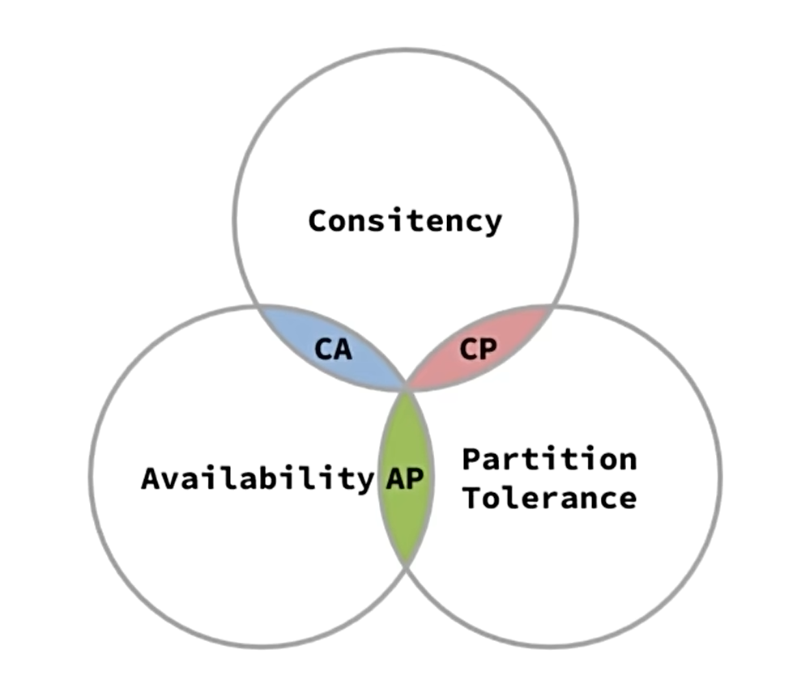


###### CAP 定理 - Consistency

Consistency（一致性）：用户访问分布式系统中的任意节点，得到的数据必须是一致的

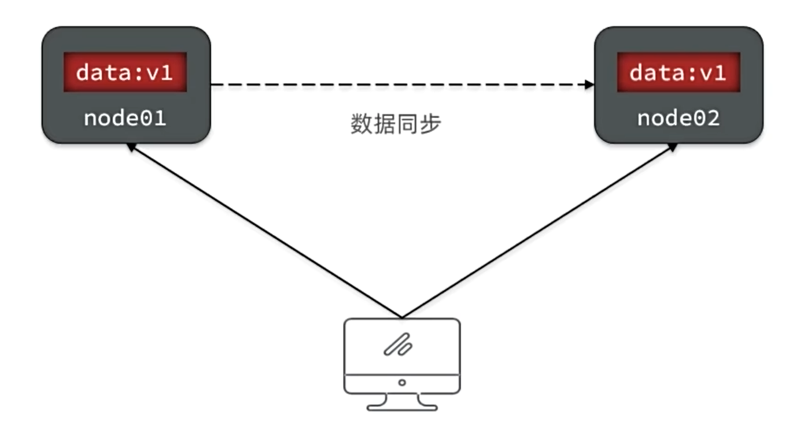


###### CAP 定理 - Availability

Availability（可用性）：用户访问分布式系统时，读或写操作总能成功。只能读不能写，或者只能写不能读，或者两者都不能执行，就说明系统弱可用或不可用

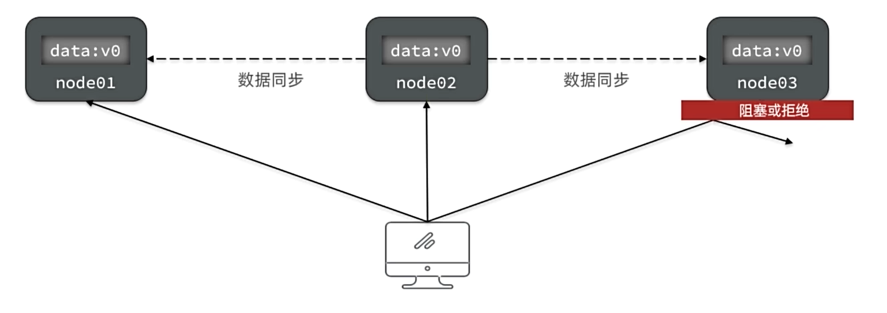


###### CAP 定理 - Partition tolerance

Partition（分区）：因为网络故障或其它原因导致分布式系统中的部分节点与其它节点失去连接，形成独立分区

Tolerance（容错）：系统要能容忍网络分区现象，出现分区时，整个系统也要持续对外提供服务

+ 如果此时只允许读，不允许写，满足所有节点一致性。但是牺牲了可用性。符合 CP
+ 如果此时允许任意读写，满足了可用性。但由于 node3 无法同步，导致数据不一致，牺牲了一致性。符合 AP

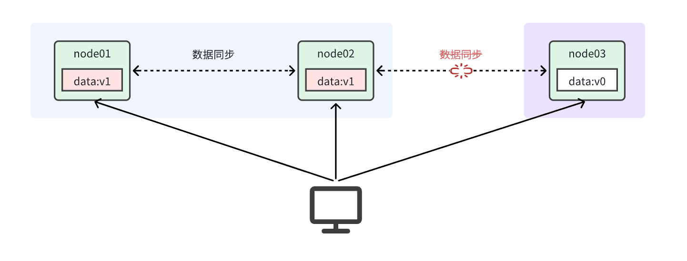


##### 1.1.2 BASE 理论

BASE 理论是对 CAP 的一种解决思路，包含三个思想：

+ **Basically Available（基本可用）：**分布式系统在出现故障时，允许损失部分可用性，即保证核心可用
+ **Soft State（软状态）：**在一定时间内，允许出现中间状态，比如临时的不一致状态
+ **Eventually Consistent（最终一致性）：**虽然无法保证强一致性，但是在软状态结束后，最终达成数据一致


而分布式事务最大的问题是各个子事务的一致性问题，因此可用借鉴 CAP 定理和 BASE 理论：

+ CP 模式：各个子事务执行后互相答案，同时提交，同时回滚，达成**强一致**。但事务等待过程中，处于弱可用状态
+ AT 模式：各子事务分别仔细和提交，允许出现结果不一致，然后采用弥补措施恢复数据


--------------


#### 1.2 AT 模式的脏写问题、

例如，一个分支业务的 SQL 是这样的：`update tb_account set money = money - 10 where id = 1`

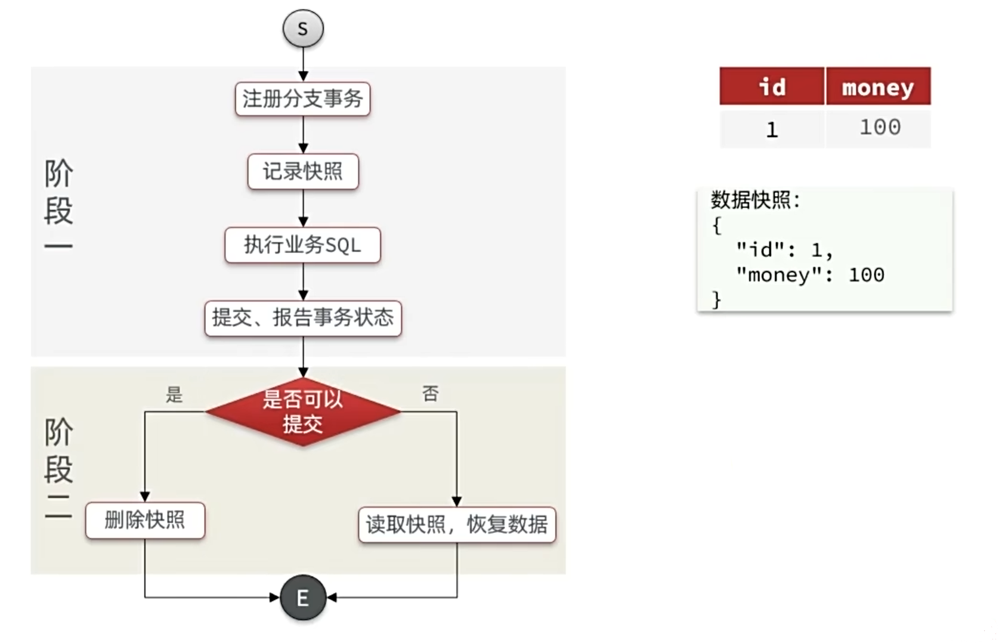

这种模式在大多数情况下（99%）并不会有什么问题，不过在极端情况下，特别是多线程并发访问 AT 模式的分布式事务时，有可能出现脏写问题，如图：


解决思路就是引入了全局锁的概念。在释放 DB 锁之前，先拿到全局锁。避免同一时刻有另外一个事务来操作当前数据


解决思路就是引入了全局锁的概念。在释放 DB 锁之前，先拿到全局锁。避免同一时刻有另外一个事务来操作当前数据


-----------


#### 1.3 TCC 模式

TCC 模式与 AT 模式非常相似，每阶段都是独立事务，不同的是 TCC 通过人工编码来思想数据恢复。需要实现三个方法：

+ Try：资源的检测和预留
+ Confirm：完成资源操作业务；要求 Try 成功 Confirm 一定要能成功
+ Cancel：预留资源释放，可用理解为 try 的反向操作


举例，一个扣减用户的业务。假设账户 A 原来的余额是100，需要余额扣减30元

+ **阶段一（Try）：**检查余额是否充足，如果充足则冻结金额增加30元，可用余额扣减30

初始余额：


余额充足，可以冻结：


此时，总金额 = 冻结金额 + 可用金额，数量依然是100不变。事务直接提交无需等待其它事务

+ **阶段二：**假如要提交（Confirm），则冻结金额扣减30


此时，总金额 = 冻结金额 + 可用金额 = 0 + 70  = 70元

+ **阶段二：**如果要回滚（Cancel），则冻结金额扣减30，可用余额增加30


TCC 的工作模型图：

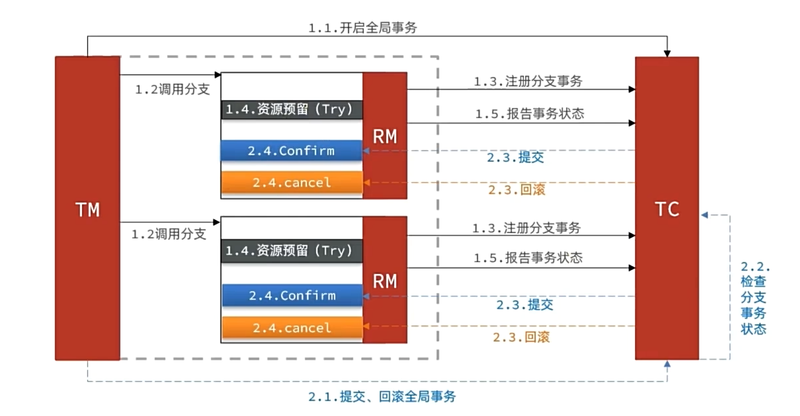


##### 总结

TCC 模式的每个阶段是做什么的？

+ Try：资源检查和预留
+ Confirm：业务执行和提交
+ Cancel：预留资源的释放

TCC 的优点是什么？

+ 一阶段完成直接提交事务，释放数据库资源，性能好
+ 相比 AT 模型，无需生成快照，无需使用全局锁，性能最强
+ 不依赖数据库事务，而是依赖补偿操作，可以用于非事务型数据库

TCC 的缺点是什么？

+ 有代码侵入，需要人为编写 try、Confirm 和 Cancel 接口，太麻烦
+ 软状态，事务是最终一致
+ 需要考虑 Confirm 和 Cancel 的失败情况，做好幂等处理


-----------


#### 1.4 最大努力通知

最大努力通知是一种最终一致性的分布式事务解决方案。顾名思义，就是通过消息通知的方式来通知事务参与者完成业务执行，如果执行失败会多次通知。无需任何分布式事务组件介入

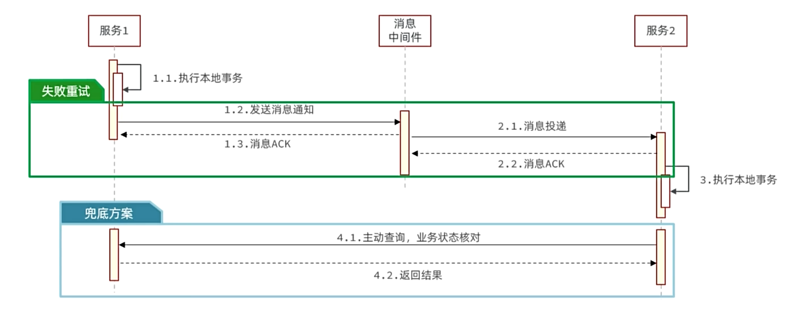


但是，解决分布式事务的最佳方案就是不要产生分布式事务


----------------


### 2. 注册中心

#### 2.1 环境隔离

企业实际开发中，往往会搭建多个运行环境，例如：开发环境、测试环境、发布环境。不同环境之间需要隔离。或者不同项目使用了一套 Nacos，不同项目之间要做环境隔离

因此，Nacos 提供了基于 `namespace` 的环境隔离功能。具体的隔离层次如图所示：


在 Nacos 控制台可用创建 namespace，用来隔离不同环境


然后填写表单：


添加完成后，可以在页面看到我们新建的 `namespace`，并且 Nacos 为我们自动生成了一个命名空间 id：


我们切换到配置列表页，你会发现 `dev` 这个命名空间下没有任何配置：


因为之前我们添加的所有配置都在 `public` 下：


在微服务中，我们可以通过配置文件指定当前服务所属的 namespace：

```YAML
spring:
  application:
    name: item-service # 服务名称
  profiles:
    active: dev
  cloud:
    nacos:
      server-addr: 192.168.150.101 # nacos地址
      discovery: # 服务发现配置
        namespace: 8c468c63-b650-48da-a632-311c75e6d235 # 设置namespace，必须用id
      # 。。。略
```


--------------


#### 2.2 分级模型

大厂的服务可能部署在多个不同机房，物理上被隔离为多个集群。Nacos 支持对于这种集群的划分


在 Nacos 内部会有一个服务实例的注册表，是基于 Map 实现的，其结构与分级模型的对应关系如下：


-----------


#### 2.3 Eureka 与 Nacos

Eureka 是 Netflix 公司开源的一个注册中心组件，目前被集成在 SpringCloudNetflix 这个模块下。它的工作原理与 Nacos 类似：

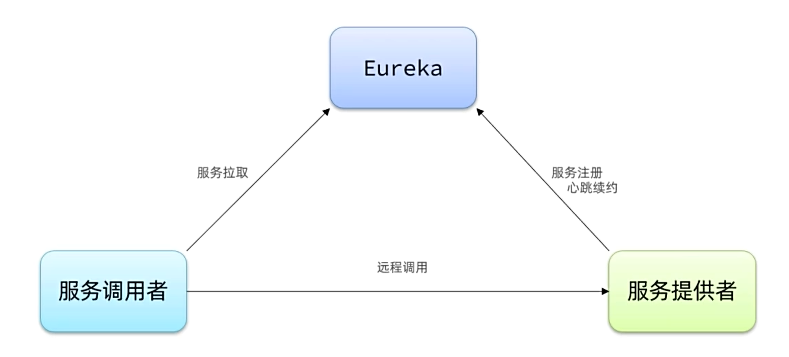


Eureka 和 Nacos 的相似点有：

- 都支持服务注册发现功能
- 都有基于心跳的健康监测功能
- 都支持集群，集群间数据同步默认是 AP 模式，即最全高可用性


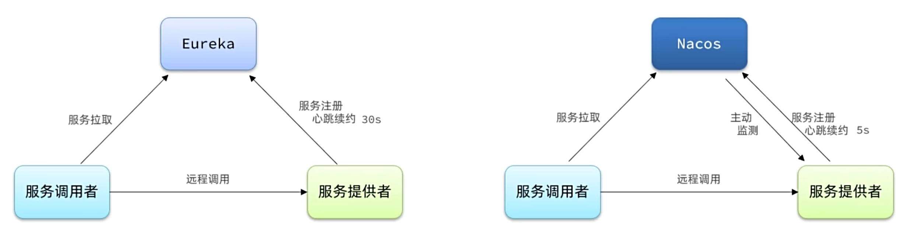


##### 总结

1. Nacos 与 Eureka 的共同点

+ 都支持服务注册和服务拉取
+ 都支持服务提供者心跳方式做健康检测

2. Nacos 与 Eureka 的区别

+ Nacos 支持服务端主动检测提供者状态：临时实例采用心跳模式，非临时实例采用主动检测模式
+ 临时实例心跳不正常会被剔除，非临时实例则不会被剔除
+ Nacos 支持服务列表变更的消息推送模式，服务列表更新更及时
+ Nacos 集群默认采用 AP 方式，但也支持 CP；Eureka 采用 AP 方式


-----------------


### 3. 远程调用

#### 3.1 负载均衡原理

自 SpringCloud2020 版本开始，SpringCloud 弃用 Ribbon，改用 Spring 自己开源的 Spring Cloud LoadBalancer 了，我们使用的 OpenFeign、Gateway 都已经与其整合

OpenFeign 在整合 SpringCloudLoadBalancer 时，与我们手动服务发现、负载均衡的流程类似

1. 获取 serviceId，也就是服务名称
2. 根据 serviceId 拉取服务列表
3. 利用负载均衡算法选择一个服务
4. 重构请求的 URL 路径，发起远程调用

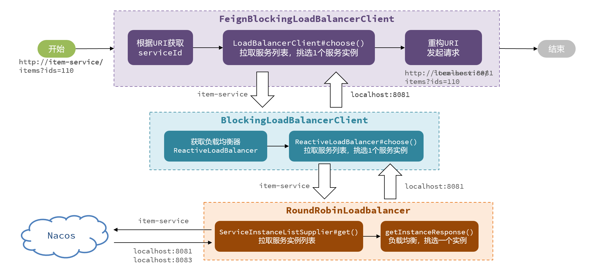


-----------


#### 3.2 切换负载均衡算法

分析源码的时候我们发现负载均衡的算法是有ReactiveLoadBalancer来定义的，我们发现它的实现类有三个：


其中 RoundRobinLoadBalancer 和 RandomLoadBalancer 是由 Spring-Cloud-Loadbalancer 模块提供的，而 NacosLoadBalancer 则是由 Nacos-Discorvery 模块提供的。

默认的策略是 RoundRobinLoadBalancer，即轮询负载均衡


我们在 `hm-cart` 模块中的添加一个配置类：


代码如下：

```Java
package com.hmall.cart.config;

import com.alibaba.cloud.nacos.NacosDiscoveryProperties;
import com.alibaba.cloud.nacos.loadbalancer.NacosLoadBalancer;
import org.springframework.cloud.client.ServiceInstance;
import org.springframework.cloud.loadbalancer.core.ReactorLoadBalancer;
import org.springframework.cloud.loadbalancer.core.ServiceInstanceListSupplier;
import org.springframework.cloud.loadbalancer.support.LoadBalancerClientFactory;
import org.springframework.context.annotation.Bean;
import org.springframework.core.env.Environment;

public class OpenFeignConfig {

    @Bean
    public ReactorLoadBalancer<ServiceInstance> reactorServiceInstanceLoadBalancer(
            Environment environment, NacosDiscoveryProperties properties,
            LoadBalancerClientFactory loadBalancerClientFactory) {
        String name = environment.getProperty(LoadBalancerClientFactory.PROPERTY_NAME);
        return new NacosLoadBalancer(
                loadBalancerClientFactory.getLazyProvider(name, ServiceInstanceListSupplier.class), name, properties);
    }

}
```

**注意**：

这个配置类千万不要加 `@Configuration` 注解，也不要被 SpringBootApplication 扫描到。

由于这个 OpenFeignConfig 没有加 `@Configuration` 注解，也就没有被 Spring 加载，因此是不会生效的。接下来，我们要在启动类上通过注解来声明这个配置。

有两种做法：

- 全局配置：对所有服务生效

```Java
@LoadBalancerClients(defaultConfiguration = OpenFeignConfig.class)
```

- 局部配置：只对某个服务生效

```Java
@LoadBalancerClients({
        @LoadBalancerClient(value = "item-service", configuration = OpenFeignConfig.class)
})
```

我们选择全局配置：


DEBUG 重启后测试，会发现负载均衡器的类型确实切换成功：


-------------


### 4. 服务保护

#### 4.1 线程隔离

线程隔离有两种方式实现：

+ 线程池隔离（Hystix 默认采用）
+ 信号量隔离（Sentinel 默认采用）


Sentinel 的线程隔离与 Hystix 的线程隔离有什么差别？

答：线程隔离可用采用线程池或者信号量隔离

Hystix 默认是基于线程池实现的线程隔离，每一个被隔离的业务都要创建一个独立的线程池，线程过多会带来额外的 CPU 开销，性能一般，但是隔离性更强

Sentinel 则是基于信号量隔离的原理，这种方式不用创建线程池，性能较好，但是隔离性一般


------------


#### 4.2 滑动窗口算法

##### 4.2.1 固定窗口计数器算法

固定窗口计数器算法概念如下：

+ 将时间划分为多个窗口，窗口时间跨度称为 Interval，本例中为1000ms
+ 每个窗口分别技术统计，每有一次请求就将计数器加一，限流就是设置计数器阈值，本例为3
+ 如果计数器超过了限流阈值，则超出阈值的请求都被丢弃

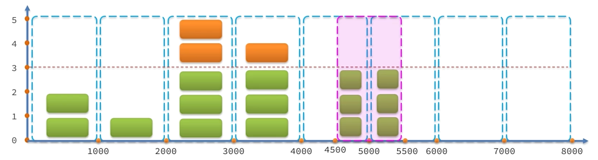


##### 4.2.2 滑动窗口计数器算法

滑动窗口计数器算法会见一个窗口划分为 n 个更小的区间，例如

+ 窗口时间跨度 Interval 为1秒；区间数量 n = 2，则每个小区间时间跨度为500ms，每个区间都有计数器
+ 限流阈值依然为3，时间窗口（1秒）内请求超过阈值时，超出的请求被限流
+ 窗口会根据当前请求所在时间（currentTime）移动，窗口范围是从（currentTime - Interval）之后的第一个时区开始，到 currentTime 所在时区结束


--------------


#### 4.3 漏桶算法

漏桶算法说明：

+ 将每个请求视作“水滴”放入“漏桶”进行存储；
+ “漏桶”以固定速率向外“漏”出请求来执行，如果“漏桶”空了则停止“漏水”
+ 如果“漏桶”满了则多余的“水滴”会被直接丢弃


Sentinel 内部基于漏桶算法实现了排队等待效果，桶的**容量**取决于限流的 **QPS 阈值**以及允许等待的**最大超时时间**

例如：限流 QPS=5，队列超时时间为2000ms。我们让所有请求进入一个队列中，如同进入漏桶中。由于漏桶是固定频率执行，因此 QPS 为5就是每200ms执行一个请求。那第 N 个请求的预期的执行时间 是第 (N - 1) * 200ms。如果请求预期的执行时间超出最大时长2000ms，说明“桶满了”，新的请求则会被拒绝。


-------


#### 4.4 令牌桶算法

令牌桶算法说明：

+ 以固定的速率生成令牌，存入令牌桶，如果令牌桶满了以后，停止生成
+ 请求进入后，必须先尝试从桶中获取令牌，获取到令牌后才可以被处理
+ 如果令牌桶中没有令牌，则请求等待或丢弃


Sentinel 的限流与 Gateway 的限流有什么差别？

答：限流算法常见的有三种实现：滑动时间窗口、令牌桶算法、漏桶算法。Gateway 则采用了基于 Redis 实现的令牌桶算法

而 Sentinel 内部却比较复杂：

+ 默认限流模式是基于滑动时间窗口算法，另外 Sentinel 中断路器的计数也是基于滑动时间窗口算法
+ 限流后可用快速失败和排队等待，其中排队等待基于漏桶算法
+ 而热点参数限流则是基于令牌桶算法


-------------------


