# MySQL 数据库（善用 Ctrl + F）

**语法中 [] 里的内容为可填可不填**

## 基础
### 一、MySQL 概述
#### 1. 数据库相关概念

| 名称           | 全称                                                         | 简称                               |
| -------------- | ------------------------------------------------------------ | ---------------------------------- |
| 数据库         | 存储数据的仓库，数据是有组织的进行存储                       | DataBase（DB）                     |
| 数据库管理系统 | 操纵和管理数据库的大型软件                                   | DataBase Management System（DBMS） |
| SQL            | 操作关系型数据库的编程语言，定义了一套操作关系型数据库统一**标准** | Structured Query Language（SQL）   |


+ 主流的关系型数据库管理系统

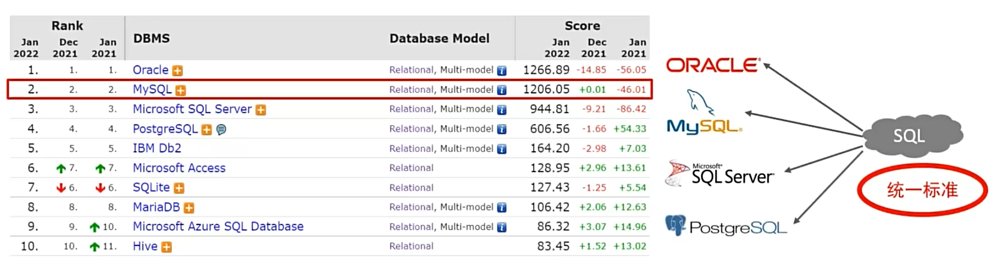

##### 总结
1. 数据库
+ 数据存储的仓库

2. 数据库管理系统
+ 操纵和管理数据库的大型软件

3. SQL
+ 操作关系型数据库的编程语言，是一套标准


------------------------------


#### 2. MySQL 安装及启动
##### 2.1 版本
+ MySQL 官方提供了两种不同的版本：
  + 社区版（MySQL Community Server）
    + 免费，MySQL 不提供任何技术支持

  + 商业版（MySQL Enterprise Edition）
    + 收费，可以试用30天，官方提供技术支持

##### 2.2 下载
下载地址：https://dev.mysql.com/downloads/installer/

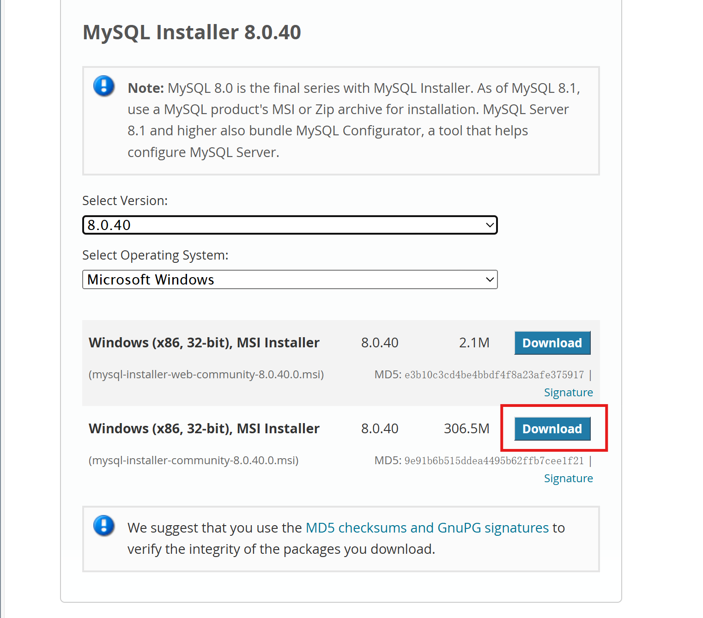

##### 2.3 安装
如果要安装最新版，要将之前的 MySQL 先卸载了

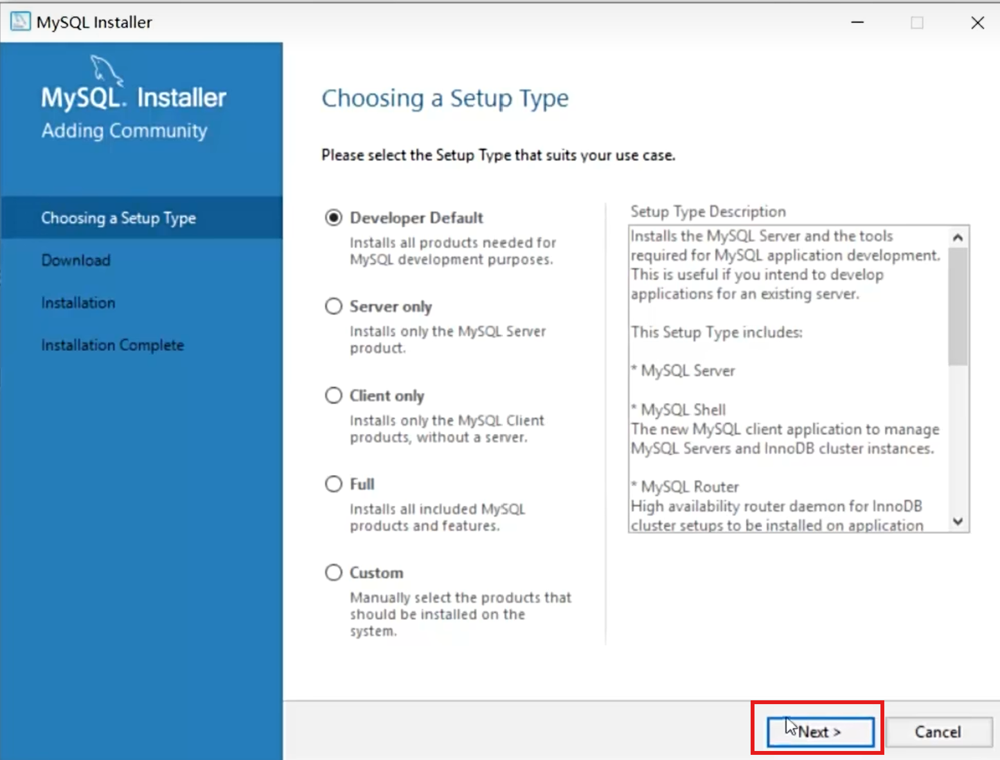

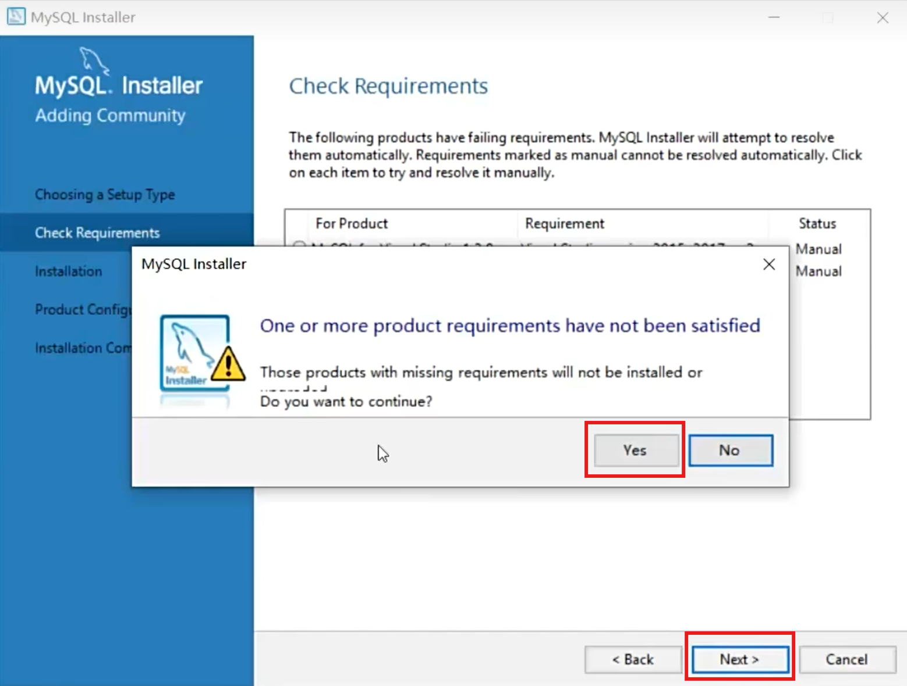

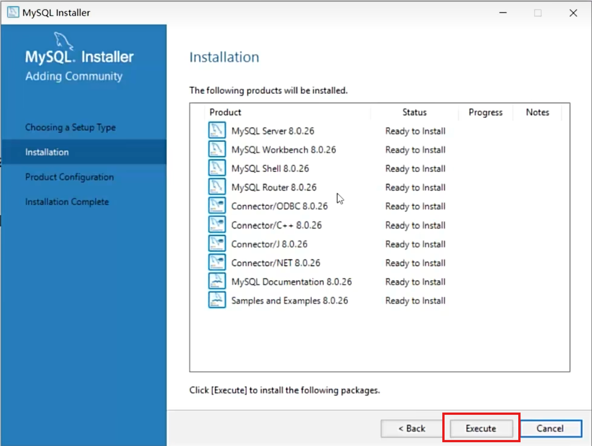

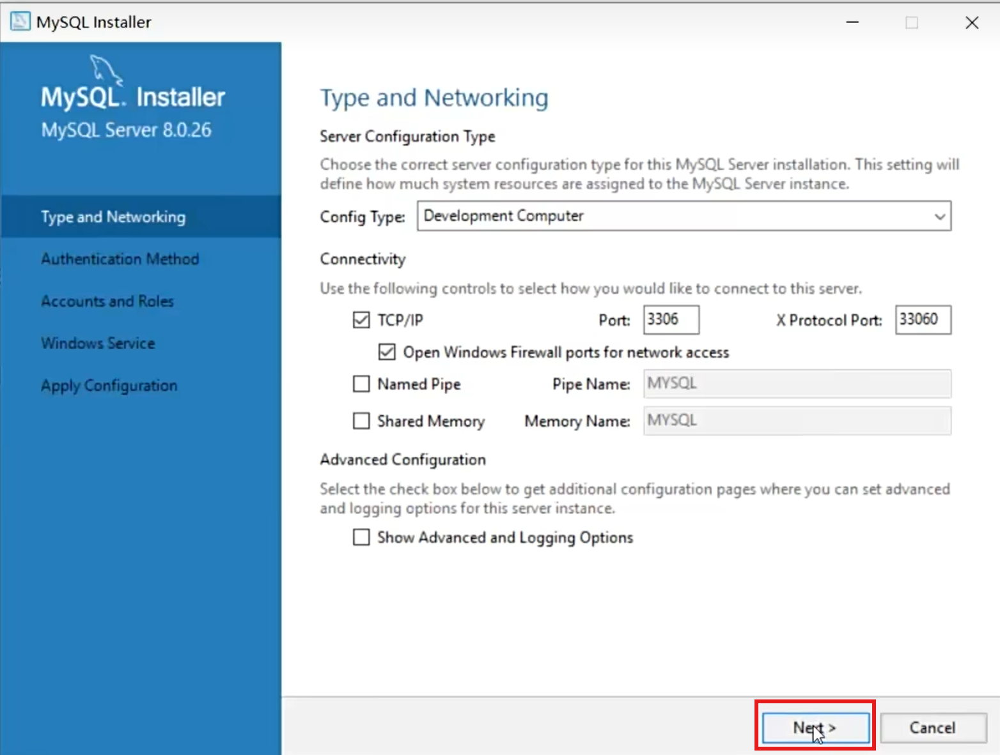

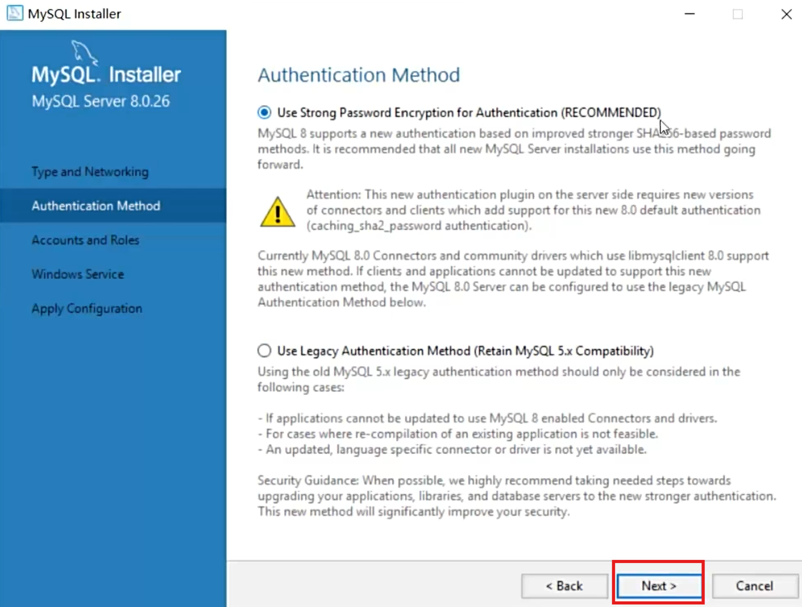


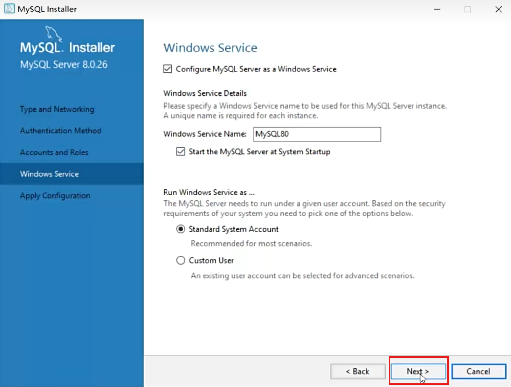

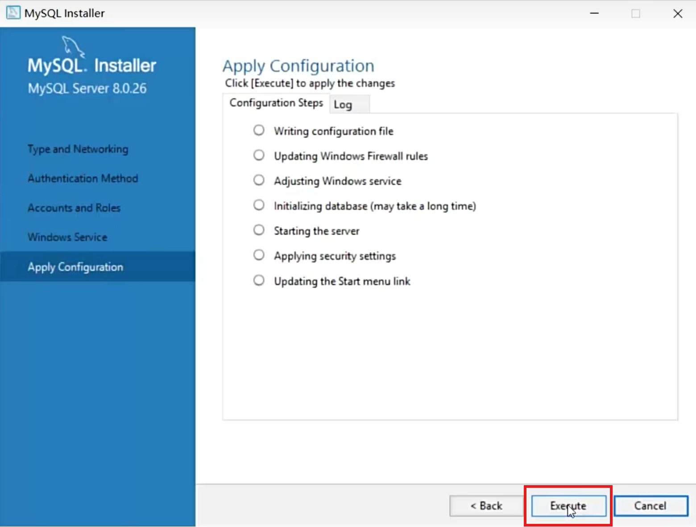


##### 2.4 启动与停止
+ 在 Windows 的命令行中输入 **services.msc**

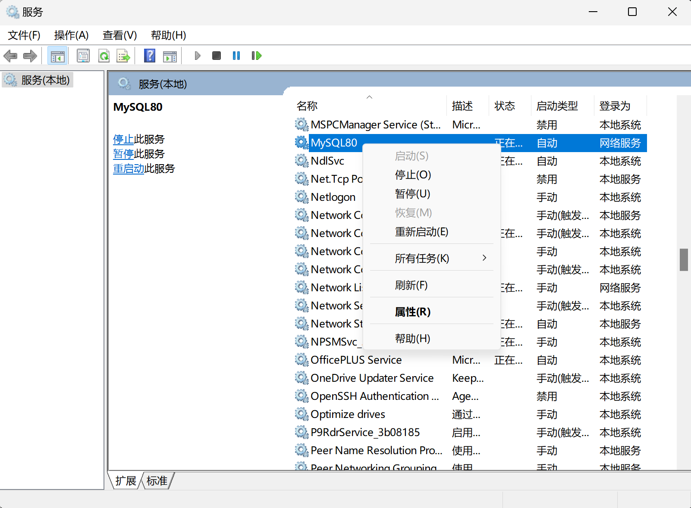

+ 在命令行中输入指令
  + 启动：`net start mysql80`
  + 停止：`net stop mysql80`

注意：默认 mysql 是开机自动启动的

##### 2.5 客户端连接
+ 方式一：MySQL 提供的客户端命令行工具

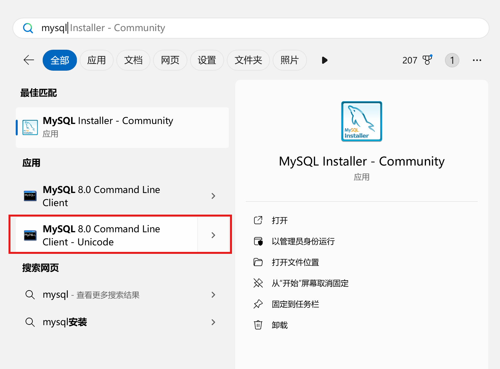

+ 方式二：系统自带的命令行工具执行指令
  ```
  mysql [-h 127.0.0.1] [-P 3306] -u root -p
  ```

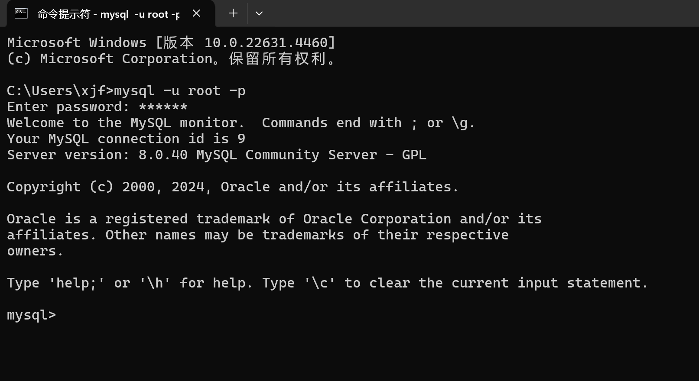

注意：使用这种方式时，需要配置 PATH 环境变量

##### 2.6 数据模型

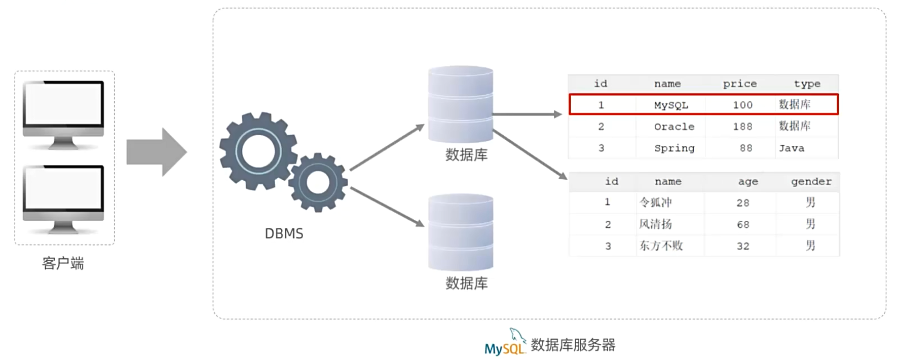


-----------------------------------


#### 3. 数据模型

在一个数据库服务器中，可以创建多个数据库，在一个数据库中又可以创建多张表

##### 3.1 关系型数据库（RDBMS）
大白话：通过表来存储数据的数据库
+ 概念：建立在关系模型基础上，由多张相互连接的二维表（就是平时看的的那种表格）组成的数据库
+ 特点：
  1. 使用表存储数据，格式统一，便于维护
  2. 使用 SQL 语言操作，标准统一，使用方便


-------------------------------


#### 总结
1. MySQL 下载及安装
+ MySQL 社区版

2. MySQL 启动
+ net start mysql80
+ net stop mysql80

3. MySQL 客户端连接
+ MySQL 自带的客户端命令行
+ mysql [-h 127.0.0.1] [-P 3306] -u root -p

4. MySQL 数据模型
+ 数据库
+ 表


----------------------------------------


### 二、SQL
#### 1. 通用语法及分类
##### 1.1 SQL 通用语法
1. SQL 语句可以单行或多行书写，以分号结尾
2. SQL 语句可以使用空格/缩进来增强语句的可读性
3. MySQL 数据库的 SQL 语句不区分大小写，关键字建议使用大写
4. 注释：
  + 单行注释：**-- 注释内容**或**# 注释内容**
  + 多行注释：**/* 注释内容 */**

##### 1.2 SQL 分类

| 分类 | 全称                       | 说明                                                   |
| ---- | -------------------------- | ------------------------------------------------------ |
| DDL  | Data Definition Language   | 数据定义语言，用来定义数据库对象（数据库，表，字段）   |
| DML  | Data Manipulation Language | 数据操作语言，用来对数据库表中的数据进行增删改         |
| DQL  | Data Query Language        | 数据查询语言，用来查询数据库中表的记录                 |
| DCL  | Data Control Language      | 数据控制语言，用来创建数据库用户、控制数据库的访问权限 |


------------------------


#### 2. DDL
##### 2.1 DDL - 数据库操作
+ 查询
  + 查询所有数据库
  ```sql
  SHOW DATABASES;
  ```
  + 查询当前数据库
  ```sql
  SELECT DATABASE();
  ```

+ 创建
  ```sql
  CREATE DATABASE[IF NOT EXISTS] 数据库名 [DEFAULT CHARSET 字符集] [COLLATE 排序规则];
  ```
  
+ 删除
  ```sql
  DROP DATABASE[IF EXISTS] 数据库名;
  ```

+ 使用
  ```sql
  USE 数据库名;
  ```


------------------------------------


##### 2.2 DDL - 表操作 - 创建&查询
###### 2.2.1 表操作 - 查询
+ 查询当前数据库所有表
```sql
SHOW TABLES;
```

+ 查询表结构
```sql
DESC 表名;
```

+ 查询指定表的建表语句
```sql
SHOW CREATE TABLE 表名;
```

###### 2.2.2 表操作 - 创建
```sql
CREATE TABLE 表名(
	字段1 字段1类型[COMMENT 字段1注释],
	字段2 字段2类型[COMMENT 字段2注释],
	字段3 字段3类型[COMMENT 字段3注释],
	......
	字段n 字段n类型[COMMENT 字段n注释]
)[COMMENT 表注释];
```
注意：【......】为可选参数，最后一个字段后面没有逗号


---------------------------------------


##### 2.3 DDL - 数据类型及案例
###### 2.3.1 表操作 - 数据类型
MySQL 中的数据类型有很多，主要分为三类：数值类型、字符串类型、日期类型、日期时间类型

+ 数值类型

<table>
    <tr><!-- 第一行 -->
        <td>
            分类
        </td>
        <td>
            类型
        </td>
        <td>
            大小
        </td>
        <td>
            有符号（SIGNED）范围
        </td>
        <td>
            无符号（SIGNED）范围
        </td>
        <td>
            描述
        </td>
    </tr>
    <tr><!-- 第二行 -->
        <td rowspan="8">数值类型</td>
        <td>
            TINYINT
        </td>
        <td>
            1 byte
        </td>
        <td>
            （-128，127）
        </td>
        <td>
            （0，255）
        </td>
        <td>
            小整数值
        </td>
    </tr>
    <tr>
        <td>
            SMALLINT
        </td>
        <td>
            2 bytes
        </td>
        <td>
            （-32768，32767）
        </td>
        <td>
            （0，65535）
        </td>
        <td>
            大整数值
        </td>
    </tr>
    <tr>
        <td>
            MEDIUMINT
        </td>
        <td>
            3 bytes
        </td>
        <td>
            （-8388608，8388607）
        </td>
        <td>
            （0，16777215）
        </td>
        <td>
            大整数值
        </td>
    </tr>
    <tr>
        <td>
            INT或INTEGER
        </td>
        <td>
            4 bytes
        </td>
        <td>
            （-2147483648，2147483647）
        </td>
        <td>
            （0，4294967295）
        </td>
        <td>
            大整数值
        </td>
    </tr>
    <tr>
        <td>
            BIGINT
        </td>
        <td>
            8 bytes
        </td>
        <td>
            （-2^63，2^63-1）
        </td>
        <td>
            （0，2^64-1）
        </td>
        <td>
            超大整数值
        </td>
    </tr>
    <tr>
        <td>
            FLOAT
        </td>
        <td>
            4 bytes
        </td>
        <td>
            （-3.402823466 E+38，3.402823466351 E+38）
        </td>
        <td>
            0 和 （1.175494351 E-38，3.402823466 E+38）
        </td>
        <td>
            单精度浮点数值
        </td>
    </tr>
    <tr>
        <td>
            DOUBLE
        </td>
        <td>
            8 bytes
        </td>
        <td>
            （-1.7976931348623157 E+308，1.7976931348623157 E+308）
        </td>
        <td>
            0 和 （2.2250738585072014 E-308，1.7976931348623157 E+308）
        </td>
        <td>
            双精度浮点数值
        </td>
    </tr>
    <tr>
        <td>
            DECIMAL
        </td>
        <td><null>    </td>
    <td>
        依赖于M（精度）和D（标度）的值
    </td>
    <td>
        依赖于M（精度）和D（标度）的值
    </td>
    <td>
        小数值（精确定点数）
    </td>
</tr>
</table>


+ 字符串类型

<table>
    <tr><!-- 第一行 -->
        <td>
            分类
        </td>
        <td>
            类型
        </td>
        <td>
            大小
        </td>
        <td>
            描述
        </td>
    </tr>
    <tr><!-- 第二行 -->
        <td rowspan="10">字符串类型</td>
        <td>
            CHAR
        </td>
        <td>
            0~255 bytes
        </td>
        <td>
            定长字符串
        </td>
    </tr>
    <tr>
        <td>
            VARCHAR
        </td>
        <td>
            0~65535 bytes
        </td>
        <td>
            变长字符串
        </td>
    </tr>
        <tr>
        <td>
            TINYBLOB
        </td>
        <td>
            0~255 bytes
        </td>
        <td>
            不超过255个字符的二进制数据
        </td>
    </tr>
        <tr>
        <td>
            TINYTEXT
        </td>
        <td>
            0~255 bytes
        </td>
        <td>
            短文本字符串
        </td>
    </tr>
        <tr>
        <td>
            BLOB
        </td>
        <td>
            0~65 535 bytes
        </td>
        <td>
            二进制形式的长文本数据
        </td>
    </tr>
    <tr>
        <td>
            TEXT
        </td>
        <td>
            0~65 535 bytes
        </td>
        <td>
            长文本数据
        </td>
    </tr>
    <tr>
        <td>
            MEDIUMBLOB
        </td>
        <td>
            0~16 777 215 bytes
        </td>
        <td>
            二进制形式的中等长度文本数据
        </td>
    </tr>
    <tr>
        <td>
            MEDIUMTEXT
        </td>
        <td>
            0~16 777 215 bytes
        </td>
        <td>
            中等长度文本数据
        </td>
    </tr>
    <tr>
        <td>
            LONGBLOB
        </td>
        <td>
            0~4 294 967 295 bytes
        </td>
        <td>
            二进制形式的极大文本数据
        </td>
    </tr>
    <tr>
        <td>
            LONGTEXT
        </td>
        <td>
            0~4 294 967 295 bytes
        </td>
        <td>
            极大文本数据
        </td>
    </tr>
</table>


+ 日期类型

<table>
    <tr><!-- 第一行 -->
        <td>
            分类
        </td>
        <td>
            类型
        </td>
        <td>
            大小
        </td>
        <td>
            范围
        </td>
        <td>
            格式
        </td>
        <td>
            描述
        </td>
    </tr>
    <tr><!-- 第二行 -->
        <td rowspan="5">日期类型</td>
        <td>
            DATE
        </td>
        <td>
            3
        </td>
        <td>
            1000-01-01 至 9999-12-31
        </td>
        <td>
            YYYY-MM-DD
        </td>
        <td>
            日期值
        </td>
    </tr>
    <tr>
        <td>
            TIME
        </td>
        <td>
            3
        </td>
        <td>
            -838:59:59 至 838:59:59
        </td>
        <td>
            HH:MM:SS
        </td>
        <td>
            时间值或持续时间
        </td>
    </tr>
    <tr>
        <td>
            YEAR
        </td>
        <td>
            1
        </td>
        <td>
            1901 至 2155
        </td>
        <td>
            YYYY
        </td>
        <td>
            年份值
        </td>
    </tr>
    <tr>
        <td>
            DATETIME
        </td>
        <td>
            8
        </td>
        <td>
            1000-01-01 00:00:00 至 9999-12-31 23:59:59
        </td>
        <td>
            YYYY-MM-DD HH:MM:SS
        </td>
        <td>
            混合日期和时间值
        </td>
    </tr>
    <tr>
        <td>
            TIMESTAMP
        </td>
        <td>
            4
        </td>
        <td>
            1970-01-01 00:00:01 至 2038-01-19 03:14:07
        </td>
        <td>
            YYYY-MM-DD HH:MM:SS
        </td>
        <td>
            混合日期和时间值，时间戳
        </td>
    </tr>
</table>


###### 2.3.2 案例
根据需求创建表（设计合理的数据结构、长度）
> + 设计一张员工信息表，要求如下：
>   1. 标号（纯数字）
>   2. 员工工号（字符串类型，长度不超过10位）
>   3. 员工姓名（字符串类型，长度不超过10位）
>   4. 性别（男/女，存储一个汉字）
>   5. 年龄（正常人年龄，不可能存储负数）
>   6. 身份证号（二代身份证号均为18位，身份证中有X这样的字符）
>   7. 入职时间（取值年月日即可）


+ 代码实现：

```sql
create table emp(
    id int comment '编号',
    worknum varchar(10) comment '工号',
    name varchar(10) comment '姓名',
    gender char(1) comment '性别',
    age tinyint unsigned comment '年龄',
    idcard char(18) comment '身份证号',
    entrydate date comment '入职时间'
) comment '员工表';
```

+ 实现效果：

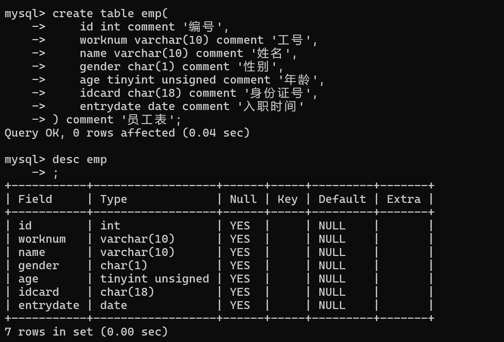


---------------------------------------


##### 2.4 DDL - 表操作 - 修改&删除

###### 2.4.1 表操作 - 修改
+ 添加字段
  ```sql
  ALTER TABLE 表名 ADD 字段名 类型(长度) [COMMENT 注释] [约束];
  ```
  
  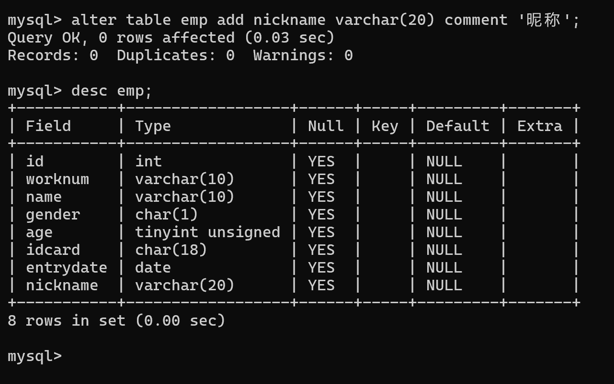


+ 修改数据类型
  ```sql
  ALTER TABLE 表名 MODIFY 字段名 新数据类型(长度);
  ```

+ 修改字段名和字段类型
  ```SQL
  ALTER TABLE 表名 CHANGE 旧字段名 新字段名 类型(长度) [COMMENT 注释] [约束];
  ```

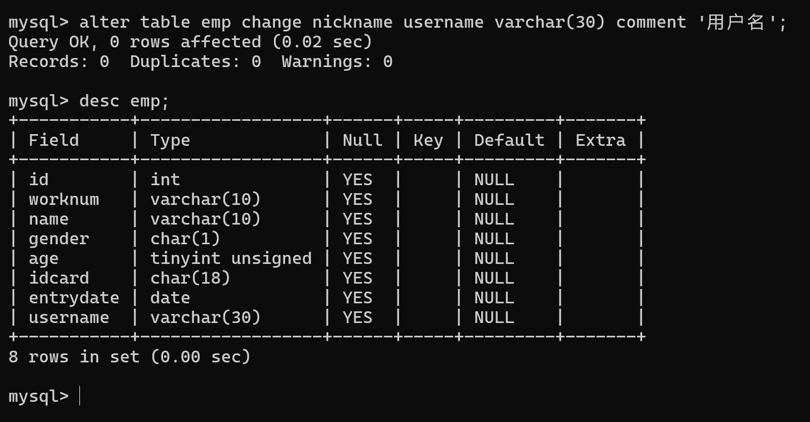


+ 删除字段
  ```sql
  ALTER TABLE 表名 DROP 字段名;
  ```

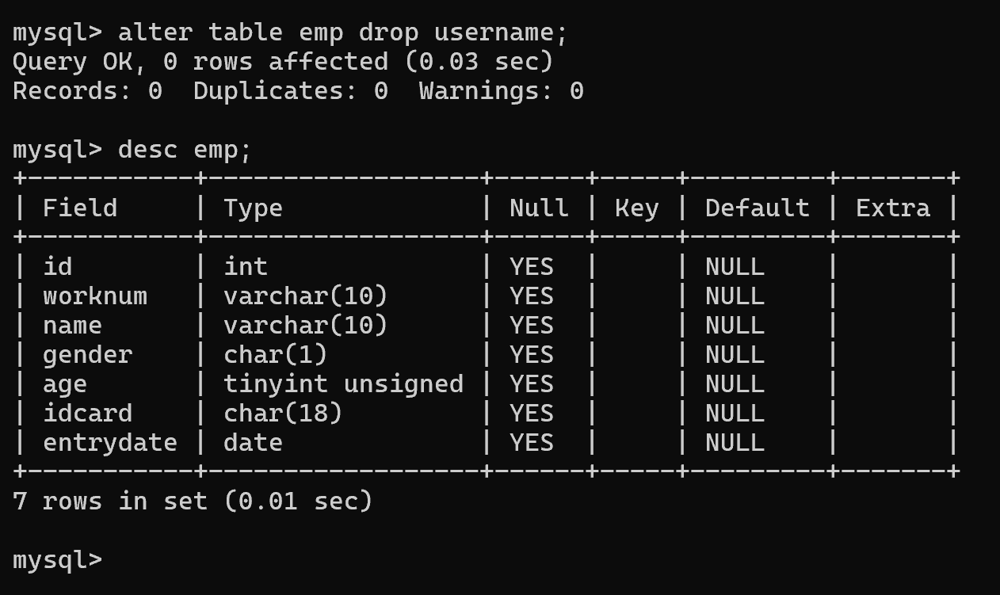


+ 修改表名
  ```sql
  ALTER TABLE 表名 RENAME TO 新表名;
  ```

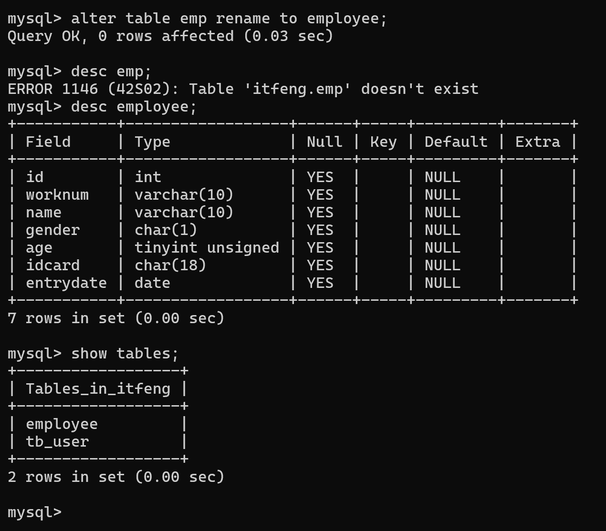


###### 2.4.2 表操作 - 删除
+ 删除表
  ```sql
  DROP TABLE [IF EXISTS] 表名;
  ```

+ 删除指定表，并重新创建该表
  ```sql
  TRUNCATE TABLE 表名;
  ```

**注意：在删除表时，表中的全部数据也会被删除**【表头不会】

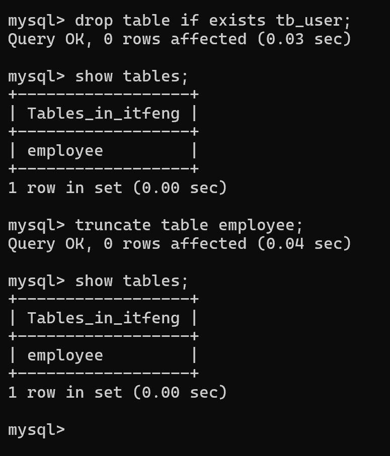


------------------------------------


##### DDL 小结
1. DDL - 数据库操作
```sql
SHOW DATABASE;

CREATE DATABASE 数据库名;

USE 数据库名;

SELECT DATABASE();

DROP DATABASE 数据库名;
```

2. DDL - 表操作
```sql
SHOW TABLES;

CREATE TABLE 表名(字段 字段类型, 字段 字段类型);

DESC 表名;

SHOW CREATE TABLE 表名;

ALTER TABLE 表名 ADD/MODIFY/CHANGE/DROP/RENAME TO...;

DROP TABLE 表名;
```


--------------------------------


#### 3. 图形化界面工具 DataGrip
+ MySQL 图形化界面


网址：https://www.jetbrains.com/zh-cn/datagrip/
*额，收费的，学习搞个破解版用用吧，虽然破解版多多少少都是有点问题的，但是，相信 jetbrains 的产品*~


-----------------------------------


#### 4. DML
+ DML 英文全称是 Data Manipulation Language（数据库操作语言），用来对数据库中表的数据记录进行增删改操作
  + 添加（插入）数据（**INSERT**）
  + 修改数据（**UPDATE**）
  + 删除数据（**DELETE**）


##### 4.1 DML - 添加（插入）
+ 给指定字段添加数据
  ```sql
  INSERT INTO 表名 (字段1, 字段2, ...) VALUES(值1, 值2, ...);
  ```

+ 给全部字段添加数据
  ```sql
  INSERT INTO 表名 VALUES(值1, 值2, ...);
  ```

+ 批量添加数据
  ```sql
  INSERT INTO 表名 (字段1, 字段2, ...) VALUES(值1, 值2, ...), (值1, 值2, ...), (值1, 值2, ...);
  ```
  ```sql
  INSERT INTO 表名 VALUES(值1, 值2, ...), (值1, 值2, ...), (值1, 值2, ...);
  ```

注意：
+ 插入数据时，指定的字段顺序需要与值的顺序是一一对应的
+ 字符串和日期型数据应该包含在引导中
+ 插入的数据大小，应该在字段的规定范围内


###### 代码实现
```sql
insert into employee (id, worknum, name, gender, age, idcard, entrydate)
values (1, '1', 'itfeng', '男', 10, '123456789012345678', '2000-01-01');

select * from employee;

insert into employee values (2, '2', '张无忌', '男', 18, '123456789012345678', '2005-01-01');

insert into employee values (3, '3', '张三', '男', 38, '123456843012345678', '2005-01-01'), (4, '4', '李四', '女', 18, '123456843012345678', '2015-01-01');

```

###### 实现效果

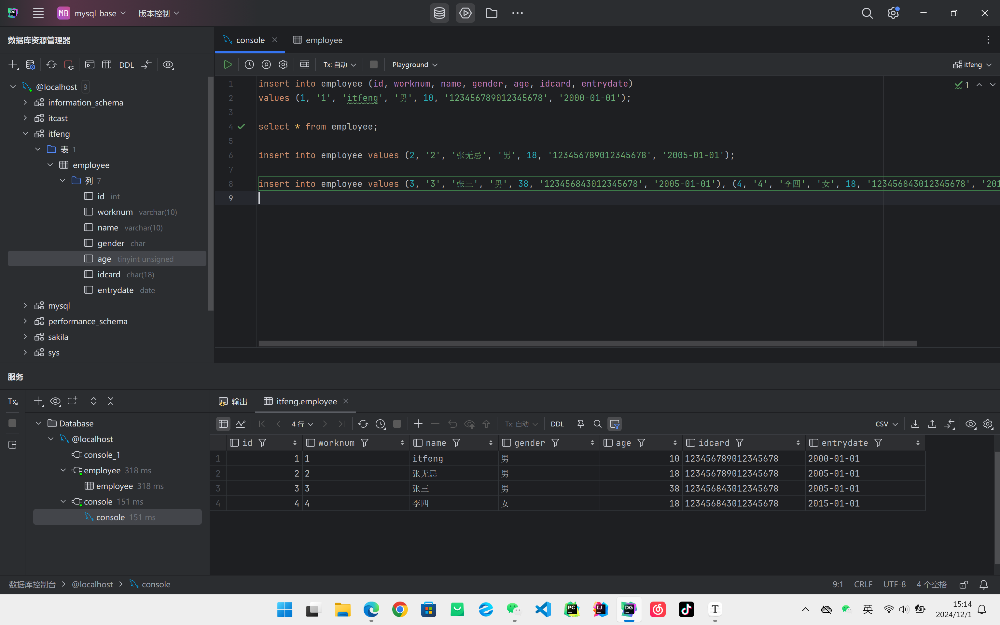


---------------------------------------


##### 4.2 DML - 更新和删除

###### 4.2.1 DML - 修改数据
```sql
UPDATE 表名 SET 字段名1 = 值1, 字段名2 = 值2, ...[WHERE 条件];
```

注意：修改语句的条件可以有，可以看没有，如果没有条件，则会修改整张表的所有数据

+  代码实现
```sql
# 修改id为1的数据，将name修改为itcast
update employee set name = 'itcast' where id = 1;

# 修改id为1的数据，将name修改为 小昭 ，gander修改为 女
update employee set name = '小昭', gender = '女' where id = 1;

# 将所有员工入职日期修改为 2008-01-01
update  employee set entrydate = '2008-01-01';
```

+  实现效果

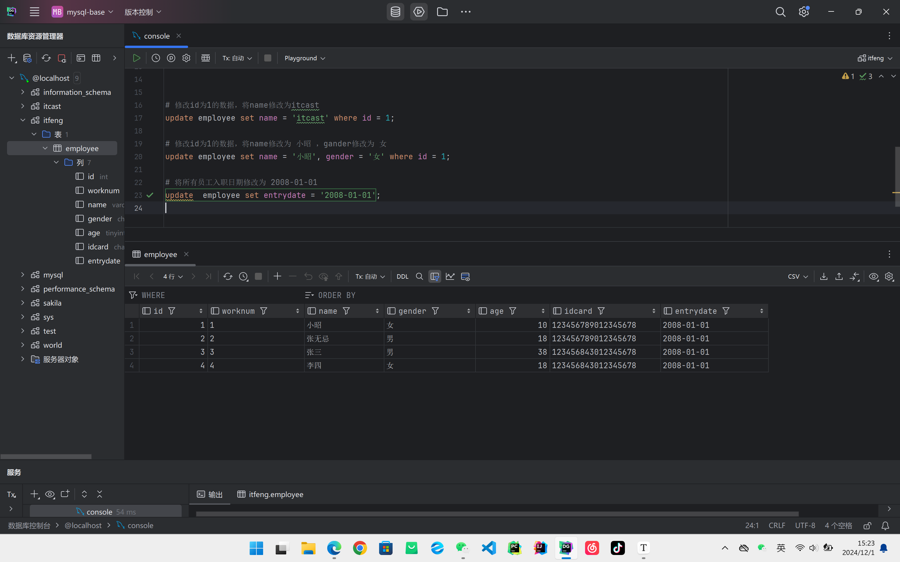

###### 4.2.2 DML - 删除数据

  ```sql
  DELETE FROM 表名 [WHERE 条件]; 
  ```

注意：
+ DELETE 语句的条件可以有，也可以没有，如果没有条件，则会删除整张表的所有数据
+ DELETE 语句不能删除某一个字段的值（可以使用 UPDATE）


+  代码实现
```sql
# 删除 gender 为女的员工
delete from employee where gender = '女';
# 删除所有员工
delete from employee;
```

+ 实现效果

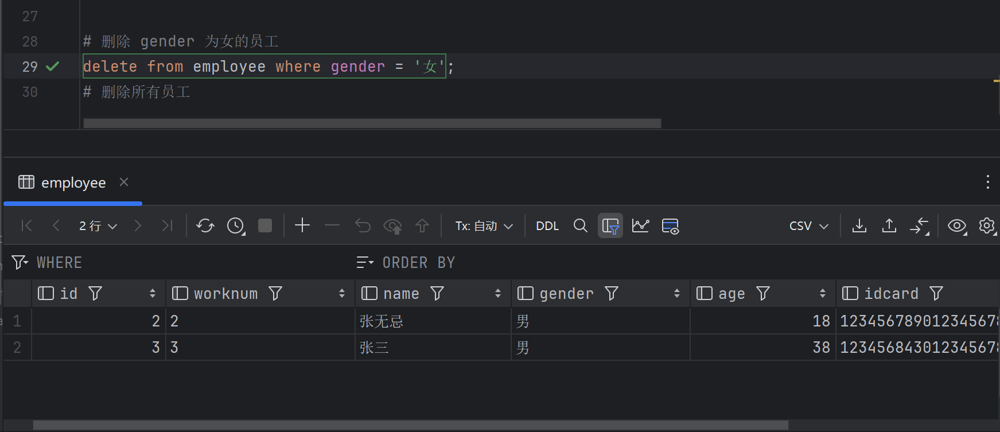

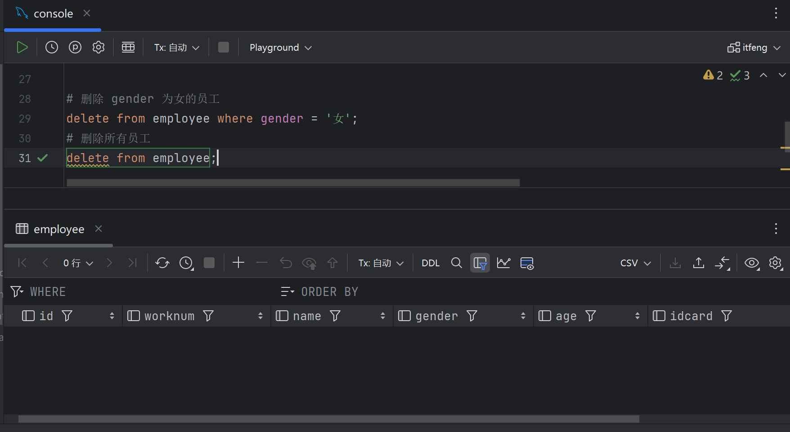


-------------------------------------


##### DML 小结
1. 添加数据
```sql
INSERT INTO 表名 (字段1, 字段2, ...) VALUES(值1, 值2, ...)[, (值1, 值2, ...) ...];
```

2. 修改数据
```sql
UPDATE 表名 SET 字段名1 = 值1, 字段名2 = 值2, ...[WHERE 条件];
```

3. 删除数据
```sql
DELETE FROM 表名 [WHERE 条件]; 
```


-------------------------


#### 5. DQL
DQL 英文全称是 Data Query Language（数据查询语言），数据查询语言，用来查询数据库中表的记录

查询关键字：**SELECT**

```sql
SELECT
	字段列表
FROM
	表名列表
WHERE
	条件列表
GROUP BY
	分组字段列表
HAVING
	分组后条件列表
ORDER BY
	排序字段列表
LIMIT
	分页参数
```

+ 基本查询
+ 条件查询（**WHERE**）
+ 聚合函数（**count、max、min、avg、sum**）
+ 分组查询（**GROUP BY**）
+ 排序查询（**ORDER BY**）
+ 分页查询（**LIMIT**）

##### 5.1 DQL - 基础查询
+ 查询多个字段
  ```sql
  SELECT 字段1, 字段2, 字段3... FROM 表名;
  ```
+ 查询所有的字段
  ```sql
  SELECT * FROM 表名;
  ```

+ 设置别名
  ```sql
  SELECT 字段1 [AS 别名1], 字段2 [AS 别名2] ... FROM 表名;
  ```

+ 去除重复记录
  ```sql
  SELECT DISTINCT 字段列表 FROM 表名;
  ```

###### 代码演示
```sql
create table emp
(
    id          int comment '编号',
    workno      varchar(10) comment '工号',
    name        varchar(10) comment '姓名',
    gender      char(1) comment '性别',
    age         tinyint unsigned comment '年龄',
    idcard      char(18) comment '身份证号',
    workaddress varchar(50) comment '工作地址',
    entrydate   date comment '入职时间'
) comment '员工表';


insert into emp (id, workno, name, gender, age, idcard, workaddress, entrydate)
    values (1, '1', '柳岩', '女', 20, '123456789012345678', '北京', '2000-01-01'),
           (2, '2', '张无忌', '男', 18, '123456789012345670', '北京', '2005-09-01'),
           (3, '3', '韦一笑', '男', 38, '123456789712345670', '上海', '2005-08-01'),
           (4, '4', '赵敏', '女', 18, '123456757123845670', '北京', '2009-12-01'),
           (5, '5', '小昭', '女', 16, '123456769012345678', '上海', '2007-07-01'),
           (6, '6', '杨道', '男', 28, '12345678931234567X', '北京', '2006-01-01'),
           (7, '7', '范瑶', '男', 40, '123456789212345670', '北京', '2005-05-01'),
           (8, '8', '黛绮丝', '女', 38, '123456157123645670', '天津', '2015-05-01'),
           (9, '9', '范凉凉', '女', 45, '123156789012345678', '北京', '2010-04-01'),
           (10, '10', '陈友谅', '男', 53, '123456789012345670', '上海', '2011-01-01'),
           (11, '11', '张士诚', '男', 55, '123567897123465670', '江苏', '2015-05-01'),
           (12, '12', '常遇春', '男', 32, '123446757152345670', '北京', '2004-02-01'),
           (13, '13', '张三丰', '男', 88, '123656789012345678', '江苏', '2020-11-01'),
           (14, '14', '灭绝', '女', 65, 123456719012345670, '西安', '2019-05-01'),
           (15, '15', '胡青牛', '男', 70, '12345674971234567X', '西安', '2018-04-01'),
           (16, '16', '周芷若', '女', 18, null, '北京', '2012-06-01');

-- 基本查询
# 1. 查询指定字段 name，workno，age 返回
select name, workno, age from emp;

# 2. 查询所有字段返回
select id, workno, name, gender, age, idcard, workaddress, entrydate from emp;

select * from emp;

# 3. 查询所有员工的工作地址，起别名
select workaddress as '工作地址' from emp;
select workaddress '工作地址' from emp;

# 4. 查询公司员工的上班地址（不要重复）
select distinct workaddress '工作地址' from emp

```


---------------------------


##### 5.2 DQL - 条件查询（WHERE）

+ 条件查询
  ```sql
  SELECT 字段列表 FROM 表名 WHERE 条件列表;
  ```

+ 条件

| 比较运算符          | 功能                                       |
| ------------------- | ------------------------------------------ |
| >                   | 大于                                       |
| >=                  | 大于等于                                   |
| <                   | 小于                                       |
| <=                  | 小于等于                                   |
| =                   | 等于                                       |
| <> 或 !=            | 不等于                                     |
| BETWEEN ... AND ... | 在某个范围之内（含最小、最大值）           |
| IN(...)             | 在 in 之后的列表中的值，多选一             |
| LIKE 占位符         | 模糊匹配（_匹配单个字符，%匹配任意个字符） |
| IS NULL             | 是NULL                                     |

| 逻辑运算符 | 功能                         |
| ---------- | ---------------------------- |
| AND 或 &&  | 并且（多个条件同时成立）     |
| OR 或 \|\| | 或者（多个条件任意一个成立） |
| NOT 或 !   | 非，不是                     |

###### 代码实现
```sql
-- 条件查询
# 1. 查询年龄等于 88 的员工
select * from emp where age = 88;

# 2. 查询年龄小于 20 的员工信息
select * from emp where age < 20;

# 3. 查询年龄小于等于 20 的员工信息
select * from emp where age <= 20;

# 4. 查询没有身份证号的员工信息
select * from emp where idcard is null;

# 5. 查询有身份证号的员工信息
select * from emp where idcard is not null;

# 6. 查询年龄不等于 88 的员工信息
select * from emp where age != 88;
select * from emp where age <> 88;

# 7. 查询年龄在 15 岁（包含）到 20 岁（包含）之间的员工信息
select * from emp where 15 <= age && age <= 20;
select * from emp where 15 <= age and age <= 20;

select * from emp where age between 15 and 20;

# 8. 查询性别为 女 且年龄小于 25 岁的员工信息
select * from emp where gender = '女' and age < 25;

# 9. 查询年龄等于 18 或 20 或 40 的员工信息
select * from emp where age = 18 or age = 20 or age = 40;
select * from emp where age in(18, 20, 40);

# 10. 查询姓名为两个字的员工信息 _ %
select * from emp where name like '__';

# 11. 查询身份证号最后一位是X的员工信息
select * from emp where idcard like '%X';
select * from emp where idcard like '_________________X';
```


-----------------------------


##### 5.3 DQL - 聚合函数（**count、max、min、avg、sum**）
###### 5.3.1 定义
+ 将一列数据作为一个整体，进行纵向计算

+ 常见聚合函数

| 函数  | 功能     |
| ----- | -------- |
| count | 统计数量 |
| max   | 最大值   |
| min   | 最小值   |
| avg   | 平均值   |
| sum   | 求和     |

+ 语法
  ```sql
  SELECT 聚合函数(字段列表) FROM 表名;
  ```

**注意：null 值不参与所有聚合函数运算**


###### 代码实现
```sql
-- 聚合函数
# 1. 统计该企业员工的数量
select count(*) from emp;
select count(idcard) from emp;

# 2. 统计该企业员工的平均年龄
select avg(age) from emp;

# 3. 统计该企业员工的最大年龄
select max(age) from emp;

# 4. 统计该企业员工的最小年龄
select min(age) from emp;

# 5. 统计西安地区员工年龄之和
select sum(age) from emp where workaddress = '西安';
```


-----------------------------------


##### 5.4 DQL - 分组查询（**GROUP BY**）
###### 5.4.1 语法
```sql
SELECT 字段列表 FROM 表名 [WHERE 条件] GROUP BY 分组字段名 [HAVING 分组后过滤条件];
```

###### 5.4.2 where 和 having 区别
+ where 和 having 的区别
  + 执行时机不同：where 是**分组之前**进行过滤，不满足 where 条件，不参与分组；而 having 是**分组之后**对结果进行过滤
  + 判断条件不同：where 不能对聚合函数进行判断，而 having 可以


**注意！！！：**
+ 执行顺序：**where > 聚合函数 > having**
+ 分组之后，查询的字段一般为聚合函数和分组字段，查询其他字段无任何意义
+ **group by 下来时 having 然后是 select**
  + 执行 group by 分组时不会执行聚合函数，select 中的聚合函数只有在执行 select 时才会执行，此时是拿着分组后的虚拟表来进行投影函数运算的——==《数据库概论》==
+ 进行分组查询的时候，**一般查询返回的字段就是分组之后的字段和聚合函数**


###### 代码实现
```sql
-- 分组查询
# 1. 根据性别分组，统计男性员工和女性员工的数量
select gender, count(*) from emp group by gender;

# 2. 根据性别分组，统计男性员工和女性员工的平均年龄
select gender, avg(age) from emp group by gender;

# 3. 查询年龄小于45的员工，并根据工作地址分组，获取员工数量大于等于3的工作地址
select workaddress, count(*) address_count from emp where age < 45 group by workaddress having count(*) >= 3;
```


------------------------------------


##### 5.5 DQL - 排序查询（**ORDER BY**）
###### 5.5.1 语法
```sql
SELECT 字段列表 FROM 表名 ORDER BY 字段1 排序方式1, 字段2 排序方式2;
```

###### 5.5.2 排序方式
+ **ASC**：升序（默认）
+ **DESC**：降序

**注意：如果是多字段排序，当第一个字段值相同时，才会根据第二个字段进行排序**

###### 代码实现
```sql
-- 排序查询
# 1. 根据年龄对公司的员工进行升序排序
select * from emp order by age asc ;
select * from emp order by age desc; # 倒叙

select * from emp order by age;

# 2. 根据入职时间，对员工进行降序排序
select * from emp order by entrydate desc;

# 3. 根据年龄对公司的员工进行升序排序，年龄相同，再按照入职时间进行降序排序
select * from emp order by age asc, entrydate desc;
```


---------------------------------


##### 5.6 DQL - 分页查询（**LIMIT**）
###### 5.6.1 语法
```sql
SELECT 字段列表 FROM 表名 LIMIT 起始索引, 查询记录数;
```

注意：
+ 起始索引从0开始，**起始索引 = (查询页码 - 1) * 每页显示记录数**
+ 分页查询是数据库的方言，不同的数据库有不同的实现，MySQL 中是 LIMIT
+ 如果查询的是第一页数据，起始索引可以省略，直接简写为 limit 10（**起始索引可以省略**）

###### 5.6.2 代码实现
```sql
-- 分页查询
# 1. 查询第1页员工数据，每页展示10条记录
select * from emp limit 0, 10;

select * from emp limit 10;

# 2. 查询第2页员工数据，每页展示10条记录 ------> （页码-1）*页展示记录数
select * from emp limit 10, 10;
```


------------------------------


##### DQL 案例练习
> 需求：
> 1. 查询年龄为20，21，22，23岁的女性员工信息
> 2. 查询性别为男，并且年龄在20-40岁（含）以内的姓名为三个字的员工
> 3. 统计员工表中，年龄小于60岁的男性员工和女性员工的人数
> 4. 查询所有年龄小于等于35岁员工的姓名和年龄，并对查询结果按年龄升序排序，如果年龄相同按入职时间降序排序
> 5. 查询性别为男，且年龄在20-40岁（含）以内的前5个员工信息，对查询的结果按年龄升序排序，年龄相同按入职时间升序排序
> 

###### 代码实现
```sql
-- ----------------------------DQL 语句练习---------------------------------
# 1. 查询年龄为20，21，22，23岁的女性员工信息
select * from emp where gender = '女' and age in(20, 21, 22, 23);

# 2. 查询性别为男，并且年龄在20-40岁（含）以内的姓名为三个字的员工
select * from emp where gender = '男' and (age between 20 and 40) and name like '___';

# 3. 统计员工表中，年龄小于60岁的男性员工和女性员工的人数
select gender, count(*) from emp where age < 60 group by gender;

# 4. 查询所有年龄小于等于35岁员工的姓名和年龄，并对查询结果按年龄升序排序，如果年龄相同按入职时间降序排序
select name, age from emp where age <= 35 order by age, entrydate desc;

# 5. 查询性别为男，且年龄在20-40岁（含）以内的前5个员工信息，对查询的结果按年龄升序排序，年龄相同按入职时间升序排序
select * from emp where gender = '男' and age between 20 and 40 order by age, entrydate limit 5;
```


---------------------------------


##### 5.7 DQL - 执行顺序

###### 5.7.1 编写顺序
```sql
SELECT
	字段列表
FROM
	表名列表
WHERE
	条件列表
GROUP BY
	分组字段列表
HAVING
	分组后条件列表
ORDER BY
	排序字段列表
LIMIT
	分页参数
```

###### 5.7.2 执行顺序
1. **FROM**
2. **WHERE**
3. **GROUP BY**、**HAVING**
4. **SELECT**
5. **ORDER BY**
6. **LIMIT**

###### 代码实现
```sql
-- 查询年龄大于15的员工姓名、年龄，并根据年龄进行升序排序
select e.name ename, e.age eage from emp e where e.age > 15 order by eage;
```


-------------------------------


##### DQL 小结

DQL 语句

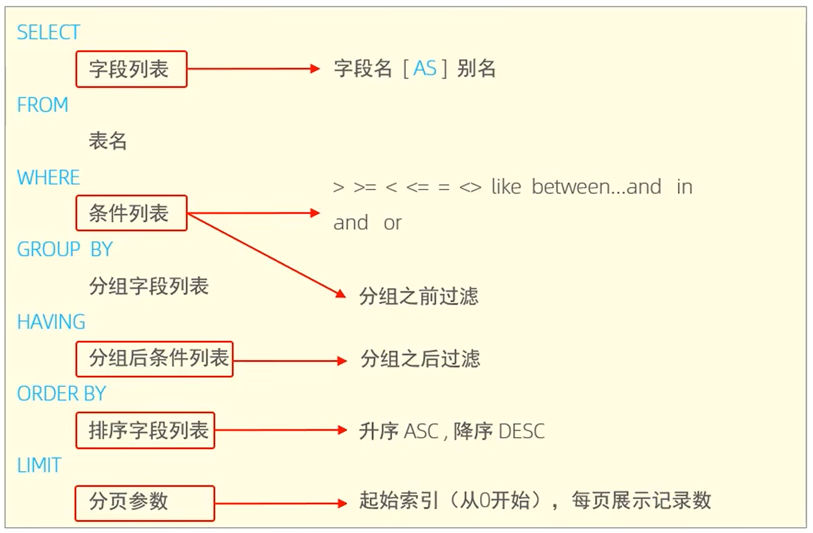


----------------------------


#### 6. DCL
+ DCL 英文全称是 Data Control Language（数据控制语言），用来管理数据库用户、控制数据库的访问权限


##### 6.1 DCL - 用户管理
+ 查询用户
  ```sql
  USE mysql;
  SELECT * FROM user;
  ```

+ 创建用户
  ```sql
  CREATE USER '用户名'@'主机名' IDENTIFIED BY '密码';
  ```

+ 修改用户密码
  ```sql
  ALTER USER '用户名'@'主机名' IDENTIFIED WITH mysql_native_password BY '新密码';
  ```

+ 删除用户
  ```sql
  DROP USER '用户名'@'主机名';
  ```

注意：
+ 主机名可以使用 **%** 通配
+ 这类 SQL 开发人员操作的比较少，主要是 DBA（Database Administrator 数据库管理员）使用


###### 代码实现
```sql
# 创建用户 itcast ，只能够在当前主机localhost访问，密码123456
create user 'itcast'@'localhost' identified by '123456';

# 创建用户 feng ，可以在任意主机访问该数据库，密码123456
create user 'feng'@'%' identified by '123456';

# 修改用户 feng ，的访问密码为1234
alter user 'feng'@'%' identified with mysql_native_password by '1234';

# 删除itcast@localhost用户
drop user 'itcast'@'localhost';
```


------------------------------


##### 6.2 DCL - 权限控制
MySQL 中定义了很多种权限，但是常用的就以下几种：

| 权限                | 说明               |
| ------------------- | ------------------ |
| ALL, ALL PRIVILEGES | 所有权限           |
| SELECT              | 查询权限           |
| INSERT              | 插入权限           |
| UPDATE              | 修改权限           |
| DELETE              | 删除权限           |
| ALTER               | 修改表             |
| DROP                | 删除数据库/表/视图 |
| CREATE              | 创建数据库/表      |


其他权限描述及其含义，可以直接参考官方文档[MySQL 中文文档 | MySQL 中文网](https://www.mysqlzh.com/)


+ 查询权限
  ```sql
  SHOW GRANTS FOR '用户名'@'主机名';
  ```

+ 授予权限
  ```sql
  GRANT 权限列表 ON 数据库名.表名 TO '用户名'@'主机名';
  ```

+ 撤销权限
  ```sql
  REVOKE 权限列表 ON 数据库名.表名 FROM '用户名'@'主机名';
  ```

注意：
+ 多个权限之间，使用逗号分隔
+ 授权时，数据库名和表名可以使用 ***** 进行通配，代表所有
+ 给所有权限的话，权限列表可以用 **all**


###### 代码实现
```sql
-- 查询权限
show grants for 'feng'@'%';

-- 授予权限
grant all on itcast.* to 'feng'@'%';

-- 撤销权限
revoke all on itcast.* from 'feng'@'%';
```


--------------------------------


##### DCL 小结
1. 用户管理
```sql
-- 创建用户
CREATE USER '用户名'@'主机名' IDENTIFIED BY '密码';

-- 修改用户密码
ALTER USER '用户名'@'主机名' IDENTIFIED WITH mysql_native_password BY '新密码';

-- 删除用户
DROP USER '用户名'@'主机名';
```

2. 权限控制
```sql
-- 授予权限
GRANT 权限列表 ON 数据库名.表名 TO '用户名'@'主机名';

-- 撤销权限
REVOKE 权限列表 ON 数据库名.表名 FROM '用户名'@'主机名';
```


-----------------------------


### 三、函数

+ **函数**是指可以直接被另一段程序调用的程序或代码


#### 1. 字符串函数
MySQL 中内置了很多字符串函数，常用的几个如下：

| 函数                       | 功能                                                         |
| -------------------------- | ------------------------------------------------------------ |
| CONCAT(S1, S2, ...Sn)      | 字符串拼接，将 S1, S2, ...Sn 拼接成一个字符串                |
| LOWER(str)                 | 将字符串 str 全部转为小写                                    |
| UPPER(str)                 | 将字符串 str 全部转为大写                                    |
| LPAD(str, n, pad)          | 左填充，用字符串 pad 对 str 的左边进行填充，达到 n 个字符串长度 |
| RPAD(str, n, pad)          | 右填充，用字符串 pad 对 str 的右边进行填充，达到 n 个字符串长度 |
| TRIM(str)                  | 去掉字符串头部和尾部的空格                                   |
| SUBSTRING(str, start, len) | 返回从字符串 str 从 start 位置起的 len 个长度的字符串【**索引从1开始**】 |

```sql
select 函数(参数);
```

##### 代码实现
```sql
-- concat
select concat('Hello', 'MySQl'); # HelloMySQl

-- lower
select lower('Hello'); # hello

-- upper
select upper('Hello'); # HELLO

-- lpad
select lpad('01', 5, '-'); # ---01

-- rpad
select rpad('01', 5, '-'); # 01---

-- trim
select trim(' Hello MySQL '); # Hello MySQL

-- substring
select substring('Hello MySQL', 1, 5); # Hello
```

##### 案例练习
> 根据需求完成以下 SQL 编写
> 由于业务需求变更，企业员工的工号，统一为5位数，目前不足5位数的全部在前面补0.比如：1号员工的工号应该为00001

###### 代码实现
```sql
update emp set workno = lpad(workno, 5, '0');
```


----------------------------------------------


#### 2. 数值函数
##### 2.1 定义
常见的数字函数如下：

| 函数        | 功能                                   |
| ----------- | -------------------------------------- |
| CEIL(x)     | 向上取整                               |
| FLOOR(x)    | 向下取整                               |
| MOD(x, y)   | 返回 x/y 的模                          |
| RAND()      | 返回0~1内的随机数                      |
| ROUND(x, y) | 求参数 x 的四舍五入的值，保留 y 位小数 |

##### 代码实现
```sql
-- 数值函数
# ceil
select ceil(1.1); # 2

# floor
select floor(1.9); # 1

# mod
select mod(7, 4); # 3

# rand
select rand();

# round
select round(2.345, 2); # 2.35
```

##### 案例
> 需求：
> + 通过数据库的函数，生成一个六位数的随机验证码
> 

###### 代码实现
```sql
select lpad(round(rand()*1000000, 0), 6, '0');
```


------------------------------------


#### 3. 日期函数

常见的日期函数如下：

|  函数  |  功能  |
| ---------------------------------- | ----------------------------------------------------- |
| CURDATE()                          | 返回当前日期                                          |
| CURTIME()                          | 返回当前时间                                          |
| NOW()                              | 返回当前日期和时间                                    |
| YEAR(date)                         | 获取指定 date 的年份                                  |
| MONTH(date)                        | 获取指定 date 的月份                                  |
| DAY(date)                          | 获取指定 date 的日期                                  |
| DATE_ADD(date, INTERVAL expt type) | 返回一个日期 / 时间值加上一个时间间隔 expr 后的时间值 |
| DATEDIFF(date1, date2)             | 返回起始时间 date1和结束时间 date2 之间的天数         |


##### 代码实现
```sql
-- 日趋函数
# curdate()
select curdate(); # 2024-12-20

# curtime()
select curtime(); # 13:56:03

# now()
select now(); # 2024-12-20 13:56:22

# YEAR, MONTH, DAY
select YEAR(now()); # 2024

select MONTH(now()); # 12

select DAY(now()); # 20

# date_add
select date_add(now(), INTERVAL 70 DAY); # 2025-02-28 13:59:04
select date_add(now(), INTERVAL 70 MONTH); # 2030-10-20 13:59:28
select date_add(now(), INTERVAL 70 YEAR); # 2094-12-20 13:59:41

# datediff
select datediff('2021-12-01', '2021-11-01'); # 30
select datediff('2021-10-01', '2021-12-01'); # -61
```

##### 案例
> 需求：
> 查询所有员工的入职天数，并根据入职天数倒序排序
> 

###### 代码实现
```sql
select name, datediff(curdate(), entrydate) as 'entrydays' from emp order by entrydays desc;
```


----------------------------------------


#### 4. 流程函数

流程函数也是很常用的一类函数，可以在 SQL 语句中实现条件筛选，从而提高语句的效率

| 函数                                                         | 功能                                                         |
| ------------------------------------------------------------ | ------------------------------------------------------------ |
| IF(value, t,f)                                               | 如果 value 为 true，这返回 t， 否则返回 f                    |
| IFNULL(value1, value2)                                       | 如果 value 不为空，返回 value1，否则返回 value2              |
| CASE WHEN [ val1 ] THEN [res1] ... ELSE [ default ] END      | 如果 val1为true，返回 res1，... 否则返回 default 默认值      |
| CASE [ expr ] WHEN [ val1 ] THEN [res1] ... ELSE [ default ] END | 如果 expr 的值等于 val1，返回 res1，... 否则返回 default 默认值 |

##### 代码实现
```sql
-- 流程控制函数
# if
select if(true, 'Ok', 'Error'); # Ok

# ifnull
select ifnull('Ok', 'Default'); # Ok
select ifnull('', 'Default'); #
select ifnull(null, 'Default'); # Default

# case when then else end
# 需求：查询emp表的员工姓名和工作地址（北京/上海 ---> 一线城市，其他 ---> 二线城市）
select
    name,
    ( case workaddress when '北京' then '一线城市' when '上海' then '一线城市' else '二线城市' end ) as '工作地址'
from emp;
```

##### 案例
> 需求：
> 统计班级各个学员的成绩，展示的规则如下：
>
> + **>=85**，展示优秀
> + **<=60**，展示及格
> + 否则，展示不及格
>

###### 代码实现
+ 建表
```sql
create table score
(

    id      int comment 'ID',
    name    varchar(20) comment '姓名',
    math    int comment '数学',
    english int comment '英语',
    chinese int comment '语文'
) comment '学员成绩表';
insert into score(id, name, math, english, chinese)
VALUES (1, 'Tom', 67, 88, 95),
       (2, 'Rose', 23, 66, 90),
       (3, 'Jack', 56, 98, 76);
```

+ 展示
```sql
select id,
       name,
       ( case when math >= 85 then '优秀' when math >= 60 then '及格' else '不及格' end ) '数学',
       ( case when english >= 85 then '优秀' when english >= 60 then '及格' else '不及格' end ) '英语',
       ( case when chinese >= 85 then '优秀' when chinese >= 60 then '及格' else '不及格' end ) '语文'
from score;
```


------------------------------------------


#### 小结
1. 字符串函数
  ```sql
  CONCAT, # 字符串拼接
  
  LOWER, # 字符串全部转为小写
  
  UPPER, # 字符串全部转为大写
  
  LPAD, # 左填充
  
  RPAD, # 右填充
  
  TRIM, # 去除左右两侧的空格（不包含中间的空格）
  
  SUBSTRING # 字符串截取
  ```

2. 数值函数
  ```sql
  CEIL, # 向上取整
  
  FLOOR, 向下取整
  
  MOD, # 求模
  
  RAND, # 求随机数（介于0~1之间的）
  
  ROUND # 四舍五入，保留指定位数的小数
  ```

3. 日期函数
  ```sql
  CURDATE, # 获取当前日期
  
  CURTIME, # 获取当前时间
  
  NOW, # 获取当前的日期加时间
  
  YEAR, # 获取指定的年份
  
  MONTH, # 获取指定的月份
  
  DAY, # 获取指定的日期
  
  DATE_ADD, # 添加指定的时间周期
  
  DATEDIFF # 第一个日期减去第二个日期差了多少天
  ```

4. 流程函数
  ```sql
  IF, # 判断第一个参数条件表达式是否为true，如果为true返回第二个参数，为false返回第三个参数
  
  IFNULL, # 判断第一个参数是否为null，如果为null取第二个参数，如果不为null取当前第一个参数
  
  CASE[...] WHEN ... THEN ... ELSE ... END # 条件分支的判断 
  ```


---------------------------------------


### 四、约束
#### 1. 概述
+ 概述：约束是作用于表中字段上的规则，用于限制存储在表中的数据
+ 目的：保证数据中数据的正确、有效性和完整性
+ 分类：

| 约束                       | 描述                                                     | 关键字      |
| -------------------------- | -------------------------------------------------------- | ----------- |
| 非空约束                   | 限制该字段的数据不能为 null                              | NOT NULL    |
| 唯一约束                   | 保证该字段的所有数据都是唯一的、不重复的                 | UNIQUE      |
| 主键约束                   | 主键是一行数据的唯一标识，要求非空且唯一                 | PRIMARY KEY |
| 默认约束                   | 保存数据时，如果未指定该字段的值，则采用默认值           | DEFAULT     |
| 检查约束（8.0.16版本之后） | 保证字段值满足某一个条件                                 | CHECK       |
| 外键约束                   | 用来让两张表的数据之间建立连接，保证数据的一致性和完整性 | FOREIGN KEY |


**注意：约束是作用于表中字段上的，可以在创建表/修改表的时候添加约束**

+ **多个约束之间用空格分开**


----------------------------


#### 2. 约束演示
+ 案例：根据需求，完成表结构的创建

> | 字段名 | 字段含义    | 字段类型    | 约束条件                  | 约束关键字              |
> | ------ | ----------- | ----------- | ------------------------- | ----------------------- |
> | id     | ID 唯一标识 | int         | 主键，并且自动增长        | PRIMARY, AUTO_INCREMENT |
> | name   | 姓名        | varchar(10) | 不为空，并且唯一          | NOT NULL, UNIQUE        |
> | age    | 年龄        | int         | 大于0，并且小于等于120    | CHECK                   |
> | status | 状态        | char(1)     | 如果没有指定该值，默认为1 | DEFAULT                 |
> | gender | 性别        | char(1)     | 无                        |                         |


##### 代码实现
```sql
create table user
(
    id     int primary key auto_increment comment '主键',
    name   varchar(10) not null unique comment '姓名',
    age    int check ( age > 0 && age <= 120 ) comment '年龄',
    status char(1) default '1' comment '状态',
    gender char(1) comment '姓名'
) comment '用户表';

-- 插入数据
insert into user(name, age, status, gender) values ('Tom', 19, '1', '男'), ('Tom2', 25, '0', '男');
insert into user(name, age, status, gender) values ('Tom3', 19, '1', '男');

# insert into user(name, age, status, gender) values (null, 19, '1', '男');
insert into user(name, age, status, gender) values ('Tom3', 19, '1', '男');

insert into user(name, age, status, gender) values ('Tom4', 80, '1', '男');
# insert into user(name, age, status, gender) values ('Tom5', -1, '1', '男');
# insert into user(name, age, status, gender) values ('Tom5', 121, '1', '男');

insert into user(name, age, gender) values ('Tom5', 120, '男');
```


--------------------------


#### 3. 外键约束

##### 3.1 定义
+ 概念：外键用来让两张表的数据之间建立连接，从而保证数据的一致性和完整性

+ 举个栗子：

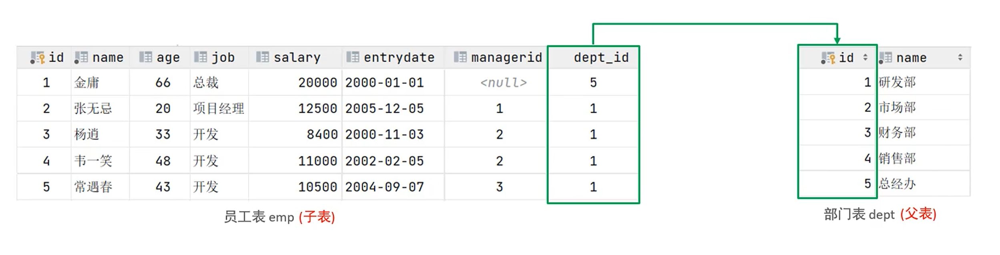

dept_id 就为外键

**注意：目前上述的两张表，在数据库层面，并未建立外键关联，所以是无法保证数据的一致性和完整性的**

##### 3.2 外键约束
+ 语法：
  + 添加外键
  ```sql
  CREATE TABLE 表名(
      字段名 数据类型,
      ...
      [CONSTRAINT] [外键名称] FOREIGN KEY(外键字段名) REFERENCES 主表(主表列名);
  )
  ```
  ```sql
  ALTER TABLE 表名 ADD CONSTRAINT 外键名称 FOREIGN KEY (外键字段名) REFERENCES 主表(主表列名);
  ```

  + 删除外键
  ```sql
  ALTER TABLE 表名 DROP FOREIGN KEY 外键名称;
  ```

##### 代码实现
+ 建表
```sql
# 准备数据
create table dept
(
    id   int auto_increment comment 'ID' primary key,
    name varchar(50) not null comment '部门名称'
) comment '部门表';
INSERT INTO dept (id, name)
VALUES (1, '研发部'),
       (2, '市场部'),
       (3, '财务部'),
       (4, '销售部'),
       (5, '总经办');


create table emp
(
    id        int auto_increment comment 'ID' primary key,
    name      varchar(50) not null comment '姓名',
    age       int comment '年龄',
    job       varchar(20) comment '职位',
    salary    int comment '薪资',
    entrydate date comment '入职时间',
    managerid int comment '直属领导ID',
    dept_id   int comment '部门ID'
) comment '员工表';
INSERT INTO emp (id, name, age, job, salary, entrydate, managerid, dept_id)
    VALUES (1, '金庸', 66, '总裁', 20000, '2000-01-01', null, 5),
           (2, '张无忌', 20, '项目经理', 12500, '2005-12-05', 1, 1),
           (3, '扬逍', 33, '开发', 8400, '2000-11-03', 2, 1),
           (4, '事一笑', 48, '开发', 11000, '2002-02-05', 2, 1),
           (5, '常遇春', 43, '开发', 10500, '2004-09-07', 3, 1),
           (6, '小昭', 19, '程序员鼓励师', 6600, '2004-10-12', 2, 1);
```

+ 添加外键
```sql
alter table emp add constraint fk_emp_dept_id foreign key (dept_id) references dept(id);
```

+ 删除外键
```sql
alter table emp drop foreign key fk_emp_dept_id;
```

##### 3.3 外键删除更新行为

| 行为        | 说明                                                         |
| ----------- | ------------------------------------------------------------ |
| NO ACTION   | 当在父表中删除/更新对应记录时，首先检查该记录是否有对应外键，如果有则不允许删除/更新（与 RESTRICT 一致） |
| RESTRICT    | 当在父表中删除/更新对应记录时，首先检查该记录是否有对应外键，如果有则不允许删除/更新（与 NO ACTION 一致） |
| CASCADE     | 当在父表中删除/更新对应记录时，首先检查该记录是否有对应外键，如果有，则也删除/更新外键在子表中的记录 |
| SET NULL    | 当在父表中删除对应记录时，首先检查该记录是否有对应外键，如果有则设置子表中该外键值为 null（这就要求该外键允许取 null ） |
| SET DEFAULT | 父表有变更时，子表将外键列设置成一个默认的值（ lnnodb 不支持） |


+ 语法：
```sql
ALTER TABLE 表名 ADD CONSTRAINT 外键名称 FOREIGN KEY (外键字段) REFERENCES 主表名(主表字段名) ON UPDATE CASCADE ON DELETE CASCADE;
```

##### 代码实现
```sql
-- 外键的删除和更新行为
alter table emp add constraint fk_emp_dept_id foreign key (dept_id) references dept(id) on update cascade on delete cascade;

alter table emp add constraint fk_emp_dept_id foreign key (dept_id) references dept(id) on update set null on delete set null;
```


---------------------------------------


#### 总结
1. 非空约束：`NOT NULL`
2. 唯一约束：`UNIQUE`
3. 主键约束：`PRIMARY KEY`（自增：`AUTO_INCREMENT`）
4. 默认约束：`DEFAULT`
5. 检查约束：`CHECK`
6. 外键约束：`FOREIGN KEY`


---------------------------------


### 五、多表查询

#### 1. 多表关系
##### 1.1 概述

项目开发中，在进行数据库表结构设计时，会根据业务需求及业务模块之间的关系，分析并设计表结构，由于业务之间相互关联，所以各个项目表结构之间也存在着各种联系，基本上分为三种：
+ 一对多（多对一）
+ 多对多
+ 一对一

##### 1.2 一对多（多对一）
+ 案例：部门与员工的关系
+ 关系：一个部门对应多个员工，一个员工对应一个部门
+ 实现：**在多的一方建立外键，指向一的一方的主键**

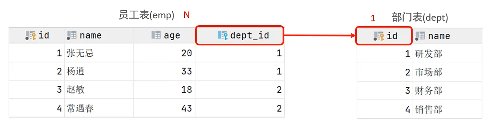


##### 1.3 多对多
+ 案例：学生与课程的关系
+ 关系：一个学生可以选修多门课程，一门课程可以供多个学生选择
+ 实现：**建立第三张中间表，中间表至少包含两个外键，分别关联两方主键**

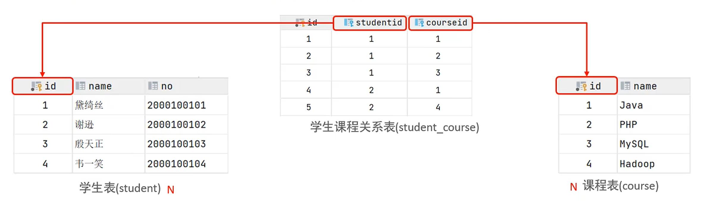

###### 代码实现
```sql
create table student
(
    id   int auto_increment primary key comment '主键ID',
    name varchar(10) comment '姓名',
    no   varchar(10) comment '学号'
) comment '学生表';
insert into student values (null, '黛绮丝', '2000100101'), (null, '谢逊', '2000100102'), (null, '殷天正', '2000100103'), (null, '韦一笑', '2000100104');

create table course
(
    id   int auto_increment primary key comment '主键ID',
    name varchar(10) comment '课程名称'
) comment '课程表';
insert into course values (null, 'Java'), (null, 'PHP'), (null, 'MySQL'), (null, 'Hadoop');

create table student_course
(
    id int auto_increment comment '主键' primary key,
    studentid int not null comment '学生ID',
    courseid int not null comment'课程ID',
    constraint fk_courseid foreign key (courseid) references course (id),
    constraint fk_studentid foreign key (studentid) references student (id)
) comment '学生课程中间表';

insert into student_course values (null,1,1), (null,1,2), (null,1,3), (null,2,2), (null,2,3),(null,3,4);
```


##### 1.4 一对一
+ 案例：用户与用户详情的关系
+ 关系：一对一关系，多用于单表拆分，将一张表的基础字段放在一张表中，其他详情字段放在另一张表中，以提升操作效率
+ 实现：**在任意一方加入外键，关联另外一方的主键，并且设置外键为唯一的（UNIQUE）**

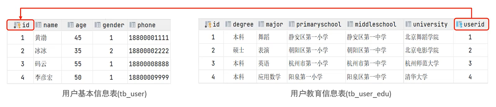

###### 代码实现
```sql
create table tb_user
(
    id     int auto_increment primary key comment '主键ID',
    name   varchar(10) comment '姓名',
    age    int comment '年龄',
    gender char(1) comment '1：男,2：女',
    phone  char(11) comment '手机号'
) comment '用户基本信息表';

create table tb_user_edu
(
    id int auto_increment primary key comment '主键ID',
    degree varchar(20) comment'学历',
    major varchar(50) comment'专业',
    primaryschool varchar(50) comment'小学',
    middleschool varchar(50) comment'中学',
    university varchar(50) comment '大学',
    userid int unique comment'用户ID',
    constraint fk_userid foreign key (userid) references tb_user(id)
) comment '用户教育信息表';

insert into tb_user(id, name, age, gender, phone) values
    (nulL,'黃',45,'1','1880000111'),
    (null,'冰冰',35,'2','18800002222'),
    (nuLL,'码云',55,'1','1880000888'),
    (null,'李彦宏',50,'1','18800009999');

insert into tb_user_edu(id, degree, major, primaryschool, middleschool, university, userid) values
    (null,'本科','舞蹈','静安区第一小学','静安区第一中学','北京舞蹈学院',1),
    (null,'硕士','表演','朝阳区第一小学','朝阳区第一中学','北京电影学院',2),
    (null,'本科','英语','杭州市第一小学','杭州市第一中学','杭州师范大学',3),
    (null,'本科','应用数学','阳泉第一小学','阳泉区第一中学','清华大学',4);
```


-----------------------------------------


#### 2. 多表查询概述
##### 2.1 定义
+ 概述：指从多张表中查询数据
+ 笛卡尔积：笛卡尔乘积是指在数学中，两个集合 A 集合和 B 集合的所有组合情况。（**在多表查询时，需要消除无效的笛卡尔积**）
+ 消除无效的笛卡尔积，剩下的便是有效数据

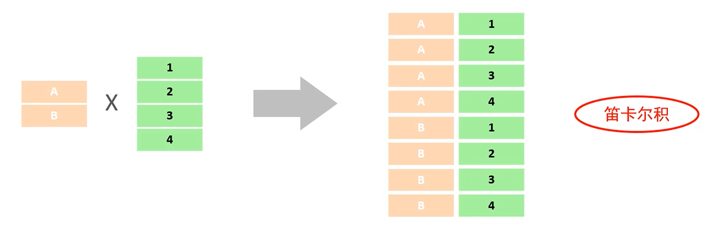

##### 2.2 多表查询的分类
+ 多表查询的分类
  + 连接查询
    + 内连接：相当于查询 A、B 交集部分数据
    + 外连接：
      + 左外连接：查询**左表**所有数据，以及两张表交集部分数据
      + 右外连接：查询**右表**所有数据，以及两张表交集部分数据
    + 自连接：当前表与自身的连接查询，自连接必须使用表别名
  + 子查询


##### 代码演示
+ 建表
  + emp
  ```sql
  create table emp
  (
  id        int auto_increment comment 'ID' primary key,
  name      varchar(50) not null comment '姓名',
  age       int comment '年龄',
  job       varchar(20) comment '职位',
  salary    int comment '薪资',
  entrydate date comment '入职时间',
  managerid int comment '直属领导ID',
  dept_id   int comment '部门ID'
  ) comment '员工表';
  
  INSERT INTO emp (id, name, age, job,salary, entrydate, managerid, dept_id) VALUES
            (1, '金庸', 66, '总裁',20000, '2000-01-01', null,5),
            (2, '张无忌', 20, '项目经理',12500, '2005-12-05', 1,1),
            (3, '杨逍', 33, '开发', 8400,'2000-11-03', 2,1),
            (4, '韦一笑', 48, '开发',11000, '2002-02-05', 2,1),
            (5, '常遇春', 43, '开发',10500, '2004-09-07', 3,1),
            (6, '小昭', 19, '程序员鼓励师',6600, '2004-10-12', 2,1),
            (7, '灭绝', 60, '财务总监',8500, '2002-09-12', 1,3),
            (8, '周芷若', 19, '会计',48000, '2006-06-02', 7,3),
            (9, '丁敏君', 23, '出纳',5250, '2009-05-13', 7,3),
            (10, '赵敏', 20, '市场部总监',12500, '2004-10-12', 1,2),
            (11, '鹿杖客', 56, '职员',3750, '2006-10-03', 10,2),
            (12, '鹤笔翁', 19, '职员',3750, '2007-05-09', 10,2),
            (13, '方东白', 19, '职员',5500, '2009-02-12', 10,2),
            (14, '张三丰', 88, '销售总监',14000, '2004-10-12', 1,4),
            (15, '俞莲舟', 38, '销售',4600, '2004-10-12', 14,4),
            (16, '宋远桥', 40, '销售',4600, '2004-10-12', 14,4),
            (17, '陈友谅', 42, null,2000, '2011-10-12', 1,null);
  ```

  + dept

  ```sql
  create table dept
  (
    id   int auto_increment comment 'ID' primary key,
    name varchar(50) not null comment '部门名称'
  ) comment '部门表';
  
  INSERT INTO dept (id, name)
  VALUES (1, '研发部'),
       (2, '市场部'),
       (3, '财务部'),
       (4, '销售部'),
       (5, '总经办'),
       (6, '人事部');
  ```
  
+ 多表查询
```sql
-- 多表查询 -- 笛卡尔积
select * from emp, dept where emp.dept_id = dept.id;
```


-------------------------------------------


#### 3. 内连接

##### 3.1 定义
+ **内连接查询的是两张表交集的部分**

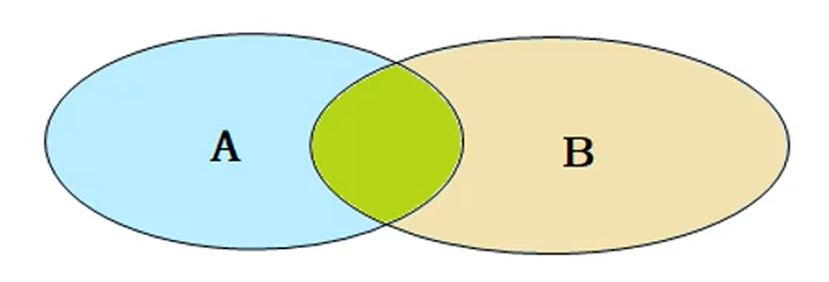


##### 3.2 语法

内连接查询语法：

+ 隐式内连接
```sql
SELECT 字段列表 FROM 表1, 表2 WHERE 条件...;
```

+ 显式内连接
```sql
SELECT 字段列表 FROM 表1 [INNER] JOIN 表2 ON 连接条件...;
```


PS：显式性能比隐式高（有更快的执行速度）


##### 代码演示
```sql
-- 内连接演示
# 1. 查询每一个员工的姓名，及关联的部门的名称（隐式内连接实现）
-- 表结构：emp、dept
-- 连接条件：emp.dept_id = dept.id

select emp.name, dept.name from emp, dept where emp.dept_id = dept.id;

-- 起别名(简化sql的编写)
select e.name, d.name from emp e, dept d where e.dept_id = d.id;

# 2. 查询每一个员工的姓名，及关联的部门的名称（显式内连接实现） --- INNER JOIN ... ON ...
-- 表结构：emp、dept
-- 连接条件：emp.dept_id = dept.id

select e.name, d.name from emp e inner join dept d on e.dept_id = d.id;
select e.name, d.name from emp e join dept d on e.dept_id = d.id;
```


-----------------------------------------


#### 4. 外连接

##### 4.1 语法
+ 左外连接
  + 查询表1（左表）的所有数据包含表1和表2交集部分的数据

```sql
SELECT 字段列表 FROM 表1 LEFT [OUTER] JOIN 表2 ON 条件...;
```

+ 右外连接
  + 查询表2（右表）的所有数据包含表1和表2交集部分的数据

```sql
SELECT 字段列表 FROM 表1 RIGHT [OUTER] JOIN 表2 ON 条件...;
```

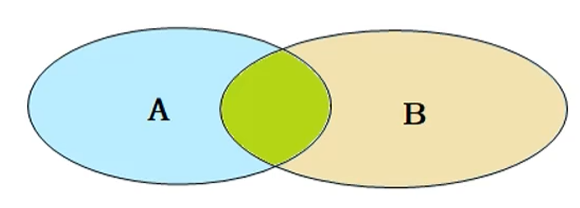


##### 代码实现
```sql
-- 外连接演示
# 1. 查询emp表的所有数据，相对应的部门信息（左外连接）
# 表结构：emp、dept
# 连接条件：emp.dept_id = dept.id

select e.*, d.name from emp e left outer join dept d on e.dept_id = d.id;

select e.*, d.name from emp e left join dept d on e.dept_id = d.id;

# 2. 查询dept表的所有数据，相对应的员工信息（右外连接）
select d.*, e.* from emp e right outer join dept d on d.id = e.dept_id;

select d.*, e.* from emp e right join dept d on d.id = e.dept_id;

# 右外改为左外
select d.*, e.* from dept d left outer join emp e on d.id = e.dept_id;
```


------------------------------------------


#### 5. 自连接

##### 5.1 连接查询
自连接查询语法：
```sql
SELECT 字段列表 FROM 表A 别名A JOIN 表A 别名B ON 条件...;
```
自连接查询，可以是内连接查询，也可以是外连接查询 

+ **自连接查询一定要给表起别名**

###### 代码实现
```sql
-- 自连接
# 1. 查询员工及其所属领导的名字
# 表结构：emp

select a.name, b.name from emp a, emp b where a.managerid = b.id;

# 2. 查询所有员工emp及其领导的名字emp，如果员工没有领导，也需要查询出来

select a.name '员工', b.name '领导' from emp a left join emp b on a.managerid = b.id;
```

##### 5.2 联合查询

###### 5.2.1 定义

联合查询 - union、union all

+ 对于 union 查询，就是把多次查询的结果合并起来，形成一个新的查询结果集

###### 5.2.1 语法

```sql
SELECT 字段列表 FROM 表A ...
UNION [ALL]
SELECT 字段列表 FROM 表B ...;
```
+ **对于联合查询的多张表的列数必须保持一致，字段类型也需要保持一致**
+ **union all 会将全部的数据直接合并在一起，union 会对合并之后的数据去重**


###### 代码实现
```sql
-- union all , union
# 1. 将薪资低于5000的员工和年龄大于50岁的员工全部查询出来

select * from emp where salary < 5000
union all
select * from emp where age > 50;

# 合并后去重
select * from emp where salary < 5000
union
select * from emp where age > 50;
```


-------------------------------------------


#### 6. 子查询

##### 6.1 定义

+ 概念：SQL 语句中嵌套 SELECT 语句，称为**嵌套查询**，又称**子查询**
  ```sql
  SELECT * FROM t1 WHERE column1 = (SELECT column1 FROM t2);
  ```
+ **子查询外部的语句可以是 INSERT / UPDATE / DELETE / SELECT 的任意一个**

+ 根据子查询结果不同，分为：
  + 标量子查询（子查询结果为单个值）
  + 列子查询（子查询结果为一列）
  + 行子查询（子查询结果为一行）
  + 表子查询（子查询结果为多行多列）

+ 根据子查询位置，分为：WHERE 之后、FROM 之后、SELECT 之后


----------------------------------------


##### 6.2 标量子查询

###### 6.2.1 定义
+ 标量子查询：
  + 子查询返回的结果是单个值（数字、字符串、日期等等），最简单的形式，这种子查询称为**标量子查询**
  + 常用操作符号：= <> > >= < <=

###### 代码实现
```sql
-- 标量子查询
-- 1. 查询“销售部”所有员工信息
-- a. 查询“销售部”的部门ID
select id from dept where name = '销售部';

-- b. 根据销售部部门ID，查询员工信息
select * from emp where dept_id = (select id from dept where name = '销售部');

-- 2. 查询在“方东白”入职之后的员工信息
-- a. 查询“方东白”的入职日期
select entrydate from emp where name = '方东白';

-- b. 查询指定入职日期之后入职的员工信息
select * from emp where entrydate > (select entrydate from emp where name = '方东白');
```


---------------------------------------------


##### 6.3 列子查询

###### 6.3.1 定义

+ 列子查询
  + 子查询返回的结果是一列（可以是多行），这种子查询称为**列子查询**
  + 常用操作符：IN、NOT IN、ANY、SOME、ALL

| 操作符 | 描述                                        |
| ------ | ------------------------------------------- |
| IN     | 在指定的集合范围之内，多选一                |
| NOT IN | 不在指定的集合范围之内                      |
| ANY    | 子查询返回列表中，有任意一个满足即可        |
| SOME   | 与 ANY 等同，使用 SOME 的地方都可以使用 ANY |
| ALL    | 子查询返回列表的所有值都必须满足            |

###### 代码实现
```sql
-- 列子查询
-- 1. 查询“销售部”和“市场部”的所有员工信息
-- a. 查询“销售部”和“市场部”的部门ID
select id from dept where name = '销售部' or name = '市场部';

-- b。 根据部门ID，查询员工信息
select * from emp where dept_id in (select id from dept where name = '销售部' or name = '市场部');

-- 2. 查询比财务部所有人工资都高的员工信息
-- a. 查询所有财务部的人员工资
select id from dept where name = '财务部';

select salary from emp where dept_id = (select id from dept where name = '财务部');

-- b. 比财务部所有人工资都高的员工信息
select * from emp where salary > all (select salary from emp where dept_id = (select id from dept where name = '财务部'));

-- 3. 查询比研发部其中任意一人工资高的员工信息
-- a. 查询研发部所有人工资
select salary from emp where dept_id = (select id from dept where name = '研发部');

-- b.比研发部其中任意一人工资高的员工信息
select * from emp where salary > any (select salary from emp where dept_id = (select id from dept where name = '研发部'));
select * from emp where salary > some (select salary from emp where dept_id = (select id from dept where name = '研发部'));
```


---------------------------------------


##### 6.4 行子查询

###### 6.4.1 定义

+ 行子查询
  + 子查询返回的结果是一行（可以是多列），这种子查询称为**行子查询**
  + 常用的操作符：=、<>、IN、NOT IN

###### 代码实现
```sql
-- 行子查询
-- 1. 查询与”张无忌“的薪资及直属领导相同的员工信息
-- a. 查询”张无忌“的薪资及直属领导
select salary, managerid from emp where name = '张无忌';

-- b. 查询与”张无忌“的薪资及直属领导相同的员工信息
select * from emp where (salary, managerid) = (select salary, managerid from emp where name = '张无忌');
```


----------------------------------------


##### 6.5 表子查询

###### 6.5.1 定义

+ 表子查询
  + 子查询返回的结果是多行多列，这种子查询称为**表子查询**
  + 常用操作符：IN

###### 代码演示
```sql
-- 表子查询
-- 1. 查询与“鹿杖客”，“宋远桥”的职位和薪资相同的员工信息
-- a. 查询“鹿杖客”，“宋远桥”的职位和薪资
select job, salary from emp where name = '鹿杖客' or name = '宋远桥';

-- b. 查询与“鹿杖客”，“宋远桥”的职位和薪资相同的员工信息
select * from emp where (job, salary) in (select job, salary from emp where name = '鹿杖客' or name = '宋远桥');

-- 2. 查询入职日期是“2006-01-01”之后的员工信息，及其部门信息
-- a. 入职日期是“2006-01-01”之后的员工信息
select * from emp where entrydate > '2006-01-01';

-- b. 查询这部分员工，对应的部门信息
select e.*, d.* from (select * from emp where entrydate > '2006-01-01') e left join dept d on e.dept_id = d.id;
```


--------------------------------------------


#### 7. 多表查询案例

##### 案例需求

> 需求：
> 1. 查询员工的姓名、年龄、职位、部门信息
> 2. 查询年龄小于30岁的员工姓名、年龄、职位、部门信息
> 3. 查询拥有员工的部门 ID、部门名称
> 4. 查询所有年龄大于40岁的员工，及其所属部门的名称；如果员工没有分配部门，也需要展示出来
> 5. 查询所有员工的工资等级
> 6. 查询“研发部”所有员工的信息及工资等级
> 7. 查询“研发部”员工的平均工资
> 8. 查询工资比“灭绝”高的员工信息
> 9. 查询比平均薪资高的员工信息
> 10. 查询低于本部门平均工资的员工信息
> 11. 查询所有的部门信息，并统计部门的员工人数
> 12. 查询所有学生的选课情况，展示出学生名称、学号、课程名称
> 

##### 代码实现

###### 建表 - salgrade
```sql
create table salgrade(
    grade int,
    losal int,
    hisal int
) comment '薪资等级表';

insert into salgrade values (1,0,3000);
insert into salgrade values (2,3001,5000);
insert into salgrade values (3,5001,8000);
insert into salgrade values (4,8001,10000);
insert into salgrade values (5,10001,15000);
insert into salgrade values (6,15001,20000);
insert into salgrade values (7,20001,25000);
insert into salgrade values (8,25001,30000);
```

###### 需求1
```sql
-- 1. 查询员工的姓名、年龄、职位、部门信息（隐式内连接）
-- 表：emp, dept
-- 连接条件：emp.dept_id = dept.id

select e.name, e.age, e.job, d.name from emp e, dept d where e.dept_id = d.id;

```

###### 需求2
```sql
-- 2. 查询年龄小于30岁的员工姓名、年龄、职位、部门信息（显示内连接）
-- 表：emp, dept
-- 连接条件：emp.dept_id = dept.id

select e.name, e.age, e.job, d.name from emp e inner join dept d on e.dept_id = d.id where e.age < 30;

```

###### 需求3
```sql
-- 3. 查询拥有员工的部门 ID、部门名称
-- 表：emp, dept
-- 连接条件：emp.dept_id = dept.id

select distinct d.id, d.name from emp e, dept d where e.dept_id = d.id;

```

###### 需求4
```sql
-- 4. 查询所有年龄大于40岁的员工，及其所属部门的名称；如果员工没有分配部门，也需要展示出来
-- 表：emp, dept
-- 连接条件：emp.dept_id = dept.id
-- 外连接

select e.*, d.name from emp e left join dept d on d.id = e.dept_id where e.age > 40;

```

###### 需求5
```sql
-- 5. 查询所有员工的工资等级
-- 表：emp, salgrade
-- 连接条件：emp.salary >= salgrade.losal and emp.salary <= salgrade.hisal

select e.name, s.grade from emp e, salgrade s where e.salary >= s.losal and e.salary <= s.hisal;

select e.name, s.grade from emp e, salgrade s where e.salary between s.losal and s.hisal;

```

###### 需求6
```sql
-- 6. 查询“研发部”所有员工的信息及工资等级
-- 表：emp, salgrade, dept
-- 连接条件：emp.salary between salgrade.losal and salgrade.hisal , emp.dept_id = dept.id
-- 查询条件：dept.name = '研发部'

select e.*, s.grade
from emp e,
     dept d,
     salgrade s
where e.dept_id = d.id
  and (e.salary between s.losal and s.hisal)
  and d.name = '研发部';

```

###### 需求7
```sql
-- 7. 查询“研发部”员工的平均工资
-- 表：emp, dept
-- 连接条件：emp.dept_id = dept.id

select avg(e.salary)
from emp e,
     dept d
where e.dept_id = d.id
  and d.name = '研发部';

```
###### 需求8
```sql
-- 8. 查询工资比“灭绝”高的员工信息
-- a. 查询“灭绝”的薪资
select salary
from emp
where name = '灭绝';

-- b. 查询工资比她高的员工信息
select *
from emp
where salary > (select salary from emp where name = '灭绝');

```
###### 需求9
```sql
-- 9. 查询比平均薪资高的员工信息
-- a. 查询员工的平均薪资
select avg(salary)
from emp;

-- b. 查询比平均薪资高的员工信息
select *
from emp
where salary > (select avg(salary) from emp);

```
###### 需求10
```sql
-- 10. 查询低于本部门平均工资的员工信息
-- a. 查询指定部门平均薪资
select avg(e1.salary)
from emp e1
where e1.dept_id = 1;

select avg(e1.salary)
from emp e1
where e1.dept_id = 2;

-- b. 查询低于本部门平均工资的员工信息
select *, (select avg(e1.salary) from emp e1 where e1.dept_id = e2.dept_id) '平均'
from emp e2
where e2.salary < (select avg(e1.salary) from emp e1 where e1.dept_id = e2.dept_id);

```
###### 需求11
```sql
-- 11. 查询所有的部门信息，并统计部门的员工人数（子查询）
select d.id,
       d.name,
       (select count(*)
        from emp e
        where e.dept_id = d.id) '人数'
from dept d;

select count(*)
from emp
where dept_id = 1;

```
###### 需求12
```sql
-- 12. 查询所有学生的选课情况，展示出学生名称、学号、课程名称
-- 表：student, course, student_course
-- 连接条件：student.id = student_course.studentid, course.id = student_course.courseid

select s.name, s.no, c.name
from student s,
     student_course sc,
     course c
where s.id = sc.studentid
  and sc.courseid = c.id;

```


------------------------------------


#### 总结
1. 多表关系

+ 一对多：**在多的一方设置外键，关联一的一方的主键**
+ 多对多：**建立中间表，中间表包含两个外键，关联两张表的主键**
+ 一对一：**用于表结构拆分，在其中任何一方设置外键（UNIQUE），关联另一方的主键**


2. 多表查询

+ 内连接
  + 隐式：**SELECT ... FROM 表A, 表B WHERE 条件 ...**
  + 显式：**SELECT ... FROM 表A INNER JOIN 表B ON 条件 ...**

+ 外连接
  + 左外：**SELECT ...FROM 表A LEFT JOIN 表B ON 条件 ...**
  + 右外：**SELECT ...FROM 表A RIGHT JOIN 表B ON 条件 ...**
+ 自连接：**SELECT ... FROM 表A 别名1, 表A 别名2 WHERE 条件 ..**.
+ 子查询：**标量子查询、列子查询、行子查询、表子查询**


---------------------------------------


### 六、事务

#### 1. 事务简介

**事务** 是一组操作的集合，它是一个不可分割的工作单位，事务会把所有的操作作为一个整体一起向系统提交或撤销操作请求，即这些操作**要么同时成功，要么同时失败**
+ 例如：银行转账
  + 同时有两个用户，张三和李四，张三需要给李四进行转账，转1000块钱。

  + 正常情况
    + 我们第一步先要查询以下张三账户的余额有没有1000块钱。
    + 如果有第二步将张三账户余额减少1000
    + 第三步给李四账户余额加1000

  + 异常情况
    + 如果在第三步业务时程序抛了异常，李四的钱加不上了，数据就出现了问题

+ 所以我们要将这三个操作控制在一个事务的范围之内。
  + 首先我们先开启事务，如果三步全部执行成功再提交事务，如果有抛出异常，就回滚事务


**默认 MySQL 的事务是自动提交的，也就是说，当执行一条 DML 语句，MySQL 会隐式的提交事务**


--------------------------------------


#### 2. 事务操作

##### 2.1 事务操作 - 方式一
+ 查看 / 设置事务提交方式
  + `SELECT @@autocommit;` 是查看事务的自动提交方式是否是自动提交，如果为1是自动提交，如果为0就是手动提交；可以通过 `SET` 指令设置系统变量将事务的提交方式改为手动
  ```sql
  SELECT @@autocommit;
  SET @@autocommit = 0;
  ```

+ 提交事务
  ```sql
  COMMIT;
  ```

+ 回滚事务
  ```sql
  ROLLBACK;
  ```

##### 2.2 方式二
+ 开启事务
  ```sql
  START TRANSACTION 或 BEGIN;
  ```
+ 提交事务
  ```sql
  COMMIT;
  ```

+ 回滚事务
  ```sql
  ROLLBACK;
  ```

##### 代码实现

+ 数据准备

```sql
-- 数据准备
create table account
(
    id    int auto_increment primary key comment '主键ID',
    name  varchar(10) comment '姓名',
    money int comment '余额'
) comment '账户表';
insert into account(id, name, money) VALUE (null, '张三', 2000), (null, '李四', 2000);

```

+ 恢复数据

```sql
-- 恢复数据
update account
set money = 2000
where name = '张三'
   or name = '李四';
```

+ 方式一

```sql
-- 方式一：
select @@autocommit;

set @@autocommit = 1;
-- 设置为手动提交

-- 转账操作（张三给李四转账1000）
-- 1. 查询张三账户的余额
select *
from account
where name = '张三';

-- 2. 将张三账户的余额-1000
update account
set money = money - 1000
where name = '张三';

# 程序执行报错 ...

-- 3. 将李四账户的余额+1000
update account
set money = money + 1000
where name = '李四';


-- 提交事务
commit;

-- 回滚事务
rollback;

```

+ 方式二

```sql
-- 方式二：
-- 转账操作（张三给李四转账1000）
start transaction;

-- 1. 查询张三账户的余额
select *
from account
where name = '张三';

-- 2. 将张三账户的余额-1000
update account
set money = money - 1000
where name = '张三';

程序执行报错 ...

-- 3. 将李四账户的余额+1000
update account
set money = money + 1000
where name = '李四';


-- 提交事务
commit;

-- 回滚事务
rollback;

```


----------------------------------------------


#### 3. 事务四大特性（ACID）
+ 原子性（Atomicity）：事务是不可分割的最小操作单元，要么全部成功，要么全部失败
+ 一致性（Consistency）：事务完成时，必须使所有的数据都保持一致状态
+ 隔离性（Isolation）：数据库系统提供的隔离机制，保证事务在不受外部并发操作影响的独立环境下运行
+ 持久性（Durability）：事务一旦提交或回滚，它对数据库中的数据的改变就是永久的

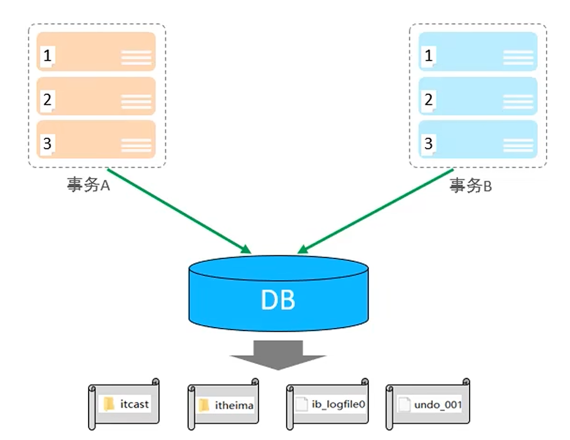


-----------------------------------


#### 4. 并发事务问题

| 问题       | 描述                                                         |
| :--------: | :----------------------------------------------------------- |
|      脏读       | 一个事务读到另外一个事务还没有提交的数据                     |
| 不可重复读 | 一个事务先后读取同一条记录，但两次读取的数据不同，称之为不可重复读 |
| 幻读       | 一个事务按照条件查询数据时，没有对应的数据行，但是在插入数据时，又发现这行数据已经存在，好像出现了“幻影” |

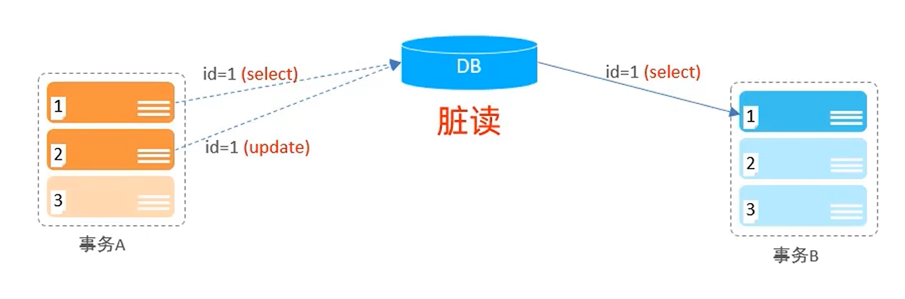

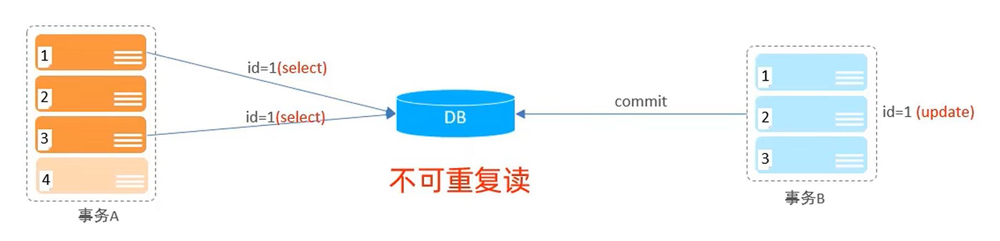

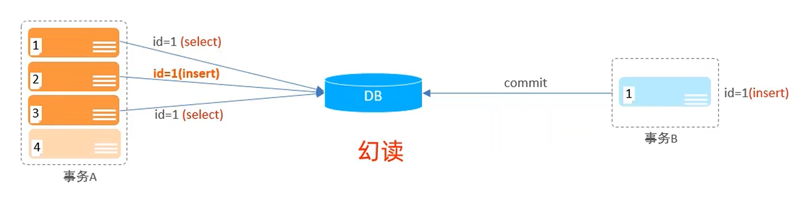


-------------------------------------


#### 5. 事务隔离级别

| 隔离级别                                      | 脏读 | 不可重复读 | 幻读 |
| --------------------------------------------- | ---- | ---------- | ---- |
| **Read uncommitted**（读未提交）              | √    | √          | √    |
| **Read committed**（读已提交）                | ×    | √          | √    |
| **Repeatable Read**（可重复读）【MySQL 默认】 | ×    | ×          | √    |
| **Serializable**（串行化）                    | ×    | ×          | ×    |

**注意：事务隔离级别越高，数据越安全，但是性能越低**

+ 查看事务隔离级别
  ```sql
  SELECT @@TRANSACTION_ISOLATION;
  ```

+ 设置事务隔离级别
  + `SET SESSION` 代表针对当前客户端窗口有效
  + `SET GLOBAL` 代表针对所有客户端窗口有效
  ```sql
  SET [SESSION | GLOBAL] TRANSACTION ISOLATION LEVEL { READ UNCOMMITTED | READ COMMITTED | REPEATABLE READ | SERIALIZABLE }
  ```


##### 代码实现

+ Read uncommitted 下脏读

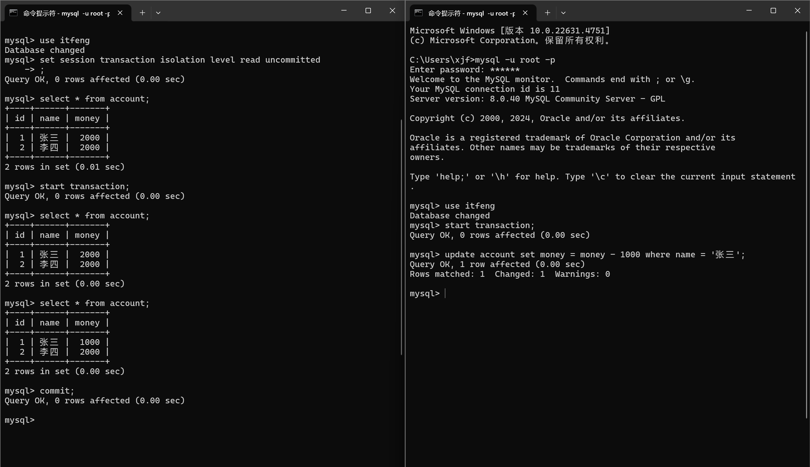

+ Read committed 下脏读

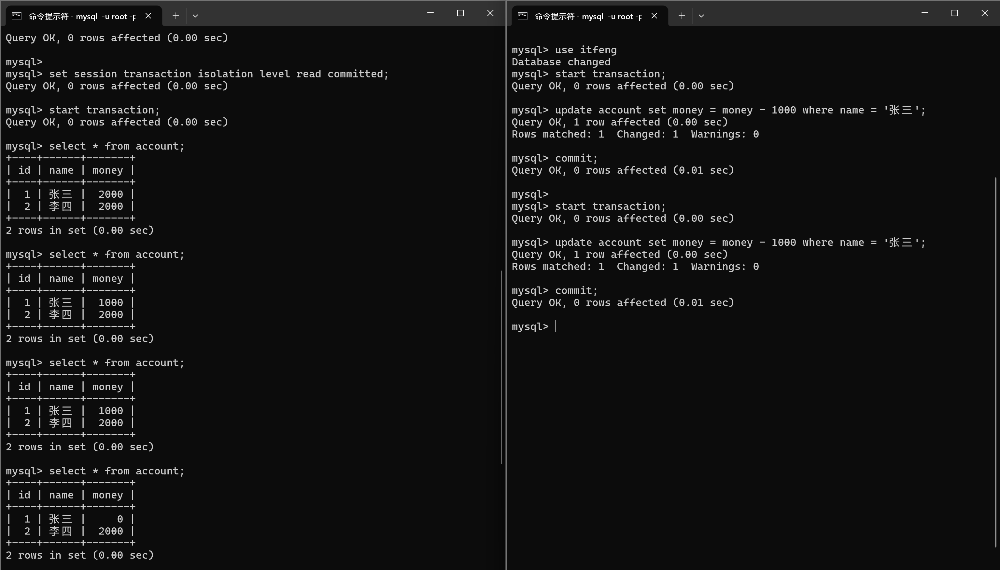

+ Read committed 下不可重复读

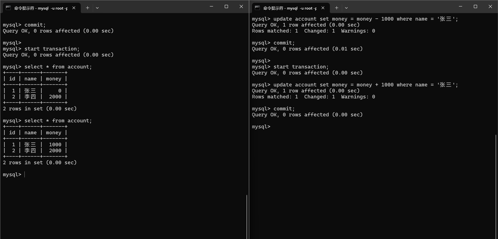

+ Repeatable Read 下不可重复读

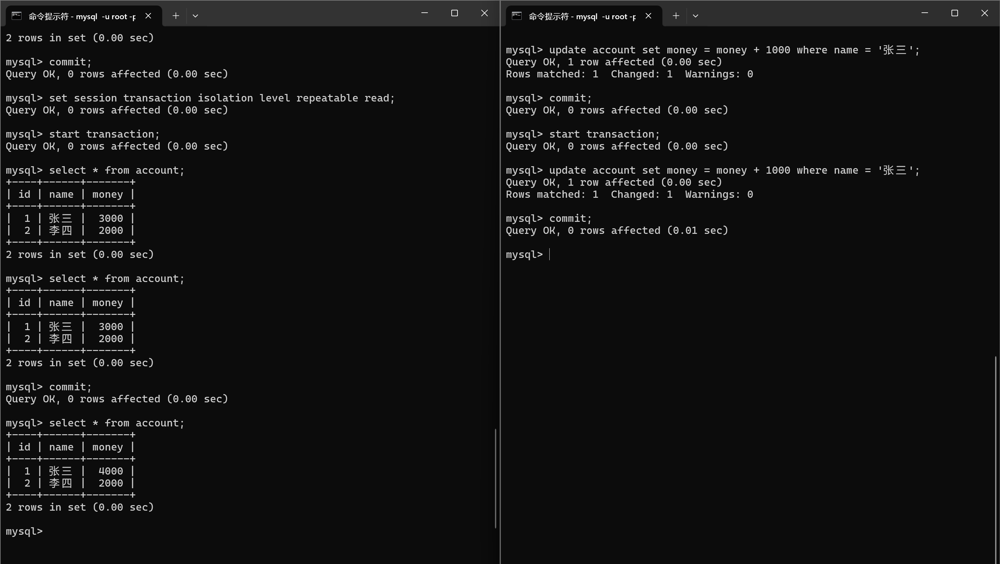

+ Repeatable Read 下幻读

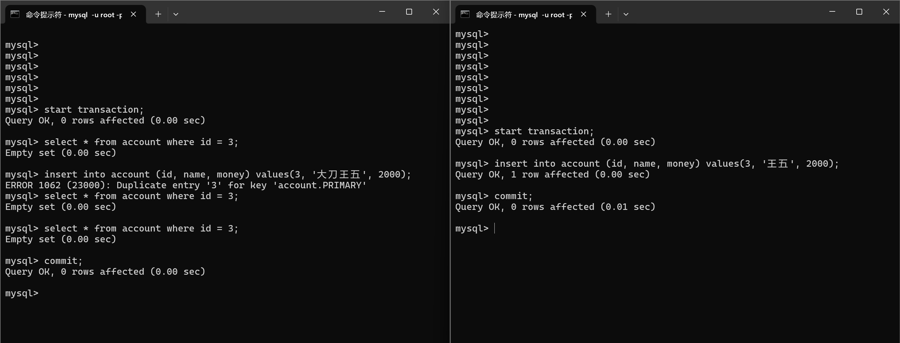

+ Serializable 下幻读

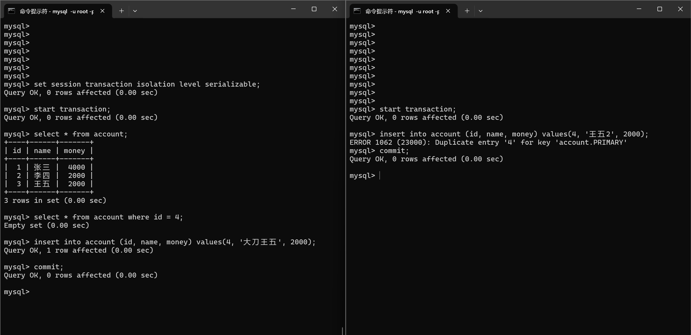


---------------------------------------


#### 总结
1. 事务简介
+ 事务是一组操作的集合，这组操作，要么全部执行成功，要么全部执行失败

2. 事务操作
  ```sql
  START TRANSACTION; -- 开启事务
  COMMIT; -- 提交事务
  ROLLBACK; -- 回滚事务
  ```

3. 事务的四大特性
+ 原子性（Atomicity）
+ 一致性（Consistency）
+ 隔离性（Isolation）
+ 持久性（Durability）

4. 并发事务问题
+ 脏读
+ 不可重复读
+ 幻读

5. 事务隔离级别
+ READ UNCOMMITTED
+ READ COMMITTES
+ REPEATABLE READ
+ SERIALIZABLE


------------------------------------------------


### 总结

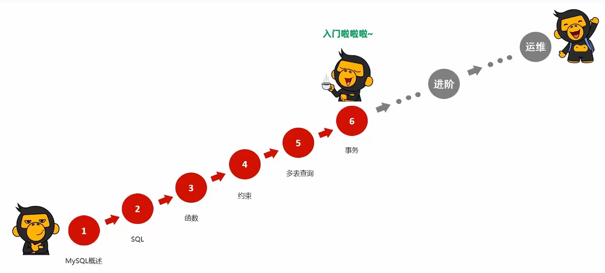


-----------------------------------------


## 进阶

### 一、存储引擎

#### 1. MySQL 体系结构

+ MySQL 体系结构图

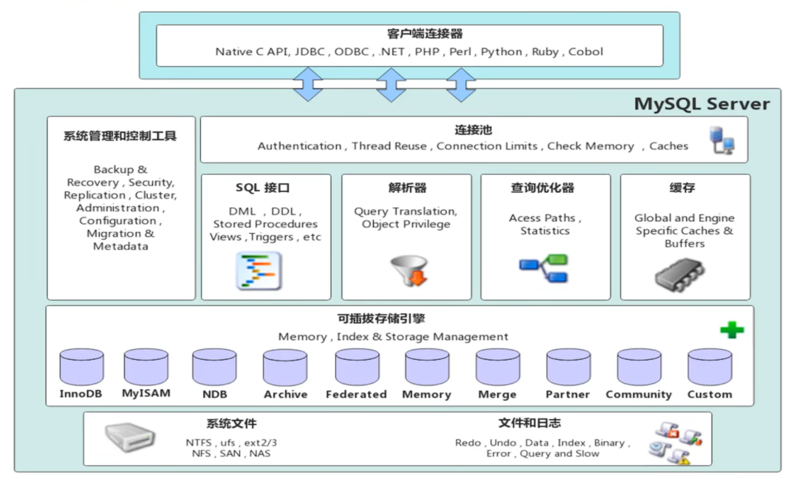

+ **连接层**：接收客户端的连接，完成一些连接的处理，以及认证授权的相关操作，以及相关的一些安全方案，还要去检查是否超过最大连接数等等
  + 我们输入用户名、密码后就是在连接层校验用户名、密码（授权认证）
  + 授权认证完成后，还要去校验每一个客户端所具有的权限，能够操作哪些数据库、哪些表

+ **服务层**：绝大部分的核心功能都是在服务层完成的，像 sql 接口、查询解析器、查询优化器、查询缓存，所有跨存储引擎的实现也都是在服务层实现的，比如 DML 语句、DDL 语句的封装还有存储、过程视图触发器都是在第二层
+ **引擎层**：在 MySQL 中提供了很多存储引擎供我们选择，而且，如果这些存储引擎不能够满足我们的需求，我们还可以在其基础上进行拓展，所以称之为可插拔式的存储引擎
  + 存储引擎控制的就是 MySQL 当中的数据的存储和提取的方式，服务器会通过 API 和存储引擎来进行通信和交互
  + InnoDB 引擎是 MySQL 5.5 版本之后默认的存储引擎

+ **存储层**：存储引擎控制的是数据库的数据该如何来存、如何来取、如何来进行组织。而具体的数据库的数据最终是存储在磁盘当中的，所以最后一层存储层主要是来存储数据库的相关数据，这里面包含一系列的日志，像 Redo log、Undo log、数据、索引二进制志、错误日志、查询日志、慢查询日志


-------------------------------------


#### 2. 存储引擎简介

+ 存储引擎是存储数据、建立索引、更新 / 查询数据等技术的实现方式。存储引擎是基于表的，而不是基于库的，所以存储引擎也可以被称为表类型

+ 查询建表语句

```sql
-- 查询建表语句 --- 默认的存储引擎：InnoDB
show create table account;
```

  + 结果

  ```sql
  CREATE TABLE `account` (
  `id` int NOT NULL AUTO_INCREMENT COMMENT '主键ID',
  `name` varchar(10) DEFAULT NULL COMMENT '姓名',
  `money` int DEFAULT NULL COMMENT '余额',
  PRIMARY KEY (`id`)
) ENGINE=InnoDB AUTO_INCREMENT=5 DEFAULT CHARSET=utf8mb4 COLLATE=utf8mb4_0900_ai_ci COMMENT='账户表'
  ```
  + `ENGINE`表示存储引擎
  + `AUTO_INCREMENT=5`指代的是 id 是自增的，当插入下一条数据的时候申请的 id 是5
  + `DEFAULT CHARSET=utf8mb4`当前表的字符集默认的 utf8mb4
  + `COLLATE=utf8mb4_0900_ai_ci`表示排序方式
  + `COMMENT='账户表'`表示注释信息

##### 2.1 语法

+ 创建表时，指定存储引擎

```sql
CREATE TABLE 表名(
	字段1 字段1类型 [COMMENT 字段1注释],
	...
	字段n 字段n类型 [COMMENT 字段n注释]
) ENGINE = INNODB [COMMENT 表注释];
```

+ 查看当前数据库支持的存储引擎

```sql
show engines;
```
  + InnoDB 是现在版本默认的存储引擎
  + MyISAM 是 MySQL 早期版本的默认存储引擎
  + MEMORY 存储在内存当中，通常用来做临时表及缓存

##### 代码演示

```sql
-- 创建表 my_myisam，并指定MyISAM存储引擎
create table my_myisam
(
    id   int,
    name varchar(10)
) engine = MyISAM;

-- 创建表my_memory，指定Memory存储引擎
create table my_memory
(
    id   int,
    name varchar(10)
) engine = Memory;
```


--------------------------


#### 3. 存储引擎特点

##### InnoDB

###### 介绍

+ InnoDB 是一种兼顾高可靠性和高性能的通用存储引擎，在 MySQL 5.5 之后，InnoDB 是默认的 MySQL 存储引擎

###### 特点

+ DML 操作遵循 ACID 模型，支持**事务**；
+ **行级锁**，提高访问性能；
+ 支持**外键** FOREIGN KEY 约束，保证数据的完整性和正确性；

###### 文件

+ **xxx.ibd**：xxx 代表的是表名，InnoDB 引擎的每张表都会对应这样一个表空间文件，存储该表的表结构（frm、sdi）、数据和索引
+ 参数：innodb_file_per_table

###### 逻辑存储结构

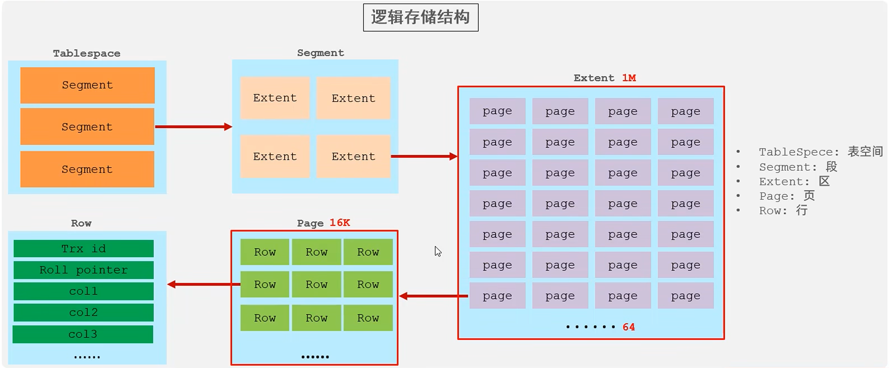


-------------------------------


##### MyISAM

###### 介绍

+ MyISAM 是 MySQL 早期的默认存储引擎

###### 特点

+ 不支持事务，不支持外键
+ 支持表锁，不支持行锁
+ 访问速度快

###### 文件

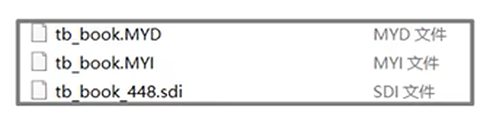

+ xxx.sdi：存储表结构信息
+ xxx.MYD：存储数据
+ xxx.MYI：存储索引


--------------------------------


##### Memory

###### 介绍

+ Memory 引擎的表数据是存储在内存中的，由于受到硬件问题、或断电问题的影响，只能将这些表作为临时表或者缓存使用

###### 特点

+ 内存存放
+ hash 索引（默认）【哈希索引】

###### 文件

+ xxx.sdi：存储表结构信息


--------------------------------------


##### 总结

|     特点     |       InnoDB        | MyISAM | Memory |
| :----------: | :-----------------: | :----: | :----: |
|   存储限制   |        64TB         |   有   |   有   |
|   事务安全   |      **支持**       |   -    |   -    |
|    锁机制    |      **行锁**       |  表锁  |  表锁  |
| B+tree 索引  |        支持         |  支持  |  支持  |
|  Hash 索引   |          -          |   -    |  支持  |
|   全文索引   | 支持（5.6版本之后） |  支持  |   -    |
|   空间使用   |         高          |   低   |  N/A   |
|   内存使用   |         高          |   低   |  中等  |
| 批量插入速度 |         低          |   高   |   高   |
|   支持外键   |      **支持**       |   -    |   -    |


----------------------------------


#### 4. 存储引擎选择

在选择存储引擎时，应该根据应用系统的特点选择合适的存储引擎。对于复杂的应用系统，还可以根据实际情况选择多种存储引擎进行组合

+ **InnoDB**：是 MySQL 的默认引擎，支持事务、外键。如果应用对事务的完整性有比较高的要求，在并发条件下要求数据的一致性，数据操作除了插入和查询之外，还包含很多的更新、删除操作，那么 InnoDB 存储引擎是比较适合的选择
+ MyISAM：如果应用是以读操作和插入操作为主，只有很少的更新和删除操作，并且对事务的完整性、并发性要求不是很高，那么选择这个存储引擎是非常合适的
+ MEMORY：将所有数据保存在内存中，访问速度快，通常用于临时表及缓存。MEMORY的缺陷就是对表的大小有限制，太大的表无法缓存在内存中，而且无法保障数据的安全性


-------------------------------------


#### 总结

1. 体系结构 
+ 连接层、服务层、引擎层、存储层

2. 存储引擎简介
```sql
SHOW ENGINES; # 查看当前数据库所支持的存储引擎
CREATE TABLE XXXX(...) ENGINE=INNODB; # 创建表的时候指定存储引擎
```

3. 存储引擎特点
+ INNODB 与 MyISAM：事务、外键、行级锁

4. 存储引擎应用
+ INNODB：存储业务系统中对于事务、数据完整性要求较高的核心数据
+ MyISAM：存储业务系统的非核心事务


--------------------------------


### Linux 安装 MySQL

https://blog.csdn.net/m0_70566687/article/details/144354033?ops_request_misc=%257B%2522request%255Fid%2522%253A%2522937596148f15fec9593bdcfb17841223%2522%252C%2522scm%2522%253A%252220140713.130102334..%2522%257D&request_id=937596148f15fec9593bdcfb17841223&biz_id=0&utm_medium=distribute.pc_search_result.none-task-blog-2~all~sobaiduend~default-2-144354033-null-null.142^v101^pc_search_result_base3&utm_term=rocky%20linux%20mysql%E5%AE%89%E8%A3%85&spm=1018.2226.3001.4187

https://blog.csdn.net/weixin_46533577/article/details/132827999?ops_request_misc=%257B%2522request%255Fid%2522%253A%2522db929cb7e27855c8ef24a45d8809313e%2522%252C%2522scm%2522%253A%252220140713.130102334.pc%255Fall.%2522%257D&request_id=db929cb7e27855c8ef24a45d8809313e&biz_id=0&utm_medium=distribute.pc_search_result.none-task-blog-2~all~first_rank_ecpm_v1~rank_v31_ecpm-7-132827999-null-null.142^v101^pc_search_result_base3&utm_term=rocky%20linux%20mysql%E5%AE%89%E8%A3%85&spm=1018.2226.3001.4187

+ 实现远程访问
  + 进入 mysql 后输入
  + 默认的 root 用户只能当前节点 localhost 访问，是无法远程访问的，我们还需要创建一个 root 账户，用户远程访问

```sql
create user 'root'@'%' IDENTIFIED WITH mysql_native_password BY 'xian2005';
```

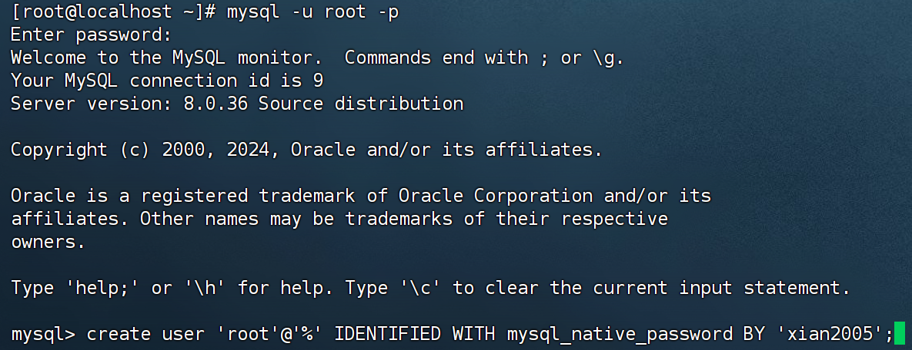

  + 给 root 用户分配权限（所有权限）

```sql
grant all on *.* to 'root'@'%';
```

+ 在 DataGrap 新建数据库

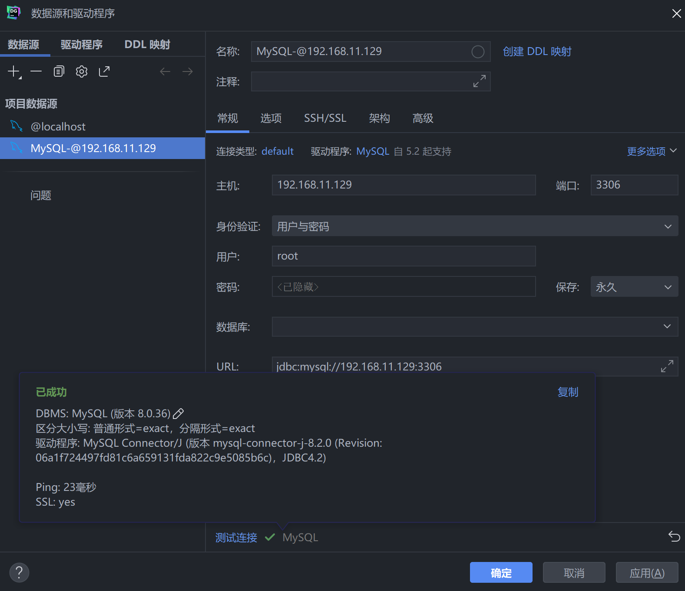


-----------------------------------------


### 二、索引

#### 1. 索引概述

##### 1.1 介绍

+ 索引（index）是帮助 MySQL **高效获取数据**的**数据结构（有序）**。在数据之外，数据库系统还维护着满足特定查找算法的数据结构，这些数据结构以某种方式引用（指向）数据，这样就可以在这些数据结构上实现高级查找算法，这种数据结构就是索引

##### 1.2 演示

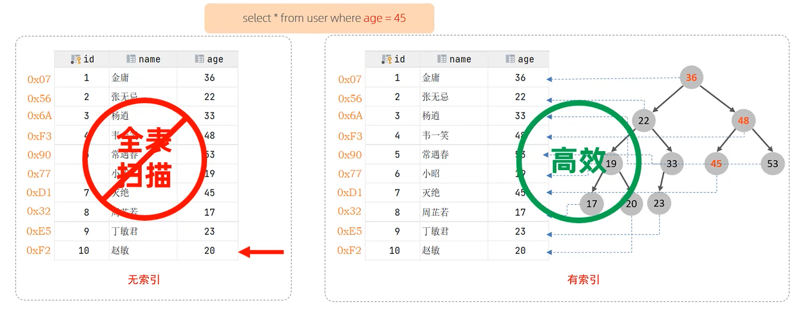

##### 1.3 优缺点

| 优势                                                         | 劣势                                                         |
| ------------------------------------------------------------ | ------------------------------------------------------------ |
| 提高数据检索的效率，降低数据库的 IO 成本                     | 索引列也要占用空间的                                         |
| 通过索引列对数据进行排序，降低数据排序的成本，降低 CPU 的消耗 | 索引大大提高了查询效率，同时却也降低更新表的速度，如对表进行 INSERT、UPDATE、DELETE 时，效率降低 |


-------------------------------


#### 2. 索引结构

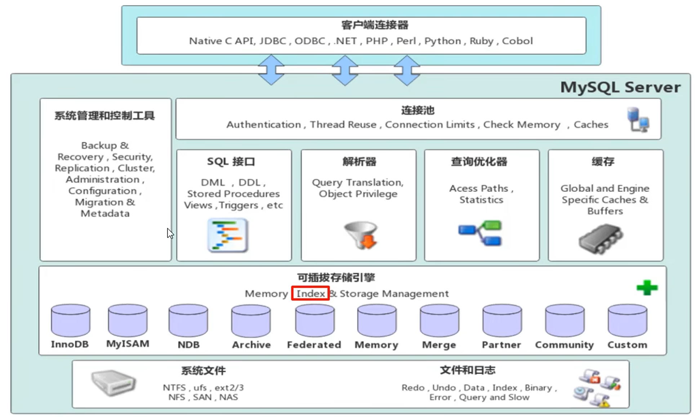

+ 索引在第三层存储引擎实现
+ 也就意味着根据存储引擎的不同索引的结构也会有所不同


MySQL 的索引是在存储引擎层实现的，不同的存储引擎有不同的结构，主要包含以下几种：

| 索引结构              | 描述                                                         |
| --------------------- | ------------------------------------------------------------ |
| **B+Tree 索引**       | **最常见的索引类型，大部分引擎都支持 B+ 树索引**             |
| Hash 索引             | 底层数据结构是用哈希表实现的，只有精确匹配索引列的查询才有效，不支持范围查询 |
| R-tree（空间索引）    | 空间索引是 MyISAM 引擎的一个特殊索引类型，主要用于地理空间数据类型，通常使用较少 |
| Full-text（全文索引） | 是一种通过建立倒排索引，快速匹配文档的方式。类似于 Lucene，Solr，ES |

|    索引     |     InnoDB      | MyISAM | Memory |
| :---------: | :-------------: | :----: | :----: |
| B+tree 索引 |      支持       |  支持  |  支持  |
|  Hash 索引  |     不支持      | 不支持 |  支持  |
| R-tree 索引 |     不支持      |  支持  | 不支持 |
|  Full-text  | 5.6版本之后支持 |  支持  | 不支持 |

我们平常所说的索引，如果没有特别指明，都是指 B+ 树结构组织的索引

##### B+Tree

+ 二叉树

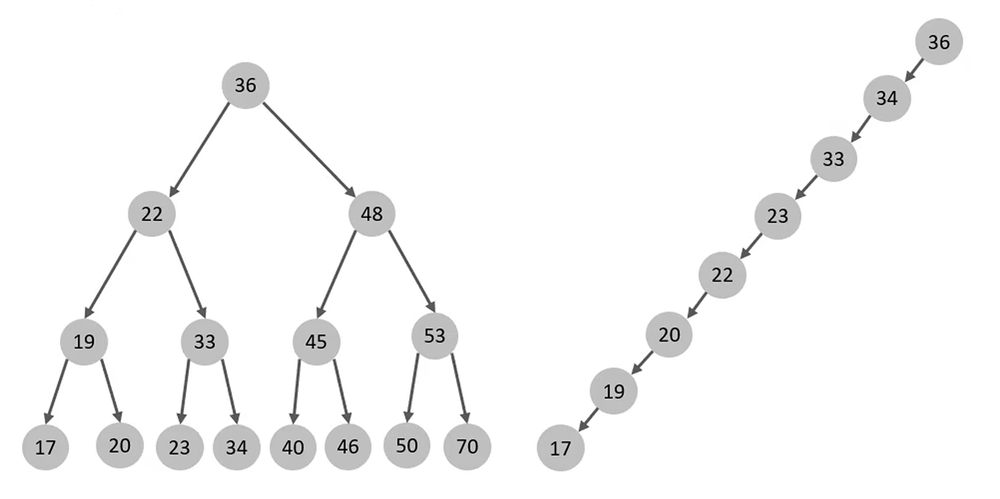

**二叉树缺点：顺序插入时，会形成一个链表，查询性能大大降低。大数据量情况下，层级较深，检索速度慢**

+ 红黑树

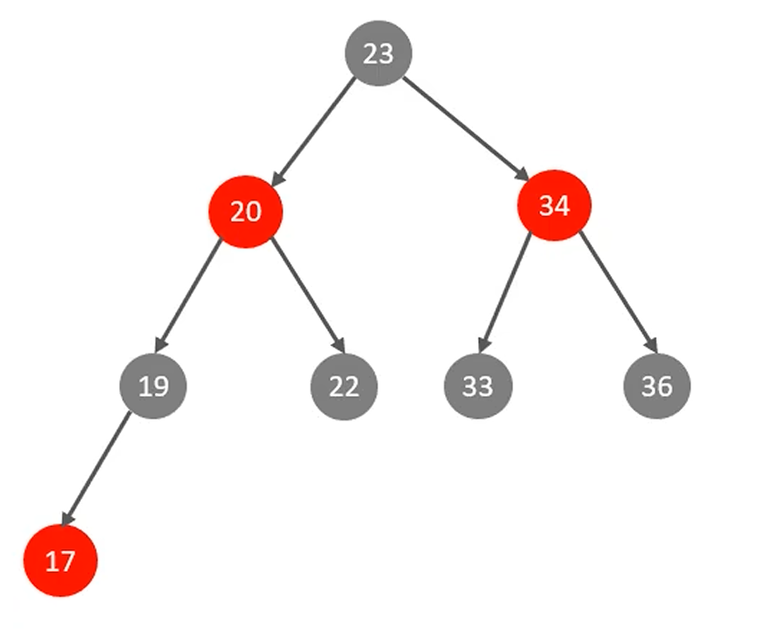

**红黑树：大数据量情况下，层级较深，检索速度慢**

+ B-Tree（**多路**平衡查找树）
以一棵最大度数（max-degree）为5（5阶）的 b-tree 为例（每个节点最多存储4个 key，5个指针）

*ps：树的度数指的是一个节点的子节点个数*

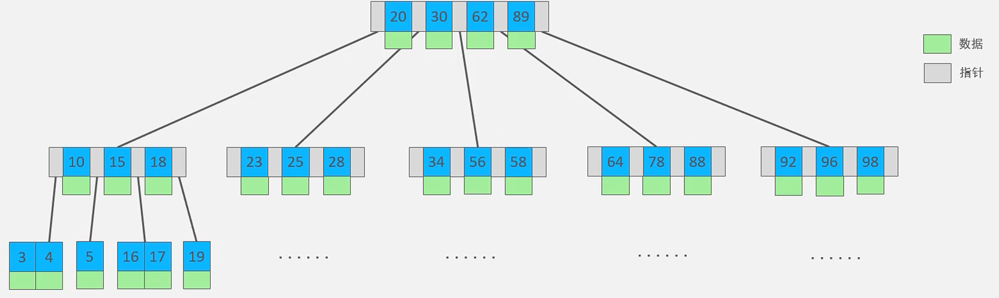

具体动态变化过程可以参考网站：https://www.cs.usfca.edu/~galles/visualizatin/BTree.html


+ B+Tree
  以一棵最大度数（max-degree）为4（4阶）的 b+tree 为例：
  + 1. 所有的元素都会出现在叶子节点
  + 2. 上面的非叶子节点主要起到索引的作用

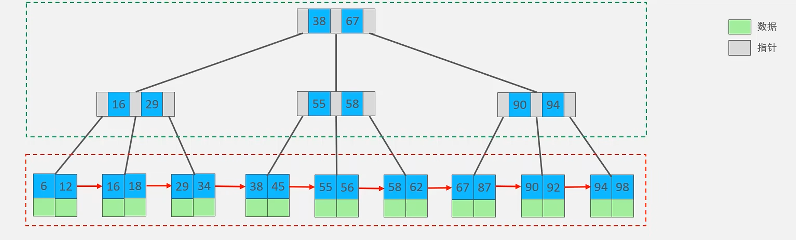

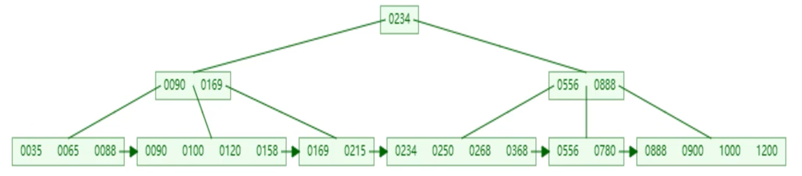

相对于 B-Tree 的区别：
1. 所有的数据都会出现在叶子节点
2. 叶子节点形成一个单向链表

MySQL 索引数据结构对经典的 B+Tree 进行了优化。在原 B+Tree 的基础上，增加一个指向相邻叶子节点的链表指针，就形成了带有顺序指针的 B+Tree，提高区间访问的性能

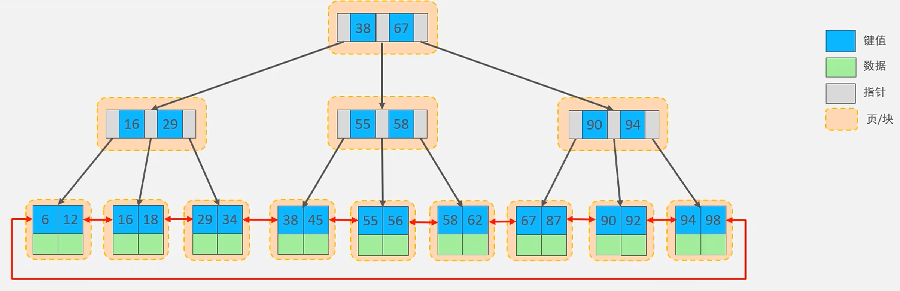


**理解：在 B+Tree 一页的大小是固定的（16k），因为 B+Tree 不存放数据，那么在一页上可以存放的 key 和指针就更多了，所以相同数据量的情况下它的层级就更少；在 B+Tree 无论查找哪个数据都要去叶子节点中才能找到数据，搜索效率稳定；双向链表便于范围搜索和排序**


----------------------------------


##### Hash

+ Hash
哈希索引就是采用一定的 hash 算法，将键值换算成新的 hash 值，映射到对应的槽位上，然后存储在 hash 表中
如果两个（或多个）键值，映射到一个相同的槽位上，他们就产生了 hash 冲突（也成为 hash 碰撞），可以通过链表来解决

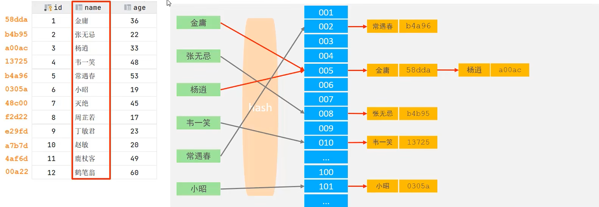

+ Hash 索引特点

1. Hash 索引只能用于对等比较（=, in），不支持范围查询（between, >, <, ...）
2. 无法利用索引完后排序操作
3. 查询效率高，通常只需要一次检索就可以了，效率通常要高于 B+tree 索引

+ 存储引擎支持

在 MySQL 中，支持 hash 索引的是 Memory 引擎，而 InnoDB 中具有自适应 hash 功能，hash 索引是存储引擎根据 B+Tree 索引在指定条件下自动构建的


-------------------------------------


##### 面试题

为什么 InnoDB 存储引擎选择使用 B+tree 索引结构？

+ 相对于二叉树，层级更少，搜索效率高
+ 对于 B-tree，无论是叶子节点还是非叶子节点，都会保存数据，这样导致一页中存储的键值减少，指针跟着减少，要同样保存大量数据，只能增加树的高度，导致性能降低
+ 相对于 Hash 索引，B+Tree 支持范围匹配及排序操作


-------------------------------


#### 3. 索引分类

| 分类     | 含义                                                 | 特点                     | 关键字   |
| -------- | ---------------------------------------------------- | ------------------------ | -------- |
| 主键索引 | 针对于表中主键创建的索引                             | 默认自动创建，只能有一个 | PRIMARY  |
| 唯一索引 | 避免同一个表中某数据列中的值重复                     | 可以有多个               | UNIQUE   |
| 常规索引 | 快速定位特定数据                                     | 可以有多个               |          |
| 全文索引 | 全文索引查找的是文本中的关键词，而不是比较索引中的值 | 可以有多个               | FULLTEXT |

在 InnoDB 存储引擎中，根据索引的存储形式，又可以分为以下两种：

| 分类                                                  | 含义                                                       | 特点                 |
| ----------------------------------------------------- | ---------------------------------------------------------- | -------------------- |
| 聚集索引（Clustered Index）                           | 将数据存储于索引放到了一块，索引结构的叶子节点保存了行数据 | 必须有，而且只有一个 |
| 二级索引（Secondary Index）【辅助索引】【非聚集索引】 | 将数据与索引分开存储，索引结构的叶子节点关联的是对应的主键 | 可以存在多个         |

聚集索引选取规则
+ 如果存在主键，主键索引就是聚集索引
+ 如果不存在主键，将使用第一个唯一（UNIQUE）索引作为聚集索引
+ 如果表没有主键，或没有合适的唯一索引，则 InnoDB 会自动生成一个 rowid 作为隐藏的聚集索引

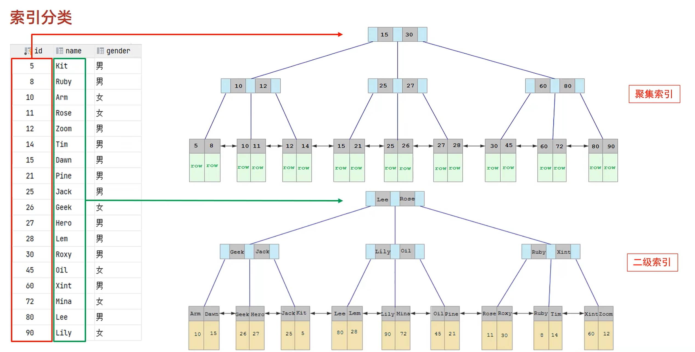

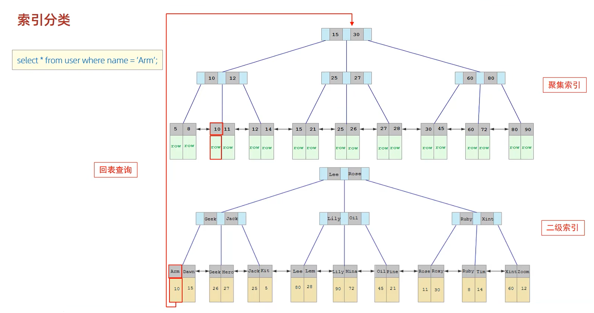

回表查询：先走二级索引找到对应的主键值，再根据主键值到聚集索引中拿到这一行的行数据


##### 面试题

1. 以下 SQL 语句，哪个执行效率高？为什么？

```sql
select * from user where id=10;

select * from user where name='Arm';

备注：id为主键，name字段创建的有索引
```

+ 第一条执行效率高

2. InnoDB 主键索引的 B+tree 高度为多少？

+ 假设：一行数据大小为1k，一页中可以存储16行这样的数据。InnoDB 的指针占用6个字节的空间，主键即使为 bigint，占用字节数为8

高度为2：
  + n * 8 + (n + 1) * 6 = 16 * 1024，算出 n 约为1170
  + 能存储的数据量：1171 * 16 = 18736

高度为3：
  + 1171 * 1171 * 16 = 21939856


----------------------------------


#### 4. 索引语法

##### 创建索引
```sql
CREATE [UNIQUE|FULLTEXT] INDEX index_name ON table_name (index_col_name, ...);
```
+ UNIQUE：创建的是一个唯一索引，要求该字段是不能出现重复数据的
+ FULLTEXT：创建的是一个全文索引
+ 不加这两个参数代表创建的是一个常规索引

##### 查看索引
```sql
SHOW INDEX FROM table_name;
```

##### 删除索引
```sql
DROP INDEX index_name ON table_name;
```


##### 示例

+ 需求

> 1. name 字段为姓名字段，该字段的值可能重复，为该字段创建索引
> 2. phone 手机号字段的值，是非空，且唯一的，为该字段创建唯一索引
> 3. 为 profession、age、status 创建联合索引
> 4. 为 email 建立合适的索引来提升查询效率
> 

###### 代码实现

+ 建表
```sql
create table tb_user
(
    id         int primary key auto_increment comment '主键',
    name       varchar(50) not null comment '用户名',
    phone      varchar(11) not null comment '手机号',
    email      varchar(100) comment '邮箱',
    profession varchar(11) comment '专业',
    age        tinyint unsigned comment '年龄',
    gender     char(1) comment '性别 , 1: 男, 2: 女',
    status     char(1) comment '状态',
    createtime datetime comment '创建时间'
) comment '系统用户表';
INSERT INTO tb_user (name, phone, email, profession, age, gender, status,
                     createtime)
VALUES ('吕布', '17799990000', 'lvbu666@163.com', '软件工程', 23, '1',
        '6', '2001-02-02 00:00:00');
INSERT INTO tb_user (name, phone, email, profession, age, gender, status,
                     createtime)
VALUES ('曹操', '17799990001', 'caocao666@qq.com', '通讯工程', 33,
        '1', '0', '2001-03-05 00:00:00');
INSERT INTO tb_user (name, phone, email, profession, age, gender, status,
                     createtime)
VALUES ('赵云', '17799990002', '17799990@139.com', '英语', 34, '1',
        '2', '2002-03-02 00:00:00');
INSERT INTO tb_user (name, phone, email, profession, age, gender, status,
                     createtime)
VALUES ('孙悟空', '17799990003', '17799990@sina.com', '工程造价', 54,
        '1', '0', '2001-07-02 00:00:00');
INSERT INTO tb_user (name, phone, email, profession, age, gender, status,
                     createtime)
VALUES ('花木兰', '17799990004', '19980729@sina.com', '软件工程', 23,
        '2', '1', '2001-04-22 00:00:00');
INSERT INTO tb_user (name, phone, email, profession, age, gender, status,
                     createtime)
VALUES ('大乔', '17799990005', 'daqiao666@sina.com', '舞蹈', 22, '2',
        '0', '2001-02-07 00:00:00');
INSERT INTO tb_user (name, phone, email, profession, age, gender, status,
                     createtime)
VALUES ('露娜', '17799990006', 'luna_love@sina.com', '应用数学', 24,
        '2', '0', '2001-02-08 00:00:00');
INSERT INTO tb_user (name, phone, email, profession, age, gender, status,
                     createtime)
VALUES ('程咬金', '17799990007', 'chengyaojin@163.com', '化工', 38,
        '1', '5', '2001-05-23 00:00:00');
INSERT INTO tb_user (name, phone, email, profession, age, gender, status,
                     createtime)
VALUES ('项羽', '17799990008', 'xiaoyu666@qq.com', '金属材料', 43,
        '1', '0', '2001-09-18 00:00:00');
INSERT INTO tb_user (name, phone, email, profession, age, gender, status,
                     createtime)
VALUES ('白起', '17799990009', 'baiqi666@sina.com', '机械工程及其自动
化', 27, '1', '2', '2001-08-16 00:00:00');
INSERT INTO tb_user (name, phone, email, profession, age, gender, status,
                     createtime)
VALUES ('韩信', '17799990010', 'hanxin520@163.com', '无机非金属材料工
程', 27, '1', '0', '2001-06-12 00:00:00');
INSERT INTO tb_user (name, phone, email, profession, age, gender, status,
                     createtime)
VALUES ('荆轲', '17799990011', 'jingke123@163.com', '会计', 29, '1',
        '0', '2001-05-11 00:00:00');
INSERT INTO tb_user (name, phone, email, profession, age, gender, status,
                     createtime)
VALUES ('兰陵王', '17799990012', 'lanlinwang666@126.com', '工程造价',
        44, '1', '1', '2001-04-09 00:00:00');
INSERT INTO tb_user (name, phone, email, profession, age, gender, status,
                     createtime)
VALUES ('狂铁', '17799990013', 'kuangtie@sina.com', '应用数学', 43,
        '1', '2', '2001-04-10 00:00:00');
INSERT INTO tb_user (name, phone, email, profession, age, gender, status,
                     createtime)
VALUES ('貂蝉', '17799990014', '84958948374@qq.com', '软件工程', 40,
        '2', '3', '2001-02-12 00:00:00');
INSERT INTO tb_user (name, phone, email, profession, age, gender, status,
                     createtime)
VALUES ('妲己', '17799990015', '2783238293@qq.com', '软件工程', 31,
        '2', '0', '2001-01-30 00:00:00');
INSERT INTO tb_user (name, phone, email, profession, age, gender, status,
                     createtime)
VALUES ('芈月', '17799990016', 'xiaomin2001@sina.com', '工业经济', 35,
        '2', '0', '2000-05-03 00:00:00');
INSERT INTO tb_user (name, phone, email, profession, age, gender, status,
                     createtime)
VALUES ('嬴政', '17799990017', '8839434342@qq.com', '化工', 38, '1',
        '1', '2001-08-08 00:00:00');
INSERT INTO tb_user (name, phone, email, profession, age, gender, status,
                     createtime)
VALUES ('狄仁杰', '17799990018', 'jujiamlm8166@163.com', '国际贸易',
        30, '1', '0', '2007-03-12 00:00:00');

INSERT INTO tb_user (name, phone, email, profession, age, gender, status,
                     createtime)
VALUES ('安琪拉', '17799990019', 'jdodm1h@126.com', '城市规划', 51,
        '2', '0', '2001-08-15 00:00:00');
INSERT INTO tb_user (name, phone, email, profession, age, gender, status,
                     createtime)
VALUES ('典韦', '17799990020', 'ycaunanjian@163.com', '城市规划', 52,
        '1', '2', '2000-04-12 00:00:00');
INSERT INTO tb_user (name, phone, email, profession, age, gender, status,
                     createtime)
VALUES ('廉颇', '17799990021', 'lianpo321@126.com', '土木工程', 19,
        '1', '3', '2002-07-18 00:00:00');
INSERT INTO tb_user (name, phone, email, profession, age, gender, status,
                     createtime)
VALUES ('后羿', '17799990022', 'altycj2000@139.com', '城市园林', 20,
        '1', '0', '2002-03-10 00:00:00');
INSERT INTO tb_user (name, phone, email, profession, age, gender, status,
                     createtime)
VALUES ('姜子牙', '17799990023', '37483844@qq.com', '工程造价', 29,
        '1', '4', '2003-05-26 00:00:00');

```

+ 需求实现

```sql
-- 查看索引
show index from tb_user;

-- 创建索引
create index idx_user_name on tb_user (name);

-- 唯一索引
create unique index idx_user_phone on tb_user (phone);

-- 联合索引
create index idx_user_pro_age_sta on tb_user (profession, age, status);

create index idx_user_email on tb_user (email);

-- 删除索引
drop index idx_user_email on tb_user;
```


----------------------------------


#### 5. SQL 性能分析

##### 5.1 SQL 执行频率

MySQL 客户端连接成功后，通过 `show [session|global] status` 命令可以提供服务器状态信息。通过如下指令，可以查看当前数据库的 INSERT、UPDATE、DELETE、SELECT 的访问频次

```sql
SHOW GLOBAL STATUS LIKE 'Com_____';
```
+ 一个下划线代表一个字符

###### 代码演示

+ 代码

```sql
-- 查看访问频次
show global status like 'Com_______';
```

+ 效果

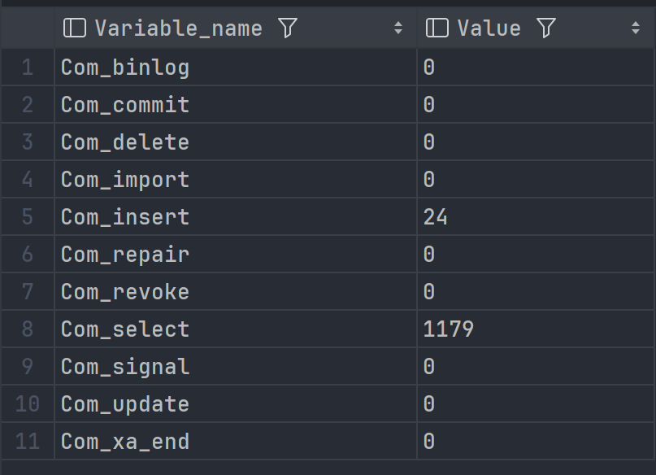


#####  5.2 慢查询日志

慢查询日志记录了所有执行时间超过指定参数（long_query_time，单位：秒，默认10秒）的所有 SQL 语句的日志
MySQL 的慢查询日志默认没有开启，需要在 MySQL 的配置文件（/etc/my.cnf）中配置如下信息：

```sql
# 开启MySQL慢日志查询开关
slow_query_log=1

# 设置慢日志的时间为2秒，SQL语句执行时间超过2秒，就会视为慢查询，记录慢查询日志
long_query_time=2
```

配置完毕之后，通过以下指令重新启动 MySQL 服务器进行测试，查看慢日志文件中记录的信息 /var/lib/mysql/localhost-slow.log

Windows 系统在 /C:\ProgramData\MySQL\MySQL Server 8.0\my.ini

+ 查看慢查询语句有没有开启

```sql
SHOW VARIABLES LIKE 'slow_query_log';
```

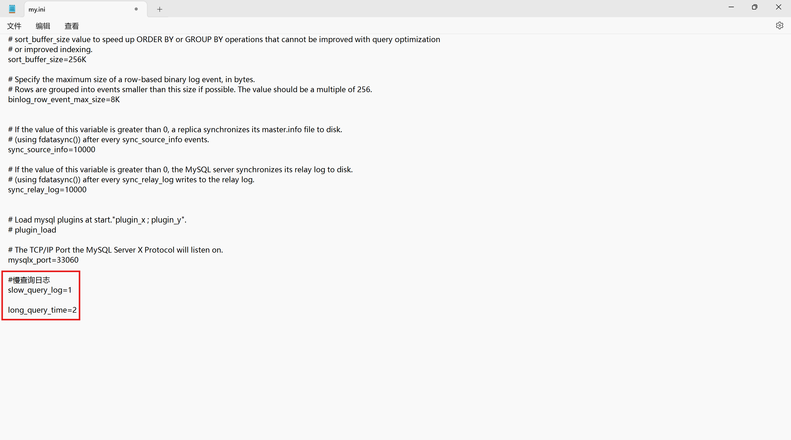

+ 查看慢查询日志（Linux）

```
tail -f localhost-slow.log
```

##### 5.3 profile 详情

`show profiles` 能够在做 SQL 优化时帮助我们了解时间都耗费到哪里去了。通过 have_profiling 参数，能够看到当前 MySQL 是否支持 profile 操作：

```sql
SELECT @@have_profiling;
```

+ 查看 profiling 是否开启：

```sql
SELECT @@profiling;
```

默认 profiling 是关闭的，可以通过 set 语句在 session/global 级别开启 profiling：

```sql
SET profiling=1;
```

执行一系列的业务 SQL 的操作，然后通过如下指令查看指令的执行耗时：

```sql
# 查看每一条SQL的耗时基本情况
show profiles;

# 查看指定query_id的SQL语句各个阶段的耗时情况
show profile for query query_id;

# 查看指定query_id的SQL语句CPU的使用情况
show profile cpu for query query_id;
```

##### 5.4 explain 执行计划

EXPLAIN 或者 DESC 命令获取 MySQL 如何执行 SELECT 语句的信息，包括在 SELECT 语句执行过程中表如何连接和连接的顺序

+ 语法：

```sql
# 直接在select语句之前加上关键字explain/desc
EXPLAIN SELECT 字段列表 FROM 表名 WHERE 条件;
```

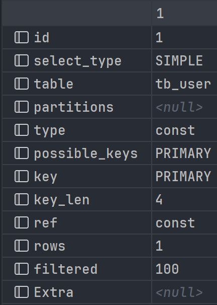


EXPLAIN 执行计划各字段含义：

+ id
  + select 查询的序列号，表示查询中执行 select 子句或者是操作表的顺序（id 相同，执行顺序从上到下；id 不同，值越大，越先执行）

+ select_type
  + 表示 SELECT 的类型，常见的取值有 SIMPLE（简单表，即不使用表连接或者子查询）、PRIMARY（主查询，即外层的查询）、UNION（UNION 中的第二个或者后面的查询语句）、SUBQUERY（SELECT/WHERE 之后包含了子查询）等

+ **type**
  + 表示连接类型，性能由好到差的连接类型为 NULL、system、const、eq_ref、ref、range、index、all

+ **possible_key**
  + 显示可能应用在这张表上的索引，一个或多个

+ **key**
  + 实际使用的索引，如果为 NULL，则没有使用索引

+ **key_len**
  + 表示索引中使用的字节数，该值为索引字段最大可能长度，并非实际使用长度，在不损失精确性的前提下，长度越短越好

+ rows
  + MySQL 认为必须要执行查询的行数，在 innodb 引擎中，是一个估值，可能并不总是准确的

+ filtered
  + 表示返回结果的行数占需读取行数的百分比，filtered 的值越大越好


------------------------------


#### 6. 索引使用

##### 6.1 验证索引效率

+ 在未建立索引之前，执行如下 SQL 语句，查看 SQL 的耗时：
  + 性能极低

```sql
SELECT * FROM tb_sku WHERE sn = '100000003135001'
```


+ 针对字段创建索引

```sql
create index idx_sku_sn on tb_sku(sn);
```

+ 然后再次执行相同的 SQL 语句，再次查看 SQL 的耗时

```sql
SELECT * FROM tb_sku WHERE sn = '100000003135001'
```


--------------------------------


##### 6.2 最左前缀法则

如果索引了多列（**联合索引**），要遵守最左前缀法则。最左前缀法则指的是查询从索引的最左列开始，并且不跳过索引中的列
如果跳过某一列，**索引将部分失效（后面的字段索引失效）**

+ 演示

```sql
select * from tb_user where profession = '软件工程' and age = 31 and status = '0';

explain select * from tb_user where profession = '软件工程' and age = 31 and status = '0';

explain select * from tb_user where profession = '软件工程' and age = 31;

explain select * from tb_user where profession = '软件工程';

explain select * from tb_user where age = 31 and status = '0'; # 不满足最左前缀法则

explain select * from tb_user where status = '0'; # 不满足最左前缀法则

explain select * from tb_user where profession = '软件工程' and status = '0'; # profession走索引，status未走索引
```


------------------------------------------------


##### 6.3 范围查询

联合索引中，出现范围查询（>，<），**范围查询右侧的列索引失效**

+ 演示

```sql
-- 范围查询
select * from tb_user where profession = '软件工程' and age > 30 and status = '0';

explain select * from tb_user where profession = '软件工程' and age > 30 and status = '0'; # status没有走索引

explain select * from tb_user where profession = '软件工程' and age >= 30 and status = '0'; # 三个字段都用到了索引
```


---------------------------------------


##### 6.4 索引列运算

不要在索引列上进行运算操作，**索引将失效**

+ 演示

```sql
-- 索引列运算
explain select * from tb_user where phone = '17799990015';

explain select * from tb_user where substring(phone, 10, 2) = '15'; # 从第十位字符串往后截两位，索引失效
```


----------------------------------------


##### 6.5 字符串不加引号

字符串类型字段使用，不加引号，**索引将失效**

+ 演示

```sql
-- 字符串不加引号
explain select * from tb_user where phone = 17799990015; # 索引失效

explain select * from tb_user where profession = '软件工程' and age = 31 and status = '0';
explain select * from tb_user where profession = '软件工程' and age = 31 and status = 0; # status没走索引
```


-------------------------------


##### 6.6 模糊查询

如果仅仅是尾部模糊匹配，索引不会失效。如果是头部模糊匹配，索引失效【头尾都加也失效】
+ 在 B+Tree 里找这个字段时，第一个字母 B+Tree 要比大小，如果前面是%，那压根就匹配不到了

+ 演示

```sql
-- 模糊查询
select * from tb_user where profession like '软件%';

explain select * from tb_user where profession like '软件%'; # 走索引

explain select * from tb_user where profession like '%工程'; # 不走索引

explain select * from tb_user where profession like '%工%'; # 不走索引
```


---------------------------------------


##### 6.7 or 连接的条件

用 or 分割开的条件，如果 or 前的条件中的列有索引，而后面的列中没有索引，那么涉及的索引都不会被用到【只有两侧都有索引的时候，索引才会生效】

+ 演示

```sql
-- or连接的条件
show index from tb_user; # age这个字段没有索引

explain select * from tb_user where id = 10 or age = 23; # 没走索引

explain select * from tb_user where phone = '17799990015' or age = 23; # 没走索引
```

由于 age 没有索引，所以即使 id、phone 有索引，索引也会失效。所以需要针对于 age 也要建立索引

```sql
-- 给age建立索引
create index idx_user_age on tb_user(age);
```


-------------------------------


##### 6.8 数据分布影响

如果 MySQL 评估使用索引比全表更慢，则不使用索引

+ 演示

```sql
-- 数据分布影响
select * from tb_user where phone >= '17799990020';

explain select * from tb_user where phone >= '17799990020'; # 走索引

explain select * from tb_user where phone >= '17799990000'; # 没走索引

explain select * from tb_user where phone >= '17799990010'; # 没走索引

explain select * from tb_user where phone >= '17799990013'; # 走索引
```
+ `is null` 和 `is not nul` 走不走索引是取决于表中数据分布的，而不是固定的


-----------------------------------


##### 6.9 SQL 提示

SQL 提示，是优化数据库的一个重要手段，简单来说，就是在 SQL 语句中加入一些人为的提示来达到优化操作的目的

+ `use index`：【建议数据库用那哪个索引】
```sql
explain select * from tb_user use index(idx_user_pro) where profession = '软件工程';
```

+ `ignore index`：【告诉数据库不要用哪个索引】
```sql
explain select * from tb_user ignore index(idx_user_pro) where profession = '软件工程';
```

+ `force index`：【告诉数据库必须走这个索引】
```sql
explain select * from tb_user force index(idx_user_pro) where profession = '软件工程';
```


---------------------------------------------


##### 6.10 覆盖索引

尽量使用覆盖索引（查询使用了索引，并且需要返回的列，在该索引中已经全部能够找到），减少 `select *`
+ 因为 `select *` 很容易就形成了回表查询，除非你创建了一个联合索引，这个联合索引包含了这张表的所有字段

+ 演示
```sql
explain select * from tb_user where profession = '软件工程' and age = 31 and status = '0';

explain select id, profession from tb_user where profession = '软件工程' and age = 31 and status = '0';

explain select id, profession, age from tb_user where profession = '软件工程' and age = 31 and status = '0';

explain select id, profession, age, status from tb_user where profession = '软件工程' and age = 31 and status = '0';

explain select id, profession, age, status, name from tb_user where profession = '软件工程' and age = 31 and status = '0';
```

> + Extra 中
> using index condition：查找使用了索引，但是需要回表查询数据
> using where; using index：查找使用了索引，但是需要的数据在索引列中能找到，所以不需要回表查询数据

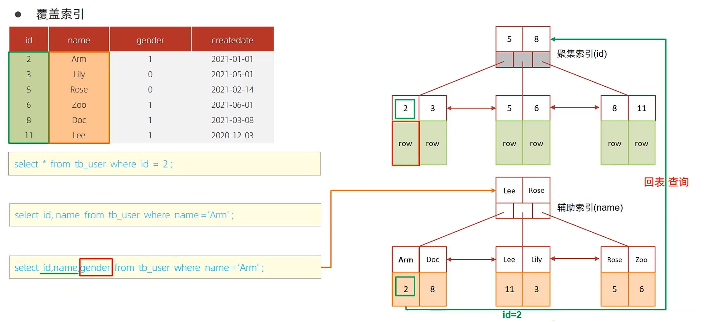

###### 面试题

一张表，有四个字段（id, username, password, status），由于数据量大，需要对一下 SQL 语句进行优化，该如何进行才是最优方案：
```sql
select id, username, password, from tb_user where username = 'itfeng';
```

+ 针对 username 和 password 这两个字段建立一个联合索引


----------------------------------


##### 6.11 前缀索引

当字段类型为字符串（varchar, text 等）时，有时候需要索引很长的字符串，这会让索引变得很大，查询时，浪费大量的磁盘 IO，影响查询效率。此时可以**只将字符串的一部分前缀，建立索引**，这样可以大大节约索引空间，从而提高索引效率

+ 语法
  + n 代表要提取前面几个字符来构建索引

```sql
create index idx_xxxx on table_name(column(n));
```

+ 前缀长度
  + 可以根据索引的选择性来决定，而选择性是指不重复的索引值（基数）和数据表的记录总数的比值，索引选择性越高则查询效率越高，唯一索引的选择性是1，这是最好的索引选择性，性能也是最好的

+ 演示

```sql
select count(*) from tb_user; # 24

-- 取email中不重复的值
select count(distinct email) from tb_user; # 24

-- 算选择性
select count(distinct email) / count(*) from tb_user; # 1.0000

-- 截取email的前10个字符的选择性
select count(distinct substring(email, 1, 10)) / count(*) from tb_user; # 1.0000

-- 截取email的前9个字符的选择性
select count(distinct substring(email, 1, 9)) / count(*) from tb_user; # 0.9583

-- 针对email创建前缀索引
create index  idx_email_5 on tb_user(email(5));

select * from tb_user where email = 'daqiao666@sina.com';
explain select * from tb_user where email = 'daqiao666@sina.com';
```

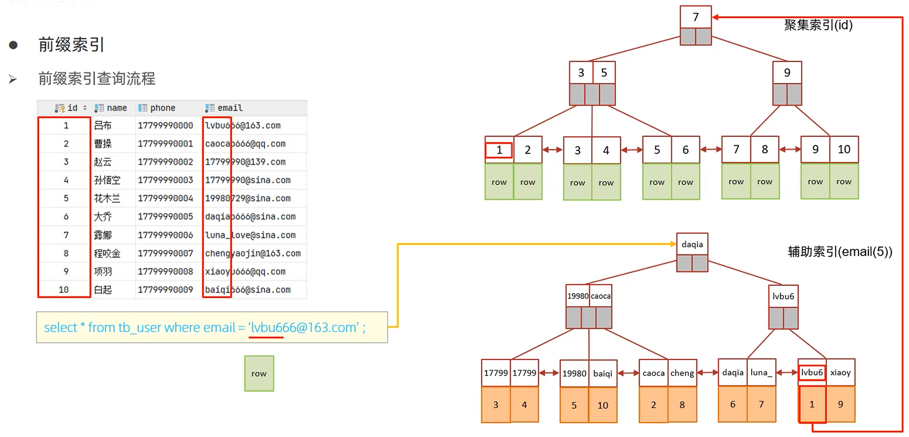


----------------------------------------------


##### 6.12 单列索引与联合索引

单列索引：即一个索引只包含单个列
联合索引：即一个索引包含了多个列
在业务场景中，如果存在多个查询条件，考虑针对于查询字段建立索引时，建议建立联合索引，而非单列索引

**多条件联合查询时，MySQL 优化器会评估哪个字段的索引效率更高，会选择该索引完成本次查询**

+ 联合索引情况


------------------------------


#### 7. 索引设计原则

1. 针对数据量较大，且查询比较频繁的表建立索引
2. 针对于常作为查询条件（where）、排序（order by）、分组（group by）操作的字段建立索引
3. 尽量选择区分度高的列作为索引，尽量建立唯一索引，区分度越高，使用索引的效率越高
4. 如果是字符串类型的字段，字段的长度较长，可以针对于字段的特点，建立前缀索引
5. 尽量使用联合索引，减少单列索引，查询时，联合索引很多时候可以覆盖索引，节省存储空间，避免回表，提高查寻效率
6. 要控制索引的数量，索引并不是多多益善，索引越多，维护索引结构的代价也就很大，会影响增删改的效率
7. 如果索引列不能存储 NULL 值，请在创建表时使用 NOT NULL 约束它。当优化器知道每列是否包含 NULL 值时，它可以更好地确定哪个索引最有效地用于查询


--------------------------------------


#### 总结

1. 索引概述
+ 索引时高效获取数据的数据结构

2. 索引结构
+ B+Tree
+ Hash

3. 索引分类
+ 主键索引、唯一索引、常规索引、全文索引
+ 聚集索引、二级索引

4. 索引语法
```sql
create [unique] index xxx on xxx(xxx);
show index from xxxx;
drop index xxx on xxxx;
```

5. SQL 性能分析
+ 执行频次、慢查询日志、profile、explain

6. 索引使用
+ 联合索引
+ 索引失效
+ SQL 提示
+ 覆盖索引
+ 前缀索引
+ 单列/联合索引

7. 索引设计原则
+ 表
+ 字段
+ 索引


-----------------------------------------


### 三、SQL 优化

#### 1. 插入数据

##### 1.1 insert 优化

+ 批量插入

```sql
insert into tb_test values(1, 'Tom'), (2, 'Cat'), (3, 'jerry');
```

+ 手动提交事务

```sql
start transaction;
insert into tb_test values(1, 'Tom'), (2, 'Cat'), (3, 'jerry');
insert into tb_test values(4, 'Tom'), (5, 'Cat'), (6, 'jerry');
insert into tb_test values(7, 'Tom'), (8, 'Cat'), (9, 'jerry');
commit;
```

+ 主键顺序插入

```
主键乱序插入：8 1 9 21 88 2 4 15 89 5 7 3
主键顺序插入：1 2 3 4 5 7 8 9 15 21 88 89
```

##### 1.2 大批量插入数据

如果一次性需要插入大批量数据，使用 insert 语句插入性能较低，此时可以使用 MySQL 数据库提供的 load 指令进行插入。操作如下：

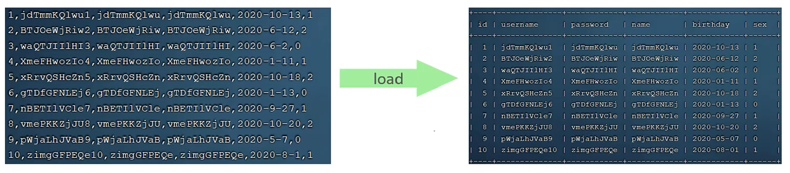

```sql
# 客户端连接服务端时，加上参数 --local-infile
mysql --local-infile -u root -p

# 设置全局参数local_infile为1，开启从本地加载文件导入数据的开关
set global local_infile = 1;

# 执行load指令将准备好的数据，加载到表结构中
load data local infile '/root/sql.log' into table 'tb_user' fields terminated by ',' lines terminated by '\n';
```


---------------------------------------


#### 2. 主键优化

##### 2.1 数据组织方式

在 InnoDB 存储引擎中，表数据都是根据主键顺序组织存放的，这种存储方式的表称为**索引组织表**（index organized table **IOT**）

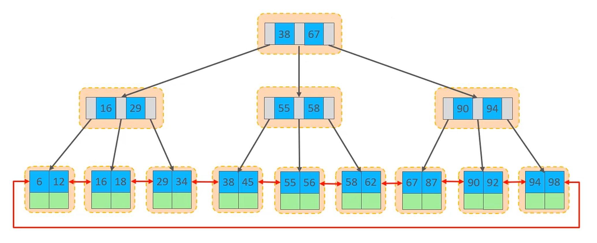

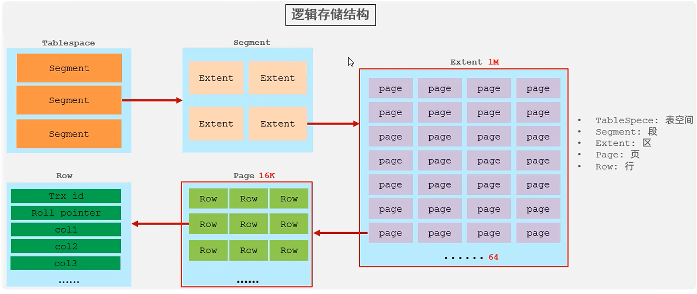

##### 2.2 页分裂

页可以为空，也可以填充一半，也可以填充100%。每个页包含了 2-N 行数据（如果一行数据很大，会行溢出），根据主键排列

+ 主键顺序插入

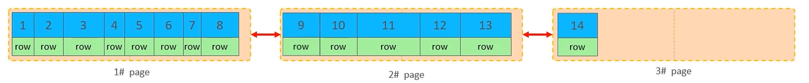

+ 主键乱序插入

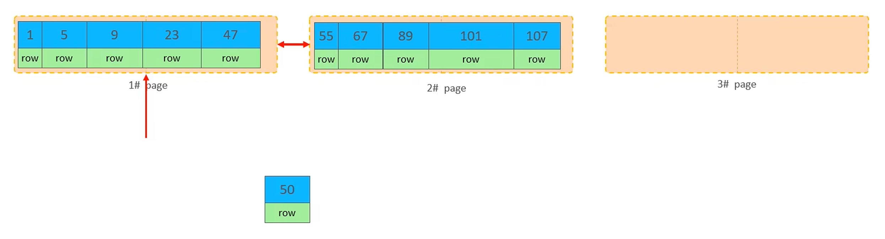


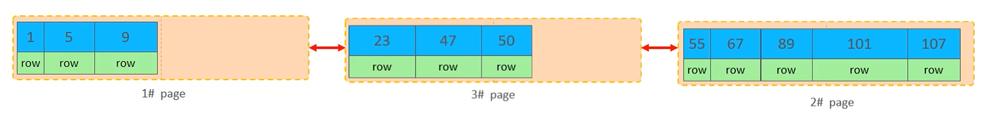

这种现象称之为**页分裂**


##### 2.3 页合并

当删除一行记录时，实际上记录并没有被物理删除，只是记录被标记（flaged）为删除并且它的空间变得允许被其他记录声明使用
当页中删除的记录达到 MERGE_THRESHOLD（默认为页的50%），InnoDB 会开始寻找最靠近的页（前或后）看看是否可以将两个页合并以优化空间使用


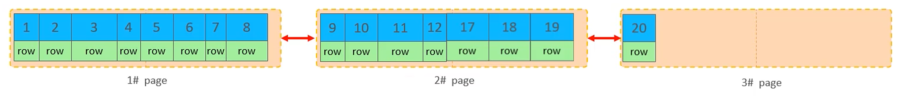

这种现象称之为**页合并**

+ ps：MERGE_THRESHOLD：合并页的阈值，可以自己设置，在创建表或者创建索引时指定


##### 2.4 主键设计原则

+ 满足业务需求的情况下，尽量降低主键的长度
  + 对于一张表来说主键索引（聚集索引）只有一个，但是二级索引会有很多个，在二级索引的叶子节点当中挂的就是数据的主键，所以如果说主键长度比较长、二级索引比较多，将会占用大量的磁盘空间，而且在搜索的时候将会耗费大量的磁盘 IO，所以要尽量降低主键的长度

+ 插入数据时，尽量选择顺序插入，选择使用 AUTO_INCREMENT 自增主键

+ 尽量不要使用 UUID 做主键或者是其他自然主键，如身份证号

+ 业务操作时，避免对主键的修改


-------------------------------------


#### 3. order by 优化（排序操作优化）

MySQL 中排序有两种方式

1. Using filesort：通过表的索引或者全表扫描，读取满足条件的数据行，然后在排序缓冲区 sort buffer 中完成排序操作，所有不是通过索引直接返回排序结果的排序都叫 FileSort 排序**【性能低】**
2. Using index：通过有序索引顺序扫描直接返回有序数据，这种情况即为 using index，不需要额外排序，操作效率高**【性能高】**

```sql
# 没有创建索引时，根据age, phone进行排序
explain select id, age, phone from tb_user order by age, phone; # Using filesort

# 创建索引
create index idx_user_age_phone on tb_user(age, phone);

# 创建索引后，根据age, phone进行升序排序
explain select id, age, phone from tb_user order by age, phone;


# 创建索引后，根据age, phone进行降序排序
explain select id, age, phone from tb_user order by age desc, phone desc;

# 根据age, phone进行降序一个升序，一个降序
explain select id, age, phone from tb_user order by age asc, phone desc;


# 创建索引
create index idx_user_age_pho_ad on tb_user(age asc , phone desc);


# 根据age, phone进行降序一个升序，一个降序
explain select id, age, phone from tb_user order by age asc, phone desc;
```

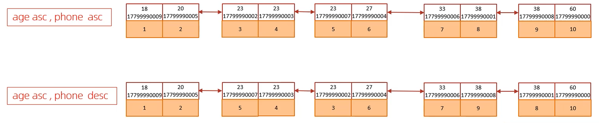


**这些所有的规则都有一个条件，前提是你使用了覆盖索引**
+ 如果没有用覆盖索引，就需要回表查询数据，然后在数据缓冲区当中对数据进行排序

##### 总结

+ 根据排序字段建立合适的索引，多字段排序时，也遵循最左前缀法则
+ 尽量使用覆盖索引
+ 多字段排序，一个升序一个降序，此时需要注意联合索引在创建时的规则（ASC / DESC）
+ 如果不可避免的出现 filesort，大数据量排序时，可以适当增大排序缓冲区大小 sort_buffer_size（默认256k）


-----------------------------------------


#### 4. group by 优化

```sql
# 删除掉目前的联合索引idx_user_pro_age_sta
drop index idx_user_pro_age_sta on tb_user;

# 执行分组操作，根据profession字段分组
explain select profession, count(*) from tb_user group by profession;

# 创建索引
create index idx_user_pro_age_sta on tb_user(profession, age, status);

# 执行分组操作，根据profession字段分组
explain select profession, count(*) from tb_user group by profession;

# 执行分组操作，根据age字段分组
explain select age, count(*) from tb_user group by age; # 不满足最左前缀法则

# 执行分组操作，根据profession, age字段分组
explain select profession, age, count(*) from tb_user group by profession, age; # 满足最左前缀法则

# 执行分组操作，先profession过滤，再根据age字段分组
explain select age, count(*) from tb_user where profession = '软件工程' group by age;# 满足最左前缀法则
```

+ 在分组操作时，可以通过索引来提高效率
+ 在分组操作时，索引的使用也得满足最左前缀法则


----------------------------------


#### 5. limit 优化（分页查询优化）

一个常见又非常头疼的问题就是 `limit 2000000, 10`，此时需要 MySQL 排序前2000010记录，仅仅返回2000000 - 2000010的记录，其他记录丢弃，查询排序的代价非常大

优化思路：一般分页查询时，通过创建**覆盖索引**能够比较好地提高性能，可以通过**覆盖索引加子查询**形式进行优化

```sql
explain select * from tb_sku t, (select id from tb_sku order by id limit 2000000, 10) a where t.id = a.id;
```


-------------------------------


#### 6. count 优化

+ MyISAM 引擎把一个表的总行数存在了磁盘上，因此执行 count(*) 的时候会直接返回这个数，效率很高（前提是查询的时候后面没有 where 条件）

+ InnoDB 引擎就麻烦了，它执行 count(*) 的时候，需要把数据一行一行地从引擎里面读出来，然后累积计数

优化思路：**自己计数**

+ 比如可以借助一些像 key value 形式的内存级别的数据库，像 redis。当我们执行插入数据时，我们直接把某一个技术加一，当我们往某个表中删除一条数据时，把这个计数减一

##### 6.1 count 的几种用法

+ count() 是一个聚合函数，对于返回的结果集，一行行地判断，如果 count 函数的参数不是 NULL，累计值就加1，否则不加，最后返回累计值
+ 用法：count(*)、count(主键)、count(字段)、count(1)

```sql
select count(*) from tb_user; # 24

select count(id) from tb_user; # 24

select count(profession) from tb_user; # 24

select count(1) from tb_user; # 24
```

+ count(主键)
  + InnoDB 引擎会遍历整张表，把每一行的主键 id 值都取出来，返回给服务层。服务层拿到主键后，直接按行进行累加（主键不可能为 null）

+ count(字段)
  + 没有 not null 约束：InnoDB 引擎会遍历整张表把每一行的字段值都取出来，返回给服务层，服务层判断是否为 null，不为 null，计数累加
  + 有 not null 约束：InnoDB 引擎会遍历整张表把每一行的字段值都取出来，返回给服务层，直接按行进行累加

+ count(1)
  + InnoDB 引擎遍历整张表，但不取值。服务层对于返回的每一行，放一个数字 “1” 进去，直接按行进行累加

+ count(*)
  + InnoDB 引擎并不会把全部字段取出来，而是专门做了优化，不取值，服务层直接按行进行累加

按照效率排序的话，**count(字段) < count(主键 id) < count(1) ≈ count(*)**


---------------------------------------


#### 7. update 优化

update 语句我们一定要根据索引字段进行更新，否则就会出现行锁升级为表锁，就会锁住整张表。一旦锁表了我们的并发性能就会降低

```sql
update student set no = '2000100100' where id = 1;
```

```sql
update student set no = '2000100105' where name = '韦一笑';
```

**InnoDB 的行锁是针对索引加的锁，不是针对记录加的锁，并且该索引不能失效，否则会从行锁升级为表锁**


-----------------------------


#### 总结

1. 插入数据
+ insert：批量插入、手动控制事务、主键顺序插入
+ 大批量插入：load data local infile

2. 主键优化
+ 主键长度尽可能短
+ 顺序插入
+ AUTO_INCREMENT（主键自增）【推荐】 ~~UUID~~

3. order by 优化
+ using index：直接通过索引返回数据，性能高
+ using filesort：需要将返回的结果在排序缓冲区排序

4. group by 优化
+ 索引，多字段分组满足最左前缀法则

5. limit 优化
+ 覆盖索引 + 子查询

6. count 优化
+ 性能：count(字段) < count(主键 id) < count(1) ≈ count(*)

7. update 优化
+ 尽量根据主键 / 索引字段进行数据更新


--------------------------------------


### 四、视图 / 存储过程 / 触发器

#### 1. 视图

##### 1.1 介绍

视图（View）是一种虚拟存在的表。视图中的数据并不在数据库中实际存在，行和列数据来自定义使徒的查询中使用的表，并且是在使用视图时动态生成的。
通俗的讲，视图只保存了查询的 SQL 逻辑，不保存查询结果。所以我们在创建视图的时候，主要的工作就落在创建这条 SQL 查询语句上

##### 1.2 创建

```sql
CREATE [OR REPLACE] VIEW 视图名称[(列名列表)] AS SELECT语句 [WITH [CASCADED | LOCAL] CHECK OPTION];
```

##### 1.3 查询

```sql
# 查看创建视图语句：
SHOW CREATE VIEW 视图名称;

# 查看视图数据：
SELECT * FROM 视图名称...;
```

##### 1.4 修改

```sql
# 方式一：
CREATE [OR REPLACE] VIEW 视图名称[(列名列表)] AS SELECT语句 [WITH [CASCADED | LOCAL] CHECK OPTION];

# 方式二：
ALTER VIEW 视图名称[(列名列表)] AS SELECT语句 [WITH [CASCADED | LOCAL] CHECK OPTION];
```

##### 1.5 删除

```sql
DROP VIEW [IF EXISTS] 视图名称 [, 视图名称]...;
```


----------------------------------


#### 2. 存储过程


------------------------


#### 3. 存储函数


----------------------------------


#### 4. 触发器


------------------------------------------


### 五、锁

#### 1. 概述

##### 1.1 介绍

锁是计算机协调多个进程或线程并发访问某一资源的机制。在数据库中，除传统的计算资源（CPU、RAM、I/O）的争用外，数据也是一种供许多用户共享的资源。如何保证数据并发访问的一致性、有效性是所有数据库必须解决的一个问题，锁冲突也是影响数据库并发访问性能的一个重要因素。从这个角度来说，锁对数据库而言显得尤其重要，也更加复杂

##### 1.2 分类

MySQL 中的锁，按照锁的力度分，分为以下三类：
1. 全局锁：锁定数据库中的所有表
2. 表级锁：每次操作锁住整张表
3. 行级锁：每次操作锁住对应的行数据


----------------------------


#### 2. 全局锁

##### 2.1 介绍

全局锁就是对整个数据库实例加锁，加锁后整个实例就处于只读状态，后续的 DML 语句、DDL 语句、已经更新操作的事务提交语句都将被阻塞【可以执行 DQL --- 可以查，不能写】
其典型的使用场景是做全库的逻辑备份，对所有的表进行锁定，从而获取一致性视图，保证数据的完整性

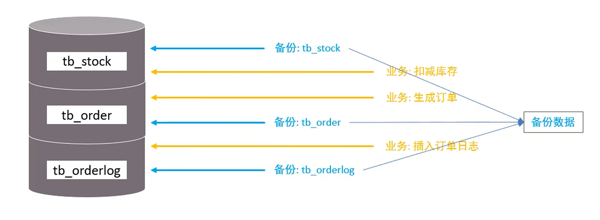

+ 因为在备份途中还不断插入数据，最终导致的结果就是**数据不一致**

如果加了全局锁

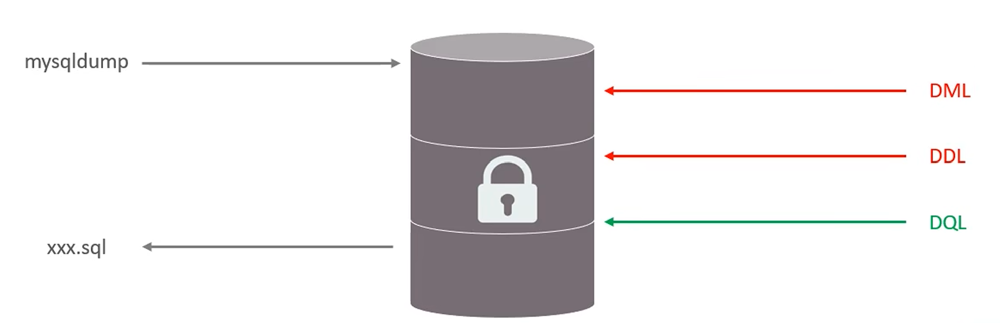

+ 备份完就可以把锁释放了

##### 2.2 语法

加全局锁

```sql
flush tables with read lock;
```

在 Windows 命令行中执行

```
mysqldump -uroot -p1234 itcast > itcast.sql
```
+ mysqldump -u：指定我们备份的时候访问数据库的用户名
+ -p：密码
+ itcast：指的是要备份的是哪个数据库
+ itcast.sql：把备份的数据存到哪个 sql 文件中

解锁

```sql
unlock tables;
```


##### 2.3 特点（弊端）

数据库中加全局锁，是一个比较重的操作，存在以下问题：
1. 如果在主库上备份，那么在备份期间都不能执行更新，业务基本上就得停摆
2. 如果在从库上备份，那么备份期间从库不能执行主库同步过来的二进制日志（binlog），会导致主从延迟

在 InnoDB 引擎中，我们可以在备份时加上参数 `--single-transaction` 参数来完成不加锁的一致性数据备份

```
mysqldump --single-transaction -uroot -p123456 itcast > itcast.sql
```


---------------------------


#### 3. 表级锁

##### 3.1 介绍

表级锁，每次操作锁住整张表。锁定力度大，发生说冲突的概率是最高的，并发度最低。应用在 MyISAM、InnoDB、BDB 等存储引擎中

对于表级锁，主要分为以下三类：
1. 表锁
2. 元数据锁（meta data lock，MDL）
3. 意向锁

##### 3.2 表锁

对于表锁，分为两类：
1. 表共享读锁（read lock）
2. 表独占写锁（write lock）

语法：
1. 加锁：`lock tables 表名... read/write`
2. 释放锁：`unlock tables` / 客户端断开连接

+ 读锁

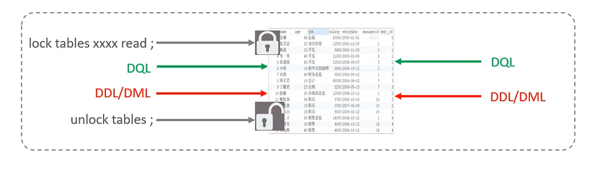


+ 写锁

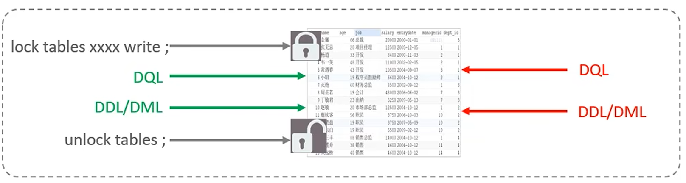

**读锁不会阻塞其他客户端的读，但是会阻塞写。写锁既会阻塞其他客户端的读，又会阻塞其他客户端的写**

##### 3.3 元数据锁（meta data lock，MDL）

MDL 加锁过程是系统自动控制，无需显式使用，在访问同一张表的时候会自动加上。MDL 锁主要作用是维护表元数据的数据一致性，在表上有活动事务的时候，不可以对元数据进行写入【如果某一张表存在未提交的事务，那么我们不能去修改这张表的表结构，主要**为了避免 DML 与 DDL 冲突，保证读写的正确性**】
在 MySQL5.5 中引入了 MDL，当对一张表进行增删改查的时候，加 MDL 读锁（共享）；当对表结构进行变更操作的时候，加 MDL 写锁（排他）

| 对应 SQL                                      | 锁类型                                  | 说明                                                  |
| --------------------------------------------- | --------------------------------------- | ----------------------------------------------------- |
| lock tables xxx read / write                  | SHARED_READ_ONLY / SHARED_NO_READ_WRITE |                                                       |
| select、select ... lock in share mode         | SHARED_READ                             | 与  SHARED_READ、SHARED_WRITE 兼容，与 EXCLUSIVE 互斥 |
| insert、update、delete、select ... for update | SHARED_WRITE                            | 与  SHARED_READ、SHARED_WRITE 兼容，与 EXCLUSIVE 互斥 |
| alter table ...                               | EXCLUSIVE                               | 与其他的 MDL 都互斥                                   |


查看元数据锁：

```sql
select object_type, object_schema, object_name, lock_type, lock_duration from performance_schema.metadata_locks;
```
实际上是查询了系统表中的 metadata_locks 这张表，这张表中就记录了我们当前数据库实例当中的元数据锁


##### 3.4 意向锁

为了避免 DML 在执行时，加的行锁于表锁的冲突，在 InnoDB 中引入了意向锁，使得表锁不用检查每行数据是否加锁，使用意向锁来减少表锁的检查

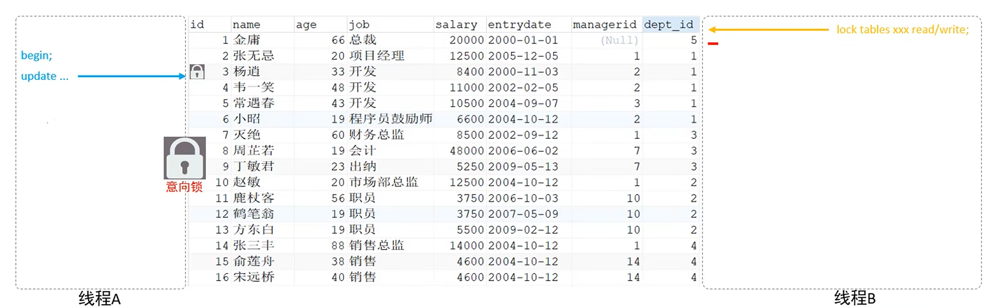

+ 意向共享锁（IS）：由语句 `select ... lock in share mode` 添加
  + 与表锁共享锁（read）兼容，与表锁排它锁（write）互斥

+ 意向排他锁（IX）：由 insert、update、delete、select ... for update 添加
  + 与表锁共享锁（read）及排它锁（write）都互斥。意向锁之间不会互斥

可以通过以下 SQL，查看意向锁及行锁的加锁情况
```sql
select object_schema, object_name, index_name, lock_type, lock_mode, lock_data from performance_schema.data_locks;
```


---------------------------------------


#### 4. 行级锁

##### 4.1 介绍

行级锁，每次操作锁住对应的行数据。锁定力度最小，发生锁冲突的概率最低，并发度最高。应用在 InnoDB 存储引擎中

InnoDB 的数据是基于索引组织的，行锁是通过对索引上的索引项加锁来实现的，而不是对应记录加的锁。对于行级锁，主要分为以下三类：

1. 行锁（Record Lock）：锁定单个记录的锁，防止其他事务对此进行 update 和 delete。在 RC、RR 隔离级别下都支持
2. 间隙锁（Gap Lock）：锁定索引记录间隙（不含该记录），确保索引记录间隙不变，防止其他事务在这个间隙进行 insert，产生幻读。在 RR 隔离级别下都支持
3. 临键锁（Next-Key Lock）：行锁和间隙锁组合，同时锁住数据，并锁住数据前面的间隙 Gap。在 RR 隔离级别下支持

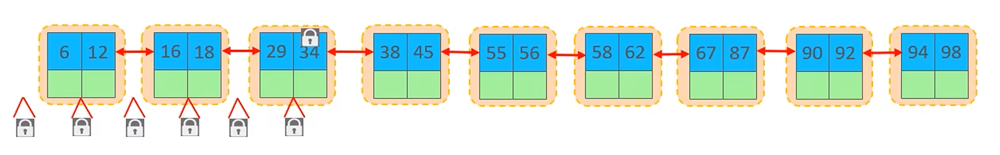

##### 4.2 行锁

InnoDB 实现了以下两种类型的行锁：

1. 共享锁（S）：允许一个事务去读一行，阻止其他事务获取相同数据集的排他锁【共享锁和共享锁之间是兼容的，共享锁和排他锁之间是互斥的】
2. 排他锁（X）：允许获取排他锁的事务更新数据，阻止其他事务获取相同数据集的共享锁和排他锁

| 当前锁类型 \ 请求锁类型 | S（共享锁） | X（排他锁） |
| ----------------------- | ----------- | ----------- |
| S（共享锁）             | 兼容        | 冲突        |
| X（排他锁）             | 冲突        | 冲突        |

+ 行锁

| SQL                           | 行锁类型       | 说明                                        |
| ----------------------------- | -------------- | ------------------------------------------- |
| INSERT ...                    | 排他锁         | 自动加锁                                    |
| UPDATE ...                    | 排他锁         | 自动加锁                                    |
| DELETE ...                    | 排他锁         | 自动加锁                                    |
| SELECT （正常）               | **不加任何锁** |                                             |
| SELECT ... LOCK IN SHARE MODE | 共享锁         | 需要手动在 SELECT 之后加 LOCK IN SHARE MODE |
| SELECT ... FOR UPDATE         | 排他锁         | 需要手动在 SELECT 之后加 FOR UPDATE         |

在默认情况下，InnoDB 在 REPEATABLE READ 事务隔离级别运行，InnoDB 使用 next-key 锁进行搜索和索引扫描，以防止幻读
1. 针对唯一索引进行检索时，对已存在的记录进行等值匹配时，将会自动优化为行锁
2. InnoDB 的行锁是针对于索引加的锁，不通过索引条件检索数据，那么 InnoDB 将对表中的所有记录加锁，此时**就会升级为表锁**

可以通过以下 SQL，查看意向锁及行锁的加锁情况：
```sql
SELECT object_schema, object_name, index_name, lock_type, lock_mode, lock_data from performance_schema.data_locks;
```

##### 4.3 间隙锁 / 临键锁

**临键锁就是行锁和间隙锁的组合**

默认情况下，InnoDB 在 REPEATABLE READ 事务隔离级别运行，InnoDB 使用 next-key 锁（临键锁）进行搜索和索引扫描，以防止幻读
1. 索引上的等值查询（唯一索引），给不存在的记录加锁时，优化为间隙锁
2. 索引上的等值查询（普通索引），向右遍历时最后一个值不满足查询需求时，next-key lock 退化为间隙锁
3. 索引上的范围查询（唯一索引）-- 会访问到不满足条件的第一个值为止

**注意：间隙锁唯一目的是防止其他事务插入间隙，造成幻读现象。间隙锁可以共存，一个事务采用的间隙锁不会阻止另一个事务在同一间隙上采用间隙锁**


#### 总结

1. 概述
+ 在并发访问时，解决数据访问的一致性、有效性问题
+ 全局锁、表级锁、行级锁

2. 全局锁
+ 对整个数据库实例加锁，加锁后整个实例就处于只读状态
+ 性能较差，数据逻辑备份时使用

3. 表级锁
+ 操作锁住整张表，锁定力度大，发生锁冲突的概率高
+ 表锁、元数据锁、意向锁

4. 行级锁
+ 操作锁住对应的行数据，锁定力度最小，发生锁冲突的概率最低
+ 行锁、间隙锁、临键锁


-------------------------------------


### 六、InnoDB 引擎

#### 1. 逻辑存储结构

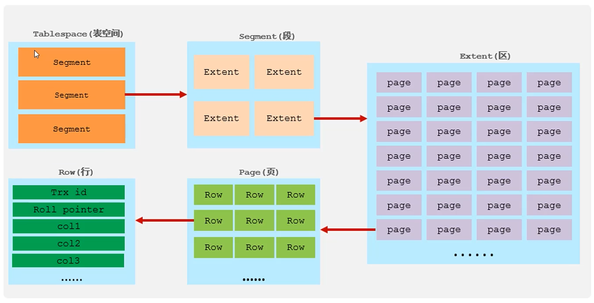

+ 表空间（ibd 文件），一个 mysql 实例可以对应多个表空间，用于存储记录、索引等数据
+ 段，分为数据段（Leaf node segment）、回滚段（Rollback segment），InnoDB 是索引组织表，数据段就是 B+树的叶子节点，索引段即为 B+树的非叶子节点。段用来管理多个 Extent（区）
+ 区，表空间的单元结构，每个区的大小为1M。默认情况下，InnoDB 的存储引擎页大小为16K，和一个区中一共有64个连续的页
+ 页，是 InnoDB 存储引擎磁盘管理的最小单元，每个页的大小默认为16KB。为了保证页的连续性，InnoDB 存储引擎每次从磁盘中申请4 - 5个区
+ 行，InnoDB 存储引擎数据是按行进行存放的
  + Trx_id：每次对某条记录进行改动时，都会把对应的事务 id 赋值给 trx_id 隐藏列
  + Roll_pointer：每次对某条记录进行改动时，都会把旧的版本写入到 undo 日志中，然后这个隐藏列就相当于一个指针，可以通过它来找到该记录修改前的信息


---------------------------------


#### 2. 架构

MySQL5.5 版本开始，默认使用 InnoDB 存储引擎，它擅长事务处理，具有崩溃恢复特性，在日常开发中使用非常广泛。下面是 InnoDB 架构图，左侧为**内存结构**，右侧为**磁盘结构**

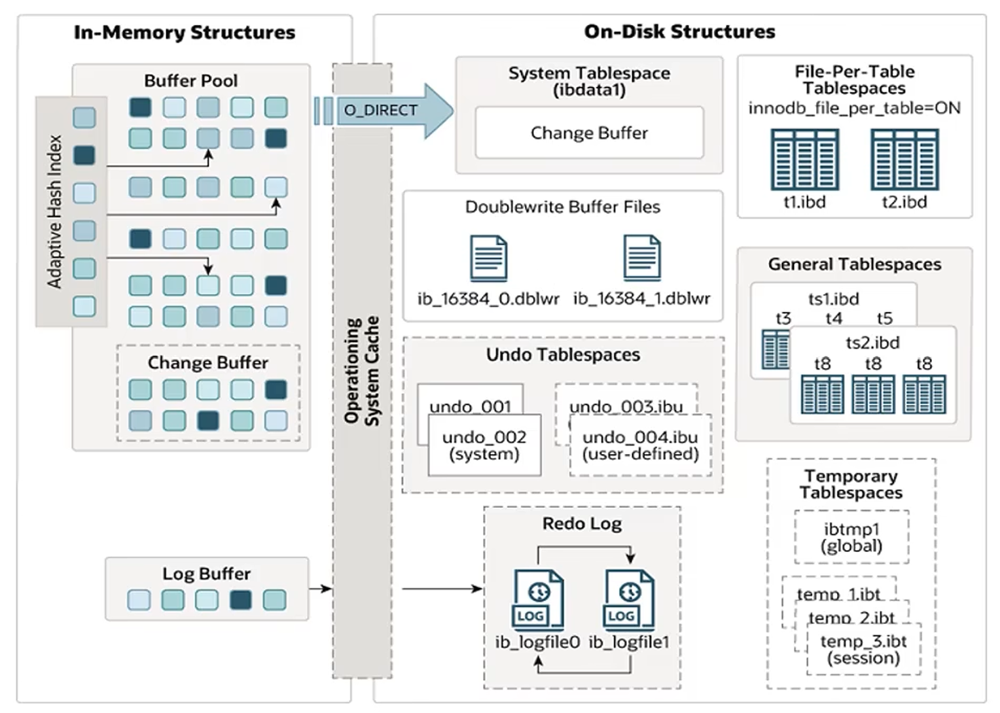

##### 架构 - 内存结构

###### Buffer Pool

Buffer Pool：缓冲池是主内存中的一个区域，里面可以缓存磁盘上经常操作的真实数据，在执行增删改查操作时，先操作缓冲池中的数据（若缓冲池没有数据，则从磁盘加载并缓存），然后再以一定频率刷新到磁盘，从而减少磁盘 IO，加快处理速度

缓冲池以 Page 页为单位，底层采用链表数据结构管理 Page。根据状态，将 Page 分为三种类型：
+ free page：空闲 page，未被使用
+ clean page：被使用 page，数据没有被修改过
+ dirty page：脏页，被使用 page，数据被修改过，页中数据与磁盘的数据产生了不一致

###### Change Buffer

Change Buffer：更改缓冲区（针对于非唯一二级索引页），在执行 DML 语句时，如果这些数据 Page 没有在 Buffer Pool 中，不会直接操作磁盘，而会将数据变更存在更改缓冲区 Change Buffer 中，在未来数据被读取时，再将数据合并恢复到 Buffer Pool 中，再将合并后的数据刷新到磁盘中

+ Change Buffer 的意义
  + 与聚集索引不同，二级索引通常是非唯一的，并且以相对随机的顺序插入二级索引。同样，删除和更新可能会影响索引树中不相邻的二级索引页，如果每一次都操作磁盘，会造成大量的磁盘 IO。有了 Change Buffer 之后，我们可以在缓冲池中进行合并处理，减少磁盘 IO

###### Adaptive Hash Index

Adaptive Hash Index：自适应 hash 索引，用于优化对 Buffer Pool 数据的查询。InnoDB 存储引擎会监控对表上各索引页的查询，如果观察到 hash 索引可以提升速度，则建立 hash 索引，称之为自适应 hash 索引
**自适应哈希索引，无需人工干预，是系统根据情况自动完成**
参数：adaptive_hash_index

###### Log Buffer

Log Buffer：日志缓冲区，用来保存要写入到磁盘中的 log 日志数据（redo log、undo log），默认大小为16MB，日志缓冲区的日志会定期刷新到磁盘中。如果需要更新、插入或删除许多行的事务，增加日志缓冲区的大小可以节省磁盘 IO
参数：
innodb_log_buffer_size：缓冲区大小
innodb_flush_log_at_trx_commit：日志刷新到磁盘时机
+ 1：日志在每次事务提交时写入并刷新到磁盘
+ 0：每秒将日志写入并刷新到磁盘一次
+ 2：日志在每次事务提交后写入，并每秒刷新到磁盘一次


------------------------------------


##### 架构 - 磁盘结构

###### System Tablespace

System Tablespace：系统表空间是更改缓冲区的存储区域，如果表是在系统表空间而不是每个表文件或通用表空间中创建的，它也可能包含表和索引数据（在 MySQL5.x 版本中还包含 InnoDB 数据字典、undolog 等）
参数：innodb_data_file_path

###### File-Per-Table Tablespaces

File-Per-Table Tablespaces：每个表的文件表空间包含单个 InnoDB 表的数据和索引，并存储在文件系统上的单个数据文件中
参数：innodb_file_per_table

###### General Tablespaces

General Tablespaces：通用表空间，需要通过 CREATE TABLESPACE 语法创建通用表空间，在创建表时，可以指定该表空间

+ 语法
  + 创建表空间
```sql
CREATE TABLESPACE XXXX ADD
DATAFILE 'file_name'
ENGINE = engine_name;
```

  + 指定表空间
```sql
CREATE TABLE XXX... TABLESPACE ts_name;
```

###### Undo Tablespaces

Undo Tablespaces：撤销表空间，MySQL 实例在初始化时会自动创建两个默认的 undo 表空间（初识大小16M），用于存储 undo log 日志

###### Temporary Tablespaces

Temporary Tablespaces：InnoDB 使用会话临时表空间和全局临时表空间。存储用户创建的临时表等数据

###### Doublewrite Buffer Files

Doublewrite Buffer Files：双写缓冲区，InnoDB 引擎将数据页从 Buffer Pool 刷新到磁盘前，先将数据写入双写缓冲区文件中，便于系统异常时恢复数据

###### Redo Log

Redo Log：重做日志，是用来实现事务的持久性。该日志文件由两部分组成：重做日志缓冲（redo log buffer）以及重做日志文件（redo log），前者是在内存中，后者是在磁盘中。当事务提交之后会把所拥有修改信息都会存到该日志中，用于在刷新脏页到磁盘时，发生错误时，进行数据恢复使用
以循环方式写入重做日志文件，涉及两个文件：
+ ib_logfile0
+ ib_logfile1


-----------------------------


##### 架构 - 后台线程

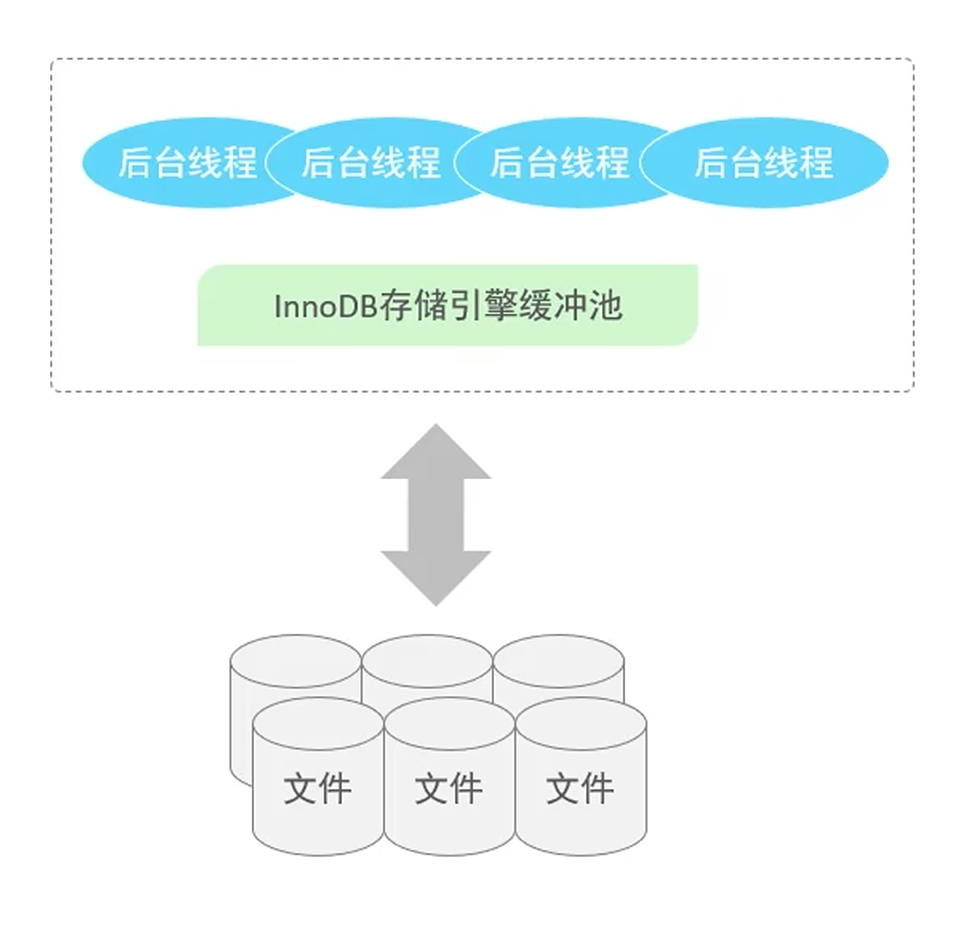

1. Master Thread
+ 核心后台线程，负责调度其他线程，还负责将缓冲池中的数据异步刷新到磁盘中，保持数据的一致性，还包括脏页的刷新、合并插入缓存、undo 页的回收

2. IO Thread
+ 在 InnoDB 存储引擎中大量使用了 AIO 来处理 IO 请求，这样可以极大地提高数据库的性能，而 IO Thread 主要负责这些 IO 请求的回调

| 线程类型             | 默认个数 | 职责                         |
| -------------------- | -------- | ---------------------------- |
| Read thread          | 4        | 负责读操作                   |
| Write thread         | 4        | 负责写操作                   |
| Log thread           | 1        | 负责将日志缓冲区刷新到磁盘   |
| Insert buffer thread | 1        | 负责将写缓冲区内容刷新到磁盘 |

3. Purge Thread
+ 主要用于回收事务已经提交了的 undo log，在事务提交之后，undo log 可能不用了，就用它来回收

4. Page Cleaner Thread
+ 协助 Master Thread 刷新脏页到磁盘的线程，它可以减轻 Master Thread 的工作压力，减少阻塞


------------------------------------


#### 3. 事务原理

##### 3.1 事务
+ 事务
  + 事务是一组操作的集合，它是一个不可分割的工作单位，事务会把所有的操作作为一个整体一起向系统提交或撤销操作请求，即这些操作要么同时成功，要么同时失败

+ 特性
  + 原子性（Atomicity）：事务是不可分割的最小操作单元，要么全部成功，要么全部失败
  + 一致性（Consistency）：事务完成时，必须使所有的数据都保持一致状态
  + 隔离性（Isolation）：数据库系统提供的隔断机制，保证事务在不受外部并发操作影响的独立环境下运行
  + 持久性（Durability）：事务一旦提交或回滚，它对数据库中的数据的改变是永久的


##### redo log【持久性】

重做日志，记录的是事务提交时数据页的物理修改，是用来实现事务的持久性
该日志文件由两部分组成：重做日志缓冲（redo log buffer）以及重做日志文件（redo log file），前者是在内存中，后者在磁盘中。当事务提交之后会把所有修改信息都存到该日志文件中，用于在刷新脏页到磁盘，的、发生错误时，进行数据恢复使用

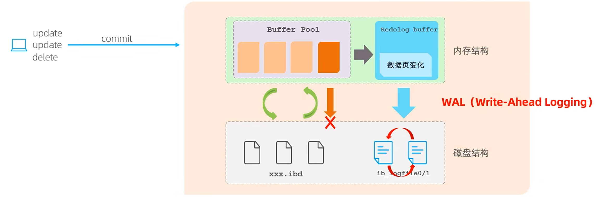

##### undo log【原子性】

回滚日志，用于记录数据被修改前的信息，作用包含两个：提供回滚和 MVCC（多版本并发控制）
undo log 和 redo log 记录物理日志不一样，它是逻辑日志。可以认为当 delete 一条记录时，undo log 中会记录一条对应的 insert 记录，防止亦然，当 update 一条记录时，它记录一条对应相反的 update 记录。当执行 rollback 时，就可以从 undo log 中的逻辑记录读取到相应的内容并进行回滚
Undo log 销毁：undo log 在事务执行时产生，事务提交时，并不会立即删除 undo log，因为这些日志可能还用于 MVCC
Undo log 存储：undo log 采用段的方式进行管理和记录，存放在前面介绍的 rollback segment 回滚段中，内部包含1024个 undo log segment


--------------------------------------


#### 4. MVCC

##### MVCC - 基本概念

+ 当前读
  + 读取的是记录的最新版本，读取时还要保证其他并发事务不能修改当前记录，会对读取的记录进行加锁。对于我们日常的操作，如：select ... lock in share mode（共享锁），select ... for update、update、insert、delete（排他锁）都是一种当前读
  + 简单来说当前读读取到的就是最新的数据记录

+ 快照读
  + 简单的 select（不加锁）就是快照读，读取的是记录数据的可见版本，有可能是历史数据，不加锁，是非阻塞读
    + Read Committed：每次 select，都生成一个快照读
    + Repeatable Read：开启事务后第一个 select 语句才是快照读的地方
    + Serializable：快照读会退化为当前读

+ MVCC
  + 全称 Multi-Version Concurrency Control，多版本并发控制。指维护一个数据的多个版本，使得读写操作没有冲突，快照读为 MySQL 实现 MVCC 提供了一个非阻塞读功能。MVCC 的具体实现，还要依赖于数据库记录中的三个隐藏字段、undo log 日志、readView

##### MVCC - 实现原理

###### 记录中的隐藏字段

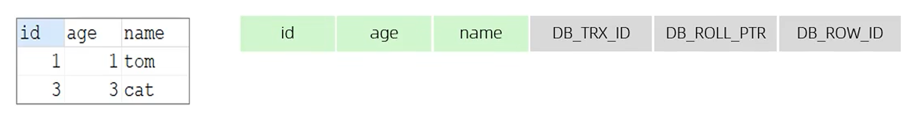

| 隐藏字段    | 含义                                                         |
| ----------- | ------------------------------------------------------------ |
| DB_TRX_ID   | 最近修改事务 ID，记录插入这条记录或最后一次修改该记录的事务 ID |
| DB_ROLL_PTR | 回滚指针，指向这条记录的上一个版本，用于配合 undo log，指向上一个版本 |
| DB_ROW_ID   | 隐藏主键，如果表结构没有指定主键，将会生成该隐藏字段         |

查看表空间文件内容：`ibd2sdi 表空间文件名`


###### undo log

  + 回滚日志，在 insert、update、delete 的时候产生的便于数据回滚的日志
  + 当 insert 的时候，产生的 undo log 日志只在回滚时需要，在事务提交后，可被立即删除
  + 而 update、delete 的时候，产生的 undo log 日志不仅在回滚时需要，在快照读时也需要，不会立即被删除

+ undo log 版本链

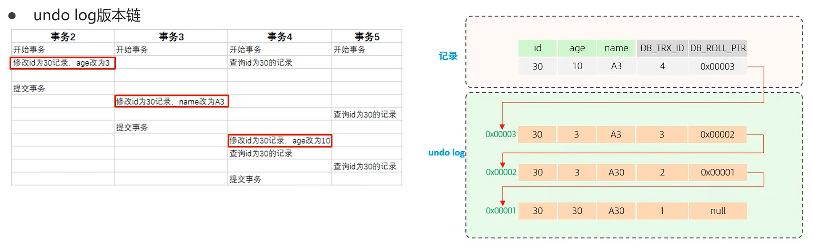

不同事务或相同事务对同一条记录进行修改，会导致该记录的 undolog 生成一条版本链表，链表的头部是最新的旧记录，链表尾部是最早的旧记录

###### readview

ReadView（读视图）是**快照读** SQL 执行时 MVCC 提取数据的依据，记录并维护系统当前活跃的事务（未提交的）id
ReadView 中包含了四个核心字段：

| 字段           | 含义                                                     |
| -------------- | -------------------------------------------------------- |
| m_ids          | 当前活跃的事务 ID 集合                                   |
| min_trx_id     | 最小活跃事务 ID                                          |
| max_trx_id     | 预分配事务 ID，当前最大事务 ID+1（因为事务 ID 是自增的） |
| creator_trx_id | ReadView 创建者的事务 ID                                 |

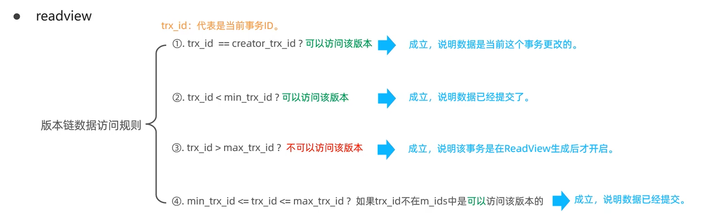

不同的隔离级别，生成 ReadView 的时机不同：
+ READ COMMITTED：在事务中每执行一次执行快照读时生成 ReadView
+ REPEATABLE READ：仅在事务中第一次执行快照读时生成 ReadView，后续复用该 ReadView


RC：在事务中每执行一次执行快照读时生成 ReadView

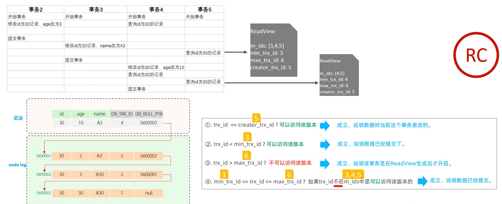

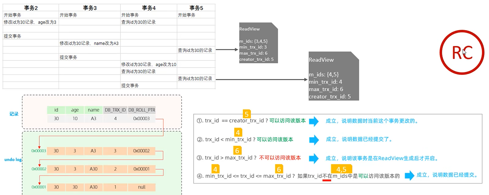

总结：只能获取【事务完毕】或者当前事务的 id 数据，然后获取视图，会根据这个4个条件获取 undo log 版本

判断 
1. 当前事务的 id == 访问事务 id
2. 当前事务 id < 最小的活动事务 id 
3. 当前事务 id > 最大活动事务的 id 
4. 判断 是否是活动 id，不在就可以获取版本信息

RR：仅在事务中第一次执行快照读时生成 ReadView，后续复用该 ReadView

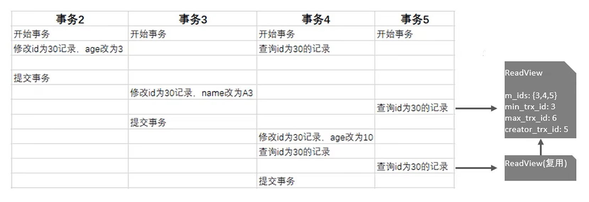

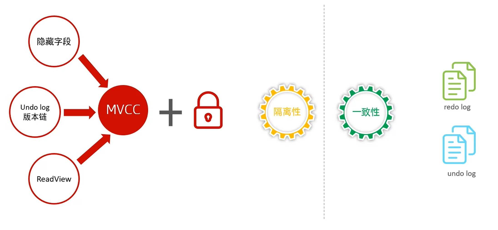


-----------------------------------


#### 总结

1. 逻辑存储结构
+ 表空间、段、区、页、行

2. 架构
+ 内存结构
+ 磁盘结构

3. 事务原理
+ 原子性 - undo log
+ 持久性 - redo log
+ 一致性 - undo log + redo log
+ 隔离性 - 锁 + MVCC

4. MVCC
+ 记录隐藏字段、undo log 版本链、readView


-----------------------------------------


### 七、MySQL 管理

#### 1. 系统数据库

Mysql 数据库安装完后后，自带了以下四个数据库，具体作用如下：

| 数据库             | 含义                                                         |
| ------------------ | ------------------------------------------------------------ |
| mysql              | 存储 MySQL 服务器正常运行所需要的各种信息（时区、主从、用户、权限等） |
| information_schema | 提供了访问数据库元数据的各种表和视图，包含数据库、表、字段类型及访问权限等 |
| performance_schema | 为 MySQL 服务器运行时状态提供了一个底层监控功能，主要用于手机数据库服务器性能参数 |
| sys                | 包含了一系列方便 DBA 和开发人员利用 performance_schema 性能数据库进行性能调优和诊断的视图 |


------------------------------------


#### 2. 常用工具

##### 2.1 mysql

该 mysql 不是指 mysql 服务，而是指 mysql 的客户端工具

```sql
# 语法 ： 
 mysql [options] [database]
# 选项 ： 
 -u, --user=name # 指定用户名
 -p, --password[=name] # 指定密码
 -h, --host=name # 指定服务器IP或域名
 -P, --port=port # 指定连接端口
 -e, --execute=name # 执行SQL语句并退出
```

-e 选项可以在 MySQL 客户端执行 SQL 语句，而不用连接到 MySQL 数据库再执行，对于一些批处理脚本， 这种方式尤其方便。

+ 实例
```sql
mysql -uroot –p123456 db01 -e "select * from stu";
```

##### 2.2 mysqladmin

mysqladmin 是一个执行管理操作的客户端程序。可以用它来检查服务器的配置和当前状态、创建并删除数据库等

```sql
# 通过帮助文档查看选项：
mysqladmin --help
```
```
语法: 
 mysqladmin [options] command ...
选项:
 -u, --user=name 		# 指定用户名
 -p, --password[=name] 	# 指定密码
 -h, --host=name 		# 指定服务器IP或域名
 -P, --port=port 		# 指定连接端口
```

+ 实例

```sql
mysqladmin -uroot –p1234 drop 'test01';
mysqladmin -uroot –p1234 version;
```

##### 2.3 mysqlbinlog

由于服务器生成的二进制日志文件以二进制格式保存，所以如果想要检查这些文本的文本格式，就会使用到 mysqlbinlog 日志管理工具

```
语法 ： 
 mysqlbinlog [options] log-files1 log-files2 ...
选项 ： 
 -d, --database=name 								  指定数据库名称，只列出指定的数据库相关操作。
 -o, --offset=#  									  忽略掉日志中的前n行命令。
 -r,--result-file=name 								  将输出的文本格式日志输出到指定文件。
 -s, --short-form 显示简单格式， 						 省略掉一些信息。
 --start-datatime=date1 --stop-datetime=date2 			指定日期间隔内的所有日志。
 --start-position=pos1 --stop-position=pos2 			指定位置间隔内的所有日志。
```

##### 2.4 mysqlshow

mysqlshow 客户端对象查找工具，用来很快地查找存在哪些数据库、数据库中的表、表中的列或者索引

```sql
语法 ： 
 mysqlshow [options] [db_name [table_name [col_name]]]

选项 ： 
 --count	  显示数据库及表的统计信息（数据库，表 均可以不指定）
 -i 		  显示指定数据库或者指定表的状态信息

示例：
 # 查询test库中每个表中的字段书，及行数
 mysqlshow -uroot -p2143 test --count
 # 查询test库中book表的详细情况
 mysqlshow -uroot -p2143 test book --count
```

##### 2.5 mysqldump

mysqldump 客户端工具用来备份数据库或在不同数据库之间进行数据迁移。备份内容包含创建表，及插入表的 SQL 语句

```
语法 ： 
 mysqldump [options] db_name [tables]
 mysqldump [options] --database/-B db1 [db2 db3...]
 mysqldump [options] --all-databases/-A
连接选项 ：
 -u, --user=name 			指定用户名
 -p, --password[=name] 		 指定密码
 -h, --host=name 			指定服务器ip或域名
 -P, --port=# 				指定连接端口
输出选项：
 --add-drop-database 		 在每个数据库创建语句前加上 drop database 语句
 --add-drop-table 			 在每个表创建语句前加上 drop table 语句 , 默认开启 ; 不开启 (--skip-add-drop-table)
 -n, --no-create-db 		 不包含数据库的创建语句
 -t, --no-create-info 		 不包含数据表的创建语句
 -d --no-data 				不包含数据
 -T, --tab=name 			自动生成两个文件：一个.sql文件，创建表结构的语句；一
个.txt文件，数据文件
```

##### 2.6 mysqlimport / source

+ mysqlimport

mysqlimport 是客户端数据导入工具，用来导入mysqldump 加 -T 参数后导出的文本文件

```
语法 ： 
 mysqlimport [options] db_name textfile1 [textfile2...]
示例 ： 
 mysqlimport -uroot -p2143 test /tmp/city.txt
```

+ source

如果需要导入sql文件,可以使用mysql中的source 指令 ：

```
语法：
source /root/xxxxx.sql
```


--------------------------------------------


#### 总结

1. mysql
+ Mysql 客户端工具，-e 执行 SQL 并退出

2. mysqladmin
+ Mysql 管理工具

3. mysqlbinlog
+ 二进制日志查看工具

4. mysqlshow
+ 查看数据库、表、字段的统计信息

5. mysqldump
+ 数据备份工具

6. mysqlimport / source
+ 数据导入工具


-----------------------------------------

==完结撒花==