# Redis


## 基础篇

### 一、初识 Redis

#### 1. 认识 NoSQL

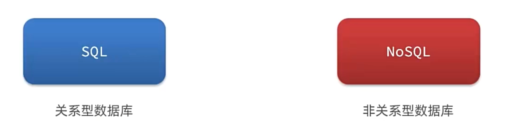

+ 关系型数据库（SQL）

  + 结构化（Structured）

  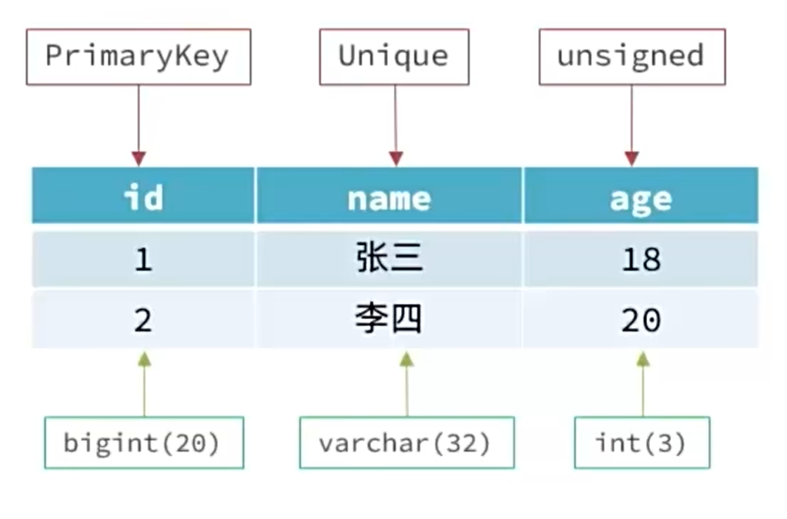

  + 关联的（Relational）

  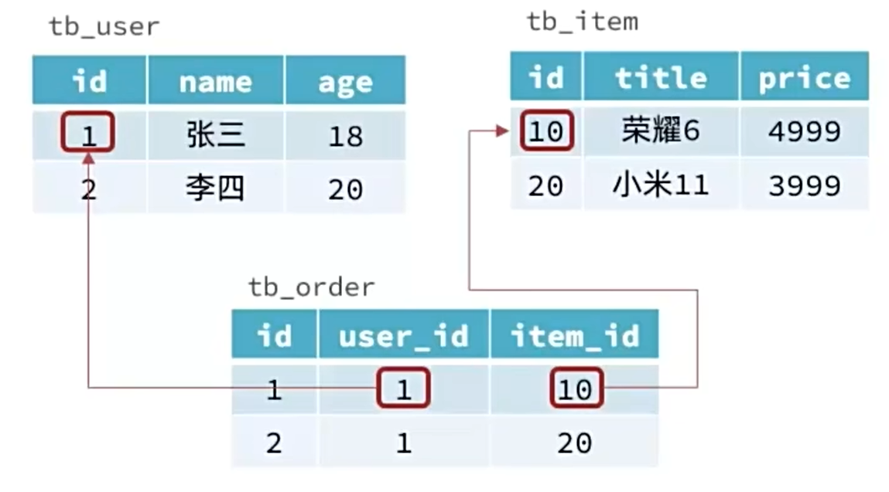

  + SQL 查询

  

  + ACID

  


+ 非关系型数据库（NoSQL）

  + 非结构化

  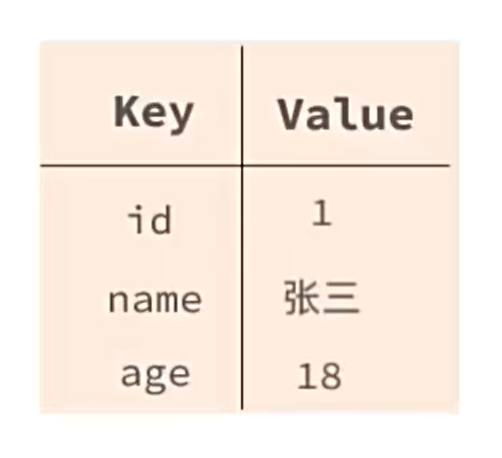

  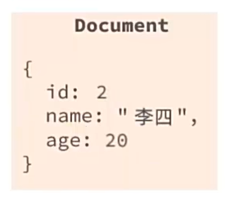

  

  + 无关联的

  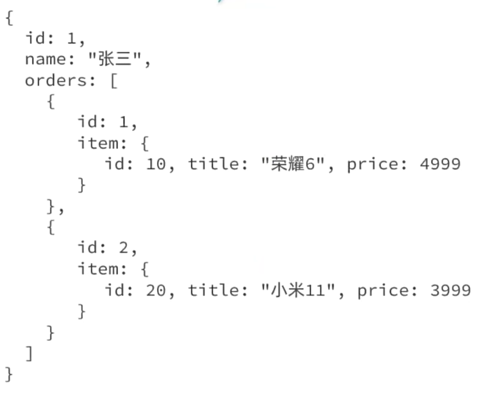

  + 非 SQL

  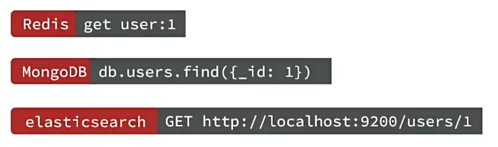

  + BASE（无法满足事务的强的一致性，只能做一些基本的一致性）

|          | SQL                                                          | NoSQL                                                        |
| -------- | ------------------------------------------------------------ | ------------------------------------------------------------ |
| 数据结构 | 结构化（Structured）                                         | 非结构化                                                     |
| 数据关联 | 关联的（Relational）                                         | 无关联的                                                     |
| 查询方式 | SQL 查询                                                     | 非 SQL                                                       |
| 事务特性 | ACID                                                         | BASE                                                         |
| 存储方式 | 磁盘                                                         | 内存                                                         |
| 扩展性   | 垂直                                                         | 水平                                                         |
| 使用场景 | 1）数据结构固定<br />2）相关业务对数据安全性、一致性要求较高 | 1）数据结构不固定<br />2）对一致性、安全性要求不高<br />3）对性能要求 |


-------------------------


#### 2. 认识 Redis

Redis 诞生于2009年全称是 **Re**mote **Di**ctionary **S**erver，远程词典服务器，是一个基于内存的键值型 NoSQL 数据库

特征：

+ 键值（key-value）型，value 支持多种不同数据结构。，功能丰富
+ 单线程，每个命令具有原子性
+ 低延迟，速度快（基于内存、IO 多路复用、良好的编码）
+ 支持数据持久化
+ 支持主从集群、分片集群
+ 支持多语言客户端

官网：[Redis中文网](https://www.redis.net.cn/)


-----------------------------


#### 3. 安装 Redis

如果要安装 Linux 版本，会 docker 就直接用 docker

我这边用的是 windows 版本

Windows：[GitHub - redis-windows/redis-windows: Redis 6.0.20 6.2.18 7.0.15 7.2.8 7.4.3 8.0.0 for Windows](https://github.com/redis-windows/redis-windows)

Redis 的 Windows 版属于绿色软件，直接解压即可使用，解压后目录结构如下

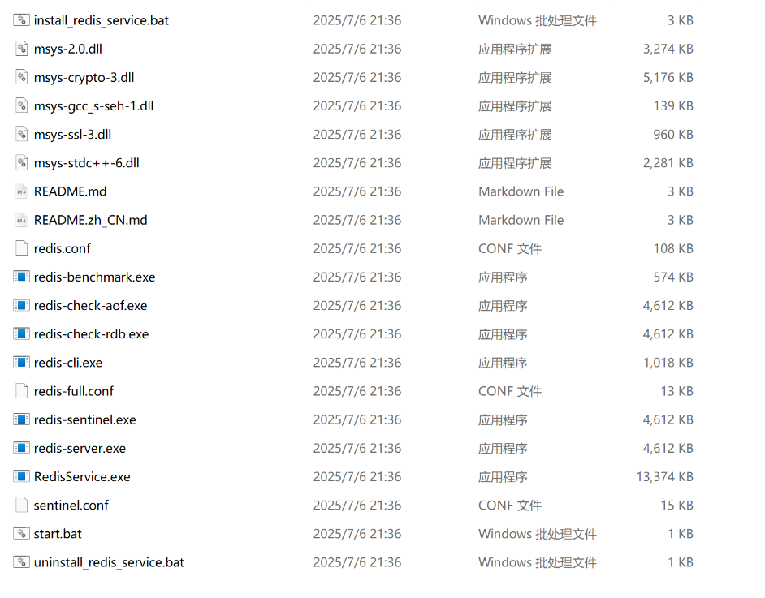

+ 启动


按 Ctrl + c 停止

+ 客户端连接


##### 3.1 图形化界面

+ Another Redis Desktop Manager

官网：[Another Redis Desktop Manager | 更快、更好、更稳定的Redis桌面(GUI)管理客户端，兼容Windows、Mac、Linux，性能出众，轻松加载海量键值](https://goanother.com/cn/)


注意：要把 redis 启动起来，要不然连不上

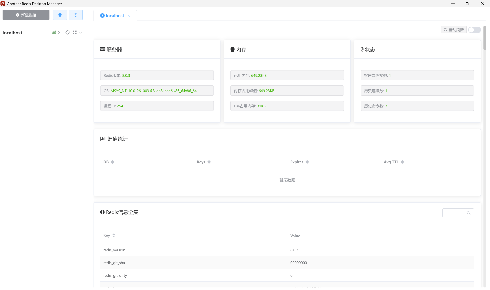


-------------------------------


### 二、Redis 常见命令

#### 1. Redis 数据结构介绍

Redis 是一个 key-value 的数据库，key 一般是 String 类型，不过 value 的类型多种多样：

| 类型      | 例子                    |
| --------- | ----------------------- |
| String    | hello world             |
| Hash      | {name: "Jack", age: 21} |
| List      | [A -> B -> C -> C]      |
| Set       | {A, B, C}               |
| SortedSet | {A: 1, B: 2, C: 3}      |
| GEO       | {A: (120.3, 30.5)}      |
| BitMap    | 0110110101110101011     |
| HyperLog  | 0110110101110101011     |

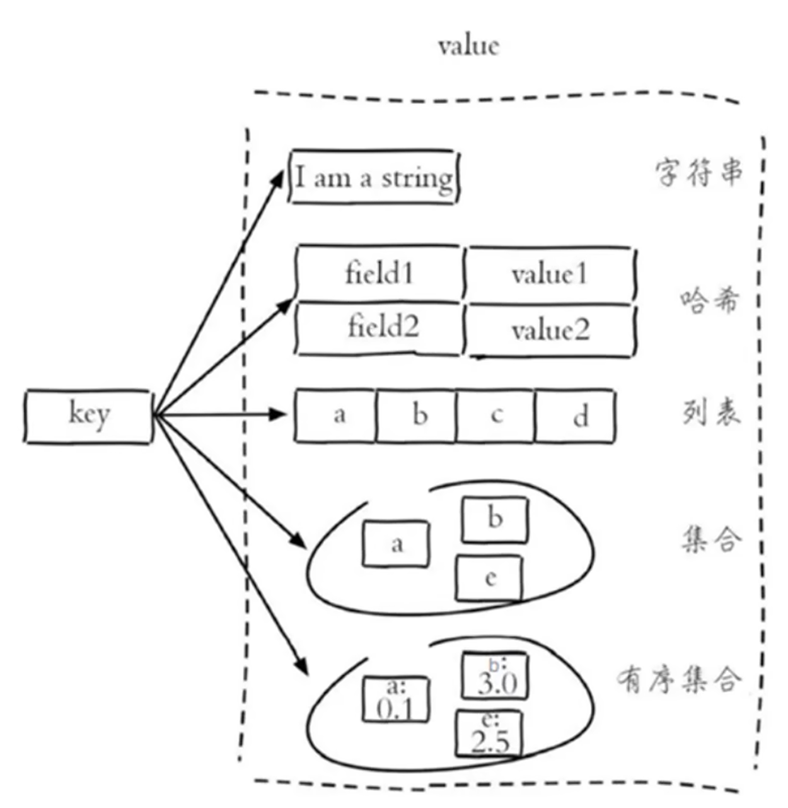

Redis 为了方便我们学习，将操作不同数据类型的命令也做了分组，在官网（[Commands | Docs](https://redis.io/docs/latest/commands/)）可以查看到不同的命令：

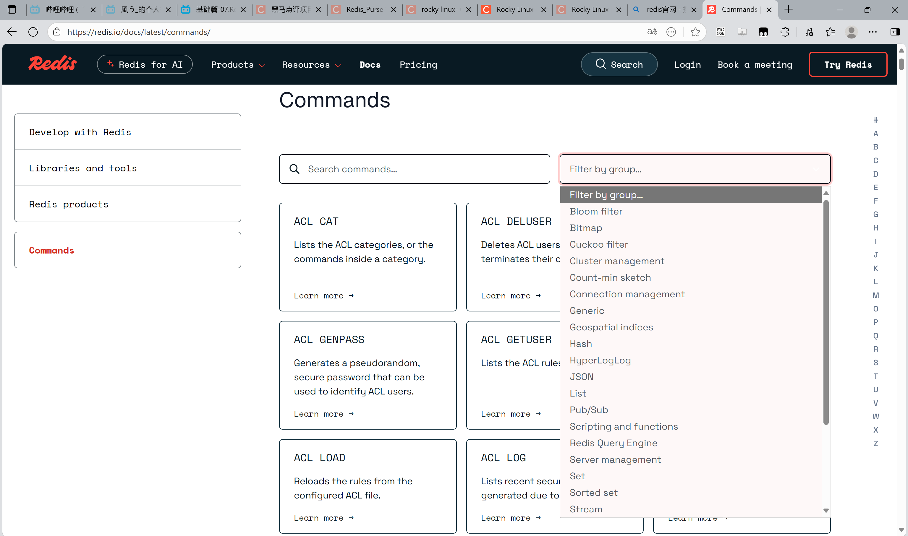


--------------------------


#### 2. Redis 通用命令

通用命令是部分数据类型的，都可以使用的命令，常见的有：

| 命令                 | 作用                                                         |
| -------------------- | ------------------------------------------------------------ |
| KEYS pattern         | 查找所有符合给定模式（pattern）的 key，**不建议在生产环境设备上使用** |
| DEL key              | 该命令用于在 key 存在时删除 key                              |
| EXISTS key           | 检查给定 key 是否存在                                        |
| EXPIRE key timestamp | 给定一个 key 设置有效期，有效期到期时该 key 会被自动删除     |
| TTL key              | 查看一个 key 的剩余有效期                                    |
| TYPE key             | 返回 key 所储存的值的类型                                    |

通过 `kelp [command]` 可以查看一个命令的具体用法


----------------------------


#### 3. String 类型

String 类型，也就是字符串类型，是 Redis 中最简单的存储类型

其 value 是字符串，不过根据字符串的格式不同，又可以分为3类：

+ string：普通字符串
+ int：证书类型，可以做自增、自减操作
+ float：浮点类型，可以做自增、自减操作

不管是哪种格式，底层都是字节数组形式存储，只不过是编码方式不同。字符串类型的最大空间不能超过512m

常见命令：

| 命令                           | 作用                                                         |
| ------------------------------ | ------------------------------------------------------------ |
| SET key value                  | 添加或者修改已经存在的一个 String 类型的键值对               |
| GET key                        | 根据 key 获取 String 类型的 value                            |
| MSET key value [key value ...] | 批量添加多个 key 获取多个 String 类型的 value                |
| MGET key [key ...]             | 根据多个 key 获取多个 String 类型的 value                    |
| INCR key                       | 让一个整型的 key 自增1                                       |
| INCRBY key increment           | 让一个整型的 key 自增并指定步长，例如：incrby num 2（让 num 值自增2） |
| INCRBYFLOAT key increment      | 让一个浮点类型的数字自增并指定步长                           |
| SETNX key value                | 添加一个 String 类型的键值对，前提是这个 key 不存在，否则不执行 |
| SETEX key seconds value        | 添加一个 String 类型的键值对，并且指定有效期                 |


##### key 的层级格式

Redis 没有类似 MySQL 中的 Table 的概念，我们该如何区分不同类型的 key 呢？

+ 例如，需要存储用户、商品信息到 redis，有一个用户的 id 是1，有一个商品 id 也恰好是1

Redis 的 key 允许有多个单词形成层级结构，多个单词之间用 `:` 隔开，格式如下：

```
项目名:业务名:类型:id
```

这个格式并非固定，也可以根据自己的需求来删除或添加词条

例如我们的项目名称叫 feng，有 user 和 product 两种不同类型的数据，我们可以这样定义 key：

+ user 相关的 key：`feng:user:1`
+ product 相关的 key：`feng:product:1`

如果 Value 是一个 Java 对象，例如一个 User 对象，则可以将对象序列化为 JSON 字符串后存储

##### 总结

String 类型的三种格式：

+ 字符串
+ int
+ float

Redis 的 key 的格式：

+ `[项目名]:[业务名]:[类型]:[id]`


---------------------------------------------------


#### 4. Hash 类型

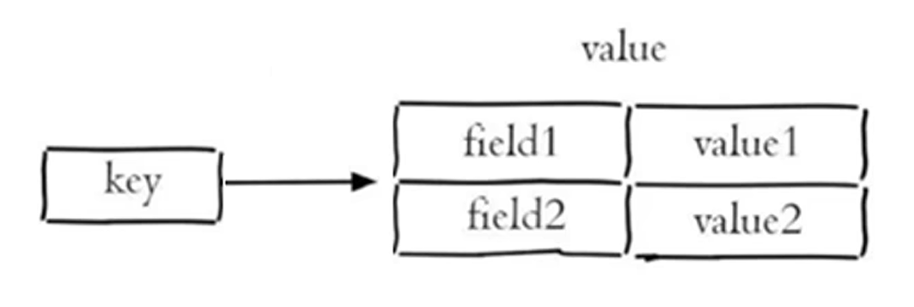

Hash 类型，也叫散列，其 value 是一个无序字典，类似于 Java 中的 HashMap 结构

String 结构是见对象序列化为 JSON 字符串后存储，当需要修改对象某个字段时很不方便：

| KEY         | VALUE                   |
| ----------- | ----------------------- |
| feng:user:1 | {name: "Jack", age: 21} |
| feng:user:2 | {name: "Rose", age: 18} |

Hash 结构可以将对象中的每个字段独立存储，可以针对单个字段做 CRUD：

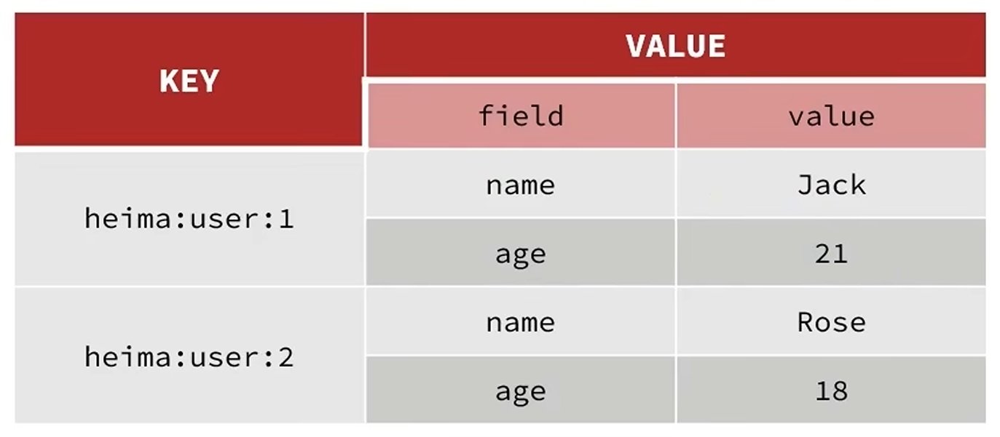

常见命令：

| 命令                           | 作用                                                         |
| ------------------------------ | ------------------------------------------------------------ |
| HSET key field value           | 添加或者修改 hash 类型 key 的 field 的值                     |
| HGET key field                 | 获取一个 hash 类型 key 的 field 的值                         |
| MSET key value [key value ...] | 批量添加多个 hash 类型的 key 的 field 的值                   |
| HMGET key field [field ...]    | 批量获取多个 hash 类型的 key 的 field 的值                   |
| HGETALL key                    | 获取一个 hash 类型的 key 中的所有 field 和 value             |
| HKEYS key                      | 获取一个 hash 类型中 key 中的所有的 field                    |
| HVALS key                      | 获取一个 hash 类型的 key 中的所有的 value                    |
| HINCRBY key field increment    | 让一个 hash 类型 key 的字段值自增并指定步长                  |
| HSETNX key field value         | 添加一个 hash 类型的 key 的 field 值，前提是这个 field 不存在，否则不执行 |


----------------------


#### 5. List 类型

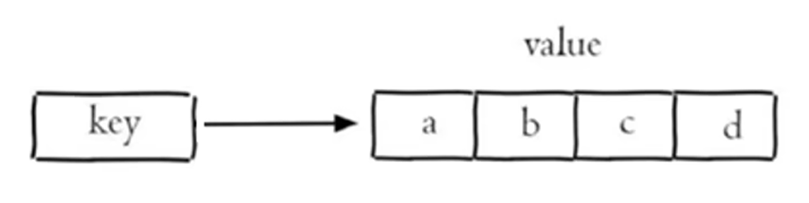

Redis 中的 List 类型与 Java 中的 LinkedList 类似，可以看作是一个双向链表结构。既可以支持正向检索和也可以支持反向检索

特征也与 LinkedList 类似：

+ 有序
+ 元素可以重复
+ 插入和删除快
+ 查询速度一般

常用来存储一个有序数据，例如：朋友圈点赞列表，评论列表等

常用命令：

| 命令                                                       | 作用                                                         |
| ---------------------------------------------------------- | ------------------------------------------------------------ |
| LPUSH key value [value ...]                                | 向列表左侧插入一个或多个元素                                 |
| LPOP key                                                   | 移除并返回列表左侧的第一个元素，没有则返回 nil               |
| RPUSH key value [value ...]                                | 向列表右侧插入一个或多个元素                                 |
| RPOP key                                                   | 移除并返回列表右侧的第一个元素                               |
| LRANGE key start stop                                      | 返回一段角标范围内的所有元素                                 |
| BLPOP key [key ...] timeout 和 BRPOP key [key ...] timeout | 与 LPOP 和 RPOP 类似，只不过在没有元素时等待指定时间，而不是直接返回 nil |

##### 思考

如何利用 List 结构模拟一个栈？

+ 入口和出口在同一边

如何利用 List 结构模拟一个队列？

+ 入口和出口在不同边

如何利用 List 结构模拟一个阻塞队列？

+ 入口和出口在不同边
+ 出队时采用 BLPOP 或 BRPOP


--------------------


#### 6. Set 类型


Redis 的 Set 结构与 Java 中的 HashSet 类似，可以看作是一个 value 为 null 的 HashMap。因为也是一个 hash 表，因此具备与 HashSet 类似的特征：

+ 无序
+ 元素不可重复
+ 查找快
+ 支持交集、并集、差集等功能

常见命令：

| 命令                         | 作用                          |
| ---------------------------- | ----------------------------- |
| SADD key member [member ...] | 向 set 中添加一个或多个元素   |
| SREM key member [member ...] | 移除 set 中的指定元素         |
| SCARD key                    | 返回 set 中元素的个数         |
| SISMEMBER key member         | 判断一个元素是否存在于 set 中 |
| SMEMBERS key                 | 获取 set 中的所有元素         |
| SINTER key1 key2 ...         | 求 key1 与 key2 的交集        |
| SDIFF key1 key2 ...          | 求 key1 与 key2 的差集        |
| SUNION key1 key2 ...         | 求 key1 和 key2 的并集        |

##### 案例

>将下列数据用 Redis 的 Set 集合来存储：
>
>+ 张三的好友有：李四、王五、赵六
>+ 李四的好友有：王五、麻子、二狗
>
>利用 Set 的命令实现下列功能：
>
>+ 计算张三的好友有几人
>+ 计算张三和李四有哪些共同好友
>+ 查询那些人是张三的好友而不是李四的好友
>+ 查询张三和李四的好友总共有哪些人
>+ 判断李四是否是张三的好友
>+ 判断张三是否是李四的好友
>+ 将李四从张三的好友列表中移除

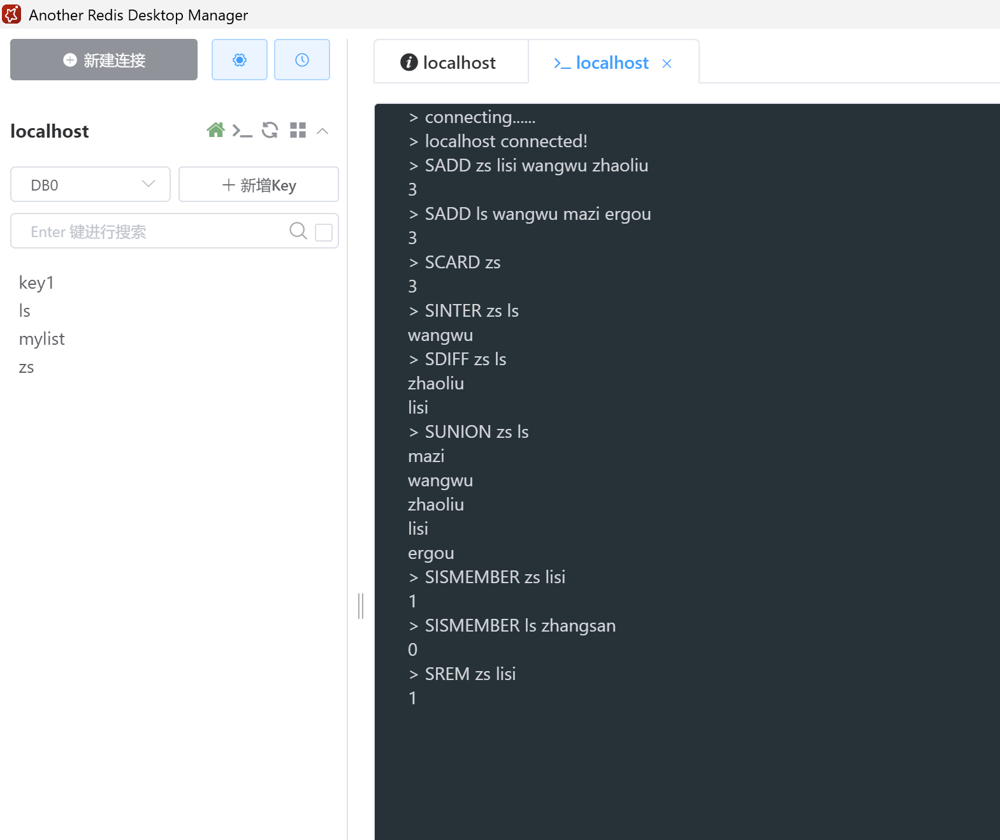


------------------------


#### 7. SortedSet 类型


Redis 的 SortedSet 是一个可排序的 set 集合，与 Java 中的 TreeSet 有些类似，但底层数据结构却差别很大。SortedSet 中的每个元素都带有一个 score 属性，可以基于 score 属性对元素排序，底层的实现是一个跳表（SkipList）加 hash 表

SortedSet 具备下列特性：

+ 可排序
+ 元素不重复
+ 查询速度快

因为 SortedSet 的可排序特性，经常被用来实现排行榜这样的功能

常见命令：

| 命令                                                        | 作用                                                         |
| ----------------------------------------------------------- | ------------------------------------------------------------ |
| ZADD key score member [score] [member]                      | 添加一个或多个元素到 sorted set，如果已经存在则更新其 score 值 |
| ZREM key member [member ...]                                | 删除 sorted set 中的一个指定元素                             |
| ZSCORE key member                                           | 获取 sorted set 中的指定元素的 score 值                      |
| ZRANK key member                                            | 获取 sorted set 中的指定元素的排名                           |
| ZCARD key                                                   | 获取 sorted set 中的元素个数                                 |
| ZCOUNT key min max                                          | 统计 score 值在给定范围内的所有元素的个数                    |
| ZINCRBY key increment member                                | 让 sorted set 中的指定元素自增，步长为指定的 increment       |
| ZRANGE key start stop [WITHSCORES]                          | 按照 score 排序后，获取指定排名范围内的元素                  |
| ZRANGEBYSCORE key min max [WITHSCORES] [LIMIT offset count] | 按照 score 排序后，获取指定 score 范围内的元素               |
| ZDIFF、ZINTER、ZUNION                                       | 求差集、交集、并集                                           |

注意：所有的排名默认都是升序，如果要降序则在命令的 `Z` 后面添加 `REV` 即可

##### 案例

> 将班级的下列学生得分存入 Redis 的 SortedSet 中：
>
> Jack 85，Lucy 89，Tom 95，Jerry 78，Amy 92，Miles 76
>
> 并实现下列功能：
>
> + 删除 Tom 同学
> + 获取 Amy 同学的分数
> + 获取 Rose 同学的排名
> + 查询 80 分以下有几个学生
> + 给 Amy 同学加2分
> + 查出成绩前3名的同学
> + 查出成绩80分以下的所有同学

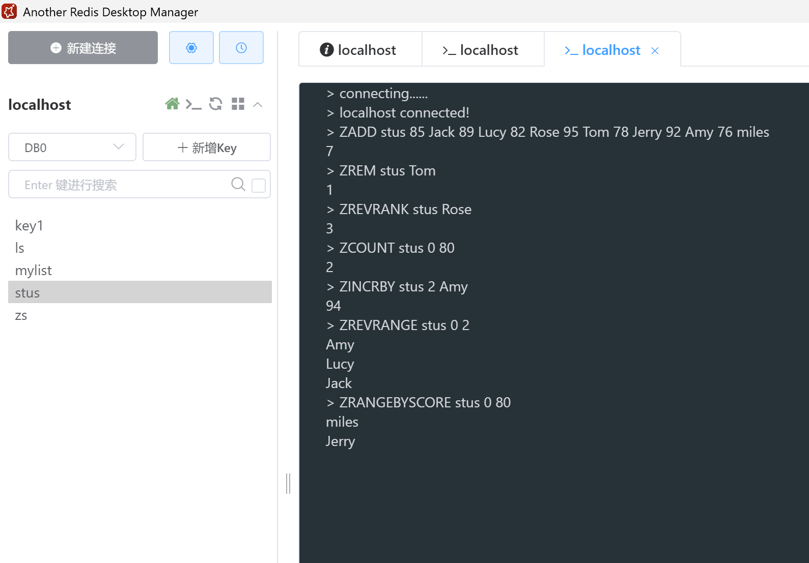


-------


### 三、Redis 的 Java 客户端

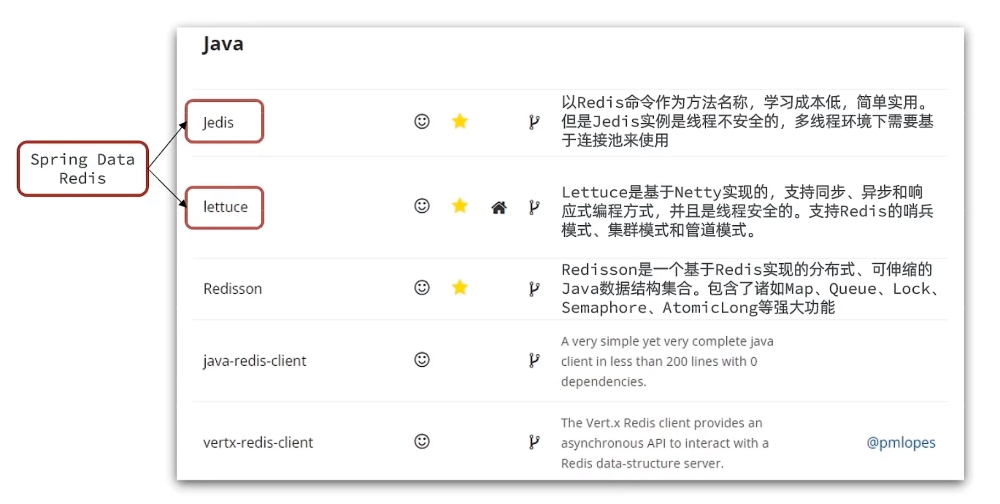

#### 1. Jedis

##### 1.1 快速入门

Jedis 的官网地址：[redis/jedis: Redis Java client](https://github.com/redis/jedis)

[Jedis 指南 | Redis - Redis 文档](https://redis.ac.cn/docs/connect/clients/java/jedis/)

1. 引入依赖

```xml
<dependency>
    <groupId>redis.clients</groupId>
    <artifactId>jedis</artifactId>
    <version>5.1.2</version>
</dependency>
```

2. 建立连接

```java
package org.example;
import redis.clients.jedis.Jedis;
import redis.clients.jedis.JedisPool;

public class Main {
    public static void main(String[] args) {
        JedisPool pool = new JedisPool("localhost", 6379);

        try (Jedis jedis = pool.getResource()) {
            // Store & Retrieve a simple string
            jedis.set("foo", "bar");
            System.out.println(jedis.get("foo")); // prints bar
            
            // Store & Retrieve a HashMap
            Map<String, String> hash = new HashMap<>();;
            hash.put("name", "John");
            hash.put("surname", "Smith");
            hash.put("company", "Redis");
            hash.put("age", "29");
            jedis.hset("user-session:123", hash);
            System.out.println(jedis.hgetAll("user-session:123"));
            // Prints: {name=John, surname=Smith, company=Redis, age=29}
        }
    }
}
```

###### 代码演示

```java
package com.feng.test;

import org.junit.jupiter.api.AfterEach;
import org.junit.jupiter.api.BeforeEach;
import org.junit.jupiter.api.Test;
import redis.clients.jedis.Jedis;

import java.util.Map;

public class JedisTest {
    private Jedis jedis;

    @BeforeEach
    void setUp() {
        // 1. 建立连接
        jedis = new Jedis("localhost", 6379);
        // 2. 设置密码
//        jedis.auth("123321");
        // 3. 选择库
        jedis.select(0);
    }

    @Test
    void testString() {
        // 存入数据
        String result = jedis.set("name", "谷歌");
        System.out.println("result = " + result);
        // 获取数据
        String name = jedis.get("name");
        System.out.println("name = " + name);
    }

    @Test
    void testHash() {
        // 插入hash数据
        jedis.hset("user:1", "name", "Jack");
        jedis.hset("user:1", "age", "21");

        // 获取
        Map<String, String> map = jedis.hgetAll("user:1");
        System.out.println(map);
    }

    @AfterEach
    void tearDown() {
        if (jedis != null) {
            jedis.close();
        }
    }
}
```

###### 总结

Jedis 使用的基本步骤：

1. 引入依赖
2. 创建 Jedis 对象，建立连接
3. 使用 Jedis，方法名与 Redis 命令一致
4. 释放资源


---------------------------------


##### 1.2 Jedis 连接池

Jedis 本身是线程不安全的，并且频繁的创建和销毁连接会有性能损耗，因此我们推荐大家使用 Jedis 连接池代替 Jedis 的直连方式

```java
package org.example;
import redis.clients.jedis.Jedis;
import redis.clients.jedis.JedisPool;

public class Main {
    public static void main(String[] args) {
        JedisPool pool = new JedisPool("localhost", 6379);

        try (Jedis jedis = pool.getResource()) {
            // Store & Retrieve a simple string
            jedis.set("foo", "bar");
            System.out.println(jedis.get("foo")); // prints bar
            
            // Store & Retrieve a HashMap
            Map<String, String> hash = new HashMap<>();;
            hash.put("name", "John");
            hash.put("surname", "Smith");
            hash.put("company", "Redis");
            hash.put("age", "29");
            jedis.hset("user-session:123", hash);
            System.out.println(jedis.hgetAll("user-session:123"));
            // Prints: {name=John, surname=Smith, company=Redis, age=29}
        }
    }
}
```

由于为每个命令添加 `try-with-resources` 块可能会很麻烦，因此可以考虑使用 `JedisPooled` 作为一种更简单的连接池方式

```java
import redis.clients.jedis.JedisPooled;

//...

JedisPooled jedis = new JedisPooled("localhost", 6379);
jedis.set("foo", "bar");
System.out.println(jedis.get("foo")); // prints "bar"
```

###### 代码演示

+ 配置类

```java
package com.feng.jedis.util;

import redis.clients.jedis.Jedis;
import redis.clients.jedis.JedisPool;
import redis.clients.jedis.JedisPoolConfig;

public class JedisConnectionFactory {
    private static final JedisPool jedisPool;

    static {
        // 配置连接池
        JedisPoolConfig poolConfig = new JedisPoolConfig();
        poolConfig.setMaxTotal(8); // 最大连接数
        poolConfig.setMaxIdle(8); // 最大空闲连接
        poolConfig.setMinIdle(0); // 最小空闲连接
        poolConfig.setMaxWaitMillis(1000); // 等待时长
        // 创建连接池对象
        jedisPool = new JedisPool(poolConfig,
                "localhost",
                6379);
    }

    public static Jedis getJedis() {
        return jedisPool.getResource();
    }
}
```

+ JedisTest.java

```java
package com.feng.test;

import com.feng.jedis.util.JedisConnectionFactory;
import org.junit.jupiter.api.AfterEach;
import org.junit.jupiter.api.BeforeEach;
import org.junit.jupiter.api.Test;
import redis.clients.jedis.Jedis;

import java.util.Map;

public class JedisTest {
    private Jedis jedis;

    @BeforeEach
    void setUp() {
        // 1. 建立连接
//        jedis = new Jedis("localhost", 6379);
        jedis = JedisConnectionFactory.getJedis();
        // 2. 设置密码
//        jedis.auth("123321");
        // 3. 选择库
        jedis.select(0);
    }

    @Test
    void testString() {
        // 存入数据
        String result = jedis.set("name", "谷歌");
        System.out.println("result = " + result);
        // 获取数据
        String name = jedis.get("name");
        System.out.println("name = " + name);
    }

    @Test
    void testHash() {
        // 插入hash数据
        jedis.hset("user:1", "name", "Jack");
        jedis.hset("user:1", "age", "21");

        // 获取
        Map<String, String> map = jedis.hgetAll("user:1");
        System.out.println(map);
    }

    @AfterEach
    void tearDown() {
        if (jedis != null) {
            jedis.close();
        }
    }
}
```


--------------------------


#### 2. SpringDataRedis

##### 2.1 快速入门

SpringData 是 Spring 中数据操作的模块，包含对各种数据库的集成，其中对 Redis 的集成模块就叫做 SpringDataRedis，官网地址：[Spring Data Redis](https://spring.io/projects/spring-data-redis)

+ 提供了对不同 Redis 客户端的整合（Lettuce 和 Jedis）
+ 提供了 Redis Template 统一 API 来操作 Redis
+ 支持 Redis 的发布订阅模型
+ 支持 Redis 哨兵和 Redis 集群
+ 支持基于 Lettuce 的响应式编程
+ 支持基于 JDK、JSON、字符串、Spring 对象的数据序列化及反序列化
+ 支持基于 Redis 的 JSKCollection 实现


SpringDataRedis 中提供了 RedisTemplate 工具类，其中封装了各种对 Redis 的操作。并且将不同数据类型的操作 API 封装到了不同的类型中：

| API                         | 返回值类型      | 说明                        |
| --------------------------- | --------------- | --------------------------- |
| reidsTemplate.opsForValue() | ValueOperations | 操作 **String** 类型数据    |
| reidsTemplate.opsForHash()  | HashOperations  | 操作 **Hash** 类型数据      |
| reidsTemplate.opsForList()  | ListOperations  | 操作 **List** 类型数据      |
| reidsTemplate.opsForSet()   | SetOperations   | 操作 **Set** 类型数据       |
| reidsTemplate.opsForZSet()  | ZSetOperations  | 操作 **SortedSet** 类型数据 |
| reidsTemplate               |                 | 通用的命令                  |


SpringBoot 已经提供了对 SpringDataRedis 的支持，使用非常简单：

1. 引入依赖

```xml
<!--Redis依赖-->
<dependency>
    <groupId>org.springframework.boot</groupId>
    <artifactId>spring-boot-starter-data-redis</artifactId>
</dependency>
<!--连接池依赖-->
<dependency>
    <groupId>org.apache.commons</groupId>
    <artifactId>commons-pool2</artifactId>
</dependency>
```

2. 配置文件

```yml
spring:
  redis:
    host: localhost
    port: 6379
#    password:
    jedis:
      pool:
        max-active: 8
        max-idle: 8
        min-idle: 0
        max-wait: 100ms
```

3. 注入 RedisTemplate

```java
@Autowired
private RedisTemplate redisTemplate;
```

4. 编写测试

```java
package com.feng.redisdemo;

import org.junit.jupiter.api.Test;
import org.springframework.beans.factory.annotation.Autowired;
import org.springframework.boot.test.context.SpringBootTest;
import org.springframework.data.redis.core.RedisTemplate;

@SpringBootTest
class RedisDemoApplicationTests {

    @Autowired
    private RedisTemplate redisTemplate;

    @Test
    void testString() {
        // 写入一条String数据
        redisTemplate.opsForValue().set("name", "谷歌");
        // 获取String数据
        Object name = redisTemplate.opsForValue().get("name");
        System.out.println("name = " + name);
    }

}
```

###### 总结

SpringDataRedis 的使用步骤：

1. 引入 spring-boot-starter-data-redis 依赖
2. 在 application.yml 配置 Redis 信息
3. 注入 RedisTemplate


---------------------------


##### 2.2 RedisTemplate 的 RedisSerialiazer

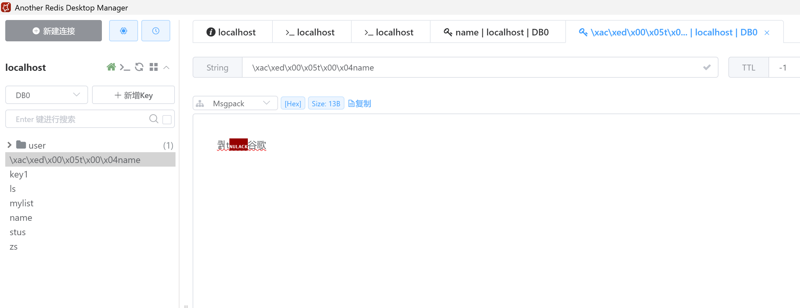

之前讲过，SpringDataReids 可以接收任何类型的对象，然后帮我们把它转成 Redis 可以处理的字节，所以我们存进去的东东都被当成了 Java 对象。而 RedisTemplate 的底层默认对这些对象的处理方式，是利用 JDK 的序列化工具 ObjectOutputStream

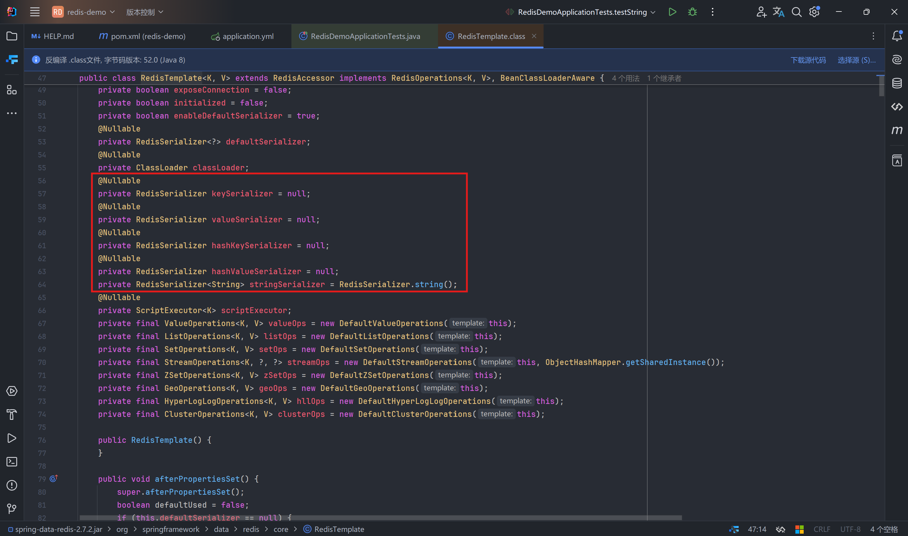

缺点：

+ 可读性差
+ 内存占用较大


我们可以自定义 RedisTemplate 的序列化方式，代码如下：

```java
package com.feng.redis.config;

import lombok.val;
import org.springframework.context.annotation.Bean;
import org.springframework.context.annotation.Configuration;
import org.springframework.data.redis.connection.RedisConnectionFactory;
import org.springframework.data.redis.core.RedisTemplate;
import org.springframework.data.redis.serializer.GenericJackson2JsonRedisSerializer;
import org.springframework.data.redis.serializer.RedisSerializer;

@Configuration
public class RedisConfig {

    @Bean
    public RedisTemplate<String, Object> redisTemplate(RedisConnectionFactory connectionFactory) {

        // 创建RedisTemplate对象
        RedisTemplate<String, Object> template = new RedisTemplate<>();
        // 设置连接工厂
        template.setConnectionFactory(connectionFactory);
        // 创建JSON序列化工具
        GenericJackson2JsonRedisSerializer jsonRedisSerializer = new GenericJackson2JsonRedisSerializer();
        // 设置key的序列化
        template.setKeySerializer(RedisSerializer.string());
        template.setHashKeySerializer(RedisSerializer.string());
        // 设置value的序列化
        template.setValueSerializer(jsonRedisSerializer);
        template.setHashValueSerializer(jsonRedisSerializer);
        // 返回
        return template;
    }
}
```

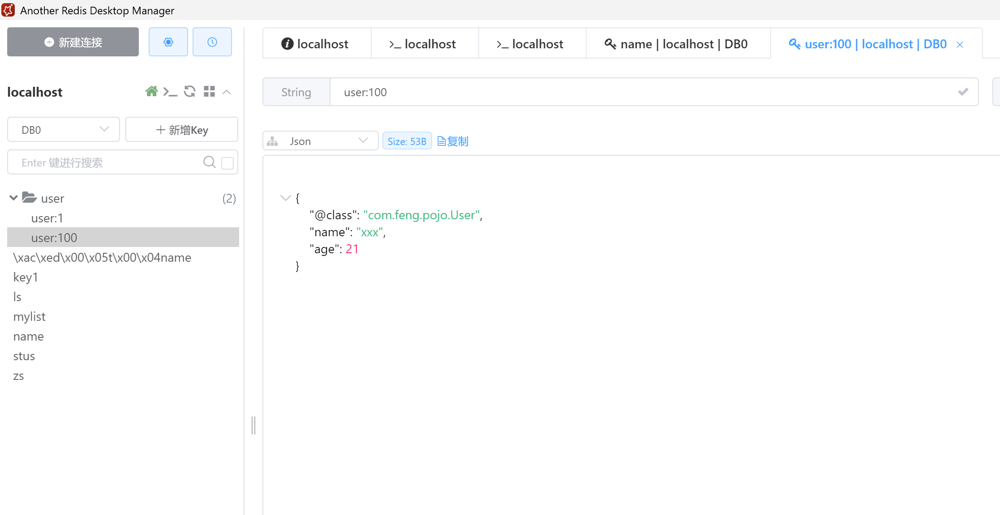


尽管 JSON 的序列化方式可以满足我们的需求，但依然存在一些问题

为了在反序列化时指导对象的类型，JSON 序列化器会将类的 class 类型写入 json 结果中，存入 Redis，会带来额外的内存开销

为了节省内存空间，我们并不会使用 JSON 序列化器来处理 value，而是统一使用 String 序列化器，要求只能存储 String 类型的 key 和 value。当需要存储 Java 对象时，手动完成对象的序列化和反序列化

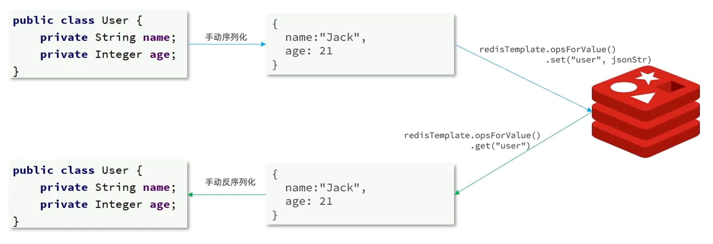

Spring 默认提供了一个 StringRedisTemplate 类，它的 key 和 value 的序列化方式默认就是 String 方式。省去了我们自定义RedisTemplate 的过程

```java
package com.feng;

import com.fasterxml.jackson.core.JsonProcessingException;
import com.fasterxml.jackson.databind.ObjectMapper;
import com.feng.pojo.User;
import org.junit.jupiter.api.Test;
import org.springframework.beans.factory.annotation.Autowired;
import org.springframework.boot.test.context.SpringBootTest;
import org.springframework.data.redis.core.RedisTemplate;
import org.springframework.data.redis.core.StringRedisTemplate;

import java.util.Map;

@SpringBootTest
class RedisStringTests {

    @Autowired
    private StringRedisTemplate stringRedisTemplate;

    @Test
    void testString() {
        // 写入一条String数据
        stringRedisTemplate.opsForValue().set("name", "谷歌");
        // 获取String数据
        Object name = stringRedisTemplate.opsForValue().get("name");
        System.out.println("name = " + name);
    }

    private static final ObjectMapper mapper = new ObjectMapper();

    @Test
    void testSaveUser() throws JsonProcessingException {
        // 创建对象
        User user = new User("谷歌", 21);
        // 手动序列化
        String json = mapper.writeValueAsString(user);
        // 写入数据
        stringRedisTemplate.opsForValue().set("user:200", json);

        // 获取数据
        String jsonUser = stringRedisTemplate.opsForValue().get("user:200");
        // 手动反序列化
        User user1 = mapper.readValue(jsonUser, User.class);
        System.out.println("user1 = " + user1);
    }

    @Test
    void testHash() {
        stringRedisTemplate.opsForHash().put("user:400", "name", "虎哥");
        stringRedisTemplate.opsForHash().put("user:400", "age", "21");

        Map<Object, Object> entries = stringRedisTemplate.opsForHash().entries("user:400");
        System.out.println("entries = " + entries);
    }
}
```

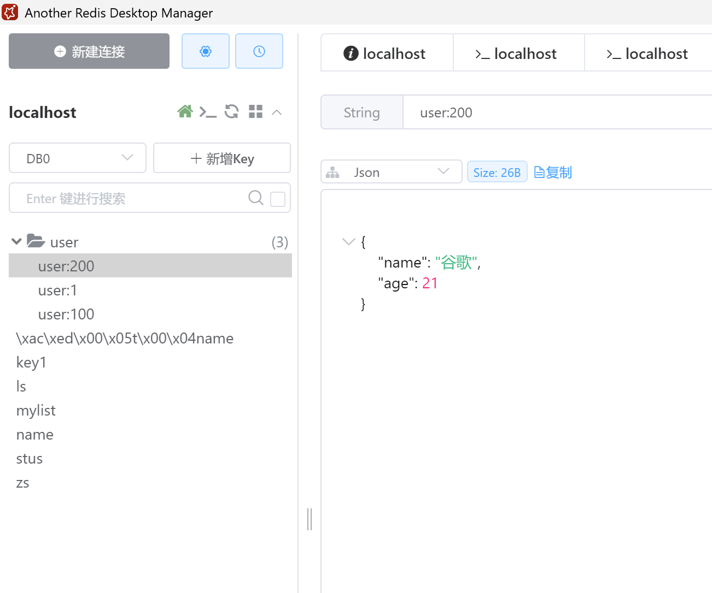

###### 总结

RedisTemplate 的两种序列化实践方案：

方案一：

1. 自定义 RedisTemplate
2. 修改 RedisTemplate 的序列化器为 `GenericJackson2JsonRedisSerializer`

方案二：

1. 使用 `StringRedisTemplate`
2. 写入 Redis 时，手动把对象序列化为 JSON（fastjson）
3. 读取 Redis 时，手动把读取到的 JSON 反序列化为对象


-------------------------------------------------


## 高级篇

### 一、分布式缓存

**单节点 Redis 的问题**

+ **数据丢失问题**：Redis 是内存存储，服务重启可能会丢失数据
+ **并发能力问题**：单节点 Redis 并发能力虽然不错，但也无法满足如618这样的该并发场景
+ **故障恢复问题**：如果 Redis 宕机，则服务不可用，需要一种自动的故障恢复手段
+ **存储能力问题**：Redis 基于内存，单节点能存储的数据量难以满足海量数据需求

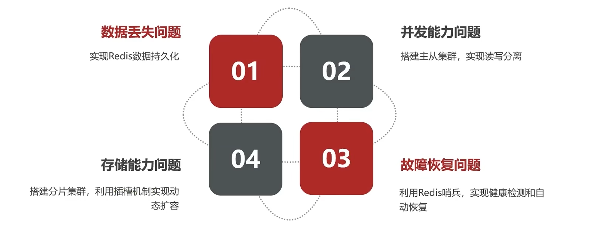

#### 1. Redis 持久化

##### 1.1 RDB 持久化

RDB 全称是 Redis Database Backup file（Redis 数据备份文件），也被叫做 Redis 数据快照。简单来说就是把内存中的所有数据都记录到磁盘中。当 Redis 实例故障重启后，从磁盘读取快照文件，恢复数据

快照文件称为 RDB 文件，默认是保存在当前运行目录

```bash
# 连接Redis
redis-cil
# 执行RDB的备份操作
save # 由Redis主进程来执行RDB，会阻塞所有命令
bgsave # 这个保存命令是在后台异步执行的，开启子进程执行RDB，避免主进程受到影响
```

Redis 停机时会执行一次 RDB

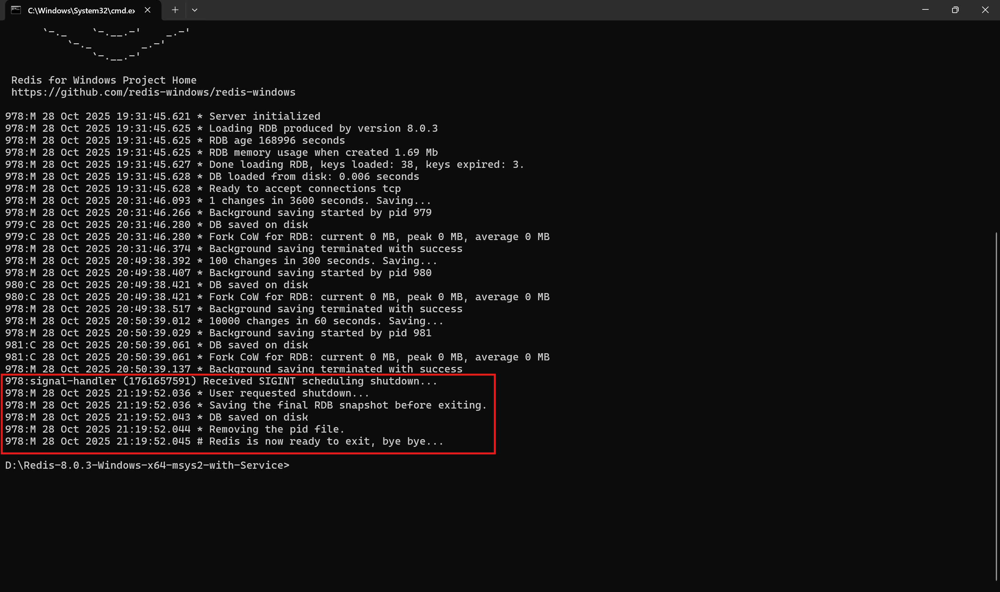

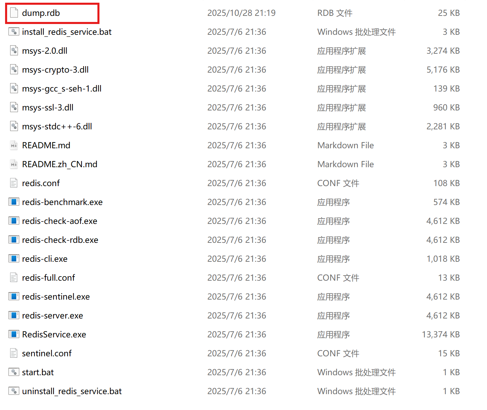

###### 1.1.1 RDB

Redis 内部有触发 RDB 的机制，可以在 redis.conf 文件中找到，格式如下：

```bash
# 900秒内，如果至少有1个key被修改，则执行bgsave，如果是 save "" 则表示禁用RDB
save 900 1
save 300 10
save 60 10000

# 禁用RDB
save ""
```

RDB 的其它配置也可以在 redis.conf 文件中设置：

```bash
# 是否压缩，建议不开启，压缩也会消耗cpu，磁盘的话不值钱
rdbcompression yes

# RDB文件名称
dbfilename dump.rdb

# 文件保存的路径目录
dir ./
```


bgsave 开始时会 fork 主进程得到子进程，子进程**共享**主进程的内存数据。完成 fork 后读取内存数据并写入 RDB 文件

fork 采用的是 copy-on-write 技术：

+ 当主进程执行读操作时，访问共享内存
+ 当主进程执行写操作时，则会拷贝一份数据，执行写操作

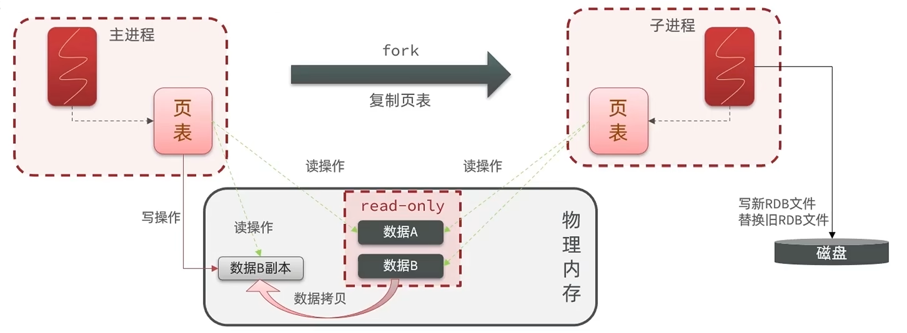

###### 总结

RDB 方式 bgsave 的基本流程？

+ fork 主进程得到一个子进程，共享内存空间
+ 子进程读取内存数据并写入新的 RDB 文件
+ 用新 RDB 文件替换旧的 RDB 文件

RDB 会在什么时候执行？save 60 1000 代表什么含义？

+ 默认是服务停止时
+ 代表60秒内至少执行1000次修改则触发 RDB

RDB 的缺点？

+ RDB 执行间隔时间长，两次 RDB 之间写入数据有丢失的风险
+ fork 子进程、压缩、写出 RDB 文件都比较耗时


------------


##### 1.2 AOF 持久化

AOF 全称为 Append Only File（追加文件）。Redis 处理的每一个写命令都会记录在 AOF 文件，可以看做是命令日志文件

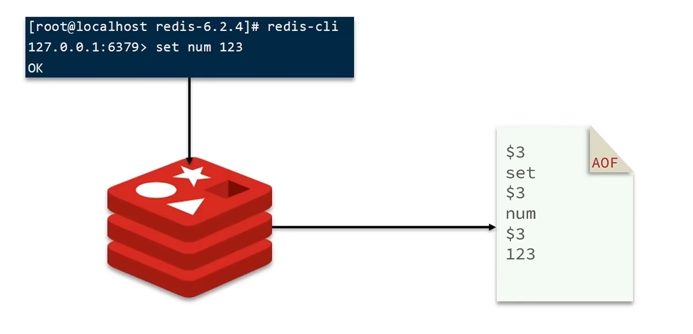

AOF 默认是关闭的，需要修改 redis.conf 配置文件来开启 AOF：

```bash
# 是否开启AOF功能，默认是no
appendonly yes
# AOF文件的名称
appendfilename "appendonly.aof"
```

AOF 的命令记录的频率也可以通过 redis.conf 文件来配置：

```bash
# 表示每执行一次写命令，立即记录到AOF文件
appendfsync always
# 写命令执行完向放入AOF缓冲区，然后表示每隔1秒将缓冲区数据写到AOF文件，是默认方案
appendfsync everysec
# 写命令执行完先放入AOF缓冲区，由操作系统决定何时将缓冲区内容写回磁盘
appendfsync no
```

| 配置项   | 刷盘时机     | 有点                   | 缺点                         |
| -------- | ------------ | ---------------------- | ---------------------------- |
| Always   | 同步刷盘     | 可靠性高，几乎不丢数据 | 性能影响大                   |
| everysec | 每秒刷盘     | 性能适中               | 最多丢失1秒数据              |
| no       | 操作系统控制 | 性格最好               | 可靠性较差，可能丢失大量数据 |


因为是记录命令，AOF 文件会比 RDB 文件大的多。而且 AOF 会记录对同一个 key 的多次写操作，但只有最后一次写操作才有意义。通过执行 `bgrewriteaof` 命令，可以让 AOF 文件执行重写功能，用最少的命令达到相同效果

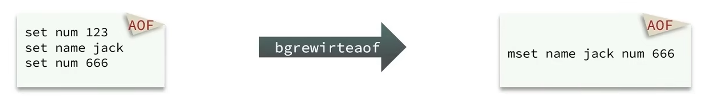

Redis 也会在触发阈值时自动去重写 AOF 文件。阈值也可以在 redis.conf 中配置：

```bash
# AOF文件比上次文件，增长超过多少百分比则触发重写
auto-aof-rewrite-percentage 100
# AOF文件体积最小多大以上才触发重写
auto-aof-rewrite-min-size 64mb
```


--------------


##### 1.3 RDB 和 AOF 的对比

RDB 和 AOF 各有自己的优缺点，如果对数据安全性要求较高，在实际开发中往往会**结合**两者来使用

|                | RDB                                          | AOF                                                          |
| -------------- | -------------------------------------------- | ------------------------------------------------------------ |
| 持久化方式     | 定时对整个内存做快照                         | 记录每一次执行的命令                                         |
| 数据完整性     | 不完整，两次备份之间会丢失                   | 相对完整，取决于刷盘策略                                     |
| 文件大小       | 会有压缩，文件体积小                         | 记录命令，文件体积很大                                       |
| 宕机恢复速度   | 很快                                         | 慢                                                           |
| 数据恢复优先级 | 低，因为数据完整性不如 AOF                   | 高，因为数据完整性更高                                       |
| 系统资源占用   | 高，大量 CPU 和内存消耗                      | 低，主要是磁盘 IO 资源<br />但 AOF 重写时会占用大量 CPU 和内存资源 |
| 使用场景       | 可以容忍数分钟的数据丢失，追求更快的启动速度 | 对数据安全性要较高常见                                       |


--------------------


#### 2. Redis 主从

##### 2.1 搭建主从架构

###### 集群结构

单节点 Redis 的并发能力是有上限的，要进一步提高 Redis 的并发能力，就需要搭建主从集群，实现读写分离

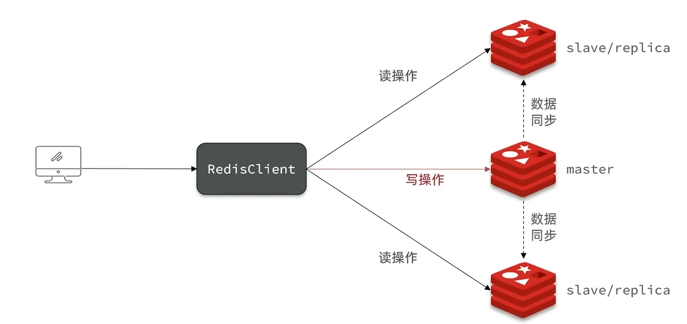

+ RedisClient 就是 Redis 客户端

###### 2.1.1 准备实例和配置

要在同一台虚拟机开启3个实例，必须准备三份不同的配置文件和目录，配置文件所在目录也就是工作目录。

1）创建目录

我们创建三个文件夹，名字分别叫7001、7002、7003：

```sh
# 进入/tmp目录
cd /tmp
# 创建目录
mkdir 7001 7002 7003
```

如图：

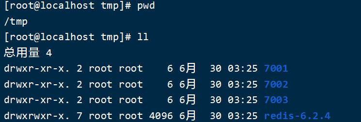

2）恢复原始配置

修改redis-6.2.4/redis.conf文件，将其中的持久化模式改为默认的RDB模式，AOF保持关闭状态。

```properties
# 开启RDB
# save ""
save 3600 1
save 300 100
save 60 10000

# 关闭AOF
appendonly no
```

3）拷贝配置文件到每个实例目录

然后将redis-6.2.4/redis.conf文件拷贝到三个目录中（在/tmp目录执行下列命令）：

```sh
# 方式一：逐个拷贝
cp redis-6.2.4/redis.conf 7001
cp redis-6.2.4/redis.conf 7002
cp redis-6.2.4/redis.conf 7003

# 方式二：管道组合命令，一键拷贝
echo 7001 7002 7003 | xargs -t -n 1 cp redis-6.2.4/redis.conf
```

4）修改每个实例的端口、工作目录

修改每个文件夹内的配置文件，将端口分别修改为7001、7002、7003，将rdb文件保存位置都修改为自己所在目录（在/tmp目录执行下列命令）：

```sh
sed -i -e 's/6379/7001/g' -e 's/dir .\//dir \/tmp\/7001\//g' 7001/redis.conf
sed -i -e 's/6379/7002/g' -e 's/dir .\//dir \/tmp\/7002\//g' 7002/redis.conf
sed -i -e 's/6379/7003/g' -e 's/dir .\//dir \/tmp\/7003\//g' 7003/redis.conf
```

5）修改每个实例的声明IP

虚拟机本身有多个IP，为了避免将来混乱，我们需要在redis.conf文件中指定每一个实例的绑定ip信息，格式如下：

```properties
# redis实例的声明 IP
replica-announce-ip 192.168.150.101
```

每个目录都要改，我们一键完成修改（在/tmp目录执行下列命令）：

```sh
# 逐一执行
sed -i '1a replica-announce-ip 192.168.150.101' 7001/redis.conf
sed -i '1a replica-announce-ip 192.168.150.101' 7002/redis.conf
sed -i '1a replica-announce-ip 192.168.150.101' 7003/redis.conf

# 或者一键修改
printf '%s\n' 7001 7002 7003 | xargs -I{} -t sed -i '1a replica-announce-ip 192.168.150.101' {}/redis.conf
```

###### 2.1.2 启动

为了方便查看日志，我们打开3个ssh窗口，分别启动3个redis实例，启动命令：

```sh
# 第1个
redis-server 7001/redis.conf
# 第2个
redis-server 7002/redis.conf
# 第3个
redis-server 7003/redis.conf
```

启动后：

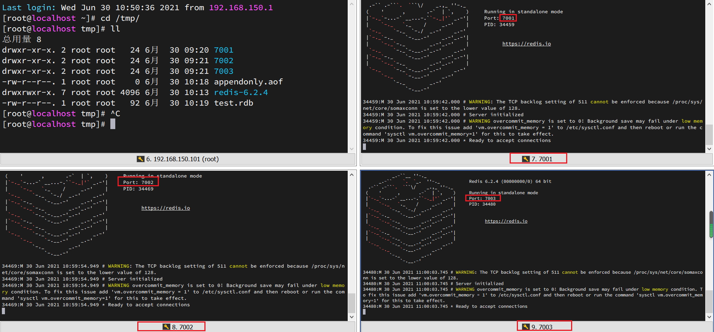

如果要一键停止，可以运行下面命令：

```sh
printf '%s\n' 7001 7002 7003 | xargs -I{} -t redis-cli -p {} shutdown
```


###### 2.1.3 开启主从关系

现在三个实例还没有任何关系，要配置主从可以使用replicaof 或者slaveof（5.0以前）命令。

有临时和永久两种模式：

- 修改配置文件（永久生效）

  - 在redis.conf中添加一行配置：```slaveof <masterip> <masterport>```

- 使用redis-cli客户端连接到redis服务，执行slaveof命令（重启后失效）：

  ```sh
  slaveof <masterip> <masterport>
  ```


<strong><font color='red'>注意</font></strong>：在5.0以后新增命令replicaof，与salveof效果一致。


这里我们为了演示方便，使用方式二。

通过redis-cli命令连接7002，执行下面命令：

```sh
# 连接 7002
redis-cli -p 7002
# 执行slaveof
slaveof 192.168.150.101 7001
```

通过redis-cli命令连接7003，执行下面命令：

```sh
# 连接 7003
redis-cli -p 7003
# 执行slaveof
slaveof 192.168.150.101 7001
```

然后连接 7001节点，查看集群状态：

```sh
# 连接 7001
redis-cli -p 7001
# 查看状态
info replication
```

结果：

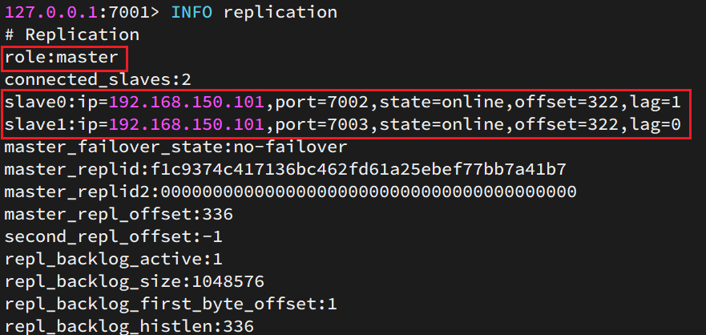


###### 2.1.4 测试

执行下列操作以测试：

- 利用redis-cli连接7001，执行```set num 123```

- 利用redis-cli连接7002，执行```get num```，再执行```set num 666```

- 利用redis-cli连接7003，执行```get num```，再执行```set num 888```

可以发现，只有在7001这个master节点上可以执行写操作，7002和7003这两个slave节点只能执行读操作。


###### 总结

假设有 A、B 两个 Redis 实例，如何让 B 作为 A 的 slave 节点？

+ 在 B 节点执行命令：`slaveof A的IP A的port`


--------------------


##### 2.2 主从数据同步原理

###### 2.2.1 全量同步

主从第一次同步时**全量同步**：

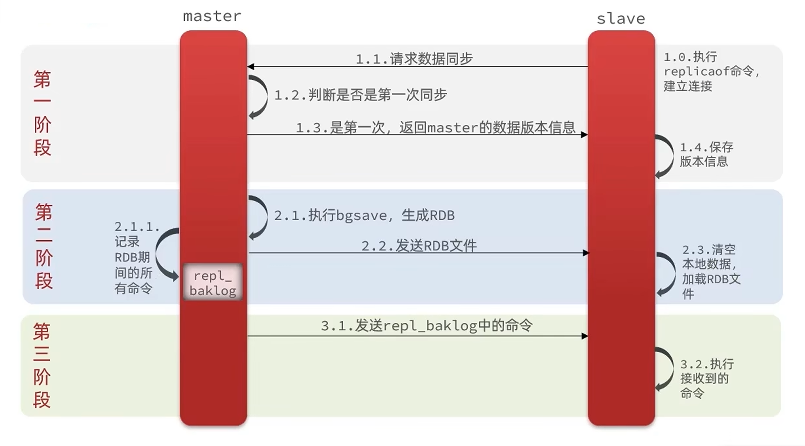

master 如何判断 slave 是不是第一次来同步数据？这里会用到两个很重要的概念：

+ **Replication Id**：简称 replid，是数据集的标记，id 一致则说明是同一数据集。每一个 master 都有唯一的 replid，slave 则会继承 master 节点的 replid
+ **Offset**：偏移量，随着记录在 repl_baklog 中的数据增多而逐渐增大。slave 完后同步时也会记录当前同步的 offset。如果 slave 的 offset 小于 master 的 offset，说明 slave 数据落后于 master，需要更新

因此 slave 做数据同步，必须向 master 声明自己的 **replication id** 和 **offset**，master 才可以判断到底需要同步哪些数据

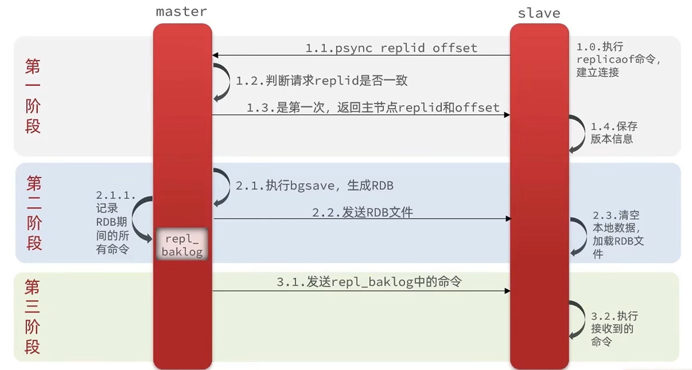

###### 总结

简述全量同步的流程？

+ slave 节点请求增量同步
+ master 节点判断 replid，发现不一致，拒绝增量同步
+ master 将完整内存数据生成 RDB，发送 RDB 到 slave
+ slave 清空本地数据，加载 master 的 RDB
+ master 将 RDB 期间的命令记录在 repl_baklog，并持续将 log 中的命令发送给 slave
+ slave 执行接收到的命令，保持与 master 之间的同步


###### 2.2.2 增量同步

主从第一次同步时**全量同步**，但如果 slave 重启后同步，则执行**增量同步**

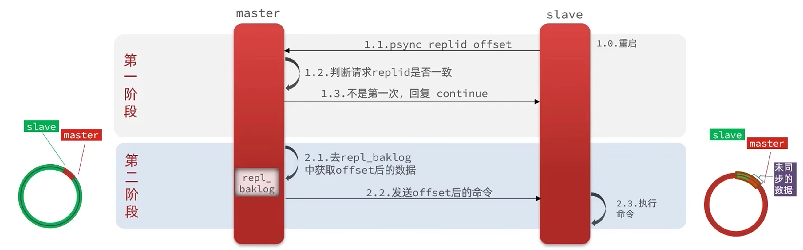

注意：repl_baklog 大小有上限，写满后会覆盖最早的数据。如果 slave 断开时间过久，导致尚未备份的数据被覆盖，则无法基于 log 做增量同步，只能再次全量同步


###### 2.2.3 主从同步优化

可以从一下几个方面来优化 Redis 主从集群：

+ 在 master 中配置 `repl-diskless-syn yes` 启用无磁盘复制，避免全量同步时的磁盘 IO
+ Redis 单节点上的内存占用不要太大，减少 RDB 导致过多磁盘 IO
+ 适当提高 repl_baklog 的大小，发现 slave 宕机时尽快实现故障恢复，尽可能避免全量同步
+ 限制一个 master 上的 slave 节点数量，如果实在是太多 slave，则可以采用主-从-从链式结构，减少 master 压力

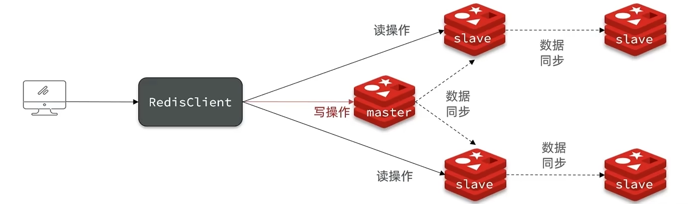

###### 总结

简述全量同步和增量同步区别？

+ 全量同步：master 将完整内存数据生成 RDB，发送 RDB 到 slave。后续命令则记录在 repl_baklog，逐个发送给 slave
+ 增量同步：slave 提交自己的 offset 到 master，master 获取 repl_baklog 中从 offset 之后的命令给 slave

什么时候执行全量同步？

+ slave 节点第一次连接 master 节点时
+ slave 节点断开时间太久，repl_baklog 中的 offset 已经被覆盖时

什么时候执行增量同步？

+ slave 节点断开又恢复，并且在 repl_baklog 中能找到 offset 时


---------------------


#### 3. Redis 哨兵

+ slave 节点宕机恢复后可以找 master 节点同步数据，那 master 节点宕机怎么办？
  + 当发现 master 宕机那一刻，立即选一个新的 slave 作为 master，挂掉的 master 起来以后让它当 slave就好了
  + 但是，这个检测和重启的动作谁来做呢？


##### 3.1 哨兵的作用和原理

###### 3.1.1 哨兵的作用

Redis 提供了哨兵（Sentinel）机制来实现主从集群的自动故障恢复。哨兵的结构和作用如下：

+ **监控**：Sentinel 会不断检查您的 master 和 slave 是否按预期工作
+ **自动故障恢复**：如果 master 故障，Sentinel 会将一个 slave 提升为 master。当故障实例恢复后也以新的 master 为主
+ **通知**：Sentinel 充当 Redis 客户端的服务发现来源，当集群发生故障转移时，会将最新信息推送给 Redis 的客户端

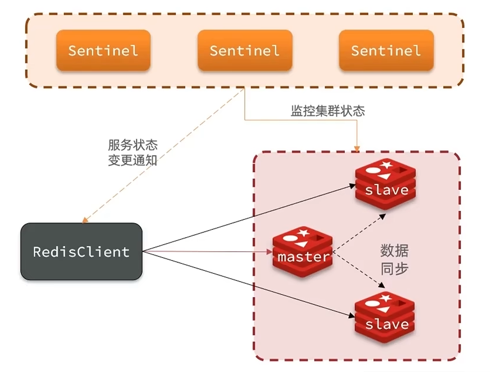


###### 3.1.2 服务状态监控

Sentinel 基于心跳机制检测服务状态，每隔1秒向集群的每个实例发送 ping 命令：

+ 主观下载：如果某 sentinel 节点发现某实例未在规定时间响应，则认为该实例**主观下线**
+ 客观下线：若超过指定数量（quorum）的 sentinel 都认为该实例主观下线，则该实例**客观下线**。quorum 值最好超过  Sentinel 实例数量的一半

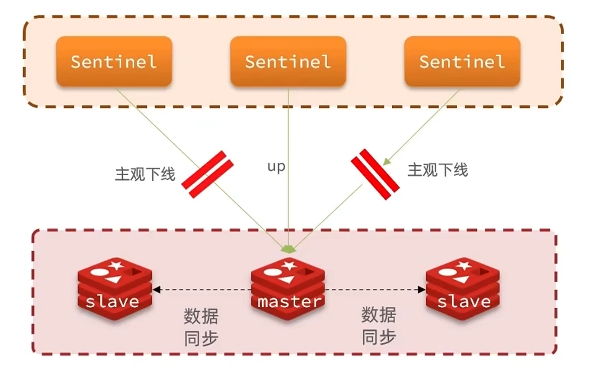


###### 3.1.3 选举新的 master

一旦发现 master 故障，sentinel 需要在 slave 中选择一个作为新的 master，选择依据是这样的：

+ 首先会判断 slave 节点与 master 节点断开时间长短，如果超过指定值（down-after-milliseconds * 10）则会排除该 slave 节点
+ 然后判断 slave 节点的 slave-priority 值，越小优先级越高，如果是0则永不参与选举
+ 如果 slave-priority 一样，则判断 slave 节点的 offset 值，越大说明数据越新，优先级越高
+ 最后判断 slave 节点的运行 id 大小，越小优先级越高


###### 3.1.4 如果实现故障转移

当选中了其中一个 slave 为新的 master 后（例如 slave1），故障的转移的步骤如下：

+ sentinel 给备选的 slave1 节点发送 `slaveof no one` 命令，让该节点成为 master
+ sentinel 给其它 slave 发送 `slaveof 182.168.150.101 7002` 命令，让这些 slave 成为新 master 的从节点，开始从新的 master 上同步数据
+ 最后，sentinel 将故障节点标记为 slave，当故障节点恢复后会自动成为新的 master 的 slave 节点

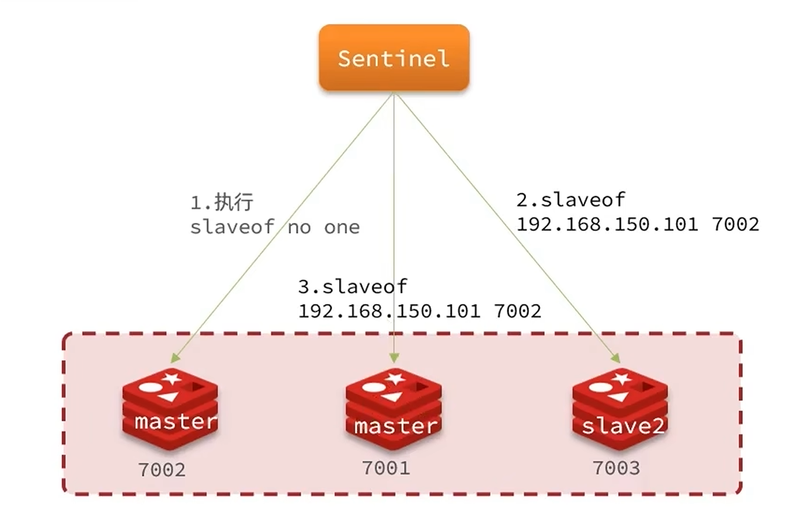


###### 总结

Sentinel 的三个作用是什么？

+ 监控
+ 故障转移
+ 通知

Sentinel 如何判断一个 redis 实例是否健康？

+ 每隔1秒发送一次 ping 命令，如果超过一定时间没有响应则认为是主观下线
+ 如果大多数 sentinel 都认为实例主观下线，则判定服务下线

故障转移步骤有哪些？

+ 首先选定一个 slave 作为新的 master，执行 `slaveof no one`
+ 然后让所有节点都执行 `slaveof 新master`
+ 修改故障节点配置，添加 `slaveof 新master`


-----------


##### 3.2 搭建哨兵集群

###### 3.2.1 集群结构

这里我们搭建一个三节点形成的Sentinel集群，来监管之前的Redis主从集群。如图：

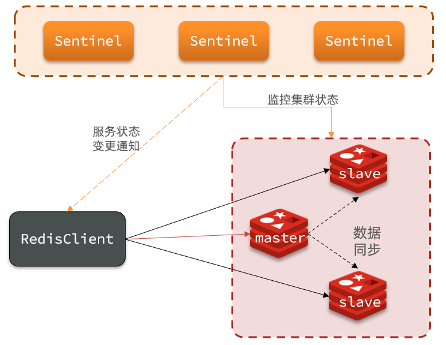

三个sentinel实例信息如下：

| 节点 |       IP        | PORT  |
| ---- | :-------------: | :---: |
| s1   | 192.168.150.101 | 27001 |
| s2   | 192.168.150.101 | 27002 |
| s3   | 192.168.150.101 | 27003 |


###### 3.2.2 准备实例和配置

要在同一台虚拟机开启3个实例，必须准备三份不同的配置文件和目录，配置文件所在目录也就是工作目录。

我们创建三个文件夹，名字分别叫s1、s2、s3：

```sh
# 进入/tmp目录
cd /tmp
# 创建目录
mkdir s1 s2 s3
```

如图：

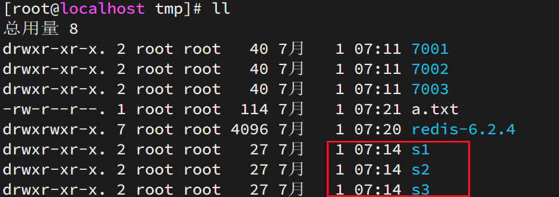

然后我们在s1目录创建一个sentinel.conf文件，添加下面的内容：

```ini
port 27001
sentinel announce-ip 192.168.150.101
sentinel monitor mymaster 192.168.150.101 7001 2
sentinel down-after-milliseconds mymaster 5000
sentinel failover-timeout mymaster 60000
dir "/tmp/s1"
```

解读：

- `port 27001`：是当前sentinel实例的端口
- `sentinel monitor mymaster 192.168.150.101 7001 2`：指定主节点信息
  - `mymaster`：主节点名称，自定义，任意写
  - `192.168.150.101 7001`：主节点的ip和端口
  - `2`：选举master时的quorum值

然后将s1/sentinel.conf文件拷贝到s2、s3两个目录中（在/tmp目录执行下列命令）：

```sh
# 方式一：逐个拷贝
cp s1/sentinel.conf s2
cp s1/sentinel.conf s3
# 方式二：管道组合命令，一键拷贝
echo s2 s3 | xargs -t -n 1 cp s1/sentinel.conf
```

修改s2、s3两个文件夹内的配置文件，将端口分别修改为27002、27003：

```sh
sed -i -e 's/27001/27002/g' -e 's/s1/s2/g' s2/sentinel.conf
sed -i -e 's/27001/27003/g' -e 's/s1/s3/g' s3/sentinel.conf
```


###### 3.2.3 启动

为了方便查看日志，我们打开3个ssh窗口，分别启动3个redis实例，启动命令：

```sh
# 第1个
redis-sentinel s1/sentinel.conf
# 第2个
redis-sentinel s2/sentinel.conf
# 第3个
redis-sentinel s3/sentinel.conf
```

启动后：

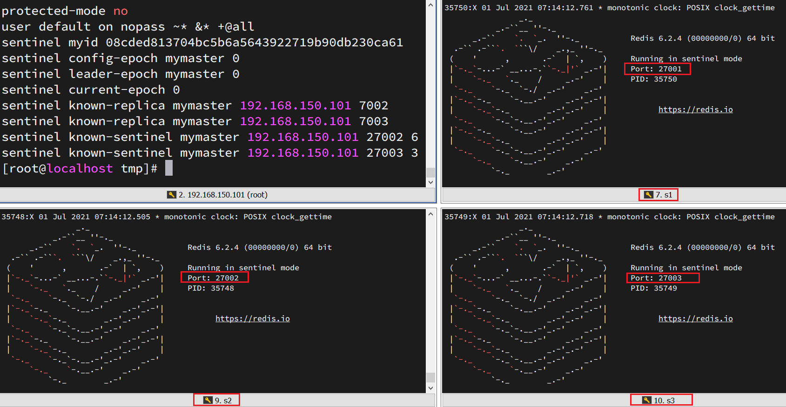


###### 3.2.4 测试

尝试让master节点7001宕机，查看sentinel日志：

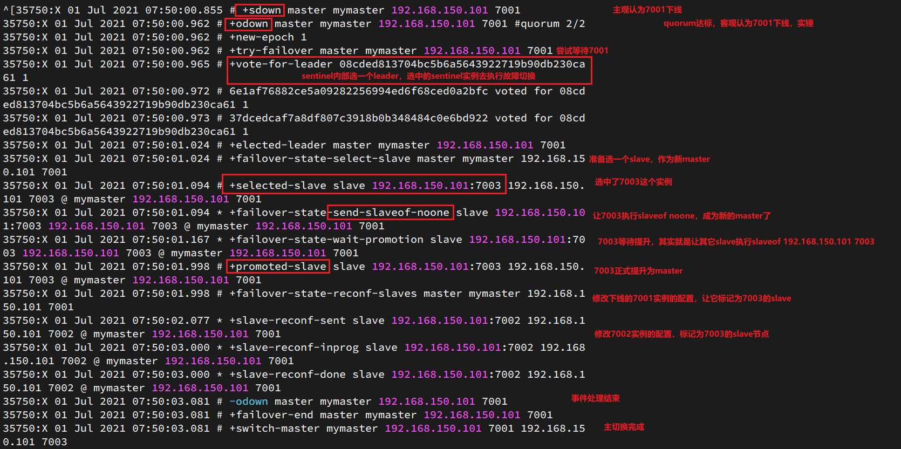

查看7003的日志：

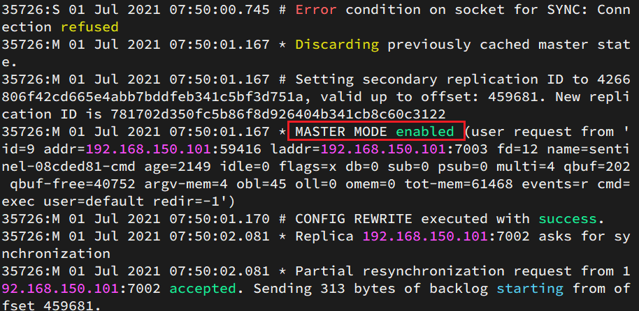

查看7002的日志：

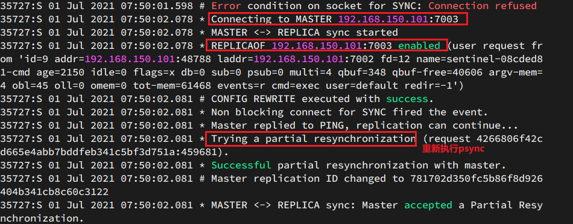


------------


##### 3.3 Redis Template 的哨兵模式

在 Sentinel 集群监管下的 Redis 主从集群，其节点会因为自动故障转移而发生变化，Redis 的客户端必须感知这种变化，及时更新连接信息。Spring 的 Redis Template 底层利用 lettuce 实现了节点的感知和自动切换

1. 在 pom 文件中引入 redis 的 starter 依赖：

```xml
<dependency>
    <groupId>org.springframework.boot</groupId>
    <artifactId>spring-boot-starter-data-redis</artifactId>
</dependency>
```

2. 然后在配置文件 application.yml 中指定 sentinel 相关信息：

```yml
spring:
  redis:
    sentinel:
      master: mymaster # 指定master名称
      nodes: # 指定redis-sentinel集群信息
        - 192.168.150.101:27001
        - 192.168.150.101:27002
        - 192.168.150.101:27003
```

3. 配置主从读写分离

+ 启动类

```java
@Bean
public LettuceClientConfigurationBuilderCustomizer configurationBuilderCustomizer() {
    return configBuilder -> configBuilder.readFrom(ReadFrom.REPLICA_PREFERRED)
}
```

这里的 ReadFrom 是配置 Redis 的读取策略，是一个枚举，包括下面选择：

+ `MASTER`：从主节点读取
+ `MASTER_PREFERRED`：优先从 master 节点读取，master 不可用才读取 replica
+ `REPLICA`：从 slave（replica）节点读取
+ `REPLICA_PREFERRED`：优先从 slave（replica）节点读取，所有的 slave 都不可用才读取 master


-------------------


#### 4. Redis 分片集群

##### 4.1 搭建分片集群

主从和哨兵可以解决高可用、高并发读的问题。但是依然有两个问题没有解决：

+ 海量数据存储问题
+ 高并发写的问题

使用分片集群可以解决上述问题，分片集群特征：

+ 集群中有多个 master，每个 master 保存不同数据
+ 每个 master 都可以有多个 slave 节点
+ master 之间通过 ping 监测彼此健康状态
+ 客户端请求可以访问集群任意节点，最终都会被转发到正确节点

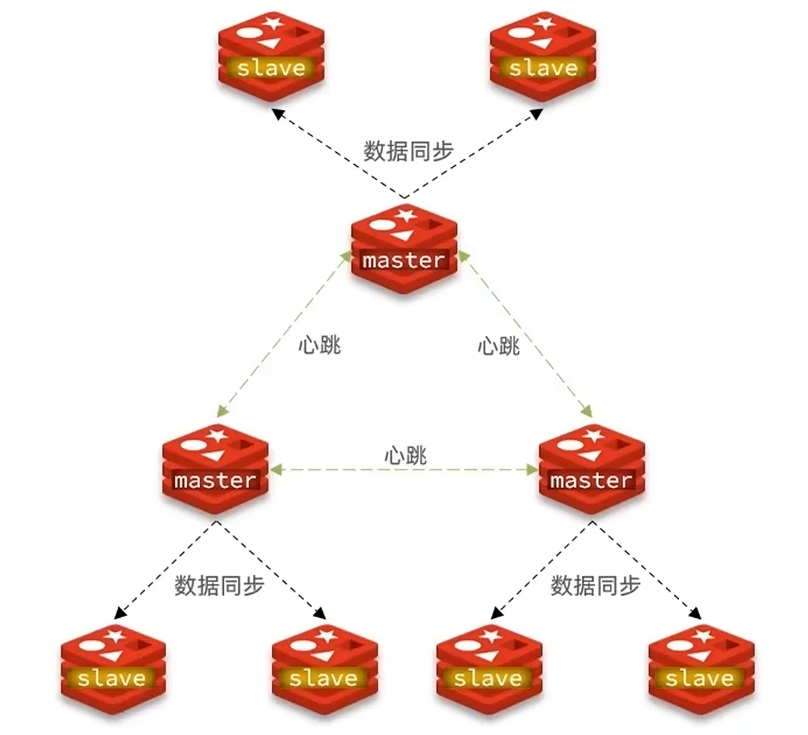


###### 4.1.1 集群结构

分片集群需要的节点数量较多，这里我们搭建一个最小的分片集群，包含3个master节点，每个master包含一个slave节点，结构如下：

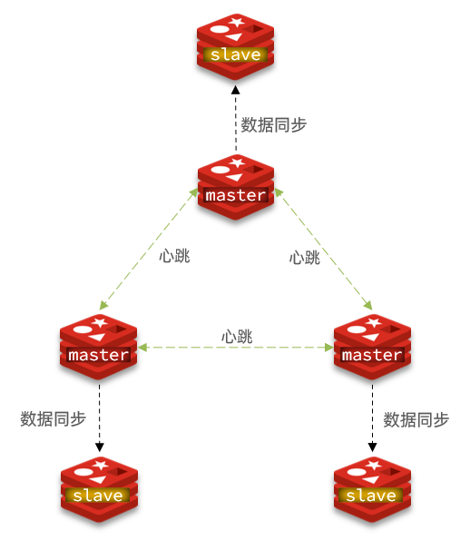

这里我们会在同一台虚拟机中开启6个redis实例，模拟分片集群，信息如下：

|       IP        | PORT |  角色  |
| :-------------: | :--: | :----: |
| 192.168.150.101 | 7001 | master |
| 192.168.150.101 | 7002 | master |
| 192.168.150.101 | 7003 | master |
| 192.168.150.101 | 8001 | slave  |
| 192.168.150.101 | 8002 | slave  |
| 192.168.150.101 | 8003 | slave  |


###### 4.1.2 准备实例和配置

删除之前的7001、7002、7003这几个目录，重新创建出7001、7002、7003、8001、8002、8003目录：

```sh
# 进入/tmp目录
cd /tmp
# 删除旧的，避免配置干扰
rm -rf 7001 7002 7003
# 创建目录
mkdir 7001 7002 7003 8001 8002 8003
```

在/tmp下准备一个新的redis.conf文件，内容如下：

```ini
port 6379
# 开启集群功能
cluster-enabled yes
# 集群的配置文件名称，不需要我们创建，由redis自己维护
cluster-config-file /tmp/6379/nodes.conf
# 节点心跳失败的超时时间
cluster-node-timeout 5000
# 持久化文件存放目录
dir /tmp/6379
# 绑定地址
bind 0.0.0.0
# 让redis后台运行
daemonize yes
# 注册的实例ip
replica-announce-ip 192.168.150.101
# 保护模式
protected-mode no
# 数据库数量
databases 1
# 日志
logfile /tmp/6379/run.log
```

将这个文件拷贝到每个目录下：

```sh
# 进入/tmp目录
cd /tmp
# 执行拷贝
echo 7001 7002 7003 8001 8002 8003 | xargs -t -n 1 cp redis.conf
```

修改每个目录下的redis.conf，将其中的6379修改为与所在目录一致：

```sh
# 进入/tmp目录
cd /tmp
# 修改配置文件
printf '%s\n' 7001 7002 7003 8001 8002 8003 | xargs -I{} -t sed -i 's/6379/{}/g' {}/redis.conf
```


###### 4.1.3 启动

因为已经配置了后台启动模式，所以可以直接启动服务：

```sh
# 进入/tmp目录
cd /tmp
# 一键启动所有服务
printf '%s\n' 7001 7002 7003 8001 8002 8003 | xargs -I{} -t redis-server {}/redis.conf
```

通过ps查看状态：

```sh
ps -ef | grep redis
```

发现服务都已经正常启动：

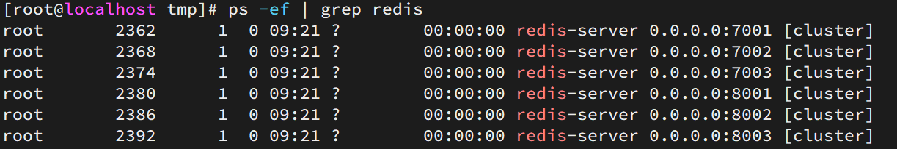

如果要关闭所有进程，可以执行命令：

```sh
ps -ef | grep redis | awk '{print $2}' | xargs kill
```

或者（推荐这种方式）：

```sh
printf '%s\n' 7001 7002 7003 8001 8002 8003 | xargs -I{} -t redis-cli -p {} shutdown
```


###### 4.1.4 创建集群

虽然服务启动了，但是目前每个服务之间都是独立的，没有任何关联。

我们需要执行命令来创建集群，在Redis5.0之前创建集群比较麻烦，5.0之后集群管理命令都集成到了redis-cli中。

1）Redis5.0之前

Redis5.0之前集群命令都是用redis安装包下的src/redis-trib.rb来实现的。因为redis-trib.rb是有ruby语言编写的所以需要安装ruby环境。

 ```sh
# 安装依赖
yum -y install zlib ruby rubygems
gem install redis
 ```

然后通过命令来管理集群：

```sh
# 进入redis的src目录
cd /tmp/redis-6.2.4/src
# 创建集群
./redis-trib.rb create --replicas 1 192.168.150.101:7001 192.168.150.101:7002 192.168.150.101:7003 192.168.150.101:8001 192.168.150.101:8002 192.168.150.101:8003
```

2）Redis5.0以后

我们使用的是Redis6.2.4版本，集群管理以及集成到了redis-cli中，格式如下：

```sh
redis-cli --cluster create --cluster-replicas 1 192.168.150.101:7001 192.168.150.101:7002 192.168.150.101:7003 192.168.150.101:8001 192.168.150.101:8002 192.168.150.101:8003
```

命令说明：

- `redis-cli --cluster`或者`./redis-trib.rb`：代表集群操作命令
- `create`：代表是创建集群
- `--replicas 1`或者`--cluster-replicas 1` ：指定集群中每个master的副本个数为1，此时`节点总数 ÷ (replicas + 1)` 得到的就是master的数量。因此节点列表中的前n个就是master，其它节点都是slave节点，随机分配到不同master

运行后的样子：

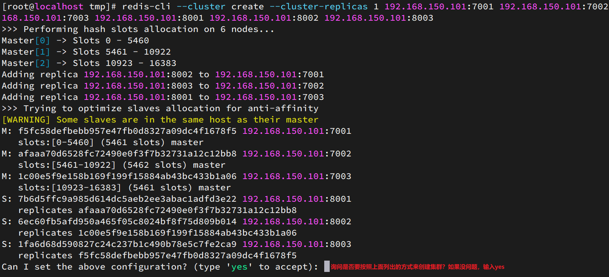

这里输入yes，则集群开始创建：

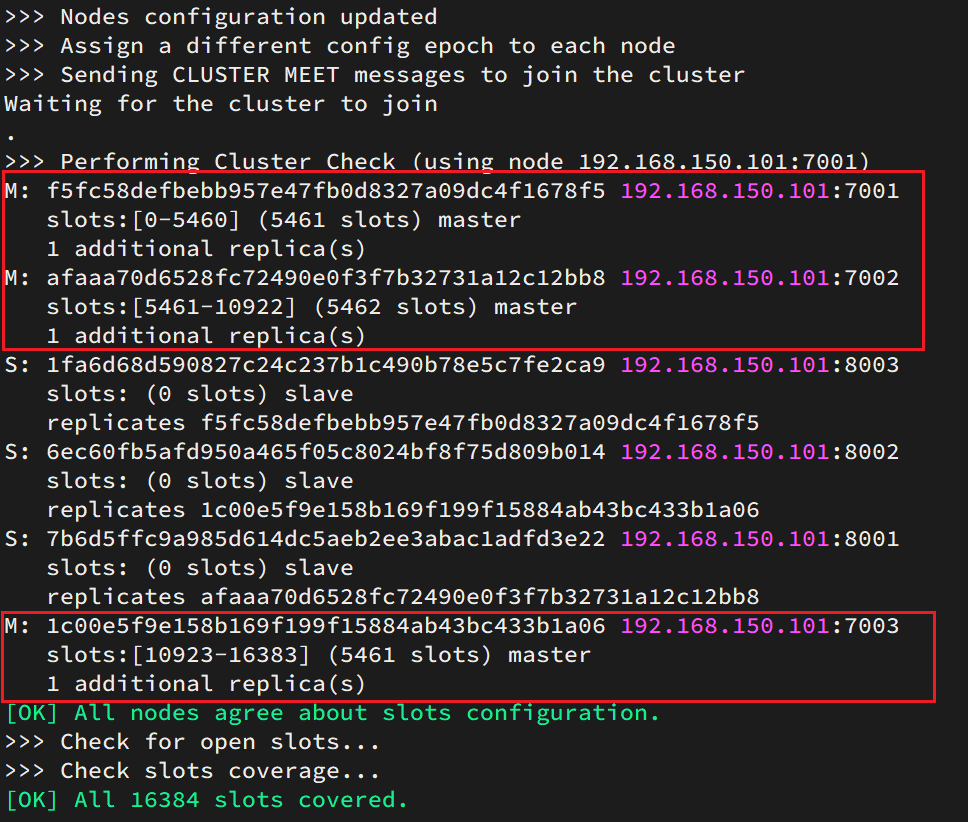

通过命令可以查看集群状态：

```sh
redis-cli -p 7001 cluster nodes
```

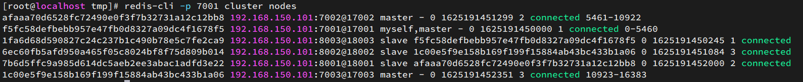


###### 4.1.5 测试

尝试连接7001节点，存储一个数据：

```sh
# 连接
redis-cli -p 7001
# 存储数据
set num 123
# 读取数据
get num
# 再次存储
set a 1
```

结果悲剧了：

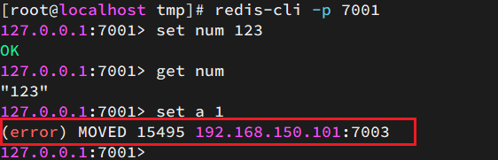

集群操作时，需要给`redis-cli`加上`-c`参数才可以：

```sh
redis-cli -c -p 7001
```

这次可以了：

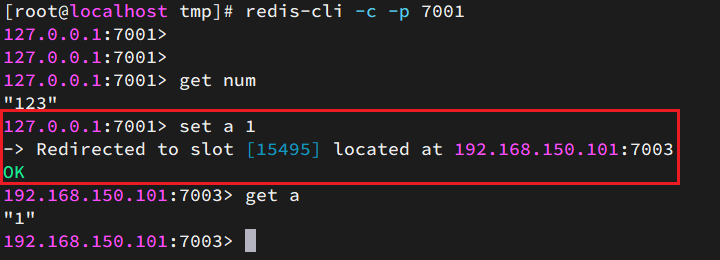


----------------


##### 4.2 散列插槽

Redis 会把每一个 master 节点映射到 0~16383 共16384个插槽（hash slot）上，查看集群信息时就能看到：

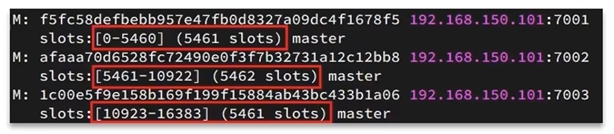

数据 key 不是节点绑定，而是与插槽绑定。redis 会根据 key 的有效部分计算插槽值，分两种情况：

+ key 中包含 "{}"，且 "{}" 中至少包含1个字符，"{}" 中的部分是有效部分
+ key 中不包含 "{}"，整个 key 都是有效部分

例如：key 是 num，那么就根据 num 计算，如果是 {itfeng}num，则根据 itfeng 计算。计算方式是利用 CRC16 算法得到一个 hash 值，然后对 16384 取余，得到的结果就是 slot 值

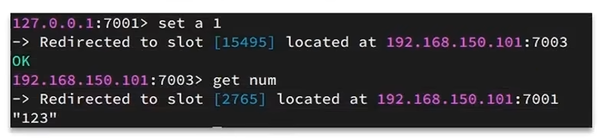

操作任意一个 key 的时候，它会先计算插槽值，再判断在那个节点（搭建时指定了节点在哪个插槽值范围内），然后完成一个请求的路由（重定向），所以说访问集群的任意一个节点都没问题

###### 总结

Redis 如何判断某个 key 应该在哪个实例？

+ 将16384个插槽分配到不同的实例
+ 根据 key 的有效部分计算哈希值，对16384取余
+ 余数作为插槽，寻找插槽所在的实例即可

如何将同一类数据固定的保存在同一个 Redis 实例？

+ 这一类数据使用相同的有效部分，例如 key 都以 {typeId} 为前缀


---------------


##### 4.3 集群伸缩

###### 4.3.1 添加一个节点到集群

redis-cli --cluster 提供了很多操作集群的命令，可以通过下面方式查看：

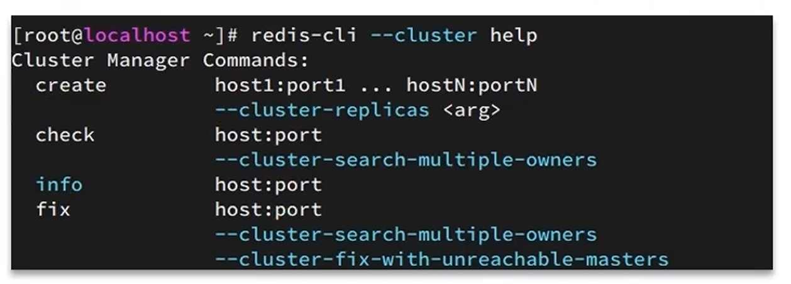

比如，添加节点的命令：

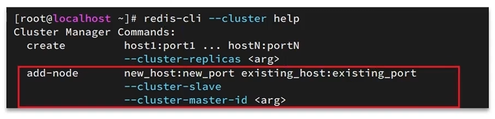


-----------------


##### 4.4 故障转移

当集群中有一个 master 宕机会发生什么呢？

1. 首先是该实例与其它实例失去连接
2. 然后是疑似宕机

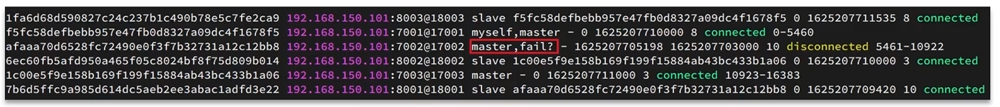

3. 最后是确定下线，自动提升一个 slave 为新的 master

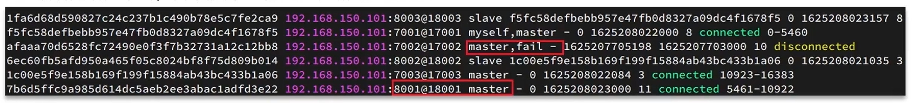

###### 4.4.1 数据迁移

利用 `cluster failover` 命令可以手动让集群中的某个 master 宕机，切换到执行 `cluster failover` 命令的这个 slave 节点，实现无感知的数据迁移。其流程如下

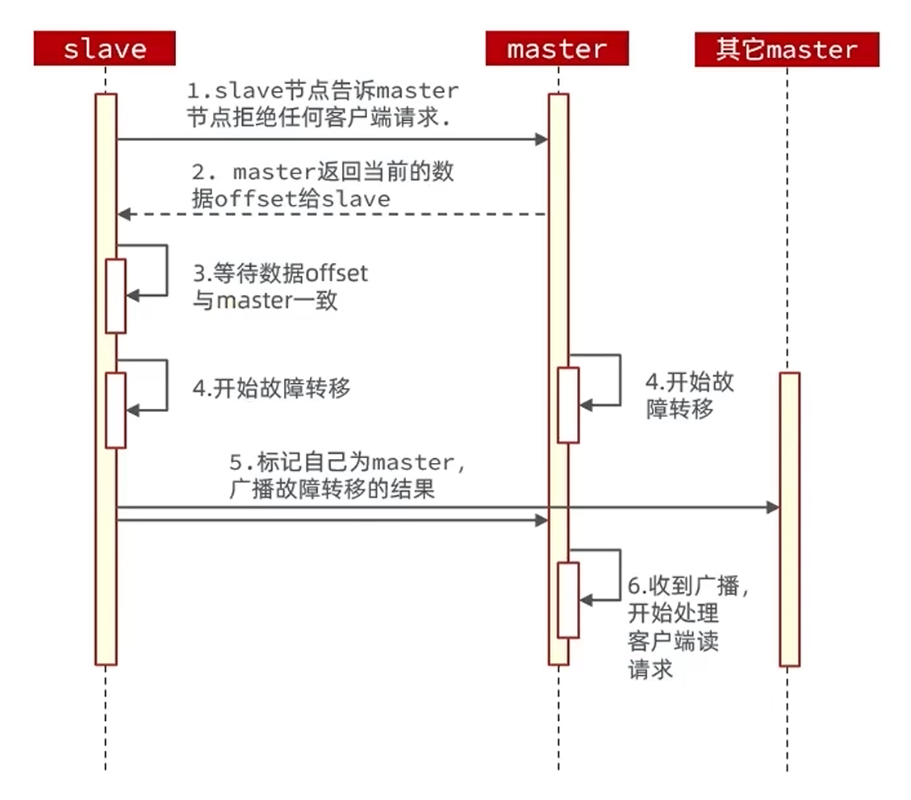

手动的 Failover 支持三种不同模式：

+ 缺省：默认的流程，如图1~6步
+ force：省略了对 offset 的一致性校验
+ takeover：直接执行第5步，忽略数据一致性、忽略 master 状态和其它 master 的意见


-----------------


##### 4.5 RedisTemplate 访问分片集群

RedisTemplate 底层同样基于 lettuce 实现了分片集群的支持，而使用的步骤与哨兵模式基本一致：

1. 引入 redis 的 starter 依赖
2. 配置分片集群地址
3. 配置读写分离

与哨兵模式相比，其中只有分片集群的配置方式略有差异，如下：

```yml
spring:
  redis:
    cluster:
      nodes: # 指定分片集群的每一个节点信息
        - 192.168.150.101:7001
        - 192.168.150.101:7002
        - 192.168.150.101:7003
        - 192.168.150.101:8001
        - 192.168.150.101:8002
        - 192.168.150.101:8003
```


------------------


### 二、多级缓存

亿级流量的缓存方案

**传统缓存的问题**

传统的缓存策略一般是请求到达 Tomcat 后，先查询 Redis，如果未命中则查询数据库，存在下面的问题：

+ 请求要经过 Tomcat 处理，Tomcat 的性能成为整个系统的瓶颈
+ Redis 缓存失效时，会对数据库产生冲击

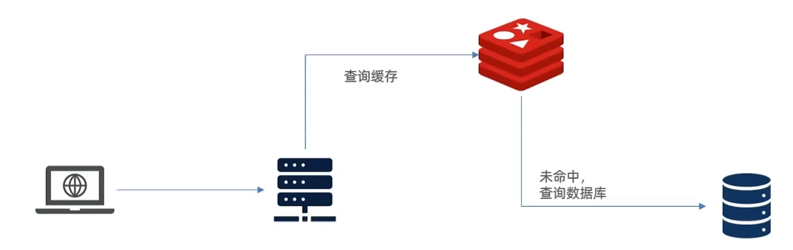


**多级缓存方案**

多级缓存就是充分利用请求处理的每个环节，分别添加缓存，减轻 Tomcat 压力，提升服务性能：


用作缓存的 Nginx 是业务 Nginx，需要部署为集群，再有专门的 Nginx 用来做反向代理：

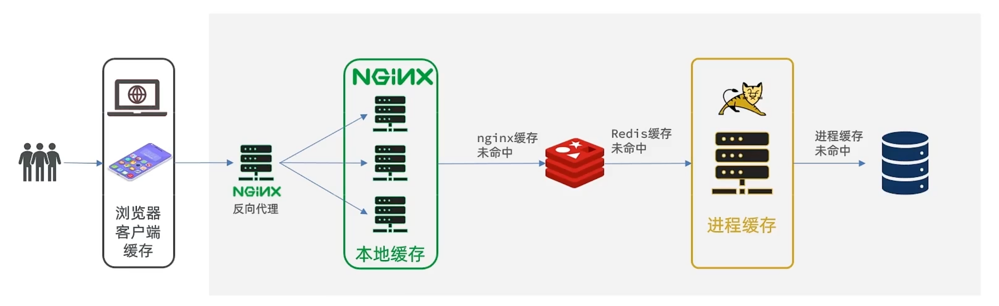


#### 1. JVM 进程缓存

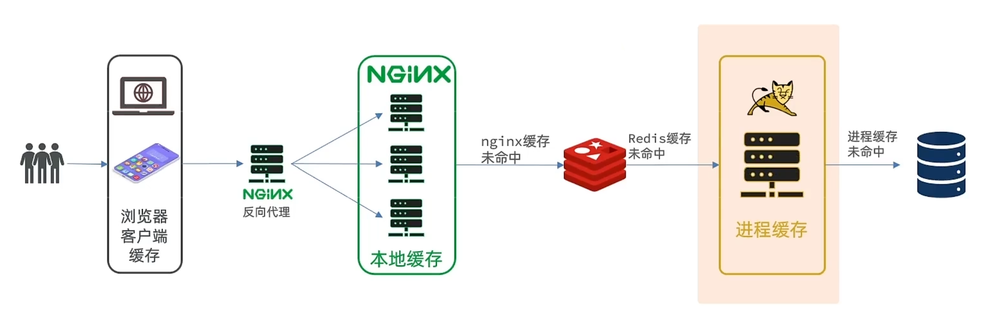

##### 1.1 导入商品案例

**按照黑马的 docker 导入不行的话，可以试试提高 mysql 版本**

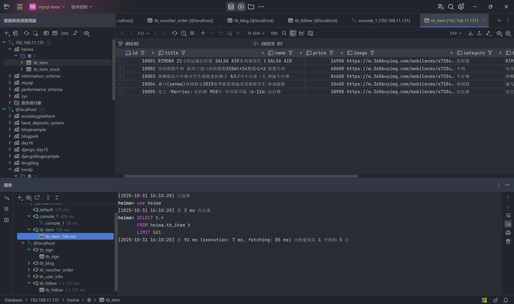


+ tb_item：商品表，包含商品的基本信息
+ tb_item_stock：商品库存表，包含商品的库存信息

###### 1.1.1 反向代理

之所以将库存分离出来，是因为库存是更新比较频繁的信息，写操作较多。而其他信息修改的频率非常低

现在，页面是假数据展示的。我们需要向服务器发送ajax请求，查询商品数据。

打开控制台，可以看到页面有发起ajax查询数据：

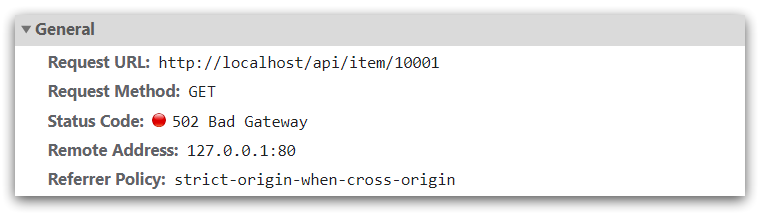

而这个请求地址同样是80端口，所以被当前的nginx反向代理了。

查看nginx的conf目录下的nginx.conf文件：

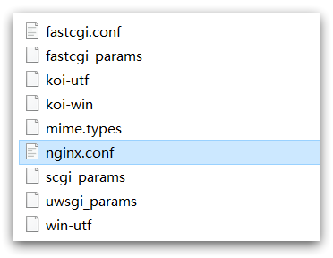

其中的关键配置如下：

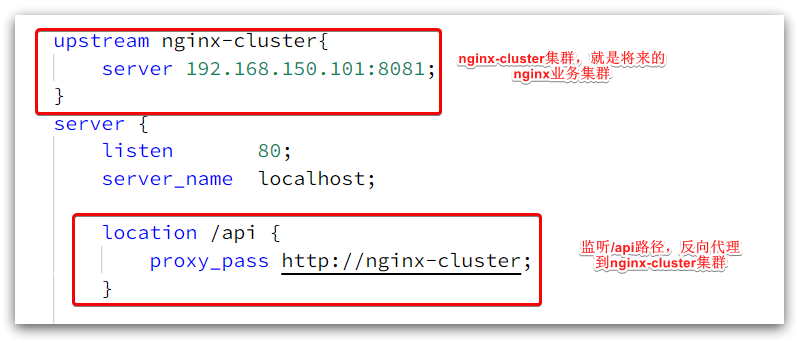

其中的192.168.150.101是我的虚拟机IP，也就是我的Nginx业务集群要部署的地方：

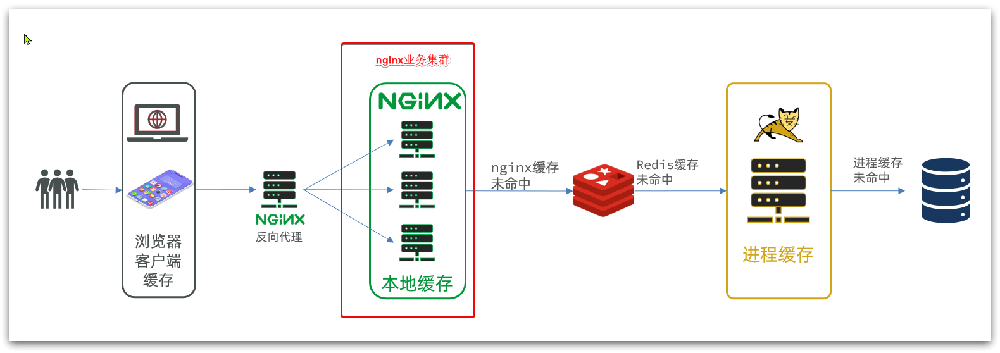


完整内容如下：

```nginx
#user  nobody;
worker_processes  1;

events {
    worker_connections  1024;
}

http {
    include       mime.types;
    default_type  application/octet-stream;

    sendfile        on;
    #tcp_nopush     on;
    keepalive_timeout  65;

    upstream nginx-cluster{
        server 192.168.150.101:8081;
    }
    server {
        listen       80;
        server_name  localhost;

	location /api {
            proxy_pass http://nginx-cluster;
        }

        location / {
            root   html;
            index  index.html index.htm;
        }

        error_page   500 502 503 504  /50x.html;
        location = /50x.html {
            root   html;
        }
    }
}
```


---------------------


##### 1.2 初识 Caffeine

###### 1.2.1 本地进程缓存

缓存在日常开发中起到至关重要的作用，由于是存储在内存中，数据的读取速度是非常快的，能大量减少对数据的访问，减少数据库的压力。我们把缓存分为两类：

+ 分布式缓存，例如 Redis：
  + 优点：存储容量更大、可靠性更好、可以在集群间共享
  + 缺点：访问缓存有网络开销
  + 场景：缓存数据量较大、可靠性要求较高、需要在集群间共享
+ 进程本地缓存，例如 HashMap、GuavaCache：
  + 优点：读取本地内存、没有网络开销、速度更快
  + 缺点：存储容量有限、可靠性较低、无法共享
  + 场景：性能要求较高、缓存数据量较小


Caffeine 是一个基于 Java8 开发的，提供了近乎最佳命中率的高性能的本地缓存库。目前 Spring 内部的缓存使用的就是 Caffeine。GitHub 地址：[GitHub - ben-manes/caffeine: A high performance caching library for Java](https://github.com/ben-manes/caffeine)

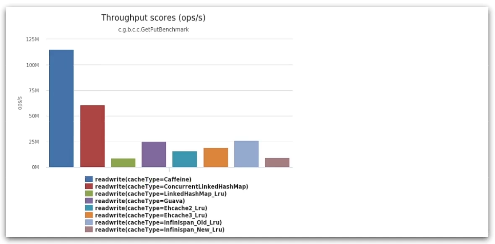


###### 1.2.2 Caffeine 示例

```java
@Test
void testBasicOps() {
    // 创建缓存对象
    Cache<String, String> cache = Caffeine.newBuilder().build();

    // 存数据
    cache.put("gf", "迪丽热巴");

    // 取数据，不存在则返回null
    String gf = cache.getIfPresent("gf");
    System.out.println("gf = " + gf);

    // 取数据，不存在则去数据库查询
    String defaultGF = cache.get("defaultGF", key -> {
        // 这里可以去数据库根据 key查询value（这里为了方便就简化直接返回，实际可用在这里编写数据库查询逻辑）
        return "柳岩";
    });
    System.out.println("defaultGF = " + defaultGF);
}
```


Caffeine 提供了三种缓存驱逐策略：

+ **基于容量：**设置缓存的数量上限

```java
// 创建缓存对象
Cache<String, String> cache = Caffeine.newBuilder()
        // 设置缓存大小上限为 1
        .maximumSize(1)
        .build();
```

+ **基于时间：**设置缓存的有效时间

```java
// 创建缓存对象
Cache<String, String> cache = Caffeine.newBuilder()
        .expireAfterWrite(Duration.ofSeconds(1)) // 设置缓存有效期为 10 秒
        .build();
```

+ **基于引用：**设置缓存为软引用或弱引用，利用 GC 来回收缓存数据。性能较差，不建议使用

在默认情况下，当一个缓存元素过期的时候，Caffeine 不会自动立即将其清理和驱逐。而是在一次读霍写操作后，或者在空闲时间完后对失效数据的驱逐


----------------------


##### 1.3 实现进程缓存

> 利用 Caffeine 实现下列需求：
>
> + 给根据 id 查询商品的业务添加缓存，缓存未命中时查询数据库
> + 给根据 id 查询商品库存的业务添加缓存，缓存未命中时查询数据库
> + 缓存初始大小为100
> + 缓存上限为10000

+ CaffeineConfig.java

```java
package com.heima.item.config;

import com.github.benmanes.caffeine.cache.Cache;
import com.github.benmanes.caffeine.cache.Caffeine;
import com.heima.item.pojo.Item;
import com.heima.item.pojo.ItemStock;
import org.springframework.context.annotation.Bean;
import org.springframework.context.annotation.Configuration;

@Configuration
public class CaffeineConfig {

    @Bean
    public Cache<Long, Item> itemCache() {
        return Caffeine.newBuilder()
                .initialCapacity(100)
                .maximumSize(10_000)
                .build();
    }

    @Bean
    public Cache<Long, ItemStock> stockCache() {
        return Caffeine.newBuilder()
                .initialCapacity(100)
                .maximumSize(10_000)
                .build();
    }
}
```

+ ItemController.java

```java
@Autowired
private Cache<Long, Item> itemCache;
@Autowired
private Cache<Long, ItemStock> stockCache;


@GetMapping("/{id}")
public Item findById(@PathVariable("id") Long id) {
    return itemCache.get(id, key -> itemService.query()
            .ne("status", 3).eq("id", key)
            .one());
}

@GetMapping("/stock/{id}")
public ItemStock findStockById(@PathVariable("id") Long id) {
    return stockCache.get(id, key -> stockService.getById(id));
}
```


------------------


#### 2. Lua 语法入门

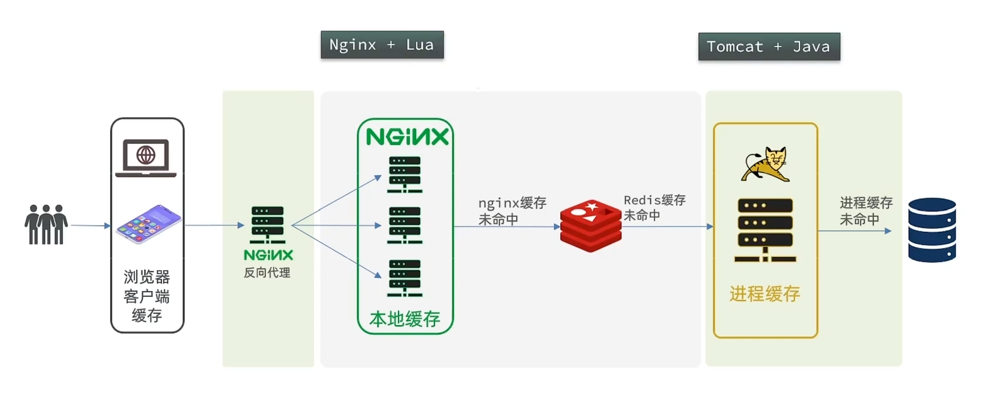

##### 2.1 初识 Lua

Lua 是一个轻量小巧的脚本语言，用标准 C 语言编写并以源代码形式开放，其设计目的是为了嵌入应用程序中，从而为应用程序提供灵活的扩展和定制功能。官网：[The Programming Language Lua](https://www.lua.org/)


###### 2.1.1 HelloWorld

1. 在 Linux 虚拟机的任意目录下，新建一个 hello.lua 文件

```bash
touch hello.lua
```

2. 添加下面的内容

```lua
print("Hello World!")
```

3. 运行

```bash
lua hello.lua
```


--------------


##### 2.2 变量和循环

###### 2.2.1 数据类型

| 数据类型 | 描述                                                         |
| -------- | ------------------------------------------------------------ |
| nil      | 这个最简单，只有值 nil 属于该类，表示一个无效值（在条件表达式中相当于 false） |
| boolean  | 包含两个值：false 和 true                                    |
| number   | 表示双精度类型的实浮点数                                     |
| string   | 字符串由一对双引号或单引号来表示                             |
| function | 由 C 或 Lua 编写的函数                                       |
| table    | Lua 中的表（table）其实是一个“关联数组”（associative arrays），数组的索引可以是数字、字符串或表类型。在 Lua 里，table 的创建是通过“构造表达式”来完成，最简单构造表达式是 `{}`，用来创建一个空表 |

可用利用 `type` 函数测试给定变量或者值的类型：

```lua
print(type(10.4*3))
```


###### 2.2.2 变量

Lua 声明变量的时候，并不需要指定数据类型：

```lua
-- 声明字符串
local str = 'hello'
-- 声明数字
local num = 21
-- 声明布尔类型
local flag = true
-- 声明数组 key为索引的 table
local arr = {'java', 'python', 'lua'}
-- 声明table，类似java的map
local map = {name='Jack', age=21}
```

访问 table：

```lua
-- 访问数组，lua数组的角标从1开始
print(arr[1])
-- 访问table
print(map['name'])
print(map.name)
```


###### 2.2.3 循环

数组、table 都可以利用 for 循环来遍历：

+ 遍历数组：

```lua
-- 声明数组 key为索引的 table
local arr = {'java', 'python', 'lua'}
-- 遍历数组
for index, value in ipairs(arr) do
    print(index, value)
end
```

+ 遍历 table：

```lua
-- 声明map，也就是table
local map = {name='Jack', age=21}
-- 遍历table
for index, value in pairs(map) do
    print(index, value)
end
```


-------------


##### 2.3 条件控制、函数

###### 2.3.1 函数

定义函数的语法：

```lua
function 函数名(argument1, argument2..., argumentn)
    -- 函数体
    return 返回值
end
```

例如，定义一个函数，用来打印数组：

```lua
function printArr(arr)
    for index, value in ipairs(arr) do
        print(value)
    end
end
```


###### 2.3.2 条件控制

类似 Java 条件控制，例如 if、else 语法

```lua
if(布尔表达式)
then
    --[ 布尔表达式为 true 时执行该语句块 --]
else
    --[ 布尔表达式为 false 时执行该语句块 --]
end
```

与 java 不同，布尔表达式中的逻辑运算是基于英文单词：

| 操作符 | 描述                                                         | 实例                 |
| ------ | ------------------------------------------------------------ | -------------------- |
| and    | 逻辑与操作符。若 A 为 false，则返回 A，否则返回 B            | (A and B) 为 false   |
| or     | 逻辑或操作符。若 A 为 true，则返回 A，否则返回 B             | (A or B) 为 true     |
| not    | 逻辑非操作符。与逻辑运算结果相反，如果条件为 true，逻辑非为 false | not(A and B) 为 true |


###### 案例：自定义函数，打印 table

> 需求：
>
> + 自定义一个函数，可以打印 table，当参数为 nil 时，打印错误信息

```lua
function printArr(arr)
    if (not arr) then
        print("数组不能为空！")
        return nil
    end
    for index, value in ipairs(arr) do
        print(value)
    end
end
```


------------------


#### 3. 多级缓存

##### 3.1 安装 OpenResty

OpenResty 是一个基于 Nginx 的高性能 Web 平台，用于方便地搭建能够处理超高并发、扩展性极高的动态 Web 应用、Web 服务和动态网关。具备下列特点：

+ 具备 Nginx 的完整功能
+ 基于 Lua 语言进行扩展，集成了大量精良的 Lua 库、第三方模块
+ 允许使用 Lua 自定义业务逻辑、自定义库

官方网站：[OpenResty® - 开源官方站](https://openresty.org/cn/)

+ 安装完成目录：

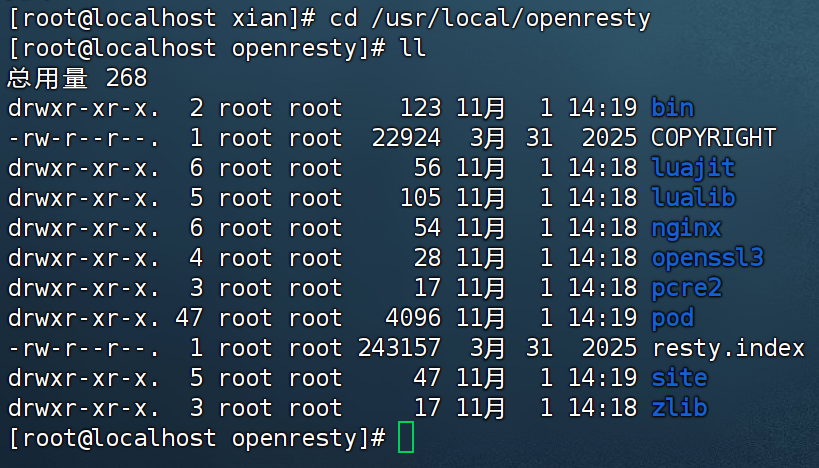


--------------


##### 3.2 OpenResty 快速入门

> 商品详情页面目前展示的是假数据，在浏览器的控制台可以看到查询商品信息的请求：
>
> 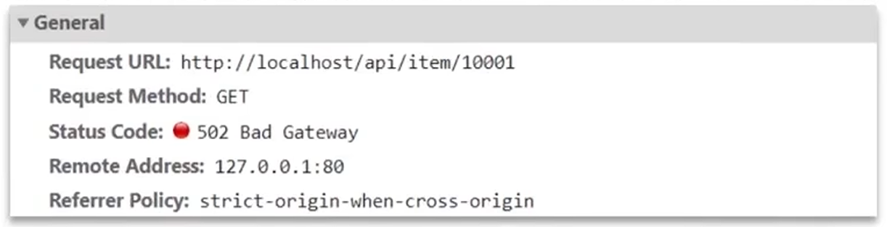
>
> 而这个请求最终被反向代理到虚拟机的 OpenResty 集群：
>
> 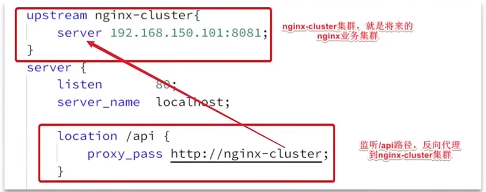
>
> 需求：在 OpenResty 中接收这个请求，并返回一段商品的假数据

**步骤一：修改 nignx.conf 文件**

1. 在 nginx.conf 的 http 下面，添加对 OpenResty 的 Lua 模块的加载：

```nginx
# 加载lua模块
lua_package_path "/usr/local/openresty/lualib/?.lua;;";
# 加载c模块
lua_package_path "/usr/local/openresty/lualib/?.so;;";
```

2. 在 nginx.conf 的 server 下面，添加对 /api/item 这个路径的监听

```nginx
location /api/item {
    # 默认的响应类型，这里返回json
    default_type application/json;
    # 响应数据由 lua/item.lua 这个文件来决定
    content_by_lua_file lua/item.lua;
}
```

**步骤二：编写 item.lua 文件**

1. 在 nginx 目录创建文件夹：lua

```bash
mkdir lua
```

2. 在 lua 文件夹下，新建文件：item.lua

```bash
touch lua/item.lua
```

3. 内容如下：

```lua
-- 返回假数据，这里的 ngx.say() 函数，就是写数据到Response中
ngx.say('{"id": 10001, "name": "SALSA AIR"}')
```

4. 重新加载配置

```bash
nginx -s reload
```


---------------


##### 3.3 请求参数处理

OpenResty 提供了各种 API 用来获取不同类型的请求参数：

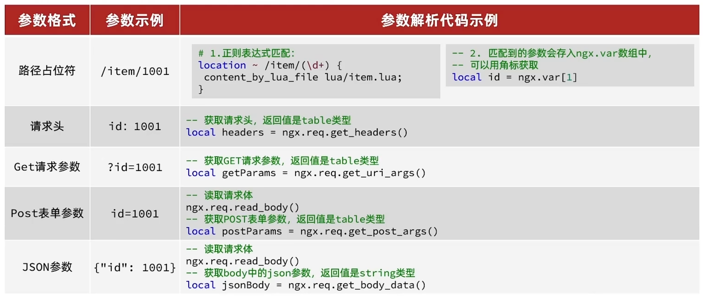


--------------


##### 3.4 查询 Tomcat

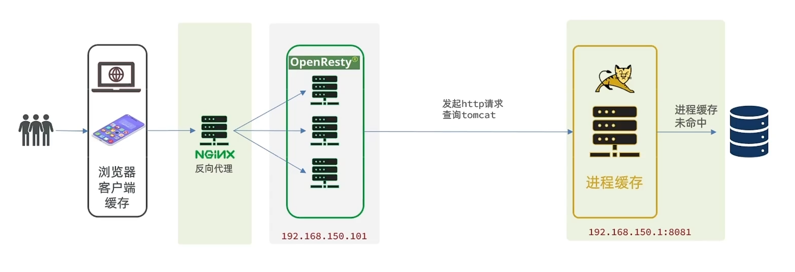

###### 案例：获取请求路径中的商品 id 信息，根据 id 向 Tomcat 查询商品信息

> 这里要修改 item.lua，满足下面的需求：
>
> 1. 获取请求参数中的 id
> 2. 根据 id 向 Tomcat 服务发送请求，查询商品信息
> 3. 根据 id 向 Tomcat 服务发送请求，查询库存信息
> 4. 组装商品信息、库存信息，序列化为 JSON 格式并返回

nginx 提供了内部 API 用以发送 http 请求：

```nginx
local resp = ngx.location.capture("path",{
    method = ngx.HTTP_GET, -- 请求方式
    args = {a=1, b=2}, -- get方式传参数
    body = "c=3&d=4" -- post方式传参数
})
```

返回的响应内容包括：

+ `resp.status`：响应状态码
+ `resp.header`：响应头，是一个 table
+ `resp.body`：响应体，就是响应数据

<strong><font color='red'>注意</font></strong>：这里的 path 是路径，并不是 IP 和端口。这个请求会被 nginx 内部的 server 监听并处理

但是我们希望这个请求发送到 Tomcat 服务器，所以还需要编写一个 server 来对这个路径做反向代理：

```nginx
location /path {
    # 这里是windows电脑的ip和Java服务端口，需要确保windows防火墙处于关闭状态
    proxy_pass http://192.168.150.1:8081;
}
```

我们可以把 http 查询的请求封装为一个函数，放到 OpenResty 函数库中，方便后续使用

1. 在 /usr/local/openresty/lualib 目录下创建 common.lua 文件：

```bash
vi /usr/local/openresty/lualib/common.lua
```

2. 在 common.lua 中封装 http 查询的函数

```lua
-- 封装函数，发送http请求，并解析响应
local function read_http(path, params)
    local resp = ngx.location.capture(path, {
            method = ngx.HTTP_GET,
            args = params,
        })
    if not resp then
        -- 记录错误信息，返回404
        ngx.log(ngx.ERR, "http not found, path: ", path, ", args: ", args)
        ngx.exit(404)
    end
    return resp.body
end
-- 将方法导出
local _M = {
    read_http = read_http
}
return _M
```

OpenResty 提供了一个 cjson 的模块用来处理 JSON 的序列化和反序列化

官方地址：[GitHub - Higeco/lua-cjson-openresty: Lua CJSON is a fast JSON encoding/parsing module for Lua](https://github.com/Higeco/lua-cjson-openresty)

+ 引入 cjson 模块：

```lua
local cjson = require "cjson"
```

+ 序列化：

```lua
local obj = {
    name = 'jack',
    age = 21
}
local json = cjson.encode(obj)
```

+ 反序列化：

```lua
local json = '{"name": "jack", "age": 21}'
-- 反序列化
local obj = cjson.decode(json);
print(obj.name)
```


+ OpenResty 中的 lua 文件

```lua
-- 导入common函数库
local common = require('common')
local read_http = common.read_http
-- 导入cjson库
local cjson = require('cjson')

-- 获取路径参数
local id = ngx.var[1]

-- 查询商品信息
local itemJSON = read_http("/item/" .. id, nil)
-- 查询库存信息
local stockJSON = read_http("/item/stock" .. id, nil)

-- JSON转为lua的table
local item = cjson.decode(itemJSON)
local stock = cjson.decode(stockJSON)
-- 组合数据
item.stock = stock.stock
item.sold = stock.sold

-- 把item序列化为json 返回结果
ngx.say(cjson.encode(item))
```

###### Tomcat 集群的负载均衡

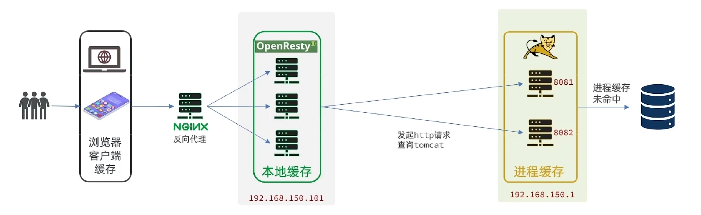

```nginx
# 反向代理配置，将/item路径的请求代理到tomcat集群
location /item {
    proxy_pass http://tomcat-cluster;
}
```

```nginx
# tomcat集群配置
upstream tomcat-cluster {
    hash $request_uri; # 修改nginx负载均衡算法
    server 192.168.150.1:8081;
    server 192.168.150.1:8082;
}
```


---------------


##### 3.5 Redis 缓存预热

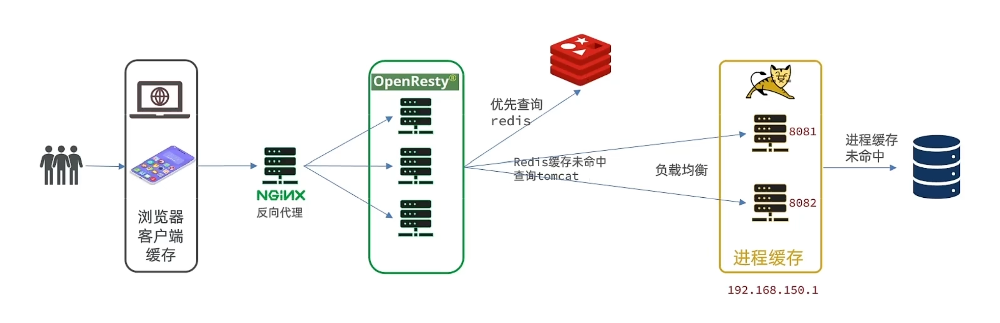

###### 3.5.1 冷启动与缓存预热

**冷启动：**服务刚刚启动时，Redis 中并没有缓存，如果所有商品数据都在第一次查询时添加缓存，可能会给数据库带来较大压力

**缓存预热：**在实际开发中，我们可以利用大数据统计用户访问的热点数据，在项目启动时将这些热点数据提前查询并保存到 Redis 中


###### 3.5.2 缓存预热

1. 利用 Docker 安装 Redis

```dockerfile
docker run --name redis -p 6379:6379 -d redis redis-server --appendonly yes
```

```dockerfile
# 使用华为云镜像运行 Redis 并启用持久化
docker run --name redis -p 6379:6379 -d \
  swr.cn-north-4.myhuaweicloud.com/library/redis:latest \
  redis-server --appendonly yes
```

2. 在 item-service 服务中引入 Redis 依赖

```xml
<dependency>
	<groupId>org.springframework.boot</groupId>
    <artifactId>spring-boot-starter-data-redis</artifactId>
</dependency>
```

3. 配置 Redis 地址

```yml
spring:
  redis:
    host: 192.168.150.101
```

4. 编写初始化类

```java
@Component
public class RedisHandler implements InititalizingBean {
    @Autowired
    private StringRedisTemplate redisTemplate;
    @Override
    public void afterPropertiesSet() throws Exception {
        // 初始化缓存 ...
    }
}
```


+ RedisHandler.java

```java
package com.heima.item.config;

import com.fasterxml.jackson.databind.ObjectMapper;
import com.heima.item.pojo.Item;
import com.heima.item.pojo.ItemStock;
import com.heima.item.service.IItemService;
import com.heima.item.service.IStockService;
import org.springframework.beans.factory.InitializingBean;
import org.springframework.beans.factory.annotation.Autowired;
import org.springframework.data.redis.core.StringRedisTemplate;
import org.springframework.stereotype.Component;

import java.util.List;

@Component
public class RedisHandler implements InitializingBean {

    @Autowired
    private StringRedisTemplate redisTemplate;

    @Autowired
    private IItemService itemService;
    @Autowired
    private IStockService stockService;
    private static final ObjectMapper MAPPER = new ObjectMapper();

    @Override
    public void afterPropertiesSet() throws Exception { // 会在Bean创建完，Autowired注入成功以后去执行
        // 初始化缓存
        // 1. 查询商品信息
        List<Item> itemList = itemService.list();
        // 2. 放入缓存
        for (Item item : itemList) {
            // 2,1 item序列化为JSON
            String json = MAPPER.writeValueAsString(item);
            // 2.2 存入redis
            redisTemplate.opsForValue().set("item:id:" + item.getId(), json);
        }

        // 3. 查询商品库存信息
        List<ItemStock> stockList = stockService.list();
        // 4. 放入缓存
        for (ItemStock stock : stockList) {
            // 2,1 item序列化为JSON
            String json = MAPPER.writeValueAsString(stock);
            // 2.2 存入redis
            redisTemplate.opsForValue().set("item:id:" + stock.getId(), json);
        }
    }
}
```


------------


##### 3.6 查询 Redis 缓存

###### 3.6.1 OpenResty 的 Redis 模块

OpenResty 提供了操作 Redis 的模块，我们只要引入该模块就能直接使用：

+ 引入 Redis 模块，并初始化 Redis 对象

```lua
-- 引入redis模块
local redis = require("resty.redis")
-- 初始化Redis对象
local red = redis:new()
-- 设置Redis超时时间
red:set_timeouts(1000, 1000, 1000)
```

+ 封装函数，用来释放Redis连接，其实是放入连接池

```lua
-- 关闭redis连接的工具方法，其实是放入连接池
local function close_redis(red)
    local pool_max_idle_time = 10000 -- 连接的空闲时间，单位是毫秒
    local pool_size = 100 -- 连接池大小
    local ok, err = red:set_keepalive(pool_max_idle_time, pool_size)
    if not ok then
        ngx.log(ngx.ERR, "放入Redis连接池失败：", err)
    end
end
```

+ 封装函数，从Redis读数据并返回

```lua
-- 查询redis的方法 ip和port是redis地址，key是查询的key
local function read_redis(ip, port, key)
    -- 获取一个连接
    local ok, err = red:connect(ip, port)
    if not ok then
        ngx.log(ngx.ERR, "连接Redis失败：", err)
        return nil
    end
    -- 查询redis
    local resp, err = red:get(key)
    -- 查询失败处理
    if not ok then
        ngx.log(ngx.ERR, "查询Redis失败：", err, ", key = ", key)
    end
    -- 得到的数据为空处理
    if resp == ngx.null then
        resp = nil
        ngx.log(ngx.ERR, "查询Redis数据为空，key = ", key)
    end
    close_redis(red)
    return resp
end
```


###### 案例：查询商品时，优先 Redis 缓存查询

> 需求：
>
> + 修改 item.lua，封装一个函数 read_data，实现先查询 Redis，如果未命中，再查询 tomcat
> + 修改 item.lua，查询商品和库存时都调用 read_data 这个函数

```lua
-- 封装函数，先查询 redis，再查询 http
local function read_data(key, path, params)
    -- 查询redis
    local resp = read_redis("127.0.0.1", 6379, key)
    -- 判断redis是否命中
    if not resp then
        ngx.log("redis查询失败，尝试查询http key：", key)
        -- Redis查询失败，查询http
        resp = read_http(path, params)
    end
    return resp
end
```


--------------


##### 3.7 Nginx 本地缓存

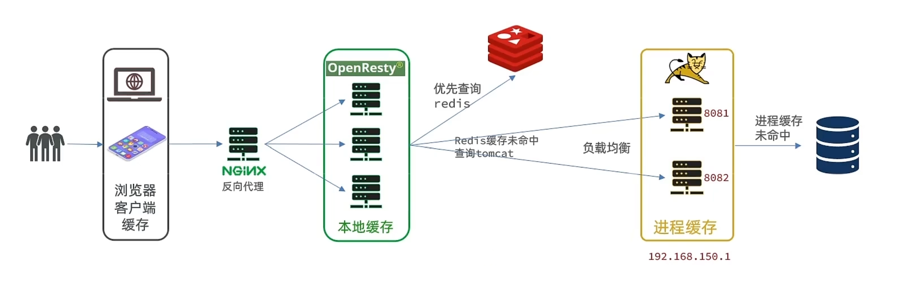

OpenResty 为 Nginx 提供了 **shard dict** 的功能，可以在 nginx 的多个 worker 之间共享数据，实现缓存功能

+ 开启共享字典，在 nginx.conf 的 http 下添加配置：

```nginx
# 共享字典，也就是本地缓存，名称叫做：item_cache，大小150m
lua_shared_dict item_cache 150m;
```

+ 操作共享字典：

```lua
-- 获取本地缓存对象
local item_cache = ngx.shared.item_cache
-- 存储，指定key、value、过期时间，单位s，默认为0代表永不过期
item_cache:set('key', 'value', 1000)
-- 读取
local val = item_cache:get('key')
```


###### 案例：在查询商品时，优先查询 OpenResty 的本地缓存

> 需求：
>
> + 修改 item.lua 中的 read_data 函数，优先查询本地缓存，未命中时再查询 Redis、Tomcat
> + 查询 Redis 或 Tomcat 成功后，将数据写入本地缓存，并设置有效期
> + 商品基本信息，有效期30分钟
> + 库存信息，有效期1分钟

```lua
-- 封装函数，先查询 redis，再查询 http
local function read_data(key, expire,path, params)
    -- 查询本地缓存
    local val = item_cache:get(key)
    if not val then
        ngx.log(ngx.ERR, "本地缓存查询失败，尝试查询Redis key：", key)
    	-- 查询redis
    	val = read_redis("127.0.0.1", 6379, key)
    	-- 判断redis是否命中
    	if not val then
        	ngx.log(ngx.ERR, "redis查询失败，尝试查询http key：", key)
        	-- Redis查询失败，查询http
        	val = read_http(path, params)
    	end
    end
    -- 查询成功，把数据写入本地缓存
    item_cache:set(key, val, expire)
    -- 返回数据
    return val
end
```


-------------


#### 4. 缓存同步策略

##### 4.1 数据同步策略

缓存数据同步的常见方式有三种：

+ **设置有效期**：给缓存设置有效期，到期后自动删除。再次查询时更新
  + 优势：简单、方便
  + 缺点：时效性差，缓存过期之前可能不一致
  + 场景：更新频率较低，时效性要求低的业务
+ **同步双写**：在修改数据库的同时，直接修改缓存
  + 优势：时效性强，缓存预期数据库强一致
  + 缺点：有代码侵入，耦合度高
  + 场景：对一致性、时效性要求较高的缓存数据
+ **异步通知：**修改数据库时发送事件通知，相关服务监听到通知后修改缓存数据
  + 优势：低耦合，可以同时通知多个缓存服务
  + 缺点：时效性一般，可能存在中间不一致状态
  + 场景：时效性要求一般，有多个服务需要同步


基于 MQ 的异步通知：

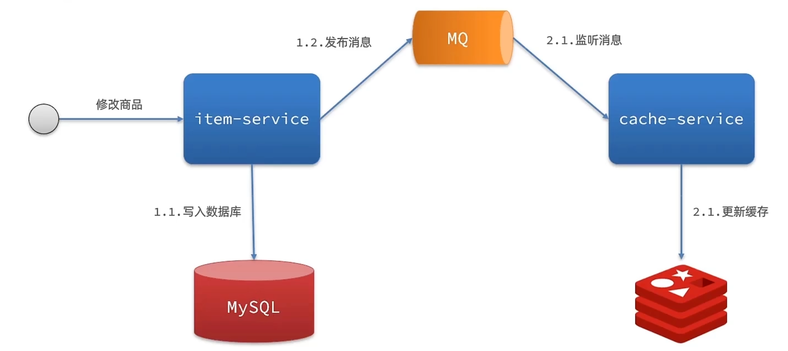

基于 Canal 的异步通知：

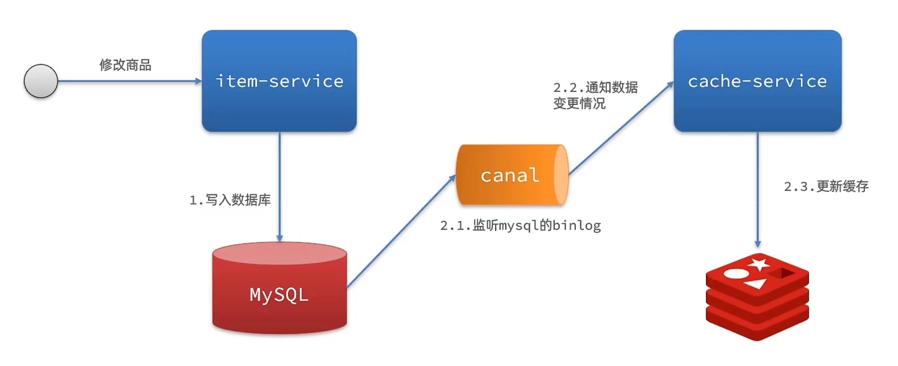


-------------------


##### 4.2 安装 Canal

**Canal**，译意为水道 / 管道 / 沟渠，canal 是阿里巴巴旗下的一款开源项目，基于 Java 开发。基于数据库增量日志解析，提供增量数据订阅&消费。GitHub 的地址：[GitHub - alibaba/canal: 阿里巴巴 MySQL binlog 增量订阅&消费组件](https://github.com/alibaba/canal)

Canal 是基于 mysql 的主从同步来实现的，MySQL 主从同步的原理如下：

+ MySQL master 将数据变更写入二进制日志（binary log），其中记录的数据叫做 binary log events
+ MySQL slave 将 master 的 binary log events 拷贝到它的中继日志（relay log）
+ MySQL slave 重放 relay log 中事件，将数据变更反映它自己的数据

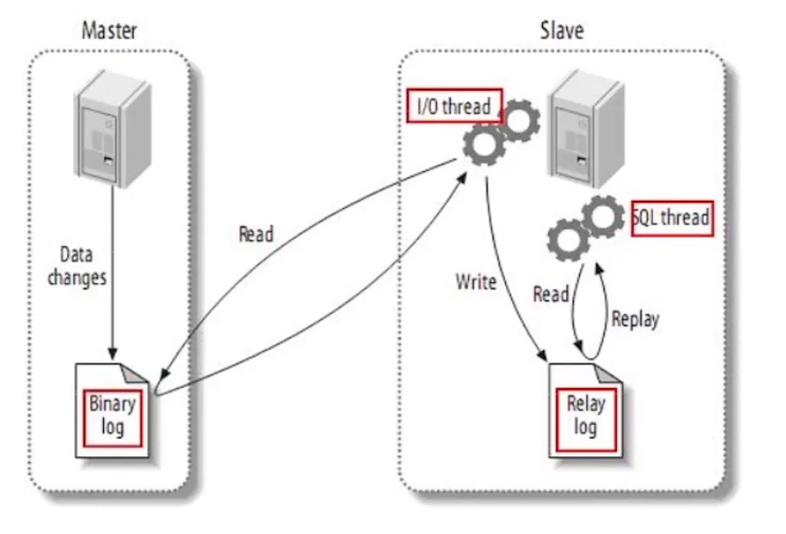

###### 4.2.1 初识 Canal

Canal 就是把自己伪装成 MySQL 的一个 slave 节点，从而监听 master 的 binary log 变化。再把得到的变化信息通知给 Canal 的客户端，进而完成对其它数据库的同步

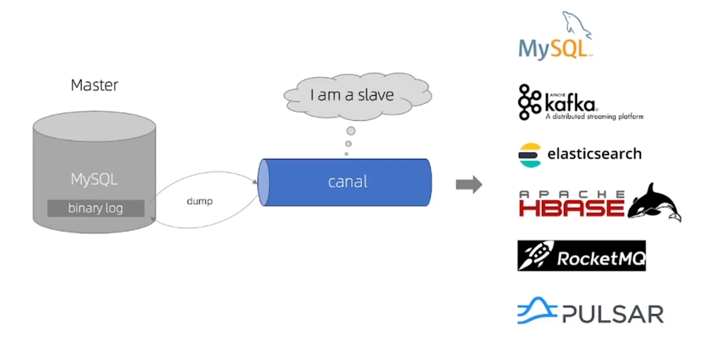


---------------


##### 4.3 监听 Canal

###### 4.3.1 Canal 客户端

Canal 提供了各种语言的客户端，当 Canal 监听到 binlog 变化时，会通知 Canal 的客户端

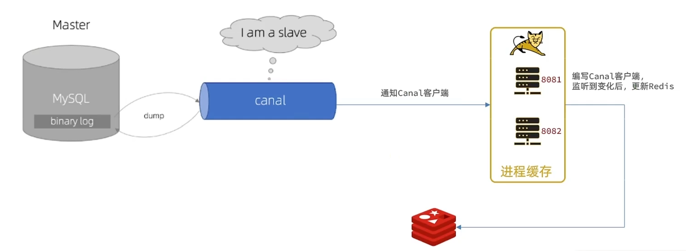

不过这里我们会使用 GitHub 上的第三方开源的 canal-starter。地址：[GitHub - NormanGyllenhaal/canal-client: spring boot canal starter 易用的canal 客户端 canal client](https://github.com/NormanGyllenhaal/canal-client)

引入依赖：

```xml
  <dependency>
      <groupId>top.javatool</groupId>
      <artifactId>canal-spring-boot-starter</artifactId>
      <version>1.2.1-RELEASE</version>
  </dependency>
```

编写配置：

```yml
canal:
  destination: feng # canal实例名称，要跟canal-server运行时设置的destination一致
  server: 192.168.150.101:11111 # canal地址
```

编写监听器，监听 Canal 消息：

+ `@CanalTable` 注解在 EntryHandler 来标记表名

```java
@CanalTable(value = "t_user")
@Component
public class UserHandler implements EntryHandler<User>{

   /**
   *  新增操作
   * @param user
    */
   @Override
    public void insert(User user) {
	   //你的逻辑
        log.info("新增 {}",user);
    }
    /**
    * 对于更新操作来讲，before 中的属性只包含变更的属性，after 包含所有属性，通过对比可发现那些属性更新了
   * @param before
   * @param after
    */
    @Override
    public void update(User before, User after) {
    	//你的逻辑
        log.info("更新 {} {}",before,after);
    }
    /**
    *  删除操作
    * @param user
    */
    @Override
    public void delete(User user) {
       //你的逻辑
        log.info("删除 {}",user); 
   }
}
```

Canal 推送给 canal-client 的是被修改的这一行数据（row），而我们引入的 canal-client 则会帮我们把行数据封装到 Item 实体类中。这个过程中需要知道数据库与实体的映射关系，要用到 JPA 的几个注解：

```java
@Data
@TableName("tb_item")
public class Item {
    @TableId(type = IdType.AUTO)
    @Id
    private Long id;
    @Column(name = "name")
    private String name;
    // ... 其它字段略
    private Data = updateTime;
    @TableField(exist = false)
    @Transient
    private Integer stock;
    @TableField(exist = false)
    @Transient
    private Integer sold;
}
```

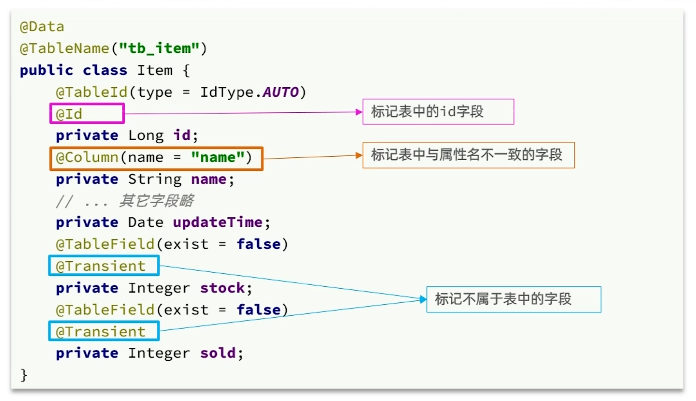


+ ItemHandler.java

```java
package com.heima.item.canal;

import com.github.benmanes.caffeine.cache.Cache;
import com.heima.item.config.RedisHandler;
import com.heima.item.pojo.Item;
import org.springframework.beans.factory.annotation.Autowired;
import org.springframework.stereotype.Component;
import top.javatool.canal.client.annotation.CanalTable;
import top.javatool.canal.client.handler.EntryHandler;

@CanalTable(value = "tb_item")
@Component

public class ItemHandler implements EntryHandler<Item> {

    @Autowired
    private RedisHandler redisHandler;
    @Autowired
    private Cache<Long, Item> itemCache;

    @Override
    public void insert(Item item) {
        // 写数据到JVM进程缓存
        itemCache.put(item.getId(), item);
        // 写数据到redis
        redisHandler.saveItem(item);
    }

    @Override
    public void update(Item before, Item after) {
        // 写数据到JVM进程缓存
        itemCache.put(after.getId(), after);
        // 写数据到redis
        redisHandler.saveItem(after);
    }

    @Override
    public void delete(Item item) {
        // 写数据到JVM进程缓存
        itemCache.invalidate(item.getId());
        // 写数据到redis
        redisHandler.deleteItemById(item.getId());
    }
}
```


----------------


#### 总结

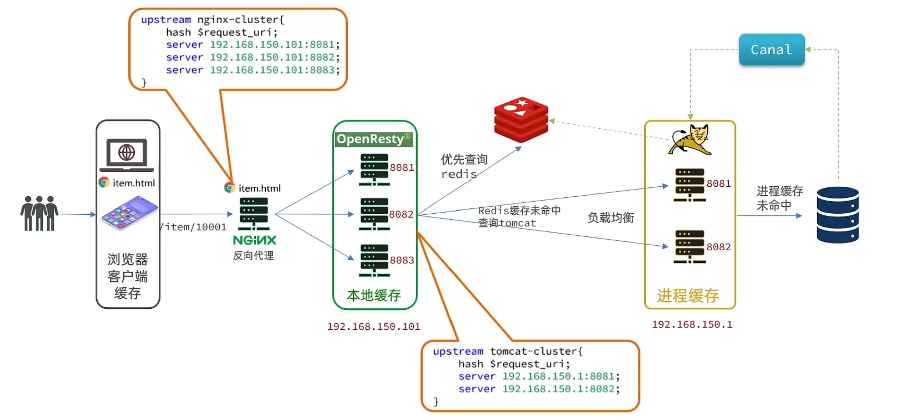


-------------------


### 三、Redis 最佳实践

#### 1. Redis 键值设计

##### 1.1 优雅的 key 结构

Redis 的 Key 虽然可以自定义，但最好遵循下面的几个最佳实践约定：

+ 遵循基本格式：`[业务名称]:[数据名]:[id]`
+ 长度不超过44字节
+ 不包括特殊字符

例如：我们的登录业务，保存用户信息，其 key 是这样的：

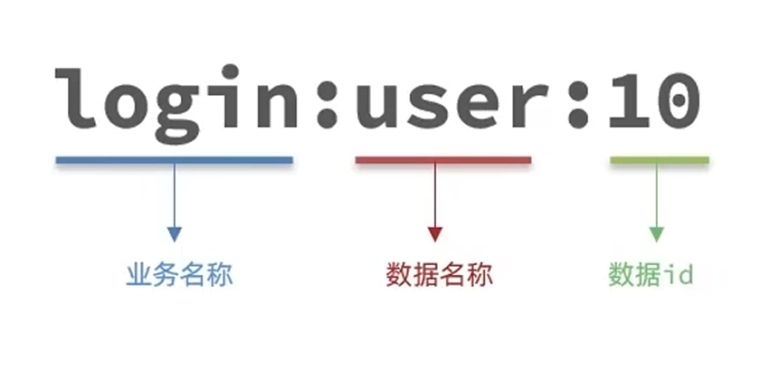

优点：

1. 可读性强
2. 避免 key 冲突
3. 方便管理
4. 更节省内存：key 是 string 类型、底层编码包含 int、embstr 和 raw 三种。embstr 在小于44字节使用，采用连续内存空间，内存占用更小

`object encoding num`：可以查看某一个 key 的底层编码


---------------


##### 1.2 拒绝 BigKey

###### 1.2.1 什么是 BigKey

BigKey 通常以 Key 的大小和 Key 中成员的数量来综合判定，例如：

+ Key 本身的数据量过大：一个 String 类型的 Key，它的值为 5MB
+ Key 中的成员数过多：一个 ZSET 类型的 Key，它的成员数量为10000个
+ Key 中成员的数据量过大：一个 Hash 类型的 Key，它的成员数量虽然只有1000个但这些成员的 Value（值）总大小为 100MB

我们可以使用 `MEMORY USAGE key` 来得到 key 占用的大小，但是这个命令消耗 cpu 较大（不推荐使用）

所以我们可以通过下面两种方法侧面衡量 key 的大小

推荐值：

+ 单个 key 的 value 小于 10KB
+ 对于集合类型的 key，建议元素数量小于1000

###### 1.2.2 BigKey 的危害

+ **网络阻塞**

对于 BigKey 执行读请求时，少量的 QPS 就可能导致带宽使用率被占满，导致 Redis 实例，乃至所在物理机变慢

+ **数据倾斜**

BigKey 所在的 Redis 实例内存使用率远超其它实例，无法使数据分片的内存资源达到均衡

+ **Redis 阻塞**

对元素较多的 hash、list、zset 等做运算会耗时较久，使主线程被阻塞

+ **CPU 压力**

对 BigKey 的数据序列化和反序列化会导致 CPU 的使用率飙升，影响 Redis 实例和本机其它使用


###### 1.2.3 如何发现 BigKey

+ **redis-cli --bigkeys**

利用 `redis-cli` 提供的 `--bigkeys` 参数，可以遍历分析所有的 key，并返回 Key 的整体统计信息与每个数据的 Top1 的 bigkey（如果 Top1 是 BigKey，不代表 Top2 就不是，所以不全面）

+ **scan 扫描**

自己编程，利用 scan 扫描 Redis 中的所有 key，利用 strlen、hlen 等命令判断 key 的长度（此处不建议使用 MEMORY USAGE）

```bash
SCAN cursor [MATCH pattern] [COUNT count] [TYPE type]
```

+ **第三方工具**

利用第三方工具，如 [Redis-Rdb-Tools](https://github.com/sripathikrishnan/redis-rdb-tools) 分析 RDB 快照文件，全面分析内存使用情况

+ **网络监控**

自定义工具，监控进出 Redis 的网络数据，超出预警值时主动告警


###### 1.2.4 如何删除 BigKey

BigKey 内存占用较多，即便是删除这样的 key 也需要耗费很长时间，导致 Redis 主线程阻塞，引发一系列问题

+ **redis 3.0 及以下版本**

如果是集合类型，则遍历 BigKey 的元素，先逐个删除子元素，最后删除 BigKey

+ **Redis 4.0 以后**

Redis 在4.0后提供了异步删除的命令：`unlink key`


------------------


##### 1.3 恰当的数据类型

例1：比如存储一个 User 对象，我们有三种存储方式：

方式一：json 字符串

<table>
    <tr>
    	<td>user:1</td>
        <td>{"name": "Jack", "age": 21}</td>
    </tr>
</table>

+ 优点：实现简单粗暴
+ 缺点：数据耦合，不够灵活

方式二：字段打散

<table>
    <tr>
    	<td>user:1:name</td>
        <td>Jack</td>
    </tr>
    <tr>
    	<td>user:1:age</td>
        <td>21</td>
    </tr>
</table>

+ 优点：可以灵活访问对象任意字段
+ 缺点：占用空间大，没办法做统一控制

方式三：hash

<table border="1">
 <tr>
   <td rowspan="2" align="center">user:1</td>
   <td>name</td>
   <td>Jack</td>
 </tr>
 <tr>
   <td>jack</td>
   <td>21</td>
 </tr>
</table>

+ 优点：底层使用 ziplist，空间占用小，可以灵活访问对象的任意字段
+ 缺点：代码相对复杂


例2：假设有 hash 类型的 key，其中有100万对 field 和 value，field 是自增 id，这个 key 存在什么问题？如何优化？

<table border="1">
 <tr>
    <th>KEY</th>
     <th>field</th>
     <th>value</th>
 </tr>
 <tr>
   <td rowspan="3" align="center">someKey</td>
   <td>id:0</td>
   <td>value0</td>
 </tr>
 <tr>
         <td>.....</td>
     <td>.....</td>
 </tr>
    <tr>
         <td>id:999999</td>
           <td>value999999</td>
    </tr>
</table>

存在的问题：

1. hash 的 entry 数量超过500时，会使用哈希表而不是 ZipList，内存占用较多
2. 可以通过 `hash-max-ziplist-entries` 配置 entry 上限。但是如果 entry 过多就会导致 BigKey 问题
   + eg：`config set hash-max-ziplist-entries 1000`


方案二：拆分为 string 类型：

| key       | value       |
| --------- | ----------- |
| id:0      | value0      |
| .....     | .....       |
| id:999999 | value999999 |

存在的问题：

1. string 结构底层没有太多内存优化，内存占用较多
2. 想要批量获取这些数据比较麻烦


方案三：拆分为小的 hash，将 id / 100 作为 key，将 id % 100 作为 field，这样每100个元素为一个 Hash

<table border="1">
 <tr>
    <th>KEY</th>
     <th>field</th>
     <th>value</th>
 </tr>
 <tr>
   <td rowspan="3" align="center">key:0</td>
   <td>id:00</td>
   <td>value0</td>
 </tr>
 <tr>
     <td>.....</td>
     <td>.....</td>
 </tr>
    <tr>
     <td>id:99</td>
     <td>value99</td>
    </tr>
</table>

<table>
    <tr>
   <td rowspan="3" align="center">key:1</td>
   <td>id:00</td>
   <td>value100</td>
 </tr>
 <tr>
     <td>.....</td>
     <td>.....</td>
 </tr>
    <tr>
     <td>id:99</td>
     <td>value199</td>
    </tr>
</table>

<table>
    <tr>
   <td rowspan="3" align="center">key:1</td>
   <td>id:00</td>
   <td>value999900</td>
 </tr>
 <tr>
     <td>.....</td>
     <td>.....</td>
 </tr>
    <tr>
     <td>id:99</td>
     <td>value999999</td>
    </tr>
</table>


----------------


##### 总结

Key 的最佳实践：

+ 固定格式：`[业务明]:[数据名]:[id]`
+ 足够简短：不超过44字节
+ 不包含特殊字符

Value 的最佳实践：

+ 合理的拆分数据，拒绝 BigKey
+ 选择合适数据结构
+ Hash 结构的 entry 数量不要超过1000
+ 设置合理的超时时间


--------------


#### 2. 批处理优化

##### 2.1 Pipeline

###### 2.1.1 单个命令的执行流程

一次命令的响应时间 = **1**次往返的网络传输耗时 + **1**次 Redis 执行命令耗时


###### 2.1.2 N 条命令依次执行

N 次命令的响应时间 = **N**次往返的网络传输耗时 + **N**次 Redis 执行命令耗时

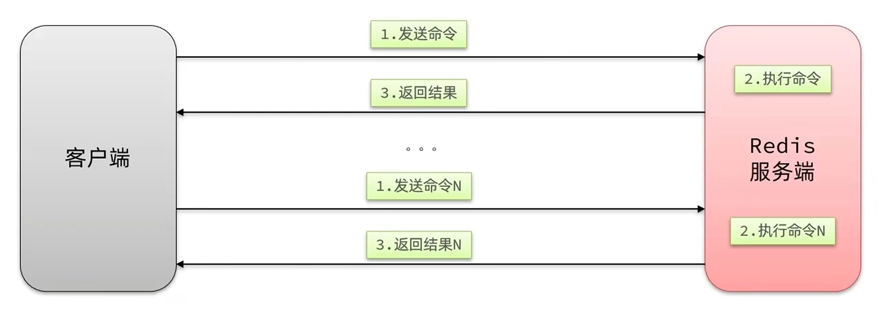

###### 2.1.3 N 条命令批量执行

 N 次命令的响应时间 = **1**次往返的网络传输耗时 + **N**次 Redis 执行命令耗时

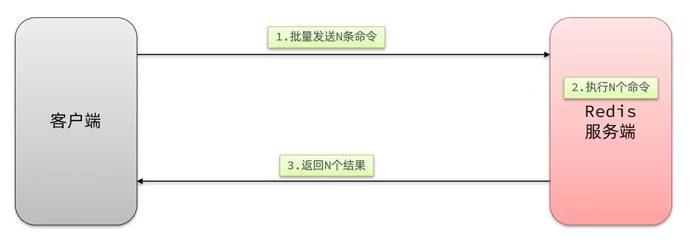


###### 2.1.4 MSET

Redis 提供了很多 Mxxx 这样的命令，可以实现批量导入数据，例如：

+ mset
+ hmset

利用 mset 批量插入10万条数据：

```java
@Test
void testMxx() {
    String[] arr = new String[2000];
    int j;
    for (int i = 1; i <= 100000; i++) {
        j = (i % 1000) << 1;
        arr[j] = "test:key_" + i;
        arr[j + 1] = "value_" + i;
        if (j == 0) {
            jedis.mset(arr);
        }
    }
}
```

<strong><font color='red'>注意</font></strong>：不要在一次批处理中传输太多命令，否则单次命令占用带宽过多，会导致网络阻塞


###### 2.1.5 Pipeline

MSET 虽然可以批处理，但是却只能操作部分数据类型，因此如果有对复杂数据类型的批处理需要，建议使用 Pipeline 功能：

```java
@Test
void testPipeline() {
    // 创建管道
    Pipeline pipeline = jedis.pipelined();
    
    for (int i = 1; i <= 100000; i++) {
        // 放入命令到管道
        pipeline.set("test:key_" + i, "value_" + i);
        if(i % 1000 == 0) {
            // 每放入1000条命令，批量执行
            pipeline.sync();
        }
    }
}
```


m 操作是 Redis 内置的操作，m 操作里面的多组 key 和 value，会把它作为一个原子性的操作，一次性全执行完，中间不会有其他命令来插队

pipeline 虽然一组命令一起传递到 Redis，但不一定是同时执行的，所以对比 m 操作慢


###### 总结

批量处理的方案：

1. 原生的 M 操作
2. Pipeline 批处理

注意事项：

1. 批处理时不建议一次携带太多命令
2. Pipeline 的多个命令之间不具备原子性


-------------


##### 2.2 集群下的批处理

如 MSET 或 Pipeline 这样的批处理需要在一次请求中携带多条命令，而此时如果 Redis 是一个集群，那批处理命令的多个 key 必须落在一个插槽中，否则就会导致执行失败

|          | 串行命令                       | 串行 slot                                                    | 并行 slot                                                    | hash_tag                                                    |
| -------- | ------------------------------ | ------------------------------------------------------------ | ------------------------------------------------------------ | ----------------------------------------------------------- |
| 实现思路 | for 循环遍历，一次执行每个命令 | 在客户端计算每个 key 的 slot，将 slot 一致的分为一组，每组都利用 Pipeline 批处理。<br />**串行**执行每组命令 | 在客户端计算每个 key 的 slot，将 slot 一致的分为一组，每组都利用 Pipeline 批处理。<br />**并行**执行每组命令 | 将所有 key 设置相同的 hash_tag，则所有 key 的 slot 一定相同 |
| 耗时     | N 次网络耗时 + N 次命令耗时    | m 次网络耗时 + N 次命令耗时<br />m = key 的 slot 个数        | 1 次网络耗时 + N 次命令耗时                                  | 1 次网络耗时 + N 次命令耗时                                 |
| 优点     | 实现简单                       | 耗时较短                                                     | 耗时非常短                                                   | 耗时非常短、实现简单                                        |
| 缺点     | 耗时非常久                     | 实现稍复杂<br />slot 越多，耗时越久                          | 实现复杂                                                     | 容易出现数据倾斜                                            |


StringRedisTemplate 中已经封装好了，基于第三种方法


------------


#### 3. 服务端优化

##### 3.1 持久化配置

Redis 的持久化虽然可以保证数据安全，但也会带来很多额外的开销，因此持久化请遵循下列建议：

1. 用来做缓存的 Redis 实例尽量不要开启持久化功能
2. 建议关闭 RDB 持久化功能，使用 AOF 持久化
3. 利用脚本定期在 slave 节点做 RDB，实现数据备份
4. 设置合理的 rewrite 阈值，避免频繁的 bgrewrite（对文件做重写）
5. 配置 `no-appendfsync-on-rewrite = yes`，禁止在 rewrite 期间做 aof，避免因 AOF 引起的阻塞


部署有关建议：

1. Redis 实例的物理机要预留足够内存，应对 fork 和 rewrite
2. 单个 Redis 实例内存上限不要太大，例如4G或8G。可以加快 fork 的速度、减少主从同步、数据迁移压力
3. 不要与 CPU 密集型应用部署在一起
4. 不要与高硬盘负载应用一起部署。例如：数据库、消息队列


-------------


##### 3.2 慢查询

**慢查询**：在 Redis 执行耗时超过某个阈值的命令，称为慢查询

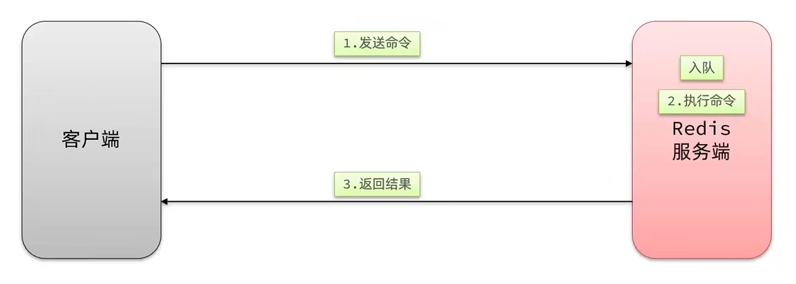

慢查询的阈值可以通过配置指定：

+ `slowlog-log-slower-than`：慢查询阈值，单位是微秒。默认是100000，建议1000

慢查询会被放入慢查询日志中，日志的长度有上限，可以通过配置指定：

+ `slowlog-max-len`：慢查询日志（本质是一个队列）的长度。默认是128，建议1000

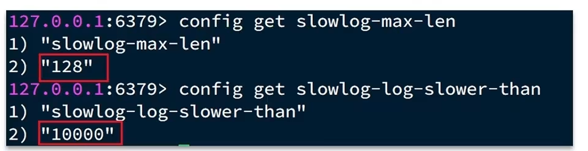

修改这两个配置可以使用：`config set` 命令：

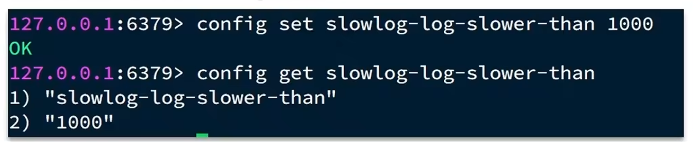

查看慢查询日志列表：

+ `slowlog len`：查询慢查询日志长度
+ `slowlog get[n]`：读取 n 条慢查询日志
+ `slowlog reset`：清空慢查询列表

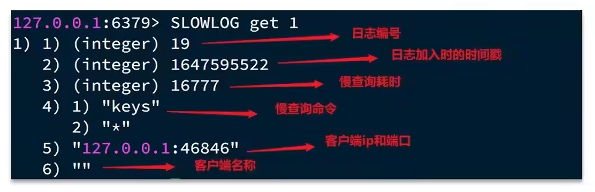


-------------


##### 3.3 命令及安全配置

Redis 会绑定在 0.0.0.0:6379，这样将会将 Redis 服务暴露在公网上，而 Redis 如果没有做身份认证，会出现严重的安全漏洞

漏洞出现的核心的原因有以下几点：

+ Redis 未设置密码
+ 利用了 Redis 的 config set 命令动态修改 Redis 配置
+ 使用了 Root 账号权限启动 Redis

为了避免这样的漏洞，这里给出一些建议：

1. Redis 一定要设置密码
2. 禁止线上使用下面命令：keys、flushall、flushdb、config set 等命令。可以利用 rename-command 禁用
3. bind：限制网卡，禁止外网网卡访问
4. 开启防火墙
5. 不要使用 Root 账号启动 Redis
6. 尽量不使用默认的端口


--------------


##### 3.4 内存配置

当 Redis 内存不足时，可能导致 Key 频繁被删除、响应时间变长、QPS 不稳定等问题。当内存使用率达到90%以上时就需要我们警惕，并快速定位到内存占用的原因

| 内存占用   | 说明                                                         |
| ---------- | ------------------------------------------------------------ |
| 数据内存   | 是 Redis 最主要的部分，存储 Redis 的键值信息。主要问题是 BigKey 问题、内存碎片问题 |
| 进程内存   | Redis 主进程本身运行肯定需要占用内存，如果代码、常量池等等；这部分内存大约几兆，在大多数生产环境中与 Redis 数据占用的内存相比可以忽略 |
| 缓冲区内存 | 一般包括客户端缓冲区、AOF 缓冲区、复制缓冲区等。客户端缓冲区又包括输入缓冲区和输出缓冲两种。这部分内存占用波动较大，不当使用 BigKey，可能导致内存溢出 |


###### 3.4.1 数据内存的问题

Redis 提供了一些命令，可以查看到 Redis 目前的内存分配状态

+ `info memory`
+ `memory xxx`

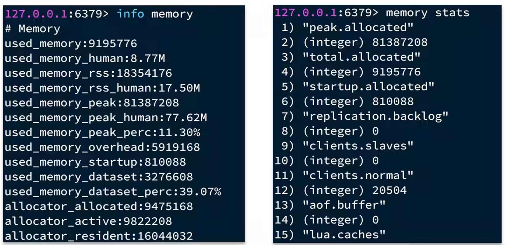


###### 3.4.2 内存缓冲区配置

内存缓冲区常见的有三种：

+ **复制缓冲区：**主从复制的 repl_backlog_buf，如果太小可能导致频繁的全量复制，影响性能。通过 `repl-backlog-size` 来设置，默认1mb
+ **AOF 缓冲区：**AOF 刷盘之前的缓存区域，AOF 执行 rewrite 的缓冲区。无法设置容量上限
+ **客户端缓冲区：**分为输入缓冲区和输出缓冲区，输入缓冲区最大1G且不能设置。输出缓冲区可以设置

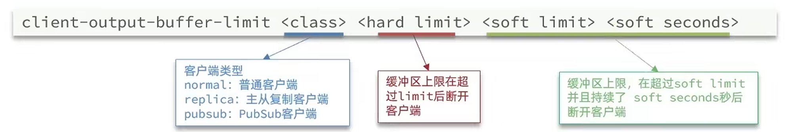

默认配置如下：

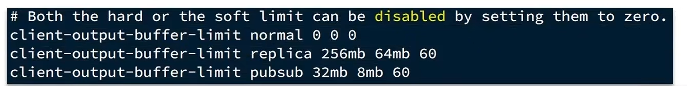


------------


#### 4. 集群最佳实践

集群虽然具备高可用性，能实现自动故障恢复，但是如果使用不当，也会存在一些问题：

1. 集群完整性问题
2. 集群带宽问题
3. 数据倾斜问题
4. 客户端性能问题
5. 命令的集群兼容问题
6. lua 和事务问题

##### 4.1 集群完整性问题

在 Redis 的默认配置中，如果发现任意一个插槽不可用，则整个集群都会停止对外服务：

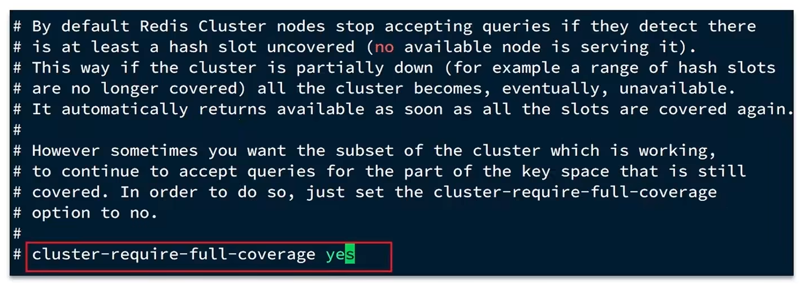

为保证高可用特性，这里建议将 `cluster-require-full-coverage` 配置为 false


##### 4.2 集群带宽问题

集群节点之间会不断的互相 Ping 来确定集群中其它节点的状态。每次 Ping 携带的信息至少包括：

+ 插槽信息
+ 集群状态信息

集群中节点越多，集群状态信息数据量也越大，10个节点的相关信息可能达到1kb，此时每次集群互通需要的带宽会非常高

解决途径：

1. 避免大集群，集群节点数不要太多，最好少于1000，如果业务庞大，则建立多个集群
2. 避免在单个物理机中运行太多 Redis 实例
3. 配置合适的 cluster-node-timeout 值


<strong><font color='red'>注意</font></strong>：单体 Redis（主从 Redis）已经能达到万级别的 QPS，并且也具备很强的高可用特性。如果主从能满足业务需求的情况下，尽量不搭建 Redis 集群


--------------------


## 原理篇

### 一、数据结构

#### 1. 动态字符串 SDS

我们都知道 Redis 中保存的 Key 是字符串，value 往往是字符串或者字符串的集合。可见字符串是 Redis 中最常用的一种数据结构

不过 Redis 没有直接使用 C 语言中的字符串，因为 C 语言字符串存在很多问题：

+ 获取字符串长度需要通过运算
+ 非二进制安全
+ 不可修改

```c
// c语言，声明字符串
char* s = "hello"
// 本质是字符数组：{'h', 'e', 'l', 'l', 'o', '\0'}
```

Redis 构建了一种新的字符串结构，称之为**简单动态字符串**（**S**imple **D**ynamic **S**tring），简称 **SDS**

例如，我们执行命令：

```bash
set name feng
```

那么 Redis 将在底层创建两个 SDS，其中一个是包含 “name“ 的 SDS，另一个是包含 ”feng“ 的 SDS


Redis 是 C 语言实现的，其中 SDS 是一个结构体，源码如下：

```c
struct __attribute__ ((__packed__)) sdshdr8 {
    uint8_t len; /* buf已保存的字符串字节数，不包含结束标示 */
    uint8_t alloc; /* buf申请的总的字节数，不包含结束标示 */
    unsigned char flags; /* 不同SDS的头类型，用来控制SDS的头大小 */
    char buf[];
};
```

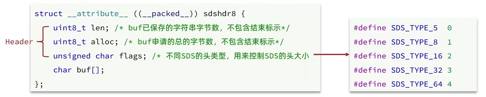

例如，一个包含字符串 ”name“ 的 sds 结构如下：

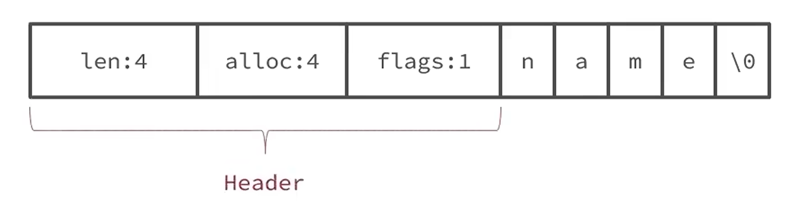


SDS 之所以叫做动态字符串，是因为它具备动态扩容的能力，例如一个内容为 ”hi“ 的 SDS：

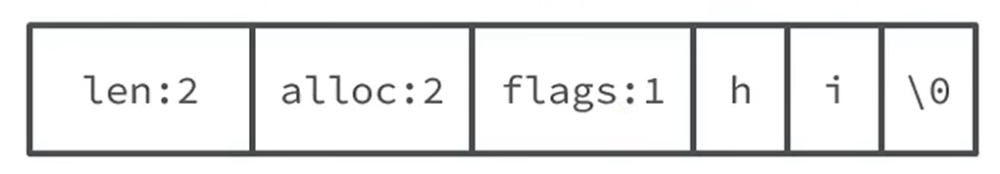

假如我们要给 SDS 追加一段字符串 ”,Amy“，这里首先会申请新内存空间：

+ 如果新字符串小于 1M，则新空间为扩展后字符串长度的两倍+1；
+ 如果新字符串大于 1M，则新空间为扩展后字符串长度+1M+1。称为**内存预分配**

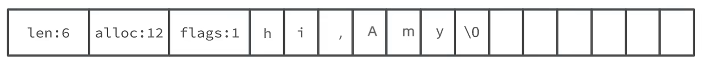

优点：

1. 获取字符串长度的时间复杂度为 O(1)
2. 支持动态扩容
3. 减少内存分配次数
4. 二进制安全


---------------


#### 2. IntSet

IntSet 是 Redis 中 set 集合的一种实现方式，基于整数数组来实现，并且具备长度可变、有序等特征

结构如下：

```c
typedef struct intset {
    uint32_t encoding; /* 编码方式，支持存放16位、32位、64位整数 */
    uint32_t length; /* 元素个数 */
    int8_t contents[]; /* 整数数组，保存集合数据 */
} intset;
```

其中的 encoding 包含三种模式，标示存储的整数大小不同：

```c
/* Note that these encodings are ordered, so:
 * INTSET_ENC_INT16 < INTSET_ENC_INT32 < INTSET_ENC_INT64 .*/
#define INTSET_ENC_INT16(sizeof(int16_t)) /* 2字节整数, 范围类似java的short */
#define INTSET_ENC_INT32(sizeof(int32_t)) /* 4字节整数, 范围类似java的int */
#define INTSET_ENC_INT64(sizeof(int64_t)) /* 8字节整数, 范围类似java的long */
```


为了方便查找，Redis 会将 intset 中所有的整数按照升序一次保存在 contents 数组中，结构如图：

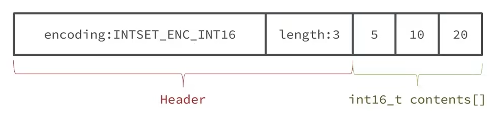

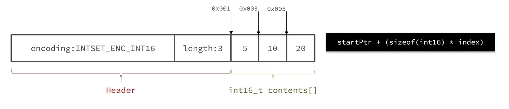

现在，数组中每个数字都在 **int16_t** 范围内，一次采用的编码方式是 INTSET_ENC_INT16，每部分占用的字节大小为：

+ encoding：4字节
+ length：4字节
+ contents：2字节 * 3 = 6字节


##### 2.1 InteSet 升级

现在，假设有一个 intset，元素为 {5, 10, 20}，采用的编码是 **INTSET_ENC_INT16**，则每个整数占2字节：

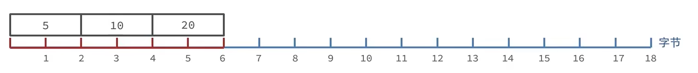

我们向该 intset 中添加一个数字：50000， 这个数字超出了 **int16_t** 的范围，intset 会自动**升级**编码方式到合适的大小

以当前案例来说流程如下：

1. 升级编码为 **INTSET_ENC_INT32**，每个整数占4字节，并按照新的编码方式及元素个数扩容数组
2. 倒序依次将数组中的元素拷贝到扩容后的正确位置（不会出现数组覆盖）


3. 将待添加的元素放入数组末尾

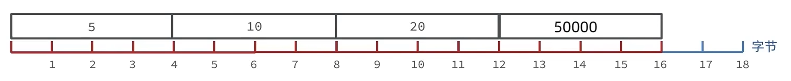

4. 最后，将 intset 的 encoding 属性改为 **INTSET_ENC_INT32**，将 length 属性改为4


##### 总结

Intset 可以看做是特殊的整数数组，具备一些特点：

1. Redis 会确保 Intset 中的元素唯一、有序
2. 具备类型升级机制，可以节省内存空间
3. 底层采用二分查找方式来查询


----------------


#### 3. Dict

我们知道 Redis 是一个键值型（Key-Value Pair）的数据库，我们可以根据键实现快速的增删改查。而键与值得映射关系正是通过 Dict 来实现的

Dict 由三部分组成，分别是：哈希表（DictHashTable）、哈希节点（DictEntry）、字典（Dict）

```c
typedef struct dichht {
    // entry数组
    // 数组中保存的是指向entry的指针
    dictEntry **table;
    // 哈希表大小
    unsigned long size;
    // 哈希表大小的掩码，总等于size - 1
    unsigned long sizemask;
    // entry个数
    unsigned long used;
} dictht;
```

```c
typedef struct dictEntry {
	void *key; // 键
	union {
		void *val;
		uint64_t u64;
		int64_t s64;
		double d;
	} v; // 值
	// 下一个Entry的指针
	struct dictEntry *next;
} dictEntry;
```

当我们向 Dict 添加键值对时，Redis 首先根据 key 计算出 hash 值（h），然后利用 h & sizemask 来计算元素应该存储到数组中的哪个索引位置。我们存储 k1 = v1，假设 k1 的哈希值 h = 1，则 1&3 = 1，因此 k1 = v1 要存储到数组角标1位置

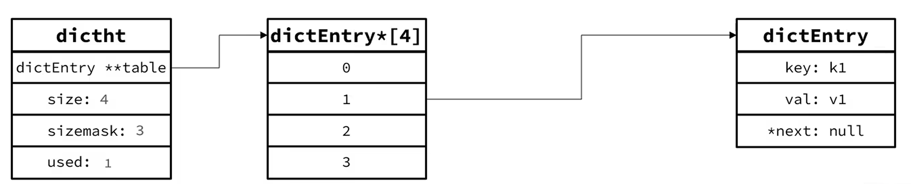

如果再来一个：

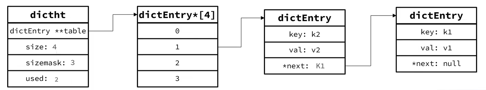

```c
typedef struct dict {
	dictType *type; //dict类型,内置不同的hash函数
    void *privdata; // 私有数据,在做特殊hash运算时用
	dictht ht[2];//一个Dict包含两个哈希表,其中一个是当前数据,另一个一般是空,rehash时使用
    long rehashidx; // rehash的进度,-1表示未进行
	int16_t pauserehash; //rehash是否暂停,1则暂停,0则继续
} dict;
```

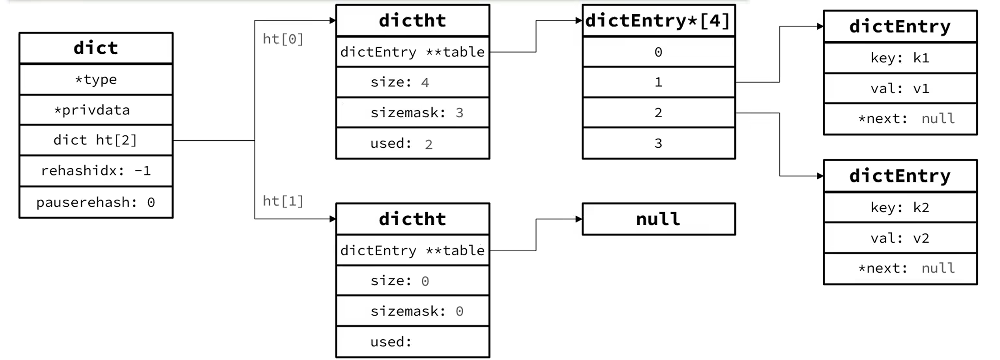


##### 3.1 Dict 的扩容

Dict 中的 HashTbale 就是数组结合单向链表的实现，当集合中元素较多时，必然导致哈希冲突增多，链表过长，则查询效率会大大降低

Dict 在每次新增键值对时都会检查**负载因子**（LoadFactor = used/size），满足以下两种情况时会触发**哈希表扩容**：

+ 哈希表的 LoadFactor >= 1，并且服务器没有执行 BGSAVE 或者 BGREWRITEAOF 等后台进程；
+ 哈希表的 LoadFactor > 5；

```c
static int _dictExpandIfNeeded(dict *d) {
	//如果正在rehash,则返回ok
	if (dictIsRehashing(d)) return DICT_OK;
	// 如果哈希表为空,则初始化哈希表为默认大小:4
	if (d->ht[0].size == 0) return dictExpand(d, DICT_HT_INITIAL_SIZE);
	// 当负载因子(used/size)达到1以上,并且当前没有进行bgrewrite等子进程操作
	// 或者负载因子超过5,则进行dictExpand,也就是扩容
	if (d->ht[0].used >= d->ht[0].size &&
(dict_can_resize | | d->ht[0].used/d->ht[0].size > dict_force_resize_ratio) {
		// 扩容大小为used +1,底层会对扩容大小做判断,实际上找的是第一个大于等于 used+1 的 2^n
		return dictExpand(d, d->ht[0].used +1);
	}
	return DICT_OK;
}
```

Dict 除了扩容以外，每次删除元素时，也会对负载因子做检查，当 LoadFactor < 0.1 时，会做哈希表收缩：

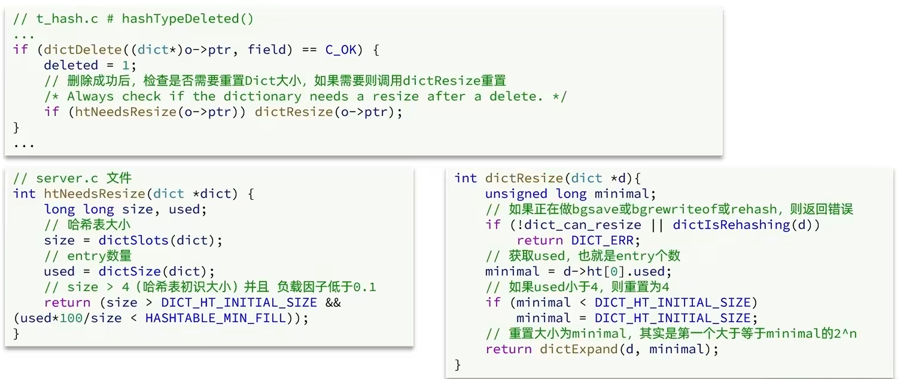


##### 3.2 Dict 的 rehash

不管是扩容还是收缩，必定会创建新的哈希表，导致哈希表的 size 和 sizemask 变化，而 key 的查询与 sizemask 有关。因此必须对哈希表中的每一个 key 重新计算索引，插入新的哈希表，这个过程称为 **rehash**。过程是这样的：

1. 计算新 hash 表的 realeSize，值取决于当前要做的时扩容还是收缩：
   + 如果是扩容，则新 size 为第一个大于等于 `dict.ht[0].used + 1` 的 2^n^
   + 如果是收缩，则新的 size 为第一个大于等于 `dict.ht[0].used + 1` 的 2^n^（不得小于4）

2. 按照新的 realeSize 申请内存空间，创建 dictht，并赋值给 dict.ht[1]
3. 设置 dict.rehashidx = 0，标示开始 rehash
4. 将 dict.ht[0] 中的每一个 dictEntry 都 rehash 到 dict.ht[1]
5. 将 dict.ht[1] 赋值给 dict.ht[0]，给 dict.ht[1] 初始化为空哈希表，释放原来的 dict.ht[0] 的内存


Dict 的 rehash 并不是一次性完成的。试想一下，如果 Dict 中包含数百万的 entry，要在一次 rehash 完成，极有可能导致主线程阻塞。因此 Dict 的 rehash 时分多次、渐进式的完成，因此称为**渐进式 rehash**。流程如下：

1. 计算新 hash 表的 size，值取决于当前要做的是扩容还是收缩：
   + 如果是扩容，则新 size 为第一个大于等于 `dict.ht[0].used + 1` 的 2^n^
   + 如果是收缩，则新的 size 为第一个大于等于 `dict.ht[0].used + 1` 的 2^n^（不得小于4）

2. 按照新的 realeSize 申请内存空间，创建 dictht，并赋值给 dict.ht[1]
3. 设置 dict.rehashidx = 0，标示开始 rehash
4. **每次执行增删改查操作时，都检查一下 dict.rehashdix 是否大于-1，如果是则将 dict.ht[0].table[rehashidx] 的 entry 链表 rehash 到 dict.ht[1]，并且将 rehashidx++。直至 dict.ht[0] 的所有数据都 rehash 到 dict.ht[1]**
5. 将 dict.ht[1] 赋值给 dict.ht[0]，给 dict.ht[1] 初始化为空哈希表，释放原来的 dict.ht[0] 的内存

6. **将 rehashidx 赋值为-1，代表 rehash 结果**
7. **在 rehash 过程中，新增操作，则直接写入 ht[1]，查询、修改和删除则会在 dict.ht[0] 和 dict.ht[1] 依次查找并执行。这样可以确保 ht[0] 的数据只减不增，随着 rehash 最终为空**


##### 总结

Dict 的结构：

+ 类似 java 的 HashTable，底层是数组加链表来解决哈希冲突
+ Dict 包含两个哈希表，ht[0] 平常用，ht[1] 用来 rehash

Dict 的伸缩：

+ 当 LoadFactor 大于5或者 LoadFactor 大于1并且没有子进程任务时，Dict 扩容
+ 当 LocalFactor 小于0.1时，Dict 收缩
+ 扩容带下为第一个大于等于 used + 1 的 2^n^
+ 收缩大小为第一个大于等于 used 的 2^n^
+ Dict 采用渐进式 rehash，每次访问 Dict 时执行一个 rehash
+ rehash 时 ht[0] 只减不增，新增操作只在 ht[1] 执行，其它操作在两个哈希表


------------


#### 4. ZipList

**ZipList** 是一种特殊的 ”双端链表“，由一系列特殊编码的连续内存块组成。可以在任意一端进行压入 / 弹出操作，并且该操作的时间复杂度为 O(1)

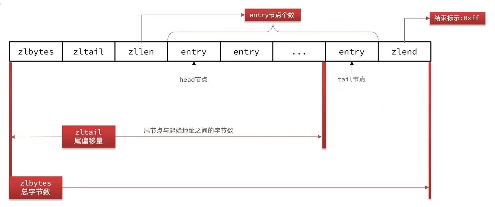

| 属性    | 类型     | 长度  | 用途                                                         |
| ------- | -------- | ----- | ------------------------------------------------------------ |
| zlbytes | uint32_t | 4字节 | 记录整个压缩列表占用的内存字节数                             |
| zltail  | uint32_t | 4字节 | 记录压缩列表表尾节点距离压缩列表的起始地址有多少字节，通过这个偏移量，可以确定表尾节点的地址 |
| zllen   | uint16_t | 2字节 | 记录了压缩列表包含的节点数量。最大值为 UINT16_MAX(65534)，如果超过这个值，此处会记录为65535，但节点的真实数量需要遍历整个压缩列表才能计算得出 |
| entry   | 列表节点 | 不定  | 压缩列表包含的各个节点，节点得长度由节点保存的内容决定       |
| zlend   | uint8_t  | 1字节 | 特殊值 0xFF（十进制255），用于标记压缩列表的末端             |


##### 4.1 ZipListEntry

**ZipList** 中的 Entry 并不像普通链表那样记录前后节点的指针，因为记录两个指针要占用16个字节，浪费内存。而是采用了下面的结构：


+ `previous_entry_length`：前一节点的长度，占1个或5个字节
  + 如果前一节点的长度小于254字节，则采用1个字节来保存这个长度值
  + 如果前一节点的长度大于254字节，则采用5个字节来保存这个长度值，第一个字节为 0xfe，后四个字节才是真实长度数据
+ `encoding`：编码属性，记录 content 的数据类型（字符串还是整数）以及长度，占用1个、2个或5个字节
+ `contents`：负责保存节点的数据，可以是字符串或整数

<strong><font color='red'>注意</font></strong>：ZipList 中所有存储长度的数字均采用小端字节序，即低位字节在前，高位字节在后。例如：数值0x1234，采用小端字节序后实际存储值为：0x3412


##### 4.2 Encoding 编码

ZipListEntry 中的 encoding 编码分为字符串和整数两种：

+ 字符串：如果 encoding 是以 ”00“、”01“ 或者 ”10“ 开头，则证明 content 是字符串

| 编码                                                 | 编码长度 | 字符串大小          |
| ---------------------------------------------------- | -------- | ------------------- |
| \|00pppppp\|                                         | 1 bytes  | <= 63 bytes         |
| \|01pppppp\|qqqqqqqq\|                               | 2 bytes  | <= 16383 bytes      |
| \|10000000\|qqqqqqqq\|rrrrrrrr\|ssssssss\|tttttttt\| | 5 bytes  | <= 4294967295 bytes |

例如，我们要保存字符串："ab" 和 "bc"

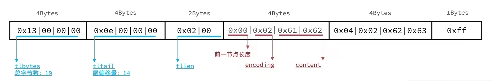


+ 整数：如果 encoding 是以 ”11“ 开始，则证明 content 是整数，且 encoding 固定只占用1个字节

| 编码     | 编码长度 | 整数类型                                                     |
| -------- | -------- | ------------------------------------------------------------ |
| 11000000 | 1        | int16_t（2 bytes）                                           |
| 11010000 | 1        | int32_t（4 bytes）                                           |
| 11100000 | 1        | int64_t（8 bytes）                                           |
| 11110000 | 1        | 24为有符整数（3 bytes）                                      |
| 11111110 | 1        | 8位有符整数（1 bytes）                                       |
| 1111xxxx | 1        | 直接在 xxxx 位置保存数值，范围从0001~1101，减1后结果为实际值 |

例如，一个 ZipList 中包含两个整数值："2" 和 "5"


##### 4.3 ZipList 的连锁更新问题

ZipList 的每个 Entry 都包含 previous_entry_length 来记录上一个节点的大小，长度是1个或者5个字节：

+ 如果前一节点的长度小于254字节，则采用1个字节来保存这个长度值
+ 如果前一节点的长度大于254字节，则采用5个字节来保存这个长度值，第一个字节为 0xfe，后四个字节才是真实长度数据

现在，假设我们有 N 个连续的、长度为250~253字节之间的 entry，因此 entry 的 previous_entry_length 属性用1个字节即可表示，如图所示：

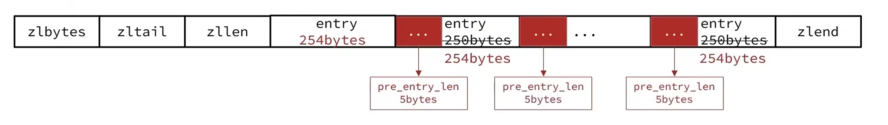

ZipList 这种特殊情况下产生的连续多次空间扩展操作称之为**连锁更新（Cascade Update）**。新增、删除都可能导致连锁更新的发生


##### 总结

ZipList 的特性：

1. 压缩列表可以看做一种连续内存的 ”双向链表“
2. 列表的节点之间不是通过指针连接，而是记录上一节点和本节点长度来寻址，内存占用较低
3. 如果列表数据过多，导致链表过长，可能影响查询性能
4. 增或删较大数据时可能发生连锁更新问题


------------


#### 5. QuickList

问题1：ZipList 虽然节省内存，但申请内存必须是连续空间，如果内存占用较多，申请内存效率很低，怎么办？

+ 为了缓解这个问题，我们必须限制 ZipList 的长度和 entry 大小

问题2：但是我们要存储大量数据，超出了 ZipList 最佳的上限怎么办？

+ 我们可以创建多个 ZipList 来分片存储数据

问题3：数据拆分后比较分散，不方便管理和查找，这多个 ZipList 如果建立联系？

+ Redis 在3.2版本引入了新的数据结构 **QuickList**，它是一个双端链表，只不过链表中的每个节点都是一个 ZipList

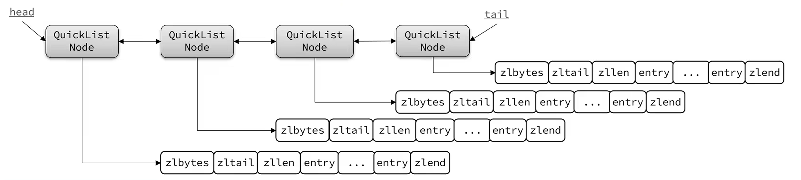


为了避免 QuickList 中的每个 ZipList 中 entry 过多，Redis 提供了一个配置项：`list-max-ziplist-size` 来限制

+ 如果值为正，则代表 ZipList 的允许的 entry 个数的最大值
+ 如果值为负，则代表 ZipList 的最大内存大小，分5种情况：
  1. 每个 ZipList 的内存占用不超过4kb
  2. 每个 ZipList 的内存占用不超过8kb
  3. 每个 ZipList 的内存占用不超过16kb
  4. 每个 ZipList 的内存占用不超过32kb
  5. 每个 ZipList 的内存占用不超过64kb

其默认值为 -2：

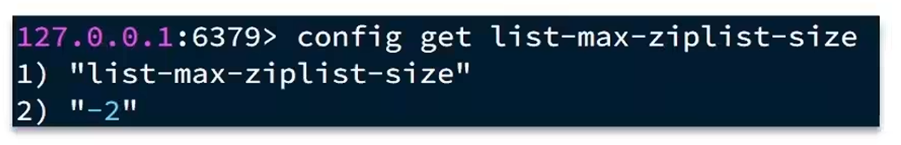


除了控制 ZipList 的大小，QuickList 还可以对节点的 ZipList 做压缩。通过配置项 `list-compress-depth` 来控制。因为链表一般都是从首尾访问较多，所以首尾是不压缩的。这个参数是控制首尾不压缩的节点个数：

+ 0：特殊值，代表不压缩
+ 1：标示 QuickList 的首尾各有1个节点不压缩，中间节点压缩
+ 2：标示 QuickList 的首尾各有2个节点不压缩，中间节点压缩
+ 以此类推

默认值：

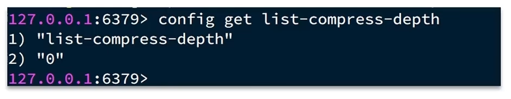


以下是 QuickList 和 QuickListNode 的结构源码：

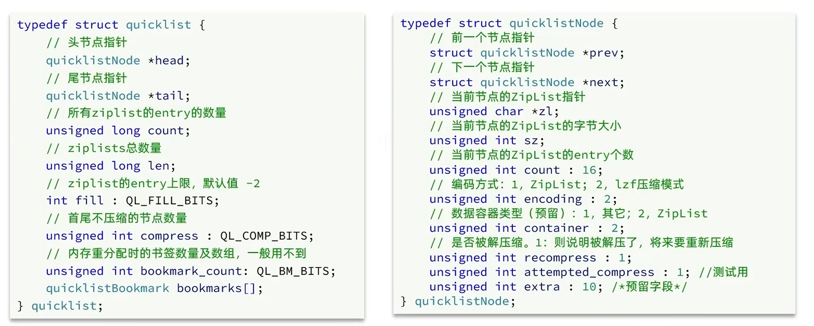

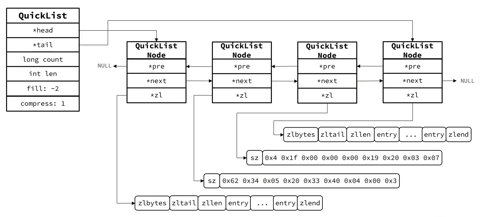


##### 总结

QuickList 的特点：

+ 是一个节点为 ZipList 的双端链表
+ 节点采用 ZipList，解决了传统链表的内存占用问题
+ 控制了 ZipList 大小，解决连续内存空间申请效率问题
+ 中间节点可以压缩，进一步节省了内存


-------------------------


#### 6. SkipList

**Skip List（跳表）**首先是链表，但与传统链表相比有几点差异：

+ 元素按照升序排序存储
+ 节点可能包含多个指针，指针跨度不同

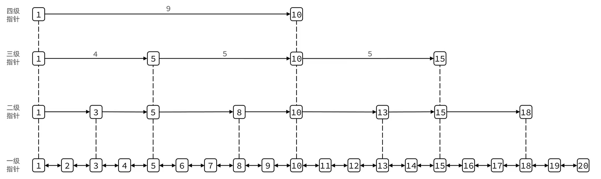

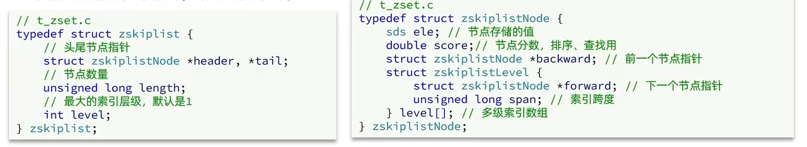

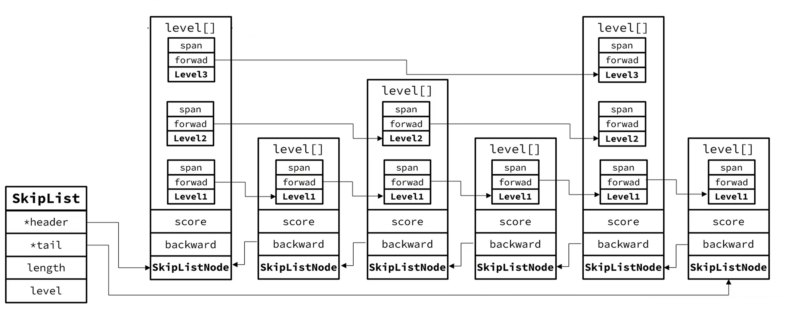


##### 总结

SkipList 的特点：

+ 跳跃表是一个双向链表，每个节点都包含 score 和 ele 值
+ 节点按照 score 值排序，score 值一样则按照 ele 字典排序
+ 每个节点都可以包含多层指针，层数是1到32之间的随机数
+ 不同层指针到下一个节点的跨度不同，层级越高，跨度越大
+ 增删改查效率与红黑树基本一致，实现却更简单


---------------------


#### 7. RedisObject

Redis 中的任意数据类型的键和值都会被封装为一个 RedisObject，也叫做 Redis 对象，源码如下：

```c
typedef struct redisObject {
    unsigned type:4;
    unsigned encoding:4;
    unsigned lru:LRU_BITS; // LRU_BITS为24
    int refcount;
    void *ptr;
} robjl
```

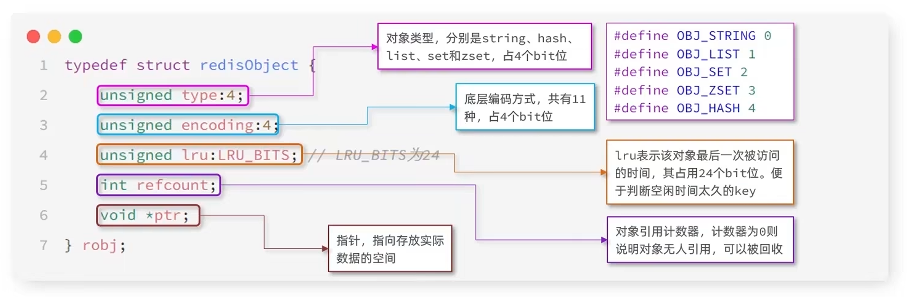

Redis 中会根据存储的数据类型不同，选择不同的编码方式，共包含11种不同类型：

| 编号 | 编码方式                | 说明                    |
| ---- | ----------------------- | ----------------------- |
| 0    | OBJ_ENCODING_RAW        | raw 编码动态字符串      |
| 1    | OBJ_ENCODING_INT        | long 类型的整数的字符串 |
| 2    | OBJ_ENCODING_HT         | hash 表（字典 dict）    |
| 3    | OBJ_ENCODING_ZIPMAP     | 已废弃                  |
| 4    | OBJ_ENCODING_LINKEDLIST | 双端链表                |
| 5    | OBJ_ENCODING_ZIPLIST    | 压缩列表                |
| 6    | OBJ_ENCODING_INTSET     | 整数集合                |
| 7    | OBJ_ENCODING_SKIPLIST   | 跳表                    |
| 8    | OBJ_ENCODING_EMBSTR     | embstr 的动态字符串     |
| 9    | OBJ_ENCODING_QUICKLIST  | 快速列表                |
| 10   | OBJ_ENCODING_STREAM     | Stream 流               |


Redis 中会根据存储的数据类型不同，选择不同的编码方式。每种数据类型使用的编码方式如下：

| 数据类型   | 编码方式                                               |
| ---------- | ------------------------------------------------------ |
| OBJ_STRING | int、embstr、raw                                       |
| OBJ_LIST   | LinkedList 和 ZipList（3.2以前）、QuickList（3.2以后） |
| OBJ_SET    | intset、HT                                             |
| OBJ_ZSET   | ZipList、HT、SkipList                                  |
| OBJ_HASH   | ZipList、HT                                            |


----------


#### 8. 五种数据结构

##### 8.1 String

string 是 Redis 中最常见的数据存储类型：

+ 其基本编码方式是 **RAW**，基于简单动态字符串（SDS）实现，存储上限为 512mb

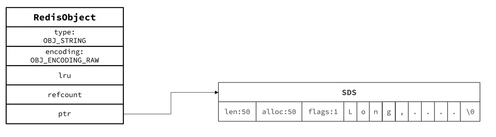

+ 如果存储的 SDS 长度小于44字节，则会采用 **EMBSTR** 编码，此时 object head 与 SDS 是一段连续空间。申请内存时只需要调用一次内存分配函数，效率更高

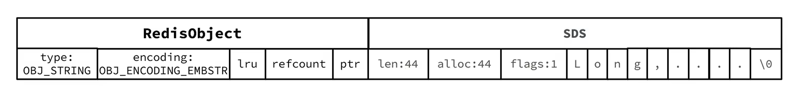

+ 如果存储的字符串是整数值，并且大小在 LONG_MAX 范围内，则会采用 **INT** 编码：直接将数据保存在 RedisObject 的 ptr 指针位置（刚好8字节），不再需要 SDS 了

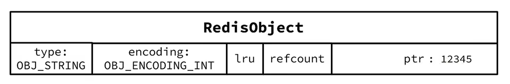

总结：

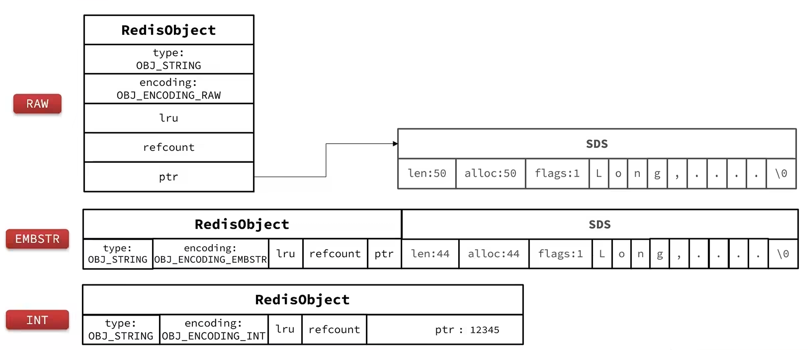

测试：

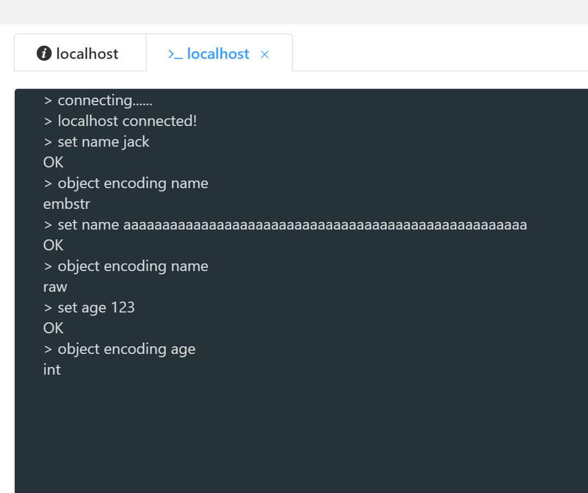


--------------------


##### 8.2 List

Redis 的 List 类型可以从首、尾操作列表中的元素：

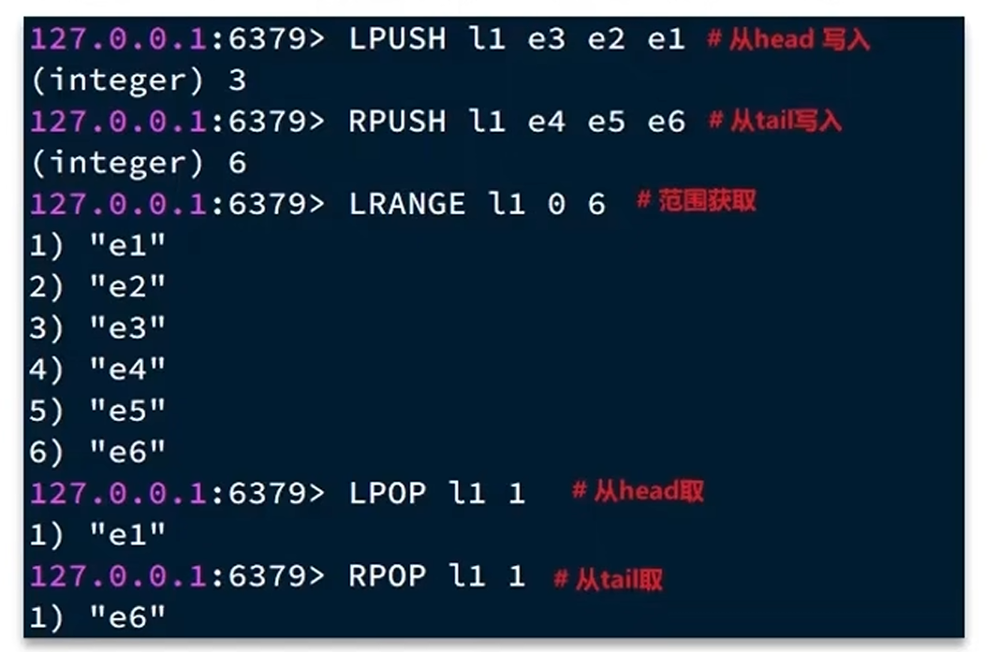

哪一个数据结构能满足上述特征？

+ LinkedList：普通链表，可以从双端访问，内存占用较高，内存碎片较多
+ ZipList：压缩列表，可以从双端访问，内存占用低，存储上限低
+ QuickList：LinkedList + ZipList，可以从双端访问，内存占用较低，包含多个 ZipList，存储上限高


Redis 的 List 结构类似一个双端链表,可以从首、尾操作列表中的元素:

+ 在3.2版本之前，Redis 采用 ZipList 和 LinkedList 来实现 List，当元素数量小于512并且元素大小小于64字节时采用 ZipList 编码,超过则采用 LinkedList 编码

+ 在3.2版本之后，Redis 统一采用 QuickList 来实现 List

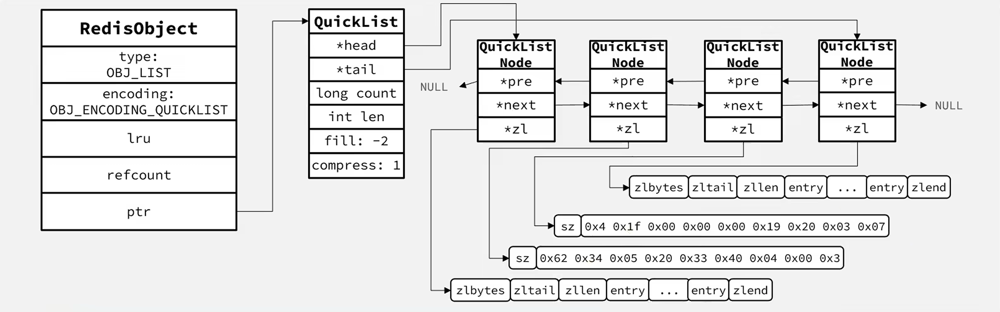


--------------------


##### 8.3 Set

Set 是 Redis 中的单列集合，满足下列特点：

+ 不保证有序性
+ 保证元素唯一（可以判断元素是否存在）
+ 求交集、并集、差集

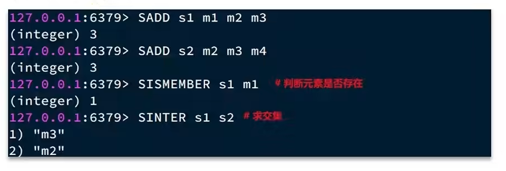

可以看出，Set 对查询元素的效率要求非常高，思考一下，什么样的数据结构可以满足？

+ HashTable，也就是 Redis 中的 Dict，不过 Dict 是双列集合（可以存键值对）


Set 是 Redis 中的集合，不一定确保元素有序，可以满足元素唯一、查询效率要求极高

+ 为了查询效率和唯一性，set 采用 HT 编码（Dict）。Dict 中的 key 用来存储元素、value 统一为 null
+ 当存储的所有数据都是整数，并且元素数量不超过 set-max-intset-entries 时，Set 会采用 IntSet 编码，以节省内存

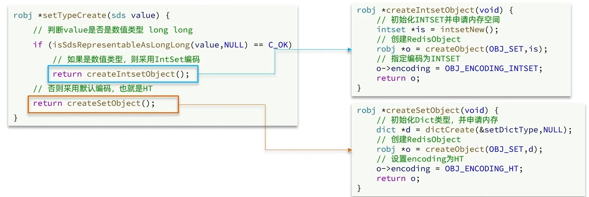

set-max-intset-entries 的默认值为512：

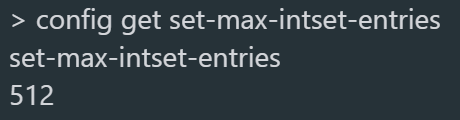


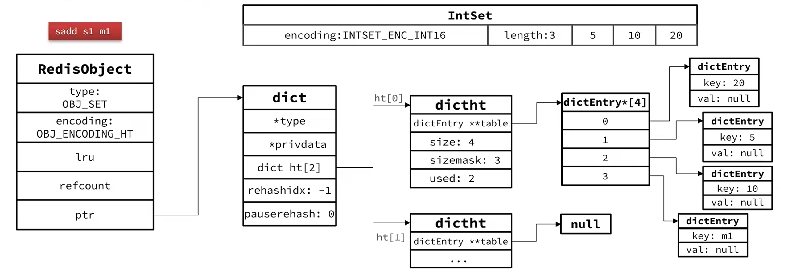


----------------------------


##### 8.4 ZSet

ZSet 也就是 SortedSet，其中每个元素都需要指定一个 score 值和 member 值：


+ 可以根据 score 值排序
+ member 必须唯一
+ 可以根据 member 查询分数

因此，zset 底层数据结构必须满足**键值存储、键必须唯一、可排序**这几个需求

+ **SkipList：**可以排序，并且可以同时存储 score 和 ele 值（member）
+ **HT（Dict）：**可以键值存储，并且可以根据 key 找 value

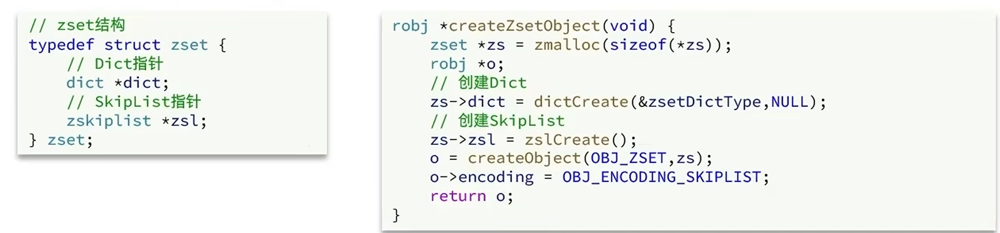


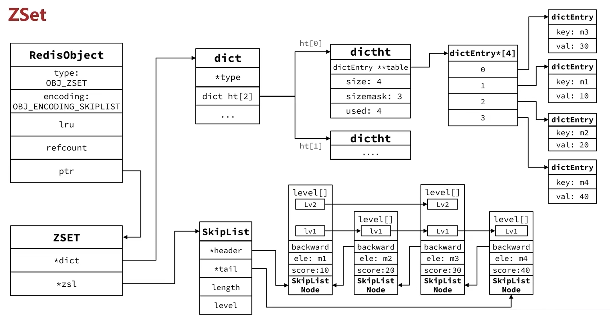


当元素数量不多时，HT 和 SkipList 的优势不明显，而且更耗内存。因此 zset 还会采用 ZipList 结构来节省内存。不过需要同时满足两个条件：

1. 元素数量小于 zset_max_ziplist_entries，默认值128
2. 每个元素都小于 zset_max_ziplist_value 字节，默认值64

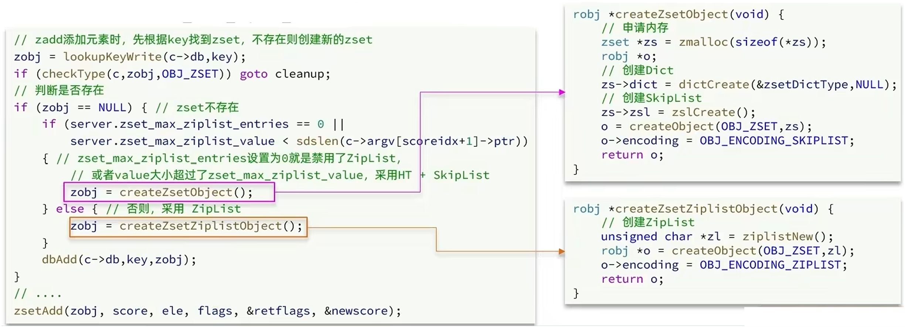

ziplist 本身没有排序功能，而且没有键值对的概念，因此需要由 zset 通过编码实现：

+ ZipList 是连续内存，因此 score 和 element 是紧挨在一起的两个 entry，element 在前，score 在后
+ score 越小越近队首，score 越大越接近队尾，按照 score 值升序排序

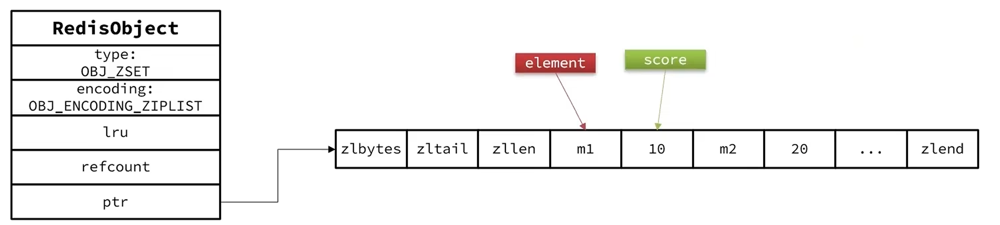


--------------------


##### 8.5 Hash

Hash 结构与 Redis 中的 Zset 非常类似：

+ 都是键值存储
+ 都需要根据键获取值
+ 键必须唯一


区别如下：

+ zset 的键是 member，值是 score；hash 的键和值都是人一直
+ zset 要根据 score 排序；hash 则无需排序

因此，Hash 底层采用的编码与 Zset 也基本一致，只需要把排序有关的 SkipList 去掉即可：

+ Hash 结构默认采用 ZipList 编码，用以节省内存。ZipList 中相邻的两个 entry 分别保存 field 和 value


+ 当数据量较大时，Hash 结构会转为 HT 编码，也就是 Dict，触发条件有两个：
  1. ZipList 中的元素数量超过了 hash-max-ziplist-entries（默认512）
  2. ZipList 中的任意 entry 大小超过了 hash-max-ziplist-value（默认64字节）

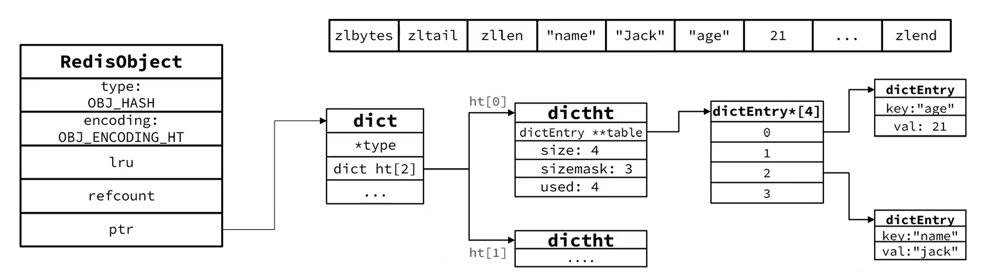

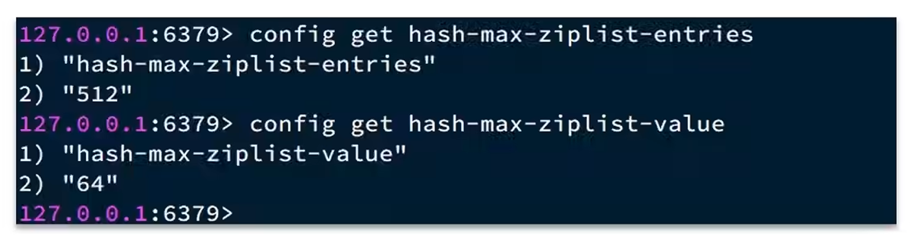


---------------


### 二、网络模型

#### 1. 用户空间和内核空间

服务器大多都采用 Linux 系统，这里我们以 Linux 为例来讲解

任何 Linux 发行版，其系统内核都是 Linux。我们的应用都需要通过 Linux 内核与硬件交互


为了避免用户应用导致冲突甚至内核崩溃，用户应用与内核是分离的：

+ 进程的寻址空间会划分为两部分：**内核空间、用户空间**
+ **用户空间**只能执行受限的命令（Ring3），而且不能直接调用系统资源，必须通过内核提供的接口来访问
+ **内核空间**可以执行特权命令（Ring0），调用一切系统资源

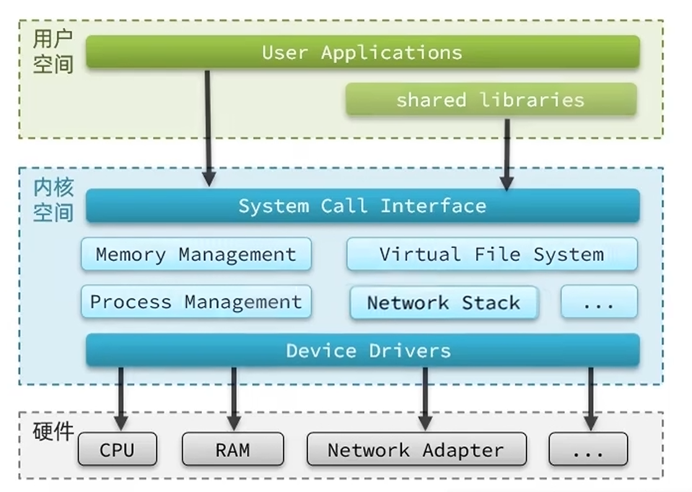

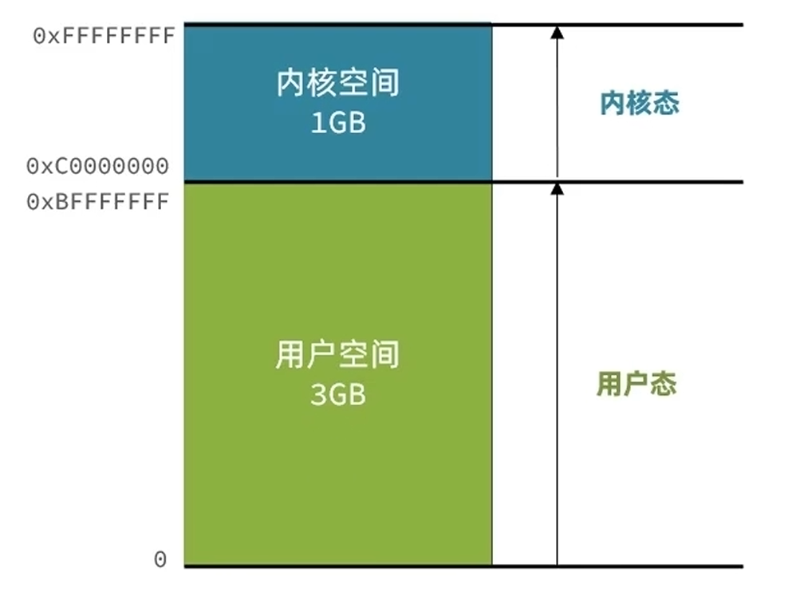


Linux 系统为了提高 IO 效率，会在用户空间和内核空间都加入缓冲区：

+ 写数据时，要把用户缓冲数据拷贝到内核缓冲区，然后写入设备
+ 读数据时，要从设备读取数据到内核缓冲区，然后拷贝到用户缓冲区

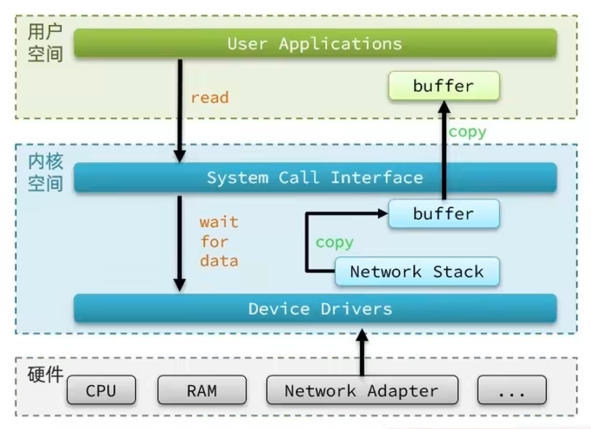


--------------


#### 2. 阻塞 IO

读取数据的流程：

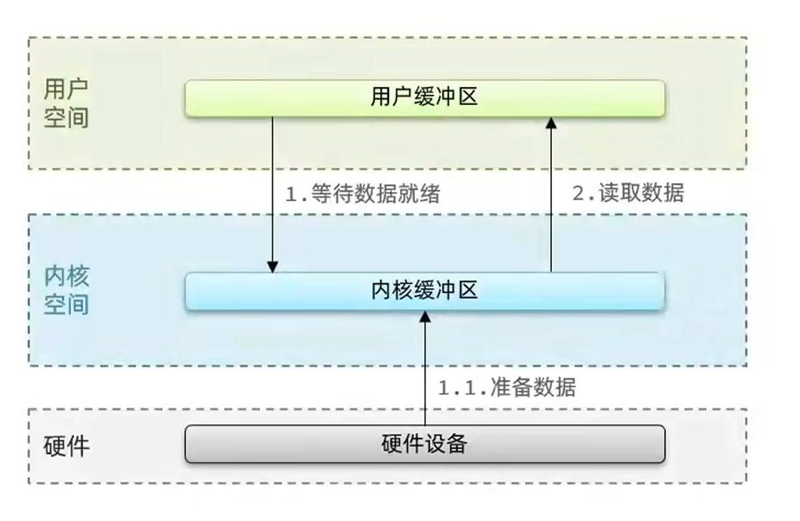

在《UNIX 网络编程》一书中，总结归纳了5种 IO 模型：

+ 阻塞 IO（Blocking IO）
+ 非阻塞 IO（Nonblocking IO）
+ IO 多路复用（IO Multiplexing）
+ 信号驱动 IO（Signal Driven IO）
+ 异步 IO（Asynchronous IO）


顾名思义，阻塞 IO 就是两个阶段都必须阻塞等待：

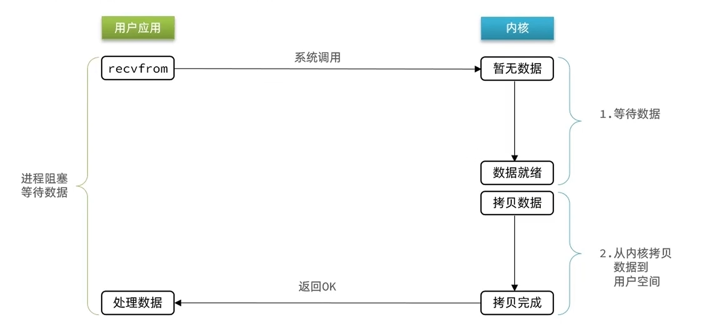

可以看到，阻塞 IO 模型中，用户进程在两个阶段都是阻塞状态

（性能不怎么样）


-----------------


#### 3. 非阻塞 IO

顾名思义，非阻塞 IO 的 recvfrom 操作会立即返回结构而不是阻塞用户进程

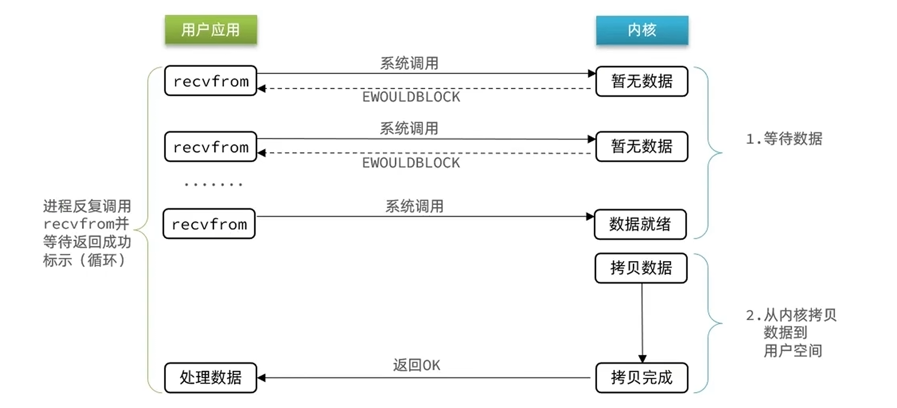

可以看到，非阻塞 IO 模型中，用户进程在第一个阶段是非阻塞，第二个阶段是阻塞状态。虽然是非阻塞，但性能并没有得到提高。而且忙等机制会导致 CPU 空转，CPU 使用率暴增


----------------


#### 4. IO 多路复用

无论是阻塞 IO 还是非阻塞 IO，用户应用在一阶段都需要调用 recvfrom 来获取数据，差别在于无数据时的处理方案：

+ 如果调用 recvfrom 时，恰好**没有**数据，阻塞 IO 会使进程阻塞，非阻塞 IO 使 CPU 空转，都不能充分发挥 CPU 的作用
+ 如果调用 recvfrom 时，恰好**有**数据，则用户进程可以直接进入第二阶段，读取并处理数据

比如服务端处理客户端 Socket 请求时，在**单线程**情况下，只能依次处理每一个 socket，如果正在处理的 socket 恰好未就绪（数据不可都或不可写），线程就会被阻塞，所有其它客户端 socket 都必须等待，性能自然会很差


**文件描述符**（File Descriptor）：简称 FD，是一个从0开始递增的无符号整数，用来关联 Linux 中的一个文件。在 Linux 中，一切皆文件，例如常规文件、视频、硬件设备等，当然也包括网络套接字（Socket）

**IO 多路复用**：是利用单个线程来同时监听多个 FD，并且在某个 FD 可读、可写时得到通知，从而避免无效的等待，充分利用 CPU 资源

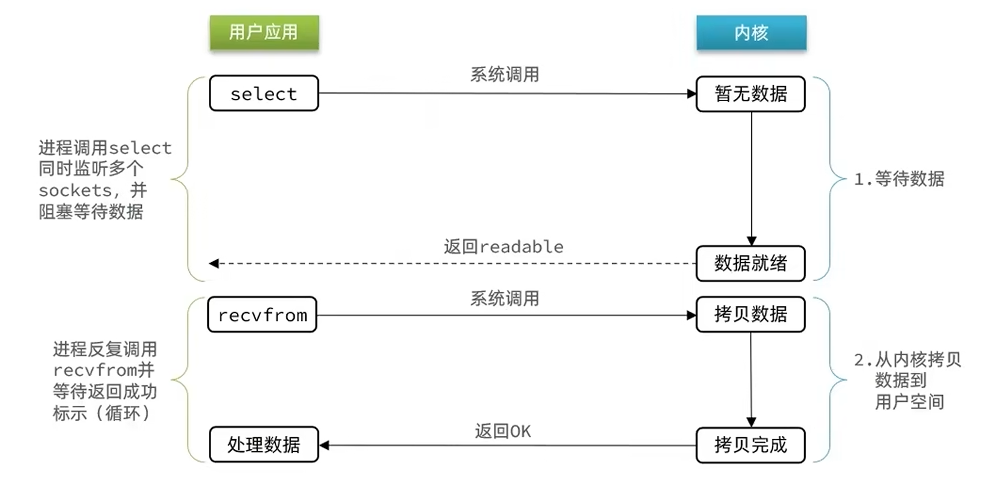

不过监听 FD 的方式、通知的方式又有多种实现，常见的有：

+ select
+ poll
+ epoll

差异：

+ select 和 poll 只会通知用户进程有 FD 就绪，但不确定具体是哪个 FD，需要用户进程逐个遍历 FD 来确认
+ epoll 则会在通知用户进程 FD 就绪的同时，把已就绪的 FD 写入用户空间


##### 4.1 IO 多路复用 - select

**select** 是 Linux 中最早的 I/O 多路复用实现方案：

```c
// 定义类型别名 __fd_mask，本质是 long int
typedef long int __fd_mask;

/* fd_set 记录要监听的fd集合,及其对应状态 */
typedef struct {
	// fds_bits是long类型数组,长度为 1024/32=32
	// 共1024个bit位,每个bit位代表一个fd,0代表未就绪,1代表就绪
	__fd_mask fds_bits[ __FD_SETSIZE / __NFDBITS];
	// ...
} fd_set;

// select函数,用于监听多个fd的集合
int select(
	int nfds, // 要监视的fd_set的最大fd + 1
	fd_set *readfds,// 要监听读事件的fd集合
	fd_set xwritefds,// 要监听写事件的fd集合
	fd_set *exceptfds, // //要监听异常事件的fd集合
	// 超时时间,null-永不超时;0-不阻塞等待;大于0-固定等待时间
	struct timeval *timeout
) ;
```

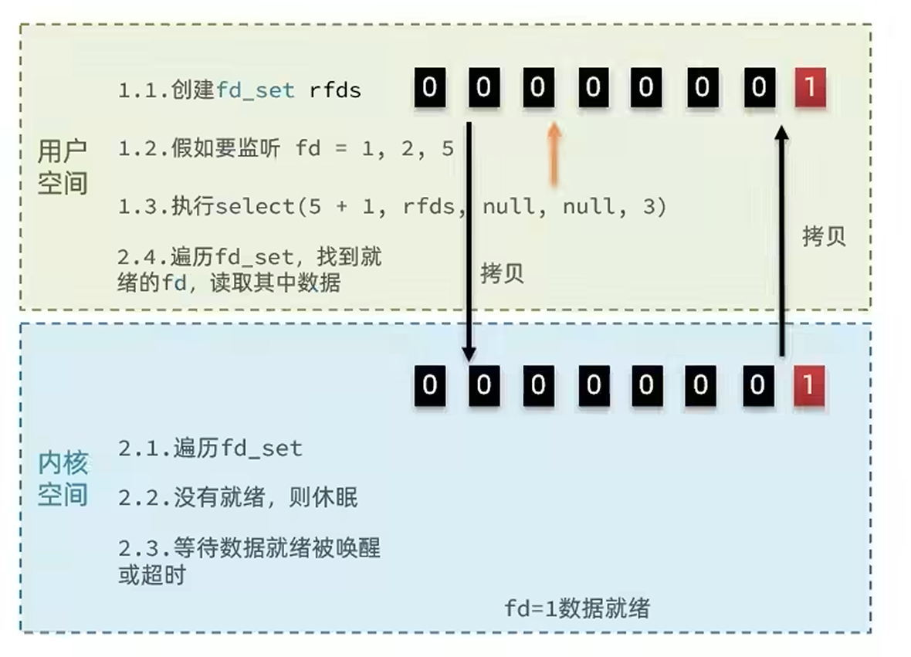

select 模式存在的问题：

+ 需要将整个 fd_set 从用户空间拷贝到内核空间，select 结束还要再次拷贝回用户空间
+ select无法得知具体哪个 fd 就绪，需要遍历整个 fd_set
+ fd_set 监听的 fd 数量就不能超过1024


-----------------------------------


##### 4.2 IO 多路复用 - poll

**poll** 模式对 select 模式做了简单改进，但性能提升不明显，部分关键代码如下：

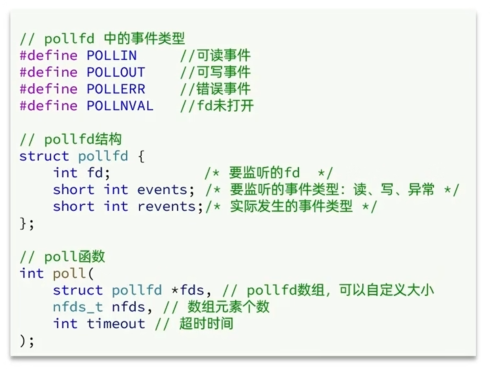

IO 流程：

1. 创建 pollfd 数组，向其中添加关注的 fd 信息，数组大小自定义
2. 调用 poll 函数，将 pollfd 数组拷贝到内核空间，转链表存储，无上限
3. 内核遍历 fd，判断是否就绪
4. 数组就绪或超时后，拷贝 pollfd 数组到用户空间，返回就绪 fd 数量 n
5. 用户进程判断 n 是否大于0
6. 大于0则遍历 pollfd 数组，找到就绪的 fd

与 select 对比：

+ select 模式中的 fd_set 大小固定为1024，而 pollfd 在内核中采用链表，理论上无上限
+ 监听 FD 越多，每次遍历消耗时间也越久，性能反而会下降


-------------------------


##### 4.3 IO 多路复用 - epoll

epoll 模式是对 select 和 poll 的改进，它提供了三个函数：

```c
struct eventpoll {
	// ...
	struct rb_root rbr; // 一颗红黑树,记录要监听的FD
	struct list_head rdlist; // 一个链表,记录就绪的FD
	// ...
};

// 1.会在内核创建eventpoll结构体,返回对应的句柄epfd
int epoll_create(int size);

// 2.将一个FD添加到epoll的红黑树中,并设置ep_poll_callback
// callback触发时,就把对应的FD加入到rdlist这个就绪列表中
int epoll_ctl(
	int epfd, // epoll实例的句柄
	int op, // 要执行的操作,包括:ADD、MOD、DEL
	int fd, // 要监听的FD
	struct epoll_event *event // 要监听的事件类型:读、写、异常等
);
// 3.检查rdlist列表是否为空,不为空则返回就绪的FD的数量
int epoll_wait(
	int epfd, // eventpoll实例的句柄
	struct epoll_event *events, // 空event数组,用于接收就绪的FD
	int maxevents, // events数组的最大长度
	int timeout // 超时时间,-1用不超时;0不阻塞;大于0为阻塞时间
);
```

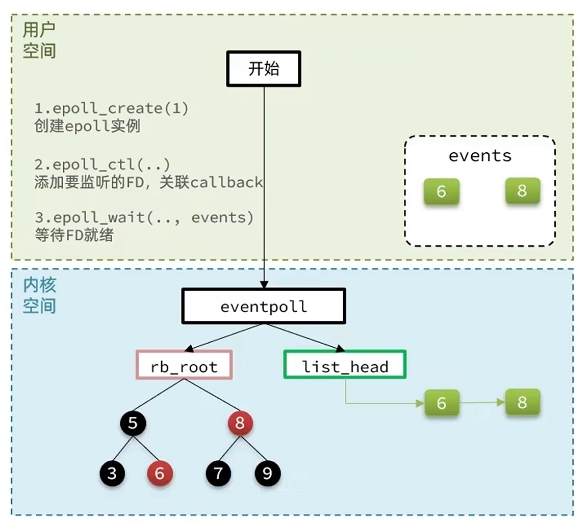


###### 总结

select 模式存在的三个问题：

+ 能监听的 FD 最大不超过 1024
+ 每次 select 都需要把所有要监听的 FD 都拷贝到内核空间
+ 每次都要遍历所有 FD 来判断就绪状态

poll 模式的问题：

+ poll 利用链表解决了 select 中监听 FD 上限的问题，当依然要遍历所有 FD，如果监听较多，性能会下降

epoll 模式中如何解决这些问题？

+ 基于 epoll 实例中的红黑树保存要监听的 FD，理论上无上限，而且增删改查效率都非常高，性能不会随监听的 FD 数量增多而下降


-----------


##### 4.4 IO 多路复用 - 事件通知机制

当 FD 有数据可读时，我们调用 epoll_wait 就可以得到通知。但是事件通知的模式有两种：

+ LevelTriggered：简称 LT。当 FD 有数据可得时；会重复通知多次。直至数据处理完成。是 Epoll 的默认模式
+ EdgeTriggered：简称 ET。当 FD 有数据可读时，只会被通知一次，不管数据是否处理完成

举个栗子：

1. 假设一个客户端 socket 对应的 FD 已经注册到了 epoll 实例中

2. 客户端 socket 发送了 2kb 的数据

3. 服务端调用 epoll_wait，得到通知说 FD 就绪

4. 服务端从 FD 读取了1kb数据

5. 回到步骤3（再次调用 epoll_wait，形成循环）

总结：

+ ET 模式避免了 LT 模式可能出现的惊群现象
+ ET 模式最好结合非阻塞 IO 读取 FD 数据，相比 LT 会复杂一些


--------------------


##### 4.5 IO 多路复用 - web 服务流程

基于 epoll 模式的 web 服务基本流程如图：

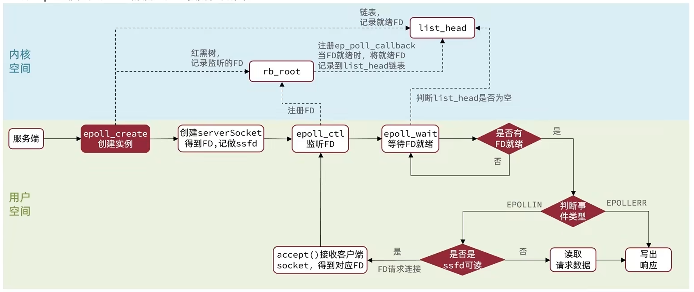


------------------


#### 5. 信号驱动 IO

**信号驱动 IO** 是与内核建立 SIGIO 的信号关联并设置回调，当内核有 FD 就绪时，会发出 SIGIO 信号通知用户，期间用户应用可以执行其它业务，无需阻塞等待

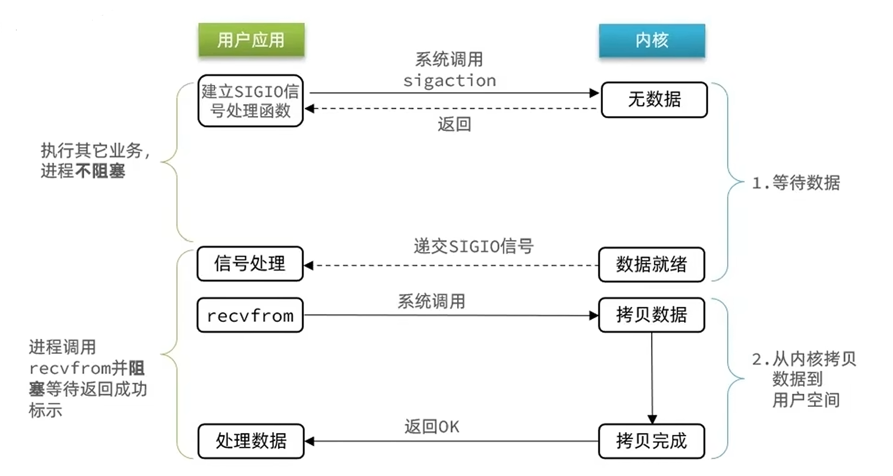

当有大量 IO 操作时，信号较多，SIGIO 处理函数不能及时处理可能导致信号队列溢出

而且内核空间与用户空间的频繁信号交互性能也较低


-----------------


#### 6. 异步 IO

**异步 IO** 的整个过程都是非阻塞的，用户进程调用完异步 API 后就可以去做其它事情，内核等待数据就绪并拷贝到用户空间后才会递交信号，通知用户进程

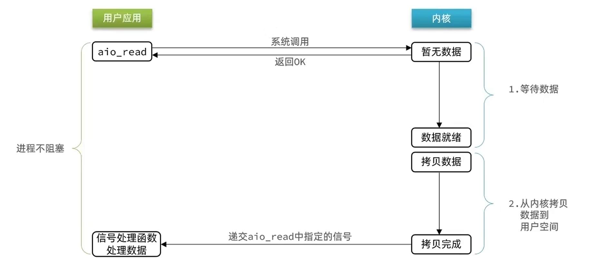

可以看到，异步 IO 模型中，用户进程在两个阶段都是非阻塞状态


##### 同步和异步

IO 操作是同步还是异步，关键看数据在内核空间与用户空间的拷贝过程（数据读写的 IO 操作），也就是阶段二是同步还是异步：

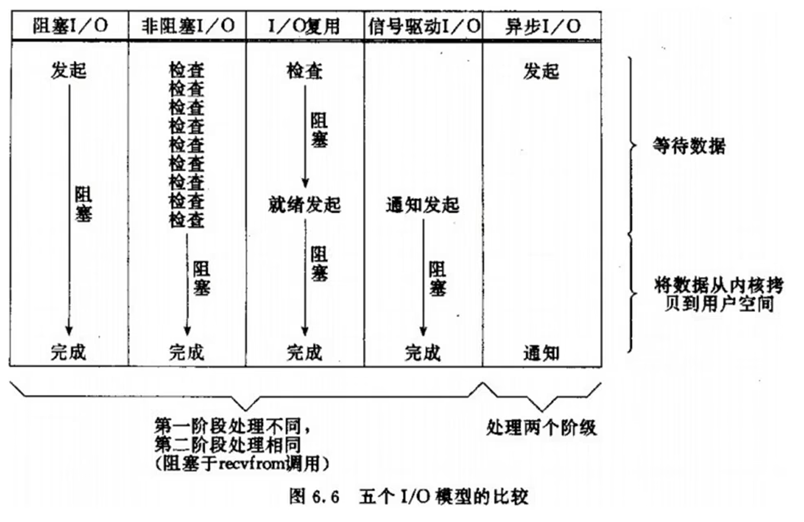


---------------


#### 7. Redis 网络模型

Redis 到底是单线程还是多线程？

+ 如果仅仅聊 Redis 的核心业务部分（命令处理），答案是单线程
+ 如果是聊整个 Redis，那么答案就是多线程

在 Redis 版本迭代过程中，在两个重要的时间节点上引入了多线程的支持：

+ Redis v4.0：引入了多线程异步处理一些耗时较长的任务，例如异步删除命令 unlink
+ Redis v6.0：在核心网络模型中引入多线程，进一步提高对于多核 CPU 的利用率

思考：

1. 为什么 Redis 要选择单线程？

+ 抛开持久化不谈，Redis 是纯内存操作，执行速度非常快，它的性能瓶颈是网络延迟而不是执行速度，因此多线程并不会带来巨大的性能提升
+ 多线程会导致过多的上下文切换，带来不必要的开销
+ 引入多线程会面临线程安全问题，必然要引入线程锁这样的安全手段，实现复杂度增高，而且性能也会大打折扣


Redis 通过 IO 多路复用来提高网络性能，并且支持各种不同的多路复用实现，并且将这些实现进行封装，提供了统一的高性能事件库 API 库 AE：

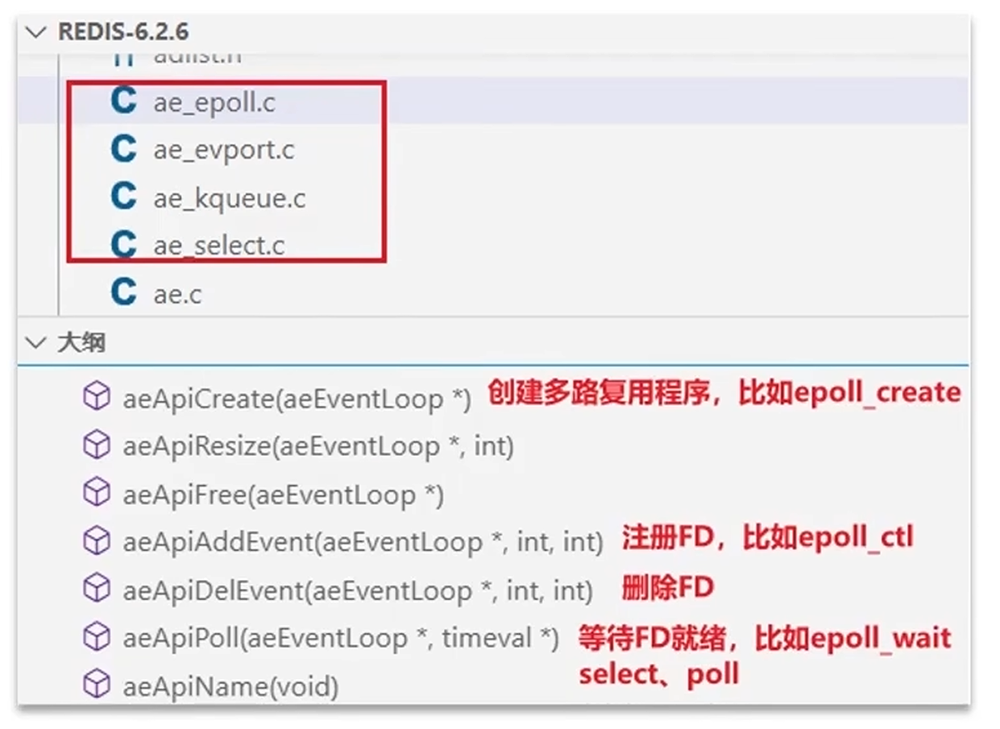

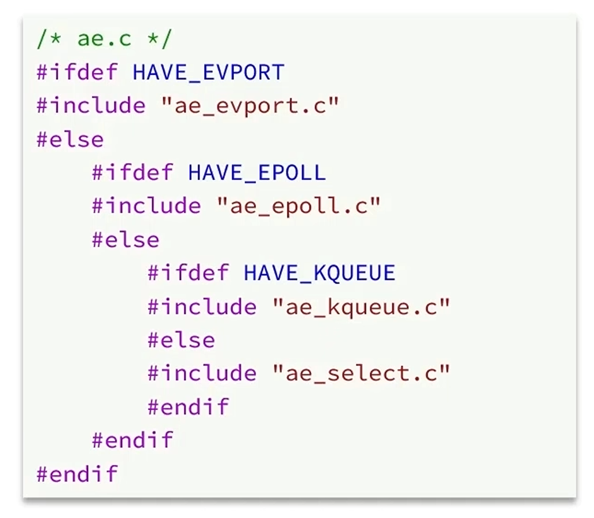


来看一下 Redis 单线程网络模型的整个流程：


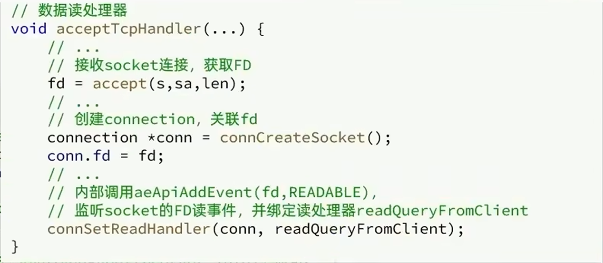

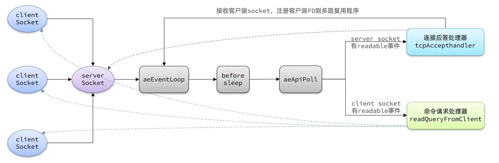

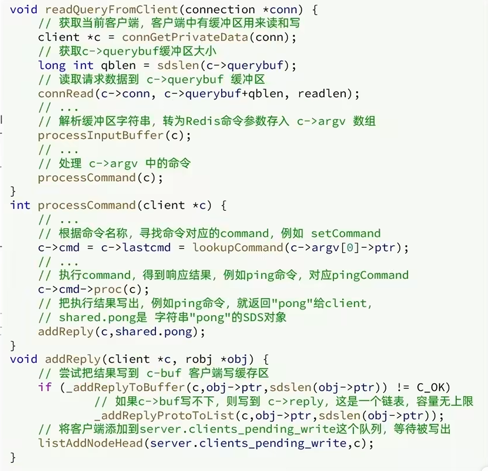

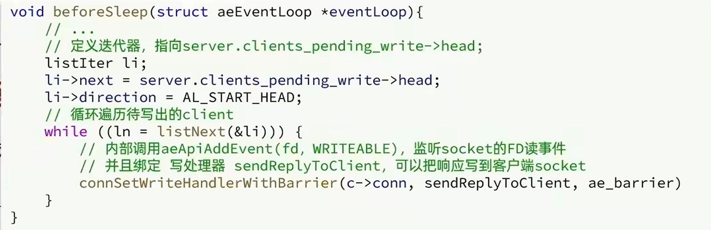

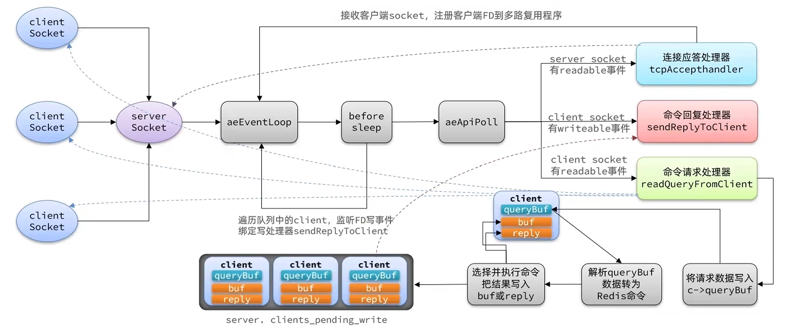

Redis 6.0版本中引入了多线程，目的是为了提高 IO 读写效率。因此在**解析客户端命令、写响应结果**时采用了多线程。核心的命令执行、IO 多路复用模块依然是由主线程执行


-----------------


### 三、通信协议

#### 1. RESP 协议

Redis 是一个 CS 架构的软件，通信一般分为两步（不包括 pipeline 和

 PubSub）：

1. 客户端（client）向服务端（server）发送一条命令
2. 服务端解析并执行命令，返回响应结果给客户端

因此客户端发送命令的格式、服务端响应结果的格式必须有一个规范，这个规范就是通信协议


而在 Redis 中采用的是 **RESP**（Redis Serialization Protocol）协议：

+ Redis1.2 版本引入了 RESP 协议
+ Redis2.0 版本中成为与 Redis 服务端通信的标准，称为 RESP2
+ Redis6.0 版本中，从 RESP2 升级到了 RESP3 协议，增加了更多数据类型并且支持6.0的新特性 -- 客户端缓存

但目前，默认使用的依然是 RESP2 协议，也就是我们要学习的协议版本


##### 1.1 RESP 协议 - 数据类型

在 RESP 中，通过首字节的字符来区分不同数据类型，常用的数据类型包括5种：

+ 单行字符串：首字节是 `+`，后面跟上单行字符串，以 CRLF（`\r\n`）结尾。例如返回 `OK`：`+OK\r\n`
+ 错误（Errors）：首字节是 `-`，与单行字符串格式一样，只是字符串是异常信息，例如：`-Error message\r\n`
+ 数值：首字节是 `:`，后面跟上数字格式的字符串，以 CRLF 结尾。例如：`:10\r\n`
+ 多行字符串：首字节是 `$`，表示二进制安全的字符串，最大支持512MB
  + 如果大小为0，则代表空字符串：`$0\r\n\r\n`
  + 如果大小为-1，则代表不存在：`$-1\r\n`

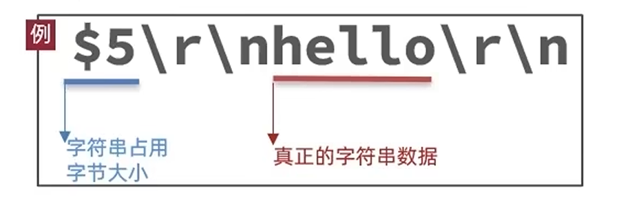

+ 数组：首字节是 `*`，后面跟上数组元素个数，再跟上元素，元素数据类型不限

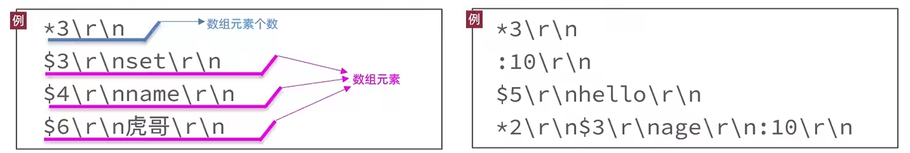


----------------


#### 2. 模拟 Redis 客户端

```java
package com.company;

import java.io.*;
import java.net.Socket;
import java.nio.charset.StandardCharsets;
import java.util.ArrayList;

public class Main {

    static Socket s;
    static PrintWriter writer;
    static BufferedReader reader;

    public static void main(String[] args) {
        try {
            // 1. 建立连接
            String host = "localhost";
            int port = 6379;
            // 2. 获取输出流和输入流
            writer = new PrintWriter(new OutputStreamWriter(s.getOutputStream(), StandardCharsets.UTF_8));
            reader = new BufferedReader(new InputStreamReader(s.getInputStream(), StandardCharsets.UTF_8));

            // 3. 发出请求
            // 3.1 获取授权 auth 123321
            sendRequest("auth", "123321");
            Object obj = handleResponse();
            System.out.println("obj = " + obj);

            // 3.2 set name feng
            sendRequest("set", "name", "feng");

            // 4. 解析响应
            Object obj = handleResponse();
            System.out.println("obj = " + obj);

            new Socket(host, port);
        } catch (IOException e) {
            e.printStackTrace();
        } finally {
            // 5. 释放连接
            try {
                if (writer != null) reader.close();
            } catch (IOException e) {
                throw new RuntimeException(e);
            }


            try {
                if (writer != null) writer.close();
            } catch (Exception e) {
                throw new RuntimeException(e);
            }

            try {
                if (s != null) s.close();
            } catch (IOException e) {
                throw new RuntimeException(e);
            }

        }
    }

    private static Object handleResponse() throws IOException {
        // 读取首直接，判断数据类型标示
        int prefix = reader.read();
        // 判断数据类型标示
        switch (prefix) {
            case '+': // 单行字符串直接读一行
                return reader.readLine();
            case '-': // 异常，也是一行
                throw new RuntimeException(reader.readLine());
            case ':': // 数字
                return Long.parseLong(reader.readLine());
            case '$': // 多行字符串
                // 先读长度
                int len = Integer.parseInt(reader.readLine());
                if (len == -1) {
                    return null;
                }
                if (len == 0) {
                    return "";
                }
                // 再读数据，读len个字节。我们假设没有特殊字符，所以读一行（简化）
                return reader.readLine();
            case '*':
                return readBulkString();
            default:
                throw new RuntimeException("错误的数据格式！");
        }
    }

    private static Object readBulkString() throws IOException {
        // 获取数组大小
        int len = Integer.parseInt(reader.readLine());
        if (len <= 0) {
            return null;
        }
        // 定义集合，接收多个元素
        ArrayList<Object> list = new ArrayList<>();
        // 遍历，依次读取每个元素
        for (int i = 0; i < len; i++) {
            list.add(handleResponse());
        }
        return list;
    }

    // set name feng
    private static void sendRequest(String... args) {
        writer.println("*" + args.length);
        for (String arg : args) {
            writer.println("$3" + arg.getBytes(StandardCharsets.UTF_8).length);
            writer.println("set");
        }

        writer.flush();
    }
}
```


--------------


### 四、内存策略

**Redis 内存回收**

Redis 之所以性能强，最主要的原因就是基于内存存储。然而单节点的 Redis 其内存大小不宜过大，会影响持久化或主从同步性能。

我们可以通过修改配置文件来设置 Redis 的最大内存：

```bash
# 格式：
# maxmemory <bytes>
# 例如：
maxmemory 1gb
```

当内存使用达到上限时，就无法存储更多数据了


#### 1. 过期策略

在学习 Redis 缓存的时候我们说过，可以通过 expire 命令给 Redis 的 key 设置 TTL（存活时间）：

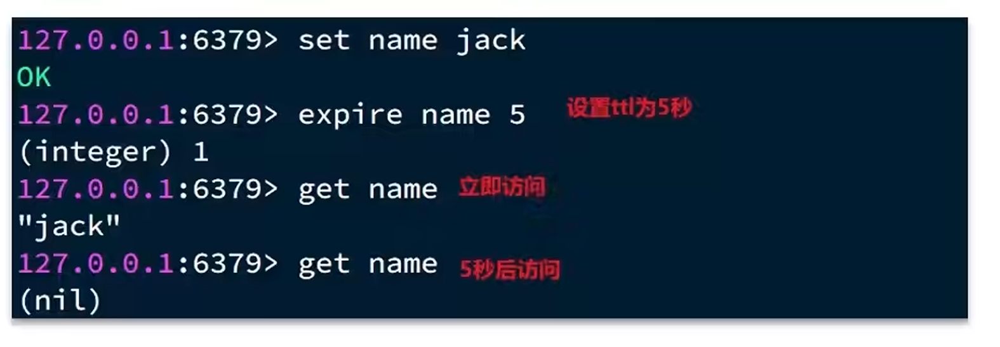

可以发现，当 key 的 TTL 到期后，再次访问 name 返回的是 nil，说明这个 key 已经不存在了，对应的内存也得到释放。从而起到内存回收的目的


思考：

1. Redis 是如何知道一个 key 是否过期呢？

+ 利用两个 Dict 分别记录 key-value 对及 key-ttl 对

2. 是不是 TTL 到期就立即删除了呢？

+ 惰性删除
+ 周期删除


##### 1.1 过期策略 - DB 结构

Redis 本身是一个典型的 key-value 内存存储数据库，因此所有的 key、value 都保存在之前学习过的 Dict 结构中。不过在其 database 结构体中，有两个 Dict：一个用来记录 key-value；另一个用来记录 key-TTL

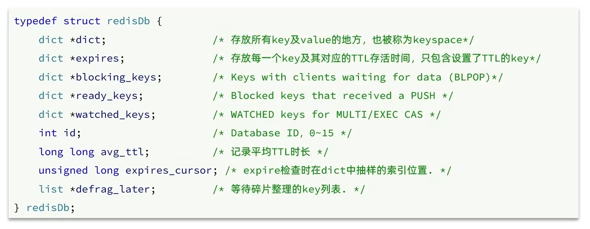

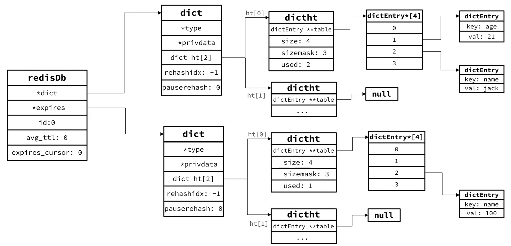


##### 1.2 过期策略 - 惰性删除

**惰性删除**：顾名思义并不是在 TTL 到期后就立即删除，而是在访问一个 key 的时候，检查该 key 的存活时间，如果已经过期才执行删除

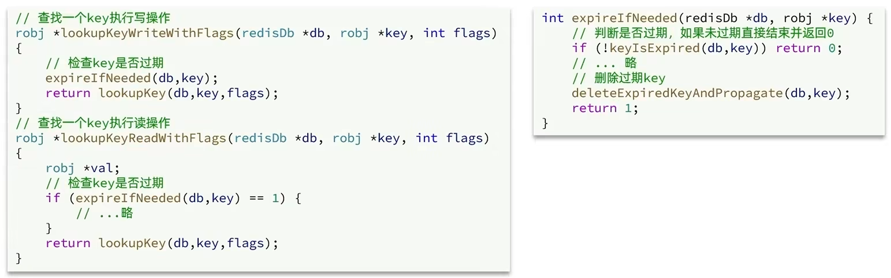


##### 1.3 过期策略 - 周期删除

**周期删除**：顾名思义是通过一个定时任务，周期性的**抽样部分过期的 key**，然后执行删除。执行周期删除有两种：

+ Redis 会设置一个定时任务 serverCron()，按照 server.hz 的频率来执行过期 key 清理，模式为 SLOW
+ Redis 的每个事件循环前会调用 beforeSleep() 函数，执行过期 key 清理，模式为 FAST

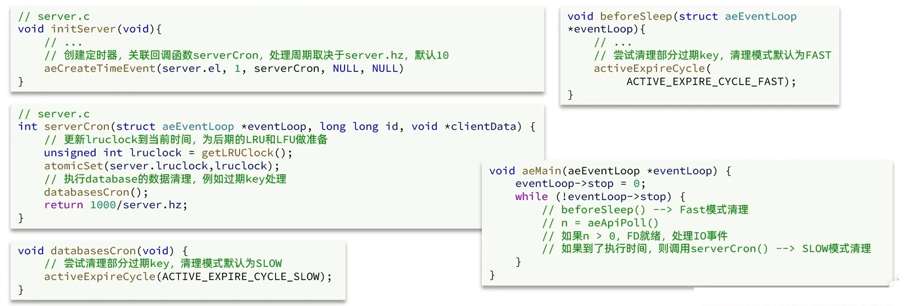

**SLOW** 模式规则：

1. 执行频率受 server.hz 影响，默认为10，即每秒执行10次，每个执行周期100ms
2. 执行清理耗时不超过一次执行周期的25%
3. 逐个遍历 db（哈希表数组的每一个角标），逐个遍历 db 中的 bucket，抽取20个 key 判断是否过期
4. 如果没达到时间上限（25ms）并且过期 key 比例大于10%，再进行一次抽样，否则结束

**FAST** 模式规则（过期 key 比例小于10%不执行）：

1. 执行频率受 beforeSleep() 调用频率影响，但两次 FAST 模式间隔不低于2ms
2. 执行清理耗时不超过1ms
3. 逐个遍历 db（哈希表数组的每一个角标），逐个遍历 db 中的 bucket，抽取20个 key 判断是否过期
4. 如果没达到时间上限（1ms）并且过期 key 比例大于10%，再进行一次抽样，否则结束


##### 总结

RedisKey 的 TTL 记录方式：

+ 在 RedisDB 中通过一个 Dict 记录每个 Key 的 TTL 时间

过期 key 的删除策略：

+ 惰性清理：每次查找 key 时判断是否过期，如果过期则删除
+ 定期清理：定期抽样部分 key，判断是否过期，如果过期则删除

定期清理的两种模式：

+ SLOW 模式执行频率默认为10，每次不超过25ms
+ FAST 模式执行频率不固定，但两次间隔不低于2ms，每次耗时不超过1ms


------------


#### 2. 淘汰策略

**内存淘汰：**就是当 Redis 内存使用达到设置的阈值时，Redis 主动挑选**部分 key** 删除以释放更多内存的流程

Redis 会在处理客户端命令的方法 processCommand() 中尝试做内存淘汰：

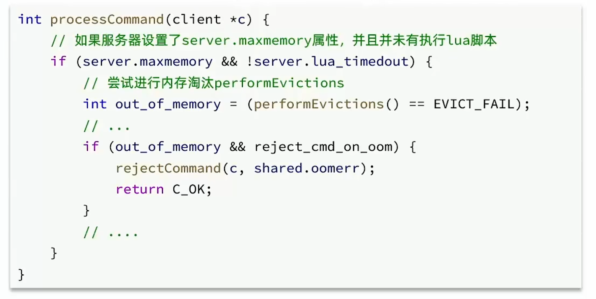


Redis 支持8中不同策略来选择要删除的 key：

+ noeviction：不淘汰任何 key，但是内存满时不允许写入新数据，默认就是这种策略
+ volatile-ttl：对设置了 TTL 的 key，比较 key 的剩余 TTL 值，TTL 越小越先被淘汰
+ allkeys-random：对全体 key，随即进行淘汰。也就是直接从 db->dict 中随机挑选
+ volatile-random：对设置了 TTL 的 key，随机进行淘汰。也就是从 db->expires中随机挑选
+ allkeys-lru：对全体 key，基于 LRU 算法进行淘汰
+ volatile-lru：对设置了 TTL 的 key，基于 LFU 算法进行淘汰
+ allkeys-lfu：对全体 key，基于 LFU 算法进行淘汰
+ volatile-lfu：对设置了 TTL 的 key，基于 LFU 算法进行淘汰

比较容易混淆的有两个：

+ **LRU**（**L**east **R**ecently **U**sed），最少最近使用。用当前时间减去最后一次访问时间，这个值越大则淘汰优先级越高
+ **LFU**（**L**east **F**requently **U**sed），最少频率使用。会统计每个 key 的访问频率，值越小淘汰优先级越高

conf 文件中更改

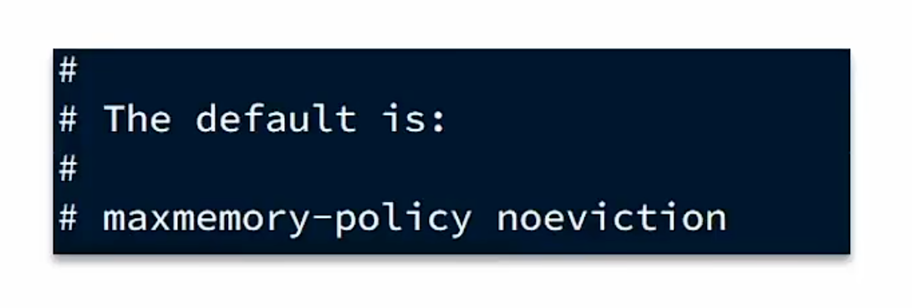


Redis 的数据都会被封装为 RedisObject 结构：

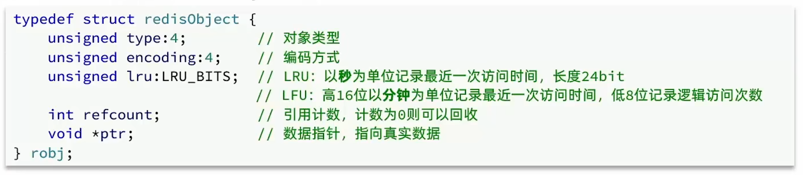

LFU 的访问次数之所以叫做**逻辑访问次数**，是因为并不是每次 key 被访问都计数，而是通过运算：

1. 生成 0~1 之间的随机数 R
2. 计算1/(旧次数 * lfu_log_factor + 1)，记录为 P，lfu_log_factor 默认为10
3. 如果 R < P，则计数器 +1，且最大不超过255
4. 访问次数会随时间衰减，距离上一次访问时间每隔 lfu_decay_time 分钟（默认1），计数器 -1


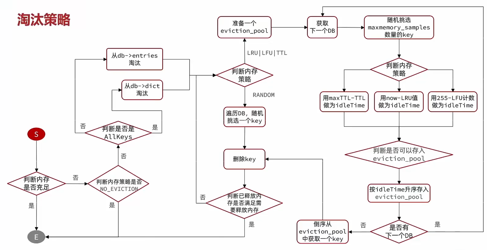


----------------------
