# RocketMQ

## 一、MQ 介绍

MQ 全程 **M**essage **Q**ueue（消息队列），是在消息的传输过程中保存消息的容器。多用于分布式系统之间进行通信。

队列：数据结构的一种，特征为 “先进先出”

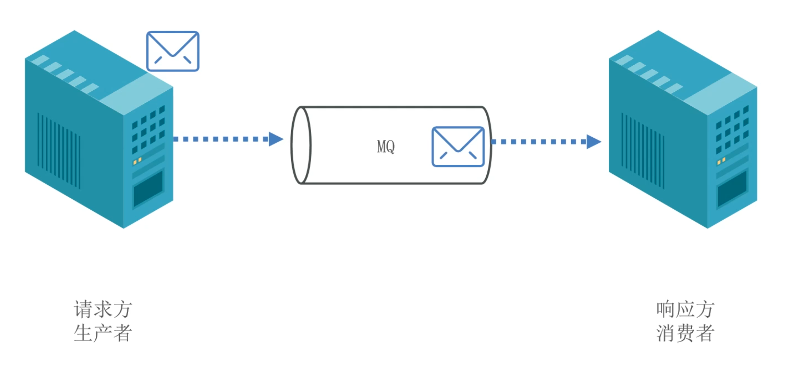

**MQ** **的优势和劣势**

优势：

1. **应用解耦**
2. **异步提速**
3. **削锋填谷**

劣势：

1. 系统可用性降低
2. 系统复杂度提高
3. 一致性问题


### 1. 异步

**异步提速：**

生产方发送完消息，可以继续下一步业务逻辑

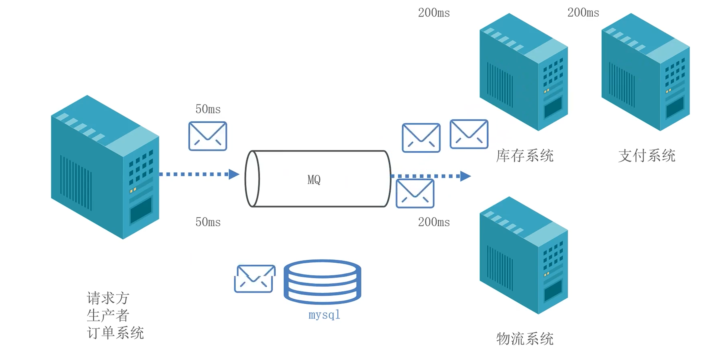

用户下单后生产方发送完消息给 MQ 再存到数据库后就可以直接返回订单给前端，展示给用户，用时只有 100ms


-------


### 2. 解耦

**应用解耦：**

消息方存活与否不影响生产方

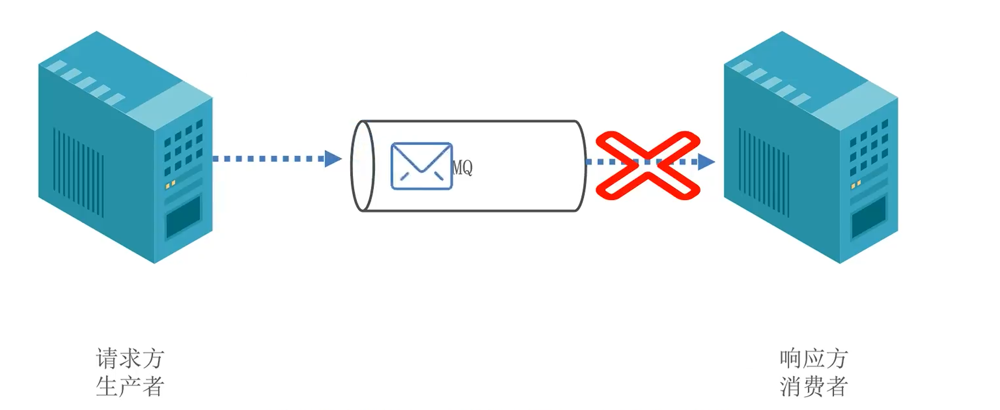

**系统的耦合度越高，容错性就月底，可维护性就越低**


生产者发完消息，可以继续下一步业务逻辑


---------


### 3. 削锋填谷

**削锋填谷：**

生产方发完消息，可以继续下一步业务逻辑

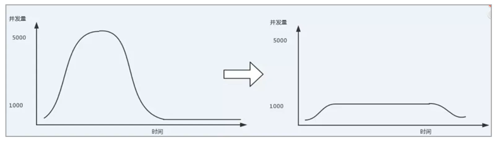

使用了 MQ 字后，限制消费消息的速度为1000，这样一来，高峰期产生的数据势必会积压在 MQ 中，高峰就被 “削” 掉了，但是因为消息积压，在高峰期过后的一段时间内，消费消息的速度还是会维持在1000，直到消费完积压的消息，这样叫做 “填谷”

**使用 MQ 后，可以提高系统稳定性**


--------


### 小结

MQ 的优势

+ 应用解耦：提高系统容错性和可维护性
+ 异步提速：提升用户体验和系统吞吐量
+ 削锋填谷：提高系统稳定性


MQ 的劣势：

+ **系统可用性降低**

系统引入的外部依赖越多，系统稳定性越差。一旦 MQ 宕机，就会对业务造成影响。如何保证 MQ 的高可用？


+ **系统复杂度提高**

MQ 的加入大大增加了系统的复杂度，以前系统间是同步的远程调用，现在是通过 MQ 进行异步调用。如何保证消息没有被重复消费？怎么处理消息丢失情况？怎么保证消息传递的顺序性？


+ **一致性问题**

A 系统处理完业务，通过 MQ 给 B、C、D 三个系统发消息数据，如果 B 系统、C 系统处理成功，D 系统处理失败。如何保证消息数据处理的一致性？


----


### MQ 产品介绍

1. ActiveMQ

java 语言实现，万级数据吞吐量，处理速度 ms 级，主从架构，**成熟度高**


2. RabbitMQ

erlang 语言实现，万级数据吞吐量，处理速度 **us 级**，主从架构


3. RocketMQ

java 语言实现，**十万级**数据吞吐量，处理速度 ms 级，分布式架构，功能强大，拓展性强


4. kafka

scala 语言实现，**十万级**数据吞吐量，处理速度 ms 级，分布式架构，功能较少，应用于大数据较多


----------


#### RocketMQ

1. RocketMQ 是阿里开源的一款非常优秀中间件产品，脱胎于阿里的另一款队列技术 MetaQ，后捐赠给 Apache 基金会作为一款孵化技术，仅仅经历了一年多的时间就成为 Apache 基金会的顶级项目。并且它现在已经在阿里内部被广泛的应用，并且经受住了多次双十一的这种极致场景的压力（2017年的双十一，RocketMQ 流转的消息量达到了万亿级，峰值 TPS 达到5600万）
2. 解决所有缺点


----


## 二、RocketMQ 安装启动

### 1. 基础概念

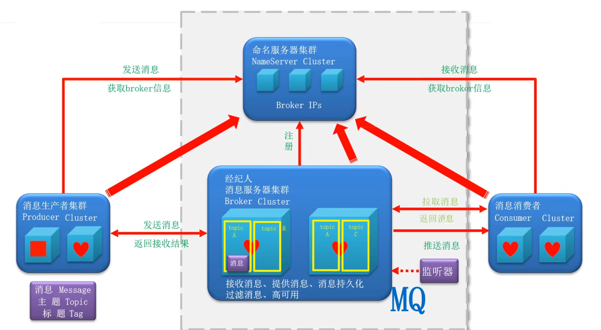


### 2. 安装

#### 2.1 Linux

直接 docker


#### 2.2 windows 安装

##### 2.2.1 系统环境变量配置

1. 解压安装包

[下载 | RocketMQ](https://rocketmq.apache.org/zh/download/)

下载 Binary 版本

2. bin 目录配置到环境变量（懂得都得，不详细说了，推荐建 HOME）


##### 2.2.2 启动

+ **启动 NAMESERVER**

cmd 命令框执行进入 MQ 文件夹\bin 下

```cmd
start mqnamesrv.cmd
```

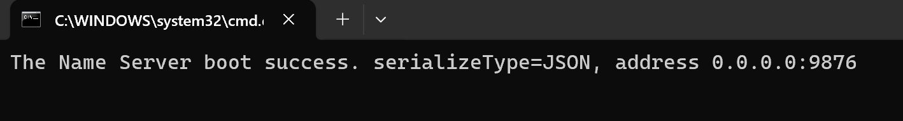

+ **启动 BROKER**

```cmd
start mqbroker.cmd -n 127.0.0.1:9876 autoCreateTopicEnable=true
```

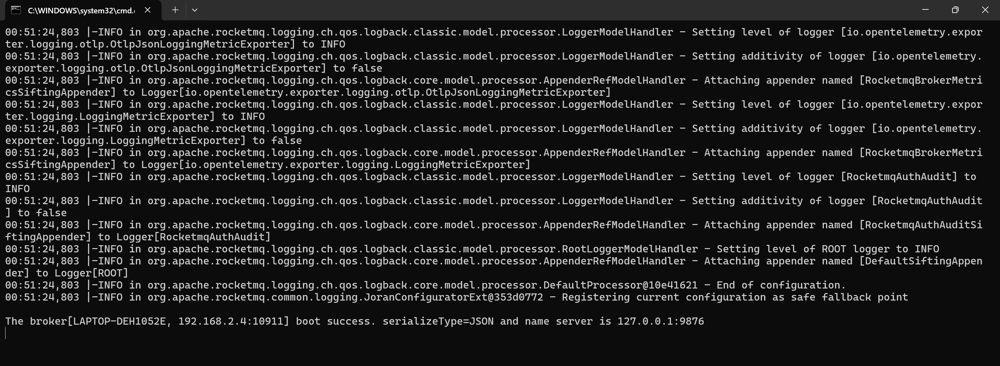

注意：闪退回命令行

删除 C:\Users\当前系统用户名\store下的所有文件


##### 2.2.3 测试

+ **新建环境变量**

变量名：NAMESRV_ADDR

变量值：localhost:9876


+ **测试生产者发送消息**

bin 目录下

```
tools.cmd org.apache.rocketmq.example.quickstart.Producer
```

+ **测试消费者接收消息**

bin 目录下

```
tools.cmd.org.apache.rocketmq.example.quickstart.Consumer
```


##### 2.2.4 控制台安装

1. 下载源码

```shell
git clone https://github.com/apache/rocketmq-externals.git
```

2、进入rocketmq-externals\rocketmq-console 工程，编译源码

```shell
mvn clean package -Dmaven.test.skip=true
```

3. target 目录生成 jar 包

4. 运行

```shell
java -jar rocketmq-console-ng-2.0.0.jar
```

5. 访问 http://localhost:8080/#/


---------


## 三、消息发送

1. 基于 Java 环境构建消息发送与消息接收基础程序

   1. 单生产者单消费者

   2. 单生产者多消费者

   3. 多生产者多消费者

2. 发送不同类型的消息

   1. 同步消息

   2. 异步消息

   3. 单向消息

3. 特殊的消息发送

   1. 延时消息

   2. 批量消息

4. 特殊的消息接收
   1. 消息过滤

5. 消息发送与接收顺序控制

6. 事务消息

### 1. One-To-One（基础发送与基础接收）

#### 1.1 简单生产者书写

```java
package com.itfeng.simple;

import org.apache.rocketmq.client.exception.MQBrokerException;
import org.apache.rocketmq.client.exception.MQClientException;
import org.apache.rocketmq.client.producer.DefaultMQProducer;
import org.apache.rocketmq.client.producer.SendResult;
import org.apache.rocketmq.common.message.Message;
import org.apache.rocketmq.remoting.exception.RemotingException;

// 发送消息
public class Producer {
    public static void main(String[] args) throws MQClientException, MQBrokerException, RemotingException, InterruptedException {
        // 1. 谁来发？
        DefaultMQProducer producer = new DefaultMQProducer("group1");

        // 2. 发给谁？
        producer.setNamesrvAddr("localhost:9876");
        producer.start();

        // 3. 怎么发？
        // 4. 发什么？
        String msg = "hello world";
        Message message = new Message("topic1", "tag1", msg.getBytes());
        SendResult sendResult = producer.send(message);

        // 5. 发的结果是什么？
        System.out.println(sendResult);

        // 6. 打扫战场
        producer.shutdown();
    }
}
```


#### 1.2 简单消费者书写

```java
package com.itfeng.simple;


import org.apache.rocketmq.client.consumer.DefaultMQPushConsumer;
import org.apache.rocketmq.client.consumer.listener.ConsumeConcurrentlyContext;
import org.apache.rocketmq.client.consumer.listener.ConsumeConcurrentlyStatus;
import org.apache.rocketmq.client.consumer.listener.MessageListenerConcurrently;
import org.apache.rocketmq.client.exception.MQClientException;
import org.apache.rocketmq.common.message.MessageExt;

import java.util.List;

// 消费者
public class Consumer {
    public static void main(String[] args) throws MQClientException {
        // 1. 谁来收？
        DefaultMQPushConsumer consumer = new DefaultMQPushConsumer("group1");

        // 2. 从哪里收消息？
        consumer.setNamesrvAddr("localhost:9876");

        // 3. 监听哪个消息队列？
        consumer.subscribe("topic1", "*");

        // 4. 处理业务流程 注册监听器
        consumer.registerMessageListener(new MessageListenerConcurrently() {
            @Override
            public ConsumeConcurrentlyStatus consumeMessage(List<MessageExt> msgs, ConsumeConcurrentlyContext consumeConcurrentlyContext) {
                // 写我们的业务逻辑
                for (MessageExt msg : msgs) {
                    System.out.println(msg);
                    byte[] body = msg.getBody();
                    System.out.println(new String(body));
                }

                return ConsumeConcurrentlyStatus.CONSUME_SUCCESS;
            }
        });

        consumer.start();

        System.out.println("消费者起起来了");

        // 千万别关消费者！！！
    }
}
```

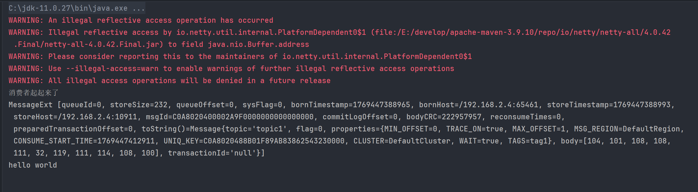


--------


### 2. One-To-Many（负载均衡模式与广播模式）

#### 2.1 负载均衡

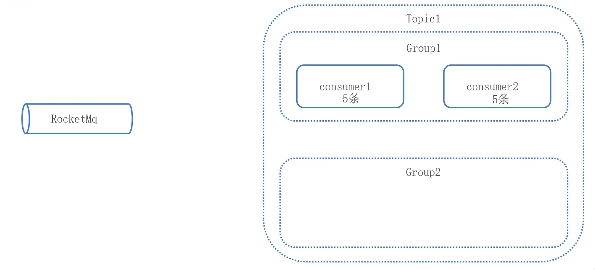

生产者：

```java
package com.itfeng.one2many;

import org.apache.rocketmq.client.exception.MQBrokerException;
import org.apache.rocketmq.client.exception.MQClientException;
import org.apache.rocketmq.client.producer.DefaultMQProducer;
import org.apache.rocketmq.client.producer.SendResult;
import org.apache.rocketmq.common.message.Message;
import org.apache.rocketmq.remoting.exception.RemotingException;

// 发送消息
public class Producer {
    public static void main(String[] args) throws MQClientException, MQBrokerException, RemotingException, InterruptedException {
        // 1. 谁来发？
        DefaultMQProducer producer = new DefaultMQProducer("group1");

        // 2. 发给谁？
        producer.setNamesrvAddr("localhost:9876");
        producer.start();

        // 3. 怎么发？
        // 4. 发什么？
        for (int i = 0; i < 10; i++) {
            String msg = "hello world" + i;
            Message message = new Message("topic2", "tag1", msg.getBytes());
            SendResult sendResult = producer.send(message);

            // 5. 发的结果是什么？
            System.out.println(sendResult);
        }

        // 6. 打扫战场
        producer.shutdown();
    }
}
```

消费者：

```java
package com.itfeng.one2many;


import org.apache.rocketmq.client.consumer.DefaultMQPushConsumer;
import org.apache.rocketmq.client.consumer.listener.ConsumeConcurrentlyContext;
import org.apache.rocketmq.client.consumer.listener.ConsumeConcurrentlyStatus;
import org.apache.rocketmq.client.consumer.listener.MessageListenerConcurrently;
import org.apache.rocketmq.client.exception.MQClientException;
import org.apache.rocketmq.common.message.MessageExt;

import java.util.List;

// 消费者
public class Consumer {
    public static void main(String[] args) throws MQClientException {
        // 1. 谁来收？
        DefaultMQPushConsumer consumer = new DefaultMQPushConsumer("group1");

        // 2. 从哪里收消息？
        consumer.setNamesrvAddr("localhost:9876");

        // 3. 监听哪个消息队列？
        consumer.subscribe("topic2", "*");

        // 4. 处理业务流程 注册监听器
        consumer.registerMessageListener(new MessageListenerConcurrently() {
            @Override
            public ConsumeConcurrentlyStatus consumeMessage(List<MessageExt> msgs, ConsumeConcurrentlyContext consumeConcurrentlyContext) {
                // 写我们的业务逻辑
                for (MessageExt msg : msgs) {
                    System.out.println(msg);
                    byte[] body = msg.getBody();
                    System.out.println(new String(body));
                    System.out.println("============================");
                }

                return ConsumeConcurrentlyStatus.CONSUME_SUCCESS;
            }
        });

        consumer.start();

        System.out.println("消费者起起来了");

        // 千万别关消费者！！！
    }
}
```


如果启动两个消费者实例会发现各接收到一半的消息（负载均衡）


#### 2.3 广播模式

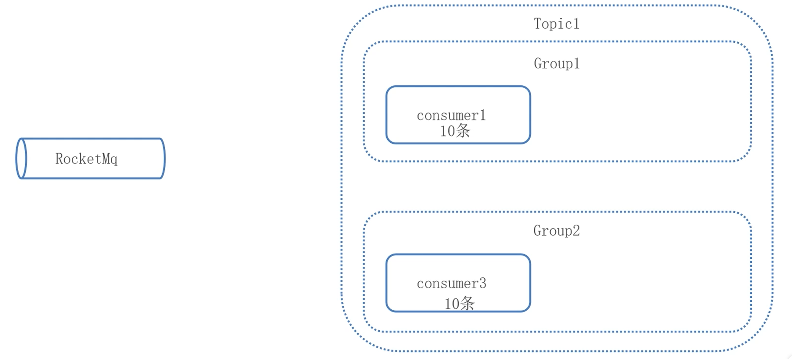

消费者组改为 `group2`

```java
package com.itfeng.one2many;


import org.apache.rocketmq.client.consumer.DefaultMQPushConsumer;
import org.apache.rocketmq.client.consumer.listener.ConsumeConcurrentlyContext;
import org.apache.rocketmq.client.consumer.listener.ConsumeConcurrentlyStatus;
import org.apache.rocketmq.client.consumer.listener.MessageListenerConcurrently;
import org.apache.rocketmq.client.exception.MQClientException;
import org.apache.rocketmq.common.message.MessageExt;

import java.util.List;

// 消费者
public class Consumer {
    public static void main(String[] args) throws MQClientException {
        // 1. 谁来收？
        DefaultMQPushConsumer consumer = new DefaultMQPushConsumer("group2");

        // 2. 从哪里收消息？
        consumer.setNamesrvAddr("localhost:9876");

        // 3. 监听哪个消息队列？
        consumer.subscribe("topic2", "*");

        // 4. 处理业务流程 注册监听器
        consumer.registerMessageListener(new MessageListenerConcurrently() {
            @Override
            public ConsumeConcurrentlyStatus consumeMessage(List<MessageExt> msgs, ConsumeConcurrentlyContext consumeConcurrentlyContext) {
                // 写我们的业务逻辑
                for (MessageExt msg : msgs) {
                    System.out.println(msg);
                    byte[] body = msg.getBody();
                    System.out.println(new String(body));
                    System.out.println("============================");
                }

                return ConsumeConcurrentlyStatus.CONSUME_SUCCESS;
            }
        });

        consumer.start();

        System.out.println("消费者起起来了");

        // 千万别关消费者！！！
    }
}
```


#### 2.3 改模式

```java
package com.itfeng.one2many;


import org.apache.rocketmq.client.consumer.DefaultMQPushConsumer;
import org.apache.rocketmq.client.consumer.listener.ConsumeConcurrentlyContext;
import org.apache.rocketmq.client.consumer.listener.ConsumeConcurrentlyStatus;
import org.apache.rocketmq.client.consumer.listener.MessageListenerConcurrently;
import org.apache.rocketmq.client.exception.MQClientException;
import org.apache.rocketmq.common.message.MessageExt;
import org.apache.rocketmq.common.protocol.heartbeat.MessageModel;

import java.util.List;

// 消费者
public class Consumer {
    public static void main(String[] args) throws MQClientException {
        // 1. 谁来收？
        DefaultMQPushConsumer consumer = new DefaultMQPushConsumer("group2");

        // 2. 从哪里收消息？
        consumer.setNamesrvAddr("localhost:9876");
        // 消息的消费模式 默认使用CLUSTERING 负载均衡模式
        consumer.setMessageModel(MessageModel.BROADCASTING); // 设置其为广播模式

        // 3. 监听哪个消息队列？
        consumer.subscribe("topic2", "*");

        // 4. 处理业务流程 注册监听器
        consumer.registerMessageListener(new MessageListenerConcurrently() {
            @Override
            public ConsumeConcurrentlyStatus consumeMessage(List<MessageExt> msgs, ConsumeConcurrentlyContext consumeConcurrentlyContext) {
                // 写我们的业务逻辑
                for (MessageExt msg : msgs) {
                    System.out.println(msg);
                    byte[] body = msg.getBody();
                    System.out.println(new String(body));
                    System.out.println("============================");
                }

                return ConsumeConcurrentlyStatus.CONSUME_SUCCESS;
            }
        });

        consumer.start();

        System.out.println("消费者起起来了");

        // 千万别关消费者！！！
    }
}
```


--------


### 3. Many-To-Many

多生产者产生的消息可以被同一个消费者消费，也可以被多个消费者消费


----------


## 四、消息类别

### 1. 同步消息

特性：即时性较强，重要的消息，且必须有回执的消息，例如短信，通知（转账成功）

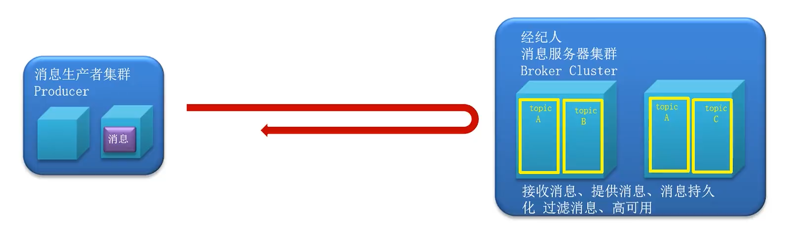


------


### 2. 异步消息

特性：即时性较弱，但需要有回执的消息，例如订单中的某些信息（可以增大消息吞吐量）


```java
package com.itfeng.type;

import org.apache.rocketmq.client.exception.MQBrokerException;
import org.apache.rocketmq.client.exception.MQClientException;
import org.apache.rocketmq.client.producer.DefaultMQProducer;
import org.apache.rocketmq.client.producer.SendCallback;
import org.apache.rocketmq.client.producer.SendResult;
import org.apache.rocketmq.common.message.Message;
import org.apache.rocketmq.remoting.exception.RemotingException;

// 发送消息
public class Producer {
    public static void main(String[] args) throws MQClientException, MQBrokerException, RemotingException, InterruptedException {
        // 1. 谁来发？
        DefaultMQProducer producer = new DefaultMQProducer("group1");

        // 2. 发给谁？
        producer.setNamesrvAddr("localhost:9876");
        producer.start();

        // 3. 怎么发？
        // 4. 发什么？
//        for (int i = 0; i < 10; i++) {
//            String msg = "hello world" + i;
//            Message message = new Message("topic2", "tag1", msg.getBytes());
//            // 同步消息
//            SendResult sendResult = producer.send(message);
//
//            // 5. 发的结果是什么？
//            System.out.println(sendResult);
//        }

        for (int i = 0; i < 10; i++) {
            String msg = "hello world" + i;
            Message message = new Message("topic6", "tag1", msg.getBytes());
            // 异步消息
            producer.send(message, new SendCallback() {
                // 发送成功的回调方法
                @Override
                public void onSuccess(SendResult sendResult) {
                    System.out.println(sendResult);
                }

                // 发送失败的回调方法
                @Override
                public void onException(Throwable throwable) {
                    // 业务逻辑
                    System.out.println(throwable);
                }
            });

            System.out.println("异步发送完成");
        }

        // 6. 打扫战场
        // producer.shutdown();
    }
}
```


------


### 3. 单向消息

特性：不需要有回执的消息，例如日志类消息

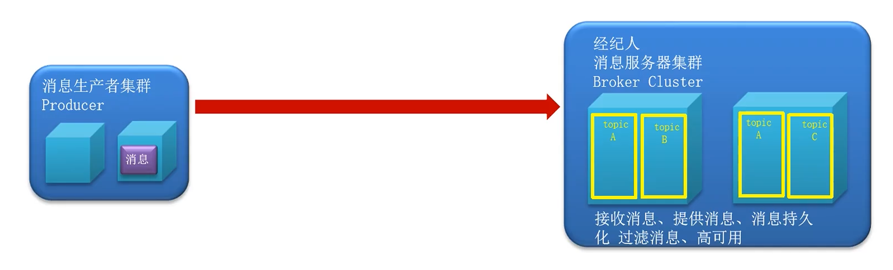

```java
package com.itfeng.type;

import org.apache.rocketmq.client.exception.MQBrokerException;
import org.apache.rocketmq.client.exception.MQClientException;
import org.apache.rocketmq.client.producer.DefaultMQProducer;
import org.apache.rocketmq.client.producer.SendCallback;
import org.apache.rocketmq.client.producer.SendResult;
import org.apache.rocketmq.common.message.Message;
import org.apache.rocketmq.remoting.exception.RemotingException;

// 发送消息
public class Producer {
    public static void main(String[] args) throws MQClientException, MQBrokerException, RemotingException, InterruptedException {
        // 1. 谁来发？
        DefaultMQProducer producer = new DefaultMQProducer("group1");

        // 2. 发给谁？
        producer.setNamesrvAddr("localhost:9876");
        producer.start();

        // 3. 怎么发？
        // 4. 发什么？
//        for (int i = 0; i < 10; i++) {
//            String msg = "hello world" + i;
//            Message message = new Message("topic2", "tag1", msg.getBytes());
//            // 同步消息
//            SendResult sendResult = producer.send(message);
//
//            // 5. 发的结果是什么？
//            System.out.println(sendResult);
//        }

        for (int i = 0; i < 10; i++) {
            String msg = "hello world" + i;
            Message message = new Message("topic6", "tag1", msg.getBytes());
//            // 异步消息
//            producer.send(message, new SendCallback() {
//                // 发送成功的回调方法
//                @Override
//                public void onSuccess(SendResult sendResult) {
//                    System.out.println(sendResult);
//                }
//
//                // 发送失败的回调方法
//                @Override
//                public void onException(Throwable throwable) {
//                    // 业务逻辑
//                    System.out.println(throwable);
//                }
//            });
//
//            System.out.println("异步发送完成");

            // 单向消息
            producer.sendOneway(message);
        }

        // 6. 打扫战场
        // producer.shutdown();
    }
}
```


--------


### 4. 延时消息

特性：消息发送时并不直接发送到消息服务器，而是根据设定的等待时间到达，起到延时到达的缓冲作用

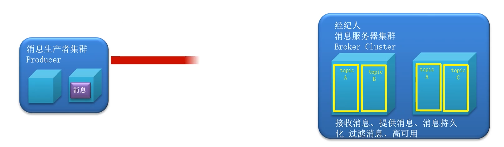

目前支持的消息时间

```java
private String messageDelayLevel = "1s 5s 10s 30s 1m 2m 3m 4m 5m 6m 7m 8m 9m 10m 20m 30m 1h 2h";
```

```java
package com.itfeng.type;

import org.apache.rocketmq.client.exception.MQBrokerException;
import org.apache.rocketmq.client.exception.MQClientException;
import org.apache.rocketmq.client.producer.DefaultMQProducer;
import org.apache.rocketmq.client.producer.SendCallback;
import org.apache.rocketmq.client.producer.SendResult;
import org.apache.rocketmq.common.message.Message;
import org.apache.rocketmq.remoting.exception.RemotingException;

// 发送消息
public class Producer {
    public static void main(String[] args) throws MQClientException, MQBrokerException, RemotingException, InterruptedException {
        // 1. 谁来发？
        DefaultMQProducer producer = new DefaultMQProducer("group1");

        // 2. 发给谁？
        producer.setNamesrvAddr("localhost:9876");
        producer.start();

        // 3. 怎么发？
        // 4. 发什么？
//        for (int i = 0; i < 10; i++) {
//            String msg = "hello world" + i;
//            Message message = new Message("topic2", "tag1", msg.getBytes());
//            // 同步消息
//            SendResult sendResult = producer.send(message);
//
//            // 5. 发的结果是什么？
//            System.out.println(sendResult);
//        }

        for (int i = 0; i < 10; i++) {
            String msg = "hello world" + i;
            Message message = new Message("topic6", "tag1", msg.getBytes());
//            // 异步消息
//            producer.send(message, new SendCallback() {
//                // 发送成功的回调方法
//                @Override
//                public void onSuccess(SendResult sendResult) {
//                    System.out.println(sendResult);
//                }
//
//                // 发送失败的回调方法
//                @Override
//                public void onException(Throwable throwable) {
//                    // 业务逻辑
//                    System.out.println(throwable);
//                }
//            });
//
//            System.out.println("异步发送完成");

            // 单向消息
//            producer.sendOneway(message);

            // 延时消息 分别设置值每一天消息的延时等级
            message.setDelayTimeLevel(3);
            SendResult sendResult = producer.send(message);
        }

        // 6. 打扫战场
        // producer.shutdown();
    }
}
```


-------


### 5. 批量消息

特征：一次发送多条消息，节约网络开销

注意：

1. 这些批量消息应该有相同的 topic
2. 相同的 waitStoreMsgOK（消息类型）
3. 不能是延时消息
4. 消息内容总长度不超过 4M

消息内容总长度包含如下：

1. topic（字符串字节数）
2. body（字节数组长度）
3. 消息追加的属性（key 与 value 对应字符串字节数）
4. 日志（固定20字节）


```java
package com.itfeng.type;

import org.apache.rocketmq.client.exception.MQBrokerException;
import org.apache.rocketmq.client.exception.MQClientException;
import org.apache.rocketmq.client.producer.DefaultMQProducer;
import org.apache.rocketmq.client.producer.SendResult;
import org.apache.rocketmq.common.message.Message;
import org.apache.rocketmq.remoting.exception.RemotingException;

import java.util.ArrayList;
import java.util.List;

// 发送消息
public class ProducerBatch {
    public static void main(String[] args) throws MQClientException, MQBrokerException, RemotingException, InterruptedException {
        // 1. 谁来发？
        DefaultMQProducer producer = new DefaultMQProducer("group1");

        // 2. 发给谁？
        producer.setNamesrvAddr("localhost:9876");
        producer.start();

        List<Message> msgList = new ArrayList<>();
        String msg1 = "hello world piliang";
        Message message1 = new Message("topic7", "tag1", msg1.getBytes());
        msgList.add(message1);
        String msg2 = "hello world piliang";
        Message message2 = new Message("topic7", "tag1", msg2.getBytes());
        msgList.add(message2);
        String msg3 = "hello world piliang";
        Message message3 = new Message("topic7", "tag1", msg3.getBytes());
        msgList.add(message3);

        SendResult sendResult = producer.send(msgList);
        System.out.println(sendResult);

        // 6. 打扫战场
        producer.shutdown();
    }
}
```


---------------


### 6. 消息过滤

#### 6.1 分类过滤

按照 tag 过滤消息


生产者：

```java
package com.itfeng.filter;

import org.apache.rocketmq.client.exception.MQBrokerException;
import org.apache.rocketmq.client.exception.MQClientException;
import org.apache.rocketmq.client.producer.DefaultMQProducer;
import org.apache.rocketmq.client.producer.SendResult;
import org.apache.rocketmq.common.message.Message;
import org.apache.rocketmq.remoting.exception.RemotingException;

// 发送消息
public class Producer {
    public static void main(String[] args) throws MQClientException, MQBrokerException, RemotingException, InterruptedException {
        // 1. 谁来发？
        DefaultMQProducer producer = new DefaultMQProducer("group1");

        // 2. 发给谁？
        producer.setNamesrvAddr("localhost:9876");
        producer.start();

        // 3. 怎么发？
        // 4. 发什么？
        String msg = "hello world";
        Message message = new Message("topic8", "vip", msg.getBytes());
        SendResult sendResult = producer.send(message);

        // 5. 发的结果是什么？
        System.out.println(sendResult);

        // 6. 打扫战场
        producer.shutdown();
    }
}
```


消费者：

```java
package com.itfeng.filter;


import org.apache.rocketmq.client.consumer.DefaultMQPushConsumer;
import org.apache.rocketmq.client.consumer.listener.ConsumeConcurrentlyContext;
import org.apache.rocketmq.client.consumer.listener.ConsumeConcurrentlyStatus;
import org.apache.rocketmq.client.consumer.listener.MessageListenerConcurrently;
import org.apache.rocketmq.client.exception.MQClientException;
import org.apache.rocketmq.common.message.MessageExt;

import java.util.List;

// 消费者
public class Consumer {
    public static void main(String[] args) throws MQClientException {
        // 1. 谁来收？
        DefaultMQPushConsumer consumer = new DefaultMQPushConsumer("group1");

        // 2. 从哪里收消息？
        consumer.setNamesrvAddr("localhost:9876");

        // 3. 监听哪个消息队列？
        consumer.subscribe("topic8", "tag1 || vip");

        // 4. 处理业务流程 注册监听器
        consumer.registerMessageListener(new MessageListenerConcurrently() {
            @Override
            public ConsumeConcurrentlyStatus consumeMessage(List<MessageExt> msgs, ConsumeConcurrentlyContext consumeConcurrentlyContext) {
                // 写我们的业务逻辑
                for (MessageExt msg : msgs) {
                    System.out.println(msg);
                    byte[] body = msg.getBody();
                    System.out.println(new String(body));
                }

                return ConsumeConcurrentlyStatus.CONSUME_SUCCESS;
            }
        });

        consumer.start();

        System.out.println("消费者起起来了");

        // 千万别关消费者！！！
    }
}
```


#### 6.2 语法过滤（属性过滤 / 语法过滤 / SQL 过滤）

按照消息的某些属性过滤

基本语法：

+ 数值比较，比如：>, >=, <, <=, BETWEEN, =
+ 字符比较，比如：=, <>, IN
+ IS NULL 或者 IS NOT NULL
+ 逻辑符号：AND, OR, NOT

常量支持类型为：

+ 数值，比如：123, 3.1415
+ 字符，比如：'abc'，必须用单引号包裹起来
+ NULL，特殊的常量
+ 布尔值，TREU 或 FALSE


注意：SQL 过滤需要依赖服务器的功能支持，在 broker.conf 配置文件中添加对应的功能项，并开启对应功能

```properties
enablePropertyFilter=true
```

重启 borker

或者直接 cmd 输入

```cmd
mqadmin.cmd updateBrokerConfig -blocalhost:10911 -kenablePropertyFilter -vtrue
```


生产者：

```java
package com.itfeng.filter;

import org.apache.rocketmq.client.exception.MQBrokerException;
import org.apache.rocketmq.client.exception.MQClientException;
import org.apache.rocketmq.client.producer.DefaultMQProducer;
import org.apache.rocketmq.client.producer.SendResult;
import org.apache.rocketmq.common.message.Message;
import org.apache.rocketmq.remoting.exception.RemotingException;

// 发送消息
public class Producer {
    public static void main(String[] args) throws MQClientException, MQBrokerException, RemotingException, InterruptedException {
        // 1. 谁来发？
        DefaultMQProducer producer = new DefaultMQProducer("group1");

        // 2. 发给谁？
        producer.setNamesrvAddr("localhost:9876");
        producer.start();

        // 3. 怎么发？
        // 4. 发什么？
        String msg = "hello world";
        Message message = new Message("topic9", "vip", msg.getBytes());
        // 消息追加属性
        message.putUserProperty("name", "zhangsan");
        message.putUserProperty("age", "18");

        SendResult sendResult = producer.send(message);

        // 5. 发的结果是什么？
        System.out.println(sendResult);

        // 6. 打扫战场
        producer.shutdown();
    }
}
```

消费者：

```java
package com.itfeng.filter;


import org.apache.rocketmq.client.consumer.DefaultMQPushConsumer;
import org.apache.rocketmq.client.consumer.MessageSelector;
import org.apache.rocketmq.client.consumer.listener.ConsumeConcurrentlyContext;
import org.apache.rocketmq.client.consumer.listener.ConsumeConcurrentlyStatus;
import org.apache.rocketmq.client.consumer.listener.MessageListenerConcurrently;
import org.apache.rocketmq.client.exception.MQClientException;
import org.apache.rocketmq.common.message.MessageExt;

import java.util.List;

// 消费者
public class Consumer {
    public static void main(String[] args) throws MQClientException {
        // 1. 谁来收？
        DefaultMQPushConsumer consumer = new DefaultMQPushConsumer("group1");

        // 2. 从哪里收消息？
        consumer.setNamesrvAddr("localhost:9876");

        // 3. 监听哪个消息队列 按照tag过滤
//        consumer.subscribe("topic8", "tag1 || vip");
        // 消费者就想要成年的消息
        consumer.subscribe("topic9", MessageSelector.bySql("age > 16"));

        // 4. 处理业务流程 注册监听器
        consumer.registerMessageListener(new MessageListenerConcurrently() {
            @Override
            public ConsumeConcurrentlyStatus consumeMessage(List<MessageExt> msgs, ConsumeConcurrentlyContext consumeConcurrentlyContext) {
                // 写我们的业务逻辑
                for (MessageExt msg : msgs) {
                    System.out.println(msg);
                    byte[] body = msg.getBody();
                    System.out.println(new String(body));
                }

                return ConsumeConcurrentlyStatus.CONSUME_SUCCESS;
            }
        });

        consumer.start();

        System.out.println("消费者起起来了");

        // 千万别关消费者！！！
    }
}
```


-----


## 五、SpringBoot 整合

导包

```xml
<dependency>
    <groupId>org.apache.rocketmq</groupId>
    <artifactId>rocketmq-spring-boot-starter</artifactId>
    <version>2.0.3</version>
</dependency>
```

配置文件

```yml
rocketmq:
  name-server: localhost:9876
  producer:
    group: group1
```

生产者：

```java
package com.hmdp.controller;

import com.hmdp.domain.User;
import org.apache.rocketmq.spring.core.RocketMQTemplate;
import org.springframework.web.bind.annotation.GetMapping;
import org.springframework.web.bind.annotation.RequestMapping;
import org.springframework.web.bind.annotation.RestController;

import javax.annotation.Resource;

@RestController
@RequestMapping("/demo")
public class SendController {

    @Resource
    RocketMQTemplate rocketMQTemplate; // 模板类：建连接以及断连接

    @GetMapping("/send")
    public String send() {
        // 发送逻辑
//        String msg = "hello world";
//        rocketMQTemplate.convertAndSend("topic10", msg); // convert 消息转化为底层的字节数组

        User user = new User("zhangsan", 10);
        rocketMQTemplate.convertAndSend("topic10", user);

        return "success!";
    }
}
```

消费者：

```java
package com.hmdp.service;

import com.hmdp.domain.User;
import org.apache.rocketmq.spring.annotation.RocketMQMessageListener;
import org.apache.rocketmq.spring.core.RocketMQListener;
import org.springframework.stereotype.Service;

@Service
@RocketMQMessageListener(topic = "topic10", consumerGroup = "group1")
public class DemoConsumer implements RocketMQListener<User> {

    // 做的业务逻辑
    @Override
    public void onMessage(User user) {
        System.out.println(user);
    }
}
```


其余消息类型：

```java
package com.hmdp.controller;

import com.hmdp.domain.User;
import org.apache.rocketmq.client.producer.SendCallback;
import org.apache.rocketmq.client.producer.SendResult;
import org.apache.rocketmq.common.message.Message;
import org.apache.rocketmq.spring.core.RocketMQTemplate;
import org.springframework.messaging.support.MessageBuilder;
import org.springframework.web.bind.annotation.GetMapping;
import org.springframework.web.bind.annotation.RequestMapping;
import org.springframework.web.bind.annotation.RestController;

import javax.annotation.Resource;
import java.util.ArrayList;
import java.util.List;

@RestController
@RequestMapping("/demo")
public class SendController {

    @Resource
    RocketMQTemplate rocketMQTemplate; // 模板类：建连接以及断连接

    @GetMapping("/send")
    public String send() {
        // 发送逻辑
        String msg = "hello world";
//        rocketMQTemplate.convertAndSend("topic10", msg); // convert 消息转化为底层的字节数组

        User user = new User("zhangsan", 10);
        rocketMQTemplate.convertAndSend("topic10", user);

        // 同步消息
        SendResult syncSend = rocketMQTemplate.syncSend("topic10", user);

        // 异步消息
        rocketMQTemplate.asyncSend("topic10", user, new SendCallback() {
            // 成功
            @Override
            public void onSuccess(SendResult sendResult) {
                System.out.println(sendResult);
            }

            // 失败
            @Override
            public void onException(Throwable throwable) {
                System.out.println(throwable);
            }
        }, 1000);

        // 单向消息
        rocketMQTemplate.sendOneWay("topic10", user);

        // 延时消息
        rocketMQTemplate.syncSend("topic10", MessageBuilder.withPayload(msg).build(), 2000, 2);

        // 批量消息
        List<Message> msgList = new ArrayList<>();
        String msg1 = "hello world piliang";
        Message message1 = new Message("topic7", "tag1", msg1.getBytes());
        msgList.add(message1);
        String msg2 = "hello world piliang";
        Message message2 = new Message("topic7", "tag1", msg2.getBytes());
        msgList.add(message2);
        String msg3 = "hello world piliang";
        Message message3 = new Message("topic7", "tag1", msg3.getBytes());
        msgList.add(message3);
        rocketMQTemplate.syncSend("topic10", msgList, 1000);

        return "success!";
    }
}
```


过滤和模式切换

```java
package com.hmdp.service;

import com.hmdp.domain.User;
import org.apache.rocketmq.spring.annotation.MessageModel;
import org.apache.rocketmq.spring.annotation.RocketMQMessageListener;
import org.apache.rocketmq.spring.annotation.SelectorType;
import org.apache.rocketmq.spring.core.RocketMQListener;
import org.springframework.stereotype.Service;

// 过滤
@Service
//@RocketMQMessageListener(topic = "topic10", consumerGroup = "group1", selectorExpression = "tage1 || tag2")

// sql过滤
@RocketMQMessageListener(topic = "topic10", consumerGroup = "group1",
        selectorType = SelectorType.SQL92, selectorExpression = "age > 92",
        messageModel = MessageModel.BROADCASTING // 广播模式
)

public class DemoConsumer implements RocketMQListener<User> {

    // 做的业务逻辑
    @Override
    public void onMessage(User user) {
        System.out.println(user);
    }
}
```


------------------


## 六、消息的特殊处理

### 1. 消息顺序

消息错乱原因

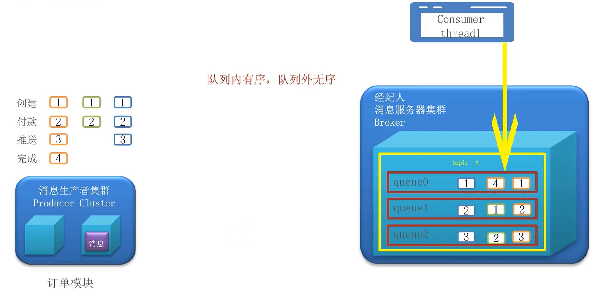

想要的效果


生产者：

```java
// 队列选择器
for (OrderStep orderStep : orderList) {
    Message message = new Message("topic12", "tag1", orderStep.toString.toBytes());
    SendResult sendResult = producer.send(message, new MessageQueueSelector() {
        // 队列选择的方法
        @Override
        public MessageQueue select(List<MessageQueue> list, Message message, Object o) {
            // orderId 对应 确定的队列
            // 队列数
            int size = list.size();
            // 取模
            int orderId = (int) (orderStep.getOrderId());
            int i = orderId % size;
            // 取出确定的队列
            MessageQueue messageQueue = list.get(i);
            return messageQueue;
        }
    }, null);
}
```

消费者：

```java
// 消费者 起一个 顺序监听，一个线程，只监听一个queue
consumer.registerMessageListener(new MessageListenerOrderly() {
    @Override
    public ConsumeOrderlyStatus consumeMessage(List<MessageExt> list, ConsumeOrderlyContext consumeOrderlyContext) {
        // 写我们的业务逻辑
        for (MessageExt msg : list) {
            System.out.println(msg);
            byte[] body = msg.getBody();
            System.out.println(new String(body));
        }

        return ConsumeOrderlyStatus.SUCCESS;
    }
});
```


--------


### 2. 消息事务

概念：

+ 正常事务过程
+ 事务补偿过程

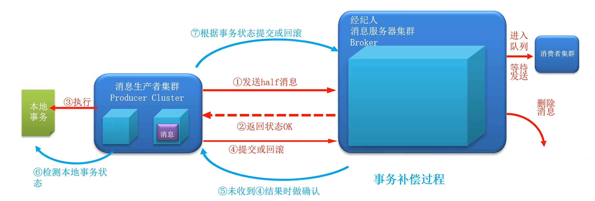

状态

+ 提交状态：允许进入队列，此消息与非事务消息无区别
+ 回滚消息：不允许进入队列，此消息等同于未发送过
+ 中间状态：完成了 half 消息的发送，未对 MQ 进行二次状态确认

+ 注意：事务消息仅与生产者有关，与消费者无关


生产者：

```java
package com.itfeng.transaction;

import org.apache.rocketmq.client.exception.MQBrokerException;
import org.apache.rocketmq.client.exception.MQClientException;
import org.apache.rocketmq.client.producer.*;
import org.apache.rocketmq.common.message.Message;
import org.apache.rocketmq.common.message.MessageExt;
import org.apache.rocketmq.remoting.exception.RemotingException;

// 发送消息
public class Producer {
    public static void main(String[] args) throws MQClientException, MQBrokerException, RemotingException, InterruptedException {
        // 1. 谁来发？
        TransactionMQProducer producer = new TransactionMQProducer("group1");

        // 2. 发给谁？
        producer.setNamesrvAddr("localhost:9876");
        // 设置事务监听
        producer.setTransactionListener(new TransactionListener() {
            // 正常事务过程
            @Override
            public LocalTransactionState executeLocalTransaction(Message message, Object o) {
                // 消息保存到数据库
                // sql insert
//                if (){
                System.out.println("执行正常事务过程");
//                return LocalTransactionState.COMMIT_MESSAGE;
//                }else {
                // 结果数据库崩了
//                return LocalTransactionState.ROLLBACK_MESSAGE;
//                }

                return LocalTransactionState.UNKNOW;
            }

            // 事务补偿过程
            @Override
            public LocalTransactionState checkLocalTransaction(MessageExt messageExt) {
                System.out.println("执行数据补偿过程");
//                if (sql select){
//
//                }else{
//
//                }
                return LocalTransactionState.COMMIT_MESSAGE;
            }
        });
        producer.start();

        String msg = "hello world transaction";
        Message message = new Message("topic13", "tag1", msg.getBytes());
        // 发送事务消息
        TransactionSendResult sendResult = producer.sendMessageInTransaction(message, null);
        System.out.println(sendResult);

        // 别关生产者
    }
}
```


---------


## 七、集群搭建

集群分类：

+ 单机
  + 一个 broker 提供服务（宕机后服务瘫痪）
+ 集群
  + 多个 broker 提供服务（单机宕机后消息无法及时被消费）
  + 多个 master 多个 slave
    + master 到 slave 消息同步方式为同步（较异步方式性能略低，消息无延迟）
    + master 到 slave 消息同步方式为异步（较同步方式性能略高，数据略有延迟）

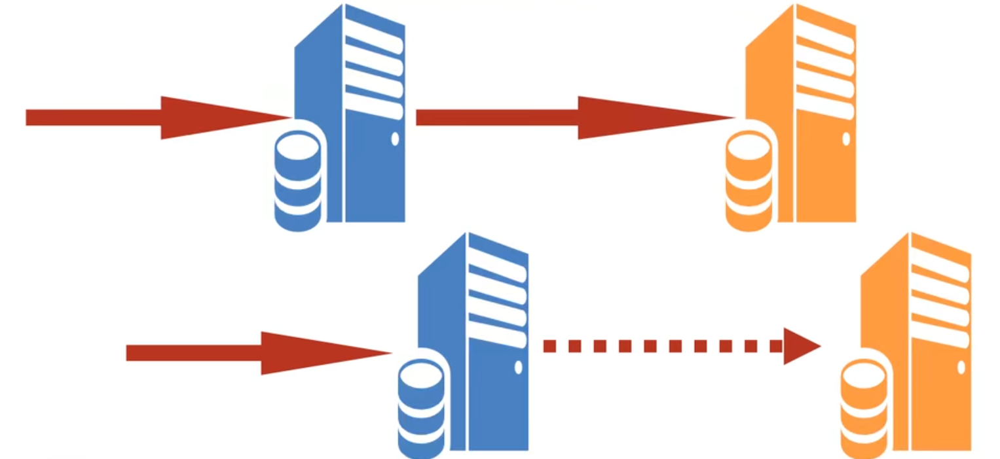

对于 rocketmq 来说：

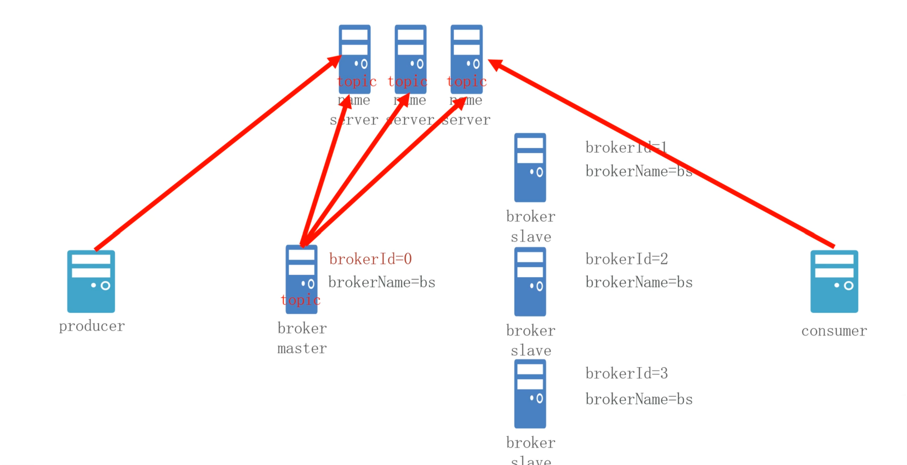

**RocketMQ 集群工作流程**

步骤1：NameServer 启动，开启监听，等待 broker、producer 与 consumer 连接

步骤2：broker 启动，根据配置信息，连接所有的 NameServer，并保持长连接

步骤2补充：如果 broker 中有现存数据，NameServer 将保存 topic 与 broker 关系

步骤3：producer 发信息，连接某个 NameServer，并建立长连接

步骤4：producer 发消息

​	步骤4.1 如果 topic 存在，由 NameServer 直接分配

​	步骤4.2 如果 topic 不存在，由 NameServer 创建 topic 与 broker 关系，并分配

步骤5：producer 在 broker 的 topic 选择一个消息队列（从列表中选择）

步骤6：producer 与 broker 建立长连接，用于发消息

步骤7：producer 发送消息

comsumer 工作流程同 producer


------


## 八、高级特性

### 消息的存储

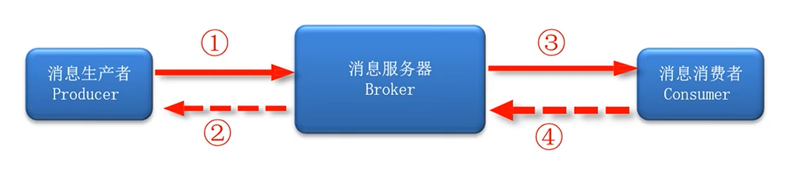

1. 消息生成者发送消息到 MQ
2. MQ 返回 ACK 给生产者
3. MQ push 消息给对应的消费者
4. 消息消费者返回 ACK 给 MQ

说明：ACK（Acknowledge character）

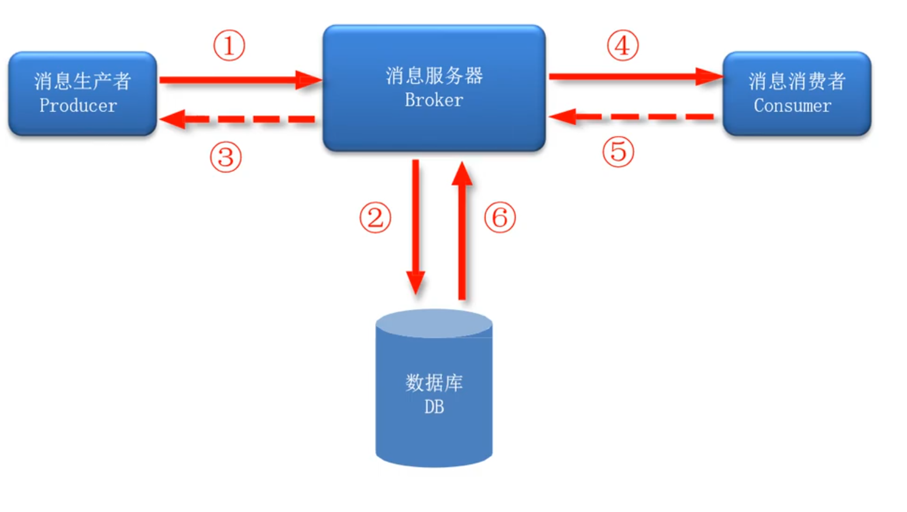

1. 消息生成者发送消息到 MQ
2. MQ 收到消息，将消息进行持久化，存储该消息
3. MQ 返回 ACK 给生成者
4. MQ push 消息给对应的消费者
5. 消息消费者返回 ACK 给 MQ
6. MQ 删除消息


注意：

1. 第5步 MQ 在指定时间内接收到消息消费者返回 ACK，MQ 认定消息消费成功，执行6
2. 第5步 MQ 在指定时间内未接收到消息消费者返回 ACK，MQ 认定消息消费失败，重新执行456


### 消息的存储介质

数据库

+ ActiveMQ
+ 缺点：数据库瓶颈将成为 MQ 瓶颈

文件系统

+ RocketMQ / Kafka / RabbitMQ
+ 解决方案：采用消息刷盘机制进行数据存储
+ 缺点：硬盘损坏的问题无法避免

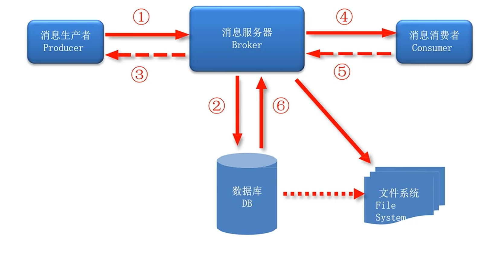


### 高效的消息存储与读写方式

磁盘读写方式是预留了一块空间进行顺序读写

+ Linux 系统发送数据的方式
+ “零拷贝” 技术
  + 数据传输由传统的4次负责简化为3次复制，减少1次复制过程
  + Java 语言中使用 MappedByteBuffer 类实现了该技术
  + 要求：预留存储空间，用于保存数据（1G 存储空间起步）

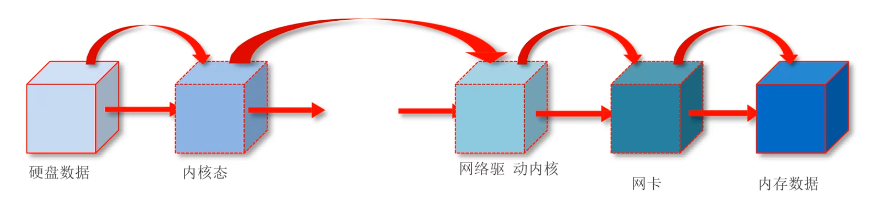


### 消息存储结构

MQ 数据存储区域包含如下内容

+ 消息数据存储区域
  + topic
  + queueId
  + message
+ 消费逻辑队列：记录着每一个队列被每一个消费者读到第几条了
  + minOffset（最小偏移量【下标】）
  + maxOffset
  + consumerOffset
+ 索引
  + key 索引
  + 创建时间索引
  + 。。。

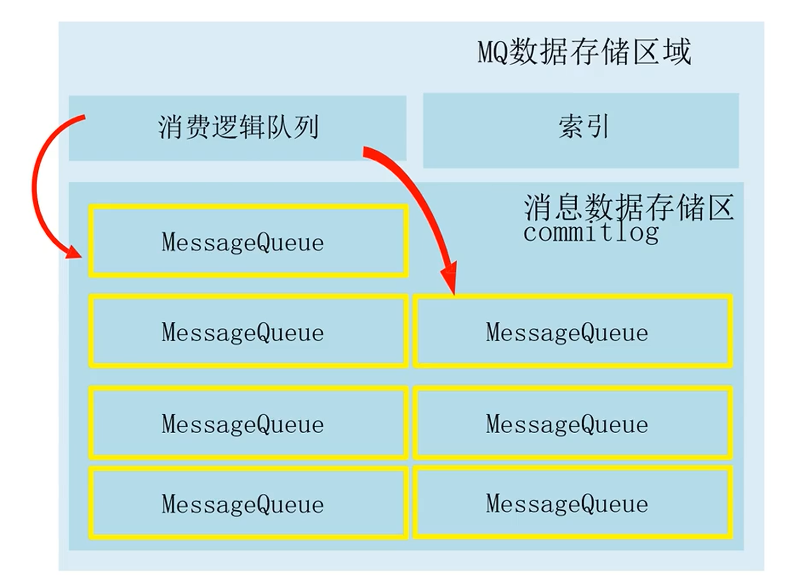


### 刷盘机制

同步刷盘：


1. 生产者发送消息到 MQ，MQ 接到消息数据
2. MQ 挂起生产者发送消息的线程
3. MQ 将消息数据写入内存
4. 内存数据写入磁盘
5. 磁盘存储后返回 SUCCESS
6. MQ 恢复挂起的生产者线程
7. 发送 ACK 到生产者


异步刷盘：

1. 生产者发送消息到 MQ，MQ 接到消息数据
2. MQ 将消息数据写入内存
3. 发送 ACK 到生产者


同步刷盘：安全性高，效率低，速度慢（适用于对数据安全要求较高的业务）

异步刷盘：安全性低，效率高，速度快（适用于对数据处理速度要求较高的业务）

**配置方式**

```
#刷盘方式
#- ASYNG_FLUSH 异步刷盘
#- SYNC_FLUSH 同步刷盘
flushDiskType=SYNC_FLUSH
```


#### 高可用性

+ nameserver
  + 无状态 + 全服务器注册
+ 消息服务器
  + 主从架构（2M-2S）
+ 消息生产
  + 生产者将相同的 topic 绑定到多个 group 组，保障 master 挂掉后，其他 master 仍可正常进行消息接收
+ 消息消费
  + RocketMQ 自身会根据 master 的压力确认是否由 master 承担消息读取的功能，当 master 繁忙时候，自动切换由 slave 承担数据读取的工作


#### 主从数据复制

+ 同步复制
  + master 接到消息后，先复制到 slave，然后反馈给生产者写操作成功
  + 优点：数据安全，不丢数据，出现故障容易恢复
  + 缺点：影响数据吞吐量，整体性能低
+ 异步复制
  + master 接到消息后，立即返回给生产者写操作成功，当消息达到一定量后再异步复制到 slave
  + 优点：数据吞吐量大，操作延迟低，性能高
  + 缺点，数据不安全，会出现数据丢失的现象，一旦 master 出现故障，从上次数据同步到故障时间的数据将丢失

**配置方式**

```
#Broker 的角色
#- ASYNC_MASTER 异步复制Master
#- SYNC_MASTER 同步双写Master
#- SLAVE
brokerRole=SYNC_MASTER
```


### 负载均衡

+ Producer 负载均衡
  + 内部实现了不同 broker 集群中对同一 topic 对应消息队列的负载均衡

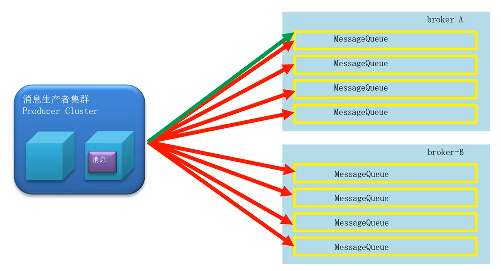


+ Consumer 负载均衡
  + 平均分配
  + 循环平均分配（解决宕机问题）

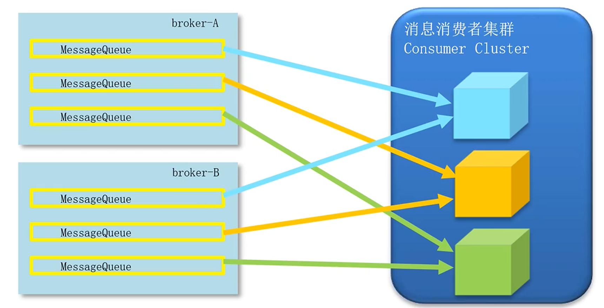

+ 广播模式（不考虑）


### 消息重试

当消息消费后未正常返回消费成功的消息将启动消息重试机制

**消息重试机制**

+ 顺序消息

当消费者消费消息失败后，RocketMQ 会自动进行消息重试（每次间隔时间为1秒）

注意：应用会出现消息消费被阻塞的情况，因此，要对顺序消息的消费情况进行监控，避免阻塞现象的发生

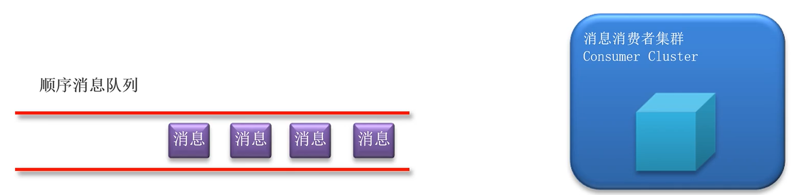

+ 无须消息
  + 无须消息包括普通消息、定时消息、延时消息、事务消息
  + 无序消息重试仅适用于负载均衡（集群）模型下的消息消费，不适用于广播模式下的消息消费
  + 为保障无序消息的消费，MQ 设定了合理的消息重试间隔时长

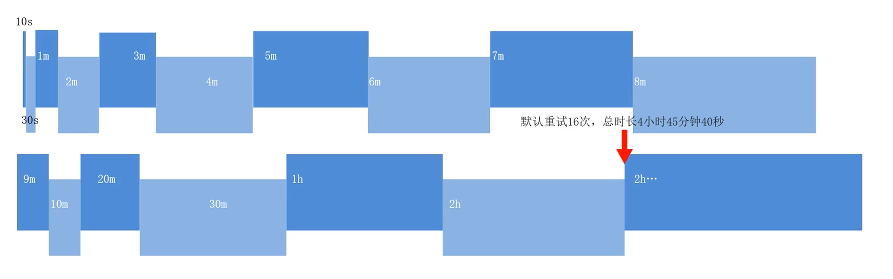


### 死信队列

当消息消费重试到达了指定次数（默认16次）后，MQ 将无法被正常消费的消息成为死信消息（Dead-Letter Message）

死信消息不会被直接抛弃，而是保存到了一个全新的队列中，该队列成为死信队列（Dead-Letter Queue）

+ 死信队列特征
  + 归属某一个组（Group Id），而不归属 Topic，也不归属消费者
  + 一个死信队列中可以包含同一个组下的多个 Topic 中的死信队列
  + 死信队列不会进行默认初始化，当第一个死信出现后，此队列首次初始化
+ 死信队列中消息特征
  + 不会被再次重复消费
  + 死信队列中的消息有效期为3天，达到时限后将被清除

**死信处理**

在监控平台中，通过查找死信，获取死信的 messageId，然后通过 id 对死信进行精准消费


### 消息重复消费

+ 消息重复消费原因
  + 生产者发送了重复的消息
    + 网络闪退
    + 生产者宕机
  + 消息服务器投递了重复的消息
    + 网络闪断
  + 动态的负载均衡过程
    + 网络闪断 / 抖动
    + broker 重启
    + 订阅方应用重启（消费者）
    + 客户端扩容
    + 客户端缩容

**消息幂等**

+ 对同一条消息，无论消费多少次，结果保持一致，成为消息幂等性
+ 解决方案
  + 使用业务 id 作为消息的 key
  + 在消费时，客户端对 key 做判定，未使用过放行，使用过抛弃
  + 注意：messageId 由 RocketMQ 产生，messageId 并不具备唯一性，不能作用幂等判定条件
+ 常见的幂等方法示例
  + 新增：不幂等    `insert into order values (......)`
  + 查询：幂等
  + 删除：幂等    `delete from 表 where id = 1`
  + 修改：不幂等    `update account set balance = balance + 100 where no = 1`
  + 修改：幂等    
  + `update account set balance = 100 where no = 1`


---------

