# 爬虫
## 第一章：基础
### 一、爬虫的基本介绍
#### **1. 什么是爬虫？**
  + **定义**：爬虫（Web Crawler）是一种自动获取网页信息的程序或脚本，也称为网络蜘蛛（Spider）或网络机器人（Bot）。
  + **举例**：想一只蜘蛛在网上不断地爬行，查找并收集各种信息。搜索引擎如 Google、百度等使用爬虫来自动抓取网页内容，以建立搜索引擎索引。

#### **2. 学爬虫有什么好处？**
  + 学习爬虫有很多好处，比如可以帮助我们更好地获取互联网上的各种信息。举个例子，假设你想要了解某个产品在各大电商平台上的价格，如果手动去每个平台搜索，需要花费大量的时间和精力。但是如果使用爬虫，就可以编写一个程序，自动地去这些平台上搜索并记录下相关信息，大大节省了时间和精力。总之爬虫可以帮助我们快速、自动地获取互联网上的各种数据，包括新闻、价格、天气、股票数据等。这些数据对于研究、分析和决策都非常有用。

#### **3. 爬虫的用途**
  + 搜索引擎
  + 数据分析
  + 舆情分析
  + 信息监控
  + 信息聚合
  + 应用开发

#### **4. 爬虫的分类**
  + **通用爬虫**：能够自动抓取互联网上各种网站信息的爬虫，它们不针对特定的网站，而是通过智能化的方式发现和抓取网页
  + **聚焦爬虫**：是一种针对特定网站或者特定类型网站进行定制开发的爬虫程序。与通用爬虫不同，聚焦爬虫的抓取范围更为有限，主要用于针对特定需求或特定网站的数据抓取
  + **增量式爬虫**：在上一次抓取的基础上，只抓取新增或有更新的数据，从而减少了重复抓取和提高了效率，增量式爬虫适用于需要频繁更新数据的场景
  + **深层网络爬虫**：专门用于抓取存在于互联网深层的页面

#### **5. 爬虫的工作流程**
  + 发送请求
  + 获取响应
  + 解析响应、提取数据
  + 存储数据

#### **6. robots协议**
Robots协议(也称为robots.txt)是一个位于网站根目录下的文本文件，用于指示搜索引擎爬虫哪些页面可以访问，哪些页面不应该被访问。该文件包含一系列规则，定义了爬虫对网站的访问权限。
  + **User-agent**：指定了爬虫和名称或标识符
  + **Disallow**：指定了不允许被访问的URL路径
==不要采集涉及到用户隐私的数据（名字、电话、地址、身份证号）==

----------------------

### 二、 HTTP和HTTPS协议
**HTTP协议(HyperText Transfer Protocol，超文本传输协议)**是一种发布和接收 HTML页面的方法
**HTTPS（Hypertext Transfer Protocol over Secure Socket Layer）**简单讲是HTTP的安全版，在HTTP下加入SSL层
**SSL（Secure Sockets Laver 安全套接层）**主要用于Web的安全传输协议，在传输层对网络连接进行加密，保障在Internet上数据传输的安全。
+ HTTP的端口号为 80
+ HTTPS的端口号为 443

#### **1. 浏览器发送HTTP请求的过程：**
+ 浏览器先向地址栏中的url发起请求，并获取相应
+ 在返回的响应内容（html）中，会带有css、js、图片等url地址，以及ajax代码，浏览器按照响应内容中的顺序依次发送其他的请求，并获取相应的响应
+ 浏览器每获取一个响应就对展示出的结果进行添加(加载)，is，css等内容会修改页面的内容，is也可以重新发送请求，获取响应
+ 从获取第一个响应并在浏览器中展示，直到最终获取全部响应，并在展示的结果中添加内容或修改--这个过程叫做浏览器的渲染

**URL介绍**
URL(Uniform/Universal Resource Locator的缩写)：统一资源定位符，是用于完整地描述Internet上网页和其他资源的地址的一种标识方法（通俗的叫法就是网址）

#### **2. HTTP请求信息**
+ HTTP请求报文：
  URL只是标识资源的位置，而HTTP是用来提交和获取资源。客户端发送一个HTTP请求到服务器的请求消息，包括以下格式
  + 请求首行
  + 请求头部
  + 空行
  + 请求数据

请求报文的一般格式：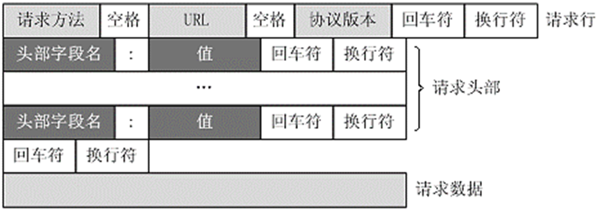

==浏览器右键点击检查查看==

+ HTTP请求方法
  根据HTTP标准，HTTP请求可以使用多种请求方法
  
  + **HTTP 0.9：**只有基本的文本 GET 功能
  + **HTTP 1.0：**完善的请求/响应模型，并将协议补充完整，定义了三种请求方法: GET， POST 和 HEAD方法
  + **HTTP 1.1：**在1.0基础上进行更新，新增了五种请求方法:OPTIONS，PUT，DELETE，TRACE 和 CONNECT 方法（目前主流）
  
+ 爬虫发送HTTP请求，主要分为**Get**和**Post**两种方法
  + **GET**：GET是从服务器上获取数据，GET请求参数显示，都显示在浏览器网址上，HTTP服务器根据该请求所包含URL中的参数来产生响应内容，即“Get"请求的参数是URL的一部分。例如: http://www.baidu.com/s?wd=chinese
  
  + **POST**：是向服务器提交数据，POST请求参数在请求体当中，消息长度没有限制而且以隐式的方式进行发送
  
    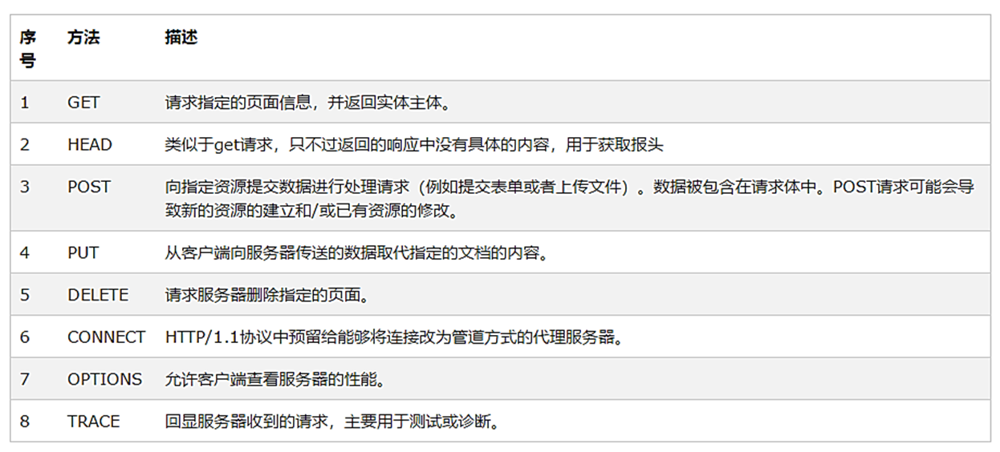

+ 常用的请求头
  + **Host** (主机和端口号)
  + **Connection** (链接类型)
  + **Upgrade-Insecure-Requests** (升级为HTTPS请求)
  + **User-Agent** (浏览器名称)
  + **Accept** (传输文件类型)
  + **Referer** (页面跳转处)
  + **Accept-Encoding** (文件编解码格式)
  + **Accept-Language** (语言种类)
  + **Content-Type** (POST数据类型)
  + **Cookie** (Cookie)
  + **x-requested-with:XMLHttpRequest** (表示该请求是Ajax异步请求)

#### **3. HTTP响应信息**
+ 响应报文：
  HTTP响应报文也由四个部分组成，分别是：**状态行、消息报头、空行、响应正文**

  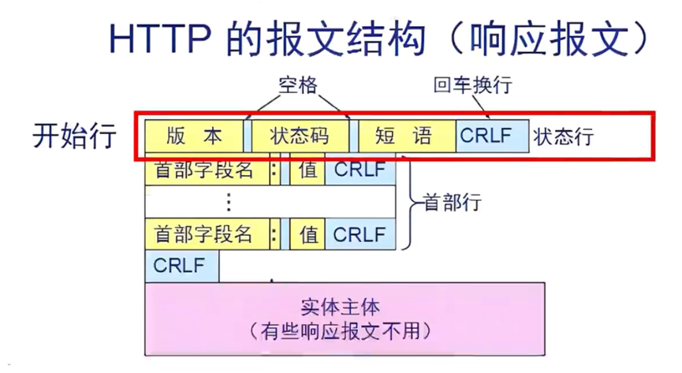

+ Cookie信息：
Set-Cookie(对方服务器设置cookie到用户浏览器的缓存)
服务器和客户端的交互仅限于请求/响应过程，结束之后便断开，在下一次请求时，服务器会认为新的客户端为了维护他们之间的链接，让服务器知道这是前一个用户发送的请求，必须在一个地方保存客户端的信息
  + **Cookie**：通过在 客户端 记录的信息确定用户的身份
  + **Session**：通过在 服务器端 记录的信息确定用户的身份
*用法就比如说在淘宝搜了某个东西，它就会一直给你推这个东西，它会把你的搜索信息存在cookie里*

+ 状态码范围：
  + **100~199**：表示服务器成功接收部分请求，要求客户端继续提交其余请求才能完成整个处理过程
  + **200~299**：表示服务器成功接收请求并已完成整个处理过程。常用200(OK请求成功)
  + **300~399**：为完成请求，客户需进一步细化请求。例如:请求的资源已经移动一个新地址、常用302(所请求的页面已经临时转移至新的url)、307和304(使用缓存资源)
  + **400~499**：客户端的请求有错误，常用404(服务器无法找到被请求的页面)、403(服务器拒绝访问，权限不够)
  + **500~599**：服务器端出现错误，常用500(请求未完成。服务器遇到不可预知的情况)

---------------------------

### 三、requests基本使用
Requests库：唯一的一个非转基因的Python HTTP库，人类可以安全享用
**作用**：发送HTTP网络请求，返回响应数据
**中文文档**：[Requests: 让 HTTP 服务人类 — Requests 2.18.1 文档](https://requests.readthedocs.io/projects/cn/zh-cn/latest/)

#### **1. 发送get请求**
**需求**：通过requests向百度首页发送请求，获取百度首页的数据

```python
# 导入requests模块
import requests

# 百度首页的URL
url = 'https://www.baidu.com/'

# 使用requests发送请求：请求百度首页,接收返回的结果
response = requests.get(url=url)

# 打印返回的内容
print(response.text)
```

#### **2. 响应数据的获取**
##### `response.text`
+ 类型：**str**
+ 解码类型：requsets模块自动根据HTTP头部响应的编码作出有根据的推测，推测的文本编码
+ 如何修改编码方式：`response.encoding=’gdk’`

##### `response.content`
+ 类型：bytes
+ 解码类型：没有指定
+ 如何修改编码方式：`response.content.decode(“utf-8”)`
+ 默认用的就是utf-8

##### 获取网页源码的通用方式：
+ `response.content.decode()`
+ `response.content.decode(“GBK”)`
+ `response.text`
以上三种方法从前往后尝试，能够100%的解决所有网页解码的问题
所以更推荐使用==response.content.decode(“utf-8”)==的方式获取响应的html页面

#### **3. 字符串编码**
##### 字符、字符串
+ 字符（Character）是各种文字和符号的总称，包括各国家文字、标点符号、图形符号、数字等字符集（Character set）是多个字符的集合
+ 字符集包括：ASCII字符集、GB2312字符集、GB18030字符集、Unicode字符集等
+ ASCI编码是1个字节，而Unicode编码通常是2个字节
+ UTF-8是Unicode的实现方式之一，UTF-8是它是一种变长的编码方式，可以是1，2，3个字节

##### python3中的字符串
python3中两种字符串类型：
+ str: unicode的呈现形式
+ bytes: 字节类型，互联网上数据的都是以二进制的方式（字节类型）传输的

##### str和bytes类型的互相转换：
+ str 使用`encode()`方法转化为 bytes

+ bytes通过`decode()`转化为str

  ```python
  """
  encode：对字符串进行编码：转换为二进制的格式
  decode：对二进制的字符串（bytes类型）进行编码，转换为字符串
  """
  
  s = '你好 python'
  
  # 将字符串转换为bytes类型
  res = s.encode('utf-8')
  print(res)
  
  # 将bytes类型的字符串(二进制字符串)
  ss = b'\xe4\xbd\xa0\xe5\xa5\xbd python'
  # 将bytes类型转换为字符串
  res2 = ss.decode('utf-8')
  print(res2)
  ```


#### **4. response的其他属性**
+ `response.status_code`    **响应状态码**
+ `response.request.headers`    **响应对应的请求头**
+ `response.headers`    **响应头**
+ `response.request._cookies`    **响应对应的请求cookie**
+ `response.cookies`    **响应的cookie（经过了set-cookie动作）**
```python
# 获取http状态码
print(response.status_code)
# 获取响应头
print(response.headers)
# 获取响应的cookie
print(response.cookies)
# 获取请求头
print(response.request.headers)
# 获取请求的cookie
print(response.request._cookies)
```

#### **5. 携带HTTP请求头**
##### 发现问题：
+ 对比浏览器上百度首页的网页源码和代码中的百度首页的源码，有什么不同？
+ 代码中的百度首页的源码非常少，为什么？

##### 解决方案：
+ 请求需求带上header，模拟浏览器，七篇服务器，获取和浏览器一致的内容
##### header格式：字典格式
```python
# 导入requests模块
import requests

# 百度首页的URL
url = 'https://www.baidu.com/'
# 请求头是字典格式
headers = {
    "User-Agent": "Mozilla/5.0 (Windows NT 10.0; Win64; x64) "
                  "AppleWebKit/537.36 "
                  "(KHTML, like Gecko) Chrome/94.0.4606.81 "
                  "Safari/537.36 Edg/94.0.992.50"
}

# 使用requests发送请求：请求百度首页,接收返回的结果
response = requests.get(url=url, headers=headers)   # 请求头参数：headers=headers
print(response.content.decode('utf-8'))


# 获取本次请求的请求头信息
print(response.request.headers)


```

#### **6. 案例实战**
##### 百度图片下载
需求：
把www.baidu.com上的图片保存到本地

分析：

+ 图片的url：
PCtm_d9c8750bed0b3c7d089fa7d55720d6cf.png (540×258) (baidu.com)
+ 利用requests模块发送请求获取响应
+ 以2进制写入的方式打开文件，并将response响应的二进制内容写入
```python
import requests

url = "https://www.baidu.com/img/PCtm_d9c8750bed0b3c7d089fa7d55720d6cf.png"
header = {
    "User-Agent": "Mozilla/5.0 (Windows NT 10.0; Win64; x64)"
                  " AppleWebKit/537.36 (KHTML, like Gecko) "
                  "Chrome/91.0.4472.124 Safari/537.36"

}

# 发送请求获取响应信息
response = requests.get(url=url, headers=header)
# 将返回的响应信息的内容写入到一个图片文件中
with open("baidu.png", "wb") as f:   # wb表示写入二进制文件
    f.write(response.content)


```
##### 网易云音乐下载
需求：
下载网易云音乐的歌曲保存到本地（非vip）

**步骤分析：**

+ 通过浏览器抓包找到目标歌曲的url
+ 发送请求获取响应
+ 响应中的歌曲数据，以二进制的方式保存到本地

```python
import requests
# 歌曲Beside Me的地址
url = ("https://m701.music.126.net/20240918171822/"
       "9e218d8d33bc6a435db626139de28f96/jdyyaac/"
       "obj/w5rDlsOJwrLDjj7CmsOj/12310936489/29e0/"
       "f1ad/54ef/fd9a04732d2824a587f501424aca1a0c.m4a")

header = {
    "User-Agent": "Mozilla/5.0 (Windows NT 10.0; Win64; x64)"
                  " AppleWebKit/537.36 (KHTML, like Gecko)"
                  " Chrome/127.0.0.0 Safari/537.36 Edg/127.0.0.0"

}

requests = requests.get(url=url, headers=header)

with open("Beside Me.m4a", "wb") as f:
    f.write(requests.content)
print("下载完成")


```

抓包：
**检查 → 网络 → 媒体**

==出了文本用w模式打开，视频、图片、音频这些都需要用wb模式打开！！！！！！==

---------------------------
### 四、 数据提取之Xpath
#### **1. 需求**
+ 抓取豆瓣Top250中的电影数据
+ 要求：
  + 提取Top250中的电影数据每部电影的名字和评分
  + 提取电影名称
  + 提取电影的评分

#### **2. Xpath语法**
Xpath开发工具
+ 开源的Xpath表达式编辑工具：XMLQuire（XML格式文件可用）
+ Chrome插件XPath Helper

##### 选取节点
XPath 使用路径表达式来选取 XML 文档中的节点或者节点集。这些路径表达式和我们在常规的电脑文件系统中看到的表达式非常相似
下面列出了最常用的路径表达式：

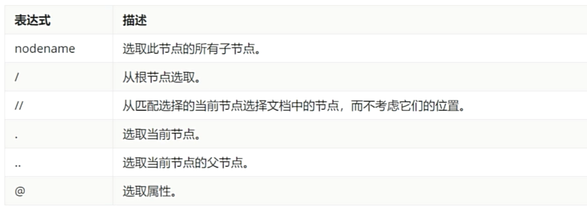

在下面的表格中，我们已列出了一些路径表达式以及表达式的结果：

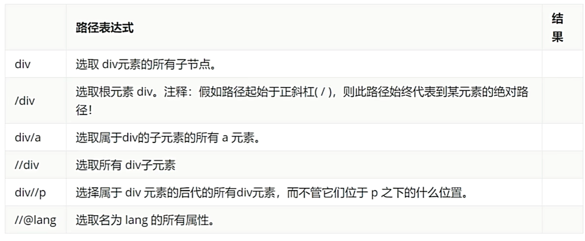

##### 谓语（条件过滤）
谓语用来查找某个特定的节点或者包含某个指定的值的节点，被嵌在方括号中。在下面的表格中，我们列出了带有谓语的一些路径表达式，以及表达式的结果：

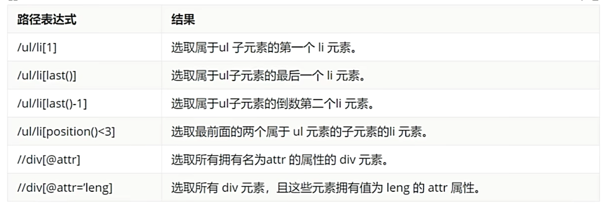

##### 选取未知节点
Xpath通配符可用来选取未知的XML元素

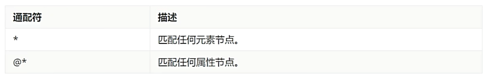

在下面的表格中，我们列出了一些路径表达式，以及这些表达式的结果：

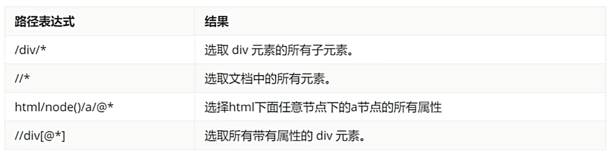

##### 模糊匹配

```python
[contains(@属性, 值)]
# 选取属性为attr，并且值为100的所有元素
//li[contains(@attr, 100)]
```

##### 获取文本
+ 获取文本数据
  选中节点后要获取节点中的文本内容，使用**text()**方法

  ```python
  # 获取span标签中的文本内容
  /div/ul/li/span/text()
  ```

+ 获取属性值

  ```python
  # 获取a标签中的herf属性
  /div//li/a/@herf
  ```

这些就是Xpath的语法内容，在运用到Python抓取时要先转换为xml

#### **3. python中使用Xpath**
python中有一个专门用来解析XML文档的库，叫做lxml
+ 安装lxml
**pip install lxml**
+ 使用案例

```python
"""
1. 准备好top250电影数据所有的url地址放在一个列表中
2. 遍历列表中的url地址，进行抓取
3.代码优化
"""
from lxml import etree
import requests


class DouBan:
    base_url = "https://movie.douban.com/top250?start={}&filter="
    # 准备请求数据
    headers = {"User-Agent": "Mozilla/5.0 (Windows NT 10.0; Win64; x64)"
                             " AppleWebKit/537.36 (KHTML, like Gecko)"
                             " Chrome/89.0.4389.82 Safari/537.36"
               }

    def __init__(self):
        # 定义一个属性，用来保存所有的url地址
        self.url_list = []
        # 生成所有页面的url地址保存到url_list属性中
        for i in range(10):
            url = self.base_url.format(i*25)   # format()方法用来格式化字符串，将{}替换为i*25
            self.url_list.append(url)

    def get_page_data(self, url):
        """抓取单页数据的函数"""

        # 发送请求
        response = requests.get(url=url, headers=self.headers)
        # 将html页面内容转换为xml文档对象
        html = etree.HTML(response.content.decode())
        # 对定位到包含所有元素的列表进行遍历，得到包含单条数据的元素
        for li in html.xpath('//ol//li'):
            # 提单条数据中的详细内容
            title = li.xpath(".//span[@class='title'][1]/text()")  # .表示从当前li下面去找，如果没写.还会重复元素一节一节往下找
            score = li.xpath(".//span[@class='rating_num']/text()")
            number = li.xpath(".//div[@class='star']/span[4]/text()")
            print("电影的名称：", title[0], "评分：", score[0], "评价人数：", number[0])

    def run(self):
        # 遍历url_list中的url地址，进行数据抓取
        for url in self.url_list:
            print("=======================开始抓取页面：", url)
            self.get_page_data(url)


if __name__ == '__main__':
    db = DouBan()
    db.run()
```

---------------------------
### 五、 get请求参数
#### **1. 查询参数的基本使用**
我们在使用百度搜索的时候经常发现url地址中会有一个？，那么问号后边的就是请求参数，又叫查询字符串
+ 查询参数的形式：**字典**
params = {'wd': ''长城''}
+ requests传递参数的用法
requests.get(url, params=params)

#### **2. get请求查询参数传递的两种方式**
+ 方式一：参数直接拼接在url后面
```python
import requests

# request请求传递查询参数
# 方式一：参数直接拼接在url后面
url = 'https://www.baidu.com/s?wd=%E9%95%BF%E5%9F%8E&tn=52176495_dg&ch=2&ie=utf-8'
header = {'User-Agent': 'Mozilla/5.0 (Windows NT 10.0; Win64; x64)'
                        ' AppleWebKit/537.36 (KHTML, like Gecko)'
                        ' Chrome/89.0.4389.114 Safari/537.36'
          }

response = requests.get(url=url, headers=header)
print(response.content.decode())

```
+ 方式二：通过params传递参数
```python

# 方式二：通过params参数传递
# 请求地址
url = 'https://www.baidu.com/s'
# 请求头
header = {'User-Agent': 'Mozilla/5.0 (Windows NT 10.0; Win64; x64)'
                        ' AppleWebKit/537.36 (KHTML, like Gecko)'
                        ' Chrome/89.0.4389.114 Safari/537.36'
          }
# 请求参数（查询参数）
params = {
    'wd': '长城',
    'tn': '52176495_dg',
    'ch': '2',
    'ie': 'utf-8'
}

# 发送请求传递参数时，使用params进行传递
response = requests.get(url=url, headers=header, params=params)
print(response.content.decode())

```


---------------------------
### 六、 post请求和模拟登录
#### **1. post请求介绍**
##### 使用场景
在编写爬虫抓取数据的时候，我们不仅只使用get请求，在一些场景下还会遇到post请求，比如：
+ **登录注册**
+ **参数需要传输大文本内容的时候**
#### **2. post请求参数类型**
怎么看是哪种类型：在**网页→检查→网络→标头→常规**
+ form表单格式（案例：百度翻译手机版）
https://fanyi.baidu.com/

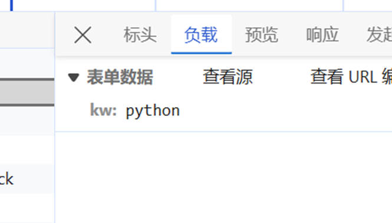

```python
"""
# 发送post请求方法：
    requests.post()
参数传递
    1. 表单参数：form-data
        requests.post(url, data=字典参数)
    2. json参数：
        requests.post(url, json=字典参数)
"""

# 案例一：百度翻译手机版发送post请求，传递表单参数
import requests
url = "https://fanyi.baidu.com/sug"
params = {
    "kw": "python3"
}

headers = {
    "User-Agent": "Mozilla/5.0 (Windows NT 10.0; Win64; x64) "
                  "AppleWebKit/537.36 (KHTML, like Gecko) "
                  "Chrome/91.0.4472.124 Safari/537.36"
}
response = requests.post(url, data=params, headers=headers)
print(response.content.decode())


```
+ json参数（案例：课堂派）

  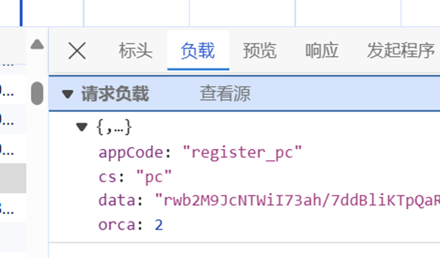
```python
"""
# 发送post请求方法：
    requests.post()
参数传递
    1. 表单参数：form-data
        requests.post(url, data=字典参数)
    2. json参数：
        requests.post(url, json=字典参数)
"""
import requests

# 案例一：课堂派发送post请求，传递json参数
url = "https://openapiv5.ketangpai.com//UserApi/login"
params = {
    "code": "",
    "type": "login",
    "reqtimestamp": 1726909207666,
    "email": "65131813",
    "password": "Y+c61sE/mOaEjQKH57ymTw==",
    "remember": "0",
    "encryption": 1,
    "mobile": ""
}

headers = {
    "User-Agent": "Mozilla/5.0 (Windows NT 10.0; Win64; x64) "
                  "AppleWebKit/537.36 (KHTML, like Gecko) "
                  "Chrome/91.0.4472.124 Safari/537.36"
}
response = requests.post(url, json=params, headers=headers)
# print(response.content.decode())

print(response.json())

```


#### **3. 模拟登录**
**思考：**我们在开发爬虫时如何抓取那些需要登录之后才能访问的页面数据？
+ 通过代码模拟登录发送的请求进行登录，然后再去访问需要登陆的页面
##### 如何进行模拟登录
###### 通过抓包，找到登录接口：
+ 打开目标网页，点击登录
+ 打开调试控制台
+ 输入一组错误的账号密码，点击登录
+ 就可以在控制台看到登陆的请求
+ 查看登录接口的url地址，请求参数

###### 编写代码请求登录接口，传入正确的账号和密码
```python
import requests

url = 'https://passport.china.com/logon'

params = {
	"userName": "17775990925"
	"password": "a545892852"
}
response = requests.post(url=url, data=params)
print(response.text)
```

##### cookie+session鉴权机制
+ **cookie**
  + Cookie 是由 Web 服务器保存在用户浏览器（客户端）上的小文本文件，它可以包含有关用户的信息。无论何时用户访问到服务器，都会带上该服务器的cookie信息
  + 一般 Cookie 都是有效期的，Cookie 只在浏览器上保存一段规定的时间，一旦超过规定的时间，该Cookie 就会被系统清除

+ **Session（会话）**
  
  + Session将数据存储在服务器中，服务器会为每一个用户创建一条session，用户访问服务器的时候需要拿着sessionid去表明自己的身份
  
    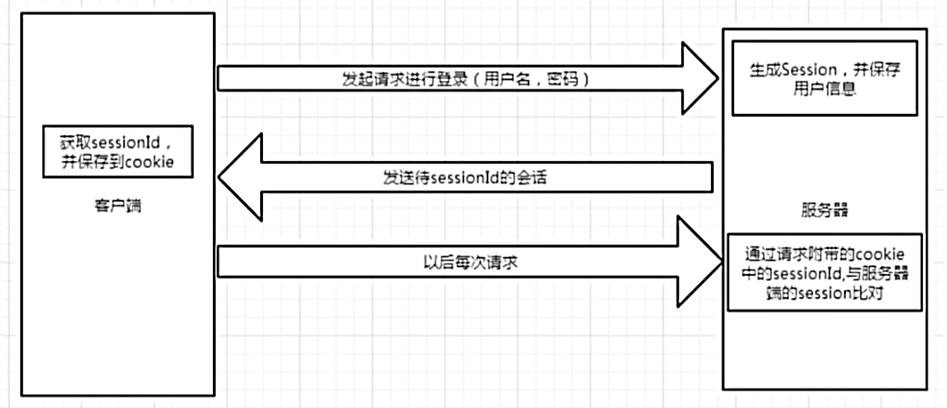

##### 基于Token（令牌）的鉴权机制

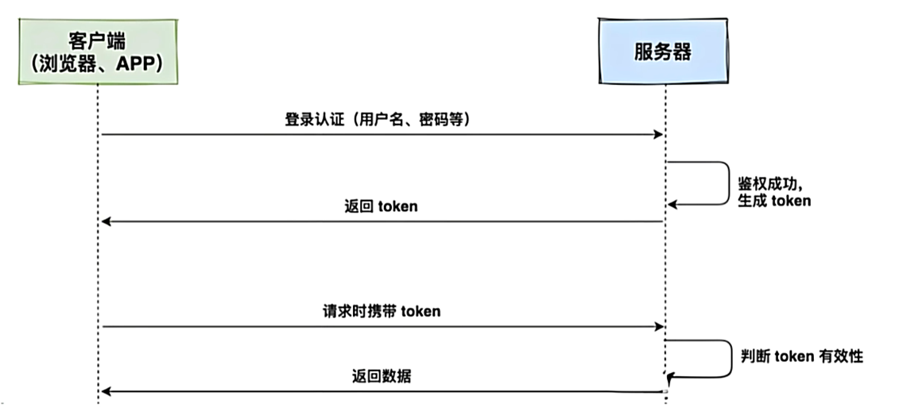

如何鉴别这三种请求参数：
+ 请求参数用表单形式的------90%以上使用**cookie+session**
+ 请求是请求负载------用**token**
+ 看登陆的url和当前网站的地址
  + 一样的------一般用的是**cookie+session**
  + 不一样的------100%用的**token**

##### requests处理cookie的方案
使用requests处理cookie有三种方法：
+ Cookie字符串放在headers中
```python
# ========================方式一：以字典格式传递==========================
# 获取cookie信息
cookies = response.cookies
# 请求需要登录的页面
res2 = requests.get("https://passport.china.com", headers=headers, cookies=cookies)
print(res2.content.decode())

```
+ 把cookie字典放传给请求方法的cookies参数接收
```py
import requests

login_url = "https://passport.china.com/logon"
params = {
    "username": "17775990925",
    "password": "a546245426"
}

# header
headers = {
    "Referer": "https://passport.china.com/logon",  # 请求头，告诉服务器，我是从哪个页面跳转过来的
    "User-Agent": "Mozilla/5.0 (Windows NT 10.0; Win64; x64) "
                  "AppleWebKit/537.36 (KHTML, like Gecko)"
                  " Chrome/91.0.4472.124 Safari/537.36"
}
# 发送请求进行登录
response = requests.post(url=login_url, data=params, headers=headers)
print(response.content.decode())
```
+ 使用requests提供的**session**模块*（最常用）*
```python
import requests

login_url = "https://passport.china.com/logon"
params = {
    "username": "17775990925",
    "password": "a546245426"
}

# header
headers = {
    "Referer": "https://passport.china.com/logon",
    "User-Agent": "Mozilla/5.0 (Windows NT 10.0; Win64; x64) "
                  "AppleWebKit/537.36 (KHTML, like Gecko)"
                  " Chrome/91.0.4472.124 Safari/537.36"
}

# 1. 使用request.session创建一个请求的对象
http = requests.session()
# 2. 发送请求进行登录
response = http.post(url=login_url, data=params, headers=headers)
# 3. 请求需要登录的页面
res2 = http.get("https://passport.china.com", headers=headers)
print(res2.content.decode())


```
#### **4. 中华网模拟登陆案例（cookie）**
+ 目标网站：
  中华网：https://passport.china.com/
  + 这个地址没有登陆的情况下访问，会直接被重定向到登录页面，不登陆无法打开
  思路：
  + 先进行登录，然后在进行访问
  
  
  
+ 抓包分析：
  + **登录地址**：中华网通行证 (china.com)
  + **请求方法**：POST
  + **请求参数**（表单格式）

  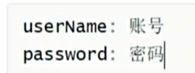

+ 代码实现：

```python
"""
模拟登录，访问需要登录之后才能打开的页面
    1. 发送登录请求
    2. 保存cookie信息
    3. 携带cookie信息请求需要登录的页面

"""
import requests

login_url = "https://passport.china.com/logon"
params = {
    "username": "17775990925",
    "password": "a546245426"
}

# header
headers = {
    "Referer": "https://passport.china.com/logon",  # 请求头，告诉服务器，我是从哪个页面跳转过来的
    "User-Agent": "Mozilla/5.0 (Windows NT 10.0; Win64; x64) "
                  "AppleWebKit/537.36 (KHTML, like Gecko)"
                  " Chrome/91.0.4472.124 Safari/537.36"
}
# 发送请求进行登录
response = requests.post(url=login_url, data=params, headers=headers)
print(response.content.decode())

# 请求需要登录的页面
res2 = requests.get("https://passport.china.com", headers=headers)

print(res2.content.decode())

```

----------------------
### 七、requests扩展
#### 1. SSL证书验证校验
Requests 可以为 HTTPS 请求验证 SSL 证书，就像 web 浏览器一样。SSL 验证默认是开启的，如果证书验证失败，Requests 会抛出 SSLError
在该域名上没有设置 SSL，所以失败了。但 Github 设置了 SSL:
```python
>>> requests.get('https://pipedream.com/requestbin')
requests.exceptions.SSLError: hostname 'requestb.in' doesn't match either of
'*.herokuapp.com', 'herokuapp.com'
```
在该域名上没有设置 SSL，所以失败了。但 Github 设置了 SSL:
```python
>>> requests.get('https://github.com', verify=True)
<Response [200]>
```
关闭证书验证
```
verify = Flase
```
#### **2. 请求超时**
##### 什么是请求超时
我们打开某些网站时，如果网站不好，就会出现连接超时

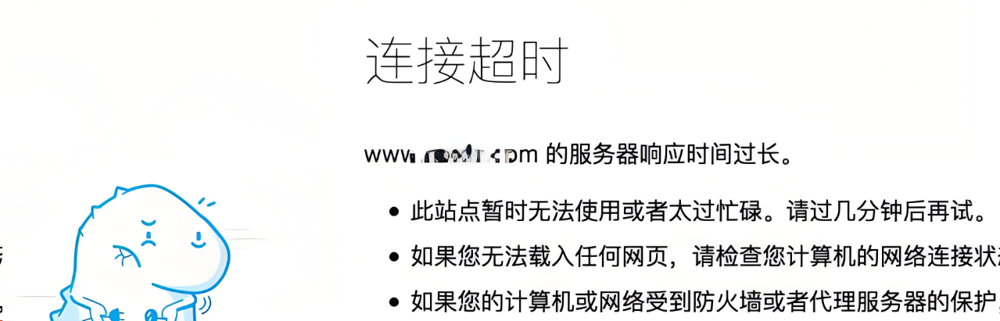

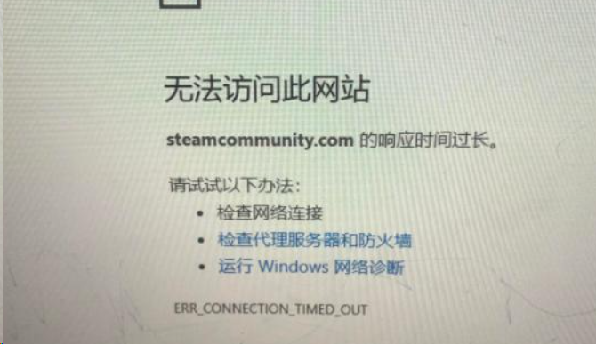

##### requests 处理超时 
在爬虫爬取数据的时候遇到网络波动，肯定会出现超时的情况，这样就会让我们的爬虫跑起来非常慢，有没有什么优化方案呢？

timeout参数可以设置超时的时长
```python
# 设置如果10之后还是没有结果返回就报错提示连接超时
res = requests.get(url='http://www.baidu.con',timeout=10)
```
#### 3. retrying 模块
#### 什么是 retrying 模块？ 
retrying 是一个 Python 库，用于添加重试逻辑到代码中。它可以帮助处理由于网络问题、服务不稳定等原因导致的请求失败或异常情况

##### retrying 模块的作用 
+ 自动重试功能：当代码遇到异常或失败时，可以自动重试一定次数，直到成功为止
+ 可定制的重试策略：可以指定重试的次数、延迟时间、重试条件等

##### 安装 retrying 模块 
可以使用 pip 命令安装 retrying 模块：
```
pip install retrying
```
##### 使用示例 
下面是一个简单的示例，演示了如何使用 retrying 模块来实现自动重试的功能：
```python
# 定义重试策略：最多重试3次，每次间隔1秒
@retry(stop_max_attempt_number=3, wait_fixed=1000)
def request_url(url):
    print("执行request_url")
    # 模拟请求数据的函数
    return requests.get(url)
result = request_url("https://www.baidu.com")
print(result)

```
### 4. retrying 模块的常用参数 
+ **stop_max_attempt_number**：最大重试次数，默认为5次
+ **wait_fixed**：重试间隔时间，单位为毫秒，默认为1000毫秒
+ **wait_random_min 和 wait_random_max**：随机间隔时间范围，可以用于防止同时发起大量请求
+ **stop_max_delay**：最大重试间隔时间，超过此时间后不再重试


---------------------------
### 八、 Ajex 异步数据
#### **1. Ajax 异步加载数据**
现在大多的书网站都是采取前后端分离的模式来开发的，数据都是通过Ajex请求异步加载的，直接请求目标网站返回的内容中压根就没有数据

如何判断呢？
**在网络 → 响应中查看有没有具体数据（可以用 ctrl+f 搜索网页的文字内容判断）**

#### **2. 案例实战：股票数据抓取**
##### 抓取上证A股实时行情
东方财富：
+ http://quote.eastmoney.com/center/gridlist/html#hsaboard
目标数据：
+ 上证A股的实时行情数据

##### 腾讯招聘数据抓取
```python
import requests
import time

f = open("岗位.txt", 'a', encoding='utf-8')

for i in range(10):

    params = {
        'pageIndex': i,
        'timestamp': int(time.time() * 1000),  # 时间戳
        'categoryId': '40001001,40001002,40001003,40001004,40001005,'
                      '40001006,40002001,40002002,40003001,40003002,'
                      '40003003,40004,40005001,40005002,40006,40007,'
                      '40008,40009,40010,40011',
        'attrId': '1,2,3,5',
        'pageSize': '10',
        'language': 'zh-cn',
        'area': 'cn',
        'countryId': '1',
        'cityId': '',
        'bgIds': '',
        'productId': ''
    }
    url = "https://careers.tencent.com/tencentcareer/api/post/Query"
    response = requests.get(url, params=params)

    # 获取返回的json数据：使用json方法获取响应的json数据会自动转换为字典
    result = response.json()
    # 获取所有的岗位数据
    Posts = result['Data']['Posts']
    # 遍历所有的岗位数据
    for item in Posts:
        print(item)
        # 将岗位写入文件
        f.write(str(item))
# 关闭文件
f.close()

```

---------------------------
### 九、 数据提取之 jsonpath

***抓包方法**：点击 → 查看 → 更多*
在爬虫爬取的数据中有很多不同类型的数据，我们需要了解数据的不同类型来有规律的提取和解析数据

+ 非结构化数据：**HTML**
处理方式：**正则表达式：xpath**
+ 结构化数据：**json、xml **等
处理方式：**直接转化为 python 类型**
JSON（JavaScript Object Notation）是一种轻量级的数据交换格式，它使得人们很容易的进行阅读和编写。同时也方便了机器进行解析和生成。适用于进行数据交互的场景，比如网站前台与后台之间的数据交互
+ **json对象**：
{key: value}
+ **json数组**：
[1, 2, ,3, 4]
#### **1. json模块**
+ `json.loads()`
**作用**：把json格式字符串解码转换成Python对象（json数组对应列表，json对象对应字典）
**注意点**：python中的None.在json中使用null来表示
+ `json.dumps()`
**作用**：实现python类型转化成json字符串，返回一个str对象，把一个python对象编码转换成json字符串
**注意**：json.dump()序列化时默认使用的ascii编码
添加参数==ensure_ascii-False==禁用ascii编码，按utf-8编码
```python
import json

with open("datas.json", 'r', encoding="utf-8") as f:
    j_data = f.read()
    print(j_data)
    # 将json数据转换成python中的数据格式
    py_data = json.loads(j_data)
    print(py_data)

data2 = {'name': '张三',
         'age': 18,
         'skill': ['python', 'html', 'css', 'C++', 'js', 'JAVA'],
         'isDelete': True,
         'isActive': False,
         'addr': None}

# 将python的数据写入json文件的方式一
js_data2 = json.dumps(data2, ensure_ascii=False, indent=4)  # indent=4表示按节点缩进4格进行排列
with open("data2.json", 'w', encoding="utf-8") as f:
    f.write(js_data2)
print(js_data2)
```
+ `json.load()` ------- 要写入文件中 
作用：将python数据转换成json中的数据格式
+ `json.dump()` ------- 要写入文件中
作用：将文件中的json数据读取转化为python格式
```python
# 方式二使用：
json.dump(data2, open("data2.json", 'w', encoding='utf-8'), ensure_ascii=False, indent=2)

# 将文件中的json数据读取转化为python格式方式三：
res = json.load(open("data2.json", 'r', encoding='utf-8'))
print(res)

```

#### **2. JsonPath 模块**
JsonPath是一种信息抽取类库，是从jsoon文档中抽取指定信息的工具
JsonPath对于json来说，相当于XPATH对于XML

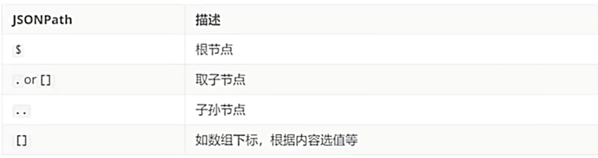

使用方法：**jsonpath.jsonpath()**
参数1：**数据对象**
参数2：**jsonpath表达式**

```python
import json
from jsonpath import jsonpath

datas = json.load(open("data.json", 'r', encoding='utf-8'))

# 使用jsonpath提取数据
title = jsonpath(datas, "$.title")[0]  # $表示根节点.title表示title的值
name = jsonpath(datas, "$..name")[0]
photo = jsonpath(datas, "$.author.photo")[0]
time = jsonpath(datas, "$.time")[0]
print(title, name, photo, time)

```
#### **3. 案例实战**
小饭商业桌融资资讯抓取
```python
import requests
import time
from jsonpath import jsonpath

for i in range(1, 11):
    url = "https://www.xfz.cn/api/website/articles/?p={}&n=20&type=".format(i)
    response = requests.get(url)
    result = response.json()

    # 遍历所有的资讯信息，提取数据
    for item in result["data"]:
        title = jsonpath(item, "$.title")[0]  # $表示根节点.title表示title的值
        author = jsonpath(item, "$..name")[0]
        author_photo = jsonpath(item, "$.author.photo")[0]
        time1 = jsonpath(item, "$.time")[0]
        print(title, author, time1, author_photo)
    time.sleep(2)

```

---------------------------
### 十、数据提取库扩展
---------------------------
### 十一、视频抓取
#### **1. B站视频抓取**
编写爬虫爬取某站视频
地址：https://www.bilibili.com/
特点：视频和音频是分开的

#### **2. 视频合成**
MoviePy是一个用于视频编辑的Python模块，它可被用于一些基本操作（如剪切、拼接、插入标题）、视频合成（即非线性编辑）、视频处理和创建高级特效。它可对大多数常见视频格式进行读写，包括GIF
合成视频案例

```python
from moviepy.editor import ffmpeg_tools
# 将本地的hh2.mp4和hh3.mp4合称为 下载文件.mp4
ffmpeg_tools.ffmpeg_merge_video_audio('hh2.mp4', 'hh3.mp4', '下载文件.mp4')
```
```python
import requests
from moviepy.editor import ffmpeg_tools

headers = {
    "user-agent": "Mozilla/5.0 (Windows NT 10.0; Win64; x64) "
                  "AppleWebKit/537.36 (KHTML, like Gecko) "
                  "Chrome/127.0.0.0 Safari/537.36 Edg/127.0.0.0",

    "Referer": "https://www.bilibili.com/video/BV17N411V7z1/?"
               "spm_id_from=333.1007.top_right_bar_window_custom_"
               "collection.content.click&vd_source=fdf20c2c97faa5"
               "cea39c1a74aea25a7d"
}

http = requests.session()

url1 = (
    "https://cn-gdgz-fx-01-07.bilivideo.com/upgcxcode/37/82/1368168237/1368168237-1-100026.m4s?e=ig8euxZ"
    "M2rNcNbdlhoNvNC8BqJIzNbfqXBvEqxTEto8BTrNvN0GvT90W5JZMkX_YN0MvXg8gNEV4NC8xNEV4N03eN0B5tZlqNxTEto8BTr"
    "NvNeZVuJ10Kj_g2UB02J0mN0B5tZlqNCNEto8BTrNvNC7MTX502C8f2jmMQJ6mqF2fka1mqx6gqj0eN0B599M=&uipk=5&nbs=1"
    "&deadline=1727595125&gen=playurlv2&os=bcache&oi=3085558571&trid=0000e69f013755d541a48f22fb7c8a5bfeb"
    "fu&mid=1335130566&platform=pc&og=cos&upsig=f0c93b569870066e08ebe20cbae9dcea&uparams=e,uipk,nbs,dead"
    "line,gen,os,oi,trid,mid,platform,og&cdnid=3807&bvc=vod&nettype=0&orderid=0,3&buvid=FE988DC7-1930-BE"
    "17-BE97-2EDFFE8F2CD399534infoc&build=0&f=u_0_0&agrr=0&bw=61444&np=151371867&logo=80000000"
)

url2 = (
    "https://cn-gdgz-fx-01-05.bilivideo.com/upgcxcode/37/82/1368168237/1368168237-1-30280.m4s?e=ig8euxZM"
    "2rNcNbdlhoNvNC8BqJIzNbfqXBvEqxTEto8BTrNvN0GvT90W5JZMkX_YN0MvXg8gNEV4NC8xNEV4N03eN0B5tZlqNxTEto8BTrN"
    "vNeZVuJ10Kj_g2UB02J0mN0B5tZlqNCNEto8BTrNvNC7MTX502C8f2jmMQJ6mqF2fka1mqx6gqj0eN0B599M=&uipk=5&nbs=1&"
    "deadline=1727595125&gen=playurlv2&os=bcache&oi=3085558571&trid=0000e69f013755d541a48f22fb7c8a5bfebf"
    "u&mid=1335130566&platform=pc&og=hw&upsig=82fe8837fb6e49f148ec32e09b1fa1a1&uparams=e,uipk,nbs,deadli"
    "ne,gen,os,oi,trid,mid,platform,og&cdnid=3805&bvc=vod&nettype=0&orderid=0,3&buvid=FE988DC7-1930-BE17"
    "-BE97-2EDFFE8F2CD399534infoc&build=0&f=u_0_0&agrr=0&bw=25420&np=151371867&logo=80000000"
)

res1 = http.get(url1, headers=headers)
res2 = http.get(url2, headers=headers)

with open('sp.mp4', 'wb') as f:
    f.write(res1.content)
with open('sp2.mp4', 'wb') as f:
    f.write(res2.content)

# 将本地的sp.mp4和sp2.mp4合成为 【V-AI空镜】When the light fades.mp4
ffmpeg_tools.ffmpeg_merge_video_audio('sp.mp4', 'sp2.mp4', '【V-AI空镜】When the light fades.mp4')


```

**抓包**：第一二个文件分别为视频与音频的包

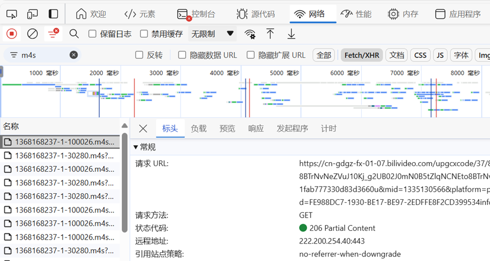

#### **3. 抖音视频抓取**
**抓包**：
检查 → 网络 → 媒体

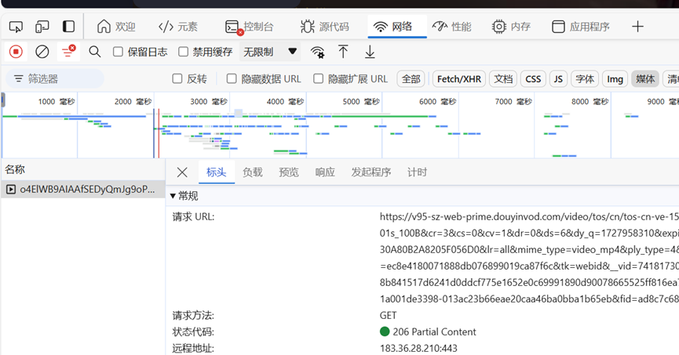


```python
import requests

url = ("https://v26-web-prime.douyinvod.com/video/tos/cn/tos-cn-ve-15/"
       "oUAQ74BoRBIbFiywvR2g5IAE8PPDZwQnAiPvZ/?a=6383&br=1195&bt=1195&"
       "btag=c0000e00008000&cd=0%7C0%7C0%7C3&ch=5&cquery=100o_101s_100"
       "B_100x_100z&cr=3&cs=0&cv=1&dr=0&ds=6&dy_q=1727592299&expire=17"
       "27603107&feature_id=aa7df520beeae8e397df15f38df0454c&ft=AQHeBx"
       "bkRR0si0C4kDl2Nc0iPMgzbLzbd0sU_4MsosV9Nv7TGW&is_ssr=1&l=202409"
       "291444572D779D809140C6DE198C&lr=all&mime_type=video_mp4&ply_ty"
       "pe=4&policy=4&qs=0&rc=O2QzaGk0PDM0Nmc4ZWY0aUBpams2cmw5cnY2dTMz"
       "NGkzM0AuYC0zLjAwXmIxYGMuYDQxYSNhYDRgMmRra2xgLS1kLTBzcw%3D%3D&s"
       "ignature=bdc64552fb35901c33e46b970cd6c917&tk=webid&__vid=74174"
       "94805262896425&webid=a6000b6bd0597977c28c1dbb751d8a8c80ef4c078"
       "dbea6da280536e6f6924b82eb59006ecdbb02fe6d2ad58187aae43b3cc999b"
       "694f85bdb3518b841517d6241d0ddcf775e1652e0c69991890d90078665525"
       "ff816ea7cf25030a5c4680f5171528bd7e0cc1055ff667477b754438ea67ea"
       "a7dc619d23526cc07bdcca4d212cfa6d6a883fde0cbb994f66efedd952aa06"
       "1339888798d51c2577671a001de3398-8aad825943ffcc5e7532efce0be23f"
       "c9&fid=ad8c7c685a35eecbe8bd658a6a46d091")

headers = {
    "User-agent":
    "Mozilla/5.0 (Windows NT 10.0; Win64; x64) AppleWebKit/"
    ".36 (KHTML, like Gecko) Chrome/127.0.0.0 Safari/537.36 Edg/127.0.0.0"
}

response = requests.get(url, headers=headers)

with open("抖音视频.mp4", "wb") as f:
    f.write(response.content)

```


---------------------------
## 第二章：进阶
### 一、selenium的入门使用
Selenium是一个Web的自动化测试工具，最初是为网站自动化测试而开发的，可以按指定的命令自动操作，不同是Selenium可以直接运行在浏览器上，它支持所有主流的浏览器
+ 官方参考文档：
http://selenium-python.readthedocs.io/index.html
==requests搞不定的爬虫就用它==

#### **1. selenium的入门使用**
浏览器对应的驱动chromedriver的下载
下载地址：
http://npm.taobao.org/mirros/chromedriver?spm=a2c6h.14029880.0.0.735975d7Fmk4rU
将下载好的chromedriver放到python的安装目录下（或者将chromedriver.exe）所在目录路径添加到配置环境变量中
webdriver的下载地址：
http://npm.taobao.org/mirrors/chromedriver/

#### **2. selenium启动浏览器**
##### 启动浏览器
`from selenium import webdriverdriver = webdriver.Chrome()`
##### 访问页面
`page = driver.get(“http://www.baidu.com”)`
##### 窗口最大化
`driver.maximize_window()`
##### 关闭浏览器和chromedriver程序
`driver.quit()`
##### 刷新页面
`driver.refresh()`

**注意点**：经常通过selenium，关闭的时候没有使用driver.quit退出，会导致系统中启动多个chromedriver的程序，可以在命令行执行下面的命令批量删除chromedriver的进程：
`taskill /F /im chromedriver.exe`

#### **3. driver对象的相关属性**
+ **current_url**：当前url地址
+ **title**：页面标题
+ **page_source**：页面html代码
+ **window_handler**：获取浏览器上所有的窗口句柄
+ **current_window_handle**：获取当前窗口的句柄
```python
import time
from selenium import webdriver

# 创建一个driver对象（启动浏览器）
driver = webdriver.Chrome()

# 打开一个网页
driver.get("http://www.baidu.com")
time.sleep(1)
# 窗口最大化
driver.maximize_window()
time.sleep(1)

# 刷新页面
driver.refresh()

print('地址：', driver.current_url)
print('标题：', driver.title)

# 获取页面源码
with open("baidu.html", 'w', encoding='utf-8') as f:
    f.write(driver.page_source)

# 对当前页面截图
driver.save_screenshot("baidu.png")

# 关闭浏览器
time.sleep(5)
driver.quit()

```
#### **4. 元素定位和等待**
元素定位的方法：
==其实掌握 xpath 一种就可以搞定了==

##### 第一种：通过 id 查找：*（很多网页上都没有 id 属性）*
`input_element=browser.find_element_by_id(“kw”)`

##### 第二种：通过 name 属性进行定位：
`input_ele = browser.find_element_by_name(“wd”)`

##### 第三种：通过 class 进行定位：
`browser.find_element_by_class_name(“s_ipt”).send_keys(“python”)`
*注意：通过 class_name 定位元素，中间不能有空格如果 class_name 中有空格，只能选取其中一个值*

##### 第四种：专门定位 a 标签（链接）通过文本内容来匹配：
`ele = browser.find_element_by_link_text(“新闻”)`

##### 第五种：专门定位 a 标签（链接）通过文本部分来匹配内容
`browser.find_element_by_partial_link_text(“新”)`

##### 第六种：xpath定位
`browser.find_element_by_xpath(“xpath表达式”)`

#### **5. 元素的属性和操作**
##### 元素属性
+ **tagname**：获取标签名

+ **text**：获取标签的文本
+ **parent**：获取父级标签
+ **get_attribute()**：获取属性
+ **s_displayed()**：判断元素是否可见
##### 元素的操作
+ **click()**：点击元素
+ **send_key()**：输入内容
+ **clear()**：清空表单
```python
import time
from selenium import webdriver
from selenium.webdriver.common.by import By

# 创建一个driver对象（启动浏览器）
driver = webdriver.Chrome()

# 打开一个网页
driver.get("http://www.baidu.com")

# 通过xpath定位页面中id值为kw的元素
ele = driver.find_element(By.XPATH, '//*[@id="kw"]')

ele.send_keys("人大代表")
time.sleep(1)
# 清空输入框
ele.clear()

# 关闭浏览器
time.sleep(5)
driver.quit()

```
#### **6. 案例：领导留言板 selenium 数据抓取**
```python
import time
from selenium import webdriver
from selenium.webdriver.common.by import By

driver = webdriver.Chrome()
driver.get("https://liuyan.people.com.cn/threads/list?checkStatus=0&fid="
           "1219&formName=%E6%B7%B1%E5%9C%B3%E5%B8%82%E5%A7%94%E4%B9%A6%"
           "E8%AE%B0%E5%AD%9F%E5%87%A1%E5%88%A9&position=0&province=30&c"
           "ity=266&saveLocation=30&pForumNames=%E5%B9%BF%E4%B8%9C%E7%9C"
           "%81&pForumNames=%E6%B7%B1%E5%9C%B3%E5%B8%82")
time.sleep(3)

# 通过selenium抓取数据的小案例
# 1.先定位到包含所有数据的li列表
li_list = driver.find_elements(By.XPATH, '//ul[@class="replyList"]/li')

# 2.遍历页面上所有的li标签（元素）
for item in li_list:
    title = item.find_element(By.XPATH, './/div[@class="tabList fl"]/h1').text
    t = item.find_element(By.XPATH, './/div[@class="headMainS fl"]/p').text
    content = item.find_element(By.XPATH, './/p[@class="replyContent"]/span').text

    print('建议事项：', title)
    print('建议时间', t)
    print('建议内容', content)

driver.quit()

```

---------------------------
### 二、selenium进阶
#### **1. 等待机制**
现在的网页很多都是动态加载的，如果页面的内容发生了改变，就需要时间来渲染，代码是自动执行的，有可能你在执行的时候新的元素还没加载出来，就查找不到，报no such element 的错误。如果报这个错误，很有可能定位表达式不对，或者是页面元素已经发生变化。
##### 等待的三种方式：
+ 强制等待：`time.sleep()`
+ 隐式等待==（可以上来就干个隐式等待）==：`driver.implicitly_wait(10)`
*解释：如果页面元素加载出来了就会往下执行，否则继续等待，直到超过设定的最长等待时间*
+ 显式等待（明确等待的条件）：隐式等待某些情况找不到，就要用显示等待

###### 强制等待
使用` time.sleep()`让程序强行休眠
time.sleep()太不灵活了，完全不知道要等多久

###### 隐式等待（可以上来就干个隐式等待）
隐式等待让Webdriver等待一定的时间后再才是查找某元素。每隔一段时间就去看一下，有没有出现，没有就继续等，有了就执行。一个 session 只需要设置一次，看源码说明。
```python
driver.implicitly_wait(10)
```
有局限性，通常是某个元素在文档对象中已经加载出来了

###### 显式等待
```python
from selenium.webdriver.common.by import By
from selenium.webdriver.support import expected_conditions as EC
from selenium.webdriver.support.wait import WebDriverWait

# 第一步：创建一个等待对象
wait = WebDriverWait(driver, 30, 0.2)
# 第二步：定义元素查找对象
# located = ("定位方式", '定位表达式')
# 比如通过xpath
located = (By.XPATH, '//input[@id="u"]')
# 第三步：定位的等待条件
conditions = EC.visibility_of_element_located(located)
# 第四步：通过等待计时器对象去找
wait.until(conditions)

# 一行代码表示
webDriverwait(driver, 30, 0.2).until(
	EC.visibility_of_element_located(
		(By.XPATH, '//input[@id="u"]')
	)
)
```
常用等待条件：
+ `visibility_of_element_located`：元素可见
+ `element_to_be_clickable`：元素可点击

等待条件

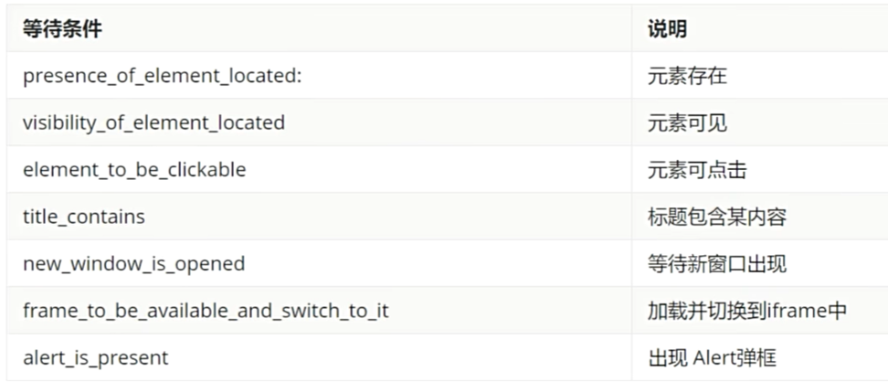

```python
import time
from selenium import webdriver
from selenium.webdriver.common.by import By
from selenium.webdriver.support import expected_conditions as EC
from selenium.webdriver.support.wait import WebDriverWait

driver = webdriver.Chrome()
# 强制等待
time.sleep(3)
driver.get('https://mail.qq.com/')

# 隐式等待
driver.implicitly_wait(10)

# 显式等待
WebDriverWait(driver, 30, 0.2).until(
    # 等待元素可见
    # EC.presence_of_element_located((By.XPATH, '//*[@id="switcher_plogin"]'))
    # 等待元素可点击
    EC.element_to_be_clickable((By.XPATH, '//*[@id="switcher_plogin"]'))
)   # 等待30秒，每隔0.2秒检查一次

driver.find_element(By.XPATH, '//*[@id="switcher_plogin"]').click()

time.sleep(10)
driver.quit()

```

#### **2. iframe（网页嵌套）切换**
##### 切换到指定的iframe中：
```python
# 方式一：切换iframe：通过iframe的名字（name属性）进行切换driver.switch_to.frame('login_frame')
# 方式二：通过element元素去切换
ele_iframe = driver.find_element_by_xpath('//iframe[@id="login_frame"]')
driver.switch_to.frame(ele_iframe)
# 方式三：通过索引切换
driver.switch_to.frame(1)
```
##### 切换回默认的HTML页面中：
```python
# 2. 切换回默认的HTML页面中
driver.switch_to.default_content()
```
##### 切换到父级的iframe中：
```python
# 3. 切换到父级的iframe中
driver.switch_to.parent_frame()
```
#### **3. 窗口滚动**
为什么要进行窗口滚动？
元素虽然加载出来，但如果看不到，是无法操作的，这个时候就需求滚动页面
##### selenium滚动窗口
selenium滚动元素可见：
元素的属性：`location_once_scrolled_into_view`
```python
import time
from selenium import webdriver
driver = webdriver.Chrome()
driver.get('https://www.xxx.com/')
# 定位元素：
ele = driver.find_element_by_xpath('//div[@class="more-news"]')
# 滚动到当前元素可见，返回元素当前的坐标
res = ele.location_once_scrolled_into_view
```

#### **4. 案例：提取领导留言板数据**
```python
import time
import random
from selenium import webdriver
from selenium.webdriver.common.by import By

driver = webdriver.Chrome()
# 打开目标网站
driver.get(
    'https://liuyan.people.com.cn/threads/list?checkStatus=0&'
    'fid=1219&formName=%E6%B7%B1%E5%9C%B3%E5%B8%82%E5%A7%94%E4'
    '%B9%A6%E8%AE%B0%E5%AD%9F%E5%87%A1%E5%88%A9&position=0&pro'
    'vince=30&city=266&saveLocation=30&pForumNames=%E5%B9%BF%E'
    '4%B8%9C%E7%9C%81&pForumNames=%E6%B7%B1%E5%9C%B3%E5%B8%82'
)
# 设置隐式等待时间
driver.implicitly_wait(10)

while True:
    try:
        # 定位查看更多的元素
        ele = driver.find_element(By.XPATH, '//*[@class="mordList"]')
        time.sleep(random.randint(2, 5))
        res = ele.location_once_scrolled_into_view   # 滚动到该元素,并返回该元素的坐标
        print("滚动之后的坐标：", res)
        ele.click()
    except:
        break

# 提取页面数据
# 1.先定位到包含所有数据的li列表
li_list = driver.find_elements(By.XPATH, '//ul[@class="replyList"]/li')
print("数据总数：", len(li_list))
# 2.遍历页面上所有的li标签（元素）
for item in li_list:
    title = item.find_element(By.XPATH, './/div[@class="tabList fl"]/h1').text
    t = item.find_element(By.XPATH, './/div[@class="headMainS fl"]/p').text
    content = item.find_element(By.XPATH, './/p[@class="replyContent"]/span').text
    print('建议事项：', title)
    print('建议时间', t)
    print('建议内容', content)

# 10秒之后关闭页面
time.sleep(10)
driver.quit()

```

#### **5. JS脚本执行**
##### js滚动窗口
+ js滚动窗口到指定坐标位置
  `scrollTo()`：可把内容滚动到指定的坐标
  语法：
  `scrollTo(x, y)`

  | 参数 | 描述                                              |
  | ---- | ------------------------------------------------- |
  | x    | 必需。要在窗口文档显示区左上角显示的文档的 x 坐标 |
  | y    | 必需。要在窗口文档显示区左上角显示的文档的 y 坐标 |

  ```python
  # 移动Y坐标为500的位置
  js = "window.scrollTo(0, 500)"
  driver.execute_script(js)
  ```

+ 滚动到窗口底部

  ```python
  js = """
  window.scrollTo(0, document.body.scrollHeight)
  """
  driver.execut_script(js)
  ```

  ```python
  import time
  import random
  from selenium import webdriver
  from selenium.webdriver.common.by import By
  
  driver = webdriver.Chrome()
  # 打开目标网站
  driver.get(
      'https://liuyan.people.com.cn/threads/list?checkStatus=0&'
      'fid=1219&formName=%E6%B7%B1%E5%9C%B3%E5%B8%82%E5%A7%94%E4'
      '%B9%A6%E8%AE%B0%E5%AD%9F%E5%87%A1%E5%88%A9&position=0&pro'
      'vince=30&city=266&saveLocation=30&pForumNames=%E5%B9%BF%E'
      '4%B8%9C%E7%9C%81&pForumNames=%E6%B7%B1%E5%9C%B3%E5%B8%82'
  )
  # 设置隐式等待时间
  driver.implicitly_wait(10)
  
  for i in range(5):
      time.sleep(random.randint(1, 5))
      # js代码->一次沿y轴滚动100到300中随机个像素
      js = "window.scrollBy(0,{})".format(random.randint(100, 300))
      # 通过driver执行js代码
      driver.execute_script(js)
  
  time.sleep(5)
  driver.quit()
  
  ```


#### **6. 鼠标操作**
导包：`from slenium.webdriver import ActionChains`
**ActionsChains**：鼠标操作类
+ `click`：鼠标点击
+ `double_click`：鼠标双击
+ `context_click`：鼠标右击
+ `move_to_element`：鼠标移动到某个节点
+ `click_and_hold`：鼠标左键按下鼠标
+ `move_by_offse`：鼠标相对当前位置进行移动
+ `drag_and_drop()`：在下一个位置按下鼠标，到另一个位置释放
+ `release`：释放鼠标
+ `perform`：执行动作

```python
import time
import random
from selenium import webdriver
from selenium.webdriver.common.by import By
from selenium.webdriver import ActionChains

driver = webdriver.Chrome()
# 打开目标网站
driver.get(
    'https://www.runoob.com/try/try.php?filename=jqueryui-api-droppable'
)
# 设置隐式等待时间
driver.implicitly_wait(10)

# 切换到iframe中
driver.switch_to.frame(driver.find_element(By.XPATH, '//*[@id="iframeResult"]'))

# 创建一个鼠标操作对象
ac = ActionChains(driver)
# 将鼠标移动到某个元素上
ac.move_to_element(driver.find_element(By.XPATH, '//*[@id="draggable"]'))
# 按下鼠标左键
ac.click_and_hold()
ac.move_to_element(driver.find_element(By.XPATH, '//*[@id="droppable"]'))
# 释放鼠标
ac.release()
# 执行动作
ac.perform()

time.sleep(10)
driver.quit()

```

---------------------------
### 三、Selenium特征检测
#### **1. 浏览器特征检测**
+ Selenium启动的浏览器可能具有以下特殊的特征：
  + **User-Agent字符串**：Selenium启动的浏览器通常具有特定的User-Agent字符串，可以通过检査User-Agent来判断是否为Selenium启动的浏览器
  + **自动化工具标识**：Selenium启动的浏览器可能会在请求头中包含一些自动化工具的标识，例如x-Requested-with、DNT等
  + **WebDriver相关属性**：Selenium启动的浏览器可能会在全局window对象中注入一些特定的属性，例如webdriver、navigator.webdriver等
  + **页面加载行为**：Selenium启动的浏览器通常会以自动化的方式加载页面，可能会表现出一些快速点击、输入文本等行为
  + **元素检测**：Selenium启动的浏览器可能会在DOM中插入一些特定的元素或属性，用于控制浏览器行为，可以通过检测这些特定的元素或属性来判断是否为Selenium启动的浏览器
+ 如果想要正常使用selenium访问，那就需要在创建webdriver时隐藏浏览器相关的特征
  + **--disable-infobars**：禁止显示 Chrome 浏览器正在受到自动测试软件控制的通知栏
  + **excludeswitches，enable-automation**：排除启用自动化扩展程序的开关，可以防止被网站检测到使用了自动化测试工具，减少被反爬虫封锁的可能性
  + **useAutomationExtension:False**：禁用自动化扩展程序，同样是为了避免被网站检测到使用了自动化工具
  + 通过**Page.addscriptToEvaluate0nNewDocument** 方法，可以在每次页面加载时执行指定的JavaScript 代码。我们每次打开新页面之前执行hide.js 来隐藏selenium启动浏览器生成的属性，从而防止被检测出来时爬虫
#### **2. 绕过特征检测案例**
网站：http://www.aqistudy.cn/
直接使用selenium打开会发现什么数据都没有
+ 添加参数隐藏浏览器的相关特征
```python
import time
from selenium import webdriver

url = 'https://www.aqistudy.cn/'

opt = webdriver.ChromeOptions()
# 添加防检测参数
opt.add_argument('--disable-infobars')
opt.add_experimental_option("excludeSwitches", ["enable-automation"])
opt.add_experimental_option('useAutomationExtension', False)
driver = webdriver.Chrome(options=opt)
# selenium在打开任何页面之前，先运行这个js文件
with open('hide.js') as f:
    driver.execute_cdp_cmd("Page.addScriptToEvaluateOnNewDocument", {"source": f.read()})

driver.get(url)

time.sleep(10)
driver.quit()

```

---------------------------
### 四、验证码破解
#### **1. OCR识别**
使用 ==ddddocr== 模块可以识别简单的图文验证码
安装命令：`pip install ddddocr`
案例代码：
```python
import ddddocr

# 1.创建一个识别对象
ocr = ddddocr.DdddOcr()
# 2.识别结果
code = ocr.classification(响应对象的内容)
print(code)

```
案例演示：超级鹰登录
```python
"""
案例：超级鹰登录
请求地址：https://www.chaojiying.com/user/login/
请求参数：
    user: 15865313468
    pass: 012453224
    imgtxt: 1234
    act: 1

破解步骤：
    1. 发送请求获取验证码图片
        ps：拿验证码的时候一定要带cookie
    2. 识别验证码的内容
    3. 发送请求登录

"""
import ddddocr
import requests

session = requests.session()
# 1. 获取验证码
url1 = "https://www.chaojiying.com/include/code/code.php?u=1"
response = session.get(url=url1)

# 2. 验证码识别
ocr = ddddocr.DdddOcr()
code = ocr.classification(response.content)
print("识别的结果：", code)
# 写入文件
with open("code.jpg", "wb") as f:
    f.write(response.content)

# 3. 登录
url = "https://www.chaojiying.com/user/login/"
params = {
    "user": "账号",
    "pass": "密码",
    "imgtxt": code,
    "act": 1
}
response = requests.get(url=url, data=params)
print(response.text)

```
#### **2. 打码平台**
验证码识别的平台

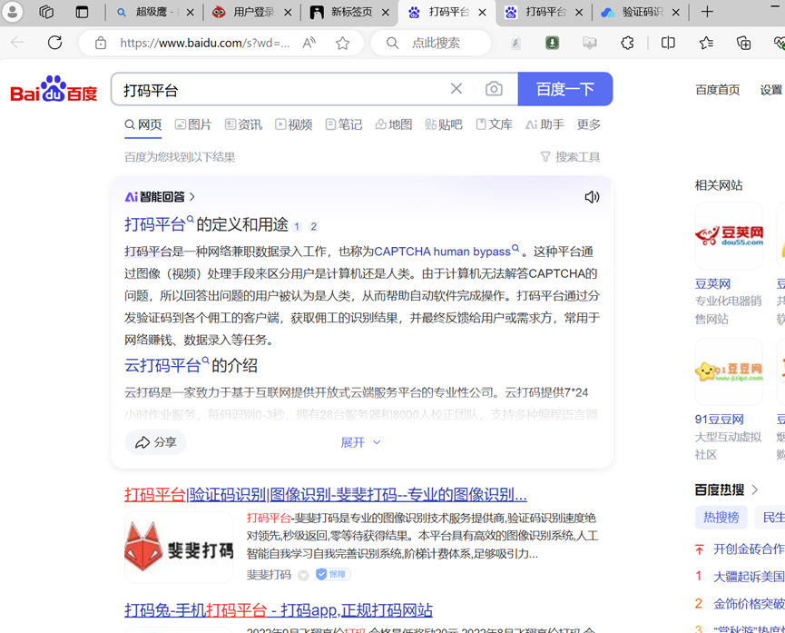

---------------------------
### 五、JS逆向分析
#### **1. js参数加密案例**
很多网站的请求参数都是加密传递的，要模拟发送请求，就得知道参数是怎么加密的
+ 案例说明
  url地址：https://www.94mxd.com.cn/signin

  + 抓包发现密码加密

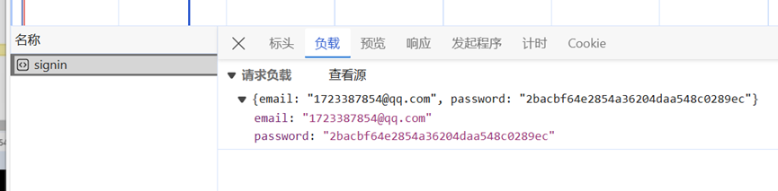

  + 查找源代码位置

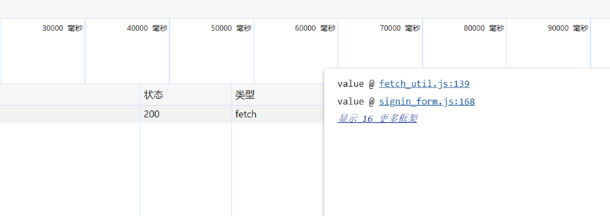

  + 用断点判断密文位置

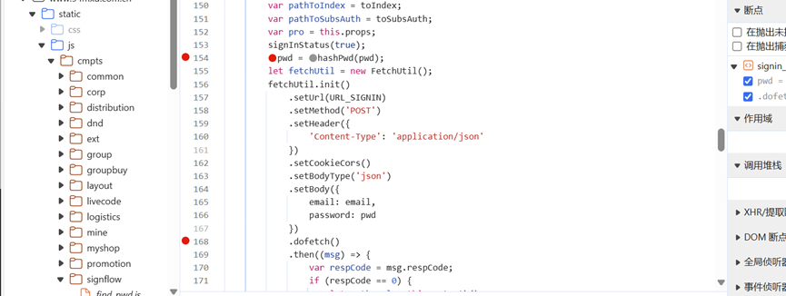

  + 找到加密方法

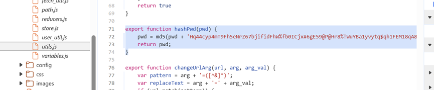

  + 案例代码
```python
import requests
from hashlib import md5


def md5_handle_pwd(pwd):
    str_pwd = pwd + ('Hq44cyp4mT9Fh5eNrZ67bjifidFhW%fb0ICjx#6gE59@P@Hr8'
                     '%!WuYBa1yvytq$qh1FEM18qA8Hp9m3VLux9luIYpeYzA2l2W3Z')
    m5 = md5()
    m5.update(str_pwd.encode('utf-8'))

    return m5.hexdigest()


params = {
    "email": "1723387854@qq.com",
    "password": "a1d26dcb7816d3a79c6808aba6649054"
}

res = md5_handle_pwd("xiansjda111111115")
print(res)

```

#### **2. 调用js加密代码**
在逆向分析时，发现某个js加密算法比较繁琐，用python还原同样的算法比较费劲。此时，可以不必使用python还原，而是利用Python去直接调用JavaScript中定义的功能
##### 安装Node.js

最新版本：https://nodejs.org/en/download
历史版本：https://nodejs.org/en/about/previous-releases

##### 通过Python调用js代码
```python
import execjs

# js代码
js_code = """
function add(a, b){
    return a + b
}

function work(){
    return 'pytfron56789'
}
"""

# 第一步编译
JS = execjs.compile(js_code)
# 第二步调用
res = JS.call('add', 100, 200)
print(res)

res = JS.call('work')
print(res)

```

##### 案例：百度翻译js逆向解析
~~额，因为我做这个笔记时百度翻译的接口改了，导致抓包抓到的不是一个东西，所以步骤就口述一下吧~~

+ ==<！！！>==首先，某些网站你抓它Fetch/XHR包的时候会发现，有一些参数是变化的，但是它又不是时间戳所以你找不到它生成的规律。那么你就要去它的源代码，去查看这个参数是怎么生成的，那么找着找着你就会找到一个生成这个参数的函数，你可以在控制台试着输入来测试，那么这个函数就是js写的，再复制到python中运行js（上面的知识点），用其来表示参数即可==<！！！>==

#####  案例：留言板js参数逆向分析

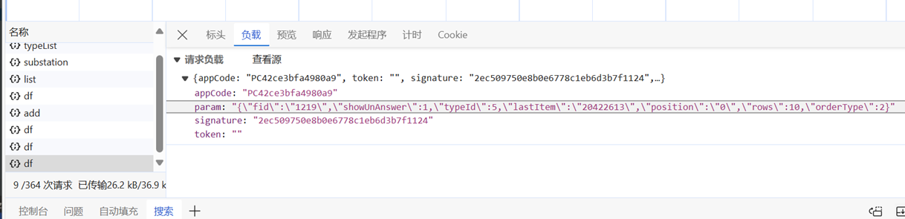

```python
import json
import hashlib
appCode = 'PC42ce3bfa4980a9'
params = {'fid': '1219',
          'showUnAnswer': 1,
          'typeId': 5,
          'lastItem': '20422613',
          'position': '0',
          'rows': 10,
          'orderType': 2}
# print(json.loads(params))   # 原本params参数为json格式，将其转化为python


def md5_handle(pwd):
    """加密逆向还原"""
    str_pwd = pwd
    m5 = hashlib.md5()
    m5.update(str_pwd.encode('utf-8'))
    return m5.hexdigest()


n = md5_handle(appCode)[0:16]
print(n)
# a2eb17f65d6f4b3f
s = '/v1/threads/list/df' + json.dumps(params) + md5_handle(appCode)[0:16]

sign = md5_handle(s.replace(' ', ''))
print(sign)

```
#### **3. js逆向：滑动验证码轨迹破解**
+ 需求
  通过requests登录：
  https://user.qunar.com/passport/login.jsp

+ 分析
  登录过程接口的分析
##### （1）滑动验证的请求

请求参数：


请求地址：

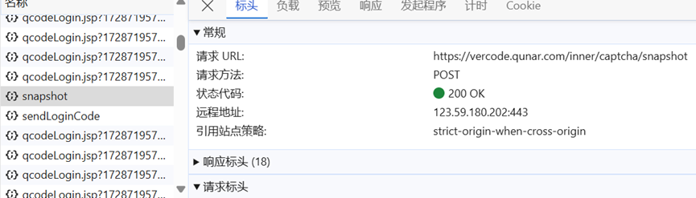

找到data所在函数后有个t，打上断点进入t的函数内

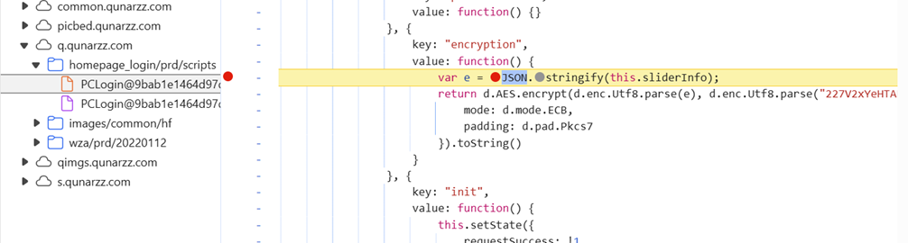

在控制台显示内容

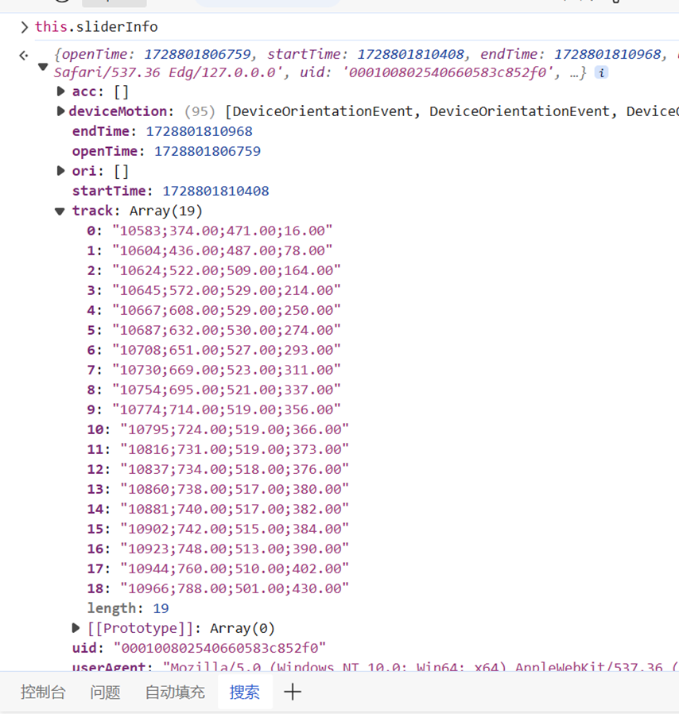

**参数data为未知内容**
+ 获取滑动的轨迹和时间信息
  + 滑动的总距离为429
  + 轨迹信息：时间戳的后五位（精确到毫秒）、滑块x轴坐标、滑块y轴坐标、滑动的距离
+ 通过Aes对称加密得到的结果

**通过Aes加密得到的结果**

+ 密钥：227V2xYeHTARSh1R

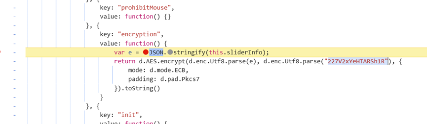

##### （2）获取手机验证码的请求
请求信息

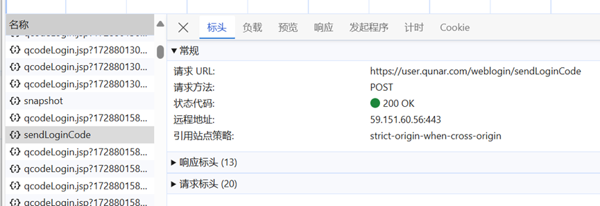

请求参数类型：**表单**
请求参数

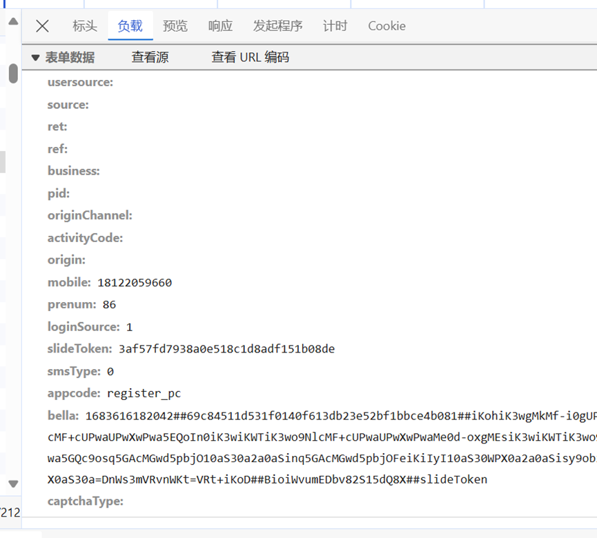

参数bella：含义未知，有待分析

成功的话 → 返回响应：

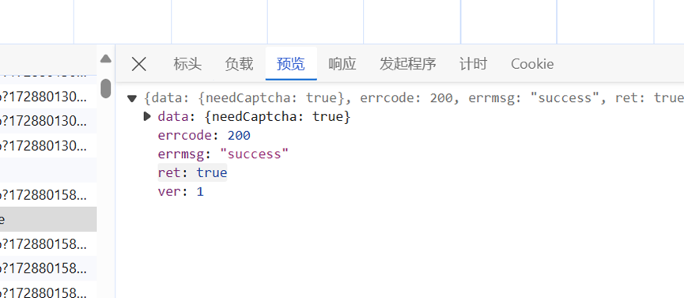

##### （3）登录接口的请求
请求信息

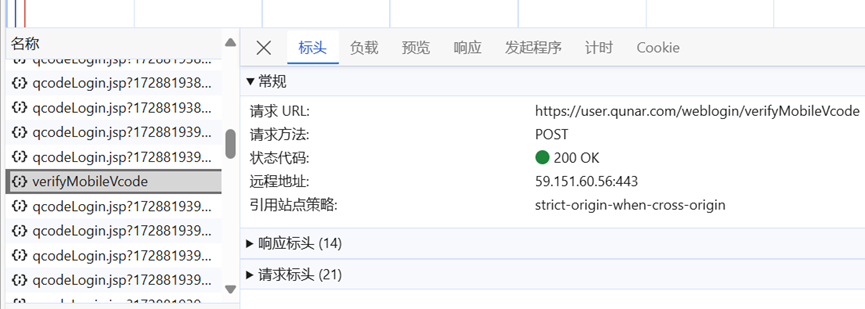

请求方法：**POST**
参数类型：**json**

---------------------------
### 六、js反调试破解

+ 什么是反调试技术？
反调试技术是指通过JavaScript代码，在网页加载时检测是否处于调试环境，并采取措施阻止调试器的使用使得调试变得困难或无法进行
+ 常见的反调试技术？
  + **禁用调试快捷键**：禁用鼠标右键，禁用快捷键F12，无法打开调试控制台
  检测调试器工具：通过检测调试器工具的存在来判断是否处于调试环境
  + **检测浏览状态**：通过监测浏览器状态的变化，来判断是否处于调试环境
  + **模糊代码**：对关键代码进行混淆或加密，使得难以理解和分析
  + **定时检测**：定时检测调试器状态，如果检测到调试器存在，则执行相应的反调试代码

#### **1. 无限反调试简单案例**
通过debugger断点定时递归实现无限反调试 ：
```javascript
function Debuggung(){
// 通过定时任务，每隔一段时间检查一次是否打开了调试器
debugger
setInterval(Debugging, 1000):
}
Debugging();
```
控制台自动清屏，干扰 connsole.log 调试
```javascript
function startClearConsole(){
// 每隔一秒清除一次控制台内容
setInterval(function() {
	console.clear();
}, 1000);
	}
	startClearConsole();
```
#### **2. 禁用调试器快捷键**
+ 案例网站：https://www.aqistudy.cn/

+ 仅用了F12，禁用了鼠标右键，无法打开调试控制台

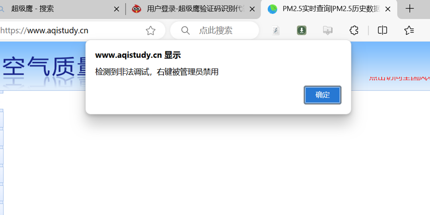

解决方法：**先右键打开控制台，再输入网址进去**

#### **3. 检测浏览器的宽高**

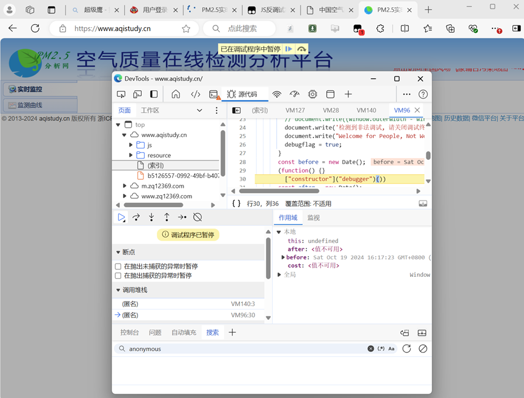

解决方法：**把调试浏览器外呼刷新控制台在外面**


#### **4. 如何破解？**
写脚本
使用工具：**油猴**

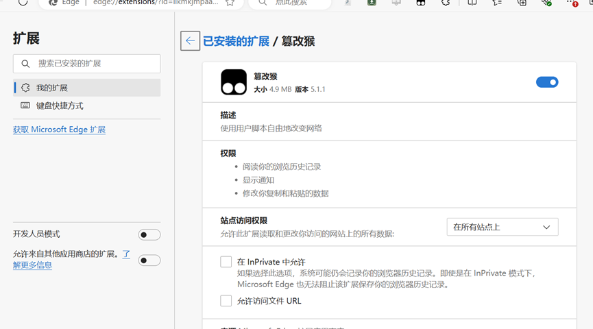

比如：在网页源代码中有让鼠标无法右键的代码，可以在油猴总将其变为空代码

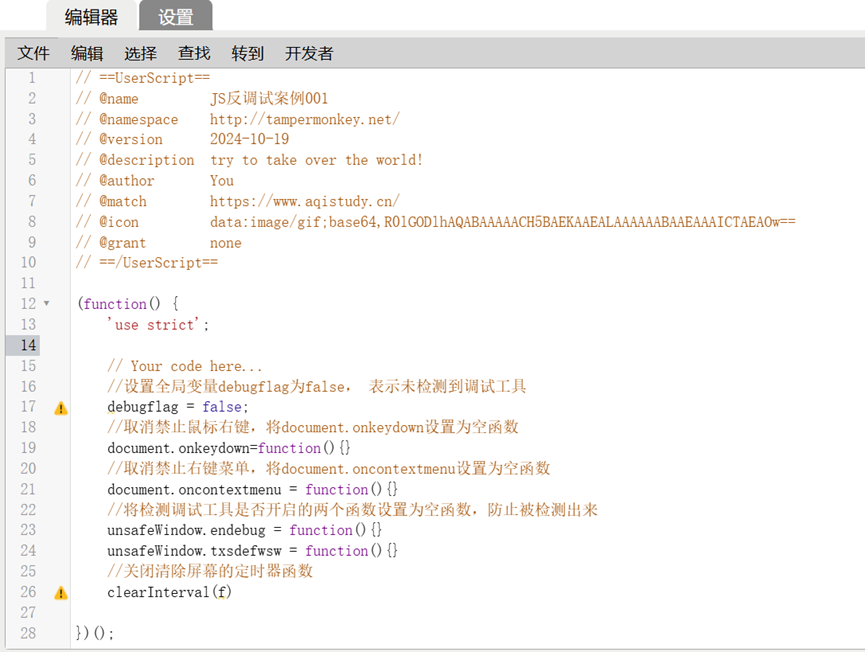

---------------------------
### 七、TLS指纹校验
---------------------------
### 八、字体反爬破解
#### **1.  字体反爬介绍**
##### 什么是字体反爬？
字体反爬是一种防止爬虫抓取文本内容的技术，通过将文本内容转换成特殊的字体文件，使得爬虫无法直接识别文本内容

##### 字体反爬的原理
字体反爬的原理是将文本内容转换成特殊的字体文件（如woff、woff2等），在网页上使用这些字体文件来显示文本内容。爬虫无法直接识别字体文件中的文本内容，因此无法准确抓取数据

##### 字体反爬的解决方法
+ **使用OCR技术**：将网页上的字体内容转换成图片，然后使用OCR技术识别图片中的文本内容
+ **分析字体文件**：分析字体文件的映射关系，将字体文件中的编码与实际文本内容进行对应
==ps：字体文件通过抓包来抓==

#### **2. 破解过程**
字体反爬的破解：
+ 需要找到unicode字符和字形的映射关系
  + 需要解析字体文件
  + 需要使用fontTools这个工具库：`pip install fontTools`

  + 需要将字体文件通过fontTools转换为XML文档、XML文档记录了字体和字形的映射关系

**cmap**：记录了字体文件的字符和字形名称
  **code**是字符  **name**是字形的名称
```python
from PIL import Image, ImageDraw, ImageFont
from ddddocr import DdddOcr
from fontTools.ttLib import TTFont


class ParserFontFile:

    def __init__(self, filename):
        fonts = TTFont(filename)
        # 获取字符和字形的映射关系
        maps = fonts.getBestCmap()
        self.font_maps = {}
        # 遍历所有的字符
        for k in maps:
            key = chr(k)
            # 识别字符中字形的内容
            value = self.str_to_value(key, filename)
            self.font_maps[key] = value

    def str_to_value(self, unicode, font_file):
        """识别字符在字体文件中的字形内容"""
        ocr = DdddOcr()
        # 创建一张图片(色彩模式为RGB，大小为200*200像素，颜色为红色)
        img = Image.new('RGB', (200, 200), 'red')
        # 创建一个画笔
        draw = ImageDraw.Draw(img)
        # 加载字体文件
        font = ImageFont.truetype(font_file, 100)
        # 使用画笔在文件中写入内容
        draw.text((50, 50), unicode, font=font)
        # 保存图片
        img.save(f'{unicode}.jpg', format='PNG')
        # 识别生成的图片中的内容
        value = ocr.classification(img)
        return value


if __name__ == '__main__':
    pff = ParserFontFile('fonteditor.woff')
    print(pff.font_maps)

```
方法：
+ 创建一张图片
+ 在图片中使用指定的字体写入内容
+ 识别图片中的内容

---------------------------
### 九、异步爬虫
当我们有大量数据要抓取的时候，总的抓取时间会比较长，这个时候，如果要提高数据在抓取的效率，有没有什么好的办法呢？

单线程下来的话，流程是**获取一个网页 → 解析这个网页 → 存储这个网页数据**
如果用并发来做，在发请求获取网页的同时解析网页，同步去存储数据，也就是让**三个流程同时工作**

#### **1. 抓取需求**
目标网站：https://www.myfreemp3.com.cn

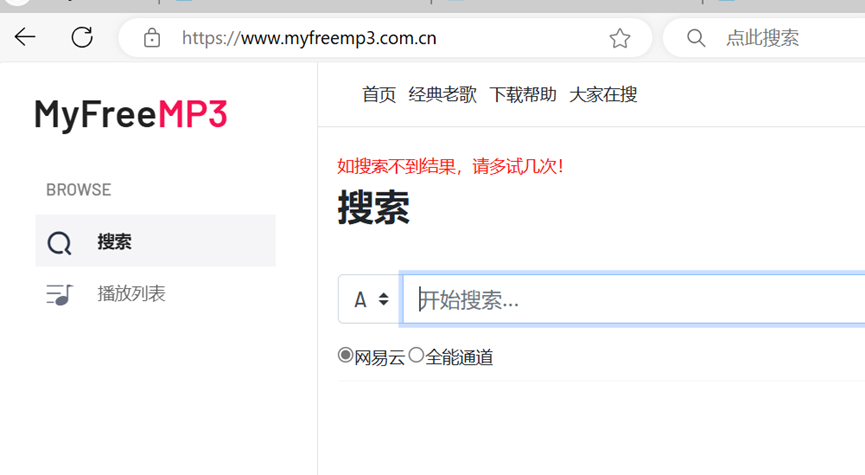

抓取周杰伦所有的歌曲
下载每一首歌的封面图、mp3文件、歌词，保存到本地文件中，要求保存为如下格式：

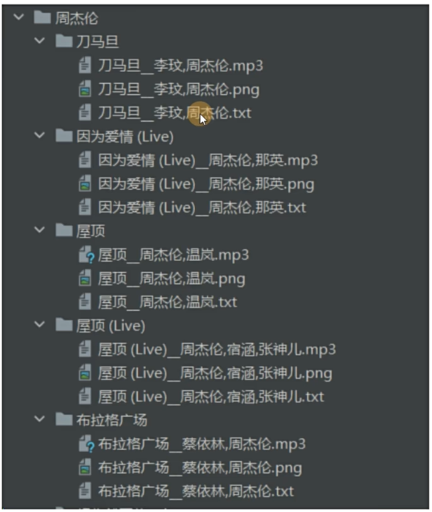

#### **2. 基本功能实现**
##### 实现思路
先抓取搜索歌手所有的歌曲，提取歌曲名、歌手、封面图、歌词信息
然后再去下载歌曲、封面、歌词保存为文件
##### 获取歌曲列表接口
+ url地址：https://www.myfreemp3.com.cn/

+ 请求方法：POST

+ 参数：

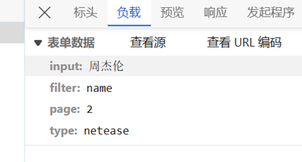

+ 返回响应：

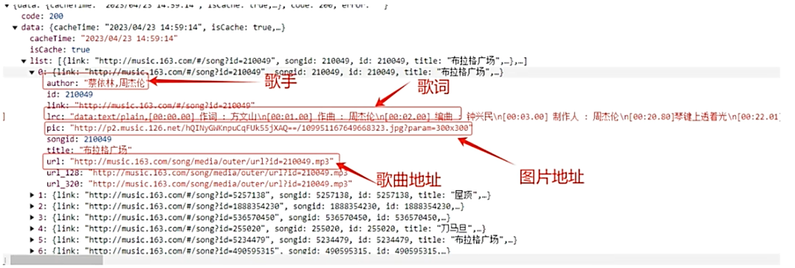


  从响应信息中可以直接提取到我们想要的数据

代码实现：

```python
import requests
from jsonpath import jsonpath
import os
from queue import Queue, Empty
from concurrent.futures.thread import ThreadPoolExecutor


class MP3Spider:
    url = "https://www.myfreemp3.com.cn/"
    header = {
        "User-Agent": "Mozilla/5.0 (Windows NT 10.0; Win64; x64) AppleWebKit/537.36 "
                      "(KHTML, like Gecko) Chrome/127.0.0.0 Safari/537.36 Edg/127.0.0.0",
        "X-Requested-With": "XMLHttpRequest"
    }
    # 创建一个保存歌曲列表信息的队列
    music_list_queue = Queue()
    # 保存下载地址的队列
    download_url_queue = Queue()

    def get_music_list(self, name, pages):
        """
        :param name: 要下载的歌手名
        :param page: 页码
        :return:
        """
        for page in range(1, pages+1):
            params = {
                "input": name,
                "filter": "name",
                "page": page,
                "type": "netease"
            }
            # 获取歌曲列表信息
            res = requests.post(url=self.url, data=params, headers=self.header)
            # 获取包含歌曲信息的列表
            datas = res.json()['data']['list']

            # 判断是否存在周杰伦这个文件夹，没有的话就创建
            if not os.path.isdir(name):
                os.mkdir(name)
            # self.parser_data(name, datas)
            # 将要提取的数据加入队列music_list_queue中
            self.music_list_queue.put((name, datas))

    def parser_data(self):
        """
        解析返回的数据，提取歌曲的信息
        :param name: 歌手名
        :param datas: 歌曲信息列表
        :return:
        """
        while True:
            try:
                name, datas = self.music_list_queue.get(timeout=2)
            except Empty:
                break
            # 遍历歌曲信息
            for item in datas:
                # 歌曲名
                title = jsonpath(item, '$.title')
                # title = item.get('title')
                # 歌手信息
                author = jsonpath(item, '$.author')
                # 歌词
                lrc = item.get('lrc')
                # 图片
                img_url = item.get('pic')
                # 歌曲的下载地址
                mp3_url = item.get('url')
                # 在歌手文件夹下面创建一个和歌曲同名的文件夹
                file_path = '{}/{}'.format(name, title)
                if not os.path.isdir(file_path):
                    os.mkdir(file_path)
                else:
                    print("该歌曲已经下载了")
                file_name = '{}/{}'.format(file_path, title)
                # self.save_data(file_name, lrc, img_url, mp3_url)
                # 将提取出来要保存的数据加入队列
                self.download_url_queue.put((file_name, lrc, img_url, mp3_url))

    def save_data(self):
        """存储数据的函数"""
        while True:
            try:
                file_name, lrc, img_url, mp3_url = self.download_url_queue.get()
            except Empty:
                break

            with open(f'{file_name}.txt', 'w', encoding='utf-8') as f:
                f.write(lrc)
            # 下载歌曲图片保存为文件
            response = requests.get(img_url)
            with open(f'{file_name}.jpg', 'wb') as f:
                f.write(response.content)
            # 下载mp3歌曲文件
            response = requests.get(mp3_url)
            with open(f'{file_name}.mp3', 'wb') as f:
                f.write(response.content)
            print(f"歌曲{file_name}已经下载保存")


if __name__ == '__main__':
    mp3 = MP3Spider()
    with ThreadPoolExecutor(max_workers=5) as tp:
        # 开启一个线程去获取歌曲列表
        tp.submit(mp3.get_music_list, '林俊杰', 4)
        # 开启一个线程去解析歌曲信息
        tp.submit(mp3.parser_data)
        # 开启三个线程去存储数据
        tp.submit(mp3.save_data)
        tp.submit(mp3.save_data)
        tp.submit(mp3.save_data)

```

---------------------------
### 十、移动端数据抓取
---------------------------
### 十一、Cookie池和IP代理
#### **1. 代理IP的使用**
##### 1）为什么要使用代理：
+ 一段时间内，检测IP访问的频率，访问太多频率会被识别成爬虫屏蔽
+ 使用代理IP可以让服务器以为不是同一个客户端在请求
+ 防止我们的真实地址被泄露，防止被追究

使用代理的请求过程：

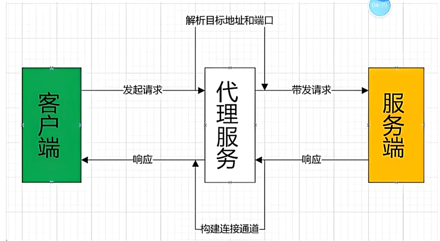

##### 2）代理IP的获取
目前有很多专门提供代理IP的服务上，一般注册之后都会赠送一些免费使用的额度
```python
import requests
import random


class DemeSpider:
    # 获取代理IP的url
    ip_url = 'ip获取的地址'

    def __init__(self):
        # 发送请求获取代理IP
        response = requests.get(self.ip_url)
        # 保存所有的代理IP
        self.ip_list = response.json()['data']

    def get_proxies_ip(self):
        # 随机获取一组IP
        return random.choice(self.ip_list)

    def get_html_page(self):
        """获取html页面"""
        url = '要爬取的网站的url'
        ips = self.get_proxies_ip()
        proxies = {
            'http': 'http://{}:{}'.format(ips['ip'], ips['port'])
        }
        response = requests.get(url, proxies=proxies)
        print(response.text)

```
*ps：若获取的代理ip不在白名单内，在网页中添加ip白名单*

#### **2. Cookie池的搭建**
##### 1）爬虫中使用
+ 带上 cookie 的**好处**
  + 能够访问登陆后的页面
  + 能够实现部分反反爬

+ 带上cookie的**坏处**
  + 一套cookie往往对应的是一个用户的信息，请求太频繁有更大可能性被对方识别为爬虫
  + 解决方法：
    + **需登录：多账号登录，保存cookie
    + 无需登录：启动多个浏览器（手动获取cookie信息先保存，每次结束将cookie清空）**
  + 那么上面的问题如何解决？使用多个账号，每次请求的cookie不一样即可

##### 2）cookie池的搭建
思路：
+ 准备多个账号，越多越好
+ 爬数据之前批量登录，并将 cookie 保存到 cookie 池中
+ 爬虫每次执行从 cookie 池中随机获取一个 cookie

#### **3. Cookie池 + IP池封装**
同一个IP使用不同的cookie请求，还是会出现同一个IP频繁请求，如果每个Cookie都绑定一组代理IP，这个时候就很难被检测出来 
```python
import requests
import random


class IPCookieMange:
    Users = {
        {"username": "12345611", "password": "123456"},
        {"username": "12345622", "password": "123456"},
        {"username": "12345633", "password": "123456"},
        {"username": "12345644", "password": "123456"},
        {"username": "12345655", "password": "123456"},
    }
    login_url = 'https://passport.china.com/logon'
    # 代理IP获取的地址
    ip_url = 'ip获取的地址'

    def __init__(self):
        # 创建一个IP池
        # 发送请求获取代理IP
        response = requests.get(self.ip_url)
        # 保存所有的代理IP
        self.ip_list = response.json()['data']
        # 创建一个cookie和IP管理池
        self.cookie_proxies_list = []
        for user in self.Users:
            self.login_get_cookie(user)

    def login_get_cookie(self, user):
        """登录提取cookie保存的方法"""
        # 获取一个代理IP
        ips = self.ip_list.pop()
        proxies = {
            'http': 'http://{}:{}'.format(ips['ip'], ips['port'])
        }
        # 发送请求
        response = requests.post(url=self.login_url, data=user, proxies=proxies)
        if response.status_code == 200:
            # 获取cookie加入cookie中
            ip_cookie = [proxies, response.cookies]
            self.cookie_proxies_list.append(response.cookies)

    def get_cookie_ip(self):
        """获取cookie方法"""
        return random.choice(self.cookie_proxies_list)


class SpiderDemo:
    """数据抓取的爬虫"""
    # 初始化一个cookie管理对象
    ck = IPCookieMange()

    def get_html_page(self):
        """发送请求获取html页面"""
        url = ''
        # 每次发送请求前，都随机获取一个cookie来发送请求
        proxies, cookie = self.ck.get_cookie_ip()
        response = requests.get(url=url, cookies=cookie, proxies=proxies)
        # 提取页面数据
        self.parser_html(response.content.decode())

    def parser_html(self, html):
        """解析页面提取数据的方法"""

    def save_data(self):
        """保存数据的方法"""

```

---------------------------
## 第三章：实操案例
### 一、某原创音乐网站整站数据抓取
技术点：**js逆向 + 动态IP池 + cookie池 + 并发爬虫**
地址：https://5sing.kugou.com/
+ 抓取歌曲列表
分页抓取歌曲列表提取歌曲名、歌曲主页地址
+ js逆向获取下载地址
通过访问歌曲
地址：https://5sservice.kugou.com/song/getsongurl
eg：

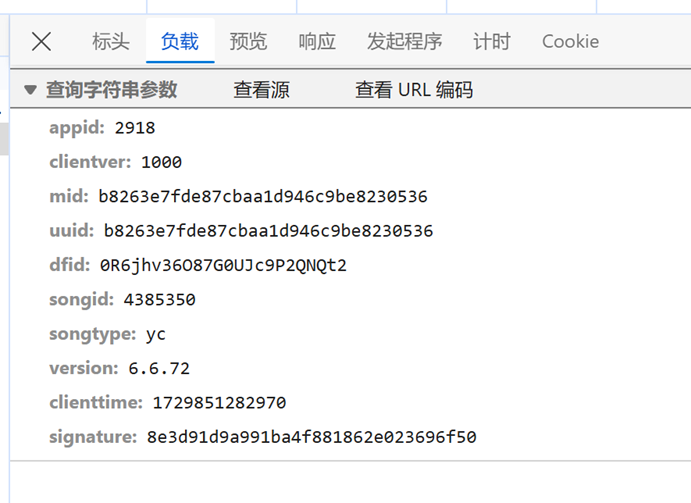

代码实现：

```python
import os
import random
import re
import time
import execjs
import requests
from lxml import etree
from jsonpath import jsonpath
from concurrent.futures.thread import ThreadPoolExecutor


class MusicSpider:
    # 列表页的基础url地址
    base_url = 'https://5sing.kugou.com/yc/list?t=2&l=&s=&p={}'
    # 生成签名的key
    key = '5uytoxQewcvIc1gn1PlNF0T2jbbOzRl5'
    # 获取歌曲下载地址的url
    get_download_music_url = 'https://5sservice.kugou.com/song/getsongurl'
    ip_10_url = 'ip链接'   # 需修改

    cookie_list = [
        {"kg_dfid": "0R6jhv36O87G0UJc9P2QNQt2", "kg_mid": "b8263e7fde87cbaa1d946c9be8230536"},
        {"kg_dfid": "08wPHb0xKetm4W6ca73G54OJ", "kg_mid": "edea264cbcf974e5cbc9873ec92a7dc5"},
        {"kg_dfid": "0R6kNe3WVE5C0s9v2l3gjEiD", "kg_mid": "3b4c6ce734da82a0143351e775061e6e"},
        {"kg_dfid": "34bhIo3WVEFG2KzYfP0Sr9oS", "kg_mid": "954ddb1ce124940ff8c5693eaa5377e8"}
    ]

    def __init__(self):
        """初始化方法"""
        # 构建ip代理池
        self.proxies_list = []
        self.get_proxies_ip()
        if not os.path.isdir("歌曲下载"):
            os.mkdir("歌曲下载")

    def get_proxies_ip(self):
        """发送请求获取代理ip"""
        response = requests.get(url=self.ip_10_url)
        if response.json()['code'] == "1000":
            print("代理ip获取成功：", response.json())
            ips = response.json()['data']
            for item in ips:
                proxies = {
                    "http": "http://{}:{}".format(item["ip"], item["port"])
                }
                self.proxies_list.append(proxies)
        else:
            # 将当前的公网IP加入白名单内
            url = 'ip不在白名单内网页给的添加白名单接口的链接'
            data = response.json()
            ip = re.search(r'\((.+?)\)', data['msg']).group(1)
            requests.get(url=url.format(ip))
            print("添加本地IP到代理白名单，添加结果", response.json())
            self.get_proxies_ip()

    def get_page_html(self, page):
        """获取歌曲列表单页的html，解析提取歌曲名称和ID"""
        # 随机获取一个代理
        proxies = random.choice(self.proxies_list)
        response = requests.get(self.base_url.format(page), proxies=proxies)
        # 提取歌曲的基本信息
        page = response.text
        html = etree.HTML(page)
        dl_list = html.xpath('//div[@class="lists"]/dl')
        # 遍历所有的dl标签
        for dl in dl_list:
            # 提取歌曲名称
            music_title = dl.xpath('.//h3/a/text()')[0]
            # 提取歌曲首页地址
            music_url = 'https://5sing.kugou.com' + dl.xpath('.//h3/a/@href')[0]
            # 提取歌曲的ID
            music_id = dl.xpath('.//a[@class="m_date_shou"]/@argid')[0]
            print("歌曲的名称为{}，ID为{}，首页地址：{}".format(music_title, music_id, music_url))
            self.get_music_download_url(music_id, proxies)

    def get_sign(self, params):
        """生成签名的方法"""
        plist = [f'{k}={v}' for k, v in params.items()]
        plist.insert(0, self.key)
        plist.append(self.key)
        pstr = ''.join(plist)
        # 执行js代码生成签名
        js_code = open('sign.js', 'r', encoding='utf-8').read()
        JS = execjs.compile(js_code)
        sign = JS.call('get_sign', pstr)
        # 将生成的签名加入请求参数中
        return sign

    def get_music_download_url(self, music_id, proxies):
        """获取歌曲的下载地址"""
        # 随机获取一个cookie信息
        cookie = random.choice(self.cookie_list)
        params = {
            "appid": 2918,
            "clienttime": int(time.time() * 1000),
            "clientver": 1000,
            "dfid": cookie['kg_dfid'],   # cookie中的kg_dfid
            "mid": cookie['kg_mid'],    # cookie中的kg_mid
            "songid": music_id,
            "songtype": "yc",
            "uuid": cookie['kg_mid'],    # cookie中的kg_mid
            "version": "6.6.72",
        }
        params['signature'] = self.get_sign(params)
        # 通过requests发送请求获取歌曲下载的url
        response = requests.get(url=self.get_download_music_url, params=params, proxies=proxies)
        result = response.json()
        # 提取歌曲的下载地址
        download_url = jsonpath(result, '$..lqurl')[0]
        # 歌曲名称
        song_name = jsonpath(result, '$..songName')[0]
        # 歌手
        name = jsonpath(result, '$..NN')[0]
        print("歌曲名：{}，下载地址：{}".format(song_name, download_url))
        self.download_music(download_url, song_name, proxies)

    def download_music(self, download_url, song_name, proxies):
        """下载歌曲"""
        response = requests.get(url=download_url, proxies=proxies)
        print(response.status_code)
        if response.status_code == 200:
            with open(f'歌曲下载/{song_name}.mp3', 'wb') as f:
                f.write(response.content)
                print(f"歌曲{song_name}下载成功")
        else:
            print(f"歌曲{song_name}下载失败")

    def main(self, pages, workers=1):
        """爬虫程序的入口"""
        # 通过线程池开启多线程去抓取页面数据
        with ThreadPoolExecutor(max_workers=workers) as tp:
            for page in range(1, pages + 1):
                tp.submit(self.get_page_html, page)


if __name__ == '__main__':
    ms = MusicSpider()
    ms.main(pages=1, workers=1)

```

**sign.js文件：**

```javascript
function o(e) {
            for (var t, n = "0123456789abcdef", o = "", r = 0; r < e.length; r += 1)
                t = e.charCodeAt(r),
                o += n.charAt(t >>> 4 & 15) + n.charAt(15 & t);
            return o
        }
    function r(e) {
            return c(a(s(e = n(e)), 8 * e.length))
        }
    function c(e) {
            for (var t = "", n = 32 * e.length, o = 0; o < n; o += 8)
                t += String.fromCharCode(e[o >> 5] >>> o % 32 & 255);
            return t
        }
    function a(e, t) {
            var n, o, r, i;
            e[t >> 5] |= 128 << t % 32,
            e[14 + (t + 64 >>> 9 << 4)] = t;
            for (var a = 1732584193, l = -271733879, c = -1732584194, s = 271733878, d = 0; d < e.length; d += 16)
                a = m(n = a, o = l, r = c, i = s, e[d], 7, -680876936),
                s = m(s, a, l, c, e[d + 1], 12, -389564586),
                c = m(c, s, a, l, e[d + 2], 17, 606105819),
                l = m(l, c, s, a, e[d + 3], 22, -1044525330),
                a = m(a, l, c, s, e[d + 4], 7, -176418897),
                s = m(s, a, l, c, e[d + 5], 12, 1200080426),
                c = m(c, s, a, l, e[d + 6], 17, -1473231341),
                l = m(l, c, s, a, e[d + 7], 22, -45705983),
                a = m(a, l, c, s, e[d + 8], 7, 1770035416),
                s = m(s, a, l, c, e[d + 9], 12, -1958414417),
                c = m(c, s, a, l, e[d + 10], 17, -42063),
                l = m(l, c, s, a, e[d + 11], 22, -1990404162),
                a = m(a, l, c, s, e[d + 12], 7, 1804603682),
                s = m(s, a, l, c, e[d + 13], 12, -40341101),
                c = m(c, s, a, l, e[d + 14], 17, -1502002290),
                a = f(a, l = m(l, c, s, a, e[d + 15], 22, 1236535329), c, s, e[d + 1], 5, -165796510),
                s = f(s, a, l, c, e[d + 6], 9, -1069501632),
                c = f(c, s, a, l, e[d + 11], 14, 643717713),
                l = f(l, c, s, a, e[d], 20, -373897302),
                a = f(a, l, c, s, e[d + 5], 5, -701558691),
                s = f(s, a, l, c, e[d + 10], 9, 38016083),
                c = f(c, s, a, l, e[d + 15], 14, -660478335),
                l = f(l, c, s, a, e[d + 4], 20, -405537848),
                a = f(a, l, c, s, e[d + 9], 5, 568446438),
                s = f(s, a, l, c, e[d + 14], 9, -1019803690),
                c = f(c, s, a, l, e[d + 3], 14, -187363961),
                l = f(l, c, s, a, e[d + 8], 20, 1163531501),
                a = f(a, l, c, s, e[d + 13], 5, -1444681467),
                s = f(s, a, l, c, e[d + 2], 9, -51403784),
                c = f(c, s, a, l, e[d + 7], 14, 1735328473),
                a = g(a, l = f(l, c, s, a, e[d + 12], 20, -1926607734), c, s, e[d + 5], 4, -378558),
                s = g(s, a, l, c, e[d + 8], 11, -2022574463),
                c = g(c, s, a, l, e[d + 11], 16, 1839030562),
                l = g(l, c, s, a, e[d + 14], 23, -35309556),
                a = g(a, l, c, s, e[d + 1], 4, -1530992060),
                s = g(s, a, l, c, e[d + 4], 11, 1272893353),
                c = g(c, s, a, l, e[d + 7], 16, -155497632),
                l = g(l, c, s, a, e[d + 10], 23, -1094730640),
                a = g(a, l, c, s, e[d + 13], 4, 681279174),
                s = g(s, a, l, c, e[d], 11, -358537222),
                c = g(c, s, a, l, e[d + 3], 16, -722521979),
                l = g(l, c, s, a, e[d + 6], 23, 76029189),
                a = g(a, l, c, s, e[d + 9], 4, -640364487),
                s = g(s, a, l, c, e[d + 12], 11, -421815835),
                c = g(c, s, a, l, e[d + 15], 16, 530742520),
                a = p(a, l = g(l, c, s, a, e[d + 2], 23, -995338651), c, s, e[d], 6, -198630844),
                s = p(s, a, l, c, e[d + 7], 10, 1126891415),
                c = p(c, s, a, l, e[d + 14], 15, -1416354905),
                l = p(l, c, s, a, e[d + 5], 21, -57434055),
                a = p(a, l, c, s, e[d + 12], 6, 1700485571),
                s = p(s, a, l, c, e[d + 3], 10, -1894986606),
                c = p(c, s, a, l, e[d + 10], 15, -1051523),
                l = p(l, c, s, a, e[d + 1], 21, -2054922799),
                a = p(a, l, c, s, e[d + 8], 6, 1873313359),
                s = p(s, a, l, c, e[d + 15], 10, -30611744),
                c = p(c, s, a, l, e[d + 6], 15, -1560198380),
                l = p(l, c, s, a, e[d + 13], 21, 1309151649),
                a = p(a, l, c, s, e[d + 4], 6, -145523070),
                s = p(s, a, l, c, e[d + 11], 10, -1120210379),
                c = p(c, s, a, l, e[d + 2], 15, 718787259),
                l = p(l, c, s, a, e[d + 9], 21, -343485551),
                a = u(a, n),
                l = u(l, o),
                c = u(c, r),
                s = u(s, i);
            return [a, l, c, s]
        }
    function s(e) {
            var t = [];
            for (t[(e.length >> 2) - 1] = void 0,
            o = 0; o < t.length; o += 1)
                t[o] = 0;
            for (var n = 8 * e.length, o = 0; o < n; o += 8)
                t[o >> 5] |= (255 & e.charCodeAt(o / 8)) << o % 32;
            return t
        }
    function n(e) {
            return unescape(encodeURIComponent(e))
        }
    function l(e, t, n, o, r, i) {
            return u((i = u(u(t, e), u(o, i))) << r | i >>> 32 - r, n)
        }
    function u(e, t) {
            var n = (65535 & e) + (65535 & t);
            return (e >> 16) + (t >> 16) + (n >> 16) << 16 | 65535 & n
        }
    function m(e, t, n, o, r, i, a) {
            return l(t & n | ~t & o, e, t, r, i, a)
        }
    function f(e, t, n, o, r, i, a) {
            return l(t & o | n & ~o, e, t, r, i, a)
        }
    function g(e, t, n, o, r, i, a) {
            return l(t ^ n ^ o, e, t, r, i, a)
        }
    function p(e, t, n, o, r, i, a) {
            return l(n ^ (t | ~o), e, t, r, i, a)
        }
    function get_sign(e, t, n) {
            return t ? n ? i(t, e) : o(i(t, e)) : n ? r(e) : o(r(e))
        }

```

## 附录
反爬虫手段记录
### **01**
检测请求头中的User-Agent是否是一个正常浏览器的User-Agent
解决方案：**在请求时自己设置请求头中的User-Agent**

```python
import requests

url = "https://www.baidu.com/img/PCtm_d9c8750bed0b3c7d089fa7d55720d6cf.png"
header = {
    "User-Agent": "Mozilla/5.0 (Windows NT 10.0; Win64; x64)"
                  " AppleWebKit/537.36 (KHTML, like Gecko) "
                  "Chrome/91.0.4472.124 Safari/537.36"
}

# 发送请求获取响应信息
response = requests.get(url=url, headers=header)
# 将返回的响应信息的内容写入到一个图片文件中
with open("baidu.png", "wb") as f:   # wb表示写入二进制文件
    f.write(response.content)

```

--------------------------------
### **02**
检测请求的来源（请求头中的Referer属性）（这个请求在发送之前打开的时哪个页面）→ 防盗链接
解决方案：**抓包看一下发请求的时候，浏览器传递的Rederer值是什么，然后在代码中的请求头里面加上对应的值**