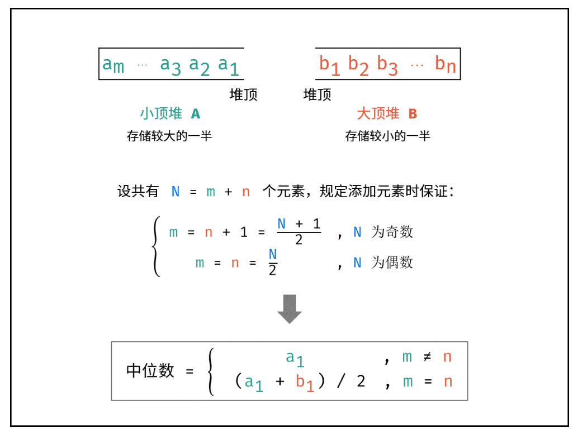
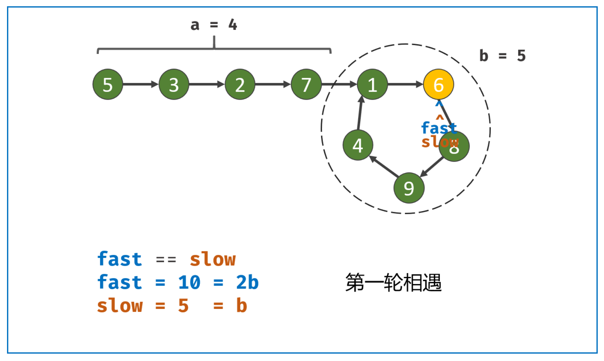
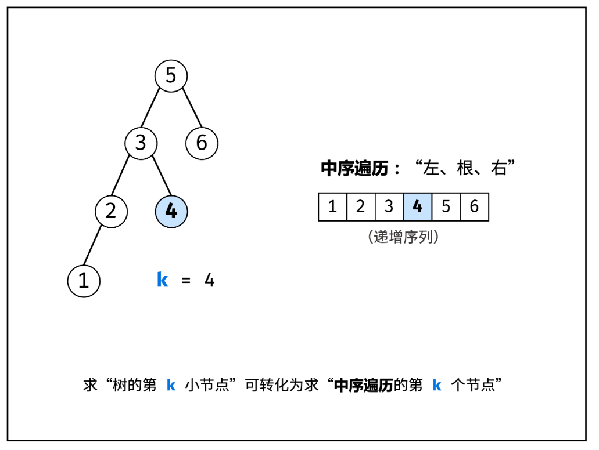
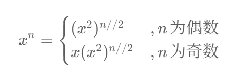
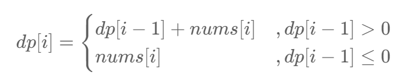
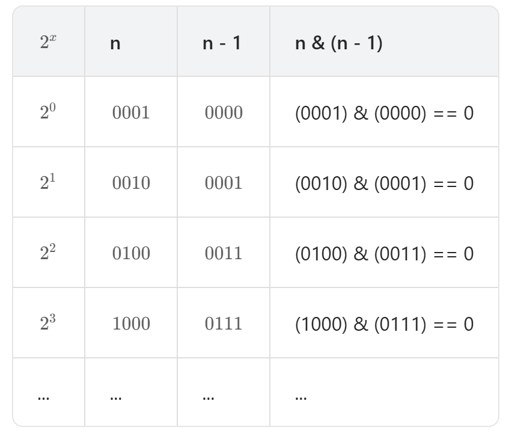

# 剑指 offer

## 链表

### 21. 合并两个有序链表

#### 题目

将两个升序链表合并为一个新的 **升序** 链表并返回。新链表是通过拼接给定的两个链表的所有节点组成的。 

**示例 1：**


```
输入：l1 = [1,2,4], l2 = [1,3,4]
输出：[1,1,2,3,4,4]
```

**示例 2：**

```
输入：l1 = [], l2 = []
输出：[]
```

**示例 3：**

```
输入：l1 = [], l2 = [0]
输出：[0]
```

**提示：**

- 两个链表的节点数目范围是 `[0, 50]`
- `-100 <= Node.val <= 100`
- `l1` 和 `l2` 均按 **非递减顺序** 排列


#### 解

##### 自己的

```python
# Definition for singly-linked list.
from typing import Optional


class ListNode:
    def __init__(self, val=0, next=None):
        self.val = val
        self.next = next


class Solution:
    def mergeTwoLists(self, list1: Optional[ListNode], list2: Optional[ListNode]) -> Optional[ListNode]:
        if list1 is None and list2 is None:
            return None

        dummy = ListNode()
        modelHead = dummy

        while list1 and list2:
            if list1.val <= list2.val:
                modelHead.next = list1
                list1 = list1.next
            else:
                modelHead.next = list2
                list2 = list2.next

            modelHead = modelHead.next

        modelHead.next = list1 if list1 else list2

        return dummy.next


# 测试辅助函数
def create_linklist(lst):
    """将列表转换为链表"""
    if not lst:
        return None
    head = ListNode(lst[0])
    tail = head
    for val in lst[1:]:
        tail.next = ListNode(val)
        tail = tail.next
    return head


def print_linklist(head):
    """打印链表"""
    result = []
    while head:
        result.append(head.val)
        head = head.next
    print(result)


def test_mergeTwoLists():
    """测试函数"""
    solution = Solution()

    # 测试用例1：两个非空链表
    print("测试用例1：")
    list1 = create_linklist([1, 2, 4])
    list2 = create_linklist([1, 3, 4])
    result = solution.mergeTwoLists(list1, list2)
    print("输入1:", [1, 2, 4])
    print("输入2:", [1, 3, 4])
    print("输出:", end=" ")
    print_linklist(result)  # 预期输出: [1, 1, 2, 3, 4, 4]
    print()

    # 测试用例2：一个空链表
    print("测试用例2：")
    list1 = create_linklist([])
    list2 = create_linklist([1, 3, 4])
    result = solution.mergeTwoLists(list1, list2)
    print("输入1:", [])
    print("输入2:", [1, 3, 4])
    print("输出:", end=" ")
    print_linklist(result)  # 预期输出: [1, 3, 4]
    print()

    # 测试用例3：两个空链表
    print("测试用例3：")
    list1 = create_linklist([])
    list2 = create_linklist([])
    result = solution.mergeTwoLists(list1, list2)
    print("输入1:", [])
    print("输入2:", [])
    print("输出:", end=" ")
    print_linklist(result)  # 预期输出: []
    print()

    # 测试用例4：一个链表为空
    print("测试用例4：")
    list1 = create_linklist([2, 5, 8])
    list2 = create_linklist([])
    result = solution.mergeTwoLists(list1, list2)
    print("输入1:", [2, 5, 8])
    print("输入2:", [])
    print("输出:", end=" ")
    print_linklist(result)  # 预期输出: [2, 5, 8]
    print()

    # 测试用例5：不同长度的链表
    print("测试用例5：")
    list1 = create_linklist([1, 3, 5, 7])
    list2 = create_linklist([2, 4, 6])
    result = solution.mergeTwoLists(list1, list2)
    print("输入1:", [1, 3, 5, 7])
    print("输入2:", [2, 4, 6])
    print("输出:", end=" ")
    print_linklist(result)  # 预期输出: [1, 2, 3, 4, 5, 6, 7]


# 运行测试
if __name__ == "__main__":
    test_mergeTwoLists()
```


##### 大佬的

```python
class Solution:
    def mergeTwoLists(self, list1: Optional[ListNode], list2: Optional[ListNode]) -> Optional[ListNode]:
        cur = dum = ListNode(0)
        while list1 and list2:
            if list1.val < list2.val:
                cur.next, list1 = list1, list1.next
            else:
                cur.next, list2 = list2, list2.next
            cur = cur.next
        cur.next = list1 if list1 else list2
        return dum.next

作者：Krahets
链接：https://leetcode.cn/problems/merge-two-sorted-lists/solutions/2361535/21-he-bing-liang-ge-you-xu-lian-biao-shu-aisw/
来源：力扣（LeetCode）
著作权归作者所有。商业转载请联系作者获得授权，非商业转载请注明出处。
```


#### 思考

在 LeetCode 中应该是直接把最后返回出来的链表给干进了一个循环遍历打印函数里面去，所以一定要取头节点的指针才能输出正确

输入的 list1 和 list2 已经帮你搞成链表了，不用自己再手动转换

这也是为什么在尾插法中返回的是 head 的原因

以后创建链表要记得在头节点留下两个指针

```python
def create_linklist_tail(li):  # 尾插法
    head = Node(li[0])
    tail = head
    for element in li[1:]:
        node = Node(element)  # 在element这里创建一个新节点
        tail.next = node
        tail = node
    return head
```


-------------------------------


### 20. 反转链表

#### 题目

给你单链表的头节点 `head` ，请你反转链表，并返回反转后的链表。

**示例 1：**


```
输入：head = [1,2,3,4,5]
输出：[5,4,3,2,1]
```

**示例 2：**


```
输入：head = [1,2]
输出：[2,1]
```

**示例 3：**

```
输入：head = []
输出：[]
```

**提示：**

- 链表中节点的数目范围是 `[0, 5000]`
- `-5000 <= Node.val <= 5000`


#### 解

##### 自己的

```python
from typing import Optional


# Definition for singly-linked list.
class ListNode:
    def __init__(self, val=0, next=None):
        self.val = val
        self.next = next


class Solution:
    def reverseList(self, head: Optional[ListNode]) -> Optional[ListNode]:
        if head == None:
            return None

        dum = None
        while head:
            cur = ListNode(head.val)
            head = head.next
            cur.next = dum
            dum = cur

        return dum


# 测试代码
def create_linked_list(values):
    """从值列表创建链表"""
    if not values:
        return None
    head = ListNode(values[0])
    current = head
    for val in values[1:]:
        current.next = ListNode(val)
        current = current.next
    return head


def linked_list_to_list(head):
    """将链表转换为列表"""
    result = []
    current = head
    while current:
        result.append(current.val)
        current = current.next
    return result


def test_reverse_list():
    """测试反转链表功能"""
    solution = Solution()

    test_cases = [
        [1, 2, 3, 4, 5],  # 正常链表
        [],  # 空链表
        [1],  # 单节点链表
        [1, 2],  # 两个节点的链表
        [1, 2, 3],  # 三个节点的链表
    ]

    for i, test_case in enumerate(test_cases, 1):
        print(f"测试用例 {i}: {test_case}")

        # 创建原链表
        original_head = create_linked_list(test_case)
        print(f"原链表: {linked_list_to_list(original_head)}")

        # 反转链表
        reversed_head = solution.reverseList(original_head)
        print(f"反转后: {linked_list_to_list(reversed_head)}")

        # 验证原链表未被修改
        print(f"原链表是否被修改: {linked_list_to_list(original_head)}")
        print()


if __name__ == "__main__":
    test_reverse_list()
```

注意：这个在力扣上跑不通，力扣要求不能创建新的节点


##### 大佬的

```python
class Solution:
    def reverseList(self, head: ListNode) -> ListNode:
        cur, pre = head, None
        while cur:
            tmp = cur.next # 暂存后继节点 cur.next
            cur.next = pre # 修改 next 引用指向
            pre = cur      # pre 暂存 cur
            cur = tmp      # cur 访问下一节点
        return pre

作者：Krahets
链接：https://leetcode.cn/problems/reverse-linked-list/solutions/2361282/206-fan-zhuan-lian-biao-shuang-zhi-zhen-r1jel/
来源：力扣（LeetCode）
著作权归作者所有。商业转载请联系作者获得授权，非商业转载请注明出处。
```


#### 思考

tmp 是临时变量，用于使得 cur 可以成功转换到原链表的下一个节点


------------------------


### 86. 分隔链表

#### 题目

给你一个链表的头节点 `head` 和一个特定值 `x` ，请你对链表进行分隔，使得所有 **小于** `x` 的节点都出现在 **大于或等于** `x` 的节点之前。

你应当 **保留** 两个分区中每个节点的初始相对位置。

**示例 1：**


```
输入：head = [1,4,3,2,5,2], x = 3
输出：[1,2,2,4,3,5]
```

**示例 2：**

```
输入：head = [2,1], x = 2
输出：[1,2]
```

**提示：**

- 链表中节点的数目在范围 `[0, 200]` 内
- `-100 <= Node.val <= 100`
- `-200 <= x <= 200`


#### 解

##### 自己的

```python
# Definition for singly-linked list.
class ListNode:
    def __init__(self, val=0, next=None):
        self.val = val
        self.next = next


class Solution:
    def partition(self, head, x):
        # 创建新链表的哑节点
        new_dummy = ListNode()
        new_tail = new_dummy

        # 创建原链表的哑节点，便于处理头节点可能被删除的情况
        old_dummy = ListNode()
        old_dummy.next = head
        prev = old_dummy
        curr = head

        while curr:
            if curr.val < x:
                # 从原链表中删除当前节点
                prev.next = curr.next

                # 将删除的节点添加到新链表
                new_tail.next = curr
                new_tail = curr

                # 移动到原链表的下一个节点
                curr = curr.next

                # 断开新链表中当前节点与原链表的连接
                new_tail.next = None
            else:
                # 继续遍历原链表
                prev = curr
                curr = curr.next

        # 将新链表与原链表剩余部分拼接
        new_tail.next = old_dummy.next

        return new_dummy.next


# 测试工具函数
def create_linked_list(arr):
    """从数组创建链表"""
    if not arr:
        return None
    head = ListNode(arr[0])
    current = head
    for val in arr[1:]:
        current.next = ListNode(val)
        current = current.next
    return head


def linked_list_to_list(head):
    """将链表转换为数组"""
    result = []
    current = head
    while current:
        result.append(current.val)
        current = current.next
    return result


def print_linked_list(head):
    """打印链表"""
    current = head
    while current:
        print(current.val, end=" -> " if current.next else "")
        current = current.next
    print()


# 测试用例
def run_tests():
    solution = Solution()

    # 测试用例1: 示例测试
    print("测试用例1: 示例测试")
    head1 = create_linked_list([1, 4, 3, 2, 5, 2])
    x1 = 3
    print("原链表:", linked_list_to_list(head1))
    result1 = solution.partition(head1, x1)
    print("分区后:", linked_list_to_list(result1))
    print("期望: [1, 2, 2, 4, 3, 5]")
    print()

    # 测试用例2: 所有节点都小于x
    print("测试用例2: 所有节点都小于x")
    head2 = create_linked_list([1, 2, 3])
    x2 = 5
    print("原链表:", linked_list_to_list(head2))
    result2 = solution.partition(head2, x2)
    print("分区后:", linked_list_to_list(result2))
    print("期望: [1, 2, 3]")
    print()

    # 测试用例3: 所有节点都大于等于x
    print("测试用例3: 所有节点都大于等于x")
    head3 = create_linked_list([5, 6, 7])
    x3 = 3
    print("原链表:", linked_list_to_list(head3))
    result3 = solution.partition(head3, x3)
    print("分区后:", linked_list_to_list(result3))
    print("期望: [5, 6, 7]")
    print()

    # 测试用例4: 空链表
    print("测试用例4: 空链表")
    head4 = create_linked_list([])
    x4 = 5
    print("原链表:", linked_list_to_list(head4))
    result4 = solution.partition(head4, x4)
    print("分区后:", linked_list_to_list(result4))
    print("期望: []")
    print()

    # 测试用例5: 只有一个节点
    print("测试用例5: 只有一个节点")
    head5 = create_linked_list([2])
    x5 = 3
    print("原链表:", linked_list_to_list(head5))
    result5 = solution.partition(head5, x5)
    print("分区后:", linked_list_to_list(result5))
    print("期望: [2]")
    print()

    # 测试用例6: 混合情况
    print("测试用例6: 混合情况")
    head6 = create_linked_list([3, 1, 4, 2, 5])
    x6 = 3
    print("原链表:", linked_list_to_list(head6))
    result6 = solution.partition(head6, x6)
    print("分区后:", linked_list_to_list(result6))
    print("期望: [1, 2, 3, 4, 5]")
    print()

    # 测试用例7: 边界值测试
    print("测试用例7: 边界值测试")
    head7 = create_linked_list([1, 2, 3, 4, 5])
    x7 = 1
    print("原链表:", linked_list_to_list(head7))
    result7 = solution.partition(head7, x7)
    print("分区后:", linked_list_to_list(result7))
    print("期望: [1, 2, 3, 4, 5]")
    print()


# 可视化测试函数
def visualize_test(arr, x):
    """可视化测试单个用例"""
    solution = Solution()
    head = create_linked_list(arr)

    print(f"输入: {arr}, x = {x}")
    print("原链表: ", end="")
    print_linked_list(head)

    result = solution.partition(head, x)

    print("分区后: ", end="")
    print_linked_list(result)
    print()


# 运行测试
if __name__ == "__main__":
    print("=== 链表分区测试 ===\n")

    # 运行所有测试用例
    run_tests()

    print("=== 可视化测试 ===\n")

    # 可视化测试一些特定用例
    visualize_test([1, 4, 3, 2, 5, 2], 3)
    visualize_test([2, 1], 2)
    visualize_test([3, 3, 1, 2, 4], 3)
```


##### 大佬的

```python
class Solution:
    def partition(self, head: Optional[ListNode], x: int) -> Optional[ListNode]:
        sml_dummy, big_dummy = ListNode(0), ListNode(0)
        sml, big = sml_dummy, big_dummy
        while head:
            if head.val < x:
                sml.next = head
                sml = sml.next
            else:
                big.next = head
                big = big.next
            head = head.next
        sml.next = big_dummy.next
        big.next = None
        return sml_dummy.next

作者：Krahets
链接：https://leetcode.cn/problems/partition-list/solutions/2362068/86-fen-ge-lian-biao-shuang-zhi-zhen-qing-hha7/
来源：力扣（LeetCode）
著作权归作者所有。商业转载请联系作者获得授权，非商业转载请注明出处。
```


#### 思路

+ 自己的：将原链表中比 `x` 小的值给删除并插入新的链表，遍历完后再将新的链表与原链表拼接


------------------------------------------------


### 237. 删除链表中的节点

#### 题目

有一个单链表的 `head`，我们想删除它其中的一个节点 `node`。

给你一个需要删除的节点 `node` 。你将 **无法访问** 第一个节点 `head`。

链表的所有值都是 **唯一的**，并且保证给定的节点 `node` 不是链表中的最后一个节点。

删除给定的节点。注意，删除节点并不是指从内存中删除它。这里的意思是：

- 给定节点的值不应该存在于链表中。
- 链表中的节点数应该减少 1。
- `node` 前面的所有值顺序相同。
- `node` 后面的所有值顺序相同。

**自定义测试：**

- 对于输入，你应该提供整个链表 `head` 和要给出的节点 `node`。`node` 不应该是链表的最后一个节点，而应该是链表中的一个实际节点。
- 我们将构建链表，并将节点传递给你的函数。
- 输出将是调用你函数后的整个链表。

**示例 1：**


```
输入：head = [4,5,1,9], node = 5
输出：[4,1,9]
解释：指定链表中值为 5 的第二个节点，那么在调用了你的函数之后，该链表应变为 4 -> 1 -> 9
```

**示例 2：**


```
输入：head = [4,5,1,9], node = 1
输出：[4,5,9]
解释：指定链表中值为 1 的第三个节点，那么在调用了你的函数之后，该链表应变为 4 -> 5 -> 9
```

**提示：**

- 链表中节点的数目范围是 `[2, 1000]`
- `-1000 <= Node.val <= 1000`
- 链表中每个节点的值都是 **唯一** 的
- 需要删除的节点 `node` 是 **链表中的节点** ，且 **不是末尾节点**


#### 解

##### 自己的

**没想出来**


##### 大佬的

```python
# Definition for singly-linked list.
# class ListNode:
#     def __init__(self, x):
#         self.val = x
#         self.next = None

class Solution:
    def deleteNode(self, node):
        node.val = node.next.val
        node.next = node.next.next

作者：Krahets
链接：https://leetcode.cn/problems/delete-node-in-a-linked-list/solutions/2362069/237-shan-chu-lian-biao-zhong-de-jie-dian-zli2/
来源：力扣（LeetCode）
著作权归作者所有。商业转载请联系作者获得授权，非商业转载请注明出处。
```


#### 思路

将下一个节点的值复制到当前节点，再跳过下一个节点


-------------------


### 138. 随机链表的复制

#### 题目

给你一个长度为 `n` 的链表，每个节点包含一个额外增加的随机指针 `random` ，该指针可以指向链表中的任何节点或空节点。

构造这个链表的 **[深拷贝](https://baike.baidu.com/item/深拷贝/22785317?fr=aladdin)**。 深拷贝应该正好由 `n` 个 **全新** 节点组成，其中每个新节点的值都设为其对应的原节点的值。新节点的 `next` 指针和 `random` 指针也都应指向复制链表中的新节点，并使原链表和复制链表中的这些指针能够表示相同的链表状态。**复制链表中的指针都不应指向原链表中的节点** 。

例如，如果原链表中有 `X` 和 `Y` 两个节点，其中 `X.random --> Y` 。那么在复制链表中对应的两个节点 `x` 和 `y` ，同样有 `x.random --> y` 。

返回复制链表的头节点。

用一个由 `n` 个节点组成的链表来表示输入/输出中的链表。每个节点用一个 `[val, random_index]` 表示：

- `val`：一个表示 `Node.val` 的整数。
- `random_index`：随机指针指向的节点索引（范围从 `0` 到 `n-1`）；如果不指向任何节点，则为 `null` 。

你的代码 **只** 接受原链表的头节点 `head` 作为传入参数。

**示例 1：**


```
输入：head = [[7,null],[13,0],[11,4],[10,2],[1,0]]
输出：[[7,null],[13,0],[11,4],[10,2],[1,0]]
```

**示例 2：**


```
输入：head = [[1,1],[2,1]]
输出：[[1,1],[2,1]]
```

**示例 3：**

****

```
输入：head = [[3,null],[3,0],[3,null]]
输出：[[3,null],[3,0],[3,null]]
```

**提示：**

- `0 <= n <= 1000`
- `-104 <= Node.val <= 104`
- `Node.random` 为 `null` 或指向链表中的节点。


#### 解

##### 自己的

没写出来


##### 大佬的

###### **方法一：哈希表**

利用哈希表的查询特点，考虑构建 **原链表节点** 和 **新链表对应节点** 的键值对映射关系，再遍历构建新链表各节点的 `next` 和 `random` 引用指向即可。

**算法流程：**

1. 若头节点 `head` 为空节点，直接返回 `null` 。
2. **初始化：** 哈希表 `dic` ， 节点 `cur` 指向头节点。
3. **复制链表：**
   a. 建立新节点，并向 `dic` 添加键值对 `(原 cur 节点, 新 cur 节点）` 。
   b. `cur` 遍历至原链表下一节点。
4. **构建新链表的引用指向：**
   a. 构建新节点的 `next` 和 `random` 引用指向。
   b. `cur` 遍历至原链表下一节点。
5. **返回值：** 新链表的头节点 `dic[cur]` 。

```python
class Node:
    def __init__(self, x: int, next: 'Node' = None, random: 'Node' = None):
        self.val = int(x)
        self.next = next
        self.random = random


class Solution:
    def copyRandomList(self, head: 'Node') -> 'Node':
        if not head: return
        dic = {}
        # 3. 复制各节点，并建立 “原节点 -> 新节点” 的 Map 映射
        cur = head
        while cur:
            dic[cur] = Node(cur.val)
            cur = cur.next
        cur = head
        # 4. 构建新节点的 next 和 random 指向
        while cur:
            dic[cur].next = dic.get(cur.next)
            dic[cur].random = dic.get(cur.random)
            cur = cur.next
        # 5. 返回新链表的头节点
        return dic[head]

作者：Krahets
链接：https://leetcode.cn/problems/copy-list-with-random-pointer/solutions/2361362/138-fu-zhi-dai-sui-ji-zhi-zhen-de-lian-b-6jeo/
来源：力扣（LeetCode）
著作权归作者所有。商业转载请联系作者获得授权，非商业转载请注明出处。
```


###### 方法二：拼接 + 拆分
考虑构建 `原节点 1 -> 新节点 1 -> 原节点 2 -> 新节点 2 -> ……` 的拼接链表，如此便可在访问原节点的 `random` 指向节点的同时找到新对应新节点的 `random` 指向节点。

**算法流程：**

1. **复制各节点，构建拼接链表：**设原链表为 `node1→node2→⋯` ，构建的拼接链表如下所示：

$$
node1→node1_{new} →node2→node2_{new}→⋯
$$

2. **构建新链表各节点的 `random` 指向：**当访问原节点 `cur` 的随机指向节点 `cur.random` 时，对应新节点 `cur.next` 的随机指向节点为 `cur.random.next `。

3. **拆分原 / 新链表：**设置 `pre` / `cur` 分别指向原 / 新链表头节点，遍历执行 `pre.next = pre.next.next` 和 `cur.next = cur.next.next` 将两链表拆分开。

4. 返回新链表的头节点 `res` 即可。

```python
class Solution:
    def copyRandomList(self, head: 'Node') -> 'Node':
        if not head: return
        cur = head
        # 1. 复制各节点，并构建拼接链表
        while cur:
            tmp = Node(cur.val)
            tmp.next = cur.next
            cur.next = tmp
            cur = tmp.next
        # 2. 构建各新节点的 random 指向
        cur = head
        while cur:
            if cur.random:
                cur.next.random = cur.random.next
            cur = cur.next.next
        # 3. 拆分两链表
        cur = res = head.next
        pre = head
        while cur.next:
            pre.next = pre.next.next
            cur.next = cur.next.next
            pre = pre.next
            cur = cur.next
        pre.next = None # 单独处理原链表尾节点
        return res      # 返回新链表头节点

作者：Krahets
链接：https://leetcode.cn/problems/copy-list-with-random-pointer/solutions/2361362/138-fu-zhi-dai-sui-ji-zhi-zhen-de-lian-b-6jeo/
来源：力扣（LeetCode）
著作权归作者所有。商业转载请联系作者获得授权，非商业转载请注明出处。
```


#### 思路

+ 比较神奇的方法：
  + 第一步：在每个原节点后面插入新节点
  + 第二步：设置新节点的 random 指针
  + 第三步：分离两个链表

我嘞个，原本这是 ai 给的，后面发现和K神的第二种方法是一样的


-----------------------


## 栈与队列

### 20. 有效的括号

#### 题目

给定一个只包括 `'('`，`')'`，`'{'`，`'}'`，`'['`，`']'` 的字符串 `s` ，判断字符串是否有效。

有效字符串需满足：

1. 左括号必须用相同类型的右括号闭合。
2. 左括号必须以正确的顺序闭合。
3. 每个右括号都有一个对应的相同类型的左括号。

**示例 1：**

**输入：**s = "()"

**输出：**true

**示例 2：**

**输入：**s = "()[]{}"

**输出：**true

**示例 3：**

**输入：**s = "(]"

**输出：**false

**示例 4：**

**输入：**s = "([])"

**输出：**true

**示例 5：**

**输入：**s = "([)]"

**输出：**false

**提示：**

- `1 <= s.length <= 104`
- `s` 仅由括号 `'()[]{}'` 组成


#### 解

##### 自己的

```python
class Solution:
    def isValid(self, s: str) -> bool:
        li = []

        for i in s:
            if i == '(' or i == '{' or i == '[':
                li.append(i)
            else:
                if li == []:
                    return False

                if i == ")" and li[-1] == "(":
                    li.pop()
                elif i == "}" and li[-1] == "{":
                    li.pop()
                elif i == "]" and li[-1] == "[":
                    li.pop()
                else:
                    li.append(i)

        if li == []:
            return True
        else:
            return False


# 测试代码
def test_is_valid():
    solution = Solution()
    
    test_cases = [
        ("()", True),
        ("()[]{}", True),
        ("(]", False),
        ("([)]", False),
        ("{[]}", True),
        ("", True),  # 空字符串
        ("(", False),  # 只有左括号
        (")", False),  # 只有右括号
        ("([])", True),
        ("((()))", True),
        ("((())", False),  # 缺少一个右括号
        ("())", False),  # 多余的右括号
        ("{[()]}", True),
        ("{[()]", False),
    ]
    
    print("测试括号有效性验证:")
    print("=" * 50)
    
    passed = 0
    failed = 0
    
    for i, (test_input, expected) in enumerate(test_cases, 1):
        result = solution.isValid(test_input)
        status = "✓ 通过" if result == expected else "✗ 失败"
        
        print(f"测试用例 {i}: {status}")
        print(f"  输入: '{test_input}'")
        print(f"  期望: {expected}")
        print(f"  实际: {result}")
        
        if result == expected:
            passed += 1
        else:
            failed += 1
        print()
    
    print("=" * 50)
    print(f"总计: {len(test_cases)} 个测试用例")
    print(f"通过: {passed}")
    print(f"失败: {failed}")
    print(f"成功率: {passed/len(test_cases)*100:.1f}%")

# 运行测试
if __name__ == "__main__":
    test_is_valid()
```


##### 大佬的

```python
class Solution:
    def isValid(self, s: str) -> bool:
        dic = {'{': '}',  '[': ']', '(': ')', '?': '?'}
        stack = ['?']
        for c in s:
            if c in dic: stack.append(c)
            elif dic[stack.pop()] != c: return False 
        return len(stack) == 1

```


#### 思考

没啥难的，想得到用栈就行了【虽然自己写的非常的丑陋啊】，记得反方向的括号进栈了就直接 False


--------------------------------------------


### 151. 最小栈

#### 题目

设计一个支持 `push` ，`pop` ，`top` 操作，并能在常数时间内检索到最小元素的栈。

实现 `MinStack` 类:

- `MinStack()` 初始化堆栈对象。
- `void push(int val)` 将元素val推入堆栈。
- `void pop()` 删除堆栈顶部的元素。
- `int top()` 获取堆栈顶部的元素。
- `int getMin()` 获取堆栈中的最小元素。

**示例 1:**

```
输入：
["MinStack","push","push","push","getMin","pop","top","getMin"]
[[],[-2],[0],[-3],[],[],[],[]]

输出：
[null,null,null,null,-3,null,0,-2]

解释：
MinStack minStack = new MinStack();
minStack.push(-2);
minStack.push(0);
minStack.push(-3);
minStack.getMin();   --> 返回 -3.
minStack.pop();
minStack.top();      --> 返回 0.
minStack.getMin();   --> 返回 -2.
```

**提示：**

- `-231 <= val <= 231 - 1`
- `pop`、`top` 和 `getMin` 操作总是在 **非空栈** 上调用
- `push`, `pop`, `top`, and `getMin`最多被调用 `3 * 104` 次


#### 解

##### 自己的

```python
class MinStack:

    def __init__(self):
        self.stack = []

    def push(self, val: int) -> None:
        self.stack.append(val)

    def pop(self) -> None:
        self.stack.pop()

    def top(self) -> int:
        if len(self.stack) > 0:
            return self.stack[-1]
        else:
            return None

    def getMin(self) -> int:
        if len(self.stack) > 0:
            min = 2 ** 31
            for i in self.stack:
                if i < min:
                    min = i
            return min
        else:
            return None


if __name__ == '__main__':
    minStack = MinStack()
    minStack.push(-2)
    minStack.push(0)
    minStack.push(-3)
    print(minStack.getMin())
    minStack.pop()
    print(minStack.top())
    print(minStack.getMin())
```

很慢，别学！！！


##### 大佬的

```python
class MinStack:
    def __init__(self):
        self.stack = []
        self.min_stack = []
    def push(self, x: int) -> None:
        self.stack.append(x)
        if not self.min_stack or x <= self.min_stack[-1]: 
            self.min_stack.append(x)
    def pop(self) -> None:
        if self.stack.pop() == self.min_stack[-1]:
            self.min_stack.pop()
    def top(self) -> int:
        return self.stack[-1]
    def getMin(self) -> int:
        return self.min_stack[-1]

作者：Krahets
链接：https://leetcode.cn/problems/min-stack/solutions/9036/min-stack-fu-zhu-stackfa-by-jin407891080/
来源：力扣（LeetCode）
著作权归作者所有。商业转载请联系作者获得授权，非商业转载请注明出处。
```


#### 思考

一定要想到使用辅助栈用于存储最小值

+ `min_stack` 等价于遍历 `stack` 所有元素，把升序的数字都删除掉，留下一个从栈底到栈顶降序的栈。
+ 相当于给 `stack` 中的降序元素做了标记，每当 `pop()` 这些降序元素，`min_stack` 会将相应的栈顶元素 `pop()` 出去，保证其栈顶元素始终是 `stack` 中的最小元素。


---------------------------


### 232.用栈实现队列

#### 题目

请你仅使用两个栈实现先入先出队列。队列应当支持一般队列支持的所有操作（`push`、`pop`、`peek`、`empty`）：

实现 `MyQueue` 类：

- `void push(int x)` 将元素 x 推到队列的末尾
- `int pop()` 从队列的开头移除并返回元素
- `int peek()` 返回队列开头的元素
- `boolean empty()` 如果队列为空，返回 `true` ；否则，返回 `false`

**说明：**

- 你 **只能** 使用标准的栈操作 —— 也就是只有 `push to top`, `peek/pop from top`, `size`, 和 `is empty` 操作是合法的。
- 你所使用的语言也许不支持栈。你可以使用 list 或者 deque（双端队列）来模拟一个栈，只要是标准的栈操作即可。

**示例 1：**

```
输入：
["MyQueue", "push", "push", "peek", "pop", "empty"]
[[], [1], [2], [], [], []]
输出：
[null, null, null, 1, 1, false]

解释：
MyQueue myQueue = new MyQueue();
myQueue.push(1); // queue is: [1]
myQueue.push(2); // queue is: [1, 2] (leftmost is front of the queue)
myQueue.peek(); // return 1
myQueue.pop(); // return 1, queue is [2]
myQueue.empty(); // return false
```

**提示：**

- `1 <= x <= 9`
- 最多调用 `100` 次 `push`、`pop`、`peek` 和 `empty`
- 假设所有操作都是有效的 （例如，一个空的队列不会调用 `pop` 或者 `peek` 操作）

**进阶：**

- 你能否实现每个操作均摊时间复杂度为 `O(1)` 的队列？换句话说，执行 `n` 个操作的总时间复杂度为 `O(n)` ，即使其中一个操作可能花费较长时间。


#### 解

##### 自己的

```python
class MyQueue:

    def __init__(self):
        self.stack1 = []
        self.stack2 = []

    def push(self, x: int) -> None:
        self.stack1.append(x)
        
    def pop(self) -> int:
        if not self.stack2:
            while self.stack1:
                self.stack2.append(self.stack1.pop())
        return self.stack2.pop()
        
    def peek(self) -> int:
        if not self.stack2:
            while self.stack1:
                self.stack2.append(self.stack1.pop())
        return self.stack2[-1]

    def empty(self) -> bool:
        return not self.stack1 and not self.stack2
        


# Your MyQueue object will be instantiated and called as such:
# obj = MyQueue()
# obj.push(x)
# param_2 = obj.pop()
# param_3 = obj.peek()
# param_4 = obj.empty()
```


##### 大佬的

1. **加入队尾 `push()` ：** 将数字 `val` 加入栈 `A` 即可。
2. **获取队首元素 `peek()` ：**
   a. **当栈 `B` 不为空：** `B` 中仍有已完成倒序的元素，因此直接返回 `B` 的栈顶元素。
   b. **否则，当 `A` 为空：** 即两个栈都为空，无元素，因此返回 -1 。
   c. **否则：** 将栈 `A` 元素全部转移至栈 `B` 中，实现元素倒序，并返回栈 `B` 的栈顶元素。
3. **弹出队首元素 `pop()` ：**
   a. 执行 `peek()` ，获取队首元素。
   b. 弹出 `B` 的栈顶元素。
4. **队列判空 `empty()` ：** 当栈 `A` 和 `B` 都为空时，队列为空。

```python
class MyQueue:

    def __init__(self):
        self.A, self.B = [], []

    def push(self, x: int) -> None:
        self.A.append(x)

    def pop(self) -> int:
        peek = self.peek()
        self.B.pop()
        return peek

    def peek(self) -> int:
        if self.B: return self.B[-1]
        if not self.A: return -1
        # 将栈 A 的元素依次移动至栈 B
        while self.A:
            self.B.append(self.A.pop())
        return self.B[-1]

    def empty(self) -> bool:
        return not self.A and not self.B


作者：Krahets
链接：https://leetcode.cn/problems/implement-queue-using-stacks/solutions/2363977/232-yong-zhan-shi-xian-dui-lie-qing-xi-t-pi4l/
来源：力扣（LeetCode）
著作权归作者所有。商业转载请联系作者获得授权，非商业转载请注明出处。
```


#### 思考

两个栈，一个为进队，一个为出队


-----------------------------


### 394. 字符串解码

#### 题

给定一个经过编码的字符串，返回它解码后的字符串。

编码规则为: `k[encoded_string]`，表示其中方括号内部的 `encoded_string` 正好重复 `k` 次。注意 `k` 保证为正整数。

你可以认为输入字符串总是有效的；输入字符串中没有额外的空格，且输入的方括号总是符合格式要求的。

此外，你可以认为原始数据不包含数字，所有的数字只表示重复的次数 `k` ，例如不会出现像 `3a` 或 `2[4]` 的输入。

测试用例保证输出的长度不会超过 `105`。

**示例 1：**

```
输入：s = "3[a]2[bc]"
输出："aaabcbc"
```

**示例 2：**

```
输入：s = "3[a2[c]]"
输出："accaccacc"
```

**示例 3：**

```
输入：s = "2[abc]3[cd]ef"
输出："abcabccdcdcdef"
```

**示例 4：**

```
输入：s = "abc3[cd]xyz"
输出："abccdcdcdxyz"
```

**提示：**

- `1 <= s.length <= 30`
- `s` 由小写英文字母、数字和方括号 `'[]'` 组成
- `s` 保证是一个 **有效** 的输入。
- `s` 中所有整数的取值范围为 `[1, 300]` 


#### 解

##### 自己的

没写出来，试图用一个栈解决，但是失败


##### 大佬的

1. 构建辅助栈 `stack`， 遍历字符串 `s` 中每个字符 `c`；
   + 当 `c` 为数字时，将数字字符转化为数字 `multi`，用于后续倍数计算；
   + 当 `c` 为字母时，在 `res` 尾部添加 `c`；
   + 当 c 为 `[` 时，将当前 `multi` 和 `res` 入栈，并分别置空置 0：
     + 记录此 `[` 前的临时结果 `res` 至栈，用于发现对应 `]` 后的拼接操作；
     + 记录此 `[` 前的倍数 `multi` 至栈，用于发现对应 `]` 后，获取 `multi × [...]` 字符串。
     + 进入到新 `[` 后，`res` 和 `multi` 重新记录。
   + 当 `c` 为 `]` 时，`stack` 出栈，拼接字符串 `res = last_res + cur_multi * res`，其中:
       + `last_res` 是上个 `[` 到当前 `[` 的字符串，例如 `"3[a2[c]]"` 中的 `a`；
       + `cur_multi` 是当前 `[` 到 `]` 内字符串的重复倍数，例如 `"3[a2[c]]"` 中的 `2`。
2. 返回字符串 `res`。

```python
class Solution:
    def decodeString(self, s: str) -> str:
        stack, res, multi = [], "", 0
        for c in s:
            if c == '[':
                stack.append([multi, res])
                res, multi = "", 0
            elif c == ']':
                cur_multi, last_res = stack.pop()
                res = last_res + cur_multi * res
            elif '0' <= c <= '9':
                multi = multi * 10 + int(c)            
            else:
                res += c
        return res

作者：Krahets
链接：https://leetcode.cn/problems/decode-string/solutions/19447/decode-string-fu-zhu-zhan-fa-di-gui-fa-by-jyd/
来源：力扣（LeetCode）
著作权归作者所有。商业转载请联系作者获得授权，非商业转载请注明出处。
```


```python
class Solution:
    def decodeString(self, s: str) -> str:
        if s is None:
            return ""
        
        stack = []
        current_num = 0
        current_str = ""
        
        for char in s:
            if char.isdigit():
                # 用于保存"[]"前面的数字
                current_num = current_num * 10 + int(char)
            elif char == '[':
                # 将当前数字和字符串压入栈
                stack.append(current_str)
                stack.append(current_num)
                current_str = ""
                current_num = 0
            elif char == ']':
                # 弹出数字和之前的字符串
                num = stack.pop()
                prev_str = stack.pop()
                current_str = prev_str + num * current_str
            else:
                # 普通字符，直接添加到当前字符串
                current_str += char
        
        return current_str
```


#### 思考

要想到构建辅助栈，通过栈来临时存储数字和要用数字相乘的字符串


----------------------


### 295. 数据流的中位数

#### 题

**中位数**是有序整数列表中的中间值。如果列表的大小是偶数，则没有中间值，中位数是两个中间值的平均值。

- 例如 `arr = [2,3,4]` 的中位数是 `3` 。
- 例如 `arr = [2,3]` 的中位数是 `(2 + 3) / 2 = 2.5` 。

实现 MedianFinder 类:

- `MedianFinder()` 初始化 `MedianFinder` 对象。
- `void addNum(int num)` 将数据流中的整数 `num` 添加到数据结构中。
- `double findMedian()` 返回到目前为止所有元素的中位数。与实际答案相差 `10-5` 以内的答案将被接受。

**示例 1：**

```
输入
["MedianFinder", "addNum", "addNum", "findMedian", "addNum", "findMedian"]
[[], [1], [2], [], [3], []]
输出
[null, null, null, 1.5, null, 2.0]

解释
MedianFinder medianFinder = new MedianFinder();
medianFinder.addNum(1);    // arr = [1]
medianFinder.addNum(2);    // arr = [1, 2]
medianFinder.findMedian(); // 返回 1.5 ((1 + 2) / 2)
medianFinder.addNum(3);    // arr[1, 2, 3]
medianFinder.findMedian(); // return 2.0
```

**提示:**

- `-105 <= num <= 105`
- 在调用 `findMedian` 之前，数据结构中至少有一个元素
- 最多 `5 * 104` 次调用 `addNum` 和 `findMedian`


#### 解

##### 自己的

```java
class MedianFinder:

    def __init__(self):
        self.li = []

    def addNum(self, num: int) -> None:
        left, right = 0, len(self.li)
        while left < right:
            mid = (left + right) // 2
            if self.li[mid] < num:
                left = mid + 1
            else:
                right = mid
        self.li.insert(left, num)

    def findMedian(self) -> float:
        if self.li is None:
            return None

        if len(self.li) % 2 == 1:
            return self.li[len(self.li) // 2]

        else:
            res = (self.li[len(self.li) // 2 - 1] + self.li[len(self.li) // 2]) / 2
            return res


if __name__ == '__main__':
    obj = MedianFinder()
    obj.addNum(1)
    obj.addNum(2)
    param_2 = obj.findMedian()
    print(param_2)
    obj.addNum(3)
    param_3 = obj.findMedian()
    print(param_3)
```

这里的二分查找要注意索引


##### 大佬的



> 设元素总数为 N=m+n ，其中 m 和 n 分别为 A 和 B 中的元素个数。

函数 `addNum(num)` ：

1. 当 m = n（即 N 为 **偶数**）：需向 A 添加一个元素。实现方法：将新元素 `num` 插入至 B ，再将 B 堆顶元素插入至 A 。

2. 当 m != n（即 N 为 **奇数**）：需向 B 添加一个元素。实现方法：将新元素 `num` 插入至 A ，再将 A 堆顶元素插入至 B 。

> 假设插入数字 num 遇到情况 1. 。由于 num 可能属于 “较小的一半” （即属于 B ），因此不能将 nums 直接插入至 A 。而应先将 num 插入至 B ，再将 B 堆顶元素插入至 A 。这样就可以始终保持 A 保存较大一半、 B 保存较小一半。

函数 `findMedian()` ：

1. 当 m = n（ N 为 **偶数**）：则中位数为 ( A 的堆顶元素 + B 的堆顶元素 ) / 2。
2. 当 m != n（ N 为 **奇数**）：则中位数为 A 的堆顶元素。

```python
from heapq import *

class MedianFinder:
    def __init__(self):
        self.A = [] # 小顶堆，保存较大的一半
        self.B = [] # 大顶堆，保存较小的一半

    def addNum(self, num: int) -> None:
        if len(self.A) != len(self.B):
            heappush(self.A, num)
            heappush(self.B, -heappop(self.A))
        else:
            heappush(self.B, -num)
            heappush(self.A, -heappop(self.B))

    def findMedian(self) -> float:
        return self.A[0] if len(self.A) != len(self.B) else (self.A[0] - self.B[0]) / 2.0

作者：Krahets
链接：https://leetcode.cn/problems/find-median-from-data-stream/solutions/2361972/295-shu-ju-liu-de-zhong-wei-shu-dui-qing-gmdo/
来源：力扣（LeetCode）
著作权归作者所有。商业转载请联系作者获得授权，非商业转载请注明出处。
```


#### 思考

要想到用堆

- Python 中 heapq 模块是小顶堆。实现 **大顶堆** 方法： 小顶堆的插入和弹出操作均将元素 **取反** 即可。


------------------


## 哈希表

### 242. 有效的字母异位词

#### 题

给定两个字符串 `s` 和 `t` ，编写一个函数来判断 `t` 是否是 `s` 的 字母异位词。

**示例 1:**

```
输入: s = "anagram", t = "nagaram"
输出: true
```

**示例 2:**

```
输入: s = "rat", t = "car"
输出: false
```

**提示:**

- `1 <= s.length, t.length <= 5 * 104`
- `s` 和 `t` 仅包含小写字母

**进阶:** 如果输入字符串包含 unicode 字符怎么办？你能否调整你的解法来应对这种情况？


#### 解

##### 自己的

```python
class Solution:
    def isAnagram(self, s: str, t: str) -> bool:
        li_s = []
        li_t = []
    
        for i in s:
            li_s.append(i)
        
        for i in t:
            li_t.append(i)

        if len(li_s) != len(li_t):
            return False

        for i in range(len(li_s)):
            for j in range(len(li_t)):
                if li_s[i] == li_t[j]:
                    del li_t[j]
                    break

        if li_t:
            return False
        else:
            return True
```

暴力美学~（建议别学）


##### 大佬的

Python 代码使用 `collections.defaultdict()` 类，可指定所有 `key` 对应的默认 `value` 

```python
class Solution:
    def isAnagram(self, s: str, t: str) -> bool:
        if len(s) != len(t):
            return False
        dic = defaultdict(int)
        for c in s:
            dic[c] += 1
        for c in t:
            dic[c] -= 1
        for val in dic.values():
            if val != 0:
                return False
        return True

作者：Krahets
链接：https://leetcode.cn/problems/valid-anagram/solutions/2362065/242-you-xiao-de-zi-mu-yi-wei-ci-ha-xi-bi-cch7/
来源：力扣（LeetCode）
著作权归作者所有。商业转载请联系作者获得授权，非商业转载请注明出处。
```


#### 思考

借助哈希表，首先创建一个 value 值默认为0的哈希表（字典），循环 s，将其对应的每个字母设为 key，value 为字母出现的个数，再循环 t，在字典中对 t 中的每个字母依次减一，最后如果哈希表的值全为0则为字母异位词


---------------


### 387. 字符串中的第一个唯一字符

#### 题

给定一个字符串 `s` ，找到 *它的第一个不重复的字符，并返回它的索引* 。如果不存在，则返回 `-1` 。

**示例 1：**

```
输入: s = "leetcode"
输出: 0
```

**示例 2:**

```
输入: s = "loveleetcode"
输出: 2
```

**示例 3:**

```
输入: s = "aabb"
输出: -1
```

**提示:**

- `1 <= s.length <= 105`
- `s` 只包含小写字母


#### 解

##### 自己的

```python
from collections import defaultdict


class Solution:
    def firstUniqChar(self, s: str) -> int:

        dic = defaultdict(int)
        li = []
        result = ""
        index = 0

        if s is "":
            return -1

        for i in s:
            dic[i] += 1

        for key in dic.keys():
            if dic[key] == 1:
                li.append(key)

        if li == []:
            return -1

        for i in s:
            for j in li:
                if i == j:
                    result = i
                    break
            if result is not "":
                break
            else:
                index = index + 1

        return index


if __name__ == '__main__':
    s = Solution()
    print(s.firstUniqChar("aabb"))
```

暴力美学~


##### 大佬的

```python
class Solution:
    def firstUniqChar(self, s: str) -> int:
        dic = {}
        for c in s:
            dic[c] = not c in dic
        for i, c in enumerate(s):
            if dic[c]: return i
        return -1

作者：Krahets
链接：https://leetcode.cn/problems/first-unique-character-in-a-string/solutions/2361521/387-zi-fu-chuan-zhong-de-di-yi-ge-wei-yi-c5md/
来源：力扣（LeetCode）
著作权归作者所有。商业转载请联系作者获得授权，非商业转载请注明出处。
```


#### 思考

创建一个字典，遍历字符串的每个字符，如果字典中不包含字符，就像字典中添加键值对 `(c, True)`，若包含就将键值对修改为 `(c, False)`

再次遍历字符串，如果遍历到的字符在字典中的值对应为 True 则返回索引（用 `enumerate()`）


----------------------


### 205. 同构字符串

#### 题

给定两个字符串 `s` 和 `t` ，判断它们是否是同构的。

如果 `s` 中的字符可以按某种映射关系替换得到 `t` ，那么这两个字符串是同构的。

每个出现的字符都应当映射到另一个字符，同时不改变字符的顺序。不同字符不能映射到同一个字符上，相同字符只能映射到同一个字符上，字符可以映射到自己本身。

**示例 1:**

```
输入：s = "egg", t = "add"
输出：true
```

**示例 2：**

```
输入：s = "foo", t = "bar"
输出：false
```

**示例 3：**

```
输入：s = "paper", t = "title"
输出：true
```

**提示：**

- `1 <= s.length <= 5 * 104`
- `t.length == s.length`
- `s` 和 `t` 由任意有效的 ASCII 字符组成


#### 解

##### 自己的

没写出来


##### 大佬的

+ “每个出现的字符都应当映射到另一个字符”。代表字符集合 `s` , `t` 之间是「满射」。
+ “相同字符只能映射到同一个字符上，不同字符不能映射到同一个字符上”。代表字符集合 `s` , `t` 之间是「单射」。

因此，`s` 和 `t` 之间是「双射」，满足一一对应。考虑遍历字符串，使用哈希表 `s2t` , `t2s` 分别记录 $s→t$ , $t→s$ 的映射，当发现任意「一对多」的关系时返回 false 即可。

```python
class Solution:
    def isIsomorphic(self, s: str, t: str) -> bool:
        s2t, t2s = {}, {}
        for a, b in zip(s, t):
            # 对于已有映射 a -> s2t[a]，若和当前字符映射 a -> b 不匹配，
            # 说明有一对多的映射关系，则返回 false ；
            # 对于映射 b -> a 也同理
            if a in s2t and s2t[a] != b or \
               b in t2s and t2s[b] != a:
                return False
            s2t[a], t2s[b] = b, a
        return True

作者：Krahets
链接：https://leetcode.cn/problems/isomorphic-strings/solutions/1645867/by-jyd-i4wt/
来源：力扣（LeetCode）
著作权归作者所有。商业转载请联系作者获得授权，非商业转载请注明出处。
```


```python
from collections import defaultdict


class Solution:
    def isIsomorphic(self, s: str, t: str) -> bool:
        if len(s) != len(t):
            return False

        # 记录每个字符第一次出现的位置
        pos_s = {}
        pos_t = {}

        # 构建位置模式
        pattern_s = []
        pattern_t = []

        for i, char in enumerate(s):
            if char not in pos_s:
                pos_s[char] = i
            pattern_s.append(pos_s[char])

        for i, char in enumerate(t):
            if char not in pos_t:
                pos_t[char] = i
            pattern_t.append(pos_t[char])

        return pattern_s == pattern_t


if __name__ == '__main__':
    s = Solution()
    print(s.isIsomorphic("aaabbbba", "bbbaaaba"))
```


#### 思考

不能只考虑字符出现的频率，重点是相同字符的索引，用索引来比较哈希表

或者说，可以每添加一个字符的信息到哈希表就比较一次


--------------------------


### 409. 最长回文串

#### 题

给定一个包含大写字母和小写字母的字符串 `s` ，返回 *通过这些字母构造成的 **最长的 回文串*** 的长度。

在构造过程中，请注意 **区分大小写** 。比如 `"Aa"` 不能当做一个回文字符串。 

**示例 1:**

```
输入:s = "abccccdd"
输出:7
解释:
我们可以构造的最长的回文串是"dccaccd", 它的长度是 7。
```

**示例 2:**

```
输入:s = "a"
输出:1
解释：可以构造的最长回文串是"a"，它的长度是 1。
```

**提示:**

- `1 <= s.length <= 2000`
- `s` 只由小写 **和/或** 大写英文字母组成


#### 解

##### 自己的

```python
from collections import defaultdict


class Solution:
    def longestPalindrome(self, s: str) -> int:

        dic = defaultdict(int)
        count = 0
        add_1 = False
        li = []
        add_odd = 0

        if len(s) == 1:
            return 1

        for i in s:
            dic[i] += 1

        for value in dic.values():
            if value % 2 == 0:
                count += value

            if value % 2 == 1:
                add_1 = True
                li.append(value)

        if add_1 is True:
            add_max = max(li)
            li.remove(add_max)

            for j in li:
                add_odd += j - 1

            return count + add_max + add_odd
        else:
            return count
```


##### 大佬的

```python
class Solution:
    def longestPalindrome(self, s: str) -> int:
        # 统计各字符数量
        counter = collections.defaultdict(int)
        for c in s:
            counter[c] += 1
        res, odd = 0, 0
        # 统计构造回文串的最大长度
        for count in counter.values():
            # 将当前字符出现次数向下取偶数，并计入 res
            rem = count % 2
            res += count - rem
            # 若当前字符出现次数为奇数，则将 odd 置 1
            if rem == 1: odd = 1
        return res + odd

作者：Krahets
链接：https://leetcode.cn/problems/longest-palindrome/solutions/1693273/409-zui-chang-hui-wen-chuan-by-jyd-ne80/
来源：力扣（LeetCode）
著作权归作者所有。商业转载请联系作者获得授权，非商业转载请注明出处。
```

两个字：优雅~


#### 思考

要思考回文的特性，偶数都可以算进最大长度里，奇数的话，最大的奇数字节算进去，其它奇数可以-1之后放在回文两侧


---------------------


## 双指针

### 392. 判断子序列

#### 题

给定字符串 **s** 和 **t** ，判断 **s** 是否为 **t** 的子序列。

字符串的一个子序列是原始字符串删除一些（也可以不删除）字符而不改变剩余字符相对位置形成的新字符串。（例如，`"ace"`是`"abcde"`的一个子序列，而`"aec"`不是）。

**进阶：**

如果有大量输入的 S，称作 S1, S2, ... , Sk 其中 k >= 10亿，你需要依次检查它们是否为 T 的子序列。在这种情况下，你会怎样改变代码？

**致谢：**

特别感谢 [@pbrother ](https://leetcode.com/pbrother/)添加此问题并且创建所有测试用例。

**示例 1：**

```
输入：s = "abc", t = "ahbgdc"
输出：true
```

**示例 2：**

```
输入：s = "axc", t = "ahbgdc"
输出：false
```


#### 解

##### 自己的

```python
class Solution:
    def isSubsequence(self, s: str, t: str) -> bool:
        i, j = 0, 0
        while i < len(s) and j < len(t):
            if s[i] == t[j]:
                i += 1
                j += 1
            else:
                j += 1

        if i == len(s):
            return True
        else:
            return False


if __name__ == '__main__':
    s = Solution()
    print(s.isSubsequence("abc", "ahbgdc"))
```


##### 大佬的

```python
class Solution:
    def isSubsequence(self, s: str, t: str) -> bool:
        if not s: return True
        i = 0
        for c in t:
            if s[i] == c:
                i += 1
                # 若已经遍历完 s ，则提前返回 true
                if i == len(s):
                    return True
        return False

作者：Krahets
链接：https://leetcode.cn/problems/is-subsequence/solutions/1658262/by-jyd-zeph/
来源：力扣（LeetCode）
著作权归作者所有。商业转载请联系作者获得授权，非商业转载请注明出处。
```


#### 思考

要想到利用双指针，每个字符串各给一个指针，相同的就两个一起走，不同就大的走


-------------------------


### 876. 链表的中间结点

#### 题目

给你单链表的头结点 `head` ，请你找出并返回链表的中间结点。

如果有两个中间结点，则返回第二个中间结点。

**示例 1：**


```
输入：head = [1,2,3,4,5]
输出：[3,4,5]
解释：链表只有一个中间结点，值为 3 。
```

**示例 2：**


```
输入：head = [1,2,3,4,5,6]
输出：[4,5,6]
解释：该链表有两个中间结点，值分别为 3 和 4 ，返回第二个结点。
```

**提示：**

- 链表的结点数范围是 `[1, 100]`
- `1 <= Node.val <= 100`


#### 解

##### 自己的

```python
from typing import Optional


# Definition for singly-linked list.
class ListNode:
    def __init__(self, val=0, next=None):
        self.val = val
        self.next = next


class Solution:
    def middleNode(self, head: Optional[ListNode]) -> Optional[ListNode]:
        dum = cur = head

        length = 0
        run = 0

        while dum.next is not None:
            dum = dum.next
            length += 1

        mid = length // 2

        if length % 2 == 0:
            run = 0
            while run < mid:
                cur = cur.next
                run += 1
        else:
            run = 0
            while run < mid + 1:
                cur = cur.next
                run += 1

        return cur


# 测试辅助函数
def create_linklist(lst):
    """将列表转换为链表"""
    if not lst:
        return None
    head = ListNode(lst[0])
    tail = head
    for val in lst[1:]:
        tail.next = ListNode(val)
        tail = tail.next
    return head


def print_linklist(head):
    """打印链表"""
    result = []
    while head:
        result.append(head.val)
        head = head.next
    print(result)


if __name__ == '__main__':
    s = Solution()
    result = create_linklist([1, 2, 3, 4, 5])
    print_linklist(s.middleNode(result))
```


##### 大佬的

考虑借助快慢双指针 `fast`，`slow` ，「快指针 `fast`」每轮走 2 步，「慢指针 `slow`」每轮走 1 步。`fast` 的步数恒为 `slow` 的 2 倍，因此当快指针遍历完链表时，慢指针就指向链表中间节点。而由于长度为偶数的链表有**两个中间节点**，因此需要分两种情况考虑：

+ **链表长度为奇数：** 当 `fast` 走到链表「尾节点」时，`slow` 正好走到「中间节点」。
+ **链表长度为偶数：** 当 `fast` 走到「null」时（越过「尾节点」后），`slow` 正好走到「第二个中间节点」。

总结以上规律，应在当 `fast` **遇到或越过尾节点** 时跳出循环，并返回 `slow` 即可。

```python
class Solution:
    def middleNode(self, head: ListNode) -> ListNode:
        fast = slow = head
        while fast and fast.next:
            fast = fast.next.next
            slow = slow.next
        return slow

作者：Krahets
链接：https://leetcode.cn/problems/middle-of-the-linked-list/solutions/1646119/by-jyd-aphd/
来源：力扣（LeetCode）
著作权归作者所有。商业转载请联系作者获得授权，非商业转载请注明出处。
```

优雅~


#### 思考

用两个指针，一个走到尾算出总长度，另一个走到目标位置即可

K 神的：两倍速赛跑


------------------


### 160. 相交链表

#### 题

#### 解

给你两个单链表的头节点 `headA` 和 `headB` ，请你找出并返回两个单链表相交的起始节点。如果两个链表不存在相交节点，返回 `null` 。

图示两个链表在节点 `c1` 开始相交**：**

[](https://assets.leetcode-cn.com/aliyun-lc-upload/uploads/2018/12/14/160_statement.png)

题目数据 **保证** 整个链式结构中不存在环。

**注意**，函数返回结果后，链表必须 **保持其原始结构** 。

**自定义评测：**

**评测系统** 的输入如下（你设计的程序 **不适用** 此输入）：

- `intersectVal` - 相交的起始节点的值。如果不存在相交节点，这一值为 `0`
- `listA` - 第一个链表
- `listB` - 第二个链表
- `skipA` - 在 `listA` 中（从头节点开始）跳到交叉节点的节点数
- `skipB` - 在 `listB` 中（从头节点开始）跳到交叉节点的节点数

评测系统将根据这些输入创建链式数据结构，并将两个头节点 `headA` 和 `headB` 传递给你的程序。如果程序能够正确返回相交节点，那么你的解决方案将被 **视作正确答案** 。

 

**示例 1：**

[](https://assets.leetcode.com/uploads/2018/12/13/160_example_1.png)

```
输入：intersectVal = 8, listA = [4,1,8,4,5], listB = [5,6,1,8,4,5], skipA = 2, skipB = 3
输出：Intersected at '8'
解释：相交节点的值为 8 （注意，如果两个链表相交则不能为 0）。
从各自的表头开始算起，链表 A 为 [4,1,8,4,5]，链表 B 为 [5,6,1,8,4,5]。
在 A 中，相交节点前有 2 个节点；在 B 中，相交节点前有 3 个节点。
— 请注意相交节点的值不为 1，因为在链表 A 和链表 B 之中值为 1 的节点 (A 中第二个节点和 B 中第三个节点) 是不同的节点。换句话说，它们在内存中指向两个不同的位置，而链表 A 和链表 B 中值为 8 的节点 (A 中第三个节点，B 中第四个节点) 在内存中指向相同的位置。
```

**示例 2：**

[](https://assets.leetcode.com/uploads/2018/12/13/160_example_2.png)

```
输入：intersectVal = 2, listA = [1,9,1,2,4], listB = [3,2,4], skipA = 3, skipB = 1
输出：Intersected at '2'
解释：相交节点的值为 2 （注意，如果两个链表相交则不能为 0）。
从各自的表头开始算起，链表 A 为 [1,9,1,2,4]，链表 B 为 [3,2,4]。
在 A 中，相交节点前有 3 个节点；在 B 中，相交节点前有 1 个节点。
```

**示例 3：**

[](https://assets.leetcode.com/uploads/2018/12/13/160_example_3.png)

```
输入：intersectVal = 0, listA = [2,6,4], listB = [1,5], skipA = 3, skipB = 2
输出：No intersection
解释：从各自的表头开始算起，链表 A 为 [2,6,4]，链表 B 为 [1,5]。
由于这两个链表不相交，所以 intersectVal 必须为 0，而 skipA 和 skipB 可以是任意值。
这两个链表不相交，因此返回 null 。
```

**提示：**

- `listA` 中节点数目为 `m`
- `listB` 中节点数目为 `n`
- `1 <= m, n <= 3 * 104`
- `1 <= Node.val <= 105`
- `0 <= skipA <= m`
- `0 <= skipB <= n`
- 如果 `listA` 和 `listB` 没有交点，`intersectVal` 为 `0`
- 如果 `listA` 和 `listB` 有交点，`intersectVal == listA[skipA] == listB[skipB]`

**进阶：**你能否设计一个时间复杂度 `O(m + n)` 、仅用 `O(1)` 内存的解决方案？


##### 自己的

```python
# Definition for singly-linked list.
from typing import Optional


class ListNode:
    def __init__(self, x):
        self.val = x
        self.next = None


class Solution:
    def getIntersectionNode(self, headA: ListNode, headB: ListNode) -> Optional[ListNode]:
        if not headA or not headB:
            return None

        dum_a = cur_a = headA
        dum_b = cur_b = headB

        length_a = 0
        length_b = 0
        ready_a = 0
        ready_b = 0

        while dum_a.next is not None:
            dum_a = dum_a.next
            length_a += 1

        while dum_b.next is not None:
            dum_b = dum_b.next
            length_b += 1

        if length_a > length_b:
            ready_a = length_a - length_b
            while ready_a != 0:
                cur_a = cur_a.next
                ready_a -= 1
        else:
            ready_b = length_b - length_a
            while ready_b != 0:
                cur_b = cur_b.next
                ready_b -= 1

        while cur_a:
            if cur_a == cur_b:
                return cur_a
            else:
                cur_a = cur_a.next
                cur_b = cur_b.next

        return None
```


##### 大佬的

```python
class Solution:
    def getIntersectionNode(self, headA: ListNode, headB: ListNode) -> ListNode:
        A, B = headA, headB
        while A != B:
            A = A.next if A else headB
            B = B.next if B else headA
        return A

作者：Krahets
链接：https://leetcode.cn/problems/intersection-of-two-linked-lists/solutions/12624/intersection-of-two-linked-lists-shuang-zhi-zhen-l/
来源：力扣（LeetCode）
著作权归作者所有。商业转载请联系作者获得授权，非商业转载请注明出处。
```

优雅~

（额，感觉是打死我都想不出来）


#### 思考

分别用一个指针计算出两个链表的长度，可得出长度差，让长的先把长的部分走完，再一起走，判断下一个指向的是不是同一个节点


-------------------------


### 167. 两数之和 || - 输入有序数组

#### 题

给你一个下标从 **1** 开始的整数数组 `numbers` ，该数组已按 **非递减顺序排列** ，请你从数组中找出满足相加之和等于目标数 `target` 的两个数。如果设这两个数分别是 `numbers[index1]` 和 `numbers[index2]` ，则 `1 <= index1 < index2 <= numbers.length` 。

以长度为 2 的整数数组 `[index1, index2]` 的形式返回这两个整数的下标 `index1` 和 `index2`。

你可以假设每个输入 **只对应唯一的答案** ，而且你 **不可以** 重复使用相同的元素。

你所设计的解决方案必须只使用常量级的额外空间。

**示例 1：**

```
输入：numbers = [2,7,11,15], target = 9
输出：[1,2]
解释：2 与 7 之和等于目标数 9 。因此 index1 = 1, index2 = 2 。返回 [1, 2] 。
```

**示例 2：**

```
输入：numbers = [2,3,4], target = 6
输出：[1,3]
解释：2 与 4 之和等于目标数 6 。因此 index1 = 1, index2 = 3 。返回 [1, 3] 。
```

**示例 3：**

```
输入：numbers = [-1,0], target = -1
输出：[1,2]
解释：-1 与 0 之和等于目标数 -1 。因此 index1 = 1, index2 = 2 。返回 [1, 2] 。 
```

**提示：**

- `2 <= numbers.length <= 3 * 104`
- `-1000 <= numbers[i] <= 1000`
- `numbers` 按 **非递减顺序** 排列
- `-1000 <= target <= 1000`
- **仅存在一个有效答案**


#### 解

##### 自己的

```python
from typing import List


class Solution:
    def twoSum(self, numbers: List[int], target: int) -> List[int]:

        res = []

        for i in range(len(numbers)):
            mid = find(numbers, target - numbers[i])
            if mid == i:
                if numbers[mid + 1] + numbers[i] == target:
                    res.append(i + 1)
                    res.append(mid + 2)
                    return res
                else:
                    break

            if mid is not None and mid != i:
                res.append(i + 1)
                res.append(mid + 1)
                return res

        return res


def find(li, target):
    right = len(li) - 1
    left = 0
    mid = len(li) // 2
    while left < right:
        if li[mid] < target:
            left = mid + 1
            mid = (right + left) // 2
        if li[mid] > target:
            right = mid - 1
            mid = (right + left) // 2
        if li[mid] == target:
            return mid

    return None


if __name__ == '__main__':
    s = Solution()
    print(s.twoSum([0, 0, 3, 4], 0))
```

有 bug 的，性能不好且太刁钻的案例无法通过，不要学！！！

```python
from typing import List


class Solution:
    def twoSum(self, numbers: List[int], target: int) -> List[int]:

        left = 0
        right = len(numbers) - 1
        res = []

        while left < right:
            if numbers[left] + numbers[right] > target:
                right -= 1

            if numbers[left] + numbers[right] < target:
                left += 1

            if numbers[left] + numbers[right] == target:
                res.append(left + 1)
                res.append(right + 1)
                return res

        return res


if __name__ == '__main__':
    s = Solution()
    print(s.twoSum([0, 0, 3, 4], 0))
```

后面又写出来一个，这个可以学


##### 大佬的

```python
class Solution:
    def twoSum(self, numbers: List[int], target: int) -> List[int]:
        i, j = 0, len(numbers) - 1
        while i < j:
            s = numbers[i] + numbers[j]
            if s > target: j -= 1
            elif s < target: i += 1
            else: return i + 1, j + 1
        return []

作者：Krahets
链接：https://leetcode.cn/problems/two-sum-ii-input-array-is-sorted/solutions/2361541/167-liang-shu-zhi-he-ii-shu-ru-you-xu-sh-k3oy/
来源：力扣（LeetCode）
著作权归作者所有。商业转载请联系作者获得授权，非商业转载请注明出处。
```


#### 思考

一个指针指头，一个指尾，如果相加大了就尾巴减一，小了就头加一


---------------


### 142. 环形链表

#### 题

给定一个链表的头节点  `head` ，返回链表开始入环的第一个节点。 *如果链表无环，则返回 `null`。*

如果链表中有某个节点，可以通过连续跟踪 `next` 指针再次到达，则链表中存在环。 为了表示给定链表中的环，评测系统内部使用整数 `pos` 来表示链表尾连接到链表中的位置（**索引从 0 开始**）。如果 `pos` 是 `-1`，则在该链表中没有环。**注意：`pos` 不作为参数进行传递**，仅仅是为了标识链表的实际情况。

**不允许修改** 链表。

**示例 1：**


```
输入：head = [3,2,0,-4], pos = 1
输出：返回索引为 1 的链表节点
解释：链表中有一个环，其尾部连接到第二个节点。
```

**示例 2：**


```
输入：head = [1,2], pos = 0
输出：返回索引为 0 的链表节点
解释：链表中有一个环，其尾部连接到第一个节点。
```

**示例 3：**


```
输入：head = [1], pos = -1
输出：返回 null
解释：链表中没有环。
```

**提示：**

- 链表中节点的数目范围在范围 `[0, 104]` 内
- `-105 <= Node.val <= 105`
- `pos` 的值为 `-1` 或者链表中的一个有效索引 

**进阶：**你是否可以使用 `O(1)` 空间解决此题？


#### 解

##### 自己的

```python
# Definition for singly-linked list.
# class ListNode:
#     def __init__(self, x):
#         self.val = x
#         self.next = None

class Solution:
    def detectCycle(self, head: Optional[ListNode]) -> Optional[ListNode]:
        cur = dum = head
        li = []

        if not head or not head.next:
            return None

        while dum not in li:
            li.append(dum)
            dum = dum.next
            if dum is None:
                return None
            
        while dum != cur:
            cur = cur.next

        return cur
```

很慢

大体就是将链表中的元素逐个加到列表中，然后逐个循环判断节点的 `next` 是否在列表中

记得 `in` 可以判断值是否在列表中


##### 大佬的

```python
class Solution(object):
    def detectCycle(self, head):
        fast, slow = head, head
        while True:
            if not (fast and fast.next): return
            fast, slow = fast.next.next, slow.next
            if fast == slow: break
        fast = head
        while fast != slow:
            fast, slow = fast.next, slow.next
        return fast

作者：Krahets
链接：https://leetcode.cn/problems/linked-list-cycle-ii/solutions/12616/linked-list-cycle-ii-kuai-man-zhi-zhen-shuang-zhi-/
来源：力扣（LeetCode）
著作权归作者所有。商业转载请联系作者获得授权，非商业转载请注明出处。
```


#### 思考



根据：

1. f=2s （快指针每次2步，路程刚好2倍）
2. f = s + nb (相遇时，刚好多走了n圈）

推出：s = nb

从 head 节点走到入环点需要走 ： a + nb， 而 slow 已经走了 nb，那么 slow 再走 a 步就是入环点了。

如何知道 slow 刚好走了 a 步？ 从 head 开始，和 slow 指针一起走，相遇时刚好就是 a 步


----------------


### 151. 反转字符串中的单词

#### 题

给你一个字符串 `s` ，请你反转字符串中 **单词** 的顺序。

**单词** 是由非空格字符组成的字符串。`s` 中使用至少一个空格将字符串中的 **单词** 分隔开。

返回 **单词** 顺序颠倒且 **单词** 之间用单个空格连接的结果字符串。

**注意：**输入字符串 `s`中可能会存在前导空格、尾随空格或者单词间的多个空格。返回的结果字符串中，单词间应当仅用单个空格分隔，且不包含任何额外的空格。

**示例 1：**

```
输入：s = "the sky is blue"
输出："blue is sky the"
```

**示例 2：**

```
输入：s = "  hello world  "
输出："world hello"
解释：反转后的字符串中不能存在前导空格和尾随空格。
```

**示例 3：**

```
输入：s = "a good   example"
输出："example good a"
解释：如果两个单词间有多余的空格，反转后的字符串需要将单词间的空格减少到仅有一个。
```

**提示：**

- `1 <= s.length <= 104`
- `s` 包含英文大小写字母、数字和空格 `' '`
- `s` 中 **至少存在一个** 单词

**进阶：**如果字符串在你使用的编程语言中是一种可变数据类型，请尝试使用 `O(1)` 额外空间复杂度的 **原地** 解法。


#### 解

##### 自己的

```python
class Solution:
    def reverseWords(self, s: str) -> str:
        high = 0
        low = 0
        li = []
        res = ""
        is_have = False

        for r in s:
            if r == " ":
                is_have = True

        if not is_have:
            return s

        for i in range(len(s)):

            high = i

            if s[i] != " ":
                if i != 0 and s[i - 1] == " ":
                    low = high

            if s[i] == " " or i == len(s) - 1:
                if low == 0:
                    if s[low] != " ":
                        li.append(s[low:high])
                        low = high
                else:
                    if s[low - 1] == " ":
                        if i == len(s) - 1:
                            li.append(s[low:high + 1])
                        else:
                            li.append(s[low:high])
                            low = high

        for j in range(len(li)):
            if j == 0:
                res = li[j] + res
            else:
                res = li[j] + " " + res

        return res


if __name__ == '__main__':
    s = Solution()
    print(s.reverseWords("EPY2giL"))
```

暴力：别学，纯纯史来的


##### 大佬的

```python
class Solution:
    def reverseWords(self, s: str) -> str:
        s = s.strip()                            # 删除首尾空格
        i = j = len(s) - 1
        res = []
        while i >= 0:
            while i >= 0 and s[i] != ' ': i -= 1 # 搜索首个空格
            res.append(s[i + 1: j + 1])          # 添加单词
            while i >= 0 and s[i] == ' ': i -= 1 # 跳过单词间空格
            j = i                                # j 指向下个单词的尾字符
        return ' '.join(res)                     # 拼接并返回

作者：Krahets
链接：https://leetcode.cn/problems/reverse-words-in-a-string/solutions/2361551/151-fan-zhuan-zi-fu-chuan-zhong-de-dan-c-yb1r/
来源：力扣（LeetCode）
著作权归作者所有。商业转载请联系作者获得授权，非商业转载请注明出处。
```


#### 思考

先删除首尾的空格 `strip()`，在末尾加上两个指针，一个指针 `i` 从右向左搜索第一个空格，搜索到后添加第一个单词 `[i+1, j+1]`，`i` 继续跳过接下来的空格，到下一个字母的时候 `i = j`，以此循环直到 `i` 走到头


----------------------------


### 3. 无重复字符的最长子串

#### 题

给定一个字符串 `s` ，请你找出其中不含有重复字符的 **最长 子串** 的长度。

**示例 1:**

```
输入: s = "abcabcbb"
输出: 3 
解释: 因为无重复字符的最长子串是 "abc"，所以其长度为 3。注意 "bca" 和 "cab" 也是正确答案。
```

**示例 2:**

```
输入: s = "bbbbb"
输出: 1
解释: 因为无重复字符的最长子串是 "b"，所以其长度为 1。
```

**示例 3:**

```
输入: s = "pwwkew"
输出: 3
解释: 因为无重复字符的最长子串是 "wke"，所以其长度为 3。
     请注意，你的答案必须是 子串 的长度，"pwke" 是一个子序列，不是子串。
```

**提示：**

- `0 <= s.length <= 5 * 104`
- `s` 由英文字母、数字、符号和空格组成


#### 解

##### 自己的

又又又没写出来

这个是 ai 的最接近我原本思路的

```python
from collections import defaultdict

class Solution:
    def lengthOfLongestSubstring(self, s: str) -> int:
        if s == "":
            return 0
        if len(s) == 1:
            return 1
        
        left = 0
        right = 0
        max_len = 0
        char_count = defaultdict(int)
        
        while right < len(s):
            # 将当前字符加入窗口
            char_count[s[right]] += 1
            
            # 如果当前字符重复了，移动左指针直到不再重复
            while char_count[s[right]] > 1:
                char_count[s[left]] -= 1
                left += 1
            
            # 更新最大长度
            max_len = max(max_len, right - left + 1)
            right += 1
        
        return max_len
```

额，好吧，其实也不是很接近，暴力失败了反正

大概思路就是，滑动窗口，`right` 一直往前走，同时把值加入哈希表中、并且 `max_len` 也在同步更新，然后遇到重复的了就开始前移 `left` 并且同步减少哈希表中的 `value` 值，直到重复的那个 `key` 的 `value` 等于1，在循环此过程


##### 大佬的

+ 滑动窗口 + 哈希表

```python
class Solution:
    def lengthOfLongestSubstring(self, s: str) -> int:
        dic, res, i = {}, 0, -1
        for j in range(len(s)):
            if s[j] in dic:
                i = max(dic[s[j]], i) # 更新左指针 i
            dic[s[j]] = j # 哈希表记录
            res = max(res, j - i) # 更新结果
        return res

作者：Krahets
链接：https://leetcode.cn/problems/longest-substring-without-repeating-characters/solutions/2361797/3-wu-zhong-fu-zi-fu-de-zui-chang-zi-chua-26i5/
来源：力扣（LeetCode）
著作权归作者所有。商业转载请联系作者获得授权，非商业转载请注明出处。
```

+ 动态规划 + 哈希表

```python
class Solution:
    def lengthOfLongestSubstring(self, s: str) -> int:
        dic = {}
        res = tmp = 0
        for j in range(len(s)):
            i = dic.get(s[j], -1) # 获取索引 i
            dic[s[j]] = j # 更新哈希表
            tmp = tmp + 1 if tmp < j - i else j - i # dp[j - 1] -> dp[j]
            res = max(res, tmp) # max(dp[j - 1], dp[j])
        return res

作者：Krahets
链接：https://leetcode.cn/problems/longest-substring-without-repeating-characters/solutions/2361797/3-wu-zhong-fu-zi-fu-de-zui-chang-zi-chua-26i5/
来源：力扣（LeetCode）
著作权归作者所有。商业转载请联系作者获得授权，非商业转载请注明出处。
```


#### 思考

大概思路就是，滑动窗口，`right` 一直往前走，同时把值加入哈希表中、并且 `max_len` 也在同步更新，然后遇到重复的了就开始前移 `left` 并且同步减少哈希表中的 `value` 值，直到重复的那个 `key` 的 `value` 等于1，在循环此过程


--------------


### 15. 三数之和

#### 题

给你一个整数数组 `nums` ，判断是否存在三元组 `[nums[i], nums[j], nums[k]]` 满足 `i != j`、`i != k` 且 `j != k` ，同时还满足 `nums[i] + nums[j] + nums[k] == 0` 。请你返回所有和为 `0` 且不重复的三元组。

**注意：**答案中不可以包含重复的三元组。

**示例 1：**

```
输入：nums = [-1,0,1,2,-1,-4]
输出：[[-1,-1,2],[-1,0,1]]
解释：
nums[0] + nums[1] + nums[2] = (-1) + 0 + 1 = 0 。
nums[1] + nums[2] + nums[4] = 0 + 1 + (-1) = 0 。
nums[0] + nums[3] + nums[4] = (-1) + 2 + (-1) = 0 。
不同的三元组是 [-1,0,1] 和 [-1,-1,2] 。
注意，输出的顺序和三元组的顺序并不重要。
```

**示例 2：**

```
输入：nums = [0,1,1]
输出：[]
解释：唯一可能的三元组和不为 0 。
```

**示例 3：**

```
输入：nums = [0,0,0]
输出：[[0,0,0]]
解释：唯一可能的三元组和为 0 。
```

**提示：**

- `3 <= nums.length <= 3000`
- `-105 <= nums[i] <= 105`


#### 解

##### 自己的

```python
from typing import List


class Solution:
    def threeSum(self, nums: List[int]) -> List[List[int]]:

        res = []

        if len(nums) == 3:
            if nums[0] + nums[1] + nums[2] == 0:
                res.append(nums)
                return res
            else:
                return []

        li = []
        for i in range(len(nums)):
            for j in range(i + 1, len(nums)):
                for k in range(j + 1, len(nums)):
                    if nums[i] + nums[j] + nums[k] == 0:
                        li.append(nums[i])
                        li.append(nums[j])
                        li.append(nums[k])
                        res.append(li)
                        li = []

        seen = set()
        new_res = []

        for i in res:
            triplet = tuple(sorted(i))
            if triplet not in seen:
                seen.add(triplet)
                new_res.append(i)

        return new_res


if __name__ == '__main__':
    s = Solution()
    print(s.threeSum([-1, 0, 1, 2, -1, -4]))
```

是对的，但是超时，复杂度 O(n^3^)

能学到的一点就是去重的时候可以考虑集合的特性，用 `sorted()` 函数将其排序后，`add()` 进集合 `set` 中可以判断是否重复


##### 大佬的

```python
class Solution:
    def threeSum(self, nums: [int]) -> [[int]]:
        nums.sort()
        res, k = [], 0
        for k in range(len(nums) - 2):
            if nums[k] > 0: break # 1. because of j > i > k.
            if k > 0 and nums[k] == nums[k - 1]: continue # 2. skip the same `nums[k]`.
            i, j = k + 1, len(nums) - 1
            while i < j: # 3. double pointer
                s = nums[k] + nums[i] + nums[j]
                if s < 0:
                    i += 1
                    while i < j and nums[i] == nums[i - 1]: i += 1
                elif s > 0:
                    j -= 1
                    while i < j and nums[j] == nums[j + 1]: j -= 1
                else:
                    res.append([nums[k], nums[i], nums[j]])
                    i += 1
                    j -= 1
                    while i < j and nums[i] == nums[i - 1]: i += 1
                    while i < j and nums[j] == nums[j + 1]: j -= 1
        return res

作者：Krahets
链接：https://leetcode.cn/problems/3sum/solutions/11525/3sumpai-xu-shuang-zhi-zhen-yi-dong-by-jyd/
来源：力扣（LeetCode）
著作权归作者所有。商业转载请联系作者获得授权，非商业转载请注明出处。
```

先将 `nums` 排序，时间复杂度为 `O(NlogN)`。

固定 3 个指针中最左（最小）元素的指针 `k`，双指针 `i`，`j` 分设在数组索引 `(k,len(nums))` 两端。

双指针 `i` , `j` 交替向中间移动，记录对于每个固定指针 `k` 的所有满足 `nums[k] + nums[i] + nums[j] == 0` 的 `i`, `j` 组合：

1. 当 `nums[k] > 0` 时直接 `break` 跳出：因为 `nums[j] >= nums[i] >= nums[k] > 0`，即 3 个元素都大于 0 ，在此固定指针 `k` 之后不可能再找到结果了。
2. 当 `k > 0` 且 `nums[k] == nums[k - 1]` 时即跳过此元素 `nums[k]`：因为已经将 `nums[k - 1]` 的所有组合加入到结果中，本次双指针搜索只会得到重复组合。
3. `i`，`j` 分设在数组索引 `(k,len(nums))` 两端，当 `i < j` 时循环计算 `s = nums[k] + nums[i] + nums[j]`，并按照以下规则执行双指针移动：
   + 当 `s < 0` 时，`i += 1` 并跳过所有重复的 `nums[i]`；
   + 当 `s > 0`时，`j -= 1` 并跳过所有重复的 `nums[j]`；
   + 当 `s == 0` 时，记录组合 `[k, i, j]` 至 `res`，执行 `i += 1` 和 `j -= 1` 并跳过所有重复的 `nums[i]` 和 `nums[j]`，防止记录到重复组合。


#### 思考

先将原列表排序，用一个 `k` 循环整个列表，当 nums[k] > 0 时循环结束，因为 `i` 和 `j` 都比 `k` 大，如果 `k` 对应的值大于0了就不可能和等于0，遇到相同值要跳过。剩下的数头指针为 `i`，尾指针为 `j`，判断 `s = nums[k] + nums[i] + nums[j]` 的值

+ 当 `s > 0`：`i` 往前一个，如果值相同就继续往前
+ 当 `s < 0`：`j` 往后一个，如果值相同就继续往后
+ 当 `s < 0`：将这三加进结果中，`i` 往前一个，`j` 往后一个，如果值相同就继续往前或往后


--------------


### 239. 滑动窗口最大值

#### 题

给你一个整数数组 `nums`，有一个大小为 `k` 的滑动窗口从数组的最左侧移动到数组的最右侧。你只可以看到在滑动窗口内的 `k` 个数字。滑动窗口每次只向右移动一位。

返回 *滑动窗口中的最大值* 。

**示例 1：**

```
输入：nums = [1,3,-1,-3,5,3,6,7], k = 3
输出：[3,3,5,5,6,7]
解释：
滑动窗口的位置                最大值
---------------               -----
[1  3  -1] -3  5  3  6  7       3
 1 [3  -1  -3] 5  3  6  7       3
 1  3 [-1  -3  5] 3  6  7       5
 1  3  -1 [-3  5  3] 6  7       5
 1  3  -1  -3 [5  3  6] 7       6
 1  3  -1  -3  5 [3  6  7]      7
```

**示例 2：**

```
输入：nums = [1], k = 1
输出：[1]
```

 

**提示：**

- `1 <= nums.length <= 105`
- `-104 <= nums[i] <= 104`
- `1 <= k <= nums.length`


#### 解

##### 自己的

```python
class Solution:
    def maxSlidingWindow(self, nums: List[int], k: int) -> List[int]:
        
        left = 0
        right = left + k - 1

        li = []
        res = []

        if k >= len(nums):
            res.append(max(nums))
            return res

        while right < len(nums):
            for i in range(left, right+1):
                li.append(nums[i])
            left += 1
            right += 1
            res.append(max(li))
            li = []

        return res

```

暴力，但是会超时


##### 大佬的

```python
class Solution:
    def maxSlidingWindow(self, nums: List[int], k: int) -> List[int]:
        deque = collections.deque()
        res, n = [], len(nums)
        for i, j in zip(range(1 - k, n + 1 - k), range(n)):
            # 删除 deque 中对应的 nums[i-1]
            if i > 0 and deque[0] == nums[i - 1]:
                deque.popleft()
            # 保持 deque 递减
            while deque and deque[-1] < nums[j]:
                deque.pop()
            deque.append(nums[j])
            # 记录窗口最大值
            if i >= 0:
                res.append(deque[0])
        return res

作者：Krahets
链接：https://leetcode.cn/problems/sliding-window-maximum/solutions/2361228/239-hua-dong-chuang-kou-zui-da-zhi-dan-d-u6h0/
来源：力扣（LeetCode）
著作权归作者所有。商业转载请联系作者获得授权，非商业转载请注明出处。
```

1. 初始化： 双端队列 `deque` ，结果列表 `res` ，数组长度 `n` ；

2. 滑动窗口： 左边界范围 `i∈[1−k,n−k]` ，右边界范围 `j∈[0,n−1]` ；

   a. 若 `i > 0` 且 队首元素 deque[0] = 被删除元素 `nums[i−1]` ：则队首元素出队；
   b. 删除 `deque` 内所有 `<nums[j]` 的元素，以保持 `deque` 递减；
   c. 将 `nums[j]` 添加至 `deque` 尾部；
   d. 若已形成窗口（即 `i ≥ 0` ）：将窗口最大值（即队首元素 `deque[0]` ）添加至列表 `res` ；

3. 返回值： 返回结果列表 `res` ；


#### 思考

采用队列记录窗口的最大值，确定左右边界范围，滑动窗口的窗口长度固定，要保证队列内递减，窗口滑走时要删除滑走的那个数字


--------


## 模拟

### 415. 字符串相加

#### 题

给定两个字符串形式的非负整数 `num1` 和`num2` ，计算它们的和并同样以字符串形式返回。

你不能使用任何內建的用于处理大整数的库（比如 `BigInteger`）， 也不能直接将输入的字符串转换为整数形式。

**示例 1：**

```
输入：num1 = "11", num2 = "123"
输出："134"
```

**示例 2：**

```
输入：num1 = "456", num2 = "77"
输出："533"
```

**示例 3：**

```
输入：num1 = "0", num2 = "0"
输出："0"
```

**提示：**

- `1 <= num1.length, num2.length <= 104`
- `num1` 和`num2` 都只包含数字 `0-9`
- `num1` 和`num2` 都不包含任何前导零


#### 解

##### 自己的

```python
class Solution:
    def addStrings(self, num1: str, num2: str) -> str:

        length1 = len(num1)
        length2 = len(num2)

        carry = 0
        result = []

        if length1 > length2:
            add_num = length1 - length2
            for i in range(add_num):
                num2 = "0" + num2
        else:
            add_num = length2 - length1
            for i in range(add_num):
                num1 = "0" + num1

        for i in range(len(num1) - 1, -1, -1):
            sum = int(num1[i]) + int(num2[i]) + carry
            carry = sum // 10
            result.append(str(sum % 10))

        if carry:
            result.append(str(carry))

        return ''.join(result[::-1])
```

算出两个字符串的长度差，少的在前面补 `0`，从后面开始循环，对应位数相加，用 `carry` 记录进位


##### 大佬的

```python
class Solution:
    def addStrings(self, num1: str, num2: str) -> str:
        res = ""
        i, j, carry = len(num1) - 1, len(num2) - 1, 0
        while i >= 0 or j >= 0:
            n1 = int(num1[i]) if i >= 0 else 0
            n2 = int(num2[j]) if j >= 0 else 0
            tmp = n1 + n2 + carry
            carry = tmp // 10
            res = str(tmp % 10) + res
            i, j = i - 1, j - 1
        return "1" + res if carry else res

作者：Krahets
链接：https://leetcode.cn/problems/add-strings/solutions/12250/add-strings-shuang-zhi-zhen-fa-by-jyd/
来源：力扣（LeetCode）
著作权归作者所有。商业转载请联系作者获得授权，非商业转载请注明出处。
```


#### 思考

有一说一，感觉这题有点 sb


-----------


### 796. 旋转字符串

#### 题

给定两个字符串, `s` 和 `goal`。如果在若干次旋转操作之后，`s` 能变成 `goal` ，那么返回 `true` 。

`s` 的 **旋转操作** 就是将 `s` 最左边的字符移动到最右边。 

- 例如, 若 `s = 'abcde'`，在旋转一次之后结果就是`'bcdea'` 。

**示例 1:**

```
输入: s = "abcde", goal = "cdeab"
输出: true
```

**示例 2:**

```
输入: s = "abcde", goal = "abced"
输出: false
```

**提示:**

- `1 <= s.length, goal.length <= 100`
- `s` 和 `goal` 由小写英文字母组成


#### 解

##### 自己的

```python
class Solution:
    def rotateString(self, s: str, goal: str) -> bool:

        for i in range(len(s)):
            s = s[1::] + s[0]
            if s == goal:
                return True

        return False
```


##### 大佬的

```python
class Solution:
    def rotateString(self, s: str, goal: str) -> bool:
        return len(s) == len(goal) and s in (goal + goal)

作者：Krahets
链接：https://leetcode.cn/problems/rotate-string/solutions/2362070/796-xuan-zhuan-zi-fu-chuan-qing-xi-tu-ji-teka/
来源：力扣（LeetCode）
著作权归作者所有。商业转载请联系作者获得授权，非商业转载请注明出处。
```


#### 思考

最简单的一集


----------------


### 946. 验证栈序列

#### 题

给定 `pushed` 和 `popped` 两个序列，每个序列中的 **值都不重复**，只有当它们可能是在最初空栈上进行的推入 push 和弹出 pop 操作序列的结果时，返回 `true`；否则，返回 `false` 。

**示例 1：**

```
输入：pushed = [1,2,3,4,5], popped = [4,5,3,2,1]
输出：true
解释：我们可以按以下顺序执行：
push(1), push(2), push(3), push(4), pop() -> 4,
push(5), pop() -> 5, pop() -> 3, pop() -> 2, pop() -> 1
```

**示例 2：**

```
输入：pushed = [1,2,3,4,5], popped = [4,3,5,1,2]
输出：false
解释：1 不能在 2 之前弹出。
```

**提示：**

- `1 <= pushed.length <= 1000`
- `0 <= pushed[i] <= 1000`
- `pushed` 的所有元素 **互不相同**
- `popped.length == pushed.length`
- `popped` 是 `pushed` 的一个排列


#### 解

##### 自己的

```python
from typing import List


class Solution:
    def validateStackSequences(self, pushed: List[int], popped: List[int]) -> bool:

        res = []

        for i in range(len(pushed)):
            res.append(pushed[i])
            while res and res[-1] == popped[0]:
                res.pop()
                popped.pop(0)
                # if res == []:
                #     break

        if res == []:
            return True
        else:
            return False


if __name__ == '__main__':
    s = Solution()
    print(s.validateStackSequences([2, 1, 0], [1, 2, 0]))

```


##### 大佬的

```python
class Solution:
    def validateStackSequences(self, pushed: List[int], popped: List[int]) -> bool:
        stack, i = [], 0
        for num in pushed:
            stack.append(num) # num 入栈
            while stack and stack[-1] == popped[i]: # 循环判断与出栈
                stack.pop()
                i += 1
        return not stack

作者：Krahets
链接：https://leetcode.cn/problems/validate-stack-sequences/solutions/2362056/946-yan-zheng-zhan-xu-lie-mo-ni-qing-xi-wpxi6/
来源：力扣（LeetCode）
著作权归作者所有。商业转载请联系作者获得授权，非商业转载请注明出处。
```

思路和我的差不多，但是我那个的 `if` 可以优化了，代码能力不够的问题

然后就是 K神没删 `popped`，选择用 `i` 记录索引


#### 思考

首先创建一个空栈 `res`，循环 `pushed` 将其对应元素进行入栈，每次循环都要判断入栈的元素和 `popped[0]` 是否相同，相同就让其出栈，同时删除 `popped[0]`（这里要循环判断，因为相同的值可能不止是现在这个元素，删除后前面添加的元素也可能相同），最后看 `res` 是否为空栈，为空栈就返回 True，反之 False


------------------


### 6. Z 字形变换

#### 题

将一个给定字符串 `s` 根据给定的行数 `numRows` ，以从上往下、从左到右进行 Z 字形排列。

比如输入字符串为 `"PAYPALISHIRING"` 行数为 `3` 时，排列如下：

```
P   A   H   N
A P L S I I G
Y   I   R
```

之后，你的输出需要从左往右逐行读取，产生出一个新的字符串，比如：`"PAHNAPLSIIGYIR"`。

请你实现这个将字符串进行指定行数变换的函数：

```
string convert(string s, int numRows);
```

**示例 1：**

```
输入：s = "PAYPALISHIRING", numRows = 3
输出："PAHNAPLSIIGYIR"
```

**示例 2：**

```
输入：s = "PAYPALISHIRING", numRows = 4
输出："PINALSIGYAHRPI"
解释：
P     I    N
A   L S  I G
Y A   H R
P     I
```

**示例 3：**

```
输入：s = "A", numRows = 1
输出："A"
```

**提示：**

- `1 <= s.length <= 1000`
- `s` 由英文字母（小写和大写）、`','` 和 `'.'` 组成
- `1 <= numRows <= 1000`


#### 解

##### 自己的

```python
class Solution:
    def convert(self, s: str, numRows: int) -> str:

        sum = 0

        if numRows == 1:
            return s

        mid = (2 * numRows) - 2
        turn = len(s) // mid
        tail = len(s) % mid
        for i in range(mid - tail):
            s = s + "0"
        s = s + "0"

        res = ""
        res_code = ""

        for i in range(numRows):
            for j in range(turn + 1):
                res = res + s[(j * mid) + i]
                if i != 0 and i != numRows - 1:
                    res = res + s[((j + 1) * mid) - i]

        for k in res:
            if k != "0":
                res_code = res_code + k

        return res_code


if __name__ == '__main__':
    s = Solution()
    print(s.convert("PAYPALISHIRING", 4))
```

暴力美学

大体是这样的：

+ 首先当 `numRows == 1` 时，就直接返回原字符串；
+ 数学原理得出规律，一个 Z 字形包含了 `(2 * numBows) - 1` 个元素，记为 `mid`；
+ 用整除求出它一共可以形成几个完整的 Z 字形，记为 `turn`，并且求出余数，也就是多出来了几个字符，记为 `tail`；
+ 在多出来的元素后面补 `0`，补成一个完整的 Z 字形，之后再加一个；
+ 循环用 `i` 记录循环到第几行（Z 字形图上看），`j` 表示循环到第几个 Z 了；
+ 每次循环就将 `mid` 倍数减去 `i` 的两个个字符加入到结果中，第一次和最后一次不加尾
+ 最后去除掉结果中的 `0` 即可


##### 大佬的

```python
class Solution:
    def convert(self, s: str, numRows: int) -> str:
        if numRows < 2: return s
        res = ["" for _ in range(numRows)] # 如果numRows=3，那么res = ["", "", ""]
        i, flag = 0, -1
        for c in s:
            res[i] += c
            if i == 0 or i == numRows - 1: flag = -flag
            i += flag
        return "".join(res)

作者：Krahets
链接：https://leetcode.cn/problems/zigzag-conversion/solutions/21610/zzi-xing-bian-huan-by-jyd/
来源：力扣（LeetCode）
著作权归作者所有。商业转载请联系作者获得授权，非商业转载请注明出处。
```

字符串 `s` 是以 Z 字形为顺序存储的字符串，目标是按行打印。

设 `numRows` 行字符串分别为 s~1~  , s~2~  , … , s~n~ ，则容易发现：按顺序遍历字符串 `s` 时，每个字符 `c` 在 N 字形中对应的 **行索引** 先从 s~1~  增大至 s~n~ ，再从 s~n~  减小至 s~1~  …… 如此反复。

因此解决方案为：模拟这个行索引的变化，在遍历 `s` 中把每个字符填到正确的行 `res[i]` 。


#### 思考

按顺序遍历字符串 s ：

1. `res[i] += c`： 把每个字符 c 填入对应行 s~i~ ；
2. `i += flag`： 更新当前字符 c 对应的行索引；
3. `flag = -flag`： 在达到 Z 字形转折点时，执行反向；


--------------


### 54. 螺旋矩阵

#### 题

给你一个 `m` 行 `n` 列的矩阵 `matrix` ，请按照 **顺时针螺旋顺序** ，返回矩阵中的所有元素。

**示例 1：**


```
输入：matrix = [[1,2,3],[4,5,6],[7,8,9]]
输出：[1,2,3,6,9,8,7,4,5]
```

**示例 2：**


```
输入：matrix = [[1,2,3,4],[5,6,7,8],[9,10,11,12]]
输出：[1,2,3,4,8,12,11,10,9,5,6,7]
```

**提示：**

- `m == matrix.length`
- `n == matrix[i].length`
- `1 <= m, n <= 10`
- `-100 <= matrix[i][j] <= 100`


#### 解

##### 自己的

```python
from typing import List


class Solution:
    def spiralOrder(self, matrix: List[List[int]]) -> List[int]:

        res = []
        rum = 1
        res_code = []

        if not matrix:
            return []

        while matrix:
            for i in range(len(matrix) - 1, -1, -1):
                if not matrix[i]:
                    del matrix[i]

            if not matrix:
                break

            if rum == 1:
                for i in range(len(matrix[0]) - 1, -1, -1):
                    res_code.insert(0, matrix[0][i])  # 插入到res的开头
                    matrix[0].pop(i)
                if not matrix[0]:
                    del matrix[0]

                for j in res_code:
                    res.append(j)

                rum += 1
                res_code = []

                if not matrix:
                    break

            if rum == 2:
                for i in range(len(matrix)):
                    res.append(matrix[i][-1])
                    matrix[i].pop(-1)

                for i in range(len(matrix) - 1, -1, -1):
                    if not matrix[i]:
                        del matrix[i]

                rum += 1

                if not matrix:
                    break

            if rum == 3:
                for i in range(len(matrix[-1]) - 1, -1, -1):
                    res.append(matrix[-1][i])
                    matrix[-1].pop(i)

                for i in range(len(matrix) - 1, -1, -1):
                    if not matrix[i]:
                        del matrix[i]

                rum += 1

                if not matrix:
                    break

            if rum == 4:
                for i in range(len(matrix) - 1, -1, -1):
                    res_code.insert(0, matrix[i][0])
                    del matrix[i][0]
                if not matrix[-1]:
                    del matrix[-1]

                for j in range(len(res_code) - 1, -1, -1):
                    res.append(res_code[j])

                rum = 1
                res_code = []

                if not matrix:
                    break

        return res


if __name__ == '__main__':
    s = Solution()
    # print(s.spiralOrder([[1], [2], [3], [4], [5], [6], [7], [8], [9], [10]]))
    # print(s.spiralOrder([[1, 2, 3], [4, 5, 6], [7, 8, 9]]))
    print(s.spiralOrder([[1, 11], [2, 12], [3, 13], [4, 14], [5, 15], [6, 16], [7, 17], [8, 18], [9, 19], [10, 20]]))
```

暴力美学~

但是不可思议的是，这玩意运行速度打败了100%（一脸懵逼了属于是）

大体思路是这样的：

用 `i = 1、2、3、4` 来记录矩阵中走的反向，分别对应上下左右，在添加进 `res` 的同时删除掉 `matrix` 中对应的元素

+ 要注意，尽量使用倒序遍历，不然因为要删除元素，索引会出问题
+ 同时要判断删完元素后对应的二级列表是否为空，为空就删除掉，不然也会索引报错


##### 大佬的

```python
class Solution:
    def spiralOrder(self, matrix: List[List[int]]) -> List[int]:
        if not matrix: return []
        l, r, t, b, res = 0, len(matrix[0]) - 1, 0, len(matrix) - 1, []
        while True:
            for i in range(l, r + 1): res.append(matrix[t][i]) # left to right
            t += 1
            if t > b: break
            for i in range(t, b + 1): res.append(matrix[i][r]) # top to bottom
            r -= 1
            if l > r: break
            for i in range(r, l - 1, -1): res.append(matrix[b][i]) # right to left
            b -= 1
            if t > b: break
            for i in range(b, t - 1, -1): res.append(matrix[i][l]) # bottom to top
            l += 1
            if l > r: break
        return res

作者：Krahets
链接：https://leetcode.cn/problems/spiral-matrix/solutions/2362055/54-luo-xuan-ju-zhen-mo-ni-qing-xi-tu-jie-juvi/
来源：力扣（LeetCode）
著作权归作者所有。商业转载请联系作者获得授权，非商业转载请注明出处。
```

1. **空值处理： **当 `matrix` 为空时，直接返回空列表 `[]` 即可。
2. **初始化： **矩阵 左、右、上、下 四个边界 `l` , `r` , `t` , `b` ，用于打印的结果列表 `res` 。
3. **循环打印：** “从左向右、从上向下、从右向左、从下向上” 四个方向循环打印。
   a. 根据边界打印，即将元素按顺序添加至列表 `res` 尾部。
   b. 边界向内收缩 1 （代表已被打印）。
   c. 判断边界是否相遇（是否打印完毕），若打印完毕则跳出。
4. **返回值：** 返回 `res` 即可


#### 思考

时间复杂度好像是差不多的，但是 K神那个是真的简便很多，就是走一次边界就减少1，而且他这个就没哪么容易出现索引不存在问题


-------------------


### 59. 螺旋矩阵 Ⅱ

#### 题

给你一个正整数 `n` ，生成一个包含 `1` 到 `n2` 所有元素，且元素按顺时针顺序螺旋排列的 `n x n` 正方形矩阵 `matrix` 。

**示例 1：**


```
输入：n = 3
输出：[[1,2,3],[8,9,4],[7,6,5]]
```

**示例 2：**

```
输入：n = 1
输出：[[1]]
```

**提示：**

- `1 <= n <= 20`


#### 解

##### 自己的

```python
from typing import List


class Solution:
    def generateMatrix(self, n: int) -> List[List[int]]:

        li = []

        l, r, t, b, res = 0, n - 1, 0, n - 1, []

        for i in range(1, n * n + 1):
            li.append(i)

        matrix = [[0] * n for _ in range(n)]

        while True:
            for i in range(l, r + 1):
                matrix[t][i] = li[0]
                del li[0]
            t += 1

            if t > b or li == []:
                break

            for i in range(t, b + 1):
                matrix[i][r] = li[0]
                del li[0]
            r -= 1

            if l > r or li == []:
                break

            for i in range(r, l - 1, -1):
                matrix[b][i] = li[0]
                del li[0]
            b -= 1

            if t > b or li == []:
                break

            for i in range(b, t - 1, -1):
                matrix[i][l] = li[0]
                del li[0]
            l += 1

            if l > r or li == []:
                break

        return matrix


if __name__ == '__main__':
    s = Solution()
    print(s.generateMatrix(5))
```

大体思路是，根据 `n` 的值，将有序数列 `li` 创建出来，然后创建出一个值全为0的 `n * n`  矩阵，再根据上体的思路，指定 left、right、top、bottom 为边界，一边覆盖值为0的列表，一遍删除有序列表 `li` 中对应覆盖的值，这样就能使得我要的值全是 `li[0]`


##### 大佬的

```python
class Solution:
    def generateMatrix(self, n: int) -> [[int]]:
        l, r, t, b = 0, n - 1, 0, n - 1
        mat = [[0 for _ in range(n)] for _ in range(n)]
        num, tar = 1, n * n
        while num <= tar:
            for i in range(l, r + 1): # left to right
                mat[t][i] = num
                num += 1
            t += 1
            for i in range(t, b + 1): # top to bottom
                mat[i][r] = num
                num += 1
            r -= 1
            for i in range(r, l - 1, -1): # right to left
                mat[b][i] = num
                num += 1
            b -= 1
            for i in range(b, t - 1, -1): # bottom to top
                mat[i][l] = num
                num += 1
            l += 1
        return mat

作者：Krahets
链接：https://leetcode.cn/problems/spiral-matrix-ii/solutions/12594/spiral-matrix-ii-mo-ni-fa-she-ding-bian-jie-qing-x/
来源：力扣（LeetCode）
著作权归作者所有。商业转载请联系作者获得授权，非商业转载请注明出处。
```

优雅~


#### 思考

思路差不多的，代码熟练度问题，K神的空间占用应该更低


-------------------------


### 48. 旋转图像

#### 题

给定一个 *n* × *n* 的二维矩阵 `matrix` 表示一个图像。请你将图像顺时针旋转 90 度。

你必须在**[ 原地](https://baike.baidu.com/item/原地算法)** 旋转图像，这意味着你需要直接修改输入的二维矩阵。**请不要** 使用另一个矩阵来旋转图像。

**示例 1：**


```
输入：matrix = [[1,2,3],[4,5,6],[7,8,9]]
输出：[[7,4,1],[8,5,2],[9,6,3]]
```

**示例 2：**


```
输入：matrix = [[5,1,9,11],[2,4,8,10],[13,3,6,7],[15,14,12,16]]
输出：[[15,13,2,5],[14,3,4,1],[12,6,8,9],[16,7,10,11] 
```

**提示：**

- `n == matrix.length == matrix[i].length`
- `1 <= n <= 20`
- `-1000 <= matrix[i][j] <= 1000`


#### 解

##### 自己的 

```python
from typing import List
import copy


class Solution:
    def rotate(self, matrix: List[List[int]]) -> None:
        """
        Do not return anything, modify matrix in-place instead.
        """

        li = copy.deepcopy(matrix)

        for i in range(len(matrix)):
            for j in range(len(matrix[0])):
                matrix[j][len(matrix) - 1 - i] = li[i][j]

        return matrix


if __name__ == '__main__':
    s = Solution()
    print(s.rotate([[1, 2, 3], [4, 5, 6], [7, 8, 9]]))
```

大体思路是，矩阵的第一行就变为变换后的最后一列，第二行就对应倒数第二列，以此类推


##### 大佬的

```python
class Solution:
    def rotate(self, matrix: List[List[int]]) -> None:
        n = len(matrix)
        # 深拷贝 matrix -> tmp
        tmp = copy.deepcopy(matrix)
        # 根据元素旋转公式，遍历修改原矩阵 matrix 的各元素
        for i in range(n):
            for j in range(n):
                matrix[j][n - 1 - i] = tmp[i][j]

作者：Krahets
链接：https://leetcode.cn/problems/rotate-image/solutions/1228078/48-xuan-zhuan-tu-xiang-fu-zhu-ju-zhen-yu-jobi/
来源：力扣（LeetCode）
著作权归作者所有。商业转载请联系作者获得授权，非商业转载请注明出处。
```

和我的思路差不多


#### 思考

要记住，`a = b` 是浅拷贝，深拷贝要用 `copy.deepcopy()`


----------------


### 8. 字符串转换整数（atoi）

#### 题

请你来实现一个 `myAtoi(string s)` 函数，使其能将字符串转换成一个 32 位有符号整数。

函数 `myAtoi(string s)` 的算法如下：

1. **空格：**读入字符串并丢弃无用的前导空格（`" "`）
2. **符号：**检查下一个字符（假设还未到字符末尾）为 `'-'` 还是 `'+'`。如果两者都不存在，则假定结果为正。
3. **转换：**通过跳过前置零来读取该整数，直到遇到非数字字符或到达字符串的结尾。如果没有读取数字，则结果为0。
4. **舍入：**如果整数数超过 32 位有符号整数范围 `[−231, 231 − 1]` ，需要截断这个整数，使其保持在这个范围内。具体来说，小于 `−231` 的整数应该被舍入为 `−231` ，大于 `231 − 1` 的整数应该被舍入为 `231 − 1` 。

返回整数作为最终结果。

**示例 1：**

**输入：**s = "42"

**输出：**42

**解释：**加粗的字符串为已经读入的字符，插入符号是当前读取的字符。

```
带下划线线的字符是所读的内容，插入符号是当前读入位置。
第 1 步："42"（当前没有读入字符，因为没有前导空格）
         ^
第 2 步："42"（当前没有读入字符，因为这里不存在 '-' 或者 '+'）
         ^
第 3 步："42"（读入 "42"）
           ^
```

**示例 2：**

**输入：**s = " -042"

**输出：**-42

**解释：**

```
第 1 步："   -042"（读入前导空格，但忽视掉）
            ^
第 2 步："   -042"（读入 '-' 字符，所以结果应该是负数）
             ^
第 3 步："   -042"（读入 "042"，在结果中忽略前导零）
               ^
```

**示例 3：**

**输入：**s = "1337c0d3"

**输出：**1337

**解释：**

```
第 1 步："1337c0d3"（当前没有读入字符，因为没有前导空格）
         ^
第 2 步："1337c0d3"（当前没有读入字符，因为这里不存在 '-' 或者 '+'）
         ^
第 3 步："1337c0d3"（读入 "1337"；由于下一个字符不是一个数字，所以读入停止）
             ^
```

**示例 4：**

**输入：**s = "0-1"

**输出：**0

**解释：**

```
第 1 步："0-1" (当前没有读入字符，因为没有前导空格)
         ^
第 2 步："0-1" (当前没有读入字符，因为这里不存在 '-' 或者 '+')
         ^
第 3 步："0-1" (读入 "0"；由于下一个字符不是一个数字，所以读入停止)
          ^
```

**示例 5：**

**输入：**s = "words and 987"

**输出：**0

**解释：**

读取在第一个非数字字符“w”处停止。

**提示：**

- `0 <= s.length <= 200`
- `s` 由英文字母（大写和小写）、数字（`0-9`）、`' '`、`'+'`、`'-'` 和 `'.'` 组成


#### 解

##### 自己的

```python
class Solution:
    def myAtoi(self, s: str) -> int:

        i = 0
        res = 0
        s = s.strip()

        while True:
            if i == len(s):
                i = 0
                return 0

            if (s[0] == "-" or s[0] == "+") and i == 0:
                i += 1
                continue

            if s[i] == 0:
                s = s[:i] + s[-i:]
            else:
                i = 0
                break

        while True:
            if i == len(s):
                break
            if (s[0] == "-" or s[0] == "+") and i == 0:
                i += 1
                continue

            if s[i].isdigit():
                i += 1
            else:
                s = s[:i]
                if s == '' or s == "-" or s == "+":
                    return 0
                break

        res = int(s)
        if res > (2 ** 31) - 1:
            return (2 ** 31) - 1

        if res < -(2 ** 31):
            return -(2 ** 31)

        return res


if __name__ == '__main__':
    s = Solution()
    print(s.myAtoi("+-12"))
```

让暴力再次伟大~

大概就是根据题目条件不断加补丁


##### 大佬的

```python
class Solution:
    def myAtoi(self, s: str) -> int:
        s = s.strip()                      # 删除首尾空格
        if not s: return 0                   # 字符串为空则直接返回
        res, i, sign = 0, 1, 1
        int_max, int_min, bndry = 2 ** 31 - 1, -2 ** 31, 2 ** 31 // 10
        if s[0] == '-': sign = -1            # 保存负号
        elif s[0] != '+': i = 0              # 若无符号位，则需从 i = 0 开始数字拼接
        for c in s[i:]:
            if not '0' <= c <= '9' : break     # 遇到非数字的字符则跳出
            if res > bndry or res == bndry and c > '7': return int_max if sign == 1 else int_min # 数字越界处理
            res = 10 * res + ord(c) - ord('0') # 数字拼接
        return sign * res

作者：Krahets
链接：https://leetcode.cn/problems/string-to-integer-atoi/solutions/2361399/8-zi-fu-chuan-zhuan-huan-zheng-shu-atoiq-a2e8/
来源：力扣（LeetCode）
著作权归作者所有。商业转载请联系作者获得授权，非商业转载请注明出处。
```

优雅

特别是用 ASCII 码判断是否为数字那


#### 思考

1. **首部空格：**对于首尾空格使用 `.strip()` 删除即可
2. **符号位：**有三种情况，即 `+`、`-`、`无符号`；新建一个变量保存符号位，返回前判断正负即可
3. **非数值字符：**遇到首个非数字的字符时，应立即返回，用 `.isdigit()` 判断字符是否为数字；也可以用 ASCII 码比较大小判断是否为数字
4. **数字字符：**用 py 的话直接 `int()`


-----------------


## 查找

### 704. 二分查找

#### 题目

给定一个 `n` 个元素有序的（升序）整型数组 `nums` 和一个目标值 `target` ，写一个函数搜索 `nums` 中的 `target`，如果 `target` 存在返回下标，否则返回 `-1`。

你必须编写一个具有 `O(log n)` 时间复杂度的算法。


**示例 1:**

```
输入: nums = [-1,0,3,5,9,12], target = 9
输出: 4
解释: 9 出现在 nums 中并且下标为 4
```

**示例 2:**

```
输入: nums = [-1,0,3,5,9,12], target = 2
输出: -1
解释: 2 不存在 nums 中因此返回 -1
```

**提示：**

1. 你可以假设 `nums` 中的所有元素是不重复的。
2. `n` 将在 `[1, 10000]`之间。
3. `nums` 的每个元素都将在 `[-9999, 9999]`之间。


#### 解

##### 自己的

```py
class Solution:
    def search(self, nums: List[int], target: int) -> int:
        dum = int(len(nums)/2)
        if dum == 0:
            if nums[0] == target:
                return 0
            else:
                return -1
        if nums[dum - 1] >= target:
            for i in range(dum):
                if nums[i] == target:
                    return i
            return -1
        else:
            for i in range(dum, len(nums)):
                if nums[i] == target:
                    return i
            return -1    
```

这不是二分，非常丑陋啊，但是能通过

（因为太久没写代码了，二分忘了咋写了。。。）


##### 大佬的

```python
class Solution:
    def search(self, nums: List[int], target: int) -> int:
        i, j = 0, len(nums) - 1
        while i <= j:
            m = (i + j) // 2
            if nums[m] < target: i = m + 1
            elif nums[m] > target: j = m - 1
            else: return m
        return -1
```


#### 思考

就是首尾两端不断对半砍，判断 target 在哪一半，再一直砍


-----------------------------


### 278. 第一个错误的版本

#### 题

你是产品经理，目前正在带领一个团队开发新的产品。不幸的是，你的产品的最新版本没有通过质量检测。由于每个版本都是基于之前的版本开发的，所以错误的版本之后的所有版本都是错的。

假设你有 `n` 个版本 `[1, 2, ..., n]`，你想找出导致之后所有版本出错的第一个错误的版本。

你可以通过调用 `bool isBadVersion(version)` 接口来判断版本号 `version` 是否在单元测试中出错。实现一个函数来查找第一个错误的版本。你应该尽量减少对调用 API 的次数。

**示例 1：**

```
输入：n = 5, bad = 4
输出：4
解释：
调用 isBadVersion(3) -> false 
调用 isBadVersion(5) -> true 
调用 isBadVersion(4) -> true
所以，4 是第一个错误的版本。
```

**示例 2：**

```
输入：n = 1, bad = 1
输出：1
```

**提示：**

- `1 <= bad <= n <= 231 - 1`


#### 解

##### 自己的

```python
# The isBadVersion API is already defined for you.
# def isBadVersion(version: int) -> bool:

class Solution:
    def firstBadVersion(self, n: int) -> int:

        # li = [ _ for _ in range(n + 1)]

        if n == 1:
            return 1

        left = 1
        right = n

        while left <= right:
            mid = (left + right) // 2

            if isBadVersion(mid) and isBadVersion(mid - 1) == False:
                return mid

            if isBadVersion(mid):
                right = mid - 1
            else:
                left = mid + 1
```


##### 大佬的

```python
class Solution:
    def firstBadVersion(self, n: int) -> int:
        i, j = 1, n
        while i <= j:
            # 向下取整除法计算中点 m 
            m = (i + j) // 2
            # 若 m 是错误版本，则最后一个正确版本一定在闭区间 [i, m - 1]
            if isBadVersion(m): j = m - 1
            # 若 m 是正确版本，则首个错误版本一定在闭区间 [m + 1, j]
            else: i = m + 1
        # i 指向首个错误版本，j 指向最后一个正确版本
        return i

作者：Krahets
链接：https://leetcode.cn/problems/first-bad-version/solutions/1693158/by-jyd-19pr/
来源：力扣（LeetCode）
著作权归作者所有。商业转载请联系作者获得授权，非商业转载请注明出处。
```


#### 思考

就是用二分，没啥很难得


-----------------


### 724. 寻找数组的中心下标

#### 题

给你一个整数数组 `nums` ，请计算数组的 **中心下标** 。

数组 **中心下标** 是数组的一个下标，其左侧所有元素相加的和等于右侧所有元素相加的和。

如果中心下标位于数组最左端，那么左侧数之和视为 `0` ，因为在下标的左侧不存在元素。这一点对于中心下标位于数组最右端同样适用。

如果数组有多个中心下标，应该返回 **最靠近左边** 的那一个。如果数组不存在中心下标，返回 `-1` 。

**示例 1：**

```
输入：nums = [1, 7, 3, 6, 5, 6]
输出：3
解释：
中心下标是 3 。
左侧数之和 sum = nums[0] + nums[1] + nums[2] = 1 + 7 + 3 = 11 ，
右侧数之和 sum = nums[4] + nums[5] = 5 + 6 = 11 ，二者相等。
```

**示例 2：**

```
输入：nums = [1, 2, 3]
输出：-1
解释：
数组中不存在满足此条件的中心下标。
```

**示例 3：**

```
输入：nums = [2, 1, -1]
输出：0
解释：
中心下标是 0 。
左侧数之和 sum = 0 ，（下标 0 左侧不存在元素），
右侧数之和 sum = nums[1] + nums[2] = 1 + -1 = 0 。
```

**提示：**

- `1 <= nums.length <= 104`
- `-1000 <= nums[i] <= 1000`

**注意：**本题与主站 1991 题相同：https://leetcode.cn/problems/find-the-middle-index-in-array/


#### 解

##### 自己的

```python
from typing import List


class Solution:
    def pivotIndex(self, nums: List[int]) -> int:

        left, high = 0, len(nums) - 1
        sum_l, sum_r = 0, 0

        for i in range(len(nums)):
            for j in range(0, i):
                sum_l += nums[j]

            for k in range(i + 1, high + 1):
                sum_r += nums[k]

            if sum_l == sum_r:
                return i
            else:
                sum_l, sum_r = 0, 0

        return -1


if __name__ == '__main__':
    s = Solution()
    print(s.pivotIndex([1, 7, 3, 6, 5, 6]))
```

纯暴力，对肯定是对的，但是会超时，复杂度 O(n^2^) 了


##### 大佬的

```python
class Solution:
    def pivotIndex(self, nums: List[int]) -> int:
        sum_left, sum_right = 0, sum(nums)
        for i in range(len(nums)):
            sum_right -= nums[i]
            # 若左侧元素和等于右侧元素和，返回中心下标 i
            if sum_left == sum_right:
                return i
            sum_left += nums[i]
        return -1

作者：Krahets
链接：https://leetcode.cn/problems/find-pivot-index/solutions/1645928/by-jyd-9265/
来源：力扣（LeetCode）
著作权归作者所有。商业转载请联系作者获得授权，非商业转载请注明出处。
```

或者

```python
class Solution:
    def pivotIndex(self, nums: List[int]) -> int:

        total_sum = sum(nums)
        left, high = 0, len(nums) - 1
        sum_l, sum_r = 0, 0

        for i in range(len(nums)):
            sum_r = total_sum - sum_l - nums[i]

            if sum_l == sum_r:
                return i
           
            sum_l += nums[i]

        return -1

```


#### 思考

可以先算出总的和，然后依次遍历列表，右边的和就是总和减去当前值，左边的和为每次遍历值的累加


----------


### 287. 寻找重复数

#### 题

给定一个包含 `n + 1` 个整数的数组 `nums` ，其数字都在 `[1, n]` 范围内（包括 `1` 和 `n`），可知至少存在一个重复的整数。

假设 `nums` 只有 **一个重复的整数** ，返回 **这个重复的数** 。

你设计的解决方案必须 **不修改** 数组 `nums` 且只用常量级 `O(1)` 的额外空间。

**示例 1：**

```
输入：nums = [1,3,4,2,2]
输出：2
```

**示例 2：**

```
输入：nums = [3,1,3,4,2]
输出：3
```

**示例 3 :**

```
输入：nums = [3,3,3,3,3]
输出：3
```

**提示：**

- `1 <= n <= 105`
- `nums.length == n + 1`
- `1 <= nums[i] <= n`
- `nums` 中 **只有一个整数** 出现 **两次或多次** ，其余整数均只出现 **一次**

**进阶：**

- 如何证明 `nums` 中至少存在一个重复的数字?
- 你可以设计一个线性级时间复杂度 `O(n)` 的解决方案吗？


#### 解

##### 自己的

```python
from collections import defaultdict
from typing import List


class Solution:
    def findDuplicate(self, nums: List[int]) -> int:

        dic = defaultdict(int)
        sum = 0
        res = 0

        for i in nums:
            dic[i] += 1

        for key, val in dic.items():
            if val > sum:
                sum = val
                res = key

        return res


if __name__ == '__main__':
    s = Solution()
    print(s.findDuplicate([1, 3, 4, 2, 2]))
```

暴力，有点慢

用哈希表记录每个数字出现的频率，用 `defalutdict(int)` 初始化哈希表，遍历数组的同时加入哈希表并加一，完事后遍历哈希表的 value 找到最大的频率，同时记录最大值对应的键


##### 大佬的

```python
class Solution:
    def findDuplicate(self, nums: List[int]) -> int:
        hmap = set()
        for num in nums:
            if num in hmap: return num
            hmap.add(num)
        return -1

作者：Krahets
链接：https://leetcode.cn/problems/find-the-duplicate-number/solutions/2361404/287-xun-zhao-zhong-fu-shu-yuan-di-jiao-h-0eja/
来源：力扣（LeetCode）
著作权归作者所有。商业转载请联系作者获得授权，非商业转载请注明出处。
```

额，这是我没完全看清题，只有一个数是重复的。。。我以为是最大重复数，那这哈希表遇到一个相同的就返回就行了


```python
class Solution:
    def findDuplicate(self, nums: List[int]) -> int:
        i = 0
        while i < len(nums):
            if nums[i] == i:
                i += 1
                continue
            if nums[nums[i]] == nums[i]: return nums[i]
            nums[nums[i]], nums[i] = nums[i], nums[nums[i]]
        return -1

作者：Krahets
链接：https://leetcode.cn/problems/find-the-duplicate-number/solutions/2361404/287-xun-zhao-zhong-fu-shu-yuan-di-jiao-h-0eja/
来源：力扣（LeetCode）
著作权归作者所有。商业转载请联系作者获得授权，非商业转载请注明出处。
```

很 nb 但是想不到


#### 思考

其实我觉得就用哈希表挺好的，简单易想


-------------


### 154. 寻找旋转排序数组中的最小值 Ⅱ

#### 题

已知一个长度为 `n` 的数组，预先按照升序排列，经由 `1` 到 `n` 次 **旋转** 后，得到输入数组。例如，原数组 `nums = [0,1,4,4,5,6,7]` 在变化后可能得到：

- 若旋转 `4` 次，则可以得到 `[4,5,6,7,0,1,4]`
- 若旋转 `7` 次，则可以得到 `[0,1,4,4,5,6,7]`

注意，数组 `[a[0], a[1], a[2], ..., a[n-1]]` **旋转一次** 的结果为数组 `[a[n-1], a[0], a[1], a[2], ..., a[n-2]]` 。

给你一个可能存在 **重复** 元素值的数组 `nums` ，它原来是一个升序排列的数组，并按上述情形进行了多次旋转。请你找出并返回数组中的 **最小元素** 。

你必须尽可能减少整个过程的操作步骤。

**示例 1：**

```
输入：nums = [1,3,5]
输出：1
```

**示例 2：**

```
输入：nums = [2,2,2,0,1]
输出：0
```

**提示：**

- `n == nums.length`
- `1 <= n <= 5000`
- `-5000 <= nums[i] <= 5000`
- `nums` 原来是一个升序排序的数组，并进行了 `1` 至 `n` 次旋转

**进阶：**这道题与 [寻找旋转排序数组中的最小值](https://leetcode.cn/problems/find-minimum-in-rotated-sorted-array/description/) 类似，但 `nums` 可能包含重复元素。允许重复会影响算法的时间复杂度吗？会如何影响，为什么？


#### 解

##### 自己的

```python
from typing import List


class Solution:
    def findMin(self, nums: List[int]) -> int:
        nums = sorted(nums)

        return nums[0]


if __name__ == '__main__':
    s = Solution()
    print(s.findMin([2, 2, 2, 0, 1]))
```

这不直接、简单、暴力，而且还贼快，复杂度也低

但是没啥参考价值啊，有点没脑子，起不到锻炼效果


##### 大佬的

```python
class Solution:
    def findMin(self, nums: [int]) -> int:
        i, j = 0, len(nums) - 1
        while i < j:
            m = (i + j) // 2
            if nums[m] > nums[j]: i = m + 1
            elif nums[m] < nums[j]: j = m
            else: j -= 1
        return nums[i]

作者：Krahets
链接：https://leetcode.cn/problems/find-minimum-in-rotated-sorted-array-ii/solutions/9474/154-find-minimum-in-rotated-sorted-array-ii-by-jyd/
来源：力扣（LeetCode）
著作权归作者所有。商业转载请联系作者获得授权，非商业转载请注明出处。
```


#### 总结

就是要找哪个数小于左边又小于右边的数，但是在本题中只能与右边的数作比较，这样才能判断是处于大的那一边还是小的一边，这个不是传统意义上二分，只是用了二分的思想


-------


## 搜索

### 102. 二叉树的层序遍历

#### 题

给你二叉树的根节点 `root` ，返回其节点值的 **层序遍历** 。 （即逐层地，从左到右访问所有节点）。 

**示例 1：**


```
输入：root = [3,9,20,null,null,15,7]
输出：[[3],[9,20],[15,7]]
```

**示例 2：**

```
输入：root = [1]
输出：[[1]]
```

**示例 3：**

```
输入：root = []
输出：[]
```

**提示：**

- 树中节点数目在范围 `[0, 2000]` 内
- `-1000 <= Node.val <= 1000`


#### 解

##### 自己的

```python
# Definition for a binary tree node.
from typing import Optional, List


class TreeNode:
    def __init__(self, val=0, left=None, right=None):
        self.val = val
        self.left = left
        self.right = right


class Solution:
    def levelOrder(self, root: Optional[TreeNode]) -> List[List[int]]:

        res, li, trees, nums = [], [], [], []

        if not root:
            return res

        li.append(root)

        while True:
            for i in li:
                if i is not None:
                    nums.append(i.val)
                    trees.append(i.left)
                    trees.append(i.right)

            if nums == []:
                break

            res.append(nums)
            nums = []

            li = trees
            trees = []

        return res
```

大体思路就是，首先将根节点 `root` 加入到 `li` 列表中，然后开始循环，循环 `li` 中的每个节点，将每个节点的 `val` 加入到临时列表 `nums` 中，用 `trees` 列表接收下一层的节点，结束内部循环后判断 `nums` 是否为空列表，如果为空列表就代表这一层已经没有节点了，break 即可，不为空的话就将临时列表 `nums` 加到 `res` 结果中，将 `trees` 赋值给 `li`，这样 `li` 就变为了下一层的节点的列表，同时 `trees` 制空


##### 大佬的

```python
class Solution:
    def levelOrder(self, root: Optional[TreeNode]) -> List[List[int]]:
        if not root: return []
        res, queue = [], collections.deque()
        queue.append(root)
        while queue:
            tmp = []
            for _ in range(len(queue)):
                node = queue.popleft()
                tmp.append(node.val)
                if node.left: queue.append(node.left)
                if node.right: queue.append(node.right)
            res.append(tmp)
        return res

作者：Krahets
链接：https://leetcode.cn/problems/binary-tree-level-order-traversal/solutions/2361604/102-er-cha-shu-de-ceng-xu-bian-li-yan-du-dyf7/
来源：力扣（LeetCode）
著作权归作者所有。商业转载请联系作者获得授权，非商业转载请注明出处。
```

collections 中的双端队列 `deque()`，可以

- `append(x)`: 在右端添加元素 x
- `appendleft(x)`：在左端添加元素 x
- `pop()`：移除并返回右端的元素
- `popleft()`：移除并返回左端的元素


#### 思考

K 神的那个解法思路和我的差不多，但是代码优雅很多


---------


### 103. 二叉树的锯齿形层序遍历

#### 题

给你二叉树的根节点 `root` ，返回其节点值的 **锯齿形层序遍历** 。（即先从左往右，再从右往左进行下一层遍历，以此类推，层与层之间交替进行）。

**示例 1：**


```
输入：root = [3,9,20,null,null,15,7]
输出：[[3],[20,9],[15,7]]
```

**示例 2：**

```
输入：root = [1]
输出：[[1]]
```

**示例 3：**

```
输入：root = []
输出：[]
```

**提示：**

- 树中节点数目在范围 `[0, 2000]` 内
- `-100 <= Node.val <= 100`


#### 解

##### 自己的

```python
# Definition for a binary tree node.
from collections import deque
from typing import List, Optional


class TreeNode:
    def __init__(self, val=0, left=None, right=None):
        self.val = val
        self.left = left
        self.right = right


class Solution:
    def zigzagLevelOrder(self, root: Optional[TreeNode]) -> List[List[int]]:

        way = True
        res, queue = [], deque()
        if not root: return res

        queue.append(root)

        while queue:
            tmp = []

            for _ in range(len(queue)):
                node = queue.popleft()
                tmp.append(node.val)
                if node.left: queue.append(node.left)
                if node.right: queue.append(node.right)

            if way:
                res.append(tmp)
            else:
                tmp.reverse()
                res.append(tmp)
            way = not way

        return res
```

尝试了一下上一题 K 神的遍历方式，同时，根据本题条件，用 `way` 变量记录其为向左遍历还是向右遍历，在向 `res` 列表加入临时列表 `tmp` 是做一个判断，如果是向右遍历就将其用 `reverse()` 反向（这玩意不会返回任何东东，直接修改列表）


##### 大佬的

```python
class Solution:
    def zigzagLevelOrder(self, root: Optional[TreeNode]) -> List[List[int]]:
        if not root: return []
        res, deque = [], collections.deque([root])
        while deque:
            tmp = collections.deque()
            for _ in range(len(deque)):
                node = deque.popleft()
                if len(res) % 2 == 0: tmp.append(node.val) # 奇数层 -> 插入队列尾部
                else: tmp.appendleft(node.val) # 偶数层 -> 插入队列头部
                if node.left: deque.append(node.left)
                if node.right: deque.append(node.right)
            res.append(list(tmp))
        return res

作者：Krahets
链接：https://leetcode.cn/problems/binary-tree-zigzag-level-order-traversal/solutions/2361613/103-er-cha-shu-de-ju-chi-xing-ceng-xu-bi-qz2q/
来源：力扣（LeetCode）
著作权归作者所有。商业转载请联系作者获得授权，非商业转载请注明出处。
```

K 神这里是用的双端队列的头插尾插来倒序，同时根据 `res` 中列表的数量（也就是 `len()`）判断是向左遍历还是向右遍历


#### 思考

思路大差不差


---


### 236. 二叉树的最近公共祖先

#### 题

给定一个二叉树, 找到该树中两个指定节点的最近公共祖先。

[百度百科](https://baike.baidu.com/item/最近公共祖先/8918834?fr=aladdin)中最近公共祖先的定义为：“对于有根树 T 的两个节点 p、q，最近公共祖先表示为一个节点 x，满足 x 是 p、q 的祖先且 x 的深度尽可能大（**一个节点也可以是它自己的祖先**）。” 

**示例 1：**


```
输入：root = [3,5,1,6,2,0,8,null,null,7,4], p = 5, q = 1
输出：3
解释：节点 5 和节点 1 的最近公共祖先是节点 3 。
```

**示例 2：**


```
输入：root = [3,5,1,6,2,0,8,null,null,7,4], p = 5, q = 4
输出：5
解释：节点 5 和节点 4 的最近公共祖先是节点 5 。因为根据定义最近公共祖先节点可以为节点本身。
```

**示例 3：**

```
输入：root = [1,2], p = 1, q = 2
输出：1
```

**提示：**

- 树中节点数目在范围 `[2, 105]` 内。
- `-109 <= Node.val <= 109`
- 所有 `Node.val` `互不相同` 。
- `p != q`
- `p` 和 `q` 均存在于给定的二叉树中。


#### 解

##### 自己的

额，没写出来

暴力的陨落


##### 大佬的

```python
class Solution:
    def lowestCommonAncestor(self, root: TreeNode, p: TreeNode, q: TreeNode) -> TreeNode:
        if not root or root == p or root == q: return root
        left = self.lowestCommonAncestor(root.left, p, q)
        right = self.lowestCommonAncestor(root.right, p, q)
        if not left and not right: return # 1. 两边都没找到
        if not left: return right # 3. 只在右子树找到
        if not right: return left  # 4. 只在左子树找到
        return root # 2. if left and right:

作者：Krahets
链接：https://leetcode.cn/problems/lowest-common-ancestor-of-a-binary-tree/solutions/240096/236-er-cha-shu-de-zui-jin-gong-gong-zu-xian-hou-xu/
来源：力扣（LeetCode）
著作权归作者所有。商业转载请联系作者获得授权，非商业转载请注明出处。
```

根据以上定义，若 `root` 是 *p*,*q* 的 **最近公共祖先** ，则只可能为以下情况之一：

1. p 和 q 在 `root` 的子树中，且分列 `root` 的 异侧（即分别在左、右子树中）；
2. p = root ，且 q 在 `root` 的左或右子树中；
3. q = root ，且 p 在 `root` 的左或右子树中；

**递归解析：**

1. **终止条件：**
   当越过叶节点，则直接返回 null ；
   当 root 等于 p, q ，则直接返回 root ；
2. **递推工作：**
   开启递归左子节点，返回值记为 left ；
   开启递归右子节点，返回值记为 right ；
3. **返回值：** 根据 left 和 right ，可展开为四种情况；
   + 当 left 和 right **同时为空** ：说明 root 的左 / 右子树中都不包含 p,q ，返回 null ；
   + 当 left 和 right **同时不为空** ：说明 p,q 分列在 root 的 异侧 （分别在 左 / 右子树），因此 root 为最近公共祖先，返回 root ；
   + 当 left **为空** ，right **不为空** ：p,q 都不在 root 的左子树中，直接返回 right 。具体可分为两种情况：
     p,q 其中一个在 root 的 右子树 中，此时 right 指向 p（假设为 p ）；
     p,q 两节点都在 root 的 右子树 中，此时的 right 指向 最近公共祖先节点 ；
   + 当 left **不为空** ， right **为空** ：与情况 3. 同理；


#### 思考

《实战无法打出》


-----------


### 230. 二叉搜索树中第 K 小的元素

#### 题

给定一个二叉搜索树的根节点 `root` ，和一个整数 `k` ，请你设计一个算法查找其中第 `k` 小的元素（`k` 从 1 开始计数）。

**示例 1：**


```
输入：root = [3,1,4,null,2], k = 1
输出：1
```

**示例 2：**


```
输入：root = [5,3,6,2,4,null,null,1], k = 3
输出：3
```

**提示：**

- 树中的节点数为 `n` 。
- `1 <= k <= n <= 104`
- `0 <= Node.val <= 104`

**进阶：**如果二叉搜索树经常被修改（插入/删除操作）并且你需要频繁地查找第 `k` 小的值，你将如何优化算法？


#### 解

##### 自己的

```python
# Definition for a binary tree node.
from typing import Optional


class TreeNode:
    def __init__(self, val=0, left=None, right=None):
        self.val = val
        self.left = left
        self.right = right


class Solution:
    def kthSmallest(self, root: Optional[TreeNode], k: int) -> int:

        li, trees = [], []
        trees.append(root)

        while trees:

            for i in trees:
                li.append(i.val)

            tmp = trees
            trees = []

            for j in tmp:
                if j.left: trees.append(j.left)
                if j.right: trees.append(j.right)

        li.sort()
        return li[k - 1]
```

思路就是遍历二叉树（方法如上题）将所有的 `val` 加入一个列表中，再 `sort` 排序，索引第 `k-1` 个数


##### 大佬的

```python
class Solution:
    def kthSmallest(self, root: Optional[TreeNode], k: int) -> int:
        def dfs(root):
            if not root: return  # 树到头了，遍历结束
            dfs(root.left)
            if self.k == 0: return  # 找到res了，遍历结束
            self.k -= 1
            if self.k == 0: self.res = root.val
            dfs(root.right)

        self.k = k
        dfs(root)
        return self.res

作者：Krahets
链接：https://leetcode.cn/problems/kth-smallest-element-in-a-bst/solutions/2361685/230-er-cha-sou-suo-shu-zhong-di-k-xiao-d-n3he/
来源：力扣（LeetCode）
著作权归作者所有。商业转载请联系作者获得授权，非商业转载请注明出处。
```

本题可被转化为求中序遍历的第 *k* 个节点。

1. 递归遍历时计数，统计当前节点的序号。
2. 递归到第 *k* 个节点时，应记录结果 *res* 。
3. 记录结果后，后续的遍历即失去意义，应提前返回。



#### 总结

利用二叉搜索树“左子节点 < 根节点 < 右子节点”的特性


------------------


### 235. 二叉搜索树的最近公共祖先

#### 题

给定一个二叉搜索树, 找到该树中两个指定节点的最近公共祖先。

[百度百科](https://baike.baidu.com/item/最近公共祖先/8918834?fr=aladdin)中最近公共祖先的定义为：“对于有根树 T 的两个结点 p、q，最近公共祖先表示为一个结点 x，满足 x 是 p、q 的祖先且 x 的深度尽可能大（**一个节点也可以是它自己的祖先**）。”

例如，给定如下二叉搜索树: root = [6,2,8,0,4,7,9,null,null,3,5]


**示例 1:**

```
输入: root = [6,2,8,0,4,7,9,null,null,3,5], p = 2, q = 8
输出: 6 
解释: 节点 2 和节点 8 的最近公共祖先是 6。
```

**示例 2:**

```
输入: root = [6,2,8,0,4,7,9,null,null,3,5], p = 2, q = 4
输出: 2
解释: 节点 2 和节点 4 的最近公共祖先是 2, 因为根据定义最近公共祖先节点可以为节点本身。
```

**说明:**

- 所有节点的值都是唯一的。
- p、q 为不同节点且均存在于给定的二叉搜索树中。


#### 解

##### 自己的

```python
# Definition for a binary tree node.
# class TreeNode:
#     def __init__(self, x):
#         self.val = x
#         self.left = None
#         self.right = None

class Solution:
    def lowestCommonAncestor(self, root: 'TreeNode', p: 'TreeNode', q: 'TreeNode') -> 'TreeNode':

        if not root or root == p or root == q: return root
        left = self.lowestCommonAncestor(root.left, p, q)
        right = self.lowestCommonAncestor(root.right, p, q)
        
        if not left and not right: return
        if not left: return right
        if not right: return left

        return root
```

用的二叉树的方法

二叉树这玩意真的好难啊！！！


后面在提示下又写了一个，如果不用递归还是爽一点

```python
# Definition for a binary tree node.
# class TreeNode:
#     def __init__(self, x):
#         self.val = x
#         self.left = None
#         self.right = None

class Solution:
    def lowestCommonAncestor(self, root: 'TreeNode', p: 'TreeNode', q: 'TreeNode') -> 'TreeNode':
        while root:
            if p.val <= root.val <= q.val or q.val <= root.val <= p.val:
                return root

            if root.val < p.val and root.val < q.val:
                root = root.right

            if root.val > p.val and root.val > q.val:
                root = root.left

        return root
```

一共就三种情况，搞清楚这个就很简单了
1、如果当前节点比 q、p 两个节点都大的话，那么最近的公共祖先一定在当前节点的左边
2、如果当前节点比 q、p 两个节点都小的话，那么最近的公共祖先一定在当前节点的右边
3、如果当前节点刚好处于中间的位置，那么当前节点就是 q、p 的最近公共祖先

要注意一点是判断处于中间位置的时候，判断条件一定要加上等号


##### 大佬的

###### 迭代

```python
class Solution:
    def lowestCommonAncestor(self, root: 'TreeNode', p: 'TreeNode', q: 'TreeNode') -> 'TreeNode':
        while root:
            if root.val < p.val and root.val < q.val: # p,q 都在 root 的右子树中
                root = root.right # 遍历至右子节点
            elif root.val > p.val and root.val > q.val: # p,q 都在 root 的左子树中
                root = root.left # 遍历至左子节点
            else: break
        return root

作者：Krahets
链接：https://leetcode.cn/problems/lowest-common-ancestor-of-a-binary-search-tree/solutions/2361725/235-er-cha-sou-suo-shu-de-zui-jin-gong-g-qqck/
来源：力扣（LeetCode）
著作权归作者所有。商业转载请联系作者获得授权，非商业转载请注明出处。
```

和我写的第二种方法思路是一样的


###### 递归

```python
class Solution:
    def lowestCommonAncestor(self, root: 'TreeNode', p: 'TreeNode', q: 'TreeNode') -> 'TreeNode':
        if root.val < p.val and root.val < q.val:
            return self.lowestCommonAncestor(root.right, p, q)
        if root.val > p.val and root.val > q.val:
            return self.lowestCommonAncestor(root.left, p, q)
        return root

作者：Krahets
链接：https://leetcode.cn/problems/lowest-common-ancestor-of-a-binary-search-tree/solutions/2361725/235-er-cha-sou-suo-shu-de-zui-jin-gong-g-qqck/
来源：力扣（LeetCode）
著作权归作者所有。商业转载请联系作者获得授权，非商业转载请注明出处。
```

思路一样的，只是是用递归写的

嗯，递归真的恶心吧（）


#### 思考

建议用我的第二种方法，只要根据二叉搜索树的性质得出三条判断条件即可

这里解释一下递归吧，核心就是要理解，下面这个东西可以遍历二叉树

```python
def pre_order(root):
    # 前序遍历
    if root:  # 如果不是空
        print(root.data, end=',')  # 先访问根节点
        pre_order(root.lchild)  # 再访问左孩子
        pre_order(root.rchild)  # 再访问右孩子
```


--------


### 215. 数组中的第 K 个最大元素

#### 题

给定整数数组 `nums` 和整数 `k`，请返回数组中第 `**k**` 个最大的元素。

请注意，你需要找的是数组排序后的第 `k` 个最大的元素，而不是第 `k` 个不同的元素。

你必须设计并实现时间复杂度为 `O(n)` 的算法解决此问题。

**示例 1:**

```
输入: [3,2,1,5,6,4], k = 2
输出: 5
```

**示例 2:**

```
输入: [3,2,3,1,2,4,5,5,6], k = 4
输出: 4
```

**提示：**

- `1 <= k <= nums.length <= 105`
- `-104 <= nums[i] <= 104`


#### 解

##### 自己的

```python
class Solution:
    def findKthLargest(self, nums: List[int], k: int) -> int:
        nums.sort()

        return nums[-k]
```

别喷，K 神答案里也有~

后面又写了个快排的，但是居然超时了。。。

```python
class Solution:
    def findKthLargest(self, nums: List[int], k: int) -> int:

        self.nums = nums

        def partiton(nums, left, right):
            tmp = nums[left]
            while left < right:
                while left < right and nums[right] >= tmp:
                    right -= 1
                nums[left] = nums[right]
                while left < right and nums[left] <= tmp:
                    left += 1
                nums[right] = nums[left]
            nums[left] = tmp
            return left
        
        def quick_sort(nums, left, right):
            if left < right:
                mid = partiton(nums, left, right)
                quick_sort(nums, left, mid - 1)
                quick_sort(nums, mid + 1, right)

        quick_sort(nums, 0, len(nums) - 1)
        return nums[-k]
```


##### 大佬的

````python
class Solution:
    def findKthLargest(self, nums, k):
        def quick_select(nums, k):
            # 随机选择基准数
            pivot = random.choice(nums)
            big, equal, small = [], [], []
            # 将大于、小于、等于 pivot 的元素划分至 big, small, equal 中
            for num in nums:
                if num > pivot:
                    big.append(num)
                elif num < pivot:
                    small.append(num)
                else:
                    equal.append(num)
            if k <= len(big):
                # 第 k 大元素在 big 中，递归划分
                return quick_select(big, k)
            if len(nums) - len(small) < k:
                # 第 k 大元素在 small 中，递归划分
                return quick_select(small, k - len(nums) + len(small))
            # 第 k 大元素在 equal 中，直接返回 pivot
            return pivot
        
        return quick_select(nums, k)

作者：Krahets
链接：https://leetcode.cn/problems/kth-largest-element-in-an-array/solutions/2361969/215-shu-zu-zhong-de-di-k-ge-zui-da-yuan-d786p/
来源：力扣（LeetCode）
著作权归作者所有。商业转载请联系作者获得授权，非商业转载请注明出处。
````


#### 思考

不是，那些手搓堆排的是人啊


--------


### 207. 课程表

#### 题

你这个学期必须选修 `numCourses` 门课程，记为 `0` 到 `numCourses - 1` 。

在选修某些课程之前需要一些先修课程。 先修课程按数组 `prerequisites` 给出，其中 `prerequisites[i] = [ai, bi]` ，表示如果要学习课程 `ai` 则 **必须** 先学习课程 `bi` 。

- 例如，先修课程对 `[0, 1]` 表示：想要学习课程 `0` ，你需要先完成课程 `1` 。

请你判断是否可能完成所有课程的学习？如果可以，返回 `true` ；否则，返回 `false` 。 

**示例 1：**

```
输入：numCourses = 2, prerequisites = [[1,0]]
输出：true
解释：总共有 2 门课程。学习课程 1 之前，你需要完成课程 0 。这是可能的。
```

**示例 2：**

```
输入：numCourses = 2, prerequisites = [[1,0],[0,1]]
输出：false
解释：总共有 2 门课程。学习课程 1 之前，你需要先完成课程 0 ；并且学习课程 0 之前，你还应先完成课程 1 。这是不可能的。
```

**提示：**

- `1 <= numCourses <= 2000`
- `0 <= prerequisites.length <= 5000`
- `prerequisites[i].length == 2`
- `0 <= ai, bi < numCourses`
- `prerequisites[i]` 中的所有课程对 **互不相同**


#### 解

##### 自己的

嗯，好久没写广度深度遍历了

忘了怎么写了，不出意外的又又又没写出来


##### 大佬的

+ **本题可约化为：** 课程安排图是否是 **有向无环图(DAG)**。即课程间规定了前置条件，但不能构成任何环路，否则课程前置条件将不成立。
+ 思路是通过 **拓扑排序** 判断此课程安排图是否是 **有向无环图(DAG)** 。 **拓扑排序原理：** 对 DAG 的顶点进行排序，使得对每一条有向边 (u, v)，均有 u（在排序记录中）比 v 先出现。亦可理解为对某点 v 而言，只有当 v 的所有源点均出现了，v 才能出现。
+ 通过课程前置条件列表 `prerequisites` 可以得到课程安排图的 **邻接表** `adjacency`，以降低算法时间复杂度，以下两种方法都会用到邻接表。

###### 方法一：入度表（广度优先遍历）

1. 统计课程安排图中每个节点的入度，生成 **入度表** `indegrees`。
2. 借助一个队列 `queue`，将所有入度为 0 的节点入队。
3. 当 `queue` 非空时，依次将队首节点出队，在课程安排图中删除此节点 `pre`：
   + 并不是真正从邻接表中删除此节点 `pre`，而是将此节点对应所有邻接节点 `cur` 的入度 −1，即 `indegrees[cur] -= 1`。
   + 当入度 −1后邻接节点 `cur` 的入度为 0，说明 `cur` 所有的前驱节点已经被 “删除”，此时将 `cur` 入队。

4. 在每次 `pre` 出队时，执行 `numCourses--` ；
     + 若整个课程安排图是有向无环图（即可以安排），则所有节点一定都入队并出队过，即完成拓扑排序。换个角度说，若课程安排图中存在环，一定有节点的入度始终不为 0。
     + 因此，拓扑排序出队次数等于课程个数，返回 `numCourses == 0` 判断课程是否可以成功安排。

```python
from collections import deque

class Solution:
    def canFinish(self, numCourses: int, prerequisites: List[List[int]]) -> bool:
        indegrees = [0 for _ in range(numCourses)]  # 记录每门课程的先修课程数量（入度）
        adjacency = [[] for _ in range(numCourses)]  # 记录每门课程学完后可以学习哪些后续课程
        queue = deque()
        # Get the indegree and adjacency of every course.
        # 创建拓扑表
        for cur, pre in prerequisites:
            indegrees[cur] += 1  # 入度加1
            adjacency[pre].append(cur)
        # Get all the courses with the indegree of 0.
        for i in range(len(indegrees)):
            if not indegrees[i]: queue.append(i)
        # BFS TopSort.
        while queue:
            pre = queue.popleft()
            numCourses -= 1
            for cur in adjacency[pre]:
                indegrees[cur] -= 1
                if not indegrees[cur]: queue.append(cur)
        return not numCourses

作者：Krahets
链接：https://leetcode.cn/problems/course-schedule/solutions/18806/course-schedule-tuo-bu-pai-xu-bfsdfsliang-chong-fa/
来源：力扣（LeetCode）
著作权归作者所有。商业转载请联系作者获得授权，非商业转载请注明出处。
```


###### 方法二：深度优先遍历

1. 借助一个标志列表 `flags`，用于判断每个节点 `i` （课程）的状态：

     + 未被 DFS 访问：`i == 0` ；
     + 已被**其他节点启动**的 DFS 访问：`i == -1` ；
     + 已被**当前节点启动**的 DFS 访问：`i == 1`。 
2. 对 `numCourses` 个节点依次执行 DFS，判断每个节点起步 DFS 是否存在环，若存在环直接返回 False。DFS 流程；
     + 终止条件：
       + 当 `flag[i] == -1`，说明当前访问节点已被其他节点启动的 DFS 访问，无需再重复搜索，直接返回 True。
       + 当 `flag[i] == 1`，说明在本轮 DFS 搜索中节点 `i` 被第 2 次访问，即 **课程安排图有环** ，直接返回 False。
     + 将当前访问节点 `i` 对应 `flag[i]` 置 1，即标记其被本轮 DFS 访问过；
     + 递归访问当前节点 `i` 的所有邻接节点 `j`，当发现环直接返回 False；
     + 当前节点所有邻接节点已被遍历，并没有发现环，则将当前节点 `flag` 置为 −1 并返回 True。
3. 若整个图 DFS 结束并未发现环，返回 True。

```python
class Solution:
    def canFinish(self, numCourses: int, prerequisites: List[List[int]]) -> bool:
        def dfs(i, adjacency, flags):
            if flags[i] == -1: return True
            if flags[i] == 1: return False
            flags[i] = 1
            for j in adjacency[i]:
                if not dfs(j, adjacency, flags): return False
            flags[i] = -1
            return True

        # 创建拓扑表
        adjacency = [[] for _ in range(numCourses)]
        flags = [0 for _ in range(numCourses)]
        for cur, pre in prerequisites:
            adjacency[pre].append(cur)
        for i in range(numCourses):
            if not dfs(i, adjacency, flags): return False
        return True

作者：Krahets
链接：https://leetcode.cn/problems/course-schedule/solutions/18806/course-schedule-tuo-bu-pai-xu-bfsdfsliang-chong-fa/
来源：力扣（LeetCode）
著作权归作者所有。商业转载请联系作者获得授权，非商业转载请注明出处。
```


#### 思考

拓扑表：


有环的一定会造成死循环，所以很适合这题


利用了条件中的 《你这个学期必须选修 `numCourses` 门课程，记为 `0` 到 `numCourses - 1` 。》 确定索引


深度优先：

主要用 dfs 和深度优先搜索结合，每次都沿着一条路径一直向下搜索，直到某个顶点的出度为0或被标记已经访问，就停止递归，往回走，在回来的路上记录拓扑排序，即后序遍历。（所以我们得到的拓扑排序是翻着的，反转一下就好了）


-----


## 回溯

### 104. 二叉树的最大深度

#### 题

给定一个二叉树 `root` ，返回其最大深度。

二叉树的 **最大深度** 是指从根节点到最远叶子节点的最长路径上的节点数。

**示例 1：**


```
输入：root = [3,9,20,null,null,15,7]
输出：3
```

**示例 2：**

```
输入：root = [1,null,2]
输出：2
```

**提示：**

- 树中节点的数量在 `[0, 104]` 区间内。
- `-100 <= Node.val <= 100`


#### 解

##### 自己的

```python
# Definition for a binary tree node.
# class TreeNode:
#     def __init__(self, val=0, left=None, right=None):
#         self.val = val
#         self.left = left
#         self.right = right
class Solution:
    def maxDepth(self, root: Optional[TreeNode]) -> int:

        if not root:
            return 0

        res = 0
        queue = deque()
        queue.append(root)

        while queue:
            
            tmp = queue

            for _ in range(len(tmp)):
                node = queue.popleft()
                if node.left: queue.append(node.left)
                if node.right: queue.append(node.right)

            res += 1

        return res
```

层次遍历，和上面一样


##### 大佬的

###### 方法一：后序遍历

```python
class Solution:
    def maxDepth(self, root: Optional[TreeNode]) -> int:
        if not root: return 0
        return max(self.maxDepth(root.left), self.maxDepth(root.right)) + 1

作者：Krahets
链接：https://leetcode.cn/problems/maximum-depth-of-binary-tree/solutions/2361697/104-er-cha-shu-de-zui-da-shen-du-hou-xu-txzrx/
来源：力扣（LeetCode）
著作权归作者所有。商业转载请联系作者获得授权，非商业转载请注明出处。
```


###### 方法二：层序遍历

```python
class Solution:
    def maxDepth(self, root: TreeNode) -> int:
        if not root: return 0
        queue, res = [root], 0
        while queue:
            tmp = []
            for node in queue:
                if node.left: tmp.append(node.left)
                if node.right: tmp.append(node.right)
            queue = tmp
            res += 1
        return res

作者：Krahets
链接：https://leetcode.cn/problems/maximum-depth-of-binary-tree/solutions/2361697/104-er-cha-shu-de-zui-da-shen-du-hou-xu-txzrx/
来源：力扣（LeetCode）
著作权归作者所有。商业转载请联系作者获得授权，非商业转载请注明出处。
```


#### 思考

层序遍历为广度优先搜索（BFS）

先序遍历、中序遍历、后序遍历为深度优先搜索（DFS）


------


### 113. 路径总和Ⅱ

#### 题

给你二叉树的根节点 `root` 和一个整数目标和 `targetSum` ，找出所有 **从根节点到叶子节点** 路径总和等于给定目标和的路径。

**叶子节点** 是指没有子节点的节点。

**示例 1：**


```
输入：root = [5,4,8,11,null,13,4,7,2,null,null,5,1], targetSum = 22
输出：[[5,4,11,2],[5,8,4,5]]
```

**示例 2：**


```
输入：root = [1,2,3], targetSum = 5
输出：[]
```

**示例 3：**

```
输入：root = [1,2], targetSum = 0
输出：[]
```

**提示：**

- 树中节点总数在范围 `[0, 5000]` 内
- `-1000 <= Node.val <= 1000`
- `-1000 <= targetSum <= 1000`


#### 解

##### 自己的

在 AI 提醒下勉强写出来

```python
# Definition for a binary tree node.
# class TreeNode:
#     def __init__(self, val=0, left=None, right=None):
#         self.val = val
#         self.left = left
#         self.right = right
class Solution:
    def pathSum(self, root: Optional[TreeNode], targetSum: int) -> List[List[int]]:

        res = []

        def dfs(node, li):

            if not node: return

            li.append(node.val)

            if not node.left and not node.right and sum(li) == targetSum:
                res.append(list(li))
                # li_code = deepcopy(li)
                # res.append(li_code)

            dfs(node.left, li)
            dfs(node.right, li)

            li.pop()

        dfs(root, [])
        return res
```

深度优先搜索（dfs）

深拷贝 `deepcopy(li)` 性能贼差，不如直接用 `list(li)` 添加副本，如果不这么干的话，`li` 是一个可变对象，会随着后续操作变化


##### 大佬的

```python
class Solution:
    def pathSum(self, root: Optional[TreeNode], targetSum: int) -> List[List[int]]:
        res, path = [], []
        def recur(root, tar):
            if not root: return
            path.append(root.val)
            tar -= root.val
            if tar == 0 and not root.left and not root.right:
                res.append(list(path))
            recur(root.left, tar)
            recur(root.right, tar)
            path.pop()

        recur(root, targetSum)
        return res

作者：Krahets
链接：https://leetcode.cn/problems/path-sum-ii/solutions/2361655/113-lu-jing-zong-he-iihui-su-qing-xi-tu-al1bg/
来源：力扣（LeetCode）
著作权归作者所有。商业转载请联系作者获得授权，非商业转载请注明出处。
```

思路差不多


#### 思考

深度优先搜索要多练啊

记一条就是，二叉树想要回溯就直接 `return` 或者 `return None`

递归三要素：

+ 明确这个函数想要干什么
+ 寻找递归结束条件
+ 找出函数的等价关系式


-----


### 46. 全排列

#### 题

给定一个不含重复数字的数组 `nums` ，返回其 *所有可能的全排列* 。你可以 **按任意顺序** 返回答案。

**示例 1：**

```
输入：nums = [1,2,3]
输出：[[1,2,3],[1,3,2],[2,1,3],[2,3,1],[3,1,2],[3,2,1]]
```

**示例 2：**

```
输入：nums = [0,1]
输出：[[0,1],[1,0]]
```

**示例 3：**

```
输入：nums = [1]
输出：[[1]]
```

**提示：**

- `1 <= nums.length <= 6`
- `-10 <= nums[i] <= 10`
- `nums` 中的所有整数 **互不相同**


#### 解

##### 自己的

```python
from typing import List
from itertools import permutations


class Solution:
    def permute(self, nums: List[int]) -> List[List[int]]:
        return list(permutations(nums))


if __name__ == '__main__':
    s = Solution()
    print(s.permute([1, 2, 3]))
```

有一说一，不会写，但是知道全排列函数 `itertools.permutations()`


##### 大佬的

**递归解析：**

1. **终止条件：**当 `x = len(nums) - 1` 时，代表所有位已固定（最后一位只有1种情况），则将当前组合 `nums` 转化为数组并加入 `res`，并返回
2. **递推参数：**当前固定位 `x`
3. **递推工作：**将第 `x` 位元素与 `i` ∈ `[x, len(nums)]` 元素分别交换，并进入下层递归。
   + **固定元素：** 将元素 `nums[i]` 和 `nums[x]` 交换，即固定 `nums[i]` 为当前位元素。
   + **开启下层递归：** 调用 `dfs(x + 1)` ，即开始固定第 `x + 1` 个元素。
   + **还原交换：** 将元素 `nums[i]` 和 `nums[x]` 交换（还原之前的交换）。

```python
class Solution:
    def permute(self, nums: List[int]) -> List[List[int]]:
        def dfs(x):
            if x == len(nums) - 1:
                res.append(list(nums))   # 添加排列方案
                return
            for i in range(x, len(nums)):
                nums[i], nums[x] = nums[x], nums[i]  # 交换，将 nums[i] 固定在第 x 位
                dfs(x + 1)                           # 开启固定第 x + 1 位元素
                nums[i], nums[x] = nums[x], nums[i]  # 恢复交换
        res = []
        dfs(0)
        return res

作者：Krahets
链接：https://leetcode.cn/problems/permutations/solutions/2363882/46-quan-pai-lie-hui-su-qing-xi-tu-jie-by-6o7h/
来源：力扣（LeetCode）
著作权归作者所有。商业转载请联系作者获得授权，非商业转载请注明出处。
```


#### 思考

回溯就要用到深度优先搜索（dfs），还要透彻的理解递归，多练吧

有一说一，还是挺难的

实在记不住就用 `itertools.permutations()`


-----------


### 47. 全排列Ⅱ

#### 题

给定一个可包含重复数字的序列 `nums` ，***按任意顺序*** 返回所有不重复的全排列。

**示例 1：**

```
输入：nums = [1,1,2]
输出：
[[1,1,2],
 [1,2,1],
 [2,1,1]]
```

**示例 2：**

```
输入：nums = [1,2,3]
输出：[[1,2,3],[1,3,2],[2,1,3],[2,3,1],[3,1,2],[3,2,1]]
```

**提示：**

- `1 <= nums.length <= 8`
- `-10 <= nums[i] <= 10`


#### 解

##### 自己的

```python
from typing import List


class Solution:
    def permuteUnique(self, nums: List[int]) -> List[List[int]]:

        res = []

        def dfs(n):
            if n == len(nums) - 1:
                if list(nums) in res: return
                res.append(list(nums))
                return

            for i in range(n, len(nums)):
                nums[n], nums[i] = nums[i], nums[n]
                dfs(n + 1)
                nums[n], nums[i] = nums[i], nums[n]

        dfs(0)
        return res


if __name__ == '__main__':
    s = Solution()
    print(s.permuteUnique([1, 1, 2]))
```

其实就是上一题在递归结束条件达成，将列表加入到结果的时候加了一个判断条件，判断结果是否存在此列表

性能巨差（但是我发现我可以写出来全排列了）


##### 大佬的

**遇到重复元素时不交换，直接跳过**


1. **终止条件：**当 `x = len(nums) - 1` 时，代表所有位已固定（最后一位只有1种情况），则将当前组合 `nums` 转化为数组并加入 `res`，并返回
2. **递推参数：**当前固定位 `x`
3. **递推工作：**初始化一个 Set ，用于排除重复的元素；将第 `x` 位元素与 `i` ∈ `[x, len(nums)]` 元素分别交换，并进入下层递归。
   + **剪枝：** 若 `nums[i]` 在 Set 中，代表其是重复元素，因此 “剪枝” 。
   + 将 `nums[i]` 加入 Set ，以便之后遇到重复元素时剪枝。
   + **固定元素：** 将元素 `nums[i]` 和 `nums[x]` 交换，即固定 `nums[i]` 为当前位元素。
   + **开启下层递归：** 调用 `dfs(x + 1)` ，即开始固定第 `x + 1` 个元素。
   + **还原交换：** 将元素 `nums[i]` 和 `nums[x]` 交换（还原之前的交换）。


```python
class Solution:
    def permuteUnique(self, nums: List[int]) -> List[List[int]]:
        def dfs(x):
            if x == len(nums) - 1:
                res.append(list(nums))   # 添加排列方案
                return
            dic = set()
            for i in range(x, len(nums)):
                if nums[i] in dic: continue # 重复，因此剪枝
                dic.add(nums[i])
                nums[i], nums[x] = nums[x], nums[i]  # 交换，将 nums[i] 固定在第 x 位
                dfs(x + 1)                           # 开启固定第 x + 1 位元素
                nums[i], nums[x] = nums[x], nums[i]  # 恢复交换
        res = []
        dfs(0)
        return res

作者：Krahets
链接：https://leetcode.cn/problems/permutations-ii/solutions/2363888/47-quan-pai-lie-iihui-su-qing-xi-tu-jie-7ry7t/
来源：力扣（LeetCode）
著作权归作者所有。商业转载请联系作者获得授权，非商业转载请注明出处。
```


#### 思考

好难理解

我敲，还有高手！！！

```python
class Solution:
    def permuteUnique(self, nums: List[int]) -> List[List[int]]:
        return list(map(list, set(permutations(nums))))

```


----


### 39. 组合总和

#### 题

给你一个 **无重复元素** 的整数数组 `candidates` 和一个目标整数 `target` ，找出 `candidates` 中可以使数字和为目标数 `target` 的 所有 **不同组合** ，并以列表形式返回。你可以按 **任意顺序** 返回这些组合。

`candidates` 中的 **同一个** 数字可以 **无限制重复被选取** 。如果至少一个数字的被选数量不同，则两种组合是不同的。 

对于给定的输入，保证和为 `target` 的不同组合数少于 `150` 个。

**示例 1：**

```
输入：candidates = [2,3,6,7], target = 7
输出：[[2,2,3],[7]]
解释：
2 和 3 可以形成一组候选，2 + 2 + 3 = 7 。注意 2 可以使用多次。
7 也是一个候选， 7 = 7 。
仅有这两种组合。
```

**示例 2：**

```
输入: candidates = [2,3,5], target = 8
输出: [[2,2,2,2],[2,3,3],[3,5]]
```

**示例 3：**

```
输入: candidates = [2], target = 1
输出: []
```

**提示：**

- `1 <= candidates.length <= 30`
- `2 <= candidates[i] <= 40`
- `candidates` 的所有元素 **互不相同**
- `1 <= target <= 40`


#### 解

##### 自己的

```python
from itertools import permutations
from typing import List


class Solution:
    def combinationSum(self, candidates: List[int], target: int) -> List[List[int]]:
        # 判断特殊情况，当列表中最小的数值小于target时，就没有数能组成
        if min(candidates) > target:
            return []

        res, li, tmp, total = [], [], [], 0
        candidates.sort()  # 排序以方便后续剪枝

        def dfs(n, total):
            # 结束条件：当列表中数值的总和等于target时，返回
            if total == target:
                res.append(list(tmp))
                return
            # 遍历候选数字，从n开始避免重复组合
            for i in range(n, len(candidates)):
                num = candidates[i]
                # 当加上当前数大于target的话就代表这个树到头了，break就行了
                if total + num > target:
                    break

                tmp.append(num)
                dfs(i, total + num)
                # 回溯
                tmp.pop()

        dfs(0, 0)
        return res


if __name__ == '__main__':
    s = Solution()
    print(s.combinationSum([2, 3, 6, 7], 7))
```

回溯 + dfs


##### 大佬的

```python
class Solution:
    def combinationSum(self, candidates: List[int], target: int) -> List[List[int]]:
        def backtrack(
            state: list[int], target: int, choices: list[int], start: int, res: list[list[int]]
        ):
            """回溯算法：子集和 I"""
            # 子集和等于 target 时，记录解
            if target == 0:
                res.append(list(state))
                return
            # 遍历所有选择
            # 剪枝二：从 start 开始遍历，避免生成重复子集
            for i in range(start, len(choices)):
                # 剪枝一：若子集和超过 target ，则直接结束循环
                # 这是因为数组已排序，后边元素更大，子集和一定超过 target
                if target - choices[i] < 0:
                    break
                # 尝试：做出选择，更新 target, start
                state.append(choices[i])
                # 进行下一轮选择
                backtrack(state, target - choices[i], choices, i, res)
                # 回退：撤销选择，恢复到之前的状态
                state.pop()

        state = []  # 状态（子集）
        candidates.sort()  # 对 candidates 进行排序
        start = 0  # 遍历起始点
        res = []  # 结果列表（子集列表）
        backtrack(state, target, candidates, start, res)
        return res


作者：Krahets
链接：https://leetcode.cn/problems/combination-sum/solutions/2363929/39-zu-he-zong-he-hui-su-qing-xi-tu-jie-b-9zx7/
来源：力扣（LeetCode）
著作权归作者所有。商业转载请联系作者获得授权，非商业转载请注明出处。
```


#### 思考

理解怎么剪枝很重要啊，还是要多写、多练


---------


### 40. 组合总和Ⅱ

#### 题

给定一个候选人编号的集合 `candidates` 和一个目标数 `target` ，找出 `candidates` 中所有可以使数字和为 `target` 的组合。

`candidates` 中的每个数字在每个组合中只能使用 **一次** 。

**注意：**解集不能包含重复的组合。 

**示例 1:**

```
输入: candidates = [10,1,2,7,6,1,5], target = 8,
输出:
[
[1,1,6],
[1,2,5],
[1,7],
[2,6]
]
```

**示例 2:**

```
输入: candidates = [2,5,2,1,2], target = 5,
输出:
[
[1,2,2],
[5]
]
```

**提示:**

- `1 <= candidates.length <= 100`
- `1 <= candidates[i] <= 50`
- `1 <= target <= 30`


#### 解

##### 自己的

```python
class Solution:
    def combinationSum2(self, candidates: List[int], target: int) -> List[List[int]]:

        res, tmp = [], []
        candidates.sort()

        def dfs(n, total):
            # if tmp in res:
                # return
            if total == target:
                res.append(list(tmp))
                return

            if total > target:
                return

            for i in range(n, len(candidates)):
                num = candidates[i]
                if i > n and candidates[i] == candidates[i-1]:
                    continue
                tmp.append(num)
                dfs(i + 1, total + num)
                tmp.pop()

        dfs(0, 0)
        return res
```

ai 辅助下写出来的，对应一下上一题，就是其实在 for 循环中 break 也是回溯的一种（相当于 `return`）


##### 大佬的

```python
class Solution:
    def combinationSum2(self, candidates: List[int], target: int) -> List[List[int]]:
        def backtrack(
            state: list[int], target: int, choices: list[int], start: int, res: list[list[int]]
        ):
            """回溯算法：子集和 II"""
            # 子集和等于 target 时，记录解
            if target == 0:
                res.append(list(state))
                return
            # 遍历所有选择
            # 剪枝二：从 start 开始遍历，避免生成重复子集
            # 剪枝三：从 start 开始遍历，避免重复选择同一元素
            for i in range(start, len(choices)):
                # 剪枝一：若子集和超过 target ，则直接结束循环
                # 这是因为数组已排序，后边元素更大，子集和一定超过 target
                if target - choices[i] < 0:
                    break
                # 剪枝四：如果该元素与左边元素相等，说明该搜索分支重复，直接跳过
                if i > start and choices[i] == choices[i - 1]:
                    continue
                # 尝试：做出选择，更新 target, start
                state.append(choices[i])
                # 进行下一轮选择
                backtrack(state, target - choices[i], choices, i + 1, res)
                # 回退：撤销选择，恢复到之前的状态
                state.pop()

        state = []  # 状态（子集）
        candidates.sort()  # 对 candidates 进行排序
        start = 0  # 遍历起始点
        res = []  # 结果列表（子集列表）
        backtrack(state, target, candidates, start, res)
        return res

作者：Krahets
链接：https://leetcode.cn/problems/combination-sum-ii/solutions/2363941/40-zu-he-zong-he-iihui-su-qing-xi-tu-jie-7y8s/
来源：力扣（LeetCode）
著作权归作者所有。商业转载请联系作者获得授权，非商业转载请注明出处。
```

**我们需要限制相等元素在每一轮中只被选择一次**。

利用变量 `start` 来满足该约束：当做出选择 *x~i~* 后，设定下一轮从索引 *i*+1 开始向后遍历。


#### 思考

同一个 for 循环就是同一层

还是没办法自己写出来，但快了，多练多练


-----


### 79. 单词搜索

#### 题

给定一个 `m x n` 二维字符网格 `board` 和一个字符串单词 `word` 。如果 `word` 存在于网格中，返回 `true` ；否则，返回 `false` 。

单词必须按照字母顺序，通过相邻的单元格内的字母构成，其中“相邻”单元格是那些水平相邻或垂直相邻的单元格。同一个单元格内的字母不允许被重复使用。

**示例 1：**


```
输入：board = [['A','B','C','E'],['S','F','C','S'],['A','D','E','E']], word = "ABCCED"
输出：true
```

**示例 2：**


```
输入：board = [['A','B','C','E'],['S','F','C','S'],['A','D','E','E']], word = "SEE"
输出：true
```

**示例 3：**


```
输入：board = [['A','B','C','E'],['S','F','C','S'],['A','D','E','E']], word = "ABCB"
输出：false 
```

**提示：**

- `m == board.length`
- `n = board[i].length`
- `1 <= m, n <= 6`
- `1 <= word.length <= 15`
- `board` 和 `word` 仅由大小写英文字母组成

**进阶：**你可以使用搜索剪枝的技术来优化解决方案，使其在 `board` 更大的情况下可以更快解决问题？


#### 解

##### 自己的

```python
from copy import deepcopy
from typing import List


class Solution:
    def exist(self, board: List[List[str]], word: str) -> bool:
        start = []

        # 找到所有起始位置
        for i in range(len(board)):
            for j in range(len(board[i])):
                if board[i][j] == word[0]:
                    start.append([i, j])

        if not start:
            return False

        dirs = [
            lambda x, y: (x + 1, y),
            lambda x, y: (x - 1, y),
            lambda x, y: (x, y - 1),
            lambda x, y: (x, y + 1)
        ]

        rows, cols = len(board), len(board[0])

        for start_x, start_y in start:
            # 使用栈存储状态：当前坐标，匹配位置，已访问路径
            stack = [(start_x, start_y, 0, set())]

            while stack:
                x, y, pos, visited = stack.pop()

                # 如果当前位置不匹配（理论上不应该发生）
                if board[x][y] != word[pos]:
                    continue

                # 如果已经匹配到最后一个字符
                if pos == len(word) - 1:
                    return True

                # 复制visited集合并添加当前位置
                new_visited = set(visited)
                new_visited.add((x, y))

                # 尝试四个方向
                for dir_func in dirs:
                    nx, ny = dir_func(x, y)

                    if 0 <= nx < rows and 0 <= ny < cols:
                        # 检查是否访问过且匹配下一个字符
                        if (nx, ny) not in new_visited and board[nx][ny] == word[pos + 1]:
                            stack.append((nx, ny, pos + 1, new_visited))

        return False


if __name__ == '__main__':
    s = Solution()
    print(s.exist([["C", "A", "A"], ["A", "A", "A"], ["B", "C", "D"]], "AAB"))
```

暴力！！！

ai 在我思路上的延申，但是这种写法我也想不到


##### 大佬的

- **递归参数：** 当前元素在矩阵 `board` 中的行列索引 `i` 和 `j` ，当前目标字符在 `word` 中的索引 `k` 。
- **终止条件：**
  1. 返回 *false* ： (1) 行或列索引越界 **或** (2) 当前矩阵元素与目标字符不同 **或** (3) 当前矩阵元素已访问过 （ (3) 可合并至 (2) ） 。
  2. 返回 *true* ： `k = len(word) - 1` ，即字符串 `word` 已全部匹配。
- **递推工作：**
  1. 标记当前矩阵元素： 将 `board[i][j]` 修改为 **空字符** `''` ，代表此元素已访问过，防止之后搜索时重复访问。
  2. 搜索下一单元格： 朝当前元素的 **上、下、左、右** 四个方向开启下层递归，使用 `或` 连接 （代表只需找到一条可行路径就直接返回，不再做后续 DFS ），并记录结果至 `res` 。
  3. 还原当前矩阵元素： 将 `board[i][j]` 元素还原至初始值，即 `word[k]` 。
- **返回值：** 返回布尔量 `res` ，代表是否搜索到目标字符串。

```python
class Solution:
    def exist(self, board: List[List[str]], word: str) -> bool:
        def dfs(i, j, k):
            if not 0 <= i < len(board) or not 0 <= j < len(board[0]) or board[i][j] != word[k]: return False
            if k == len(word) - 1: return True
            board[i][j] = ''
            res = dfs(i + 1, j, k + 1) or dfs(i - 1, j, k + 1) or dfs(i, j + 1, k + 1) or dfs(i, j - 1, k + 1)
            board[i][j] = word[k]
            return res

        for i in range(len(board)):
            for j in range(len(board[0])):
                if dfs(i, j, 0): return True
        return False

作者：Krahets
链接：https://leetcode.cn/problems/word-search/solutions/2361646/79-dan-ci-sou-suo-hui-su-qing-xi-tu-jie-5yui2/
来源：力扣（LeetCode）
著作权归作者所有。商业转载请联系作者获得授权，非商业转载请注明出处。
```

看能看懂，写不出来


#### 总结

还得是递归啊，多刷才能写出来啊


---------


## 分治

### 226. 翻转二叉树

#### 题

给你一棵二叉树的根节点 `root` ，翻转这棵二叉树，并返回其根节点。

**示例 1：**


```
输入：root = [4,2,7,1,3,6,9]
输出：[4,7,2,9,6,3,1]
```

**示例 2：**


```
输入：root = [2,1,3]
输出：[2,3,1]
```

**示例 3：**

```
输入：root = []
输出：[]
```

**提示：**

- 树中节点数目范围在 `[0, 100]` 内
- `-100 <= Node.val <= 100`


#### 解

##### 自己的

```python
# Definition for a binary tree node.
# class TreeNode:
#     def __init__(self, val=0, left=None, right=None):
#         self.val = val
#         self.left = left
#         self.right = right
class Solution:
    def invertTree(self, root: Optional[TreeNode]) -> Optional[TreeNode]:

        if root == []:
            return []

        def filp(root):
            if not root: return
            root.left, root.right = root.right, root.left
            filp(root.left)
            filp(root.right)

        filp(root)
        return root
```

用递归遍历二叉树，同时将左右子树对调

我敲，我第一个自己写出来的成功的递归二叉树


##### 大佬的

###### 方法一：递归法

```python
class Solution:
    def invertTree(self, root: Optional[TreeNode]) -> Optional[TreeNode]:
        if not root: return
        tmp = root.left
        root.left = self.invertTree(root.right)
        root.right = self.invertTree(tmp)
        return root

作者：Krahets
链接：https://leetcode.cn/problems/invert-binary-tree/solutions/2361621/226-fan-zhuan-er-cha-shu-fen-zhi-qing-xi-tqlf/
来源：力扣（LeetCode）
著作权归作者所有。商业转载请联系作者获得授权，非商业转载请注明出处。
```

和我那个差不多


###### 方法二：辅助栈（或队列）

1. **特例处理：** 当 *root* 为空时，直接返回 *null* 。
2. **初始化：** 栈（或队列），本文用栈，并加入根节点 *root* 。
3. **循环交换：** 当栈 *stack* 为空时跳出。
   + **出栈：** 记为 *node* 。
   + **添加子节点：** 将 *node* 左和右子节点入栈。
   + **交换：** 交换 *node* 的左 / 右子节点。
4. **返回值：** 返回根节点 *root* 。

```python
class Solution:
    def invertTree(self, root: Optional[TreeNode]) -> Optional[TreeNode]:
        if not root: return
        stack = [root]
        while stack:
            node = stack.pop()
            if node.left: stack.append(node.left)
            if node.right: stack.append(node.right)
            node.left, node.right = node.right, node.left
        return root

作者：Krahets
链接：https://leetcode.cn/problems/invert-binary-tree/solutions/2361621/226-fan-zhuan-er-cha-shu-fen-zhi-qing-xi-tqlf/
来源：力扣（LeetCode）
著作权归作者所有。商业转载请联系作者获得授权，非商业转载请注明出处。
```

这个东东我感觉我一时半会想不到


#### 思考

还是不知道分治是啥，继续刷吧，刷着刷着应该就懂了


-----------


### 101. 对称二叉树

#### 题

给你一个二叉树的根节点 `root` ， 检查它是否轴对称。

**示例 1：**


```
输入：root = [1,2,2,3,4,4,3]
输出：true
```

**示例 2：**


```
输入：root = [1,2,2,null,3,null,3]
输出：false
```

**提示：**

- 树中节点数目在范围 `[1, 1000]` 内
- `-100 <= Node.val <= 100` 

**进阶：**你可以运用递归和迭代两种方法解决这个问题吗？


#### 解

##### 自己的

美好的一天从写不出来《简单》题而结束


##### 大佬的

+ **终止条件：**
  + 当 `L` 和 `R` 同时越过叶节点： 此树从顶至底的节点都对称，因此返回 *true* 。
  + 当 `L` 或 `R` 中只有一个越过叶节点： 此树不对称，因此返回 *false* 。
  + 当节点 `L` 值 \\= 节点 `R` 值： 此树不对称，因此返回 *fal*se 。
+ **递推工作：**
  + 判断两节点 `L.left` 和 `R.right` 是否对称，即 `recur(L.left, R.right)` 。
  + 判断两节点 `L.right` 和 `R.left` 是否对称，即 `recur(L.right, R.left)` 。
+ **返回值：**两对节点都对称时，才是对称树，因此用与逻辑符 `&&` 连接。

```python
class Solution:
    def isSymmetric(self, root: Optional[TreeNode]) -> bool:
        def recur(L, R):
            if not L and not R: return True
            if not L or not R or L.val != R.val: return False
            return recur(L.left, R.right) and recur(L.right, R.left)

        return not root or recur(root.left, root.right)

作者：Krahets
链接：https://leetcode.cn/problems/symmetric-tree/solutions/2361627/101-dui-cheng-er-cha-shu-fen-zhi-qing-xi-8oba/
来源：力扣（LeetCode）
著作权归作者所有。商业转载请联系作者获得授权，非商业转载请注明出处。
```


也就是

+  `recur(L.left, R.right)` 是搜所有的左子树的左节点和右子树的右节点
+ `recur(L.right, R.left)` 是搜所有的左子树的右节点和右子树的左节点


#### 思考

我真是敲了，简单题还没写出来

分治：就是把一个大的问题拆分成小问题，一个个解决后合并起来


------------------


### 50. Pow(x, n)

#### 题

实现 [pow(*x*, *n*)](https://www.cplusplus.com/reference/valarray/pow/) ，即计算 `x` 的整数 `n` 次幂函数（即，`xn` ）。

**示例 1：**

```
输入：x = 2.00000, n = 10
输出：1024.00000
```

**示例 2：**

```
输入：x = 2.10000, n = 3
输出：9.26100
```

**示例 3：**

```
输入：x = 2.00000, n = -2
输出：0.25000
解释：2-2 = 1/22 = 1/4 = 0.25
```

**提示：**

- `-100.0 < x < 100.0`
- `-231 <= n <= 231-1`
- `n` 是一个整数
- 要么 `x` 不为零，要么 `n > 0` 。
- `-104 <= xn <= 104`


#### 解

##### 自己的

```python
class Solution:
    def myPow(self, x: float, n: int) -> float:
        return x ** n
```

没啥算法参考价值


##### 大佬的

```python
class Solution:
    def myPow(self, x: float, n: int) -> float:
        if x == 0.0: return 0.0
        res = 1
        if n < 0: x, n = 1 / x, -n
        while n:
            if n & 1: res *= x
            x *= x
            n >>= 1
        return res

作者：Krahets
链接：https://leetcode.cn/problems/powx-n/solutions/241471/50-powx-n-kuai-su-mi-qing-xi-tu-jie-by-jyd/
来源：力扣（LeetCode）
著作权归作者所有。商业转载请联系作者获得授权，非商业转载请注明出处。
```


#### 总结



理解这个，就可以用分治的思想将其分为两种情况：

+ 一种是 `n` 为偶数时，就可以把将结果二分一下，减少一半的循环
+ 一种是 `n` 为奇数时，提出来一个 `x` 就变成了偶数的那种情况


--------------


### 110. 平衡二叉树

#### 题

给定一个二叉树，判断它是否是 平衡二叉树 

**示例 1：**


```
输入：root = [3,9,20,null,null,15,7]
输出：true
```

**示例 2：**


```
输入：root = [1,2,2,3,3,null,null,4,4]
输出：false
```

**示例 3：**

```
输入：root = []
输出：true 
```

**提示：**

- 树中的节点数在范围 `[0, 5000]` 内
- `-104 <= Node.val <= 104`


#### 解

##### 自己的

```python
# Definition for a binary tree node.
# class TreeNode:
#     def __init__(self, val=0, left=None, right=None):
#         self.val = val
#         self.left = left
#         self.right = right
class Solution:
    def isBalanced(self, root: Optional[TreeNode]) -> bool:

        if root is None: return True

        def dfs(root):
            if not root: return 0

            L = dfs(root.left)
            if L == -1:
                return -1

            R = dfs(root.right)
            if R == -1:
                return -1

            if abs(L - R) <= 1:
                return max(L, R) + 1
            else:
                return -1

        return dfs(root) != -1 
        
```

ai 提示下写出来的，递归真的好难啊！！！

大概就是，深度优先搜索（DFS）自底向上地计算高度并检查平衡性，如果子树不平衡，直接返回 -1 表示整个树不平衡，最终检查根节点的返回值是否不是 -1


##### 大佬的

###### 方法一：后序遍历 + 剪枝（从底至顶）

**函数 `recur(root)`：**

+ **返回值：**
  1. 当节点`root` 左 / 右子树的深度差 ≤1 ：则返回当前子树的深度，即节点 `root` 的左 / 右子树的深度最大值 +1 （ `max(left, right) + 1` ）。
  2. 当节点`root` 左 / 右子树的深度差 >1 ：则返回 −1 ，代表 **此子树不是平衡树**。
+ **终止条件：**
  1. 当 `root` 为空：说明越过叶节点，因此返回高度 0 。
  2. 当左（右）子树深度为 −1 ：代表此树的 **左（右）子树** 不是平衡树，因此剪枝，直接返回 −1 。

**函数 `isBalanced(root)` ：**

+ **返回值：** 若 `recur(root) != -1` ，则说明此树平衡，返回 *true* ； 否则返回 *false* 。

```python
class Solution:
    def isBalanced(self, root: Optional[TreeNode]) -> bool:
        def recur(root):
            if not root: return 0
            left = recur(root.left)
            if left == -1: return -1
            right = recur(root.right)
            if right == -1: return -1
            return max(left, right) + 1 if abs(left - right) <= 1 else -1

        return recur(root) != -1

作者：Krahets
链接：https://leetcode.cn/problems/balanced-binary-tree/solutions/8737/balanced-binary-tree-di-gui-fang-fa-by-jin40789108/
来源：力扣（LeetCode）
著作权归作者所有。商业转载请联系作者获得授权，非商业转载请注明出处。
```


###### 方法二：先序遍历 + 判断深度 （从顶至底）

```python
class Solution:
    def isBalanced(self, root: Optional[TreeNode]) -> bool:
        if not root: return True
        return abs(self.depth(root.left) - self.depth(root.right)) <= 1 and \
            self.isBalanced(root.left) and self.isBalanced(root.right)

    def depth(self, root):
        if not root: return 0
        return max(self.depth(root.left), self.depth(root.right)) + 1

作者：Krahets
链接：https://leetcode.cn/problems/balanced-binary-tree/solutions/8737/balanced-binary-tree-di-gui-fang-fa-by-jin40789108/
来源：力扣（LeetCode）
著作权归作者所有。商业转载请联系作者获得授权，非商业转载请注明出处。
```

想是很容易想，但是我写不出来啊啊啊啊啊啊！


#### 思考

递归啊递归，我什么时候才能练会啊！！！！！！


---------------


### 105. 从前序与中序遍历序列构造二叉树

#### 题

给定两个整数数组 `preorder` 和 `inorder` ，其中 `preorder` 是二叉树的**先序遍历**， `inorder` 是同一棵树的**中序遍历**，请构造二叉树并返回其根节点。

**示例 1:**


```
输入: preorder = [3,9,20,15,7], inorder = [9,3,15,20,7]
输出: [3,9,20,null,null,15,7]
```

**示例 2:**

```
输入: preorder = [-1], inorder = [-1]
输出: [-1]
```

**提示:**

- `1 <= preorder.length <= 3000`
- `inorder.length == preorder.length`
- `-3000 <= preorder[i], inorder[i] <= 3000`
- `preorder` 和 `inorder` 均 **无重复** 元素
- `inorder` 均出现在 `preorder`
- `preorder` **保证** 为二叉树的前序遍历序列
- `inorder` **保证** 为二叉树的中序遍历序列


#### 解

##### 自己的

尝试暴力一小时，失败，遂放弃


##### 大佬的

首先明确：

1. 前序遍历的首元素 为 树的根节点 `node` 的值。
2. 在中序遍历中搜索根节点 `node` 的索引 ，可将 中序遍历 划分为 `[ 左子树 | 根节点 | 右子树 ]` 。
3. 根据中序遍历中的左（右）子树的节点数量，可将 前序遍历 划分为 `[ 根节点 | 左子树 | 右子树 ]` 。


**递推参数：** 根节点在前序遍历的索引 `root` 、子树在中序遍历的左边界 `left` 、子树在中序遍历的右边界 `right` 。

**终止条件：** 当 `left > right` ，代表已经越过叶节点，此时返回 *null* 。

**递推工作：**

1. **建立根节点 `node` ：** 节点值为 `preorder[root]` 。
2. **划分左右子树：** 查找根节点在中序遍历 `inorder` 中的索引 `i` 。
3. **构建左右子树：** 开启左右子树递归。

- **返回值：** 回溯返回 `node` ，作为上一层递归中根节点的左 / 右子节点。

```python
class Solution:
    def buildTree(self, preorder: List[int], inorder: List[int]) -> TreeNode:
        def recur(root, left, right):
            if left > right: return                               # 递归终止
            node = TreeNode(preorder[root])                       # 建立根节点
            i = dic[preorder[root]]                               # 划分根节点、左子树、右子树
            node.left = recur(root + 1, left, i - 1)              # 开启左子树递归
            node.right = recur(i - left + root + 1, i + 1, right) # 开启右子树递归
            return node                                           # 回溯返回根节点

        dic, preorder = {}, preorder
        for i in range(len(inorder)):
            dic[inorder[i]] = i
        return recur(0, 0, len(inorder) - 1)

作者：Krahets
链接：https://leetcode.cn/problems/construct-binary-tree-from-preorder-and-inorder-traversal/solutions/2361558/105-cong-qian-xu-yu-zhong-xu-bian-li-xu-4lvkz/
来源：力扣（LeetCode）
著作权归作者所有。商业转载请联系作者获得授权，非商业转载请注明出处。
```


#### 思考

就是利用分治的思想，把每个小数都在两个列表中用 “左子树” “右子树” “根节点” 表示出来，这样就能递归

但是就算是知道过程我好像也写不出来啊啊啊啊啊啊啊啊啊啊啊啊啊啊啊啊啊啊


----


### 297. 二叉树的序列化与反序列化

#### 题

序列化是将一个数据结构或者对象转换为连续的比特位的操作，进而可以将转换后的数据存储在一个文件或者内存中，同时也可以通过网络传输到另一个计算机环境，采取相反方式重构得到原数据。

请设计一个算法来实现二叉树的序列化与反序列化。这里不限定你的序列 / 反序列化算法执行逻辑，你只需要保证一个二叉树可以被序列化为一个字符串并且将这个字符串反序列化为原始的树结构。

**提示:** 输入输出格式与 LeetCode 目前使用的方式一致，详情请参阅 [LeetCode 序列化二叉树的格式](https://leetcode.cn/help-center/3812581/)。你并非必须采取这种方式，你也可以采用其他的方法解决这个问题。

**示例 1：**


```
输入：root = [1,2,3,null,null,4,5]
输出：[1,2,3,null,null,4,5]
```

**示例 2：**

```
输入：root = []
输出：[]
```

**示例 3：**

```
输入：root = [1]
输出：[1]
```

**示例 4：**

```
输入：root = [1,2]
输出：[1,2]
```

**提示：**

- 树中结点数在范围 `[0, 104]` 内
- `-1000 <= Node.val <= 1000`


#### 解

##### 自己的

ai 提示下写出来的

```python
# Definition for a binary tree node.
# class TreeNode(object):
#     def __init__(self, x):
#         self.val = x
#         self.left = None
#         self.right = None

class Codec:

    def serialize(self, root):
        """Encodes a tree to a single string.
        
        :type root: TreeNode
        :rtype: str
        """
        res = []
        
        def helper(root):
            if root:
                res.append(str(root.val))
                helper(root.left)
                helper(root.right)
            else:
                res.append("null")
        helper(root)
        return ",".join(res)

    def deserialize(self, data):
        """Decodes your encoded data to tree.
        
        :type data: str
        :rtype: TreeNode
        """
        if not data: 
            return None
        values = data.split(",")
        
        def helper():

            if not values: return

            n = values.pop(0)
            if n == "null":
                return
                
            node = TreeNode(int(n))

            node.left = helper()
            node.right = helper()

            return node

        return helper()


# Your Codec object will be instantiated and called as such:
# ser = Codec()
# deser = Codec()
# ans = deser.deserialize(ser.serialize(root))
```

序列化就是前序遍历，注意局部变量，所以在函数里套了个 `helpler()`

反序列化是返回当前节点，递归创建左子树、右子树


##### 大佬的

```python
class Codec:
    def serialize(self, root):
        if not root: return "[]"
        queue = collections.deque()
        queue.append(root)
        res = []
        while queue:
            node = queue.popleft()
            if node:
                res.append(str(node.val))
                queue.append(node.left)
                queue.append(node.right)
            else: res.append("null")
        return '[' + ','.join(res) + ']'

    def deserialize(self, data):
        if data == "[]": return
        vals, i = data[1:-1].split(','), 1
        root = TreeNode(int(vals[0]))
        queue = collections.deque()
        queue.append(root)
        while queue:
            node = queue.popleft()
            if vals[i] != "null":
                node.left = TreeNode(int(vals[i]))
                queue.append(node.left)
            i += 1
            if vals[i] != "null":
                node.right = TreeNode(int(vals[i]))
                queue.append(node.right)
            i += 1
        return root

作者：Krahets
链接：https://leetcode.cn/problems/serialize-and-deserialize-binary-tree/solutions/2361737/297-er-cha-shu-de-xu-lie-hua-yu-fan-xu-l-d9di/
来源：力扣（LeetCode）
著作权归作者所有。商业转载请联系作者获得授权，非商业转载请注明出处。
```

序列化用的层次遍历

反序列化也是层次遍历，但是用了一个变量 `i` 来记录输入数组的索引


#### 思考

其实用层次遍历写挺简单的，但是还是太想练会递归了


-------


## 动态规划

### 509. 斐波那契数

#### 题

**斐波那契数** （通常用 `F(n)` 表示）形成的序列称为 **斐波那契数列** 。该数列由 `0` 和 `1` 开始，后面的每一项数字都是前面两项数字的和。也就是：

```
F(0) = 0，F(1) = 1
F(n) = F(n - 1) + F(n - 2)，其中 n > 1
```

给定 `n` ，请计算 `F(n)` 。

**示例 1：**

```
输入：n = 2
输出：1
解释：F(2) = F(1) + F(0) = 1 + 0 = 1
```

**示例 2：**

```
输入：n = 3
输出：2
解释：F(3) = F(2) + F(1) = 1 + 1 = 2
```

**示例 3：**

```
输入：n = 4
输出：3
解释：F(4) = F(3) + F(2) = 2 + 1 = 3 
```

**提示：**

- `0 <= n <= 30`


#### 解

##### 自己的

```python
class Solution:
    def fib(self, n: int) -> int:
        return self.F(n)

    def F(self, n):
        if n == 0:
            return 0
        if n == 1:
            return 1
        return self.F(n - 1) + self.F(n - 2)


if __name__ == '__main__':
    s = Solution()
    print(s.fib(2))
```

性能不咋地，用的就是递归


##### 大佬的

```python
class Solution:
    def fib(self, n: int) -> int:
        a, b = 0, 1
        for _ in range(n):
            a, b = b, a + b
        return a

作者：Krahets
链接：https://leetcode.cn/problems/fibonacci-number/solutions/2361746/509-fei-bo-na-qi-shu-dong-tai-gui-hua-qi-so8h/
来源：力扣（LeetCode）
著作权归作者所有。商业转载请联系作者获得授权，非商业转载请注明出处。
```


#### 总结

用动态规划的话：

+ **状态定义：** 设 `dp` 为一维数组，其中 `dp[i]` 的值代表 斐波那契数列第 `i` 个数字 。
+ **转移方程：** `dp[i+1]=dp[i]+dp[i−1]` ，即对应数列定义 $f(n+1)=f(n)+f(n−1) $。
+ **初始状态：** `dp[0]=0, dp[1]=1` ，即初始化前两个数字。
+ **返回值：** `dp[n]` ，即斐波那契数列的第 `n` 个数字。


----------------


### 70. 爬楼梯

#### 题

假设你正在爬楼梯。需要 `n` 阶你才能到达楼顶。

每次你可以爬 `1` 或 `2` 个台阶。你有多少种不同的方法可以爬到楼顶呢？

**示例 1：**

```
输入：n = 2
输出：2
解释：有两种方法可以爬到楼顶。
1. 1 阶 + 1 阶
2. 2 阶
```

**示例 2：**

```
输入：n = 3
输出：3
解释：有三种方法可以爬到楼顶。
1. 1 阶 + 1 阶 + 1 阶
2. 1 阶 + 2 阶
3. 2 阶 + 1 阶
```

**提示：**

- `1 <= n <= 45`


#### 解

##### 自己的

woshisb


##### 大佬的

1. **当为 1 级台阶：** 剩 *n*−1 个台阶，此情况共有 *f*(*n*−1) 种跳法。
2. **当为 2 级台阶：** 剩 *n*−2 个台阶，此情况共有 *f*(*n*−2) 种跳法。

本题可转化为 **求斐波那契数列的第 n 项**

- 青蛙跳台阶问题： *f*(0)=1 , *f*(1)=1 , *f*(2)=2 。
- 斐波那契数列问题： *f*(0)=0 , *f*(1)=1 , *f*(2)=1 。


**动态规划：**

- **状态定义：** 设 *dp* 为一维数组，其中 *dp*[*i*] 的值代表斐波那契数列的第 *i* 个数字。
- **转移方程：** *dp*[*i*+1]=*dp*[*i*]+*dp*[*i*−1] ，即对应数列定义 *f*(*n*+1)=*f*(*n*)+*f*(*n*−1) 。
- **初始状态：** *dp*[0]=1, *dp*[1]=1 ，即初始化前两个数字。
- **返回值：** *dp*[*n*] ，即斐波那契数列的第 *n* 个数字。

```python
class Solution:
    def climbStairs(self, n: int) -> int:
        a, b = 1, 1
        for _ in range(n - 1):
            a, b = b, a + b
        return b

作者：Krahets
链接：https://leetcode.cn/problems/climbing-stairs/solutions/2361764/70-pa-lou-ti-dong-tai-gui-hua-qing-xi-tu-ruwa/
来源：力扣（LeetCode）
著作权归作者所有。商业转载请联系作者获得授权，非商业转载请注明出处。
```


#### 思考

。。。想不到

。。。多练


-----------


### 1480. 一维数组的动态和

#### 题

给你一个数组 `nums` 。数组「动态和」的计算公式为：`runningSum[i] = sum(nums[0]…nums[i])` 。

请返回 `nums` 的动态和。

**示例 1：**

```
输入：nums = [1,2,3,4]
输出：[1,3,6,10]
解释：动态和计算过程为 [1, 1+2, 1+2+3, 1+2+3+4] 。
```

**示例 2：**

```
输入：nums = [1,1,1,1,1]
输出：[1,2,3,4,5]
解释：动态和计算过程为 [1, 1+1, 1+1+1, 1+1+1+1, 1+1+1+1+1] 。
```

**示例 3：**

```
输入：nums = [3,1,2,10,1]
输出：[3,4,6,16,17]
```

**提示：**

- `1 <= nums.length <= 1000`
- `-10^6 <= nums[i] <= 10^6`


#### 解

##### 自己的

```python
class Solution:
    def runningSum(self, nums: List[int]) -> List[int]:

        n = len(nums)
        res = []

        for i in range(1, n + 1):
            li = nums[:i]
            res.append(sum(li))
        
        return res
```

很慢，但是是对的

思路就是用切片将数组切割，循环求 `sum()` 值，加入到 `res` 中


##### 大佬的

转化为动态规划问题：

- **状态定义：** 设前 *i*+1 个数字的和为 *f*(*i*) ；
- **初始状态：** *f*(0)=*nums*[0] ；
- **转移方程：** *f*(*i*)=*f*(*i*−1)+*nums*[*i*] ；
- **待求数值：** *f*(*n*−1) ，其中 *n* 为数组 *nums* 长度；

```python
class Solution:
    def runningSum(self, nums: List[int]) -> List[int]:
        dp = [0] * len(nums)
        dp[0] = nums[0]
        for i in range(1, len(nums)):
            dp[i] = dp[i - 1] + nums[i]
        return dp

作者：Krahets
链接：https://leetcode.cn/problems/running-sum-of-1d-array/solutions/1645947/by-jyd-hz70/
来源：力扣（LeetCode）
著作权归作者所有。商业转载请联系作者获得授权，非商业转载请注明出处。
```


#### 思考

解决动态规划问题的时候可以先不着急上手写代码，先思考一下，找个草稿纸写出数学关系式


-----


### 121. 买卖股票的最佳时机

#### 题

给定一个数组 `prices` ，它的第 `i` 个元素 `prices[i]` 表示一支给定股票第 `i` 天的价格。

你只能选择 **某一天** 买入这只股票，并选择在 **未来的某一个不同的日子** 卖出该股票。设计一个算法来计算你所能获取的最大利润。

返回你可以从这笔交易中获取的最大利润。如果你不能获取任何利润，返回 `0` 。

**示例 1：**

```
输入：[7,1,5,3,6,4]
输出：5
解释：在第 2 天（股票价格 = 1）的时候买入，在第 5 天（股票价格 = 6）的时候卖出，最大利润 = 6-1 = 5 。
     注意利润不能是 7-1 = 6, 因为卖出价格需要大于买入价格；同时，你不能在买入前卖出股票。
```

**示例 2：**

```
输入：prices = [7,6,4,3,1]
输出：0
解释：在这种情况下, 没有交易完成, 所以最大利润为 0。
```


#### 解

##### 自己的

暴力，但是在力扣会超出内存

```python
class Solution:
    def maxProfit(self, prices: List[int]) -> int:
        
        if len(prices) < 2: return 0

        left, right = 0, 1
        res = []

        while left != len(prices) - 1:
            for i in range(left, len(prices)):
                res.append(prices[i] - prices[left])
            
            left += 1
            right = left + 1

        return max(res) if max(res) > 0 else 0

```


##### 大佬的

1. 更新前 *i* 天的最低价格，即最低买入成本 `cost`；
2. 更新前 *i* 天的最高利润 `profit` ，即选择「前 *i*−1 天最高利润 `profit` 」和「第 *i* 天卖出的最高利润 `price - cost` 」中的最大值 ；

```python
class Solution:
    def maxProfit(self, prices: List[int]) -> int:
        cost, profit = float('+inf'), 0
        for price in prices:
            cost = min(cost, price)
            profit = max(profit, price - cost)
        return profit

作者：Krahets
链接：https://leetcode.cn/problems/best-time-to-buy-and-sell-stock/solutions/1692872/by-jyd-cu90/
来源：力扣（LeetCode）
著作权归作者所有。商业转载请联系作者获得授权，非商业转载请注明出处。
```

首先设最低成本 `cost` 高的离谱，最高利润 `profit` 为 0，当 `price` 往前走的时候，一旦有更低的数就更新最低成本 `cost`，同时更新最高利润 `profit`，以当前利润与当前遍历到的股价的值减去 `cost` 作比较


#### 思考

其实就是一直更新最低成本


---------


### 64. 最小路径和

#### 题

给定一个包含非负整数的 `*m* x *n*` 网格 `grid` ，请找出一条从左上角到右下角的路径，使得路径上的数字总和为最小。

**说明：**每次只能向下或者向右移动一步。

**示例 1：**


```
输入：grid = [[1,3,1],[1,5,1],[4,2,1]]
输出：7
解释：因为路径 1→3→1→1→1 的总和最小。
```

**示例 2：**

```
输入：grid = [[1,2,3],[4,5,6]]
输出：12
```

**提示：**

- `m == grid.length`
- `n == grid[i].length`
- `1 <= m, n <= 200`
- `0 <= grid[i][j] <= 200`


#### 解

##### 自己的

```python
class Solution:
    def minPathSum(self, grid: List[List[int]]) -> int:

        m = len(grid)
        n = len(grid[0])
        res = 200

        def dfs(i, j, length):
            nonlocal res
            
            # 添加当前格子的值
            length += grid[i][j]
            
            # 剪枝：如果当前路径和已经大于等于已知最小和，直接返回
            if length >= res:
                return
            
            # 到达终点
            if i == m - 1 and j == n - 1:
                res = min(res, length)
                return
            
            # 可以向下走
            if i + 1 < m:
                dfs(i + 1, j, length)
            
            # 可以向右走
            if j + 1 < n:
                dfs(i, j + 1, length)
        
        dfs(0, 0, 0)
        return res
```

dfs，是对的，但是会超时~


##### 大佬的

```python
class Solution:
    def minPathSum(self, grid: [[int]]) -> int:
        for i in range(len(grid)):
            for j in range(len(grid[0])):
                if i == j == 0: continue
                elif i == 0:  grid[i][j] = grid[i][j - 1] + grid[i][j]
                elif j == 0:  grid[i][j] = grid[i - 1][j] + grid[i][j]
                else: grid[i][j] = min(grid[i - 1][j], grid[i][j - 1]) + grid[i][j]
        return grid[-1][-1]

作者：Krahets
链接：https://leetcode.cn/problems/minimum-path-sum/solutions/25943/zui-xiao-lu-jing-he-dong-tai-gui-hua-gui-fan-liu-c/
来源：力扣（LeetCode）
著作权归作者所有。商业转载请联系作者获得授权，非商业转载请注明出处。
```

核心就是把这个二维数组全部替换为当前值的最小路径

确定一个条件就是，贴边的（就是最上面一条和最左边一条）只能一条加起来，所以

```python
elif i == 0:  grid[i][j] = grid[i][j - 1] + grid[i][j]
elif j == 0:  grid[i][j] = grid[i - 1][j] + grid[i][j]
```

当不是贴边时，它就只能是它上边的最小路径加自己或者左边的最小路径加自己


#### 思考

还是没自己写出来啊，还得练啊！！！


-----------


### 53. 最大子数组和

#### 题

给你一个整数数组 `nums` ，请你找出一个具有最大和的连续子数组（子数组最少包含一个元素），返回其最大和。

**子数组**是数组中的一个连续部分。

**示例 1：**

```
输入：nums = [-2,1,-3,4,-1,2,1,-5,4]
输出：6
解释：连续子数组 [4,-1,2,1] 的和最大，为 6 。
```

**示例 2：**

```
输入：nums = [1]
输出：1
```

**示例 3：**

```
输入：nums = [5,4,-1,7,8]
输出：23
```

**提示：**

- `1 <= nums.length <= 105`
- `-104 <= nums[i] <= 104`

**进阶：**如果你已经实现复杂度为 `O(n)` 的解法，尝试使用更为精妙的 **分治法** 求解


#### 解

##### 自己的

```python
class Solution:
    def maxSubArray(self, nums: List[int]) -> int:

        res, tmp = nums[0], 0

        for i in nums:
            tmp = max(tmp + i, i) 
            res = max(res, tmp)

        return res

```

这样想就不难了，找寻眼前的希望。
想象你在玩一个游戏，规则是在走到终点前选取可以获得最大收益的一段连续的路。
每走一步，看看脚下的钱，如果前面的钱加上脚下的钱还小于你脚下的钱，那证明前面对你是负buff，不如直接从现在开始，找寻后面的希望。反之，大于你脚下的钱，那就加上，期待后面的更大。------- 来自大佬的思路

`res = max(res, tmp)` 这玩意啊，很重要啊，我就是这点没想到啊


##### 大佬的

+ **状态定义：** 设动态规划列表 *dp* ，*dp*[*i*] 代表以元素 *nums*[*i*] 为结尾的连续子数组最大和。

- **转移方程：** 若 *dp*[*i*−1]≤0 ，说明 *dp*[*i*−1] 对 *dp*[*i*] 产生负贡献，即 *dp*[*i*−1]+*nums*[*i*] 还不如 *nums*[*i*] 本身大。



- **初始状态：** *dp*[0]=*nums*[0]，即以 *nums*[0] 结尾的连续子数组最大和为 *nums*[0] 。

- **返回值：** 返回 *d**p* 列表中的最大值，代表全局最大值。

```python
class Solution:
    def maxSubArray(self, nums: List[int]) -> int:
        for i in range(1, len(nums)):
            nums[i] += max(nums[i - 1], 0)
        return max(nums)

作者：Krahets
链接：https://leetcode.cn/problems/maximum-subarray/solutions/2361770/53-zui-da-zi-shu-zu-he-dong-tai-gui-hua-bvkq9/
来源：力扣（LeetCode）
著作权归作者所有。商业转载请联系作者获得授权，非商业转载请注明出处。
```

就是将原数组的每个元素换成当前位置的最大和

+ 自己复现的版本

```python
class Solution:
    def maxSubArray(self, nums: List[int]) -> int:

        for i in range(1, len(nums)):
            nums[i] = max(nums[i] + nums[i - 1], nums[i])

        return max(nums)

```


#### 思考

又没写出来，还得练

核心是把大的问题转换成相同的小的问题来解决


---------


### 198. 打家劫舍

#### 题

你是一个专业的小偷，计划偷窃沿街的房屋。每间房内都藏有一定的现金，影响你偷窃的唯一制约因素就是相邻的房屋装有相互连通的防盗系统，**如果两间相邻的房屋在同一晚上被小偷闯入，系统会自动报警**。

给定一个代表每个房屋存放金额的非负整数数组，计算你 **不触动警报装置的情况下** ，一夜之内能够偷窃到的最高金额。

**示例 1：**

```
输入：[1,2,3,1]
输出：4
解释：偷窃 1 号房屋 (金额 = 1) ，然后偷窃 3 号房屋 (金额 = 3)。
     偷窃到的最高金额 = 1 + 3 = 4 。
```

**示例 2：**

```
输入：[2,7,9,3,1]
输出：12
解释：偷窃 1 号房屋 (金额 = 2), 偷窃 3 号房屋 (金额 = 9)，接着偷窃 5 号房屋 (金额 = 1)。
     偷窃到的最高金额 = 2 + 9 + 1 = 12 。
```

**提示：**

- `1 <= nums.length <= 100`
- `0 <= nums[i] <= 400`


#### 解

##### 自己的

```python
class Solution:
    def rob(self, nums: List[int]) -> int:

        for i in range(2, len(nums)):
            if i == 2:
                nums[i] = nums[i] + nums[0]
            else:
                nums[i] = nums[i] + max(nums[i - 2], nums[i - 3])
        
        return max(nums)
    
```

哇塞，第一个自己写出来的动态规划

大体思路就是，将原数组中的每个位置的值替换为原本值加上它前两位和前三位值的最大值（因为不能偷邻家的），注意的是特殊处理第 0、1、2 索引位


##### 大佬的

```python
class Solution:
    def rob(self, nums: List[int]) -> int:
        cur, pre = 0, 0
        for num in nums:
            cur, pre = max(pre + num, cur), cur
        return cur

作者：Krahets
链接：https://leetcode.cn/problems/house-robber/solutions/28242/da-jia-jie-she-dong-tai-gui-hua-jie-gou-hua-si-lu-/
来源：力扣（LeetCode）
著作权归作者所有。商业转载请联系作者获得授权，非商业转载请注明出处。
```

K 神用了动态规划 + 双指针，我觉得我那个好理解一点


#### 思考

shuang！


---------


### 213. 打家劫舍Ⅱ

#### 题

你是一个专业的小偷，计划偷窃沿街的房屋，每间房内都藏有一定的现金。这个地方所有的房屋都 **围成一圈** ，这意味着第一个房屋和最后一个房屋是紧挨着的。同时，相邻的房屋装有相互连通的防盗系统，**如果两间相邻的房屋在同一晚上被小偷闯入，系统会自动报警** 。

给定一个代表每个房屋存放金额的非负整数数组，计算你 **在不触动警报装置的情况下** ，今晚能够偷窃到的最高金额。

**示例 1：**

```
输入：nums = [2,3,2]
输出：3
解释：你不能先偷窃 1 号房屋（金额 = 2），然后偷窃 3 号房屋（金额 = 2）, 因为他们是相邻的。
```

**示例 2：**

```
输入：nums = [1,2,3,1]
输出：4
解释：你可以先偷窃 1 号房屋（金额 = 1），然后偷窃 3 号房屋（金额 = 3）。
     偷窃到的最高金额 = 1 + 3 = 4 。
```

**示例 3：**

```
输入：nums = [1,2,3]
输出：3
```

**提示：**

- `1 <= nums.length <= 100`
- `0 <= nums[i] <= 1000`


#### 解

##### 自己的

```python
class Solution:
    def rob(self, nums: List[int]) -> int:

        if len(nums) <= 3:
            return max(nums)

        nums1 = nums[:len(nums) - 1]
        nums2 = nums[1:]

        for i in range(2, len(nums1)):
            if i == 2:
                nums1[i] = nums1[i] + nums1[0]
            else:
                nums1[i] = nums1[i] + max(nums1[i - 2], nums1[i - 3])

        for j in range(2, len(nums2)):
            if j == 2:
                nums2[j] = nums2[j] + nums2[0]
            else:
                nums2[j] = nums2[j] + max(nums2[j - 2], nums2[j - 3])
        
        return max(max(nums1), max(nums2))
```

由于 `House[1]` 和 `House[n]` 是相邻的，所以它们不能一起被抢劫。因此，问题就变成了在 `House[1]` 到 `House[n-1]` 这段范围内进行抢劫，或者在 `House[2]` 到 `House[n]` 这段范围内进行抢劫。 这取决于哪种选择能带来更多的钱。现在问题已经简化为“打家劫舍”这一情形，这个问题已经得到了解决。


##### 大佬的

```python
class Solution:
    def rob(self, nums: [int]) -> int:
        def my_rob(nums):
            cur, pre = 0, 0
            for num in nums:
                cur, pre = max(pre + num, cur), cur
            return cur
        return max(my_rob(nums[:-1]),my_rob(nums[1:])) if len(nums) != 1 else nums[0]

作者：Krahets
链接：https://leetcode.cn/problems/house-robber-ii/solutions/28258/213-da-jia-jie-she-iidong-tai-gui-hua-jie-gou-hua-/
来源：力扣（LeetCode）
著作权归作者所有。商业转载请联系作者获得授权，非商业转载请注明出处。
```

我还是觉得我那个好理解一点，这个可读性有点差


#### 思考

看了提示才写出来，唉~

要想明白 **环状排列** 意味着第一个房子和最后一个房子中 **只能选择一个偷窃**，因此可以把此 **环状排列房间** 问题约化为两个 **单排排列房间** 子问题


--------


### 300. 最长递增子序列

#### 题

给你一个整数数组 `nums` ，找到其中最长严格递增子序列的长度。

**子序列** 是由数组派生而来的序列，删除（或不删除）数组中的元素而不改变其余元素的顺序。例如，`[3,6,2,7]` 是数组 `[0,3,1,6,2,2,7]` 的子序列。

**示例 1：**

```
输入：nums = [10,9,2,5,3,7,101,18]
输出：4
解释：最长递增子序列是 [2,3,7,101]，因此长度为 4 。
```

**示例 2：**

```
输入：nums = [0,1,0,3,2,3]
输出：4
```

**示例 3：**

```
输入：nums = [7,7,7,7,7,7,7]
输出：1
```

**提示：**

- `1 <= nums.length <= 2500`
- `-104 <= nums[i] <= 104`

**进阶：**

- 你能将算法的时间复杂度降低到 `O(n log(n))` 吗?


#### 解

##### 自己的

```python
class Solution:
    def lengthOfLIS(self, nums: List[int]) -> int:

        length = len(nums)

        li = [1] * length

        if not nums:
            return 0

        for i in range(length):
            tmp = nums[:i + 1]
            code = []
            for j in range(len(tmp)):
                if nums[i] > tmp[j]:
                    code.append(li[j])
            if not code:
                continue
            else:
                li[i] += max(code)

        return max(li)

```

思路类似暴力，就是先初始化一个和 `nums` 长度一样的、值全为 `1` 的列表 `li`，然后遍历 `nums`，将 `li` 的值替换为当前 `nums` 遍历到的值的最长递增子序列长度（用一个临时列表保存每个比当前 `i` 小的之前的 `nums` 值对应的最长递增子序列长度，取最大的加上就行），最后返回 `max(li)` 即可


##### 大佬的

```python
# Dynamic programming.
class Solution:
    def lengthOfLIS(self, nums: List[int]) -> int:
        if not nums: return 0
        dp = [1] * len(nums)
        for i in range(len(nums)):
            for j in range(i):
                if nums[j] < nums[i]: # 如果要求非严格递增，将此行 '<' 改为 '<=' 即可。
                    dp[i] = max(dp[i], dp[j] + 1)
        return max(dp)

作者：Krahets
链接：https://leetcode.cn/problems/longest-increasing-subsequence/solutions/24173/zui-chang-shang-sheng-zi-xu-lie-dong-tai-gui-hua-2/
来源：力扣（LeetCode）
著作权归作者所有。商业转载请联系作者获得授权，非商业转载请注明出处。
```

和我那个思路差不多

直接看文字确实不太好懂，加个例子就比较容易明白，比如序列是78912345，前三个遍历完以后tail是789，这时候遍历到1，就得把1放到合适的位置，于是在tail二分查找1的位置，变成了189（如果序列在此时结束，因为res不变，所以依旧输出3），再遍历到2成为129，然后是123直到12345
这题难理解的核心不在于算法难，而在于在于官方给的例子太拉了，遇不到这个算法真正要解决的问题，即没有我例子中1要代替7的过程，官例中每次替代都是替代tail的最后一个数


#### 思考

可以的，自己做出来很有成就感


----------------


### 10. 正则表达式匹配

#### 题

给你一个字符串 `s` 和一个字符规律 `p`，请你来实现一个支持 `'.'` 和 `'*'` 的正则表达式匹配。

- `'.'` 匹配任意单个字符
- `'*'` 匹配零个或多个前面的那一个元素

所谓匹配，是要涵盖 **整个** 字符串 `s` 的，而不是部分字符串。

**示例 1：**

```
输入：s = "aa", p = "a"
输出：false
解释："a" 无法匹配 "aa" 整个字符串。
```

**示例 2:**

```
输入：s = "aa", p = "a*"
输出：true
解释：因为 '*' 代表可以匹配零个或多个前面的那一个元素, 在这里前面的元素就是 'a'。因此，字符串 "aa" 可被视为 'a' 重复了一次。
```

**示例 3：**

```
输入：s = "ab", p = ".*"
输出：true
解释：".*" 表示可匹配零个或多个（'*'）任意字符（'.'）。
```

**提示：**

- `1 <= s.length <= 20`
- `1 <= p.length <= 20`
- `s` 只包含从 `a-z` 的小写字母。
- `p` 只包含从 `a-z` 的小写字母，以及字符 `.` 和 `*`。
- 保证每次出现字符 `*` 时，前面都匹配到有效的字符


#### 解

##### 自己的

不会，写不出来


##### 大佬的

设 *s* 的长度为 *n* ， *p* 的长度为 *m* ；将 *s* 的第 *i* 个字符记为 *s*~i~ ，*p* 的第 *j* 个字符记为 *p*~j~ ，将 *s* 的前 *i* 个字符组成的子字符串记为 *s*[:*i*] , 同理将 *p* 的前 *j* 个字符组成的子字符串记为 *p*[:*j*] 。本题可转化为求 *s*[:*n*] 是否能和 *p*[:*m*] 匹配。

总体思路是从 *s*[:1] 和 *p*[:1] 开始判断是否能匹配，每轮添加一个字符并判断是否能匹配，直至添加完整个字符串 *s* 和 *p* 。展开来看，假设 *s*[:*i*] 与 *p*[:*j*] 可以匹配，那么下一状态有两种：

1. 添加一个字符 *s*~i+1~ 后是否能匹配？
2. 添加字符 *p*~j+1~ 后是否能匹配？

因此，本题的状态共有 *m*×*n* 种，应定义状态矩阵 *dp* ，`dp[i][j]` 代表 *s*[:*i*] 与 *p*[:*j*] 是否可以匹配。

做好状态定义，接下来就是根据 「`普通字符`」 , 「`.`」 , 「`*`」三种字符的功能定义，分析出动态规划的转移方程。

- **状态定义：** 设动态规划矩阵 `dp` ， `dp[i][j]` 代表字符串 `s` 的前 `i` 个字符和 `p` 的前 `j` 个字符能否匹配。
- **转移方程：** 需要注意，由于 `dp[0][0]` 代表的是空字符的状态， 因此 `dp[i][j]` 对应的添加字符是 `s[i - 1]` 和 `p[j - 1]` 。
  - 当 `p[j - 1] = '*'` 时， `dp[i][j]` 在当以下任一情况为 *true* 时等于 *true* ：
    1. **`dp[i][j - 2]`：** 即将字符组合 `p[j - 2] *` 看作出现 0 次时，能否匹配。
    2. **`dp[i - 1][j]` 且 `s[i - 1] = p[j - 2]`:** 即让字符 `p[j - 2]` 多出现 1 次时，能否匹配。
    3. **`dp[i - 1][j]` 且 `p[j - 2] = '.'`:** 即让字符 `'.'` 多出现 1 次时，能否匹配。
  - 当 `p[j - 1] != '*'` 时， `dp[i][j]` 在当以下任一情况为 *true* 时等于 *true* ：
    1. **`dp[i - 1][j - 1]` 且 `s[i - 1] = p[j - 1]`：** 即让字符 `p[j - 1]` 多出现一次时，能否匹配。
    2. **`dp[i - 1][j - 1]` 且 `p[j - 1] = '.'`：** 即将字符 `.` 看作字符 `s[i - 1]` 时，能否匹配。
- **初始化：** 需要先初始化 `dp` 矩阵首行，以避免状态转移时索引越界。
  - **`dp[0][0] = true`：** 代表两个空字符串能够匹配。
  - **`dp[0][j] = dp[0][j - 2]` 且 `p[j - 1] = '*'`：** 首行 `s` 为空字符串，因此当 `p` 的偶数位为 `*` 时才能够匹配（即让 `p` 的奇数位出现 0 次，保持 `p` 是空字符串）。因此，循环遍历字符串 `p` ，步长为 2（即只看偶数位）。
- **返回值：** `dp` 矩阵右下角字符，代表字符串 `s` 和 `p` 能否匹配。

```python
class Solution:
    def isMatch(self, s: str, p: str) -> bool:
        s_len = len(s)
        p_len = len(p)

        # dp[i][j] 表示 s[:i] 与 p[:j] 是否匹配，各自前 i、j 个是否匹配
        dp = [[False] * (p_len + 1) for _ in range(s_len + 1)]
        dp[0][0] = True

        # s 为空串
        for j in range(1, p_len + 1):
            # 若 p 的第 j 个字符 p[j - 1] 是 '*'
            # 说明第 j - 1、j 个可有可无
            # 那么如果前 j - 2 个已经匹配上，前 j 个也可以匹配上
            if p[j - 1] == '*':
                dp[0][j] = dp[0][j - 2]

        for i in range(1, s_len + 1):
            for j in range(1, p_len + 1):
                if p[j - 1] in {s[i - 1], '.'}:
                    dp[i][j] = dp[i - 1][j - 1]
                elif p[j - 1] == '*':
                    if p[j - 2] in {s[i - 1], '.'}:
                        dp[i][j] = dp[i][j - 2] or dp[i - 1][j]
                    else:
                        dp[i][j] = dp[i][j - 2]
        return dp[s_len][p_len]
```

https://leetcode.cn/problems/regular-expression-matching/solutions/296114/shou-hui-tu-jie-wo-tai-nan-liao-by-hyj8


#### 思考

我是飞舞

实战无法打出	


------------


### 264. 丑数Ⅱ

#### 题

给你一个整数 `n` ，请你找出并返回第 `n` 个 **丑数** 。

**丑数** 就是质因子只包含 `2`、`3` 和 `5` 的正整数。

**示例 1：**

```
输入：n = 10
输出：12
解释：[1, 2, 3, 4, 5, 6, 8, 9, 10, 12] 是由前 10 个丑数组成的序列。
```

**示例 2：**

```
输入：n = 1
输出：1
解释：1 通常被视为丑数。
```

**提示：**

- `1 <= n <= 1690`


#### 解

##### 自己的

三指针法：因为丑数只是因数只有2,3,5的数;

所以先设置一个dp数组表示当前已经找出并排列好的丑数数组；

再3个指针：i, j, k 表示 将当前已经排好的数组元素 `*2，*3，*5` 所得的数组（实际上，因为所得的数字最终会加入唯一的排序数组，所以并不用真正将3个数组建立起来），

因为排序后数组`*2，*3，*5`得到的也是已经排序数组，接下来的目的就是从这3个虚拟数组中的头元素中取得最小那个值；（实际上并不会出现3个数组）

所以关键就是如何用这3个指针进行选择，

实际上排序并不是在加入排序数组后才整理排序，而是每次用老元素`*2，*3，*5`生成新元素的时候，选择最小的加入达到排序目的，这个时候指针移动就起到作用了，如下过程所示：

已经排好的数组，先放进第一个丑数1:[1]

排好数组`*2 ：[1]*2=2`

排好数组`*3 ：[1]*3=3`

排好数组`*5 ：[1]*5=5`

选结果中最小的数加入数组，此时明显是2，新的排序数组为[1,2]；

已经排好的数组:[1，2]------此时上次结果中，2，3，5只用到了2；但3明显是这次需要加入的数；既然2已经加入，再去对比2没意义了，那么就将 （`*2`的指针） [1]转向下一位[2]，对比 （下一个元素`*2` 和3，5）的大小，取最小的加入；

排好数组`*2 ：[2]*2=4`

排好数组`*3 ：[1]*3=3`

排好数组`*5 ：[1]*5=5`

选结果中最小的数加入数组，此时明显是2，新的排序数组为[1,2,3]；

已经排好的数组:[1，2，3]------3已经加入，移动它的指针到排序数组下一位；

排好数组`*2 ：[2]*2=4`

排好数组`*3 ：[2]*3=6`

排好数组`*5 ：[1]*5=5`

选结果中最小的数加入数组，此时明显是4，新的排序数组为[1,2,3,4]；

依次类推；可以看到，实际上，只需将指针进行分别移动就可以了；所以要做出3个指针；

维护3个值val2,val3,val5，表示将当前排列好数组 分别`*2，*3，*5`所得的结果数；

因为可能3组数出现重复现象，所以要判断是否重复后再加入

```python
class Solution:
    def nthUglyNumber(self, n: int) -> int:
        
        res, li = [1], []
        i, j, k = 0, 0, 0

        for _ in range(n - 1):
            li = [res[i] * 2, res[j] * 3, res[k] * 5]
            
            if res[i] * 2 == min(li):
                i += 1
            if res[j] * 3 == min(li):
                j += 1
            if res[k] * 5 == min(li):
                k += 1

            res.append(min(li))

        return res[-1]

```

提醒下写出来的，注意那边要使用3个 `if`，不能用 `elif`，不然的话 `res` 中会有重复的值


##### 大佬的

```python
class Solution:
    def nthUglyNumber(self, n: int) -> int:
        res, a, b, c = [1] * n, 0, 0, 0
        for i in range(1, n):
            n2, n3, n5 = res[a] * 2, res[b] * 3, res[c] * 5
            res[i] = min(n2, n3, n5)
            if res[i] == n2: a += 1
            if res[i] == n3: b += 1
            if res[i] == n5: c += 1
        return res[-1]

作者：Krahets
链接：https://leetcode.cn/problems/ugly-number-ii/solutions/2361819/264-chou-shu-iidong-tai-gui-hua-qing-xi-5e3up/
来源：力扣（LeetCode）
著作权归作者所有。商业转载请联系作者获得授权，非商业转载请注明出处。
```

一个思路


#### 思考

原本想暴力的，失败了


-------------


## 贪心

### 122. 买卖股票的最佳时机Ⅱ

#### 题

给你一个整数数组 `prices` ，其中 `prices[i]` 表示某支股票第 `i` 天的价格。

在每一天，你可以决定是否购买和/或出售股票。你在任何时候 **最多** 只能持有 **一股** 股票。然而，你可以在 **同一天** 多次买卖该股票，但要确保你持有的股票不超过一股。

返回 *你能获得的 **最大** 利润* 。

**示例 1：**

```
输入：prices = [7,1,5,3,6,4]
输出：7
解释：在第 2 天（股票价格 = 1）的时候买入，在第 3 天（股票价格 = 5）的时候卖出, 这笔交易所能获得利润 = 5 - 1 = 4。
随后，在第 4 天（股票价格 = 3）的时候买入，在第 5 天（股票价格 = 6）的时候卖出, 这笔交易所能获得利润 = 6 - 3 = 3。
最大总利润为 4 + 3 = 7 。
```

**示例 2：**

```
输入：prices = [1,2,3,4,5]
输出：4
解释：在第 1 天（股票价格 = 1）的时候买入，在第 5 天 （股票价格 = 5）的时候卖出, 这笔交易所能获得利润 = 5 - 1 = 4。
最大总利润为 4 。
```

**示例 3：**

```
输入：prices = [7,6,4,3,1]
输出：0
解释：在这种情况下, 交易无法获得正利润，所以不参与交易可以获得最大利润，最大利润为 0。
```

**提示：**

- `1 <= prices.length <= 3 * 104`
- `0 <= prices[i] <= 104`


#### 解

##### 自己的

```python
class Solution:
    def maxProfit(self, prices: List[int]) -> int:

        res = 0
        cost = 10 ** 4

        for price in prices:

            if price < cost:
                cost = price
            else:
                res += price - cost
                cost = price

        return res
        
```

秒了，4min

首先设成本为 `cost` 初始化为无限大（题目给定的最大值），依据贪心的核心思想，不从整体最优上加以考虑，所做出的是某种意义上的局部最优解，我们只要第二天的股票比前一天高就直接卖，低的话就将其作为成本价买进来


##### 大佬的

```python
class Solution:
    def maxProfit(self, prices: List[int]) -> int:
        profit = 0
        for i in range(1, len(prices)):
            tmp = prices[i] - prices[i - 1]
            if tmp > 0: profit += tmp
        return profit

作者：Krahets
链接：https://leetcode.cn/problems/best-time-to-buy-and-sell-stock-ii/solutions/12625/best-time-to-buy-and-sell-stock-ii-zhuan-hua-fa-ji/
来源：力扣（LeetCode）
著作权归作者所有。商业转载请联系作者获得授权，非商业转载请注明出处。
```

思路差不多


#### 思考

我真 nb


-----------


### 240. 搜索二维矩阵Ⅱ

#### 题

编写一个高效的算法来搜索 `*m* x *n*` 矩阵 `matrix` 中的一个目标值 `target` 。该矩阵具有以下特性：

- 每行的元素从左到右升序排列。
- 每列的元素从上到下升序排列。

**示例 1：**


```
输入：matrix = [[1,4,7,11,15],[2,5,8,12,19],[3,6,9,16,22],[10,13,14,17,24],[18,21,23,26,30]], target = 5
输出：true
```

**示例 2：**


```
输入：matrix = [[1,4,7,11,15],[2,5,8,12,19],[3,6,9,16,22],[10,13,14,17,24],[18,21,23,26,30]], target = 20
输出：false
```

**提示：**

- `m == matrix.length`
- `n == matrix[i].length`
- `1 <= n, m <= 300`
- `-109 <= matrix[i][j] <= 109`
- 每行的所有元素从左到右升序排列
- 每列的所有元素从上到下升序排列
- `-109 <= target <= 109`


#### 解

##### 自己的

```python
class Solution:
    def searchMatrix(self, matrix: List[List[int]], target: int) -> bool:

        for i in range(len(matrix[0])):

            if target >= matrix[0][i]:
                for j in range(len(matrix)):
                    if matrix[j][i] == target:
                        return True

        return False
```

基本上就是暴力


##### 大佬的

```python
class Solution:
    def searchMatrix(self, matrix: List[List[int]], target: int) -> bool:
        i, j = len(matrix) - 1, 0
        while i >= 0 and j < len(matrix[0]):
            if matrix[i][j] > target: i -= 1
            elif matrix[i][j] < target: j += 1
            else: return True
        return False

作者：Krahets
链接：https://leetcode.cn/problems/search-a-2d-matrix-ii/solutions/2361487/240-sou-suo-er-wei-ju-zhen-iitan-xin-qin-7mtf/
来源：力扣（LeetCode）
著作权归作者所有。商业转载请联系作者获得授权，非商业转载请注明出处。
```

从左下角开始遍历，`i` 是第 i 行，`j` 是第 j 列，如果 `matrix[i][j]` 大于 `target` 就向上一行找，如果 `matrix[i][j]` 小于 `target` 就在当前行找


#### 思考

把这个想象成树，然后进行搜索


-------


### 231. 2的幂

#### 题

给你一个整数 `n`，请你判断该整数是否是 2 的幂次方。如果是，返回 `true` ；否则，返回 `false` 。

如果存在一个整数 `x` 使得 `n == 2x` ，则认为 `n` 是 2 的幂次方。

**示例 1：**

```
输入：n = 1
输出：true
解释：20 = 1
```

**示例 2：**

```
输入：n = 16
输出：true
解释：24 = 16
```

**示例 3：**

```
输入：n = 3
输出：false
```

**提示：**

- `-231 <= n <= 231 - 1`

**进阶：**你能够不使用循环/递归解决此问题吗？


#### 解

##### 自己的

```python
class Solution:
    def isPowerOfTwo(self, n: int) -> bool:

        res = 1

        for i in range(31):
            if res == n:
                return True

            res = res * 2
            
        return False
```

暴力，没啥参考价值


##### 大佬的

```python
class Solution:
    def isPowerOfTwo(self, n: int) -> bool:
        return n > 0 and n & (n - 1) == 0

作者：Krahets
链接：https://leetcode.cn/problems/power-of-two/solutions/12689/power-of-two-er-jin-zhi-ji-jian-by-jyd/
来源：力扣（LeetCode）
著作权归作者所有。商业转载请联系作者获得授权，非商业转载请注明出处。
```

- *n* 二进制最高位为 1，其余所有位为 0；
- *n*−1 二进制最高位为 0，其余所有位为 1；

所以恒有 `n & (n - 1) == 0`




#### 思考

这个有点考验对进制的熟悉程度啊


------


## 位运算

### 191. 位1的个数

#### 题

给定一个正整数 `n`，编写一个函数，获取一个正整数的二进制形式并返回其二进制表达式中 设置位 的个数（也被称为[汉明重量](https://baike.baidu.com/item/汉明重量)）。

**示例 1：**

```
输入：n = 11
输出：3
解释：输入的二进制串 1011 中，共有 3 个设置位。
```

**示例 2：**

```
输入：n = 128
输出：1
解释：输入的二进制串 10000000 中，共有 1 个设置位。
```

**示例 3：**

```
输入：n = 2147483645
输出：30
解释：输入的二进制串 1111111111111111111111111111101 中，共有 30 个设置位。
```

**提示：**

- `1 <= n <= 231 - 1`

**进阶**：

- 如果多次调用这个函数，你将如何优化你的算法？


#### 解

##### 自己的

```python
class Solution:
    def hammingWeight(self, n: int) -> int:

        res = 0
        tmp = bin(int(str(n), 10))[2:]

        for i in tmp:
            if i == "1":
                res += 1

        return res
```

就一个知识点 python 中 `bin()` 可以将十进制转换为二进制


##### 大佬的

```python
class Solution:
    def hammingWeight(self, n: int) -> int:
        res = 0
        while n:
            res += n & 1
            n >>= 1
        return res

作者：Krahets
链接：https://leetcode.cn/problems/number-of-1-bits/solutions/2361978/191-wei-1-de-ge-shu-wei-yun-suan-qing-xi-40rw/
来源：力扣（LeetCode）
著作权归作者所有。商业转载请联系作者获得授权，非商业转载请注明出处。
```

`&` 为位运算，`>>=` 是向左移一位


#### 思考

yysy，不用封装好的方法更好


--------------------
