# 数据结构与算法（善用 Ctrl + F）

## 第一章、 算法基础

### 一、算法概念

+ **算法（ALgorithm）：**一个计算过程，解决问题的方法
+ **Niklaus Wirth：**”程序 = 数据结构 + 算法“

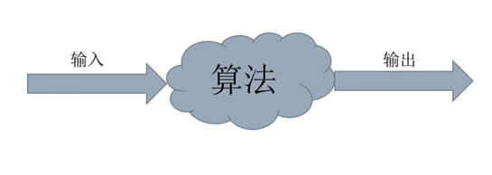


----------------------------


### 二、时间复杂度

#### 1. 问题导入

+ 以下四组代码，哪组运行时间最短？
+ 用什么方式来体现算法运行的快慢？

```python
print('Hello World')
```

```python
for i in range(n):
	print('Hello World')
```
```python
for i in range(n):
	for j in range(n):
		print('Hello World')
```
```python
for i in range(n):
	for j in range(n):
		for k in range(n):
			print('Hello World')
```

#### 2. 问题分析：
+ 我们不知道问题的规模（n 的大小）所以不好确定
+ 在不同的环境下运行的快慢可能不同


#### 3. 时间复杂度的主要作用：

==用来评估算法运行效率的一个式子==
+ 因为各个环境的配置不一样，所以没法精确的衡量出一个时间
+ 在比较两个算法（或多个）的快慢时，现在可以通过一个类似公式的东西让我们能看出算法的快慢


#### 4. 解决问题

+ 我们设上面第一个式子`print('Hello World')`为 **O(1)**~（O实际上是数学里上界的意思，但我们简单把它理解为是一个估计，1理解为是一个单位）~ 

+ 第二个式子定义为 **O(n)**，

+ 第三个式子定义为 **O(n^2^)**

+ 第四个式子定义为 **O(n^3^)**

  

那么我们再来看下面这两个例子：

```python
print('Hello World')
print('Hello Python')
print('Hello Algorithm')
```

我们就将其定义为 **O(1)**

```python
for i in range(n):
	print('Hello World')
	for j in range(n):
		print('Hello World')
```

我们就将其定义为 **O(n^2^)**

为什么呢？因为强调的是一个大概的时间，不是精确。


我们再看一个例子：

```python
while n > 1:
	print(n)
	n = n//2
```
```txt
n = 64输出：
64
32
16
8
4
2
```

$$
2^6=64
$$
$$
log_264=6
$$

所以时间复杂度记为 **O(log~2~n)** 或 **O(logn)**

==当算法过程出现循环折半的时候，复杂度式子中会出现 **logn**==

#### 5. 时间复杂度 - 小结

+ 时间复杂度是用来估计算法运行时间的一个式子（单位）
+ <u>一般来说</u>，时间复杂度高的算法比复杂度低的算法慢
+ 常见的时间复杂度（按效率排序）
  + O(1) < O(logn) < O(n) < O(nlogn) < O(n^2^) < O(n^2^logn) < O(n^3^)
+ 复杂问题的时间复杂度
  + O(n!)   O(2^n^)   O(n^n^) ...


#### 6. 如何简单快速地判断算法复杂度

+ 快速判断算法复杂度（适用于绝大多数简单情况）：
  + **确定问题规模 n**
    eg：对一个列表进行排序，问题规模 n 就是列表的长度
  + **循环减半过程 --> logn**
  + **k层关于n的循环 --> n^k^**
+ 复杂情况：根据算法执行过程判断


---------------------------


### 三、空间复杂度

+ 空间复杂度：用来评估算法内存占用大小的式子
+ 空间复杂度的表示方式与时间复杂度完全一样
  + 算法使用了几个变量：O(1)
  + 算法使用了长度为n的一维列表：O(n)
  + 算法使用了m行n列的二维列表：O(mn)
+ ”空间换时间“（就是这个算法宁可占用更多内存，也要尽可能让它的时间更快）


-------------------------------


### 四、递归

详细学习可看这篇帖子（理解的角度不错）https://blog.csdn.net/m0_37907797/article/details/102767860?ops_request_misc=%257B%2522request%255Fid%2522%253A%2522E149D9A7-2D8D-4131-A6E7-33965905A9E2%2522%252C%2522scm%2522%253A%252220140713.130102334..%2522%257D&request_id=E149D9A7-2D8D-4131-A6E7-33965905A9E2&biz_id=0&utm_medium=distribute.pc_search_result.none-task-blog-2~all~top_positive~default-1-102767860-null-null.142^v100^control&utm_term=%E9%80%92%E5%BD%92&spm=1018.2226.3001.4187

#### 1. 递归的两个特点

+ 调用自身
+ 结束条件

看一个小例子：

```python
def func4(x)
	if x > 0:
		func4(x - 1)
		print(x)
```
输出结果应为：

```txt
1
2
3
```
简单解释一下就是它先递归再打印，这样子套了三层

*ps：慢慢推应该能推出来，要演示的话视频动态效果会更好一点，但。。。额。。。做不到*

#### 2. 递归实例：汉诺塔问题

##### 问题背景

+ 大梵天创造世界的时候做了三根金刚石柱子，在一根柱子上从下往上按照大小顺序摞着64片黄金圆盘
+ 大梵天命令婆罗门把圆盘从下面开始按大小顺序重新乡摆放在另一根柱子上
+ 在小圆盘上不能放大圆盘，在三根柱子之间一次只能移动一个圆盘
+ 64根柱子移动完毕之日，就是世界毁灭之时

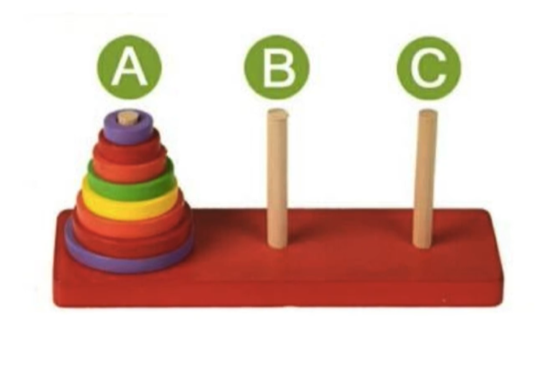

##### 解决问题
+ **n = 2时：**
  + 1. 把小圆盘从 A 移动到 B
  + 2. 把大圆盘从 A 移动到 C
  + 3. 把小圆盘从 B 移动到 C

+ **n 个盘子时：**
  我们把 n - 1 个盘子看成一个整体，下面一个盘子看成一个整体
  + 1. 把 n - 1 个盘子从 A 经过 C 移动到 B
  + 2. 把第 n 个圆盘从 A移动到 C
  + 3. 把 n - 1 个小圆盘从 B 经过 A 移动到 C

#### 3. 代码实现

```python
"""
递归终止条件：n = 0
"""


def hanoi(n, a, b, c):   # n表示几个盘子，a表示从哪个盘子，b表示经过哪个盘子，c表示到哪个盘子
    if n > 0:
        # 把n-1个盘子从a经过c移动到b
        hanoi(n - 1, a, c, b)
        # 把第n个盘子从a移动到c
        print(f"moving from {a} to {c}")
        # 把n-1个盘子从b经过a移动到c
        hanoi(n - 1, b, a, c)


hanoi(3, 'A', 'B', "C")

```

#### 4. 结果

+ 汉诺塔移动次数的递推式：h(x) = 2h(x - 1) + 1
+ h(64) = 18446744073709551615
+ 假设婆罗门每秒搬一个盘子，则总共需要5800亿年

#### 5. 补充

修改递归最大深度
导包：`import sys`
最大递归深度为100000
```python
sys.setrecursionlimit(100000)
```


----------------------------


## 第二章、列表查找

### 一、什么是列表查找

#### 定义

+ **查找**：在一些数据元素中，通过一定的方法找出与给定关键字相同的数据元素的过程

+ **列表查找（线性表查找）**：从列表中查找指定元素
  + 输入：列表、待查找元素
  + 输出：元素下标（未找到元素时一般返回 None 或-1）
  
+ 内置列表查找函数：`index()`

  ps：这玩意是**线性查找**


-------------------------------


### 二、顺序查找

#### 1. 定义

+ **顺序查找**：也叫**线性查找** *（常常有人这么叫）*，从列表第一个元素开始，顺序进行搜索，直到找到元素或搜索到列表最后一个元素为止


#### 2. 代码实现

第一种：

```python
def linear_search(li, value):
    """
    顺序查找
    :param li:列表
    :param value: 待查找的元素
    :return:查找的结果
    """
    for ind, v in enumerate(li):   # enumerate()函数返回索引和值
        if v == value:
            return ind   # 找到返回索引
    return None


# 测试
if __name__ == '__main__':
    li = [1, 2, 3, 4, 5, 6, 7, 8, 9, 10]
    print(linear_search(li, 6))
    print(linear_search(li, 11))
    print(linear_search(li, 1))

```
第二种：

```python
def linear_search(li, value):
    for i in range(len(li)):
        if li[i] == value:
            return i
    return None


# 测试
if __name__ == '__main__':
    li = [1, 2, 3, 4, 5, 6, 7, 8, 9, 10]
    print(linear_search(li, 6))
    print(linear_search(li, 11))

```
*这里给了两种方法，喜欢哪个用哪个，效果一样的*

#### 3. 时间复杂度

时间复杂度：**O(n)**


------------------------------


### 三、二分查找

#### 1. 定义

+ **二分查找**：又叫折半查找，从**有序**列表的初始候选区 li[O: n] 开始，通过对待查找的值与候选区中间值的比较，可以使候选区减少一半

#### 2. 二分查找 - 实例

|  1   |  2   |  3   |  4   |  5   |  6   |  7   |  8   |  9   |
| :--: | :--: | :--: | :--: | :--: | :--: | :--: | :--: | :--: |

从个列表中查找元素3：

+ 1. 找到中间值5，发现5比3大，说明在左侧，则边界变为5- 1 = 4
+ 2. 则为找1和4的中间值，找到2
+ 3. 发现2比3小，说明在2的右侧

#### 3. 代码实现
```python
def binary_search(li, val):
    left = 0
    right = len(li) - 1
    while left <= right:  # 候选区有值就要一直查找
        mid = (left + right) // 2
        if li[mid] == val:
            return mid
        elif li[mid] > val:  # 待查找的值在mid左侧
            right = mid - 1
        else:  # li[mid] < val 待查找的值在mid右侧
            left = mid + 1
    else:
        return None


# 测试
if __name__ == '__main__':
    li = [1, 2, 3, 4, 5, 6, 7, 8, 9]
    print(binary_search(li, 5))
    print(binary_search(li, 10))

```
#### 4. 时间复杂度

时间复杂度：**O(logn)**


那么我们可以看出二分查找比线性查找快很多，那么为什么 `index()` 用的是线性查找呢？

因为二分查找一定要是有序列表，而排序加查找的时间会长于线性查找

#### 补充知识：装饰器

**作用**：测量一个函数的运行时间

ps：直接在递归函数上套用时会显示每一次递归的时间
解决方法：**新定义一个函数，其功能为调用那个递归函数，再在这个函数上套用装饰器**


```python
import time


def call_time(func):
    def wrapper(*args, **kwargs):
        start = time.time()
        result = func(*args, **kwargs)
        end = time.time()
        print(f'{func.__name__}函数运行时间：{end - start}秒')
        return result

    return wrapper

```

**使用方式**：
在要测量量的函数前加上

```python
import 装饰器py文件的名称


@装饰器py文件的名称.call_time
```


------------------------


## 第三章、排序

### 一、什么是列表排序

+ **排序**：将一组“无序”的记录序列调整为“有序”的记录序列
+ **列表排序**：将无序列表变为有序列表
  + 输入：列表
  + 输出：有序列表
+ 升序与降序
+ 内置排序函数：`sort()`


--------------------------


### 二、常见排序算法介绍

#### 排序 Low B 三人组

这三都是**原地排序**

##### 冒泡排序（Bubble Sort）

###### 1. 定义

+ 列表每两个相邻的数，如果前面比后面大，则交换这两个数
+ 一趟排序完成后，则无序区减少一个数，有序区增加一个数
  + 循环一趟会出来一个最大的数，会排 **n - 1** 趟
  + **在第 i 趟时，无序区中箭头会指到第 n - i - 1 个数**
+ 代码关键点：**趟、无序区范围**
+ 改进：如果在一趟过程中没有发生交换，我们就认为已经排好序了，后面剩余的趟就不用进行

###### 2. 代码实现
```python
import random


def bubble_sort(li):
    for i in range(len(li) - 1):   # 第i趟
        exchange = False   # 标志位
        for j in range(len(li) - i - 1):   # 箭头指到第几个数
            if li[j] > li[j+1]:   # 如果想降序排列，将大于号改为小于号
                li[j], li[j+1] = li[j+1], li[j]
                exchange = True
        if not exchange:
            return


if __name__ == '__main__':
    li = [random.randint(0, 10000) for i in range(100)]
    print(li)
    bubble_sort(li)
    print(li)

```

###### 3. 时间复杂度

时间复杂度：**O(n^2^)**


-------------------------------


##### 选择排序

###### 1. 定义

+ 一趟排序记录最小的数，放到第一个位置（在代码中表示为与原先第一个数交换）
+ 再一趟排序记录列表无序区最小的数，放到第二个位置
+ ……
+ 算法关键点：**有序区和无序区、无序区最小数的位置**

###### 2. 代码实现
```python
def select_sort(li):
    for i in range(len(li) - 1):   # i是第几趟，最大需要n - 1趟
        min_loc = i   # 记录最小的那个数出现的位置
        for j in range(i+1, len(li)):
            if li[j] < li[min_loc]:
                min_loc = j
        li[i], li[min_loc] = li[min_loc], li[i]
        print(li)


if __name__ == '__main__':
    li = [3, 4, 5, 2, 9, 8, 6, 4, 8, 2, 1, 5, 0]
    print(li)
    select_sort(li)
    print(li)

```

###### 3. 时间复杂度

时间复杂度：**O(n^2^)**


------------------------


##### 插入排序

###### 1. 定义

+ 初始时手里（有序区）只有一张牌
+ 每次（从无序区）摸一张牌，插入到手里已有牌的正确位置

###### 2. 代码实现

```python
def insert_sort(li):
    for i in range(1, len(li)):   # i表示摸到的牌的下标
        tmp = li[i]   # 存储摸到的牌
        j = i - 1   # j指的是手里的牌的下标
        while j >= 0 and li[j] > tmp:
            li[j+1] = li[j]
            j -= 1
        li[j+1] = tmp


if __name__ == '__main__':
    li = [3, 9, 8, 6, 1, 5, 6, 4, 0, 2, 7]
    insert_sort(li)
    print(li)

```

###### 3. 时间复杂度
时间复杂度：**O(n^2^)**


----------------------------


#### 排序 NB 三人组

##### 快速排序

###### 1. 定义

+ 快速排序：**快**
+ 快速排序思路：
  + 取一个元素 p（第一个元素），使元素 p 归位
  + 列表被 p 分为两部分，左边都比 p 小，右边都比 p 大
  + 递归完成排序
  

排序前：
| **5**    | 7    | 4    | 6    | 3    | 1    | 2    | 9    | 8    |
| ---- | ---- | ---- | ---- | ---- | ---- | ---- | ---- | ---- |

P 归位：
| 2    | 1    | 4    | 3    | **5**    | 6    | 7    | 9    | 8    |
| ---- | ---- | ---- | ---- | ---- | ---- | ---- | ---- | ---- |

目标：
| 1    | 2    | 3    | 4    | **5**    | 6    | 7    | 8    | 9    |
| ---- | ---- | ---- | ---- | ---- | ---- | ---- | ---- | ---- |

###### 2. 代码实现

```python
def partition(li, left, right):   # li表示列表，left、right表示我们要操作的这个列表的范围
    tmp = li[left]    # 创造一个让右边填过来的空位
    while left < right:
        while left < right and li[right] >= tmp:   # 从右边找比tmp小的数
            right -= 1   # 往左走一步
        li[left] = li[right]   # 把右边的值写到左边的空位上
        while left < right and li[left] <= tmp:   # 从左边找比tmp小的数
            left += 1   # 往右走一步
        li[right] = li[left]   # 把左边的值写到右边的空位上
    li[left] = tmp   # 把tmp归位
    return left


def quick_sort(li, left, right):
    if left < right:
        mid = partition(li, left, right)
        quick_sort(li, left, mid-1)   # 左边那一部分
        quick_sort(li, mid+1, right)   # 右边那一部分


if __name__ == '__main__':
    li = [5, 7, 4, 6, 3, 1, 2, 9, 8]
    quick_sort(li, 0, len(li)-1)
    print(li)

```

###### 3. 快速排序的其他问题

+ 快速排序的效率：
  + 快速排序的时间复杂度 **O(nlogm)**

+ 快速排序的问题：
  + 最坏情况：当每次只移动一个数时，时间复杂度就是 O(n^2^)
  + 递归


---------------------


##### 堆排序

###### 1. 堆排序前传 - 树

+ 树是一种数据结构	比如：目录结构
+ 树是一种可以递归定义的数据结构
+ 树是由 n 个节点组成的集合：
  + 如果 n = 0 ，那这是一棵空树
  + 如果 n > 0 ，那存在1个节点作为树的根节点，其他节点可以分为 m 个集合，每个集合本身又是一棵树

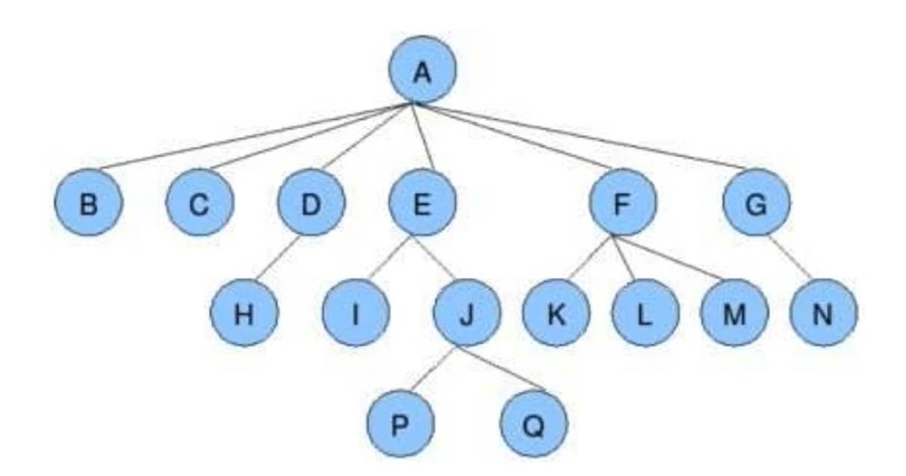

+ 一些概念
  + **根节点、叶子节点**【A 就是根节点，不能分叉的节点就是叶子节点】
  + **树的深度（高度）**【看它最深有几层，比如这个就是4层】
  + **树的度**【就是分了几个叉】
  + **孩子节点 / 父节点**【比如 E 是 I 的父节点，I 是 E 的孩子节点】
  + **子树**【比如 EIJPQ 就构成一棵子树】

###### 2. 堆排序前传 - 二叉树

+ **二叉树**：度不超过2的树
+ 每个节点最多有两个孩子节点
+ 两个孩子节点被区分为左孩子节点和右孩子节点

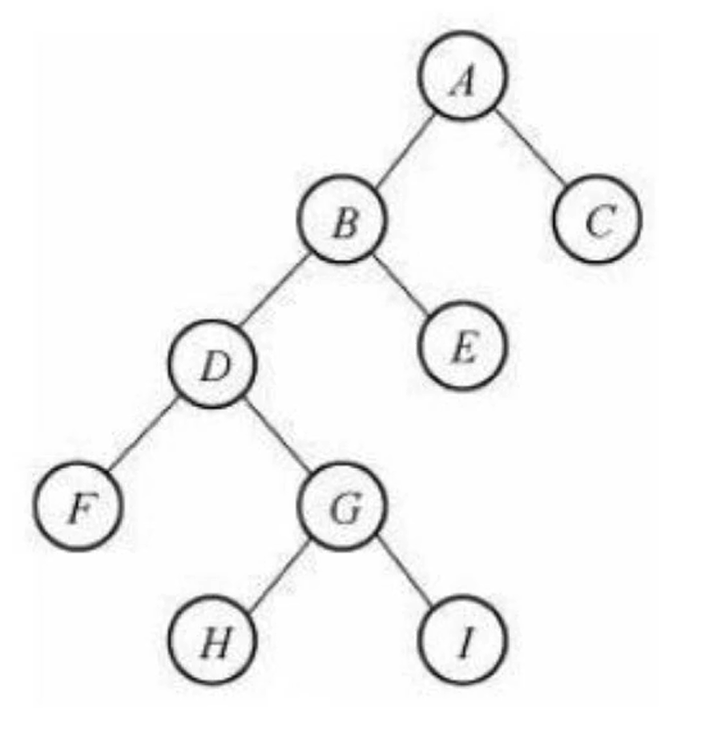

###### 3. 堆排序前传 - 完全二叉树

+ **满二叉树**：一个二叉树，如果每一个层的节点数都达到最大值，则这个二叉树就是满二叉树
+ **完全二叉树**：叶节点只能出现在最下层和次下层并且最下面一层的节点都集中在该层最左边的若干位置的二叉树（最下一排可以不满，但是必须从左依次排过来）

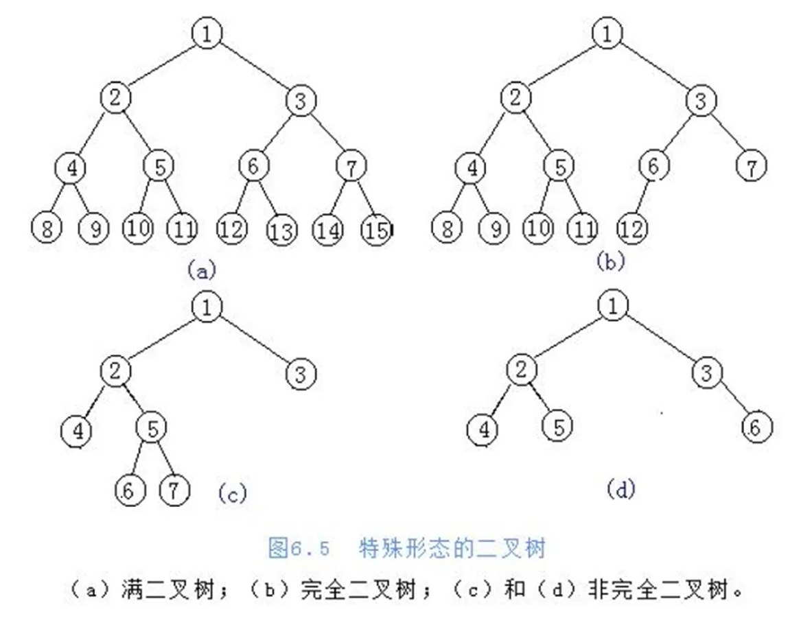

###### 4. 堆排序前传 - 二叉树的存储方式

+ 二叉树的存储方式（表示方式）
  + **链式存储方式** ------ ps：以后再讲
  + **顺序存储方式**

+ 顺序存储方式
  + 父亲节点和左孩子节点的编号下标有什么关系？
    + 0-1  1-3  2-5  3-7  4-9
    + **i → 2i+1**
  + 父节点和右孩子节点的编号下标有什么关系？
    + 0-2  1-4  2-6  3-8  4-10
    + **i → 2i+2**
  + 不管是左孩子还是右孩子他们的爹都是**(n-1)//2**

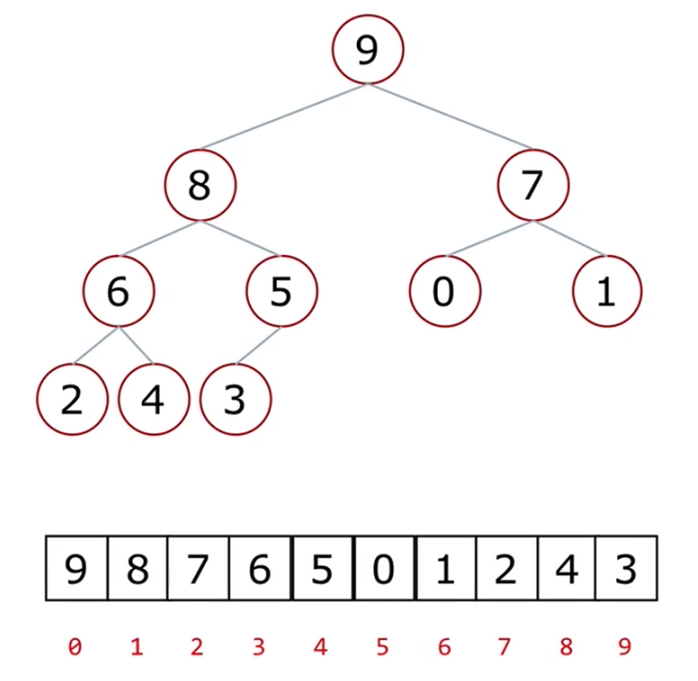

###### 5. 堆排序 - 什么是堆

+ **堆**：一种特殊的完全二叉树结构
  + **大根堆**：一棵完全二叉树，满足任一节点都比其孩子节点大
  + **小根堆**：一棵完全二叉树，满足任一节点都比其孩子节点小

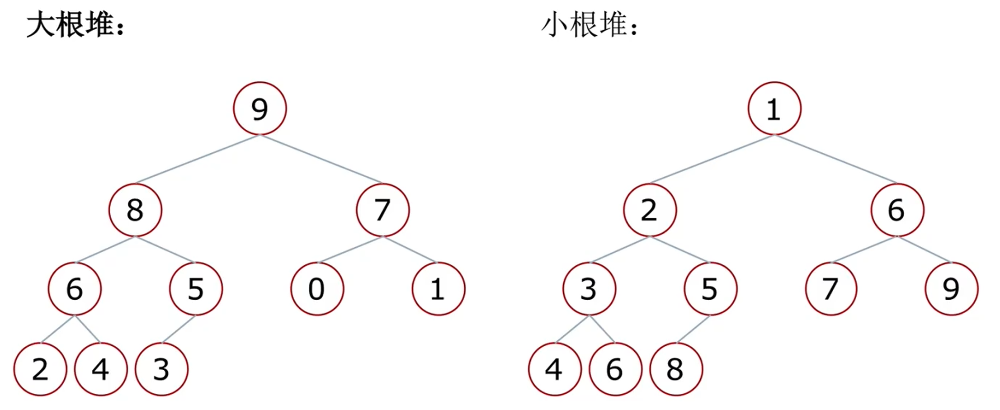

###### 6. 堆排序 - 堆的向下调整性质

+ 假设根节点的左右子树都是堆，但根节点不满足堆的性子
+ 可以通过一次向下的调整来将其变成一个堆

###### 7. 堆排序的过程

+ 1. 建立堆【从最小的子树开始一个个调整】
+ 2. 得到堆顶元素，为最大元素
+ 3. 去掉堆顶，将堆最后一个元素放到堆顶，此时可通过一次调整重新使堆有序
+ 4. 堆顶元素为第二大元素
+ 5. 重复步骤3，直到堆变成空

###### 8. 代码实现

```python
def sift(li, low, high):
    """
    向下调整函数
    :param li:列表
    :param low: 堆的根节点
    :param high: 堆的最后一个元素的位置
    :return:
    """
    i = low   # i最开始指向根节点
    j = 2 * i + 1   # j开始是左孩子
    tmp = li[low]   # 把堆顶存起来
    while j <= high:   # 只要j位置有数，就一直循环
        if j + 1 <= high and li[j+1] > li[j]:   # 如果右孩子有并且比较大
            j += 1   # j指向右孩子
        if li[j] > tmp:
            li[i] = li[j]
            i = j   # 往下看一层
            j = 2 * i + 1
        else:   # tmp更大，把tmp放到i的位置上
            li[i] = tmp   # 把tmp放到某一级领导位置上
            break
    else:
        li[i] = tmp   # 把tmp放到叶子节点上


def heap_sort(li):
    n = len(li)
    for i in range((n-2)//2, -1, -1):   # 不管是左孩子还是右孩子他们的爹都是(n-1)//2
        # i表示建堆的时候调整的部分的根的下标
        sift(li, i, n-1)   # 将最后一个叶子节点当作high
    # 建堆完成了
    for i in range(n-1, -1, -1):
        # i指向当前堆的最后一个元素
        li[0], li[i] = li[i], li[0]
        sift(li, 0, i-1)   # i-1是新的high


if __name__ == '__main__':
    li = [i for i in range(100)]
    import random
    random.shuffle(li)   # 打乱列表
    print(li)

    heap_sort(li)
    print(li)

```

###### 9. 时间复杂度

时间复杂度：**O(nlogn)**

###### 10. 堆排序 - 内置模块

导包：`import heapq`
```python
import heapq   # q -> queue 优先队列
import random

li = list(range(100))
random.shuffle(li)

print(li)

heapq.heapify(li)   # 建堆

n = len(li)
for i in range(n):
    print(heapq.heappop(li), end=',')

```

###### 11. 堆排序 - topk 问题
+ 现在有 n 个数，设计算法得到前 k 大的数（k < n）
+ 解决思路：
  + 排序后切片  		**O(nlogn+k)**
  + 排序 LowB 三人组	**O(kn)**
  + 堆排序思路  		**O(nlogk)**

+ 堆排序解决思路：
  + 取列表前 k 个元素建立一个小根堆。堆顶就是目前第 k 大的数
  + 依次向后遍历原列表，对于列表中的元素，如果小于堆顶，则忽略该元素；如果大于堆顶，则将堆顶更换为该元素，并且对堆进行一次调整

+ 代码实现

```python
def sift(li, low, high):
    """
    向下调整函数
    :param li:列表
    :param low: 堆的根节点
    :param high: 堆的最后一个元素的位置
    :return:
    """
    i = low   # i最开始指向根节点
    j = 2 * i + 1   # j开始是左孩子
    tmp = li[low]   # 把堆顶存起来
    while j <= high:   # 只要j位置有数，就一直循环
        if j + 1 <= high and li[j+1] < li[j]:   # 如果右孩子有并且比较大
            j += 1   # j指向右孩子
        if li[j] < tmp:
            li[i] = li[j]
            i = j   # 往下看一层
            j = 2 * i + 1
        else:   # tmp更大，把tmp放到i的位置上
            li[i] = tmp   # 把tmp放到某一级领导位置上
            break
    else:
        li[i] = tmp   # 把tmp放到叶子节点上


def topk(li, k):
    heap = li[0:k]
    for i in range((k-2)//2, -1, -1):
        sift(heap, i, k-1)
    # 1.建堆
    for i in range(k, len(li)):
        if li[i] > heap[0]:
            heap[0] = li[i]
            sift(heap, 0, k-1)
    # 2.遍历
    for i in range(k-1, -1, -1):
        heap[0], heap[i] = heap[i], heap[0]
        sift(heap, 0, i-1)
    # 3.出数
    return heap


if __name__ == '__main__':
    import random
    li = list(range(1000))
    random.shuffle(li)
    print(topk(li, 10))

```


----------------------


##### 归并排序

###### 1. 归并排序 - 归并

+ 假设现在的列表分两段**有序**，如何将其合成为一个有序列表

|  2   |  5   |  7   |  8   |  9   |
| :--: | :--: | :--: | :--: | :--: |

|  1   |  3   |  4   |  6   |
| :--: | :--: | :--: | :--: |

+ 这种操作称为一次归并

代码实现：
```python
def merge(li, low, mid, high):
    i = low
    j = mid + 1
    ltmp = []
    while i <= mid and j <= high:   # 只要左右两边都有数
        if li[i] < li[j]:
            ltmp.append(li[i])
            i += 1
        else:
            ltmp.append(li[j])
            j += 1
    # while执行完，肯定有一部分没数了
    while i <= mid:
        ltmp.append(li[i])
        i += 1
    while j <= high:
        ltmp.append(li[j])
        j += 1
    li[low:high+1] = ltmp


if __name__ == '__main__':
    li = [2, 4, 5, 7, 1, 3, 6, 8]
    merge(li, 0, 3, 7)
    print(li)
```

###### 2. 归并排序 - 使用归并

+ 分解：将列表越分越小，直至分成一个元素
+ 终止条件：一个元素是有序的
+ 合并：将两个有序列表归并，列表越大越好

流程图：

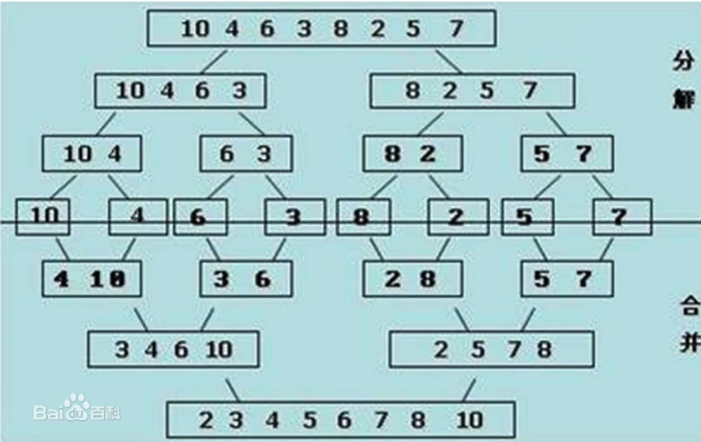

###### 3. 归并排序 - 代码

```python
import random


def merge(li, low, mid, high):
    i = low
    j = mid + 1
    ltmp = []
    while i <= mid and j <= high:  # 只要左右两边都有数
        if li[i] < li[j]:
            ltmp.append(li[i])
            i += 1
        else:
            ltmp.append(li[j])
            j += 1
    # while执行完，肯定有一部分没数了
    while i <= mid:
        ltmp.append(li[i])
        i += 1
    while j <= high:
        ltmp.append(li[j])
        j += 1
    li[low:high + 1] = ltmp


def merge_sort(li, low, high):
    if low < high:   # 至少有两个元素，递归
        mid = (low + high)//2
        merge_sort(li, low, mid)
        merge_sort(li, mid+1, high)
        merge(li, low, mid, high)


if __name__ == '__main__':
    li = list(range(1000))
    random.shuffle(li)
    print(li)
    merge_sort(li, 0, len(li)-1)
    print(li)

```

###### 4. 时间复杂度

时间复杂度：**O(nlogn)**
空间复杂度：**O(n)**

**拓展**：Python 的 `sort()` 代码内部实现是基于归并排序的，它使用了一个叫做 teamsort 的新式排序算法，结合了归并排序和插入排序


##### NB 三人组小结
+ 三种排序算法的时间复杂度都是 **O(nlogn)**
+ 一般情况下，就运行时间而言：
  + 快速排序 < 归并排序 < 堆排序
+ 三种排序算法的优缺点：
  + **快速排序**：极端情况下排序效率低
  + **归并排序**：需要额外的内存开销
  + **堆排序**：在快的排序算法中相对较慢

图表总结：

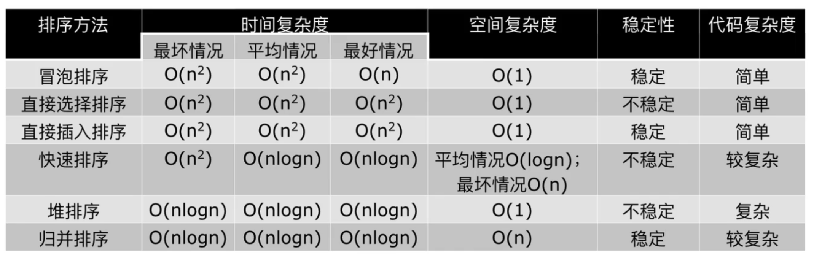


-----------------------


#### 其他排序

##### 希尔排序

###### 1. 定义

+ 希尔排序（Shell Sort）是一种分组插入排序算法
+ 首先取一个整数 d~1~ = n/2，将元素分为 d~1~ 个组，每组相邻两元素之间距离为 d~1~，每组内进行直接插入排序
+ 取第二个整数 d~2~ = d~1~/2，重复上述分组排序过程，直到 d~1~，即所有元素在同一组内进行直接插入排序
+ 希尔排序每趟（每次拿一个 d 每组之间排一次序）并不使某些元素有序，而是使整体数据越来越接近有序；最后一趟排序使得所有数据有序


###### 2. 代码实现

好多好多实现方式中的一种

```python
def insert_sort_gap(li, gap):
    for i in range(gap, len(li)):   # i表示摸到的牌的下标
        tmp = li[i]   # 存储摸到的牌
        j = i - gap   # j指的是手里的牌的下标
        while j >= 0 and li[j] > tmp:
            li[j+gap] = li[j]
            j -= gap
        li[j+gap] = tmp


def shell_sort(li):
    d = len(li)//2
    while d >= 1:
        insert_sort_gap(li, d)
        d //= 2


if __name__ == '__main__':
    li = list(range(1000))
    import random
    random.shuffle(li)
    shell_sort(li)
    print(li)
    
```

###### 3. 希尔排序 - 讨论

+ 希尔排序的时间复杂度讨论比较复杂，并且和选取的 gap 序列有关
  + 不同实现方式的 gap 选择不一样，导致时间复杂度也有所不同


----------------------


##### 计数排序

###### 1. 定义

+ 对列表进行排序，已知列表中的数范围都在0到100之间。设计时间复杂度为 **O(n)** 的算法

###### 2. 代码实现

```python
def count_sort(li, max_count=100):
    count = [0 for _ in range(max_count+1)]
    for val in li:
        count[val] += 1
    li.clear()
    for ind, val in enumerate(count):
        for i in range(val):
            li.append(ind)


if __name__ == '__main__':
    import random
    li = [random.randint(0, 100) for _ in range(1000)]
    count_sort(li)
    print(li)
    
```

###### 3. 时间复杂度
时间复杂度：**O(n)**


---------------------------


##### 桶排序

ps：用的不是很多

###### 1. 定义

+ 在计数排序中，如果元素范围比较大（比如在1到1亿之间），如何改造算法？
+ 桶排序（Bucket Sort）：首先将元素分在不同的桶中，再对每个桶中的元素排序

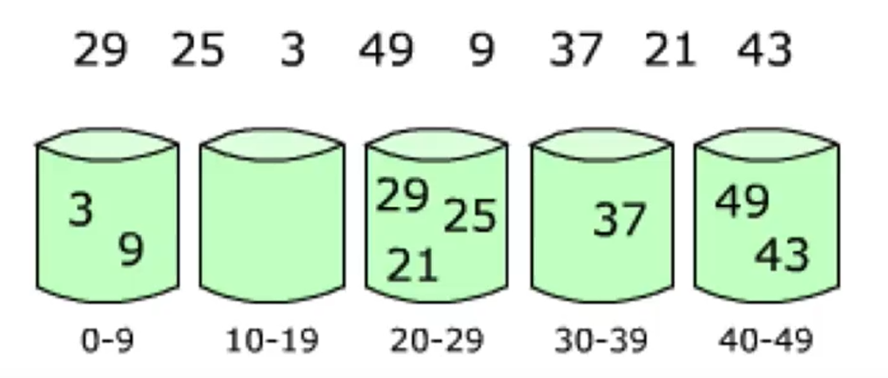

###### 2. 代码实现

```python
def bucket_sort(li, n=100, max_num=10000):
    buckets = [[] for _ in range(n)]  # 创建桶
    for var in li:
        i = min(var // (max_num // n), n-1)   # i表示var放到几号桶里
        buckets[i].append(var)   # 把var加到桶里
        # 保持桶里的顺序
        for j in range(len(buckets[i])-1, 0, -1):
            if buckets[i][j] < buckets[i][j-1]:
                buckets[i][j], buckets[i][j-1] = buckets[i][j-1], buckets[i][j]
            else:
                break
    sorted_li = []
    for buc in buckets:
        sorted_li.extend(buc)
    return sorted_li


if __name__ == '__main__':
    import random
    li = [random.randint(0, 10000) for i in range(100000)]
    print(li)
    li = bucket_sort(li)
    print(li)

```

###### 3. 桶排序 - 效率
+ 桶排序的表现取决于数据的分布，也就是需要对不同数据排序时采取不同的分桶策略
+ 平均情况时间复杂度：**O(n+k)**
+ 最坏情况时间复杂度：**O(n^2^k)**
+ 空间复杂度：**O(nk)**


---------------------------


##### 基数排序

+ 多关键字排序：假如现在有一个员工表，要求按照薪资排序，年龄形同的员工按照年龄排序
  + 先按照年龄进行排序，再按照薪资进行稳定的排序

+ 对32，13，94，52，17，54，93排序，是否可以看做多关键字排序？
  + 先对个位进行桶排序，对刚刚排序的结果，再进行一次十位的桶排序

###### 1. 代码实现

```python
def radix_sort(li):
    max_num = max(li)   # 最大值 9 -> 1，99 -> 2，888 ->3，10000 -> 5
    it = 0   # 迭代多少次
    while 10 ** it <= max_num:
        buckets = [[] for _ in range(10)]   # 分十个桶
        for var in li:   # 对于每一个元素把它放进桶里去
            # eg：987%10 -> 取个位， 987//10->98 98%10->8 -> 取十位数
            digit = (var // 10 ** it) % 10
            buckets[digit].append(var)
        # 分桶完成
        li.clear()
        for buc in buckets:
            li.extend(buc)
        # 把数重新写回li
        it += 1


if __name__ == '__main__':
    import random
    li = list(range(1000))
    random.shuffle(li)
    radix_sort(li)
    print(li)

```

###### 2. 基数排序 - 讨论

+ 时间复杂度：**O(kn)**   【k 就是 while 循环执行几次】
+ 空间复杂度：O(k+n)
+ k 表示数字位数


ps：基数排序不一定比快速排序要快，和数的范围有关


-----------------------------


### 三、排序算法分析

#### 查找排序相关面试题

##### 第一题

> + 1. 给两个字符串 s 和 t，判断 t 是否为 s 的重新排序后组成的单词
>   + s = "anagram", t = "nagaram", return true
>   + s = "rat", t = "car", return false

###### 代码实现1

```python
class Solution:
    def isAnagram(self, s, t):
        """
        :type s: str
        :type t: str
        :rtype: bool
        """
        ss = list(s)
        tt = list(t)
        ss.sort()
        tt.sort()
        return ss == tt


if __name__ == '__main__':
    solution = Solution()
    result = solution.isAnagram("agajdadw", "fsgaeg")
    print(result)

```
```python
class Solution:
    def isAnagram(self, s, t):
        """
        :type s: str
        :type t: str
        :rtype: bool
        """
        return sorted(list(s)) == sorted(list(t))   # sorted()不改原来的列表，而是返回一个新列表


if __name__ == '__main__':
    solution = Solution()
    result = solution.isAnagram("agajdadw", "fsgaeg")
    print(result)

```
时间复杂度：**O(n)**

###### 代码实现2
```python
class Solution:
    def isAnagram(self, s, t):
        """
        :type s: str
        :type t: str
        :rtype: bool
        """
        dict1 = {}   # {'a': 1, 'b': 2}
        dict2 = {}
        for ch in s:
            dict1[ch] = dict1.get(ch, 0) + 1   # 遍历字符串s，将每个字符作为键，出现次数作为值存入字典dict1中
        for ch in t:
            dict2[ch] = dict2.get(ch, 0) + 1
        return dict1 == dict2


if __name__ == '__main__':
    solution = Solution()
    result = solution.isAnagram("agajdadw", "fsgaeg")
    print(result)

```


-------------------------------------------


##### 第二题

> + 2. 给定一个 m*n 的二维列表，查找一个数是否存在。列表有下列特性：
>   + 每一行的列表从左到右已经排序好
>   + 每一行第一个数比上一行最后一个数大

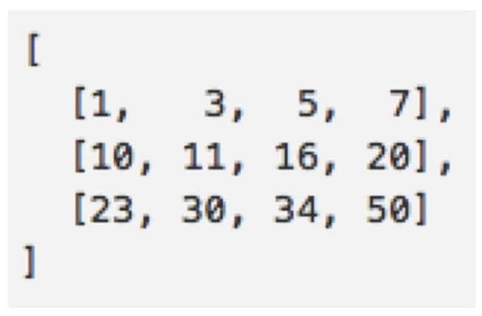

###### 代码实现1【线性查找】

```python
class Solution:
    def searchMatrix(self, matrix, target):
        """
        :type matrix: List[List[int]]
        :type target: int
        :rtype: bool
        """
        for line in matrix:
            if target in line:
                return True
        return False


if __name__ == '__main__':
    solution = Solution()
    result = solution.searchMatrix([[1, 3, 5, 7], [10, 11, 16, 20], [23, 30, 34, 50]], 16)
    print(result)

```
时间复杂度：**O(mn)**    【假设二维数组为 m*n】
ps：慢的一批

###### 代码实现2【二分查找】

```python
class Solution:
    def searchMatrix(self, matrix, target):
        """
        :type matrix: List[List[int]]
        :type target: int
        :rtype: bool
        """
        h = len(matrix)
        if h == 0:
            return False   # []
        w = len(matrix[0])
        if w == 0:
            return False
        left = 0
        right = w * h - 1
        while left <= right:
            mid = (left + right) // 2
            i = mid // w
            j = mid % w
            if matrix[i][j] == target:
                return True
            elif matrix[i][j] > target:
                right = mid - 1
            else:
                left = mid + 1
        else:
            return False


if __name__ == '__main__':
    solution = Solution()
    result = solution.searchMatrix([[1, 3, 5, 7], [10, 11, 16, 20], [23, 30, 34, 50]], 16)
    print(result)

```


---------------------------------------------


##### 第三题

> + 3. 给定一个列表和一个整数，设计算法找到两个数的下标，使得两个数之和为给定的整数。保证肯定仅有一个结果
>   + 例如，列表 [1, 2, 5, 4] 与目标整数3，1 + 2 = 3，结果为 (0, 1)

###### 第一种：排好序的
```python
class Solution:
    def binary_search(self, li, left, right, val):
        left = 0
        right = len(li) - 1
        while left <= right:  # 候选区有值就要一直查找
            mid = (left + right) // 2
            if li[mid] == val:
                return mid
            elif li[mid] > val:  # 待查找的值在mid左侧
                right = mid - 1
            else:  # li[mid] < val 待查找的值在mid右侧
                left = mid + 1
        else:
            return None

    def twoSum(self, nums, target):
        """
        :type nums: List[int]
        :type target: int
        :rtype: List[int]
        """
        for i in range(len(nums)):
            a = nums[i]
            b = target - a
            if b >= a:
                j = self.binary_search(nums, i+1, len(nums)-1, b)
            else:
                j = self.binary_search(nums, 0, i-1, b)
            if j:
                break
        return sorted([i+1, j+1])


if __name__ == '__main__':
    solution = Solution()
    result = solution.twoSum([5, 25, 75], 100)
    print(result)

```

###### 第二种：无序

```python
class Solution:
    def binary_search(self, li, left, right, val):
        left = 0
        right = len(li) - 1
        while left <= right:  # 候选区有值就要一直查找
            mid = (left + right) // 2
            if li[mid][0] == val:
                return mid
            elif li[mid][0] > val:  # 待查找的值在mid左侧
                right = mid - 1
            else:  # li[mid] < val 待查找的值在mid右侧
                left = mid + 1
        else:
            return None

    def twoSum(self, nums, target):
        """
        :type nums: List[int]
        :type target: int
        :rtype: List[int]
        """
        new_nums = [[num, i] for i, num in enumerate(nums)]
        new_nums.sort(key=lambda x: x[0])
        for i in range(len(new_nums)):
            a = new_nums[i][0]
            b = target - a
            if b >= a:
                j = self.binary_search(new_nums, i+1, len(new_nums)-1, b)
            else:
                j = self.binary_search(new_nums, 0, i-1, b)
            if j:
                break
        return sorted([new_nums[i][1], new_nums[j][1]])


if __name__ == '__main__':
    solution = Solution()
    result = solution.twoSum([25, 5, 75], 100)
    print(result)

```

###### 时间复杂度
时间复杂度：**O(nlogn)**


-------------------------------------------


## 第四章、数据结构

### 一、线性的数据结构

+ 数据结构是指相互之间存在着一种或多种关系的数据元素的集合和该集合中数据元素之间的关系组成
+ 简单来说，数据结构就是设计数据以何种方式组织并存储在计算机中
+ 比如：列表、集合与字典都是一种数据结构
+ N.Wirth："**程序 = 数据结构 + 算法**"

#### 1. 数据结构分类

+ 数据结构按照其逻辑结构可分为线性结构\树结构\图结构
  + **线性结构**：数据结构中的元素存在一对一的相互关系
  + **树结构**：数据结构中的元素存在一对多的相互关系
  + **图结构**：数据结构中的元素存在多对多的相互关系


----------------------------------------


#### 2. 列表

##### 2.1 列表/数组

数组和列表有两点不一样：
1. 数组元素类型要相同
2. 数组长度固定

+ 列表（其他语言称数组）是一种基本数据类型
+ 关于列表的问题：
  + 列表中的元素是如何存储的？
  + 列表的基本操作：按下标查找、插入元素、删除元素......
  + 这些操作的时间复杂度是多少？
+ 扩展：Python 的列表是如何实现的？
  + 会指向另一个存储了数据的地址（不是单纯存储在列表中）

ps：插入和删除对于列表来说都是 **O(n)** 的复杂度


-------------------------------------


#### 3. 栈
##### 3.1 定义

+ 栈（Stack）是一个数据集合，可以理解为只能在一端进行插入或者删除操作的列表
+ 栈的特点：后进先出 LIFO（Last-in，First-out）
+ 栈的概念：栈顶、栈底
+ 栈的基本操作：
  + 进栈（压栈）：push
  + 出栈：pop
  + 取栈顶：gettop

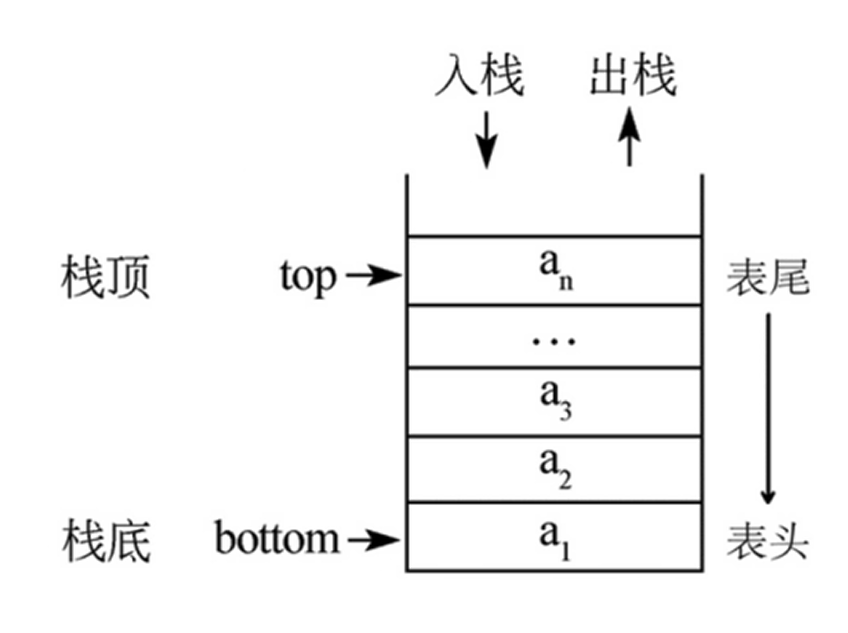

##### 3.2 栈的实现
+ 使用一般的列表结构即可实现栈
  + **进栈**：`li.append`
  + **出栈**：`li.pop`
  + **取栈顶**：`li[-1]`

##### 代码实现
```python
class Stack:
    def __init__(self):
        self.stack = []

    def push(self, element):
        self.stack.append(element)

    def pop(self):
        return self.stack.pop()

    def get_top(self):
        if len(self.stack) > 0:
            return self.stack[-1]
        else:
            return None


if __name__ == '__main__':
    stack = Stack()
    stack.push(1)
    stack.push(2)
    stack.push(3)
    print(stack.pop())

```

##### 3.3 栈的应用 - 括号匹配问题
+ 括号匹配问题：给一个字符串，其中包括小括号、中括号、大括号，求该字符串中的括号是否匹配
+ 例如：
  + ()()[]{}	匹配
  + ([{()}])	匹配
  + ([]             不匹配
  + [(])	    不匹配

##### 3.4 代码实现
```python
class Stack:
    def __init__(self):
        self.stack = []

    def push(self, element):
        self.stack.append(element)

    def pop(self):
        return self.stack.pop()

    def get_top(self):
        if len(self.stack) > 0:
            return self.stack[-1]
        else:
            return None

    def is_empty(self):
        return len(self.stack) == 0


def brace_match(s):
    match = {'}': '{', ']': '[', ')': '('}
    stack = Stack()
    for ch in s:
        if ch in {'(', '[', '{'}:
            stack.push(ch)
        else:  # ch in {'}', ']', ')'}
            if stack.is_empty():
                return False
            elif stack.get_top() == match[ch]:
                stack.pop()
            else:  # stack.get_yop() != match[ch]
                return False
    if stack.is_empty():
        return True
    else:
        return False


if __name__ == '__main__':
    print(brace_match('[{}{()}({[]})]'))
    print(brace_match('{}{(])[]][)(){}{}{'))

```


--------------------------------------


#### 4. 队列
##### 4.1 定义
+ 队列（Queue）是一个数据集合，仅允许在列表的一段进行插入，另一端进行删除
+ 进行插入的一段称为队尾（rear），插入动作称为进队或入队
+ 进行删除的一端称为队头（front），删除动作称为出队
+ 队列的性质：先进先出（First-in，First-out）

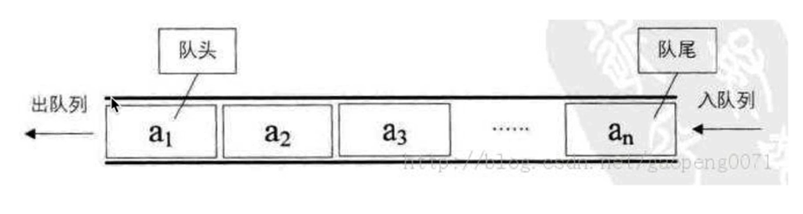

##### 4.2 队列的实现
+ 队列能否用列表简单实现？为什么？

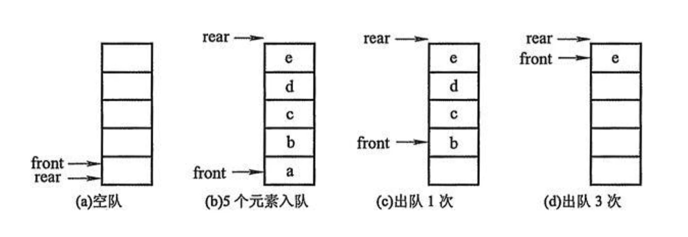

这样的话前面的空间会被浪费

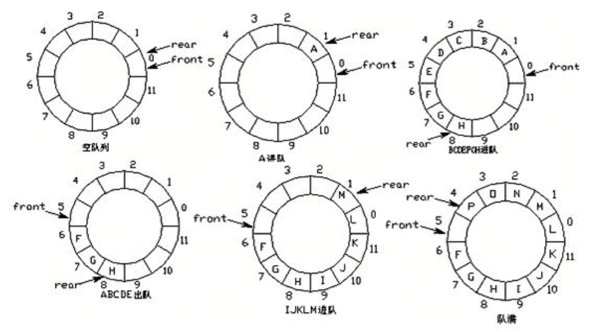


##### 4.3 队列的实现 - 环形队列
+ 环形队列：当队首指针 front == Maxsize + 1时，再前进一个位置就自动到0
  + 队首指针前进1：front = (front + 1) % MaxSize
  + 队尾指针前进1：rear = (rear + 1) % MaxSize
  + 队空条件：rear == front
  + 队满条件：(rear + 1) % MaxSize == front

##### 4.4 代码实现
```python
class Queue:
    def __init__(self, size=100):
        self.queue = [0 for _ in range(size)]
        self.size = size
        self.rear = 0  # 队尾指针
        self.front = 0  # 对首指针

    def push(self, element):
        if not self.is_filled():
            self.rear = (self.rear + 1) % self.size
            self.queue[self.rear] = element
        else:
            raise IndexError("Queue is filled")
        
    def pop(self):
        if not self.is_empty():
            self.front = (self.front + 1) % self.front
            return self.queue[self.front]
        else:
            raise IndexError("Queue is empty")
    
    # 判断队空
    def is_empty(self):
        return self.rear == self.front
        
    # 判断队满
    def is_filled(self):
        return (self.rear + 1) % self.size == self.front
    

if __name__ == '__main__':
    q = Queue(5)
    for i in range(4):
        q.push(i)
    print(q.pop())
    q.push(4)

```


-----------------------------------


##### 4.5 双向队列
双向队列

+ 双向队列的两端都支持进队和出队操作
+ 双向队列的基本操作：
  + 队首进队
  + 队首出队
  + 队尾进队
  + 队尾出队

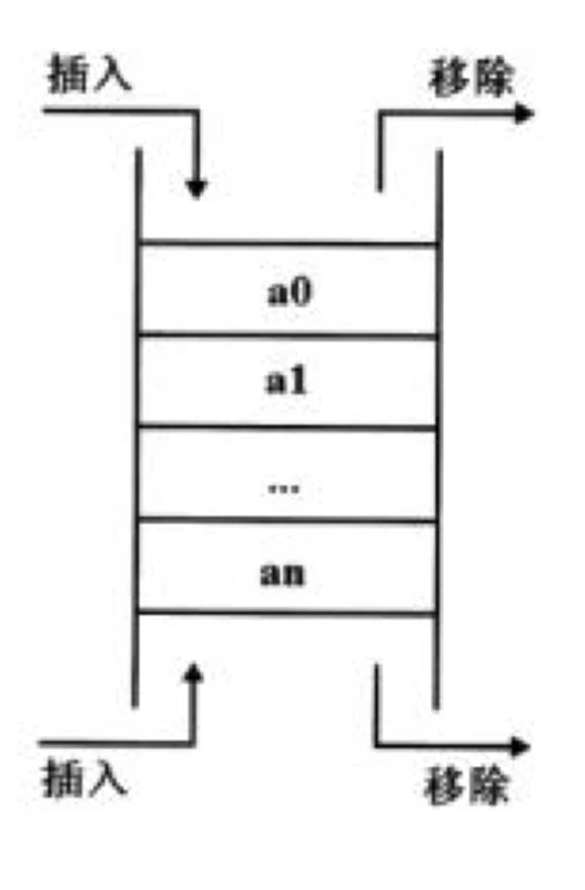

##### 4.6 Python 队列内置模块

+ 使用方法：`from collections import deque`
  + 创建队列：`queue = deque()`
  + 进队：`append()`
  + 出队：`popleft()`
  + 双向队列队首进队：`appendleft()`
  + 双向队列队尾出队：`pop()`

```python
from collections import deque

q = deque([1, 2, 3, 4, 5], 5)  # 创建一个队列【第一个参数是队列，第二个参数是最大长度（队满了前面的自动出队）】
q.append(6)  # 队尾进队
print(q.popleft())  # 2 # 队首出队

# 用于双向队列
q.appendleft(1)  # 队首进队
q.pop()  # 队尾出队
```

###### 代码实现
+ 打印一个文件后五行的内容

+ txt 文件

```txt
123
1234
12345
asas
xdewd
asefqrgrt
dwefwef
sdad
efwef
saa
```

+ py 文件

```python
from collections import deque


def tail(n):
    with open('test.txt', 'r') as f:
        q = deque(f, n)
        return q


for line in tail(5):
    print(line, end='')  # 打印文件后五行的内容

```


---------------------------------------


#### 5. 栈和队列的应用 - 迷宫问题

+ 给一个二维列表，表示迷宫（0表示通道，1表示围墙）。给出算法，求一条走出迷宫的路径

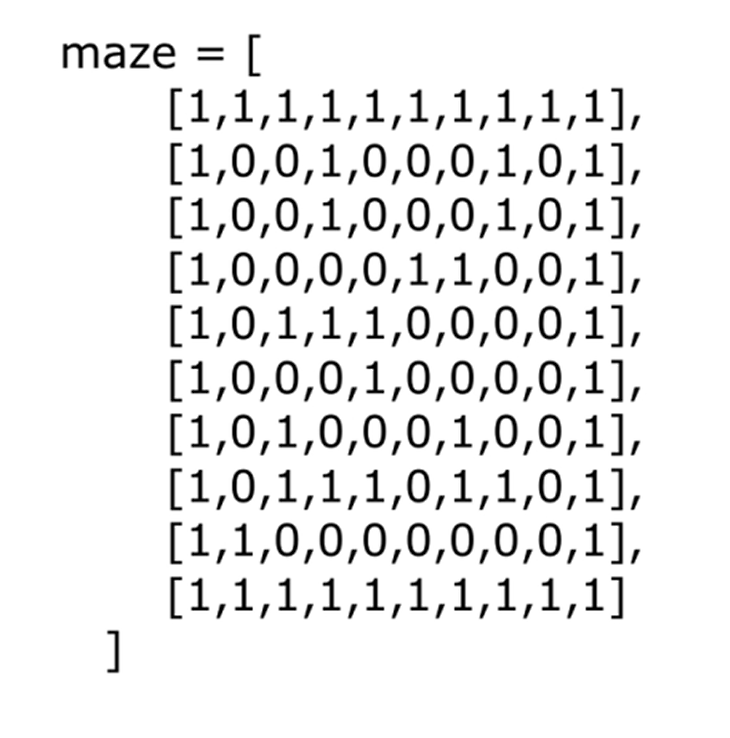            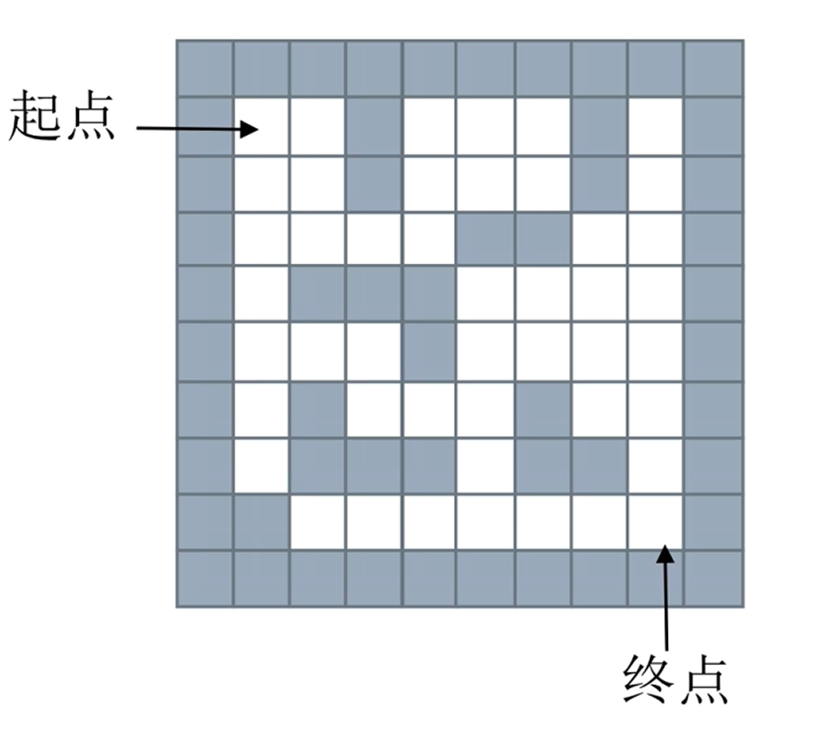


+ 可以通过栈和队列两种方法来做

##### 5.1 栈 - 深度优先搜索

+ 回溯法
+ 思路:从一个节点开始,任意找下一个能走的点,当找不到能走的点时,退回上一个点寻找是否有其他方向的点
+ 使用栈存储当前路径

###### 代码实现
```python
maze = [
    [1, 1, 1, 1, 1, 1, 1, 1, 1, 1],
    [1, 0, 0, 1, 0, 0, 0, 1, 0, 1],
    [1, 0, 0, 1, 0, 0, 0, 1, 0, 1],
    [1, 0, 0, 0, 0, 1, 1, 0, 0, 1],
    [1, 0, 1, 1, 1, 0, 0, 0, 0, 1],
    [1, 0, 0, 0, 1, 0, 0, 0, 0, 1],
    [1, 0, 1, 0, 0, 0, 1, 0, 0, 1],
    [1, 0, 1, 1, 1, 0, 1, 1, 0, 1],
    [1, 1, 0, 0, 0, 0, 0, 0, 0, 1],
    [1, 1, 1, 1, 1, 1, 1, 1, 1, 1]
]

dirs = [
    lambda x, y:(x + 1, y),
    lambda x, y:(x - 1, y),
    lambda x, y:(x, y - 1),
    lambda x, y:(x, y + 1)
]


def maze_path(x1, y1, x2, y2):  # x1、y1表示起点位置，x2、y2表示终点位置
    stack = []
    stack.append((x1, y1))  # 因为元素是一个二维的东西，所以存的是元组
    while(len(stack) > 0):
        curNode = stack[-1]  # 当前的位置
        if curNode[0] == x2 and curNode[1] == y2:
            # 走到终点了
            for p in stack:
                print(p)
            return True

        # x，y 上下左右 四个方向 (x-1, y); (x+1, y); (x, y-1); (x, y+1)
        for dir in dirs:
            nextNode = dir(curNode[0], curNode[1])
            # 如果下一个节点能走
            if maze[nextNode[0]][nextNode[1]] == 0:
                stack.append(nextNode)
                maze[nextNode[0]][nextNode[1]] = 2  # 2表示这个位置已经走过了
                break
        else:
            maze[nextNode[0]][nextNode[1]] = 2
            stack.pop()
    else:
        print("没有路")
        return False


if __name__ == '__main__':
    maze_path(1, 1, 8, 8)

```


-----------------------------------


##### 5.2 队列 - 广度优先搜索
+ 思路:从一个节点开始,寻找**所有**接下来能继续走的点,继续不断寻找,直到找到出口
+ 使用队列存储当前正在考虑的节点

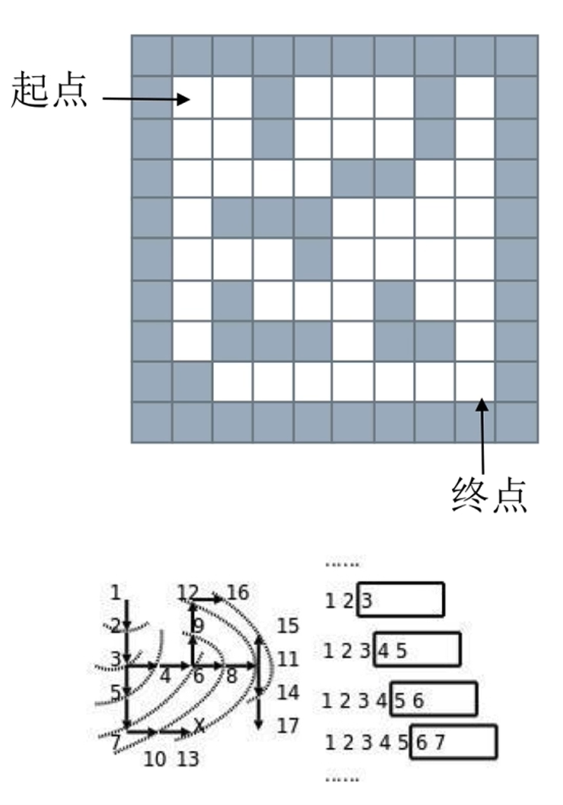

###### 代码实现
```python
from collections import deque

# 定义迷宫，0表示可以走的路，1表示墙壁
maze = [
    [1, 1, 1, 1, 1, 1, 1, 1, 1, 1],
    [1, 0, 0, 1, 0, 0, 0, 1, 0, 1],
    [1, 0, 0, 1, 0, 0, 0, 1, 0, 1],
    [1, 0, 0, 0, 0, 1, 1, 0, 0, 1],
    [1, 0, 1, 1, 1, 0, 0, 0, 0, 1],
    [1, 0, 0, 0, 1, 0, 0, 0, 0, 1],
    [1, 0, 1, 0, 0, 0, 1, 0, 0, 1],
    [1, 0, 1, 1, 1, 0, 1, 1, 0, 1],
    [1, 1, 0, 0, 0, 0, 0, 0, 0, 1],
    [1, 1, 1, 1, 1, 1, 1, 1, 1, 1]
]

# 定义四个方向的移动函数，分别是上、下、左、右
dirs = [
    lambda x, y:(x + 1, y),
    lambda x, y:(x - 1, y),
    lambda x, y:(x, y - 1),
    lambda x, y:(x, y + 1)
]


def print_r(path):
    """
    打印从起点到终点的路径
    :param path: 路径列表，每个元素是一个元组 (x, y, parent_index)
    """
    curNode = path[-1]  # path的最后一个位置就是终点
    realpath = []

    # 从终点开始回溯到起点
    while curNode[2] != -1:
        realpath.append(curNode[0:2])  # 记录当前节点的坐标
        curNode = path[curNode[2]]  # 根据parent_index找到上一个节点

    realpath.append(curNode[0:2])  # 把起点放进去
    realpath.reverse()  # 反转路径，使其从起点到终点
    for node in realpath:
        print(node)


def maze_path_queue(x1, y1, x2, y2):
    """
    使用队列解决迷宫问题，找到从起点到终点的路径
    :param x1: 起点的x坐标
    :param y1: 起点的y坐标
    :param x2: 终点的x坐标
    :param y2: 终点的y坐标
    :return: True if a path is found, False otherwise
    """
    queue = deque()
    queue.append((x1, y1, -1))  # 将起点加入队列，-1表示起点没有父节点
    path = []

    while len(queue) > 0:
        curNode = queue.popleft()  # 取出队列中的第一个节点
        path.append(curNode)  # 将当前节点加入路径
        if curNode[0] == x2 and curNode[1] == y2:
            # 到达终点，打印路径并返回True
            print_r(path)
            return True

        # 尝试四个方向的移动
        for dir in dirs:
            nextNode = dir(curNode[0], curNode[1])
            if maze[nextNode[0]][nextNode[1]] == 0:  # 如果下一个位置可以走
                # 将下一个位置加入队列，并记录当前节点为其父节点
                queue.append((nextNode[0], nextNode[1], len(path) - 1))
                maze[nextNode[0]][nextNode[1]] = 2  # 标记为已经走过
    else:
        print("没有路")
        return False


if __name__ == '__main__':
    maze_path_queue(1, 1, 8, 8)  # 调用函数，从(1,1)走到(8,8)

```


------------------------------------------


#### 6. 链表

+ 链表是由一系列节点组成的元素集合。每个节点包含两部分，数据域 item 和指向下一个节点的指针 next。通过节点之间的相互连接，最终串联成一个链表

```python
class Node(object):
	def __init__(self, item):
		self.item = item
		self.next = None
```

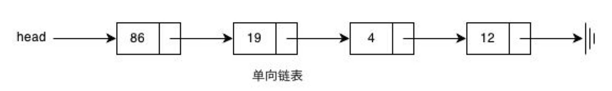

```python
class Node:
    def __init__(self, item):
        self.item = item
        self.next = None


a = Node(1)
b = Node(2)
c = Node(3)
a.next = b
b.next = c

print(a.next.item)  # 2
print(a.next.next.item)  # 3

```

##### 6.1 创建链表

+ 头插法

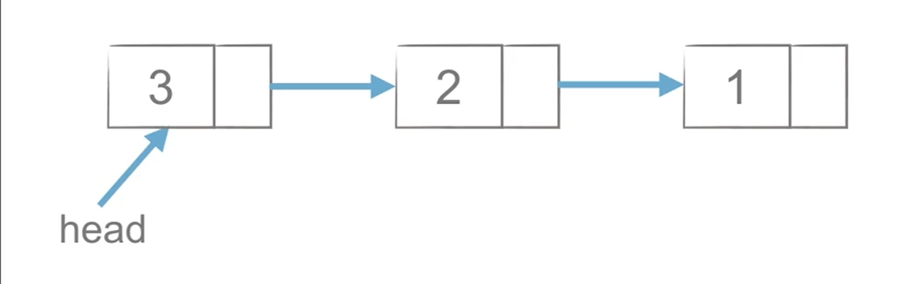

+ 尾插法

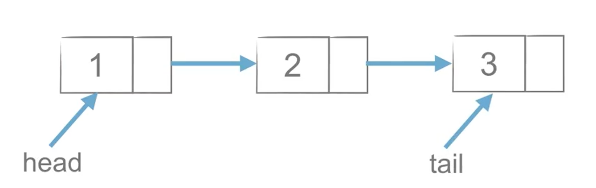

###### 代码实现
```python
class Node:
    def __init__(self, item):
        self.item = item
        self.next = None


def create_linklist_head(li):  # 头插法
    head = Node(li[0])
    for element in li[1:]:
        node = Node(element)  # 在element这里创建一个新节点
        node.next = head  # 将行节点的下一个节点变为head
        head = node  # 将这个节点变为head
    return head


def create_linklist_tail(li):  # 尾插法
    head = Node(li[0])
    tail = head
    for element in li[1:]:
        node = Node(element)  # 在element这里创建一个新节点
        tail.next = node
        tail = node
    return head


def print_linklist(lk):
    while lk:
        print(lk.item, end=',')
        lk = lk.next


if __name__ == '__main__':
    lk1 = create_linklist_head([1, 2, 3])
    lk2 = create_linklist_head([1, 2, 3, 6, 8])
    print_linklist(lk1)
    print()
    print_linklist(lk2)

```


-------------------------------


##### 6.2 链表节点的插入和删除

###### 插入
+ `p.next = curNode.next`
+ `curNode.next = p`

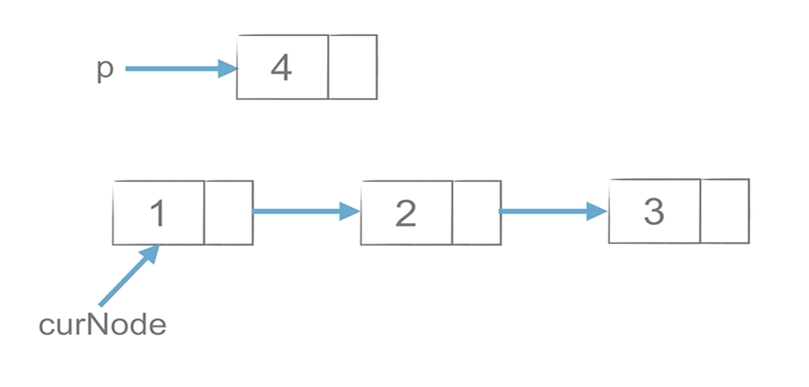

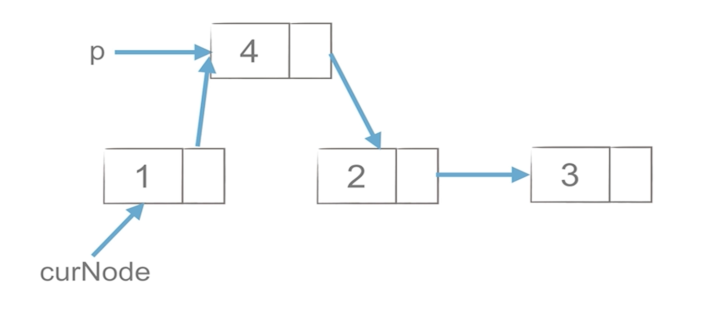

###### 删除

+ `p = curNode.next`
+ `curNode.next = curNode.next.next`
+ `del p`

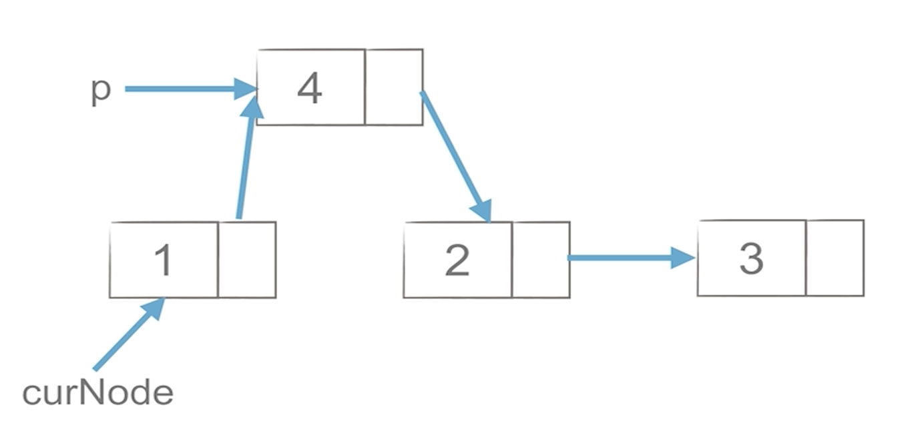

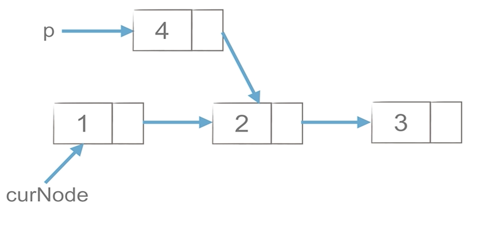


------------------------------


##### 6.3 双链表

+ 双链表的每个节点有两个指针：一个指向后一个节点，另一个指向前一个节点

+ 如何创建双链表？

  ```python
  class Node(object):
  	def __init__(self, item=None):
  		self.item = item
  		self.next = None
  		self.prior = None
  ```


  + 原版

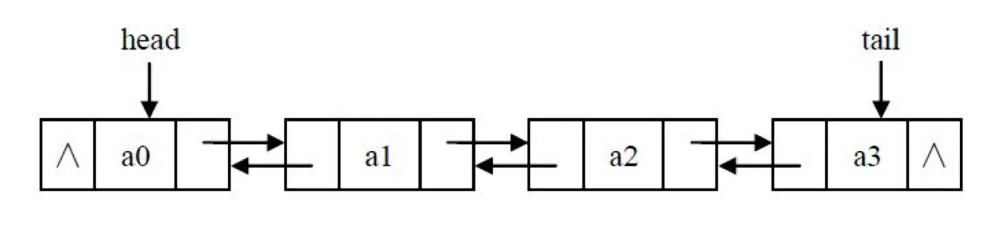

  + 升级版（双链表）

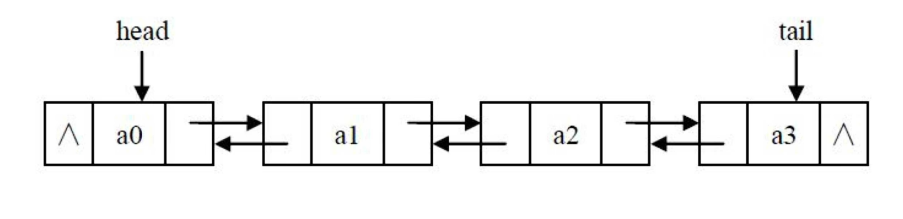


###### 6.3.1 双链表节点的插入

+ `p.next = curNode.next`
+ `curNode.next.prior = p`
+ `p.prior = curNode`
+ `curNode.next = p`

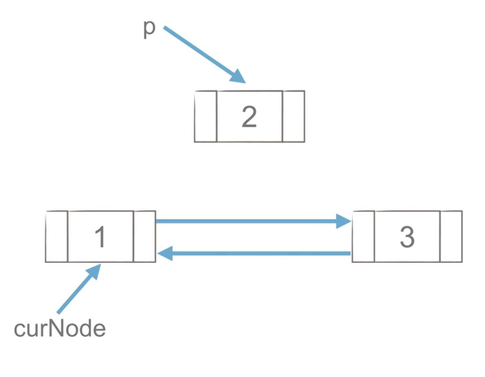

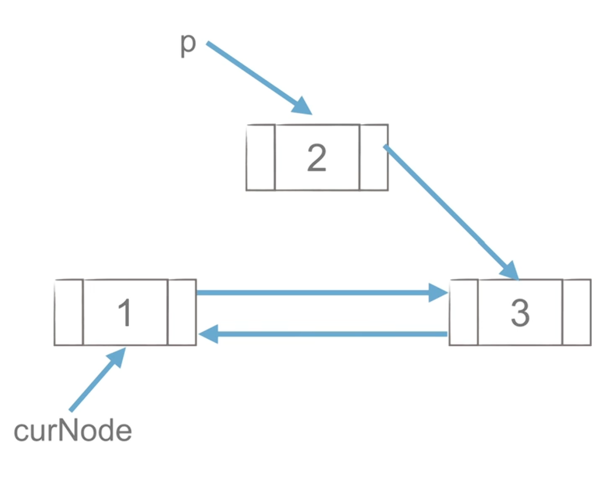

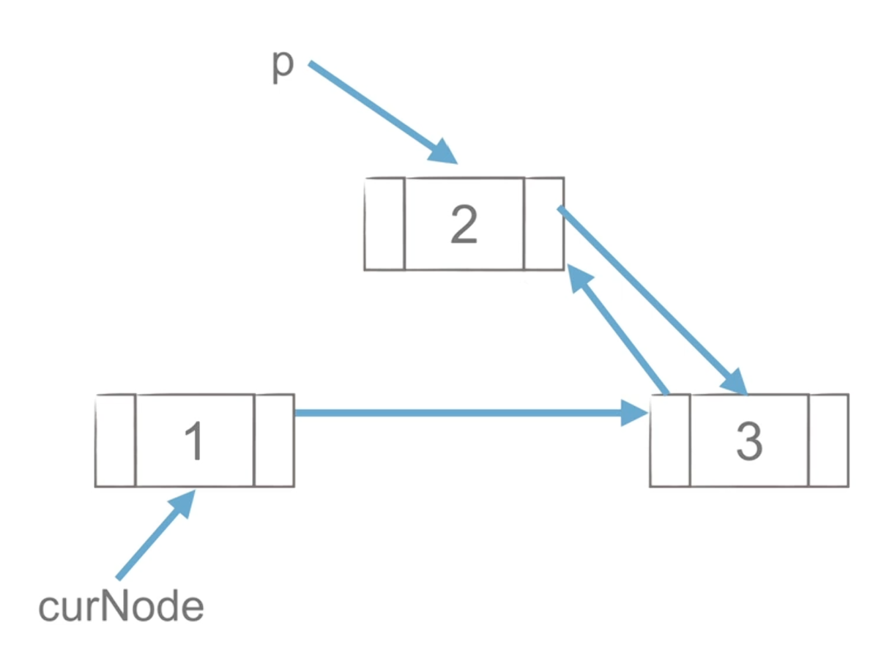

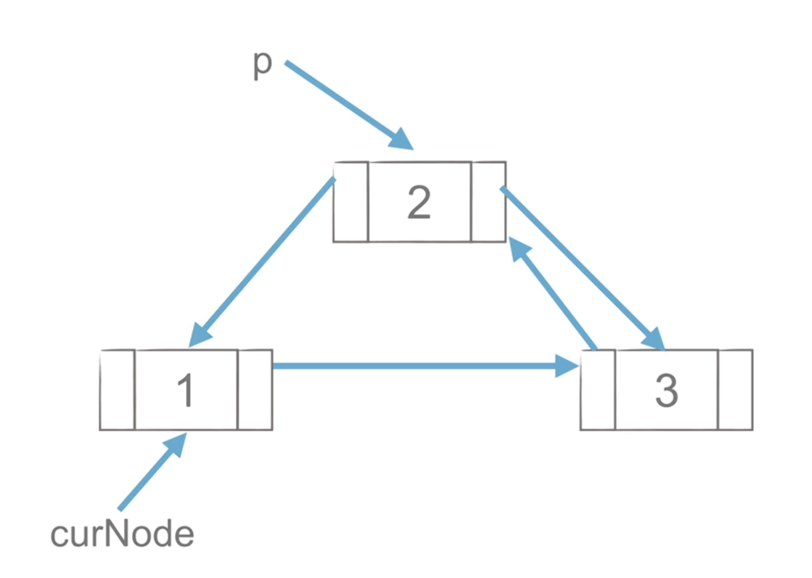

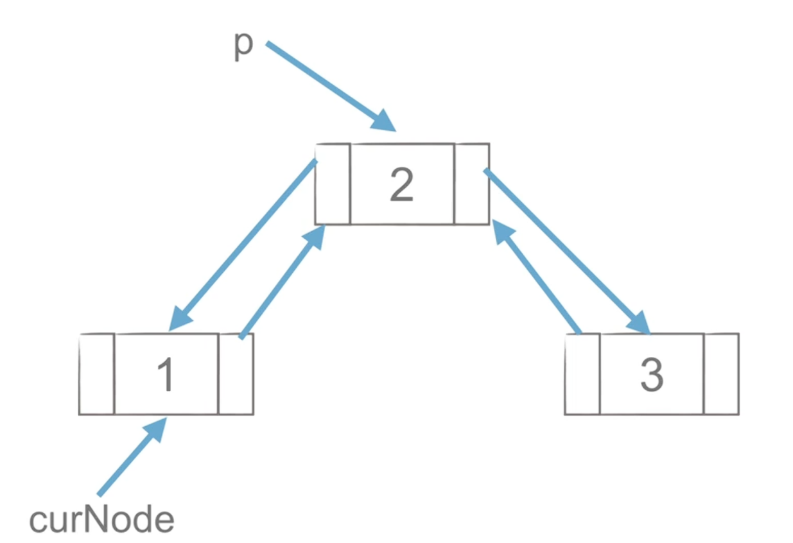


###### 6.3.2 双链表节点的删除

+ `p = curNode.next`
+ `curNode.next = p.next`
+ `p.next.prior = curNode`
+ `del p`

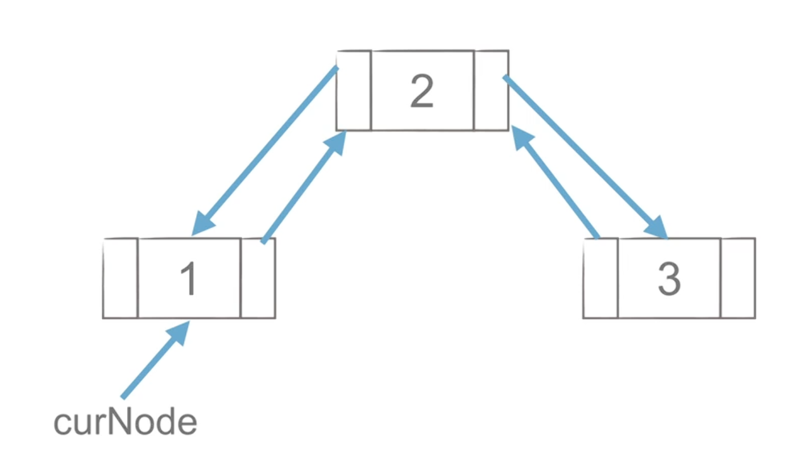

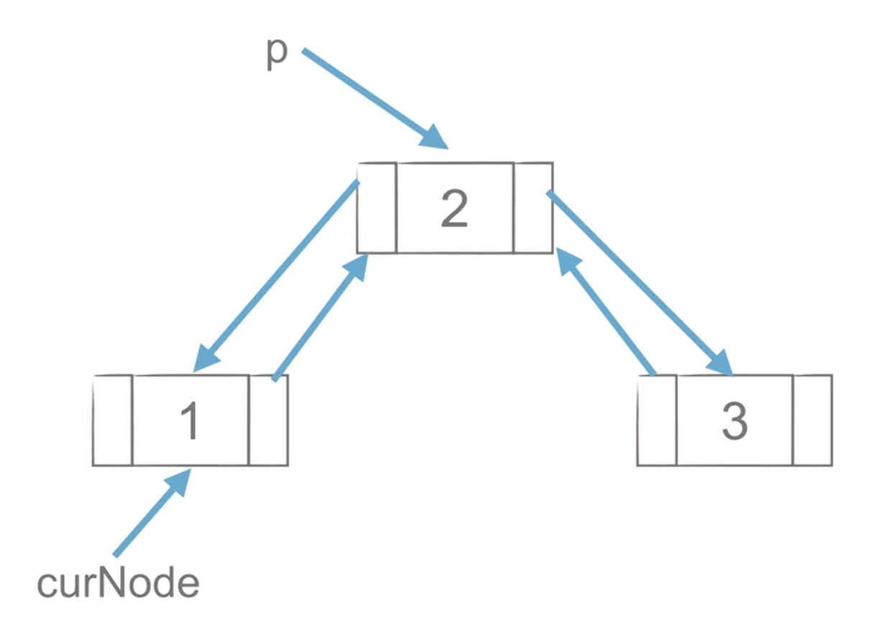

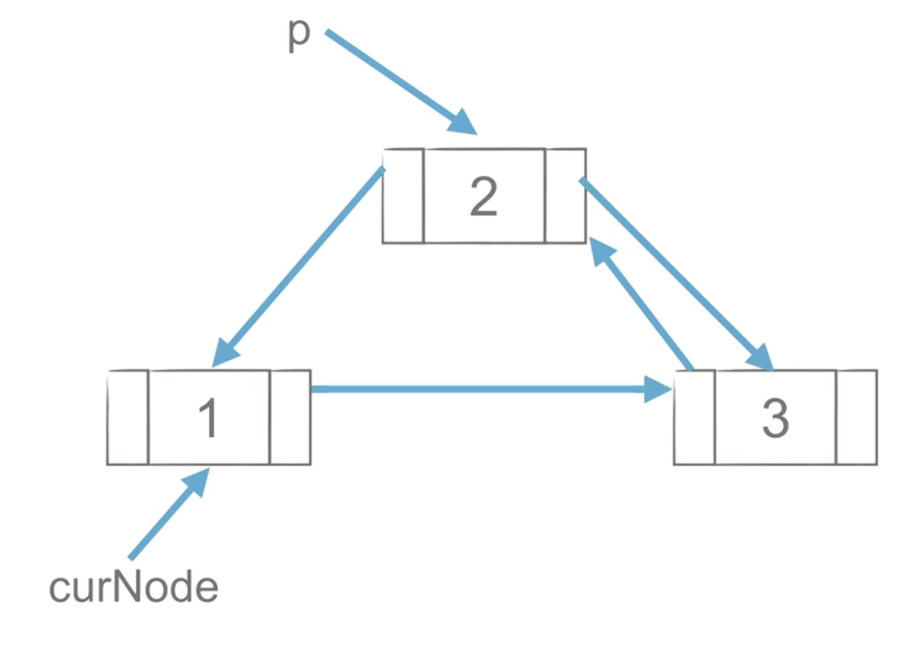

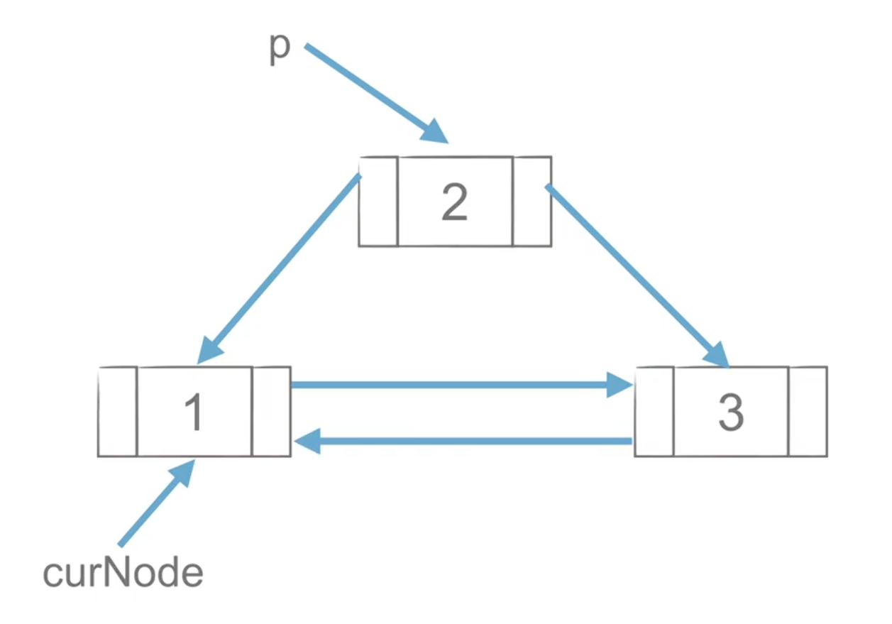


----------------------------------


#####  总结

###### 链表 - 复杂度分析

+ 顺序表（列表 / 数组）与链表
  + 按元素值查找
    + 顺序表 **O(n)**
    + 链表 **O(n)**

  + 按下标查找
    + 顺序表 **O(1)**
    + 链表 **O(n)**

  + 在某元素后插入
    + 顺序表 **O(n)**
    + 链表 **O(1)**

  + 删除某元素
    + 顺序表 **O(n)**
    + 链表 **O(1)**


+ 链表在插入和删除的操作上明显快于顺序表
+ 链表的内存可以更灵活的分配
  + 试利用链表重新实现栈和队列

+ 链表这种链式存储的数据结构对树和图的结构有很大的启发性


----------------------------------------


#### 7. 哈希表

+ 哈希表一个通过哈希函数来计算数据存储位置的数据结构，通常支持如下操作：
  + `insert(key, value)`：插入键值对 (key, value)
  + `get(key)`：如果存在键为 key 的键值对则返回其 value，否则返回空值
  + `delete(key)`：删除键为 key 的键值对

##### 直接寻址表

+ 当关键字的全域 U 比较小时，直接寻址是一种简单而有效的方法
  + 全域 U 就是 key 所有的可能出存在的值的集合
  + 根据 U 建了一个列表 T
  + 然后在2的这个位置上存值是几，3的位置上存值是几...
  + 当我要查5对应的值是几时，拿5过来之后，到 T 下面的5看它的值
  + 要是要把5删了就是把它设成空

+ 直接寻址技术缺点：
  + 当域 U 很大时，需要消耗大量内存，很不实际
  + 如果域 U 很大而实际出现的 key 很少，则大量空间被浪费
  + 无法处理关键字不是数字的情况


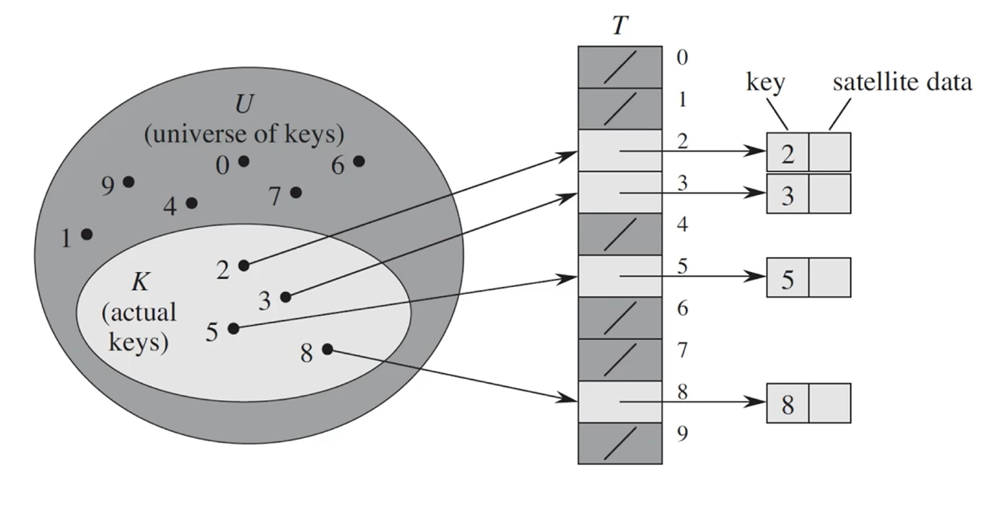


##### 哈希

+ 直接寻址表：key 为 k 的元素放到 k 位置上
+ 改进直接寻址表：哈希（Hashing）
  + 构建大小为 m 的寻址表 T
  + key 为 k 的元素放到 h(k) 位置上【h 是个函数（哈希函数），这个函数参数能传的就是域 U 里面所有的值】
  + h(k) 是一个函数，其将域 U 映射到表 T[0, 1, ..., m -1]


##### 哈希表

+ 哈希表（Hash Table，又称为散列表），是一种线性表的存储结构。哈希表由一个**直接寻址表**和一个**哈希函数**组成。哈希函数 h(k) 将元素关键字 k 作为自变量，返回元素的存储下标

+ 假设有一个长度为7的哈希表，哈希函数 h(k)=k%7。元素集合{14, 22, 3, 5}的存储方式如下图

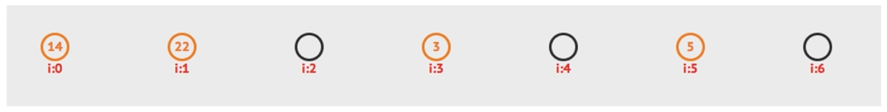


##### 哈希冲突

+ 由于哈希表的大小是有限的，而要存储的·1值得总数量是无限的，因此对于任何哈希函数，都会出现两个不同元素映射到同一个位置上的情况

+ 比如 h(k)=k%7, h(0)=h(7)=h(14)=...


###### 解决哈希冲突 - 开放寻址法

+ 开放寻址法：如果哈希函数返回的位置已经有值，则可以向后探查新的位置来存储这个值
  + 线性探查：如果位置 i 被占用，则探查 i + 1, i + 2, ......
  + 二次探查：如果位置 i 被占用，则探查 i + 1^2^, i - 1^2^, i + 2^2^, i - 2^2^, ......
  + 二度哈希：有 n 个哈希函数，当使用第1个哈希函数 h1 发生冲突时，则尝试使用 h2, h3, ......

###### 解决哈希冲突 - 拉链法

+ 拉链法：哈希表每个位置都连接一个链表，当冲突发生时，冲突的元素将被加到该位置链表的最后

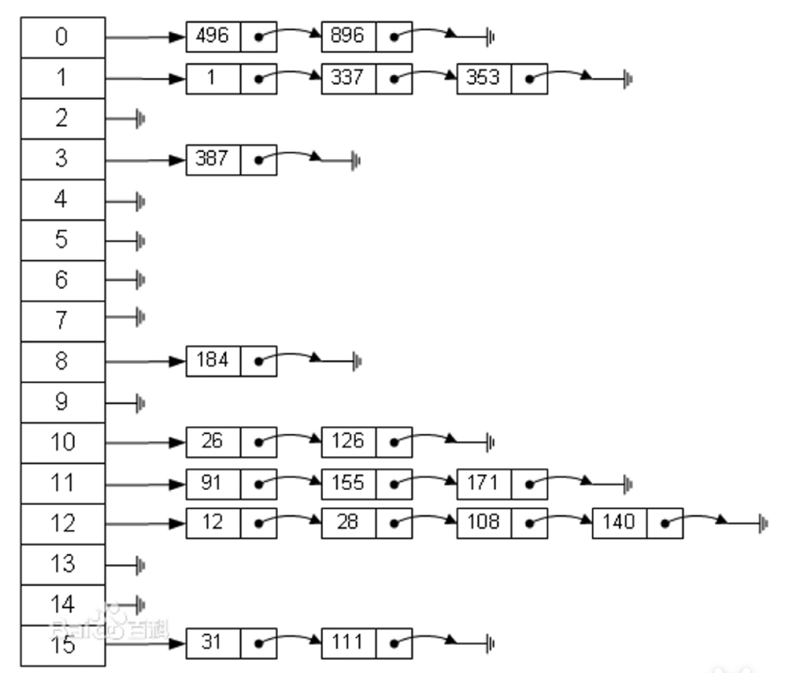


##### 哈希表 - 常见哈希函数

+ 除法哈希表：
  + **h(k) = k % m**

+ 乘法哈希表：
  + **h(k) = floor(m * (A * key % 1))**
    + m：大小
    + A：一个值（小数）
    + A * key % 1：A 乘以 key 对1取模，就是取得小数部分
    + floor()：向下取整

+ 全域哈希表：
  + **h~a,b~(k) = ((a * key + b) % p) % m** 	a, b = 1, 2, ..., p - 1


------------------------------------


##### 哈希表实现

```python
class LinkList:
    """ 列表类 """

    class Node:
        """ 链表的节点 """

        def __init__(self, item=None):
            self.item = item
            self.next = None

    class LinkListIterator:
        """ 迭代器类 """

        def __init__(self, node):
            self.node = node

        def __next__(self):
            if self.node:
                cur_node = self.node
                self.node = cur_node.next
                return cur_node.item
            else:
                raise StopIteration

        def __iter__(self):
            return self

    def __init__(self, iterable=None):
        """
        构造函数
        :param iterable: 一个列表
        """
        self.head = None  # 开始时头节点为空
        self.tail = None  # 开始时尾节点为空
        if iterable:  # 如果列表中有值
            self.extend(iterable)

    def append(self, obj):
        """
        插入（尾插）
        :param obj: 要插入的对象
        """
        s = LinkList.Node(obj)  # 创建一个节点
        if not self.head:
            self.head = s  # 因为刚开始head是空，所以s是头节点
            self.tail = s  # 因为刚开始head是空，所以s也是尾节点
        else:
            self.tail.next = s  # 如果不是空就将s插到尾巴上
            self.tail = s  # 更新尾巴

    def extend(self, iterable):
        """
        循环插入
        :param iterable: 要插入的列表
        :return:
        """
        for obj in iterable:
            self.append(obj)

    def find(self, obj):
        """ 查找 """
        for n in self:
            if n == obj:
                return True
        else:
            return False

    def __iter__(self):
        """ 让链表支持迭代器 """
        return self.LinkListIterator(self.head)

    def __repr__(self):
        """ 转换成字符串 """
        return "<<" + ", ".join(map(str, self)) + ">>"


# 类似于集合的结构（不允许重复）
class HashTable:
    def __init__(self, size=101):
        self.size = size
        self.T = [LinkList() for i in range(self.size)]

    def h(self, k):
        return k % self.size

    def insert(self, k):
        i = self.h(k)
        if self.find(k):
            print("重复插入")
        else:
            self.T[i].append(k)

    def find(self, k):
        i = self.h(k)
        return self.T[i].find(k)


if __name__ == '__main__':
    ht = HashTable()

    ht.insert(0)
    ht.insert(1)
    ht.insert(3)
    ht.insert(102)
    ht.insert(508)

    print(",".join(map(str, ht.T)))
    print(ht.find(102))  # True
    print(ht.find(203))  # False

```


--------------------------------


##### 哈希表的应用 - 集合与字典

+ 字典与集合都是通过哈希表来实现的
  + a = {'name': 'Alex', 'age': '18', 'gender': 'Man'}

+ 使用哈希表存储字典，通过哈希函数将字典的键映射为下标。假设 h('name') = 3, h('age') = 1, h('gender') = 4，则哈希表存储为[None, 18, None, 'Alex', 'Man']
+ 如果发生哈希冲突，则通过拉链法或开发寻址法解决


##### 哈希表的应用 - md5算法

+ MD5（Message-Digest Algorithm 5）**曾经**是密码学中常用的哈希函数，可以把任意长度的数据映射为128位的哈希值，其曾经包含如下特征：
  + 1. 同样的消息，其 MD5 值必定相同
  + 2. 可以快速计算出任意给定的消息的 MD5 值
  + 3. 除非暴力的枚举所有可能的消息，否则不可能从哈希值反推出消息本身
  + 两条消息之间即使只有微小的差别，其对应的 MD5 值也应该是完全不同、完全不相关的
  + 5. 不能在有意义的时间内人工的构造两个不同的消息使其具有相同的 MD5 值

###### 哈希表的应用 - md5

+ 应用举例：文件的哈希值
  + 算出文件的哈希值，若两个文件的哈希值相同，则可认为这两个文件是相同的。因此：
    + 1. 用户可以利用它验证下载的文件是否完整
    + 2. 云存储服务商可以利用它来判断用户要上传的文件是否已经存在于服务器上，从而实现秒传的功能，同时避免存储过多相同的文件副本

##### 哈希表的应用 - SHA2算法

+ 历史上 MD5 和 SHA-1 曾经是使用最为广泛的 cryptographic hash function，但是随着密码学的发展，这两个哈希函数的安全性相继受到了各种挑战
+ 因此现在安全性较重要的场合推荐使用 SHA-2 等新的更安全的哈希函数
+ SHA-2 包含了一系列的哈希函数:SHA-224，SHA-256,SHA-384，SHA-512,SHA-512 / 224，SHA-512 / 256，其对应的哈希值长度分别为224，256，384 or 512 位。
+ SHA-2 具有和 MD5 类似的性质（参见MD5算法的特征）


###### 哈希表的应用 - SHA2算法

+ 应用举例：
+ 例如，在比特币系统中，所有参与者需要共同解决如下问题:对于一个给定的字符串 U，给定的目标哈希值H，需要计算出一个字符串 V，使得 U + V 的哈希值与H的差小于一个给定值 D。此时，只能通过暴力枚举 V 来进行猜测。首先计算出结果的人可获得一定奖金。而某人首先计算成功的概率与其拥有的计算量成正比，所以其获得的奖金的 期望值与其拥有的计算量成正比。


-------------------------


### 二、树状数据结构

#### 1. 树

##### 1.1 树的概念

+ 树是一种数据结构 比如：目录结构
+ 树是一种可以递归定义的数据结构
+ 树是由 n 个节点组成的集合：

  + 如果 n = 0，那这是一棵空树
  + 如果 n > 0，那存在1个节点作为树的根节点，其他节点可以分为 m 个集合，每个集合本身又是一棵树

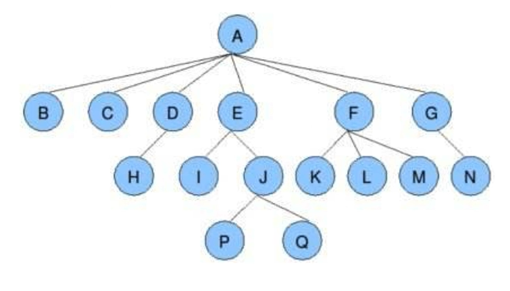


+ 一些概念
  + 根节点、叶子节点

    + 根节点：一棵树汇总起来最头上那个节点
    + 叶子节点：没有孩子的

  + 树的深度（高度）：往下走了几层深度就是几
  + 树的度：

    + 节点的度就是这个节点分几个叉
    + 树的度是这棵树里面所有节点的最大的那个度（哪个节点分的叉最多就拿它作为树的度）

  + 孩子节点 / 父节点

    + 孩子节点：eg：D 是 A 的孩子节点
    + 父节点：eg：A 是 D 的父节点

  + 子树：eg：EIJPQ 是整个一棵树的一棵子树


-------------------------


##### 1.2 树的实例：模拟文件系统

###### 代码实现

```python
class Node:
    def __init__(self, name, type="dir"):
        self.name = name
        self.type = type  # "dir" or "dile"
        self.children = []  # 好多next会存在这里（孩子）
        self.parent = None  # 指向父母

    def __repr__(self):  # 当调用repr()函数或直接打印对象时，返回对象的name属性值
        return self.name


class FileSystemTree:
    def __init__(self):
        self.root = Node("/")  # （根目录）根节点
        self.now = self.root  # 当前目录

    def mkdir(self, name):  # 创建文件夹
        # name以 "/" 结尾
        if name[-1] != "/":
            name += "/"
        node = Node(name)
        self.now.children.append(node)
        node.parent = self.now

    def ls(self):  # 展示当前目录下的所有目录
        return self.now.children

    def cd(self, name):
        if name[-1] != "/":
            name += "/"
        if name == "../":
            self.now = self.now.parent
            return
        for child in self.now.children:
            if child.name == name:
                self.now = child
                return
        raise ValueError("invalid dir")  # 报个错


if __name__ == '__main__':
    tree = FileSystemTree()
    tree.mkdir("var/")
    tree.mkdir("bin/")
    tree.mkdir("user/")

    tree.cd("bin/")
    tree.mkdir("python/")

    tree.cd("../")

    print(tree.ls())

```


-------------------


#### 2. 二叉树

##### 2.1 二叉树的概念

+ 二叉树的链式存储：将二叉树的节点定义成为一个对象，节点之间通过类似链表的连接方式来连接

+ 节点的定义
  ```python
  class BiTreeNode:
  	def __init__(self, data):
  		self.data = data  # 存节点的数据
  		self.lchild = None  # 左孩子
  		self.rchild = None  # 右孩子
  ```

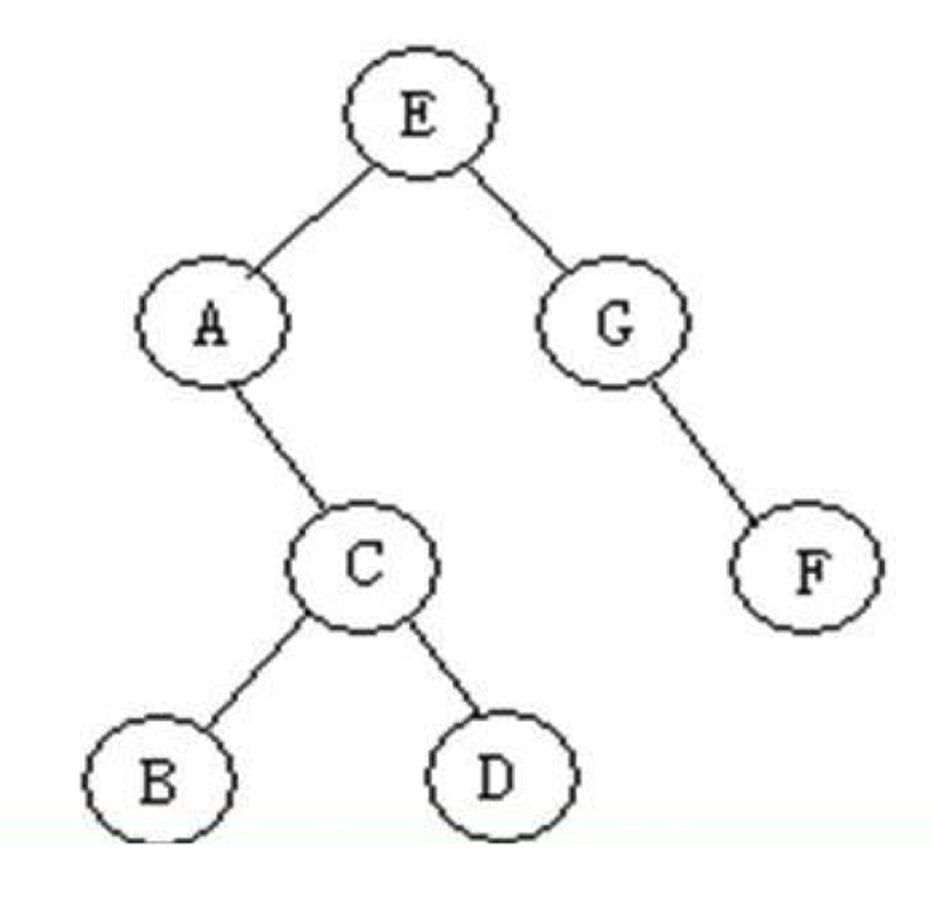

###### 代码实现

```python
class BiTreeNode:
    def __init__(self, data):
        self.data = data  # 存的数据
        self.lchild = None  # 左孩子
        self.rchild = None  # 右孩子


if __name__ == '__main__':
    a = BiTreeNode("A")
    b = BiTreeNode("B")
    c = BiTreeNode("C")
    d = BiTreeNode("D")
    e = BiTreeNode("E")
    f = BiTreeNode("F")
    g = BiTreeNode("G")

    e.lchild = a
    e.rchild = g
    a.rchild = c
    c.lchild = b
    c.rchild = d
    g.rchild = f

    root = e

    print(root.lchild.rchild.data)  # c

```


---------------------------


##### 2.2 二叉树的遍历

二叉树的遍历方式：


+ 前序遍历：EACBDGF
  + 左一下右一下

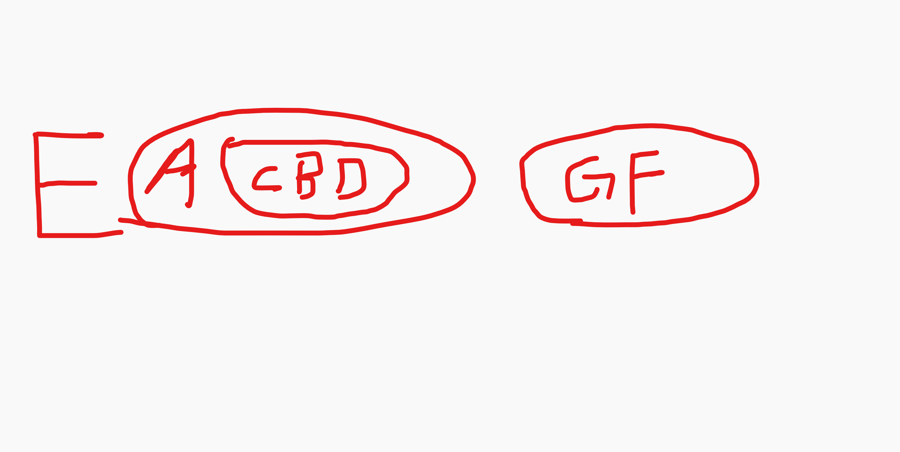


+ 中序遍历：ABCDEGF
  + 左没了再右

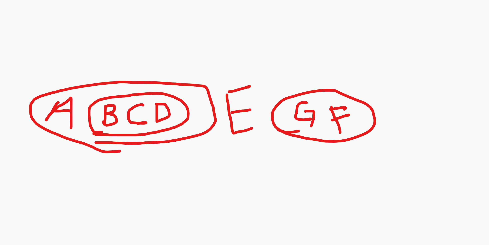

+ 后序遍历：BDCAFGE
  + 先左后右，先到的排最后

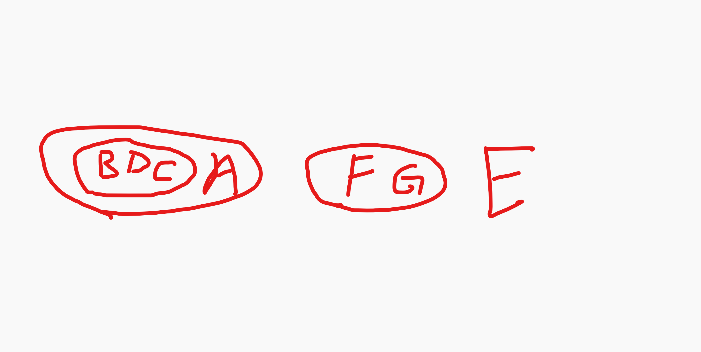

+ 层次遍历：EAGCFBD
  + 每层从左到右

###### 代码实现

```python
from collections import deque


class BiTreeNode:
    def __init__(self, data):
        self.data = data  # 存的数据
        self.lchild = None  # 左孩子
        self.rchild = None  # 右孩子


def pre_order(root):
    # 前序遍历
    if root:  # 如果不是空
        print(root.data, end=',')  # 先访问根节点
        pre_order(root.lchild)  # 再访问左孩子
        pre_order(root.rchild)  # 再访问右孩子


def in_order(root):
    # 中序遍历
    if root:
        in_order(root.lchild)  # 先访问左子树
        print(root.data, end=',')  # 访问自己
        in_order(root.rchild)  # 然后访问右子树


def post_order(root):
    # 后序遍历
    if root:
        post_order(root.lchild)
        post_order(root.rchild)
        print(root.data, end=',')


def level_order(root):
    queue = deque()  # 创建一个队列
    queue.append(root)
    while len(queue) > 0:  # 只要队不空一直循环
        node = queue.popleft()  # 出队
        print(node.data, end=',')
        if node.lchild:
            queue.append(node.lchild)
        if node.rchild:
            queue.append(node.rchild)


if __name__ == '__main__':
    a = BiTreeNode("A")
    b = BiTreeNode("B")
    c = BiTreeNode("C")
    d = BiTreeNode("D")
    e = BiTreeNode("E")
    f = BiTreeNode("F")
    g = BiTreeNode("G")

    e.lchild = a
    e.rchild = g
    a.rchild = c
    c.lchild = b
    c.rchild = d
    g.rchild = f

    root = e

    pre_order(root)  # E,A,C,B,D,G,F,
    print()
    in_order(root)  # A,B,C,D,E,G,F,
    print()
    post_order(root)  # B,D,C,A,F,G,E,
    print()
    level_order(root)  # E,A,G,C,F,B,D,

```


--------------------------------


#### 3. 二叉搜索树

##### 3.1 二叉搜索树的概念

+ 二叉搜索树是一棵二叉树且满足性质：设 x 是二叉树的一个节点。如果 y 是 x 的左子树的一个节点，那么 y.key <= x.key；如果 y 是 x 右子树的一个节点，那么 y.key >= x.key
  + 左子树上的所有节点的数值都比某个节点小，右子树上的所有节点的数值都比某个节点大
+ 二叉搜索树的操作：查询、插入、删除


-----------------------------------


##### 3.2 二叉搜索树：插入

**对于二叉搜索树来说，中序遍历一定是升序的**

```python
import random


class BiTreeNode:
    def __init__(self, data):
        self.data = data  # 存的数据
        self.lchild = None  # 左孩子
        self.rchild = None  # 右孩子
        self.parent = None


class BST:
    def __init__(self, li=None):
        self.root = None
        if li:
            for val in li:
                self.insert_no_rec(val)

    def insert(self, node, val):
        """
        递归的
        :param node: 插到哪个节点
        :param val: 值
        :return: 插入到的那个节点
        """
        if not node:
            node = BiTreeNode(val)
        elif val < node.data:
            node.lchild = self.insert(node.lchild, val)
            node.lchild.parent = node
        elif val > node.data:
            node.rchild = self.insert(node.rchild, val)
            node.rchild.parent = node
        return node

    def insert_no_rec(self, val):
        """
        非递归的
        :param val: 值
        :return:
        """
        p = self.root
        if not p:  # 空树
            self.root = BiTreeNode(val)
            return
        while True:
            if val < p.data:
                if p.lchild:
                    p = p.lchild
                else:  # 左孩子不存在
                    p.lchild = BiTreeNode(val)
                    p.lchild.parent = p
                    return
            elif val > p.data:
                if p.rchild:
                    p = p.rchild
                else:
                    p.rchild = BiTreeNode(val)
                    p.rchild.parent = p
                    return
            else:
                return

    def pre_order(self, root):
        # 前序遍历
        if root:  # 如果不是空
            print(root.data, end=',')  # 先访问根节点
            self.pre_order(root.lchild)  # 再访问左孩子
            self.pre_order(root.rchild)  # 再访问右孩子

    def in_order(self, root):
        # 中序遍历
        if root:
            self.in_order(root.lchild)  # 先访问左子树
            print(root.data, end=',')  # 访问自己
            self.in_order(root.rchild)  # 然后访问右子树

    def post_order(self, root):
        # 后序遍历
        if root:
            self.post_order(root.lchild)
            self.post_order(root.rchild)
            print(root.data, end=',')


if __name__ == '__main__':
    li = list(range(500))
    random.shuffle(li)

    tree = BST([4, 6, 7, 9, 2, 1, 3, 5, 8])
    tree.pre_order(tree.root)  # 4,2,1,3,6,5,7,9,8,
    print()
    tree.in_order(tree.root)  # 1,2,3,4,5,6,7,8,9,
    print()
    tree.in_order(tree.root)  # 1,2,3,4,5,6,7,8,9,
    print()

    tree2 = BST(li)
    tree2.in_order(tree2.root)

```


-----------------------------


##### 3.3 二叉搜索树：查询

```python
import random


class BiTreeNode:
    def __init__(self, data):
        self.data = data  # 存的数据
        self.lchild = None  # 左孩子
        self.rchild = None  # 右孩子
        self.parent = None


class BST:
    def __init__(self, li=None):
        self.root = None
        if li:
            for val in li:
                self.insert_no_rec(val)
                
    def query(self, node, val):
        """
        递归的查询
        :param node: 当下的节点
        :param val: 要查询的值
        :return: 查询到的节点
        """
        if not node:  # 递归的终止条件
            return None
        if node.data < val:
            return self.query(node.rchild, val)
        elif node.data > val:
            return self.query(node.lchild, val)
        else:
            return node

    def query_no_rec(self, val):
        """
        非递归的查询
        :param val: 要查询的值
        :return: 查询到的节点
        """
        p = self.root
        while p:
            if p.data < val:
                p = p.rchild
            elif p.data > val:
                p = p.lchild
            else:
                return p
        return None  # p是空的找不到


if __name__ == '__main__':
    li = list(range(0, 500, 2))
    random.shuffle(li)
    
    tree = BST(li)
    print(tree.query_no_rec(4).data)
    print(tree.query_no_rec(3))

```


------------------------------


##### 3.4 二叉搜索树 - 删除操作

+ 1. 如果要删除的节点是叶子节点：直接删除

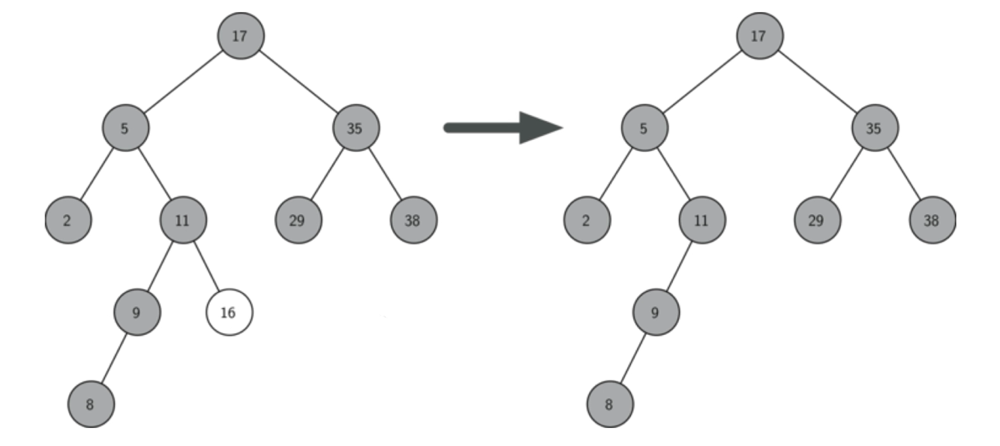

+ 2. 如果要删除的节点只有一个孩子：将此节点的父亲与孩子连接，然后删除节点
  + 不管当前节点是有一个左孩子还是有一个右孩子，只要他只有一个孩子，那这个孩子一定替代他的位置

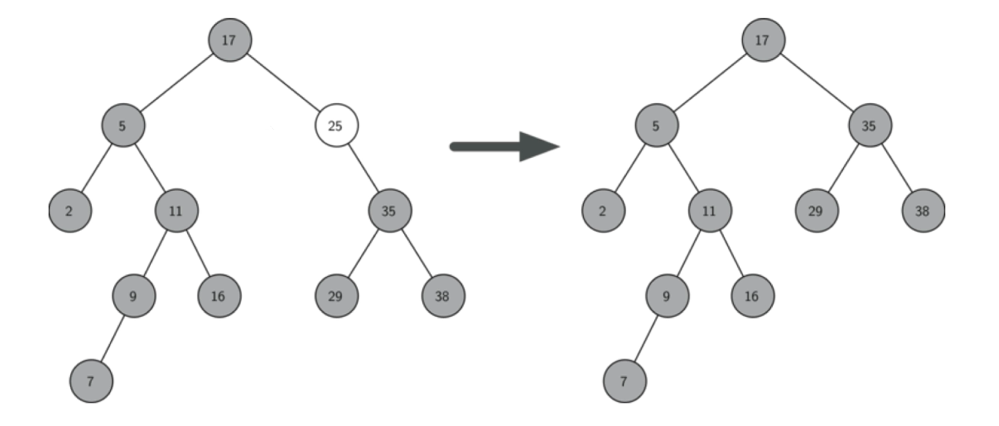

+ 3. 如果要删除的节点有两个孩子：将其右子树的最小节点（该节点最多有一个右孩子）删除，并替换当前节点

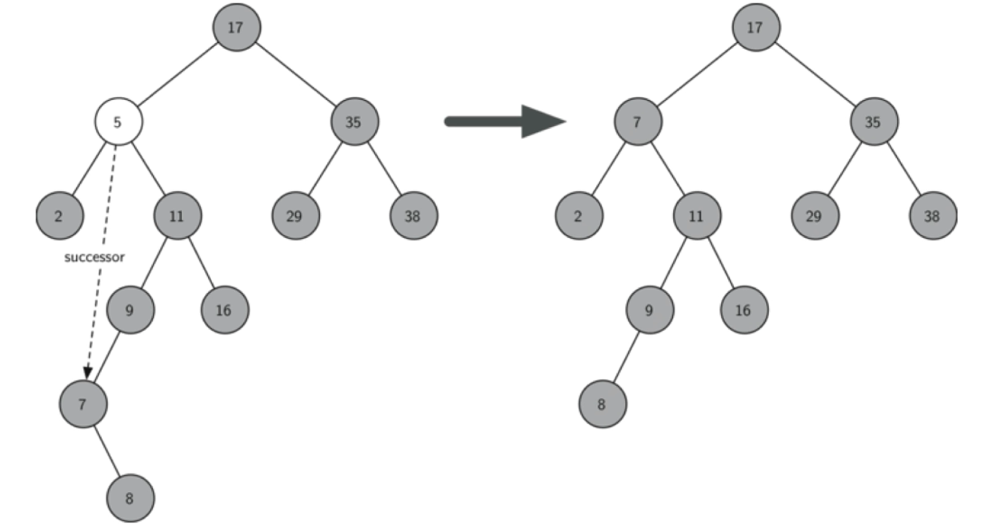


###### 代码实现

```python
import random


class BiTreeNode:
    def __init__(self, data):
        self.data = data  # 存的数据
        self.lchild = None  # 左孩子
        self.rchild = None  # 右孩子
        self.parent = None


class BST:
    def __init__(self, li=None):
        self.root = None
        if li:
            for val in li:
                self.insert_no_rec(val)    
                
    def pre_order(self, root):
        # 前序遍历
        if root:  # 如果不是空
            print(root.data, end=',')  # 先访问根节点
            self.pre_order(root.lchild)  # 再访问左孩子
            self.pre_order(root.rchild)  # 再访问右孩子

    def in_order(self, root):
        # 中序遍历
        if root:
            self.in_order(root.lchild)  # 先访问左子树
            print(root.data, end=',')  # 访问自己
            self.in_order(root.rchild)  # 然后访问右子树

    def post_order(self, root):
        # 后序遍历
        if root:
            self.post_order(root.lchild)
            self.post_order(root.rchild)
            print(root.data, end=',')

    def __remove_node_1(self, node):
        """
        情况1：node是叶子系欸点
        :param node: 要删除的节点
        :return:
        """
        if not node.parent:  # 如果node的父亲是空（根节点）
            self.root = None
        if node == node.parent.lchild:  # node是它父亲的左孩子
            node.parent.lchild = None
        else:  # node是它父亲的右孩子
            node.parent.rchild = None

    def __remove_node_21(self, node):
        """
        情况2.1：node只有一个孩子
        :param node: 要删除的节点
        :return:
        """
        if not node.parent:  # 根节点
            self.root = node.lchild
            node.lchild.parent = None
        elif node == node.parent.lchild:  # node是它父亲的左孩子
            node.parent.lchild = node.lchild
            node.lchild.parent = node.parent
        else:  # node是它父亲的右孩子
            node.parent.rchild = node.lchild
            node.lchild.parent = node.parent

    def __remove_node_22(self, node):
        """
        情况2.2：node只有一个右孩子
        :param node: 要删除的节点
        :return:
        """
        if not node.parent:  # 根节点
            self.root = node.rchild
        elif node == node.parent.lchild:  # node是它父亲的左孩子
            node.parent.lchild = node.rchild
            node.rchild.parent = node.parent
        else:  # node是它父亲的右孩子
            node.parent.rchild = node.rchild
            node.rchild.parent = node.parent

    def delete(self, val):
        """
        :param val: 要删除的值
        :return:
        """
        if self.root:  # 不是空树
            node = self.query_no_rec(val)
            if not node:  # 不存在
                return False
            if not node.lchild and not node.rchild:  # 1. 左孩子是空，右孩子也是空（叶子节点）
                self.__remove_node_1(node)
            elif not node.rchild:  # 2.1 只有一个左孩子
                self.__remove_node_21(node)
            elif not node.lchild:  # 2.2 只有一个右孩子
                self.__remove_node_22(node)
            else:  # 3. 两个孩子都有
                min_node = node.rchild
                while min_node.lchild:
                    min_node = min_node.lchild
                node.data = min_node.data
                # 删除min_node
                if min_node.rchild:
                    self.__remove_node_22(min_node)
                else:
                    self.__remove_node_1(min_node)


if __name__ == '__main__':
    tree = BST([1, 4, 2, 5, 3, 8, 6, 9, 7])
    tree.in_order(tree.root)
    print()

    tree.delete(4)
    tree.in_order(tree.root)
```


-----------------------------------


##### 3.5 二叉搜索树的效率

+ 平均情况下，二叉搜索树进行搜索的时间复杂度为 **O(lgn)**
+ 最坏情况下，二叉搜索树可能非常偏斜
+ 解决方案：
  + 随机化插入
  + AVL 树

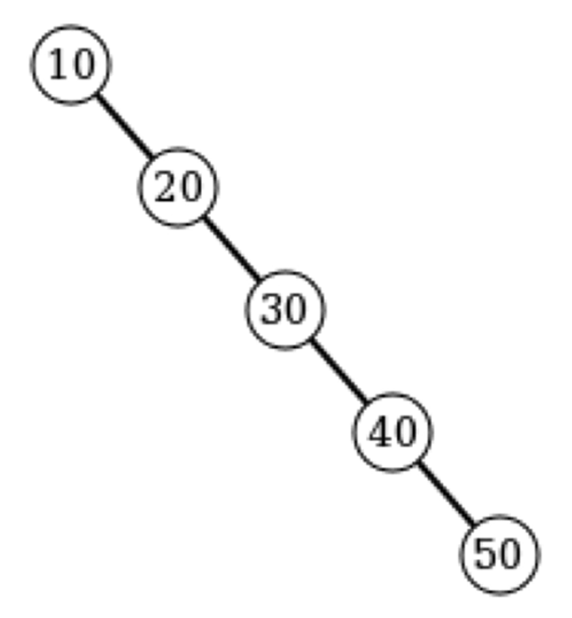


------------------------------

#### 4. AVL 树

##### 4.1 AVL 树的概念

+ AVL 树：AVL 树是一棵自平衡（任何一个节点两个子树的高度差不能超过1）的二叉搜索树
+ AVL 树具有以下性质：
  + 根的左右子树的**高度之差的绝对值不能超过1**
  + 根的左右子树都是平衡二叉树

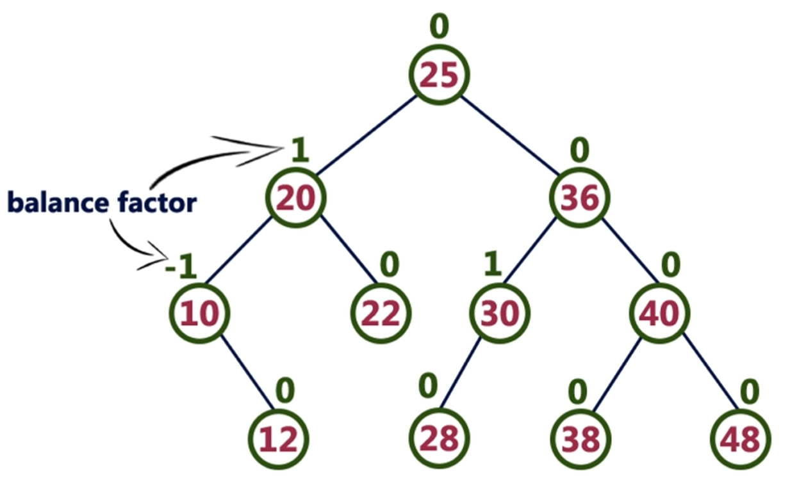


-----------------------------


##### 4.2 AVL 树 - 插入

+ 插入一个节点可能会破坏 AVL 树的平衡，可以通过**旋转**操作来进行修正
+ 插入一个节点后，只有从插入节点到根节点的路径上的节点的平衡可能被改变。我们需要找出第一个破坏平衡条件的节点，称之为 K。K 的两棵子树的高度差为2
+ 不平衡的出现可能有4种情况

###### 4.2.1 AVL 插入 - 右旋

+ 1. 不平衡是由于对 K 的**左孩子的左子树**插入导致的：**右旋**

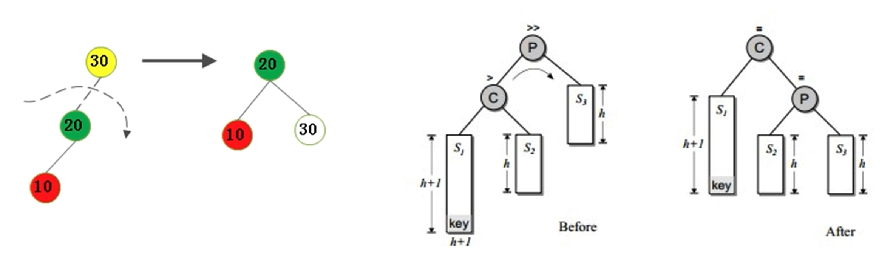

###### 4.2.2 AVL 插入 - 左旋

+ 2. 不平衡是由于对 K 的**右孩子的右子树**插入导致的：**左旋**

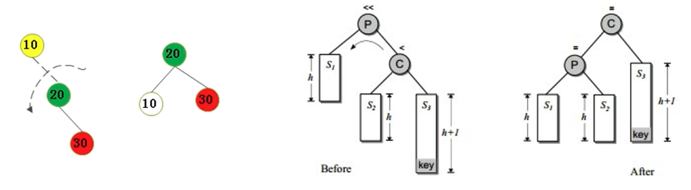

###### 4.2.3 AVL 插入 - 右旋-左旋

+ 3. 不平衡是由于对 K 的**右孩子的左子树**插入导致的：**右旋 - 左旋**

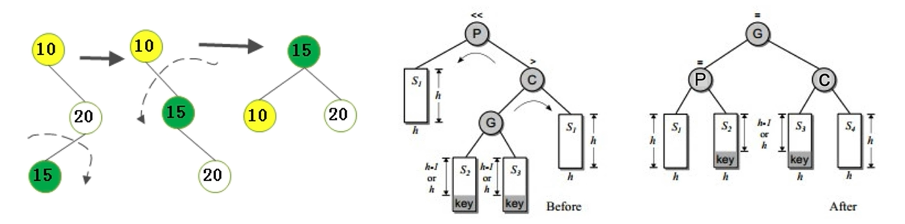

###### 4.2.4 AVL 插入 - 左旋-右旋

+ 4. 不平衡是由于对 K 的**左孩子的右子树**插入导致的：**左旋-右旋**

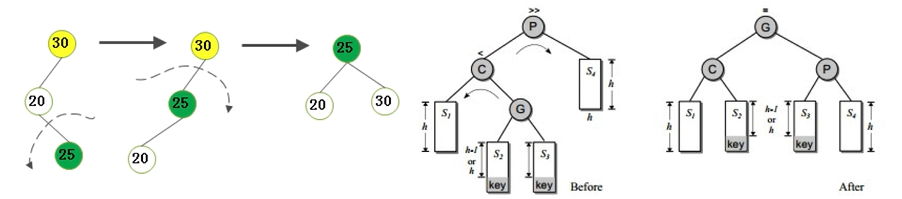


###### 代码实现

```python
from bst import BiTreeNode, BST


class AVLNode(BiTreeNode):
    # 节点类
    def __init__(self, data):
        BiTreeNode.__init__(self, data)
        self.bf = 0


class AVLTree(BST):
    def __init__(self, li=None):
        BST.__init__(self, li)

    def rotate_left(self, p, c):
        """
        左旋
        :param p: 节点（上面的）
        :param c: 节点（下面的）
        :return:
        """
        s2 = c.lchild
        p.rchild = s2
        if s2:
            s2.parent = p

        c.lchild = p
        p.parent = c

        p.bf = 0  # p的重量（默认左边重就是负的，右边重就是正的）
        c.bf = 0  # c的重量
        return c

    def rotate_right(self, p, c):
        """
        右旋
        :param p: 节点（上面的）
        :param c: 节点（下面的）
        :return:
        """
        s2 = c.rchild
        p.lchild = s2
        if s2:
            s2.parent = p

        c.rchild = p
        p.parent = c

        p.bf = 0
        c.bf = 0
        return c

    def rotate_right_left(self, p, c):
        """
        右旋 - 左旋
        :param p: 节点（上面的）
        :param c: 节点（下面的）
        :return:
        """
        g = c.lchild

        s3 = g.rchild
        c.lchild = s3
        if s3:
            s3.parent = c
        g.rchild = c
        c.parent = g

        s2 = g.lchild
        p.rchild = s2
        if s2:
            s2.parent = p
        g.lchild = p
        p.parent = g

        # 更新bf
        if g.bf > 0:
            # 1. 插入到s3上
            p.bf = -1
            c.bf = 0
        elif g.bf < 0:
            # 2. 插入到s2上
            p.bf = 0
            c.bf = 1
        else:  # 插入的是g
            p.bf = 0
            c.bf = 0
        g.bf = 0
        return g

    def rotate_left_right(self, p, c):
        """
        左旋 - 右旋
        :param p: 节点（上面的）
        :param c: 节点（下面的）
        :return:
        """
        g = c.rchild

        s2 = g.lchild
        c.rchild = s2
        if s2:
            s2.parent = c
        g.lchild = c
        c.parent = g

        s3 = g.rchild
        p.lchild = s3
        if s3:
            s3.parent = p
        g.rchild = p
        p.parent = g

        # 更新bf
        if g.bf < 0:
            # 插入到s2上
            p.bf = 1
            c.bf = 0
        elif g.bf > 0:
            # 插入到s3上
            p.bf = 0
            c.bf = -1
        else:
            p.bf = 0
            c.bf = 0
        g.bf = 0
        return g

    def insert_no_rec(self, val):
        # 1. 和BST（二叉搜索树）一样，插入
        """
        非递归的插入
        :param val: 值
        :return:
        """
        p = self.root
        if not p:  # 空树
            self.root = AVLNode(val)
            return
        while True:
            if val < p.data:
                if p.lchild:
                    p = p.lchild
                else:  # 左孩子不存在
                    p.lchild = AVLNode(val)
                    p.lchild.parent = p
                    node = p.lchild  # node存储的就是插入的节点
                    break
            elif val > p.data:
                if p.rchild:
                    p = p.rchild
                else:
                    p.rchild = AVLNode(val)
                    p.rchild.parent = p
                    node = p.rchild
                    break
            else:  # val == p.data
                return

        # 2. 更新balance factor
        while node.parent:  # 就是node不是根节点
            if node.parent.lchild == node:  # 传递是从左子树来的，左子树更重了
                # 更新node.parent的bf -= 1
                if node.parent.bf < 0:  # 原来node.parent.bf == -1，更新后变成-2
                    # 做旋转
                    # 看node哪边重
                    g = node.parent.parent  # 旋转前旋转的这棵树的根节点的父亲【为了连接旋转之后的子树】
                    x = node.parent  # 旋转前的子树的根
                    if node.bf > 0:  # 右边重
                        n = self.rotate_left_right(node.parent, node)  # 旋转的这棵树的新的根节点
                    else:  # 左边重
                        n = self.rotate_right(node.parent, node)
                    # 记得把n和g连起来
                elif node.parent.bf > 0:  # 原来node.parent.bf == 1，更新之后变成0
                    node.parent.bf = 0
                    break
                else:  # 原来node.parent.bf == 0，更新之后变成-1
                    node.parent.bf = -1
                    node = node.parent
                    continue

            else:  # 传递是从右子树来的，右子树更重了
                # 更新node.parent.bf += 1
                if node.parent.bf > 0:  # 原来node.parent.bf == 1，更新后变成2
                    # 做旋转
                    # 看node哪边重
                    g = node.parent.parent  # 旋转前旋转的这棵树的根节点的父亲【为了连接旋转之后的子树】
                    x = node.parent  # 旋转前的子树的根
                    if node.bf < 0:  # 左边重（node.bf = 1）
                        n = self.rotate_right_left(node.parent, node)
                    else:  # node.bf = -1
                        n = self.rotate_left(node.parent, node)
                    # 记得连起来
                elif node.parent.bf < 0:  # 原来node.parent.bf == -1，更新后变成0
                    node.parent.bf = 0
                    break
                else:  # 原来node.parent.bf == 0，更新后变成1
                    node.parent.bf = 1
                    node = node.parent
                    continue

            # 连接旋转后的子树
            n.parent = g
            if g:  # 涉及根节点都要判断它是否存在
                if x == g.lchild:
                    g.lchild = n
                else:
                    g.rchild = n
                break
            else:  # 说明调整的是根节点
                self.root = n
                break


if __name__ == '__main__':
    # tree = AVLTree([7, 3, 5, 4, 2, 8, 6, 9, 1])
    tree = AVLTree([9, 8, 7, 6, 5, 4, 3, 2, 1])

    tree.pre_order(tree.root)
    print()
    tree.in_order(tree.root)

```


--------------------------------


##### 二叉搜索树的扩展应用 - B 树

+ B 树（B-Tree）：B 树是一棵自平衡的多路搜索树。常用于数据库的索引

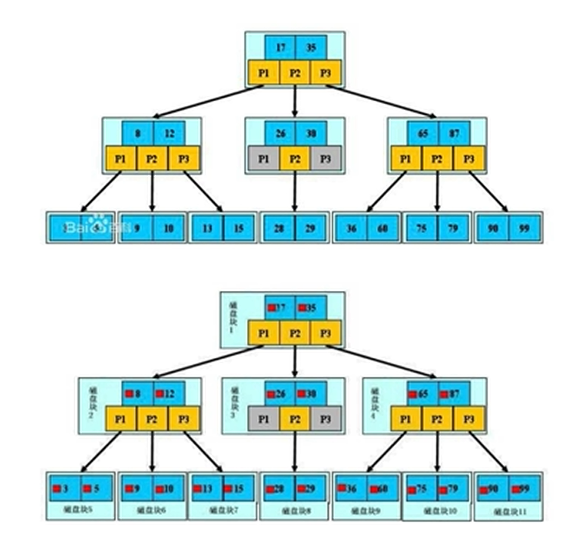


------------------------------------------


## 第五章、算法进阶

### 1. 贪心算法

#### 1.1 贪心算法 - 概念

+ 贪心算法（又称贪婪算法）是指，在对问题求解时，总是做出当前看来是最好的选择。也就是说，不从整体最优上加以考虑，他所做出的是某种意义上的局部最优解
+ 贪心算法并不保证会得到最优解，但是在某些问题上贪心算法的解就是最优解。要会判断一个问题是否用贪心算法来计算

#### 1.2 找零问题

> + 假设商店老板需要找零 n 元钱，钱币的面额有：100元、50元、20元、5元、1元，如何找零使得所需钱币的数量最少？
> 

##### 代码实现

```python
t = [100, 50, 20, 5]


def change(t, n):
    """
    :param t: 面额
    :param n: 金额
    :return: 每个面额的张数
    """
    m = [0 for _ in range(len(t))]
    for i, money in enumerate(t):
        m[i] = n // money
        n = n % money
    return m, n  # 最后n就是找不开的


if __name__ == '__main__':
    print(change(t, 376))  # ([3, 1, 1, 1], 1)

```


-------------------------------------


#### 1.3 背包问题

> + 一个小偷在某个商店发现有 n 个商品，第 i 个商品价值 v~i~ 元，重 w~i~ 千克。他希望拿走的价值尽量高，但他的背包最多只能容纳 W 千克的东西。他应该拿走哪些商品？
>   + 0 - 1 背包：对于一个商品，小偷要么把它完整拿走，要么留下。不能只拿走一部分，或把一个商品拿走多次。（商品为金条）
>   + 分数背包：对于一个商品，小偷可以拿走其中任意一部分。（商品为金砂）
>   
>
> 
> + 举例：
>   + 商品1：v~1~ = 60     w~1~ = 10
>   + 商品2：v~2~ = 100   w~2~ = 20
>   + 商品3：v~3~ = 120   w~3~ = 30
>   + 背包容量：W = 50
> 
> + 对于**0 - 1背包**和**分数背包**，贪心算法是否都能得到最优解？为什么？
>   + **分数背包**可以；**0 - 1背包**不行，要用动态规划
>

##### 1.3.1 分数背包

```python
goods = [(60, 10), (120, 30), (100, 20)]  # 每个商品元组表示(价格, 重量)
goods.sort(key=lambda x: x[0] / x[1], reverse=True)  # key=lambda x 这个是固定函数 用来分析元组第一个内容, reversed=True 降序排序
print(goods)  # [(60, 10), (100, 20), (120, 30)]


def fractional_backpack(goods, w):
    """
    :param goods: 每个商品元组表示(价格, 重量)
    :param w: 背包能装多种
    :return: 总价值, 每个商品拿多少走
    """
    m = [0 for _ in range(len(goods))]  # m表示每个商品拿多少走
    total_v = 0  # 总价值
    for i, (price, weight) in enumerate(goods):
        if w >= weight:
            m[i] = 1
            total_v += price
            w -= weight
        else:
            m[i] = w / weight
            total_v += m[i] * price
            w = 0
            break
    return total_v, m


if __name__ == '__main__':
    print(fractional_backpack(goods, 50))  # (240.0, [1, 1, 0.6666666666666666])

```


--------------------------


#### 1.4 拼接数字问题

> + 有 n 个非负整数， 将其按照字符串拼接的方式拼接为一个整数。如何拼接可以使得得到的整数最大？
>   + 例：32, 94, 128, 1286, 6, 71 可以拼接成的最大整数为 94716321286128
> 


```python
from functools import cmp_to_key

li = [32, 94, 128, 1286, 6, 71]


def xy_cmp(x, y):
    if x + y < y + x:  # 这时他们俩要交换
        return 1
    elif x + y > y + x:
        return -1
    else:
        return 0


def number_join(li):
    li = list(map(str, li))  # 将每个元素转成字符串变成一个新列表
    li.sort(key=cmp_to_key(xy_cmp))
    return "".join(li)


if __name__ == '__main__':
    print(number_join(li))  # 94716321286128

```


----------------------------


#### 1.5 活动选择问题

> + 假设有 n 个活动，这些活动要占用同一片场地，而场地在某时间只能供一个活动使用
> 每个活动都有一个开始时间 s~i~ 和结束时间 f~i~（题目中时间以整数表示），表示活动在 [s~i~, f~i~) 区间占用场地
> 问：安排哪些活动能够使该场地举办的活动的个数最多？
>
> 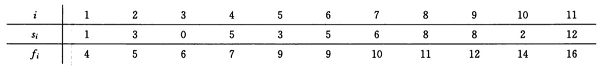
> 


+ 贪心结论：最先结束的活动一定是最优解的一部分
+ 证明：假设 a 是所有活动中最先结束的活动，b 是最优解中最先结束的活动
  + 如果 a = b，结论成立
  + 如果 a != b，则 b 的结束时间一定晚于 a 的结束时间，则此时用 a 替换掉最优解中的 b，啊 一定不与最优解中的其他活动时间重叠，因此替换后的解也是最优解

```python
activities = [(1, 4), (3, 5), (0, 6), (5, 7), (3, 9), (5, 9), (6, 10), (8, 11), (8, 12), (2, 14), (12, 16)]
# 保证活动是按照结束时间排好序的
activities.sort(key=lambda x: x[1])


def activity_selection(a):
    res = [a[0]]
    for i in range(1, len(a)):
        if a[i][0] >= res[-1][1]:  # 当前活动的开始时间小于等于最后一个入选活动的结束时间
            # 不冲突
            res.append(a[i])
    return res


if __name__ == '__main__':
    print(activity_selection(activities))  # [(1, 4), (5, 7), (8, 11), (12, 16)]

```


--------------------------------------


### 2. 动态规划

#### 2.1 从斐波那契数列看动态规划

+ 斐波那契数列：F~n~ = F~n-1~ + F~n-2~
+ 练习：使用**递归**和**非递归**的方法来求解斐波那契数列的第 n 项

```python
def fibnacci(n):
    if n == 1 or n == 2:
        return 1
    else:
        return fibnacci(n - 1) + fibnacci(n - 2)


def fibnacci_no_recurision(n):
    f = [0, 1, 1]
    if n > 2:
        for i in range(n - 2):
            num = f[-1] + f[-2]
            f.append(num)
    return f[n]


if __name__ == '__main__':
    print(fibnacci(10))  # 55
    print(fibnacci_no_recurision(100))  # 354224848179261915075

```


+ 会发现递归的执行效率慢，为什么执行效率慢呢？
  + 因为子问题的重复计算
  + 非递归的做法可以理解为一种动态规划（DP）的思想


+ 动态规划思想
  + 最优子结构（递推式）
  + 重复子问题


------------------------------------


#### 2.2 钢条切割问题

> + 某公司出售钢条，出售价格与钢条长度之间的关系如下表：
> 
> 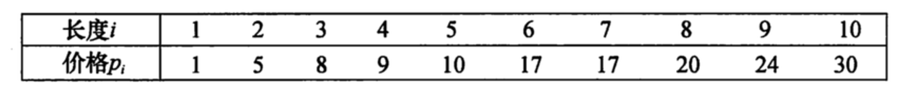
> 
> + 问题：现有一段长度为 n 的钢条和上面的价格表，求切割钢条方案，使得总收益最大化
> 


举例：
+ 长度为4的钢条的所有切割方案如下：（c 方案最优）

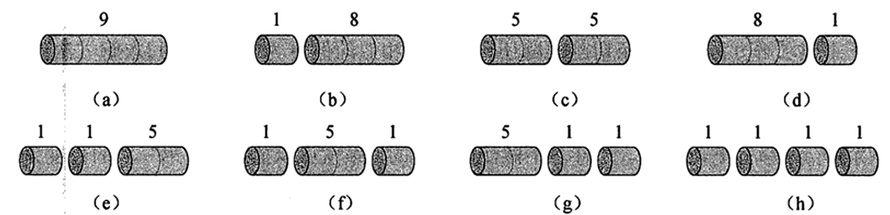

+ 思考：长度为 n 的钢条的不同切割方案有几种？
  + 2的 n - 1 次方种

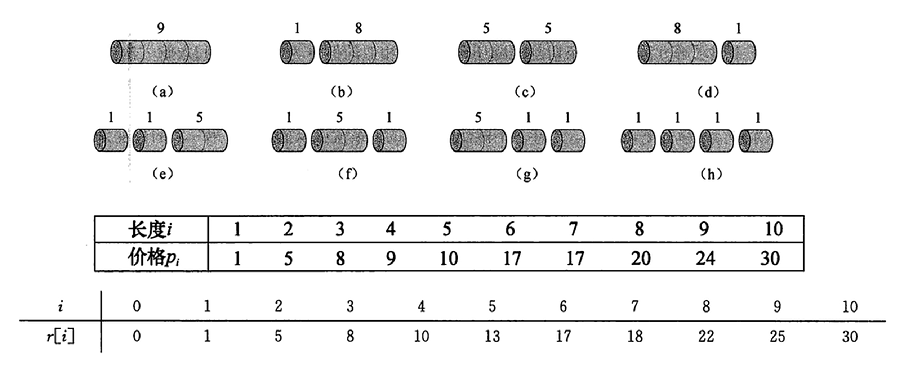

r[i] 是最优解的总收益


##### 2.2.1 钢条切割问题 - 递推式

+ 设长度为 n 的钢条切割后最优收益值为 r~n~，可以得出递推式：
  + r~n~ = max(p~n~, r~1~ + r~n-1~, r~2~ + r~n-2~, ..., r~n-1~ + r~1~)

+ 第一个参数 p~n~ 表示不切割
+ 其他 n-1 个参数分别表示另外 n-1 种不同切割方案，对方案 i = 1, 2, ..., n-1
  + 将钢条切割为长度为 i 和 n - i 两端
  + 方案 i 的收益为切割两段的最优收益之和

+ 考察所有的 i，选择其中收益最大的方案

##### 2.2.2 钢条切割问题 - 最优子结构

+ 可以将求解规模为 n 的原问题，划分为规模更小的子问题：完成一次切割后，可以将产生的两段钢条看成两个独立的钢条切割问题
+ 组合两个子问题的最优解，并在所有可能的两段切割方案中选取组合收益最大的，构成原问题的最优解
+ 钢条满足**最优子结构**：问题的最优解由相关子问题的最优解组合而成，这些子问题可以独立求解


+ 钢条切割问题还存在更简单的递归求解方法
  + 从钢条的左边切割下长度为 i 的一段，只对右边剩下的一段继续进行切割，左边的不再切割
  + 递推式简化为：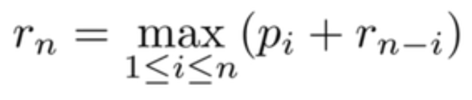

  + 不做切割的方案就可以描述为：左边一段长度为 n，收益为 p~n~，剩余一段长度为0，收益为 r~0~ = 0


##### 2.2.3 钢条切割问题 - 自顶向下递归实现

```python
import time


def cal_time(func):
    # 装饰器（算时间）
    def wrapper(*args, **kwargs):
        t1 = time.time()
        result = func(*args, **kwargs)
        t2 = time.time()
        print("%s running time: %s secs." % (func.__name__, t2 - t1))
        return result
    return wrapper


# p = [0, 1, 5, 8, 9, 10, 17, 17, 20, 21, 23, 24, 26, 27, 27, 28, 30, 33, 36, 39, 40]  # 价格表
p = [0, 1, 5, 8, 9, 10, 17, 17, 20, 24, 30]


def cut_rod_recurision_1(p, n):
    if n == 0:
        return 0
    else:
        res = p[n]
        for i in range(1, n):
            res = max(res, cut_rod_recurision_1(p, i) + cut_rod_recurision_1(p, n - i))
        return res


@cal_time
def c1(p, n):
    return cut_rod_recurision_1(p, n)


def cut_rod_recurision_2(p, n):
    if n == 0:
        return 0
    else:
        res = 0
        for i in range(1, n + 1):
            res = max(res, p[i] + cut_rod_recurision_2(p, n - i))
        return res


@cal_time
def c2(p, n):
    return cut_rod_recurision_2(p, n)


if __name__ == '__main__':
    print(c1(p, 9))
    print(c2(p, 9))

```


+ 为何自顶向下递归实现的效率会这么差？
  + 时间复杂度 **O(2^n^)**

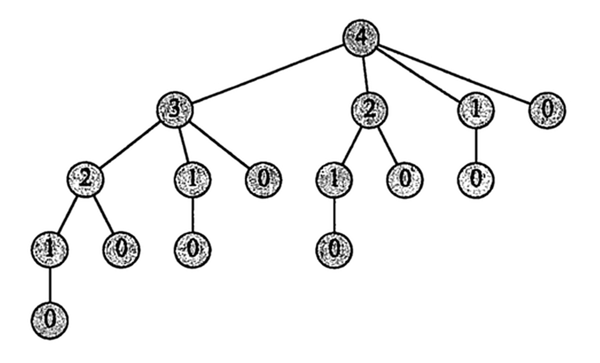


---------------------------------


##### 2.2.4 钢条切割问题 - 动态规划解法（自底向上实现）

+ 递归算法由于重复求解相同的子问题，效率极低
+ 动态规划的思想：
  + 每个子问题只求解一次，保存求解结果
  + 之后需要此问题是，只需查找保存的结果

```python
import time


def cal_time(func):
    # 装饰器（算时间）
    def wrapper(*args, **kwargs):
        t1 = time.time()
        result = func(*args, **kwargs)
        t2 = time.time()
        print("%s running time: %s secs." % (func.__name__, t2 - t1))
        return result

    return wrapper


p = [0, 1, 5, 8, 9, 10, 17, 17, 20, 21, 23, 24, 26, 27, 27, 28, 30, 33, 36, 39, 40]  # 价格表
# p = [0, 1, 5, 8, 9, 10, 17, 17, 20, 24, 30]


@cal_time
def cut_rod_dp(p, n):
    r = [0]  # 每种长度钢条最优总收益
    for i in range(1, n + 1):
        res = 0
        for j in range(1, i + 1):
            res = max(res, p[j] + r[i - j])
        r.append(res)
    return r[n]


if __name__ == '__main__':
    print(cut_rod_dp(p, 15))

```


+ 时间复杂度：**O(n^2^)**

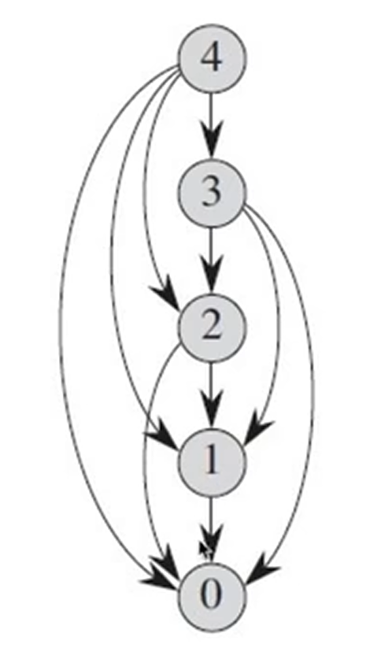


----------------------


##### 2.2.5 钢条切割问题 - 重构解

+ 如何修改动态规划算法，使其不仅输出最优解，还输出最优切割方案？
  + 对于每个子问题，保存切割一次时左边切下的长度

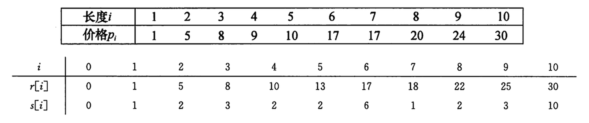

```python
import time


def cal_time(func):
    # 装饰器（算时间）
    def wrapper(*args, **kwargs):
        t1 = time.time()
        result = func(*args, **kwargs)
        t2 = time.time()
        print("%s running time: %s secs." % (func.__name__, t2 - t1))
        return result

    return wrapper


p = [0, 1, 5, 8, 9, 10, 17, 17, 20, 21, 23, 24, 26, 27, 27, 28, 30, 33, 36, 39, 40]  # 价格表
# p = [0, 1, 5, 8, 9, 10, 17, 17, 20, 24, 30]


def cut_rod_extend(p, n):
    r = [0]  # 每种长度钢条最优总收益
    s = [0]  # 每种长度钢条最优方案中切的最小的长度
    for i in range(1, n + 1):
        res_r = 0  # 价格的最大值
        res_s = 0  # 价格最大值对应方案的左边不切割部分的长度
        for j in range(1, i + 1):
            if p[j] + r[i - j] > res_r:
                res_r = p[j] + r[i - j]
                res_s = j
        r.append(res_r)
        s.append(res_s)
    return r[n], s


def cut_rod_solution(p, n):
    r, s = cut_rod_extend(p, n)
    ans = []
    while n > 0:
        ans.append(s[n])
        n -= s[n]
    return ans


if __name__ == '__main__':
    print(cut_rod_solution(p, 20))  # [2, 6, 6, 6]

```


---------------------------------


#### 2.3 动态规划问题关键特征

+ 什么问题可以使用动态规划方法？
  + **最优子结构**
    + 原问题的最优解中涉及多少个子问题
    + 在确定最优解使用哪些子问题时，需要考虑多少种选择

+ **重叠子问题**


--------------------------------------


#### 2.4 最长公共子序列

> + 一个序列的子序列是在该序列中删去若干元素后得到的序列
>   + 例："ABCD" 和 "BDF" 都是 "ABCDEFG" 的子序列
>
> + 最长公共子序列（LGS）问题：给定两个序列 X 和 Y，求 X 和 Y 长度最大的公共子序列
>   + 例：X = "ABBCBDE"   Y = "DBBCDB"   LCS(X, Y) = "BBCD"
>
> + 应用场景：字符串相似度对比
> 

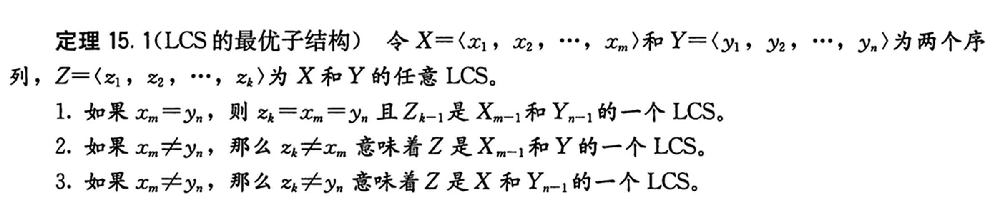

+ 最优解的递推式：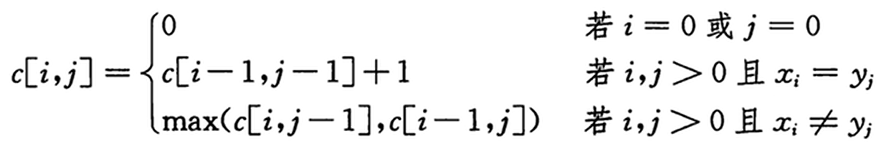
  + c[i, j] 表示 X~i~ 和 Y~j~ 的 LCS 长度

+ 例如：要求 a = "ABCBDAB" 与 b = "BDCABA" 的 LCS
  + 由于最后一位 "B" != "A"
    + 因此 LCS(a, b) 应该来源于 LCS(a[:-1], b) 与 LCS(a, b[:-1]) 中更大的那一个

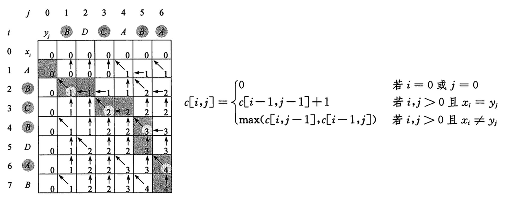


##### 代码实现

```python
def lcs_length(x, y):
    m = len(x)
    n = len(y)
    c = [[0 for _ in range(n + 1)] for _ in range(m + 1)]  # 构建一个m+1行n+1列的二维列表
    for i in range(1, m + 1):
        for j in range(1, n + 1):
            if x[i - 1] == y[j - 1]:  # i和j位置上字符匹配的时候，来自于左上方+1
                c[i][j] = c[i - 1][j - 1] + 1
            else:
                c[i][j] = max(c[i - 1][j], c[i][j - 1])
    for _ in c:
        print(_)
    return c[m][n]


def lcs(x, y):
    m = len(x)
    n = len(y)
    c = [[0 for _ in range(n + 1)] for _ in range(m + 1)]
    b = [[0 for _ in range(n + 1)] for _ in range(m + 1)]  # 1：左上方 2：上方 3：左方
    for i in range(1, m + 1):
        for j in range(1, n + 1):
            if x[i - 1] == y[j - 1]:  # i和j位置上字符匹配的时候，来自于左上方+1
                c[i][j] = c[i - 1][j - 1] + 1
                b[i][j] = 1  # "⬅"
            elif c[i - 1][j] > c[i][j - 1]:  # 来自于上方
                c[i][j] = c[i - 1][j]
                b[i][j] = 2  # "⬆"
            else:
                c[i][j] = c[i][j - 1]
                b[i][j] = 3  # "↖"
    return c[m][n], b


def lcs_trackback(x, y):
    c, b = lcs(x, y)
    i = len(x)
    j = len(y)
    res = []
    while i > 0 and j > 0:
        if b[i][j] == 1:  # 来自左上方 => 匹配
            res.append(x[i - 1])
            i -= 1
            j -= 1
        elif b[i][j] == 2:  # 来自于上方 => 不匹配
            i -= 1  # 向上走
        else:  # 来自于左方 => 不匹配
            j -= 1  # 向上走
    return "".join(reversed(res))


if __name__ == '__main__':
    print(lcs_length("ABCBDAB", "BDCABA"))

    c, b = lcs("ABCDAB", "BDCABA")
    for _ in b:
        print(_)

    print(lcs_trackback("ABCBDAB", "BDCABA"))  # BDAB

```


--------------------------------------


### 3. 欧几里得算法

#### 最大公约数

+ 约数：如果整数 a 能被整数 b 整除，那么 a 叫做 b 的倍数，b 叫做 a 的约数
+ 给定两个整数 a、b，两个数的所有公共约数中的最大值即为最大公约数（Greatest Common Divisor, GCD）
+ 例：12与16的最大公约数是4


+ 如何计算两个数的最大公约数
  + 欧几里得：**辗转相除法（欧几里得算法）**
  + 《九章算术》：更相减损术


##### 最大公约数 - 欧几里得算法

+ 欧几里得算法：gcd(a, b) = gcd(b, a mod b)
  + 例：gcd(60, 21) = gcd(21, 18) = gcd(18, 3) = gcd(3, 0) = 3

```python
def gcd(a, b):
    if b == 0:
        return a
    else:
        return gcd(b, a % b)


def gcd2(a, b):
    while b > 0:
        r = a % b
        a = b
        b = r
    return a


if __name__ == '__main__':
    print(gcd(12, 16))
    print(gcd2(12, 16))

```


##### 应用：实现分数计算

> + 利用欧几里得算法实现一个分数类，支持分数的四则运算
> 

```python
class Fraction:
    def __init__(self, a, b):
        self.a = a
        self.b = b
        x = self.gcd(a, b)
        self.a /= x
        self.b /= x

    def gcd(self, a, b):
        while b > 0:
            r = a % b
            a = b
            b = r
        return a

    def zgs(self, a, b):
        x = self.gcd(a, b)
        return a * b / x

    def __add__(self, other):
        a = self.a
        b = self.b
        c = other.a
        d = other.b
        fenmu = self.zgs(b, d)
        fenzi = a * fenmu / b + c * fenmu / d
        return Fraction(fenzi, fenmu)

    def __str__(self):
        return "%d/%d" % (self.a, self.b)


if __name__ == '__main__':
    f = Fraction(30, 16)
    print(f)  # 15/8
    a = Fraction(1, 3)
    b = Fraction(1, 2)
    print(a + b)  # 5/6

```


----------------------------------


### 4. RSA 加密算法简介

#### 4.1 密码与加密

+ 传统密码：加密算法是秘密的
+ 现代密码系统：加密算法是公开的，密钥是秘密的
  + 对称加密
  + 非对称密码


#### 4.2 RSA 加密算法

+ RSA 非对称加密系统
  + 公钥：用来加密的，是公开的
  + 私钥：用来解密，是私有的

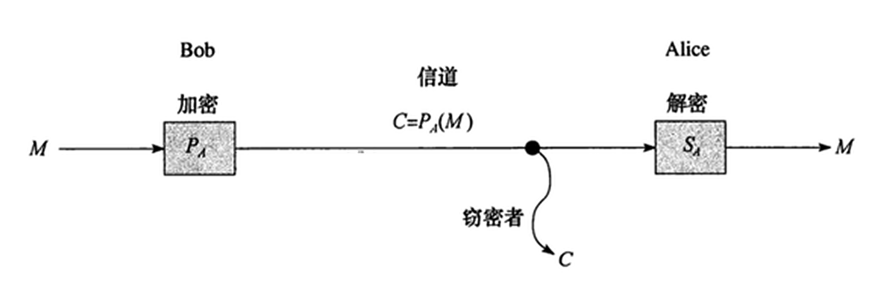


#### 4.3 RSA 加密算法过程

+ 1. 随机选取两个质数 p 和 q
+ 2. 计算 n = pq
+ 3. 选取一个与 φ(n) 互质的小奇数 e，φ(n) = (p - 1)(q - 1)
+ 4. 对模 φ(n)，计算 e 的乘法逆元 d，即满足 (e * d) mod φ(n) = 1
+ 5. 公钥 (e, n)	私钥 (d, n)


+ 加密过程：c = (m ^ e) mod n
+ 解密过程：m = (c ^ d) mod n